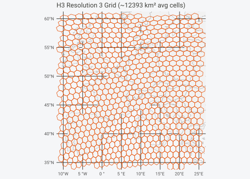
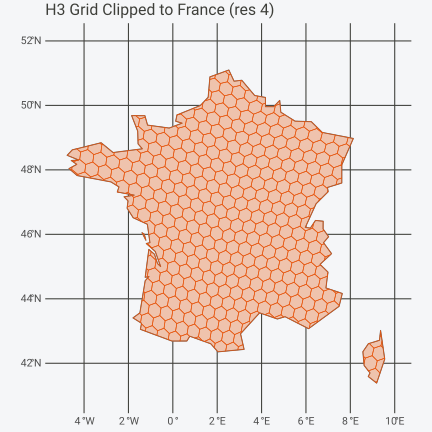
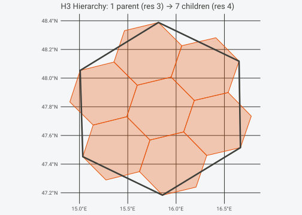
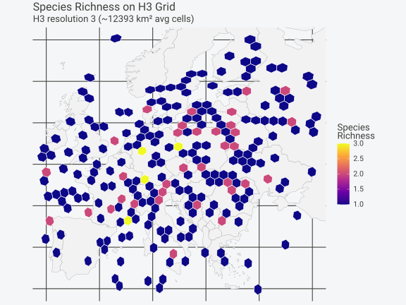

# H3 Grid Support

hexify v0.5.0 adds [H3](https://h3geo.org/) as a first-class grid type
alongside ISEA. Every core function
([`hexify()`](https://gillescolling.com/hexify/reference/hexify.md),
[`grid_rect()`](https://gillescolling.com/hexify/reference/grid_rect.md),
[`grid_clip()`](https://gillescolling.com/hexify/reference/grid_clip.md),
[`get_parent()`](https://gillescolling.com/hexify/reference/get_parent.md),
[`get_children()`](https://gillescolling.com/hexify/reference/get_children.md))
works with both grid systems through the same interface.

## What is H3?

H3 is a hierarchical hexagonal grid system developed by Uber. It
partitions Earth’s surface into hexagonal cells at 16 resolutions
(0–15), each roughly 7$`\times`$ finer than the last. Cell IDs are
64-bit integers encoded as hexadecimal strings (e.g.,
`"8528342bfffffff"`).

H3 is widely adopted: the FCC uses it for broadband mapping, Foursquare
for POI analytics, and DuckDB/BigQuery both have native H3 extensions.

**Key difference from ISEA**: H3 cells are *not* equal-area. Hexagon
area varies by about a factor of 2 between the largest and smallest cell
at any given resolution, and by about 2.4 once the twelve pentagons are
counted. The variation follows position on the icosahedron rather than
latitude: at resolution 3 the hexagons within 5 degrees of a face centre
average 9308 km$`^2`$, against 12406 km$`^2`$ for those more than 30
degrees away. For rigorous equal-area analysis, use ISEA. For
interoperability with H3 ecosystems, use `type = "h3"`.

## Getting Started

Create an H3 grid by passing `type = "h3"` to
[`hex_grid()`](https://gillescolling.com/hexify/reference/hex_grid.md):

``` r

library(sf)
#> Linking to GEOS 3.14.1, GDAL 3.12.1, PROJ 9.7.1; sf_use_s2() is TRUE
library(ggplot2)

# Create an H3 grid specification
grid_h3 <- hex_grid(resolution = 5, type = "h3")
#> H3 cells are not exactly equal-area; hexagon area varies ~2x within a resolution.
#> This message is displayed once per session.
grid_h3
#> HexGridInfo Specification [H3]
#> -------------------------------
#> Grid Type:   H3 (Uber)
#> Resolution:  5
#> Avg Area:    252.9040 km^2 (varies by location)
#> Avg Diagonal:17.09 km
#> CRS:         EPSG:4326
#> Total Cells: 2016842
#> Note: H3 cells are NOT exactly equal-area
```

Then use
[`hexify()`](https://gillescolling.com/hexify/reference/hexify.md) with
the grid object, just like ISEA:

``` r

# Sample cities
cities <- data.frame(
  name = c("Vienna", "Paris", "Madrid", "Berlin", "Rome",
           "London", "Prague", "Warsaw", "Budapest", "Amsterdam"),
  lon = c(16.37, 2.35, -3.70, 13.40, 12.50,
          -0.12, 14.42, 21.01, 19.04, 4.90),
  lat = c(48.21, 48.86, 40.42, 52.52, 41.90,
          51.51, 50.08, 52.23, 47.50, 52.37)
)

result <- hexify(cities, lon = "lon", lat = "lat", grid = grid_h3)
result
#> HexData Object
#> --------------
#> Rows:    10
#> Columns: 3
#> Cells:   10 unique
#> Type:    data.frame
#> 
#> Grid:
#>   H3 Resolution 5 (~252.9040 km^2 avg)
#> 
#> Columns: name, lon, lat 
#> 
#> Data preview (with cell assignments):
#>    name   lon   lat         cell_id
#>  Vienna 16.37 48.21 851e15b7fffffff
#>   Paris  2.35 48.86 851fb467fffffff
#>  Madrid -3.70 40.42 85390ca3fffffff
#> ... with 7 more rows
```

H3 cell IDs are character strings, unlike ISEA’s numeric IDs:

``` r

# Cell IDs are hexadecimal strings
result@cell_id
#>  [1] "851e15b7fffffff" "851fb467fffffff" "85390ca3fffffff" "851f1d4bfffffff"
#>  [5] "851e8053fffffff" "85194ad3fffffff" "851e3543fffffff" "851f53cbfffffff"
#>  [9] "851e037bfffffff" "85196953fffffff"

# All standard accessors work
cells(result)
#>  [1] "851e15b7fffffff" "851fb467fffffff" "85390ca3fffffff" "851f1d4bfffffff"
#>  [5] "851e8053fffffff" "85194ad3fffffff" "851e3543fffffff" "851f53cbfffffff"
#>  [9] "851e037bfffffff" "85196953fffffff"
n_cells(result)
#> [1] 10
```

### Choosing Resolution by Area

If you think in terms of cell area rather than resolution numbers, pass
`area_km2` instead of `resolution`. hexify picks the closest H3
resolution:

``` r

grid_area <- hex_grid(area_km2 = 500, type = "h3")
#> Warning in hex_grid(area_km2 = 500, type = "h3"): H3 cells are not exactly
#> equal-area. Closest resolution 5 has average area ~252.904 km^2 (requested
#> 500.000 km^2)
grid_area
#> HexGridInfo Specification [H3]
#> -------------------------------
#> Grid Type:   H3 (Uber)
#> Resolution:  5
#> Avg Area:    252.9040 km^2 (varies by location)
#> Avg Diagonal:17.09 km
#> CRS:         EPSG:4326
#> Total Cells: 2016842
#> Note: H3 cells are NOT exactly equal-area
```

## Grid Generation

All grid generation functions work with H3 grids.

### Rectangular Region

``` r

# Generate H3 hexagons over Western Europe
grid_h3 <- hex_grid(resolution = 3, type = "h3")
europe_h3 <- grid_rect(c(-10, 35, 25, 60), grid_h3)

# Basemap
europe <- hexify_world[hexify_world$continent == "Europe", ]

ggplot() +
  geom_sf(data = europe, fill = "gray95", color = "gray60") +
  geom_sf(data = europe_h3, fill = NA, color = "#E6550D", linewidth = 0.4) +
  coord_sf(xlim = c(-10, 25), ylim = c(35, 60)) +
  labs(title = sprintf("H3 Resolution %d Grid", grid_h3@resolution),
       subtitle = sprintf("~%.0f km² average cell", grid_h3@area_km2)) +
  theme_minimal(base_size = FIG_BASE_SIZE)
```



### Clipping to a Boundary

``` r

# Clip H3 grid to France
france <- hexify_world[hexify_world$name == "France", ]
grid_h3 <- hex_grid(resolution = 4, type = "h3")
france_h3 <- grid_clip(france, grid_h3)
#> Spherical geometry (s2) switched off
#> although coordinates are longitude/latitude, st_intersection assumes that they
#> are planar
#> Spherical geometry (s2) switched on

ggplot() +
  geom_sf(data = france, fill = "gray95", color = "gray40", linewidth = 0.5) +
  geom_sf(data = france_h3, fill = alpha("#E6550D", 0.3),
          color = "#E6550D", linewidth = 0.3) +
  coord_sf(xlim = c(-5, 10), ylim = c(41, 52)) +
  labs(title = sprintf("H3 Grid Clipped to France (res %d)", grid_h3@resolution)) +
  theme_minimal(base_size = FIG_BASE_SIZE)
```



## Hierarchical Navigation

H3’s killer feature is its clean hierarchical structure: every cell has
exactly one parent and seven children. hexify exposes this with
[`get_parent()`](https://gillescolling.com/hexify/reference/get_parent.md)
and
[`get_children()`](https://gillescolling.com/hexify/reference/get_children.md).

### Parents

``` r

# Get parent cells (one resolution coarser)
grid_h3 <- hex_grid(resolution = 5, type = "h3")
child_ids <- lonlat_to_cell(
  lon = c(16.37, 2.35, 13.40),
  lat = c(48.21, 48.86, 52.52),
  grid = grid_h3
)

parent_ids <- get_parent(child_ids, grid_h3, levels = 1)
data.frame(child = child_ids, parent = parent_ids)
#>             child          parent
#> 1 851e15b7fffffff 841e15bffffffff
#> 2 851fb467fffffff 841fb47ffffffff
#> 3 851f1d4bfffffff 841f1d5ffffffff
```

### Children

``` r

# Get children of a single cell (one resolution finer)
grid_coarse <- hex_grid(resolution = 3, type = "h3")
coarse_id <- lonlat_to_cell(16.37, 48.21, grid_coarse)

children <- get_children(coarse_id, grid_coarse, levels = 1)
cat(length(children[[1]]), "children at resolution", grid_coarse@resolution + 1, "\n")
#> 7 children at resolution 4
head(children[[1]])
#> [1] "841e151ffffffff" "841e153ffffffff" "841e155ffffffff" "841e157ffffffff"
#> [5] "841e159ffffffff" "841e15bffffffff"
```

### Visualizing the Hierarchy

``` r

# Parent cell polygon
parent_poly <- cell_to_sf(coarse_id, grid_coarse)

# Children cell polygons
grid_fine <- hex_grid(resolution = 4, type = "h3")
children_poly <- cell_to_sf(children[[1]], grid_fine)

ggplot() +
  geom_sf(data = children_poly, fill = alpha("#E6550D", 0.3),
          color = "#E6550D", linewidth = 0.5) +
  geom_sf(data = parent_poly, fill = NA, color = "black", linewidth = 1.2) +
  labs(title = sprintf("H3 Hierarchy: 1 parent (res %d)", grid_coarse@resolution),
       subtitle = sprintf("%d children (res %d)",
                          length(children[[1]]), grid_fine@resolution)) +
  theme_minimal(base_size = FIG_BASE_SIZE)
```



## Working with H3 Data

The same hexify workflow applies. Species observations across Europe,
aggregated into H3 cells:

``` r

set.seed(42)

# Simulate observations across Europe
obs <- data.frame(
  lon = c(rnorm(200, 10, 12), rnorm(100, 25, 8)),
  lat = c(rnorm(200, 48, 6), rnorm(100, 55, 4)),
  species = sample(c("Sp. A", "Sp. B", "Sp. C"), 300, replace = TRUE)
)
obs$lon <- pmax(-10, pmin(40, obs$lon))
obs$lat <- pmax(35, pmin(65, obs$lat))

# Hexify with H3
grid_h3 <- hex_grid(resolution = 3, type = "h3")
obs_hex <- hexify(obs, lon = "lon", lat = "lat", grid = grid_h3)

# Aggregate: species richness per cell
obs_df <- as.data.frame(obs_hex)
obs_df$cell_id <- obs_hex@cell_id

richness <- aggregate(species ~ cell_id, data = obs_df,
                      FUN = function(x) length(unique(x)))
names(richness)[2] <- "n_species"

# Map it
polys <- cell_to_sf(richness$cell_id, grid_h3)
polys <- merge(polys, richness, by = "cell_id")

europe <- hexify_world[hexify_world$continent == "Europe", ]

ggplot() +
  geom_sf(data = europe, fill = "gray95", color = "gray70", linewidth = 0.2) +
  geom_sf(data = polys, aes(fill = n_species), color = "white", linewidth = 0.3) +
  scale_fill_viridis_c(option = "plasma", name = "Species\nRichness") +
  coord_sf(xlim = c(-10, 40), ylim = c(35, 65)) +
  labs(title = "Species Richness on H3 Grid",
       subtitle = sprintf("H3 resolution %d (~%.0f km² avg cells)",
                          grid_h3@resolution, grid_h3@area_km2)) +
  theme_minimal(base_size = FIG_BASE_SIZE) +
  theme(axis.text = element_blank(), axis.ticks = element_blank())
```



## ISEA–H3 Crosswalk

[`h3_crosswalk()`](https://gillescolling.com/hexify/reference/h3_crosswalk.md)
(v0.6.0) maps between ISEA and H3 cell IDs in both directions. If you
run your analysis on ISEA but collaborators expect H3 cell IDs, this
bridges the two.

``` r

# Start with an ISEA grid and some cells
grid_isea <- hex_grid(resolution = 9, aperture = 3)
isea_ids <- lonlat_to_cell(
  lon = c(16.37, 2.35, 13.40, -3.70, 12.50),
  lat = c(48.21, 48.86, 52.52, 40.42, 41.90),
  grid = grid_isea
)

# Map ISEA cells to their closest H3 equivalents
xw <- h3_crosswalk(isea_ids, grid_isea)
xw[, c("isea_cell_id", "h3_cell_id", "isea_area_km2", "h3_area_km2")]
#>   isea_cell_id      h3_cell_id isea_area_km2 h3_area_km2
#> 1        42280 841e15bffffffff      2591.375    1753.173
#> 2        39597 841fb43ffffffff      2591.375    1569.204
#> 3        40823 841f1d5ffffffff      2591.375    1570.136
#> 4        39585 84390cbffffffff      2591.375    1819.493
#> 5        42516 841e80dffffffff      2591.375    1885.191
```

The `area_ratio` column shows how ISEA and H3 cell sizes compare; values
close to 1 mean the resolutions are well-matched.

## ISEA vs H3: When to Use Which

|  | ISEA | H3 |
|----|----|----|
| **Cell area** | Exactly equal | ~2$`\times`$ variation (~2.4$`\times`$ with pentagons) |
| **Cell IDs** | Numeric (integer) | Character (hex string) |
| **Apertures** | 3, 4, 7, 4/3 | Fixed (7) |
| **Resolutions** | 0–30 | 0–15 |
| **Hierarchy** | Approximate (aperture-dependent) | Exact (7 children per parent) |
| **Dependencies** | None (built-in C++) | None (vendored H3 C library) |
| **Industry adoption** | Scientific / government | Tech industry / commercial |

**Use ISEA when**:

- Equal-area cells are required (biodiversity surveys, density
  estimation, statistical sampling)

- You need fine control over aperture and resolution

- No external dependencies are acceptable

**Use H3 when**:

- Interoperability with H3 ecosystems (Uber, Foursquare, DuckDB,
  BigQuery)

- Clean hierarchical operations (parent/child traversal) are a priority

- Slight area variation across latitudes is acceptable for your analysis

## Resolution Reference

``` r

h3_res <- hexify_compare_resolutions(type = "h3", res_range = 0:15)
h3_res$n_cells_fmt <- ifelse(
  h3_res$n_cells > 1e9,
  sprintf("%.1fB", h3_res$n_cells / 1e9),
  ifelse(h3_res$n_cells > 1e6,
         sprintf("%.1fM", h3_res$n_cells / 1e6),
         ifelse(h3_res$n_cells > 1e3,
                sprintf("%.1fK", h3_res$n_cells / 1e3),
                as.character(h3_res$n_cells)))
)
# Use scientific notation for tiny areas, fixed for larger ones
h3_res$area_fmt <- ifelse(
  h3_res$cell_area_km2 < 0.1,
  formatC(h3_res$cell_area_km2, format = "e", digits = 1),
  formatC(h3_res$cell_area_km2, format = "f", digits = 1, big.mark = ",")
)
h3_res$spacing_fmt <- ifelse(
  h3_res$cell_spacing_km < 0.1,
  formatC(h3_res$cell_spacing_km, format = "e", digits = 1),
  formatC(h3_res$cell_spacing_km, format = "f", digits = 1)
)
knitr::kable(
  h3_res[, c("resolution", "n_cells_fmt", "area_fmt", "spacing_fmt")],
  col.names = c("Resolution", "# Cells", "Avg Area (km\u00b2)", "Spacing (km)"),
  align = c("r", "r", "r", "r")
)
```

| Resolution |  \# Cells | Avg Area (km²) | Spacing (km) |
|-----------:|----------:|---------------:|-------------:|
|          0 |       122 |    4,357,449.4 |       2243.1 |
|          1 |       842 |      609,788.4 |        839.1 |
|          2 |      5.9K |       86,801.8 |        316.6 |
|          3 |     41.2K |       12,393.4 |        119.6 |
|          4 |    288.1K |        1,770.3 |         45.2 |
|          5 |      2.0M |          252.9 |         17.1 |
|          6 |     14.1M |           36.1 |          6.5 |
|          7 |     98.8M |            5.2 |          2.4 |
|          8 |    691.8M |            0.7 |          0.9 |
|          9 |      4.8B |            0.1 |          0.3 |
|         10 |     33.9B |        1.5e-02 |          0.1 |
|         11 |    237.3B |        2.2e-03 |      5.0e-02 |
|         12 |   1661.0B |        3.1e-04 |      1.9e-02 |
|         13 |  11626.7B |        4.4e-05 |      7.1e-03 |
|         14 |  81386.8B |        6.3e-06 |      2.7e-03 |
|         15 | 569707.4B |        9.0e-07 |      1.0e-03 |

## See Also

- [`vignette("quickstart")`](https://gillescolling.com/hexify/articles/quickstart.md) -
  Getting started with hexify (ISEA-focused)

- [`vignette("workflows")`](https://gillescolling.com/hexify/articles/workflows.md) -
  Grid generation, multi-resolution analysis, GIS export

- [`vignette("visualization")`](https://gillescolling.com/hexify/articles/visualization.md) -
  Plotting with
  [`plot()`](https://rdrr.io/r/graphics/plot.default.html),
  [`hexify_heatmap()`](https://gillescolling.com/hexify/reference/hexify_heatmap.md)

- [`vignette("theory")`](https://gillescolling.com/hexify/articles/theory.md) -
  Mathematical foundations of the ISEA projection
