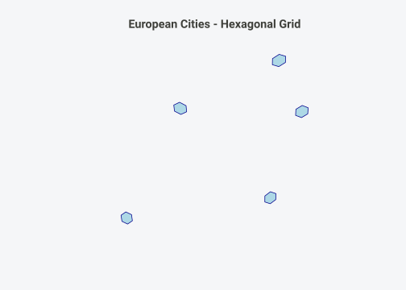
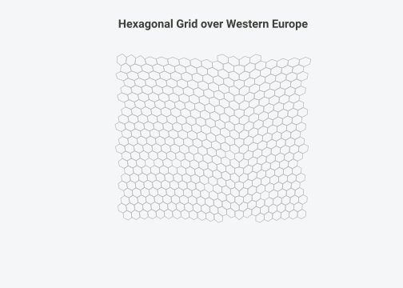
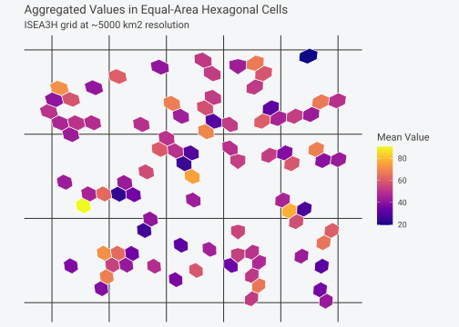

# Quick Start

## Spatial Analysis Done Right

You want to do spatial statistics, and it involves binning points into
grid cells.

**The problem with rectangular grids**: Using a rectangular grid (like a
standard lat-long grid) introduces distortions. At the equator, a 1
degree cell covers about 12,300 km2. Near the poles, the same 1 degree
cell covers a tiny fraction of that area. This breaks any analysis that
assumes equal sampling effort or comparable cell sizes.

**The solution**: Discrete global grids partition Earths surface into
cells of **equal area**, regardless of latitude. hexify implements the
ISEA (Icosahedral Snyder Equal Area) projection, providing hexagonal
cells that are all the same size from the equator to the Arctic.

### Why Equal-Area Matters

``` r

# Same-sized cells at different latitudes
test_points <- data.frame(
  location = c("Equator", "Mid-latitude", "Arctic"),
  lon = c(0, 0, 0),
  lat = c(0, 45, 70)
)

result <- hexify(test_points, lon = "lon", lat = "lat", area = 1000)

# All cells have the same area, regardless of latitude
result[, c("location", "lat", "hex_area")]
#>       location lat hex_area
#> 1      Equator   0 863.7977
#> 2 Mid-latitude  45 863.7977
#> 3       Arctic  70 863.7977
```

With hexify, a 1000 km2 cell at the equator is the same size as a 1000
km2 cell in Norway.

## Installation

``` r

# Install from GitHub
remotes::install_github("gcol33/hexify")
```

**Suggested packages** (for extended functionality):

- `sf`: Spatial data handling, CRS transformations
- `dggridR`: Polygon generation, full DGGRID functionality

## What hexify Does

hexify assigns geographic coordinates to equal-area hexagonal grid cells
using the ISEA (Icosahedral Snyder Equal Area) discrete global grid
system. Supports apertures 3, 4, 7, and mixed 4/3:

- **Aperture 3** (ISEA3H): Default, compatible with dggridR
- **Aperture 4** (ISEA4H): Faster cell count growth per resolution
- **Aperture 7** (ISEA7H): Densest grid per resolution level
- **Aperture “4/3”** (ISEA43H): Mixed aperture (4 then 3)

Given a data frame with longitude/latitude columns,
[`hexify()`](https://gcol33.github.io/hexify/reference/hexify.md)
returns:

- `hex_id`: Unique cell identifier (integer cell ID)
- `hex_cen_lon`: Cell center longitude
- `hex_cen_lat`: Cell center latitude
- `hex_area`: Actual cell area in km²
- `hex_diag`: Actual cell diagonal in km

## Quick Examples

### Basic Usage

``` r

# Sample data: European cities
cities <- data.frame(
  name = c("Vienna", "Paris", "Madrid", "Berlin", "Rome"),
  lon = c(16.37, 2.35, -3.70, 13.40, 12.50),
  lat = c(48.21, 48.86, 40.42, 52.52, 41.90)
)

# Assign to ~1000 km² hexagonal cells
result <- hexify(cities, lon = "lon", lat = "lat", area = 1000)
result
#>     name   lon   lat hex_id hex_cen_lon hex_cen_lat hex_area hex_diag
#> 1 Vienna 16.37 48.21 126594   16.420390    48.28766 863.7977 31.58208
#> 2  Paris  2.35 48.86 118788    2.385556    48.96232 863.7977 31.58208
#> 3 Madrid -3.70 40.42 118752   -3.582199    40.52264 863.7977 31.58208
#> 4 Berlin 13.40 52.52 122466   13.448955    52.65189 863.7977 31.58208
#> 5   Rome 12.50 41.90 127788   12.674254    41.87485 863.7977 31.58208
```

### Using Diagonal Instead of Area

Specify the long diagonal of hexagons in kilometers:

``` r

# 50 km diagonal (long diagonal)
result <- hexify(cities, lon = "lon", lat = "lat", diagonal = 50)
result[, c("name", "hex_id")]
#>     name hex_id
#> 1 Vienna  42280
#> 2  Paris  39597
#> 3 Madrid  39585
#> 4 Berlin  40823
#> 5   Rome  42516
```

### With sf Objects

``` r

library(sf)
#> Linking to GEOS 3.13.1, GDAL 3.11.0, PROJ 9.6.0; sf_use_s2() is TRUE

# Create sf object (any CRS works)
pts <- st_as_sf(cities, coords = c("lon", "lat"), crs = 4326)

# hexify handles CRS transformation automatically
result_sf <- hexify(pts, area = 1000)

# sf class is preserved
class(result_sf)
#> [1] "sf"         "data.frame"
```

## Grid Specification

### Area-Based

Specify target cell area in km²:

``` r

# Fine grid (~100 km²)
fine <- hexify(cities, lon = "lon", lat = "lat", area = 100)

# Coarse grid (~10,000 km²)
coarse <- hexify(cities, lon = "lon", lat = "lat", area = 10000)

# Compare: more cells at finer resolution
cat("Fine grid cell IDs:", fine$hex_id, "\n")
#> Fine grid cell IDs: 1137937 1067863 1067025 1101496 1147351
cat("Coarse grid cell IDs:", coarse$hex_id, "\n")
#> Coarse grid cell IDs: 14092 13272 13260 13688 14247
```

### Diagonal-Based

Specify the long diagonal of hexagons in km:

``` r

# Relationship: area ≈ 0.866 * diagonal²
# 50 km diagonal → ~2165 km² cells
result <- hexify(cities, lon = "lon", lat = "lat", diagonal = 50)
```

## Aperture Options

| Aperture | Grid Type | Cell Count Formula | Use Case |
|----|----|----|----|
| 3 | ISEA3H | 10 × 3^res + 2 | Default, compatible with dggridR |
| 4 | ISEA4H | 10 × 4^res + 2 | Faster cell count growth |
| 7 | ISEA7H | 10 × 7^res + 2 | Densest grid per resolution |
| “4/3” | ISEA43H | 10 × 4^m × 3^(res-m) + 2 | Mixed aperture |

``` r

# Using different apertures
result_ap3 <- hexify(cities, lon = "lon", lat = "lat", area = 1000, aperture = 3)
result_ap4 <- hexify(cities, lon = "lon", lat = "lat", area = 1000, aperture = 4)
result_ap7 <- hexify(cities, lon = "lon", lat = "lat", area = 1000, aperture = 7)

# Compare cell IDs (different numbering systems)
data.frame(
  city = cities$name,
  ap3 = result_ap3$hex_id,
  ap4 = result_ap4$hex_id,
  ap7 = result_ap7$hex_id
)
#>     city    ap3    ap4    ap7
#> 1 Vienna 126594 140534 237704
#> 2  Paris 118788 131798 235487
#> 3 Madrid 118752 131760 235431
#> 4 Berlin 122466 135929 236526
#> 5   Rome 127788 141792 238044
```

### Mixed Aperture (ISEA43H)

Mixed aperture uses aperture 4 for the first levels, then switches to
aperture 3:

``` r

# Mixed aperture grid
result_mixed <- hexify(cities, lon = "lon", lat = "lat", area = 1000, aperture = "4/3")
result_mixed[, c("name", "hex_id", "hex_area")]
#>     name hex_id hex_area
#> 1 Vienna 507534 204.9838
#> 2  Paris 498309 204.9838
#> 3 Madrid 498297 204.9838
#> 4 Berlin 502640 204.9838
#> 5   Rome 508968 204.9838
```

## Resolution Reference (ISEA3H)

The following table shows the number of cells, their area, and spacing
statistics for the ISEA3H grid type (aperture 3):

| Res | Number of Cells | Cell Area (km2) | Mean Spacing (km) |
|----:|----------------:|----------------:|------------------:|
|   0 |              12 |   51,006,562.17 |                   |
|   1 |              32 |   17,002,187.39 |          4,320.49 |
|   2 |              92 |    5,667,395.80 |          2,539.69 |
|   3 |             272 |    1,889,131.93 |          1,480.02 |
|   4 |             812 |      629,710.64 |            855.42 |
|   5 |           2,432 |      209,903.55 |            494.96 |
|   6 |           7,292 |       69,967.85 |            285.65 |
|   7 |          21,872 |       23,322.62 |            165.06 |
|   8 |          65,612 |        7,774.21 |             95.26 |
|   9 |         196,832 |        2,591.40 |             55.02 |
|  10 |         590,492 |          863.80 |             31.76 |
|  11 |       1,771,472 |          287.93 |             18.34 |
|  12 |       5,314,412 |           95.98 |             10.59 |
|  13 |      15,943,232 |           31.99 |              6.11 |
|  14 |      47,829,692 |           10.66 |              3.53 |
|  15 |     143,489,072 |            3.55 |              2.04 |

## Caveats

### Pentagon Cells

At every resolution, the ISEA grid contains **12 pentagonal cells**
which each have an area exactly 5/6 that of the hexagonal cells. In the
standard orientation, these are located at:

- North Pole (90N)
- South Pole (90S)
- 10 cells at latitudes +/-26.57 degrees spaced evenly around the globe

For most analyses, this is not a concern:

1.  Pentagons are a tiny minority (12 out of millions of cells at high
    resolutions)
2.  They are positioned in predictable, often low-data locations
3.  The area difference (5/6) is small and can be corrected if needed

### Multi-Scale Analysis

In hexagonal grids, cells from one resolution level are only **partially
contained** by cells of other levels (unlike square grids). This means
direct hierarchical aggregation is not straightforward. For nested
analyses, consider using the same resolution throughout or carefully
handling partial overlaps.

### Integer Limits

Cell IDs are stored as integers. For resolutions above 15, cell IDs may
exceed Rs integer limit (2^31-1). For very high resolutions, use the
index-based functions that return string representations.

## dggridR Compatibility

hexify produces identical cell assignments to dggridR:

``` r

library(dggridR)
library(hexify)

# dggridR reference
dggs <- dggridR::dgconstruct(res = 10, aperture = 3)
ref <- dggridR::dgGEO_to_SEQNUM(dggs, cities$lon, cities$lat)

# hexify result (res 10 ≈ 864 km²)
result <- hexify(cities, lon = "lon", lat = "lat", area = 864)

# Verify identical
all(result$hex_id == ref$seqnum)
#> TRUE
```

## Aggregating Data by Grid Cell

Common use case: aggregate point data to grid cells.

``` r

# Sample occurrence data
occurrences <- data.frame(
  species = c("A", "A", "A", "B", "B", "C"),
  lon = c(16.37, 16.40, 2.35, 2.35, 13.40, 12.50),
  lat = c(48.21, 48.22, 48.86, 48.86, 52.52, 41.90)
)

# Assign to grid
occ_grid <- hexify(occurrences, lon = "lon", lat = "lat", area = 1000)

# Count occurrences per cell
cell_counts <- aggregate(species ~ hex_id, data = occ_grid, FUN = length)
names(cell_counts)[2] <- "n_occurrences"
cell_counts
#>   hex_id n_occurrences
#> 1 118788             2
#> 2 122466             1
#> 3 126594             2
#> 4 127788             1
```

### Species Richness per Cell

``` r

# Count unique species per cell
richness <- aggregate(species ~ hex_id, data = occ_grid,
                      FUN = function(x) length(unique(x)))
names(richness)[2] <- "n_species"
richness
#>   hex_id n_species
#> 1 118788         2
#> 2 122466         1
#> 3 126594         1
#> 4 127788         1
```

## Polygon Generation

Generate hexagon polygons for visualization and spatial analysis:

### Basic Polygon Generation

``` r

library(sf)

# Get hex_ids from hexify result
result <- hexify(cities, lon = "lon", lat = "lat", area = 5000)

# Generate polygons (requires resolution and aperture)
polys <- hexify_cell_to_sf(result$hex_id, resolution = 8, aperture = 3)
polys
#> Simple feature collection with 5 features and 1 field
#> Geometry type: POLYGON
#> Dimension:     XY
#> Bounding box:  xmin: -4.114767 ymin: 39.58741 xmax: 16.66887 ymax: 52.65189
#> Geodetic CRS:  WGS 84
#>   hex_id                       geometry
#> 1  14092 POLYGON ((16.66887 48.53931...
#> 2  13272 POLYGON ((3.104636 48.70099...
#> 3  13260 POLYGON ((-2.948851 40.3095...
#> 4  13688 POLYGON ((14.17274 52.50096...
#> 5  14247 POLYGON ((13.08235 41.93163...
```

### Plotting Hexagons

``` r

# Plot the hexagons
plot(st_geometry(polys), col = "lightblue", border = "darkblue",
     main = "European Cities - Hexagonal Grid")
```



### Grid Over a Region

``` r

# Generate a grid covering Western Europe
europe_grid <- hexify_grid_rect(
  minlon = -5, maxlon = 20,
  minlat = 40, maxlat = 55,
  area = 10000
)

plot(st_geometry(europe_grid), border = "gray",
     main = "Hexagonal Grid over Western Europe")
```



### Visualization with ggplot2

``` r

library(ggplot2)
library(sf)

# Create sample data with values
set.seed(42)
sample_data <- data.frame(
  lon = runif(100, -5, 20),
  lat = runif(100, 40, 55),
  value = rnorm(100, 50, 15)
)

# Assign to grid and aggregate
gridded <- hexify(sample_data, lon = "lon", lat = "lat", area = 5000)
cell_means <- aggregate(value ~ hex_id + hex_cen_lon + hex_cen_lat,
                        data = gridded, FUN = mean)

# Get grid info for polygons
grid_info <- hexify_grid(area = 5000, aperture = 3)

# Generate polygons for cells with data
polys <- hexify_cell_to_sf(cell_means[["hex_id"]],
                           resolution = grid_info[["resolution"]],
                           aperture = 3)
polys[["value"]] <- cell_means[["value"]]

# Plot with ggplot2
ggplot() +
  geom_sf(data = polys, aes(fill = value), color = "white", linewidth = 0.3) +
  scale_fill_viridis_c(option = "plasma", name = "Mean Value") +
  labs(title = "Aggregated Values in Equal-Area Hexagonal Cells",
       subtitle = "ISEA3H grid at ~5000 km2 resolution") +
  theme_minimal() +
  theme(axis.text = element_blank(),
        axis.ticks = element_blank())
```



## Function Reference

### hexify()

``` r

hexify(data, lon = "lon", lat = "lat", area = NULL, diagonal = NULL,
       aperture = 3L, mixed_aperture_level = NULL, resround = "nearest")
```

| Parameter | Description | Default |
|----|----|----|
| `data` | data.frame or sf object | *required* |
| `lon` | Longitude column name (ignored for sf) | `"lon"` |
| `lat` | Latitude column name (ignored for sf) | `"lat"` |
| `area` | Target cell area in km² | `NULL` |
| `diagonal` | Long diagonal in km | `NULL` |
| `aperture` | Grid aperture: 3, 4, 7, or “4/3” | `3L` |
| `mixed_aperture_level` | For “4/3”: number of aperture-4 levels | `NULL` (auto) |
| `resround` | Resolution rounding: `"nearest"`, `"up"`, `"down"` | `"nearest"` |

**Returns**: Input data with added columns `hex_id`, `hex_cen_lon`,
`hex_cen_lat`, `hex_area`, `hex_diag`.

### hexify_cell_to_sf()

``` r

hexify_cell_to_sf(hex_id, resolution, aperture = 3L, return_sf = TRUE)
```

| Parameter    | Description                                   | Default    |
|--------------|-----------------------------------------------|------------|
| `hex_id`     | Integer vector of cell IDs                    | *required* |
| `resolution` | Grid resolution level                         | *required* |
| `aperture`   | Grid aperture: 3, 4, or 7                     | `3L`       |
| `return_sf`  | Return sf object (TRUE) or data frame (FALSE) | `TRUE`     |

**Returns**: sf object with POLYGON geometries, or data frame with
vertex coordinates.

### hexify_grid_rect()

``` r

hexify_grid_rect(minlon, maxlon, minlat, maxlat, area, aperture = 3L)
```

Generates a grid of hexagon polygons covering a rectangular region.

## Troubleshooting

**“Column ‘lon’ not found” error**

- Check column names match `lon` and `lat` parameters
- For sf objects, coordinates are extracted automatically

**Different cell IDs than dggridR**

- Ensure same aperture (hexify supports apertures 3, 4, 7, and “4/3”)
- Match resolution via area: use `dgearthstat(dggs)$area_km` from
  dggridR

**Very large hex_id values**

- Normal for high resolutions; R stores as integer up to 2^31-1
- For res \> 15, consider using string indices via
  [`hexify_lonlat_to_index()`](https://gcol33.github.io/hexify/reference/hexify_lonlat_to_index.md)

## See Also

- [`vignette("theory")`](https://gcol33.github.io/hexify/articles/theory.md) -
  Mathematical foundations
- [`vignette("workflows")`](https://gcol33.github.io/hexify/articles/workflows.md) -
  Real-world analysis examples

## Session Info

``` r

sessionInfo()
#> R version 4.5.2 (2025-10-31 ucrt)
#> Platform: x86_64-w64-mingw32/x64
#> Running under: Windows 11 x64 (build 26200)
#> 
#> Matrix products: default
#>   LAPACK version 3.12.1
#> 
#> locale:
#> [1] LC_COLLATE=English_United States.utf8 
#> [2] LC_CTYPE=English_United States.utf8   
#> [3] LC_MONETARY=English_United States.utf8
#> [4] LC_NUMERIC=C                          
#> [5] LC_TIME=English_United States.utf8    
#> 
#> time zone: Europe/Luxembourg
#> tzcode source: internal
#> 
#> attached base packages:
#> [1] stats     graphics  grDevices utils     datasets  methods   base     
#> 
#> other attached packages:
#> [1] ggplot2_4.0.0 sf_1.0-21     hexify_0.2.0 
#> 
#> loaded via a namespace (and not attached):
#>  [1] gtable_0.3.6       jsonlite_2.0.0     dplyr_1.1.4        compiler_4.5.2    
#>  [5] tidyselect_1.2.1   Rcpp_1.1.0         jquerylib_0.1.4    textshaping_1.0.3 
#>  [9] systemfonts_1.3.1  scales_1.4.0       yaml_2.3.10        fastmap_1.2.0     
#> [13] R6_2.6.1           labeling_0.4.3     generics_0.1.4     classInt_0.4-11   
#> [17] knitr_1.50         htmlwidgets_1.6.4  tibble_3.3.0       desc_1.4.3        
#> [21] units_1.0-0        svglite_2.2.2      DBI_1.2.3          bslib_0.9.0       
#> [25] pillar_1.11.1      RColorBrewer_1.1-3 rlang_1.1.6        cachem_1.1.0      
#> [29] xfun_0.53          fs_1.6.6           sass_0.4.10        S7_0.2.0          
#> [33] viridisLite_0.4.2  cli_3.6.5          withr_3.0.2        pkgdown_2.2.0     
#> [37] magrittr_2.0.4     class_7.3-23       digest_0.6.37      grid_4.5.2        
#> [41] lifecycle_1.0.4    vctrs_0.6.5        KernSmooth_2.23-26 proxy_0.4-27      
#> [45] evaluate_1.0.5     glue_1.8.0         farver_2.1.2       e1071_1.7-16      
#> [49] rmarkdown_2.30     pkgconfig_2.0.3    tools_4.5.2        htmltools_0.5.8.1
```
