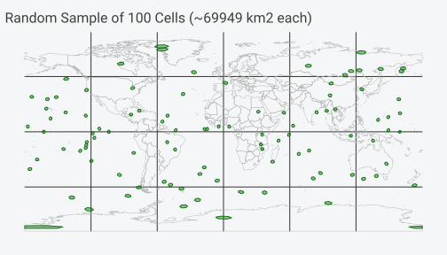
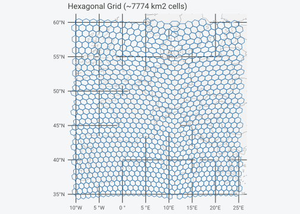
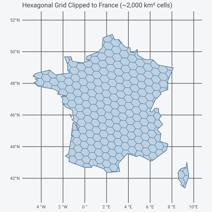
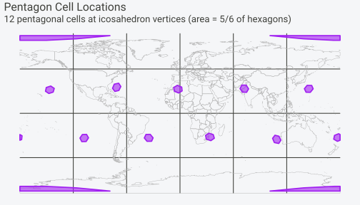

# Quick Start


## Spatial Analysis Done Right

You want to do spatial statistics, and it involves binning points into
grid cells.

**The problem with rectangular grids**: A rectangular lat-lon grid
introduces severe distortions. At the equator, a 1° cell covers ~12,300
km². Near the poles, the same 1° cell covers a tiny fraction of that
area. This breaks any analysis that assumes equal sampling effort or
comparable cell sizes.

**The solution**: Discrete global grids partition Earth’s surface into
cells of **equal area**, regardless of latitude. hexify implements the
ISEA (Icosahedral Snyder Equal Area) projection, providing hexagonal
cells that are all the same size from the equator to the Arctic.

#### Why Equal-Area Matters

``` r

# Same-sized cells at different latitudes
test_points <- data.frame(
  location = c("Equator", "Mid-latitude", "Arctic"),
  lon = c(0, 0, 0),
  lat = c(0, 45, 70)
)

result <- hexify(test_points, lon = "lon", lat = "lat", area_km2 = 1000)

# All cells have the same area, regardless of latitude
as.data.frame(result)[, c("location", "lat", "cell_area_km2")]
#>       location lat cell_area_km2
#> 1      Equator   0      863.7977
#> 2 Mid-latitude  45      863.7977
#> 3       Arctic  70      863.7977
```

With hexify, a 1000 km² cell at the equator is the same size as a 1000
km² cell in Norway.

### Installation

``` r

# Install from GitHub
remotes::install_github("gcol33/hexify")
```

**Required packages**: `sf` (for spatial operations)

### What hexify Does

hexify assigns geographic coordinates to equal-area hexagonal grid
cells. Given a data frame with longitude/latitude columns,
[`hexify()`](https://gcol33.github.io/hexify/reference/hexify.md)
returns:

- `cell_id`: Unique cell identifier (DGGRID-compatible SEQNUM)
- `cell_cen_lon`, `cell_cen_lat`: Cell center coordinates
- `cell_area_km2`: Actual cell area in km²
- `cell_diag_km`: Cell diagonal in km

Supports apertures 3, 4, 7, and mixed 4/3:

| Aperture | Grid Type | Cell Count Formula | Use Case |
|----|----|----|----|
| 3 | ISEA3H | 10 × 3^res + 2 | Default, dggridR compatible, fine control |
| 4 | ISEA4H | 10 × 4^res + 2 | Power-of-2 scaling |
| 7 | ISEA7H | 10 × 7^res + 2 | Rapid cell growth |
| “4/3” | ISEA43H | Mixed | Balance of fast start + fine control |

### Quick Start

#### Basic Usage

``` r

# Sample data: European cities
cities <- data.frame(
  name = c("Vienna", "Paris", "Madrid", "Berlin", "Rome"),
  lon = c(16.37, 2.35, -3.70, 13.40, 12.50),
  lat = c(48.21, 48.86, 40.42, 52.52, 41.90)
)

# Assign to ~1000 km² hexagonal cells
result <- hexify(cities, lon = "lon", lat = "lat", area_km2 = 1000)
as.data.frame(result)
#>     name   lon   lat cell_id cell_cen_lon cell_cen_lat cell_area_km2
#> 1 Vienna 16.37 48.21  126594    16.420390     48.28766      863.7977
#> 2  Paris  2.35 48.86  118788     2.385556     48.96232      863.7977
#> 3 Madrid -3.70 40.42  118752    -3.582199     40.52264      863.7977
#> 4 Berlin 13.40 52.52  122466    13.448955     52.65189      863.7977
#> 5   Rome 12.50 41.90  127788    12.674254     41.87485      863.7977
#>   cell_diag_km
#> 1     31.58208
#> 2     31.58208
#> 3     31.58208
#> 4     31.58208
#> 5     31.58208
```

#### With sf Objects

``` r

library(sf)

# Create sf object (any CRS works - hexify transforms automatically)
pts <- st_as_sf(cities, coords = c("lon", "lat"), crs = 4326)

# hexify handles CRS transformation automatically
result_sf <- hexify(pts, area_km2 = 1000)
class(result_sf)
#> [1] "HexData"
#> attr(,"package")
#> [1] "hexify"
```

### Real-World Example: Species Occurrence Data

This example demonstrates the typical workflow: loading point data,
assigning to grid cells, aggregating, and visualizing. We’ll simulate
bird observation data across Europe and Africa.

``` r

library(sf)

# Simulate bird observation data
set.seed(123)
n_obs <- 3000

# Generate observations with realistic spatial clustering
# More observations in temperate regions, fewer in deserts/arctic
birds <- data.frame(
  lon = c(
    rnorm(800, mean = 10, sd = 15),    # Western Europe
    rnorm(600, mean = 25, sd = 10),    # Eastern Europe
    rnorm(400, mean = 20, sd = 20),    # Mediterranean
    rnorm(500, mean = 0, sd = 15),     # West Africa
    rnorm(400, mean = 35, sd = 10),    # East Africa
    rnorm(300, mean = -5, sd = 8)      # Atlantic coast
  ),
  lat = c(
    rnorm(800, mean = 50, sd = 8),     # Western Europe
    rnorm(600, mean = 55, sd = 6),     # Eastern Europe
    rnorm(400, mean = 42, sd = 5),     # Mediterranean
    rnorm(500, mean = 10, sd = 10),    # West Africa
    rnorm(400, mean = -5, sd = 12),    # East Africa
    rnorm(300, mean = 35, sd = 10)     # Atlantic coast
  ),
  species = sample(c("Passer domesticus", "Turdus merula", "Parus major",
                     "Columba palumbus", "Sturnus vulgaris"), n_obs, replace = TRUE)
)

# Clip to valid ranges
birds$lon <- pmax(-30, pmin(60, birds$lon))
birds$lat <- pmax(-35, pmin(70, birds$lat))
```

#### Assign Points to Grid Cells

``` r

# Assign each observation to a ~25,000 km² cell
birds_hex <- hexify(birds, lon = "lon", lat = "lat", area_km2 = 25000)
birds_gridded <- as.data.frame(birds_hex)

# Count observations per cell
obs_counts <- aggregate(
  species ~ cell_id + cell_cen_lon + cell_cen_lat,
  data = birds_gridded,
  FUN = length
)
names(obs_counts)[4] <- "n_observations"

# Species richness per cell
richness <- aggregate(
  species ~ cell_id,
  data = birds_gridded,
  FUN = function(x) length(unique(x))
)
names(richness)[2] <- "n_species"

obs_counts <- merge(obs_counts, richness, by = "cell_id")
head(obs_counts)
#>   cell_id cell_cen_lon cell_cen_lat n_observations n_species
#> 1       1    11.250000     58.28253              5         4
#> 2      24    11.249999     69.72907              2         1
#> 3      27    11.250000     62.79923              2         2
#> 4      28    11.250000     60.52960              3         2
#> 5      52     9.220405     66.23521              2         2
#> 6      53     9.371184     63.94426              2         1
```

#### Generate Cell Polygons

``` r

# Get grid from HexData result
grid_info <- grid(birds_hex)

# Generate polygons for cells with data
cell_polys <- hexify_cell_to_sf(
  obs_counts$cell_id,
  resolution = grid_info@resolution,
  aperture = grid_info@aperture
)
cell_polys$n_observations <- obs_counts$n_observations
cell_polys$n_species <- obs_counts$n_species
```

#### Visualize Results

``` r

library(ggplot2)

# Get relevant countries
region <- hexify_world[hexify_world$continent %in% c("Europe", "Africa"), ]

ggplot() +
  geom_sf(data = region, fill = "gray95", color = "gray70", linewidth = 0.2) +
  geom_sf(data = cell_polys, aes(fill = n_observations), color = "white", linewidth = 0.3) +
  scale_fill_viridis_c(option = "plasma", name = "Observations", trans = "sqrt") +
  coord_sf(xlim = c(-30, 60), ylim = c(-35, 70)) +
  labs(
    title = "Bird Observations in Equal-Area Hexagonal Cells",
    subtitle = sprintf("ISEA3H grid at resolution %d (~%.0f km² cells)",
                       grid_info@resolution, grid_info@area_km2)
  ) +
  theme_minimal() +
  theme(
    axis.text = element_blank(),
    axis.ticks = element_blank(),
    panel.grid = element_line(color = "gray90")
  )
```


Notice how the hexagons appear different sizes on the flat map—that’s
the projection distortion, not the actual cell sizes. On the sphere,
every cell has exactly the same area.

#### Species Richness Map

``` r

ggplot() +
  geom_sf(data = region, fill = "gray95", color = "gray70", linewidth = 0.2) +
  geom_sf(data = cell_polys, aes(fill = n_species), color = "white", linewidth = 0.3) +
  scale_fill_viridis_c(option = "mako", name = "Species\nRichness", direction = -1) +
  coord_sf(xlim = c(-30, 60), ylim = c(-35, 70)) +
  labs(
    title = "Species Richness per Grid Cell",
    subtitle = "Number of unique species observed in each equal-area cell"
  ) +
  theme_minimal() +
  theme(
    axis.text = element_blank(),
    axis.ticks = element_blank(),
    panel.grid = element_line(color = "gray90")
  )
```


### Random Sampling Earth

Discrete global grids provide two elegant methods for uniform spatial
sampling.

#### Method 1: Sample Points, Get Cells

Generate uniformly distributed lat-lon points and retrieve their grid
cells:

``` r

N <- 100

# Uniform points on sphere (see Wolfram MathWorld: Sphere Point Picking)
u <- runif(N)
v <- runif(N)
theta <- 2 * pi * u
phi <- acos(2 * v - 1)
lon <- (theta * 180 / pi) - 180
lat <- (phi * 180 / pi) - 90

sample_df <- data.frame(lon = lon, lat = lat)

# Assign to ~100,000 km² cells
sample_hex <- hexify(sample_df, lon = "lon", lat = "lat", area_km2 = 100000)
sample_gridded <- as.data.frame(sample_hex)

# Get unique cells
unique_cells <- unique(sample_gridded$cell_id)
cat(sprintf("Sampled %d unique cells from %d points\n", length(unique_cells), N))
#> Sampled 98 unique cells from 100 points
```

#### Method 2: Sample Cell IDs Directly

For aperture 3, the maximum cell ID at resolution r is `10 × 3^r + 2`:

``` r

# Grid parameters - use hex_grid() for consistent grid specification
grid <- hex_grid(area_km2 = 100000, aperture = 3)
max_cell <- 10 * (3^grid@resolution) + 2

cat(sprintf("Resolution %d has %d total cells\n", grid@resolution, max_cell))
#> Resolution 6 has 7292 total cells

# Sample random cell IDs
N <- 100
random_cells <- sample(1:max_cell, N, replace = FALSE)

# Get cell centers
cell_centers <- hexify_cell_to_lonlat(random_cells,
                                       resolution = grid@resolution,
                                       aperture = 3)

head(cell_centers)
#>      lon_deg   lat_deg
#> 1 -120.65036 -77.26569
#> 2   53.74422 -10.67964
#> 3  -31.24422 -10.67964
#> 4   36.23497  19.83993
#> 5  168.53882  11.48149
#> 6 -137.25812  59.57223
```

#### Visualize Random Sample

``` r

# Generate polygons for sampled cells
sample_polys <- hexify_cell_to_sf(
  random_cells,
  resolution = grid@resolution,
  aperture = grid@aperture
)

sample_polys_wrapped <- st_wrap_dateline(
  sample_polys,
  options = c("WRAPDATELINE=YES", "DATELINEOFFSET=180"),
  quiet = TRUE
)

ggplot() +
  geom_sf(data = hexify_world, fill = "gray95", color = "gray70", linewidth = 0.2) +
  geom_sf(data = sample_polys_wrapped, fill = alpha("forestgreen", 0.5),
          color = "darkgreen", linewidth = 0.4) +
  labs(title = sprintf("Random Sample of %d Cells (~%.0f km² each)", N, grid@area_km2)) +
  theme_minimal() +
  theme(axis.text = element_blank(), axis.ticks = element_blank())
```



### Grid Generation

#### Grid Over a Rectangular Region

``` r

# Generate a grid covering Western Europe
europe_grid <- hexify_grid_rect(
  minlon = -10, maxlon = 25,
  minlat = 35, maxlat = 60,
  area = 5000
)

# Get European countries for context
europe <- hexify_world[hexify_world$continent == "Europe", ]

ggplot() +
  geom_sf(data = europe, fill = "gray95", color = "gray60") +
  geom_sf(data = europe_grid, fill = NA, color = "steelblue", linewidth = 0.4) +
  coord_sf(xlim = c(-10, 25), ylim = c(35, 60)) +
  labs(title = "Hexagonal Grid over Western Europe (~5,000 km² cells)") +
  theme_minimal()
```



#### Grid Over a Polygon (Shapefile)

Clip a grid to any sf polygon boundary:

``` r

# Get France boundary
france <- hexify_world[hexify_world$name == "France", ]

# Generate grid covering mainland France (excluding overseas territories)
france_grid <- hexify_grid_rect(
  minlon = -5, maxlon = 10,
  minlat = 41, maxlat = 52,
  area = 2000
)

# Clip grid to France boundary
france_grid_clipped <- st_intersection(france_grid, st_geometry(france))
#> Warning: attribute variables are assumed to be spatially constant throughout
#> all geometries

ggplot() +
  geom_sf(data = france, fill = "gray95", color = "gray40", linewidth = 0.5) +
  geom_sf(data = france_grid_clipped, fill = alpha("steelblue", 0.3),
          color = "steelblue", linewidth = 0.3) +
  coord_sf(xlim = c(-5, 10), ylim = c(41, 52)) +
  labs(title = "Hexagonal Grid Clipped to France (~2,000 km² cells)") +
  theme_minimal()
```



### Export to External Formats

Use sf’s
[`st_write()`](https://r-spatial.github.io/sf/reference/st_write.html)
to export grids for use in GIS software:

``` r

library(sf)

# Generate a grid
grid <- hexify_grid_rect(
  minlon = -10, maxlon = 25,
  minlat = 35, maxlat = 60,
  area = 10000
)

# Export to various formats
st_write(grid, "europe_grid.gpkg", layer = "hexgrid")     # GeoPackage
st_write(grid, "europe_grid.shp")                         # Shapefile
st_write(grid, "europe_grid.geojson")                     # GeoJSON
st_write(grid, "europe_grid.kml", layer = "hexgrid")      # KML (Google Earth)
```

### Hierarchical Indexing

hexify supports hierarchical cell indices with parent-child
relationships. This enables multi-scale analysis and efficient spatial
queries.

#### Parent-Child Relationships

``` r

# Get index for a location
idx <- hexify_lonlat_to_index(16.37, 48.21, resolution = 5, aperture = 3)
cat("Index at resolution 5:", idx, "\n")
#> Index at resolution 5: 0211101

# Get parent (coarser resolution)
parent_idx <- hexify_get_parent(idx, aperture = 3)
cat("Parent (resolution 4):", parent_idx, "\n")
#> Parent (resolution 4): 021110

# Get children (finer resolution)
children <- hexify_get_children(idx, aperture = 3)
cat("Children (resolution 6):", paste(children, collapse = ", "), "\n")
#> Children (resolution 6): 02101000, 02101022, 02101021
```

#### Index Structure

The index encodes the hierarchical path from icosahedron face to cell:

``` r

idx <- hexify_lonlat_to_index(16.37, 48.21, resolution = 5, aperture = 3)

cat("Full index:", idx, "\n")
#> Full index: 0211101
cat("Face (first 2 digits):", substr(idx, 1, 2), "\n")
#> Face (first 2 digits): 02
cat("Path (remaining digits):", substr(idx, 3, nchar(idx)), "\n")
#> Path (remaining digits): 11101
cat("Resolution:", hexify_get_resolution(idx, aperture = 3), "\n")
#> Resolution: 5
```

#### Multi-Scale Aggregation

``` r

# Sample data
set.seed(42)
obs <- data.frame(
  lon = runif(500, 10, 20),
  lat = runif(500, 45, 55),
  value = rnorm(500, 100, 20)
)

# Aggregate at multiple scales
scales <- c(500, 2000, 10000)  # km²

for (area in scales) {
  gridded <- hexify(obs, lon = "lon", lat = "lat", area = area)
  n_cells <- length(unique(gridded$cell_id))
  mean_per_cell <- nrow(obs) / n_cells
  cat(sprintf("Area %6.0f km²: %3d cells, %.1f obs/cell\n",
              area, n_cells, mean_per_cell))
}
#> Area    500 km²: 389 cells, 1.3 obs/cell
#> Area   2000 km²: 254 cells, 2.0 obs/cell
#> Area  10000 km²: 113 cells, 4.4 obs/cell
```

### Caveats

#### Pentagon Cells

At every resolution, the ISEA grid contains **12 pentagonal cells** with
area 5/6 that of hexagons. These are located at the icosahedron
vertices:

``` r

# Pentagon locations (icosahedron vertices in standard ISEA orientation)
pentagon_coords <- data.frame(
  type = c("Pole", "Pole", rep("Vertex", 10)),
  lon = c(0, 0, seq(0, 324, by = 36)),
  lat = c(90, -90, rep(c(26.57, -26.57), 5))
)

# Assign to grid and get polygons
grid_info <- hexify_grid(area = 500000, aperture = 3)
pentagon_coords$cell_id <- hexify_lonlat_to_cell(
  pentagon_coords$lon, pentagon_coords$lat,
  resolution = grid_info$resolution, aperture = 3
)
#> Warning in validate_lon(lon): Some longitude values are outside valid range
#> [-180, 180]

pentagon_polys <- hexify_cell_to_sf(
  pentagon_coords$cell_id,
  resolution = grid_info$resolution,
  aperture = 3
)

pentagon_polys_wrapped <- st_wrap_dateline(
  pentagon_polys,
  options = c("WRAPDATELINE=YES", "DATELINEOFFSET=180"),
  quiet = TRUE
)

ggplot() +
  geom_sf(data = hexify_world, fill = "gray95", color = "gray70", linewidth = 0.2) +
  geom_sf(data = pentagon_polys_wrapped, fill = alpha("purple", 0.6),
          color = "purple", linewidth = 0.8) +
  labs(
    title = "Pentagon Cell Locations",
    subtitle = "12 pentagonal cells at icosahedron vertices (area = 5/6 of hexagons)"
  ) +
  theme_minimal() +
  theme(axis.text = element_blank(), axis.ticks = element_blank())
```



For most analyses, pentagons are not a concern:

1.  They’re a tiny minority (12 out of millions of cells at high
    resolutions)
2.  They’re in predictable locations (poles + 10 evenly-spaced
    low-latitude points)
3.  The area difference (5/6) is small and can be corrected if needed

#### Multi-Scale Analysis

Hexagonal grids do **not** nest perfectly—cells at one resolution
partially overlap cells at other resolutions. For hierarchical analysis,
use the index-based parent/child functions rather than spatial
containment.

#### Integer Limits

Cell IDs are stored as integers. For resolutions above 15 (aperture 3),
cell IDs may exceed R’s integer limit (2^31-1). For very high
resolutions, use index strings via
[`hexify_lonlat_to_index()`](https://gcol33.github.io/hexify/reference/hexify_lonlat_to_index.md).

### Resolution Reference

#### ISEA3H (Aperture 3)

| Res | Number of Cells | Cell Area (km²) | Mean Spacing (km) |
|----:|----------------:|----------------:|------------------:|
|   0 |              12 |   51,006,562.17 |                   |
|   1 |              32 |   17,002,187.39 |          4,320.49 |
|   2 |              92 |    5,667,395.80 |          2,539.69 |
|   3 |             272 |    1,889,131.93 |          1,480.02 |
|   4 |             812 |      629,710.64 |            855.42 |
|   5 |           2,432 |      209,903.55 |            494.96 |
|   6 |           7,292 |       69,967.85 |            285.65 |
|   7 |          21,872 |       23,322.62 |            165.06 |
|   8 |          65,612 |        7,774.21 |             95.26 |
|   9 |         196,832 |        2,591.40 |             55.02 |
|  10 |         590,492 |          863.80 |             31.76 |
|  11 |       1,771,472 |          287.93 |             18.34 |
|  12 |       5,314,412 |           95.98 |             10.59 |
|  13 |      15,943,232 |           31.99 |              6.11 |
|  14 |      47,829,692 |           10.66 |              3.53 |
|  15 |     143,489,072 |            3.55 |              2.04 |

#### Choosing Resolution by Area

``` r

# Find resolution for target areas
targets <- c(100, 1000, 10000, 100000)

cat("Target Area → Actual Resolution & Area\n")
#> Target Area → Actual Resolution & Area
cat("--------------------------------------\n")
#> --------------------------------------
for (target in targets) {
  grid <- hexify_grid(area = target, aperture = 3)
  cat(sprintf("%7.0f km² → res %2d = %9.1f km²\n",
              target, grid$resolution, grid$area))
}
#>     100 km² → res 12 =     100.0 km²
#>    1000 km² → res 10 =    1000.0 km²
#>   10000 km² → res  8 =   10000.0 km²
#>  100000 km² → res  6 =  100000.0 km²
```

#### Comparing Apertures

``` r

target <- 1000  # km²

cat(sprintf("Target: ~%d km² cells\n\n", target))
#> Target: ~1000 km² cells
for (ap in c(3, 4, 7)) {
  grid <- hexify_grid(area = target, aperture = ap)
  n_cells <- 10 * (ap^grid$resolution) + 2
  cat(sprintf("Aperture %d: res %2d → %8.1f km² (%s cells)\n",
              ap, grid$resolution, grid$area,
              format(n_cells, big.mark = ",")))
}
#> Aperture 3: res 10 →   1000.0 km² (590,492 cells)
#> Aperture 4: res  8 →   1000.0 km² (655,362 cells)
#> Aperture 7: res  6 →   1000.0 km² (1,176,492 cells)
```

### dggridR Compatibility

hexify produces identical cell assignments to dggridR:

``` r

library(dggridR)
library(hexify)

# dggridR reference
dggs <- dggridR::dgconstruct(res = 10, aperture = 3)
ref <- dggridR::dgGEO_to_SEQNUM(dggs, cities$lon, cities$lat)

# hexify result (res 10 ≈ 864 km²)
result <- hexify(cities, lon = "lon", lat = "lat", area = 864)

# Verify identical
all(result$cell_id == ref$seqnum)
#> TRUE
```

### Function Reference

#### Main Functions

| Function | Description |
|----|----|
| [`hexify()`](https://gcol33.github.io/hexify/reference/hexify.md) | Assign points to grid cells (main entry point) |
| [`hexify_grid()`](https://gcol33.github.io/hexify/reference/hexify_grid.md) | Create grid specification |
| [`hexify_grid_rect()`](https://gcol33.github.io/hexify/reference/hexify_grid_rect.md) | Generate grid polygons over rectangular region |
| [`hexify_grid_global()`](https://gcol33.github.io/hexify/reference/hexify_grid_global.md) | Generate global grid polygons |
| [`hexify_to_sf()`](https://gcol33.github.io/hexify/reference/hexify_to_sf.md) | Convert hexify result to sf points or polygons |
| [`hexify_cell_to_sf()`](https://gcol33.github.io/hexify/reference/hexify_cell_to_sf.md) | Generate polygons from cell IDs |

#### Coordinate Conversion

| Function | Description |
|----|----|
| [`hexify_lonlat_to_cell()`](https://gcol33.github.io/hexify/reference/hexify_lonlat_to_cell.md) | lon/lat → cell ID |
| [`hexify_cell_to_lonlat()`](https://gcol33.github.io/hexify/reference/hexify_cell_to_lonlat.md) | cell ID → cell center lon/lat |
| [`hexify_lonlat_to_index()`](https://gcol33.github.io/hexify/reference/hexify_lonlat_to_index.md) | lon/lat → hierarchical index string |
| [`hexify_index_to_lonlat()`](https://gcol33.github.io/hexify/reference/hexify_index_to_lonlat.md) | index string → cell center lon/lat |

#### Hierarchical Operations

| Function | Description |
|----|----|
| [`hexify_get_parent()`](https://gcol33.github.io/hexify/reference/hexify_get_parent.md) | Get parent cell (coarser resolution) |
| [`hexify_get_children()`](https://gcol33.github.io/hexify/reference/hexify_get_children.md) | Get child cells (finer resolution) |
| [`hexify_get_resolution()`](https://gcol33.github.io/hexify/reference/hexify_get_resolution.md) | Get resolution level from index |

### See Also

- [`vignette("theory")`](https://gcol33.github.io/hexify/articles/theory.md)
  — Mathematical foundations (projection, apertures, space-filling
  curves)
- [`vignette("workflows")`](https://gcol33.github.io/hexify/articles/workflows.md)
  — Detailed workflow examples for common analysis tasks

### Session Info

``` r

sessionInfo()
#> R version 4.5.2 (2025-10-31 ucrt)
#> Platform: x86_64-w64-mingw32/x64
#> Running under: Windows 11 x64 (build 26200)
#> 
#> Matrix products: default
#>   LAPACK version 3.12.1
#> 
#> locale:
#> [1] LC_COLLATE=English_United States.utf8 
#> [2] LC_CTYPE=English_United States.utf8   
#> [3] LC_MONETARY=English_United States.utf8
#> [4] LC_NUMERIC=C                          
#> [5] LC_TIME=English_United States.utf8    
#> 
#> time zone: Europe/Luxembourg
#> tzcode source: internal
#> 
#> attached base packages:
#> [1] stats     graphics  grDevices utils     datasets  methods   base     
#> 
#> other attached packages:
#> [1] ggplot2_4.0.0 sf_1.0-21     hexify_0.3.0 
#> 
#> loaded via a namespace (and not attached):
#>  [1] gtable_0.3.6       jsonlite_2.0.0     dplyr_1.1.4        compiler_4.5.2    
#>  [5] tidyselect_1.2.1   Rcpp_1.1.0         jquerylib_0.1.4    systemfonts_1.3.1 
#>  [9] scales_1.4.0       textshaping_1.0.3  yaml_2.3.10        fastmap_1.2.0     
#> [13] R6_2.6.1           labeling_0.4.3     generics_0.1.4     classInt_0.4-11   
#> [17] s2_1.1.9           knitr_1.50         htmlwidgets_1.6.4  tibble_3.3.0      
#> [21] desc_1.4.3         units_1.0-0        DBI_1.2.3          svglite_2.2.2     
#> [25] pillar_1.11.1      bslib_0.9.0        RColorBrewer_1.1-3 rlang_1.1.6       
#> [29] cachem_1.1.0       xfun_0.53          S7_0.2.0           fs_1.6.6          
#> [33] sass_0.4.10        viridisLite_0.4.2  cli_3.6.5          withr_3.0.2       
#> [37] pkgdown_2.2.0      magrittr_2.0.4     wk_0.9.4           class_7.3-23      
#> [41] digest_0.6.37      grid_4.5.2         lifecycle_1.0.4    vctrs_0.6.5       
#> [45] KernSmooth_2.23-26 proxy_0.4-27       evaluate_1.0.5     glue_1.8.0        
#> [49] farver_2.1.2       e1071_1.7-16       rmarkdown_2.30     pkgconfig_2.0.3   
#> [53] tools_4.5.2        htmltools_0.5.8.1
```
