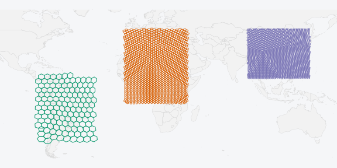
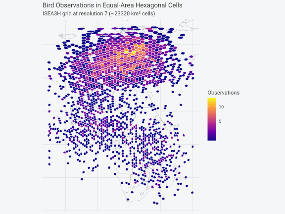
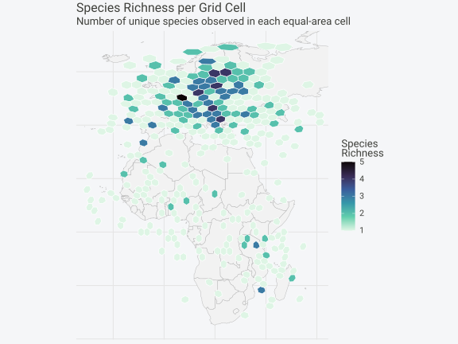

# Quick Start



## Spatial Analysis Done Right

You want to do spatial statistics, and it involves binning points into
grid cells.

**The problem with rectangular grids**: A rectangular lat-lon grid
introduces severe distortions. At the equator, a 1° cell covers ~12,300
km². Near the poles, the same 1° cell covers a tiny fraction of that
area. This breaks any analysis that assumes equal sampling effort or
comparable cell sizes.

**The solution**: Discrete global grids partition Earth’s surface into
cells of **equal area**, regardless of latitude. hexify implements the
ISEA (Icosahedral Snyder Equal Area) projection, providing hexagonal
cells that are all the same size from the equator to the Arctic.

### Basic Usage

``` r

# Sample data: European cities
cities <- data.frame(
  name = c("Vienna", "Paris", "Madrid", "Berlin", "Rome"),
  lon = c(16.37, 2.35, -3.70, 13.40, 12.50),
  lat = c(48.21, 48.86, 40.42, 52.52, 41.90)
)

# Create a grid specification
grid <- hex_grid(area_km2 = 10000)
grid
#> HexGridInfo Specification
#> -------------------------
#> Aperture:    3
#> Resolution:  8
#> Area:        7773.97 km^2
#> Diagonal:    94.74 km
#> CRS:         EPSG:4326
#> Total Cells: 65612

# Assign cities to hexagonal cells
result <- hexify(cities, lon = "lon", lat = "lat", grid = grid)
result
#> HexData Object
#> --------------
#> Rows:    5
#> Columns: 3
#> Cells:   5 unique
#> Type:    data.frame
#> 
#> Grid:
#>   Aperture 3, Resolution 8 (~7774.0 km^2)
#> 
#> Columns: name, lon, lat 
#> 
#> Data preview (with cell assignments):
#>    name   lon   lat cell_id
#>  Vienna 16.37 48.21   14092
#>   Paris  2.35 48.86   13272
#>  Madrid -3.70 40.42   13260
#> ... with 2 more rows
```

#### Accessing HexData

``` r

# Get the grid specification
grid_info(result)
#> HexGridInfo Specification
#> -------------------------
#> Aperture:    3
#> Resolution:  8
#> Area:        7773.97 km^2
#> Diagonal:    94.74 km
#> CRS:         EPSG:4326
#> Total Cells: 65612

# Get unique cell IDs
cells(result)
#> [1] 14092 13272 13260 13688 14247

# Count unique cells
n_cells(result)
#> [1] 5

# Access all cell IDs (one per row)
result@cell_id
#> [1] 14092 13272 13260 13688 14247

# Access cell centers
head(result@cell_center)
#>            lon      lat
#> [1,] 15.968349 48.25028
#> [2,]  2.460284 48.49334
#> [3,] -3.482737 40.05509
#> [4,] 13.428088 52.18073
#> [5,] 12.466432 41.61442

# Extract original data as data.frame
head(as.data.frame(result))
#>     name   lon   lat cell_id cell_cen_lon cell_cen_lat cell_area_km2
#> 1 Vienna 16.37 48.21   14092    15.968349     48.25028      7773.969
#> 2  Paris  2.35 48.86   13272     2.460284     48.49334      7773.969
#> 3 Madrid -3.70 40.42   13260    -3.482737     40.05509      7773.969
#> 4 Berlin 13.40 52.52   13688    13.428088     52.18073      7773.969
#> 5   Rome 12.50 41.90   14247    12.466432     41.61442      7773.969
#>   cell_diag_km
#> 1     94.74495
#> 2     94.74495
#> 3     94.74495
#> 4     94.74495
#> 5     94.74495
```

#### With sf Objects

``` r

library(sf)

# Create sf object (any CRS works - hexify transforms automatically)
pts <- st_as_sf(cities, coords = c("lon", "lat"), crs = 4326)

# hexify handles CRS transformation automatically
result_sf <- hexify(pts, area_km2 = 10000)
class(result_sf)
#> [1] "HexData"
#> attr(,"package")
#> [1] "hexify"
```

### Real-World Example: Species Occurrence Data

This example demonstrates the typical workflow: loading point data,
assigning to grid cells, aggregating, and visualizing.

``` r

library(sf)
library(ggplot2)

# Simulate bird observation data
set.seed(123)
n_obs <- 3000

# Generate observations with realistic spatial clustering
birds <- data.frame(
  lon = c(
    rnorm(800, mean = 10, sd = 15),    # Western Europe
    rnorm(600, mean = 25, sd = 10),    # Eastern Europe
    rnorm(400, mean = 20, sd = 20),    # Mediterranean
    rnorm(500, mean = 0, sd = 15),     # West Africa
    rnorm(400, mean = 35, sd = 10),    # East Africa
    rnorm(300, mean = -5, sd = 8)      # Atlantic coast
  ),
  lat = c(
    rnorm(800, mean = 50, sd = 8),     # Western Europe
    rnorm(600, mean = 55, sd = 6),     # Eastern Europe
    rnorm(400, mean = 42, sd = 5),     # Mediterranean
    rnorm(500, mean = 10, sd = 10),    # West Africa
    rnorm(400, mean = -5, sd = 12),    # East Africa
    rnorm(300, mean = 35, sd = 10)     # Atlantic coast
  ),
  species = sample(c("Passer domesticus", "Turdus merula", "Parus major",
                     "Columba palumbus", "Sturnus vulgaris"), n_obs, replace = TRUE)
)

# Clip to valid ranges
birds$lon <- pmax(-30, pmin(60, birds$lon))
birds$lat <- pmax(-35, pmin(70, birds$lat))
```

#### Assign Points to Grid Cells

``` r

# Create grid and assign observations
grid <- hex_grid(area_km2 = 25000)
birds_hex <- hexify(birds, lon = "lon", lat = "lat", grid = grid)

# Extract data with cell IDs
birds_gridded <- as.data.frame(birds_hex)
birds_gridded$cell_id <- birds_hex@cell_id

# Count observations per cell
obs_counts <- aggregate(
  species ~ cell_id,
  data = birds_gridded,
  FUN = length
)
names(obs_counts)[2] <- "n_observations"

# Species richness per cell
richness <- aggregate(
  species ~ cell_id,
  data = birds_gridded,
  FUN = function(x) length(unique(x))
)
names(richness)[2] <- "n_species"

obs_counts <- merge(obs_counts, richness, by = "cell_id")
head(obs_counts)
#>   cell_id n_observations n_species
#> 1       1              5         4
#> 2      24              2         1
#> 3      27              2         2
#> 4      28              3         2
#> 5      52              2         2
#> 6      53              2         1
```

#### Generate Cell Polygons and Visualize

``` r

# Generate polygons for cells with data
cell_polys <- cell_to_sf(obs_counts$cell_id, grid)
cell_polys <- merge(cell_polys, obs_counts, by = "cell_id")

# Get relevant countries
region <- hexify_world[hexify_world$continent %in% c("Europe", "Africa"), ]

ggplot() +
  geom_sf(data = region, fill = "gray95", color = "gray70", linewidth = 0.2) +
  geom_sf(data = cell_polys, aes(fill = n_observations), color = "white", linewidth = 0.3) +
  scale_fill_viridis_c(option = "plasma", name = "Observations", trans = "sqrt") +
  coord_sf(xlim = c(-30, 60), ylim = c(-35, 70)) +
  labs(
    title = "Bird Observations in Equal-Area Hexagonal Cells",
    subtitle = sprintf("ISEA3H grid at resolution %d (~%.0f km² cells)",
                       grid@resolution, grid@area_km2)
  ) +
  theme_minimal() +
  theme(
    axis.text = element_blank(),
    axis.ticks = element_blank(),
    panel.grid = element_line(color = "gray90")
  )
```



#### Species Richness Map

``` r

ggplot() +
  geom_sf(data = region, fill = "gray95", color = "gray70", linewidth = 0.2) +
  geom_sf(data = cell_polys, aes(fill = n_species), color = "white", linewidth = 0.3) +
  scale_fill_viridis_c(option = "mako", name = "Species\nRichness", direction = -1) +
  coord_sf(xlim = c(-30, 60), ylim = c(-35, 70)) +
  labs(
    title = "Species Richness per Grid Cell",
    subtitle = "Number of unique species observed in each equal-area cell"
  ) +
  theme_minimal() +
  theme(
    axis.text = element_blank(),
    axis.ticks = element_blank(),
    panel.grid = element_line(color = "gray90")
  )
```



### Core Concepts

hexify uses two S4 classes to make spatial workflows clean and
error-free:

- **`HexGridInfo`**: A grid specification that stores all parameters
  (aperture, resolution, area). Define once, reuse everywhere.
- **`HexData`**: Your data + the grid that was used. Carries the grid
  reference so downstream operations “just work.”

#### HexGridInfo Slots

| Slot          | Type      | Description                             |
|---------------|-----------|-----------------------------------------|
| `aperture`    | character | Grid aperture (“3”, “4”, “7”, or “4/3”) |
| `resolution`  | integer   | Resolution level (0-30)                 |
| `area_km2`    | numeric   | Cell area in km²                        |
| `diagonal_km` | numeric   | Cell diagonal in km                     |
| `crs`         | integer   | Coordinate reference system (EPSG code) |

#### HexData Slots

| Slot          | Type          | Description                        |
|---------------|---------------|------------------------------------|
| `data`        | data.frame/sf | Your original data (unchanged)     |
| `grid`        | HexGridInfo   | The grid specification used        |
| `cell_id`     | numeric       | Cell ID for each row               |
| `cell_center` | matrix        | Cell center coordinates (lon, lat) |

### Caveats

#### Pentagon Cells

At every resolution, the ISEA grid contains **12 pentagonal cells** with
area 5/6 that of hexagons. These are located at the icosahedron vertices
(poles + 10 evenly-spaced low-latitude points).

For most analyses, pentagons are not a concern:

1.  They’re a tiny minority (12 out of millions of cells at high
    resolutions)
2.  They’re in predictable locations
3.  The area difference (5/6) is small and can be corrected if needed

#### Multi-Scale Analysis

Hexagonal grids do **not** nest perfectly—cells at one resolution
partially overlap cells at other resolutions. For hierarchical analysis,
use grid-based aggregation rather than spatial containment.

#### Integer Limits

Cell IDs are stored as integers. For resolutions above 15 (aperture 3),
cell IDs may exceed R’s integer limit (2^31-1). Use appropriate numeric
types for very high resolutions.

### See Also

- [`vignette("visualization")`](https://gcol33.github.io/hexify/articles/visualization.md) -
  Plotting options:
  [`plot()`](https://rdrr.io/r/graphics/plot.default.html),
  [`hexify_ggplot()`](https://gcol33.github.io/hexify/reference/hexify_ggplot.md),
  [`hexify_heatmap()`](https://gcol33.github.io/hexify/reference/hexify_heatmap.md)
- [`vignette("workflows")`](https://gcol33.github.io/hexify/articles/workflows.md) -
  Grid generation, multi-resolution analysis, spatial joins, choosing
  resolution
- `vignette("theory")` - Mathematical foundations (ISEA projection,
  apertures, space-filling curves)
