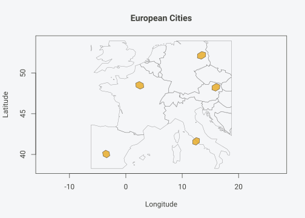
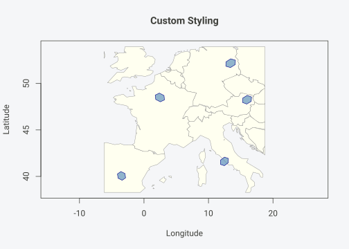
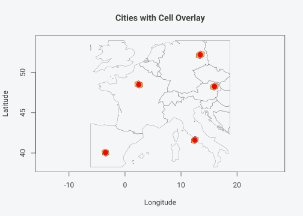
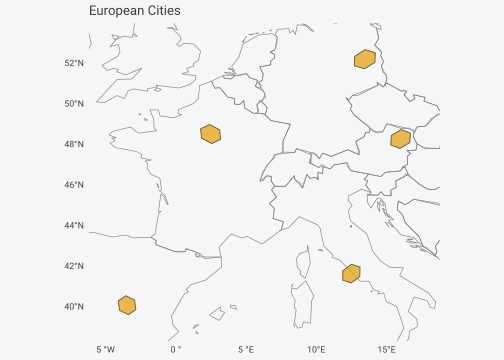
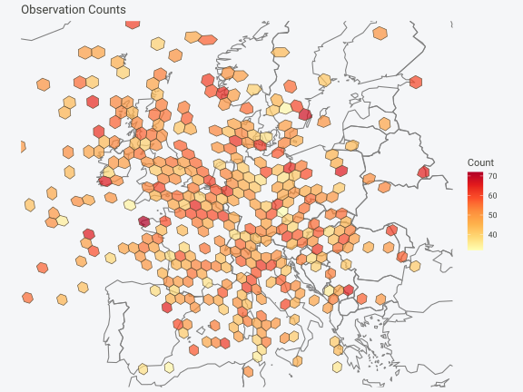
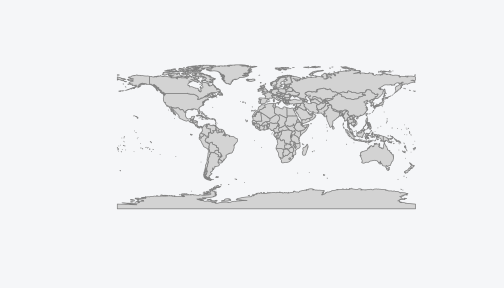
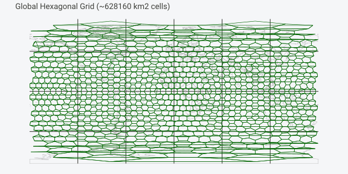

# Quick Start


## Spatial Analysis Done Right

You want to do spatial statistics, and it involves binning points into
grid cells.

**The problem with rectangular grids**: A rectangular lat-lon grid
introduces severe distortions. At the equator, a 1 degree cell covers
~12,300 km squared. Near the poles, the same 1 degree cell covers a tiny
fraction of that area. This breaks any analysis that assumes equal
sampling effort or comparable cell sizes.

**The solution**: Discrete global grids partition Earth’s surface into
cells of **equal area**, regardless of latitude. hexify implements the
ISEA (Icosahedral Snyder Equal Area) projection, providing hexagonal
cells that are all the same size from the equator to the Arctic.

#### Why Equal-Area Matters

``` r

# Same-sized cells at different latitudes
test_points <- data.frame(
  location = c("Equator", "Mid-latitude", "Arctic"),
  lon = c(0, 0, 0),
  lat = c(0, 45, 70)
)

grid <- hex_grid(area_km2 = 1000)
result <- hexify(test_points, lon = "lon", lat = "lat", grid = grid)

# All cells have the same area, regardless of latitude
cat(sprintf("Grid area: %.1f km2\n", grid@area_km2))
#> Grid area: 863.8 km2
cat(sprintf("Points assigned to %d unique cells\n", n_cells(result)))
#> Points assigned to 3 unique cells
```

With hexify, a 1000 km squared cell at the equator is the same size as a
1000 km squared cell in Norway.

### Installation

``` r

# Install from GitHub
remotes::install_github("gcol33/hexify")
```

**Required packages**: `sf` (for spatial operations)

### Core Concepts: HexGridInfo and HexData

hexify uses two S4 classes to make spatial workflows clean and
error-free:

- **`HexGridInfo`**: A grid specification that stores all parameters
  (aperture, resolution, area). Define once, reuse everywhere.
- **`HexData`**: Your data + the grid that was used. Carries the grid
  reference so downstream operations “just work.”

#### HexGridInfo Slots

| Slot          | Type      | Description                             |
|---------------|-----------|-----------------------------------------|
| `aperture`    | character | Grid aperture (“3”, “4”, “7”, or “4/3”) |
| `resolution`  | integer   | Resolution level (0-30)                 |
| `area_km2`    | numeric   | Cell area in km squared                 |
| `diagonal_km` | numeric   | Cell diagonal in km                     |
| `crs`         | integer   | Coordinate reference system (EPSG code) |

#### HexData Slots

| Slot          | Type          | Description                        |
|---------------|---------------|------------------------------------|
| `data`        | data.frame/sf | Your original data (unchanged)     |
| `grid`        | HexGridInfo   | The grid specification used        |
| `cell_id`     | numeric       | Cell ID for each row               |
| `cell_center` | matrix        | Cell center coordinates (lon, lat) |

### Quick Start

#### Basic Usage

``` r

# Sample data: European cities
cities <- data.frame(
  name = c("Vienna", "Paris", "Madrid", "Berlin", "Rome"),
  lon = c(16.37, 2.35, -3.70, 13.40, 12.50),
  lat = c(48.21, 48.86, 40.42, 52.52, 41.90)
)

# Create a grid specification
grid <- hex_grid(area_km2 = 10000)
grid
#> HexGridInfo Specification
#> -------------------------
#> Aperture:    3
#> Resolution:  8
#> Area:        7773.97 km^2
#> Diagonal:    94.74 km
#> CRS:         EPSG:4326
#> Total Cells: 65612

# Assign cities to hexagonal cells
result <- hexify(cities, lon = "lon", lat = "lat", grid = grid)
result
#> HexData Object
#> --------------
#> Rows:    5
#> Columns: 3
#> Cells:   5 unique
#> Type:    data.frame
#> 
#> Grid:
#>   Aperture 3, Resolution 8 (~7774.0 km^2)
#> 
#> Columns: name, lon, lat 
#> 
#> Data preview (with cell assignments):
#>    name   lon   lat cell_id
#>  Vienna 16.37 48.21   14092
#>   Paris  2.35 48.86   13272
#>  Madrid -3.70 40.42   13260
#> ... with 2 more rows
```

#### Accessing HexData

``` r

# Get the grid specification
grid_info(result)
#> HexGridInfo Specification
#> -------------------------
#> Aperture:    3
#> Resolution:  8
#> Area:        7773.97 km^2
#> Diagonal:    94.74 km
#> CRS:         EPSG:4326
#> Total Cells: 65612

# Get unique cell IDs
cells(result)
#> [1] 14092 13272 13260 13688 14247

# Count unique cells
n_cells(result)
#> [1] 5

# Access all cell IDs (one per row)
result@cell_id
#> [1] 14092 13272 13260 13688 14247

# Access cell centers
head(result@cell_center)
#>            lon      lat
#> [1,] 15.968349 48.25028
#> [2,]  2.460284 48.49334
#> [3,] -3.482737 40.05509
#> [4,] 13.428088 52.18073
#> [5,] 12.466432 41.61442

# Extract original data as data.frame
head(as.data.frame(result))
#>     name   lon   lat cell_id cell_cen_lon cell_cen_lat cell_area_km2
#> 1 Vienna 16.37 48.21   14092    15.968349     48.25028      7773.969
#> 2  Paris  2.35 48.86   13272     2.460284     48.49334      7773.969
#> 3 Madrid -3.70 40.42   13260    -3.482737     40.05509      7773.969
#> 4 Berlin 13.40 52.52   13688    13.428088     52.18073      7773.969
#> 5   Rome 12.50 41.90   14247    12.466432     41.61442      7773.969
#>   cell_diag_km
#> 1     94.74495
#> 2     94.74495
#> 3     94.74495
#> 4     94.74495
#> 5     94.74495
```

#### Define Grid Once, Reuse Everywhere

The key workflow: create a `HexGridInfo` once, then apply it to multiple
datasets.

``` r

# Define grid specification
my_grid <- hex_grid(area_km2 = 5000, aperture = 3)
my_grid
#> HexGridInfo Specification
#> -------------------------
#> Aperture:    3
#> Resolution:  8
#> Area:        7773.97 km^2
#> Diagonal:    94.74 km
#> CRS:         EPSG:4326
#> Total Cells: 65612

# Apply same grid to different datasets
set.seed(123)
birds <- data.frame(lon = runif(100, -10, 30), lat = runif(100, 35, 60))
mammals <- data.frame(x = runif(50, -10, 30), y = runif(50, 35, 60))

birds_hex <- hexify(birds, lon = "lon", lat = "lat", grid = my_grid)
mammals_hex <- hexify(mammals, lon = "x", lat = "y", grid = my_grid)

# Both use identical grid - safe to combine
cat("Birds:", n_cells(birds_hex), "cells\n")
#> Birds: 96 cells
cat("Mammals:", n_cells(mammals_hex), "cells\n")
#> Mammals: 50 cells
```

#### With sf Objects

``` r

library(sf)

# Create sf object (any CRS works - hexify transforms automatically)
pts <- st_as_sf(cities, coords = c("lon", "lat"), crs = 4326)

# hexify handles CRS transformation automatically
result_sf <- hexify(pts, area_km2 = 10000)
class(result_sf)
#> [1] "HexData"
#> attr(,"package")
#> [1] "hexify"
```

### Visualization

hexify provides multiple ways to visualize your gridded data.

#### Quick Plot with Base R

The simplest approach uses the built-in
[`plot()`](https://rdrr.io/r/graphics/plot.default.html) method (basemap
is shown by default):

``` r

# Basic plot with world basemap (default)
plot(result, main = "European Cities")
```



    #> Spherical geometry (s2) switched on

#### Customize Plot Appearance

``` r

# Custom colors and styling
plot(result,
     grid_fill = "steelblue",
     grid_border = "darkblue",
     grid_alpha = 0.6,
     basemap_fill = "ivory",
     basemap_border = "gray50",
     main = "Custom Styling")
```



    #> Spherical geometry (s2) switched on

#### Show Original Points

``` r

# Show original points overlaid on cells
plot(result,
     show_points = TRUE,
     point_color = "red",
     point_size = 1.5,
     main = "Cities with Cell Overlay")
```



    #> Spherical geometry (s2) switched on

#### ggplot2 with hexify_ggplot()

For ggplot2 users,
[`hexify_ggplot()`](https://gcol33.github.io/hexify/reference/hexify_ggplot.md)
returns a ggplot object:

``` r

library(ggplot2)

# Basic ggplot (basemap shown by default)
hexify_ggplot(result, title = "European Cities")
```



#### Heatmaps with hexify_heatmap()

For choropleth-style visualizations with aggregated data:

``` r

# Simulate observation data
set.seed(42)
n_obs <- 500
obs_data <- data.frame(
  lon = c(rnorm(300, 10, 8), rnorm(200, 0, 10)),
  lat = c(rnorm(300, 48, 5), rnorm(200, 52, 6)),
  count = rpois(n_obs, lambda = 50)
)

# Hexify and aggregate
grid <- hex_grid(area_km2 = 5000)
obs_hex <- hexify(obs_data, lon = "lon", lat = "lat", grid = grid)

# Aggregate counts per cell
obs_df <- as.data.frame(obs_hex)
obs_df$cell_id <- obs_hex@cell_id
cell_totals <- aggregate(count ~ cell_id, data = obs_df, FUN = sum)

# Create heatmap
hexify_heatmap(
  obs_hex,
  value = "count",
  basemap = "world",
  colors = "YlOrRd",
  title = "Observation Counts",
  legend_title = "Count",
  xlim = c(-20, 35),
  ylim = c(35, 65)
)
```



#### World Map Helper

``` r

# Quick world map
plot_world(fill = "lightgray", border = "gray50")
```



### Grid Generation

#### Grid Over a Rectangular Region

``` r

library(sf)

# Create grid specification
grid <- hex_grid(area_km2 = 5000)

# Generate hexagons over Western Europe
europe_hexes <- grid_rect(c(-10, 35, 25, 60), grid)

# Get European countries for context
europe <- hexify_world[hexify_world$continent == "Europe", ]

ggplot() +
  geom_sf(data = europe, fill = "gray95", color = "gray60") +
  geom_sf(data = europe_hexes, fill = NA, color = "steelblue", linewidth = 0.4) +
  coord_sf(xlim = c(-10, 25), ylim = c(35, 60)) +
  labs(title = sprintf("Hexagonal Grid (~%.0f km2 cells)", grid@area_km2)) +
  theme_minimal()
```


#### Grid Over a Polygon (Shapefile)

Clip a grid to any sf polygon boundary:

``` r

# Get France boundary
france <- hexify_world[hexify_world$name == "France", ]

# Generate grid covering mainland France
grid <- hex_grid(area_km2 = 2000)
france_grid <- grid_rect(c(-5, 41, 10, 52), grid)

# Clip grid to France boundary
france_grid_clipped <- st_intersection(france_grid, st_geometry(france))
#> Warning: attribute variables are assumed to be spatially constant throughout
#> all geometries

ggplot() +
  geom_sf(data = france, fill = "gray95", color = "gray40", linewidth = 0.5) +
  geom_sf(data = france_grid_clipped, fill = alpha("steelblue", 0.3),
          color = "steelblue", linewidth = 0.3) +
  coord_sf(xlim = c(-5, 10), ylim = c(41, 52)) +
  labs(title = sprintf("Hexagonal Grid Clipped to France (~%.0f km2 cells)", grid@area_km2)) +
  theme_minimal()
```


#### Global Grid

``` r

# Coarse global grid (be careful with fine grids - many cells!)
grid <- hex_grid(area_km2 = 500000)
global_hexes <- grid_global(grid)

ggplot() +
  geom_sf(data = hexify_world, fill = "gray90", color = "gray70", linewidth = 0.2) +
  geom_sf(data = global_hexes, fill = NA, color = "darkgreen", linewidth = 0.3) +
  labs(title = sprintf("Global Hexagonal Grid (~%.0f km2 cells)", grid@area_km2)) +
  theme_minimal() +
  theme(axis.text = element_blank(), axis.ticks = element_blank())
```



### Real-World Example: Species Occurrence Data

This example demonstrates the typical workflow: loading point data,
assigning to grid cells, aggregating, and visualizing.

``` r

library(sf)

# Simulate bird observation data
set.seed(123)
n_obs <- 3000

# Generate observations with realistic spatial clustering
birds <- data.frame(
  lon = c(
    rnorm(800, mean = 10, sd = 15),    # Western Europe
    rnorm(600, mean = 25, sd = 10),    # Eastern Europe
    rnorm(400, mean = 20, sd = 20),    # Mediterranean
    rnorm(500, mean = 0, sd = 15),     # West Africa
    rnorm(400, mean = 35, sd = 10),    # East Africa
    rnorm(300, mean = -5, sd = 8)      # Atlantic coast
  ),
  lat = c(
    rnorm(800, mean = 50, sd = 8),     # Western Europe
    rnorm(600, mean = 55, sd = 6),     # Eastern Europe
    rnorm(400, mean = 42, sd = 5),     # Mediterranean
    rnorm(500, mean = 10, sd = 10),    # West Africa
    rnorm(400, mean = -5, sd = 12),    # East Africa
    rnorm(300, mean = 35, sd = 10)     # Atlantic coast
  ),
  species = sample(c("Passer domesticus", "Turdus merula", "Parus major",
                     "Columba palumbus", "Sturnus vulgaris"), n_obs, replace = TRUE)
)

# Clip to valid ranges
birds$lon <- pmax(-30, pmin(60, birds$lon))
birds$lat <- pmax(-35, pmin(70, birds$lat))
```

#### Assign Points to Grid Cells

``` r

# Create grid and assign observations
grid <- hex_grid(area_km2 = 25000)
birds_hex <- hexify(birds, lon = "lon", lat = "lat", grid = grid)

# Extract data with cell IDs
birds_gridded <- as.data.frame(birds_hex)
birds_gridded$cell_id <- birds_hex@cell_id

# Count observations per cell
obs_counts <- aggregate(
  species ~ cell_id,
  data = birds_gridded,
  FUN = length
)
names(obs_counts)[2] <- "n_observations"

# Species richness per cell
richness <- aggregate(
  species ~ cell_id,
  data = birds_gridded,
  FUN = function(x) length(unique(x))
)
names(richness)[2] <- "n_species"

obs_counts <- merge(obs_counts, richness, by = "cell_id")
head(obs_counts)
#>   cell_id n_observations n_species
#> 1       1              5         4
#> 2      24              2         1
#> 3      27              2         2
#> 4      28              3         2
#> 5      52              2         2
#> 6      53              2         1
```

#### Generate Cell Polygons and Visualize

``` r

library(ggplot2)

# Generate polygons for cells with data
cell_polys <- cell_to_sf(obs_counts$cell_id, grid)
cell_polys <- merge(cell_polys, obs_counts, by = "cell_id")

# Get relevant countries
region <- hexify_world[hexify_world$continent %in% c("Europe", "Africa"), ]

ggplot() +
  geom_sf(data = region, fill = "gray95", color = "gray70", linewidth = 0.2) +
  geom_sf(data = cell_polys, aes(fill = n_observations), color = "white", linewidth = 0.3) +
  scale_fill_viridis_c(option = "plasma", name = "Observations", trans = "sqrt") +
  coord_sf(xlim = c(-30, 60), ylim = c(-35, 70)) +
  labs(
    title = "Bird Observations in Equal-Area Hexagonal Cells",
    subtitle = sprintf("ISEA3H grid at resolution %d (~%.0f km2 cells)",
                       grid@resolution, grid@area_km2)
  ) +
  theme_minimal() +
  theme(
    axis.text = element_blank(),
    axis.ticks = element_blank(),
    panel.grid = element_line(color = "gray90")
  )
```


#### Species Richness Map

``` r

ggplot() +
  geom_sf(data = region, fill = "gray95", color = "gray70", linewidth = 0.2) +
  geom_sf(data = cell_polys, aes(fill = n_species), color = "white", linewidth = 0.3) +
  scale_fill_viridis_c(option = "mako", name = "Species\nRichness", direction = -1) +
  coord_sf(xlim = c(-30, 60), ylim = c(-35, 70)) +
  labs(
    title = "Species Richness per Grid Cell",
    subtitle = "Number of unique species observed in each equal-area cell"
  ) +
  theme_minimal() +
  theme(
    axis.text = element_blank(),
    axis.ticks = element_blank(),
    panel.grid = element_line(color = "gray90")
  )
```


### Random Sampling Earth

Discrete global grids provide elegant methods for uniform spatial
sampling.

#### Sample Cell IDs Directly

``` r

# Grid parameters
grid <- hex_grid(area_km2 = 100000, aperture = 3)
max_cell <- 10 * (3^grid@resolution) + 2

cat(sprintf("Resolution %d has %d total cells\n", grid@resolution, max_cell))
#> Resolution 6 has 7292 total cells

# Sample random cell IDs
N <- 100
random_cells <- sample(1:max_cell, N, replace = FALSE)

# Get cell centers
cell_centers <- cell_to_lonlat(random_cells, grid)
head(cell_centers)
#>      lon_deg   lat_deg
#> 1  -93.03627  61.58562
#> 2 -124.72708 -14.62883
#> 3  -83.73510  15.58019
#> 4   15.82634 -54.53941
#> 5  -47.97388 -48.09197
#> 6  142.34535  56.81987
```

#### Visualize Random Sample

``` r

# Generate polygons for sampled cells
sample_polys <- cell_to_sf(random_cells, grid)

sample_polys_wrapped <- st_wrap_dateline(
  sample_polys,
  options = c("WRAPDATELINE=YES", "DATELINEOFFSET=180"),
  quiet = TRUE
)

ggplot() +
  geom_sf(data = hexify_world, fill = "gray95", color = "gray70", linewidth = 0.2) +
  geom_sf(data = sample_polys_wrapped, fill = alpha("forestgreen", 0.5),
          color = "darkgreen", linewidth = 0.4) +
  labs(title = sprintf("Random Sample of %d Cells (~%.0f km2 each)", N, grid@area_km2)) +
  theme_minimal() +
  theme(axis.text = element_blank(), axis.ticks = element_blank())
```


### Export to External Formats

Use sf’s
[`st_write()`](https://r-spatial.github.io/sf/reference/st_write.html)
to export grids for use in GIS software:

``` r

library(sf)

# Generate a grid
grid <- hex_grid(area_km2 = 10000)
europe <- grid_rect(c(-10, 35, 25, 60), grid)

# Export to various formats
st_write(europe, "europe_grid.gpkg", layer = "hexgrid")     # GeoPackage
st_write(europe, "europe_grid.shp")                         # Shapefile
st_write(europe, "europe_grid.geojson")                     # GeoJSON
st_write(europe, "europe_grid.kml", layer = "hexgrid")      # KML (Google Earth)
```

### Caveats

#### Pentagon Cells

At every resolution, the ISEA grid contains **12 pentagonal cells** with
area 5/6 that of hexagons. These are located at the icosahedron
vertices:

``` r

# Pentagon locations (icosahedron vertices in standard ISEA orientation)
pentagon_coords <- data.frame(
  type = c("Pole", "Pole", rep("Vertex", 10)),
  lon = c(0, 0, seq(0, 324, by = 36)),
  lat = c(90, -90, rep(c(26.57, -26.57), 5))
)

# Assign to grid and get polygons
grid <- hex_grid(area_km2 = 500000)
pentagon_cells <- lonlat_to_cell(pentagon_coords$lon, pentagon_coords$lat, grid)

pentagon_polys <- cell_to_sf(pentagon_cells, grid)
pentagon_polys_wrapped <- st_wrap_dateline(
  pentagon_polys,
  options = c("WRAPDATELINE=YES", "DATELINEOFFSET=180"),
  quiet = TRUE
)

ggplot() +
  geom_sf(data = hexify_world, fill = "gray95", color = "gray70", linewidth = 0.2) +
  geom_sf(data = pentagon_polys_wrapped, fill = alpha("purple", 0.6),
          color = "purple", linewidth = 0.8) +
  labs(
    title = "Pentagon Cell Locations",
    subtitle = "12 pentagonal cells at icosahedron vertices (area = 5/6 of hexagons)"
  ) +
  theme_minimal() +
  theme(axis.text = element_blank(), axis.ticks = element_blank())
```


For most analyses, pentagons are not a concern:

1.  They’re a tiny minority (12 out of millions of cells at high
    resolutions)
2.  They’re in predictable locations (poles + 10 evenly-spaced
    low-latitude points)
3.  The area difference (5/6) is small and can be corrected if needed

#### Multi-Scale Analysis

Hexagonal grids do **not** nest perfectly - cells at one resolution
partially overlap cells at other resolutions. For hierarchical analysis,
use grid-based aggregation rather than spatial containment.

#### Integer Limits

Cell IDs are stored as integers. For resolutions above 15 (aperture 3),
cell IDs may exceed R’s integer limit (2^31-1). Use appropriate numeric
types for very high resolutions.

### Resolution Reference

#### ISEA3H (Aperture 3)

| Resolution | \# Cells | Cell Area (km2) | Spacing (km) |
|-----------:|:---------|----------------:|-------------:|
|          0 | 12       |      42505468.5 |       7005.8 |
|          1 | 32       |      15939550.7 |       4290.2 |
|          2 | 92       |       5544191.5 |       2530.2 |
|          3 | 272      |       1875241.3 |       1471.5 |
|          4 | 812      |        628159.6 |        851.7 |
|          5 | 2.4K     |        209730.9 |        492.1 |
|          6 | 7.3K     |         69948.7 |        284.2 |
|          7 | 21.9K    |         23320.5 |        164.1 |
|          8 | 65.6K    |          7774.0 |         94.7 |
|          9 | 196.8K   |          2591.4 |         54.7 |
|         10 | 590.5K   |           863.8 |         31.6 |
|         11 | 1.8M     |           287.9 |         18.2 |
|         12 | 5.3M     |            96.0 |         10.5 |
|         13 | 15.9M    |            32.0 |          6.1 |
|         14 | 47.8M    |            10.7 |          3.5 |
|         15 | 143.5M   |             3.6 |          2.0 |

#### Choosing Resolution by Area

``` r

# Find resolution for target areas
targets <- c(100, 1000, 10000, 100000)

cat("Target Area -> Actual Resolution & Area\n")
#> Target Area -> Actual Resolution & Area
cat("--------------------------------------\n")
#> --------------------------------------
for (target in targets) {
  grid <- hex_grid(area_km2 = target, aperture = 3)
  cat(sprintf("%7.0f km2 -> res %2d = %9.1f km2\n",
              target, grid@resolution, grid@area_km2))
}
#>     100 km2 -> res 12 =      96.0 km2
#>    1000 km2 -> res 10 =     863.8 km2
#>   10000 km2 -> res  8 =    7774.0 km2
#>  100000 km2 -> res  6 =   69948.7 km2
```

#### Comparing Apertures

``` r

target <- 1000  # km2

cat(sprintf("Target: ~%d km2 cells\n\n", target))
#> Target: ~1000 km2 cells
for (ap in c(3, 4, 7)) {
  grid <- hex_grid(area_km2 = target, aperture = ap)
  n_cells <- 10 * (ap^grid@resolution) + 2
  cat(sprintf("Aperture %d: res %2d -> %8.1f km2 (%s cells)\n",
              ap, grid@resolution, grid@area_km2,
              format(n_cells, big.mark = ",")))
}
#> Aperture 3: res 10 ->    863.8 km2 (590,492 cells)
#> Aperture 4: res  8 ->    778.3 km2 (655,362 cells)
#> Aperture 7: res  6 ->    433.5 km2 (1,176,492 cells)
```

### dggridR Compatibility

hexify produces identical cell assignments to dggridR:

``` r

library(dggridR)
library(hexify)

# dggridR reference
dggs <- dggridR::dgconstruct(res = 10, aperture = 3)
ref <- dggridR::dgGEO_to_SEQNUM(dggs, cities$lon, cities$lat)

# hexify result (res 10 = 864 km2)
grid <- hex_grid(resolution = 10, aperture = 3)
result <- hexify(cities, lon = "lon", lat = "lat", grid = grid)

# Verify identical
all(result@cell_id == ref$seqnum)
#> TRUE
```

### Function Reference

#### S4 Classes

| Class         | Description                                     |
|---------------|-------------------------------------------------|
| `HexGridInfo` | Grid specification (aperture, resolution, area) |
| `HexData`     | Hexified data with grid reference               |

#### Constructors

| Function | Description |
|----|----|
| [`hex_grid()`](https://gcol33.github.io/hexify/reference/hex_grid.md) | Create a HexGridInfo specification |
| [`hexify()`](https://gcol33.github.io/hexify/reference/hexify.md) | Assign points to grid cells, returns HexData |

#### HexData Methods

| Method             | Description                      |
|--------------------|----------------------------------|
| `grid_info(x)`     | Extract HexGridInfo from HexData |
| `cells(x)`         | Get unique cell IDs              |
| `n_cells(x)`       | Count unique cells               |
| `as.data.frame(x)` | Extract underlying data frame    |
| `x$column`         | Access columns directly          |
| `x[i, j]`          | Subset rows/columns              |

#### Grid Generation

| Function | Description |
|----|----|
| [`grid_rect()`](https://gcol33.github.io/hexify/reference/grid_rect.md) | Generate grid polygons over rectangular region |
| [`grid_global()`](https://gcol33.github.io/hexify/reference/grid_global.md) | Generate global grid polygons |
| [`cell_to_sf()`](https://gcol33.github.io/hexify/reference/cell_to_sf.md) | Generate polygons from cell IDs |
| [`as_sf()`](https://gcol33.github.io/hexify/reference/as_sf.md) | Convert HexData to sf object |

#### Coordinate Conversion

| Function | Description |
|----|----|
| [`lonlat_to_cell()`](https://gcol33.github.io/hexify/reference/lonlat_to_cell.md) | lon/lat -\> cell ID |
| [`cell_to_lonlat()`](https://gcol33.github.io/hexify/reference/cell_to_lonlat.md) | cell ID -\> cell center lon/lat |

#### Visualization

| Function | Description |
|----|----|
| [`plot()`](https://rdrr.io/r/graphics/plot.default.html) | Base R plot method for HexData |
| [`hexify_ggplot()`](https://gcol33.github.io/hexify/reference/hexify_ggplot.md) | ggplot2 plotting for HexData |
| [`hexify_heatmap()`](https://gcol33.github.io/hexify/reference/hexify_heatmap.md) | ggplot2 choropleth heatmap |
| [`plot_world()`](https://gcol33.github.io/hexify/reference/plot_world.md) | Quick world map |

#### Grid Statistics

| Function | Description |
|----|----|
| [`hexify_compare_resolutions()`](https://gcol33.github.io/hexify/reference/hexify_compare_resolutions.md) | Compare resolution levels |
| [`dgearthstat()`](https://gcol33.github.io/hexify/reference/dgearthstat.md) | Get grid statistics |

### See Also

- [`vignette("theory")`](https://gcol33.github.io/hexify/articles/theory.md) -
  Mathematical foundations (projection, apertures, space-filling curves)
- [`vignette("workflows")`](https://gcol33.github.io/hexify/articles/workflows.md) -
  Detailed workflow examples for common analysis tasks

### Session Info

``` r

sessionInfo()
#> R version 4.5.2 (2025-10-31 ucrt)
#> Platform: x86_64-w64-mingw32/x64
#> Running under: Windows 11 x64 (build 26200)
#> 
#> Matrix products: default
#>   LAPACK version 3.12.1
#> 
#> locale:
#> [1] LC_COLLATE=English_United States.utf8 
#> [2] LC_CTYPE=English_United States.utf8   
#> [3] LC_MONETARY=English_United States.utf8
#> [4] LC_NUMERIC=C                          
#> [5] LC_TIME=English_United States.utf8    
#> 
#> time zone: Europe/Luxembourg
#> tzcode source: internal
#> 
#> attached base packages:
#> [1] stats     graphics  grDevices utils     datasets  methods   base     
#> 
#> other attached packages:
#> [1] ggplot2_4.0.0 sf_1.0-21     hexify_0.3.0 
#> 
#> loaded via a namespace (and not attached):
#>  [1] gtable_0.3.6       jsonlite_2.0.0     dplyr_1.1.4        compiler_4.5.2    
#>  [5] tidyselect_1.2.1   Rcpp_1.1.0         jquerylib_0.1.4    systemfonts_1.3.1 
#>  [9] scales_1.4.0       textshaping_1.0.3  yaml_2.3.10        fastmap_1.2.0     
#> [13] R6_2.6.1           labeling_0.4.3     generics_0.1.4     classInt_0.4-11   
#> [17] s2_1.1.9           knitr_1.50         htmlwidgets_1.6.4  tibble_3.3.0      
#> [21] desc_1.4.3         units_1.0-0        DBI_1.2.3          svglite_2.2.2     
#> [25] pillar_1.11.1      bslib_0.9.0        RColorBrewer_1.1-3 rlang_1.1.6       
#> [29] cachem_1.1.0       xfun_0.53          S7_0.2.0           fs_1.6.6          
#> [33] sass_0.4.10        viridisLite_0.4.2  cli_3.6.5          withr_3.0.2       
#> [37] pkgdown_2.2.0      magrittr_2.0.4     wk_0.9.4           class_7.3-23      
#> [41] digest_0.6.37      grid_4.5.2         lifecycle_1.0.4    vctrs_0.6.5       
#> [45] KernSmooth_2.23-26 proxy_0.4-27       evaluate_1.0.5     glue_1.8.0        
#> [49] farver_2.1.2       e1071_1.7-16       rmarkdown_2.30     pkgconfig_2.0.3   
#> [53] tools_4.5.2        htmltools_0.5.8.1
```
