# Mathematical Foundations

## Overview

hexify implements the **ISEA (Icosahedral Snyder Equal Area)** discrete
global grid system. This vignette explains the mathematical foundations:
the projection geometry, coordinate systems, aperture subdivision, and
cell indexing.

## The Problem: Equal-Area Grids on a Sphere

Any projection from a sphere to a plane must distort *something*. For
spatial statistics, we need cells of equal area regardless of location.
Standard latitude-longitude grids fail badly: a 1° cell at the equator
covers ~12,300 km², while the same cell near the poles covers a tiny
fraction of that.

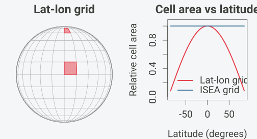

The ISEA projection solves this by:

1.  Choosing a regular icosahedron with the same surface area as the
    sphere

2.  Projecting each spherical “cap” onto its corresponding flat
    triangular face using a modified Lambert equal-area projection

3.  Overlaying a hexagonal grid on the resulting planar triangles

## The Lambert Azimuthal Equal-Area Projection

The foundation of Snyder’s projection is Lambert’s azimuthal equal-area
projection, developed by Johann Heinrich Lambert in 1772. The projection
maps a sphere of radius $`R`$ to a tangent plane while **preserving area
exactly** (Snyder, 1987, p. 182).

### Definition

The Lambert azimuthal equal-area projection is defined by a mathematical
constraint, not a geometric construction. For a projection centered at
point $`S`$:

- **Azimuthal property:** The direction (azimuth) from $`S`$ to any
  point $`P`$ on the sphere equals the direction from the origin to
  $`P'`$ on the plane

- **Equal-area property:** Any region on the sphere maps to a region of
  identical area on the plane

These two constraints uniquely determine the radial distance formula.
For a point $`P`$ at angular distance $`c`$ from the center (measured
along the sphere surface), the projected distance from the origin is:

``` math
\rho = 2R \sin\left(\frac{c}{2}\right)
```

This is **not** a perspective projection and has no simple geometric
interpretation like “chord distance” or “ray intersection.” The formula
is derived analytically from the equal-area constraint (Snyder, 1987,
p. 182-185).

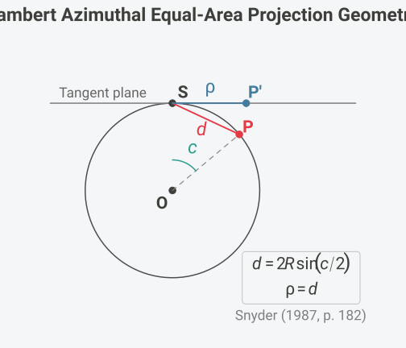

### Forward Formulas

For the oblique aspect centered at $`(\lambda_0, \phi_1)`$, the full
formulas are (Snyder, 1987, eq. 24-2 to 24-4, p. 185):

``` math
k' = \sqrt{\frac{2}{1 + \sin\phi_1\sin\phi + \cos\phi_1\cos\phi\cos(\lambda - \lambda_0)}}
```

``` math
x = R \cdot k' \cdot \cos\phi \cdot \sin(\lambda - \lambda_0)
```

``` math
y = R \cdot k' \cdot [\cos\phi_1\sin\phi - \sin\phi_1\cos\phi\cos(\lambda - \lambda_0)]
```

### Equal-Area Proof

The projection preserves area because the radial and tangential scale
factors satisfy $`h' \cdot k' = 1`$ at every point. At angular distance
$`c`$ from center (Snyder, 1987, eq. 24-22, 24-23, p. 188):

``` math
h' = \cos\left(\frac{c}{2}\right), \quad k' = \sec\left(\frac{c}{2}\right)
```

Therefore $`h' \cdot k' = \cos(c/2) \cdot \sec(c/2) = 1`$, confirming
the equal-area property.

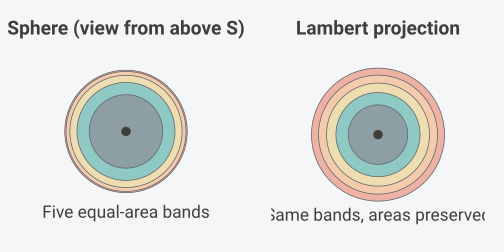

Each colored band has equal area on the sphere (the band boundaries are
at $`\cos\phi_i = 1 - i/5`$). After Lambert projection the outer bands
stretch radially and compress tangentially, and every annulus still has
the same area: $`\rho_i^2 = 2R^2(1 - \cos\phi_i)`$ grows linearly with
$`i`$.

### Inverse Formulas

The inverse mapping $`(x, y) \to (\lambda, \phi)`$ recovers geographic
coordinates from planar coordinates (Snyder, 1987, eq. 24-14 to 24-16,
p. 187):

``` math
\rho = \sqrt{x^2 + y^2}
```

``` math
c = 2\arcsin\left(\frac{\rho}{2R}\right)
```

where $`c`$ is the angular distance from the projection center. Then:

``` math
\phi = \arcsin\left[\cos c \cdot \sin\phi_1 + \frac{y \cdot \sin c \cdot \cos\phi_1}{\rho}\right]
```

``` math
\lambda = \lambda_0 + \arctan\left[\frac{x \cdot \sin c}{\rho\cos\phi_1\cos c - y\sin\phi_1\sin c}\right]
```

If $`\rho = 0`$, the point is at the projection center:
$`\phi = \phi_1`$, $`\lambda = \lambda_0`$.

### Limitations

**Antipode singularity:** The point diametrically opposite the
projection center (angular distance 180°) maps to infinity and must be
excluded from the domain.

**Shape distortion:** While area is preserved exactly, shapes distort
increasingly with distance from center. The maximum angular distortion
$`\omega`$ at distance $`c`$ is (Snyder, 1987, eq. 24-24, p. 188):

``` math
\sin\left(\frac{\omega}{2}\right) = \frac{k'^2 - 1}{k'^2 + 1}
```

At $`c = 90°`$, distortion reaches $`\omega \approx 70.5°`$. ISEA grids
limit this by using icosahedral faces subtending only ~72° from face
center.

**No conformality:** No projection can be both equal-area and conformal
(angle-preserving)—a fundamental constraint from differential geometry
(Snyder, 1987, p. 16-18).

## The Icosahedron

Lambert’s projection works for a single tangent plane covering at most a
hemisphere. To cover the entire globe with minimal distortion, Snyder
used **20 planar faces**—one for each face of a regular icosahedron with
the same surface area as the sphere (Snyder, 1992, p. 10).

### Geometry

A regular icosahedron has:

- **20 equilateral triangular faces** (each covering ~1/20 of Earth’s
  surface)

- **12 vertices** (where 5 faces meet—these become pentagon cells)

- **30 edges**

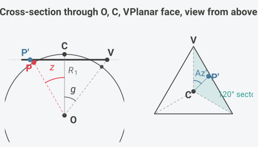

Left: the icosahedron has the same surface area as the sphere, so its
face plane lies at the inradius $`R_1 = 0.9104R`$ from the centre O,
inside the sphere, and the vertex V of the planar face lies on the ray
through the sphere point at angular distance $`g = 37.38°`$ from the
face centre C. In this cross-section the face extends from V on one side
to the midpoint of the opposite edge on the other. A point P at angular
distance $`z`$ from C maps to P’ on the face plane at radial distance
$`\rho`$ from C. Right: on the planar face the azimuth Az’ is measured
from the centre-to-vertex ray, and the three-fold symmetry of the face
reduces every azimuth to one 120° sector.

### Vertex Latitude Derivation

The 12 vertices are located at (Coxeter, 1973, p. 52-53):

| Location   | Latitude                           | Longitudes                  |
|------------|------------------------------------|-----------------------------|
| North pole | +90°                               | 0°                          |
| Upper ring | $`+\arctan(1/2) \approx +26.565°`$ | 0°, 72°, 144°, 216°, 288°   |
| Lower ring | $`-\arctan(1/2) \approx -26.565°`$ | 36°, 108°, 180°, 252°, 324° |
| South pole | −90°                               | 0°                          |

The latitude $`\arctan(1/2)`$ arises from the golden ratio geometry. An
icosahedron can be constructed from three mutually perpendicular golden
rectangles ($`1 \times \varphi`$, where $`\varphi = (1+\sqrt{5})/2`$).
The non-polar vertices have $`z`$-coordinate $`1/s`$ where
$`s = \sqrt{1 + \varphi^2}`$, yielding $`\tan\phi = 1/2`$.

### Standard ISEA Orientation

The default orientation places vertex 0 at longitude 11.25°, latitude
$`\arctan(\varphi) \approx 58.2825°`$, with azimuth 0°. This places
icosahedron vertices (pentagon cells) predominantly over oceans (Sahr et
al., 2003, p. 123).

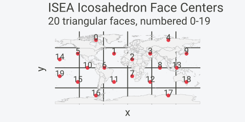

## Snyder’s ISEA Projection

Snyder extended the Lambert projection to the icosahedron by introducing
an azimuth-adjustment transformation that ensures seamless transitions
between adjacent faces while maintaining the equal-area property
(Snyder, 1992, p. 12).

Bradley (1946) published an approximate equal-area graticule for the
icosahedron, and an editorial footnote to that paper described an exact
construction by Irving Fisher. Snyder rederived Fisher’s approach and
generalized it to the five Platonic solids after White, Kimerling, and
Overton (1992) chose a truncated-icosahedron grid for the U.S. EPA’s
EMAP global sampling design (Snyder, 1992, p. 10). ISEA is the
icosahedral member of this family.

### Key Constants

| Constant | Symbol | Value | Source |
|----|----|----|----|
| Face center to vertex angle | $`E_l`$ | 37.37736814° | Snyder (1992, Table 1, p. 12) |
| Geometric angle | $`G`$ | 36° | Snyder (1992, Table 1, p. 12) |
| Scale factor | $`R_1`$ | 0.9103832815 | Snyder (1992, eq. 5, p. 11) |

The vertex angle has the closed form
$`\tan E_l = \sqrt{14 - 6\sqrt{5}}`$ (Snyder, 1992, p. 17). $`R_1`$ is
the radius of the icosahedron whose surface area equals that of the unit
sphere: equating
$`20 \cdot \frac{3\sqrt{3}}{4} R_1^2 \tan^2 E_l = 4\pi`$ gives
$`R_1 = \frac{2}{\tan E_l}\sqrt{\frac{\pi}{15\sqrt{3}}}`$.

### Forward Projection Steps

The complete algorithm comprises seven steps (Snyder, 1992, p. 12-13):

**Step 1: Compute angular distance and azimuth** from face center
$`(\lambda_0, \phi_0)`$ to point $`(\lambda, \phi)`$:

``` math
z = \arccos(\sin\phi_0 \sin\phi + \cos\phi_0 \cos\phi \cos(\lambda - \lambda_0))
```
``` math
\text{Az} = \arctan2(\cos\phi \sin(\lambda - \lambda_0), \cos\phi_0 \sin\phi - \sin\phi_0 \cos\phi \cos(\lambda - \lambda_0))
```

**Step 2: Reduce azimuth** to \[0°, 120°) by exploiting 3-fold symmetry.

**Step 3: Compute auxiliary angle** $`\delta_z`$ (Snyder, 1992, eq. 9,
p. 13):
``` math
\delta_z = \arctan\left(\frac{\tan E_l}{\cos \text{Az} + \cot 30° \cdot \sin \text{Az}}\right)
```

**Step 4: Compute auxiliary angle** $`h`$ (Snyder, 1992, eq. 6, p. 12):
``` math
h = \arccos(\sin \text{Az} \sin G \cos E_l - \cos \text{Az} \cos G)
```

**Step 5: Compute adjusted azimuth** $`\text{Az}'`$ (Snyder, 1992, eq.
7-8, p. 12):
``` math
A_G = \text{Az} + G + h - \pi
```
``` math
\text{Az}' = \arctan\left(\frac{2 A_G}{R_1^2 \tan^2 E_l - 2 A_G \cot 30°}\right)
```

**Step 6: Compute radial distance** (Snyder, 1992, eq. 10-12, p. 13):
``` math
f = \frac{\tan E_l}{2(\cos \text{Az}' + \cot 30° \cdot \sin \text{Az}') \sin(\delta_z / 2)}
```
``` math
\rho = 2 R_1 f \sin(z / 2)
```

**Step 7: Convert to Cartesian** with sector offset restored.

### The Inverse Projection

The inverse projection cannot be solved analytically because the azimuth
adjustment contains transcendental functions. A Newton-Raphson iteration
finds the spherical azimuth Az from the planar azimuth Az’ (Snyder,
1992, eq. 20-22, p. 13):

``` math
f(\text{Az}) = \text{agh} - \text{Az} - G + (\pi - h) = 0
```

where
$`h = \arccos(\sin \text{Az} \sin G \cos E_l - \cos \text{Az} \cos G)`$.

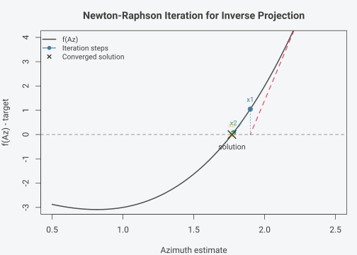

The iteration exhibits **quadratic convergence**, typically reaching
machine precision in 3-5 iterations. hexify provides four precision
modes:

| Mode | Tolerance | Typical Iterations | Use Case |
|----|----|----|----|
| fast | $`10^{-10}`$ | 3-4 | Interactive visualization |
| default | $`10^{-12}`$ | 4-5 | General applications (~1 m accuracy) |
| high | $`10^{-14}`$ | 5-6 | High-precision geodesy |
| ultra | $`10^{-15}`$ | 6-7 | Research |

### Distortion

The projection is exactly equal-area, so its distortion falls on angles
and local scale. On an icosahedron face the maximum angular deformation
is $`\omega = 17.27°`$, with linear scale factors between 0.860 and
1.163 (Snyder, 1992, Table 1, p. 12). The azimuth adjustment
concentrates this deformation along the three radii from the face center
to its vertices, where the graticule shows visible cusps (Snyder, 1992,
p. 11).

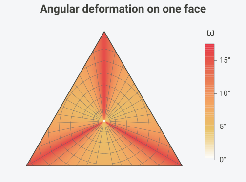

Deformation is smallest, about 5°, in the ring around the face center
toward the edge midpoints, and largest along the three vertex radii,
where the parallels kink as they cross. The 17.27° maximum is reached at
the face center approached along a vertex radius. The Jacobian
determinant of the projection equals 1 everywhere on the face, which is
the equal-area property in differential form.

### The Unfolded Projection

Applying the per-face projection to all 20 faces and unfolding them into
a plane maps the whole sphere onto a strip of triangles (compare Snyder,
1992, Figure 12, p. 18).
[`hexify_lonlat_to_plane()`](https://gillescolling.com/hexify/reference/hexify_lonlat_to_plane.md)
performs the composite transformation, in the same PLANE layout as
dggridR’s `dgGEO_to_PLANE()`. Coastlines and graticule continue across
every shared edge and are interrupted elsewhere:

``` r

draw_path <- function(lon, lat, col, lwd) {
  p <- hexify_lonlat_to_plane(lon, lat)
  jump <- c(FALSE, sqrt(diff(p$plane_x)^2 + diff(p$plane_y)^2) > 0.2)
  p$plane_x[jump] <- NA
  lines(p$plane_x, p$plane_y, col = col, lwd = lwd)
}

oldpar <- par(mar = c(0.5, 0.5, 2, 0.5), bg = "white")
plot(NULL, xlim = c(-0.1, 5.6), ylim = c(-0.05, 2.65), asp = 1,
     axes = FALSE, xlab = "", ylab = "", main = "Unfolded ISEA Projection")

# face outlines: side-1 triangles around each projected face centroid
centers <- hexify_face_centers()
pc <- hexify_lonlat_to_plane(centers$lon * 180/pi, centers$lat * 180/pi)
s3 <- sqrt(3)
for (f in 1:20) {
  base <- floor(pc$plane_y[f] / (s3/2)) * s3/2
  up <- (pc$plane_y[f] - base) < s3/4
  yy <- if (up) base + c(0, 0, s3/2) else base + c(s3/2, s3/2, 0)
  polygon(pc$plane_x[f] + c(-0.5, 0.5, 0), yy, border = "gray60", lwd = 0.8)
}

# 15-degree graticule
for (lon in seq(-180, 165, by = 15))
  draw_path(rep(lon, 181), seq(-90, 90, by = 1), "gray75", 0.6)
for (lat in seq(-75, 75, by = 15))
  draw_path(seq(-180, 180, by = 0.5), rep(lat, 721), "gray75", 0.6)

# coastlines
xy <- st_coordinates(st_cast(st_geometry(hexify_world), "MULTIPOLYGON"))
for (ring in split(seq_len(nrow(xy)),
                   interaction(xy[, "L1"], xy[, "L2"], xy[, "L3"], drop = TRUE)))
  draw_path(xy[ring, 1], xy[ring, 2], GREY, 0.8)
```

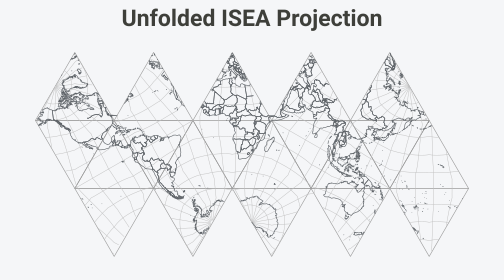

``` r

par(oldpar)
```

## Aperture and Resolution

**Aperture** defines how cells subdivide at each resolution level—it’s
the ratio of parent cell area to child cell area (Sahr et al., 2003,
p. 124).

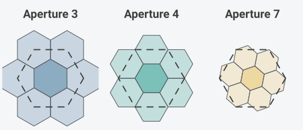

The dashed outline is the parent cell; the darker child shares its
centre. For apertures 3 and 4 the parent boundary cuts through the ring
children: each of the six vertex children of aperture 3 lies one third
inside the parent, and each of the six edge children of aperture 4 lies
half inside it, so the parent area equals $`1 + 6/3 = 3`$ or
$`1 + 6/2 = 4`$ child areas. The seven aperture-7 children form a
rosette with exactly the parent’s area, and its ragged boundary does not
follow the parent’s edges.

### Aperture Properties

| Aperture | Area Ratio | Linear Scale | Rotation per Level | Orientation |
|----|----|----|----|----|
| 3 | 1:3 | $`\sqrt{3} \approx 1.73`$ | 30° | Alternates Class I/II |
| 4 | 1:4 | $`2.0`$ | 0° | Always Class I |
| 7 | 1:7 | $`\sqrt{7} \approx 2.65`$ | $`\arctan(\sqrt{3}/5) \approx 19.1°`$ | Class III |

The aperture 7 rotation angle follows from the child lattice: the
parent’s nearest neighbour sits at two steps along one child lattice
axis plus one step along the next, a vector of length $`\sqrt{7}`$ child
spacings at angle
$`\arctan\!\big(\tfrac{\sqrt{3}/2}{2 + 1/2}\big) = \arctan(\sqrt{3}/5) \approx 19.107°`$
to the axis (DGGRID Manual, 2023).

### Cell Count Growth

``` r

cat("Resolution  Aperture 3    Aperture 4    Aperture 7\n")
#> Resolution  Aperture 3    Aperture 4    Aperture 7
cat("---------  ----------    ----------    ----------\n")
#> ---------  ----------    ----------    ----------
for (res in 0:8) {
  cells_ap3 <- 10 * 3^res + 2
  cells_ap4 <- 10 * 4^res + 2
  cells_ap7 <- 10 * 7^res + 2
  cat(sprintf("    %d      %10s    %10s    %10s\n",
              res,
              format(cells_ap3, big.mark = ","),
              format(cells_ap4, big.mark = ","),
              format(cells_ap7, big.mark = ",")))
}
#>     0              12            12            12
#>     1              32            42            72
#>     2              92           162           492
#>     3             272           642         3,432
#>     4             812         2,562        24,012
#>     5           2,432        10,242       168,072
#>     6           7,292        40,962     1,176,492
#>     7          21,872       163,842     8,235,432
#>     8          65,612       655,362    57,648,012
```

## Orientation Classes

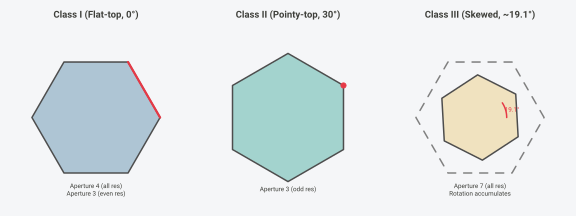

For **aperture 3**, orientation alternates between Class I (flat-top)
and Class II (pointy-top) at each resolution. For **aperture 7**, each
level adds a rotation of $`\arctan(\sqrt{3}/5) \approx 19.1°`$ (Sahr,
2008, p. 176).

## Pentagon Cells

Exactly **12 cells are pentagons** at every resolution. This is a
topological necessity derived from Euler’s formula (Coxeter, 1973,
p. 10):

``` math
V - E + F = 2
```

For a tiling with $`h`$ hexagons and $`p`$ pentagons on a sphere: -
$`V = (6h + 5p)/3`$, $`E = (6h + 5p)/2`$, $`F = h + p`$

Substituting into Euler’s formula and simplifying yields $`p = 12`$,
independent of $`h`$.

Hexagons have six neighbors; pentagons have five.

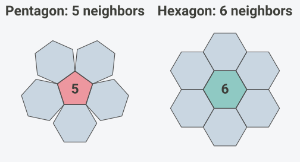

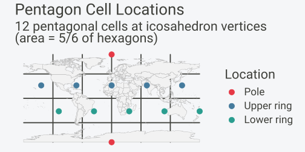

| Location   | Latitude                          | Longitudes                  |
|------------|-----------------------------------|-----------------------------|
| Poles      | ±90°                              | 0°                          |
| Upper ring | $`\arctan(1/2) \approx 26.57°`$   | 0°, 72°, 144°, 216°, 288°   |
| Lower ring | $`-\arctan(1/2) \approx -26.57°`$ | 36°, 108°, 180°, 252°, 324° |

Pentagon area is exactly 5/6 of hexagonal cell area at the same
resolution (Sahr et al., 2003, p. 125).

## Coordinate Systems and Indexing

hexify uses a multi-stage coordinate pipeline (Sahr, 2008, p. 178):

| System | Components | Description |
|----|----|----|
| **GEO** | lon, lat | WGS84 degrees |
| **Icosa Triangle** | face (0-19), tx, ty | Snyder projection output |
| **Quad XY** | quad (0-11), qx, qy | Paired-triangle coordinates |
| **Quad IJ** | quad (0-11), i, j | Quantized grid indices |
| **Index** | string | Hierarchical cell address (Z3, Z7, or Z-order) |
| **SEQNUM** | integer | Global cell ID (1-based) |

### Triangle to Quad

The 20 triangular faces are paired into 12 “quads” (diamond-shaped
regions). Each quad contains two adjacent triangular faces sharing an
edge. This pairing transforms 20 triangles into 10 diamond-shaped quads
plus 2 polar quads, simplifying grid indexing because a diamond admits a
rectangular $`(i, j)`$ lattice (DGGRID Manual, 2023).

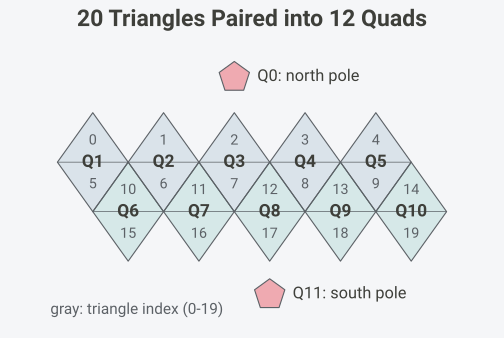

### Quad IJ: The Integer Lattice

After Snyder projection maps a point onto a triangular face, the
continuous $`(x, y)`$ coordinates are quantized to integer $`(i, j)`$
indices on the hexagonal lattice. At resolution $`r`$ with aperture
$`a`$, the lattice dimension along each axis is:

``` math
d = \left\lfloor a^{r/2} \right\rfloor
```

The $`(i, j)`$ pair uniquely identifies a cell within a quad. Combined
with the quad number (0–11), this gives a globally unique cell address.

### Hierarchical Index Types

hexify supports three hierarchical index encodings. Each converts the
$`(quad, i, j)`$ triple into a compact string or integer that encodes
the cell’s position in the subdivision hierarchy.

#### Z7 Index (Aperture 7)

The Z7 index represents each cell as a hierarchical path through the
aperture-7 subdivision tree (Sahr, 2025). The format is:

``` math
\texttt{BB}\underbrace{\texttt{D}_1\texttt{D}_2\cdots\texttt{D}_r}_{r \text{ digits}}
```

where **BB** is the leading field and each digit
$`D_k \in \{0, 1, \ldots, 6\}`$ selects one of 7 children at level
$`k`$. The digit meanings correspond to positions in the IVec3D cube
coordinate system:

| Digit | Direction | Meaning                                |
|-------|-----------|----------------------------------------|
| 0     | CENTER    | Center child (same position as parent) |
| 1     | K_AXES    | K-axis direction                       |
| 2     | J_AXES    | J-axis direction                       |
| 3     | JK_AXES   | JK-axis direction                      |
| 4     | I_AXES    | I-axis direction                       |
| 5     | IK_AXES   | IK-axis direction                      |
| 6     | IJ_AXES   | IJ-axis direction                      |

The leading field is always two characters, so the resolution is
`nchar(index) - 2`. Dropping the final digit gives the parent; appending
digits 0–6 enumerates the seven positions in the next refinement level.

hexify uses a **bijective Z7 variant**. DGGRID’s base-cell reassignment
and pentagon digit-skip rules can make its encoder non-injective near
pentagons: distinct cells may receive the same string. hexify keeps the
geographic quad fixed in those regions, so every cell has a distinct
index and both `cell -> index -> cell` and `index -> cell -> index`
round-trip.

Holding the quad fixed is what the leading field pays for. A quad is a
rhombus while the aperture-7 parents are hexagons, so the quad boundary
cuts through the parents of the cells along it: walking such a cell up
the hierarchy arrives at one of the six neighbours of the quad’s own
level-0 point rather than at the point itself. The leading field records
which, as $`\texttt{quad} + 12s`$ with $`s \in \{0, 1, \ldots, 6\}`$,
and a cell whose whole ancestry stays inside its quad has $`s = 0`$ and
keeps the plain two-digit quad DGGRID writes. Recover the quad with
`BB %% 12`, or with
[`hexify_index_to_cell()`](https://gillescolling.com/hexify/reference/hexify_index_to_cell.md).
This matters when exchanging raw Z7 strings with DGGRID; geographic
coordinates and cell geometry remain the safest interoperability layer.

``` r

# Z7 index encoding for aperture 7
g7 <- hex_grid(resolution = 4, aperture = 7)
cell <- lonlat_to_cell(16.37, 48.21, g7)
idx <- cell_to_index(cell, g7)
cat(sprintf("Cell %d -> Z7 index: %s\n", cell, idx))
#> Cell 5194 -> Z7 index: 270453
cat(sprintf("  Leading field: %s (quad %d), Digits: %s\n",
            substr(idx, 1, 2), as.integer(substr(idx, 1, 2)) %% 12L,
            substr(idx, 3, nchar(idx))))
#>   Leading field: 27 (quad 3), Digits: 0453

# Hierarchical property: parent is obtained by dropping the last digit
parent_idx <- substr(idx, 1, nchar(idx) - 1)
parent_info <- hexify_index_to_cell(parent_idx, 7, "z7")
cat(sprintf("  Parent index: %s (face %d, i=%d, j=%d)\n",
            parent_idx, parent_info$face,
            as.integer(parent_info$i), as.integer(parent_info$j)))
#>   Parent index: 27045 (face 3, i=9, j=19)

# A valid Z7 index decodes and re-encodes without changing
decoded <- hexify_index_to_cell(idx, 7, "z7")
stopifnot(identical(
  hexify_cell_to_index(decoded$face, decoded$i, decoded$j,
                       decoded$resolution, 7, "z7"),
  idx
))
```

#### Z3 Index (Aperture 3)

The Z3 index encodes the aperture-3 subdivision hierarchy using **digit
pairs** (Sahr, 2008). Because aperture 3 alternates between Class I and
Class II orientation at each level, the encoding uses two digits per
resolution-level pair:

``` math
\texttt{BB}\underbrace{\texttt{D}_1\texttt{D}_2\texttt{D}_3\texttt{D}_4\cdots}_{2\lceil r/2 \rceil \text{ digits}}
```

Each $`(i_d, j_d)`$ digit pair is mapped through a lookup table to a Z3
code pair. For example, the offset $`(1, 0)`$ maps to digits “01”, while
$`(0, 1)`$ maps to “22”. This mapping preserves the space-filling curve
property, ensuring hierarchical locality.

``` r

# Z3 index encoding for aperture 3
g3 <- hex_grid(resolution = 8, aperture = 3)
cell <- lonlat_to_cell(16.37, 48.21, g3)
idx <- cell_to_index(cell, g3)
cat(sprintf("Cell %d -> Z3 index: %s\n", cell, idx))
#> Cell 14092 -> Z3 index: 0321202211
cat(sprintf("  Base cell: %s, Digits: %s (%d digit pairs)\n",
            substr(idx, 1, 2), substr(idx, 3, nchar(idx)),
            (nchar(idx) - 2) / 2))
#>   Base cell: 03, Digits: 21202211 (4 digit pairs)
```

#### Z-Order Index (Morton Curve)

The Z-order (Morton) index uses bit-interleaving of the $`(i, j)`$
coordinates, producing a Morton space-filling curve (Morton, 1966). The
encoding depends on the aperture:

- **Aperture 4**: Binary interleaving. Each $`(i, j)`$ digit pair in
  base 2 produces one output digit: $`d = 2i_b + j_b`$, yielding digits
  in $`\{0, 1, 2, 3\}`$.

- **Aperture 3**: Base-3 interleaving. The $`(i, j)`$ coordinates are
  expressed in base 3, and digits alternate:
  $`i_0, j_0, i_1, j_1, \ldots`$

- **Aperture 7**: Base-7 interleaving with 2 digits per level.

``` r

# Z-order index for aperture 4
g4 <- hex_grid(resolution = 8, aperture = 4)
cell <- lonlat_to_cell(16.37, 48.21, g4)
idx <- cell_to_index(cell, g4)
cat(sprintf("Aperture 4: Cell %d -> Z-order index: %s\n", cell, idx))
#> Aperture 4: Cell 140534 -> Z-order index: 0311310300
```

### Index Type Comparison

| Property | Z7 | Z3 | Z-order |
|----|----|----|----|
| **Apertures** | 7 only | 3 only | 3, 4, 7 |
| **Digits per level** | 1 (range 0–6) | 2 (pairs) | 1 (ap3/4) or 2 (ap7) |
| **Encoding** | Hierarchical path | Mapping table | Bit interleaving |
| **Locality** | Excellent | Excellent | Good |
| **Parent operation** | Drop last digit | Drop last pair | Drop last digit(s) |
| **Index length** (res $`r`$) | $`2 + r`$ | $`2 + 2\lceil r/2\rceil`$ | $`2 + r`$ or $`2 + 2r`$ |

All three hexify encodings are bijective: each valid $`(quad, i, j)`$
cell maps to exactly one index string, and vice versa. hexify stores
indices as character strings to support arbitrary precision and avoid
integer overflow at high resolutions. As noted above, hexify’s bijective
Z7 strings intentionally differ from DGGRID in the pentagon regions
where DGGRID’s raw Z7 encoding collides.

### SEQNUM: The Flat Cell ID

The SEQNUM provides a unique integer for each cell, independent of the
hierarchical index. The total cell count at resolution $`r`$ with
aperture $`a`$ is:

``` math
N(r) = 10 \times a^r + 2
```

The “+2” accounts for the two polar pentagon cells. SEQNUMs are assigned
by traversing quads in order (0–11) and cells within each quad in
row-major $`(i, j)`$ order. This numbering maintains compatibility with
dggridR.

### Compact uint64 Storage

For database-friendly storage, hexify can pack any hierarchical index
into a single 64-bit unsigned integer:

``` math
\texttt{uint64} = (\texttt{face} \ll 60) \;|\; \texttt{packed\_digits}
```

The top 4 bits encode the face (0–11), and the remaining 60 bits pack
the index digits. This supports resolutions up to
$`\lfloor 60 / \lceil\log_2 a\rceil \rfloor`$ before overflow.

## H3 Comparison

hexify supports Uber’s H3 system as a first-class alternative to the
ISEA backend. H3 uses a fundamentally different design with important
trade-offs.

### Architecture

| Property              | ISEA (hexify native)       | H3 (Uber)              |
|-----------------------|----------------------------|------------------------|
| **Projection**        | Snyder ISEA (equal-area)   | Face-centered gnomonic |
| **Polyhedron**        | Icosahedron (20 faces)     | Icosahedron (20 faces) |
| **Aperture**          | 3, 4 and 7 in any sequence | 7 (fixed)              |
| **Cell area**         | Exactly equal              | Varies by location     |
| **Resolutions**       | 0–30                       | 0–15                   |
| **Cell IDs**          | Integer SEQNUM             | 64-bit hex string      |
| **Pentagon handling** | 12 per resolution          | 12 per resolution      |

Both systems tile the sphere with hexagons on an icosahedral framework,
but the projection and subdivision choices lead to different properties.

### The Area Variation Trade-Off

The most significant difference is area uniformity. ISEA uses the Snyder
equal-area projection, guaranteeing that all hexagonal cells at a given
resolution have identical area (pentagons are 5/6 of hex area). H3 uses
a gnomonic (central) projection per face, which is not equal-area. This
causes cell areas to vary by latitude:

``` r

# Compare ISEA (constant area) vs H3 (variable area) at similar resolutions
lats <- seq(-85, 85, by = 5)
lons <- rep(10, length(lats))

# ISEA: aperture 7, resolution 6 (~130 km² cells)
g_isea <- hex_grid(resolution = 6, aperture = 7)
isea_cells <- lonlat_to_cell(lons, lats, g_isea)
isea_areas <- cell_area(isea_cells, g_isea)

# H3: resolution 4 (~1,770 km² cells — different scale, but shows the pattern)
g_h3 <- hex_grid(resolution = 4, type = "h3")
#> H3 cells are not exactly equal-area; hexagon area varies ~2x within a resolution.
#> This message is displayed once per session.
h3_cells <- lonlat_to_cell(lons, lats, g_h3)
h3_areas <- cell_area(h3_cells, g_h3)

# Normalize to show relative variation
isea_rel <- isea_areas / mean(isea_areas)
h3_rel <- h3_areas / mean(h3_areas)

oldpar <- par(mar = c(4, 4, 2, 1), bg = "white")
plot(lats, h3_rel, type = "l", col = "#E63946", lwd = 2.5,
     xlab = "Latitude (degrees)", ylab = "Relative cell area",
     main = "Cell Area Variation by Latitude",
     ylim = range(c(isea_rel, h3_rel)))
lines(lats, isea_rel, col = "#457B9D", lwd = 2.5)
abline(h = 1, lty = 2, col = GREY)
legend("bottomleft", legend = c("H3 (gnomonic)", "ISEA (equal-area)"),
       col = c("#E63946", "#457B9D"), lwd = 2.5, bty = "n")
```

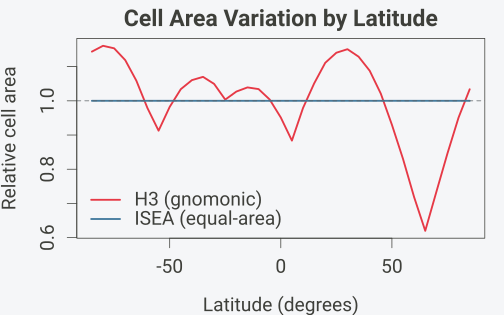

``` r

par(oldpar)
```

For ecological and statistical applications where equal-area cells are
important (species density estimation, spatial sampling), ISEA is the
correct choice. For applications where hierarchical indexing speed
matters more than area equality (ride-sharing, logistics), H3 may be
preferable.

### Resolution Mapping

Because ISEA supports multiple apertures, there is no one-to-one
resolution mapping to H3. The
[`h3_crosswalk()`](https://gillescolling.com/hexify/reference/h3_crosswalk.md)
function finds the closest H3 resolution for a given ISEA grid:

``` r

# H3 resolution table: compare H3 and ISEA aperture-7 cell areas
cat("H3 Res  Avg Area (km²)  ISEA Ap7 Equivalent\n")
#> H3 Res  Avg Area (km²)  ISEA Ap7 Equivalent
cat("------  --------------  -------------------\n")
#> ------  --------------  -------------------
for (h3_res in 0:8) {
  g_h3 <- hex_grid(resolution = h3_res, type = "h3")
  h3_area <- g_h3@area_km2

  # Find closest ISEA ap7 resolution by brute force
  best_res <- 0
  best_diff <- Inf
  for (r in 0:15) {
    g_test <- hex_grid(resolution = r, aperture = 7)
    d <- abs(log(g_test@area_km2) - log(h3_area))
    if (d < best_diff) { best_diff <- d; best_res <- r }
  }
  g_isea <- hex_grid(resolution = best_res, aperture = 7)
  cat(sprintf("   %2d   %14.1f  res %d (%.1f km²)\n",
              h3_res, h3_area, best_res, g_isea@area_km2))
}
#>     0        4357449.4  res 1 (7084244.7 km²)
#>     1         609788.4  res 2 (1036718.7 km²)
#>     2          86801.8  res 3 (148620.5 km²)
#>     3          12393.4  res 4 (21242.1 km²)
#>     4           1770.3  res 5 (3034.8 km²)
#>     5            252.9  res 6 (433.5 km²)
#>     6             36.1  res 7 (61.9 km²)
#>     7              5.2  res 8 (8.8 km²)
#>     8              0.7  res 9 (1.3 km²)
```

### When to Use Which

| Use case | Recommended | Reason |
|----|----|----|
| Species distribution modeling | ISEA | Equal area eliminates sampling bias |
| Spatial statistics (Moran’s I, variograms) | ISEA | Equal area ensures unbiased estimates |
| Ride-sharing / logistics | H3 | Fast hierarchical lookups |
| Visualization only | Either | Area variation invisible at map scale |
| Cross-system interoperability | Both via [`h3_crosswalk()`](https://gillescolling.com/hexify/reference/h3_crosswalk.md) | Bidirectional mapping |

## Round-Trip Accuracy

``` r

original_lon <- 16.37
original_lat <- 48.21

cat(sprintf("Original: (%.4f, %.4f)\n\n", original_lon, original_lat))
#> Original: (16.3700, 48.2100)

for (ap in c(3, 4, 7)) {
  res <- if (ap == 7) 6 else 10
  grid <- hex_grid(resolution = res, aperture = ap)
  cell_id <- lonlat_to_cell(original_lon, original_lat, grid)
  recovered <- cell_to_lonlat(cell_id, grid)
  error_km <- sqrt((recovered$lon - original_lon)^2 +
                   (recovered$lat - original_lat)^2) * 111
  cat(sprintf("Aperture %d (res %2d): cell %d -> (%.4f, %.4f), ~%.1f km from center\n",
              ap, res, cell_id,
              recovered$lon, recovered$lat, error_km))
}
#> Aperture 3 (res 10): cell 126594 -> (16.4204, 48.2877), ~10.3 km from center
#> Aperture 4 (res 10): cell 2245587 -> (16.4177, 48.2119), ~5.3 km from center
#> Aperture 7 (res  6): cell 252091 -> (16.3388, 48.2019), ~3.6 km from center
```

## Summary of ISEA Properties

| Property | Description |
|----|----|
| **Equal area** | All hexagonal cells identical; pentagons = 5/6 hex area |
| **Bounded distortion** | Max angular distortion ~17.3° at face edges |
| **Uniform topology** | Hexagons have 6 neighbors; pentagons have 5 |
| **12 pentagons** | Topological necessity from Euler’s formula |

## References

- Brodsky, I. (2018). H3: Uber’s Hexagonal Hierarchical Spatial Index.
  *Uber Engineering Blog*.

- H3 documentation (2024). *H3: A Hexagonal Hierarchical Geospatial
  Indexing System*. <https://h3geo.org/>

- Bradley, A.D. (1946). Equal-area projection on the icosahedron.
  *Geographical Review*, 36(1), 101-104.

- Coxeter, H.S.M. (1973). *Regular Polytopes* (3rd ed.). Dover
  Publications.

- DGGRID Manual (2023). *DGGRID Version 7.8 Documentation*.
  <https://github.com/sahrk/DGGRID>

- Morton, G.M. (1966). *A Computer Oriented Geodetic Data Base and a New
  Technique in File Sequencing*. IBM Technical Report.

- Sahr, K. (2008). Location coding on icosahedral aperture 3 hexagon
  discrete global grids. *Computers, Environment and Urban Systems*,
  32(3), 174-187.

- Sahr, K. (2025). IGEO7: An equal-area hierarchical hexagonal discrete
  global grid system with Z7 indexing. *Cartography and Geographic
  Information Science*.

- Sahr, K., White, D., & Kimerling, A.J. (2003). Geodesic Discrete
  Global Grid Systems. *Cartography and Geographic Information Science*,
  30(2), 121-134.

- Snyder, J.P. (1987). *Map Projections: A Working Manual*. U.S.
  Geological Survey Professional Paper 1395.

- Snyder, J.P. (1992). An equal-area map projection for polyhedral
  globes. *Cartographica*, 29(1), 10-21.

- White, D., Kimerling, A.J., & Overton, W.S. (1992). Cartographic and
  geometric components of a global sampling design for environmental
  monitoring. *Cartography and Geographic Information Systems*, 19(1),
  5-22.
