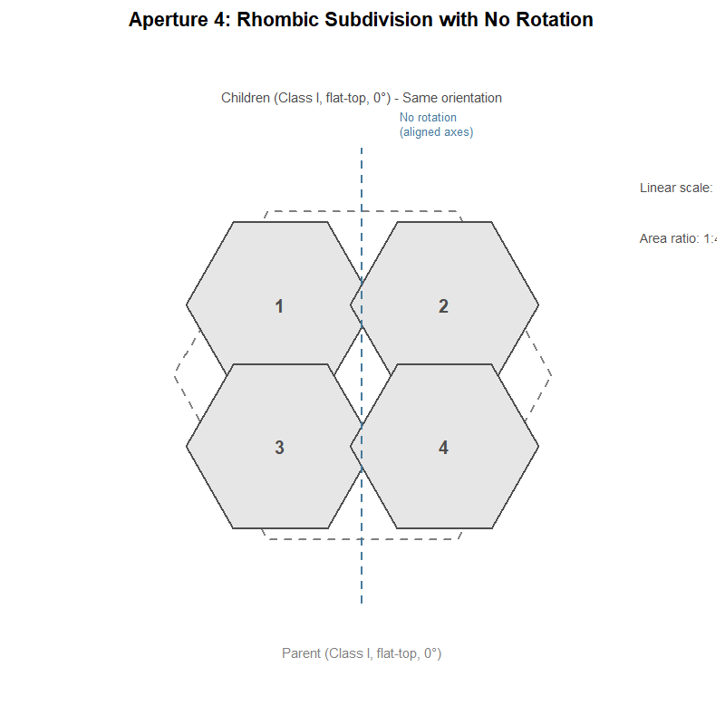

# Mathematical Foundations

## Overview

hexify implements the **ISEA (Icosahedral Snyder Equal Area)** discrete
global grid system. This vignette explains the mathematical foundations:
the projection geometry, coordinate systems, aperture subdivision, and
cell indexing.

## The Problem: Equal-Area Grids on a Sphere

Any projection from a sphere to a plane must distort *something*. For
spatial statistics, we need cells of equal area regardless of location.
Standard latitude-longitude grids fail badly: a 1° cell at the equator
covers ~12,300 km², while the same cell near the poles covers a tiny
fraction of that.

The ISEA projection solves this by:

1.  Inscribing a regular icosahedron in the sphere
2.  Projecting each spherical “cap” onto its corresponding flat
    triangular face using a modified Lambert equal-area projection
3.  Overlaying a hexagonal grid on the resulting planar triangles

## The Lambert Azimuthal Equal-Area Projection

The foundation of Snyder’s projection is Lambert’s azimuthal equal-area
projection, developed by Johann Heinrich Lambert in 1772. The projection
maps a sphere of radius $`R`$ to a tangent plane while **preserving area
exactly** (Snyder, 1987, p. 182).

### Definition

The Lambert azimuthal equal-area projection is defined by a mathematical
constraint, not a geometric construction. For a projection centered at
point $`S`$:

- **Azimuthal property:** The direction (azimuth) from $`S`$ to any
  point $`P`$ on the sphere equals the direction from the origin to
  $`P'`$ on the plane
- **Equal-area property:** Any region on the sphere maps to a region of
  identical area on the plane

These two constraints uniquely determine the radial distance formula.
For a point $`P`$ at angular distance $`c`$ from the center (measured
along the sphere surface), the projected distance from the origin is:

``` math
\rho = 2R \sin\left(\frac{c}{2}\right)
```

This is **not** a perspective projection and has no simple geometric
interpretation like “chord distance” or “ray intersection.” The formula
is derived analytically from the equal-area constraint (Snyder, 1987,
p. 182-185).


Lambert azimuthal equal-area projection: chord distance relationship

### Forward Formulas

For the oblique aspect centered at $`(\lambda_0, \phi_1)`$, the full
formulas are (Snyder, 1987, eq. 24-2 to 24-4, p. 185):

``` math
k' = \sqrt{\frac{2}{1 + \sin\phi_1\sin\phi + \cos\phi_1\cos\phi\cos(\lambda - \lambda_0)}}
```

``` math
x = R \cdot k' \cdot \cos\phi \cdot \sin(\lambda - \lambda_0)
```

``` math
y = R \cdot k' \cdot [\cos\phi_1\sin\phi - \sin\phi_1\cos\phi\cos(\lambda - \lambda_0)]
```

### Equal-Area Proof

The projection preserves area because the radial and tangential scale
factors satisfy $`h' \cdot k' = 1`$ at every point. At angular distance
$`c`$ from center (Snyder, 1987, eq. 24-22, 24-23, p. 188):

``` math
h' = \cos\left(\frac{c}{2}\right), \quad k' = \sec\left(\frac{c}{2}\right)
```

Therefore $`h' \cdot k' = \cos(c/2) \cdot \sec(c/2) = 1`$, confirming
the equal-area property.

![](data:image/svg+xml;base64,PHN2ZyB4bWxucz0iaHR0cDovL3d3dy53My5vcmcvMjAwMC9zdmciIHhtbG5zOnhsaW5rPSJodHRwOi8vd3d3LnczLm9yZy8xOTk5L3hsaW5rIiB3aWR0aD0iNTc2LjAwcHQiIGhlaWdodD0iMjg4LjAwcHQiIHZpZXdib3g9IjAgMCA1NzYuMDAgMjg4LjAwIiBjbGFzcz0ici1wbHQgaW5saW5lLXN2ZyIgc3R5bGU9Im1heC13aWR0aDoxMDAlO3dpZHRoOjEwMCU7aGVpZ2h0OmF1dG87Ij48ZyBjbGFzcz0ic3ZnbGl0ZSI+PGRlZnM+PHN0eWxlIHR5cGU9InRleHQvY3NzIj4KICAgIC8qIHRoZW1lLWF3YXJlLXByb2Nlc3NlZCAqLwogICAgLnN2Z2xpdGUgbGluZSwgLnN2Z2xpdGUgcG9seWxpbmUsIC5zdmdsaXRlIHBvbHlnb24sIC5zdmdsaXRlIHBhdGgsIC5zdmdsaXRlIGNpcmNsZSB7CiAgICAgIGZpbGw6IG5vbmU7CiAgICAgIHN0cm9rZTogIzNFM0YzQTsKICAgICAgc3Ryb2tlLWxpbmVjYXA6IHJvdW5kOwogICAgICBzdHJva2UtbGluZWpvaW46IHJvdW5kOwogICAgICBzdHJva2UtbWl0ZXJsaW1pdDogMTAuMDA7CiAgICB9CiAgICAuc3ZnbGl0ZSA+IGcgPiByZWN0IHsKICAgICAgZmlsbDogbm9uZTsKICAgICAgc3Ryb2tlOiAjM0UzRjNBOwogICAgICBzdHJva2UtbGluZWNhcDogcm91bmQ7CiAgICAgIHN0cm9rZS1saW5lam9pbjogcm91bmQ7CiAgICAgIHN0cm9rZS1taXRlcmxpbWl0OiAxMC4wMDsKICAgIH0KICAgIC5zdmdsaXRlIHRleHQgewogICAgICB3aGl0ZS1zcGFjZTogcHJlOwogICAgICBmaWxsOiAjM0UzRjNBOwogICAgfQogICAgLnN2Z2xpdGUgZy5nbHlwaGdyb3VwIHBhdGggewogICAgICBmaWxsOiBpbmhlcml0OwogICAgICBzdHJva2U6IG5vbmU7CiAgICB9CiAgPC9zdHlsZT48L2RlZnM+PHJlY3QgY2xhc3M9InN2Zy1iZyIgd2lkdGg9IjEwMCUiIGhlaWdodD0iMTAwJSIgc3R5bGU9InN0cm9rZTogbm9uZTsgZmlsbDogI0Y1RjZGODsiIC8+PGRlZnM+PGNsaXBwYXRoIGlkPSJjcE1DNHdNSHcxTnpZdU1EQjhNQzR3TUh3eU9EZ3VNREE9Ij48cmVjdCB4PSIwLjAwIiB5PSIwLjAwIiB3aWR0aD0iNTc2LjAwIiBoZWlnaHQ9IjI4OC4wMCIgLz48L2NsaXBwYXRoPjwvZGVmcz48ZyBjbGlwLXBhdGg9InVybCgjY3BNQzR3TUh3MU56WXVNREI4TUM0d01Id3lPRGd1TURBPSkiPjwvZz48ZGVmcz48Y2xpcHBhdGggaWQ9ImNwTUM0d01Id3lPRGd1TURCOE1DNHdNSHd5T0RndU1EQT0iPjxyZWN0IHg9IjAuMDAiIHk9IjAuMDAiIHdpZHRoPSIyODguMDAiIGhlaWdodD0iMjg4LjAwIiAvPjwvY2xpcHBhdGg+PC9kZWZzPjxnIGNsaXAtcGF0aD0idXJsKCNjcE1DNHdNSHd5T0RndU1EQjhNQzR3TUh3eU9EZ3VNREE9KSI+PHRleHQgeD0iMTQ0LjAwIiB5PSIyNi43NSIgdGV4dC1hbmNob3I9Im1pZGRsZSIgc3R5bGU9ImZvbnQtc2l6ZTogMTQuNDBweDsgZm9udC13ZWlnaHQ6IGJvbGQ7IGZvbnQtZmFtaWx5OiAmcXVvdDtSb2JvdG8mcXVvdDssIC1hcHBsZS1zeXN0ZW0sIEJsaW5rTWFjU3lzdGVtRm9udCwgJnF1b3Q7U2Vnb2UgVUkmcXVvdDssIHN5c3RlbS11aSwgc2Fucy1zZXJpZjsiIHRleHRsZW5ndGg9IjE4OC43M3B4IiBsZW5ndGhhZGp1c3Q9InNwYWNpbmdBbmRHbHlwaHMiPlNwaGVyZSAodmlldyBmcm9tIGFib3ZlIFMpPC90ZXh0PjwvZz48ZGVmcz48Y2xpcHBhdGggaWQ9ImNwTVRRdU5EQjhNamN6TGpZd2ZEUXpMakl3ZkRJMU9TNHlNQT09Ij48cmVjdCB4PSIxNC40MCIgeT0iNDMuMjAiIHdpZHRoPSIyNTkuMjAiIGhlaWdodD0iMjE2LjAwIiAvPjwvY2xpcHBhdGg+PC9kZWZzPjxnIGNsaXAtcGF0aD0idXJsKCNjcE1UUXVOREI4TWpjekxqWXdmRFF6TGpJd2ZESTFPUzR5TUE9PSkiPjxwb2x5bGluZSBwb2ludHM9IjIyMC45MiwxNTEuMjAgMjIwLjc3LDE0Ni4zMiAyMjAuMzAsMTQxLjQ2IDIxOS41MywxMzYuNjQgMjE4LjQ2LDEzMS44OCAyMTcuMDgsMTI3LjIwIDIxNS40MSwxMjIuNjEgMjEzLjQ2LDExOC4xNCAyMTEuMjIsMTEzLjgwIDIwOC43MSwxMDkuNjEgMjA1Ljk0LDEwNS41OSAyMDIuOTMsMTAxLjc1IDE5OS42Nyw5OC4xMiAxOTYuMTksOTQuNjkgMTkyLjUwLDkxLjUwIDE4OC42Miw4OC41NCAxODQuNTYsODUuODQgMTgwLjMzLDgzLjQwIDE3NS45Niw4MS4yMyAxNzEuNDUsNzkuMzQgMTY2Ljg0LDc3Ljc1IDE2Mi4xNCw3Ni40NSAxNTcuMzYsNzUuNDUgMTUyLjUzLDc0Ljc1IDE0Ny42Niw3NC4zNiAxNDIuNzgsNzQuMjkgMTM3LjkwLDc0LjUyIDEzMy4wNSw3NS4wNiAxMjguMjUsNzUuOTEgMTIzLjUwLDc3LjA2IDExOC44NCw3OC41MSAxMTQuMjgsODAuMjUgMTA5Ljg0LDgyLjI4IDEwNS41NCw4NC41OCAxMDEuMzksODcuMTYgOTcuNDEsODkuOTkgOTMuNjMsOTMuMDcgOTAuMDQsOTYuMzggODYuNjcsOTkuOTEgODMuNTMsMTAzLjY1IDgwLjY0LDEwNy41OCA3OC4wMCwxMTEuNjkgNzUuNjMsMTE1Ljk1IDczLjUzLDEyMC4zNiA3MS43MiwxMjQuODkgNzAuMTksMTI5LjUzIDY4Ljk3LDEzNC4yNSA2OC4wNCwxMzkuMDUgNjcuNDMsMTQzLjg5IDY3LjEyLDE0OC43NiA2Ny4xMiwxNTMuNjQgNjcuNDMsMTU4LjUxIDY4LjA0LDE2My4zNSA2OC45NywxNjguMTUgNzAuMTksMTcyLjg3IDcxLjcyLDE3Ny41MSA3My41MywxODIuMDQgNzUuNjMsMTg2LjQ1IDc4LjAwLDE5MC43MSA4MC42NCwxOTQuODIgODMuNTMsMTk4Ljc1IDg2LjY3LDIwMi40OSA5MC4wNCwyMDYuMDIgOTMuNjMsMjA5LjMzIDk3LjQxLDIxMi40MSAxMDEuMzksMjE1LjI0IDEwNS41NCwyMTcuODIgMTA5Ljg0LDIyMC4xMiAxMTQuMjgsMjIyLjE1IDExOC44NCwyMjMuODkgMTIzLjUwLDIyNS4zNCAxMjguMjUsMjI2LjQ5IDEzMy4wNSwyMjcuMzQgMTM3LjkwLDIyNy44OCAxNDIuNzgsMjI4LjExIDE0Ny42NiwyMjguMDQgMTUyLjUzLDIyNy42NSAxNTcuMzYsMjI2Ljk1IDE2Mi4xNCwyMjUuOTUgMTY2Ljg0LDIyNC42NSAxNzEuNDUsMjIzLjA2IDE3NS45NiwyMjEuMTcgMTgwLjMzLDIxOS4wMCAxODQuNTYsMjE2LjU2IDE4OC42MiwyMTMuODYgMTkyLjUwLDIxMC45MCAxOTYuMTksMjA3LjcxIDE5OS42NywyMDQuMjggMjAyLjkzLDIwMC42NSAyMDUuOTQsMTk2LjgxIDIwOC43MSwxOTIuNzkgMjExLjIyLDE4OC42MCAyMTMuNDYsMTg0LjI2IDIxNS40MSwxNzkuNzkgMjE3LjA4LDE3NS4yMCAyMTguNDYsMTcwLjUyIDIxOS41MywxNjUuNzYgMjIwLjMwLDE2MC45NCAyMjAuNzcsMTU2LjA4IDIyMC45MiwxNTEuMjAgIiBzdHlsZT0ic3Ryb2tlLXdpZHRoOiAxLjUwOyI+PC9wb2x5bGluZT48cG9seWdvbiBwb2ludHM9IjIyMC45MiwxNTEuMjAgMjIwLjc3LDE0Ni4zMiAyMjAuMzAsMTQxLjQ2IDIxOS41MywxMzYuNjQgMjE4LjQ2LDEzMS44OCAyMTcuMDgsMTI3LjIwIDIxNS40MSwxMjIuNjEgMjEzLjQ2LDExOC4xNCAyMTEuMjIsMTEzLjgwIDIwOC43MSwxMDkuNjEgMjA1Ljk0LDEwNS41OSAyMDIuOTMsMTAxLjc1IDE5OS42Nyw5OC4xMiAxOTYuMTksOTQuNjkgMTkyLjUwLDkxLjUwIDE4OC42Miw4OC41NCAxODQuNTYsODUuODQgMTgwLjMzLDgzLjQwIDE3NS45Niw4MS4yMyAxNzEuNDUsNzkuMzQgMTY2Ljg0LDc3Ljc1IDE2Mi4xNCw3Ni40NSAxNTcuMzYsNzUuNDUgMTUyLjUzLDc0Ljc1IDE0Ny42Niw3NC4zNiAxNDIuNzgsNzQuMjkgMTM3LjkwLDc0LjUyIDEzMy4wNSw3NS4wNiAxMjguMjUsNzUuOTEgMTIzLjUwLDc3LjA2IDExOC44NCw3OC41MSAxMTQuMjgsODAuMjUgMTA5Ljg0LDgyLjI4IDEwNS41NCw4NC41OCAxMDEuMzksODcuMTYgOTcuNDEsODkuOTkgOTMuNjMsOTMuMDcgOTAuMDQsOTYuMzggODYuNjcsOTkuOTEgODMuNTMsMTAzLjY1IDgwLjY0LDEwNy41OCA3OC4wMCwxMTEuNjkgNzUuNjMsMTE1Ljk1IDczLjUzLDEyMC4zNiA3MS43MiwxMjQuODkgNzAuMTksMTI5LjUzIDY4Ljk3LDEzNC4yNSA2OC4wNCwxMzkuMDUgNjcuNDMsMTQzLjg5IDY3LjEyLDE0OC43NiA2Ny4xMiwxNTMuNjQgNjcuNDMsMTU4LjUxIDY4LjA0LDE2My4zNSA2OC45NywxNjguMTUgNzAuMTksMTcyLjg3IDcxLjcyLDE3Ny41MSA3My41MywxODIuMDQgNzUuNjMsMTg2LjQ1IDc4LjAwLDE5MC43MSA4MC42NCwxOTQuODIgODMuNTMsMTk4Ljc1IDg2LjY3LDIwMi40OSA5MC4wNCwyMDYuMDIgOTMuNjMsMjA5LjMzIDk3LjQxLDIxMi40MSAxMDEuMzksMjE1LjI0IDEwNS41NCwyMTcuODIgMTA5Ljg0LDIyMC4xMiAxMTQuMjgsMjIyLjE1IDExOC44NCwyMjMuODkgMTIzLjUwLDIyNS4zNCAxMjguMjUsMjI2LjQ5IDEzMy4wNSwyMjcuMzQgMTM3LjkwLDIyNy44OCAxNDIuNzgsMjI4LjExIDE0Ny42NiwyMjguMDQgMTUyLjUzLDIyNy42NSAxNTcuMzYsMjI2Ljk1IDE2Mi4xNCwyMjUuOTUgMTY2Ljg0LDIyNC42NSAxNzEuNDUsMjIzLjA2IDE3NS45NiwyMjEuMTcgMTgwLjMzLDIxOS4wMCAxODQuNTYsMjE2LjU2IDE4OC42MiwyMTMuODYgMTkyLjUwLDIxMC45MCAxOTYuMTksMjA3LjcxIDE5OS42NywyMDQuMjggMjAyLjkzLDIwMC42NSAyMDUuOTQsMTk2LjgxIDIwOC43MSwxOTIuNzkgMjExLjIyLDE4OC42MCAyMTMuNDYsMTg0LjI2IDIxNS40MSwxNzkuNzkgMjE3LjA4LDE3NS4yMCAyMTguNDYsMTcwLjUyIDIxOS41MywxNjUuNzYgMjIwLjMwLDE2MC45NCAyMjAuNzcsMTU2LjA4IDIyMC45MiwxNTEuMjAgMjE3LjE2LDE1MS4yMCAyMTcuMDEsMTU1Ljg0IDIxNi41NywxNjAuNDYgMjE1Ljg0LDE2NS4wNSAyMTQuODEsMTY5LjU3IDIxMy41MSwxNzQuMDMgMjExLjkyLDE3OC4zOSAyMTAuMDYsMTgyLjY0IDIwNy45MywxODYuNzcgMjA1LjU0LDE5MC43NSAyMDIuOTEsMTk0LjU4IDIwMC4wNCwxOTguMjMgMTk2Ljk1LDIwMS42OCAxOTMuNjQsMjA0Ljk0IDE5MC4xMywyMDcuOTggMTg2LjQ0LDIxMC43OSAxODIuNTcsMjEzLjM2IDE3OC41NSwyMTUuNjkgMTc0LjM5LDIxNy43NSAxNzAuMTEsMjE5LjU0IDE2NS43MiwyMjEuMDYgMTYxLjI1LDIyMi4zMCAxNTYuNzAsMjIzLjI1IDE1Mi4xMSwyMjMuOTEgMTQ3LjQ4LDIyNC4yOCAxNDIuODQsMjI0LjM1IDEzOC4yMCwyMjQuMTMgMTMzLjU5LDIyMy42MSAxMjkuMDIsMjIyLjgxIDEyNC41MSwyMjEuNzEgMTIwLjA3LDIyMC4zMyAxMTUuNzQsMjE4LjY4IDExMS41MSwyMTYuNzUgMTA3LjQyLDIxNC41NiAxMDMuNDgsMjEyLjExIDk5LjY5LDIwOS40MiA5Ni4wOSwyMDYuNDkgOTIuNjgsMjAzLjM0IDg5LjQ4LDE5OS45OCA4Ni40OSwxOTYuNDIgODMuNzQsMTkyLjY5IDgxLjIzLDE4OC43OCA3OC45NywxODQuNzIgNzYuOTgsMTgwLjUzIDc1LjI1LDE3Ni4yMiA3My44MSwxNzEuODEgNzIuNjQsMTY3LjMyIDcxLjc2LDE2Mi43NiA3MS4xNywxNTguMTUgNzAuODgsMTUzLjUyIDcwLjg4LDE0OC44OCA3MS4xNywxNDQuMjUgNzEuNzYsMTM5LjY0IDcyLjY0LDEzNS4wOCA3My44MSwxMzAuNTkgNzUuMjUsMTI2LjE4IDc2Ljk4LDEyMS44NyA3OC45NywxMTcuNjggODEuMjMsMTEzLjYyIDgzLjc0LDEwOS43MSA4Ni40OSwxMDUuOTggODkuNDgsMTAyLjQyIDkyLjY4LDk5LjA2IDk2LjA5LDk1LjkxIDk5LjY5LDkyLjk4IDEwMy40OCw5MC4yOSAxMDcuNDIsODcuODQgMTExLjUxLDg1LjY1IDExNS43NCw4My43MiAxMjAuMDcsODIuMDcgMTI0LjUxLDgwLjY5IDEyOS4wMiw3OS41OSAxMzMuNTksNzguNzkgMTM4LjIwLDc4LjI3IDE0Mi44NCw3OC4wNSAxNDcuNDgsNzguMTIgMTUyLjExLDc4LjQ5IDE1Ni43MCw3OS4xNSAxNjEuMjUsODAuMTAgMTY1LjcyLDgxLjM0IDE3MC4xMSw4Mi44NiAxNzQuMzksODQuNjUgMTc4LjU1LDg2LjcxIDE4Mi41Nyw4OS4wNCAxODYuNDQsOTEuNjEgMTkwLjEzLDk0LjQyIDE5My42NCw5Ny40NiAxOTYuOTUsMTAwLjcyIDIwMC4wNCwxMDQuMTcgMjAyLjkxLDEwNy44MiAyMDUuNTQsMTExLjY1IDIwNy45MywxMTUuNjMgMjEwLjA2LDExOS43NiAyMTEuOTIsMTI0LjAxIDIxMy41MSwxMjguMzcgMjE0LjgxLDEzMi44MyAyMTUuODQsMTM3LjM1IDIxNi41NywxNDEuOTQgMjE3LjAxLDE0Ni41NiAyMTcuMTYsMTUxLjIwICIgc3R5bGU9InN0cm9rZS13aWR0aDogMC43NTsgc3Ryb2tlOiAjNjY2NjY2OyBmaWxsOiAjRTc2RjUxOyBmaWxsLW9wYWNpdHk6IDAuNTA7Ij48L3BvbHlnb24+PHBvbHlnb24gcG9pbnRzPSIyMTcuMTYsMTUxLjIwIDIxNy4wMSwxNDYuNTYgMjE2LjU3LDE0MS45NCAyMTUuODQsMTM3LjM1IDIxNC44MSwxMzIuODMgMjEzLjUxLDEyOC4zNyAyMTEuOTIsMTI0LjAxIDIxMC4wNiwxMTkuNzYgMjA3LjkzLDExNS42MyAyMDUuNTQsMTExLjY1IDIwMi45MSwxMDcuODIgMjAwLjA0LDEwNC4xNyAxOTYuOTUsMTAwLjcyIDE5My42NCw5Ny40NiAxOTAuMTMsOTQuNDIgMTg2LjQ0LDkxLjYxIDE4Mi41Nyw4OS4wNCAxNzguNTUsODYuNzEgMTc0LjM5LDg0LjY1IDE3MC4xMSw4Mi44NiAxNjUuNzIsODEuMzQgMTYxLjI1LDgwLjEwIDE1Ni43MCw3OS4xNSAxNTIuMTEsNzguNDkgMTQ3LjQ4LDc4LjEyIDE0Mi44NCw3OC4wNSAxMzguMjAsNzguMjcgMTMzLjU5LDc4Ljc5IDEyOS4wMiw3OS41OSAxMjQuNTEsODAuNjkgMTIwLjA3LDgyLjA3IDExNS43NCw4My43MiAxMTEuNTEsODUuNjUgMTA3LjQyLDg3Ljg0IDEwMy40OCw5MC4yOSA5OS42OSw5Mi45OCA5Ni4wOSw5NS45MSA5Mi42OCw5OS4wNiA4OS40OCwxMDIuNDIgODYuNDksMTA1Ljk4IDgzLjc0LDEwOS43MSA4MS4yMywxMTMuNjIgNzguOTcsMTE3LjY4IDc2Ljk4LDEyMS44NyA3NS4yNSwxMjYuMTggNzMuODEsMTMwLjU5IDcyLjY0LDEzNS4wOCA3MS43NiwxMzkuNjQgNzEuMTcsMTQ0LjI1IDcwLjg4LDE0OC44OCA3MC44OCwxNTMuNTIgNzEuMTcsMTU4LjE1IDcxLjc2LDE2Mi43NiA3Mi42NCwxNjcuMzIgNzMuODEsMTcxLjgxIDc1LjI1LDE3Ni4yMiA3Ni45OCwxODAuNTMgNzguOTcsMTg0LjcyIDgxLjIzLDE4OC43OCA4My43NCwxOTIuNjkgODYuNDksMTk2LjQyIDg5LjQ4LDE5OS45OCA5Mi42OCwyMDMuMzQgOTYuMDksMjA2LjQ5IDk5LjY5LDIwOS40MiAxMDMuNDgsMjEyLjExIDEwNy40MiwyMTQuNTYgMTExLjUxLDIxNi43NSAxMTUuNzQsMjE4LjY4IDEyMC4wNywyMjAuMzMgMTI0LjUxLDIyMS43MSAxMjkuMDIsMjIyLjgxIDEzMy41OSwyMjMuNjEgMTM4LjIwLDIyNC4xMyAxNDIuODQsMjI0LjM1IDE0Ny40OCwyMjQuMjggMTUyLjExLDIyMy45MSAxNTYuNzAsMjIzLjI1IDE2MS4yNSwyMjIuMzAgMTY1LjcyLDIyMS4wNiAxNzAuMTEsMjE5LjU0IDE3NC4zOSwyMTcuNzUgMTc4LjU1LDIxNS42OSAxODIuNTcsMjEzLjM2IDE4Ni40NCwyMTAuNzkgMTkwLjEzLDIwNy45OCAxOTMuNjQsMjA0Ljk0IDE5Ni45NSwyMDEuNjggMjAwLjA0LDE5OC4yMyAyMDIuOTEsMTk0LjU4IDIwNS41NCwxOTAuNzUgMjA3LjkzLDE4Ni43NyAyMTAuMDYsMTgyLjY0IDIxMS45MiwxNzguMzkgMjEzLjUxLDE3NC4wMyAyMTQuODEsMTY5LjU3IDIxNS44NCwxNjUuMDUgMjE2LjU3LDE2MC40NiAyMTcuMDEsMTU1Ljg0IDIxNy4xNiwxNTEuMjAgMjA2LjIzLDE1MS4yMCAyMDYuMTEsMTU1LjE1IDIwNS43MywxNTkuMDggMjA1LjExLDE2Mi45OCAyMDQuMjQsMTY2LjgzIDIwMy4xMiwxNzAuNjIgMjAxLjc3LDE3NC4zMyAyMDAuMTksMTc3Ljk1IDE5OC4zOCwxODEuNDYgMTk2LjM1LDE4NC44NSAxOTQuMTEsMTg4LjEwIDE5MS42NywxOTEuMjAgMTg5LjA0LDE5NC4xNSAxODYuMjMsMTk2LjkyIDE4My4yNCwxOTkuNTAgMTgwLjEwLDIwMS44OSAxNzYuODEsMjA0LjA4IDE3My4zOSwyMDYuMDUgMTY5Ljg1LDIwNy44MSAxNjYuMjEsMjA5LjMzIDE2Mi40OCwyMTAuNjMgMTU4LjY3LDIxMS42OCAxNTQuODEsMjEyLjQ5IDE1MC45MCwyMTMuMDUgMTQ2Ljk2LDIxMy4zNiAxNDMuMDEsMjEzLjQyIDEzOS4wNywyMTMuMjQgMTM1LjE0LDIxMi44MCAxMzEuMjUsMjEyLjExIDEyNy40MiwyMTEuMTggMTIzLjY1LDIxMC4wMSAxMTkuOTYsMjA4LjYwIDExNi4zNiwyMDYuOTYgMTEyLjg4LDIwNS4wOSAxMDkuNTMsMjAzLjAxIDEwNi4zMSwyMDAuNzIgMTAzLjI1LDE5OC4yMyAxMDAuMzUsMTk1LjU1IDk3LjYyLDE5Mi42OSA5NS4wOCwxODkuNjcgOTIuNzQsMTg2LjQ5IDkwLjYxLDE4My4xNyA4OC42OSwxNzkuNzIgODYuOTksMTc2LjE1IDg1LjUyLDE3Mi40OCA4NC4yOSwxNjguNzMgODMuMzAsMTY0LjkxIDgyLjU1LDE2MS4wMyA4Mi4wNSwxNTcuMTIgODEuODAsMTUzLjE3IDgxLjgwLDE0OS4yMyA4Mi4wNSwxNDUuMjggODIuNTUsMTQxLjM3IDgzLjMwLDEzNy40OSA4NC4yOSwxMzMuNjcgODUuNTIsMTI5LjkyIDg2Ljk5LDEyNi4yNSA4OC42OSwxMjIuNjggOTAuNjEsMTE5LjIzIDkyLjc0LDExNS45MSA5NS4wOCwxMTIuNzMgOTcuNjIsMTA5LjcxIDEwMC4zNSwxMDYuODUgMTAzLjI1LDEwNC4xNyAxMDYuMzEsMTAxLjY4IDEwOS41Myw5OS4zOSAxMTIuODgsOTcuMzEgMTE2LjM2LDk1LjQ0IDExOS45Niw5My44MCAxMjMuNjUsOTIuMzkgMTI3LjQyLDkxLjIyIDEzMS4yNSw5MC4yOSAxMzUuMTQsODkuNjAgMTM5LjA3LDg5LjE2IDE0My4wMSw4OC45OCAxNDYuOTYsODkuMDQgMTUwLjkwLDg5LjM1IDE1NC44MSw4OS45MSAxNTguNjcsOTAuNzIgMTYyLjQ4LDkxLjc3IDE2Ni4yMSw5My4wNyAxNjkuODUsOTQuNTkgMTczLjM5LDk2LjM1IDE3Ni44MSw5OC4zMiAxODAuMTAsMTAwLjUxIDE4My4yNCwxMDIuOTAgMTg2LjIzLDEwNS40OCAxODkuMDQsMTA4LjI1IDE5MS42NywxMTEuMjAgMTk0LjExLDExNC4zMCAxOTYuMzUsMTE3LjU1IDE5OC4zOCwxMjAuOTQgMjAwLjE5LDEyNC40NSAyMDEuNzcsMTI4LjA3IDIwMy4xMiwxMzEuNzggMjA0LjI0LDEzNS41NyAyMDUuMTEsMTM5LjQyIDIwNS43MywxNDMuMzIgMjA2LjExLDE0Ny4yNSAyMDYuMjMsMTUxLjIwICIgc3R5bGU9InN0cm9rZS13aWR0aDogMC43NTsgc3Ryb2tlOiAjNjY2NjY2OyBmaWxsOiAjRjRBMjYxOyBmaWxsLW9wYWNpdHk6IDAuNTA7Ij48L3BvbHlnb24+PHBvbHlnb24gcG9pbnRzPSIyMDYuMjMsMTUxLjIwIDIwNi4xMSwxNDcuMjUgMjA1LjczLDE0My4zMiAyMDUuMTEsMTM5LjQyIDIwNC4yNCwxMzUuNTcgMjAzLjEyLDEzMS43OCAyMDEuNzcsMTI4LjA3IDIwMC4xOSwxMjQuNDUgMTk4LjM4LDEyMC45NCAxOTYuMzUsMTE3LjU1IDE5NC4xMSwxMTQuMzAgMTkxLjY3LDExMS4yMCAxODkuMDQsMTA4LjI1IDE4Ni4yMywxMDUuNDggMTgzLjI0LDEwMi45MCAxODAuMTAsMTAwLjUxIDE3Ni44MSw5OC4zMiAxNzMuMzksOTYuMzUgMTY5Ljg1LDk0LjU5IDE2Ni4yMSw5My4wNyAxNjIuNDgsOTEuNzcgMTU4LjY3LDkwLjcyIDE1NC44MSw4OS45MSAxNTAuOTAsODkuMzUgMTQ2Ljk2LDg5LjA0IDE0My4wMSw4OC45OCAxMzkuMDcsODkuMTYgMTM1LjE0LDg5LjYwIDEzMS4yNSw5MC4yOSAxMjcuNDIsOTEuMjIgMTIzLjY1LDkyLjM5IDExOS45Niw5My44MCAxMTYuMzYsOTUuNDQgMTEyLjg4LDk3LjMxIDEwOS41Myw5OS4zOSAxMDYuMzEsMTAxLjY4IDEwMy4yNSwxMDQuMTcgMTAwLjM1LDEwNi44NSA5Ny42MiwxMDkuNzEgOTUuMDgsMTEyLjczIDkyLjc0LDExNS45MSA5MC42MSwxMTkuMjMgODguNjksMTIyLjY4IDg2Ljk5LDEyNi4yNSA4NS41MiwxMjkuOTIgODQuMjksMTMzLjY3IDgzLjMwLDEzNy40OSA4Mi41NSwxNDEuMzcgODIuMDUsMTQ1LjI4IDgxLjgwLDE0OS4yMyA4MS44MCwxNTMuMTcgODIuMDUsMTU3LjEyIDgyLjU1LDE2MS4wMyA4My4zMCwxNjQuOTEgODQuMjksMTY4LjczIDg1LjUyLDE3Mi40OCA4Ni45OSwxNzYuMTUgODguNjksMTc5LjcyIDkwLjYxLDE4My4xNyA5Mi43NCwxODYuNDkgOTUuMDgsMTg5LjY3IDk3LjYyLDE5Mi42OSAxMDAuMzUsMTk1LjU1IDEwMy4yNSwxOTguMjMgMTA2LjMxLDIwMC43MiAxMDkuNTMsMjAzLjAxIDExMi44OCwyMDUuMDkgMTE2LjM2LDIwNi45NiAxMTkuOTYsMjA4LjYwIDEyMy42NSwyMTAuMDEgMTI3LjQyLDIxMS4xOCAxMzEuMjUsMjEyLjExIDEzNS4xNCwyMTIuODAgMTM5LjA3LDIxMy4yNCAxNDMuMDEsMjEzLjQyIDE0Ni45NiwyMTMuMzYgMTUwLjkwLDIxMy4wNSAxNTQuODEsMjEyLjQ5IDE1OC42NywyMTEuNjggMTYyLjQ4LDIxMC42MyAxNjYuMjEsMjA5LjMzIDE2OS44NSwyMDcuODEgMTczLjM5LDIwNi4wNSAxNzYuODEsMjA0LjA4IDE4MC4xMCwyMDEuODkgMTgzLjI0LDE5OS41MCAxODYuMjMsMTk2LjkyIDE4OS4wNCwxOTQuMTUgMTkxLjY3LDE5MS4yMCAxOTQuMTEsMTg4LjEwIDE5Ni4zNSwxODQuODUgMTk4LjM4LDE4MS40NiAyMDAuMTksMTc3Ljk1IDIwMS43NywxNzQuMzMgMjAzLjEyLDE3MC42MiAyMDQuMjQsMTY2LjgzIDIwNS4xMSwxNjIuOTggMjA1LjczLDE1OS4wOCAyMDYuMTEsMTU1LjE1IDIwNi4yMywxNTEuMjAgMTg5LjIxLDE1MS4yMCAxODkuMTIsMTU0LjA3IDE4OC44NSwxNTYuOTIgMTg4LjQwLDE1OS43NiAxODcuNzcsMTYyLjU2IDE4Ni45NiwxNjUuMzEgMTg1Ljk4LDE2OC4wMCAxODQuODMsMTcwLjYzIDE4My41MSwxNzMuMTggMTgyLjA0LDE3NS42NCAxODAuNDEsMTc4LjAxIDE3OC42NCwxODAuMjYgMTc2LjcyLDE4Mi40MCAxNzQuNjgsMTg0LjQxIDE3Mi41MSwxODYuMjkgMTcwLjIzLDE4OC4wMyAxNjcuODQsMTg5LjYyIDE2NS4zNSwxOTEuMDUgMTYyLjc4LDE5Mi4zMyAxNjAuMTQsMTkzLjQ0IDE1Ny40MywxOTQuMzggMTU0LjY2LDE5NS4xNCAxNTEuODUsMTk1LjczIDE0OS4wMSwxOTYuMTQgMTQ2LjE1LDE5Ni4zNiAxNDMuMjgsMTk2LjQxIDE0MC40MiwxOTYuMjcgMTM3LjU3LDE5NS45NSAxMzQuNzQsMTk1LjQ2IDEzMS45NSwxOTQuNzggMTI5LjIxLDE5My45MyAxMjYuNTMsMTkyLjkwIDEyMy45MiwxOTEuNzEgMTIxLjM5LDE5MC4zNiAxMTguOTUsMTg4Ljg0IDExNi42MiwxODcuMTggMTE0LjM5LDE4NS4zNyAxMTIuMjgsMTgzLjQyIDExMC4zMCwxODEuMzUgMTA4LjQ2LDE3OS4xNSAxMDYuNzYsMTc2Ljg0IDEwNS4yMSwxNzQuNDMgMTAzLjgxLDE3MS45MiAxMDIuNTgsMTY5LjMzIDEwMS41MSwxNjYuNjYgMTAwLjYyLDE2My45NCA5OS45MCwxNjEuMTYgOTkuMzUsMTU4LjM0IDk4Ljk5LDE1NS41MCA5OC44MSwxNTIuNjMgOTguODEsMTQ5Ljc3IDk4Ljk5LDE0Ni45MCA5OS4zNSwxNDQuMDYgOTkuOTAsMTQxLjI0IDEwMC42MiwxMzguNDYgMTAxLjUxLDEzNS43NCAxMDIuNTgsMTMzLjA3IDEwMy44MSwxMzAuNDggMTA1LjIxLDEyNy45NyAxMDYuNzYsMTI1LjU2IDEwOC40NiwxMjMuMjUgMTEwLjMwLDEyMS4wNSAxMTIuMjgsMTE4Ljk4IDExNC4zOSwxMTcuMDMgMTE2LjYyLDExNS4yMiAxMTguOTUsMTEzLjU2IDEyMS4zOSwxMTIuMDQgMTIzLjkyLDExMC42OSAxMjYuNTMsMTA5LjUwIDEyOS4yMSwxMDguNDcgMTMxLjk1LDEwNy42MiAxMzQuNzQsMTA2Ljk0IDEzNy41NywxMDYuNDUgMTQwLjQyLDEwNi4xMyAxNDMuMjgsMTA1Ljk5IDE0Ni4xNSwxMDYuMDQgMTQ5LjAxLDEwNi4yNiAxNTEuODUsMTA2LjY3IDE1NC42NiwxMDcuMjYgMTU3LjQzLDEwOC4wMiAxNjAuMTQsMTA4Ljk2IDE2Mi43OCwxMTAuMDcgMTY1LjM1LDExMS4zNSAxNjcuODQsMTEyLjc4IDE3MC4yMywxMTQuMzcgMTcyLjUxLDExNi4xMSAxNzQuNjgsMTE3Ljk5IDE3Ni43MiwxMjAuMDAgMTc4LjY0LDEyMi4xNCAxODAuNDEsMTI0LjM5IDE4Mi4wNCwxMjYuNzYgMTgzLjUxLDEyOS4yMiAxODQuODMsMTMxLjc3IDE4NS45OCwxMzQuNDAgMTg2Ljk2LDEzNy4wOSAxODcuNzcsMTM5Ljg0IDE4OC40MCwxNDIuNjQgMTg4Ljg1LDE0NS40OCAxODkuMTIsMTQ4LjMzIDE4OS4yMSwxNTEuMjAgIiBzdHlsZT0ic3Ryb2tlLXdpZHRoOiAwLjc1OyBzdHJva2U6ICM2NjY2NjY7IGZpbGw6ICNFOUM0NkE7IGZpbGwtb3BhY2l0eTogMC41MDsiPjwvcG9seWdvbj48cG9seWdvbiBwb2ludHM9IjE4OS4yMSwxNTEuMjAgMTg5LjEyLDE0OC4zMyAxODguODUsMTQ1LjQ4IDE4OC40MCwxNDIuNjQgMTg3Ljc3LDEzOS44NCAxODYuOTYsMTM3LjA5IDE4NS45OCwxMzQuNDAgMTg0LjgzLDEzMS43NyAxODMuNTEsMTI5LjIyIDE4Mi4wNCwxMjYuNzYgMTgwLjQxLDEyNC4zOSAxNzguNjQsMTIyLjE0IDE3Ni43MiwxMjAuMDAgMTc0LjY4LDExNy45OSAxNzIuNTEsMTE2LjExIDE3MC4yMywxMTQuMzcgMTY3Ljg0LDExMi43OCAxNjUuMzUsMTExLjM1IDE2Mi43OCwxMTAuMDcgMTYwLjE0LDEwOC45NiAxNTcuNDMsMTA4LjAyIDE1NC42NiwxMDcuMjYgMTUxLjg1LDEwNi42NyAxNDkuMDEsMTA2LjI2IDE0Ni4xNSwxMDYuMDQgMTQzLjI4LDEwNS45OSAxNDAuNDIsMTA2LjEzIDEzNy41NywxMDYuNDUgMTM0Ljc0LDEwNi45NCAxMzEuOTUsMTA3LjYyIDEyOS4yMSwxMDguNDcgMTI2LjUzLDEwOS41MCAxMjMuOTIsMTEwLjY5IDEyMS4zOSwxMTIuMDQgMTE4Ljk1LDExMy41NiAxMTYuNjIsMTE1LjIyIDExNC4zOSwxMTcuMDMgMTEyLjI4LDExOC45OCAxMTAuMzAsMTIxLjA1IDEwOC40NiwxMjMuMjUgMTA2Ljc2LDEyNS41NiAxMDUuMjEsMTI3Ljk3IDEwMy44MSwxMzAuNDggMTAyLjU4LDEzMy4wNyAxMDEuNTEsMTM1Ljc0IDEwMC42MiwxMzguNDYgOTkuOTAsMTQxLjI0IDk5LjM1LDE0NC4wNiA5OC45OSwxNDYuOTAgOTguODEsMTQ5Ljc3IDk4LjgxLDE1Mi42MyA5OC45OSwxNTUuNTAgOTkuMzUsMTU4LjM0IDk5LjkwLDE2MS4xNiAxMDAuNjIsMTYzLjk0IDEwMS41MSwxNjYuNjYgMTAyLjU4LDE2OS4zMyAxMDMuODEsMTcxLjkyIDEwNS4yMSwxNzQuNDMgMTA2Ljc2LDE3Ni44NCAxMDguNDYsMTc5LjE1IDExMC4zMCwxODEuMzUgMTEyLjI4LDE4My40MiAxMTQuMzksMTg1LjM3IDExNi42MiwxODcuMTggMTE4Ljk1LDE4OC44NCAxMjEuMzksMTkwLjM2IDEyMy45MiwxOTEuNzEgMTI2LjUzLDE5Mi45MCAxMjkuMjEsMTkzLjkzIDEzMS45NSwxOTQuNzggMTM0Ljc0LDE5NS40NiAxMzcuNTcsMTk1Ljk1IDE0MC40MiwxOTYuMjcgMTQzLjI4LDE5Ni40MSAxNDYuMTUsMTk2LjM2IDE0OS4wMSwxOTYuMTQgMTUxLjg1LDE5NS43MyAxNTQuNjYsMTk1LjE0IDE1Ny40MywxOTQuMzggMTYwLjE0LDE5My40NCAxNjIuNzgsMTkyLjMzIDE2NS4zNSwxOTEuMDUgMTY3Ljg0LDE4OS42MiAxNzAuMjMsMTg4LjAzIDE3Mi41MSwxODYuMjkgMTc0LjY4LDE4NC40MSAxNzYuNzIsMTgyLjQwIDE3OC42NCwxODAuMjYgMTgwLjQxLDE3OC4wMSAxODIuMDQsMTc1LjY0IDE4My41MSwxNzMuMTggMTg0LjgzLDE3MC42MyAxODUuOTgsMTY4LjAwIDE4Ni45NiwxNjUuMzEgMTg3Ljc3LDE2Mi41NiAxODguNDAsMTU5Ljc2IDE4OC44NSwxNTYuOTIgMTg5LjEyLDE1NC4wNyAxODkuMjEsMTUxLjIwIDE2Ny43NywxNTEuMjAgMTY3LjcyLDE1Mi43MSAxNjcuNTgsMTU0LjIxIDE2Ny4zNCwxNTUuNzAgMTY3LjAxLDE1Ny4xNyAxNjYuNTgsMTU4LjYyIDE2Ni4wNywxNjAuMDMgMTY1LjQ2LDE2MS40MiAxNjQuNzcsMTYyLjc2IDE2NC4wMCwxNjQuMDUgMTYzLjE0LDE2NS4yOSAxNjIuMjEsMTY2LjQ4IDE2MS4yMCwxNjcuNjAgMTYwLjEzLDE2OC42NiAxNTguOTksMTY5LjY1IDE1Ny43OSwxNzAuNTYgMTU2LjUzLDE3MS40MCAxNTUuMjMsMTcyLjE1IDE1My44NywxNzIuODIgMTUyLjQ4LDE3My40MSAxNTEuMDYsMTczLjkwIDE0OS42MCwxNzQuMzAgMTQ4LjEzLDE3NC42MSAxNDYuNjMsMTc0LjgyIDE0NS4xMywxNzQuOTQgMTQzLjYyLDE3NC45NyAxNDIuMTIsMTc0LjkwIDE0MC42MiwxNzQuNzMgMTM5LjEzLDE3NC40NyAxMzcuNjcsMTc0LjExIDEzNi4yMywxNzMuNjYgMTM0LjgyLDE3My4xMiAxMzMuNDQsMTcyLjUwIDEzMi4xMSwxNzEuNzkgMTMwLjgzLDE3MC45OSAxMjkuNjAsMTcwLjEyIDEyOC40MywxNjkuMTYgMTI3LjMzLDE2OC4xNCAxMjYuMjgsMTY3LjA1IDEyNS4zMiwxNjUuODkgMTI0LjQyLDE2NC42OCAxMjMuNjEsMTYzLjQxIDEyMi44NywxNjIuMDkgMTIyLjIyLDE2MC43MyAxMjEuNjYsMTU5LjMzIDEyMS4xOSwxNTcuOTAgMTIwLjgxLDE1Ni40NCAxMjAuNTMsMTU0Ljk2IDEyMC4zNCwxNTMuNDYgMTIwLjI0LDE1MS45NSAxMjAuMjQsMTUwLjQ1IDEyMC4zNCwxNDguOTQgMTIwLjUzLDE0Ny40NCAxMjAuODEsMTQ1Ljk2IDEyMS4xOSwxNDQuNTAgMTIxLjY2LDE0My4wNyAxMjIuMjIsMTQxLjY3IDEyMi44NywxNDAuMzEgMTIzLjYxLDEzOC45OSAxMjQuNDIsMTM3LjcyIDEyNS4zMiwxMzYuNTEgMTI2LjI4LDEzNS4zNSAxMjcuMzMsMTM0LjI2IDEyOC40MywxMzMuMjQgMTI5LjYwLDEzMi4yOCAxMzAuODMsMTMxLjQxIDEzMi4xMSwxMzAuNjEgMTMzLjQ0LDEyOS45MCAxMzQuODIsMTI5LjI4IDEzNi4yMywxMjguNzQgMTM3LjY3LDEyOC4yOSAxMzkuMTMsMTI3LjkzIDE0MC42MiwxMjcuNjcgMTQyLjEyLDEyNy41MCAxNDMuNjIsMTI3LjQzIDE0NS4xMywxMjcuNDYgMTQ2LjYzLDEyNy41OCAxNDguMTMsMTI3Ljc5IDE0OS42MCwxMjguMTAgMTUxLjA2LDEyOC41MCAxNTIuNDgsMTI4Ljk5IDE1My44NywxMjkuNTggMTU1LjIzLDEzMC4yNSAxNTYuNTMsMTMxLjAwIDE1Ny43OSwxMzEuODQgMTU4Ljk5LDEzMi43NSAxNjAuMTMsMTMzLjc0IDE2MS4yMCwxMzQuODAgMTYyLjIxLDEzNS45MiAxNjMuMTQsMTM3LjExIDE2NC4wMCwxMzguMzUgMTY0Ljc3LDEzOS42NCAxNjUuNDYsMTQwLjk4IDE2Ni4wNywxNDIuMzcgMTY2LjU4LDE0My43OCAxNjcuMDEsMTQ1LjIzIDE2Ny4zNCwxNDYuNzAgMTY3LjU4LDE0OC4xOSAxNjcuNzIsMTQ5LjY5IDE2Ny43NywxNTEuMjAgIiBzdHlsZT0ic3Ryb2tlLXdpZHRoOiAwLjc1OyBzdHJva2U6ICM2NjY2NjY7IGZpbGw6ICMyQTlEOEY7IGZpbGwtb3BhY2l0eTogMC41MDsiPjwvcG9seWdvbj48cG9seWdvbiBwb2ludHM9IjE2Ny43NywxNTEuMjAgMTY3LjcyLDE0OS42OSAxNjcuNTgsMTQ4LjE5IDE2Ny4zNCwxNDYuNzAgMTY3LjAxLDE0NS4yMyAxNjYuNTgsMTQzLjc4IDE2Ni4wNywxNDIuMzcgMTY1LjQ2LDE0MC45OCAxNjQuNzcsMTM5LjY0IDE2NC4wMCwxMzguMzUgMTYzLjE0LDEzNy4xMSAxNjIuMjEsMTM1LjkyIDE2MS4yMCwxMzQuODAgMTYwLjEzLDEzMy43NCAxNTguOTksMTMyLjc1IDE1Ny43OSwxMzEuODQgMTU2LjUzLDEzMS4wMCAxNTUuMjMsMTMwLjI1IDE1My44NywxMjkuNTggMTUyLjQ4LDEyOC45OSAxNTEuMDYsMTI4LjUwIDE0OS42MCwxMjguMTAgMTQ4LjEzLDEyNy43OSAxNDYuNjMsMTI3LjU4IDE0NS4xMywxMjcuNDYgMTQzLjYyLDEyNy40MyAxNDIuMTIsMTI3LjUwIDE0MC42MiwxMjcuNjcgMTM5LjEzLDEyNy45MyAxMzcuNjcsMTI4LjI5IDEzNi4yMywxMjguNzQgMTM0LjgyLDEyOS4yOCAxMzMuNDQsMTI5LjkwIDEzMi4xMSwxMzAuNjEgMTMwLjgzLDEzMS40MSAxMjkuNjAsMTMyLjI4IDEyOC40MywxMzMuMjQgMTI3LjMzLDEzNC4yNiAxMjYuMjgsMTM1LjM1IDEyNS4zMiwxMzYuNTEgMTI0LjQyLDEzNy43MiAxMjMuNjEsMTM4Ljk5IDEyMi44NywxNDAuMzEgMTIyLjIyLDE0MS42NyAxMjEuNjYsMTQzLjA3IDEyMS4xOSwxNDQuNTAgMTIwLjgxLDE0NS45NiAxMjAuNTMsMTQ3LjQ0IDEyMC4zNCwxNDguOTQgMTIwLjI0LDE1MC40NSAxMjAuMjQsMTUxLjk1IDEyMC4zNCwxNTMuNDYgMTIwLjUzLDE1NC45NiAxMjAuODEsMTU2LjQ0IDEyMS4xOSwxNTcuOTAgMTIxLjY2LDE1OS4zMyAxMjIuMjIsMTYwLjczIDEyMi44NywxNjIuMDkgMTIzLjYxLDE2My40MSAxMjQuNDIsMTY0LjY4IDEyNS4zMiwxNjUuODkgMTI2LjI4LDE2Ny4wNSAxMjcuMzMsMTY4LjE0IDEyOC40MywxNjkuMTYgMTI5LjYwLDE3MC4xMiAxMzAuODMsMTcwLjk5IDEzMi4xMSwxNzEuNzkgMTMzLjQ0LDE3Mi41MCAxMzQuODIsMTczLjEyIDEzNi4yMywxNzMuNjYgMTM3LjY3LDE3NC4xMSAxMzkuMTMsMTc0LjQ3IDE0MC42MiwxNzQuNzMgMTQyLjEyLDE3NC45MCAxNDMuNjIsMTc0Ljk3IDE0NS4xMywxNzQuOTQgMTQ2LjYzLDE3NC44MiAxNDguMTMsMTc0LjYxIDE0OS42MCwxNzQuMzAgMTUxLjA2LDE3My45MCAxNTIuNDgsMTczLjQxIDE1My44NywxNzIuODIgMTU1LjIzLDE3Mi4xNSAxNTYuNTMsMTcxLjQwIDE1Ny43OSwxNzAuNTYgMTU4Ljk5LDE2OS42NSAxNjAuMTMsMTY4LjY2IDE2MS4yMCwxNjcuNjAgMTYyLjIxLDE2Ni40OCAxNjMuMTQsMTY1LjI5IDE2NC4wMCwxNjQuMDUgMTY0Ljc3LDE2Mi43NiAxNjUuNDYsMTYxLjQyIDE2Ni4wNywxNjAuMDMgMTY2LjU4LDE1OC42MiAxNjcuMDEsMTU3LjE3IDE2Ny4zNCwxNTUuNzAgMTY3LjU4LDE1NC4yMSAxNjcuNzIsMTUyLjcxIDE2Ny43NywxNTEuMjAgIiBzdHlsZT0ic3Ryb2tlLXdpZHRoOiAwLjc1OyBzdHJva2U6ICM2NjY2NjY7IGZpbGw6ICMyNjQ2NTM7IGZpbGwtb3BhY2l0eTogMC41MDsiPjwvcG9seWdvbj48Y2lyY2xlIGN4PSIxNDQuMDAiIGN5PSIxNTEuMjAiIHI9IjMuMjQiIHN0eWxlPSJzdHJva2Utd2lkdGg6IDAuNzU7IGZpbGw6ICMwMDAwMDA7Ij48L2NpcmNsZT48dGV4dCB4PSIxNDQuMDAiIHk9IjI0Ni4xNCIgdGV4dC1hbmNob3I9Im1pZGRsZSIgc3R5bGU9ImZvbnQtc2l6ZTogMTAuMjBweDsgZm9udC1mYW1pbHk6ICZxdW90O1JvYm90byZxdW90OywgLWFwcGxlLXN5c3RlbSwgQmxpbmtNYWNTeXN0ZW1Gb250LCAmcXVvdDtTZWdvZSBVSSZxdW90Oywgc3lzdGVtLXVpLCBzYW5zLXNlcmlmOyIgdGV4dGxlbmd0aD0iMTI4LjY2cHgiIGxlbmd0aGFkanVzdD0ic3BhY2luZ0FuZEdseXBocyI+RXF1YWwtYXJlYSBiYW5kcyBvbiBzcGhlcmU8L3RleHQ+PC9nPjxkZWZzPjxjbGlwcGF0aCBpZD0iY3BNekF5TGpRd2ZEVTJNUzQyTUh3ME15NHlNSHd5TlRrdU1qQT0iPjxyZWN0IHg9IjMwMi40MCIgeT0iNDMuMjAiIHdpZHRoPSIyNTkuMjAiIGhlaWdodD0iMjE2LjAwIiAvPjwvY2xpcHBhdGg+PC9kZWZzPjxnIGNsaXAtcGF0aD0idXJsKCNjcE16QXlMalF3ZkRVMk1TNDJNSHcwTXk0eU1Id3lOVGt1TWpBPSkiPjwvZz48ZGVmcz48Y2xpcHBhdGggaWQ9ImNwTWpnNExqQXdmRFUzTmk0d01Id3dMakF3ZkRJNE9DNHdNQT09Ij48cmVjdCB4PSIyODguMDAiIHk9IjAuMDAiIHdpZHRoPSIyODguMDAiIGhlaWdodD0iMjg4LjAwIiAvPjwvY2xpcHBhdGg+PC9kZWZzPjxnIGNsaXAtcGF0aD0idXJsKCNjcE1qZzRMakF3ZkRVM05pNHdNSHd3TGpBd2ZESTRPQzR3TUE9PSkiPjx0ZXh0IHg9IjQzMi4wMCIgeT0iMjYuNzUiIHRleHQtYW5jaG9yPSJtaWRkbGUiIHN0eWxlPSJmb250LXNpemU6IDE0LjQwcHg7IGZvbnQtd2VpZ2h0OiBib2xkOyBmb250LWZhbWlseTogJnF1b3Q7Um9ib3RvJnF1b3Q7LCAtYXBwbGUtc3lzdGVtLCBCbGlua01hY1N5c3RlbUZvbnQsICZxdW90O1NlZ29lIFVJJnF1b3Q7LCBzeXN0ZW0tdWksIHNhbnMtc2VyaWY7IiB0ZXh0bGVuZ3RoPSIxMzEuMTZweCIgbGVuZ3RoYWRqdXN0PSJzcGFjaW5nQW5kR2x5cGhzIj5MYW1iZXJ0IFByb2plY3Rpb248L3RleHQ+PC9nPjxnIGNsaXAtcGF0aD0idXJsKCNjcE16QXlMalF3ZkRVMk1TNDJNSHcwTXk0eU1Id3lOVGt1TWpBPSkiPjxwb2x5Z29uIHBvaW50cz0iNTIwLjM5LDE1MS4yMCA1MjAuMjEsMTQ1LjU5IDUxOS42OCwxNDAuMDEgNTE4Ljc5LDEzNC40NyA1MTcuNTYsMTI5LjAwIDUxNS45OCwxMjMuNjIgNTE0LjA2LDExOC4zNSA1MTEuODEsMTEzLjIxIDUwOS4yNCwxMDguMjMgNTA2LjM2LDEwMy40MSA1MDMuMTgsOTguNzkgNDk5LjcxLDk0LjM5IDQ5NS45Nyw5MC4yMSA0OTEuOTcsODYuMjcgNDg3LjczLDgyLjYwIDQ4My4yNyw3OS4yMCA0NzguNjAsNzYuMDkgNDczLjc0LDczLjI5IDQ2OC43Miw3MC44MCA0NjMuNTQsNjguNjMgNDU4LjI0LDY2LjgwIDQ1Mi44NCw2NS4zMCA0NDcuMzUsNjQuMTUgNDQxLjgwLDYzLjM2IDQzNi4yMSw2Mi45MSA0MzAuNjAsNjIuODIgNDI1LjAwLDYzLjA5IDQxOS40Miw2My43MSA0MTMuOTAsNjQuNjkgNDA4LjQ1LDY2LjAxIDQwMy4wOSw2Ny42NyAzOTcuODUsNjkuNjcgMzkyLjc1LDcyLjAwIDM4Ny44MSw3NC42NSAzODMuMDQsNzcuNjEgMzc4LjQ3LDgwLjg2IDM3NC4xMiw4NC40MCAzNzAuMDAsODguMjEgMzY2LjEzLDkyLjI3IDM2Mi41Miw5Ni41NiAzNTkuMjAsMTAxLjA4IDM1Ni4xNiwxMDUuODAgMzUzLjQ0LDExMC43MCAzNTEuMDMsMTE1Ljc2IDM0OC45NCwxMjAuOTcgMzQ3LjE5LDEyNi4zMCAzNDUuNzgsMTMxLjczIDM0NC43MiwxMzcuMjMgMzQ0LjAxLDE0Mi44MCAzNDMuNjYsMTQ4LjQwIDM0My42NiwxNTQuMDAgMzQ0LjAxLDE1OS42MCAzNDQuNzIsMTY1LjE3IDM0NS43OCwxNzAuNjcgMzQ3LjE5LDE3Ni4xMCAzNDguOTQsMTgxLjQzIDM1MS4wMywxODYuNjQgMzUzLjQ0LDE5MS43MCAzNTYuMTYsMTk2LjYwIDM1OS4yMCwyMDEuMzIgMzYyLjUyLDIwNS44NCAzNjYuMTMsMjEwLjEzIDM3MC4wMCwyMTQuMTkgMzc0LjEyLDIxOC4wMCAzNzguNDcsMjIxLjU0IDM4My4wNCwyMjQuNzkgMzg3LjgxLDIyNy43NSAzOTIuNzUsMjMwLjQwIDM5Ny44NSwyMzIuNzMgNDAzLjA5LDIzNC43MyA0MDguNDUsMjM2LjM5IDQxMy45MCwyMzcuNzEgNDE5LjQyLDIzOC42OSA0MjUuMDAsMjM5LjMxIDQzMC42MCwyMzkuNTggNDM2LjIxLDIzOS40OSA0NDEuODAsMjM5LjA0IDQ0Ny4zNSwyMzguMjUgNDUyLjg0LDIzNy4xMCA0NTguMjQsMjM1LjYwIDQ2My41NCwyMzMuNzcgNDY4LjcyLDIzMS42MCA0NzMuNzQsMjI5LjExIDQ3OC42MCwyMjYuMzEgNDgzLjI3LDIyMy4yMCA0ODcuNzMsMjE5LjgwIDQ5MS45NywyMTYuMTMgNDk1Ljk3LDIxMi4xOSA0OTkuNzEsMjA4LjAxIDUwMy4xOCwyMDMuNjEgNTA2LjM2LDE5OC45OSA1MDkuMjQsMTk0LjE3IDUxMS44MSwxODkuMTkgNTE0LjA2LDE4NC4wNSA1MTUuOTgsMTc4Ljc4IDUxNy41NiwxNzMuNDAgNTE4Ljc5LDE2Ny45MyA1MTkuNjgsMTYyLjM5IDUyMC4yMSwxNTYuODEgNTIwLjM5LDE1MS4yMCA1MDUuNDcsMTUxLjIwIDUwNS4zMywxNTUuODYgNTA0Ljg4LDE2MC41MCA1MDQuMTUsMTY1LjEwIDUwMy4xMiwxNjkuNjUgNTAxLjgwLDE3NC4xMyA1MDAuMjEsMTc4LjUxIDQ5OC4zNCwxODIuNzggNDk2LjIwLDE4Ni45MiA0OTMuODEsMTkwLjkyIDQ5MS4xNywxOTQuNzYgNDg4LjI4LDE5OC40MyA0ODUuMTgsMjAxLjkwIDQ4MS44NSwyMDUuMTcgNDc4LjMzLDIwOC4yMyA0NzQuNjIsMjExLjA1IDQ3MC43NCwyMTMuNjMgNDY2LjcwLDIxNS45NiA0NjIuNTIsMjE4LjAzIDQ1OC4yMiwyMTkuODMgNDUzLjgyLDIyMS4zNiA0NDkuMzIsMjIyLjYwIDQ0NC43NiwyMjMuNTYgNDQwLjE0LDIyNC4yMiA0MzUuNTAsMjI0LjU5IDQzMC44MywyMjQuNjYgNDI2LjE4LDIyNC40NCA0MjEuNTQsMjIzLjkzIDQxNi45NSwyMjMuMTIgNDEyLjQyLDIyMi4wMiA0MDcuOTcsMjIwLjYzIDQwMy42MSwyMTguOTcgMzk5LjM3LDIxNy4wMyAzOTUuMjYsMjE0LjgzIDM5MS4zMCwyMTIuMzcgMzg3LjUwLDIwOS42NyAzODMuODksMjA2LjczIDM4MC40NiwyMDMuNTYgMzc3LjI0LDIwMC4xOSAzNzQuMjUsMTk2LjYyIDM3MS40OCwxOTIuODYgMzY4Ljk2LDE4OC45NCAzNjYuNjksMTg0Ljg3IDM2NC42OSwxODAuNjYgMzYyLjk2LDE3Ni4zMyAzNjEuNTAsMTcxLjkwIDM2MC4zMywxNjcuMzkgMzU5LjQ1LDE2Mi44MSAzNTguODYsMTU4LjE4IDM1OC41NiwxNTMuNTMgMzU4LjU2LDE0OC44NyAzNTguODYsMTQ0LjIyIDM1OS40NSwxMzkuNTkgMzYwLjMzLDEzNS4wMSAzNjEuNTAsMTMwLjUwIDM2Mi45NiwxMjYuMDcgMzY0LjY5LDEyMS43NCAzNjYuNjksMTE3LjUzIDM2OC45NiwxMTMuNDYgMzcxLjQ4LDEwOS41NCAzNzQuMjUsMTA1Ljc4IDM3Ny4yNCwxMDIuMjEgMzgwLjQ2LDk4Ljg0IDM4My44OSw5NS42NyAzODcuNTAsOTIuNzMgMzkxLjMwLDkwLjAzIDM5NS4yNiw4Ny41NyAzOTkuMzcsODUuMzcgNDAzLjYxLDgzLjQzIDQwNy45Nyw4MS43NyA0MTIuNDIsODAuMzggNDE2Ljk1LDc5LjI4IDQyMS41NCw3OC40NyA0MjYuMTgsNzcuOTYgNDMwLjgzLDc3Ljc0IDQzNS41MCw3Ny44MSA0NDAuMTQsNzguMTggNDQ0Ljc2LDc4Ljg0IDQ0OS4zMiw3OS44MCA0NTMuODIsODEuMDQgNDU4LjIyLDgyLjU3IDQ2Mi41Miw4NC4zNyA0NjYuNzAsODYuNDQgNDcwLjc0LDg4Ljc3IDQ3NC42Miw5MS4zNSA0NzguMzMsOTQuMTcgNDgxLjg1LDk3LjIzIDQ4NS4xOCwxMDAuNTAgNDg4LjI4LDEwMy45NyA0OTEuMTcsMTA3LjY0IDQ5My44MSwxMTEuNDggNDk2LjIwLDExNS40OCA0OTguMzQsMTE5LjYyIDUwMC4yMSwxMjMuODkgNTAxLjgwLDEyOC4yNyA1MDMuMTIsMTMyLjc1IDUwNC4xNSwxMzcuMzAgNTA0Ljg4LDE0MS45MCA1MDUuMzMsMTQ2LjU0IDUwNS40NywxNTEuMjAgIiBzdHlsZT0ic3Ryb2tlLXdpZHRoOiAwLjc1OyBzdHJva2U6ICM2NjY2NjY7IGZpbGw6ICNFNzZGNTE7IGZpbGwtb3BhY2l0eTogMC41MDsiPjwvcG9seWdvbj48cG9seWdvbiBwb2ludHM9IjUwNS40NywxNTEuMjAgNTA1LjMzLDE0Ni41NCA1MDQuODgsMTQxLjkwIDUwNC4xNSwxMzcuMzAgNTAzLjEyLDEzMi43NSA1MDEuODAsMTI4LjI3IDUwMC4yMSwxMjMuODkgNDk4LjM0LDExOS42MiA0OTYuMjAsMTE1LjQ4IDQ5My44MSwxMTEuNDggNDkxLjE3LDEwNy42NCA0ODguMjgsMTAzLjk3IDQ4NS4xOCwxMDAuNTAgNDgxLjg1LDk3LjIzIDQ3OC4zMyw5NC4xNyA0NzQuNjIsOTEuMzUgNDcwLjc0LDg4Ljc3IDQ2Ni43MCw4Ni40NCA0NjIuNTIsODQuMzcgNDU4LjIyLDgyLjU3IDQ1My44Miw4MS4wNCA0NDkuMzIsNzkuODAgNDQ0Ljc2LDc4Ljg0IDQ0MC4xNCw3OC4xOCA0MzUuNTAsNzcuODEgNDMwLjgzLDc3Ljc0IDQyNi4xOCw3Ny45NiA0MjEuNTQsNzguNDcgNDE2Ljk1LDc5LjI4IDQxMi40Miw4MC4zOCA0MDcuOTcsODEuNzcgNDAzLjYxLDgzLjQzIDM5OS4zNyw4NS4zNyAzOTUuMjYsODcuNTcgMzkxLjMwLDkwLjAzIDM4Ny41MCw5Mi43MyAzODMuODksOTUuNjcgMzgwLjQ2LDk4Ljg0IDM3Ny4yNCwxMDIuMjEgMzc0LjI1LDEwNS43OCAzNzEuNDgsMTA5LjU0IDM2OC45NiwxMTMuNDYgMzY2LjY5LDExNy41MyAzNjQuNjksMTIxLjc0IDM2Mi45NiwxMjYuMDcgMzYxLjUwLDEzMC41MCAzNjAuMzMsMTM1LjAxIDM1OS40NSwxMzkuNTkgMzU4Ljg2LDE0NC4yMiAzNTguNTYsMTQ4Ljg3IDM1OC41NiwxNTMuNTMgMzU4Ljg2LDE1OC4xOCAzNTkuNDUsMTYyLjgxIDM2MC4zMywxNjcuMzkgMzYxLjUwLDE3MS45MCAzNjIuOTYsMTc2LjMzIDM2NC42OSwxODAuNjYgMzY2LjY5LDE4NC44NyAzNjguOTYsMTg4Ljk0IDM3MS40OCwxOTIuODYgMzc0LjI1LDE5Ni42MiAzNzcuMjQsMjAwLjE5IDM4MC40NiwyMDMuNTYgMzgzLjg5LDIwNi43MyAzODcuNTAsMjA5LjY3IDM5MS4zMCwyMTIuMzcgMzk1LjI2LDIxNC44MyAzOTkuMzcsMjE3LjAzIDQwMy42MSwyMTguOTcgNDA3Ljk3LDIyMC42MyA0MTIuNDIsMjIyLjAyIDQxNi45NSwyMjMuMTIgNDIxLjU0LDIyMy45MyA0MjYuMTgsMjI0LjQ0IDQzMC44MywyMjQuNjYgNDM1LjUwLDIyNC41OSA0NDAuMTQsMjI0LjIyIDQ0NC43NiwyMjMuNTYgNDQ5LjMyLDIyMi42MCA0NTMuODIsMjIxLjM2IDQ1OC4yMiwyMTkuODMgNDYyLjUyLDIxOC4wMyA0NjYuNzAsMjE1Ljk2IDQ3MC43NCwyMTMuNjMgNDc0LjYyLDIxMS4wNSA0NzguMzMsMjA4LjIzIDQ4MS44NSwyMDUuMTcgNDg1LjE4LDIwMS45MCA0ODguMjgsMTk4LjQzIDQ5MS4xNywxOTQuNzYgNDkzLjgxLDE5MC45MiA0OTYuMjAsMTg2LjkyIDQ5OC4zNCwxODIuNzggNTAwLjIxLDE3OC41MSA1MDEuODAsMTc0LjEzIDUwMy4xMiwxNjkuNjUgNTA0LjE1LDE2NS4xMCA1MDQuODgsMTYwLjUwIDUwNS4zMywxNTUuODYgNTA1LjQ3LDE1MS4yMCA0ODguNzUsMTUxLjIwIDQ4OC42MywxNTQuODAgNDg4LjI5LDE1OC4zOCA0ODcuNzIsMTYxLjk0IDQ4Ni45MywxNjUuNDUgNDg1LjkyLDE2OC45MSA0ODQuNjgsMTcyLjI5IDQ4My4yNCwxNzUuNTkgNDgxLjU5LDE3OC43OSA0NzkuNzQsMTgxLjg4IDQ3Ny43MCwxODQuODUgNDc1LjQ3LDE4Ny42OCA0NzMuMDcsMTkwLjM2IDQ3MC41MCwxOTIuODkgNDY3Ljc4LDE5NS4yNSA0NjQuOTIsMTk3LjQzIDQ2MS45MiwxOTkuNDIgNDU4LjgwLDIwMS4yMiA0NTUuNTcsMjAyLjgyIDQ1Mi4yNSwyMDQuMjEgNDQ4Ljg1LDIwNS4zOSA0NDUuMzgsMjA2LjM1IDQ0MS44NSwyMDcuMDkgNDM4LjI5LDIwNy42MCA0MzQuNzAsMjA3Ljg4IDQzMS4xMCwyMDcuOTQgNDI3LjUwLDIwNy43NyA0MjMuOTIsMjA3LjM3IDQyMC4zOCwyMDYuNzUgNDE2Ljg4LDIwNS45MCA0MTMuNDQsMjA0LjgzIDQxMC4wOCwyMDMuNTQgNDA2LjgwLDIwMi4wNSA0MDMuNjMsMjAwLjM1IDQwMC41NywxOTguNDUgMzk3LjYzLDE5Ni4zNiAzOTQuODQsMTk0LjA5IDM5Mi4xOSwxOTEuNjQgMzg5LjcxLDE4OS4wNCAzODcuMzksMTg2LjI4IDM4NS4yNiwxODMuMzggMzgzLjMxLDE4MC4zNSAzODEuNTYsMTc3LjIwIDM4MC4wMSwxNzMuOTUgMzc4LjY3LDE3MC42MSAzNzcuNTUsMTY3LjE5IDM3Ni42NSwxNjMuNzAgMzc1Ljk2LDE2MC4xNyAzNzUuNTEsMTU2LjU5IDM3NS4yOCwxNTMuMDAgMzc1LjI4LDE0OS40MCAzNzUuNTEsMTQ1LjgxIDM3NS45NiwxNDIuMjMgMzc2LjY1LDEzOC43MCAzNzcuNTUsMTM1LjIxIDM3OC42NywxMzEuNzkgMzgwLjAxLDEyOC40NSAzODEuNTYsMTI1LjIwIDM4My4zMSwxMjIuMDUgMzg1LjI2LDExOS4wMiAzODcuMzksMTE2LjEyIDM4OS43MSwxMTMuMzYgMzkyLjE5LDExMC43NiAzOTQuODQsMTA4LjMxIDM5Ny42MywxMDYuMDQgNDAwLjU3LDEwMy45NSA0MDMuNjMsMTAyLjA1IDQwNi44MCwxMDAuMzUgNDEwLjA4LDk4Ljg2IDQxMy40NCw5Ny41NyA0MTYuODgsOTYuNTAgNDIwLjM4LDk1LjY1IDQyMy45Miw5NS4wMyA0MjcuNTAsOTQuNjMgNDMxLjEwLDk0LjQ2IDQzNC43MCw5NC41MiA0MzguMjksOTQuODAgNDQxLjg1LDk1LjMxIDQ0NS4zOCw5Ni4wNSA0NDguODUsOTcuMDEgNDUyLjI1LDk4LjE5IDQ1NS41Nyw5OS41OCA0NTguODAsMTAxLjE4IDQ2MS45MiwxMDIuOTggNDY0LjkyLDEwNC45NyA0NjcuNzgsMTA3LjE1IDQ3MC41MCwxMDkuNTEgNDczLjA3LDExMi4wNCA0NzUuNDcsMTE0LjcyIDQ3Ny43MCwxMTcuNTUgNDc5Ljc0LDEyMC41MiA0ODEuNTksMTIzLjYxIDQ4My4yNCwxMjYuODEgNDg0LjY4LDEzMC4xMSA0ODUuOTIsMTMzLjQ5IDQ4Ni45MywxMzYuOTUgNDg3LjcyLDE0MC40NiA0ODguMjksMTQ0LjAyIDQ4OC42MywxNDcuNjAgNDg4Ljc1LDE1MS4yMCAiIHN0eWxlPSJzdHJva2Utd2lkdGg6IDAuNzU7IHN0cm9rZTogIzY2NjY2NjsgZmlsbDogI0Y0QTI2MTsgZmlsbC1vcGFjaXR5OiAwLjUwOyI+PC9wb2x5Z29uPjxwb2x5Z29uIHBvaW50cz0iNDg4Ljc1LDE1MS4yMCA0ODguNjMsMTQ3LjYwIDQ4OC4yOSwxNDQuMDIgNDg3LjcyLDE0MC40NiA0ODYuOTMsMTM2Ljk1IDQ4NS45MiwxMzMuNDkgNDg0LjY4LDEzMC4xMSA0ODMuMjQsMTI2LjgxIDQ4MS41OSwxMjMuNjEgNDc5Ljc0LDEyMC41MiA0NzcuNzAsMTE3LjU1IDQ3NS40NywxMTQuNzIgNDczLjA3LDExMi4wNCA0NzAuNTAsMTA5LjUxIDQ2Ny43OCwxMDcuMTUgNDY0LjkyLDEwNC45NyA0NjEuOTIsMTAyLjk4IDQ1OC44MCwxMDEuMTggNDU1LjU3LDk5LjU4IDQ1Mi4yNSw5OC4xOSA0NDguODUsOTcuMDEgNDQ1LjM4LDk2LjA1IDQ0MS44NSw5NS4zMSA0MzguMjksOTQuODAgNDM0LjcwLDk0LjUyIDQzMS4xMCw5NC40NiA0MjcuNTAsOTQuNjMgNDIzLjkyLDk1LjAzIDQyMC4zOCw5NS42NSA0MTYuODgsOTYuNTAgNDEzLjQ0LDk3LjU3IDQxMC4wOCw5OC44NiA0MDYuODAsMTAwLjM1IDQwMy42MywxMDIuMDUgNDAwLjU3LDEwMy45NSAzOTcuNjMsMTA2LjA0IDM5NC44NCwxMDguMzEgMzkyLjE5LDExMC43NiAzODkuNzEsMTEzLjM2IDM4Ny4zOSwxMTYuMTIgMzg1LjI2LDExOS4wMiAzODMuMzEsMTIyLjA1IDM4MS41NiwxMjUuMjAgMzgwLjAxLDEyOC40NSAzNzguNjcsMTMxLjc5IDM3Ny41NSwxMzUuMjEgMzc2LjY1LDEzOC43MCAzNzUuOTYsMTQyLjIzIDM3NS41MSwxNDUuODEgMzc1LjI4LDE0OS40MCAzNzUuMjgsMTUzLjAwIDM3NS41MSwxNTYuNTkgMzc1Ljk2LDE2MC4xNyAzNzYuNjUsMTYzLjcwIDM3Ny41NSwxNjcuMTkgMzc4LjY3LDE3MC42MSAzODAuMDEsMTczLjk1IDM4MS41NiwxNzcuMjAgMzgzLjMxLDE4MC4zNSAzODUuMjYsMTgzLjM4IDM4Ny4zOSwxODYuMjggMzg5LjcxLDE4OS4wNCAzOTIuMTksMTkxLjY0IDM5NC44NCwxOTQuMDkgMzk3LjYzLDE5Ni4zNiA0MDAuNTcsMTk4LjQ1IDQwMy42MywyMDAuMzUgNDA2LjgwLDIwMi4wNSA0MTAuMDgsMjAzLjU0IDQxMy40NCwyMDQuODMgNDE2Ljg4LDIwNS45MCA0MjAuMzgsMjA2Ljc1IDQyMy45MiwyMDcuMzcgNDI3LjUwLDIwNy43NyA0MzEuMTAsMjA3Ljk0IDQzNC43MCwyMDcuODggNDM4LjI5LDIwNy42MCA0NDEuODUsMjA3LjA5IDQ0NS4zOCwyMDYuMzUgNDQ4Ljg1LDIwNS4zOSA0NTIuMjUsMjA0LjIxIDQ1NS41NywyMDIuODIgNDU4LjgwLDIwMS4yMiA0NjEuOTIsMTk5LjQyIDQ2NC45MiwxOTcuNDMgNDY3Ljc4LDE5NS4yNSA0NzAuNTAsMTkyLjg5IDQ3My4wNywxOTAuMzYgNDc1LjQ3LDE4Ny42OCA0NzcuNzAsMTg0Ljg1IDQ3OS43NCwxODEuODggNDgxLjU5LDE3OC43OSA0ODMuMjQsMTc1LjU5IDQ4NC42OCwxNzIuMjkgNDg1LjkyLDE2OC45MSA0ODYuOTMsMTY1LjQ1IDQ4Ny43MiwxNjEuOTQgNDg4LjI5LDE1OC4zOCA0ODguNjMsMTU0LjgwIDQ4OC43NSwxNTEuMjAgNDcwLjYzLDE1MS4yMCA0NzAuNTUsMTUzLjY1IDQ3MC4zMiwxNTYuMDkgNDY5LjkzLDE1OC41MSA0NjkuMzksMTYwLjkwIDQ2OC43MCwxNjMuMjUgNDY3Ljg2LDE2NS41NiA0NjYuODgsMTY3LjgwIDQ2NS43NSwxNjkuOTggNDY0LjUwLDE3Mi4wOCA0NjMuMTEsMTc0LjEwIDQ2MS41OSwxNzYuMDMgNDU5Ljk2LDE3Ny44NiA0NTguMjEsMTc5LjU4IDQ1Ni4zNiwxODEuMTggNDU0LjQxLDE4Mi42NiA0NTIuMzcsMTg0LjAyIDQ1MC4yNCwxODUuMjUgNDQ4LjA1LDE4Ni4zNCA0NDUuNzksMTg3LjI4IDQ0My40NywxODguMDkgNDQxLjExLDE4OC43NCA0MzguNzEsMTg5LjI0IDQzNi4yOCwxODkuNTkgNDMzLjg0LDE4OS43OCA0MzEuMzksMTg5LjgyIDQyOC45NCwxODkuNzEgNDI2LjUwLDE4OS40MyA0MjQuMDksMTg5LjAxIDQyMS43MSwxODguNDMgNDE5LjM3LDE4Ny43MCA0MTcuMDgsMTg2LjgzIDQxNC44NSwxODUuODEgNDEyLjY5LDE4NC42NSA0MTAuNjAsMTgzLjM2IDQwOC42MSwxODEuOTQgNDA2LjcwLDE4MC4zOSA0MDQuOTAsMTc4LjczIDQwMy4yMSwxNzYuOTYgNDAxLjY0LDE3NS4wOCA0MDAuMTgsMTczLjEwIDM5OC44NiwxNzEuMDQgMzk3LjY3LDE2OC45MCAzOTYuNjEsMTY2LjY5IDM5NS43MCwxNjQuNDEgMzk0Ljk0LDE2Mi4wOCAzOTQuMzIsMTU5LjcxIDM5My44NiwxNTcuMzAgMzkzLjU1LDE1NC44NyAzOTMuMzksMTUyLjQzIDM5My4zOSwxNDkuOTcgMzkzLjU1LDE0Ny41MyAzOTMuODYsMTQ1LjEwIDM5NC4zMiwxNDIuNjkgMzk0Ljk0LDE0MC4zMiAzOTUuNzAsMTM3Ljk5IDM5Ni42MSwxMzUuNzEgMzk3LjY3LDEzMy41MCAzOTguODYsMTMxLjM2IDQwMC4xOCwxMjkuMzAgNDAxLjY0LDEyNy4zMiA0MDMuMjEsMTI1LjQ0IDQwNC45MCwxMjMuNjcgNDA2LjcwLDEyMi4wMSA0MDguNjEsMTIwLjQ2IDQxMC42MCwxMTkuMDQgNDEyLjY5LDExNy43NSA0MTQuODUsMTE2LjU5IDQxNy4wOCwxMTUuNTcgNDE5LjM3LDExNC43MCA0MjEuNzEsMTEzLjk3IDQyNC4wOSwxMTMuMzkgNDI2LjUwLDExMi45NyA0MjguOTQsMTEyLjY5IDQzMS4zOSwxMTIuNTggNDMzLjg0LDExMi42MiA0MzYuMjgsMTEyLjgxIDQzOC43MSwxMTMuMTYgNDQxLjExLDExMy42NiA0NDMuNDcsMTE0LjMxIDQ0NS43OSwxMTUuMTIgNDQ4LjA1LDExNi4wNiA0NTAuMjQsMTE3LjE1IDQ1Mi4zNywxMTguMzggNDU0LjQxLDExOS43NCA0NTYuMzYsMTIxLjIyIDQ1OC4yMSwxMjIuODIgNDU5Ljk2LDEyNC41NCA0NjEuNTksMTI2LjM3IDQ2My4xMSwxMjguMzAgNDY0LjUwLDEzMC4zMiA0NjUuNzUsMTMyLjQyIDQ2Ni44OCwxMzQuNjAgNDY3Ljg2LDEzNi44NCA0NjguNzAsMTM5LjE1IDQ2OS4zOSwxNDEuNTAgNDY5LjkzLDE0My44OSA0NzAuMzIsMTQ2LjMxIDQ3MC41NSwxNDguNzUgNDcwLjYzLDE1MS4yMCAiIHN0eWxlPSJzdHJva2Utd2lkdGg6IDAuNzU7IHN0cm9rZTogIzY2NjY2NjsgZmlsbDogI0U5QzQ2QTsgZmlsbC1vcGFjaXR5OiAwLjUwOyI+PC9wb2x5Z29uPjxwb2x5Z29uIHBvaW50cz0iNDcwLjYzLDE1MS4yMCA0NzAuNTUsMTQ4Ljc1IDQ3MC4zMiwxNDYuMzEgNDY5LjkzLDE0My44OSA0NjkuMzksMTQxLjUwIDQ2OC43MCwxMzkuMTUgNDY3Ljg2LDEzNi44NCA0NjYuODgsMTM0LjYwIDQ2NS43NSwxMzIuNDIgNDY0LjUwLDEzMC4zMiA0NjMuMTEsMTI4LjMwIDQ2MS41OSwxMjYuMzcgNDU5Ljk2LDEyNC41NCA0NTguMjEsMTIyLjgyIDQ1Ni4zNiwxMjEuMjIgNDU0LjQxLDExOS43NCA0NTIuMzcsMTE4LjM4IDQ1MC4yNCwxMTcuMTUgNDQ4LjA1LDExNi4wNiA0NDUuNzksMTE1LjEyIDQ0My40NywxMTQuMzEgNDQxLjExLDExMy42NiA0MzguNzEsMTEzLjE2IDQzNi4yOCwxMTIuODEgNDMzLjg0LDExMi42MiA0MzEuMzksMTEyLjU4IDQyOC45NCwxMTIuNjkgNDI2LjUwLDExMi45NyA0MjQuMDksMTEzLjM5IDQyMS43MSwxMTMuOTcgNDE5LjM3LDExNC43MCA0MTcuMDgsMTE1LjU3IDQxNC44NSwxMTYuNTkgNDEyLjY5LDExNy43NSA0MTAuNjAsMTE5LjA0IDQwOC42MSwxMjAuNDYgNDA2LjcwLDEyMi4wMSA0MDQuOTAsMTIzLjY3IDQwMy4yMSwxMjUuNDQgNDAxLjY0LDEyNy4zMiA0MDAuMTgsMTI5LjMwIDM5OC44NiwxMzEuMzYgMzk3LjY3LDEzMy41MCAzOTYuNjEsMTM1LjcxIDM5NS43MCwxMzcuOTkgMzk0Ljk0LDE0MC4zMiAzOTQuMzIsMTQyLjY5IDM5My44NiwxNDUuMTAgMzkzLjU1LDE0Ny41MyAzOTMuMzksMTQ5Ljk3IDM5My4zOSwxNTIuNDMgMzkzLjU1LDE1NC44NyAzOTMuODYsMTU3LjMwIDM5NC4zMiwxNTkuNzEgMzk0Ljk0LDE2Mi4wOCAzOTUuNzAsMTY0LjQxIDM5Ni42MSwxNjYuNjkgMzk3LjY3LDE2OC45MCAzOTguODYsMTcxLjA0IDQwMC4xOCwxNzMuMTAgNDAxLjY0LDE3NS4wOCA0MDMuMjEsMTc2Ljk2IDQwNC45MCwxNzguNzMgNDA2LjcwLDE4MC4zOSA0MDguNjEsMTgxLjk0IDQxMC42MCwxODMuMzYgNDEyLjY5LDE4NC42NSA0MTQuODUsMTg1LjgxIDQxNy4wOCwxODYuODMgNDE5LjM3LDE4Ny43MCA0MjEuNzEsMTg4LjQzIDQyNC4wOSwxODkuMDEgNDI2LjUwLDE4OS40MyA0MjguOTQsMTg5LjcxIDQzMS4zOSwxODkuODIgNDMzLjg0LDE4OS43OCA0MzYuMjgsMTg5LjU5IDQzOC43MSwxODkuMjQgNDQxLjExLDE4OC43NCA0NDMuNDcsMTg4LjA5IDQ0NS43OSwxODcuMjggNDQ4LjA1LDE4Ni4zNCA0NTAuMjQsMTg1LjI1IDQ1Mi4zNywxODQuMDIgNDU0LjQxLDE4Mi42NiA0NTYuMzYsMTgxLjE4IDQ1OC4yMSwxNzkuNTggNDU5Ljk2LDE3Ny44NiA0NjEuNTksMTc2LjAzIDQ2My4xMSwxNzQuMTAgNDY0LjUwLDE3Mi4wOCA0NjUuNzUsMTY5Ljk4IDQ2Ni44OCwxNjcuODAgNDY3Ljg2LDE2NS41NiA0NjguNzAsMTYzLjI1IDQ2OS4zOSwxNjAuOTAgNDY5LjkzLDE1OC41MSA0NzAuMzIsMTU2LjA5IDQ3MC41NSwxNTMuNjUgNDcwLjYzLDE1MS4yMCA0NTEuNTUsMTUxLjIwIDQ1MS41MSwxNTIuNDQgNDUxLjQwLDE1My42OCA0NTEuMjAsMTU0LjkwIDQ1MC45MywxNTYuMTEgNDUwLjU4LDE1Ny4zMCA0NTAuMTUsMTU4LjQ3IDQ0OS42NiwxNTkuNjAgNDQ5LjA5LDE2MC43MSA0NDguNDUsMTYxLjc3IDQ0Ny43NSwxNjIuNzkgNDQ2Ljk4LDE2My43NyA0NDYuMTUsMTY0LjY5IDQ0NS4yNywxNjUuNTYgNDQ0LjMzLDE2Ni4zOCA0NDMuMzQsMTY3LjEzIDQ0Mi4zMSwxNjcuODIgNDQxLjIzLDE2OC40NCA0NDAuMTIsMTY4Ljk5IDQzOC45OCwxNjkuNDcgNDM3LjgxLDE2OS44NyA0MzYuNjEsMTcwLjIwIDQzNS40MCwxNzAuNDYgNDM0LjE3LDE3MC42MyA0MzIuOTMsMTcwLjczIDQzMS42OSwxNzAuNzUgNDMwLjQ1LDE3MC42OSA0MjkuMjIsMTcwLjU2IDQyOC4wMCwxNzAuMzQgNDI2Ljc5LDE3MC4wNSA0MjUuNjAsMTY5LjY4IDQyNC40NSwxNjkuMjQgNDIzLjMyLDE2OC43MiA0MjIuMjIsMTY4LjEzIDQyMS4xNywxNjcuNDggNDIwLjE2LDE2Ni43NiA0MTkuMTksMTY1Ljk4IDQxOC4yOCwxNjUuMTQgNDE3LjQzLDE2NC4yNCA0MTYuNjMsMTYzLjI5IDQxNS44OSwxNjIuMjkgNDE1LjIyLDE2MS4yNCA0MTQuNjIsMTYwLjE2IDQxNC4wOSwxNTkuMDQgNDEzLjYyLDE1Ny44OSA0MTMuMjQsMTU2LjcxIDQxMi45MywxNTUuNTEgNDEyLjY5LDE1NC4yOSA0MTIuNTMsMTUzLjA2IDQxMi40NiwxNTEuODIgNDEyLjQ2LDE1MC41OCA0MTIuNTMsMTQ5LjM0IDQxMi42OSwxNDguMTEgNDEyLjkzLDE0Ni44OSA0MTMuMjQsMTQ1LjY5IDQxMy42MiwxNDQuNTEgNDE0LjA5LDE0My4zNiA0MTQuNjIsMTQyLjI0IDQxNS4yMiwxNDEuMTYgNDE1Ljg5LDE0MC4xMSA0MTYuNjMsMTM5LjExIDQxNy40MywxMzguMTYgNDE4LjI4LDEzNy4yNiA0MTkuMTksMTM2LjQyIDQyMC4xNiwxMzUuNjQgNDIxLjE3LDEzNC45MiA0MjIuMjIsMTM0LjI3IDQyMy4zMiwxMzMuNjggNDI0LjQ1LDEzMy4xNiA0MjUuNjAsMTMyLjcyIDQyNi43OSwxMzIuMzUgNDI4LjAwLDEzMi4wNiA0MjkuMjIsMTMxLjg0IDQzMC40NSwxMzEuNzEgNDMxLjY5LDEzMS42NSA0MzIuOTMsMTMxLjY3IDQzNC4xNywxMzEuNzcgNDM1LjQwLDEzMS45NCA0MzYuNjEsMTMyLjIwIDQzNy44MSwxMzIuNTMgNDM4Ljk4LDEzMi45MyA0NDAuMTIsMTMzLjQxIDQ0MS4yMywxMzMuOTYgNDQyLjMxLDEzNC41OCA0NDMuMzQsMTM1LjI3IDQ0NC4zMywxMzYuMDIgNDQ1LjI3LDEzNi44NCA0NDYuMTUsMTM3LjcxIDQ0Ni45OCwxMzguNjMgNDQ3Ljc1LDEzOS42MSA0NDguNDUsMTQwLjYzIDQ0OS4wOSwxNDEuNjkgNDQ5LjY2LDE0Mi44MCA0NTAuMTUsMTQzLjkzIDQ1MC41OCwxNDUuMTAgNDUwLjkzLDE0Ni4yOSA0NTEuMjAsMTQ3LjUwIDQ1MS40MCwxNDguNzIgNDUxLjUxLDE0OS45NiA0NTEuNTUsMTUxLjIwICIgc3R5bGU9InN0cm9rZS13aWR0aDogMC43NTsgc3Ryb2tlOiAjNjY2NjY2OyBmaWxsOiAjMkE5RDhGOyBmaWxsLW9wYWNpdHk6IDAuNTA7Ij48L3BvbHlnb24+PHBvbHlnb24gcG9pbnRzPSI0NTEuNTUsMTUxLjIwIDQ1MS41MSwxNDkuOTYgNDUxLjQwLDE0OC43MiA0NTEuMjAsMTQ3LjUwIDQ1MC45MywxNDYuMjkgNDUwLjU4LDE0NS4xMCA0NTAuMTUsMTQzLjkzIDQ0OS42NiwxNDIuODAgNDQ5LjA5LDE0MS42OSA0NDguNDUsMTQwLjYzIDQ0Ny43NSwxMzkuNjEgNDQ2Ljk4LDEzOC42MyA0NDYuMTUsMTM3LjcxIDQ0NS4yNywxMzYuODQgNDQ0LjMzLDEzNi4wMiA0NDMuMzQsMTM1LjI3IDQ0Mi4zMSwxMzQuNTggNDQxLjIzLDEzMy45NiA0NDAuMTIsMTMzLjQxIDQzOC45OCwxMzIuOTMgNDM3LjgxLDEzMi41MyA0MzYuNjEsMTMyLjIwIDQzNS40MCwxMzEuOTQgNDM0LjE3LDEzMS43NyA0MzIuOTMsMTMxLjY3IDQzMS42OSwxMzEuNjUgNDMwLjQ1LDEzMS43MSA0MjkuMjIsMTMxLjg0IDQyOC4wMCwxMzIuMDYgNDI2Ljc5LDEzMi4zNSA0MjUuNjAsMTMyLjcyIDQyNC40NSwxMzMuMTYgNDIzLjMyLDEzMy42OCA0MjIuMjIsMTM0LjI3IDQyMS4xNywxMzQuOTIgNDIwLjE2LDEzNS42NCA0MTkuMTksMTM2LjQyIDQxOC4yOCwxMzcuMjYgNDE3LjQzLDEzOC4xNiA0MTYuNjMsMTM5LjExIDQxNS44OSwxNDAuMTEgNDE1LjIyLDE0MS4xNiA0MTQuNjIsMTQyLjI0IDQxNC4wOSwxNDMuMzYgNDEzLjYyLDE0NC41MSA0MTMuMjQsMTQ1LjY5IDQxMi45MywxNDYuODkgNDEyLjY5LDE0OC4xMSA0MTIuNTMsMTQ5LjM0IDQxMi40NiwxNTAuNTggNDEyLjQ2LDE1MS44MiA0MTIuNTMsMTUzLjA2IDQxMi42OSwxNTQuMjkgNDEyLjkzLDE1NS41MSA0MTMuMjQsMTU2LjcxIDQxMy42MiwxNTcuODkgNDE0LjA5LDE1OS4wNCA0MTQuNjIsMTYwLjE2IDQxNS4yMiwxNjEuMjQgNDE1Ljg5LDE2Mi4yOSA0MTYuNjMsMTYzLjI5IDQxNy40MywxNjQuMjQgNDE4LjI4LDE2NS4xNCA0MTkuMTksMTY1Ljk4IDQyMC4xNiwxNjYuNzYgNDIxLjE3LDE2Ny40OCA0MjIuMjIsMTY4LjEzIDQyMy4zMiwxNjguNzIgNDI0LjQ1LDE2OS4yNCA0MjUuNjAsMTY5LjY4IDQyNi43OSwxNzAuMDUgNDI4LjAwLDE3MC4zNCA0MjkuMjIsMTcwLjU2IDQzMC40NSwxNzAuNjkgNDMxLjY5LDE3MC43NSA0MzIuOTMsMTcwLjczIDQzNC4xNywxNzAuNjMgNDM1LjQwLDE3MC40NiA0MzYuNjEsMTcwLjIwIDQzNy44MSwxNjkuODcgNDM4Ljk4LDE2OS40NyA0NDAuMTIsMTY4Ljk5IDQ0MS4yMywxNjguNDQgNDQyLjMxLDE2Ny44MiA0NDMuMzQsMTY3LjEzIDQ0NC4zMywxNjYuMzggNDQ1LjI3LDE2NS41NiA0NDYuMTUsMTY0LjY5IDQ0Ni45OCwxNjMuNzcgNDQ3Ljc1LDE2Mi43OSA0NDguNDUsMTYxLjc3IDQ0OS4wOSwxNjAuNzEgNDQ5LjY2LDE1OS42MCA0NTAuMTUsMTU4LjQ3IDQ1MC41OCwxNTcuMzAgNDUwLjkzLDE1Ni4xMSA0NTEuMjAsMTU0LjkwIDQ1MS40MCwxNTMuNjggNDUxLjUxLDE1Mi40NCA0NTEuNTUsMTUxLjIwICIgc3R5bGU9InN0cm9rZS13aWR0aDogMC43NTsgc3Ryb2tlOiAjNjY2NjY2OyBmaWxsOiAjMjY0NjUzOyBmaWxsLW9wYWNpdHk6IDAuNTA7Ij48L3BvbHlnb24+PHBvbHlsaW5lIHBvaW50cz0iNTIwLjM5LDE1MS4yMCA1MjAuMjEsMTQ1LjU5IDUxOS42OCwxNDAuMDEgNTE4Ljc5LDEzNC40NyA1MTcuNTYsMTI5LjAwIDUxNS45OCwxMjMuNjIgNTE0LjA2LDExOC4zNSA1MTEuODEsMTEzLjIxIDUwOS4yNCwxMDguMjMgNTA2LjM2LDEwMy40MSA1MDMuMTgsOTguNzkgNDk5LjcxLDk0LjM5IDQ5NS45Nyw5MC4yMSA0OTEuOTcsODYuMjcgNDg3LjczLDgyLjYwIDQ4My4yNyw3OS4yMCA0NzguNjAsNzYuMDkgNDczLjc0LDczLjI5IDQ2OC43Miw3MC44MCA0NjMuNTQsNjguNjMgNDU4LjI0LDY2LjgwIDQ1Mi44NCw2NS4zMCA0NDcuMzUsNjQuMTUgNDQxLjgwLDYzLjM2IDQzNi4yMSw2Mi45MSA0MzAuNjAsNjIuODIgNDI1LjAwLDYzLjA5IDQxOS40Miw2My43MSA0MTMuOTAsNjQuNjkgNDA4LjQ1LDY2LjAxIDQwMy4wOSw2Ny42NyAzOTcuODUsNjkuNjcgMzkyLjc1LDcyLjAwIDM4Ny44MSw3NC42NSAzODMuMDQsNzcuNjEgMzc4LjQ3LDgwLjg2IDM3NC4xMiw4NC40MCAzNzAuMDAsODguMjEgMzY2LjEzLDkyLjI3IDM2Mi41Miw5Ni41NiAzNTkuMjAsMTAxLjA4IDM1Ni4xNiwxMDUuODAgMzUzLjQ0LDExMC43MCAzNTEuMDMsMTE1Ljc2IDM0OC45NCwxMjAuOTcgMzQ3LjE5LDEyNi4zMCAzNDUuNzgsMTMxLjczIDM0NC43MiwxMzcuMjMgMzQ0LjAxLDE0Mi44MCAzNDMuNjYsMTQ4LjQwIDM0My42NiwxNTQuMDAgMzQ0LjAxLDE1OS42MCAzNDQuNzIsMTY1LjE3IDM0NS43OCwxNzAuNjcgMzQ3LjE5LDE3Ni4xMCAzNDguOTQsMTgxLjQzIDM1MS4wMywxODYuNjQgMzUzLjQ0LDE5MS43MCAzNTYuMTYsMTk2LjYwIDM1OS4yMCwyMDEuMzIgMzYyLjUyLDIwNS44NCAzNjYuMTMsMjEwLjEzIDM3MC4wMCwyMTQuMTkgMzc0LjEyLDIxOC4wMCAzNzguNDcsMjIxLjU0IDM4My4wNCwyMjQuNzkgMzg3LjgxLDIyNy43NSAzOTIuNzUsMjMwLjQwIDM5Ny44NSwyMzIuNzMgNDAzLjA5LDIzNC43MyA0MDguNDUsMjM2LjM5IDQxMy45MCwyMzcuNzEgNDE5LjQyLDIzOC42OSA0MjUuMDAsMjM5LjMxIDQzMC42MCwyMzkuNTggNDM2LjIxLDIzOS40OSA0NDEuODAsMjM5LjA0IDQ0Ny4zNSwyMzguMjUgNDUyLjg0LDIzNy4xMCA0NTguMjQsMjM1LjYwIDQ2My41NCwyMzMuNzcgNDY4LjcyLDIzMS42MCA0NzMuNzQsMjI5LjExIDQ3OC42MCwyMjYuMzEgNDgzLjI3LDIyMy4yMCA0ODcuNzMsMjE5LjgwIDQ5MS45NywyMTYuMTMgNDk1Ljk3LDIxMi4xOSA0OTkuNzEsMjA4LjAxIDUwMy4xOCwyMDMuNjEgNTA2LjM2LDE5OC45OSA1MDkuMjQsMTk0LjE3IDUxMS44MSwxODkuMTkgNTE0LjA2LDE4NC4wNSA1MTUuOTgsMTc4Ljc4IDUxNy41NiwxNzMuNDAgNTE4Ljc5LDE2Ny45MyA1MTkuNjgsMTYyLjM5IDUyMC4yMSwxNTYuODEgNTIwLjM5LDE1MS4yMCAiIHN0eWxlPSJzdHJva2Utd2lkdGg6IDEuNTA7IHN0cm9rZTogIzdGN0Y3Rjsgc3Ryb2tlLWRhc2hhcnJheTogOC4wMCw4LjAwOyI+PC9wb2x5bGluZT48Y2lyY2xlIGN4PSI0MzIuMDAiIGN5PSIxNTEuMjAiIHI9IjMuMjQiIHN0eWxlPSJzdHJva2Utd2lkdGg6IDAuNzU7IGZpbGw6ICMwMDAwMDA7Ij48L2NpcmNsZT48dGV4dCB4PSI0MzIuMDAiIHk9IjI0Ny41OSIgdGV4dC1hbmNob3I9Im1pZGRsZSIgc3R5bGU9ImZvbnQtc2l6ZTogMTAuMjBweDsgZm9udC1mYW1pbHk6ICZxdW90O1JvYm90byZxdW90OywgLWFwcGxlLXN5c3RlbSwgQmxpbmtNYWNTeXN0ZW1Gb250LCAmcXVvdDtTZWdvZSBVSSZxdW90Oywgc3lzdGVtLXVpLCBzYW5zLXNlcmlmOyIgdGV4dGxlbmd0aD0iMjEwLjc1cHgiIGxlbmd0aGFkanVzdD0ic3BhY2luZ0FuZEdseXBocyI+U2FtZSBiYW5kcyBhZnRlciBwcm9qZWN0aW9uIChhcmVhcyBwcmVzZXJ2ZWQpPC90ZXh0PjwvZz48L2c+PC9zdmc+)

Each colored band has equal area on the sphere. After Lambert
projection, shapes change (outer bands stretch radially, compress
tangentially) but areas remain equal.

### Inverse Formulas

The inverse mapping $`(x, y) \to (\lambda, \phi)`$ recovers geographic
coordinates from planar coordinates (Snyder, 1987, eq. 24-14 to 24-16,
p. 187):

``` math
\rho = \sqrt{x^2 + y^2}
```

``` math
c = 2\arcsin\left(\frac{\rho}{2R}\right)
```

where $`c`$ is the angular distance from the projection center. Then:

``` math
\phi = \arcsin\left[\cos c \cdot \sin\phi_1 + \frac{y \cdot \sin c \cdot \cos\phi_1}{\rho}\right]
```

``` math
\lambda = \lambda_0 + \arctan\left[\frac{x \cdot \sin c}{\rho\cos\phi_1\cos c - y\sin\phi_1\sin c}\right]
```

If $`\rho = 0`$, the point is at the projection center:
$`\phi = \phi_1`$, $`\lambda = \lambda_0`$.

### Limitations

**Antipode singularity:** The point diametrically opposite the
projection center (angular distance 180°) maps to infinity and must be
excluded from the domain.

**Shape distortion:** While area is preserved exactly, shapes distort
increasingly with distance from center. The maximum angular distortion
$`\omega`$ at distance $`c`$ is (Snyder, 1987, eq. 24-24, p. 188):

``` math
\sin\left(\frac{\omega}{2}\right) = \frac{k'^2 - 1}{k'^2 + 1}
```

At $`c = 90°`$, distortion reaches $`\omega \approx 70.5°`$. ISEA grids
limit this by using icosahedral faces subtending only ~72° from face
center.

**No conformality:** No projection can be both equal-area and conformal
(angle-preserving)—a fundamental constraint from differential geometry
(Snyder, 1987, p. 16-18).

## The Icosahedron

Lambert’s projection works for a single tangent plane covering at most a
hemisphere. To cover the entire globe with minimal distortion, Snyder
used **20 tangent planes**—one for each face of a regular icosahedron
(Snyder, 1992, p. 10).

### Geometry

A regular icosahedron has:

- **20 equilateral triangular faces** (each covering ~1/20 of Earth’s
  surface)
- **12 vertices** (where 5 faces meet—these become pentagon cells)
- **30 edges**


Projection from sphere surface to icosahedral face

### Vertex Latitude Derivation

The 12 vertices are located at (Coxeter, 1973, p. 52-53):

| Location   | Latitude                           | Longitudes                  |
|------------|------------------------------------|-----------------------------|
| North pole | +90°                               | 0°                          |
| Upper ring | $`+\arctan(1/2) \approx +26.565°`$ | 0°, 72°, 144°, 216°, 288°   |
| Lower ring | $`-\arctan(1/2) \approx -26.565°`$ | 36°, 108°, 180°, 252°, 324° |
| South pole | −90°                               | 0°                          |

The latitude $`\arctan(1/2)`$ arises from the golden ratio geometry. An
icosahedron can be constructed from three mutually perpendicular golden
rectangles ($`1 \times \varphi`$, where $`\varphi = (1+\sqrt{5})/2`$).
The non-polar vertices have $`z`$-coordinate $`1/s`$ where
$`s = \sqrt{1 + \varphi^2}`$, yielding $`\tan\phi = 1/2`$.

### Standard ISEA Orientation

The default orientation places vertex 0 at longitude 11.25°, latitude
58.28252559°, with azimuth 0°. This places icosahedron vertices
(pentagon cells) predominantly over oceans (Sahr et al., 2003, p. 123).

    #> Linking to GEOS 3.13.1, GDAL 3.11.0, PROJ 9.6.0; sf_use_s2() is TRUE
    #> Warning in st_point_on_surface.sfc(sf::st_zm(x)): st_point_on_surface may not
    #> give correct results for longitude/latitude data

![](data:image/svg+xml;base64,PHN2ZyB4bWxucz0iaHR0cDovL3d3dy53My5vcmcvMjAwMC9zdmciIHhtbG5zOnhsaW5rPSJodHRwOi8vd3d3LnczLm9yZy8xOTk5L3hsaW5rIiB3aWR0aD0iNTc2LjAwcHQiIGhlaWdodD0iMjg4LjAwcHQiIHZpZXdib3g9IjAgMCA1NzYuMDAgMjg4LjAwIiBjbGFzcz0ici1wbHQgaW5saW5lLXN2ZyIgc3R5bGU9Im1heC13aWR0aDoxMDAlO3dpZHRoOjEwMCU7aGVpZ2h0OmF1dG87Ij48ZyBjbGFzcz0ic3ZnbGl0ZSI+PGRlZnM+PHN0eWxlIHR5cGU9InRleHQvY3NzIj4KICAgIC8qIHRoZW1lLWF3YXJlLXByb2Nlc3NlZCAqLwogICAgLnN2Z2xpdGUgbGluZSwgLnN2Z2xpdGUgcG9seWxpbmUsIC5zdmdsaXRlIHBvbHlnb24sIC5zdmdsaXRlIHBhdGgsIC5zdmdsaXRlIGNpcmNsZSB7CiAgICAgIGZpbGw6IG5vbmU7CiAgICAgIHN0cm9rZTogIzNFM0YzQTsKICAgICAgc3Ryb2tlLWxpbmVjYXA6IHJvdW5kOwogICAgICBzdHJva2UtbGluZWpvaW46IHJvdW5kOwogICAgICBzdHJva2UtbWl0ZXJsaW1pdDogMTAuMDA7CiAgICB9CiAgICAuc3ZnbGl0ZSA+IGcgPiByZWN0IHsKICAgICAgZmlsbDogbm9uZTsKICAgICAgc3Ryb2tlOiAjM0UzRjNBOwogICAgICBzdHJva2UtbGluZWNhcDogcm91bmQ7CiAgICAgIHN0cm9rZS1saW5lam9pbjogcm91bmQ7CiAgICAgIHN0cm9rZS1taXRlcmxpbWl0OiAxMC4wMDsKICAgIH0KICAgIC5zdmdsaXRlIHRleHQgewogICAgICB3aGl0ZS1zcGFjZTogcHJlOwogICAgICBmaWxsOiAjM0UzRjNBOwogICAgfQogICAgLnN2Z2xpdGUgZy5nbHlwaGdyb3VwIHBhdGggewogICAgICBmaWxsOiBpbmhlcml0OwogICAgICBzdHJva2U6IG5vbmU7CiAgICB9CiAgPC9zdHlsZT48L2RlZnM+PHJlY3Qgd2lkdGg9IjEwMCUiIGhlaWdodD0iMTAwJSIgc3R5bGU9InN0cm9rZTogbm9uZTsgZmlsbDogI0Y1RjZGODsiIC8+PGRlZnM+PGNsaXBwYXRoIGlkPSJjcE1DNHdNSHcxTnpZdU1EQjhNQzR3TUh3eU9EZ3VNREE9Ij48cmVjdCB4PSIwLjAwIiB5PSIwLjAwIiB3aWR0aD0iNTc2LjAwIiBoZWlnaHQ9IjI4OC4wMCIgLz48L2NsaXBwYXRoPjwvZGVmcz48ZyBjbGlwLXBhdGg9InVybCgjY3BNQzR3TUh3MU56WXVNREI4TUM0d01Id3lPRGd1TURBPSkiPjwvZz48ZGVmcz48Y2xpcHBhdGggaWQ9ImNwTXpjdU1UUjhOVE00TGpnMmZEQXVNREI4TWpnNExqQXciPjxyZWN0IHg9IjM3LjE0IiB5PSIwLjAwIiB3aWR0aD0iNTAxLjcyIiBoZWlnaHQ9IjI4OC4wMCIgLz48L2NsaXBwYXRoPjwvZGVmcz48ZyBjbGlwLXBhdGg9InVybCgjY3BNemN1TVRSOE5UTTRMamcyZkRBdU1EQjhNamc0TGpBdykiPjxyZWN0IHJ4PSI0IiB4PSIzNy4xNCIgeT0iMC4wMCIgd2lkdGg9IjUwMS43MiIgaGVpZ2h0PSIyODguMDAiIHN0eWxlPSJzdHJva2Utd2lkdGg6IDEuMDc7IHN0cm9rZTogbm9uZTsgZmlsbDogI0Y1RjZGODsiIC8+PC9nPjxnIGNsaXAtcGF0aD0idXJsKCNjcE1DNHdNSHcxTnpZdU1EQjhNQzR3TUh3eU9EZ3VNREE9KSI+PC9nPjxkZWZzPjxjbGlwcGF0aCBpZD0iY3BOVFV1TlRWOE5UTXpMak00ZkRNNExqZzFmREkyT1M0MU9RPT0iPjxyZWN0IHg9IjU1LjU1IiB5PSIzOC44NSIgd2lkdGg9IjQ3Ny44MyIgaGVpZ2h0PSIyMzAuNzMiIC8+PC9jbGlwcGF0aD48L2RlZnM+PGcgY2xpcC1wYXRoPSJ1cmwoI2NwTlRVdU5UVjhOVE16TGpNNGZETTRMamcxZkRJMk9TNDFPUT09KSI+PHBvbHlsaW5lIHBvaW50cz0iMTQ5LjY3LDI1OC45OSAxNDkuNjcsMjU2LjgwIDE0OS42NywyNTQuNjAgMTQ5LjY3LDI1Mi40MCAxNDkuNjcsMjUwLjIxIDE0OS42NywyNDguMDEgMTQ5LjY3LDI0NS44MiAxNDkuNjcsMjQzLjYyIDE0OS42NywyNDEuNDMgMTQ5LjY3LDIzOS4yMyAxNDkuNjcsMjM3LjA0IDE0OS42NywyMzQuODQgMTQ5LjY3LDIzMi42NSAxNDkuNjcsMjMwLjQ1IDE0OS42NywyMjguMjYgMTQ5LjY3LDIyNi4wNiAxNDkuNjcsMjIzLjg3IDE0OS42NywyMjEuNjcgMTQ5LjY3LDIxOS40OCAxNDkuNjcsMjE3LjI4IDE0OS42NywyMTUuMDkgMTQ5LjY3LDIxMi44OSAxNDkuNjcsMjEwLjcwIDE0OS42NywyMDguNTAgMTQ5LjY3LDIwNi4zMSAxNDkuNjcsMjA0LjExIDE0OS42NywyMDEuOTIgMTQ5LjY3LDE5OS43MiAxNDkuNjcsMTk3LjUzIDE0OS42NywxOTUuMzMgMTQ5LjY3LDE5My4xNCAxNDkuNjcsMTkwLjk0IDE0OS42NywxODguNzUgMTQ5LjY3LDE4Ni41NSAxNDkuNjcsMTg0LjM2IDE0OS42NywxODIuMTYgMTQ5LjY3LDE3OS45NyAxNDkuNjcsMTc3Ljc3IDE0OS42NywxNzUuNTcgMTQ5LjY3LDE3My4zOCAxNDkuNjcsMTcxLjE4IDE0OS42NywxNjguOTkgMTQ5LjY3LDE2Ni43OSAxNDkuNjcsMTY0LjYwIDE0OS42NywxNjIuNDAgMTQ5LjY3LDE2MC4yMSAxNDkuNjcsMTU4LjAxIDE0OS42NywxNTUuODIgMTQ5LjY3LDE1My42MiAxNDkuNjcsMTUxLjQzIDE0OS42NywxNDkuMjMgMTQ5LjY3LDE0Ny4wNCAxNDkuNjcsMTQ0Ljg0IDE0OS42NywxNDIuNjUgMTQ5LjY3LDE0MC40NSAxNDkuNjcsMTM4LjI2IDE0OS42NywxMzYuMDYgMTQ5LjY3LDEzMy44NyAxNDkuNjcsMTMxLjY3IDE0OS42NywxMjkuNDggMTQ5LjY3LDEyNy4yOCAxNDkuNjcsMTI1LjA5IDE0OS42NywxMjIuODkgMTQ5LjY3LDEyMC43MCAxNDkuNjcsMTE4LjUwIDE0OS42NywxMTYuMzEgMTQ5LjY3LDExNC4xMSAxNDkuNjcsMTExLjkyIDE0OS42NywxMDkuNzIgMTQ5LjY3LDEwNy41MyAxNDkuNjcsMTA1LjMzIDE0OS42NywxMDMuMTQgMTQ5LjY3LDEwMC45NCAxNDkuNjcsOTguNzUgMTQ5LjY3LDk2LjU1IDE0OS42Nyw5NC4zNSAxNDkuNjcsOTIuMTYgMTQ5LjY3LDg5Ljk2IDE0OS42Nyw4Ny43NyAxNDkuNjcsODUuNTcgMTQ5LjY3LDgzLjM4IDE0OS42Nyw4MS4xOCAxNDkuNjcsNzguOTkgMTQ5LjY3LDc2Ljc5IDE0OS42Nyw3NC42MCAxNDkuNjcsNzIuNDAgMTQ5LjY3LDcwLjIxIDE0OS42Nyw2OC4wMSAxNDkuNjcsNjUuODIgMTQ5LjY3LDYzLjYyIDE0OS42Nyw2MS40MyAxNDkuNjcsNTkuMjMgMTQ5LjY3LDU3LjA0IDE0OS42Nyw1NC44NCAxNDkuNjcsNTIuNjUgMTQ5LjY3LDUwLjQ1IDE0OS42Nyw0OC4yNiAxNDkuNjcsNDYuMDYgMTQ5LjY3LDQzLjg3IDE0OS42Nyw0MS42NyAiIHN0eWxlPSJzdHJva2Utd2lkdGg6IDEuMDc7IHN0cm9rZTogIzNFM0YzQTsiPjwvcG9seWxpbmU+PHBvbHlsaW5lIHBvaW50cz0iMjIyLjA3LDI1OC45OSAyMjIuMDcsMjU2LjgwIDIyMi4wNywyNTQuNjAgMjIyLjA3LDI1Mi40MCAyMjIuMDcsMjUwLjIxIDIyMi4wNywyNDguMDEgMjIyLjA3LDI0NS44MiAyMjIuMDcsMjQzLjYyIDIyMi4wNywyNDEuNDMgMjIyLjA3LDIzOS4yMyAyMjIuMDcsMjM3LjA0IDIyMi4wNywyMzQuODQgMjIyLjA3LDIzMi42NSAyMjIuMDcsMjMwLjQ1IDIyMi4wNywyMjguMjYgMjIyLjA3LDIyNi4wNiAyMjIuMDcsMjIzLjg3IDIyMi4wNywyMjEuNjcgMjIyLjA3LDIxOS40OCAyMjIuMDcsMjE3LjI4IDIyMi4wNywyMTUuMDkgMjIyLjA3LDIxMi44OSAyMjIuMDcsMjEwLjcwIDIyMi4wNywyMDguNTAgMjIyLjA3LDIwNi4zMSAyMjIuMDcsMjA0LjExIDIyMi4wNywyMDEuOTIgMjIyLjA3LDE5OS43MiAyMjIuMDcsMTk3LjUzIDIyMi4wNywxOTUuMzMgMjIyLjA3LDE5My4xNCAyMjIuMDcsMTkwLjk0IDIyMi4wNywxODguNzUgMjIyLjA3LDE4Ni41NSAyMjIuMDcsMTg0LjM2IDIyMi4wNywxODIuMTYgMjIyLjA3LDE3OS45NyAyMjIuMDcsMTc3Ljc3IDIyMi4wNywxNzUuNTcgMjIyLjA3LDE3My4zOCAyMjIuMDcsMTcxLjE4IDIyMi4wNywxNjguOTkgMjIyLjA3LDE2Ni43OSAyMjIuMDcsMTY0LjYwIDIyMi4wNywxNjIuNDAgMjIyLjA3LDE2MC4yMSAyMjIuMDcsMTU4LjAxIDIyMi4wNywxNTUuODIgMjIyLjA3LDE1My42MiAyMjIuMDcsMTUxLjQzIDIyMi4wNywxNDkuMjMgMjIyLjA3LDE0Ny4wNCAyMjIuMDcsMTQ0Ljg0IDIyMi4wNywxNDIuNjUgMjIyLjA3LDE0MC40NSAyMjIuMDcsMTM4LjI2IDIyMi4wNywxMzYuMDYgMjIyLjA3LDEzMy44NyAyMjIuMDcsMTMxLjY3IDIyMi4wNywxMjkuNDggMjIyLjA3LDEyNy4yOCAyMjIuMDcsMTI1LjA5IDIyMi4wNywxMjIuODkgMjIyLjA3LDEyMC43MCAyMjIuMDcsMTE4LjUwIDIyMi4wNywxMTYuMzEgMjIyLjA3LDExNC4xMSAyMjIuMDcsMTExLjkyIDIyMi4wNywxMDkuNzIgMjIyLjA3LDEwNy41MyAyMjIuMDcsMTA1LjMzIDIyMi4wNywxMDMuMTQgMjIyLjA3LDEwMC45NCAyMjIuMDcsOTguNzUgMjIyLjA3LDk2LjU1IDIyMi4wNyw5NC4zNSAyMjIuMDcsOTIuMTYgMjIyLjA3LDg5Ljk2IDIyMi4wNyw4Ny43NyAyMjIuMDcsODUuNTcgMjIyLjA3LDgzLjM4IDIyMi4wNyw4MS4xOCAyMjIuMDcsNzguOTkgMjIyLjA3LDc2Ljc5IDIyMi4wNyw3NC42MCAyMjIuMDcsNzIuNDAgMjIyLjA3LDcwLjIxIDIyMi4wNyw2OC4wMSAyMjIuMDcsNjUuODIgMjIyLjA3LDYzLjYyIDIyMi4wNyw2MS40MyAyMjIuMDcsNTkuMjMgMjIyLjA3LDU3LjA0IDIyMi4wNyw1NC44NCAyMjIuMDcsNTIuNjUgMjIyLjA3LDUwLjQ1IDIyMi4wNyw0OC4yNiAyMjIuMDcsNDYuMDYgMjIyLjA3LDQzLjg3IDIyMi4wNyw0MS42NyAiIHN0eWxlPSJzdHJva2Utd2lkdGg6IDEuMDc7IHN0cm9rZTogIzNFM0YzQTsiPjwvcG9seWxpbmU+PHBvbHlsaW5lIHBvaW50cz0iMjk0LjQ3LDI1OC45OSAyOTQuNDcsMjU2LjgwIDI5NC40NywyNTQuNjAgMjk0LjQ3LDI1Mi40MCAyOTQuNDcsMjUwLjIxIDI5NC40NywyNDguMDEgMjk0LjQ3LDI0NS44MiAyOTQuNDcsMjQzLjYyIDI5NC40NywyNDEuNDMgMjk0LjQ3LDIzOS4yMyAyOTQuNDcsMjM3LjA0IDI5NC40NywyMzQuODQgMjk0LjQ3LDIzMi42NSAyOTQuNDcsMjMwLjQ1IDI5NC40NywyMjguMjYgMjk0LjQ3LDIyNi4wNiAyOTQuNDcsMjIzLjg3IDI5NC40NywyMjEuNjcgMjk0LjQ3LDIxOS40OCAyOTQuNDcsMjE3LjI4IDI5NC40NywyMTUuMDkgMjk0LjQ3LDIxMi44OSAyOTQuNDcsMjEwLjcwIDI5NC40NywyMDguNTAgMjk0LjQ3LDIwNi4zMSAyOTQuNDcsMjA0LjExIDI5NC40NywyMDEuOTIgMjk0LjQ3LDE5OS43MiAyOTQuNDcsMTk3LjUzIDI5NC40NywxOTUuMzMgMjk0LjQ3LDE5My4xNCAyOTQuNDcsMTkwLjk0IDI5NC40NywxODguNzUgMjk0LjQ3LDE4Ni41NSAyOTQuNDcsMTg0LjM2IDI5NC40NywxODIuMTYgMjk0LjQ3LDE3OS45NyAyOTQuNDcsMTc3Ljc3IDI5NC40NywxNzUuNTcgMjk0LjQ3LDE3My4zOCAyOTQuNDcsMTcxLjE4IDI5NC40NywxNjguOTkgMjk0LjQ3LDE2Ni43OSAyOTQuNDcsMTY0LjYwIDI5NC40NywxNjIuNDAgMjk0LjQ3LDE2MC4yMSAyOTQuNDcsMTU4LjAxIDI5NC40NywxNTUuODIgMjk0LjQ3LDE1My42MiAyOTQuNDcsMTUxLjQzIDI5NC40NywxNDkuMjMgMjk0LjQ3LDE0Ny4wNCAyOTQuNDcsMTQ0Ljg0IDI5NC40NywxNDIuNjUgMjk0LjQ3LDE0MC40NSAyOTQuNDcsMTM4LjI2IDI5NC40NywxMzYuMDYgMjk0LjQ3LDEzMy44NyAyOTQuNDcsMTMxLjY3IDI5NC40NywxMjkuNDggMjk0LjQ3LDEyNy4yOCAyOTQuNDcsMTI1LjA5IDI5NC40NywxMjIuODkgMjk0LjQ3LDEyMC43MCAyOTQuNDcsMTE4LjUwIDI5NC40NywxMTYuMzEgMjk0LjQ3LDExNC4xMSAyOTQuNDcsMTExLjkyIDI5NC40NywxMDkuNzIgMjk0LjQ3LDEwNy41MyAyOTQuNDcsMTA1LjMzIDI5NC40NywxMDMuMTQgMjk0LjQ3LDEwMC45NCAyOTQuNDcsOTguNzUgMjk0LjQ3LDk2LjU1IDI5NC40Nyw5NC4zNSAyOTQuNDcsOTIuMTYgMjk0LjQ3LDg5Ljk2IDI5NC40Nyw4Ny43NyAyOTQuNDcsODUuNTcgMjk0LjQ3LDgzLjM4IDI5NC40Nyw4MS4xOCAyOTQuNDcsNzguOTkgMjk0LjQ3LDc2Ljc5IDI5NC40Nyw3NC42MCAyOTQuNDcsNzIuNDAgMjk0LjQ3LDcwLjIxIDI5NC40Nyw2OC4wMSAyOTQuNDcsNjUuODIgMjk0LjQ3LDYzLjYyIDI5NC40Nyw2MS40MyAyOTQuNDcsNTkuMjMgMjk0LjQ3LDU3LjA0IDI5NC40Nyw1NC44NCAyOTQuNDcsNTIuNjUgMjk0LjQ3LDUwLjQ1IDI5NC40Nyw0OC4yNiAyOTQuNDcsNDYuMDYgMjk0LjQ3LDQzLjg3IDI5NC40Nyw0MS42NyAiIHN0eWxlPSJzdHJva2Utd2lkdGg6IDEuMDc7IHN0cm9rZTogIzNFM0YzQTsiPjwvcG9seWxpbmU+PHBvbHlsaW5lIHBvaW50cz0iMzY2Ljg3LDI1OC45OSAzNjYuODcsMjU2LjgwIDM2Ni44NywyNTQuNjAgMzY2Ljg3LDI1Mi40MCAzNjYuODcsMjUwLjIxIDM2Ni44NywyNDguMDEgMzY2Ljg3LDI0NS44MiAzNjYuODcsMjQzLjYyIDM2Ni44NywyNDEuNDMgMzY2Ljg3LDIzOS4yMyAzNjYuODcsMjM3LjA0IDM2Ni44NywyMzQuODQgMzY2Ljg3LDIzMi42NSAzNjYuODcsMjMwLjQ1IDM2Ni44NywyMjguMjYgMzY2Ljg3LDIyNi4wNiAzNjYuODcsMjIzLjg3IDM2Ni44NywyMjEuNjcgMzY2Ljg3LDIxOS40OCAzNjYuODcsMjE3LjI4IDM2Ni44NywyMTUuMDkgMzY2Ljg3LDIxMi44OSAzNjYuODcsMjEwLjcwIDM2Ni44NywyMDguNTAgMzY2Ljg3LDIwNi4zMSAzNjYuODcsMjA0LjExIDM2Ni44NywyMDEuOTIgMzY2Ljg3LDE5OS43MiAzNjYuODcsMTk3LjUzIDM2Ni44NywxOTUuMzMgMzY2Ljg3LDE5My4xNCAzNjYuODcsMTkwLjk0IDM2Ni44NywxODguNzUgMzY2Ljg3LDE4Ni41NSAzNjYuODcsMTg0LjM2IDM2Ni44NywxODIuMTYgMzY2Ljg3LDE3OS45NyAzNjYuODcsMTc3Ljc3IDM2Ni44NywxNzUuNTcgMzY2Ljg3LDE3My4zOCAzNjYuODcsMTcxLjE4IDM2Ni44NywxNjguOTkgMzY2Ljg3LDE2Ni43OSAzNjYuODcsMTY0LjYwIDM2Ni44NywxNjIuNDAgMzY2Ljg3LDE2MC4yMSAzNjYuODcsMTU4LjAxIDM2Ni44NywxNTUuODIgMzY2Ljg3LDE1My42MiAzNjYuODcsMTUxLjQzIDM2Ni44NywxNDkuMjMgMzY2Ljg3LDE0Ny4wNCAzNjYuODcsMTQ0Ljg0IDM2Ni44NywxNDIuNjUgMzY2Ljg3LDE0MC40NSAzNjYuODcsMTM4LjI2IDM2Ni44NywxMzYuMDYgMzY2Ljg3LDEzMy44NyAzNjYuODcsMTMxLjY3IDM2Ni44NywxMjkuNDggMzY2Ljg3LDEyNy4yOCAzNjYuODcsMTI1LjA5IDM2Ni44NywxMjIuODkgMzY2Ljg3LDEyMC43MCAzNjYuODcsMTE4LjUwIDM2Ni44NywxMTYuMzEgMzY2Ljg3LDExNC4xMSAzNjYuODcsMTExLjkyIDM2Ni44NywxMDkuNzIgMzY2Ljg3LDEwNy41MyAzNjYuODcsMTA1LjMzIDM2Ni44NywxMDMuMTQgMzY2Ljg3LDEwMC45NCAzNjYuODcsOTguNzUgMzY2Ljg3LDk2LjU1IDM2Ni44Nyw5NC4zNSAzNjYuODcsOTIuMTYgMzY2Ljg3LDg5Ljk2IDM2Ni44Nyw4Ny43NyAzNjYuODcsODUuNTcgMzY2Ljg3LDgzLjM4IDM2Ni44Nyw4MS4xOCAzNjYuODcsNzguOTkgMzY2Ljg3LDc2Ljc5IDM2Ni44Nyw3NC42MCAzNjYuODcsNzIuNDAgMzY2Ljg3LDcwLjIxIDM2Ni44Nyw2OC4wMSAzNjYuODcsNjUuODIgMzY2Ljg3LDYzLjYyIDM2Ni44Nyw2MS40MyAzNjYuODcsNTkuMjMgMzY2Ljg3LDU3LjA0IDM2Ni44Nyw1NC44NCAzNjYuODcsNTIuNjUgMzY2Ljg3LDUwLjQ1IDM2Ni44Nyw0OC4yNiAzNjYuODcsNDYuMDYgMzY2Ljg3LDQzLjg3IDM2Ni44Nyw0MS42NyAiIHN0eWxlPSJzdHJva2Utd2lkdGg6IDEuMDc7IHN0cm9rZTogIzNFM0YzQTsiPjwvcG9seWxpbmU+PHBvbHlsaW5lIHBvaW50cz0iNDM5LjI2LDI1OC45OSA0MzkuMjYsMjU2LjgwIDQzOS4yNiwyNTQuNjAgNDM5LjI2LDI1Mi40MCA0MzkuMjYsMjUwLjIxIDQzOS4yNiwyNDguMDEgNDM5LjI2LDI0NS44MiA0MzkuMjYsMjQzLjYyIDQzOS4yNiwyNDEuNDMgNDM5LjI2LDIzOS4yMyA0MzkuMjYsMjM3LjA0IDQzOS4yNiwyMzQuODQgNDM5LjI2LDIzMi42NSA0MzkuMjYsMjMwLjQ1IDQzOS4yNiwyMjguMjYgNDM5LjI2LDIyNi4wNiA0MzkuMjYsMjIzLjg3IDQzOS4yNiwyMjEuNjcgNDM5LjI2LDIxOS40OCA0MzkuMjYsMjE3LjI4IDQzOS4yNiwyMTUuMDkgNDM5LjI2LDIxMi44OSA0MzkuMjYsMjEwLjcwIDQzOS4yNiwyMDguNTAgNDM5LjI2LDIwNi4zMSA0MzkuMjYsMjA0LjExIDQzOS4yNiwyMDEuOTIgNDM5LjI2LDE5OS43MiA0MzkuMjYsMTk3LjUzIDQzOS4yNiwxOTUuMzMgNDM5LjI2LDE5My4xNCA0MzkuMjYsMTkwLjk0IDQzOS4yNiwxODguNzUgNDM5LjI2LDE4Ni41NSA0MzkuMjYsMTg0LjM2IDQzOS4yNiwxODIuMTYgNDM5LjI2LDE3OS45NyA0MzkuMjYsMTc3Ljc3IDQzOS4yNiwxNzUuNTcgNDM5LjI2LDE3My4zOCA0MzkuMjYsMTcxLjE4IDQzOS4yNiwxNjguOTkgNDM5LjI2LDE2Ni43OSA0MzkuMjYsMTY0LjYwIDQzOS4yNiwxNjIuNDAgNDM5LjI2LDE2MC4yMSA0MzkuMjYsMTU4LjAxIDQzOS4yNiwxNTUuODIgNDM5LjI2LDE1My42MiA0MzkuMjYsMTUxLjQzIDQzOS4yNiwxNDkuMjMgNDM5LjI2LDE0Ny4wNCA0MzkuMjYsMTQ0Ljg0IDQzOS4yNiwxNDIuNjUgNDM5LjI2LDE0MC40NSA0MzkuMjYsMTM4LjI2IDQzOS4yNiwxMzYuMDYgNDM5LjI2LDEzMy44NyA0MzkuMjYsMTMxLjY3IDQzOS4yNiwxMjkuNDggNDM5LjI2LDEyNy4yOCA0MzkuMjYsMTI1LjA5IDQzOS4yNiwxMjIuODkgNDM5LjI2LDEyMC43MCA0MzkuMjYsMTE4LjUwIDQzOS4yNiwxMTYuMzEgNDM5LjI2LDExNC4xMSA0MzkuMjYsMTExLjkyIDQzOS4yNiwxMDkuNzIgNDM5LjI2LDEwNy41MyA0MzkuMjYsMTA1LjMzIDQzOS4yNiwxMDMuMTQgNDM5LjI2LDEwMC45NCA0MzkuMjYsOTguNzUgNDM5LjI2LDk2LjU1IDQzOS4yNiw5NC4zNSA0MzkuMjYsOTIuMTYgNDM5LjI2LDg5Ljk2IDQzOS4yNiw4Ny43NyA0MzkuMjYsODUuNTcgNDM5LjI2LDgzLjM4IDQzOS4yNiw4MS4xOCA0MzkuMjYsNzguOTkgNDM5LjI2LDc2Ljc5IDQzOS4yNiw3NC42MCA0MzkuMjYsNzIuNDAgNDM5LjI2LDcwLjIxIDQzOS4yNiw2OC4wMSA0MzkuMjYsNjUuODIgNDM5LjI2LDYzLjYyIDQzOS4yNiw2MS40MyA0MzkuMjYsNTkuMjMgNDM5LjI2LDU3LjA0IDQzOS4yNiw1NC44NCA0MzkuMjYsNTIuNjUgNDM5LjI2LDUwLjQ1IDQzOS4yNiw0OC4yNiA0MzkuMjYsNDYuMDYgNDM5LjI2LDQzLjg3IDQzOS4yNiw0MS42NyAiIHN0eWxlPSJzdHJva2Utd2lkdGg6IDEuMDc7IHN0cm9rZTogIzNFM0YzQTsiPjwvcG9seWxpbmU+PHBvbHlsaW5lIHBvaW50cz0iNzcuNDksMjEwLjc2IDgxLjY2LDIxMC43NiA4Ni4wNSwyMTAuNzYgOTAuNDQsMjEwLjc2IDk0LjgyLDIxMC43NiA5OS4yMSwyMTAuNzYgMTAzLjYwLDIxMC43NiAxMDcuOTksMjEwLjc2IDExMi4zOCwyMTAuNzYgMTE2Ljc2LDIxMC43NiAxMjEuMTUsMjEwLjc2IDEyNS41NCwyMTAuNzYgMTI5LjkzLDIxMC43NiAxMzQuMzEsMjEwLjc2IDEzOC43MCwyMTAuNzYgMTQzLjA5LDIxMC43NiAxNDcuNDgsMjEwLjc2IDE1MS44NywyMTAuNzYgMTU2LjI1LDIxMC43NiAxNjAuNjQsMjEwLjc2IDE2NS4wMywyMTAuNzYgMTY5LjQyLDIxMC43NiAxNzMuODAsMjEwLjc2IDE3OC4xOSwyMTAuNzYgMTgyLjU4LDIxMC43NiAxODYuOTcsMjEwLjc2IDE5MS4zNiwyMTAuNzYgMTk1Ljc0LDIxMC43NiAyMDAuMTMsMjEwLjc2IDIwNC41MiwyMTAuNzYgMjA4LjkxLDIxMC43NiAyMTMuMjksMjEwLjc2IDIxNy42OCwyMTAuNzYgMjIyLjA3LDIxMC43NiAyMjYuNDYsMjEwLjc2IDIzMC44NSwyMTAuNzYgMjM1LjIzLDIxMC43NiAyMzkuNjIsMjEwLjc2IDI0NC4wMSwyMTAuNzYgMjQ4LjQwLDIxMC43NiAyNTIuNzgsMjEwLjc2IDI1Ny4xNywyMTAuNzYgMjYxLjU2LDIxMC43NiAyNjUuOTUsMjEwLjc2IDI3MC4zMywyMTAuNzYgMjc0LjcyLDIxMC43NiAyNzkuMTEsMjEwLjc2IDI4My41MCwyMTAuNzYgMjg3Ljg5LDIxMC43NiAyOTIuMjcsMjEwLjc2IDI5Ni42NiwyMTAuNzYgMzAxLjA1LDIxMC43NiAzMDUuNDQsMjEwLjc2IDMwOS44MiwyMTAuNzYgMzE0LjIxLDIxMC43NiAzMTguNjAsMjEwLjc2IDMyMi45OSwyMTAuNzYgMzI3LjM4LDIxMC43NiAzMzEuNzYsMjEwLjc2IDMzNi4xNSwyMTAuNzYgMzQwLjU0LDIxMC43NiAzNDQuOTMsMjEwLjc2IDM0OS4zMSwyMTAuNzYgMzUzLjcwLDIxMC43NiAzNTguMDksMjEwLjc2IDM2Mi40OCwyMTAuNzYgMzY2Ljg3LDIxMC43NiAzNzEuMjUsMjEwLjc2IDM3NS42NCwyMTAuNzYgMzgwLjAzLDIxMC43NiAzODQuNDIsMjEwLjc2IDM4OC44MCwyMTAuNzYgMzkzLjE5LDIxMC43NiAzOTcuNTgsMjEwLjc2IDQwMS45NywyMTAuNzYgNDA2LjM2LDIxMC43NiA0MTAuNzQsMjEwLjc2IDQxNS4xMywyMTAuNzYgNDE5LjUyLDIxMC43NiA0MjMuOTEsMjEwLjc2IDQyOC4yOSwyMTAuNzYgNDMyLjY4LDIxMC43NiA0MzcuMDcsMjEwLjc2IDQ0MS40NiwyMTAuNzYgNDQ1Ljg0LDIxMC43NiA0NTAuMjMsMjEwLjc2IDQ1NC42MiwyMTAuNzYgNDU5LjAxLDIxMC43NiA0NjMuNDAsMjEwLjc2IDQ2Ny43OCwyMTAuNzYgNDcyLjE3LDIxMC43NiA0NzYuNTYsMjEwLjc2IDQ4MC45NSwyMTAuNzYgNDg1LjMzLDIxMC43NiA0ODkuNzIsMjEwLjc2IDQ5NC4xMSwyMTAuNzYgNDk4LjUwLDIxMC43NiA1MDIuODksMjEwLjc2IDUwNy4yNywyMTAuNzYgNTExLjQ0LDIxMC43NiAiIHN0eWxlPSJzdHJva2Utd2lkdGg6IDEuMDc7IHN0cm9rZTogIzNFM0YzQTsiPjwvcG9seWxpbmU+PHBvbHlsaW5lIHBvaW50cz0iNzcuNDksMTUwLjMzIDgxLjY2LDE1MC4zMyA4Ni4wNSwxNTAuMzMgOTAuNDQsMTUwLjMzIDk0LjgyLDE1MC4zMyA5OS4yMSwxNTAuMzMgMTAzLjYwLDE1MC4zMyAxMDcuOTksMTUwLjMzIDExMi4zOCwxNTAuMzMgMTE2Ljc2LDE1MC4zMyAxMjEuMTUsMTUwLjMzIDEyNS41NCwxNTAuMzMgMTI5LjkzLDE1MC4zMyAxMzQuMzEsMTUwLjMzIDEzOC43MCwxNTAuMzMgMTQzLjA5LDE1MC4zMyAxNDcuNDgsMTUwLjMzIDE1MS44NywxNTAuMzMgMTU2LjI1LDE1MC4zMyAxNjAuNjQsMTUwLjMzIDE2NS4wMywxNTAuMzMgMTY5LjQyLDE1MC4zMyAxNzMuODAsMTUwLjMzIDE3OC4xOSwxNTAuMzMgMTgyLjU4LDE1MC4zMyAxODYuOTcsMTUwLjMzIDE5MS4zNiwxNTAuMzMgMTk1Ljc0LDE1MC4zMyAyMDAuMTMsMTUwLjMzIDIwNC41MiwxNTAuMzMgMjA4LjkxLDE1MC4zMyAyMTMuMjksMTUwLjMzIDIxNy42OCwxNTAuMzMgMjIyLjA3LDE1MC4zMyAyMjYuNDYsMTUwLjMzIDIzMC44NSwxNTAuMzMgMjM1LjIzLDE1MC4zMyAyMzkuNjIsMTUwLjMzIDI0NC4wMSwxNTAuMzMgMjQ4LjQwLDE1MC4zMyAyNTIuNzgsMTUwLjMzIDI1Ny4xNywxNTAuMzMgMjYxLjU2LDE1MC4zMyAyNjUuOTUsMTUwLjMzIDI3MC4zMywxNTAuMzMgMjc0LjcyLDE1MC4zMyAyNzkuMTEsMTUwLjMzIDI4My41MCwxNTAuMzMgMjg3Ljg5LDE1MC4zMyAyOTIuMjcsMTUwLjMzIDI5Ni42NiwxNTAuMzMgMzAxLjA1LDE1MC4zMyAzMDUuNDQsMTUwLjMzIDMwOS44MiwxNTAuMzMgMzE0LjIxLDE1MC4zMyAzMTguNjAsMTUwLjMzIDMyMi45OSwxNTAuMzMgMzI3LjM4LDE1MC4zMyAzMzEuNzYsMTUwLjMzIDMzNi4xNSwxNTAuMzMgMzQwLjU0LDE1MC4zMyAzNDQuOTMsMTUwLjMzIDM0OS4zMSwxNTAuMzMgMzUzLjcwLDE1MC4zMyAzNTguMDksMTUwLjMzIDM2Mi40OCwxNTAuMzMgMzY2Ljg3LDE1MC4zMyAzNzEuMjUsMTUwLjMzIDM3NS42NCwxNTAuMzMgMzgwLjAzLDE1MC4zMyAzODQuNDIsMTUwLjMzIDM4OC44MCwxNTAuMzMgMzkzLjE5LDE1MC4zMyAzOTcuNTgsMTUwLjMzIDQwMS45NywxNTAuMzMgNDA2LjM2LDE1MC4zMyA0MTAuNzQsMTUwLjMzIDQxNS4xMywxNTAuMzMgNDE5LjUyLDE1MC4zMyA0MjMuOTEsMTUwLjMzIDQyOC4yOSwxNTAuMzMgNDMyLjY4LDE1MC4zMyA0MzcuMDcsMTUwLjMzIDQ0MS40NiwxNTAuMzMgNDQ1Ljg0LDE1MC4zMyA0NTAuMjMsMTUwLjMzIDQ1NC42MiwxNTAuMzMgNDU5LjAxLDE1MC4zMyA0NjMuNDAsMTUwLjMzIDQ2Ny43OCwxNTAuMzMgNDcyLjE3LDE1MC4zMyA0NzYuNTYsMTUwLjMzIDQ4MC45NSwxNTAuMzMgNDg1LjMzLDE1MC4zMyA0ODkuNzIsMTUwLjMzIDQ5NC4xMSwxNTAuMzMgNDk4LjUwLDE1MC4zMyA1MDIuODksMTUwLjMzIDUwNy4yNywxNTAuMzMgNTExLjQ0LDE1MC4zMyAiIHN0eWxlPSJzdHJva2Utd2lkdGg6IDEuMDc7IHN0cm9rZTogIzNFM0YzQTsiPjwvcG9seWxpbmU+PHBvbHlsaW5lIHBvaW50cz0iNzcuNDksODkuOTAgODEuNjYsODkuOTAgODYuMDUsODkuOTAgOTAuNDQsODkuOTAgOTQuODIsODkuOTAgOTkuMjEsODkuOTAgMTAzLjYwLDg5LjkwIDEwNy45OSw4OS45MCAxMTIuMzgsODkuOTAgMTE2Ljc2LDg5LjkwIDEyMS4xNSw4OS45MCAxMjUuNTQsODkuOTAgMTI5LjkzLDg5LjkwIDEzNC4zMSw4OS45MCAxMzguNzAsODkuOTAgMTQzLjA5LDg5LjkwIDE0Ny40OCw4OS45MCAxNTEuODcsODkuOTAgMTU2LjI1LDg5LjkwIDE2MC42NCw4OS45MCAxNjUuMDMsODkuOTAgMTY5LjQyLDg5LjkwIDE3My44MCw4OS45MCAxNzguMTksODkuOTAgMTgyLjU4LDg5LjkwIDE4Ni45Nyw4OS45MCAxOTEuMzYsODkuOTAgMTk1Ljc0LDg5LjkwIDIwMC4xMyw4OS45MCAyMDQuNTIsODkuOTAgMjA4LjkxLDg5LjkwIDIxMy4yOSw4OS45MCAyMTcuNjgsODkuOTAgMjIyLjA3LDg5LjkwIDIyNi40Niw4OS45MCAyMzAuODUsODkuOTAgMjM1LjIzLDg5LjkwIDIzOS42Miw4OS45MCAyNDQuMDEsODkuOTAgMjQ4LjQwLDg5LjkwIDI1Mi43OCw4OS45MCAyNTcuMTcsODkuOTAgMjYxLjU2LDg5LjkwIDI2NS45NSw4OS45MCAyNzAuMzMsODkuOTAgMjc0LjcyLDg5LjkwIDI3OS4xMSw4OS45MCAyODMuNTAsODkuOTAgMjg3Ljg5LDg5LjkwIDI5Mi4yNyw4OS45MCAyOTYuNjYsODkuOTAgMzAxLjA1LDg5LjkwIDMwNS40NCw4OS45MCAzMDkuODIsODkuOTAgMzE0LjIxLDg5LjkwIDMxOC42MCw4OS45MCAzMjIuOTksODkuOTAgMzI3LjM4LDg5LjkwIDMzMS43Niw4OS45MCAzMzYuMTUsODkuOTAgMzQwLjU0LDg5LjkwIDM0NC45Myw4OS45MCAzNDkuMzEsODkuOTAgMzUzLjcwLDg5LjkwIDM1OC4wOSw4OS45MCAzNjIuNDgsODkuOTAgMzY2Ljg3LDg5LjkwIDM3MS4yNSw4OS45MCAzNzUuNjQsODkuOTAgMzgwLjAzLDg5LjkwIDM4NC40Miw4OS45MCAzODguODAsODkuOTAgMzkzLjE5LDg5LjkwIDM5Ny41OCw4OS45MCA0MDEuOTcsODkuOTAgNDA2LjM2LDg5LjkwIDQxMC43NCw4OS45MCA0MTUuMTMsODkuOTAgNDE5LjUyLDg5LjkwIDQyMy45MSw4OS45MCA0MjguMjksODkuOTAgNDMyLjY4LDg5LjkwIDQzNy4wNyw4OS45MCA0NDEuNDYsODkuOTAgNDQ1Ljg0LDg5LjkwIDQ1MC4yMyw4OS45MCA0NTQuNjIsODkuOTAgNDU5LjAxLDg5LjkwIDQ2My40MCw4OS45MCA0NjcuNzgsODkuOTAgNDcyLjE3LDg5LjkwIDQ3Ni41Niw4OS45MCA0ODAuOTUsODkuOTAgNDg1LjMzLDg5LjkwIDQ4OS43Miw4OS45MCA0OTQuMTEsODkuOTAgNDk4LjUwLDg5LjkwIDUwMi44OSw4OS45MCA1MDcuMjcsODkuOTAgNTExLjQ0LDg5LjkwICIgc3R5bGU9InN0cm9rZS13aWR0aDogMS4wNzsgc3Ryb2tlOiAjM0UzRjNBOyI+PC9wb2x5bGluZT48cGF0aCBjbGFzcz0ibWFwLWZpbGwiIGQ9Ik0gMzMyLjIyIDE3Ny40MCBMIDMyOS45MCAxNzcuMTUgTCAzMjkuNTEgMTc2Ljk0IEwgMzI5LjQ5IDE3Ni42NyBMIDMyOC4yNyAxNzYuMzggTCAzMjcuODUgMTc1Ljc5IEwgMzI3Ljg5IDE3NS4xNCBMIDMyNy4zOSAxNzUuMDggTCAzMjcuMjYgMTc0LjYyIEwgMzI2LjA0IDE3My45NCBMIDMyNC45NSAxNzEuODQgTCAzMjUuODMgMTcyLjA1IEwgMzI3LjA3IDE3Mi4wMyBMIDMyOC4xNyAxNzAuNzUgTCAzMjkuMTcgMTcwLjMxIEwgMzI5LjM1IDE2OS42NSBMIDMzMC4zNCAxNjkuMjQgTCAzMzEuMTQgMTY5LjI0IEwgMzMxLjE5IDE2OS42NiBMIDMzMi4xNiAxNjkuNzAgTCAzMzMuMDEgMTcwLjE5IEwgMzM0LjIyIDE3MC41MyBMIDMzNC4yOCAxNzIuNTIgTCAzMzMuOTIgMTczLjIyIEwgMzM0LjExIDE3My40MiBMIDMzNC4wMiAxNzMuNzYgTCAzMzQuMjggMTc0LjQ4IEwgMzMzLjY3IDE3NS4zMCBMIDMzMy42MCAxNzYuMDcgTCAzMzIuMjIgMTc3LjQwIFoiIHN0eWxlPSJmaWxsLXJ1bGU6IGV2ZW5vZGQ7ICBzdHJva2Utd2lkdGg6IDAuNDM7IHN0cm9rZTogI0IzQjNCMzsgc3Ryb2tlLWxpbmVjYXA6IGJ1dHQ7IiAvPjxwYXRoIGNsYXNzPSJtYXAtZmlsbCIgZD0iTSAzMzEuMTQgMTY5LjI0IEwgMzMwLjA1IDE2OS4zMCBMIDMyOS4zNSAxNjkuNjUgTCAzMjkuMjYgMTcwLjE4IEwgMzI5LjE3IDE3MC4zMSBMIDMyOC4xNyAxNzAuNzUgTCAzMjcuMDcgMTcyLjAzIEwgMzI2Ljc4IDE3Mi4xMyBMIDMyNS42NyAxNzIuMDMgTCAzMjQuMzEgMTcxLjUwIEwgMzIyLjY4IDE3MS42NSBMIDMyMS4yMCAxNzAuMzkgTCAzMjEuMDYgMTY5Ljk5IEwgMzIwLjk5IDE2Ni4wNCBMIDMyMy4zOCAxNjYuMDMgTCAzMjMuMzkgMTYzLjQ3IEwgMzIzLjg3IDE2My43OCBMIDMyMy44OCAxNjQuMTMgTCAzMjQuOTggMTYzLjg4IEwgMzI1LjA1IDE2NC4zOCBMIDMyNS44NyAxNjQuNzAgTCAzMjYuODMgMTY0Ljc5IEwgMzI3LjI0IDE2NC4zMiBMIDMyNy43NCAxNjUuMTEgTCAzMjguNzUgMTY1LjQ2IEwgMzI5LjQ4IDE2Ni40OSBMIDMzMC4xMyAxNjYuMzQgTCAzMzAuNDAgMTY2LjU3IEwgMzMwLjQyIDE2NS4wMiBMIDMzMC4wNyAxNjUuMTEgTCAzMzAuMDUgMTY1LjM0IEwgMzI5LjU0IDE2NS4yNSBMIDMyOC43MiAxNjQuMzEgTCAzMjkuMDMgMTYzLjA4IEwgMzI4Ljk4IDE2Mi4wMyBMIDMyOC43NCAxNjEuNDggTCAzMjkuMzAgMTYwLjk1IEwgMzI5LjM0IDE2MC41OSBMIDMzMS41NyAxNjAuMjMgTCAzMzEuOTEgMTYwLjcyIEwgMzMyLjQyIDE2MC43OSBMIDMzMi42OSAxNjEuMTAgTCAzMzQuNTIgMTYxLjk2IEwgMzM1LjA4IDE2My4wOCBMIDMzNC42MCAxNjMuNTAgTCAzMzQuNzQgMTYzLjgyIEwgMzM0LjU3IDE2NC4xMyBMIDMzNC41OSAxNjQuOTcgTCAzMzQuOTAgMTY1LjI1IEwgMzM0LjMxIDE2NS42MCBMIDMzNC4yNSAxNjYuMzEgTCAzMzMuODkgMTY2Ljc2IEwgMzM0LjI4IDE2Ny4yOCBMIDMzNC41MyAxNjcuMjcgTCAzMzAuOTUgMTY4LjQ1IEwgMzMxLjE0IDE2OS4yNCBaIiBzdHlsZT0iZmlsbC1ydWxlOiBldmVub2RkOyAgc3Ryb2tlLXdpZHRoOiAwLjQzOyBzdHJva2U6ICNCM0IzQjM7IHN0cm9rZS1saW5lY2FwOiBidXR0OyIgLz48cGF0aCBjbGFzcz0ibWFwLWZpbGwiIGQ9Ik0gMzYwLjI0IDEzNS4xNiBMIDM1OS4yOSAxMzUuNDQgTCAzNTguODAgMTM1LjE4IEwgMzU5LjA2IDEzNC45NiBMIDM1OS44NSAxMzUuMDMgTCAzNjAuMjQgMTM1LjE2IFoiIHN0eWxlPSJmaWxsLXJ1bGU6IGV2ZW5vZGQ7ICBzdHJva2Utd2lkdGg6IDAuNDM7IHN0cm9rZTogI0IzQjNCMzsgc3Ryb2tlLWxpbmVjYXA6IGJ1dHQ7IiAvPjxwYXRoIGNsYXNzPSJtYXAtZmlsbCIgZD0iTSAzNDYuMTAgMTMzLjY5IEwgMzQ2LjA2IDEzMy43NyBMIDM0NS45OCAxMzMuODEgTCAzNDYuMTAgMTMzLjY5IFoiIHN0eWxlPSJmaWxsLXJ1bGU6IGV2ZW5vZGQ7ICBzdHJva2Utd2lkdGg6IDAuNDM7IHN0cm9rZTogI0IzQjNCMzsgc3Ryb2tlLWxpbmVjYXA6IGJ1dHQ7IiAvPjxwYXRoIGNsYXNzPSJtYXAtZmlsbCIgZD0iTSAzNDUuOTggMTMzLjQwIEwgMzQ2LjA3IDEzMy4zMyBMIDM0Ni4wNiAxMzMuNDcgTCAzNDUuOTggMTMzLjQwIFoiIHN0eWxlPSJmaWxsLXJ1bGU6IGV2ZW5vZGQ7ICBzdHJva2Utd2lkdGg6IDAuNDM7IHN0cm9rZTogI0IzQjNCMzsgc3Ryb2tlLWxpbmVjYXA6IGJ1dHQ7IiAvPjxwYXRoIGNsYXNzPSJtYXAtZmlsbCIgZD0iTSAzNDUuOTAgMTMxLjc2IEwgMzQ1LjgxIDEzMS44MiBMIDM0NS44NyAxMzEuNjggTCAzNDUuOTAgMTMxLjc2IFoiIHN0eWxlPSJmaWxsLXJ1bGU6IGV2ZW5vZGQ7ICBzdHJva2Utd2lkdGg6IDAuNDM7IHN0cm9rZTogI0IzQjNCMzsgc3Ryb2tlLWxpbmVjYXA6IGJ1dHQ7IiAvPjxwYXRoIGNsYXNzPSJtYXAtZmlsbCIgZD0iTSAzNTYuNzMgMTMxLjgwIEwgMzU0LjAxIDEzMi42NCBMIDM1My4xOSAxMzMuMzUgTCAzNTIuMzcgMTMzLjM1IEwgMzUwLjkyIDEzNC4wNiBMIDM0OS41NiAxMzQuMjEgTCAzNDguODEgMTM0Ljg0IEwgMzQ3LjU3IDEzNS4wOSBMIDM0Ni45NCAxMzQuOTggTCAzNDYuNjMgMTM0LjMwIEwgMzQ2LjY5IDEzMy43OCBMIDM0Ni40NiAxMzMuNDAgTCAzNDYuMjggMTMyLjI4IEwgMzQ1Ljk0IDEzMS45MiBMIDM0Ni4xMSAxMzEuODEgTCAzNDYuMTEgMTMwLjU1IEwgMzQ2LjU1IDEzMC4xNiBMIDM0Ni41OCAxMjkuMzUgTCAzNDYuNzcgMTI5LjIwIEwgMzQ3LjQ2IDEyOS4zOSBMIDM0OC45NCAxMjkuMjcgTCAzNTAuODUgMTI5LjQ2IEwgMzUxLjM1IDEyOS44NSBMIDM1MS43MSAxMjkuNjUgTCAzNTIuNTkgMTI4LjM5IEwgMzUzLjgyIDEyNy44MyBMIDM1Ny4xOSAxMjcuMzcgTCAzNTguNTIgMTMwLjIxIEwgMzU3LjYxIDEzMC42NCBMIDM1Ny40NyAxMzEuNDEgTCAzNTYuNzMgMTMxLjgwIFoiIHN0eWxlPSJmaWxsLXJ1bGU6IGV2ZW5vZGQ7ICBzdHJva2Utd2lkdGg6IDAuNDM7IHN0cm9rZTogI0IzQjNCMzsgc3Ryb2tlLWxpbmVjYXA6IGJ1dHQ7IiAvPjxwYXRoIGNsYXNzPSJtYXAtZmlsbCIgZD0iTSA0MjMuMTYgMTM5LjgyIEwgNDIzLjA2IDEzOS44MiBMIDQyMy4xNiAxMzkuNzQgTCA0MjMuMTYgMTM5LjgyIFoiIHN0eWxlPSJmaWxsLXJ1bGU6IGV2ZW5vZGQ7ICBzdHJva2Utd2lkdGg6IDAuNDM7IHN0cm9rZTogI0IzQjNCMzsgc3Ryb2tlLWxpbmVjYXA6IGJ1dHQ7IiAvPjxwYXRoIGNsYXNzPSJtYXAtZmlsbCIgZD0iTSA0MTkuNzggMTM3LjgwIEwgNDIwLjAzIDEzNy43NyBMIDQyMC4wNSAxMzcuOTcgTCA0MTkuOTggMTM4LjIxIEwgNDE5Ljc4IDEzNy44MCBaIiBzdHlsZT0iZmlsbC1ydWxlOiBldmVub2RkOyAgc3Ryb2tlLXdpZHRoOiAwLjQzOyBzdHJva2U6ICNCM0IzQjM7IHN0cm9rZS1saW5lY2FwOiBidXR0OyIgLz48cGF0aCBjbGFzcz0ibWFwLWZpbGwiIGQ9Ik0gNDIzLjc4IDEzNy43NyBMIDQyMy42OCAxMzcuODQgTCA0MjMuODEgMTM3LjcxIEwgNDIzLjc4IDEzNy43NyBaIiBzdHlsZT0iZmlsbC1ydWxlOiBldmVub2RkOyAgc3Ryb2tlLXdpZHRoOiAwLjQzOyBzdHJva2U6ICNCM0IzQjM7IHN0cm9rZS1saW5lY2FwOiBidXR0OyIgLz48cGF0aCBjbGFzcz0ibWFwLWZpbGwiIGQ9Ik0gNDIzLjE5IDEyNC45NSBMIDQyMy4yOCAxMjUuMjcgTCA0MjMuMDAgMTI1LjgxIEwgNDIyLjM1IDEyNi4yMyBMIDQyMS45MSAxMjcuNDEgTCA0MjIuMjQgMTI3Ljk3IEwgNDIyLjk3IDEyOC42NCBMIDQyMi45NSAxMjguOTIgTCA0MjIuODIgMTI4Ljg4IEwgNDI0LjU4IDEzMC42MCBMIDQyNC44MiAxMzAuNTkgTCA0MjUuNzcgMTMxLjc1IEwgNDI2LjM2IDEzMy41OCBMIDQyNi41MyAxMzUuMTAgTCA0MjYuNDAgMTM0LjkyIEwgNDI2LjI1IDEzNS4wNSBMIDQyNi4zMCAxMzUuODggTCA0MjUuOTcgMTM2LjYzIEwgNDIzLjg5IDEzNy43NiBMIDQyMy41OCAxMzcuNDUgTCA0MjMuNTEgMTM3Ljc2IEwgNDIzLjI1IDEzNy42MCBMIDQyMy4xMCAxMzcuNjggTCA0MjMuMjggMTM3Ljg5IEwgNDIyLjkzIDEzNy44OSBMIDQyMy4zMiAxMzguMTAgTCA0MjMuMDkgMTM4LjQxIEwgNDIyLjUzIDEzNy45OCBMIDQyMy4wNiAxMzguNjggTCA0MjIuODMgMTM4Ljc4IEwgNDIyLjE3IDEzOC4yNCBMIDQyMi41NyAxMzguOTcgTCA0MjEuNzcgMTM5LjM0IEwgNDIxLjMwIDEzOS45MCBMIDQyMC44OSAxMzkuOTQgTCA0MjEuMDQgMTM5Ljc2IEwgNDIwLjk4IDEzOC43MiBMIDQyMS4yOCAxMzguMzEgTCA0MjAuNDcgMTM3Ljc1IEwgNDIwLjk4IDEzNy42MCBMIDQyMS4yMiAxMzcuMTQgTCA0MjIuMDcgMTM3LjA1IEwgNDIyLjU3IDEzNy4yOCBMIDQyMi41NiAxMzYuOTkgTCA0MjIuMjAgMTM2LjY4IEwgNDIyLjE5IDEzNi4yNyBMIDQyMi4zOCAxMzYuMTIgTCA0MjIuODUgMTM2LjIxIEwgNDIyLjg3IDEzNS44OSBMIDQyNC4xOSAxMzUuMzkgTCA0MjQuMzEgMTM0LjA5IEwgNDIzLjk4IDEzMy4yNiBMIDQyNC4zNiAxMzEuODkgTCA0MjMuNzggMTMxLjIzIEwgNDI0LjA2IDEzMC45NCBMIDQyMy40MCAxMzAuMzcgTCA0MjMuMTYgMTMwLjQwIEwgNDIyLjk4IDEyOS44NCBMIDQyMS4zMCAxMjguMDkgTCA0MjEuMzQgMTI3Ljc5IEwgNDE5LjgzIDEyNy4wMCBMIDQyMC4wMCAxMjYuNTUgTCA0MjAuNjcgMTI2LjYyIEwgNDIxLjA4IDEyNi4xNCBMIDQyMC40MCAxMjUuNjMgTCA0MjAuNjYgMTI1LjM4IEwgNDIwLjA4IDEyNS4wMiBMIDQxOS41MiAxMjUuMzIgTCA0MTguODggMTI1LjA4IEwgNDE4LjU3IDEyNC42MyBMIDQxOC42OSAxMjQuMTMgTCA0MTguNTMgMTIzLjk4IEwgNDE4LjM0IDEyNC4xMyBMIDQxNy43MCAxMjMuMjggTCA0MTguMTEgMTIyLjg0IEwgNDE4LjczIDEyMy4yMCBMIDQxOS4xNCAxMjIuODEgTCA0MTkuMzUgMTIzLjAzIEwgNDE5LjUwIDEyMi44MCBMIDQxOS44OSAxMjMuMDkgTCA0MjAuMTMgMTIyLjc4IEwgNDIwLjQxIDEyMi44OSBMIDQyMC43OSAxMjIuNzUgTCA0MjEuMDAgMTIyLjM3IEwgNDIxLjUwIDEyMi4xMiBMIDQyMi4xOCAxMjIuNjMgTCA0MjMuMzEgMTIyLjgwIEwgNDIzLjAzIDEyMy4xNCBMIDQyMy4xNyAxMjMuNzcgTCA0MjQuMDAgMTI0LjIyIEwgNDI0LjQ5IDEyNC4xNiBMIDQyNC43NSAxMjQuMzQgTCA0MjQuMDcgMTI0LjYxIEwgNDIzLjc4IDEyNS4wMSBMIDQyMy4xOSAxMjQuOTUgWiIgc3R5bGU9ImZpbGwtcnVsZTogZXZlbm9kZDsgIHN0cm9rZS13aWR0aDogMC40Mzsgc3Ryb2tlOiAjQjNCM0IzOyBzdHJva2UtbGluZWNhcDogYnV0dDsiIC8+PHBhdGggY2xhc3M9Im1hcC1maWxsIiBkPSJNIDQyMy42MyAxMjUuMTUgTCA0MjMuNTYgMTI1LjI2IEwgNDIzLjQ3IDEyNS4xNiBMIDQyMy42MyAxMjUuMTUgWiIgc3R5bGU9ImZpbGwtcnVsZTogZXZlbm9kZDsgIHN0cm9rZS13aWR0aDogMC40Mzsgc3Ryb2tlOiAjQjNCM0IzOyBzdHJva2UtbGluZWNhcDogYnV0dDsiIC8+PHBhdGggY2xhc3M9Im1hcC1maWxsIiBkPSJNIDQyMy40MCAxMjUuMTIgTCA0MjMuMzAgMTI1LjEyIEwgNDIzLjMzIDEyNS4wNCBMIDQyMy40MCAxMjUuMTIgWiIgc3R5bGU9ImZpbGwtcnVsZTogZXZlbm9kZDsgIHN0cm9rZS13aWR0aDogMC40Mzsgc3Ryb2tlOiAjQjNCM0IzOyBzdHJva2UtbGluZWNhcDogYnV0dDsiIC8+PHBhdGggY2xhc3M9Im1hcC1maWxsIiBkPSJNIDQyNC4yNCAxMjQuOTEgTCA0MjQuMTQgMTI1LjA3IEwgNDI0LjA2IDEyNS4wNyBMIDQyNC4yNCAxMjQuOTEgWiIgc3R5bGU9ImZpbGwtcnVsZTogZXZlbm9kZDsgIHN0cm9rZS13aWR0aDogMC40Mzsgc3Ryb2tlOiAjQjNCM0IzOyBzdHJva2UtbGluZWNhcDogYnV0dDsiIC8+PHBhdGggY2xhc3M9Im1hcC1maWxsIiBkPSJNIDQyNC4xNSAxMjQuNjMgTCA0MjQuMzAgMTI0LjY5IEwgNDI0LjEzIDEyNC44NCBMIDQyNC4wNiAxMjQuODQgTCA0MjQuMTUgMTI0LjYzIFoiIHN0eWxlPSJmaWxsLXJ1bGU6IGV2ZW5vZGQ7ICBzdHJva2Utd2lkdGg6IDAuNDM7IHN0cm9rZTogI0IzQjNCMzsgc3Ryb2tlLWxpbmVjYXA6IGJ1dHQ7IiAvPjxwYXRoIGNsYXNzPSJtYXAtZmlsbCIgZD0iTSAyMjEuMjAgMTQxLjIyIEwgMjIxLjMxIDE0MS42MiBMIDIyMS42NSAxNDEuNjkgTCAyMjEuNjQgMTQxLjg3IEwgMjIwLjY5IDE0Mi4yNCBMIDIyMC43MSAxNDIuODIgTCAyMjAuMzkgMTQzLjE1IEwgMjIxLjI2IDE0NC4wOSBMIDIyMS4zMSAxNDQuNDIgTCAyMjAuMTkgMTQ1LjE1IEwgMjE4LjgwIDE0NS40OCBMIDIxOC42MiAxNDUuOTkgTCAyMTguMDQgMTQ1LjU2IEwgMjE3LjIyIDE0NS41OCBMIDIxNy4wMSAxNDUuMzQgTCAyMTYuMjkgMTQ1LjE2IEwgMjE2Ljk4IDE0Ni4wMCBMIDIxNy4xOSAxNDcuMzEgTCAyMTcuOTggMTQ3LjQyIEwgMjE3Ljk3IDE0Ny42NCBMIDIxNy4yMyAxNDguMDAgTCAyMTcuMDAgMTQ4LjQ4IEwgMjE2LjAwIDE0OC45MyBMIDIxNS4zNyAxNDkuNTAgTCAyMTUuMjYgMTQ5LjE2IEwgMjE0LjQ3IDE0OS40MiBMIDIxMy43NyAxNDguODUgTCAyMTMuMzcgMTQ3LjQ0IEwgMjEyLjg4IDE0Ni45NSBMIDIxMi41OSAxNDYuOTUgTCAyMTMuMjUgMTQ2LjIwIEwgMjEyLjgyIDE0NS42NiBMIDIxMi41OSAxNDQuODggTCAyMTIuNjMgMTQzLjk2IEwgMjEzLjA0IDE0Mi44NiBMIDIxMi41OSAxNDIuNzMgTCAyMTAuNjkgMTQyLjkzIEwgMjA5Ljg1IDE0MS45MyBMIDIwOS4xMSAxNDEuNzYgTCAyMDcuNTggMTQxLjgzIEwgMjA3LjAyIDE0MS4yNCBMIDIwNy4xMiAxNDAuMzIgTCAyMDYuNjMgMTM5LjMyIEwgMjA2LjMxIDEzOS4xNCBMIDIwNS45NCAxMzkuMjIgTCAyMDYuMzggMTM4LjUwIEwgMjA2Ljc2IDEzNy4yNCBMIDIwNy42NCAxMzYuMjMgTCAyMDguNDEgMTM2LjAwIEwgMjA3LjY0IDEzNi4zNSBMIDIwOC4wOCAxMzcuNDUgTCAyMDcuNDUgMTM4LjQ3IEwgMjA3Ljk3IDEzOS4zNyBMIDIwOC41MSAxMzkuMjYgTCAyMDguNzMgMTM4LjYwIEwgMjA4LjIwIDEzNy42MCBMIDIwOC4yMyAxMzcuMDggTCAyMDkuODkgMTM2LjQxIEwgMjEwLjI0IDEzNi40NiBMIDIxMC4yMiAxMzYuMjIgTCAyMDkuNzcgMTM2LjI4IEwgMjA5LjY2IDEzNS45NyBMIDIxMC4wMCAxMzUuNjEgTCAyMTAuNDUgMTM2LjQ2IEwgMjExLjQyIDEzNi41MiBMIDIxMS45NCAxMzYuODQgTCAyMTIuMjUgMTM3LjY1IEwgMjE0LjUzIDEzNy40OCBMIDIxNS4wMSAxMzcuOTMgTCAyMTUuODggMTM4LjE2IEwgMjE3LjU3IDEzNy42NCBMIDIxNi44OCAxMzcuNDggTCAyMTkuODAgMTM3LjM1IEwgMjE4LjU1IDEzNy42MCBMIDIxOC44MyAxMzcuOTAgTCAyMTguNzYgMTM4LjE4IEwgMjE4Ljk5IDEzOC4wMCBMIDIxOS4yNyAxMzguNTEgTCAyMTkuNTYgMTM4LjI4IEwgMjE5Ljk4IDEzOC42OSBMIDIxOS45NCAxMzguNDcgTCAyMjAuMTUgMTM4LjM3IEwgMjIxLjExIDEzOS4wMiBMIDIyMC44NCAxMzkuMjcgTCAyMjAuNTYgMTM5Ljk0IEwgMjIwLjEyIDEzOS45NCBMIDIyMC41MCAxNDAuMTcgTCAyMjEuMTAgMTM5Ljk1IEwgMjIyLjA1IDE0MC4wMCBMIDIyMi4yNSAxNDAuMzYgTCAyMjEuMjAgMTQxLjIyIFoiIHN0eWxlPSJmaWxsLXJ1bGU6IGV2ZW5vZGQ7ICBzdHJva2Utd2lkdGg6IDAuNDM7IHN0cm9rZTogI0IzQjNCMzsgc3Ryb2tlLWxpbmVjYXA6IGJ1dHQ7IiAvPjxwYXRoIGNsYXNzPSJtYXAtZmlsbCIgZD0iTSAyMjAuOTYgMTM5LjM3IEwgMjIxLjAzIDEzOS41MSBMIDIyMC43OCAxMzkuNTIgTCAyMjAuOTYgMTM5LjM3IFoiIHN0eWxlPSJmaWxsLXJ1bGU6IGV2ZW5vZGQ7ICBzdHJva2Utd2lkdGg6IDAuNDM7IHN0cm9rZTogI0IzQjNCMzsgc3Ryb2tlLWxpbmVjYXA6IGJ1dHQ7IiAvPjxwYXRoIGNsYXNzPSJtYXAtZmlsbCIgZD0iTSAyMjEuMTggMTM5LjIxIEwgMjIxLjA4IDEzOS4yOSBMIDIyMC45MyAxMzkuMzMgTCAyMjEuMTggMTM5LjIxIFoiIHN0eWxlPSJmaWxsLXJ1bGU6IGV2ZW5vZGQ7ICBzdHJva2Utd2lkdGg6IDAuNDM7IHN0cm9rZTogI0IzQjNCMzsgc3Ryb2tlLWxpbmVjYXA6IGJ1dHQ7IiAvPjxwYXRoIGNsYXNzPSJtYXAtZmlsbCIgZD0iTSAyMTUuNjcgMTM3LjA3IEwgMjE1LjcyIDEzNy4xOCBMIDIxNS41NCAxMzcuMTEgTCAyMTUuNjcgMTM3LjA3IFoiIHN0eWxlPSJmaWxsLXJ1bGU6IGV2ZW5vZGQ7ICBzdHJva2Utd2lkdGg6IDAuNDM7IHN0cm9rZTogI0IzQjNCMzsgc3Ryb2tlLWxpbmVjYXA6IGJ1dHQ7IiAvPjxwYXRoIGNsYXNzPSJtYXAtZmlsbCIgZD0iTSAyMTcuMjEgMTM3LjAzIEwgMjE3LjQyIDEzNi44OCBMIDIxNy4zNCAxMzcuMTcgTCAyMTYuNzYgMTM3LjA2IEwgMjE3LjIxIDEzNy4wMyBaIiBzdHlsZT0iZmlsbC1ydWxlOiBldmVub2RkOyAgc3Ryb2tlLXdpZHRoOiAwLjQzOyBzdHJva2U6ICNCM0IzQjM7IHN0cm9rZS1saW5lY2FwOiBidXR0OyIgLz48cGF0aCBjbGFzcz0ibWFwLWZpbGwiIGQ9Ik0gMzA5LjQ4IDk5LjY5IEwgMzA5LjQ3IDk5LjcwIEwgMzA5LjQ2IDk5LjY5IEwgMzA5LjQ4IDk5LjY5IFoiIHN0eWxlPSJmaWxsLXJ1bGU6IGV2ZW5vZGQ7ICBzdHJva2Utd2lkdGg6IDAuNDM7IHN0cm9rZTogI0IzQjNCMzsgc3Ryb2tlLWxpbmVjYXA6IGJ1dHQ7IiAvPjxwYXRoIGNsYXNzPSJtYXAtZmlsbCIgZD0iTSA0OTYuNTIgMTcwLjM0IEwgNDk2LjQwIDE2OS44NSBMIDQ5Ni4xNiAxNjkuNzYgTCA0OTYuMjIgMTY5LjUzIEwgNDk2LjgwIDE2OS45OCBMIDQ5Ni45OCAxNzAuMjEgTCA0OTYuNTIgMTcwLjM0IFoiIHN0eWxlPSJmaWxsLXJ1bGU6IGV2ZW5vZGQ7ICBzdHJva2Utd2lkdGg6IDAuNDM7IHN0cm9rZTogI0IzQjNCMzsgc3Ryb2tlLWxpbmVjYXA6IGJ1dHQ7IiAvPjxwYXRoIGNsYXNzPSJtYXAtZmlsbCIgZD0iTSA0OTcuNTQgMTcwLjA3IEwgNDk3LjIxIDE3MC4wNSBMIDQ5Ny4xMCAxNjkuOTQgTCA0OTcuMzggMTY5Ljc3IEwgNDk3LjU0IDE3MC4wNyBaIiBzdHlsZT0iZmlsbC1ydWxlOiBldmVub2RkOyAgc3Ryb2tlLXdpZHRoOiAwLjQzOyBzdHJva2U6ICNCM0IzQjM7IHN0cm9rZS1saW5lY2FwOiBidXR0OyIgLz48cGF0aCBjbGFzcz0ibWFwLWZpbGwiIGQ9Ik0gNDk2LjA5IDE2OS4yOSBMIDQ5Ni4xMiAxNjkuMjEgTCA0OTYuMjYgMTY5LjI0IEwgNDk2LjA5IDE2OS4yOSBaIiBzdHlsZT0iZmlsbC1ydWxlOiBldmVub2RkOyAgc3Ryb2tlLXdpZHRoOiAwLjQzOyBzdHJva2U6ICNCM0IzQjM7IHN0cm9rZS1saW5lY2FwOiBidXR0OyIgLz48cGF0aCBjbGFzcz0ibWFwLWZpbGwiIGQ9Ik0gNDk2Ljk5IDE2OS4wNCBMIDQ5Ni43OSAxNjkuMDAgTCA0OTcuMTggMTY4LjgwIEwgNDk2Ljk5IDE2OS4wNCBaIiBzdHlsZT0iZmlsbC1ydWxlOiBldmVub2RkOyAgc3Ryb2tlLXdpZHRoOiAwLjQzOyBzdHJva2U6ICNCM0IzQjM7IHN0cm9rZS1saW5lY2FwOiBidXR0OyIgLz48cGF0aCBjbGFzcz0ibWFwLWZpbGwiIGQ9Ik0gNDk2LjA5IDE2OS4xNiBMIDQ5NS42OCAxNjkuMjIgTCA0OTUuNTMgMTY4Ljk1IEwgNDk1LjQ1IDE2OC4wMyBMIDQ5NS43NSAxNjguNjUgTCA0OTYuMDcgMTY4LjM4IEwgNDk2LjIyIDE2OC45OSBMIDQ5Ni4wOSAxNjkuMTYgWiIgc3R5bGU9ImZpbGwtcnVsZTogZXZlbm9kZDsgIHN0cm9rZS13aWR0aDogMC40Mzsgc3Ryb2tlOiAjQjNCM0IzOyBzdHJva2UtbGluZWNhcDogYnV0dDsiIC8+PHBhdGggY2xhc3M9Im1hcC1maWxsIiBkPSJNIDQ5Ni42OCAxNjcuNTcgTCA0OTYuNDkgMTY3LjYxIEwgNDk2LjQ3IDE2Ny40OSBMIDQ5Ni41OSAxNjcuNDIgTCA0OTYuNjggMTY3LjU3IFoiIHN0eWxlPSJmaWxsLXJ1bGU6IGV2ZW5vZGQ7ICBzdHJva2Utd2lkdGg6IDAuNDM7IHN0cm9rZTogI0IzQjNCMzsgc3Ryb2tlLWxpbmVjYXA6IGJ1dHQ7IiAvPjxwYXRoIGNsYXNzPSJtYXAtZmlsbCIgZD0iTSA0OTYuNTYgMTY3LjE0IEwgNDk2LjQ1IDE2Ni45OSBMIDQ5Ni41NiAxNjYuOTAgTCA0OTYuNjQgMTY3LjAzIEwgNDk2LjU2IDE2Ny4xNCBaIiBzdHlsZT0iZmlsbC1ydWxlOiBldmVub2RkOyAgc3Ryb2tlLXdpZHRoOiAwLjQzOyBzdHJva2U6ICNCM0IzQjM7IHN0cm9rZS1saW5lY2FwOiBidXR0OyIgLz48cGF0aCBjbGFzcz0ibWFwLWZpbGwiIGQ9Ik0gNDk5LjM5IDE3NC42OCBMIDQ5OS40MyAxNzQuNzkgTCA0OTkuMjggMTc0Ljc1IEwgNDk5LjM5IDE3NC42OCBaIiBzdHlsZT0iZmlsbC1ydWxlOiBldmVub2RkOyAgc3Ryb2tlLXdpZHRoOiAwLjQzOyBzdHJva2U6ICNCM0IzQjM7IHN0cm9rZS1saW5lY2FwOiBidXR0OyIgLz48cGF0aCBjbGFzcz0ibWFwLWZpbGwiIGQ9Ik0gNDk4Ljk4IDE3My45NSBMIDQ5OC44MSAxNzQuMDUgTCA0OTguNjkgMTczLjcxIEwgNDk4Ljc5IDE3My42OSBMIDQ5OC45OCAxNzMuOTUgWiIgc3R5bGU9ImZpbGwtcnVsZTogZXZlbm9kZDsgIHN0cm9rZS13aWR0aDogMC40Mzsgc3Ryb2tlOiAjQjNCM0IzOyBzdHJva2UtbGluZWNhcDogYnV0dDsiIC8+PHBhdGggY2xhc3M9Im1hcC1maWxsIiBkPSJNIDQ5OC43OSAxNzMuMjIgTCA0OTguMzcgMTczLjE0IEwgNDk4LjQxIDE3Mi44NiBMIDQ5OC41NiAxNzIuODUgTCA0OTguNzkgMTczLjIyIFoiIHN0eWxlPSJmaWxsLXJ1bGU6IGV2ZW5vZGQ7ICBzdHJva2Utd2lkdGg6IDAuNDM7IHN0cm9rZTogI0IzQjNCMzsgc3Ryb2tlLWxpbmVjYXA6IGJ1dHQ7IiAvPjxwYXRoIGNsYXNzPSJtYXAtZmlsbCIgZD0iTSA0OTcuNzIgMTcxLjUzIEwgNDk3LjgxIDE3MS44NCBMIDQ5Ny4zNyAxNzEuNzMgTCA0OTcuNTEgMTcxLjU0IEwgNDk3LjcyIDE3MS41MyBaIiBzdHlsZT0iZmlsbC1ydWxlOiBldmVub2RkOyAgc3Ryb2tlLXdpZHRoOiAwLjQzOyBzdHJva2U6ICNCM0IzQjM7IHN0cm9rZS1saW5lY2FwOiBidXR0OyIgLz48cGF0aCBjbGFzcz0ibWFwLWZpbGwiIGQ9Ik0gNDk3LjcyIDE3MC42MSBMIDQ5Ny40MCAxNzAuNjQgTCA0OTcuMzQgMTcwLjQ0IEwgNDk3LjQyIDE3MC4zOSBMIDQ5Ny43MiAxNzAuNjEgWiIgc3R5bGU9ImZpbGwtcnVsZTogZXZlbm9kZDsgIHN0cm9rZS13aWR0aDogMC40Mzsgc3Ryb2tlOiAjQjNCM0IzOyBzdHJva2UtbGluZWNhcDogYnV0dDsiIC8+PHBhdGggY2xhc3M9Im1hcC1maWxsIiBkPSJNIDQ5Ny4zMyAxNjkuMjggTCA0OTcuMzcgMTY5LjAyIEwgNDk3LjUwIDE2OS41NCBMIDQ5Ny4zMyAxNjkuMjggWiIgc3R5bGU9ImZpbGwtcnVsZTogZXZlbm9kZDsgIHN0cm9rZS13aWR0aDogMC40Mzsgc3Ryb2tlOiAjQjNCM0IzOyBzdHJva2UtbGluZWNhcDogYnV0dDsiIC8+PHBhdGggY2xhc3M9Im1hcC1maWxsIiBkPSJNIDQ5Ny4zOSAxNjguOTMgTCA0OTcuMzIgMTY4LjQ1IEwgNDk3LjQxIDE2OC43MCBMIDQ5Ny4zOSAxNjguOTMgWiIgc3R5bGU9ImZpbGwtcnVsZTogZXZlbm9kZDsgIHN0cm9rZS13aWR0aDogMC40Mzsgc3Ryb2tlOiAjQjNCM0IzOyBzdHJva2UtbGluZWNhcDogYnV0dDsiIC8+PHBhdGggY2xhc3M9Im1hcC1maWxsIiBkPSJNIDM4MS4wNSAxMDIuMTAgTCAzODAuOTUgMTAyLjA1IEwgMzgxLjA5IDEwMi4wMCBMIDM4MS4wNSAxMDIuMTAgWiIgc3R5bGU9ImZpbGwtcnVsZTogZXZlbm9kZDsgIHN0cm9rZS13aWR0aDogMC40Mzsgc3Ryb2tlOiAjQjNCM0IzOyBzdHJva2UtbGluZWNhcDogYnV0dDsiIC8+PHBhdGggY2xhc3M9Im1hcC1maWxsIiBkPSJNIDM4MC4xMSAxMDEuODMgTCAzODAuNDEgMTAxLjkzIEwgMzgwLjM5IDEwMi4xMiBMIDM4MC4xNSAxMDIuMTIgTCAzODAuMTEgMTAxLjgzIFoiIHN0eWxlPSJmaWxsLXJ1bGU6IGV2ZW5vZGQ7ICBzdHJva2Utd2lkdGg6IDAuNDM7IHN0cm9rZTogI0IzQjNCMzsgc3Ryb2tlLWxpbmVjYXA6IGJ1dHQ7IiAvPjxwYXRoIGNsYXNzPSJtYXAtZmlsbCIgZD0iTSAzODAuNjEgMTAwLjYzIEwgMzgwLjk0IDEwMC4xMyBMIDM4MS41NyAxMDAuNzUgTCAzODIuNzIgMTAxLjAxIEwgMzgwLjk3IDEwMS44MSBMIDM4MC41MSAxMDEuNjQgTCAzNzkuNjYgMTAxLjczIEwgMzc5LjM5IDEwMS40NiBMIDM3OS44NCAxMDEuMTAgTCAzNzkuNDIgMTAwLjc0IEwgMzc4LjU5IDEwMS4yMCBMIDM3OC4yMiAxMDEuMDMgTCAzNzcuOTcgMTAxLjMwIEwgMzc4LjA2IDEwMS43NSBMIDM3Ny4yOCAxMDEuNzkgTCAzNzcuNjkgMTAxLjg4IEwgMzc3LjEzIDEwMi41MiBMIDM3Ni4xOCAxMDIuNDUgTCAzNzUuODMgMTAyLjY0IEwgMzc1Ljc0IDEwMi45NCBMIDM3Ni42OCAxMDMuMjkgTCAzNzYuNjIgMTAzLjgzIEwgMzc2Ljk0IDEwNC4xNSBMIDM3Ni4yOSAxMDUuMDMgTCAzNzYuMjMgMTA1LjQxIEwgMzc0Ljc0IDEwNS4xOSBMIDM3NC44MCAxMDQuMzkgTCAzNzMuNjQgMTA0LjEyIEwgMzcxLjQxIDEwMy4wMCBMIDM2OS44NiAxMDIuMDIgTCAzNjkuMTYgMTAwLjY3IEwgMzY4LjY3IDEwMC40NSBMIDM2Ny40MSAxMDAuNTEgTCAzNjYuOTcgMTAwLjMwIEwgMzY2Ljk2IDk5Ljg2IEwgMzY3LjExIDk5LjgxIEwgMzY2LjgwIDk5LjYwIEwgMzY2Ljg1IDk5LjMyIEwgMzY2LjA5IDk5LjE4IEwgMzY1LjE2IDk4LjYzIEwgMzY0LjYzIDk4LjgxIEwgMzY1LjAyIDk5LjIxIEwgMzY0LjQ5IDk4Ljk4IEwgMzY0LjIzIDk5LjM0IEwgMzYzLjYwIDk5LjQyIEwgMzYzLjIwIDk5Ljc1IEwgMzYzLjM5IDEwMC4zNiBMIDM2My4yNyAxMDAuNDYgTCAzNjIuMDEgMTAwLjM5IEwgMzYyLjAxIDk1Ljk1IEwgMzY1LjEyIDk1LjI4IEwgMzY4LjA4IDk2LjY4IEwgMzY5LjI3IDk3Ljc3IEwgMzcwLjczIDk3LjYwIEwgMzcyLjIzIDk3LjcwIEwgMzcyLjc4IDk3LjUwIEwgMzczLjUwIDk3Ljk5IEwgMzczLjg3IDk4LjUxIEwgMzc0LjIzIDk4LjM3IEwgMzc0LjEyIDk5LjU3IEwgMzc0LjcxIDk5LjU4IEwgMzc0Ljk2IDEwMC41NiBMIDM3Ni40NCAxMDAuNTQgTCAzNzYuNjUgMTAwLjc1IEwgMzc2LjU4IDEwMS4wMSBMIDM3Ny4wMiAxMDEuMjQgTCAzNzcuMjEgMTAxLjI0IEwgMzc3LjIyIDEwMC45MyBMIDM3Ny45MSAxMDAuMjcgTCAzODAuMDcgOTkuMjcgTCAzODAuNDEgOTkuMzggTCAzNzkuMTcgMTAwLjE2IEwgMzgwLjYxIDEwMC42MyBaTSAzNzkuNjggMTAwLjg2IEwgMzc5LjY4IDEwMC43OCBMIDM3OS42MCAxMDAuNzYgTCAzNzkuNjggMTAwLjg2IFoiIHN0eWxlPSJmaWxsLXJ1bGU6IGV2ZW5vZGQ7ICBzdHJva2Utd2lkdGg6IDAuNDM7IHN0cm9rZTogI0IzQjNCMzsgc3Ryb2tlLWxpbmVjYXA6IGJ1dHQ7IiAvPjxwYXRoIGNsYXNzPSJtYXAtZmlsbCIgZD0iTSAyMzAuMDcgMTkxLjExIEwgMjI5LjU3IDE5MS44OCBMIDIyOC4yMiAxOTIuNTUgTCAyMjcuMjkgMTkyLjM2IEwgMjI2LjU5IDE5Mi41MSBMIDIyNS40OCAxOTEuOTcgTCAyMjQuNjQgMTkxLjk2IEwgMjIzLjk1IDE5MS4wOCBMIDIyNC4wNCAxOTAuNDMgTCAyMjQuMzcgMTkwLjE3IEwgMjI0LjI1IDE4OC45MSBMIDIyNC41MCAxODguNTUgTCAyMjQuNjQgMTg3LjMwIEwgMjI0LjkxIDE4Ni44NiBMIDIyNS40MyAxODYuOTMgTCAyMjUuODkgMTg2LjcyIEwgMjI2Ljg0IDE4Ny41MyBMIDIyNi44OSAxODcuODkgTCAyMjcuMzggMTg3LjYyIEwgMjI3Ljg5IDE4OC4xMyBMIDIyOC42MCAxODguMzggTCAyMjkuNjAgMTg5LjA3IEwgMjI5Ljc5IDE4OS40OSBMIDIzMC4zNiAxODkuODkgTCAyMjkuODcgMTkwLjQyIEwgMjI5Ljg3IDE5MS4wMCBMIDIzMC4wNyAxOTEuMTEgWiIgc3R5bGU9ImZpbGwtcnVsZTogZXZlbm9kZDsgIHN0cm9rZS13aWR0aDogMC40Mzsgc3Ryb2tlOiAjQjNCM0IzOyBzdHJva2UtbGluZWNhcDogYnV0dDsiIC8+PHBhdGggY2xhc3M9Im1hcC1maWxsIiBkPSJNIDQ5MS4wNSAxNDMuOTAgTCA0OTEuMTAgMTQzLjg4IEwgNDkxLjE0IDE0My45NSBMIDQ5MS4wNSAxNDMuOTAgWiIgc3R5bGU9ImZpbGwtcnVsZTogZXZlbm9kZDsgIHN0cm9rZS13aWR0aDogMC40Mzsgc3Ryb2tlOiAjQjNCM0IzOyBzdHJva2UtbGluZWNhcDogYnV0dDsiIC8+PHBhdGggY2xhc3M9Im1hcC1maWxsIiBkPSJNIDQ4NS4yOCAxNDEuOTQgTCA0ODUuNDcgMTQxLjkzIEwgNDg1LjM0IDE0Mi4xMSBMIDQ4NS4yOCAxNDEuOTQgWiIgc3R5bGU9ImZpbGwtcnVsZTogZXZlbm9kZDsgIHN0cm9rZS13aWR0aDogMC40Mzsgc3Ryb2tlOiAjQjNCM0IzOyBzdHJva2UtbGluZWNhcDogYnV0dDsiIC8+PHBhdGggY2xhc3M9Im1hcC1maWxsIiBkPSJNIDQ3Ny4zNiAxNDEuNDUgTCA0NzcuNDMgMTQxLjQwIEwgNDc3LjQ0IDE0MS40NyBMIDQ3Ny4zNiAxNDEuNDUgWiIgc3R5bGU9ImZpbGwtcnVsZTogZXZlbm9kZDsgIHN0cm9rZS13aWR0aDogMC40Mzsgc3Ryb2tlOiAjQjNCM0IzOyBzdHJva2UtbGluZWNhcDogYnV0dDsiIC8+PHBhdGggY2xhc3M9Im1hcC1maWxsIiBkPSJNIDQ3Ny43NyAxNDEuMzIgTCA0NzcuNzEgMTQxLjMxIEwgNDc3Ljc3IDE0MS4zMiBMIDQ3Ny43NyAxNDEuMzIgWiIgc3R5bGU9ImZpbGwtcnVsZTogZXZlbm9kZDsgIHN0cm9rZS13aWR0aDogMC40Mzsgc3Ryb2tlOiAjQjNCM0IzOyBzdHJva2UtbGluZWNhcDogYnV0dDsiIC8+PHBhdGggY2xhc3M9Im1hcC1maWxsIiBkPSJNIDQ2MS4xNSAxMzguODUgTCA0NjEuMDYgMTM4Ljk1IEwgNDYxLjIxIDEzOC43NCBMIDQ2MS4xNSAxMzguODUgWiIgc3R5bGU9ImZpbGwtcnVsZTogZXZlbm9kZDsgIHN0cm9rZS13aWR0aDogMC40Mzsgc3Ryb2tlOiAjQjNCM0IzOyBzdHJva2UtbGluZWNhcDogYnV0dDsiIC8+PHBhdGggY2xhc3M9Im1hcC1maWxsIiBkPSJNIDQ5OS4xNyAxNDMuMTUgTCA0OTkuMjcgMTQzLjA2IEwgNDk5LjEwIDE0My4zMiBMIDQ5OS4xNyAxNDMuMTUgWiIgc3R5bGU9ImZpbGwtcnVsZTogZXZlbm9kZDsgIHN0cm9rZS13aWR0aDogMC40Mzsgc3Ryb2tlOiAjQjNCM0IzOyBzdHJva2UtbGluZWNhcDogYnV0dDsiIC8+PHBhdGggY2xhc3M9Im1hcC1maWxsIiBkPSJNIDUwMS43MSAxNDEuOTAgTCA1MDEuNTQgMTQxLjg2IEwgNTAxLjYzIDE0MS44NCBMIDUwMS43MSAxNDEuOTAgWiIgc3R5bGU9ImZpbGwtcnVsZTogZXZlbm9kZDsgIHN0cm9rZS13aWR0aDogMC40Mzsgc3Ryb2tlOiAjQjNCM0IzOyBzdHJva2UtbGluZWNhcDogYnV0dDsiIC8+PHBhdGggY2xhc3M9Im1hcC1maWxsIiBkPSJNIDUwMS4yOCAxNDEuNzQgTCA1MDEuMDkgMTQxLjc5IEwgNTAwLjg0IDE0MS42OCBMIDUwMS4wOCAxNDEuNzcgTCA1MDEuMjggMTQxLjc0IFoiIHN0eWxlPSJmaWxsLXJ1bGU6IGV2ZW5vZGQ7ICBzdHJva2Utd2lkdGg6IDAuNDM7IHN0cm9rZTogI0IzQjNCMzsgc3Ryb2tlLWxpbmVjYXA6IGJ1dHQ7IiAvPjxwYXRoIGNsYXNzPSJtYXAtZmlsbCIgZD0iTSA0OTguMDAgMTQxLjQ2IEwgNDk4LjE3IDE0MS41MiBMIDQ5OC4wMCAxNDEuNDggTCA0OTguMDAgMTQxLjQ2IFoiIHN0eWxlPSJmaWxsLXJ1bGU6IGV2ZW5vZGQ7ICBzdHJva2Utd2lkdGg6IDAuNDM7IHN0cm9rZTogI0IzQjNCMzsgc3Ryb2tlLWxpbmVjYXA6IGJ1dHQ7IiAvPjxwYXRoIGNsYXNzPSJtYXAtZmlsbCIgZD0iTSA0OTUuODQgMTM2LjgzIEwgNDk1LjgxIDEzNi44NiBMIDQ5NS43OSAxMzYuODUgTCA0OTUuODQgMTM2LjgzIFoiIHN0eWxlPSJmaWxsLXJ1bGU6IGV2ZW5vZGQ7ICBzdHJva2Utd2lkdGg6IDAuNDM7IHN0cm9rZTogI0IzQjNCMzsgc3Ryb2tlLWxpbmVjYXA6IGJ1dHQ7IiAvPjxwYXRoIGNsYXNzPSJtYXAtZmlsbCIgZD0iTSA0NjkuNjEgMTMzLjIxIEwgNDY5LjcxIDEzMy4xOCBMIDQ2OS42OSAxMzMuMjggTCA0NjkuNjEgMTMzLjIxIFoiIHN0eWxlPSJmaWxsLXJ1bGU6IGV2ZW5vZGQ7ICBzdHJva2Utd2lkdGg6IDAuNDM7IHN0cm9rZTogI0IzQjNCMzsgc3Ryb2tlLWxpbmVjYXA6IGJ1dHQ7IiAvPjxwYXRoIGNsYXNzPSJtYXAtZmlsbCIgZD0iTSA0NzAuMjEgMTMyLjEzIEwgNDcwLjE4IDEzMi4zMCBMIDQ3MC4xOCAxMzIuMTMgTCA0NzAuMjEgMTMyLjEzIFoiIHN0eWxlPSJmaWxsLXJ1bGU6IGV2ZW5vZGQ7ICBzdHJva2Utd2lkdGg6IDAuNDM7IHN0cm9rZTogI0IzQjNCMzsgc3Ryb2tlLWxpbmVjYXA6IGJ1dHQ7IiAvPjxwYXRoIGNsYXNzPSJtYXAtZmlsbCIgZD0iTSA0NzAuMzggMTMxLjkzIEwgNDcwLjI5IDEzMS45NCBMIDQ3MC40MiAxMzEuODggTCA0NzAuMzggMTMxLjkzIFoiIHN0eWxlPSJmaWxsLXJ1bGU6IGV2ZW5vZGQ7ICBzdHJva2Utd2lkdGg6IDAuNDM7IHN0cm9rZTogI0IzQjNCMzsgc3Ryb2tlLWxpbmVjYXA6IGJ1dHQ7IiAvPjxwYXRoIGNsYXNzPSJtYXAtZmlsbCIgZD0iTSA0NzAuMTkgMTMwLjU0IEwgNDcwLjI3IDEzMC41NCBMIDQ3MC4yMiAxMzAuNTkgTCA0NzAuMTkgMTMwLjU0IFoiIHN0eWxlPSJmaWxsLXJ1bGU6IGV2ZW5vZGQ7ICBzdHJva2Utd2lkdGg6IDAuNDM7IHN0cm9rZTogI0IzQjNCMzsgc3Ryb2tlLWxpbmVjYXA6IGJ1dHQ7IiAvPjxwYXRoIGNsYXNzPSJtYXAtZmlsbCIgZD0iTSA0NzAuNDQgMTI4LjQxIEwgNDcwLjMxIDEyOC41MSBMIDQ3MC40MCAxMjguMzcgTCA0NzAuNDQgMTI4LjQxIFoiIHN0eWxlPSJmaWxsLXJ1bGU6IGV2ZW5vZGQ7ICBzdHJva2Utd2lkdGg6IDAuNDM7IHN0cm9rZTogI0IzQjNCMzsgc3Ryb2tlLWxpbmVjYXA6IGJ1dHQ7IiAvPjxwYXRoIGNsYXNzPSJtYXAtZmlsbCIgZD0iTSA0NzAuMjggMTI3LjYyIEwgNDcwLjI1IDEyNy43MCBMIDQ3MC4yMSAxMjcuNjAgTCA0NzAuMjggMTI3LjYyIFoiIHN0eWxlPSJmaWxsLXJ1bGU6IGV2ZW5vZGQ7ICBzdHJva2Utd2lkdGg6IDAuNDM7IHN0cm9rZTogI0IzQjNCMzsgc3Ryb2tlLWxpbmVjYXA6IGJ1dHQ7IiAvPjxwYXRoIGNsYXNzPSJtYXAtZmlsbCIgZD0iTSAyMTYuNDIgMTI4Ljg4IEwgMjE2LjU0IDEyOC44OCBMIDIxNi4xNyAxMjguOTQgTCAyMTYuNDIgMTI4Ljg4IFoiIHN0eWxlPSJmaWxsLXJ1bGU6IGV2ZW5vZGQ7ICBzdHJva2Utd2lkdGg6IDAuNDM7IHN0cm9rZTogI0IzQjNCMzsgc3Ryb2tlLWxpbmVjYXA6IGJ1dHQ7IiAvPjxwYXRoIGNsYXNzPSJtYXAtZmlsbCIgZD0iTSAyMTYuMDEgMTI4LjEzIEwgMjE2LjE3IDEyOC4xMiBMIDIxNi4xMyAxMjguMTkgTCAyMTYuMDEgMTI4LjEzIFoiIHN0eWxlPSJmaWxsLXJ1bGU6IGV2ZW5vZGQ7ICBzdHJva2Utd2lkdGg6IDAuNDM7IHN0cm9rZTogI0IzQjNCMzsgc3Ryb2tlLWxpbmVjYXA6IGJ1dHQ7IiAvPjxwYXRoIGNsYXNzPSJtYXAtZmlsbCIgZD0iTSAyMTYuMjkgMTI4LjE3IEwgMjE2LjM0IDEyOC4xMyBMIDIxNi4zNyAxMjguMTggTCAyMTYuMjkgMTI4LjE3IFoiIHN0eWxlPSJmaWxsLXJ1bGU6IGV2ZW5vZGQ7ICBzdHJva2Utd2lkdGg6IDAuNDM7IHN0cm9rZTogI0IzQjNCMzsgc3Ryb2tlLWxpbmVjYXA6IGJ1dHQ7IiAvPjxwYXRoIGNsYXNzPSJtYXAtZmlsbCIgZD0iTSA0NjkuMTIgMTM0LjMxIEwgNDY5LjAxIDEzNC4xMCBMIDQ2OS4yOCAxMzMuODggTCA0NjkuMzYgMTMzLjkzIEwgNDY5LjEyIDEzNC4zMSBaIiBzdHlsZT0iZmlsbC1ydWxlOiBldmVub2RkOyAgc3Ryb2tlLXdpZHRoOiAwLjQzOyBzdHJva2U6ICNCM0IzQjM7IHN0cm9rZS1saW5lY2FwOiBidXR0OyIgLz48cGF0aCBjbGFzcz0ibWFwLWZpbGwiIGQ9Ik0gODguNTcgMTY3LjU5IEwgODguMzUgMTY3LjYzIEwgODguNjUgMTY3LjU3IEwgODguNTcgMTY3LjU5IFoiIHN0eWxlPSJmaWxsLXJ1bGU6IGV2ZW5vZGQ7ICBzdHJva2Utd2lkdGg6IDAuNDM7IHN0cm9rZTogI0IzQjNCMzsgc3Ryb2tlLWxpbmVjYXA6IGJ1dHQ7IiAvPjxwYXRoIGNsYXNzPSJtYXAtZmlsbCIgZD0iTSAyMTIuNTAgMTI4LjQ3IEwgMjEyLjUwIDEyOC40NCBMIDIxMi42MSAxMjguNDQgTCAyMTIuNTAgMTI4LjQ3IFoiIHN0eWxlPSJmaWxsLXJ1bGU6IGV2ZW5vZGQ7ICBzdHJva2Utd2lkdGg6IDAuNDM7IHN0cm9rZTogI0IzQjNCMzsgc3Ryb2tlLWxpbmVjYXA6IGJ1dHQ7IiAvPjxwYXRoIGNsYXNzPSJtYXAtZmlsbCIgZD0iTSAyMTUuMzUgMTI4LjQxIEwgMjE1LjY4IDEyOC40MiBMIDIxNS4zNyAxMjguNDUgTCAyMTUuMzUgMTI4LjQxIFoiIHN0eWxlPSJmaWxsLXJ1bGU6IGV2ZW5vZGQ7ICBzdHJva2Utd2lkdGg6IDAuNDM7IHN0cm9rZTogI0IzQjNCMzsgc3Ryb2tlLWxpbmVjYXA6IGJ1dHQ7IiAvPjxwYXRoIGNsYXNzPSJtYXAtZmlsbCIgZD0iTSAyMTUuMjkgMTI4LjI4IEwgMjE0Ljg3IDEyOC42MSBMIDIxMy4zOSAxMjguNTggTCAyMTMuNDMgMTI3Ljk3IEwgMjE1LjI4IDEyOC4xMiBMIDIxNS4yOSAxMjguMjggWiIgc3R5bGU9ImZpbGwtcnVsZTogZXZlbm9kZDsgIHN0cm9rZS13aWR0aDogMC40Mzsgc3Ryb2tlOiAjQjNCM0IzOyBzdHJva2UtbGluZWNhcDogYnV0dDsiIC8+PHBhdGggY2xhc3M9Im1hcC1maWxsIiBkPSJNIDEwMS4zMSAxMjMuODUgTCAxMDEuMTQgMTIzLjg3IEwgMTAxLjM1IDEyMy43NCBMIDEwMS4zMSAxMjMuODUgWiIgc3R5bGU9ImZpbGwtcnVsZTogZXZlbm9kZDsgIHN0cm9rZS13aWR0aDogMC40Mzsgc3Ryb2tlOiAjQjNCM0IzOyBzdHJva2UtbGluZWNhcDogYnV0dDsiIC8+PHBhdGggY2xhc3M9Im1hcC1maWxsIiBkPSJNIDEwMi4xOSAxMjMuNDggTCAxMDIuMTYgMTIzLjgyIEwgMTAxLjg4IDEyMy44NSBMIDEwMS42NiAxMjMuNjkgTCAxMDIuMTkgMTIzLjQ4IFoiIHN0eWxlPSJmaWxsLXJ1bGU6IGV2ZW5vZGQ7ICBzdHJva2Utd2lkdGg6IDAuNDM7IHN0cm9rZTogI0IzQjNCMzsgc3Ryb2tlLWxpbmVjYXA6IGJ1dHQ7IiAvPjxwYXRoIGNsYXNzPSJtYXAtZmlsbCIgZD0iTSA3OS40NSA4Ny42MyBMIDgwLjEyIDg3LjcwIEwgNzkuNjIgODcuODggTCA3OS43MCA4Ny43NyBMIDc5LjQ1IDg3LjYzIFoiIHN0eWxlPSJmaWxsLXJ1bGU6IGV2ZW5vZGQ7ICBzdHJva2Utd2lkdGg6IDAuNDM7IHN0cm9rZTogI0IzQjNCMzsgc3Ryb2tlLWxpbmVjYXA6IGJ1dHQ7IiAvPjxwYXRoIGNsYXNzPSJtYXAtZmlsbCIgZD0iTSA4MS41NSA4Ny44MSBMIDgwLjk0IDg3Ljk3IEwgODEuMjYgODcuNTAgTCA4MS41NSA4Ny44MSBaIiBzdHlsZT0iZmlsbC1ydWxlOiBldmVub2RkOyAgc3Ryb2tlLXdpZHRoOiAwLjQzOyBzdHJva2U6ICNCM0IzQjM7IHN0cm9rZS1saW5lY2FwOiBidXR0OyIgLz48cGF0aCBjbGFzcz0ibWFwLWZpbGwiIGQ9Ik0gODEuNjggODcuODEgTCA4MS42MCA4Ny42OCBMIDgxLjY0IDg3LjY1IEwgODEuNjggODcuODEgWiIgc3R5bGU9ImZpbGwtcnVsZTogZXZlbm9kZDsgIHN0cm9rZS13aWR0aDogMC40Mzsgc3Ryb2tlOiAjQjNCM0IzOyBzdHJva2UtbGluZWNhcDogYnV0dDsiIC8+PHBhdGggY2xhc3M9Im1hcC1maWxsIiBkPSJNIDgwLjc2IDg3LjU3IEwgODAuNzIgODcuODMgTCA4MC4xMCA4Ny44OCBMIDgwLjA5IDg3Ljg1IEwgODAuNzYgODcuNTcgWiIgc3R5bGU9ImZpbGwtcnVsZTogZXZlbm9kZDsgIHN0cm9rZS13aWR0aDogMC40Mzsgc3Ryb2tlOiAjQjNCM0IzOyBzdHJva2UtbGluZWNhcDogYnV0dDsiIC8+PHBhdGggY2xhc3M9Im1hcC1maWxsIiBkPSJNIDgxLjg1IDg3LjY5IEwgODEuODcgODcuNjIgTCA4Mi4wMSA4Ny42OCBMIDgxLjg1IDg3LjY5IFoiIHN0eWxlPSJmaWxsLXJ1bGU6IGV2ZW5vZGQ7ICBzdHJva2Utd2lkdGg6IDAuNDM7IHN0cm9rZTogI0IzQjNCMzsgc3Ryb2tlLWxpbmVjYXA6IGJ1dHQ7IiAvPjxwYXRoIGNsYXNzPSJtYXAtZmlsbCIgZD0iTSA4Mi4wMSA4Ny4zNyBMIDgyLjA3IDg3LjQ4IEwgODEuOTMgODcuNDggTCA4MS44OCA4Ny40MiBMIDgyLjAxIDg3LjM3IFoiIHN0eWxlPSJmaWxsLXJ1bGU6IGV2ZW5vZGQ7ICBzdHJva2Utd2lkdGg6IDAuNDM7IHN0cm9rZTogI0IzQjNCMzsgc3Ryb2tlLWxpbmVjYXA6IGJ1dHQ7IiAvPjxwYXRoIGNsYXNzPSJtYXAtZmlsbCIgZD0iTSA4NC43MSA4Ny40MyBMIDg0LjUyIDg3LjM0IEwgODUuMjkgODcuMzcgTCA4NS42OSA4Ny4zOSBMIDg0LjcxIDg3LjQzIFoiIHN0eWxlPSJmaWxsLXJ1bGU6IGV2ZW5vZGQ7ICBzdHJva2Utd2lkdGg6IDAuNDM7IHN0cm9rZTogI0IzQjNCMzsgc3Ryb2tlLWxpbmVjYXA6IGJ1dHQ7IiAvPjxwYXRoIGNsYXNzPSJtYXAtZmlsbCIgZD0iTSA4Mi45NSA4Ny40NiBMIDg0LjE0IDg3LjIzIEwgODMuOTkgODcuMTAgTCA4NC4zMSA4Ni45OCBMIDg0LjQ5IDg3LjA5IEwgODQuMzcgODcuMzIgTCA4Mi45NSA4Ny40NiBaIiBzdHlsZT0iZmlsbC1ydWxlOiBldmVub2RkOyAgc3Ryb2tlLXdpZHRoOiAwLjQzOyBzdHJva2U6ICNCM0IzQjM7IHN0cm9rZS1saW5lY2FwOiBidXR0OyIgLz48cGF0aCBjbGFzcz0ibWFwLWZpbGwiIGQ9Ik0gODYuMTggODcuMTYgTCA4Ni41NSA4Ny4wOSBMIDg2LjM3IDg3LjE2IEwgODYuMTggODcuMTYgWiIgc3R5bGU9ImZpbGwtcnVsZTogZXZlbm9kZDsgIHN0cm9rZS13aWR0aDogMC40Mzsgc3Ryb2tlOiAjQjNCM0IzOyBzdHJva2UtbGluZWNhcDogYnV0dDsiIC8+PHBhdGggY2xhc3M9Im1hcC1maWxsIiBkPSJNIDg4LjM0IDg2Ljc2IEwgODguNjMgODYuNjggTCA4OC42MCA4Ni43NSBMIDg4LjM0IDg2Ljc2IFoiIHN0eWxlPSJmaWxsLXJ1bGU6IGV2ZW5vZGQ7ICBzdHJva2Utd2lkdGg6IDAuNDM7IHN0cm9rZTogI0IzQjNCMzsgc3Ryb2tlLWxpbmVjYXA6IGJ1dHQ7IiAvPjxwYXRoIGNsYXNzPSJtYXAtZmlsbCIgZD0iTSA4OS42NyA4Ni41MyBMIDg5LjM1IDg2LjQ4IEwgODkuNTYgODYuNDIgTCA4OS42NyA4Ni41MyBaIiBzdHlsZT0iZmlsbC1ydWxlOiBldmVub2RkOyAgc3Ryb2tlLXdpZHRoOiAwLjQzOyBzdHJva2U6ICNCM0IzQjM7IHN0cm9rZS1saW5lY2FwOiBidXR0OyIgLz48cGF0aCBjbGFzcz0ibWFwLWZpbGwiIGQ9Ik0gOTEuMTQgODYuMjMgTCA5MC40NCA4Ni40OCBMIDkwLjkyIDg2LjAwIEwgOTEuMjkgODUuOTQgTCA5MS40MSA4NS42NyBMIDkxLjk2IDg1LjY2IEwgOTEuMTQgODYuMjMgWiIgc3R5bGU9ImZpbGwtcnVsZTogZXZlbm9kZDsgIHN0cm9rZS13aWR0aDogMC40Mzsgc3Ryb2tlOiAjQjNCM0IzOyBzdHJva2UtbGluZWNhcDogYnV0dDsiIC8+PHBhdGggY2xhc3M9Im1hcC1maWxsIiBkPSJNIDkyLjg3IDg1LjMzIEwgOTIuOTEgODUuMTQgTCA5My44OSA4NS4xNSBMIDkzLjUwIDg1LjQzIEwgOTMuNzkgODUuNDQgTCA5My4yNCA4NS43MCBMIDkxLjk4IDg1Ljg5IEwgOTMuMjcgODUuNDIgTCA5Mi44NyA4NS4zMyBaIiBzdHlsZT0iZmlsbC1ydWxlOiBldmVub2RkOyAgc3Ryb2tlLXdpZHRoOiAwLjQzOyBzdHJva2U6ICNCM0IzQjM7IHN0cm9rZS1saW5lY2FwOiBidXR0OyIgLz48cGF0aCBjbGFzcz0ibWFwLWZpbGwiIGQ9Ik0gOTMuODYgODUuMzUgTCA5NC4wMyA4NS4yNiBMIDk0LjAwIDg1LjMzIEwgOTMuODYgODUuMzUgWiIgc3R5bGU9ImZpbGwtcnVsZTogZXZlbm9kZDsgIHN0cm9rZS13aWR0aDogMC40Mzsgc3Ryb2tlOiAjQjNCM0IzOyBzdHJva2UtbGluZWNhcDogYnV0dDsiIC8+PHBhdGggY2xhc3M9Im1hcC1maWxsIiBkPSJNIDk0LjEyIDg1LjAxIEwgOTQuMDQgODQuODkgTCA5NC41NCA4NC45NSBMIDk0LjEyIDg1LjAxIFoiIHN0eWxlPSJmaWxsLXJ1bGU6IGV2ZW5vZGQ7ICBzdHJva2Utd2lkdGg6IDAuNDM7IHN0cm9rZTogI0IzQjNCMzsgc3Ryb2tlLWxpbmVjYXA6IGJ1dHQ7IiAvPjxwYXRoIGNsYXNzPSJtYXAtZmlsbCIgZD0iTSA5NC41OCA4NC43NiBMIDk0Ljg4IDg0LjgzIEwgOTQuODEgODQuODUgTCA5NC41OCA4NC43NiBaIiBzdHlsZT0iZmlsbC1ydWxlOiBldmVub2RkOyAgc3Ryb2tlLXdpZHRoOiAwLjQzOyBzdHJva2U6ICNCM0IzQjM7IHN0cm9rZS1saW5lY2FwOiBidXR0OyIgLz48cGF0aCBjbGFzcz0ibWFwLWZpbGwiIGQ9Ik0gOTguMjEgODQuNTEgTCA5OC4zMiA4NC41OCBMIDk4LjExIDg0LjU4IEwgOTguMDAgODQuNDcgTCA5OC4yMSA4NC41MSBaIiBzdHlsZT0iZmlsbC1ydWxlOiBldmVub2RkOyAgc3Ryb2tlLXdpZHRoOiAwLjQzOyBzdHJva2U6ICNCM0IzQjM7IHN0cm9rZS1saW5lY2FwOiBidXR0OyIgLz48cGF0aCBjbGFzcz0ibWFwLWZpbGwiIGQ9Ik0gOTcuMjEgODMuODggTCA5Ny4zMyA4NC4wOCBMIDk3LjY5IDg0LjI2IEwgOTYuNDkgODQuMzIgTCA5NS44NyA4NC41OCBMIDk1LjQ5IDg0LjQxIEwgOTYuMDAgODMuOTcgTCA5Ny4yMSA4My44OCBaIiBzdHlsZT0iZmlsbC1ydWxlOiBldmVub2RkOyAgc3Ryb2tlLXdpZHRoOiAwLjQzOyBzdHJva2U6ICNCM0IzQjM7IHN0cm9rZS1saW5lY2FwOiBidXR0OyIgLz48cGF0aCBjbGFzcz0ibWFwLWZpbGwiIGQ9Ik0gOTguNTIgODQuMDEgTCA5OC40NyA4My45NCBMIDk4LjY3IDgzLjg4IEwgOTguNTIgODQuMDEgWiIgc3R5bGU9ImZpbGwtcnVsZTogZXZlbm9kZDsgIHN0cm9rZS13aWR0aDogMC40Mzsgc3Ryb2tlOiAjQjNCM0IzOyBzdHJva2UtbGluZWNhcDogYnV0dDsiIC8+PHBhdGggY2xhc3M9Im1hcC1maWxsIiBkPSJNIDEwMS41MCA4My41NCBMIDEwMS41NiA4My43MSBMIDEwMS4yMCA4My45MyBMIDEwMS4xMyA4My45NSBMIDEwMS41MCA4My41NCBaIiBzdHlsZT0iZmlsbC1ydWxlOiBldmVub2RkOyAgc3Ryb2tlLXdpZHRoOiAwLjQzOyBzdHJva2U6ICNCM0IzQjM7IHN0cm9rZS1saW5lY2FwOiBidXR0OyIgLz48cGF0aCBjbGFzcz0ibWFwLWZpbGwiIGQ9Ik0gMTAxLjk3IDgzLjc5IEwgMTAxLjgzIDgzLjc3IEwgMTAxLjkyIDgzLjYwIEwgMTAxLjk3IDgzLjc5IFoiIHN0eWxlPSJmaWxsLXJ1bGU6IGV2ZW5vZGQ7ICBzdHJva2Utd2lkdGg6IDAuNDM7IHN0cm9rZTogI0IzQjNCMzsgc3Ryb2tlLWxpbmVjYXA6IGJ1dHQ7IiAvPjxwYXRoIGNsYXNzPSJtYXAtZmlsbCIgZD0iTSAxMDAuNDUgODMuNjkgTCAxMDAuMzkgODMuNDYgTCAxMDAuNzQgODMuNDAgTCAxMDAuODIgODMuNjQgTCAxMDAuNDUgODMuNjkgWiIgc3R5bGU9ImZpbGwtcnVsZTogZXZlbm9kZDsgIHN0cm9rZS13aWR0aDogMC40Mzsgc3Ryb2tlOiAjQjNCM0IzOyBzdHJva2UtbGluZWNhcDogYnV0dDsiIC8+PHBhdGggY2xhc3M9Im1hcC1maWxsIiBkPSJNIDEwMC45OSA4My41NSBMIDEwMC43OCA4My40NiBMIDEwMC45NyA4My40MyBMIDEwMC45OSA4My41NSBaIiBzdHlsZT0iZmlsbC1ydWxlOiBldmVub2RkOyAgc3Ryb2tlLXdpZHRoOiAwLjQzOyBzdHJva2U6ICNCM0IzQjM7IHN0cm9rZS1saW5lY2FwOiBidXR0OyIgLz48cGF0aCBjbGFzcz0ibWFwLWZpbGwiIGQ9Ik0gODkuNzggODEuOTkgTCA4OS42NCA4MS44OSBMIDg5Ljg4IDgxLjg5IEwgODkuOTcgODEuOTQgTCA4OS43OCA4MS45OSBaIiBzdHlsZT0iZmlsbC1ydWxlOiBldmVub2RkOyAgc3Ryb2tlLXdpZHRoOiAwLjQzOyBzdHJva2U6ICNCM0IzQjM7IHN0cm9rZS1saW5lY2FwOiBidXR0OyIgLz48cGF0aCBjbGFzcz0ibWFwLWZpbGwiIGQ9Ik0gODkuMDIgODEuMjggTCA4OC44NyA4MS4yMCBMIDg5LjIwIDgxLjE1IEwgODkuMDIgODEuMjggWiIgc3R5bGU9ImZpbGwtcnVsZTogZXZlbm9kZDsgIHN0cm9rZS13aWR0aDogMC40Mzsgc3Ryb2tlOiAjQjNCM0IzOyBzdHJva2UtbGluZWNhcDogYnV0dDsiIC8+PHBhdGggY2xhc3M9Im1hcC1maWxsIiBkPSJNIDEwMC4wNCA3OS40MyBMIDEwMC41NCA3OS4yNyBMIDEwMC4zMCA3OS41NCBMIDEwMC4wNCA3OS40MyBaIiBzdHlsZT0iZmlsbC1ydWxlOiBldmVub2RkOyAgc3Ryb2tlLXdpZHRoOiAwLjQzOyBzdHJva2U6ICNCM0IzQjM7IHN0cm9rZS1saW5lY2FwOiBidXR0OyIgLz48cGF0aCBjbGFzcz0ibWFwLWZpbGwiIGQ9Ik0gOTMuOTkgNzguMTAgTCA5Mi40MyA3Ny41NyBMIDk0LjQ5IDc3LjQ0IEwgOTQuNjYgNzcuOTIgTCA5My45OSA3OC4xMCBaIiBzdHlsZT0iZmlsbC1ydWxlOiBldmVub2RkOyAgc3Ryb2tlLXdpZHRoOiAwLjQzOyBzdHJva2U6ICNCM0IzQjM7IHN0cm9rZS1saW5lY2FwOiBidXR0OyIgLz48cGF0aCBjbGFzcz0ibWFwLWZpbGwiIGQ9Ik0gODUuNjMgNzcuMjIgTCA4NS44MSA3Ny4wOSBMIDg2LjQ2IDc3LjM0IEwgODYuNjUgNzcuNDYgTCA4NS42MyA3Ny4yMiBaIiBzdHlsZT0iZmlsbC1ydWxlOiBldmVub2RkOyAgc3Ryb2tlLXdpZHRoOiAwLjQzOyBzdHJva2U6ICNCM0IzQjM7IHN0cm9rZS1saW5lY2FwOiBidXR0OyIgLz48cGF0aCBjbGFzcz0ibWFwLWZpbGwiIGQ9Ik0gODcuMjMgNzMuMzQgTCA4OC44MiA3My4zNSBMIDg5Ljg4IDczLjc0IEwgOTAuODkgNzMuODIgTCA4OS43MyA3NC4yNSBMIDg4LjcwIDczLjczIEwgODcuMTggNzMuNjggTCA4Ny4yMyA3My4zNCBaIiBzdHlsZT0iZmlsbC1ydWxlOiBldmVub2RkOyAgc3Ryb2tlLXdpZHRoOiAwLjQzOyBzdHJva2U6ICNCM0IzQjM7IHN0cm9rZS1saW5lY2FwOiBidXR0OyIgLz48cGF0aCBjbGFzcz0ibWFwLWZpbGwiIGQ9Ik0gOTMuOTkgNzAuMzAgTCA5NC4zOCA3MC4xNyBMIDk0LjM3IDcwLjE4IEwgOTMuOTkgNzAuMzAgWiIgc3R5bGU9ImZpbGwtcnVsZTogZXZlbm9kZDsgIHN0cm9rZS13aWR0aDogMC40Mzsgc3Ryb2tlOiAjQjNCM0IzOyBzdHJva2UtbGluZWNhcDogYnV0dDsiIC8+PHBhdGggY2xhc3M9Im1hcC1maWxsIiBkPSJNIDEwNi43NCAxMjcuMzUgTCAxMDYuMzggMTI3LjI4IEwgMTA2LjE3IDEyNi40NiBMIDEwNi40NSAxMjYuMTQgTCAxMDYuNDQgMTI1LjgzIEwgMTA3LjIwIDEyNi4xNyBMIDEwNy42OCAxMjYuNzMgTCAxMDYuNzQgMTI3LjM1IFoiIHN0eWxlPSJmaWxsLXJ1bGU6IGV2ZW5vZGQ7ICBzdHJva2Utd2lkdGg6IDAuNDM7IHN0cm9rZTogI0IzQjNCMzsgc3Ryb2tlLWxpbmVjYXA6IGJ1dHQ7IiAvPjxwYXRoIGNsYXNzPSJtYXAtZmlsbCIgZD0iTSAxMDUuNzQgMTI1LjQzIEwgMTA1LjM5IDEyNS4wMSBMIDEwNS45MCAxMjUuMDEgTCAxMDYuMjUgMTI1LjI1IEwgMTA1Ljc0IDEyNS40MyBaIiBzdHlsZT0iZmlsbC1ydWxlOiBldmVub2RkOyAgc3Ryb2tlLXdpZHRoOiAwLjQzOyBzdHJva2U6ICNCM0IzQjM7IHN0cm9rZS1saW5lY2FwOiBidXR0OyIgLz48cGF0aCBjbGFzcz0ibWFwLWZpbGwiIGQ9Ik0gMTA1LjA2IDEyNS4yNCBMIDEwNC45NyAxMjUuMDYgTCAxMDUuMTcgMTI1LjA3IEwgMTA1LjA2IDEyNS4yNCBaIiBzdHlsZT0iZmlsbC1ydWxlOiBldmVub2RkOyAgc3Ryb2tlLXdpZHRoOiAwLjQzOyBzdHJva2U6ICNCM0IzQjM7IHN0cm9rZS1saW5lY2FwOiBidXR0OyIgLz48cGF0aCBjbGFzcz0ibWFwLWZpbGwiIGQ9Ik0gMTA1LjA4IDEyNC43MSBMIDEwNS4zNyAxMjQuNzYgTCAxMDQuNjggMTI0LjgyIEwgMTA1LjA4IDEyNC43MSBaIiBzdHlsZT0iZmlsbC1ydWxlOiBldmVub2RkOyAgc3Ryb2tlLXdpZHRoOiAwLjQzOyBzdHJva2U6ICNCM0IzQjM7IHN0cm9rZS1saW5lY2FwOiBidXR0OyIgLz48cGF0aCBjbGFzcz0ibWFwLWZpbGwiIGQ9Ik0gMTAzLjQ5IDEyNC4yNCBMIDEwMy44NyAxMjQuMTAgTCAxMDQuMjYgMTI0LjU4IEwgMTAzLjY5IDEyNC41NyBMIDEwMy40OSAxMjQuMjQgWiIgc3R5bGU9ImZpbGwtcnVsZTogZXZlbm9kZDsgIHN0cm9rZS13aWR0aDogMC40Mzsgc3Ryb2tlOiAjQjNCM0IzOyBzdHJva2UtbGluZWNhcDogYnV0dDsiIC8+PHBhdGggY2xhc3M9Im1hcC1maWxsIiBkPSJNIDEzNC4zNCA4NC4yNCBMIDEzMy40NyA4My40OSBMIDEzMy44NyA4My42MCBMIDEzNC4xNSA4My45OSBMIDEzNC40NSA4My45OSBMIDEzNC4zNCA4NC4yNCBaIiBzdHlsZT0iZmlsbC1ydWxlOiBldmVub2RkOyAgc3Ryb2tlLXdpZHRoOiAwLjQzOyBzdHJva2U6ICNCM0IzQjM7IHN0cm9rZS1saW5lY2FwOiBidXR0OyIgLz48cGF0aCBjbGFzcz0ibWFwLWZpbGwiIGQ9Ik0gMTAyLjEwIDgzLjg5IEwgMTAyLjA2IDgzLjc5IEwgMTAyLjE0IDgzLjgxIEwgMTAyLjEwIDgzLjg5IFoiIHN0eWxlPSJmaWxsLXJ1bGU6IGV2ZW5vZGQ7ICBzdHJva2Utd2lkdGg6IDAuNDM7IHN0cm9rZTogI0IzQjNCMzsgc3Ryb2tlLWxpbmVjYXA6IGJ1dHQ7IiAvPjxwYXRoIGNsYXNzPSJtYXAtZmlsbCIgZD0iTSAxMzMuNjUgODMuMjYgTCAxMzMuMjAgODMuNTQgTCAxMzMuMTAgODMuMjYgTCAxMzMuNjUgODMuMjYgWiIgc3R5bGU9ImZpbGwtcnVsZTogZXZlbm9kZDsgIHN0cm9rZS13aWR0aDogMC40Mzsgc3Ryb2tlOiAjQjNCM0IzOyBzdHJva2UtbGluZWNhcDogYnV0dDsiIC8+PHBhdGggY2xhc3M9Im1hcC1maWxsIiBkPSJNIDEzNS4yMiA4My42MSBMIDEzNS4xNyA4NC4xOSBMIDEzMy44NCA4My40NyBMIDEzNC4wNCA4My4zOCBMIDEzMy45NSA4My4xNSBMIDEzMy4xNiA4Mi45MSBMIDEzMy42OSA4Mi43NSBMIDEzMy41NCA4Mi42MSBMIDEzMy4wOSA4Mi43MCBMIDEzMy4zNSA4Mi40OCBMIDEzMy4zMCA4Mi4yNCBMIDEzMy43NCA4Mi4yNyBMIDEzMy44NyA4Mi41NCBMIDEzNC40NyA4Mi43OCBMIDEzNC45OCA4My4yOCBMIDEzNC41OCA4My4xNCBMIDEzNC40MyA4My4yOSBMIDEzNS4yMiA4My42MSBaIiBzdHlsZT0iZmlsbC1ydWxlOiBldmVub2RkOyAgc3Ryb2tlLXdpZHRoOiAwLjQzOyBzdHJva2U6ICNCM0IzQjM7IHN0cm9rZS1saW5lY2FwOiBidXR0OyIgLz48cGF0aCBjbGFzcz0ibWFwLWZpbGwiIGQ9Ik0gMTA2LjYyIDgyLjkwIEwgMTA2LjU1IDgyLjg2IEwgMTA2LjcyIDgyLjc0IEwgMTA2LjYyIDgyLjkwIFoiIHN0eWxlPSJmaWxsLXJ1bGU6IGV2ZW5vZGQ7ICBzdHJva2Utd2lkdGg6IDAuNDM7IHN0cm9rZTogI0IzQjNCMzsgc3Ryb2tlLWxpbmVjYXA6IGJ1dHQ7IiAvPjxwYXRoIGNsYXNzPSJtYXAtZmlsbCIgZD0iTSAxMzMuMDkgODEuODcgTCAxMzIuODQgODIuNTAgTCAxMzIuNTUgODIuNTYgTCAxMzIuNjggODIuMTAgTCAxMzIuMzMgODEuNjQgTCAxMzIuNzkgODEuNjMgTCAxMzMuMDkgODEuODcgWiIgc3R5bGU9ImZpbGwtcnVsZTogZXZlbm9kZDsgIHN0cm9rZS13aWR0aDogMC40Mzsgc3Ryb2tlOiAjQjNCM0IzOyBzdHJva2UtbGluZWNhcDogYnV0dDsiIC8+PHBhdGggY2xhc3M9Im1hcC1maWxsIiBkPSJNIDEwNy43MSA4Mi4xMiBMIDEwOC4xMSA4MS45NiBMIDEwOC4wMyA4Mi4wMiBMIDEwNy43MSA4Mi4xMiBaIiBzdHlsZT0iZmlsbC1ydWxlOiBldmVub2RkOyAgc3Ryb2tlLXdpZHRoOiAwLjQzOyBzdHJva2U6ICNCM0IzQjM7IHN0cm9rZS1saW5lY2FwOiBidXR0OyIgLz48cGF0aCBjbGFzcz0ibWFwLWZpbGwiIGQ9Ik0gMTA4LjI2IDgxLjk2IEwgMTA4LjUxIDgxLjkyIEwgMTA4LjUxIDgyLjAwIEwgMTA4LjI2IDgxLjk2IFoiIHN0eWxlPSJmaWxsLXJ1bGU6IGV2ZW5vZGQ7ICBzdHJva2Utd2lkdGg6IDAuNDM7IHN0cm9rZTogI0IzQjNCMzsgc3Ryb2tlLWxpbmVjYXA6IGJ1dHQ7IiAvPjxwYXRoIGNsYXNzPSJtYXAtZmlsbCIgZD0iTSAxMzIuODAgODEuNDMgTCAxMzQuMDQgODEuNTkgTCAxMzMuOTggODEuOTAgTCAxMzMuNTkgODEuNjUgTCAxMzMuNzcgODIuMDggTCAxMzMuMjYgODIuMDkgTCAxMzMuMTYgODEuNjkgTCAxMzIuODAgODEuNDMgWiIgc3R5bGU9ImZpbGwtcnVsZTogZXZlbm9kZDsgIHN0cm9rZS13aWR0aDogMC40Mzsgc3Ryb2tlOiAjQjNCM0IzOyBzdHJva2UtbGluZWNhcDogYnV0dDsiIC8+PHBhdGggY2xhc3M9Im1hcC1maWxsIiBkPSJNIDEzMS4wMiA4MS4xNCBMIDEzMC41OSA4MS40MyBMIDEzMC41OCA4MS4xMSBMIDEzMS4wMyA4MC44MCBMIDEzMS42MSA4MS4wMiBMIDEzMi4wMyA4MS43OCBMIDEzMS45NiA4Mi4zOSBMIDEzMS42MCA4Mi4wMyBMIDEzMS43MSA4MS44MyBMIDEzMS4xNyA4MS42NiBMIDEzMS4zMyA4MS40MSBMIDEzMS4wMiA4MS4xNCBaIiBzdHlsZT0iZmlsbC1ydWxlOiBldmVub2RkOyAgc3Ryb2tlLXdpZHRoOiAwLjQzOyBzdHJva2U6ICNCM0IzQjM7IHN0cm9rZS1saW5lY2FwOiBidXR0OyIgLz48cGF0aCBjbGFzcz0ibWFwLWZpbGwiIGQ9Ik0gMTA5LjUxIDgxLjIyIEwgMTA5Ljk2IDgxLjI2IEwgMTA5LjUwIDgxLjQ0IEwgMTA5LjQwIDgxLjM4IEwgMTA5LjUxIDgxLjIyIFoiIHN0eWxlPSJmaWxsLXJ1bGU6IGV2ZW5vZGQ7ICBzdHJva2Utd2lkdGg6IDAuNDM7IHN0cm9rZTogI0IzQjNCMzsgc3Ryb2tlLWxpbmVjYXA6IGJ1dHQ7IiAvPjxwYXRoIGNsYXNzPSJtYXAtZmlsbCIgZD0iTSAxMDkuNTIgODEuMTcgTCAxMDguOTcgODEuMzggTCAxMDkuMDggODEuNDkgTCAxMDguNjggODEuNzIgTCAxMDguNTYgODEuNjYgTCAxMDguOTAgODEuNDYgTCAxMDguMzUgODEuMjcgTCAxMDguMTkgODEuMzMgTCAxMDguNDIgODEuNDQgTCAxMDguMjQgODEuNTQgTCAxMDcuNzkgODEuMDQgTCAxMDguMDAgODAuNzcgTCAxMDguNTEgODAuNjYgTCAxMDkuMDIgODEuMDggTCAxMDguODQgODAuNDAgTCAxMDkuMjYgODAuNTYgTCAxMDkuNTkgODAuNDggTCAxMDkuNjYgODAuMjcgTCAxMTAuNTQgODAuNDUgTCAxMTAuNDggODAuNTkgTCAxMTAuODAgODAuNzUgTCAxMTAuNTYgODAuODkgTCAxMDkuOTIgODAuODQgTCAxMTAuMjQgODEuMDMgTCAxMDkuNTIgODEuMTcgWiIgc3R5bGU9ImZpbGwtcnVsZTogZXZlbm9kZDsgIHN0cm9rZS13aWR0aDogMC40Mzsgc3Ryb2tlOiAjQjNCM0IzOyBzdHJva2UtbGluZWNhcDogYnV0dDsiIC8+PHBhdGggY2xhc3M9Im1hcC1maWxsIiBkPSJNIDEzMi4xOSA4MC44NiBMIDEzMS42NiA3OS44MSBMIDEzMS45NiA4MC4wNCBMIDEzMi40OSA4MC4wNiBMIDEzMi45OSA4MC42OCBMIDEzMi40MSA4MC4xOSBMIDEzMi44OSA4MS4wMCBMIDEzMi4yNSA4MS4zOCBMIDEzMi4wNCA4MS4yOCBMIDEzMi4xOSA4MC44NiBaIiBzdHlsZT0iZmlsbC1ydWxlOiBldmVub2RkOyAgc3Ryb2tlLXdpZHRoOiAwLjQzOyBzdHJva2U6ICNCM0IzQjM7IHN0cm9rZS1saW5lY2FwOiBidXR0OyIgLz48cGF0aCBjbGFzcz0ibWFwLWZpbGwiIGQ9Ik0gMTMxLjY2IDgwLjg2IEwgMTMwLjg5IDgwLjY0IEwgMTMwLjc0IDgwLjk0IEwgMTMwLjQ3IDgwLjkwIEwgMTI5LjY4IDgwLjI3IEwgMTI5Ljk4IDc5Ljk3IEwgMTMwLjE5IDgwLjEyIEwgMTMwLjY5IDc5Ljk0IEwgMTMwLjgzIDgwLjI1IEwgMTMxLjE1IDgwLjA5IEwgMTMxLjYzIDgwLjIyIEwgMTMxLjYxIDgwLjQ2IEwgMTMxLjE2IDgwLjUyIEwgMTMxLjYwIDgwLjU3IEwgMTMxLjY2IDgwLjg2IFoiIHN0eWxlPSJmaWxsLXJ1bGU6IGV2ZW5vZGQ7ICBzdHJva2Utd2lkdGg6IDAuNDM7IHN0cm9rZTogI0IzQjNCMzsgc3Ryb2tlLWxpbmVjYXA6IGJ1dHQ7IiAvPjxwYXRoIGNsYXNzPSJtYXAtZmlsbCIgZD0iTSAxMDkuNTAgODAuNDQgTCAxMDkuMjMgODAuMjkgTCAxMDkuNDMgODAuMzIgTCAxMDkuNTAgODAuNDQgWiIgc3R5bGU9ImZpbGwtcnVsZTogZXZlbm9kZDsgIHN0cm9rZS13aWR0aDogMC40Mzsgc3Ryb2tlOiAjQjNCM0IzOyBzdHJva2UtbGluZWNhcDogYnV0dDsiIC8+PHBhdGggY2xhc3M9Im1hcC1maWxsIiBkPSJNIDEwOS45NCA4MC4yNCBMIDEwOS4zOSA4MC4xMyBMIDExMC4xMyA3OS45MCBMIDExMC4wNCA3OS43MyBMIDExMS4wOCA3OS45NCBMIDEwOS45NCA4MC4yNCBaIiBzdHlsZT0iZmlsbC1ydWxlOiBldmVub2RkOyAgc3Ryb2tlLXdpZHRoOiAwLjQzOyBzdHJva2U6ICNCM0IzQjM7IHN0cm9rZS1saW5lY2FwOiBidXR0OyIgLz48cGF0aCBjbGFzcz0ibWFwLWZpbGwiIGQ9Ik0gMTMyLjE1IDc5LjgzIEwgMTMyLjQwIDc5Ljk2IEwgMTMyLjIzIDc5Ljk5IEwgMTMxLjk4IDc5Ljg4IEwgMTMyLjE1IDc5LjgzIFoiIHN0eWxlPSJmaWxsLXJ1bGU6IGV2ZW5vZGQ7ICBzdHJva2Utd2lkdGg6IDAuNDM7IHN0cm9rZTogI0IzQjNCMzsgc3Ryb2tlLWxpbmVjYXA6IGJ1dHQ7IiAvPjxwYXRoIGNsYXNzPSJtYXAtZmlsbCIgZD0iTSAxMTAuMjkgNzkuNTggTCAxMTAuNjIgNzkuNTAgTCAxMTAuNjIgNzkuNTUgTCAxMTAuMjkgNzkuNTggWiIgc3R5bGU9ImZpbGwtcnVsZTogZXZlbm9kZDsgIHN0cm9rZS13aWR0aDogMC40Mzsgc3Ryb2tlOiAjQjNCM0IzOyBzdHJva2UtbGluZWNhcDogYnV0dDsiIC8+PHBhdGggY2xhc3M9Im1hcC1maWxsIiBkPSJNIDEyMC40MSA3Ny44NCBMIDEyMC4wMyA3OC4wNCBMIDEyMC4xOCA3Ny44OCBMIDEyMC40MyA3Ny44MCBMIDEyMC40MSA3Ny44NCBaIiBzdHlsZT0iZmlsbC1ydWxlOiBldmVub2RkOyAgc3Ryb2tlLXdpZHRoOiAwLjQzOyBzdHJva2U6ICNCM0IzQjM7IHN0cm9rZS1saW5lY2FwOiBidXR0OyIgLz48cGF0aCBjbGFzcz0ibWFwLWZpbGwiIGQ9Ik0gMTE1LjgwIDc3Ljc4IEwgMTE1LjU2IDc3Ljc1IEwgMTE1Ljk5IDc3LjcxIEwgMTE1LjgwIDc3Ljc4IFoiIHN0eWxlPSJmaWxsLXJ1bGU6IGV2ZW5vZGQ7ICBzdHJva2Utd2lkdGg6IDAuNDM7IHN0cm9rZTogI0IzQjNCMzsgc3Ryb2tlLWxpbmVjYXA6IGJ1dHQ7IiAvPjxwYXRoIGNsYXNzPSJtYXAtZmlsbCIgZD0iTSAxMTYuMDQgNzguMDMgTCAxMTYuODcgNzcuMzkgTCAxMTcuMTQgNzcuNDcgTCAxMTYuMDQgNzguMDMgWiIgc3R5bGU9ImZpbGwtcnVsZTogZXZlbm9kZDsgIHN0cm9rZS13aWR0aDogMC40Mzsgc3Ryb2tlOiAjQjNCM0IzOyBzdHJva2UtbGluZWNhcDogYnV0dDsiIC8+PHBhdGggY2xhc3M9Im1hcC1maWxsIiBkPSJNIDExNi4wMiA3Ny40NiBMIDExNi4zMCA3Ny4yNyBMIDExNi4yMSA3Ny41NSBMIDExNi4xMSA3Ny42MCBMIDExNi4wMiA3Ny40NiBaIiBzdHlsZT0iZmlsbC1ydWxlOiBldmVub2RkOyAgc3Ryb2tlLXdpZHRoOiAwLjQzOyBzdHJva2U6ICNCM0IzQjM7IHN0cm9rZS1saW5lY2FwOiBidXR0OyIgLz48cGF0aCBjbGFzcz0ibWFwLWZpbGwiIGQ9Ik0gMTE4LjE4IDc3LjMyIEwgMTE3LjU4IDc3LjQ5IEwgMTE3LjQ1IDc3LjM0IEwgMTE4LjE4IDc3LjMyIFoiIHN0eWxlPSJmaWxsLXJ1bGU6IGV2ZW5vZGQ7ICBzdHJva2Utd2lkdGg6IDAuNDM7IHN0cm9rZTogI0IzQjNCMzsgc3Ryb2tlLWxpbmVjYXA6IGJ1dHQ7IiAvPjxwYXRoIGNsYXNzPSJtYXAtZmlsbCIgZD0iTSAxMTkuMzIgNzcuNDQgTCAxMTkuMTYgNzcuNDEgTCAxMTkuMzUgNzcuMzMgTCAxMTkuMzIgNzcuNDQgWiIgc3R5bGU9ImZpbGwtcnVsZTogZXZlbm9kZDsgIHN0cm9rZS13aWR0aDogMC40Mzsgc3Ryb2tlOiAjQjNCM0IzOyBzdHJva2UtbGluZWNhcDogYnV0dDsiIC8+PHBhdGggY2xhc3M9Im1hcC1maWxsIiBkPSJNIDExMS4yMCA3Ny4yNSBMIDExMS4wMyA3Ny4zOCBMIDExMS4xMSA3Ny4yMSBMIDExMS4xOCA3Ny4yMyBMIDExMS4yMCA3Ny4yNSBaIiBzdHlsZT0iZmlsbC1ydWxlOiBldmVub2RkOyAgc3Ryb2tlLXdpZHRoOiAwLjQzOyBzdHJva2U6ICNCM0IzQjM7IHN0cm9rZS1saW5lY2FwOiBidXR0OyIgLz48cGF0aCBjbGFzcz0ibWFwLWZpbGwiIGQ9Ik0gMTE1Ljg0IDc2LjcwIEwgMTE1Ljk3IDc2LjgyIEwgMTE1LjgyIDc2LjgzIEwgMTE1Ljc0IDc2LjgwIEwgMTE1Ljg0IDc2LjcwIFoiIHN0eWxlPSJmaWxsLXJ1bGU6IGV2ZW5vZGQ7ICBzdHJva2Utd2lkdGg6IDAuNDM7IHN0cm9rZTogI0IzQjNCMzsgc3Ryb2tlLWxpbmVjYXA6IGJ1dHQ7IiAvPjxwYXRoIGNsYXNzPSJtYXAtZmlsbCIgZD0iTSAxMzYuMjQgODIuNzAgTCAxMzYuMzYgODIuNTUgTCAxMzUuNDUgODIuODAgTCAxMzUuMjYgODMuMTkgTCAxMzUuMDUgODMuMTcgTCAxMzQuOTQgODIuOTUgTCAxMzUuMzggODIuNDYgTCAxMzUuNzMgODIuNDAgTCAxMzQuOTcgODIuMTQgTCAxMzQuMjAgODEuMzggTCAxMzMuNDIgODEuMjQgTCAxMzMuMjAgODAuNjcgTCAxMzMuODQgODAuNzYgTCAxMzMuMzQgODAuNDQgTCAxMzMuNzUgODAuMzggTCAxMzMuMTEgODAuNDIgTCAxMzIuNzQgODAuMTUgTCAxMzIuOTMgNzkuNjEgTCAxMzIuNTMgNzkuOTUgTCAxMzEuODQgNzkuNjkgTCAxMzEuNDEgNzkuMjIgTCAxMzEuMTMgNzguNTIgTCAxMzAuOTcgNzguNzggTCAxMzEuNDYgNzkuOTQgTCAxMzAuNDkgNzkuNzUgTCAxMzAuMzEgNzkuMjQgTCAxMzAuNTggNzkuMTUgTCAxMzAuMzUgNzkuMTggTCAxMzAuMTggNzguOTcgTCAxMzAuMDkgNzkuMzEgTCAxMjkuMTcgNzguOTkgTCAxMjkuMDkgNzkuMTggTCAxMjkuNjIgNzkuMjYgTCAxMzAuMjkgNzkuNjkgTCAxMjkuNjMgNzkuOTQgTCAxMjguNTAgNzkuNTMgTCAxMjcuMzMgNzguODMgTCAxMjUuNzggNzguMzcgTCAxMjYuMTMgNzguMTggTCAxMjYuMTMgNzcuODcgTCAxMjYuMzUgNzcuOTcgTCAxMjYuNDAgNzguMjkgTCAxMjYuNDggNzguMDQgTCAxMjYuNzYgNzguMDIgTCAxMjYuMjMgNzcuODAgTCAxMjUuMDMgNzguMTcgTCAxMjMuODQgNzcuOTQgTCAxMjMuOTggNzcuODEgTCAxMjMuODQgNzcuNjggTCAxMjMuNTIgNzcuODYgTCAxMjEuOTggNzcuNzAgTCAxMjAuNTQgNzcuODAgTCAxMjAuNDkgNzcuNjQgTCAxMTkuNjMgNzcuNDEgTCAxMTkuODggNzcuMDEgTCAxMTkuMjEgNzcuMzYgTCAxMTguNDIgNzcuMjQgTCAxMTguNjkgNzcuMDMgTCAxMTcuNjEgNzYuOTQgTCAxMTcuODMgNzYuODQgTCAxMTcuNTMgNzYuNjIgTCAxMTcuOTYgNzYuNDcgTCAxMTcuODQgNzYuNDUgTCAxMTYuMTIgNzYuNzUgTCAxMTUuODggNzYuNjUgTCAxMTYuMTkgNzYuMzUgTCAxMTUuNDcgNzYuNTQgTCAxMTUuNjMgNzYuNTcgTCAxMTUuMjEgNzYuODUgTCAxMTUuNTQgNzcuMDggTCAxMTUuMTEgNzcuMjMgTCAxMTUuOTMgNzcuMjMgTCAxMTUuMzcgNzcuODMgTCAxMTQuMjAgNzcuNjkgTCAxMTMuOTYgNzguMTAgTCAxMTMuODIgNzcuOTIgTCAxMTMuMjMgNzguMzQgTCAxMTIuNzQgNzguMzUgTCAxMTIuMzUgNzguNzMgTCAxMTEuMTIgNzguNzEgTCAxMTIuMjEgNzguMDkgTCAxMTEuNzIgNzguMjQgTCAxMTEuMjQgNzguMDggTCAxMTEuNzkgNzcuNDkgTCAxMTEuODggNzYuOTIgTCAxMTIuOTQgNzYuNTggTCAxMTQuNTkgNzYuNzYgTCAxMTMuNDEgNzYuNDAgTCAxMTQuMjggNzYuMDEgTCAxMTQuMTYgNzYuMDEgTCAxMTMuNTAgNzYuMjcgTCAxMTIuMzMgNzYuMzcgTCAxMTEuMzggNzYuNzIgTCAxMTEuMzYgNzYuOTEgTCAxMTAuNzMgNzcuMTggTCAxMTAuNjEgNzcuNDEgTCAxMDkuODIgNzcuNDYgTCAxMTAuMjYgNzcuODIgTCAxMDkuNjAgNzguMDEgTCAxMDkuODIgNzguMDcgTCAxMDkuNzQgNzguMTcgTCAxMDkuMDcgNzguMjUgTCAxMDguNDMgNzguODQgTCAxMDkuMzUgNzkuMDggTCAxMDkuMzIgNzkuMzIgTCAxMDguMzAgNzkuODcgTCAxMDguMzUgODAuMDQgTCAxMDcuNDMgODAuMjIgTCAxMDUuNzEgODEuMDEgTCAxMDUuNzUgODEuMjAgTCAxMDUuNDcgODEuNDMgTCAxMDMuMzIgODIuMTMgTCAxMDMuMTUgODIuMjggTCAxMDMuNDkgODIuNDIgTCAxMDMuMjUgODIuNTYgTCAxMDMuMTEgODIuNDMgTCAxMDEuODIgODMuMTEgTCAxMDEuNjggODIuODQgTCA5OS45OSA4My4zOSBMIDk5LjY0IDgzLjQwIEwgOTkuNzAgODMuMjEgTCA5OS45NiA4My4yMCBMIDk5LjU4IDgzLjExIEwgOTguOTAgODMuNjkgTCA5OC41MyA4My44MCBMIDk4LjIzIDgzLjU2IEwgOTguMTggODMuODcgTCA5Ny42NCA4My43OCBMIDk3LjM4IDg0LjA2IEwgOTcuNDUgODMuNzEgTCA5OS4zNiA4Mi43NyBMIDk5Ljk0IDgyLjYzIEwgMTAwLjMyIDgyLjY2IEwgMTAwLjE5IDgyLjc5IEwgMTAwLjQ0IDgyLjk1IEwgMTAwLjU1IDgyLjgxIEwgMTAxLjA1IDgyLjg5IEwgMTAwLjc2IDgyLjY1IEwgMTAxLjA0IDgyLjI3IEwgMTAyLjcxIDgxLjU5IEwgMTAzLjAxIDgxLjY5IEwgMTAzLjAyIDgxLjQwIEwgMTAzLjQzIDgxLjA4IEwgMTA0LjAxIDgwLjgxIEwgMTA0LjQ3IDgwLjgzIEwgMTA0LjE5IDgwLjYyIEwgMTA0LjI5IDgwLjE3IEwgMTA0Ljc5IDgwLjAwIEwgMTA0LjQ0IDc5LjkzIEwgMTA0LjM5IDc5LjczIEwgMTA1LjA2IDc5LjM1IEwgMTA1LjI2IDc4Ljg3IEwgMTA0Ljg2IDc5LjE4IEwgMTAzLjU5IDc5LjQ5IEwgMTAzLjIxIDc5LjIxIEwgMTAzLjMxIDc5LjAzIEwgMTAzLjcyIDc5LjA1IEwgMTAzLjMxIDc4LjkyIEwgMTAyLjg0IDc5LjA2IEwgMTAyLjg3IDc5LjcwIEwgMTAyLjY3IDc5Ljc1IEwgMTAxLjgwIDc5LjEzIEwgMTAxLjUwIDc5LjI1IEwgMTAwLjk3IDc4Ljk3IEwgOTkuNzYgNzkuNDMgTCA5OC44MiA3OS40NiBMIDk5LjMzIDc5LjI4IEwgOTkuMjUgNzkuMDEgTCA5OS40MiA3OC44OSBMIDk5LjAyIDc4Ljg1IEwgOTkuMjAgNzguMzIgTCA5OC40OCA3Ny40OCBMIDk5LjA2IDc2Ljk5IEwgOTguMTcgNzcuNDkgTCA5OC4zNiA3Ny41OCBMIDk4LjMwIDc3LjgzIEwgOTYuNjkgNzguMDUgTCA5NS4zNCA3Ny4yMSBMIDk0Ljk1IDc3LjE2IEwgOTUuNjEgNzYuNzQgTCA5Ni4yMCA3Ni44OSBMIDk2LjEzIDc3LjEwIEwgOTYuNTggNzYuODkgTCA5Ni45MSA3Ny4xMSBMIDk3LjI4IDc2LjkwIEwgOTYuNjkgNzYuNzkgTCA5Ny4wOCA3Ni43MyBMIDk1LjIzIDc2LjY5IEwgOTUuNTMgNzYuNDggTCA5NC45NiA3Ni4zNyBMIDk1LjA0IDc2LjI4IEwgOTQuNjkgNzYuNDkgTCA5NC4zMyA3Ni4yMCBMIDk0LjM1IDc1Ljk2IEwgOTQuMDUgNzYuMDAgTCA5My45NiA3NS44MiBMIDk0LjQwIDc1Ljc3IEwgOTQuMDcgNzUuNjQgTCA5NC42MyA3NS41NiBMIDk0LjUyIDc1LjI4IEwgOTUuMTQgNzQuODMgTCA5NS42NyA3NC44MCBMIDk1LjU2IDc0LjcwIEwgOTUuODcgNzQuNTQgTCA5NS42MiA3NC42NSBMIDk1LjYyIDc0LjI5IEwgOTYuMTIgNzQuMTYgTCA5NS45NSA3NC4wNCBMIDk2LjA5IDczLjkzIEwgOTYuNjUgNzMuODkgTCA5Ny4wNCA3NC4wNCBMIDk2LjkwIDc0LjE3IEwgOTcuNDQgNzQuMTQgTCA5OC42NSA3My41NSBMIDk5LjU5IDczLjYzIEwgMTAwLjI5IDczLjM5IEwgMTAwLjQ3IDczLjIwIEwgMTAwLjIxIDcyLjY4IEwgOTkuNjEgNzIuNDYgTCAxMDAuMjggNzIuMjggTCAxMDAuMzQgNzIuMDIgTCAxMDAuMDQgNzEuODcgTCA5OS4yOCA3Mi4wMCBMIDk4LjE0IDcyLjUzIEwgOTcuNTQgNzIuMjAgTCA5Ny40MiA3Mi4yNSBMIDk3LjcyIDcyLjM2IEwgOTcuNjEgNzIuNDcgTCA5Ni45MyA3Mi4yNyBMIDk1LjQwIDcyLjQ0IEwgOTMuOTkgNzIuMjggTCA5My41OSA3Mi4xMCBMIDkzLjY3IDcxLjg2IEwgOTMuMDUgNzEuNTkgTCA5My45OCA3MS40MyBMIDkyLjQ3IDcxLjI3IEwgOTEuNjUgNzAuOTggTCA5My42OSA3MC4zOSBMIDk0LjYxIDcwLjQxIEwgOTQuMzkgNzAuMjIgTCA5Ni4wMiA2OS44NiBMIDk2LjkxIDY5LjgyIEwgOTcuMDIgNjkuODcgTCA5Ni43MSA2OS44NyBMIDk2Ljg1IDY5LjkzIEwgOTYuNTQgNzAuMzEgTCA5Ni45NSA3MC40NyBMIDk5LjA3IDcwLjUyIEwgOTkuNjUgNzAuMjMgTCAxMDAuMTYgNzAuMzQgTCAxMDAuMDUgNzAuMTYgTCA5OS4yMCA3MC4xMiBMIDk4LjI2IDY5LjQ5IEwgOTguNTYgNjkuNDIgTCA5OS40OSA3MC4wMSBMIDEwMS4xMyA3MC4wNiBMIDEwMC45NyA2OS44MyBMIDk5LjcyIDY5LjkwIEwgOTkuMTcgNjkuNzIgTCA5OS40NSA2OS4zOCBMIDk5LjMzIDY5LjMzIEwgOTcuMTQgNjkuMjQgTCA5Ni40MyA2OC42MyBMIDkzLjIyIDY3LjcyIEwgOTMuNzEgNjcuNjQgTCA5My45MSA2Ny4wOCBMIDk2LjIyIDY3LjAyIEwgOTcuMTQgNjYuNzQgTCA5Ny41OSA2Ni40NyBMIDk3Ljg0IDY2LjAzIEwgOTkuMTQgNjUuMzMgTCA5OS4yOCA2NS40MiBMIDk4LjkwIDY1LjU0IEwgMTAxLjI3IDY1LjAyIEwgMTAxLjQ1IDY1LjA1IEwgMTAxLjI5IDY1LjMzIEwgMTAxLjU3IDY1LjQwIEwgMTAxLjYzIDY1LjEzIEwgMTAyLjE1IDY1LjEwIEwgMTAxLjMxIDY0Ljk3IEwgMTAxLjc5IDY0Ljc4IEwgMTAzLjkzIDY0LjY5IEwgMTA1LjY3IDY0LjAzIEwgMTA1LjU1IDY0LjExIEwgMTA2Ljc0IDY0LjM4IEwgMTA2LjA2IDY0LjYxIEwgMTA2LjI3IDY0LjcyIEwgMTA3LjUxIDY0LjQyIEwgMTA3LjgzIDY0LjU0IEwgMTA3LjcwIDY0LjY1IEwgMTA4LjQxIDY0Ljc3IEwgMTA5LjU3IDY0LjYxIEwgMTEwLjcwIDY0LjcxIEwgMTEwLjQ5IDY0Ljk0IEwgMTExLjM0IDY1LjA2IEwgMTExLjEzIDY1LjE5IEwgMTE0LjM1IDY1LjEzIEwgMTE2LjI0IDY1LjQ3IEwgMTE5Ljk3IDY1Ljc2IEwgMTIxLjY2IDY1LjU5IEwgMTI0LjMzIDY2LjE2IEwgMTI0LjMzIDc3LjQ2IEwgMTI1LjU3IDc3LjYwIEwgMTI2LjY1IDc3LjQwIEwgMTI2LjUyIDc3LjcyIEwgMTI4LjQ0IDc4Ljc1IEwgMTI4LjYzIDc5LjE0IEwgMTI5LjM4IDc4Ljg1IEwgMTI5LjY3IDc4Ljg0IEwgMTI5LjgwIDc4LjQ3IEwgMTMwLjA3IDc4LjM4IEwgMTI5Ljk4IDc4LjMwIEwgMTMxLjAwIDc4LjA3IEwgMTMxLjUxIDc4LjMzIEwgMTMxLjY0IDc4LjY4IEwgMTMzLjUwIDc5Ljc0IEwgMTM0LjkxIDgxLjIwIEwgMTM0Ljc4IDgxLjM1IEwgMTM1LjE1IDgxLjQxIEwgMTM1LjA3IDgxLjYyIEwgMTM1LjM1IDgxLjY5IEwgMTM1LjQwIDgxLjk0IEwgMTM3LjQ5IDgyLjUyIEwgMTM3LjQzIDgzLjA3IEwgMTM3LjU2IDgzLjUwIEwgMTM2LjkxIDg0LjE0IEwgMTM2LjU4IDg0LjA5IEwgMTM2LjM0IDgzLjY3IEwgMTM2LjcwIDgzLjQ4IEwgMTM2LjI0IDgyLjcwIFoiIHN0eWxlPSJmaWxsLXJ1bGU6IGV2ZW5vZGQ7ICBzdHJva2Utd2lkdGg6IDAuNDM7IHN0cm9rZTogI0IzQjNCMzsgc3Ryb2tlLWxpbmVjYXA6IGJ1dHQ7IiAvPjxwYXRoIGNsYXNzPSJtYXAtZmlsbCIgZD0iTSAxOTUuMzUgMTE4LjM3IEwgMTk1LjI4IDExOC4yNSBMIDE5NS4zOCAxMTguMzUgTCAxOTUuMzUgMTE4LjM3IFoiIHN0eWxlPSJmaWxsLXJ1bGU6IGV2ZW5vZGQ7ICBzdHJva2Utd2lkdGg6IDAuNDM7IHN0cm9rZTogI0IzQjNCMzsgc3Ryb2tlLWxpbmVjYXA6IGJ1dHQ7IiAvPjxwYXRoIGNsYXNzPSJtYXAtZmlsbCIgZD0iTSAxNzcuMDAgMTE3Ljk0IEwgMTc3LjIyIDExOC43MiBMIDE3Ni45NCAxMTcuOTIgTCAxNzYuOTYgMTE3LjQ2IEwgMTc3LjAwIDExNy45NCBaIiBzdHlsZT0iZmlsbC1ydWxlOiBldmVub2RkOyAgc3Ryb2tlLXdpZHRoOiAwLjQzOyBzdHJva2U6ICNCM0IzQjM7IHN0cm9rZS1saW5lY2FwOiBidXR0OyIgLz48cGF0aCBjbGFzcz0ibWFwLWZpbGwiIGQ9Ik0gMTc3LjM1IDExNi43MSBMIDE3Ni45NiAxMTcuNDEgTCAxNzcuMTIgMTE3LjA1IEwgMTc3LjM1IDExNi43MSBaIiBzdHlsZT0iZmlsbC1ydWxlOiBldmVub2RkOyAgc3Ryb2tlLXdpZHRoOiAwLjQzOyBzdHJva2U6ICNCM0IzQjM7IHN0cm9rZS1saW5lY2FwOiBidXR0OyIgLz48cGF0aCBjbGFzcz0ibWFwLWZpbGwiIGQ9Ik0gMTc3LjYyIDExNi4zOCBMIDE3Ny40MSAxMTYuNjEgTCAxNzcuNDUgMTE2LjQ4IEwgMTc3LjYwIDExNi4zMyBMIDE3Ny42MiAxMTYuMzggWiIgc3R5bGU9ImZpbGwtcnVsZTogZXZlbm9kZDsgIHN0cm9rZS13aWR0aDogMC40Mzsgc3Ryb2tlOiAjQjNCM0IzOyBzdHJva2UtbGluZWNhcDogYnV0dDsiIC8+PHBhdGggY2xhc3M9Im1hcC1maWxsIiBkPSJNIDE3Ny43MiAxMTYuMjUgTCAxNzguMTQgMTE2LjAzIEwgMTc4LjEzIDExNi4wOCBMIDE3Ny43MiAxMTYuMjUgWiIgc3R5bGU9ImZpbGwtcnVsZTogZXZlbm9kZDsgIHN0cm9rZS13aWR0aDogMC40Mzsgc3Ryb2tlOiAjQjNCM0IzOyBzdHJva2UtbGluZWNhcDogYnV0dDsiIC8+PHBhdGggY2xhc3M9Im1hcC1maWxsIiBkPSJNIDE3OS43MyAxMTUuMTIgTCAxODAuMTIgMTE0Ljg3IEwgMTgwLjAwIDExNC45OCBMIDE3OS43MyAxMTUuMTIgWiIgc3R5bGU9ImZpbGwtcnVsZTogZXZlbm9kZDsgIHN0cm9rZS13aWR0aDogMC40Mzsgc3Ryb2tlOiAjQjNCM0IzOyBzdHJva2UtbGluZWNhcDogYnV0dDsiIC8+PHBhdGggY2xhc3M9Im1hcC1maWxsIiBkPSJNIDE4My42NiAxMTQuNzAgTCAxODMuNDUgMTE0LjU1IEwgMTgzLjYxIDExNC41MSBMIDE4My42NiAxMTQuNzAgWiIgc3R5bGU9ImZpbGwtcnVsZTogZXZlbm9kZDsgIHN0cm9rZS13aWR0aDogMC40Mzsgc3Ryb2tlOiAjQjNCM0IzOyBzdHJva2UtbGluZWNhcDogYnV0dDsiIC8+PHBhdGggY2xhc3M9Im1hcC1maWxsIiBkPSJNIDE5MS44OSAxMTQuNTUgTCAxOTEuNzYgMTE0LjUyIEwgMTkyLjIyIDExNC40MCBMIDE5MS44OSAxMTQuNTUgWiIgc3R5bGU9ImZpbGwtcnVsZTogZXZlbm9kZDsgIHN0cm9rZS13aWR0aDogMC40Mzsgc3Ryb2tlOiAjQjNCM0IzOyBzdHJva2UtbGluZWNhcDogYnV0dDsiIC8+PHBhdGggY2xhc3M9Im1hcC1maWxsIiBkPSJNIDE4Ny4xNSAxMTQuNDkgTCAxODcuMjMgMTE0LjM3IEwgMTg3LjIxIDExNC40MiBMIDE4Ny4xNSAxMTQuNDkgWiIgc3R5bGU9ImZpbGwtcnVsZTogZXZlbm9kZDsgIHN0cm9rZS13aWR0aDogMC40Mzsgc3Ryb2tlOiAjQjNCM0IzOyBzdHJva2UtbGluZWNhcDogYnV0dDsiIC8+PHBhdGggY2xhc3M9Im1hcC1maWxsIiBkPSJNIDE4Ny4yNSAxMTQuMzUgTCAxODcuMjQgMTE0LjAxIEwgMTg3LjMwIDExNC4xNiBMIDE4Ny4yNSAxMTQuMzUgWiIgc3R5bGU9ImZpbGwtcnVsZTogZXZlbm9kZDsgIHN0cm9rZS13aWR0aDogMC40Mzsgc3Ryb2tlOiAjQjNCM0IzOyBzdHJva2UtbGluZWNhcDogYnV0dDsiIC8+PHBhdGggY2xhc3M9Im1hcC1maWxsIiBkPSJNIDE4Ni44MSAxMTQuMDMgTCAxODYuNjYgMTE0LjAwIEwgMTg2Ljg1IDExMy44NyBMIDE4Ni44MSAxMTQuMDMgWiIgc3R5bGU9ImZpbGwtcnVsZTogZXZlbm9kZDsgIHN0cm9rZS13aWR0aDogMC40Mzsgc3Ryb2tlOiAjQjNCM0IzOyBzdHJva2UtbGluZWNhcDogYnV0dDsiIC8+PHBhdGggY2xhc3M9Im1hcC1maWxsIiBkPSJNIDE4Ny40OSAxMTMuODAgTCAxODcuNDEgMTEzLjc2IEwgMTg3LjU5IDExMy44MCBMIDE4Ny40OSAxMTMuODAgWiIgc3R5bGU9ImZpbGwtcnVsZTogZXZlbm9kZDsgIHN0cm9rZS13aWR0aDogMC40Mzsgc3Ryb2tlOiAjQjNCM0IzOyBzdHJva2UtbGluZWNhcDogYnV0dDsiIC8+PHBhdGggY2xhc3M9Im1hcC1maWxsIiBkPSJNIDE4OC4wOSAxMTMuODAgTCAxODcuOTAgMTEzLjc4IEwgMTg4LjE1IDExMy43NCBMIDE4OC4wOSAxMTMuODAgWiIgc3R5bGU9ImZpbGwtcnVsZTogZXZlbm9kZDsgIHN0cm9rZS13aWR0aDogMC40Mzsgc3Ryb2tlOiAjQjNCM0IzOyBzdHJva2UtbGluZWNhcDogYnV0dDsiIC8+PHBhdGggY2xhc3M9Im1hcC1maWxsIiBkPSJNIDE1MS40MSAxMTAuNDEgTCAxNTEuNjYgMTEwLjY2IEwgMTUxLjUxIDExMC42NCBMIDE1MS4zNyAxMTAuNDQgTCAxNTEuNDEgMTEwLjQxIFoiIHN0eWxlPSJmaWxsLXJ1bGU6IGV2ZW5vZGQ7ICBzdHJva2Utd2lkdGg6IDAuNDM7IHN0cm9rZTogI0IzQjNCMzsgc3Ryb2tlLWxpbmVjYXA6IGJ1dHQ7IiAvPjxwYXRoIGNsYXNzPSJtYXAtZmlsbCIgZD0iTSAxNTAuMjIgMTEwLjE4IEwgMTUwLjE4IDExMC4xMSBMIDE1MC4zMCAxMTAuMTIgTCAxNTAuMjIgMTEwLjE4IFoiIHN0eWxlPSJmaWxsLXJ1bGU6IGV2ZW5vZGQ7ICBzdHJva2Utd2lkdGg6IDAuNDM7IHN0cm9rZTogI0IzQjNCMzsgc3Ryb2tlLWxpbmVjYXA6IGJ1dHQ7IiAvPjxwYXRoIGNsYXNzPSJtYXAtZmlsbCIgZD0iTSAxNTEuNDIgMTA5Ljg3IEwgMTUxLjY3IDEwOS45OCBMIDE1MS41NSAxMTAuMDcgTCAxNTEuNDAgMTA5Ljg5IEwgMTUxLjQyIDEwOS44NyBaIiBzdHlsZT0iZmlsbC1ydWxlOiBldmVub2RkOyAgc3Ryb2tlLXdpZHRoOiAwLjQzOyBzdHJva2U6ICNCM0IzQjM7IHN0cm9rZS1saW5lY2FwOiBidXR0OyIgLz48cGF0aCBjbGFzcz0ibWFwLWZpbGwiIGQ9Ik0gMTQ5LjQ3IDEwOS4zNCBMIDE0OS4zNyAxMDkuMjIgTCAxNDkuNTkgMTA5LjIxIEwgMTQ5LjQ3IDEwOS4zNCBaIiBzdHlsZT0iZmlsbC1ydWxlOiBldmVub2RkOyAgc3Ryb2tlLXdpZHRoOiAwLjQzOyBzdHJva2U6ICNCM0IzQjM7IHN0cm9rZS1saW5lY2FwOiBidXR0OyIgLz48cGF0aCBjbGFzcz0ibWFwLWZpbGwiIGQ9Ik0gMTQ5LjkwIDEwOS4yOCBMIDE0OS44MSAxMDkuMTQgTCAxNTAuMTkgMTA5LjE4IEwgMTUwLjIyIDEwOS4yMSBMIDE0OS45MCAxMDkuMjggWiIgc3R5bGU9ImZpbGwtcnVsZTogZXZlbm9kZDsgIHN0cm9rZS13aWR0aDogMC40Mzsgc3Ryb2tlOiAjQjNCM0IzOyBzdHJva2UtbGluZWNhcDogYnV0dDsiIC8+PHBhdGggY2xhc3M9Im1hcC1maWxsIiBkPSJNIDE0OS4yNCAxMDkuMjEgTCAxNDkuMTQgMTA5LjIwIEwgMTQ5LjIzIDEwOS4xNSBMIDE0OS4yNCAxMDkuMjEgWiIgc3R5bGU9ImZpbGwtcnVsZTogZXZlbm9kZDsgIHN0cm9rZS13aWR0aDogMC40Mzsgc3Ryb2tlOiAjQjNCM0IzOyBzdHJva2UtbGluZWNhcDogYnV0dDsiIC8+PHBhdGggY2xhc3M9Im1hcC1maWxsIiBkPSJNIDIxMS4yOSA5My4yNyBMIDIxMi4xMyA5My4xMSBMIDIxMi42NSA5My40MyBMIDIxMi42NiA5NS4wNyBMIDIxMy4xMCA5NS4yMiBMIDIxMy4wNSA5NS42MSBMIDIxMy40NyA5NS43NCBMIDIxMy42NCA5Ni4xNiBMIDIxMi4zNSA5Ni42OSBMIDIxMS44NyA5Ni41NCBMIDIxMS43NyA5Ni44NCBMIDIxMS40NCA5Ni43NSBMIDIxMS41MCA5Ni40NyBMIDIxMS4wNCA5Ny4xMSBMIDIxMC40NiA5Ny4zMCBMIDIxMC40MiA5Ny4xNiBMIDIxMC4yMyA5Ny40MyBMIDIwOS45MyA5Ny4zNiBMIDIwOS42OCA5Ny41NSBMIDIwOS4wMCA5OC41NyBMIDIwOS4yNiA5OC44MiBMIDIwOC43NCA5OS4xNyBMIDIwOS4xMSA5OS4zMCBMIDIwOS40OSA5OS44NyBMIDIxMC4wMCA5OS43OCBMIDIwOS43MSA5OS40NiBMIDIwOS44NyA5OS40OCBMIDIxMC4wMyA5OS42MiBMIDIxMC4wNyA5OS45NiBMIDIwOS4yMSAxMDAuMTQgTCAyMDkuMTYgOTkuOTIgTCAyMDguNTkgMTAwLjE5IEwgMjA4LjYyIDk5Ljg4IEwgMjA4LjMzIDk5LjgyIEwgMjA4LjE3IDEwMC4zMiBMIDIwNi40NyAxMDAuNDQgTCAyMDUuMTkgMTAxLjA4IEwgMjA1LjMzIDEwMC43MSBMIDIwNS4yMSAxMDAuNDggTCAyMDUuMjYgMTAwLjg4IEwgMjA0Ljg2IDEwMS4zNSBMIDIwNS4yMSAxMDEuNTEgTCAyMDUuMDggMTAyLjI1IEwgMjA1LjEwIDEwMi4wMCBMIDIwNC4yMiAxMDMuMjAgTCAyMDQuMDMgMTAzLjI2IEwgMjA0LjA5IDEwMy4wMiBMIDIwMy4zNCAxMDIuNjEgTCAyMDMuNDYgMTAyLjI0IEwgMjAzLjc4IDEwMi4xNSBMIDIwMy44OCAxMDIuMDEgTCAyMDMuNDkgMTAyLjE5IEwgMjAzLjI2IDEwMi40MiBMIDIwMy41MCAxMDMuMDkgTCAyMDMuODYgMTAzLjQ3IEwgMjAzLjc0IDEwMy42OSBMIDIwMy45MiAxMDMuODkgTCAyMDIuODQgMTA1LjQzIEwgMjAyLjc5IDEwNS4xMyBMIDIwMy4xNyAxMDQuNDYgTCAyMDIuOTQgMTA0LjQ0IEwgMjAyLjkzIDEwMy45NyBMIDIwMi43MCAxMDQuMDcgTCAyMDIuNDQgMTAzLjg4IEwgMjAyLjQ0IDEwMy42OCBMIDIwMi43NCAxMDMuNjUgTCAyMDIuMzUgMTAzLjU1IEwgMjAyLjU2IDEwMy4zOCBMIDIwMi4zNiAxMDMuMzEgTCAyMDIuNjAgMTAzLjEwIEwgMjAyLjQ4IDEwMi45NyBMIDIwMi45MiAxMDIuNTggTCAyMDIuNjkgMTAyLjUyIEwgMjAyLjI2IDEwMi45MyBMIDIwMi4wOCAxMDIuODcgTCAyMDIuMjUgMTAzLjA1IEwgMjAyLjA5IDEwMy4xMiBMIDIwMi4yOSAxMDMuOTYgTCAyMDEuOTYgMTAzLjc2IEwgMjAyLjM1IDEwNC4zMCBMIDIwMS41NiAxMDMuODcgTCAyMDEuMjggMTAzLjkxIEwgMjAxLjU0IDEwMy40NyBMIDIwMS41MiAxMDMuMzMgTCAyMDEuMjQgMTAzLjY4IEwgMjAxLjIzIDEwMy45OCBMIDIwMi40NCAxMDQuNTQgTCAyMDIuMzUgMTA0LjgwIEwgMjAyLjE3IDEwNC43OSBMIDIwMS42MyAxMDQuMjkgTCAyMDEuNDIgMTA0LjIxIEwgMjAyLjEwIDEwNC44MSBMIDIwMi4zOSAxMDQuOTIgTCAyMDIuNDUgMTA1LjE4IEwgMjAyLjIyIDEwNS4yOCBMIDIwMS44NSAxMDUuMDAgTCAyMDIuNDIgMTA1LjU1IEwgMjAyLjI4IDEwNS42MyBMIDIwMi4wMCAxMDUuMzUgTCAyMDEuMjUgMTA1LjIyIEwgMjAxLjk1IDEwNS40MSBMIDIwMi4xNyAxMDUuNzQgTCAyMDIuNzYgMTA1LjcyIEwgMjAzLjMzIDEwNy4wNCBMIDIwMi44MyAxMDYuMDMgTCAyMDIuOTggMTA2LjY5IEwgMjAyLjU5IDEwNi40OSBMIDIwMi41OCAxMDYuNjUgTCAyMDIuMDkgMTA2LjgxIEwgMjAxLjg4IDEwNi41NSBMIDIwMS44OSAxMDYuODcgTCAyMDIuNjggMTA2Ljg2IEwgMjAyLjY2IDEwNy4yMCBMIDIwMi45NCAxMDYuODcgTCAyMDMuMDUgMTA3LjAxIEwgMjAzLjA0IDEwNy4yNSBMIDIwMi41NSAxMDcuNjAgTCAyMDEuNTEgMTA3LjM5IEwgMjAyLjE0IDEwNy43MSBMIDIwMS44MiAxMDguMDQgTCAyMDEuNDcgMTA3Ljg1IEwgMjAxLjU5IDEwOC4wMCBMIDIwMS44NiAxMDguMTAgTCAyMDIuMjEgMTA4LjA1IEwgMjAyLjIzIDEwOC4yMiBMIDIwMS4yMCAxMDguNTEgTCAyMDEuMDYgMTA4LjM2IEwgMjAxLjEwIDEwOC42MCBMIDIwMC42NSAxMDguOTAgTCAyMDAuNDQgMTA5LjMxIEwgMjAwLjQxIDEwOS4wNCBMIDIwMC4zMyAxMDkuMzUgTCAxOTkuMzMgMTA5LjU3IEwgMTk4LjkxIDExMC4xNSBMIDE5OC44NyAxMDkuOTYgTCAxOTguODEgMTEwLjI5IEwgMTk4LjAyIDExMC42OCBMIDE5OC4wMSAxMTAuODUgTCAxOTcuMTcgMTExLjA0IEwgMTk3LjM2IDExMS4xNSBMIDE5Ny4yNCAxMTEuMzEgTCAxOTYuOTcgMTExLjEyIEwgMTk3LjEwIDExMS40MCBMIDE5Ni41OSAxMTEuODAgTCAxOTYuMTcgMTEyLjcxIEwgMTk2LjExIDExMy4xMSBMIDE5Ni40MyAxMTQuMzIgTCAxOTcuMzAgMTE1LjkwIEwgMTk3LjM5IDExNi42MSBMIDE5Ny4yMCAxMTUuODYgTCAxOTcuMTAgMTE2LjA3IEwgMTk2LjkzIDExNS41OCBMIDE5Ny4wMyAxMTYuMDMgTCAxOTcuODggMTE3LjkzIEwgMTk3Ljc4IDExOS4xMSBMIDE5Ny4zNSAxMTkuODQgTCAxOTYuNjAgMTE5Ljk1IEwgMTk2LjU3IDExOS43NCBMIDE5Ni44MCAxMTkuODAgTCAxOTYuMjkgMTE5LjExIEwgMTk1Ljg3IDExOC45MyBMIDE5NS41NyAxMTguMzIgTCAxOTUuNzMgMTE4LjA4IEwgMTk1LjQ4IDExOC4yNCBMIDE5NS41MSAxMTcuNzUgTCAxOTUuMTcgMTE3Ljg2IEwgMTk0LjY2IDExNy4xMCBMIDE5NS4wMyAxMTYuNjYgTCAxOTQuNzEgMTE2LjU0IEwgMTk0Ljc5IDExNi43NiBMIDE5NC42MyAxMTYuODQgTCAxOTQuNTEgMTE2LjY4IEwgMTk0Ljc0IDExNS40MiBMIDE5My40OCAxMTQuMTYgTCAxOTIuNzQgMTE0LjAwIEwgMTkyLjY1IDExNC4xOSBMIDE5MS41MiAxMTQuNDYgTCAxOTEuMDkgMTEzLjkzIEwgMTkxLjE4IDExMy43MyBMIDE5MC45OSAxMTMuODcgTCAxOTAuMTUgMTEzLjU5IEwgMTkwLjU1IDExMy41OCBMIDE5MC4zOSAxMTMuNDggTCAxODkuMjUgMTEzLjY2IEwgMTg5LjUxIDExMy41NSBMIDE4OS40OSAxMTMuMzkgTCAxODkuMTUgMTEzLjY2IEwgMTg4LjI4IDExMy44MCBMIDE4OC41NCAxMTMuNzIgTCAxODguMjcgMTEzLjI0IEwgMTg4LjEyIDExMy42MyBMIDE4Ny4xOSAxMTMuNTcgTCAxODYuMzcgMTEzLjg3IEwgMTg1LjcyIDExMy42MyBMIDE4NS40NyAxMTMuNzQgTCAxODUuMzcgMTEzLjkxIEwgMTg1LjY2IDExNC4wNCBMIDE4Ni4xOSAxMTMuODcgTCAxODYuMDkgMTE0LjA3IEwgMTg2LjMyIDExNC4xOSBMIDE4Ni41OSAxMTQuMDIgTCAxODYuNjUgMTE0LjI5IEwgMTg2LjIxIDExNC41MyBMIDE4Ny4wNiAxMTUuMDQgTCAxODYuNjIgMTE1LjMxIEwgMTg2LjU0IDExNS4wNSBMIDE4NS42OCAxMTQuNjMgTCAxODUuODEgMTE0Ljg4IEwgMTg1LjYxIDExNS4xNiBMIDE4NS40MSAxMTQuOTMgTCAxODQuOTYgMTE1LjEzIEwgMTg0LjMxIDExNC45MyBMIDE4NC40OCAxMTQuOTAgTCAxODQuMzYgMTE0LjYwIEwgMTg0LjA0IDExNC42MSBMIDE4My41OSAxMTQuMjcgTCAxODMuMTQgMTE0LjYxIEwgMTgyLjA0IDExNC4zNCBMIDE4MS4yNSAxMTQuNDEgTCAxODEuMjQgMTE0LjEwIEwgMTgxLjE4IDExNC40NSBMIDE4MC4xMyAxMTQuODIgTCAxODAuNDEgMTE0LjYyIEwgMTgwLjExIDExNC42MiBMIDE4MC4xNSAxMTQuMzggTCAxNzkuODEgMTE0LjQzIEwgMTc5Ljk3IDExNC44NCBMIDE3OS41MSAxMTUuMzMgTCAxNzguMzUgMTE1LjkwIEwgMTc4LjYyIDExNS43MyBMIDE3Ny44NiAxMTUuNjQgTCAxNzguMTIgMTE1Ljk0IEwgMTc3LjcwIDExNS45OCBMIDE3Ny42MiAxMTYuMjYgTCAxNzcuMjQgMTE2LjMyIEwgMTc3LjM0IDExNi41MSBMIDE3Ni45MCAxMTYuNjkgTCAxNzcuMDggMTE2Ljg5IEwgMTc2Ljg5IDExNy4zMCBMIDE3Ni41MCAxMTcuMTUgTCAxNzYuODQgMTE3LjQxIEwgMTc2LjkwIDExOC4zMiBMIDE3Ny4yNiAxMTguODcgTCAxNzYuOTkgMTE5LjA3IEwgMTc0Ljg4IDExOC4zNyBMIDE3NC40NiAxMTcuNjMgTCAxNzQuNDAgMTE3LjA0IEwgMTczLjQ1IDExNi4xMCBMIDE3Mi44OSAxMTUuMDYgTCAxNzIuMTQgMTE0LjM5IEwgMTcwLjk4IDExNC4yNCBMIDE3MC41MSAxMTQuNTEgTCAxNzAuMzEgMTE1LjAyIEwgMTY5Ljg3IDExNS4yOCBMIDE2OC40OSAxMTQuNTkgTCAxNjcuODcgMTEzLjM3IEwgMTY2LjAzIDExMS45NCBMIDE2My45MCAxMTEuOTIgTCAxNjMuODkgMTEyLjQ3IEwgMTYwLjQ4IDExMi40NyBMIDE1NS45MCAxMTEuMDQgTCAxNTYuMDQgMTEwLjc5IEwgMTUzLjE0IDExMS4wMSBMIDE1Mi43MyAxMTAuMDkgTCAxNTEuOTkgMTA5LjU4IEwgMTUxLjU5IDEwOS41NSBMIDE1MS40NyAxMDkuMjIgTCAxNTAuNzAgMTA5LjExIEwgMTUwLjE1IDEwOC43NCBMIDE0OC44OSAxMDguNTQgTCAxNDguODggMTA3Ljg4IEwgMTQ3LjQxIDEwNi40MiBMIDE0Ny40OSAxMDUuNzkgTCAxNDYuNzggMTA1LjM2IEwgMTQ2LjY2IDEwNC45NiBMIDE0Ni43MiAxMDQuNjUgTCAxNDcuMTcgMTA1LjA0IEwgMTQ2Ljg4IDEwNC40MCBMIDE0Ny44MyAxMDQuMzQgTCAxNDYuNzggMTA0LjIzIEwgMTQ2LjYzIDEwNC42MiBMIDE0Ni4wNSAxMDQuNDIgTCAxNDYuMTYgMTA0LjE3IEwgMTQ1LjIxIDEwMy4zMSBMIDE0NS4wNSAxMDIuMjYgTCAxNDQuNDUgMTAxLjY4IEwgMTQ0Ljc2IDEwMC4yMyBMIDE0NC4xOSA5OC41OSBMIDE0NC42NyA5Ny41MyBMIDE0NC45MyA5NS4yNSBMIDE0NC44NiA5NC40NyBMIDE0NS43OSA5NC41NSBMIDE0NC43NiA5NC40MCBMIDE0NC43OSA5NC4wMSBMIDE0NC45MSA5NC4yMiBMIDE0NC45OCA5My45NCBMIDE0NC43MSA5My43MCBMIDE0NS4wMyA5My41NyBMIDE0NC42OCA5My41OCBMIDE0NC4zOSA5Mi43MyBMIDE0NC4wNSA5Mi4zNSBMIDE0My45OSA5MS44NiBMIDE0NC44NyA5Mi4xMiBMIDE0Ni4zMiA5Mi4xNSBMIDE0Ni40NyA5Mi40NiBMIDE0Ni4yNyA5Mi41NyBMIDE0NS44OCA5My4wNiBMIDE0Ni4xNSA5My4wNCBMIDE0NS45OCA5Mi45OCBMIDE0Ni42MiA5Mi40MiBMIDE0Ni40NCA5Mi43OSBMIDE0Ni41NiA5My4xOCBMIDE0Ni4zMyA5My4yNyBMIDE0Ni4yNiA5My4xMiBMIDE0Ni4xNSA5My4xOCBMIDE0Ni4wMiA5My4zNiBMIDE0Ni40MSA5My40MCBMIDE0Ni44MyA5My4wOCBMIDE0Ni43NyA5Mi41OCBMIDE0Ni45NyA5Mi4zMSBMIDE0Ni42MyA5Mi4xMyBMIDE0Ni43NyA5MS45NyBMIDE0Ni40NSA5MS43NiBMIDE0Ni42NiA5MS43MSBMIDE0Ni42NCA5MS41MSBMIDE0Ni4zMSA5MS4xMiBMIDE3OS42NCA5MS4xMiBMIDE3OS42NSA5MC42NyBMIDE4MC4wMSA5MC43NCBMIDE4MC4zMCA5MS40MiBMIDE4MS40MCA5MS42OSBMIDE4Mi4yNiA5MS41OCBMIDE4Mi45NiA5MS45OSBMIDE4My40NSA5MS45NiBMIDE4NC4wNCA5Mi4yNSBMIDE4NC43NyA5Mi4wNyBMIDE4Ni41MyA5Mi4zMyBMIDE4Ny44MyA5MS45NSBMIDE5Mi4wNSA5My42NSBMIDE5Mi40MyA5NC4xOSBMIDE5Mi45MyA5NC4wOCBMIDE5My4xNCA5NC42NCBMIDE5My41NyA5NC42MCBMIDE5My43NSA5NC43NCBMIDE5My42MCA5NC45NiBMIDE5NC44NiA5NS41MyBMIDE5NS4zNiA5Ny42NyBMIDE5NC44NyA5OC44MiBMIDE5NC4xNCA5OS40MCBMIDE5NC4yOCA5OS43NyBMIDE5NC42OSA5OS45NiBMIDE5OS4xMCA5OC42MCBMIDE5OS4yNSA5OC40NyBMIDE5OC45NCA5Ny44MCBMIDE5OS4zMyA5Ny42NiBMIDIwMS43NyA5Ny42MCBMIDIwMi41OCA5Ni43OSBMIDIwMy43NSA5Ni4wNyBMIDIwOC4xNyA5NS45NCBMIDIwOC40MCA5NS42MCBMIDIwOC45NiA5NS42MiBMIDIwOS42NSA5NC44NSBMIDIwOS45OSA5My44OCBMIDIxMC45MiA5Mi45NyBMIDIxMS4yOSA5My4yNyBaIiBzdHlsZT0iZmlsbC1ydWxlOiBldmVub2RkOyAgc3Ryb2tlLXdpZHRoOiAwLjQzOyBzdHJva2U6ICNCM0IzQjM7IHN0cm9rZS1saW5lY2FwOiBidXR0OyIgLz48cGF0aCBjbGFzcz0ibWFwLWZpbGwiIGQ9Ik0gMTQ2LjIwIDkzLjMwIEwgMTQ2LjE2IDkzLjIyIEwgMTQ2LjE5IDkzLjIwIEwgMTQ2LjIwIDkzLjMwIFoiIHN0eWxlPSJmaWxsLXJ1bGU6IGV2ZW5vZGQ7ICBzdHJva2Utd2lkdGg6IDAuNDM7IHN0cm9rZTogI0IzQjNCMzsgc3Ryb2tlLWxpbmVjYXA6IGJ1dHQ7IiAvPjxwYXRoIGNsYXNzPSJtYXAtZmlsbCIgZD0iTSAxNDYuNjQgOTMuMTAgTCAxNDYuNjcgOTIuOTQgTCAxNDYuNjkgOTIuOTQgTCAxNDYuNjQgOTMuMTAgWiIgc3R5bGU9ImZpbGwtcnVsZTogZXZlbm9kZDsgIHN0cm9rZS13aWR0aDogMC40Mzsgc3Ryb2tlOiAjQjNCM0IzOyBzdHJva2UtbGluZWNhcDogYnV0dDsiIC8+PHBhdGggY2xhc3M9Im1hcC1maWxsIiBkPSJNIDE0Ni41NiA5Mi43OCBMIDE0Ni42MCA5Mi42OCBMIDE0Ni42NSA5Mi43MCBMIDE0Ni41NiA5Mi43OCBaIiBzdHlsZT0iZmlsbC1ydWxlOiBldmVub2RkOyAgc3Ryb2tlLXdpZHRoOiAwLjQzOyBzdHJva2U6ICNCM0IzQjM7IHN0cm9rZS1saW5lY2FwOiBidXR0OyIgLz48cGF0aCBjbGFzcz0ibWFwLWZpbGwiIGQ9Ik0gMTQ2LjgyIDkyLjM0IEwgMTQ2LjgwIDkyLjQxIEwgMTQ2LjM2IDkyLjA1IEwgMTQ2LjUwIDkxLjg2IEwgMTQ2LjYwIDkxLjk3IEwgMTQ2LjQyIDkyLjA0IEwgMTQ2LjgyIDkyLjM0IFoiIHN0eWxlPSJmaWxsLXJ1bGU6IGV2ZW5vZGQ7ICBzdHJva2Utd2lkdGg6IDAuNDM7IHN0cm9rZTogI0IzQjNCMzsgc3Ryb2tlLWxpbmVjYXA6IGJ1dHQ7IiAvPjxwYXRoIGNsYXNzPSJtYXAtZmlsbCIgZD0iTSAxNDYuMjEgOTEuNjYgTCAxNDYuMjcgOTEuODAgTCAxNDYuMTUgOTEuNzcgTCAxNDYuMTYgOTEuNjcgTCAxNDYuMjEgOTEuNjYgWiIgc3R5bGU9ImZpbGwtcnVsZTogZXZlbm9kZDsgIHN0cm9rZS13aWR0aDogMC40Mzsgc3Ryb2tlOiAjQjNCM0IzOyBzdHJva2UtbGluZWNhcDogYnV0dDsiIC8+PHBhdGggY2xhc3M9Im1hcC1maWxsIiBkPSJNIDE0NS45MSA5MS41OCBMIDE0Ni4wNCA5MS43MiBMIDE0NS44OCA5MS43MSBMIDE0NS44NiA5MS41OSBMIDE0NS45MSA5MS41OCBaIiBzdHlsZT0iZmlsbC1ydWxlOiBldmVub2RkOyAgc3Ryb2tlLXdpZHRoOiAwLjQzOyBzdHJva2U6ICNCM0IzQjM7IHN0cm9rZS1saW5lY2FwOiBidXR0OyIgLz48cGF0aCBjbGFzcz0ibWFwLWZpbGwiIGQ9Ik0gMTQ2LjE4IDkxLjQ2IEwgMTQ2LjMxIDkxLjUxIEwgMTQ2LjE4IDkxLjYwIEwgMTQ2LjA1IDkxLjUzIEwgMTQ2LjE4IDkxLjQ2IFoiIHN0eWxlPSJmaWxsLXJ1bGU6IGV2ZW5vZGQ7ICBzdHJva2Utd2lkdGg6IDAuNDM7IHN0cm9rZTogI0IzQjNCMzsgc3Ryb2tlLWxpbmVjYXA6IGJ1dHQ7IiAvPjxwYXRoIGNsYXNzPSJtYXAtZmlsbCIgZD0iTSAxMzYuMTIgODMuOTggTCAxMzUuNjggODMuODMgTCAxMzUuNzAgODMuNTYgTCAxMzYuMTIgODMuOTggWiIgc3R5bGU9ImZpbGwtcnVsZTogZXZlbm9kZDsgIHN0cm9rZS13aWR0aDogMC40Mzsgc3Ryb2tlOiAjQjNCM0IzOyBzdHJva2UtbGluZWNhcDogYnV0dDsiIC8+PHBhdGggY2xhc3M9Im1hcC1maWxsIiBkPSJNIDEzNi4xNyA4My42MSBMIDEzNS44NiA4My4zNyBMIDEzNS40MiA4My41OSBMIDEzNS42NCA4Mi44NiBMIDEzNi4wNyA4Mi43MSBMIDEzNi40MCA4Mi45OCBMIDEzNi4xNyA4My42MSBaIiBzdHlsZT0iZmlsbC1ydWxlOiBldmVub2RkOyAgc3Ryb2tlLXdpZHRoOiAwLjQzOyBzdHJva2U6ICNCM0IzQjM7IHN0cm9rZS1saW5lY2FwOiBidXR0OyIgLz48cGF0aCBjbGFzcz0ibWFwLWZpbGwiIGQ9Ik0gMTM0Ljc1IDgyLjczIEwgMTM0LjM1IDgyLjQxIEwgMTM0LjczIDgyLjA1IEwgMTM1LjExIDgyLjM2IEwgMTM1LjAzIDgyLjcyIEwgMTM0Ljc1IDgyLjczIFoiIHN0eWxlPSJmaWxsLXJ1bGU6IGV2ZW5vZGQ7ICBzdHJva2Utd2lkdGg6IDAuNDM7IHN0cm9rZTogI0IzQjNCMzsgc3Ryb2tlLWxpbmVjYXA6IGJ1dHQ7IiAvPjxwYXRoIGNsYXNzPSJtYXAtZmlsbCIgZD0iTSAxMzQuMTIgODIuMzQgTCAxMzMuOTQgODIuMjEgTCAxMzQuNDIgODIuMTMgTCAxMzQuMTIgODIuMzQgWiIgc3R5bGU9ImZpbGwtcnVsZTogZXZlbm9kZDsgIHN0cm9rZS13aWR0aDogMC40Mzsgc3Ryb2tlOiAjQjNCM0IzOyBzdHJva2UtbGluZWNhcDogYnV0dDsiIC8+PHBhdGggY2xhc3M9Im1hcC1maWxsIiBkPSJNIDEzNC4wNSA4MS45NyBMIDEzNC4xOCA4MS42OSBMIDEzNC41MSA4MS45NiBMIDEzNC4wNSA4MS45NyBaIiBzdHlsZT0iZmlsbC1ydWxlOiBldmVub2RkOyAgc3Ryb2tlLXdpZHRoOiAwLjQzOyBzdHJva2U6ICNCM0IzQjM7IHN0cm9rZS1saW5lY2FwOiBidXR0OyIgLz48cGF0aCBjbGFzcz0ibWFwLWZpbGwiIGQ9Ik0gMTk1Ljc1IDEyMC42NSBMIDE5NS44NCAxMjAuNjMgTCAxOTUuODQgMTIwLjY2IEwgMTk1Ljc1IDEyMC42NSBaIiBzdHlsZT0iZmlsbC1ydWxlOiBldmVub2RkOyAgc3Ryb2tlLXdpZHRoOiAwLjQzOyBzdHJva2U6ICNCM0IzQjM7IHN0cm9rZS1saW5lY2FwOiBidXR0OyIgLz48cGF0aCBjbGFzcz0ibWFwLWZpbGwiIGQ9Ik0gMTk1Ljk3IDEyMC42MSBMIDE5Ni4wNSAxMjAuNDkgTCAxOTYuMDkgMTIwLjU4IEwgMTk1Ljk3IDEyMC42MSBaIiBzdHlsZT0iZmlsbC1ydWxlOiBldmVub2RkOyAgc3Ryb2tlLXdpZHRoOiAwLjQzOyBzdHJva2U6ICNCM0IzQjM7IHN0cm9rZS1saW5lY2FwOiBidXR0OyIgLz48cGF0aCBjbGFzcz0ibWFwLWZpbGwiIGQ9Ik0gMTk2LjI3IDEyMC41NiBMIDE5Ni4yMiAxMjAuNDIgTCAxOTYuMzQgMTIwLjUwIEwgMTk2LjI3IDEyMC41NiBaIiBzdHlsZT0iZmlsbC1ydWxlOiBldmVub2RkOyAgc3Ryb2tlLXdpZHRoOiAwLjQzOyBzdHJva2U6ICNCM0IzQjM7IHN0cm9rZS1saW5lY2FwOiBidXR0OyIgLz48cGF0aCBjbGFzcz0ibWFwLWZpbGwiIGQ9Ik0gMTk2LjU2IDEyMC40NyBMIDE5Ni44MSAxMjAuNDEgTCAxOTYuNzQgMTIwLjQ1IEwgMTk2LjU2IDEyMC40NyBaIiBzdHlsZT0iZmlsbC1ydWxlOiBldmVub2RkOyAgc3Ryb2tlLXdpZHRoOiAwLjQzOyBzdHJva2U6ICNCM0IzQjM7IHN0cm9rZS1saW5lY2FwOiBidXR0OyIgLz48cGF0aCBjbGFzcz0ibWFwLWZpbGwiIGQ9Ik0gMTk2LjkxIDEyMC4zNSBMIDE5Ni45OSAxMjAuMzIgTCAxOTYuOTkgMTIwLjMzIEwgMTk2LjkxIDEyMC4zNSBaIiBzdHlsZT0iZmlsbC1ydWxlOiBldmVub2RkOyAgc3Ryb2tlLXdpZHRoOiAwLjQzOyBzdHJva2U6ICNCM0IzQjM7IHN0cm9rZS1saW5lY2FwOiBidXR0OyIgLz48cGF0aCBjbGFzcz0ibWFwLWZpbGwiIGQ9Ik0gMTk3LjEzIDEyMC4yNCBMIDE5Ny4yMCAxMjAuMTkgTCAxOTcuMTcgMTIwLjIzIEwgMTk3LjEzIDEyMC4yNCBaIiBzdHlsZT0iZmlsbC1ydWxlOiBldmVub2RkOyAgc3Ryb2tlLXdpZHRoOiAwLjQzOyBzdHJva2U6ICNCM0IzQjM7IHN0cm9rZS1saW5lY2FwOiBidXR0OyIgLz48cGF0aCBjbGFzcz0ibWFwLWZpbGwiIGQ9Ik0gMTk3LjI0IDEyMC4xNyBMIDE5Ny42MyAxMTkuNzAgTCAxOTcuNDggMTE5Ljk1IEwgMTk3LjI0IDEyMC4xNyBaIiBzdHlsZT0iZmlsbC1ydWxlOiBldmVub2RkOyAgc3Ryb2tlLXdpZHRoOiAwLjQzOyBzdHJva2U6ICNCM0IzQjM7IHN0cm9rZS1saW5lY2FwOiBidXR0OyIgLz48cGF0aCBjbGFzcz0ibWFwLWZpbGwiIGQ9Ik0gMTk1LjQyIDExOC4zMSBMIDE5NS4zMiAxMTguMDYgTCAxOTUuMzggMTE4LjEwIEwgMTk1LjQyIDExOC4zMSBaIiBzdHlsZT0iZmlsbC1ydWxlOiBldmVub2RkOyAgc3Ryb2tlLXdpZHRoOiAwLjQzOyBzdHJva2U6ICNCM0IzQjM7IHN0cm9rZS1saW5lY2FwOiBidXR0OyIgLz48cGF0aCBjbGFzcz0ibWFwLWZpbGwiIGQ9Ik0gMTk3LjczIDExNy40NSBMIDE5Ny40MSAxMTYuNjcgTCAxOTcuNDYgMTE2Ljc0IEwgMTk3LjczIDExNy40NSBaIiBzdHlsZT0iZmlsbC1ydWxlOiBldmVub2RkOyAgc3Ryb2tlLXdpZHRoOiAwLjQzOyBzdHJva2U6ICNCM0IzQjM7IHN0cm9rZS1saW5lY2FwOiBidXR0OyIgLz48cGF0aCBjbGFzcz0ibWFwLWZpbGwiIGQ9Ik0gMTk2LjE3IDExMy4yMCBMIDE5Ni4xNSAxMTIuOTkgTCAxOTYuMjIgMTEyLjkwIEwgMTk2LjE3IDExMy4yMCBaIiBzdHlsZT0iZmlsbC1ydWxlOiBldmVub2RkOyAgc3Ryb2tlLXdpZHRoOiAwLjQzOyBzdHJva2U6ICNCM0IzQjM7IHN0cm9rZS1saW5lY2FwOiBidXR0OyIgLz48cGF0aCBjbGFzcz0ibWFwLWZpbGwiIGQ9Ik0gMjAyLjAzIDEwOC40NCBMIDIwMS45NSAxMDguMzkgTCAyMDIuMDEgMTA4LjQwIEwgMjAyLjAzIDEwOC40NCBaIiBzdHlsZT0iZmlsbC1ydWxlOiBldmVub2RkOyAgc3Ryb2tlLXdpZHRoOiAwLjQzOyBzdHJva2U6ICNCM0IzQjM7IHN0cm9rZS1saW5lY2FwOiBidXR0OyIgLz48cGF0aCBjbGFzcz0ibWFwLWZpbGwiIGQ9Ik0gMjAyLjMzIDEwOC4yNyBMIDIwMi4xNiAxMDguNDYgTCAyMDIuMjQgMTA4LjMzIEwgMjAyLjUxIDEwOC4xMSBMIDIwMi4zMyAxMDguMjcgWiIgc3R5bGU9ImZpbGwtcnVsZTogZXZlbm9kZDsgIHN0cm9rZS13aWR0aDogMC40Mzsgc3Ryb2tlOiAjQjNCM0IzOyBzdHJva2UtbGluZWNhcDogYnV0dDsiIC8+PHBhdGggY2xhc3M9Im1hcC1maWxsIiBkPSJNIDIwMi44MSAxMDcuODkgTCAyMDIuNzggMTA3Ljg4IEwgMjAyLjkzIDEwNy44MiBMIDIwMi44MSAxMDcuODkgWiIgc3R5bGU9ImZpbGwtcnVsZTogZXZlbm9kZDsgIHN0cm9rZS13aWR0aDogMC40Mzsgc3Ryb2tlOiAjQjNCM0IzOyBzdHJva2UtbGluZWNhcDogYnV0dDsiIC8+PHBhdGggY2xhc3M9Im1hcC1maWxsIiBkPSJNIDIwMy4zMiAxMDcuNzAgTCAyMDMuMzYgMTA3LjEwIEwgMjAzLjQxIDEwNy40OSBMIDIwMy4zMSAxMDcuNzQgTCAyMDMuMTQgMTA3Ljc2IEwgMjAzLjMyIDEwNy43MCBaIiBzdHlsZT0iZmlsbC1ydWxlOiBldmVub2RkOyAgc3Ryb2tlLXdpZHRoOiAwLjQzOyBzdHJva2U6ICNCM0IzQjM7IHN0cm9rZS1saW5lY2FwOiBidXR0OyIgLz48cGF0aCBjbGFzcz0ibWFwLWZpbGwiIGQ9Ik0gMjAzLjE4IDEwNy4wMiBMIDIwMy4xMCAxMDYuODkgTCAyMDMuMTkgMTA2LjkzIEwgMjAzLjE4IDEwNy4wMiBaIiBzdHlsZT0iZmlsbC1ydWxlOiBldmVub2RkOyAgc3Ryb2tlLXdpZHRoOiAwLjQzOyBzdHJva2U6ICNCM0IzQjM7IHN0cm9rZS1saW5lY2FwOiBidXR0OyIgLz48cGF0aCBjbGFzcz0ibWFwLWZpbGwiIGQ9Ik0gMjAzLjUxIDEwNC41NiBMIDIwMy44NSAxMDQuMDUgTCAyMDMuODEgMTA0LjE5IEwgMjAzLjUxIDEwNC41NiBaIiBzdHlsZT0iZmlsbC1ydWxlOiBldmVub2RkOyAgc3Ryb2tlLXdpZHRoOiAwLjQzOyBzdHJva2U6ICNCM0IzQjM7IHN0cm9rZS1saW5lY2FwOiBidXR0OyIgLz48cGF0aCBjbGFzcz0ibWFwLWZpbGwiIGQ9Ik0gMjA0Ljg3IDEwMi41NiBMIDIwNS4wNSAxMDIuMzAgTCAyMDUuMDIgMTAyLjM4IEwgMjA0Ljg3IDEwMi41NiBaIiBzdHlsZT0iZmlsbC1ydWxlOiBldmVub2RkOyAgc3Ryb2tlLXdpZHRoOiAwLjQzOyBzdHJva2U6ICNCM0IzQjM7IHN0cm9rZS1saW5lY2FwOiBidXR0OyIgLz48cGF0aCBjbGFzcz0ibWFwLWZpbGwiIGQ9Ik0gMjA0Ljk1IDEwMS4yNSBMIDIwNS4wOSAxMDEuMjAgTCAyMDUuMDggMTAxLjI4IEwgMjA0Ljk1IDEwMS4yNSBaIiBzdHlsZT0iZmlsbC1ydWxlOiBldmVub2RkOyAgc3Ryb2tlLXdpZHRoOiAwLjQzOyBzdHJva2U6ICNCM0IzQjM7IHN0cm9rZS1saW5lY2FwOiBidXR0OyIgLz48cGF0aCBjbGFzcz0ibWFwLWZpbGwiIGQ9Ik0gMjA3LjcxIDEwMC43MSBMIDIwNi4xNSAxMDEuMjAgTCAyMDUuMTQgMTAxLjIyIEwgMjA1LjY5IDEwMC44OCBMIDIwNy4yNiAxMDAuNjAgTCAyMDYuOTcgMTAwLjgwIEwgMjA3LjcxIDEwMC43MSBaIiBzdHlsZT0iZmlsbC1ydWxlOiBldmVub2RkOyAgc3Ryb2tlLXdpZHRoOiAwLjQzOyBzdHJva2U6ICNCM0IzQjM7IHN0cm9rZS1saW5lY2FwOiBidXR0OyIgLz48cGF0aCBjbGFzcz0ibWFwLWZpbGwiIGQ9Ik0gMjA5Ljk0IDEwMC40OCBMIDIwOS43MiAxMDAuNDMgTCAyMDkuOTUgMTAwLjMwIEwgMjA5Ljk0IDEwMC40OCBaIiBzdHlsZT0iZmlsbC1ydWxlOiBldmVub2RkOyAgc3Ryb2tlLXdpZHRoOiAwLjQzOyBzdHJva2U6ICNCM0IzQjM7IHN0cm9rZS1saW5lY2FwOiBidXR0OyIgLz48cGF0aCBjbGFzcz0ibWFwLWZpbGwiIGQ9Ik0gMjA5LjI2IDEwMC4yMyBMIDIwOS4zOSAxMDAuMzMgTCAyMDkuMDYgMTAwLjM5IEwgMjA5LjAwIDEwMC4zNSBMIDIwOS4yNiAxMDAuMjMgWiIgc3R5bGU9ImZpbGwtcnVsZTogZXZlbm9kZDsgIHN0cm9rZS13aWR0aDogMC40Mzsgc3Ryb2tlOiAjQjNCM0IzOyBzdHJva2UtbGluZWNhcDogYnV0dDsiIC8+PHBhdGggY2xhc3M9Im1hcC1maWxsIiBkPSJNIDIwOC4zMiAxMDAuMjIgTCAyMDguMzMgMTAwLjA5IEwgMjA4LjM3IDEwMC4xMyBMIDIwOC4zMiAxMDAuMjIgWiIgc3R5bGU9ImZpbGwtcnVsZTogZXZlbm9kZDsgIHN0cm9rZS13aWR0aDogMC40Mzsgc3Ryb2tlOiAjQjNCM0IzOyBzdHJva2UtbGluZWNhcDogYnV0dDsiIC8+PHBhdGggY2xhc3M9Im1hcC1maWxsIiBkPSJNIDIwOC4zOCAxMDAuMjEgTCAyMDguNTIgOTkuOTkgTCAyMDguNTEgMTAwLjE5IEwgMjA4LjM4IDEwMC4yMSBaIiBzdHlsZT0iZmlsbC1ydWxlOiBldmVub2RkOyAgc3Ryb2tlLXdpZHRoOiAwLjQzOyBzdHJva2U6ICNCM0IzQjM7IHN0cm9rZS1saW5lY2FwOiBidXR0OyIgLz48cGF0aCBjbGFzcz0ibWFwLWZpbGwiIGQ9Ik0gMjExLjU3IDk2LjkzIEwgMjExLjU3IDk2Ljg3IEwgMjExLjYwIDk2Ljg1IEwgMjExLjU3IDk2LjkzIFoiIHN0eWxlPSJmaWxsLXJ1bGU6IGV2ZW5vZGQ7ICBzdHJva2Utd2lkdGg6IDAuNDM7IHN0cm9rZTogI0IzQjNCMzsgc3Ryb2tlLWxpbmVjYXA6IGJ1dHQ7IiAvPjxwYXRoIGNsYXNzPSJtYXAtZmlsbCIgZD0iTSAyMTIuMDYgOTYuNjAgTCAyMTIuMTkgOTYuNzUgTCAyMTIuMDQgOTYuODUgTCAyMTEuOTIgOTYuODAgTCAyMTIuMDYgOTYuNjAgWiIgc3R5bGU9ImZpbGwtcnVsZTogZXZlbm9kZDsgIHN0cm9rZS13aWR0aDogMC40Mzsgc3Ryb2tlOiAjQjNCM0IzOyBzdHJva2UtbGluZWNhcDogYnV0dDsiIC8+PHBhdGggY2xhc3M9Im1hcC1maWxsIiBkPSJNIDUxMC4zNCA4Ny45NSBMIDUxMS4wMCA4OC4yNSBMIDUxMC43OSA4OC4yNSBMIDUxMC4wMyA4Ny45MiBMIDUxMC4zNCA4Ny45NSBaIiBzdHlsZT0iZmlsbC1ydWxlOiBldmVub2RkOyAgc3Ryb2tlLXdpZHRoOiAwLjQzOyBzdHJva2U6ICNCM0IzQjM7IHN0cm9rZS1saW5lY2FwOiBidXR0OyIgLz48cGF0aCBjbGFzcz0ibWFwLWZpbGwiIGQ9Ik0gNTA5Ljg3IDg3LjYxIEwgNTA5LjgyIDg3LjUzIEwgNTA5Ljk0IDg3LjUxIEwgNTA5Ljg3IDg3LjYxIFoiIHN0eWxlPSJmaWxsLXJ1bGU6IGV2ZW5vZGQ7ICBzdHJva2Utd2lkdGg6IDAuNDM7IHN0cm9rZTogI0IzQjNCMzsgc3Ryb2tlLWxpbmVjYXA6IGJ1dHQ7IiAvPjxwYXRoIGNsYXNzPSJtYXAtZmlsbCIgZD0iTSA1MTEuMjEgODcuNDUgTCA1MTEuMzMgODcuNjAgTCA1MTEuMTIgODcuNjIgTCA1MTEuMDYgODcuNTEgTCA1MTEuMjEgODcuNDUgWiIgc3R5bGU9ImZpbGwtcnVsZTogZXZlbm9kZDsgIHN0cm9rZS13aWR0aDogMC40Mzsgc3Ryb2tlOiAjQjNCM0IzOyBzdHJva2UtbGluZWNhcDogYnV0dDsiIC8+PHBhdGggY2xhc3M9Im1hcC1maWxsIiBkPSJNIDUwOC4zNCA4Ny42MCBMIDUwOC44NSA4Ny4zNiBMIDUwOC43NiA4Ny41NSBMIDUwOC4zNCA4Ny42MCBaIiBzdHlsZT0iZmlsbC1ydWxlOiBldmVub2RkOyAgc3Ryb2tlLXdpZHRoOiAwLjQzOyBzdHJva2U6ICNCM0IzQjM7IHN0cm9rZS1saW5lY2FwOiBidXR0OyIgLz48cGF0aCBjbGFzcz0ibWFwLWZpbGwiIGQ9Ik0gNTAzLjk2IDg3LjAxIEwgNTAzLjcwIDg3LjAwIEwgNTA0LjE1IDg2Ljg5IEwgNTAzLjk2IDg3LjAxIFoiIHN0eWxlPSJmaWxsLXJ1bGU6IGV2ZW5vZGQ7ICBzdHJva2Utd2lkdGg6IDAuNDM7IHN0cm9rZTogI0IzQjNCMzsgc3Ryb2tlLWxpbmVjYXA6IGJ1dHQ7IiAvPjxwYXRoIGNsYXNzPSJtYXAtZmlsbCIgZD0iTSA1MDMuMTQgODYuNTggTCA1MDIuNjAgODYuMzUgTCA1MDMuMzQgODYuMjggTCA1MDMuNzQgODYuNDYgTCA1MDMuMTQgODYuNTggWiIgc3R5bGU9ImZpbGwtcnVsZTogZXZlbm9kZDsgIHN0cm9rZS13aWR0aDogMC40Mzsgc3Ryb2tlOiAjQjNCM0IzOyBzdHJva2UtbGluZWNhcDogYnV0dDsiIC8+PHBhdGggY2xhc3M9Im1hcC1maWxsIiBkPSJNIDI2Mi43OCAyMjEuMDIgTCAyNjIuNTUgMjIwLjkzIEwgMjYyLjczIDIyMC44OSBMIDI2Mi43OCAyMjEuMDIgWiIgc3R5bGU9ImZpbGwtcnVsZTogZXZlbm9kZDsgIHN0cm9rZS13aWR0aDogMC40Mzsgc3Ryb2tlOiAjQjNCM0IzOyBzdHJva2UtbGluZWNhcDogYnV0dDsiIC8+PHBhdGggY2xhc3M9Im1hcC1maWxsIiBkPSJNIDI1MC42MyAyMTUuOTAgTCAyNTEuMjcgMjE2LjUxIEwgMjUwLjkzIDIxNi42NCBMIDI0OS45NiAyMTYuMDAgTCAyNDguNTkgMjE1LjYwIEwgMjUwLjYzIDIxNS45MCBaIiBzdHlsZT0iZmlsbC1ydWxlOiBldmVub2RkOyAgc3Ryb2tlLXdpZHRoOiAwLjQzOyBzdHJva2U6ICNCM0IzQjM7IHN0cm9rZS1saW5lY2FwOiBidXR0OyIgLz48cGF0aCBjbGFzcz0ibWFwLWZpbGwiIGQ9Ik0gMzgxLjk0IDE1OS4yNSBMIDM4MS44NiAxNTkuMzIgTCAzODEuNzcgMTU5LjExIEwgMzgxLjg4IDE1OS4yNyBMIDM4MS44OCAxNTkuMDYgTCAzODEuOTQgMTU5LjI1IFoiIHN0eWxlPSJmaWxsLXJ1bGU6IGV2ZW5vZGQ7ICBzdHJva2Utd2lkdGg6IDAuNDM7IHN0cm9rZTogI0IzQjNCMzsgc3Ryb2tlLWxpbmVjYXA6IGJ1dHQ7IiAvPjxwYXRoIGNsYXNzPSJtYXAtZmlsbCIgZD0iTSAyODcuNDkgMTY5LjY3IEwgMjg3LjU4IDE2OS41NSBMIDI4Ny42MyAxNjkuNTYgTCAyODcuNDkgMTY5LjY3IFoiIHN0eWxlPSJmaWxsLXJ1bGU6IGV2ZW5vZGQ7ICBzdHJva2Utd2lkdGg6IDAuNDM7IHN0cm9rZTogI0IzQjNCMzsgc3Ryb2tlLWxpbmVjYXA6IGJ1dHQ7IiAvPjxwYXRoIGNsYXNzPSJtYXAtZmlsbCIgZD0iTSAyNzcuMDcgMTU5LjkzIEwgMjc3LjExIDE1OS44NiBMIDI3Ny4yMSAxNTkuOTIgTCAyNzcuMDcgMTU5LjkzIFoiIHN0eWxlPSJmaWxsLXJ1bGU6IGV2ZW5vZGQ7ICBzdHJva2Utd2lkdGg6IDAuNDM7IHN0cm9rZTogI0IzQjNCMzsgc3Ryb2tlLWxpbmVjYXA6IGJ1dHQ7IiAvPjxwYXRoIGNsYXNzPSJtYXAtZmlsbCIgZD0iTSAxMzkuNjUgMTc5Ljc0IEwgMTM5LjYxIDE3OS43OCBMIDEzOS42MiAxNzkuNzMgTCAxMzkuNjUgMTc5Ljc0IFoiIHN0eWxlPSJmaWxsLXJ1bGU6IGV2ZW5vZGQ7ICBzdHJva2Utd2lkdGg6IDAuNDM7IHN0cm9rZTogI0IzQjNCMzsgc3Ryb2tlLWxpbmVjYXA6IGJ1dHQ7IiAvPjxwYXRoIGNsYXNzPSJtYXAtZmlsbCIgZD0iTSAyMTguNDUgMTI4LjMxIEwgMjE4LjI2IDEyOC4zNyBMIDIxOC40MiAxMjguMjUgTCAyMTguNDUgMTI4LjMxIFoiIHN0eWxlPSJmaWxsLXJ1bGU6IGV2ZW5vZGQ7ICBzdHJva2Utd2lkdGg6IDAuNDM7IHN0cm9rZTogI0IzQjNCMzsgc3Ryb2tlLWxpbmVjYXA6IGJ1dHQ7IiAvPjxwYXRoIGNsYXNzPSJtYXAtZmlsbCIgZD0iTSAyMjIuMzIgMjEzLjM0IEwgMjIyLjQ1IDIxMy4zOSBMIDIyMi4zNSAyMTMuNDcgTCAyMjIuMzIgMjEzLjM0IFoiIHN0eWxlPSJmaWxsLXJ1bGU6IGV2ZW5vZGQ7ICBzdHJva2Utd2lkdGg6IDAuNDM7IHN0cm9rZTogI0IzQjNCMzsgc3Ryb2tlLWxpbmVjYXA6IGJ1dHQ7IiAvPjxwYXRoIGNsYXNzPSJtYXAtZmlsbCIgZD0iTSAyMjMuODggMjEzLjE3IEwgMjIzLjk2IDIxMy4yOSBMIDIyMy44MyAyMTMuMjEgTCAyMjMuODggMjEzLjE3IFoiIHN0eWxlPSJmaWxsLXJ1bGU6IGV2ZW5vZGQ7ICBzdHJva2Utd2lkdGg6IDAuNDM7IHN0cm9rZTogI0IzQjNCMzsgc3Ryb2tlLWxpbmVjYXA6IGJ1dHQ7IiAvPjxwYXRoIGNsYXNzPSJtYXAtZmlsbCIgZD0iTSAyMjAuNjkgMjEyLjk4IEwgMjIxLjAxIDIxMi45MyBMIDIyMC45MyAyMTMuMTEgTCAyMjAuNjkgMjEyLjk4IFoiIHN0eWxlPSJmaWxsLXJ1bGU6IGV2ZW5vZGQ7ICBzdHJva2Utd2lkdGg6IDAuNDM7IHN0cm9rZTogI0IzQjNCMzsgc3Ryb2tlLWxpbmVjYXA6IGJ1dHQ7IiAvPjxwYXRoIGNsYXNzPSJtYXAtZmlsbCIgZD0iTSAyMjIuOTUgMjEyLjQ4IEwgMjIxLjYxIDIxMy4zNiBMIDIyMC45MSAyMTMuMjQgTCAyMjEuNzggMjEyLjkwIEwgMjIxLjM3IDIxMi44MyBMIDIyMS43NyAyMTIuNzQgTCAyMjEuMzggMjEyLjQwIEwgMjIxLjcyIDIxMi41MiBMIDIyMi44MSAyMTIuNDAgTCAyMjIuOTUgMjEyLjQ4IFoiIHN0eWxlPSJmaWxsLXJ1bGU6IGV2ZW5vZGQ7ICBzdHJva2Utd2lkdGg6IDAuNDM7IHN0cm9rZTogI0IzQjNCMzsgc3Ryb2tlLWxpbmVjYXA6IGJ1dHQ7IiAvPjxwYXRoIGNsYXNzPSJtYXAtZmlsbCIgZD0iTSAyMjQuMTYgMjEyLjY2IEwgMjI0LjE3IDIxMi40NyBMIDIyNC41MSAyMTIuNDMgTCAyMjQuNzEgMjEyLjU5IEwgMjI0LjUzIDIxMi42NyBMIDIyNC43MyAyMTIuNzMgTCAyMjMuNjYgMjEzLjEwIEwgMjIzLjcwIDIxMy4yOSBMIDIyMy4wNCAyMTMuMjAgTCAyMjMuMTkgMjEzLjM4IEwgMjIyLjYzIDIxMy40NiBMIDIyMi40OSAyMTMuMzQgTCAyMjIuNTkgMjEzLjA4IEwgMjIzLjIwIDIxMi43OSBMIDIyMy4xNiAyMTIuNTYgTCAyMjMuNDYgMjEyLjI5IEwgMjIzLjk3IDIxMi4zNiBMIDIyMy44NyAyMTIuNTUgTCAyMjQuMTYgMjEyLjY2IFoiIHN0eWxlPSJmaWxsLXJ1bGU6IGV2ZW5vZGQ7ICBzdHJva2Utd2lkdGg6IDAuNDM7IHN0cm9rZTogI0IzQjNCMzsgc3Ryb2tlLWxpbmVjYXA6IGJ1dHQ7IiAvPjxwYXRoIGNsYXNzPSJtYXAtZmlsbCIgZD0iTSAyMjEuOTkgMjEyLjM0IEwgMjIxLjc3IDIxMi40NCBMIDIyMS43NCAyMTIuMzEgTCAyMjEuOTkgMjEyLjM0IFoiIHN0eWxlPSJmaWxsLXJ1bGU6IGV2ZW5vZGQ7ICBzdHJva2Utd2lkdGg6IDAuNDM7IHN0cm9rZTogI0IzQjNCMzsgc3Ryb2tlLWxpbmVjYXA6IGJ1dHQ7IiAvPjxwYXRoIGNsYXNzPSJtYXAtZmlsbCIgZD0iTSAxOTYuNTcgMTI2Ljk1IEwgMTk2LjYwIDEyNy4wMCBMIDE5Ni4yNCAxMjcuMDMgTCAxOTYuNTcgMTI2Ljk1IFoiIHN0eWxlPSJmaWxsLXJ1bGU6IGV2ZW5vZGQ7ICBzdHJva2Utd2lkdGg6IDAuNDM7IHN0cm9rZTogI0IzQjNCMzsgc3Ryb2tlLWxpbmVjYXA6IGJ1dHQ7IiAvPjxwYXRoIGNsYXNzPSJtYXAtZmlsbCIgZD0iTSAxOTcuNzkgMTI2LjU2IEwgMTk3Ljg0IDEyNi41MiBMIDE5Ny45NiAxMjYuNTEgTCAxOTcuODIgMTI2LjU2IEwgMTk3Ljc5IDEyNi41NiBaIiBzdHlsZT0iZmlsbC1ydWxlOiBldmVub2RkOyAgc3Ryb2tlLXdpZHRoOiAwLjQzOyBzdHJva2U6ICNCM0IzQjM7IHN0cm9rZS1saW5lY2FwOiBidXR0OyIgLz48cGF0aCBjbGFzcz0ibWFwLWZpbGwiIGQ9Ik0gMTk4LjI1IDEyNi40NSBMIDE5OC4yNSAxMjYuNDYgTCAxOTguMDUgMTI2LjUyIEwgMTk4LjI1IDEyNi40NSBaIiBzdHlsZT0iZmlsbC1ydWxlOiBldmVub2RkOyAgc3Ryb2tlLXdpZHRoOiAwLjQzOyBzdHJva2U6ICNCM0IzQjM7IHN0cm9rZS1saW5lY2FwOiBidXR0OyIgLz48cGF0aCBjbGFzcz0ibWFwLWZpbGwiIGQ9Ik0gMjE2LjQ0IDExMS4yMCBMIDIxNi4yNSAxMTEuMzQgTCAyMTYuMjAgMTExLjMzIEwgMjE2LjQ0IDExMS4yMCBaIiBzdHlsZT0iZmlsbC1ydWxlOiBldmVub2RkOyAgc3Ryb2tlLXdpZHRoOiAwLjQzOyBzdHJva2U6ICNCM0IzQjM7IHN0cm9rZS1saW5lY2FwOiBidXR0OyIgLz48cGF0aCBjbGFzcz0ibWFwLWZpbGwiIGQ9Ik0gMjE2LjQzIDEyOC4wOSBMIDIxNi40MCAxMjguMDggTCAyMTYuNTkgMTI4LjA1IEwgMjE2LjQzIDEyOC4wOSBaIiBzdHlsZT0iZmlsbC1ydWxlOiBldmVub2RkOyAgc3Ryb2tlLXdpZHRoOiAwLjQzOyBzdHJva2U6ICNCM0IzQjM7IHN0cm9rZS1saW5lY2FwOiBidXR0OyIgLz48cGF0aCBjbGFzcz0ibWFwLWZpbGwiIGQ9Ik0gMjE2Ljg1IDEyNy45NSBMIDIxNi43NyAxMjguMDIgTCAyMTYuNzMgMTI3Ljk2IEwgMjE2Ljg1IDEyNy45NSBaIiBzdHlsZT0iZmlsbC1ydWxlOiBldmVub2RkOyAgc3Ryb2tlLXdpZHRoOiAwLjQzOyBzdHJva2U6ICNCM0IzQjM7IHN0cm9rZS1saW5lY2FwOiBidXR0OyIgLz48cGF0aCBjbGFzcz0ibWFwLWZpbGwiIGQ9Ik0gMjE2Ljc1IDEyNy42NyBMIDIxNi44NSAxMjcuNjcgTCAyMTYuOTEgMTI3LjcyIEwgMjE2Ljc1IDEyNy42NyBaIiBzdHlsZT0iZmlsbC1ydWxlOiBldmVub2RkOyAgc3Ryb2tlLXdpZHRoOiAwLjQzOyBzdHJva2U6ICNCM0IzQjM7IHN0cm9rZS1saW5lY2FwOiBidXR0OyIgLz48cGF0aCBjbGFzcz0ibWFwLWZpbGwiIGQ9Ik0gMjA3LjMzIDEyMy45OSBMIDIwNy40MiAxMjMuOTkgTCAyMDcuMTkgMTI0LjA0IEwgMjA3LjMzIDEyMy45OSBaIiBzdHlsZT0iZmlsbC1ydWxlOiBldmVub2RkOyAgc3Ryb2tlLXdpZHRoOiAwLjQzOyBzdHJva2U6ICNCM0IzQjM7IHN0cm9rZS1saW5lY2FwOiBidXR0OyIgLz48cGF0aCBjbGFzcz0ibWFwLWZpbGwiIGQ9Ik0gMjA3Ljc3IDEyMy45MyBMIDIwNy45OSAxMjMuOTQgTCAyMDcuNzkgMTI0LjAwIEwgMjA3Ljc3IDEyMy45MyBaIiBzdHlsZT0iZmlsbC1ydWxlOiBldmVub2RkOyAgc3Ryb2tlLXdpZHRoOiAwLjQzOyBzdHJva2U6ICNCM0IzQjM7IHN0cm9rZS1saW5lY2FwOiBidXR0OyIgLz48cGF0aCBjbGFzcz0ibWFwLWZpbGwiIGQ9Ik0gMjA3LjU4IDEyMy44MCBMIDIwNy42NyAxMjMuODAgTCAyMDcuNjQgMTIzLjkxIEwgMjA3LjU4IDEyMy44MCBaIiBzdHlsZT0iZmlsbC1ydWxlOiBldmVub2RkOyAgc3Ryb2tlLXdpZHRoOiAwLjQzOyBzdHJva2U6ICNCM0IzQjM7IHN0cm9rZS1saW5lY2FwOiBidXR0OyIgLz48cGF0aCBjbGFzcz0ibWFwLWZpbGwiIGQ9Ik0gMjE5LjQzIDEzMC4wMiBMIDIxOS40NyAxMzAuMTcgTCAyMTkuMzkgMTMwLjE1IEwgMjE5LjQzIDEzMC4wMiBaIiBzdHlsZT0iZmlsbC1ydWxlOiBldmVub2RkOyAgc3Ryb2tlLXdpZHRoOiAwLjQzOyBzdHJva2U6ICNCM0IzQjM7IHN0cm9rZS1saW5lY2FwOiBidXR0OyIgLz48cGF0aCBjbGFzcz0ibWFwLWZpbGwiIGQ9Ik0gMjkxLjc5IDkwLjc5IEwgMjkyLjA0IDkwLjg5IEwgMjkxLjc3IDkwLjkwIEwgMjkxLjc5IDkwLjc5IFoiIHN0eWxlPSJmaWxsLXJ1bGU6IGV2ZW5vZGQ7ICBzdHJva2Utd2lkdGg6IDAuNDM7IHN0cm9rZTogI0IzQjNCMzsgc3Ryb2tlLWxpbmVjYXA6IGJ1dHQ7IiAvPjxwYXRoIGNsYXNzPSJtYXAtZmlsbCIgZD0iTSAyOTEuNDAgOTAuNTAgTCAyOTEuMzkgOTAuNTkgTCAyOTEuMjcgOTAuNTUgTCAyOTEuNDAgOTAuNTAgWiIgc3R5bGU9ImZpbGwtcnVsZTogZXZlbm9kZDsgIHN0cm9rZS13aWR0aDogMC40Mzsgc3Ryb2tlOiAjQjNCM0IzOyBzdHJva2UtbGluZWNhcDogYnV0dDsiIC8+PHBhdGggY2xhc3M9Im1hcC1maWxsIiBkPSJNIDI4OS4xNCA4NC44NSBMIDI4OC45MCA4NS4wMCBMIDI4OC42OSA4NC45OCBMIDI4OS4xMyA4NC41OCBMIDI4OS4xNCA4NC44NSBaIiBzdHlsZT0iZmlsbC1ydWxlOiBldmVub2RkOyAgc3Ryb2tlLXdpZHRoOiAwLjQzOyBzdHJva2U6ICNCM0IzQjM7IHN0cm9rZS1saW5lY2FwOiBidXR0OyIgLz48cGF0aCBjbGFzcz0ibWFwLWZpbGwiIGQ9Ik0gMjg1LjI5IDg0LjkwIEwgMjg0LjY0IDg0LjUyIEwgMjg1LjExIDg0LjM1IEwgMjg0LjkyIDg0LjIzIEwgMjg1LjM2IDg0LjE0IEwgMjg1Ljc2IDgzLjc1IEwgMjg3LjA3IDgzLjYwIEwgMjg3LjU3IDg0LjA4IEwgMjg3LjM3IDg0LjI5IEwgMjg3LjczIDg0LjI3IEwgMjg3Ljg3IDg0LjQ3IEwgMjg3LjYyIDg0LjQxIEwgMjg3LjcwIDg0Ljc0IEwgMjg2LjQ0IDg1LjAwIEwgMjg2LjAxIDg0LjU4IEwgMjg1LjYzIDg0LjkxIEwgMjg1LjI5IDg0LjkwIFoiIHN0eWxlPSJmaWxsLXJ1bGU6IGV2ZW5vZGQ7ICBzdHJva2Utd2lkdGg6IDAuNDM7IHN0cm9rZTogI0IzQjNCMzsgc3Ryb2tlLWxpbmVjYXA6IGJ1dHQ7IiAvPjxwYXRoIGNsYXNzPSJtYXAtZmlsbCIgZD0iTSAyODguMzEgODMuMzIgTCAyODguMDMgODMuMjggTCAyODcuOTkgODMuMDYgTCAyODguMjEgODMuMDMgTCAyODguMzEgODMuMzIgWiIgc3R5bGU9ImZpbGwtcnVsZTogZXZlbm9kZDsgIHN0cm9rZS13aWR0aDogMC40Mzsgc3Ryb2tlOiAjQjNCM0IzOyBzdHJva2UtbGluZWNhcDogYnV0dDsiIC8+PHBhdGggY2xhc3M9Im1hcC1maWxsIiBkPSJNIDI4Ni42MyA4My4wMiBMIDI4Ny4wNyA4Mi43NCBMIDI4Ny4xMiA4My4wNyBMIDI4Ni44NiA4My4xMyBMIDI4Ni44NiA4Mi45MiBMIDI4Ni42MyA4My4wMiBaIiBzdHlsZT0iZmlsbC1ydWxlOiBldmVub2RkOyAgc3Ryb2tlLXdpZHRoOiAwLjQzOyBzdHJva2U6ICNCM0IzQjM7IHN0cm9rZS1saW5lY2FwOiBidXR0OyIgLz48cGF0aCBjbGFzcz0ibWFwLWZpbGwiIGQ9Ik0gMjg3LjE0IDgyLjc4IEwgMjg3LjU2IDgyLjUxIEwgMjg3LjQ3IDgyLjY1IEwgMjg3LjI2IDgyLjg4IEwgMjg3LjE0IDgyLjc4IFoiIHN0eWxlPSJmaWxsLXJ1bGU6IGV2ZW5vZGQ7ICBzdHJva2Utd2lkdGg6IDAuNDM7IHN0cm9rZTogI0IzQjNCMzsgc3Ryb2tlLWxpbmVjYXA6IGJ1dHQ7IiAvPjxwYXRoIGNsYXNzPSJtYXAtZmlsbCIgZD0iTSAyODcuNTIgODIuMDYgTCAyODcuNTAgODIuMjQgTCAyODYuODUgODIuMzAgTCAyODcuMDYgODIuMDYgTCAyODYuODQgODEuOTYgTCAyODcuMTAgODEuODcgTCAyODcuNTIgODIuMDYgWiIgc3R5bGU9ImZpbGwtcnVsZTogZXZlbm9kZDsgIHN0cm9rZS13aWR0aDogMC40Mzsgc3Ryb2tlOiAjQjNCM0IzOyBzdHJva2UtbGluZWNhcDogYnV0dDsiIC8+PHBhdGggY2xhc3M9Im1hcC1maWxsIiBkPSJNIDI4Ni40MiA4MS45NCBMIDI4Ni42NCA4MS44NSBMIDI4Ni41OSA4MS45MCBMIDI4Ni40MiA4MS45NCBaIiBzdHlsZT0iZmlsbC1ydWxlOiBldmVub2RkOyAgc3Ryb2tlLXdpZHRoOiAwLjQzOyBzdHJva2U6ICNCM0IzQjM7IHN0cm9rZS1saW5lY2FwOiBidXR0OyIgLz48cGF0aCBjbGFzcz0ibWFwLWZpbGwiIGQ9Ik0gMjg1LjM3IDgxLjQ4IEwgMjg1LjQ3IDgxLjQyIEwgMjg1LjQxIDgxLjUwIEwgMjg1LjM3IDgxLjQ4IFoiIHN0eWxlPSJmaWxsLXJ1bGU6IGV2ZW5vZGQ7ICBzdHJva2Utd2lkdGg6IDAuNDM7IHN0cm9rZTogI0IzQjNCMzsgc3Ryb2tlLWxpbmVjYXA6IGJ1dHQ7IiAvPjxwYXRoIGNsYXNzPSJtYXAtZmlsbCIgZD0iTSAyODYuNzEgODEuNDIgTCAyODYuODQgODEuMzggTCAyODYuODEgODEuNTAgTCAyODYuNzEgODEuNDIgWiIgc3R5bGU9ImZpbGwtcnVsZTogZXZlbm9kZDsgIHN0cm9rZS13aWR0aDogMC40Mzsgc3Ryb2tlOiAjQjNCM0IzOyBzdHJva2UtbGluZWNhcDogYnV0dDsiIC8+PHBhdGggY2xhc3M9Im1hcC1maWxsIiBkPSJNIDI4NS43MiA4MS4zMSBMIDI4NS41NiA4MS4yOSBMIDI4NS41MyA4MC45OCBMIDI4NS43MCA4MS4wMCBMIDI4NS43MiA4MS4zMSBaIiBzdHlsZT0iZmlsbC1ydWxlOiBldmVub2RkOyAgc3Ryb2tlLXdpZHRoOiAwLjQzOyBzdHJva2U6ICNCM0IzQjM7IHN0cm9rZS1saW5lY2FwOiBidXR0OyIgLz48cGF0aCBjbGFzcz0ibWFwLWZpbGwiIGQ9Ik0gMjg2LjMxIDgwLjkxIEwgMjg2LjgwIDgwLjY0IEwgMjg3LjA2IDgxLjA2IEwgMjg3LjYzIDgxLjE3IEwgMjg3LjI0IDgxLjM5IEwgMjg3LjE5IDgxLjIwIEwgMjg2LjMxIDgwLjkxIFoiIHN0eWxlPSJmaWxsLXJ1bGU6IGV2ZW5vZGQ7ICBzdHJva2Utd2lkdGg6IDAuNDM7IHN0cm9rZTogI0IzQjNCMzsgc3Ryb2tlLWxpbmVjYXA6IGJ1dHQ7IiAvPjxwYXRoIGNsYXNzPSJtYXAtZmlsbCIgZD0iTSAyODUuODAgODAuODAgTCAyODUuNDAgODAuNzIgTCAyODUuOTEgODAuNjkgTCAyODUuODAgODAuODAgWiIgc3R5bGU9ImZpbGwtcnVsZTogZXZlbm9kZDsgIHN0cm9rZS13aWR0aDogMC40Mzsgc3Ryb2tlOiAjQjNCM0IzOyBzdHJva2UtbGluZWNhcDogYnV0dDsiIC8+PHBhdGggY2xhc3M9Im1hcC1maWxsIiBkPSJNIDI4Ni4xOSA4MC4zMyBMIDI4NS45NSA4MC4yMyBMIDI4NS45OSA3OS45NyBMIDI4Ni4zNSA4MC4wMSBMIDI4Ni4yOSA3OS44NyBMIDI4Ni45NCA3OS42MyBMIDI4Ni45OSA3OS44MCBMIDI4Ni41NiA4MC4xMiBMIDI4Ni43MSA4MC4yMSBMIDI4NS45MiA4MC40NiBMIDI4Ni4xOSA4MC4zMyBaIiBzdHlsZT0iZmlsbC1ydWxlOiBldmVub2RkOyAgc3Ryb2tlLXdpZHRoOiAwLjQzOyBzdHJva2U6ICNCM0IzQjM7IHN0cm9rZS1saW5lY2FwOiBidXR0OyIgLz48cGF0aCBjbGFzcz0ibWFwLWZpbGwiIGQ9Ik0gMjkyLjk2IDg5LjE5IEwgMjkyLjU4IDg5LjEwIEwgMjkyLjg4IDg4Ljk3IEwgMjkzLjE4IDg5LjA3IEwgMjkyLjk2IDg5LjE5IFoiIHN0eWxlPSJmaWxsLXJ1bGU6IGV2ZW5vZGQ7ICBzdHJva2Utd2lkdGg6IDAuNDM7IHN0cm9rZTogI0IzQjNCMzsgc3Ryb2tlLWxpbmVjYXA6IGJ1dHQ7IiAvPjxwYXRoIGNsYXNzPSJtYXAtZmlsbCIgZD0iTSAyODkuMTkgODYuMTIgTCAyODguOTYgODUuODEgTCAyODkuNTggODUuOTEgTCAyODkuMTkgODYuMTIgWiIgc3R5bGU9ImZpbGwtcnVsZTogZXZlbm9kZDsgIHN0cm9rZS13aWR0aDogMC40Mzsgc3Ryb2tlOiAjQjNCM0IzOyBzdHJva2UtbGluZWNhcDogYnV0dDsiIC8+PHBhdGggY2xhc3M9Im1hcC1maWxsIiBkPSJNIDI4OS4xNyA4Ny44MCBMIDI4OC41NSA4Ny45NCBMIDI4OC4xMiA4Ny42MyBMIDI4OS40NiA4Ny4wOSBMIDI4OS42NiA4Ni44MyBMIDI4OS41MiA4Ni4zOCBMIDI4OC44MiA4Ni41MSBMIDI4OS4zMiA4Ni4xMCBMIDI4OS45MyA4NS45MSBMIDI5MC43MyA4NS45NiBMIDI5MC43NyA4NS43NiBMIDI5MC45NSA4NS45MSBMIDI5MS4xNSA4NS45MCBMIDI5MC43NyA4NS42NiBMIDI5MS4wMSA4NC44NiBMIDI5MC42NSA4NC45MiBMIDI5MC4xMyA4NC4zOSBMIDI5MC44MCA4My45MiBMIDI4OS42OSA4NC4xMyBMIDI4OC42NSA4NC4wNSBMIDI4OC41NCA4NC4yNCBMIDI4OC4yNyA4NC4wMyBMIDI4OC4yMyA4My44OCBMIDI4OC44MiA4My4yNiBMIDI4OC41NiA4My4wMiBMIDI4OC42NCA4Mi43NCBMIDI4OC45NCA4Mi43MyBMIDI4OC42MiA4Mi41OSBMIDI4OC42OCA4Mi40NiBMIDI4OC4xOCA4Mi43OSBMIDI4OC4xNyA4Mi41NyBMIDI4OC40NCA4Mi4zNyBMIDI4Ny45NyA4Mi42MyBMIDI4Ny43NiA4My4zOSBMIDI4Ny41MSA4My40MiBMIDI4Ny44MyA4Mi44OSBMIDI4Ny42OCA4Mi44OCBMIDI4Ny43OSA4Mi4zNSBMIDI4OC4yMSA4MS43NCBMIDI4Ny42NSA4Mi4wMSBMIDI4Ny4wNyA4MS43OSBMIDI4Ny41NSA4MS42MiBMIDI4Ny4zOSA4MS41NiBMIDI4Ny43NiA4MS4xNiBMIDI4Ny40OCA4MC45OSBMIDI4Ny43MyA4MC43OCBMIDI4Ny41NCA4MC42NCBMIDI4Ny43MCA4MC4zOCBMIDI4OC4yNCA4MC4zOCBMIDI4Ny45NCA4MC4xNSBMIDI4OC4wMyA3OS45NSBMIDI4OC40MiA3OS45MiBMIDI4OC40MSA3OS41NSBMIDI5MC43OCA3OS40NyBMIDI5MC41OSA3OS44NSBMIDI4OS42NSA4MC4yOSBMIDI4OS42MCA4MC40MSBMIDI4OS44MSA4MC40NiBMIDI4OS40OCA4MC43NSBMIDI5MC40OSA4MC41OSBMIDI5Mi4yMSA4MC43MCBMIDI5Mi4zMiA4MC44NyBMIDI5MS40NSA4MS44OCBMIDI5MC40NyA4Mi4yMSBMIDI5MC45OSA4Mi4xNyBMIDI5MS4yNCA4Mi4zNSBMIDI5MC40MSA4Mi42MiBMIDI4OS45MCA4Mi41NCBMIDI5MC43OSA4Mi43MSBMIDI5MS4zMyA4Mi42MiBMIDI5MS44OCA4Mi43NyBMIDI5Mi40NyA4My4xNyBMIDI5Mi45OCA4NC4yMiBMIDI5NC4zNyA4NC45MyBMIDI5NC4yMiA4NS4wNCBMIDI5NC42MSA4NS41NCBMIDI5NC4xNCA4NS4zOSBMIDI5My42NyA4NS40MCBMIDI5NC4xMSA4NS40NCBMIDI5NC43OSA4NS44NyBMIDI5NC45MCA4Ni4wOSBMIDI5NC41MiA4Ni4zOSBMIDI5NC44MSA4Ni41MSBMIDI5NS4xNCA4Ni4zMiBMIDI5Ni4wMCA4Ni4zNyBMIDI5Ni41NyA4Ni43OSBMIDI5Ni4zOSA4Ny4zNCBMIDI5NS45NSA4Ny41MiBMIDI5Ni4wMSA4Ny42NyBMIDI5NS4zOCA4Ny44MSBMIDI5NS41NCA4OC4wMSBMIDI5NC45OCA4OC4xMyBMIDI5Ni4xNyA4OC4yNiBMIDI5Ni4xNSA4OC40OCBMIDI5NS42MyA4OC43OSBMIDI5NC43MSA4OC45OCBMIDI5Mi43NiA4OC44MiBMIDI5Mi44NiA4OC45MSBMIDI5Mi4wMiA4OS4wMyBMIDI5Mi4wMSA4OS4xOCBMIDI5MC44NSA4OS4wNCBMIDI5MC4zNiA4OS4xNCBMIDI5MC4wMyA4OS42MSBMIDI4OS40MSA4OS40MyBMIDI4OC4yOSA4OS44NiBMIDI4Ny42NCA4OS44MSBMIDI4OS40MSA4OC40NyBMIDI5MC42OCA4OC40NSBMIDI5MS41MyA4Ny44MCBMIDI5MC4xNyA4OC4yMCBMIDI4OS4zNiA4OC4wMSBMIDI4OS41MyA4Ny45MCBMIDI4OS4xNyA4Ny44MCBaIiBzdHlsZT0iZmlsbC1ydWxlOiBldmVub2RkOyAgc3Ryb2tlLXdpZHRoOiAwLjQzOyBzdHJva2U6ICNCM0IzQjM7IHN0cm9rZS1saW5lY2FwOiBidXR0OyIgLz48cGF0aCBjbGFzcz0ibWFwLWZpbGwiIGQ9Ik0gMjkwLjgwIDc5LjI0IEwgMjkwLjk3IDc5LjI0IEwgMjkwLjg4IDc5LjMyIEwgMjkwLjgwIDc5LjI0IFoiIHN0eWxlPSJmaWxsLXJ1bGU6IGV2ZW5vZGQ7ICBzdHJva2Utd2lkdGg6IDAuNDM7IHN0cm9rZTogI0IzQjNCMzsgc3Ryb2tlLWxpbmVjYXA6IGJ1dHQ7IiAvPjxwYXRoIGNsYXNzPSJtYXAtZmlsbCIgZD0iTSAyOTAuNTEgNzkuMjkgTCAyOTAuMzcgNzkuMTQgTCAyOTAuNTIgNzkuMTQgTCAyOTAuNjUgNzkuMjggTCAyOTAuNTEgNzkuMjkgWiIgc3R5bGU9ImZpbGwtcnVsZTogZXZlbm9kZDsgIHN0cm9rZS13aWR0aDogMC40Mzsgc3Ryb2tlOiAjQjNCM0IzOyBzdHJva2UtbGluZWNhcDogYnV0dDsiIC8+PHBhdGggY2xhc3M9Im1hcC1maWxsIiBkPSJNIDI5MC41NSA3OC44NSBMIDI5MC43NiA3OS4wMiBMIDI5MS4xMyA3OS4wOCBMIDI5MC40MiA3OS4wMCBMIDI5MC41NSA3OC44NSBaIiBzdHlsZT0iZmlsbC1ydWxlOiBldmVub2RkOyAgc3Ryb2tlLXdpZHRoOiAwLjQzOyBzdHJva2U6ICNCM0IzQjM7IHN0cm9rZS1saW5lY2FwOiBidXR0OyIgLz48cGF0aCBjbGFzcz0ibWFwLWZpbGwiIGQ9Ik0gMjkwLjc4IDc4LjY0IEwgMjkwLjg4IDc4LjYxIEwgMjkxLjA3IDc4LjgzIEwgMjkwLjc4IDc4LjY0IFoiIHN0eWxlPSJmaWxsLXJ1bGU6IGV2ZW5vZGQ7ICBzdHJva2Utd2lkdGg6IDAuNDM7IHN0cm9rZTogI0IzQjNCMzsgc3Ryb2tlLWxpbmVjYXA6IGJ1dHQ7IiAvPjxwYXRoIGNsYXNzPSJtYXAtZmlsbCIgZD0iTSAyOTEuNTYgNzguNjcgTCAyOTEuNTQgNzguNzAgTCAyOTEuMjYgNzguNzUgTCAyOTEuNTYgNzguNjcgWiIgc3R5bGU9ImZpbGwtcnVsZTogZXZlbm9kZDsgIHN0cm9rZS13aWR0aDogMC40Mzsgc3Ryb2tlOiAjQjNCM0IzOyBzdHJva2UtbGluZWNhcDogYnV0dDsiIC8+PHBhdGggY2xhc3M9Im1hcC1maWxsIiBkPSJNIDI5Mi40NiA3Ny40OCBMIDI5Mi44MSA3Ny40MiBMIDI5Mi41NyA3Ny4yMiBMIDI5My4yMCA3Ny4yOCBMIDI5Mi45MCA3Ny45NyBMIDI5Mi45MSA3Ny42MyBMIDI5Mi40NiA3Ny40OCBaIiBzdHlsZT0iZmlsbC1ydWxlOiBldmVub2RkOyAgc3Ryb2tlLXdpZHRoOiAwLjQzOyBzdHJva2U6ICNCM0IzQjM7IHN0cm9rZS1saW5lY2FwOiBidXR0OyIgLz48cGF0aCBjbGFzcz0ibWFwLWZpbGwiIGQ9Ik0gMjkzLjA2IDc3LjA5IEwgMjkzLjE1IDc2Ljk1IEwgMjkzLjI3IDc2Ljk5IEwgMjkzLjIxIDc3LjIwIEwgMjkzLjA2IDc3LjA5IFoiIHN0eWxlPSJmaWxsLXJ1bGU6IGV2ZW5vZGQ7ICBzdHJva2Utd2lkdGg6IDAuNDM7IHN0cm9rZTogI0IzQjNCMzsgc3Ryb2tlLWxpbmVjYXA6IGJ1dHQ7IiAvPjxwYXRoIGNsYXNzPSJtYXAtZmlsbCIgZD0iTSAyOTMuNDcgNzYuOTkgTCAyOTMuMzUgNzYuOTggTCAyOTMuMzYgNzYuODQgTCAyOTMuNTMgNzYuODQgTCAyOTMuNDcgNzYuOTkgWiIgc3R5bGU9ImZpbGwtcnVsZTogZXZlbm9kZDsgIHN0cm9rZS13aWR0aDogMC40Mzsgc3Ryb2tlOiAjQjNCM0IzOyBzdHJva2UtbGluZWNhcDogYnV0dDsiIC8+PHBhdGggY2xhc3M9Im1hcC1maWxsIiBkPSJNIDM1OS4xOCAxMjEuMTIgTCAzNTkuNDIgMTIxLjAxIEwgMzU5LjU0IDEyMS4xMSBMIDM1OS4zOCAxMjEuMTYgTCAzNTkuMTggMTIxLjEyIFoiIHN0eWxlPSJmaWxsLXJ1bGU6IGV2ZW5vZGQ7ICBzdHJva2Utd2lkdGg6IDAuNDM7IHN0cm9rZTogI0IzQjNCMzsgc3Ryb2tlLWxpbmVjYXA6IGJ1dHQ7IiAvPjxwYXRoIGNsYXNzPSJtYXAtZmlsbCIgZD0iTSAzNjIuMDQgMTIwLjE3IEwgMzYxLjc5IDEyMC4yOCBMIDM2MS43NSAxMjEuMDMgTCAzNjIuMDIgMTIxLjI1IEwgMzYxLjQwIDEyMS40MCBMIDM2MC45OCAxMjIuOTkgTCAzNTcuODggMTIyLjYyIEwgMzU2LjcwIDEyMS4xNyBMIDM1Ni43NCAxMjAuOTIgTCAzNTcuMTAgMTIxLjM0IEwgMzU3Ljk5IDEyMS4xNCBMIDM1OS41MCAxMjEuMjMgTCAzNjAuMTAgMTIwLjk5IEwgMzYwLjUzIDEyMC4zNSBMIDM2MS45NyAxMTkuMTYgTCAzNjIuMTQgMTE4LjgzIEwgMzYyLjIxIDExOS4yOCBMIDM2Mi40MCAxMTkuMzMgTCAzNjIuNTEgMTIwLjE0IEwgMzYyLjEyIDEyMC40MyBMIDM2Mi4wNCAxMjAuMTcgWk0gMzYyLjI5IDExOS44NiBMIDM2Mi4zNyAxMTkuNzUgTCAzNjIuMzIgMTE5Ljc1IEwgMzYyLjI5IDExOS44NiBaIiBzdHlsZT0iZmlsbC1ydWxlOiBldmVub2RkOyAgc3Ryb2tlLXdpZHRoOiAwLjQzOyBzdHJva2U6ICNCM0IzQjM7IHN0cm9rZS1saW5lY2FwOiBidXR0OyIgLz48cGF0aCBjbGFzcz0ibWFwLWZpbGwiIGQ9Ik0gMzU4LjkyIDEyMC44MyBMIDM1OC45NiAxMjAuODggTCAzNTguNjUgMTIwLjk3IEwgMzU4LjkyIDEyMC44MyBaIiBzdHlsZT0iZmlsbC1ydWxlOiBldmVub2RkOyAgc3Ryb2tlLXdpZHRoOiAwLjQzOyBzdHJva2U6ICNCM0IzQjM7IHN0cm9rZS1saW5lY2FwOiBidXR0OyIgLz48cGF0aCBjbGFzcz0ibWFwLWZpbGwiIGQ9Ik0gMzU4LjAxIDEyMC45MiBMIDM1Ny45MiAxMjAuOTAgTCAzNTcuOTcgMTIwLjg3IEwgMzU4LjAxIDEyMC45MiBaIiBzdHlsZT0iZmlsbC1ydWxlOiBldmVub2RkOyAgc3Ryb2tlLXdpZHRoOiAwLjQzOyBzdHJva2U6ICNCM0IzQjM7IHN0cm9rZS1saW5lY2FwOiBidXR0OyIgLz48cGF0aCBjbGFzcz0ibWFwLWZpbGwiIGQ9Ik0gMzYwLjExIDEyMC43MSBMIDM2MC4xNCAxMjAuODEgTCAzNjAuMDMgMTIwLjc2IEwgMzYwLjExIDEyMC43MSBaIiBzdHlsZT0iZmlsbC1ydWxlOiBldmVub2RkOyAgc3Ryb2tlLXdpZHRoOiAwLjQzOyBzdHJva2U6ICNCM0IzQjM7IHN0cm9rZS1saW5lY2FwOiBidXR0OyIgLz48cGF0aCBjbGFzcz0ibWFwLWZpbGwiIGQ9Ik0gMzMzLjI2IDk0LjU1IEwgMzMyLjU1IDk0LjQzIEwgMzMyLjQ5IDk0LjI5IEwgMzMzLjI2IDk0LjU1IFoiIHN0eWxlPSJmaWxsLXJ1bGU6IGV2ZW5vZGQ7ICBzdHJva2Utd2lkdGg6IDAuNDM7IHN0cm9rZTogI0IzQjNCMzsgc3Ryb2tlLWxpbmVjYXA6IGJ1dHQ7IiAvPjxwYXRoIGNsYXNzPSJtYXAtZmlsbCIgZD0iTSAzMzkuNzcgOTMuNDQgTCAzMzguODcgOTMuODcgTCAzMzcuNzAgOTMuOTggTCAzMzYuOTUgOTQuNTMgTCAzMzYuNzIgOTQuNjEgTCAzMzcuMDQgOTQuNDAgTCAzMzYuOTggOTQuMjEgTCAzMzYuNTIgOTQuNTEgTCAzMzYuNjMgOTUuMDcgTCAzMzYuMzIgOTQuNzcgTCAzMzUuMjYgOTQuNDkgTCAzMzQuODAgOTQuNjcgTCAzMzQuNTMgOTQuNTMgTCAzMzMuNjUgOTQuNjQgTCAzMzIuODggOTQuNDAgTCAzMzMuMDkgOTQuMjIgTCAzMzIuNTQgOTQuMDcgTCAzMzMuNTIgOTQuMTYgTCAzMzMuNzggOTMuOTkgTCAzMzMuMTMgOTMuOTYgTCAzMzMuMDEgOTMuNTUgTCAzMzIuNzkgOTMuMjcgTCAzMzIuOTMgOTMuOTUgTCAzMzIuNTIgOTMuOTMgTCAzMzIuNTUgOTMuODAgTCAzMzEuNjMgOTQuMDcgTCAzMzAuOTMgOTQuOTAgTCAzMzAuMjIgOTUuMDcgTCAzMzAuMzEgOTUuNjMgTCAzMjkuOTUgOTUuNDQgTCAzMjkuMTcgOTUuNjYgTCAzMjguNTEgOTUuNDAgTCAzMjguODYgOTUuMzIgTCAzMjguODUgOTUuMTQgTCAzMjkuNDAgOTQuNjggTCAzMjkuNDEgOTQuMTggTCAzMzAuODIgOTQuMjMgTCAzMzAuNTggOTQuMDkgTCAzMzAuNTIgOTMuNzQgTCAzMzAuMTUgOTMuNTcgTCAzMzAuMTEgOTMuMjAgTCAzMjkuNjIgOTIuOTQgTCAzMjkuNjEgOTIuMzYgTCAzMjcuNzEgOTEuNzQgTCAzMjYuODYgOTEuODUgTCAzMjYuMjEgOTIuMDcgTCAzMjYuMDQgOTIuMzMgTCAzMjQuNTAgOTIuNjYgTCAzMjQuMDEgOTIuMzkgTCAzMjIuMzkgOTIuMjIgTCAzMjIuMDcgOTIuMzggTCAzMjEuMTcgOTEuODMgTCAzMjEuMTkgOTEuNjMgTCAzMjEuNjYgOTEuMDIgTCAzMjIuMDMgOTEuMDcgTCAzMjEuODYgOTAuOTEgTCAzMjEuODcgOTAuMzggTCAzMjMuNTQgODkuMjYgTCAzMjMuNDAgODguOTUgTCAzMjMuNTQgODguODUgTCAzMjMuMDIgODguMzIgTCAzMjIuOTUgODcuOTYgTCAzMjMuNDAgODcuOTggTCAzMjMuODYgODcuNjUgTCAzMjUuNzUgODcuNTkgTCAzMjcuMjIgODcuNzkgTCAzMjcuODkgODguMTIgTCAzMjguNDcgODcuOTYgTCAzMjkuMTQgODguMTcgTCAzMjkuNTggODcuOTQgTCAzMjkuODggODguMjMgTCAzMzAuODYgODguMTIgTCAzMzEuMzIgODguMzggTCAzMzEuMzcgODcuODYgTCAzMzEuODUgODcuNDMgTCAzMzMuMjMgODcuNDMgTCAzMzMuNjEgODcuMTIgTCAzMzUuMTcgODcuMDcgTCAzMzUuOTcgODcuNzUgTCAzMzUuNjQgODcuODcgTCAzMzUuNzUgODguMzkgTCAzMzYuNzggODguNDUgTCAzMzcuMDggODguNjQgTCAzMzcuMjAgODkuMjUgTCAzMzcuNDEgODkuNDYgTCAzMzguMDUgODkuNDEgTCAzMzguNjUgODkuNjUgTCAzMzkuNjIgODkuNDEgTCAzNDAuMzggOTAuMDAgTCAzNDAuNjMgODkuODQgTCAzNDIuODMgOTAuNDIgTCAzNDIuODYgOTAuODEgTCAzNDIuMzUgOTEuMTAgTCAzNDIuNzQgOTEuMzMgTCAzNDIuNDggOTEuMzUgTCAzNDIuMzAgOTEuNjEgTCAzNDIuNTMgOTEuNjcgTCAzNDIuNjggOTIuMDAgTCAzNDIuNDcgOTIuNDYgTCAzNDEuNDEgOTIuNTAgTCAzNDAuNzYgOTIuNzkgTCAzNDAuNTggOTMuNDIgTCAzMzkuNzcgOTMuNDQgWiIgc3R5bGU9ImZpbGwtcnVsZTogZXZlbm9kZDsgIHN0cm9rZS13aWR0aDogMC40Mzsgc3Ryb2tlOiAjQjNCM0IzOyBzdHJva2UtbGluZWNhcDogYnV0dDsiIC8+PHBhdGggY2xhc3M9Im1hcC1maWxsIiBkPSJNIDMzNS4zOCAxNTEuNTQgTCAzMzEuNjQgMTUxLjUzIEwgMzMxLjEwIDE1MS42MyBMIDMzMC41OCAxNTIuMTEgTCAzMzAuNDYgMTUxLjk0IEwgMzMwLjE2IDE1Mi4wMSBMIDMzMC4zMyAxNTAuMjEgTCAzMzAuNjAgMTQ5LjM0IEwgMzMyLjE4IDE0Ny44NiBMIDMzMi4wOSAxNDcuNTkgTCAzMzEuNTUgMTQ3LjM2IEwgMzMxLjY4IDE0Ni4xMSBMIDMzMS45MyAxNDUuODMgTCAzMzIuODQgMTQ1Ljc0IEwgMzMzLjI0IDE0Ni4wOCBMIDMzNC4yOCAxNDUuNjQgTCAzMzQuODggMTQ1Ljc5IEwgMzM1LjQ2IDE0NS4yMyBMIDMzNS42OSAxNDUuNzIgTCAzMzYuMDIgMTQ1LjkyIEwgMzM2LjAzIDE0Ni41MSBMIDMzNi41OSAxNDcuMzMgTCAzMzYuNjcgMTQ4LjI1IEwgMzM2LjQ2IDE0OC44MyBMIDMzNi4wNyAxNDkuMDcgTCAzMzUuNDIgMTUwLjEyIEwgMzM1LjM4IDE1MS41NCBaIiBzdHlsZT0iZmlsbC1ydWxlOiBldmVub2RkOyAgc3Ryb2tlLXdpZHRoOiAwLjQzOyBzdHJva2U6ICNCM0IzQjM7IHN0cm9rZS1saW5lY2FwOiBidXR0OyIgLz48cGF0aCBjbGFzcz0ibWFwLWZpbGwiIGQ9Ik0gMzU4LjU0IDEwMy40OSBMIDM1OC40NCAxMDMuMTMgTCAzNTguNDggMTAzLjA4IEwgMzU4LjU0IDEwMy40OSBaIiBzdHlsZT0iZmlsbC1ydWxlOiBldmVub2RkOyAgc3Ryb2tlLXdpZHRoOiAwLjQzOyBzdHJva2U6ICNCM0IzQjM7IHN0cm9rZS1saW5lY2FwOiBidXR0OyIgLz48cGF0aCBjbGFzcz0ibWFwLWZpbGwiIGQ9Ik0gMzYzLjI3IDEwMC40NiBMIDM2My4zOSAxMDAuMzYgTCAzNjMuMjAgOTkuNzUgTCAzNjMuNjAgOTkuNDIgTCAzNjQuMjMgOTkuMzQgTCAzNjQuNDkgOTguOTggTCAzNjUuMDIgOTkuMjEgTCAzNjQuNjMgOTguODEgTCAzNjUuMTYgOTguNjMgTCAzNjYuMDkgOTkuMTggTCAzNjYuODUgOTkuMzIgTCAzNjYuODAgOTkuNjAgTCAzNjcuMTEgOTkuODEgTCAzNjYuOTYgOTkuODYgTCAzNjYuOTcgMTAwLjMwIEwgMzY3LjQxIDEwMC41MSBMIDM2OC42NyAxMDAuNDUgTCAzNjkuMTYgMTAwLjY3IEwgMzY5Ljg2IDEwMi4wMiBMIDM3MS40MSAxMDMuMDAgTCAzNzMuNjQgMTA0LjEyIEwgMzc0LjgwIDEwNC4zOSBMIDM3NC43NCAxMDUuMTkgTCAzNzMuODIgMTA0LjkzIEwgMzczLjU3IDEwNS4zMSBMIDM3Mi42OCAxMDUuNDYgTCAzNzIuMzEgMTA2LjQxIEwgMzcxLjcwIDEwNi44MSBMIDM3MC42NCAxMDcuMDEgTCAzNzAuNTUgMTA3LjQ5IEwgMzY5LjY1IDEwNy44MyBMIDM2OS4yNiAxMDcuNTAgTCAzNjguMzkgMTA3LjI4IEwgMzY4LjIyIDEwNi4wNSBMIDM2Ny4yOCAxMDYuMDUgTCAzNjYuMDIgMTA1LjAwIEwgMzY0Ljc3IDEwNC44MSBMIDM2My42NyAxMDQuNDQgTCAzNjMuNDggMTA0LjE1IEwgMzYyLjU3IDEwNC4xMSBMIDM2Mi4zNyAxMDQuMzEgTCAzNjEuMjkgMTA0LjM0IEwgMzYwLjcxIDEwNC42NyBMIDM2MC40NyAxMDUuMDUgTCAzNTkuNTIgMTA1LjIwIEwgMzU5LjQ3IDEwMy4yNiBMIDM1OS4yNyAxMDIuOTQgTCAzNTguNjEgMTAyLjg4IEwgMzU4LjcwIDEwMi40NiBMIDM1OS4xNSAxMDIuNTQgTCAzNTkuMDEgMTAyLjEwIEwgMzU4LjQwIDEwMi4wMCBMIDM1OC40NiAxMDIuMjYgTCAzNTguMTAgMTAxLjUxIEwgMzU4LjM1IDEwMC43MyBMIDM1OC41OSAxMDAuOTkgTCAzNTkuMTYgMTAxLjAwIEwgMzU5LjQ3IDEwMS4yMSBMIDM2MC4wOCAxMDEuMTUgTCAzNjAuMDEgMTAwLjk4IEwgMzYwLjQ1IDEwMC45MyBMIDM2MC40NyAxMDAuNjkgTCAzNTkuNzQgMTAwLjE1IEwgMzU5LjM5IDk5LjQzIEwgMzU4LjM4IDk5LjYwIEwgMzU4LjIwIDk5LjkyIEwgMzU4LjI0IDEwMC41NCBMIDM1Ny44MSA5OS44NCBMIDM1OC40OSA5OS4zOSBMIDM1OS43NyA5OS4xNyBMIDM2MC42NiA5OS42MSBMIDM2MS4zNiAxMDAuNDIgTCAzNjMuMjcgMTAwLjQ2IFoiIHN0eWxlPSJmaWxsLXJ1bGU6IGV2ZW5vZGQ7ICBzdHJva2Utd2lkdGg6IDAuNDM7IHN0cm9rZTogI0IzQjNCMzsgc3Ryb2tlLWxpbmVjYXA6IGJ1dHQ7IiAvPjxwYXRoIGNsYXNzPSJtYXAtZmlsbCIgZD0iTSAzNDUuNzEgMTAwLjI1IEwgMzQ2LjEwIDEwMC4xMCBMIDM0Ny4xMSAxMDAuODcgTCAzNDcuMTYgMTAxLjg0IEwgMzQ4LjA0IDEwMS45OSBMIDM0OC41NSAxMDIuNDEgTCAzNDguMjcgMTAyLjI3IEwgMzQ4LjAzIDEwMi42OSBMIDM0Ny41OSAxMDIuNzQgTCAzNDcuOTIgMTAzLjk0IEwgMzQ4LjEwIDEwNC4wMCBMIDM0Ny44MSAxMDQuNTIgTCAzNDguMjcgMTA0Ljc2IEwgMzQ4LjQ4IDEwNS40NCBMIDM0Ny45MCAxMDUuNjQgTCAzNDcuNzAgMTA1LjI1IEwgMzQ2LjA4IDEwNS4xNyBMIDM0NS41OCAxMDUuNDggTCAzNDUuMzkgMTA1LjI2IEwgMzQ0LjU2IDEwNS41MSBMIDM0My41OCAxMDUuNTAgTCAzNDEuOTYgMTA2LjAwIEwgMzQwLjU1IDEwNS43MyBMIDMzOS42NCAxMDYuMDUgTCAzMzguNzAgMTA1Ljg1IEwgMzM4LjU1IDEwNi4yNyBMIDMzOC42NyAxMDYuNTQgTCAzMzguMzYgMTA2LjYyIEwgMzM4LjA2IDEwNy4wMyBMIDMzNy43OCAxMDYuOTIgTCAzMzcuNjggMTA2LjQ1IEwgMzM4LjEzIDEwNi4wMyBMIDMzNy45NyAxMDUuNzIgTCAzMzcuMTcgMTA2LjEzIEwgMzM2LjM0IDEwNS44NCBMIDMzNS4xMiAxMDYuNjAgTCAzMzQuMDQgMTA2Ljc4IEwgMzMyLjMwIDEwNS44NiBMIDMzMS40NCAxMDUuNzggTCAzMzEuMjAgMTA2LjUwIEwgMzMwLjI5IDEwNi42MyBMIDMyOS43MyAxMDYuNDMgTCAzMjkuNDIgMTA1Ljk2IEwgMzI3LjU5IDEwNS45NiBMIDMyOC41NSAxMDUuNTggTCAzMjcuMzYgMTA1LjY0IEwgMzI3LjQxIDEwNS40NiBMIDMyNy42OSAxMDUuNDIgTCAzMjcuMTMgMTA0LjgyIEwgMzI3LjMyIDEwNC43NCBMIDMyNy4zMyAxMDQuNDMgTCAzMjYuMTkgMTA0LjA3IEwgMzI2LjM3IDEwMy42MyBMIDMyNi42NSAxMDQuMDAgTCAzMjcuMjIgMTAzLjg2IEwgMzI2LjkzIDEwMy44MiBMIDMyNi43NiAxMDMuNTUgTCAzMjcuMDYgMTAzLjMzIEwgMzI2LjgyIDEwMy4yNSBMIDMyNi42NiAxMDIuODQgTCAzMjYuOTIgMTAyLjUzIEwgMzI1Ljk4IDEwMi42MyBMIDMyNi4wNiAxMDIuMDAgTCAzMjYuNzMgMTAxLjUxIEwgMzI3LjkyIDEwMS41OSBMIDMyOC4xMCAxMDEuMzcgTCAzMjguMjEgMTAxLjU0IEwgMzI5LjQ3IDEwMS41MiBMIDMyOS4yMCAxMDEuMzQgTCAzMzAuNDggMTAxLjEwIEwgMzI5LjYwIDEwMC44NiBMIDMyOS42NCAxMDAuNTEgTCAzMzIuMTggMTAwLjY1IEwgMzMzLjQ1IDk5LjkwIEwgMzM0LjYzIDk5LjU3IEwgMzM2LjcxIDk5LjUwIEwgMzM3LjA2IDk5LjkwIEwgMzM3Ljk3IDk5Ljk2IEwgMzM4LjQwIDEwMC40NSBMIDMzOC44NCAxMDAuMzQgTCAzNDAuNzggMTAwLjg3IEwgMzQyLjA0IDEwMC42NSBMIDM0My4wNSAxMDAuODMgTCAzNDQuNTUgMTAwLjE2IEwgMzQ1LjcxIDEwMC4yNSBaIiBzdHlsZT0iZmlsbC1ydWxlOiBldmVub2RkOyAgc3Ryb2tlLXdpZHRoOiAwLjQzOyBzdHJva2U6ICNCM0IzQjM7IHN0cm9rZS1saW5lY2FwOiBidXR0OyIgLz48cGF0aCBjbGFzcz0ibWFwLWZpbGwiIGQ9Ik0gMzI1LjQ0IDEwMS44MyBMIDMyNS43NCAxMDEuNzAgTCAzMjUuODAgMTAxLjgyIEwgMzI1LjUzIDEwMS44NiBMIDMyNS40NCAxMDEuODMgWiIgc3R5bGU9ImZpbGwtcnVsZTogZXZlbm9kZDsgIHN0cm9rZS13aWR0aDogMC40Mzsgc3Ryb2tlOiAjQjNCM0IzOyBzdHJva2UtbGluZWNhcDogYnV0dDsiIC8+PHBhdGggY2xhc3M9Im1hcC1maWxsIiBkPSJNIDMyOS41MyAxMDAuNTAgTCAzMjkuNDEgMTAwLjc3IEwgMzI3LjY1IDEwMC44MSBMIDMyNi4wOCAxMDEuOTAgTCAzMjYuMTUgMTAxLjYxIEwgMzI2LjgwIDEwMS4yMyBMIDMyNS45NyAxMDEuMjUgTCAzMjUuODkgMTAxLjExIEwgMzI2LjI0IDEwMC44NCBMIDMyNi4yNCAxMDAuNDkgTCAzMjYuNTkgMTAwLjMwIEwgMzI2LjIzIDk5Ljg1IEwgMzI3LjM0IDk5LjQ2IEwgMzI3LjY5IDk5LjY3IEwgMzI4LjI3IDk5LjYxIEwgMzI4LjQ5IDEwMC4xMSBMIDMyOS41MyAxMDAuNTAgWiIgc3R5bGU9ImZpbGwtcnVsZTogZXZlbm9kZDsgIHN0cm9rZS13aWR0aDogMC40Mzsgc3Ryb2tlOiAjQjNCM0IzOyBzdHJva2UtbGluZWNhcDogYnV0dDsiIC8+PHBhdGggY2xhc3M9Im1hcC1maWxsIiBkPSJNIDMwOC4zNSAxMTEuMTYgTCAzMDYuODcgMTEyLjA0IEwgMzA2LjY3IDExMi4zMSBMIDMwNi43OSAxMTMuMTMgTCAzMDYuNDEgMTEzLjYxIEwgMzA1Ljk1IDExMy44MCBMIDMwNS4zOCAxMTEuNTcgTCAzMDQuNTIgMTExLjAwIEwgMzA0LjI2IDExMC4zOCBMIDMwMy44MCAxMTAuMTIgTCAzMDMuNTIgMTA5LjQ0IEwgMzAzLjUzIDEwOS4xNCBMIDMwNC40MiAxMDguMzUgTCAzMDQuNjAgMTA3Ljc5IEwgMzA0LjQyIDEwNy4wNiBMIDMwNC41NCAxMDYuMzggTCAzMDQuMzcgMTA2LjIwIEwgMzA0LjgyIDEwNS42OSBMIDMwNi4xNiAxMDUuMjAgTCAzMDYuMzQgMTA1LjI0IEwgMzA2LjMzIDEwNS40NSBMIDMwNi4zOCAxMDUuMzEgTCAzMDYuNzcgMTA1LjM3IEwgMzA3LjAzIDEwNS45NCBMIDMwNy44MSAxMDUuNTMgTCAzMDcuODkgMTA1Ljc3IEwgMzA3LjExIDEwNi42MSBMIDMwNy4yNSAxMDYuOTYgTCAzMDcuNzUgMTA3LjI3IEwgMzA3Ljg5IDEwNy43NCBMIDMwNi41OSAxMDkuMTcgTCAzMDYuOTAgMTA5LjU3IEwgMzA3LjM5IDEwOS42MiBMIDMwNy40MSAxMDkuODMgTCAzMDcuNjkgMTA5LjY5IEwgMzA3Ljk4IDExMC4xNSBMIDMwOC4zNSAxMTAuMjMgTCAzMDguMzUgMTExLjE2IFoiIHN0eWxlPSJmaWxsLXJ1bGU6IGV2ZW5vZGQ7ICBzdHJva2Utd2lkdGg6IDAuNDM7IHN0cm9rZTogI0IzQjNCMzsgc3Ryb2tlLWxpbmVjYXA6IGJ1dHQ7IiAvPjxwYXRoIGNsYXNzPSJtYXAtZmlsbCIgZD0iTSAzMDcuNDMgMTA5LjM4IEwgMzA3Ljc2IDEwOS40NSBMIDMwNy40MSAxMDkuNTYgTCAzMDcuNDMgMTA5LjM4IFoiIHN0eWxlPSJmaWxsLXJ1bGU6IGV2ZW5vZGQ7ICBzdHJva2Utd2lkdGg6IDAuNDM7IHN0cm9rZTogI0IzQjNCMzsgc3Ryb2tlLWxpbmVjYXA6IGJ1dHQ7IiAvPjxwYXRoIGNsYXNzPSJtYXAtZmlsbCIgZD0iTSAzMDguMDUgMTA4LjI1IEwgMzA4LjA4IDEwOC4zMyBMIDMwNy44OSAxMDguNDIgTCAzMDguMDUgMTA4LjI1IFoiIHN0eWxlPSJmaWxsLXJ1bGU6IGV2ZW5vZGQ7ICBzdHJva2Utd2lkdGg6IDAuNDM7IHN0cm9rZTogI0IzQjNCMzsgc3Ryb2tlLWxpbmVjYXA6IGJ1dHQ7IiAvPjxwYXRoIGNsYXNzPSJtYXAtZmlsbCIgZD0iTSAyMjAuNjUgMTM4LjE1IEwgMjE5Ljc3IDEzOC4xNiBMIDIyMC4yNiAxMzcuOTIgTCAyMjAuMjkgMTM3LjUyIEwgMjIwLjA4IDEzNy4zOCBMIDIyMC45NiAxMzcuMjMgTCAyMjAuODUgMTM4LjA4IEwgMjIwLjY1IDEzOC4xNSBaIiBzdHlsZT0iZmlsbC1ydWxlOiBldmVub2RkOyAgc3Ryb2tlLXdpZHRoOiAwLjQzOyBzdHJva2U6ICNCM0IzQjM7IHN0cm9rZS1saW5lY2FwOiBidXR0OyIgLz48cGF0aCBjbGFzcz0ibWFwLWZpbGwiIGQ9Ik0gMjIxLjIxIDEzNi43MCBMIDIyMS40NCAxMzYuNjQgTCAyMjEuNDEgMTM2LjcyIEwgMjIxLjE2IDEzNi44MiBMIDIyMS4yMSAxMzYuNzAgWiIgc3R5bGU9ImZpbGwtcnVsZTogZXZlbm9kZDsgIHN0cm9rZS13aWR0aDogMC40Mzsgc3Ryb2tlOiAjQjNCM0IzOyBzdHJva2UtbGluZWNhcDogYnV0dDsiIC8+PHBhdGggY2xhc3M9Im1hcC1maWxsIiBkPSJNIDgzLjQxIDE3Ni4yNSBMIDgzLjM0IDE3Ni4xMyBMIDgzLjQxIDE3Ni4wNyBMIDgzLjQxIDE3Ni4yNSBaIiBzdHlsZT0iZmlsbC1ydWxlOiBldmVub2RkOyAgc3Ryb2tlLXdpZHRoOiAwLjQzOyBzdHJva2U6ICNCM0IzQjM7IHN0cm9rZS1saW5lY2FwOiBidXR0OyIgLz48cGF0aCBjbGFzcz0ibWFwLWZpbGwiIGQ9Ik0gODIuODcgMTc1Ljg0IEwgODIuOTIgMTc1Ljc5IEwgODMuMTIgMTc2LjAzIEwgODIuODcgMTc1Ljg0IFoiIHN0eWxlPSJmaWxsLXJ1bGU6IGV2ZW5vZGQ7ICBzdHJva2Utd2lkdGg6IDAuNDM7IHN0cm9rZTogI0IzQjNCMzsgc3Ryb2tlLWxpbmVjYXA6IGJ1dHQ7IiAvPjxwYXRoIGNsYXNzPSJtYXAtZmlsbCIgZD0iTSA4NC40MyAxNzIuODYgTCA4NC41NSAxNzIuNzcgTCA4NC41MiAxNzIuOTMgTCA4NC40MyAxNzIuODYgWiIgc3R5bGU9ImZpbGwtcnVsZTogZXZlbm9kZDsgIHN0cm9rZS13aWR0aDogMC40Mzsgc3Ryb2tlOiAjQjNCM0IzOyBzdHJva2UtbGluZWNhcDogYnV0dDsiIC8+PHBhdGggY2xhc3M9Im1hcC1maWxsIiBkPSJNIDI5NS41NSAxMzcuMDUgTCAyOTUuMzkgMTM3Ljc4IEwgMjk2LjA3IDEzOC4yNSBMIDI5Ni4xNCAxMzkuMDIgTCAyOTYuNDAgMTM5LjM5IEwgMjk2LjMxIDE0MS44OCBMIDI5Ni42MSAxNDIuNzIgTCAyOTUuOTAgMTQyLjk3IEwgMjk1LjM2IDE0Mi41MyBMIDI5NS4xMCAxNDIuMDUgTCAyOTUuMjMgMTQxLjQ0IEwgMjk1LjA3IDE0MS4yMSBMIDI5NS4zMCAxNDAuMjkgTCAyOTQuOTIgMTM5Ljc0IEwgMjk1LjEwIDEzOC45NyBMIDI5NC43NSAxMzguODkgTCAyOTQuOTMgMTM3Ljg5IEwgMjk0LjM2IDEzNy4zOCBMIDI5NC4zOCAxMzYuOTAgTCAyOTUuNTUgMTM3LjA1IFoiIHN0eWxlPSJmaWxsLXJ1bGU6IGV2ZW5vZGQ7ICBzdHJva2Utd2lkdGg6IDAuNDM7IHN0cm9rZTogI0IzQjNCMzsgc3Ryb2tlLWxpbmVjYXA6IGJ1dHQ7IiAvPjxwYXRoIGNsYXNzPSJtYXAtZmlsbCIgZD0iTSA0NDQuMzMgMTYxLjUyIEwgNDQ0LjYzIDE2MS40NCBMIDQ0NC40MyAxNjEuNzIgTCA0NDQuMTMgMTYxLjYyIEwgNDQ0LjMzIDE2MS41MiBaIiBzdHlsZT0iZmlsbC1ydWxlOiBldmVub2RkOyAgc3Ryb2tlLXdpZHRoOiAwLjQzOyBzdHJva2U6ICNCM0IzQjM7IHN0cm9rZS1saW5lY2FwOiBidXR0OyIgLz48cGF0aCBjbGFzcz0ibWFwLWZpbGwiIGQ9Ik0gNDQ1LjQ4IDE2MS4yNiBMIDQ0NS4yMCAxNjEuMTQgTCA0NDUuNTEgMTYwLjc4IEwgNDQ3LjY3IDE2MC4zOCBMIDQ0OC4wNyAxNjAuNTEgTCA0NDUuMzggMTYxLjgzIEwgNDQ1LjI1IDE2MS40NyBMIDQ0NS40OCAxNjEuMjYgWiIgc3R5bGU9ImZpbGwtcnVsZTogZXZlbm9kZDsgIHN0cm9rZS13aWR0aDogMC40Mzsgc3Ryb2tlOiAjQjNCM0IzOyBzdHJva2UtbGluZWNhcDogYnV0dDsiIC8+PHBhdGggY2xhc3M9Im1hcC1maWxsIiBkPSJNIDQ0NS45MSAxNjAuMzMgTCA0NDYuMDAgMTYwLjIyIEwgNDQ2LjAwIDE2MC4zOCBMIDQ0NS45MSAxNjAuMzMgWiIgc3R5bGU9ImZpbGwtcnVsZTogZXZlbm9kZDsgIHN0cm9rZS13aWR0aDogMC40Mzsgc3Ryb2tlOiAjQjNCM0IzOyBzdHJva2UtbGluZWNhcDogYnV0dDsiIC8+PHBhdGggY2xhc3M9Im1hcC1maWxsIiBkPSJNIDQxNC43NyAxNDIuMzkgTCA0MTQuNjYgMTQyLjM2IEwgNDE0LjcxIDE0Mi4yMiBMIDQxNC43NyAxNDIuMzkgWiIgc3R5bGU9ImZpbGwtcnVsZTogZXZlbm9kZDsgIHN0cm9rZS13aWR0aDogMC40Mzsgc3Ryb2tlOiAjQjNCM0IzOyBzdHJva2UtbGluZWNhcDogYnV0dDsiIC8+PHBhdGggY2xhc3M9Im1hcC1maWxsIiBkPSJNIDQxNC4wMiAxNDEuMTYgTCA0MTQuMDUgMTQxLjMwIEwgNDEzLjk4IDE0MS4xMCBMIDQxNC4wMiAxNDEuMTYgWiIgc3R5bGU9ImZpbGwtcnVsZTogZXZlbm9kZDsgIHN0cm9rZS13aWR0aDogMC40Mzsgc3Ryb2tlOiAjQjNCM0IzOyBzdHJva2UtbGluZWNhcDogYnV0dDsiIC8+PHBhdGggY2xhc3M9Im1hcC1maWxsIiBkPSJNIDQxMy4yNCAxNDAuNTYgTCA0MTMuMDcgMTQwLjkzIEwgNDEzLjExIDE0MC40NiBMIDQxMy4yNCAxNDAuNTYgWiIgc3R5bGU9ImZpbGwtcnVsZTogZXZlbm9kZDsgIHN0cm9rZS13aWR0aDogMC40Mzsgc3Ryb2tlOiAjQjNCM0IzOyBzdHJva2UtbGluZWNhcDogYnV0dDsiIC8+PHBhdGggY2xhc3M9Im1hcC1maWxsIiBkPSJNIDQxMy40MiAxNDAuNzYgTCA0MTMuMzYgMTQwLjUzIEwgNDEzLjQ1IDE0MC41OSBMIDQxMy40MiAxNDAuNzYgWiIgc3R5bGU9ImZpbGwtcnVsZTogZXZlbm9kZDsgIHN0cm9rZS13aWR0aDogMC40Mzsgc3Ryb2tlOiAjQjNCM0IzOyBzdHJva2UtbGluZWNhcDogYnV0dDsiIC8+PHBhdGggY2xhc3M9Im1hcC1maWxsIiBkPSJNIDQxMy4wMiAxMzkuNDAgTCA0MTMuMDggMTM5LjI5IEwgNDEzLjA5IDEzOS4zNiBMIDQxMy4wMiAxMzkuNDAgWiIgc3R5bGU9ImZpbGwtcnVsZTogZXZlbm9kZDsgIHN0cm9rZS13aWR0aDogMC40Mzsgc3Ryb2tlOiAjQjNCM0IzOyBzdHJva2UtbGluZWNhcDogYnV0dDsiIC8+PHBhdGggY2xhc3M9Im1hcC1maWxsIiBkPSJNIDQxNS4wNiAxMzguNzggTCA0MTUuMjIgMTM4Ljc1IEwgNDE1LjIwIDEzOC45MCBMIDQxNS4wOSAxMzguOTQgTCA0MTUuMDYgMTM4Ljc4IFoiIHN0eWxlPSJmaWxsLXJ1bGU6IGV2ZW5vZGQ7ICBzdHJva2Utd2lkdGg6IDAuNDM7IHN0cm9rZTogI0IzQjNCMzsgc3Ryb2tlLWxpbmVjYXA6IGJ1dHQ7IiAvPjxwYXRoIGNsYXNzPSJtYXAtZmlsbCIgZD0iTSA0MTUuMTggMTM4LjUwIEwgNDE1LjE2IDEzOC41OSBMIDQxNS4xMSAxMzguNTAgTCA0MTUuMTggMTM4LjUwIFoiIHN0eWxlPSJmaWxsLXJ1bGU6IGV2ZW5vZGQ7ICBzdHJva2Utd2lkdGg6IDAuNDM7IHN0cm9rZTogI0IzQjNCMzsgc3Ryb2tlLWxpbmVjYXA6IGJ1dHQ7IiAvPjxwYXRoIGNsYXNzPSJtYXAtZmlsbCIgZD0iTSA0MTguMjggMTM2LjIyIEwgNDE4LjI2IDEzNi4zNSBMIDQxOC4xOSAxMzYuMjkgTCA0MTguMjggMTM2LjIyIFoiIHN0eWxlPSJmaWxsLXJ1bGU6IGV2ZW5vZGQ7ICBzdHJva2Utd2lkdGg6IDAuNDM7IHN0cm9rZTogI0IzQjNCMzsgc3Ryb2tlLWxpbmVjYXA6IGJ1dHQ7IiAvPjxwYXRoIGNsYXNzPSJtYXAtZmlsbCIgZD0iTSA0MTguMDYgMTM1Ljg0IEwgNDE3LjkxIDEzNS44NSBMIDQxNy44OCAxMzUuNjQgTCA0MTcuOTMgMTM1LjY2IEwgNDE4LjA2IDEzNS44NCBaIiBzdHlsZT0iZmlsbC1ydWxlOiBldmVub2RkOyAgc3Ryb2tlLXdpZHRoOiAwLjQzOyBzdHJva2U6ICNCM0IzQjM7IHN0cm9rZS1saW5lY2FwOiBidXR0OyIgLz48cGF0aCBjbGFzcz0ibWFwLWZpbGwiIGQ9Ik0gNDE1Ljc1IDEyNi43MCBMIDQxNi41OSAxMjYuNzEgTCA0MTYuNjggMTI3LjQwIEwgNDE2LjM5IDEyOC4wNCBMIDQxNi41MSAxMjguNDAgTCA0MTYuMjggMTI5LjEzIEwgNDE2LjU0IDEyOS4xOCBMIDQxNy42NyAxMjguMzIgTCA0MTguMzQgMTI4LjgwIEwgNDE4LjgxIDEyOC41NCBMIDQxOS4xMCAxMjguMDggTCA0MTkuOTAgMTI4LjE5IEwgNDIwLjk0IDEyOS40MiBMIDQyMC45NSAxMzAuNDMgTCA0MjEuOTQgMTMxLjQxIEwgNDIxLjc0IDEzMi43NyBMIDQyMS4yNSAxMzMuMTQgTCA0MjAuOTAgMTMyLjg5IEwgNDE4Ljk5IDEzMy4wMSBMIDQxOC4yMCAxMzMuOTEgTCA0MTcuOTMgMTMzLjk3IEwgNDE4LjE1IDEzNS4wMiBMIDQxOC40NiAxMzUuMzEgTCA0MTguNjcgMTM2LjE4IEwgNDE4LjI2IDEzNS41OCBMIDQxOC4yMCAxMzUuNzAgTCA0MTcuMzUgMTM1LjA1IEwgNDE2LjIxIDEzNS4wNCBMIDQxNi4yOSAxMzQuMTAgTCA0MTUuODYgMTMzLjkzIEwgNDE1LjE1IDEzNC4xOSBMIDQxNS4xMiAxMzUuNjIgTCA0MTQuMTIgMTM3Ljg2IEwgNDE0LjEyIDEzOC41NyBMIDQxNC4yMyAxMzkuMTMgTCA0MTQuOTMgMTM5LjExIEwgNDE1LjEyIDEzOS45NSBMIDQxNS40NyAxNDAuMzQgTCA0MTUuNzkgMTQxLjYwIEwgNDE1LjQ0IDE0MC45MyBMIDQxNS4zMiAxNDEuMTUgTCA0MTUuNjQgMTQxLjY0IEwgNDE2LjM2IDE0Mi4wNCBMIDQxNi45NCAxNDIuMDMgTCA0MTcuNjcgMTQyLjc5IEwgNDE3LjM5IDE0My4yOSBMIDQxNy4wMSAxNDMuMTkgTCA0MTYuNDcgMTQzLjUyIEwgNDE2LjMxIDE0My4zNiBMIDQxNi40MCAxNDIuNzkgTCA0MTUuNDUgMTQyLjI1IEwgNDE1LjI3IDE0Mi41NSBMIDQxNC43NiAxNDIuMDIgTCA0MTQuNjQgMTQxLjQ0IEwgNDE0LjM2IDE0MS40MiBMIDQxMy41NyAxNDAuMzUgTCA0MTMuNDIgMTQwLjI1IEwgNDEzLjE1IDE0MC40NCBMIDQxMy4wMCAxNDAuMTUgTCA0MTMuNjMgMTM3LjQ1IEwgNDE0LjY3IDEzNi4wOSBMIDQxNC4wNyAxMzQuNTggTCA0MTQuMDkgMTMzLjc1IEwgNDEyLjk2IDEzMi4yMyBMIDQxMi45NSAxMzEuOTYgTCA0MTMuMzkgMTMxLjc2IEwgNDEzLjQzIDEzMC45MyBMIDQxMy43OSAxMzAuNTcgTCA0MTMuNTEgMTMwLjU5IEwgNDEzLjI1IDEyOS44MiBMIDQxMi4zNiAxMjguODIgTCA0MTIuMjcgMTI4LjIzIEwgNDExLjk2IDEyNy45NSBMIDQxMi40MSAxMjcuODcgTCA0MTIuNTAgMTI2LjgxIEwgNDEyLjc0IDEyNi40NiBMIDQxMy44MiAxMjYuNDMgTCA0MTQuMDEgMTI2LjA0IEwgNDE0LjUxIDEyNS45OCBMIDQxNC40OCAxMjUuNzIgTCA0MTUuNTEgMTI1LjY5IEwgNDE1Ljc2IDEyNS45NSBMIDQxNS42MSAxMjYuNDUgTCA0MTUuNzUgMTI2LjcwIFoiIHN0eWxlPSJmaWxsLXJ1bGU6IGV2ZW5vZGQ7ICBzdHJva2Utd2lkdGg6IDAuNDM7IHN0cm9rZTogI0IzQjNCMzsgc3Ryb2tlLWxpbmVjYXA6IGJ1dHQ7IiAvPjxwYXRoIGNsYXNzPSJtYXAtZmlsbCIgZD0iTSAzNDIuNjIgMTU5LjU4IEwgMzQyLjUyIDE1OS44OCBMIDM0Mi4yNSAxNTkuOTIgTCAzNDIuNjIgMTU5LjU4IFoiIHN0eWxlPSJmaWxsLXJ1bGU6IGV2ZW5vZGQ7ICBzdHJva2Utd2lkdGg6IDAuNDM7IHN0cm9rZTogI0IzQjNCMzsgc3Ryb2tlLWxpbmVjYXA6IGJ1dHQ7IiAvPjxwYXRoIGNsYXNzPSJtYXAtZmlsbCIgZD0iTSAzMzIuMzAgMTYwLjczIEwgMzMxLjgzIDE2MC42NyBMIDMzMC45MiAxNTguODQgTCAzMzAuMTEgMTU3Ljk2IEwgMzMwLjE5IDE1Ny4yNSBMIDMyOS44NSAxNTYuMjUgTCAzMjkuOTUgMTU1LjcxIEwgMzMwLjYwIDE1NS41NCBMIDMzMS42NSAxNTQuMjAgTCAzMzEuNjEgMTUzLjk0IEwgMzMxLjE4IDE1My43NCBMIDMzMS4zMSAxNTMuMjYgTCAzMzEuNjcgMTUzLjE2IEwgMzMxLjcyIDE1Mi45MiBMIDMzMS42NSAxNTIuMjIgTCAzMzEuMjkgMTUxLjYxIEwgMzM1LjQ3IDE1MS41NCBMIDMzOS44OSAxNTQuMDEgTCAzMzkuODUgMTU0LjU2IEwgMzQxLjc5IDE1Ni4wMCBMIDM0MS4yOSAxNTcuNjcgTCAzNDEuMzcgMTU3Ljk4IEwgMzQyLjE4IDE1OC44MiBMIDM0MS44NyAxNTkuNDIgTCAzNDIuMDYgMTYwLjAxIEwgMzQxLjg5IDE2MC41NCBMIDM0Mi4zMCAxNjEuNDQgTCAzNDIuNDAgMTYyLjQyIEwgMzQzLjI5IDE2Mi45OCBMIDM0MS45MSAxNjMuNzcgTCAzNDAuOTEgMTY0LjEyIEwgMzQwLjIyIDE2My45OCBMIDMzOS45OSAxNjQuMzMgTCAzMzkuNTYgMTY0LjQ4IEwgMzM5LjA5IDE2NC4zMSBMIDMzOC4yNyAxNjQuNDggTCAzMzcuODAgMTY0LjE3IEwgMzM3LjM4IDE2NC4zNSBMIDMzNi42NSAxNjQuMzIgTCAzMzYuMjMgMTYzLjcyIEwgMzM2LjE4IDE2Mi43MSBMIDMzNS44OCAxNjIuMDkgTCAzMzUuNDkgMTYxLjgxIEwgMzM1LjM2IDE2Mi4wMiBMIDMzMy4wMSAxNjEuMjcgTCAzMzIuMzAgMTYwLjczIFoiIHN0eWxlPSJmaWxsLXJ1bGU6IGV2ZW5vZGQ7ICBzdHJva2Utd2lkdGg6IDAuNDM7IHN0cm9rZTogI0IzQjNCMzsgc3Ryb2tlLWxpbmVjYXA6IGJ1dHQ7IiAvPjxwYXRoIGNsYXNzPSJtYXAtZmlsbCIgZD0iTSAzNDEuNzUgMTU3Ljc5IEwgMzQxLjkwIDE1Ny4yNSBMIDM0Mi4xMSAxNTguMTMgTCAzNDEuNzUgMTU3Ljc5IFoiIHN0eWxlPSJmaWxsLXJ1bGU6IGV2ZW5vZGQ7ICBzdHJva2Utd2lkdGg6IDAuNDM7IHN0cm9rZTogI0IzQjNCMzsgc3Ryb2tlLWxpbmVjYXA6IGJ1dHQ7IiAvPjxwYXRoIGNsYXNzPSJtYXAtZmlsbCIgZD0iTSAzNDIuNDMgMTU2LjkxIEwgMzQyLjM0IDE1Ni4yOSBMIDM0Mi41NyAxNTYuMjYgTCAzNDIuNTYgMTU2LjY4IEwgMzQyLjQzIDE1Ni45MSBaIiBzdHlsZT0iZmlsbC1ydWxlOiBldmVub2RkOyAgc3Ryb2tlLXdpZHRoOiAwLjQzOyBzdHJva2U6ICNCM0IzQjM7IHN0cm9rZS1saW5lY2FwOiBidXR0OyIgLz48cGF0aCBjbGFzcz0ibWFwLWZpbGwiIGQ9Ik0gMzc2LjI5IDEwNS4wMyBMIDM3Ni45NCAxMDQuMTUgTCAzNzYuNjIgMTAzLjgzIEwgMzc2LjY4IDEwMy4yOSBMIDM3NS43NCAxMDIuOTQgTCAzNzUuODMgMTAyLjY0IEwgMzc2LjE4IDEwMi40NSBMIDM3Ny4wOCAxMDIuNTUgTCAzNzcuNjkgMTAxLjg4IEwgMzc3LjI4IDEwMS43OSBMIDM3OC4wNiAxMDEuNzUgTCAzNzcuOTcgMTAxLjMwIEwgMzc4LjE2IDEwMS4wNiBMIDM3OC41OSAxMDEuMjAgTCAzNzkuNDIgMTAwLjc0IEwgMzc5Ljg0IDEwMS4xMiBMIDM3OS4zOCAxMDEuNTMgTCAzODAuMDcgMTAxLjc2IEwgMzc5LjU1IDEwMi4wNSBMIDM3OC44OSAxMDEuNzUgTCAzNzguMzYgMTAxLjg3IEwgMzc4LjMwIDEwMi4wOSBMIDM3OC4wNiAxMDIuMDkgTCAzNzguMDggMTAyLjU2IEwgMzc5LjU0IDEwMi40OSBMIDM3OS45MCAxMDIuNzIgTCAzODAuNzEgMTAyLjQ3IEwgMzgxLjA4IDEwMi44NiBMIDM4MS40MCAxMDIuNzcgTCAzODEuNjIgMTAyLjk1IEwgMzgyLjAyIDEwMi43NCBMIDM4My4zMSAxMDIuNjYgTCAzODMuNTIgMTAzLjY3IEwgMzg0LjA5IDEwMy42MSBMIDM4NC43NCAxMDMuODUgTCAzODQuODQgMTA0Ljg5IEwgMzg1LjExIDEwNS4xNSBMIDM4NC44MyAxMDUuMzQgTCAzODQuMTggMTA1LjExIEwgMzgzLjQ2IDEwNS4zMyBMIDM4My4zMSAxMDUuMzAgTCAzODMuNDIgMTA1LjExIEwgMzgzLjAxIDEwNS4wNiBMIDM4Mi4xNCAxMDUuNTggTCAzODAuOTQgMTA1Ljk4IEwgMzgwLjY2IDEwNS40NiBMIDM4MC44NCAxMDQuNTIgTCAzODAuNDcgMTA0LjUxIEwgMzgwLjQ1IDEwNC4wNCBMIDM3OS45OSAxMDMuODUgTCAzNzkuMTkgMTA0LjUwIEwgMzc5LjE2IDEwNC45MSBMIDM3OC4zMiAxMDQuOTUgTCAzNzguMDkgMTA1LjQ3IEwgMzc3LjYyIDEwNS4yMSBMIDM3Ni42MCAxMDUuNjggTCAzNzYuMjMgMTA1LjQxIEwgMzc2LjI5IDEwNS4wMyBaIiBzdHlsZT0iZmlsbC1ydWxlOiBldmVub2RkOyAgc3Ryb2tlLXdpZHRoOiAwLjQzOyBzdHJva2U6ICNCM0IzQjM7IHN0cm9rZS1saW5lY2FwOiBidXR0OyIgLz48cGF0aCBjbGFzcz0ibWFwLWZpbGwiIGQ9Ik0gMzc5LjUxIDEwMi4xMyBMIDM3OS43MyAxMDIuMTYgTCAzNzkuNjEgMTAyLjI0IEwgMzc5LjUxIDEwMi4xMyBaIiBzdHlsZT0iZmlsbC1ydWxlOiBldmVub2RkOyAgc3Ryb2tlLXdpZHRoOiAwLjQzOyBzdHJva2U6ICNCM0IzQjM7IHN0cm9rZS1saW5lY2FwOiBidXR0OyIgLz48cGF0aCBjbGFzcz0ibWFwLWZpbGwiIGQ9Ik0gMzc5LjYwIDEwMC43NiBMIDM3OS42OCAxMDAuNzggTCAzNzkuNjggMTAwLjg2IEwgMzc5LjYwIDEwMC43NiBaIiBzdHlsZT0iZmlsbC1ydWxlOiBldmVub2RkOyAgc3Ryb2tlLXdpZHRoOiAwLjQzOyBzdHJva2U6ICNCM0IzQjM7IHN0cm9rZS1saW5lY2FwOiBidXR0OyIgLz48cGF0aCBjbGFzcz0ibWFwLWZpbGwiIGQ9Ik0gNDQwLjI4IDEyMy44MyBMIDQ0MC4xNiAxMjMuODAgTCA0MzkuMzYgMTIyLjQyIEwgNDM5LjQyIDEyMS43NSBMIDQ0MC41MiAxMjAuMDggTCA0NDEuMTkgMTE5Ljc4IEwgNDQxLjU5IDEyMC4xNSBMIDQ0MC45NSAxMjIuMzMgTCA0NDAuNDggMTIyLjk5IEwgNDQwLjI4IDEyMy44MyBaIiBzdHlsZT0iZmlsbC1ydWxlOiBldmVub2RkOyAgc3Ryb2tlLXdpZHRoOiAwLjQzOyBzdHJva2U6ICNCM0IzQjM7IHN0cm9rZS1saW5lY2FwOiBidXR0OyIgLz48cGF0aCBjbGFzcz0ibWFwLWZpbGwiIGQ9Ik0gNDM3LjM3IDEyMC44MyBMIDQzNy4yMSAxMjAuODAgTCA0MzcuMjAgMTIwLjc1IEwgNDM3LjM3IDEyMC44MyBaIiBzdHlsZT0iZmlsbC1ydWxlOiBldmVub2RkOyAgc3Ryb2tlLXdpZHRoOiAwLjQzOyBzdHJva2U6ICNCM0IzQjM7IHN0cm9rZS1saW5lY2FwOiBidXR0OyIgLz48cGF0aCBjbGFzcz0ibWFwLWZpbGwiIGQ9Ik0gMzM3Ljc4IDEwNi45MiBMIDMzOC4wOSAxMDcuMDIgTCAzMzguMzYgMTA2LjYyIEwgMzM4LjY3IDEwNi41NCBMIDMzOC41NSAxMDYuMjcgTCAzMzguNzAgMTA1Ljg1IEwgMzM5LjY0IDEwNi4wNSBMIDM0MC41NSAxMDUuNzMgTCAzNDEuOTYgMTA2LjAwIEwgMzQzLjU4IDEwNS41MCBMIDM0NC41NiAxMDUuNTEgTCAzNDUuMzkgMTA1LjI2IEwgMzQ1LjU4IDEwNS40OCBMIDM0NC44OSAxMDYuMTAgTCAzNDQuMzAgMTA2LjM2IEwgMzQ0LjM3IDEwNy4yNiBMIDM0NC4xNyAxMDguMzEgTCAzNDMuOTIgMTA4LjcyIEwgMzM4Ljg5IDExMS4yNyBMIDMzOC4zNiAxMTEuMTkgTCAzMzcuNjUgMTEwLjc3IEwgMzM3LjY2IDExMC4wNSBMIDMzNy45NSAxMDkuNzQgTCAzMzcuODcgMTA5LjU2IEwgMzM4LjM1IDEwOS40MyBMIDMzOC4yNCAxMDkuMzMgTCAzMzguNjEgMTA4Ljk3IEwgMzM4LjMwIDEwOC42NCBMIDMzOC4zNyAxMDguNDUgTCAzMzcuODggMTA4LjQ4IEwgMzM3Ljc5IDEwNy41MiBMIDMzNy42MiAxMDcuMzQgTCAzMzcuNzggMTA2LjkyIFoiIHN0eWxlPSJmaWxsLXJ1bGU6IGV2ZW5vZGQ7ICBzdHJva2Utd2lkdGg6IDAuNDM7IHN0cm9rZTogI0IzQjNCMzsgc3Ryb2tlLWxpbmVjYXA6IGJ1dHQ7IiAvPjxwYXRoIGNsYXNzPSJtYXAtZmlsbCIgZD0iTSAzMDQuODEgOTIuNTkgTCAzMDYuMDggOTIuOTcgTCAzMDUuOTIgOTMuNDUgTCAzMDYuNjkgOTMuNzEgTCAzMDcuMDggOTMuNjUgTCAzMDcuMDUgOTQuMDcgTCAzMDYuNjQgOTQuMDEgTCAzMDYuNjkgOTQuNDUgTCAzMDYuNDYgOTQuMzAgTCAzMDUuOTcgOTQuMzcgTCAzMDUuNjkgOTQuMTQgTCAzMDUuMjcgOTQuOTQgTCAzMDUuMTEgOTQuNjUgTCAzMDQuNjcgOTQuNDQgTCAzMDQuNjMgOTQuMjAgTCAzMDMuODYgOTQuODMgTCAzMDIuOTggOTQuODUgTCAzMDIuNjQgOTQuNTQgTCAzMDIuNjIgOTQuMjQgTCAzMDIuMjIgOTQuMjIgTCAzMDEuNjcgOTQuNTYgTCAzMDEuOTAgOTQuMDAgTCAzMDIuOTggOTIuOTQgTCAzMDQuNjcgOTIuODEgTCAzMDQuODEgOTIuNTkgWiIgc3R5bGU9ImZpbGwtcnVsZTogZXZlbm9kZDsgIHN0cm9rZS13aWR0aDogMC40Mzsgc3Ryb2tlOiAjQjNCM0IzOyBzdHJva2UtbGluZWNhcDogYnV0dDsiIC8+PHBhdGggY2xhc3M9Im1hcC1maWxsIiBkPSJNIDMxNC4yNyA4MS45NyBMIDMxNC45OCA4MS4wNiBMIDMxNS4xMiA4MS4wNiBMIDMxNC40MSA4Mi4zMCBMIDMxNC4yNiA4Mi4yOCBMIDMxNC4yNyA4MS45NyBaIiBzdHlsZT0iZmlsbC1ydWxlOiBldmVub2RkOyAgc3Ryb2tlLXdpZHRoOiAwLjQzOyBzdHJva2U6ICNCM0IzQjM7IHN0cm9rZS1saW5lY2FwOiBidXR0OyIgLz48cGF0aCBjbGFzcz0ibWFwLWZpbGwiIGQ9Ik0gMzE2LjM2IDgxLjU0IEwgMzE2LjUzIDgxLjM0IEwgMzE2LjMxIDgxLjEyIEwgMzE2LjM1IDgwLjc3IEwgMzE2Ljg0IDgwLjQ0IEwgMzE3LjQ5IDgwLjQzIEwgMzE3LjE3IDgwLjU5IEwgMzE3LjI4IDgwLjk2IEwgMzE2LjM2IDgxLjU0IFoiIHN0eWxlPSJmaWxsLXJ1bGU6IGV2ZW5vZGQ7ICBzdHJva2Utd2lkdGg6IDAuNDM7IHN0cm9rZTogI0IzQjNCMzsgc3Ryb2tlLWxpbmVjYXA6IGJ1dHQ7IiAvPjxwYXRoIGNsYXNzPSJtYXAtZmlsbCIgZD0iTSAzMTcuNTggODAuMzMgTCAzMTcuNDQgODAuMzQgTCAzMTcuNzkgODAuMjggTCAzMTcuNTggODAuMzMgWiIgc3R5bGU9ImZpbGwtcnVsZTogZXZlbm9kZDsgIHN0cm9rZS13aWR0aDogMC40Mzsgc3Ryb2tlOiAjQjNCM0IzOyBzdHJva2UtbGluZWNhcDogYnV0dDsiIC8+PHBhdGggY2xhc3M9Im1hcC1maWxsIiBkPSJNIDMxNi43NyA3OC45MCBMIDMxNi42OSA3OC45OSBMIDMxNi42MSA3OS4wMCBMIDMxNi43NyA3OC45MCBaIiBzdHlsZT0iZmlsbC1ydWxlOiBldmVub2RkOyAgc3Ryb2tlLXdpZHRoOiAwLjQzOyBzdHJva2U6ICNCM0IzQjM7IHN0cm9rZS1saW5lY2FwOiBidXR0OyIgLz48cGF0aCBjbGFzcz0ibWFwLWZpbGwiIGQ9Ik0gMzE3LjAzIDc4LjM5IEwgMzE2Ljg4IDc4LjM5IEwgMzE3LjAzIDc4LjM4IEwgMzE3LjAzIDc4LjM5IFoiIHN0eWxlPSJmaWxsLXJ1bGU6IGV2ZW5vZGQ7ICBzdHJva2Utd2lkdGg6IDAuNDM7IHN0cm9rZTogI0IzQjNCMzsgc3Ryb2tlLWxpbmVjYXA6IGJ1dHQ7IiAvPjxwYXRoIGNsYXNzPSJtYXAtZmlsbCIgZD0iTSAzMDguNTYgNzguMzEgTCAzMDkuNTMgNzcuNjkgTCAzMDkuNjYgNzcuMjcgTCAzMDkuMzAgNzYuNjEgTCAzMDkuODAgNzYuNTQgTCAzMTAuMDEgNzYuMTggTCAzMDkuMTMgNzUuNzQgTCAzMDkuMzEgNzUuMDYgTCAzMDkuMDkgNzQuNjkgTCAzMDkuMjEgNzQuMTkgTCAzMDguOTUgNzMuODQgTCAzMDkuMTYgNzMuNDcgTCAzMDkuOTAgNzIuOTggTCAzMTEuMzEgNzIuOTcgTCAzMTEuNTMgNzIuNzcgTCAzMTEuNDUgNzIuNDIgTCAzMTAuOTQgNzIuMjggTCAzMTEuOTQgNzEuNDEgTCAzMTIuMTMgNzAuODIgTCAzMTIuMDIgNzAuNDEgTCAzMTMuMTUgNzAuMjAgTCAzMTMuMDggNjkuOTggTCAzMTQuMjYgNjkuMjkgTCAzMTQuMDEgNjguNzUgTCAzMTUuMzcgNjguMDMgTCAzMTYuMDkgNjguMTkgTCAzMTYuNDAgNjcuOTEgTCAzMTYuMzggNjcuNTEgTCAzMTguNTYgNjcuNzIgTCAzMTguODkgNjcuNTcgTCAzMTguNTYgNjcuNTAgTCAzMTkuMDIgNjcuMTIgTCAzMTguNzQgNjYuOTIgTCAzMTkuNjggNjYuOTcgTCAzMjEuMDEgNjcuNTIgTCAzMjIuMDQgNjcuNzEgTCAzMjIuOTkgNjguMjEgTCAzMjIuODMgNjguMzAgTCAzMjIuNzcgNjguODAgTCAzMjMuMTEgNjguODUgTCAzMjIuOTkgNjkuMjAgTCAzMjMuNDEgNjkuNTkgTCAzMjMuMDcgNjkuOTkgTCAzMjMuMDYgNzAuMjYgTCAzMjMuNjEgNzAuODAgTCAzMjIuMzQgNzAuODkgTCAzMjEuNTAgNzAuNzMgTCAzMjEuMzIgNzEuMDUgTCAzMjAuNDkgNzEuMjggTCAzMjAuNTQgNzEuNDYgTCAzMjAuMzAgNzEuMzkgTCAzMjAuNTAgNzEuNjIgTCAzMTkuOTcgNzIuMDEgTCAzMjAuNDMgNzIuNDIgTCAzMTkuNTIgNzMuMTQgTCAzMTYuOTIgNzMuOTggTCAzMTYuNTYgNzQuMjAgTCAzMTYuNzUgNzQuMzIgTCAzMTYuMDQgNzQuMzUgTCAzMTYuMjMgNzQuNjggTCAzMTUuNDQgNzQuODQgTCAzMTUuNzQgNzUuMTIgTCAzMTUuNDMgNzUuNTYgTCAzMTUuNTQgNzUuNzggTCAzMTUuMjIgNzUuNzMgTCAzMTUuMTQgNzUuOTEgTCAzMTUuMjggNzYuOTcgTCAzMTYuMTMgNzcuMTEgTCAzMTcuMzggNzguMDMgTCAzMTYuMTQgNzguNTkgTCAzMTYuOTMgNzguNjMgTCAzMTYuNTMgNzguOTAgTCAzMTQuOTUgNzkuNDUgTCAzMTQuMDMgNzkuNDcgTCAzMTQuODkgNzkuNjQgTCAzMTQuNTYgNzkuNzEgTCAzMTQuNzAgNzkuOTggTCAzMTQuNDQgODAuNDYgTCAzMTQuNTYgODAuODQgTCAzMTQuMzUgODEuMTIgTCAzMTQuNDEgODEuMzYgTCAzMTMuNzcgODIuMzggTCAzMTIuMjIgODIuNDkgTCAzMTIuMjcgODIuNjEgTCAzMTEuNjIgODIuODYgTCAzMTEuNzcgODMuMjIgTCAzMTEuNTcgODMuMzggTCAzMTAuMDIgODMuMzYgTCAzMTAuMTIgODIuOTYgTCAzMDkuNTIgODIuMzAgTCAzMDkuOTEgODIuMzMgTCAzMDkuNzQgODIuMTIgTCAzMDkuOTggODIuMTEgTCAzMTAuMDEgODEuOTEgTCAzMDkuNDYgODEuNTYgTCAzMDguNjMgODAuNTggTCAzMDguNTkgODAuMjcgTCAzMDguMjggODAuMDkgTCAzMDguMjYgNzkuODIgTCAzMDguMDQgNzkuNzkgTCAzMDcuOTIgNzkuMDQgTCAzMDguNTIgNzkuMTIgTCAzMDguNzAgNzguNjggTCAzMDguNTYgNzguMzEgWiIgc3R5bGU9ImZpbGwtcnVsZTogZXZlbm9kZDsgIHN0cm9rZS13aWR0aDogMC40Mzsgc3Ryb2tlOiAjQjNCM0IzOyBzdHJva2UtbGluZWNhcDogYnV0dDsiIC8+PHBhdGggY2xhc3M9Im1hcC1maWxsIiBkPSJNIDMzMy4wMiAxODEuNzAgTCAzMzMuMjIgMTgyLjc3IEwgMzMzLjA3IDE4Mi43NCBMIDMzMy4wMyAxODMuMzMgTCAzMzEuOTUgMTgzLjEwIEwgMzMxLjYyIDE4Mi42OCBMIDMzMS42MiAxODIuMzAgTCAzMzEuOTggMTgxLjczIEwgMzMyLjMzIDE4MS40NCBMIDMzMy4wMiAxODEuNzAgWiIgc3R5bGU9ImZpbGwtcnVsZTogZXZlbm9kZDsgIHN0cm9rZS13aWR0aDogMC40Mzsgc3Ryb2tlOiAjQjNCM0IzOyBzdHJva2UtbGluZWNhcDogYnV0dDsiIC8+PHBhdGggY2xhc3M9Im1hcC1maWxsIiBkPSJNIDIyOS4xMiAxNDMuODUgTCAyMjguNzYgMTQ0LjI3IEwgMjI4Ljc3IDE0NC45MSBMIDIyOC44OSAxNDUuNDMgTCAyMjkuMzIgMTQ1Ljk5IEwgMjI4LjgyIDE0Ny4zNiBMIDIyOC41MSAxNDcuNTIgTCAyMjguMTMgMTQ3LjE5IEwgMjI3LjIyIDE0Ny40MiBMIDIyNi45NSAxNDcuMjggTCAyMjYuNzMgMTQ3LjYwIEwgMjI3LjAwIDE0Ny44NyBMIDIyNi45NCAxNDguMDkgTCAyMjYuMDUgMTQ3Ljg3IEwgMjI1LjQ1IDE0Ni44OCBMIDIyNS4zMiAxNDYuMjUgTCAyMjQuOTEgMTQ2LjIzIEwgMjI0LjQ0IDE0NS40OSBMIDIyNC42MyAxNDQuNDMgTCAyMjUuMzIgMTQ0LjIzIEwgMjI1LjQ0IDE0NC4wMyBMIDIyNS4zMSAxNDMuODggTCAyMjUuNzMgMTQzLjA5IEwgMjI3LjAyIDE0My40NCBMIDIyNy4xMCAxNDMuMTMgTCAyMjguODggMTQzLjE5IEwgMjI5LjI0IDE0My4zMSBMIDIyOS4xMiAxNDMuODUgWiIgc3R5bGU9ImZpbGwtcnVsZTogZXZlbm9kZDsgIHN0cm9rZS13aWR0aDogMC40Mzsgc3Ryb2tlOiAjQjNCM0IzOyBzdHJva2UtbGluZWNhcDogYnV0dDsiIC8+PHBhdGggY2xhc3M9Im1hcC1maWxsIiBkPSJNIDMzNy4wMiAxNDMuNjkgTCAzMzQuODggMTQ1Ljc5IEwgMzM0LjI4IDE0NS42NCBMIDMzMy4yNCAxNDYuMDggTCAzMzIuODQgMTQ1Ljc0IEwgMzMyLjUzIDE0NS44OSBMIDMzMi4wNiAxNDUuNzYgTCAzMzEuNjggMTQ2LjExIEwgMzMwLjEzIDE0NC43MyBMIDMyOS43MyAxNDUuMDIgTCAzMjkuMTMgMTQ0Ljg5IEwgMzI4LjQ4IDE0NS4wNyBMIDMyNy42NCAxNDQuMzMgTCAzMjcuMjIgMTQzLjQxIEwgMzI2LjQ2IDE0My4wMCBMIDMyNi4yOCAxNDIuMzEgTCAzMjQuOTcgMTQxLjM1IEwgMzI0Ljg4IDE0MC44OSBMIDMyNC40NiAxNDAuNTAgTCAzMjMuNzggMTQwLjMxIEwgMzIzLjYyIDEzOS44MiBMIDMyNC4wNyAxMzkuNTkgTCAzMjQuNzEgMTM3Ljg5IEwgMzI1LjYwIDEzNy43NCBMIDMyNi42MyAxMzguODcgTCAzMjguMTEgMTM4LjczIEwgMzI4LjMxIDEzOS4wNiBMIDMyOS4yNyAxMzkuMDYgTCAzMjkuNDQgMTM4Ljc0IEwgMzMwLjAzIDEzOC41MyBMIDMzMC4xOSAxMzguMTcgTCAzMzAuNjcgMTM3LjkxIEwgMzMxLjU4IDEzOC41NyBMIDMzMi4wNiAxMzguNTIgTCAzMzMuNTkgMTM2LjkzIEwgMzMzLjQ5IDEzNi4xOCBMIDMzMy4xNyAxMzUuODIgTCAzMzMuOTcgMTM1LjgyIEwgMzMzLjk1IDEzNS41NiBMIDMzNC41MyAxMzUuNTcgTCAzMzQuNDQgMTM3LjM0IEwgMzM1LjM4IDEzOC4wMyBMIDMzNS4zNCAxMzguODQgTCAzMzUuNTkgMTM4LjkwIEwgMzM1LjYyIDEzOS44NSBMIDMzNS40NCAxNDAuMTMgTCAzMzQuNjMgMTQwLjEzIEwgMzM0LjI4IDE0MC43OCBMIDMzNS4zOCAxNDEuMjYgTCAzMzYuMzUgMTQyLjI4IEwgMzM3LjAyIDE0My42OSBaIiBzdHlsZT0iZmlsbC1ydWxlOiBldmVub2RkOyAgc3Ryb2tlLXdpZHRoOiAwLjQzOyBzdHJva2U6ICNCM0IzQjM7IHN0cm9rZS1saW5lY2FwOiBidXR0OyIgLz48cGF0aCBjbGFzcz0ibWFwLWZpbGwiIGQ9Ik0gMzM1LjU5IDEzOC45MCBMIDMzNS4zNCAxMzguODQgTCAzMzUuMzggMTM4LjAzIEwgMzM0LjQ0IDEzNy4zNCBMIDMzNC41MyAxMzUuNTcgTCAzMzMuOTUgMTM1LjU2IEwgMzMzLjk3IDEzNS44MiBMIDMzMy4xNyAxMzUuODIgTCAzMzMuNDkgMTM2LjE4IEwgMzMzLjU5IDEzNi45MyBMIDMzMi4wNiAxMzguNTIgTCAzMzEuNTggMTM4LjU3IEwgMzMwLjY3IDEzNy45MSBMIDMzMC4xOSAxMzguMTcgTCAzMzAuMDMgMTM4LjUzIEwgMzI5LjQ0IDEzOC43NCBMIDMyOS4yNyAxMzkuMDYgTCAzMjguMzEgMTM5LjA2IEwgMzI4LjExIDEzOC43MyBMIDMyNi42MyAxMzguODcgTCAzMjUuNjAgMTM3Ljc0IEwgMzI0LjcxIDEzNy44OSBMIDMyNC4wNyAxMzkuNTkgTCAzMjMuNjAgMTM5Ljg2IEwgMzIyLjg3IDEzOS42OCBMIDMyMi43OCAxMzkuMzIgTCAzMjMuMDAgMTM4LjQ2IEwgMzIyLjA1IDEzNy4xMyBMIDMyMi4xMyAxMzYuNjIgTCAzMjEuNzMgMTM2LjM0IEwgMzIxLjQ0IDEzNS4wMyBMIDMyMC44MCAxMzQuODcgTCAzMjEuMjkgMTM0LjIyIEwgMzIxLjE0IDEzMy42NSBMIDMyMS42NiAxMzMuMjIgTCAzMjEuNDcgMTMyLjc1IEwgMzIyLjE0IDEzMi4wMSBMIDMyMi4xNCAxMzEuNTYgTCAzMjIuMzUgMTMxLjM1IEwgMzIzLjM5IDEzMS4zMyBMIDMyMy40MCAxMjYuMTcgTCAzMjQuNjEgMTI2LjE2IEwgMzI0LjYxIDEyMy43NSBMIDMzMi4xMyAxMjMuNzUgTCAzMzIuMzYgMTIzLjUwIEwgMzMyLjQwIDEyMy43NSBMIDMzOC45NiAxMjMuNzUgTCAzMzkuMDIgMTI0LjI0IEwgMzM5LjQyIDEyNC44MiBMIDMzOS4yOCAxMjQuOTcgTCAzMzkuMzUgMTI2LjAxIEwgMzM5LjY4IDEyNy41OSBMIDM0MS4wNSAxMjguNTcgTCAzNDAuNjMgMTI5LjA4IEwgMzM5Ljc3IDEyOS4zOSBMIDMzOS42MSAxMjkuNzEgTCAzMzkuMTIgMTI5LjcxIEwgMzM5LjAxIDEzMC42NCBMIDMzOC40MiAxMzIuMDQgTCAzMzguNTQgMTMzLjEwIEwgMzM4LjA2IDEzNC45MSBMIDMzNy41MSAxMzUuMDcgTCAzMzYuODQgMTM2LjA1IEwgMzM2LjYyIDEzNy4yMCBMIDMzNi40MiAxMzcuMzQgTCAzMzYuMTggMTM3LjE4IEwgMzM1LjkxIDEzNy40NSBMIDMzNS41OSAxMzguOTAgWiIgc3R5bGU9ImZpbGwtcnVsZTogZXZlbm9kZDsgIHN0cm9rZS13aWR0aDogMC40Mzsgc3Ryb2tlOiAjQjNCM0IzOyBzdHJva2UtbGluZWNhcDogYnV0dDsiIC8+PHBhdGggY2xhc3M9Im1hcC1maWxsIiBkPSJNIDM5MS4zMCAxMzguNDkgTCAzOTEuODYgMTM5LjAxIEwgMzkyLjY1IDE0MC4xNCBMIDM5My4yNiAxNDEuNTIgTCAzOTIuOTcgMTQyLjU3IEwgMzkxLjg3IDE0My4xMCBMIDM5MS4xMSAxNDIuODkgTCAzOTAuODMgMTQyLjA4IEwgMzkwLjY1IDE0MC40NCBMIDM5MC43MCAxNDAuMzEgTCAzOTAuNzQgMTQwLjY0IEwgMzkxLjEwIDEzOC43NiBMIDM5MS41MSAxMzguODcgTCAzOTAuOTggMTM4LjQ3IEwgMzkxLjMwIDEzOC40OSBaIiBzdHlsZT0iZmlsbC1ydWxlOiBldmVub2RkOyAgc3Ryb2tlLXdpZHRoOiAwLjQzOyBzdHJva2U6ICNCM0IzQjM7IHN0cm9rZS1saW5lY2FwOiBidXR0OyIgLz48cGF0aCBjbGFzcz0ibWFwLWZpbGwiIGQ9Ik0gMzkwLjY5IDEzOS4zMyBMIDM5MC44MyAxMzkuMzcgTCAzOTAuODggMTM5LjQ4IEwgMzkwLjY5IDEzOS4zMyBaIiBzdHlsZT0iZmlsbC1ydWxlOiBldmVub2RkOyAgc3Ryb2tlLXdpZHRoOiAwLjQzOyBzdHJva2U6ICNCM0IzQjM7IHN0cm9rZS1saW5lY2FwOiBidXR0OyIgLz48cGF0aCBjbGFzcz0ibWFwLWZpbGwiIGQ9Ik0gMzkwLjgzIDEzOC41NyBMIDM5MC44NiAxMzguNTYgTCAzOTAuODkgMTM4LjcwIEwgMzkwLjgzIDEzOC41NyBaIiBzdHlsZT0iZmlsbC1ydWxlOiBldmVub2RkOyAgc3Ryb2tlLXdpZHRoOiAwLjQzOyBzdHJva2U6ICNCM0IzQjM7IHN0cm9rZS1saW5lY2FwOiBidXR0OyIgLz48cGF0aCBjbGFzcz0ibWFwLWZpbGwiIGQ9Ik0gMjcyLjg0IDExNi42NyBMIDI3Mi43NyAxMTYuOTIgTCAyNzIuNTUgMTE2Ljc4IEwgMjcyLjg0IDExNi42NyBaIiBzdHlsZT0iZmlsbC1ydWxlOiBldmVub2RkOyAgc3Ryb2tlLXdpZHRoOiAwLjQzOyBzdHJva2U6ICNCM0IzQjM7IHN0cm9rZS1saW5lY2FwOiBidXR0OyIgLz48cGF0aCBjbGFzcz0ibWFwLWZpbGwiIGQ9Ik0gMjc1Ljg4IDExNi4zMSBMIDI3NS44NCAxMTYuNzIgTCAyNzUuMzkgMTE2LjYzIEwgMjc1LjU0IDExNi4zMSBMIDI3NS44OCAxMTYuMzEgWiIgc3R5bGU9ImZpbGwtcnVsZTogZXZlbm9kZDsgIHN0cm9rZS13aWR0aDogMC40Mzsgc3Ryb2tlOiAjQjNCM0IzOyBzdHJva2UtbGluZWNhcDogYnV0dDsiIC8+PHBhdGggY2xhc3M9Im1hcC1maWxsIiBkPSJNIDI3My41NiAxMTYuMzUgTCAyNzMuNjQgMTE2LjI1IEwgMjczLjgzIDExNi4zNiBMIDI3My41NiAxMTYuMzUgWiIgc3R5bGU9ImZpbGwtcnVsZTogZXZlbm9kZDsgIHN0cm9rZS13aWR0aDogMC40Mzsgc3Ryb2tlOiAjQjNCM0IzOyBzdHJva2UtbGluZWNhcDogYnV0dDsiIC8+PHBhdGggY2xhc3M9Im1hcC1maWxsIiBkPSJNIDI3NS4wMSAxMTUuODAgTCAyNzQuMzcgMTE2LjQ4IEwgMjc0LjA3IDExNi4wOCBMIDI3NS4wMSAxMTUuODAgWiIgc3R5bGU9ImZpbGwtcnVsZTogZXZlbm9kZDsgIHN0cm9rZS13aWR0aDogMC40Mzsgc3Ryb2tlOiAjQjNCM0IzOyBzdHJva2UtbGluZWNhcDogYnV0dDsiIC8+PHBhdGggY2xhc3M9Im1hcC1maWxsIiBkPSJNIDI3Ny41NyAxMTUuNjQgTCAyNzcuNzUgMTE1LjYwIEwgMjc3LjY2IDExNi4xOSBMIDI3Ny4xNyAxMTYuNDIgTCAyNzYuOTggMTE2LjM3IEwgMjc3LjI5IDExNi4yMyBMIDI3Ny41NyAxMTUuNjQgWiIgc3R5bGU9ImZpbGwtcnVsZTogZXZlbm9kZDsgIHN0cm9rZS13aWR0aDogMC40Mzsgc3Ryb2tlOiAjQjNCM0IzOyBzdHJva2UtbGluZWNhcDogYnV0dDsiIC8+PHBhdGggY2xhc3M9Im1hcC1maWxsIiBkPSJNIDI3Mi45NSAxMTUuOTAgTCAyNzIuNzUgMTE1LjU4IEwgMjcyLjgzIDExNS40NyBMIDI3My4wOCAxMTUuNjIgTCAyNzIuOTUgMTE1LjkwIFoiIHN0eWxlPSJmaWxsLXJ1bGU6IGV2ZW5vZGQ7ICBzdHJva2Utd2lkdGg6IDAuNDM7IHN0cm9rZTogI0IzQjNCMzsgc3Ryb2tlLWxpbmVjYXA6IGJ1dHQ7IiAvPjxwYXRoIGNsYXNzPSJtYXAtZmlsbCIgZD0iTSAyNzguMjAgMTE1LjI4IEwgMjc3Ljc0IDExNS40NCBMIDI3OC4yMiAxMTUuMDAgTCAyNzguMjAgMTE1LjI4IFoiIHN0eWxlPSJmaWxsLXJ1bGU6IGV2ZW5vZGQ7ICBzdHJva2Utd2lkdGg6IDAuNDM7IHN0cm9rZTogI0IzQjNCMzsgc3Ryb2tlLWxpbmVjYXA6IGJ1dHQ7IiAvPjxwYXRoIGNsYXNzPSJtYXAtZmlsbCIgZD0iTSAyOTYuMzkgMTAzLjU5IEwgMjk2LjE2IDEwMy42MCBMIDI5Ni4xNiAxMDMuNTUgTCAyOTYuMjAgMTAzLjQ4IEwgMjk2LjM5IDEwMy41OSBaIiBzdHlsZT0iZmlsbC1ydWxlOiBldmVub2RkOyAgc3Ryb2tlLXdpZHRoOiAwLjQzOyBzdHJva2U6ICNCM0IzQjM7IHN0cm9rZS1saW5lY2FwOiBidXR0OyIgLz48cGF0aCBjbGFzcz0ibWFwLWZpbGwiIGQ9Ik0gMjk1Ljk0IDEwMy4zMSBMIDI5Ni4wOSAxMDMuMTAgTCAyOTYuNDEgMTAzLjA5IEwgMjk1Ljk0IDEwMy4zMSBaIiBzdHlsZT0iZmlsbC1ydWxlOiBldmVub2RkOyAgc3Ryb2tlLXdpZHRoOiAwLjQzOyBzdHJva2U6ICNCM0IzQjM7IHN0cm9rZS1saW5lY2FwOiBidXR0OyIgLz48cGF0aCBjbGFzcz0ibWFwLWZpbGwiIGQ9Ik0gMjk3LjMzIDEwMi41MSBMIDI5OC4yOCAxMDIuMDMgTCAyOTguMjYgMTAyLjI0IEwgMjk4LjY0IDEwMi4zNSBMIDI5OC4xOCAxMDIuODMgTCAyOTcuMzMgMTAyLjUxIFoiIHN0eWxlPSJmaWxsLXJ1bGU6IGV2ZW5vZGQ7ICBzdHJva2Utd2lkdGg6IDAuNDM7IHN0cm9rZTogI0IzQjNCMzsgc3Ryb2tlLWxpbmVjYXA6IGJ1dHQ7IiAvPjxwYXRoIGNsYXNzPSJtYXAtZmlsbCIgZD0iTSAyOTUuMjMgOTguNzQgTCAyOTUuMzEgOTguNTUgTCAyOTYuMTAgOTguNzQgTCAyOTYuMjIgOTkuMDQgTCAyOTguMzQgOTkuMDUgTCAyOTguMzkgOTkuNjQgTCAyOTYuOTggMTAwLjQzIEwgMjk1LjcxIDEwMC43MSBMIDI5NS4zMyAxMDEuMDAgTCAyOTUuNTQgMTAxLjEyIEwgMjk1LjE5IDEwMS4yNSBMIDI5NC4wNyAxMDIuNTcgTCAyOTQuMjIgMTAzLjEyIEwgMjk0LjcxIDEwMy40OSBMIDI5My44NCAxMDQuMDIgTCAyOTMuNDggMTA0LjY4IEwgMjkzLjYwIDEwNC44NSBMIDI5Mi40OSAxMDUuMTUgTCAyOTEuOTIgMTA1Ljg5IEwgMjg5LjIwIDEwNS45NiBMIDI4OC4yMyAxMDYuMzEgTCAyODcuNjggMTA2Ljc5IEwgMjg3LjE4IDEwNi42MCBMIDI4Ni43NiAxMDYuMDUgTCAyODYuOTcgMTA1LjcyIEwgMjg2Ljc1IDEwNS44MiBMIDI4Ni4xOSAxMDUuMjggTCAyODUuNTMgMTA1LjQwIEwgMjg1LjQ5IDEwNC43MyBMIDI4Ni4wNyAxMDQuMTggTCAyODUuNjEgMTAzLjg1IEwgMjg2LjAyIDEwMy4xMyBMIDI4NS4zNyAxMDIuNDAgTCAyODYuMDUgMTAyLjIzIEwgMjg2LjE1IDEwMS45NiBMIDI4NS45OCAxMDEuNzkgTCAyODYuMjUgMTAxLjU3IEwgMjg2LjExIDEwMC43NyBMIDI4Ni45NyAxMDAuMTQgTCAyODYuNTcgOTkuOTcgTCAyODYuNDggOTkuNjQgTCAyODQuNjMgOTkuODAgTCAyODQuNDkgOTkuNDEgTCAyODMuNzkgOTkuNjYgTCAyODMuNzQgOTkuNDUgTCAyODMuOTggOTkuMjQgTCAyODMuODMgOTkuMjMgTCAyODMuODQgOTguODAgTCAyODMuNTcgOTguODUgTCAyODMuNzAgOTguNjEgTCAyODMuMzIgOTguMzkgTCAyODMuMzkgOTguMTUgTCAyODUuMTggOTcuNDQgTCAyODUuOTUgOTcuNjkgTCAyODcuNDEgOTcuNTggTCAyODkuMDEgOTcuODYgTCAyOTAuMTIgOTcuNzQgTCAyOTAuNzkgOTcuOTEgTCAyOTIuMzAgOTcuODcgTCAyOTIuNzcgOTguMDcgTCAyOTIuNzQgOTguMzIgTCAyOTQuNDIgOTguNzQgTCAyOTUuMjMgOTguNzQgWiIgc3R5bGU9ImZpbGwtcnVsZTogZXZlbm9kZDsgIHN0cm9rZS13aWR0aDogMC40Mzsgc3Ryb2tlOiAjQjNCM0IzOyBzdHJva2UtbGluZWNhcDogYnV0dDsiIC8+PHBhdGggY2xhc3M9Im1hcC1maWxsIiBkPSJNIDI5OS42NSAxMDIuMTggTCAyOTkuMTMgMTAyLjA0IEwgMjk5LjEyIDEwMS45MSBMIDI5OS41NyAxMDEuOTUgTCAyOTkuNjUgMTAyLjE4IFoiIHN0eWxlPSJmaWxsLXJ1bGU6IGV2ZW5vZGQ7ICBzdHJva2Utd2lkdGg6IDAuNDM7IHN0cm9rZTogI0IzQjNCMzsgc3Ryb2tlLWxpbmVjYXA6IGJ1dHQ7IiAvPjxwYXRoIGNsYXNzPSJtYXAtZmlsbCIgZD0iTSA0NDcuNTkgMTA5LjgzIEwgNDQ3LjU2IDExMC4wNCBMIDQ0Ni43MCAxMTAuMDcgTCA0NDYuOTEgMTA5Ljg5IEwgNDQ3LjU5IDEwOS44MyBaIiBzdHlsZT0iZmlsbC1ydWxlOiBldmVub2RkOyAgc3Ryb2tlLXdpZHRoOiAwLjQzOyBzdHJva2U6ICNCM0IzQjM7IHN0cm9rZS1saW5lY2FwOiBidXR0OyIgLz48cGF0aCBjbGFzcz0ibWFwLWZpbGwiIGQ9Ik0gNDQ3LjM1IDEwOC43NiBMIDQ0Ny4zMyAxMDguODcgTCA0NDcuMjkgMTA4Ljc3IEwgNDQ3LjM1IDEwOC43NiBaIiBzdHlsZT0iZmlsbC1ydWxlOiBldmVub2RkOyAgc3Ryb2tlLXdpZHRoOiAwLjQzOyBzdHJva2U6ICNCM0IzQjM7IHN0cm9rZS1saW5lY2FwOiBidXR0OyIgLz48cGF0aCBjbGFzcz0ibWFwLWZpbGwiIGQ9Ik0gNDQ2LjkxIDEwOC43MyBMIDQ0Ni42NSAxMDguNzAgTCA0NDYuOTIgMTA4LjU4IEwgNDQ2LjkxIDEwOC43MyBaIiBzdHlsZT0iZmlsbC1ydWxlOiBldmVub2RkOyAgc3Ryb2tlLXdpZHRoOiAwLjQzOyBzdHJva2U6ICNCM0IzQjM7IHN0cm9rZS1saW5lY2FwOiBidXR0OyIgLz48cGF0aCBjbGFzcz0ibWFwLWZpbGwiIGQ9Ik0gNDQ2LjY0IDEwOC4zOCBMIDQ0Ni41MSAxMDguMTkgTCA0NDYuNjAgMTA4LjE0IEwgNDQ2LjY0IDEwOC4zOCBaIiBzdHlsZT0iZmlsbC1ydWxlOiBldmVub2RkOyAgc3Ryb2tlLXdpZHRoOiAwLjQzOyBzdHJva2U6ICNCM0IzQjM7IHN0cm9rZS1saW5lY2FwOiBidXR0OyIgLz48cGF0aCBjbGFzcz0ibWFwLWZpbGwiIGQ9Ik0gNDQ2LjkxIDEwNi4yNSBMIDQ0Ni44OSAxMDYuMDggTCA0NDYuOTcgMTA2LjEzIEwgNDQ2LjkxIDEwNi4yNSBaIiBzdHlsZT0iZmlsbC1ydWxlOiBldmVub2RkOyAgc3Ryb2tlLXdpZHRoOiAwLjQzOyBzdHJva2U6ICNCM0IzQjM7IHN0cm9rZS1saW5lY2FwOiBidXR0OyIgLz48cGF0aCBjbGFzcz0ibWFwLWZpbGwiIGQ9Ik0gNDQ3LjAwIDEwNC42MiBMIDQ0Ny4wNiAxMDQuODggTCA0NDYuOTUgMTA0LjY4IEwgNDQ3LjAwIDEwNC42MiBaIiBzdHlsZT0iZmlsbC1ydWxlOiBldmVub2RkOyAgc3Ryb2tlLXdpZHRoOiAwLjQzOyBzdHJva2U6ICNCM0IzQjM7IHN0cm9rZS1saW5lY2FwOiBidXR0OyIgLz48cGF0aCBjbGFzcz0ibWFwLWZpbGwiIGQ9Ik0gNDQ4LjYwIDEwOC40OCBMIDQ0OC42NiAxMDguNDIgTCA0NDguNjcgMTA4LjUwIEwgNDQ4LjYwIDEwOC40OCBaIiBzdHlsZT0iZmlsbC1ydWxlOiBldmVub2RkOyAgc3Ryb2tlLXdpZHRoOiAwLjQzOyBzdHJva2U6ICNCM0IzQjM7IHN0cm9rZS1saW5lY2FwOiBidXR0OyIgLz48cGF0aCBjbGFzcz0ibWFwLWZpbGwiIGQ9Ik0gNDQ5LjAwIDEwOC4yNyBMIDQ0OC43NiAxMDguMzUgTCA0NDguNzEgMTA4LjE4IEwgNDQ4LjgxIDEwOC4xMyBMIDQ0OS4wMCAxMDguMjcgWiIgc3R5bGU9ImZpbGwtcnVsZTogZXZlbm9kZDsgIHN0cm9rZS13aWR0aDogMC40Mzsgc3Ryb2tlOiAjQjNCM0IzOyBzdHJva2UtbGluZWNhcDogYnV0dDsiIC8+PHBhdGggY2xhc3M9Im1hcC1maWxsIiBkPSJNIDQ0OS43OSAxMDguMDIgTCA0NDkuNzAgMTA4LjM1IEwgNDQ5LjUxIDEwOC4xOSBMIDQ0OS43OSAxMDguMDIgWiIgc3R5bGU9ImZpbGwtcnVsZTogZXZlbm9kZDsgIHN0cm9rZS13aWR0aDogMC40Mzsgc3Ryb2tlOiAjQjNCM0IzOyBzdHJva2UtbGluZWNhcDogYnV0dDsiIC8+PHBhdGggY2xhc3M9Im1hcC1maWxsIiBkPSJNIDQ1MC42MyAxMDUuNTQgTCA0NTAuNjEgMTA2Ljc2IEwgNDUwLjgwIDEwNi44OSBMIDQ1MC4zOCAxMDcuODEgTCA0NDkuNTMgMTA3LjkxIEwgNDQ5LjQ1IDEwOC4xOSBMIDQ0OC45NiAxMDguMDEgTCA0NDguNTcgMTA4LjA5IEwgNDQ4LjU3IDEwOC4zNyBMIDQ0OC4yMCAxMDguMjUgTCA0NDguMjkgMTA4LjQ5IEwgNDQ4LjEwIDEwOC42OCBMIDQ0Ny45MiAxMDguNTggTCA0NDguMDEgMTA4LjMzIEwgNDQ3LjU5IDEwOC43MSBMIDQ0Ny40MSAxMDguNjIgTCA0NDcuMTQgMTA4Ljg2IEwgNDQ2LjgyIDEwOC40MyBMIDQ0Ny4yMiAxMDguMjQgTCA0NDcuMDEgMTA4LjI1IEwgNDQ2Ljg1IDEwNy44NSBMIDQ0Ny4yNCAxMDcuMzQgTCA0NDcuMDkgMTA3LjI1IEwgNDQ3LjQxIDEwNi45OCBMIDQ0Ny4xNSAxMDYuNjIgTCA0NDcuMDkgMTA1Ljk5IEwgNDQ2LjcwIDEwNS44OSBMIDQ0Ny4wOSAxMDUuNjEgTCA0NDcuNTYgMTA1LjgzIEwgNDQ3LjY4IDEwNS42OSBMIDQ0Ny40MCAxMDUuMzggTCA0NDcuMjcgMTA0LjY3IEwgNDQ3LjgyIDEwNC4wNiBMIDQ0OC45NiAxMDQuMDMgTCA0NDkuMzcgMTAzLjY1IEwgNDUwLjYzIDEwNS41NCBaIiBzdHlsZT0iZmlsbC1ydWxlOiBldmVub2RkOyAgc3Ryb2tlLXdpZHRoOiAwLjQzOyBzdHJva2U6ICNCM0IzQjM7IHN0cm9rZS1saW5lY2FwOiBidXR0OyIgLz48cGF0aCBjbGFzcz0ibWFwLWZpbGwiIGQ9Ik0gNDUyLjM4IDEwNS4wNyBMIDQ1Mi4zMSAxMDUuMDAgTCA0NTIuNDIgMTA0Ljk1IEwgNDUyLjM4IDEwNS4wNyBaIiBzdHlsZT0iZmlsbC1ydWxlOiBldmVub2RkOyAgc3Ryb2tlLXdpZHRoOiAwLjQzOyBzdHJva2U6ICNCM0IzQjM7IHN0cm9rZS1saW5lY2FwOiBidXR0OyIgLz48cGF0aCBjbGFzcz0ibWFwLWZpbGwiIGQ9Ik0gMzM5Ljg1IDIwNy4wNyBMIDMzOS44MiAyMDcuMDIgTCAzNDAuMDcgMjA2Ljk0IEwgMzQwLjE1IDIwNy4wNiBMIDMzOS44NSAyMDcuMDcgWiIgc3R5bGU9ImZpbGwtcnVsZTogZXZlbm9kZDsgIHN0cm9rZS13aWR0aDogMC40Mzsgc3Ryb2tlOiAjQjNCM0IzOyBzdHJva2UtbGluZWNhcDogYnV0dDsiIC8+PHBhdGggY2xhc3M9Im1hcC1maWxsIiBkPSJNIDMzMi41MyAxNzguNzEgTCAzMzMuMDQgMTc5Ljc5IEwgMzMzLjAyIDE4MS43MCBMIDMzMi4zNyAxODEuNDUgTCAzMzIuMTIgMTgxLjU2IEwgMzMxLjY0IDE4Mi4yNSBMIDMzMS42NCAxODIuNzAgTCAzMzIuMjAgMTgzLjI1IEwgMzMyLjc3IDE4My4zNCBMIDMzMy4wMyAxODMuMzMgTCAzMzMuMDcgMTgyLjc0IEwgMzM0LjE1IDE4Mi43OCBMIDMzMy41MyAxODQuNzcgTCAzMzIuMjggMTg1Ljg0IEwgMzMxLjAxIDE4Ny43NiBMIDMyOC4wOCAxOTAuMjggTCAzMjYuNTggMTkxLjA3IEwgMzI1LjYxIDE5MS4xMCBMIDMyNS4zMyAxOTEuNDYgTCAzMjQuNjQgMTkxLjM5IEwgMzI0LjE1IDE5MS42MyBMIDMyMy4wNiAxOTEuNDEgTCAzMjEuNjggMTkxLjQzIEwgMzIwLjc2IDE5MS44NyBMIDMxOS4yNCAxOTEuOTggTCAzMTguNjIgMTkyLjM3IEwgMzE3Ljc1IDE5Mi4xNiBMIDMxNy41MSAxOTEuODQgTCAzMTcuMTkgMTkxLjg2IEwgMzE3LjA5IDE5MS41MiBMIDMxNi43OSAxOTEuNTUgTCAzMTYuNzQgMTkxLjg0IEwgMzE2LjU5IDE5MS41MSBMIDMxNi43MSAxOTEuMDggTCAzMTYuMDEgMTkwLjAwIEwgMzE2LjU4IDE4OS42MSBMIDMxNi40NCAxODguNjkgTCAzMTUuNDAgMTg3LjEyIEwgMzE0LjkyIDE4NS44NyBMIDMxNC4zMSAxODQuOTIgTCAzMTQuNjkgMTg0LjcyIEwgMzE0LjgzIDE4NC4zMiBMIDMxNS4wNSAxODQuMjEgTCAzMTUuNDEgMTg0LjUwIEwgMzE1LjUyIDE4NS4wMSBMIDMxNy42OSAxODUuMjYgTCAzMTguMDQgMTg0Ljg2IEwgMzE4LjU4IDE4NC43MiBMIDMxOC41OCAxODAuMjcgTCAzMTkuMTIgMTgwLjcyIEwgMzE5LjU2IDE4MS42NSBMIDMxOS4zNiAxODIuMjkgTCAzMTkuNDMgMTgyLjc1IEwgMzIwLjY0IDE4Mi43NyBMIDMyMS43MyAxODEuOTEgTCAzMjIuMjkgMTgwLjkyIEwgMzIyLjY5IDE4MC45MCBMIDMyMy4zMCAxODEuMjcgTCAzMjQuMzMgMTgxLjUzIEwgMzI1LjE3IDE4MS40MSBMIDMyNS43MyAxODAuMjQgTCAzMjYuMzIgMTgwLjA4IEwgMzI2Ljg1IDE3OS42MyBMIDMyNy4xNSAxNzguODMgTCAzMjcuOTYgMTc4LjM2IEwgMzI4LjUxIDE3Ny43NiBMIDMyOS45MCAxNzcuMTUgTCAzMzIuMjIgMTc3LjQwIEwgMzMyLjUzIDE3OC43MSBaTSAzMjkuOTMgMTg1LjcwIEwgMzI5LjAxIDE4NC44NyBMIDMyNy45MyAxODUuMzEgTCAzMjcuMTIgMTg2LjEzIEwgMzI3LjUyIDE4Ni45NyBMIDMyNy45NiAxODcuMzEgTCAzMjguMzIgMTg3LjM1IEwgMzI4LjczIDE4Ni43NyBMIDMyOS41OCAxODYuNDkgTCAzMjkuOTMgMTg1LjcwIFoiIHN0eWxlPSJmaWxsLXJ1bGU6IGV2ZW5vZGQ7ICBzdHJva2Utd2lkdGg6IDAuNDM7IHN0cm9rZTogI0IzQjNCMzsgc3Ryb2tlLWxpbmVjYXA6IGJ1dHQ7IiAvPjxwYXRoIGNsYXNzPSJtYXAtZmlsbCIgZD0iTSAzNDQuNTggMTUyLjM4IEwgMzQzLjkxIDE1MS4zOCBMIDM0My45MSAxNDYuOTAgTCAzNDUuMTggMTQ1LjMzIEwgMzQ2LjEwIDE0NS4xNCBMIDM0Ny4wNiAxNDQuNDYgTCAzNDguNjkgMTQ0LjM5IEwgMzUyLjM2IDE0MC42NyBMIDM1My41MiAxMzguOTEgTCAzNTMuNTIgMTM2LjcyIEwgMzU0LjkzIDEzNi40MCBMIDM1NS43NSAxMzUuODUgTCAzNTYuMzEgMTM2LjAzIEwgMzU2LjA0IDEzNy43MSBMIDM1Ni4yNCAxMzcuNTggTCAzNTYuNDcgMTM3Ljc4IEwgMzU1LjkyIDEzNy44NCBMIDM1NS43OSAxMzguOTQgTCAzNTQuNjIgMTQwLjcxIEwgMzUzLjY1IDE0Mi44NyBMIDM1Mi4zNiAxNDQuOTAgTCAzNTAuMDMgMTQ3LjM0IEwgMzQ3Ljk2IDE0OC42NSBMIDM0Ni45MiAxNDkuNTggTCAzNDUuMTIgMTUxLjUxIEwgMzQ0LjU4IDE1Mi4zOCBaIiBzdHlsZT0iZmlsbC1ydWxlOiBldmVub2RkOyAgc3Ryb2tlLXdpZHRoOiAwLjQzOyBzdHJva2U6ICNCM0IzQjM7IHN0cm9rZS1saW5lY2FwOiBidXR0OyIgLz48cGF0aCBjbGFzcz0ibWFwLWZpbGwiIGQ9Ik0gMzUzLjUyIDEzNi43MiBMIDM1My41MiAxMzguOTEgTCAzNTIuMzYgMTQwLjY3IEwgMzUxLjE1IDE0MC42NyBMIDM0Ny41OSAxMzkuNDcgTCAzNDYuODMgMTM4Ljg3IEwgMzQ1Ljk0IDEzNy41MiBMIDM0Ni42NSAxMzYuNDMgTCAzNDcuMzggMTM3LjMwIEwgMzQ4LjAzIDEzNy43MyBMIDM0OC43MCAxMzcuNzIgTCAzNDkuNzUgMTM3LjI0IEwgMzUwLjY1IDEzNy4zNCBMIDM1MS42NyAxMzYuODMgTCAzNTMuNTIgMTM2LjcyIFoiIHN0eWxlPSJmaWxsLXJ1bGU6IGV2ZW5vZGQ7ICBzdHJva2Utd2lkdGg6IDAuNDM7IHN0cm9rZTogI0IzQjNCMzsgc3Ryb2tlLWxpbmVjYXA6IGJ1dHQ7IiAvPjxwYXRoIGNsYXNzPSJtYXAtZmlsbCIgZD0iTSA0ODYuNTUgMTYxLjM2IEwgNDg2LjQxIDE2MS4zNCBMIDQ4Ni4zNyAxNjEuMzAgTCA0ODYuNDggMTYxLjIwIEwgNDg2LjU1IDE2MS4zNiBaIiBzdHlsZT0iZmlsbC1ydWxlOiBldmVub2RkOyAgc3Ryb2tlLXdpZHRoOiAwLjQzOyBzdHJva2U6ICNCM0IzQjM7IHN0cm9rZS1saW5lY2FwOiBidXR0OyIgLz48cGF0aCBjbGFzcz0ibWFwLWZpbGwiIGQ9Ik0gNDg0LjYyIDE2MC45NSBMIDQ4NC40NiAxNjAuODUgTCA0ODQuNjEgMTYwLjg1IEwgNDg0LjYyIDE2MC45NSBaIiBzdHlsZT0iZmlsbC1ydWxlOiBldmVub2RkOyAgc3Ryb2tlLXdpZHRoOiAwLjQzOyBzdHJva2U6ICNCM0IzQjM7IHN0cm9rZS1saW5lY2FwOiBidXR0OyIgLz48cGF0aCBjbGFzcz0ibWFwLWZpbGwiIGQ9Ik0gNDg1LjMwIDE2MC45NSBMIDQ4NS4zNyAxNjAuODIgTCA0ODUuNDIgMTYwLjk2IEwgNDg1LjMwIDE2MC45NSBaIiBzdHlsZT0iZmlsbC1ydWxlOiBldmVub2RkOyAgc3Ryb2tlLXdpZHRoOiAwLjQzOyBzdHJva2U6ICNCM0IzQjM7IHN0cm9rZS1saW5lY2FwOiBidXR0OyIgLz48cGF0aCBjbGFzcz0ibWFwLWZpbGwiIGQ9Ik0gNDg1LjAxIDE2MC42OCBMIDQ4NS4yNCAxNjAuNjUgTCA0ODUuMDQgMTYwLjg5IEwgNDg1LjAxIDE2MC42OCBaIiBzdHlsZT0iZmlsbC1ydWxlOiBldmVub2RkOyAgc3Ryb2tlLXdpZHRoOiAwLjQzOyBzdHJva2U6ICNCM0IzQjM7IHN0cm9rZS1saW5lY2FwOiBidXR0OyIgLz48cGF0aCBjbGFzcz0ibWFwLWZpbGwiIGQ9Ik0gNDg0LjM3IDE2MC41MSBMIDQ4NC4zMSAxNjAuNzkgTCA0ODQuMTYgMTYwLjY4IEwgNDg0LjM3IDE2MC41MSBaIiBzdHlsZT0iZmlsbC1ydWxlOiBldmVub2RkOyAgc3Ryb2tlLXdpZHRoOiAwLjQzOyBzdHJva2U6ICNCM0IzQjM7IHN0cm9rZS1saW5lY2FwOiBidXR0OyIgLz48cGF0aCBjbGFzcz0ibWFwLWZpbGwiIGQ9Ik0gNDg0LjUwIDE1OS45NiBMIDQ4NC44MyAxNjAuMjkgTCA0ODQuOTAgMTYwLjc0IEwgNDg0LjU4IDE2MC4zMyBMIDQ4NC4xNyAxNjAuMzIgTCA0ODQuNTAgMTU5Ljk2IFoiIHN0eWxlPSJmaWxsLXJ1bGU6IGV2ZW5vZGQ7ICBzdHJva2Utd2lkdGg6IDAuNDM7IHN0cm9rZTogI0IzQjNCMzsgc3Ryb2tlLWxpbmVjYXA6IGJ1dHQ7IiAvPjxwYXRoIGNsYXNzPSJtYXAtZmlsbCIgZD0iTSA0ODMuMzUgMTYwLjA5IEwgNDgzLjM5IDE1OS45NSBMIDQ4My40NCAxNjAuMTIgTCA0ODMuMzUgMTYwLjA5IFoiIHN0eWxlPSJmaWxsLXJ1bGU6IGV2ZW5vZGQ7ICBzdHJva2Utd2lkdGg6IDAuNDM7IHN0cm9rZTogI0IzQjNCMzsgc3Ryb2tlLWxpbmVjYXA6IGJ1dHQ7IiAvPjxwYXRoIGNsYXNzPSJtYXAtZmlsbCIgZD0iTSA0ODQuMTIgMTYwLjEzIEwgNDgzLjg2IDE2MC4wMiBMIDQ4My45NCAxNTkuODQgTCA0ODQuMTMgMTU5LjkzIEwgNDg0LjEyIDE2MC4xMyBaIiBzdHlsZT0iZmlsbC1ydWxlOiBldmVub2RkOyAgc3Ryb2tlLXdpZHRoOiAwLjQzOyBzdHJva2U6ICNCM0IzQjM7IHN0cm9rZS1saW5lY2FwOiBidXR0OyIgLz48cGF0aCBjbGFzcz0ibWFwLWZpbGwiIGQ9Ik0gNDgzLjMyIDE1OS42NSBMIDQ4My4zOCAxNTkuNDggTCA0ODMuNjggMTU5LjY2IEwgNDgzLjUzIDE1OS45MSBMIDQ4My4zMiAxNTkuNjUgWiIgc3R5bGU9ImZpbGwtcnVsZTogZXZlbm9kZDsgIHN0cm9rZS13aWR0aDogMC40Mzsgc3Ryb2tlOiAjQjNCM0IzOyBzdHJva2UtbGluZWNhcDogYnV0dDsiIC8+PHBhdGggY2xhc3M9Im1hcC1maWxsIiBkPSJNIDQ4Mi4zOSAxNTguOTQgTCA0ODIuMzEgMTU4LjkwIEwgNDgyLjM5IDE1OC43NiBMIDQ4Mi41MSAxNTguOTEgTCA0ODIuMzkgMTU4Ljk0IFoiIHN0eWxlPSJmaWxsLXJ1bGU6IGV2ZW5vZGQ7ICBzdHJva2Utd2lkdGg6IDAuNDM7IHN0cm9rZTogI0IzQjNCMzsgc3Ryb2tlLWxpbmVjYXA6IGJ1dHQ7IiAvPjxwYXRoIGNsYXNzPSJtYXAtZmlsbCIgZD0iTSA0ODQuNTAgMTU5LjE5IEwgNDg0LjAzIDE1OS4xOCBMIDQ4My4yNSAxNTguMzUgTCA0ODMuOTQgMTU4LjY2IEwgNDg0LjUwIDE1OS4xOSBaIiBzdHlsZT0iZmlsbC1ydWxlOiBldmVub2RkOyAgc3Ryb2tlLXdpZHRoOiAwLjQzOyBzdHJva2U6ICNCM0IzQjM7IHN0cm9rZS1saW5lY2FwOiBidXR0OyIgLz48cGF0aCBjbGFzcz0ibWFwLWZpbGwiIGQ9Ik0gNDg4LjIyIDE2NC41OSBMIDQ4OC4wNiAxNjQuNjEgTCA0ODcuNTEgMTY0LjIyIEwgNDg3LjYyIDE2NC4yMiBMIDQ4OC4yMiAxNjQuNTkgWiIgc3R5bGU9ImZpbGwtcnVsZTogZXZlbm9kZDsgIHN0cm9rZS13aWR0aDogMC40Mzsgc3Ryb2tlOiAjQjNCM0IzOyBzdHJva2UtbGluZWNhcDogYnV0dDsiIC8+PHBhdGggY2xhc3M9Im1hcC1maWxsIiBkPSJNIDQ5NS44OSAxNjQuNDMgTCA0OTUuNzQgMTY0LjQ0IEwgNDk1LjY3IDE2NC4zNCBMIDQ5NS44MCAxNjQuMzIgTCA0OTUuODkgMTY0LjQzIFoiIHN0eWxlPSJmaWxsLXJ1bGU6IGV2ZW5vZGQ7ICBzdHJva2Utd2lkdGg6IDAuNDM7IHN0cm9rZTogI0IzQjNCMzsgc3Ryb2tlLWxpbmVjYXA6IGJ1dHQ7IiAvPjxwYXRoIGNsYXNzPSJtYXAtZmlsbCIgZD0iTSA0OTQuNjUgMTYzLjQ1IEwgNDk0LjUyIDE2My4zNiBMIDQ5NC44MCAxNjMuMjIgTCA0OTQuOTMgMTYzLjMzIEwgNDk0LjY1IDE2My40NSBaIiBzdHlsZT0iZmlsbC1ydWxlOiBldmVub2RkOyAgc3Ryb2tlLXdpZHRoOiAwLjQzOyBzdHJva2U6ICNCM0IzQjM7IHN0cm9rZS1saW5lY2FwOiBidXR0OyIgLz48cGF0aCBjbGFzcz0ibWFwLWZpbGwiIGQ9Ik0gNDkwLjA3IDE2Mi45NiBMIDQ5MC4zOSAxNjMuNDEgTCA0ODkuNjggMTYzLjI4IEwgNDg5LjEwIDE2Mi42NiBMIDQ5MC4wNyAxNjIuOTYgWiIgc3R5bGU9ImZpbGwtcnVsZTogZXZlbm9kZDsgIHN0cm9rZS13aWR0aDogMC40Mzsgc3Ryb2tlOiAjQjNCM0IzOyBzdHJva2UtbGluZWNhcDogYnV0dDsiIC8+PHBhdGggY2xhc3M9Im1hcC1maWxsIiBkPSJNIDQ4Ny4yOSAxNjIuMTMgTCA0ODcuMDYgMTYxLjc4IEwgNDg3LjIzIDE2MS41NCBMIDQ4Ny40OSAxNjEuNzMgTCA0ODcuOTYgMTYxLjcyIEwgNDg4LjUyIDE2Mi4yNSBMIDQ4Ny4yOSAxNjIuMTMgWiIgc3R5bGU9ImZpbGwtcnVsZTogZXZlbm9kZDsgIHN0cm9rZS13aWR0aDogMC40Mzsgc3Ryb2tlOiAjQjNCM0IzOyBzdHJva2UtbGluZWNhcDogYnV0dDsiIC8+PHBhdGggY2xhc3M9Im1hcC1maWxsIiBkPSJNIDQ4OS4yMyAxNjIuMDMgTCA0ODkuMTcgMTYxLjYzIEwgNDg5LjQwIDE2Mi4xNCBMIDQ4OS4yMyAxNjIuMDMgWiIgc3R5bGU9ImZpbGwtcnVsZTogZXZlbm9kZDsgIHN0cm9rZS13aWR0aDogMC40Mzsgc3Ryb2tlOiAjQjNCM0IzOyBzdHJva2UtbGluZWNhcDogYnV0dDsiIC8+PHBhdGggY2xhc3M9Im1hcC1maWxsIiBkPSJNIDQ4OC4wMiAxNjEuMzggTCA0ODcuNjYgMTYxLjMxIEwgNDg3LjgzIDE2MS4yMiBMIDQ4OC4wMiAxNjEuMzggWiIgc3R5bGU9ImZpbGwtcnVsZTogZXZlbm9kZDsgIHN0cm9rZS13aWR0aDogMC40Mzsgc3Ryb2tlOiAjQjNCM0IzOyBzdHJva2UtbGluZWNhcDogYnV0dDsiIC8+PHBhdGggY2xhc3M9Im1hcC1maWxsIiBkPSJNIDQ4OS4xOCAxNjEuOTUgTCA0ODguNDYgMTYxLjE2IEwgNDg4LjI0IDE2MC40NSBMIDQ4OC40MyAxNjAuMzggTCA0ODguNzMgMTYwLjc0IEwgNDg4LjY3IDE2MC45NiBMIDQ4OC45MyAxNjEuMTYgTCA0ODkuMTggMTYxLjk1IFoiIHN0eWxlPSJmaWxsLXJ1bGU6IGV2ZW5vZGQ7ICBzdHJva2Utd2lkdGg6IDAuNDM7IHN0cm9rZTogI0IzQjNCMzsgc3Ryb2tlLWxpbmVjYXA6IGJ1dHQ7IiAvPjxwYXRoIGNsYXNzPSJtYXAtZmlsbCIgZD0iTSA0ODYuOTkgMTYwLjQ4IEwgNDg3LjEwIDE2MC41MCBMIDQ4Ny4wMSAxNjAuNTkgTCA0ODYuOTkgMTYwLjQ4IFoiIHN0eWxlPSJmaWxsLXJ1bGU6IGV2ZW5vZGQ7ICBzdHJva2Utd2lkdGg6IDAuNDM7IHN0cm9rZTogI0IzQjNCMzsgc3Ryb2tlLWxpbmVjYXA6IGJ1dHQ7IiAvPjxwYXRoIGNsYXNzPSJtYXAtZmlsbCIgZD0iTSA0ODcuMzggMTYwLjY0IEwgNDg2LjI1IDE2MC4wNSBMIDQ4NS42NyAxNTkuNDUgTCA0ODYuODQgMTYwLjAzIEwgNDg3LjM0IDE2MC4zOSBMIDQ4Ny4zOCAxNjAuNjQgWiIgc3R5bGU9ImZpbGwtcnVsZTogZXZlbm9kZDsgIHN0cm9rZS13aWR0aDogMC40Mzsgc3Ryb2tlOiAjQjNCM0IzOyBzdHJva2UtbGluZWNhcDogYnV0dDsiIC8+PHBhdGggY2xhc3M9Im1hcC1maWxsIiBkPSJNIDMyMS42NiA5MS4wMiBMIDMyMS4xNSA5MS44NSBMIDMyMC42OCA5MS45MCBMIDMyMC4zNSA5MS42NSBMIDMxOS4xOSA5MS42OCBMIDMxOC41NCA5Mi4xNCBMIDMxOC4xNSA5Mi4wNSBMIDMxNy4xNCA5Mi4zMiBMIDMxNy4wNiA5Mi41OCBMIDMxNS43NSA5Mi41NSBMIDMxNS4wOCA5Mi4yNyBMIDMxNC44MiA5MS44NSBMIDMxNS4xNCA5MS4zMCBMIDMxNS45MCA5MS4yNSBMIDMxNi45MSA5MC41MiBMIDMxNy41NyA5MC42MyBMIDMxNy45MyA5MC4zOSBMIDMxOC4zNiA5MC44OCBMIDMxOS4wNCA5MC42NSBMIDMyMC4yMyA5MC41OSBMIDMyMS42NiA5MS4wMiBaIiBzdHlsZT0iZmlsbC1ydWxlOiBldmVub2RkOyAgc3Ryb2tlLXdpZHRoOiAwLjQzOyBzdHJva2U6ICNCM0IzQjM7IHN0cm9rZS1saW5lY2FwOiBidXR0OyIgLz48cGF0aCBjbGFzcz0ibWFwLWZpbGwiIGQ9Ik0gMzE0LjQwIDk0LjEzIEwgMzEzLjMzIDk0LjUwIEwgMzEzLjM1IDk0LjkwIEwgMzEyLjkwIDk1LjA2IEwgMzEyLjg2IDk1LjQxIEwgMzEyLjMyIDk1LjM3IEwgMzEyLjA1IDk1LjE1IEwgMzExLjgxIDk1LjM2IEwgMzEwLjkwIDk1LjM3IEwgMzExLjIxIDk1LjIwIEwgMzEwLjc0IDk0Ljc1IEwgMzEwLjkyIDk0LjUyIEwgMzEwLjYxIDk0LjQyIEwgMzExLjAwIDk0LjExIEwgMzEyLjAyIDk0LjI2IEwgMzEyLjQ0IDk0LjAxIEwgMzEzLjcyIDkzLjkyIEwgMzEzLjg5IDkzLjY5IEwgMzE0LjEyIDkzLjcwIEwgMzE0LjQwIDk0LjEzIFoiIHN0eWxlPSJmaWxsLXJ1bGU6IGV2ZW5vZGQ7ICBzdHJva2Utd2lkdGg6IDAuNDM7IHN0cm9rZTogI0IzQjNCMzsgc3Ryb2tlLWxpbmVjYXA6IGJ1dHQ7IiAvPjxwYXRoIGNsYXNzPSJtYXAtZmlsbCIgZD0iTSA0MTkuOTIgMTQ4LjcyIEwgNDE5Ljc0IDE0OC44MCBMIDQxOS41MyAxNDguNzMgTCA0MTkuNzQgMTQ4LjU4IEwgNDE5LjkyIDE0OC43MiBaIiBzdHlsZT0iZmlsbC1ydWxlOiBldmVub2RkOyAgc3Ryb2tlLXdpZHRoOiAwLjQzOyBzdHJva2U6ICNCM0IzQjM7IHN0cm9rZS1saW5lY2FwOiBidXR0OyIgLz48cGF0aCBjbGFzcz0ibWFwLWZpbGwiIGQ9Ik0gMjc5LjM0IDE0MS4zOCBMIDI3OC44NCAxNDEuMTggTCAyNzkuMjUgMTQxLjEwIEwgMjc5LjM0IDE0MS4zOCBaIiBzdHlsZT0iZmlsbC1ydWxlOiBldmVub2RkOyAgc3Ryb2tlLXdpZHRoOiAwLjQzOyBzdHJva2U6ICNCM0IzQjM7IHN0cm9rZS1saW5lY2FwOiBidXR0OyIgLz48cGF0aCBjbGFzcz0ibWFwLWZpbGwiIGQ9Ik0gMjgxLjYyIDE0MC45NSBMIDI4MC41OCAxNDEuOTggTCAyNzkuNDAgMTQxLjQwIEwgMjc5LjQxIDE0MC45NiBMIDI3OC45NiAxNDAuODggTCAyNzguNDUgMTQwLjE0IEwgMjc4LjkxIDEzOS45MCBMIDI3OC41NiAxMzkuOTcgTCAyNzguNTMgMTM5LjY0IEwgMjc4LjcxIDEzOS42MCBMIDI3OC40MyAxMzkuMzkgTCAyNzguNzUgMTM5LjMzIEwgMjc5LjQ3IDEzOC4zNyBMIDI4MC44NiAxMzguMjUgTCAyODEuNTcgMTM5LjA3IEwgMjgxLjUwIDEzOS4zNCBMIDI4MS44MCAxMzkuODMgTCAyODEuNTQgMTQwLjI2IEwgMjgyLjA2IDE0MC4wOCBMIDI4MS42MiAxNDAuOTUgWiIgc3R5bGU9ImZpbGwtcnVsZTogZXZlbm9kZDsgIHN0cm9rZS13aWR0aDogMC40Mzsgc3Ryb2tlOiAjQjNCM0IzOyBzdHJva2UtbGluZWNhcDogYnV0dDsiIC8+PHBhdGggY2xhc3M9Im1hcC1maWxsIiBkPSJNIDM2MS4zOCAxNTUuODQgTCAzNjEuNDkgMTU2LjExIEwgMzYxLjI5IDE1NS45MCBMIDM2MS4zOCAxNTUuODQgWiIgc3R5bGU9ImZpbGwtcnVsZTogZXZlbm9kZDsgIHN0cm9rZS13aWR0aDogMC40Mzsgc3Ryb2tlOiAjQjNCM0IzOyBzdHJva2UtbGluZWNhcDogYnV0dDsiIC8+PHBhdGggY2xhc3M9Im1hcC1maWxsIiBkPSJNIDMyMC4yNCA5Ni4xNiBMIDMyMS4xMyA5Ni41MCBMIDMyMS42MSA5Ni4zMCBMIDMyMS44OCA5Ni40MiBMIDMyMS42MiA5Ni41NiBMIDMyMS44NiA5Ni44NyBMIDMyMS40NiA5Ny40MiBMIDMyMS42OCA5Ny44MSBMIDMyMi4xOSA5OC4xNCBMIDMyMS41OCA5OC41NSBMIDMyMS41MiA5OS4xNyBMIDMyMC40OSA5OS4yNyBMIDMyMC43MiA5OC43NiBMIDMyMC4yOCA5OC42NiBMIDMxOS41NyA5OC4wNSBMIDMxOS4wMiA5OC41NyBMIDMxNy42NiA5Ny44MiBMIDMxNy45OSA5Ny41OSBMIDMxNy42OSA5Ny4yMCBMIDMxOC4xMCA5Ny4xMCBMIDMxNy41NCA5Ni43MiBMIDMxNy44MSA5Ni4wOSBMIDMxNy4zOSA5Ni4wNiBMIDMxNy41NiA5NS43MSBMIDMxNy44OCA5NS42OSBMIDMxNy40MCA5NS40NiBMIDMxNy4yMCA5NC45NCBMIDMxOC4wMyA5NC41NSBMIDMxOC44NSA5NC41OSBMIDMxOS41NCA5NS4wNCBMIDMxOS41NiA5NS4zOCBMIDMyMC40MCA5NS43NyBMIDMyMC4yMyA5NS45NCBMIDMyMC40NSA5Ni4wNyBMIDMyMC4yNCA5Ni4xNiBaIiBzdHlsZT0iZmlsbC1ydWxlOiBldmVub2RkOyAgc3Ryb2tlLXdpZHRoOiAwLjQzOyBzdHJva2U6ICNCM0IzQjM7IHN0cm9rZS1saW5lY2FwOiBidXR0OyIgLz48cGF0aCBjbGFzcz0ibWFwLWZpbGwiIGQ9Ik0gMjc5LjY1IDEzMi40MyBMIDI3OS45NiAxMzMuMTYgTCAyNzkuOTIgMTMzLjg1IEwgMjgwLjE5IDEzNC4yNCBMIDI4MC40MyAxMzQuMTcgTCAyODAuNzIgMTM0LjY5IEwgMjgwLjcyIDEzNS4zNCBMIDI3OS42NCAxMzUuNDMgTCAyNzguNzEgMTM1LjI0IEwgMjc4LjY4IDEzNS4wNiBMIDI3Ni4xMyAxMzUuMDEgTCAyNzUuNjcgMTM1LjI0IEwgMjc0LjMwIDEzNS40MCBMIDI3NC4yNCAxMzUuMTkgTCAyNzQuNjMgMTM1LjA5IEwgMjc0LjIzIDEzNS4wNyBMIDI3NC4zOCAxMzQuNDMgTCAyNzUuMzYgMTM0LjQzIEwgMjc1LjM5IDEzNC4yMyBMIDI3Ni4wMiAxMzQuMTQgTCAyNzYuMTkgMTMzLjk1IEwgMjc3LjI4IDEzNC4zMyBMIDI3Ny43OCAxMzQuMTMgTCAyNzYuMjQgMTMzLjY0IEwgMjc1Ljc1IDEzMy45MSBMIDI3NC40OCAxMzMuOTEgTCAyNzQuMjQgMTMzLjUzIEwgMjc0LjQyIDEzMy4zNiBMIDI3NC4yMSAxMzMuNDEgTCAyNzMuNzUgMTMyLjY0IEwgMjczLjMxIDEzMi41MCBMIDI3My43OCAxMzIuMzAgTCAyNzQuMTQgMTMxLjg1IEwgMjc0Ljg3IDEzMC4zNSBMIDI3Ni40MiAxMzAuMTcgTCAyNzcuMjEgMTMwLjI5IEwgMjc3LjczIDEzMC44MiBMIDI3OC4xNyAxMzAuODMgTCAyNzguNTMgMTMxLjQ2IEwgMjc5LjY1IDEzMi40MyBaIiBzdHlsZT0iZmlsbC1ydWxlOiBldmVub2RkOyAgc3Ryb2tlLXdpZHRoOiAwLjQzOyBzdHJva2U6ICNCM0IzQjM7IHN0cm9rZS1saW5lY2FwOiBidXR0OyIgLz48cGF0aCBjbGFzcz0ibWFwLWZpbGwiIGQ9Ik0gMzQ1LjM0IDEzMC4zMCBMIDM0NC45MSAxMzAuMDUgTCAzNDQuOTggMTI5Ljc4IEwgMzQ1LjEzIDEzMC4xMyBMIDM0NS4yMiAxMzAuMDIgTCAzNDUuMzQgMTMwLjMwIFoiIHN0eWxlPSJmaWxsLXJ1bGU6IGV2ZW5vZGQ7ICBzdHJva2Utd2lkdGg6IDAuNDM7IHN0cm9rZTogI0IzQjNCMzsgc3Ryb2tlLWxpbmVjYXA6IGJ1dHQ7IiAvPjxwYXRoIGNsYXNzPSJtYXAtZmlsbCIgZD0iTSAzNTIuNTkgMTI4LjM5IEwgMzUxLjcxIDEyOS42NSBMIDM1MS4zNSAxMjkuODUgTCAzNTAuODUgMTI5LjQ2IEwgMzQ4Ljk0IDEyOS4yNyBMIDM0Ny40NiAxMjkuMzkgTCAzNDYuODYgMTI5LjE2IEwgMzQ2LjU4IDEyOS4zNSBMIDM0Ni41NSAxMzAuMTYgTCAzNDYuMTEgMTMwLjU1IEwgMzQ1LjUwIDEyOS4yNiBMIDM0NC44NCAxMjguNzIgTCAzNDQuMjIgMTI3Ljc2IEwgMzQzLjY1IDEyNi40NiBMIDM0Mi40MCAxMjUuNjkgTCAzNDEuODYgMTI0Ljk4IEwgMzQxLjUxIDEyMy44OSBMIDM0MS42MCAxMjMuMDMgTCAzNDAuODggMTIxLjY3IEwgMzQwLjIyIDEyMS4xMCBMIDMzOS43NyAxMjAuOTcgTCAzMzkuMzMgMTIwLjM0IEwgMzM5LjI5IDExOS43NyBMIDMzNi45MiAxMTYuNDUgTCAzMzYuMjUgMTE2LjQxIEwgMzM2LjY0IDExNC44NiBMIDMzNy45OSAxMTUuMDQgTCAzMzguODIgMTE0LjI0IEwgMzM5LjY4IDExNC4wOCBMIDMzOS45MCAxMTMuNjcgTCAzNDAuMzAgMTEzLjQ3IEwgMzM5LjA2IDExMi4yNyBMIDM0MS43MCAxMTEuNTEgTCAzNDMuMTggMTExLjczIEwgMzQ1LjI0IDExMi43NyBMIDM0OC4zOSAxMTUuMDQgTCAzNTEuNzAgMTE1LjMwIEwgMzUxLjk5IDExNS44NSBMIDM1Mi45MiAxMTUuODQgTCAzNTMuMzUgMTE2LjgzIEwgMzU0Ljk4IDExOC4xMSBMIDM1NC44MSAxMTguMDkgTCAzNTUuMDYgMTE4LjU0IEwgMzU0LjkwIDExOC45NiBMIDM1NS44MyAxMjAuNTAgTCAzNTYuNTAgMTIwLjY0IEwgMzU2LjM4IDEyMC45MSBMIDM1Ni42OSAxMjAuOTggTCAzNTYuNzIgMTIxLjIzIEwgMzU3Ljg4IDEyMi42MiBMIDM2MS4wNiAxMjIuODkgTCAzNjEuNjEgMTIzLjc0IEwgMzYwLjgwIDEyNi4xNyBMIDM1Ny4xOSAxMjcuMzcgTCAzNTMuNjQgMTI3Ljg3IEwgMzUyLjU5IDEyOC4zOSBaIiBzdHlsZT0iZmlsbC1ydWxlOiBldmVub2RkOyAgc3Ryb2tlLXdpZHRoOiAwLjQzOyBzdHJva2U6ICNCM0IzQjM7IHN0cm9rZS1saW5lY2FwOiBidXR0OyIgLz48cGF0aCBjbGFzcz0ibWFwLWZpbGwiIGQ9Ik0gMzM4LjU1IDExOS4yOSBMIDMzOS4wNiAxMTkuNjIgTCAzMzguNTUgMTE5LjM5IEwgMzM4LjU1IDExOS4yOSBaIiBzdHlsZT0iZmlsbC1ydWxlOiBldmVub2RkOyAgc3Ryb2tlLXdpZHRoOiAwLjQzOyBzdHJva2U6ICNCM0IzQjM7IHN0cm9rZS1saW5lY2FwOiBidXR0OyIgLz48cGF0aCBjbGFzcz0ibWFwLWZpbGwiIGQ9Ik0gMzM4LjYxIDExOS4wOCBMIDMzOC42MSAxMTkuMTYgTCAzMzguNTYgMTE5LjIzIEwgMzM4LjYxIDExOS4wOCBaIiBzdHlsZT0iZmlsbC1ydWxlOiBldmVub2RkOyAgc3Ryb2tlLXdpZHRoOiAwLjQzOyBzdHJva2U6ICNCM0IzQjM7IHN0cm9rZS1saW5lY2FwOiBidXR0OyIgLz48cGF0aCBjbGFzcz0ibWFwLWZpbGwiIGQ9Ik0gMzAyLjMzIDE1MC4yNSBMIDMwMi4yNyAxNTAuMDYgTCAzMDIuNTQgMTQ5Ljg0IEwgMzAyLjUwIDE1MC4xOSBMIDMwMi4zMyAxNTAuMjUgWiIgc3R5bGU9ImZpbGwtcnVsZTogZXZlbm9kZDsgIHN0cm9rZS13aWR0aDogMC40Mzsgc3Ryb2tlOiAjQjNCM0IzOyBzdHJva2UtbGluZWNhcDogYnV0dDsiIC8+PHBhdGggY2xhc3M9Im1hcC1maWxsIiBkPSJNIDMwMy4zMSAxNDguMzkgTCAzMDMuNDEgMTQ4LjI4IEwgMzAzLjQ2IDE0OC4zMiBMIDMwMy4zMSAxNDguMzkgWiIgc3R5bGU9ImZpbGwtcnVsZTogZXZlbm9kZDsgIHN0cm9rZS13aWR0aDogMC40Mzsgc3Ryb2tlOiAjQjNCM0IzOyBzdHJva2UtbGluZWNhcDogYnV0dDsiIC8+PHBhdGggY2xhc3M9Im1hcC1maWxsIiBkPSJNIDMwOS41NSA5Ny4xNyBMIDMwOS40NiA5Ny4yOCBMIDMwOS40MyA5Ny4yMyBMIDMwOS41NSA5Ny4xNyBaIiBzdHlsZT0iZmlsbC1ydWxlOiBldmVub2RkOyAgc3Ryb2tlLXdpZHRoOiAwLjQzOyBzdHJva2U6ICNCM0IzQjM7IHN0cm9rZS1saW5lY2FwOiBidXR0OyIgLz48cGF0aCBjbGFzcz0ibWFwLWZpbGwiIGQ9Ik0gODcuMDMgMTY3LjI1IEwgODYuODcgMTY3LjA4IEwgODcuNDAgMTY3LjEwIEwgODcuNTkgMTY3LjMxIEwgODcuMDMgMTY3LjI1IFoiIHN0eWxlPSJmaWxsLXJ1bGU6IGV2ZW5vZGQ7ICBzdHJva2Utd2lkdGg6IDAuNDM7IHN0cm9rZTogI0IzQjNCMzsgc3Ryb2tlLWxpbmVjYXA6IGJ1dHQ7IiAvPjxwYXRoIGNsYXNzPSJtYXAtZmlsbCIgZD0iTSA4Ni42NiAxNjcuMDEgTCA4Ni4yOCAxNjcuMDAgTCA4NS45OSAxNjYuNjcgTCA4Ni41MiAxNjYuNjAgTCA4Ni42NiAxNjcuMDEgWiIgc3R5bGU9ImZpbGwtcnVsZTogZXZlbm9kZDsgIHN0cm9rZS13aWR0aDogMC40Mzsgc3Ryb2tlOiAjQjNCM0IzOyBzdHJva2UtbGluZWNhcDogYnV0dDsiIC8+PHBhdGggY2xhc3M9Im1hcC1maWxsIiBkPSJNIDIyMC40NCAxMzQuOTggTCAyMjAuNDggMTM0Ljk0IEwgMjIwLjQ4IDEzNC45NiBMIDIyMC40NCAxMzQuOTggWiIgc3R5bGU9ImZpbGwtcnVsZTogZXZlbm9kZDsgIHN0cm9rZS13aWR0aDogMC40Mzsgc3Ryb2tlOiAjQjNCM0IzOyBzdHJva2UtbGluZWNhcDogYnV0dDsiIC8+PHBhdGggY2xhc3M9Im1hcC1maWxsIiBkPSJNIDIyMC42MiAxMzQuNTYgTCAyMjAuNjMgMTM0LjU3IEwgMjIwLjUzIDEzNC42MyBMIDIyMC42MiAxMzQuNTYgWiIgc3R5bGU9ImZpbGwtcnVsZTogZXZlbm9kZDsgIHN0cm9rZS13aWR0aDogMC40Mzsgc3Ryb2tlOiAjQjNCM0IzOyBzdHJva2UtbGluZWNhcDogYnV0dDsiIC8+PHBhdGggY2xhc3M9Im1hcC1maWxsIiBkPSJNIDIyMC43MCAxMzQuMTkgTCAyMjAuNzAgMTM0LjM3IEwgMjIwLjU0IDEzNC4yNyBMIDIyMC43MCAxMzQuMTkgWiIgc3R5bGU9ImZpbGwtcnVsZTogZXZlbm9kZDsgIHN0cm9rZS13aWR0aDogMC40Mzsgc3Ryb2tlOiAjQjNCM0IzOyBzdHJva2UtbGluZWNhcDogYnV0dDsiIC8+PHBhdGggY2xhc3M9Im1hcC1maWxsIiBkPSJNIDIyMC45NyAxMzMuMzAgTCAyMjAuOTIgMTMzLjc1IEwgMjIwLjc3IDEzMy41NyBMIDIyMC45NyAxMzMuMzAgWiIgc3R5bGU9ImZpbGwtcnVsZTogZXZlbm9kZDsgIHN0cm9rZS13aWR0aDogMC40Mzsgc3Ryb2tlOiAjQjNCM0IzOyBzdHJva2UtbGluZWNhcDogYnV0dDsiIC8+PHBhdGggY2xhc3M9Im1hcC1maWxsIiBkPSJNIDIxOC45MCAxMjkuNjMgTCAyMTguOTEgMTI5LjU1IEwgMjE5LjAxIDEyOS41OCBMIDIxOC45MCAxMjkuNjMgWiIgc3R5bGU9ImZpbGwtcnVsZTogZXZlbm9kZDsgIHN0cm9rZS13aWR0aDogMC40Mzsgc3Ryb2tlOiAjQjNCM0IzOyBzdHJva2UtbGluZWNhcDogYnV0dDsiIC8+PHBhdGggY2xhc3M9Im1hcC1maWxsIiBkPSJNIDIxOC42NCAxMjkuMzggTCAyMTguNjYgMTI5LjMyIEwgMjE4LjgwIDEyOS4zNiBMIDIxOC45MCAxMjkuNTAgTCAyMTguNjQgMTI5LjM4IFoiIHN0eWxlPSJmaWxsLXJ1bGU6IGV2ZW5vZGQ7ICBzdHJva2Utd2lkdGg6IDAuNDM7IHN0cm9rZTogI0IzQjNCMzsgc3Ryb2tlLWxpbmVjYXA6IGJ1dHQ7IiAvPjxwYXRoIGNsYXNzPSJtYXAtZmlsbCIgZD0iTSAzMzAuMTYgMTUyLjAxIEwgMzMwLjQ2IDE1MS45NCBMIDMzMC41OCAxNTIuMTEgTCAzMzEuMTAgMTUxLjYzIEwgMzMxLjI4IDE1MS42MiBMIDMzMS42NSAxNTIuMjIgTCAzMzEuNjcgMTUzLjE2IEwgMzMwLjU4IDE1My4xNiBMIDMzMC41MSAxNTMuNjEgTCAzMzAuMzAgMTUzLjcxIEwgMzI5LjkzIDE1My43MyBMIDMyOS41OCAxNTMuNDcgTCAzMjkuMzcgMTUzLjU3IEwgMzI5LjI5IDE1My4yOSBMIDMyOS42MiAxNTIuOTggTCAzMjkuNjMgMTUyLjUzIEwgMzMwLjE2IDE1Mi4wMSBaIiBzdHlsZT0iZmlsbC1ydWxlOiBldmVub2RkOyAgc3Ryb2tlLXdpZHRoOiAwLjQzOyBzdHJva2U6ICNCM0IzQjM7IHN0cm9rZS1saW5lY2FwOiBidXR0OyIgLz48cGF0aCBjbGFzcz0ibWFwLWZpbGwiIGQ9Ik0gMzM3LjI3IDk1LjgzIEwgMzM2LjgxIDk2LjE5IEwgMzM2LjM2IDk2LjE4IEwgMzM1LjU4IDk2LjY0IEwgMzM1LjIwIDk2LjY3IEwgMzM0LjgzIDk2LjQ5IEwgMzM0Ljk2IDk1LjgzIEwgMzMzLjY5IDk1LjQ2IEwgMzM1LjA5IDk0LjgwIEwgMzM1LjAwIDk0LjYyIEwgMzM1LjI2IDk0LjQ5IEwgMzM2LjMyIDk0Ljc3IEwgMzM3LjI1IDk1LjU2IEwgMzM4LjYwIDk1LjQ3IEwgMzM4LjM4IDk1Ljg3IEwgMzM3LjI3IDk1LjgzIFoiIHN0eWxlPSJmaWxsLXJ1bGU6IGV2ZW5vZGQ7ICBzdHJva2Utd2lkdGg6IDAuNDM7IHN0cm9rZTogI0IzQjNCMzsgc3Ryb2tlLWxpbmVjYXA6IGJ1dHQ7IiAvPjxwYXRoIGNsYXNzPSJtYXAtZmlsbCIgZD0iTSAzNTIuMjkgOTUuMjcgTCAzNTIuMzIgOTUuMTYgTCAzNTIuMzcgOTUuMjggTCAzNTIuMjkgOTUuMjcgWiIgc3R5bGU9ImZpbGwtcnVsZTogZXZlbm9kZDsgIHN0cm9rZS13aWR0aDogMC40Mzsgc3Ryb2tlOiAjQjNCM0IzOyBzdHJva2UtbGluZWNhcDogYnV0dDsiIC8+PHBhdGggY2xhc3M9Im1hcC1maWxsIiBkPSJNIDMyMS44NCA4NC4zOSBMIDMyMS45NCA4NC42NCBMIDMxOC4xMiA4NC41MiBMIDMxOC41NyA4My45NiBMIDMxOS4yMyA4My44NyBMIDMxOS43NiA4My41MiBMIDMxOS4zMiA4My44OCBMIDMyMC4wMyA4My45NCBMIDMyMC4wOSA4My41NCBMIDMyMC4yOCA4My41MyBMIDMyMS43MCA4My43OSBMIDMyMi4wMSA4NC4wMiBMIDMyMS44NCA4NC4zOSBaIiBzdHlsZT0iZmlsbC1ydWxlOiBldmVub2RkOyAgc3Ryb2tlLXdpZHRoOiAwLjQzOyBzdHJva2U6ICNCM0IzQjM7IHN0cm9rZS1saW5lY2FwOiBidXR0OyIgLz48cGF0aCBjbGFzcz0ibWFwLWZpbGwiIGQ9Ik0gMzM3LjU4IDcxLjU0IEwgMzM3LjY0IDcxLjgwIEwgMzM3LjM0IDcxLjU5IEwgMzM3LjU4IDcxLjU0IFoiIHN0eWxlPSJmaWxsLXJ1bGU6IGV2ZW5vZGQ7ICBzdHJva2Utd2lkdGg6IDAuNDM7IHN0cm9rZTogI0IzQjNCMzsgc3Ryb2tlLWxpbmVjYXA6IGJ1dHQ7IiAvPjxwYXRoIGNsYXNzPSJtYXAtZmlsbCIgZD0iTSA3OS45MyA2Ny43NCBMIDc5LjI0IDY3LjQ3IEwgODAuMjYgNjcuNzkgTCA4MC4xOCA2Ny44OCBMIDgyLjg5IDY4LjU0IEwgODMuMDMgNjguODIgTCA4Mi44NiA2OC45MyBMIDgzLjQ5IDY4Ljk0IEwgODMuMzggNjkuMjUgTCA4My41OCA2OS42MiBMIDgzLjQwIDY5LjgxIEwgODMuOTEgNjkuOTIgTCA4NC4wNCA3MC4xNSBMIDg0LjQxIDcwLjAwIEwgODQuNDQgNzAuMjkgTCA4NC43OSA3MC4wNCBMIDg0LjIzIDY5LjgwIEwgODQuNTEgNjkuNjMgTCA4NC40MSA2OS40MyBMIDgzLjg1IDY5LjI1IEwgODUuNTMgNjkuMjggTCA4NS4zMyA2OS40MSBMIDg1LjQxIDY5LjU1IEwgODUuNDkgNjkuMzcgTCA4Ni4zMCA2OS40MiBMIDg1LjcxIDY5LjI4IEwgODcuMTcgNjkuNDQgTCA4OC43NyA3MC4xOCBMIDg4LjYxIDcwLjI3IEwgODguOTggNzAuMjEgTCA4OS42NyA3MC41MCBMIDg4LjY5IDcwLjczIEwgODguNTQgNzEuMDIgTCA4Ny41OSA3MC44MiBMIDg4LjA3IDcxLjExIEwgODcuOTMgNzEuMTcgTCA4NS45OCA3MC45NSBMIDg2LjY1IDcxLjIzIEwgODYuNTUgNzEuNDQgTCA4Ni4xMyA3MS40OCBMIDg2LjU4IDcxLjUzIEwgODYuNjcgNzEuNzIgTCA4NS42NCA3MS45NiBMIDg1Ljk2IDcyLjAzIEwgODUuODQgNzIuMjIgTCA4Ni40NyA3Mi40NiBMIDg1Ljg0IDcyLjM1IEwgODUuODIgNzIuNTQgTCA4NS41MyA3Mi42NSBMIDg1LjI3IDcyLjU2IEwgODUuMzMgNzIuMzMgTCA4NC44NCA3Mi41NCBMIDgzLjgzIDcyLjEyIEwgODIuNzcgNzIuMDAgTCA4Mi4yOCA3MS43NiBMIDgyLjI3IDcxLjQ5IEwgODEuOTkgNzEuMjEgTCA4MC44MyA3MS4wMyBMIDc5LjE5IDcxLjE4IEwgNzkuMDggNzAuODggTCA3OC41NSA3MC41MyBMIDc4Ljc5IDcwLjU1IEwgNzkuMDUgNzAuMDggTCA3OC42NCA3MC4zNCBMIDc4LjMxIDcwLjExIEwgNzguMDkgNzAuMzcgTCA3Ny42NiA3MC4zNSBMIDc3LjUzIDcwLjY5IEwgNzguMDYgNzEuMTUgTCA3Ny4yNyA3MS42OSBMIDc3LjI3IDY2Ljk2IEwgNzguNjMgNjcuMjQgTCA3OS4wNCA2Ny40NCBMIDc4Ljc4IDY3LjM1IEwgNzguODUgNjcuNDkgTCA3OS41NyA2Ny42NCBMIDc5LjYyIDY3LjgzIEwgNzkuOTMgNjcuNzQgWiIgc3R5bGU9ImZpbGwtcnVsZTogZXZlbm9kZDsgIHN0cm9rZS13aWR0aDogMC40Mzsgc3Ryb2tlOiAjQjNCM0IzOyBzdHJva2UtbGluZWNhcDogYnV0dDsiIC8+PHBhdGggY2xhc3M9Im1hcC1maWxsIiBkPSJNIDM0NS45MSA2OS42MiBMIDM0Ni4wMSA2OS43MiBMIDM0NS43MiA2OS42OCBMIDM0NS43MCA2OS42NCBMIDM0NS45MSA2OS42MiBaIiBzdHlsZT0iZmlsbC1ydWxlOiBldmVub2RkOyAgc3Ryb2tlLXdpZHRoOiAwLjQzOyBzdHJva2U6ICNCM0IzQjM7IHN0cm9rZS1saW5lY2FwOiBidXR0OyIgLz48cGF0aCBjbGFzcz0ibWFwLWZpbGwiIGQ9Ik0gMzUyLjcyIDY2Ljg5IEwgMzUyLjg5IDY2LjUyIEwgMzUzLjU0IDY2LjMzIEwgMzU1LjEyIDY2LjcyIEwgMzU1LjA3IDY2Ljg4IEwgMzU0LjkxIDY2Ljc5IEwgMzU0LjM1IDY3LjExIEwgMzUzLjQ4IDY3LjI1IEwgMzUyLjkyIDY3LjE4IEwgMzUyLjcyIDY2Ljg5IFoiIHN0eWxlPSJmaWxsLXJ1bGU6IGV2ZW5vZGQ7ICBzdHJva2Utd2lkdGg6IDAuNDM7IHN0cm9rZTogI0IzQjNCMzsgc3Ryb2tlLWxpbmVjYXA6IGJ1dHQ7IiAvPjxwYXRoIGNsYXNzPSJtYXAtZmlsbCIgZD0iTSAzNTcuNTAgNjQuMTMgTCAzNTguMzAgNjQuMDggTCAzNTguNjUgNjQuMjYgTCAzNTguNTYgNjQuNTUgTCAzNTcuNTAgNjQuMTMgWiIgc3R5bGU9ImZpbGwtcnVsZTogZXZlbm9kZDsgIHN0cm9rZS13aWR0aDogMC40Mzsgc3Ryb2tlOiAjQjNCM0IzOyBzdHJva2UtbGluZWNhcDogYnV0dDsiIC8+PHBhdGggY2xhc3M9Im1hcC1maWxsIiBkPSJNIDgwLjI5IDY0LjI2IEwgNzguMjkgNjQuNjAgTCA3Ny4yNyA2NC41MyBMIDc3LjI3IDYzLjg4IEwgNzkuMjYgNjMuODkgTCA4MC4yOSA2NC4yNiBaIiBzdHlsZT0iZmlsbC1ydWxlOiBldmVub2RkOyAgc3Ryb2tlLXdpZHRoOiAwLjQzOyBzdHJva2U6ICNCM0IzQjM7IHN0cm9rZS1saW5lY2FwOiBidXR0OyIgLz48cGF0aCBjbGFzcz0ibWFwLWZpbGwiIGQ9Ik0gMzYyLjU5IDY0LjQwIEwgMzY0LjAwIDY0Ljg1IEwgMzYzLjQyIDY1LjAyIEwgMzYyLjM1IDY0Ljg3IEwgMzYyLjcyIDY1LjAyIEwgMzYyLjU2IDY1LjA1IEwgMzU5LjI5IDY0Ljc1IEwgMzU4Ljg4IDY0LjY4IEwgMzU5LjE2IDY0LjYzIEwgMzU5LjIzIDY0LjQyIEwgMzU5LjgxIDY0LjM3IEwgMzU4LjkxIDY0LjExIEwgMzU4LjkyIDYzLjg4IEwgMzU3LjE0IDYzLjk1IEwgMzU2LjUzIDYzLjU5IEwgMzU2LjcxIDYzLjIzIEwgMzU3Ljk2IDYyLjk1IEwgMzU4LjMyIDYyLjUxIEwgMzU3Ljg4IDYyLjM5IEwgMzU4Ljg3IDYyLjIxIEwgMzU4LjcyIDYxLjg5IEwgMzYwLjYwIDYxLjY0IEwgMzYyLjU2IDYxLjg2IEwgMzYyLjE5IDYyLjM0IEwgMzYxLjMyIDYyLjY1IEwgMzYxLjQ2IDYzLjA1IEwgMzYxLjE5IDYzLjM5IEwgMzYyLjU5IDY0LjQwIFoiIHN0eWxlPSJmaWxsLXJ1bGU6IGV2ZW5vZGQ7ICBzdHJva2Utd2lkdGg6IDAuNDM7IHN0cm9rZTogI0IzQjNCMzsgc3Ryb2tlLWxpbmVjYXA6IGJ1dHQ7IiAvPjxwYXRoIGNsYXNzPSJtYXAtZmlsbCIgZD0iTSAzNTUuOTMgNTMuNTMgTCAzNTYuNTAgNTMuNzIgTCAzNTUuMzUgNTMuNzQgTCAzNTQuOTEgNTMuNjcgTCAzNTUuOTMgNTMuNTMgWiIgc3R5bGU9ImZpbGwtcnVsZTogZXZlbm9kZDsgIHN0cm9rZS13aWR0aDogMC40Mzsgc3Ryb2tlOiAjQjNCM0IzOyBzdHJva2UtbGluZWNhcDogYnV0dDsiIC8+PHBhdGggY2xhc3M9Im1hcC1maWxsIiBkPSJNIDM2Ni4zMiA1My41MCBMIDM2Ni43NiA1My42NSBMIDM2Ni4wNiA1My43NCBMIDM2NS41NiA1My42NyBMIDM2Ni4zMiA1My41MCBaIiBzdHlsZT0iZmlsbC1ydWxlOiBldmVub2RkOyAgc3Ryb2tlLXdpZHRoOiAwLjQzOyBzdHJva2U6ICNCM0IzQjM7IHN0cm9rZS1saW5lY2FwOiBidXR0OyIgLz48cGF0aCBjbGFzcz0ibWFwLWZpbGwiIGQ9Ik0gMzU1LjE4IDUzLjQ0IEwgMzU0Ljc2IDUzLjU3IEwgMzU0LjI2IDUzLjQ2IEwgMzU1LjE4IDUzLjQ0IFoiIHN0eWxlPSJmaWxsLXJ1bGU6IGV2ZW5vZGQ7ICBzdHJva2Utd2lkdGg6IDAuNDM7IHN0cm9rZTogI0IzQjNCMzsgc3Ryb2tlLWxpbmVjYXA6IGJ1dHQ7IiAvPjxwYXRoIGNsYXNzPSJtYXAtZmlsbCIgZD0iTSAzNjEuNzEgNTMuNTIgTCAzNjIuMDUgNTMuNDAgTCAzNjIuMDcgNTMuMjQgTCAzNjMuMzQgNTMuMjIgTCAzNjMuMjMgNTMuNTYgTCAzNjEuNzEgNTMuNTIgWiIgc3R5bGU9ImZpbGwtcnVsZTogZXZlbm9kZDsgIHN0cm9rZS13aWR0aDogMC40Mzsgc3Ryb2tlOiAjQjNCM0IzOyBzdHJva2UtbGluZWNhcDogYnV0dDsiIC8+PHBhdGggY2xhc3M9Im1hcC1maWxsIiBkPSJNIDM2MS4xMiA1My4yNSBMIDM2MS40MSA1My4zMiBMIDM2MS4wNyA1My4zNyBMIDM2MC44MSA1My4zNCBMIDM2MS4xMiA1My4yNSBaIiBzdHlsZT0iZmlsbC1ydWxlOiBldmVub2RkOyAgc3Ryb2tlLXdpZHRoOiAwLjQzOyBzdHJva2U6ICNCM0IzQjM7IHN0cm9rZS1saW5lY2FwOiBidXR0OyIgLz48cGF0aCBjbGFzcz0ibWFwLWZpbGwiIGQ9Ik0gMzU3LjQ3IDUzLjMzIEwgMzU4LjY0IDUzLjE1IEwgMzU5LjQ1IDUzLjMyIEwgMzU3Ljk4IDUzLjQzIEwgMzU3LjQ3IDUzLjMzIFoiIHN0eWxlPSJmaWxsLXJ1bGU6IGV2ZW5vZGQ7ICBzdHJva2Utd2lkdGg6IDAuNDM7IHN0cm9rZTogI0IzQjNCMzsgc3Ryb2tlLWxpbmVjYXA6IGJ1dHQ7IiAvPjxwYXRoIGNsYXNzPSJtYXAtZmlsbCIgZD0iTSAzNjMuMjYgNTMuMDggTCAzNjUuOTcgNTMuMjMgTCAzNjQuOTMgNTMuMjYgTCAzNjQuNDAgNTMuNTAgTCAzNjMuNjUgNTMuNDYgTCAzNjMuMjYgNTMuMDggWiIgc3R5bGU9ImZpbGwtcnVsZTogZXZlbm9kZDsgIHN0cm9rZS13aWR0aDogMC40Mzsgc3Ryb2tlOiAjQjNCM0IzOyBzdHJva2UtbGluZWNhcDogYnV0dDsiIC8+PHBhdGggY2xhc3M9Im1hcC1maWxsIiBkPSJNIDM1Mi4yNiA1My4wMSBMIDM1My43MCA1My4wMiBMIDM1My44OSA1Mi42NiBMIDM1NS4xMyA1Mi41MyBMIDM1Ni44NSA1Mi44MiBMIDM1My40NyA1My4yMCBMIDM1My4yMCA1My4yOSBMIDM1My41NyA1My40NSBMIDM1Mi44NSA1My41MyBMIDM1MC43NSA1My4yOSBMIDM1Mi4yNiA1My4wMSBaIiBzdHlsZT0iZmlsbC1ydWxlOiBldmVub2RkOyAgc3Ryb2tlLXdpZHRoOiAwLjQzOyBzdHJva2U6ICNCM0IzQjM7IHN0cm9rZS1saW5lY2FwOiBidXR0OyIgLz48cGF0aCBjbGFzcz0ibWFwLWZpbGwiIGQ9Ik0gMzU5LjQwIDUzLjA3IEwgMzU5LjQ4IDUyLjkyIEwgMzYwLjEzIDUzLjA4IEwgMzU5Ljk2IDUzLjE0IEwgMzU5LjQwIDUzLjA3IFoiIHN0eWxlPSJmaWxsLXJ1bGU6IGV2ZW5vZGQ7ICBzdHJva2Utd2lkdGg6IDAuNDM7IHN0cm9rZTogI0IzQjNCMzsgc3Ryb2tlLWxpbmVjYXA6IGJ1dHQ7IiAvPjxwYXRoIGNsYXNzPSJtYXAtZmlsbCIgZD0iTSAzNTIuOTIgNTIuNjcgTCAzNTMuMjEgNTIuODggTCAzNTIuMDMgNTIuNzIgTCAzNTAuMTQgNTMuMTEgTCAzNDguNjUgNTIuOTEgTCAzNTEuNzEgNTIuNjIgTCAzNTIuOTIgNTIuNjcgWiIgc3R5bGU9ImZpbGwtcnVsZTogZXZlbm9kZDsgIHN0cm9rZS13aWR0aDogMC40Mzsgc3Ryb2tlOiAjQjNCM0IzOyBzdHJva2UtbGluZWNhcDogYnV0dDsiIC8+PHBhdGggY2xhc3M9Im1hcC1maWxsIiBkPSJNIDM2NC4wOCA1Mi42OSBMIDM2MS45MCA1Mi44OSBMIDM1OS43MSA1Mi42NiBMIDM2MC40OSA1Mi4zMCBMIDM2Mi42MSA1Mi40NCBMIDM2NC4wOCA1Mi42OSBaIiBzdHlsZT0iZmlsbC1ydWxlOiBldmVub2RkOyAgc3Ryb2tlLXdpZHRoOiAwLjQzOyBzdHJva2U6ICNCM0IzQjM7IHN0cm9rZS1saW5lY2FwOiBidXR0OyIgLz48cGF0aCBjbGFzcz0ibWFwLWZpbGwiIGQ9Ik0gMzYzLjUwIDUyLjQyIEwgMzY1LjIwIDUyLjM5IEwgMzY1LjU3IDUyLjY0IEwgMzY0LjM4IDUyLjY5IEwgMzYzLjUwIDUyLjQyIFoiIHN0eWxlPSJmaWxsLXJ1bGU6IGV2ZW5vZGQ7ICBzdHJva2Utd2lkdGg6IDAuNDM7IHN0cm9rZTogI0IzQjNCMzsgc3Ryb2tlLWxpbmVjYXA6IGJ1dHQ7IiAvPjxwYXRoIGNsYXNzPSJtYXAtZmlsbCIgZD0iTSAzNTUuNDIgNTIuMzggTCAzNTUuMjQgNTIuMjkgTCAzNTUuOTQgNTIuMzEgTCAzNTUuNDIgNTIuMzggWiIgc3R5bGU9ImZpbGwtcnVsZTogZXZlbm9kZDsgIHN0cm9rZS13aWR0aDogMC40Mzsgc3Ryb2tlOiAjQjNCM0IzOyBzdHJva2UtbGluZWNhcDogYnV0dDsiIC8+PHBhdGggY2xhc3M9Im1hcC1maWxsIiBkPSJNIDM2NC4yMiA1MS43OCBMIDM2NS4xMyA1MS45MyBMIDM2NC4yOCA1MS45OSBMIDM2NC40NyA1Mi4xMyBMIDM2My43OSA1Mi4yOCBMIDM2MS43MCA1Mi4yMSBMIDM2MS4zOSA1Mi4wNiBMIDM2NC4yMiA1MS43OCBaIiBzdHlsZT0iZmlsbC1ydWxlOiBldmVub2RkOyAgc3Ryb2tlLXdpZHRoOiAwLjQzOyBzdHJva2U6ICNCM0IzQjM7IHN0cm9rZS1saW5lY2FwOiBidXR0OyIgLz48cGF0aCBjbGFzcz0ibWFwLWZpbGwiIGQ9Ik0gMzY1Ljc1IDUxLjk2IEwgMzY2LjA0IDUyLjA3IEwgMzY1Ljc4IDUyLjA5IEwgMzY1LjE5IDUyLjAzIEwgMzY1Ljc1IDUxLjk2IFoiIHN0eWxlPSJmaWxsLXJ1bGU6IGV2ZW5vZGQ7ICBzdHJva2Utd2lkdGg6IDAuNDM7IHN0cm9rZTogI0IzQjNCMzsgc3Ryb2tlLWxpbmVjYXA6IGJ1dHQ7IiAvPjxwYXRoIGNsYXNzPSJtYXAtZmlsbCIgZD0iTSAzNjYuMDkgNTEuNTIgTCAzNjQuMzQgNTEuNTcgTCAzNjYuMTUgNTEuNDQgTCAzNjYuMDkgNTEuNTIgWiIgc3R5bGU9ImZpbGwtcnVsZTogZXZlbm9kZDsgIHN0cm9rZS13aWR0aDogMC40Mzsgc3Ryb2tlOiAjQjNCM0IzOyBzdHJva2UtbGluZWNhcDogYnV0dDsiIC8+PHBhdGggY2xhc3M9Im1hcC1maWxsIiBkPSJNIDM3OS4wMiA2OS43MyBMIDM3OC45NiA2OS45NiBMIDM3OC43NCA2OS45OCBMIDM3OC4yOSA2OS43MCBMIDM3OS4wMiA2OS43MyBaIiBzdHlsZT0iZmlsbC1ydWxlOiBldmVub2RkOyAgc3Ryb2tlLXdpZHRoOiAwLjQzOyBzdHJva2U6ICNCM0IzQjM7IHN0cm9rZS1saW5lY2FwOiBidXR0OyIgLz48cGF0aCBjbGFzcz0ibWFwLWZpbGwiIGQ9Ik0gMzc1LjU3IDY2LjI1IEwgMzc1LjczIDY2LjMwIEwgMzc1LjYzIDY2LjQxIEwgMzc1LjM0IDY2LjM2IEwgMzc1LjU3IDY2LjI1IFoiIHN0eWxlPSJmaWxsLXJ1bGU6IGV2ZW5vZGQ7ICBzdHJva2Utd2lkdGg6IDAuNDM7IHN0cm9rZTogI0IzQjNCMzsgc3Ryb2tlLWxpbmVjYXA6IGJ1dHQ7IiAvPjxwYXRoIGNsYXNzPSJtYXAtZmlsbCIgZD0iTSAzNjUuNzIgNjUuMTggTCAzNjcuNDEgNjUuODEgTCAzNjcuNDAgNjYuMDYgTCAzNjYuNTMgNjYuMDkgTCAzNjYuMjcgNjUuOTAgTCAzNjUuNjAgNjUuODYgTCAzNjUuMDIgNjUuNDEgTCAzNjUuNzIgNjUuMTggWiIgc3R5bGU9ImZpbGwtcnVsZTogZXZlbm9kZDsgIHN0cm9rZS13aWR0aDogMC40Mzsgc3Ryb2tlOiAjQjNCM0IzOyBzdHJva2UtbGluZWNhcDogYnV0dDsiIC8+PHBhdGggY2xhc3M9Im1hcC1maWxsIiBkPSJNIDM3NC42NiA2NC44OSBMIDM3NC43OCA2NS4wOCBMIDM3NC42MCA2NC45OSBMIDM3NC42NCA2NC44MCBMIDM3NC42NiA2NC44OSBaIiBzdHlsZT0iZmlsbC1ydWxlOiBldmVub2RkOyAgc3Ryb2tlLXdpZHRoOiAwLjQzOyBzdHJva2U6ICNCM0IzQjM7IHN0cm9rZS1saW5lY2FwOiBidXR0OyIgLz48cGF0aCBjbGFzcz0ibWFwLWZpbGwiIGQ9Ik0gMzg4LjA4IDYyLjU1IEwgMzg5LjAzIDYyLjczIEwgMzg3LjU1IDYyLjk4IEwgMzg3LjIyIDYyLjkzIEwgMzg4LjA4IDYyLjU1IFoiIHN0eWxlPSJmaWxsLXJ1bGU6IGV2ZW5vZGQ7ICBzdHJva2Utd2lkdGg6IDAuNDM7IHN0cm9rZTogI0IzQjNCMzsgc3Ryb2tlLWxpbmVjYXA6IGJ1dHQ7IiAvPjxwYXRoIGNsYXNzPSJtYXAtZmlsbCIgZD0iTSAzODkuNjUgNjIuNDEgTCAzODkuMzUgNjIuMjkgTCAzODkuOTkgNjEuOTkgTCAzOTAuNDQgNjIuMjEgTCAzOTAuNDAgNjIuNDQgTCAzODkuNjUgNjIuNDEgWiIgc3R5bGU9ImZpbGwtcnVsZTogZXZlbm9kZDsgIHN0cm9rZS13aWR0aDogMC40Mzsgc3Ryb2tlOiAjQjNCM0IzOyBzdHJva2UtbGluZWNhcDogYnV0dDsiIC8+PHBhdGggY2xhc3M9Im1hcC1maWxsIiBkPSJNIDM4NC4yOCA2Mi4yMiBMIDM4My44OCA2Mi4wOCBMIDM4NC45MiA2Mi4wMyBMIDM4NC4yOCA2Mi4yMiBaIiBzdHlsZT0iZmlsbC1ydWxlOiBldmVub2RkOyAgc3Ryb2tlLXdpZHRoOiAwLjQzOyBzdHJva2U6ICNCM0IzQjM7IHN0cm9rZS1saW5lY2FwOiBidXR0OyIgLz48cGF0aCBjbGFzcz0ibWFwLWZpbGwiIGQ9Ik0gMzc4LjkzIDYxLjY3IEwgMzc5LjM1IDYxLjUzIEwgMzgwLjE3IDYxLjUwIEwgMzgwLjkwIDYxLjg0IEwgMzc4Ljg0IDYyLjAxIEwgMzc4LjkzIDYxLjY3IFoiIHN0eWxlPSJmaWxsLXJ1bGU6IGV2ZW5vZGQ7ICBzdHJva2Utd2lkdGg6IDAuNDM7IHN0cm9rZTogI0IzQjNCMzsgc3Ryb2tlLWxpbmVjYXA6IGJ1dHQ7IiAvPjxwYXRoIGNsYXNzPSJtYXAtZmlsbCIgZD0iTSAzODUuOTYgNjEuNTUgTCAzODUuMzggNjEuNTkgTCAzODYuMjMgNjEuNDQgTCAzODUuOTYgNjEuNTUgWiIgc3R5bGU9ImZpbGwtcnVsZTogZXZlbm9kZDsgIHN0cm9rZS13aWR0aDogMC40Mzsgc3Ryb2tlOiAjQjNCM0IzOyBzdHJva2UtbGluZWNhcDogYnV0dDsiIC8+PHBhdGggY2xhc3M9Im1hcC1maWxsIiBkPSJNIDM4Ni40NyA2MS40NCBMIDM4Ny4wOCA2MS41NyBMIDM4Ni40NSA2MS41MyBMIDM4Ni4yNyA2MS40OCBMIDM4Ni40NyA2MS40NCBaIiBzdHlsZT0iZmlsbC1ydWxlOiBldmVub2RkOyAgc3Ryb2tlLXdpZHRoOiAwLjQzOyBzdHJva2U6ICNCM0IzQjM7IHN0cm9rZS1saW5lY2FwOiBidXR0OyIgLz48cGF0aCBjbGFzcz0ibWFwLWZpbGwiIGQ9Ik0gMzk1LjExIDYwLjg1IEwgMzk0LjQwIDYwLjc5IEwgMzk1LjM2IDYwLjc5IEwgMzk1LjExIDYwLjg1IFoiIHN0eWxlPSJmaWxsLXJ1bGU6IGV2ZW5vZGQ7ICBzdHJva2Utd2lkdGg6IDAuNDM7IHN0cm9rZTogI0IzQjNCMzsgc3Ryb2tlLWxpbmVjYXA6IGJ1dHQ7IiAvPjxwYXRoIGNsYXNzPSJtYXAtZmlsbCIgZD0iTSAzOTMuODEgNjAuNzQgTCAzOTQuMDUgNjAuNzAgTCAzOTQuMjcgNjAuNzkgTCAzOTQuMTUgNjAuODMgTCAzOTMuODEgNjAuNzQgWiIgc3R5bGU9ImZpbGwtcnVsZTogZXZlbm9kZDsgIHN0cm9rZS13aWR0aDogMC40Mzsgc3Ryb2tlOiAjQjNCM0IzOyBzdHJva2UtbGluZWNhcDogYnV0dDsiIC8+PHBhdGggY2xhc3M9Im1hcC1maWxsIiBkPSJNIDM5Ni42OCA2MC40MiBMIDM5Ni4yOSA2MC4zNSBMIDM5Ni44OCA2MC4yOCBMIDM5Ni42OCA2MC40MiBaIiBzdHlsZT0iZmlsbC1ydWxlOiBldmVub2RkOyAgc3Ryb2tlLXdpZHRoOiAwLjQzOyBzdHJva2U6ICNCM0IzQjM7IHN0cm9rZS1saW5lY2FwOiBidXR0OyIgLz48cGF0aCBjbGFzcz0ibWFwLWZpbGwiIGQ9Ik0gMzk5LjQ1IDU5LjcwIEwgMzk5LjU5IDU5Ljc2IEwgMzk4LjU1IDU5LjgyIEwgMzk5LjQ1IDU5LjcwIFoiIHN0eWxlPSJmaWxsLXJ1bGU6IGV2ZW5vZGQ7ICBzdHJva2Utd2lkdGg6IDAuNDM7IHN0cm9rZTogI0IzQjNCMzsgc3Ryb2tlLWxpbmVjYXA6IGJ1dHQ7IiAvPjxwYXRoIGNsYXNzPSJtYXAtZmlsbCIgZD0iTSAzNjUuOTUgNjAuMDYgTCAzNjUuNzEgNjAuMzEgTCAzNjUuMTAgNjAuMzAgTCAzNjUuMjAgNjAuNjIgTCAzNjQuMTcgNjAuODggTCAzNjQuMzAgNjEuMDggTCAzNjQuMTYgNjEuMTggTCAzNjMuNjIgNjEuMTAgTCAzNjMuOTAgNjEuMzEgTCAzNjIuODAgNjEuNzQgTCAzNjAuODQgNjEuNTYgTCAzNTkuOTkgNjEuNjggTCAzNTkuMzQgNjEuMTggTCAzNjAuNDAgNjAuOTUgTCAzNjEuMjQgNjAuMzkgTCAzNjIuMjAgNjAuMzAgTCAzNjEuNTMgNjAuMTQgTCAzNjIuNjQgNTkuNzQgTCAzNjEuODEgNTkuNTQgTCAzNjIuNzMgNTkuNTcgTCAzNjMuMTAgNTkuNDAgTCAzNjMuMDYgNTkuMjcgTCAzNjMuOTggNTkuMjggTCAzNjQuNTIgNTguODkgTCAzNjUuNTIgNTguNjYgTCAzNjguMDAgNTguNDAgTCAzNjguMzIgNTguMTQgTCAzNzIuMjUgNTguMDMgTCAzNzUuOTYgNTcuMjYgTCAzNzcuMTAgNTcuMzUgTCAzNzcuNjUgNTcuNjMgTCAzNzcuNjAgNTcuNzkgTCAzNzYuMjQgNTguMjAgTCAzNjguNTAgNTkuMzEgTCAzNjcuMjAgNTkuNjggTCAzNjcuNDcgNTkuODEgTCAzNjYuNTYgNjAuMDAgTCAzNjYuNDcgNjAuMTYgTCAzNjUuOTUgNjAuMDYgWiIgc3R5bGU9ImZpbGwtcnVsZTogZXZlbm9kZDsgIHN0cm9rZS13aWR0aDogMC40Mzsgc3Ryb2tlOiAjQjNCM0IzOyBzdHJva2UtbGluZWNhcDogYnV0dDsiIC8+PHBhdGggY2xhc3M9Im1hcC1maWxsIiBkPSJNIDM5My40NCA1OS4wNyBMIDM5My42MiA1OS4xOCBMIDM5My4zOSA1OS4zOSBMIDM5Mi44MSA1OS4yNSBMIDM5My40NCA1OS4wNyBaIiBzdHlsZT0iZmlsbC1ydWxlOiBldmVub2RkOyAgc3Ryb2tlLXdpZHRoOiAwLjQzOyBzdHJva2U6ICNCM0IzQjM7IHN0cm9rZS1saW5lY2FwOiBidXR0OyIgLz48cGF0aCBjbGFzcz0ibWFwLWZpbGwiIGQ9Ik0gNDAyLjIyIDU3LjA1IEwgNDAyLjAzIDU3LjAwIEwgNDAyLjY4IDU2LjkzIEwgNDAyLjIyIDU3LjA1IFoiIHN0eWxlPSJmaWxsLXJ1bGU6IGV2ZW5vZGQ7ICBzdHJva2Utd2lkdGg6IDAuNDM7IHN0cm9rZTogI0IzQjNCMzsgc3Ryb2tlLWxpbmVjYXA6IGJ1dHQ7IiAvPjxwYXRoIGNsYXNzPSJtYXAtZmlsbCIgZD0iTSAzODYuMjMgNTQuMDggTCAzODcuODEgNTQuMTggTCAzODguMDkgNTQuMjUgTCAzODYuMjMgNTQuMDggWiIgc3R5bGU9ImZpbGwtcnVsZTogZXZlbm9kZDsgIHN0cm9rZS13aWR0aDogMC40Mzsgc3Ryb2tlOiAjQjNCM0IzOyBzdHJva2UtbGluZWNhcDogYnV0dDsiIC8+PHBhdGggY2xhc3M9Im1hcC1maWxsIiBkPSJNIDQwNS42NiA1NC4wMyBMIDQwNC4zNiA1My42NyBMIDQwNy42NSA1My43NiBMIDQwNS42NiA1NC4wMyBaIiBzdHlsZT0iZmlsbC1ydWxlOiBldmVub2RkOyAgc3Ryb2tlLXdpZHRoOiAwLjQzOyBzdHJva2U6ICNCM0IzQjM7IHN0cm9rZS1saW5lY2FwOiBidXR0OyIgLz48cGF0aCBjbGFzcz0ibWFwLWZpbGwiIGQ9Ik0gMzY5LjM3IDUyLjkwIEwgMzY4LjEzIDUzLjE0IEwgMzY2LjQ0IDUzLjEzIEwgMzY2LjAxIDUyLjk2IEwgMzY2LjUyIDUyLjY0IEwgMzY5LjQ4IDUyLjY0IEwgMzY5LjM3IDUyLjkwIFoiIHN0eWxlPSJmaWxsLXJ1bGU6IGV2ZW5vZGQ7ICBzdHJva2Utd2lkdGg6IDAuNDM7IHN0cm9rZTogI0IzQjNCMzsgc3Ryb2tlLWxpbmVjYXA6IGJ1dHQ7IiAvPjxwYXRoIGNsYXNzPSJtYXAtZmlsbCIgZD0iTSA0MDcuNzQgNTMuNjQgTCA0MDQuOTAgNTMuMjEgTCA0MDYuNDggNTIuOTAgTCA0MDcuMDAgNTIuNjkgTCA0MDYuMjEgNTIuNjcgTCA0MDcuMTIgNTIuNDAgTCA0MTAuMDYgNTIuMTAgTCA0MTIuNTQgNTIuODAgTCA0MTEuNjUgNTIuOTEgTCA0MTEuNTQgNTMuMDAgTCA0MTIuMDEgNTMuMjYgTCA0MTEuNzIgNTMuMzYgTCA0MDguNTcgNTMuNTAgTCA0MDcuNzQgNTMuNjQgWiIgc3R5bGU9ImZpbGwtcnVsZTogZXZlbm9kZDsgIHN0cm9rZS13aWR0aDogMC40Mzsgc3Ryb2tlOiAjQjNCM0IzOyBzdHJva2UtbGluZWNhcDogYnV0dDsiIC8+PHBhdGggY2xhc3M9Im1hcC1maWxsIiBkPSJNIDM4OS45MSA1Mi42NyBMIDM4OS43NiA1Mi42MiBMIDM5MS41MSA1Mi41MyBMIDM4OS45MSA1Mi42NyBaIiBzdHlsZT0iZmlsbC1ydWxlOiBldmVub2RkOyAgc3Ryb2tlLXdpZHRoOiAwLjQzOyBzdHJva2U6ICNCM0IzQjM7IHN0cm9rZS1saW5lY2FwOiBidXR0OyIgLz48cGF0aCBjbGFzcz0ibWFwLWZpbGwiIGQ9Ik0gMzY5LjkxIDUyLjY1IEwgMzcxLjgxIDUyLjQ0IEwgMzcyLjM5IDUyLjIwIEwgMzczLjExIDUyLjI3IEwgMzczLjQzIDUyLjUyIEwgMzcwLjk0IDUyLjgwIEwgMzY5LjkxIDUyLjY1IFoiIHN0eWxlPSJmaWxsLXJ1bGU6IGV2ZW5vZGQ7ICBzdHJva2Utd2lkdGg6IDAuNDM7IHN0cm9rZTogI0IzQjNCMzsgc3Ryb2tlLWxpbmVjYXA6IGJ1dHQ7IiAvPjxwYXRoIGNsYXNzPSJtYXAtZmlsbCIgZD0iTSAzNjcuODYgNTIuNTIgTCAzNjYuOTQgNTIuNDYgTCAzNjguNzYgNTIuMzggTCAzNjcuODYgNTIuNTIgWiIgc3R5bGU9ImZpbGwtcnVsZTogZXZlbm9kZDsgIHN0cm9rZS13aWR0aDogMC40Mzsgc3Ryb2tlOiAjQjNCM0IzOyBzdHJva2UtbGluZWNhcDogYnV0dDsiIC8+PHBhdGggY2xhc3M9Im1hcC1maWxsIiBkPSJNIDQwMi45NCA1Mi4yMyBMIDQwNC40MCA1Mi4yMCBMIDQwNC45NiA1Mi4yNyBMIDQwNC41NCA1Mi4zNiBMIDQwMi45NCA1Mi4yMyBaIiBzdHlsZT0iZmlsbC1ydWxlOiBldmVub2RkOyAgc3Ryb2tlLXdpZHRoOiAwLjQzOyBzdHJva2U6ICNCM0IzQjM7IHN0cm9rZS1saW5lY2FwOiBidXR0OyIgLz48cGF0aCBjbGFzcz0ibWFwLWZpbGwiIGQ9Ik0gMzcwLjM1IDUxLjcwIEwgMzY5LjQxIDUxLjYyIEwgMzcxLjQzIDUxLjY1IEwgMzcwLjM1IDUxLjcwIFoiIHN0eWxlPSJmaWxsLXJ1bGU6IGV2ZW5vZGQ7ICBzdHJva2Utd2lkdGg6IDAuNDM7IHN0cm9rZTogI0IzQjNCMzsgc3Ryb2tlLWxpbmVjYXA6IGJ1dHQ7IiAvPjxwYXRoIGNsYXNzPSJtYXAtZmlsbCIgZD0iTSA0NzAuNTUgOTcuODEgTCA0NzAuNTcgOTcuODUgTCA0NzAuNTEgOTcuODYgTCA0NzAuNTUgOTcuODEgWiIgc3R5bGU9ImZpbGwtcnVsZTogZXZlbm9kZDsgIHN0cm9rZS13aWR0aDogMC40Mzsgc3Ryb2tlOiAjQjNCM0IzOyBzdHJva2UtbGluZWNhcDogYnV0dDsiIC8+PHBhdGggY2xhc3M9Im1hcC1maWxsIiBkPSJNIDQ3MS4zMiA5Ni42MiBMIDQ3MC41MyA5Ny4wMyBMIDQ3MC4xMCA5Ny41NiBMIDQ2OS45NiA5Ny40NyBMIDQ3MC44OSA5Ni41NSBMIDQ3MS4zMiA5Ni42MiBaIiBzdHlsZT0iZmlsbC1ydWxlOiBldmVub2RkOyAgc3Ryb2tlLXdpZHRoOiAwLjQzOyBzdHJva2U6ICNCM0IzQjM7IHN0cm9rZS1saW5lY2FwOiBidXR0OyIgLz48cGF0aCBjbGFzcz0ibWFwLWZpbGwiIGQ9Ik0gNDY5LjA1IDkxLjI3IEwgNDY5LjA4IDkxLjU1IEwgNDY4LjI4IDkwLjgxIEwgNDY3LjE0IDkwLjg3IEwgNDY2LjUwIDkyLjIzIEwgNDY2LjQ4IDkyLjY0IEwgNDY3LjI4IDkzLjc4IEwgNDY3LjYwIDkzLjgzIEwgNDY3LjcyIDk0LjMwIEwgNDY3LjU0IDk0LjcwIEwgNDY3LjM2IDk0LjA2IEwgNDY2LjUxIDkzLjg5IEwgNDY1LjkwIDk0Ljg0IEwgNDY1LjYwIDk0LjE5IEwgNDY1Ljg2IDkzLjM2IEwgNDY1Ljc3IDkyLjgyIEwgNDY2LjAzIDkyLjMxIEwgNDY1LjY1IDkxLjQxIEwgNDY1Ljk4IDkwLjQyIEwgNDY1Ljg5IDg5LjE0IEwgNDY2LjA2IDg4LjQzIEwgNDY1LjQ3IDg3LjgxIEwgNDY1LjQwIDg3LjE2IEwgNDY1LjYzIDg2LjUzIEwgNDY1LjYwIDg1Ljg3IEwgNDY1Ljk4IDg1LjY4IEwgNDY2LjQ0IDg1Ljc0IEwgNDY2LjY2IDg1LjIwIEwgNDY2LjIxIDg0LjczIEwgNDY2LjczIDg0LjU5IEwgNDY2Ljk5IDg0LjkwIEwgNDY2LjkyIDg1LjMyIEwgNDY3LjQxIDg2LjMyIEwgNDY3LjI1IDg3LjU1IEwgNDY4LjAwIDg5LjU2IEwgNDY4LjYzIDkwLjg5IEwgNDY5LjA1IDkxLjI3IFoiIHN0eWxlPSJmaWxsLXJ1bGU6IGV2ZW5vZGQ7ICBzdHJva2Utd2lkdGg6IDAuNDM7IHN0cm9rZTogI0IzQjNCMzsgc3Ryb2tlLWxpbmVjYXA6IGJ1dHQ7IiAvPjxwYXRoIGNsYXNzPSJtYXAtZmlsbCIgZD0iTSA0NjAuNjUgODQuMjcgTCA0NjAuMzMgODQuMDEgTCA0NjAuMDYgODQuMTEgTCA0NjAuNDcgODMuNjIgTCA0NjEuMjMgODMuODIgTCA0NjAuNjUgODQuMjcgWiIgc3R5bGU9ImZpbGwtcnVsZTogZXZlbm9kZDsgIHN0cm9rZS13aWR0aDogMC40Mzsgc3Ryb2tlOiAjQjNCM0IzOyBzdHJva2UtbGluZWNhcDogYnV0dDsiIC8+PHBhdGggY2xhc3M9Im1hcC1maWxsIiBkPSJNIDQ1OS40MyA4My45MSBMIDQ1OS43NyA4My43NSBMIDQ1OS45OSA4My43NCBMIDQ1OS44NCA4My45NSBMIDQ1OS40MyA4My45MSBaIiBzdHlsZT0iZmlsbC1ydWxlOiBldmVub2RkOyAgc3Ryb2tlLXdpZHRoOiAwLjQzOyBzdHJva2U6ICNCM0IzQjM7IHN0cm9rZS1saW5lY2FwOiBidXR0OyIgLz48cGF0aCBjbGFzcz0ibWFwLWZpbGwiIGQ9Ik0gNDUzLjU2IDk1LjU1IEwgNDU0Ljg3IDk1LjkxIEwgNDU1LjA5IDk1Ljc5IEwgNDU1LjE3IDk1LjM1IEwgNDU1LjQ4IDk1LjIyIEwgNDU1Ljk5IDk0LjQ0IEwgNDU2LjM2IDkzLjE2IEwgNDU3LjA2IDkyLjY3IEwgNDU2Ljg0IDkyLjI5IEwgNDU2Ljk2IDkyLjAxIEwgNDU2LjUxIDkxLjg3IEwgNDU1LjEyIDkyLjE5IEwgNDU0LjMyIDkyLjY3IEwgNDUyLjQ5IDkyLjY3IEwgNDUyLjIxIDkyLjMwIEwgNDUyLjMwIDkxLjkxIEwgNDUyLjAwIDkxLjU5IEwgNDUyLjAwIDkxLjI4IEwgNDUxLjU3IDkxLjI0IEwgNDUwLjcyIDkwLjY0IEwgNDUwLjIwIDkwLjY2IEwgNDQ5Ljc3IDkwLjM5IEwgNDQ4LjkyIDkwLjQzIEwgNDQ4LjM3IDkwLjE0IEwgNDQ4LjQyIDg5LjY1IEwgNDQ4LjEyIDg5LjQ4IEwgNDQ4LjA4IDg5LjA1IEwgNDQ3LjYyIDg4LjU3IEwgNDQ2LjU2IDg2LjU5IEwgNDQ2LjA4IDg2LjIzIEwgNDQ1LjA3IDg2LjEyIEwgNDQzLjYyIDg1LjYyIEwgNDQwLjQ1IDg1LjkzIEwgNDM5LjM4IDg2LjU0IEwgNDM5LjM0IDg2LjcyIEwgNDQwLjA1IDg2LjgwIEwgNDQwLjA5IDg3LjUyIEwgNDM5LjM0IDg3Ljk3IEwgNDM4LjI1IDg5LjQxIEwgNDM4LjQ3IDg5LjU3IEwgNDM4LjM3IDg5LjgyIEwgNDM2LjcwIDkwLjQ5IEwgNDM0LjcwIDg5Ljg5IEwgNDMzLjc1IDkwLjAzIEwgNDMyLjkyIDg5LjYyIEwgNDMyLjM4IDg5LjU3IEwgNDMwLjU4IDkwLjQ4IEwgNDI4LjA1IDkwLjk0IEwgNDI1LjUyIDkwLjcyIEwgNDI0Ljc0IDkwLjMyIEwgNDI0LjY4IDg5Ljk3IEwgNDIzLjg2IDg5LjkyIEwgNDIzLjIzIDg5LjUzIEwgNDIxLjYzIDg5LjMzIEwgNDIwLjA1IDg5LjcyIEwgNDE5LjEyIDg5LjY2IEwgNDE3Ljg5IDg5LjIwIEwgNDE3LjY4IDg4LjI3IEwgNDE1LjA0IDg3Ljc4IEwgNDEzLjc5IDg3LjM1IEwgNDEyLjc2IDg4LjE1IEwgNDEyLjUyIDg4LjYzIEwgNDEyLjc1IDg5LjEzIEwgNDEzLjA1IDg5LjI2IEwgNDEzLjAyIDg5LjU0IEwgNDEyLjcyIDg5Ljg5IEwgNDExLjk0IDkwLjIyIEwgNDEwLjM4IDg5LjkxIEwgNDA4LjYzIDg5Ljg4IEwgNDA4LjMyIDg5LjY0IEwgNDA4LjE5IDg5LjIzIEwgNDA2LjgxIDg5LjE3IEwgNDA2LjYxIDg4Ljk2IEwgNDA2LjIzIDg5LjA3IEwgNDA1LjkxIDg4Ljg2IEwgNDA1LjcxIDg5LjA2IEwgNDAzLjEzIDg5Ljc5IEwgNDAyLjYzIDkwLjAyIEwgNDAyLjY1IDkwLjI1IEwgNDAxLjk5IDkwLjUxIEwgNDAwLjg4IDkwLjU3IEwgNDAwLjY0IDkwLjg5IEwgMzk5Ljk1IDkxLjAyIEwgMzk4Ljk5IDkwLjQzIEwgMzk5LjA1IDkwLjE3IEwgMzk4LjQ2IDkwLjUxIEwgMzk3LjMxIDkwLjM3IEwgMzk3LjAyIDg5LjgzIEwgMzk2LjIxIDg5LjYyIEwgMzk1Ljc2IDg4Ljk3IEwgMzk1LjA1IDg4LjcwIEwgMzk0LjAxIDg5LjAyIEwgMzkyLjc3IDg5LjAxIEwgMzkyLjY3IDg4Ljc1IEwgMzkyLjI5IDg4LjczIEwgMzkyLjM2IDg4LjQ2IEwgMzkxLjg5IDg4LjM0IEwgMzkxLjU0IDg4LjQ3IEwgMzkxLjUxIDg4Ljc2IEwgMzkwLjk4IDg4Ljk3IEwgMzg4LjQyIDg1Ljk1IEwgMzg2Ljc2IDg1LjA0IEwgMzg2LjY4IDg0Ljg5IEwgMzg2Ljk2IDg0Ljg5IEwgMzg3LjE4IDg0LjU0IEwgMzg1LjQ5IDg0Ljk2IEwgMzg0LjE4IDg1LjY5IEwgMzgzLjU5IDg1LjUzIEwgMzgzLjA0IDg1Ljc0IEwgMzgyLjkyIDg1LjQyIEwgMzgzLjQxIDg1LjAyIEwgMzgyLjgzIDg1LjEyIEwgMzgyLjEwIDg0LjkxIEwgMzgxLjg4IDg1LjE0IEwgMzgxLjU3IDg0LjY4IEwgMzgxLjM1IDg0LjgyIEwgMzgwLjI1IDg0LjgxIEwgMzgwLjM2IDg0LjM1IEwgMzc5LjgyIDgzLjQ5IEwgMzc5LjE1IDgzLjY3IEwgMzc3LjcwIDgzLjM5IEwgMzc2Ljc3IDgzLjY3IEwgMzc2LjcxIDgzLjg5IEwgMzczLjQ3IDg0LjMyIEwgMzczLjAxIDg0LjY2IEwgMzcyLjI1IDg0LjYxIEwgMzY5LjE5IDg1LjEzIEwgMzY4LjM1IDg1LjA1IEwgMzY4LjA1IDg1LjUzIEwgMzY4LjcyIDg1LjY1IEwgMzY4LjM1IDg1Ljc0IEwgMzY4LjMxIDg1LjkzIEwgMzY5LjM4IDg2LjI3IEwgMzY4LjEzIDg2LjMxIEwgMzY3LjgwIDg2LjY3IEwgMzY4LjA3IDg3LjA4IEwgMzY2LjkwIDg3LjU3IEwgMzY3LjQzIDg3LjkxIEwgMzY4Ljc0IDg4LjMwIEwgMzY4LjU0IDg4Ljg2IEwgMzY4LjAwIDg5LjA2IEwgMzY3LjM4IDg5LjA4IEwgMzY2Ljk0IDg4Ljg4IEwgMzY2LjI5IDg5LjMxIEwgMzY2LjIwIDg5LjE1IEwgMzY1LjUyIDg5LjA2IEwgMzY0Ljg5IDg4LjYyIEwgMzY0LjI2IDg4LjU4IEwgMzYzLjc4IDg4LjgzIEwgMzYzLjI2IDg4LjYyIEwgMzYyLjYzIDg4LjY3IEwgMzYxLjY2IDg5LjIwIEwgMzYwLjQwIDg4LjY4IEwgMzYwLjMwIDg5LjI2IEwgMzU5Ljc5IDg4LjY1IEwgMzU4LjgzIDg4LjExIEwgMzU3LjkwIDg4LjExIEwgMzU3LjQ4IDg3Ljg0IEwgMzU2LjQyIDg4LjEyIEwgMzU1Ljc2IDg3LjgxIEwgMzU1LjE3IDg4LjMxIEwgMzUzLjE0IDg5LjE2IEwgMzUzLjMwIDg5Ljk5IEwgMzUyLjc5IDkwLjA4IEwgMzUyLjAzIDg5LjQ1IEwgMzUxLjcwIDg5LjQ3IEwgMzUxLjA1IDkwLjI3IEwgMzUwLjk0IDkwLjY3IEwgMzUxLjIyIDkwLjkzIEwgMzUwLjgyIDkxLjM1IEwgMzUwLjc3IDkxLjgyIEwgMzUxLjI2IDkyLjA0IEwgMzUxLjUzIDkyLjYzIEwgMzUyLjU5IDkyLjY3IEwgMzUzLjU0IDkzLjgwIEwgMzUzLjA2IDkzLjgyIEwgMzUzLjA0IDk0LjAxIEwgMzUzLjg5IDk0LjM5IEwgMzUzLjIxIDk0LjYzIEwgMzUzLjI3IDk0Ljg2IEwgMzUyLjk3IDk0LjgyIEwgMzUxLjk0IDk1LjI0IEwgMzUxLjc0IDk1LjEzIEwgMzUxLjgwIDk1LjM1IEwgMzUxLjI4IDk2LjE3IEwgMzUwLjg0IDk2LjQ4IEwgMzUxLjU1IDk3LjAzIEwgMzUxLjc0IDk3LjY5IEwgMzUxLjk2IDk3LjI5IEwgMzUxLjc0IDk4LjMyIEwgMzUzLjA4IDk5Ljc2IEwgMzUyLjIyIDEwMC41MiBMIDM1MS44MSAxMDAuNTAgTCAzNTAuODggOTkuODAgTCAzNDkuNTQgOTkuMzIgTCAzNDkuNTYgOTguOTUgTCAzNDguNjEgOTguNjYgTCAzNDguNDkgOTguODMgTCAzNDguMTcgOTguNjcgTCAzNDcuMzUgOTguODggTCAzNDcuMzAgOTguNjcgTCAzNDYuMDYgOTguMTYgTCAzNDQuNjQgOTguMTAgTCAzNDMuNTEgOTcuNzIgTCAzNDIuOTEgOTcuNjggTCAzNDIuNzEgOTcuODYgTCAzNDEuMTggOTYuODEgTCAzMzguNjkgOTUuNzkgTCAzMzkuMDQgOTUuNjAgTCAzMzguODYgOTUuNDUgTCAzMzkuMzcgOTUuNjIgTCAzMzkuODkgOTUuNDkgTCAzMzkuODUgOTUuMjYgTCAzNDAuMjQgOTQuNzQgTCAzNDAuOTEgOTQuNjMgTCAzNDAuMDQgOTMuOTcgTCAzNDAuOTIgOTMuOTQgTCAzNDAuODUgOTMuNzYgTCAzNDEuODUgOTMuNDggTCAzNDEuNzYgOTMuMjAgTCAzNDAuNTggOTMuNDIgTCAzNDAuNTYgOTMuMTQgTCAzNDAuNjcgOTIuODUgTCAzNDEuMzEgOTIuNTIgTCAzNDIuNDcgOTIuNDYgTCAzNDIuNjggOTIuMDAgTCAzNDIuNTMgOTEuNjcgTCAzNDIuMzAgOTEuNjEgTCAzNDIuNDggOTEuMzUgTCAzNDIuNzQgOTEuMzMgTCAzNDIuMzUgOTEuMTAgTCAzNDIuODYgOTAuODEgTCAzNDIuODMgOTAuNDIgTCAzNDAuNjMgODkuODQgTCAzNDAuMzggOTAuMDAgTCAzMzkuNjIgODkuNDEgTCAzMzguNjUgODkuNjUgTCAzMzguMDUgODkuNDEgTCAzMzcuNDEgODkuNDYgTCAzMzcuMjAgODkuMjUgTCAzMzcuMDggODguNjQgTCAzMzYuNzggODguNDUgTCAzMzUuNzUgODguMzkgTCAzMzUuNjQgODcuODcgTCAzMzUuOTcgODcuNzUgTCAzMzUuMTcgODcuMDcgTCAzMzMuNjEgODcuMTIgTCAzMzMuMjMgODcuNDMgTCAzMzIuNzkgODcuMzYgTCAzMzIuNTcgODcuMTEgTCAzMzIuNTUgODYuNTcgTCAzMzIuMTkgODYuMjYgTCAzMzIuMzggODYuMDQgTCAzMzMuMjUgODYuMTcgTCAzMzMuOTMgODUuNzcgTCAzMzMuNjIgODUuNDQgTCAzMzIuNzggODUuMzAgTCAzMzIuODcgODUuMDMgTCAzMzIuMzYgODQuODMgTCAzMzEuOTYgODQuNDggTCAzMzIuMDYgODQuMzEgTCAzMzEuNjMgODQuMTIgTCAzMzEuODUgODMuODAgTCAzMzEuNjQgODMuNDkgTCAzMzEuNzYgODMuMTcgTCAzMzAuOTUgODIuODQgTCAzMzAuMDQgODMuMDMgTCAzMjkuODAgODIuNjkgTCAzMjguNjAgODIuNTkgTCAzMjguMTEgODEuNjYgTCAzMjcuODIgODEuNjMgTCAzMjguMDUgODEuMDkgTCAzMjcuNDcgODAuNzggTCAzMjcuOTkgODAuMzkgTCAzMjcuNjUgNzkuOTcgTCAzMjcuNTcgNzkuMjggTCAzMjguNDQgNzguNTcgTCAzMjguMjcgNzguNDQgTCAzMjguMzIgNzguMDggTCAzMjguNjYgNzguMTkgTCAzMjkuNjQgNzcuODIgTCAzMzAuODcgNzcuODcgTCAzMzAuMzMgNzcuNTggTCAzMjkuNTQgNzcuNTkgTCAzMjkuMDMgNzcuMzcgTCAzMjguODUgNzcuMTcgTCAzMjkuMDQgNzcuMDggTCAzMjguODcgNzcuMDAgTCAzMjguMDEgNzcuMTcgTCAzMzIuMTAgNzQuODIgTCAzMzIuNTIgNzQuMjkgTCAzMzAuNjYgNzMuMzAgTCAzMzEuMzAgNzIuODkgTCAzMzAuNjUgNzIuMzUgTCAzMzAuODAgNzIuMTAgTCAzMzAuMTkgNzEuODEgTCAzMzAuNDYgNzEuNjAgTCAzMzAuMTkgNzEuNDggTCAzMzAuNDUgNzEuMDkgTCAzMzAuMzIgNzEuMDIgTCAzMzAuNzcgNzAuODMgTCAzMjkuNTQgNjkuNDkgTCAzMzAuNjUgNjguNTUgTCAzMjkuODcgNjguMDggTCAzMjkuMDggNjcuOTIgTCAzMjguODIgNjcuNTYgTCAzMjkuMTkgNjcuMTQgTCAzMjguNzUgNjcuMDYgTCAzMzAuNjYgNjYuNDcgTCAzMzAuODYgNjYuMTggTCAzMzEuNzAgNjYuMjkgTCAzMzEuNzIgNjYuMDAgTCAzMzIuNTMgNjYuMTAgTCAzMzMuMDggNjUuOTYgTCAzMzMuMDYgNjUuNzkgTCAzMzQuMzAgNjYuMDcgTCAzMzQuMTggNjYuMjEgTCAzMzMuMTkgNjYuMTggTCAzMzMuNTQgNjYuMzYgTCAzMzQuODMgNjYuNDIgTCAzMzQuNDYgNjYuODYgTCAzMzUuMTEgNjYuNTcgTCAzMzcuNzMgNjYuNzEgTCAzNDMuOTAgNjguNTAgTCAzNDQuMTAgNjkuMDQgTCAzNDQuMzcgNjkuMTEgTCAzNDQuMTcgNjkuNTcgTCAzNDIuODYgNzAuMjEgTCAzNDEuMTEgNzAuNDggTCAzMzYuMDggNjkuOTAgTCAzMzQuNDcgNjkuNTUgTCAzMzQuMTAgNjkuMzMgTCAzMzQuMjAgNjkuMjUgTCAzMzIuOTUgNjkuMTYgTCAzMzUuMDggNzAuMDMgTCAzMzQuNzIgNzAuMTcgTCAzMzUuNjMgNzAuMzAgTCAzMzYuMzMgNzAuNjMgTCAzMzYuNDMgNzAuODUgTCAzMzUuOTggNzEuMzAgTCAzMzYuNDYgNzEuNzkgTCAzMzYuNjQgNzIuMDcgTCAzMzYuNTQgNzIuMzEgTCAzMzYuNzQgNzIuNDUgTCAzMzkuNjUgNzMuMjEgTCAzNDAuMzkgNzIuODcgTCAzNDAuMjYgNzIuNjAgTCAzMzkuMzMgNzIuNDkgTCAzMzguNjAgNzIuMDMgTCAzMzguNTUgNzEuODUgTCAzMzguOTcgNzEuNTcgTCAzNDIuNDQgNzIuMjkgTCAzNDIuODAgNzIuMDUgTCAzNDMuMjcgNzIuMDQgTCAzNDIuNDkgNzEuMzUgTCAzNDIuNTEgNzEuMDUgTCAzNDQuNTEgNzAuNDIgTCAzNDUuNDAgNjkuOTQgTCAzNDYuNjMgNzAuMDcgTCAzNDcuMTQgNzAuMjYgTCAzNDcuMDEgNzAuNDIgTCAzNDcuNjkgNzAuNTYgTCAzNDcuNjggNzAuMjggTCAzNDguMTUgNjkuNzYgTCAzNDguMDggNjkuNDMgTCAzNDcuMzAgNjkuMDUgTCAzNDcuODMgNjguMTYgTCAzNDcuODEgNjcuODQgTCAzNDYuNzUgNjcuMzQgTCAzNDkuODQgNjcuNTcgTCAzNTAuODEgNjguMzMgTCAzNDkuNDAgNjguNDQgTCAzNDguNjUgNjguODYgTCAzNDkuNDQgNjkuMTMgTCAzNDkuODMgNjkuNDkgTCAzNTAuNTcgNjkuNjAgTCAzNTEuOTcgNjkuMzkgTCAzNTIuMjMgNjguNjUgTCAzNTMuMzkgNjguNTQgTCAzNTMuMzAgNjguMjggTCAzNTMuNzggNjguMzEgTCAzNTcuMjEgNjcuNTAgTCAzNTcuNjkgNjcuNzMgTCAzNTguMDggNjcuNTcgTCAzNTcuNjMgNjcuNDIgTCAzNTkuMzkgNjYuOTUgTCAzNjAuMjIgNjYuOTUgTCAzNTkuMzggNjcuMDUgTCAzNTkuNTkgNjcuMTMgTCAzNTkuMzMgNjcuMzggTCAzNTkuNTQgNjcuNjIgTCAzNTguNzMgNjcuODMgTCAzNjAuNjYgNjcuOTEgTCAzNjAuNzQgNjcuNzAgTCAzNjEuMzQgNjcuNDYgTCAzNjMuNDAgNjcuNDggTCAzNjUuNzMgNjYuOTMgTCAzNjYuMTEgNjcuMjYgTCAzNjUuNzkgNjcuNDEgTCAzNjUuNzggNjcuNjEgTCAzNjYuNTMgNjcuNzMgTCAzNjYuNzcgNjcuNTggTCAzNjYuNzQgNjcuMzAgTCAzNjcuNDYgNjcuMjcgTCAzNjcuOTkgNjYuOTYgTCAzNjcuMDcgNjYuMjMgTCAzNjcuOTYgNjUuOTIgTCAzNzEuOTIgNjYuMzAgTCAzNzIuNzcgNjYuNjQgTCAzNzUuMzEgNjcuMDkgTCAzNzcuMTMgNjcuNzMgTCAzNzcuODkgNjcuMDAgTCAzNzcuMTcgNjYuOTggTCAzNzYuNTMgNjYuMzYgTCAzNzYuMDYgNjYuMjQgTCAzNzUuMzkgNjYuMTAgTCAzNzUuMTkgNjYuMjcgTCAzNzUuMDcgNjYuMDUgTCAzNzUuMjIgNjUuNzIgTCAzNzUuNjAgNjUuNjAgTCAzNzUuNDkgNjUuNDcgTCAzNzUuNjYgNjQuODQgTCAzNzQuOTUgNjQuNzQgTCAzNzUuMTMgNjQuNDUgTCAzNzQuODggNjQuNDMgTCAzNzYuODQgNjMuNzAgTCAzNzguMjAgNjIuMTYgTCAzODAuNzQgNjIuMjEgTCAzODIuMzIgNjIuNDggTCAzODIuMDQgNjMuMzAgTCAzODEuMTggNjMuOTcgTCAzODIuMTkgNjQuNTcgTCAzODIuMTkgNjUuMTggTCAzODEuOTEgNjUuNDAgTCAzODIuMDQgNjYuOTggTCAzODMuMjcgNjcuNTcgTCAzODIuNzIgNjcuOTMgTCAzODIuNjMgNjguNDMgTCAzODEuMTYgNjkuMzUgTCAzODAuNTggNjkuNDEgTCAzODAuNzkgNjkuNzQgTCAzNzkuODEgNjkuOTQgTCAzNzkuMzkgNjkuODQgTCAzNzkuNzcgNjkuNjcgTCAzNzcuNzQgNjkuNjEgTCAzNzcuOTYgNjkuODcgTCAzNzguOTEgNzAuMDggTCAzODEuNDMgNzAuMjYgTCAzODEuNzMgNzAuMTcgTCAzODEuODUgNjkuODkgTCAzODMuNTEgNjkuMzYgTCAzODMuODUgNjguODYgTCAzODQuNjkgNjguNDMgTCAzODQuNjUgNjguMDYgTCAzODQuMjMgNjcuNjQgTCAzODQuNDYgNjcuMjQgTCAzODUuMTIgNjcuMTEgTCAzODYuNzMgNjYuOTcgTCAzODcuNjcgNjcuNTggTCAzODcuNTkgNjguNDIgTCAzODguMzEgNjguNjcgTCAzODkuNzAgNjguNjUgTCAzODguMDkgNjguNDUgTCAzODguMTggNjcuOTIgTCAzODguNTggNjcuODQgTCAzODguMTYgNjcuMDYgTCAzODYuMTcgNjYuNjYgTCAzODQuNzQgNjYuODMgTCAzODMuNDkgNjYuNzAgTCAzODMuNjMgNjYuNDQgTCAzODMuMjUgNjUuOTcgTCAzODQuMTcgNjUuMDMgTCAzODIuNjYgNjMuOTkgTCAzODMuMzYgNjMuNTAgTCAzODQuOTYgNjMuMTQgTCAzODUuMDQgNjIuNjUgTCAzODQuNzEgNjIuMzQgTCAzODUuNDEgNjIuMzUgTCAzODUuNjkgNjIuNjEgTCAzODUuODYgNjIuOTYgTCAzODUuMzAgNjMuMzcgTCAzODUuMjYgNjMuNTQgTCAzODUuNTcgNjMuNzMgTCAzODUuMzAgNjQuMDEgTCAzODUuODUgNjQuMjAgTCAzODguMDkgNjQuMzIgTCAzODguOTcgNjQuNjEgTCAzODkuODEgNjQuNTkgTCAzODkuMTggNjQuNDkgTCAzODguODQgNjQuMjAgTCAzODYuNjkgNjMuODYgTCAzODYuMjEgNjMuNDIgTCAzODcuMjIgNjMuMjggTCAzODguMDQgNjMuNTEgTCAzODguODEgNjMuNDMgTCAzODguNjAgNjMuMjEgTCAzODcuODcgNjMuMTkgTCAzODkuMTcgNjIuODQgTCAzOTAuMzAgNjIuODYgTCAzOTEuOTIgNjMuMjEgTCAzOTMuMDAgNjMuNjYgTCAzOTQuNzUgNjMuNjUgTCAzOTQuOTAgNjMuNzIgTCAzOTQuNTkgNjMuOTggTCAzOTMuODAgNjQuMjEgTCAzOTMuODIgNjQuNzYgTCAzOTMuNjEgNjUuMDEgTCAzOTMuNjggNjUuMjYgTCAzOTQuMTMgNjQuNjYgTCAzOTQuNjMgNjQuNjUgTCAzOTQuNjUgNjUuMDMgTCAzOTQuMjMgNjUuNDcgTCAzOTQuNzIgNjUuNjIgTCAzOTQuNzEgNjUuNDAgTCAzOTUuNTEgNjUuMDcgTCAzOTQuODAgNjQuNDAgTCAzOTUuMjYgNjMuNzAgTCAzOTQuMTkgNjMuNDEgTCAzOTMuNTIgNjMuMDAgTCAzOTIuMDAgNjIuNzMgTCAzOTEuNzkgNjIuNDYgTCAzOTIuMDEgNjIuMTcgTCAzOTEuNTEgNjEuODMgTCAzOTEuNzAgNjEuNDIgTCAzOTkuMzIgNjEuMDQgTCAzOTkuNDggNjEuMTEgTCAzOTcuOTkgNjEuNTggTCAzOTguMDIgNjEuNzEgTCAzOTkuMDUgNjEuOTggTCAzOTguMTMgNjEuNjQgTCA0MDAuMTMgNjEuMTMgTCAzOTguOTMgNjAuNjAgTCAzOTguMjQgNjAuNTIgTCAzOTguNzIgNjAuMzYgTCAzOTkuNzIgNjAuNDYgTCAzOTcuOTkgNjAuMTIgTCAzOTguNDggNTkuOTEgTCAzOTkuMjggNjAuMDMgTCA0MDAuMDEgNTkuNjcgTCAzOTkuMzcgNTkuNjEgTCAzOTkuNDUgNTkuNDkgTCA0MDAuMjUgNTkuNTMgTCA0MDMuMjkgNTguOTggTCA0MDguMDggNTguNTMgTCA0MDYuNTEgNTguNTEgTCA0MDcuMDAgNTguMzYgTCA0MDkuODAgNTguMzIgTCA0MTAuNDAgNTguMzggTCA0MDkuODkgNTguNjEgTCA0MTEuMDMgNTguNDkgTCA0MTAuOTAgNTguNjEgTCA0MTMuNTIgNTguMTkgTCA0MTQuODUgNTguNDUgTCA0MTQuNTggNTguNzMgTCA0MTQuOTUgNTguNTcgTCA0MTQuOTIgNTguMzIgTCA0MTMuNjkgNTcuOTAgTCA0MTcuMDYgNTcuOTUgTCA0MTYuMjUgNTcuODEgTCA0MTYuNDYgNTcuNjMgTCA0MTYuMjIgNTcuMzkgTCA0MTguMjggNTYuNjYgTCA0MTkuOTcgNTYuMzkgTCA0MjIuNDQgNTYuODAgTCA0MjAuMjAgNTcuMTUgTCA0MjQuMTAgNTcuMzYgTCA0MjIuODcgNTcuODYgTCA0MjQuNDUgNTcuODUgTCA0MjUuMDAgNTcuNTkgTCA0MjguNTQgNTcuNjEgTCA0MjkuNzIgNTcuOTAgTCA0MjkuNTQgNTguMDIgTCA0MzAuMzYgNTguMDIgTCA0MzAuNTcgNTguMzMgTCA0MzAuNDAgNTguNDIgTCA0MzEuMTUgNTguMTggTCA0MzEuNTAgNTguNjEgTCA0MzEuODUgNTguNTggTCA0MzEuNTAgNTkuMDAgTCA0MzAuMTcgNTguNjcgTCA0MzAuNzYgNTkuMDAgTCA0MzEuNjkgNTkuMTUgTCA0MzAuNzMgNTkuNjcgTCA0MjcuMDAgNjAuNTEgTCA0MjYuOTcgNjAuNjkgTCA0MjUuMDIgNjEuMjcgTCA0MjMuOTAgNjEuMzYgTCA0MjMuMTkgNjEuNzEgTCA0MjIuNjAgNjEuNzQgTCA0MjEuMzQgNjIuMzggTCA0MjIuOTUgNjEuOTQgTCA0MjQuNDggNjEuOTAgTCA0MjguMjQgNjEuMjIgTCA0MjYuNzkgNjEuMTQgTCA0MjcuNTEgNjAuODggTCA0MjkuMDcgNjAuODYgTCA0MjguNjggNjAuOTQgTCA0MjkuNzkgNjEuMjUgTCA0MzAuNTcgNjEuMjEgTCA0MzAuNzQgNjEuMTAgTCA0MzAuNjIgNjAuOTUgTCA0MzAuODYgNjEuMDAgTCA0MzEuMzIgNjEuMzMgTCA0MzEuMDEgNjEuNTUgTCA0MzEuNDEgNjEuNjkgTCA0MzEuMzkgNjIuMDUgTCA0MzAuOTcgNjIuMzEgTCA0MzEuMTkgNjIuNTIgTCA0MzEuNjIgNjIuNTUgTCA0MzEuMDggNjIuMzQgTCA0MzEuNDcgNjIuMDQgTCA0MzEuNDkgNjEuODMgTCA0MzEuODkgNjEuNjkgTCA0MzEuNDMgNjEuNTAgTCA0MzIuMTAgNjEuNDAgTCA0MzMuNjQgNjEuMjYgTCA0MzcuMzkgNjEuNDAgTCA0MzcuOTggNjEuNTMgTCA0MzcuNDAgNjEuNTUgTCA0MzcuMzcgNjEuODEgTCA0MzguOTYgNjIuMTMgTCA0NDIuMzIgNjIuMjYgTCA0NDIuNTggNjIuMjIgTCA0NDIuMzEgNjIuMDkgTCA0NDMuMDggNjIuMTYgTCA0NDMuNjMgNjEuODcgTCA0NDMuMjcgNjEuNTkgTCA0NDMuMzkgNjEuMzQgTCA0NDQuNzQgNjEuMjAgTCA0NDYuMDIgNjEuNTcgTCA0NDYuODEgNjEuNDUgTCA0NDYuODYgNjEuNjMgTCA0NDcuMTcgNjEuNzAgTCA0NDcuNzUgNjEuNDUgTCA0NDguNjAgNjEuNTMgTCA0NTAuMjQgNjEuOTcgTCA0NDkuNjQgNjIuMjMgTCA0NTAuNDIgNjIuNDYgTCA0NDkuNDIgNjIuNjcgTCA0NTAuNDYgNjIuNzkgTCA0NTAuNjIgNjIuOTQgTCA0NTAuNDYgNjMuMjEgTCA0NDguNTkgNjIuODIgTCA0NTAuMDIgNjMuNjEgTCA0NTAuMzggNjMuNDIgTCA0NTAuNjggNjMuNjMgTCA0NDkuOTMgNjMuNzIgTCA0NTEuMDQgNjQuMzggTCA0NTEuOTggNjQuNjUgTCA0NTIuMjQgNjQuNTcgTCA0NTIuNTYgNjQuODMgTCA0NTMuMjEgNjQuNjQgTCA0NTQuNTMgNjMuNDEgTCA0NTUuNzggNjQuMDAgTCA0NTcuMDAgNjQuMDYgTCA0NTguNjggNjMuNzggTCA0NjAuOTEgNjQuMzYgTCA0NjAuNzkgNjQuMjUgTCA0NjEuMzYgNjQuMTMgTCA0NjAuODggNjQuMDYgTCA0NjEuMjcgNjMuODAgTCA0NjMuMzggNjMuOTMgTCA0NjMuMDMgNjMuNjggTCA0NjMuMDYgNjMuNDYgTCA0NjIuNjIgNjMuMzggTCA0NjMuNjIgNjMuMDkgTCA0NjIuNDAgNjMuMTIgTCA0NjIuMzYgNjIuOTIgTCA0NjIuOTEgNjIuNzIgTCA0NjQuNzAgNjIuNjEgTCA0NjQuMTggNjIuMzAgTCA0NjQuMzcgNjIuMjQgTCA0NzAuOTQgNjIuNzggTCA0NjguNDMgNjMuMDAgTCA0NjguNzkgNjMuMTEgTCA0NzEuNjQgNjIuOTYgTCA0NzAuNzcgNjMuMzggTCA0NzAuNjQgNjMuMzggTCA0NzAuOTEgNjMuMTUgTCA0NzAuMzQgNjMuMDQgTCA0NzAuMzQgNjMuMzkgTCA0NjkuNTEgNjMuNDEgTCA0NjkuNDIgNjMuNjEgTCA0NjkuNjYgNjMuNjggTCA0NzAuNzIgNjMuNTUgTCA0NzIuMTYgNjIuOTIgTCA0NzQuODYgNjMuMTIgTCA0NzUuNDggNjMuNDQgTCA0NzQuMTYgNjMuNjYgTCA0NzYuMjcgNjMuOTcgTCA0NzUuNTggNjQuMjUgTCA0NzYuNjMgNjQuMDcgTCA0NzcuMzcgNjQuMTggTCA0NzcuOTkgNjQuNTAgTCA0NzcuNTkgNjQuNTUgTCA0NzguNDkgNjQuNzIgTCA0ODIuNTggNjQuNDEgTCA0ODUuOTYgNjQuNjAgTCA0ODcuNDIgNjUuMTIgTCA0ODcuNTQgNjUuMzYgTCA0ODcuMjAgNjUuODkgTCA0ODcuMzMgNjUuOTkgTCA0ODguNjMgNjYuMjEgTCA0ODguNzggNjYuODIgTCA0ODkuMTUgNjcuMDYgTCA0ODguNTYgNjcuNTAgTCA0ODkuNDIgNjcuMDYgTCA0ODkuMzggNjYuNDggTCA0OTAuMTQgNjYuMjAgTCA0OTEuMzkgNjYuMDggTCA0OTUuNzYgNjYuMzQgTCA0OTcuMDEgNjYuMDYgTCA0OTcuMzYgNjYuMjQgTCA0OTcuNTUgNjYuNjEgTCA0OTguNzYgNjYuODUgTCA0OTkuMTIgNjcuMjAgTCA1MDAuMjQgNjcuMTUgTCA1MDAuODAgNjYuNzggTCA1MDAuMzAgNjYuMjQgTCA0OTkuNzkgNjYuMTggTCA1MDAuMjAgNjUuOTEgTCA1MDAuMTggNjUuNjAgTCA1MDMuNTUgNjUuOTUgTCA1MDMuNzQgNjUuODAgTCA1MDYuNzQgNjUuODYgTCA1MTAuMjcgNjYuNDcgTCA1MTEuNjYgNjYuOTYgTCA1MTEuNjYgNzEuNjkgTCA1MDkuODcgNzIuMjYgTCA1MDguOTQgNzIuMTIgTCA1MDcuOTAgNzEuNjggTCA1MDcuMjUgNzEuNzIgTCA1MDguMzEgNzEuOTQgTCA1MDYuOTEgNzEuODIgTCA1MDUuMDggNzIuMTYgTCA1MDYuOTAgNzEuODkgTCA1MDcuMjYgNzIuMTMgTCA1MDcuMDAgNzIuMjggTCA1MDguNTEgNzIuMDUgTCA1MDguNTYgNzIuNDUgTCA1MDguODcgNzIuNjIgTCA1MDkuMzAgNzIuNzIgTCA1MDkuNTIgNzIuNTQgTCA1MTAuMDggNzMuMTggTCA1MTAuMTMgNzMuMzkgTCA1MDkuODEgNzMuNTAgTCA1MTAuMTUgNzMuNzIgTCA1MTAuMjAgNzMuNTQgTCA1MTAuODYgNzMuOTYgTCA1MTAuOTQgNzQuMTAgTCA1MTAuNzcgNzQuMTggTCA1MTEuMTQgNzQuNDcgTCA1MTAuNjAgNzUuMDEgTCA1MDguMzkgNzQuNjggTCA1MDguNDUgNzQuNDYgTCA1MDguMDcgNzQuNDYgTCA1MDguMDAgNzQuNjEgTCA1MDguMjMgNzQuNzIgTCA1MDUuMDQgNzUuNjEgTCA1MDMuOTcgNzUuNzQgTCA1MDMuMzcgNzYuMTIgTCA1MDMuMDQgNzYuMDQgTCA1MDMuMTAgNzYuMjMgTCA1MDIuNDggNzYuNTQgTCA1MDAuMzMgNzcuMjkgTCA1MDAuMDIgNzcuODYgTCA0OTguNjYgNzcuMTAgTCA0OTYuMjUgNzcuMzMgTCA0OTUuMTAgNzcuOTkgTCA0OTQuOTMgNzcuODQgTCA0OTUuMTkgNzcuMjMgTCA0OTMuNjYgNzcuNzAgTCA0OTMuNTEgNzguMDEgTCA0OTIuOTkgNzcuNzQgTCA0OTIuNDkgNzcuOTQgTCA0OTIuMDUgNzcuNzggTCA0OTEuNTkgNzguMDggTCA0OTEuNDggNzguNjYgTCA0OTAuMTEgNzkuNzAgTCA0ODkuODkgODAuMTQgTCA0OTAuNDEgODAuNTggTCA0OTAuNzMgODAuMzAgTCA0OTEuNDIgODAuNDkgTCA0OTAuODYgODEuMTUgTCA0OTAuOTEgODEuNjcgTCA0OTEuNDYgODEuODIgTCA0OTEuNTUgODIuMzcgTCA0OTAuOTYgODIuNTcgTCA0OTAuNzAgODIuMzcgTCA0OTEuMTkgODIuMDIgTCA0OTAuNzUgODIuMDYgTCA0OTAuNTMgODIuMTcgTCA0OTAuNTggODIuMzQgTCA0OTAuMDQgODIuNTQgTCA0ODkuNjEgODMuMjYgTCA0OTAuMDcgODQuMTYgTCA0ODkuNDkgODQuNDUgTCA0ODguNDYgODQuNDIgTCA0ODcuNjIgODQuODQgTCA0ODcuMzQgODUuMzMgTCA0ODcuNTYgODYuMTIgTCA0ODcuMDMgODUuOTkgTCA0ODYuMDEgODYuMzkgTCA0ODUuNjggODYuMjQgTCA0ODUuODUgODYuNDMgTCA0ODUuNzEgODcuMDIgTCA0ODUuMjQgODcuNzIgTCA0ODMuNjAgODguNzMgTCA0ODMuMzMgODguMjQgTCA0ODMuMTQgODYuODcgTCA0ODIuODMgODYuNDQgTCA0ODIuMTggODMuNjIgTCA0ODIuNjggODEuODEgTCA0ODMuNzMgODEuMDkgTCA0ODMuODggODAuODggTCA0ODMuNzAgODAuNTAgTCA0ODQuNDUgODAuNDggTCA0ODQuNzEgODAuMjEgTCA0ODUuNDUgODAuMjIgTCA0OTAuMDIgNzcuMjYgTCA0OTIuMDAgNzYuNzEgTCA0OTEuODIgNzYuNTggTCA0OTIuMzYgNzYuMTkgTCA0OTIuMTIgNzYuMDUgTCA0OTIuNjAgNzUuMDUgTCA0OTMuMDggNzQuODMgTCA0OTMuODEgNzQuOTUgTCA0OTQuMDQgNzQuODAgTCA0OTIuODYgNzQuNTUgTCA0OTEuNTUgNzQuNzQgTCA0OTEuMTcgNzUuNTMgTCA0OTEuNDYgNzUuNzYgTCA0OTEuMjUgNzUuOTIgTCA0OTAuOTcgNzUuNzYgTCA0OTAuNDIgNzUuODEgTCA0ODguNDUgNzYuOTEgTCA0ODcuNzQgNzcuMDUgTCA0ODcuOTkgNzYuNTggTCA0ODcuMjggNzYuNjYgTCA0ODcuOTAgNzUuNTMgTCA0ODYuOTkgNzUuNzQgTCA0ODYuNTUgNzUuNDkgTCA0ODQuMDEgNzUuNzkgTCA0ODAuNjQgNzguMDIgTCA0ODAuNDcgNzguMzkgTCA0ODEuNDYgNzguNDggTCA0ODEuNzAgNzguNTkgTCA0ODEuNjkgNzguODAgTCA0ODAuMzAgNzguOTQgTCA0NzkuNTIgNzguNzcgTCA0NzguODYgNzkuMTIgTCA0NzguMjYgNzguOTkgTCA0NzcuMDYgNzkuMTggTCA0NzYuODEgNzguOTMgTCA0NzguMTkgNzguNzYgTCA0NzcuMDkgNzguMzUgTCA0NzYuMDUgNzguNDMgTCA0NzYuMjcgNzguMzUgTCA0NzUuMDMgNzguMTAgTCA0NzQuMzMgNzguMjcgTCA0NzQuNTAgNzguNDQgTCA0NzQuMDEgNzguMzggTCA0NzMuOTUgNzguNTggTCA0NzQuMjEgNzguNTggTCA0NzMuOTMgNzguNzIgTCA0NzMuMzYgNzguNTMgTCA0NzIuNDYgNzguNzAgTCA0NzEuMjggNzguNDggTCA0NzAuNzAgNzguODIgTCA0NzAuMTAgNzguNTMgTCA0NjguMDYgNzguNTMgTCA0NjYuNTEgNzguNzQgTCA0NjUuODQgNzkuMDMgTCA0NjQuMzUgNzkuODcgTCA0NjMuOTMgODAuNDYgTCA0NjIuNDEgODEuMTMgTCA0NjAuNjEgODIuNDggTCA0NTcuNjIgODQuMDUgTCA0NTguMzkgODQuMzYgTCA0NTkuNTMgODQuMzIgTCA0NTkuMzkgODUuMTUgTCA0NTkuNTQgODUuMzMgTCA0NTkuOTYgODUuMjkgTCA0NjAuMDkgODUuMDQgTCA0NTkuOTUgODQuODUgTCA0NjAuNTggODQuNzMgTCA0NjAuMTkgODQuOTUgTCA0NjAuNzggODUuMTMgTCA0NjAuMDggODUuNjIgTCA0NjAuOTIgODUuNTUgTCA0NjEuNjIgODUuMTIgTCA0NjEuNjcgODUuMjkgTCA0NjEuMjggODUuNjUgTCA0NjEuNTMgODUuNjMgTCA0NjEuODMgODUuMjMgTCA0NjEuNzggODQuNzEgTCA0NjMuMDQgODQuNzQgTCA0NjUuMDUgODUuOTIgTCA0NjQuODIgODYuMjYgTCA0NjQuNDEgODYuMTcgTCA0NjQuOTEgODYuNDcgTCA0NjQuNzYgODYuOTYgTCA0NjUuMTkgODcuMjcgTCA0NjQuNTIgODcuOTUgTCA0NjQuMDIgODguOTQgTCA0NjQuMTUgODkuODAgTCA0NjMuOTUgOTAuMDEgTCA0NjMuODUgOTEuMTYgTCA0NjMuNTMgOTEuODEgTCA0NjEuNjkgOTMuNDYgTCA0NjEuMzkgOTQuMDggTCA0NjAuNjAgOTQuOTYgTCA0NTguNDIgOTYuNzAgTCA0NTcuNTIgOTcuNzMgTCA0NTUuMTQgOTguNzMgTCA0NTQuMTEgOTguNTAgTCA0NTQuMTIgOTcuOTggTCA0NTMuNTggOTguMjUgTCA0NTMuNjcgOTguMDAgTCA0NTIuNzMgOTguODIgTCA0NTIuMTkgOTguNzggTCA0NTIuMzQgOTguOTQgTCA0NTIuMTYgOTkuMjEgTCA0NTEuODQgOTguNjkgTCA0NTIuNjIgOTguNDggTCA0NTIuODUgOTcuOTEgTCA0NTIuODQgOTcuMDcgTCA0NTIuNTEgOTYuMTMgTCA0NTMuMDggOTUuOTcgTCA0NTMuNTYgOTUuNTUgWiIgc3R5bGU9ImZpbGwtcnVsZTogZXZlbm9kZDsgIHN0cm9rZS13aWR0aDogMC40Mzsgc3Ryb2tlOiAjQjNCM0IzOyBzdHJva2UtbGluZWNhcDogYnV0dDsiIC8+PHBhdGggY2xhc3M9Im1hcC1maWxsIiBkPSJNIDQ2MC43NiA2My44MSBMIDQ2MC45MyA2My45MSBMIDQ2MC42MyA2NC4wMSBMIDQ1OS44NSA2My44OCBMIDQ2MC43NiA2My44MSBaIiBzdHlsZT0iZmlsbC1ydWxlOiBldmVub2RkOyAgc3Ryb2tlLXdpZHRoOiAwLjQzOyBzdHJva2U6ICNCM0IzQjM7IHN0cm9rZS1saW5lY2FwOiBidXR0OyIgLz48cGF0aCBjbGFzcz0ibWFwLWZpbGwiIGQ9Ik0gNDM4LjgzIDYxLjk2IEwgNDM5LjIyIDYxLjkxIEwgNDM5LjU4IDYyLjAwIEwgNDM5LjAxIDYyLjA1IEwgNDM4LjgzIDYxLjk2IFoiIHN0eWxlPSJmaWxsLXJ1bGU6IGV2ZW5vZGQ7ICBzdHJva2Utd2lkdGg6IDAuNDM7IHN0cm9rZTogI0IzQjNCMzsgc3Ryb2tlLWxpbmVjYXA6IGJ1dHQ7IiAvPjxwYXRoIGNsYXNzPSJtYXAtZmlsbCIgZD0iTSA0NjcuNDMgNjEuNDIgTCA0NjcuNjEgNjEuODEgTCA0NjMuMDIgNjEuNTkgTCA0NjMuODYgNjEuNTIgTCA0NjQuNzAgNjEuMDYgTCA0NjYuMDMgNjEuMDMgTCA0NjcuNDMgNjEuNDIgWiIgc3R5bGU9ImZpbGwtcnVsZTogZXZlbm9kZDsgIHN0cm9rZS13aWR0aDogMC40Mzsgc3Ryb2tlOiAjQjNCM0IzOyBzdHJva2UtbGluZWNhcDogYnV0dDsiIC8+PHBhdGggY2xhc3M9Im1hcC1maWxsIiBkPSJNIDQ0NC41MyA2MS4wNSBMIDQ0NC41MCA2MC45OSBMIDQ0NC44OCA2MS4wMyBMIDQ0NC41MyA2MS4wNSBaIiBzdHlsZT0iZmlsbC1ydWxlOiBldmVub2RkOyAgc3Ryb2tlLXdpZHRoOiAwLjQzOyBzdHJva2U6ICNCM0IzQjM7IHN0cm9rZS1saW5lY2FwOiBidXR0OyIgLz48cGF0aCBjbGFzcz0ibWFwLWZpbGwiIGQ9Ik0gNDU4LjYxIDYwLjc5IEwgNDU4LjcyIDYxLjA0IEwgNDU3LjgzIDYwLjU5IEwgNDU4LjYxIDYwLjc5IFoiIHN0eWxlPSJmaWxsLXJ1bGU6IGV2ZW5vZGQ7ICBzdHJva2Utd2lkdGg6IDAuNDM7IHN0cm9rZTogI0IzQjNCMzsgc3Ryb2tlLWxpbmVjYXA6IGJ1dHQ7IiAvPjxwYXRoIGNsYXNzPSJtYXAtZmlsbCIgZD0iTSA0NjMuNTIgNjAuNjggTCA0NjQuNTQgNjAuNTggTCA0NjQuNzIgNjAuNzAgTCA0NjQuNjEgNjAuOTAgTCA0NjMuODkgNjAuOTkgTCA0NjMuNTIgNjAuNjggWiIgc3R5bGU9ImZpbGwtcnVsZTogZXZlbm9kZDsgIHN0cm9rZS13aWR0aDogMC40Mzsgc3Ryb2tlOiAjQjNCM0IzOyBzdHJva2UtbGluZWNhcDogYnV0dDsiIC8+PHBhdGggY2xhc3M9Im1hcC1maWxsIiBkPSJNIDQyOS4wMSA2MC40NyBMIDQyOS40NyA2MC40NiBMIDQyOS43MSA2MC4yNCBMIDQzMS4yOCA2MC40MiBMIDQzMC41NSA2MC43OCBMIDQyOS4wMSA2MC40NyBaIiBzdHlsZT0iZmlsbC1ydWxlOiBldmVub2RkOyAgc3Ryb2tlLXdpZHRoOiAwLjQzOyBzdHJva2U6ICNCM0IzQjM7IHN0cm9rZS1saW5lY2FwOiBidXR0OyIgLz48cGF0aCBjbGFzcz0ibWFwLWZpbGwiIGQ9Ik0gNDY2LjgwIDU5LjM3IEwgNDY2LjY1IDU5LjE1IEwgNDY2Ljk1IDU4LjgzIEwgNDY2LjE4IDU4Ljg1IEwgNDY1LjkxIDU4Ljg5IEwgNDY2LjA1IDU5LjIyIEwgNDY3LjE3IDU5LjczIEwgNDY2LjM4IDU5LjkxIEwgNDY1Ljc5IDU5LjcwIEwgNDYzLjcyIDU5Ljg4IEwgNDYzLjAxIDU5LjczIEwgNDYyLjMxIDYwLjExIEwgNDYxLjA5IDU5Ljk0IEwgNDU5LjcxIDU5LjMwIEwgNDYwLjEzIDU5LjI3IEwgNDYwLjEwIDU4Ljc5IEwgNDYwLjYzIDU4Ljc3IEwgNDYwLjQ1IDU4LjU0IEwgNDYxLjIzIDU4LjM0IEwgNDYyLjA5IDU4LjI0IEwgNDY0LjM4IDU4LjkzIEwgNDY0LjU4IDU4LjUzIEwgNDY1LjE5IDU4LjMyIEwgNDY5Ljg2IDU5LjA1IEwgNDY4LjI1IDU5LjY0IEwgNDY2LjgwIDU5LjM3IFoiIHN0eWxlPSJmaWxsLXJ1bGU6IGV2ZW5vZGQ7ICBzdHJva2Utd2lkdGg6IDAuNDM7IHN0cm9rZTogI0IzQjNCMzsgc3Ryb2tlLWxpbmVjYXA6IGJ1dHQ7IiAvPjxwYXRoIGNsYXNzPSJtYXAtZmlsbCIgZD0iTSA0NTguNzcgNTguOTYgTCA0NTguNTEgNTkuMjAgTCA0NTcuOTEgNTkuMjIgTCA0NTguMjEgNTguNjcgTCA0NTguNzcgNTguOTYgWiIgc3R5bGU9ImZpbGwtcnVsZTogZXZlbm9kZDsgIHN0cm9rZS13aWR0aDogMC40Mzsgc3Ryb2tlOiAjQjNCM0IzOyBzdHJva2UtbGluZWNhcDogYnV0dDsiIC8+PHBhdGggY2xhc3M9Im1hcC1maWxsIiBkPSJNIDQwOS41NiA1OC4xMyBMIDQxMC45NSA1OC4xNSBMIDQxMC42NyA1OC4zNCBMIDQwOS40NyA1OC4yMiBMIDQwOS41NiA1OC4xMyBaIiBzdHlsZT0iZmlsbC1ydWxlOiBldmVub2RkOyAgc3Ryb2tlLXdpZHRoOiAwLjQzOyBzdHJva2U6ICNCM0IzQjM7IHN0cm9rZS1saW5lY2FwOiBidXR0OyIgLz48cGF0aCBjbGFzcz0ibWFwLWZpbGwiIGQ9Ik0gNDExLjU3IDU4LjEyIEwgNDExLjIwIDU4LjIzIEwgNDExLjMxIDU4LjA3IEwgNDExLjU3IDU4LjEyIFoiIHN0eWxlPSJmaWxsLXJ1bGU6IGV2ZW5vZGQ7ICBzdHJva2Utd2lkdGg6IDAuNDM7IHN0cm9rZTogI0IzQjNCMzsgc3Ryb2tlLWxpbmVjYXA6IGJ1dHQ7IiAvPjxwYXRoIGNsYXNzPSJtYXAtZmlsbCIgZD0iTSA0MzAuNDEgNTcuODcgTCA0MjkuNTcgNTcuNzMgTCA0MzAuMDkgNTcuNzAgTCA0MzAuNDEgNTcuODcgWiIgc3R5bGU9ImZpbGwtcnVsZTogZXZlbm9kZDsgIHN0cm9rZS13aWR0aDogMC40Mzsgc3Ryb2tlOiAjQjNCM0IzOyBzdHJva2UtbGluZWNhcDogYnV0dDsiIC8+PHBhdGggY2xhc3M9Im1hcC1maWxsIiBkPSJNIDQxMS45NyA1Ny42MyBMIDQxMi4yMiA1Ny43NiBMIDQxMi4wMyA1Ny43NyBMIDQxMS44OSA1Ny42NSBMIDQxMS45NyA1Ny42MyBaIiBzdHlsZT0iZmlsbC1ydWxlOiBldmVub2RkOyAgc3Ryb2tlLXdpZHRoOiAwLjQzOyBzdHJva2U6ICNCM0IzQjM7IHN0cm9rZS1saW5lY2FwOiBidXR0OyIgLz48cGF0aCBjbGFzcz0ibWFwLWZpbGwiIGQ9Ik0gNDEwLjEzIDU3LjMwIEwgNDA5LjQyIDU3LjI1IEwgNDEwLjk4IDU3LjA5IEwgNDEwLjEzIDU3LjMwIFoiIHN0eWxlPSJmaWxsLXJ1bGU6IGV2ZW5vZGQ7ICBzdHJva2Utd2lkdGg6IDAuNDM7IHN0cm9rZTogI0IzQjNCMzsgc3Ryb2tlLWxpbmVjYXA6IGJ1dHQ7IiAvPjxwYXRoIGNsYXNzPSJtYXAtZmlsbCIgZD0iTSA0MjMuOTAgNTYuOTIgTCA0MjQuNDAgNTYuOTUgTCA0MjQuMDggNTYuOTggTCA0MjMuOTAgNTYuOTIgWiIgc3R5bGU9ImZpbGwtcnVsZTogZXZlbm9kZDsgIHN0cm9rZS13aWR0aDogMC40Mzsgc3Ryb2tlOiAjQjNCM0IzOyBzdHJva2UtbGluZWNhcDogYnV0dDsiIC8+PHBhdGggY2xhc3M9Im1hcC1maWxsIiBkPSJNIDQyNC4xOSA1NS44NCBMIDQyNC40MiA1NS45MSBMIDQyNC4xNiA1Ni4wMCBMIDQyMi44NyA1NS45MCBMIDQyNC4xOSA1NS44NCBaIiBzdHlsZT0iZmlsbC1ydWxlOiBldmVub2RkOyAgc3Ryb2tlLXdpZHRoOiAwLjQzOyBzdHJva2U6ICNCM0IzQjM7IHN0cm9rZS1saW5lY2FwOiBidXR0OyIgLz48cGF0aCBjbGFzcz0ibWFwLWZpbGwiIGQ9Ik0gNDIyLjQwIDU1LjgwIEwgNDIzLjI0IDU1LjcxIEwgNDIzLjI0IDU1Ljc0IEwgNDIyLjQwIDU1LjgwIFoiIHN0eWxlPSJmaWxsLXJ1bGU6IGV2ZW5vZGQ7ICBzdHJva2Utd2lkdGg6IDAuNDM7IHN0cm9rZTogI0IzQjNCMzsgc3Ryb2tlLWxpbmVjYXA6IGJ1dHQ7IiAvPjxwYXRoIGNsYXNzPSJtYXAtZmlsbCIgZD0iTSA0MjAuODUgNTUuNjUgTCA0MTYuNTggNTUuODMgTCA0MTQuOTQgNTYuMTIgTCA0MTQuMjcgNTYuMDIgTCA0MTUuMTUgNTUuNjYgTCA0MTUuNjMgNTUuMTUgTCA0MTYuMjggNTUuMTEgTCA0MTYuMTYgNTQuOTggTCA0MTYuNDAgNTQuNzEgTCA0MTcuMDUgNTQuNDMgTCA0MTcuODUgNTQuNTUgTCA0MTcuNzYgNTQuNDEgTCA0MTguMDMgNTQuMzMgTCA0MTguODcgNTQuNTAgTCA0MTguMDQgNTUuMDYgTCA0MTkuNzIgNTQuNjggTCA0MjAuNzIgNTUuMDYgTCA0MjEuMzQgNTUuMDggTCA0MjEuNTggNTUuMzUgTCA0MjAuODUgNTUuNjUgWiIgc3R5bGU9ImZpbGwtcnVsZTogZXZlbm9kZDsgIHN0cm9rZS13aWR0aDogMC40Mzsgc3Ryb2tlOiAjQjNCM0IzOyBzdHJva2UtbGluZWNhcDogYnV0dDsiIC8+PHBhdGggY2xhc3M9Im1hcC1maWxsIiBkPSJNIDQxNC43NSA1NC40NyBMIDQxMy45NyA1NC41MCBMIDQxNS4wNSA1NC45MCBMIDQxMi4xOCA1NS4wNyBMIDQwOC44NSA1NC43NSBMIDQwOC4xNSA1NC4zNyBMIDQwNi43NyA1NC4yNiBMIDQwOS4wOCA1My41MyBMIDQxMi4zMiA1My40NiBMIDQxMi43NCA1My42MiBMIDQxMi4zMCA1My45NCBMIDQxMy40NCA1My41OSBMIDQxNS4wNyA1My44MyBMIDQxNS4yMCA1My45MiBMIDQxNC44NyA1NC4xMCBMIDQxNC43NSA1NC40NyBaIiBzdHlsZT0iZmlsbC1ydWxlOiBldmVub2RkOyAgc3Ryb2tlLXdpZHRoOiAwLjQzOyBzdHJva2U6ICNCM0IzQjM7IHN0cm9rZS1saW5lY2FwOiBidXR0OyIgLz48cGF0aCBjbGFzcz0ibWFwLWZpbGwiIGQ9Ik0gNDE1LjAzIDU0LjEzIEwgNDE1LjQ5IDU0LjA1IEwgNDE1LjI5IDU0LjExIEwgNDE1LjAzIDU0LjEzIFoiIHN0eWxlPSJmaWxsLXJ1bGU6IGV2ZW5vZGQ7ICBzdHJva2Utd2lkdGg6IDAuNDM7IHN0cm9rZTogI0IzQjNCMzsgc3Ryb2tlLWxpbmVjYXA6IGJ1dHQ7IiAvPjxwYXRoIGNsYXNzPSJtYXAtZmlsbCIgZD0iTSA0NzAuNzQgOTcuODUgTCA0NzAuNjcgOTcuODYgTCA0NzAuNzYgOTcuODMgTCA0NzAuNzQgOTcuODUgWiIgc3R5bGU9ImZpbGwtcnVsZTogZXZlbm9kZDsgIHN0cm9rZS13aWR0aDogMC40Mzsgc3Ryb2tlOiAjQjNCM0IzOyBzdHJva2UtbGluZWNhcDogYnV0dDsiIC8+PHBhdGggY2xhc3M9Im1hcC1maWxsIiBkPSJNIDQ3MS4wNCA5Ny42MSBMIDQ3MC45NyA5Ny42MCBMIDQ3MS4wMSA5Ny41OCBMIDQ3MS4wNCA5Ny42MSBaIiBzdHlsZT0iZmlsbC1ydWxlOiBldmVub2RkOyAgc3Ryb2tlLXdpZHRoOiAwLjQzOyBzdHJva2U6ICNCM0IzQjM7IHN0cm9rZS1saW5lY2FwOiBidXR0OyIgLz48cGF0aCBjbGFzcz0ibWFwLWZpbGwiIGQ9Ik0gNDcxLjM5IDk3LjM4IEwgNDcxLjcyIDk3LjM5IEwgNDcxLjUwIDk3LjQ2IEwgNDcxLjM5IDk3LjM4IFoiIHN0eWxlPSJmaWxsLXJ1bGU6IGV2ZW5vZGQ7ICBzdHJva2Utd2lkdGg6IDAuNDM7IHN0cm9rZTogI0IzQjNCMzsgc3Ryb2tlLWxpbmVjYXA6IGJ1dHQ7IiAvPjxwYXRoIGNsYXNzPSJtYXAtZmlsbCIgZD0iTSA0NzQuMDYgOTUuNTEgTCA0NzIuNjQgOTUuOTcgTCA0NzEuNzIgOTYuNjcgTCA0NzIuOTYgOTUuNDggTCA0NzMuNDQgOTUuNjEgTCA0NzQuMDMgOTUuMzMgTCA0NzQuMDYgOTUuNTEgWiIgc3R5bGU9ImZpbGwtcnVsZTogZXZlbm9kZDsgIHN0cm9rZS13aWR0aDogMC40Mzsgc3Ryb2tlOiAjQjNCM0IzOyBzdHJva2UtbGluZWNhcDogYnV0dDsiIC8+PHBhdGggY2xhc3M9Im1hcC1maWxsIiBkPSJNIDQ3NC43OSA5NS4yMyBMIDQ3NS40MiA5NC43MSBMIDQ3Ni4xMyA5NC40OSBMIDQ3NC43OSA5NS4yMyBaIiBzdHlsZT0iZmlsbC1ydWxlOiBldmVub2RkOyAgc3Ryb2tlLXdpZHRoOiAwLjQzOyBzdHJva2U6ICNCM0IzQjM7IHN0cm9rZS1saW5lY2FwOiBidXR0OyIgLz48cGF0aCBjbGFzcz0ibWFwLWZpbGwiIGQ9Ik0gNDc3LjY1IDkzLjc5IEwgNDc3LjUzIDkzLjcxIEwgNDc4LjIyIDkzLjM2IEwgNDc3LjY1IDkzLjc5IFoiIHN0eWxlPSJmaWxsLXJ1bGU6IGV2ZW5vZGQ7ICBzdHJva2Utd2lkdGg6IDAuNDM7IHN0cm9rZTogI0IzQjNCMzsgc3Ryb2tlLWxpbmVjYXA6IGJ1dHQ7IiAvPjxwYXRoIGNsYXNzPSJtYXAtZmlsbCIgZD0iTSA0NzkuMTUgOTIuNjggTCA0NzkuMDYgOTIuNjUgTCA0NzkuMTggOTIuNTUgTCA0NzkuMTUgOTIuNjggWiIgc3R5bGU9ImZpbGwtcnVsZTogZXZlbm9kZDsgIHN0cm9rZS13aWR0aDogMC40Mzsgc3Ryb2tlOiAjQjNCM0IzOyBzdHJva2UtbGluZWNhcDogYnV0dDsiIC8+PHBhdGggY2xhc3M9Im1hcC1maWxsIiBkPSJNIDQ4MC4yOCA5MS4zOSBMIDQ4MC41NiA5MS4yNCBMIDQ4MC41NCA5MS4yOSBMIDQ4MC4yOCA5MS4zOSBaIiBzdHlsZT0iZmlsbC1ydWxlOiBldmVub2RkOyAgc3Ryb2tlLXdpZHRoOiAwLjQzOyBzdHJva2U6ICNCM0IzQjM7IHN0cm9rZS1saW5lY2FwOiBidXR0OyIgLz48cGF0aCBjbGFzcz0ibWFwLWZpbGwiIGQ9Ik0gNDgxLjM3IDkwLjM1IEwgNDgxLjI3IDkwLjc0IEwgNDgxLjAzIDkwLjc2IEwgNDgxLjI4IDkwLjMzIEwgNDgxLjM3IDkwLjM1IFoiIHN0eWxlPSJmaWxsLXJ1bGU6IGV2ZW5vZGQ7ICBzdHJva2Utd2lkdGg6IDAuNDM7IHN0cm9rZTogI0IzQjNCMzsgc3Ryb2tlLWxpbmVjYXA6IGJ1dHQ7IiAvPjxwYXRoIGNsYXNzPSJtYXAtZmlsbCIgZD0iTSA0ODEuNzMgODkuNTggTCA0ODIuMzIgODkuNDIgTCA0ODIuODIgODguOTcgTCA0ODIuNjEgODkuNTQgTCA0ODEuOTcgODkuODUgTCA0ODEuNzMgODkuNTggWiIgc3R5bGU9ImZpbGwtcnVsZTogZXZlbm9kZDsgIHN0cm9rZS13aWR0aDogMC40Mzsgc3Ryb2tlOiAjQjNCM0IzOyBzdHJva2UtbGluZWNhcDogYnV0dDsiIC8+PHBhdGggY2xhc3M9Im1hcC1maWxsIiBkPSJNIDQ4My4yNSA4OC44NyBMIDQ4My4wOSA4OS4xMyBMIDQ4Mi45MCA4OS4wMiBMIDQ4My4yNSA4OC44NyBaIiBzdHlsZT0iZmlsbC1ydWxlOiBldmVub2RkOyAgc3Ryb2tlLXdpZHRoOiAwLjQzOyBzdHJva2U6ICNCM0IzQjM7IHN0cm9rZS1saW5lY2FwOiBidXR0OyIgLz48cGF0aCBjbGFzcz0ibWFwLWZpbGwiIGQ9Ik0gNDgyLjE2IDg4LjkyIEwgNDgyLjA2IDg4LjgwIEwgNDgyLjI3IDg4LjgwIEwgNDgyLjE2IDg4LjkyIFoiIHN0eWxlPSJmaWxsLXJ1bGU6IGV2ZW5vZGQ7ICBzdHJva2Utd2lkdGg6IDAuNDM7IHN0cm9rZTogI0IzQjNCMzsgc3Ryb2tlLWxpbmVjYXA6IGJ1dHQ7IiAvPjxwYXRoIGNsYXNzPSJtYXAtZmlsbCIgZD0iTSA0OTcuMjggODQuNDUgTCA0OTYuNTEgODQuMDQgTCA0OTcuMDQgODQuMjQgTCA0OTcuMjggODQuNDUgWiIgc3R5bGU9ImZpbGwtcnVsZTogZXZlbm9kZDsgIHN0cm9rZS13aWR0aDogMC40Mzsgc3Ryb2tlOiAjQjNCM0IzOyBzdHJva2UtbGluZWNhcDogYnV0dDsiIC8+PHBhdGggY2xhc3M9Im1hcC1maWxsIiBkPSJNIDQ5NC40NyA4My41MSBMIDQ5NS4xMCA4My40OCBMIDQ5NS4wNyA4My42NiBMIDQ5NS41NSA4NC4yMyBMIDQ5NC40NyA4My41MSBaIiBzdHlsZT0iZmlsbC1ydWxlOiBldmVub2RkOyAgc3Ryb2tlLXdpZHRoOiAwLjQzOyBzdHJva2U6ICNCM0IzQjM7IHN0cm9rZS1saW5lY2FwOiBidXR0OyIgLz48cGF0aCBjbGFzcz0ibWFwLWZpbGwiIGQ9Ik0gNDkzLjA1IDc4Ljc2IEwgNDkzLjEwIDc5LjE3IEwgNDkxLjY3IDc5LjU4IEwgNDkyLjA3IDc5LjAxIEwgNDkzLjA1IDc4Ljc2IFoiIHN0eWxlPSJmaWxsLXJ1bGU6IGV2ZW5vZGQ7ICBzdHJva2Utd2lkdGg6IDAuNDM7IHN0cm9rZTogI0IzQjNCMzsgc3Ryb2tlLWxpbmVjYXA6IGJ1dHQ7IiAvPjxwYXRoIGNsYXNzPSJtYXAtZmlsbCIgZD0iTSA0NzYuMDMgNzguOTYgTCA0NzYuMzIgNzguODggTCA0NzYuMzQgNzguOTEgTCA0NzYuMDMgNzguOTYgWiIgc3R5bGU9ImZpbGwtcnVsZTogZXZlbm9kZDsgIHN0cm9rZS13aWR0aDogMC40Mzsgc3Ryb2tlOiAjQjNCM0IzOyBzdHJva2UtbGluZWNhcDogYnV0dDsiIC8+PHBhdGggY2xhc3M9Im1hcC1maWxsIiBkPSJNIDQ4OS4zMCA2Ny4wNiBMIDQ4OC45MCA2Ni44MSBMIDQ4OC44MyA2Ni40NSBMIDQ4OS4zNCA2Ni4xNyBMIDQ4OS40NyA2Ni4zNCBMIDQ4OS4xNiA2Ni41MCBMIDQ4OS4zMCA2Ny4wNiBaIiBzdHlsZT0iZmlsbC1ydWxlOiBldmVub2RkOyAgc3Ryb2tlLXdpZHRoOiAwLjQzOyBzdHJva2U6ICNCM0IzQjM7IHN0cm9rZS1saW5lY2FwOiBidXR0OyIgLz48cGF0aCBjbGFzcz0ibWFwLWZpbGwiIGQ9Ik0gNDk2LjkzIDY1LjkzIEwgNDk3LjYxIDY1LjcxIEwgNDk4LjkwIDY1LjkxIEwgNDk4LjYzIDY2LjI0IEwgNDk3LjYwIDY2LjE0IEwgNDk2LjkzIDY1LjkzIFoiIHN0eWxlPSJmaWxsLXJ1bGU6IGV2ZW5vZGQ7ICBzdHJva2Utd2lkdGg6IDAuNDM7IHN0cm9rZTogI0IzQjNCMzsgc3Ryb2tlLWxpbmVjYXA6IGJ1dHQ7IiAvPjxwYXRoIGNsYXNzPSJtYXAtZmlsbCIgZD0iTSA0ODguMjEgNjQuNjIgTCA0ODguNDAgNjQuNzQgTCA0ODguMTQgNjQuNzQgTCA0ODguMDYgNjQuNjIgTCA0ODguMjEgNjQuNjIgWiIgc3R5bGU9ImZpbGwtcnVsZTogZXZlbm9kZDsgIHN0cm9rZS13aWR0aDogMC40Mzsgc3Ryb2tlOiAjQjNCM0IzOyBzdHJva2UtbGluZWNhcDogYnV0dDsiIC8+PHBhdGggY2xhc3M9Im1hcC1maWxsIiBkPSJNIDUxMS42NiA2NC41MyBMIDUxMC4yOSA2NC43MyBMIDUxMC4wNyA2NC40MCBMIDUxMS42NiA2My44OCBMIDUxMS42NiA2NC41MyBaIiBzdHlsZT0iZmlsbC1ydWxlOiBldmVub2RkOyAgc3Ryb2tlLXdpZHRoOiAwLjQzOyBzdHJva2U6ICNCM0IzQjM7IHN0cm9rZS1saW5lY2FwOiBidXR0OyIgLz48cGF0aCBjbGFzcz0ibWFwLWZpbGwiIGQ9Ik0gNDcxLjE2IDU5LjAyIEwgNDcxLjU0IDU5LjA3IEwgNDcxLjYwIDU5LjI0IEwgNDczLjU3IDU5LjE5IEwgNDczLjc2IDU5LjQxIEwgNDc2LjQ1IDU5LjUwIEwgNDc2LjE2IDU5Ljc5IEwgNDc0LjMyIDU5Ljk3IEwgNDcwLjgxIDU5LjQ1IEwgNDcxLjE2IDU5LjAyIFoiIHN0eWxlPSJmaWxsLXJ1bGU6IGV2ZW5vZGQ7ICBzdHJva2Utd2lkdGg6IDAuNDM7IHN0cm9rZTogI0IzQjNCMzsgc3Ryb2tlLWxpbmVjYXA6IGJ1dHQ7IiAvPjxwYXRoIGNsYXNzPSJtYXAtZmlsbCIgZD0iTSA0NzguODIgNTguMzggTCA0NzguNTUgNTguMzEgTCA0NzguODQgNTguMjUgTCA0NzguODIgNTguMzggWiIgc3R5bGU9ImZpbGwtcnVsZTogZXZlbm9kZDsgIHN0cm9rZS13aWR0aDogMC40Mzsgc3Ryb2tlOiAjQjNCM0IzOyBzdHJva2UtbGluZWNhcDogYnV0dDsiIC8+PHBhdGggY2xhc3M9Im1hcC1maWxsIiBkPSJNIDQ3My41MyA1Ny43MCBMIDQ3NC43NSA1Ny41NCBMIDQ3NC40NCA1Ny42OCBMIDQ3My41MyA1Ny43MCBaIiBzdHlsZT0iZmlsbC1ydWxlOiBldmVub2RkOyAgc3Ryb2tlLXdpZHRoOiAwLjQzOyBzdHJva2U6ICNCM0IzQjM7IHN0cm9rZS1saW5lY2FwOiBidXR0OyIgLz48cGF0aCBjbGFzcz0ibWFwLWZpbGwiIGQ9Ik0gMzI4LjM0IDk1LjIyIEwgMzI5LjE3IDk1LjY2IEwgMzI5Ljk1IDk1LjQ0IEwgMzMwLjMxIDk1LjYzIEwgMzMwLjEzIDk2LjE0IEwgMzI5LjUyIDk2LjI0IEwgMzI5LjU3IDk1Ljk4IEwgMzI5LjMzIDk2LjA1IEwgMzI4Ljk2IDk3LjQ3IEwgMzI3LjE1IDk2Ljk1IEwgMzI2LjEwIDk3LjE1IEwgMzI1LjIzIDk3LjU1IEwgMzIyLjEyIDk3LjM2IEwgMzIyLjI1IDk3LjA2IEwgMzIxLjYxIDk2LjYzIEwgMzIxLjg4IDk2LjQyIEwgMzIxLjYxIDk2LjMwIEwgMzIxLjEzIDk2LjUwIEwgMzIwLjI0IDk2LjE2IEwgMzIwLjQ1IDk2LjA3IEwgMzIwLjIzIDk1Ljk0IEwgMzIwLjQwIDk1Ljc3IEwgMzE5LjU2IDk1LjM4IEwgMzE5LjU0IDk1LjA0IEwgMzE4Ljg5IDk0LjYxIEwgMzE5Ljk1IDk0LjQwIEwgMzIxLjAxIDkyLjkyIEwgMzIyLjM5IDkyLjIyIEwgMzI0LjEzIDkyLjQwIEwgMzI0LjUwIDkyLjY2IEwgMzI2LjA0IDkyLjMzIEwgMzI2LjIxIDkyLjA3IEwgMzI2LjcwIDkyLjAwIEwgMzI3LjAyIDkyLjEzIEwgMzI4LjM0IDkzLjU2IEwgMzI4LjU0IDkzLjk2IEwgMzI4LjM0IDk1LjIyIFoiIHN0eWxlPSJmaWxsLXJ1bGU6IGV2ZW5vZGQ7ICBzdHJva2Utd2lkdGg6IDAuNDM7IHN0cm9rZTogI0IzQjNCMzsgc3Ryb2tlLWxpbmVjYXA6IGJ1dHQ7IiAvPjxwYXRoIGNsYXNzPSJtYXAtZmlsbCIgZD0iTSAzNTYuMzMgMTIwLjU5IEwgMzU1LjgzIDEyMC41MCBMIDM1NS43MSAxMTkuNjMgTCAzNTYuMDEgMTE4LjkzIEwgMzU2LjMyIDExOC43MiBMIDM1Ni42NiAxMTkuMDMgTCAzNTYuNzQgMTIwLjA1IEwgMzU2LjMzIDEyMC41OSBaIiBzdHlsZT0iZmlsbC1ydWxlOiBldmVub2RkOyAgc3Ryb2tlLXdpZHRoOiAwLjQzOyBzdHJva2U6ICNCM0IzQjM7IHN0cm9rZS1saW5lY2FwOiBidXR0OyIgLz48cGF0aCBjbGFzcz0ibWFwLWZpbGwiIGQ9Ik0gMjczLjkzIDExMC44NiBMIDI3My43MiAxMTAuNjEgTCAyNzQuMDQgMTEwLjY0IEwgMjc0LjMyIDExMC43NCBMIDI3My45MyAxMTAuODYgWiIgc3R5bGU9ImZpbGwtcnVsZTogZXZlbm9kZDsgIHN0cm9rZS13aWR0aDogMC40Mzsgc3Ryb2tlOiAjQjNCM0IzOyBzdHJva2UtbGluZWNhcDogYnV0dDsiIC8+PHBhdGggY2xhc3M9Im1hcC1maWxsIiBkPSJNIDI2NC4yMCAxMDUuNTkgTCAyNjQuMTEgMTA1LjY4IEwgMjY0LjA2IDEwNS42MiBMIDI2NC4yMCAxMDUuNTkgWiIgc3R5bGU9ImZpbGwtcnVsZTogZXZlbm9kZDsgIHN0cm9rZS13aWR0aDogMC40Mzsgc3Ryb2tlOiAjQjNCM0IzOyBzdHJva2UtbGluZWNhcDogYnV0dDsiIC8+PHBhdGggY2xhc3M9Im1hcC1maWxsIiBkPSJNIDI2My43NyAxMDQuNzUgTCAyNjMuMjggMTA0LjUzIEwgMjYzLjk4IDEwNC41OSBMIDI2NC4wOCAxMDQuNjAgTCAyNjMuNzcgMTA0Ljc1IFoiIHN0eWxlPSJmaWxsLXJ1bGU6IGV2ZW5vZGQ7ICBzdHJva2Utd2lkdGg6IDAuNDM7IHN0cm9rZTogI0IzQjNCMzsgc3Ryb2tlLWxpbmVjYXA6IGJ1dHQ7IiAvPjxwYXRoIGNsYXNzPSJtYXAtZmlsbCIgZD0iTSAyNjAuMjAgMTAzLjc0IEwgMjYwLjUwIDEwMy44NiBMIDI2MC4xMyAxMDMuOTEgTCAyNjAuMDIgMTAzLjc4IEwgMjYwLjIwIDEwMy43NCBaIiBzdHlsZT0iZmlsbC1ydWxlOiBldmVub2RkOyAgc3Ryb2tlLXdpZHRoOiAwLjQzOyBzdHJva2U6ICNCM0IzQjM7IHN0cm9rZS1saW5lY2FwOiBidXR0OyIgLz48cGF0aCBjbGFzcz0ibWFwLWZpbGwiIGQ9Ik0gMjU5Ljg0IDEwMy42MyBMIDI1OS43OCAxMDMuNzggTCAyNTkuNjcgMTAzLjY4IEwgMjU5Ljg0IDEwMy42MyBaIiBzdHlsZT0iZmlsbC1ydWxlOiBldmVub2RkOyAgc3Ryb2tlLXdpZHRoOiAwLjQzOyBzdHJva2U6ICNCM0IzQjM7IHN0cm9rZS1saW5lY2FwOiBidXR0OyIgLz48cGF0aCBjbGFzcz0ibWFwLWZpbGwiIGQ9Ik0gMjYwLjczIDEwMy42NCBMIDI2MC45NSAxMDMuNzQgTCAyNjAuNTcgMTAzLjY2IEwgMjYwLjMxIDEwMy41MSBMIDI2MC43MyAxMDMuNjQgWiIgc3R5bGU9ImZpbGwtcnVsZTogZXZlbm9kZDsgIHN0cm9rZS13aWR0aDogMC40Mzsgc3Ryb2tlOiAjQjNCM0IzOyBzdHJva2UtbGluZWNhcDogYnV0dDsiIC8+PHBhdGggY2xhc3M9Im1hcC1maWxsIiBkPSJNIDI2MS43NCAxMDMuNDUgTCAyNjEuODAgMTAzLjYzIEwgMjYxLjUyIDEwMy42MSBMIDI2MS40MiAxMDMuNDggTCAyNjEuNzQgMTAzLjQ1IFoiIHN0eWxlPSJmaWxsLXJ1bGU6IGV2ZW5vZGQ7ICBzdHJva2Utd2lkdGg6IDAuNDM7IHN0cm9rZTogI0IzQjNCMzsgc3Ryb2tlLWxpbmVjYXA6IGJ1dHQ7IiAvPjxwYXRoIGNsYXNzPSJtYXAtZmlsbCIgZD0iTSAyNTYuNzIgMTAyLjcyIEwgMjU2Ljc1IDEwMi42MCBMIDI1Ni44OSAxMDIuNjIgTCAyNTYuNzIgMTAyLjcyIFoiIHN0eWxlPSJmaWxsLXJ1bGU6IGV2ZW5vZGQ7ICBzdHJva2Utd2lkdGg6IDAuNDM7IHN0cm9rZTogI0IzQjNCMzsgc3Ryb2tlLWxpbmVjYXA6IGJ1dHQ7IiAvPjxwYXRoIGNsYXNzPSJtYXAtZmlsbCIgZD0iTSAyODYuNTcgOTkuOTcgTCAyODYuOTcgMTAwLjE0IEwgMjg2LjExIDEwMC43NyBMIDI4Ni4yNSAxMDEuNTcgTCAyODUuOTggMTAxLjc5IEwgMjg2LjE1IDEwMS45NiBMIDI4Ni4wNSAxMDIuMjMgTCAyODUuMzcgMTAyLjQwIEwgMjg2LjAyIDEwMy4xMyBMIDI4NS42MSAxMDMuODUgTCAyODYuMDcgMTA0LjE4IEwgMjg1LjQ5IDEwNC43MyBMIDI4NS41MyAxMDUuNDAgTCAyODUuMDEgMTA1LjYxIEwgMjgzLjYxIDEwNS41OCBMIDI4My44MyAxMDUuMDkgTCAyODMuNzUgMTAzLjg3IEwgMjg0LjAxIDEwMy44OSBMIDI4My44NSAxMDMuNzggTCAyODMuMzUgMTAzLjg3IEwgMjgzLjMxIDEwMy42MSBMIDI4My41OCAxMDMuNTAgTCAyODMuODYgMTAzLjEwIEwgMjgzLjQ0IDEwMy41MSBMIDI4My4wNCAxMDMuNTIgTCAyODMuMTYgMTAyLjc5IEwgMjgzLjgwIDEwMS44NSBMIDI4My45OSAxMDEuMDggTCAyODMuOTAgOTkuOTQgTCAyODMuNzQgOTkuODYgTCAyODQuNDkgOTkuNDEgTCAyODQuNjMgOTkuODAgTCAyODYuNDggOTkuNjQgTCAyODYuNTcgOTkuOTcgWiIgc3R5bGU9ImZpbGwtcnVsZTogZXZlbm9kZDsgIHN0cm9rZS13aWR0aDogMC40Mzsgc3Ryb2tlOiAjQjNCM0IzOyBzdHJva2UtbGluZWNhcDogYnV0dDsiIC8+PHBhdGggY2xhc3M9Im1hcC1maWxsIiBkPSJNIDMyMi45NSA4OC4wNyBMIDMyMy41NCA4OC44NSBMIDMyMy40MCA4OC45NSBMIDMyMy41NCA4OS4yNiBMIDMyMS44NyA5MC4zOCBMIDMyMS45OSA5MS4wOSBMIDMyMC41OCA5MC42MSBMIDMxOS4wNCA5MC42NSBMIDMxOC42NyA5MC44OSBMIDMxOC4zMSA5MC44NyBMIDMxOC4zMyA5MC42NiBMIDMxNy45MyA5MC4zOSBMIDMxNy4zNiA5MC42MyBMIDMxNi44NyA5MC4wNSBMIDMxNS43NCA4OS43NiBMIDMxNS44MyA4OS41MyBMIDMxNC44NCA4OS4zOSBMIDMxNC45NyA4OS42MiBMIDMxNC41NCA4OS43OCBMIDMxNC4wMyA4OS4zOSBMIDMxNC4yOCA4OS4yMSBMIDMxNC4xMSA4OS4xMSBMIDMxMy43OCA4OS4xNiBMIDMxMi41NiA4OC42OCBMIDMxMi4zNCA4OC44NyBMIDMxMi41OSA4OC4zOSBMIDMxMi4wOSA4Ny42OSBMIDMxMi4yNyA4Ny4zOSBMIDMxMi4wMyA4Ny4wNSBMIDMxMi4xMSA4Ni44NSBMIDMxMS41MiA4Ni40MyBMIDMxMS44NiA4Ni4wNCBMIDMxMS42NyA4NS40MCBMIDMxMi4wNiA4NS41MSBMIDMxMi4wMyA4NS4yOCBMIDMxMS42MCA4NS4xNyBMIDMxNi4yOSA4NC4wNiBMIDMxNy4xMCA4NC4yNCBMIDMxNi43MSA4NC4xNyBMIDMxNi45OSA4NC41NSBMIDMxNy4zNiA4NC42NSBMIDMxOC4xMiA4NC41MiBMIDMyMi4wOSA4NC42MCBMIDMyMi43NyA4NC45MCBMIDMyMy4yOSA4Ni4yNSBMIDMyMy4zMSA4Ni42NCBMIDMyMi40MyA4Ny4xNCBMIDMyMy4wMSA4Ny40NCBMIDMyMi45NSA4OC4wNyBaIiBzdHlsZT0iZmlsbC1ydWxlOiBldmVub2RkOyAgc3Ryb2tlLXdpZHRoOiAwLjQzOyBzdHJva2U6ICNCM0IzQjM7IHN0cm9rZS1saW5lY2FwOiBidXR0OyIgLz48cGF0aCBjbGFzcz0ibWFwLWZpbGwiIGQ9Ik0gNDM5LjA1IDE0NC4yMCBMIDQzOS40NiAxNDMuODkgTCA0MzkuNDkgMTQ0LjA4IEwgNDM5LjA1IDE0NC4yMCBaIiBzdHlsZT0iZmlsbC1ydWxlOiBldmVub2RkOyAgc3Ryb2tlLXdpZHRoOiAwLjQzOyBzdHJva2U6ICNCM0IzQjM7IHN0cm9rZS1saW5lY2FwOiBidXR0OyIgLz48cGF0aCBjbGFzcz0ibWFwLWZpbGwiIGQ9Ik0gNDQwLjUyIDE0Mi45NiBMIDQ0MC45NyAxNDMuMTUgTCA0NDAuMzIgMTQzLjE0IEwgNDQwLjUyIDE0Mi45NiBaIiBzdHlsZT0iZmlsbC1ydWxlOiBldmVub2RkOyAgc3Ryb2tlLXdpZHRoOiAwLjQzOyBzdHJva2U6ICNCM0IzQjM7IHN0cm9rZS1saW5lY2FwOiBidXR0OyIgLz48cGF0aCBjbGFzcz0ibWFwLWZpbGwiIGQ9Ik0gNDM1Ljc0IDE0MC41OCBMIDQzNS42MSAxNDAuNzkgTCA0MzUuNjQgMTQwLjYwIEwgNDM1Ljc0IDE0MC41OCBaIiBzdHlsZT0iZmlsbC1ydWxlOiBldmVub2RkOyAgc3Ryb2tlLXdpZHRoOiAwLjQzOyBzdHJva2U6ICNCM0IzQjM7IHN0cm9rZS1saW5lY2FwOiBidXR0OyIgLz48cGF0aCBjbGFzcz0ibWFwLWZpbGwiIGQ9Ik0gNDM1Ljk4IDE0MC4yOCBMIDQzNi4wNyAxNDAuMzEgTCA0MzUuOTkgMTQwLjQzIEwgNDM1Ljk4IDE0MC4yOCBaIiBzdHlsZT0iZmlsbC1ydWxlOiBldmVub2RkOyAgc3Ryb2tlLXdpZHRoOiAwLjQzOyBzdHJva2U6ICNCM0IzQjM7IHN0cm9rZS1saW5lY2FwOiBidXR0OyIgLz48cGF0aCBjbGFzcz0ibWFwLWZpbGwiIGQ9Ik0gNDM4Ljg5IDEzNy42NCBMIDQzOC4yOSAxMzguMTcgTCA0MzcuNzkgMTM4LjM1IEwgNDM3LjM3IDEzOS4xNCBMIDQzNS45MSAxNDAuMjIgTCA0MzYuMDcgMTM5LjgwIEwgNDM4LjMzIDEzNy42NyBMIDQzOC40MyAxMzcuMDcgTCA0MzguNzIgMTM2LjY2IEwgNDM4Ljg5IDEzNy42NCBaIiBzdHlsZT0iZmlsbC1ydWxlOiBldmVub2RkOyAgc3Ryb2tlLXdpZHRoOiAwLjQzOyBzdHJva2U6ICNCM0IzQjM7IHN0cm9rZS1saW5lY2FwOiBidXR0OyIgLz48cGF0aCBjbGFzcz0ibWFwLWZpbGwiIGQ9Ik0gNDM5LjI3IDEzNy41NiBMIDQzOS4wMSAxMzcuNzAgTCA0MzkuMDggMTM3LjQ3IEwgNDM5LjI3IDEzNy41NiBaIiBzdHlsZT0iZmlsbC1ydWxlOiBldmVub2RkOyAgc3Ryb2tlLXdpZHRoOiAwLjQzOyBzdHJva2U6ICNCM0IzQjM7IHN0cm9rZS1saW5lY2FwOiBidXR0OyIgLz48cGF0aCBjbGFzcz0ibWFwLWZpbGwiIGQ9Ik0gNDM5LjA2IDEzNi41OCBMIDQzOC45NCAxMzYuNTEgTCA0MzguOTMgMTM2LjQ2IEwgNDM5LjEwIDEzNi40MCBMIDQzOS4wNiAxMzYuNTggWiIgc3R5bGU9ImZpbGwtcnVsZTogZXZlbm9kZDsgIHN0cm9rZS13aWR0aDogMC40Mzsgc3Ryb2tlOiAjQjNCM0IzOyBzdHJva2UtbGluZWNhcDogYnV0dDsiIC8+PHBhdGggY2xhc3M9Im1hcC1maWxsIiBkPSJNIDQzOS4zMSAxMzUuOTMgTCA0MzkuMjAgMTM2LjIwIEwgNDM5LjEwIDEzNS44OCBMIDQzOS4zMSAxMzUuOTMgWiIgc3R5bGU9ImZpbGwtcnVsZTogZXZlbm9kZDsgIHN0cm9rZS13aWR0aDogMC40Mzsgc3Ryb2tlOiAjQjNCM0IzOyBzdHJva2UtbGluZWNhcDogYnV0dDsiIC8+PHBhdGggY2xhc3M9Im1hcC1maWxsIiBkPSJNIDQzOS42NCAxMzUuODEgTCA0MzkuMjggMTM1LjgyIEwgNDM5LjEzIDEzNS40NyBMIDQzOS41NCAxMzUuNTYgTCA0MzkuNjQgMTM1LjgxIFoiIHN0eWxlPSJmaWxsLXJ1bGU6IGV2ZW5vZGQ7ICBzdHJva2Utd2lkdGg6IDAuNDM7IHN0cm9rZTogI0IzQjNCMzsgc3Ryb2tlLWxpbmVjYXA6IGJ1dHQ7IiAvPjxwYXRoIGNsYXNzPSJtYXAtZmlsbCIgZD0iTSA0NDAuMzggMTM1LjIxIEwgNDQwLjA1IDEzNC40MiBMIDQzOS42NyAxMzQuMTIgTCA0NDAuNzEgMTM0LjEwIEwgNDQxLjEwIDEzNC40NiBMIDQ0MS4xMiAxMzUuMDYgTCA0NDAuNzYgMTM1LjU2IEwgNDQwLjM4IDEzNS4yMSBaIiBzdHlsZT0iZmlsbC1ydWxlOiBldmVub2RkOyAgc3Ryb2tlLXdpZHRoOiAwLjQzOyBzdHJva2U6ICNCM0IzQjM7IHN0cm9rZS1saW5lY2FwOiBidXR0OyIgLz48cGF0aCBjbGFzcz0ibWFwLWZpbGwiIGQ9Ik0gNDM5LjUyIDEzMy42MyBMIDQzOS41OSAxMzMuNzkgTCA0MzkuMzkgMTMzLjYwIEwgNDM5LjUyIDEzMy42MyBaIiBzdHlsZT0iZmlsbC1ydWxlOiBldmVub2RkOyAgc3Ryb2tlLXdpZHRoOiAwLjQzOyBzdHJva2U6ICNCM0IzQjM7IHN0cm9rZS1saW5lY2FwOiBidXR0OyIgLz48cGF0aCBjbGFzcz0ibWFwLWZpbGwiIGQ9Ik0gNDQxLjYwIDEzMi42MiBMIDQ0MS40OCAxMzIuMTYgTCA0NDEuNzIgMTMyLjIwIEwgNDQxLjcwIDEzMi40OSBMIDQ0MS42MCAxMzIuNjIgWiIgc3R5bGU9ImZpbGwtcnVsZTogZXZlbm9kZDsgIHN0cm9rZS13aWR0aDogMC40Mzsgc3Ryb2tlOiAjQjNCM0IzOyBzdHJva2UtbGluZWNhcDogYnV0dDsiIC8+PHBhdGggY2xhc3M9Im1hcC1maWxsIiBkPSJNIDQ0MS42MSAxMjcuMzYgTCA0NDEuNjYgMTI3LjQyIEwgNDQxLjQ3IDEyNy41NiBMIDQ0MS42MSAxMjcuMzYgWiIgc3R5bGU9ImZpbGwtcnVsZTogZXZlbm9kZDsgIHN0cm9rZS13aWR0aDogMC40Mzsgc3Ryb2tlOiAjQjNCM0IzOyBzdHJva2UtbGluZWNhcDogYnV0dDsiIC8+PHBhdGggY2xhc3M9Im1hcC1maWxsIiBkPSJNIDQ0MC43NyAxMjcuMjAgTCA0NDAuNzcgMTI3LjM1IEwgNDQwLjczIDEyNy4xNSBMIDQ0MC43NyAxMjcuMjAgWiIgc3R5bGU9ImZpbGwtcnVsZTogZXZlbm9kZDsgIHN0cm9rZS13aWR0aDogMC40Mzsgc3Ryb2tlOiAjQjNCM0IzOyBzdHJva2UtbGluZWNhcDogYnV0dDsiIC8+PHBhdGggY2xhc3M9Im1hcC1maWxsIiBkPSJNIDQ0MC45NCAxMjYuODkgTCA0NDEuMTEgMTI3LjA0IEwgNDQwLjkyIDEyNi45NCBMIDQ0MC45NCAxMjYuODkgWiIgc3R5bGU9ImZpbGwtcnVsZTogZXZlbm9kZDsgIHN0cm9rZS13aWR0aDogMC40Mzsgc3Ryb2tlOiAjQjNCM0IzOyBzdHJva2UtbGluZWNhcDogYnV0dDsiIC8+PHBhdGggY2xhc3M9Im1hcC1maWxsIiBkPSJNIDQ0MS40MiAxMjUuMzEgTCA0NDEuNDkgMTI1LjE0IEwgNDQxLjQ3IDEyNS4zMSBMIDQ0MS40MiAxMjUuMzEgWiIgc3R5bGU9ImZpbGwtcnVsZTogZXZlbm9kZDsgIHN0cm9rZS13aWR0aDogMC40Mzsgc3Ryb2tlOiAjQjNCM0IzOyBzdHJva2UtbGluZWNhcDogYnV0dDsiIC8+PHBhdGggY2xhc3M9Im1hcC1maWxsIiBkPSJNIDQ0MS40NyAxNDIuMjggTCA0NDEuNzUgMTQyLjE4IEwgNDQyLjA3IDE0Mi4zNSBMIDQ0MS42MyAxNDIuNTggTCA0NDEuNDcgMTQyLjI4IFoiIHN0eWxlPSJmaWxsLXJ1bGU6IGV2ZW5vZGQ7ICBzdHJva2Utd2lkdGg6IDAuNDM7IHN0cm9rZTogI0IzQjNCMzsgc3Ryb2tlLWxpbmVjYXA6IGJ1dHQ7IiAvPjxwYXRoIGNsYXNzPSJtYXAtZmlsbCIgZD0iTSA0NDIuNjcgMTQxLjM1IEwgNDQyLjgyIDE0MS40MyBMIDQ0Mi42NSAxNDEuNDkgTCA0NDIuNjcgMTQxLjM1IFoiIHN0eWxlPSJmaWxsLXJ1bGU6IGV2ZW5vZGQ7ICBzdHJva2Utd2lkdGg6IDAuNDM7IHN0cm9rZTogI0IzQjNCMzsgc3Ryb2tlLWxpbmVjYXA6IGJ1dHQ7IiAvPjxwYXRoIGNsYXNzPSJtYXAtZmlsbCIgZD0iTSA0NDMuNDggMTM5LjIyIEwgNDQzLjY3IDEzOS4xMiBMIDQ0My42MiAxMzkuMzMgTCA0NDMuNDggMTM5LjIyIFoiIHN0eWxlPSJmaWxsLXJ1bGU6IGV2ZW5vZGQ7ICBzdHJva2Utd2lkdGg6IDAuNDM7IHN0cm9rZTogI0IzQjNCMzsgc3Ryb2tlLWxpbmVjYXA6IGJ1dHQ7IiAvPjxwYXRoIGNsYXNzPSJtYXAtZmlsbCIgZD0iTSA0NDMuMTkgMTM3LjA0IEwgNDQzLjU3IDEzNy4zMCBMIDQ0My4wOCAxMzguNDEgTCA0NDMuMjcgMTM5LjEyIEwgNDQzLjA0IDEzOS4zOCBMIDQ0Mi4zNiAxMzguODcgTCA0NDIuMTYgMTM4LjQ2IEwgNDQyLjcxIDEzOC4xNCBMIDQ0Mi42NiAxMzcuNjQgTCA0NDIuODYgMTM3LjE3IEwgNDQzLjE5IDEzNy4wNCBaIiBzdHlsZT0iZmlsbC1ydWxlOiBldmVub2RkOyAgc3Ryb2tlLXdpZHRoOiAwLjQzOyBzdHJva2U6ICNCM0IzQjM7IHN0cm9rZS1saW5lY2FwOiBidXR0OyIgLz48cGF0aCBjbGFzcz0ibWFwLWZpbGwiIGQ9Ik0gNDQyLjUyIDEzNy4zNSBMIDQ0Mi4zMyAxMzcuNzMgTCA0NDIuMzIgMTM3LjUxIEwgNDQyLjUyIDEzNy4zNSBaIiBzdHlsZT0iZmlsbC1ydWxlOiBldmVub2RkOyAgc3Ryb2tlLXdpZHRoOiAwLjQzOyBzdHJva2U6ICNCM0IzQjM7IHN0cm9rZS1saW5lY2FwOiBidXR0OyIgLz48cGF0aCBjbGFzcz0ibWFwLWZpbGwiIGQ9Ik0gNDQyLjYxIDEzNy4yNSBMIDQ0MS42MiAxMzcuNzEgTCA0NDEuODAgMTM2LjI2IEwgNDQxLjU4IDEzNi4wMCBMIDQ0Mi42OSAxMzYuMzIgTCA0NDIuNzYgMTM2LjUwIEwgNDQzLjA3IDEzNi4zOSBMIDQ0My4wMyAxMzYuNjkgTCA0NDIuNjEgMTM3LjI1IFoiIHN0eWxlPSJmaWxsLXJ1bGU6IGV2ZW5vZGQ7ICBzdHJva2Utd2lkdGg6IDAuNDM7IHN0cm9rZTogI0IzQjNCMzsgc3Ryb2tlLWxpbmVjYXA6IGJ1dHQ7IiAvPjxwYXRoIGNsYXNzPSJtYXAtZmlsbCIgZD0iTSA0NDQuMTQgMTM1Ljg3IEwgNDQ0LjE0IDEzNi4xMyBMIDQ0My40NSAxMzUuNTcgTCA0NDMuMDcgMTM1LjkyIEwgNDQzLjE3IDEzNS4xMiBMIDQ0NC4xNCAxMzUuODcgWiIgc3R5bGU9ImZpbGwtcnVsZTogZXZlbm9kZDsgIHN0cm9rZS13aWR0aDogMC40Mzsgc3Ryb2tlOiAjQjNCM0IzOyBzdHJva2UtbGluZWNhcDogYnV0dDsiIC8+PHBhdGggY2xhc3M9Im1hcC1maWxsIiBkPSJNIDQ0MS44NSAxMzUuMDQgTCA0NDEuNjkgMTM1LjcwIEwgNDQxLjU4IDEzNS40MyBMIDQ0MS44NSAxMzUuMDQgWiIgc3R5bGU9ImZpbGwtcnVsZTogZXZlbm9kZDsgIHN0cm9rZS13aWR0aDogMC40Mzsgc3Ryb2tlOiAjQjNCM0IzOyBzdHJva2UtbGluZWNhcDogYnV0dDsiIC8+PHBhdGggY2xhc3M9Im1hcC1maWxsIiBkPSJNIDQ0Mi4xOSAxMzUuMjggTCA0NDIuNDAgMTM1LjIzIEwgNDQyLjQwIDEzNS40OCBMIDQ0Mi4xOSAxMzUuMjggWiIgc3R5bGU9ImZpbGwtcnVsZTogZXZlbm9kZDsgIHN0cm9rZS13aWR0aDogMC40Mzsgc3Ryb2tlOiAjQjNCM0IzOyBzdHJva2UtbGluZWNhcDogYnV0dDsiIC8+PHBhdGggY2xhc3M9Im1hcC1maWxsIiBkPSJNIDQ0My43NCAxMzUuMDkgTCA0NDMuODIgMTM1LjM5IEwgNDQzLjYzIDEzNS4wMSBMIDQ0My43NCAxMzUuMDkgWiIgc3R5bGU9ImZpbGwtcnVsZTogZXZlbm9kZDsgIHN0cm9rZS13aWR0aDogMC40Mzsgc3Ryb2tlOiAjQjNCM0IzOyBzdHJva2UtbGluZWNhcDogYnV0dDsiIC8+PHBhdGggY2xhc3M9Im1hcC1maWxsIiBkPSJNIDQ0Mi4wMiAxMzUuMTIgTCA0NDEuOTkgMTM1LjIyIEwgNDQyLjAxIDEzNS4xMSBMIDQ0Mi4wMiAxMzUuMTIgWiIgc3R5bGU9ImZpbGwtcnVsZTogZXZlbm9kZDsgIHN0cm9rZS13aWR0aDogMC40Mzsgc3Ryb2tlOiAjQjNCM0IzOyBzdHJva2UtbGluZWNhcDogYnV0dDsiIC8+PHBhdGggY2xhc3M9Im1hcC1maWxsIiBkPSJNIDQ0Mi44MyAxMzQuNDkgTCA0NDIuOTQgMTM0LjQ4IEwgNDQzLjMzIDEzNC45OCBMIDQ0Mi44MyAxMzQuNDkgWiIgc3R5bGU9ImZpbGwtcnVsZTogZXZlbm9kZDsgIHN0cm9rZS13aWR0aDogMC40Mzsgc3Ryb2tlOiAjQjNCM0IzOyBzdHJva2UtbGluZWNhcDogYnV0dDsiIC8+PHBhdGggY2xhc3M9Im1hcC1maWxsIiBkPSJNIDQ0MS42OCAxMzQuMzcgTCA0NDEuNDcgMTM0LjIyIEwgNDQxLjU3IDEzMy45NyBMIDQ0MS44MSAxMzQuMDYgTCA0NDEuNjggMTM0LjM3IFoiIHN0eWxlPSJmaWxsLXJ1bGU6IGV2ZW5vZGQ7ICBzdHJva2Utd2lkdGg6IDAuNDM7IHN0cm9rZTogI0IzQjNCMzsgc3Ryb2tlLWxpbmVjYXA6IGJ1dHQ7IiAvPjxwYXRoIGNsYXNzPSJtYXAtZmlsbCIgZD0iTSA0NDEuODkgMTMzLjM1IEwgNDQxLjYyIDEzMy4yMiBMIDQ0MS42MyAxMzMuMTMgTCA0NDEuODkgMTMzLjM1IFoiIHN0eWxlPSJmaWxsLXJ1bGU6IGV2ZW5vZGQ7ICBzdHJva2Utd2lkdGg6IDAuNDM7IHN0cm9rZTogI0IzQjNCMzsgc3Ryb2tlLWxpbmVjYXA6IGJ1dHQ7IiAvPjxwYXRoIGNsYXNzPSJtYXAtZmlsbCIgZD0iTSA0NDEuODQgMTMwLjc3IEwgNDQxLjE5IDEzMS4wNyBMIDQ0MC45NCAxMzEuODEgTCA0NDEuMzEgMTMyLjUyIEwgNDQxLjM5IDEzMy4yMSBMIDQ0MS45MyAxMzMuNTAgTCA0NDEuOTIgMTMzLjIzIEwgNDQyLjQzIDEzMy4wMyBMIDQ0Mi44MCAxMzMuMTggTCA0NDMuMDEgMTMzLjcxIEwgNDQzLjI0IDEzMy42MSBMIDQ0My4yNyAxMzMuMzQgTCA0NDMuODcgMTMzLjYxIEwgNDQzLjU1IDEzMy44NCBMIDQ0My44MyAxMzQuNDkgTCA0NDQuMjYgMTM0LjU4IEwgNDQ0LjE2IDEzNS4xNCBMIDQ0My45NCAxMzQuOTkgTCA0NDQuMDMgMTM0LjcyIEwgNDQzLjI2IDEzNC41NyBMIDQ0My4wOCAxMzQuMDkgTCA0NDIuMzkgMTMzLjUyIEwgNDQyLjI0IDEzMy41NSBMIDQ0Mi40OCAxMzQuMTQgTCA0NDIuNDAgMTM0LjM5IEwgNDQxLjQxIDEzMy40OSBMIDQ0MC44OCAxMzMuODQgTCA0NDAuMjggMTMzLjU1IEwgNDQwLjAzIDEzMy42NSBMIDQ0MC4wMSAxMzMuMTggTCA0NDAuNDAgMTMyLjYzIEwgNDM5Ljk3IDEzMi4zNSBMIDQzOS45NyAxMzIuODMgTCA0MzkuNzkgMTMyLjg2IEwgNDM5LjM2IDEzMi4zOCBMIDQzOC45OSAxMzAuNjkgTCA0MzkuNDYgMTMwLjk0IEwgNDM5LjcxIDEzMC44NiBMIDQzOS43MCAxMjkuMDEgTCA0MzkuOTkgMTI3Ljk2IEwgNDQwLjU5IDEyNy44MyBMIDQ0MS40OSAxMjguMjIgTCA0NDIuMDAgMTI4LjAyIEwgNDQxLjg2IDEyOC45OCBMIDQ0Mi4zMCAxMjkuNjMgTCA0NDEuODQgMTMwLjc3IFoiIHN0eWxlPSJmaWxsLXJ1bGU6IGV2ZW5vZGQ7ICBzdHJva2Utd2lkdGg6IDAuNDM7IHN0cm9rZTogI0IzQjNCMzsgc3Ryb2tlLWxpbmVjYXA6IGJ1dHQ7IiAvPjxwYXRoIGNsYXNzPSJtYXAtZmlsbCIgZD0iTSA0NDEuNjMgMTI1LjcyIEwgNDQxLjYxIDEyNS42MSBMIDQ0MS43MSAxMjUuNTkgTCA0NDEuNjMgMTI1LjcyIFoiIHN0eWxlPSJmaWxsLXJ1bGU6IGV2ZW5vZGQ7ICBzdHJva2Utd2lkdGg6IDAuNDM7IHN0cm9rZTogI0IzQjNCMzsgc3Ryb2tlLWxpbmVjYXA6IGJ1dHQ7IiAvPjxwYXRoIGNsYXNzPSJtYXAtZmlsbCIgZD0iTSA0NDYuMTYgMTQxLjY1IEwgNDQ2LjI0IDE0MS43MSBMIDQ0Ni4yNCAxNDEuOTIgTCA0NDYuMTIgMTQxLjc4IEwgNDQ2LjE2IDE0MS42NSBaIiBzdHlsZT0iZmlsbC1ydWxlOiBldmVub2RkOyAgc3Ryb2tlLXdpZHRoOiAwLjQzOyBzdHJva2U6ICNCM0IzQjM7IHN0cm9rZS1saW5lY2FwOiBidXR0OyIgLz48cGF0aCBjbGFzcz0ibWFwLWZpbGwiIGQ9Ik0gNDQ3LjA2IDE0MC40MiBMIDQ0Ny4yMCAxNDEuNTcgTCA0NDYuNzMgMTQyLjA1IEwgNDQ2LjczIDE0Mi43MSBMIDQ0Ni4yOSAxNDEuNDcgTCA0NDYuMTMgMTQxLjU1IEwgNDQ1Ljc2IDE0Mi4yNSBMIDQ0Ni4wMSAxNDIuNTIgTCA0NDYuMTAgMTQzLjExIEwgNDQ1LjcxIDE0My41NiBMIDQ0NS41OCAxNDMuMDAgTCA0NDUuMjEgMTQzLjIzIEwgNDQ0LjE4IDE0Mi41OSBMIDQ0NC4wNyAxNDEuODggTCA0NDQuMzQgMTQxLjM5IEwgNDQzLjY5IDE0MC44OCBMIDQ0My40OCAxNDAuODkgTCA0NDMuMzUgMTQxLjM4IEwgNDQzLjAwIDE0MS4wMiBMIDQ0Mi42OSAxNDEuMjMgTCA0NDIuNDIgMTQwLjk1IEwgNDQxLjg1IDE0MS45MyBMIDQ0MS42MyAxNDEuOTEgTCA0NDEuNTkgMTQxLjYzIEwgNDQxLjk3IDE0MC43MyBMIDQ0Mi43OCAxNDAuNDcgTCA0NDMuNDEgMTM5LjgxIEwgNDQzLjkxIDE0MC4xNCBMIDQ0My44NSAxNDAuNjAgTCA0NDQuMzMgMTQwLjM5IEwgNDQ0LjU4IDEzOS45NCBMIDQ0NC45NyAxMzkuOTggTCA0NDUuMTQgMTM5LjQ5IEwgNDQ1LjQ3IDEzOS42MSBMIDQ0NS41NSAxMzkuNDIgTCA0NDUuOTAgMTM5LjQ0IEwgNDQ1Ljg2IDEzOC41NCBMIDQ0Ni43NCAxMzkuMTIgTCA0NDYuODcgMTM5LjUxIEwgNDQ2LjY3IDEzOS45NCBMIDQ0Ni45NCAxNDAuMDggTCA0NDcuMDYgMTQwLjQyIFoiIHN0eWxlPSJmaWxsLXJ1bGU6IGV2ZW5vZGQ7ICBzdHJva2Utd2lkdGg6IDAuNDM7IHN0cm9rZTogI0IzQjNCMzsgc3Ryb2tlLWxpbmVjYXA6IGJ1dHQ7IiAvPjxwYXRoIGNsYXNzPSJtYXAtZmlsbCIgZD0iTSA0NDQuODggMTM5LjE4IEwgNDQ0Ljk4IDEzOS4xNiBMIDQ0NS4wNiAxMzkuMjggTCA0NDQuODkgMTM5LjI5IEwgNDQ0Ljg4IDEzOS4xOCBaIiBzdHlsZT0iZmlsbC1ydWxlOiBldmVub2RkOyAgc3Ryb2tlLXdpZHRoOiAwLjQzOyBzdHJva2U6ICNCM0IzQjM7IHN0cm9rZS1saW5lY2FwOiBidXR0OyIgLz48cGF0aCBjbGFzcz0ibWFwLWZpbGwiIGQ9Ik0gNDQ2LjQ5IDEzOC42MyBMIDQ0Ni40MSAxMzguNzAgTCA0NDYuNDYgMTM4LjU0IEwgNDQ2LjQ5IDEzOC42MyBaIiBzdHlsZT0iZmlsbC1ydWxlOiBldmVub2RkOyAgc3Ryb2tlLXdpZHRoOiAwLjQzOyBzdHJva2U6ICNCM0IzQjM7IHN0cm9rZS1saW5lY2FwOiBidXR0OyIgLz48cGF0aCBjbGFzcz0ibWFwLWZpbGwiIGQ9Ik0gNDQ0LjgxIDEzOC41MCBMIDQ0NC4yNCAxMzguNzMgTCA0NDMuODcgMTM4LjQ3IEwgNDQ0LjQ5IDEzOC4wNSBMIDQ0NC43OSAxMzguMjEgTCA0NDQuODEgMTM4LjUwIFoiIHN0eWxlPSJmaWxsLXJ1bGU6IGV2ZW5vZGQ7ICBzdHJva2Utd2lkdGg6IDAuNDM7IHN0cm9rZTogI0IzQjNCMzsgc3Ryb2tlLWxpbmVjYXA6IGJ1dHQ7IiAvPjxwYXRoIGNsYXNzPSJtYXAtZmlsbCIgZD0iTSA0NDYuNzEgMTM4LjQ5IEwgNDQ2LjQ5IDEzOC40NCBMIDQ0Ni41OSAxMzguMTcgTCA0NDYuNzEgMTM4LjQ5IFoiIHN0eWxlPSJmaWxsLXJ1bGU6IGV2ZW5vZGQ7ICBzdHJva2Utd2lkdGg6IDAuNDM7IHN0cm9rZTogI0IzQjNCMzsgc3Ryb2tlLWxpbmVjYXA6IGJ1dHQ7IiAvPjxwYXRoIGNsYXNzPSJtYXAtZmlsbCIgZD0iTSA0NDUuNTcgMTM4LjExIEwgNDQ1LjY0IDEzOC4zMyBMIDQ0NS40NiAxMzguMDYgTCA0NDUuNTcgMTM4LjExIFoiIHN0eWxlPSJmaWxsLXJ1bGU6IGV2ZW5vZGQ7ICBzdHJva2Utd2lkdGg6IDAuNDM7IHN0cm9rZTogI0IzQjNCMzsgc3Ryb2tlLWxpbmVjYXA6IGJ1dHQ7IiAvPjxwYXRoIGNsYXNzPSJtYXAtZmlsbCIgZD0iTSA0NDUuODkgMTM4LjEwIEwgNDQ2LjEwIDEzNy43MSBMIDQ0Ni4wOCAxMzcuOTUgTCA0NDYuMTMgMTM4LjM1IEwgNDQ1Ljg5IDEzOC4xMCBaIiBzdHlsZT0iZmlsbC1ydWxlOiBldmVub2RkOyAgc3Ryb2tlLXdpZHRoOiAwLjQzOyBzdHJva2U6ICNCM0IzQjM7IHN0cm9rZS1saW5lY2FwOiBidXR0OyIgLz48cGF0aCBjbGFzcz0ibWFwLWZpbGwiIGQ9Ik0gNDQzLjM1IDEzOC4yOSBMIDQ0NC4xNCAxMzYuNzEgTCA0NDQuMTAgMTM3Ljc2IEwgNDQzLjczIDEzOC4wOSBMIDQ0My4zMyAxMzguOTEgTCA0NDMuMzUgMTM4LjI5IFoiIHN0eWxlPSJmaWxsLXJ1bGU6IGV2ZW5vZGQ7ICBzdHJva2Utd2lkdGg6IDAuNDM7IHN0cm9rZTogI0IzQjNCMzsgc3Ryb2tlLWxpbmVjYXA6IGJ1dHQ7IiAvPjxwYXRoIGNsYXNzPSJtYXAtZmlsbCIgZD0iTSA0NDQuNTUgMTM3LjQ4IEwgNDQ0LjQ0IDEzNy41MiBMIDQ0NC40OSAxMzcuMzkgTCA0NDQuNTUgMTM3LjQ4IFoiIHN0eWxlPSJmaWxsLXJ1bGU6IGV2ZW5vZGQ7ICBzdHJva2Utd2lkdGg6IDAuNDM7IHN0cm9rZTogI0IzQjNCMzsgc3Ryb2tlLWxpbmVjYXA6IGJ1dHQ7IiAvPjxwYXRoIGNsYXNzPSJtYXAtZmlsbCIgZD0iTSA0NDUuNDcgMTM4LjAyIEwgNDQ1LjI4IDEzNy44MCBMIDQ0NS4zMyAxMzguMjEgTCA0NDUuMDMgMTM4LjA0IEwgNDQ1LjA0IDEzNy4zMCBMIDQ0NC44OSAxMzcuMDggTCA0NDQuNjMgMTM3LjEzIEwgNDQ0LjQ5IDEzNi4zOSBMIDQ0NC43OCAxMzYuNjIgTCA0NDUuMjEgMTM2LjU5IEwgNDQ1LjMzIDEzNi43OCBMIDQ0NS4zMSAxMzcuMzAgTCA0NDUuNjIgMTM3Ljg3IEwgNDQ1LjQ3IDEzOC4wMiBaIiBzdHlsZT0iZmlsbC1ydWxlOiBldmVub2RkOyAgc3Ryb2tlLXdpZHRoOiAwLjQzOyBzdHJva2U6ICNCM0IzQjM7IHN0cm9rZS1saW5lY2FwOiBidXR0OyIgLz48cGF0aCBjbGFzcz0ibWFwLWZpbGwiIGQ9Ik0gNDQzLjgwIDEzNi42OSBMIDQ0My44NyAxMzYuODUgTCA0NDMuNzcgMTM2Ljg1IEwgNDQzLjgwIDEzNi42OSBaIiBzdHlsZT0iZmlsbC1ydWxlOiBldmVub2RkOyAgc3Ryb2tlLXdpZHRoOiAwLjQzOyBzdHJva2U6ICNCM0IzQjM7IHN0cm9rZS1saW5lY2FwOiBidXR0OyIgLz48cGF0aCBjbGFzcz0ibWFwLWZpbGwiIGQ9Ik0gNDQ0LjUyIDEzNi4yMyBMIDQ0NC43MSAxMzYuMjEgTCA0NDQuODIgMTM2LjQ0IEwgNDQ0LjY3IDEzNi40NSBMIDQ0NC41MiAxMzYuMjMgWiIgc3R5bGU9ImZpbGwtcnVsZTogZXZlbm9kZDsgIHN0cm9rZS13aWR0aDogMC40Mzsgc3Ryb2tlOiAjQjNCM0IzOyBzdHJva2UtbGluZWNhcDogYnV0dDsiIC8+PHBhdGggY2xhc3M9Im1hcC1maWxsIiBkPSJNIDQ0NC45NyAxMzYuMTcgTCA0NDUuMDQgMTM2LjIxIEwgNDQ1LjAzIDEzNi4zNCBMIDQ0NC45NyAxMzYuMTcgWiIgc3R5bGU9ImZpbGwtcnVsZTogZXZlbm9kZDsgIHN0cm9rZS13aWR0aDogMC40Mzsgc3Ryb2tlOiAjQjNCM0IzOyBzdHJva2UtbGluZWNhcDogYnV0dDsiIC8+PHBhdGggY2xhc3M9Im1hcC1maWxsIiBkPSJNIDQ0NS4yOSAxMzYuMTEgTCA0NDQuNjMgMTM1LjY0IEwgNDQ0LjQ1IDEzNS4xNCBMIDQ0NS41OSAxMzUuMTkgTCA0NDUuOTQgMTM1LjYwIEwgNDQ1Ljg5IDEzNi4zMiBMIDQ0Ni4xOCAxMzYuOTggTCA0NDUuNTggMTM2Ljg2IEwgNDQ1LjM0IDEzNi42MiBMIDQ0NS4yOSAxMzYuMTEgWiIgc3R5bGU9ImZpbGwtcnVsZTogZXZlbm9kZDsgIHN0cm9rZS13aWR0aDogMC40Mzsgc3Ryb2tlOiAjQjNCM0IzOyBzdHJva2UtbGluZWNhcDogYnV0dDsiIC8+PHBhdGggY2xhc3M9Im1hcC1maWxsIiBkPSJNIDQ0NC4xNCAxMzMuODIgTCA0NDQuMzYgMTMzLjMyIEwgNDQ0LjU5IDEzMy41NyBMIDQ0NC4zMCAxMzMuOTggTCA0NDQuMTQgMTMzLjgyIFoiIHN0eWxlPSJmaWxsLXJ1bGU6IGV2ZW5vZGQ7ICBzdHJva2Utd2lkdGg6IDAuNDM7IHN0cm9rZTogI0IzQjNCMzsgc3Ryb2tlLWxpbmVjYXA6IGJ1dHQ7IiAvPjxwYXRoIGNsYXNzPSJtYXAtZmlsbCIgZD0iTSAyMTAuMDQgMTU1LjQ1IEwgMjA5Ljk0IDE1NS41NyBMIDIwOS41MiAxNTUuMzUgTCAyMDkuMDQgMTU1LjM3IEwgMjA4LjgzIDE1NS41OSBMIDIwNy43OCAxNTUuNzcgTCAyMDYuNTIgMTU2LjUyIEwgMjA2LjEwIDE1Ny43MCBMIDIwNi4yMiAxNTguMTUgTCAyMDUuNDcgMTU4LjY4IEwgMjA1LjUxIDE1OS4xNiBMIDIwNS4yMiAxNTkuMjUgTCAyMDUuMTcgMTU5LjQ2IEwgMjA2LjQxIDE2MS4yMCBMIDIwNi4xMyAxNjEuNzAgTCAyMDcuMTMgMTYxLjgyIEwgMjA3LjM3IDE2Mi40MiBMIDIwOC41MSAxNjIuMzggTCAyMDkuMzUgMTYxLjc0IEwgMjA5LjIzIDE2My42NCBMIDIxMC41MSAxNjMuNTcgTCAyMTEuNTkgMTY1LjQ0IEwgMjExLjI0IDE2NS45MCBMIDIxMS4xMiAxNjYuODcgTCAyMTEuMzcgMTY3LjQ2IEwgMjEwLjc4IDE2OC4yMSBMIDIxMS4wMCAxNjguNzQgTCAyMTAuNzAgMTY5LjIzIEwgMjEwLjk1IDE2OS44NSBMIDIxMS40MCAxNzAuMDggTCAyMTAuNDYgMTcxLjEyIEwgMjEwLjU5IDE3MS40OSBMIDIxMC4xOCAxNzEuNzMgTCAyMTAuMDkgMTcyLjMzIEwgMjA5LjUwIDE3Mi41MCBMIDIwOC4zOSAxNzEuNzAgTCAyMDguMTUgMTcxLjIzIEwgMjAzLjg0IDE2OC45NiBMIDIwMi44NCAxNjguMDIgTCAyMDIuMzEgMTY3LjA4IEwgMjAyLjQ5IDE2Ni40OSBMIDIwMS4zNyAxNjQuOTEgTCAyMDEuMjkgMTY0LjQzIEwgMjAwLjc5IDE2My45NyBMIDE5OS40MyAxNjAuNzQgTCAxOTcuOTQgMTU4LjUxIEwgMTk2LjU2IDE1Ny42NSBMIDE5Ni41MyAxNTcuNDMgTCAxOTYuODEgMTU3LjM5IEwgMTk2Ljg3IDE1Ny4xNCBMIDE5Ni4zMiAxNTUuOTcgTCAxOTYuNDUgMTU1LjQ1IEwgMTk3LjU1IDE1NC40MyBMIDE5Ny43MiAxNTUuMDIgTCAxOTcuMzUgMTU1LjE4IEwgMTk3LjUxIDE1NS40MiBMIDE5Ny4zNiAxNTUuNjggTCAxOTcuNzcgMTU1LjUyIEwgMTk4LjM3IDE1NS43MSBMIDE5OC43NCAxNTYuMjkgTCAxOTkuMTAgMTU2LjM0IEwgMTk5LjUyIDE1NS44NCBMIDE5OS45MyAxNTQuNDQgTCAyMDAuMTYgMTU0LjUyIEwgMjAwLjUyIDE1My45MyBMIDIwMS45NCAxNTMuNDMgTCAyMDMuMjggMTUyLjE4IEwgMjAzLjQ4IDE1MS40NSBMIDIwMy42NyAxNTEuNDggTCAyMDMuNjYgMTUxLjA0IEwgMjAzLjIxIDE1MC40OCBMIDIwMy43MCAxNTAuMzggTCAyMDQuNDMgMTUwLjc4IEwgMjA0Ljg4IDE1MS41MCBMIDIwNS41OCAxNTEuODQgTCAyMDUuNzggMTUyLjM4IEwgMjA2LjE1IDE1Mi41NCBMIDIwNi4yMCAxNTMuMDggTCAyMDYuNDUgMTUzLjIyIEwgMjA3LjMzIDE1My4yMyBMIDIwNy44OSAxNTIuOTMgTCAyMDguMzIgMTUzLjE1IEwgMjA4LjgzIDE1My4wMCBMIDIwOS44OSAxNTMuNTQgTCAyMDkuMTIgMTU0LjkwIEwgMjA5LjU5IDE1NC45NCBMIDIxMC4wNCAxNTUuNDUgWiIgc3R5bGU9ImZpbGwtcnVsZTogZXZlbm9kZDsgIHN0cm9rZS13aWR0aDogMC40Mzsgc3Ryb2tlOiAjQjNCM0IzOyBzdHJva2UtbGluZWNhcDogYnV0dDsiIC8+PHBhdGggY2xhc3M9Im1hcC1maWxsIiBkPSJNIDIyNC4yNyAxNzQuMjggTCAyMjQuNjkgMTc1LjcxIEwgMjI0LjU0IDE3Ny4wNSBMIDIyNS43NyAxNzcuMjUgTCAyMjYuMzYgMTc3LjAxIEwgMjI2LjYwIDE3Ny4yNCBMIDIyNy4wOCAxNzcuMjkgTCAyMjcuMzYgMTc3LjczIEwgMjI3LjYwIDE3OS4yOCBMIDIyNy44NyAxNzkuMzYgTCAyMjguNTUgMTc5LjExIEwgMjI5LjAyIDE3OS4zOSBMIDIyOC40MCAxODIuNDAgTCAyMjcuOTQgMTgyLjg4IEwgMjI3LjU5IDE4Mi45NyBMIDIyNy4yNCAxODMuNDYgTCAyMjYuNzAgMTgzLjM1IEwgMjI2LjM3IDE4My42MyBMIDIyMy43NSAxODMuMzQgTCAyMjMuNzQgMTgzLjEyIEwgMjI0LjI1IDE4Mi41MSBMIDIyNC4zNSAxODEuOTcgTCAyMjUuMDAgMTgxLjE5IEwgMjI0LjkxIDE4MC45NCBMIDIyMi4yMCAxNzkuNDUgTCAyMjAuODIgMTc5LjA0IEwgMjE5LjkwIDE3OC4zNSBMIDIxOC44NyAxNzcuMjAgTCAyMTkuMzIgMTc1Ljc5IEwgMjE5LjMyIDE3NS4xOCBMIDIxOS45NSAxNzQuMDcgTCAyMjIuMDYgMTczLjY1IEwgMjIzLjE3IDE3My42NCBMIDIyNC4yNyAxNzQuMjggWiIgc3R5bGU9ImZpbGwtcnVsZTogZXZlbm9kZDsgIHN0cm9rZS13aWR0aDogMC40Mzsgc3Ryb2tlOiAjQjNCM0IzOyBzdHJva2UtbGluZWNhcDogYnV0dDsiIC8+PHBhdGggY2xhc3M9Im1hcC1maWxsIiBkPSJNIDQ3Ni4xMCAxNjEuNjMgTCA0NzYuNDEgMTYxLjcxIEwgNDc2LjU0IDE2Mi4wMSBMIDQ3NS45OSAxNjEuOTYgTCA0NzYuMTAgMTYxLjYzIFoiIHN0eWxlPSJmaWxsLXJ1bGU6IGV2ZW5vZGQ7ICBzdHJva2Utd2lkdGg6IDAuNDM7IHN0cm9rZTogI0IzQjNCMzsgc3Ryb2tlLWxpbmVjYXA6IGJ1dHQ7IiAvPjxwYXRoIGNsYXNzPSJtYXAtZmlsbCIgZD0iTSA0NzUuNTkgMTYxLjY1IEwgNDc1LjcxIDE2MS40NiBMIDQ3NS44NSAxNjEuNTMgTCA0NzUuODggMTYxLjgwIEwgNDc1LjU5IDE2MS42NSBaIiBzdHlsZT0iZmlsbC1ydWxlOiBldmVub2RkOyAgc3Ryb2tlLXdpZHRoOiAwLjQzOyBzdHJva2U6ICNCM0IzQjM7IHN0cm9rZS1saW5lY2FwOiBidXR0OyIgLz48cGF0aCBjbGFzcz0ibWFwLWZpbGwiIGQ9Ik0gNDY3LjI3IDE2MC41MSBMIDQ2Ny41NSAxNjAuNjMgTCA0NjcuNzUgMTYwLjgyIEwgNDY3LjI3IDE2MC41MSBaIiBzdHlsZT0iZmlsbC1ydWxlOiBldmVub2RkOyAgc3Ryb2tlLXdpZHRoOiAwLjQzOyBzdHJva2U6ICNCM0IzQjM7IHN0cm9rZS1saW5lY2FwOiBidXR0OyIgLz48cGF0aCBjbGFzcz0ibWFwLWZpbGwiIGQ9Ik0gNDY3LjQ2IDE2MC41MCBMIDQ2Ny40MCAxNjAuNDQgTCA0NjcuNzIgMTYwLjQ3IEwgNDY3LjQ2IDE2MC41MCBaIiBzdHlsZT0iZmlsbC1ydWxlOiBldmVub2RkOyAgc3Ryb2tlLXdpZHRoOiAwLjQzOyBzdHJva2U6ICNCM0IzQjM7IHN0cm9rZS1saW5lY2FwOiBidXR0OyIgLz48cGF0aCBjbGFzcz0ibWFwLWZpbGwiIGQ9Ik0gNDY3LjYzIDE1NC40OCBMIDQ2OC4zMCAxNTQuOTMgTCA0NjguODAgMTU0Ljk1IEwgNDcwLjM1IDE1Ni4xNiBMIDQ3MC4zMyAxNTYuODYgTCA0NzIuNTMgMTU3LjY1IEwgNDcyLjgxIDE1Ny45NiBMIDQ3Mi44NiAxNTguMzggTCA0NzEuNzkgMTU4LjU5IEwgNDcyLjA3IDE1OS4yNSBMIDQ3My4yMCAxNjAuMTIgTCA0NzMuNzUgMTYxLjI3IEwgNDc0LjQ5IDE2MS4yNSBMIDQ3NC41NyAxNjEuODEgTCA0NzUuNDggMTYyLjA0IEwgNDc1LjE3IDE2Mi4xOCBMIDQ3NS4zMSAxNjIuNDMgTCA0NzYuNDkgMTYyLjcwIEwgNDc2LjAwIDE2Mi43OSBMIDQ3Ni4yNCAxNjMuMDQgTCA0NzUuODUgMTYzLjIxIEwgNDc1LjE3IDE2Mi44NCBMIDQ3Mi43NyAxNjIuNTAgTCA0NzEuODYgMTYxLjY4IEwgNDcxLjgwIDE2MS4yOCBMIDQ3MS40MCAxNjEuMTUgTCA0NzAuNjggMTYwLjA5IEwgNDY4Ljg0IDE1OS40OCBMIDQ2OC4zOSAxNTkuNzEgTCA0NjcuODEgMTU5LjM1IEwgNDY4LjE1IDE1OS45MyBMIDQ2Ny42NCAxNjAuMDAgTCA0NjcuNzYgMTYwLjI0IEwgNDY2LjQ0IDE2MC4zOSBMIDQ2Ni4yMyAxNjAuMjAgTCA0NjYuMDYgMTYwLjI0IEwgNDY2LjM4IDE2MC40NSBMIDQ2Ny4xNSAxNjAuNTcgTCA0NjcuNDcgMTYwLjkyIEwgNDY3LjQ2IDE2MS4xNiBMIDQ2Ni41OSAxNjEuNjAgTCA0NjYuMDkgMTYxLjQxIEwgNDY0LjU3IDE2MS4zNSBMIDQ2NC41NyAxNTguNjggTCA0NjQuNDQgMTU4LjQ4IEwgNDY0LjU3IDE1OC4wMCBMIDQ2NC41NyAxNTMuNDggTCA0NjcuNjMgMTU0LjQ4IFoiIHN0eWxlPSJmaWxsLXJ1bGU6IGV2ZW5vZGQ7ICBzdHJva2Utd2lkdGg6IDAuNDM7IHN0cm9rZTogI0IzQjNCMzsgc3Ryb2tlLWxpbmVjYXA6IGJ1dHQ7IiAvPjxwYXRoIGNsYXNzPSJtYXAtZmlsbCIgZD0iTSA0NzIuNzggMTU3LjEzIEwgNDcyLjgwIDE1Ni45NyBMIDQ3My4xMSAxNTcuMTEgTCA0NzMuMDggMTU3LjM3IEwgNDcyLjc4IDE1Ny4xMyBaIiBzdHlsZT0iZmlsbC1ydWxlOiBldmVub2RkOyAgc3Ryb2tlLXdpZHRoOiAwLjQzOyBzdHJva2U6ICNCM0IzQjM7IHN0cm9rZS1saW5lY2FwOiBidXR0OyIgLz48cGF0aCBjbGFzcz0ibWFwLWZpbGwiIGQ9Ik0gNDcyLjA1IDE1Ni45MCBMIDQ3MS44NSAxNTYuNzQgTCA0NzIuMDAgMTU2LjYwIEwgNDcyLjA5IDE1Ni42OCBMIDQ3Mi4wNSAxNTYuOTAgWiIgc3R5bGU9ImZpbGwtcnVsZTogZXZlbm9kZDsgIHN0cm9rZS13aWR0aDogMC40Mzsgc3Ryb2tlOiAjQjNCM0IzOyBzdHJva2UtbGluZWNhcDogYnV0dDsiIC8+PHBhdGggY2xhc3M9Im1hcC1maWxsIiBkPSJNIDQ3Ny45NyAxNTYuOTMgTCA0NzcuMjkgMTU3LjA0IEwgNDc2Ljk1IDE1Ny40OSBMIDQ3Ni4wMyAxNTcuOTAgTCA0NzUuMDQgMTU3LjkzIEwgNDczLjQ2IDE1Ny4xOCBMIDQ3My41NyAxNTYuOTQgTCA0NzUuMjYgMTU3LjAxIEwgNDc1LjU3IDE1Ni4zOSBMIDQ3NS42OCAxNTcuMDEgTCA0NzYuNTUgMTU2LjkxIEwgNDc3LjA2IDE1Ni4zMyBMIDQ3Ny40OCAxNTYuMjMgTCA0NzcuMzggMTU1LjQxIEwgNDc4LjAyIDE1NS40MiBMIDQ3OC4zNiAxNTUuNTggTCA0NzguMzAgMTU2LjE2IEwgNDc3Ljg2IDE1Ni40NiBMIDQ3Ny45NyAxNTYuOTMgWiIgc3R5bGU9ImZpbGwtcnVsZTogZXZlbm9kZDsgIHN0cm9rZS13aWR0aDogMC40Mzsgc3Ryb2tlOiAjQjNCM0IzOyBzdHJva2UtbGluZWNhcDogYnV0dDsiIC8+PHBhdGggY2xhc3M9Im1hcC1maWxsIiBkPSJNIDQ3MC42MyAxNTUuODIgTCA0NzAuNzAgMTU1Ljk0IEwgNDcwLjUwIDE1NS45NyBMIDQ3MC42MyAxNTUuODIgWiIgc3R5bGU9ImZpbGwtcnVsZTogZXZlbm9kZDsgIHN0cm9rZS13aWR0aDogMC40Mzsgc3Ryb2tlOiAjQjNCM0IzOyBzdHJva2UtbGluZWNhcDogYnV0dDsiIC8+PHBhdGggY2xhc3M9Im1hcC1maWxsIiBkPSJNIDQ3NS45OSAxNTMuNTUgTCA0NzUuNjYgMTUzLjU1IEwgNDc1LjQyIDE1My4zMiBMIDQ3NS43NCAxNTMuMjEgTCA0NzUuOTggMTUzLjMyIEwgNDc1Ljk5IDE1My41NSBaIiBzdHlsZT0iZmlsbC1ydWxlOiBldmVub2RkOyAgc3Ryb2tlLXdpZHRoOiAwLjQzOyBzdHJva2U6ICNCM0IzQjM7IHN0cm9rZS1saW5lY2FwOiBidXR0OyIgLz48cGF0aCBjbGFzcz0ibWFwLWZpbGwiIGQ9Ik0gNDcyLjczIDE1My4xMyBMIDQ3Mi44NSAxNTMuMDUgTCA0NzIuODYgMTUzLjE1IEwgNDcyLjczIDE1My4xMyBaIiBzdHlsZT0iZmlsbC1ydWxlOiBldmVub2RkOyAgc3Ryb2tlLXdpZHRoOiAwLjQzOyBzdHJva2U6ICNCM0IzQjM7IHN0cm9rZS1saW5lY2FwOiBidXR0OyIgLz48cGF0aCBjbGFzcz0ibWFwLWZpbGwiIGQ9Ik0gNDcxLjI5IDE1My4wMCBMIDQ3MS40MyAxNTIuNzIgTCA0NzIuMzcgMTUyLjgyIEwgNDcxLjI5IDE1My4wMCBaIiBzdHlsZT0iZmlsbC1ydWxlOiBldmVub2RkOyAgc3Ryb2tlLXdpZHRoOiAwLjQzOyBzdHJva2U6ICNCM0IzQjM7IHN0cm9rZS1saW5lY2FwOiBidXR0OyIgLz48cGF0aCBjbGFzcz0ibWFwLWZpbGwiIGQ9Ik0gNDc0LjkxIDE1Mi4xMSBMIDQ3NC45NiAxNTEuOTcgTCA0NzUuMTMgMTUyLjA2IEwgNDc1LjE4IDE1Mi4yMSBMIDQ3NC45MSAxNTIuMTEgWiIgc3R5bGU9ImZpbGwtcnVsZTogZXZlbm9kZDsgIHN0cm9rZS13aWR0aDogMC40Mzsgc3Ryb2tlOiAjQjNCM0IzOyBzdHJva2UtbGluZWNhcDogYnV0dDsiIC8+PHBhdGggY2xhc3M9Im1hcC1maWxsIiBkPSJNIDQ4MC4wMCAxNjQuMzMgTCA0NzkuNDMgMTY0LjI1IEwgNDc5LjMzIDE2NC4wMiBMIDQ4MC4wMCAxNjQuMzMgWiIgc3R5bGU9ImZpbGwtcnVsZTogZXZlbm9kZDsgIHN0cm9rZS13aWR0aDogMC40Mzsgc3Ryb2tlOiAjQjNCM0IzOyBzdHJva2UtbGluZWNhcDogYnV0dDsiIC8+PHBhdGggY2xhc3M9Im1hcC1maWxsIiBkPSJNIDQ4MC40MyAxNjQuMTQgTCA0ODAuMzIgMTY0LjA1IEwgNDgwLjQxIDE2NC4wMCBMIDQ4MC42MyAxNjQuMDYgTCA0ODAuNDMgMTY0LjE0IFoiIHN0eWxlPSJmaWxsLXJ1bGU6IGV2ZW5vZGQ7ICBzdHJva2Utd2lkdGg6IDAuNDM7IHN0cm9rZTogI0IzQjNCMzsgc3Ryb2tlLWxpbmVjYXA6IGJ1dHQ7IiAvPjxwYXRoIGNsYXNzPSJtYXAtZmlsbCIgZD0iTSA0NzYuNDEgMTYzLjE1IEwgNDc2LjQzIDE2My4wOSBMIDQ3Ni41MyAxNjMuMTkgTCA0NzYuNDEgMTYzLjE1IFoiIHN0eWxlPSJmaWxsLXJ1bGU6IGV2ZW5vZGQ7ICBzdHJva2Utd2lkdGg6IDAuNDM7IHN0cm9rZTogI0IzQjNCMzsgc3Ryb2tlLWxpbmVjYXA6IGJ1dHQ7IiAvPjxwYXRoIGNsYXNzPSJtYXAtZmlsbCIgZD0iTSA0NzYuNDAgMTYyLjA2IEwgNDc2Ljc3IDE2Mi40NCBMIDQ3Ny4wMyAxNjIuMzYgTCA0NzYuOTUgMTYyLjY1IEwgNDc2LjYyIDE2Mi41MyBMIDQ3Ni40MCAxNjIuMDYgWiIgc3R5bGU9ImZpbGwtcnVsZTogZXZlbm9kZDsgIHN0cm9rZS13aWR0aDogMC40Mzsgc3Ryb2tlOiAjQjNCM0IzOyBzdHJva2UtbGluZWNhcDogYnV0dDsiIC8+PHBhdGggY2xhc3M9Im1hcC1maWxsIiBkPSJNIDQ3OS4wNCAxNjEuNDYgTCA0NzguNTAgMTYxLjIyIEwgNDc5LjAzIDE2MS4yOSBMIDQ3OS4wNCAxNjEuNDYgWiIgc3R5bGU9ImZpbGwtcnVsZTogZXZlbm9kZDsgIHN0cm9rZS13aWR0aDogMC40Mzsgc3Ryb2tlOiAjQjNCM0IzOyBzdHJva2UtbGluZWNhcDogYnV0dDsiIC8+PHBhdGggY2xhc3M9Im1hcC1maWxsIiBkPSJNIDQ3Ni42NyAxNjAuNjMgTCA0NzYuODEgMTYwLjUxIEwgNDc2Ljg0IDE2MC42OSBMIDQ3Ni44MCAxNjAuODkgTCA0NzYuNjcgMTYwLjYzIFoiIHN0eWxlPSJmaWxsLXJ1bGU6IGV2ZW5vZGQ7ICBzdHJva2Utd2lkdGg6IDAuNDM7IHN0cm9rZTogI0IzQjNCMzsgc3Ryb2tlLWxpbmVjYXA6IGJ1dHQ7IiAvPjxwYXRoIGNsYXNzPSJtYXAtZmlsbCIgZD0iTSA0ODEuMjAgMTU3LjUwIEwgNDgxLjE3IDE1Ni45MSBMIDQ4MS42MSAxNTcuMTIgTCA0ODIuNjUgMTU4LjQxIEwgNDgyLjM2IDE1OC42MiBMIDQ4MS45MSAxNTguNDUgTCA0ODEuNzQgMTU3Ljk1IEwgNDgxLjIwIDE1Ny41MCBaIiBzdHlsZT0iZmlsbC1ydWxlOiBldmVub2RkOyAgc3Ryb2tlLXdpZHRoOiAwLjQzOyBzdHJva2U6ICNCM0IzQjM7IHN0cm9rZS1saW5lY2FwOiBidXR0OyIgLz48cGF0aCBjbGFzcz0ibWFwLWZpbGwiIGQ9Ik0gNDgwLjk0IDE1Ni41MSBMIDQ4MS4wNSAxNTYuMzkgTCA0ODEuMTcgMTU2LjY0IEwgNDgxLjA3IDE1Ni45MCBMIDQ4MC45NCAxNTYuNTEgWiIgc3R5bGU9ImZpbGwtcnVsZTogZXZlbm9kZDsgIHN0cm9rZS13aWR0aDogMC40Mzsgc3Ryb2tlOiAjQjNCM0IzOyBzdHJva2UtbGluZWNhcDogYnV0dDsiIC8+PHBhdGggY2xhc3M9Im1hcC1maWxsIiBkPSJNIDQ3OS44MCAxNTUuMjggTCA0NzkuODggMTU1LjIxIEwgNDc5Ljg3IDE1NS4zMSBMIDQ3OS44MCAxNTUuMjggWiIgc3R5bGU9ImZpbGwtcnVsZTogZXZlbm9kZDsgIHN0cm9rZS13aWR0aDogMC40Mzsgc3Ryb2tlOiAjQjNCM0IzOyBzdHJva2UtbGluZWNhcDogYnV0dDsiIC8+PHBhdGggY2xhc3M9Im1hcC1maWxsIiBkPSJNIDQ3Ni4zNiAxNTMuNjQgTCA0NzYuNDYgMTUzLjQ0IEwgNDc3LjkxIDE1NC4yNiBMIDQ3OS4xMCAxNTUuMjkgTCA0NzkuMjQgMTU1LjU5IEwgNDc4Ljk1IDE1Ni4xNyBMIDQ3OC43NyAxNTUuOTMgTCA0NzguNjggMTU1LjMyIEwgNDc4LjIxIDE1NC42NiBMIDQ3Ni4zNiAxNTMuNjQgWiIgc3R5bGU9ImZpbGwtcnVsZTogZXZlbm9kZDsgIHN0cm9rZS13aWR0aDogMC40Mzsgc3Ryb2tlOiAjQjNCM0IzOyBzdHJva2UtbGluZWNhcDogYnV0dDsiIC8+PHBhdGggY2xhc3M9Im1hcC1maWxsIiBkPSJNIDQ3OC41MyAxNTQuMDcgTCA0NzguNjUgMTU0LjAxIEwgNDc4LjY2IDE1NC4yMiBMIDQ3OC41MyAxNTQuMDcgWiIgc3R5bGU9ImZpbGwtcnVsZTogZXZlbm9kZDsgIHN0cm9rZS13aWR0aDogMC40Mzsgc3Ryb2tlOiAjQjNCM0IzOyBzdHJva2UtbGluZWNhcDogYnV0dDsiIC8+PHBhdGggY2xhc3M9Im1hcC1maWxsIiBkPSJNIDQ3Ny44MiAxNTMuODAgTCA0NzcuODQgMTUzLjc3IEwgNDc3Ljk0IDE1My45NSBMIDQ3Ny44MiAxNTMuODAgWiIgc3R5bGU9ImZpbGwtcnVsZTogZXZlbm9kZDsgIHN0cm9rZS13aWR0aDogMC40Mzsgc3Ryb2tlOiAjQjNCM0IzOyBzdHJva2UtbGluZWNhcDogYnV0dDsiIC8+PHBhdGggY2xhc3M9Im1hcC1maWxsIiBkPSJNIDQ3Ny44MSAxNTMuNjAgTCA0NzcuODkgMTUzLjczIEwgNDc3Ljc5IDE1My43NSBMIDQ3Ny44MSAxNTMuNjAgWiIgc3R5bGU9ImZpbGwtcnVsZTogZXZlbm9kZDsgIHN0cm9rZS13aWR0aDogMC40Mzsgc3Ryb2tlOiAjQjNCM0IzOyBzdHJva2UtbGluZWNhcDogYnV0dDsiIC8+PHBhdGggY2xhc3M9Im1hcC1maWxsIiBkPSJNIDE5NS43NSAxNDEuMTYgTCAxOTUuODUgMTQxLjEyIEwgMTk2LjAwIDE0MS40NyBMIDE5NS43MCAxNDEuMzIgTCAxOTUuNzUgMTQxLjE2IFoiIHN0eWxlPSJmaWxsLXJ1bGU6IGV2ZW5vZGQ7ICBzdHJva2Utd2lkdGg6IDAuNDM7IHN0cm9rZTogI0IzQjNCMzsgc3Ryb2tlLWxpbmVjYXA6IGJ1dHQ7IiAvPjxwYXRoIGNsYXNzPSJtYXAtZmlsbCIgZD0iTSAxOTkuMDMgMTQwLjMxIEwgMTk5LjA2IDE0MC4zNiBMIDE5OS4wMSAxNDAuNDEgTCAxOTkuMDMgMTQwLjMxIFoiIHN0eWxlPSJmaWxsLXJ1bGU6IGV2ZW5vZGQ7ICBzdHJva2Utd2lkdGg6IDAuNDM7IHN0cm9rZTogI0IzQjNCMzsgc3Ryb2tlLWxpbmVjYXA6IGJ1dHQ7IiAvPjxwYXRoIGNsYXNzPSJtYXAtZmlsbCIgZD0iTSAxOTkuMjggMTQwLjExIEwgMTk5LjM0IDE0MC4yNCBMIDE5OS4xOSAxNDAuMTQgTCAxOTkuMjggMTQwLjExIFoiIHN0eWxlPSJmaWxsLXJ1bGU6IGV2ZW5vZGQ7ICBzdHJva2Utd2lkdGg6IDAuNDM7IHN0cm9rZTogI0IzQjNCMzsgc3Ryb2tlLWxpbmVjYXA6IGJ1dHQ7IiAvPjxwYXRoIGNsYXNzPSJtYXAtZmlsbCIgZD0iTSAyMDAuOTEgMTQxLjE5IEwgMjAwLjY0IDE0MS4wMyBMIDIwMC40NyAxNDEuNTkgTCAxOTkuODQgMTQwLjU5IEwgMjAwLjE4IDE0MC4yMCBMIDIwMC42NCAxNDAuNTAgTCAyMDAuMjMgMTQwLjA2IEwgMjAwLjA4IDE0MC4xOCBMIDE5OS44NyAxNDAuMDUgTCAxOTkuODYgMTQwLjIzIEwgMTk5LjczIDEzOS45MCBMIDE5OS4wNCAxMzkuNDYgTCAxOTguNTMgMTM5LjQ5IEwgMTk4LjI0IDEzOS45NCBMIDE5Ny4zOCAxNDAuNDAgTCAxOTcuOTIgMTQxLjI3IEwgMTk3LjEzIDE0MS42MCBMIDE5Ni44NSAxNDEuNTQgTCAxOTYuNjUgMTQwLjc4IEwgMTk2LjQxIDE0MS4xMiBMIDE5Ni4xMiAxNDEuMDAgTCAxOTUuODUgMTQwLjUwIEwgMTk0LjcwIDE0MC4yNyBMIDE5NC40NiAxNDAuNTggTCAxOTQuMjggMTQwLjI1IEwgMTk0LjY1IDEzOS41NiBMIDE5NC4zOSAxMzkuMzggTCAxOTQuNTYgMTM4Ljc0IEwgMTk1LjA4IDEzOC45NCBMIDE5NS40MyAxMzkuNTMgTCAxOTUuNzkgMTM5LjUxIEwgMTk1LjY1IDEzOS4yOCBMIDE5Ni4zMCAxMzkuNzIgTCAxOTcuNzggMTM5LjIwIEwgMTk4LjQ1IDEzOC43MyBMIDE5OS4wMSAxMzguODEgTCAyMDAuMjUgMTM5LjE3IEwgMjAxLjExIDEzOS44NyBMIDIwMC45OCAxNDAuMDYgTCAyMDEuMzIgMTQwLjcwIEwgMjAwLjkxIDE0MS4xOSBaIiBzdHlsZT0iZmlsbC1ydWxlOiBldmVub2RkOyAgc3Ryb2tlLXdpZHRoOiAwLjQzOyBzdHJva2U6ICNCM0IzQjM7IHN0cm9rZS1saW5lY2FwOiBidXR0OyIgLz48cGF0aCBjbGFzcz0ibWFwLWZpbGwiIGQ9Ik0gMTk1LjIxIDEzOC45MyBMIDE5NS4yMyAxMzkuMDUgTCAxOTUuMTQgMTM4Ljk1IEwgMTk1LjIxIDEzOC45MyBaIiBzdHlsZT0iZmlsbC1ydWxlOiBldmVub2RkOyAgc3Ryb2tlLXdpZHRoOiAwLjQzOyBzdHJva2U6ICNCM0IzQjM7IHN0cm9rZS1saW5lY2FwOiBidXR0OyIgLz48cGF0aCBjbGFzcz0ibWFwLWZpbGwiIGQ9Ik0gNDUyLjcwIDE0Ni42NyBMIDQ1Mi43MCAxNDYuNjYgTCA0NTIuNzYgMTQ2LjY0IEwgNDUyLjcwIDE0Ni42NyBaIiBzdHlsZT0iZmlsbC1ydWxlOiBldmVub2RkOyAgc3Ryb2tlLXdpZHRoOiAwLjQzOyBzdHJva2U6ICNCM0IzQjM7IHN0cm9rZS1saW5lY2FwOiBidXR0OyIgLz48cGF0aCBjbGFzcz0ibWFwLWZpbGwiIGQ9Ik0gNDU2Ljc4IDE0MS4yNCBMIDQ1Ni45NCAxNDEuMDEgTCA0NTYuOTIgMTQxLjI3IEwgNDU2Ljg3IDE0MS40MSBMIDQ1Ni43OCAxNDEuMjQgWiIgc3R5bGU9ImZpbGwtcnVsZTogZXZlbm9kZDsgIHN0cm9rZS13aWR0aDogMC40Mzsgc3Ryb2tlOiAjQjNCM0IzOyBzdHJva2UtbGluZWNhcDogYnV0dDsiIC8+PHBhdGggY2xhc3M9Im1hcC1maWxsIiBkPSJNIDM4Ni44NCAxMDYuOTYgTCAzODcuNDQgMTA3LjkwIEwgMzg2Ljg5IDEwOC4zNSBMIDM4NS44MiAxMDguNjMgTCAzODQuMTIgMTA4LjMyIEwgMzgzLjcxIDEwOC40NSBMIDM4My41MSAxMDguNzggTCAzODMuNzIgMTA4Ljk1IEwgMzgzLjY0IDEwOS4xNSBMIDM4NC4wNiAxMDkuMzEgTCAzODMuNzMgMTA5LjU4IEwgMzgzLjk0IDEwOS44NCBMIDM4My43NiAxMTAuMjIgTCAzODQuMTIgMTEwLjQ2IEwgMzg0LjE5IDExMC43MyBMIDM4NC41NiAxMTAuNzQgTCAzODQuNTkgMTExLjA2IEwgMzg1LjM3IDExMS4zMiBMIDM4NC40MyAxMTEuODggTCAzODQuNTIgMTEyLjgyIEwgMzgzLjY0IDExMy41NSBMIDM4My41MyAxMTMuOTYgTCAzODMuMDEgMTE0LjE1IEwgMzgyLjQzIDExNS4yNSBMIDM4MS43NiAxMTUuNTggTCAzODEuMTkgMTE2LjU0IEwgMzc5Ljg5IDExNi44NCBMIDM3OS40MiAxMTYuNDYgTCAzNzguMzcgMTE3LjU1IEwgMzc4LjM0IDExOC4wMSBMIDM3OS4xMSAxMTguMzAgTCAzNzkuMDUgMTE5LjAyIEwgMzc5LjI1IDExOS4yNiBMIDM3OS43MSAxMTkuMzEgTCAzODAuMTkgMTIwLjg0IEwgMzc5LjgwIDEyMS4wNCBMIDM3OS41MiAxMjAuODMgTCAzNzguNzAgMTIxLjEzIEwgMzc3LjQ2IDEyMC45NSBMIDM3Ny4zOSAxMjEuMzcgTCAzNzYuODYgMTIxLjQxIEwgMzc2LjY2IDEyMS42MiBMIDM3NS45MiAxMjEuNDAgTCAzNzUuNTIgMTIwLjQxIEwgMzc0Ljk1IDEyMC4yOSBMIDM3NC45NSAxMTkuODQgTCAzNzQuNTAgMTE5LjM5IEwgMzc0LjI2IDExOS41MiBMIDM3NC41NCAxMTkuNTAgTCAzNzQuNjcgMTE5LjU4IEwgMzcyLjYzIDExOS43NSBMIDM3Mi40OSAxMTkuOTAgTCAzNzEuNzYgMTE5LjYzIEwgMzcxLjE2IDExOS42OSBMIDM3MS4wOCAxMTkuODYgTCAzNjguNzYgMTE5Ljg5IEwgMzY5LjA5IDExOC42NCBMIDM2OS44MSAxMTguMjMgTCAzNzAuNjggMTE4LjEyIEwgMzcwLjg1IDExNy41MiBMIDM3MC4yMCAxMTcuNDAgTCAzNzAuMTkgMTE2LjIwIEwgMzY5LjE1IDExNS44MyBMIDM2Ny44OCAxMTQuMjUgTCAzNjkuODUgMTE0Ljc5IEwgMzcxLjE3IDExNC42OCBMIDM3MS44MSAxMTQuODEgTCAzNzQuMzggMTE0LjI0IEwgMzc0LjUyIDExMy4xMCBMIDM3NS4xMSAxMTIuNTUgTCAzNzUuODYgMTEyLjU4IEwgMzc2LjIwIDExMi40NSBMIDM3Ni4wMSAxMTIuMjUgTCAzNzYuNzEgMTExLjkwIEwgMzc3LjI0IDExMS45MCBMIDM3Ny41NyAxMTIuMTAgTCAzNzguMDYgMTExLjczIEwgMzc4LjAyIDExMS4xMyBMIDM3OC4zMyAxMTAuNDIgTCAzNzkuMjUgMTEwLjEwIEwgMzc4LjgwIDEwOS4yMyBMIDM4MC4yMCAxMDkuMTggTCAzODAuMTAgMTA4LjYwIEwgMzgwLjg5IDEwNy44MSBMIDM4MC42NSAxMDcuMDIgTCAzODAuMzYgMTA2Ljc3IEwgMzgxLjUzIDEwNS45OCBMIDM4Mi42OSAxMDUuNzcgTCAzODMuODEgMTA1LjgzIEwgMzg0LjQ4IDEwNS41NyBMIDM4NS4xNCAxMDUuNjUgTCAzODYuMDMgMTA2LjEwIEwgMzg2LjA3IDEwNi43NiBMIDM4Ni4zNSAxMDcuMDMgTCAzODYuODQgMTA2Ljk2IFoiIHN0eWxlPSJmaWxsLXJ1bGU6IGV2ZW5vZGQ7ICBzdHJva2Utd2lkdGg6IDAuNDM7IHN0cm9rZTogI0IzQjNCMzsgc3Ryb2tlLWxpbmVjYXA6IGJ1dHQ7IiAvPjxwYXRoIGNsYXNzPSJtYXAtZmlsbCIgZD0iTSAzNjUuNTIgMTI1LjM0IEwgMzY1LjYwIDEyNS41NCBMIDM2NS4zMiAxMjUuOTAgTCAzNjUuMjMgMTI1Ljc1IEwgMzY1LjUyIDEyNS4zNCBaIiBzdHlsZT0iZmlsbC1ydWxlOiBldmVub2RkOyAgc3Ryb2tlLXdpZHRoOiAwLjQzOyBzdHJva2U6ICNCM0IzQjM7IHN0cm9rZS1saW5lY2FwOiBidXR0OyIgLz48cGF0aCBjbGFzcz0ibWFwLWZpbGwiIGQ9Ik0gMzYwLjgwIDEyNi4xNyBMIDM2MS42MSAxMjMuNzQgTCAzNjEuMDYgMTIyLjg5IEwgMzYxLjA3IDEyMi40OSBMIDM2MS40MCAxMjEuNDAgTCAzNjIuMDIgMTIxLjI1IEwgMzYxLjc1IDEyMS4wMyBMIDM2MS43OSAxMjAuMjggTCAzNjIuMDQgMTIwLjE3IEwgMzYyLjEyIDEyMC40MyBMIDM2Mi41MSAxMjAuMTQgTCAzNjMuMzkgMTIxLjM1IEwgMzY1LjM4IDEyMS45MSBMIDM2Ni4xOCAxMjIuOTQgTCAzNjYuNjUgMTIzLjEzIEwgMzY2LjYyIDEyMy40OCBMIDM2NS4wMiAxMjUuNjcgTCAzNjQuNzAgMTI1LjY1IEwgMzY0LjY2IDEyNS40NSBMIDM2NC4yOSAxMjUuODcgTCAzNjQuMTEgMTI2LjU1IEwgMzY0LjIyIDEyNy4zNSBMIDM2My4wNCAxMjcuNjcgTCAzNjIuNTAgMTI4LjU5IEwgMzYxLjQxIDEyOC43NyBMIDM2MC45MSAxMjkuNzQgTCAzNTkuNzEgMTI5Ljc4IEwgMzU4LjUyIDEzMC4yMSBMIDM1Ny4xOSAxMjcuMzcgTCAzNjAuODAgMTI2LjE3IFoiIHN0eWxlPSJmaWxsLXJ1bGU6IGV2ZW5vZGQ7ICBzdHJva2Utd2lkdGg6IDAuNDM7IHN0cm9rZTogI0IzQjNCMzsgc3Ryb2tlLWxpbmVjYXA6IGJ1dHQ7IiAvPjxwYXRoIGNsYXNzPSJtYXAtZmlsbCIgZD0iTSAzNjIuMzIgMTE5Ljc1IEwgMzYyLjM3IDExOS43NSBMIDM2Mi4yOSAxMTkuODYgTCAzNjIuMzIgMTE5Ljc1IFoiIHN0eWxlPSJmaWxsLXJ1bGU6IGV2ZW5vZGQ7ICBzdHJva2Utd2lkdGg6IDAuNDM7IHN0cm9rZTogI0IzQjNCMzsgc3Ryb2tlLWxpbmVjYXA6IGJ1dHQ7IiAvPjxwYXRoIGNsYXNzPSJtYXAtZmlsbCIgZD0iTSAzNjIuMTQgMTE4LjgzIEwgMzYyLjUwIDExOC40OCBMIDM2Mi40MCAxMTkuMzMgTCAzNjIuMjEgMTE5LjI4IEwgMzYyLjE0IDExOC44MyBaIiBzdHlsZT0iZmlsbC1ydWxlOiBldmVub2RkOyAgc3Ryb2tlLXdpZHRoOiAwLjQzOyBzdHJva2U6ICNCM0IzQjM7IHN0cm9rZS1saW5lY2FwOiBidXR0OyIgLz48cGF0aCBjbGFzcz0ibWFwLWZpbGwiIGQ9Ik0gMzAwLjQ1IDc3LjI4IEwgMzAwLjU2IDc3LjM1IEwgMzAwLjUwIDc3LjU4IEwgMzAwLjQ1IDc3LjI4IFoiIHN0eWxlPSJmaWxsLXJ1bGU6IGV2ZW5vZGQ7ICBzdHJva2Utd2lkdGg6IDAuNDM7IHN0cm9rZTogI0IzQjNCMzsgc3Ryb2tlLWxpbmVjYXA6IGJ1dHQ7IiAvPjxwYXRoIGNsYXNzPSJtYXAtZmlsbCIgZD0iTSAzMDAuMjYgNzYuNTEgTCAzMDAuMjkgNzYuMzkgTCAzMDAuNDAgNzYuMzcgTCAzMDAuNDUgNzYuNTEgTCAzMDAuMjYgNzYuNTEgWiIgc3R5bGU9ImZpbGwtcnVsZTogZXZlbm9kZDsgIHN0cm9rZS13aWR0aDogMC40Mzsgc3Ryb2tlOiAjQjNCM0IzOyBzdHJva2UtbGluZWNhcDogYnV0dDsiIC8+PHBhdGggY2xhc3M9Im1hcC1maWxsIiBkPSJNIDMwMy45OSA3My43NyBMIDMwMy44OCA3My42OSBMIDMwNC4yMSA3My42MiBMIDMwNC4yNCA3My43OSBMIDMwMy45OSA3My43NyBaIiBzdHlsZT0iZmlsbC1ydWxlOiBldmVub2RkOyAgc3Ryb2tlLXdpZHRoOiAwLjQzOyBzdHJva2U6ICNCM0IzQjM7IHN0cm9rZS1saW5lY2FwOiBidXR0OyIgLz48cGF0aCBjbGFzcz0ibWFwLWZpbGwiIGQ9Ik0gMzA1LjEwIDczLjI2IEwgMzA1LjA3IDczLjM0IEwgMzA0LjQ3IDczLjM2IEwgMzA1LjEwIDczLjI2IFoiIHN0eWxlPSJmaWxsLXJ1bGU6IGV2ZW5vZGQ7ICBzdHJva2Utd2lkdGg6IDAuNDM7IHN0cm9rZTogI0IzQjNCMzsgc3Ryb2tlLWxpbmVjYXA6IGJ1dHQ7IiAvPjxwYXRoIGNsYXNzPSJtYXAtZmlsbCIgZD0iTSAzMDcuNDMgNzEuOTMgTCAzMDcuNzcgNzEuODAgTCAzMDcuOTYgNzEuOTcgTCAzMDcuNDMgNzEuOTMgWiIgc3R5bGU9ImZpbGwtcnVsZTogZXZlbm9kZDsgIHN0cm9rZS13aWR0aDogMC40Mzsgc3Ryb2tlOiAjQjNCM0IzOyBzdHJva2UtbGluZWNhcDogYnV0dDsiIC8+PHBhdGggY2xhc3M9Im1hcC1maWxsIiBkPSJNIDMwOC42NiA3MS4wMSBMIDMwOC44MCA3MC45MiBMIDMwOC44MyA3MS4wNiBMIDMwOC42NiA3MS4wMSBaIiBzdHlsZT0iZmlsbC1ydWxlOiBldmVub2RkOyAgc3Ryb2tlLXdpZHRoOiAwLjQzOyBzdHJva2U6ICNCM0IzQjM7IHN0cm9rZS1saW5lY2FwOiBidXR0OyIgLz48cGF0aCBjbGFzcz0ibWFwLWZpbGwiIGQ9Ik0gMzA5Ljg5IDcwLjU4IEwgMzA5LjgxIDcwLjYxIEwgMzA5LjQ3IDcwLjY0IEwgMzA5Ljg5IDcwLjU4IFoiIHN0eWxlPSJmaWxsLXJ1bGU6IGV2ZW5vZGQ7ICBzdHJva2Utd2lkdGg6IDAuNDM7IHN0cm9rZTogI0IzQjNCMzsgc3Ryb2tlLWxpbmVjYXA6IGJ1dHQ7IiAvPjxwYXRoIGNsYXNzPSJtYXAtZmlsbCIgZD0iTSAzMDkuNTAgNzAuMzQgTCAzMDkuNzAgNzAuMzUgTCAzMDkuNjQgNzAuNDggTCAzMDkuNDUgNzAuNTIgTCAzMDkuNTAgNzAuMzQgWiIgc3R5bGU9ImZpbGwtcnVsZTogZXZlbm9kZDsgIHN0cm9rZS13aWR0aDogMC40Mzsgc3Ryb2tlOiAjQjNCM0IzOyBzdHJva2UtbGluZWNhcDogYnV0dDsiIC8+PHBhdGggY2xhc3M9Im1hcC1maWxsIiBkPSJNIDMxMC4zMCA2OC4wOSBMIDMxMC4yNyA2OC4yMCBMIDMwOS45NCA2OC4zNyBMIDMxMC4zMCA2OC4wOSBaIiBzdHlsZT0iZmlsbC1ydWxlOiBldmVub2RkOyAgc3Ryb2tlLXdpZHRoOiAwLjQzOyBzdHJva2U6ICNCM0IzQjM7IHN0cm9rZS1saW5lY2FwOiBidXR0OyIgLz48cGF0aCBjbGFzcz0ibWFwLWZpbGwiIGQ9Ik0gMzEwLjQzIDY4LjE2IEwgMzEwLjUyIDY3Ljk2IEwgMzExLjUwIDY3Ljg1IEwgMzEwLjQzIDY4LjE2IFoiIHN0eWxlPSJmaWxsLXJ1bGU6IGV2ZW5vZGQ7ICBzdHJva2Utd2lkdGg6IDAuNDM7IHN0cm9rZTogI0IzQjNCMzsgc3Ryb2tlLWxpbmVjYXA6IGJ1dHQ7IiAvPjxwYXRoIGNsYXNzPSJtYXAtZmlsbCIgZD0iTSAzMTMuMDYgNjcuNDEgTCAzMTMuMjUgNjcuMDkgTCAzMTMuMTUgNjYuODkgTCAzMTMuOTMgNjYuNjEgTCAzMTMuNTUgNjYuOTEgTCAzMTMuNjkgNjcuMjYgTCAzMTMuNDggNjcuNDcgTCAzMTQuMTEgNjcuMTAgTCAzMTQuNDMgNjcuMjggTCAzMTMuNzQgNjcuNjYgTCAzMTEuNjcgNjcuOTIgTCAzMTMuMDYgNjcuNDEgWiIgc3R5bGU9ImZpbGwtcnVsZTogZXZlbm9kZDsgIHN0cm9rZS13aWR0aDogMC40Mzsgc3Ryb2tlOiAjQjNCM0IzOyBzdHJva2UtbGluZWNhcDogYnV0dDsiIC8+PHBhdGggY2xhc3M9Im1hcC1maWxsIiBkPSJNIDMxMy4wNSA2Ny4yMCBMIDMxMi44MyA2Ny40MSBMIDMxMS44MSA2Ny4yOSBMIDMxMi42MSA2Ni45NCBMIDMxMy4wNSA2Ny4yMCBaIiBzdHlsZT0iZmlsbC1ydWxlOiBldmVub2RkOyAgc3Ryb2tlLXdpZHRoOiAwLjQzOyBzdHJva2U6ICNCM0IzQjM7IHN0cm9rZS1saW5lY2FwOiBidXR0OyIgLz48cGF0aCBjbGFzcz0ibWFwLWZpbGwiIGQ9Ik0gMzE1LjQyIDY2LjQ4IEwgMzE1LjI2IDY2LjM2IEwgMzE1LjU5IDY2LjIyIEwgMzE2LjI4IDY2LjQ2IEwgMzE2LjEzIDY2LjcwIEwgMzE0Ljc1IDY2Ljg2IEwgMzE0Ljk4IDY2LjUwIEwgMzE1LjQyIDY2LjQ4IFoiIHN0eWxlPSJmaWxsLXJ1bGU6IGV2ZW5vZGQ7ICBzdHJva2Utd2lkdGg6IDAuNDM7IHN0cm9rZTogI0IzQjNCMzsgc3Ryb2tlLWxpbmVjYXA6IGJ1dHQ7IiAvPjxwYXRoIGNsYXNzPSJtYXAtZmlsbCIgZD0iTSAyODQuNDAgNjQuMzYgTCAyODQuODQgNjQuMzggTCAyODMuNDkgNjQuNzAgTCAyODQuNDAgNjQuMzYgWiIgc3R5bGU9ImZpbGwtcnVsZTogZXZlbm9kZDsgIHN0cm9rZS13aWR0aDogMC40Mzsgc3Ryb2tlOiAjQjNCM0IzOyBzdHJva2UtbGluZWNhcDogYnV0dDsiIC8+PHBhdGggY2xhc3M9Im1hcC1maWxsIiBkPSJNIDMxNy4xNyA1NC4zNCBMIDMxNy4wMCA1NC41NCBMIDMxOC40NyA1NC43OSBMIDMxOS4zNCA1NC43MyBMIDMxOS41MyA1NC43OSBMIDMxOS4yMCA1NC44OCBMIDMyMC4yOCA1NS4xNyBMIDMxOC4yMSA1NS4zMyBMIDMxNy41OCA1NS42MSBMIDMxNy4zOSA1NS45NyBMIDMxNi43MiA1Ni4wMyBMIDMxNi40NiA1Ni42NCBMIDMxNS43MyA1Ni43OSBMIDMxNS4xNiA1Ny4yMSBMIDMxNS4yOCA1Ny4zMSBMIDMxNC45NSA1Ny41MCBMIDMxNS4wNiA1Ny42OSBMIDMxNC42MiA1Ny43OCBMIDMxMS44MCA1Ni45OSBMIDMxMS4zNiA1Ni42NiBMIDMxNS4wMiA1Ni4zMSBMIDMxNC44OCA1Ni4xOSBMIDMxMS40NyA1Ni4zNCBMIDMxMC45NyA1Ni4wMyBMIDMxNS4xOSA1NS41NiBMIDMxNC4zMSA1NS40NiBMIDMxNC43MiA1NS4yNiBMIDMxMy4wNyA1NS40OSBMIDMxMi44NyA1NS4zNSBMIDMxMy4wMyA1NS4xMyBMIDMxMi41OSA1NS4zMCBMIDMxMi4xOSA1NS4xOSBMIDMxMS45MiA1NS4yNSBMIDMxMS44OCA1NS40NyBMIDMxMi4xMyA1NS41NiBMIDMxMC4zMyA1NS43OCBMIDMwOC4xOCA1NC45MiBMIDMwOS40MyA1NC45MSBMIDMwOC45MyA1NC44MyBMIDMwOC44MiA1NC42NyBMIDMwOS4wNSA1NC41MyBMIDMwOC45MiA1NC41MCBMIDMwNy45OSA1NC43MCBMIDMwNy40MiA1NC4yMyBMIDMwNy4zNiA1My45NCBMIDMxMC45OSA1My44MiBMIDMxMS4yNyA1My45NCBMIDMwOS42MiA1NC4xNyBMIDMxMC41NiA1NC4xNiBMIDMxMS4zMSA1NC40NSBMIDMxMS40MSA1NC4xNSBMIDMxMi4zNiA1My45MyBMIDMxNC4xOSA1NC44OSBMIDMxMy41NiA1NC4wMCBMIDMxNC4wNyA1My41OSBMIDMxNS45OSA1My44OSBMIDMxNi4xMyA1NC4wMSBMIDMxNS43OSA1NC4zOSBMIDMxNi42NyA1NC4xMyBMIDMxNy4xNyA1NC4zNCBaIiBzdHlsZT0iZmlsbC1ydWxlOiBldmVub2RkOyAgc3Ryb2tlLXdpZHRoOiAwLjQzOyBzdHJva2U6ICNCM0IzQjM7IHN0cm9rZS1saW5lY2FwOiBidXR0OyIgLz48cGF0aCBjbGFzcz0ibWFwLWZpbGwiIGQ9Ik0gMzA3LjY5IDU1LjA0IEwgMzA4Ljc0IDU1LjU0IEwgMzA5LjA5IDU1Ljc4IEwgMzA3Ljg5IDU1LjUxIEwgMzA3LjIxIDU0Ljk3IEwgMzA3LjY5IDU1LjA0IFoiIHN0eWxlPSJmaWxsLXJ1bGU6IGV2ZW5vZGQ7ICBzdHJva2Utd2lkdGg6IDAuNDM7IHN0cm9rZTogI0IzQjNCMzsgc3Ryb2tlLWxpbmVjYXA6IGJ1dHQ7IiAvPjxwYXRoIGNsYXNzPSJtYXAtZmlsbCIgZD0iTSAzMTguNTYgNjcuNzIgTCAzMTYuNTUgNjcuNDggTCAzMTYuMzggNjcuNTEgTCAzMTYuNDAgNjcuOTEgTCAzMTYuMDkgNjguMTkgTCAzMTUuMzcgNjguMDMgTCAzMTQuNzIgNjguMjggTCAzMTQuNDcgNjguNjEgTCAzMTMuOTMgNjguODQgTCAzMTQuMjYgNjkuMjkgTCAzMTMuMDggNjkuOTggTCAzMTMuMTUgNzAuMjAgTCAzMTIuMDIgNzAuNDEgTCAzMTIuMTMgNzAuODIgTCAzMTEuOTQgNzEuNDEgTCAzMTAuOTQgNzIuMjggTCAzMTEuNDUgNzIuNDIgTCAzMTEuNDQgNzIuODcgTCAzMDkuOTAgNzIuOTggTCAzMDkuMTYgNzMuNDcgTCAzMDguOTUgNzMuODQgTCAzMDkuMjEgNzQuMTkgTCAzMDkuMDkgNzQuNjkgTCAzMDkuMzEgNzUuMDYgTCAzMDkuMTMgNzUuNzQgTCAzMTAuMDEgNzYuMTggTCAzMDkuODAgNzYuNTQgTCAzMDkuMzAgNzYuNjEgTCAzMDkuNjYgNzcuMjcgTCAzMDkuNTMgNzcuNjkgTCAzMDguNTYgNzguMzEgTCAzMDguNzAgNzguNjggTCAzMDguNTIgNzkuMTIgTCAzMDcuNTQgNzguODEgTCAzMDcuMjUgNzguMTAgTCAzMDYuNzUgNzkuMDIgTCAzMDYuMzQgNzkuMDggTCAzMDYuMDAgNzguODkgTCAzMDYuMTIgNzkuMDYgTCAzMDQuMzIgODAuMDYgTCAzMDIuOTIgODAuMjEgTCAzMDIuNzcgODAuMDUgTCAzMDIuNDIgODAuMTIgTCAzMDIuNTAgNzkuOTIgTCAzMDEuNzcgNzkuNzggTCAzMDEuMTIgNzkuMzYgTCAzMDEuMjQgNzkuMDEgTCAzMDEuODMgNzkuMTggTCAzMDIuMTUgNzkuMDMgTCAzMDEuODMgNzkuMDkgTCAzMDEuNTcgNzguOTEgTCAzMDEuNjUgNzguNjcgTCAzMDIuMTkgNzguMzUgTCAzMDAuOTQgNzguODMgTCAzMDAuNjYgNzguNzUgTCAzMDAuODcgNzguMjUgTCAzMDEuOTcgNzguMDQgTCAzMDEuMzggNzcuOTggTCAzMDEuODggNzcuNTQgTCAzMDIuMzMgNzcuMzMgTCAzMDIuMzQgNzcuNjMgTCAzMDIuOTEgNzcuMjAgTCAzMDEuODkgNzcuNDAgTCAzMDAuNjggNzguMjYgTCAzMDAuNzUgNzcuNzEgTCAzMDEuMzMgNzcuNjcgTCAzMDAuODUgNzcuNTcgTCAzMDAuNjcgNzcuMjggTCAzMDEuMjggNzYuOTkgTCAzMDAuNjQgNzcuMDUgTCAzMDAuNTEgNzYuNTYgTCAzMDIuNjUgNzYuNDQgTCAzMDIuOTYgNzYuNjcgTCAzMDIuOTYgNzYuNTAgTCAzMDMuNjQgNzYuMzYgTCAzMDMuMzMgNzYuMjUgTCAzMDMuNDUgNzYuMDggTCAzMDMuMTIgNzYuNDEgTCAzMDIuNDMgNzYuMjYgTCAzMDIuMTcgNzYuNDUgTCAzMDAuNjMgNzYuMzggTCAzMDAuNTAgNzYuMDkgTCAzMDAuOTEgNzYuMDIgTCAzMDAuNDEgNzUuNzUgTCAzMDAuNDIgNzUuNTUgTCAzMDEuNzMgNzUuNjYgTCAzMDIuNTkgNzUuNTYgTCAzMDAuODIgNzUuNDggTCAzMDAuNjIgNzUuMzcgTCAzMDAuNjcgNzUuMjEgTCAzMDEuMzcgNzQuOTQgTCAzMDEuOTYgNzQuOTggTCAzMDIuNTQgNzQuODQgTCAzMDEuODcgNzQuOTEgTCAzMDIuMTMgNzQuNjYgTCAzMDMuNjAgNzQuNzQgTCAzMDMuNzUgNzQuNjkgTCAzMDMuNTYgNzQuNTkgTCAzMDQuMjQgNzQuNTIgTCAzMDIuNTkgNzQuNTMgTCAzMDIuODQgNzQuMjggTCAzMDMuNjAgNzQuMDcgTCAzMDQuMjQgNzQuMDggTCAzMDQuODcgNzQuMzggTCAzMDQuMzEgNzQuMDAgTCAzMDQuODkgNzMuNzggTCAzMDQuNTYgNzMuNTkgTCAzMDQuODIgNzMuNDcgTCAzMDUuNDkgNzMuNDggTCAzMDUuNTIgNzMuNjQgTCAzMDYuMTcgNzMuNDQgTCAzMDYuNTYgNzMuNzIgTCAzMDcuNDUgNzMuNjQgTCAzMDcuNDEgNzMuNDQgTCAzMDguMTkgNzMuMjIgTCAzMDcuOTUgNzMuMTEgTCAzMDguMjkgNzIuOTggTCAzMDcuODMgNzMuMDAgTCAzMDcuNjYgNzMuMjYgTCAzMDYuNjAgNzMuNTcgTCAzMDYuMDEgNzMuMzQgTCAzMDcuMjIgNzIuNDggTCAzMDguNTAgNzIuMDAgTCAzMDguMTAgNzIuMDcgTCAzMDguMzMgNzEuODEgTCAzMDkuMTQgNzEuNTYgTCAzMDkuNTYgNzEuNjYgTCAzMTAuMDUgNzEuMzcgTCAzMDkuNDUgNzEuNTUgTCAzMDkuMTEgNzEuNDQgTCAzMDkuNzggNzAuNjkgTCAzMTAuMTkgNzAuNjIgTCAzMDkuODkgNzAuNDUgTCAzMTEuNDAgNzAuMjEgTCAzMTAuMzAgNzAuMjkgTCAzMTAuNDEgNjkuNzkgTCAzMTEuMzEgNjkuNjEgTCAzMTAuOTQgNjkuNDcgTCAzMTEuNDkgNjkuMjEgTCAzMTMuMDcgNjkuMTEgTCAzMTEuODkgNjkuMDMgTCAzMTIuNTIgNjguNjcgTCAzMTMuMjggNjguOTQgTCAzMTMuNDAgNjguNzMgTCAzMTIuODcgNjguNjMgTCAzMTIuOTMgNjguNDMgTCAzMTIuMzAgNjguNTQgTCAzMTIuMzIgNjguMzggTCAzMTIuNzMgNjguMTggTCAzMTMuMzIgNjguMjEgTCAzMTIuOTIgNjguMTEgTCAzMTMuNzggNjcuODcgTCAzMTQuMTUgNjguMjkgTCAzMTQuMjUgNjguMDQgTCAzMTQuMDIgNjcuNzcgTCAzMTUuNjUgNjcuNjQgTCAzMTQuMzkgNjcuNTEgTCAzMTYuMzEgNjYuNzUgTCAzMTYuNTAgNjYuMzcgTCAzMTcuMjIgNjYuNTYgTCAzMTYuOTMgNjYuMzUgTCAzMTguMjIgNjUuOTcgTCAzMTguMTcgNjYuNDMgTCAzMTguNTUgNjUuOTUgTCAzMTguOTkgNjUuODAgTCAzMTkuMDEgNjYuMjAgTCAzMTguNzMgNjYuNTMgTCAzMTkuNDkgNjYuMzEgTCAzMTkuMjQgNjYuMTEgTCAzMTkuMzUgNjUuODQgTCAzMjAuMzMgNjUuNzIgTCAzMjAuOTggNjUuOTMgTCAzMjAuNzggNjUuNjUgTCAzMjAuMjQgNjUuNDUgTCAzMjEuODQgNjUuMjggTCAzMjIuNjUgNjUuNzUgTCAzMjIuNjggNjUuNDMgTCAzMjMuNDcgNjUuMTUgTCAzMjMuOTMgNjQuODkgTCAzMjMuNzQgNjQuNzMgTCAzMjQuMzUgNjQuNTEgTCAzMjUuNTggNjQuNzUgTCAzMjQuOTYgNjUuMDcgTCAzMjQuNjkgNjUuNjAgTCAzMjYuNDUgNjQuNjMgTCAzMjYuNzMgNjQuNzAgTCAzMjYuNTEgNjQuOTIgTCAzMjYuNTUgNjUuMjQgTCAzMjcuMDMgNjUuMTIgTCAzMjcuMjcgNjQuODMgTCAzMjcuNzEgNjQuNzYgTCAzMjcuMzMgNjQuNTkgTCAzMjcuNzcgNjQuNDEgTCAzMjguNzMgNjQuNTUgTCAzMjguMTMgNjQuOTEgTCAzMjguNTggNjQuOTMgTCAzMjguNDkgNjUuNDMgTCAzMjkuMjYgNjQuNjkgTCAzMzAuNzQgNjQuODggTCAzMzEuODMgNjUuMzIgTCAzMzAuOTggNjUuNTggTCAzMjkuMjAgNjUuNTYgTCAzMzAuMTkgNjUuNzYgTCAzMzAuMzAgNjYuMDQgTCAzMzAuNzcgNjYuMDcgTCAzMzAuOTUgNjUuOTAgTCAzMzEuMTggNjYuMDcgTCAzMzEuNzIgNjYuMDAgTCAzMzEuNzggNjYuMTUgTCAzMzEuNjIgNjYuMzAgTCAzMzAuODYgNjYuMTggTCAzMzAuNzcgNjYuNDIgTCAzMjkuOTMgNjYuNTggTCAzMjkuNDIgNjYuOTIgTCAzMjkuMjcgNjYuNzMgTCAzMjkuODYgNjYuMzcgTCAzMjkuNjMgNjYuMTMgTCAzMjcuOTUgNjUuNjYgTCAzMjYuNDcgNjUuODQgTCAzMjUuOTMgNjYuMTEgTCAzMjUuNTYgNjYuNjAgTCAzMjUuNTQgNjYuOTUgTCAzMjQuNTYgNjcuNDMgTCAzMjMuMjUgNjcuMTggTCAzMjIuNjEgNjcuMzcgTCAzMjEuNTEgNjcuMjggTCAzMjAuNTIgNjYuNjEgTCAzMTkuODkgNjYuNjggTCAzMTkuODkgNjYuODkgTCAzMTguNzQgNjYuOTIgTCAzMTkuMDIgNjcuMTIgTCAzMTguNTYgNjcuNTAgTCAzMTguODkgNjcuNTcgTCAzMTguNTYgNjcuNzIgWiIgc3R5bGU9ImZpbGwtcnVsZTogZXZlbm9kZDsgIHN0cm9rZS13aWR0aDogMC40Mzsgc3Ryb2tlOiAjQjNCM0IzOyBzdHJva2UtbGluZWNhcDogYnV0dDsiIC8+PHBhdGggY2xhc3M9Im1hcC1maWxsIiBkPSJNIDMzMC4zOCA2Ni4wMSBMIDMzMC4zNiA2NS45OSBMIDMzMC40NyA2NS44NSBMIDMzMC43MyA2NS45MyBMIDMzMC4zOCA2Ni4wMSBaIiBzdHlsZT0iZmlsbC1ydWxlOiBldmVub2RkOyAgc3Ryb2tlLXdpZHRoOiAwLjQzOyBzdHJva2U6ICNCM0IzQjM7IHN0cm9rZS1saW5lY2FwOiBidXR0OyIgLz48cGF0aCBjbGFzcz0ibWFwLWZpbGwiIGQ9Ik0gMzE3LjU1IDY1LjQ0IEwgMzE3LjcwIDY1LjY1IEwgMzE4LjEzIDY1LjcxIEwgMzE3LjEzIDY2LjI0IEwgMzE2LjI2IDY2LjIxIEwgMzE3LjAwIDY2LjAwIEwgMzE3LjU1IDY1LjQ0IFoiIHN0eWxlPSJmaWxsLXJ1bGU6IGV2ZW5vZGQ7ICBzdHJva2Utd2lkdGg6IDAuNDM7IHN0cm9rZTogI0IzQjNCMzsgc3Ryb2tlLWxpbmVjYXA6IGJ1dHQ7IiAvPjxwYXRoIGNsYXNzPSJtYXAtZmlsbCIgZD0iTSAzMTkuMzggNjUuNjYgTCAzMTkuMDkgNjUuNTkgTCAzMTkuMzkgNjUuNDUgTCAzMTkuNTkgNjUuNDkgTCAzMTkuMzggNjUuNjYgWiIgc3R5bGU9ImZpbGwtcnVsZTogZXZlbm9kZDsgIHN0cm9rZS13aWR0aDogMC40Mzsgc3Ryb2tlOiAjQjNCM0IzOyBzdHJva2UtbGluZWNhcDogYnV0dDsiIC8+PHBhdGggY2xhc3M9Im1hcC1maWxsIiBkPSJNIDMxOC40OSA2NS40OSBMIDMxOC43MSA2NS42MSBMIDMxOC4zNCA2NS42NCBMIDMxOC4xMiA2NS40MSBMIDMxOC40OSA2NS40OSBaIiBzdHlsZT0iZmlsbC1ydWxlOiBldmVub2RkOyAgc3Ryb2tlLXdpZHRoOiAwLjQzOyBzdHJva2U6ICNCM0IzQjM7IHN0cm9rZS1saW5lY2FwOiBidXR0OyIgLz48cGF0aCBjbGFzcz0ibWFwLWZpbGwiIGQ9Ik0gMzIyLjEyIDY1LjI3IEwgMzIyLjg4IDY0Ljk5IEwgMzIyLjU1IDY1LjM4IEwgMzIyLjEyIDY1LjI3IFoiIHN0eWxlPSJmaWxsLXJ1bGU6IGV2ZW5vZGQ7ICBzdHJva2Utd2lkdGg6IDAuNDM7IHN0cm9rZTogI0IzQjNCMzsgc3Ryb2tlLWxpbmVjYXA6IGJ1dHQ7IiAvPjxwYXRoIGNsYXNzPSJtYXAtZmlsbCIgZD0iTSAzMjMuMjIgNjUuMTAgTCAzMjMuMDIgNjQuOTIgTCAzMjMuMzcgNjQuODkgTCAzMjMuNDUgNjUuMDUgTCAzMjMuMjIgNjUuMTAgWiIgc3R5bGU9ImZpbGwtcnVsZTogZXZlbm9kZDsgIHN0cm9rZS13aWR0aDogMC40Mzsgc3Ryb2tlOiAjQjNCM0IzOyBzdHJva2UtbGluZWNhcDogYnV0dDsiIC8+PHBhdGggY2xhc3M9Im1hcC1maWxsIiBkPSJNIDMyMi4wMSA2NS4wOCBMIDMyMS4wMSA2NC45NCBMIDMyMi4xOCA2NC44NyBMIDMyMi43NSA2NC43NSBMIDMyMi4wMSA2NS4wOCBaIiBzdHlsZT0iZmlsbC1ydWxlOiBldmVub2RkOyAgc3Ryb2tlLXdpZHRoOiAwLjQzOyBzdHJva2U6ICNCM0IzQjM7IHN0cm9rZS1saW5lY2FwOiBidXR0OyIgLz48cGF0aCBjbGFzcz0ibWFwLWZpbGwiIGQ9Ik0gMzI2LjAyIDY0LjQ4IEwgMzI1LjAxIDY0LjQ4IEwgMzI1Ljc3IDY0LjQwIEwgMzI2LjAyIDY0LjQ4IFoiIHN0eWxlPSJmaWxsLXJ1bGU6IGV2ZW5vZGQ7ICBzdHJva2Utd2lkdGg6IDAuNDM7IHN0cm9rZTogI0IzQjNCMzsgc3Ryb2tlLWxpbmVjYXA6IGJ1dHQ7IiAvPjxwYXRoIGNsYXNzPSJtYXAtZmlsbCIgZD0iTSAzMTcuMTUgNjAuMzEgTCAzMTcuNjEgNjAuMjcgTCAzMTcuNTEgNjAuNDcgTCAzMTcuMTUgNjAuMzEgWiIgc3R5bGU9ImZpbGwtcnVsZTogZXZlbm9kZDsgIHN0cm9rZS13aWR0aDogMC40Mzsgc3Ryb2tlOiAjQjNCM0IzOyBzdHJva2UtbGluZWNhcDogYnV0dDsiIC8+PHBhdGggY2xhc3M9Im1hcC1maWxsIiBkPSJNIDMyNC41MSA1Ni4zNiBMIDMyMS45OCA1Ni45NCBMIDMyMS41MyA1Ni44OSBMIDMyMS44NCA1Ni42MCBMIDMxOS43MiA1Ni43MiBMIDMxOS42NSA1Ni41OSBMIDMyMC41OSA1Ni4xNiBMIDMxOC44OCA1NS40OSBMIDMyMS4wNyA1NS4zNyBMIDMyMS4zNyA1NS43OSBMIDMyMi43NyA1NS44OCBMIDMyMi4zNiA1Ni4wOCBMIDMyNC41MSA1Ni4zNiBaIiBzdHlsZT0iZmlsbC1ydWxlOiBldmVub2RkOyAgc3Ryb2tlLXdpZHRoOiAwLjQzOyBzdHJva2U6ICNCM0IzQjM7IHN0cm9rZS1saW5lY2FwOiBidXR0OyIgLz48cGF0aCBjbGFzcz0ibWFwLWZpbGwiIGQ9Ik0gMzI2LjMzIDU1LjEyIEwgMzI3LjA2IDU1LjIyIEwgMzI2LjM5IDU1LjE5IEwgMzI2LjMzIDU1LjEyIFoiIHN0eWxlPSJmaWxsLXJ1bGU6IGV2ZW5vZGQ7ICBzdHJva2Utd2lkdGg6IDAuNDM7IHN0cm9rZTogI0IzQjNCMzsgc3Ryb2tlLWxpbmVjYXA6IGJ1dHQ7IiAvPjxwYXRoIGNsYXNzPSJtYXAtZmlsbCIgZD0iTSAzMjguMTIgNTUuMDQgTCAzMjguODcgNTQuOTAgTCAzMzAuMzAgNTQuOTcgTCAzMjguMTIgNTUuMDQgWiIgc3R5bGU9ImZpbGwtcnVsZTogZXZlbm9kZDsgIHN0cm9rZS13aWR0aDogMC40Mzsgc3Ryb2tlOiAjQjNCM0IzOyBzdHJva2UtbGluZWNhcDogYnV0dDsiIC8+PHBhdGggY2xhc3M9Im1hcC1maWxsIiBkPSJNIDMyMi4zNiA1My40MiBMIDMyMy45MSA1My4yMiBMIDMyNi44OCA1My40NSBMIDMyNy4yOSA1My43NiBMIDMyNS40MSA1NC4zNyBMIDMyMy4zNiA1NC42MiBMIDMyMS44NSA1NC40NiBMIDMyMi4wNiA1NC4zNiBMIDMxOC43NSA1NC4yNiBMIDMxOC4yMSA1NC4xNCBMIDMxOS41NSA1My45NSBMIDMxNy4wNiA1My45NCBMIDMxNi40OSA1My43MyBMIDMxNy4yMiA1My42MCBMIDMxNi4wOSA1My40OCBMIDMxNy44MSA1My41MSBMIDMxOC4wNCA1My40NSBMIDMxNy42MSA1My4yNSBMIDMxOC4zMCA1My4zNyBMIDMxOC4zNyA1My4yNSBMIDMxOC4xMyA1My4wOSBMIDMxOC4yOCA1My4wNyBMIDMyMS4zNiA1My41OSBMIDMyMS41NiA1My4xNiBMIDMyMi4yMyA1My4wOCBMIDMyMi42MCA1My4xMyBMIDMyMi4zNiA1My40MiBaIiBzdHlsZT0iZmlsbC1ydWxlOiBldmVub2RkOyAgc3Ryb2tlLXdpZHRoOiAwLjQzOyBzdHJva2U6ICNCM0IzQjM7IHN0cm9rZS1saW5lY2FwOiBidXR0OyIgLz48cGF0aCBjbGFzcz0ibWFwLWZpbGwiIGQ9Ik0gMzM1LjA1IDUzLjM5IEwgMzM0Ljk2IDUzLjQxIEwgMzMyLjQ1IDUzLjUyIEwgMzM1LjA1IDUzLjM5IFoiIHN0eWxlPSJmaWxsLXJ1bGU6IGV2ZW5vZGQ7ICBzdHJva2Utd2lkdGg6IDAuNDM7IHN0cm9rZTogI0IzQjNCMzsgc3Ryb2tlLWxpbmVjYXA6IGJ1dHQ7IiAvPjxwYXRoIGNsYXNzPSJtYXAtZmlsbCIgZD0iTSAzMTYuODIgNTMuMzUgTCAzMTYuMzggNTMuMzAgTCAzMTYuNTQgNTMuMjIgTCAzMTcuMDggNTMuMjggTCAzMTYuODIgNTMuMzUgWiIgc3R5bGU9ImZpbGwtcnVsZTogZXZlbm9kZDsgIHN0cm9rZS13aWR0aDogMC40Mzsgc3Ryb2tlOiAjQjNCM0IzOyBzdHJva2UtbGluZWNhcDogYnV0dDsiIC8+PHBhdGggY2xhc3M9Im1hcC1maWxsIiBkPSJNIDQ0NS4xMSAxMDIuNTIgTCA0NDUuMjIgMTAyLjQ2IEwgNDQ1LjE4IDEwMi41NSBMIDQ0NS4xMSAxMDIuNTIgWiIgc3R5bGU9ImZpbGwtcnVsZTogZXZlbm9kZDsgIHN0cm9rZS13aWR0aDogMC40Mzsgc3Ryb2tlOiAjQjNCM0IzOyBzdHJva2UtbGluZWNhcDogYnV0dDsiIC8+PHBhdGggY2xhc3M9Im1hcC1maWxsIiBkPSJNIDQ0OC45NiAxMDQuMDMgTCA0NDcuODIgMTA0LjA2IEwgNDQ3LjI3IDEwNC42NyBMIDQ0Ni45NSAxMDQuNTUgTCA0NDYuNjQgMTA0LjcyIEwgNDQ2LjIyIDEwNC40MiBMIDQ0NS43MyAxMDQuNzQgTCA0NDUuMjggMTA0LjQ5IEwgNDQ1LjU1IDEwNC4zMSBMIDQ0NC45MiAxMDQuMjUgTCA0NDUuMzggMTAzLjczIEwgNDQ1Ljk3IDEwMy41OCBMIDQ0NS41MCAxMDMuNDMgTCA0NDUuNzkgMTAyLjg1IEwgNDQ1LjczIDEwMi41NiBMIDQ0NS4wMyAxMDIuMjggTCA0NDQuODYgMTAyLjQ1IEwgNDQ0LjUxIDEwMi4xMCBMIDQ0NC41NiAxMDEuODYgTCA0NDYuNDkgMTAwLjkwIEwgNDQ3LjIzIDEwMC4wMSBMIDQ0Ny41OSA5OS44NCBMIDQ0Ny45MyAxMDAuMTQgTCA0NDkuMTAgMTAwLjMxIEwgNDQ5LjI3IDEwMC4wNSBMIDQ0OC45NyA5OS41OSBMIDQ1MC4wMyA5OS41MyBMIDQ1MC41MCA5OS4wNyBMIDQ1MC45NiA5OS4wMyBMIDQ1MS4xNiA5OC40MSBMIDQ1MS40MyA5OC40MCBMIDQ1Mi4xNiA5OS4yMSBMIDQ1MS42MSA5OS4zNSBMIDQ1MS4wNCA5OS45MiBMIDQ1MC45OCAxMDAuOTUgTCA0NDguMzUgMTAyLjM2IEwgNDQ4LjE5IDEwMi45NSBMIDQ0OS4zNyAxMDMuNjUgTCA0NDguOTYgMTA0LjAzIFoiIHN0eWxlPSJmaWxsLXJ1bGU6IGV2ZW5vZGQ7ICBzdHJva2Utd2lkdGg6IDAuNDM7IHN0cm9rZTogI0IzQjNCMzsgc3Ryb2tlLWxpbmVjYXA6IGJ1dHQ7IiAvPjxwYXRoIGNsYXNzPSJtYXAtZmlsbCIgZD0iTSAzMDMuMTYgMTQ1LjAzIEwgMzAzLjA4IDE0NS4wMiBMIDMwMy4xOSAxNDQuODYgTCAzMDMuMTYgMTQ1LjAzIFoiIHN0eWxlPSJmaWxsLXJ1bGU6IGV2ZW5vZGQ7ICBzdHJva2Utd2lkdGg6IDAuNDM7IHN0cm9rZTogI0IzQjNCMzsgc3Ryb2tlLWxpbmVjYXA6IGJ1dHQ7IiAvPjxwYXRoIGNsYXNzPSJtYXAtZmlsbCIgZD0iTSAzMTEuNDQgMTM0LjUzIEwgMzExLjYwIDEzNS4zNiBMIDMxMi4xMSAxMzUuNjUgTCAzMTIuMDUgMTM2LjM5IEwgMzExLjM0IDEzNi43OCBMIDMxMS4wMCAxMzcuMTkgTCAzMTAuNDggMTM4LjIwIEwgMzEwLjM5IDEzOC43NyBMIDMxMC4wNyAxMzguOTQgTCAzMDkuODMgMTM5Ljc2IEwgMzA5LjQzIDEzOS45NCBMIDMwOC42NyAxNDEuNTQgTCAzMDguNzggMTQxLjczIEwgMzA4LjIzIDE0Mi40MyBMIDMwNy44NyAxNDIuNTMgTCAzMDcuNzUgMTQyLjE5IEwgMzA3LjI3IDE0MS43OSBMIDMwNy4wMyAxNDIuMDIgTCAzMDYuNzEgMTQxLjg4IEwgMzA1LjQwIDE0My4wNyBMIDMwNC43OSAxNDQuNTggTCAzMDQuNDAgMTQ0LjQwIEwgMzA0LjQ3IDE0NC44MiBMIDMwMy42OSAxNDQuODYgTCAzMDMuNTUgMTQ0LjcwIEwgMzAzLjI2IDE0NC44MyBMIDMwMy4wMSAxNDQuNjMgTCAzMDMuMTAgMTQ0Ljg4IEwgMzAyLjgyIDE0NS4wMiBMIDMwMi42MyAxNDQuNjIgTCAzMDIuNzUgMTQ1LjA1IEwgMzAyLjQ3IDE0NS4wOSBMIDMwMi40MSAxNDQuOTIgTCAzMDIuMzggMTQ1LjA4IEwgMzAyLjAzIDE0NS4xMiBMIDMwMi4wMyAxNDQuOTcgTCAzMDEuOTIgMTQ1LjE2IEwgMzAxLjIxIDE0NC43MSBMIDMwMC45NCAxNDMuOTcgTCAzMDEuMTYgMTQzLjcyIEwgMzAwLjc0IDE0My42NCBMIDMwMS4wNSAxNDMuNTUgTCAzMDAuNjQgMTQzLjUxIEwgMjk5LjgxIDE0Mi42NiBMIDI5OC42MyAxNDIuNTYgTCAyOTguOTUgMTQyLjM2IEwgMjk4LjQ5IDE0Mi42MCBMIDI5Ny43MyAxNDIuNjMgTCAyOTcuODIgMTM5LjQwIEwgMjk4LjE0IDEzOS4zNSBMIDI5OC40OCAxMzguNTEgTCAyOTguODEgMTM4LjI0IEwgMjk4LjgyIDEzNy44MiBMIDI5OS4wMyAxMzcuNzIgTCAyOTguOTUgMTM2Ljk0IEwgMjk4LjY4IDEzNi41NiBMIDI5OC44OSAxMzYuMTIgTCAyOTguODcgMTM1LjE5IEwgMjk5LjM0IDEzNC43MCBMIDI5OS40NyAxMzQuMDcgTCAyOTkuODAgMTMzLjg0IEwgMzAxLjA5IDEzMy41NyBMIDMwMi4wNyAxMzMuODIgTCAzMDIuODQgMTM0LjYxIEwgMzAzLjkyIDEzNC4yMSBMIDMwNS4wMyAxMzQuNzMgTCAzMDYuMDcgMTM0Ljg1IEwgMzA2LjU5IDEzNC4zNyBMIDMwNy4xMSAxMzQuMjIgTCAzMDguMjQgMTM0LjE5IEwgMzA5LjUxIDEzNC41MSBMIDMxMC4wMCAxMzQuMDggTCAzMTAuODkgMTMzLjc3IEwgMzExLjQ0IDEzNC41MyBaIiBzdHlsZT0iZmlsbC1ydWxlOiBldmVub2RkOyAgc3Ryb2tlLXdpZHRoOiAwLjQzOyBzdHJva2U6ICNCM0IzQjM7IHN0cm9rZS1saW5lY2FwOiBidXR0OyIgLz48cGF0aCBjbGFzcz0ibWFwLWZpbGwiIGQ9Ik0gMzEwLjg5IDEzMy43NyBMIDMxMC4wMCAxMzQuMDggTCAzMDkuNTEgMTM0LjUxIEwgMzA4LjI0IDEzNC4xOSBMIDMwNy4xMSAxMzQuMjIgTCAzMDYuNTkgMTM0LjM3IEwgMzA2LjA3IDEzNC44NSBMIDMwNS4wMyAxMzQuNzMgTCAzMDMuOTIgMTM0LjIxIEwgMzAyLjg0IDEzNC42MSBMIDMwMi4wNyAxMzMuODIgTCAzMDEuMDkgMTMzLjU3IEwgMzAwLjEwIDEzMy43MyBMIDI5OS40NyAxMzQuMDcgTCAyOTkuMzQgMTM0LjcwIEwgMjk4Ljg3IDEzNS4xOSBMIDI5OC44MSAxMzYuMjAgTCAyOTcuODUgMTM1LjM2IEwgMjk3LjMyIDEzNS41NiBMIDI5Ny4zNSAxMzUuOTUgTCAyOTYuOTcgMTM1LjQ1IEwgMjk3LjE1IDEzNS4yNyBMIDI5Ny4wMSAxMzQuOTggTCAyOTYuMzYgMTM1LjA2IEwgMjk1LjY2IDEzNC41NyBMIDI5NS42NiAxMzQuMTggTCAyOTUuOTIgMTM0LjE5IEwgMjk1LjIxIDEzMy43NyBMIDI5NC42NyAxMzIuODEgTCAyOTQuNzQgMTMyLjI1IEwgMjk1LjYxIDEzMi4yMiBMIDI5Ni4wNCAxMzEuODcgTCAyOTguNzAgMTMxLjc3IEwgMjk5LjE1IDEzMS4yOSBMIDI5OS41MSAxMzAuMjkgTCAyOTkuNTcgMTI3LjIwIEwgMzAxLjUxIDEyNi43OSBMIDMwMy41MCAxMjUuMTEgTCAzMDguOTEgMTIxLjkxIEwgMzEwLjczIDEyMi4zMiBMIDMxMS42MiAxMjIuOTkgTCAzMTIuNTQgMTIyLjU0IEwgMzEyLjc5IDEyNC4zMiBMIDMxMy43MyAxMjUuNzQgTCAzMTMuNDUgMTI2LjI4IEwgMzEzLjE0IDEyOS45MCBMIDMxMS44MCAxMzEuMzAgTCAzMTAuNjkgMTMyLjk1IEwgMzEwLjg5IDEzMy43NyBaIiBzdHlsZT0iZmlsbC1ydWxlOiBldmVub2RkOyAgc3Ryb2tlLXdpZHRoOiAwLjQzOyBzdHJva2U6ICNCM0IzQjM7IHN0cm9rZS1saW5lY2FwOiBidXR0OyIgLz48cGF0aCBjbGFzcz0ibWFwLWZpbGwiIGQ9Ik0gMTk0LjEzIDEzMi4yMSBMIDE5My44MiAxMzIuNDEgTCAxOTQuMDkgMTMzLjAwIEwgMTkzLjYzIDEzNC4yMyBMIDE5My43MCAxMzUuMzMgTCAxOTMuNjAgMTM0Ljk3IEwgMTkzLjQxIDEzNS4yMiBMIDE5My41MCAxMzUuODAgTCAxOTMuMzIgMTM2LjAwIEwgMTkzLjUzIDEzNi4yNiBMIDE5My4yNyAxMzYuNjcgTCAxOTMuNTQgMTM3LjE0IEwgMTkzLjQ2IDEzNy4zMCBMIDE5Mi45MSAxMzcuMzAgTCAxOTIuNjkgMTM3LjA2IEwgMTkyLjAxIDEzNy4xMCBMIDE5MS4yMCAxMzYuODEgTCAxOTEuMDEgMTM2Ljk2IEwgMTg4LjY5IDEzNC43NCBMIDE4OC43OCAxMzQuNTcgTCAxODkuMDIgMTM0LjcyIEwgMTg5LjU0IDEzNC41NiBMIDE4OS44NCAxMzQuMjQgTCAxODkuODEgMTMzLjcwIEwgMTkwLjMwIDEzMy42OSBMIDE5MC42NSAxMzMuMzUgTCAxOTEuMDIgMTMzLjU4IEwgMTkxLjY5IDEzMy4wMCBMIDE5MS45MiAxMzIuNTAgTCAxOTIuNTYgMTMyLjYzIEwgMTk0LjEzIDEzMi4yMSBaIiBzdHlsZT0iZmlsbC1ydWxlOiBldmVub2RkOyAgc3Ryb2tlLXdpZHRoOiAwLjQzOyBzdHJva2U6ICNCM0IzQjM7IHN0cm9rZS1saW5lY2FwOiBidXR0OyIgLz48cGF0aCBjbGFzcz0ibWFwLWZpbGwiIGQ9Ik0gNDk0Ljg5IDIxMS40MSBMIDQ5NS4wOSAyMTEuNDMgTCA0OTUuMDYgMjExLjc4IEwgNDk0LjYzIDIxMS43MyBMIDQ5NC44OSAyMTEuNDEgWiIgc3R5bGU9ImZpbGwtcnVsZTogZXZlbm9kZDsgIHN0cm9rZS13aWR0aDogMC40Mzsgc3Ryb2tlOiAjQjNCM0IzOyBzdHJva2UtbGluZWNhcDogYnV0dDsiIC8+PHBhdGggY2xhc3M9Im1hcC1maWxsIiBkPSJNIDQ5NS42NSAyMDUuNjAgTCA0OTUuNDEgMjA1LjU2IEwgNDk1LjYwIDIwNS40NiBMIDQ5NS42NSAyMDUuNjAgWiIgc3R5bGU9ImZpbGwtcnVsZTogZXZlbm9kZDsgIHN0cm9rZS13aWR0aDogMC40Mzsgc3Ryb2tlOiAjQjNCM0IzOyBzdHJva2UtbGluZWNhcDogYnV0dDsiIC8+PHBhdGggY2xhc3M9Im1hcC1maWxsIiBkPSJNIDQ5Ni4wMCAyMDUuMDggTCA0OTUuODUgMjA1LjAxIEwgNDk1Ljk1IDIwNC45MyBMIDQ5Ni4wMCAyMDUuMDggWiIgc3R5bGU9ImZpbGwtcnVsZTogZXZlbm9kZDsgIHN0cm9rZS13aWR0aDogMC40Mzsgc3Ryb2tlOiAjQjNCM0IzOyBzdHJva2UtbGluZWNhcDogYnV0dDsiIC8+PHBhdGggY2xhc3M9Im1hcC1maWxsIiBkPSJNIDgxLjk1IDIwMy44MyBMIDgxLjgzIDIwMy45MSBMIDgxLjgyIDIwMy43OSBMIDgxLjk1IDIwMy44MyBaIiBzdHlsZT0iZmlsbC1ydWxlOiBldmVub2RkOyAgc3Ryb2tlLXdpZHRoOiAwLjQzOyBzdHJva2U6ICNCM0IzQjM7IHN0cm9rZS1saW5lY2FwOiBidXR0OyIgLz48cGF0aCBjbGFzcz0ibWFwLWZpbGwiIGQ9Ik0gODEuMzQgMjAzLjU1IEwgODEuNDMgMjAzLjMzIEwgODEuMDggMjAzLjI5IEwgODEuODkgMjAzLjE5IEwgODEuNDggMjAzLjI1IEwgODEuNzAgMjAzLjU0IEwgODEuNDggMjAzLjY1IEwgODEuMzQgMjAzLjU1IFoiIHN0eWxlPSJmaWxsLXJ1bGU6IGV2ZW5vZGQ7ICBzdHJva2Utd2lkdGg6IDAuNDM7IHN0cm9rZTogI0IzQjNCMzsgc3Ryb2tlLWxpbmVjYXA6IGJ1dHQ7IiAvPjxwYXRoIGNsYXNzPSJtYXAtZmlsbCIgZD0iTSA4Ny44OSAxNjEuNjIgTCA4Ny44OSAxNjEuNjEgTCA4Ny45MCAxNjEuNjIgTCA4Ny44OSAxNjEuNjIgWiIgc3R5bGU9ImZpbGwtcnVsZTogZXZlbm9kZDsgIHN0cm9rZS13aWR0aDogMC40Mzsgc3Ryb2tlOiAjQjNCM0IzOyBzdHJva2UtbGluZWNhcDogYnV0dDsiIC8+PHBhdGggY2xhc3M9Im1hcC1maWxsIiBkPSJNIDg2LjM1IDE2MC42OCBMIDg2LjM0IDE2MC43MCBMIDg2LjMzIDE2MC42NiBMIDg2LjM1IDE2MC42OCBaIiBzdHlsZT0iZmlsbC1ydWxlOiBldmVub2RkOyAgc3Ryb2tlLXdpZHRoOiAwLjQzOyBzdHJva2U6ICNCM0IzQjM7IHN0cm9rZS1saW5lY2FwOiBidXR0OyIgLz48cGF0aCBjbGFzcz0ibWFwLWZpbGwiIGQ9Ik0gNDk4LjY3IDIxMy44NCBMIDQ5OC40MSAyMTMuNzcgTCA0OTguNTQgMjEzLjc2IEwgNDk4LjY3IDIxMy44NCBaIiBzdHlsZT0iZmlsbC1ydWxlOiBldmVub2RkOyAgc3Ryb2tlLXdpZHRoOiAwLjQzOyBzdHJva2U6ICNCM0IzQjM7IHN0cm9rZS1saW5lY2FwOiBidXR0OyIgLz48cGF0aCBjbGFzcz0ibWFwLWZpbGwiIGQ9Ik0gNDk2Ljk0IDIwNy4wMiBMIDQ5Ni45MiAyMDYuNzcgTCA0OTcuMzYgMjA2Ljk3IEwgNDk3LjIzIDIwNy4wNSBMIDQ5Ny40NyAyMDcuMjIgTCA0OTYuNjAgMjA3LjQ0IEwgNDk2Ljk0IDIwNy4wMiBaIiBzdHlsZT0iZmlsbC1ydWxlOiBldmVub2RkOyAgc3Ryb2tlLXdpZHRoOiAwLjQzOyBzdHJva2U6ICNCM0IzQjM7IHN0cm9rZS1saW5lY2FwOiBidXR0OyIgLz48cGF0aCBjbGFzcz0ibWFwLWZpbGwiIGQ9Ik0gNTA0Ljc5IDE5OS45MCBMIDUwNC40NyAyMDAuMTcgTCA1MDQuODcgMjAwLjAxIEwgNTA0LjUwIDIwMC40MCBMIDUwNC42OCAyMDAuOTEgTCA1MDMuNDggMjAyLjI3IEwgNTAyLjc2IDIwMi42MyBMIDUwMi44OSAyMDIuNzMgTCA1MDIuNjQgMjAyLjg2IEwgNTAzLjMwIDIwMy4xMiBMIDUwMy4zMyAyMDMuMzIgTCA1MDIuNjEgMjAzLjMyIEwgNTAyLjU5IDIwMy4xOCBMIDUwMi4zNyAyMDMuMzUgTCA1MDIuMDUgMjAzLjE1IEwgNTAyLjIyIDIwMy4zOCBMIDUwMS4wOSAyMDMuODMgTCA1MDAuOTggMjA0LjYxIEwgNTAwLjgwIDIwNC42MSBMIDUwMC45NCAyMDQuNzYgTCA1MDAuNDQgMjA1LjU0IEwgNTAwLjUzIDIwNS43NyBMIDUwMC4wMCAyMDUuOTEgTCA0OTkuMjIgMjA2LjU5IEwgNDk4LjUxIDIwNi42OSBMIDQ5Ny42NCAyMDYuNjYgTCA0OTcuNDEgMjA2LjM2IEwgNDk2Ljk5IDIwNi4zNyBMIDQ5Ni42MyAyMDYuMTAgTCA0OTUuNzcgMjA2LjIwIEwgNDk1LjYzIDIwNi4wOSBMIDQ5NS44NyAyMDUuODcgTCA0OTUuMzYgMjA1Ljg4IEwgNDk1LjM5IDIwNS43MCBMIDQ5NS45OCAyMDUuNTggTCA0OTUuNzMgMjA1LjUwIEwgNDk1Ljk2IDIwNS4zNiBMIDQ5NS42NSAyMDUuMzcgTCA0OTUuODIgMjA1LjA5IEwgNDk2LjE2IDIwNS4yMSBMIDQ5Ni4yNSAyMDUuMDcgTCA0OTYuMDEgMjA0Ljg2IEwgNDk2LjI5IDIwNC44MSBMIDQ5Ni4xOCAyMDQuNzEgTCA0OTYuNDcgMjA0LjUxIEwgNDk2LjU0IDIwNC42NiBMIDQ5Ni41NiAyMDQuNDQgTCA0OTYuOTIgMjA0LjIzIEwgNDk3LjA3IDIwNC4zMSBMIDQ5Ny4wMSAyMDQuMTEgTCA0OTcuNjIgMjAzLjYxIEwgNDk4LjYwIDIwMy40MCBMIDQ5OC41OSAyMDMuMjQgTCA1MDAuMDcgMjAyLjUyIEwgNDk5Ljk2IDIwMi40MyBMIDUwMC40OCAyMDIuMzMgTCA1MDAuNzYgMjAxLjk2IEwgNTAwLjg1IDIwMi4xMyBMIDUwMS4zOSAyMDAuODQgTCA1MDEuOTUgMjAwLjUzIEwgNTAyLjM0IDE5OS41OSBMIDUwMi43OCAxOTkuMzAgTCA1MDMuMTUgMTk5LjMwIEwgNTAyLjg2IDE5OS40OCBMIDUwMy4yMCAxOTkuNzAgTCA1MDMuMzUgMjAwLjIyIEwgNTA0LjM2IDE5OS43OSBMIDUwNC4xOCAyMDAuMjEgTCA1MDQuNDIgMTk5Ljg3IEwgNTA0Ljc5IDE5OS45MCBaIiBzdHlsZT0iZmlsbC1ydWxlOiBldmVub2RkOyAgc3Ryb2tlLXdpZHRoOiAwLjQzOyBzdHJva2U6ICNCM0IzQjM7IHN0cm9rZS1saW5lY2FwOiBidXR0OyIgLz48cGF0aCBjbGFzcz0ibWFwLWZpbGwiIGQ9Ik0gNTA0LjE2IDE5OS43OSBMIDUwNC4zOCAxOTkuNTMgTCA1MDQuMzcgMTk5LjYyIEwgNTA0LjE2IDE5OS43OSBaIiBzdHlsZT0iZmlsbC1ydWxlOiBldmVub2RkOyAgc3Ryb2tlLXdpZHRoOiAwLjQzOyBzdHJva2U6ICNCM0IzQjM7IHN0cm9rZS1saW5lY2FwOiBidXR0OyIgLz48cGF0aCBjbGFzcz0ibWFwLWZpbGwiIGQ9Ik0gNTA0LjgxIDE5Mi45MyBMIDUwNS4xMiAxOTMuNTggTCA1MDQuOTAgMTkzLjU5IEwgNTA1LjM5IDE5NC4yMSBMIDUwNS4yOSAxOTQuODUgTCA1MDYuMjggMTk1LjI5IEwgNTA2LjE4IDE5NC40MSBMIDUwNi41NiAxOTQuNzMgTCA1MDYuOTcgMTk1LjgzIEwgNTA4LjM3IDE5Ni4yNSBMIDUwOS4yNiAxOTUuNzIgTCA1MDkuODkgMTk1Ljg4IEwgNTA5LjU3IDE5Ni45MiBMIDUwOS4yMiAxOTcuMTMgTCA1MDkuMTQgMTk3Ljc1IEwgNTA4LjY3IDE5Ny41NSBMIDUwOC4xMyAxOTcuNzMgTCA1MDcuOTcgMTk4LjEzIEwgNTA4LjE3IDE5OC4yOCBMIDUwNy44NSAxOTguODYgTCA1MDYuODEgMjAwLjE0IEwgNTA2LjAwIDIwMC42MiBMIDUwNS44MyAyMDAuMzkgTCA1MDUuNDggMjAwLjM5IEwgNTA1LjQ3IDIwMC4xNSBMIDUwNS4xOSAyMDAuMjMgTCA1MDUuODIgMTk5LjQyIEwgNTA1LjgyIDE5OC44MSBMIDUwNC4xNCAxOTcuODUgTCA1MDQuMjMgMTk3LjYzIEwgNTA1LjE0IDE5Ny4yMCBMIDUwNS41NCAxOTYuMDIgTCA1MDUuMTMgMTk1LjE2IEwgNTA1LjMxIDE5NS4zMSBMIDUwNS41NCAxOTUuMTUgTCA1MDUuMDAgMTk0Ljk4IEwgNTA0LjY1IDE5NC40MyBMIDUwNC45MSAxOTQuNTcgTCA1MDQuOTAgMTk0LjEzIEwgNTA0LjQ3IDE5My45OSBMIDUwNC4zMiAxOTMuNzMgTCA1MDQuMzIgMTkzLjg2IEwgNTA0LjYyIDE5NC4yMyBMIDUwNC40OSAxOTQuMjcgTCA1MDMuNzEgMTkzLjI5IEwgNTAzLjk3IDE5My4wMiBMIDUwMy41OSAxOTMuMTcgTCA1MDMuMzYgMTkyLjg4IEwgNTAzLjQ0IDE5Mi42NSBMIDUwMi44NiAxOTEuOTcgTCA1MDMuMjcgMTkxLjk0IEwgNTAzLjE3IDE5Mi4wNyBMIDUwMy41NCAxOTIuNTUgTCA1MDMuNzUgMTkyLjQ0IEwgNTA0LjU1IDE5Mi44MCBMIDUwNC41OSAxOTIuOTkgTCA1MDQuODEgMTkyLjkzIFoiIHN0eWxlPSJmaWxsLXJ1bGU6IGV2ZW5vZGQ7ICBzdHJva2Utd2lkdGg6IDAuNDM7IHN0cm9rZTogI0IzQjNCMzsgc3Ryb2tlLWxpbmVjYXA6IGJ1dHQ7IiAvPjxwYXRoIGNsYXNzPSJtYXAtZmlsbCIgZD0iTSA1MDYuMjggMTk0LjE4IEwgNTA2LjA1IDE5NC4xMCBMIDUwNi4xMCAxOTMuOTMgTCA1MDYuMjUgMTk0LjA1IEwgNTA2LjI4IDE5NC4xOCBaIiBzdHlsZT0iZmlsbC1ydWxlOiBldmVub2RkOyAgc3Ryb2tlLXdpZHRoOiAwLjQzOyBzdHJva2U6ICNCM0IzQjM7IHN0cm9rZS1saW5lY2FwOiBidXR0OyIgLz48cGF0aCBjbGFzcz0ibWFwLWZpbGwiIGQ9Ik0gODkuNTQgMTczLjI1IEwgODkuNDYgMTczLjQ2IEwgODkuNDAgMTczLjM4IEwgODkuNTQgMTczLjI1IFoiIHN0eWxlPSJmaWxsLXJ1bGU6IGV2ZW5vZGQ7ICBzdHJva2Utd2lkdGg6IDAuNDM7IHN0cm9rZTogI0IzQjNCMzsgc3Ryb2tlLWxpbmVjYXA6IGJ1dHQ7IiAvPjxwYXRoIGNsYXNzPSJtYXAtZmlsbCIgZD0iTSAxMDEuNjkgMTc1Ljk0IEwgMTAxLjYwIDE3Ni4wMCBMIDEwMS42MCAxNzUuOTkgTCAxMDEuNjkgMTc1Ljk0IFoiIHN0eWxlPSJmaWxsLXJ1bGU6IGV2ZW5vZGQ7ICBzdHJva2Utd2lkdGg6IDAuNDM7IHN0cm9rZTogI0IzQjNCMzsgc3Ryb2tlLWxpbmVjYXA6IGJ1dHQ7IiAvPjxwYXRoIGNsYXNzPSJtYXAtZmlsbCIgZD0iTSAyMTIuMTUgMTM1LjU1IEwgMjEyLjExIDEzNS43OSBMIDIxMS45NyAxMzUuNDYgTCAyMTIuMTUgMTM1LjU1IFoiIHN0eWxlPSJmaWxsLXJ1bGU6IGV2ZW5vZGQ7ICBzdHJva2Utd2lkdGg6IDAuNDM7IHN0cm9rZTogI0IzQjNCMzsgc3Ryb2tlLWxpbmVjYXA6IGJ1dHQ7IiAvPjxwYXRoIGNsYXNzPSJtYXAtZmlsbCIgZD0iTSAyMTguNDcgMTI5LjIxIEwgMjE4LjQ1IDEyOS4xNCBMIDIxOC40NyAxMjkuMTYgTCAyMTguNDcgMTI5LjIxIFoiIHN0eWxlPSJmaWxsLXJ1bGU6IGV2ZW5vZGQ7ICBzdHJva2Utd2lkdGg6IDAuNDM7IHN0cm9rZTogI0IzQjNCMzsgc3Ryb2tlLWxpbmVjYXA6IGJ1dHQ7IiAvPjxwYXRoIGNsYXNzPSJtYXAtZmlsbCIgZD0iTSAyMTguMTQgMTI5LjAzIEwgMjE4LjE2IDEyOS4wMCBMIDIxOC4xOCAxMjkuMDIgTCAyMTguMTQgMTI5LjAzIFoiIHN0eWxlPSJmaWxsLXJ1bGU6IGV2ZW5vZGQ7ICBzdHJva2Utd2lkdGg6IDAuNDM7IHN0cm9rZTogI0IzQjNCMzsgc3Ryb2tlLWxpbmVjYXA6IGJ1dHQ7IiAvPjxwYXRoIGNsYXNzPSJtYXAtZmlsbCIgZD0iTSAyOTguNTEgODguMjQgTCAyOTkuNTcgODguMjMgTCAyOTkuMTggODguNDQgTCAyOTguNjEgODguNDAgTCAyOTguNTEgODguMjQgWiIgc3R5bGU9ImZpbGwtcnVsZTogZXZlbm9kZDsgIHN0cm9rZS13aWR0aDogMC40Mzsgc3Ryb2tlOiAjQjNCM0IzOyBzdHJva2UtbGluZWNhcDogYnV0dDsiIC8+PHBhdGggY2xhc3M9Im1hcC1maWxsIiBkPSJNIDI5OS4zOCA4Ny45MSBMIDI5OC45MyA4Ny44NCBMIDI5OS4wNCA4Ny43OSBMIDI5OS4zOCA4Ny45MSBaIiBzdHlsZT0iZmlsbC1ydWxlOiBldmVub2RkOyAgc3Ryb2tlLXdpZHRoOiAwLjQzOyBzdHJva2U6ICNCM0IzQjM7IHN0cm9rZS1saW5lY2FwOiBidXR0OyIgLz48cGF0aCBjbGFzcz0ibWFwLWZpbGwiIGQ9Ik0gMzAwLjI0IDg2LjI4IEwgMzAwLjE1IDg2LjIzIEwgMzAwLjM2IDg2LjA2IEwgMzAwLjI0IDg2LjI4IFoiIHN0eWxlPSJmaWxsLXJ1bGU6IGV2ZW5vZGQ7ICBzdHJva2Utd2lkdGg6IDAuNDM7IHN0cm9rZTogI0IzQjNCMzsgc3Ryb2tlLWxpbmVjYXA6IGJ1dHQ7IiAvPjxwYXRoIGNsYXNzPSJtYXAtZmlsbCIgZD0iTSAzMDAuNzYgODguMzYgTCAzMDAuNTQgODguMTMgTCAyOTkuNzQgODguMjcgTCAyOTkuMzAgODguMTYgTCAyOTguODAgODguMTUgTCAyOTguNjMgODguMDQgTCAyOTkuNjIgODguMTMgTCAyOTkuMzAgODcuOTggTCAyOTkuNTEgODcuOTYgTCAyOTkuMjMgODcuNzIgTCAyOTkuODggODcuMTEgTCAzMDAuMjIgODYuMzUgTCAzMDEuNTUgODUuODMgTCAzMDIuNjkgODUuNzUgTCAzMDMuMTUgODUuOTQgTCAzMDIuOTUgODYuNzAgTCAzMDIuNTQgODYuODUgTCAzMDIuOTIgODYuOTggTCAzMDIuOTQgODcuMTcgTCAzMDIuNTggODcuMzkgTCAzMDIuNjAgODcuNTkgTCAzMDEuNjUgODcuNzMgTCAzMDEuOTUgODguMTUgTCAzMDEuODYgODguNTIgTCAzMDEuNTQgODguNjYgTCAzMDEuNzcgODguODEgTCAzMDEuNzAgODkuMDAgTCAzMDEuMjcgODguODggTCAzMDEuNDYgODguNTEgTCAzMDAuNzYgODguMzYgWiIgc3R5bGU9ImZpbGwtcnVsZTogZXZlbm9kZDsgIHN0cm9rZS13aWR0aDogMC40Mzsgc3Ryb2tlOiAjQjNCM0IzOyBzdHJva2UtbGluZWNhcDogYnV0dDsiIC8+PHBhdGggY2xhc3M9Im1hcC1maWxsIiBkPSJNIDMwMC40MSA4Ni4wMCBMIDMwMC4zOSA4NS45OCBMIDMwMC41MyA4NS45MCBMIDMwMC40MSA4Ni4wMCBaIiBzdHlsZT0iZmlsbC1ydWxlOiBldmVub2RkOyAgc3Ryb2tlLXdpZHRoOiAwLjQzOyBzdHJva2U6ICNCM0IzQjM7IHN0cm9rZS1saW5lY2FwOiBidXR0OyIgLz48cGF0aCBjbGFzcz0ibWFwLWZpbGwiIGQ9Ik0gMzAwLjczIDg1LjgxIEwgMzAxLjIwIDg1Ljc1IEwgMzAwLjg5IDg1LjgxIEwgMzAwLjczIDg1LjgxIFoiIHN0eWxlPSJmaWxsLXJ1bGU6IGV2ZW5vZGQ7ICBzdHJva2Utd2lkdGg6IDAuNDM7IHN0cm9rZTogI0IzQjNCMzsgc3Ryb2tlLWxpbmVjYXA6IGJ1dHQ7IiAvPjxwYXRoIGNsYXNzPSJtYXAtZmlsbCIgZD0iTSAzMDEuNTYgODUuNzAgTCAzMDEuMzggODUuNzQgTCAzMDEuMjkgODUuNzEgTCAzMDEuNTYgODUuNzAgWiIgc3R5bGU9ImZpbGwtcnVsZTogZXZlbm9kZDsgIHN0cm9rZS13aWR0aDogMC40Mzsgc3Ryb2tlOiAjQjNCM0IzOyBzdHJva2UtbGluZWNhcDogYnV0dDsiIC8+PHBhdGggY2xhc3M9Im1hcC1maWxsIiBkPSJNIDMwMS45NCA4NS43MCBMIDMwMS45MCA4NS42OSBMIDMwMi4wNiA4NS42NiBMIDMwMS45NCA4NS43MCBaIiBzdHlsZT0iZmlsbC1ydWxlOiBldmVub2RkOyAgc3Ryb2tlLXdpZHRoOiAwLjQzOyBzdHJva2U6ICNCM0IzQjM7IHN0cm9rZS1saW5lY2FwOiBidXR0OyIgLz48cGF0aCBjbGFzcz0ibWFwLWZpbGwiIGQ9Ik0gMzAyLjQ4IDg1LjU4IEwgMzAyLjY3IDg1LjUyIEwgMzAyLjU5IDg1LjU3IEwgMzAyLjQ4IDg1LjU4IFoiIHN0eWxlPSJmaWxsLXJ1bGU6IGV2ZW5vZGQ7ICBzdHJva2Utd2lkdGg6IDAuNDM7IHN0cm9rZTogI0IzQjNCMzsgc3Ryb2tlLWxpbmVjYXA6IGJ1dHQ7IiAvPjxwYXRoIGNsYXNzPSJtYXAtZmlsbCIgZD0iTSAyMTAuMTMgMTM1LjI4IEwgMjA5LjkyIDEzNS4xNyBMIDIwOS45NiAxMzUuMDkgTCAyMTAuMDQgMTM1LjE0IEwgMjEwLjEzIDEzNS4yOCBaIiBzdHlsZT0iZmlsbC1ydWxlOiBldmVub2RkOyAgc3Ryb2tlLXdpZHRoOiAwLjQzOyBzdHJva2U6ICNCM0IzQjM7IHN0cm9rZS1saW5lY2FwOiBidXR0OyIgLz48cGF0aCBjbGFzcz0ibWFwLWZpbGwiIGQ9Ik0gMjExLjUxIDEzNS43NiBMIDIxMS4yMiAxMzUuNjYgTCAyMTEuMDIgMTM1LjM3IEwgMjExLjQyIDEzNS42NCBMIDIxMS41MSAxMzUuNzYgWiIgc3R5bGU9ImZpbGwtcnVsZTogZXZlbm9kZDsgIHN0cm9rZS13aWR0aDogMC40Mzsgc3Ryb2tlOiAjQjNCM0IzOyBzdHJva2UtbGluZWNhcDogYnV0dDsiIC8+PHBhdGggY2xhc3M9Im1hcC1maWxsIiBkPSJNIDQwMC43OCAxMTYuNjUgTCA0MDAuNzIgMTE4LjM5IEwgMzk5Ljc5IDExOC40NyBMIDM5OS40NiAxMTguMjQgTCAzOTkuMDggMTE4LjM4IEwgMzk3Ljk5IDExOC4xOCBMIDM5Ny44MSAxMTcuOTEgTCAzOTcuMjYgMTE3Ljk4IEwgMzk2LjY1IDExNy42NSBMIDM5Ni41NiAxMTcuMzQgTCAzOTUuOTMgMTE3LjExIEwgMzk0Ljk3IDExNy4yNSBMIDM5NC4zMCAxMTcuMDcgTCAzOTQuMjMgMTE2Ljg5IEwgMzkzLjIzIDExNi42NSBMIDM5MS4wNiAxMTUuNDQgTCAzOTEuNzQgMTE0LjEzIEwgMzkyLjA5IDExMy44NyBMIDM5Mi40MiAxMTQuMDMgTCAzOTIuNzEgMTEzLjY3IEwgMzkzLjI0IDExMy42NCBMIDM5NC44MSAxMTQuNTQgTCAzOTUuMzIgMTE1LjA2IEwgMzk1Ljk1IDExNS4wMiBMIDM5Ni4xMCAxMTUuMzkgTCAzOTYuNzkgMTE1LjgxIEwgMzk3LjIyIDExNS43OCBMIDM5Ny4xOCAxMTYuMTEgTCAzOTcuODUgMTE2LjE2IEwgMzk4LjIzIDExNi42MCBMIDM5OC40MCAxMTYuMzUgTCAzOTguNzMgMTE2LjU4IEwgMzk4Ljk4IDExNi4zNyBMIDM5OS42MSAxMTYuNjkgTCA0MDAuNzggMTE2LjY1IFoiIHN0eWxlPSJmaWxsLXJ1bGU6IGV2ZW5vZGQ7ICBzdHJva2Utd2lkdGg6IDAuNDM7IHN0cm9rZTogI0IzQjNCMzsgc3Ryb2tlLWxpbmVjYXA6IGJ1dHQ7IiAvPjxwYXRoIGNsYXNzPSJtYXAtZmlsbCIgZD0iTSA0OTUuOTAgMTUwLjkyIEwgNDk1LjkwIDE1MS4wMCBMIDQ5NS44NiAxNTAuOTYgTCA0OTUuOTAgMTUwLjkyIFoiIHN0eWxlPSJmaWxsLXJ1bGU6IGV2ZW5vZGQ7ICBzdHJva2Utd2lkdGg6IDAuNDM7IHN0cm9rZTogI0IzQjNCMzsgc3Ryb2tlLWxpbmVjYXA6IGJ1dHQ7IiAvPjxwYXRoIGNsYXNzPSJtYXAtZmlsbCIgZD0iTSAzMTkuNTAgMTcyLjExIEwgMzI0LjMxIDE3MS41MCBMIDMyNC45NSAxNzEuODQgTCAzMjMuNzIgMTcyLjExIEwgMzIyLjk0IDE3Mi42NCBMIDMyMi40OCAxNzIuMDggTCAzMTkuNzggMTcyLjQ3IEwgMzE5Ljc3IDE3Ni45MiBMIDMxOC41NyAxNzYuOTIgTCAzMTguNTggMTg0LjcyIEwgMzE4LjA0IDE4NC44NiBMIDMxNy41OSAxODUuMzAgTCAzMTYuMzEgMTg1LjIyIEwgMzE1LjUyIDE4NS4wMSBMIDMxNS40MSAxODQuNTAgTCAzMTUuMDUgMTg0LjIxIEwgMzE0LjMxIDE4NC45MiBMIDMxMy40MyAxODQuMTMgTCAzMTIuOTEgMTgzLjI5IEwgMzEyLjM4IDE4MS40MiBMIDMxMi4zNyAxODAuNTggTCAzMTEuOTcgMTc5LjU4IEwgMzExLjkyIDE3Ny40NiBMIDMxMC43MCAxNzUuNjEgTCAzMDkuNTAgMTczLjIwIEwgMzA4LjY4IDE3Mi4wOSBMIDMwOC42NCAxNzEuMTggTCAzMDkuNjEgMTcxLjEzIEwgMzEwLjI4IDE3MC44NCBMIDMxMS4zOCAxNzEuMzcgTCAzMTYuNjcgMTcxLjM2IEwgMzE3LjM0IDE3MS44NSBMIDMxOS41MCAxNzIuMTEgWiIgc3R5bGU9ImZpbGwtcnVsZTogZXZlbm9kZDsgIHN0cm9rZS13aWR0aDogMC40Mzsgc3Ryb2tlOiAjQjNCM0IzOyBzdHJva2UtbGluZWNhcDogYnV0dDsiIC8+PHBhdGggY2xhc3M9Im1hcC1maWxsIiBkPSJNIDMzMy42MCAxNzYuMDcgTCAzMzMuNjcgMTc1LjMwIEwgMzM0LjI4IDE3NC40OCBMIDMzNC4wMiAxNzMuNzYgTCAzMzQuMTEgMTczLjQyIEwgMzMzLjkyIDE3My4yMiBMIDMzNC4yOCAxNzIuNTIgTCAzMzQuMjIgMTcwLjUzIEwgMzMzLjAxIDE3MC4xOSBMIDMzMi4xNiAxNjkuNzAgTCAzMzEuMTYgMTY5LjY0IEwgMzMwLjk1IDE2OC40NSBMIDMzNC41MyAxNjcuMjcgTCAzMzUuMDUgMTY3Ljk0IEwgMzM1Ljk1IDE2Ny43NiBMIDMzNi4xNiAxNjguNjMgTCAzMzUuNzkgMTY5LjUzIEwgMzM2LjAwIDE2OS45NyBMIDMzNi44MCAxNzAuNjggTCAzMzYuNzggMTcwLjk3IEwgMzM3LjAzIDE3MS4wMiBMIDMzNi45MCAxNzAuMzQgTCAzMzcuMTMgMTY5Ljg2IEwgMzM3LjYxIDE2OS43NCBMIDMzNy43OCAxNjguMzMgTCAzMzcuMDAgMTY3LjEzIEwgMzM2LjE3IDE2Ni40OCBMIDMzNS45MiAxNjUuMDMgTCAzMzYuMjQgMTY0LjM3IEwgMzM3LjM4IDE2NC4zNSBMIDMzNy44MCAxNjQuMTcgTCAzMzguMjcgMTY0LjQ4IEwgMzM5LjA5IDE2NC4zMSBMIDMzOS41NiAxNjQuNDggTCAzMzkuOTkgMTY0LjMzIEwgMzQwLjIyIDE2My45OCBMIDM0MC45MSAxNjQuMTIgTCAzNDEuOTEgMTYzLjc3IEwgMzQzLjI5IDE2Mi45OCBMIDM0My40NyAxNjMuMjIgTCAzNDMuMjIgMTY0LjAzIEwgMzQzLjQzIDE2NS42MCBMIDM0My4yNiAxNjYuMDIgTCAzNDMuNDIgMTY2LjAyIEwgMzQzLjUxIDE2Ny45MCBMIDM0My42NyAxNjcuNzYgTCAzNDMuNzUgMTY4LjEyIEwgMzQzLjQxIDE2OS4wMyBMIDM0Mi40OCAxNzAuMDIgTCAzNDIuNTUgMTcwLjE5IEwgMzQxLjYzIDE3MC44NCBMIDMzOS43MyAxNzEuNTcgTCAzMzkuMDQgMTcyLjA4IEwgMzM4LjM5IDE3My4wMSBMIDMzNy43MyAxNzMuMjkgTCAzMzYuNjQgMTc0LjI4IEwgMzM2LjI4IDE3NC4xNCBMIDMzNi4zNCAxNzUuMDcgTCAzMzYuNjggMTc1LjQ4IEwgMzM3LjAyIDE3Ni41MCBMIDMzNy4wOCAxNzcuNDAgTCAzMzcuMjUgMTc3LjA2IEwgMzM3LjM0IDE3Ny4yMiBMIDMzNy4zOSAxNzguMDggTCAzMzcuMTUgMTc5LjA5IEwgMzM3LjM1IDE3OS4xMiBMIDMzNy4yOSAxNzkuNDEgTCAzMzYuNjkgMTgwLjEyIEwgMzM0LjcxIDE4MC44NiBMIDMzNC4wNCAxODEuMzIgTCAzMzMuNzkgMTgxLjc2IEwgMzM0LjEwIDE4Mi4wOCBMIDMzNC4yMyAxODEuODUgTCAzMzQuMTUgMTgyLjc4IEwgMzMzLjIyIDE4Mi43NyBMIDMzMi45OCAxODEuNDggTCAzMzMuMDYgMTc5Ljg5IEwgMzMyLjUzIDE3OC43MSBMIDMzMi4yMiAxNzcuNDAgTCAzMzMuNjAgMTc2LjA3IFpNIDMzNi4yOSAxNjQuOTYgTCAzMzYuNDEgMTY0Ljg3IEwgMzM2LjMxIDE2NC44NCBMIDMzNi4yOSAxNjQuOTYgWk0gMzM2LjI0IDE2NC45MSBMIDMzNi4yMSAxNjQuODAgTCAzMzYuMTUgMTY0Ljg2IEwgMzM2LjI0IDE2NC45MSBaIiBzdHlsZT0iZmlsbC1ydWxlOiBldmVub2RkOyAgc3Ryb2tlLXdpZHRoOiAwLjQzOyBzdHJva2U6ICNCM0IzQjM7IHN0cm9rZS1saW5lY2FwOiBidXR0OyIgLz48cGF0aCBjbGFzcz0ibWFwLWZpbGwiIGQ9Ik0gMjkxLjc5IDEwNy45MSBMIDI5Mi4zMCAxMDguMzMgTCAyOTIuNDQgMTEwLjA2IEwgMjkyLjcyIDExMC43MSBMIDI5My4xOCAxMTEuMDkgTCAyOTIuOTcgMTExLjI1IEwgMjkyLjk5IDExMS41MyBMIDI5MS4wMSAxMTEuNTcgTCAyOTAuODMgMTExLjg2IEwgMjg5LjkyIDExMi4wMyBMIDI4OS44NCAxMTIuNjMgTCAyOTAuMDQgMTEyLjkxIEwgMjg4LjQ3IDExMy41MSBMIDI4Ny44OSAxMTQuMTMgTCAyODYuNjUgMTE0LjI5IEwgMjg2LjQ2IDExNC42MCBMIDI4NS44NSAxMTQuNTMgTCAyODQuNDkgMTE1LjMxIEwgMjg0LjAwIDExNS42NiBMIDI4My44NiAxMTcuNTUgTCAyODMuMTEgMTE3LjU5IEwgMjgyLjYyIDExNy44OCBMIDI4MS40OSAxMTcuNjggTCAyODAuNzIgMTE3Ljg0IEwgMjgwLjc5IDExOC4xNCBMIDI4MC4zMyAxMTguNzggTCAyNzkuOTEgMTE4LjkyIEwgMjc5LjQ3IDEyMC4zMiBMIDI3OC43OSAxMjAuNzYgTCAyNzguNDEgMTIxLjM1IEwgMjc3LjcxIDEyMS43MCBMIDI3Ny4zMSAxMjMuMzcgTCAyNzYuNjcgMTI0LjM1IEwgMjczLjk1IDEyNC40NCBMIDI3NC4wNCAxMjMuODYgTCAyNzQuNzMgMTIzLjAyIEwgMjc1LjQyIDEyMS41OCBMIDI3NS4xOCAxMjEuNzIgTCAyNzUuMjggMTIxLjUxIEwgMjc2LjQ4IDEyMC40NiBMIDI3Ni42MiAxMTkuNjMgTCAyNzcuMDggMTE4LjYwIEwgMjc4LjA5IDExOC4wMiBMIDI3OC44NCAxMTYuNjAgTCAyODAuNTMgMTE2LjEyIEwgMjgyLjE2IDExNC44MiBMIDI4Mi44MCAxMTMuOTQgTCAyODIuODIgMTEzLjUzIEwgMjgyLjU1IDExMy4yMSBMIDI4Mi42MyAxMTIuMzUgTCAyODMuMTkgMTExLjU1IEwgMjgzLjMxIDExMC45NyBMIDI4NC4yMCAxMTAuMTQgTCAyODYuMTQgMTA5LjI4IEwgMjg2LjgwIDEwOC4zMCBMIDI4Ny4zMiAxMDcuMDggTCAyODguMTAgMTA2Ljk0IEwgMjg4LjEzIDEwNy4yOSBMIDI4OC44OCAxMDcuNzggTCAyOTAuMzcgMTA3Ljc4IEwgMjkwLjg4IDEwNy41NCBMIDI5MS4wNCAxMDcuODggTCAyOTEuNzkgMTA3LjkxIFoiIHN0eWxlPSJmaWxsLXJ1bGU6IGV2ZW5vZGQ7ICBzdHJva2Utd2lkdGg6IDAuNDM7IHN0cm9rZTogI0IzQjNCMzsgc3Ryb2tlLWxpbmVjYXA6IGJ1dHQ7IiAvPjxwYXRoIGNsYXNzPSJtYXAtZmlsbCIgZD0iTSAyODMuODMgMTE2LjkxIEwgMjgzLjk5IDExNi45MSBMIDI4My45OSAxMTguOTEgTCAyNzkuOTcgMTE4LjkxIEwgMjc5Ljk2IDEyMS45NyBMIDI3OS4yNCAxMjIuMjEgTCAyNzguNjAgMTIyLjc1IEwgMjc4Ljc2IDEyNC41NSBMIDI3NC4wMCAxMjQuNTUgTCAyNzMuODQgMTI1LjEyIEwgMjczLjk1IDEyNC40NCBMIDI3Ni42NyAxMjQuMzUgTCAyNzcuMzEgMTIzLjM3IEwgMjc3LjcxIDEyMS43MCBMIDI3OC40MSAxMjEuMzUgTCAyNzguNzkgMTIwLjc2IEwgMjc5LjQ3IDEyMC4zMiBMIDI3OS45MSAxMTguOTIgTCAyODAuMzMgMTE4Ljc4IEwgMjgwLjc5IDExOC4xNCBMIDI4MC43MiAxMTcuODQgTCAyODEuNDkgMTE3LjY4IEwgMjgyLjYyIDExNy44OCBMIDI4My4xMSAxMTcuNTkgTCAyODMuODYgMTE3LjU1IEwgMjgzLjgzIDExNi45MSBaIiBzdHlsZT0iZmlsbC1ydWxlOiBldmVub2RkOyAgc3Ryb2tlLXdpZHRoOiAwLjQzOyBzdHJva2U6ICNCM0IzQjM7IHN0cm9rZS1saW5lY2FwOiBidXR0OyIgLz48cGF0aCBjbGFzcz0ibWFwLWZpbGwiIGQ9Ik0gMzE3LjYzIDk3LjcyIEwgMzE5LjAyIDk4LjU0IEwgMzE4LjY3IDk4LjY1IEwgMzE4LjUzIDk4Ljk2IEwgMzE4LjE4IDk4LjgxIEwgMzE3LjczIDk5LjM2IEwgMzE3LjgxIDk5LjczIEwgMzE2LjcyIDk4Ljk0IEwgMzE2Ljg1IDk4LjgwIEwgMzE2Ljc0IDk4LjM3IEwgMzE3LjIxIDk3Ljk1IEwgMzE3LjQzIDk4LjAxIEwgMzE3LjMzIDk3LjczIEwgMzE3LjYzIDk3LjcyIFoiIHN0eWxlPSJmaWxsLXJ1bGU6IGV2ZW5vZGQ7ICBzdHJva2Utd2lkdGg6IDAuNDM7IHN0cm9rZTogI0IzQjNCMzsgc3Ryb2tlLWxpbmVjYXA6IGJ1dHQ7IiAvPjxwYXRoIGNsYXNzPSJtYXAtZmlsbCIgZD0iTSA0MDAuNDMgOTAuOTIgTCA0MDAuNzkgOTAuODAgTCA0MDAuODggOTAuNTcgTCA0MDEuOTkgOTAuNTEgTCA0MDIuNjUgOTAuMjUgTCA0MDIuNjMgOTAuMDIgTCA0MDMuMTMgODkuNzkgTCA0MDUuNzEgODkuMDYgTCA0MDUuOTEgODguODYgTCA0MDYuMjMgODkuMDcgTCA0MDYuNjEgODguOTYgTCA0MDYuODEgODkuMTcgTCA0MDguMTkgODkuMjMgTCA0MDguMzIgODkuNjQgTCA0MDguNjMgODkuODggTCA0MTAuMzggODkuOTEgTCA0MTEuOTQgOTAuMjIgTCA0MTIuNzIgODkuODkgTCA0MTMuMDIgODkuNTQgTCA0MTMuMDUgODkuMjYgTCA0MTIuNzUgODkuMTMgTCA0MTIuNTIgODguNjMgTCA0MTIuNzYgODguMTUgTCA0MTMuNzkgODcuMzUgTCA0MTUuMDQgODcuNzggTCA0MTcuNjggODguMjcgTCA0MTcuODkgODkuMjAgTCA0MTkuMTIgODkuNjYgTCA0MjAuMDUgODkuNzIgTCA0MjEuNjMgODkuMzMgTCA0MjMuMjMgODkuNTMgTCA0MjMuODYgODkuOTIgTCA0MjQuNjggODkuOTcgTCA0MjQuNzQgOTAuMzIgTCA0MjUuNTIgOTAuNzIgTCA0MjguMDUgOTAuOTQgTCA0MzAuNTggOTAuNDggTCA0MzIuMzggODkuNTcgTCA0MzIuOTIgODkuNjIgTCA0MzMuNzUgOTAuMDMgTCA0MzQuODYgODkuOTMgTCA0MzUuMjYgOTAuMTIgTCA0MzQuMjIgOTEuNjIgTCA0MzQuMTggOTIuMDIgTCA0MzMuODYgOTIuMTYgTCA0MzMuOTcgOTIuNDcgTCA0MzQuMzEgOTIuNzAgTCA0MzUuMzUgOTIuNDggTCA0MzYuMDcgOTIuNzQgTCA0MzYuNTcgOTIuMzQgTCA0MzcuNDUgOTIuMzQgTCA0MzguOTEgOTMuMzUgTCA0MzkuMTQgOTMuODUgTCA0MzguOTEgOTQuMDEgTCA0MzcuODcgOTMuODIgTCA0MzYuNTQgOTQuMTEgTCA0MzYuMTcgOTQuMDMgTCA0MzYuMDUgOTQuMzAgTCA0MzUuMTIgOTQuMzkgTCA0MzQuNjggOTUuMDUgTCA0MzQuMDUgOTUuMzkgTCA0MzIuNzAgOTUuNDggTCA0MzEuNTMgOTYuMjUgTCA0MjkuNDkgOTUuODcgTCA0MjguODkgOTYuNzEgTCA0MjkuNTMgOTcuNTAgTCA0MjguNDEgOTcuOTUgTCA0MjcuNjggOTguNjQgTCA0MjYuNDAgOTkuMDQgTCA0MjMuMzAgOTkuMjIgTCA0MjEuMTQgMTAwLjA2IEwgNDIwLjU2IDk5Ljk4IEwgNDIwLjU2IDk5LjcyIEwgNDE5LjYxIDk5Ljg3IEwgNDE3LjczIDk5LjM4IEwgNDE2LjkzIDk4LjkyIEwgNDEwLjc3IDk4LjcwIEwgNDEwLjEzIDk4LjAzIEwgNDA5LjczIDk3LjIxIEwgNDA5LjQ5IDk3LjExIEwgNDA5LjUyIDk2LjgyIEwgNDA4Ljc1IDk2LjczIEwgNDA3LjMxIDk2LjAxIEwgNDA0LjEyIDk1LjcxIEwgNDAzLjg2IDk1LjMxIEwgNDA0LjI3IDk0LjcwIEwgNDA0LjE2IDk0LjQxIEwgNDA0LjMxIDk0LjA1IEwgNDAzLjQ2IDkyLjc0IEwgNDAyLjQ0IDkyLjI5IEwgNDAxLjkyIDkyLjMyIEwgNDAwLjYzIDkxLjY1IEwgNDAwLjcyIDkxLjQ3IEwgNDAwLjM0IDkxLjI2IEwgNDAwLjQzIDkwLjkyIFoiIHN0eWxlPSJmaWxsLXJ1bGU6IGV2ZW5vZGQ7ICBzdHJva2Utd2lkdGg6IDAuNDM7IHN0cm9rZTogI0IzQjNCMzsgc3Ryb2tlLWxpbmVjYXA6IGJ1dHQ7IiAvPjxwYXRoIGNsYXNzPSJtYXAtZmlsbCIgZD0iTSAzMjYuNTkgOTIuMDEgTCAzMjcuNzEgOTEuNzQgTCAzMjkuNjEgOTIuMzYgTCAzMjkuNjIgOTIuOTQgTCAzMzAuMTEgOTMuMjAgTCAzMzAuMTUgOTMuNTcgTCAzMzAuNTIgOTMuNzQgTCAzMzAuNTggOTQuMDkgTCAzMzAuODIgOTQuMjMgTCAzMjkuNDEgOTQuMTggTCAzMjkuNDAgOTQuNjggTCAzMjguODUgOTUuMTQgTCAzMjguODYgOTUuMzIgTCAzMjguNTEgOTUuNDAgTCAzMjguMzQgOTUuMjIgTCAzMjguNTQgOTMuOTYgTCAzMjguMzQgOTMuNTYgTCAzMjcuMDIgOTIuMTMgTCAzMjYuNTkgOTIuMDEgWiIgc3R5bGU9ImZpbGwtcnVsZTogZXZlbm9kZDsgIHN0cm9rZS13aWR0aDogMC40Mzsgc3Ryb2tlOiAjQjNCM0IzOyBzdHJva2UtbGluZWNhcDogYnV0dDsiIC8+PHBhdGggY2xhc3M9Im1hcC1maWxsIiBkPSJNIDMwMy40NCA5Ny40NiBMIDMwMy4zNyA5Ny40OCBMIDMwMy4zOSA5Ny40NCBMIDMwMy40NCA5Ny40NiBaIiBzdHlsZT0iZmlsbC1ydWxlOiBldmVub2RkOyAgc3Ryb2tlLXdpZHRoOiAwLjQzOyBzdHJva2U6ICNCM0IzQjM7IHN0cm9rZS1saW5lY2FwOiBidXR0OyIgLz48cGF0aCBjbGFzcz0ibWFwLWZpbGwiIGQ9Ik0gMTU5LjY3IDEyMC45MSBMIDE1OS4zMSAxMjAuNjggTCAxNTkuNTAgMTIwLjY4IEwgMTU5LjY3IDEyMC45MSBaIiBzdHlsZT0iZmlsbC1ydWxlOiBldmVub2RkOyAgc3Ryb2tlLXdpZHRoOiAwLjQzOyBzdHJva2U6ICNCM0IzQjM7IHN0cm9rZS1saW5lY2FwOiBidXR0OyIgLz48cGF0aCBjbGFzcz0ibWFwLWZpbGwiIGQ9Ik0gMTU5LjI2IDEyMC42NyBMIDE1OC45NyAxMjAuMzcgTCAxNTkuMTMgMTE5Ljc3IEwgMTU5LjA5IDEyMC4zMSBMIDE1OS4yNiAxMjAuNjcgWiIgc3R5bGU9ImZpbGwtcnVsZTogZXZlbm9kZDsgIHN0cm9rZS13aWR0aDogMC40Mzsgc3Ryb2tlOiAjQjNCM0IzOyBzdHJva2UtbGluZWNhcDogYnV0dDsiIC8+PHBhdGggY2xhc3M9Im1hcC1maWxsIiBkPSJNIDE2MC40MiAxMTguOTQgTCAxNjAuMjYgMTE5LjExIEwgMTYwLjMxIDExOC44NiBMIDE2MC40MiAxMTguOTQgWiIgc3R5bGU9ImZpbGwtcnVsZTogZXZlbm9kZDsgIHN0cm9rZS13aWR0aDogMC40Mzsgc3Ryb2tlOiAjQjNCM0IzOyBzdHJva2UtbGluZWNhcDogYnV0dDsiIC8+PHBhdGggY2xhc3M9Im1hcC1maWxsIiBkPSJNIDE1NS4yOCAxMTYuMzcgTCAxNTUuNDIgMTE2LjA1IEwgMTU1LjUzIDExNi4yOCBMIDE1NS4yOCAxMTYuMzcgWiIgc3R5bGU9ImZpbGwtcnVsZTogZXZlbm9kZDsgIHN0cm9rZS13aWR0aDogMC40Mzsgc3Ryb2tlOiAjQjNCM0IzOyBzdHJva2UtbGluZWNhcDogYnV0dDsiIC8+PHBhdGggY2xhc3M9Im1hcC1maWxsIiBkPSJNIDE1OC45OCAxMTQuOTkgTCAxNTguOTkgMTE1LjU2IEwgMTU4LjcwIDExNS40NyBMIDE1OC44MSAxMTUuMDQgTCAxNTguOTggMTE0Ljk5IFoiIHN0eWxlPSJmaWxsLXJ1bGU6IGV2ZW5vZGQ7ICBzdHJva2Utd2lkdGg6IDAuNDM7IHN0cm9rZTogI0IzQjNCMzsgc3Ryb2tlLWxpbmVjYXA6IGJ1dHQ7IiAvPjxwYXRoIGNsYXNzPSJtYXAtZmlsbCIgZD0iTSAxNTEuNzkgMTE1LjM1IEwgMTUxLjYwIDExNS4xNSBMIDE1MS42NCAxMTUuMDYgTCAxNTEuNzEgMTE1LjA2IEwgMTUxLjc5IDExNS4zNSBaIiBzdHlsZT0iZmlsbC1ydWxlOiBldmVub2RkOyAgc3Ryb2tlLXdpZHRoOiAwLjQzOyBzdHJva2U6ICNCM0IzQjM7IHN0cm9rZS1saW5lY2FwOiBidXR0OyIgLz48cGF0aCBjbGFzcz0ibWFwLWZpbGwiIGQ9Ik0gMTU3LjkzIDExNS4yMiBMIDE1Ny41MiAxMTQuOTEgTCAxNTcuNDEgMTE0LjU5IEwgMTU3Ljg3IDExNC45MiBMIDE1Ny45MyAxMTUuMjIgWiIgc3R5bGU9ImZpbGwtcnVsZTogZXZlbm9kZDsgIHN0cm9rZS13aWR0aDogMC40Mzsgc3Ryb2tlOiAjQjNCM0IzOyBzdHJva2UtbGluZWNhcDogYnV0dDsiIC8+PHBhdGggY2xhc3M9Im1hcC1maWxsIiBkPSJNIDE1NS45NiAxMTEuOTYgTCAxNTUuOTYgMTExLjkxIEwgMTU2LjA2IDExMS45NSBMIDE1NS45NiAxMTEuOTYgWiIgc3R5bGU9ImZpbGwtcnVsZTogZXZlbm9kZDsgIHN0cm9rZS13aWR0aDogMC40Mzsgc3Ryb2tlOiAjQjNCM0IzOyBzdHJva2UtbGluZWNhcDogYnV0dDsiIC8+PHBhdGggY2xhc3M9Im1hcC1maWxsIiBkPSJNIDE4My42OCAxMjcuNzYgTCAxODQuMDIgMTI3LjY2IEwgMTgzLjg3IDEyNy43MiBMIDE4My42OCAxMjcuNzYgWiIgc3R5bGU9ImZpbGwtcnVsZTogZXZlbm9kZDsgIHN0cm9rZS13aWR0aDogMC40Mzsgc3Ryb2tlOiAjQjNCM0IzOyBzdHJva2UtbGluZWNhcDogYnV0dDsiIC8+PHBhdGggY2xhc3M9Im1hcC1maWxsIiBkPSJNIDE2MC41NiAxMjcuNzEgTCAxNjAuNDUgMTI3LjYzIEwgMTYwLjU0IDEyNy41MyBMIDE2MC41NiAxMjcuNzEgWiIgc3R5bGU9ImZpbGwtcnVsZTogZXZlbm9kZDsgIHN0cm9rZS13aWR0aDogMC40Mzsgc3Ryb2tlOiAjQjNCM0IzOyBzdHJva2UtbGluZWNhcDogYnV0dDsiIC8+PHBhdGggY2xhc3M9Im1hcC1maWxsIiBkPSJNIDE4OS41NiAxMjUuNzkgTCAxODkuNTIgMTI1LjU3IEwgMTg5Ljc4IDEyNS40NiBMIDE4OS43OSAxMjUuNDkgTCAxODkuNTYgMTI1Ljc5IFoiIHN0eWxlPSJmaWxsLXJ1bGU6IGV2ZW5vZGQ7ICBzdHJva2Utd2lkdGg6IDAuNDM7IHN0cm9rZTogI0IzQjNCMzsgc3Ryb2tlLWxpbmVjYXA6IGJ1dHQ7IiAvPjxwYXRoIGNsYXNzPSJtYXAtZmlsbCIgZD0iTSAxODkuODYgMTI0LjcyIEwgMTg5Ljc5IDEyNC42MSBMIDE4OS44MSAxMjQuNjEgTCAxODkuODYgMTI0LjcyIFoiIHN0eWxlPSJmaWxsLXJ1bGU6IGV2ZW5vZGQ7ICBzdHJva2Utd2lkdGg6IDAuNDM7IHN0cm9rZTogI0IzQjNCMzsgc3Ryb2tlLWxpbmVjYXA6IGJ1dHQ7IiAvPjxwYXRoIGNsYXNzPSJtYXAtZmlsbCIgZD0iTSAxNjUuODMgMTI0LjI3IEwgMTY1Ljc5IDEyNC4xMSBMIDE2NS45MiAxMjQuMTMgTCAxNjUuODMgMTI0LjI3IFoiIHN0eWxlPSJmaWxsLXJ1bGU6IGV2ZW5vZGQ7ICBzdHJva2Utd2lkdGg6IDAuNDM7IHN0cm9rZTogI0IzQjNCMzsgc3Ryb2tlLWxpbmVjYXA6IGJ1dHQ7IiAvPjxwYXRoIGNsYXNzPSJtYXAtZmlsbCIgZD0iTSAxNjMuODkgMTEyLjQ3IEwgMTYzLjkwIDExMS45MiBMIDE2Ni4wMiAxMTEuOTQgTCAxNjcuODcgMTEzLjM3IEwgMTY4LjQ5IDExNC41OSBMIDE2OS44NyAxMTUuMjggTCAxNzAuMzEgMTE1LjAyIEwgMTcwLjY1IDExNC4zNyBMIDE3MS4wNyAxMTQuMjMgTCAxNzIuMDcgMTE0LjM0IEwgMTcyLjg5IDExNS4wNiBMIDE3My40NSAxMTYuMTAgTCAxNzQuNDAgMTE3LjA0IEwgMTc0LjQ2IDExNy42MyBMIDE3NC44OCAxMTguMzcgTCAxNzYuOTcgMTE5LjA2IEwgMTc3LjI1IDExOC45NiBMIDE3Ni42MiAxMjAuODUgTCAxNzYuNDEgMTIzLjEzIEwgMTc2LjUwIDEyMy42MiBMIDE3Ny4wNCAxMjQuMjcgTCAxNzYuOTMgMTI0LjYyIEwgMTc2Ljk2IDEyNC4yNyBMIDE3Ni41MSAxMjMuNzEgTCAxNzcuMjAgMTI1LjI5IEwgMTc4LjkwIDEyNy42MCBMIDE3OC43MyAxMjcuNTkgTCAxNzkuNjIgMTI3LjczIEwgMTgwLjQ5IDEyOC4zOCBMIDE4Mi45MyAxMjcuNzYgTCAxODMuNDkgMTI3LjcxIEwgMTgzLjU2IDEyNy45NCBMIDE4NC4wMiAxMjguMDMgTCAxODQuMzMgMTI3LjgyIEwgMTg0LjE0IDEyNy41MCBMIDE4NC45OCAxMjYuOTQgTCAxODUuMDMgMTI2LjQ5IEwgMTg1LjI4IDEyNi4yMiBMIDE4NS40NCAxMjQuOTQgTCAxODYuMDkgMTI0LjYyIEwgMTg3LjcyIDEyNC4yNiBMIDE4OS4xOSAxMjQuNDEgTCAxODkuMjYgMTI0LjI5IEwgMTg5LjAyIDEyNC4yOSBMIDE4OS4zNCAxMjQuMjAgTCAxODkuNzAgMTI0LjQ0IEwgMTg5Ljc3IDEyNC43NyBMIDE4OC42NiAxMjYuNjAgTCAxODguOTggMTI2LjY2IEwgMTg4LjcwIDEyNi45NCBMIDE4OC44OSAxMjcuMDIgTCAxODguNTIgMTI4LjE1IEwgMTg4LjQzIDEyOC4yNSBMIDE4OC4yNCAxMjcuOTkgTCAxODguMTkgMTI3LjU3IEwgMTg3LjMxIDEyOC42MiBMIDE4Ni45MiAxMjguNjEgTCAxODYuODggMTI4LjgwIEwgMTg0LjY4IDEyOC44MCBMIDE4NC42NyAxMjkuNDggTCAxODQuMTcgMTI5LjQ4IEwgMTg1LjM3IDEzMC41MiBMIDE4NS4zMyAxMzAuOTEgTCAxODMuNzggMTMwLjkxIEwgMTgzLjIxIDEzMS44NyBMIDE4My4zNyAxMzIuMTEgTCAxODMuMTcgMTMyLjc1IEwgMTgyLjA1IDEzMS42NiBMIDE4MS4xNSAxMzAuOTMgTCAxODAuNTkgMTMwLjY1IEwgMTgxLjA0IDEzMC45NyBMIDE4MC4yNSAxMzAuNzUgTCAxODAuMzAgMTMwLjU3IEwgMTgwLjA5IDEzMC42NSBMIDE3OS45NiAxMzAuNDkgTCAxNzkuODEgMTMwLjY2IEwgMTgwLjA4IDEzMC43NCBMIDE3OC4wMSAxMzEuNDIgTCAxNzYuNTEgMTMxLjAzIEwgMTc1LjMwIDEzMC4zNSBMIDE3NC4xOCAxMzAuMTIgTCAxNzIuNzggMTI5LjU0IEwgMTcxLjQ5IDEyOC42MyBMIDE2OS42NSAxMjguMTggTCAxNjkuMDggMTI3LjU4IEwgMTY3Ljg1IDEyNi45OSBMIDE2Ny4xOSAxMjYuMTkgTCAxNjYuOTYgMTI1LjY5IEwgMTY3LjQ2IDEyNS40NiBMIDE2Ny4xNSAxMjUuMTggTCAxNjcuNDkgMTI0LjgxIEwgMTY3LjUyIDEyNC4zNiBMIDE2Ni45OSAxMjMuNzYgTCAxNjYuODIgMTIyLjk4IEwgMTY1LjQ0IDEyMS40NyBMIDE2NC40NCAxMjAuNzYgTCAxNjQuNzIgMTIwLjg5IEwgMTY0Ljc0IDEyMC43MyBMIDE2NC4yMSAxMjAuNTggTCAxNjMuODEgMTIwLjAyIEwgMTY0LjA5IDEyMC4wNCBMIDE2My4yMCAxMTkuNDcgTCAxNjIuOTEgMTE5LjU0IEwgMTYzLjA4IDExOS4yMyBMIDE2Mi43MSAxMTkuNDAgTCAxNjIuNDggMTE5LjI0IEwgMTYyLjQzIDExOC44NyBMIDE2Mi44MCAxMTguNjAgTCAxNjIuNjEgMTE4LjI2IEwgMTYyLjAzIDExOC4wNiBMIDE2MS44MSAxMTcuNjAgTCAxNjEuMTYgMTE3LjMxIEwgMTYxLjAwIDExNi45MSBMIDE2MS4xMCAxMTYuNjYgTCAxNjAuMzkgMTE2LjUzIEwgMTU5LjEzIDExNS4yNiBMIDE1OS4wNiAxMTQuOTYgTCAxNTguMDUgMTEzLjI5IEwgMTU4LjA2IDExMi42NSBMIDE1NS43OSAxMTEuNzggTCAxNTYuMjUgMTE0LjA1IEwgMTU4LjI3IDExNS45OCBMIDE1OC40NCAxMTYuNzAgTCAxNTguOTMgMTE3LjA3IEwgMTU5LjQ5IDExOC4wOSBMIDE1OS42OSAxMTguMjEgTCAxNTkuNTcgMTE3Ljg1IEwgMTU5Ljg0IDExOC4wNSBMIDE2MC4xOCAxMTkuMTYgTCAxNjAuOTEgMTIwLjI4IEwgMTYwLjk0IDEyMC45MSBMIDE2MS4yOSAxMjEuMjAgTCAxNjEuNDIgMTIwLjkxIEwgMTYyLjQ0IDEyMS45NSBMIDE2Mi4zNSAxMjIuMzQgTCAxNjEuOTUgMTIyLjYzIEwgMTYxLjczIDEyMi42NiBMIDE2MS4zMCAxMjEuODAgTCAxNTkuMjQgMTIwLjMxIEwgMTU5LjEyIDExOS4wMSBMIDE1OC44NyAxMTguNjUgTCAxNTguMDkgMTE4LjIwIEwgMTU3LjkzIDExNy43NyBMIDE1Ny40MCAxMTguMDQgTCAxNTUuNzEgMTE2LjgxIEwgMTU1LjY2IDExNi42OCBMIDE1Ni41NSAxMTYuNjUgTCAxNTYuNTUgMTE2Ljc2IEwgMTU2LjgzIDExNi44OCBMIDE1Ni41OSAxMTYuNTcgTCAxNTYuODUgMTE1Ljk4IEwgMTU1Ljc4IDExNC44NiBMIDE1NC44OSAxMTQuMzcgTCAxNTQuNDIgMTEzLjEwIEwgMTU0LjE0IDExMi45MCBMIDE1My43MCAxMTIuMTggTCAxNTMuNzUgMTExLjg0IEwgMTUzLjE0IDExMS4wMSBMIDE1Ni4wNCAxMTAuNzkgTCAxNTUuOTAgMTExLjA0IEwgMTYwLjQ4IDExMi40NyBMIDE2My44OSAxMTIuNDcgWiIgc3R5bGU9ImZpbGwtcnVsZTogZXZlbm9kZDsgIHN0cm9rZS13aWR0aDogMC40Mzsgc3Ryb2tlOiAjQjNCM0IzOyBzdHJva2UtbGluZWNhcDogYnV0dDsiIC8+PHBhdGggY2xhc3M9Im1hcC1maWxsIiBkPSJNIDE2MS44OSAxMjEuMDggTCAxNjEuODcgMTIwLjkxIEwgMTYxLjk5IDEyMS4xMCBMIDE2MS44OSAxMjEuMDggWiIgc3R5bGU9ImZpbGwtcnVsZTogZXZlbm9kZDsgIHN0cm9rZS13aWR0aDogMC40Mzsgc3Ryb2tlOiAjQjNCM0IzOyBzdHJva2UtbGluZWNhcDogYnV0dDsiIC8+PHBhdGggY2xhc3M9Im1hcC1maWxsIiBkPSJNIDE2MS4wOSAxMjAuMjUgTCAxNjAuODkgMTIwLjAyIEwgMTYxLjAyIDEyMC4wNyBMIDE2MS4wOSAxMjAuMjUgWiIgc3R5bGU9ImZpbGwtcnVsZTogZXZlbm9kZDsgIHN0cm9rZS13aWR0aDogMC40Mzsgc3Ryb2tlOiAjQjNCM0IzOyBzdHJva2UtbGluZWNhcDogYnV0dDsiIC8+PHBhdGggY2xhc3M9Im1hcC1maWxsIiBkPSJNIDM2NC4wMyAxNzUuMDkgTCAzNjMuNjMgMTc1LjAyIEwgMzY0LjA0IDE3NC40OSBMIDM2NC4yMCAxNzQuNzYgTCAzNjQuMDMgMTc1LjA5IFoiIHN0eWxlPSJmaWxsLXJ1bGU6IGV2ZW5vZGQ7ICBzdHJva2Utd2lkdGg6IDAuNDM7IHN0cm9rZTogI0IzQjNCMzsgc3Ryb2tlLWxpbmVjYXA6IGJ1dHQ7IiAvPjxwYXRoIGNsYXNzPSJtYXAtZmlsbCIgZD0iTSAyNzQuNjMgMTI2LjYzIEwgMjc0Ljc1IDEyNi4zMiBMIDI3NC43MSAxMjYuNTEgTCAyNzQuNjMgMTI2LjYzIFoiIHN0eWxlPSJmaWxsLXJ1bGU6IGV2ZW5vZGQ7ICBzdHJva2Utd2lkdGg6IDAuNDM7IHN0cm9rZTogI0IzQjNCMzsgc3Ryb2tlLWxpbmVjYXA6IGJ1dHQ7IiAvPjxwYXRoIGNsYXNzPSJtYXAtZmlsbCIgZD0iTSAyNzguNTMgMTMxLjQ2IEwgMjc4LjI5IDEzMC45MiBMIDI3Ny43MyAxMzAuODIgTCAyNzYuOTMgMTMwLjIwIEwgMjc0Ljg3IDEzMC4zNSBMIDI3NC41MiAxMzEuMTkgTCAyNzQuNjAgMTMwLjI3IEwgMjc1LjA3IDEyOS4xMyBMIDI3NS4xMCAxMjguMzEgTCAyNzQuOTAgMTI3LjM2IEwgMjc0LjU0IDEyNi45MyBMIDI3NC43OSAxMjYuNzUgTCAyNzQuNjIgMTI2LjgwIEwgMjc0LjkxIDEyNS44OCBMIDI3NC4wNCAxMjQuODEgTCAyNzMuOTAgMTI1LjE5IEwgMjc0LjAwIDEyNC41NSBMIDI3OC43NiAxMjQuNTUgTCAyNzguNjAgMTIyLjc1IEwgMjc5LjI0IDEyMi4yMSBMIDI3OS45NiAxMjEuOTcgTCAyNzkuOTcgMTE4LjkxIEwgMjgzLjk5IDExOC45MSBMIDI4My45OSAxMTcuMzUgTCAyODguNjUgMTIwLjEyIEwgMjg2LjUxIDEyMC4xMiBMIDI4Ny42OCAxMzAuMzEgTCAyODguMDAgMTMwLjY1IEwgMjg3LjgyIDEzMS42MCBMIDI4My4zOSAxMzEuNjAgTCAyODMuMTggMTMxLjM4IEwgMjgzLjA3IDEzMS42NSBMIDI4MS41NiAxMzEuNjkgTCAyODEuMjYgMTMyLjAyIEwgMjgwLjU5IDEzMS40MyBMIDI4MC4yOCAxMzEuNjkgTCAyODAuMDYgMTMyLjM0IEwgMjc5Ljg2IDEzMi41MSBMIDI3OC41MyAxMzEuNDYgWiIgc3R5bGU9ImZpbGwtcnVsZTogZXZlbm9kZDsgIHN0cm9rZS13aWR0aDogMC40Mzsgc3Ryb2tlOiAjQjNCM0IzOyBzdHJva2UtbGluZWNhcDogYnV0dDsiIC8+PHBhdGggY2xhc3M9Im1hcC1maWxsIiBkPSJNIDMxMS44OSAxMDcuMDQgTCAzMTEuNzggMTA2Ljg1IEwgMzExLjkwIDEwNi44OCBMIDMxMi4wNCAxMDcuMDAgTCAzMTEuODkgMTA3LjA0IFoiIHN0eWxlPSJmaWxsLXJ1bGU6IGV2ZW5vZGQ7ICBzdHJva2Utd2lkdGg6IDAuNDM7IHN0cm9rZTogI0IzQjNCMzsgc3Ryb2tlLWxpbmVjYXA6IGJ1dHQ7IiAvPjxwYXRoIGNsYXNzPSJtYXAtZmlsbCIgZD0iTSAzMTEuNjcgMTA2LjgxIEwgMzExLjU4IDEwNi43NSBMIDMxMS42OCAxMDYuNzMgTCAzMTEuNjcgMTA2LjgxIFoiIHN0eWxlPSJmaWxsLXJ1bGU6IGV2ZW5vZGQ7ICBzdHJva2Utd2lkdGg6IDAuNDM7IHN0cm9rZTogI0IzQjNCMzsgc3Ryb2tlLWxpbmVjYXA6IGJ1dHQ7IiAvPjxwYXRoIGNsYXNzPSJtYXAtZmlsbCIgZD0iTSAyODAuNTkgMTM1LjU5IEwgMjgwLjcyIDEzNC42OSBMIDI4MC40MyAxMzQuMTcgTCAyODAuMTkgMTM0LjI0IEwgMjc5LjkyIDEzMy44NSBMIDI3OS45NiAxMzMuMTYgTCAyNzkuNjUgMTMyLjQzIEwgMjc5Ljg2IDEzMi41MSBMIDI4MC4wNiAxMzIuMzQgTCAyODAuMjggMTMxLjY5IEwgMjgwLjU5IDEzMS40MyBMIDI4MS4yNiAxMzIuMDIgTCAyODEuNTYgMTMxLjY5IEwgMjgzLjA3IDEzMS42NSBMIDI4My4xOCAxMzEuMzggTCAyODMuMzkgMTMxLjYwIEwgMjg3LjgyIDEzMS42MCBMIDI4OC4wMCAxMzAuNjUgTCAyODcuNjggMTMwLjMxIEwgMjg2LjUxIDEyMC4xMiBMIDI4OC42NSAxMjAuMTIgTCAyOTUuODUgMTI0LjgzIEwgMjk1Ljg3IDEyNS4xNyBMIDI5Ni41OCAxMjUuNzYgTCAyOTguMjQgMTI2LjM0IEwgMjk4LjQwIDEyNi44NyBMIDI5OC4yMiAxMjcuMTkgTCAyOTguNDAgMTI3LjM1IEwgMjk5LjU3IDEyNy4yMCBMIDI5OS41MSAxMzAuMjkgTCAyOTkuMTUgMTMxLjI5IEwgMjk4LjcwIDEzMS43NyBMIDI5Ni4wNCAxMzEuODcgTCAyOTUuNjEgMTMyLjIyIEwgMjk0LjczIDEzMi4zMSBMIDI5My42NiAxMzIuMTIgTCAyOTIuMDkgMTMyLjg2IEwgMjkxLjkyIDEzMy4yMSBMIDI5MS4zNSAxMzMuMTQgTCAyOTAuOTEgMTMzLjg0IEwgMjkwLjU1IDEzMy44MiBMIDI5MC40OCAxMzQuMjggTCAyOTAuMjEgMTM0LjQwIEwgMjg5LjcwIDEzNC4xMyBMIDI4OS4yNCAxMzQuNDggTCAyODkuMzcgMTM0Ljg3IEwgMjg5LjA2IDEzNS4wMiBMIDI4OS4xMiAxMzUuNDIgTCAyODguMDkgMTM2LjA0IEwgMjg4LjEzIDEzNi41OCBMIDI4Ny44NCAxMzYuOTkgTCAyODcuODAgMTM3LjczIEwgMjg3LjE5IDEzOC4wMSBMIDI4Ni45NCAxMzcuOTMgTCAyODYuOTEgMTM3LjM3IEwgMjg2LjcyIDEzNy41NyBMIDI4Ni40NCAxMzcuNDUgTCAyODYuMzkgMTM3LjgyIEwgMjg2LjA4IDEzNy44MyBMIDI4Ni4wMCAxMzguMDcgTCAyODUuNDIgMTM3LjcxIEwgMjg0LjgzIDEzOC4wNSBMIDI4NC40OSAxMzcuNjYgTCAyODQuNDEgMTM3LjA1IEwgMjg0LjAxIDEzNy4wMyBMIDI4NC4zMyAxMzYuNTkgTCAyODMuODIgMTM2LjIyIEwgMjgzLjQ2IDEzNS4yOCBMIDI4My4xMyAxMzUuMjcgTCAyODMuMTggMTM1LjUyIEwgMjgyLjc1IDEzNS43OCBMIDI4Mi4wNyAxMzUuNTcgTCAyODEuNTUgMTM1Ljk1IEwgMjgxLjI4IDEzNS41OCBMIDI4MC44MyAxMzUuODEgTCAyODAuNTkgMTM1LjU5IFoiIHN0eWxlPSJmaWxsLXJ1bGU6IGV2ZW5vZGQ7ICBzdHJva2Utd2lkdGg6IDAuNDM7IHN0cm9rZTogI0IzQjNCMzsgc3Ryb2tlLWxpbmVjYXA6IGJ1dHQ7IiAvPjxwYXRoIGNsYXNzPSJtYXAtZmlsbCIgZD0iTSAzODMuMDIgMTQ2LjM4IEwgMzgzLjA3IDE0Ni4zNSBMIDM4My4wOSAxNDYuMzcgTCAzODMuMDIgMTQ2LjM4IFoiIHN0eWxlPSJmaWxsLXJ1bGU6IGV2ZW5vZGQ7ICBzdHJva2Utd2lkdGg6IDAuNDM7IHN0cm9rZTogI0IzQjNCMzsgc3Ryb2tlLWxpbmVjYXA6IGJ1dHQ7IiAvPjxwYXRoIGNsYXNzPSJtYXAtZmlsbCIgZD0iTSAzODMuMTIgMTQ1LjI5IEwgMzgzLjE4IDE0NS4yMCBMIDM4My4xOSAxNDUuMjAgTCAzODMuMTIgMTQ1LjI5IFoiIHN0eWxlPSJmaWxsLXJ1bGU6IGV2ZW5vZGQ7ICBzdHJva2Utd2lkdGg6IDAuNDM7IHN0cm9rZTogI0IzQjNCMzsgc3Ryb2tlLWxpbmVjYXA6IGJ1dHQ7IiAvPjxwYXRoIGNsYXNzPSJtYXAtZmlsbCIgZD0iTSA0MjguODYgMTQ3LjA2IEwgNDI4Ljc4IDE0Ny4zOCBMIDQyOC44MSAxNDYuOTkgTCA0MjguODYgMTQ3LjA2IFoiIHN0eWxlPSJmaWxsLXJ1bGU6IGV2ZW5vZGQ7ICBzdHJva2Utd2lkdGg6IDAuNDM7IHN0cm9rZTogI0IzQjNCMzsgc3Ryb2tlLWxpbmVjYXA6IGJ1dHQ7IiAvPjxwYXRoIGNsYXNzPSJtYXAtZmlsbCIgZD0iTSA0MjAuMjMgMTQ2Ljk4IEwgNDIwLjExIDE0Ni45OSBMIDQyMC4xOCAxNDYuODYgTCA0MjAuMjMgMTQ2Ljk4IFoiIHN0eWxlPSJmaWxsLXJ1bGU6IGV2ZW5vZGQ7ICBzdHJva2Utd2lkdGg6IDAuNDM7IHN0cm9rZTogI0IzQjNCMzsgc3Ryb2tlLWxpbmVjYXA6IGJ1dHQ7IiAvPjxwYXRoIGNsYXNzPSJtYXAtZmlsbCIgZD0iTSA0MTYuNzMgMTQ2LjY1IEwgNDE2LjY2IDE0Ni43NCBMIDQxNi43MSAxNDYuNjIgTCA0MTYuNzMgMTQ2LjY1IFoiIHN0eWxlPSJmaWxsLXJ1bGU6IGV2ZW5vZGQ7ICBzdHJva2Utd2lkdGg6IDAuNDM7IHN0cm9rZTogI0IzQjNCMzsgc3Ryb2tlLWxpbmVjYXA6IGJ1dHQ7IiAvPjxwYXRoIGNsYXNzPSJtYXAtZmlsbCIgZD0iTSA0MzQuMDUgMTQ1LjI2IEwgNDMzLjc4IDE0Ni42NiBMIDQzMy4zNyAxNDYuODMgTCA0MzMuNDUgMTQ3LjI4IEwgNDMyLjk3IDE0Ny42MSBMIDQzMy4wMyAxNDcuOTQgTCA0MzIuNjQgMTQ4LjU4IEwgNDMxLjkxIDE0OC42MCBMIDQzMS41NyAxNDguODQgTCA0MzAuNzUgMTQ4LjQ0IEwgNDMwLjE4IDE0OC40NSBMIDQyOS4zOCAxNDkuMTEgTCA0MjguNTMgMTQ5LjA2IEwgNDI3LjgxIDE0OS4yOSBMIDQyNi42NSAxNDguMTAgTCA0MjYuNzUgMTQ3Ljg4IEwgNDI3LjAzIDE0OC4yMCBMIDQyOC42NyAxNDguNjQgTCA0MjguNDQgMTQ4LjQ1IEwgNDI4LjcwIDE0Ny4zOSBMIDQyOC44MyAxNDcuNDcgTCA0MjguOTQgMTQ3LjQ1IEwgNDI5LjE2IDE0Ni45MyBMIDQzMC44NyAxNDYuNDYgTCA0MzEuOTMgMTQ1LjIwIEwgNDMyLjA0IDE0NC44MCBMIDQzMi44MSAxNDUuNDUgTCA0MzMuMDQgMTQ1LjAyIEwgNDMyLjkyIDE0NC42MyBMIDQzMy4yNiAxNDQuNDEgTCA0MzMuMzYgMTQ1LjAyIEwgNDMzLjYyIDE0NS4wNiBMIDQzMy40MCAxNDQuNDEgTCA0MzMuOTAgMTQ0LjE4IEwgNDMzLjc0IDE0My43OSBMIDQzMy45NiAxNDMuNTYgTCA0MzQuMjkgMTQzLjU1IEwgNDM1LjM3IDE0MS44OCBMIDQzNS4zOSAxNDIuMzUgTCA0MzUuODAgMTQxLjkxIEwgNDM2LjQyIDE0Mi41MSBMIDQzNi40MiAxNDMuMDggTCA0MzYuMjUgMTQzLjIyIEwgNDM2Ljg1IDE0My4wMiBMIDQzNi45OSAxNDMuMjUgTCA0MzYuODIgMTQzLjQzIEwgNDM3LjI4IDE0My4zMSBMIDQzOC4zNiAxNDMuODUgTCA0MzguMjIgMTQ0LjE3IEwgNDM3LjE2IDE0NC4zMCBMIDQzNy4wNyAxNDQuNTAgTCA0MzcuNTEgMTQ1LjA0IEwgNDM2Ljg2IDE0NS4xOSBMIDQzNi40OCAxNDUuMDggTCA0MzYuMzQgMTQ1LjI5IEwgNDM1LjA2IDE0NS4wNSBMIDQzNC4yNyAxNDUuMDggTCA0MzQuMDUgMTQ1LjI2IFoiIHN0eWxlPSJmaWxsLXJ1bGU6IGV2ZW5vZGQ7ICBzdHJva2Utd2lkdGg6IDAuNDM7IHN0cm9rZTogI0IzQjNCMzsgc3Ryb2tlLWxpbmVjYXA6IGJ1dHQ7IiAvPjxwYXRoIGNsYXNzPSJtYXAtZmlsbCIgZD0iTSA0MTYuMzEgMTQzLjM2IEwgNDE2LjQ3IDE0My41MiBMIDQxNy4wMSAxNDMuMTkgTCA0MTcuMjkgMTQzLjM1IEwgNDE3LjY3IDE0Mi43OSBMIDQxNy44NyAxNDIuODMgTCA0MTguODcgMTQzLjc5IEwgNDE5LjMwIDE0NC42OSBMIDQxOS4yOCAxNDYuNzkgTCA0MTkuNzMgMTQ3LjIxIEwgNDIwLjI2IDE0OC42NSBMIDQxOS45MyAxNDguMzcgTCA0MTkuOTUgMTQ4LjU3IEwgNDE5LjMzIDE0OC43MiBMIDQxOS4xOCAxNDguNDYgTCA0MTYuNjkgMTQ2Ljg0IEwgNDE2Ljc2IDE0Ni42OSBMIDQxNi43MCAxNDYuNDAgTCA0MTUuOTkgMTQ1LjU0IEwgNDE1LjU0IDE0My4xMCBMIDQxNS4yNyAxNDIuNTUgTCA0MTUuNDUgMTQyLjI1IEwgNDE2LjQwIDE0Mi43OSBMIDQxNi4zMSAxNDMuMzYgWiIgc3R5bGU9ImZpbGwtcnVsZTogZXZlbm9kZDsgIHN0cm9rZS13aWR0aDogMC40Mzsgc3Ryb2tlOiAjQjNCM0IzOyBzdHJva2UtbGluZWNhcDogYnV0dDsiIC8+PHBhdGggY2xhc3M9Im1hcC1maWxsIiBkPSJNIDQzNi41MCAxNDUuMTggTCA0MzYuNzEgMTQ1LjI3IEwgNDM2LjU0IDE0NS4yOSBMIDQzNi40MyAxNDUuMjkgTCA0MzYuNTAgMTQ1LjE4IFoiIHN0eWxlPSJmaWxsLXJ1bGU6IGV2ZW5vZGQ7ICBzdHJva2Utd2lkdGg6IDAuNDM7IHN0cm9rZTogI0IzQjNCMzsgc3Ryb2tlLWxpbmVjYXA6IGJ1dHQ7IiAvPjxwYXRoIGNsYXNzPSJtYXAtZmlsbCIgZD0iTSA0MTUuNTQgMTQzLjc5IEwgNDE1LjM2IDE0My45NSBMIDQxNS40MyAxNDMuNzIgTCA0MTUuNTQgMTQzLjc5IFoiIHN0eWxlPSJmaWxsLXJ1bGU6IGV2ZW5vZGQ7ICBzdHJva2Utd2lkdGg6IDAuNDM7IHN0cm9rZTogI0IzQjNCMzsgc3Ryb2tlLWxpbmVjYXA6IGJ1dHQ7IiAvPjxwYXRoIGNsYXNzPSJtYXAtZmlsbCIgZD0iTSA0MTUuMDMgMTQyLjY1IEwgNDE0LjgyIDE0Mi43NiBMIDQxNC43MCAxNDIuNTcgTCA0MTUuMDMgMTQyLjY1IFoiIHN0eWxlPSJmaWxsLXJ1bGU6IGV2ZW5vZGQ7ICBzdHJva2Utd2lkdGg6IDAuNDM7IHN0cm9rZTogI0IzQjNCMzsgc3Ryb2tlLWxpbmVjYXA6IGJ1dHQ7IiAvPjxwYXRoIGNsYXNzPSJtYXAtZmlsbCIgZD0iTSA0MzUuNzIgMTQxLjU2IEwgNDM1Ljk2IDE0MS40NSBMIDQzNS45NyAxNDEuNjAgTCA0MzUuNzIgMTQxLjU2IFoiIHN0eWxlPSJmaWxsLXJ1bGU6IGV2ZW5vZGQ7ICBzdHJva2Utd2lkdGg6IDAuNDM7IHN0cm9rZTogI0IzQjNCMzsgc3Ryb2tlLWxpbmVjYXA6IGJ1dHQ7IiAvPjxwYXRoIGNsYXNzPSJtYXAtZmlsbCIgZD0iTSAzMzQuMjggMTY3LjI4IEwgMzMzLjg5IDE2Ni43NiBMIDMzNC4yNSAxNjYuMzEgTCAzMzQuMzEgMTY1LjYwIEwgMzM0LjkwIDE2NS4yNSBMIDMzNC41OSAxNjQuOTcgTCAzMzQuNTcgMTY0LjEzIEwgMzM0Ljc0IDE2My44MiBMIDMzNC42MCAxNjMuNTAgTCAzMzUuMDggMTYzLjA4IEwgMzM0LjI1IDE2MS42OSBMIDMzNS4zNiAxNjIuMDIgTCAzMzUuNDkgMTYxLjgxIEwgMzM2LjEzIDE2Mi40NSBMIDMzNi4yMyAxNjMuNzIgTCAzMzYuNjUgMTY0LjMyIEwgMzM2LjI0IDE2NC4zNyBMIDMzNS45MiAxNjUuMDMgTCAzMzYuMTcgMTY2LjQ4IEwgMzM3LjAwIDE2Ny4xMyBMIDMzNy43OCAxNjguMzMgTCAzMzcuNjEgMTY5Ljc0IEwgMzM3LjEzIDE2OS44NiBMIDMzNi45MCAxNzAuMzQgTCAzMzcuMDMgMTcxLjAyIEwgMzM2Ljc4IDE3MC45NyBMIDMzNi44MCAxNzAuNjggTCAzMzYuMDAgMTY5Ljk3IEwgMzM1Ljc5IDE2OS41MyBMIDMzNi4xNSAxNjguODIgTCAzMzYuMTAgMTY3Ljk3IEwgMzM1Ljg5IDE2Ny43NCBMIDMzNS4wNSAxNjcuOTQgTCAzMzQuNTMgMTY3LjI3IEwgMzM0LjI4IDE2Ny4yOCBaIiBzdHlsZT0iZmlsbC1ydWxlOiBldmVub2RkOyAgc3Ryb2tlLXdpZHRoOiAwLjQzOyBzdHJva2U6ICNCM0IzQjM7IHN0cm9rZS1saW5lY2FwOiBidXR0OyIgLz48cGF0aCBjbGFzcz0ibWFwLWZpbGwiIGQ9Ik0gMzM2LjMxIDE2NC44NCBMIDMzNi40MSAxNjQuODcgTCAzMzYuMjkgMTY0Ljk2IEwgMzM2LjMxIDE2NC44NCBaIiBzdHlsZT0iZmlsbC1ydWxlOiBldmVub2RkOyAgc3Ryb2tlLXdpZHRoOiAwLjQzOyBzdHJva2U6ICNCM0IzQjM7IHN0cm9rZS1saW5lY2FwOiBidXR0OyIgLz48cGF0aCBjbGFzcz0ibWFwLWZpbGwiIGQ9Ik0gMzM2LjE1IDE2NC44NiBMIDMzNi4yMSAxNjQuODAgTCAzMzYuMjQgMTY0LjkxIEwgMzM2LjE1IDE2NC44NiBaIiBzdHlsZT0iZmlsbC1ydWxlOiBldmVub2RkOyAgc3Ryb2tlLXdpZHRoOiAwLjQzOyBzdHJva2U6ICNCM0IzQjM7IHN0cm9rZS1saW5lY2FwOiBidXR0OyIgLz48cGF0aCBjbGFzcz0ibWFwLWZpbGwiIGQ9Ik0gMzU0LjcyIDE2Ni4xMyBMIDM1NS4wOCAxNjguMTQgTCAzNTUuMzMgMTY4LjY0IEwgMzU1LjI5IDE2OS4yMiBMIDM1NS4wMiAxNjkuNjIgTCAzNTQuNjcgMTY5LjAxIEwgMzU0LjM5IDE2OS4wOSBMIDM1NC42MCAxNzAuMjYgTCAzNTQuMTMgMTcxLjE3IEwgMzU0LjAzIDE3Mi40OSBMIDM1MS4zOSAxODAuMjkgTCAzNTAuODUgMTgwLjczIEwgMzUwLjE2IDE4MC44MiBMIDM0OS4zOCAxODEuMjIgTCAzNDguOTAgMTgxLjIwIEwgMzQ3LjYwIDE4MC41NCBMIDM0Ny4xNiAxNzkuNzAgTCAzNDcuMjIgMTc4Ljc3IEwgMzQ2LjY3IDE3Ny4zOCBMIDM0Ni45NiAxNzYuMTQgTCAzNDcuMzIgMTc1LjkzIEwgMzQ4LjA1IDE3NC40MSBMIDM0OC4xMCAxNzMuODEgTCAzNDcuNjEgMTcyLjQzIEwgMzQ3LjUzIDE3MS4zNSBMIDM0OC4wNyAxNzAuNTIgTCAzNDguMTMgMTY5LjkzIEwgMzUwLjE2IDE2OS4zNSBMIDM1MC40NSAxNjkuNTggTCAzNTAuMzcgMTY5LjMyIEwgMzUwLjU1IDE2OS4wOCBMIDM1MS4xMSAxNjguNzIgTCAzNTEuMzAgMTY4Ljk4IEwgMzUxLjI5IDE2OC42NCBMIDM1MS42MCAxNjguMTggTCAzNTEuNzQgMTY4LjExIEwgMzUxLjc2IDE2OC40NyBMIDM1Mi4xMSAxNjguMDIgTCAzNTIuMzQgMTY4LjA2IEwgMzUyLjExIDE2Ny43MCBMIDM1Mi4zOCAxNjcuMjAgTCAzNTIuMzEgMTY2Ljg0IEwgMzUyLjY5IDE2Ni45MSBMIDM1My4zNSAxNjYuMzcgTCAzNTMuNTAgMTY1Ljg1IEwgMzUzLjMzIDE2NS40MCBMIDM1My44NCAxNjQuOTMgTCAzNTQuNzIgMTY2LjEzIFoiIHN0eWxlPSJmaWxsLXJ1bGU6IGV2ZW5vZGQ7ICBzdHJva2Utd2lkdGg6IDAuNDM7IHN0cm9rZTogI0IzQjNCMzsgc3Ryb2tlLWxpbmVjYXA6IGJ1dHQ7IiAvPjxwYXRoIGNsYXNzPSJtYXAtZmlsbCIgZD0iTSAzNTQuODMgMTcwLjUxIEwgMzU0LjcyIDE3MC43NiBMIDM1NC41OSAxNzAuOTggTCAzNTQuODMgMTcwLjUxIFoiIHN0eWxlPSJmaWxsLXJ1bGU6IGV2ZW5vZGQ7ICBzdHJva2Utd2lkdGg6IDAuNDM7IHN0cm9rZTogI0IzQjNCMzsgc3Ryb2tlLWxpbmVjYXA6IGJ1dHQ7IiAvPjxwYXRoIGNsYXNzPSJtYXAtZmlsbCIgZD0iTSAzNTIuNjIgMTY2LjM2IEwgMzUyLjc2IDE2Ni4yOCBMIDM1Mi44MCAxNjYuNDggTCAzNTIuNjQgMTY2LjUxIEwgMzUyLjYyIDE2Ni4zNiBaIiBzdHlsZT0iZmlsbC1ydWxlOiBldmVub2RkOyAgc3Ryb2tlLXdpZHRoOiAwLjQzOyBzdHJva2U6ICNCM0IzQjM7IHN0cm9rZS1saW5lY2FwOiBidXR0OyIgLz48cGF0aCBjbGFzcz0ibWFwLWZpbGwiIGQ9Ik0gMzE5LjU0IDk5LjQ5IEwgMzIxLjMwIDk5LjE0IEwgMzIxLjk3IDk5LjU0IEwgMzIyLjIyIDk5Ljg5IEwgMzIyLjE0IDEwMC4zNSBMIDMyMS43NCAxMDAuNjEgTCAzMjEuMDEgMTAwLjYyIEwgMzIwLjUwIDEwMC45NCBMIDMxOS40OSAxMDAuOTAgTCAzMTkuMTkgMTAwLjQ1IEwgMzE5LjI3IDk5Ljc0IEwgMzE5LjQ3IDk5LjczIEwgMzE5LjU0IDk5LjQ5IFoiIHN0eWxlPSJmaWxsLXJ1bGU6IGV2ZW5vZGQ7ICBzdHJva2Utd2lkdGg6IDAuNDM7IHN0cm9rZTogI0IzQjNCMzsgc3Ryb2tlLWxpbmVjYXA6IGJ1dHQ7IiAvPjxwYXRoIGNsYXNzPSJtYXAtZmlsbCIgZD0iTSAzMDEuNjggODkuNzAgTCAzMDIuMzAgOTAuMTUgTCAzMDIuMTIgOTAuNTcgTCAzMDEuNDUgOTAuNDYgTCAzMDEuNTYgOTAuMzMgTCAzMDEuNDAgOTAuMDAgTCAzMDEuNjggODkuNzAgWiIgc3R5bGU9ImZpbGwtcnVsZTogZXZlbm9kZDsgIHN0cm9rZS13aWR0aDogMC40Mzsgc3Ryb2tlOiAjQjNCM0IzOyBzdHJva2UtbGluZWNhcDogYnV0dDsiIC8+PHBhdGggY2xhc3M9Im1hcC1maWxsIiBkPSJNIDMyMS44NCA4NC4zOSBMIDMyMi4wMSA4NC4wMiBMIDMyMS43MCA4My43OSBMIDMyMC4wOSA4My41NCBMIDMxOS44NiA4Mi41NyBMIDMyMS4xMiA4Mi4xNiBMIDMyMy41NyA4Mi4zMyBMIDMyNC40NCA4Mi4xNiBMIDMyNC43MiA4Mi40MSBMIDMyNS40MyA4Mi41MyBMIDMyNi41NiA4My4wNSBMIDMyNi4zOSA4My40NSBMIDMyNi43OCA4My41MyBMIDMyNS42NyA4My45NiBMIDMyNS4yOSA4NC42NyBMIDMyNS41NCA4NC43NiBMIDMyNS40NSA4NC45MCBMIDMyNS4xOSA4NC43MiBMIDMyNC40OCA4NC44OSBMIDMyNC4zNSA4NS4xMCBMIDMyMi44OSA4NS4xNyBMIDMyMi42NyA4NC44MyBMIDMyMS45NCA4NC42NCBMIDMyMS44NCA4NC4zOSBaIiBzdHlsZT0iZmlsbC1ydWxlOiBldmVub2RkOyAgc3Ryb2tlLXdpZHRoOiAwLjQzOyBzdHJva2U6ICNCM0IzQjM7IHN0cm9rZS1saW5lY2FwOiBidXR0OyIgLz48cGF0aCBjbGFzcz0ibWFwLWZpbGwiIGQ9Ik0gMzE5LjY5IDgzLjUyIEwgMzE5Ljk1IDgzLjEyIEwgMzE5LjkzIDgzLjI3IEwgMzE5LjY5IDgzLjUyIFoiIHN0eWxlPSJmaWxsLXJ1bGU6IGV2ZW5vZGQ7ICBzdHJva2Utd2lkdGg6IDAuNDM7IHN0cm9rZTogI0IzQjNCMzsgc3Ryb2tlLWxpbmVjYXA6IGJ1dHQ7IiAvPjxwYXRoIGNsYXNzPSJtYXAtZmlsbCIgZD0iTSAzMDYuMDYgOTMuNDAgTCAzMDUuOTIgOTMuNDUgTCAzMDUuOTYgOTMuMjAgTCAzMDYuMDYgOTMuNDAgWiIgc3R5bGU9ImZpbGwtcnVsZTogZXZlbm9kZDsgIHN0cm9rZS13aWR0aDogMC40Mzsgc3Ryb2tlOiAjQjNCM0IzOyBzdHJva2UtbGluZWNhcDogYnV0dDsiIC8+PHBhdGggY2xhc3M9Im1hcC1maWxsIiBkPSJNIDMwNS43MCAxMTMuOTQgTCAzMDYuNDEgMTEzLjYxIEwgMzA2Ljc5IDExMy4xMyBMIDMwNi42NyAxMTIuMzEgTCAzMDYuODcgMTEyLjA0IEwgMzA4LjM1IDExMS4xNiBMIDMwOC4zNSAxMTAuMjMgTCAzMDkuMjggMTEwLjYyIEwgMzEwLjUwIDExMC41NSBMIDMxMi43OCAxMTEuMTkgTCAzMTMuNDIgMTEyLjM1IEwgMzE1Ljk4IDExMi45NSBMIDMxNy41NCAxMTMuNzUgTCAzMTguMjUgMTEzLjQ4IEwgMzE4LjczIDExMi45MSBMIDMxOC41MSAxMTEuODggTCAzMTguNjQgMTExLjUzIEwgMzE5Ljg4IDExMC43MiBMIDMyMS4yNCAxMTAuNTUgTCAzMjIuMzMgMTEwLjkxIEwgMzIyLjM1IDExMS4yNiBMIDMyMi41NyAxMTEuNDAgTCAzMjQuNTcgMTExLjcxIEwgMzI0LjgxIDExMi4wNyBMIDMyNC40NiAxMTIuNDYgTCAzMjQuNTkgMTEzLjI1IEwgMzI0LjI4IDExMy44MyBMIDMyNC42MSAxMTUuMDYgTCAzMjQuNjEgMTI2LjE2IEwgMzIzLjQwIDEyNi4xNyBMIDMyMy40MCAxMjYuNzcgTCAzMTMuNzUgMTIyLjAwIEwgMzExLjYyIDEyMi45OSBMIDMxMC43MyAxMjIuMzIgTCAzMDguOTEgMTIxLjkxIEwgMzA4LjM1IDEyMC45NSBMIDMwNi45MyAxMjAuNjkgTCAzMDYuNTMgMTE5LjcyIEwgMzA1Ljg0IDExOC43MyBMIDMwNi4zNiAxMTguMjQgTCAzMDYuNDEgMTE3Ljg4IEwgMzA2LjIzIDExNy4zMCBMIDMwNi40MyAxMTYuNzUgTCAzMDYuMzIgMTE1LjE0IEwgMzA1LjcwIDExMy45NCBaIiBzdHlsZT0iZmlsbC1ydWxlOiBldmVub2RkOyAgc3Ryb2tlLXdpZHRoOiAwLjQzOyBzdHJva2U6ICNCM0IzQjM7IHN0cm9rZS1saW5lY2FwOiBidXR0OyIgLz48cGF0aCBjbGFzcz0ibWFwLWZpbGwiIGQ9Ik0gMjgwLjU4IDE0MS45OCBMIDI4MS42MiAxNDAuOTUgTCAyODIuMDYgMTQwLjA4IEwgMjgyLjgxIDE0MC4wOSBMIDI4My4xNiAxNDEuMDIgTCAyODMuMDUgMTQxLjM3IEwgMjgzLjQ3IDE0MS42MSBMIDI4My43NCAxNDEuNTUgTCAyODQuMTIgMTQxLjA1IEwgMjg0LjQ2IDE0MS43OCBMIDI4NC4wOSAxNDIuNDcgTCAyODQuOTUgMTQyLjgwIEwgMjg1LjA2IDE0My4xMSBMIDI4NS40NyAxNDMuMjcgTCAyODUuMzYgMTQ1LjA3IEwgMjgzLjQ1IDE0NC4yMiBMIDI4Mi4wNyAxNDIuOTkgTCAyODAuNTggMTQxLjk4IFoiIHN0eWxlPSJmaWxsLXJ1bGU6IGV2ZW5vZGQ7ICBzdHJva2Utd2lkdGg6IDAuNDM7IHN0cm9rZTogI0IzQjNCMzsgc3Ryb2tlLWxpbmVjYXA6IGJ1dHQ7IiAvPjxwYXRoIGNsYXNzPSJtYXAtZmlsbCIgZD0iTSAzMjkuNTggMTg2LjQ5IEwgMzI4LjczIDE4Ni43NyBMIDMyOC4zMiAxODcuMzUgTCAzMjcuOTYgMTg3LjMxIEwgMzI3LjUyIDE4Ni45NyBMIDMyNy4xMiAxODYuMTMgTCAzMjcuOTMgMTg1LjMxIEwgMzI5LjAxIDE4NC44NyBMIDMyOS45MyAxODUuNzAgTCAzMjkuNTggMTg2LjQ5IFoiIHN0eWxlPSJmaWxsLXJ1bGU6IGV2ZW5vZGQ7ICBzdHJva2Utd2lkdGg6IDAuNDM7IHN0cm9rZTogI0IzQjNCMzsgc3Ryb2tlLWxpbmVjYXA6IGJ1dHQ7IiAvPjxwYXRoIGNsYXNzPSJtYXAtZmlsbCIgZD0iTSAzMzcuODggMTA4LjQ4IEwgMzM4LjM3IDEwOC40NSBMIDMzOC4zMCAxMDguNjQgTCAzMzguNjEgMTA4Ljk3IEwgMzM4LjI0IDEwOS4zMyBMIDMzOC4zNSAxMDkuNDMgTCAzMzcuOTMgMTA5LjUwIEwgMzM3LjkzIDEwOS43NyBMIDMzNy4yOSAxMTAuMzAgTCAzMzYuODMgMTEwLjM1IEwgMzM3Ljg4IDEwOC40OCBaIiBzdHlsZT0iZmlsbC1ydWxlOiBldmVub2RkOyAgc3Ryb2tlLXdpZHRoOiAwLjQzOyBzdHJva2U6ICNCM0IzQjM7IHN0cm9rZS1saW5lY2FwOiBidXR0OyIgLz48cGF0aCBjbGFzcz0ibWFwLWZpbGwiIGQ9Ik0gMzI2LjU2IDgzLjA1IEwgMzI1LjQzIDgyLjUzIEwgMzI0LjcyIDgyLjQxIEwgMzI0LjQ0IDgyLjE2IEwgMzIzLjU3IDgyLjMzIEwgMzIxLjEyIDgyLjE2IEwgMzE5Ljg2IDgyLjU3IEwgMzE5Ljg0IDgxLjg4IEwgMzIwLjY5IDgwLjc1IEwgMzIxLjY4IDgwLjU3IEwgMzIyLjU3IDgxLjM0IEwgMzIzLjAwIDgxLjQ4IEwgMzIzLjg5IDgxLjE0IEwgMzIzLjgyIDgwLjM5IEwgMzI1LjA0IDgwLjE5IEwgMzI2LjQwIDgwLjc5IEwgMzI3LjYxIDgwLjgxIEwgMzI4LjA1IDgxLjA5IEwgMzI3LjgyIDgxLjYzIEwgMzI4LjA3IDgxLjYyIEwgMzI4LjM4IDgxLjk5IEwgMzI4LjQzIDgyLjQ4IEwgMzI3Ljc0IDgyLjkwIEwgMzI3LjExIDgyLjg2IEwgMzI2LjU2IDgzLjA1IFoiIHN0eWxlPSJmaWxsLXJ1bGU6IGV2ZW5vZGQ7ICBzdHJva2Utd2lkdGg6IDAuNDM7IHN0cm9rZTogI0IzQjNCMzsgc3Ryb2tlLWxpbmVjYXA6IGJ1dHQ7IiAvPjxwYXRoIGNsYXNzPSJtYXAtZmlsbCIgZD0iTSA0MTcuNzAgMTIzLjI4IEwgNDE4LjM0IDEyNC4xMyBMIDQxOC41MyAxMjMuOTggTCA0MTguNjkgMTI0LjEzIEwgNDE4LjU3IDEyNC42MyBMIDQxOC44OCAxMjUuMDggTCA0MTkuNTIgMTI1LjMyIEwgNDIwLjA4IDEyNS4wMiBMIDQyMC42NiAxMjUuMzggTCA0MjAuNDAgMTI1LjYzIEwgNDIxLjA4IDEyNi4xNCBMIDQyMC42NyAxMjYuNjIgTCA0MjAuMDAgMTI2LjU1IEwgNDE5LjgzIDEyNy4wMCBMIDQyMS4zNCAxMjcuNzkgTCA0MjEuMzAgMTI4LjA5IEwgNDIyLjk4IDEyOS44NCBMIDQyMy4xNiAxMzAuNDAgTCA0MjMuNDAgMTMwLjM3IEwgNDI0LjA2IDEzMC45NCBMIDQyMy43OCAxMzEuMjMgTCA0MjQuMzYgMTMxLjg5IEwgNDI0LjA4IDEzMi43MyBMIDQyMy4zNiAxMzMuMDMgTCA0MjIuOTggMTMyLjcxIEwgNDIyLjY0IDEzMi44NCBMIDQyMi4zNCAxMzMuMDAgTCA0MjIuNDUgMTMzLjUxIEwgNDIxLjQ2IDEzMy4xNyBMIDQyMS4zOCAxMzIuOTkgTCA0MjEuNzYgMTMyLjcwIEwgNDIxLjk0IDEzMS40MSBMIDQyMC45NSAxMzAuNDMgTCA0MjAuOTQgMTI5LjQyIEwgNDE5LjkwIDEyOC4xOSBMIDQxOS4xMCAxMjguMDggTCA0MTguODEgMTI4LjU0IEwgNDE4LjM0IDEyOC44MCBMIDQxNy42NyAxMjguMzIgTCA0MTYuNTQgMTI5LjE4IEwgNDE2LjIzIDEyOS4wOCBMIDQxNi42OCAxMjcuNDAgTCA0MTYuNTkgMTI2LjcxIEwgNDE1Ljg5IDEyNi43NiBMIDQxNS42NCAxMjYuNTkgTCA0MTUuNzggMTI2LjAwIEwgNDE1LjUxIDEyNS42OSBMIDQxNS4yNyAxMjUuODUgTCA0MTUuMzUgMTI1LjQ1IEwgNDE1LjUyIDEyNS4yMCBMIDQxNS44OCAxMjUuMTIgTCA0MTUuNzggMTI0Ljk2IEwgNDE1Ljk4IDEyNC42NSBMIDQxNi41MCAxMjQuMjcgTCA0MTYuNjQgMTI0LjcxIEwgNDE3LjMwIDEyNC42OSBMIDQxNi45NyAxMjMuNDQgTCA0MTcuMjMgMTIzLjE0IEwgNDE3LjcwIDEyMy4yOCBaIiBzdHlsZT0iZmlsbC1ydWxlOiBldmVub2RkOyAgc3Ryb2tlLXdpZHRoOiAwLjQzOyBzdHJva2U6ICNCM0IzQjM7IHN0cm9rZS1saW5lY2FwOiBidXR0OyIgLz48cGF0aCBjbGFzcz0ibWFwLWZpbGwiIGQ9Ik0gMzgwLjk3IDEwMS44MSBMIDM4Mi43MiAxMDEuMDEgTCAzODEuNTcgMTAwLjc1IEwgMzgwLjk0IDEwMC4xMyBMIDM4MC42MSAxMDAuNjMgTCAzNzkuMTUgMTAwLjEzIEwgMzgwLjQxIDk5LjM4IEwgMzgwLjAxIDk5LjE2IEwgMzgwLjY1IDk4LjYzIEwgMzgxLjY4IDk4LjY2IEwgMzgzLjE1IDk5LjA4IEwgMzgzLjIyIDk4LjM2IEwgMzg0LjAxIDk4LjA3IEwgMzg1LjQxIDk4LjU2IEwgMzg3LjM2IDk4LjQwIEwgMzg5Ljk0IDk4LjYzIEwgMzkwLjMxIDk4Ljk5IEwgMzkwLjkwIDk5LjA3IEwgMzkxLjI5IDk5LjUwIEwgMzg5LjQ4IDEwMC4xMCBMIDM4OC43MyAxMDAuNjkgTCAzODcuMjcgMTAwLjc1IEwgMzg2LjU2IDEwMS41NiBMIDM4NS43OCAxMDEuNjIgTCAzODUuNjQgMTAxLjIzIEwgMzg0Ljc3IDEwMS40MSBMIDM4NC43NiAxMDEuNTkgTCAzODMuNzUgMTAxLjk0IEwgMzgzLjU2IDEwMi4yMyBMIDM4My42NSAxMDIuNTAgTCAzODMuNDIgMTAyLjY0IEwgMzgyLjAyIDEwMi43NCBMIDM4MS42MiAxMDIuOTUgTCAzODEuNDAgMTAyLjc3IEwgMzgxLjA4IDEwMi44NiBMIDM4MC43MSAxMDIuNDcgTCAzNzkuOTAgMTAyLjcyIEwgMzc5LjU0IDEwMi40OSBMIDM3OC4wOCAxMDIuNTYgTCAzNzguMDYgMTAyLjA5IEwgMzc4LjMwIDEwMi4wOSBMIDM3OC4zNiAxMDEuODcgTCAzNzguODkgMTAxLjc1IEwgMzc5LjU1IDEwMi4wNSBMIDM4MC4wOSAxMDEuNzAgTCAzODAuOTcgMTAxLjgxIFpNIDM3OS42MSAxMDIuMjQgTCAzNzkuNzMgMTAyLjE2IEwgMzc5LjUxIDEwMi4xMyBMIDM3OS42MSAxMDIuMjQgWk0gMzgwLjk1IDEwMi4wNSBMIDM4MS4wNSAxMDIuMTAgTCAzODEuMDkgMTAyLjAwIEwgMzgwLjk1IDEwMi4wNSBaTSAzODAuMTUgMTAyLjEyIEwgMzgwLjM5IDEwMi4xMiBMIDM4MC40MSAxMDEuOTMgTCAzODAuMTEgMTAxLjgzIEwgMzgwLjE1IDEwMi4xMiBaIiBzdHlsZT0iZmlsbC1ydWxlOiBldmVub2RkOyAgc3Ryb2tlLXdpZHRoOiAwLjQzOyBzdHJva2U6ICNCM0IzQjM7IHN0cm9rZS1saW5lY2FwOiBidXR0OyIgLz48cGF0aCBjbGFzcz0ibWFwLWZpbGwiIGQ9Ik0gMzUxLjk5IDExNS44NSBMIDM1MS43MCAxMTUuMzAgTCAzNTAuNjEgMTE1LjE3IEwgMzUxLjM2IDExNC4wNyBMIDM1Mi4wOSAxMTMuOTggTCAzNTIuMzYgMTE0LjEwIEwgMzUyLjU2IDExNC41OSBMIDM1Mi4zNSAxMTQuNTQgTCAzNTIuMDUgMTE0LjgxIEwgMzUyLjQ1IDExNC44NSBMIDM1Mi45MiAxMTUuODQgTCAzNTEuOTkgMTE1Ljg1IFoiIHN0eWxlPSJmaWxsLXJ1bGU6IGV2ZW5vZGQ7ICBzdHJva2Utd2lkdGg6IDAuNDM7IHN0cm9rZTogI0IzQjNCMzsgc3Ryb2tlLWxpbmVjYXA6IGJ1dHQ7IiAvPjxwYXRoIGNsYXNzPSJtYXAtZmlsbCIgZD0iTSAzNTIuNDggMTE0LjMyIEwgMzUyLjYxIDExNC4xMCBMIDM1Mi44MSAxMTQuMzQgTCAzNTIuNzIgMTE0LjUzIEwgMzUyLjQ4IDExNC4zMiBaIiBzdHlsZT0iZmlsbC1ydWxlOiBldmVub2RkOyAgc3Ryb2tlLXdpZHRoOiAwLjQzOyBzdHJva2U6ICNCM0IzQjM7IHN0cm9rZS1saW5lY2FwOiBidXR0OyIgLz48cGF0aCBjbGFzcz0ibWFwLWZpbGwiIGQ9Ik0gMzE5LjAyIDk4LjU3IEwgMzE5LjU3IDk4LjA1IEwgMzIwLjI4IDk4LjY2IEwgMzIwLjcxIDk4Ljc5IEwgMzIwLjQ5IDk5LjI3IEwgMzE5LjU0IDk5LjQ5IEwgMzE5LjMwIDk5LjczIEwgMzE5LjE5IDk5LjMwIEwgMzE4LjY4IDk4LjkxIEwgMzE4LjY3IDk4LjY1IEwgMzE5LjAyIDk4LjU3IFoiIHN0eWxlPSJmaWxsLXJ1bGU6IGV2ZW5vZGQ7ICBzdHJva2Utd2lkdGg6IDAuNDM7IHN0cm9rZTogI0IzQjNCMzsgc3Ryb2tlLWxpbmVjYXA6IGJ1dHQ7IiAvPjxwYXRoIGNsYXNzPSJtYXAtZmlsbCIgZD0iTSAxMTEuMjkgMTY0LjE3IEwgMTExLjI4IDE2NC4xMCBMIDExMS4zMCAxNjQuMTAgTCAxMTEuMjkgMTY0LjE3IFoiIHN0eWxlPSJmaWxsLXJ1bGU6IGV2ZW5vZGQ7ICBzdHJva2Utd2lkdGg6IDAuNDM7IHN0cm9rZTogI0IzQjNCMzsgc3Ryb2tlLWxpbmVjYXA6IGJ1dHQ7IiAvPjxwYXRoIGNsYXNzPSJtYXAtZmlsbCIgZD0iTSAxMDYuMzQgMTU3LjE0IEwgMTA2LjMyIDE1Ny4xMSBMIDEwNi4zOSAxNTcuMTEgTCAxMDYuMzQgMTU3LjE0IFoiIHN0eWxlPSJmaWxsLXJ1bGU6IGV2ZW5vZGQ7ICBzdHJva2Utd2lkdGg6IDAuNDM7IHN0cm9rZTogI0IzQjNCMzsgc3Ryb2tlLWxpbmVjYXA6IGJ1dHQ7IiAvPjxwYXRoIGNsYXNzPSJtYXAtZmlsbCIgZD0iTSA4My45MSAxNTYuMDAgTCA4My44NiAxNTUuOTYgTCA4My44NyAxNTUuOTYgTCA4My45MSAxNTYuMDAgWiIgc3R5bGU9ImZpbGwtcnVsZTogZXZlbm9kZDsgIHN0cm9rZS13aWR0aDogMC40Mzsgc3Ryb2tlOiAjQjNCM0IzOyBzdHJva2UtbGluZWNhcDogYnV0dDsiIC8+PHBhdGggY2xhc3M9Im1hcC1maWxsIiBkPSJNIDg2LjcxIDE1NS43OSBMIDg2LjY4IDE1NS43OSBMIDg2LjY5IDE1NS43NiBMIDg2LjcxIDE1NS43OSBaIiBzdHlsZT0iZmlsbC1ydWxlOiBldmVub2RkOyAgc3Ryb2tlLXdpZHRoOiAwLjQzOyBzdHJva2U6ICNCM0IzQjM7IHN0cm9rZS1saW5lY2FwOiBidXR0OyIgLz48cGF0aCBjbGFzcz0ibWFwLWZpbGwiIGQ9Ik0gODcuODMgMTU1LjczIEwgODcuODIgMTU1LjcxIEwgODcuODQgMTU1LjcwIEwgODcuODMgMTU1LjczIFoiIHN0eWxlPSJmaWxsLXJ1bGU6IGV2ZW5vZGQ7ICBzdHJva2Utd2lkdGg6IDAuNDM7IHN0cm9rZTogI0IzQjNCMzsgc3Ryb2tlLWxpbmVjYXA6IGJ1dHQ7IiAvPjxwYXRoIGNsYXNzPSJtYXAtZmlsbCIgZD0iTSAxMDcuNDUgMTU1LjI1IEwgMTA3LjQyIDE1NS4yMiBMIDEwNy41MCAxNTUuMjAgTCAxMDcuNDUgMTU1LjI1IFoiIHN0eWxlPSJmaWxsLXJ1bGU6IGV2ZW5vZGQ7ICBzdHJva2Utd2lkdGg6IDAuNDM7IHN0cm9rZTogI0IzQjNCMzsgc3Ryb2tlLWxpbmVjYXA6IGJ1dHQ7IiAvPjxwYXRoIGNsYXNzPSJtYXAtZmlsbCIgZD0iTSA4OC4wMiAxNTQuMTIgTCA4OC4wMyAxNTQuMTAgTCA4OC4wNCAxNTQuMTAgTCA4OC4wMiAxNTQuMTIgWiIgc3R5bGU9ImZpbGwtcnVsZTogZXZlbm9kZDsgIHN0cm9rZS13aWR0aDogMC40Mzsgc3Ryb2tlOiAjQjNCM0IzOyBzdHJva2UtbGluZWNhcDogYnV0dDsiIC8+PHBhdGggY2xhc3M9Im1hcC1maWxsIiBkPSJNIDg3LjM4IDE1My43OCBMIDg3LjI5IDE1My43NSBMIDg3LjM2IDE1My43MyBMIDg3LjM4IDE1My43OCBaIiBzdHlsZT0iZmlsbC1ydWxlOiBldmVub2RkOyAgc3Ryb2tlLXdpZHRoOiAwLjQzOyBzdHJva2U6ICNCM0IzQjM7IHN0cm9rZS1saW5lY2FwOiBidXR0OyIgLz48cGF0aCBjbGFzcz0ibWFwLWZpbGwiIGQ9Ik0gMTA0LjgxIDE0OC4yMyBMIDEwNC4zMyAxNDguMDMgTCAxMDQuNTAgMTQ4LjEwIEwgMTA0LjQ5IDE0Ny44OCBMIDEwNC44MSAxNDguMjMgWiIgc3R5bGU9ImZpbGwtcnVsZTogZXZlbm9kZDsgIHN0cm9rZS13aWR0aDogMC40Mzsgc3Ryb2tlOiAjQjNCM0IzOyBzdHJva2UtbGluZWNhcDogYnV0dDsiIC8+PHBhdGggY2xhc3M9Im1hcC1maWxsIiBkPSJNIDEwMi4zMCAxNDUuNjkgTCAxMDIuMjggMTQ1Ljc0IEwgMTAyLjEyIDE0NS42NSBMIDEwMi4zMCAxNDUuNjkgWiIgc3R5bGU9ImZpbGwtcnVsZTogZXZlbm9kZDsgIHN0cm9rZS13aWR0aDogMC40Mzsgc3Ryb2tlOiAjQjNCM0IzOyBzdHJva2UtbGluZWNhcDogYnV0dDsiIC8+PHBhdGggY2xhc3M9Im1hcC1maWxsIiBkPSJNIDUwNS4zNiAxNTEuODYgTCA1MDUuMjkgMTUxLjcwIEwgNTA1LjMyIDE1MS43MiBMIDUwNS4zNiAxNTEuODYgWiIgc3R5bGU9ImZpbGwtcnVsZTogZXZlbm9kZDsgIHN0cm9rZS13aWR0aDogMC40Mzsgc3Ryb2tlOiAjQjNCM0IzOyBzdHJva2UtbGluZWNhcDogYnV0dDsiIC8+PHBhdGggY2xhc3M9Im1hcC1maWxsIiBkPSJNIDQ5OS4wMiAxNTEuMzggTCA0OTkuMDIgMTUxLjM2IEwgNDk5LjA2IDE1MS4zNyBMIDQ5OS4wMiAxNTEuMzggWiIgc3R5bGU9ImZpbGwtcnVsZTogZXZlbm9kZDsgIHN0cm9rZS13aWR0aDogMC40Mzsgc3Ryb2tlOiAjQjNCM0IzOyBzdHJva2UtbGluZWNhcDogYnV0dDsiIC8+PHBhdGggY2xhc3M9Im1hcC1maWxsIiBkPSJNIDUwNC44OCAxNTEuMDUgTCA1MDQuOTkgMTUxLjExIEwgNTA1LjAwIDE1MS4zMyBMIDUwNC44OCAxNTEuMDUgWiIgc3R5bGU9ImZpbGwtcnVsZTogZXZlbm9kZDsgIHN0cm9rZS13aWR0aDogMC40Mzsgc3Ryb2tlOiAjQjNCM0IzOyBzdHJva2UtbGluZWNhcDogYnV0dDsiIC8+PHBhdGggY2xhc3M9Im1hcC1maWxsIiBkPSJNIDUwMy4yMCAxNDkuMzIgTCA1MDMuMjAgMTQ5LjA5IEwgNTAzLjMyIDE0OS4xNSBMIDUwMy4yMCAxNDkuMzIgWiIgc3R5bGU9ImZpbGwtcnVsZTogZXZlbm9kZDsgIHN0cm9rZS13aWR0aDogMC40Mzsgc3Ryb2tlOiAjQjNCM0IzOyBzdHJva2UtbGluZWNhcDogYnV0dDsiIC8+PHBhdGggY2xhc3M9Im1hcC1maWxsIiBkPSJNIDUwMy4yMyAxNDguNzEgTCA1MDMuNDIgMTQ4LjY3IEwgNTAzLjQxIDE0OC42OSBMIDUwMy4yMyAxNDguNzEgWiIgc3R5bGU9ImZpbGwtcnVsZTogZXZlbm9kZDsgIHN0cm9rZS13aWR0aDogMC40Mzsgc3Ryb2tlOiAjQjNCM0IzOyBzdHJva2UtbGluZWNhcDogYnV0dDsiIC8+PHBhdGggY2xhc3M9Im1hcC1maWxsIiBkPSJNIDUwMy4yMSAxNDguMjYgTCA1MDMuMjQgMTQ4LjE0IEwgNTAzLjI3IDE0OC4yMyBMIDUwMy4yMSAxNDguMjYgWiIgc3R5bGU9ImZpbGwtcnVsZTogZXZlbm9kZDsgIHN0cm9rZS13aWR0aDogMC40Mzsgc3Ryb2tlOiAjQjNCM0IzOyBzdHJva2UtbGluZWNhcDogYnV0dDsiIC8+PHBhdGggY2xhc3M9Im1hcC1maWxsIiBkPSJNIDUwMy4yNCAxNDguMTMgTCA1MDMuMTQgMTQ3Ljk4IEwgNTAzLjE4IDE0OC4wMiBMIDUwMy4yNCAxNDguMTMgWiIgc3R5bGU9ImZpbGwtcnVsZTogZXZlbm9kZDsgIHN0cm9rZS13aWR0aDogMC40Mzsgc3Ryb2tlOiAjQjNCM0IzOyBzdHJva2UtbGluZWNhcDogYnV0dDsiIC8+PHBhdGggY2xhc3M9Im1hcC1maWxsIiBkPSJNIDUwMi45MSAxNDYuNjcgTCA1MDMuMDggMTQ2LjYyIEwgNTAyLjk0IDE0Ni42OSBMIDUwMi45MSAxNDYuNjcgWiIgc3R5bGU9ImZpbGwtcnVsZTogZXZlbm9kZDsgIHN0cm9rZS13aWR0aDogMC40Mzsgc3Ryb2tlOiAjQjNCM0IzOyBzdHJva2UtbGluZWNhcDogYnV0dDsiIC8+PHBhdGggY2xhc3M9Im1hcC1maWxsIiBkPSJNIDUwMy4wOCAxNDYuNTggTCA1MDMuMTcgMTQ2LjUzIEwgNTAzLjEwIDE0Ni41OSBMIDUwMy4wOCAxNDYuNTggWiIgc3R5bGU9ImZpbGwtcnVsZTogZXZlbm9kZDsgIHN0cm9rZS13aWR0aDogMC40Mzsgc3Ryb2tlOiAjQjNCM0IzOyBzdHJva2UtbGluZWNhcDogYnV0dDsiIC8+PHBhdGggY2xhc3M9Im1hcC1maWxsIiBkPSJNIDM0My45MSAxNTIuODggTCAzNDQuMTAgMTUyLjgxIEwgMzQ0LjA4IDE1Mi44NyBMIDM0My45MSAxNTIuODggWiIgc3R5bGU9ImZpbGwtcnVsZTogZXZlbm9kZDsgIHN0cm9rZS13aWR0aDogMC40Mzsgc3Ryb2tlOiAjQjNCM0IzOyBzdHJva2UtbGluZWNhcDogYnV0dDsiIC8+PHBhdGggY2xhc3M9Im1hcC1maWxsIiBkPSJNIDMzNS40MiAxNTAuMTIgTCAzMzYuMDcgMTQ5LjA3IEwgMzM2LjQ2IDE0OC44MyBMIDMzNi42NyAxNDguMTkgTCAzMzYuNTkgMTQ3LjMzIEwgMzM2LjAzIDE0Ni41MSBMIDMzNi4wMiAxNDUuOTIgTCAzMzUuNjkgMTQ1LjcyIEwgMzM1LjQ2IDE0NS4yMyBMIDMzNy4wMiAxNDMuNjkgTCAzMzcuMDkgMTQzLjg1IEwgMzM3LjYwIDE0My44NyBMIDMzNy42MiAxNDQuNTIgTCAzMzcuOTMgMTQ0LjkzIEwgMzM5LjAwIDE0NS4wMCBMIDM0MC40MiAxNDUuOTIgTCAzNDIuMTIgMTQ2LjE1IEwgMzQyLjU0IDE0NS42OCBMIDM0My42NiAxNDUuMTcgTCAzNDQuMTEgMTQ1LjU0IEwgMzQ1LjAxIDE0NS41MiBMIDM0My45MCAxNDYuOTMgTCAzNDMuOTEgMTUxLjM4IEwgMzQ0LjU4IDE1Mi4zOCBMIDM0NC4yNiAxNTIuNjggTCAzNDMuODEgMTUyLjc4IEwgMzQzLjgyIDE1My4wNyBMIDM0My41MSAxNTMuNDAgTCAzNDMuMDAgMTUzLjU4IEwgMzQyLjg3IDE1NC4yNiBMIDM0MS45OCAxNTUuOTIgTCAzNDEuNzYgMTU1Ljk4IEwgMzQwLjA3IDE1NC43NyBMIDMzOS44NSAxNTQuNTYgTCAzMzkuODkgMTU0LjAxIEwgMzM1LjM4IDE1MS41NCBMIDMzNS40MiAxNTAuMTIgWiIgc3R5bGU9ImZpbGwtcnVsZTogZXZlbm9kZDsgIHN0cm9rZS13aWR0aDogMC40Mzsgc3Ryb2tlOiAjQjNCM0IzOyBzdHJva2UtbGluZWNhcDogYnV0dDsiIC8+PHBhdGggY2xhc3M9Im1hcC1maWxsIiBkPSJNIDM1NC43OSA5Ni4wMiBMIDM1NC44MyA5NS44OSBMIDM1NC45MSA5Ni4xNSBMIDM1NC43OSA5Ni4wMiBaIiBzdHlsZT0iZmlsbC1ydWxlOiBldmVub2RkOyAgc3Ryb2tlLXdpZHRoOiAwLjQzOyBzdHJva2U6ICNCM0IzQjM7IHN0cm9rZS1saW5lY2FwOiBidXR0OyIgLz48cGF0aCBjbGFzcz0ibWFwLWZpbGwiIGQ9Ik0gMzU1LjIyIDk1Ljg1IEwgMzU1LjIwIDk1Ljk1IEwgMzU1LjExIDk1LjkyIEwgMzU1LjIyIDk1Ljg1IFoiIHN0eWxlPSJmaWxsLXJ1bGU6IGV2ZW5vZGQ7ICBzdHJva2Utd2lkdGg6IDAuNDM7IHN0cm9rZTogI0IzQjNCMzsgc3Ryb2tlLWxpbmVjYXA6IGJ1dHQ7IiAvPjxwYXRoIGNsYXNzPSJtYXAtZmlsbCIgZD0iTSAzNTcuODggOTUuMzcgTCAzNTguMDEgOTUuMzIgTCAzNTcuOTMgOTUuNDMgTCAzNTcuODggOTUuMzcgWiIgc3R5bGU9ImZpbGwtcnVsZTogZXZlbm9kZDsgIHN0cm9rZS13aWR0aDogMC40Mzsgc3Ryb2tlOiAjQjNCM0IzOyBzdHJva2UtbGluZWNhcDogYnV0dDsiIC8+PHBhdGggY2xhc3M9Im1hcC1maWxsIiBkPSJNIDM3Ny4yMiAxMDAuOTMgTCAzNzcuMjEgMTAxLjI0IEwgMzc3LjAyIDEwMS4yNCBMIDM3Ni41OCAxMDEuMDEgTCAzNzYuNjUgMTAwLjc1IEwgMzc2LjQ0IDEwMC41NCBMIDM3NC45NiAxMDAuNTYgTCAzNzQuNzEgOTkuNTggTCAzNzQuMTIgOTkuNTcgTCAzNzQuMjMgOTguMzcgTCAzNzMuODcgOTguNTEgTCAzNzMuNTAgOTcuOTkgTCAzNzIuNzggOTcuNTAgTCAzNzIuMjMgOTcuNzAgTCAzNzAuNzMgOTcuNjAgTCAzNjkuMjcgOTcuNzcgTCAzNjguMDggOTYuNjggTCAzNjUuMTIgOTUuMjggTCAzNjIuMDEgOTUuOTUgTCAzNjIuMDEgMTAwLjM5IEwgMzYxLjM2IDEwMC40MiBMIDM2MC42NiA5OS42MSBMIDM1OS43NyA5OS4xNyBMIDM1OC40OSA5OS4zOSBMIDM1Ny44MSA5OS44NCBMIDM1Ny45MyA5OC42NSBMIDM1Ny4wOSA5OC41MiBMIDM1Ni43NSA5OC4xNyBMIDM1Ni4zNiA5OC4xNSBMIDM1Ni4zNyA5Ny43OCBMIDM1NS44MCA5Ni45MiBMIDM1NS4xMCA5Ni42MCBMIDM1NS4yOSA5Ni40MCBMIDM1Ni42NiA5Ni41MSBMIDM1Ni4wMiA5Ni4wNCBMIDM1Ni41MSA5NS41MSBMIDM1OC42NiA5NS41NSBMIDM1OC4xNSA5NS4yNSBMIDM1OC41OCA5NC41MSBMIDM1OC41MCA5My43MCBMIDM1Ny44MCA5My41NCBMIDM1Ny4zOCA5My43NCBMIDM1Ni4yMiA5My40MCBMIDM1NC4wMSA5NC4xMSBMIDM1My44NyA5NC4zMyBMIDM1My4xMiA5NC4wNSBMIDM1My4wMSA5My44NSBMIDM1My41NCA5My44MCBMIDM1Mi41OSA5Mi42NyBMIDM1MS41MyA5Mi42MyBMIDM1MS4yNiA5Mi4wNCBMIDM1MC43NyA5MS44MiBMIDM1MC44MiA5MS4zNSBMIDM1MS4yMiA5MC45MyBMIDM1MC45NyA5MC41MSBMIDM1MS43OSA4OS40MiBMIDM1Mi43OSA5MC4wOCBMIDM1My4zMCA4OS45OSBMIDM1My4xNCA4OS4xNiBMIDM1NS4xNyA4OC4zMSBMIDM1NS43NiA4Ny44MSBMIDM1Ni40MiA4OC4xMiBMIDM1Ny40OCA4Ny44NCBMIDM1Ny45MCA4OC4xMSBMIDM1OC44MyA4OC4xMSBMIDM1OS43OSA4OC42NSBMIDM2MC4zMCA4OS4yNiBMIDM2MC40MCA4OC42OCBMIDM2MS42NiA4OS4yMCBMIDM2Mi42MyA4OC42NyBMIDM2My4yNiA4OC42MiBMIDM2My43OCA4OC44MyBMIDM2NC4yNiA4OC41OCBMIDM2NC44OSA4OC42MiBMIDM2NS41MiA4OS4wNiBMIDM2Ni4yMCA4OS4xNSBMIDM2Ni4yOSA4OS4zMSBMIDM2Ni45NCA4OC44OCBMIDM2Ny4zOCA4OS4wOCBMIDM2OC4wMCA4OS4wNiBMIDM2OC41NCA4OC44NiBMIDM2OC43NCA4OC4zMCBMIDM2Ny40MyA4Ny45MSBMIDM2Ni45MCA4Ny41NyBMIDM2OC4wNyA4Ny4wOCBMIDM2Ny44MCA4Ni42NyBMIDM2OC4xMyA4Ni4zMSBMIDM2OS4zOCA4Ni4yNyBMIDM2OC4zMSA4NS45MyBMIDM2OC4zNSA4NS43NCBMIDM2OC43MiA4NS42NSBMIDM2OC4wNSA4NS41MyBMIDM2OC4zNSA4NS4wNSBMIDM2OS4xOSA4NS4xMyBMIDM3Mi4yNSA4NC42MSBMIDM3My4wMSA4NC42NiBMIDM3My40NyA4NC4zMiBMIDM3Ni43MSA4My44OSBMIDM3Ni43NyA4My42NyBMIDM3Ny43MCA4My4zOSBMIDM3OS4xNSA4My42NyBMIDM3OS44MiA4My40OSBMIDM4MC4zNiA4NC4zNSBMIDM4MC4yNSA4NC44MSBMIDM4MS4zNSA4NC44MiBMIDM4MS41NyA4NC42OCBMIDM4MS44OCA4NS4xNCBMIDM4Mi4xMCA4NC45MSBMIDM4Mi44MyA4NS4xMiBMIDM4My40MSA4NS4wMiBMIDM4Mi45MiA4NS40MiBMIDM4My4wNCA4NS43NCBMIDM4My41OSA4NS41MyBMIDM4NC4xOCA4NS42OSBMIDM4NS40OSA4NC45NiBMIDM4Ny4xOCA4NC41NCBMIDM4Ni45NiA4NC44OSBMIDM4Ni42OCA4NC44OSBMIDM4Ni43NiA4NS4wNCBMIDM4OC40MiA4NS45NSBMIDM5MC45OCA4OC45NyBMIDM5MS41MSA4OC43NiBMIDM5MS41NCA4OC40NyBMIDM5MS44OSA4OC4zNCBMIDM5Mi4zNiA4OC40NiBMIDM5Mi4yOSA4OC43MyBMIDM5Mi42NyA4OC43NSBMIDM5Mi43NyA4OS4wMSBMIDM5NC4wMSA4OS4wMiBMIDM5NS4wNSA4OC43MCBMIDM5NS43NiA4OC45NyBMIDM5Ni4yMSA4OS42MiBMIDM5Ny4wMiA4OS44MyBMIDM5Ny4zMSA5MC4zNyBMIDM5OC40NiA5MC41MSBMIDM5OS4wNSA5MC4xNyBMIDM5OC45OSA5MC40MyBMIDM5OS44MyA5MS4wMSBMIDM5OS4yMSA5MS4wNSBMIDM5OC45MCA5MS42OCBMIDM5Ny45NCA5MS44NiBMIDM5Ny42NyA5Mi40MiBMIDM5Ny44MiA5My4yMiBMIDM5Ny42MiA5My40NSBMIDM5Ni43NyA5My43MyBMIDM5Ni42MyA5My41NiBMIDM5NC42NSA5My4zMSBMIDM5My43OSA5NS4yMyBMIDM5NC4xNSA5NS40MyBMIDM5NC4wNCA5NS44MCBMIDM5My4zNCA5NS43NSBMIDM5My4wNCA5NS41MiBMIDM5MC44NCA5Ni4wOSBMIDM5MS41OCA5Ni4yOSBMIDM5MS40MyA5Ny4wNCBMIDM5MS45NSA5OC4xNyBMIDM5MS40NyA5OC4zMSBMIDM5MS42NSA5OC41MiBMIDM5MS4yNCA5OC42OCBMIDM5MS4yNSA5OS4zNCBMIDM5MC45MCA5OS4wNyBMIDM5MC4zMSA5OC45OSBMIDM4OS45NCA5OC42MyBMIDM4Ny4zNiA5OC40MCBMIDM4NS40MSA5OC41NiBMIDM4NC4wMSA5OC4wNyBMIDM4My4yMiA5OC4zNiBMIDM4My4xNSA5OS4wOCBMIDM4MS4wNiA5OC41OCBMIDM4MC40NSA5OC42OSBMIDM4MC4wNyA5OS4yNyBMIDM3Ny45MSAxMDAuMjcgTCAzNzcuMjIgMTAwLjkzIFoiIHN0eWxlPSJmaWxsLXJ1bGU6IGV2ZW5vZGQ7ICBzdHJva2Utd2lkdGg6IDAuNDM7IHN0cm9rZTogI0IzQjNCMzsgc3Ryb2tlLWxpbmVjYXA6IGJ1dHQ7IiAvPjxwYXRoIGNsYXNzPSJtYXAtZmlsbCIgZD0iTSAzMzcuNjUgMTEwLjc3IEwgMzM4LjM2IDExMS4xOSBMIDMzOC44OSAxMTEuMjcgTCAzNDEuMjUgMTEwLjAwIEwgMzQxLjU4IDExMS4yOSBMIDM0MS44OCAxMTEuMzYgTCAzNDEuNDggMTExLjY2IEwgMzM5LjA2IDExMi4yNyBMIDM0MC4zMCAxMTMuNDcgTCAzMzkuOTAgMTEzLjY3IEwgMzM5LjY4IDExNC4wOCBMIDMzOC44MiAxMTQuMjQgTCAzMzcuOTIgMTE1LjA1IEwgMzM2LjY0IDExNC44NiBMIDMzNy4yMyAxMTIuNzEgTCAzMzcuMzkgMTEwLjg4IEwgMzM3LjY1IDExMC43NyBaIiBzdHlsZT0iZmlsbC1ydWxlOiBldmVub2RkOyAgc3Ryb2tlLXdpZHRoOiAwLjQzOyBzdHJva2U6ICNCM0IzQjM7IHN0cm9rZS1saW5lY2FwOiBidXR0OyIgLz48cGF0aCBjbGFzcz0ibWFwLWZpbGwiIGQ9Ik0gNDQzLjcwIDEyMC45OCBMIDQ0My43MCAxMjAuOTQgTCA0NDMuODEgMTIwLjgzIEwgNDQzLjk2IDEyMC45OSBMIDQ0My43MCAxMjAuOTggWiIgc3R5bGU9ImZpbGwtcnVsZTogZXZlbm9kZDsgIHN0cm9rZS13aWR0aDogMC40Mzsgc3Ryb2tlOiAjQjNCM0IzOyBzdHJva2UtbGluZWNhcDogYnV0dDsiIC8+PHBhdGggY2xhc3M9Im1hcC1maWxsIiBkPSJNIDQ0NC4zNyAxMjAuODkgTCA0NDQuMjUgMTIwLjkxIEwgNDQ0LjE5IDEyMC44MCBMIDQ0NC40NCAxMjAuNzAgTCA0NDQuMzcgMTIwLjg5IFoiIHN0eWxlPSJmaWxsLXJ1bGU6IGV2ZW5vZGQ7ICBzdHJva2Utd2lkdGg6IDAuNDM7IHN0cm9rZTogI0IzQjNCMzsgc3Ryb2tlLWxpbmVjYXA6IGJ1dHQ7IiAvPjxwYXRoIGNsYXNzPSJtYXAtZmlsbCIgZD0iTSA0NDUuNjIgMTIwLjQ0IEwgNDQ1LjY0IDEyMC4yNyBMIDQ0NS43MCAxMjAuMzUgTCA0NDUuODMgMTIwLjQzIEwgNDQ1LjYyIDEyMC40NCBaIiBzdHlsZT0iZmlsbC1ydWxlOiBldmVub2RkOyAgc3Ryb2tlLXdpZHRoOiAwLjQzOyBzdHJva2U6ICNCM0IzQjM7IHN0cm9rZS1saW5lY2FwOiBidXR0OyIgLz48cGF0aCBjbGFzcz0ibWFwLWZpbGwiIGQ9Ik0gNDQ5LjIyIDExNy44NCBMIDQ0OS4yMyAxMTguMTIgTCA0NDguNzYgMTE4LjM3IEwgNDQ4LjUwIDExOC43OSBMIDQ0OC44MCAxMTguMDcgTCA0NDkuMDMgMTE4LjEwIEwgNDQ5LjIyIDExNy44NCBaIiBzdHlsZT0iZmlsbC1ydWxlOiBldmVub2RkOyAgc3Ryb2tlLXdpZHRoOiAwLjQzOyBzdHJva2U6ICNCM0IzQjM7IHN0cm9rZS1saW5lY2FwOiBidXR0OyIgLz48cGF0aCBjbGFzcz0ibWFwLWZpbGwiIGQ9Ik0gNDUwLjAxIDExNi42MiBMIDQ1MC4wNiAxMTYuNjAgTCA0NTAuMDAgMTE2LjgyIEwgNDUwLjAxIDExNi42MiBaIiBzdHlsZT0iZmlsbC1ydWxlOiBldmVub2RkOyAgc3Ryb2tlLXdpZHRoOiAwLjQzOyBzdHJva2U6ICNCM0IzQjM7IHN0cm9rZS1saW5lY2FwOiBidXR0OyIgLz48cGF0aCBjbGFzcz0ibWFwLWZpbGwiIGQ9Ik0gNDUwLjM2IDExNi4yNiBMIDQ1MC40MyAxMTYuMjggTCA0NTAuNDAgMTE2LjM3IEwgNDUwLjM2IDExNi4yNiBaIiBzdHlsZT0iZmlsbC1ydWxlOiBldmVub2RkOyAgc3Ryb2tlLXdpZHRoOiAwLjQzOyBzdHJva2U6ICNCM0IzQjM7IHN0cm9rZS1saW5lY2FwOiBidXR0OyIgLz48cGF0aCBjbGFzcz0ibWFwLWZpbGwiIGQ9Ik0gNDUwLjMyIDExNi4xOSBMIDQ1MC45NSAxMTUuODcgTCA0NTAuOTggMTE1Ljk3IEwgNDUwLjY3IDExNi4yNCBMIDQ1MC4zMiAxMTYuMTkgWiIgc3R5bGU9ImZpbGwtcnVsZTogZXZlbm9kZDsgIHN0cm9rZS13aWR0aDogMC40Mzsgc3Ryb2tlOiAjQjNCM0IzOyBzdHJva2UtbGluZWNhcDogYnV0dDsiIC8+PHBhdGggY2xhc3M9Im1hcC1maWxsIiBkPSJNIDQ1MS44MCAxMTMuNjEgTCA0NTIuMTEgMTEzLjYwIEwgNDUxLjg3IDExMy43NSBMIDQ1MS44MCAxMTMuNjEgWiIgc3R5bGU9ImZpbGwtcnVsZTogZXZlbm9kZDsgIHN0cm9rZS13aWR0aDogMC40Mzsgc3Ryb2tlOiAjQjNCM0IzOyBzdHJva2UtbGluZWNhcDogYnV0dDsiIC8+PHBhdGggY2xhc3M9Im1hcC1maWxsIiBkPSJNIDQ1MS4wNyAxMTEuOTIgTCA0NTEuMDggMTExLjk3IEwgNDUwLjk4IDExMi4wMCBMIDQ1MS4wNyAxMTEuOTIgWiIgc3R5bGU9ImZpbGwtcnVsZTogZXZlbm9kZDsgIHN0cm9rZS13aWR0aDogMC40Mzsgc3Ryb2tlOiAjQjNCM0IzOyBzdHJva2UtbGluZWNhcDogYnV0dDsiIC8+PHBhdGggY2xhc3M9Im1hcC1maWxsIiBkPSJNIDQ1MS4yOCAxMTEuMzYgTCA0NTEuMzQgMTExLjAzIEwgNDUxLjUzIDExMS4wMCBMIDQ1MS40MyAxMTEuMzggTCA0NTEuMjggMTExLjM2IFoiIHN0eWxlPSJmaWxsLXJ1bGU6IGV2ZW5vZGQ7ICBzdHJva2Utd2lkdGg6IDAuNDM7IHN0cm9rZTogI0IzQjNCMzsgc3Ryb2tlLWxpbmVjYXA6IGJ1dHQ7IiAvPjxwYXRoIGNsYXNzPSJtYXAtZmlsbCIgZD0iTSA0NTEuNjIgMTExLjEwIEwgNDUxLjg5IDExMS4wMyBMIDQ1MS42OCAxMTEuMTUgTCA0NTEuNjIgMTExLjEwIFoiIHN0eWxlPSJmaWxsLXJ1bGU6IGV2ZW5vZGQ7ICBzdHJva2Utd2lkdGg6IDAuNDM7IHN0cm9rZTogI0IzQjNCMzsgc3Ryb2tlLWxpbmVjYXA6IGJ1dHQ7IiAvPjxwYXRoIGNsYXNzPSJtYXAtZmlsbCIgZD0iTSA0NDkuOTMgMTEwLjc0IEwgNDUwLjAwIDExMC44NyBMIDQ0OS43NSAxMTAuOTMgTCA0NDkuNzIgMTEwLjcxIEwgNDQ5LjkzIDExMC43NCBaIiBzdHlsZT0iZmlsbC1ydWxlOiBldmVub2RkOyAgc3Ryb2tlLXdpZHRoOiAwLjQzOyBzdHJva2U6ICNCM0IzQjM7IHN0cm9rZS1saW5lY2FwOiBidXR0OyIgLz48cGF0aCBjbGFzcz0ibWFwLWZpbGwiIGQ9Ik0gNDUwLjEyIDExMC41MSBMIDQ1MC4yNiAxMTAuMjkgTCA0NTAuMzQgMTEwLjQ2IEwgNDUwLjIyIDExMC42NCBMIDQ1MC4xMiAxMTAuNTEgWiIgc3R5bGU9ImZpbGwtcnVsZTogZXZlbm9kZDsgIHN0cm9rZS13aWR0aDogMC40Mzsgc3Ryb2tlOiAjQjNCM0IzOyBzdHJva2UtbGluZWNhcDogYnV0dDsiIC8+PHBhdGggY2xhc3M9Im1hcC1maWxsIiBkPSJNIDQ1MC44MSAxMTAuMDEgTCA0NTAuNzQgMTEwLjExIEwgNDUwLjU3IDExMC4yNCBMIDQ1MC44MSAxMTAuMDEgWiIgc3R5bGU9ImZpbGwtcnVsZTogZXZlbm9kZDsgIHN0cm9rZS13aWR0aDogMC40Mzsgc3Ryb2tlOiAjQjNCM0IzOyBzdHJva2UtbGluZWNhcDogYnV0dDsiIC8+PHBhdGggY2xhc3M9Im1hcC1maWxsIiBkPSJNIDQ1MC45OSAxMDkuNDEgTCA0NTEuMDYgMTA5LjQ1IEwgNDUwLjk0IDEwOS41NiBMIDQ1MC45OSAxMDkuNDEgWiIgc3R5bGU9ImZpbGwtcnVsZTogZXZlbm9kZDsgIHN0cm9rZS13aWR0aDogMC40Mzsgc3Ryb2tlOiAjQjNCM0IzOyBzdHJva2UtbGluZWNhcDogYnV0dDsiIC8+PHBhdGggY2xhc3M9Im1hcC1maWxsIiBkPSJNIDQ1MC41MyAxMDguOTAgTCA0NTAuMzUgMTA5LjA3IEwgNDUwLjM4IDEwOC44NSBMIDQ1MC41MyAxMDguOTAgWiIgc3R5bGU9ImZpbGwtcnVsZTogZXZlbm9kZDsgIHN0cm9rZS13aWR0aDogMC40Mzsgc3Ryb2tlOiAjQjNCM0IzOyBzdHJva2UtbGluZWNhcDogYnV0dDsiIC8+PHBhdGggY2xhc3M9Im1hcC1maWxsIiBkPSJNIDQ1MC43MCAxMDguNTkgTCA0NTAuNDQgMTA4Ljc5IEwgNDUwLjY3IDEwOC40MSBMIDQ1MC43MCAxMDguNTkgWiIgc3R5bGU9ImZpbGwtcnVsZTogZXZlbm9kZDsgIHN0cm9rZS13aWR0aDogMC40Mzsgc3Ryb2tlOiAjQjNCM0IzOyBzdHJva2UtbGluZWNhcDogYnV0dDsiIC8+PHBhdGggY2xhc3M9Im1hcC1maWxsIiBkPSJNIDQ2NS45NCAxMTguMDQgTCA0NjYuMDAgMTE4LjA1IEwgNDY2LjAxIDExOC4xNiBMIDQ2NS45NCAxMTguMDQgWiIgc3R5bGU9ImZpbGwtcnVsZTogZXZlbm9kZDsgIHN0cm9rZS13aWR0aDogMC40Mzsgc3Ryb2tlOiAjQjNCM0IzOyBzdHJva2UtbGluZWNhcDogYnV0dDsiIC8+PHBhdGggY2xhc3M9Im1hcC1maWxsIiBkPSJNIDQ1Mi42MSAxMTMuMDcgTCA0NTIuNjEgMTEzLjMwIEwgNDUyLjM4IDExMy41NCBMIDQ1Mi42MSAxMTMuMDcgWiIgc3R5bGU9ImZpbGwtcnVsZTogZXZlbm9kZDsgIHN0cm9rZS13aWR0aDogMC40Mzsgc3Ryb2tlOiAjQjNCM0IzOyBzdHJva2UtbGluZWNhcDogYnV0dDsiIC8+PHBhdGggY2xhc3M9Im1hcC1maWxsIiBkPSJNIDQ1My4zMyAxMTEuMTAgTCA0NTIuOTQgMTEyLjM4IEwgNDUyLjYyIDExMi4zNCBMIDQ1Mi42NSAxMTIuNTYgTCA0NTIuMTYgMTEyLjg1IEwgNDUyLjI3IDExMi4wMSBMIDQ1Mi4wMCAxMTIuMTkgTCA0NTIuMDQgMTEyLjY1IEwgNDUxLjUxIDExMi4zNyBMIDQ1MS43MiAxMTIuMTQgTCA0NTEuNTYgMTExLjU1IEwgNDUyLjEwIDExMC45MSBMIDQ1MS45MyAxMTAuODYgTCA0NTEuOTkgMTEwLjY1IEwgNDUxLjYyIDExMC4yMyBMIDQ1MS41NCAxMTAuNjMgTCA0NTEuNzIgMTEwLjYzIEwgNDUxLjc0IDExMC44MSBMIDQ1MS4zOSAxMTAuNzMgTCA0NTEuMDUgMTEwLjk3IEwgNDUwLjk0IDExMC4zOCBMIDQ1MS4zMiAxMTAuNjMgTCA0NTAuODIgMTEwLjE2IEwgNDUyLjE5IDEwOS4zMyBMIDQ1Mi43NSAxMDkuNzIgTCA0NTMuMzggMTA5LjcyIEwgNDUzLjE4IDExMC4xMiBMIDQ1My42MiAxMTAuMTQgTCA0NTMuNzUgMTEwLjU5IEwgNDUzLjMzIDExMS4xMCBaIiBzdHlsZT0iZmlsbC1ydWxlOiBldmVub2RkOyAgc3Ryb2tlLXdpZHRoOiAwLjQzOyBzdHJva2U6ICNCM0IzQjM7IHN0cm9rZS1saW5lY2FwOiBidXR0OyIgLz48cGF0aCBjbGFzcz0ibWFwLWZpbGwiIGQ9Ik0gNDYzLjEzIDExMC4zMCBMIDQ2My4yNCAxMTAuMzQgTCA0NjMuMTMgMTEwLjM1IEwgNDYzLjEzIDExMC4zMCBaIiBzdHlsZT0iZmlsbC1ydWxlOiBldmVub2RkOyAgc3Ryb2tlLXdpZHRoOiAwLjQzOyBzdHJva2U6ICNCM0IzQjM7IHN0cm9rZS1saW5lY2FwOiBidXR0OyIgLz48cGF0aCBjbGFzcz0ibWFwLWZpbGwiIGQ9Ik0gNDU1LjcxIDEwOS44MyBMIDQ1NS4yOSAxMTAuMDEgTCA0NTQuNzEgMTEwLjc1IEwgNDU0LjM0IDExMC41NSBMIDQ1NC4yNCAxMDkuOTMgTCA0NTMuNzggMTEwLjA0IEwgNDU0LjUyIDEwOS42MiBMIDQ1NC44NyAxMDkuMTMgTCA0NTUuMTggMTA5LjMyIEwgNDU1LjY1IDEwOS4yMiBMIDQ1NS42OCAxMDguOTUgTCA0NTYuMDkgMTA4LjgyIEwgNDU2LjkzIDEwOC45NyBMIDQ1Ny4wNSAxMDkuNDYgTCA0NTYuNjEgMTA5LjcxIEwgNDU2LjM4IDExMC4xNSBMIDQ1NS43MSAxMDkuODMgWiIgc3R5bGU9ImZpbGwtcnVsZTogZXZlbm9kZDsgIHN0cm9rZS13aWR0aDogMC40Mzsgc3Ryb2tlOiAjQjNCM0IzOyBzdHJva2UtbGluZWNhcDogYnV0dDsiIC8+PHBhdGggY2xhc3M9Im1hcC1maWxsIiBkPSJNIDQ1NC4yOCAxMDkuMzUgTCA0NTMuOTkgMTA5LjM5IEwgNDU0LjEyIDEwOS4zNSBMIDQ1NC4yOCAxMDkuMzUgWiIgc3R5bGU9ImZpbGwtcnVsZTogZXZlbm9kZDsgIHN0cm9rZS13aWR0aDogMC40Mzsgc3Ryb2tlOiAjQjNCM0IzOyBzdHJva2UtbGluZWNhcDogYnV0dDsiIC8+PHBhdGggY2xhc3M9Im1hcC1maWxsIiBkPSJNIDQ1NC4zMCAxMDkuMTQgTCA0NTQuNDAgMTA5LjAzIEwgNDU0LjQxIDEwOS4xNSBMIDQ1NC4zMCAxMDkuMTQgWiIgc3R5bGU9ImZpbGwtcnVsZTogZXZlbm9kZDsgIHN0cm9rZS13aWR0aDogMC40Mzsgc3Ryb2tlOiAjQjNCM0IzOyBzdHJva2UtbGluZWNhcDogYnV0dDsiIC8+PHBhdGggY2xhc3M9Im1hcC1maWxsIiBkPSJNIDQ1Ni45NiAxMDguODkgTCA0NTcuMzcgMTA4LjU4IEwgNDU3LjI1IDEwOC43NiBMIDQ1Ny4yOCAxMDguODkgTCA0NTYuOTYgMTA4Ljg5IFoiIHN0eWxlPSJmaWxsLXJ1bGU6IGV2ZW5vZGQ7ICBzdHJva2Utd2lkdGg6IDAuNDM7IHN0cm9rZTogI0IzQjNCMzsgc3Ryb2tlLWxpbmVjYXA6IGJ1dHQ7IiAvPjxwYXRoIGNsYXNzPSJtYXAtZmlsbCIgZD0iTSA0NTYuMzggMTA4LjYxIEwgNDU2LjU1IDEwOC41OSBMIDQ1Ni40NiAxMDguNzMgTCA0NTYuMzggMTA4LjYxIFoiIHN0eWxlPSJmaWxsLXJ1bGU6IGV2ZW5vZGQ7ICBzdHJva2Utd2lkdGg6IDAuNDM7IHN0cm9rZTogI0IzQjNCMzsgc3Ryb2tlLWxpbmVjYXA6IGJ1dHQ7IiAvPjxwYXRoIGNsYXNzPSJtYXAtZmlsbCIgZD0iTSA0NjIuNjQgMTA4LjMwIEwgNDYyLjcwIDEwOC4zMCBMIDQ2Mi42NiAxMDguNDEgTCA0NjIuNjQgMTA4LjMwIFoiIHN0eWxlPSJmaWxsLXJ1bGU6IGV2ZW5vZGQ7ICBzdHJva2Utd2lkdGg6IDAuNDM7IHN0cm9rZTogI0IzQjNCMzsgc3Ryb2tlLWxpbmVjYXA6IGJ1dHQ7IiAvPjxwYXRoIGNsYXNzPSJtYXAtZmlsbCIgZD0iTSA0NTUuMjQgMTA2LjYxIEwgNDU1LjIwIDEwNi40NyBMIDQ1NS4zMSAxMDYuNDEgTCA0NTUuNDAgMTA2LjU4IEwgNDU1LjI0IDEwNi42MSBaIiBzdHlsZT0iZmlsbC1ydWxlOiBldmVub2RkOyAgc3Ryb2tlLXdpZHRoOiAwLjQzOyBzdHJva2U6ICNCM0IzQjM7IHN0cm9rZS1saW5lY2FwOiBidXR0OyIgLz48cGF0aCBjbGFzcz0ibWFwLWZpbGwiIGQ9Ik0gNDY1LjE3IDEwMy45MiBMIDQ2NC43MyAxMDQuMDAgTCA0NjQuNTYgMTA0LjIzIEwgNDY0LjYwIDEwNS40OCBMIDQ2NC4wOSAxMDYuNTQgTCA0NjQuNDUgMTA3LjE2IEwgNDYzLjk1IDEwNy40MiBMIDQ2My44MiAxMDcuODEgTCA0NjMuMjEgMTA4LjE0IEwgNDYzLjE5IDEwNy42NyBMIDQ2My41MSAxMDcuMzIgTCA0NjMuMjAgMTA3LjI0IEwgNDYyLjk3IDEwNy41NCBMIDQ2My4wMCAxMDcuODUgTCA0NjIuNDkgMTA3LjcwIEwgNDYxLjk5IDEwOC40OSBMIDQ2Mi4wNyAxMDguMDAgTCA0NjEuODUgMTA3Ljg4IEwgNDYxLjIxIDEwOC41MiBMIDQ1OS44NSAxMDguNTQgTCA0NjAuMTEgMTA4LjMxIEwgNDU5LjYyIDEwOC4zNSBMIDQ1OS41NCAxMDcuOTcgTCA0NTkuMjEgMTA4LjQyIEwgNDU5LjYwIDEwOC44NSBMIDQ1OC45NyAxMDkuMDMgTCA0NTguNDcgMTA5Ljc3IEwgNDU4LjIwIDEwOS44NiBMIDQ1Ny45MSAxMDkuNzggTCA0NTcuNTIgMTA5LjIzIEwgNDU3LjQ4IDEwOC44OSBMIDQ1Ny44NiAxMDguNDkgTCA0NTcuMDUgMTA4LjMyIEwgNDU1LjEyIDEwOC44OCBMIDQ1NC4xMiAxMDguODUgTCA0NTMuOTIgMTA5LjQ0IEwgNDUzLjQzIDEwOS4xOCBMIDQ1Mi40NCAxMDkuMjcgTCA0NTIuNTQgMTA4Ljc3IEwgNDUyLjk2IDEwOC43NCBMIDQ1NC44NiAxMDcuNDEgTCA0NTYuMTMgMTA3LjQyIEwgNDU3LjU3IDEwNy4xMyBMIDQ1Ny43NiAxMDcuNDAgTCA0NTguNDUgMTA3LjMwIEwgNDU4LjY4IDEwNy4xMCBMIDQ1OC42NSAxMDYuNjggTCA0NTkuNDEgMTA1LjkzIEwgNDU5LjU5IDEwNS4xNSBMIDQ2MC4xNyAxMDQuOTggTCA0NTkuNjYgMTA1LjQ3IEwgNDU5LjgwIDEwNS44MSBMIDQ2MC4wNyAxMDUuOTEgTCA0NjEuMzcgMTA1LjM1IEwgNDYyLjA1IDEwNC42MCBMIDQ2Mi42MyAxMDQuMjkgTCA0NjMuMTYgMTAzLjM0IEwgNDYzLjQ3IDEwMi40NCBMIDQ2My4zOSAxMDIuMTYgTCA0NjMuMDggMTAyLjA5IEwgNDYzLjQxIDEwMS42NyBMIDQ2My4zNiAxMDEuMTggTCA0NjMuNzQgMTAwLjk3IEwgNDYzLjg2IDEwMC41MCBMIDQ2NC4xNSAxMDAuNTQgTCA0NjQuMzAgMTAwLjk5IEwgNDY0Ljc1IDEwMC45MiBMIDQ2NC45MCAxMDAuNTMgTCA0NjQuMzYgMTAwLjYxIEwgNDY0LjM2IDEwMC40NyBMIDQ2NC41MyAxMDAuMTcgTCA0NjUuMTUgMTAwLjI5IEwgNDY1LjEyIDEwMS4xMiBMIDQ2NS41NiAxMDEuNjQgTCA0NjUuNzggMTAyLjY4IEwgNDY1LjE3IDEwMy45MiBaIiBzdHlsZT0iZmlsbC1ydWxlOiBldmVub2RkOyAgc3Ryb2tlLXdpZHRoOiAwLjQzOyBzdHJva2U6ICNCM0IzQjM7IHN0cm9rZS1saW5lY2FwOiBidXR0OyIgLz48cGF0aCBjbGFzcz0ibWFwLWZpbGwiIGQ9Ik0gNDYxLjY4IDEwNC4zMyBMIDQ2MS4yNSAxMDQuNjEgTCA0NjEuMjggMTA0LjMxIEwgNDYxLjU5IDEwNC4wMiBMIDQ2MS41MyAxMDQuMzIgTCA0NjEuNjggMTA0LjMzIFoiIHN0eWxlPSJmaWxsLXJ1bGU6IGV2ZW5vZGQ7ICBzdHJva2Utd2lkdGg6IDAuNDM7IHN0cm9rZTogI0IzQjNCMzsgc3Ryb2tlLWxpbmVjYXA6IGJ1dHQ7IiAvPjxwYXRoIGNsYXNzPSJtYXAtZmlsbCIgZD0iTSA0NjIuODYgOTkuMjkgTCA0NjIuODAgOTkuNDYgTCA0NjIuNzEgOTkuMzMgTCA0NjIuODYgOTkuMjkgWiIgc3R5bGU9ImZpbGwtcnVsZTogZXZlbm9kZDsgIHN0cm9rZS13aWR0aDogMC40Mzsgc3Ryb2tlOiAjQjNCM0IzOyBzdHJva2UtbGluZWNhcDogYnV0dDsiIC8+PHBhdGggY2xhc3M9Im1hcC1maWxsIiBkPSJNIDQ3MC40MyA5Ny45MCBMIDQ2OS4zMyA5OC4zNiBMIDQ2OC4xOSA5OC41MSBMIDQ2Ny41MyA5OS4wNyBMIDQ2Ny4zMCA5OS41NyBMIDQ2NS42MyA5OC44NyBMIDQ2NC41OSA5OS4xNiBMIDQ2My45OCA5OC45MCBMIDQ2My43OSA5OS4yMiBMIDQ2NC43OCA5OS44MSBMIDQ2NC4xOSA5OS44MCBMIDQ2My43MiAxMDAuMjMgTCA0NjMuNDQgMTAwLjIxIEwgNDYzLjUzIDk5LjY4IEwgNDYzLjIwIDk5LjI0IEwgNDYzLjIzIDk4Ljg3IEwgNDYzLjkyIDk4LjQyIEwgNDYzLjg3IDk4LjAwIEwgNDY0Ljc3IDk4LjE1IEwgNDY1LjA1IDk4LjAzIEwgNDY1LjUyIDk2LjU3IEwgNDY1LjMxIDk1Ljc2IEwgNDY1LjQxIDk1LjQ2IEwgNDY1LjczIDk1LjMzIEwgNDY2Ljg4IDk2LjM1IEwgNDY4LjAxIDk3LjAxIEwgNDY5LjA5IDk3LjI0IEwgNDY5Ljg3IDk2Ljc2IEwgNDY5LjYwIDk3LjU2IEwgNDY5Ljg0IDk4LjAwIEwgNDcwLjQzIDk3LjkwIFoiIHN0eWxlPSJmaWxsLXJ1bGU6IGV2ZW5vZGQ7ICBzdHJva2Utd2lkdGg6IDAuNDM7IHN0cm9rZTogI0IzQjNCMzsgc3Ryb2tlLWxpbmVjYXA6IGJ1dHQ7IiAvPjxwYXRoIGNsYXNzPSJtYXAtZmlsbCIgZD0iTSA0NjQuNzcgOTUuNzAgTCA0NjQuOTEgOTUuNjcgTCA0NjQuOTYgOTUuODAgTCA0NjQuNzggOTUuNzYgTCA0NjQuNzcgOTUuNzAgWiIgc3R5bGU9ImZpbGwtcnVsZTogZXZlbm9kZDsgIHN0cm9rZS13aWR0aDogMC40Mzsgc3Ryb2tlOiAjQjNCM0IzOyBzdHJva2UtbGluZWNhcDogYnV0dDsiIC8+PHBhdGggY2xhc3M9Im1hcC1maWxsIiBkPSJNIDQ2NC42NyA5NS40MCBMIDQ2NC42NCA5NS42MiBMIDQ2NC41NyA5NS4zOCBMIDQ2NC42NyA5NS40MCBaIiBzdHlsZT0iZmlsbC1ydWxlOiBldmVub2RkOyAgc3Ryb2tlLXdpZHRoOiAwLjQzOyBzdHJva2U6ICNCM0IzQjM7IHN0cm9rZS1saW5lY2FwOiBidXR0OyIgLz48cGF0aCBjbGFzcz0ibWFwLWZpbGwiIGQ9Ik0gMjAwLjUwIDEyNy45NSBMIDIwMi4zNCAxMjguMzkgTCAyMDIuNTEgMTI4LjY4IEwgMjAxLjczIDEyOC42MSBMIDIwMS4zMSAxMjguOTIgTCAyMDAuNjMgMTI4LjczIEwgMTk5Ljk0IDEyOC4yMyBMIDIwMC41MCAxMjcuOTUgWiIgc3R5bGU9ImZpbGwtcnVsZTogZXZlbm9kZDsgIHN0cm9rZS13aWR0aDogMC40Mzsgc3Ryb2tlOiAjQjNCM0IzOyBzdHJva2UtbGluZWNhcDogYnV0dDsiIC8+PHBhdGggY2xhc3M9Im1hcC1maWxsIiBkPSJNIDMwOC45OCAxMDUuODMgTCAzMDguODggMTA1Ljg4IEwgMzA4Ljg3IDEwNS44MiBMIDMwOC45OCAxMDUuODMgWiIgc3R5bGU9ImZpbGwtcnVsZTogZXZlbm9kZDsgIHN0cm9rZS13aWR0aDogMC40Mzsgc3Ryb2tlOiAjQjNCM0IzOyBzdHJva2UtbGluZWNhcDogYnV0dDsiIC8+PHBhdGggY2xhc3M9Im1hcC1maWxsIiBkPSJNIDMxMi43MCAxMDUuOTkgTCAzMTEuOTcgMTA1Ljg2IEwgMzExLjY3IDEwNS41NiBMIDMwOS43MiAxMDQuOTAgTCAzMDkuNDcgMTA0LjYyIEwgMzA5LjgzIDEwNC4xOSBMIDMxMC4wNCAxMDQuMzYgTCAzMTAuNTAgMTA0LjE4IEwgMzExLjExIDEwNC40MyBMIDMxMy4yNiAxMDQuMTQgTCAzMTIuNjkgMTA1LjA2IEwgMzEyLjkyIDEwNS41NSBMIDMxMi43MCAxMDUuOTkgWiIgc3R5bGU9ImZpbGwtcnVsZTogZXZlbm9kZDsgIHN0cm9rZS13aWR0aDogMC40Mzsgc3Ryb2tlOiAjQjNCM0IzOyBzdHJva2UtbGluZWNhcDogYnV0dDsiIC8+PHBhdGggY2xhc3M9Im1hcC1maWxsIiBkPSJNIDMwNC41NiAxMDMuMDYgTCAzMDQuNjMgMTAzLjI0IEwgMzA0LjU1IDEwMy4wOCBMIDMwNC41NiAxMDMuMDYgWiIgc3R5bGU9ImZpbGwtcnVsZTogZXZlbm9kZDsgIHN0cm9rZS13aWR0aDogMC40Mzsgc3Ryb2tlOiAjQjNCM0IzOyBzdHJva2UtbGluZWNhcDogYnV0dDsiIC8+PHBhdGggY2xhc3M9Im1hcC1maWxsIiBkPSJNIDMwNi4wMSAxMDMuMDAgTCAzMDUuNDAgMTAyLjkxIEwgMzA1LjI5IDEwMy4yNCBMIDMwNC45MCAxMDMuMjkgTCAzMDQuNjMgMTAyLjk1IEwgMzA0Ljc4IDEwMi4xOCBMIDMwNC42MSAxMDIuMDkgTCAzMDQuNjkgMTAxLjY0IEwgMzA0LjM1IDEwMS4yMCBMIDMwNC4zOSAxMDAuODkgTCAzMDQuODEgMTAwLjk2IEwgMzA1LjYwIDEwMC40NyBMIDMwNi4zMCAxMDEuMzkgTCAzMDYuMTAgMTAxLjY3IEwgMzA2LjAxIDEwMy4wMCBaIiBzdHlsZT0iZmlsbC1ydWxlOiBldmVub2RkOyAgc3Ryb2tlLXdpZHRoOiAwLjQzOyBzdHJva2U6ICNCM0IzQjM7IHN0cm9rZS1saW5lY2FwOiBidXR0OyIgLz48cGF0aCBjbGFzcz0ibWFwLWZpbGwiIGQ9Ik0gMzExLjMxIDEwMS4xMCBMIDMxMS4yMCAxMDEuMTMgTCAzMTEuMjAgMTAxLjA3IEwgMzExLjMxIDEwMS4xMCBaIiBzdHlsZT0iZmlsbC1ydWxlOiBldmVub2RkOyAgc3Ryb2tlLXdpZHRoOiAwLjQzOyBzdHJva2U6ICNCM0IzQjM7IHN0cm9rZS1saW5lY2FwOiBidXR0OyIgLz48cGF0aCBjbGFzcz0ibWFwLWZpbGwiIGQ9Ik0gMzA0LjUxIDEwMC42MyBMIDMwNC40MyAxMDAuNzkgTCAzMDQuMzcgMTAwLjc4IEwgMzA0LjUxIDEwMC42MyBaIiBzdHlsZT0iZmlsbC1ydWxlOiBldmVub2RkOyAgc3Ryb2tlLXdpZHRoOiAwLjQzOyBzdHJva2U6ICNCM0IzQjM7IHN0cm9rZS1saW5lY2FwOiBidXR0OyIgLz48cGF0aCBjbGFzcz0ibWFwLWZpbGwiIGQ9Ik0gMzA1LjM2IDk0LjkyIEwgMzA1LjY5IDk0LjE0IEwgMzA1Ljk3IDk0LjM3IEwgMzA2LjQ2IDk0LjMwIEwgMzA2LjYzIDk0LjQ2IEwgMzA2LjY0IDk0LjAxIEwgMzA3LjA1IDk0LjA3IEwgMzA3LjA4IDkzLjY5IEwgMzA3LjczIDkzLjgwIEwgMzA4LjA0IDkzLjU2IEwgMzA5LjE1IDkzLjQzIEwgMzA5LjQyIDkzLjg5IEwgMzExLjAwIDk0LjExIEwgMzEwLjYxIDk0LjQyIEwgMzEwLjkyIDk0LjUyIEwgMzEwLjc0IDk0Ljc1IEwgMzExLjIxIDk1LjIwIEwgMzEwLjQwIDk1LjAxIEwgMzA5LjI4IDk1LjQxIEwgMzA5LjIyIDk1LjY1IEwgMzA5LjU4IDk1Ljk5IEwgMzA5LjI1IDk2LjI4IEwgMzA5LjQzIDk2Ljg4IEwgMzEwLjgzIDk3LjY3IEwgMzExLjM3IDk4Ljc0IEwgMzEyLjAxIDk5LjI4IEwgMzEyLjc3IDk5LjY1IEwgMzEzLjk3IDk5LjcwIEwgMzEzLjY1IDEwMC4xNiBMIDMxNi4xMyAxMDEuMjAgTCAzMTYuNzQgMTAxLjcyIEwgMzE2LjY2IDEwMi4xMSBMIDMxNi4yOCAxMDIuMDcgTCAzMTYuMDIgMTAxLjY1IEwgMzE0Ljg5IDEwMS40NCBMIDMxNC40MCAxMDIuMjkgTCAzMTUuMTIgMTAyLjc0IEwgMzE1LjE5IDEwMy4yMCBMIDMxNC41MiAxMDMuNDQgTCAzMTQuNDMgMTAzLjkxIEwgMzEzLjg0IDEwNC40OCBMIDMxMy40NCAxMDQuNDggTCAzMTMuMzQgMTA0LjE5IEwgMzE0LjAzIDEwMy4yNyBMIDMxMy40MCAxMDIuMDAgTCAzMTIuNTEgMTAxLjcwIEwgMzEyLjI4IDEwMS4xOCBMIDMxMS43NyAxMDEuMjcgTCAzMTEuOTIgMTAxLjExIEwgMzExLjQxIDEwMS4wMSBMIDMxMS4wNCAxMDAuNTAgTCAzMTAuMjYgMTAwLjQ5IEwgMzA4LjUxIDk5LjIyIEwgMzA3Ljg2IDk5LjA3IEwgMzA3Ljk0IDk4LjkzIEwgMzA3LjE1IDk4LjQwIEwgMzA2LjgzIDk3LjMzIEwgMzA2LjU5IDk3LjEzIEwgMzA1LjA0IDk2LjY0IEwgMzA0LjEzIDk3LjMwIEwgMzAzLjUxIDk3LjQ0IEwgMzAzLjY4IDk2Ljk2IEwgMzAyLjc5IDk2Ljc1IEwgMzAyLjkxIDk2LjE2IEwgMzAyLjQ3IDk1Ljg2IEwgMzAzLjA5IDk1LjQ5IEwgMzAyLjY2IDk1LjA1IEwgMzAyLjk0IDk0LjgzIEwgMzAzLjg2IDk0LjgzIEwgMzA0LjYzIDk0LjIwIEwgMzA0LjY3IDk0LjQ0IEwgMzA1LjM2IDk0LjkyIFpNIDMwOS40NyA5OS43MCBMIDMwOS40OCA5OS42OSBMIDMwOS40NiA5OS42OSBMIDMwOS40NyA5OS43MCBaTSAzMDkuNDYgOTcuMjggTCAzMDkuNTUgOTcuMTcgTCAzMDkuNDMgOTcuMjMgTCAzMDkuNDYgOTcuMjggWiIgc3R5bGU9ImZpbGwtcnVsZTogZXZlbm9kZDsgIHN0cm9rZS13aWR0aDogMC40Mzsgc3Ryb2tlOiAjQjNCM0IzOyBzdHJva2UtbGluZWNhcDogYnV0dDsiIC8+PHBhdGggY2xhc3M9Im1hcC1maWxsIiBkPSJNIDMwNi45NyA5OC41OCBMIDMwNy4wNCA5OC43MSBMIDMwNi42NyA5OC42MiBMIDMwNi45NyA5OC41OCBaIiBzdHlsZT0iZmlsbC1ydWxlOiBldmVub2RkOyAgc3Ryb2tlLXdpZHRoOiAwLjQzOyBzdHJva2U6ICNCM0IzQjM7IHN0cm9rZS1saW5lY2FwOiBidXR0OyIgLz48cGF0aCBjbGFzcz0ibWFwLWZpbGwiIGQ9Ik0gMzM3LjcxIDEwOS45NSBMIDMzNy43NyAxMTAuNTIgTCAzMzcuMzkgMTEwLjg4IEwgMzM3LjM2IDExMS4xOCBMIDMzNi45MyAxMTEuMDEgTCAzMzYuNjUgMTExLjQ2IEwgMzM2LjY1IDExMS44NyBMIDMzNi45NSAxMTEuOTYgTCAzMzYuNTYgMTEyLjQyIEwgMzM3LjI0IDExMi4yOSBMIDMzNi41OCAxMTQuNzEgTCAzMzUuNzkgMTEyLjYxIEwgMzM2LjEzIDExMi4yMyBMIDMzNi44MyAxMTAuMzUgTCAzMzcuMjAgMTEwLjM2IEwgMzM3LjcxIDEwOS45NSBaIiBzdHlsZT0iZmlsbC1ydWxlOiBldmVub2RkOyAgc3Ryb2tlLXdpZHRoOiAwLjQzOyBzdHJva2U6ICNCM0IzQjM7IHN0cm9rZS1saW5lY2FwOiBidXR0OyIgLz48cGF0aCBjbGFzcz0ibWFwLWZpbGwiIGQ9Ik0gMzM2LjEzIDExMi4yMyBMIDMzNS43OSAxMTIuNjEgTCAzMzUuNzMgMTEyLjQ4IEwgMzM2LjEzIDExMi4yMyBaIiBzdHlsZT0iZmlsbC1ydWxlOiBldmVub2RkOyAgc3Ryb2tlLXdpZHRoOiAwLjQzOyBzdHJva2U6ICNCM0IzQjM7IHN0cm9rZS1saW5lY2FwOiBidXR0OyIgLz48cGF0aCBjbGFzcz0ibWFwLWZpbGwiIGQ9Ik0gMzM3LjI0IDExMi4yOSBMIDMzNi41NiAxMTIuNDIgTCAzMzYuOTUgMTExLjk2IEwgMzM2LjY0IDExMS44NSBMIDMzNi43OCAxMTEuMTAgTCAzMzcuMzYgMTExLjE4IEwgMzM3LjI0IDExMi4yOSBaIiBzdHlsZT0iZmlsbC1ydWxlOiBldmVub2RkOyAgc3Ryb2tlLXdpZHRoOiAwLjQzOyBzdHJva2U6ICNCM0IzQjM7IHN0cm9rZS1saW5lY2FwOiBidXR0OyIgLz48cGF0aCBjbGFzcz0ibWFwLWZpbGwiIGQ9Ik0gMjg1LjM2IDg0LjE0IEwgMjg0LjkyIDg0LjIzIEwgMjg1LjExIDg0LjM1IEwgMjg0LjY0IDg0LjUyIEwgMjg1LjI5IDg0LjkwIEwgMjg1LjYzIDg0LjkxIEwgMjg2LjAxIDg0LjU4IEwgMjg2LjQ0IDg1LjAwIEwgMjg3LjAyIDg1LjAxIEwgMjg2LjgxIDg1LjE0IEwgMjg3LjE5IDg2LjM3IEwgMjg2LjY3IDg3LjA3IEwgMjg2Ljg0IDg3LjE5IEwgMjg2LjA2IDg3LjE5IEwgMjg0Ljc0IDg3LjcwIEwgMjg0LjMyIDg3LjYyIEwgMjg0LjMyIDg3Ljg0IEwgMjgzLjI1IDg4LjA5IEwgMjgyLjYwIDg4LjExIEwgMjgyLjkxIDg3Ljg2IEwgMjgyLjI2IDg3Ljk3IEwgMjgyLjg5IDg3LjY0IEwgMjgxLjk5IDg3LjczIEwgMjgyLjUxIDg3LjM0IEwgMjgxLjk3IDg3LjI0IEwgMjgyLjY4IDg3LjE4IEwgMjgyLjUxIDg3LjAwIEwgMjgyLjg0IDg2LjgzIEwgMjgzLjg3IDg2LjY3IEwgMjgyLjUwIDg2LjgwIEwgMjgzLjA1IDg2LjQ5IEwgMjgzLjI1IDg2LjE2IEwgMjgzLjY5IDg2LjAzIEwgMjgyLjI5IDg1Ljc4IEwgMjgyLjI2IDg1LjYyIEwgMjgyLjc0IDg1LjU1IEwgMjgyLjUyIDg1LjQwIEwgMjgyLjkxIDg1LjMxIEwgMjgyLjUwIDg1LjIzIEwgMjgyLjU3IDg0Ljk1IEwgMjgyLjI5IDg0Ljg4IEwgMjgyLjMzIDg0Ljc2IEwgMjg0LjE2IDg0Ljc4IEwgMjg0LjA2IDg0LjY1IEwgMjg0LjY1IDg0LjMwIEwgMjgzLjg5IDg0LjI1IEwgMjg0LjM2IDg0LjAwIEwgMjg0LjQ4IDgzLjY4IEwgMjg1LjIyIDgzLjU1IEwgMjg1LjM1IDgzLjcxIEwgMjg1LjIzIDgzLjkwIEwgMjg1LjU4IDgzLjQzIEwgMjg2LjA3IDgzLjU3IEwgMjg1LjM2IDg0LjE0IFoiIHN0eWxlPSJmaWxsLXJ1bGU6IGV2ZW5vZGQ7ICBzdHJva2Utd2lkdGg6IDAuNDM7IHN0cm9rZTogI0IzQjNCMzsgc3Ryb2tlLWxpbmVjYXA6IGJ1dHQ7IiAvPjxwYXRoIGNsYXNzPSJtYXAtZmlsbCIgZD0iTSAyODIuNDYgODUuMjEgTCAyODIuMDggODUuMTAgTCAyODIuNDEgODUuMDcgTCAyODIuNDYgODUuMjEgWiIgc3R5bGU9ImZpbGwtcnVsZTogZXZlbm9kZDsgIHN0cm9rZS13aWR0aDogMC40Mzsgc3Ryb2tlOiAjQjNCM0IzOyBzdHJva2UtbGluZWNhcDogYnV0dDsiIC8+PHBhdGggY2xhc3M9Im1hcC1maWxsIiBkPSJNIDM0NC44OSAxMDYuMTAgTCAzNDYuMDggMTA1LjE3IEwgMzQ3LjcwIDEwNS4yNSBMIDM0Ny45MCAxMDUuNjQgTCAzNDguNDQgMTA1LjQyIEwgMzQ5LjIwIDEwNi44MSBMIDM1MC4zMCAxMDcuMTAgTCAzNDkuOTcgMTA3LjMwIEwgMzUwLjEzIDEwNy44OCBMIDM0OS4zNyAxMDguNTQgTCAzNDkuNDIgMTA4Ljk4IEwgMzQ5LjI0IDEwOS4yOCBMIDM1MC4wMCAxMDkuOTUgTCAzNTAuMTEgMTEwLjUwIEwgMzUxLjYzIDExMS4xNSBMIDM1Mi4xOCAxMTEuOTEgTCAzNTIuMDAgMTEyLjg2IEwgMzUyLjQwIDExMi44OCBMIDM1Mi40MCAxMTMuNTEgTCAzNTMuMDUgMTE0LjEyIEwgMzUxLjQ1IDExNC4wMiBMIDM1MC42MSAxMTUuMTcgTCAzNDguNDIgMTE1LjA1IEwgMzQ1LjI0IDExMi43NyBMIDM0My4xOCAxMTEuNzMgTCAzNDEuNzAgMTExLjUxIEwgMzQxLjg4IDExMS4zNiBMIDM0MS41OCAxMTEuMjkgTCAzNDEuMjUgMTEwLjAwIEwgMzQzLjkyIDEwOC43MiBMIDM0NC4xNyAxMDguMzEgTCAzNDQuMzcgMTA3LjI2IEwgMzQ0LjMwIDEwNi4zNiBMIDM0NC44OSAxMDYuMTAgWiIgc3R5bGU9ImZpbGwtcnVsZTogZXZlbm9kZDsgIHN0cm9rZS13aWR0aDogMC40Mzsgc3Ryb2tlOiAjQjNCM0IzOyBzdHJva2UtbGluZWNhcDogYnV0dDsiIC8+PHBhdGggY2xhc3M9Im1hcC1maWxsIiBkPSJNIDM2MS45OCAxMTguMDYgTCAzNjEuMTkgMTE4LjE0IEwgMzYxLjc1IDExNy45MyBMIDM2MS43NSAxMTcuNzYgTCAzNjIuMjcgMTE3LjgwIEwgMzYxLjk4IDExOC4wNiBaIiBzdHlsZT0iZmlsbC1ydWxlOiBldmVub2RkOyAgc3Ryb2tlLXdpZHRoOiAwLjQzOyBzdHJva2U6ICNCM0IzQjM7IHN0cm9rZS1saW5lY2FwOiBidXR0OyIgLz48cGF0aCBjbGFzcz0ibWFwLWZpbGwiIGQ9Ik0gMzYwLjQ3IDEwNS4wNSBMIDM2MC43MSAxMDQuNjcgTCAzNjEuMjkgMTA0LjM0IEwgMzYyLjM3IDEwNC4zMSBMIDM2Mi41NyAxMDQuMTEgTCAzNjMuNDggMTA0LjE1IEwgMzYzLjY3IDEwNC40NCBMIDM2NC43NyAxMDQuODEgTCAzNjYuMDIgMTA1LjAwIEwgMzY3LjI4IDEwNi4wNSBMIDM2OC4yOCAxMDYuMTMgTCAzNjguNDEgMTA3LjQxIEwgMzY4LjE5IDEwNy43MCBMIDM2OC4xNyAxMDguMjEgTCAzNjcuNzQgMTA4LjYxIEwgMzY3Ljk0IDEwOC44NSBMIDM2Ny42NCAxMDguODcgTCAzNjcuNDUgMTA5LjEzIEwgMzY3LjQ1IDEwOS41OSBMIDM2Ny45NyAxMDkuODQgTCAzNjcuNTQgMTEwLjI4IEwgMzY3Ljg3IDExMS4zNiBMIDM2Ny44NiAxMTIuMjcgTCAzNjguODcgMTEyLjQwIEwgMzY5LjA1IDExMi45NyBMIDM2Ny44OCAxMTQuMjUgTCAzNjkuMTUgMTE1LjgzIEwgMzcwLjE5IDExNi4yMCBMIDM3MC4xOSAxMTcuMzggTCAzNzAuODUgMTE3LjU1IEwgMzcwLjY4IDExOC4xMiBMIDM2OS44MSAxMTguMjMgTCAzNjkuMDkgMTE4LjY0IEwgMzY4Ljc4IDExOS44NyBMIDM2OC41NyAxMTkuOTkgTCAzNjcuNDggMTE5LjU5IEwgMzY3LjM1IDExOS43NCBMIDM2NS43MSAxMTkuNjEgTCAzNjMuNjUgMTE5LjE2IEwgMzYzLjIyIDExNy44MSBMIDM2Mi40NyAxMTcuNDYgTCAzNjEuNjIgMTE3LjczIEwgMzYwLjU0IDExOC4zMCBMIDM1OS4yNyAxMTguMDMgTCAzNTguMDUgMTE3LjMxIEwgMzU3Ljc5IDExNi45NiBMIDM1Ni43MiAxMTYuNjYgTCAzNTYuMzQgMTE2LjMzIEwgMzU1Ljg2IDExNS4yMSBMIDM1NS42MSAxMTUuMTEgTCAzNTUuNTggMTE0Ljc4IEwgMzU0Ljg5IDExMy44MyBMIDM1NC4yNiAxMTQuMDQgTCAzNTMuNTkgMTEzLjYyIEwgMzUzLjg2IDExMy41MCBMIDM1My41OSAxMTMuNDYgTCAzNTMuNDQgMTE0LjAwIEwgMzUyLjkxIDExNC4wMyBMIDM1Mi40MCAxMTMuNTEgTCAzNTIuNDAgMTEyLjg4IEwgMzUyLjAwIDExMi44NiBMIDM1Mi4xOCAxMTEuOTEgTCAzNTEuNjMgMTExLjE1IEwgMzUwLjExIDExMC41MCBMIDM1MC4wMCAxMDkuOTUgTCAzNDkuMjQgMTA5LjI4IEwgMzQ5LjQyIDEwOC45OCBMIDM0OS4zNyAxMDguNTQgTCAzNTAuMTMgMTA3Ljg4IEwgMzQ5Ljk3IDEwNy4zMCBMIDM1MC4zMCAxMDcuMTAgTCAzNDkuMjAgMTA2LjgxIEwgMzQ4LjgzIDEwNi4yNSBMIDM0OC41MiAxMDUuMjYgTCAzNDguMjUgMTA1LjA5IEwgMzQ4LjI3IDEwNC43NiBMIDM0Ny44MSAxMDQuNTIgTCAzNDguMTAgMTA0LjAwIEwgMzQ3LjkyIDEwMy45NCBMIDM0Ny41OSAxMDIuNzQgTCAzNDguMDMgMTAyLjY5IEwgMzQ4LjI3IDEwMi4yNyBMIDM0OS4zNCAxMDMuMTkgTCAzNTAuMTggMTAzLjM2IEwgMzUwLjY0IDEwMy4zMSBMIDM1Mi4zOCAxMDIuMzcgTCAzNTIuNzcgMTAyLjcyIEwgMzUyLjUxIDEwMi45MSBMIDM1Mi43NCAxMDMuMTggTCAzNTIuMzggMTAzLjM3IEwgMzUzLjEwIDEwMy45MSBMIDM1My40MyAxMDMuODggTCAzNTMuNjkgMTA0LjgxIEwgMzU0Ljk2IDEwNS4xMiBMIDM1NS40NCAxMDUuNjAgTCAzNTYuMTUgMTA1LjkzIEwgMzU3LjQ0IDEwNi4wNyBMIDM1OS4zNSAxMDUuNzAgTCAzNTkuNTIgMTA1LjcwIEwgMzU5LjI0IDEwNS43OSBMIDM1OS41OSAxMDUuODMgTCAzNTkuNTIgMTA1LjIwIEwgMzYwLjQ3IDEwNS4wNSBaIiBzdHlsZT0iZmlsbC1ydWxlOiBldmVub2RkOyAgc3Ryb2tlLXdpZHRoOiAwLjQzOyBzdHJva2U6ICNCM0IzQjM7IHN0cm9rZS1saW5lY2FwOiBidXR0OyIgLz48cGF0aCBjbGFzcz0ibWFwLWZpbGwiIGQ9Ik0gNDIxLjM5IDE1OC4zOCBMIDQyMS4zMSAxNTguMzMgTCA0MjEuNDggMTU4LjIyIEwgNDIxLjM5IDE1OC4zOCBaIiBzdHlsZT0iZmlsbC1ydWxlOiBldmVub2RkOyAgc3Ryb2tlLXdpZHRoOiAwLjQzOyBzdHJva2U6ICNCM0IzQjM7IHN0cm9rZS1saW5lY2FwOiBidXR0OyIgLz48cGF0aCBjbGFzcz0ibWFwLWZpbGwiIGQ9Ik0gNDE3Ljg5IDE1Ni45NiBMIDQxNy42OCAxNTYuNzYgTCA0MTcuOTkgMTU2LjgyIEwgNDE3Ljg5IDE1Ni45NiBaIiBzdHlsZT0iZmlsbC1ydWxlOiBldmVub2RkOyAgc3Ryb2tlLXdpZHRoOiAwLjQzOyBzdHJva2U6ICNCM0IzQjM7IHN0cm9rZS1saW5lY2FwOiBidXR0OyIgLz48cGF0aCBjbGFzcz0ibWFwLWZpbGwiIGQ9Ik0gNDE1LjY5IDE1NC4zNSBMIDQxNS4zNyAxNTMuNzAgTCA0MTUuNjggMTUzLjk2IEwgNDE1LjY5IDE1NC4zNSBaIiBzdHlsZT0iZmlsbC1ydWxlOiBldmVub2RkOyAgc3Ryb2tlLXdpZHRoOiAwLjQzOyBzdHJva2U6ICNCM0IzQjM7IHN0cm9rZS1saW5lY2FwOiBidXR0OyIgLz48cGF0aCBjbGFzcz0ibWFwLWZpbGwiIGQ9Ik0gNDIzLjM1IDE1My45NyBMIDQyMy4yNyAxNTMuODggTCA0MjMuNDcgMTUzLjg4IEwgNDIzLjM1IDE1My45NyBaIiBzdHlsZT0iZmlsbC1ydWxlOiBldmVub2RkOyAgc3Ryb2tlLXdpZHRoOiAwLjQzOyBzdHJva2U6ICNCM0IzQjM7IHN0cm9rZS1saW5lY2FwOiBidXR0OyIgLz48cGF0aCBjbGFzcz0ibWFwLWZpbGwiIGQ9Ik0gNDI0LjYxIDE1NC4wNiBMIDQyNC4zMiAxNTQuMjEgTCA0MjQuMzggMTUzLjQzIEwgNDI1LjA0IDE1My41OSBMIDQyNC44NSAxNTQuMjMgTCA0MjQuNjEgMTU0LjA2IFoiIHN0eWxlPSJmaWxsLXJ1bGU6IGV2ZW5vZGQ7ICBzdHJva2Utd2lkdGg6IDAuNDM7IHN0cm9rZTogI0IzQjNCMzsgc3Ryb2tlLWxpbmVjYXA6IGJ1dHQ7IiAvPjxwYXRoIGNsYXNzPSJtYXAtZmlsbCIgZD0iTSA0MjQuMDcgMTUzLjg0IEwgNDI0LjA4IDE1My43NiBMIDQyNC4xOCAxNTMuNzcgTCA0MjQuMDcgMTUzLjg0IFoiIHN0eWxlPSJmaWxsLXJ1bGU6IGV2ZW5vZGQ7ICBzdHJva2Utd2lkdGg6IDAuNDM7IHN0cm9rZTogI0IzQjNCMzsgc3Ryb2tlLWxpbmVjYXA6IGJ1dHQ7IiAvPjxwYXRoIGNsYXNzPSJtYXAtZmlsbCIgZD0iTSA0MTUuMTUgMTUzLjc0IEwgNDE1LjEyIDE1My4zOCBMIDQxNS4zNyAxNTMuNTcgTCA0MTUuMTUgMTUzLjc0IFoiIHN0eWxlPSJmaWxsLXJ1bGU6IGV2ZW5vZGQ7ICBzdHJva2Utd2lkdGg6IDAuNDM7IHN0cm9rZTogI0IzQjNCMzsgc3Ryb2tlLWxpbmVjYXA6IGJ1dHQ7IiAvPjxwYXRoIGNsYXNzPSJtYXAtZmlsbCIgZD0iTSA0MjEuMzIgMTUyLjgwIEwgNDIxLjcyIDE1Mi4yMyBMIDQyMS44NyAxNTIuMTggTCA0MjIuMDEgMTUyLjQyIEwgNDIyLjAzIDE1Mi4xOCBMIDQyMi4yNiAxNTIuMTUgTCA0MjIuODEgMTUzLjMxIEwgNDIzLjM2IDE1My40NCBMIDQyMy4xMSAxNTMuODMgTCA0MjMuMTggMTU0LjA0IEwgNDIyLjM3IDE1My43NCBMIDQyMi4xMSAxNTIuOTcgTCA0MjEuMzIgMTUyLjgwIFoiIHN0eWxlPSJmaWxsLXJ1bGU6IGV2ZW5vZGQ7ICBzdHJva2Utd2lkdGg6IDAuNDM7IHN0cm9rZTogI0IzQjNCMzsgc3Ryb2tlLWxpbmVjYXA6IGJ1dHQ7IiAvPjxwYXRoIGNsYXNzPSJtYXAtZmlsbCIgZD0iTSA0MTQuNzUgMTUyLjgyIEwgNDE0Ljk0IDE1My4xNiBMIDQxNC42NiAxNTMuMDYgTCA0MTQuNjEgMTUyLjc4IEwgNDE0Ljc1IDE1Mi44MiBaIiBzdHlsZT0iZmlsbC1ydWxlOiBldmVub2RkOyAgc3Ryb2tlLXdpZHRoOiAwLjQzOyBzdHJva2U6ICNCM0IzQjM7IHN0cm9rZS1saW5lY2FwOiBidXR0OyIgLz48cGF0aCBjbGFzcz0ibWFwLWZpbGwiIGQ9Ik0gNDEzLjcyIDE1Mi4yOCBMIDQxMy40NCAxNTEuNzggTCA0MTMuNTMgMTUxLjUwIEwgNDEzLjg0IDE1MS40OCBMIDQxNC4yNSAxNTIuMzAgTCA0MTQuMTIgMTUyLjQ4IEwgNDEzLjcyIDE1Mi4yOCBaIiBzdHlsZT0iZmlsbC1ydWxlOiBldmVub2RkOyAgc3Ryb2tlLXdpZHRoOiAwLjQzOyBzdHJva2U6ICNCM0IzQjM7IHN0cm9rZS1saW5lY2FwOiBidXR0OyIgLz48cGF0aCBjbGFzcz0ibWFwLWZpbGwiIGQ9Ik0gNDIwLjI3IDE1MC44OSBMIDQyMC41MyAxNTAuNzQgTCA0MjAuNjcgMTUwLjg5IEwgNDIwLjQwIDE1MS4xMyBMIDQyMC4yNyAxNTAuODkgWiIgc3R5bGU9ImZpbGwtcnVsZTogZXZlbm9kZDsgIHN0cm9rZS13aWR0aDogMC40Mzsgc3Ryb2tlOiAjQjNCM0IzOyBzdHJva2UtbGluZWNhcDogYnV0dDsiIC8+PHBhdGggY2xhc3M9Im1hcC1maWxsIiBkPSJNIDQxOS40MSAxNTAuNjEgTCA0MTkuNjQgMTUwLjc1IEwgNDE5LjQ4IDE1MC43OSBMIDQxOS4zMSAxNTAuNzYgTCA0MTkuNDEgMTUwLjYxIFoiIHN0eWxlPSJmaWxsLXJ1bGU6IGV2ZW5vZGQ7ICBzdHJva2Utd2lkdGg6IDAuNDM7IHN0cm9rZTogI0IzQjNCMzsgc3Ryb2tlLWxpbmVjYXA6IGJ1dHQ7IiAvPjxwYXRoIGNsYXNzPSJtYXAtZmlsbCIgZD0iTSA0MTMuMjMgMTUwLjYwIEwgNDEzLjExIDE1MC4zMyBMIDQxMy4zNyAxNTAuNjQgTCA0MTMuMjcgMTUwLjk3IEwgNDEzLjA5IDE1MC45NyBMIDQxMy4yMyAxNTAuNjAgWiIgc3R5bGU9ImZpbGwtcnVsZTogZXZlbm9kZDsgIHN0cm9rZS13aWR0aDogMC40Mzsgc3Ryb2tlOiAjQjNCM0IzOyBzdHJva2UtbGluZWNhcDogYnV0dDsiIC8+PHBhdGggY2xhc3M9Im1hcC1maWxsIiBkPSJNIDQxNi4xMyAxNDcuNjIgTCA0MTYuMzkgMTQ3LjYwIEwgNDE2LjkxIDE0OC4yOCBMIDQxNy41NyAxNDguNTkgTCA0MTguMDEgMTQ5LjMxIEwgNDE4Ljc5IDE0OS42MyBMIDQxOC43NiAxNDkuODMgTCA0MTguMjEgMTUwLjA3IEwgNDE5LjE2IDE0OS43MSBMIDQxOS41NiAxNDkuOTggTCA0MTkuNzAgMTUwLjI3IEwgNDE5LjI3IDE1MC41NiBMIDQxOS4yOCAxNTEuMDMgTCA0MTkuNjIgMTUxLjQwIEwgNDIwLjM5IDE1MS41OSBMIDQyMC41OCAxNTIuNTMgTCA0MjAuOTggMTUyLjg2IEwgNDIwLjc0IDE1My40NyBMIDQyMS4xMyAxNTMuMjAgTCA0MjEuNjQgMTUzLjIxIEwgNDIyLjQyIDE1NC4wOCBMIDQyMi4xOCAxNTQuNzAgTCA0MjIuMjMgMTU2LjM5IEwgNDIyLjA3IDE1Ny4zNiBMIDQyMS41OSAxNTcuMDQgTCA0MjEuMjYgMTU3LjI3IEwgNDIwLjczIDE1Ny4wMCBMIDQyMC42OCAxNTcuNDcgTCA0MTcuMDQgMTU0LjE2IEwgNDE2LjIwIDE1My4wNSBMIDQxNS41MCAxNTEuMzMgTCA0MTQuNzMgMTUwLjI4IEwgNDE0LjEyIDE0OS45MSBMIDQxMy40NCAxNDguMDggTCA0MTIuMzYgMTQ3LjQ4IEwgNDEyLjIyIDE0Ni44OSBMIDQxMS40NyAxNDYuMDEgTCA0MTAuODQgMTQ1LjcyIEwgNDA5LjgwIDE0NC43MCBMIDQwOS4zNSAxNDMuOTQgTCA0MDkuMzcgMTQzLjYxIEwgNDA5Ljg2IDE0My41NSBMIDQxMC45MCAxNDQuMDEgTCA0MTIuMTcgMTQ0LjA0IEwgNDEzLjAyIDE0NS4wMCBMIDQxMy4wOSAxNDUuMzggTCA0MTQuODEgMTQ2LjQ4IEwgNDE1Ljc2IDE0Ny42OSBMIDQxNi4yMCAxNDcuOTggTCA0MTYuMTMgMTQ3LjYyIFoiIHN0eWxlPSJmaWxsLXJ1bGU6IGV2ZW5vZGQ7ICBzdHJva2Utd2lkdGg6IDAuNDM7IHN0cm9rZTogI0IzQjNCMzsgc3Ryb2tlLWxpbmVjYXA6IGJ1dHQ7IiAvPjxwYXRoIGNsYXNzPSJtYXAtZmlsbCIgZD0iTSA0MjEuMTcgMTUwLjY3IEwgNDIwLjUwIDE1MC41NiBMIDQyMC42MSAxNTAuMzEgTCA0MjEuMTcgMTUwLjY3IFoiIHN0eWxlPSJmaWxsLXJ1bGU6IGV2ZW5vZGQ7ICBzdHJva2Utd2lkdGg6IDAuNDM7IHN0cm9rZTogI0IzQjNCMzsgc3Ryb2tlLWxpbmVjYXA6IGJ1dHQ7IiAvPjxwYXRoIGNsYXNzPSJtYXAtZmlsbCIgZD0iTSA0MjAuNjkgMTUwLjIyIEwgNDIwLjU2IDE1MC4wNSBMIDQyMC42MSAxNTAuMDYgTCA0MjAuNjkgMTUwLjIyIFoiIHN0eWxlPSJmaWxsLXJ1bGU6IGV2ZW5vZGQ7ICBzdHJva2Utd2lkdGg6IDAuNDM7IHN0cm9rZTogI0IzQjNCMzsgc3Ryb2tlLWxpbmVjYXA6IGJ1dHQ7IiAvPjxwYXRoIGNsYXNzPSJtYXAtZmlsbCIgZD0iTSA0MTguOTIgMTQ5LjY3IEwgNDE4Ljk4IDE0OS40OSBMIDQxOS4xMSAxNDkuNTkgTCA0MTguOTIgMTQ5LjY3IFoiIHN0eWxlPSJmaWxsLXJ1bGU6IGV2ZW5vZGQ7ICBzdHJva2Utd2lkdGg6IDAuNDM7IHN0cm9rZTogI0IzQjNCMzsgc3Ryb2tlLWxpbmVjYXA6IGJ1dHQ7IiAvPjxwYXRoIGNsYXNzPSJtYXAtZmlsbCIgZD0iTSA0MTkuMTcgMTQ5LjM5IEwgNDE5LjIyIDE0OS4yOCBMIDQxOS4zNSAxNDkuNDYgTCA0MTkuMTcgMTQ5LjM5IFoiIHN0eWxlPSJmaWxsLXJ1bGU6IGV2ZW5vZGQ7ICBzdHJva2Utd2lkdGg6IDAuNDM7IHN0cm9rZTogI0IzQjNCMzsgc3Ryb2tlLWxpbmVjYXA6IGJ1dHQ7IiAvPjxwYXRoIGNsYXNzPSJtYXAtZmlsbCIgZD0iTSA0MTkuNjUgMTQ5LjMzIEwgNDE5LjY2IDE0OS4yNSBMIDQxOS43MiAxNDkuMzEgTCA0MTkuNjUgMTQ5LjMzIFoiIHN0eWxlPSJmaWxsLXJ1bGU6IGV2ZW5vZGQ7ICBzdHJva2Utd2lkdGg6IDAuNDM7IHN0cm9rZTogI0IzQjNCMzsgc3Ryb2tlLWxpbmVjYXA6IGJ1dHQ7IiAvPjxwYXRoIGNsYXNzPSJtYXAtZmlsbCIgZD0iTSA0MjAuMTcgMTQ5LjM2IEwgNDIwLjA5IDE0OS4yMCBMIDQyMC4yMyAxNDkuMjcgTCA0MjAuMTcgMTQ5LjM2IFoiIHN0eWxlPSJmaWxsLXJ1bGU6IGV2ZW5vZGQ7ICBzdHJva2Utd2lkdGg6IDAuNDM7IHN0cm9rZTogI0IzQjNCMzsgc3Ryb2tlLWxpbmVjYXA6IGJ1dHQ7IiAvPjxwYXRoIGNsYXNzPSJtYXAtZmlsbCIgZD0iTSA0MTguNzUgMTQ5LjI5IEwgNDE4Ljc4IDE0OS40MyBMIDQxOC4xNCAxNDkuMzAgTCA0MTguMTYgMTQ5LjAyIEwgNDE4Ljc1IDE0OS4yOSBaIiBzdHlsZT0iZmlsbC1ydWxlOiBldmVub2RkOyAgc3Ryb2tlLXdpZHRoOiAwLjQzOyBzdHJva2U6ICNCM0IzQjM7IHN0cm9rZS1saW5lY2FwOiBidXR0OyIgLz48cGF0aCBjbGFzcz0ibWFwLWZpbGwiIGQ9Ik0gNDE4Ljc1IDE0OS4wNCBMIDQxOC45NSAxNDkuMjggTCA0MTguMzkgMTQ5LjA2IEwgNDE4LjQyIDE0OC45MyBMIDQxOC43NSAxNDkuMDQgWiIgc3R5bGU9ImZpbGwtcnVsZTogZXZlbm9kZDsgIHN0cm9rZS13aWR0aDogMC40Mzsgc3Ryb2tlOiAjQjNCM0IzOyBzdHJva2UtbGluZWNhcDogYnV0dDsiIC8+PHBhdGggY2xhc3M9Im1hcC1maWxsIiBkPSJNIDQxMS42MSAxNDguNjEgTCA0MTIuMDkgMTQ4LjU2IEwgNDEyLjY0IDE0OS4xNSBMIDQxMi41MCAxNDkuNjUgTCA0MTEuNjEgMTQ4LjYxIFoiIHN0eWxlPSJmaWxsLXJ1bGU6IGV2ZW5vZGQ7ICBzdHJva2Utd2lkdGg6IDAuNDM7IHN0cm9rZTogI0IzQjNCMzsgc3Ryb2tlLWxpbmVjYXA6IGJ1dHQ7IiAvPjxwYXRoIGNsYXNzPSJtYXAtZmlsbCIgZD0iTSA0MjAuMjYgMTQ5LjEwIEwgNDIwLjY2IDE0OC44NiBMIDQyMC42NSAxNDkuMzMgTCA0MjAuNDkgMTQ5LjA2IEwgNDIwLjI2IDE0OS4xMCBaIiBzdHlsZT0iZmlsbC1ydWxlOiBldmVub2RkOyAgc3Ryb2tlLXdpZHRoOiAwLjQzOyBzdHJva2U6ICNCM0IzQjM7IHN0cm9rZS1saW5lY2FwOiBidXR0OyIgLz48cGF0aCBjbGFzcz0ibWFwLWZpbGwiIGQ9Ik0gNDE5LjI3IDE0OS4xMyBMIDQxOS4xMyAxNDkuMDQgTCA0MTkuMjEgMTQ4Ljk2IEwgNDE5LjI3IDE0OS4xMyBaIiBzdHlsZT0iZmlsbC1ydWxlOiBldmVub2RkOyAgc3Ryb2tlLXdpZHRoOiAwLjQzOyBzdHJva2U6ICNCM0IzQjM7IHN0cm9rZS1saW5lY2FwOiBidXR0OyIgLz48cGF0aCBjbGFzcz0ibWFwLWZpbGwiIGQ9Ik0gNDIwLjEzIDE0OC45MiBMIDQyMC4wNCAxNDkuMTMgTCA0MTkuODggMTQ5LjA0IEwgNDIwLjEzIDE0OC45MiBaIiBzdHlsZT0iZmlsbC1ydWxlOiBldmVub2RkOyAgc3Ryb2tlLXdpZHRoOiAwLjQzOyBzdHJva2U6ICNCM0IzQjM7IHN0cm9rZS1saW5lY2FwOiBidXR0OyIgLz48cGF0aCBjbGFzcz0ibWFwLWZpbGwiIGQ9Ik0gNDE4LjA4IDE0OC44NCBMIDQxOC4wNiAxNDkuMTMgTCA0MTcuODggMTQ5LjAzIEwgNDE3Ljg1IDE0OC42NCBMIDQxOC4wOCAxNDguODQgWiIgc3R5bGU9ImZpbGwtcnVsZTogZXZlbm9kZDsgIHN0cm9rZS13aWR0aDogMC40Mzsgc3Ryb2tlOiAjQjNCM0IzOyBzdHJva2UtbGluZWNhcDogYnV0dDsiIC8+PHBhdGggY2xhc3M9Im1hcC1maWxsIiBkPSJNIDQxOC4xNSAxNDguNzIgTCA0MTcuNTcgMTQ4LjM5IEwgNDE4LjExIDE0OC41MSBMIDQxOC4xNSAxNDguNzIgWiIgc3R5bGU9ImZpbGwtcnVsZTogZXZlbm9kZDsgIHN0cm9rZS13aWR0aDogMC40Mzsgc3Ryb2tlOiAjQjNCM0IzOyBzdHJva2UtbGluZWNhcDogYnV0dDsiIC8+PHBhdGggY2xhc3M9Im1hcC1maWxsIiBkPSJNIDQxNi44MyAxNDcuODkgTCA0MTcuMTkgMTQ3LjgyIEwgNDE3LjIxIDE0OC4xNyBMIDQxNi45NCAxNDguMjQgTCA0MTYuODMgMTQ3Ljg5IFoiIHN0eWxlPSJmaWxsLXJ1bGU6IGV2ZW5vZGQ7ICBzdHJva2Utd2lkdGg6IDAuNDM7IHN0cm9rZTogI0IzQjNCMzsgc3Ryb2tlLWxpbmVjYXA6IGJ1dHQ7IiAvPjxwYXRoIGNsYXNzPSJtYXAtZmlsbCIgZD0iTSA0MTEuOTEgMTQ3Ljg1IEwgNDExLjY0IDE0Ny42NSBMIDQxMS44NiAxNDcuNjcgTCA0MTEuOTEgMTQ3Ljg1IFoiIHN0eWxlPSJmaWxsLXJ1bGU6IGV2ZW5vZGQ7ICBzdHJva2Utd2lkdGg6IDAuNDM7IHN0cm9rZTogI0IzQjNCMzsgc3Ryb2tlLWxpbmVjYXA6IGJ1dHQ7IiAvPjxwYXRoIGNsYXNzPSJtYXAtZmlsbCIgZD0iTSA0MTAuMTggMTQ2Ljg0IEwgNDEwLjg2IDE0Ny40OCBMIDQxMC4wNyAxNDcuMTIgTCA0MDkuOTYgMTQ2LjkyIEwgNDEwLjE4IDE0Ni44NCBaIiBzdHlsZT0iZmlsbC1ydWxlOiBldmVub2RkOyAgc3Ryb2tlLXdpZHRoOiAwLjQzOyBzdHJva2U6ICNCM0IzQjM7IHN0cm9rZS1saW5lY2FwOiBidXR0OyIgLz48cGF0aCBjbGFzcz0ibWFwLWZpbGwiIGQ9Ik0gNDIyLjAwIDE0Ni42MyBMIDQyMi4xNyAxNDYuNzMgTCA0MjIuMDIgMTQ2Ljg0IEwgNDIyLjAwIDE0Ni42MyBaIiBzdHlsZT0iZmlsbC1ydWxlOiBldmVub2RkOyAgc3Ryb2tlLXdpZHRoOiAwLjQzOyBzdHJva2U6ICNCM0IzQjM7IHN0cm9rZS1saW5lY2FwOiBidXR0OyIgLz48cGF0aCBjbGFzcz0ibWFwLWZpbGwiIGQ9Ik0gNDIyLjYxIDE0Ni40NiBMIDQyMi43MCAxNDYuNDQgTCA0MjIuNzEgMTQ2LjYwIEwgNDIyLjYxIDE0Ni40NiBaIiBzdHlsZT0iZmlsbC1ydWxlOiBldmVub2RkOyAgc3Ryb2tlLXdpZHRoOiAwLjQzOyBzdHJva2U6ICNCM0IzQjM7IHN0cm9rZS1saW5lY2FwOiBidXR0OyIgLz48cGF0aCBjbGFzcz0ibWFwLWZpbGwiIGQ9Ik0gNDA5LjQ0IDE0My4zMiBMIDQwOS4zNiAxNDMuMjEgTCA0MDkuNTMgMTQzLjIzIEwgNDA5LjQ0IDE0My4zMiBaIiBzdHlsZT0iZmlsbC1ydWxlOiBldmVub2RkOyAgc3Ryb2tlLXdpZHRoOiAwLjQzOyBzdHJva2U6ICNCM0IzQjM7IHN0cm9rZS1saW5lY2FwOiBidXR0OyIgLz48cGF0aCBjbGFzcz0ibWFwLWZpbGwiIGQ9Ik0gNDQxLjMyIDE2My4wOSBMIDQ0MS42NyAxNjIuOTYgTCA0NDEuNjUgMTYzLjA1IEwgNDQxLjMyIDE2My4wOSBaIiBzdHlsZT0iZmlsbC1ydWxlOiBldmVub2RkOyAgc3Ryb2tlLXdpZHRoOiAwLjQzOyBzdHJva2U6ICNCM0IzQjM7IHN0cm9rZS1saW5lY2FwOiBidXR0OyIgLz48cGF0aCBjbGFzcz0ibWFwLWZpbGwiIGQ9Ik0gNDM4LjQxIDE2MS42NSBMIDQzOS4yOCAxNjEuNjYgTCA0MzkuOTMgMTYyLjA4IEwgNDQwLjIzIDE2Mi41NSBMIDQzOS41NyAxNjIuNzEgTCA0MzguNzggMTYyLjE0IEwgNDM4LjE2IDE2Mi4wNiBMIDQzOC4wMSAxNjEuODQgTCA0MzguNDEgMTYxLjY1IFoiIHN0eWxlPSJmaWxsLXJ1bGU6IGV2ZW5vZGQ7ICBzdHJva2Utd2lkdGg6IDAuNDM7IHN0cm9rZTogI0IzQjNCMzsgc3Ryb2tlLWxpbmVjYXA6IGJ1dHQ7IiAvPjxwYXRoIGNsYXNzPSJtYXAtZmlsbCIgZD0iTSA0MzMuOTMgMTYwLjk3IEwgNDMzLjgxIDE2MC44NiBMIDQzMy45MSAxNjAuODEgTCA0MzMuOTMgMTYwLjk3IFoiIHN0eWxlPSJmaWxsLXJ1bGU6IGV2ZW5vZGQ7ICBzdHJva2Utd2lkdGg6IDAuNDM7IHN0cm9rZTogI0IzQjNCMzsgc3Ryb2tlLWxpbmVjYXA6IGJ1dHQ7IiAvPjxwYXRoIGNsYXNzPSJtYXAtZmlsbCIgZD0iTSA0MzUuNzIgMTYxLjMzIEwgNDM1LjM5IDE2MS4yMiBMIDQzNS40NCAxNjAuNjQgTCA0MzUuODQgMTYwLjQ0IEwgNDM2LjMzIDE2MC41MSBMIDQzNi44MSAxNjAuODggTCA0MzcuMTMgMTYwLjcxIEwgNDM2LjYzIDE2MC40MSBMIDQzNi41NSAxNjAuMTggTCA0MzYuOTkgMTYwLjE1IEwgNDM3LjE0IDE2MC4zOCBMIDQzNy41OSAxNjAuMzQgTCA0MzcuNzEgMTYwLjUwIEwgNDM3Ljk3IDE2MC4zNiBMIDQzOC4yMSAxNjAuODEgTCA0MzcuNDMgMTYxLjAzIEwgNDM3LjMxIDE2MC44MSBMIDQzNS43MiAxNjEuMzMgWiIgc3R5bGU9ImZpbGwtcnVsZTogZXZlbm9kZDsgIHN0cm9rZS13aWR0aDogMC40Mzsgc3Ryb2tlOiAjQjNCM0IzOyBzdHJva2UtbGluZWNhcDogYnV0dDsiIC8+PHBhdGggY2xhc3M9Im1hcC1maWxsIiBkPSJNIDQzOC41MiAxNjAuODkgTCA0MzguNjAgMTYwLjUyIEwgNDM4LjczIDE2MC42MyBMIDQzOC41MiAxNjAuODkgWiIgc3R5bGU9ImZpbGwtcnVsZTogZXZlbm9kZDsgIHN0cm9rZS13aWR0aDogMC40Mzsgc3Ryb2tlOiAjQjNCM0IzOyBzdHJva2UtbGluZWNhcDogYnV0dDsiIC8+PHBhdGggY2xhc3M9Im1hcC1maWxsIiBkPSJNIDQzNS4xNCAxNjEuMDcgTCA0MzQuMjYgMTYwLjk1IEwgNDM0LjUzIDE2MC45MCBMIDQzNC41MSAxNjAuNTMgTCA0MzQuOTIgMTYwLjI1IEwgNDM1LjMwIDE2MC40MSBMIDQzNS4xNCAxNjEuMDcgWiIgc3R5bGU9ImZpbGwtcnVsZTogZXZlbm9kZDsgIHN0cm9rZS13aWR0aDogMC40Mzsgc3Ryb2tlOiAjQjNCM0IzOyBzdHJva2UtbGluZWNhcDogYnV0dDsiIC8+PHBhdGggY2xhc3M9Im1hcC1maWxsIiBkPSJNIDQ0My4wNyAxNjAuNTcgTCA0NDIuNzUgMTYwLjcxIEwgNDQyLjkyIDE2MC42MCBMIDQ0My4wNyAxNjAuNTcgWiIgc3R5bGU9ImZpbGwtcnVsZTogZXZlbm9kZDsgIHN0cm9rZS13aWR0aDogMC40Mzsgc3Ryb2tlOiAjQjNCM0IzOyBzdHJva2UtbGluZWNhcDogYnV0dDsiIC8+PHBhdGggY2xhc3M9Im1hcC1maWxsIiBkPSJNIDQ0MS42NCAxNjAuNTUgTCA0NDIuMDcgMTYwLjc2IEwgNDQyLjcwIDE2MC4zNyBMIDQ0Mi43OSAxNjAuMjcgTCA0NDIuNTkgMTYwLjIyIEwgNDQyLjc4IDE2MC4xMyBMIDQ0Mi44OSAxNjAuNDAgTCA0NDIuNjIgMTYwLjc0IEwgNDQwLjUxIDE2MS4xMyBMIDQzOS4xNSAxNjEuMDQgTCA0MzkuMDMgMTYwLjg0IEwgNDM5LjExIDE2MC41MSBMIDQ0MC4wMCAxNjAuMjkgTCA0NDEuMDEgMTYwLjcwIEwgNDQxLjY0IDE2MC41NSBaIiBzdHlsZT0iZmlsbC1ydWxlOiBldmVub2RkOyAgc3Ryb2tlLXdpZHRoOiAwLjQzOyBzdHJva2U6ICNCM0IzQjM7IHN0cm9rZS1saW5lY2FwOiBidXR0OyIgLz48cGF0aCBjbGFzcz0ibWFwLWZpbGwiIGQ9Ik0gNDMzLjQwIDE2MS4wMyBMIDQzMy4zMCAxNjAuNjkgTCA0MzIuNTkgMTYwLjIwIEwgNDMzLjc3IDE2MC4xOSBMIDQzNC4wOCAxNjAuNDkgTCA0MzMuNDAgMTYxLjAzIFoiIHN0eWxlPSJmaWxsLXJ1bGU6IGV2ZW5vZGQ7ICBzdHJva2Utd2lkdGg6IDAuNDM7IHN0cm9rZTogI0IzQjNCMzsgc3Ryb2tlLWxpbmVjYXA6IGJ1dHQ7IiAvPjxwYXRoIGNsYXNzPSJtYXAtZmlsbCIgZD0iTSA0MzYuNDUgMTYwLjIzIEwgNDM2LjMxIDE2MC40NCBMIDQzNi4yNCAxNjAuMjIgTCA0MzYuNDUgMTYwLjE4IEwgNDM2LjQ1IDE2MC4yMyBaIiBzdHlsZT0iZmlsbC1ydWxlOiBldmVub2RkOyAgc3Ryb2tlLXdpZHRoOiAwLjQzOyBzdHJva2U6ICNCM0IzQjM7IHN0cm9rZS1saW5lY2FwOiBidXR0OyIgLz48cGF0aCBjbGFzcz0ibWFwLWZpbGwiIGQ9Ik0gNDM4LjA4IDE2MC4yNCBMIDQzOC4xNyAxNjAuMTcgTCA0MzguMjIgMTYwLjI0IEwgNDM4LjA4IDE2MC4yNCBaIiBzdHlsZT0iZmlsbC1ydWxlOiBldmVub2RkOyAgc3Ryb2tlLXdpZHRoOiAwLjQzOyBzdHJva2U6ICNCM0IzQjM7IHN0cm9rZS1saW5lY2FwOiBidXR0OyIgLz48cGF0aCBjbGFzcz0ibWFwLWZpbGwiIGQ9Ik0gNDI5LjA2IDE1OC4zNyBMIDQzMC4yNiAxNTguNzAgTCA0MzAuNTcgMTU5LjQ2IEwgNDMwLjgzIDE1OS41OSBMIDQzMi4xMSAxNTkuNTYgTCA0MzIuNTIgMTU5Ljc1IEwgNDMyLjQ5IDE2MC40OSBMIDQzMi43MyAxNjAuOTMgTCA0MzEuMTIgMTYwLjM1IEwgNDMwLjQzIDE2MC40OSBMIDQyOS4wMiAxNjAuMzcgTCA0MjYuMzMgMTU5LjY0IEwgNDI0LjY4IDE1OS42NyBMIDQyMi45MiAxNTkuMjQgTCA0MjMuMDAgMTU4Ljg2IEwgNDIyLjYxIDE1OC43MCBMIDQyMS40NyAxNTguNTkgTCA0MjIuMTEgMTU4LjEzIEwgNDIyLjQ2IDE1Ny40OCBMIDQyMy4zNyAxNTcuNzAgTCA0MjMuNjMgMTU3LjQ3IEwgNDI0LjM4IDE1Ny44NCBMIDQyNS4xOCAxNTcuOTMgTCA0MjUuNjAgMTU4LjU0IEwgNDI3LjcxIDE1OC43MyBMIDQyOC4yMCAxNTguMDkgTCA0MjguNjIgMTU4LjQxIEwgNDI5LjA2IDE1OC4zNyBaIiBzdHlsZT0iZmlsbC1ydWxlOiBldmVub2RkOyAgc3Ryb2tlLXdpZHRoOiAwLjQzOyBzdHJva2U6ICNCM0IzQjM7IHN0cm9rZS1saW5lY2FwOiBidXR0OyIgLz48cGF0aCBjbGFzcz0ibWFwLWZpbGwiIGQ9Ik0gNDMyLjQ0IDE1OC45OSBMIDQzMi4zOCAxNTguOTEgTCA0MzIuNDkgMTU4Ljg5IEwgNDMyLjQ0IDE1OC45OSBaIiBzdHlsZT0iZmlsbC1ydWxlOiBldmVub2RkOyAgc3Ryb2tlLXdpZHRoOiAwLjQzOyBzdHJva2U6ICNCM0IzQjM7IHN0cm9rZS1saW5lY2FwOiBidXR0OyIgLz48cGF0aCBjbGFzcz0ibWFwLWZpbGwiIGQ9Ik0gNDQwLjA0IDE1OC45MyBMIDQ0MC4wMyAxNTguODEgTCA0NDAuMjEgMTU4Ljg3IEwgNDQwLjA0IDE1OC45MyBaIiBzdHlsZT0iZmlsbC1ydWxlOiBldmVub2RkOyAgc3Ryb2tlLXdpZHRoOiAwLjQzOyBzdHJva2U6ICNCM0IzQjM7IHN0cm9rZS1saW5lY2FwOiBidXR0OyIgLz48cGF0aCBjbGFzcz0ibWFwLWZpbGwiIGQ9Ik0gNDMwLjkwIDE1OC42NSBMIDQzMi4xMSAxNTguNzQgTCA0MzAuOTcgMTU5LjA2IEwgNDMwLjQ5IDE1OC44OCBMIDQzMC45MCAxNTguNjUgWiIgc3R5bGU9ImZpbGwtcnVsZTogZXZlbm9kZDsgIHN0cm9rZS13aWR0aDogMC40Mzsgc3Ryb2tlOiAjQjNCM0IzOyBzdHJva2UtbGluZWNhcDogYnV0dDsiIC8+PHBhdGggY2xhc3M9Im1hcC1maWxsIiBkPSJNIDQzMy41MCAxNTguNzMgTCA0MzMuNTIgMTU4LjYyIEwgNDMzLjg5IDE1OC43MiBMIDQzMy41MCAxNTguNzMgWiIgc3R5bGU9ImZpbGwtcnVsZTogZXZlbm9kZDsgIHN0cm9rZS13aWR0aDogMC40Mzsgc3Ryb2tlOiAjQjNCM0IzOyBzdHJva2UtbGluZWNhcDogYnV0dDsiIC8+PHBhdGggY2xhc3M9Im1hcC1maWxsIiBkPSJNIDQzOS44NSAxNTguMTQgTCA0MzkuODQgMTU3LjMxIEwgNDM5LjkzIDE1Ny41NCBMIDQzOS44NSAxNTguMTQgWiIgc3R5bGU9ImZpbGwtcnVsZTogZXZlbm9kZDsgIHN0cm9rZS13aWR0aDogMC40Mzsgc3Ryb2tlOiAjQjNCM0IzOyBzdHJva2UtbGluZWNhcDogYnV0dDsiIC8+PHBhdGggY2xhc3M9Im1hcC1maWxsIiBkPSJNIDQzMC4zNCAxNTcuMzkgTCA0MzAuMzIgMTU3LjM0IEwgNDMwLjQ0IDE1Ny4yNSBMIDQzMC4zNCAxNTcuMzkgWiIgc3R5bGU9ImZpbGwtcnVsZTogZXZlbm9kZDsgIHN0cm9rZS13aWR0aDogMC40Mzsgc3Ryb2tlOiAjQjNCM0IzOyBzdHJva2UtbGluZWNhcDogYnV0dDsiIC8+PHBhdGggY2xhc3M9Im1hcC1maWxsIiBkPSJNIDQ0MS43MyAxNTYuNTcgTCA0NDEuNzMgMTU2LjkwIEwgNDQxLjQ1IDE1Ni42OCBMIDQ0MS41NyAxNTYuNDYgTCA0NDEuNzMgMTU2LjU3IFoiIHN0eWxlPSJmaWxsLXJ1bGU6IGV2ZW5vZGQ7ICBzdHJva2Utd2lkdGg6IDAuNDM7IHN0cm9rZTogI0IzQjNCMzsgc3Ryb2tlLWxpbmVjYXA6IGJ1dHQ7IiAvPjxwYXRoIGNsYXNzPSJtYXAtZmlsbCIgZD0iTSA0NDIuOTcgMTU1LjYzIEwgNDQzLjEyIDE1Ni4xNiBMIDQ0Mi45NSAxNTYuMDcgTCA0NDIuODUgMTU2LjU0IEwgNDQzLjExIDE1Ni43OCBMIDQ0Mi40NSAxNTcuMTggTCA0NDIuNzEgMTU1LjkxIEwgNDQyLjk3IDE1NS42MyBaIiBzdHlsZT0iZmlsbC1ydWxlOiBldmVub2RkOyAgc3Ryb2tlLXdpZHRoOiAwLjQzOyBzdHJva2U6ICNCM0IzQjM7IHN0cm9rZS1saW5lY2FwOiBidXR0OyIgLz48cGF0aCBjbGFzcz0ibWFwLWZpbGwiIGQ9Ik0gNDQyLjEyIDE1Ni4wOSBMIDQ0Mi41MiAxNTUuOTEgTCA0NDIuMzYgMTU2Ljg0IEwgNDQyLjAyIDE1Ni43NiBMIDQ0Mi4xMiAxNTYuMDkgWiIgc3R5bGU9ImZpbGwtcnVsZTogZXZlbm9kZDsgIHN0cm9rZS13aWR0aDogMC40Mzsgc3Ryb2tlOiAjQjNCM0IzOyBzdHJva2UtbGluZWNhcDogYnV0dDsiIC8+PHBhdGggY2xhc3M9Im1hcC1maWxsIiBkPSJNIDQ0Mi45NyAxNTUuNDQgTCA0NDIuODUgMTU1LjIwIEwgNDQzLjE0IDE1NS4xNiBMIDQ0Mi45NyAxNTUuNDQgWiIgc3R5bGU9ImZpbGwtcnVsZTogZXZlbm9kZDsgIHN0cm9rZS13aWR0aDogMC40Mzsgc3Ryb2tlOiAjQjNCM0IzOyBzdHJva2UtbGluZWNhcDogYnV0dDsiIC8+PHBhdGggY2xhc3M9Im1hcC1maWxsIiBkPSJNIDQzNC43NiAxNTQuMjYgTCA0MzQuODAgMTU1LjAxIEwgNDM0LjUxIDE1NS4xNyBMIDQzNC41MSAxNTQuNTEgTCA0MzQuNzYgMTU0LjI2IFoiIHN0eWxlPSJmaWxsLXJ1bGU6IGV2ZW5vZGQ7ICBzdHJva2Utd2lkdGg6IDAuNDM7IHN0cm9rZTogI0IzQjNCMzsgc3Ryb2tlLWxpbmVjYXA6IGJ1dHQ7IiAvPjxwYXRoIGNsYXNzPSJtYXAtZmlsbCIgZD0iTSA0MzQuOTAgMTU0LjczIEwgNDM0LjgzIDE1NC42MSBMIDQzNC45NSAxNTQuNTIgTCA0MzQuOTAgMTU0LjczIFoiIHN0eWxlPSJmaWxsLXJ1bGU6IGV2ZW5vZGQ7ICBzdHJva2Utd2lkdGg6IDAuNDM7IHN0cm9rZTogI0IzQjNCMzsgc3Ryb2tlLWxpbmVjYXA6IGJ1dHQ7IiAvPjxwYXRoIGNsYXNzPSJtYXAtZmlsbCIgZD0iTSA0MzkuMzQgMTUxLjAwIEwgNDQwLjA3IDE1MS45OSBMIDQ0MC42NSAxNTEuOTUgTCA0NDEuMTYgMTUxLjMzIEwgNDQxLjY0IDE1MS40NiBMIDQ0My4wOSAxNTEuMDIgTCA0NDMuNDEgMTUxLjI3IEwgNDQzLjM0IDE1MS41NCBMIDQ0Mi43NyAxNTEuNDIgTCA0NDEuOTggMTUyLjIxIEwgNDQxLjI2IDE1Mi42MiBMIDQ0MC45MCAxNTIuNjAgTCA0NDIuMDMgMTUzLjg0IEwgNDQyLjE2IDE1NC4yMCBMIDQ0MS45OCAxNTQuNzEgTCA0NDIuNTEgMTU1LjI3IEwgNDQyLjcwIDE1NS4yNCBMIDQ0Mi43MyAxNTUuNjQgTCA0NDEuODEgMTU1LjgyIEwgNDQxLjcyIDE1Ni4xNyBMIDQ0MS4xOCAxNTYuMDggTCA0NDEuMDYgMTU1Ljg3IEwgNDQxLjIyIDE1NS4yOCBMIDQ0MC4zNCAxNTQuNTkgTCA0NDAuNTMgMTUzLjY2IEwgNDQwLjA1IDE1My41NSBMIDQzOS41OCAxNTMuOTAgTCA0MzkuNzkgMTU0LjgxIEwgNDM5LjYwIDE1Ni41NSBMIDQzOS43OCAxNTcuMDkgTCA0MzguNzMgMTU3LjExIEwgNDM4LjQ5IDE1Ni43NSBMIDQzOC44MSAxNTUuMjEgTCA0MzguNjIgMTU0LjU4IEwgNDM4LjA1IDE1NC42MSBMIDQzNy45MCAxNTQuNDQgTCA0MzcuODAgMTUzLjYyIEwgNDM4LjE3IDE1My4zMyBMIDQzOC40NCAxNTIuNjYgTCA0MzguNDMgMTUyLjAzIEwgNDM4LjY3IDE1MS40MyBMIDQzOC45MSAxNTEuMTUgTCA0MzkuMDggMTUxLjM3IEwgNDM4LjkzIDE1MC40NCBMIDQzOS41OSAxNDkuMTYgTCA0MzkuOTkgMTQ5LjMwIEwgNDQwLjU3IDE0OC43MyBMIDQ0MS4xOCAxNDkuMDQgTCA0NDIuNjkgMTQ5LjMxIEwgNDQ0LjAxIDE0OS4zMCBMIDQ0NS40MyAxNDguMjkgTCA0NDUuNTggMTQ4LjUyIEwgNDQ0LjYxIDE0OS43NiBMIDQ0My43OSAxNDkuOTYgTCA0NDIuODggMTQ5LjczIEwgNDM5Ljk2IDE0OS42OSBMIDQzOS41MCAxNTAuMDEgTCA0MzkuMjggMTUwLjU3IEwgNDM5LjM0IDE1MS4wMCBaIiBzdHlsZT0iZmlsbC1ydWxlOiBldmVub2RkOyAgc3Ryb2tlLXdpZHRoOiAwLjQzOyBzdHJva2U6ICNCM0IzQjM7IHN0cm9rZS1saW5lY2FwOiBidXR0OyIgLz48cGF0aCBjbGFzcz0ibWFwLWZpbGwiIGQ9Ik0gNDQyLjk4IDE1Mi42MyBMIDQ0My4wMSAxNTIuNDkgTCA0NDMuMDcgMTUyLjUzIEwgNDQyLjk4IDE1Mi42MyBaIiBzdHlsZT0iZmlsbC1ydWxlOiBldmVub2RkOyAgc3Ryb2tlLXdpZHRoOiAwLjQzOyBzdHJva2U6ICNCM0IzQjM7IHN0cm9rZS1saW5lY2FwOiBidXR0OyIgLz48cGF0aCBjbGFzcz0ibWFwLWZpbGwiIGQ9Ik0gNDI1Ljc5IDE1Mi4zNCBMIDQyNS43NSAxNTIuMjMgTCA0MjUuOTQgMTUyLjIyIEwgNDI1Ljc5IDE1Mi4zNCBaIiBzdHlsZT0iZmlsbC1ydWxlOiBldmVub2RkOyAgc3Ryb2tlLXdpZHRoOiAwLjQzOyBzdHJva2U6ICNCM0IzQjM7IHN0cm9rZS1saW5lY2FwOiBidXR0OyIgLz48cGF0aCBjbGFzcz0ibWFwLWZpbGwiIGQ9Ik0gNDI2LjU1IDE1MS44NyBMIDQyNi41NiAxNTEuNTIgTCA0MjYuODkgMTUxLjU5IEwgNDI2LjU1IDE1MS44NyBaIiBzdHlsZT0iZmlsbC1ydWxlOiBldmVub2RkOyAgc3Ryb2tlLXdpZHRoOiAwLjQzOyBzdHJva2U6ICNCM0IzQjM7IHN0cm9rZS1saW5lY2FwOiBidXR0OyIgLz48cGF0aCBjbGFzcz0ibWFwLWZpbGwiIGQ9Ik0gNDQxLjUzIDE1MC45NCBMIDQ0MS4yNiAxNTAuOTcgTCA0NDEuMzcgMTUwLjgyIEwgNDQxLjUzIDE1MC45NCBaIiBzdHlsZT0iZmlsbC1ydWxlOiBldmVub2RkOyAgc3Ryb2tlLXdpZHRoOiAwLjQzOyBzdHJva2U6ICNCM0IzQjM7IHN0cm9rZS1saW5lY2FwOiBidXR0OyIgLz48cGF0aCBjbGFzcz0ibWFwLWZpbGwiIGQ9Ik0gNDMxLjU3IDE0OC44NCBMIDQzMS45MSAxNDguNjAgTCA0MzIuNjQgMTQ4LjU4IEwgNDMzLjAzIDE0Ny45NCBMIDQzMi45NyAxNDcuNjEgTCA0MzMuNDUgMTQ3LjI4IEwgNDMzLjM3IDE0Ni44MyBMIDQzMy43OCAxNDYuNjYgTCA0MzQuMDUgMTQ1LjI2IEwgNDM0LjI3IDE0NS4wOCBMIDQzNS43NiAxNDUuMDkgTCA0MzYuMzQgMTQ1LjI5IEwgNDM2LjIwIDE0NS40MCBMIDQzNi41OCAxNDUuODcgTCA0MzUuNzEgMTQ1Ljk1IEwgNDM2LjA2IDE0Ni4xOSBMIDQzNi4wNyAxNDYuNDcgTCA0MzYuMzggMTQ2LjYzIEwgNDM2LjMzIDE0Ni43OSBMIDQzNi45MyAxNDcuNTMgTCA0MzYuNjAgMTQ3Ljg4IEwgNDM4LjA0IDE0OS4xNCBMIDQzNy41MCAxNDkuMzUgTCA0MzYuNzQgMTQ5LjAwIEwgNDM2LjgxIDE0OS4yNiBMIDQzNi4yNyAxNTAuMDUgTCA0MzYuMzIgMTUxLjI2IEwgNDM1LjU0IDE1MS44MSBMIDQzNS4zMyAxNTEuNTkgTCA0MzUuMzUgMTUxLjk0IEwgNDM0Ljc3IDE1Mi40OSBMIDQzNC45OCAxNTIuNjYgTCA0MzQuODIgMTUyLjkyIEwgNDM1LjEyIDE1My4xMSBMIDQzNS4wOCAxNTMuMzYgTCA0MzQuODIgMTUzLjQxIEwgNDM0Ljg0IDE1My44NCBMIDQzNC42NCAxNTMuODggTCA0MzQuNzUgMTU0LjExIEwgNDM0LjUxIDE1NC4zOCBMIDQzNC4zOCAxNTQuNjggTCA0MzIuODYgMTU1LjM3IEwgNDMyLjY2IDE1NC40MSBMIDQzMi40NCAxNTQuNDkgTCA0MzIuNDQgMTU0LjI0IEwgNDMxLjY3IDE1NC41MSBMIDQzMS41NSAxNTQuMTkgTCA0MzEuMjMgMTU0LjI1IEwgNDMwLjg2IDE1My44OCBMIDQzMC41MiAxNTQuMzUgTCA0MjkuOTUgMTU0LjM0IEwgNDI5LjQ0IDE1NC42MiBMIDQyOS4yNCAxNTMuODIgTCA0MjguMzIgMTU0LjA0IEwgNDI4LjI4IDE1My44NSBMIDQyNy41MSAxNTMuOTIgTCA0MjcuMTUgMTUyLjU4IEwgNDI3LjE4IDE1MS44NyBMIDQyNi45NCAxNTEuNTUgTCA0MjYuMzAgMTUxLjMxIEwgNDI2LjQ0IDE1MS4xMCBMIDQyNi4xNCAxNTAuODAgTCA0MjYuMzAgMTUwLjI5IEwgNDI1LjkyIDE0OS45MCBMIDQyNi4wOCAxNDguNTIgTCA0MjYuNzUgMTQ3Ljg4IEwgNDI2Ljc4IDE0OC4zOCBMIDQyNy44MSAxNDkuMjkgTCA0MjguNTMgMTQ5LjA2IEwgNDI5LjM4IDE0OS4xMSBMIDQzMC4xOCAxNDguNDUgTCA0MzAuNzUgMTQ4LjQ0IEwgNDMxLjU3IDE0OC44NCBaIiBzdHlsZT0iZmlsbC1ydWxlOiBldmVub2RkOyAgc3Ryb2tlLXdpZHRoOiAwLjQzOyBzdHJva2U6ICNCM0IzQjM7IHN0cm9rZS1saW5lY2FwOiBidXR0OyIgLz48cGF0aCBjbGFzcz0ibWFwLWZpbGwiIGQ9Ik0gNDI1LjczIDE0Ni44NCBMIDQyNS44NSAxNDYuNzEgTCA0MjUuODAgMTQ2Ljg4IEwgNDI1LjczIDE0Ni44NCBaIiBzdHlsZT0iZmlsbC1ydWxlOiBldmVub2RkOyAgc3Ryb2tlLXdpZHRoOiAwLjQzOyBzdHJva2U6ICNCM0IzQjM7IHN0cm9rZS1saW5lY2FwOiBidXR0OyIgLz48cGF0aCBjbGFzcz0ibWFwLWZpbGwiIGQ9Ik0gNDM2LjMwIDE0Ni4xOCBMIDQzNi40NiAxNDYuMjEgTCA0MzYuMzIgMTQ2LjMxIEwgNDM2LjMwIDE0Ni4xOCBaIiBzdHlsZT0iZmlsbC1ydWxlOiBldmVub2RkOyAgc3Ryb2tlLXdpZHRoOiAwLjQzOyBzdHJva2U6ICNCM0IzQjM7IHN0cm9rZS1saW5lY2FwOiBidXR0OyIgLz48cGF0aCBjbGFzcz0ibWFwLWZpbGwiIGQ9Ik0gNDI0LjkwIDE0NS44NSBMIDQyNS4wOCAxNDUuNzMgTCA0MjQuNzkgMTQ1LjUyIEwgNDI1LjA4IDE0NS4yMyBMIDQyNS4yNiAxNDUuNTEgTCA0MjUuMTYgMTQ1Ljg3IEwgNDI0LjkwIDE0NS44NSBaIiBzdHlsZT0iZmlsbC1ydWxlOiBldmVub2RkOyAgc3Ryb2tlLXdpZHRoOiAwLjQzOyBzdHJva2U6ICNCM0IzQjM7IHN0cm9rZS1saW5lY2FwOiBidXR0OyIgLz48cGF0aCBjbGFzcz0ibWFwLWZpbGwiIGQ9Ik0gNDM2LjUzIDE0NS40OSBMIDQzNi40MyAxNDUuMjkgTCA0MzYuNzEgMTQ1LjI3IEwgNDM2Ljc2IDE0NS40MyBMIDQzNi41MyAxNDUuNDkgWiIgc3R5bGU9ImZpbGwtcnVsZTogZXZlbm9kZDsgIHN0cm9rZS13aWR0aDogMC40Mzsgc3Ryb2tlOiAjQjNCM0IzOyBzdHJva2UtbGluZWNhcDogYnV0dDsiIC8+PHBhdGggY2xhc3M9Im1hcC1maWxsIiBkPSJNIDQ0My4zOSAxNjMuMjAgTCA0NDIuODIgMTYzLjUyIEwgNDQyLjcwIDE2My4zNCBMIDQ0My4zMyAxNjIuOTkgTCA0NDMuMzkgMTYzLjIwIFoiIHN0eWxlPSJmaWxsLXJ1bGU6IGV2ZW5vZGQ7ICBzdHJva2Utd2lkdGg6IDAuNDM7IHN0cm9rZTogI0IzQjNCMzsgc3Ryb2tlLWxpbmVjYXA6IGJ1dHQ7IiAvPjxwYXRoIGNsYXNzPSJtYXAtZmlsbCIgZD0iTSA0NDMuMjggMTYyLjc0IEwgNDQzLjQ0IDE2Mi41OSBMIDQ0My40OCAxNjIuNjUgTCA0NDMuMjggMTYyLjc0IFoiIHN0eWxlPSJmaWxsLXJ1bGU6IGV2ZW5vZGQ7ICBzdHJva2Utd2lkdGg6IDAuNDM7IHN0cm9rZTogI0IzQjNCMzsgc3Ryb2tlLWxpbmVjYXA6IGJ1dHQ7IiAvPjxwYXRoIGNsYXNzPSJtYXAtZmlsbCIgZD0iTSA0NDMuNzQgMTYxLjk1IEwgNDQ0LjEzIDE2MS42MiBMIDQ0NC40NyAxNjEuNzEgTCA0NDUuMjAgMTYxLjE0IEwgNDQ1LjQ4IDE2MS4yNiBMIDQ0NS4yNSAxNjEuNDcgTCA0NDUuMzggMTYxLjgzIEwgNDQ1LjI1IDE2Mi4wMSBMIDQ0NC42MSAxNjIuNjAgTCA0NDMuNjYgMTYyLjc5IEwgNDQzLjc0IDE2MS45NSBaIiBzdHlsZT0iZmlsbC1ydWxlOiBldmVub2RkOyAgc3Ryb2tlLXdpZHRoOiAwLjQzOyBzdHJva2U6ICNCM0IzQjM7IHN0cm9rZS1saW5lY2FwOiBidXR0OyIgLz48cGF0aCBjbGFzcz0ibWFwLWZpbGwiIGQ9Ik0gNDQzLjM2IDE2MC4zNCBMIDQ0NC4wMCAxNjAuMzMgTCA0NDMuNTUgMTYwLjY4IEwgNDQzLjE2IDE2MC42NCBMIDQ0My4zNiAxNjAuMzQgWiIgc3R5bGU9ImZpbGwtcnVsZTogZXZlbm9kZDsgIHN0cm9rZS13aWR0aDogMC40Mzsgc3Ryb2tlOiAjQjNCM0IzOyBzdHJva2UtbGluZWNhcDogYnV0dDsiIC8+PHBhdGggY2xhc3M9Im1hcC1maWxsIiBkPSJNIDQ0NC4yNyAxNjAuNjQgTCA0NDQuMDAgMTYwLjU0IEwgNDQ0LjM4IDE2MC4yNCBMIDQ0NC4yNyAxNjAuNjQgWiIgc3R5bGU9ImZpbGwtcnVsZTogZXZlbm9kZDsgIHN0cm9rZS13aWR0aDogMC40Mzsgc3Ryb2tlOiAjQjNCM0IzOyBzdHJva2UtbGluZWNhcDogYnV0dDsiIC8+PHBhdGggY2xhc3M9Im1hcC1maWxsIiBkPSJNIDQ0My4yNCAxNjAuNDggTCA0NDIuOTEgMTYwLjQ4IEwgNDQzLjE0IDE2MC4yOCBMIDQ0My4yNCAxNjAuNDggWiIgc3R5bGU9ImZpbGwtcnVsZTogZXZlbm9kZDsgIHN0cm9rZS13aWR0aDogMC40Mzsgc3Ryb2tlOiAjQjNCM0IzOyBzdHJva2UtbGluZWNhcDogYnV0dDsiIC8+PHBhdGggY2xhc3M9Im1hcC1maWxsIiBkPSJNIDQ0NC41NSAxNjAuNTAgTCA0NDQuNzggMTYwLjE3IEwgNDQ1LjM2IDE2MC4yMiBMIDQ0NS40NiAxNjAuMzkgTCA0NDQuNTUgMTYwLjUwIFoiIHN0eWxlPSJmaWxsLXJ1bGU6IGV2ZW5vZGQ7ICBzdHJva2Utd2lkdGg6IDAuNDM7IHN0cm9rZTogI0IzQjNCMzsgc3Ryb2tlLWxpbmVjYXA6IGJ1dHQ7IiAvPjxwYXRoIGNsYXNzPSJtYXAtZmlsbCIgZD0iTSA0NDguOTQgMTYwLjMxIEwgNDQ4LjcwIDE2MC4xMiBMIDQ0OS4wNCAxNjAuMTYgTCA0NDkuMDYgMTYwLjIxIEwgNDQ4Ljk0IDE2MC4zMSBaIiBzdHlsZT0iZmlsbC1ydWxlOiBldmVub2RkOyAgc3Ryb2tlLXdpZHRoOiAwLjQzOyBzdHJva2U6ICNCM0IzQjM7IHN0cm9rZS1saW5lY2FwOiBidXR0OyIgLz48cGF0aCBjbGFzcz0ibWFwLWZpbGwiIGQ9Ik0gNDQ2LjQ3IDE1OS41OSBMIDQ0Ny40NyAxNTkuNjAgTCA0NDcuMDcgMTU5Ljk0IEwgNDQ2LjI2IDE1OS45OCBMIDQ0Ni40NyAxNTkuNTkgWiIgc3R5bGU9ImZpbGwtcnVsZTogZXZlbm9kZDsgIHN0cm9rZS13aWR0aDogMC40Mzsgc3Ryb2tlOiAjQjNCM0IzOyBzdHJva2UtbGluZWNhcDogYnV0dDsiIC8+PHBhdGggY2xhc3M9Im1hcC1maWxsIiBkPSJNIDQ0OC4xNCAxNTkuNTcgTCA0NDguMTYgMTU5LjQxIEwgNDQ4LjI4IDE1OS40MyBMIDQ0OC4xNCAxNTkuNTcgWiIgc3R5bGU9ImZpbGwtcnVsZTogZXZlbm9kZDsgIHN0cm9rZS13aWR0aDogMC40Mzsgc3Ryb2tlOiAjQjNCM0IzOyBzdHJva2UtbGluZWNhcDogYnV0dDsiIC8+PHBhdGggY2xhc3M9Im1hcC1maWxsIiBkPSJNIDQ0NC4xNCAxNTcuNjEgTCA0NDQuMDYgMTU3LjQ0IEwgNDQ0LjEyIDE1Ny40NiBMIDQ0NC4xNCAxNTcuNjEgWiIgc3R5bGU9ImZpbGwtcnVsZTogZXZlbm9kZDsgIHN0cm9rZS13aWR0aDogMC40Mzsgc3Ryb2tlOiAjQjNCM0IzOyBzdHJva2UtbGluZWNhcDogYnV0dDsiIC8+PHBhdGggY2xhc3M9Im1hcC1maWxsIiBkPSJNIDQ0My42MyAxNTYuODIgTCA0NDMuNTkgMTU2LjgyIEwgNDQzLjU0IDE1Ni43MCBMIDQ0My42MyAxNTYuODIgWiIgc3R5bGU9ImZpbGwtcnVsZTogZXZlbm9kZDsgIHN0cm9rZS13aWR0aDogMC40Mzsgc3Ryb2tlOiAjQjNCM0IzOyBzdHJva2UtbGluZWNhcDogYnV0dDsiIC8+PHBhdGggY2xhc3M9Im1hcC1maWxsIiBkPSJNIDQ0OC44OSAxNTQuODkgTCA0NDguODMgMTU0LjgwIEwgNDQ5LjMxIDE1NC41OCBMIDQ0OC44OSAxNTQuODkgWiIgc3R5bGU9ImZpbGwtcnVsZTogZXZlbm9kZDsgIHN0cm9rZS13aWR0aDogMC40Mzsgc3Ryb2tlOiAjQjNCM0IzOyBzdHJva2UtbGluZWNhcDogYnV0dDsiIC8+PHBhdGggY2xhc3M9Im1hcC1maWxsIiBkPSJNIDQ0Ny45OCAxNTQuNDMgTCA0NDcuOTkgMTU0LjcyIEwgNDQ3LjMzIDE1NC45NSBMIDQ0Ni41NyAxNTQuNDcgTCA0NDYuNjEgMTU0LjA4IEwgNDQ3LjU0IDE1NC4wNiBMIDQ0Ny45OCAxNTQuNDMgWiIgc3R5bGU9ImZpbGwtcnVsZTogZXZlbm9kZDsgIHN0cm9rZS13aWR0aDogMC40Mzsgc3Ryb2tlOiAjQjNCM0IzOyBzdHJva2UtbGluZWNhcDogYnV0dDsiIC8+PHBhdGggY2xhc3M9Im1hcC1maWxsIiBkPSJNIDQ0OC40NyAxNTQuMzkgTCA0NDguMzAgMTU0LjMwIEwgNDQ4LjM4IDE1NC4yNiBMIDQ0OC40NyAxNTQuMzkgWiIgc3R5bGU9ImZpbGwtcnVsZTogZXZlbm9kZDsgIHN0cm9rZS13aWR0aDogMC40Mzsgc3Ryb2tlOiAjQjNCM0IzOyBzdHJva2UtbGluZWNhcDogYnV0dDsiIC8+PHBhdGggY2xhc3M9Im1hcC1maWxsIiBkPSJNIDQ0OC44NCAxNTMuOTggTCA0NDguNzIgMTUzLjk2IEwgNDQ4Ljg0IDE1My45MCBMIDQ0OC44NCAxNTMuOTggWiIgc3R5bGU9ImZpbGwtcnVsZTogZXZlbm9kZDsgIHN0cm9rZS13aWR0aDogMC40Mzsgc3Ryb2tlOiAjQjNCM0IzOyBzdHJva2UtbGluZWNhcDogYnV0dDsiIC8+PHBhdGggY2xhc3M9Im1hcC1maWxsIiBkPSJNIDQ0Ni40OSAxNTIuNzYgTCA0NDYuNTcgMTUzLjI5IEwgNDQ2LjM0IDE1Mi44NCBMIDQ0Ni40MSAxNTIuNzIgTCA0NDYuNDkgMTUyLjc2IFoiIHN0eWxlPSJmaWxsLXJ1bGU6IGV2ZW5vZGQ7ICBzdHJva2Utd2lkdGg6IDAuNDM7IHN0cm9rZTogI0IzQjNCMzsgc3Ryb2tlLWxpbmVjYXA6IGJ1dHQ7IiAvPjxwYXRoIGNsYXNzPSJtYXAtZmlsbCIgZD0iTSA0NDMuODUgMTUyLjc0IEwgNDQzLjgzIDE1Mi42MCBMIDQ0My45MSAxNTIuNjkgTCA0NDMuODUgMTUyLjc0IFoiIHN0eWxlPSJmaWxsLXJ1bGU6IGV2ZW5vZGQ7ICBzdHJva2Utd2lkdGg6IDAuNDM7IHN0cm9rZTogI0IzQjNCMzsgc3Ryb2tlLWxpbmVjYXA6IGJ1dHQ7IiAvPjxwYXRoIGNsYXNzPSJtYXAtZmlsbCIgZD0iTSA0NDQuNDkgMTUyLjU4IEwgNDQ0LjU5IDE1Mi4zNCBMIDQ0NS42OCAxNTIuNjAgTCA0NDQuNTkgMTUyLjc1IEwgNDQ0LjQ5IDE1Mi41OCBaIiBzdHlsZT0iZmlsbC1ydWxlOiBldmVub2RkOyAgc3Ryb2tlLXdpZHRoOiAwLjQzOyBzdHJva2U6ICNCM0IzQjM7IHN0cm9rZS1saW5lY2FwOiBidXR0OyIgLz48cGF0aCBjbGFzcz0ibWFwLWZpbGwiIGQ9Ik0gNDQ2LjkwIDE1Mi41MyBMIDQ0NS43NiAxNTIuNTYgTCA0NDUuOTIgMTUyLjUxIEwgNDQ2LjkwIDE1Mi41MyBaIiBzdHlsZT0iZmlsbC1ydWxlOiBldmVub2RkOyAgc3Ryb2tlLXdpZHRoOiAwLjQzOyBzdHJva2U6ICNCM0IzQjM7IHN0cm9rZS1saW5lY2FwOiBidXR0OyIgLz48cGF0aCBjbGFzcz0ibWFwLWZpbGwiIGQ9Ik0gNDQzLjQ3IDE1Mi4zNiBMIDQ0My41MiAxNTIuMTUgTCA0NDMuNjMgMTUyLjMwIEwgNDQzLjQ3IDE1Mi4zNiBaIiBzdHlsZT0iZmlsbC1ydWxlOiBldmVub2RkOyAgc3Ryb2tlLXdpZHRoOiAwLjQzOyBzdHJva2U6ICNCM0IzQjM7IHN0cm9rZS1saW5lY2FwOiBidXR0OyIgLz48cGF0aCBjbGFzcz0ibWFwLWZpbGwiIGQ9Ik0gNDQ4LjQ5IDE1MS45NCBMIDQ0OS4xMCAxNTIuMzQgTCA0NDguMzkgMTUyLjQyIEwgNDQ4LjE5IDE1Mi4yNSBMIDQ0OC40OSAxNTEuOTQgWiIgc3R5bGU9ImZpbGwtcnVsZTogZXZlbm9kZDsgIHN0cm9rZS13aWR0aDogMC40Mzsgc3Ryb2tlOiAjQjNCM0IzOyBzdHJva2UtbGluZWNhcDogYnV0dDsiIC8+PHBhdGggY2xhc3M9Im1hcC1maWxsIiBkPSJNIDQ0Mi43NSAxNTIuMjUgTCA0NDIuNzcgMTUxLjc2IEwgNDQzLjE0IDE1MS43NSBMIDQ0My4xNyAxNTIuMDEgTCA0NDMuNDEgMTUxLjgzIEwgNDQzLjUwIDE1Mi4wOCBMIDQ0My4yMSAxNTIuMDcgTCA0NDMuMDkgMTUyLjI4IEwgNDQzLjA2IDE1MS45MSBMIDQ0Mi43NSAxNTIuMjUgWiIgc3R5bGU9ImZpbGwtcnVsZTogZXZlbm9kZDsgIHN0cm9rZS13aWR0aDogMC40Mzsgc3Ryb2tlOiAjQjNCM0IzOyBzdHJva2UtbGluZWNhcDogYnV0dDsiIC8+PHBhdGggY2xhc3M9Im1hcC1maWxsIiBkPSJNIDQ0OC4wMiAxNTEuMDggTCA0NDguMDcgMTUxLjI3IEwgNDQ3LjkwIDE1MS4yNSBMIDQ0Ny45NiAxNTEuMDggTCA0NDguMDIgMTUxLjA4IFoiIHN0eWxlPSJmaWxsLXJ1bGU6IGV2ZW5vZGQ7ICBzdHJva2Utd2lkdGg6IDAuNDM7IHN0cm9rZTogI0IzQjNCMzsgc3Ryb2tlLWxpbmVjYXA6IGJ1dHQ7IiAvPjxwYXRoIGNsYXNzPSJtYXAtZmlsbCIgZD0iTSA0NDguMzkgMTUwLjcyIEwgNDQ4LjQ0IDE1MS4wNyBMIDQ0OC43NyAxNTEuMzEgTCA0NDguNjMgMTUxLjQwIEwgNDQ4LjI3IDE1MS4zMCBMIDQ0OC4wNyAxNTAuOTQgTCA0NDguMTAgMTUwLjc0IEwgNDQ4LjM5IDE1MC43MiBaIiBzdHlsZT0iZmlsbC1ydWxlOiBldmVub2RkOyAgc3Ryb2tlLXdpZHRoOiAwLjQzOyBzdHJva2U6ICNCM0IzQjM7IHN0cm9rZS1saW5lY2FwOiBidXR0OyIgLz48cGF0aCBjbGFzcz0ibWFwLWZpbGwiIGQ9Ik0gNDQ3Ljg1IDE1MC45NiBMIDQ0Ny44NiAxNTAuNjcgTCA0NDguMDYgMTUwLjY3IEwgNDQ3Ljg1IDE1MC45NiBaIiBzdHlsZT0iZmlsbC1ydWxlOiBldmVub2RkOyAgc3Ryb2tlLXdpZHRoOiAwLjQzOyBzdHJva2U6ICNCM0IzQjM7IHN0cm9rZS1saW5lY2FwOiBidXR0OyIgLz48cGF0aCBjbGFzcz0ibWFwLWZpbGwiIGQ9Ik0gNDQ4LjE5IDE1MC4zMSBMIDQ0OC4yMyAxNTAuMTYgTCA0NDguMjUgMTUwLjI1IEwgNDQ4LjE5IDE1MC4zMSBaIiBzdHlsZT0iZmlsbC1ydWxlOiBldmVub2RkOyAgc3Ryb2tlLXdpZHRoOiAwLjQzOyBzdHJva2U6ICNCM0IzQjM7IHN0cm9rZS1saW5lY2FwOiBidXR0OyIgLz48cGF0aCBjbGFzcz0ibWFwLWZpbGwiIGQ9Ik0gNDQ4LjE2IDE0OS41NiBMIDQ0OC4xNyAxNDkuNDMgTCA0NDguMjQgMTQ5LjQ0IEwgNDQ4LjE2IDE0OS41NiBaIiBzdHlsZT0iZmlsbC1ydWxlOiBldmVub2RkOyAgc3Ryb2tlLXdpZHRoOiAwLjQzOyBzdHJva2U6ICNCM0IzQjM7IHN0cm9rZS1saW5lY2FwOiBidXR0OyIgLz48cGF0aCBjbGFzcz0ibWFwLWZpbGwiIGQ9Ik0gNDQ4LjA4IDE0OS40MCBMIDQ0OC4wNiAxNDkuMzEgTCA0NDguMTQgMTQ5LjMxIEwgNDQ4LjA4IDE0OS40MCBaIiBzdHlsZT0iZmlsbC1ydWxlOiBldmVub2RkOyAgc3Ryb2tlLXdpZHRoOiAwLjQzOyBzdHJva2U6ICNCM0IzQjM7IHN0cm9rZS1saW5lY2FwOiBidXR0OyIgLz48cGF0aCBjbGFzcz0ibWFwLWZpbGwiIGQ9Ik0gNDQ1Ljc5IDE0Ny4xMyBMIDQ0NS43MyAxNDcuMDEgTCA0NDUuNzcgMTQ2Ljk0IEwgNDQ1Ljg0IDE0Ni45OSBMIDQ0NS43OSAxNDcuMTMgWiIgc3R5bGU9ImZpbGwtcnVsZTogZXZlbm9kZDsgIHN0cm9rZS13aWR0aDogMC40Mzsgc3Ryb2tlOiAjQjNCM0IzOyBzdHJva2UtbGluZWNhcDogYnV0dDsiIC8+PHBhdGggY2xhc3M9Im1hcC1maWxsIiBkPSJNIDQ0Ni4wOSAxNDYuMTggTCA0NDUuOTEgMTQ2LjE1IEwgNDQ1Ljg2IDE0NS44MiBMIDQ0NS45NSAxNDUuOTAgTCA0NDYuMDkgMTQ2LjE4IFoiIHN0eWxlPSJmaWxsLXJ1bGU6IGV2ZW5vZGQ7ICBzdHJva2Utd2lkdGg6IDAuNDM7IHN0cm9rZTogI0IzQjNCMzsgc3Ryb2tlLWxpbmVjYXA6IGJ1dHQ7IiAvPjxwYXRoIGNsYXNzPSJtYXAtZmlsbCIgZD0iTSA0NDcuNDcgMTQ1Ljc2IEwgNDQ3LjQ0IDE0NS42OSBMIDQ0Ny41NCAxNDUuNzIgTCA0NDcuNDcgMTQ1Ljc2IFoiIHN0eWxlPSJmaWxsLXJ1bGU6IGV2ZW5vZGQ7ICBzdHJva2Utd2lkdGg6IDAuNDM7IHN0cm9rZTogI0IzQjNCMzsgc3Ryb2tlLWxpbmVjYXA6IGJ1dHQ7IiAvPjxwYXRoIGNsYXNzPSJtYXAtZmlsbCIgZD0iTSA0NDcuMzcgMTQ1LjcwIEwgNDQ3LjI3IDE0NS40NSBMIDQ0Ny40MCAxNDUuNjAgTCA0NDcuMzcgMTQ1LjcwIFoiIHN0eWxlPSJmaWxsLXJ1bGU6IGV2ZW5vZGQ7ICBzdHJva2Utd2lkdGg6IDAuNDM7IHN0cm9rZTogI0IzQjNCMzsgc3Ryb2tlLWxpbmVjYXA6IGJ1dHQ7IiAvPjxwYXRoIGNsYXNzPSJtYXAtZmlsbCIgZD0iTSA0NDcuNjEgMTQ1LjE1IEwgNDQ3LjQ5IDE0NS40NiBMIDQ0Ny4zNSAxNDUuNDEgTCA0NDcuNDIgMTQ0LjgzIEwgNDQ3LjYxIDE0NS4xNSBaIiBzdHlsZT0iZmlsbC1ydWxlOiBldmVub2RkOyAgc3Ryb2tlLXdpZHRoOiAwLjQzOyBzdHJva2U6ICNCM0IzQjM7IHN0cm9rZS1saW5lY2FwOiBidXR0OyIgLz48cGF0aCBjbGFzcz0ibWFwLWZpbGwiIGQ9Ik0gNDYxLjk0IDE2MC4yMSBMIDQ2Mi4wNiAxNjAuNDcgTCA0NjEuNzAgMTYwLjQ1IEwgNDYxLjY2IDE2MC4zNyBMIDQ2MS45NCAxNjAuMjEgWiIgc3R5bGU9ImZpbGwtcnVsZTogZXZlbm9kZDsgIHN0cm9rZS13aWR0aDogMC40Mzsgc3Ryb2tlOiAjQjNCM0IzOyBzdHJva2UtbGluZWNhcDogYnV0dDsiIC8+PHBhdGggY2xhc3M9Im1hcC1maWxsIiBkPSJNIDQ1Mi4yNiAxNjAuNDIgTCA0NTIuNTYgMTYwLjExIEwgNDUyLjc1IDE2MC4xNiBMIDQ1Mi4yNiAxNjAuNDIgWiIgc3R5bGU9ImZpbGwtcnVsZTogZXZlbm9kZDsgIHN0cm9rZS13aWR0aDogMC40Mzsgc3Ryb2tlOiAjQjNCM0IzOyBzdHJva2UtbGluZWNhcDogYnV0dDsiIC8+PHBhdGggY2xhc3M9Im1hcC1maWxsIiBkPSJNIDQ1MC45OCAxNjAuMDUgTCA0NTAuODYgMTU5Ljc2IEwgNDUxLjEwIDE1OS43OCBMIDQ1MC45OCAxNjAuMDUgWiIgc3R5bGU9ImZpbGwtcnVsZTogZXZlbm9kZDsgIHN0cm9rZS13aWR0aDogMC40Mzsgc3Ryb2tlOiAjQjNCM0IzOyBzdHJva2UtbGluZWNhcDogYnV0dDsiIC8+PHBhdGggY2xhc3M9Im1hcC1maWxsIiBkPSJNIDQ2MC41NiAxNjAuNDcgTCA0NjEuMDggMTU5LjQ3IEwgNDYxLjkxIDE1OS4yNiBMIDQ2Mi4xOCAxNTkuNjMgTCA0NjEuMzQgMTYwLjQ5IEwgNDYwLjU2IDE2MC40NyBaIiBzdHlsZT0iZmlsbC1ydWxlOiBldmVub2RkOyAgc3Ryb2tlLXdpZHRoOiAwLjQzOyBzdHJva2U6ICNCM0IzQjM7IHN0cm9rZS1saW5lY2FwOiBidXR0OyIgLz48cGF0aCBjbGFzcz0ibWFwLWZpbGwiIGQ9Ik0gNDUyLjcwIDE1OS42MiBMIDQ1My4zMSAxNTguOTMgTCA0NTMuMjkgMTU5LjU1IEwgNDUyLjkzIDE2MC4wMCBMIDQ1Mi42NyAxNjAuMDAgTCA0NTIuNzAgMTU5LjYyIFoiIHN0eWxlPSJmaWxsLXJ1bGU6IGV2ZW5vZGQ7ICBzdHJva2Utd2lkdGg6IDAuNDM7IHN0cm9rZTogI0IzQjNCMzsgc3Ryb2tlLWxpbmVjYXA6IGJ1dHQ7IiAvPjxwYXRoIGNsYXNzPSJtYXAtZmlsbCIgZD0iTSA0NTMuNzEgMTU5LjA5IEwgNDUzLjQ0IDE1OC45MyBMIDQ1My42NSAxNTguOTIgTCA0NTMuNzEgMTU5LjA5IFoiIHN0eWxlPSJmaWxsLXJ1bGU6IGV2ZW5vZGQ7ICBzdHJva2Utd2lkdGg6IDAuNDM7IHN0cm9rZTogI0IzQjNCMzsgc3Ryb2tlLWxpbmVjYXA6IGJ1dHQ7IiAvPjxwYXRoIGNsYXNzPSJtYXAtZmlsbCIgZD0iTSA0NDkuNjcgMTU5LjA0IEwgNDQ5LjU2IDE1OC45NSBMIDQ0OS42NyAxNTguODcgTCA0NDkuNjcgMTU5LjA0IFoiIHN0eWxlPSJmaWxsLXJ1bGU6IGV2ZW5vZGQ7ICBzdHJva2Utd2lkdGg6IDAuNDM7IHN0cm9rZTogI0IzQjNCMzsgc3Ryb2tlLWxpbmVjYXA6IGJ1dHQ7IiAvPjxwYXRoIGNsYXNzPSJtYXAtZmlsbCIgZD0iTSA0NTYuOTIgMTU4LjQ0IEwgNDU3LjA0IDE1OC4zNCBMIDQ1Ny4wMyAxNTguMzkgTCA0NTYuOTIgMTU4LjQ0IFoiIHN0eWxlPSJmaWxsLXJ1bGU6IGV2ZW5vZGQ7ICBzdHJva2Utd2lkdGg6IDAuNDM7IHN0cm9rZTogI0IzQjNCMzsgc3Ryb2tlLWxpbmVjYXA6IGJ1dHQ7IiAvPjxwYXRoIGNsYXNzPSJtYXAtZmlsbCIgZD0iTSA0NTYuMjkgMTU3LjgxIEwgNDU2LjgwIDE1OC4xMiBMIDQ1Ni41NSAxNTguNjEgTCA0NTYuMjcgMTU4LjU5IEwgNDU2LjI5IDE1Ny44MSBaIiBzdHlsZT0iZmlsbC1ydWxlOiBldmVub2RkOyAgc3Ryb2tlLXdpZHRoOiAwLjQzOyBzdHJva2U6ICNCM0IzQjM7IHN0cm9rZS1saW5lY2FwOiBidXR0OyIgLz48cGF0aCBjbGFzcz0ibWFwLWZpbGwiIGQ9Ik0gNDU2Ljk1IDE1OC4yNiBMIDQ1Ni45MiAxNTguMTYgTCA0NTYuOTggMTU4LjEzIEwgNDU2Ljk1IDE1OC4yNiBaIiBzdHlsZT0iZmlsbC1ydWxlOiBldmVub2RkOyAgc3Ryb2tlLXdpZHRoOiAwLjQzOyBzdHJva2U6ICNCM0IzQjM7IHN0cm9rZS1saW5lY2FwOiBidXR0OyIgLz48cGF0aCBjbGFzcz0ibWFwLWZpbGwiIGQ9Ik0gNDU3LjEyIDE1OC4wNiBMIDQ1Ny4yMiAxNTcuOTcgTCA0NTcuMTQgMTU4LjExIEwgNDU3LjEyIDE1OC4wNiBaIiBzdHlsZT0iZmlsbC1ydWxlOiBldmVub2RkOyAgc3Ryb2tlLXdpZHRoOiAwLjQzOyBzdHJva2U6ICNCM0IzQjM7IHN0cm9rZS1saW5lY2FwOiBidXR0OyIgLz48cGF0aCBjbGFzcz0ibWFwLWZpbGwiIGQ9Ik0gNDU3LjA2IDE1Ny4yMyBMIDQ1Ny4wMiAxNTcuOTQgTCA0NTYuNjkgMTU3Ljk5IEwgNDU2LjM0IDE1Ny42NiBMIDQ1Ni41NyAxNTcuMzggTCA0NTYuNDAgMTU3LjIzIEwgNDU2Ljg0IDE1Ni44OSBMIDQ1Ny4wNiAxNTcuMjMgWiIgc3R5bGU9ImZpbGwtcnVsZTogZXZlbm9kZDsgIHN0cm9rZS13aWR0aDogMC40Mzsgc3Ryb2tlOiAjQjNCM0IzOyBzdHJva2UtbGluZWNhcDogYnV0dDsiIC8+PHBhdGggY2xhc3M9Im1hcC1maWxsIiBkPSJNIDQ1NC43MiAxNTcuNDAgTCA0NTQuNTYgMTU3LjQ4IEwgNDU0LjUwIDE1Ny4xMSBMIDQ1NC42MyAxNTcuMTcgTCA0NTQuNzIgMTU3LjQwIFoiIHN0eWxlPSJmaWxsLXJ1bGU6IGV2ZW5vZGQ7ICBzdHJva2Utd2lkdGg6IDAuNDM7IHN0cm9rZTogI0IzQjNCMzsgc3Ryb2tlLWxpbmVjYXA6IGJ1dHQ7IiAvPjxwYXRoIGNsYXNzPSJtYXAtZmlsbCIgZD0iTSA0NTUuMTIgMTU2Ljc2IEwgNDU1LjA5IDE1Ny4wNyBMIDQ1NC43NiAxNTcuNTcgTCA0NTUuMTIgMTU2Ljc2IFoiIHN0eWxlPSJmaWxsLXJ1bGU6IGV2ZW5vZGQ7ICBzdHJva2Utd2lkdGg6IDAuNDM7IHN0cm9rZTogI0IzQjNCMzsgc3Ryb2tlLWxpbmVjYXA6IGJ1dHQ7IiAvPjxwYXRoIGNsYXNzPSJtYXAtZmlsbCIgZD0iTSA0NjMuMzIgMTYwLjEyIEwgNDYyLjY1IDE2MC4yMyBMIDQ2Mi40OSAxNTkuOTggTCA0NjIuMDYgMTYwLjI5IEwgNDYyLjMwIDE1OS41MCBMIDQ2MS44OCAxNTkuMDkgTCA0NjIuMDMgMTU5LjAzIEwgNDYyLjI2IDE1OS4wNyBMIDQ2Mi40MCAxNTkuMDIgTCA0NjEuNzEgMTU4LjcxIEwgNDYyLjAzIDE1OC42MiBMIDQ2MS41MSAxNTguMDAgTCA0NjEuNDMgMTU3LjM5IEwgNDYxLjIyIDE1Ny4zNSBMIDQ2MS4zOSAxNTcuMTkgTCA0NjEuMDkgMTU3LjIzIEwgNDYxLjA2IDE1Ni45NCBMIDQ2MC4xMSAxNTYuMzEgTCA0NTguNTQgMTU1LjgxIEwgNDU3LjYwIDE1NS43MSBMIDQ1Ni45OCAxNTUuMjYgTCA0NTcuMjMgMTU1LjA5IEwgNDU2LjEyIDE1NC45NSBMIDQ1NS43NyAxNTQuNTQgTCA0NTUuOTYgMTU0LjAyIEwgNDU1LjU3IDE1NC40NSBMIDQ1NS40MyAxNTUuMDQgTCA0NTUuMjUgMTU1LjI0IEwgNDU0Ljg1IDE1NS4yMyBMIDQ1NC42NSAxNTQuMzEgTCA0NTMuNzEgMTUzLjcwIEwgNDU0LjAyIDE1My41NyBMIDQ1NC42MiAxNTMuNzAgTCA0NTUuMTggMTUzLjI4IEwgNDU1Ljc5IDE1My41MCBMIDQ1Ni4wNiAxNTIuODcgTCA0NTQuMTEgMTUzLjA0IEwgNDUzLjc3IDE1Mi43NCBMIDQ1My42NiAxNTIuMjIgTCA0NTIuNTMgMTUyLjA1IEwgNDUyLjg1IDE1MS4zNiBMIDQ1NC4yMiAxNTAuNzYgTCA0NTUuNTIgMTUxLjIxIEwgNDU2LjEzIDE1MS4yMyBMIDQ1Ni40NyAxNTEuOTggTCA0NTYuMjggMTUyLjQxIEwgNDU2LjM5IDE1My4xMiBMIDQ1Ni43MSAxNTMuNzUgTCA0NTYuNzQgMTUzLjQ1IEwgNDU2LjkxIDE1My40MCBMIDQ1Ny4yMyAxNTQuMjEgTCA0NTcuNjcgMTU0LjQwIEwgNDU3Ljk1IDE1NC4zNyBMIDQ1OC40MCAxNTMuOTUgTCA0NTkuMDQgMTUzLjA4IEwgNDU5Ljg2IDE1Mi44NyBMIDQ1OS45MiAxNTIuNTYgTCA0NjAuNzUgMTUyLjEyIEwgNDYzLjE0IDE1My4xNyBMIDQ2NC41NyAxNTMuNDggTCA0NjQuNTcgMTU4LjAwIEwgNDY0LjQ0IDE1OC40OCBMIDQ2NC41NyAxNTguNjggTCA0NjQuNTcgMTYxLjM1IEwgNDYzLjQwIDE2MC4yNCBMIDQ2My41NCAxNTkuOTEgTCA0NjMuMzIgMTYwLjEyIFoiIHN0eWxlPSJmaWxsLXJ1bGU6IGV2ZW5vZGQ7ICBzdHJva2Utd2lkdGg6IDAuNDM7IHN0cm9rZTogI0IzQjNCMzsgc3Ryb2tlLWxpbmVjYXA6IGJ1dHQ7IiAvPjxwYXRoIGNsYXNzPSJtYXAtZmlsbCIgZD0iTSA0NTUuNzAgMTU1LjUzIEwgNDU1LjM0IDE1NS4zMCBMIDQ1NS41MSAxNTUuNDEgTCA0NTUuNzAgMTU1LjUzIFoiIHN0eWxlPSJmaWxsLXJ1bGU6IGV2ZW5vZGQ7ICBzdHJva2Utd2lkdGg6IDAuNDM7IHN0cm9rZTogI0IzQjNCMzsgc3Ryb2tlLWxpbmVjYXA6IGJ1dHQ7IiAvPjxwYXRoIGNsYXNzPSJtYXAtZmlsbCIgZD0iTSA0NDkuMzkgMTU0LjczIEwgNDQ5LjQ2IDE1NC41OCBMIDQ0OS42MCAxNTQuNjYgTCA0NDkuMzkgMTU0LjczIFoiIHN0eWxlPSJmaWxsLXJ1bGU6IGV2ZW5vZGQ7ICBzdHJva2Utd2lkdGg6IDAuNDM7IHN0cm9rZTogI0IzQjNCMzsgc3Ryb2tlLWxpbmVjYXA6IGJ1dHQ7IiAvPjxwYXRoIGNsYXNzPSJtYXAtZmlsbCIgZD0iTSA0NDkuNjMgMTU0LjU1IEwgNDQ5Ljc5IDE1NC42MiBMIDQ0OS42NiAxNTQuNjcgTCA0NDkuNjIgMTU0LjU4IEwgNDQ5LjYzIDE1NC41NSBaIiBzdHlsZT0iZmlsbC1ydWxlOiBldmVub2RkOyAgc3Ryb2tlLXdpZHRoOiAwLjQzOyBzdHJva2U6ICNCM0IzQjM7IHN0cm9rZS1saW5lY2FwOiBidXR0OyIgLz48cGF0aCBjbGFzcz0ibWFwLWZpbGwiIGQ9Ik0gNDQ5Ljk2IDE1NC4yNCBMIDQ0OS41NCAxNTQuNTAgTCA0NDkuMDggMTU0LjE1IEwgNDQ4LjgwIDE1NC41NiBMIDQ0OC43NyAxNTQuMjIgTCA0NDkuMTYgMTUzLjc5IEwgNDUxLjAzIDE1My43OSBMIDQ1Mi4wMiAxNTQuMTEgTCA0NTIuMzcgMTU0LjY1IEwgNDUyLjMwIDE1NC45OSBMIDQ1MS4xNCAxNTQuMzUgTCA0NTAuNzQgMTU0LjM1IEwgNDUwLjY5IDE1NC41MCBMIDQ0OS45NiAxNTQuMjQgWiIgc3R5bGU9ImZpbGwtcnVsZTogZXZlbm9kZDsgIHN0cm9rZS13aWR0aDogMC40Mzsgc3Ryb2tlOiAjQjNCM0IzOyBzdHJva2UtbGluZWNhcDogYnV0dDsiIC8+PHBhdGggY2xhc3M9Im1hcC1maWxsIiBkPSJNIDQ1Ni41NiAxNTIuODYgTCA0NTYuNjAgMTUyLjc4IEwgNDU2LjY2IDE1Mi44MSBMIDQ1Ni41NiAxNTIuODYgWiIgc3R5bGU9ImZpbGwtcnVsZTogZXZlbm9kZDsgIHN0cm9rZS13aWR0aDogMC40Mzsgc3Ryb2tlOiAjQjNCM0IzOyBzdHJva2UtbGluZWNhcDogYnV0dDsiIC8+PHBhdGggY2xhc3M9Im1hcC1maWxsIiBkPSJNIDQ1MS4wMSAxNTIuNTkgTCA0NTEuNzYgMTUyLjM3IEwgNDUxLjgzIDE1Mi43MSBMIDQ1MS42MyAxNTIuODEgTCA0NTEuMDEgMTUyLjU5IFoiIHN0eWxlPSJmaWxsLXJ1bGU6IGV2ZW5vZGQ7ICBzdHJva2Utd2lkdGg6IDAuNDM7IHN0cm9rZTogI0IzQjNCMzsgc3Ryb2tlLWxpbmVjYXA6IGJ1dHQ7IiAvPjxwYXRoIGNsYXNzPSJtYXAtZmlsbCIgZD0iTSA0NTguODQgMTUyLjYyIEwgNDU3LjkzIDE1Mi4yNSBMIDQ1OC44MSAxNTIuMzMgTCA0NTkuNjUgMTUyLjUxIEwgNDU4Ljg0IDE1Mi42MiBaIiBzdHlsZT0iZmlsbC1ydWxlOiBldmVub2RkOyAgc3Ryb2tlLXdpZHRoOiAwLjQzOyBzdHJva2U6ICNCM0IzQjM7IHN0cm9rZS1saW5lY2FwOiBidXR0OyIgLz48cGF0aCBjbGFzcz0ibWFwLWZpbGwiIGQ9Ik0gNDUyLjU4IDE1MS40NCBMIDQ1Mi41NCAxNTEuOTIgTCA0NTIuMjcgMTUxLjg1IEwgNDUyLjE0IDE1MS40OSBMIDQ1Mi41OCAxNTEuNDQgWiIgc3R5bGU9ImZpbGwtcnVsZTogZXZlbm9kZDsgIHN0cm9rZS13aWR0aDogMC40Mzsgc3Ryb2tlOiAjQjNCM0IzOyBzdHJva2UtbGluZWNhcDogYnV0dDsiIC8+PHBhdGggY2xhc3M9Im1hcC1maWxsIiBkPSJNIDQ1Ny4yMCAxNTEuNjggTCA0NTcuMTUgMTUxLjUxIEwgNDU3LjM2IDE1MS41OCBMIDQ1Ny4yMCAxNTEuNjggWiIgc3R5bGU9ImZpbGwtcnVsZTogZXZlbm9kZDsgIHN0cm9rZS13aWR0aDogMC40Mzsgc3Ryb2tlOiAjQjNCM0IzOyBzdHJva2UtbGluZWNhcDogYnV0dDsiIC8+PHBhdGggY2xhc3M9Im1hcC1maWxsIiBkPSJNIDQ1OS4wMiAxNTEuNjUgTCA0NTguNDcgMTUxLjc2IEwgNDU4LjI2IDE1MS4zMyBMIDQ1Ny44MiAxNTEuMTIgTCA0NTguNDQgMTUxLjIxIEwgNDU5LjAyIDE1MS42NSBaIiBzdHlsZT0iZmlsbC1ydWxlOiBldmVub2RkOyAgc3Ryb2tlLXdpZHRoOiAwLjQzOyBzdHJva2U6ICNCM0IzQjM7IHN0cm9rZS1saW5lY2FwOiBidXR0OyIgLz48cGF0aCBjbGFzcz0ibWFwLWZpbGwiIGQ9Ik0gNDUxLjkxIDE1MS4zNCBMIDQ1Mi40MiAxNTEuMjcgTCA0NTIuMzMgMTUxLjM3IEwgNDUxLjgyIDE1MS40NSBMIDQ1MS45MSAxNTEuMzQgWiIgc3R5bGU9ImZpbGwtcnVsZTogZXZlbm9kZDsgIHN0cm9rZS13aWR0aDogMC40Mzsgc3Ryb2tlOiAjQjNCM0IzOyBzdHJva2UtbGluZWNhcDogYnV0dDsiIC8+PHBhdGggY2xhc3M9Im1hcC1maWxsIiBkPSJNIDQ1Mi4wMiAxNTAuOTcgTCA0NTEuODkgMTUwLjkyIEwgNDUyLjA3IDE1MC44NCBMIDQ1Mi4wMiAxNTAuOTcgWiIgc3R5bGU9ImZpbGwtcnVsZTogZXZlbm9kZDsgIHN0cm9rZS13aWR0aDogMC40Mzsgc3Ryb2tlOiAjQjNCM0IzOyBzdHJva2UtbGluZWNhcDogYnV0dDsiIC8+PHBhdGggY2xhc3M9Im1hcC1maWxsIiBkPSJNIDQ1MS42MSAxNTAuNTggTCA0NTIuMzEgMTUwLjM0IEwgNDUyLjk1IDE1MC42OCBMIDQ1Mi41NCAxNTAuNzcgTCA0NTIuMDggMTUwLjQzIEwgNDUyLjQxIDE1MC43NSBMIDQ1Mi4yMyAxNTAuODcgTCA0NTIuMTYgMTUwLjY5IEwgNDUxLjYxIDE1MC41OCBaIiBzdHlsZT0iZmlsbC1ydWxlOiBldmVub2RkOyAgc3Ryb2tlLXdpZHRoOiAwLjQzOyBzdHJva2U6ICNCM0IzQjM7IHN0cm9rZS1saW5lY2FwOiBidXR0OyIgLz48cGF0aCBjbGFzcz0ibWFwLWZpbGwiIGQ9Ik0gNDUwLjU3IDE1MC40MSBMIDQ1MC41MCAxNTAuMjggTCA0NTAuNzggMTUwLjUwIEwgNDUwLjU3IDE1MC40MSBaIiBzdHlsZT0iZmlsbC1ydWxlOiBldmVub2RkOyAgc3Ryb2tlLXdpZHRoOiAwLjQzOyBzdHJva2U6ICNCM0IzQjM7IHN0cm9rZS1saW5lY2FwOiBidXR0OyIgLz48cGF0aCBjbGFzcz0ibWFwLWZpbGwiIGQ9Ik0gNDQ4Ljc4IDE0OS45NyBMIDQ0OC44OSAxNTAuNjMgTCA0NDkuNDMgMTUxLjQxIEwgNDQ4Ljk3IDE1MS4xOCBMIDQ0OC41NCAxNTAuNjIgTCA0NDguNDQgMTQ5LjMxIEwgNDQ4LjIzIDE0OC45NSBMIDQ0OC40NyAxNDguMTAgTCA0NDguOTYgMTQ3LjY3IEwgNDQ4Ljc4IDE0OC4xMiBMIDQ0OC45MyAxNDguNzIgTCA0NDguNTAgMTQ5LjExIEwgNDQ4Ljc3IDE0OS4zMyBMIDQ0OS4xOCAxNDguNjQgTCA0NDkuNzUgMTQ4LjQzIEwgNDQ5Ljc2IDE0OC45OSBMIDQ0OS4yMyAxNDkuNDQgTCA0NTAuMDAgMTUwLjA3IEwgNDQ4LjkwIDE0OS43NiBMIDQ0OC43OCAxNDkuOTcgWiIgc3R5bGU9ImZpbGwtcnVsZTogZXZlbm9kZDsgIHN0cm9rZS13aWR0aDogMC40Mzsgc3Ryb2tlOiAjQjNCM0IzOyBzdHJva2UtbGluZWNhcDogYnV0dDsiIC8+PHBhdGggY2xhc3M9Im1hcC1maWxsIiBkPSJNIDQ0OS42NyAxNDcuNjQgTCA0NDkuMjcgMTQ3Ljg3IEwgNDQ5LjE4IDE0Ny41NSBMIDQ0OS42NCAxNDcuMTkgTCA0NDkuNjcgMTQ3LjY0IFoiIHN0eWxlPSJmaWxsLXJ1bGU6IGV2ZW5vZGQ7ICBzdHJva2Utd2lkdGg6IDAuNDM7IHN0cm9rZTogI0IzQjNCMzsgc3Ryb2tlLWxpbmVjYXA6IGJ1dHQ7IiAvPjxwYXRoIGNsYXNzPSJtYXAtZmlsbCIgZD0iTSAzODIuNjUgMTQwLjI4IEwgMzgyLjYwIDE0MC4zNiBMIDM4Mi41OCAxNDAuMzQgTCAzODIuNjUgMTQwLjI4IFoiIHN0eWxlPSJmaWxsLXJ1bGU6IGV2ZW5vZGQ7ICBzdHJva2Utd2lkdGg6IDAuNDM7IHN0cm9rZTogI0IzQjNCMzsgc3Ryb2tlLWxpbmVjYXA6IGJ1dHQ7IiAvPjxwYXRoIGNsYXNzPSJtYXAtZmlsbCIgZD0iTSA0MDYuMzQgMTM5LjI1IEwgNDA2LjQwIDEzOS4xNiBMIDQwNi40NSAxMzkuMjQgTCA0MDYuMzQgMTM5LjI1IFoiIHN0eWxlPSJmaWxsLXJ1bGU6IGV2ZW5vZGQ7ICBzdHJva2Utd2lkdGg6IDAuNDM7IHN0cm9rZTogI0IzQjNCMzsgc3Ryb2tlLWxpbmVjYXA6IGJ1dHQ7IiAvPjxwYXRoIGNsYXNzPSJtYXAtZmlsbCIgZD0iTSA0MDYuMDggMTM3LjU3IEwgNDA1LjkyIDEzNy41OCBMIDQwNS45MCAxMzcuMzQgTCA0MDYuMDkgMTM3LjE2IEwgNDA2LjA4IDEzNy41NyBaIiBzdHlsZT0iZmlsbC1ydWxlOiBldmVub2RkOyAgc3Ryb2tlLXdpZHRoOiAwLjQzOyBzdHJva2U6ICNCM0IzQjM7IHN0cm9rZS1saW5lY2FwOiBidXR0OyIgLz48cGF0aCBjbGFzcz0ibWFwLWZpbGwiIGQ9Ik0gMzgyLjI4IDEzNi43OCBMIDM4Mi4zMCAxMzYuNzIgTCAzODIuMzAgMTM2Ljc4IEwgMzgyLjI4IDEzNi43OCBaIiBzdHlsZT0iZmlsbC1ydWxlOiBldmVub2RkOyAgc3Ryb2tlLXdpZHRoOiAwLjQzOyBzdHJva2U6ICNCM0IzQjM7IHN0cm9rZS1saW5lY2FwOiBidXR0OyIgLz48cGF0aCBjbGFzcz0ibWFwLWZpbGwiIGQ9Ik0gNDA2LjIwIDEzNi41NyBMIDQwNi4yNSAxMzYuNDIgTCA0MDYuMzEgMTM2LjQ4IEwgNDA2LjIwIDEzNi41NyBaIiBzdHlsZT0iZmlsbC1ydWxlOiBldmVub2RkOyAgc3Ryb2tlLXdpZHRoOiAwLjQzOyBzdHJva2U6ICNCM0IzQjM7IHN0cm9rZS1saW5lY2FwOiBidXR0OyIgLz48cGF0aCBjbGFzcz0ibWFwLWZpbGwiIGQ9Ik0gNDA2LjMwIDEzNC44NiBMIDQwNi4zMyAxMzQuNjcgTCA0MDYuMzYgMTM0LjY4IEwgNDA2LjMwIDEzNC44NiBaIiBzdHlsZT0iZmlsbC1ydWxlOiBldmVub2RkOyAgc3Ryb2tlLXdpZHRoOiAwLjQzOyBzdHJva2U6ICNCM0IzQjM7IHN0cm9rZS1saW5lY2FwOiBidXR0OyIgLz48cGF0aCBjbGFzcz0ibWFwLWZpbGwiIGQ9Ik0gMzc5LjUyIDEyMC44MyBMIDM3OS44MCAxMjEuMDQgTCAzODAuMTkgMTIwLjg0IEwgMzc5LjcxIDExOS4zMSBMIDM3OS4yNSAxMTkuMjYgTCAzNzkuMDUgMTE5LjAyIEwgMzc5LjExIDExOC4zMCBMIDM3OC4zNCAxMTguMDEgTCAzNzguMzcgMTE3LjU1IEwgMzc5LjQyIDExNi40NiBMIDM3OS44OSAxMTYuODQgTCAzODEuMTkgMTE2LjU0IEwgMzgxLjc2IDExNS41OCBMIDM4Mi40MyAxMTUuMjUgTCAzODMuMDEgMTE0LjE1IEwgMzgzLjUzIDExMy45NiBMIDM4My42NCAxMTMuNTUgTCAzODQuNTIgMTEyLjgyIEwgMzg0LjQzIDExMS44OCBMIDM4NS4zNiAxMTEuNDAgTCAzODUuMjUgMTExLjIxIEwgMzg0LjU5IDExMS4wNiBMIDM4NC41NiAxMTAuNzQgTCAzODQuMTkgMTEwLjczIEwgMzg0LjEyIDExMC40NiBMIDM4My43NiAxMTAuMjIgTCAzODMuOTQgMTA5Ljg0IEwgMzgzLjczIDEwOS41OCBMIDM4NC4wNiAxMDkuMzEgTCAzODMuNjQgMTA5LjE1IEwgMzgzLjcyIDEwOC45NSBMIDM4My41MSAxMDguNzggTCAzODMuNzEgMTA4LjQ1IEwgMzg0LjEyIDEwOC4zMiBMIDM4NS44MiAxMDguNjMgTCAzODYuODkgMTA4LjM1IEwgMzg4LjM0IDEwNy40MyBMIDM4OC42NCAxMDcuNDUgTCAzODguOTggMTA4LjUxIEwgMzg5Ljc2IDEwOC44NyBMIDM4OS40NiAxMDkuMjIgTCAzODkuNTUgMTA5Ljg1IEwgMzg5Ljk1IDExMC4yNCBMIDM5MC4wNiAxMTEuMDUgTCAzODkuNjkgMTExLjIyIEwgMzg5LjQzIDExMC45NCBMIDM4OS4wNSAxMTEuMDMgTCAzODkuNDcgMTExLjcxIEwgMzg5LjQ4IDExMi40OCBMIDM4OS45MiAxMTIuMzggTCAzOTAuMzkgMTEyLjg3IEwgMzkxLjE4IDExMy4xMiBMIDM5MS4yMyAxMTMuMzkgTCAzOTIuMjIgMTEzLjg4IEwgMzkxLjQ4IDExNC40MCBMIDM5MS4wOCAxMTUuNDkgTCAzOTMuMjMgMTE2LjY1IEwgMzk0LjIzIDExNi44OSBMIDM5NC4zMCAxMTcuMDcgTCAzOTQuOTcgMTE3LjI1IEwgMzk1LjkzIDExNy4xMSBMIDM5Ni41NiAxMTcuMzQgTCAzOTYuNjUgMTE3LjY1IEwgMzk3LjMyIDExOC4wMCBMIDM5Ny43MiAxMTcuODkgTCAzOTcuOTkgMTE4LjE4IEwgNDAwLjY1IDExOC40NSBMIDQwMC44NSAxMTguMDMgTCA0MDAuNjMgMTE3LjU0IEwgNDAwLjgyIDExNi41NSBMIDQwMS4zNSAxMTYuMzggTCA0MDEuNjIgMTE2LjQ4IEwgNDAxLjU1IDExNy4wNyBMIDQwMS43MyAxMTcuMzIgTCA0MDEuNTQgMTE3LjQ5IEwgNDAyLjA0IDExNy45MiBMIDQwMi43OCAxMTguMDYgTCA0MDMuNDggMTE3LjgzIEwgNDAzLjk2IDExNy45OCBMIDQwNS40OCAxMTcuODggTCA0MDUuNTggMTE3LjM1IEwgNDA0Ljk5IDExNy4wMyBMIDQwNS4wMyAxMTYuNzggTCA0MDYuMTQgMTE2LjY0IEwgNDA2Ljk5IDExNS43MyBMIDQwNy42MCAxMTUuNjEgTCA0MDguNjQgMTE0LjkxIEwgNDA5LjU3IDExNS4yNCBMIDQxMC4zNSAxMTQuNzQgTCA0MTAuNzMgMTE0Ljk4IEwgNDEwLjQ1IDExNS4xOCBMIDQxMC40NyAxMTUuMzggTCA0MTAuODMgMTE1LjIyIEwgNDExLjAwIDExNS41NyBMIDQxMC42NCAxMTUuOTkgTCA0MTEuMDMgMTE1Ljk0IEwgNDExLjkwIDExNi4yMyBMIDQxMS45MiAxMTYuNTcgTCA0MTEuMzYgMTE2Ljk5IEwgNDExLjYzIDExNy41NiBMIDQxMS4xOSAxMTcuMzAgTCA0MTAuNTMgMTE3LjM4IEwgNDA5LjI1IDExOC4xOSBMIDQwOS4yNiAxMTguODYgTCA0MDguNTkgMTE5LjczIEwgNDA4Ljc0IDEyMC4wNiBMIDQwOC4wNCAxMjEuNDggTCA0MDcuMDggMTIxLjI1IEwgNDA3LjEzIDEyMi4zNyBMIDQwNi44OCAxMjIuNTAgTCA0MDYuODcgMTIzLjQ2IEwgNDA2LjU3IDEyMy43NiBMIDQwNi4zNSAxMjMuNTggTCA0MDYuMTcgMTIzLjc3IEwgNDA1Ljc3IDEyMS43MSBMIDQwNS4zOSAxMjEuNzEgTCA0MDUuMDIgMTIyLjU2IEwgNDA0LjgwIDEyMi4yOSBMIDQwNC42NSAxMjIuNDEgTCA0MDQuNDcgMTIxLjgzIEwgNDA0LjcxIDEyMS4yMSBMIDQwNS4zMyAxMjEuMDkgTCA0MDUuNjAgMTIwLjgzIEwgNDA1Ljc1IDEyMC4yNiBMIDQwNi4wNCAxMjAuMTkgTCA0MDUuNTQgMTE5LjkxIEwgNDAzLjU5IDExOS45MyBMIDQwMi44NiAxMTkuNzYgTCA0MDIuODUgMTE4Ljk4IEwgNDAyLjY3IDExOC42NSBMIDQwMi41MiAxMTguOTAgTCA0MDIuMzAgMTE4LjkwIEwgNDAxLjg4IDExOC40MSBMIDQwMS42NSAxMTguNjAgTCA0MDEuMTAgMTE4LjIzIEwgNDAxLjE4IDExOC40NiBMIDQwMC43NSAxMTkuMDQgTCA0MDEuODAgMTE5LjgwIEwgNDAxLjIwIDExOS44OSBMIDQwMC42OCAxMjAuNTcgTCA0MDEuNTIgMTIwLjk5IEwgNDAxLjM0IDEyMS43MiBMIDQwMS41MyAxMjIuMjMgTCA0MDEuNzcgMTIyLjMxIEwgNDAxLjkyIDEyNC4xNiBMIDQwMS42OSAxMjQuMDUgTCA0MDEuNTUgMTI0LjI1IEwgNDAxLjQzIDEyMy42MCBMIDQwMS4zNiAxMjQuMTUgTCA0MDEuMDAgMTI0LjA0IEwgNDAwLjgwIDEyNC4xOCBMIDQwMC44OSAxMjMuNTcgTCA0MDAuNTggMTIzLjI5IEwgNDAwLjg0IDEyMy42MCBMIDQwMC41OSAxMjMuOTUgTCAzOTkuNTcgMTI0LjM1IEwgMzk5LjI3IDEyNC42NyBMIDM5OS40MSAxMjUuMzEgTCAzOTkuMTQgMTI1Ljc4IEwgMzk4LjY5IDEyNi4xNSBMIDM5OC41MyAxMjYuMTAgTCAzOTguNTAgMTI2LjI5IEwgMzk3LjcyIDEyNi41MyBMIDM5Ny42NCAxMjYuMzAgTCAzOTcuMzMgMTI2LjQ1IEwgMzk3LjI1IDEyNi42NSBMIDM5Ny41NiAxMjYuNjEgTCAzOTYuNzUgMTI3LjIyIEwgMzk1Ljk1IDEyOC4yMiBMIDM5My44NSAxMjkuNjcgTCAzOTMuNzIgMTMwLjMyIEwgMzkzLjEyIDEzMC42MCBMIDM5Mi41NSAxMzAuNTkgTCAzOTIuMTggMTMxLjI5IEwgMzkxLjc4IDEzMS4xMiBMIDM5MS4zNSAxMzEuMzQgTCAzOTEuMDYgMTMyLjExIEwgMzkxLjM3IDEzNC4wMyBMIDM5MS4xOSAxMzMuNzYgTCAzOTEuMDcgMTMzLjg5IEwgMzkxLjQxIDEzNC4xOCBMIDM5MC42MyAxMzYuNjYgTCAzOTAuODIgMTM2LjgwIEwgMzkwLjgwIDEzNy44NiBMIDM5MC4xNyAxMzcuOTQgTCAzODkuNzIgMTM4Ljc3IEwgMzg5LjgyIDEzOS4wNSBMIDM5MC4yOSAxMzkuMjIgTCAzODkuNzcgMTM5LjEzIEwgMzg5LjA5IDEzOS4zMyBMIDM4OC44MiAxMzkuNTkgTCAzODguNjYgMTQwLjIwIEwgMzg4LjAwIDE0MC41NyBMIDM4Ny40NiAxNDAuMjggTCAzODYuODQgMTM5LjU3IEwgMzg2LjU2IDEzOC45MSBMIDM4Ni40NiAxMzguMzMgTCAzODYuNzIgMTM4LjgxIEwgMzg2LjU5IDEzOC4zNCBMIDM4NS44NCAxMzYuNjAgTCAzODQuOTAgMTM1LjE1IEwgMzg0LjIyIDEzMi44MSBMIDM4My43MCAxMzIuMTEgTCAzODMuNTYgMTMxLjQxIEwgMzgzLjM3IDEzMS4zNSBMIDM4Mi45NiAxMzAuNDQgTCAzODIuNDAgMTI3LjgwIEwgMzgyLjU2IDEyNy4zNCBMIDM4Mi41MiAxMjcuMTggTCAzODIuMzUgMTI3LjQwIEwgMzgyLjMxIDEyNy4yNyBMIDM4Mi4zMiAxMjcuMDEgTCAzODIuNTQgMTI3LjAzIEwgMzgyLjMwIDEyNi45MyBMIDM4Mi4xNSAxMjYuMzYgTCAzODIuNDIgMTI1LjM1IEwgMzgyLjEwIDEyNC41MCBMIDM4Mi4yMyAxMjQuMzggTCAzODIuMDggMTI0LjM5IEwgMzgyLjY5IDEyNC4wNCBMIDM4Mi4wMCAxMjQuMTEgTCAzODIuMTkgMTIzLjc4IEwgMzgxLjk4IDEyMy43NyBMIDM4Mi4wMSAxMjMuNTUgTCAzODIuMzIgMTIzLjQ2IEwgMzgxLjU3IDEyMy40MiBMIDM4MS42OCAxMjMuNjMgTCAzODEuMzkgMTIzLjk2IEwgMzgxLjY1IDEyNC4zMSBMIDM4MS4zNiAxMjQuNzYgTCAzODAuMTcgMTI1LjI3IEwgMzc5LjUyIDEyNS4xNCBMIDM3Ny42OSAxMjMuMzkgTCAzNzcuNzkgMTIzLjIxIEwgMzc4LjA2IDEyMy40MCBMIDM3OS4xNSAxMjMuMDUgTCAzNzkuNTIgMTIyLjQzIEwgMzc4LjUzIDEyMi44MyBMIDM3OC4wMSAxMjIuNzIgTCAzNzcuMjkgMTIyLjMxIEwgMzc3LjAyIDEyMS44NCBMIDM3Ny40NiAxMjEuNTAgTCAzNzYuODAgMTIxLjgxIEwgMzc2LjcyIDEyMS41MCBMIDM3Ny4zOSAxMjEuMzcgTCAzNzcuNDYgMTIwLjk1IEwgMzc4LjcwIDEyMS4xMyBMIDM3OS41MiAxMjAuODMgWiIgc3R5bGU9ImZpbGwtcnVsZTogZXZlbm9kZDsgIHN0cm9rZS13aWR0aDogMC40Mzsgc3Ryb2tlOiAjQjNCM0IzOyBzdHJva2UtbGluZWNhcDogYnV0dDsiIC8+PHBhdGggY2xhc3M9Im1hcC1maWxsIiBkPSJNIDQwNy42OCAxNDEuNTkgTCA0MDcuNjggMTQyLjE3IEwgNDA3LjQ4IDE0MS44NSBMIDQwNy42OCAxNDEuNTkgWiIgc3R5bGU9ImZpbGwtcnVsZTogZXZlbm9kZDsgIHN0cm9rZS13aWR0aDogMC40Mzsgc3Ryb2tlOiAjQjNCM0IzOyBzdHJva2UtbGluZWNhcDogYnV0dDsiIC8+PHBhdGggY2xhc3M9Im1hcC1maWxsIiBkPSJNIDQwNy40NSAxNDEuNTUgTCA0MDcuNDAgMTQxLjQ5IEwgNDA3LjUyIDE0MS4zNyBMIDQwNy40NSAxNDEuNTUgWiIgc3R5bGU9ImZpbGwtcnVsZTogZXZlbm9kZDsgIHN0cm9rZS13aWR0aDogMC40Mzsgc3Ryb2tlOiAjQjNCM0IzOyBzdHJva2UtbGluZWNhcDogYnV0dDsiIC8+PHBhdGggY2xhc3M9Im1hcC1maWxsIiBkPSJNIDQwNy4xMiAxNDAuODEgTCA0MDcuMDkgMTQwLjY1IEwgNDA3LjE0IDE0MC42NCBMIDQwNy4xMiAxNDAuODEgWiIgc3R5bGU9ImZpbGwtcnVsZTogZXZlbm9kZDsgIHN0cm9rZS13aWR0aDogMC40Mzsgc3Ryb2tlOiAjQjNCM0IzOyBzdHJva2UtbGluZWNhcDogYnV0dDsiIC8+PHBhdGggY2xhc3M9Im1hcC1maWxsIiBkPSJNIDQwNy4yNiAxNDAuNjMgTCA0MDcuMjggMTQwLjM5IEwgNDA3LjMzIDE0MC40MCBMIDQwNy4yNiAxNDAuNjMgWiIgc3R5bGU9ImZpbGwtcnVsZTogZXZlbm9kZDsgIHN0cm9rZS13aWR0aDogMC40Mzsgc3Ryb2tlOiAjQjNCM0IzOyBzdHJva2UtbGluZWNhcDogYnV0dDsiIC8+PHBhdGggY2xhc3M9Im1hcC1maWxsIiBkPSJNIDQwNi43NiAxNDAuMzMgTCA0MDYuODAgMTQwLjI0IEwgNDA2Ljg1IDE0MC4zNiBMIDQwNi43NiAxNDAuMzMgWiIgc3R5bGU9ImZpbGwtcnVsZTogZXZlbm9kZDsgIHN0cm9rZS13aWR0aDogMC40Mzsgc3Ryb2tlOiAjQjNCM0IzOyBzdHJva2UtbGluZWNhcDogYnV0dDsiIC8+PHBhdGggY2xhc3M9Im1hcC1maWxsIiBkPSJNIDQwNi43NiAxMzUuOTUgTCA0MDYuNjMgMTM1LjgzIEwgNDA2LjcxIDEzNS43OCBMIDQwNi43NiAxMzUuOTUgWiIgc3R5bGU9ImZpbGwtcnVsZTogZXZlbm9kZDsgIHN0cm9rZS13aWR0aDogMC40Mzsgc3Ryb2tlOiAjQjNCM0IzOyBzdHJva2UtbGluZWNhcDogYnV0dDsiIC8+PHBhdGggY2xhc3M9Im1hcC1maWxsIiBkPSJNIDQwNi43NiAxMzMuOTYgTCA0MDYuMzUgMTM2LjM5IEwgNDA2LjEyIDEzNS45OCBMIDQwNi40MyAxMzUuNTYgTCA0MDYuNTEgMTM0LjE5IEwgNDA2Ljc2IDEzMy45NiBaIiBzdHlsZT0iZmlsbC1ydWxlOiBldmVub2RkOyAgc3Ryb2tlLXdpZHRoOiAwLjQzOyBzdHJva2U6ICNCM0IzQjM7IHN0cm9rZS1saW5lY2FwOiBidXR0OyIgLz48cGF0aCBjbGFzcz0ibWFwLWZpbGwiIGQ9Ik0gMjc1LjcxIDcwLjI5IEwgMjc2Ljg2IDcwLjExIEwgMjc2LjIzIDcwLjQ0IEwgMjc2LjczIDcwLjU0IEwgMjc2LjU4IDcwLjg1IEwgMjc3LjEwIDcwLjgyIEwgMjc3LjE5IDcwLjk1IEwgMjc3LjAwIDcxLjA4IEwgMjc4LjA0IDcxLjE1IEwgMjc3LjgxIDcxLjM1IEwgMjc4LjA5IDcxLjY5IEwgMjc3LjUyIDcyLjA5IEwgMjc3LjExIDcyLjA4IEwgMjc2LjgyIDcyLjQ4IEwgMjcxLjk2IDczLjcwIEwgMjcwLjEwIDczLjUyIEwgMjY5Ljc0IDczLjM2IEwgMjY5Ljg0IDczLjIyIEwgMjY5LjU1IDczLjMwIEwgMjY5LjAwIDczLjA2IEwgMjY3LjEzIDczLjE5IEwgMjY3LjA4IDcyLjg4IEwgMjY3LjcwIDcyLjk0IEwgMjY4LjU3IDcyLjUzIEwgMjY3Ljg2IDcyLjYxIEwgMjY3Ljk4IDcyLjM2IEwgMjY4LjQyIDcyLjIzIEwgMjY3Ljc5IDcyLjM0IEwgMjY3LjM2IDcyLjAyIEwgMjY1LjczIDcyLjA5IEwgMjY1LjQ4IDcxLjk0IEwgMjY4LjA1IDcxLjcyIEwgMjY4LjIxIDcxLjU3IEwgMjY3LjMxIDcxLjU0IEwgMjY4LjExIDcxLjI0IEwgMjY2LjgzIDcxLjA3IEwgMjY1LjYzIDcxLjI4IEwgMjY0LjkzIDcxLjE0IEwgMjY1LjY4IDcxLjEzIEwgMjY1LjQwIDcwLjg0IEwgMjY2LjM3IDcwLjg3IEwgMjY1LjcxIDcwLjc1IEwgMjY2LjA4IDcwLjcxIEwgMjY1Ljc4IDcwLjU1IEwgMjY2LjE5IDcwLjU0IEwgMjY1Ljk5IDcwLjQ0IEwgMjY2LjE3IDcwLjM1IEwgMjY3LjM5IDcwLjY4IEwgMjY3LjM4IDcwLjQ4IEwgMjY2Ljc4IDcwLjMxIEwgMjY3LjM0IDcwLjI1IEwgMjY2LjU3IDcwLjE2IEwgMjY2Ljg1IDcwLjA0IEwgMjY3LjQxIDcwLjA1IEwgMjY4LjY0IDcwLjU0IEwgMjY4LjUwIDcwLjYxIEwgMjY4Ljc2IDcwLjY5IEwgMjY4LjY4IDcwLjg4IEwgMjY4LjMzIDcwLjkwIEwgMjY4Ljk3IDcxLjQ1IEwgMjY5LjM2IDcxLjAxIEwgMjY5Ljc5IDcxLjA5IEwgMjY5LjkwIDcwLjUzIEwgMjcwLjA4IDcwLjQ1IEwgMjcwLjk1IDcwLjg1IEwgMjcxLjA4IDcwLjQ4IEwgMjcxLjczIDcwLjM1IEwgMjcyLjU4IDcwLjg5IEwgMjcyLjM5IDcwLjM4IEwgMjczLjI5IDcwLjYxIEwgMjczLjc3IDcwLjMyIEwgMjc0LjU4IDcwLjMzIEwgMjc0LjUxIDcwLjAzIEwgMjc0Ljg2IDY5Ljk0IEwgMjc1LjcxIDcwLjI5IFoiIHN0eWxlPSJmaWxsLXJ1bGU6IGV2ZW5vZGQ7ICBzdHJva2Utd2lkdGg6IDAuNDM7IHN0cm9rZTogI0IzQjNCMzsgc3Ryb2tlLWxpbmVjYXA6IGJ1dHQ7IiAvPjxwYXRoIGNsYXNzPSJtYXAtZmlsbCIgZD0iTSAzMjEuMTcgOTEuODMgTCAzMjIuMDcgOTIuMzggTCAzMjEuMDEgOTIuOTIgTCAzMTkuODUgOTQuNDUgTCAzMTguMTMgOTQuNTMgTCAzMTYuNzEgOTUuMDIgTCAzMTYuMTQgOTUuMDIgTCAzMTUuMzYgOTQuNzQgTCAzMTQuNDAgOTQuMTMgTCAzMTQuMTIgOTMuNzAgTCAzMTMuODkgOTMuNjkgTCAzMTQuMzIgOTMuNTIgTCAzMTQuMzEgOTMuMDUgTCAzMTQuNTkgOTIuODggTCAzMTQuMjggOTIuNzEgTCAzMTUuMDYgOTIuNjcgTCAzMTUuMTYgOTIuMzEgTCAzMTUuOTAgOTIuNjAgTCAzMTcuMDYgOTIuNTggTCAzMTcuMTQgOTIuMzIgTCAzMTguMTUgOTIuMDUgTCAzMTguNTQgOTIuMTQgTCAzMTkuMTkgOTEuNjggTCAzMjEuMTcgOTEuODMgWiIgc3R5bGU9ImZpbGwtcnVsZTogZXZlbm9kZDsgIHN0cm9rZS13aWR0aDogMC40Mzsgc3Ryb2tlOiAjQjNCM0IzOyBzdHJva2UtbGluZWNhcDogYnV0dDsiIC8+PHBhdGggY2xhc3M9Im1hcC1maWxsIiBkPSJNIDE5Mi41NiAxMzIuNjMgTCAxOTEuOTIgMTMyLjUwIEwgMTkxLjY5IDEzMy4wMCBMIDE5MS4wMiAxMzMuNTggTCAxOTAuNjUgMTMzLjM1IEwgMTkwLjMwIDEzMy42OSBMIDE4OS43OCAxMzMuNzIgTCAxODkuODQgMTM0LjI0IEwgMTg5LjQyIDEzNC42MyBMIDE4OS4wOCAxMzQuNjUgTCAxODguOTAgMTM0LjE5IEwgMTg4LjUxIDEzNC4xNCBMIDE4OC41MiAxMzMuNTQgTCAxODguMTAgMTMzLjQzIEwgMTg3LjcwIDEzMy41OSBMIDE4Ni42NCAxMzIuOTEgTCAxODYuODcgMTMyLjY4IEwgMTg2LjkxIDEzMi4xMiBMIDE4OC4wMSAxMzEuMzIgTCAxODguNjQgMTMxLjEwIEwgMTg5LjYwIDEzMS4yOCBMIDE5MC4yNyAxMzEuMjYgTCAxOTAuNzEgMTMwLjk3IEwgMTkxLjMyIDEzMS4xMiBMIDE5MS45NCAxMzEuMDEgTCAxOTIuODAgMTMxLjIxIEwgMTkzLjM5IDEzMS43MSBMIDE5My4xNCAxMzEuNTcgTCAxOTMuMDAgMTMxLjcyIEwgMTkzLjcyIDEzMS45MyBMIDE5My41NCAxMzEuNzYgTCAxOTQuMTMgMTMyLjIxIEwgMTkyLjU2IDEzMi42MyBaIiBzdHlsZT0iZmlsbC1ydWxlOiBldmVub2RkOyAgc3Ryb2tlLXdpZHRoOiAwLjQzOyBzdHJva2U6ICNCM0IzQjM7IHN0cm9rZS1saW5lY2FwOiBidXR0OyIgLz48cGF0aCBjbGFzcz0ibWFwLWZpbGwiIGQ9Ik0gMTg5Ljk0IDEzMC42MyBMIDE5MC4xNyAxMzAuNDkgTCAxOTAuMzkgMTMwLjQ4IEwgMTkwLjAwIDEzMC42MyBMIDE4OS45NCAxMzAuNjMgWiIgc3R5bGU9ImZpbGwtcnVsZTogZXZlbm9kZDsgIHN0cm9rZS13aWR0aDogMC40Mzsgc3Ryb2tlOiAjQjNCM0IzOyBzdHJva2UtbGluZWNhcDogYnV0dDsiIC8+PHBhdGggY2xhc3M9Im1hcC1maWxsIiBkPSJNIDE5MC45MCAxMzAuMzggTCAxOTAuODUgMTMwLjQ0IEwgMTkwLjc2IDEzMC41MSBMIDE5MC45MCAxMzAuMzggWiIgc3R5bGU9ImZpbGwtcnVsZTogZXZlbm9kZDsgIHN0cm9rZS13aWR0aDogMC40Mzsgc3Ryb2tlOiAjQjNCM0IzOyBzdHJva2UtbGluZWNhcDogYnV0dDsiIC8+PHBhdGggY2xhc3M9Im1hcC1maWxsIiBkPSJNIDIwNi4yOSAxMjcuNjIgTCAyMDYuMDUgMTI3LjQyIEwgMjA2LjMwIDEyNy40NSBMIDIwNi42MiAxMjcuNjQgTCAyMDYuMjkgMTI3LjYyIFoiIHN0eWxlPSJmaWxsLXJ1bGU6IGV2ZW5vZGQ7ICBzdHJva2Utd2lkdGg6IDAuNDM7IHN0cm9rZTogI0IzQjNCMzsgc3Ryb2tlLWxpbmVjYXA6IGJ1dHQ7IiAvPjxwYXRoIGNsYXNzPSJtYXAtZmlsbCIgZD0iTSAyMDcuODIgMTI3LjM4IEwgMjA3LjkwIDEyNy42OSBMIDIwNy41OSAxMjcuODUgTCAyMDcuODggMTI4LjE2IEwgMjA3Ljg3IDEyOC41MyBMIDIwNy41MiAxMjguMzAgTCAyMDUuOTIgMTI4LjI3IEwgMjA1LjMyIDEyOC41MyBMIDIwNC42MiAxMjguMTAgTCAyMDQuOTAgMTI3Ljc4IEwgMjA2LjY0IDEyOC4wNSBMIDIwNy4xNCAxMjcuODggTCAyMDYuNjEgMTI3LjI4IEwgMjA2Ljc0IDEyNi44NCBMIDIwNS45MSAxMjYuNTcgTCAyMDYuMDAgMTI2LjM0IEwgMjA2LjUzIDEyNi4yNSBMIDIwNy44NiAxMjYuNTAgTCAyMDguMDIgMTI3LjE3IEwgMjA3LjgyIDEyNy4zOCBaIiBzdHlsZT0iZmlsbC1ydWxlOiBldmVub2RkOyAgc3Ryb2tlLXdpZHRoOiAwLjQzOyBzdHJva2U6ICNCM0IzQjM7IHN0cm9rZS1saW5lY2FwOiBidXR0OyIgLz48cGF0aCBjbGFzcz0ibWFwLWZpbGwiIGQ9Ik0gMjA2LjQzIDEyNi4wOCBMIDIwNi42NCAxMjYuMDUgTCAyMDYuODIgMTI2LjE4IEwgMjA2LjQzIDEyNi4wOCBaIiBzdHlsZT0iZmlsbC1ydWxlOiBldmVub2RkOyAgc3Ryb2tlLXdpZHRoOiAwLjQzOyBzdHJva2U6ICNCM0IzQjM7IHN0cm9rZS1saW5lY2FwOiBidXR0OyIgLz48cGF0aCBjbGFzcz0ibWFwLWZpbGwiIGQ9Ik0gMjIxLjE3IDE0NC4wNCBMIDIyMC4zOSAxNDMuMTUgTCAyMjAuNzEgMTQyLjgyIEwgMjIwLjY5IDE0Mi4yNCBMIDIyMS42NCAxNDEuODcgTCAyMjEuNjUgMTQxLjY5IEwgMjIxLjMxIDE0MS42MiBMIDIyMS4yMCAxNDEuMjIgTCAyMjIuMjUgMTQwLjM2IEwgMjIyLjA1IDE0MC4wMCBMIDIyMy4wMyAxNDAuNTcgTCAyMjMuODcgMTQxLjM5IEwgMjIzLjY3IDE0Mi42MSBMIDIyNC4xMiAxNDIuMDIgTCAyMjUuNDEgMTQyLjg2IEwgMjI1LjQ1IDE0My42MyBMIDIyNS4zMSAxNDMuODggTCAyMjUuNDQgMTQ0LjA1IEwgMjI1LjI5IDE0NC4yNiBMIDIyNC42MyAxNDQuNDMgTCAyMjQuNDIgMTQ1LjM3IEwgMjI0LjkxIDE0Ni4yMyBMIDIyNS4zMiAxNDYuMjUgTCAyMjUuNDUgMTQ2Ljg4IEwgMjI2LjA1IDE0Ny44NyBMIDIyNi4zMSAxNDcuOTggTCAyMjUuMzEgMTQ3Ljk2IEwgMjI0LjQ0IDE0OC40OSBMIDIyNC4wNyAxNDguNDEgTCAyMjMuODcgMTQ4Ljc4IEwgMjIzLjQ5IDE0OC44OCBMIDIyMy4wMCAxNDguNjcgTCAyMjIuNDcgMTQ4LjIyIEwgMjIyLjA4IDE0Ny4wOCBMIDIyMi4yNSAxNDYuMDAgTCAyMjIuNjEgMTQ1LjU4IEwgMjIyLjQzIDE0NS4wNCBMIDIyMS44OSAxNDQuODUgTCAyMjIuMDggMTQ0LjE5IEwgMjIxLjkwIDE0NC4wMCBMIDIyMS4xNyAxNDQuMDQgWiIgc3R5bGU9ImZpbGwtcnVsZTogZXZlbm9kZDsgIHN0cm9rZS13aWR0aDogMC40Mzsgc3Ryb2tlOiAjQjNCM0IzOyBzdHJva2UtbGluZWNhcDogYnV0dDsiIC8+PHBhdGggY2xhc3M9Im1hcC1maWxsIiBkPSJNIDI3NS4yNCAxMzYuODAgTCAyNzUuMjcgMTM2Ljg0IEwgMjc1LjIwIDEzNi45NyBMIDI3NS4yNCAxMzYuODAgWiIgc3R5bGU9ImZpbGwtcnVsZTogZXZlbm9kZDsgIHN0cm9rZS13aWR0aDogMC40Mzsgc3Ryb2tlOiAjQjNCM0IzOyBzdHJva2UtbGluZWNhcDogYnV0dDsiIC8+PHBhdGggY2xhc3M9Im1hcC1maWxsIiBkPSJNIDI3NS4xMCAxMzYuODkgTCAyNzQuODggMTM2LjkwIEwgMjc1LjA4IDEzNi44MCBMIDI3NS4xMCAxMzYuODkgWiIgc3R5bGU9ImZpbGwtcnVsZTogZXZlbm9kZDsgIHN0cm9rZS13aWR0aDogMC40Mzsgc3Ryb2tlOiAjQjNCM0IzOyBzdHJva2UtbGluZWNhcDogYnV0dDsiIC8+PHBhdGggY2xhc3M9Im1hcC1maWxsIiBkPSJNIDI3NS41NCAxMzYuNzUgTCAyNzUuNDMgMTM2LjgwIEwgMjc1LjU3IDEzNi42OSBMIDI3NS41NCAxMzYuNzUgWiIgc3R5bGU9ImZpbGwtcnVsZTogZXZlbm9kZDsgIHN0cm9rZS13aWR0aDogMC40Mzsgc3Ryb2tlOiAjQjNCM0IzOyBzdHJva2UtbGluZWNhcDogYnV0dDsiIC8+PHBhdGggY2xhc3M9Im1hcC1maWxsIiBkPSJNIDI3NS4yNiAxMzYuMzMgTCAyNzUuMTMgMTM2LjQ2IEwgMjc1LjIwIDEzNi4zMSBMIDI3NS4yNiAxMzYuMzMgWiIgc3R5bGU9ImZpbGwtcnVsZTogZXZlbm9kZDsgIHN0cm9rZS13aWR0aDogMC40Mzsgc3Ryb2tlOiAjQjNCM0IzOyBzdHJva2UtbGluZWNhcDogYnV0dDsiIC8+PHBhdGggY2xhc3M9Im1hcC1maWxsIiBkPSJNIDI3NS43OCAxMzYuMzUgTCAyNzUuNjIgMTM2LjM5IEwgMjc1Ljc5IDEzNi4yNyBMIDI3NS43OCAxMzYuMzUgWiIgc3R5bGU9ImZpbGwtcnVsZTogZXZlbm9kZDsgIHN0cm9rZS13aWR0aDogMC40Mzsgc3Ryb2tlOiAjQjNCM0IzOyBzdHJva2UtbGluZWNhcDogYnV0dDsiIC8+PHBhdGggY2xhc3M9Im1hcC1maWxsIiBkPSJNIDI3Ny45MCAxMzUuMDEgTCAyNzcuOTMgMTM1LjQ1IEwgMjc3LjY0IDEzNS42MSBMIDI3Ny44OSAxMzUuODIgTCAyNzcuOTAgMTM2LjE1IEwgMjc2Ljc1IDEzNi40MiBMIDI3Ni4zMiAxMzcuMTEgTCAyNzYuMzAgMTM2Ljg3IEwgMjc2LjEwIDEzNy4wMCBMIDI3NS43OSAxMzYuNTQgTCAyNzYuMjggMTM2LjMxIEwgMjc1Ljc2IDEzNi4xNiBMIDI3Ni4yNyAxMzUuODcgTCAyNzUuMjMgMTM2LjA5IEwgMjc1LjI2IDEzNS45MCBMIDI3NC43NyAxMzUuNzcgTCAyNzQuODcgMTM1LjU0IEwgMjc0LjMwIDEzNS40MCBMIDI3NS42NyAxMzUuMjQgTCAyNzYuMTMgMTM1LjAxIEwgMjc3LjkwIDEzNS4wMSBaIiBzdHlsZT0iZmlsbC1ydWxlOiBldmVub2RkOyAgc3Ryb2tlLXdpZHRoOiAwLjQzOyBzdHJva2U6ICNCM0IzQjM7IHN0cm9rZS1saW5lY2FwOiBidXR0OyIgLz48cGF0aCBjbGFzcz0ibWFwLWZpbGwiIGQ9Ik0gMjc1LjEzIDEzNS45NyBMIDI3NS4xMiAxMzYuMTIgTCAyNzQuOTggMTM1Ljk4IEwgMjc1LjEzIDEzNS45NyBaIiBzdHlsZT0iZmlsbC1ydWxlOiBldmVub2RkOyAgc3Ryb2tlLXdpZHRoOiAwLjQzOyBzdHJva2U6ICNCM0IzQjM7IHN0cm9rZS1saW5lY2FwOiBidXR0OyIgLz48cGF0aCBjbGFzcz0ibWFwLWZpbGwiIGQ9Ik0gMjgyLjY2IDE0MC4wMSBMIDI4MS41NCAxNDAuMjYgTCAyODEuODAgMTM5LjgzIEwgMjgxLjUwIDEzOS4zNCBMIDI4MS41NyAxMzkuMDcgTCAyODAuOTUgMTM4LjI3IEwgMjc5LjQ3IDEzOC4zNyBMIDI3OC43NSAxMzkuMzMgTCAyNzguNDMgMTM5LjM5IEwgMjc4LjI1IDEzOC45NSBMIDI3Ny45NSAxMzguODEgTCAyNzcuOTUgMTM4LjMzIEwgMjc3LjA2IDEzNy45NSBMIDI3Ni42NCAxMzcuMTIgTCAyNzYuMzEgMTM3LjI0IEwgMjc2Ljc1IDEzNi40MiBMIDI3Ny45MCAxMzYuMTUgTCAyNzcuODkgMTM1LjgyIEwgMjc3LjY0IDEzNS42MSBMIDI3Ny45MyAxMzUuNDUgTCAyNzcuOTAgMTM1LjAxIEwgMjc4LjY4IDEzNS4wNiBMIDI3OC43MSAxMzUuMjQgTCAyNzkuNTEgMTM1LjQyIEwgMjgwLjcyIDEzNS4zNCBMIDI4MC41OSAxMzUuNTkgTCAyODAuODMgMTM1LjgxIEwgMjgxLjI4IDEzNS41OCBMIDI4MS41NSAxMzUuOTUgTCAyODIuMDcgMTM1LjU3IEwgMjgyLjcwIDEzNS43OSBMIDI4My4xOCAxMzUuNTIgTCAyODMuMTMgMTM1LjI3IEwgMjgzLjU2IDEzNS4zNCBMIDI4My44MiAxMzYuMjIgTCAyODQuMzMgMTM2LjU5IEwgMjg0LjAxIDEzNy4wMyBMIDI4NC40MSAxMzcuMDUgTCAyODQuNDkgMTM3LjY2IEwgMjg0LjgzIDEzNy45MSBMIDI4NC42MyAxMzguMjggTCAyODQuNjUgMTM4Ljg1IEwgMjg0Ljk0IDEzOC45NSBMIDI4NS4wOCAxMzkuMzYgTCAyODQuODcgMTM5LjcxIEwgMjg1LjE1IDEzOS44OSBMIDI4NS4yMCAxNDAuMTcgTCAyODQuNTYgMTQwLjA4IEwgMjg0LjUxIDE0MC4zNiBMIDI4NC44MCAxNDAuNTcgTCAyODQuNTcgMTQxLjE2IEwgMjg0LjAyIDE0MS4wNCBMIDI4My43NCAxNDEuNTUgTCAyODMuNDcgMTQxLjYxIEwgMjgzLjA1IDE0MS4zNyBMIDI4My4xNiAxNDEuMDIgTCAyODIuOTggMTQwLjI0IEwgMjgyLjY2IDE0MC4wMSBaIiBzdHlsZT0iZmlsbC1ydWxlOiBldmVub2RkOyAgc3Ryb2tlLXdpZHRoOiAwLjQzOyBzdHJva2U6ICNCM0IzQjM7IHN0cm9rZS1saW5lY2FwOiBidXR0OyIgLz48cGF0aCBjbGFzcz0ibWFwLWZpbGwiIGQ9Ik0gMTgzLjE3IDEzMi43NSBMIDE4My4zNyAxMzIuMTEgTCAxODMuMjEgMTMxLjg3IEwgMTgzLjc4IDEzMC45MSBMIDE4NS4zMyAxMzAuOTEgTCAxODUuMzcgMTMwLjUyIEwgMTg0LjE3IDEyOS40OCBMIDE4NC42NyAxMjkuNDggTCAxODQuNjggMTI4LjgwIEwgMTg2Ljg4IDEyOC44MCBMIDE4Ni43OSAxMzEuMTIgTCAxODcuNTYgMTMxLjI4IEwgMTg3LjU3IDEzMS4wNSBMIDE4OC4wMSAxMzEuMzIgTCAxODYuODcgMTMyLjE1IEwgMTg2Ljg3IDEzMi42OCBMIDE4Ni4zOSAxMzIuOTQgTCAxODYuNDIgMTMzLjEyIEwgMTg1Ljc2IDEzMy43MyBMIDE4NC4yMSAxMzMuNDIgTCAxODMuMTcgMTMyLjc1IFoiIHN0eWxlPSJmaWxsLXJ1bGU6IGV2ZW5vZGQ7ICBzdHJva2Utd2lkdGg6IDAuNDM7IHN0cm9rZTogI0IzQjNCMzsgc3Ryb2tlLWxpbmVjYXA6IGJ1dHQ7IiAvPjxwYXRoIGNsYXNzPSJtYXAtZmlsbCIgZD0iTSAyMjAuMTEgMTM1Ljc2IEwgMjIwLjAwIDEzNS42MCBMIDIyMC4xMyAxMzUuNTYgTCAyMjAuMTEgMTM1Ljc2IFoiIHN0eWxlPSJmaWxsLXJ1bGU6IGV2ZW5vZGQ7ICBzdHJva2Utd2lkdGg6IDAuNDM7IHN0cm9rZTogI0IzQjNCMzsgc3Ryb2tlLWxpbmVjYXA6IGJ1dHQ7IiAvPjxwYXRoIGNsYXNzPSJtYXAtZmlsbCIgZD0iTSAzMjIuMTYgMTA2LjM2IEwgMzIyLjM0IDEwNi41MyBMIDMyMi4xMSAxMDYuNTYgTCAzMjIuMTYgMTA2LjM2IFoiIHN0eWxlPSJmaWxsLXJ1bGU6IGV2ZW5vZGQ7ICBzdHJva2Utd2lkdGg6IDAuNDM7IHN0cm9rZTogI0IzQjNCMzsgc3Ryb2tlLWxpbmVjYXA6IGJ1dHQ7IiAvPjxwYXRoIGNsYXNzPSJtYXAtZmlsbCIgZD0iTSAzMjMuODIgMTA2LjAzIEwgMzIzLjg2IDEwNS45MiBMIDMyNC4wNyAxMDYuMDAgTCAzMjMuODIgMTA2LjAzIFoiIHN0eWxlPSJmaWxsLXJ1bGU6IGV2ZW5vZGQ7ICBzdHJva2Utd2lkdGg6IDAuNDM7IHN0cm9rZTogI0IzQjNCMzsgc3Ryb2tlLWxpbmVjYXA6IGJ1dHQ7IiAvPjxwYXRoIGNsYXNzPSJtYXAtZmlsbCIgZD0iTSAzMjQuMjUgMTA1LjU5IEwgMzI0LjM1IDEwNS42OCBMIDMyNC4yNCAxMDUuNjYgTCAzMjQuMjUgMTA1LjU5IFoiIHN0eWxlPSJmaWxsLXJ1bGU6IGV2ZW5vZGQ7ICBzdHJva2Utd2lkdGg6IDAuNDM7IHN0cm9rZTogI0IzQjNCMzsgc3Ryb2tlLWxpbmVjYXA6IGJ1dHQ7IiAvPjxwYXRoIGNsYXNzPSJtYXAtZmlsbCIgZD0iTSAzMjQuMDcgMTA1LjM4IEwgMzIzLjk0IDEwNS40NiBMIDMyMy45NiAxMDUuMzkgTCAzMjQuMDcgMTA1LjM4IFoiIHN0eWxlPSJmaWxsLXJ1bGU6IGV2ZW5vZGQ7ICBzdHJva2Utd2lkdGg6IDAuNDM7IHN0cm9rZTogI0IzQjNCMzsgc3Ryb2tlLWxpbmVjYXA6IGJ1dHQ7IiAvPjxwYXRoIGNsYXNzPSJtYXAtZmlsbCIgZD0iTSAzMjQuMDEgMTA1LjEyIEwgMzIzLjg4IDEwNS4yNCBMIDMyMy45NSAxMDUuMDQgTCAzMjQuMDEgMTA1LjEyIFoiIHN0eWxlPSJmaWxsLXJ1bGU6IGV2ZW5vZGQ7ICBzdHJva2Utd2lkdGg6IDAuNDM7IHN0cm9rZTogI0IzQjNCMzsgc3Ryb2tlLWxpbmVjYXA6IGJ1dHQ7IiAvPjxwYXRoIGNsYXNzPSJtYXAtZmlsbCIgZD0iTSAzMjQuNTMgMTA1LjE0IEwgMzI0LjUyIDEwNS4wMCBMIDMyNC41NiAxMDUuMTQgTCAzMjQuNTMgMTA1LjE0IFoiIHN0eWxlPSJmaWxsLXJ1bGU6IGV2ZW5vZGQ7ICBzdHJva2Utd2lkdGg6IDAuNDM7IHN0cm9rZTogI0IzQjNCMzsgc3Ryb2tlLWxpbmVjYXA6IGJ1dHQ7IiAvPjxwYXRoIGNsYXNzPSJtYXAtZmlsbCIgZD0iTSAzMjMuODggMTA0Ljc5IEwgMzIzLjkxIDEwNC44MyBMIDMyMy43OCAxMDQuOTggTCAzMjMuODggMTA0Ljc5IFoiIHN0eWxlPSJmaWxsLXJ1bGU6IGV2ZW5vZGQ7ICBzdHJva2Utd2lkdGg6IDAuNDM7IHN0cm9rZTogI0IzQjNCMzsgc3Ryb2tlLWxpbmVjYXA6IGJ1dHQ7IiAvPjxwYXRoIGNsYXNzPSJtYXAtZmlsbCIgZD0iTSAzMTkuNTkgMTA0LjgxIEwgMzE5LjM1IDEwNC41OCBMIDMxOS44MCAxMDQuNzYgTCAzMTkuNTkgMTA0LjgxIFoiIHN0eWxlPSJmaWxsLXJ1bGU6IGV2ZW5vZGQ7ICBzdHJva2Utd2lkdGg6IDAuNDM7IHN0cm9rZTogI0IzQjNCMzsgc3Ryb2tlLWxpbmVjYXA6IGJ1dHQ7IiAvPjxwYXRoIGNsYXNzPSJtYXAtZmlsbCIgZD0iTSAzMjQuNTggMTA0LjUyIEwgMzI0LjU5IDEwNC43OCBMIDMyNC4yNyAxMDQuNDUgTCAzMjQuNTggMTA0LjUyIFoiIHN0eWxlPSJmaWxsLXJ1bGU6IGV2ZW5vZGQ7ICBzdHJva2Utd2lkdGg6IDAuNDM7IHN0cm9rZTogI0IzQjNCMzsgc3Ryb2tlLWxpbmVjYXA6IGJ1dHQ7IiAvPjxwYXRoIGNsYXNzPSJtYXAtZmlsbCIgZD0iTSAzMjIuODAgMTA0LjQyIEwgMzIyLjc4IDEwNC41MiBMIDMyMi43MyAxMDQuNDkgTCAzMjIuODAgMTA0LjQyIFoiIHN0eWxlPSJmaWxsLXJ1bGU6IGV2ZW5vZGQ7ICBzdHJva2Utd2lkdGg6IDAuNDM7IHN0cm9rZTogI0IzQjNCMzsgc3Ryb2tlLWxpbmVjYXA6IGJ1dHQ7IiAvPjxwYXRoIGNsYXNzPSJtYXAtZmlsbCIgZD0iTSAzMTkuNTUgMTA0LjIzIEwgMzE5LjUyIDEwNC4zMiBMIDMxOS4wMyAxMDQuMTkgTCAzMTkuMjggMTAzLjgzIEwgMzE5LjU1IDEwNC4yMyBaIiBzdHlsZT0iZmlsbC1ydWxlOiBldmVub2RkOyAgc3Ryb2tlLXdpZHRoOiAwLjQzOyBzdHJva2U6ICNCM0IzQjM7IHN0cm9rZS1saW5lY2FwOiBidXR0OyIgLz48cGF0aCBjbGFzcz0ibWFwLWZpbGwiIGQ9Ik0gMzE5LjM1IDEwMy44MyBMIDMxOS40NSAxMDMuODYgTCAzMTkuNDYgMTA0LjAyIEwgMzE5LjM1IDEwMy44MyBaIiBzdHlsZT0iZmlsbC1ydWxlOiBldmVub2RkOyAgc3Ryb2tlLXdpZHRoOiAwLjQzOyBzdHJva2U6ICNCM0IzQjM7IHN0cm9rZS1saW5lY2FwOiBidXR0OyIgLz48cGF0aCBjbGFzcz0ibWFwLWZpbGwiIGQ9Ik0gMzIzLjQ4IDEwMy45NCBMIDMyMy4wMSAxMDMuODcgTCAzMjIuNTIgMTAzLjQ0IEwgMzIyLjA2IDEwMy4zNSBMIDMyMi43MiAxMDMuMjUgTCAzMjMuNTggMTAzLjYyIEwgMzIzLjc2IDEwNC4xNCBMIDMyNC4xMiAxMDQuMzggTCAzMjMuODYgMTA0LjM4IEwgMzIzLjQ4IDEwMy45NCBaIiBzdHlsZT0iZmlsbC1ydWxlOiBldmVub2RkOyAgc3Ryb2tlLXdpZHRoOiAwLjQzOyBzdHJva2U6ICNCM0IzQjM7IHN0cm9rZS1saW5lY2FwOiBidXR0OyIgLz48cGF0aCBjbGFzcz0ibWFwLWZpbGwiIGQ9Ik0gMzE5LjQ2IDEwMy42NCBMIDMxOS4yNyAxMDMuNzAgTCAzMTkuNDQgMTAzLjM5IEwgMzE5LjQ2IDEwMy42NCBaIiBzdHlsZT0iZmlsbC1ydWxlOiBldmVub2RkOyAgc3Ryb2tlLXdpZHRoOiAwLjQzOyBzdHJva2U6ICNCM0IzQjM7IHN0cm9rZS1saW5lY2FwOiBidXR0OyIgLz48cGF0aCBjbGFzcz0ibWFwLWZpbGwiIGQ9Ik0gMzI0LjAxIDEwMy4yMiBMIDMyNC4xMSAxMDMuMjcgTCAzMjQuMjQgMTAzLjQzIEwgMzI0LjA4IDEwMy40NSBMIDMyNC4wMSAxMDMuMjIgWiIgc3R5bGU9ImZpbGwtcnVsZTogZXZlbm9kZDsgIHN0cm9rZS13aWR0aDogMC40Mzsgc3Ryb2tlOiAjQjNCM0IzOyBzdHJva2UtbGluZWNhcDogYnV0dDsiIC8+PHBhdGggY2xhc3M9Im1hcC1maWxsIiBkPSJNIDMyNS45NyAxMDEuMDggTCAzMjQuNzYgMTAwLjc5IEwgMzIzLjE0IDEwMS4wOSBMIDMyMy4yNyAxMDEuNDggTCAzMjMuNjggMTAxLjU5IEwgMzIzLjg0IDEwMS44MSBMIDMyMy4xMCAxMDEuNTkgTCAzMjMuMzYgMTAyLjAzIEwgMzIyLjczIDEwMS42NyBMIDMyMy4wMyAxMDIuMDQgTCAzMjIuNzAgMTAyLjAwIEwgMzIyLjYwIDEwMS43MyBMIDMyMi4xMCAxMDEuNTEgTCAzMjIuMTMgMTAxLjI4IEwgMzIxLjc3IDEwMS4zOSBMIDMyMS43MyAxMDEuOTQgTCAzMjIuNjIgMTAyLjk5IEwgMzIyLjQxIDEwMy4wOCBMIDMyMi40MiAxMDIuODkgTCAzMjIuMTMgMTAyLjgzIEwgMzIyLjMwIDEwMy4xNSBMIDMyMS43MCAxMDMuMzYgTCAzMjMuMzkgMTA0LjA3IEwgMzIzLjQ5IDEwNC43NiBMIDMyMi44MyAxMDQuMzYgTCAzMjIuMjYgMTA0LjU1IEwgMzIyLjgxIDEwNS4wOCBMIDMyMi40MSAxMDUuMjEgTCAzMjEuODkgMTA0Ljk2IEwgMzIyLjQxIDEwNi4yOCBMIDMyMS44OCAxMDUuODYgTCAzMjEuNTMgMTA2LjI1IEwgMzIxLjExIDEwNS41OCBMIDMyMC44OCAxMDUuOTMgTCAzMjAuNzAgMTA1Ljc4IEwgMzIwLjUxIDEwNS41MiBMIDMyMC42MyAxMDUuMTUgTCAzMTkuOTYgMTA0LjU0IEwgMzIwLjI5IDEwNC4xNyBMIDMyMC45NiAxMDQuMDIgTCAzMjIuMTIgMTA0LjQ2IEwgMzIyLjQ0IDEwNC4yNCBMIDMyMS41MiAxMDMuODggTCAzMjAuMzggMTA0LjAyIEwgMzIwLjIxIDEwMy44MiBMIDMyMC4wMyAxMDMuOTkgTCAzMTkuNTMgMTAzLjM1IEwgMzE5Ljk0IDEwMy4zMiBMIDMxOS45NSAxMDMuMTYgTCAzMTkuNTQgMTAzLjE5IEwgMzE4Ljk2IDEwMi44MCBMIDMxOC42MCAxMDIuMzQgTCAzMTguOTAgMTAyLjM4IEwgMzE5LjA2IDEwMi4yMyBMIDMxOC45OCAxMDIuMDEgTCAzMTkuMzkgMTAxLjg1IEwgMzE5Ljg0IDEwMS4yNCBMIDMxOS43NiAxMDAuOTYgTCAzMjAuNTAgMTAwLjk0IEwgMzIxLjAxIDEwMC42MiBMIDMyMS42MSAxMDAuNjQgTCAzMjEuOTYgMTAwLjM4IEwgMzIzLjQ5IDEwMC4xNCBMIDMyNC4wNSAxMDAuMTEgTCAzMjQuOTQgMTAwLjQ5IEwgMzI1Ljc1IDEwMC40MCBMIDMyNi4wMCAxMDAuMzEgTCAzMjUuOTQgOTkuOTMgTCAzMjYuNTQgMTAwLjA1IEwgMzI2LjU5IDEwMC4zMCBMIDMyNi4yNCAxMDAuNDkgTCAzMjYuMjcgMTAwLjc4IEwgMzI1Ljk3IDEwMS4wOCBaIiBzdHlsZT0iZmlsbC1ydWxlOiBldmVub2RkOyAgc3Ryb2tlLXdpZHRoOiAwLjQzOyBzdHJva2U6ICNCM0IzQjM7IHN0cm9rZS1saW5lY2FwOiBidXR0OyIgLz48cGF0aCBjbGFzcz0ibWFwLWZpbGwiIGQ9Ik0gMzIyLjk0IDEwMi45NSBMIDMyMy4xNiAxMDMuMDYgTCAzMjMuMDIgMTAzLjA4IEwgMzIyLjk0IDEwMi45NSBaIiBzdHlsZT0iZmlsbC1ydWxlOiBldmVub2RkOyAgc3Ryb2tlLXdpZHRoOiAwLjQzOyBzdHJva2U6ICNCM0IzQjM7IHN0cm9rZS1saW5lY2FwOiBidXR0OyIgLz48cGF0aCBjbGFzcz0ibWFwLWZpbGwiIGQ9Ik0gMzIzLjM5IDEwMi44NyBMIDMyMy4zNSAxMDIuOTYgTCAzMjMuMjMgMTAzLjAyIEwgMzIzLjM5IDEwMi44NyBaIiBzdHlsZT0iZmlsbC1ydWxlOiBldmVub2RkOyAgc3Ryb2tlLXdpZHRoOiAwLjQzOyBzdHJva2U6ICNCM0IzQjM7IHN0cm9rZS1saW5lY2FwOiBidXR0OyIgLz48cGF0aCBjbGFzcz0ibWFwLWZpbGwiIGQ9Ik0gMzE4LjQ2IDEwMi42NCBMIDMxOC4xNyAxMDIuMjcgTCAzMTguNTEgMTAyLjI2IEwgMzE4LjQyIDEwMi4zOSBMIDMxOC42OSAxMDIuNjggTCAzMTguNDYgMTAyLjY0IFoiIHN0eWxlPSJmaWxsLXJ1bGU6IGV2ZW5vZGQ7ICBzdHJva2Utd2lkdGg6IDAuNDM7IHN0cm9rZTogI0IzQjNCMzsgc3Ryb2tlLWxpbmVjYXA6IGJ1dHQ7IiAvPjxwYXRoIGNsYXNzPSJtYXAtZmlsbCIgZD0iTSAzMjQuMDUgMTAxLjE2IEwgMzI0LjI5IDEwMS4wNCBMIDMyNC4zNiAxMDEuMjUgTCAzMjQuMjEgMTAxLjI5IEwgMzI0LjA1IDEwMS4xNiBaIiBzdHlsZT0iZmlsbC1ydWxlOiBldmVub2RkOyAgc3Ryb2tlLXdpZHRoOiAwLjQzOyBzdHJva2U6ICNCM0IzQjM7IHN0cm9rZS1saW5lY2FwOiBidXR0OyIgLz48cGF0aCBjbGFzcz0ibWFwLWZpbGwiIGQ9Ik0gMzI1LjU5IDEwNy44OCBMIDMyNi4yMyAxMDcuNjUgTCAzMjYuMDQgMTA4LjAxIEwgMzI0LjM5IDEwOC4xMSBMIDMyMy45OSAxMDcuODQgTCAzMjIuOTQgMTA3LjcyIEwgMzIyLjkxIDEwNy4zOSBMIDMyMy4xMSAxMDcuMjQgTCAzMjMuMjUgMTA3LjM5IEwgMzIzLjYzIDEwNy4zMSBMIDMyMy41NiAxMDcuNDMgTCAzMjMuODUgMTA3LjYwIEwgMzI1LjUxIDEwNy42MSBMIDMyNS41OSAxMDcuODggWiIgc3R5bGU9ImZpbGwtcnVsZTogZXZlbm9kZDsgIHN0cm9rZS13aWR0aDogMC40Mzsgc3Ryb2tlOiAjQjNCM0IzOyBzdHJva2UtbGluZWNhcDogYnV0dDsiIC8+PHBhdGggY2xhc3M9Im1hcC1maWxsIiBkPSJNIDMyNy4zMiAxMDcuMDQgTCAzMjcuMzMgMTA3LjQ1IEwgMzI3LjEzIDEwNy4zMSBMIDMyNy4zMiAxMDcuMDQgWiIgc3R5bGU9ImZpbGwtcnVsZTogZXZlbm9kZDsgIHN0cm9rZS13aWR0aDogMC40Mzsgc3Ryb2tlOiAjQjNCM0IzOyBzdHJva2UtbGluZWNhcDogYnV0dDsiIC8+PHBhdGggY2xhc3M9Im1hcC1maWxsIiBkPSJNIDMyNy45MSAxMDYuNjIgTCAzMjguNTMgMTA2LjMwIEwgMzI4LjM2IDEwNi43NCBMIDMyOC4wNiAxMDYuOTEgTCAzMjcuOTEgMTA2LjYyIFoiIHN0eWxlPSJmaWxsLXJ1bGU6IGV2ZW5vZGQ7ICBzdHJva2Utd2lkdGg6IDAuNDM7IHN0cm9rZTogI0IzQjNCMzsgc3Ryb2tlLWxpbmVjYXA6IGJ1dHQ7IiAvPjxwYXRoIGNsYXNzPSJtYXAtZmlsbCIgZD0iTSAzMjUuMTMgMTA2LjI1IEwgMzI1LjE2IDEwNi40MSBMIDMyNS4wOCAxMDYuMzkgTCAzMjUuMTMgMTA2LjI1IFoiIHN0eWxlPSJmaWxsLXJ1bGU6IGV2ZW5vZGQ7ICBzdHJva2Utd2lkdGg6IDAuNDM7IHN0cm9rZTogI0IzQjNCMzsgc3Ryb2tlLWxpbmVjYXA6IGJ1dHQ7IiAvPjxwYXRoIGNsYXNzPSJtYXAtZmlsbCIgZD0iTSAzMjYuMTcgMTA2LjE2IEwgMzI2LjI5IDEwNi4wNSBMIDMyNi40MCAxMDYuMTIgTCAzMjYuMjQgMTA2LjIxIEwgMzI2LjE3IDEwNi4xNiBaIiBzdHlsZT0iZmlsbC1ydWxlOiBldmVub2RkOyAgc3Ryb2tlLXdpZHRoOiAwLjQzOyBzdHJva2U6ICNCM0IzQjM7IHN0cm9rZS1saW5lY2FwOiBidXR0OyIgLz48cGF0aCBjbGFzcz0ibWFwLWZpbGwiIGQ9Ik0gMzI3Ljk5IDEwNi4wOSBMIDMyOC4wOSAxMDYuMDUgTCAzMjguMDYgMTA2LjE3IEwgMzI3Ljk5IDEwNi4wOSBaIiBzdHlsZT0iZmlsbC1ydWxlOiBldmVub2RkOyAgc3Ryb2tlLXdpZHRoOiAwLjQzOyBzdHJva2U6ICNCM0IzQjM7IHN0cm9rZS1saW5lY2FwOiBidXR0OyIgLz48cGF0aCBjbGFzcz0ibWFwLWZpbGwiIGQ9Ik0gMzI0Ljk1IDEwNS45MSBMIDMyNS4xMiAxMDUuOTYgTCAzMjUuMDcgMTA2LjAzIEwgMzI0Ljk1IDEwNS45MSBaIiBzdHlsZT0iZmlsbC1ydWxlOiBldmVub2RkOyAgc3Ryb2tlLXdpZHRoOiAwLjQzOyBzdHJva2U6ICNCM0IzQjM7IHN0cm9rZS1saW5lY2FwOiBidXR0OyIgLz48cGF0aCBjbGFzcz0ibWFwLWZpbGwiIGQ9Ik0gMzI3LjMxIDEwNS43NCBMIDMyNy40NyAxMDUuNzcgTCAzMjcuMjMgMTA1Ljg4IEwgMzI2Ljk5IDEwNS45NCBMIDMyNy4zMSAxMDUuNzQgWiIgc3R5bGU9ImZpbGwtcnVsZTogZXZlbm9kZDsgIHN0cm9rZS13aWR0aDogMC40Mzsgc3Ryb2tlOiAjQjNCM0IzOyBzdHJva2UtbGluZWNhcDogYnV0dDsiIC8+PHBhdGggY2xhc3M9Im1hcC1maWxsIiBkPSJNIDMyNS45MiAxMDUuNzMgTCAzMjUuNTMgMTA1Ljg3IEwgMzI1Ljg0IDEwNS42OSBMIDMyNS45MiAxMDUuNzMgWiIgc3R5bGU9ImZpbGwtcnVsZTogZXZlbm9kZDsgIHN0cm9rZS13aWR0aDogMC40Mzsgc3Ryb2tlOiAjQjNCM0IzOyBzdHJva2UtbGluZWNhcDogYnV0dDsiIC8+PHBhdGggY2xhc3M9Im1hcC1maWxsIiBkPSJNIDMyNy4wOSAxMDUuNjEgTCAzMjYuOTUgMTA1LjY4IEwgMzI2LjkxIDEwNS41MSBMIDMyNy4wOSAxMDUuNjEgWiIgc3R5bGU9ImZpbGwtcnVsZTogZXZlbm9kZDsgIHN0cm9rZS13aWR0aDogMC40Mzsgc3Ryb2tlOiAjQjNCM0IzOyBzdHJva2UtbGluZWNhcDogYnV0dDsiIC8+PHBhdGggY2xhc3M9Im1hcC1maWxsIiBkPSJNIDMyNC43NiAxMDUuNTcgTCAzMjQuOTIgMTA1LjQ0IEwgMzI0Ljg3IDEwNS42MyBMIDMyNC43NiAxMDUuNTcgWiIgc3R5bGU9ImZpbGwtcnVsZTogZXZlbm9kZDsgIHN0cm9rZS13aWR0aDogMC40Mzsgc3Ryb2tlOiAjQjNCM0IzOyBzdHJva2UtbGluZWNhcDogYnV0dDsiIC8+PHBhdGggY2xhc3M9Im1hcC1maWxsIiBkPSJNIDMyNS4wNyAxMDUuNTMgTCAzMjUuMjcgMTA1LjM4IEwgMzI1LjM0IDEwNS40MyBMIDMyNS4yOSAxMDUuNjUgTCAzMjUuMDcgMTA1LjUzIFoiIHN0eWxlPSJmaWxsLXJ1bGU6IGV2ZW5vZGQ7ICBzdHJva2Utd2lkdGg6IDAuNDM7IHN0cm9rZTogI0IzQjNCMzsgc3Ryb2tlLWxpbmVjYXA6IGJ1dHQ7IiAvPjxwYXRoIGNsYXNzPSJtYXAtZmlsbCIgZD0iTSAzMjUuMDEgMTA1LjAyIEwgMzI1LjE5IDEwNS4wNSBMIDMyNS4wMCAxMDUuMTIgTCAzMjUuMDEgMTA1LjAyIFoiIHN0eWxlPSJmaWxsLXJ1bGU6IGV2ZW5vZGQ7ICBzdHJva2Utd2lkdGg6IDAuNDM7IHN0cm9rZTogI0IzQjNCMzsgc3Ryb2tlLWxpbmVjYXA6IGJ1dHQ7IiAvPjxwYXRoIGNsYXNzPSJtYXAtZmlsbCIgZD0iTSAzMjYuMjYgMTA0LjgwIEwgMzI2LjA5IDEwNC45MyBMIDMyNS44OCAxMDQuOTggTCAzMjUuOTQgMTA0Ljg1IEwgMzI2LjI2IDEwNC44MCBaIiBzdHlsZT0iZmlsbC1ydWxlOiBldmVub2RkOyAgc3Ryb2tlLXdpZHRoOiAwLjQzOyBzdHJva2U6ICNCM0IzQjM7IHN0cm9rZS1saW5lY2FwOiBidXR0OyIgLz48cGF0aCBjbGFzcz0ibWFwLWZpbGwiIGQ9Ik0gMzI0LjkxIDEwNC44NSBMIDMyNC44MiAxMDQuOTYgTCAzMjQuNjMgMTA0LjgwIEwgMzI0LjkxIDEwNC44NSBaIiBzdHlsZT0iZmlsbC1ydWxlOiBldmVub2RkOyAgc3Ryb2tlLXdpZHRoOiAwLjQzOyBzdHJva2U6ICNCM0IzQjM7IHN0cm9rZS1saW5lY2FwOiBidXR0OyIgLz48cGF0aCBjbGFzcz0ibWFwLWZpbGwiIGQ9Ik0gMzI2LjU0IDEwNC43NCBMIDMyNi42MSAxMDQuNjcgTCAzMjcuMTEgMTA0Ljc2IEwgMzI2LjU0IDEwNC43NCBaIiBzdHlsZT0iZmlsbC1ydWxlOiBldmVub2RkOyAgc3Ryb2tlLXdpZHRoOiAwLjQzOyBzdHJva2U6ICNCM0IzQjM7IHN0cm9rZS1saW5lY2FwOiBidXR0OyIgLz48cGF0aCBjbGFzcz0ibWFwLWZpbGwiIGQ9Ik0gMzI1Ljk1IDEwNC4xNCBMIDMyNS43MSAxMDQuMTEgTCAzMjUuODMgMTAzLjk4IEwgMzI1LjY1IDEwMy43MSBMIDMyNi4wMyAxMDMuNzUgTCAzMjUuOTUgMTA0LjE0IFoiIHN0eWxlPSJmaWxsLXJ1bGU6IGV2ZW5vZGQ7ICBzdHJva2Utd2lkdGg6IDAuNDM7IHN0cm9rZTogI0IzQjNCMzsgc3Ryb2tlLWxpbmVjYXA6IGJ1dHQ7IiAvPjxwYXRoIGNsYXNzPSJtYXAtZmlsbCIgZD0iTSAzMjUuNjUgMTAyLjk2IEwgMzI2LjMzIDEwMi44MCBMIDMyNi41MCAxMDMuMjEgTCAzMjYuMDMgMTAzLjE3IEwgMzI2LjE3IDEwMi45NiBMIDMyNS45MyAxMDMuMDggTCAzMjUuNjUgMTAyLjk2IFoiIHN0eWxlPSJmaWxsLXJ1bGU6IGV2ZW5vZGQ7ICBzdHJva2Utd2lkdGg6IDAuNDM7IHN0cm9rZTogI0IzQjNCMzsgc3Ryb2tlLWxpbmVjYXA6IGJ1dHQ7IiAvPjxwYXRoIGNsYXNzPSJtYXAtZmlsbCIgZD0iTSAzMjQuNzEgMTAyLjE3IEwgMzI0LjcwIDEwMS45OSBMIDMyNS4xNiAxMDIuMDEgTCAzMjUuMDYgMTAyLjIyIEwgMzI0LjcxIDEwMi4xNyBaIiBzdHlsZT0iZmlsbC1ydWxlOiBldmVub2RkOyAgc3Ryb2tlLXdpZHRoOiAwLjQzOyBzdHJva2U6ICNCM0IzQjM7IHN0cm9rZS1saW5lY2FwOiBidXR0OyIgLz48cGF0aCBjbGFzcz0ibWFwLWZpbGwiIGQ9Ik0gMzI1LjE3IDEwMS40MSBMIDMyNS4zMiAxMDEuMzcgTCAzMjUuNDYgMTAxLjQ3IEwgMzI1LjMyIDEwMS41MSBMIDMyNS4xNyAxMDEuNDEgWiIgc3R5bGU9ImZpbGwtcnVsZTogZXZlbm9kZDsgIHN0cm9rZS13aWR0aDogMC40Mzsgc3Ryb2tlOiAjQjNCM0IzOyBzdHJva2UtbGluZWNhcDogYnV0dDsiIC8+PHBhdGggY2xhc3M9Im1hcC1maWxsIiBkPSJNIDI5NC4zOCAxMzYuOTAgTCAyOTQuMzYgMTM3LjQzIEwgMjk0LjkzIDEzNy44OSBMIDI5NC43NSAxMzguODkgTCAyOTUuMTAgMTM4Ljk3IEwgMjk0LjkyIDEzOS43NCBMIDI5NS4zMCAxNDAuMjMgTCAyOTUuMTAgMTQyLjA1IEwgMjk1LjM2IDE0Mi41MyBMIDI5NS45MCAxNDIuOTcgTCAyOTUuNjEgMTQzLjMxIEwgMjk0Ljc4IDE0My4zNyBMIDI5Mi4wNSAxNDQuNTggTCAyOTAuNzEgMTQ0LjE4IEwgMjkxLjA3IDE0NC4xMCBMIDI5MS4xNCAxNDMuNzcgTCAyOTAuODUgMTQzLjQzIEwgMjkwLjU2IDE0Mi4xMCBMIDI5MS4xMCAxNDAuNzQgTCAyOTEuNDQgMTQwLjQxIEwgMjkxLjE1IDEzOS40MCBMIDI5MS4xMyAxMzcuOTYgTCAyOTAuOTUgMTM3LjUzIEwgMjkxLjA1IDEzNy4wNCBMIDI5My43MSAxMzcuMTIgTCAyOTQuMTEgMTM2Ljg0IEwgMjk0LjM4IDEzNi45MCBaIiBzdHlsZT0iZmlsbC1ydWxlOiBldmVub2RkOyAgc3Ryb2tlLXdpZHRoOiAwLjQzOyBzdHJva2U6ICNCM0IzQjM7IHN0cm9rZS1saW5lY2FwOiBidXR0OyIgLz48cGF0aCBjbGFzcz0ibWFwLWZpbGwiIGQ9Ik0gMzA0LjY0IDkyLjgxIEwgMzAzLjYwIDkyLjgwIEwgMzAzLjY2IDkyLjEzIEwgMzA0LjI4IDkxLjE0IEwgMzAyLjU5IDkwLjkyIEwgMzAyLjEyIDkwLjU3IEwgMzAyLjMwIDkwLjE1IEwgMzAxLjg0IDg5Ljc5IEwgMzAyLjEyIDg5LjM2IEwgMzAxLjU0IDg4LjY2IEwgMzAxLjg2IDg4LjUyIEwgMzAxLjk1IDg4LjE1IEwgMzAxLjY1IDg3LjczIEwgMzAyLjYwIDg3LjU5IEwgMzAyLjU4IDg3LjM5IEwgMzAyLjk0IDg3LjE3IEwgMzAyLjkyIDg2Ljk4IEwgMzAyLjU0IDg2Ljg1IEwgMzAyLjkzIDg2LjcyIEwgMzAzLjEzIDg2LjMyIEwgMzAzLjE1IDg1Ljk0IEwgMzAyLjk4IDg1LjgyIEwgMzAzLjE2IDg1LjQ5IEwgMzA0LjEzIDg1LjQ0IEwgMzA0LjI1IDg1LjcxIEwgMzA0LjUyIDg1LjU1IEwgMzA0LjcyIDg1LjgwIEwgMzA0Ljg3IDg1LjIyIEwgMzA1LjU4IDg1LjI0IEwgMzA2LjAzIDg1LjU1IEwgMzA2LjI3IDg1LjYxIEwgMzA1LjcwIDg1LjI0IEwgMzA1LjMwIDg1LjE2IEwgMzA1LjIxIDg0Ljc1IEwgMzA0LjkwIDg0LjcxIEwgMzA1LjI4IDg0LjQyIEwgMzA0LjkzIDgzLjk4IEwgMzA2LjA3IDg0LjA0IEwgMzA2LjU2IDg0LjI2IEwgMzA2LjM4IDg0LjUwIEwgMzA3Ljc2IDg0LjYxIEwgMzA3Ljc1IDg0Ljg1IEwgMzA3LjUxIDg0Ljk4IEwgMzA3LjY0IDg1LjA4IEwgMzA4LjIyIDg1LjE0IEwgMzA5LjY0IDg0LjUxIEwgMzEwLjE5IDg0LjU3IEwgMzEwLjY5IDg0LjkwIEwgMzExLjAzIDg0Ljg4IEwgMzExLjIwIDg1LjI1IEwgMzExLjY3IDg1LjQwIEwgMzExLjg2IDg2LjA0IEwgMzExLjUyIDg2LjQzIEwgMzEyLjExIDg2Ljg1IEwgMzEyLjAzIDg3LjA1IEwgMzEyLjI3IDg3LjM5IEwgMzEyLjA5IDg3LjY5IEwgMzEyLjIzIDg4LjA2IEwgMzEyLjQ5IDg4LjE3IEwgMzEyLjUyIDg4LjU4IEwgMzEyLjI5IDg4LjkyIEwgMzExLjc1IDg4LjY1IEwgMzExLjgxIDg4LjgyIEwgMzEwLjA4IDg5LjQxIEwgMzA5LjYxIDg5LjQzIEwgMzA5LjI4IDg5LjY4IEwgMzA5LjA2IDg5LjU4IEwgMzA5LjU2IDkwLjAzIEwgMzA5LjQyIDkwLjIyIEwgMzA5LjcxIDkwLjU2IEwgMzExLjA4IDkxLjM0IEwgMzExLjEwIDkxLjYxIEwgMzEwLjc0IDkxLjYyIEwgMzEwLjYxIDkxLjg4IEwgMzA5Ljg2IDkyLjE5IEwgMzEwLjIyIDkyLjc0IEwgMzEwLjE3IDkyLjk1IEwgMzA5LjIwIDkyLjY2IEwgMzA3Ljc5IDkzLjA1IEwgMzA3LjA2IDkyLjg2IEwgMzA2Ljc1IDkzLjE5IEwgMzA2LjUwIDkyLjkyIEwgMzA0LjgxIDkyLjU5IEwgMzA0LjY0IDkyLjgxIFoiIHN0eWxlPSJmaWxsLXJ1bGU6IGV2ZW5vZGQ7ICBzdHJva2Utd2lkdGg6IDAuNDM7IHN0cm9rZTogI0IzQjNCMzsgc3Ryb2tlLWxpbmVjYXA6IGJ1dHQ7IiAvPjxwYXRoIGNsYXNzPSJtYXAtZmlsbCIgZD0iTSAzMTEuNDEgODUuMDMgTCAzMTEuNjIgODUuMTMgTCAzMTEuMjcgODUuMjIgTCAzMTEuMTUgODQuOTIgTCAzMTEuNDEgODUuMDMgWiIgc3R5bGU9ImZpbGwtcnVsZTogZXZlbm9kZDsgIHN0cm9rZS13aWR0aDogMC40Mzsgc3Ryb2tlOiAjQjNCM0IzOyBzdHJva2UtbGluZWNhcDogYnV0dDsiIC8+PHBhdGggY2xhc3M9Im1hcC1maWxsIiBkPSJNIDMxMC4zNyA4NC40MSBMIDMxMC42NiA4NC4yMiBMIDMxMS4wMSA4NC42MSBMIDMxMC41OSA4NC43NyBMIDMxMC4zNSA4NC42MyBMIDMxMC4zNyA4NC40MSBaIiBzdHlsZT0iZmlsbC1ydWxlOiBldmVub2RkOyAgc3Ryb2tlLXdpZHRoOiAwLjQzOyBzdHJva2U6ICNCM0IzQjM7IHN0cm9rZS1saW5lY2FwOiBidXR0OyIgLz48cGF0aCBjbGFzcz0ibWFwLWZpbGwiIGQ9Ik0gMzA3Ljc1IDg0LjUxIEwgMzA3Ljg0IDg0LjQzIEwgMzA4LjA4IDg0LjU2IEwgMzA3LjkwIDg0LjU3IEwgMzA3Ljc1IDg0LjUxIFoiIHN0eWxlPSJmaWxsLXJ1bGU6IGV2ZW5vZGQ7ICBzdHJva2Utd2lkdGg6IDAuNDM7IHN0cm9rZTogI0IzQjNCMzsgc3Ryb2tlLWxpbmVjYXA6IGJ1dHQ7IiAvPjxwYXRoIGNsYXNzPSJtYXAtZmlsbCIgZD0iTSAzMDQuNzQgODQuMTUgTCAzMDQuNzggODQuMjQgTCAzMDQuNjAgODQuMjEgTCAzMDQuNzQgODQuMTUgWiIgc3R5bGU9ImZpbGwtcnVsZTogZXZlbm9kZDsgIHN0cm9rZS13aWR0aDogMC40Mzsgc3Ryb2tlOiAjQjNCM0IzOyBzdHJva2UtbGluZWNhcDogYnV0dDsiIC8+PHBhdGggY2xhc3M9Im1hcC1maWxsIiBkPSJNIDMwNC44OCA4My45OSBMIDMwNC40OSA4NC4xMiBMIDMwNC42MSA4My43OSBMIDMwNC41OCA4My45OCBMIDMwNC44OCA4My45OSBaIiBzdHlsZT0iZmlsbC1ydWxlOiBldmVub2RkOyAgc3Ryb2tlLXdpZHRoOiAwLjQzOyBzdHJva2U6ICNCM0IzQjM7IHN0cm9rZS1saW5lY2FwOiBidXR0OyIgLz48cGF0aCBjbGFzcz0ibWFwLWZpbGwiIGQ9Ik0gMzQ2Ljg4IDEwMC42NSBMIDM0Ni4wNiAxMDAuMDggTCAzNDUuNzEgMTAwLjI1IEwgMzQ0LjU1IDEwMC4xNiBMIDM0NC44NiA5OS42MSBMIDM0NC41MyA5OC43OCBMIDM0Mi43MSA5Ny44NiBMIDM0Mi45MSA5Ny42OCBMIDM0My41MSA5Ny43MiBMIDM0NC42NCA5OC4xMCBMIDM0Ni4wNiA5OC4xNiBMIDM0Ny4zMCA5OC42NyBMIDM0Ny4zNSA5OC44OCBMIDM0OC4xNyA5OC42NyBMIDM0OC40OSA5OC44MyBMIDM0OC42MSA5OC42NiBMIDM0OS41NiA5OC45NSBMIDM0OS41NCA5OS4zMiBMIDM1MC40OSA5OS43MCBMIDM1MC4yMCAxMDAuMDMgTCAzNTAuNzggMTAwLjQzIEwgMzUwLjUyIDEwMC43MCBMIDM0OS4xMCAxMDAuMjQgTCAzNDguNTcgMTAwLjUzIEwgMzQ2Ljg4IDEwMC42NSBaIiBzdHlsZT0iZmlsbC1ydWxlOiBldmVub2RkOyAgc3Ryb2tlLXdpZHRoOiAwLjQzOyBzdHJva2U6ICNCM0IzQjM7IHN0cm9rZS1saW5lY2FwOiBidXR0OyIgLz48cGF0aCBjbGFzcz0ibWFwLWZpbGwiIGQ9Ik0gMjc0LjQ4IDEzMy45MSBMIDI3NS43NSAxMzMuOTEgTCAyNzYuMjQgMTMzLjY0IEwgMjc3Ljc4IDEzNC4xMyBMIDI3Ny4yOCAxMzQuMzMgTCAyNzYuMTkgMTMzLjk1IEwgMjc2LjAyIDEzNC4xNCBMIDI3NS4zOSAxMzQuMjMgTCAyNzUuMzYgMTM0LjQzIEwgMjc0LjI0IDEzNC41NCBMIDI3NC4xNyAxMzQuMjEgTCAyNzQuMzUgMTM0LjA1IEwgMjc0LjY2IDEzNC4yOSBMIDI3NS44NSAxMzQuMDUgTCAyNzQuNzQgMTM0LjIwIEwgMjc0LjQ4IDEzMy45MSBaIiBzdHlsZT0iZmlsbC1ydWxlOiBldmVub2RkOyAgc3Ryb2tlLXdpZHRoOiAwLjQzOyBzdHJva2U6ICNCM0IzQjM7IHN0cm9rZS1saW5lY2FwOiBidXR0OyIgLz48cGF0aCBjbGFzcz0ibWFwLWZpbGwiIGQ9Ik0gMzEwLjUxIDE0Ny43MiBMIDMxMC40MSAxNDguODIgTCAzMTEuNTggMTQ4LjY3IEwgMzExLjg4IDE0OS4yNCBMIDMxMS43NSAxNDkuNTggTCAzMTEuMzAgMTQ5LjkwIEwgMzExLjE5IDE1MC41OCBMIDMxMS45MyAxNTEuMDIgTCAzMTEuODIgMTUyLjYyIEwgMzExLjM1IDE1My4zNCBMIDMxMS4wNCAxNTIuOTIgTCAzMTAuNzEgMTUzLjIzIEwgMzEwLjE0IDE1My4xMyBMIDMwOS42NiAxNTIuNTQgTCAzMDkuNDcgMTUyLjY2IEwgMzA5LjQ5IDE1My4xNSBMIDMwOC40NyAxNTMuMTYgTCAzMDguMzkgMTUzLjc2IEwgMzA4Ljg3IDE1NC4zNCBMIDMwOC44MCAxNTQuNzYgTCAzMDguMzUgMTU0LjU5IEwgMzA3LjkwIDE1NS4wNiBMIDMwNi4yMCAxNTMuMzEgTCAzMDYuNjEgMTUzLjQxIEwgMzA2LjA4IDE1My4xOSBMIDMwNS42OSAxNTIuNjMgTCAzMDUuOTEgMTUyLjYyIEwgMzA1LjY1IDE1Mi41NCBMIDMwNS4zNyAxNTEuOTEgTCAzMDUuNzEgMTUyLjMwIEwgMzA1LjkzIDE1Mi4yMSBMIDMwNS42OCAxNTIuMTYgTCAzMDUuNzUgMTUxLjkzIEwgMzA1LjQxIDE1MS45MCBMIDMwNC45NyAxNTEuMDUgTCAzMDUuMjYgMTUxLjE2IEwgMzA1LjY5IDE1MC43NiBMIDMwNS43NiAxNDkuOTIgTCAzMDYuMjkgMTUwLjI4IEwgMzA2LjU0IDE1MC4xMCBMIDMwNS45OSAxNDkuOTcgTCAzMDUuNzIgMTQ5LjY2IEwgMzA2LjA3IDE0OS42MyBMIDMwNi4wNCAxNDkuMDggTCAzMDguMTUgMTQ5LjEyIEwgMzA4LjE2IDE0Ny41NSBMIDMxMC41MSAxNDcuNzIgWiIgc3R5bGU9ImZpbGwtcnVsZTogZXZlbm9kZDsgIHN0cm9rZS13aWR0aDogMC40Mzsgc3Ryb2tlOiAjQjNCM0IzOyBzdHJva2UtbGluZWNhcDogYnV0dDsiIC8+PHBhdGggY2xhc3M9Im1hcC1maWxsIiBkPSJNIDM2MS42MyAxNzUuNjAgTCAzNjEuNzkgMTc2LjEyIEwgMzYxLjI3IDE3Ni4wNCBMIDM2MS4yMSAxNzUuNTkgTCAzNjEuNjMgMTc1LjYwIFoiIHN0eWxlPSJmaWxsLXJ1bGU6IGV2ZW5vZGQ7ICBzdHJva2Utd2lkdGg6IDAuNDM7IHN0cm9rZTogI0IzQjNCMzsgc3Ryb2tlLWxpbmVjYXA6IGJ1dHQ7IiAvPjxwYXRoIGNsYXNzPSJtYXAtZmlsbCIgZD0iTSAzNDkuMDQgMTY1Ljc0IEwgMzQ4Ljk4IDE2Ni4wMSBMIDM0OC44NSAxNjUuOTIgTCAzNDguODggMTY1LjYyIEwgMzQ5LjA0IDE2NS43NCBaIiBzdHlsZT0iZmlsbC1ydWxlOiBldmVub2RkOyAgc3Ryb2tlLXdpZHRoOiAwLjQzOyBzdHJva2U6ICNCM0IzQjM7IHN0cm9rZS1saW5lY2FwOiBidXR0OyIgLz48cGF0aCBjbGFzcz0ibWFwLWZpbGwiIGQ9Ik0gMjI4Ljg5IDE0NS40MyBMIDIyOC43NCAxNDQuMzkgTCAyMjkuNDEgMTQzLjM2IEwgMjMwLjY0IDE0My43NyBMIDIzMS4zNyAxNDQuMzYgTCAyMzEuMzMgMTQ0LjU3IEwgMjMxLjQ2IDE0NC40NSBMIDIzMS42NSAxNDQuNjMgTCAyMzEuNzIgMTQ1LjA3IEwgMjMxLjkzIDE0NC43MyBMIDIzMi4xNCAxNDUuNDIgTCAyMzEuMzMgMTQ2LjQ5IEwgMjMwLjg4IDE0Ny40NyBMIDIzMC41MCAxNDcuNjkgTCAyMjkuNTkgMTQ3LjQ4IEwgMjI5LjE1IDE0Ny43NyBMIDIyOC41NyAxNDcuNTIgTCAyMjkuMDcgMTQ2LjkzIEwgMjI5LjMyIDE0NS45OSBMIDIyOC44OSAxNDUuNDMgWiIgc3R5bGU9ImZpbGwtcnVsZTogZXZlbm9kZDsgIHN0cm9rZS13aWR0aDogMC40Mzsgc3Ryb2tlOiAjQjNCM0IzOyBzdHJva2UtbGluZWNhcDogYnV0dDsiIC8+PHBhdGggY2xhc3M9Im1hcC1maWxsIiBkPSJNIDIyMS4wNyAxMzIuODEgTCAyMjAuNzkgMTMyLjg1IEwgMjIwLjYxIDEzMi4zOSBMIDIyMC45NSAxMzIuNTAgTCAyMjEuMDcgMTMyLjgxIFoiIHN0eWxlPSJmaWxsLXJ1bGU6IGV2ZW5vZGQ7ICBzdHJva2Utd2lkdGg6IDAuNDM7IHN0cm9rZTogI0IzQjNCMzsgc3Ryb2tlLWxpbmVjYXA6IGJ1dHQ7IiAvPjxwYXRoIGNsYXNzPSJtYXAtZmlsbCIgZD0iTSAyMjAuNDkgMTMxLjEyIEwgMjIwLjU2IDEzMC45OSBMIDIyMC42MiAxMzEuMDkgTCAyMjAuNDkgMTMxLjEyIFoiIHN0eWxlPSJmaWxsLXJ1bGU6IGV2ZW5vZGQ7ICBzdHJva2Utd2lkdGg6IDAuNDM7IHN0cm9rZTogI0IzQjNCMzsgc3Ryb2tlLWxpbmVjYXA6IGJ1dHQ7IiAvPjxwYXRoIGNsYXNzPSJtYXAtZmlsbCIgZD0iTSAyMjAuMjAgMTMwLjY3IEwgMjIwLjE1IDEzMC45OSBMIDIxOS45NSAxMzAuOTIgTCAyMTkuOTYgMTMwLjU2IEwgMjIwLjIwIDEzMC42NyBaIiBzdHlsZT0iZmlsbC1ydWxlOiBldmVub2RkOyAgc3Ryb2tlLXdpZHRoOiAwLjQzOyBzdHJva2U6ICNCM0IzQjM7IHN0cm9rZS1saW5lY2FwOiBidXR0OyIgLz48cGF0aCBjbGFzcz0ibWFwLWZpbGwiIGQ9Ik0gMjIwLjY1IDEzMC42OCBMIDIyMC4yMyAxMzAuNzIgTCAyMjAuMjkgMTMwLjM4IEwgMjIwLjY1IDEzMC42OCBaIiBzdHlsZT0iZmlsbC1ydWxlOiBldmVub2RkOyAgc3Ryb2tlLXdpZHRoOiAwLjQzOyBzdHJva2U6ICNCM0IzQjM7IHN0cm9rZS1saW5lY2FwOiBidXR0OyIgLz48cGF0aCBjbGFzcz0ibWFwLWZpbGwiIGQ9Ik0gMzA1LjA5IDEwMC4wNyBMIDMwNS4xOSA5OS45MyBMIDMwNC44NyA5OS42NiBMIDMwNC44MCA5OS4xNCBMIDMwNS4xMCA5OC44NCBMIDMwNS43MSA5OC43MSBMIDMwNS43NyA5OC4zNCBMIDMwNS45OSA5OS40MiBMIDMwNS41NSAxMDAuMzIgTCAzMDUuMDkgMTAwLjA3IFoiIHN0eWxlPSJmaWxsLXJ1bGU6IGV2ZW5vZGQ7ICBzdHJva2Utd2lkdGg6IDAuNDM7IHN0cm9rZTogI0IzQjNCMzsgc3Ryb2tlLWxpbmVjYXA6IGJ1dHQ7IiAvPjxwYXRoIGNsYXNzPSJtYXAtZmlsbCIgZD0iTSAyOTMuMDAgOTQuOTYgTCAyOTIuNzkgOTQuNjggTCAyOTIuOTIgOTQuNzQgTCAyOTMuMDAgOTQuOTYgWiIgc3R5bGU9ImZpbGwtcnVsZTogZXZlbm9kZDsgIHN0cm9rZS13aWR0aDogMC40Mzsgc3Ryb2tlOiAjQjNCM0IzOyBzdHJva2UtbGluZWNhcDogYnV0dDsiIC8+PHBhdGggY2xhc3M9Im1hcC1maWxsIiBkPSJNIDMwMS42NyA5NC40OCBMIDMwMS45NSA5NC41MCBMIDMwMi4yMiA5NC4yMiBMIDMwMi42NCA5NC4yNSBMIDMwMi42NCA5NC41NCBMIDMwMi45NCA5NC44MyBMIDMwMi42NiA5NS4wNSBMIDMwMy4xMCA5NS40NiBMIDMwMi40NyA5NS44NiBMIDMwMi45MSA5Ni4xNiBMIDMwMi43OSA5Ni43NSBMIDMwMy42OCA5Ni45NiBMIDMwMy41MSA5Ny40NCBMIDMwMS44NSA5OC4yOCBMIDMwMC41NyA5Ny44MyBMIDMwMC4xNSA5Ny45MSBMIDI5OS4xOSA5Ny42OCBMIDI5OC4xNSA5OC40NyBMIDI5OC4zNCA5OS4wNSBMIDI5Ni45MiA5OS4xNSBMIDI5Ni41MyA5OC44NCBMIDI5NS4zOSA5OC41NiBMIDI5NS4yMyA5OC43NCBMIDI5NC40MiA5OC43NCBMIDI5Mi43MCA5OC4zMCBMIDI5Mi43NyA5OC4wNyBMIDI5Mi4zMCA5Ny44NyBMIDI5Mi42OCA5Ny42OCBMIDI5Mi45NiA5Ni40OCBMIDI5My4xNyA5Ni4zMiBMIDI5Mi45NiA5Ni4zNSBMIDI5My4xNiA5NS4zMCBMIDI5My40NyA5NS40OSBMIDI5My42MyA5NS44MyBMIDI5My44MSA5NS45NSBMIDI5My41MSA5NS4zOCBMIDI5My4wMiA5NS4wOCBMIDI5My4yMiA5NS4wNSBMIDI5My4wOCA5NC4zNiBMIDI5Mi4zMSA5NC4xMiBMIDI5MS45OCA5My43NiBMIDI5Mi4wMyA5My40OCBMIDI5MS44MiA5My4zMyBMIDI5Mi4zNiA5My4yNyBMIDI5MS40NSA5My4xNSBMIDI5MS41NCA5Mi45NiBMIDI5MS4xMCA5Mi43NyBMIDI4OS4yNiA5Mi41NCBMIDI4OC44MiA5Mi4yNyBMIDI4OS4yNCA5Mi4xMiBMIDI4OC45NCA5MS45NyBMIDI4OS4zNSA5MS45NSBMIDI4OC43MiA5MS43OCBMIDI4OS4wMCA5MS41NyBMIDI5MC41NyA5MS4zMSBMIDI5MS4yMiA5MS42NyBMIDI5Mi44MSA5MS41MyBMIDI5Mi41OCA5MS4zNSBMIDI5Mi41NiA5MC44NyBMIDI5Mi4yMyA5MC4yOSBMIDI5Mi45NSA5MC4yOSBMIDI5My4wOSA5MC42NCBMIDI5NC4yNyA5MC43NSBMIDI5NC45NyA5MC41NyBMIDI5NC42MiA5MC41MCBMIDI5NC42OSA5MC4yNiBMIDI5NS45NyA4OS45MSBMIDI5Ni4zOSA4OS42MCBMIDI5Ni40OSA4OC44MyBMIDI5Ny41MSA4OC41OCBMIDI5Ny44MCA4OS4wMCBMIDI5OC4yMiA4OC45NiBMIDI5OC45MiA4OS41MyBMIDI5OS41MCA4OS42MSBMIDI5OS41MSA4OS45NSBMIDI5OS45NSA4OS45NSBMIDMwMC4yOCA4OS43MiBMIDMwMC4zNCA5MC4xNiBMIDMwMS4xMSA5MC41MCBMIDMwMi4wMCA5MC41MiBMIDMwMi41OSA5MC45MiBMIDMwNC4yOCA5MS4xNCBMIDMwMy42NiA5Mi4xMyBMIDMwMy42NiA5Mi44MSBMIDMwMi44OCA5Mi45OCBMIDMwMi45MSA5My4xNCBMIDMwMi4yNiA5My41OSBMIDMwMS42NyA5NC40OCBaIiBzdHlsZT0iZmlsbC1ydWxlOiBldmVub2RkOyAgc3Ryb2tlLXdpZHRoOiAwLjQzOyBzdHJva2U6ICNCM0IzQjM7IHN0cm9rZS1saW5lY2FwOiBidXR0OyIgLz48cGF0aCBjbGFzcz0ibWFwLWZpbGwiIGQ9Ik0gMjI2LjY5IDkzLjgzIEwgMjI2LjYwIDkzLjgxIEwgMjI2LjcxIDkzLjc2IEwgMjI2LjY5IDkzLjgzIFoiIHN0eWxlPSJmaWxsLXJ1bGU6IGV2ZW5vZGQ7ICBzdHJva2Utd2lkdGg6IDAuNDM7IHN0cm9rZTogI0IzQjNCMzsgc3Ryb2tlLWxpbmVjYXA6IGJ1dHQ7IiAvPjxwYXRoIGNsYXNzPSJtYXAtZmlsbCIgZD0iTSAyMjYuNDMgOTMuNzUgTCAyMjYuNDYgOTMuNDEgTCAyMjYuNTUgOTMuNDQgTCAyMjYuNTcgOTMuNzIgTCAyMjYuNDMgOTMuNzUgWiIgc3R5bGU9ImZpbGwtcnVsZTogZXZlbm9kZDsgIHN0cm9rZS13aWR0aDogMC40Mzsgc3Ryb2tlOiAjQjNCM0IzOyBzdHJva2UtbGluZWNhcDogYnV0dDsiIC8+PHBhdGggY2xhc3M9Im1hcC1maWxsIiBkPSJNIDc5LjUwIDE2Ny42MyBMIDc5LjQ1IDE2Ny41NiBMIDc5LjUyIDE2Ny41NCBMIDc5LjYzIDE2Ny42NCBMIDc5LjUwIDE2Ny42MyBaIiBzdHlsZT0iZmlsbC1ydWxlOiBldmVub2RkOyAgc3Ryb2tlLXdpZHRoOiAwLjQzOyBzdHJva2U6ICNCM0IzQjM7IHN0cm9rZS1saW5lY2FwOiBidXR0OyIgLz48cGF0aCBjbGFzcz0ibWFwLWZpbGwiIGQ9Ik0gODEuODYgMTY2LjQxIEwgODEuOTIgMTY2LjMxIEwgODEuOTUgMTY2LjM3IEwgODEuODYgMTY2LjQxIFoiIHN0eWxlPSJmaWxsLXJ1bGU6IGV2ZW5vZGQ7ICBzdHJva2Utd2lkdGg6IDAuNDM7IHN0cm9rZTogI0IzQjNCMzsgc3Ryb2tlLWxpbmVjYXA6IGJ1dHQ7IiAvPjxwYXRoIGNsYXNzPSJtYXAtZmlsbCIgZD0iTSAyMTguNDQgMTI4LjQ5IEwgMjE4LjMwIDEyOC40OSBMIDIxOC4zNyAxMjguNDQgTCAyMTguNDQgMTI4LjQ5IFoiIHN0eWxlPSJmaWxsLXJ1bGU6IGV2ZW5vZGQ7ICBzdHJva2Utd2lkdGg6IDAuNDM7IHN0cm9rZTogI0IzQjNCMzsgc3Ryb2tlLWxpbmVjYXA6IGJ1dHQ7IiAvPjxwYXRoIGNsYXNzPSJtYXAtZmlsbCIgZD0iTSAyMTguNjkgMTI4LjY5IEwgMjE4LjYyIDEyOC43MiBMIDIxOC42MCAxMjguNjcgTCAyMTguNjkgMTI4LjY5IFoiIHN0eWxlPSJmaWxsLXJ1bGU6IGV2ZW5vZGQ7ICBzdHJva2Utd2lkdGg6IDAuNDM7IHN0cm9rZTogI0IzQjNCMzsgc3Ryb2tlLWxpbmVjYXA6IGJ1dHQ7IiAvPjxwYXRoIGNsYXNzPSJtYXAtZmlsbCIgZD0iTSAxMjQuNTUgMTcyLjM1IEwgMTI0LjM2IDE3Mi4xNiBMIDEyNC40MiAxNzIuMTkgTCAxMjQuNTUgMTcyLjM1IFoiIHN0eWxlPSJmaWxsLXJ1bGU6IGV2ZW5vZGQ7ICBzdHJva2Utd2lkdGg6IDAuNDM7IHN0cm9rZTogI0IzQjNCMzsgc3Ryb2tlLWxpbmVjYXA6IGJ1dHQ7IiAvPjxwYXRoIGNsYXNzPSJtYXAtZmlsbCIgZD0iTSAxMjQuNzcgMTcxLjcwIEwgMTI0LjUxIDE3MS45MiBMIDEyNC41NyAxNzEuNzggTCAxMjQuNzEgMTcxLjcwIEwgMTI0Ljc3IDE3MS43MCBaIiBzdHlsZT0iZmlsbC1ydWxlOiBldmVub2RkOyAgc3Ryb2tlLXdpZHRoOiAwLjQzOyBzdHJva2U6ICNCM0IzQjM7IHN0cm9rZS1saW5lY2FwOiBidXR0OyIgLz48cGF0aCBjbGFzcz0ibWFwLWZpbGwiIGQ9Ik0gMTE0LjIyIDE3MS41MSBMIDExNC40NiAxNzEuOTIgTCAxMTMuOTggMTcxLjc2IEwgMTEzLjkxIDE3MS41NiBMIDExNC4yMiAxNzEuNTEgWiIgc3R5bGU9ImZpbGwtcnVsZTogZXZlbm9kZDsgIHN0cm9rZS13aWR0aDogMC40Mzsgc3Ryb2tlOiAjQjNCM0IzOyBzdHJva2UtbGluZWNhcDogYnV0dDsiIC8+PHBhdGggY2xhc3M9Im1hcC1maWxsIiBkPSJNIDExMy41OSAxNzEuNDQgTCAxMTMuNzQgMTcxLjQ3IEwgMTEzLjYxIDE3MS41NCBMIDExMy41OSAxNzEuNDQgWiIgc3R5bGU9ImZpbGwtcnVsZTogZXZlbm9kZDsgIHN0cm9rZS13aWR0aDogMC40Mzsgc3Ryb2tlOiAjQjNCM0IzOyBzdHJva2UtbGluZWNhcDogYnV0dDsiIC8+PHBhdGggY2xhc3M9Im1hcC1maWxsIiBkPSJNIDExMS43MCAxNzAuNTYgTCAxMTEuODMgMTcwLjcxIEwgMTExLjY4IDE3MC43MSBMIDExMS43MCAxNzAuNTYgWiIgc3R5bGU9ImZpbGwtcnVsZTogZXZlbm9kZDsgIHN0cm9rZS13aWR0aDogMC40Mzsgc3Ryb2tlOiAjQjNCM0IzOyBzdHJva2UtbGluZWNhcDogYnV0dDsiIC8+PHBhdGggY2xhc3M9Im1hcC1maWxsIiBkPSJNIDEyMS40NSAxNzAuNDggTCAxMjEuMjUgMTcwLjQyIEwgMTIxLjMwIDE3MC40MSBMIDEyMS40NSAxNzAuNDggWiIgc3R5bGU9ImZpbGwtcnVsZTogZXZlbm9kZDsgIHN0cm9rZS13aWR0aDogMC40Mzsgc3Ryb2tlOiAjQjNCM0IzOyBzdHJva2UtbGluZWNhcDogYnV0dDsiIC8+PHBhdGggY2xhc3M9Im1hcC1maWxsIiBkPSJNIDEyMS4xOCAxNzAuNDQgTCAxMjEuMDcgMTcwLjM3IEwgMTIxLjExIDE3MC4zNyBMIDEyMS4xOCAxNzAuNDQgWiIgc3R5bGU9ImZpbGwtcnVsZTogZXZlbm9kZDsgIHN0cm9rZS13aWR0aDogMC40Mzsgc3Ryb2tlOiAjQjNCM0IzOyBzdHJva2UtbGluZWNhcDogYnV0dDsiIC8+PHBhdGggY2xhc3M9Im1hcC1maWxsIiBkPSJNIDExMS42NiAxNzAuNDUgTCAxMTEuNjYgMTcwLjM2IEwgMTExLjc0IDE3MC40MiBMIDExMS42NiAxNzAuNDUgWiIgc3R5bGU9ImZpbGwtcnVsZTogZXZlbm9kZDsgIHN0cm9rZS13aWR0aDogMC40Mzsgc3Ryb2tlOiAjQjNCM0IzOyBzdHJva2UtbGluZWNhcDogYnV0dDsiIC8+PHBhdGggY2xhc3M9Im1hcC1maWxsIiBkPSJNIDExOC43NyAxNjkuODcgTCAxMTguNzcgMTY5Ljc2IEwgMTE4LjgxIDE2OS44NiBMIDExOC45MiAxNzAuMDcgTCAxMTguNzcgMTY5Ljg3IFoiIHN0eWxlPSJmaWxsLXJ1bGU6IGV2ZW5vZGQ7ICBzdHJva2Utd2lkdGg6IDAuNDM7IHN0cm9rZTogI0IzQjNCMzsgc3Ryb2tlLWxpbmVjYXA6IGJ1dHQ7IiAvPjxwYXRoIGNsYXNzPSJtYXAtZmlsbCIgZD0iTSAxMjIuNTUgMTY5LjY5IEwgMTIyLjUxIDE2OS43OCBMIDEyMi40OSAxNjkuODAgTCAxMjIuNTUgMTY5LjY5IFoiIHN0eWxlPSJmaWxsLXJ1bGU6IGV2ZW5vZGQ7ICBzdHJva2Utd2lkdGg6IDAuNDM7IHN0cm9rZTogI0IzQjNCMzsgc3Ryb2tlLWxpbmVjYXA6IGJ1dHQ7IiAvPjxwYXRoIGNsYXNzPSJtYXAtZmlsbCIgZD0iTSAxMTkuNDQgMTY5LjU1IEwgMTE5LjMxIDE2OS4zNyBMIDExOS4zNCAxNjkuMzggTCAxMTkuNDQgMTY5LjU1IFoiIHN0eWxlPSJmaWxsLXJ1bGU6IGV2ZW5vZGQ7ICBzdHJva2Utd2lkdGg6IDAuNDM7IHN0cm9rZTogI0IzQjNCMzsgc3Ryb2tlLWxpbmVjYXA6IGJ1dHQ7IiAvPjxwYXRoIGNsYXNzPSJtYXAtZmlsbCIgZD0iTSAxMjcuMzEgMTc1LjU2IEwgMTI3LjI5IDE3NS40MyBMIDEyNy4zMyAxNzUuNDggTCAxMjcuMzEgMTc1LjU2IFoiIHN0eWxlPSJmaWxsLXJ1bGU6IGV2ZW5vZGQ7ICBzdHJva2Utd2lkdGg6IDAuNDM7IHN0cm9rZTogI0IzQjNCMzsgc3Ryb2tlLWxpbmVjYXA6IGJ1dHQ7IiAvPjxwYXRoIGNsYXNzPSJtYXAtZmlsbCIgZD0iTSAxMjkuOTkgMTcyLjc3IEwgMTI5Ljc5IDE3Mi42NSBMIDEyOS44NSAxNzIuNjYgTCAxMjkuOTkgMTcyLjc3IFoiIHN0eWxlPSJmaWxsLXJ1bGU6IGV2ZW5vZGQ7ICBzdHJva2Utd2lkdGg6IDAuNDM7IHN0cm9rZTogI0IzQjNCMzsgc3Ryb2tlLWxpbmVjYXA6IGJ1dHQ7IiAvPjxwYXRoIGNsYXNzPSJtYXAtZmlsbCIgZD0iTSAxMjQuNjAgMTcyLjQ5IEwgMTI0LjcxIDE3Mi41NCBMIDEyNC43MyAxNzIuNTkgTCAxMjQuNjAgMTcyLjQ5IFoiIHN0eWxlPSJmaWxsLXJ1bGU6IGV2ZW5vZGQ7ICBzdHJva2Utd2lkdGg6IDAuNDM7IHN0cm9rZTogI0IzQjNCMzsgc3Ryb2tlLWxpbmVjYXA6IGJ1dHQ7IiAvPjxwYXRoIGNsYXNzPSJtYXAtZmlsbCIgZD0iTSAxMjkuMDggMTcyLjQxIEwgMTI5LjEyIDE3Mi40MSBMIDEyOS4xOSAxNzIuNTIgTCAxMjkuMDggMTcyLjQxIFoiIHN0eWxlPSJmaWxsLXJ1bGU6IGV2ZW5vZGQ7ICBzdHJva2Utd2lkdGg6IDAuNDM7IHN0cm9rZTogI0IzQjNCMzsgc3Ryb2tlLWxpbmVjYXA6IGJ1dHQ7IiAvPjxwYXRoIGNsYXNzPSJtYXAtZmlsbCIgZD0iTSAxMjcuMTIgMTYzLjA2IEwgMTI3LjEyIDE2Mi45MyBMIDEyNy4yMCAxNjIuOTggTCAxMjcuMTIgMTYzLjA2IFoiIHN0eWxlPSJmaWxsLXJ1bGU6IGV2ZW5vZGQ7ICBzdHJva2Utd2lkdGg6IDAuNDM7IHN0cm9rZTogI0IzQjNCMzsgc3Ryb2tlLWxpbmVjYXA6IGJ1dHQ7IiAvPjxwYXRoIGNsYXNzPSJtYXAtZmlsbCIgZD0iTSAxMjYuNTggMTYyLjMzIEwgMTI2LjY3IDE2Mi4zMyBMIDEyNi41OCAxNjIuNDMgTCAxMjYuNTggMTYyLjMzIFoiIHN0eWxlPSJmaWxsLXJ1bGU6IGV2ZW5vZGQ7ICBzdHJva2Utd2lkdGg6IDAuNDM7IHN0cm9rZTogI0IzQjNCMzsgc3Ryb2tlLWxpbmVjYXA6IGJ1dHQ7IiAvPjxwYXRoIGNsYXNzPSJtYXAtZmlsbCIgZD0iTSAxMjYuOTUgMTYyLjEwIEwgMTI2LjU4IDE2Mi4yMSBMIDEyNi45MCAxNjIuMTEgTCAxMjYuOTUgMTYyLjEwIFoiIHN0eWxlPSJmaWxsLXJ1bGU6IGV2ZW5vZGQ7ICBzdHJva2Utd2lkdGg6IDAuNDM7IHN0cm9rZTogI0IzQjNCMzsgc3Ryb2tlLWxpbmVjYXA6IGJ1dHQ7IiAvPjxwYXRoIGNsYXNzPSJtYXAtZmlsbCIgZD0iTSAxMjUuMzYgMTYxLjY0IEwgMTI1LjQ1IDE2MS42MCBMIDEyNS41MCAxNjEuNjIgTCAxMjUuMzYgMTYxLjY0IFoiIHN0eWxlPSJmaWxsLXJ1bGU6IGV2ZW5vZGQ7ICBzdHJva2Utd2lkdGg6IDAuNDM7IHN0cm9rZTogI0IzQjNCMzsgc3Ryb2tlLWxpbmVjYXA6IGJ1dHQ7IiAvPjxwYXRoIGNsYXNzPSJtYXAtZmlsbCIgZD0iTSAxMjYuMDEgMTYxLjA1IEwgMTI2LjEzIDE2MS4wOCBMIDEyNi4wMCAxNjEuMTQgTCAxMjYuMDEgMTYxLjA1IFoiIHN0eWxlPSJmaWxsLXJ1bGU6IGV2ZW5vZGQ7ICBzdHJva2Utd2lkdGg6IDAuNDM7IHN0cm9rZTogI0IzQjNCMzsgc3Ryb2tlLWxpbmVjYXA6IGJ1dHQ7IiAvPjxwYXRoIGNsYXNzPSJtYXAtZmlsbCIgZD0iTSAxMjUuMjUgMTYwLjk2IEwgMTI1LjQ3IDE2MC45NyBMIDEyNS4yOCAxNjEuMTIgTCAxMjUuMjUgMTYwLjk2IFoiIHN0eWxlPSJmaWxsLXJ1bGU6IGV2ZW5vZGQ7ICBzdHJva2Utd2lkdGg6IDAuNDM7IHN0cm9rZTogI0IzQjNCMzsgc3Ryb2tlLWxpbmVjYXA6IGJ1dHQ7IiAvPjxwYXRoIGNsYXNzPSJtYXAtZmlsbCIgZD0iTSA0OTYuNTEgMTc3LjU3IEwgNDk2LjYxIDE3Ny42MiBMIDQ5Ni41MSAxNzcuNjkgTCA0OTYuNTEgMTc3LjU3IFoiIHN0eWxlPSJmaWxsLXJ1bGU6IGV2ZW5vZGQ7ICBzdHJva2Utd2lkdGg6IDAuNDM7IHN0cm9rZTogI0IzQjNCMzsgc3Ryb2tlLWxpbmVjYXA6IGJ1dHQ7IiAvPjxwYXRoIGNsYXNzPSJtYXAtZmlsbCIgZD0iTSA0OTcuMTQgMTc2LjQ5IEwgNDk2Ljk2IDE3Ni4xOCBMIDQ5Ny4zNSAxNzYuMjUgTCA0OTcuMzMgMTc2LjQ1IEwgNDk3LjE0IDE3Ni40OSBaIiBzdHlsZT0iZmlsbC1ydWxlOiBldmVub2RkOyAgc3Ryb2tlLXdpZHRoOiAwLjQzOyBzdHJva2U6ICNCM0IzQjM7IHN0cm9rZS1saW5lY2FwOiBidXR0OyIgLz48cGF0aCBjbGFzcz0ibWFwLWZpbGwiIGQ9Ik0gNDk1LjkxIDE3Ny4wMyBMIDQ5NS45NCAxNzcuMzEgTCA0OTUuMzMgMTc3LjIzIEwgNDkzLjQ3IDE3Ni4wNiBMIDQ5Mi40MCAxNzQuNzEgTCA0OTMuNzkgMTc1LjQzIEwgNDk0LjM2IDE3Ni4wMyBMIDQ5NS45MSAxNzcuMDMgWiIgc3R5bGU9ImZpbGwtcnVsZTogZXZlbm9kZDsgIHN0cm9rZS13aWR0aDogMC40Mzsgc3Ryb2tlOiAjQjNCM0IzOyBzdHJva2UtbGluZWNhcDogYnV0dDsiIC8+PHBhdGggY2xhc3M9Im1hcC1maWxsIiBkPSJNIDQ5Ni4yMCAxNzUuNDcgTCA0OTYuMDQgMTc1LjM3IEwgNDk2LjMzIDE3NS4zOSBMIDQ5Ni40NiAxNzUuOTAgTCA0OTYuMDYgMTc1LjcxIEwgNDk2LjIwIDE3NS40NyBaIiBzdHlsZT0iZmlsbC1ydWxlOiBldmVub2RkOyAgc3Ryb2tlLXdpZHRoOiAwLjQzOyBzdHJva2U6ICNCM0IzQjM7IHN0cm9rZS1saW5lY2FwOiBidXR0OyIgLz48cGF0aCBjbGFzcz0ibWFwLWZpbGwiIGQ9Ik0gNDk1LjU4IDE3NS4wNSBMIDQ5NS4zNiAxNzUuMzYgTCA0OTUuNTIgMTc1LjAxIEwgNDk1LjU4IDE3NS4wNSBaIiBzdHlsZT0iZmlsbC1ydWxlOiBldmVub2RkOyAgc3Ryb2tlLXdpZHRoOiAwLjQzOyBzdHJva2U6ICNCM0IzQjM7IHN0cm9rZS1saW5lY2FwOiBidXR0OyIgLz48cGF0aCBjbGFzcz0ibWFwLWZpbGwiIGQ9Ik0gNDg3LjUwIDE3My41OCBMIDQ4Ny40NCAxNzMuNTAgTCA0ODcuNDggMTczLjQzIEwgNDg3LjUwIDE3My41OCBaIiBzdHlsZT0iZmlsbC1ydWxlOiBldmVub2RkOyAgc3Ryb2tlLXdpZHRoOiAwLjQzOyBzdHJva2U6ICNCM0IzQjM7IHN0cm9rZS1saW5lY2FwOiBidXR0OyIgLz48cGF0aCBjbGFzcz0ibWFwLWZpbGwiIGQ9Ik0gMzc4LjQ0IDIwOS41MSBMIDM3OC41MCAyMDkuNjkgTCAzNzguMjEgMjA5Ljc3IEwgMzc4LjM4IDIwOS44NiBMIDM3OS4zMiAyMDkuNjIgTCAzNzkuNjAgMjA5Ljc5IEwgMzc5LjQwIDIxMC4wNyBMIDM3OC42NCAyMTAuMDcgTCAzNzkuMzAgMjEwLjI1IEwgMzc5LjA4IDIxMC40MCBMIDM3Ny45MSAyMTAuMTkgTCAzNzcuNTAgMjEwLjM5IEwgMzc3LjU4IDIwOS43NSBMIDM3Ny40NSAyMDkuNjMgTCAzNzcuNzMgMjA5LjE0IEwgMzc3Ljg5IDIwOS4zOCBMIDM3Ny43OSAyMDkuNjUgTCAzNzcuOTUgMjA5LjY4IEwgMzc4LjQ0IDIwOS41MSBaIiBzdHlsZT0iZmlsbC1ydWxlOiBldmVub2RkOyAgc3Ryb2tlLXdpZHRoOiAwLjQzOyBzdHJva2U6ICNCM0IzQjM7IHN0cm9rZS1saW5lY2FwOiBidXR0OyIgLz48cGF0aCBjbGFzcz0ibWFwLWZpbGwiIGQ9Ik0gMzc3LjkzIDIwOS40MSBMIDM3OC4xNyAyMDkuNDIgTCAzNzcuOTkgMjA5LjYzIEwgMzc3LjkzIDIwOS40MSBaIiBzdHlsZT0iZmlsbC1ydWxlOiBldmVub2RkOyAgc3Ryb2tlLXdpZHRoOiAwLjQzOyBzdHJva2U6ICNCM0IzQjM7IHN0cm9rZS1saW5lY2FwOiBidXR0OyIgLz48cGF0aCBjbGFzcz0ibWFwLWZpbGwiIGQ9Ik0gMzU2LjgwIDIwNi4zOCBMIDM1Ni45MCAyMDYuMzIgTCAzNTcuMDEgMjA2LjQ2IEwgMzU2Ljg1IDIwNi40NCBMIDM1Ni44MCAyMDYuMzggWiIgc3R5bGU9ImZpbGwtcnVsZTogZXZlbm9kZDsgIHN0cm9rZS13aWR0aDogMC40Mzsgc3Ryb2tlOiAjQjNCM0IzOyBzdHJva2UtbGluZWNhcDogYnV0dDsiIC8+PHBhdGggY2xhc3M9Im1hcC1maWxsIiBkPSJNIDMxOS4yMyA3Ny44MCBMIDMxOS4wOCA3Ny43NyBMIDMxOS4xOSA3Ny43MyBMIDMxOS4yMyA3Ny44MCBaIiBzdHlsZT0iZmlsbC1ydWxlOiBldmVub2RkOyAgc3Ryb2tlLXdpZHRoOiAwLjQzOyBzdHJva2U6ICNCM0IzQjM7IHN0cm9rZS1saW5lY2FwOiBidXR0OyIgLz48cGF0aCBjbGFzcz0ibWFwLWZpbGwiIGQ9Ik0gMzE4LjI5IDc3LjcwIEwgMzE4LjIyIDc3LjUwIEwgMzE4LjkxIDc3LjUwIEwgMzE4LjI5IDc3LjcwIFoiIHN0eWxlPSJmaWxsLXJ1bGU6IGV2ZW5vZGQ7ICBzdHJva2Utd2lkdGg6IDAuNDM7IHN0cm9rZTogI0IzQjNCMzsgc3Ryb2tlLWxpbmVjYXA6IGJ1dHQ7IiAvPjxwYXRoIGNsYXNzPSJtYXAtZmlsbCIgZD0iTSAzMTguMDIgNzcuNjAgTCAzMTguMTUgNzcuNTIgTCAzMTguMDkgNzcuNjYgTCAzMTguMDIgNzcuNjAgWiIgc3R5bGU9ImZpbGwtcnVsZTogZXZlbm9kZDsgIHN0cm9rZS13aWR0aDogMC40Mzsgc3Ryb2tlOiAjQjNCM0IzOyBzdHJva2UtbGluZWNhcDogYnV0dDsiIC8+PHBhdGggY2xhc3M9Im1hcC1maWxsIiBkPSJNIDMyMC41NyA3Ny42MSBMIDMyMC40NiA3Ny43MCBMIDMyMC4zOSA3Ny42NyBMIDMyMC41NyA3Ny42MSBaIiBzdHlsZT0iZmlsbC1ydWxlOiBldmVub2RkOyAgc3Ryb2tlLXdpZHRoOiAwLjQzOyBzdHJva2U6ICNCM0IzQjM7IHN0cm9rZS1saW5lY2FwOiBidXR0OyIgLz48cGF0aCBjbGFzcz0ibWFwLWZpbGwiIGQ9Ik0gMzIwLjczIDc3LjU4IEwgMzIwLjY5IDc3LjY5IEwgMzIwLjY1IDc3LjY4IEwgMzIwLjczIDc3LjU4IFoiIHN0eWxlPSJmaWxsLXJ1bGU6IGV2ZW5vZGQ7ICBzdHJva2Utd2lkdGg6IDAuNDM7IHN0cm9rZTogI0IzQjNCMzsgc3Ryb2tlLWxpbmVjYXA6IGJ1dHQ7IiAvPjxwYXRoIGNsYXNzPSJtYXAtZmlsbCIgZD0iTSAzMjEuMTEgNzcuNDcgTCAzMjEuNTEgNzcuNDUgTCAzMjEuNDUgNzcuNjIgTCAzMjEuMTEgNzcuNDcgWiIgc3R5bGU9ImZpbGwtcnVsZTogZXZlbm9kZDsgIHN0cm9rZS13aWR0aDogMC40Mzsgc3Ryb2tlOiAjQjNCM0IzOyBzdHJva2UtbGluZWNhcDogYnV0dDsiIC8+PHBhdGggY2xhc3M9Im1hcC1maWxsIiBkPSJNIDMyMC45MCA3Ny4yOSBMIDMyMS4wMSA3Ny40MSBMIDMyMC43OSA3Ny4zNiBMIDMyMC44MCA3Ny4yNSBMIDMyMC45MCA3Ny4yOSBaIiBzdHlsZT0iZmlsbC1ydWxlOiBldmVub2RkOyAgc3Ryb2tlLXdpZHRoOiAwLjQzOyBzdHJva2U6ICNCM0IzQjM7IHN0cm9rZS1saW5lY2FwOiBidXR0OyIgLz48cGF0aCBjbGFzcz0ibWFwLWZpbGwiIGQ9Ik0gMzIwLjEzIDc3LjA1IEwgMzIwLjM1IDc3LjE4IEwgMzIwLjE3IDc3LjI0IEwgMzIwLjA3IDc3LjA5IEwgMzIwLjEzIDc3LjA1IFoiIHN0eWxlPSJmaWxsLXJ1bGU6IGV2ZW5vZGQ7ICBzdHJva2Utd2lkdGg6IDAuNDM7IHN0cm9rZTogI0IzQjNCMzsgc3Ryb2tlLWxpbmVjYXA6IGJ1dHQ7IiAvPjxwYXRoIGNsYXNzPSJtYXAtZmlsbCIgZD0iTSAzMjAuMTEgNzQuMDEgTCAzMTkuOTEgNzMuODYgTCAzMjAuMDggNzMuOTIgTCAzMjAuMzIgNzMuOTAgTCAzMjAuMTEgNzQuMDEgWiIgc3R5bGU9ImZpbGwtcnVsZTogZXZlbm9kZDsgIHN0cm9rZS13aWR0aDogMC40Mzsgc3Ryb2tlOiAjQjNCM0IzOyBzdHJva2UtbGluZWNhcDogYnV0dDsiIC8+PHBhdGggY2xhc3M9Im1hcC1maWxsIiBkPSJNIDMyMy40MSA2OS41OSBMIDMyMi45OSA2OS4yMCBMIDMyMy4xMSA2OC44NSBMIDMyMi43NyA2OC44MCBMIDMyMi44MyA2OC4zMCBMIDMyMi45OSA2OC4yMSBMIDMyMi4wNCA2Ny43MSBMIDMxOS4zNSA2Ni45MCBMIDMxOS44OSA2Ni44OSBMIDMxOS44OSA2Ni42OCBMIDMyMC41MiA2Ni42MSBMIDMyMS41MSA2Ny4yOCBMIDMyMi42MSA2Ny4zNyBMIDMyMy4yNSA2Ny4xOCBMIDMyNC41NiA2Ny40MyBMIDMyNS41NCA2Ni45NSBMIDMyNS44NSA2Ni4xNSBMIDMyNi40NyA2NS44NCBMIDMyOC4xMiA2NS42NiBMIDMyOS42MyA2Ni4xMyBMIDMyOS44NiA2Ni4zNyBMIDMyOS4yNyA2Ni43MyBMIDMyOS40MiA2Ni45MiBMIDMyOC43NSA2Ny4wNiBMIDMyOS4xOSA2Ny4xNyBMIDMyOC44MiA2Ny41NiBMIDMyOS4wOCA2Ny45MiBMIDMyOS44NyA2OC4wOCBMIDMzMC42NSA2OC41NSBMIDMyOS41NCA2OS40OSBMIDMzMC43NyA3MC44MyBMIDMzMC4zMiA3MS4wMiBMIDMzMC40NSA3MS4wOSBMIDMzMC4xOSA3MS40OCBMIDMzMC40NiA3MS42MCBMIDMzMC4xOSA3MS44MSBMIDMzMC44MCA3Mi4xMCBMIDMzMC42NSA3Mi4zNSBMIDMzMS4zMCA3Mi44OSBMIDMzMC42NiA3My4zMCBMIDMzMi4wOSA3My45NCBMIDMzMi41MiA3NC4zMyBMIDMzMi4xMCA3NC44MiBMIDMyOC4wMSA3Ny4xNyBMIDMyNi40OSA3Ny4zMiBMIDMyNi41MyA3Ny4wNiBMIDMyNi4zMCA3Ny4zMSBMIDMyNS43OSA3Ny4yNSBMIDMyNS44OCA3Ny40MSBMIDMyNS41NSA3Ny41MCBMIDMyMi4xOCA3OC4wMyBMIDMyMi40NiA3Ny43OSBMIDMyMi4wNiA3Ny41NiBMIDMyMS41NyA3Ny43OCBMIDMyMS43MiA3Ny4zNiBMIDMyMC4zMyA3Ny4xMCBMIDMyMC4yNCA3Ni42NSBMIDMyMC41NCA3NS45MCBMIDMyMC4xMiA3NS40MSBMIDMyMC4yMiA3NS4wNyBMIDMxOS45MyA3NC42NSBMIDMyMC4zOCA3NC4xNSBMIDMyMC41OSA3NC4xNSBMIDMyMC40NiA3My45NSBMIDMyMS40MCA3My44MiBMIDMyMS4zMSA3My42NiBMIDMyMS42NiA3My40MSBMIDMyMi45NCA3Mi45NCBMIDMyNC4xMCA3Mi4wMiBMIDMyNC45OCA3MS45NCBMIDMyNS4wNSA3MS4yMCBMIDMyNC4yNCA3MC45NyBMIDMyNC4xOCA3MC43NCBMIDMyMy42MSA3MC44MCBMIDMyMy4wNiA3MC4yNiBMIDMyMy4wNyA2OS45OSBMIDMyMy40MSA2OS41OSBaIiBzdHlsZT0iZmlsbC1ydWxlOiBldmVub2RkOyAgc3Ryb2tlLXdpZHRoOiAwLjQzOyBzdHJva2U6ICNCM0IzQjM7IHN0cm9rZS1saW5lY2FwOiBidXR0OyIgLz48cGF0aCBjbGFzcz0ibWFwLWZpbGwiIGQ9Ik0gMzI0LjYzIDcxLjczIEwgMzI0LjEyIDcxLjgwIEwgMzI0LjEyIDcxLjcyIEwgMzI0LjYzIDcxLjczIFoiIHN0eWxlPSJmaWxsLXJ1bGU6IGV2ZW5vZGQ7ICBzdHJva2Utd2lkdGg6IDAuNDM7IHN0cm9rZTogI0IzQjNCMzsgc3Ryb2tlLWxpbmVjYXA6IGJ1dHQ7IiAvPjxwYXRoIGNsYXNzPSJtYXAtZmlsbCIgZD0iTSA1MDUuMTQgMTc2LjU2IEwgNTA1LjEzIDE3Ni41MyBMIDUwNS4xNSAxNzYuNTIgTCA1MDUuMTQgMTc2LjU2IFoiIHN0eWxlPSJmaWxsLXJ1bGU6IGV2ZW5vZGQ7ICBzdHJva2Utd2lkdGg6IDAuNDM7IHN0cm9rZTogI0IzQjNCMzsgc3Ryb2tlLWxpbmVjYXA6IGJ1dHQ7IiAvPjxwYXRoIGNsYXNzPSJtYXAtZmlsbCIgZD0iTSA3OC44MSAxNzUuMzAgTCA3OC44MSAxNzUuMjggTCA3OC44MiAxNzUuMjkgTCA3OC44MSAxNzUuMzAgWiIgc3R5bGU9ImZpbGwtcnVsZTogZXZlbm9kZDsgIHN0cm9rZS13aWR0aDogMC40Mzsgc3Ryb2tlOiAjQjNCM0IzOyBzdHJva2UtbGluZWNhcDogYnV0dDsiIC8+PHBhdGggY2xhc3M9Im1hcC1maWxsIiBkPSJNIDc4Ljk3IDE3My40OCBMIDc4Ljk4IDE3My40NCBMIDc5LjAyIDE3My40MyBMIDc4Ljk3IDE3My40OCBaIiBzdHlsZT0iZmlsbC1ydWxlOiBldmVub2RkOyAgc3Ryb2tlLXdpZHRoOiAwLjQzOyBzdHJva2U6ICNCM0IzQjM7IHN0cm9rZS1saW5lY2FwOiBidXR0OyIgLz48cGF0aCBjbGFzcz0ibWFwLWZpbGwiIGQ9Ik0gNzcuNDQgMTczLjI5IEwgNzcuNDUgMTczLjIyIEwgNzcuNTIgMTczLjI2IEwgNzcuNDQgMTczLjI5IFoiIHN0eWxlPSJmaWxsLXJ1bGU6IGV2ZW5vZGQ7ICBzdHJva2Utd2lkdGg6IDAuNDM7IHN0cm9rZTogI0IzQjNCMzsgc3Ryb2tlLWxpbmVjYXA6IGJ1dHQ7IiAvPjxwYXRoIGNsYXNzPSJtYXAtZmlsbCIgZD0iTSA3OC42NiAxNzIuMzMgTCA3OC43NyAxNzIuMzIgTCA3OC43NSAxNzIuMzkgTCA3OC42NiAxNzIuMzMgWiIgc3R5bGU9ImZpbGwtcnVsZTogZXZlbm9kZDsgIHN0cm9rZS13aWR0aDogMC40Mzsgc3Ryb2tlOiAjQjNCM0IzOyBzdHJva2UtbGluZWNhcDogYnV0dDsiIC8+PHBhdGggY2xhc3M9Im1hcC1maWxsIiBkPSJNIDc4LjQzIDE3Mi4wNyBMIDc4LjM5IDE3Mi4wMiBMIDc4LjQyIDE3MS45OSBMIDc4LjQzIDE3Mi4wNyBaIiBzdHlsZT0iZmlsbC1ydWxlOiBldmVub2RkOyAgc3Ryb2tlLXdpZHRoOiAwLjQzOyBzdHJva2U6ICNCM0IzQjM7IHN0cm9rZS1saW5lY2FwOiBidXR0OyIgLz48cGF0aCBjbGFzcz0ibWFwLWZpbGwiIGQ9Ik0gNzkuMzIgMTcyLjA0IEwgNzkuMjYgMTcxLjk5IEwgNzkuMzUgMTcxLjk1IEwgNzkuMzIgMTcyLjA0IFoiIHN0eWxlPSJmaWxsLXJ1bGU6IGV2ZW5vZGQ7ICBzdHJva2Utd2lkdGg6IDAuNDM7IHN0cm9rZTogI0IzQjNCMzsgc3Ryb2tlLWxpbmVjYXA6IGJ1dHQ7IiAvPjxwYXRoIGNsYXNzPSJtYXAtZmlsbCIgZD0iTSA3OC40OCAxNzEuMjMgTCA3OC40NyAxNzEuMDYgTCA3OC41OCAxNzEuMTUgTCA3OC40OCAxNzEuMjMgWiIgc3R5bGU9ImZpbGwtcnVsZTogZXZlbm9kZDsgIHN0cm9rZS13aWR0aDogMC40Mzsgc3Ryb2tlOiAjQjNCM0IzOyBzdHJva2UtbGluZWNhcDogYnV0dDsiIC8+PHBhdGggY2xhc3M9Im1hcC1maWxsIiBkPSJNIDc3LjI3IDE3MC42MiBMIDc3LjQ0IDE3MC41MCBMIDc3LjQ5IDE3MC41OSBMIDc3LjMwIDE3MC43OSBMIDc3LjI3IDE3MC42MiBaIiBzdHlsZT0iZmlsbC1ydWxlOiBldmVub2RkOyAgc3Ryb2tlLXdpZHRoOiAwLjQzOyBzdHJva2U6ICNCM0IzQjM7IHN0cm9rZS1saW5lY2FwOiBidXR0OyIgLz48cGF0aCBjbGFzcz0ibWFwLWZpbGwiIGQ9Ik0gNzcuMzkgMTcwLjE5IEwgNzcuMzYgMTcwLjI4IEwgNzcuMjcgMTcwLjMyIEwgNzcuMzkgMTcwLjE5IFoiIHN0eWxlPSJmaWxsLXJ1bGU6IGV2ZW5vZGQ7ICBzdHJva2Utd2lkdGg6IDAuNDM7IHN0cm9rZTogI0IzQjNCMzsgc3Ryb2tlLWxpbmVjYXA6IGJ1dHQ7IiAvPjxwYXRoIGNsYXNzPSJtYXAtZmlsbCIgZD0iTSA3Ny4yNyAxNjkuODcgTCA3Ny4zMSAxNjkuODIgTCA3Ny4zMyAxNjkuODUgTCA3Ny4yNyAxNjkuODcgWiIgc3R5bGU9ImZpbGwtcnVsZTogZXZlbm9kZDsgIHN0cm9rZS13aWR0aDogMC40Mzsgc3Ryb2tlOiAjQjNCM0IzOyBzdHJva2UtbGluZWNhcDogYnV0dDsiIC8+PHBhdGggY2xhc3M9Im1hcC1maWxsIiBkPSJNIDUwOS44NCAxNzMuMjYgTCA1MDkuNDQgMTczLjQ0IEwgNTA5LjIwIDE3My40NCBMIDUwOS42NSAxNzMuMjEgTCA1MDkuODQgMTczLjI2IFoiIHN0eWxlPSJmaWxsLXJ1bGU6IGV2ZW5vZGQ7ICBzdHJva2Utd2lkdGg6IDAuNDM7IHN0cm9rZTogI0IzQjNCMzsgc3Ryb2tlLWxpbmVjYXA6IGJ1dHQ7IiAvPjxwYXRoIGNsYXNzPSJtYXAtZmlsbCIgZD0iTSA1MTAuNzYgMTcyLjEyIEwgNTEwLjgyIDE3Mi4wMiBMIDUxMC44OSAxNzIuMTYgTCA1MTAuNzYgMTcyLjEyIFoiIHN0eWxlPSJmaWxsLXJ1bGU6IGV2ZW5vZGQ7ICBzdHJva2Utd2lkdGg6IDAuNDM7IHN0cm9rZTogI0IzQjNCMzsgc3Ryb2tlLWxpbmVjYXA6IGJ1dHQ7IiAvPjxwYXRoIGNsYXNzPSJtYXAtZmlsbCIgZD0iTSA1MDguMzYgMTcxLjkyIEwgNTA4LjY1IDE3MS41MyBMIDUwOS41OSAxNzEuMzMgTCA1MDkuOTYgMTcxLjY2IEwgNTEwLjA1IDE3Mi4xOCBMIDUwOS4xOSAxNzIuNDAgTCA1MDguNDMgMTcyLjE4IEwgNTA4LjM2IDE3MS45MiBaIiBzdHlsZT0iZmlsbC1ydWxlOiBldmVub2RkOyAgc3Ryb2tlLXdpZHRoOiAwLjQzOyBzdHJva2U6ICNCM0IzQjM7IHN0cm9rZS1saW5lY2FwOiBidXR0OyIgLz48cGF0aCBjbGFzcz0ibWFwLWZpbGwiIGQ9Ik0gNTEwLjIwIDE3MS42MyBMIDUxMC4yNSAxNzEuNjIgTCA1MTAuMTUgMTcxLjcwIEwgNTEwLjIwIDE3MS42MyBaIiBzdHlsZT0iZmlsbC1ydWxlOiBldmVub2RkOyAgc3Ryb2tlLXdpZHRoOiAwLjQzOyBzdHJva2U6ICNCM0IzQjM7IHN0cm9rZS1saW5lY2FwOiBidXR0OyIgLz48cGF0aCBjbGFzcz0ibWFwLWZpbGwiIGQ9Ik0gNTEwLjkyIDE3MS4zNSBMIDUxMC45MCAxNzEuMTkgTCA1MTAuOTggMTcxLjIwIEwgNTEwLjkyIDE3MS4zNSBaIiBzdHlsZT0iZmlsbC1ydWxlOiBldmVub2RkOyAgc3Ryb2tlLXdpZHRoOiAwLjQzOyBzdHJva2U6ICNCM0IzQjM7IHN0cm9rZS1saW5lY2FwOiBidXR0OyIgLz48cGF0aCBjbGFzcz0ibWFwLWZpbGwiIGQ9Ik0gNTA4LjM5IDE3MC45MyBMIDUwOC4zNyAxNzEuMDAgTCA1MDguMjYgMTcxLjA3IEwgNTA4LjM5IDE3MC45MyBaIiBzdHlsZT0iZmlsbC1ydWxlOiBldmVub2RkOyAgc3Ryb2tlLXdpZHRoOiAwLjQzOyBzdHJva2U6ICNCM0IzQjM7IHN0cm9rZS1saW5lY2FwOiBidXR0OyIgLz48cGF0aCBjbGFzcz0ibWFwLWZpbGwiIGQ9Ik0gNTExLjY2IDE3MC42MiBMIDUxMS42NiAxNzAuNzEgTCA1MTEuNTQgMTcwLjgzIEwgNTExLjY2IDE3MC42MiBaIiBzdHlsZT0iZmlsbC1ydWxlOiBldmVub2RkOyAgc3Ryb2tlLXdpZHRoOiAwLjQzOyBzdHJva2U6ICNCM0IzQjM7IHN0cm9rZS1saW5lY2FwOiBidXR0OyIgLz48cGF0aCBjbGFzcz0ibWFwLWZpbGwiIGQ9Ik0gNTExLjU3IDE3MC41NyBMIDUxMC45NiAxNzAuNjQgTCA1MTAuNzAgMTcwLjUzIEwgNTEwLjEwIDE3MC44NSBMIDUwOS44NSAxNzAuNjIgTCA1MDkuOTUgMTcwLjQyIEwgNTExLjY2IDE2OS44NyBMIDUxMS4xNCAxNzAuNDQgTCA1MTEuMTQgMTcwLjU3IEwgNTExLjU4IDE3MC4zMCBMIDUxMS41NyAxNzAuNTcgWiIgc3R5bGU9ImZpbGwtcnVsZTogZXZlbm9kZDsgIHN0cm9rZS13aWR0aDogMC40Mzsgc3Ryb2tlOiAjQjNCM0IzOyBzdHJva2UtbGluZWNhcDogYnV0dDsiIC8+PHBhdGggY2xhc3M9Im1hcC1maWxsIiBkPSJNIDUxMS42NiAxNzAuMjYgTCA1MTEuNjYgMTcwLjMyIEwgNTExLjY0IDE3MC4zMCBMIDUxMS42NiAxNzAuMjYgWiIgc3R5bGU9ImZpbGwtcnVsZTogZXZlbm9kZDsgIHN0cm9rZS13aWR0aDogMC40Mzsgc3Ryb2tlOiAjQjNCM0IzOyBzdHJva2UtbGluZWNhcDogYnV0dDsiIC8+PHBhdGggY2xhc3M9Im1hcC1maWxsIiBkPSJNIDUwOC4wNSAxNjUuNDMgTCA1MDguMTggMTY1LjQyIEwgNTA4LjE0IDE2NS40NiBMIDUwOC4wNSAxNjUuNDMgWiIgc3R5bGU9ImZpbGwtcnVsZTogZXZlbm9kZDsgIHN0cm9rZS13aWR0aDogMC40Mzsgc3Ryb2tlOiAjQjNCM0IzOyBzdHJva2UtbGluZWNhcDogYnV0dDsiIC8+PHBhdGggY2xhc3M9Im1hcC1maWxsIiBkPSJNIDMzNy4wOSAxNDMuODUgTCAzMzYuMzUgMTQyLjI4IEwgMzM1LjM4IDE0MS4yNiBMIDMzNC4zMCAxNDAuNzIgTCAzMzQuNjMgMTQwLjEzIEwgMzM1LjQ0IDE0MC4xMyBMIDMzNS42MSAxMzkuOTYgTCAzMzUuNTkgMTM4LjgzIEwgMzM1LjgzIDEzNy42MSBMIDMzNi4xOCAxMzcuMTggTCAzMzYuNDIgMTM3LjM0IEwgMzM2LjYyIDEzNy4yMCBMIDMzNi44NCAxMzYuMDUgTCAzMzcuNTEgMTM1LjA3IEwgMzM4LjA0IDEzNC45NSBMIDMzOC41NCAxMzMuMTAgTCAzMzkuMTQgMTMzLjA4IEwgMzM5LjQyIDEzMi44NiBMIDMzOS44MCAxMzMuMjMgTCAzNDAuMTggMTMyLjM4IEwgMzQwLjg0IDEzMi44OSBMIDM0MS42MiAxMzIuNjUgTCAzNDEuNzcgMTMyLjgzIEwgMzQyLjkwIDEzMi44NiBMIDM0My43MiAxMzMuMjggTCAzNDUuNjAgMTM1LjI2IEwgMzQ0LjkwIDEzNi4yMSBMIDM0NC45MCAxMzcuMDYgTCAzNDYuMjYgMTM3LjA0IEwgMzQ1Ljk0IDEzNy41MiBMIDM0Ni4xNiAxMzguMDAgTCAzNDYuOTMgMTM5LjAwIEwgMzQ3LjU0IDEzOS40NCBMIDM1MS4xNSAxNDAuNjcgTCAzNTIuMzYgMTQwLjY3IEwgMzQ4LjY5IDE0NC4zOSBMIDM0Ny4wNiAxNDQuNDYgTCAzNDYuMTggMTQ1LjEwIEwgMzQ1LjE4IDE0NS4zMyBMIDM0NS4wMSAxNDUuNTIgTCAzNDQuMTEgMTQ1LjU0IEwgMzQzLjY2IDE0NS4xNyBMIDM0Mi41NCAxNDUuNjggTCAzNDIuMTIgMTQ2LjE1IEwgMzQwLjQyIDE0NS45MiBMIDMzOS4wMCAxNDUuMDAgTCAzMzcuOTMgMTQ0LjkzIEwgMzM3LjYyIDE0NC41MiBMIDMzNy42MCAxNDMuODcgTCAzMzcuMDkgMTQzLjg1IFoiIHN0eWxlPSJmaWxsLXJ1bGU6IGV2ZW5vZGQ7ICBzdHJva2Utd2lkdGg6IDAuNDM7IHN0cm9rZTogI0IzQjNCMzsgc3Ryb2tlLWxpbmVjYXA6IGJ1dHQ7IiAvPjxwYXRoIGNsYXNzPSJtYXAtZmlsbCIgZD0iTSAzMjEuNDYgNzkuOTcgTCAzMjEuMDEgODAuMzIgTCAzMjEuMjQgODAuMDUgTCAzMjAuODcgNzkuOTIgTCAzMjAuOTkgNzkuNzcgTCAzMjAuODUgNzkuNjQgTCAzMjEuNzYgNzkuNDkgTCAzMjIuNjEgNzkuNjkgTCAzMjEuNDYgNzkuOTcgWiIgc3R5bGU9ImZpbGwtcnVsZTogZXZlbm9kZDsgIHN0cm9rZS13aWR0aDogMC40Mzsgc3Ryb2tlOiAjQjNCM0IzOyBzdHJva2UtbGluZWNhcDogYnV0dDsiIC8+PHBhdGggY2xhc3M9Im1hcC1maWxsIiBkPSJNIDMyNC45NyA4MC4xOCBMIDMyMy44MiA4MC4zOSBMIDMyNC4wNyA3OS44MSBMIDMyMy4xNSA3OS44MCBMIDMyMi44MyA3OS40NCBMIDMyMy4wNCA3OS4yOCBMIDMyMi43NCA3OS4xMiBMIDMyMi44MiA3OC43OSBMIDMyMy44OSA3OC40NiBMIDMyNS4xNyA3OC40MCBMIDMyNS4yNSA3OC4yNiBMIDMyOC4yNyA3OC40NCBMIDMyOC40NCA3OC41NyBMIDMyNy41NyA3OS4yOCBMIDMyNy42NSA3OS45NyBMIDMyNy45OSA4MC4zOSBMIDMyNy40NyA4MC44MSBMIDMyNi40MCA4MC43OSBMIDMyNC45NyA4MC4xOCBaIiBzdHlsZT0iZmlsbC1ydWxlOiBldmVub2RkOyAgc3Ryb2tlLXdpZHRoOiAwLjQzOyBzdHJva2U6ICNCM0IzQjM7IHN0cm9rZS1saW5lY2FwOiBidXR0OyIgLz48cGF0aCBjbGFzcz0ibWFwLWZpbGwiIGQ9Ik0gMzIyLjMwIDc5LjUwIEwgMzIyLjYyIDc5LjQ1IEwgMzIyLjUzIDc5LjU4IEwgMzIyLjMwIDc5LjUwIFoiIHN0eWxlPSJmaWxsLXJ1bGU6IGV2ZW5vZGQ7ICBzdHJva2Utd2lkdGg6IDAuNDM7IHN0cm9rZTogI0IzQjNCMzsgc3Ryb2tlLWxpbmVjYXA6IGJ1dHQ7IiAvPjxwYXRoIGNsYXNzPSJtYXAtZmlsbCIgZD0iTSAzMjEuMDggNzkuMTAgTCAzMjEuODAgNzguOTIgTCAzMjIuMTEgNzkuMDQgTCAzMjIuMTMgNzkuMjQgTCAzMjEuNjcgNzkuNDAgTCAzMjEuMDggNzkuMTAgWiIgc3R5bGU9ImZpbGwtcnVsZTogZXZlbm9kZDsgIHN0cm9rZS13aWR0aDogMC40Mzsgc3Ryb2tlOiAjQjNCM0IzOyBzdHJva2UtbGluZWNhcDogYnV0dDsiIC8+PHBhdGggY2xhc3M9Im1hcC1maWxsIiBkPSJNIDMzOC40MiAxMzIuMDQgTCAzMzkuMDEgMTMwLjY0IEwgMzM5LjEyIDEyOS43MSBMIDMzOS42MSAxMjkuNzEgTCAzMzkuNzcgMTI5LjM5IEwgMzQwLjYzIDEyOS4wOCBMIDM0MS4wNSAxMjguNTcgTCAzNDEuNTcgMTI5LjY4IEwgMzQxLjg5IDEzMS4wOSBMIDM0Mi40NyAxMzIuMDUgTCAzNDIuNTcgMTMxLjYzIEwgMzQyLjk4IDEzMi4xOSBMIDM0NC4xNSAxMzIuNjYgTCAzNDQuNzMgMTMzLjQzIEwgMzQ1LjQ0IDEzMy45MSBMIDM0NS42MyAxMzQuMzYgTCAzNDYuNDkgMTM0Ljk3IEwgMzQ2LjAwIDEzNS4zNyBMIDM0NS42MCAxMzUuMjYgTCAzNDMuNzIgMTMzLjI4IEwgMzQyLjkwIDEzMi44NiBMIDM0MS43NyAxMzIuODMgTCAzNDEuNTUgMTMyLjY1IEwgMzQwLjg0IDEzMi44OSBMIDM0MC4xOCAxMzIuMzggTCAzMzkuODAgMTMzLjIzIEwgMzM5LjQyIDEzMi44NiBMIDMzOS4xNCAxMzMuMDggTCAzMzguNTQgMTMzLjEwIEwgMzM4LjQyIDEzMi4wNCBaIiBzdHlsZT0iZmlsbC1ydWxlOiBldmVub2RkOyAgc3Ryb2tlLXdpZHRoOiAwLjQzOyBzdHJva2U6ICNCM0IzQjM7IHN0cm9rZS1saW5lY2FwOiBidXR0OyIgLz48cGF0aCBjbGFzcz0ibWFwLWZpbGwiIGQ9Ik0gMzQzLjIxIDEzMS41MCBMIDM0Mi43MCAxMzEuNDYgTCAzNDIuNjggMTMxLjEzIEwgMzQzLjAzIDEzMS4zNSBMIDM0My4yMSAxMzEuNTAgWiIgc3R5bGU9ImZpbGwtcnVsZTogZXZlbm9kZDsgIHN0cm9rZS13aWR0aDogMC40Mzsgc3Ryb2tlOiAjQjNCM0IzOyBzdHJva2UtbGluZWNhcDogYnV0dDsiIC8+PHBhdGggY2xhc3M9Im1hcC1maWxsIiBkPSJNIDM0Mi43MyAxMzAuOTQgTCAzNDIuODIgMTMwLjg5IEwgMzQyLjg3IDEzMS4wMSBMIDM0Mi43MyAxMzAuOTQgWiIgc3R5bGU9ImZpbGwtcnVsZTogZXZlbm9kZDsgIHN0cm9rZS13aWR0aDogMC40Mzsgc3Ryb2tlOiAjQjNCM0IzOyBzdHJva2UtbGluZWNhcDogYnV0dDsiIC8+PHBhdGggY2xhc3M9Im1hcC1maWxsIiBkPSJNIDMwOC4xNSAxNDkuMTIgTCAzMDYuNDIgMTQ5LjE3IEwgMzA1Ljc5IDE0OC45NSBMIDMwNi4zMCAxNDguMDAgTCAzMDYuMjkgMTQ3LjU1IEwgMzA2LjUxIDE0Ny43MSBMIDMwOC4xNCAxNDcuNzEgTCAzMDguMTUgMTQ5LjEyIFoiIHN0eWxlPSJmaWxsLXJ1bGU6IGV2ZW5vZGQ7ICBzdHJva2Utd2lkdGg6IDAuNDM7IHN0cm9rZTogI0IzQjNCMzsgc3Ryb2tlLWxpbmVjYXA6IGJ1dHQ7IiAvPjxwYXRoIGNsYXNzPSJtYXAtZmlsbCIgZD0iTSAzMDUuMjYgMTQ1Ljk1IEwgMzA0Ljk3IDE0Ni40NCBMIDMwNC42OSAxNDYuMzkgTCAzMDUuMDEgMTQ1Ljc5IEwgMzA1LjI2IDE0NS45NSBaIiBzdHlsZT0iZmlsbC1ydWxlOiBldmVub2RkOyAgc3Ryb2tlLXdpZHRoOiAwLjQzOyBzdHJva2U6ICNCM0IzQjM7IHN0cm9rZS1saW5lY2FwOiBidXR0OyIgLz48cGF0aCBjbGFzcz0ibWFwLWZpbGwiIGQ9Ik0gMTg2LjY0IDEzMi45MSBMIDE4Ny43MCAxMzMuNTkgTCAxODguMTAgMTMzLjQzIEwgMTg4LjYxIDEzMy42MCBMIDE4OC41MCAxMzQuMjggTCAxODguMDcgMTM0LjQyIEwgMTg3LjQ2IDEzNC4yOCBMIDE4Ny42NyAxMzQuNDAgTCAxODUuNzYgMTMzLjczIEwgMTg2LjQyIDEzMy4xMiBMIDE4Ni4zOSAxMzIuOTQgTCAxODYuNjQgMTMyLjkxIFoiIHN0eWxlPSJmaWxsLXJ1bGU6IGV2ZW5vZGQ7ICBzdHJva2Utd2lkdGg6IDAuNDM7IHN0cm9rZTogI0IzQjNCMzsgc3Ryb2tlLWxpbmVjYXA6IGJ1dHQ7IiAvPjxwYXRoIGNsYXNzPSJtYXAtZmlsbCIgZD0iTSAzMzguOTYgMTIzLjc1IEwgMzMyLjQwIDEyMy43NSBMIDMzMi4zNiAxMjMuNTAgTCAzMzIuMTMgMTIzLjc1IEwgMzI0LjYxIDEyMy43NSBMIDMyNC42MSAxMTUuMDYgTCAzMjQuMjggMTEzLjgzIEwgMzI0LjU5IDExMy4yNSBMIDMyNC40NiAxMTIuNDYgTCAzMjQuODEgMTEyLjA3IEwgMzI1LjA5IDExMi4yNSBMIDMyNS43MSAxMTIuMTIgTCAzMjkuNTUgMTEzLjA3IEwgMzMwLjk0IDExMi41NSBMIDMzMS4xNCAxMTIuMzEgTCAzMzEuNzggMTEyLjE4IEwgMzMxLjM1IDExMi4zNiBMIDMzMS44OCAxMTIuMzEgTCAzMzEuOTcgMTEyLjE0IEwgMzMyLjUxIDExMi4zMSBMIDMzMi45NSAxMTIuMjEgTCAzMzMuMjQgMTEyLjQ1IEwgMzMyLjk1IDExMi4yOCBMIDMzMi44MCAxMTIuNTEgTCAzMzMuMjAgMTEyLjc1IEwgMzMzLjQyIDExMi42MiBMIDMzMy4zNCAxMTIuNTEgTCAzMzMuODEgMTEyLjc4IEwgMzM1LjA5IDExMi43MSBMIDMzNS43MyAxMTIuNDggTCAzMzYuNTggMTE0LjcxIEwgMzM1Ljc2IDExNi43OCBMIDMzNC41OSAxMTUuODEgTCAzMzMuNzYgMTE0LjExIEwgMzMzLjUxIDExNC41MiBMIDMzNC4xNiAxMTUuODEgTCAzMzQuOTUgMTE2LjYyIEwgMzM1LjQ0IDExOC4xMiBMIDMzNi45MyAxMjAuNzUgTCAzMzcuNjUgMTIxLjQwIEwgMzM3LjM1IDEyMS40MiBMIDMzNy4zMSAxMjEuNTkgTCAzMzcuNTQgMTIyLjYwIEwgMzM4Ljk2IDEyMy43NSBaIiBzdHlsZT0iZmlsbC1ydWxlOiBldmVub2RkOyAgc3Ryb2tlLXdpZHRoOiAwLjQzOyBzdHJva2U6ICNCM0IzQjM7IHN0cm9rZS1saW5lY2FwOiBidXR0OyIgLz48cGF0aCBjbGFzcz0ibWFwLWZpbGwiIGQ9Ik0gMTk4LjA1IDE1My42MiBMIDE5Ny42MSAxNTMuOTUgTCAxOTcuNjcgMTUzLjY2IEwgMTk4LjA1IDE1My42MiBaIiBzdHlsZT0iZmlsbC1ydWxlOiBldmVub2RkOyAgc3Ryb2tlLXdpZHRoOiAwLjQzOyBzdHJva2U6ICNCM0IzQjM7IHN0cm9rZS1saW5lY2FwOiBidXR0OyIgLz48cGF0aCBjbGFzcz0ibWFwLWZpbGwiIGQ9Ik0gMjAzLjY3IDE1MS40OCBMIDIwMy40OCAxNTEuNDUgTCAyMDMuMjggMTUyLjE4IEwgMjAxLjk0IDE1My40MyBMIDIwMC41MiAxNTMuOTMgTCAyMDAuMTYgMTU0LjUyIEwgMTk5LjkzIDE1NC40NCBMIDE5OS41MiAxNTUuODQgTCAxOTkuMTAgMTU2LjM0IEwgMTk4Ljc0IDE1Ni4yOSBMIDE5OC4zNyAxNTUuNzEgTCAxOTcuNzcgMTU1LjUyIEwgMTk3LjM2IDE1NS42OCBMIDE5Ny41MSAxNTUuNDIgTCAxOTcuMzUgMTU1LjE4IEwgMTk3LjcyIDE1NS4wMiBMIDE5Ny41NSAxNTQuNDMgTCAxOTcuOTggMTU0LjE1IEwgMTk4LjI2IDE1My40NSBMIDE5OC4xMyAxNTIuODMgTCAxOTguMDMgMTUzLjQxIEwgMTk3LjkzIDE1My4xOCBMIDE5Ny41OSAxNTMuNjAgTCAxOTYuODEgMTUzLjA3IEwgMTk3LjAyIDE1Mi42NyBMIDE5Ni44NSAxNTEuNjMgTCAxOTcuMjcgMTUxLjM2IEwgMTk3LjM5IDE1MS4wNCBMIDE5Ny42MCAxNTEuMDggTCAxOTcuMzYgMTUwLjc4IEwgMTk3Ljg4IDE1MC4xNCBMIDE5Ny44OSAxNDkuMzIgTCAxOTkuMjYgMTQ4Ljg3IEwgMTk5LjMxIDE0OC41NyBMIDIwMC4xMyAxNDkuMTYgTCAyMDAuNzEgMTQ5LjMyIEwgMjAxLjA4IDE0OS44NSBMIDIwMi4xNyAxNTAuMDUgTCAyMDIuNDQgMTQ5LjgwIEwgMjAzLjYzIDE1MC40NiBMIDIwMy4yMSAxNTAuNDggTCAyMDMuNjYgMTUxLjA0IEwgMjAzLjY3IDE1MS40OCBaIiBzdHlsZT0iZmlsbC1ydWxlOiBldmVub2RkOyAgc3Ryb2tlLXdpZHRoOiAwLjQzOyBzdHJva2U6ICNCM0IzQjM7IHN0cm9rZS1saW5lY2FwOiBidXR0OyIgLz48cGF0aCBjbGFzcz0ibWFwLWZpbGwiIGQ9Ik0gMTg1LjQxIDE1MS44OSBMIDE4NS4yNCAxNTEuOTAgTCAxODUuMjkgMTUxLjgxIEwgMTg1LjQxIDE1MS44OSBaIiBzdHlsZT0iZmlsbC1ydWxlOiBldmVub2RkOyAgc3Ryb2tlLXdpZHRoOiAwLjQzOyBzdHJva2U6ICNCM0IzQjM7IHN0cm9rZS1saW5lY2FwOiBidXR0OyIgLz48cGF0aCBjbGFzcz0ibWFwLWZpbGwiIGQ9Ik0gMTg2Ljc2IDE1MS4yMSBMIDE4Ni4zNCAxNTEuNDAgTCAxODYuNzMgMTUxLjE2IEwgMTg2Ljc2IDE1MS4yMSBaIiBzdHlsZT0iZmlsbC1ydWxlOiBldmVub2RkOyAgc3Ryb2tlLXdpZHRoOiAwLjQzOyBzdHJva2U6ICNCM0IzQjM7IHN0cm9rZS1saW5lY2FwOiBidXR0OyIgLz48cGF0aCBjbGFzcz0ibWFwLWZpbGwiIGQ9Ik0gMTg1LjY0IDE1MS4xMyBMIDE4NS40NyAxNTEuMjYgTCAxODUuMjMgMTUxLjAzIEwgMTg1LjU1IDE1MC45MiBMIDE4NS42NCAxNTEuMTMgWiIgc3R5bGU9ImZpbGwtcnVsZTogZXZlbm9kZDsgIHN0cm9rZS13aWR0aDogMC40Mzsgc3Ryb2tlOiAjQjNCM0IzOyBzdHJva2UtbGluZWNhcDogYnV0dDsiIC8+PHBhdGggY2xhc3M9Im1hcC1maWxsIiBkPSJNIDE4NC4wNyAxNTEuMzcgTCAxODQuNTIgMTUxLjAxIEwgMTg0LjE1IDE1MC4zNiBMIDE4My45NCAxNTAuMzMgTCAxODQuMjMgMTUwLjE4IEwgMTg0LjkxIDE1MS4yNCBMIDE4NC41MSAxNTEuNTYgTCAxODQuMDcgMTUxLjM3IFoiIHN0eWxlPSJmaWxsLXJ1bGU6IGV2ZW5vZGQ7ICBzdHJva2Utd2lkdGg6IDAuNDM7IHN0cm9rZTogI0IzQjNCMzsgc3Ryb2tlLWxpbmVjYXA6IGJ1dHQ7IiAvPjxwYXRoIGNsYXNzPSJtYXAtZmlsbCIgZD0iTSAxODQuMTEgMTUwLjY0IEwgMTg0LjE1IDE1MC44OSBMIDE4My45MyAxNTAuODcgTCAxODMuODggMTUwLjY3IEwgMTg0LjExIDE1MC42NCBaIiBzdHlsZT0iZmlsbC1ydWxlOiBldmVub2RkOyAgc3Ryb2tlLXdpZHRoOiAwLjQzOyBzdHJva2U6ICNCM0IzQjM7IHN0cm9rZS1saW5lY2FwOiBidXR0OyIgLz48cGF0aCBjbGFzcz0ibWFwLWZpbGwiIGQ9Ik0gMTg1LjE4IDE1MC43MyBMIDE4NC44OSAxNTAuNzMgTCAxODQuODIgMTUwLjY2IEwgMTg0LjkzIDE1MC41MiBMIDE4NS4xOCAxNTAuNzMgWiIgc3R5bGU9ImZpbGwtcnVsZTogZXZlbm9kZDsgIHN0cm9rZS13aWR0aDogMC40Mzsgc3Ryb2tlOiAjQjNCM0IzOyBzdHJva2UtbGluZWNhcDogYnV0dDsiIC8+PHBhdGggY2xhc3M9Im1hcC1maWxsIiBkPSJNIDE5OS4xNSAxNDguNzcgTCAxOTkuMjYgMTQ4LjY5IEwgMTk5LjI1IDE0OC44MiBMIDE5OS4xNSAxNDguNzcgWiIgc3R5bGU9ImZpbGwtcnVsZTogZXZlbm9kZDsgIHN0cm9rZS13aWR0aDogMC40Mzsgc3Ryb2tlOiAjQjNCM0IzOyBzdHJva2UtbGluZWNhcDogYnV0dDsiIC8+PHBhdGggY2xhc3M9Im1hcC1maWxsIiBkPSJNIDIwNy44NyAxMjguNTMgTCAyMDcuODggMTI4LjE2IEwgMjA3LjU5IDEyNy44NSBMIDIwNy45MCAxMjcuNjkgTCAyMDcuODIgMTI3LjM4IEwgMjA4LjAyIDEyNy4xNyBMIDIwNy44NiAxMjYuNTAgTCAyMDguMTIgMTI2LjI5IEwgMjA4Ljg1IDEyNi4yNiBMIDIxMC4wNiAxMjYuNTYgTCAyMTAuMzIgMTI3LjAxIEwgMjEwLjkzIDEyNy4wNCBMIDIxMC40NiAxMjcuMjMgTCAyMTEuNTkgMTI3LjQ4IEwgMjEyLjAxIDEyNy44NCBMIDIxMS41OSAxMjguMzIgTCAyMTAuODggMTI4LjA1IEwgMjA5LjQyIDEyOC4zMSBMIDIwOS4yMyAxMjguMTcgTCAyMDguNzYgMTI4LjI1IEwgMjA4LjI3IDEyOS4wMiBMIDIwNy44NyAxMjguNTMgWiIgc3R5bGU9ImZpbGwtcnVsZTogZXZlbm9kZDsgIHN0cm9rZS13aWR0aDogMC40Mzsgc3Ryb2tlOiAjQjNCM0IzOyBzdHJva2UtbGluZWNhcDogYnV0dDsiIC8+PHBhdGggY2xhc3M9Im1hcC1maWxsIiBkPSJNIDIyMC41MyAxMzEuNTcgTCAyMjAuNDEgMTMxLjkzIEwgMjIwLjMxIDEzMS40NCBMIDIyMC41MyAxMzEuNTcgWiIgc3R5bGU9ImZpbGwtcnVsZTogZXZlbm9kZDsgIHN0cm9rZS13aWR0aDogMC40Mzsgc3Ryb2tlOiAjQjNCM0IzOyBzdHJva2UtbGluZWNhcDogYnV0dDsiIC8+PHBhdGggY2xhc3M9Im1hcC1maWxsIiBkPSJNIDM0Ni42NSAxMzYuNDMgTCAzNDYuMjYgMTM3LjA0IEwgMzQ0LjkwIDEzNy4wNiBMIDM0NC45MCAxMzYuMjEgTCAzNDUuNjkgMTM1LjIwIEwgMzQ2LjAwIDEzNS4zNyBMIDM0Ni40OSAxMzQuOTcgTCAzNDYuODEgMTM1LjcyIEwgMzQ1Ljc4IDEzNi4zNSBMIDM0Ni42NSAxMzYuNDMgWiIgc3R5bGU9ImZpbGwtcnVsZTogZXZlbm9kZDsgIHN0cm9rZS13aWR0aDogMC40Mzsgc3Ryb2tlOiAjQjNCM0IzOyBzdHJva2UtbGluZWNhcDogYnV0dDsiIC8+PHBhdGggY2xhc3M9Im1hcC1maWxsIiBkPSJNIDIzOC41MCA3Ny4wMiBMIDIzOC4wMSA3Ni44OCBMIDIzOC43MSA3Ni42OCBMIDIzOC41MCA3Ny4wMiBaIiBzdHlsZT0iZmlsbC1ydWxlOiBldmVub2RkOyAgc3Ryb2tlLXdpZHRoOiAwLjQzOyBzdHJva2U6ICNCM0IzQjM7IHN0cm9rZS1saW5lY2FwOiBidXR0OyIgLz48cGF0aCBjbGFzcz0ibWFwLWZpbGwiIGQ9Ik0gMjMyLjkxIDY2LjI3IEwgMjMyLjY1IDY2LjI4IEwgMjMyLjUxIDY1LjkxIEwgMjMzLjMyIDY1LjkyIEwgMjMyLjkxIDY2LjI3IFoiIHN0eWxlPSJmaWxsLXJ1bGU6IGV2ZW5vZGQ7ICBzdHJva2Utd2lkdGg6IDAuNDM7IHN0cm9rZTogI0IzQjNCMzsgc3Ryb2tlLWxpbmVjYXA6IGJ1dHQ7IiAvPjxwYXRoIGNsYXNzPSJtYXAtZmlsbCIgZD0iTSAyMjkuMDkgNjYuNDUgTCAyMjkuNzIgNjYuMzggTCAyMjkuNTIgNjYuMjkgTCAyMjguMjAgNjYuMDggTCAyMjguMzYgNjUuNzkgTCAyMjguOTIgNjUuODAgTCAyMjguMzEgNjUuNTcgTCAyMjguODYgNjUuMzUgTCAyMzAuMTYgNjUuNDkgTCAyMzEuNjcgNjUuOTcgTCAyMzEuODQgNjYuMjEgTCAyMjkuNjEgNjYuNjMgTCAyMjkuMDkgNjYuNDUgWiIgc3R5bGU9ImZpbGwtcnVsZTogZXZlbm9kZDsgIHN0cm9rZS13aWR0aDogMC40Mzsgc3Ryb2tlOiAjQjNCM0IzOyBzdHJva2UtbGluZWNhcDogYnV0dDsiIC8+PHBhdGggY2xhc3M9Im1hcC1maWxsIiBkPSJNIDIzMi4xMSA2NC43MCBMIDIzMS41OCA2NC42OCBMIDIzMS41NCA2NC42NCBMIDIzMS43NiA2NC41NSBMIDIzMi4xMSA2NC43MCBaIiBzdHlsZT0iZmlsbC1ydWxlOiBldmVub2RkOyAgc3Ryb2tlLXdpZHRoOiAwLjQzOyBzdHJva2U6ICNCM0IzQjM7IHN0cm9rZS1saW5lY2FwOiBidXR0OyIgLz48cGF0aCBjbGFzcz0ibWFwLWZpbGwiIGQ9Ik0gMjI5Ljk5IDY0LjM0IEwgMjI5LjQzIDY0LjQyIEwgMjI5LjM2IDY0LjM3IEwgMjI5LjgxIDY0LjE3IEwgMjI5Ljk5IDY0LjM0IFoiIHN0eWxlPSJmaWxsLXJ1bGU6IGV2ZW5vZGQ7ICBzdHJva2Utd2lkdGg6IDAuNDM7IHN0cm9rZTogI0IzQjNCMzsgc3Ryb2tlLWxpbmVjYXA6IGJ1dHQ7IiAvPjxwYXRoIGNsYXNzPSJtYXAtZmlsbCIgZD0iTSAyNjQuMTUgNDkuODMgTCAyNjQuOTQgNTAuMTcgTCAyNjguNTAgNTAuNTEgTCAyNjYuNTcgNTAuODQgTCAyNTguNDAgNTEuMTYgTCAyNTguODIgNTEuMzAgTCAyNjQuMTIgNTEuMjMgTCAyNjUuMTUgNTEuNTkgTCAyNjYuMTIgNTEuNTEgTCAyNjYuNzkgNTEuMTkgTCAyNjguNzIgNTEuMTUgTCAyNjguOTcgNTEuMzEgTCAyNjguOTUgNTEuNjAgTCAyNjguNTIgNTEuOTEgTCAyNjYuNjMgNTIuNTMgTCAyNjYuNTcgNTIuNzEgTCAyNzAuNzggNTEuNjcgTCAyNzMuNDAgNTEuOTYgTCAyNzUuMDIgNTEuNTAgTCAyNzcuMjggNTEuNDYgTCAyODAuNjggNTEuODYgTCAyNzguNjMgNTIuMzMgTCAyNzcuMDMgNTIuNDUgTCAyNzcuMzAgNTIuNjAgTCAyNzYuOTcgNTIuNzMgTCAyNzQuMjQgNTIuOTYgTCAyNzUuMjQgNTMuMTMgTCAyNzQuNTcgNTMuMzQgTCAyNzEuMDIgNTMuMzQgTCAyNzAuMTUgNTMuNjMgTCAyNzAuMjUgNTMuOTIgTCAyNzEuMTIgNTMuOTcgTCAyNzEuMDQgNTQuNDQgTCAyNzEuNTUgNTQuNjQgTCAyNjguOTcgNTUuMjcgTCAyNjkuMTggNTUuMzkgTCAyNjguMjUgNTYuNDIgTCAyNjkuMjkgNTYuMTcgTCAyNzAuOTUgNTYuNDAgTCAyNzEuMTggNTYuNTcgTCAyNjkuNTEgNTYuNTMgTCAyNzAuMDUgNTYuODMgTCAyNzIuMjEgNTYuOTYgTCAyNzIuNDAgNTcuMTEgTCAyNzIuMzQgNTcuMzcgTCAyNzIuMDIgNTcuNTYgTCAyNjkuNzUgNTcuMzcgTCAyNjguMzkgNTcuNjUgTCAyNjcuNTIgNTcuNTIgTCAyNjcuMTkgNTcuNjYgTCAyNjguMDcgNTcuNzkgTCAyNjguNTQgNTguMTUgTCAyNzAuNTAgNTguMzQgTCAyNzAuMzkgNTguNDkgTCAyNzAuOTMgNTguNzggTCAyNzEuMDYgNTkuMDkgTCAyNzAuOTEgNTkuNDcgTCAyNjkuNzUgNTkuMzEgTCAyNjguMzQgNTkuNjYgTCAyNjcuNjQgNTkuNTUgTCAyNjguMjkgNTkuNzMgTCAyNjkuMTUgNTkuNjAgTCAyNjkuMzggNTkuOTMgTCAyNjkuMDggNjAuMTEgTCAyNjkuMzAgNjAuMTMgTCAyNjkuODMgNTkuNzIgTCAyNzAuMzUgNTkuNzIgTCAyNzEuMjAgNjAuMjQgTCAyNzEuMjEgNjAuNDkgTCAyNjguOTcgNjAuNzcgTCAyNjcuOTggNjAuNjAgTCAyNjguMjEgNjAuMzIgTCAyNjcuOTQgNjAuMjEgTCAyNjcuOTUgNjAuNDMgTCAyNjcuNTIgNjAuNTUgTCAyNjcuNjkgNjAuNjUgTCAyNjcuNTIgNjAuODIgTCAyNjcuNzYgNjAuOTEgTCAyNjkuODkgNjEuMDggTCAyNjkuNTcgNjEuNTUgTCAyNjcuNTAgNjEuNzggTCAyNjYuNDMgNjEuNjMgTCAyNjUuMzIgNjEuMTggTCAyNjQuNjkgNjEuMzggTCAyNjMuNjcgNjEuMDggTCAyNjQuNTcgNjEuNDYgTCAyNjMuMDIgNjEuODAgTCAyNjEuNTYgNjEuNTggTCAyNjIuNDQgNjEuODEgTCAyNjEuMjEgNjEuOTQgTCAyNjEuNDcgNjIuMDMgTCAyNjUuMzUgNjEuNjEgTCAyNjcuODggNjIuMjEgTCAyNjcuODMgNjIuODMgTCAyNjcuNTggNjIuOTAgTCAyNjcuNTcgNjMuMTcgTCAyNjUuNDMgNjIuNzEgTCAyNjQuNzUgNjIuMDYgTCAyNjIuMzAgNjIuNDUgTCAyNjQuNTMgNjIuMjMgTCAyNjQuNjYgNjIuNzAgTCAyNjQuMDYgNjIuODQgTCAyNjQuODIgNjIuODEgTCAyNjcuOTcgNjMuNjIgTCAyNjcuMzEgNjMuOTIgTCAyNjcuMzQgNjQuMDYgTCAyNjcuNDIgNjQuMjIgTCAyNjcuNTYgNjQuMDAgTCAyNjguMjIgNjMuOTUgTCAyNjguNTAgNjUuMTAgTCAyNjcuNDYgNjUuMTcgTCAyNjcuMzkgNjQuNjkgTCAyNjcuMDkgNjUuMjAgTCAyNjYuMzIgNjUuMTkgTCAyNjUuNTQgNjQuOTUgTCAyNjQuODMgNjQuMjUgTCAyNjMuMjMgNjMuODMgTCAyNjEuNzggNjMuNzcgTCAyNjMuMjggNjMuOTQgTCAyNjMuNTAgNjQuMjAgTCAyNjIuMjMgNjQuNTggTCAyNjAuMjAgNjQuNTMgTCAyNjAuNzEgNjQuNzIgTCAyNjAuNTEgNjQuOTQgTCAyNTkuMzkgNjUuMjAgTCAyNjIuNDggNjUuMjUgTCAyNjEuMTMgNjUuNzAgTCAyNjEuNDIgNjUuNzQgTCAyNjEuODUgNjUuNDkgTCAyNjMuNjYgNjUuMzEgTCAyNjcuNjcgNjUuNjAgTCAyNjYuNjYgNjUuOTggTCAyNjUuNjcgNjYuMDUgTCAyNjUuODIgNjYuMjMgTCAyNjUuMTUgNjYuMjMgTCAyNjUuMTUgNjYuNDEgTCAyNjQuMDcgNjYuNjMgTCAyNjQuMTkgNjYuNzQgTCAyNjIuNTEgNjcuMzMgTCAyNTguMDMgNjcuOTEgTCAyNTcuNDAgNjcuODUgTCAyNTcuNTMgNjguMDEgTCAyNTcuMDkgNjguMDggTCAyNTUuNDYgNjcuNjIgTCAyNTUuNjQgNjcuODQgTCAyNTUuNDEgNjcuODkgTCAyNTUuNjYgNjguMTYgTCAyNTQuNTIgNjguNTYgTCAyNTMuMzIgNjkuNjkgTCAyNTIuNjggNzAuMDQgTCAyNTIuMDEgNzAuMjcgTCAyNTEuMTkgNzAuMDMgTCAyNTEuNDggNzAuNDAgTCAyNTAuNTcgNzAuNzcgTCAyNTAuMzkgNzAuNTYgTCAyNTAuMjMgNzAuODIgTCAyNDkuNzUgNzAuNzIgTCAyNDguOTEgNzEuMDYgTCAyNDguNjEgNzAuOTIgTCAyNDkuNDkgNzAuMjAgTCAyNDguNDMgNzAuMTAgTCAyNDguOTEgNzAuMjUgTCAyNDguNDUgNzAuNjggTCAyNDcuOTkgNzAuNTYgTCAyNDguMzcgNzAuOTIgTCAyNDUuOTkgNzEuMTAgTCAyNDYuNzEgNzEuMzYgTCAyNDUuOTAgNzEuNzIgTCAyNDQuODkgNzEuNzMgTCAyNDUuMDQgNzEuOTMgTCAyNDUuNDEgNzEuODggTCAyNDUuOTggNzIuNDAgTCAyNDUuMjYgNzIuNzIgTCAyNDQuMjkgNzIuNjIgTCAyNDUuNDYgNzIuODMgTCAyNDUuNTQgNzMuMzIgTCAyNDQuOTQgNzMuNTcgTCAyNDQuNTMgNzQuMTIgTCAyNDMuNTggNzMuOTQgTCAyNDQuMjMgNzQuMjMgTCAyNDMuOTAgNzQuNTEgTCAyNDIuNjUgNzQuNTMgTCAyNDMuNjAgNzQuNzEgTCAyNDMuNDAgNzUuMjIgTCAyNDMuNjYgNzUuNTcgTCAyNDMuMDggNzUuNzQgTCAyNDMuNDAgNzUuNzkgTCAyNDIuOTIgNzYuODkgTCAyNDIuNTMgNzcuMTkgTCAyNDEuNDcgNzcuMTAgTCAyNDIuMzMgNzcuMzUgTCAyNDIuNDMgNzcuNzQgTCAyNDIuMjAgNzcuOTEgTCAyNDEuNDMgNzcuNzkgTCAyNDEuNzkgNzcuOTkgTCAyNDEuNDkgNzguMDQgTCAyNDAuODggNzcuOTEgTCAyNDEuMTAgNzcuNDkgTCAyNDAuNjQgNzcuODAgTCAyMzkuNzEgNzcuNTcgTCAyMzkuNzMgNzcuMzcgTCAyNDAuMjAgNzcuMjcgTCAyNDAuNDYgNzcuMDIgTCAyMzkuNzEgNzcuMjggTCAyMzguOTEgNzcuMDcgTCAyMzguNzkgNzYuODggTCAyMzkuMTIgNzYuMzUgTCAyMzcuOTEgNzYuODMgTCAyMzYuMzMgNzYuODkgTCAyMzYuODMgNzYuNjEgTCAyMzYuMDggNzYuNjAgTCAyMzYuMDMgNzYuMzggTCAyMzUuNDQgNzYuMjcgTCAyMzUuMjggNzUuOTggTCAyMzQuOTkgNzUuOTAgTCAyMzUuMTEgNzUuNzggTCAyMzQuODggNzUuNTMgTCAyMzUuNTUgNzUuMzEgTCAyMzQuNTkgNzUuNDAgTCAyMzQuNjcgNzUuMTIgTCAyMzMuNzUgNzQuODMgTCAyMzMuNzggNzQuNTMgTCAyMzQuMzkgNzQuMTQgTCAyMzMuNjcgNzQuNDEgTCAyMzIuMzYgNzMuNDIgTCAyMzIuMjcgNzIuOTggTCAyMzMuODIgNzIuNzMgTCAyMzMuNTUgNzIuNzMgTCAyMzMuNjEgNzIuNjEgTCAyMzIuMjcgNzIuODcgTCAyMzIuMDggNzIuNzQgTCAyMzIuNjUgNzIuMzEgTCAyMzMuMzEgNzIuMTcgTCAyMzMuNzEgNzIuMTYgTCAyMzQuMTMgNzIuNDQgTCAyMzMuOTkgNzIuMTMgTCAyMzMuNTEgNzIuMDYgTCAyMzIuOTggNzEuNTMgTCAyMzMuMjcgNzIuMDIgTCAyMzIuNjYgNzIuMjMgTCAyMzIuNzYgNzIuMDQgTCAyMzIuNjIgNzIuMDcgTCAyMzEuODIgNzIuNzIgTCAyMzEuNDEgNzEuNTkgTCAyMzEuMDcgNzEuMzggTCAyMzIuODIgNzAuODQgTCAyMzEuMDYgNzEuMjIgTCAyMzAuMjggNzEuMDYgTCAyMzAuMzkgNzAuNjAgTCAyMzAuMDQgNzAuNTEgTCAyMzIuNjYgNjkuNTAgTCAyMzAuNDcgNzAuMzIgTCAyMjkuNzcgNzAuMzggTCAyMjkuNzUgNzAuMDcgTCAyMzAuMDEgNjkuNzggTCAyMzEuMjYgNjkuNTAgTCAyMjkuNjkgNjkuMzggTCAyMjkuNDUgNjkuMjAgTCAyMjkuNTUgNjguODUgTCAyMzEuMTAgNjguNDQgTCAyMzMuNDAgNjguNzIgTCAyMzIuNzIgNjguNTIgTCAyMzIuOTcgNjguMzggTCAyMzEuMzEgNjguMzUgTCAyMjkuNjMgNjguNzAgTCAyMzAuMzMgNjcuOTAgTCAyMzIuMjEgNjguMDggTCAyMzIuNzMgNjcuNjggTCAyMzEuNDggNjcuODggTCAyMzAuMDUgNjcuNzkgTCAyMzAuNDcgNjcuNDEgTCAyMzAuOTkgNjcuMjkgTCAyMzIuMTggNjcuNTAgTCAyMzIuNzcgNjcuNDMgTCAyMzMuMTcgNjcuMTkgTCAyMzIuNjMgNjcuMjYgTCAyMzIuODMgNjYuNzkgTCAyMzMuNzggNjYuNzQgTCAyMzIuODQgNjYuNjkgTCAyMzMuMTcgNjYuMTQgTCAyMzMuNzEgNjUuOTggTCAyMzMuNTMgNjUuODEgTCAyMzMuNzUgNjUuNzAgTCAyMzEuNDIgNjUuNjYgTCAyMjkuMjkgNjUuMjIgTCAyMjguNjcgNjQuODkgTCAyMjkuMTEgNjQuNzQgTCAyMzAuNzYgNjQuODMgTCAyMzMuMzEgNjUuMjUgTCAyMzIuNTQgNjUuMDIgTCAyMzIuNjIgNjQuNzAgTCAyMzEuOTkgNjQuNTEgTCAyMzIuOTEgNjQuNTIgTCAyMzAuNTEgNjQuMzEgTCAyMzAuMzcgNjQuMTUgTCAyMzEuOTkgNjMuNzAgTCAyMjkuOTkgNjMuODMgTCAyMzAuMzQgNjMuNTUgTCAyMzAuMTEgNjMuNTcgTCAyMjkuNTQgNjIuOTYgTCAyMjkuNzMgNjIuODggTCAyMjkuNDAgNjIuOTMgTCAyMjkuOTYgNjMuNDUgTCAyMjkuMjkgNjMuNzMgTCAyMjkuMzUgNjMuOTcgTCAyMjguNDggNjQuMDggTCAyMjcuMzkgNjMuODYgTCAyMjcuMzAgNjMuNjkgTCAyMjcuNzIgNjMuMTggTCAyMjguMzAgNjIuODkgTCAyMjcuNDAgNjMuMTAgTCAyMjcuMzQgNjIuOTUgTCAyMjcuNzUgNjIuODkgTCAyMjcuMzggNjIuNzcgTCAyMjguMTkgNjIuNjMgTCAyMjguNDIgNjIuMjYgTCAyMjcuMzAgNjIuMTAgTCAyMjcuNzUgNjEuNzEgTCAyMjYuNzcgNjEuNDMgTCAyMjcuMDkgNjEuMTkgTCAyMjYuNjIgNjAuNzQgTCAyMjUuNDEgNjAuNzUgTCAyMjYuMDQgNjAuNjMgTCAyMjYuMDMgNjAuMzggTCAyMjYuNTkgNjAuMjYgTCAyMjMuODAgNTkuMjYgTCAyMjQuMTggNTkuMDggTCAyMjMuODYgNTguODYgTCAyMTguMTAgNTguMDYgTCAyMTUuNTkgNTguMzIgTCAyMTMuNTMgNTguMjUgTCAyMTQuMDIgNTguNTEgTCAyMTMuODMgNTguNTIgTCAyMTIuMDMgNTguMzcgTCAyMTAuNjMgNTguMDAgTCAyMTIuMjggNTcuNzAgTCAyMTAuMTQgNTcuNDggTCAyMTAuMzcgNTcuMjkgTCAyMDkuMjYgNTcuNDkgTCAyMDguNjEgNTcuMTggTCAyMTIuMjUgNTYuODEgTCAyMTQuMzYgNTYuOTMgTCAyMTQuMjggNTYuODAgTCAyMTQuNTEgNTYuNjUgTCAyMTMuODQgNTYuNDQgTCAyMTAuNzkgNTYuNzEgTCAyMDkuMzMgNTYuNDEgTCAyMDkuODcgNTYuMjYgTCAyMDguNDcgNTYuMjkgTCAyMDYuNjAgNTUuODMgTCAyMDcuMDIgNTUuNDggTCAyMDguMDEgNTUuMzEgTCAyMTEuMjIgNTUuMDMgTCAyMTEuOTYgNTQuODEgTCAyMTUuMDQgNTQuNjUgTCAyMTUuNjkgNTQuMzMgTCAyMTYuMjkgNTMuNjUgTCAyMTcuMDMgNTMuNTMgTCAyMTMuODEgNTMuNTYgTCAyMTMuMzkgNTMuMzEgTCAyMTYuNjIgNTIuNDQgTCAyMTcuNTggNTIuMzcgTCAyMTguMzggNTIuNTggTCAyMTguMTcgNTIuMzQgTCAyMTguNDYgNTIuMTkgTCAyMjAuMzQgNTIuMjggTCAyMjAuNzQgNTEuOTYgTCAyMjAuNjIgNTEuNTQgTCAyMjEuNTUgNTEuMzMgTCAyMjIuOTQgNTEuMzcgTCAyMjYuMTUgNTIuMDAgTCAyMjIuOTUgNTEuMjUgTCAyMjguNjUgNTAuODEgTCAyMjkuNzEgNTEuMDMgTCAyMjkuODUgNTEuNjUgTCAyMzAuNDcgNTEuMzkgTCAyMzAuNjEgNTEuMTggTCAyMzAuMzkgNTEuMDkgTCAyMzAuNDkgNTAuODQgTCAyMzMuMDYgNTEuMzYgTCAyMzQuNjkgNTEuMzMgTCAyMzMuMjggNTAuOTQgTCAyMzIuOTQgNTAuNjcgTCAyMzQuMDkgNTAuNjYgTCAyNDAuNTAgNTEuNTAgTCAyNDAuNzMgNTEuNDEgTCAyNDAuNjEgNTEuMTAgTCAyNDEuMDkgNTAuNzkgTCAyNDAuOTggNTAuNjYgTCAyMzkuNTAgNTAuMzMgTCAyNDQuNTUgNTAuMzIgTCAyMzguMzkgNTAuMDggTCAyNDIuNTcgNDkuNzAgTCAyNDQuNjMgNDkuOTAgTCAyNDUuNzcgNDkuNjIgTCAyNDguNDMgNTAuMDIgTCAyNDguNjkgNDkuODMgTCAyNDcuNzEgNDkuNTcgTCAyNTAuMzAgNDkuMzcgTCAyNTguMzMgNDkuMzQgTCAyNjMuMzQgNDkuNzEgTCAyNTUuODYgNDkuOTIgTCAyNTUuODIgNTAuMDQgTCAyNjQuMTUgNDkuODMgWiIgc3R5bGU9ImZpbGwtcnVsZTogZXZlbm9kZDsgIHN0cm9rZS13aWR0aDogMC40Mzsgc3Ryb2tlOiAjQjNCM0IzOyBzdHJva2UtbGluZWNhcDogYnV0dDsiIC8+PHBhdGggY2xhc3M9Im1hcC1maWxsIiBkPSJNIDIyOC4wOCA2Mi4zNiBMIDIyNy40MiA2Mi42MyBMIDIyNi42NCA2Mi40NSBMIDIyNy44NSA2Mi4zMCBMIDIyOC4wOCA2Mi4zNiBaIiBzdHlsZT0iZmlsbC1ydWxlOiBldmVub2RkOyAgc3Ryb2tlLXdpZHRoOiAwLjQzOyBzdHJva2U6ICNCM0IzQjM7IHN0cm9rZS1saW5lY2FwOiBidXR0OyIgLz48cGF0aCBjbGFzcz0ibWFwLWZpbGwiIGQ9Ik0gMjA3LjU2IDU2Ljg5IEwgMjA2Ljk5IDU2LjgxIEwgMjA4LjI3IDU2LjgwIEwgMjA3LjU2IDU2Ljg5IFoiIHN0eWxlPSJmaWxsLXJ1bGU6IGV2ZW5vZGQ7ICBzdHJva2Utd2lkdGg6IDAuNDM7IHN0cm9rZTogI0IzQjNCMzsgc3Ryb2tlLWxpbmVjYXA6IGJ1dHQ7IiAvPjxwYXRoIGNsYXNzPSJtYXAtZmlsbCIgZD0iTSAyNDAuMjcgNTAuNjUgTCAyNDAuNDcgNTAuNzUgTCAyNDAuMzMgNTEuMTMgTCAyMzguMDYgNTAuODEgTCAyMzcuMzMgNTAuNTEgTCAyMzguNDggNTAuMzkgTCAyNDAuMjcgNTAuNjUgWiIgc3R5bGU9ImZpbGwtcnVsZTogZXZlbm9kZDsgIHN0cm9rZS13aWR0aDogMC40Mzsgc3Ryb2tlOiAjQjNCM0IzOyBzdHJva2UtbGluZWNhcDogYnV0dDsiIC8+PHBhdGggY2xhc3M9Im1hcC1maWxsIiBkPSJNIDI0OS42MCA3MS4xMyBMIDI0OS41NSA3MC45NCBMIDI0OS44OCA3MC45NyBMIDI0OS42MCA3MS4xMyBaIiBzdHlsZT0iZmlsbC1ydWxlOiBldmVub2RkOyAgc3Ryb2tlLXdpZHRoOiAwLjQzOyBzdHJva2U6ICNCM0IzQjM7IHN0cm9rZS1saW5lY2FwOiBidXR0OyIgLz48cGF0aCBjbGFzcz0ibWFwLWZpbGwiIGQ9Ik0gMjYxLjE0IDY0LjYzIEwgMjYyLjM0IDY0LjY4IEwgMjYzLjMxIDY0LjQ3IEwgMjYzLjc4IDY0LjYyIEwgMjYzLjgyIDY0Ljk0IEwgMjYyLjgzIDY1LjE4IEwgMjYwLjY0IDY1LjE1IEwgMjYxLjE0IDY0LjYzIFoiIHN0eWxlPSJmaWxsLXJ1bGU6IGV2ZW5vZGQ7ICBzdHJva2Utd2lkdGg6IDAuNDM7IHN0cm9rZTogI0IzQjNCMzsgc3Ryb2tlLWxpbmVjYXA6IGJ1dHQ7IiAvPjxwYXRoIGNsYXNzPSJtYXAtZmlsbCIgZD0iTSAyNzEuNzIgNTkuMzEgTCAyNzIuNzUgNTkuMjAgTCAyNzIuODkgNTkuNDQgTCAyNzMuNDggNTkuNjUgTCAyNzEuNjcgNTkuNjAgTCAyNzEuNzIgNTkuMzEgWiIgc3R5bGU9ImZpbGwtcnVsZTogZXZlbm9kZDsgIHN0cm9rZS13aWR0aDogMC40Mzsgc3Ryb2tlOiAjQjNCM0IzOyBzdHJva2UtbGluZWNhcDogYnV0dDsiIC8+PHBhdGggY2xhc3M9Im1hcC1maWxsIiBkPSJNIDI3Mi4wNSA1OC40MyBMIDI3MS40NCA1Ny45NiBMIDI3MS40NyA1Ny42NCBMIDI3MS44NiA1Ny43MSBMIDI3Mi4wNSA1OC40MyBaIiBzdHlsZT0iZmlsbC1ydWxlOiBldmVub2RkOyAgc3Ryb2tlLXdpZHRoOiAwLjQzOyBzdHJva2U6ICNCM0IzQjM7IHN0cm9rZS1saW5lY2FwOiBidXR0OyIgLz48cGF0aCBjbGFzcz0ibWFwLWZpbGwiIGQ9Ik0gMjcyLjQ4IDU2LjQ3IEwgMjczLjEzIDU2LjI0IEwgMjczLjA3IDU2LjQyIEwgMjcyLjQ4IDU2LjQ3IFoiIHN0eWxlPSJmaWxsLXJ1bGU6IGV2ZW5vZGQ7ICBzdHJva2Utd2lkdGg6IDAuNDM7IHN0cm9rZTogI0IzQjNCMzsgc3Ryb2tlLWxpbmVjYXA6IGJ1dHQ7IiAvPjxwYXRoIGNsYXNzPSJtYXAtZmlsbCIgZD0iTSAyNzEuNTQgNTYuMTAgTCAyNzEuMzkgNTYuMTQgTCAyNzEuMTYgNTUuNjUgTCAyNzEuNjIgNTUuNTUgTCAyNzEuNTQgNTYuMTAgWiIgc3R5bGU9ImZpbGwtcnVsZTogZXZlbm9kZDsgIHN0cm9rZS13aWR0aDogMC40Mzsgc3Ryb2tlOiAjQjNCM0IzOyBzdHJva2UtbGluZWNhcDogYnV0dDsiIC8+PHBhdGggY2xhc3M9Im1hcC1maWxsIiBkPSJNIDI3MS45NSA1My45OSBMIDI3MS4zNyA1My44MyBMIDI3My4zOSA1My42MSBMIDI3My40NyA1My43MiBMIDI3MS45NSA1My45OSBaIiBzdHlsZT0iZmlsbC1ydWxlOiBldmVub2RkOyAgc3Ryb2tlLXdpZHRoOiAwLjQzOyBzdHJva2U6ICNCM0IzQjM7IHN0cm9rZS1saW5lY2FwOiBidXR0OyIgLz48cGF0aCBjbGFzcz0ibWFwLWZpbGwiIGQ9Ik0gMjcxLjUwIDUxLjQ0IEwgMjcwLjgwIDUxLjE0IEwgMjcxLjE2IDUxLjA4IEwgMjcxLjk1IDUxLjQyIEwgMjcxLjUwIDUxLjQ0IFoiIHN0eWxlPSJmaWxsLXJ1bGU6IGV2ZW5vZGQ7ICBzdHJva2Utd2lkdGg6IDAuNDM7IHN0cm9rZTogI0IzQjNCMzsgc3Ryb2tlLWxpbmVjYXA6IGJ1dHQ7IiAvPjxwYXRoIGNsYXNzPSJtYXAtZmlsbCIgZD0iTSAyODYuMTAgNzUuODQgTCAyODYuMzMgNzUuOTIgTCAyODYuMzggNzYuMDcgTCAyODYuMTYgNzUuOTYgTCAyODYuMTAgNzUuODQgWiIgc3R5bGU9ImZpbGwtcnVsZTogZXZlbm9kZDsgIHN0cm9rZS13aWR0aDogMC40Mzsgc3Ryb2tlOiAjQjNCM0IzOyBzdHJva2UtbGluZWNhcDogYnV0dDsiIC8+PHBhdGggY2xhc3M9Im1hcC1maWxsIiBkPSJNIDI4Ni4xNiA3NS41MiBMIDI4Ni40MyA3NS41NyBMIDI4Ni40MiA3NS42OCBMIDI4Ni4xNiA3NS41MiBaIiBzdHlsZT0iZmlsbC1ydWxlOiBldmVub2RkOyAgc3Ryb2tlLXdpZHRoOiAwLjQzOyBzdHJva2U6ICNCM0IzQjM7IHN0cm9rZS1saW5lY2FwOiBidXR0OyIgLz48cGF0aCBjbGFzcz0ibWFwLWZpbGwiIGQ9Ik0gMjg1LjUxIDc1LjIzIEwgMjg1Ljc0IDc1LjIyIEwgMjg1Ljk0IDc1LjMxIEwgMjg1LjUxIDc1LjIzIFoiIHN0eWxlPSJmaWxsLXJ1bGU6IGV2ZW5vZGQ7ICBzdHJva2Utd2lkdGg6IDAuNDM7IHN0cm9rZTogI0IzQjNCMzsgc3Ryb2tlLWxpbmVjYXA6IGJ1dHQ7IiAvPjxwYXRoIGNsYXNzPSJtYXAtZmlsbCIgZD0iTSAyODYuMzUgNzUuNDYgTCAyODUuODEgNzUuMDYgTCAyODYuNDcgNzUuMTMgTCAyODYuNDQgNzUuMjkgTCAyODYuMjEgNzUuMjYgTCAyODYuMzUgNzUuNDYgWiIgc3R5bGU9ImZpbGwtcnVsZTogZXZlbm9kZDsgIHN0cm9rZS13aWR0aDogMC40Mzsgc3Ryb2tlOiAjQjNCM0IzOyBzdHJva2UtbGluZWNhcDogYnV0dDsiIC8+PHBhdGggY2xhc3M9Im1hcC1maWxsIiBkPSJNIDI4Ni42NiA3NS4wNSBMIDI4Ni41NyA3NS4xNSBMIDI4Ni41NiA3NC45NyBMIDI4Ni42NiA3NS4wNSBaIiBzdHlsZT0iZmlsbC1ydWxlOiBldmVub2RkOyAgc3Ryb2tlLXdpZHRoOiAwLjQzOyBzdHJva2U6ICNCM0IzQjM7IHN0cm9rZS1saW5lY2FwOiBidXR0OyIgLz48cGF0aCBjbGFzcz0ibWFwLWZpbGwiIGQ9Ik0gMzA3LjE0IDg0LjAzIEwgMzA2Ljk0IDg0LjAzIEwgMzA2Ljc3IDgzLjkxIEwgMzA3LjE0IDg0LjAzIFoiIHN0eWxlPSJmaWxsLXJ1bGU6IGV2ZW5vZGQ7ICBzdHJva2Utd2lkdGg6IDAuNDM7IHN0cm9rZTogI0IzQjNCMzsgc3Ryb2tlLWxpbmVjYXA6IGJ1dHQ7IiAvPjxwYXRoIGNsYXNzPSJtYXAtZmlsbCIgZD0iTSAzMDcuNDIgODQuMTYgTCAzMDcuMjggODQuMDQgTCAzMDcuNjggODMuNjcgTCAzMDcuNjQgODMuNzkgTCAzMDcuNDIgODQuMTYgWiIgc3R5bGU9ImZpbGwtcnVsZTogZXZlbm9kZDsgIHN0cm9rZS13aWR0aDogMC40Mzsgc3Ryb2tlOiAjQjNCM0IzOyBzdHJva2UtbGluZWNhcDogYnV0dDsiIC8+PHBhdGggY2xhc3M9Im1hcC1maWxsIiBkPSJNIDMwNi42MSA4NC4wMCBMIDMwNi4zMCA4My45OCBMIDMwNi4yNiA4My43OSBMIDMwNi41MyA4My44OCBMIDMwNi42MSA4NC4wMCBaIiBzdHlsZT0iZmlsbC1ydWxlOiBldmVub2RkOyAgc3Ryb2tlLXdpZHRoOiAwLjQzOyBzdHJva2U6ICNCM0IzQjM7IHN0cm9rZS1saW5lY2FwOiBidXR0OyIgLz48cGF0aCBjbGFzcz0ibWFwLWZpbGwiIGQ9Ik0gMzA2LjUyIDgzLjY2IEwgMzA2LjM2IDgzLjQzIEwgMzA2LjM3IDgzLjI0IEwgMzA3LjMxIDgzLjEyIEwgMzA3LjUyIDgzLjQ3IEwgMzA3LjI5IDgzLjgwIEwgMzA2LjUyIDgzLjY2IFoiIHN0eWxlPSJmaWxsLXJ1bGU6IGV2ZW5vZGQ7ICBzdHJva2Utd2lkdGg6IDAuNDM7IHN0cm9rZTogI0IzQjNCMzsgc3Ryb2tlLWxpbmVjYXA6IGJ1dHQ7IiAvPjxwYXRoIGNsYXNzPSJtYXAtZmlsbCIgZD0iTSAzMDcuMTcgODIuOTEgTCAzMDcuMTkgODIuNjYgTCAzMDcuMzMgODIuODAgTCAzMDcuMTcgODIuOTEgWiIgc3R5bGU9ImZpbGwtcnVsZTogZXZlbm9kZDsgIHN0cm9rZS13aWR0aDogMC40Mzsgc3Ryb2tlOiAjQjNCM0IzOyBzdHJva2UtbGluZWNhcDogYnV0dDsiIC8+PHBhdGggY2xhc3M9Im1hcC1maWxsIiBkPSJNIDMwNC4zMiA4MS45MiBMIDMwNC45MyA4Mi4wNSBMIDMwNS4xOSA4MS43NiBMIDMwNS41NiA4MS44MCBMIDMwNS42MyA4MS40MyBMIDMwNS40NiA4MS4zOSBMIDMwNS4wNSA4MS43OCBMIDMwNC42OSA4MS44NSBMIDMwNC40NCA4MS42NyBMIDMwNC44NyA4MS4zMSBMIDMwNS44NSA4MS4yMyBMIDMwNi40OSA4MC43NCBMIDMwNy4yNyA4MC41NSBMIDMwNy4wNyA4MC43NiBMIDMwNy4xNyA4MS4xNSBMIDMwNi44OSA4MS40NSBMIDMwNi44NyA4MS45MCBMIDMwNy42NSA4Mi4xMiBMIDMwNy40NCA4Mi4zNiBMIDMwNi45MiA4Mi40MCBMIDMwNi43NSA4Mi44MiBMIDMwNi40MiA4Mi44NCBMIDMwNi41NiA4Mi45NCBMIDMwNi4wNCA4My4yNyBMIDMwNi4xNCA4My41NCBMIDMwNS44NyA4My44MSBMIDMwNi4yMSA4My45MCBMIDMwNi4yMiA4NC4wNyBMIDMwNC45MyA4My45OCBMIDMwNC44NiA4My4zNiBMIDMwNC4yOCA4My4xNCBMIDMwNC4zMiA4MS45MiBaIiBzdHlsZT0iZmlsbC1ydWxlOiBldmVub2RkOyAgc3Ryb2tlLXdpZHRoOiAwLjQzOyBzdHJva2U6ICNCM0IzQjM7IHN0cm9rZS1saW5lY2FwOiBidXR0OyIgLz48cGF0aCBjbGFzcz0ibWFwLWZpbGwiIGQ9Ik0gMzA3Ljc4IDg0LjE0IEwgMzA3LjgxIDgzLjkzIEwgMzA4LjYzIDg0LjA5IEwgMzA4LjY2IDg0LjI1IEwgMzA3Ljc4IDg0LjE0IFoiIHN0eWxlPSJmaWxsLXJ1bGU6IGV2ZW5vZGQ7ICBzdHJva2Utd2lkdGg6IDAuNDM7IHN0cm9rZTogI0IzQjNCMzsgc3Ryb2tlLWxpbmVjYXA6IGJ1dHQ7IiAvPjxwYXRoIGNsYXNzPSJtYXAtZmlsbCIgZD0iTSAzMDkuNjEgODMuOTAgTCAzMDkuMTcgODMuOTkgTCAzMDkuMDkgODMuOTYgTCAzMDkuMjggODMuNzggTCAzMDkuNjEgODMuOTAgWiIgc3R5bGU9ImZpbGwtcnVsZTogZXZlbm9kZDsgIHN0cm9rZS13aWR0aDogMC40Mzsgc3Ryb2tlOiAjQjNCM0IzOyBzdHJva2UtbGluZWNhcDogYnV0dDsiIC8+PHBhdGggY2xhc3M9Im1hcC1maWxsIiBkPSJNIDMxMi42NyA4My44NCBMIDMxMi4xOSA4My43NCBMIDMxMi4yMiA4My41NyBMIDMxMi43MyA4My42OSBMIDMxMi42NyA4My44NCBaIiBzdHlsZT0iZmlsbC1ydWxlOiBldmVub2RkOyAgc3Ryb2tlLXdpZHRoOiAwLjQzOyBzdHJva2U6ICNCM0IzQjM7IHN0cm9rZS1saW5lY2FwOiBidXR0OyIgLz48cGF0aCBjbGFzcz0ibWFwLWZpbGwiIGQ9Ik0gMzA5LjA2IDgzLjYzIEwgMzA5LjAxIDg0LjA4IEwgMzA4Ljc4IDg0LjE0IEwgMzA4LjUzIDgzLjY0IEwgMzA4LjA5IDgzLjYxIEwgMzA3LjcxIDgyLjk5IEwgMzA4LjUwIDgyLjcxIEwgMzA4LjczIDgzLjAyIEwgMzA4Ljc5IDgyLjY5IEwgMzA5LjIxIDgyLjUxIEwgMzA5LjY1IDgyLjU4IEwgMzA5LjYzIDgyLjkxIEwgMzA5LjIxIDgzLjMwIEwgMzA5LjQ1IDgzLjUyIEwgMzA5LjA2IDgzLjYzIFoiIHN0eWxlPSJmaWxsLXJ1bGU6IGV2ZW5vZGQ7ICBzdHJva2Utd2lkdGg6IDAuNDM7IHN0cm9rZTogI0IzQjNCMzsgc3Ryb2tlLWxpbmVjYXA6IGJ1dHQ7IiAvPjxwYXRoIGNsYXNzPSJtYXAtZmlsbCIgZD0iTSAzMDkuNjEgODMuMTkgTCAzMDkuNTcgODMuMTIgTCAzMDkuNzAgODMuMDQgTCAzMDkuNjEgODMuMTkgWiIgc3R5bGU9ImZpbGwtcnVsZTogZXZlbm9kZDsgIHN0cm9rZS13aWR0aDogMC40Mzsgc3Ryb2tlOiAjQjNCM0IzOyBzdHJva2UtbGluZWNhcDogYnV0dDsiIC8+PHBhdGggY2xhc3M9Im1hcC1maWxsIiBkPSJNIDMwNy43NSA4MS4xNyBMIDMwNy41OSA4MS4xMyBMIDMwNy45NSA4MS4wNSBMIDMwNy43NSA4MS4xNyBaIiBzdHlsZT0iZmlsbC1ydWxlOiBldmVub2RkOyAgc3Ryb2tlLXdpZHRoOiAwLjQzOyBzdHJva2U6ICNCM0IzQjM7IHN0cm9rZS1saW5lY2FwOiBidXR0OyIgLz48cGF0aCBjbGFzcz0ibWFwLWZpbGwiIGQ9Ik0gMzE3LjE5IDkwLjUwIEwgMzE2LjM4IDkwLjgwIEwgMzE1LjkwIDkxLjI1IEwgMzE1LjE0IDkxLjMwIEwgMzE0LjkyIDkxLjYwIEwgMzE0LjQzIDkxLjM2IEwgMzEzLjg0IDkxLjQxIEwgMzEyLjU2IDkxLjExIEwgMzEyLjE5IDkxLjYwIEwgMzExLjU5IDkxLjYyIEwgMzA5Ljc3IDkwLjYxIEwgMzA5LjQyIDkwLjIyIEwgMzA5LjU2IDkwLjAzIEwgMzA5LjA2IDg5LjU0IEwgMzA5LjI4IDg5LjY4IEwgMzA5LjYxIDg5LjQzIEwgMzExLjgxIDg4LjgyIEwgMzExLjcwIDg4LjY2IEwgMzEyLjIzIDg4LjkyIEwgMzEyLjU2IDg4LjY4IEwgMzEzLjc4IDg5LjE2IEwgMzE0LjIxIDg5LjE1IEwgMzE0LjAzIDg5LjM5IEwgMzE0LjU0IDg5Ljc4IEwgMzE0Ljk3IDg5LjYyIEwgMzE0Ljg0IDg5LjM5IEwgMzE1LjgzIDg5LjUzIEwgMzE1Ljc0IDg5Ljc2IEwgMzE2Ljg3IDkwLjA1IEwgMzE3LjE5IDkwLjUwIFoiIHN0eWxlPSJmaWxsLXJ1bGU6IGV2ZW5vZGQ7ICBzdHJva2Utd2lkdGg6IDAuNDM7IHN0cm9rZTogI0IzQjNCMzsgc3Ryb2tlLWxpbmVjYXA6IGJ1dHQ7IiAvPjxwYXRoIGNsYXNzPSJtYXAtZmlsbCIgZD0iTSAzMzUuNTAgMTA3Ljk1IEwgMzM0Ljg2IDEwOC4wMyBMIDMzNC43NSAxMDcuODQgTCAzMzQuMTkgMTA3LjkzIEwgMzMzLjk0IDEwNy44MyBMIDMzNC4xNCAxMDcuODEgTCAzMzQuMjIgMTA3LjU2IEwgMzM1LjAyIDEwNy42MCBMIDMzNi4xNiAxMDcuMjMgTCAzMzUuNDIgMTA3LjY4IEwgMzM1LjUwIDEwNy45NSBaIiBzdHlsZT0iZmlsbC1ydWxlOiBldmVub2RkOyAgc3Ryb2tlLXdpZHRoOiAwLjQzOyBzdHJva2U6ICNCM0IzQjM7IHN0cm9rZS1saW5lY2FwOiBidXR0OyIgLz48cGF0aCBjbGFzcz0ibWFwLWZpbGwiIGQ9Ik0gMzMzLjQ0IDEwNy45MyBMIDMzNC43NSAxMDcuODQgTCAzMzQuODYgMTA4LjAzIEwgMzM1LjMzIDEwNy45MiBMIDMzNS41NSAxMDguMDUgTCAzMzUuMTMgMTA4LjA3IEwgMzM0LjIyIDEwOC41NCBMIDMzMy42MiAxMDguMzYgTCAzMzMuNDYgMTA4LjA5IEwgMzMzLjQ0IDEwNy45MyBaIiBzdHlsZT0iZmlsbC1ydWxlOiBldmVub2RkOyAgc3Ryb2tlLXdpZHRoOiAwLjQzOyBzdHJva2U6ICNCM0IzQjM7IHN0cm9rZS1saW5lY2FwOiBidXR0OyIgLz48cGF0aCBjbGFzcz0ibWFwLWZpbGwiIGQ9Ik0gMTk4LjE1IDEyMi42NyBMIDE5OC44MSAxMjMuMjUgTCAxOTkuNTIgMTIzLjMwIEwgMjAwLjc5IDEyMy45OSBMIDIwMC45NiAxMjMuOTAgTCAyMDEuMzggMTI0LjE3IEwgMjAxLjEyIDEyNC4yMSBMIDIwMS4yNSAxMjQuMzcgTCAyMDEuNDQgMTI0LjI0IEwgMjAxLjcyIDEyNC41NSBMIDIwMy4xMCAxMjQuODIgTCAyMDMuMjUgMTI0Ljk2IEwgMjAzLjEwIDEyNS4zMCBMIDIwNC4xMSAxMjUuMzcgTCAyMDQuOTkgMTI1Ljk2IEwgMjAzLjgzIDEyNi4yOCBMIDIwMy43OSAxMjYuMTUgTCAyMDMuNjIgMTI2LjI5IEwgMjAyLjU3IDEyNi4xNyBMIDIwMC42OSAxMjYuMzMgTCAyMDEuNDMgMTI1LjY3IEwgMjAxLjI4IDEyNS4zOCBMIDIwMC4yMSAxMjUuMjQgTCAxOTkuNzYgMTI0Ljg5IEwgMTk5LjQ3IDEyNC4yNCBMIDE5OC43MSAxMjQuMjQgTCAxOTcuNjYgMTIzLjkwIEwgMTk3LjM1IDEyMy41OSBMIDE5Ni42OSAxMjMuNjUgTCAxOTYuNTEgMTIzLjQyIEwgMTk2LjM5IDEyMy42MSBMIDE5NS43MSAxMjMuNDggTCAxOTUuNDMgMTIzLjI3IEwgMTk1Ljg3IDEyMy4xNCBMIDE5NS43MiAxMjIuOTMgTCAxOTQuNjMgMTIyLjkxIEwgMTkzLjg2IDEyMy40NyBMIDE5My4yMyAxMjMuNTQgTCAxOTMuMDcgMTIzLjgxIEwgMTkyLjUwIDEyNC4wMSBMIDE5Mi41MSAxMjMuODMgTCAxOTIuMDQgMTIzLjkyIEwgMTkyLjcyIDEyMy42NSBMIDE5Mi42NyAxMjMuMjkgTCAxOTMuMDYgMTIyLjk0IEwgMTk0LjAxIDEyMi41NyBMIDE5NS43MiAxMjIuMzQgTCAxOTcuMTUgMTIyLjQxIEwgMTk4LjE1IDEyMi42NyBaIiBzdHlsZT0iZmlsbC1ydWxlOiBldmVub2RkOyAgc3Ryb2tlLXdpZHRoOiAwLjQzOyBzdHJva2U6ICNCM0IzQjM7IHN0cm9rZS1saW5lY2FwOiBidXR0OyIgLz48cGF0aCBjbGFzcz0ibWFwLWZpbGwiIGQ9Ik0gMTk0LjM1IDEyNC4yNCBMIDE5NC4zMyAxMjMuODEgTCAxOTQuNjYgMTIzLjg4IEwgMTk0Ljg1IDEyNC4yNiBMIDE5NC4zNyAxMjQuNDIgTCAxOTQuMTAgMTI0LjIzIEwgMTk0LjM1IDEyNC4yNCBaIiBzdHlsZT0iZmlsbC1ydWxlOiBldmVub2RkOyAgc3Ryb2tlLXdpZHRoOiAwLjQzOyBzdHJva2U6ICNCM0IzQjM7IHN0cm9rZS1saW5lY2FwOiBidXR0OyIgLz48cGF0aCBjbGFzcz0ibWFwLWZpbGwiIGQ9Ik0gMjAwLjc5IDEyMy42OCBMIDIwMC43MCAxMjMuODQgTCAyMDAuNDUgMTIzLjY0IEwgMjAwLjc5IDEyMy42OCBaIiBzdHlsZT0iZmlsbC1ydWxlOiBldmVub2RkOyAgc3Ryb2tlLXdpZHRoOiAwLjQzOyBzdHJva2U6ICNCM0IzQjM7IHN0cm9rZS1saW5lY2FwOiBidXR0OyIgLz48cGF0aCBjbGFzcz0ibWFwLWZpbGwiIGQ9Ik0gMjAwLjU0IDEyMy41NiBMIDIwMC4zMCAxMjMuNTAgTCAyMDAuMzUgMTIzLjM4IEwgMjAwLjU0IDEyMy41NiBaIiBzdHlsZT0iZmlsbC1ydWxlOiBldmVub2RkOyAgc3Ryb2tlLXdpZHRoOiAwLjQzOyBzdHJva2U6ICNCM0IzQjM7IHN0cm9rZS1saW5lY2FwOiBidXR0OyIgLz48cGF0aCBjbGFzcz0ibWFwLWZpbGwiIGQ9Ik0gMjAwLjE3IDEyMy4yMiBMIDIwMC4zMiAxMjMuNDAgTCAyMDAuMTMgMTIzLjM1IEwgMjAwLjAyIDEyMy4yMyBMIDIwMC4xNyAxMjMuMjIgWiIgc3R5bGU9ImZpbGwtcnVsZTogZXZlbm9kZDsgIHN0cm9rZS13aWR0aDogMC40Mzsgc3Ryb2tlOiAjQjNCM0IzOyBzdHJva2UtbGluZWNhcDogYnV0dDsiIC8+PHBhdGggY2xhc3M9Im1hcC1maWxsIiBkPSJNIDE5OS41MSAxMjMuMTAgTCAxOTkuOTMgMTIzLjA5IEwgMjAwLjAxIDEyMy4xOSBMIDE5OS41MSAxMjMuMTAgWiIgc3R5bGU9ImZpbGwtcnVsZTogZXZlbm9kZDsgIHN0cm9rZS13aWR0aDogMC40Mzsgc3Ryb2tlOiAjQjNCM0IzOyBzdHJva2UtbGluZWNhcDogYnV0dDsiIC8+PHBhdGggY2xhc3M9Im1hcC1maWxsIiBkPSJNIDE5OC40NCAxMjIuNzcgTCAxOTguNzIgMTIyLjk0IEwgMTk4LjUxIDEyMi44OCBMIDE5OC4zOSAxMjIuNzcgTCAxOTguNDQgMTIyLjc3IFoiIHN0eWxlPSJmaWxsLXJ1bGU6IGV2ZW5vZGQ7ICBzdHJva2Utd2lkdGg6IDAuNDM7IHN0cm9rZTogI0IzQjNCMzsgc3Ryb2tlLWxpbmVjYXA6IGJ1dHQ7IiAvPjxwYXRoIGNsYXNzPSJtYXAtZmlsbCIgZD0iTSAzMTMuMDIgOTcuMTkgTCAzMTMuMDkgOTcuMjggTCAzMTIuODkgOTcuMTQgTCAzMTMuMDIgOTcuMTkgWiIgc3R5bGU9ImZpbGwtcnVsZTogZXZlbm9kZDsgIHN0cm9rZS13aWR0aDogMC40Mzsgc3Ryb2tlOiAjQjNCM0IzOyBzdHJva2UtbGluZWNhcDogYnV0dDsiIC8+PHBhdGggY2xhc3M9Im1hcC1maWxsIiBkPSJNIDMxMi43MyA5Ny4yNyBMIDMxMi40MCA5Ni45NSBMIDMxMi41MSA5Ny4wMSBMIDMxMi43MyA5Ny4yNyBaIiBzdHlsZT0iZmlsbC1ydWxlOiBldmVub2RkOyAgc3Ryb2tlLXdpZHRoOiAwLjQzOyBzdHJva2U6ICNCM0IzQjM7IHN0cm9rZS1saW5lY2FwOiBidXR0OyIgLz48cGF0aCBjbGFzcz0ibWFwLWZpbGwiIGQ9Ik0gMzEyLjg2IDk3LjEyIEwgMzEyLjY1IDk2Ljk2IEwgMzEyLjg1IDk3LjA4IEwgMzEyLjg2IDk3LjEyIFoiIHN0eWxlPSJmaWxsLXJ1bGU6IGV2ZW5vZGQ7ICBzdHJva2Utd2lkdGg6IDAuNDM7IHN0cm9rZTogI0IzQjNCMzsgc3Ryb2tlLWxpbmVjYXA6IGJ1dHQ7IiAvPjxwYXRoIGNsYXNzPSJtYXAtZmlsbCIgZD0iTSAzMTIuODYgOTYuNzMgTCAzMTIuNDYgOTYuNTcgTCAzMTIuMjYgOTYuMzEgTCAzMTIuODYgOTYuNzMgWiIgc3R5bGU9ImZpbGwtcnVsZTogZXZlbm9kZDsgIHN0cm9rZS13aWR0aDogMC40Mzsgc3Ryb2tlOiAjQjNCM0IzOyBzdHJva2UtbGluZWNhcDogYnV0dDsiIC8+PHBhdGggY2xhc3M9Im1hcC1maWxsIiBkPSJNIDMxMi4zOSA5Ni4yOSBMIDMxMi4xNiA5Ni4xOSBMIDMxMi4yNyA5Ni4xMyBMIDMxMi4zOSA5Ni4yOSBaIiBzdHlsZT0iZmlsbC1ydWxlOiBldmVub2RkOyAgc3Ryb2tlLXdpZHRoOiAwLjQzOyBzdHJva2U6ICNCM0IzQjM7IHN0cm9rZS1saW5lY2FwOiBidXR0OyIgLz48cGF0aCBjbGFzcz0ibWFwLWZpbGwiIGQ9Ik0gMzExLjk1IDk2LjM2IEwgMzExLjc0IDk2LjA3IEwgMzExLjc2IDk1Ljc1IEwgMzExLjkyIDk1Ljk4IEwgMzExLjk1IDk2LjM2IFoiIHN0eWxlPSJmaWxsLXJ1bGU6IGV2ZW5vZGQ7ICBzdHJva2Utd2lkdGg6IDAuNDM7IHN0cm9rZTogI0IzQjNCMzsgc3Ryb2tlLWxpbmVjYXA6IGJ1dHQ7IiAvPjxwYXRoIGNsYXNzPSJtYXAtZmlsbCIgZD0iTSAzMTIuMDUgOTUuNjggTCAzMTIuMzQgOTUuOTcgTCAzMTIuMTkgOTYuMDAgTCAzMTEuODkgOTUuODMgTCAzMTIuMDUgOTUuNjggWiIgc3R5bGU9ImZpbGwtcnVsZTogZXZlbm9kZDsgIHN0cm9rZS13aWR0aDogMC40Mzsgc3Ryb2tlOiAjQjNCM0IzOyBzdHJva2UtbGluZWNhcDogYnV0dDsiIC8+PHBhdGggY2xhc3M9Im1hcC1maWxsIiBkPSJNIDMxNi44MSA5OS4wNSBMIDMxNS4wMyA5OC4zNSBMIDMxNS45NSA5OC40OCBMIDMxNi44MSA5OS4wNSBaIiBzdHlsZT0iZmlsbC1ydWxlOiBldmVub2RkOyAgc3Ryb2tlLXdpZHRoOiAwLjQzOyBzdHJva2U6ICNCM0IzQjM7IHN0cm9rZS1saW5lY2FwOiBidXR0OyIgLz48cGF0aCBjbGFzcz0ibWFwLWZpbGwiIGQ9Ik0gMzE1Ljg4IDk4LjczIEwgMzE1LjQwIDk4LjYyIEwgMzE1LjUwIDk4LjYxIEwgMzE1Ljg4IDk4LjczIFoiIHN0eWxlPSJmaWxsLXJ1bGU6IGV2ZW5vZGQ7ICBzdHJva2Utd2lkdGg6IDAuNDM7IHN0cm9rZTogI0IzQjNCMzsgc3Ryb2tlLWxpbmVjYXA6IGJ1dHQ7IiAvPjxwYXRoIGNsYXNzPSJtYXAtZmlsbCIgZD0iTSAzMTQuNTYgOTguMzcgTCAzMTUuMDkgOTguNDEgTCAzMTUuMjEgOTguNDYgTCAzMTQuODAgOTguNDkgTCAzMTQuNTYgOTguMzcgWiIgc3R5bGU9ImZpbGwtcnVsZTogZXZlbm9kZDsgIHN0cm9rZS13aWR0aDogMC40Mzsgc3Ryb2tlOiAjQjNCM0IzOyBzdHJva2UtbGluZWNhcDogYnV0dDsiIC8+PHBhdGggY2xhc3M9Im1hcC1maWxsIiBkPSJNIDMxNS4yMSA5OC4yMSBMIDMxNC41OSA5OC4yMiBMIDMxNC4yMyA5OC4xMSBMIDMxNC40MCA5OC4wOSBMIDMxNS4yMSA5OC4yMSBaIiBzdHlsZT0iZmlsbC1ydWxlOiBldmVub2RkOyAgc3Ryb2tlLXdpZHRoOiAwLjQzOyBzdHJva2U6ICNCM0IzQjM7IHN0cm9rZS1saW5lY2FwOiBidXR0OyIgLz48cGF0aCBjbGFzcz0ibWFwLWZpbGwiIGQ9Ik0gMzE0LjUzIDk4LjA0IEwgMzE0LjI4IDk3Ljk4IEwgMzE0Ljg1IDk3Ljk4IEwgMzE0LjUzIDk4LjA0IFoiIHN0eWxlPSJmaWxsLXJ1bGU6IGV2ZW5vZGQ7ICBzdHJva2Utd2lkdGg6IDAuNDM7IHN0cm9rZTogI0IzQjNCMzsgc3Ryb2tlLWxpbmVjYXA6IGJ1dHQ7IiAvPjxwYXRoIGNsYXNzPSJtYXAtZmlsbCIgZD0iTSAzMTIuOTggOTUuMzggTCAzMTIuOTAgOTUuMDYgTCAzMTMuMzUgOTQuOTAgTCAzMTMuMzAgOTQuNTMgTCAzMTQuMDUgOTQuMjkgTCAzMTQuMTYgOTQuMDkgTCAzMTUuOTUgOTQuOTkgTCAzMTYuNjIgOTUuMDQgTCAzMTcuMjggOTQuODIgTCAzMTcuNDAgOTUuNDYgTCAzMTcuODggOTUuNzIgTCAzMTcuNTYgOTUuNzEgTCAzMTcuMzIgOTYuMTEgTCAzMTYuOTkgOTUuODUgTCAzMTQuODggOTUuNjEgTCAzMTQuMTMgOTUuOTQgTCAzMTMuNTIgOTUuNzMgTCAzMTMuNDYgOTYuMjMgTCAzMTMuOTAgOTYuNTMgTCAzMTQuMTQgOTcuMDAgTCAzMTUuMzEgOTcuODMgTCAzMTUuNjkgOTguNDQgTCAzMTQuODYgOTcuODkgTCAzMTMuNzYgOTcuNzQgTCAzMTIuNzkgOTYuOTUgTCAzMTIuNzIgOTYuODUgTCAzMTMuMTQgOTYuODMgTCAzMTIuNTQgOTYuNDMgTCAzMTIuMzkgOTUuODUgTCAzMTIuMDIgOTUuNTkgTCAzMTEuNzQgOTUuNTQgTCAzMTEuMTkgOTYuMTQgTCAzMTAuOTEgOTUuODIgTCAzMTAuODUgOTUuMzIgTCAzMTEuODEgOTUuMzYgTCAzMTIuMDUgOTUuMTUgTCAzMTIuMzIgOTUuMzcgTCAzMTIuOTggOTUuMzggWiIgc3R5bGU9ImZpbGwtcnVsZTogZXZlbm9kZDsgIHN0cm9rZS13aWR0aDogMC40Mzsgc3Ryb2tlOiAjQjNCM0IzOyBzdHJva2UtbGluZWNhcDogYnV0dDsiIC8+PHBhdGggY2xhc3M9Im1hcC1maWxsIiBkPSJNIDI5MC43MSAxNDQuMTggTCAyOTAuNTUgMTQ0LjE1IEwgMjkwLjU5IDE0NC4xMSBMIDI5MC43MSAxNDQuMTggWiIgc3R5bGU9ImZpbGwtcnVsZTogZXZlbm9kZDsgIHN0cm9rZS13aWR0aDogMC40Mzsgc3Ryb2tlOiAjQjNCM0IzOyBzdHJva2UtbGluZWNhcDogYnV0dDsiIC8+PHBhdGggY2xhc3M9Im1hcC1maWxsIiBkPSJNIDI4NS40MiAxMzcuNzEgTCAyODYuMDAgMTM4LjA3IEwgMjg2LjA4IDEzNy44MyBMIDI4Ni4zOSAxMzcuODIgTCAyODYuNDQgMTM3LjQ1IEwgMjg2LjcyIDEzNy41NyBMIDI4Ni45MSAxMzcuMzcgTCAyODYuOTQgMTM3LjkzIEwgMjg3LjA5IDEzOC4wMCBMIDI4Ny43NiAxMzcuNzEgTCAyODguMzEgMTM3Ljk1IEwgMjg4LjQ3IDEzOC4zMyBMIDI4OC44OSAxMzguNTkgTCAyODkuMjQgMTM4LjY3IEwgMjg5Ljg5IDEzOC4zNSBMIDI5MC41OCAxMzguMzcgTCAyOTEuMDcgMTM4Ljk0IEwgMjkxLjIxIDEzOC44NyBMIDI5MS4xNSAxMzkuNDAgTCAyOTEuNDQgMTQwLjQxIEwgMjkxLjEwIDE0MC43NCBMIDI5MC41NSAxNDIuMzAgTCAyOTAuODUgMTQzLjQzIEwgMjkxLjEwIDE0My41NiBMIDI5MS4wNyAxNDQuMTAgTCAyOTAuNjQgMTQ0LjA0IEwgMjkwLjYxIDE0My44NiBMIDI5MC40MyAxNDQuMTMgTCAyODkuNTAgMTQzLjkxIEwgMjg4LjkxIDE0NC4wMCBMIDI4OS42MCAxNDQuMDEgTCAyODguMDkgMTQ0LjAzIEwgMjg3Ljk5IDE0NC4xMSBMIDI4OC4zNiAxNDQuMTMgTCAyODcuMzMgMTQ0LjI3IEwgMjg1LjM2IDE0NS4wNyBMIDI4NS40NyAxNDMuMjcgTCAyODUuMDYgMTQzLjExIEwgMjg0Ljk1IDE0Mi44MCBMIDI4NC4wOSAxNDIuNDcgTCAyODQuNDUgMTQxLjg5IEwgMjg0LjIzIDE0MS4yMCBMIDI4NC41MyAxNDEuMjAgTCAyODQuODAgMTQwLjU3IEwgMjg0LjUxIDE0MC4zNiBMIDI4NC41MyAxNDAuMTEgTCAyODUuMjAgMTQwLjE3IEwgMjg1LjE1IDEzOS44OSBMIDI4NC44NyAxMzkuNzEgTCAyODUuMDggMTM5LjM2IEwgMjg0Ljk0IDEzOC45NSBMIDI4NC42NSAxMzguODUgTCAyODQuNjMgMTM4LjI4IEwgMjg1LjQyIDEzNy43MSBaIiBzdHlsZT0iZmlsbC1ydWxlOiBldmVub2RkOyAgc3Ryb2tlLXdpZHRoOiAwLjQzOyBzdHJva2U6ICNCM0IzQjM7IHN0cm9rZS1saW5lY2FwOiBidXR0OyIgLz48cGF0aCBjbGFzcz0ibWFwLWZpbGwiIGQ9Ik0gMTk0Ljg0IDEzOC43NiBMIDE5NC4zOSAxMzguOTEgTCAxOTQuMzkgMTM5LjM4IEwgMTk0LjY1IDEzOS41NiBMIDE5NC4yOCAxNDAuMjUgTCAxOTQuNDYgMTQwLjU4IEwgMTkzLjk3IDEzOS44NiBMIDE5My43NSAxMzkuODEgTCAxOTMuOTcgMTQwLjE3IEwgMTkzLjU5IDE0MC4wOCBMIDE5My40MyAxMzkuOTIgTCAxOTMuNTggMTM5LjY5IEwgMTkzLjQzIDEzOS4yNyBMIDE5Mi40MSAxMzguNzcgTCAxOTIuMjUgMTM4LjM3IEwgMTkxLjg3IDEzOC4xMSBMIDE5MS41OSAxMzcuOTQgTCAxOTIuMDQgMTM4LjQ2IEwgMTkxLjc3IDEzOC43NSBMIDE5MS4xNSAxMzguMzYgTCAxOTAuODggMTM3Ljg5IEwgMTkxLjEwIDEzNy4zNSBMIDE5MC44MSAxMzcuMTYgTCAxOTEuMjAgMTM2LjgxIEwgMTkyLjAxIDEzNy4xMCBMIDE5Mi42OSAxMzcuMDYgTCAxOTMuMjEgMTM3LjM2IEwgMTkzLjU0IDEzNy4xNCBMIDE5My45MCAxMzcuODYgTCAxOTQuODQgMTM4Ljc2IFoiIHN0eWxlPSJmaWxsLXJ1bGU6IGV2ZW5vZGQ7ICBzdHJva2Utd2lkdGg6IDAuNDM7IHN0cm9rZTogI0IzQjNCMzsgc3Ryb2tlLWxpbmVjYXA6IGJ1dHQ7IiAvPjxwYXRoIGNsYXNzPSJtYXAtZmlsbCIgZD0iTSAzMzEuNTcgMTYwLjIzIEwgMzI5LjM0IDE2MC41OSBMIDMyOS4zMCAxNjAuOTUgTCAzMjguNzQgMTYxLjQ4IEwgMzI5LjAxIDE2Mi4yMSBMIDMyOS4wMiAxNjMuMjMgTCAzMjguNjggMTY0LjIxIEwgMzI4Ljg0IDE2NC42MSBMIDMyOS41NCAxNjUuMjUgTCAzMzAuMDUgMTY1LjM0IEwgMzMwLjA3IDE2NS4xMSBMIDMzMC40MiAxNjUuMDIgTCAzMzAuNDAgMTY2LjU3IEwgMzMwLjEzIDE2Ni4zNCBMIDMyOS41OSAxNjYuNTIgTCAzMjguNzUgMTY1LjQ2IEwgMzI3LjY5IDE2NS4wNyBMIDMyNy4yNCAxNjQuMzIgTCAzMjYuODMgMTY0Ljc5IEwgMzI1Ljg3IDE2NC43MCBMIDMyNS4wNSAxNjQuMzggTCAzMjQuOTggMTYzLjg4IEwgMzIzLjg4IDE2NC4xMyBMIDMyMy44NyAxNjMuNzggTCAzMjMuMzkgMTYzLjQ3IEwgMzIzLjIzIDE2My42NCBMIDMyMS42OSAxNjMuNjkgTCAzMjEuMzUgMTYzLjg2IEwgMzIxLjM0IDE2Mi43MyBMIDMyMC43OSAxNjEuNzcgTCAzMjAuOTAgMTYwLjg0IEwgMzIwLjc1IDE1OS4xNyBMIDMxOS4zMyAxNTkuMTMgTCAzMTkuMzEgMTU4LjY5IEwgMzE4LjQ1IDE1OC43NyBMIDMxOC4wMyAxNTguOTcgTCAzMTcuODAgMTU5Ljk2IEwgMzE1LjY4IDE2MC4xMiBMIDMxNC45NiAxNTkuMTAgTCAzMTQuNjEgMTU3Ljc4IEwgMzE0LjI5IDE1Ny40NiBMIDMxMC4xNiAxNTcuMzggTCAzMDkuNTcgMTU3LjU5IEwgMzA5LjIwIDE1Ny4yOSBMIDMwOS41NSAxNTcuMjEgTCAzMDkuNDkgMTU2LjQ2IEwgMzA5Ljk1IDE1Ni4wNiBMIDMxMC4zMiAxNTUuOTAgTCAzMTAuNjUgMTU2LjE4IEwgMzEwLjk1IDE1Ni4wNCBMIDMxMS4wMiAxNTUuNzEgTCAzMTEuNzkgMTU1LjUzIEwgMzExLjg2IDE1Ni4xNyBMIDMxMi4yMSAxNTYuMjMgTCAzMTMuNzYgMTU0Ljg4IEwgMzE0LjA0IDE1My45OSBMIDMxNC4wMyAxNTIuOTYgTCAzMTQuODQgMTUxLjgxIEwgMzE1Ljg5IDE1MC45OSBMIDMxNi4yNyAxNDcuOTAgTCAzMTYuOTQgMTQ2LjM0IEwgMzE2Ljg3IDE0NS4xOSBMIDMxNy40OCAxNDQuNDIgTCAzMTguMjIgMTQ0LjE0IEwgMzE5LjI3IDE0NC45NCBMIDMyMS41MiAxNDUuMzMgTCAzMjIuMDYgMTQ0LjYyIEwgMzIyLjcyIDE0NC43MCBMIDMyMy44MSAxNDQuMzAgTCAzMjQuNzEgMTQ0LjMzIEwgMzI1LjI3IDE0My45MSBMIDMyNi44MyAxNDQuMjEgTCAzMjcuMTkgMTQ0LjA1IEwgMzI3LjUzIDE0NC4xNiBMIDMyOC40OCAxNDUuMDcgTCAzMjkuMTMgMTQ0Ljg5IEwgMzI5LjczIDE0NS4wMiBMIDMzMC4wMyAxNDQuNzYgTCAzMzAuMjggMTQ0Ljc5IEwgMzMxLjc1IDE0Ni4xNCBMIDMzMS41NSAxNDcuMzYgTCAzMzIuMjAgMTQ3Ljc0IEwgMzMwLjYwIDE0OS4zNCBMIDMzMC4zMyAxNTAuMjEgTCAzMzAuMTYgMTUyLjAxIEwgMzI5LjcwIDE1Mi40MSBMIDMyOS42MiAxNTIuOTggTCAzMjkuMjkgMTUzLjI5IEwgMzI5LjczIDE1NC4wMiBMIDMyOS43MiAxNTQuOTYgTCAzMjkuOTUgMTU1LjcxIEwgMzI5Ljg1IDE1Ni4yNSBMIDMzMC4xOSAxNTcuMjUgTCAzMzAuMTEgMTU3Ljk2IEwgMzMwLjkyIDE1OC44NCBMIDMzMS41NyAxNjAuMjMgWiIgc3R5bGU9ImZpbGwtcnVsZTogZXZlbm9kZDsgIHN0cm9rZS13aWR0aDogMC40Mzsgc3Ryb2tlOiAjQjNCM0IzOyBzdHJva2UtbGluZWNhcDogYnV0dDsiIC8+PHBhdGggY2xhc3M9Im1hcC1maWxsIiBkPSJNIDMwNy45MCAxNTUuMDYgTCAzMDguMzUgMTU0LjU5IEwgMzA4LjgwIDE1NC43NiBMIDMwOC44NyAxNTQuMzQgTCAzMDguMzkgMTUzLjc2IEwgMzA4LjQ3IDE1My4xNiBMIDMwOS40OSAxNTMuMTUgTCAzMDkuNDcgMTUyLjY2IEwgMzA5LjY2IDE1Mi41NCBMIDMxMC4xNCAxNTMuMTMgTCAzMTAuNzEgMTUzLjIzIEwgMzExLjA0IDE1Mi45MiBMIDMxMS4zNSAxNTMuMzQgTCAzMTEuODIgMTUyLjYyIEwgMzExLjkzIDE1MS4wMiBMIDMxMS4xOSAxNTAuNTggTCAzMTEuMzAgMTQ5LjkwIEwgMzExLjc1IDE0OS41OCBMIDMxMS44OCAxNDkuMjQgTCAzMTEuNTggMTQ4LjY3IEwgMzEwLjQxIDE0OC44MiBMIDMxMC41MSAxNDcuNzIgTCAzMTIuMDYgMTQ3LjY3IEwgMzEyLjQ1IDE0Ny45MCBMIDMxMy40NiAxNDguMDIgTCAzMTMuODUgMTQ4LjMxIEwgMzEzLjg3IDE0Ny43OCBMIDMxNC4zNCAxNDYuOTEgTCAzMTQuNTEgMTQ2LjA5IEwgMzE1LjUxIDE0NS44OCBMIDMxNi4zOCAxNDYuMTAgTCAzMTYuNzkgMTQ1Ljk4IEwgMzE2Ljk0IDE0Ni4zNCBMIDMxNi4yNyAxNDcuOTAgTCAzMTUuODkgMTUwLjk5IEwgMzE0Ljg0IDE1MS44MSBMIDMxNC4wMyAxNTIuOTYgTCAzMTMuOTUgMTU0LjUyIEwgMzEzLjYyIDE1NS4wOSBMIDMxMi4yMSAxNTYuMjMgTCAzMTEuODYgMTU2LjE3IEwgMzExLjc5IDE1NS41MyBMIDMxMS4wMiAxNTUuNzEgTCAzMTAuOTUgMTU2LjA0IEwgMzEwLjY1IDE1Ni4xOCBMIDMwOS45MSAxNTUuNjkgTCAzMDguOTcgMTU2LjM4IEwgMzA3LjkwIDE1NS4wNiBaIiBzdHlsZT0iZmlsbC1ydWxlOiBldmVub2RkOyAgc3Ryb2tlLXdpZHRoOiAwLjQzOyBzdHJva2U6ICNCM0IzQjM7IHN0cm9rZS1saW5lY2FwOiBidXR0OyIgLz48cGF0aCBjbGFzcz0ibWFwLWZpbGwiIGQ9Ik0gMzQ3LjM5IDE2NS4yOCBMIDM0Ny4xMSAxNjUuMTMgTCAzNDcuMjAgMTY1LjE0IEwgMzQ3LjM5IDE2NS4yOCBaIiBzdHlsZT0iZmlsbC1ydWxlOiBldmVub2RkOyAgc3Ryb2tlLXdpZHRoOiAwLjQzOyBzdHJva2U6ICNCM0IzQjM7IHN0cm9rZS1saW5lY2FwOiBidXR0OyIgLz48cGF0aCBjbGFzcz0ibWFwLWZpbGwiIGQ9Ik0gMzQ4LjE3IDE2NS4yNiBMIDM0Ny44MiAxNjUuMDQgTCAzNDguMTMgMTY0LjkzIEwgMzQ4LjE5IDE2NS4xMCBMIDM0OC4xNyAxNjUuMjYgWiIgc3R5bGU9ImZpbGwtcnVsZTogZXZlbm9kZDsgIHN0cm9rZS13aWR0aDogMC40Mzsgc3Ryb2tlOiAjQjNCM0IzOyBzdHJva2UtbGluZWNhcDogYnV0dDsiIC8+PHBhdGggY2xhc3M9Im1hcC1maWxsIiBkPSJNIDM0Ni43MSAxNjQuMDggTCAzNDYuODMgMTY0LjEyIEwgMzQ2LjkxIDE2NC43MSBMIDM0Ni42MyAxNjQuNTMgTCAzNDYuNzEgMTY0LjA4IFoiIHN0eWxlPSJmaWxsLXJ1bGU6IGV2ZW5vZGQ7ICBzdHJva2Utd2lkdGg6IDAuNDM7IHN0cm9rZTogI0IzQjNCMzsgc3Ryb2tlLWxpbmVjYXA6IGJ1dHQ7IiAvPjxwYXRoIGNsYXNzPSJtYXAtZmlsbCIgZD0iTSAyMDAuMTIgMTQ3LjI0IEwgMjAwLjE0IDE0Ny4xMyBMIDIwMC4xOCAxNDcuMTUgTCAyMDAuMTIgMTQ3LjI0IFoiIHN0eWxlPSJmaWxsLXJ1bGU6IGV2ZW5vZGQ7ICBzdHJva2Utd2lkdGg6IDAuNDM7IHN0cm9rZTogI0IzQjNCMzsgc3Ryb2tlLWxpbmVjYXA6IGJ1dHQ7IiAvPjxwYXRoIGNsYXNzPSJtYXAtZmlsbCIgZD0iTSAyMDcuNjQgMTM2LjIzIEwgMjA2Ljc2IDEzNy4yNCBMIDIwNi4zOCAxMzguNTAgTCAyMDUuOTQgMTM5LjIyIEwgMjA2LjMxIDEzOS4xNCBMIDIwNi42MyAxMzkuMzIgTCAyMDcuMTIgMTQwLjMyIEwgMjA3LjAyIDE0MS4yNCBMIDIwNy41OCAxNDEuODMgTCAyMDkuMTEgMTQxLjc2IEwgMjA5Ljg1IDE0MS45MyBMIDIxMC42OSAxNDIuOTMgTCAyMTIuNTkgMTQyLjczIEwgMjEzLjA0IDE0Mi44NiBMIDIxMi42MyAxNDMuOTYgTCAyMTIuNTkgMTQ0Ljg4IEwgMjEyLjgyIDE0NS42NiBMIDIxMy4yNSAxNDYuMjAgTCAyMTIuNTkgMTQ2Ljk1IEwgMjEyLjg4IDE0Ni45NSBMIDIxMy4zNyAxNDcuNDQgTCAyMTMuNzYgMTQ4LjY5IEwgMjEzLjc3IDE0OC44NSBMIDIxMy41MiAxNDguOTAgTCAyMTMuNDggMTQ4LjI3IEwgMjEzLjE0IDE0Ny43NyBMIDIxMi40OSAxNDguMjIgTCAyMTIuMTggMTQ3LjkzIEwgMjEyLjIwIDE0OC4yNSBMIDIxMC4xOSAxNDguMjcgTCAyMTAuMTggMTQ5LjA1IEwgMjEwLjgzIDE0OS4wNiBMIDIxMS4wMiAxNDkuNTMgTCAyMDkuOTQgMTQ5LjYzIEwgMjA5LjkyIDE1MC41MCBMIDIxMC40NCAxNTAuOTUgTCAyMTAuNzMgMTUxLjc3IEwgMjEwLjA0IDE1NS40NSBMIDIwOS41OSAxNTQuOTQgTCAyMDkuMTIgMTU0LjkwIEwgMjA5Ljg5IDE1My41NCBMIDIwOC44MyAxNTMuMDAgTCAyMDguMzIgMTUzLjE1IEwgMjA3Ljg5IDE1Mi45MyBMIDIwNy4zMyAxNTMuMjMgTCAyMDYuNDUgMTUzLjIyIEwgMjA2LjIwIDE1My4wOCBMIDIwNi4xNSAxNTIuNTQgTCAyMDUuNzggMTUyLjM4IEwgMjA1LjU4IDE1MS44NCBMIDIwNC44OCAxNTEuNTAgTCAyMDQuMjEgMTUwLjU3IEwgMjAzLjAzIDE1MC4yMiBMIDIwMi40NCAxNDkuODAgTCAyMDIuMTcgMTUwLjA1IEwgMjAxLjA4IDE0OS44NSBMIDIwMC43MSAxNDkuMzIgTCAxOTkuOTcgMTQ5LjA3IEwgMTk5LjExIDE0OC4zNyBMIDE5OS4zOSAxNDguMTAgTCAxOTkuNjUgMTQ4LjE5IEwgMTk5LjY0IDE0Ny40OCBMIDIwMC4yNyAxNDcuMzAgTCAyMDAuNTggMTQ3LjA1IEwgMjAxLjQ2IDE0NS42MCBMIDIwMS4yNCAxNDUuNjMgTCAyMDEuMjIgMTQ1LjQzIEwgMjAxLjEyIDE0NS41NiBMIDIwMS4wNiAxNDUuMjAgTCAyMDAuOTMgMTQ1LjI0IEwgMjAxLjIxIDE0NC42MiBMIDIwMC45MSAxNDMuNjQgTCAyMDEuMjYgMTQzLjM1IEwgMjAwLjk5IDE0Mi44NyBMIDIwMS4xMSAxNDIuMzggTCAyMDAuNDcgMTQxLjU5IEwgMjAwLjY0IDE0MS4wMyBMIDIwMC45MSAxNDEuMTkgTCAyMDEuMzIgMTQwLjcwIEwgMjAwLjk4IDE0MC4wNiBMIDIwMS4wOCAxMzkuODggTCAyMDEuODEgMTQwLjc1IEwgMjAxLjY1IDEzOS45NyBMIDIwMi40MyAxMzkuNDcgTCAyMDIuNzMgMTM5LjAxIEwgMjAzLjIwIDEzOC45MSBMIDIwMy4zMiAxMzguMDAgTCAyMDMuMTIgMTM4LjA3IEwgMjAzLjQzIDEzNy41MSBMIDIwNC4xNiAxMzYuOTAgTCAyMDQuNzggMTM3LjA0IEwgMjA0LjU1IDEzNy4yMCBMIDIwNC42OSAxMzcuMzIgTCAyMDUuMDAgMTM2LjY1IEwgMjA2LjAxIDEzNi42OCBMIDIwNy4yNiAxMzUuOTYgTCAyMDcuNDMgMTM1LjYwIEwgMjA3LjkzIDEzNS4zMiBMIDIwOC40OCAxMzUuNDIgTCAyMDguNjMgMTM1Ljc3IEwgMjA3LjY0IDEzNi4yMyBaIiBzdHlsZT0iZmlsbC1ydWxlOiBldmVub2RkOyAgc3Ryb2tlLXdpZHRoOiAwLjQzOyBzdHJva2U6ICNCM0IzQjM7IHN0cm9rZS1saW5lY2FwOiBidXR0OyIgLz48cGF0aCBjbGFzcz0ibWFwLWZpbGwiIGQ9Ik0gNDI3Ljc0IDEyNy42NyBMIDQyNy4yOCAxMjguMDQgTCA0MjYuNjIgMTI4LjMxIEwgNDI1LjYzIDEyNy45MyBMIDQyNS41OSAxMjcuMDAgTCA0MjYuMzEgMTI2LjMwIEwgNDI3LjQwIDEyNi4xMCBMIDQyNy45MSAxMjYuMTkgTCA0MjcuOTggMTI1Ljk5IEwgNDI4LjI3IDEyNi4xNyBMIDQyOC40MiAxMjYuNTggTCA0MjcuOTcgMTI3LjAyIEwgNDI3Ljc0IDEyNy42NyBaIiBzdHlsZT0iZmlsbC1ydWxlOiBldmVub2RkOyAgc3Ryb2tlLXdpZHRoOiAwLjQzOyBzdHJva2U6ICNCM0IzQjM7IHN0cm9rZS1saW5lY2FwOiBidXR0OyIgLz48cGF0aCBjbGFzcz0ibWFwLWZpbGwiIGQ9Ik0gNDI3LjgzIDEyNC44NSBMIDQyNy44MCAxMjQuOTkgTCA0MjcuNTQgMTI0Ljk1IEwgNDI3LjgzIDEyNC44NSBaIiBzdHlsZT0iZmlsbC1ydWxlOiBldmVub2RkOyAgc3Ryb2tlLXdpZHRoOiAwLjQzOyBzdHJva2U6ICNCM0IzQjM7IHN0cm9rZS1saW5lY2FwOiBidXR0OyIgLz48cGF0aCBjbGFzcz0ibWFwLWZpbGwiIGQ9Ik0gNDMwLjI3IDEyNC4yMCBMIDQzMC4yNCAxMjQuMjAgTCA0MzAuMzkgMTI0LjA5IEwgNDMwLjI3IDEyNC4yMCBaIiBzdHlsZT0iZmlsbC1ydWxlOiBldmVub2RkOyAgc3Ryb2tlLXdpZHRoOiAwLjQzOyBzdHJva2U6ICNCM0IzQjM7IHN0cm9rZS1saW5lY2FwOiBidXR0OyIgLz48cGF0aCBjbGFzcz0ibWFwLWZpbGwiIGQ9Ik0gNDMwLjY1IDEyNC4wNCBMIDQzMC41NiAxMjQuMjIgTCA0MzAuNDcgMTI0LjExIEwgNDMwLjU1IDEyNC4wMiBMIDQzMC42NSAxMjQuMDQgWiIgc3R5bGU9ImZpbGwtcnVsZTogZXZlbm9kZDsgIHN0cm9rZS13aWR0aDogMC40Mzsgc3Ryb2tlOiAjQjNCM0IzOyBzdHJva2UtbGluZWNhcDogYnV0dDsiIC8+PHBhdGggY2xhc3M9Im1hcC1maWxsIiBkPSJNIDQzMS41MCAxMjIuODMgTCA0MzEuMzAgMTIyLjY1IEwgNDMxLjM4IDEyMi42NSBMIDQzMS41MCAxMjIuODMgWiIgc3R5bGU9ImZpbGwtcnVsZTogZXZlbm9kZDsgIHN0cm9rZS13aWR0aDogMC40Mzsgc3Ryb2tlOiAjQjNCM0IzOyBzdHJva2UtbGluZWNhcDogYnV0dDsiIC8+PHBhdGggY2xhc3M9Im1hcC1maWxsIiBkPSJNIDQzNy4wMyAxMjAuODAgTCA0MzYuOTQgMTIwLjcyIEwgNDM2Ljk4IDEyMC42NiBMIDQzNy4wMyAxMjAuODAgWiIgc3R5bGU9ImZpbGwtcnVsZTogZXZlbm9kZDsgIHN0cm9rZS13aWR0aDogMC40Mzsgc3Ryb2tlOiAjQjNCM0IzOyBzdHJva2UtbGluZWNhcDogYnV0dDsiIC8+PHBhdGggY2xhc3M9Im1hcC1maWxsIiBkPSJNIDQyMy4xNyAxMjMuNzcgTCA0MjMuMDMgMTIzLjE0IEwgNDIzLjMxIDEyMi44MCBMIDQyMi4xOCAxMjIuNjMgTCA0MjEuNTAgMTIyLjEyIEwgNDIxLjAwIDEyMi4zNyBMIDQyMC43OSAxMjIuNzUgTCA0MjAuNDEgMTIyLjg5IEwgNDIwLjEzIDEyMi43OCBMIDQxOS44OSAxMjMuMDkgTCA0MTkuNTAgMTIyLjgwIEwgNDE5LjM1IDEyMy4wMyBMIDQxOS4xMSAxMjIuODIgTCA0MTguNzMgMTIzLjIwIEwgNDE4LjExIDEyMi44NCBMIDQxNy43MCAxMjMuMjggTCA0MTcuMTkgMTIzLjE2IEwgNDE2Ljk3IDEyMy40NCBMIDQxNy4yMyAxMjMuOTUgTCA0MTcuMjIgMTI0Ljc2IEwgNDE2LjY0IDEyNC43MSBMIDQxNi40MyAxMjQuMDQgTCA0MTUuODYgMTI0LjM4IEwgNDE1LjMxIDEyNC4zNyBMIDQxNS4wMyAxMjMuNzEgTCA0MTQuMTMgMTIzLjU2IEwgNDE0LjU0IDEyMi41OCBMIDQxMy43NiAxMjIuMzAgTCA0MTMuNTMgMTIxLjQ0IEwgNDEzLjcyIDEyMS4xOCBMIDQxMi4xOSAxMjEuNDMgTCA0MTIuMzcgMTIxLjA1IEwgNDEyLjE1IDEyMC41NiBMIDQxMi41MCAxMTkuODEgTCA0MTMuNTEgMTE5LjA3IEwgNDEzLjUwIDExNy4wMSBMIDQxMy4wOCAxMTcuMDQgTCA0MTIuODQgMTE2LjMyIEwgNDEyLjMxIDExNS44OSBMIDQxMS45MCAxMTYuMjMgTCA0MTEuMDMgMTE1Ljk0IEwgNDEwLjY0IDExNS45OSBMIDQxMS4wMCAxMTUuNTcgTCA0MTAuODMgMTE1LjIyIEwgNDEwLjQ3IDExNS4zOCBMIDQxMC40NSAxMTUuMTggTCA0MTAuNzMgMTE0Ljk4IEwgNDEwLjM1IDExNC43NCBMIDQwOS41NyAxMTUuMjQgTCA0MDguNjQgMTE0LjkxIEwgNDA3LjYwIDExNS42MSBMIDQwNi45OSAxMTUuNzMgTCA0MDYuMjYgMTE2LjM4IEwgNDA2LjI4IDExNi41NSBMIDQwNS40NSAxMTYuODIgTCA0MDUuMDMgMTE2Ljc4IEwgNDA1LjA1IDExNi41OCBMIDQwNC42MCAxMTYuNDAgTCA0MDQuMzAgMTE2LjUzIEwgNDAyLjk0IDExNi4xNCBMIDQwMi40NCAxMTYuNDIgTCA0MDEuNzMgMTE3LjMyIEwgNDAxLjU1IDExNy4wNyBMIDQwMS42MiAxMTYuNDggTCA0MDEuNDAgMTE2LjM4IEwgNDAwLjIwIDExNi43MiBMIDM5OS42MSAxMTYuNjkgTCAzOTguOTggMTE2LjM3IEwgMzk4LjczIDExNi41OCBMIDM5OC40MCAxMTYuMzUgTCAzOTguMjMgMTE2LjYwIEwgMzk3Ljg1IDExNi4xNiBMIDM5Ny4xOCAxMTYuMTEgTCAzOTcuMjIgMTE1Ljc4IEwgMzk2Ljc5IDExNS44MSBMIDM5Ni4xMCAxMTUuMzkgTCAzOTUuOTUgMTE1LjAyIEwgMzk1LjMyIDExNS4wNiBMIDM5NC44MSAxMTQuNTQgTCAzOTMuNjggMTE0LjAwIEwgMzkzLjQ2IDExMy42OCBMIDM5Mi43MSAxMTMuNjcgTCAzOTIuMzQgMTE0LjAzIEwgMzkxLjgyIDExMy41NyBMIDM5MS4yMyAxMTMuMzkgTCAzOTEuMTggMTEzLjEyIEwgMzkwLjI2IDExMi43OSBMIDM4OS45MiAxMTIuMzggTCAzODkuNTAgMTEyLjUwIEwgMzg5LjQ3IDExMS43MSBMIDM4OS4wNSAxMTEuMDMgTCAzODkuNDMgMTEwLjk0IEwgMzg5LjY5IDExMS4yMiBMIDM5MC4wNiAxMTEuMDUgTCAzODkuOTUgMTEwLjI0IEwgMzg5LjU1IDEwOS44NSBMIDM4OS40NiAxMDkuMjIgTCAzODkuNzYgMTA4Ljg3IEwgMzg4LjkyIDEwOC40NSBMIDM4OC42NCAxMDcuNDUgTCAzODcuNDkgMTA3LjM2IEwgMzg2Ljg0IDEwNi45NiBMIDM4Ni4zOSAxMDcuMDUgTCAzODYuMDcgMTA2Ljc2IEwgMzg2LjE0IDEwNi4zNiBMIDM4NS45OCAxMDYuMDQgTCAzODQuMjEgMTA1LjQ1IEwgMzg1LjExIDEwNS4xNSBMIDM4NC44NCAxMDQuODkgTCAzODQuNzcgMTAzLjkyIEwgMzg0LjA5IDEwMy42MSBMIDM4My41MiAxMDMuNjcgTCAzODMuMzEgMTAyLjY2IEwgMzgzLjY1IDEwMi41MCBMIDM4My41NiAxMDIuMjMgTCAzODMuNzUgMTAxLjk0IEwgMzg0Ljc2IDEwMS41OSBMIDM4NC43NyAxMDEuNDEgTCAzODUuNjQgMTAxLjIzIEwgMzg1Ljc4IDEwMS42MiBMIDM4Ni41NiAxMDEuNTYgTCAzODcuMjcgMTAwLjc1IEwgMzg4LjczIDEwMC42OSBMIDM4OS40OCAxMDAuMTAgTCAzOTEuMjggOTkuNTIgTCAzOTEuMjAgOTguNzcgTCAzOTEuNjUgOTguNTIgTCAzOTEuNDcgOTguMzEgTCAzOTEuOTUgOTguMTcgTCAzOTEuNDMgOTcuMDQgTCAzOTEuNTggOTYuMjkgTCAzOTAuODQgOTYuMDkgTCAzOTMuMDQgOTUuNTIgTCAzOTMuMzQgOTUuNzUgTCAzOTQuMDQgOTUuODAgTCAzOTQuMTUgOTUuNDMgTCAzOTMuNzkgOTUuMjMgTCAzOTQuNjUgOTMuMzEgTCAzOTYuNjMgOTMuNTYgTCAzOTYuNzcgOTMuNzMgTCAzOTcuNjIgOTMuNDUgTCAzOTcuODIgOTMuMjIgTCAzOTcuNjcgOTIuNDIgTCAzOTcuODcgOTEuOTQgTCAzOTguOTAgOTEuNjggTCAzOTkuMzEgOTEuMDAgTCA0MDAuNDMgOTAuOTIgTCA0MDAuMzQgOTEuMjYgTCA0MDAuNzIgOTEuNDcgTCA0MDAuNjMgOTEuNjUgTCA0MDEuOTIgOTIuMzIgTCA0MDIuNDQgOTIuMjkgTCA0MDMuNDQgOTIuNzEgTCA0MDQuMzEgOTQuMDUgTCA0MDQuMTYgOTQuNDEgTCA0MDQuMjcgOTQuNzAgTCA0MDMuODYgOTUuMzEgTCA0MDQuMTIgOTUuNzEgTCA0MDcuMzEgOTYuMDEgTCA0MDguNzUgOTYuNzMgTCA0MDkuNTIgOTYuODIgTCA0MDkuNDkgOTcuMTEgTCA0MDkuNzMgOTcuMjEgTCA0MTAuMTMgOTguMDMgTCA0MTAuNzcgOTguNzAgTCA0MTYuOTMgOTguOTIgTCA0MTcuNzMgOTkuMzggTCA0MTkuNjEgOTkuODcgTCA0MjAuNTYgOTkuNzIgTCA0MjAuNTYgOTkuOTggTCA0MjEuMTQgMTAwLjA2IEwgNDIzLjMwIDk5LjIyIEwgNDI2LjQwIDk5LjA0IEwgNDI3LjY4IDk4LjY0IEwgNDI4LjQxIDk3Ljk1IEwgNDI5LjUzIDk3LjUwIEwgNDI4Ljg5IDk2LjcxIEwgNDI5LjQ5IDk1Ljg3IEwgNDMxLjUzIDk2LjI1IEwgNDMyLjcwIDk1LjQ4IEwgNDM0LjA1IDk1LjM5IEwgNDM0LjY4IDk1LjA1IEwgNDM1LjEyIDk0LjM5IEwgNDM2LjA1IDk0LjMwIEwgNDM2LjE3IDk0LjAzIEwgNDM2LjU0IDk0LjExIEwgNDM3Ljg3IDkzLjgyIEwgNDM4LjQ2IDk0LjAwIEwgNDM5LjEwIDkzLjkzIEwgNDM4LjkxIDkzLjM1IEwgNDM3LjQ1IDkyLjM0IEwgNDM2LjU3IDkyLjM0IEwgNDM2LjA3IDkyLjc0IEwgNDM1LjM1IDkyLjQ4IEwgNDM0LjMxIDkyLjcwIEwgNDMzLjg2IDkyLjE2IEwgNDM0LjE4IDkyLjAyIEwgNDM0LjIyIDkxLjYyIEwgNDM1LjI2IDkwLjEyIEwgNDM2LjcwIDkwLjQ5IEwgNDM4LjM3IDg5LjgyIEwgNDM4LjQ3IDg5LjU3IEwgNDM4LjI1IDg5LjQxIEwgNDM5LjM0IDg3Ljk3IEwgNDQwLjE3IDg3LjM3IEwgNDQwLjA1IDg2LjgwIEwgNDM5LjMyIDg2LjYyIEwgNDQwLjQ1IDg1LjkzIEwgNDQzLjYyIDg1LjYyIEwgNDQ1LjA3IDg2LjEyIEwgNDQ2LjA4IDg2LjIzIEwgNDQ2LjkyIDg3LjA1IEwgNDQ3LjYyIDg4LjU3IEwgNDQ4LjA4IDg5LjA1IEwgNDQ4LjEyIDg5LjQ4IEwgNDQ4LjQyIDg5LjY1IEwgNDQ4LjM3IDkwLjE0IEwgNDQ4LjkyIDkwLjQzIEwgNDQ5Ljc3IDkwLjM5IEwgNDUwLjIwIDkwLjY2IEwgNDUwLjcyIDkwLjY0IEwgNDUxLjU3IDkxLjI0IEwgNDUyLjAwIDkxLjI4IEwgNDUyLjAwIDkxLjU5IEwgNDUyLjMwIDkxLjkxIEwgNDUyLjIxIDkyLjMwIEwgNDUyLjU0IDkyLjY5IEwgNDU0LjMyIDkyLjY3IEwgNDU1LjEyIDkyLjE5IEwgNDU2LjUxIDkxLjg3IEwgNDU2Ljk2IDkyLjAxIEwgNDU2Ljg0IDkyLjI5IEwgNDU3LjA2IDkyLjY3IEwgNDU2LjM2IDkzLjE2IEwgNDU1Ljk5IDk0LjQ0IEwgNDU1LjQ4IDk1LjIyIEwgNDU1LjE3IDk1LjM1IEwgNDU1LjA5IDk1Ljc5IEwgNDU0Ljg3IDk1LjkxIEwgNDUzLjU2IDk1LjU1IEwgNDUzLjA4IDk1Ljk3IEwgNDUyLjUxIDk2LjEzIEwgNDUyLjg0IDk3LjA3IEwgNDUyLjg1IDk3LjkxIEwgNDUyLjYyIDk4LjQ4IEwgNDUxLjg0IDk4LjY5IEwgNDUxLjk3IDk4LjkzIEwgNDUxLjYyIDk4LjQ5IEwgNDUxLjIxIDk4LjM3IEwgNDUwLjk2IDk5LjAzIEwgNDUwLjUwIDk5LjA3IEwgNDUwLjAzIDk5LjUzIEwgNDQ4Ljk3IDk5LjU5IEwgNDQ5LjI3IDEwMC4wNSBMIDQ0OS4xMCAxMDAuMzEgTCA0NDcuOTMgMTAwLjE0IEwgNDQ3LjY1IDk5Ljg1IEwgNDQ3LjM3IDk5LjkxIEwgNDQ2LjQ5IDEwMC45MCBMIDQ0NS4xNiAxMDEuNDMgTCA0NDQuNDEgMTAyLjA4IEwgNDQyLjY5IDEwMi40NyBMIDQ0MS4yOSAxMDMuMTkgTCA0NDEuMjUgMTAzLjM2IEwgNDQwLjY3IDEwMy41MiBMIDQ0MC42MCAxMDMuMjkgTCA0NDEuMjkgMTAzLjA3IEwgNDQxLjQ2IDEwMi43MyBMIDQ0MC44MCAxMDIuNzMgTCA0NDAuNzkgMTAyLjU0IEwgNDQxLjA5IDEwMi40MyBMIDQ0MS4wOSAxMDIuMTggTCA0NDEuNDQgMTAyLjA1IEwgNDQxLjk5IDEwMS4zOCBMIDQ0MS40OCAxMDAuODEgTCA0NDEuMzUgMTAwLjk3IEwgNDQwLjY4IDEwMC45MCBMIDQzOS44NCAxMDEuNzEgTCA0MzguNTMgMTAyLjI5IEwgNDM4LjAzIDEwMi45OCBMIDQzNi41OSAxMDMuMDQgTCA0MzYuMzEgMTAzLjU3IEwgNDM2LjQzIDEwMy44OSBMIDQzNi44NyAxMDQuMTggTCA0MzcuOTggMTA0LjM1IEwgNDM4LjE2IDEwNC43NyBMIDQzOC4wMCAxMDUuMjEgTCA0MzguNDAgMTA1LjQ1IEwgNDM4Ljk3IDEwNS40MyBMIDQzOS41NyAxMDQuNzkgTCA0NDAuMTcgMTA0LjYxIEwgNDQxLjI0IDEwNS4wNiBMIDQ0Mi40OCAxMDUuMTMgTCA0NDIuMDkgMTA1LjgyIEwgNDQxLjYwIDEwNS42NiBMIDQ0MC4yNCAxMDYuMDYgTCA0NDAuMzQgMTA2LjI5IEwgNDQwLjEyIDEwNi4zMiBMIDQ0MC4wMyAxMDYuNjcgTCA0MzkuNzQgMTA2Ljc2IEwgNDM5LjY2IDEwNi41NSBMIDQzOS40OCAxMDYuNTggTCA0MzkuMzggMTA2LjY4IEwgNDM5LjYxIDEwNi44NCBMIDQzOC41NyAxMDcuNjcgTCA0MzguMjYgMTA4LjIxIEwgNDM5LjU4IDEwOC45MSBMIDQ0MC4zMSAxMTAuNDMgTCA0NDAuMjkgMTEwLjg2IEwgNDQwLjg4IDExMS4xNCBMIDQ0MS4wMSAxMTEuNDcgTCA0NDEuNDcgMTExLjc4IEwgNDQxLjM5IDExMi4wMiBMIDQzOS44OSAxMTEuNTMgTCA0MzkuMzEgMTExLjczIEwgNDQwLjEzIDExMS42OCBMIDQ0MS40OCAxMTIuNzkgTCA0NDEuNTMgMTEyLjk3IEwgNDQwLjk4IDExMy4xMiBMIDQ0MC4zNSAxMTMuNjAgTCA0MzkuODEgMTEzLjYxIEwgNDM5LjUwIDExMy43OCBMIDQzOS44NiAxMTMuNzEgTCA0NDAuMDMgMTEzLjkxIEwgNDQwLjc4IDExMy43MSBMIDQ0MS43OCAxMTQuMjMgTCA0NDEuMDggMTE0LjcwIEwgNDQxLjU0IDExNC41MiBMIDQ0MS42NCAxMTQuNjkgTCA0NDEuNTggMTE1LjEyIEwgNDQxLjM0IDExNC45NyBMIDQ0MS4wMSAxMTUuMTIgTCA0NDEuMjkgMTE1LjM0IEwgNDQxLjEyIDExNS4zNyBMIDQ0MS4yNyAxMTUuNDYgTCA0NDEuMDQgMTE1LjcyIEwgNDQxLjIxIDExNi4xNCBMIDQ0MC42NSAxMTYuMTAgTCA0NDAuNDIgMTE2LjQ1IEwgNDQwLjE3IDExNi40OCBMIDQ0MC4yNyAxMTYuNjIgTCA0NDAuMDAgMTE3LjIwIEwgNDM5LjMxIDExOC4xNCBMIDQzOS4xMiAxMTguMTcgTCA0MzkuMDUgMTE3Ljg5IEwgNDM4Ljc3IDExNy45NiBMIDQzOS4xMiAxMTguNTEgTCA0MzguNjIgMTE4Ljg0IEwgNDM4LjIyIDExOC43NiBMIDQzOC40NiAxMTguOTcgTCA0MzguODAgMTE4LjkwIEwgNDM4LjgxIDExOS42NCBMIDQzOC4yNyAxMTkuNTcgTCA0MzguNDAgMTE5Ljg0IEwgNDM4LjAzIDExOS44NiBMIDQzNy45NSAxMjAuMjAgTCA0MzcuNjIgMTIwLjMyIEwgNDM3LjY0IDEyMC41OCBMIDQzNi45NSAxMjAuNTcgTCA0MzYuNjYgMTIwLjc1IEwgNDM2LjkyIDEyMS4wMyBMIDQzNi4yMSAxMjEuNTIgTCA0MzYuMDkgMTIxLjgyIEwgNDM1Ljk5IDEyMS42NyBMIDQzNS41NCAxMjEuNzUgTCA0MzUuMDAgMTIyLjYwIEwgNDMzLjgzIDEyMi44NyBMIDQzMy40NyAxMjIuNzYgTCA0MzMuMDUgMTIzLjAwIEwgNDMyLjgxIDEyMi44MyBMIDQzMi42OSAxMjMuMTAgTCA0MzIuMDQgMTIzLjEyIEwgNDMxLjQ0IDEyMi40MSBMIDQzMS4yMiAxMjIuNjQgTCA0MzEuNDggMTIzLjAzIEwgNDMxLjQ4IDEyMy40NyBMIDQzMS4wMCAxMjMuNjUgTCA0MzAuOTIgMTIzLjQ5IEwgNDMwLjc2IDEyMy44NiBMIDQzMC4zMiAxMjQuMDEgTCA0MzAuMDQgMTIzLjc3IEwgNDI5Ljk4IDEyNC4wNiBMIDQyOS41NCAxMjMuOTIgTCA0MjkuMTMgMTI0LjI4IEwgNDI4LjQyIDEyNC4zMyBMIDQyNy44OCAxMjQuNjkgTCA0MjcuNjkgMTI0LjU0IEwgNDI3LjM4IDEyNS4wMiBMIDQyNy44MSAxMjUuNTMgTCA0MjcuNjEgMTI1LjgwIEwgNDI3LjA2IDEyNS43MiBMIDQyNy4xNiAxMjUuNjIgTCA0MjYuNzkgMTI1LjA1IEwgNDI3LjExIDEyNC4zNyBMIDQyNi42NyAxMjQuMTIgTCA0MjYuNjUgMTI0LjMwIEwgNDI2LjE3IDEyNC40NCBMIDQyNi4xMSAxMjQuMjQgTCA0MjUuNzEgMTI0LjE5IEwgNDI1LjM2IDEyMy44NiBMIDQyNS4zOSAxMjQuMTkgTCA0MjQuNzUgMTI0LjM0IEwgNDI0LjQ5IDEyNC4xNiBMIDQyNC4wMCAxMjQuMjIgTCA0MjMuMTcgMTIzLjc3IFoiIHN0eWxlPSJmaWxsLXJ1bGU6IGV2ZW5vZGQ7ICBzdHJva2Utd2lkdGg6IDAuNDM7IHN0cm9rZTogI0IzQjNCMzsgc3Ryb2tlLWxpbmVjYXA6IGJ1dHQ7IiAvPjxwYXRoIGNsYXNzPSJtYXAtZmlsbCIgZD0iTSA0MzguOTAgMTE5LjU5IEwgNDM4LjkzIDExOS4zNSBMIDQzOS4wNyAxMTkuNDAgTCA0MzguOTAgMTE5LjU5IFoiIHN0eWxlPSJmaWxsLXJ1bGU6IGV2ZW5vZGQ7ICBzdHJva2Utd2lkdGg6IDAuNDM7IHN0cm9rZTogI0IzQjNCMzsgc3Ryb2tlLWxpbmVjYXA6IGJ1dHQ7IiAvPjxwYXRoIGNsYXNzPSJtYXAtZmlsbCIgZD0iTSA0NDAuNjMgMTE2LjQyIEwgNDQwLjYzIDExNi4zMyBMIDQ0MC43MiAxMTYuMjQgTCA0NDAuNjMgMTE2LjQyIFoiIHN0eWxlPSJmaWxsLXJ1bGU6IGV2ZW5vZGQ7ICBzdHJva2Utd2lkdGg6IDAuNDM7IHN0cm9rZTogI0IzQjNCMzsgc3Ryb2tlLWxpbmVjYXA6IGJ1dHQ7IiAvPjxwYXRoIGNsYXNzPSJtYXAtZmlsbCIgZD0iTSA0NDEuODggMTE0LjQ2IEwgNDQxLjczIDExNC4zOSBMIDQ0MS43NSAxMTQuMzUgTCA0NDEuODIgMTE0LjM0IEwgNDQxLjg4IDExNC40NiBaIiBzdHlsZT0iZmlsbC1ydWxlOiBldmVub2RkOyAgc3Ryb2tlLXdpZHRoOiAwLjQzOyBzdHJva2U6ICNCM0IzQjM7IHN0cm9rZS1saW5lY2FwOiBidXR0OyIgLz48cGF0aCBjbGFzcz0ibWFwLWZpbGwiIGQ9Ik0gNDQyLjEyIDExNC4yNSBMIDQ0Mi4wOCAxMTQuMTUgTCA0NDIuMTYgMTE0LjEzIEwgNDQyLjEyIDExNC4yNSBaIiBzdHlsZT0iZmlsbC1ydWxlOiBldmVub2RkOyAgc3Ryb2tlLXdpZHRoOiAwLjQzOyBzdHJva2U6ICNCM0IzQjM7IHN0cm9rZS1saW5lY2FwOiBidXR0OyIgLz48cGF0aCBjbGFzcz0ibWFwLWZpbGwiIGQ9Ik0gNDQyLjAzIDExNC4xMiBMIDQ0MS43MSAxMTQuMDYgTCA0NDEuNjQgMTEzLjkwIEwgNDQyLjAyIDExMy45OSBMIDQ0Mi4wMyAxMTQuMTIgWiIgc3R5bGU9ImZpbGwtcnVsZTogZXZlbm9kZDsgIHN0cm9rZS13aWR0aDogMC40Mzsgc3Ryb2tlOiAjQjNCM0IzOyBzdHJva2UtbGluZWNhcDogYnV0dDsiIC8+PHBhdGggY2xhc3M9Im1hcC1maWxsIiBkPSJNIDQ0MS41MSAxMTIuMjcgTCA0NDEuMTAgMTEyLjIwIEwgNDQwLjcyIDExMS44OSBMIDQ0MS4wMyAxMTEuOTUgTCA0NDEuNTEgMTEyLjI3IFoiIHN0eWxlPSJmaWxsLXJ1bGU6IGV2ZW5vZGQ7ICBzdHJva2Utd2lkdGg6IDAuNDM7IHN0cm9rZTogI0IzQjNCMzsgc3Ryb2tlLWxpbmVjYXA6IGJ1dHQ7IiAvPjxwYXRoIGNsYXNzPSJtYXAtZmlsbCIgZD0iTSA0MzEuNDIgMTIzLjUwIEwgNDMxLjQxIDEyMy40NSBMIDQzMS40OCAxMjMuNDcgTCA0MzEuNDIgMTIzLjUwIFoiIHN0eWxlPSJmaWxsLXJ1bGU6IGV2ZW5vZGQ7ICBzdHJva2Utd2lkdGg6IDAuNDM7IHN0cm9rZTogI0IzQjNCMzsgc3Ryb2tlLWxpbmVjYXA6IGJ1dHQ7IiAvPjxwYXRoIGNsYXNzPSJtYXAtZmlsbCIgZD0iTSA0MzIuMjcgMTIzLjUxIEwgNDMyLjE5IDEyMy4zOSBMIDQzMi4zMiAxMjMuNDIgTCA0MzIuMjcgMTIzLjUxIFoiIHN0eWxlPSJmaWxsLXJ1bGU6IGV2ZW5vZGQ7ICBzdHJva2Utd2lkdGg6IDAuNDM7IHN0cm9rZTogI0IzQjNCMzsgc3Ryb2tlLWxpbmVjYXA6IGJ1dHQ7IiAvPjxwYXRoIGNsYXNzPSJtYXAtZmlsbCIgZD0iTSA0MzEuODMgMTIzLjQ1IEwgNDMyLjA4IDEyMy4zNCBMIDQzMS44OCAxMjMuNDkgTCA0MzEuODMgMTIzLjQ1IFoiIHN0eWxlPSJmaWxsLXJ1bGU6IGV2ZW5vZGQ7ICBzdHJva2Utd2lkdGg6IDAuNDM7IHN0cm9rZTogI0IzQjNCMzsgc3Ryb2tlLWxpbmVjYXA6IGJ1dHQ7IiAvPjxwYXRoIGNsYXNzPSJtYXAtZmlsbCIgZD0iTSA0MzIuNDMgMTIzLjI2IEwgNDMxLjk1IDEyMy4zMCBMIDQzMi4zNCAxMjMuMDkgTCA0MzIuNDMgMTIzLjI2IFoiIHN0eWxlPSJmaWxsLXJ1bGU6IGV2ZW5vZGQ7ICBzdHJva2Utd2lkdGg6IDAuNDM7IHN0cm9rZTogI0IzQjNCMzsgc3Ryb2tlLWxpbmVjYXA6IGJ1dHQ7IiAvPjxwYXRoIGNsYXNzPSJtYXAtZmlsbCIgZD0iTSAyMDMuODQgMjEyLjkyIEwgMjA0LjE4IDIxMi43MyBMIDIwNC41MyAyMTMuMTMgTCAyMDQuMzQgMjEzLjUxIEwgMjA0LjE1IDIxMy41MCBMIDIwMy44NCAyMTIuOTIgWiIgc3R5bGU9ImZpbGwtcnVsZTogZXZlbm9kZDsgIHN0cm9rZS13aWR0aDogMC40Mzsgc3Ryb2tlOiAjQjNCM0IzOyBzdHJva2UtbGluZWNhcDogYnV0dDsiIC8+PHBhdGggY2xhc3M9Im1hcC1maWxsIiBkPSJNIDIwNC42MCAyMTIuODQgTCAyMDUuMDIgMjEzLjAyIEwgMjA0Ljc3IDIxMy4wNSBMIDIwNC42MCAyMTIuODQgWiIgc3R5bGU9ImZpbGwtcnVsZTogZXZlbm9kZDsgIHN0cm9rZS13aWR0aDogMC40Mzsgc3Ryb2tlOiAjQjNCM0IzOyBzdHJva2UtbGluZWNhcDogYnV0dDsiIC8+PHBhdGggY2xhc3M9Im1hcC1maWxsIiBkPSJNIDIwNC41MCAyMTIuMzAgTCAyMDQuNDMgMjEyLjQ0IEwgMjAzLjkxIDIxMi40NSBMIDIwMy42MiAyMTIuNzIgTCAyMDMuNzggMjEyLjMwIEwgMjA0LjUwIDIxMi4zMCBaIiBzdHlsZT0iZmlsbC1ydWxlOiBldmVub2RkOyAgc3Ryb2tlLXdpZHRoOiAwLjQzOyBzdHJva2U6ICNCM0IzQjM7IHN0cm9rZS1saW5lY2FwOiBidXR0OyIgLz48cGF0aCBjbGFzcz0ibWFwLWZpbGwiIGQ9Ik0gMjAzLjQ1IDIxMS4zNCBMIDIwMy44MyAyMTEuMzcgTCAyMDMuNDQgMjExLjY1IEwgMjAzLjQ1IDIxMS4zNCBaIiBzdHlsZT0iZmlsbC1ydWxlOiBldmVub2RkOyAgc3Ryb2tlLXdpZHRoOiAwLjQzOyBzdHJva2U6ICNCM0IzQjM7IHN0cm9rZS1saW5lY2FwOiBidXR0OyIgLz48cGF0aCBjbGFzcz0ibWFwLWZpbGwiIGQ9Ik0gMjAzLjY3IDIxMS4yMSBMIDIwMy40MyAyMTEuMTcgTCAyMDMuNTggMjEwLjc3IEwgMjA0LjEyIDIxMC44OSBMIDIwMy42NyAyMTEuMjEgWiIgc3R5bGU9ImZpbGwtcnVsZTogZXZlbm9kZDsgIHN0cm9rZS13aWR0aDogMC40Mzsgc3Ryb2tlOiAjQjNCM0IzOyBzdHJva2UtbGluZWNhcDogYnV0dDsiIC8+PHBhdGggY2xhc3M9Im1hcC1maWxsIiBkPSJNIDIwNC4wMiAyMTAuMTkgTCAyMDMuODkgMjEwLjU4IEwgMjAzLjMxIDIxMC41MSBMIDIwMy42MCAyMTAuMTUgTCAyMDMuNDEgMjA5Ljk4IEwgMjAzLjg3IDIwOS44OCBMIDIwMy43MiAyMDkuNzMgTCAyMDQuMTAgMjA5LjIzIEwgMjA0LjUyIDIwOS4yNyBMIDIwNC40NiAyMTAuNzcgTCAyMDQuMjYgMjEwLjc3IEwgMjA0LjExIDIxMC40MyBMIDIwNC4zMCAyMTAuMDYgTCAyMDQuMDIgMjEwLjE5IFoiIHN0eWxlPSJmaWxsLXJ1bGU6IGV2ZW5vZGQ7ICBzdHJva2Utd2lkdGg6IDAuNDM7IHN0cm9rZTogI0IzQjNCMzsgc3Ryb2tlLWxpbmVjYXA6IGJ1dHQ7IiAvPjxwYXRoIGNsYXNzPSJtYXAtZmlsbCIgZD0iTSAyMDMuODQgMjA5LjM1IEwgMjAzLjUwIDIwOS43NCBMIDIwMy4yMCAyMDkuNzkgTCAyMDMuMzggMjA5LjY1IEwgMjAzLjI3IDIwOS4zOCBMIDIwMy44NCAyMDkuMzUgWiIgc3R5bGU9ImZpbGwtcnVsZTogZXZlbm9kZDsgIHN0cm9rZS13aWR0aDogMC40Mzsgc3Ryb2tlOiAjQjNCM0IzOyBzdHJva2UtbGluZWNhcDogYnV0dDsiIC8+PHBhdGggY2xhc3M9Im1hcC1maWxsIiBkPSJNIDIwMy4zNSAyMDkuMjYgTCAyMDMuMTggMjA5LjA1IEwgMjAzLjI5IDIwOC40MyBMIDIwMy41MCAyMDguMzYgTCAyMDMuNzggMjA5LjA5IEwgMjAzLjM1IDIwOS4yNiBaIiBzdHlsZT0iZmlsbC1ydWxlOiBldmVub2RkOyAgc3Ryb2tlLXdpZHRoOiAwLjQzOyBzdHJva2U6ICNCM0IzQjM7IHN0cm9rZS1saW5lY2FwOiBidXR0OyIgLz48cGF0aCBjbGFzcz0ibWFwLWZpbGwiIGQ9Ik0gMjA0LjA2IDIwOS4xMCBMIDIwMy42NyAyMDguMzcgTCAyMDQuMTggMjA4LjE2IEwgMjA0LjQ5IDIwOS4wNiBMIDIwNC4wNiAyMDkuMTAgWiIgc3R5bGU9ImZpbGwtcnVsZTogZXZlbm9kZDsgIHN0cm9rZS13aWR0aDogMC40Mzsgc3Ryb2tlOiAjQjNCM0IzOyBzdHJva2UtbGluZWNhcDogYnV0dDsiIC8+PHBhdGggY2xhc3M9Im1hcC1maWxsIiBkPSJNIDIwNC4wNiAyMDguMDEgTCAyMDQuMDcgMjA4LjA1IEwgMjAzLjY2IDIwOC4wNiBMIDIwNC4wNiAyMDguMDEgWiIgc3R5bGU9ImZpbGwtcnVsZTogZXZlbm9kZDsgIHN0cm9rZS13aWR0aDogMC40Mzsgc3Ryb2tlOiAjQjNCM0IzOyBzdHJva2UtbGluZWNhcDogYnV0dDsiIC8+PHBhdGggY2xhc3M9Im1hcC1maWxsIiBkPSJNIDIwNC44MCAyMDQuOTIgTCAyMDQuOTAgMjA1LjQ1IEwgMjA0LjM0IDIwNS41MiBMIDIwNC44MCAyMDQuOTIgWiIgc3R5bGU9ImZpbGwtcnVsZTogZXZlbm9kZDsgIHN0cm9rZS13aWR0aDogMC40Mzsgc3Ryb2tlOiAjQjNCM0IzOyBzdHJva2UtbGluZWNhcDogYnV0dDsiIC8+PHBhdGggY2xhc3M9Im1hcC1maWxsIiBkPSJNIDIwMy44MCAyMDQuNDkgTCAyMDMuODcgMjA0LjQ3IEwgMjAzLjg1IDIwNC42MCBMIDIwMy44MCAyMDQuNDkgWiIgc3R5bGU9ImZpbGwtcnVsZTogZXZlbm9kZDsgIHN0cm9rZS13aWR0aDogMC40Mzsgc3Ryb2tlOiAjQjNCM0IzOyBzdHJva2UtbGluZWNhcDogYnV0dDsiIC8+PHBhdGggY2xhc3M9Im1hcC1maWxsIiBkPSJNIDIwNC41NyAyMDQuMDggTCAyMDUuMDYgMjAzLjk4IEwgMjA1LjE4IDIwMy42OCBMIDIwNS41MyAyMDMuODQgTCAyMDUuMTcgMjA0LjIyIEwgMjA1LjQ4IDIwNS4wNCBMIDIwNS4wNiAyMDUuMTEgTCAyMDQuNDMgMjA0LjI5IEwgMjA0LjU3IDIwNC4wOCBaIiBzdHlsZT0iZmlsbC1ydWxlOiBldmVub2RkOyAgc3Ryb2tlLXdpZHRoOiAwLjQzOyBzdHJva2U6ICNCM0IzQjM7IHN0cm9rZS1saW5lY2FwOiBidXR0OyIgLz48cGF0aCBjbGFzcz0ibWFwLWZpbGwiIGQ9Ik0gMjA0LjIwIDIwMy4wNSBMIDIwNC4xNiAyMDIuOTkgTCAyMDQuMjggMjAyLjk1IEwgMjA0LjM3IDIwMy4wMyBMIDIwNC4yMCAyMDMuMDUgWiIgc3R5bGU9ImZpbGwtcnVsZTogZXZlbm9kZDsgIHN0cm9rZS13aWR0aDogMC40Mzsgc3Ryb2tlOiAjQjNCM0IzOyBzdHJva2UtbGluZWNhcDogYnV0dDsiIC8+PHBhdGggY2xhc3M9Im1hcC1maWxsIiBkPSJNIDE5OS4xNiAxOTEuMDIgTCAxOTkuMTYgMTkxLjAxIEwgMTk5LjI5IDE5MC45MSBMIDE5OS4zOCAxOTAuOTkgTCAxOTkuMTYgMTkxLjAyIFoiIHN0eWxlPSJmaWxsLXJ1bGU6IGV2ZW5vZGQ7ICBzdHJva2Utd2lkdGg6IDAuNDM7IHN0cm9rZTogI0IzQjNCMzsgc3Ryb2tlLWxpbmVjYXA6IGJ1dHQ7IiAvPjxwYXRoIGNsYXNzPSJtYXAtZmlsbCIgZD0iTSAxNjIuNDcgMTgzLjA0IEwgMTYyLjYxIDE4My4xMyBMIDE2Mi40MiAxODMuMTcgTCAxNjIuNDcgMTgzLjA0IFoiIHN0eWxlPSJmaWxsLXJ1bGU6IGV2ZW5vZGQ7ICBzdHJva2Utd2lkdGg6IDAuNDM7IHN0cm9rZTogI0IzQjNCMzsgc3Ryb2tlLWxpbmVjYXA6IGJ1dHQ7IiAvPjxwYXRoIGNsYXNzPSJtYXAtZmlsbCIgZD0iTSAyMTIuNjAgMjE3LjgyIEwgMjEzLjAwIDIxNy44MSBMIDIxMi42MiAyMTcuODUgTCAyMTIuNjAgMjE3LjgyIFoiIHN0eWxlPSJmaWxsLXJ1bGU6IGV2ZW5vZGQ7ICBzdHJva2Utd2lkdGg6IDAuNDM7IHN0cm9rZTogI0IzQjNCMzsgc3Ryb2tlLWxpbmVjYXA6IGJ1dHQ7IiAvPjxwYXRoIGNsYXNzPSJtYXAtZmlsbCIgZD0iTSAyMTIuOTQgMjE3LjY2IEwgMjEzLjE3IDIxNy41MSBMIDIxMy4yMyAyMTcuNzUgTCAyMTIuOTQgMjE3LjY2IFoiIHN0eWxlPSJmaWxsLXJ1bGU6IGV2ZW5vZGQ7ICBzdHJva2Utd2lkdGg6IDAuNDM7IHN0cm9rZTogI0IzQjNCMzsgc3Ryb2tlLWxpbmVjYXA6IGJ1dHQ7IiAvPjxwYXRoIGNsYXNzPSJtYXAtZmlsbCIgZD0iTSAyMTEuMzcgMjE3LjM0IEwgMjExLjM0IDIxNy4wOSBMIDIxMC45OCAyMTcuMDEgTCAyMTAuNzggMjE3LjE2IEwgMjEwLjk5IDIxNy4zNyBMIDIxMC43MSAyMTcuMzQgTCAyMTAuMDMgMjE2Ljk4IEwgMjEwLjE0IDIxNi42NiBMIDIxMS44NiAyMTYuNzUgTCAyMTEuNjggMjE2Ljk5IEwgMjEyLjA4IDIxNy4xMSBMIDIxMi4zNiAyMTcuNTggTCAyMTEuMzcgMjE3LjM0IFoiIHN0eWxlPSJmaWxsLXJ1bGU6IGV2ZW5vZGQ7ICBzdHJva2Utd2lkdGg6IDAuNDM7IHN0cm9rZTogI0IzQjNCMzsgc3Ryb2tlLWxpbmVjYXA6IGJ1dHQ7IiAvPjxwYXRoIGNsYXNzPSJtYXAtZmlsbCIgZD0iTSAyMTQuMDYgMjE3LjA4IEwgMjE0LjIwIDIxNy4wMCBMIDIxNC4xNiAyMTcuMTMgTCAyMTQuMDYgMjE3LjA4IFoiIHN0eWxlPSJmaWxsLXJ1bGU6IGV2ZW5vZGQ7ICBzdHJva2Utd2lkdGg6IDAuNDM7IHN0cm9rZTogI0IzQjNCMzsgc3Ryb2tlLWxpbmVjYXA6IGJ1dHQ7IiAvPjxwYXRoIGNsYXNzPSJtYXAtZmlsbCIgZD0iTSAyMTMuNTMgMjE2Ljk5IEwgMjEzLjIxIDIxNy4xNSBMIDIxMi4zMyAyMTcuMDcgTCAyMTIuMDUgMjE2Ljc4IEwgMjEzLjMzIDIxNi43NyBMIDIxMy41MyAyMTYuOTkgWiIgc3R5bGU9ImZpbGwtcnVsZTogZXZlbm9kZDsgIHN0cm9rZS13aWR0aDogMC40Mzsgc3Ryb2tlOiAjQjNCM0IzOyBzdHJva2UtbGluZWNhcDogYnV0dDsiIC8+PHBhdGggY2xhc3M9Im1hcC1maWxsIiBkPSJNIDIwOS42NCAyMTYuOTQgTCAyMDguMjcgMjE2LjY3IEwgMjA5LjUwIDIxNi42OSBMIDIwOS42NCAyMTYuOTQgWiIgc3R5bGU9ImZpbGwtcnVsZTogZXZlbm9kZDsgIHN0cm9rZS13aWR0aDogMC40Mzsgc3Ryb2tlOiAjQjNCM0IzOyBzdHJva2UtbGluZWNhcDogYnV0dDsiIC8+PHBhdGggY2xhc3M9Im1hcC1maWxsIiBkPSJNIDIwNy42NSAyMTUuOTYgTCAyMDcuMzQgMjE1LjY1IEwgMjA3LjU5IDIxNS40NSBMIDIwOC43NyAyMTUuNzMgTCAyMDguNzkgMjE1Ljg5IEwgMjA4LjYyIDIxNi4wNCBMIDIwOC4yMyAyMTUuODcgTCAyMDcuNjUgMjE1Ljk2IFoiIHN0eWxlPSJmaWxsLXJ1bGU6IGV2ZW5vZGQ7ICBzdHJva2Utd2lkdGg6IDAuNDM7IHN0cm9rZTogI0IzQjNCMzsgc3Ryb2tlLWxpbmVjYXA6IGJ1dHQ7IiAvPjxwYXRoIGNsYXNzPSJtYXAtZmlsbCIgZD0iTSAyMDYuMzQgMjE1LjM5IEwgMjA2LjEzIDIxNS41NyBMIDIwNi4wMCAyMTUuMjYgTCAyMDUuMzYgMjE1LjA0IEwgMjA1Ljg0IDIxNC44OCBMIDIwNy4zNCAyMTUuMzYgTCAyMDYuNTQgMjE1Ljc0IEwgMjA2LjQzIDIxNS42NyBMIDIwNi42NyAyMTUuNDMgTCAyMDYuMzQgMjE1LjM5IFoiIHN0eWxlPSJmaWxsLXJ1bGU6IGV2ZW5vZGQ7ICBzdHJva2Utd2lkdGg6IDAuNDM7IHN0cm9rZTogI0IzQjNCMzsgc3Ryb2tlLWxpbmVjYXA6IGJ1dHQ7IiAvPjxwYXRoIGNsYXNzPSJtYXAtZmlsbCIgZD0iTSAyMDkuMDQgMjE1Ljk5IEwgMjA5LjE2IDIxNi4xOCBMIDIwOS42MyAyMTYuMjMgTCAyMDguOTYgMjE1LjczIEwgMjA4Ljk2IDIxNS40NSBMIDIwOS4zNiAyMTUuMTQgTCAyMDkuNTUgMjE1LjU4IEwgMjA5LjI0IDIxNS42MCBMIDIwOS4zNiAyMTUuNzYgTCAyMDkuODAgMjE2LjA1IEwgMjEwLjMxIDIxNS45NiBMIDIxMC45MCAyMTYuMjcgTCAyMTEuMTYgMjE2LjA4IEwgMjEwLjAyIDIxNS43MiBMIDIwOS44MiAyMTUuNDYgTCAyMDkuODkgMjE1LjI2IEwgMjEwLjc4IDIxNC44OSBMIDIwOS42MSAyMTQuODQgTCAyMDkuNDcgMjE0LjQ5IEwgMjA5Ljg1IDIxNC4zMSBMIDIwOS41NCAyMTQuMDggTCAyMTAuMDggMjE0LjE3IEwgMjEwLjcxIDIxMy43NiBMIDIxMS4wMSAyMTMuOTggTCAyMTEuNjYgMjEzLjk2IEwgMjExLjYzIDIxNi42MiBMIDIwNy43MSAyMTYuMzIgTCAyMDcuODMgMjE2LjEyIEwgMjA4LjcwIDIxNi4xMyBMIDIwOS4wNCAyMTUuOTkgWiIgc3R5bGU9ImZpbGwtcnVsZTogZXZlbm9kZDsgIHN0cm9rZS13aWR0aDogMC40Mzsgc3Ryb2tlOiAjQjNCM0IzOyBzdHJva2UtbGluZWNhcDogYnV0dDsiIC8+PHBhdGggY2xhc3M9Im1hcC1maWxsIiBkPSJNIDIwNS41OSAyMTQuNDcgTCAyMDYuMjIgMjE0LjgxIEwgMjA0Ljg1IDIxNC40OCBMIDIwNC4zMiAyMTQuMDggTCAyMDUuNTkgMjE0LjQ3IFoiIHN0eWxlPSJmaWxsLXJ1bGU6IGV2ZW5vZGQ7ICBzdHJva2Utd2lkdGg6IDAuNDM7IHN0cm9rZTogI0IzQjNCMzsgc3Ryb2tlLWxpbmVjYXA6IGJ1dHQ7IiAvPjxwYXRoIGNsYXNzPSJtYXAtZmlsbCIgZD0iTSAyMDUuNDAgMjA0LjI5IEwgMjA1LjQ0IDIwNC4xOCBMIDIwNS42MSAyMDQuMjQgTCAyMDUuNjIgMjA0LjUwIEwgMjA1LjQwIDIwNC4yOSBaIiBzdHlsZT0iZmlsbC1ydWxlOiBldmVub2RkOyAgc3Ryb2tlLXdpZHRoOiAwLjQzOyBzdHJva2U6ICNCM0IzQjM7IHN0cm9rZS1saW5lY2FwOiBidXR0OyIgLz48cGF0aCBjbGFzcz0ibWFwLWZpbGwiIGQ9Ik0gMjA1LjkwIDIwNC40NCBMIDIwNi4wNyAyMDMuOTMgTCAyMDYuNjUgMjA0LjEyIEwgMjA2LjQwIDIwNC40NSBMIDIwNS45MCAyMDQuNDQgWiIgc3R5bGU9ImZpbGwtcnVsZTogZXZlbm9kZDsgIHN0cm9rZS13aWR0aDogMC40Mzsgc3Ryb2tlOiAjQjNCM0IzOyBzdHJva2UtbGluZWNhcDogYnV0dDsiIC8+PHBhdGggY2xhc3M9Im1hcC1maWxsIiBkPSJNIDIwNS4yMyAyMDMuNDEgTCAyMDUuMDAgMjAzLjM1IEwgMjA1LjAxIDIwMy4yOSBMIDIwNS40MSAyMDMuMzAgTCAyMDUuMjMgMjAzLjQxIFoiIHN0eWxlPSJmaWxsLXJ1bGU6IGV2ZW5vZGQ7ICBzdHJva2Utd2lkdGg6IDAuNDM7IHN0cm9rZTogI0IzQjNCMzsgc3Ryb2tlLWxpbmVjYXA6IGJ1dHQ7IiAvPjxwYXRoIGNsYXNzPSJtYXAtZmlsbCIgZD0iTSAyMDUuODIgMjAxLjY1IEwgMjA1LjQzIDIwMS44MCBMIDIwNS44NiAyMDIuMjIgTCAyMDUuNDggMjAyLjQ5IEwgMjA1LjQ1IDIwMi43MiBMIDIwNC43MSAyMDIuNTggTCAyMDUuMTMgMjAwLjg0IEwgMjA1Ljc1IDIwMC45NiBMIDIwNS44NyAyMDEuMzIgTCAyMDUuODIgMjAxLjY1IFoiIHN0eWxlPSJmaWxsLXJ1bGU6IGV2ZW5vZGQ7ICBzdHJva2Utd2lkdGg6IDAuNDM7IHN0cm9rZTogI0IzQjNCMzsgc3Ryb2tlLWxpbmVjYXA6IGJ1dHQ7IiAvPjxwYXRoIGNsYXNzPSJtYXAtZmlsbCIgZD0iTSAyMTEuMTAgMTcyLjE1IEwgMjExLjI1IDE3My4yNSBMIDIxMS44NiAxNzMuODIgTCAyMTEuNTcgMTc0LjE2IEwgMjExLjc0IDE3NC40NiBMIDIxMS41MCAxNzQuNjEgTCAyMTEuNTAgMTc1LjAwIEwgMjExLjgzIDE3NS4yNiBMIDIxMS43NCAxNzUuNTkgTCAyMTIuMTggMTc2LjA3IEwgMjEyLjU2IDE3Ny45MSBMIDIxMy4zOSAxNzcuOTEgTCAyMTMuNjEgMTc4LjEzIEwgMjEzLjE5IDE3OS4zOCBMIDIxMi4xMSAxNzkuODEgTCAyMTEuNzQgMTgwLjI0IEwgMjExLjk1IDE4MC42NiBMIDIxMS43MCAxODEuMDUgTCAyMTEuOTIgMTgxLjk0IEwgMjExLjcwIDE4Mi4zMiBMIDIxMi4wMyAxODIuOTMgTCAyMTEuNDAgMTgzLjE1IEwgMjExLjAwIDE4NC4wOCBMIDIxMC40MiAxODQuNjcgTCAyMTAuMjEgMTg1LjUwIEwgMjA5Ljk3IDE4NS43NyBMIDIxMC4xOSAxODYuODAgTCAyMDkuODIgMTg3LjAyIEwgMjA5LjYzIDE4Ny44MiBMIDIwOS4zOCAxODcuOTcgTCAyMDkuMzAgMTg4LjQ4IEwgMjA5LjcwIDE4OC45NSBMIDIwOS41NiAxODkuMTAgTCAyMDkuOTggMTkwLjA3IEwgMjA5LjkwIDE5MC40NiBMIDIxMC4yMiAxOTAuNTYgTCAyMTAuMTggMTkxLjY5IEwgMjA5Ljk0IDE5MS43OCBMIDIwOS4zMyAxOTIuOTMgTCAyMDkuNTEgMTkzLjkxIEwgMjA4LjczIDE5NC40NyBMIDIwOC41NiAxOTQuODYgTCAyMDguNTkgMTk1Ljk3IEwgMjA4Ljk4IDE5Ni45MSBMIDIwOC44NiAxOTcuMTUgTCAyMDguMzEgMTk3LjM5IEwgMjA4LjE1IDE5OC4xOSBMIDIwNy45MyAxOTguMjMgTCAyMDguMDAgMTk4LjcwIEwgMjA3LjgxIDE5OC44OSBMIDIwNy45NiAxOTkuMDggTCAyMDcuNjYgMTk5LjYzIEwgMjA3Ljg5IDIwMS4xNSBMIDIwNy40NiAyMDEuMzkgTCAyMDcuNDIgMjAxLjc5IEwgMjA3LjQ3IDIwMi4zOCBMIDIwNy44OSAyMDIuNTggTCAyMDcuNzAgMjAyLjcyIEwgMjA3Ljk4IDIwMy40MiBMIDIwNy44MSAyMDMuOTcgTCAyMDguNTQgMjA0LjA0IEwgMjA4LjYwIDIwNC4xOCBMIDIwOC40OCAyMDQuNDMgTCAyMDcuNTEgMjA0LjQ0IEwgMjA4LjM3IDIwNC45OSBMIDIwOC4xOCAyMDUuMzMgTCAyMDcuOTAgMjA1LjQxIEwgMjA4LjAzIDIwNS44NyBMIDIwNy43NCAyMDYuMTIgTCAyMDcuOTUgMjA2LjcxIEwgMjA3LjY2IDIwNi45MyBMIDIwNy43MCAyMDcuMzggTCAyMDcuMTcgMjA3LjczIEwgMjA2Ljk3IDIwOC4xOSBMIDIwNy4yNCAyMDguNjIgTCAyMDYuODYgMjA4Ljk3IEwgMjA2Ljg1IDIwOS4zMCBMIDIwNi4zNCAyMDkuNTcgTCAyMDYuMjIgMjA5LjkxIEwgMjA1LjgzIDIwOS45MyBMIDIwNS42OSAyMTAuMjUgTCAyMDUuNzggMjEwLjkxIEwgMjA2LjIwIDIxMS42NSBMIDIwNy4xOCAyMTEuNTggTCAyMDcuMTAgMjEyLjYyIEwgMjA3LjYyIDIxMy4xMyBMIDIxMC4wNSAyMTMuMTggTCAyMTEuODYgMjEzLjUzIEwgMjEwLjkyIDIxMy40MiBMIDIxMC40NiAyMTMuNzQgTCAyMDkuMDQgMjE0LjEwIEwgMjA4LjgwIDIxNS4zMyBMIDIwOC40NCAyMTUuNDUgTCAyMDcuMzggMjE1LjE1IEwgMjA3LjA5IDIxNC44MSBMIDIwNy42NiAyMTQuNjcgTCAyMDcuNzIgMjE1LjAyIEwgMjA3Ljg0IDIxNC45NyBMIDIwNy45MCAyMTQuNjYgTCAyMDguNDUgMjE0LjQyIEwgMjA4LjUyIDIxNC4xNSBMIDIwNy4yNSAyMTQuNTQgTCAyMDYuOTMgMjE0Ljk0IEwgMjA2LjMyIDIxNC42OCBMIDIwNi43MSAyMTQuMTAgTCAyMDguMTggMjEzLjkxIEwgMjA2LjczIDIxMy44MiBMIDIwNi4yNCAyMTQuNDcgTCAyMDUuNjAgMjE0LjE5IEwgMjA2LjA5IDIxNC4wMyBMIDIwNi4yMyAyMTMuNzYgTCAyMDUuNjggMjE0LjAwIEwgMjA1LjE2IDIxMy45NSBMIDIwNC44MiAyMTMuMzIgTCAyMDUuMzggMjEzLjQ2IEwgMjA1LjU2IDIxMy4yNyBMIDIwNi4wNyAyMTMuMzcgTCAyMDYuNjMgMjEzLjExIEwgMjA2LjkwIDIxMy40MiBMIDIwNi43MyAyMTMuNjEgTCAyMDYuOTYgMjEzLjQ4IEwgMjA2Ljk0IDIxMi44MiBMIDIwNi4xOCAyMTIuNTEgTCAyMDYuODcgMjEyLjkzIEwgMjA1Ljc2IDIxMy4yMiBMIDIwNS40OCAyMTIuOTMgTCAyMDQuOTQgMjEyLjc5IEwgMjA1LjI2IDIxMi43MSBMIDIwNS4yNSAyMTIuMjkgTCAyMDQuMTkgMjEyLjA0IEwgMjAzLjg2IDIxMS41OCBMIDIwNC4zNSAyMTEuNTYgTCAyMDQuMjQgMjExLjMzIEwgMjA0LjQwIDIxMS4xOSBMIDIwNS4wMSAyMTEuNzUgTCAyMDUuNDEgMjExLjg5IEwgMjA1LjU5IDIxMS4zNSBMIDIwNS4yMCAyMTEuNzYgTCAyMDQuOTQgMjExLjQ5IEwgMjA0Ljk1IDIxMS4zNCBMIDIwNS4yNCAyMTEuMzcgTCAyMDQuNDIgMjEwLjk5IEwgMjA0Ljc3IDIxMC43MyBMIDIwNS4yMyAyMTAuNzUgTCAyMDQuNzkgMjEwLjUwIEwgMjA0LjgzIDIxMC4yOCBMIDIwNS4zNyAyMTAuMjkgTCAyMDUuMDYgMjEwLjA3IEwgMjA1LjI2IDIwOS41NyBMIDIwNC45MSAyMTAuMTUgTCAyMDQuNzMgMjEwLjAzIEwgMjA0Ljc3IDIwOS4wNiBMIDIwNS4xNyAyMDguOTEgTCAyMDQuNjAgMjA4LjkwIEwgMjA0LjQ3IDIwOC4zNCBMIDIwNS45MSAyMDguNTIgTCAyMDUuNTIgMjA3LjkyIEwgMjA1LjI1IDIwOC4yNiBMIDIwNC45MCAyMDguMzAgTCAyMDQuMzkgMjA3Ljk4IEwgMjA0LjUzIDIwNy44MiBMIDIwNS4wMiAyMDcuODUgTCAyMDQuNTkgMjA3LjY1IEwgMjA0Ljk5IDIwNy4zNSBMIDIwNC44MCAyMDYuODggTCAyMDQuNTYgMjA2Ljk5IEwgMjAzLjk2IDIwNi44MiBMIDIwMy45OSAyMDYuNTQgTCAyMDMuMzIgMjA2Ljc3IEwgMjAzLjQ1IDIwNy4wNSBMIDIwMy4xMiAyMDYuNzggTCAyMDQuMDYgMjA2LjEyIEwgMjAzLjg5IDIwNS43NyBMIDIwNC45OSAyMDUuNjQgTCAyMDUuMDMgMjA1LjMxIEwgMjA1LjIzIDIwNS4yMCBMIDIwNS4zOSAyMDUuMjYgTCAyMDUuMTUgMjA1Ljk5IEwgMjA0LjcwIDIwNi4xOSBMIDIwNS4yMiAyMDYuMTEgTCAyMDUuNTAgMjA1LjcwIEwgMjA1LjI0IDIwNi41NyBMIDIwNS4zNiAyMDYuNjEgTCAyMDUuNjcgMjA1LjgwIEwgMjA1LjUwIDIwNS4zMCBMIDIwNi4wNiAyMDUuMTMgTCAyMDYuNDYgMjA1LjI2IEwgMjA1Ljg1IDIwNS4wMCBMIDIwNS44OSAyMDQuODQgTCAyMDYuNzcgMjA0LjIyIEwgMjA2Ljc5IDIwNC4wMyBMIDIwNi4wNiAyMDMuNzEgTCAyMDYuMzkgMjAzLjA2IEwgMjA2LjI5IDIwMi42OSBMIDIwNi42OCAyMDIuMzUgTCAyMDYuNTcgMjAxLjkwIEwgMjA2LjgzIDIwMS43MSBMIDIwNi42NiAyMDEuNDAgTCAyMDYuODMgMjAxLjMzIEwgMjA3LjA5IDIwMS41NiBMIDIwNi45OSAyMDEuMDcgTCAyMDYuNjAgMjAwLjk4IEwgMjA3LjE2IDIwMC42NyBMIDIwNy4yMSAyMDAuNDggTCAyMDYuOTQgMjAwLjcyIEwgMjA2LjQ0IDIwMC41MCBMIDIwNi4wOSAyMDAuODIgTCAyMDUuNTAgMjAwLjc4IEwgMjA1LjYzIDIwMC41OCBMIDIwNS4zNSAyMDAuNDIgTCAyMDUuMjAgMTk5Ljg1IEwgMjA1LjU3IDE5OC42MyBMIDIwNS44OSAxOTguNDIgTCAyMDYuMTEgMTk3LjczIEwgMjA1Ljc2IDE5Ni44NyBMIDIwNS44MiAxOTYuMzAgTCAyMDUuNTggMTk1LjQ2IEwgMjA1LjY2IDE5NS4yNyBMIDIwNi4xMiAxOTUuMjUgTCAyMDYuODQgMTkzLjM0IEwgMjA3LjMyIDE5Mi43NSBMIDIwNy41OSAxOTEuNjIgTCAyMDguMDAgMTkxLjAwIEwgMjA3LjkwIDE5MC4zMyBMIDIwOC4yNSAxODkuODAgTCAyMDcuOTQgMTg3LjM1IEwgMjA3Ljk5IDE4Ni45OSBMIDIwOC4zMSAxODYuNzYgTCAyMDguNDIgMTg2LjE2IEwgMjA4LjE3IDE4NS4yOSBMIDIwOC41NyAxODQuNjMgTCAyMDkuMjIgMTgyLjE1IEwgMjA5LjE0IDE4MS40OSBMIDIwOS40NiAxODAuODUgTCAyMDkuMzEgMTgwLjExIEwgMjA5LjUzIDE3OC44MSBMIDIwOS4yOSAxNzguNDQgTCAyMDkuNjAgMTc3Ljk0IEwgMjA5LjkwIDE3Ni4zMSBMIDIwOS44MSAxNzQuMTUgTCAyMDkuNTAgMTcyLjUwIEwgMjEwLjA5IDE3Mi4zMyBMIDIxMC4xOCAxNzEuNzMgTCAyMTAuNTkgMTcxLjQ5IEwgMjEwLjgzIDE3Mi4wMiBMIDIxMS4xMCAxNzIuMTUgWiIgc3R5bGU9ImZpbGwtcnVsZTogZXZlbm9kZDsgIHN0cm9rZS13aWR0aDogMC40Mzsgc3Ryb2tlOiAjQjNCM0IzOyBzdHJva2UtbGluZWNhcDogYnV0dDsiIC8+PHBhdGggY2xhc3M9Im1hcC1maWxsIiBkPSJNIDMyMy40MCAxMjYuNzcgTCAzMjMuMzkgMTMxLjMzIEwgMzIyLjM1IDEzMS4zNSBMIDMyMi4xNCAxMzEuNTYgTCAzMjIuMTQgMTMyLjAxIEwgMzIxLjQ3IDEzMi43NSBMIDMyMS42NiAxMzMuMjIgTCAzMjEuMTQgMTMzLjY1IEwgMzIxLjI5IDEzNC4yMiBMIDMyMC44MCAxMzQuODcgTCAzMjEuNDQgMTM1LjAzIEwgMzIxLjczIDEzNi4zNCBMIDMyMi4xMyAxMzYuNjIgTCAzMjIuMDUgMTM3LjEzIEwgMzIxLjYxIDEzNy4wNCBMIDMyMC43NCAxMzcuNDcgTCAzMjAuNjMgMTM3LjkwIEwgMzE5LjAxIDEzOS4zMCBMIDMxNy4zNCAxMzkuNTMgTCAzMTcuMjYgMTM5LjY1IEwgMzE3LjUyIDEzOS44NyBMIDMxNi44NyAxNDAuNjEgTCAzMTUuNzYgMTQwLjY4IEwgMzE0LjcyIDE0MS4yMSBMIDMxNC40MyAxNDAuODMgTCAzMTMuNzIgMTQxLjI2IEwgMzEzLjE1IDE0MS4yNCBMIDMxMy4yMyAxNDAuOTIgTCAzMTIuNzEgMTM5Ljk5IEwgMzExLjMzIDEzOC42MiBMIDMxMS42NSAxMzguMjcgTCAzMTMuMzYgMTM4LjI0IEwgMzEyLjczIDEzNy40NiBMIDMxMi42NiAxMzYuMDIgTCAzMTIuMzggMTM1LjIyIEwgMzExLjkyIDEzNC41OSBMIDMxMS40NCAxMzQuNTMgTCAzMTAuODkgMTMzLjc3IEwgMzEwLjY5IDEzMi45NSBMIDMxMS44MCAxMzEuMzAgTCAzMTMuMTQgMTI5LjkwIEwgMzEzLjQ1IDEyNi4yOCBMIDMxMy43MyAxMjUuNzQgTCAzMTIuNzkgMTI0LjMyIEwgMzEyLjU0IDEyMi41NCBMIDMxMy43NSAxMjIuMDAgTCAzMjMuNDAgMTI2Ljc3IFoiIHN0eWxlPSJmaWxsLXJ1bGU6IGV2ZW5vZGQ7ICBzdHJva2Utd2lkdGg6IDAuNDM7IHN0cm9rZTogI0IzQjNCMzsgc3Ryb2tlLWxpbmVjYXA6IGJ1dHQ7IiAvPjxwYXRoIGNsYXNzPSJtYXAtZmlsbCIgZD0iTSAzMjMuNjAgMTM5Ljg2IEwgMzIzLjc4IDE0MC4zMSBMIDMyNC40NiAxNDAuNTAgTCAzMjQuODggMTQwLjg5IEwgMzI0Ljk3IDE0MS4zNSBMIDMyNi4yOCAxNDIuMzEgTCAzMjYuNDYgMTQzLjAwIEwgMzI3LjIyIDE0My40MSBMIDMyNy41MyAxNDQuMTYgTCAzMjcuMTMgMTQ0LjA1IEwgMzI2LjgzIDE0NC4yMSBMIDMyNS4yNyAxNDMuOTEgTCAzMjQuNzEgMTQ0LjMzIEwgMzIzLjgxIDE0NC4zMCBMIDMyMi43MiAxNDQuNzAgTCAzMjIuMDYgMTQ0LjYyIEwgMzIxLjUyIDE0NS4zMyBMIDMxOS4yNyAxNDQuOTQgTCAzMTguODcgMTQ0LjQ5IEwgMzE4LjAwIDE0NC4xMyBMIDMxNy40OCAxNDQuNDIgTCAzMTYuOTAgMTQ1LjA4IEwgMzE2LjkyIDE0Ni4xMyBMIDMxNi43NiAxNDUuOTUgTCAzMTYuMzggMTQ2LjEwIEwgMzE1LjU3IDE0NS44NyBMIDMxNC41MSAxNDYuMDkgTCAzMTMuOTkgMTQ3LjU5IEwgMzEzLjg1IDE0Ni44MiBMIDMxMi43MiAxNDUuNzEgTCAzMTIuNjQgMTQ1LjE1IEwgMzEyLjI0IDE0NC43NyBMIDMxMi4wNCAxNDMuOTUgTCAzMTIuMTAgMTQzLjI0IEwgMzExLjg5IDE0Mi45NyBMIDMxMi4yNSAxNDIuNzQgTCAzMTMuMTUgMTQxLjI0IEwgMzEzLjcyIDE0MS4yNiBMIDMxNC40MyAxNDAuODMgTCAzMTQuNzIgMTQxLjIxIEwgMzE1Ljc2IDE0MC42OCBMIDMxNi44NyAxNDAuNjEgTCAzMTcuNTIgMTM5Ljg3IEwgMzE3LjI2IDEzOS41OSBMIDMxOS4wMSAxMzkuMzAgTCAzMTkuMzYgMTM5LjA5IEwgMzIxLjA3IDEzNy4yNSBMIDMyMS42MSAxMzcuMDQgTCAzMjIuMDUgMTM3LjEzIEwgMzIzLjAwIDEzOC40NiBMIDMyMi43OCAxMzkuMzIgTCAzMjIuODcgMTM5LjY4IEwgMzIzLjYwIDEzOS44NiBaIiBzdHlsZT0iZmlsbC1ydWxlOiBldmVub2RkOyAgc3Ryb2tlLXdpZHRoOiAwLjQzOyBzdHJva2U6ICNCM0IzQjM7IHN0cm9rZS1saW5lY2FwOiBidXR0OyIgLz48cGF0aCBjbGFzcz0ibWFwLWZpbGwiIGQ9Ik0gMjY1LjExIDEzMi4xOCBMIDI2NS4xNCAxMzIuMzggTCAyNjQuOTggMTMyLjQwIEwgMjY0LjkxIDEzMi4yMyBMIDI2NS4xMSAxMzIuMTggWiIgc3R5bGU9ImZpbGwtcnVsZTogZXZlbm9kZDsgIHN0cm9rZS13aWR0aDogMC40Mzsgc3Ryb2tlOiAjQjNCM0IzOyBzdHJva2UtbGluZWNhcDogYnV0dDsiIC8+PHBhdGggY2xhc3M9Im1hcC1maWxsIiBkPSJNIDI2Ni4wNyAxMzIuMDMgTCAyNjYuMTggMTMyLjE5IEwgMjY1Ljg2IDEzMi4yNSBMIDI2NS44MSAxMzEuODEgTCAyNjYuMDcgMTMyLjAzIFoiIHN0eWxlPSJmaWxsLXJ1bGU6IGV2ZW5vZGQ7ICBzdHJva2Utd2lkdGg6IDAuNDM7IHN0cm9rZTogI0IzQjNCMzsgc3Ryb2tlLWxpbmVjYXA6IGJ1dHQ7IiAvPjxwYXRoIGNsYXNzPSJtYXAtZmlsbCIgZD0iTSAyNjYuNTcgMTMxLjg4IEwgMjY2LjQxIDEzMS45OSBMIDI2Ni40NiAxMzEuODEgTCAyNjYuNTcgMTMxLjg4IFoiIHN0eWxlPSJmaWxsLXJ1bGU6IGV2ZW5vZGQ7ICBzdHJva2Utd2lkdGg6IDAuNDM7IHN0cm9rZTogI0IzQjNCMzsgc3Ryb2tlLWxpbmVjYXA6IGJ1dHQ7IiAvPjxwYXRoIGNsYXNzPSJtYXAtZmlsbCIgZD0iTSAyNjYuNzYgMTMwLjk0IEwgMjY2LjgxIDEzMC43MSBMIDI2Ny4wOSAxMzAuNzkgTCAyNjcuMDYgMTMwLjk0IEwgMjY2Ljc2IDEzMC45NCBaIiBzdHlsZT0iZmlsbC1ydWxlOiBldmVub2RkOyAgc3Ryb2tlLXdpZHRoOiAwLjQzOyBzdHJva2U6ICNCM0IzQjM7IHN0cm9rZS1saW5lY2FwOiBidXR0OyIgLz48cGF0aCBjbGFzcz0ibWFwLWZpbGwiIGQ9Ik0gMjY1LjA1IDEzMC4xOCBMIDI2NS40MCAxMzAuMjQgTCAyNjUuMTIgMTMwLjQwIEwgMjY1LjAzIDEzMC4yNSBMIDI2NS4wNSAxMzAuMTggWiIgc3R5bGU9ImZpbGwtcnVsZTogZXZlbm9kZDsgIHN0cm9rZS13aWR0aDogMC40Mzsgc3Ryb2tlOiAjQjNCM0IzOyBzdHJva2UtbGluZWNhcDogYnV0dDsiIC8+PHBhdGggY2xhc3M9Im1hcC1maWxsIiBkPSJNIDI2Ni44MyAxMjkuOTcgTCAyNjYuODUgMTMwLjIwIEwgMjY2Ljc0IDEzMC4xNSBMIDI2Ni44MCAxMjkuOTggTCAyNjYuODMgMTI5Ljk3IFoiIHN0eWxlPSJmaWxsLXJ1bGU6IGV2ZW5vZGQ7ICBzdHJva2Utd2lkdGg6IDAuNDM7IHN0cm9rZTogI0IzQjNCMzsgc3Ryb2tlLWxpbmVjYXA6IGJ1dHQ7IiAvPjxwYXRoIGNsYXNzPSJtYXAtZmlsbCIgZD0iTSAyNjQuMzggMTI5Ljg4IEwgMjY0LjI4IDEzMC4wMyBMIDI2NC4xOSAxMjkuOTkgTCAyNjQuMzggMTI5Ljg4IFoiIHN0eWxlPSJmaWxsLXJ1bGU6IGV2ZW5vZGQ7ICBzdHJva2Utd2lkdGg6IDAuNDM7IHN0cm9rZTogI0IzQjNCMzsgc3Ryb2tlLWxpbmVjYXA6IGJ1dHQ7IiAvPjxwYXRoIGNsYXNzPSJtYXAtZmlsbCIgZD0iTSAyNjQuMzMgMTI5LjY3IEwgMjY0LjEwIDEyOS44NSBMIDI2My44OSAxMjkuNjggTCAyNjQuMjYgMTI5LjU3IEwgMjY0LjMzIDEyOS42NyBaIiBzdHlsZT0iZmlsbC1ydWxlOiBldmVub2RkOyAgc3Ryb2tlLXdpZHRoOiAwLjQzOyBzdHJva2U6ICNCM0IzQjM7IHN0cm9rZS1saW5lY2FwOiBidXR0OyIgLz48cGF0aCBjbGFzcz0ibWFwLWZpbGwiIGQ9Ik0gMTQ1LjQzIDkxLjQxIEwgMTQ1LjM1IDkxLjIwIEwgMTQ1LjQ5IDkxLjI3IEwgMTQ1LjQzIDkxLjQxIFoiIHN0eWxlPSJmaWxsLXJ1bGU6IGV2ZW5vZGQ7ICBzdHJva2Utd2lkdGg6IDAuNDM7IHN0cm9rZTogI0IzQjNCMzsgc3Ryb2tlLWxpbmVjYXA6IGJ1dHQ7IiAvPjxwYXRoIGNsYXNzPSJtYXAtZmlsbCIgZD0iTSAxNDUuNDAgOTEuMTggTCAxNDUuMjIgOTEuMDAgTCAxNDUuNjAgOTEuMjIgTCAxNDUuNDAgOTEuMTggWiIgc3R5bGU9ImZpbGwtcnVsZTogZXZlbm9kZDsgIHN0cm9rZS13aWR0aDogMC40Mzsgc3Ryb2tlOiAjQjNCM0IzOyBzdHJva2UtbGluZWNhcDogYnV0dDsiIC8+PHBhdGggY2xhc3M9Im1hcC1maWxsIiBkPSJNIDE0Mi4zNSA5MC43OSBMIDE0Mi4xNSA5MC43NiBMIDE0Mi4xOCA5MC42NSBMIDE0Mi4zNSA5MC43OSBaIiBzdHlsZT0iZmlsbC1ydWxlOiBldmVub2RkOyAgc3Ryb2tlLXdpZHRoOiAwLjQzOyBzdHJva2U6ICNCM0IzQjM7IHN0cm9rZS1saW5lY2FwOiBidXR0OyIgLz48cGF0aCBjbGFzcz0ibWFwLWZpbGwiIGQ9Ik0gMTQzLjQ3IDkxLjMzIEwgMTQzLjgyIDkxLjA4IEwgMTQzLjg2IDkwLjg2IEwgMTQzLjczIDkxLjEwIEwgMTQyLjk4IDkxLjE3IEwgMTQyLjY0IDkxLjAwIEwgMTQyLjg2IDkwLjg5IEwgMTQyLjQ5IDkwLjgxIEwgMTQyLjUxIDkwLjYzIEwgMTQxLjc3IDkwLjYxIEwgMTQxLjc4IDkwLjQwIEwgMTQyLjI3IDkwLjMwIEwgMTQxLjM0IDg5Ljk3IEwgMTQxLjA5IDkwLjA1IEwgMTQwLjkyIDg5Ljc0IEwgMTQwLjE4IDg5Ljc1IEwgMTQwLjEzIDg5LjM3IEwgMTQwLjY0IDg5LjQyIEwgMTQwLjY2IDg5LjIwIEwgMTM5Ljk1IDg5LjMwIEwgMTM5LjYwIDg5LjA2IEwgMTQwLjEyIDg4Ljg2IEwgMTQzLjA2IDg5LjUyIEwgMTQzLjg0IDkwLjQ3IEwgMTQ0Ljg1IDkwLjg0IEwgMTQ1LjcxIDkxLjc3IEwgMTQ1LjM2IDkxLjkzIEwgMTQzLjYyIDkxLjQ2IEwgMTQzLjQ3IDkxLjMzIFoiIHN0eWxlPSJmaWxsLXJ1bGU6IGV2ZW5vZGQ7ICBzdHJva2Utd2lkdGg6IDAuNDM7IHN0cm9rZTogI0IzQjNCMzsgc3Ryb2tlLWxpbmVjYXA6IGJ1dHQ7IiAvPjxwYXRoIGNsYXNzPSJtYXAtZmlsbCIgZD0iTSAxNDQuMzQgOTAuMjMgTCAxNDQuNjYgOTAuNDcgTCAxNDQuNDEgOTAuNDAgTCAxNDQuMDYgOTAuMjAgTCAxNDQuMzQgOTAuMjMgWiIgc3R5bGU9ImZpbGwtcnVsZTogZXZlbm9kZDsgIHN0cm9rZS13aWR0aDogMC40Mzsgc3Ryb2tlOiAjQjNCM0IzOyBzdHJva2UtbGluZWNhcDogYnV0dDsiIC8+PHBhdGggY2xhc3M9Im1hcC1maWxsIiBkPSJNIDE0MS41NCA5MC4wOSBMIDE0MS42NiA5MC4zOCBMIDE0MS4zMCA5MC4yNCBMIDE0MS4zMSA5MC4xMCBMIDE0MS41NCA5MC4wOSBaIiBzdHlsZT0iZmlsbC1ydWxlOiBldmVub2RkOyAgc3Ryb2tlLXdpZHRoOiAwLjQzOyBzdHJva2U6ICNCM0IzQjM7IHN0cm9rZS1saW5lY2FwOiBidXR0OyIgLz48cGF0aCBjbGFzcz0ibWFwLWZpbGwiIGQ9Ik0gMTQzLjYxIDg5Ljc0IEwgMTQzLjY1IDg5LjY0IEwgMTQzLjc1IDg5LjgwIEwgMTQzLjYxIDg5Ljc0IFoiIHN0eWxlPSJmaWxsLXJ1bGU6IGV2ZW5vZGQ7ICBzdHJva2Utd2lkdGg6IDAuNDM7IHN0cm9rZTogI0IzQjNCMzsgc3Ryb2tlLWxpbmVjYXA6IGJ1dHQ7IiAvPjxwYXRoIGNsYXNzPSJtYXAtZmlsbCIgZD0iTSAxNDMuNTMgODkuNTggTCAxNDMuNDIgODkuNzkgTCAxNDMuMjEgODkuNTMgTCAxNDMuMjggODkuNDAgTCAxNDMuNTMgODkuNTggWiIgc3R5bGU9ImZpbGwtcnVsZTogZXZlbm9kZDsgIHN0cm9rZS13aWR0aDogMC40Mzsgc3Ryb2tlOiAjQjNCM0IzOyBzdHJva2UtbGluZWNhcDogYnV0dDsiIC8+PHBhdGggY2xhc3M9Im1hcC1maWxsIiBkPSJNIDE0MC4wMiA4Ny44NSBMIDE0MC4xMSA4OC4xMiBMIDEzOS45MSA4OC4wOCBMIDEzOS44NSA4Ny45MSBMIDE0MC4wMiA4Ny44NSBaIiBzdHlsZT0iZmlsbC1ydWxlOiBldmVub2RkOyAgc3Ryb2tlLXdpZHRoOiAwLjQzOyBzdHJva2U6ICNCM0IzQjM7IHN0cm9rZS1saW5lY2FwOiBidXR0OyIgLz48cGF0aCBjbGFzcz0ibWFwLWZpbGwiIGQ9Ik0gMTM2LjI3IDg3LjQ3IEwgMTM2LjI4IDg3LjMxIEwgMTM2LjM5IDg3LjM3IEwgMTM2LjI3IDg3LjQ3IFoiIHN0eWxlPSJmaWxsLXJ1bGU6IGV2ZW5vZGQ7ICBzdHJva2Utd2lkdGg6IDAuNDM7IHN0cm9rZTogI0IzQjNCMzsgc3Ryb2tlLWxpbmVjYXA6IGJ1dHQ7IiAvPjxwYXRoIGNsYXNzPSJtYXAtZmlsbCIgZD0iTSAxMzkuNDkgODYuNjUgTCAxMzkuNzIgODYuNTQgTCAxMzkuNjMgODYuOTMgTCAxMzkuNDkgODYuNjUgWiIgc3R5bGU9ImZpbGwtcnVsZTogZXZlbm9kZDsgIHN0cm9rZS13aWR0aDogMC40Mzsgc3Ryb2tlOiAjQjNCM0IzOyBzdHJva2UtbGluZWNhcDogYnV0dDsiIC8+PHBhdGggY2xhc3M9Im1hcC1maWxsIiBkPSJNIDEzOC44MiA4Ni42OSBMIDEzOC44OSA4Ni44NyBMIDEzOC42MyA4Ni43NiBMIDEzOC40OSA4Ni41MiBMIDEzOC44MiA4Ni42OSBaIiBzdHlsZT0iZmlsbC1ydWxlOiBldmVub2RkOyAgc3Ryb2tlLXdpZHRoOiAwLjQzOyBzdHJva2U6ICNCM0IzQjM7IHN0cm9rZS1saW5lY2FwOiBidXR0OyIgLz48cGF0aCBjbGFzcz0ibWFwLWZpbGwiIGQ9Ik0gMTM0Ljk5IDg2LjU0IEwgMTM0Ljg4IDg2LjM2IEwgMTM1LjAyIDg2LjI4IEwgMTM0LjUzIDg2LjExIEwgMTM1LjQ5IDg2LjA0IEwgMTM1LjYzIDg2LjM3IEwgMTM1LjIzIDg2LjQyIEwgMTM1Ljg1IDg2LjY0IEwgMTM1LjY5IDg2Ljc5IEwgMTM2LjIzIDg3LjE0IEwgMTM2LjEzIDg3LjMwIEwgMTM0Ljk5IDg2LjU0IFoiIHN0eWxlPSJmaWxsLXJ1bGU6IGV2ZW5vZGQ7ICBzdHJva2Utd2lkdGg6IDAuNDM7IHN0cm9rZTogI0IzQjNCMzsgc3Ryb2tlLWxpbmVjYXA6IGJ1dHQ7IiAvPjxwYXRoIGNsYXNzPSJtYXAtZmlsbCIgZD0iTSAxMzkuMzUgODYuMzUgTCAxMzkuNDAgODYuODYgTCAxMzkuMjAgODcuMTQgTCAxMzkuMTIgODYuNTYgTCAxMzguOTMgODYuNjcgTCAxMzguNTkgODYuMjkgTCAxMzguNzcgODUuOTQgTCAxMzkuMzUgODYuMzUgWiIgc3R5bGU9ImZpbGwtcnVsZTogZXZlbm9kZDsgIHN0cm9rZS13aWR0aDogMC40Mzsgc3Ryb2tlOiAjQjNCM0IzOyBzdHJva2UtbGluZWNhcDogYnV0dDsiIC8+PHBhdGggY2xhc3M9Im1hcC1maWxsIiBkPSJNIDEzOC4yNyA4Ni4wNyBMIDEzOC40MyA4Ni4yOSBMIDEzOC4zMiA4Ni4yNSBMIDEzOC4xOSA4Ni4wNiBMIDEzOC4yNyA4Ni4wNyBaIiBzdHlsZT0iZmlsbC1ydWxlOiBldmVub2RkOyAgc3Ryb2tlLXdpZHRoOiAwLjQzOyBzdHJva2U6ICNCM0IzQjM7IHN0cm9rZS1saW5lY2FwOiBidXR0OyIgLz48cGF0aCBjbGFzcz0ibWFwLWZpbGwiIGQ9Ik0gMTM4LjYxIDg2LjE0IEwgMTM4LjQyIDg2LjExIEwgMTM4LjUyIDg1Ljg4IEwgMTM4LjYwIDg1Ljk3IEwgMTM4LjYxIDg2LjE0IFoiIHN0eWxlPSJmaWxsLXJ1bGU6IGV2ZW5vZGQ7ICBzdHJva2Utd2lkdGg6IDAuNDM7IHN0cm9rZTogI0IzQjNCMzsgc3Ryb2tlLWxpbmVjYXA6IGJ1dHQ7IiAvPjxwYXRoIGNsYXNzPSJtYXAtZmlsbCIgZD0iTSAxMzcuOTAgODUuOTggTCAxMzcuNjggODYuMDcgTCAxMzYuOTggODUuNjIgTCAxMzcuNjcgODUuNzUgTCAxMzcuOTAgODUuOTggWiIgc3R5bGU9ImZpbGwtcnVsZTogZXZlbm9kZDsgIHN0cm9rZS13aWR0aDogMC40Mzsgc3Ryb2tlOiAjQjNCM0IzOyBzdHJva2UtbGluZWNhcDogYnV0dDsiIC8+PHBhdGggY2xhc3M9Im1hcC1maWxsIiBkPSJNIDEzNC41NiA4Ni4wNCBMIDEzNC4yOSA4NS45MCBMIDEzNC42OCA4NS44NyBMIDEzNC4xNyA4NS42NiBMIDEzMy44NyA4NS4wNiBMIDEzMy45MyA4NC44OCBMIDEzNC45OSA4NS4xMiBMIDEzNC41NSA4NS40OSBMIDEzNC45NyA4NS40NSBMIDEzNS4wMyA4NS4wMyBMIDEzNS41OSA4NC45MCBMIDEzNS4xOCA4NS45NiBMIDEzNC41NiA4Ni4wNCBaIiBzdHlsZT0iZmlsbC1ydWxlOiBldmVub2RkOyAgc3Ryb2tlLXdpZHRoOiAwLjQzOyBzdHJva2U6ICNCM0IzQjM7IHN0cm9rZS1saW5lY2FwOiBidXR0OyIgLz48cGF0aCBjbGFzcz0ibWFwLWZpbGwiIGQ9Ik0gMTM3LjA2IDg0Ljk2IEwgMTM3LjMyIDg1LjEyIEwgMTM3LjE0IDg1LjI2IEwgMTM2Ljc1IDg1LjE2IEwgMTM3LjA2IDg0Ljk2IFoiIHN0eWxlPSJmaWxsLXJ1bGU6IGV2ZW5vZGQ7ICBzdHJva2Utd2lkdGg6IDAuNDM7IHN0cm9rZTogI0IzQjNCMzsgc3Ryb2tlLWxpbmVjYXA6IGJ1dHQ7IiAvPjxwYXRoIGNsYXNzPSJtYXAtZmlsbCIgZD0iTSAxMzYuNjggODQuMzcgTCAxMzYuNDkgODQuNDkgTCAxMzYuNTEgODQuMzEgTCAxMzYuNjkgODQuMzMgTCAxMzYuNjggODQuMzcgWiIgc3R5bGU9ImZpbGwtcnVsZTogZXZlbm9kZDsgIHN0cm9rZS13aWR0aDogMC40Mzsgc3Ryb2tlOiAjQjNCM0IzOyBzdHJva2UtbGluZWNhcDogYnV0dDsiIC8+PHBhdGggY2xhc3M9Im1hcC1maWxsIiBkPSJNIDEzNy4xOCA4NC4wOSBMIDEzNi45MSA4NC4xNCBMIDEzNy4yMyA4My45MyBMIDEzNy4zNSA4My44MyBMIDEzNy4xOCA4NC4wOSBaIiBzdHlsZT0iZmlsbC1ydWxlOiBldmVub2RkOyAgc3Ryb2tlLXdpZHRoOiAwLjQzOyBzdHJva2U6ICNCM0IzQjM7IHN0cm9rZS1saW5lY2FwOiBidXR0OyIgLz48cGF0aCBjbGFzcz0ibWFwLWZpbGwiIGQ9Ik0gMTY0LjIyIDY5LjUzIEwgMTY0LjA0IDY5LjM1IEwgMTY0LjE5IDY5LjM2IEwgMTY0LjM5IDY5LjM2IEwgMTY0LjIyIDY5LjUzIFoiIHN0eWxlPSJmaWxsLXJ1bGU6IGV2ZW5vZGQ7ICBzdHJva2Utd2lkdGg6IDAuNDM7IHN0cm9rZTogI0IzQjNCMzsgc3Ryb2tlLWxpbmVjYXA6IGJ1dHQ7IiAvPjxwYXRoIGNsYXNzPSJtYXAtZmlsbCIgZD0iTSAxNjQuMTYgNjguNjEgTCAxNjQuMjcgNjguODcgTCAxNjMuOTcgNjguODQgTCAxNjQuMDAgNjguNjAgTCAxNjQuMTYgNjguNjEgWiIgc3R5bGU9ImZpbGwtcnVsZTogZXZlbm9kZDsgIHN0cm9rZS13aWR0aDogMC40Mzsgc3Ryb2tlOiAjQjNCM0IzOyBzdHJva2UtbGluZWNhcDogYnV0dDsiIC8+PHBhdGggY2xhc3M9Im1hcC1maWxsIiBkPSJNIDE2Mi45OCA2OC4xNyBMIDE2My4wOCA2OC4yNyBMIDE2Mi44MyA2OC4yNCBMIDE2Mi45OCA2OC4xNyBaIiBzdHlsZT0iZmlsbC1ydWxlOiBldmVub2RkOyAgc3Ryb2tlLXdpZHRoOiAwLjQzOyBzdHJva2U6ICNCM0IzQjM7IHN0cm9rZS1saW5lY2FwOiBidXR0OyIgLz48cGF0aCBjbGFzcz0ibWFwLWZpbGwiIGQ9Ik0gMTYyLjM0IDY4LjA5IEwgMTYyLjM4IDY4LjAzIEwgMTYyLjUxIDY4LjE3IEwgMTYyLjM0IDY4LjA5IFoiIHN0eWxlPSJmaWxsLXJ1bGU6IGV2ZW5vZGQ7ICBzdHJva2Utd2lkdGg6IDAuNDM7IHN0cm9rZTogI0IzQjNCMzsgc3Ryb2tlLWxpbmVjYXA6IGJ1dHQ7IiAvPjxwYXRoIGNsYXNzPSJtYXAtZmlsbCIgZD0iTSAxMjYuMzkgNjYuMjIgTCAxMjYuODkgNjYuMjMgTCAxMjYuNTkgNjYuMjkgTCAxMjYuMzkgNjYuMjIgWiIgc3R5bGU9ImZpbGwtcnVsZTogZXZlbm9kZDsgIHN0cm9rZS13aWR0aDogMC40Mzsgc3Ryb2tlOiAjQjNCM0IzOyBzdHJva2UtbGluZWNhcDogYnV0dDsiIC8+PHBhdGggY2xhc3M9Im1hcC1maWxsIiBkPSJNIDE2MS40OSA2Mi41MiBMIDE2MC45NCA2Mi4xMCBMIDE2MS43MyA2Mi4xMyBMIDE2My4yNCA2Mi42NSBMIDE2My45MiA2My42NSBMIDE2NC4zOCA2My43NyBMIDE2NC45OSA2My40NCBMIDE2NC41MiA2My4xNCBMIDE2My44NiA2MS45MyBMIDE2NC4yMyA2MS44NSBMIDE2NC4xMiA2MS42OSBMIDE2NS45OCA2MS44NyBMIDE2Ny4yNyA2Mi4zNiBMIDE2Ny45MiA2My4zNCBMIDE2OC41MSA2My44MyBMIDE2OC4zNiA2NC40NSBMIDE2OS40OCA2NC45NyBMIDE3MC4wOSA2NS4xMiBMIDE3MC4xMiA2NC45NCBMIDE3MS45MiA2NS41NyBMIDE3Mi40OSA2NS41NyBMIDE3Mi43MSA2NS45NiBMIDE3Mi41NSA2Ni4xMyBMIDE3Mi4wMSA2NS45MSBMIDE3MS44MiA2Ni4xMCBMIDE3MS4xMSA2NS45MiBMIDE3MC42NyA2Ni4wNyBMIDE3MC42NCA2Ni4yOCBMIDE2OS42NiA2Ni4xNCBMIDE3MC4xMyA2Ni4zNyBMIDE3MC4wNCA2Ni42OSBMIDE3MS4yMSA2Ni4zNSBMIDE3MS40MiA2Ni40MyBMIDE3MS4zNCA2Ni42MyBMIDE3MS42NSA2Ni43MiBMIDE3MS41NiA2Ni45MSBMIDE3MC4zMSA2Ny4xNiBMIDE2Ny42NCA2Ny4wNCBMIDE2Ny43NSA2Ni44NCBMIDE2Ni4zOSA2Ni43NSBMIDE2NS43NyA2Ni40MSBMIDE2NC44MyA2Ni45NCBMIDE2Mi4zOCA2Ny4zMyBMIDE1OC4wOSA2Ny41NyBMIDE1Ny40NSA2Ny4yMiBMIDE1Ny4yOCA2Ni43MSBMIDE1My44OCA2Ni40MyBMIDE1My4xNyA2NS45NyBMIDE1My4wNiA2NS42NyBMIDE1Ni4yMCA2NS4zNiBMIDE1OS43NyA2NS4zNiBMIDE1Ny4yMCA2NC45MCBMIDE1Mi41OCA2NC45NyBMIDE1MS42MyA2NC41NiBMIDE1NS4zNCA2My45MyBMIDE1Mi4xNiA2NC4wNSBMIDE1MS44MSA2My45NiBMIDE1Mi40MCA2My43MyBMIDE1MC44OSA2My42MCBMIDE1MC45NSA2My4zMyBMIDE1MS44MyA2My4wMCBMIDE1MS41MCA2Mi44MCBMIDE1MS42MyA2Mi42NyBMIDE1My44MSA2Mi4wNCBMIDE1Ni4xNCA2MS42NiBMIDE1Ni42NiA2MS43NSBMIDE1Ni44MiA2Mi4yMiBMIDE1Ni4yOCA2Mi42MCBMIDE1Ny40MiA2Mi41MyBMIDE1Ny41OCA2Mi4yNyBMIDE1OC4wMyA2Mi4xMSBMIDE2MC4yMSA2Mi40NSBMIDE1OS40NSA2Mi44OSBMIDE1OS43MiA2Mi45NSBMIDE2MS40OSA2Mi41MiBaIiBzdHlsZT0iZmlsbC1ydWxlOiBldmVub2RkOyAgc3Ryb2tlLXdpZHRoOiAwLjQzOyBzdHJva2U6ICNCM0IzQjM7IHN0cm9rZS1saW5lY2FwOiBidXR0OyIgLz48cGF0aCBjbGFzcz0ibWFwLWZpbGwiIGQ9Ik0gMTUwLjI2IDYyLjk1IEwgMTQ5LjQ1IDYzLjA2IEwgMTQ4LjkyIDYzLjkxIEwgMTQ3LjU2IDYzLjk5IEwgMTQ2LjI1IDY0LjQxIEwgMTQ1LjY3IDY0LjMyIEwgMTQ0Ljg0IDYzLjcxIEwgMTQyLjYyIDYzLjM0IEwgMTQzLjY1IDYyLjYxIEwgMTQzLjY4IDYyLjMwIEwgMTQ0LjE2IDYyLjE4IEwgMTQzLjg4IDYxLjk2IEwgMTQ1LjA5IDYxLjE4IEwgMTQ0LjYxIDYxLjAyIEwgMTQ0LjAxIDYwLjQ4IEwgMTQ3Ljg2IDYwLjI0IEwgMTUwLjIwIDYwLjYyIEwgMTQ5Ljk5IDYwLjc2IEwgMTUwLjYzIDYwLjY2IEwgMTUwLjc0IDYwLjg4IEwgMTUxLjQzIDYwLjYwIEwgMTUyLjY3IDYwLjYyIEwgMTU1LjIzIDYxLjUwIEwgMTUwLjkyIDYyLjQ5IEwgMTUwLjI2IDYyLjk1IFoiIHN0eWxlPSJmaWxsLXJ1bGU6IGV2ZW5vZGQ7ICBzdHJva2Utd2lkdGg6IDAuNDM7IHN0cm9rZTogI0IzQjNCMzsgc3Ryb2tlLWxpbmVjYXA6IGJ1dHQ7IiAvPjxwYXRoIGNsYXNzPSJtYXAtZmlsbCIgZD0iTSAxNjUuNzUgNTguNDUgTCAxNjYuNjggNTguNDcgTCAxNjcuMDQgNTguNTcgTCAxNjcuMTkgNTguODQgTCAxNjYuNDUgNTkuNTggTCAxNjUuMTcgNTkuNzggTCAxNjMuMTUgNTkuNjEgTCAxNTguNzAgNjAuNDAgTCAxNTcuNTAgNjAuMzggTCAxNTYuNDYgNjAuMDkgTCAxNjAuNDkgNTkuNDIgTCAxNTcuMjYgNTkuNjEgTCAxNTcuMDkgNTkuMzggTCAxNTcuNTUgNTkuMTkgTCAxNTYuODkgNTkuMTcgTCAxNTYuNzEgNTkuNDAgTCAxNTYuMjkgNTkuMzYgTCAxNTYuNDggNTkuNDggTCAxNTYuMzcgNTkuNTggTCAxNTUuNjggNTkuNzIgTCAxNTUuMjEgNTkuNTUgTCAxNTQuODMgNTkuNzMgTCAxNTIuNTcgNTkuMzYgTCAxNTIuOTggNTkuMTQgTCAxNTUuNTMgNTguODcgTCAxNTMuMDkgNTguOTEgTCAxNTUuNzIgNTguNjEgTCAxNTMuNzAgNTguNTMgTCAxNTQuMjUgNTguMjUgTCAxNTUuOTcgNTguMjcgTCAxNTQuNzAgNTguMTIgTCAxNTUuNzEgNTcuODggTCAxNTYuNjggNTcuOTQgTCAxNTcuMTIgNTguMjMgTCAxNTguNDggNTguMjQgTCAxNTkuNDkgNTguNTYgTCAxNTkuMjYgNTguNjggTCAxNTkuODcgNTguNzAgTCAxNjAuNDcgNTkuMDMgTCAxNjIuODQgNTkuMDggTCAxNjMuMDEgNTguODUgTCAxNjEuODkgNTguNTcgTCAxNjIuNDMgNTguMzUgTCAxNjEuMzYgNTguMDAgTCAxNjMuMTUgNTcuNDkgTCAxNjMuNTkgNTcuNTkgTCAxNjMuMzkgNTcuNzcgTCAxNjQuMDAgNTguMjAgTCAxNjMuNjYgNTguMzggTCAxNjQuNDkgNTguNDkgTCAxNjQuMTMgNTguNzIgTCAxNjUuMTAgNTguNjEgTCAxNjUuNDYgNTguODcgTCAxNjUuNzMgNTguNzEgTCAxNjUuNTIgNTguNTcgTCAxNjUuNzUgNTguNDUgWiIgc3R5bGU9ImZpbGwtcnVsZTogZXZlbm9kZDsgIHN0cm9rZS13aWR0aDogMC40Mzsgc3Ryb2tlOiAjQjNCM0IzOyBzdHJva2UtbGluZWNhcDogYnV0dDsiIC8+PHBhdGggY2xhc3M9Im1hcC1maWxsIiBkPSJNIDE1Mi42NyA1OC4zNiBMIDE1MS42OSA1OC45OSBMIDE1MS4xMCA1OS4wNiBMIDE1MC40MCA1OC45NCBMIDE1Mi42NyA1OC4zNiBaIiBzdHlsZT0iZmlsbC1ydWxlOiBldmVub2RkOyAgc3Ryb2tlLXdpZHRoOiAwLjQzOyBzdHJva2U6ICNCM0IzQjM7IHN0cm9rZS1saW5lY2FwOiBidXR0OyIgLz48cGF0aCBjbGFzcz0ibWFwLWZpbGwiIGQ9Ik0gMTQ4LjE3IDU4Ljc4IEwgMTQ4LjYwIDU4LjU3IEwgMTQ4LjU2IDU4LjcxIEwgMTQ4LjE3IDU4Ljc4IFoiIHN0eWxlPSJmaWxsLXJ1bGU6IGV2ZW5vZGQ7ICBzdHJva2Utd2lkdGg6IDAuNDM7IHN0cm9rZTogI0IzQjNCMzsgc3Ryb2tlLWxpbmVjYXA6IGJ1dHQ7IiAvPjxwYXRoIGNsYXNzPSJtYXAtZmlsbCIgZD0iTSAxNTIuMDkgNTcuOTkgTCAxNTIuMzUgNTcuNTMgTCAxNTIuMjMgNTcuNTEgTCAxNTEuMTMgNTcuODYgTCAxNTEuMzMgNTguMDQgTCAxNTAuODkgNTguMzEgTCAxNTAuMTggNTguMDkgTCAxNDkuOTkgNTguMzQgTCAxNTAuMjQgNTguNDkgTCAxNDkuNzggNTguNjUgTCAxNDkuMTggNTguNjkgTCAxNDguNjUgNTguMjYgTCAxNDguMjEgNTguNTAgTCAxNDYuNzggNTguNTUgTCAxNDYuNDkgNTguNDcgTCAxNDYuNTQgNTguMjkgTCAxNDYuMTcgNTguMzIgTCAxNDYuNzUgNTguMDEgTCAxNDcuNzkgNTcuOTMgTCAxNTAuNzcgNTYuOTAgTCAxNTMuNDggNTYuODYgTCAxNTMuNjUgNTYuODEgTCAxNTMuMjQgNTYuNzEgTCAxNTMuODggNTYuNjEgTCAxNTUuMDQgNTYuODMgTCAxNTQuMTAgNTcuMTEgTCAxNTQuNzMgNTcuMzUgTCAxNTQuMTkgNTcuMzkgTCAxNTQuNTYgNTcuNjIgTCAxNTMuMjkgNTcuODQgTCAxNTMuMDEgNTguMTQgTCAxNTIuMDkgNTcuOTkgWiIgc3R5bGU9ImZpbGwtcnVsZTogZXZlbm9kZDsgIHN0cm9rZS13aWR0aDogMC40Mzsgc3Ryb2tlOiAjQjNCM0IzOyBzdHJva2UtbGluZWNhcDogYnV0dDsiIC8+PHBhdGggY2xhc3M9Im1hcC1maWxsIiBkPSJNIDE1Ny4wNCA1Ny40MCBMIDE1Ny40NCA1Ny41OCBMIDE1Ny4yNiA1Ny42MiBMIDE1NS45MCA1Ny41MiBMIDE1Ny4wNCA1Ny40MCBaIiBzdHlsZT0iZmlsbC1ydWxlOiBldmVub2RkOyAgc3Ryb2tlLXdpZHRoOiAwLjQzOyBzdHJva2U6ICNCM0IzQjM7IHN0cm9rZS1saW5lY2FwOiBidXR0OyIgLz48cGF0aCBjbGFzcz0ibWFwLWZpbGwiIGQ9Ik0gMTYxLjE5IDU1Ljk0IEwgMTYyLjIwIDU2LjAwIEwgMTYwLjY5IDU2LjI3IEwgMTYxLjU1IDU2LjM1IEwgMTYxLjUwIDU2LjY0IEwgMTU5LjM4IDU2Ljg2IEwgMTU3LjkyIDU2LjYzIEwgMTU3Ljc4IDU2LjI5IEwgMTYxLjE5IDU1Ljk0IFoiIHN0eWxlPSJmaWxsLXJ1bGU6IGV2ZW5vZGQ7ICBzdHJva2Utd2lkdGg6IDAuNDM7IHN0cm9rZTogI0IzQjNCMzsgc3Ryb2tlLWxpbmVjYXA6IGJ1dHQ7IiAvPjxwYXRoIGNsYXNzPSJtYXAtZmlsbCIgZD0iTSAxNTcuMzcgNTYuMjcgTCAxNTYuMTggNTYuMzQgTCAxNTUuNjcgNTYuMTAgTCAxNTYuNTEgNTUuOTcgTCAxNTcuMzcgNTYuMjcgWiIgc3R5bGU9ImZpbGwtcnVsZTogZXZlbm9kZDsgIHN0cm9rZS13aWR0aDogMC40Mzsgc3Ryb2tlOiAjQjNCM0IzOyBzdHJva2UtbGluZWNhcDogYnV0dDsiIC8+PHBhdGggY2xhc3M9Im1hcC1maWxsIiBkPSJNIDE1Ny43NyA1NS42NiBMIDE2MC42OCA1NS4xOCBMIDE2Mi4zOCA1NS4zOCBMIDE2Mi41MiA1NS42MiBMIDE1Ny43NyA1NS42NiBaIiBzdHlsZT0iZmlsbC1ydWxlOiBldmVub2RkOyAgc3Ryb2tlLXdpZHRoOiAwLjQzOyBzdHJva2U6ICNCM0IzQjM7IHN0cm9rZS1saW5lY2FwOiBidXR0OyIgLz48cGF0aCBjbGFzcz0ibWFwLWZpbGwiIGQ9Ik0gMTM0LjkxIDgxLjIwIEwgMTMzLjUwIDc5Ljc0IEwgMTMxLjY0IDc4LjY4IEwgMTMxLjUxIDc4LjMzIEwgMTMxLjAwIDc4LjA3IEwgMTI5Ljk4IDc4LjMwIEwgMTMwLjA3IDc4LjM4IEwgMTI5LjgwIDc4LjQ3IEwgMTI5LjY3IDc4Ljg0IEwgMTI4LjYzIDc5LjE0IEwgMTI4LjQ0IDc4Ljc1IEwgMTI2LjUyIDc3LjcyIEwgMTI2LjY1IDc3LjQwIEwgMTI1LjU3IDc3LjYwIEwgMTI0LjMzIDc3LjQ2IEwgMTI0LjMzIDY2LjE2IEwgMTI2LjUzIDY2LjMyIEwgMTI4LjExIDY2LjgzIEwgMTMxLjI2IDY3LjMyIEwgMTMwLjQ5IDY3LjAzIEwgMTMwLjg4IDY2LjkxIEwgMTMwLjQ3IDY2LjgxIEwgMTMxLjQwIDY2LjM4IEwgMTMyLjIzIDY2LjM2IEwgMTMyLjI5IDY2LjEyIEwgMTMyLjkyIDY2LjMzIEwgMTMyLjU3IDY2LjY0IEwgMTM2LjgwIDY1LjU4IEwgMTM4LjE2IDY1LjYxIEwgMTM2LjYwIDY2LjE1IEwgMTM1LjI3IDY2LjMwIEwgMTM0LjM2IDY2LjYzIEwgMTMzLjQ4IDY3LjEzIEwgMTMzLjc1IDY3LjI2IEwgMTMzLjU4IDY3LjE0IEwgMTM0LjUwIDY3LjEzIEwgMTM0LjMyIDY2Ljg1IEwgMTM1LjQ1IDY2LjQyIEwgMTM2LjMyIDY2LjQwIEwgMTM2LjQzIDY2LjY5IEwgMTM3LjQ2IDY2LjA3IEwgMTM4LjkzIDY1Ljc3IEwgMTM4LjYyIDY1Ljk4IEwgMTM4Ljk5IDY2LjAzIEwgMTQwLjQwIDY1LjQyIEwgMTM5LjgxIDY1LjIzIEwgMTQwLjAzIDY1LjA0IEwgMTQwLjk1IDY1LjM4IEwgMTQxLjY5IDY2LjA2IEwgMTQyLjc2IDY2LjQ4IEwgMTQzLjQzIDY2LjQyIEwgMTQzLjIyIDY2LjE0IEwgMTQzLjkyIDY1Ljc1IEwgMTQzLjY1IDY1LjcwIEwgMTQ0LjE4IDY1LjU1IEwgMTQ0LjM1IDY2LjAxIEwgMTQ0LjY5IDY2LjExIEwgMTQ0LjI2IDY2LjQzIEwgMTQ0LjQ0IDY2LjUwIEwgMTQ1LjQxIDY2LjQ3IEwgMTQ2LjAyIDY1Ljk2IEwgMTQ3LjU3IDY1Ljk4IEwgMTQ5LjUwIDY2LjQ4IEwgMTUzLjAyIDY3LjA1IEwgMTU1LjE3IDY3LjAxIEwgMTU2LjE2IDY3LjI1IEwgMTU2Ljk1IDY3LjY3IEwgMTU2LjgwIDY3LjgzIEwgMTU1Ljk5IDY3LjgyIEwgMTU1LjE4IDY4LjI3IEwgMTU1LjU0IDY4LjM3IEwgMTU4LjcyIDY4LjUzIEwgMTYxLjY1IDY4LjE2IEwgMTYyLjE4IDY4LjQ3IEwgMTYyLjkwIDY4LjUyIEwgMTYzLjEyIDY4Ljg1IEwgMTYzLjQxIDY4LjY0IEwgMTY0LjE2IDY5LjA1IEwgMTY0LjE2IDY5LjI0IEwgMTYzLjU1IDY5LjI1IEwgMTY1LjA0IDcwLjA5IEwgMTY0LjUwIDY5LjY3IEwgMTY0LjQ2IDY5LjQxIEwgMTY1LjE3IDY5LjUwIEwgMTY0LjIwIDY4LjM3IEwgMTY0LjQ0IDY4LjI2IEwgMTY0LjM5IDY4LjExIEwgMTY2LjA1IDY3LjkxIEwgMTY2Ljg3IDY3LjQzIEwgMTY2LjAxIDY3LjUzIEwgMTY1LjgzIDY3LjcyIEwgMTY0LjYxIDY3Ljc1IEwgMTY0LjQ3IDY3Ljk0IEwgMTYzLjI4IDY3Ljc5IEwgMTYzLjczIDY3LjQzIEwgMTY2LjM3IDY3LjA0IEwgMTY2Ljk0IDY3LjE1IEwgMTY3LjMyIDY3LjY1IEwgMTY4LjM5IDY4LjA3IEwgMTY5LjYxIDY4LjAxIEwgMTcxLjAwIDY4LjQ3IEwgMTc1LjcyIDY4LjM4IEwgMTc1LjM3IDY4LjE5IEwgMTc1LjQ2IDY4LjA2IEwgMTc2Ljg4IDY4LjYxIEwgMTc3LjI2IDY4LjQwIEwgMTc2Ljc2IDY4LjIwIEwgMTc1Ljk5IDY4LjI0IEwgMTc1LjQzIDY3LjcxIEwgMTc2LjkzIDY3LjU1IEwgMTc3LjQ1IDY3Ljg0IEwgMTc4LjExIDY3Ljc4IEwgMTc3Ljc2IDY4LjEwIEwgMTc4LjY3IDY3Ljg1IEwgMTc4LjE5IDY4Ljc0IEwgMTc4LjQ2IDY5LjAzIEwgMTc4Ljk3IDY4Ljk4IEwgMTc4LjkwIDY5LjE0IEwgMTc5LjM0IDY5LjE3IEwgMTc5LjMzIDY5LjM0IEwgMTc4LjEyIDY5LjMwIEwgMTc4Ljg5IDY5LjgyIEwgMTc4LjU5IDY5LjQzIEwgMTc5LjM2IDY5LjQyIEwgMTc5LjUzIDY5LjA0IEwgMTc5LjA1IDY4LjQ3IEwgMTc5LjI4IDY4LjEyIEwgMTgwLjE1IDY4LjA2IEwgMTgxLjcxIDY3LjQwIEwgMTgxLjQ3IDY3LjM5IEwgMTgxLjIyIDY2Ljk0IEwgMTgwLjk3IDY3LjIwIEwgMTgwLjMyIDY3LjE4IEwgMTgwLjk0IDY2Ljc5IEwgMTgwLjc0IDY2Ljc2IEwgMTgwLjc0IDY2LjU2IEwgMTgxLjUwIDY2LjQ0IEwgMTgxLjM1IDY2LjY3IEwgMTgxLjczIDY2LjQ5IEwgMTgxLjYxIDY2LjM2IEwgMTgwLjcyIDY2LjM5IEwgMTgwLjI4IDY2LjE2IEwgMTc4LjY3IDY1Ljk3IEwgMTc3Ljk3IDY1LjQ4IEwgMTc4LjI3IDY1LjEyIEwgMTc4Ljc4IDY1LjA3IEwgMTc4LjY1IDY0Ljk5IEwgMTc4Ljc3IDY0Ljg5IEwgMTc4LjMyIDY0Ljk2IEwgMTc3Ljk3IDY0Ljc2IEwgMTc4LjA5IDY0LjIzIEwgMTc4LjU2IDY0LjAyIEwgMTc5LjE2IDY0LjEyIEwgMTc5LjM1IDYzLjkzIEwgMTc4Ljc5IDYzLjgzIEwgMTc5LjU5IDYzLjQzIEwgMTgwLjMxIDYzLjMzIEwgMTgwLjY3IDYzLjYwIEwgMTgxLjM1IDYzLjYzIEwgMTgyLjIxIDY0LjEyIEwgMTgyLjM5IDY0LjQ0IEwgMTgyLjI3IDY0LjcwIEwgMTgzLjk4IDY1LjUyIEwgMTgzLjA3IDY1LjQ1IEwgMTgyLjg0IDY1LjYxIEwgMTgzLjQ5IDY1LjY5IEwgMTgyLjM5IDY2LjEzIEwgMTgzLjU2IDY2LjMwIEwgMTg0LjQyIDY2LjE2IEwgMTg0LjEzIDY2LjMxIEwgMTg1LjM3IDY2LjM5IEwgMTg0LjM4IDY2LjYwIEwgMTg1LjI5IDY3LjA5IEwgMTg1LjE4IDY3LjU4IEwgMTg1LjU3IDY3LjgzIEwgMTg1Ljk5IDY3LjU2IEwgMTg2LjI3IDY2LjkyIEwgMTg2Ljc0IDY2LjYzIEwgMTg4LjIzIDY3LjE3IEwgMTg4LjQ5IDY3Ljc5IEwgMTg3Ljg3IDY3LjgwIEwgMTg3LjkxIDY4LjIxIEwgMTg5LjA2IDY5LjE0IEwgMTkwLjAyIDY4Ljc4IEwgMTkwLjIyIDY4LjM5IEwgMTkwLjc1IDY4LjA2IEwgMTkxLjA3IDY3LjM0IEwgMTkyLjA2IDY3LjIyIEwgMTkxLjc4IDY3LjEzIEwgMTkyLjA3IDY2Ljg1IEwgMTkxLjQ0IDY2LjY2IEwgMTkxLjI5IDY1LjkyIEwgMTk1LjA3IDY2LjE3IEwgMTk0LjYxIDY2LjM0IEwgMTk1LjE1IDY2LjQ1IEwgMTk1LjI1IDY2LjY0IEwgMTk2LjI3IDY2LjcyIEwgMTk1LjU3IDY3LjA4IEwgMTk2LjQzIDY3LjI1IEwgMTk1LjYzIDY3LjYwIEwgMTk0Ljg2IDY3LjYxIEwgMTk1LjI2IDY3Ljk3IEwgMTk1LjUxIDY3LjkyIEwgMTk1LjQ1IDY4LjI0IEwgMTk2LjM4IDY4Ljc2IEwgMTk2LjE3IDY5LjI3IEwgMTkzLjgzIDcwLjEyIEwgMTkyLjQ2IDY5LjM5IEwgMTkyLjA5IDY5LjMyIEwgMTkxLjc3IDY5LjQ3IEwgMTkyLjIyIDY5LjQ0IEwgMTkyLjg0IDY5Ljc0IEwgMTkzLjI3IDcwLjMxIEwgMTkyLjM1IDcwLjMyIEwgMTkxLjE4IDY5Ljg4IEwgMTg5Ljg0IDY5Ljk0IEwgMTg5Ljg3IDcwLjEzIEwgMTkwLjc1IDcwLjQyIEwgMTg4Ljk0IDcxLjM3IEwgMTg4LjMyIDcxLjM1IEwgMTg2LjE3IDcwLjY0IEwgMTg0LjE1IDcwLjYzIEwgMTg1Ljk2IDcwLjgzIEwgMTg3LjExIDcxLjM2IEwgMTg5LjQ2IDcxLjU0IEwgMTg4LjE2IDcyLjc2IEwgMTg3LjMwIDcyLjk5IEwgMTg2Ljg0IDcyLjg1IEwgMTg2LjkyIDczLjAyIEwgMTg1LjgyIDcyLjgxIEwgMTg2LjA0IDczLjA0IEwgMTg1LjY3IDczLjAxIEwgMTg1Ljg1IDczLjIyIEwgMTg1LjY4IDczLjM2IEwgMTg0Ljg5IDczLjQ5IEwgMTgxLjQxIDcyLjgxIEwgMTgxLjU4IDczLjE1IEwgMTgxLjkyIDczLjE4IEwgMTgxLjc5IDczLjA1IEwgMTgzLjI3IDczLjM2IEwgMTgyLjkwIDczLjUyIEwgMTgzLjY1IDczLjM1IEwgMTg1LjAxIDczLjgzIEwgMTg0LjkzIDc0LjIzIEwgMTg0LjEyIDc0LjQzIEwgMTgzLjAyIDc0LjQxIEwgMTgzLjUzIDc0LjY5IEwgMTgyLjc5IDc0Ljc0IEwgMTgyLjUzIDc0Ljk0IEwgMTgyLjgyIDc1LjIwIEwgMTgyLjAwIDc0Ljk2IEwgMTgyLjM2IDc1LjE0IEwgMTgxLjg1IDc1LjQ4IEwgMTgxLjU1IDc1LjQ3IEwgMTgxLjg3IDc1LjY4IEwgMTgxLjE1IDc2LjAzIEwgMTgwLjQzIDc3LjA5IEwgMTgwLjEzIDc3LjIyIEwgMTgwLjI2IDc3LjMyIEwgMTgwLjA5IDc4LjcwIEwgMTc5Ljg5IDc4Ljk0IEwgMTgwLjcwIDc5LjM3IEwgMTgwLjY0IDc5Ljg4IEwgMTgwLjkwIDc5LjM1IEwgMTgyLjA0IDc5LjM2IEwgMTgyLjk0IDgxLjA2IEwgMTgyLjQ5IDgxLjU0IEwgMTg1LjE2IDgxLjE3IEwgMTg3LjI5IDgxLjY3IEwgMTg4LjkxIDgyLjYzIEwgMTkxLjA5IDgzLjE0IEwgMTkxLjY0IDgzLjQ0IEwgMTkxLjQ2IDgzLjc3IEwgMTkxLjgzIDgzLjUyIEwgMTkzLjIyIDgzLjQ4IEwgMTk1LjA1IDgzLjc4IEwgMTk1LjI2IDg0LjA5IEwgMTk1LjAxIDg0Ljc3IEwgMTk1LjM1IDg1LjI5IEwgMTk1LjE3IDg2LjI0IEwgMTk2LjAxIDg2Ljk2IEwgMTk1LjczIDg3LjIyIEwgMTk2LjE3IDg3LjI0IEwgMTk3LjE0IDg3Ljc4IEwgMTk3LjQwIDg4LjIzIEwgMTk2LjkxIDg4LjU0IEwgMTk3LjM2IDg4LjMyIEwgMTk3LjgxIDg4LjM1IEwgMTk4LjcyIDg4Ljk4IEwgMTk4LjI4IDg4LjU1IEwgMTk4LjMxIDg4LjI4IEwgMTk4Ljc5IDg3Ljk0IEwgMTk5LjI2IDg4LjQ1IEwgMTk5LjQ3IDg4LjA5IEwgMTk5LjE3IDg3Ljc2IEwgMTk5LjgxIDg3LjE3IEwgMTk5LjQ1IDg2LjcwIEwgMTk5LjAyIDg1LjQ4IEwgMTk5LjE1IDg1LjA3IEwgMTk4LjI4IDg0LjI2IEwgMjAwLjYyIDgzLjUxIEwgMjAxLjg0IDgyLjY2IEwgMjAyLjEyIDgyLjA1IEwgMjAyLjA3IDgxLjIzIEwgMjAxLjY5IDgwLjUzIEwgMjAwLjg5IDc5Ljk1IEwgMTk5Ljc0IDc5LjQ1IEwgMTk5LjgzIDc5LjE1IEwgMjAwLjY0IDc4LjU3IEwgMjAwLjUyIDc4LjQ1IEwgMjAwLjY4IDc4LjIxIEwgMjAxLjE0IDc4LjMzIEwgMjAwLjk3IDc4LjIwIEwgMjAxLjIxIDc3Ljc5IEwgMjAwLjg1IDc3LjcxIEwgMjAxLjAxIDc3LjY0IEwgMjAwLjczIDc3LjMwIEwgMjAwLjk1IDc3LjE2IEwgMjAwLjYwIDc3LjA1IEwgMjAwLjgzIDc2LjgyIEwgMjAwLjEzIDc2LjgzIEwgMjAwLjk0IDc1Ljk0IEwgMjAwLjMyIDc1LjYwIEwgMjAwLjE5IDc1LjA2IEwgMjAxLjExIDc0LjcxIEwgMjAzLjE2IDc1LjEwIEwgMjAzLjAyIDc1LjE4IEwgMjAzLjU2IDc1LjAyIEwgMjA0LjQxIDc1LjI2IEwgMjA1LjUzIDc0LjgzIEwgMjA2Ljc2IDc1LjI1IEwgMjA2LjY2IDc1LjU5IEwgMjA3LjMyIDc1LjYxIEwgMjA3LjU0IDc1Ljc5IEwgMjA3LjMzIDc1LjkwIEwgMjA4LjAzIDc1Ljg2IEwgMjA3Ljc3IDc2LjA4IEwgMjA4LjI5IDc2LjQyIEwgMjA5LjY3IDc2LjUzIEwgMjEwLjAxIDc2Ljc4IEwgMjEwLjY0IDc2LjYwIEwgMjEwLjcyIDc2LjgwIEwgMjEwLjMwIDc3LjIzIEwgMjEwLjQwIDc3LjczIEwgMjA5LjIxIDc3Ljc5IEwgMjEwLjMyIDc3LjkyIEwgMjEwLjUxIDc4LjIxIEwgMjEwLjM5IDc4LjYxIEwgMjEwLjc5IDc4LjY2IEwgMjEwLjU3IDc5LjE5IEwgMjEwLjI2IDc5LjA4IEwgMjA5LjgyIDc5LjMyIEwgMjEwLjI2IDc5LjQwIEwgMjExLjU3IDc5LjE0IEwgMjExLjk2IDc5LjM0IEwgMjEyLjE0IDc5LjY1IEwgMjExLjk5IDgwLjA0IEwgMjExLjE2IDgwLjM1IEwgMjExLjkyIDgwLjE3IEwgMjEyLjM5IDc5LjY1IEwgMjEyLjU1IDc5Ljg4IEwgMjEyLjM0IDgwLjA3IEwgMjEyLjcxIDc5Ljc1IEwgMjEyLjgwIDgwLjI1IEwgMjEyLjk0IDc5Ljk4IEwgMjEzLjk2IDc5LjY0IEwgMjE0LjM5IDc5LjI4IEwgMjE0LjgzIDc5LjcxIEwgMjE0Ljc4IDc5LjI0IEwgMjE1LjU3IDc4Ljk1IEwgMjE1LjE5IDc4Ljc3IEwgMjE1LjU0IDc4LjY1IEwgMjE1LjQ2IDc4LjQ2IEwgMjE1Ljk5IDc4LjU2IEwgMjE1LjU0IDc4LjM4IEwgMjE1LjUxIDc4LjA5IEwgMjE2LjAwIDc4LjEwIEwgMjE1LjgzIDc3LjkzIEwgMjE2LjI2IDc3LjQyIEwgMjE2LjY0IDc3LjQ5IEwgMjE2Ljc0IDc3LjYxIEwgMjE2LjMyIDc3LjgwIEwgMjE2LjkwIDc3Ljc0IEwgMjE2Ljk3IDc4LjEzIEwgMjE3LjE4IDc4LjAzIEwgMjE3LjU0IDc4LjQxIEwgMjE3LjMxIDc4LjU3IEwgMjE3Ljk1IDc4Ljc5IEwgMjE3LjI4IDc4Ljk2IEwgMjE4LjE1IDc4Ljk0IEwgMjE4LjExIDc5LjE5IEwgMjE4LjM5IDc5LjE3IEwgMjE4LjYwIDc5LjQyIEwgMjE3LjgwIDc5Ljg0IEwgMjE4Ljk0IDc5LjY2IEwgMjE4LjY4IDc5Ljk5IEwgMjE4LjEzIDgwLjIyIEwgMjE5LjA3IDgwLjA1IEwgMjE5LjcxIDgwLjM0IEwgMjE5LjcwIDgwLjcwIEwgMjE5LjA2IDgwLjg1IEwgMjE5Ljc1IDgwLjk0IEwgMjE5LjY4IDgxLjE0IEwgMjIwLjQ2IDgxLjQzIEwgMjIwLjQxIDgxLjgzIEwgMjE5LjA2IDgxLjY4IEwgMjE5Ljk3IDgyLjAyIEwgMjE5LjczIDgyLjE0IEwgMjIwLjM1IDgyLjIyIEwgMjIwLjAwIDgyLjM3IEwgMjIwLjQyIDgyLjM5IEwgMjIwLjUwIDgyLjYwIEwgMjIwLjMyIDgyLjY2IEwgMjIxLjY2IDgyLjkxIEwgMjIxLjU4IDgzLjA4IEwgMjIxLjg0IDgzLjI4IEwgMjIxLjMyIDgzLjc5IEwgMjIyLjM2IDgzLjQ5IEwgMjIyLjc1IDgzLjY1IEwgMjIyLjI3IDg0LjA5IEwgMjIyLjk2IDgzLjYyIEwgMjIzLjI4IDgzLjY4IEwgMjIzLjU0IDg0LjA2IEwgMjI0LjUzIDg0LjAxIEwgMjI1LjIwIDg0LjM2IEwgMjIzLjk2IDg0Ljc5IEwgMjIzLjcyIDg1LjAxIEwgMjIyLjI4IDg1LjI3IEwgMjIxLjg5IDg1LjU2IEwgMjIxLjU5IDg1LjQ5IEwgMjIxLjk1IDg1LjY5IEwgMjIxLjY3IDg1Ljk2IEwgMjIzLjcwIDg1LjEwIEwgMjI0LjU3IDg0Ljk0IEwgMjI0LjExIDg0LjgzIEwgMjI1LjE5IDg0Ljg3IEwgMjI1LjUzIDg1LjMyIEwgMjI1LjA2IDg1LjU0IEwgMjI1LjI5IDg1LjcxIEwgMjI2LjI2IDg1LjM1IEwgMjI2Ljk0IDg1LjcxIEwgMjI3LjE0IDg2LjAyIEwgMjI3LjEzIDg2LjcxIEwgMjI2LjUwIDg2LjgzIEwgMjI3LjIwIDg2LjkxIEwgMjI2Ljg4IDg3LjAxIEwgMjI3LjI5IDg3LjI2IEwgMjI1LjcyIDg4LjE0IEwgMjIzLjg3IDg4LjM0IEwgMjIxLjk3IDg5LjYwIEwgMjE5Ljk5IDg5Ljc4IEwgMjE4Ljc5IDg5LjU0IEwgMjE0LjIzIDg5LjY1IEwgMjEzLjY5IDg5LjkxIEwgMjEzLjE3IDkwLjY5IEwgMjEyLjA4IDkwLjg3IEwgMjEwLjQwIDkyLjA4IEwgMjA4Ljc3IDkxLjc3IEwgMjEwLjI3IDkyLjIwIEwgMjEwLjAxIDkyLjY0IEwgMjA4LjQ3IDkzLjc4IEwgMjA3LjM0IDk0LjA2IEwgMjA2LjQxIDk0LjQ4IEwgMjA1LjgxIDk1LjA1IEwgMjA0LjgwIDk1LjMxIEwgMjA1LjIxIDk1LjUzIEwgMjAzLjQ5IDk2LjIyIEwgMjAyLjIwIDk3LjA5IEwgMjAxLjc3IDk3LjYwIEwgMTk5LjMzIDk3LjY2IEwgMTk4Ljk0IDk3LjgwIEwgMTk5LjI1IDk4LjQ3IEwgMTk5LjEwIDk4LjYwIEwgMTk0LjY5IDk5Ljk2IEwgMTk0LjI4IDk5Ljc3IEwgMTk0LjE0IDk5LjQwIEwgMTk0Ljg3IDk4LjgyIEwgMTk1LjM2IDk3LjY3IEwgMTk0Ljg2IDk1LjUzIEwgMTkzLjYwIDk0Ljk2IEwgMTkzLjc1IDk0Ljc0IEwgMTkzLjU3IDk0LjYwIEwgMTkzLjE0IDk0LjY0IEwgMTkyLjkzIDk0LjA4IEwgMTkyLjQzIDk0LjE5IEwgMTkyLjA1IDkzLjY1IEwgMTg3LjgzIDkxLjk1IEwgMTg2LjUzIDkyLjMzIEwgMTg0Ljc3IDkyLjA3IEwgMTg0LjA0IDkyLjI1IEwgMTgzLjQ1IDkxLjk2IEwgMTgyLjk2IDkxLjk5IEwgMTgyLjI2IDkxLjU4IEwgMTgxLjQwIDkxLjY5IEwgMTgwLjMwIDkxLjQyIEwgMTgwLjAxIDkwLjc0IEwgMTc5LjY1IDkwLjY3IEwgMTc5LjY0IDkxLjEyIEwgMTQ1Ljk2IDkxLjE0IEwgMTQ1Ljc4IDkwLjgwIEwgMTQ2LjEyIDkwLjc2IEwgMTQ2LjIwIDkwLjYzIEwgMTQ1LjcyIDkwLjcwIEwgMTQ1LjgzIDkwLjI5IEwgMTQ1LjQxIDkwLjYzIEwgMTQ0LjgxIDkwLjM4IEwgMTQ0Ljg1IDkwLjIyIEwgMTQ1LjA3IDkwLjQwIEwgMTQ1LjM1IDkwLjI5IEwgMTQ1LjAwIDkwLjIyIEwgMTQ1LjA2IDg5LjczIEwgMTQ0LjkxIDg5LjY4IEwgMTQ0Ljg2IDkwLjA1IEwgMTQ0LjUxIDkwLjE4IEwgMTQzLjkwIDg5Ljg4IEwgMTQzLjU3IDg5LjQwIEwgMTQzLjgwIDg5LjEzIEwgMTQzLjgxIDg4Ljg1IEwgMTQzLjU3IDg5LjI4IEwgMTQzLjA2IDg5LjMwIEwgMTQyLjk5IDg5LjEyIEwgMTQyLjg2IDg5LjM0IEwgMTQyLjMyIDg5LjMwIEwgMTQxLjg5IDg5LjE5IEwgMTQyLjU1IDg5LjA1IEwgMTQxLjgxIDg5LjA4IEwgMTQxLjk4IDg4Ljg5IEwgMTQxLjgwIDg4Ljg2IEwgMTQxLjgxIDg4LjYzIEwgMTQxLjE2IDg4Ljg2IEwgMTQwLjM3IDg4LjUxIEwgMTQwLjcyIDg3Ljk2IEwgMTQxLjYwIDg3Ljg1IEwgMTQwLjgyIDg3Ljg0IEwgMTQwLjM2IDg4LjEwIEwgMTQwLjE4IDg3Ljc2IEwgMTQwLjM1IDg3LjUwIEwgMTQwLjE5IDg3LjUwIEwgMTQwLjI3IDg3LjI2IEwgMTQwLjkzIDg3LjAxIEwgMTQxLjU3IDg3LjQxIEwgMTQwLjk5IDg2LjkzIEwgMTQxLjI4IDg2LjYyIEwgMTQxLjIwIDg2LjQ3IEwgMTQxLjE1IDg2LjcwIEwgMTQwLjIyIDg3LjE4IEwgMTM5LjkwIDg3Ljc0IEwgMTM5LjU5IDg3LjMwIEwgMTM5Ljk3IDg3LjEwIEwgMTQwLjA5IDg2LjgzIEwgMTM5LjY5IDg3LjA1IEwgMTM5Ljk1IDg2LjM5IEwgMTM5LjU4IDg2LjQ5IEwgMTM5LjM5IDg2LjExIEwgMTM4LjYxIDg1LjYzIEwgMTM4Ljk5IDg1LjQzIEwgMTM4LjkzIDg1LjYwIEwgMTQwLjExIDg1Ljk1IEwgMTM5LjIwIDg1LjYxIEwgMTM5LjEwIDg1LjM4IEwgMTM5LjM4IDg1LjI0IEwgMTM4Ljg2IDg1LjI2IEwgMTM4LjEzIDg1Ljk3IEwgMTM3LjIwIDg1LjQwIEwgMTM3LjU1IDg0LjkxIEwgMTM4LjA2IDg0Ljc5IEwgMTM3LjUwIDg0Ljg1IEwgMTM3LjA5IDg0LjU2IEwgMTM4LjE0IDgzLjMwIEwgMTM3Ljg1IDgzLjE5IEwgMTM3LjU1IDgzLjc5IEwgMTM3LjQ5IDgyLjUyIEwgMTM1LjQwIDgxLjk0IEwgMTM1LjM1IDgxLjY5IEwgMTM1LjA3IDgxLjYyIEwgMTM1LjE1IDgxLjQxIEwgMTM0Ljc4IDgxLjM1IEwgMTM0LjkxIDgxLjIwIFoiIHN0eWxlPSJmaWxsLXJ1bGU6IGV2ZW5vZGQ7ICBzdHJva2Utd2lkdGg6IDAuNDM7IHN0cm9rZTogI0IzQjNCMzsgc3Ryb2tlLWxpbmVjYXA6IGJ1dHQ7IiAvPjxwYXRoIGNsYXNzPSJtYXAtZmlsbCIgZD0iTSAxODIuMTUgNzUuNTkgTCAxODIuMDEgNzUuNTAgTCAxODIuMjYgNzUuNTQgTCAxODIuMTUgNzUuNTkgWiIgc3R5bGU9ImZpbGwtcnVsZTogZXZlbm9kZDsgIHN0cm9rZS13aWR0aDogMC40Mzsgc3Ryb2tlOiAjQjNCM0IzOyBzdHJva2UtbGluZWNhcDogYnV0dDsiIC8+PHBhdGggY2xhc3M9Im1hcC1maWxsIiBkPSJNIDE2OC4yNSA2Ny40NyBMIDE2OC40NCA2Ny41OCBMIDE2Ny45NSA2Ny42MCBMIDE2Ny43MSA2Ny40NyBMIDE2OC4yNSA2Ny40NyBaIiBzdHlsZT0iZmlsbC1ydWxlOiBldmVub2RkOyAgc3Ryb2tlLXdpZHRoOiAwLjQzOyBzdHJva2U6ICNCM0IzQjM7IHN0cm9rZS1saW5lY2FwOiBidXR0OyIgLz48cGF0aCBjbGFzcz0ibWFwLWZpbGwiIGQ9Ik0gMTcxLjYwIDY3LjE4IEwgMTcxLjczIDY3LjI4IEwgMTcxLjUzIDY3LjQ0IEwgMTcxLjAyIDY3LjMzIEwgMTcxLjYwIDY3LjE4IFoiIHN0eWxlPSJmaWxsLXJ1bGU6IGV2ZW5vZGQ7ICBzdHJva2Utd2lkdGg6IDAuNDM7IHN0cm9rZTogI0IzQjNCMzsgc3Ryb2tlLWxpbmVjYXA6IGJ1dHQ7IiAvPjxwYXRoIGNsYXNzPSJtYXAtZmlsbCIgZD0iTSAxNzMuNDEgNjYuOTQgTCAxNzMuNTQgNjcuMTggTCAxNzMuMDggNjcuMjIgTCAxNzMuMDcgNjYuOTUgTCAxNzMuNDEgNjYuOTQgWiIgc3R5bGU9ImZpbGwtcnVsZTogZXZlbm9kZDsgIHN0cm9rZS13aWR0aDogMC40Mzsgc3Ryb2tlOiAjQjNCM0IzOyBzdHJva2UtbGluZWNhcDogYnV0dDsiIC8+PHBhdGggY2xhc3M9Im1hcC1maWxsIiBkPSJNIDE3My42MiA2Ni43OSBMIDE3My44MSA2Ni45MyBMIDE3My42MyA2Ni45OCBMIDE3My41MSA2Ni44OCBMIDE3My42MiA2Ni43OSBaIiBzdHlsZT0iZmlsbC1ydWxlOiBldmVub2RkOyAgc3Ryb2tlLXdpZHRoOiAwLjQzOyBzdHJva2U6ICNCM0IzQjM7IHN0cm9rZS1saW5lY2FwOiBidXR0OyIgLz48cGF0aCBjbGFzcz0ibWFwLWZpbGwiIGQ9Ik0gMTc0LjMzIDY2LjkwIEwgMTc1LjYxIDY2LjU3IEwgMTc1LjU2IDY2LjI1IEwgMTc2LjE3IDY2LjM5IEwgMTc1Ljg1IDY2LjEzIEwgMTc2LjEyIDY1Ljk0IEwgMTc2LjU5IDY1LjkzIEwgMTc2Ljg5IDY2LjE3IEwgMTc4LjI3IDY2LjUzIEwgMTc4LjkzIDY3LjA3IEwgMTc5LjUxIDY3LjE1IEwgMTc3LjkxIDY3LjU5IEwgMTc1LjEzIDY3LjAyIEwgMTc0LjcwIDY3LjExIEwgMTc0LjMzIDY2LjkwIFoiIHN0eWxlPSJmaWxsLXJ1bGU6IGV2ZW5vZGQ7ICBzdHJva2Utd2lkdGg6IDAuNDM7IHN0cm9rZTogI0IzQjNCMzsgc3Ryb2tlLWxpbmVjYXA6IGJ1dHQ7IiAvPjxwYXRoIGNsYXNzPSJtYXAtZmlsbCIgZD0iTSAxODUuMTggNjYuNjkgTCAxODQuOTUgNjYuNTQgTCAxODUuMTUgNjYuNTAgTCAxODUuMTggNjYuNjkgWiIgc3R5bGU9ImZpbGwtcnVsZTogZXZlbm9kZDsgIHN0cm9rZS13aWR0aDogMC40Mzsgc3Ryb2tlOiAjQjNCM0IzOyBzdHJva2UtbGluZWNhcDogYnV0dDsiIC8+PHBhdGggY2xhc3M9Im1hcC1maWxsIiBkPSJNIDE4NS40OCA2Ni40MiBMIDE4NS42MyA2Ni40NCBMIDE4NS41MSA2Ni42MyBMIDE4NS4yOCA2Ni40OSBMIDE4NS40OCA2Ni40MiBaIiBzdHlsZT0iZmlsbC1ydWxlOiBldmVub2RkOyAgc3Ryb2tlLXdpZHRoOiAwLjQzOyBzdHJva2U6ICNCM0IzQjM7IHN0cm9rZS1saW5lY2FwOiBidXR0OyIgLz48cGF0aCBjbGFzcz0ibWFwLWZpbGwiIGQ9Ik0gMTcyLjI3IDY2LjQ3IEwgMTcyLjE3IDY2LjI3IEwgMTcyLjYwIDY2LjM4IEwgMTcyLjI3IDY2LjQ3IFoiIHN0eWxlPSJmaWxsLXJ1bGU6IGV2ZW5vZGQ7ICBzdHJva2Utd2lkdGg6IDAuNDM7IHN0cm9rZTogI0IzQjNCMzsgc3Ryb2tlLWxpbmVjYXA6IGJ1dHQ7IiAvPjxwYXRoIGNsYXNzPSJtYXAtZmlsbCIgZD0iTSAxNzkuMzggNjYuMzMgTCAxNzkuMjQgNjYuNTIgTCAxNzguOTYgNjYuNTIgTCAxNzguOTIgNjYuMjcgTCAxNzguNjUgNjYuNDcgTCAxNzguNzggNjYuMjEgTCAxNzkuMzggNjYuMzMgWiIgc3R5bGU9ImZpbGwtcnVsZTogZXZlbm9kZDsgIHN0cm9rZS13aWR0aDogMC40Mzsgc3Ryb2tlOiAjQjNCM0IzOyBzdHJva2UtbGluZWNhcDogYnV0dDsiIC8+PHBhdGggY2xhc3M9Im1hcC1maWxsIiBkPSJNIDE3My4wNiA2NS4wNyBMIDE3Mi45OSA2NC45NSBMIDE3My40NyA2NS4wMSBMIDE3My4wNiA2NS4wNyBaIiBzdHlsZT0iZmlsbC1ydWxlOiBldmVub2RkOyAgc3Ryb2tlLXdpZHRoOiAwLjQzOyBzdHJva2U6ICNCM0IzQjM7IHN0cm9rZS1saW5lY2FwOiBidXR0OyIgLz48cGF0aCBjbGFzcz0ibWFwLWZpbGwiIGQ9Ik0gMTc1LjcwIDYyLjE2IEwgMTc2LjY2IDYyLjA3IEwgMTc3LjMyIDYyLjM5IEwgMTc3LjI3IDYyLjU2IEwgMTc3Ljk4IDYyLjQ3IEwgMTc4LjA2IDYyLjc5IEwgMTc3LjY2IDYyLjkzIEwgMTc3LjkyIDYzLjA3IEwgMTc3LjcxIDYzLjI2IEwgMTc3Ljg5IDYzLjUyIEwgMTc2LjcyIDYzLjc2IEwgMTc2LjAwIDYzLjcyIEwgMTc1LjgzIDYzLjQ5IEwgMTc1LjY2IDYzLjU5IEwgMTc1Ljk4IDYzLjk5IEwgMTc1LjQyIDY0LjE2IEwgMTc0LjgxIDY0LjA4IEwgMTczLjA5IDYzLjEzIEwgMTcxLjcyIDYyLjk0IEwgMTcwLjU0IDYyLjM5IEwgMTcxLjE1IDYyLjAxIEwgMTcyLjI3IDYyLjQ0IEwgMTczLjIyIDYyLjM4IEwgMTczLjMzIDYyLjE0IEwgMTczLjY1IDYyLjIyIEwgMTczLjE2IDYxLjg3IEwgMTc0LjAyIDYxLjg1IEwgMTczLjM2IDYxLjY3IEwgMTcyLjczIDYxLjc4IEwgMTcxLjk3IDYxLjUyIEwgMTcyLjYzIDYxLjM4IEwgMTczLjE3IDYxLjU2IEwgMTcyLjYyIDYxLjE4IEwgMTczLjgyIDYxLjE1IEwgMTczLjUzIDYxLjAzIEwgMTc0LjgyIDYxLjIyIEwgMTc2LjYyIDYxLjAzIEwgMTc3LjI5IDYxLjE1IEwgMTc3LjQyIDYxLjMwIEwgMTc2LjY3IDYxLjUwIEwgMTc3LjEwIDYxLjY0IEwgMTc1LjcwIDYyLjE2IFoiIHN0eWxlPSJmaWxsLXJ1bGU6IGV2ZW5vZGQ7ICBzdHJva2Utd2lkdGg6IDAuNDM7IHN0cm9rZTogI0IzQjNCMzsgc3Ryb2tlLWxpbmVjYXA6IGJ1dHQ7IiAvPjxwYXRoIGNsYXNzPSJtYXAtZmlsbCIgZD0iTSAxNzcuOTEgNjIuMDIgTCAxNzcuNjkgNjIuMTggTCAxNzcuMzEgNjIuMTEgTCAxNzcuMzQgNjEuOTUgTCAxNzcuOTEgNjIuMDIgWiIgc3R5bGU9ImZpbGwtcnVsZTogZXZlbm9kZDsgIHN0cm9rZS13aWR0aDogMC40Mzsgc3Ryb2tlOiAjQjNCM0IzOyBzdHJva2UtbGluZWNhcDogYnV0dDsiIC8+PHBhdGggY2xhc3M9Im1hcC1maWxsIiBkPSJNIDE4MC44NyA2My4zMiBMIDE3OS42MCA2My4yOCBMIDE3OS41MyA2Mi43MSBMIDE3OS4xMSA2Mi4yNSBMIDE3OS4wNyA2MS4yNyBMIDE4MC4yMCA2MS4zMSBMIDE3OS42OCA2MS4wNCBMIDE3OS44NyA2MC44NSBMIDE4Mi4wNCA2MC43MCBMIDE4NS40NCA2MS4wNiBMIDE4NC4wMCA2MS44MiBMIDE4NC4xNSA2MS44NyBMIDE4My4zMiA2Mi40MSBMIDE4MC43OSA2Mi40MCBMIDE4MS4zMiA2Mi41MSBMIDE4MS42MCA2Mi43OSBMIDE4MC44NyA2My4zMiBaIiBzdHlsZT0iZmlsbC1ydWxlOiBldmVub2RkOyAgc3Ryb2tlLXdpZHRoOiAwLjQzOyBzdHJva2U6ICNCM0IzQjM7IHN0cm9rZS1saW5lY2FwOiBidXR0OyIgLz48cGF0aCBjbGFzcz0ibWFwLWZpbGwiIGQ9Ik0gMTY2LjM1IDYxLjc0IEwgMTY1LjQyIDYxLjQ5IEwgMTY1LjgyIDYxLjI3IEwgMTY3LjE1IDYxLjE4IEwgMTY4LjI3IDYxLjQxIEwgMTY4LjIzIDYxLjczIEwgMTY3LjQyIDYyLjIwIEwgMTY2LjM1IDYxLjc0IFoiIHN0eWxlPSJmaWxsLXJ1bGU6IGV2ZW5vZGQ7ICBzdHJva2Utd2lkdGg6IDAuNDM7IHN0cm9rZTogI0IzQjNCMzsgc3Ryb2tlLWxpbmVjYXA6IGJ1dHQ7IiAvPjxwYXRoIGNsYXNzPSJtYXAtZmlsbCIgZD0iTSAxNzUuMDQgNjEuMTMgTCAxNzQuNTEgNjEuMDMgTCAxNzYuNjMgNjAuODEgTCAxNzUuMDQgNjEuMTMgWiIgc3R5bGU9ImZpbGwtcnVsZTogZXZlbm9kZDsgIHN0cm9rZS13aWR0aDogMC40Mzsgc3Ryb2tlOiAjQjNCM0IzOyBzdHJva2UtbGluZWNhcDogYnV0dDsiIC8+PHBhdGggY2xhc3M9Im1hcC1maWxsIiBkPSJNIDE3Ni45MiA2MC4xNCBMIDE3Ny4wMCA2MC4yNiBMIDE3Ni42MyA2MC4zNCBMIDE3Ni41MiA2MC4yOCBMIDE3Ni45MiA2MC4xNCBaIiBzdHlsZT0iZmlsbC1ydWxlOiBldmVub2RkOyAgc3Ryb2tlLXdpZHRoOiAwLjQzOyBzdHJva2U6ICNCM0IzQjM7IHN0cm9rZS1saW5lY2FwOiBidXR0OyIgLz48cGF0aCBjbGFzcz0ibWFwLWZpbGwiIGQ9Ik0gMTc5LjIyIDYwLjEzIEwgMTc5LjQ3IDYwLjI5IEwgMTc4LjkwIDYwLjIzIEwgMTc4LjgxIDYwLjIwIEwgMTc5LjIyIDYwLjEzIFoiIHN0eWxlPSJmaWxsLXJ1bGU6IGV2ZW5vZGQ7ICBzdHJva2Utd2lkdGg6IDAuNDM7IHN0cm9rZTogI0IzQjNCMzsgc3Ryb2tlLWxpbmVjYXA6IGJ1dHQ7IiAvPjxwYXRoIGNsYXNzPSJtYXAtZmlsbCIgZD0iTSAxODEuNjUgNTkuNTMgTCAxODEuNTYgNjAuMDkgTCAxODAuNDAgNjAuMTMgTCAxNzcuOTEgNTkuNjUgTCAxNzguNjkgNTkuMTUgTCAxNzkuOTggNTguOTMgTCAxODEuMTUgNTkuMTggTCAxODEuNjUgNTkuNTMgWiIgc3R5bGU9ImZpbGwtcnVsZTogZXZlbm9kZDsgIHN0cm9rZS13aWR0aDogMC40Mzsgc3Ryb2tlOiAjQjNCM0IzOyBzdHJva2UtbGluZWNhcDogYnV0dDsiIC8+PHBhdGggY2xhc3M9Im1hcC1maWxsIiBkPSJNIDE2Ny45MSA1OS41MSBMIDE2OC41NiA1OS4xNyBMIDE2OS4xNiA1OS4yNCBMIDE2OS40MSA1OS40NyBMIDE2OC4yMSA1OS42MiBMIDE2Ny45MSA1OS41MSBaIiBzdHlsZT0iZmlsbC1ydWxlOiBldmVub2RkOyAgc3Ryb2tlLXdpZHRoOiAwLjQzOyBzdHJva2U6ICNCM0IzQjM7IHN0cm9rZS1saW5lY2FwOiBidXR0OyIgLz48cGF0aCBjbGFzcz0ibWFwLWZpbGwiIGQ9Ik0gMTc4LjE5IDU4LjkwIEwgMTc4LjY4IDU5LjAyIEwgMTc3LjYwIDU5LjI0IEwgMTc3LjQwIDU5LjEzIEwgMTc4LjE5IDU4LjkwIFoiIHN0eWxlPSJmaWxsLXJ1bGU6IGV2ZW5vZGQ7ICBzdHJva2Utd2lkdGg6IDAuNDM7IHN0cm9rZTogI0IzQjNCMzsgc3Ryb2tlLWxpbmVjYXA6IGJ1dHQ7IiAvPjxwYXRoIGNsYXNzPSJtYXAtZmlsbCIgZD0iTSAxNzYuNjMgNTkuNTEgTCAxNzYuMTMgNTkuNDUgTCAxNzYuMjMgNTkuNjQgTCAxNzMuNTIgNTkuNjggTCAxNzMuMjIgNTkuNDYgTCAxNzMuNjMgNTkuMzkgTCAxNzIuOTIgNTkuMjcgTCAxNzQuNzggNTguODUgTCAxNzAuNDMgNTguOTcgTCAxNzEuMjIgNTguNjMgTCAxNzIuMjggNTguNzcgTCAxNzIuNjMgNTguNzMgTCAxNzIuMjUgNTguNzQgTCAxNzEuOTkgNTguNTggTCAxNzIuMDggNTguNDkgTCAxNzEuNTUgNTguMzggTCAxNzEuOTMgNTguMjAgTCAxNzEuMjIgNTguMTQgTCAxNzEuNjUgNTcuOTQgTCAxNzMuOTcgNTguNTcgTCAxNzQuMTggNTguNTMgTCAxNzMuNjcgNTguMzQgTCAxNzQuMzYgNTguMzEgTCAxNzMuMzAgNTguMTkgTCAxNzMuODMgNTguMTAgTCAxNzIuNzMgNTcuOTEgTCAxNzMuNzIgNTcuNzIgTCAxNzUuMTQgNTcuOTIgTCAxNzQuOTggNTcuNzQgTCAxNzUuMzYgNTcuNjQgTCAxNzYuNTggNTcuOTIgTCAxNzYuNzggNTguMzUgTCAxNzYuNzAgNTguNjYgTCAxNzYuMzUgNTguNzcgTCAxNzYuOTMgNTguODggTCAxNzcuMDIgNTkuMTggTCAxNzYuMzYgNTkuMTkgTCAxNzYuNjMgNTkuNTEgWiIgc3R5bGU9ImZpbGwtcnVsZTogZXZlbm9kZDsgIHN0cm9rZS13aWR0aDogMC40Mzsgc3Ryb2tlOiAjQjNCM0IzOyBzdHJva2UtbGluZWNhcDogYnV0dDsiIC8+PHBhdGggY2xhc3M9Im1hcC1maWxsIiBkPSJNIDE4MC42OSA1OC43NCBMIDE4MC4xNCA1OC43NiBMIDE3OS45NiA1OC41NyBMIDE4MC40NCA1OC40OSBMIDE4MC42OSA1OC43NCBaIiBzdHlsZT0iZmlsbC1ydWxlOiBldmVub2RkOyAgc3Ryb2tlLXdpZHRoOiAwLjQzOyBzdHJva2U6ICNCM0IzQjM7IHN0cm9rZS1saW5lY2FwOiBidXR0OyIgLz48cGF0aCBjbGFzcz0ibWFwLWZpbGwiIGQ9Ik0gMTcwLjUxIDU4LjExIEwgMTcxLjM4IDU4LjU2IEwgMTY5LjgwIDU4Ljc3IEwgMTcwLjEzIDU4LjU4IEwgMTY5LjI2IDU4LjYxIEwgMTY5LjAwIDU4LjU2IEwgMTY5LjIyIDU4LjQ0IEwgMTY4LjQ5IDU4LjM1IEwgMTcwLjUxIDU4LjExIFoiIHN0eWxlPSJmaWxsLXJ1bGU6IGV2ZW5vZGQ7ICBzdHJva2Utd2lkdGg6IDAuNDM7IHN0cm9rZTogI0IzQjNCMzsgc3Ryb2tlLWxpbmVjYXA6IGJ1dHQ7IiAvPjxwYXRoIGNsYXNzPSJtYXAtZmlsbCIgZD0iTSAxNjguNTUgNTguMDggTCAxNjguMjUgNTcuNzggTCAxNjkuMzEgNTcuNzYgTCAxNzAuMTQgNTcuOTYgTCAxNjguNTUgNTguMDggWiIgc3R5bGU9ImZpbGwtcnVsZTogZXZlbm9kZDsgIHN0cm9rZS13aWR0aDogMC40Mzsgc3Ryb2tlOiAjQjNCM0IzOyBzdHJva2UtbGluZWNhcDogYnV0dDsiIC8+PHBhdGggY2xhc3M9Im1hcC1maWxsIiBkPSJNIDE3MS44NiA1Ny43NSBMIDE3My40OCA1Ny42MCBMIDE3Mi45MCA1Ny43MCBMIDE3MS44NiA1Ny43NSBaIiBzdHlsZT0iZmlsbC1ydWxlOiBldmVub2RkOyAgc3Ryb2tlLXdpZHRoOiAwLjQzOyBzdHJva2U6ICNCM0IzQjM7IHN0cm9rZS1saW5lY2FwOiBidXR0OyIgLz48cGF0aCBjbGFzcz0ibWFwLWZpbGwiIGQ9Ik0gMTg0LjQ0IDU2LjYwIEwgMTg1LjY2IDU2LjU2IEwgMTg2LjIxIDU2Ljc0IEwgMTg2LjA3IDU2Ljk1IEwgMTg0LjY3IDU2Ljg4IEwgMTg0LjQ0IDU2LjYwIFoiIHN0eWxlPSJmaWxsLXJ1bGU6IGV2ZW5vZGQ7ICBzdHJva2Utd2lkdGg6IDAuNDM7IHN0cm9rZTogI0IzQjNCMzsgc3Ryb2tlLWxpbmVjYXA6IGJ1dHQ7IiAvPjxwYXRoIGNsYXNzPSJtYXAtZmlsbCIgZD0iTSAxNjYuNDggNTYuNDAgTCAxNjcuNDIgNTYuNTAgTCAxNjguMzIgNTYuODcgTCAxNjguMzAgNTcuMTAgTCAxNjcuNTEgNTcuMDUgTCAxNjYuNDggNTYuNDAgWiIgc3R5bGU9ImZpbGwtcnVsZTogZXZlbm9kZDsgIHN0cm9rZS13aWR0aDogMC40Mzsgc3Ryb2tlOiAjQjNCM0IzOyBzdHJva2UtbGluZWNhcDogYnV0dDsiIC8+PHBhdGggY2xhc3M9Im1hcC1maWxsIiBkPSJNIDE4MS41NSA1Ni4zNCBMIDE4Mi4xMCA1Ni40OCBMIDE4MS4yNCA1Ni43MyBMIDE3OC42NSA1Ni42OSBMIDE3OC4zMCA1Ni41MSBMIDE3OS4yNSA1Ni4zMiBMIDE4MS41NSA1Ni4zNCBaIiBzdHlsZT0iZmlsbC1ydWxlOiBldmVub2RkOyAgc3Ryb2tlLXdpZHRoOiAwLjQzOyBzdHJva2U6ICNCM0IzQjM7IHN0cm9rZS1saW5lY2FwOiBidXR0OyIgLz48cGF0aCBjbGFzcz0ibWFwLWZpbGwiIGQ9Ik0gMTcwLjk0IDU2LjM5IEwgMTcwLjgyIDU2LjIyIEwgMTcyLjYwIDU2LjM5IEwgMTcwLjk0IDU2LjM5IFoiIHN0eWxlPSJmaWxsLXJ1bGU6IGV2ZW5vZGQ7ICBzdHJva2Utd2lkdGg6IDAuNDM7IHN0cm9rZTogI0IzQjNCMzsgc3Ryb2tlLWxpbmVjYXA6IGJ1dHQ7IiAvPjxwYXRoIGNsYXNzPSJtYXAtZmlsbCIgZD0iTSAxNzAuMDQgNTUuOTEgTCAxNjkuODUgNTUuODYgTCAxNzAuNDQgNTUuODAgTCAxNzAuMDQgNTUuOTEgWiIgc3R5bGU9ImZpbGwtcnVsZTogZXZlbm9kZDsgIHN0cm9rZS13aWR0aDogMC40Mzsgc3Ryb2tlOiAjQjNCM0IzOyBzdHJva2UtbGluZWNhcDogYnV0dDsiIC8+PHBhdGggY2xhc3M9Im1hcC1maWxsIiBkPSJNIDE3NS44MyA1NS40OSBMIDE3Ni4xNCA1NS4zOSBMIDE3NS44MSA1NS4xNiBMIDE3Ni45NiA1NS4xMiBMIDE3OS45NCA1NS41OSBMIDE3OS40NCA1NS43OSBMIDE3OS45MiA1NS45NyBMIDE3Ny40NCA1Ni4zMCBMIDE3Ni42MyA1NS45NiBMIDE3Ny40OSA1NS44OCBMIDE3Ni4xNiA1NS42NyBMIDE3NS44MyA1NS40OSBaIiBzdHlsZT0iZmlsbC1ydWxlOiBldmVub2RkOyAgc3Ryb2tlLXdpZHRoOiAwLjQzOyBzdHJva2U6ICNCM0IzQjM7IHN0cm9rZS1saW5lY2FwOiBidXR0OyIgLz48cGF0aCBjbGFzcz0ibWFwLWZpbGwiIGQ9Ik0gMTczLjk5IDU1LjU0IEwgMTc0LjEwIDU1LjcwIEwgMTc1LjAxIDU2LjA3IEwgMTc0LjgxIDU2LjI0IEwgMTczLjg2IDU2LjMxIEwgMTczLjEwIDU2LjIwIEwgMTcyLjUxIDU1LjgzIEwgMTcwLjY2IDU1Ljc2IEwgMTcwLjUxIDU1LjYyIEwgMTY4LjM2IDU1LjcxIEwgMTY3Ljc4IDU1LjQ0IEwgMTY5LjUwIDU1LjQxIEwgMTY5LjYwIDU1LjM1IEwgMTY4Ljk1IDU1LjMwIEwgMTY5Ljc0IDU1LjE4IEwgMTY4Ljc1IDU1LjEyIEwgMTY5LjEzIDU0Ljk3IEwgMTY4Ljc5IDU0Ljg3IEwgMTY3LjkwIDU1LjA5IEwgMTY4LjA4IDU0LjgyIEwgMTY3LjA3IDU0LjcyIEwgMTY3LjMwIDU0LjQ3IEwgMTcwLjI5IDU0LjU4IEwgMTcwLjcwIDU1LjAwIEwgMTcxLjc1IDU0Ljc2IEwgMTcyLjU1IDU0LjkzIEwgMTcyLjQ0IDU1LjEwIEwgMTczLjc5IDU1LjE4IEwgMTc0LjMxIDU1LjM4IEwgMTczLjk5IDU1LjU0IFoiIHN0eWxlPSJmaWxsLXJ1bGU6IGV2ZW5vZGQ7ICBzdHJva2Utd2lkdGg6IDAuNDM7IHN0cm9rZTogI0IzQjNCMzsgc3Ryb2tlLWxpbmVjYXA6IGJ1dHQ7IiAvPjxwYXRoIGNsYXNzPSJtYXAtZmlsbCIgZD0iTSAxODcuNjUgNTMuMTQgTCAxODguNjggNTMuMjAgTCAxODguNzQgNTMuNDIgTCAxODguMzggNTMuNTMgTCAxODkuNTIgNTMuNzggTCAxODkuMTMgNTQuMTYgTCAxOTAuMjkgNTQuMDkgTCAxOTAuNjkgNTQuMjggTCAxOTEuMTIgNTQuMTIgTCAxOTEuODUgNTQuNTEgTCAxODkuNTQgNTQuODkgTCAxODguNzUgNTUuMjUgTCAxODguMzggNTUuMTYgTCAxODguNTEgNTQuODEgTCAxODguMjQgNTQuODYgTCAxODcuOTggNTUuMjUgTCAxODguMzAgNTUuNDIgTCAxODcuMzkgNTUuMzYgTCAxODcuNTUgNTUuNTkgTCAxODcuMjkgNTUuODQgTCAxODUuODMgNTUuMzMgTCAxODYuNDkgNTUuODYgTCAxODUuMzIgNTUuNjcgTCAxODUuMDggNTUuNjkgTCAxODUuNDggNTUuODQgTCAxODQuMTcgNTUuODQgTCAxODIuNDMgNTUuNTEgTCAxODMuNjIgNTUuNDEgTCAxODEuOTMgNTUuMzMgTCAxODEuNDkgNTUuMTYgTCAxODIuMDYgNTUuMTMgTCAxODAuODQgNTQuODkgTCAxODQuMzAgNTQuNDEgTCAxODIuNDcgNTQuMzEgTCAxNzkuNzEgNTQuNTEgTCAxNzguOTUgNTQuMzUgTCAxODAuNTYgNTMuOTcgTCAxNzguODAgNTQuMDQgTCAxNzguMDcgNTMuODMgTCAxNzcuNzAgNTMuNDggTCAxODAuMjYgNTMuNTkgTCAxODAuNzMgNTMuNDEgTCAxNzkuMzUgNTMuNDggTCAxNzguMTYgNTMuMjcgTCAxNzkuMTggNTMuMjEgTCAxNzguNDUgNTIuOTggTCAxNzguNzIgNTIuNzggTCAxODEuMTMgNTIuOTcgTCAxNzkuMjIgNTIuNjQgTCAxNzkuNTEgNTIuNDQgTCAxODEuOTcgNTIuMjggTCAxODAuODMgNTIuMDMgTCAxODIuMjEgNTIuMDIgTCAxODMuNjAgNTIuMjggTCAxODUuMDkgNTIuOTMgTCAxODYuNzkgNTMuMDMgTCAxODYuODQgNTMuMzMgTCAxODcuMjUgNTMuNDUgTCAxODguMDQgNTMuNTEgTCAxODcuNTQgNTMuMzQgTCAxODcuNjUgNTMuMTQgWiIgc3R5bGU9ImZpbGwtcnVsZTogZXZlbm9kZDsgIHN0cm9rZS13aWR0aDogMC40Mzsgc3Ryb2tlOiAjQjNCM0IzOyBzdHJva2UtbGluZWNhcDogYnV0dDsiIC8+PHBhdGggY2xhc3M9Im1hcC1maWxsIiBkPSJNIDE3NS4wOCA1My45OCBMIDE3My42NSA1My42NSBMIDE3NC4xMyA1My40NyBMIDE3NS4yNiA1My42NyBMIDE3NS4yNiA1My45MSBMIDE3NS4wOCA1My45OCBaIiBzdHlsZT0iZmlsbC1ydWxlOiBldmVub2RkOyAgc3Ryb2tlLXdpZHRoOiAwLjQzOyBzdHJva2U6ICNCM0IzQjM7IHN0cm9rZS1saW5lY2FwOiBidXR0OyIgLz48cGF0aCBjbGFzcz0ibWFwLWZpbGwiIGQ9Ik0gMTk4LjUyIDg3LjU0IEwgMTk4LjM3IDg3LjQ3IEwgMTk4LjgyIDg3LjM4IEwgMTk4LjUyIDg3LjU0IFoiIHN0eWxlPSJmaWxsLXJ1bGU6IGV2ZW5vZGQ7ICBzdHJva2Utd2lkdGg6IDAuNDM7IHN0cm9rZTogI0IzQjNCMzsgc3Ryb2tlLWxpbmVjYXA6IGJ1dHQ7IiAvPjxwYXRoIGNsYXNzPSJtYXAtZmlsbCIgZD0iTSAxOTUuNDggODYuMjIgTCAxOTUuNzEgODYuMDUgTCAxOTYuNTcgODYuMDMgTCAxOTcuMDUgODYuNTggTCAxOTYuNjEgODYuNTQgTCAxOTUuNDggODYuMjIgWiIgc3R5bGU9ImZpbGwtcnVsZTogZXZlbm9kZDsgIHN0cm9rZS13aWR0aDogMC40Mzsgc3Ryb2tlOiAjQjNCM0IzOyBzdHJva2UtbGluZWNhcDogYnV0dDsiIC8+PHBhdGggY2xhc3M9Im1hcC1maWxsIiBkPSJNIDE5Ny45MyA4NS45NCBMIDE5Ny44NSA4NS44NiBMIDE5Ny45NyA4NS44NSBMIDE5Ny45MyA4NS45NCBaIiBzdHlsZT0iZmlsbC1ydWxlOiBldmVub2RkOyAgc3Ryb2tlLXdpZHRoOiAwLjQzOyBzdHJva2U6ICNCM0IzQjM7IHN0cm9rZS1saW5lY2FwOiBidXR0OyIgLz48cGF0aCBjbGFzcz0ibWFwLWZpbGwiIGQ9Ik0gMTk4LjU5IDgyLjAwIEwgMTk4LjUwIDgyLjQ0IEwgMTk4LjgxIDgxLjkzIEwgMTk5LjIyIDgyLjMzIEwgMTk4LjkzIDgyLjc5IEwgMTk4LjkyIDgyLjQwIEwgMTk4LjU1IDgyLjgwIEwgMTk4LjIyIDgyLjg5IEwgMTk4LjQ5IDgyLjUwIEwgMTk3LjkzIDgyLjc2IEwgMTk4LjU5IDgyLjAwIFoiIHN0eWxlPSJmaWxsLXJ1bGU6IGV2ZW5vZGQ7ICBzdHJva2Utd2lkdGg6IDAuNDM7IHN0cm9rZTogI0IzQjNCMzsgc3Ryb2tlLWxpbmVjYXA6IGJ1dHQ7IiAvPjxwYXRoIGNsYXNzPSJtYXAtZmlsbCIgZD0iTSAxOTkuNTQgODIuMzQgTCAxOTkuMzUgODIuNDggTCAxOTkuMzkgODIuMTkgTCAxOTkuNTQgODIuMTIgTCAxOTkuNTQgODIuMzQgWiIgc3R5bGU9ImZpbGwtcnVsZTogZXZlbm9kZDsgIHN0cm9rZS13aWR0aDogMC40Mzsgc3Ryb2tlOiAjQjNCM0IzOyBzdHJva2UtbGluZWNhcDogYnV0dDsiIC8+PHBhdGggY2xhc3M9Im1hcC1maWxsIiBkPSJNIDE5Ny44NyA4Mi4zMSBMIDE5OC40NCA4Mi4wOSBMIDE5OC4zMSA4Mi4yNiBMIDE5Ny44NyA4Mi4zMSBaIiBzdHlsZT0iZmlsbC1ydWxlOiBldmVub2RkOyAgc3Ryb2tlLXdpZHRoOiAwLjQzOyBzdHJva2U6ICNCM0IzQjM7IHN0cm9rZS1saW5lY2FwOiBidXR0OyIgLz48cGF0aCBjbGFzcz0ibWFwLWZpbGwiIGQ9Ik0gMTk4LjQ1IDgxLjg3IEwgMTk4LjQ2IDgxLjY5IEwgMTk4LjU1IDgxLjc2IEwgMTk4LjQ1IDgxLjg3IFoiIHN0eWxlPSJmaWxsLXJ1bGU6IGV2ZW5vZGQ7ICBzdHJva2Utd2lkdGg6IDAuNDM7IHN0cm9rZTogI0IzQjNCMzsgc3Ryb2tlLWxpbmVjYXA6IGJ1dHQ7IiAvPjxwYXRoIGNsYXNzPSJtYXAtZmlsbCIgZD0iTSAxOTguMDEgODEuNzEgTCAxOTguMDYgODEuNjEgTCAxOTguMTUgODEuNjMgTCAxOTguMDEgODEuNzEgWiIgc3R5bGU9ImZpbGwtcnVsZTogZXZlbm9kZDsgIHN0cm9rZS13aWR0aDogMC40Mzsgc3Ryb2tlOiAjQjNCM0IzOyBzdHJva2UtbGluZWNhcDogYnV0dDsiIC8+PHBhdGggY2xhc3M9Im1hcC1maWxsIiBkPSJNIDE5OC4xNyA4MC45MSBMIDE5OC4xMyA4MC44NiBMIDE5OC4yNSA4MC43MSBMIDE5OC4xNyA4MC45MSBaIiBzdHlsZT0iZmlsbC1ydWxlOiBldmVub2RkOyAgc3Ryb2tlLXdpZHRoOiAwLjQzOyBzdHJva2U6ICNCM0IzQjM7IHN0cm9rZS1saW5lY2FwOiBidXR0OyIgLz48cGF0aCBjbGFzcz0ibWFwLWZpbGwiIGQ9Ik0gMTk3LjU4IDc4LjIxIEwgMTk3Ljc0IDc4LjE3IEwgMTk3LjcyIDc4LjIwIEwgMTk3LjU4IDc4LjIxIFoiIHN0eWxlPSJmaWxsLXJ1bGU6IGV2ZW5vZGQ7ICBzdHJva2Utd2lkdGg6IDAuNDM7IHN0cm9rZTogI0IzQjNCMzsgc3Ryb2tlLWxpbmVjYXA6IGJ1dHQ7IiAvPjxwYXRoIGNsYXNzPSJtYXAtZmlsbCIgZD0iTSAxOTcuNzQgNzguMTAgTCAxOTguMDYgNzguMDAgTCAxOTguMDAgNzguMDUgTCAxOTcuNzQgNzguMTAgWiIgc3R5bGU9ImZpbGwtcnVsZTogZXZlbm9kZDsgIHN0cm9rZS13aWR0aDogMC40Mzsgc3Ryb2tlOiAjQjNCM0IzOyBzdHJva2UtbGluZWNhcDogYnV0dDsiIC8+PHBhdGggY2xhc3M9Im1hcC1maWxsIiBkPSJNIDE5OS41NCA3Ni45NSBMIDIwMC4wNiA3Ni44MyBMIDIwMC4wMSA3Ni44NyBMIDE5OS41NCA3Ni45NSBaIiBzdHlsZT0iZmlsbC1ydWxlOiBldmVub2RkOyAgc3Ryb2tlLXdpZHRoOiAwLjQzOyBzdHJva2U6ICNCM0IzQjM7IHN0cm9rZS1saW5lY2FwOiBidXR0OyIgLz48cGF0aCBjbGFzcz0ibWFwLWZpbGwiIGQ9Ik0gMTk4LjgyIDc1LjE4IEwgMTk4LjM0IDc1LjgzIEwgMTk3LjYyIDc1LjYyIEwgMTk3LjYyIDc1LjI3IEwgMTk3LjkxIDc0Ljk5IEwgMTk4LjQ5IDc0LjkwIEwgMTk4LjgyIDc1LjE4IFoiIHN0eWxlPSJmaWxsLXJ1bGU6IGV2ZW5vZGQ7ICBzdHJva2Utd2lkdGg6IDAuNDM7IHN0cm9rZTogI0IzQjNCMzsgc3Ryb2tlLWxpbmVjYXA6IGJ1dHQ7IiAvPjxwYXRoIGNsYXNzPSJtYXAtZmlsbCIgZD0iTSAxOTQuMzAgNzUuMTUgTCAxOTMuNDcgNzUuMjEgTCAxOTMuMjIgNzQuODkgTCAxOTMuODYgNzQuMzEgTCAxOTUuNTIgNzQuMjUgTCAxOTUuMzkgNzQuNjEgTCAxOTQuMzAgNzUuMTUgWiIgc3R5bGU9ImZpbGwtcnVsZTogZXZlbm9kZDsgIHN0cm9rZS13aWR0aDogMC40Mzsgc3Ryb2tlOiAjQjNCM0IzOyBzdHJva2UtbGluZWNhcDogYnV0dDsiIC8+PHBhdGggY2xhc3M9Im1hcC1maWxsIiBkPSJNIDIwMC41MCA3My42MiBMIDIwMC45MSA3My45MSBMIDIwMC40MiA3NC4wNSBMIDE5OS43MCA3My42OCBMIDIwMC41MCA3My42MiBaIiBzdHlsZT0iZmlsbC1ydWxlOiBldmVub2RkOyAgc3Ryb2tlLXdpZHRoOiAwLjQzOyBzdHJva2U6ICNCM0IzQjM7IHN0cm9rZS1saW5lY2FwOiBidXR0OyIgLz48cGF0aCBjbGFzcz0ibWFwLWZpbGwiIGQ9Ik0gMjAxLjQwIDczLjM3IEwgMjAxLjk4IDczLjU4IEwgMjAxLjY1IDczLjcwIEwgMjAxLjEyIDczLjQ4IEwgMjAxLjQwIDczLjM3IFoiIHN0eWxlPSJmaWxsLXJ1bGU6IGV2ZW5vZGQ7ICBzdHJva2Utd2lkdGg6IDAuNDM7IHN0cm9rZTogI0IzQjNCMzsgc3Ryb2tlLWxpbmVjYXA6IGJ1dHQ7IiAvPjxwYXRoIGNsYXNzPSJtYXAtZmlsbCIgZD0iTSAyMDAuNzAgNzMuMDUgTCAyMDAuMzkgNzIuOTkgTCAyMDAuODggNzIuOTYgTCAyMDAuNzAgNzMuMDUgWiIgc3R5bGU9ImZpbGwtcnVsZTogZXZlbm9kZDsgIHN0cm9rZS13aWR0aDogMC40Mzsgc3Ryb2tlOiAjQjNCM0IzOyBzdHJva2UtbGluZWNhcDogYnV0dDsiIC8+PHBhdGggY2xhc3M9Im1hcC1maWxsIiBkPSJNIDE5Ni42NyA3My42NCBMIDE5NS4wNyA3My4zNCBMIDE5NC45NiA3My4wNyBMIDE5My45NSA3Mi44MSBMIDE5Mi4zNSA3My44MiBMIDE5MS40MyA3NC4wNSBMIDE5MC45OCA3My4zNSBMIDE4OS4yOCA3My40NyBMIDE4OS41NyA3My4xMCBMIDE5MC4zOSA3Mi44MiBMIDE5MC4yNSA3Mi4zMCBMIDE5MC42MSA3MS4xMyBMIDE5MC45MiA3MC43NyBMIDE5MS4yMyA3MC42NyBMIDE5MS42MSA3MC44MSBMIDE5MS43OCA3MS4wMiBMIDE5MS42MSA3MS4xNiBMIDE5Mi4wMCA3MS40NiBMIDE5Mi41MSA3MS4yMiBMIDE5NS40NiA3Mi4yMSBMIDE5NS45MSA3Mi43MyBMIDE5NS42NiA3Mi45NiBMIDE5Ni45NCA3Mi44OCBMIDE5Ny42MiA3My4yMiBMIDE5Ni42NyA3My42NCBaIiBzdHlsZT0iZmlsbC1ydWxlOiBldmVub2RkOyAgc3Ryb2tlLXdpZHRoOiAwLjQzOyBzdHJva2U6ICNCM0IzQjM7IHN0cm9rZS1saW5lY2FwOiBidXR0OyIgLz48cGF0aCBjbGFzcz0ibWFwLWZpbGwiIGQ9Ik0gMTkyLjIwIDcwLjc0IEwgMTkyLjMwIDcxLjA4IEwgMTkxLjc5IDcwLjg2IEwgMTkxLjcyIDcwLjU1IEwgMTkyLjIwIDcwLjc0IFoiIHN0eWxlPSJmaWxsLXJ1bGU6IGV2ZW5vZGQ7ICBzdHJva2Utd2lkdGg6IDAuNDM7IHN0cm9rZTogI0IzQjNCMzsgc3Ryb2tlLWxpbmVjYXA6IGJ1dHQ7IiAvPjxwYXRoIGNsYXNzPSJtYXAtZmlsbCIgZD0iTSAxOTIuOTcgNzAuODQgTCAxOTIuNTUgNzAuNDYgTCAxOTMuMzcgNzAuNjEgTCAxOTMuNDQgNzAuODEgTCAxOTQuMDMgNzAuOTMgTCAxOTIuOTcgNzAuODQgWiIgc3R5bGU9ImZpbGwtcnVsZTogZXZlbm9kZDsgIHN0cm9rZS13aWR0aDogMC40Mzsgc3Ryb2tlOiAjQjNCM0IzOyBzdHJva2UtbGluZWNhcDogYnV0dDsiIC8+PHBhdGggY2xhc3M9Im1hcC1maWxsIiBkPSJNIDE5NC4yNCA3MC4zMyBMIDE5NC4wMyA3MC4xNyBMIDE5NC4zOCA3MC4yNCBMIDE5NC40MCA3MC4yNiBMIDE5NC4yNCA3MC4zMyBaIiBzdHlsZT0iZmlsbC1ydWxlOiBldmVub2RkOyAgc3Ryb2tlLXdpZHRoOiAwLjQzOyBzdHJva2U6ICNCM0IzQjM7IHN0cm9rZS1saW5lY2FwOiBidXR0OyIgLz48cGF0aCBjbGFzcz0ibWFwLWZpbGwiIGQ9Ik0gMjAxLjg3IDY3Ljg3IEwgMjAzLjE1IDY3Ljc2IEwgMjAzLjg4IDY3Ljk0IEwgMjAzLjczIDY4LjgwIEwgMjAxLjkzIDY5LjA3IEwgMjAxLjU1IDY5LjA0IEwgMjAxLjI5IDY4Ljc0IEwgMjAxLjI4IDY4LjMzIEwgMjAxLjg3IDY3Ljg3IFoiIHN0eWxlPSJmaWxsLXJ1bGU6IGV2ZW5vZGQ7ICBzdHJva2Utd2lkdGg6IDAuNDM7IHN0cm9rZTogI0IzQjNCMzsgc3Ryb2tlLWxpbmVjYXA6IGJ1dHQ7IiAvPjxwYXRoIGNsYXNzPSJtYXAtZmlsbCIgZD0iTSAxOTIuMDkgNjIuOTQgTCAxOTIuMzYgNjIuODYgTCAxOTEuNDkgNjIuODEgTCAxOTEuMTIgNjIuNDQgTCAxOTEuNTkgNjIuMTYgTCAxOTIuODAgNjIuMzUgTCAxOTEuMzYgNjEuOTggTCAxOTIuNjEgNjEuNTYgTCAxOTMuMzcgNjEuNjAgTCAxOTMuMjMgNjEuNDcgTCAxOTMuODIgNjEuMzQgTCAxOTYuMDAgNjEuMjcgTCAxOTYuNTUgNjEuNzMgTCAxOTcuMjEgNjEuOTYgTCAxOTcuMjIgNjIuMjAgTCAxOTcuNjAgNjIuMzkgTCAxOTYuNDUgNjIuOTQgTCAxOTcuMjAgNjIuNzcgTCAxOTYuODAgNjMuMDYgTCAxOTcuMTAgNjMuMTkgTCAxOTYuODMgNjMuMjMgTCAxOTYuODIgNjMuNDMgTCAxOTcuNzIgNjMuMDYgTCAxOTguMDggNjMuMTAgTCAxOTcuODEgNjIuOTEgTCAxOTguMTQgNjIuNzggTCAxOTkuMTQgNjIuOTkgTCAxOTkuMTMgNjMuMjYgTCAxOTkuNjQgNjMuNDYgTCAxOTkuMzEgNjMuMTkgTCAxOTkuNTEgNjIuODkgTCAyMDAuOTMgNjMuMTAgTCAyMDAuMDAgNjIuODggTCAxOTkuNzcgNjIuNzUgTCAxOTkuODQgNjIuNjMgTCAyMDEuNjkgNjIuNDUgTCAyMDMuMTIgNjIuNjMgTCAyMDMuODggNjIuOTMgTCAyMDIuODYgNjMuNjYgTCAyMDMuNzkgNjMuMjQgTCAyMDQuODYgNjMuMjcgTCAyMDQuODAgNjMuNTEgTCAyMDMuNzIgNjMuNjcgTCAyMDQuMzMgNjMuNzEgTCAyMDMuOTcgNjQuMjYgTCAyMDQuNTkgNjMuNzQgTCAyMDUuMzQgNjMuNTkgTCAyMDUuNTIgNjMuNjUgTCAyMDQuOTQgNjQuMDQgTCAyMDUuNTIgNjMuODEgTCAyMDYuMTcgNjQuMTggTCAyMDYuMDUgNjMuODcgTCAyMDYuNTAgNjMuNzEgTCAyMDguMDIgNjMuOTAgTCAyMDguNTcgNjQuMTkgTCAyMDYuODMgNjQuNzMgTCAyMDcuOTAgNjQuNDcgTCAyMDkuMTkgNjQuNDYgTCAyMDkuMDggNjQuNzggTCAyMDcuNzIgNjUuMjEgTCAyMDguNDYgNjUuMTMgTCAyMDguMjggNjUuNTggTCAyMDguODIgNjUuMDMgTCAyMDkuOTAgNjQuNzMgTCAyMTEuODIgNjUuMDAgTCAyMTEuOTggNjUuMTAgTCAyMTEuODMgNjUuMjMgTCAyMDkuOTMgNjUuNjggTCAyMTEuNDggNjUuNDkgTCAyMTEuMjAgNjUuNzYgTCAyMTEuNTIgNjUuODAgTCAyMTIuMTQgNjUuNjAgTCAyMTIuMDIgNjUuNTIgTCAyMTIuMjcgNjUuMzUgTCAyMTIuNTkgNjUuMzkgTCAyMTMuMTggNjUuNjkgTCAyMTMuMzkgNjYuMDMgTCAyMTIuMzkgNjYuMDEgTCAyMTAuOTEgNjYuMzIgTCAyMTMuMTkgNjYuMzcgTCAyMTQuMDEgNjYuNjMgTCAyMTMuODYgNjYuNzYgTCAyMTIuNDkgNjYuNjQgTCAyMTEuMTYgNjYuODIgTCAyMTEuOTIgNjYuNzMgTCAyMTIuNzIgNjYuOTAgTCAyMTIuNTYgNjcuMjAgTCAyMTAuODIgNjcuMTEgTCAyMTIuMTYgNjcuMzAgTCAyMTIuNDkgNjcuNTIgTCAyMTMuOTcgNjcuNjEgTCAyMTMuNTggNjcuNzYgTCAyMTMuODMgNjcuODkgTCAyMTMuNzIgNjguMDcgTCAyMTQuMDMgNjguMTEgTCAyMTQuMDcgNjcuOTAgTCAyMTQuNTcgNjcuODEgTCAyMTQuMTkgNjguMzMgTCAyMTQuOTAgNjguMDYgTCAyMTQuOTkgNjguMjQgTCAyMTUuNDIgNjguMTkgTCAyMTUuNTUgNjguNTQgTCAyMTUuNTQgNjguMzAgTCAyMTYuMDYgNjguMTAgTCAyMTYuMjQgNjguMTYgTCAyMTYuMDEgNjguNDEgTCAyMTYuNDcgNjguMzQgTCAyMTcuNDIgNjguNjcgTCAyMTcuMTUgNjguNzYgTCAyMTcuMjMgNjguOTQgTCAyMTYuNDAgNjguOTQgTCAyMTYuNTMgNjguOTggTCAyMTcuNDQgNjkuMDQgTCAyMTcuNzQgNjguOTAgTCAyMTguNDAgNjkuMDggTCAyMTcuNjAgNjkuNTcgTCAyMTkuMjAgNjkuNDcgTCAyMTkuNTEgNjkuMzAgTCAyMjAuNTAgNjkuNzggTCAyMTkuNTEgNjkuNzkgTCAyMjAuMTcgNzAuMDcgTCAyMTkuODIgNzAuMTkgTCAyMTguOTkgNzAuMDggTCAyMTkuMTcgNzAuMTkgTCAyMTkuMDEgNzAuMjkgTCAyMTkuNjcgNzAuNTIgTCAyMTguOTAgNzAuNTUgTCAyMTkuMjAgNzAuNzcgTCAyMTguODYgNzEuMDAgTCAyMTguMjUgNzAuOTggTCAyMTcuOTAgNzAuNzUgTCAyMTcuOTQgNzAuOTIgTCAyMTcuNjYgNzAuOTggTCAyMTguMDQgNzEuMDMgTCAyMTguMDEgNzEuNTAgTCAyMTcuNzIgNzEuODYgTCAyMTYuODMgNzEuNTcgTCAyMTYuOTIgNzEuMjkgTCAyMTYuNTcgNzEuNjQgTCAyMTUuNTUgNzAuODUgTCAyMTYuNzEgNzAuMTggTCAyMTYuMDMgNzAuNDcgTCAyMTUuMDQgNzAuNTcgTCAyMTUuMjQgNzAuMzIgTCAyMTQuNzUgNzAuNDEgTCAyMTMuNjQgNjkuODEgTCAyMTMuMjUgNjkuODggTCAyMTMuMzUgNzAuMTkgTCAyMTIuNTYgNzAuMDAgTCAyMTMuNDAgNzAuNTMgTCAyMTMuMjAgNzAuNjUgTCAyMTEuODYgNzAuMjcgTCAyMTEuNTEgNzAuMzMgTCAyMTIuMTUgNzAuNDcgTCAyMTIuMTkgNzAuNzIgTCAyMTIuNTggNzAuODQgTCAyMTIuNDkgNzEuMDkgTCAyMTIuOTQgNzEuMDAgTCAyMTMuNDggNzEuMjQgTCAyMTMuMjIgNzEuMzYgTCAyMTMuODMgNzEuNjkgTCAyMTMuOTkgNzIuMDAgTCAyMTQuMDYgNzEuNzggTCAyMTQuNTYgNzEuOTUgTCAyMTQuNTcgNzIuMTEgTCAyMTQuOTAgNzEuOTEgTCAyMTUuNTIgNzIuMTEgTCAyMTUuNzAgNzIuMjIgTCAyMTUuNDAgNzIuMzcgTCAyMTUuOTUgNzIuNDYgTCAyMTUuMzQgNzIuNjMgTCAyMTUuODMgNzIuOTUgTCAyMTYuNDIgNzIuOTUgTCAyMTYuMjggNzMuMDkgTCAyMTYuNzUgNzMuMzQgTCAyMTYuNTcgNzMuMzcgTCAyMTYuNjIgNzMuODcgTCAyMTYuNDQgNzMuOTAgTCAyMTUuODAgNzMuMjcgTCAyMTUuOTUgNzMuODcgTCAyMTYuNDMgNzQuMjkgTCAyMTUuODQgNzQuMjcgTCAyMTUuOTEgNzQuNjQgTCAyMTQuNTYgNzQuMDYgTCAyMTQuNTUgNzQuMjAgTCAyMTQuMzMgNzQuMTYgTCAyMTQuMDQgNzMuODcgTCAyMTMuOTkgNzQuMTEgTCAyMTIuNTUgNzMuMzEgTCAyMTIuNzUgNzMuNjggTCAyMTEuODIgNzMuMzIgTCAyMTEuMzIgNzMuMzQgTCAyMTIuMjUgNzMuOTggTCAyMTIuODEgNzQuMDggTCAyMTIuNzMgNzQuMTggTCAyMTQuODUgNzUuMTUgTCAyMTQuNjcgNzUuMjggTCAyMTQuNzYgNzUuNTEgTCAyMTQuNDQgNzUuNTYgTCAyMTEuNjUgNzUuMDYgTCAyMTAuNDggNzQuNDcgTCAyMDkuNzIgNzQuNDggTCAyMDguNjcgNzQuMTkgTCAyMDguODYgNzQuMDUgTCAyMDguMzggNzQuMTEgTCAyMDcuNjAgNzMuNjkgTCAyMDguMzQgNzMuNDkgTCAyMDcuMjQgNzMuMzEgTCAyMDcuMzggNzMuMTEgTCAyMDYuOTkgNzMuMjAgTCAyMDUuODMgNzIuNTAgTCAyMDYuMDYgNzIuMjggTCAyMDUuMjggNzIuMjkgTCAyMDUuMTAgNzIuNDcgTCAyMDUuMDIgNzIuMjUgTCAyMDQuMzUgNzEuOTggTCAyMDQuMDcgNzIuMDYgTCAyMDQuMzQgNzIuMzggTCAyMDMuMTEgNzIuMzUgTCAyMDMuMDUgNzIuNTEgTCAyMDEuNzMgNzIuNzAgTCAyMDAuNjAgNzIuNTQgTCAyMDAuMTQgNzIuMjQgTCAyMDAuMjggNzEuODAgTCAyMDEuMTIgNzEuNTQgTCAyMDEuMDAgNzEuMzUgTCAyMDEuMTYgNzEuMjMgTCAyMDIuOTcgNzEuNTAgTCAyMDMuMzQgNzEuNzEgTCAyMDMuMjYgNzEuODkgTCAyMDMuNDIgNzEuOTcgTCAyMDMuNTQgNzEuNzcgTCAyMDMuMDEgNzEuNDIgTCAyMDUuNzIgNzEuMTkgTCAyMDUuNDggNzAuODUgTCAyMDQuNjcgNzAuMzcgTCAyMDYuMzQgNjkuNjkgTCAyMDYuNjQgNjkuMzIgTCAyMDcuMzIgNjkuMDUgTCAyMDYuMDQgNjcuNzIgTCAyMDUuMzkgNjcuNzEgTCAyMDUuMzYgNjcuMzAgTCAyMDUuMDMgNjcuMzAgTCAyMDUuMTkgNjcuNDkgTCAyMDQuNjcgNjcuNDUgTCAyMDQuMDggNjcuMTYgTCAyMDQuMjggNjcuMDUgTCAyMDQuMDMgNjYuOTkgTCAyMDQuMzEgNjYuODkgTCAyMDQuMTUgNjYuODYgTCAyMDIuMDYgNjcuMzEgTCAyMDIuMDkgNjYuOTMgTCAyMDIuODIgNjYuOTAgTCAyMDMuMTkgNjYuNjkgTCAyMDIuMTQgNjYuMzIgTCAyMDIuNDggNjYuMTQgTCAyMDEuNDUgNjYuMTcgTCAyMDEuNzMgNjYuMDAgTCAyMDAuODQgNjUuOTIgTCAyMDAuNjIgNjUuNDUgTCAyMDAuMDEgNjUuNDYgTCAxOTkuMDYgNjUuMDAgTCAxOTguNjUgNjUuMjUgTCAxOTkuMzcgNjUuNTIgTCAxOTkuMzYgNjUuNzIgTCAxOTkuMDMgNjUuODIgTCAxOTUuOTQgNjUuNjIgTCAxOTYuNzAgNjUuODUgTCAxOTYuODIgNjYuMDYgTCAxOTYuMDUgNjUuODAgTCAxOTUuMTcgNjUuOTMgTCAxOTQuMTQgNjUuNzIgTCAxOTAuOTYgNjUuNjkgTCAxOTAuMzEgNjUuNTYgTCAxOTAuMDkgNjUuMzEgTCAxOTAuMjIgNjUuMTcgTCAxODguNDAgNjUuNDMgTCAxODcuMjYgNjUuMTAgTCAxODYuNTMgNjQuNDUgTCAxODkuMzIgNjQuNTEgTCAxODYuMjQgNjQuMDEgTCAxODUuODQgNjMuMzggTCAxODYuMjggNjMuMTMgTCAxODYuMDQgNjMuMDIgTCAxODYuMDkgNjIuNzUgTCAxODYuNjUgNjIuMzQgTCAxODYuODEgNjEuOTggTCAxODcuNDMgNjEuNjIgTCAxODkuNzcgNjEuMTAgTCAxOTEuODkgNjEuMTcgTCAxOTAuNTkgNjEuNzkgTCAxODkuODkgNjIuMzkgTCAxOTAuMzEgNjIuNzYgTCAxOTAuNDMgNjMuNDQgTCAxOTEuODggNjQuMTAgTCAxODkuOTkgNjQuNTEgTCAxOTEuMTMgNjQuMzQgTCAxOTIuMTIgNjQuNDkgTCAxOTIuMjcgNjMuNzYgTCAxOTEuNDkgNjMuNjggTCAxOTAuODAgNjMuMzMgTCAxOTEuNTIgNjMuMDMgTCAxOTIuNzcgNjMuMjYgTCAxOTIuMDkgNjIuOTQgWiIgc3R5bGU9ImZpbGwtcnVsZTogZXZlbm9kZDsgIHN0cm9rZS13aWR0aDogMC40Mzsgc3Ryb2tlOiAjQjNCM0IzOyBzdHJva2UtbGluZWNhcDogYnV0dDsiIC8+PHBhdGggY2xhc3M9Im1hcC1maWxsIiBkPSJNIDE4OS41NCA2OC4wMyBMIDE4OS44NSA2Ny43OCBMIDE5MC4xOSA2Ny45MyBMIDE5MC4yMiA2OC4yOCBMIDE4OS45OCA2OC40NyBMIDE4OS42MiA2OC4zNSBMIDE4OS41NCA2OC4wMyBaIiBzdHlsZT0iZmlsbC1ydWxlOiBldmVub2RkOyAgc3Ryb2tlLXdpZHRoOiAwLjQzOyBzdHJva2U6ICNCM0IzQjM7IHN0cm9rZS1saW5lY2FwOiBidXR0OyIgLz48cGF0aCBjbGFzcz0ibWFwLWZpbGwiIGQ9Ik0gMTk4LjkzIDY3Ljg3IEwgMTk4Ljk2IDY3Ljc1IEwgMTk5LjM1IDY3LjgzIEwgMTk4LjkzIDY3Ljg3IFoiIHN0eWxlPSJmaWxsLXJ1bGU6IGV2ZW5vZGQ7ICBzdHJva2Utd2lkdGg6IDAuNDM7IHN0cm9rZTogI0IzQjNCMzsgc3Ryb2tlLWxpbmVjYXA6IGJ1dHQ7IiAvPjxwYXRoIGNsYXNzPSJtYXAtZmlsbCIgZD0iTSAyMDMuNDkgNjcuNDQgTCAyMDMuOTkgNjcuMzcgTCAyMDQuMjEgNjcuNjAgTCAyMDQuMTEgNjcuNzMgTCAyMDMuNjAgNjcuNTggTCAyMDMuNDkgNjcuNDQgWiIgc3R5bGU9ImZpbGwtcnVsZTogZXZlbm9kZDsgIHN0cm9rZS13aWR0aDogMC40Mzsgc3Ryb2tlOiAjQjNCM0IzOyBzdHJva2UtbGluZWNhcDogYnV0dDsiIC8+PHBhdGggY2xhc3M9Im1hcC1maWxsIiBkPSJNIDIwMC4wNyA2Ni41NyBMIDE5OC44OSA2Ny4xMyBMIDE5OC42NSA2Ny4wMyBMIDE5OS41NyA2Ni41MiBMIDIwMC4wNyA2Ni41NyBaIiBzdHlsZT0iZmlsbC1ydWxlOiBldmVub2RkOyAgc3Ryb2tlLXdpZHRoOiAwLjQzOyBzdHJva2U6ICNCM0IzQjM7IHN0cm9rZS1saW5lY2FwOiBidXR0OyIgLz48cGF0aCBjbGFzcz0ibWFwLWZpbGwiIGQ9Ik0gMjAxLjk2IDY2LjUwIEwgMjAxLjU2IDY2Ljc3IEwgMjAxLjE3IDY2LjcxIEwgMjAxLjE1IDY2LjQ1IEwgMjAxLjk2IDY2LjUwIFoiIHN0eWxlPSJmaWxsLXJ1bGU6IGV2ZW5vZGQ7ICBzdHJva2Utd2lkdGg6IDAuNDM7IHN0cm9rZTogI0IzQjNCMzsgc3Ryb2tlLWxpbmVjYXA6IGJ1dHQ7IiAvPjxwYXRoIGNsYXNzPSJtYXAtZmlsbCIgZD0iTSAxOTkuNjUgNjYuMTcgTCAyMDAuMzIgNjYuMDggTCAyMDAuMzAgNjYuMjEgTCAxOTkuMzMgNjYuMzYgTCAxOTkuNjUgNjYuMTcgWiIgc3R5bGU9ImZpbGwtcnVsZTogZXZlbm9kZDsgIHN0cm9rZS13aWR0aDogMC40Mzsgc3Ryb2tlOiAjQjNCM0IzOyBzdHJva2UtbGluZWNhcDogYnV0dDsiIC8+PHBhdGggY2xhc3M9Im1hcC1maWxsIiBkPSJNIDE5Ny44OCA2Ni4xOCBMIDE5Ny45NiA2Ni4zMyBMIDE5Ni45OCA2Ni4xMSBMIDE5OC42MiA2NS45OSBMIDE5OC40OCA2Ni4xOCBMIDE5Ny44OCA2Ni4xOCBaIiBzdHlsZT0iZmlsbC1ydWxlOiBldmVub2RkOyAgc3Ryb2tlLXdpZHRoOiAwLjQzOyBzdHJva2U6ICNCM0IzQjM7IHN0cm9rZS1saW5lY2FwOiBidXR0OyIgLz48cGF0aCBjbGFzcz0ibWFwLWZpbGwiIGQ9Ik0gMTkwLjA4IDY1LjcxIEwgMTg5LjEwIDY1LjY0IEwgMTg5LjM2IDY1LjU2IEwgMTkwLjA4IDY1LjcxIFoiIHN0eWxlPSJmaWxsLXJ1bGU6IGV2ZW5vZGQ7ICBzdHJva2Utd2lkdGg6IDAuNDM7IHN0cm9rZTogI0IzQjNCMzsgc3Ryb2tlLWxpbmVjYXA6IGJ1dHQ7IiAvPjxwYXRoIGNsYXNzPSJtYXAtZmlsbCIgZD0iTSAxOTcuNDQgNjEuMTggTCAyMDEuMzEgNjEuNTAgTCAyMDIuNjUgNjIuMjUgTCAxOTguNTQgNjIuNDAgTCAxOTguMDEgNjIuMjcgTCAxOTcuNzIgNjEuODQgTCAxOTcuMDAgNjEuNzAgTCAxOTYuOTAgNjEuMzAgTCAxOTcuNDQgNjEuMTggWiIgc3R5bGU9ImZpbGwtcnVsZTogZXZlbm9kZDsgIHN0cm9rZS13aWR0aDogMC40Mzsgc3Ryb2tlOiAjQjNCM0IzOyBzdHJva2UtbGluZWNhcDogYnV0dDsiIC8+PHBhdGggY2xhc3M9Im1hcC1maWxsIiBkPSJNIDE4Ni41OSA1OC4yNSBMIDE4NC4xNyA1OC4yMiBMIDE4Ni43NCA1OC43MyBMIDE4Ni4zMCA1OS4wMSBMIDE4Ny4xOCA1OS4xNCBMIDE4Ny41MSA1OC45MCBMIDE4OC4wNCA1OS4wNyBMIDE4OC44NCA1OS4xMCBMIDE4OS4xOCA1OC45NCBMIDE5MC43NiA1OS4yMSBMIDE5MC42MSA1OS4wOCBMIDE5My4xOSA1OC43MCBMIDE5NS4zNCA1OC42OSBMIDE5OC4zNSA1OS4xNSBMIDE5OC41MyA1OS4zOCBMIDE5Ny40OCA1OS42NSBMIDE5OC42NiA1OS43OSBMIDE5Ny41MiA1OS44MSBMIDE5Ny43NiA1OS45NCBMIDE5Ny42MCA2MC4yMCBMIDE5NS42MCA2MC4zMyBMIDE5NC40MCA2MC4yMiBMIDE5NC4xOSA1OS45MSBMIDE5My42OSA1OS44MSBMIDE5My45MSA1OS45OCBMIDE5My42OCA2MC4xOSBMIDE5Mi42MCA2MC4yOSBMIDE5MS44MyA2MC4xNyBMIDE4Ny43NyA2MC4zMCBMIDE4Ny42MSA2MC4yMSBMIDE4Ny44NyA1OS45NSBMIDE4Ny42NCA1OS44OSBMIDE4Ni40MCA2MC4yMyBMIDE4NS4yMCA2MC4xNiBMIDE4NC43MCA2MC4wNCBMIDE4NC44MSA1OS45MSBMIDE4NC4wNSA2MC4xMSBMIDE4My41MCA1OS45NCBMIDE4My4yNSA1OS42MyBMIDE4My4zNyA1OS41NCBMIDE4Mi45OSA1OS4zNyBMIDE4Mi45NiA1OS4yMCBMIDE4My4zNyA1OC45MCBMIDE4My4yMyA1OC42NyBMIDE4Mi4xNCA1OC4wNSBMIDE3OS41MSA1OC4xNiBMIDE3OC41OCA1Ny44OSBMIDE3OS4wNSA1Ny43OCBMIDE3Ny41NSA1Ny41NyBMIDE3OC4xNSA1Ny41MiBMIDE3Ny43MiA1Ny4zMSBMIDE3OC44MSA1Ny4xOSBMIDE4Mi4wMCA1Ny41NyBMIDE4MS42MSA1Ny45NCBMIDE4Mi4yNiA1Ny43MyBMIDE4NC4zMCA1Ny42NiBMIDE4NS4yMiA1Ny44OCBMIDE4NC4xNiA1Ny45MyBMIDE4Ni43MyA1OC4xMiBMIDE4Ni41OSA1OC4yNSBaIiBzdHlsZT0iZmlsbC1ydWxlOiBldmVub2RkOyAgc3Ryb2tlLXdpZHRoOiAwLjQzOyBzdHJva2U6ICNCM0IzQjM7IHN0cm9rZS1saW5lY2FwOiBidXR0OyIgLz48cGF0aCBjbGFzcz0ibWFwLWZpbGwiIGQ9Ik0gMTk4LjcxIDU4LjY5IEwgMTk4LjMwIDU4LjYyIEwgMTk5LjMzIDU4LjM1IEwgMTk4LjcxIDU4LjY5IFoiIHN0eWxlPSJmaWxsLXJ1bGU6IGV2ZW5vZGQ7ICBzdHJva2Utd2lkdGg6IDAuNDM7IHN0cm9rZTogI0IzQjNCMzsgc3Ryb2tlLWxpbmVjYXA6IGJ1dHQ7IiAvPjxwYXRoIGNsYXNzPSJtYXAtZmlsbCIgZD0iTSAxODUuNjcgNTcuODUgTCAxODUuMTkgNTcuNTcgTCAxODUuOTMgNTcuNDcgTCAxODYuMjQgNTcuNTkgTCAxODYuMDkgNTcuNzIgTCAxODYuMjAgNTcuODcgTCAxODUuNjcgNTcuODUgWiIgc3R5bGU9ImZpbGwtcnVsZTogZXZlbm9kZDsgIHN0cm9rZS13aWR0aDogMC40Mzsgc3Ryb2tlOiAjQjNCM0IzOyBzdHJva2UtbGluZWNhcDogYnV0dDsiIC8+PHBhdGggY2xhc3M9Im1hcC1maWxsIiBkPSJNIDIxOC4xNSA1MC42OSBMIDIyMC4wMiA1MC42NCBMIDIyMC42MSA1MC44MiBMIDIxOS40NCA1MS4xOCBMIDIxMS41OSA1Mi4wOSBMIDIxNi4zMCA1MS44NCBMIDIxMC41NSA1My4xOCBMIDIwOS4xNCA1My4wMCBMIDIwOS42OCA1My4zNyBMIDIwNy41MiA1My41MCBMIDIwOS4zMyA1My41NiBMIDIwOC4zNyA1My43NiBMIDIwOC42NiA1My44MyBMIDIwOC4zMyA1My45NCBMIDIwNy4wNiA1NC4wMiBMIDIwNC43MCA1My44MCBMIDIwNC4zOCA1My44NSBMIDIwNS44MSA1My45NCBMIDIwNi4xNCA1NC4xNCBMIDIwMy4zNiA1NC4zNiBMIDIwMS42OCA1NC4yNCBMIDIwMy4yNCA1NC41NyBMIDIwNC42MCA1NC41OCBMIDIwNC41MyA1NC43OSBMIDE5OS42NSA1NC43NyBMIDIwMC40OSA1NC45MyBMIDIwMi40NSA1NC44NSBMIDIwNC42NSA1NS4xOSBMIDIwNC4xMiA1NS40MSBMIDIwMi4yNiA1NS40NSBMIDIwMy43NCA1NS42NyBMIDIwMi44MCA1Ni4wNyBMIDIwMC4zNCA1Ni4xMyBMIDIwMC4yNiA1Ni42NSBMIDE5OS43NiA1Ni44MyBMIDE5Ny4yNSA1Ni44OSBMIDE5NS45NCA1Ni42NCBMIDE5Ni40MCA1Ni44MyBMIDE5NS40NiA1Ni45MiBMIDE5OC41NCA1Ny4wNCBMIDE5OC44OCA1Ny4zNSBMIDIwMC4wMCA1Ny4zMCBMIDIwMC4zNSA1Ny40NSBMIDIwMC4wMSA1Ny43OSBMIDE5Ni45NyA1OC4yNyBMIDE5Ni43MyA1OC4yMiBMIDE5Ni45MyA1OC4wNCBMIDE5Ni43NiA1Ny45MSBMIDE5NC44OCA1Ny42MSBMIDE5NS4yNCA1Ny45MiBMIDE5My4yNSA1Ny45MyBMIDE5Mi44NCA1Ny42NyBMIDE5Mi43OCA1OC4wNSBMIDE5MS40OSA1OC4xMCBMIDE5MC4xNSA1Ny43OCBMIDE4OS44OCA1OC4wMyBMIDE4OC45MCA1Ny43NyBMIDE4OC44OSA1OC4wMiBMIDE4Ny44MSA1Ny45OSBMIDE4Ny42OSA1Ny41NSBMIDE4Ny42MyA1Ny45NyBMIDE4Ni4zOSA1Ny44OSBMIDE4Ni40NyA1Ny40OCBMIDE4Ny42MSA1Ny4xOSBMIDE4OS43MiA1Ny4wNSBMIDE4OC42NyA1Ni43NSBMIDE4OC4xNyA1Ni40MCBMIDE4OC4yNiA1Ni4zMyBMIDE4OS43OSA1Ni4yMyBMIDE5MS4xOSA1Ni43MiBMIDE5Mi41MiA1Ni44MyBMIDE5My41OCA1Ni43NCBMIDE5NC44MSA1Ni4wNyBMIDE5My4zOCA1Ni42MyBMIDE5Mi4wNyA1Ni42NyBMIDE5MS41NSA1Ni42MCBMIDE5MS41NSA1Ni4zNSBMIDE5MS4yNCA1Ni4xNSBMIDE5Mi44NCA1NS44NSBMIDE5Mi4wMSA1NS43OCBMIDE5Mi4xNyA1NS40MyBMIDE5MS4yMCA1NS45MyBMIDE5MC40MyA1NS45NyBMIDE5MC43OSA1NS42NSBMIDE4OS42MCA1NS45MSBMIDE4OC44MiA1NS44NSBMIDE4OC45MCA1NS41NiBMIDE4OS43MiA1NS4xMyBMIDE5MS45MCA1NC45NiBMIDE5My45OSA1NS4xMyBMIDE5NS44MyA1NC44OSBMIDE5Mi42MSA1NC44NiBMIDE5Mi40MyA1NC43NyBMIDE5My42MiA1NC43OSBMIDE5MS41OCA1NC4wNSBMIDE5MC4xOSA1My44NCBMIDE4OS45NiA1My41MCBMIDE5MC4xMCA1My4zNCBMIDE5My40NCA1My4zNyBMIDE5NS45MCA1NC4wMyBMIDE5Ny4zNiA1NC4xMiBMIDE5Ny43OSA1NC4wNSBMIDE5Ni43MiA1NC4wMiBMIDE5NC4zMyA1My4yNiBMIDIwMS43MiA1Mi42MCBMIDE5OS40OSA1Mi41MCBMIDIwMC4wMCA1Mi4yNCBMIDIwMS43MCA1MS45MiBMIDE5OC45MCA1Mi4zMCBMIDE5OC4yMyA1Mi42MyBMIDE5Ni43MiA1Mi44NiBMIDE5NC40NiA1Mi45NSBMIDE5NS4yNiA1Mi43MSBMIDE5MS43MyA1My4wMiBMIDE4OS45NSA1Mi44OSBMIDE5MS42MSA1Mi40NSBMIDE5My45NyA1Mi4yNiBMIDE5MC45NiA1Mi40MCBMIDE4OC42MyA1Mi44NSBMIDE4Ni43NiA1Mi41NCBMIDE5MC4xMiA1Mi40MCBMIDE5MS45NyA1Mi4wOSBMIDE4Ni4zMyA1Mi40MCBMIDE4NS44OSA1Mi4yOSBMIDE4Ni44MyA1Mi4xNCBMIDE4Ni4yNiA1Mi4wNCBMIDE4Ni41NiA1MS45NyBMIDE4OC43NyA1MS44MCBMIDE4NS41MCA1MS45NSBMIDE4NS4xNCA1MS45MiBMIDE4Ni4wOSA1MS42NyBMIDE4My44NCA1MS42NyBMIDE4OC4yMSA1MS4xMSBMIDE5MS44NSA1MS4yNSBMIDE4OS45NSA1MC45NyBMIDE5Mi4wMyA1MC42OSBMIDE5NC43NiA1MS4xNCBMIDE5NS4xMyA1MS4xMiBMIDE5NC42MiA1MC45OSBMIDE5NC44OCA1MC45MyBMIDE5OC42MyA1MS40MSBMIDE5NC45OCA1MC43NSBMIDE5NS45MSA1MC42MCBMIDE5NS4zOCA1MC40NyBMIDE5Ni45NiA1MC41MiBMIDE5Ni41MiA1MC4zMyBMIDE5Ni43MiA1MC4yOSBMIDE5OS40NSA1MC40MSBMIDE5Ny43NSA1MC4xMyBMIDE5OC4wNyA1MC4xMCBMIDIwMC45OCA1MC4xNiBMIDIwMi43NSA1MC41OCBMIDIwMy4yOSA1MC41MCBMIDIwMS40MSA1MC4wMSBMIDIwNC42OCA1MC4wMSBMIDIwNi44MCA1MC4zNiBMIDIwNS44NSA1MC4wOSBMIDIwNy41MSA0OS44OSBMIDIwOC44NyA1MC4xNCBMIDIwOC4yOSA1MC4wMCBMIDIxNC4zMiA1MC4xMSBMIDIxMS44NSA1MC40NCBMIDIxNi4xNSA1MC4xNCBMIDIxNy44NSA1MC4yNyBMIDIxNy42NyA1MC4zNyBMIDIxOC4zNSA1MC41NSBMIDIxOC4xNSA1MC42OSBaIiBzdHlsZT0iZmlsbC1ydWxlOiBldmVub2RkOyAgc3Ryb2tlLXdpZHRoOiAwLjQzOyBzdHJva2U6ICNCM0IzQjM7IHN0cm9rZS1saW5lY2FwOiBidXR0OyIgLz48cGF0aCBjbGFzcz0ibWFwLWZpbGwiIGQ9Ik0gMjIyLjAyIDk3LjI3IEwgMjIxLjkzIDk3LjIxIEwgMjIyLjQwIDk3LjE1IEwgMjIyLjAyIDk3LjI3IFoiIHN0eWxlPSJmaWxsLXJ1bGU6IGV2ZW5vZGQ7ICBzdHJva2Utd2lkdGg6IDAuNDM7IHN0cm9rZTogI0IzQjNCMzsgc3Ryb2tlLWxpbmVjYXA6IGJ1dHQ7IiAvPjxwYXRoIGNsYXNzPSJtYXAtZmlsbCIgZD0iTSAyMTQuNDQgOTYuODQgTCAyMTQuNTggOTYuNjggTCAyMTQuNTAgOTYuODAgTCAyMTQuNDQgOTYuODQgWiIgc3R5bGU9ImZpbGwtcnVsZTogZXZlbm9kZDsgIHN0cm9rZS13aWR0aDogMC40Mzsgc3Ryb2tlOiAjQjNCM0IzOyBzdHJva2UtbGluZWNhcDogYnV0dDsiIC8+PHBhdGggY2xhc3M9Im1hcC1maWxsIiBkPSJNIDIxMy43NSA5Ni40MCBMIDIxMy44NiA5Ni4xOCBMIDIxMy45MSA5Ni4zMyBMIDIxMy43NSA5Ni40MCBaIiBzdHlsZT0iZmlsbC1ydWxlOiBldmVub2RkOyAgc3Ryb2tlLXdpZHRoOiAwLjQzOyBzdHJva2U6ICNCM0IzQjM7IHN0cm9rZS1saW5lY2FwOiBidXR0OyIgLz48cGF0aCBjbGFzcz0ibWFwLWZpbGwiIGQ9Ik0gMjIwLjg2IDk1LjM2IEwgMjIwLjc2IDk1LjI3IEwgMjIwLjk3IDk1LjI2IEwgMjIwLjg2IDk1LjM2IFoiIHN0eWxlPSJmaWxsLXJ1bGU6IGV2ZW5vZGQ7ICBzdHJva2Utd2lkdGg6IDAuNDM7IHN0cm9rZTogI0IzQjNCMzsgc3Ryb2tlLWxpbmVjYXA6IGJ1dHQ7IiAvPjxwYXRoIGNsYXNzPSJtYXAtZmlsbCIgZD0iTSAyMDUuODEgOTUuMTAgTCAyMDUuNjEgOTUuNDAgTCAyMDUuMjIgOTUuNDEgTCAyMDUuNTUgOTUuMjcgTCAyMDUuODEgOTUuMTAgWiIgc3R5bGU9ImZpbGwtcnVsZTogZXZlbm9kZDsgIHN0cm9rZS13aWR0aDogMC40Mzsgc3Ryb2tlOiAjQjNCM0IzOyBzdHJva2UtbGluZWNhcDogYnV0dDsiIC8+PHBhdGggY2xhc3M9Im1hcC1maWxsIiBkPSJNIDIwNS42OSA5NS4xMSBMIDIwNS41NCA5NS4yNCBMIDIwNS4zNSA5NS4yNSBMIDIwNS42OSA5NS4xMSBaIiBzdHlsZT0iZmlsbC1ydWxlOiBldmVub2RkOyAgc3Ryb2tlLXdpZHRoOiAwLjQzOyBzdHJva2U6ICNCM0IzQjM7IHN0cm9rZS1saW5lY2FwOiBidXR0OyIgLz48cGF0aCBjbGFzcz0ibWFwLWZpbGwiIGQ9Ik0gMjIyLjIzIDk0LjU1IEwgMjIyLjI4IDk0Ljc4IEwgMjIxLjI2IDk1LjIzIEwgMjIwLjUyIDk1LjI1IEwgMjIwLjMyIDk1LjA4IEwgMjIwLjM3IDk0LjUzIEwgMjIxLjQ4IDkzLjUyIEwgMjIxLjY3IDkzLjgxIEwgMjIxLjQ3IDk0LjQxIEwgMjIwLjc0IDk0LjgxIEwgMjIxLjAzIDk0Ljc2IEwgMjIwLjc5IDk1LjEwIEwgMjIxLjE4IDk1LjA0IEwgMjIxLjUxIDk0Ljc4IEwgMjIxLjE4IDk0Ljc5IEwgMjIxLjcxIDk0LjM2IEwgMjIyLjIzIDk0LjU1IFoiIHN0eWxlPSJmaWxsLXJ1bGU6IGV2ZW5vZGQ7ICBzdHJva2Utd2lkdGg6IDAuNDM7IHN0cm9rZTogI0IzQjNCMzsgc3Ryb2tlLWxpbmVjYXA6IGJ1dHQ7IiAvPjxwYXRoIGNsYXNzPSJtYXAtZmlsbCIgZD0iTSAyMTAuOTIgOTIuOTcgTCAyMDkuOTkgOTMuODggTCAyMDkuNjUgOTQuODUgTCAyMDguOTYgOTUuNjIgTCAyMDguNDAgOTUuNjAgTCAyMDguMTcgOTUuOTQgTCAyMDQuMzIgOTUuOTQgTCAyMDUuNzEgOTUuNDMgTCAyMDYuMTkgOTQuNzMgTCAyMDcuNDYgOTQuMDcgTCAyMDguNDggOTMuODIgTCAyMDkuMzggOTMuNDkgTCAyMTEuNDMgOTEuODggTCAyMTQuMTEgOTAuOTYgTCAyMTUuNDAgOTAuNzkgTCAyMTYuNTYgOTAuOTkgTCAyMTYuOTggOTEuMjcgTCAyMTYuNjIgOTEuMzAgTCAyMTYuOTQgOTEuNjYgTCAyMTUuNzIgOTIuMzAgTCAyMTQuOTIgOTIuMDkgTCAyMTMuOTggOTIuMjkgTCAyMTUuMDEgOTIuNDMgTCAyMTUuMzAgOTIuNzIgTCAyMTYuMDMgOTIuNTEgTCAyMTYuMzkgOTIuNjUgTCAyMTYuMTQgOTMuMDggTCAyMTUuNjUgOTMuNDEgTCAyMTYuMjQgOTMuNDYgTCAyMTYuMTUgOTMuNjcgTCAyMTYuNTkgOTQuNDUgTCAyMTcuMzQgOTQuNTQgTCAyMTcuNDUgOTQuNjEgTCAyMTcuMTggOTQuNzEgTCAyMTguMTAgOTUuMDQgTCAyMTguODEgOTUuMDUgTCAyMTguNzUgOTUuMTYgTCAyMTkuNzEgOTQuOTAgTCAyMTkuOTMgOTUuMTUgTCAyMjAuNDQgOTUuMjUgTCAyMjAuNTIgOTUuNDEgTCAyMjAuMzEgOTUuNTAgTCAyMjAuODIgOTUuNTkgTCAyMTguMDggOTYuMzggTCAyMTcuNzIgOTYuMzMgTCAyMTcuNzEgOTYuNTggTCAyMTcuMjQgOTYuMzggTCAyMTcuMTIgOTYuNTcgTCAyMTYuOTAgOTYuNDkgTCAyMTYuOTEgOTYuNzUgTCAyMTUuNDYgOTcuNzQgTCAyMTQuNjggOTcuMzggTCAyMTQuNjAgOTYuOTggTCAyMTQuOTkgOTYuNDcgTCAyMTQuNzIgOTYuNTUgTCAyMTYuNzAgOTUuNTQgTCAyMTcuMDggOTUuOTIgTCAyMTcuMTMgOTUuNjggTCAyMTguMDEgOTUuNTEgTCAyMTYuMTkgOTUuNTIgTCAyMTYuODYgOTQuOTQgTCAyMTYuNDggOTQuODAgTCAyMTYuMzAgOTUuMTggTCAyMTQuOTcgOTUuNjggTCAyMTQuNzAgOTUuNTYgTCAyMTQuODAgOTUuNDQgTCAyMTQuMzAgOTUuODMgTCAyMTMuMTggOTUuNzQgTCAyMTMuMTAgOTUuMjIgTCAyMTIuNjYgOTUuMDcgTCAyMTIuNjUgOTMuNDMgTCAyMTIuMTMgOTMuMTEgTCAyMTEuMjkgOTMuMjcgTCAyMTAuOTIgOTIuOTcgWiIgc3R5bGU9ImZpbGwtcnVsZTogZXZlbm9kZDsgIHN0cm9rZS13aWR0aDogMC40Mzsgc3Ryb2tlOiAjQjNCM0IzOyBzdHJva2UtbGluZWNhcDogYnV0dDsiIC8+PHBhdGggY2xhc3M9Im1hcC1maWxsIiBkPSJNIDIxOC41OCA5NC41OSBMIDIxOC4zOCA5NC40NyBMIDIxOC40OCA5NC4zNiBMIDIxOC4xOSA5NC41NSBMIDIxNy43NiA5NC40OSBMIDIxNi43NiA5My45MCBMIDIxNy4yNSA5My40NiBMIDIxNy4xNCA5My44MCBMIDIxNy40NyA5NC4xNyBMIDIxNy42MyA5NC4wNiBMIDIxOS42MyA5NC4yMyBMIDIxOS4wMiA5NC40OSBMIDIxOS4wOCA5NC43NCBMIDIxOC42OSA5NC43NyBMIDIxOC40MiA5NC42NiBMIDIxOC41OCA5NC41OSBaIiBzdHlsZT0iZmlsbC1ydWxlOiBldmVub2RkOyAgc3Ryb2tlLXdpZHRoOiAwLjQzOyBzdHJva2U6ICNCM0IzQjM7IHN0cm9rZS1saW5lY2FwOiBidXR0OyIgLz48cGF0aCBjbGFzcz0ibWFwLWZpbGwiIGQ9Ik0gMjA4LjY2IDkzLjY5IEwgMjA5LjAxIDkzLjU0IEwgMjA4LjkwIDkzLjYzIEwgMjA4LjY2IDkzLjY5IFoiIHN0eWxlPSJmaWxsLXJ1bGU6IGV2ZW5vZGQ7ICBzdHJva2Utd2lkdGg6IDAuNDM7IHN0cm9rZTogI0IzQjNCMzsgc3Ryb2tlLWxpbmVjYXA6IGJ1dHQ7IiAvPjxwYXRoIGNsYXNzPSJtYXAtZmlsbCIgZD0iTSAyMTkuNjUgOTMuMjUgTCAyMTkuNzUgOTMuMDIgTCAyMjAuMzkgOTIuNzYgTCAyMTkuNzYgOTMuMTkgTCAyMTkuOTMgOTMuMjIgTCAyMTkuNjUgOTMuMjUgWiIgc3R5bGU9ImZpbGwtcnVsZTogZXZlbm9kZDsgIHN0cm9rZS13aWR0aDogMC40Mzsgc3Ryb2tlOiAjQjNCM0IzOyBzdHJva2UtbGluZWNhcDogYnV0dDsiIC8+PHBhdGggY2xhc3M9Im1hcC1maWxsIiBkPSJNIDIyOC45MiA5My4wNCBMIDIyOS4xNSA5Mi43NSBMIDIyOS4xMyA5Mi44NCBMIDIyOC45MiA5My4wNCBaIiBzdHlsZT0iZmlsbC1ydWxlOiBldmVub2RkOyAgc3Ryb2tlLXdpZHRoOiAwLjQzOyBzdHJva2U6ICNCM0IzQjM7IHN0cm9rZS1saW5lY2FwOiBidXR0OyIgLz48cGF0aCBjbGFzcz0ibWFwLWZpbGwiIGQ9Ik0gMjE2LjYwIDkyLjU1IEwgMjE2LjQyIDkyLjYyIEwgMjE2LjQ0IDkyLjQ5IEwgMjE2LjYwIDkyLjU1IFoiIHN0eWxlPSJmaWxsLXJ1bGU6IGV2ZW5vZGQ7ICBzdHJva2Utd2lkdGg6IDAuNDM7IHN0cm9rZTogI0IzQjNCMzsgc3Ryb2tlLWxpbmVjYXA6IGJ1dHQ7IiAvPjxwYXRoIGNsYXNzPSJtYXAtZmlsbCIgZD0iTSAyMTYuNjQgOTIuMzAgTCAyMTYuNjcgOTIuMzcgTCAyMTYuNTMgOTIuNDMgTCAyMTYuNjQgOTIuMzAgWiIgc3R5bGU9ImZpbGwtcnVsZTogZXZlbm9kZDsgIHN0cm9rZS13aWR0aDogMC40Mzsgc3Ryb2tlOiAjQjNCM0IzOyBzdHJva2UtbGluZWNhcDogYnV0dDsiIC8+PHBhdGggY2xhc3M9Im1hcC1maWxsIiBkPSJNIDIyNi43MyA5MC4zNiBMIDIyNy4wNSA5MC4zMCBMIDIyNi43OSA5MC41NyBMIDIyNy42NSA5MC41MiBMIDIyNy42OSA5MC42NiBMIDIyNy44MyA5MC41MCBMIDIyNy42OCA5MS4wMiBMIDIyOC43MCA5MC40OCBMIDIyOC43NyA5MC43MSBMIDIyOS4zNiA5MC41OCBMIDIyOS43NyA5MC43MiBMIDIyOS44MiA5MC45NCBMIDIyOS4xMSA5MS4zNyBMIDIyOS40OSA5MS4zNCBMIDIyOS4zNSA5MS40NyBMIDIyOS42NiA5MS41MyBMIDIyOS4xNyA5MS44NSBMIDIzMC40OCA5MS41NSBMIDIzMC4zNSA5MS44NCBMIDIyOS40NyA5Mi4zMCBMIDIyOS43NSA5Mi4zMCBMIDIyOS40NyA5Mi41OCBMIDIyOS43MCA5Mi43NSBMIDIzMC4xNyA5Mi4zMiBMIDIzMC42OCA5Mi4xOCBMIDIzMC4zMSA5Mi45MSBMIDIzMC43OCA5Mi42MCBMIDIzMC45MyA5Mi44NyBMIDIzMC40MyA5My45MSBMIDIyOS44MCA5My45NyBMIDIyOS44MCA5My4zNSBMIDIyOS4zMCA5My43MiBMIDIyOS4xMCA5My42NyBMIDIyOS40OSA5My4wMCBMIDIyOS4wOCA5Mi40OSBMIDIyOC43MiA5My4wNCBMIDIyOC43NCA5Mi44NyBMIDIyOC4yOCA5My4wNiBMIDIyNy43MiA5My42NCBMIDIyNy4xNSA5My42OSBMIDIyNi45OSA5My41MSBMIDIyOC4zNiA5Mi43MyBMIDIyNy42NiA5Mi43MyBMIDIyNy40MSA5Mi45NyBMIDIyNi43NCA5Mi45MiBMIDIyNy4wNiA5Mi44MSBMIDIyNy4wNyA5Mi41NCBMIDIyNS45NiA5Mi44NSBMIDIyNC4wOCA5Mi42NSBMIDIyMi45NiA5Mi43NiBMIDIyMi44NiA5Mi40MCBMIDIyNC4wOCA5MS42OSBMIDIyMy4wNyA5MS42NSBMIDIyMy40NyA5MS40MiBMIDIyMy4zOSA5MS41NCBMIDIyMy42MiA5MS42MCBMIDIyNC4wMCA5MS4wMSBMIDIyNC40OSA5MS4xMyBMIDIyNC4zNiA5MS4wMiBMIDIyNC41MSA5MC44NCBMIDIyNC4yMyA5MC42NSBMIDIyNC40NiA5MC40NiBMIDIyNC43MyA5MC41MiBMIDIyNC41NyA5MC4yNyBMIDIyNS4xNyA4OS4yOSBMIDIyNS40NyA4OS4xNiBMIDIyNS4zMyA4OS4wNiBMIDIyNS42NSA4OC42OCBMIDIyNi4wNyA4OC4yOSBMIDIyNi44NyA4OC4wMSBMIDIyNy41NSA4OC4wNSBMIDIyNi44NiA4OC4zMCBMIDIyNy4xNCA4OC42NiBMIDIyNi4wMSA4OS44OSBMIDIyNS45MCA5MC4zNyBMIDIyNi42OCA4OS43NyBMIDIyNi43MCA4OS45OCBMIDIyNy41MCA4OS45MiBMIDIyNi43MyA5MC4zNiBaIiBzdHlsZT0iZmlsbC1ydWxlOiBldmVub2RkOyAgc3Ryb2tlLXdpZHRoOiAwLjQzOyBzdHJva2U6ICNCM0IzQjM7IHN0cm9rZS1saW5lY2FwOiBidXR0OyIgLz48cGF0aCBjbGFzcz0ibWFwLWZpbGwiIGQ9Ik0gMjE2LjY2IDkwLjA0IEwgMjE4LjYyIDkwLjI2IEwgMjE5Ljg4IDkwLjc3IEwgMjIwLjAyIDkwLjk0IEwgMjE4LjQwIDkwLjg0IEwgMjE2LjY2IDkwLjA0IFoiIHN0eWxlPSJmaWxsLXJ1bGU6IGV2ZW5vZGQ7ICBzdHJva2Utd2lkdGg6IDAuNDM7IHN0cm9rZTogI0IzQjNCMzsgc3Ryb2tlLWxpbmVjYXA6IGJ1dHQ7IiAvPjxwYXRoIGNsYXNzPSJtYXAtZmlsbCIgZD0iTSAyMjguMzYgOTAuNTEgTCAyMjguMjcgOTAuNDIgTCAyMjguNjMgOTAuMzUgTCAyMjguMzYgOTAuNTEgWiIgc3R5bGU9ImZpbGwtcnVsZTogZXZlbm9kZDsgIHN0cm9rZS13aWR0aDogMC40Mzsgc3Ryb2tlOiAjQjNCM0IzOyBzdHJva2UtbGluZWNhcDogYnV0dDsiIC8+PHBhdGggY2xhc3M9Im1hcC1maWxsIiBkPSJNIDIyOS4zMyA5MC4zMSBMIDIyOC45NiA5MC4zOSBMIDIyOC45NyA5MC4yNSBMIDIyOS4zMyA5MC4zMSBaIiBzdHlsZT0iZmlsbC1ydWxlOiBldmVub2RkOyAgc3Ryb2tlLXdpZHRoOiAwLjQzOyBzdHJva2U6ICNCM0IzQjM7IHN0cm9rZS1saW5lY2FwOiBidXR0OyIgLz48cGF0aCBjbGFzcz0ibWFwLWZpbGwiIGQ9Ik0gMjI3LjM0IDg5LjAxIEwgMjI3LjU0IDg4Ljk0IEwgMjI3LjUzIDg4Ljk3IEwgMjI3LjM0IDg5LjAxIFoiIHN0eWxlPSJmaWxsLXJ1bGU6IGV2ZW5vZGQ7ICBzdHJva2Utd2lkdGg6IDAuNDM7IHN0cm9rZTogI0IzQjNCMzsgc3Ryb2tlLWxpbmVjYXA6IGJ1dHQ7IiAvPjxwYXRoIGNsYXNzPSJtYXAtZmlsbCIgZD0iTSAyMjcuNjIgODcuNTYgTCAyMjcuNzcgODcuNDkgTCAyMjcuNzUgODcuNTcgTCAyMjcuNjIgODcuNTYgWiIgc3R5bGU9ImZpbGwtcnVsZTogZXZlbm9kZDsgIHN0cm9rZS13aWR0aDogMC40Mzsgc3Ryb2tlOiAjQjNCM0IzOyBzdHJva2UtbGluZWNhcDogYnV0dDsiIC8+PHBhdGggY2xhc3M9Im1hcC1maWxsIiBkPSJNIDIyMC44OCA4Mi42MyBMIDIyMC42MyA4Mi41OCBMIDIyMC43NiA4Mi40OCBMIDIyMC44OCA4Mi42MyBaIiBzdHlsZT0iZmlsbC1ydWxlOiBldmVub2RkOyAgc3Ryb2tlLXdpZHRoOiAwLjQzOyBzdHJva2U6ICNCM0IzQjM7IHN0cm9rZS1saW5lY2FwOiBidXR0OyIgLz48cGF0aCBjbGFzcz0ibWFwLWZpbGwiIGQ9Ik0gMjIwLjA5IDgwLjk0IEwgMjE5LjY0IDgwLjc4IEwgMjE5Ljg0IDgwLjc0IEwgMjIwLjA5IDgwLjk0IFoiIHN0eWxlPSJmaWxsLXJ1bGU6IGV2ZW5vZGQ7ICBzdHJva2Utd2lkdGg6IDAuNDM7IHN0cm9rZTogI0IzQjNCMzsgc3Ryb2tlLWxpbmVjYXA6IGJ1dHQ7IiAvPjxwYXRoIGNsYXNzPSJtYXAtZmlsbCIgZD0iTSAyMTAuNzggNzkuMDcgTCAyMTAuODQgNzguODUgTCAyMTAuOTQgNzkuMDcgTCAyMTAuNzggNzkuMDcgWiIgc3R5bGU9ImZpbGwtcnVsZTogZXZlbm9kZDsgIHN0cm9rZS13aWR0aDogMC40Mzsgc3Ryb2tlOiAjQjNCM0IzOyBzdHJva2UtbGluZWNhcDogYnV0dDsiIC8+PHBhdGggY2xhc3M9Im1hcC1maWxsIiBkPSJNIDIxMi4xMyA3Ny41MyBMIDIxMS45NyA3Ny40NCBMIDIxMi4yNSA3Ny4xNCBMIDIxMi42NCA3Ny4yOCBMIDIxMi4xMyA3Ny41MyBaIiBzdHlsZT0iZmlsbC1ydWxlOiBldmVub2RkOyAgc3Ryb2tlLXdpZHRoOiAwLjQzOyBzdHJva2U6ICNCM0IzQjM7IHN0cm9rZS1saW5lY2FwOiBidXR0OyIgLz48cGF0aCBjbGFzcz0ibWFwLWZpbGwiIGQ9Ik0gMjE2LjQ2IDc3LjIwIEwgMjE2Ljc1IDc3LjM4IEwgMjE2LjM1IDc3LjM2IEwgMjE2LjIzIDc3LjIxIEwgMjE2LjQ2IDc3LjIwIFoiIHN0eWxlPSJmaWxsLXJ1bGU6IGV2ZW5vZGQ7ICBzdHJva2Utd2lkdGg6IDAuNDM7IHN0cm9rZTogI0IzQjNCMzsgc3Ryb2tlLWxpbmVjYXA6IGJ1dHQ7IiAvPjxwYXRoIGNsYXNzPSJtYXAtZmlsbCIgZD0iTSAyMTUuNTIgNzUuODMgTCAyMTYuMjkgNzUuODEgTCAyMTYuNDQgNzUuODkgTCAyMTYuMjQgNzYuMTcgTCAyMTUuNTYgNzUuOTMgTCAyMTUuNTIgNzUuODMgWiIgc3R5bGU9ImZpbGwtcnVsZTogZXZlbm9kZDsgIHN0cm9rZS13aWR0aDogMC40Mzsgc3Ryb2tlOiAjQjNCM0IzOyBzdHJva2UtbGluZWNhcDogYnV0dDsiIC8+PHBhdGggY2xhc3M9Im1hcC1maWxsIiBkPSJNIDIxNi4wOCA3NS41NiBMIDIxNi4yMiA3NS42OSBMIDIxNS43NSA3NS41MyBMIDIxNi4wOCA3NS41NiBaIiBzdHlsZT0iZmlsbC1ydWxlOiBldmVub2RkOyAgc3Ryb2tlLXdpZHRoOiAwLjQzOyBzdHJva2U6ICNCM0IzQjM7IHN0cm9rZS1saW5lY2FwOiBidXR0OyIgLz48cGF0aCBjbGFzcz0ibWFwLWZpbGwiIGQ9Ik0gMjE2LjYyIDc0LjczIEwgMjE2Ljc0IDc0LjgxIEwgMjE2LjA5IDc0Ljg1IEwgMjE2LjYyIDc0LjczIFoiIHN0eWxlPSJmaWxsLXJ1bGU6IGV2ZW5vZGQ7ICBzdHJva2Utd2lkdGg6IDAuNDM7IHN0cm9rZTogI0IzQjNCMzsgc3Ryb2tlLWxpbmVjYXA6IGJ1dHQ7IiAvPjxwYXRoIGNsYXNzPSJtYXAtZmlsbCIgZD0iTSAyMDUuMDUgNzQuNTggTCAyMDUuMTggNzQuNjUgTCAyMDQuODcgNzQuNjUgTCAyMDQuNDIgNzQuNTQgTCAyMDUuMDUgNzQuNTggWiIgc3R5bGU9ImZpbGwtcnVsZTogZXZlbm9kZDsgIHN0cm9rZS13aWR0aDogMC40Mzsgc3Ryb2tlOiAjQjNCM0IzOyBzdHJva2UtbGluZWNhcDogYnV0dDsiIC8+PHBhdGggY2xhc3M9Im1hcC1maWxsIiBkPSJNIDIwOS40NyA3NC41MSBMIDIwOS42MCA3NC43NCBMIDIwOS4wOCA3NC42OCBMIDIwOC41MyA3NC4zNSBMIDIwOS40NyA3NC41MSBaIiBzdHlsZT0iZmlsbC1ydWxlOiBldmVub2RkOyAgc3Ryb2tlLXdpZHRoOiAwLjQzOyBzdHJva2U6ICNCM0IzQjM7IHN0cm9rZS1saW5lY2FwOiBidXR0OyIgLz48cGF0aCBjbGFzcz0ibWFwLWZpbGwiIGQ9Ik0gMjE4LjYwIDY5LjI4IEwgMjE5LjE4IDY5LjE0IEwgMjE5LjA3IDY5LjIwIEwgMjE4LjYwIDY5LjI4IFoiIHN0eWxlPSJmaWxsLXJ1bGU6IGV2ZW5vZGQ7ICBzdHJva2Utd2lkdGg6IDAuNDM7IHN0cm9rZTogI0IzQjNCMzsgc3Ryb2tlLWxpbmVjYXA6IGJ1dHQ7IiAvPjxwYXRoIGNsYXNzPSJtYXAtZmlsbCIgZD0iTSAyMDUuODkgNjguNDAgTCAyMDQuNjAgNjguMzkgTCAyMDQuMjcgNjguMTMgTCAyMDUuODYgNjguMTkgTCAyMDUuODkgNjguNDAgWiIgc3R5bGU9ImZpbGwtcnVsZTogZXZlbm9kZDsgIHN0cm9rZS13aWR0aDogMC40Mzsgc3Ryb2tlOiAjQjNCM0IzOyBzdHJva2UtbGluZWNhcDogYnV0dDsiIC8+PHBhdGggY2xhc3M9Im1hcC1maWxsIiBkPSJNIDIxMi4xNSA2Ni4yMCBMIDIxMi43MSA2Ni4xOCBMIDIxMi4xNyA2Ni4yNCBMIDIxMi4xNSA2Ni4yMCBaIiBzdHlsZT0iZmlsbC1ydWxlOiBldmVub2RkOyAgc3Ryb2tlLXdpZHRoOiAwLjQzOyBzdHJva2U6ICNCM0IzQjM7IHN0cm9rZS1saW5lY2FwOiBidXR0OyIgLz48cGF0aCBjbGFzcz0ibWFwLWZpbGwiIGQ9Ik0gMzA0LjgxIDE0NC44NiBMIDMwNS4zMiAxNDMuMTggTCAzMDYuMjcgMTQyLjE2IEwgMzA2LjcxIDE0MS44OCBMIDMwNy4xMiAxNDIuMDAgTCAzMDcuMjcgMTQxLjc5IEwgMzA4LjAzIDE0Mi41NCBMIDMwOC43OCAxNDEuNzMgTCAzMDguNjcgMTQxLjU0IEwgMzA5LjIzIDE0MC4zMiBMIDMwOS40MyAxMzkuOTQgTCAzMDkuODkgMTM5LjY3IEwgMzEwLjA3IDEzOC45NCBMIDMxMC4zOSAxMzguNzcgTCAzMTAuNDggMTM4LjIwIEwgMzExLjAwIDEzNy4xOSBMIDMxMS4zNCAxMzYuNzggTCAzMTIuMDQgMTM2LjQ0IEwgMzEyLjExIDEzNS42NSBMIDMxMS42MCAxMzUuMzYgTCAzMTEuNDQgMTM0LjUzIEwgMzExLjkyIDEzNC41OSBMIDMxMi42NiAxMzYuMDIgTCAzMTIuNzMgMTM3LjQ2IEwgMzEzLjM2IDEzOC4yNCBMIDMxMS42NSAxMzguMjcgTCAzMTEuMzMgMTM4LjYyIEwgMzEyLjcxIDEzOS45OSBMIDMxMy4yNCAxNDAuOTggTCAzMTIuMjggMTQyLjcwIEwgMzExLjg4IDE0My4wMyBMIDMxMi4xMCAxNDMuMjQgTCAzMTIuMjIgMTQ0LjY5IEwgMzEyLjY0IDE0NS4xNSBMIDMxMi42NCAxNDUuNTYgTCAzMTMuODUgMTQ2LjgyIEwgMzEzLjk0IDE0OC4yNSBMIDMxMi4wNiAxNDcuNjcgTCAzMDguNDEgMTQ3LjU1IEwgMzA4LjE2IDE0Ny41NSBMIDMwOC4xNCAxNDcuNzEgTCAzMDYuNTEgMTQ3LjcxIEwgMzA2LjI5IDE0Ny41NSBMIDMwNi40MyAxNDYuNDIgTCAzMDYuMDAgMTQ1Ljc0IEwgMzA2LjIyIDE0NS42NyBMIDMwNi4xNiAxNDUuNDMgTCAzMDUuOTEgMTQ1LjQyIEwgMzA1Ljg0IDE0NS41OSBMIDMwNS4zMyAxNDUuMzkgTCAzMDUuMjMgMTQ0LjgzIEwgMzA0LjkyIDE0NC42OSBMIDMwNC44MSAxNDQuODYgWiIgc3R5bGU9ImZpbGwtcnVsZTogZXZlbm9kZDsgIHN0cm9rZS13aWR0aDogMC40Mzsgc3Ryb2tlOiAjQjNCM0IzOyBzdHJva2UtbGluZWNhcDogYnV0dDsiIC8+PHBhdGggY2xhc3M9Im1hcC1maWxsIiBkPSJNIDQxOS4wOSAxMzcuNDIgTCA0MTkuMDIgMTM3LjMwIEwgNDE5LjEzIDEzNy4zOCBMIDQxOS4wOSAxMzcuNDIgWiIgc3R5bGU9ImZpbGwtcnVsZTogZXZlbm9kZDsgIHN0cm9rZS13aWR0aDogMC40Mzsgc3Ryb2tlOiAjQjNCM0IzOyBzdHJva2UtbGluZWNhcDogYnV0dDsiIC8+PHBhdGggY2xhc3M9Im1hcC1maWxsIiBkPSJNIDQxOC43OSAxMzYuNTcgTCA0MTguODAgMTM2LjY5IEwgNDE4Ljc0IDEzNi42OSBMIDQxOC43OSAxMzYuNTcgWiIgc3R5bGU9ImZpbGwtcnVsZTogZXZlbm9kZDsgIHN0cm9rZS13aWR0aDogMC40Mzsgc3Ryb2tlOiAjQjNCM0IzOyBzdHJva2UtbGluZWNhcDogYnV0dDsiIC8+PHBhdGggY2xhc3M9Im1hcC1maWxsIiBkPSJNIDQyNC4zMSAxMzQuMDkgTCA0MjQuMTUgMTM0LjU4IEwgNDI0LjIzIDEzNS4zMSBMIDQyNC4wNSAxMzUuNTEgTCA0MjIuODcgMTM1Ljg5IEwgNDIyLjg1IDEzNi4yMSBMIDQyMi4zOCAxMzYuMTIgTCA0MjIuMTkgMTM2LjI3IEwgNDIyLjIwIDEzNi42OCBMIDQyMi41NiAxMzYuOTkgTCA0MjIuNTcgMTM3LjI4IEwgNDIyLjA3IDEzNy4wNSBMIDQyMS4yMiAxMzcuMTQgTCA0MjAuOTggMTM3LjYwIEwgNDIwLjQ3IDEzNy43NSBMIDQxOS44MCAxMzcuNDUgTCA0MTkuNDYgMTM3LjU4IEwgNDE5LjYyIDEzNy4xNyBMIDQxOS4zOSAxMzYuODYgTCA0MTguOTMgMTM3LjE0IEwgNDE4LjkwIDEzNi40OCBMIDQxOC40MyAxMzUuNzIgTCA0MTguNDYgMTM1LjMxIEwgNDE4LjE1IDEzNS4wMiBMIDQxNy45MyAxMzMuOTcgTCA0MTguMjAgMTMzLjkxIEwgNDE4Ljc5IDEzMy4xMSBMIDQxOS40MSAxMzIuOTEgTCA0MjAuOTAgMTMyLjg5IEwgNDIyLjQ1IDEzMy41MSBMIDQyMi4zNCAxMzMuMDAgTCA0MjIuNjQgMTMyLjg0IEwgNDIyLjk4IDEzMi43MSBMIDQyMy41MCAxMzMuMDIgTCA0MjQuMjAgMTMyLjU2IEwgNDIzLjk4IDEzMy4yNiBMIDQyNC4zMSAxMzQuMDkgWiIgc3R5bGU9ImZpbGwtcnVsZTogZXZlbm9kZDsgIHN0cm9rZS13aWR0aDogMC40Mzsgc3Ryb2tlOiAjQjNCM0IzOyBzdHJva2UtbGluZWNhcDogYnV0dDsiIC8+PHBhdGggY2xhc3M9Im1hcC1maWxsIiBkPSJNIDQxMi44MiAxMzYuMjcgTCA0MTIuNzMgMTM2LjAwIEwgNDEyLjgxIDEzNi4xNSBMIDQxMi44MiAxMzYuMjcgWiIgc3R5bGU9ImZpbGwtcnVsZTogZXZlbm9kZDsgIHN0cm9rZS13aWR0aDogMC40Mzsgc3Ryb2tlOiAjQjNCM0IzOyBzdHJva2UtbGluZWNhcDogYnV0dDsiIC8+PHBhdGggY2xhc3M9Im1hcC1maWxsIiBkPSJNIDQxMi43MiAxMzUuNDkgTCA0MTIuNjQgMTM1LjQxIEwgNDEyLjcxIDEzNS4zNSBMIDQxMi43MiAxMzUuNDkgWiIgc3R5bGU9ImZpbGwtcnVsZTogZXZlbm9kZDsgIHN0cm9rZS13aWR0aDogMC40Mzsgc3Ryb2tlOiAjQjNCM0IzOyBzdHJva2UtbGluZWNhcDogYnV0dDsiIC8+PHBhdGggY2xhc3M9Im1hcC1maWxsIiBkPSJNIDQwOC43OCAxMzEuMjEgTCA0MDguODkgMTMxLjA4IEwgNDA4LjkwIDEzMS4xMiBMIDQwOC43OCAxMzEuMjEgWiIgc3R5bGU9ImZpbGwtcnVsZTogZXZlbm9kZDsgIHN0cm9rZS13aWR0aDogMC40Mzsgc3Ryb2tlOiAjQjNCM0IzOyBzdHJva2UtbGluZWNhcDogYnV0dDsiIC8+PHBhdGggY2xhc3M9Im1hcC1maWxsIiBkPSJNIDQwOC4zOSAxMzEuMTggTCA0MDguNjIgMTMwLjc1IEwgNDA4LjU3IDEzMC45NyBMIDQwOC4zOSAxMzEuMTggWiIgc3R5bGU9ImZpbGwtcnVsZTogZXZlbm9kZDsgIHN0cm9rZS13aWR0aDogMC40Mzsgc3Ryb2tlOiAjQjNCM0IzOyBzdHJva2UtbGluZWNhcDogYnV0dDsiIC8+PHBhdGggY2xhc3M9Im1hcC1maWxsIiBkPSJNIDQxMi4yMCAxMzAuNjkgTCA0MTIuMDkgMTMwLjYyIEwgNDEyLjE2IDEzMC4zOCBMIDQxMi4yMyAxMzAuNDggTCA0MTIuMjAgMTMwLjY5IFoiIHN0eWxlPSJmaWxsLXJ1bGU6IGV2ZW5vZGQ7ICBzdHJva2Utd2lkdGg6IDAuNDM7IHN0cm9rZTogI0IzQjNCMzsgc3Ryb2tlLWxpbmVjYXA6IGJ1dHQ7IiAvPjxwYXRoIGNsYXNzPSJtYXAtZmlsbCIgZD0iTSA0MDcuNTIgMTI3Ljc1IEwgNDA3LjM3IDEyNy42NiBMIDQwNy4yNyAxMjcuNTMgTCA0MDcuNTggMTI3LjUzIEwgNDA3LjUyIDEyNy43NSBaIiBzdHlsZT0iZmlsbC1ydWxlOiBldmVub2RkOyAgc3Ryb2tlLXdpZHRoOiAwLjQzOyBzdHJva2U6ICNCM0IzQjM7IHN0cm9rZS1saW5lY2FwOiBidXR0OyIgLz48cGF0aCBjbGFzcz0ibWFwLWZpbGwiIGQ9Ik0gNDEzLjgyIDEyNi40MyBMIDQxMi43NCAxMjYuNDYgTCA0MTIuNTAgMTI2LjgxIEwgNDEyLjQxIDEyNy44NyBMIDQxMS45NiAxMjcuOTUgTCA0MTIuMjcgMTI4LjIzIEwgNDEyLjM2IDEyOC44MiBMIDQxMy4yNSAxMjkuODIgTCA0MTMuNTEgMTMwLjU5IEwgNDEzLjc5IDEzMC41NyBMIDQxMy40MyAxMzAuOTMgTCA0MTMuMzkgMTMxLjc2IEwgNDEyLjk1IDEzMS45NiBMIDQxMi45NiAxMzIuMjMgTCA0MTQuMDkgMTMzLjc1IEwgNDE0LjA3IDEzNC41OCBMIDQxNC42NyAxMzYuMDkgTCA0MTMuNjMgMTM3LjQ1IEwgNDEzLjQwIDEzOC4yMCBMIDQxMy4yOCAxMzcuNDMgTCA0MTMuNzcgMTM2LjE3IEwgNDEzLjQ5IDEzNi4xNCBMIDQxMy40MSAxMzQuNDIgTCA0MTIuOTYgMTMzLjQ0IEwgNDEyLjg1IDEzMy43NiBMIDQxMi42MSAxMzIuNjIgTCA0MTIuNzQgMTMyLjYyIEwgNDEyLjQ5IDEzMi4zNyBMIDQxMi4yMiAxMzAuOTcgTCA0MTIuMzkgMTMwLjMxIEwgNDExLjk2IDEzMC4zNiBMIDQxMS43NSAxMjkuNjcgTCA0MTEuMzMgMTI5LjMwIEwgNDExLjQwIDEyOS43NSBMIDQxMS4yMyAxMzAuMTQgTCA0MTAuODIgMTMwLjM4IEwgNDEwLjUzIDEzMC4wNyBMIDQxMC43MCAxMzAuNDYgTCA0MTAuMDIgMTMwLjc5IEwgNDA5LjU3IDEzMS4zMyBMIDQwOS41MiAxMzAuODggTCA0MDkuMzEgMTMxLjIwIEwgNDA5LjAzIDEzMS4yMSBMIDQwOC45NyAxMzAuNzcgTCA0MDguNjkgMTMxLjExIEwgNDA4Ljc0IDEzMC4zOCBMIDQwOC40MiAxMzAuODggTCA0MDguMTYgMTMwLjk3IEwgNDA4LjYwIDEyOS4xMCBMIDQwNy45NCAxMjcuMDIgTCA0MDcuODEgMTI3LjQ5IEwgNDA3LjI4IDEyNi45MiBMIDQwNy42OCAxMjcuMDggTCA0MDcuODQgMTI2Ljk3IEwgNDA3Ljg5IDEyNi44NCBMIDQwNy40MiAxMjYuNDMgTCA0MDcuNTQgMTI2LjI3IEwgNDA2Ljk5IDEyNi4wOCBMIDQwNi44NCAxMjYuMzMgTCA0MDYuNjkgMTI2LjA3IEwgNDA2Ljc2IDEyNS43MCBMIDQwNi40MyAxMjUuOTAgTCA0MDYuNTAgMTI1LjY2IEwgNDA2LjMzIDEyNS40OCBMIDQwNi4zNSAxMjUuODAgTCA0MDUuOTMgMTI1LjI5IEwgNDA1LjY5IDEyNC42MCBMIDQwNS44OCAxMjQuNDIgTCA0MDYuMjAgMTI0LjYzIEwgNDA2LjE3IDEyMy43NyBMIDQwNi4zMSAxMjMuNTggTCA0MDYuNjQgMTIzLjc0IEwgNDA2Ljg3IDEyMy40NiBMIDQwNi43OCAxMjIuODggTCA0MDcuMTYgMTIyLjEyIEwgNDA3LjA4IDEyMS4yNSBMIDQwOC4wNCAxMjEuNDggTCA0MDguNzQgMTIwLjA2IEwgNDA4LjU5IDExOS43MyBMIDQwOS4yNiAxMTguODYgTCA0MDkuMjUgMTE4LjE5IEwgNDEwLjUzIDExNy4zOCBMIDQxMS4xOSAxMTcuMzAgTCA0MTEuNjMgMTE3LjU2IEwgNDExLjM2IDExNi45OSBMIDQxMS45MiAxMTYuNTcgTCA0MTEuOTAgMTE2LjIzIEwgNDEyLjE2IDExNS44OCBMIDQxMi44NCAxMTYuMzIgTCA0MTMuMDggMTE3LjA0IEwgNDEzLjUwIDExNy4wMSBMIDQxMy42MSAxMTguMDcgTCA0MTMuNDAgMTE4LjgyIEwgNDEzLjUxIDExOS4wNyBMIDQxMi41MCAxMTkuODEgTCA0MTIuMjEgMTIwLjM5IEwgNDEyLjE1IDEyMC43MyBMIDQxMi4zNyAxMjEuMDUgTCA0MTIuMTkgMTIxLjQzIEwgNDEzLjcyIDEyMS4xOCBMIDQxMy41MyAxMjEuNDQgTCA0MTMuNzYgMTIyLjMwIEwgNDE0LjU0IDEyMi41OCBMIDQxNC4xNiAxMjMuNTkgTCA0MTUuMDMgMTIzLjcxIEwgNDE1LjA2IDEyNC4wMyBMIDQxNS4zOSAxMjQuMzkgTCA0MTUuODYgMTI0LjM4IEwgNDE2LjUwIDEyNC4wNiBMIDQxNi40MyAxMjQuMzkgTCA0MTUuNzggMTI0Ljk2IEwgNDE1Ljg4IDEyNS4xMiBMIDQxNS40MyAxMjUuMjggTCA0MTUuMjggMTI1Ljc4IEwgNDE0LjQ4IDEyNS43MiBMIDQxNC41MSAxMjUuOTggTCA0MTQuMDEgMTI2LjA0IEwgNDEzLjgyIDEyNi40MyBaIiBzdHlsZT0iZmlsbC1ydWxlOiBldmVub2RkOyAgc3Ryb2tlLXdpZHRoOiAwLjQzOyBzdHJva2U6ICNCM0IzQjM7IHN0cm9rZS1saW5lY2FwOiBidXR0OyIgLz48cGF0aCBjbGFzcz0ibWFwLWZpbGwiIGQ9Ik0gNDA3LjgzIDEyNi44NSBMIDQwNy43NyAxMjYuOTcgTCA0MDcuNjAgMTI2Ljk4IEwgNDA3LjU1IDEyNi42OSBMIDQwNy44MyAxMjYuODUgWiIgc3R5bGU9ImZpbGwtcnVsZTogZXZlbm9kZDsgIHN0cm9rZS13aWR0aDogMC40Mzsgc3Ryb2tlOiAjQjNCM0IzOyBzdHJva2UtbGluZWNhcDogYnV0dDsiIC8+PHBhdGggY2xhc3M9Im1hcC1maWxsIiBkPSJNIDQwNy4xOCAxMjYuMjIgTCA0MDcuMjggMTI2LjI5IEwgNDA3LjMwIDEyNi40NiBMIDQwNy4xOCAxMjYuMjIgWiIgc3R5bGU9ImZpbGwtcnVsZTogZXZlbm9kZDsgIHN0cm9rZS13aWR0aDogMC40Mzsgc3Ryb2tlOiAjQjNCM0IzOyBzdHJva2UtbGluZWNhcDogYnV0dDsiIC8+PHBhdGggY2xhc3M9Im1hcC1maWxsIiBkPSJNIDQwNi43MSAxMjYuMzcgTCA0MDYuNTggMTI2LjA2IEwgNDA2LjY0IDEyNi4xMCBMIDQwNi43MSAxMjYuMzcgWiIgc3R5bGU9ImZpbGwtcnVsZTogZXZlbm9kZDsgIHN0cm9rZS13aWR0aDogMC40Mzsgc3Ryb2tlOiAjQjNCM0IzOyBzdHJva2UtbGluZWNhcDogYnV0dDsiIC8+PHBhdGggY2xhc3M9Im1hcC1maWxsIiBkPSJNIDQxMi44NiAxMzguMzkgTCA0MTMuMDcgMTM4LjE4IEwgNDEzLjA2IDEzOC4yNCBMIDQxMi44NiAxMzguMzkgWiIgc3R5bGU9ImZpbGwtcnVsZTogZXZlbm9kZDsgIHN0cm9rZS13aWR0aDogMC40Mzsgc3Ryb2tlOiAjQjNCM0IzOyBzdHJva2UtbGluZWNhcDogYnV0dDsiIC8+PHBhdGggY2xhc3M9Im1hcC1maWxsIiBkPSJNIDQxMi45NyAxMzcuMDkgTCA0MTMuMDcgMTM3LjMwIEwgNDEzLjA0IDEzNy4zNSBMIDQxMi44MSAxMzcuMTcgTCA0MTIuOTcgMTM3LjA5IFoiIHN0eWxlPSJmaWxsLXJ1bGU6IGV2ZW5vZGQ7ICBzdHJva2Utd2lkdGg6IDAuNDM7IHN0cm9rZTogI0IzQjNCMzsgc3Ryb2tlLWxpbmVjYXA6IGJ1dHQ7IiAvPjxwYXRoIGNsYXNzPSJtYXAtZmlsbCIgZD0iTSA0MTMuMzUgMTM2LjkzIEwgNDEzLjM3IDEzNy4wOCBMIDQxMy4yOSAxMzcuMDYgTCA0MTMuMzUgMTM2LjkzIFoiIHN0eWxlPSJmaWxsLXJ1bGU6IGV2ZW5vZGQ7ICBzdHJva2Utd2lkdGg6IDAuNDM7IHN0cm9rZTogI0IzQjNCMzsgc3Ryb2tlLWxpbmVjYXA6IGJ1dHQ7IiAvPjxwYXRoIGNsYXNzPSJtYXAtZmlsbCIgZD0iTSA0MTMuMzUgMTM2LjM5IEwgNDEzLjI0IDEzNi4zNSBMIDQxMy4xNyAxMzYuMDggTCA0MTMuMzkgMTM2LjE0IEwgNDEzLjM1IDEzNi4zOSBaIiBzdHlsZT0iZmlsbC1ydWxlOiBldmVub2RkOyAgc3Ryb2tlLXdpZHRoOiAwLjQzOyBzdHJva2U6ICNCM0IzQjM7IHN0cm9rZS1saW5lY2FwOiBidXR0OyIgLz48cGF0aCBjbGFzcz0ibWFwLWZpbGwiIGQ9Ik0gNDEyLjk2IDEzNi4zNSBMIDQxMy4wOCAxMzYuMDkgTCA0MTMuMDYgMTM2LjMyIEwgNDEyLjk2IDEzNi4zNSBaIiBzdHlsZT0iZmlsbC1ydWxlOiBldmVub2RkOyAgc3Ryb2tlLXdpZHRoOiAwLjQzOyBzdHJva2U6ICNCM0IzQjM7IHN0cm9rZS1saW5lY2FwOiBidXR0OyIgLz48cGF0aCBjbGFzcz0ibWFwLWZpbGwiIGQ9Ik0gNDEzLjI5IDEzNS45NSBMIDQxMy4yOCAxMzUuNzMgTCA0MTMuNDUgMTM1Ljg4IEwgNDEzLjI5IDEzNS45NSBaIiBzdHlsZT0iZmlsbC1ydWxlOiBldmVub2RkOyAgc3Ryb2tlLXdpZHRoOiAwLjQzOyBzdHJva2U6ICNCM0IzQjM7IHN0cm9rZS1saW5lY2FwOiBidXR0OyIgLz48cGF0aCBjbGFzcz0ibWFwLWZpbGwiIGQ9Ik0gNDEyLjg4IDEzNS42NSBMIDQxMi43NiAxMzUuNTUgTCA0MTIuODAgMTM1LjQ4IEwgNDEyLjg3IDEzNS40OSBMIDQxMi44OCAxMzUuNjUgWiIgc3R5bGU9ImZpbGwtcnVsZTogZXZlbm9kZDsgIHN0cm9rZS13aWR0aDogMC40Mzsgc3Ryb2tlOiAjQjNCM0IzOyBzdHJva2UtbGluZWNhcDogYnV0dDsiIC8+PHBhdGggY2xhc3M9Im1hcC1maWxsIiBkPSJNIDQxMy4xMCAxMzUuNDIgTCA0MTMuMDkgMTM1LjAxIEwgNDEzLjI3IDEzNS4yNiBMIDQxMy4xMCAxMzUuNDIgWiIgc3R5bGU9ImZpbGwtcnVsZTogZXZlbm9kZDsgIHN0cm9rZS13aWR0aDogMC40Mzsgc3Ryb2tlOiAjQjNCM0IzOyBzdHJva2UtbGluZWNhcDogYnV0dDsiIC8+PHBhdGggY2xhc3M9Im1hcC1maWxsIiBkPSJNIDQxMy4wNCAxMzQuMzggTCA0MTMuMTAgMTM0LjUwIEwgNDEzLjA5IDEzNC43MCBMIDQxMy4wNCAxMzQuMzggWiIgc3R5bGU9ImZpbGwtcnVsZTogZXZlbm9kZDsgIHN0cm9rZS13aWR0aDogMC40Mzsgc3Ryb2tlOiAjQjNCM0IzOyBzdHJva2UtbGluZWNhcDogYnV0dDsiIC8+PHBhdGggY2xhc3M9Im1hcC1maWxsIiBkPSJNIDMzMS4zMyAxNTMuMjMgTCAzMzEuMTkgMTUzLjgwIEwgMzMxLjYxIDE1My45NCBMIDMzMS42MiAxNTQuMjkgTCAzMzAuNjAgMTU1LjU0IEwgMzI5Ljk1IDE1NS43MSBMIDMyOS41NCAxNTMuNDggTCAzMjkuOTMgMTUzLjczIEwgMzMwLjMwIDE1My43MSBMIDMzMC41MSAxNTMuNjEgTCAzMzAuNTggMTUzLjE2IEwgMzMxLjMzIDE1My4yMyBaIiBzdHlsZT0iZmlsbC1ydWxlOiBldmVub2RkOyAgc3Ryb2tlLXdpZHRoOiAwLjQzOyBzdHJva2U6ICNCM0IzQjM7IHN0cm9rZS1saW5lY2FwOiBidXR0OyIgLz48cGF0aCBjbGFzcz0ibWFwLWZpbGwiIGQ9Ik0gMjk1LjU1IDEzNy4wNSBMIDI5NC4xMSAxMzYuODQgTCAyOTMuNzEgMTM3LjEyIEwgMjkxLjA1IDEzNy4wNCBMIDI5MC45NSAxMzcuNTMgTCAyOTEuMTEgMTM3Ljc2IEwgMjkxLjEzIDEzOC45NCBMIDI5MC41OCAxMzguMzcgTCAyODkuODkgMTM4LjM1IEwgMjg5LjI0IDEzOC42NyBMIDI4OC44OSAxMzguNTkgTCAyODguNDcgMTM4LjMzIEwgMjg4LjMxIDEzNy45NSBMIDI4Ny44MCAxMzcuNzMgTCAyODcuODQgMTM2Ljk5IEwgMjg4LjEzIDEzNi41OCBMIDI4OC4wOSAxMzYuMDQgTCAyODkuMTIgMTM1LjQyIEwgMjg5LjA2IDEzNS4wMiBMIDI4OS4zNyAxMzQuODcgTCAyODkuMjQgMTM0LjQ4IEwgMjg5LjQ2IDEzNC4yNSBMIDI4OS43MCAxMzQuMTMgTCAyOTAuMjEgMTM0LjQwIEwgMjkwLjQ4IDEzNC4yOCBMIDI5MC41NSAxMzMuODIgTCAyOTAuOTEgMTMzLjg0IEwgMjkxLjM1IDEzMy4xNCBMIDI5MS45MiAxMzMuMjEgTCAyOTIuMDkgMTMyLjg2IEwgMjkzLjY2IDEzMi4xMiBMIDI5NC43MyAxMzIuMzEgTCAyOTQuNjcgMTMyLjgxIEwgMjk0Ljk5IDEzMy40NSBMIDI5NS45MiAxMzQuMTkgTCAyOTUuNjYgMTM0LjE4IEwgMjk1LjY2IDEzNC41NyBMIDI5Ni4zNiAxMzUuMDYgTCAyOTYuOTcgMTM0Ljk3IEwgMjk3LjE0IDEzNS4xOCBMIDI5Ni45NSAxMzUuNDAgTCAyOTcuMzUgMTM1Ljk1IEwgMjk3LjIzIDEzNi4yMCBMIDI5Ni44NiAxMzYuNTMgTCAyOTYuMTkgMTM2LjUwIEwgMjk1LjU1IDEzNy4wNSBaIiBzdHlsZT0iZmlsbC1ydWxlOiBldmVub2RkOyAgc3Ryb2tlLXdpZHRoOiAwLjQzOyBzdHJva2U6ICNCM0IzQjM7IHN0cm9rZS1saW5lY2FwOiBidXR0OyIgLz48cGF0aCBjbGFzcz0ibWFwLWZpbGwiIGQ9Ik0gMzI4LjI3IDk5LjYxIEwgMzI3LjY5IDk5LjY3IEwgMzI3LjM0IDk5LjQ2IEwgMzI2LjU4IDk5LjYxIEwgMzI1Ljk3IDk5LjkwIEwgMzI2LjAwIDEwMC4zMSBMIDMyNS43NSAxMDAuNDAgTCAzMjQuOTQgMTAwLjQ5IEwgMzI0LjAyIDEwMC4xMSBMIDMyMi4xMiAxMDAuMzcgTCAzMjIuMjIgOTkuODkgTCAzMjEuNDMgOTkuMTkgTCAzMjEuNjUgOTkuMDQgTCAzMjEuNTggOTguNTUgTCAzMjIuMTkgOTguMTQgTCAzMjEuNjIgOTcuNzQgTCAzMjEuNDkgOTcuMTkgTCAzMjEuODYgOTYuODcgTCAzMjIuMjUgOTcuMDYgTCAzMjIuMTIgOTcuMzYgTCAzMjUuMjMgOTcuNTUgTCAzMjYuMTAgOTcuMTUgTCAzMjcuMTUgOTYuOTUgTCAzMjguOTYgOTcuNDcgTCAzMjguODEgOTcuODkgTCAzMjguNDEgOTcuODkgTCAzMjguMTcgOTguMTQgTCAzMjguMTIgOTguNjcgTCAzMjcuNjMgOTkuMDEgTCAzMjguMjcgOTkuNjEgWiIgc3R5bGU9ImZpbGwtcnVsZTogZXZlbm9kZDsgIHN0cm9rZS13aWR0aDogMC40Mzsgc3Ryb2tlOiAjQjNCM0IzOyBzdHJva2UtbGluZWNhcDogYnV0dDsiIC8+PHBhdGggY2xhc3M9Im1hcC1maWxsIiBkPSJNIDQzMi45MiAxNDQuNjMgTCA0MzMuMDQgMTQ1LjAyIEwgNDMyLjgxIDE0NS40NSBMIDQzMi4xMCAxNDQuNzggTCA0MzMuMjIgMTQ0LjI2IEwgNDMzLjI2IDE0NC40MSBMIDQzMi45MiAxNDQuNjMgWiIgc3R5bGU9ImZpbGwtcnVsZTogZXZlbm9kZDsgIHN0cm9rZS13aWR0aDogMC40Mzsgc3Ryb2tlOiAjQjNCM0IzOyBzdHJva2UtbGluZWNhcDogYnV0dDsiIC8+PHBhdGggY2xhc3M9Im1hcC1maWxsIiBkPSJNIDQzMy41NSAxNDQuNzMgTCA0MzMuNTggMTQ1LjA3IEwgNDMzLjM2IDE0NS4wMiBMIDQzMy4yOSAxNDQuNzkgTCA0MzMuMjYgMTQ0LjQxIEwgNDMzLjU1IDE0NC43MyBaIiBzdHlsZT0iZmlsbC1ydWxlOiBldmVub2RkOyAgc3Ryb2tlLXdpZHRoOiAwLjQzOyBzdHJva2U6ICNCM0IzQjM7IHN0cm9rZS1saW5lY2FwOiBidXR0OyIgLz48cGF0aCBjbGFzcz0ibWFwLWZpbGwiIGQ9Ik0gMjE1LjkxIDE0OC45OSBMIDIxNy4wMCAxNDguNDggTCAyMTcuMjMgMTQ4LjAwIEwgMjE3LjkzIDE0Ny43MyBMIDIxNy45OCAxNDcuNDIgTCAyMTcuMTkgMTQ3LjMxIEwgMjE2Ljk4IDE0Ni4wMCBMIDIxNi4yOSAxNDUuMTYgTCAyMTcuMDEgMTQ1LjM0IEwgMjE3LjIyIDE0NS41OCBMIDIxOC4wNCAxNDUuNTYgTCAyMTguNjIgMTQ1Ljk5IEwgMjE4LjgwIDE0NS40OCBMIDIyMC44NiAxNDQuODUgTCAyMjEuMzEgMTQ0LjQyIEwgMjIxLjI4IDE0NC4wMiBMIDIyMS45MCAxNDQuMDAgTCAyMjIuMDggMTQ0LjE5IEwgMjIxLjg5IDE0NC44NSBMIDIyMi40MyAxNDUuMDQgTCAyMjIuNjEgMTQ1LjU4IEwgMjIyLjI1IDE0Ni4wMCBMIDIyMi4wOCAxNDcuMDggTCAyMjIuNDcgMTQ4LjIyIEwgMjIzLjQ0IDE0OC44OCBMIDIyMy44NyAxNDguNzggTCAyMjQuMDcgMTQ4LjQxIEwgMjI0LjQ0IDE0OC40OSBMIDIyNS41NSAxNDcuOTAgTCAyMjYuOTQgMTQ4LjA5IEwgMjI3LjAwIDE0Ny44NyBMIDIyNi43MyAxNDcuNjAgTCAyMjYuOTUgMTQ3LjI4IEwgMjI3LjIyIDE0Ny40MiBMIDIyOC4xMyAxNDcuMTkgTCAyMjkuMTUgMTQ3Ljc3IEwgMjI5LjU5IDE0Ny40OCBMIDIzMC41NiAxNDcuNjkgTCAyMzAuOTMgMTQ3LjQwIEwgMjMxLjMzIDE0Ni40OSBMIDIzMi4zNyAxNDUuMTIgTCAyMzIuNjYgMTQ1LjM4IEwgMjMzLjI3IDE0Ny43NSBMIDIzMy41OCAxNDguMTIgTCAyMzQuMTkgMTQ4LjMyIEwgMjM0LjI2IDE0OC45MyBMIDIzMy4yMiAxNTAuMDYgTCAyMzIuNTkgMTUwLjQzIEwgMjMxLjc1IDE1MS45OCBMIDIzMC45MiAxNTIuMjEgTCAyMzEuNzkgMTUyLjI1IEwgMjMzLjA2IDE1MS40NiBMIDIzMy4zMCAxNTIuNDYgTCAyMzMuNjUgMTUyLjc3IEwgMjM0Ljk2IDE1Mi40MiBMIDIzNC41NyAxNTMuNTQgTCAyMzUuMDkgMTUyLjY1IEwgMjM1LjY5IDE1Mi4xMyBMIDIzNS45OSAxNTIuMjggTCAyMzYuMTMgMTUyLjEyIEwgMjM2LjAxIDE1MS43MiBMIDIzNi40MSAxNTEuMjIgTCAyMzcuMjUgMTUxLjI2IEwgMjM3LjIzIDE1MS4xMSBMIDIzNy40MyAxNTEuMTEgTCAyMzkuNjIgMTUxLjk3IEwgMjM5Ljc3IDE1Mi40MSBMIDI0MC4wOCAxNTIuMTAgTCAyNDAuNDQgMTUyLjUwIEwgMjQwLjU5IDE1Mi40NCBMIDI0MC43MyAxNTIuODEgTCAyNDAuNDYgMTUzLjA3IEwgMjQwLjU4IDE1My4yMCBMIDI0MC44NSAxNTIuOTUgTCAyNDAuOTEgMTUzLjE5IEwgMjQwLjY3IDE1My40NCBMIDI0MC41MCAxNTQuMjAgTCAyNDAuODUgMTUzLjg5IEwgMjQxLjEwIDE1My4zMiBMIDI0MS4yNSAxNTMuMzQgTCAyNDEuMTQgMTUzLjczIEwgMjQyLjEyIDE1My4yMCBMIDI0NC40MiAxNTMuODYgTCAyNDYuMjQgMTUzLjc5IEwgMjQ4LjA0IDE1NC44MiBMIDI0OS42MSAxNTYuMjcgTCAyNTAuMzIgMTU2LjQ5IEwgMjUxLjU3IDE1Ni41MyBMIDI1MS45NSAxNTcuMDYgTCAyNTIuNDcgMTU5LjE0IEwgMjUyLjI4IDE2MC40OSBMIDI1MS41MSAxNjEuODYgTCAyNTEuMTYgMTYyLjA0IEwgMjUwLjU1IDE2My4wMCBMIDI0OS45MCAxNjMuNDEgTCAyNDkuMzkgMTY0LjExIEwgMjQ5LjM5IDE2My45MyBMIDI0OC45OSAxNjQuOTUgTCAyNDguMzMgMTY1Ljg1IEwgMjQ4LjAxIDE2NS45OSBMIDI0Ny43OCAxNjUuNTkgTCAyNDcuNTkgMTY1Ljc5IEwgMjQ3LjY5IDE2NS45MyBMIDI0Ny4zNyAxNjYuNDggTCAyNDcuMzAgMTY2Ljc1IEwgMjQ3LjM1IDE2Ny4zMCBMIDI0Ny40OCAxNjcuMjkgTCAyNDcuMzQgMTY4LjA0IEwgMjQ3LjU1IDE2OS41MCBMIDI0Ny4xNiAxNzEuMDkgTCAyNDcuMjIgMTcxLjczIEwgMjQ2LjYyIDE3Mi4zOSBMIDI0Ni40NiAxNzMuOTggTCAyNDUuMDUgMTc2LjAwIEwgMjQ1LjAwIDE3Ni45MiBMIDI0NC4xNCAxNzcuMjkgTCAyNDMuODEgMTc3LjYyIEwgMjQzLjc0IDE3OC4wNiBMIDI0Mi42MyAxNzguMDkgTCAyNDIuNDAgMTc3LjgwIEwgMjQyLjMxIDE3OC4xMiBMIDI0MS41MCAxNzguMjUgTCAyNDEuNzcgMTc4LjE0IEwgMjQxLjU0IDE3OC4wMiBMIDI0MC42MSAxNzguMTkgTCAyNDAuNjkgMTc4LjQ2IEwgMjM5Ljc4IDE3OC44NSBMIDIzOS42MSAxNzkuMTAgTCAyMzkuMDAgMTc5LjA5IEwgMjM3LjkyIDE3OS42MiBMIDIzNi41NiAxODAuNTkgTCAyMzYuNjMgMTgwLjc1IEwgMjM2LjMwIDE4MS4wNSBMIDIzNi4wNiAxODAuODcgTCAyMzUuOTcgMTgxLjA4IEwgMjM1LjY3IDE4MC45OSBMIDIzNi4wNyAxODEuMjcgTCAyMzUuNzUgMTgxLjU2IEwgMjM1LjgwIDE4MS45NyBMIDIzNS42NSAxODIuMDggTCAyMzUuODggMTgzLjIwIEwgMjM1LjU4IDE4NC44NyBMIDIzNC40NCAxODUuODIgTCAyMzMuMDIgMTg4LjExIEwgMjMxLjY4IDE4OS4xNCBMIDIzMS42NSAxODguODAgTCAyMzIuMTEgMTg4LjczIEwgMjMyLjYwIDE4OC4zNyBMIDIzMi43MyAxODcuOTQgTCAyMzIuOTUgMTg3LjkxIEwgMjMzLjMwIDE4Ny40NCBMIDIzMy4yNyAxODcuMTAgTCAyMzMuNDMgMTg3LjEyIEwgMjMzLjQ2IDE4Ni44OSBMIDIzMi45MCAxODcuMDMgTCAyMzIuNTcgMTg2LjYzIEwgMjMyLjc0IDE4Ny4wMyBMIDIzMi41OSAxODcuNTAgTCAyMzIuNTAgMTg3LjQwIEwgMjMyLjMyIDE4Ny45MiBMIDIzMS43NiAxODguMjYgTCAyMzEuNDkgMTg4Ljg3IEwgMjMxLjU3IDE4OS4yMSBMIDIzMC45NCAxOTAuMzggTCAyMzAuMDcgMTkxLjExIEwgMjI5Ljg3IDE5MS4wMCBMIDIyOS44NyAxOTAuNDIgTCAyMzAuMzYgMTg5Ljg5IEwgMjI5Ljc5IDE4OS40OSBMIDIyOS42MCAxODkuMDcgTCAyMjguNjAgMTg4LjM4IEwgMjI3Ljg5IDE4OC4xMyBMIDIyNy4zOCAxODcuNjIgTCAyMjYuODkgMTg3Ljg5IEwgMjI2Ljg0IDE4Ny41MyBMIDIyNS44OSAxODYuNzIgTCAyMjUuNDMgMTg2LjkzIEwgMjI0Ljk1IDE4Ni44MSBMIDIyNy4wMyAxODQuNjIgTCAyMjcuMjcgMTg0LjYzIEwgMjI3LjIzIDE4NC40MiBMIDIyOC4zMSAxODMuNjMgTCAyMjkuNTAgMTgzLjExIEwgMjI5LjcxIDE4Mi4wMiBMIDIyOS4yOSAxODEuMjQgTCAyMjguNTcgMTgxLjI0IEwgMjI5LjAyIDE3OS4zOSBMIDIyOC41NSAxNzkuMTEgTCAyMjcuODcgMTc5LjM2IEwgMjI3LjYwIDE3OS4yOCBMIDIyNy4zNiAxNzcuNzMgTCAyMjcuMTQgMTc3LjM1IEwgMjI2LjM2IDE3Ny4wMSBMIDIyNS43NyAxNzcuMjUgTCAyMjQuNTAgMTc2Ljk3IEwgMjI0LjY5IDE3NS43MSBMIDIyNC4yOSAxNzQuNzAgTCAyMjQuNjUgMTc0LjQ4IEwgMjI0LjMyIDE3NC4xOSBMIDIyNC44MiAxNzMuMzUgTCAyMjUuMDkgMTcyLjM0IEwgMjI0LjY5IDE3MS40OSBMIDIyNC4wMSAxNzEuMTYgTCAyMjMuOTEgMTcwLjUxIEwgMjI0LjA3IDE3MC4wMSBMIDIyMS44NiAxNjkuOTkgTCAyMjEuNzggMTY5LjA0IEwgMjIxLjM3IDE2OC41OCBMIDIyMS43NCAxNjguNTcgTCAyMjEuNDYgMTY3LjAwIEwgMjIwLjc3IDE2Ni42MyBMIDIxOS45MSAxNjYuNjggTCAyMTkuNTEgMTY2LjIzIEwgMjE4LjczIDE2Ni4wNCBMIDIxOC4zNyAxNjUuNjQgTCAyMTYuNzQgMTY1LjM2IEwgMjE2LjA1IDE2NC44MCBMIDIxNS41NyAxNjMuOTIgTCAyMTUuNTYgMTYyLjA3IEwgMjE0LjE0IDE2Mi4zMCBMIDIxMS42NyAxNjMuNzYgTCAyMTAuOTMgMTYzLjU3IEwgMjA5LjIzIDE2My42NCBMIDIwOS4zNSAxNjEuNzQgTCAyMDguNTEgMTYyLjM4IEwgMjA3LjM3IDE2Mi40MiBMIDIwNy4xMyAxNjEuODIgTCAyMDYuMTMgMTYxLjcwIEwgMjA2LjQxIDE2MS4yMCBMIDIwNS4xNyAxNTkuNDYgTCAyMDUuMjIgMTU5LjI1IEwgMjA1LjUxIDE1OS4xNiBMIDIwNS40NyAxNTguNjggTCAyMDYuMjIgMTU4LjE1IEwgMjA2LjEwIDE1Ny43MCBMIDIwNi41MiAxNTYuNTIgTCAyMDcuNzggMTU1Ljc3IEwgMjA4LjgzIDE1NS41OSBMIDIwOS4wNCAxNTUuMzcgTCAyMTAuMDQgMTU1LjUzIEwgMjEwLjczIDE1MS43NyBMIDIxMC40NCAxNTAuOTUgTCAyMDkuOTIgMTUwLjUwIEwgMjA5Ljk0IDE0OS42MyBMIDIxMS4wMiAxNDkuNTMgTCAyMTAuODMgMTQ5LjA2IEwgMjEwLjE4IDE0OS4wNSBMIDIxMC4xOSAxNDguMjcgTCAyMTIuMjAgMTQ4LjI1IEwgMjEyLjE4IDE0Ny45MyBMIDIxMi40OSAxNDguMjIgTCAyMTMuMTQgMTQ3Ljc3IEwgMjEzLjQ4IDE0OC4yNyBMIDIxMy41MiAxNDguOTAgTCAyMTMuNzcgMTQ4Ljg1IEwgMjE0LjQxIDE0OS40MCBMIDIxNS4yMSAxNDkuMTQgTCAyMTUuNDcgMTQ5LjUwIEwgMjE1LjkxIDE0OC45OSBaIiBzdHlsZT0iZmlsbC1ydWxlOiBldmVub2RkOyAgc3Ryb2tlLXdpZHRoOiAwLjQzOyBzdHJva2U6ICNCM0IzQjM7IHN0cm9rZS1saW5lY2FwOiBidXR0OyIgLz48cGF0aCBjbGFzcz0ibWFwLWZpbGwiIGQ9Ik0gMjMyLjYwIDE1MS41NyBMIDIzMS44MCAxNTIuMDkgTCAyMzIuMjcgMTUxLjEyIEwgMjMyLjYyIDE1MC45OSBMIDIzMi42MCAxNTEuNTcgWiIgc3R5bGU9ImZpbGwtcnVsZTogZXZlbm9kZDsgIHN0cm9rZS13aWR0aDogMC40Mzsgc3Ryb2tlOiAjQjNCM0IzOyBzdHJva2UtbGluZWNhcDogYnV0dDsiIC8+PHBhdGggY2xhc3M9Im1hcC1maWxsIiBkPSJNIDIzNS4xMyAxNTIuMDQgTCAyMzUuMDYgMTUyLjI2IEwgMjM0LjczIDE1Mi4xNiBMIDIzNC4zNyAxNTIuNDkgTCAyMzMuNTIgMTUyLjQ5IEwgMjMzLjIyIDE1MS44MyBMIDIzMy40NCAxNTEuNjYgTCAyMzMuMTggMTUxLjQzIEwgMjMzLjM2IDE1MC42NiBMIDIzMy44NCAxNTAuNDcgTCAyMzYuMDggMTUwLjY5IEwgMjM1LjU0IDE1Mi4wMSBMIDIzNS4zMCAxNTIuMTYgTCAyMzUuMTMgMTUyLjA0IFoiIHN0eWxlPSJmaWxsLXJ1bGU6IGV2ZW5vZGQ7ICBzdHJva2Utd2lkdGg6IDAuNDM7IHN0cm9rZTogI0IzQjNCMzsgc3Ryb2tlLWxpbmVjYXA6IGJ1dHQ7IiAvPjxwYXRoIGNsYXNzPSJtYXAtZmlsbCIgZD0iTSAyMzMuMzUgMTUwLjQ5IEwgMjMzLjAyIDE1MC43MyBMIDIzMi44OCAxNTAuNjAgTCAyMzMuMTIgMTUwLjM5IEwgMjMzLjM1IDE1MC40OSBaIiBzdHlsZT0iZmlsbC1ydWxlOiBldmVub2RkOyAgc3Ryb2tlLXdpZHRoOiAwLjQzOyBzdHJva2U6ICNCM0IzQjM7IHN0cm9rZS1saW5lY2FwOiBidXR0OyIgLz48cGF0aCBjbGFzcz0ibWFwLWZpbGwiIGQ9Ik0gMjM0Ljg5IDE1MC4zMyBMIDIzNC40OSAxNTAuNTAgTCAyMzQuMzQgMTUwLjQ0IEwgMjM0Ljc0IDE1MC4yMyBMIDIzNC44OSAxNTAuMzMgWiIgc3R5bGU9ImZpbGwtcnVsZTogZXZlbm9kZDsgIHN0cm9rZS13aWR0aDogMC40Mzsgc3Ryb2tlOiAjQjNCM0IzOyBzdHJva2UtbGluZWNhcDogYnV0dDsiIC8+PHBhdGggY2xhc3M9Im1hcC1maWxsIiBkPSJNIDIzNC40NSAxNTAuMDEgTCAyMzQuMjQgMTUwLjM2IEwgMjMzLjczIDE1MC4yOCBMIDIzMy44MSAxNTAuMDUgTCAyMzQuNDUgMTUwLjAxIFoiIHN0eWxlPSJmaWxsLXJ1bGU6IGV2ZW5vZGQ7ICBzdHJva2Utd2lkdGg6IDAuNDM7IHN0cm9rZTogI0IzQjNCMzsgc3Ryb2tlLWxpbmVjYXA6IGJ1dHQ7IiAvPjxwYXRoIGNsYXNzPSJtYXAtZmlsbCIgZD0iTSAyMzMuNjAgMTUwLjM0IEwgMjMzLjM4IDE1MC4yNyBMIDIzMy42OSAxNDkuNjIgTCAyMzMuNjAgMTUwLjM0IFoiIHN0eWxlPSJmaWxsLXJ1bGU6IGV2ZW5vZGQ7ICBzdHJva2Utd2lkdGg6IDAuNDM7IHN0cm9rZTogI0IzQjNCMzsgc3Ryb2tlLWxpbmVjYXA6IGJ1dHQ7IiAvPjxwYXRoIGNsYXNzPSJtYXAtZmlsbCIgZD0iTSAyMzMuOTUgMTQ5Ljg2IEwgMjMzLjgwIDE0OS43MSBMIDIzNC4wNiAxNDkuNTYgTCAyMzQuMDkgMTQ5LjcwIEwgMjMzLjk1IDE0OS44NiBaIiBzdHlsZT0iZmlsbC1ydWxlOiBldmVub2RkOyAgc3Ryb2tlLXdpZHRoOiAwLjQzOyBzdHJva2U6ICNCM0IzQjM7IHN0cm9rZS1saW5lY2FwOiBidXR0OyIgLz48cGF0aCBjbGFzcz0ibWFwLWZpbGwiIGQ9Ik0gMjMzLjc4IDE0Ny45OSBMIDIzMy41OSAxNDguMDIgTCAyMzMuNTQgMTQ3Ljc2IEwgMjMzLjcyIDE0Ny43NCBMIDIzMy43OCAxNDcuOTkgWiIgc3R5bGU9ImZpbGwtcnVsZTogZXZlbm9kZDsgIHN0cm9rZS13aWR0aDogMC40Mzsgc3Ryb2tlOiAjQjNCM0IzOyBzdHJva2UtbGluZWNhcDogYnV0dDsiIC8+PHBhdGggY2xhc3M9Im1hcC1maWxsIiBkPSJNIDIzNS45NiAxODMuODkgTCAyMzUuODkgMTgzLjY2IEwgMjM2LjA1IDE4My40NCBMIDIzNi4wOSAxODMuNTEgTCAyMzUuOTYgMTgzLjg5IFoiIHN0eWxlPSJmaWxsLXJ1bGU6IGV2ZW5vZGQ7ICBzdHJva2Utd2lkdGg6IDAuNDM7IHN0cm9rZTogI0IzQjNCMzsgc3Ryb2tlLWxpbmVjYXA6IGJ1dHQ7IiAvPjxwYXRoIGNsYXNzPSJtYXAtZmlsbCIgZD0iTSAyMzUuODQgMTgyLjI0IEwgMjM1Ljc1IDE4Mi4xMCBMIDIzNS45MCAxODEuOTYgTCAyMzUuOTUgMTgyLjAyIEwgMjM1Ljg0IDE4Mi4yNCBaIiBzdHlsZT0iZmlsbC1ydWxlOiBldmVub2RkOyAgc3Ryb2tlLXdpZHRoOiAwLjQzOyBzdHJva2U6ICNCM0IzQjM7IHN0cm9rZS1saW5lY2FwOiBidXR0OyIgLz48cGF0aCBjbGFzcz0ibWFwLWZpbGwiIGQ9Ik0gMjM5Ljg1IDE3OS4yNiBMIDIzOS42MiAxNzkuMjEgTCAyMzkuODAgMTc5LjAxIEwgMjM5Ljg1IDE3OS4yNiBaIiBzdHlsZT0iZmlsbC1ydWxlOiBldmVub2RkOyAgc3Ryb2tlLXdpZHRoOiAwLjQzOyBzdHJva2U6ICNCM0IzQjM7IHN0cm9rZS1saW5lY2FwOiBidXR0OyIgLz48cGF0aCBjbGFzcz0ibWFwLWZpbGwiIGQ9Ik0gMjQxLjIyIDE3OC4zMCBMIDI0MC45OSAxNzguMzggTCAyNDAuOTQgMTc4LjM0IEwgMjQxLjA4IDE3OC4yMiBMIDI0MS4yMiAxNzguMzAgWiIgc3R5bGU9ImZpbGwtcnVsZTogZXZlbm9kZDsgIHN0cm9rZS13aWR0aDogMC40Mzsgc3Ryb2tlOiAjQjNCM0IzOyBzdHJva2UtbGluZWNhcDogYnV0dDsiIC8+PHBhdGggY2xhc3M9Im1hcC1maWxsIiBkPSJNIDI0Ny40NCAxNjYuNjcgTCAyNDcuMzggMTY2LjU4IEwgMjQ3LjUyIDE2Ni41MyBMIDI0Ny40NCAxNjYuNjcgWiIgc3R5bGU9ImZpbGwtcnVsZTogZXZlbm9kZDsgIHN0cm9rZS13aWR0aDogMC40Mzsgc3Ryb2tlOiAjQjNCM0IzOyBzdHJva2UtbGluZWNhcDogYnV0dDsiIC8+PHBhdGggY2xhc3M9Im1hcC1maWxsIiBkPSJNIDI0Ny42NyAxNjYuMTEgTCAyNDcuODEgMTY1LjkwIEwgMjQ3Ljg5IDE2Ni4wMyBMIDI0Ny42NyAxNjYuMTEgWiIgc3R5bGU9ImZpbGwtcnVsZTogZXZlbm9kZDsgIHN0cm9rZS13aWR0aDogMC40Mzsgc3Ryb2tlOiAjQjNCM0IzOyBzdHJva2UtbGluZWNhcDogYnV0dDsiIC8+PHBhdGggY2xhc3M9Im1hcC1maWxsIiBkPSJNIDI0MC43OSAxNTMuNjIgTCAyNDAuNzkgMTUzLjczIEwgMjQwLjY1IDE1NC4wMCBMIDI0MC43OSAxNTMuNjIgWiIgc3R5bGU9ImZpbGwtcnVsZTogZXZlbm9kZDsgIHN0cm9rZS13aWR0aDogMC40Mzsgc3Ryb2tlOiAjQjNCM0IzOyBzdHJva2UtbGluZWNhcDogYnV0dDsiIC8+PHBhdGggY2xhc3M9Im1hcC1maWxsIiBkPSJNIDI0MC4xNCAxNTEuOTkgTCAyNDAuMTkgMTUxLjg2IEwgMjQwLjIxIDE1Mi4wMSBMIDI0MC4xNCAxNTEuOTkgWiIgc3R5bGU9ImZpbGwtcnVsZTogZXZlbm9kZDsgIHN0cm9rZS13aWR0aDogMC40Mzsgc3Ryb2tlOiAjQjNCM0IzOyBzdHJva2UtbGluZWNhcDogYnV0dDsiIC8+PHBhdGggY2xhc3M9Im1hcC1maWxsIiBkPSJNIDMyNC45NSAxNzEuODQgTCAzMjYuMDQgMTczLjk0IEwgMzI3LjI2IDE3NC42MiBMIDMyNy4zOSAxNzUuMDggTCAzMjcuODkgMTc1LjE0IEwgMzI3Ljg1IDE3NS43OSBMIDMyOC4yNyAxNzYuMzggTCAzMjkuNDkgMTc2LjY3IEwgMzI5LjUxIDE3Ni45NCBMIDMyOS45MCAxNzcuMTUgTCAzMjguNTEgMTc3Ljc2IEwgMzI3Ljk2IDE3OC4zNiBMIDMyNy4xNSAxNzguODMgTCAzMjYuODUgMTc5LjYzIEwgMzI2LjMyIDE4MC4wOCBMIDMyNS43MyAxODAuMjQgTCAzMjUuMTcgMTgxLjQxIEwgMzIzLjgzIDE4MS40NCBMIDMyMi40MCAxODAuODkgTCAzMjIuMDcgMTgxLjEwIEwgMzIxLjczIDE4MS45MSBMIDMyMC42NCAxODIuNzcgTCAzMTkuNDMgMTgyLjc1IEwgMzE5LjM2IDE4Mi4yOSBMIDMxOS41NiAxODEuNjUgTCAzMTkuMTIgMTgwLjcyIEwgMzE4LjU4IDE4MC4yNyBMIDMxOC41NyAxNzYuOTIgTCAzMTkuNzcgMTc2LjkyIEwgMzE5Ljc4IDE3Mi40NyBMIDMyMi40OCAxNzIuMDggTCAzMjIuOTQgMTcyLjY0IEwgMzIzLjcyIDE3Mi4xMSBMIDMyNC45NSAxNzEuODQgWiIgc3R5bGU9ImZpbGwtcnVsZTogZXZlbm9kZDsgIHN0cm9rZS13aWR0aDogMC40Mzsgc3Ryb2tlOiAjQjNCM0IzOyBzdHJva2UtbGluZWNhcDogYnV0dDsiIC8+PHBhdGggY2xhc3M9Im1hcC1maWxsIiBkPSJNIDMxNy44MSA5Ni4wOSBMIDMxNy41NCA5Ni43MiBMIDMxOC4xMCA5Ny4xMCBMIDMxNy42OSA5Ny4yMCBMIDMxNy45NyA5Ny42NCBMIDMxNy4zMyA5Ny43MyBMIDMxNy40MyA5OC4wMSBMIDMxNy4yMSA5Ny45NSBMIDMxNi43MiA5OC40MCBMIDMxNi44NSA5OC44MCBMIDMxNi43MSA5OC45MCBMIDMxNS42OSA5OC40NCBMIDMxNS4zMSA5Ny44MyBMIDMxNC4xNCA5Ny4wMCBMIDMxMy45MCA5Ni41MyBMIDMxMy40NiA5Ni4yMyBMIDMxMy41NiA5NS43MCBMIDMxNC4xMyA5NS45NCBMIDMxNC44OCA5NS42MSBMIDMxNy44MSA5Ni4wOSBaIiBzdHlsZT0iZmlsbC1ydWxlOiBldmVub2RkOyAgc3Ryb2tlLXdpZHRoOiAwLjQzOyBzdHJva2U6ICNCM0IzQjM7IHN0cm9rZS1saW5lY2FwOiBidXR0OyIgLz48cGF0aCBjbGFzcz0ibWFwLWZpbGwiIGQ9Ik0gMjEwLjgzIDE3Mi4wMiBMIDIxMC40NiAxNzEuMTIgTCAyMTEuNDAgMTcwLjA4IEwgMjEwLjk1IDE2OS44NSBMIDIxMC43MCAxNjkuMjMgTCAyMTEuMDAgMTY4Ljc0IEwgMjEwLjc4IDE2OC4yMSBMIDIxMS4zNyAxNjcuNDYgTCAyMTEuMTIgMTY2Ljg3IEwgMjExLjI0IDE2NS45MCBMIDIxMS41OSAxNjUuNDQgTCAyMTAuNTEgMTYzLjU3IEwgMjExLjY3IDE2My43NiBMIDIxNC4xNCAxNjIuMzAgTCAyMTUuNTYgMTYyLjA3IEwgMjE1LjU3IDE2My45MiBMIDIxNi4wNSAxNjQuODAgTCAyMTYuNzQgMTY1LjM2IEwgMjE4LjM3IDE2NS42NCBMIDIxOC43MyAxNjYuMDQgTCAyMTkuNTEgMTY2LjIzIEwgMjE5LjkxIDE2Ni42OCBMIDIyMC43NyAxNjYuNjMgTCAyMjEuNDYgMTY3LjAwIEwgMjIxLjc0IDE2OC41NyBMIDIyMS4zNyAxNjguNTggTCAyMjEuNzggMTY5LjA0IEwgMjIxLjg2IDE2OS45OSBMIDIyNC4wNyAxNzAuMDEgTCAyMjMuOTEgMTcwLjUxIEwgMjI0LjAxIDE3MS4xNiBMIDIyNC42OSAxNzEuNDkgTCAyMjUuMDkgMTcyLjM0IEwgMjI0LjgyIDE3My4zNSBMIDIyNC4zMiAxNzQuMTkgTCAyMjQuNjUgMTc0LjQ4IEwgMjI0LjM3IDE3NC42OCBMIDIyNC4yNyAxNzQuMjggTCAyMjMuMTcgMTczLjY0IEwgMjIyLjA2IDE3My42NSBMIDIxOS45NSAxNzQuMDcgTCAyMTkuMzIgMTc1LjE4IEwgMjE5LjMyIDE3NS43OSBMIDIxOC44NyAxNzcuMjAgTCAyMTguNjQgMTc2LjkyIEwgMjE3LjM0IDE3Ni45NSBMIDIxNi44NSAxNzcuOTIgTCAyMTYuNTEgMTc3LjIwIEwgMjE1LjExIDE3Ny4wNCBMIDIxNC41NiAxNzYuNjggTCAyMTQuMzkgMTc3LjA2IEwgMjEzLjk3IDE3Ny4xOCBMIDIxMy4zOSAxNzcuOTEgTCAyMTIuNzcgMTc3Ljk5IEwgMjEyLjU2IDE3Ny45MSBMIDIxMi4xOCAxNzYuMDcgTCAyMTEuNzQgMTc1LjU5IEwgMjExLjgzIDE3NS4yNiBMIDIxMS41MCAxNzUuMDAgTCAyMTEuNTAgMTc0LjYxIEwgMjExLjc0IDE3NC40NiBMIDIxMS41NyAxNzQuMTYgTCAyMTEuODUgMTczLjc5IEwgMjExLjI1IDE3My4yNSBMIDIxMS4xMCAxNzIuMTUgTCAyMTAuODMgMTcyLjAyIFoiIHN0eWxlPSJmaWxsLXJ1bGU6IGV2ZW5vZGQ7ICBzdHJva2Utd2lkdGg6IDAuNDM7IHN0cm9rZTogI0IzQjNCMzsgc3Ryb2tlLWxpbmVjYXA6IGJ1dHQ7IiAvPjxwYXRoIGNsYXNzPSJtYXAtZmlsbCIgZD0iTSA0MDUuMDUgMTE2LjU4IEwgNDA0Ljk5IDExNy4wMyBMIDQwNS41OCAxMTcuMzUgTCA0MDUuNTQgMTE3Ljg1IEwgNDAzLjk2IDExNy45OCBMIDQwMy40OCAxMTcuODMgTCA0MDIuNzggMTE4LjA2IEwgNDAxLjkxIDExNy44NiBMIDQwMS41NCAxMTcuNDkgTCA0MDIuNDQgMTE2LjQyIEwgNDAzLjA0IDExNi4xMiBMIDQwMy40OCAxMTYuMjAgTCA0MDMuNDkgMTE2LjM5IEwgNDA0LjMwIDExNi41MyBMIDQwNC42MCAxMTYuNDAgTCA0MDUuMDUgMTE2LjU4IFoiIHN0eWxlPSJmaWxsLXJ1bGU6IGV2ZW5vZGQ7ICBzdHJva2Utd2lkdGg6IDAuNDM7IHN0cm9rZTogI0IzQjNCMzsgc3Ryb2tlLWxpbmVjYXA6IGJ1dHQ7IiAvPjxwYXRoIGNsYXNzPSJtYXAtZmlsbCIgZD0iTSAyOTYuNDMgMTQyLjgyIEwgMjk2LjYxIDE0Mi43MiBMIDI5Ni4zMSAxNDEuODggTCAyOTYuNDAgMTM5LjM5IEwgMjk2LjE0IDEzOS4wMiBMIDI5Ni4wNyAxMzguMjUgTCAyOTUuNDEgMTM3LjgxIEwgMjk1LjQyIDEzNy4zOSBMIDI5NS41NSAxMzcuMDUgTCAyOTYuMTkgMTM2LjUwIEwgMjk2Ljg2IDEzNi41MyBMIDI5Ny4zMiAxMzYuMDIgTCAyOTcuMzIgMTM1LjU2IEwgMjk3Ljg1IDEzNS4zNiBMIDI5OC44MSAxMzYuMjAgTCAyOTguNjggMTM2LjU2IEwgMjk5LjA5IDEzNy41MSBMIDI5OC4xNCAxMzkuMzUgTCAyOTcuODIgMTM5LjQwIEwgMjk3LjczIDE0Mi42MyBMIDI5Ni40MyAxNDIuODIgWiIgc3R5bGU9ImZpbGwtcnVsZTogZXZlbm9kZDsgIHN0cm9rZS13aWR0aDogMC40Mzsgc3Ryb2tlOiAjQjNCM0IzOyBzdHJva2UtbGluZWNhcDogYnV0dDsiIC8+PHBhdGggY2xhc3M9Im1hcC1maWxsIiBkPSJNIDE4Ni45MiAxMjguNjEgTCAxODcuMzEgMTI4LjYyIEwgMTg3LjY1IDEyOC4wNCBMIDE4OC4xMyAxMjguMTUgTCAxODcuOTEgMTMwLjIzIEwgMTg3LjIxIDEzMS4xMyBMIDE4Ni43OSAxMzEuMTIgTCAxODYuOTIgMTI4LjYxIFoiIHN0eWxlPSJmaWxsLXJ1bGU6IGV2ZW5vZGQ7ICBzdHJva2Utd2lkdGg6IDAuNDM7IHN0cm9rZTogI0IzQjNCMzsgc3Ryb2tlLWxpbmVjYXA6IGJ1dHQ7IiAvPjxwYXRoIGNsYXNzPSJtYXAtZmlsbCIgZD0iTSAxODguNDkgMTI5LjEzIEwgMTg4LjQ2IDEyOS4yNyBMIDE4OC4zNyAxMjkuNDQgTCAxODguNDkgMTI5LjEzIFoiIHN0eWxlPSJmaWxsLXJ1bGU6IGV2ZW5vZGQ7ICBzdHJva2Utd2lkdGg6IDAuNDM7IHN0cm9rZTogI0IzQjNCMzsgc3Ryb2tlLWxpbmVjYXA6IGJ1dHQ7IiAvPjxwYXRoIGNsYXNzPSJtYXAtZmlsbCIgZD0iTSAxODguNDUgMTI4LjM5IEwgMTg4LjQ3IDEyOC40MSBMIDE4OC4yOSAxMjguNjkgTCAxODguNDUgMTI4LjM5IFoiIHN0eWxlPSJmaWxsLXJ1bGU6IGV2ZW5vZGQ7ICBzdHJva2Utd2lkdGg6IDAuNDM7IHN0cm9rZTogI0IzQjNCMzsgc3Ryb2tlLWxpbmVjYXA6IGJ1dHQ7IiAvPjxwYXRoIGNsYXNzPSJtYXAtZmlsbCIgZD0iTSAyOTkuNTcgODguMjMgTCAzMDAuNTQgODguMTMgTCAzMDAuNzYgODguMzYgTCAzMDEuNTAgODguNTQgTCAzMDEuMjcgODguODggTCAzMDEuOTkgODkuMTggTCAzMDIuMTUgODkuNTIgTCAzMDEuNDAgOTAuMDAgTCAzMDEuNDggOTAuNDQgTCAzMDEuMTEgOTAuNTAgTCAzMDAuMzQgOTAuMTYgTCAzMDAuMjggODkuNzIgTCAyOTkuOTUgODkuOTUgTCAyOTkuNDcgODkuOTQgTCAyOTkuNTAgODkuNjEgTCAyOTguOTIgODkuNTMgTCAyOTguMjIgODguOTYgTCAyOTcuODAgODkuMDAgTCAyOTcuNTEgODguNTggTCAyOTguNTEgODguMjQgTCAyOTguNjEgODguNDAgTCAyOTkuMTggODguNDQgTCAyOTkuNTcgODguMjMgWiIgc3R5bGU9ImZpbGwtcnVsZTogZXZlbm9kZDsgIHN0cm9rZS13aWR0aDogMC40Mzsgc3Ryb2tlOiAjQjNCM0IzOyBzdHJva2UtbGluZWNhcDogYnV0dDsiIC8+PHBhdGggY2xhc3M9Im1hcC1maWxsIiBkPSJNIDMzMi43OSA4Ny4zNiBMIDMzMS45NyA4Ny4zOSBMIDMzMS41OCA4Ny42MSBMIDMzMS4zMSA4Ny45NyBMIDMzMS4zMiA4OC4zOCBMIDMzMC44NiA4OC4xMiBMIDMyOS44OCA4OC4yMyBMIDMyOS41OCA4Ny45NCBMIDMyOS4xNCA4OC4xNyBMIDMyOC40NyA4Ny45NiBMIDMyNy44OSA4OC4xMiBMIDMyNy4yMiA4Ny43OSBMIDMyNS41OCA4Ny41OCBMIDMyMy44NiA4Ny42NSBMIDMyMi45NSA4OC4wNyBMIDMyMy4wMSA4Ny40NCBMIDMyMi40MyA4Ny4xNCBMIDMyMy4zMiA4Ni41NiBMIDMyMi44MCA4NS4xNCBMIDMyMy44MSA4NS4yMCBMIDMyNS4xOSA4NC43MiBMIDMyNS41NCA4NC44OCBMIDMyNS4yOSA4NC42NyBMIDMyNS42NyA4My45NiBMIDMyNi43OCA4My41MyBMIDMyNi4zOSA4My40NSBMIDMyNi41NiA4My4wNSBMIDMyNy4xMSA4Mi44NiBMIDMyNy43NCA4Mi45MCBMIDMyOC40MCA4Mi40OCBMIDMyOS45MSA4Mi43MyBMIDMzMC4wNCA4My4wMyBMIDMzMC45NSA4Mi44NCBMIDMzMS43NiA4My4xNyBMIDMzMS42NCA4My40OSBMIDMzMS44NSA4My44MCBMIDMzMS42MyA4NC4xMiBMIDMzMi4wNiA4NC4zMSBMIDMzMS45NiA4NC40OCBMIDMzMi4zNiA4NC44MyBMIDMzMi44NyA4NS4wMyBMIDMzMi43OCA4NS4zMCBMIDMzMy42MiA4NS40NCBMIDMzMy45MyA4NS43NyBMIDMzMy4yNSA4Ni4xNyBMIDMzMi4zOCA4Ni4wNCBMIDMzMi4xOSA4Ni4yNiBMIDMzMi41NSA4Ni41NyBMIDMzMi41NyA4Ny4xMSBMIDMzMi43OSA4Ny4zNiBaIiBzdHlsZT0iZmlsbC1ydWxlOiBldmVub2RkOyAgc3Ryb2tlLXdpZHRoOiAwLjQzOyBzdHJva2U6ICNCM0IzQjM7IHN0cm9rZS1saW5lY2FwOiBidXR0OyIgLz48cGF0aCBjbGFzcz0ibWFwLWZpbGwiIGQ9Ik0gMjIyLjc2IDEzNC40NCBMIDIyMi41NCAxMzQuNTAgTCAyMjIuNTAgMTM0LjI1IEwgMjIyLjc2IDEzNC40NCBaIiBzdHlsZT0iZmlsbC1ydWxlOiBldmVub2RkOyAgc3Ryb2tlLXdpZHRoOiAwLjQzOyBzdHJva2U6ICNCM0IzQjM7IHN0cm9rZS1saW5lY2FwOiBidXR0OyIgLz48cGF0aCBjbGFzcz0ibWFwLWZpbGwiIGQ9Ik0gNDA1LjMwIDEyNC4xMCBMIDQwNS40MCAxMjQuMDggTCA0MDUuMzEgMTI0LjMxIEwgNDA1LjMwIDEyNC4xMCBaIiBzdHlsZT0iZmlsbC1ydWxlOiBldmVub2RkOyAgc3Ryb2tlLXdpZHRoOiAwLjQzOyBzdHJva2U6ICNCM0IzQjM7IHN0cm9rZS1saW5lY2FwOiBidXR0OyIgLz48cGF0aCBjbGFzcz0ibWFwLWZpbGwiIGQ9Ik0gNDA1LjM0IDEyMy44OCBMIDQwNS4yOCAxMjQuMDQgTCA0MDUuMzAgMTIzLjgzIEwgNDA1LjM0IDEyMy44OCBaIiBzdHlsZT0iZmlsbC1ydWxlOiBldmVub2RkOyAgc3Ryb2tlLXdpZHRoOiAwLjQzOyBzdHJva2U6ICNCM0IzQjM7IHN0cm9rZS1saW5lY2FwOiBidXR0OyIgLz48cGF0aCBjbGFzcz0ibWFwLWZpbGwiIGQ9Ik0gNDA0LjQ5IDEyMy40MCBMIDQwNC4zMiAxMjMuNjIgTCA0MDQuMzcgMTIzLjEyIEwgNDA0LjQ5IDEyMy40MCBaIiBzdHlsZT0iZmlsbC1ydWxlOiBldmVub2RkOyAgc3Ryb2tlLXdpZHRoOiAwLjQzOyBzdHJva2U6ICNCM0IzQjM7IHN0cm9rZS1saW5lY2FwOiBidXR0OyIgLz48cGF0aCBjbGFzcz0ibWFwLWZpbGwiIGQ9Ik0gNDAzLjc4IDEyMi43MCBMIDQwNC4xMSAxMjMuMTYgTCA0MDQuMDAgMTIzLjY0IEwgNDAzLjY5IDEyMy42NiBMIDQwMy44OSAxMjMuMzUgTCA0MDMuNzggMTIyLjcwIFoiIHN0eWxlPSJmaWxsLXJ1bGU6IGV2ZW5vZGQ7ICBzdHJva2Utd2lkdGg6IDAuNDM7IHN0cm9rZTogI0IzQjNCMzsgc3Ryb2tlLWxpbmVjYXA6IGJ1dHQ7IiAvPjxwYXRoIGNsYXNzPSJtYXAtZmlsbCIgZD0iTSA0MDQuOTAgMTIzLjE1IEwgNDA0Ljk0IDEyMy4yOCBMIDQwNC43NyAxMjMuMTcgTCA0MDQuODIgMTIzLjAwIEwgNDA0LjkwIDEyMy4xNSBaIiBzdHlsZT0iZmlsbC1ydWxlOiBldmVub2RkOyAgc3Ryb2tlLXdpZHRoOiAwLjQzOyBzdHJva2U6ICNCM0IzQjM7IHN0cm9rZS1saW5lY2FwOiBidXR0OyIgLz48cGF0aCBjbGFzcz0ibWFwLWZpbGwiIGQ9Ik0gNDAzLjc2IDEyMi40OSBMIDQwMy44NiAxMjIuNjMgTCA0MDMuNzEgMTIyLjUyIEwgNDAzLjc2IDEyMi40OSBaIiBzdHlsZT0iZmlsbC1ydWxlOiBldmVub2RkOyAgc3Ryb2tlLXdpZHRoOiAwLjQzOyBzdHJva2U6ICNCM0IzQjM7IHN0cm9rZS1saW5lY2FwOiBidXR0OyIgLz48cGF0aCBjbGFzcz0ibWFwLWZpbGwiIGQ9Ik0gNDAxLjM0IDEyMS43MiBMIDQwMS41MiAxMjAuOTkgTCA0MDAuNjggMTIwLjU3IEwgNDAxLjIwIDExOS44OSBMIDQwMS44MCAxMTkuODAgTCA0MDAuNzUgMTE5LjA0IEwgNDAxLjE4IDExOC40NiBMIDQwMS4xNiAxMTguMjIgTCA0MDEuNjUgMTE4LjYwIEwgNDAxLjg4IDExOC40MSBMIDQwMi4zMCAxMTguOTAgTCA0MDIuNTIgMTE4LjkwIEwgNDAyLjY3IDExOC42NSBMIDQwMi44NSAxMTguOTggTCA0MDIuODYgMTE5Ljc2IEwgNDAzLjU5IDExOS45MyBMIDQwNS41NCAxMTkuOTEgTCA0MDYuMDYgMTIwLjIzIEwgNDA1Ljc1IDEyMC4yNiBMIDQwNS42MCAxMjAuODMgTCA0MDUuMzMgMTIxLjA5IEwgNDA0LjcxIDEyMS4yMSBMIDQwNC40NiAxMjEuNzQgTCA0MDQuNjUgMTIyLjQxIEwgNDA0LjgwIDEyMi4yOSBMIDQwNS4wMiAxMjIuNTYgTCA0MDUuMzkgMTIxLjcxIEwgNDA1Ljc3IDEyMS43MSBMIDQwNi4yNCAxMjQuNTggTCA0MDUuNzMgMTI0LjUyIEwgNDA1Ljg3IDEyNS4yMCBMIDQwNS41NSAxMjQuNzQgTCA0MDUuMzEgMTIzLjMyIEwgNDA0Ljg1IDEyMi42NyBMIDQwNC4yMSAxMjMuMDIgTCA0MDMuODYgMTIyLjUwIEwgNDAzLjc5IDEyMS44MiBMIDQwMy43MyAxMjIuMDMgTCA0MDMuMzkgMTIxLjk4IEwgNDAzLjc4IDEyMi4yMSBMIDQwMy41OSAxMjIuODMgTCA0MDMuODEgMTIzLjMxIEwgNDAzLjM0IDEyMy45NSBMIDQwMy4xNSAxMjMuODggTCA0MDMuMzIgMTIzLjU1IEwgNDAyLjk3IDEyMy42MCBMIDQwMy4wNSAxMjMuMTggTCA0MDIuNTQgMTI0LjAyIEwgNDAyLjQ0IDEyMy40MSBMIDQwMi4yOCAxMjQuMDggTCA0MDEuOTcgMTIzLjkwIEwgNDAxLjc3IDEyMi4zMSBMIDQwMS41MyAxMjIuMjMgTCA0MDEuMzQgMTIxLjcyIFoiIHN0eWxlPSJmaWxsLXJ1bGU6IGV2ZW5vZGQ7ICBzdHJva2Utd2lkdGg6IDAuNDM7IHN0cm9rZTogI0IzQjNCMzsgc3Ryb2tlLWxpbmVjYXA6IGJ1dHQ7IiAvPjxwYXRoIGNsYXNzPSJtYXAtZmlsbCIgZD0iTSAzNTUuNTMgMTE5LjA1IEwgMzU1LjM2IDExOC45NSBMIDM1NS4zNyAxMTguNjMgTCAzNTUuNTEgMTE4LjYyIEwgMzU1LjUzIDExOS4wNSBaIiBzdHlsZT0iZmlsbC1ydWxlOiBldmVub2RkOyAgc3Ryb2tlLXdpZHRoOiAwLjQzOyBzdHJva2U6ICNCM0IzQjM7IHN0cm9rZS1saW5lY2FwOiBidXR0OyIgLz48cGF0aCBjbGFzcz0ibWFwLWZpbGwiIGQ9Ik0gMjAzLjA2IDEyMS45NCBMIDIwMi43MiAxMjEuODEgTCAyMDIuNzUgMTIxLjcyIEwgMjAzLjA2IDEyMS45NCBaIiBzdHlsZT0iZmlsbC1ydWxlOiBldmVub2RkOyAgc3Ryb2tlLXdpZHRoOiAwLjQzOyBzdHJva2U6ICNCM0IzQjM7IHN0cm9rZS1saW5lY2FwOiBidXR0OyIgLz48cGF0aCBjbGFzcz0ibWFwLWZpbGwiIGQ9Ik0gMjAwLjYzIDEyMS42MyBMIDIwMC4zNSAxMjEuMDYgTCAyMDAuNzYgMTIxLjAyIEwgMjAwLjY1IDEyMS4xMyBMIDIwMC44OCAxMjEuMTYgTCAyMDAuODYgMTIxLjY0IEwgMjAwLjYzIDEyMS42MyBaIiBzdHlsZT0iZmlsbC1ydWxlOiBldmVub2RkOyAgc3Ryb2tlLXdpZHRoOiAwLjQzOyBzdHJva2U6ICNCM0IzQjM7IHN0cm9rZS1saW5lY2FwOiBidXR0OyIgLz48cGF0aCBjbGFzcz0ibWFwLWZpbGwiIGQ9Ik0gMjAzLjYwIDEyMS4wOCBMIDIwMy4zNiAxMjEuMTYgTCAyMDMuNDggMTIxLjAwIEwgMjAzLjA5IDEyMC40OSBMIDIwMy42MCAxMjEuMDggWiIgc3R5bGU9ImZpbGwtcnVsZTogZXZlbm9kZDsgIHN0cm9rZS13aWR0aDogMC40Mzsgc3Ryb2tlOiAjQjNCM0IzOyBzdHJva2UtbGluZWNhcDogYnV0dDsiIC8+PHBhdGggY2xhc3M9Im1hcC1maWxsIiBkPSJNIDIwMC4wNiAxMjAuNTQgTCAyMDAuMTUgMTE5Ljg3IEwgMjAwLjY2IDEyMC40NyBMIDIwMC42NiAxMjAuNzcgTCAyMDAuMzAgMTIwLjk4IEwgMTk5LjgzIDEyMC41NyBMIDIwMC4wNiAxMjAuNTQgWiIgc3R5bGU9ImZpbGwtcnVsZTogZXZlbm9kZDsgIHN0cm9rZS13aWR0aDogMC40Mzsgc3Ryb2tlOiAjQjNCM0IzOyBzdHJva2UtbGluZWNhcDogYnV0dDsiIC8+PHBhdGggY2xhc3M9Im1hcC1maWxsIiBkPSJNIDIwMS4wMCAxMjAuMTMgTCAyMDAuODggMTIwLjA4IEwgMjAxLjIzIDEyMC4wNiBMIDIwMS4wMCAxMjAuMTMgWiIgc3R5bGU9ImZpbGwtcnVsZTogZXZlbm9kZDsgIHN0cm9rZS13aWR0aDogMC40Mzsgc3Ryb2tlOiAjQjNCM0IzOyBzdHJva2UtbGluZWNhcDogYnV0dDsiIC8+PHBhdGggY2xhc3M9Im1hcC1maWxsIiBkPSJNIDIwMi4zOCAxMjAuMzQgTCAyMDIuNTcgMTE5Ljk3IEwgMjAxLjgyIDExOS42MCBMIDIwMi4zNSAxMTkuNzIgTCAyMDIuNjEgMTE5Ljk1IEwgMjAyLjU2IDEyMC41NCBMIDIwMi4zOCAxMjAuMzQgWiIgc3R5bGU9ImZpbGwtcnVsZTogZXZlbm9kZDsgIHN0cm9rZS13aWR0aDogMC40Mzsgc3Ryb2tlOiAjQjNCM0IzOyBzdHJva2UtbGluZWNhcDogYnV0dDsiIC8+PHBhdGggY2xhc3M9Im1hcC1maWxsIiBkPSJNIDIwMC45NCAxMTcuODkgTCAyMDAuNDIgMTE3LjgyIEwgMjAwLjkxIDExNy44MiBMIDIwMS40OCAxMTguMjcgTCAyMDEuMjggMTE5LjAyIEwgMjAxLjA3IDExOC44OCBMIDIwMS4yNiAxMTguNzIgTCAyMDEuMjcgMTE4LjIzIEwgMjAwLjk0IDExNy44OSBaIiBzdHlsZT0iZmlsbC1ydWxlOiBldmVub2RkOyAgc3Ryb2tlLXdpZHRoOiAwLjQzOyBzdHJva2U6ICNCM0IzQjM7IHN0cm9rZS1saW5lY2FwOiBidXR0OyIgLz48cGF0aCBjbGFzcz0ibWFwLWZpbGwiIGQ9Ik0gMTk5LjE2IDExOC4wOCBMIDE5OS4zOSAxMTguMjEgTCAxOTkuNjMgMTE3Ljk0IEwgMjAwLjQyIDExOC4wMSBMIDIwMC40NCAxMTguMDcgTCAxOTkuNDUgMTE4LjMwIEwgMTk5LjE2IDExOC4wOCBaIiBzdHlsZT0iZmlsbC1ydWxlOiBldmVub2RkOyAgc3Ryb2tlLXdpZHRoOiAwLjQzOyBzdHJva2U6ICNCM0IzQjM7IHN0cm9rZS1saW5lY2FwOiBidXR0OyIgLz48cGF0aCBjbGFzcz0ibWFwLWZpbGwiIGQ9Ik0gMjA2LjEwIDEyNC43NiBMIDIwNi4zMSAxMjQuNTcgTCAyMDYuMTggMTI0Ljk4IEwgMjA1LjU2IDEyNC45OCBMIDIwNS43NSAxMjQuNzIgTCAyMDYuMTAgMTI0Ljc2IFoiIHN0eWxlPSJmaWxsLXJ1bGU6IGV2ZW5vZGQ7ICBzdHJva2Utd2lkdGg6IDAuNDM7IHN0cm9rZTogI0IzQjNCMzsgc3Ryb2tlLWxpbmVjYXA6IGJ1dHQ7IiAvPjxwYXRoIGNsYXNzPSJtYXAtZmlsbCIgZD0iTSAyMDYuMzIgMTI0LjQwIEwgMjA2LjMxIDEyNC4zMyBMIDIwNi4zOSAxMjQuMjcgTCAyMDYuMzIgMTI0LjQwIFoiIHN0eWxlPSJmaWxsLXJ1bGU6IGV2ZW5vZGQ7ICBzdHJva2Utd2lkdGg6IDAuNDM7IHN0cm9rZTogI0IzQjNCMzsgc3Ryb2tlLWxpbmVjYXA6IGJ1dHQ7IiAvPjxwYXRoIGNsYXNzPSJtYXAtZmlsbCIgZD0iTSAyMDYuNTkgMTIzLjI4IEwgMjA2LjY5IDEyMy4zNSBMIDIwNi4xOSAxMjMuMjggTCAyMDYuNTkgMTIzLjI4IFoiIHN0eWxlPSJmaWxsLXJ1bGU6IGV2ZW5vZGQ7ICBzdHJva2Utd2lkdGg6IDAuNDM7IHN0cm9rZTogI0IzQjNCMzsgc3Ryb2tlLWxpbmVjYXA6IGJ1dHQ7IiAvPjxwYXRoIGNsYXNzPSJtYXAtZmlsbCIgZD0iTSAyMDUuMzcgMTIzLjA5IEwgMjA0LjkzIDEyMy40OCBMIDIwNS4yOSAxMjMuMTEgTCAyMDUuMjMgMTIyLjg4IEwgMjA1LjM2IDEyMi44NiBMIDIwNS4zNyAxMjMuMDkgWiIgc3R5bGU9ImZpbGwtcnVsZTogZXZlbm9kZDsgIHN0cm9rZS13aWR0aDogMC40Mzsgc3Ryb2tlOiAjQjNCM0IzOyBzdHJva2UtbGluZWNhcDogYnV0dDsiIC8+PHBhdGggY2xhc3M9Im1hcC1maWxsIiBkPSJNIDIwNS4xMSAxMjIuODcgTCAyMDQuODUgMTIyLjg4IEwgMjA0LjgxIDEyMi43MyBMIDIwNC45NyAxMjIuODIgTCAyMDUuMTEgMTIyLjg3IFoiIHN0eWxlPSJmaWxsLXJ1bGU6IGV2ZW5vZGQ7ICBzdHJva2Utd2lkdGg6IDAuNDM7IHN0cm9rZTogI0IzQjNCMzsgc3Ryb2tlLWxpbmVjYXA6IGJ1dHQ7IiAvPjxwYXRoIGNsYXNzPSJtYXAtZmlsbCIgZD0iTSAyMDQuMTYgMTIyLjY2IEwgMjAzLjcwIDEyMi4zMyBMIDIwMy44MSAxMjIuMjEgTCAyMDMuNTkgMTIxLjczIEwgMjA0LjE2IDEyMi42NiBaIiBzdHlsZT0iZmlsbC1ydWxlOiBldmVub2RkOyAgc3Ryb2tlLXdpZHRoOiAwLjQzOyBzdHJva2U6ICNCM0IzQjM7IHN0cm9rZS1saW5lY2FwOiBidXR0OyIgLz48cGF0aCBjbGFzcz0ibWFwLWZpbGwiIGQ9Ik0gMjA0LjU2IDEyMS4zNyBMIDIwNC41MSAxMjEuMzYgTCAyMDQuNTQgMTIxLjIwIEwgMjA0LjU2IDEyMS4zNyBaIiBzdHlsZT0iZmlsbC1ydWxlOiBldmVub2RkOyAgc3Ryb2tlLXdpZHRoOiAwLjQzOyBzdHJva2U6ICNCM0IzQjM7IHN0cm9rZS1saW5lY2FwOiBidXR0OyIgLz48cGF0aCBjbGFzcz0ibWFwLWZpbGwiIGQ9Ik0gMzQ4LjgwIDEwMi4yNyBMIDM0OC45NyAxMDIuNTEgTCAzNDkuNzEgMTAyLjU0IEwgMzUwLjExIDEwMy4zNSBMIDM0OS4zNCAxMDMuMTkgTCAzNDguNTUgMTAyLjQxIEwgMzQ4LjgwIDEwMi4yNyBaIiBzdHlsZT0iZmlsbC1ydWxlOiBldmVub2RkOyAgc3Ryb2tlLXdpZHRoOiAwLjQzOyBzdHJva2U6ICNCM0IzQjM7IHN0cm9rZS1saW5lY2FwOiBidXR0OyIgLz48cGF0aCBjbGFzcz0ibWFwLWZpbGwiIGQ9Ik0gMzUyLjc0IDEwMy4xOCBMIDM1Mi41MSAxMDIuOTEgTCAzNTIuNzcgMTAyLjcyIEwgMzUyLjM4IDEwMi4zNyBMIDM1MC41NiAxMDMuMzEgTCAzNTAuNDYgMTAyLjk3IEwgMzUwLjY4IDEwMi45MyBMIDM1MC40MSAxMDIuNzEgTCAzNTAuNTUgMTAyLjUzIEwgMzQ5LjQ3IDEwMi4wMiBMIDM0OS44MyAxMDEuOTYgTCAzNDkuOTMgMTAxLjcxIEwgMzQ5LjMxIDEwMS4zNSBMIDM0OS4yMiAxMDEuMTggTCAzNDkuNDcgMTAwLjk3IEwgMzQ4Ljg1IDEwMC42OSBMIDM0OC45OSAxMDAuNjAgTCAzNDguNzcgMTAwLjQzIEwgMzQ5LjEwIDEwMC4yNCBMIDM1MC42MiAxMDAuNjcgTCAzNTAuNzggMTAwLjQzIEwgMzUwLjE5IDk5Ljk5IEwgMzUwLjQ5IDk5LjcwIEwgMzUwLjg4IDk5LjgwIEwgMzUxLjU2IDEwMC40NCBMIDM1Mi4xMyAxMDAuNTQgTCAzNTMuMTkgOTkuODMgTCAzNTQuMTQgMTAxLjAyIEwgMzU1LjAyIDEwMS4zOCBMIDM1NS4yNCAxMDEuNjUgTCAzNTQuMjYgMTAxLjc1IEwgMzU0LjAzIDEwMi43OCBMIDM1My40MiAxMDMuMzkgTCAzNTMuNDMgMTAzLjg4IEwgMzUzLjEwIDEwMy45MSBMIDM1Mi4zOCAxMDMuMzcgTCAzNTIuNzQgMTAzLjE4IFpNIDM0OS4zNCAxMDEuMjYgTCAzNDkuNDEgMTAxLjE5IEwgMzQ5LjM0IDEwMS4yMSBMIDM0OS4zNCAxMDEuMjYgWiIgc3R5bGU9ImZpbGwtcnVsZTogZXZlbm9kZDsgIHN0cm9rZS13aWR0aDogMC40Mzsgc3Ryb2tlOiAjQjNCM0IzOyBzdHJva2UtbGluZWNhcDogYnV0dDsiIC8+PHBhdGggY2xhc3M9Im1hcC1maWxsIiBkPSJNIDM0OC43MiAxMDAuNjkgTCAzNDguNzkgMTAwLjY5IEwgMzQ4LjczIDEwMC43NSBMIDM0OC43MiAxMDAuNjkgWiIgc3R5bGU9ImZpbGwtcnVsZTogZXZlbm9kZDsgIHN0cm9rZS13aWR0aDogMC40Mzsgc3Ryb2tlOiAjQjNCM0IzOyBzdHJva2UtbGluZWNhcDogYnV0dDsiIC8+PHBhdGggY2xhc3M9Im1hcC1maWxsIiBkPSJNIDMwNi4wMyA5My40NiBMIDMwNi4wOCA5Mi45NyBMIDMwNS45NiA5Mi45MCBMIDMwNi4yMyA5Mi44MyBMIDMwNi43NSA5My4xOSBMIDMwNy4wNiA5Mi44NiBMIDMwNy43OSA5My4wNSBMIDMwOS4yMCA5Mi42NiBMIDMxMC4xNyA5Mi45NSBMIDMwOS45MyA5Mi4xMyBMIDMxMC42MSA5MS44OCBMIDMxMC43NCA5MS42MiBMIDMxMS4wMyA5MS42NyBMIDMxMS4xNCA5MS4zOSBMIDMxMS40MiA5MS41OSBMIDMxMi4xOSA5MS42MCBMIDMxMi41NiA5MS4xMSBMIDMxNC44NCA5MS40NyBMIDMxNC44MiA5MS44NSBMIDMxNS4xNiA5Mi4zMSBMIDMxNS4wNiA5Mi42NyBMIDMxNC4yOCA5Mi43MSBMIDMxNC41OSA5Mi44OCBMIDMxNC4zMSA5My4wNSBMIDMxNC4zMyA5My41MCBMIDMxMy43MiA5My45MiBMIDMxMi40NCA5NC4wMSBMIDMxMi4wMiA5NC4yNiBMIDMwOS41MyA5My45MyBMIDMwOS4xMyA5My42MSBMIDMwOS4xNSA5My40MyBMIDMwOC4wNCA5My41NiBMIDMwNy42NSA5My44MSBMIDMwNi45NiA5My41NSBMIDMwNi42OSA5My43MSBMIDMwNi4wMyA5My40NiBaIiBzdHlsZT0iZmlsbC1ydWxlOiBldmVub2RkOyAgc3Ryb2tlLXdpZHRoOiAwLjQzOyBzdHJva2U6ICNCM0IzQjM7IHN0cm9rZS1saW5lY2FwOiBidXR0OyIgLz48cGF0aCBjbGFzcz0ibWFwLWZpbGwiIGQ9Ik0gNDMwLjc3IDE4MS40OSBMIDQzMC43NSAxODEuMTkgTCA0MzAuODAgMTgxLjE3IEwgNDMxLjA0IDE4MS44MiBMIDQzMC43NyAxODEuNDkgWiIgc3R5bGU9ImZpbGwtcnVsZTogZXZlbm9kZDsgIHN0cm9rZS13aWR0aDogMC40Mzsgc3Ryb2tlOiAjQjNCM0IzOyBzdHJva2UtbGluZWNhcDogYnV0dDsiIC8+PHBhdGggY2xhc3M9Im1hcC1maWxsIiBkPSJNIDQ2OC43OSAxNjcuNTMgTCA0NjkuNzggMTY4LjM5IEwgNDY5Ljk0IDE3MC4xNiBMIDQ3MC41MyAxNzAuNzcgTCA0NzAuNzkgMTcxLjY0IEwgNDcwLjY3IDE3Mi40MSBMIDQ3MS4wNCAxNzIuNzUgTCA0NzEuMTAgMTczLjI3IEwgNDcyLjAxIDE3My43NyBMIDQ3Mi4zNSAxNzMuNzUgTCA0NzIuNzQgMTc0LjIyIEwgNDczLjk3IDE3NC44NSBMIDQ3NC4xMiAxNzUuMDggTCA0NzMuODcgMTc1LjIwIEwgNDc0LjgwIDE3Ni40MSBMIDQ3NS4xMCAxNzcuNDUgTCA0NzUuNDMgMTc3LjU4IEwgNDc1LjQ5IDE3Ny4xMiBMIDQ3Ni4xMiAxNzcuNTkgTCA0NzYuMjEgMTc3LjM2IEwgNDc2LjQ4IDE3OC42OCBMIDQ3Ni44NSAxNzkuMDcgTCA0NzcuNjcgMTc5LjQ4IEwgNDc4Ljk4IDE4MS4wNyBMIDQ3OC45OSAxODEuMzggTCA0NzkuMjggMTgxLjcxIEwgNDc5LjIyIDE4My4yMCBMIDQ3OS44MyAxODQuOTggTCA0NzkuMTIgMTg3LjI3IEwgNDc5LjAxIDE4OC4zMiBMIDQ3OC40NCAxODkuNTMgTCA0NzcuNjUgMTkwLjA5IEwgNDc3LjAyIDE5MC45MSBMIDQ3Ny4wMSAxOTEuMzMgTCA0NzYuNTEgMTkyLjAyIEwgNDc2LjQzIDE5Mi42NSBMIDQ3NS43MCAxOTMuNjQgTCA0NzUuMzggMTk1LjY5IEwgNDc0Ljg0IDE5NS45OCBMIDQ3Mi45MCAxOTYuMTggTCA0NzEuNjcgMTk3LjA2IEwgNDcwLjkwIDE5Ny4xMyBMIDQ3MS4wNCAxOTcuMzQgTCA0NzEuMjAgMTk3LjI3IEwgNDcxLjEyIDE5Ny42NCBMIDQ3MC44MyAxOTcuMzAgTCA0NzAuNTYgMTk3LjM1IEwgNDcwLjM4IDE5Ny4wNiBMIDQ2OS45MSAxOTYuOTAgTCA0NzAuMDggMTk2LjczIEwgNDcwLjAwIDE5Ni41NSBMIDQ2OS43OCAxOTYuNTQgTCA0NjkuMzggMTk2Ljg2IEwgNDY5LjA5IDE5Ni42NyBMIDQ2OS4zMiAxOTYuNjcgTCA0NjkuNTcgMTk2LjM3IEwgNDY5LjMwIDE5Ni4xMyBMIDQ2OC43MCAxOTYuNDIgTCA0NjkuMDIgMTk2LjUxIEwgNDY3LjY3IDE5Ny4yNSBMIDQ2Ni4zNiAxOTYuNzIgTCA0NjUuMTEgMTk2LjY5IEwgNDYzLjg3IDE5Ni4xMyBMIDQ2My4xNCAxOTUuMzQgTCA0NjMuMjIgMTk0LjY0IEwgNDYzLjA3IDE5NC4yOSBMIDQ2Mi4xNSAxOTMuMzMgTCA0NjIuNTQgMTkzLjM3IEwgNDYyLjUzIDE5My4wOCBMIDQ2MS42MSAxOTMuNDEgTCA0NjEuMjAgMTkzLjM3IEwgNDYxLjYwIDE5Mi42NiBMIDQ2MS4wOSAxOTEuNjMgTCA0NjAuNjEgMTkyLjgwIEwgNDU5LjY0IDE5Mi45MiBMIDQ1OS43OSAxOTIuNTMgTCA0NjAuMjUgMTkyLjUyIEwgNDYwLjM3IDE5MS42MiBMIDQ2MC45MCAxOTAuOTEgTCA0NjAuODAgMTkwLjQ2IEwgNDYwLjk3IDE5MC4zMyBMIDQ2MC43MiAxODkuNzAgTCA0NjAuNzMgMTkwLjAwIEwgNDYwLjA2IDE5MC45NyBMIDQ1OS4wOSAxOTEuNDYgTCA0NTguNDQgMTkyLjIyIEwgNDU4LjUzIDE5Mi42MSBMIDQ1OC4xNCAxOTIuNTYgTCA0NTcuNTEgMTkyLjEzIEwgNDU3LjkxIDE5Mi4xMiBMIDQ1Ny42MyAxOTEuMzcgTCA0NTcuMDIgMTkwLjUyIEwgNDU2LjUyIDE5MC40MSBMIDQ1Ni4yOCAxODkuOTEgTCA0NTYuNDQgMTg5LjY3IEwgNDU1Ljc1IDE4OS4yNSBMIDQ1NC42NiAxODguOTUgTCA0NTQuMDAgMTg5LjAxIEwgNDUyLjcxIDE4OC4zOSBMIDQ1MC4wNiAxODguNjQgTCA0NDguMTAgMTg5LjMyIEwgNDQ2LjQwIDE4OS4zNiBMIDQ0NC4zOCAxOTAuMjMgTCA0NDMuNDkgMTkxLjMyIEwgNDQxLjg2IDE5MS40MSBMIDQ0MC45NiAxOTEuMjEgTCA0MzkuMDkgMTkxLjM5IEwgNDM4LjYwIDE5MS44NyBMIDQzNy45MyAxOTIuMDAgTCA0MzYuNjggMTkyLjcwIEwgNDM1LjA2IDE5Mi42MSBMIDQzMy4yNCAxOTEuNzMgTCA0MzMuMjIgMTkwLjg0IEwgNDMzLjY2IDE5MC45OSBMIDQzNC4wNSAxOTAuNDUgTCA0MzQuMDcgMTg4LjYzIEwgNDMzLjMyIDE4Ny4yNiBMIDQzMy4wNiAxODUuNTUgTCA0MzIuMjIgMTg0LjI3IEwgNDMyLjA2IDE4My4zOCBMIDQzMS4wNCAxODEuOTcgTCA0MzEuMjEgMTgyLjA1IEwgNDMxLjI1IDE4MS44NSBMIDQzMS41MiAxODIuNDMgTCA0MzEuODMgMTgyLjM2IEwgNDMxLjM2IDE4MS4yNyBMIDQzMS42OCAxODEuNTUgTCA0MzEuNjkgMTgxLjkxIEwgNDMxLjg1IDE4MS43NyBMIDQzMi4wMSAxODIuMTQgTCA0MzIuMjggMTgyLjEwIEwgNDMyLjI4IDE4MS41NyBMIDQzMS4zMiAxNzkuODYgTCA0MzEuNDEgMTc5LjE4IEwgNDMxLjczIDE3OC42MyBMIDQzMS42NCAxNzcuNjkgTCA0MzIuMDUgMTc2Ljc4IEwgNDMyLjE3IDE3Ni43MSBMIDQzMi4xOSAxNzcuNTAgTCA0MzIuODggMTc2LjcxIEwgNDM1LjI5IDE3NS4yOSBMIDQzNi4xMyAxNzUuMzcgTCA0MzcuNzYgMTc0LjgyIEwgNDM4LjE4IDE3NC41MCBMIDQzOC43NiAxNzQuNTUgTCA0NDAuNDcgMTc0LjAyIEwgNDQwLjg4IDE3My42OCBMIDQ0MS40OCAxNzIuNjYgTCA0NDIuMDkgMTcyLjIyIEwgNDQxLjg1IDE3MS41NCBMIDQ0MS45OSAxNzEuMDQgTCA0NDIuODUgMTcwLjIwIEwgNDQzLjU2IDE3MS41MSBMIDQ0My42MCAxNzAuOTEgTCA0NDMuODkgMTcxLjAyIEwgNDQzLjk0IDE3MC43OCBMIDQ0My40NyAxNzAuMjYgTCA0NDMuNjIgMTY5Ljk0IEwgNDQzLjkyIDE3MC4xMyBMIDQ0NC4xNCAxNjkuOTkgTCA0NDUuMDIgMTcwLjE1IEwgNDQ0LjU4IDE3MC4wMyBMIDQ0NC44NyAxNjkuNTEgTCA0NDQuNzAgMTY5LjYzIEwgNDQ0LjU1IDE2OS4zOCBMIDQ0NC42MiAxNjkuMDYgTCA0NDQuNzcgMTY5LjA2IEwgNDQ0LjkzIDE2OC43OSBMIDQ0NS4zNyAxNjguOTkgTCA0NDUuMTAgMTY4LjY1IEwgNDQ1LjM0IDE2OC40NiBMIDQ0NS43MyAxNjguNjAgTCA0NDUuNTEgMTY4LjExIEwgNDQ2LjAwIDE2Ny44MyBMIDQ0Ni4wNSAxNjcuNTYgTCA0NDYuMDkgMTY3Ljg5IEwgNDQ2LjI5IDE2Ny44MiBMIDQ0Ni4zNyAxNjguMDAgTCA0NDYuNTMgMTY3Ljg1IEwgNDQ2LjU3IDE2Ny4yMiBMIDQ0Ni44MSAxNjcuNDUgTCA0NDYuOTkgMTY3LjI3IEwgNDQ3LjE5IDE2Ny40NCBMIDQ0Ny41OSAxNjYuOTQgTCA0NDguMjYgMTY3LjI5IEwgNDQ5LjE2IDE2OC4xNiBMIDQ0OS4wMCAxNjguODYgTCA0NDkuMjIgMTY4LjgyIEwgNDQ5LjEzIDE2OC41MSBMIDQ0OS42MSAxNjguMTkgTCA0NTAuMTkgMTY4LjMyIEwgNDUwLjM4IDE2OC42NSBMIDQ1MC40NSAxNjguMzAgTCA0NTAuODkgMTY4LjYzIEwgNDUwLjg5IDE2OC4yOCBMIDQ1MS4xNSAxNjguMjUgTCA0NTAuNTggMTY3LjcyIEwgNDUxLjEzIDE2Ni43MyBMIDQ1MS42NCAxNjYuNDEgTCA0NTEuNTMgMTY1Ljk5IEwgNDUyLjA3IDE2NS42MiBMIDQ1Mi4wOCAxNjUuMzUgTCA0NTIuMzggMTY1LjUxIEwgNDUyLjM4IDE2NS4yOCBMIDQ1Mi44OSAxNjQuOTIgTCA0NTMuMDYgMTY1LjE3IEwgNDU0LjA1IDE2NS4wNiBMIDQ1NC4yNCAxNjUuMTkgTCA0NTQuNjAgMTY0Ljk4IEwgNDU0LjU2IDE2NC40MSBMIDQ1My41MyAxNjMuOTkgTCA0NTMuNzAgMTYzLjg0IEwgNDUzLjkzIDE2NC4wMCBMIDQ1NC4xNSAxNjMuODkgTCA0NTQuNTcgMTY0LjI0IEwgNDU0LjkwIDE2NC4xMiBMIDQ1NS4xNyAxNjQuNDggTCA0NTYuNjYgMTY0LjkwIEwgNDU3LjA0IDE2NC44MSBMIDQ1Ny40MCAxNjUuMDcgTCA0NTguNDggMTY0LjYyIEwgNDU4LjIxIDE2NS4wOSBMIDQ1OC41OCAxNjUuMDYgTCA0NTguNjcgMTY1LjM0IEwgNDU4Ljg4IDE2NS4zNiBMIDQ1OC45MCAxNjQuOTkgTCA0NTkuMjIgMTY0Ljc4IEwgNDU5LjcxIDE2NS4yNiBMIDQ1OS4yMiAxNjUuNzggTCA0NTkuMTMgMTY2LjMxIEwgNDU4LjkyIDE2Ni4yMSBMIDQ1OC40OCAxNjYuNDEgTCA0NTguNTEgMTY3LjE3IEwgNDU3Ljg1IDE2OC4xNyBMIDQ1Ny45MSAxNjguMzcgTCA0NTguOTIgMTY5LjE1IEwgNDU5LjQyIDE2OS4yOSBMIDQ1OS41MiAxNjkuNTQgTCA0NjAuNjIgMTY5Ljk1IEwgNDYxLjI4IDE3MC41NCBMIDQ2Mi4yMCAxNzAuNzUgTCA0NjIuNDkgMTcxLjI3IEwgNDYzLjQ0IDE3MS43MyBMIDQ2NC4wMSAxNzEuNjMgTCA0NjQuNDAgMTcxLjM4IEwgNDY1LjEwIDE2OS43NSBMIDQ2NS4zNiAxNjguNTMgTCA0NjUuMTcgMTY3LjAxIEwgNDY1LjM0IDE2NS45NyBMIDQ2NS43MiAxNjUuNzMgTCA0NjUuNDMgMTY1LjI2IEwgNDY1LjY1IDE2NC44MCBMIDQ2NS43NiAxNjQuOTAgTCA0NjYuMDEgMTYzLjU2IEwgNDY2LjM2IDE2My4yNyBMIDQ2Ni43NSAxNjMuNzYgTCA0NjYuODYgMTY0LjYyIEwgNDY3LjIzIDE2NC43OCBMIDQ2Ny4xNSAxNjUuMjAgTCA0NjcuNTAgMTY1LjYxIEwgNDY3LjkzIDE2Ny42NyBMIDQ2OC4xOCAxNjcuODEgTCA0NjguNzkgMTY3LjUzIFoiIHN0eWxlPSJmaWxsLXJ1bGU6IGV2ZW5vZGQ7ICBzdHJva2Utd2lkdGg6IDAuNDM7IHN0cm9rZTogI0IzQjNCMzsgc3Ryb2tlLWxpbmVjYXA6IGJ1dHQ7IiAvPjxwYXRoIGNsYXNzPSJtYXAtZmlsbCIgZD0iTSA0MzMuNjEgMTc1LjUzIEwgNDMzLjc1IDE3NS4zMSBMIDQzMy43MCAxNzUuNTUgTCA0MzMuNjEgMTc1LjUzIFoiIHN0eWxlPSJmaWxsLXJ1bGU6IGV2ZW5vZGQ7ICBzdHJva2Utd2lkdGg6IDAuNDM7IHN0cm9rZTogI0IzQjNCMzsgc3Ryb2tlLWxpbmVjYXA6IGJ1dHQ7IiAvPjxwYXRoIGNsYXNzPSJtYXAtZmlsbCIgZD0iTSA0NTkuMzEgMTY5LjEyIEwgNDU5LjE5IDE2OS4yMiBMIDQ1OS4yMCAxNjkuMTIgTCA0NTkuMzEgMTY5LjEyIFoiIHN0eWxlPSJmaWxsLXJ1bGU6IGV2ZW5vZGQ7ICBzdHJva2Utd2lkdGg6IDAuNDM7IHN0cm9rZTogI0IzQjNCMzsgc3Ryb2tlLWxpbmVjYXA6IGJ1dHQ7IiAvPjxwYXRoIGNsYXNzPSJtYXAtZmlsbCIgZD0iTSA0NTkuNjQgMTY5LjE3IEwgNDU5LjU5IDE2OS4xMiBMIDQ1OS42MyAxNjkuMDcgTCA0NTkuNjQgMTY5LjE3IFoiIHN0eWxlPSJmaWxsLXJ1bGU6IGV2ZW5vZGQ7ICBzdHJva2Utd2lkdGg6IDAuNDM7IHN0cm9rZTogI0IzQjNCMzsgc3Ryb2tlLWxpbmVjYXA6IGJ1dHQ7IiAvPjxwYXRoIGNsYXNzPSJtYXAtZmlsbCIgZD0iTSA0NDQuNzIgMTY4Ljc4IEwgNDQ0LjgyIDE2OC44OSBMIDQ0NC43MiAxNjguOTcgTCA0NDQuNzIgMTY4Ljc4IFoiIHN0eWxlPSJmaWxsLXJ1bGU6IGV2ZW5vZGQ7ICBzdHJva2Utd2lkdGg6IDAuNDM7IHN0cm9rZTogI0IzQjNCMzsgc3Ryb2tlLWxpbmVjYXA6IGJ1dHQ7IiAvPjxwYXRoIGNsYXNzPSJtYXAtZmlsbCIgZD0iTSA0NDUuNDkgMTY3LjgwIEwgNDQ1LjU0IDE2Ny44MiBMIDQ0NS40MSAxNjcuOTcgTCA0NDUuNDkgMTY3LjgwIFoiIHN0eWxlPSJmaWxsLXJ1bGU6IGV2ZW5vZGQ7ICBzdHJva2Utd2lkdGg6IDAuNDM7IHN0cm9rZTogI0IzQjNCMzsgc3Ryb2tlLWxpbmVjYXA6IGJ1dHQ7IiAvPjxwYXRoIGNsYXNzPSJtYXAtZmlsbCIgZD0iTSA0NTguOTcgMTY3LjUxIEwgNDU5LjA4IDE2Ny4wOSBMIDQ1OS4zNiAxNjYuODYgTCA0NTkuNjQgMTY2Ljk5IEwgNDU5LjQ3IDE2Ny4zNCBMIDQ1OS43MiAxNjcuNDcgTCA0NTkuNjUgMTY3LjYwIEwgNDU4Ljk3IDE2Ny41MSBaIiBzdHlsZT0iZmlsbC1ydWxlOiBldmVub2RkOyAgc3Ryb2tlLXdpZHRoOiAwLjQzOyBzdHJva2U6ICNCM0IzQjM7IHN0cm9rZS1saW5lY2FwOiBidXR0OyIgLz48cGF0aCBjbGFzcz0ibWFwLWZpbGwiIGQ9Ik0gNDU4LjkwIDE2Ny4wMCBMIDQ1OC43MiAxNjcuMDMgTCA0NTguODMgMTY2Ljg1IEwgNDU4LjkwIDE2Ny4wMCBaIiBzdHlsZT0iZmlsbC1ydWxlOiBldmVub2RkOyAgc3Ryb2tlLXdpZHRoOiAwLjQzOyBzdHJva2U6ICNCM0IzQjM7IHN0cm9rZS1saW5lY2FwOiBidXR0OyIgLz48cGF0aCBjbGFzcz0ibWFwLWZpbGwiIGQ9Ik0gNDUxLjY5IDE2NC4wMyBMIDQ1Mi4wNiAxNjQuNjEgTCA0NTEuMzggMTY0LjU4IEwgNDUxLjY5IDE2NC4wMyBaIiBzdHlsZT0iZmlsbC1ydWxlOiBldmVub2RkOyAgc3Ryb2tlLXdpZHRoOiAwLjQzOyBzdHJva2U6ICNCM0IzQjM7IHN0cm9rZS1saW5lY2FwOiBidXR0OyIgLz48cGF0aCBjbGFzcz0ibWFwLWZpbGwiIGQ9Ik0gNDU5LjE1IDE2NC4xOSBMIDQ1OS4xNCAxNjQuMjQgTCA0NTguNzkgMTY0LjQ0IEwgNDU5LjE1IDE2NC4xOSBaIiBzdHlsZT0iZmlsbC1ydWxlOiBldmVub2RkOyAgc3Ryb2tlLXdpZHRoOiAwLjQzOyBzdHJva2U6ICNCM0IzQjM7IHN0cm9rZS1saW5lY2FwOiBidXR0OyIgLz48cGF0aCBjbGFzcz0ibWFwLWZpbGwiIGQ9Ik0gNDUxLjc5IDE2My44NiBMIDQ1Mi4wOCAxNjQuMDggTCA0NTIuODYgMTYzLjg1IEwgNDUzLjE5IDE2NC4xNSBMIDQ1Mi40OCAxNjQuNzQgTCA0NTEuOTUgMTY0LjM3IEwgNDUxLjc5IDE2My44NiBaIiBzdHlsZT0iZmlsbC1ydWxlOiBldmVub2RkOyAgc3Ryb2tlLXdpZHRoOiAwLjQzOyBzdHJva2U6ICNCM0IzQjM7IHN0cm9rZS1saW5lY2FwOiBidXR0OyIgLz48cGF0aCBjbGFzcz0ibWFwLWZpbGwiIGQ9Ik0gNDU5LjUxIDE2My42NCBMIDQ1OS40NiAxNjMuODYgTCA0NTkuMjAgMTY0LjE2IEwgNDU5LjUxIDE2My42NCBaIiBzdHlsZT0iZmlsbC1ydWxlOiBldmVub2RkOyAgc3Ryb2tlLXdpZHRoOiAwLjQzOyBzdHJva2U6ICNCM0IzQjM7IHN0cm9rZS1saW5lY2FwOiBidXR0OyIgLz48cGF0aCBjbGFzcz0ibWFwLWZpbGwiIGQ9Ik0gNDU0LjQ0IDE2My41OSBMIDQ1NC41MCAxNjMuODMgTCA0NTQuNDYgMTYzLjk5IEwgNDU0LjMzIDE2My42NyBMIDQ1NC40NCAxNjMuNTkgWiIgc3R5bGU9ImZpbGwtcnVsZTogZXZlbm9kZDsgIHN0cm9rZS13aWR0aDogMC40Mzsgc3Ryb2tlOiAjQjNCM0IzOyBzdHJva2UtbGluZWNhcDogYnV0dDsiIC8+PHBhdGggY2xhc3M9Im1hcC1maWxsIiBkPSJNIDQ3Mi4xOCAyMDIuNjMgTCA0NzIuMjEgMjAyLjkwIEwgNDcxLjk3IDIwMi44MiBMIDQ3Mi4xOCAyMDIuNjMgWiIgc3R5bGU9ImZpbGwtcnVsZTogZXZlbm9kZDsgIHN0cm9rZS13aWR0aDogMC40Mzsgc3Ryb2tlOiAjQjNCM0IzOyBzdHJva2UtbGluZWNhcDogYnV0dDsiIC8+PHBhdGggY2xhc3M9Im1hcC1maWxsIiBkPSJNIDQ3My4wMSAxOTkuNjEgTCA0NzMuMzEgMTk5LjcxIEwgNDczLjQ2IDIwMS4zNSBMIDQ3My4zMSAyMDEuMDUgTCA0NzMuMDggMjAxLjQwIEwgNDczLjAzIDIwMi40OSBMIDQ3Mi43OSAyMDIuNTYgTCA0NzIuNjIgMjAyLjMyIEwgNDcyLjgxIDIwMi4yMSBMIDQ3Mi41MyAyMDIuMTEgTCA0NzIuMzkgMjAyLjM0IEwgNDcyLjIwIDIwMi4wNSBMIDQ3Mi4xNCAyMDIuNTYgTCA0NzEuODQgMjAyLjQ5IEwgNDcxLjk0IDIwMi42MyBMIDQ3MS42OSAyMDMuMDQgTCA0NzAuNjkgMjAyLjk2IEwgNDcwLjYzIDIwMi43NSBMIDQ3MC44OSAyMDIuNjggTCA0NzAuNDggMjAyLjY1IEwgNDcwLjAyIDIwMi4yMSBMIDQ2OS42NyAyMDEuMzcgTCA0NjkuOTkgMjAxLjY5IEwgNDcwLjA1IDIwMS41MiBMIDQ2OS43MSAyMDEuMzMgTCA0NjkuMTUgMjAwLjM1IEwgNDY5LjA5IDE5OS40OCBMIDQ3MS4wMiAyMDAuMDggTCA0NzEuNjYgMjAwLjA4IEwgNDcxLjgzIDE5OS44NyBMIDQ3Mi4zOSAxOTkuODggTCA0NzMuMDEgMTk5LjYxIFoiIHN0eWxlPSJmaWxsLXJ1bGU6IGV2ZW5vZGQ7ICBzdHJva2Utd2lkdGg6IDAuNDM7IHN0cm9rZTogI0IzQjNCMzsgc3Ryb2tlLWxpbmVjYXA6IGJ1dHQ7IiAvPjxwYXRoIGNsYXNzPSJtYXAtZmlsbCIgZD0iTSA0NjkuMTcgMTk5LjI4IEwgNDY5LjEyIDE5OS4zOCBMIDQ2OS4wOCAxOTkuMjYgTCA0NjkuMTcgMTk5LjI4IFoiIHN0eWxlPSJmaWxsLXJ1bGU6IGV2ZW5vZGQ7ICBzdHJva2Utd2lkdGg6IDAuNDM7IHN0cm9rZTogI0IzQjNCMzsgc3Ryb2tlLWxpbmVjYXA6IGJ1dHQ7IiAvPjxwYXRoIGNsYXNzPSJtYXAtZmlsbCIgZD0iTSA0NjguMjIgMTk4LjE2IEwgNDY4LjM5IDE5OC42MiBMIDQ2OC4xNCAxOTguODEgTCA0NjguMDMgMTk4LjU2IEwgNDY4LjIyIDE5OC4xNiBaIiBzdHlsZT0iZmlsbC1ydWxlOiBldmVub2RkOyAgc3Ryb2tlLXdpZHRoOiAwLjQzOyBzdHJva2U6ICNCM0IzQjM7IHN0cm9rZS1saW5lY2FwOiBidXR0OyIgLz48cGF0aCBjbGFzcz0ibWFwLWZpbGwiIGQ9Ik0gNDY5LjU4IDE5Ni44OSBMIDQ2OS42OSAxOTYuODEgTCA0NjkuODYgMTk2LjkzIEwgNDY5LjU4IDE5Ni44OSBaIiBzdHlsZT0iZmlsbC1ydWxlOiBldmVub2RkOyAgc3Ryb2tlLXdpZHRoOiAwLjQzOyBzdHJva2U6ICNCM0IzQjM7IHN0cm9rZS1saW5lY2FwOiBidXR0OyIgLz48cGF0aCBjbGFzcz0ibWFwLWZpbGwiIGQ9Ik0gNDY5Ljc3IDE5Ni43MyBMIDQ2OS43OSAxOTYuNjQgTCA0NzAuMDIgMTk2LjY4IEwgNDY5LjgzIDE5Ni43NiBMIDQ2OS43NyAxOTYuNzMgWiIgc3R5bGU9ImZpbGwtcnVsZTogZXZlbm9kZDsgIHN0cm9rZS13aWR0aDogMC40Mzsgc3Ryb2tlOiAjQjNCM0IzOyBzdHJva2UtbGluZWNhcDogYnV0dDsiIC8+PHBhdGggY2xhc3M9Im1hcC1maWxsIiBkPSJNIDQ2MC4zMiAxOTMuOTMgTCA0NTkuMjIgMTkzLjcxIEwgNDYwLjE4IDE5My4zNSBMIDQ2MS4xMyAxOTMuNjYgTCA0NjAuMzIgMTkzLjkzIFoiIHN0eWxlPSJmaWxsLXJ1bGU6IGV2ZW5vZGQ7ICBzdHJva2Utd2lkdGg6IDAuNDM7IHN0cm9rZTogI0IzQjNCMzsgc3Ryb2tlLWxpbmVjYXA6IGJ1dHQ7IiAvPjxwYXRoIGNsYXNzPSJtYXAtZmlsbCIgZD0iTSA0NzEuMDUgMTcyLjU3IEwgNDcxLjAwIDE3Mi42NyBMIDQ3MC43NSAxNzIuMzkgTCA0NzAuOTcgMTcyLjM2IEwgNDcxLjA1IDE3Mi41NyBaIiBzdHlsZT0iZmlsbC1ydWxlOiBldmVub2RkOyAgc3Ryb2tlLXdpZHRoOiAwLjQzOyBzdHJva2U6ICNCM0IzQjM7IHN0cm9rZS1saW5lY2FwOiBidXR0OyIgLz48cGF0aCBjbGFzcz0ibWFwLWZpbGwiIGQ9Ik0gNDYyLjc4IDE3MC44NiBMIDQ2Mi44OCAxNzAuOTkgTCA0NjIuNjggMTcwLjk5IEwgNDYyLjc4IDE3MC44NiBaIiBzdHlsZT0iZmlsbC1ydWxlOiBldmVub2RkOyAgc3Ryb2tlLXdpZHRoOiAwLjQzOyBzdHJva2U6ICNCM0IzQjM7IHN0cm9rZS1saW5lY2FwOiBidXR0OyIgLz48cGF0aCBjbGFzcz0ibWFwLWZpbGwiIGQ9Ik0gNDYzLjAzIDE3MC4yOSBMIDQ2Mi43MSAxNzAuNDcgTCA0NjIuMzggMTcwLjU2IEwgNDYyLjU0IDE3MC4yMyBMIDQ2Mi45MCAxNzAuMTUgTCA0NjMuMDMgMTcwLjI5IFoiIHN0eWxlPSJmaWxsLXJ1bGU6IGV2ZW5vZGQ7ICBzdHJva2Utd2lkdGg6IDAuNDM7IHN0cm9rZTogI0IzQjNCMzsgc3Ryb2tlLWxpbmVjYXA6IGJ1dHQ7IiAvPjxwYXRoIGNsYXNzPSJtYXAtZmlsbCIgZD0iTSA0NTkuNzkgMTY5LjE4IEwgNDU5Ljg1IDE2OS4yNiBMIDQ1OS44OSAxNjkuNDAgTCA0NTkuNzEgMTY5LjMyIEwgNDU5Ljc5IDE2OS4xOCBaIiBzdHlsZT0iZmlsbC1ydWxlOiBldmVub2RkOyAgc3Ryb2tlLXdpZHRoOiAwLjQzOyBzdHJva2U6ICNCM0IzQjM7IHN0cm9rZS1saW5lY2FwOiBidXR0OyIgLz48cGF0aCBjbGFzcz0ibWFwLWZpbGwiIGQ9Ik0gNDY2LjA1IDE2My4xMyBMIDQ2Ni4wNCAxNjMuMzQgTCA0NjUuOTcgMTYzLjE5IEwgNDY2LjA1IDE2My4xMyBaIiBzdHlsZT0iZmlsbC1ydWxlOiBldmVub2RkOyAgc3Ryb2tlLXdpZHRoOiAwLjQzOyBzdHJva2U6ICNCM0IzQjM7IHN0cm9rZS1saW5lY2FwOiBidXR0OyIgLz48cGF0aCBjbGFzcz0ibWFwLWZpbGwiIGQ9Ik0gNDY2LjA0IDE2Mi42NiBMIDQ2Ni4xNyAxNjIuNTkgTCA0NjYuMTUgMTYyLjcyIEwgNDY2LjA0IDE2Mi42NiBaIiBzdHlsZT0iZmlsbC1ydWxlOiBldmVub2RkOyAgc3Ryb2tlLXdpZHRoOiAwLjQzOyBzdHJva2U6ICNCM0IzQjM7IHN0cm9rZS1saW5lY2FwOiBidXR0OyIgLz48cGF0aCBjbGFzcz0ibWFwLWZpbGwiIGQ9Ik0gNDY1Ljk5IDE2Mi40OCBMIDQ2Ni4wNCAxNjIuNTIgTCA0NjUuOTMgMTYyLjU2IEwgNDY1Ljk5IDE2Mi40OCBaIiBzdHlsZT0iZmlsbC1ydWxlOiBldmVub2RkOyAgc3Ryb2tlLXdpZHRoOiAwLjQzOyBzdHJva2U6ICNCM0IzQjM7IHN0cm9rZS1saW5lY2FwOiBidXR0OyIgLz48cGF0aCBjbGFzcz0ibWFwLWZpbGwiIGQ9Ik0gNDg2LjI3IDIxNi4xNiBMIDQ4Ni4yNiAyMTYuMjkgTCA0ODYuMTMgMjE2LjUwIEwgNDg2LjI3IDIxNi4xNiBaIiBzdHlsZT0iZmlsbC1ydWxlOiBldmVub2RkOyAgc3Ryb2tlLXdpZHRoOiAwLjQzOyBzdHJva2U6ICNCM0IzQjM7IHN0cm9rZS1saW5lY2FwOiBidXR0OyIgLz48cGF0aCBjbGFzcz0ibWFwLWZpbGwiIGQ9Ik0gNDcyLjI3IDIwMi4zOSBMIDQ3Mi4zMiAyMDIuNDQgTCA0NzIuMzcgMjAyLjU5IEwgNDcyLjIwIDIwMi40OSBMIDQ3Mi4yNyAyMDIuMzkgWiIgc3R5bGU9ImZpbGwtcnVsZTogZXZlbm9kZDsgIHN0cm9rZS13aWR0aDogMC40Mzsgc3Ryb2tlOiAjQjNCM0IzOyBzdHJva2UtbGluZWNhcDogYnV0dDsiIC8+PHBhdGggY2xhc3M9Im1hcC1maWxsIiBkPSJNIDQ3My4yNSAyMDEuODggTCA0NzMuMDggMjAxLjk1IEwgNDczLjE0IDIwMS44MSBMIDQ3My4yNSAyMDEuODggWiIgc3R5bGU9ImZpbGwtcnVsZTogZXZlbm9kZDsgIHN0cm9rZS13aWR0aDogMC40Mzsgc3Ryb2tlOiAjQjNCM0IzOyBzdHJva2UtbGluZWNhcDogYnV0dDsiIC8+PHBhdGggY2xhc3M9Im1hcC1maWxsIiBkPSJNIDQ3My4xOSAxOTkuMzAgTCA0NzMuMjggMTk5LjI4IEwgNDczLjI4IDE5OS4zOSBMIDQ3My4xOSAxOTkuMzAgWiIgc3R5bGU9ImZpbGwtcnVsZTogZXZlbm9kZDsgIHN0cm9rZS13aWR0aDogMC40Mzsgc3Ryb2tlOiAjQjNCM0IzOyBzdHJva2UtbGluZWNhcDogYnV0dDsiIC8+PHBhdGggY2xhc3M9Im1hcC1maWxsIiBkPSJNIDQ3My41NCAxOTkuMjYgTCA0NzMuMDYgMTk5LjEzIEwgNDczLjI5IDE5OS4xMCBMIDQ3My40NCAxOTkuMDQgTCA0NzMuNTQgMTk5LjI2IFoiIHN0eWxlPSJmaWxsLXJ1bGU6IGV2ZW5vZGQ7ICBzdHJva2Utd2lkdGg6IDAuNDM7IHN0cm9rZTogI0IzQjNCMzsgc3Ryb2tlLWxpbmVjYXA6IGJ1dHQ7IiAvPjxwYXRoIGNsYXNzPSJtYXAtZmlsbCIgZD0iTSA0NzMuMDUgMTk4LjM4IEwgNDczLjQxIDE5OC42NiBMIDQ3My40MyAxOTguODggTCA0NzMuMTggMTk4Ljk5IEwgNDcyLjc3IDE5OC41MiBMIDQ3My4wNSAxOTguMzggWiIgc3R5bGU9ImZpbGwtcnVsZTogZXZlbm9kZDsgIHN0cm9rZS13aWR0aDogMC40Mzsgc3Ryb2tlOiAjQjNCM0IzOyBzdHJva2UtbGluZWNhcDogYnV0dDsiIC8+PHBhdGggY2xhc3M9Im1hcC1maWxsIiBkPSJNIDQ3OS42MCAxODMuODIgTCA0NzkuNjEgMTgzLjQ1IEwgNDc5LjczIDE4My40OSBMIDQ3OS42MyAxODMuODIgTCA0NzkuNjAgMTgzLjgyIFoiIHN0eWxlPSJmaWxsLXJ1bGU6IGV2ZW5vZGQ7ICBzdHJva2Utd2lkdGg6IDAuNDM7IHN0cm9rZTogI0IzQjNCMzsgc3Ryb2tlLWxpbmVjYXA6IGJ1dHQ7IiAvPjxwYXRoIGNsYXNzPSJtYXAtZmlsbCIgZD0iTSA0NzkuNjAgMTgzLjAwIEwgNDc5LjY1IDE4My4wMSBMIDQ3OS42MiAxODMuMzQgTCA0NzkuNTIgMTgzLjEzIEwgNDc5LjYwIDE4My4wMCBaIiBzdHlsZT0iZmlsbC1ydWxlOiBldmVub2RkOyAgc3Ryb2tlLXdpZHRoOiAwLjQzOyBzdHJva2U6ICNCM0IzQjM7IHN0cm9rZS1saW5lY2FwOiBidXR0OyIgLz48cGF0aCBjbGFzcz0ibWFwLWZpbGwiIGQ9Ik0gNDc5LjEzIDE4MC43OCBMIDQ3OS4zOSAxODAuMjIgTCA0NzkuNTAgMTgwLjYyIEwgNDc5LjE4IDE4MS40NSBMIDQ3OS4xMyAxODAuNzggWiIgc3R5bGU9ImZpbGwtcnVsZTogZXZlbm9kZDsgIHN0cm9rZS13aWR0aDogMC40Mzsgc3Ryb2tlOiAjQjNCM0IzOyBzdHJva2UtbGluZWNhcDogYnV0dDsiIC8+PHBhdGggY2xhc3M9Im1hcC1maWxsIiBkPSJNIDQ3Ni43MSAxNzguNzcgTCA0NzYuOTYgMTc4Ljc3IEwgNDc2Ljk2IDE3OS4wNiBMIDQ3Ni43MSAxNzguNzcgWiIgc3R5bGU9ImZpbGwtcnVsZTogZXZlbm9kZDsgIHN0cm9rZS13aWR0aDogMC40Mzsgc3Ryb2tlOiAjQjNCM0IzOyBzdHJva2UtbGluZWNhcDogYnV0dDsiIC8+PHBhdGggY2xhc3M9Im1hcC1maWxsIiBkPSJNIDQ3Ni4xMiAxNzcuMjkgTCA0NzYuMDIgMTc3LjI5IEwgNDc2LjA1IDE3Ny4xNyBMIDQ3Ni4xMiAxNzcuMjkgWiIgc3R5bGU9ImZpbGwtcnVsZTogZXZlbm9kZDsgIHN0cm9rZS13aWR0aDogMC40Mzsgc3Ryb2tlOiAjQjNCM0IzOyBzdHJva2UtbGluZWNhcDogYnV0dDsiIC8+PHBhdGggY2xhc3M9Im1hcC1maWxsIiBkPSJNIDQ3NS4zNiAxNzYuOTggTCA0NzUuMzggMTc3LjEwIEwgNDc1LjMwIDE3Ny4xMCBMIDQ3NS4zNiAxNzYuOTggWiIgc3R5bGU9ImZpbGwtcnVsZTogZXZlbm9kZDsgIHN0cm9rZS13aWR0aDogMC40Mzsgc3Ryb2tlOiAjQjNCM0IzOyBzdHJva2UtbGluZWNhcDogYnV0dDsiIC8+PHBhdGggY2xhc3M9Im1hcC1maWxsIiBkPSJNIDQ3NC4zMSAxNzQuODQgTCA0NzQuMTggMTc0Ljg0IEwgNDc0LjIzIDE3NC42OSBMIDQ3NC4zMSAxNzQuODQgWiIgc3R5bGU9ImZpbGwtcnVsZTogZXZlbm9kZDsgIHN0cm9rZS13aWR0aDogMC40Mzsgc3Ryb2tlOiAjQjNCM0IzOyBzdHJva2UtbGluZWNhcDogYnV0dDsiIC8+PHBhdGggY2xhc3M9Im1hcC1maWxsIiBkPSJNIDQ3NC4yMCAxNzQuNjYgTCA0NzQuMTIgMTc0LjY4IEwgNDc0LjIyIDE3NC41NiBMIDQ3NC4yMCAxNzQuNjYgWiIgc3R5bGU9ImZpbGwtcnVsZTogZXZlbm9kZDsgIHN0cm9rZS13aWR0aDogMC40Mzsgc3Ryb2tlOiAjQjNCM0IzOyBzdHJva2UtbGluZWNhcDogYnV0dDsiIC8+PHBhdGggY2xhc3M9Im1hcC1maWxsIiBkPSJNIDQxMS4zOCAxNjUuMDYgTCA0MTEuNDEgMTY1LjAzIEwgNDExLjQyIDE2NS4wNCBMIDQxMS4zOCAxNjUuMDYgWiIgc3R5bGU9ImZpbGwtcnVsZTogZXZlbm9kZDsgIHN0cm9rZS13aWR0aDogMC40Mzsgc3Ryb2tlOiAjQjNCM0IzOyBzdHJva2UtbGluZWNhcDogYnV0dDsiIC8+PHBhdGggY2xhc3M9Im1hcC1maWxsIiBkPSJNIDQxMS4zMyAxNjUuMDcgTCA0MTEuMzEgMTY1LjA1IEwgNDExLjMwIDE2NC45OSBMIDQxMS4zNiAxNjUuMDYgTCA0MTEuMzMgMTY1LjA3IFoiIHN0eWxlPSJmaWxsLXJ1bGU6IGV2ZW5vZGQ7ICBzdHJva2Utd2lkdGg6IDAuNDM7IHN0cm9rZTogI0IzQjNCMzsgc3Ryb2tlLWxpbmVjYXA6IGJ1dHQ7IiAvPjxwYXRoIGNsYXNzPSJtYXAtZmlsbCIgZD0iTSA0MjEuODcgMTYzLjA0IEwgNDIyLjAxIDE2Mi45NCBMIDQyMi4wMCAxNjMuMTAgTCA0MjEuODcgMTYzLjA0IFoiIHN0eWxlPSJmaWxsLXJ1bGU6IGV2ZW5vZGQ7ICBzdHJva2Utd2lkdGg6IDAuNDM7IHN0cm9rZTogI0IzQjNCMzsgc3Ryb2tlLWxpbmVjYXA6IGJ1dHQ7IiAvPjxwYXRoIGNsYXNzPSJtYXAtZmlsbCIgZD0iTSAzODMuNTYgMjE0LjUyIEwgMzgzLjExIDIxNC42MSBMIDM4Mi44NSAyMTQuMzUgTCAzODMuNTYgMjE0LjUyIFoiIHN0eWxlPSJmaWxsLXJ1bGU6IGV2ZW5vZGQ7ICBzdHJva2Utd2lkdGg6IDAuNDM7IHN0cm9rZTogI0IzQjNCMzsgc3Ryb2tlLWxpbmVjYXA6IGJ1dHQ7IiAvPjxwYXRoIGNsYXNzPSJtYXAtZmlsbCIgZD0iTSA0OTcuMDggMTg1LjQ1IEwgNDk3LjE3IDE4NS40MyBMIDQ5Ny4xMyAxODUuNDkgTCA0OTcuMDggMTg1LjQ1IFoiIHN0eWxlPSJmaWxsLXJ1bGU6IGV2ZW5vZGQ7ICBzdHJva2Utd2lkdGg6IDAuNDM7IHN0cm9rZTogI0IzQjNCMzsgc3Ryb2tlLWxpbmVjYXA6IGJ1dHQ7IiAvPjxwYXRoIGNsYXNzPSJtYXAtZmlsbCIgZD0iTSA0NDMuNTcgMTY1LjM1IEwgNDQzLjYwIDE2NS4zNiBMIDQ0My41NyAxNjUuMzYgTCA0NDMuNTcgMTY1LjM1IFoiIHN0eWxlPSJmaWxsLXJ1bGU6IGV2ZW5vZGQ7ICBzdHJva2Utd2lkdGg6IDAuNDM7IHN0cm9rZTogI0IzQjNCMzsgc3Ryb2tlLWxpbmVjYXA6IGJ1dHQ7IiAvPjxwYXRoIGNsYXNzPSJtYXAtZmlsbCIgZD0iTSAzNDcuMTYgMTAxLjg0IEwgMzQ3LjA0IDEwMS40MSBMIDM0Ny4yMiAxMDEuMTIgTCAzNDYuODggMTAwLjY1IEwgMzQ4Ljc3IDEwMC40MyBMIDM0OC45OSAxMDAuNjAgTCAzNDguODUgMTAwLjY5IEwgMzQ5LjQ3IDEwMC45NyBMIDM0OS4yMiAxMDEuMTggTCAzNDkuMzEgMTAxLjM1IEwgMzQ5LjkzIDEwMS43MSBMIDM0OS44MyAxMDEuOTYgTCAzNDkuNDcgMTAyLjAyIEwgMzUwLjU1IDEwMi41MyBMIDM1MC40MSAxMDIuNzEgTCAzNTAuNjggMTAyLjkzIEwgMzUwLjQ2IDEwMi45NyBMIDM1MC41NiAxMDMuMzEgTCAzNTAuMTEgMTAzLjM1IEwgMzQ5LjY3IDEwMi41MiBMIDM0OS4zMiAxMDIuNjAgTCAzNDguODAgMTAyLjI3IEwgMzQ4LjQ5IDEwMi4zNSBMIDM0Ny45MSAxMDEuOTQgTCAzNDcuMTYgMTAxLjg0IFpNIDM0OC43MiAxMDAuNjkgTCAzNDguNzMgMTAwLjc1IEwgMzQ4Ljc5IDEwMC42OSBMIDM0OC43MiAxMDAuNjkgWiIgc3R5bGU9ImZpbGwtcnVsZTogZXZlbm9kZDsgIHN0cm9rZS13aWR0aDogMC40Mzsgc3Ryb2tlOiAjQjNCM0IzOyBzdHJva2UtbGluZWNhcDogYnV0dDsiIC8+PHBhdGggY2xhc3M9Im1hcC1maWxsIiBkPSJNIDM0OS4zNCAxMDEuMjYgTCAzNDkuMzQgMTAxLjIxIEwgMzQ5LjQxIDEwMS4xOSBMIDM0OS4zNCAxMDEuMjYgWiIgc3R5bGU9ImZpbGwtcnVsZTogZXZlbm9kZDsgIHN0cm9rZS13aWR0aDogMC40Mzsgc3Ryb2tlOiAjQjNCM0IzOyBzdHJva2UtbGluZWNhcDogYnV0dDsiIC8+PHBhdGggY2xhc3M9Im1hcC1maWxsIiBkPSJNIDIxNy40NyAyMTYuNDcgTCAyMTYuMzMgMjE2LjU5IEwgMjE2LjcxIDIxNi40OSBMIDIxNy40NyAyMTYuNDcgWiIgc3R5bGU9ImZpbGwtcnVsZTogZXZlbm9kZDsgIHN0cm9rZS13aWR0aDogMC40Mzsgc3Ryb2tlOiAjQjNCM0IzOyBzdHJva2UtbGluZWNhcDogYnV0dDsiIC8+PHBhdGggY2xhc3M9Im1hcC1maWxsIiBkPSJNIDIxMi4xMyAyMTQuNDggTCAyMTEuOTAgMjE0LjQ1IEwgMjExLjgzIDIxNC43MCBMIDIxMi4yMiAyMTQuNzUgTCAyMTMuMjcgMjE1LjY1IEwgMjE0LjU1IDIxNi4yNCBMIDIxNS44MiAyMTYuNDEgTCAyMTUuNDcgMjE2LjcwIEwgMjE0LjIxIDIxNi44NCBMIDIxMS42MyAyMTYuNjIgTCAyMTEuNjYgMjEzLjk2IEwgMjEyLjEzIDIxNC40OCBaIiBzdHlsZT0iZmlsbC1ydWxlOiBldmVub2RkOyAgc3Ryb2tlLXdpZHRoOiAwLjQzOyBzdHJva2U6ICNCM0IzQjM7IHN0cm9rZS1saW5lY2FwOiBidXR0OyIgLz48cGF0aCBjbGFzcz0ibWFwLWZpbGwiIGQ9Ik0gMjE5LjU0IDE5Ny41NyBMIDIxOS43NyAxOTcuNjMgTCAyMTkuNzYgMTk3Ljc0IEwgMjE5LjU0IDE5Ny41NyBaIiBzdHlsZT0iZmlsbC1ydWxlOiBldmVub2RkOyAgc3Ryb2tlLXdpZHRoOiAwLjQzOyBzdHJva2U6ICNCM0IzQjM7IHN0cm9rZS1saW5lY2FwOiBidXR0OyIgLz48cGF0aCBjbGFzcz0ibWFwLWZpbGwiIGQ9Ik0gMjI0LjUwIDE4OC41NSBMIDIyNC4yNSAxODguOTEgTCAyMjQuMjggMTkwLjE2IEwgMjIzLjk3IDE5MC4zNSBMIDIyMy44MiAxOTEuMDEgTCAyMjQuMDEgMTkxLjY1IEwgMjIzLjg1IDE5MS43OCBMIDIyNC4xNCAxOTIuMjUgTCAyMjUuNDggMTkzLjA3IEwgMjI1LjI0IDE5My43MiBMIDIyNS42MCAxOTQuMjAgTCAyMjYuMDMgMTk0LjMxIEwgMjI2LjAyIDE5NS4wMCBMIDIyNS4wMyAxOTYuMzYgTCAyMjQuMjcgMTk2Ljc4IEwgMjIwLjczIDE5Ny40NiBMIDIxOS4yNSAxOTcuMjIgTCAyMTkuMzAgMTk3Ljc2IEwgMjE5LjU5IDE5Ny45MiBMIDIxOS40NCAxOTcuOTIgTCAyMTkuNTAgMTk4LjQ2IEwgMjE5LjE3IDE5OC45MSBMIDIxOS4zNiAxOTkuNDkgTCAyMTkuMTggMTk5Ljc1IEwgMjE3LjcwIDIwMC4wNyBMIDIxNi4xOSAxOTkuNTYgTCAyMTUuOTUgMTk5LjY1IEwgMjE1Ljg1IDIwMC4wMSBMIDIxNi4wNSAyMDEuMjEgTCAyMTYuNzQgMjAxLjYxIEwgMjE3LjEyIDIwMS41NyBMIDIxNy4xNyAyMDEuNDEgTCAyMTYuOTcgMjAxLjM1IEwgMjE3LjQ5IDIwMS4yMyBMIDIxNy42OSAyMDEuNDMgTCAyMTcuNzAgMjAxLjkzIEwgMjE3LjIwIDIwMi4xNSBMIDIxNi42NSAyMDEuNzEgTCAyMTYuMDcgMjAxLjg5IEwgMjE2LjAwIDIwMi4wMSBMIDIxNi44NiAyMDIuMjYgTCAyMTUuNzMgMjAyLjk5IEwgMjE1LjcyIDIwMy44NCBMIDIxNS4yNiAyMDQuMzEgTCAyMTUuMjcgMjA0LjcyIEwgMjE0LjYwIDIwNC42NyBMIDIxMy42OSAyMDUuMDMgTCAyMTIuOTAgMjA1Ljk5IEwgMjEzLjAxIDIwNi40NiBMIDIxMy44OSAyMDcuMTQgTCAyMTUuMDEgMjA3LjMyIEwgMjE1LjEwIDIwNy44MiBMIDIxNC41NiAyMDguMTMgTCAyMTUuMDYgMjA4LjI3IEwgMjEzLjA2IDIwOS40OSBMIDIxMi41MiAyMTAuNzQgTCAyMTIuMTEgMjEwLjg4IEwgMjExLjYxIDIxMC40NiBMIDIxMS42MiAyMTAuNjggTCAyMTEuMjMgMjEwLjc2IEwgMjExLjkxIDIxMC45NSBMIDIxMS4yOCAyMTEuMjIgTCAyMTAuNzggMjEyLjAwIEwgMjEwLjk3IDIxMS45NiBMIDIxMS4xNCAyMTIuNjMgTCAyMTAuNjUgMjEyLjY3IEwgMjExLjI1IDIxMi43OCBMIDIxMS45NCAyMTMuNTUgTCAyMTAuMDUgMjEzLjE4IEwgMjA3LjYyIDIxMy4xMyBMIDIwNy4xMCAyMTIuNjIgTCAyMDcuMTggMjExLjU4IEwgMjA2LjIwIDIxMS42NSBMIDIwNS43OCAyMTAuOTEgTCAyMDUuNjkgMjEwLjI1IEwgMjA1LjgzIDIwOS45MyBMIDIwNi4yMiAyMDkuOTEgTCAyMDYuMzQgMjA5LjU3IEwgMjA2Ljg1IDIwOS4zMCBMIDIwNi44NiAyMDguOTcgTCAyMDcuMjQgMjA4LjYyIEwgMjA2Ljk3IDIwOC4xOSBMIDIwNy4xNyAyMDcuNzMgTCAyMDcuNzAgMjA3LjM4IEwgMjA3LjY2IDIwNi45MyBMIDIwNy45NSAyMDYuNzEgTCAyMDcuNzQgMjA2LjEyIEwgMjA4LjAzIDIwNS44NyBMIDIwNy45MCAyMDUuNDEgTCAyMDguMTggMjA1LjMzIEwgMjA4LjM3IDIwNC45OSBMIDIwNy41MSAyMDQuNDQgTCAyMDguNDggMjA0LjQzIEwgMjA4LjYwIDIwNC4xOCBMIDIwOC41NCAyMDQuMDQgTCAyMDcuODEgMjAzLjk3IEwgMjA3Ljk4IDIwMy40MiBMIDIwNy43MCAyMDIuNzIgTCAyMDcuODkgMjAyLjU4IEwgMjA3LjQxIDIwMi4yOSBMIDIwNy40NiAyMDEuMzkgTCAyMDcuODkgMjAxLjE1IEwgMjA3LjcwIDIwMC42NyBMIDIwNy42NyAxOTkuNTEgTCAyMDcuOTQgMTk5LjEzIEwgMjA3LjgxIDE5OC44OSBMIDIwOC4wMCAxOTguNzAgTCAyMDcuOTMgMTk4LjIzIEwgMjA4LjE1IDE5OC4xOSBMIDIwOC4zMSAxOTcuMzkgTCAyMDguOTcgMTk2Ljk5IEwgMjA4LjU5IDE5NS45NyBMIDIwOC41NiAxOTQuODYgTCAyMDguNzMgMTk0LjQ3IEwgMjA5LjUxIDE5My45MSBMIDIwOS4zMyAxOTIuOTMgTCAyMDkuOTQgMTkxLjc4IEwgMjEwLjE4IDE5MS42OSBMIDIxMC4yMiAxOTAuNTYgTCAyMDkuOTAgMTkwLjQ2IEwgMjA5Ljk4IDE5MC4wNyBMIDIwOS41OSAxODkuMjIgTCAyMDkuNzAgMTg4Ljk1IEwgMjA5LjMwIDE4OC40OCBMIDIwOS4zMyAxODguMTggTCAyMDkuNjMgMTg3LjgyIEwgMjA5LjgwIDE4Ny4wNSBMIDIxMC4xOSAxODYuODAgTCAyMDkuOTcgMTg1Ljc3IEwgMjEwLjIxIDE4NS41MCBMIDIxMC40MiAxODQuNjcgTCAyMTEuMDAgMTg0LjA4IEwgMjExLjQwIDE4My4xNSBMIDIxMi4wMyAxODIuOTMgTCAyMTEuNzAgMTgyLjMyIEwgMjExLjkyIDE4MS45NCBMIDIxMS42OSAxODEuMTMgTCAyMTEuOTUgMTgwLjY2IEwgMjExLjc0IDE4MC4zNSBMIDIxMS44MCAxODAuMTAgTCAyMTMuMTkgMTc5LjM4IEwgMjEzLjYxIDE3OC4xMyBMIDIxMy4zOSAxNzcuOTEgTCAyMTMuOTcgMTc3LjE4IEwgMjE0LjM5IDE3Ny4wNiBMIDIxNC41NiAxNzYuNjggTCAyMTUuMTEgMTc3LjA0IEwgMjE2LjUxIDE3Ny4yMCBMIDIxNi44NSAxNzcuOTIgTCAyMTcuMzQgMTc2Ljk1IEwgMjE4LjY0IDE3Ni45MiBMIDIxOS43NCAxNzguMjAgTCAyMjAuODIgMTc5LjA0IEwgMjIyLjIwIDE3OS40NSBMIDIyNC45MSAxODAuOTQgTCAyMjUuMDAgMTgxLjE5IEwgMjI0LjM1IDE4MS45NyBMIDIyNC4yNSAxODIuNTEgTCAyMjMuNzQgMTgzLjEyIEwgMjIzLjc1IDE4My4zNCBMIDIyNi4zNyAxODMuNjMgTCAyMjYuNzAgMTgzLjM1IEwgMjI3LjI0IDE4My40NiBMIDIyNy41OSAxODIuOTcgTCAyMjguMzEgMTgyLjU0IEwgMjI4LjU3IDE4MS4yNCBMIDIyOS4xMiAxODEuMTggTCAyMjkuNDQgMTgxLjM1IEwgMjI5LjcxIDE4Mi4xMCBMIDIyOS41MCAxODMuMTEgTCAyMjguMzEgMTgzLjYzIEwgMjI3LjIzIDE4NC40MiBMIDIyNy4yNyAxODQuNjMgTCAyMjcuMDMgMTg0LjYyIEwgMjI0LjY0IDE4Ny4zMCBMIDIyNC41MCAxODguNTUgWiIgc3R5bGU9ImZpbGwtcnVsZTogZXZlbm9kZDsgIHN0cm9rZS13aWR0aDogMC40Mzsgc3Ryb2tlOiAjQjNCM0IzOyBzdHJva2UtbGluZWNhcDogYnV0dDsiIC8+PHBhdGggY2xhc3M9Im1hcC1maWxsIiBkPSJNIDIxOS44MyAxMjkuNzcgTCAyMTkuNzkgMTI5LjY3IEwgMjE5Ljg4IDEyOS41OCBMIDIyMC4wMCAxMjkuNzQgTCAyMTkuODMgMTI5Ljc3IFoiIHN0eWxlPSJmaWxsLXJ1bGU6IGV2ZW5vZGQ7ICBzdHJva2Utd2lkdGg6IDAuNDM7IHN0cm9rZTogI0IzQjNCMzsgc3Ryb2tlLWxpbmVjYXA6IGJ1dHQ7IiAvPjxwYXRoIGNsYXNzPSJtYXAtZmlsbCIgZD0iTSAyMTkuODQgMTI5LjA3IEwgMjE5LjgyIDEyOC45MyBMIDIxOS45NiAxMjguOTkgTCAyMTkuODQgMTI5LjA3IFoiIHN0eWxlPSJmaWxsLXJ1bGU6IGV2ZW5vZGQ7ICBzdHJva2Utd2lkdGg6IDAuNDM7IHN0cm9rZTogI0IzQjNCMzsgc3Ryb2tlLWxpbmVjYXA6IGJ1dHQ7IiAvPjxwYXRoIGNsYXNzPSJtYXAtZmlsbCIgZD0iTSAzMjMuMzggMTY2LjAzIEwgMzIwLjk5IDE2Ni4wNCBMIDMyMS4wNiAxNjkuOTkgTCAzMjEuMjAgMTcwLjM5IEwgMzIyLjY4IDE3MS42NSBMIDMxOS41MCAxNzIuMTEgTCAzMTcuMzQgMTcxLjg1IEwgMzE2LjY3IDE3MS4zNiBMIDMxMS4zOCAxNzEuMzcgTCAzMTAuMjggMTcwLjg0IEwgMzA5LjYxIDE3MS4xMyBMIDMwOC42NCAxNzEuMTggTCAzMDguNjUgMTY5LjQ2IEwgMzA4Ljk3IDE2OS4wOCBMIDMwOS42MSAxNjYuNTcgTCAzMTAuMTMgMTY1Ljc3IEwgMzEwLjg4IDE2NS4xOCBMIDMxMS4xOCAxNjMuNjkgTCAzMTAuMTUgMTYxLjI3IEwgMzEwLjU5IDE2MC44MyBMIDMxMC42MSAxNjAuNDUgTCAzMDkuOTQgMTU4Ljc0IEwgMzA5LjMxIDE1Ny42OSBMIDMxMC4zOCAxNTcuNDEgTCAzMTQuMjkgMTU3LjQ2IEwgMzE0LjYxIDE1Ny43OCBMIDMxNC45NiAxNTkuMTAgTCAzMTUuNjggMTYwLjEyIEwgMzE3LjgwIDE1OS45NiBMIDMxOC4wMyAxNTguOTcgTCAzMTguNDUgMTU4Ljc3IEwgMzE5LjMxIDE1OC42OSBMIDMxOS4zMyAxNTkuMTMgTCAzMjAuNzUgMTU5LjE3IEwgMzIwLjkwIDE2MC44NCBMIDMyMC43OSAxNjEuNzcgTCAzMjEuMzQgMTYyLjczIEwgMzIxLjI5IDE2My43NyBMIDMyMy4yMyAxNjMuNjQgTCAzMjMuMzkgMTYzLjQ3IEwgMzIzLjM4IDE2Ni4wMyBaIiBzdHlsZT0iZmlsbC1ydWxlOiBldmVub2RkOyAgc3Ryb2tlLXdpZHRoOiAwLjQzOyBzdHJva2U6ICNCM0IzQjM7IHN0cm9rZS1saW5lY2FwOiBidXR0OyIgLz48cGF0aCBjbGFzcz0ibWFwLWZpbGwiIGQ9Ik0gMzA5LjQ5IDE1Ni40NiBMIDMwOS41NSAxNTcuMjEgTCAzMDkuMjAgMTU3LjI5IEwgMzA4Ljk3IDE1Ni4zOCBMIDMwOS45MSAxNTUuNjkgTCAzMTAuMjQgMTU1LjkzIEwgMzA5LjQ5IDE1Ni40NiBaIiBzdHlsZT0iZmlsbC1ydWxlOiBldmVub2RkOyAgc3Ryb2tlLXdpZHRoOiAwLjQzOyBzdHJva2U6ICNCM0IzQjM7IHN0cm9rZS1saW5lY2FwOiBidXR0OyIgLz48cGF0aCBjbGFzcz0ibWFwLWZpbGwiIGQ9Ik0gMjk2LjUzIDk4Ljk2IEwgMjk2LjIyIDk5LjA0IEwgMjk2LjE3IDk4LjkxIEwgMjk2LjM2IDk4LjgwIEwgMjk2LjUzIDk4Ljk2IFoiIHN0eWxlPSJmaWxsLXJ1bGU6IGV2ZW5vZGQ7ICBzdHJva2Utd2lkdGg6IDAuNDM7IHN0cm9rZTogI0IzQjNCMzsgc3Ryb2tlLWxpbmVjYXA6IGJ1dHQ7IiAvPjxwYXRoIGNsYXNzPSJtYXAtZmlsbCIgZD0iTSAzMDQuODIgMTA1LjY5IEwgMzA0LjM3IDEwNi4yMCBMIDMwNC41NCAxMDYuMzggTCAzMDQuNDIgMTA3LjA2IEwgMzA0LjYwIDEwNy43OSBMIDMwNC40MiAxMDguMzUgTCAzMDMuNTMgMTA5LjE0IEwgMzAzLjUyIDEwOS40NCBMIDMwMy44MCAxMTAuMTIgTCAzMDQuMjYgMTEwLjM4IEwgMzA0LjUyIDExMS4wMCBMIDMwNS4zOCAxMTEuNTcgTCAzMDUuOTUgMTEzLjgwIEwgMzA1LjcwIDExMy45NCBMIDMwNi4zMCAxMTUuMDcgTCAzMDYuNDMgMTE2Ljc1IEwgMzA2LjIzIDExNy4zMCBMIDMwNi4zOSAxMTguMTUgTCAzMDUuODQgMTE4LjczIEwgMzA2LjUzIDExOS43MiBMIDMwNi44NCAxMjAuNjEgTCAzMDguMzUgMTIwLjk1IEwgMzA4LjkxIDEyMS45MSBMIDMwMy41MCAxMjUuMTEgTCAzMDEuNTEgMTI2Ljc5IEwgMjk4LjQwIDEyNy4zNSBMIDI5OC4yMiAxMjcuMTkgTCAyOTguNDAgMTI2Ljg3IEwgMjk4LjI0IDEyNi4zNCBMIDI5Ni41OCAxMjUuNzYgTCAyOTUuODcgMTI1LjE3IEwgMjk1Ljg1IDEyNC44MyBMIDI4OS4wMiAxMjAuMzUgTCAyODMuOTkgMTE3LjM1IEwgMjg0LjAwIDExNS42NiBMIDI4NC40OSAxMTUuMzEgTCAyODUuODUgMTE0LjUzIEwgMjg2LjQ2IDExNC42MCBMIDI4Ni42NSAxMTQuMjkgTCAyODcuODkgMTE0LjEzIEwgMjg4LjQ3IDExMy41MSBMIDI5MC4wNCAxMTIuOTEgTCAyODkuODQgMTEyLjYzIEwgMjg5LjkyIDExMi4wMyBMIDI5MC44MyAxMTEuODYgTCAyOTEuMDEgMTExLjU3IEwgMjkyLjk5IDExMS41MyBMIDI5Mi45NyAxMTEuMjUgTCAyOTMuMTggMTExLjA5IEwgMjkyLjcyIDExMC43MSBMIDI5Mi40NCAxMTAuMDYgTCAyOTIuMzAgMTA4LjMzIEwgMjkxLjc5IDEwNy45MSBMIDI5Mi40NSAxMDcuODEgTCAyOTMuOTUgMTA2Ljk5IEwgMjk0LjQxIDEwNy4wMyBMIDI5NC44NCAxMDYuNjMgTCAyOTUuOTggMTA2LjIwIEwgMjk3LjYwIDEwNi4xMCBMIDI5OS4wMyAxMDUuNzQgTCAzMDAuMjEgMTA1Ljc0IEwgMzAwLjg2IDEwNi4wNCBMIDMwMi4yOSAxMDUuNTEgTCAzMDIuODMgMTA1LjcxIEwgMzAzLjIwIDEwNS42NSBMIDMwMy4xNiAxMDUuNTAgTCAzMDQuMDEgMTA1Ljc5IEwgMzA0LjgyIDEwNS42OSBaIiBzdHlsZT0iZmlsbC1ydWxlOiBldmVub2RkOyAgc3Ryb2tlLXdpZHRoOiAwLjQzOyBzdHJva2U6ICNCM0IzQjM7IHN0cm9rZS1saW5lY2FwOiBidXR0OyIgLz48cGF0aCBjbGFzcz0ibWFwLWZpbGwiIGQ9Ik0gMzE3LjgxIDk5LjczIEwgMzE3LjczIDk5LjM2IEwgMzE4LjI0IDk4Ljc5IEwgMzE4LjM0IDk5LjAwIEwgMzE4LjY4IDk4LjkxIEwgMzE5LjIzIDk5LjM3IEwgMzE5LjE5IDEwMC40NSBMIDMxOS40NiAxMDAuODcgTCAzMTkuNzMgMTAwLjkwIEwgMzE5Ljg0IDEwMS4yNCBMIDMxOS4zOSAxMDEuODUgTCAzMTguOTggMTAyLjAxIEwgMzE5LjA2IDEwMi4yMyBMIDMxOC44NSAxMDIuNDEgTCAzMTcuNzggMTAxLjUwIEwgMzE3Ljk1IDEwMS41MCBMIDMxNy44MCAxMDEuMTkgTCAzMTguMDkgMTAwLjAxIEwgMzE4LjA5IDk5LjgzIEwgMzE3LjgxIDk5LjczIFoiIHN0eWxlPSJmaWxsLXJ1bGU6IGV2ZW5vZGQ7ICBzdHJva2Utd2lkdGg6IDAuNDM7IHN0cm9rZTogI0IzQjNCMzsgc3Ryb2tlLWxpbmVjYXA6IGJ1dHQ7IiAvPjxwYXRoIGNsYXNzPSJtYXAtZmlsbCIgZD0iTSAzNzMuODIgMTA0LjkzIEwgMzc2LjE2IDEwNS4zNCBMIDM3Ni42MCAxMDUuNjggTCAzNzcuNjIgMTA1LjIxIEwgMzc4LjA5IDEwNS40NyBMIDM3OC4zMiAxMDQuOTUgTCAzNzkuMTYgMTA0LjkxIEwgMzc5LjE5IDEwNC41MCBMIDM3OS45OSAxMDMuODUgTCAzODAuNDUgMTA0LjA0IEwgMzgwLjQ3IDEwNC41MSBMIDM4MC44NCAxMDQuNTIgTCAzODAuNjYgMTA1LjQ2IEwgMzgwLjk0IDEwNS45OCBMIDM4Mi4xNCAxMDUuNTggTCAzODMuMDEgMTA1LjA2IEwgMzgzLjQyIDEwNS4xMSBMIDM4My4zNCAxMDUuMzMgTCAzODQuMTggMTA1LjExIEwgMzg0LjU1IDEwNS4xNCBMIDM4NC44MyAxMDUuMzQgTCAzODQuMjEgMTA1LjQyIEwgMzg0LjQxIDEwNS41OSBMIDM4My44MSAxMDUuODMgTCAzODEuNjUgMTA1Ljk0IEwgMzgwLjQyIDEwNi42OCBMIDM4MC44OSAxMDcuODEgTCAzODAuMTAgMTA4LjYwIEwgMzgwLjIwIDEwOS4xOCBMIDM3OC44MCAxMDkuMjMgTCAzNzkuMjUgMTEwLjEwIEwgMzc4LjMzIDExMC40MiBMIDM3OC4wMiAxMTEuMTMgTCAzNzguMDYgMTExLjczIEwgMzc3LjU3IDExMi4xMCBMIDM3Ny4yNCAxMTEuOTAgTCAzNzYuNzEgMTExLjkwIEwgMzc2LjAxIDExMi4yNSBMIDM3Ni4yMCAxMTIuNDUgTCAzNzUuODYgMTEyLjU4IEwgMzc1LjExIDExMi41NSBMIDM3NC41MiAxMTMuMTAgTCAzNzQuNDggMTE0LjExIEwgMzc0LjMyIDExNC4yNyBMIDM3MS44MSAxMTQuODEgTCAzNzEuMTcgMTE0LjY4IEwgMzY5Ljg1IDExNC43OSBMIDM2Ny44OCAxMTQuMjUgTCAzNjkuMDUgMTEyLjk3IEwgMzY4Ljg3IDExMi40MCBMIDM2Ny44NiAxMTIuMjcgTCAzNjcuODcgMTExLjM2IEwgMzY3LjU0IDExMC4zOCBMIDM2Ny45NyAxMDkuODQgTCAzNjcuNDggMTA5LjY4IEwgMzY3LjQ1IDEwOS4xMyBMIDM2Ny42NCAxMDguODcgTCAzNjcuOTQgMTA4Ljg1IEwgMzY3Ljc0IDEwOC42MSBMIDM2OC4xNyAxMDguMjEgTCAzNjguMzkgMTA3LjI4IEwgMzY5LjI2IDEwNy41MCBMIDM2OS42NSAxMDcuODMgTCAzNzAuMTEgMTA3LjcyIEwgMzcwLjU1IDEwNy40OSBMIDM3MC42NCAxMDcuMDEgTCAzNzEuNzAgMTA2LjgxIEwgMzcyLjMxIDEwNi40MSBMIDM3Mi42OCAxMDUuNDYgTCAzNzMuNTcgMTA1LjMxIEwgMzczLjgyIDEwNC45MyBaIiBzdHlsZT0iZmlsbC1ydWxlOiBldmVub2RkOyAgc3Ryb2tlLXdpZHRoOiAwLjQzOyBzdHJva2U6ICNCM0IzQjM7IHN0cm9rZS1saW5lY2FwOiBidXR0OyIgLz48cGF0aCBjbGFzcz0ibWFwLWZpbGwiIGQ9Ik0gMzg3LjQ0IDEwNy45MCBMIDM4Ny4xMCAxMDcuMjMgTCAzODguMzQgMTA3LjQzIEwgMzg3LjU4IDEwNy44MiBMIDM4Ny40NCAxMDcuOTAgWiIgc3R5bGU9ImZpbGwtcnVsZTogZXZlbm9kZDsgIHN0cm9rZS13aWR0aDogMC40Mzsgc3Ryb2tlOiAjQjNCM0IzOyBzdHJva2UtbGluZWNhcDogYnV0dDsiIC8+PHBhdGggY2xhc3M9Im1hcC1maWxsIiBkPSJNIDk5LjQzIDI1MC42NyBMIDk3LjczIDI1MC43NiBMIDk2LjgzIDI1MC40NSBMIDk5LjQzIDI1MC42NyBaIiBzdHlsZT0iZmlsbC1ydWxlOiBldmVub2RkOyAgc3Ryb2tlLXdpZHRoOiAwLjQzOyBzdHJva2U6ICNCM0IzQjM7IHN0cm9rZS1saW5lY2FwOiBidXR0OyIgLz48cGF0aCBjbGFzcz0ibWFwLWZpbGwiIGQ9Ik0gMTAzLjczIDI0OS41NyBMIDEwMi42MyAyNDkuMTYgTCAxMDQuMDIgMjQ5LjQ3IEwgMTAzLjczIDI0OS41NyBaIiBzdHlsZT0iZmlsbC1ydWxlOiBldmVub2RkOyAgc3Ryb2tlLXdpZHRoOiAwLjQzOyBzdHJva2U6ICNCM0IzQjM7IHN0cm9rZS1saW5lY2FwOiBidXR0OyIgLz48cGF0aCBjbGFzcz0ibWFwLWZpbGwiIGQ9Ik0gOTguNDQgMjQ4LjYwIEwgMTAwLjg0IDI0OC45MyBMIDk3LjQ4IDI0OC44MSBMIDk2LjY0IDI0OC42OSBMIDk4LjQ0IDI0OC42MCBaIiBzdHlsZT0iZmlsbC1ydWxlOiBldmVub2RkOyAgc3Ryb2tlLXdpZHRoOiAwLjQzOyBzdHJva2U6ICNCM0IzQjM7IHN0cm9rZS1saW5lY2FwOiBidXR0OyIgLz48cGF0aCBjbGFzcz0ibWFwLWZpbGwiIGQ9Ik0gMTA2LjUzIDI0Ni44MSBMIDEwNi42MyAyNDYuNzMgTCAxMDguNzMgMjQ3LjA1IEwgMTA3LjUxIDI0Ni45NyBMIDEwNi41MyAyNDYuODEgWiIgc3R5bGU9ImZpbGwtcnVsZTogZXZlbm9kZDsgIHN0cm9rZS13aWR0aDogMC40Mzsgc3Ryb2tlOiAjQjNCM0IzOyBzdHJva2UtbGluZWNhcDogYnV0dDsiIC8+PHBhdGggY2xhc3M9Im1hcC1maWxsIiBkPSJNIDEwMi41NSAyNDYuNzggTCA5OS4xNiAyNDYuNjYgTCA5Ni4yNCAyNDYuMTAgTCA5Ni40MyAyNDUuODAgTCA5Ny40OCAyNDUuNDcgTCA5OC41MiAyNDUuNTIgTCAxMDEuNzkgMjQ2LjI5IEwgMTAyLjU1IDI0Ni43OCBaIiBzdHlsZT0iZmlsbC1ydWxlOiBldmVub2RkOyAgc3Ryb2tlLXdpZHRoOiAwLjQzOyBzdHJva2U6ICNCM0IzQjM7IHN0cm9rZS1saW5lY2FwOiBidXR0OyIgLz48cGF0aCBjbGFzcz0ibWFwLWZpbGwiIGQ9Ik0gMTE0Ljc3IDI0My44NiBMIDExMy44OCAyNDMuNzUgTCAxMTQuMjMgMjQzLjczIEwgMTE0Ljc3IDI0My44NiBaIiBzdHlsZT0iZmlsbC1ydWxlOiBldmVub2RkOyAgc3Ryb2tlLXdpZHRoOiAwLjQzOyBzdHJva2U6ICNCM0IzQjM7IHN0cm9rZS1saW5lY2FwOiBidXR0OyIgLz48cGF0aCBjbGFzcz0ibWFwLWZpbGwiIGQ9Ik0gMTEyLjI0IDI0My42NSBMIDExMi45MCAyNDMuODQgTCAxMTEuNjUgMjQzLjcyIEwgMTEyLjI0IDI0My42NSBaIiBzdHlsZT0iZmlsbC1ydWxlOiBldmVub2RkOyAgc3Ryb2tlLXdpZHRoOiAwLjQzOyBzdHJva2U6ICNCM0IzQjM7IHN0cm9rZS1saW5lY2FwOiBidXR0OyIgLz48cGF0aCBjbGFzcz0ibWFwLWZpbGwiIGQ9Ik0gMTEzLjYzIDI0My4yNCBMIDExNC40MCAyNDMuNTMgTCAxMTIuOTIgMjQzLjQ4IEwgMTEyLjUyIDI0My4zNyBMIDExMy42MyAyNDMuMjQgWiIgc3R5bGU9ImZpbGwtcnVsZTogZXZlbm9kZDsgIHN0cm9rZS13aWR0aDogMC40Mzsgc3Ryb2tlOiAjQjNCM0IzOyBzdHJva2UtbGluZWNhcDogYnV0dDsiIC8+PHBhdGggY2xhc3M9Im1hcC1maWxsIiBkPSJNIDExNC4zOCAyNDMuMzggTCAxMTQuMzEgMjQzLjI5IEwgMTE1LjM2IDI0My4zNiBMIDExNC4zOCAyNDMuMzggWiIgc3R5bGU9ImZpbGwtcnVsZTogZXZlbm9kZDsgIHN0cm9rZS13aWR0aDogMC40Mzsgc3Ryb2tlOiAjQjNCM0IzOyBzdHJva2UtbGluZWNhcDogYnV0dDsiIC8+PHBhdGggY2xhc3M9Im1hcC1maWxsIiBkPSJNIDExNy4wMCAyNDMuMzggTCAxMTYuOTUgMjQzLjIzIEwgMTE4LjEwIDI0My4zMyBMIDExNy4wMCAyNDMuMzggWiIgc3R5bGU9ImZpbGwtcnVsZTogZXZlbm9kZDsgIHN0cm9rZS13aWR0aDogMC40Mzsgc3Ryb2tlOiAjQjNCM0IzOyBzdHJva2UtbGluZWNhcDogYnV0dDsiIC8+PHBhdGggY2xhc3M9Im1hcC1maWxsIiBkPSJNIDExMi42OCAyNDMuMTMgTCAxMTIuNDIgMjQzLjA3IEwgMTEzLjM3IDI0My4wNyBMIDExMi42OCAyNDMuMTMgWiIgc3R5bGU9ImZpbGwtcnVsZTogZXZlbm9kZDsgIHN0cm9rZS13aWR0aDogMC40Mzsgc3Ryb2tlOiAjQjNCM0IzOyBzdHJva2UtbGluZWNhcDogYnV0dDsiIC8+PHBhdGggY2xhc3M9Im1hcC1maWxsIiBkPSJNIDExNS4wOSAyNDMuMDUgTCAxMTUuNTAgMjQzLjExIEwgMTE0LjExIDI0My4wOSBMIDExNS4wOSAyNDMuMDUgWiIgc3R5bGU9ImZpbGwtcnVsZTogZXZlbm9kZDsgIHN0cm9rZS13aWR0aDogMC40Mzsgc3Ryb2tlOiAjQjNCM0IzOyBzdHJva2UtbGluZWNhcDogYnV0dDsiIC8+PHBhdGggY2xhc3M9Im1hcC1maWxsIiBkPSJNIDExNi45MyAyNDIuODIgTCAxMTcuMzUgMjQyLjk0IEwgMTE3LjIwIDI0My4wNCBMIDExNi42NiAyNDIuOTMgTCAxMTYuOTMgMjQyLjgyIFoiIHN0eWxlPSJmaWxsLXJ1bGU6IGV2ZW5vZGQ7ICBzdHJva2Utd2lkdGg6IDAuNDM7IHN0cm9rZTogI0IzQjNCMzsgc3Ryb2tlLWxpbmVjYXA6IGJ1dHQ7IiAvPjxwYXRoIGNsYXNzPSJtYXAtZmlsbCIgZD0iTSAxMTUuODggMjQyLjg4IEwgMTE2LjE2IDI0Mi44OCBMIDExNi4zOCAyNDIuOTYgTCAxMTYuMjEgMjQyLjk3IEwgMTE1Ljg4IDI0Mi44OCBaIiBzdHlsZT0iZmlsbC1ydWxlOiBldmVub2RkOyAgc3Ryb2tlLXdpZHRoOiAwLjQzOyBzdHJva2U6ICNCM0IzQjM7IHN0cm9rZS1saW5lY2FwOiBidXR0OyIgLz48cGF0aCBjbGFzcz0ibWFwLWZpbGwiIGQ9Ik0gMTE3LjE1IDI0Mi4zMCBMIDExNy40NyAyNDIuNDggTCAxMTcuMjIgMjQyLjQ5IEwgMTE2LjU5IDI0Mi4yNyBMIDExNy4xNSAyNDIuMzAgWiIgc3R5bGU9ImZpbGwtcnVsZTogZXZlbm9kZDsgIHN0cm9rZS13aWR0aDogMC40Mzsgc3Ryb2tlOiAjQjNCM0IzOyBzdHJva2UtbGluZWNhcDogYnV0dDsiIC8+PHBhdGggY2xhc3M9Im1hcC1maWxsIiBkPSJNIDExOC41OSAyNDEuNTkgTCAxMTkuMjIgMjQxLjgzIEwgMTE4Ljg1IDI0MS44MSBMIDExOC4xMiAyNDEuNjYgTCAxMTguNTkgMjQxLjU5IFoiIHN0eWxlPSJmaWxsLXJ1bGU6IGV2ZW5vZGQ7ICBzdHJva2Utd2lkdGg6IDAuNDM7IHN0cm9rZTogI0IzQjNCMzsgc3Ryb2tlLWxpbmVjYXA6IGJ1dHQ7IiAvPjxwYXRoIGNsYXNzPSJtYXAtZmlsbCIgZD0iTSAxMzYuNDIgMjQwLjI2IEwgMTM2LjMyIDI0MC40NyBMIDEzNS4zOCAyNDAuNDIgTCAxMzUuMDAgMjQwLjI4IEwgMTM2LjQyIDI0MC4yNiBaIiBzdHlsZT0iZmlsbC1ydWxlOiBldmVub2RkOyAgc3Ryb2tlLXdpZHRoOiAwLjQzOyBzdHJva2U6ICNCM0IzQjM7IHN0cm9rZS1saW5lY2FwOiBidXR0OyIgLz48cGF0aCBjbGFzcz0ibWFwLWZpbGwiIGQ9Ik0gMTQxLjA1IDI0MC4zNCBMIDE0MC43OCAyNDAuNTEgTCAxNDAuMTIgMjQwLjQyIEwgMTM5Ljg2IDI0MC4xNiBMIDE0MS4wNSAyNDAuMzQgWiIgc3R5bGU9ImZpbGwtcnVsZTogZXZlbm9kZDsgIHN0cm9rZS13aWR0aDogMC40Mzsgc3Ryb2tlOiAjQjNCM0IzOyBzdHJva2UtbGluZWNhcDogYnV0dDsiIC8+PHBhdGggY2xhc3M9Im1hcC1maWxsIiBkPSJNIDEzNC41MyAyNDAuMjMgTCAxMzQuNzIgMjQwLjMwIEwgMTM0LjUzIDI0MC4zNiBMIDEzNC4xNiAyNDAuMzIgTCAxMzQuNTMgMjQwLjIzIFoiIHN0eWxlPSJmaWxsLXJ1bGU6IGV2ZW5vZGQ7ICBzdHJva2Utd2lkdGg6IDAuNDM7IHN0cm9rZTogI0IzQjNCMzsgc3Ryb2tlLWxpbmVjYXA6IGJ1dHQ7IiAvPjxwYXRoIGNsYXNzPSJtYXAtZmlsbCIgZD0iTSAxNTMuMDEgMjQwLjAwIEwgMTUyLjgxIDIzOS45MSBMIDE1NC4zMSAyMzkuNjUgTCAxNTMuMDEgMjQwLjAwIFoiIHN0eWxlPSJmaWxsLXJ1bGU6IGV2ZW5vZGQ7ICBzdHJva2Utd2lkdGg6IDAuNDM7IHN0cm9rZTogI0IzQjNCMzsgc3Ryb2tlLWxpbmVjYXA6IGJ1dHQ7IiAvPjxwYXRoIGNsYXNzPSJtYXAtZmlsbCIgZD0iTSAxNDYuNTAgMjM5LjcyIEwgMTQ1LjYzIDIzOS41NyBMIDE0Ni4wNCAyMzkuMzcgTCAxNDkuMDAgMjM5LjQ3IEwgMTQ5LjM0IDIzOS43NSBMIDE0OC40OCAyMzkuOTUgTCAxNDguNDYgMjQwLjE2IEwgMTQ2LjkxIDI0MC4yNSBMIDE0Ni4xMyAyNDAuMTMgTCAxNDYuNTAgMjM5LjcyIFoiIHN0eWxlPSJmaWxsLXJ1bGU6IGV2ZW5vZGQ7ICBzdHJva2Utd2lkdGg6IDAuNDM7IHN0cm9rZTogI0IzQjNCMzsgc3Ryb2tlLWxpbmVjYXA6IGJ1dHQ7IiAvPjxwYXRoIGNsYXNzPSJtYXAtZmlsbCIgZD0iTSAxNDkuOTEgMjM5LjU0IEwgMTUxLjAzIDIzOS42MiBMIDE0OS43OSAyMzkuODYgTCAxNTAuMDggMjM5Ljc1IEwgMTQ5LjkxIDIzOS41NCBaIiBzdHlsZT0iZmlsbC1ydWxlOiBldmVub2RkOyAgc3Ryb2tlLXdpZHRoOiAwLjQzOyBzdHJva2U6ICNCM0IzQjM7IHN0cm9rZS1saW5lY2FwOiBidXR0OyIgLz48cGF0aCBjbGFzcz0ibWFwLWZpbGwiIGQ9Ik0gMTQ1LjA0IDI0MC4wNCBMIDE0My41MyAyMzkuOTggTCAxNDEuNzMgMjM5LjM2IEwgMTQwLjk3IDIzOS40MyBMIDE0MC43MSAyMzkuMDkgTCAxNDAuOTAgMjM4LjkyIEwgMTQyLjAzIDIzOC45MCBMIDE0My4zMiAyMzkuMzYgTCAxNDIuNjAgMjM5LjUwIEwgMTQ0LjE5IDIzOS40NSBMIDE0NC43OSAyMzkuNjIgTCAxNDQuNjYgMjM5LjcwIEwgMTQ1LjA5IDIzOS44NSBMIDE0NS4wNCAyNDAuMDQgWiIgc3R5bGU9ImZpbGwtcnVsZTogZXZlbm9kZDsgIHN0cm9rZS13aWR0aDogMC40Mzsgc3Ryb2tlOiAjQjNCM0IzOyBzdHJva2UtbGluZWNhcDogYnV0dDsiIC8+PHBhdGggY2xhc3M9Im1hcC1maWxsIiBkPSJNIDE2Ny44MCAyMzguNDggTCAxNjguMzMgMjM4Ljc1IEwgMTY3LjkxIDIzOC44MCBMIDE2Ny42MSAyMzguNTQgTCAxNjcuODAgMjM4LjQ4IFoiIHN0eWxlPSJmaWxsLXJ1bGU6IGV2ZW5vZGQ7ICBzdHJva2Utd2lkdGg6IDAuNDM7IHN0cm9rZTogI0IzQjNCMzsgc3Ryb2tlLWxpbmVjYXA6IGJ1dHQ7IiAvPjxwYXRoIGNsYXNzPSJtYXAtZmlsbCIgZD0iTSAxODEuMDQgMjM4LjM0IEwgMTgxLjI5IDIzOC40NiBMIDE4MS4wOSAyMzguNDYgTCAxODAuOTEgMjM4LjM4IEwgMTgxLjA0IDIzOC4zNCBaIiBzdHlsZT0iZmlsbC1ydWxlOiBldmVub2RkOyAgc3Ryb2tlLXdpZHRoOiAwLjQzOyBzdHJva2U6ICNCM0IzQjM7IHN0cm9rZS1saW5lY2FwOiBidXR0OyIgLz48cGF0aCBjbGFzcz0ibWFwLWZpbGwiIGQ9Ik0gMTc5LjUxIDIzOC4xMyBMIDE4MC4zNiAyMzcuOTEgTCAxODAuNTMgMjM4LjA5IEwgMTc5LjUxIDIzOC4xMyBaIiBzdHlsZT0iZmlsbC1ydWxlOiBldmVub2RkOyAgc3Ryb2tlLXdpZHRoOiAwLjQzOyBzdHJva2U6ICNCM0IzQjM7IHN0cm9rZS1saW5lY2FwOiBidXR0OyIgLz48cGF0aCBjbGFzcz0ibWFwLWZpbGwiIGQ9Ik0gMTc4LjE3IDIzNy4xNSBMIDE3OC40OCAyMzcuMjIgTCAxNzcuNDUgMjM3LjYxIEwgMTc5LjAxIDIzNy40MSBMIDE3OS4yMCAyMzcuNjUgTCAxNzkuMTQgMjM3Ljg0IEwgMTc4LjU0IDIzNy44OSBMIDE3OC41NyAyMzguMDQgTCAxNzYuMDIgMjM4LjAyIEwgMTcxLjAxIDIzNy40NCBMIDE3My41NCAyMzcuMTQgTCAxNzQuMDcgMjM3LjQwIEwgMTc1LjQ4IDIzNy4wNiBMIDE3Ni4xMSAyMzcuMjQgTCAxNzYuMDIgMjM3LjQ5IEwgMTc2LjcyIDIzNy4yMCBMIDE3Ni44NSAyMzcuMzUgTCAxNzYuNzIgMjM3LjQ2IEwgMTc3LjAxIDIzNy41NyBMIDE3Ny41OCAyMzcuMTcgTCAxNzguMTcgMjM3LjE1IFoiIHN0eWxlPSJmaWxsLXJ1bGU6IGV2ZW5vZGQ7ICBzdHJva2Utd2lkdGg6IDAuNDM7IHN0cm9rZTogI0IzQjNCMzsgc3Ryb2tlLWxpbmVjYXA6IGJ1dHQ7IiAvPjxwYXRoIGNsYXNzPSJtYXAtZmlsbCIgZD0iTSAyMTMuOTAgMjQ3LjM3IEwgMjIwLjEwIDI0Ny40MyBMIDIyMC42MyAyNDcuMzIgTCAyMjAuMTQgMjQ3LjI2IEwgMjIwLjA0IDI0Ny4wNCBMIDIyMS4zNyAyNDYuNzAgTCAyMjIuMjIgMjQ2Ljc0IEwgMjIyLjQyIDI0Ni44NiBMIDIyMi4zMyAyNDcuMTQgTCAyMjIuODkgMjQ3LjI1IEwgMjIyLjM5IDI0Ny40MyBMIDIyMi4yOCAyNDcuOTAgTCAyMjEuMzcgMjQ4LjE2IEwgMjE4Ljg1IDI0OC4wMiBMIDIxOC4yOCAyNDcuNzMgTCAyMTYuOTIgMjQ3LjkyIEwgMjEzLjkwIDI0Ny4zNyBaIiBzdHlsZT0iZmlsbC1ydWxlOiBldmVub2RkOyAgc3Ryb2tlLXdpZHRoOiAwLjQzOyBzdHJva2U6ICNCM0IzQjM7IHN0cm9rZS1saW5lY2FwOiBidXR0OyIgLz48cGF0aCBjbGFzcz0ibWFwLWZpbGwiIGQ9Ik0gMjEzLjc0IDI0Ni45MCBMIDIxMi42NSAyNDYuNDYgTCAyMTQuODEgMjQ2LjU2IEwgMjE1LjM0IDI0Ni43NCBMIDIxNS40MyAyNDYuOTYgTCAyMTQuNjIgMjQ3LjExIEwgMjEzLjc0IDI0Ni45MCBaIiBzdHlsZT0iZmlsbC1ydWxlOiBldmVub2RkOyAgc3Ryb2tlLXdpZHRoOiAwLjQzOyBzdHJva2U6ICNCM0IzQjM7IHN0cm9rZS1saW5lY2FwOiBidXR0OyIgLz48cGF0aCBjbGFzcz0ibWFwLWZpbGwiIGQ9Ik0gMjEyLjM4IDI0Ni4wOCBMIDIxMy41NCAyNDYuMTMgTCAyMTMuMTAgMjQ2LjQxIEwgMjExLjc1IDI0Ni4zMyBMIDIxMi4zOCAyNDYuMDggWiIgc3R5bGU9ImZpbGwtcnVsZTogZXZlbm9kZDsgIHN0cm9rZS13aWR0aDogMC40Mzsgc3Ryb2tlOiAjQjNCM0IzOyBzdHJva2UtbGluZWNhcDogYnV0dDsiIC8+PHBhdGggY2xhc3M9Im1hcC1maWxsIiBkPSJNIDIxMy45NSAyNDUuMDYgTCAyMTAuOTEgMjQ2LjA2IEwgMjEwLjM4IDI0Ni4zNCBMIDIxMC4zMyAyNDYuNTUgTCAyMDguMTYgMjQ2LjU2IEwgMjA3Ljg1IDI0Ni4zNCBMIDIwOC4yNSAyNDUuOTYgTCAyMDkuMzUgMjQ1LjY2IEwgMjEzLjA1IDI0NS4wMyBMIDIxMy45NSAyNDUuMDYgWiIgc3R5bGU9ImZpbGwtcnVsZTogZXZlbm9kZDsgIHN0cm9rZS13aWR0aDogMC40Mzsgc3Ryb2tlOiAjQjNCM0IzOyBzdHJva2UtbGluZWNhcDogYnV0dDsiIC8+PHBhdGggY2xhc3M9Im1hcC1maWxsIiBkPSJNIDIwNS4wMCAyMzguOTQgTCAyMDUuNzMgMjM4LjcwIEwgMjA1LjUxIDIzOC45MSBMIDIwNS4wMCAyMzguOTQgWiIgc3R5bGU9ImZpbGwtcnVsZTogZXZlbm9kZDsgIHN0cm9rZS13aWR0aDogMC40Mzsgc3Ryb2tlOiAjQjNCM0IzOyBzdHJva2UtbGluZWNhcDogYnV0dDsiIC8+PHBhdGggY2xhc3M9Im1hcC1maWxsIiBkPSJNIDIwMy4wOSAyMzguNDEgTCAyMDMuNTIgMjM4LjM0IEwgMjA0Ljc3IDIzOC40NiBMIDIwNC45MSAyMzguNTUgTCAyMDQuMzcgMjM4Ljg5IEwgMjA0Ljc0IDIzOS4xMiBMIDIwNC40OCAyMzkuMjkgTCAyMDIuODggMjM4Ljk2IEwgMjAyLjY1IDIzOC43NCBMIDIwMy42NCAyMzguNjEgTCAyMDMuMDkgMjM4LjQxIFoiIHN0eWxlPSJmaWxsLXJ1bGU6IGV2ZW5vZGQ7ICBzdHJva2Utd2lkdGg6IDAuNDM7IHN0cm9rZTogI0IzQjNCMzsgc3Ryb2tlLWxpbmVjYXA6IGJ1dHQ7IiAvPjxwYXRoIGNsYXNzPSJtYXAtZmlsbCIgZD0iTSAxODQuOTMgMjM4LjU1IEwgMTg0LjA1IDIzOC43OSBMIDE4NC4yMyAyMzguNDQgTCAxODMuODYgMjM4LjEwIEwgMTg0LjkwIDIzOC4wOCBMIDE4NC43OSAyMzguMzQgTCAxODQuOTMgMjM4LjU1IFoiIHN0eWxlPSJmaWxsLXJ1bGU6IGV2ZW5vZGQ7ICBzdHJva2Utd2lkdGg6IDAuNDM7IHN0cm9rZTogI0IzQjNCMzsgc3Ryb2tlLWxpbmVjYXA6IGJ1dHQ7IiAvPjxwYXRoIGNsYXNzPSJtYXAtZmlsbCIgZD0iTSAyMDQuNDcgMjM1Ljg5IEwgMjA0LjY5IDIzNS42MiBMIDIwNS43MiAyMzUuODAgTCAyMDQuMjAgMjM2LjE1IEwgMjAyLjQ0IDIzNi4zMCBMIDIwMi4xNSAyMzYuMTMgTCAyMDMuODIgMjM1Ljg0IEwgMjA0LjAzIDIzNS42NCBMIDIwNC40NyAyMzUuODkgWiIgc3R5bGU9ImZpbGwtcnVsZTogZXZlbm9kZDsgIHN0cm9rZS13aWR0aDogMC40Mzsgc3Ryb2tlOiAjQjNCM0IzOyBzdHJva2UtbGluZWNhcDogYnV0dDsiIC8+PHBhdGggY2xhc3M9Im1hcC1maWxsIiBkPSJNIDIwNy4xNSAyMzguMTUgTCAyMDYuMzEgMjM3Ljg5IEwgMjA2LjcwIDIzNy42OCBMIDIwOC45NSAyMzcuNzkgTCAyMDkuNzUgMjM3LjYyIEwgMjA4LjAwIDIzNy42NSBMIDIwNy43MSAyMzcuNDkgTCAyMDkuMDEgMjM3LjIzIEwgMjA3LjE4IDIzNi45MCBMIDIwNi40NyAyMzcuMjUgTCAyMDUuNDUgMjM3LjE2IEwgMjA1Ljc0IDIzNy4zNyBMIDIwNS4xOCAyMzcuNTUgTCAyMDMuNTEgMjM3LjE0IEwgMjAzLjg1IDIzNi44MSBMIDIwNC43MCAyMzYuOTEgTCAyMDQuNjYgMjM2LjY5IEwgMjA0Ljg5IDIzNi42MSBMIDIwNS44MSAyMzYuODQgTCAyMDUuOTIgMjM2Ljc3IEwgMjA1LjY1IDIzNi41NiBMIDIwNy4zMyAyMzYuNTQgTCAyMDYuMzEgMjM2LjI5IEwgMjA2LjczIDIzNi4yMyBMIDIwNy45MyAyMzYuMzEgTCAyMDkuNTQgMjM2LjA3IEwgMjEwLjE2IDIzNi4yOSBMIDIxMC4xNSAyMzUuOTkgTCAyMDguNTcgMjM1LjczIEwgMjA5LjYxIDIzNS4zNiBMIDIxMC40NiAyMzUuNDEgTCAyMDkuNjEgMjM1LjEyIEwgMjA3LjkyIDIzNC45OSBMIDIwNy43NCAyMzQuODIgTCAyMDcuOTAgMjM0LjIzIEwgMjA3LjQyIDIzMy44NiBMIDIwNy43NSAyMzMuNjUgTCAyMDkuNTAgMjMzLjQ2IEwgMjA5Ljg4IDIzMy42NyBMIDIwOS45MSAyMzQuMTAgTCAyMTAuMzYgMjM0LjExIEwgMjEwLjcxIDIzNC40MiBMIDIxMi4wNCAyMzYuMDMgTCAyMTIuMTMgMjM3LjEzIEwgMjEwLjk2IDIzNy45OSBMIDIwNy4xNSAyMzguMTUgWiIgc3R5bGU9ImZpbGwtcnVsZTogZXZlbm9kZDsgIHN0cm9rZS13aWR0aDogMC40Mzsgc3Ryb2tlOiAjQjNCM0IzOyBzdHJva2UtbGluZWNhcDogYnV0dDsiIC8+PHBhdGggY2xhc3M9Im1hcC1maWxsIiBkPSJNIDIwNy45NyAyMzUuNDYgTCAyMDcuODQgMjM1LjI4IEwgMjA4LjI4IDIzNS4yNSBMIDIwOC4zOSAyMzUuMzEgTCAyMDcuOTcgMjM1LjQ2IFoiIHN0eWxlPSJmaWxsLXJ1bGU6IGV2ZW5vZGQ7ICBzdHJva2Utd2lkdGg6IDAuNDM7IHN0cm9rZTogI0IzQjNCMzsgc3Ryb2tlLWxpbmVjYXA6IGJ1dHQ7IiAvPjxwYXRoIGNsYXNzPSJtYXAtZmlsbCIgZD0iTSAyMDQuMTUgMjM1LjE1IEwgMjAzLjAwIDIzNC45NyBMIDIwMy4xNSAyMzQuNzkgTCAyMDMuOTkgMjM0LjYwIEwgMjA0LjY1IDIzNC44NyBMIDIwNC4xNSAyMzUuMTUgWiIgc3R5bGU9ImZpbGwtcnVsZTogZXZlbm9kZDsgIHN0cm9rZS13aWR0aDogMC40Mzsgc3Ryb2tlOiAjQjNCM0IzOyBzdHJva2UtbGluZWNhcDogYnV0dDsiIC8+PHBhdGggY2xhc3M9Im1hcC1maWxsIiBkPSJNIDIyMC40OSAyMzQuOTAgTCAyMjAuMzggMjM0Ljg1IEwgMjIwLjY4IDIzNC43OSBMIDIyMC40OSAyMzQuOTAgWiIgc3R5bGU9ImZpbGwtcnVsZTogZXZlbm9kZDsgIHN0cm9rZS13aWR0aDogMC40Mzsgc3Ryb2tlOiAjQjNCM0IzOyBzdHJva2UtbGluZWNhcDogYnV0dDsiIC8+PHBhdGggY2xhc3M9Im1hcC1maWxsIiBkPSJNIDIwNy4wMyAyMzQuMjcgTCAyMDcuNjEgMjM0LjU2IEwgMjA2LjY1IDIzNC41MCBMIDIwNi40MyAyMzQuMzYgTCAyMDcuMDMgMjM0LjI3IFoiIHN0eWxlPSJmaWxsLXJ1bGU6IGV2ZW5vZGQ7ICBzdHJva2Utd2lkdGg6IDAuNDM7IHN0cm9rZTogI0IzQjNCMzsgc3Ryb2tlLWxpbmVjYXA6IGJ1dHQ7IiAvPjxwYXRoIGNsYXNzPSJtYXAtZmlsbCIgZD0iTSAyMTkuODggMjM0LjE3IEwgMjE5LjU1IDIzNC42MCBMIDIxOC45NyAyMzMuOTQgTCAyMTkuODggMjM0LjE3IFoiIHN0eWxlPSJmaWxsLXJ1bGU6IGV2ZW5vZGQ7ICBzdHJva2Utd2lkdGg6IDAuNDM7IHN0cm9rZTogI0IzQjNCMzsgc3Ryb2tlLWxpbmVjYXA6IGJ1dHQ7IiAvPjxwYXRoIGNsYXNzPSJtYXAtZmlsbCIgZD0iTSAxODUuMTIgMjMzLjQ4IEwgMTg1LjExIDIzMy4zOCBMIDE4NS4yMiAyMzMuMzkgTCAxODUuMTIgMjMzLjQ4IFoiIHN0eWxlPSJmaWxsLXJ1bGU6IGV2ZW5vZGQ7ICBzdHJva2Utd2lkdGg6IDAuNDM7IHN0cm9rZTogI0IzQjNCMzsgc3Ryb2tlLWxpbmVjYXA6IGJ1dHQ7IiAvPjxwYXRoIGNsYXNzPSJtYXAtZmlsbCIgZD0iTSAyMjEuMDkgMjMzLjM0IEwgMjIxLjI4IDIzMy40NCBMIDIyMS4wOCAyMzMuNDUgTCAyMjAuODQgMjMzLjM3IEwgMjIxLjA5IDIzMy4zNCBaIiBzdHlsZT0iZmlsbC1ydWxlOiBldmVub2RkOyAgc3Ryb2tlLXdpZHRoOiAwLjQzOyBzdHJva2U6ICNCM0IzQjM7IHN0cm9rZS1saW5lY2FwOiBidXR0OyIgLz48cGF0aCBjbGFzcz0ibWFwLWZpbGwiIGQ9Ik0gMjEyLjc5IDIzMi4yMyBMIDIxMi43MyAyMzIuMTAgTCAyMTMuNDQgMjMyLjA5IEwgMjEyLjc5IDIzMi4yMyBaIiBzdHlsZT0iZmlsbC1ydWxlOiBldmVub2RkOyAgc3Ryb2tlLXdpZHRoOiAwLjQzOyBzdHJva2U6ICNCM0IzQjM7IHN0cm9rZS1saW5lY2FwOiBidXR0OyIgLz48cGF0aCBjbGFzcz0ibWFwLWZpbGwiIGQ9Ik0gMjEyLjEzIDIzMS43NSBMIDIxMi40MyAyMzEuODggTCAyMTEuNDMgMjMyLjIxIEwgMjExLjA0IDIzMS45MyBMIDIxMi4wMSAyMzEuMDYgTCAyMTIuNzcgMjMwLjg2IEwgMjEyLjQ1IDIzMS4zNCBMIDIxMi43OSAyMzEuNDggTCAyMTIuMTMgMjMxLjc1IFoiIHN0eWxlPSJmaWxsLXJ1bGU6IGV2ZW5vZGQ7ICBzdHJva2Utd2lkdGg6IDAuNDM7IHN0cm9rZTogI0IzQjNCMzsgc3Ryb2tlLWxpbmVjYXA6IGJ1dHQ7IiAvPjxwYXRoIGNsYXNzPSJtYXAtZmlsbCIgZD0iTSAyMTMuMTEgMjMwLjk4IEwgMjEzLjMxIDIzMS4xMSBMIDIxMi45OSAyMzEuMTggTCAyMTIuOTEgMjMxLjE1IEwgMjEzLjExIDIzMC45OCBaIiBzdHlsZT0iZmlsbC1ydWxlOiBldmVub2RkOyAgc3Ryb2tlLXdpZHRoOiAwLjQzOyBzdHJva2U6ICNCM0IzQjM7IHN0cm9rZS1saW5lY2FwOiBidXR0OyIgLz48cGF0aCBjbGFzcz0ibWFwLWZpbGwiIGQ9Ik0gMjEzLjg5IDIzMC4yMyBMIDIxNC4xNCAyMzAuMTkgTCAyMTMuODQgMjMwLjQ3IEwgMjEzLjc4IDIzMC40NSBMIDIxMy44OSAyMzAuMjMgWiIgc3R5bGU9ImZpbGwtcnVsZTogZXZlbm9kZDsgIHN0cm9rZS13aWR0aDogMC40Mzsgc3Ryb2tlOiAjQjNCM0IzOyBzdHJva2UtbGluZWNhcDogYnV0dDsiIC8+PHBhdGggY2xhc3M9Im1hcC1maWxsIiBkPSJNIDIxNC44NyAyMjkuNTggTCAyMTUuMjcgMjI5LjU1IEwgMjE1LjAyIDIyOS45MCBMIDIxNC42MSAyMjkuODggTCAyMTQuODcgMjI5LjU4IFoiIHN0eWxlPSJmaWxsLXJ1bGU6IGV2ZW5vZGQ7ICBzdHJva2Utd2lkdGg6IDAuNDM7IHN0cm9rZTogI0IzQjNCMzsgc3Ryb2tlLWxpbmVjYXA6IGJ1dHQ7IiAvPjxwYXRoIGNsYXNzPSJtYXAtZmlsbCIgZD0iTSAyMTcuODggMjI4Ljc3IEwgMjE3Ljc4IDIyOC43NyBMIDIxOC4yNCAyMjguNTcgTCAyMTcuODggMjI4Ljc3IFoiIHN0eWxlPSJmaWxsLXJ1bGU6IGV2ZW5vZGQ7ICBzdHJva2Utd2lkdGg6IDAuNDM7IHN0cm9rZTogI0IzQjNCMzsgc3Ryb2tlLWxpbmVjYXA6IGJ1dHQ7IiAvPjxwYXRoIGNsYXNzPSJtYXAtZmlsbCIgZD0iTSAyMTguMTIgMjI4LjM3IEwgMjE4LjY1IDIyOC4zNyBMIDIxNy41NiAyMjguNjkgTCAyMTYuOTEgMjI4LjUyIEwgMjE3Ljg2IDIyNy45OSBMIDIxOC4yMyAyMjguMjQgTCAyMTguMTIgMjI4LjM3IFoiIHN0eWxlPSJmaWxsLXJ1bGU6IGV2ZW5vZGQ7ICBzdHJva2Utd2lkdGg6IDAuNDM7IHN0cm9rZTogI0IzQjNCMzsgc3Ryb2tlLWxpbmVjYXA6IGJ1dHQ7IiAvPjxwYXRoIGNsYXNzPSJtYXAtZmlsbCIgZD0iTSAyMTkuMTEgMjI3LjY5IEwgMjE5LjU5IDIyNy44NCBMIDIxOC45NiAyMjguMzAgTCAyMTguNzEgMjI4LjI2IEwgMjE5LjExIDIyNy42OSBaIiBzdHlsZT0iZmlsbC1ydWxlOiBldmVub2RkOyAgc3Ryb2tlLXdpZHRoOiAwLjQzOyBzdHJva2U6ICNCM0IzQjM7IHN0cm9rZS1saW5lY2FwOiBidXR0OyIgLz48cGF0aCBjbGFzcz0ibWFwLWZpbGwiIGQ9Ik0gMjE5LjYwIDIyNy43NyBMIDIxOS45MCAyMjcuNjQgTCAyMTkuNzYgMjI3Ljc0IEwgMjE5LjYwIDIyNy43NyBaIiBzdHlsZT0iZmlsbC1ydWxlOiBldmVub2RkOyAgc3Ryb2tlLXdpZHRoOiAwLjQzOyBzdHJva2U6ICNCM0IzQjM7IHN0cm9rZS1saW5lY2FwOiBidXR0OyIgLz48cGF0aCBjbGFzcz0ibWFwLWZpbGwiIGQ9Ik0gMjIxLjIxIDIyNy4yOCBMIDIyMS4zOSAyMjcuMzEgTCAyMjEuMTMgMjI3LjU2IEwgMjIwLjkwIDIyNy40OSBMIDIyMS4yMSAyMjcuMjggWiIgc3R5bGU9ImZpbGwtcnVsZTogZXZlbm9kZDsgIHN0cm9rZS13aWR0aDogMC40Mzsgc3Ryb2tlOiAjQjNCM0IzOyBzdHJva2UtbGluZWNhcDogYnV0dDsiIC8+PHBhdGggY2xhc3M9Im1hcC1maWxsIiBkPSJNIDIxOS4xNiAyMjYuNDMgTCAyMTguOTEgMjI2LjU1IEwgMjE5LjAyIDIyNi4zOCBMIDIxOS4yNyAyMjYuMzIgTCAyMTkuMTYgMjI2LjQzIFoiIHN0eWxlPSJmaWxsLXJ1bGU6IGV2ZW5vZGQ7ICBzdHJva2Utd2lkdGg6IDAuNDM7IHN0cm9rZTogI0IzQjNCMzsgc3Ryb2tlLWxpbmVjYXA6IGJ1dHQ7IiAvPjxwYXRoIGNsYXNzPSJtYXAtZmlsbCIgZD0iTSAyNTYuOTIgMjQ2Ljc3IEwgMjU3LjMzIDI0Ni41OSBMIDI1OC43MyAyNDYuOTAgTCAyNTcuNzYgMjQ3LjAzIEwgMjU1Ljg1IDI0Ni42OSBMIDI1Ni4yNCAyNDYuNTcgTCAyNTYuOTIgMjQ2Ljc3IFoiIHN0eWxlPSJmaWxsLXJ1bGU6IGV2ZW5vZGQ7ICBzdHJva2Utd2lkdGg6IDAuNDM7IHN0cm9rZTogI0IzQjNCMzsgc3Ryb2tlLWxpbmVjYXA6IGJ1dHQ7IiAvPjxwYXRoIGNsYXNzPSJtYXAtZmlsbCIgZD0iTSAyNTUuMTUgMjQ2LjYwIEwgMjU1Ljk0IDI0Ni40OSBMIDI1NS45MSAyNDYuNTMgTCAyNTUuMTUgMjQ2LjYwIFoiIHN0eWxlPSJmaWxsLXJ1bGU6IGV2ZW5vZGQ7ICBzdHJva2Utd2lkdGg6IDAuNDM7IHN0cm9rZTogI0IzQjNCMzsgc3Ryb2tlLWxpbmVjYXA6IGJ1dHQ7IiAvPjxwYXRoIGNsYXNzPSJtYXAtZmlsbCIgZD0iTSAyMjkuMTEgMjQ4LjA3IEwgMjI4Ljg5IDI0Ny45MyBMIDIyOC44OSAyNDcuNzAgTCAyMzAuMDQgMjQ3LjE1IEwgMjMxLjM2IDI0Ny4xOCBMIDIzMy42NSAyNDYuNDIgTCAyMzMuNjggMjQ2LjIxIEwgMjMzLjI1IDI0Ni4xNSBMIDIzMy44NCAyNDUuNjAgTCAyMzMuNjggMjQ1LjU0IEwgMjMzLjg3IDI0NS4zMyBMIDIzNS4yNCAyNDQuNjUgTCAyMzguNjUgMjQ0LjM2IEwgMjQwLjY2IDI0NC42NCBMIDI0MS42NCAyNDUuMDAgTCAyNDEuNDQgMjQ1LjMyIEwgMjM5Ljc0IDI0NS41NSBMIDI0MS44MyAyNDUuNjIgTCAyNDIuNjIgMjQ2LjM4IEwgMjQyLjU5IDI0Ni43NyBMIDI0MS42NyAyNDcuMDQgTCAyNDEuOTUgMjQ3LjI0IEwgMjM0LjQxIDI0Ny45NiBMIDIyOS4xMSAyNDguMDcgWiIgc3R5bGU9ImZpbGwtcnVsZTogZXZlbm9kZDsgIHN0cm9rZS13aWR0aDogMC40Mzsgc3Ryb2tlOiAjQjNCM0IzOyBzdHJva2UtbGluZWNhcDogYnV0dDsiIC8+PHBhdGggY2xhc3M9Im1hcC1maWxsIiBkPSJNIDI1MC4zMCAyNDYuMTUgTCAyNTEuNTkgMjQ1LjkxIEwgMjUzLjUyIDI0Ni4xOSBMIDI1My4zOCAyNDYuMjQgTCAyNTAuMzAgMjQ2LjE1IFoiIHN0eWxlPSJmaWxsLXJ1bGU6IGV2ZW5vZGQ7ICBzdHJva2Utd2lkdGg6IDAuNDM7IHN0cm9rZTogI0IzQjNCMzsgc3Ryb2tlLWxpbmVjYXA6IGJ1dHQ7IiAvPjxwYXRoIGNsYXNzPSJtYXAtZmlsbCIgZD0iTSAyNjkuNzEgMjM5LjQxIEwgMjY5Ljc0IDI0MC4zNiBMIDI2OS4zNSAyNDAuMzEgTCAyNjguOTMgMjM5LjkyIEwgMjY3Ljg4IDIzOS44OSBMIDI2OC45OCAyMzkuNjkgTCAyNjkuNTAgMjM5LjMxIEwgMjY5LjcxIDIzOS40MSBaIiBzdHlsZT0iZmlsbC1ydWxlOiBldmVub2RkOyAgc3Ryb2tlLXdpZHRoOiAwLjQzOyBzdHJva2U6ICNCM0IzQjM7IHN0cm9rZS1saW5lY2FwOiBidXR0OyIgLz48cGF0aCBjbGFzcz0ibWFwLWZpbGwiIGQ9Ik0gMjc0LjczIDIzNy45MCBMIDI3NS4wNCAyMzguMTcgTCAyNzQuNzggMjM4LjE5IEwgMjc0LjU0IDIzNy45OSBMIDI3NC43MyAyMzcuOTAgWiIgc3R5bGU9ImZpbGwtcnVsZTogZXZlbm9kZDsgIHN0cm9rZS13aWR0aDogMC40Mzsgc3Ryb2tlOiAjQjNCM0IzOyBzdHJva2UtbGluZWNhcDogYnV0dDsiIC8+PHBhdGggY2xhc3M9Im1hcC1maWxsIiBkPSJNIDI3OC44MyAyMzcuNDIgTCAyNzkuMDQgMjM3LjM1IEwgMjc5LjM3IDIzNy41NSBMIDI3OS4xMiAyMzcuNTcgTCAyNzguODMgMjM3LjQyIFoiIHN0eWxlPSJmaWxsLXJ1bGU6IGV2ZW5vZGQ7ICBzdHJva2Utd2lkdGg6IDAuNDM7IHN0cm9rZTogI0IzQjNCMzsgc3Ryb2tlLWxpbmVjYXA6IGJ1dHQ7IiAvPjxwYXRoIGNsYXNzPSJtYXAtZmlsbCIgZD0iTSAyOTAuNTMgMjM2LjIwIEwgMjkwLjkwIDIzNi40MCBMIDI5MC40NyAyMzYuMzggTCAyOTAuMzcgMjM2LjIxIEwgMjkwLjUzIDIzNi4yMCBaIiBzdHlsZT0iZmlsbC1ydWxlOiBldmVub2RkOyAgc3Ryb2tlLXdpZHRoOiAwLjQzOyBzdHJva2U6ICNCM0IzQjM7IHN0cm9rZS1saW5lY2FwOiBidXR0OyIgLz48cGF0aCBjbGFzcz0ibWFwLWZpbGwiIGQ9Ik0gMjIxLjMzIDIzNi4wNCBMIDIyMS40MCAyMzYuMjAgTCAyMjEuMTIgMjM2LjE5IEwgMjIwLjkzIDIzNi4xMCBMIDIyMS4zMyAyMzYuMDQgWiIgc3R5bGU9ImZpbGwtcnVsZTogZXZlbm9kZDsgIHN0cm9rZS13aWR0aDogMC40Mzsgc3Ryb2tlOiAjQjNCM0IzOyBzdHJva2UtbGluZWNhcDogYnV0dDsiIC8+PHBhdGggY2xhc3M9Im1hcC1maWxsIiBkPSJNIDI5MC44NCAyMzUuOTYgTCAyOTAuMTUgMjM1Ljc4IEwgMjkxLjk0IDIzNS45MiBMIDI5MS4xMSAyMzYuMzQgTCAyOTAuODQgMjM1Ljk2IFoiIHN0eWxlPSJmaWxsLXJ1bGU6IGV2ZW5vZGQ7ICBzdHJva2Utd2lkdGg6IDAuNDM7IHN0cm9rZTogI0IzQjNCMzsgc3Ryb2tlLWxpbmVjYXA6IGJ1dHQ7IiAvPjxwYXRoIGNsYXNzPSJtYXAtZmlsbCIgZD0iTSAyMjEuNDggMjM1LjcxIEwgMjIxLjE4IDIzNS43OSBMIDIyMC45MyAyMzUuNTcgTCAyMjEuNTIgMjM1LjU5IEwgMjIxLjQ4IDIzNS43MSBaIiBzdHlsZT0iZmlsbC1ydWxlOiBldmVub2RkOyAgc3Ryb2tlLXdpZHRoOiAwLjQzOyBzdHJva2U6ICNCM0IzQjM7IHN0cm9rZS1saW5lY2FwOiBidXR0OyIgLz48cGF0aCBjbGFzcz0ibWFwLWZpbGwiIGQ9Ik0gMjg3LjI2IDIzNS40NCBMIDI4Ny4zNiAyMzUuNjAgTCAyODcuMDQgMjM1LjY3IEwgMjg2LjcwIDIzNS40OCBMIDI4Ny4yNiAyMzUuNDQgWiIgc3R5bGU9ImZpbGwtcnVsZTogZXZlbm9kZDsgIHN0cm9rZS13aWR0aDogMC40Mzsgc3Ryb2tlOiAjQjNCM0IzOyBzdHJva2UtbGluZWNhcDogYnV0dDsiIC8+PHBhdGggY2xhc3M9Im1hcC1maWxsIiBkPSJNIDI5MS4yMyAyMzUuMzggTCAyOTEuMTYgMjM1LjU0IEwgMjkwLjI1IDIzNS41MiBMIDI5MC42NCAyMzUuMzAgTCAyOTEuMjMgMjM1LjM4IFoiIHN0eWxlPSJmaWxsLXJ1bGU6IGV2ZW5vZGQ7ICBzdHJva2Utd2lkdGg6IDAuNDM7IHN0cm9rZTogI0IzQjNCMzsgc3Ryb2tlLWxpbmVjYXA6IGJ1dHQ7IiAvPjxwYXRoIGNsYXNzPSJtYXAtZmlsbCIgZD0iTSAyMjUuODIgMjI4LjA4IEwgMjI1LjcwIDIyOC4yNCBMIDIyNS40MCAyMjguMzYgTCAyMjUuMTUgMjI4LjIzIEwgMjI1LjgyIDIyOC4wOCBaIiBzdHlsZT0iZmlsbC1ydWxlOiBldmVub2RkOyAgc3Ryb2tlLXdpZHRoOiAwLjQzOyBzdHJva2U6ICNCM0IzQjM7IHN0cm9rZS1saW5lY2FwOiBidXR0OyIgLz48cGF0aCBjbGFzcz0ibWFwLWZpbGwiIGQ9Ik0gMjI0LjEyIDIyOC4wNiBMIDIyNC40NiAyMjcuOTcgTCAyMjQuMzEgMjI3Ljc5IEwgMjIzLjk1IDIyNy44MSBMIDIyNC41NyAyMjcuNDQgTCAyMjQuNzUgMjI3LjUyIEwgMjI0LjY3IDIyNy43NCBMIDIyNS4xMSAyMjcuNjMgTCAyMjUuNDIgMjI3Ljk0IEwgMjI1LjE5IDIyOC4wMyBMIDIyNS4zMyAyMjguMTIgTCAyMjQuODQgMjI4LjAzIEwgMjI0LjU5IDIyOC4xNyBMIDIyNC4xMiAyMjguMDYgWiIgc3R5bGU9ImZpbGwtcnVsZTogZXZlbm9kZDsgIHN0cm9rZS13aWR0aDogMC40Mzsgc3Ryb2tlOiAjQjNCM0IzOyBzdHJva2UtbGluZWNhcDogYnV0dDsiIC8+PHBhdGggY2xhc3M9Im1hcC1maWxsIiBkPSJNIDIyNS41NiAyMjcuNDkgTCAyMjQuODcgMjI3LjQ1IEwgMjI1LjE2IDIyNy40MyBMIDIyNS41NiAyMjcuNDkgWiIgc3R5bGU9ImZpbGwtcnVsZTogZXZlbm9kZDsgIHN0cm9rZS13aWR0aDogMC40Mzsgc3Ryb2tlOiAjQjNCM0IzOyBzdHJva2UtbGluZWNhcDogYnV0dDsiIC8+PHBhdGggY2xhc3M9Im1hcC1maWxsIiBkPSJNIDIyNi45NSAyMjcuMTcgTCAyMjYuNjEgMjI3LjA0IEwgMjI3LjIzIDIyNy4wNiBMIDIyNi45NSAyMjcuMTcgWiIgc3R5bGU9ImZpbGwtcnVsZTogZXZlbm9kZDsgIHN0cm9rZS13aWR0aDogMC40Mzsgc3Ryb2tlOiAjQjNCM0IzOyBzdHJva2UtbGluZWNhcDogYnV0dDsiIC8+PHBhdGggY2xhc3M9Im1hcC1maWxsIiBkPSJNIDIyNi4yOSAyMjYuODcgTCAyMjcuNDcgMjI2LjY4IEwgMjI4LjAxIDIyNi44NiBMIDIyNi40NCAyMjcuMDAgTCAyMjYuMjkgMjI2Ljg3IFoiIHN0eWxlPSJmaWxsLXJ1bGU6IGV2ZW5vZGQ7ICBzdHJva2Utd2lkdGg6IDAuNDM7IHN0cm9rZTogI0IzQjNCMzsgc3Ryb2tlLWxpbmVjYXA6IGJ1dHQ7IiAvPjxwYXRoIGNsYXNzPSJtYXAtZmlsbCIgZD0iTSAyMjYuMzEgMjI2LjQ1IEwgMjI2LjgyIDIyNi41NiBMIDIyNi40NyAyMjYuNjcgTCAyMjYuMTYgMjI2LjUyIEwgMjI2LjMxIDIyNi40NSBaIiBzdHlsZT0iZmlsbC1ydWxlOiBldmVub2RkOyAgc3Ryb2tlLXdpZHRoOiAwLjQzOyBzdHJva2U6ICNCM0IzQjM7IHN0cm9rZS1saW5lY2FwOiBidXR0OyIgLz48cGF0aCBjbGFzcz0ibWFwLWZpbGwiIGQ9Ik0gMjIxLjMwIDIyNi4zNCBMIDIyMS40NiAyMjYuNDMgTCAyMjEuMzIgMjI2LjQ5IEwgMjIxLjE4IDIyNi40MSBMIDIyMS4zMCAyMjYuMzQgWiIgc3R5bGU9ImZpbGwtcnVsZTogZXZlbm9kZDsgIHN0cm9rZS13aWR0aDogMC40Mzsgc3Ryb2tlOiAjQjNCM0IzOyBzdHJva2UtbGluZWNhcDogYnV0dDsiIC8+PHBhdGggY2xhc3M9Im1hcC1maWxsIiBkPSJNIDIyMS4xMSAyMjUuODMgTCAyMjEuOTAgMjI1LjkyIEwgMjIyLjI1IDIyNi4wMCBMIDIyMS44MCAyMjYuMTYgTCAyMjEuNjEgMjI2LjAxIEwgMjIwLjY4IDIyNi4wMyBMIDIyMS4xMSAyMjUuODMgWiIgc3R5bGU9ImZpbGwtcnVsZTogZXZlbm9kZDsgIHN0cm9rZS13aWR0aDogMC40Mzsgc3Ryb2tlOiAjQjNCM0IzOyBzdHJva2UtbGluZWNhcDogYnV0dDsiIC8+PHBhdGggY2xhc3M9Im1hcC1maWxsIiBkPSJNIDIyMi42NCAyMjUuODEgTCAyMjIuNDggMjI1LjY5IEwgMjIyLjgwIDIyNS43MCBMIDIyMi42NCAyMjUuODEgWiIgc3R5bGU9ImZpbGwtcnVsZTogZXZlbm9kZDsgIHN0cm9rZS13aWR0aDogMC40Mzsgc3Ryb2tlOiAjQjNCM0IzOyBzdHJva2UtbGluZWNhcDogYnV0dDsiIC8+PHBhdGggY2xhc3M9Im1hcC1maWxsIiBkPSJNIDIyMy4yMCAyMjUuNTUgTCAyMjMuNDcgMjI1LjYzIEwgMjIzLjIwIDIyNS42OCBMIDIyMy4wMyAyMjUuNjAgTCAyMjMuMjAgMjI1LjU1IFoiIHN0eWxlPSJmaWxsLXJ1bGU6IGV2ZW5vZGQ7ICBzdHJva2Utd2lkdGg6IDAuNDM7IHN0cm9rZTogI0IzQjNCMzsgc3Ryb2tlLWxpbmVjYXA6IGJ1dHQ7IiAvPjxwYXRoIGNsYXNzPSJtYXAtZmlsbCIgZD0iTSAyMjMuNjYgMjI1LjI3IEwgMjI0LjUxIDIyNS4xNSBMIDIyNC45MiAyMjUuMjggTCAyMjMuMjcgMjI1LjUxIEwgMjIzLjY2IDIyNS4yNyBaIiBzdHlsZT0iZmlsbC1ydWxlOiBldmVub2RkOyAgc3Ryb2tlLXdpZHRoOiAwLjQzOyBzdHJva2U6ICNCM0IzQjM7IHN0cm9rZS1saW5lY2FwOiBidXR0OyIgLz48cGF0aCBjbGFzcz0ibWFwLWZpbGwiIGQ9Ik0gMjI5LjA4IDIyNC4zNSBMIDIyOS4yOCAyMjQuMjEgTCAyMjkuMjYgMjI0LjM2IEwgMjI5LjA4IDIyNC4zNSBaIiBzdHlsZT0iZmlsbC1ydWxlOiBldmVub2RkOyAgc3Ryb2tlLXdpZHRoOiAwLjQzOyBzdHJva2U6ICNCM0IzQjM7IHN0cm9rZS1saW5lY2FwOiBidXR0OyIgLz48cGF0aCBjbGFzcz0ibWFwLWZpbGwiIGQ9Ik0gMjI3LjU3IDIyNC4xOCBMIDIyOC41MCAyMjQuMTkgTCAyMjguMDMgMjI0LjI2IEwgMjI3LjU3IDIyNC4xOCBaIiBzdHlsZT0iZmlsbC1ydWxlOiBldmVub2RkOyAgc3Ryb2tlLXdpZHRoOiAwLjQzOyBzdHJva2U6ICNCM0IzQjM7IHN0cm9rZS1saW5lY2FwOiBidXR0OyIgLz48cGF0aCBjbGFzcz0ibWFwLWZpbGwiIGQ9Ik0gMjM5Ljg5IDIyMy42MiBMIDIzOS45NiAyMjMuNzMgTCAyMzkuMDIgMjIzLjU3IEwgMjM5Ljg5IDIyMy42MiBaIiBzdHlsZT0iZmlsbC1ydWxlOiBldmVub2RkOyAgc3Ryb2tlLXdpZHRoOiAwLjQzOyBzdHJva2U6ICNCM0IzQjM7IHN0cm9rZS1saW5lY2FwOiBidXR0OyIgLz48cGF0aCBjbGFzcz0ibWFwLWZpbGwiIGQ9Ik0gNDk1LjExIDI0NC45NyBMIDQ5NC43OCAyNDQuNzIgTCA0OTUuODEgMjQ0LjgzIEwgNDk2LjU4IDI0NC41OSBMIDQ5Ni43NSAyNDQuNzcgTCA0OTUuMTEgMjQ0Ljk3IFoiIHN0eWxlPSJmaWxsLXJ1bGU6IGV2ZW5vZGQ7ICBzdHJva2Utd2lkdGg6IDAuNDM7IHN0cm9rZTogI0IzQjNCMzsgc3Ryb2tlLWxpbmVjYXA6IGJ1dHQ7IiAvPjxwYXRoIGNsYXNzPSJtYXAtZmlsbCIgZD0iTSA0OTUuNTIgMjQzLjg0IEwgNDk1LjI3IDI0My42OSBMIDQ5NS4zOCAyNDMuNjIgTCA0OTUuOTYgMjQzLjYxIEwgNDk2LjA4IDI0My43OCBMIDQ5OC43MiAyNDMuOTQgTCA0OTguODEgMjQ0LjAyIEwgNDk3LjgxIDI0NC4yMSBMIDQ5Ni40NSAyNDQuMTcgTCA0OTUuNjUgMjQ0LjQyIEwgNDk1LjAzIDI0NC4wMiBMIDQ5NS41MiAyNDMuODQgWiIgc3R5bGU9ImZpbGwtcnVsZTogZXZlbm9kZDsgIHN0cm9rZS13aWR0aDogMC40Mzsgc3Ryb2tlOiAjQjNCM0IzOyBzdHJva2UtbGluZWNhcDogYnV0dDsiIC8+PHBhdGggY2xhc3M9Im1hcC1maWxsIiBkPSJNIDIyMi43MiAyMjguMDkgTCAyMjIuNTAgMjI4LjM4IEwgMjIyLjExIDIyOC4yMCBMIDIyMC43OSAyMjguODYgTCAyMjAuMDEgMjI4Ljg3IEwgMjIwLjE3IDIyOS4xMSBMIDIxOS40OCAyMjkuMjkgTCAyMTkuOTUgMjI5LjU3IEwgMjE5LjI5IDIyOS45MCBMIDIxOS42NSAyMzAuMjMgTCAyMjEuMzkgMjMwLjA3IEwgMjIwLjg1IDIzMC4yMyBMIDIyMC45OCAyMzAuMzMgTCAyMjAuODMgMjMwLjUwIEwgMjIwLjM0IDIzMC4yNyBMIDIxOS45NSAyMzAuNjEgTCAyMTkuNTIgMjMwLjM1IEwgMjE4LjgzIDIzMC4zOCBMIDIxOC45MCAyMzAuOTUgTCAyMTguMTQgMjMwLjQxIEwgMjE3LjU0IDIzMC40MyBMIDIxNy42NiAyMzAuNTYgTCAyMTcuMTUgMjMwLjg4IEwgMjE3LjU0IDIzMS4xNSBMIDIxNi40MiAyMzEuMDcgTCAyMTYuMTggMjMxLjMzIEwgMjE2LjMwIDIzMS40NSBMIDIxNi4wMCAyMzEuNTYgTCAyMTYuMjUgMjMxLjY3IEwgMjE1LjQzIDIzMS43NiBMIDIxNS41MyAyMzIuMTAgTCAyMTUuMzEgMjMyLjM2IEwgMjE1LjQ3IDIzMi41MiBMIDIxNS4yNiAyMzIuNjcgTCAyMTYuMjQgMjMyLjY3IEwgMjE1LjQ5IDIzMi45MiBMIDIxNi4wNCAyMzMuMDAgTCAyMTUuODUgMjMzLjI2IEwgMjE3LjE1IDIzMy40NCBMIDIxNy4wNCAyMzMuMjIgTCAyMTcuMzMgMjMzLjExIEwgMjE4LjUzIDIzMy4wNSBMIDIxNy41MiAyMzMuMjcgTCAyMTguMDQgMjMzLjQ5IEwgMjE3LjkwIDIzMy43NyBMIDIxOC45NSAyMzQuMzAgTCAyMTkuMTcgMjM0LjcyIEwgMjE5LjcwIDIzNS4wNyBMIDIxOS42NCAyMzUuMjcgTCAyMTkuMjAgMjM1LjM3IEwgMjIwLjI1IDIzNS41MiBMIDIxOS42NiAyMzUuODEgTCAyMTkuNzAgMjM2LjAyIEwgMjIwLjQ5IDIzNS45OCBMIDIyMC45MSAyMzYuNDMgTCAyMTkuNzEgMjM2LjkzIEwgMjIwLjYxIDIzNi44MiBMIDIyMC44NyAyMzYuOTQgTCAyMjAuODIgMjM3LjEzIEwgMjE5LjM1IDIzNy4zNyBMIDIyMS4yMCAyMzcuNDMgTCAyMjEuMTkgMjM3Ljg2IEwgMjIwLjUzIDIzNy45MSBMIDIyMC41MiAyMzguMDcgTCAyMjEuNDMgMjM4LjE2IEwgMjIxLjYxIDIzOC41NiBMIDIyMi4wNiAyMzguNDggTCAyMjEuOTIgMjM4Ljg5IEwgMjIwLjc2IDIzOC45NSBMIDIxOS42NSAyMzguNzMgTCAyMjAuMDkgMjM5LjE2IEwgMjIxLjEyIDIzOS40MSBMIDIyMC42MiAyMzkuNzEgTCAyMjAuMDMgMjM5LjY3IEwgMjE5Ljg1IDIzOS44MCBMIDIyMC44MSAyMzkuOTEgTCAyMTkuODUgMjQwLjExIEwgMjIxLjIyIDI0MC4xMyBMIDIyMC40MiAyNDAuMzggTCAyMTkuMzcgMjQwLjMwIEwgMjE5LjgzIDI0MC43MCBMIDIxOS40OSAyNDAuODggTCAyMTguMjMgMjQwLjU5IEwgMjE4LjIxIDI0MC44NiBMIDIxNy4zMyAyNDAuOTggTCAyMTguMTcgMjQxLjE2IEwgMjE2LjkxIDI0MS4zMiBMIDIxOC4xNCAyNDEuNDUgTCAyMTguMDEgMjQxLjUyIEwgMjE0LjM4IDI0Mi4yMCBMIDIxMC44NCAyNDIuNjAgTCAyMDkuNzUgMjQyLjk5IEwgMjA3LjgzIDI0My4wOSBMIDIwMy42NSAyNDIuODggTCAyMDEuMjEgMjQzLjAzIEwgMjAyLjQ2IDI0My43MiBMIDIwMy41MCAyNDMuOTYgTCAyMDYuNTYgMjQ0LjEwIEwgMjA2LjA4IDI0NC40NyBMIDIwNS4xMyAyNDQuNzMgTCAyMDMuNDkgMjQ0Ljc5IEwgMTk3LjIxIDI0NC4zMCBMIDE5Ni4wMyAyNDQuNDEgTCAyMDAuNTIgMjQ1LjAyIEwgMjAxLjAzIDI0NS4xMiBMIDIwMS4wMSAyNDUuMjcgTCAyMDAuNTEgMjQ1LjUwIEwgMTk3LjU4IDI0NS41OSBMIDE5NC43OSAyNDUuMTAgTCAxOTMuMzggMjQ0LjU4IEwgMTk0LjA0IDI0NS4wOCBMIDE5My40MCAyNDUuMTUgTCAxOTQuMDAgMjQ1LjUzIEwgMTk1LjkzIDI0NS45MyBMIDE5Ni44NiAyNDYuNDEgTCAxOTcuMjkgMjQ2LjQyIEwgMTk3LjM1IDI0Ni4xOSBMIDE5Ny43NSAyNDYuMTMgTCAyMDIuNTAgMjQ2LjI3IEwgMjAyLjczIDI0Ni41NiBMIDIwMi4wOSAyNDYuOTAgTCAxOTguMzUgMjQ3LjAxIEwgMjAwLjE0IDI0Ny4yMiBMIDIwMi4yNyAyNDcuMTMgTCAyMDMuODggMjQ4LjA1IEwgMjA2LjM1IDI0OC4xMiBMIDIwOS4xNyAyNDcuNzcgTCAyMTAuMjggMjQ4LjE4IEwgMjExLjcwIDI0OC4xOCBMIDIxNS4zNCAyNDguNzggTCAyMTkuMjMgMjQ4LjkyIEwgMjE5LjQ2IDI0OC45OSBMIDIxNi40MCAyNDkuMDEgTCAyMTUuMjkgMjQ5LjEwIEwgMjE3LjA4IDI0OS4yNyBMIDIxNC42NyAyNDkuMzcgTCAyMTUuMDIgMjQ5LjQyIEwgMjE0LjkzIDI0OS42NSBMIDIxNS4xNyAyNDkuNzcgTCAyMTYuMTMgMjQ5Ljg4IEwgMjIxLjQzIDI0OS42NyBMIDIxOC43NyAyNTAuMDcgTCAyMTkuNzYgMjUwLjYxIEwgMjIwLjYwIDI1MC42MyBMIDIyMC4xNSAyNTEuMDUgTCAyMjAuMzUgMjUxLjEyIEwgMjIyLjY1IDI1MS4xOSBMIDIyNy4xNCAyNTAuMDEgTCAyMjkuMzMgMjQ5LjY3IEwgMjM2LjExIDI0OS4zMCBMIDIzOC42NSAyNDkuMzcgTCAyMzguOTEgMjQ5LjYyIEwgMjM4LjM0IDI0OS45OCBMIDIzOS4yMiAyNTAuMDMgTCAyNDEuNzcgMjQ5Ljc2IEwgMjQ0LjQ3IDI0OC41OCBMIDI0Ny42OCAyNDguMDggTCAyNDkuNTcgMjQ4LjMwIEwgMjUxLjg0IDI0Ny44MCBMIDI1Ni42OSAyNDcuNTYgTCAyNTguODMgMjQ3LjIzIEwgMjY2LjAyIDI0Ni45NyBMIDI2Ni4yMiAyNDYuODQgTCAyNTguMzMgMjQ2LjUzIEwgMjU4LjAxIDI0Ni4zOSBMIDI1Ny44OSAyNDYuMDAgTCAyNTQuNjYgMjQ2LjA4IEwgMjUxLjYxIDI0NS43MiBMIDI1MC43NCAyNDUuNTMgTCAyNTAuNzEgMjQ1LjM0IEwgMjUxLjYyIDI0NC42NSBMIDI1My4zNSAyNDMuOTAgTCAyNTUuNzggMjQzLjU4IEwgMjU5LjU2IDI0Mi42MyBMIDI2NS4xOCAyNDEuOTAgTCAyNzIuMzggMjQxLjQ5IEwgMjcxLjg0IDI0MS4yNiBMIDI3My40MyAyNDAuMjIgTCAyNzUuNTYgMjQwLjI1IEwgMjc2Ljg4IDIzOS42OSBMIDI3NC45MCAyMzkuNjYgTCAyNzUuMjQgMjM5LjQ3IEwgMjc0LjU0IDIzOS4zMyBMIDI3NC42NCAyMzkuMDcgTCAyNzUuNjUgMjM4LjY3IEwgMjc3LjE5IDIzOC43MCBMIDI3Ny41NyAyMzguNTUgTCAyNzcuMjIgMjM4LjIzIEwgMjc4LjUzIDIzOC4yOSBMIDI4MC41OSAyMzcuODQgTCAyODEuMjUgMjM3LjIzIEwgMjgxLjE4IDIzNy4wNSBMIDI3OS44MSAyMzYuODggTCAyNzkuNTYgMjM2LjYxIEwgMjgwLjA4IDIzNi40OSBMIDI4MS40MSAyMzYuODEgTCAyODIuMzYgMjM2LjI5IEwgMjgyLjAwIDIzNi4xNyBMIDI4Mi4wNyAyMzYuMDYgTCAyODMuMzMgMjM2LjM1IEwgMjg0LjAzIDIzNi45NSBMIDI4NS4xNiAyMzYuODAgTCAyODUuMzEgMjM2LjQxIEwgMjg0Ljk3IDIzNi4wNiBMIDI4NS4xMSAyMzUuOTUgTCAyODcuMzAgMjM1Ljc5IEwgMjg3LjcyIDIzNS45NiBMIDI4Ny4xMyAyMzYuMzIgTCAyODcuMDkgMjM2LjUzIEwgMjkyLjA0IDIzNi42NiBMIDI5My4xOCAyMzYuNDYgTCAyOTMuODEgMjM3LjAwIEwgMjk1LjEyIDIzNi40NyBMIDI5Ni43NyAyMzYuMTQgTCAzMDMuNDAgMjM1LjUzIEwgMzAzLjczIDIzNS4zNiBMIDMwNC43NSAyMzUuNTAgTCAzMDUuNTAgMjM1LjE1IEwgMzA4LjU5IDIzNS44NSBMIDMxMC4wNyAyMzUuMTkgTCAzMDkuNzAgMjM1LjAxIEwgMzEwLjIzIDIzNC45OSBMIDMxMS4xNSAyMzUuMzQgTCAzMTMuNTQgMjM1LjMyIEwgMzE0LjIzIDIzNS4xMCBMIDMxNC42MyAyMzUuNDEgTCAzMTYuMzQgMjM1LjU4IEwgMzE2LjcxIDIzNS4yOCBMIDMxNy40MCAyMzUuMTggTCAzMTcuNjMgMjM1LjI4IEwgMzE3LjQzIDIzNS43NCBMIDMxNy44OSAyMzYuMDQgTCAzMTkuODkgMjM1Ljk1IEwgMzIwLjY2IDIzNS4yNCBMIDMyMS40NSAyMzUuNTAgTCAzMjEuMzUgMjM1Ljc3IEwgMzIyLjE5IDIzNS45MSBMIDMyMy40NiAyMzUuNDMgTCAzMjQuMzQgMjM2LjAxIEwgMzI2LjQ0IDIzNi4xNiBMIDMzMC42NyAyMzUuMjkgTCAzMzMuODMgMjM0LjkzIEwgMzM0LjI3IDIzNC40NyBMIDMzMy43NiAyMzMuODEgTCAzMzMuODUgMjMzLjU2IEwgMzM0Ljg1IDIzMy4zMiBMIDMzNS43MyAyMzMuMzYgTCAzMzUuMjcgMjMzLjg0IEwgMzM2LjIxIDIzMy44MyBMIDMzNy4xMyAyMzQuNTQgTCAzNDAuMDYgMjM0LjYwIEwgMzQxLjM5IDIzNS4xNCBMIDM0MS4zNiAyMzQuOTQgTCAzNDIuMzggMjM0LjIzIEwgMzQyLjU3IDIzMy42OCBMIDM0Mi45OSAyMzMuNDggTCAzNDUuNjQgMjMyLjk0IEwgMzQ2LjMxIDIzMi42MyBMIDM1MC40NSAyMzIuMDUgTCAzNTAuMzYgMjMxLjc5IEwgMzUwLjY1IDIzMS42MyBMIDM1MS42MCAyMzEuNzQgTCAzNTEuMzIgMjMxLjk5IEwgMzUxLjc3IDIzMi4xOCBMIDM1Mi42NCAyMzIuMTUgTCAzNTIuODQgMjMyLjUwIEwgMzUzLjE3IDIzMi4yNiBMIDM1My4xNSAyMzEuOTMgTCAzNTMuODYgMjMxLjU4IEwgMzUzLjI1IDIzMS41NiBMIDM1Mi45NSAyMzEuMzYgTCAzNTMuODkgMjMxLjIzIEwgMzU1LjQ3IDIzMS41NCBMIDM1NS40MyAyMzEuMDkgTCAzNTUuMDkgMjMwLjgyIEwgMzU1LjIwIDIzMC42MyBMIDM1Ny4wNyAyMzAuMTIgTCAzNTkuMjMgMjI5LjkyIEwgMzYxLjE4IDIzMC4wNCBMIDM2My40NyAyMzAuODQgTCAzNjIuMjEgMjMwLjg1IEwgMzYyLjYyIDIzMS4xMyBMIDM2MS44MCAyMzEuNTQgTCAzNjIuMjMgMjMxLjYyIEwgMzY0LjAwIDIzMS4zMiBMIDM2NS4zNCAyMzEuNTggTCAzNjUuOTYgMjMxLjg5IEwgMzY3LjQ1IDIzMS43NyBMIDM3MC4xMSAyMzIuMDkgTCAzNzEuMzMgMjMxLjkyIEwgMzc2LjkxIDIzMi4zOCBMIDM3OC40MCAyMzIuMjMgTCAzNzguNDUgMjMyLjU2IEwgMzc4LjkxIDIzMy4wNyBMIDM3OC4zNyAyMzMuNDAgTCAzNzguNDggMjM0LjAwIEwgMzc3LjYxIDIzNC4xNyBMIDM3Ny45NSAyMzQuNTEgTCAzNzcuODIgMjM0Ljc3IEwgMzc2LjczIDIzNC43MyBMIDM3NS42NCAyMzUuMjYgTCAzNzguMDMgMjM1LjQ1IEwgMzc3LjU3IDIzNi4xOCBMIDM3Ni41NiAyMzYuNjEgTCAzNzUuODMgMjM3LjM1IEwgMzc1LjE4IDIzOC40OSBMIDM3NC43MSAyMzguNzEgTCAzNzUuNzAgMjM4LjkyIEwgMzc2LjQ4IDIzOC42NiBMIDM3Ni40OCAyMzguMjUgTCAzNzcuMDIgMjM3Ljk3IEwgMzc4LjM5IDIzNy44MCBMIDM4MC40NyAyMzYuODkgTCAzODEuMDcgMjM1LjkwIEwgMzgyLjI2IDIzNS40MSBMIDM4Mi4zNCAyMzUuMDQgTCAzODIuOTQgMjM0Ljc1IEwgMzgzLjY5IDIzNC42MiBMIDM4NS43MyAyMzQuNzUgTCAzODYuMzEgMjM0LjMxIEwgMzg4LjM2IDIzMy44MCBMIDM4OS4xNyAyMzMuMjcgTCAzODkuMjYgMjMyLjk5IEwgMzg5LjgzIDIzMi43MiBMIDM5NC45OCAyMzIuMDMgTCAzOTYuNDEgMjMxLjQ0IEwgMzk3Ljg5IDIzMS41MCBMIDQwMC42MyAyMzEuMDUgTCA0MDIuNzAgMjMxLjA5IEwgNDA1LjU3IDIzMC43MSBMIDQwOC4wMCAyMzAuOTMgTCA0MDguOTAgMjMwLjcwIEwgNDA5Ljc1IDIzMC44NiBMIDQxMS42MyAyMzAuNzAgTCA0MTIuMzggMjMwLjgzIEwgNDEzLjAzIDIzMC42NiBMIDQxMy43NSAyMzAuOTAgTCA0MTQuMzcgMjMwLjg4IEwgNDE2LjIwIDIzMC41MyBMIDQxNi44MCAyMzAuMDYgTCA0MTguMzYgMjI5LjkzIEwgNDI2LjU1IDIzMS4xOSBMIDQyNy45NSAyMzAuNzMgTCA0MjcuOTEgMjMwLjQ3IEwgNDI4LjI5IDIzMC4xOSBMIDQzMC45NCAyMjkuODUgTCA0MzQuMDAgMjMxLjAzIEwgNDMzLjU2IDIzMS4zNCBMIDQzMi4wMSAyMzEuNTYgTCA0MzEuOTIgMjMxLjc1IEwgNDMyLjA2IDIzMS44NCBMIDQzNS4zMCAyMzEuMzYgTCA0MzcuNzEgMjMxLjUxIEwgNDM5LjcyIDIzMS4yOCBMIDQzNy45NiAyMzEuNjkgTCA0MzguMjIgMjMxLjc1IEwgNDQ0LjA1IDIzMC44MyBMIDQ0NS4wOCAyMzAuOTMgTCA0NDYuMzQgMjMwLjUzIEwgNDQ3LjMwIDIzMC43MCBMIDQ0Ny41NiAyMzEuMDEgTCA0NDguMzYgMjMxLjM2IEwgNDQ5LjQ0IDIzMS40NSBMIDQ1MC40MSAyMzEuMzUgTCA0NTEuMDIgMjMwLjY2IEwgNDUyLjAzIDIzMC4zNSBMIDQ1NS40OSAyMzAuMTkgTCA0NTYuMzcgMjMwLjQzIEwgNDU2LjY0IDIzMC42NyBMIDQ1Ny43OSAyMzAuMjUgTCA0NTkuMjQgMjMwLjYyIEwgNDYwLjE4IDIzMC41MSBMIDQ2MS4zMSAyMzAuNzggTCA0NjUuNzggMjMxLjA3IEwgNDY2LjY0IDIzMS4zMiBMIDQ2Ny45MCAyMzEuMTUgTCA0NjguMTIgMjMxLjQxIEwgNDY4LjY0IDIzMS4zMiBMIDQ2OC45NyAyMzEuNDcgTCA0NjguMTkgMjMyLjM1IEwgNDcwLjYxIDIzMi4wNiBMIDQ3MS42MyAyMzIuNDcgTCA0NzEuNjAgMjMyLjg0IEwgNDcxLjk2IDIzMi45NiBMIDQ3My42MCAyMzMuMDggTCA0NzYuNTkgMjMyLjk0IEwgNDc3LjAyIDIzMy41MCBMIDQ3Ny4zNSAyMzMuMzUgTCA0NzkuMTggMjMzLjU1IEwgNDc5LjkzIDIzMy4zOSBMIDQ4MC4xOCAyMzIuOTAgTCA0ODIuMTIgMjMzLjc1IEwgNDg0LjQ5IDIzNC4wOSBMIDQ4NS4wMyAyMzMuOTQgTCA0ODcuMjcgMjM0LjM1IEwgNDg3LjY4IDIzNC42MSBMIDQ4Ny43OCAyMzQuOTAgTCA0ODguNzggMjM1LjMxIEwgNDg5LjI1IDIzNS45MyBMIDQ5MC4xNyAyMzYuMTggTCA0OTAuMjkgMjM2LjEwIEwgNDg5Ljk3IDIzNS40NiBMIDQ5MC43NiAyMzUuMzAgTCA0OTEuNTcgMjM1LjY4IEwgNDkyLjg0IDIzNS41NSBMIDQ5Ni42NiAyMzUuOTEgTCA0OTcuMzkgMjM2LjM2IEwgNDk5Ljc5IDIzNi45MCBMIDUwMC4xMiAyMzYuNjQgTCA1MDAuNjMgMjM3LjE5IEwgNDk5Ljg2IDIzNy4yOCBMIDQ5OS42MyAyMzcuNDkgTCA0OTkuNTQgMjM3LjgzIEwgNDk5LjkxIDIzNy43OSBMIDQ5OS44NCAyMzguMDMgTCA0OTcuNzAgMjM3LjgxIEwgNDk5LjM5IDIzOC4yMyBMIDQ5OS4wNSAyMzguNjEgTCA0OTguNDMgMjM4LjgwIEwgNDk3LjY0IDIzOC42MyBMIDQ5Ni4xNiAyMzguNzMgTCA0OTUuMzEgMjM4LjQ4IEwgNDk1Ljc3IDIzOC44MyBMIDQ5Ni44MyAyMzkuMDMgTCA0OTQuNjAgMjM5LjI3IEwgNDk0LjkwIDIzOS40NCBMIDQ5My45OCAyMzkuNjIgTCA0OTMuNzIgMjM5LjAyIEwgNDkzLjM0IDIzOS4wMyBMIDQ5My4yNiAyMzkuMjMgTCA0OTMuNTQgMjM5LjY3IEwgNDkzLjI5IDIzOS44MCBMIDQ5NC4wNSAyNDAuNDQgTCA0OTIuMDQgMjQwLjQ0IEwgNDkxLjYzIDI0MC4yMiBMIDQ5MC42NyAyNDAuNzYgTCA0OTAuNDQgMjQxLjI2IEwgNDg4LjYzIDI0MS4zOCBMIDQ5MC4xNyAyNDEuNTQgTCA0OTAuMjMgMjQxLjcyIEwgNDkwLjkzIDI0MS45OSBMIDQ5MC40NyAyNDIuMzcgTCA0OTAuODIgMjQyLjQ1IEwgNDkwLjk0IDI0Mi43NCBMIDQ5MC43NiAyNDIuODcgTCA0OTAuODYgMjQzLjA4IEwgNDkwLjQ4IDI0My4zMyBMIDQ5MS4yNSAyNDMuNDMgTCA0OTEuODggMjQzLjg2IEwgNDkyLjA3IDI0NC4yMyBMIDQ5Mi45NSAyNDQuNTQgTCA0OTIuMzMgMjQ0Ljg3IEwgNDkzLjExIDI0NC45OCBMIDQ5NC4wNyAyNDQuNjUgTCA0OTQuMzYgMjQ0Ljk3IEwgNDk2LjA0IDI0NS4yMiBMIDQ5Ni4wMyAyNDUuNDMgTCA0OTMuMTIgMjQ1LjMzIEwgNDkwLjcxIDI0NS42OCBMIDQ4OS41NCAyNDUuMjQgTCA0ODkuMzQgMjQ1LjQyIEwgNDg5Ljg4IDI0NS44NCBMIDQ4OC41OCAyNDUuODcgTCA0ODguMTEgMjQ2LjA1IEwgNDg4LjMxIDI0Ni4zMiBMIDQ4Ny41MCAyNDYuNTEgTCA0ODcuOTUgMjQ2LjY0IEwgNDg3LjM3IDI0Ni43NiBMIDQ4OC4yMCAyNDcuMDMgTCA0ODUuODEgMjQ3LjUzIEwgNDg4LjMwIDI0Ny41NiBMIDQ4OC4xNiAyNDcuNzIgTCA0ODguNTMgMjQ3LjkwIEwgNDg3Ljg0IDI0Ny45NiBMIDQ4OC4zOSAyNDguMTEgTCA0ODguMzkgMjQ4LjQ2IEwgNDg4LjEwIDI0OC42MyBMIDQ5MS45NyAyNDkuNjYgTCA0ODguOTQgMjQ5LjkyIEwgNDg5LjA4IDI1MC4wMiBMIDQ5MS4xNiAyNTAuMDggTCA0OTMuMjYgMjQ5Ljg2IEwgNDk2LjEyIDI1MC40MCBMIDQ5Ni43MCAyNTAuNzAgTCA0OTcuOTEgMjUwLjcyIEwgNDk2Ljc3IDI1MC45NyBMIDQ5Ny4zMSAyNTEuMDggTCA1MDAuODQgMjUxLjE4IEwgNTAxLjkxIDI1MS40MiBMIDUxMS42NiAyNTIuMjcgTCA1MTEuNjYgMjU5LjEwIEwgNzcuMjcgMjU5LjEwIEwgNzcuMjcgMjUyLjI3IEwgODcuMjggMjUyLjUwIEwgOTIuMzcgMjUyLjg2IEwgMTA1LjY4IDI1My4yOCBMIDEwNC40OCAyNTIuOTUgTCAxMDUuNjQgMjUyLjkyIEwgMTA1LjQ4IDI1Mi44NiBMIDk1LjIxIDI1Mi4zNCBMIDk1LjA4IDI1Mi4zMSBMIDk2Ljg3IDI1Mi4yMiBMIDk1Ljc1IDI1Mi4wMyBMIDk2LjU3IDI1MS44NyBMIDk1LjQzIDI1MS42MSBMIDkxLjk5IDI1MS42MCBMIDkwLjM0IDI1MS4xOCBMIDg0LjIzIDI1MC4zOSBMIDg3LjE0IDI1MC40NSBMIDkxLjI1IDI1MC45MiBMIDk0LjYzIDI1MC45MCBMIDk2LjA0IDI1MS4yMCBMIDk3LjY1IDI1MS4wNCBMIDk4Ljc2IDI1MS4yNyBMIDEwMi4wOCAyNTEuMzAgTCAxMDQuNTEgMjUxLjA2IEwgMTA0Ljk5IDI1MC45MiBMIDEwNC4yMSAyNTAuODAgTCAxMDYuODkgMjUwLjYyIEwgMTA5Ljg0IDI0OS45NyBMIDEwNy43OCAyNDkuMzYgTCAxMDguNzAgMjQ5LjA3IEwgMTA0Ljk5IDI0OC42MSBMIDEwNS42MCAyNDguNDIgTCAxMTUuODYgMjQ4LjAyIEwgMTEyLjc4IDI0Ny40NCBMIDExMy4yMSAyNDcuMTkgTCAxMTUuNTAgMjQ3LjEwIEwgMTE1LjM2IDI0Ni45MyBMIDExNS43MyAyNDYuOTAgTCAxMTUuNjcgMjQ2Ljc0IEwgMTEyLjIxIDI0Ni4zNiBMIDExMC45NSAyNDYuMTAgTCAxMTAuODkgMjQ1Ljk1IEwgMTA4LjAyIDI0NS44NiBMIDEwNi4wOSAyNDUuNTAgTCAxMDUuNjcgMjQ1LjM2IEwgMTA4LjI5IDI0NC45MSBMIDEwNC43MCAyNDQuODQgTCAxMDMuNDcgMjQ0LjU0IEwgMTAzLjIyIDI0NC4zMyBMIDEwMy41NCAyNDMuOTkgTCAxMDMuNTYgMjQzLjU4IEwgMTAzLjgyIDI0My41MCBMIDEwNC44NiAyNDMuNjggTCAxMDcuNjYgMjQzLjU0IEwgMTA5LjMwIDI0My44OSBMIDExMS40MCAyNDMuOTAgTCAxMTMuODEgMjQ0LjM1IEwgMTE1LjcwIDI0My45NSBMIDExNC45OSAyNDMuODAgTCAxMTQuOTUgMjQzLjU0IEwgMTE2LjQxIDI0My43OCBMIDExNy4xOCAyNDMuNzAgTCAxMTguMjEgMjQzLjk4IEwgMTE4Ljc4IDI0My45NCBMIDExOC41MyAyNDMuNzIgTCAxMTguODggMjQzLjYzIEwgMTE4LjM0IDI0My40NyBMIDExOC43NSAyNDMuMzMgTCAxMTguNjAgMjQzLjA4IEwgMTE3LjM2IDI0Mi43OSBMIDExMy44OSAyNDIuNjIgTCAxMTUuNTAgMjQyLjMxIEwgMTE4LjQ0IDI0Mi42OSBMIDExOC45NyAyNDIuNjcgTCAxMTcuODQgMjQyLjMwIEwgMTE4LjMxIDI0Mi4wNSBMIDExOS44NCAyNDEuOTggTCAxMjEuMjMgMjQxLjY1IEwgMTIyLjczIDI0MS41NiBMIDEyNC40OCAyNDEuODcgTCAxMjQuMDYgMjQxLjYzIEwgMTI2LjU3IDI0MS4xNiBMIDEyOS41OCAyNDEuMTcgTCAxMzAuMDkgMjQwLjc3IEwgMTMxLjE0IDI0MC42MCBMIDEzMy4wMiAyNDAuODAgTCAxMzUuMTMgMjQwLjY5IEwgMTM3Ljg2IDI0MC44NCBMIDE0MS4yMCAyNDAuNjEgTCAxNDcuODEgMjQwLjY3IEwgMTUwLjA2IDI0MC41NSBMIDE1MS42NyAyNDAuMjIgTCAxNTUuNDQgMjQwLjM1IEwgMTU2LjE2IDIzOS42NSBMIDE1Ny41MCAyMzkuODcgTCAxNTcuMjEgMjQwLjIxIEwgMTU3LjcyIDI0MC4zMSBMIDE1Ny4wMyAyNDAuNTQgTCAxNTYuNzggMjQwLjk1IEwgMTU5LjY5IDI0MC43MiBMIDE1OS44MyAyNDAuNjcgTCAxNTkuNTggMjQwLjQ1IEwgMTU5LjU2IDI0MC4wOSBMIDE1OS43NyAyMzkuOTggTCAxNjEuMzcgMjQwLjIxIEwgMTYxLjM4IDI0MC42MiBMIDE1OS45NyAyNDEuMTMgTCAxNjAuMTAgMjQxLjI0IEwgMTY1LjgyIDI0MS4zOSBMIDE2Ny44OSAyNDEuMTEgTCAxNzAuMDQgMjQxLjA5IEwgMTcxLjc0IDI0MS4xMiBMIDE3Mi41NSAyNDEuNDggTCAxNzUuMzEgMjQxLjM1IEwgMTc1LjU0IDI0MS4yMCBMIDE3My4yMyAyNDAuODIgTCAxNzMuNzkgMjQwLjU2IEwgMTczLjUyIDI0MC4zNSBMIDE3Mi4yOSAyNDAuMzUgTCAxNzEuNzMgMjM5Ljc5IEwgMTcwLjM1IDIzOS41MCBMIDE3MC40MyAyMzkuMzMgTCAxNzAuOTAgMjM5LjMwIEwgMTcyLjk0IDIzOS40NyBMIDE3NS4xNCAyMzkuMjkgTCAxNzMuMjggMjM4Ljk4IEwgMTcwLjI5IDIzOC45MCBMIDE2OS43MyAyMzguMzQgTCAxNzAuMDUgMjM4LjIyIEwgMTcwLjk1IDIzOC4yNiBMIDE3MS4wNiAyMzguMzUgTCAxNzAuOTAgMjM4LjU0IEwgMTc1Ljk3IDIzOC41OCBMIDE3OC4xNiAyMzguOTIgTCAxODIuNDYgMjM4Ljc1IEwgMTg0Ljc2IDIzOC45NCBMIDE4NS4zNSAyMzguODUgTCAxODUuNTEgMjM4LjUzIEwgMTg3LjM0IDIzOC4xNyBMIDE4OC4wNSAyMzguMzAgTCAxODcuNjEgMjM4LjcwIEwgMTg3Ljc4IDIzOC44MyBMIDE4OS4wMSAyMzguNzkgTCAxODkuNzQgMjM4Ljk5IEwgMTkwLjk0IDIzOC43OSBMIDE5MS45MyAyMzkuMTYgTCAxOTUuMzAgMjM5LjU5IEwgMTk2LjM2IDIzOS40NSBMIDE5Ni41MyAyMzkuMzIgTCAxOTYuNTIgMjM4Ljg1IEwgMTk3LjUzIDIzOS4wNSBMIDE5Ny4yMCAyMzguNjUgTCAxOTcuNDAgMjM4LjQ5IEwgMTk4LjUxIDIzOC42NiBMIDE5OS40MCAyMzkuMTcgTCAyMDEuNzQgMjM5LjExIEwgMjAxLjg0IDIzOS4yNCBMIDIwMS41MCAyMzkuNTcgTCAyMDMuNjIgMjM5LjMzIEwgMjA1LjE4IDIzOS40MCBMIDIwNi40NyAyMzkuMTAgTCAyMTAuODcgMjM4Ljc2IEwgMjEyLjgyIDIzOC4zNSBMIDIxMy44MyAyMzcuNDUgTCAyMTMuMDcgMjM2Ljc3IEwgMjEyLjc5IDIzNS43NiBMIDIxMS45MyAyMzQuOTUgTCAyMTEuODUgMjM0LjUwIEwgMjExLjU2IDIzNC4yNCBMIDIxMy4xNyAyMzQuMjIgTCAyMTMuNjUgMjMzLjkxIEwgMjEzLjE1IDIzMy41NSBMIDIxMy40NiAyMzMuNDQgTCAyMTMuODcgMjMyLjgwIEwgMjEzLjQ0IDIzMi41NCBMIDIxNC4wMSAyMzEuOTggTCAyMTIuOTcgMjMxLjk1IEwgMjEzLjAzIDIzMS40NCBMIDIxMy41OCAyMzEuMjQgTCAyMTMuNzQgMjMxLjYxIEwgMjE0LjIzIDIzMS42NSBMIDIxNC4yMiAyMzAuOTMgTCAyMTUuMTEgMjMwLjg1IEwgMjE1LjEwIDIzMC40NCBMIDIxNS4yOSAyMzAuMjYgTCAyMTUuODMgMjMwLjI0IEwgMjE1LjcxIDIzMC4wOSBMIDIxNi42MiAyMzAuMDUgTCAyMTYuNDYgMjI5Ljc5IEwgMjE3LjQ2IDIyOS41MyBMIDIxNy4xNiAyMjkuMjIgTCAyMTcuNTMgMjI4LjkzIEwgMjE4LjM4IDIyOS4wNSBMIDIxOC4zMSAyMjguODIgTCAyMTkuMDIgMjI4LjY4IEwgMjE5LjA1IDIyOC40NyBMIDIxOS4zNiAyMjguNTggTCAyMjAuMTAgMjI4LjQxIEwgMjIxLjAzIDIyNy43NyBMIDIyNS4yMiAyMjYuNzQgTCAyMjUuODkgMjI3LjIzIEwgMjI1LjEzIDIyNy4wOSBMIDIyMy4yNyAyMjcuOTEgTCAyMjMuNTIgMjI4LjAzIEwgMjIzLjM5IDIyOC4xMCBMIDIyMy41MyAyMjguMzEgTCAyMjIuNzIgMjI4LjA5IFoiIHN0eWxlPSJmaWxsLXJ1bGU6IGV2ZW5vZGQ7ICBzdHJva2Utd2lkdGg6IDAuNDM7IHN0cm9rZTogI0IzQjNCMzsgc3Ryb2tlLWxpbmVjYXA6IGJ1dHQ7IiAvPjxwYXRoIGNsYXNzPSJtYXAtZmlsbCIgZD0iTSA0OTAuNjUgMjQxLjc4IEwgNDkwLjgxIDI0MS42OSBMIDQ5MS4xMSAyNDEuNjYgTCA0OTAuODkgMjQxLjgxIEwgNDkwLjY1IDI0MS43OCBaIiBzdHlsZT0iZmlsbC1ydWxlOiBldmVub2RkOyAgc3Ryb2tlLXdpZHRoOiAwLjQzOyBzdHJva2U6ICNCM0IzQjM7IHN0cm9rZS1saW5lY2FwOiBidXR0OyIgLz48cGF0aCBjbGFzcz0ibWFwLWZpbGwiIGQ9Ik0gNDkyLjQ3IDI0MC42NSBMIDQ5Mi4zMyAyNDAuNzcgTCA0OTIuMDQgMjQwLjYyIEwgNDkyLjYxIDI0MC41MCBMIDQ5Mi40NyAyNDAuNjUgWiIgc3R5bGU9ImZpbGwtcnVsZTogZXZlbm9kZDsgIHN0cm9rZS13aWR0aDogMC40Mzsgc3Ryb2tlOiAjQjNCM0IzOyBzdHJva2UtbGluZWNhcDogYnV0dDsiIC8+PHBhdGggY2xhc3M9Im1hcC1maWxsIiBkPSJNIDQ5OS4zMyAyMzguOTUgTCA0OTkuNTUgMjM5LjE4IEwgNDk5LjI0IDIzOS4zMSBMIDQ5OC45NyAyMzkuMjEgTCA0OTkuMzMgMjM4Ljk1IFoiIHN0eWxlPSJmaWxsLXJ1bGU6IGV2ZW5vZGQ7ICBzdHJva2Utd2lkdGg6IDAuNDM7IHN0cm9rZTogI0IzQjNCMzsgc3Ryb2tlLWxpbmVjYXA6IGJ1dHQ7IiAvPjxwYXRoIGNsYXNzPSJtYXAtZmlsbCIgZD0iTSAzNzcuNTMgMjM3LjU1IEwgMzc3LjUwIDIzNy42MiBMIDM3Ny4wOCAyMzcuNzEgTCAzNzcuMzIgMjM3LjQ3IEwgMzc3LjUzIDIzNy41NSBaIiBzdHlsZT0iZmlsbC1ydWxlOiBldmVub2RkOyAgc3Ryb2tlLXdpZHRoOiAwLjQzOyBzdHJva2U6ICNCM0IzQjM7IHN0cm9rZS1saW5lY2FwOiBidXR0OyIgLz48cGF0aCBjbGFzcz0ibWFwLWZpbGwiIGQ9Ik0gMzc4LjY5IDIzNy4yMiBMIDM3OC44MyAyMzcuMjUgTCAzNzguNjggMjM3LjQwIEwgMzc4LjU2IDIzNy4zMSBMIDM3OC42OSAyMzcuMjIgWiIgc3R5bGU9ImZpbGwtcnVsZTogZXZlbm9kZDsgIHN0cm9rZS13aWR0aDogMC40Mzsgc3Ryb2tlOiAjQjNCM0IzOyBzdHJva2UtbGluZWNhcDogYnV0dDsiIC8+PHBhdGggY2xhc3M9Im1hcC1maWxsIiBkPSJNIDI5OC4zNyAyMzUuNDEgTCAyOTguMTMgMjM1LjY1IEwgMjk3LjcyIDIzNS42OCBMIDI5Ny41OSAyMzUuNTcgTCAyOTguMzcgMjM1LjQxIFoiIHN0eWxlPSJmaWxsLXJ1bGU6IGV2ZW5vZGQ7ICBzdHJva2Utd2lkdGg6IDAuNDM7IHN0cm9rZTogI0IzQjNCMzsgc3Ryb2tlLWxpbmVjYXA6IGJ1dHQ7IiAvPjxwYXRoIGNsYXNzPSJtYXAtZmlsbCIgZD0iTSAzODAuOTIgMjM1LjMzIEwgMzgxLjEwIDIzNS4yNSBMIDM4MS40MyAyMzUuNTYgTCAzODEuMzUgMjM1LjY5IEwgMzgwLjkzIDIzNS41MyBMIDM4MC45MiAyMzUuMzMgWiIgc3R5bGU9ImZpbGwtcnVsZTogZXZlbm9kZDsgIHN0cm9rZS13aWR0aDogMC40Mzsgc3Ryb2tlOiAjQjNCM0IzOyBzdHJva2UtbGluZWNhcDogYnV0dDsiIC8+PHBhdGggY2xhc3M9Im1hcC1maWxsIiBkPSJNIDI5OS44OSAyMzUuMjMgTCAzMDAuMDQgMjM1LjM3IEwgMjk5LjUxIDIzNS40NyBMIDI5OS4zOCAyMzUuMjggTCAyOTkuODkgMjM1LjIzIFoiIHN0eWxlPSJmaWxsLXJ1bGU6IGV2ZW5vZGQ7ICBzdHJva2Utd2lkdGg6IDAuNDM7IHN0cm9rZTogI0IzQjNCMzsgc3Ryb2tlLWxpbmVjYXA6IGJ1dHQ7IiAvPjxwYXRoIGNsYXNzPSJtYXAtZmlsbCIgZD0iTSAzMjYuNTcgMjM1LjAyIEwgMzI2Ljg3IDIzNS4zOSBMIDMyNi4yNyAyMzUuNDUgTCAzMjUuNzggMjM1LjI0IEwgMzI2LjU3IDIzNS4wMiBaIiBzdHlsZT0iZmlsbC1ydWxlOiBldmVub2RkOyAgc3Ryb2tlLXdpZHRoOiAwLjQzOyBzdHJva2U6ICNCM0IzQjM7IHN0cm9rZS1saW5lY2FwOiBidXR0OyIgLz48cGF0aCBjbGFzcz0ibWFwLWZpbGwiIGQ9Ik0gMjk1Ljg2IDIzNS4zOSBMIDI5NS42MSAyMzUuMDQgTCAyOTYuMTcgMjM0Ljk4IEwgMjk1Ljg2IDIzNS4zOSBaIiBzdHlsZT0iZmlsbC1ydWxlOiBldmVub2RkOyAgc3Ryb2tlLXdpZHRoOiAwLjQzOyBzdHJva2U6ICNCM0IzQjM7IHN0cm9rZS1saW5lY2FwOiBidXR0OyIgLz48cGF0aCBjbGFzcz0ibWFwLWZpbGwiIGQ9Ik0gMzE0LjUzIDIzNC42MyBMIDMxMy45NyAyMzUuMDIgTCAzMTMuMjUgMjM0Ljc2IEwgMzE0LjUzIDIzNC42MyBaIiBzdHlsZT0iZmlsbC1ydWxlOiBldmVub2RkOyAgc3Ryb2tlLXdpZHRoOiAwLjQzOyBzdHJva2U6ICNCM0IzQjM7IHN0cm9rZS1saW5lY2FwOiBidXR0OyIgLz48cGF0aCBjbGFzcz0ibWFwLWZpbGwiIGQ9Ik0gNDkzLjEzIDIzMS45MSBMIDQ5My4xOCAyMzEuNjIgTCA0OTMuNDUgMjMxLjgxIEwgNDkzLjEzIDIzMS45MSBaIiBzdHlsZT0iZmlsbC1ydWxlOiBldmVub2RkOyAgc3Ryb2tlLXdpZHRoOiAwLjQzOyBzdHJva2U6ICNCM0IzQjM7IHN0cm9rZS1saW5lY2FwOiBidXR0OyIgLz48cGF0aCBjbGFzcz0ibWFwLWZpbGwiIGQ9Ik0gMzk4LjAwIDIzMS4wMyBMIDM5OC4xNiAyMzEuMTcgTCAzOTcuODIgMjMxLjI4IEwgMzk3LjQxIDIzMS4wMyBMIDM5OC4wMCAyMzEuMDMgWiIgc3R5bGU9ImZpbGwtcnVsZTogZXZlbm9kZDsgIHN0cm9rZS13aWR0aDogMC40Mzsgc3Ryb2tlOiAjQjNCM0IzOyBzdHJva2UtbGluZWNhcDogYnV0dDsiIC8+PHBhdGggY2xhc3M9Im1hcC1maWxsIiBkPSJNIDQ5MS40MyAyMzEuMTQgTCA0OTEuMjYgMjMwLjk0IEwgNDkxLjQ0IDIzMC45NSBMIDQ5MS40MyAyMzEuMTQgWiIgc3R5bGU9ImZpbGwtcnVsZTogZXZlbm9kZDsgIHN0cm9rZS13aWR0aDogMC40Mzsgc3Ryb2tlOiAjQjNCM0IzOyBzdHJva2UtbGluZWNhcDogYnV0dDsiIC8+PHBhdGggY2xhc3M9Im1hcC1maWxsIiBkPSJNIDM1Mi43NSAyMzEuMDYgTCAzNTIuNzQgMjMxLjAwIEwgMzUzLjMzIDIzMC45OCBMIDM1Mi43NSAyMzEuMDYgWiIgc3R5bGU9ImZpbGwtcnVsZTogZXZlbm9kZDsgIHN0cm9rZS13aWR0aDogMC40Mzsgc3Ryb2tlOiAjQjNCM0IzOyBzdHJva2UtbGluZWNhcDogYnV0dDsiIC8+PHBhdGggY2xhc3M9Im1hcC1maWxsIiBkPSJNIDM5OC42NCAyMzEuMDUgTCAzOTguNTIgMjMwLjk4IEwgMzk5LjAyIDIzMC45NiBMIDM5OC42NCAyMzEuMDUgWiIgc3R5bGU9ImZpbGwtcnVsZTogZXZlbm9kZDsgIHN0cm9rZS13aWR0aDogMC40Mzsgc3Ryb2tlOiAjQjNCM0IzOyBzdHJva2UtbGluZWNhcDogYnV0dDsiIC8+PHBhdGggY2xhc3M9Im1hcC1maWxsIiBkPSJNIDM5Ny4yMyAyMzAuNzIgTCAzOTcuNDMgMjMwLjgzIEwgMzk3LjIwIDIzMC44NiBMIDM5Ny4xMSAyMzAuODAgTCAzOTcuMjMgMjMwLjcyIFoiIHN0eWxlPSJmaWxsLXJ1bGU6IGV2ZW5vZGQ7ICBzdHJva2Utd2lkdGg6IDAuNDM7IHN0cm9rZTogI0IzQjNCMzsgc3Ryb2tlLWxpbmVjYXA6IGJ1dHQ7IiAvPjxwYXRoIGNsYXNzPSJtYXAtZmlsbCIgZD0iTSA0MTMuODYgMjMwLjYwIEwgNDEzLjUxIDIzMC42NCBMIDQxMy40NCAyMzAuNTYgTCA0MTMuODYgMjMwLjYwIFoiIHN0eWxlPSJmaWxsLXJ1bGU6IGV2ZW5vZGQ7ICBzdHJva2Utd2lkdGg6IDAuNDM7IHN0cm9rZTogI0IzQjNCMzsgc3Ryb2tlLWxpbmVjYXA6IGJ1dHQ7IiAvPjxwYXRoIGNsYXNzPSJtYXAtZmlsbCIgZD0iTSA0OTAuMzEgMjMwLjU4IEwgNDkwLjMyIDIzMC40MCBMIDQ5MC42MiAyMzAuNjIgTCA0OTAuMzEgMjMwLjU4IFoiIHN0eWxlPSJmaWxsLXJ1bGU6IGV2ZW5vZGQ7ICBzdHJva2Utd2lkdGg6IDAuNDM7IHN0cm9rZTogI0IzQjNCMzsgc3Ryb2tlLWxpbmVjYXA6IGJ1dHQ7IiAvPjxwYXRoIGNsYXNzPSJtYXAtZmlsbCIgZD0iTSA0MTUuMjkgMjMwLjM3IEwgNDE1LjIyIDIzMC4zMiBMIDQxNS40OCAyMzAuMjMgTCA0MTUuMjkgMjMwLjM3IFoiIHN0eWxlPSJmaWxsLXJ1bGU6IGV2ZW5vZGQ7ICBzdHJva2Utd2lkdGg6IDAuNDM7IHN0cm9rZTogI0IzQjNCMzsgc3Ryb2tlLWxpbmVjYXA6IGJ1dHQ7IiAvPjxwYXRoIGNsYXNzPSJtYXAtZmlsbCIgZD0iTSA0MTEuNDMgMjMwLjE2IEwgNDExLjUzIDIzMC4yOSBMIDQxMC42NyAyMzAuMzIgTCA0MTEuNDMgMjMwLjE2IFoiIHN0eWxlPSJmaWxsLXJ1bGU6IGV2ZW5vZGQ7ICBzdHJva2Utd2lkdGg6IDAuNDM7IHN0cm9rZTogI0IzQjNCMzsgc3Ryb2tlLWxpbmVjYXA6IGJ1dHQ7IiAvPjxwYXRoIGNsYXNzPSJtYXAtZmlsbCIgZD0iTSA0MDYuMDggMjI5LjczIEwgNDA2LjIwIDIyOS44NiBMIDQwNS44OCAyMjkuODYgTCA0MDUuNzggMjI5Ljc4IEwgNDA2LjA4IDIyOS43MyBaIiBzdHlsZT0iZmlsbC1ydWxlOiBldmVub2RkOyAgc3Ryb2tlLXdpZHRoOiAwLjQzOyBzdHJva2U6ICNCM0IzQjM7IHN0cm9rZS1saW5lY2FwOiBidXR0OyIgLz48cGF0aCBjbGFzcz0ibWFwLWZpbGwiIGQ9Ik0gNDE1Ljg2IDIyOS4zNiBMIDQxNi42NSAyMjkuNTIgTCA0MTUuNzkgMjI5LjczIEwgNDE1LjQ2IDIyOS42MSBMIDQxNS44NiAyMjkuMzYgWiIgc3R5bGU9ImZpbGwtcnVsZTogZXZlbm9kZDsgIHN0cm9rZS13aWR0aDogMC40Mzsgc3Ryb2tlOiAjQjNCM0IzOyBzdHJva2UtbGluZWNhcDogYnV0dDsiIC8+PHBhdGggY2xhc3M9Im1hcC1maWxsIiBkPSJNIDQxOC45MiAyMjkuMTIgTCA0MTkuMjMgMjI5LjQyIEwgNDE4Ljk2IDIyOS40NCBMIDQxOC40NiAyMjkuMDkgTCA0MTguOTIgMjI5LjEyIFoiIHN0eWxlPSJmaWxsLXJ1bGU6IGV2ZW5vZGQ7ICBzdHJva2Utd2lkdGg6IDAuNDM7IHN0cm9rZTogI0IzQjNCMzsgc3Ryb2tlLWxpbmVjYXA6IGJ1dHQ7IiAvPjxwYXRoIGNsYXNzPSJtYXAtZmlsbCIgZD0iTSAyMTguMzAgMTI4LjQ5IEwgMjE4LjQ0IDEyOC40OSBMIDIxOC40MyAxMjguNTIgTCAyMTguNDIgMTI4LjU1IEwgMjE4LjMwIDEyOC40OSBaIiBzdHlsZT0iZmlsbC1ydWxlOiBldmVub2RkOyAgc3Ryb2tlLXdpZHRoOiAwLjQzOyBzdHJva2U6ICNCM0IzQjM7IHN0cm9rZS1saW5lY2FwOiBidXR0OyIgLz48cGF0aCBjbGFzcz0ibWFwLWZpbGwiIGQ9Ik0gNTEwLjcyIDE2MC42MiBMIDUxMC42OSAxNjAuNjUgTCA1MTAuNzAgMTYwLjU2IEwgNTEwLjcyIDE2MC42MiBaIiBzdHlsZT0iZmlsbC1ydWxlOiBldmVub2RkOyAgc3Ryb2tlLXdpZHRoOiAwLjQzOyBzdHJva2U6ICNCM0IzQjM7IHN0cm9rZS1saW5lY2FwOiBidXR0OyIgLz48Y2lyY2xlIGN4PSIxOTkuNDUiIGN5PSI2Ni44MyIgcj0iMy41NiIgc3R5bGU9InN0cm9rZS13aWR0aDogMC43MTsgc3Ryb2tlOiAjRTYzOTQ2OyBzdHJva2UtbGluZWNhcDogYnV0dDsgZmlsbDogI0U2Mzk0NjsiPjwvY2lyY2xlPjxjaXJjbGUgY3g9IjI1My43NCIgY3k9IjEwNy43MSIgcj0iMy41NiIgc3R5bGU9InN0cm9rZS13aWR0aDogMC43MTsgc3Ryb2tlOiAjRTYzOTQ2OyBzdHJva2UtbGluZWNhcDogYnV0dDsgZmlsbDogI0U2Mzk0NjsiPjwvY2lyY2xlPjxjaXJjbGUgY3g9IjMwOC4wNCIgY3k9IjEyNS4wNyIgcj0iMy41NiIgc3R5bGU9InN0cm9rZS13aWR0aDogMC43MTsgc3Ryb2tlOiAjRTYzOTQ2OyBzdHJva2UtbGluZWNhcDogYnV0dDsgZmlsbDogI0U2Mzk0NjsiPjwvY2lyY2xlPjxjaXJjbGUgY3g9IjM2Mi4zNCIgY3k9IjEwNy43MSIgcj0iMy41NiIgc3R5bGU9InN0cm9rZS13aWR0aDogMC43MTsgc3Ryb2tlOiAjRTYzOTQ2OyBzdHJva2UtbGluZWNhcDogYnV0dDsgZmlsbDogI0U2Mzk0NjsiPjwvY2lyY2xlPjxjaXJjbGUgY3g9IjQxNi42NCIgY3k9IjY2LjgzIiByPSIzLjU2IiBzdHlsZT0ic3Ryb2tlLXdpZHRoOiAwLjcxOyBzdHJva2U6ICNFNjM5NDY7IHN0cm9rZS1saW5lY2FwOiBidXR0OyBmaWxsOiAjRTYzOTQ2OyI+PC9jaXJjbGU+PGNpcmNsZSBjeD0iMTQ1LjE1IiBjeT0iMTA3LjcxIiByPSIzLjU2IiBzdHlsZT0ic3Ryb2tlLXdpZHRoOiAwLjcxOyBzdHJva2U6ICNFNjM5NDY7IHN0cm9rZS1saW5lY2FwOiBidXR0OyBmaWxsOiAjRTYzOTQ2OyI+PC9jaXJjbGU+PGNpcmNsZSBjeD0iMjI0LjY3IiBjeT0iMTUwLjMzIiByPSIzLjU2IiBzdHlsZT0ic3Ryb2tlLXdpZHRoOiAwLjcxOyBzdHJva2U6ICNFNjM5NDY7IHN0cm9rZS1saW5lY2FwOiBidXR0OyBmaWxsOiAjRTYzOTQ2OyI+PC9jaXJjbGU+PGNpcmNsZSBjeD0iMzA4LjA0IiBjeT0iMTc1LjYwIiByPSIzLjU2IiBzdHlsZT0ic3Ryb2tlLXdpZHRoOiAwLjcxOyBzdHJva2U6ICNFNjM5NDY7IHN0cm9rZS1saW5lY2FwOiBidXR0OyBmaWxsOiAjRTYzOTQ2OyI+PC9jaXJjbGU+PGNpcmNsZSBjeD0iMzkxLjQxIiBjeT0iMTUwLjMzIiByPSIzLjU2IiBzdHlsZT0ic3Ryb2tlLXdpZHRoOiAwLjcxOyBzdHJva2U6ICNFNjM5NDY7IHN0cm9rZS1saW5lY2FwOiBidXR0OyBmaWxsOiAjRTYzOTQ2OyI+PC9jaXJjbGU+PGNpcmNsZSBjeD0iNDcwLjk0IiBjeT0iMTA3LjcxIiByPSIzLjU2IiBzdHlsZT0ic3Ryb2tlLXdpZHRoOiAwLjcxOyBzdHJva2U6ICNFNjM5NDY7IHN0cm9rZS1saW5lY2FwOiBidXR0OyBmaWxsOiAjRTYzOTQ2OyI+PC9jaXJjbGU+PGNpcmNsZSBjeD0iMTc0LjIyIiBjeT0iMTUwLjMzIiByPSIzLjU2IiBzdHlsZT0ic3Ryb2tlLXdpZHRoOiAwLjcxOyBzdHJva2U6ICNFNjM5NDY7IHN0cm9rZS1saW5lY2FwOiBidXR0OyBmaWxsOiAjRTYzOTQ2OyI+PC9jaXJjbGU+PGNpcmNsZSBjeD0iMjUzLjc0IiBjeT0iMTkyLjk1IiByPSIzLjU2IiBzdHlsZT0ic3Ryb2tlLXdpZHRoOiAwLjcxOyBzdHJva2U6ICNFNjM5NDY7IHN0cm9rZS1saW5lY2FwOiBidXR0OyBmaWxsOiAjRTYzOTQ2OyI+PC9jaXJjbGU+PGNpcmNsZSBjeD0iMzYyLjM0IiBjeT0iMTkyLjk1IiByPSIzLjU2IiBzdHlsZT0ic3Ryb2tlLXdpZHRoOiAwLjcxOyBzdHJva2U6ICNFNjM5NDY7IHN0cm9rZS1saW5lY2FwOiBidXR0OyBmaWxsOiAjRTYzOTQ2OyI+PC9jaXJjbGU+PGNpcmNsZSBjeD0iNDQxLjg2IiBjeT0iMTUwLjMzIiByPSIzLjU2IiBzdHlsZT0ic3Ryb2tlLXdpZHRoOiAwLjcxOyBzdHJva2U6ICNFNjM5NDY7IHN0cm9rZS1saW5lY2FwOiBidXR0OyBmaWxsOiAjRTYzOTQ2OyI+PC9jaXJjbGU+PGNpcmNsZSBjeD0iOTAuODUiIGN5PSIxMjUuMDciIHI9IjMuNTYiIHN0eWxlPSJzdHJva2Utd2lkdGg6IDAuNzE7IHN0cm9rZTogI0U2Mzk0Njsgc3Ryb2tlLWxpbmVjYXA6IGJ1dHQ7IGZpbGw6ICNFNjM5NDY7Ij48L2NpcmNsZT48Y2lyY2xlIGN4PSIxNDUuMTUiIGN5PSIxOTIuOTUiIHI9IjMuNTYiIHN0eWxlPSJzdHJva2Utd2lkdGg6IDAuNzE7IHN0cm9rZTogI0U2Mzk0Njsgc3Ryb2tlLWxpbmVjYXA6IGJ1dHQ7IGZpbGw6ICNFNjM5NDY7Ij48L2NpcmNsZT48Y2lyY2xlIGN4PSIxOTkuNDUiIGN5PSIyMzMuODMiIHI9IjMuNTYiIHN0eWxlPSJzdHJva2Utd2lkdGg6IDAuNzE7IHN0cm9rZTogI0U2Mzk0Njsgc3Ryb2tlLWxpbmVjYXA6IGJ1dHQ7IGZpbGw6ICNFNjM5NDY7Ij48L2NpcmNsZT48Y2lyY2xlIGN4PSI0MTYuNjQiIGN5PSIyMzMuODMiIHI9IjMuNTYiIHN0eWxlPSJzdHJva2Utd2lkdGg6IDAuNzE7IHN0cm9rZTogI0U2Mzk0Njsgc3Ryb2tlLWxpbmVjYXA6IGJ1dHQ7IGZpbGw6ICNFNjM5NDY7Ij48L2NpcmNsZT48Y2lyY2xlIGN4PSI0NzAuOTQiIGN5PSIxOTIuOTUiIHI9IjMuNTYiIHN0eWxlPSJzdHJva2Utd2lkdGg6IDAuNzE7IHN0cm9rZTogI0U2Mzk0Njsgc3Ryb2tlLWxpbmVjYXA6IGJ1dHQ7IGZpbGw6ICNFNjM5NDY7Ij48L2NpcmNsZT48Y2lyY2xlIGN4PSI5MC44NSIgY3k9IjE3NS42MCIgcj0iMy41NiIgc3R5bGU9InN0cm9rZS13aWR0aDogMC43MTsgc3Ryb2tlOiAjRTYzOTQ2OyBzdHJva2UtbGluZWNhcDogYnV0dDsgZmlsbDogI0U2Mzk0NjsiPjwvY2lyY2xlPjx0ZXh0IHg9IjE5OS40NSIgeT0iNjIuMTIiIHRleHQtYW5jaG9yPSJtaWRkbGUiIHN0eWxlPSJmb250LXNpemU6IDcuMTFweDsgZm9udC1mYW1pbHk6ICZxdW90O1JvYm90byZxdW90OywgLWFwcGxlLXN5c3RlbSwgQmxpbmtNYWNTeXN0ZW1Gb250LCAmcXVvdDtTZWdvZSBVSSZxdW90Oywgc3lzdGVtLXVpLCBzYW5zLXNlcmlmOyIgdGV4dGxlbmd0aD0iMy45NXB4IiBsZW5ndGhhZGp1c3Q9InNwYWNpbmdBbmRHbHlwaHMiPjA8L3RleHQ+PHRleHQgeD0iMjUzLjc0IiB5PSIxMDMuMDEiIHRleHQtYW5jaG9yPSJtaWRkbGUiIHN0eWxlPSJmb250LXNpemU6IDcuMTFweDsgZm9udC1mYW1pbHk6ICZxdW90O1JvYm90byZxdW90OywgLWFwcGxlLXN5c3RlbSwgQmxpbmtNYWNTeXN0ZW1Gb250LCAmcXVvdDtTZWdvZSBVSSZxdW90Oywgc3lzdGVtLXVpLCBzYW5zLXNlcmlmOyIgdGV4dGxlbmd0aD0iMy45NXB4IiBsZW5ndGhhZGp1c3Q9InNwYWNpbmdBbmRHbHlwaHMiPjE8L3RleHQ+PHRleHQgeD0iMzA4LjA0IiB5PSIxMjAuMzYiIHRleHQtYW5jaG9yPSJtaWRkbGUiIHN0eWxlPSJmb250LXNpemU6IDcuMTFweDsgZm9udC1mYW1pbHk6ICZxdW90O1JvYm90byZxdW90OywgLWFwcGxlLXN5c3RlbSwgQmxpbmtNYWNTeXN0ZW1Gb250LCAmcXVvdDtTZWdvZSBVSSZxdW90Oywgc3lzdGVtLXVpLCBzYW5zLXNlcmlmOyIgdGV4dGxlbmd0aD0iMy45NXB4IiBsZW5ndGhhZGp1c3Q9InNwYWNpbmdBbmRHbHlwaHMiPjI8L3RleHQ+PHRleHQgeD0iMzYyLjM0IiB5PSIxMDMuMDEiIHRleHQtYW5jaG9yPSJtaWRkbGUiIHN0eWxlPSJmb250LXNpemU6IDcuMTFweDsgZm9udC1mYW1pbHk6ICZxdW90O1JvYm90byZxdW90OywgLWFwcGxlLXN5c3RlbSwgQmxpbmtNYWNTeXN0ZW1Gb250LCAmcXVvdDtTZWdvZSBVSSZxdW90Oywgc3lzdGVtLXVpLCBzYW5zLXNlcmlmOyIgdGV4dGxlbmd0aD0iMy45NXB4IiBsZW5ndGhhZGp1c3Q9InNwYWNpbmdBbmRHbHlwaHMiPjM8L3RleHQ+PHRleHQgeD0iNDE2LjY0IiB5PSI2Mi4xMiIgdGV4dC1hbmNob3I9Im1pZGRsZSIgc3R5bGU9ImZvbnQtc2l6ZTogNy4xMXB4OyBmb250LWZhbWlseTogJnF1b3Q7Um9ib3RvJnF1b3Q7LCAtYXBwbGUtc3lzdGVtLCBCbGlua01hY1N5c3RlbUZvbnQsICZxdW90O1NlZ29lIFVJJnF1b3Q7LCBzeXN0ZW0tdWksIHNhbnMtc2VyaWY7IiB0ZXh0bGVuZ3RoPSIzLjk1cHgiIGxlbmd0aGFkanVzdD0ic3BhY2luZ0FuZEdseXBocyI+NDwvdGV4dD48dGV4dCB4PSIxNDUuMTUiIHk9IjEwMy4wMSIgdGV4dC1hbmNob3I9Im1pZGRsZSIgc3R5bGU9ImZvbnQtc2l6ZTogNy4xMXB4OyBmb250LWZhbWlseTogJnF1b3Q7Um9ib3RvJnF1b3Q7LCAtYXBwbGUtc3lzdGVtLCBCbGlua01hY1N5c3RlbUZvbnQsICZxdW90O1NlZ29lIFVJJnF1b3Q7LCBzeXN0ZW0tdWksIHNhbnMtc2VyaWY7IiB0ZXh0bGVuZ3RoPSIzLjk1cHgiIGxlbmd0aGFkanVzdD0ic3BhY2luZ0FuZEdseXBocyI+NTwvdGV4dD48dGV4dCB4PSIyMjQuNjciIHk9IjE0NS42MiIgdGV4dC1hbmNob3I9Im1pZGRsZSIgc3R5bGU9ImZvbnQtc2l6ZTogNy4xMXB4OyBmb250LWZhbWlseTogJnF1b3Q7Um9ib3RvJnF1b3Q7LCAtYXBwbGUtc3lzdGVtLCBCbGlua01hY1N5c3RlbUZvbnQsICZxdW90O1NlZ29lIFVJJnF1b3Q7LCBzeXN0ZW0tdWksIHNhbnMtc2VyaWY7IiB0ZXh0bGVuZ3RoPSIzLjk1cHgiIGxlbmd0aGFkanVzdD0ic3BhY2luZ0FuZEdseXBocyI+NjwvdGV4dD48dGV4dCB4PSIzMDguMDQiIHk9IjE3MC44OSIgdGV4dC1hbmNob3I9Im1pZGRsZSIgc3R5bGU9ImZvbnQtc2l6ZTogNy4xMXB4OyBmb250LWZhbWlseTogJnF1b3Q7Um9ib3RvJnF1b3Q7LCAtYXBwbGUtc3lzdGVtLCBCbGlua01hY1N5c3RlbUZvbnQsICZxdW90O1NlZ29lIFVJJnF1b3Q7LCBzeXN0ZW0tdWksIHNhbnMtc2VyaWY7IiB0ZXh0bGVuZ3RoPSIzLjk1cHgiIGxlbmd0aGFkanVzdD0ic3BhY2luZ0FuZEdseXBocyI+NzwvdGV4dD48dGV4dCB4PSIzOTEuNDEiIHk9IjE0NS42MiIgdGV4dC1hbmNob3I9Im1pZGRsZSIgc3R5bGU9ImZvbnQtc2l6ZTogNy4xMXB4OyBmb250LWZhbWlseTogJnF1b3Q7Um9ib3RvJnF1b3Q7LCAtYXBwbGUtc3lzdGVtLCBCbGlua01hY1N5c3RlbUZvbnQsICZxdW90O1NlZ29lIFVJJnF1b3Q7LCBzeXN0ZW0tdWksIHNhbnMtc2VyaWY7IiB0ZXh0bGVuZ3RoPSIzLjk1cHgiIGxlbmd0aGFkanVzdD0ic3BhY2luZ0FuZEdseXBocyI+ODwvdGV4dD48dGV4dCB4PSI0NzAuOTQiIHk9IjEwMy4wMSIgdGV4dC1hbmNob3I9Im1pZGRsZSIgc3R5bGU9ImZvbnQtc2l6ZTogNy4xMXB4OyBmb250LWZhbWlseTogJnF1b3Q7Um9ib3RvJnF1b3Q7LCAtYXBwbGUtc3lzdGVtLCBCbGlua01hY1N5c3RlbUZvbnQsICZxdW90O1NlZ29lIFVJJnF1b3Q7LCBzeXN0ZW0tdWksIHNhbnMtc2VyaWY7IiB0ZXh0bGVuZ3RoPSIzLjk1cHgiIGxlbmd0aGFkanVzdD0ic3BhY2luZ0FuZEdseXBocyI+OTwvdGV4dD48dGV4dCB4PSIxNzQuMjIiIHk9IjE0NS42MiIgdGV4dC1hbmNob3I9Im1pZGRsZSIgc3R5bGU9ImZvbnQtc2l6ZTogNy4xMXB4OyBmb250LWZhbWlseTogJnF1b3Q7Um9ib3RvJnF1b3Q7LCAtYXBwbGUtc3lzdGVtLCBCbGlua01hY1N5c3RlbUZvbnQsICZxdW90O1NlZ29lIFVJJnF1b3Q7LCBzeXN0ZW0tdWksIHNhbnMtc2VyaWY7IiB0ZXh0bGVuZ3RoPSI3LjkxcHgiIGxlbmd0aGFkanVzdD0ic3BhY2luZ0FuZEdseXBocyI+MTA8L3RleHQ+PHRleHQgeD0iMjUzLjc0IiB5PSIxODguMjQiIHRleHQtYW5jaG9yPSJtaWRkbGUiIHN0eWxlPSJmb250LXNpemU6IDcuMTFweDsgZm9udC1mYW1pbHk6ICZxdW90O1JvYm90byZxdW90OywgLWFwcGxlLXN5c3RlbSwgQmxpbmtNYWNTeXN0ZW1Gb250LCAmcXVvdDtTZWdvZSBVSSZxdW90Oywgc3lzdGVtLXVpLCBzYW5zLXNlcmlmOyIgdGV4dGxlbmd0aD0iNy4zOHB4IiBsZW5ndGhhZGp1c3Q9InNwYWNpbmdBbmRHbHlwaHMiPjExPC90ZXh0Pjx0ZXh0IHg9IjM2Mi4zNCIgeT0iMTg4LjI0IiB0ZXh0LWFuY2hvcj0ibWlkZGxlIiBzdHlsZT0iZm9udC1zaXplOiA3LjExcHg7IGZvbnQtZmFtaWx5OiAmcXVvdDtSb2JvdG8mcXVvdDssIC1hcHBsZS1zeXN0ZW0sIEJsaW5rTWFjU3lzdGVtRm9udCwgJnF1b3Q7U2Vnb2UgVUkmcXVvdDssIHN5c3RlbS11aSwgc2Fucy1zZXJpZjsiIHRleHRsZW5ndGg9IjcuOTFweCIgbGVuZ3RoYWRqdXN0PSJzcGFjaW5nQW5kR2x5cGhzIj4xMjwvdGV4dD48dGV4dCB4PSI0NDEuODYiIHk9IjE0NS42MiIgdGV4dC1hbmNob3I9Im1pZGRsZSIgc3R5bGU9ImZvbnQtc2l6ZTogNy4xMXB4OyBmb250LWZhbWlseTogJnF1b3Q7Um9ib3RvJnF1b3Q7LCAtYXBwbGUtc3lzdGVtLCBCbGlua01hY1N5c3RlbUZvbnQsICZxdW90O1NlZ29lIFVJJnF1b3Q7LCBzeXN0ZW0tdWksIHNhbnMtc2VyaWY7IiB0ZXh0bGVuZ3RoPSI3LjkxcHgiIGxlbmd0aGFkanVzdD0ic3BhY2luZ0FuZEdseXBocyI+MTM8L3RleHQ+PHRleHQgeD0iOTAuODUiIHk9IjEyMC4zNiIgdGV4dC1hbmNob3I9Im1pZGRsZSIgc3R5bGU9ImZvbnQtc2l6ZTogNy4xMXB4OyBmb250LWZhbWlseTogJnF1b3Q7Um9ib3RvJnF1b3Q7LCAtYXBwbGUtc3lzdGVtLCBCbGlua01hY1N5c3RlbUZvbnQsICZxdW90O1NlZ29lIFVJJnF1b3Q7LCBzeXN0ZW0tdWksIHNhbnMtc2VyaWY7IiB0ZXh0bGVuZ3RoPSI3LjkxcHgiIGxlbmd0aGFkanVzdD0ic3BhY2luZ0FuZEdseXBocyI+MTQ8L3RleHQ+PHRleHQgeD0iMTQ1LjE1IiB5PSIxODguMjQiIHRleHQtYW5jaG9yPSJtaWRkbGUiIHN0eWxlPSJmb250LXNpemU6IDcuMTFweDsgZm9udC1mYW1pbHk6ICZxdW90O1JvYm90byZxdW90OywgLWFwcGxlLXN5c3RlbSwgQmxpbmtNYWNTeXN0ZW1Gb250LCAmcXVvdDtTZWdvZSBVSSZxdW90Oywgc3lzdGVtLXVpLCBzYW5zLXNlcmlmOyIgdGV4dGxlbmd0aD0iNy45MXB4IiBsZW5ndGhhZGp1c3Q9InNwYWNpbmdBbmRHbHlwaHMiPjE1PC90ZXh0Pjx0ZXh0IHg9IjE5OS40NSIgeT0iMjI5LjEzIiB0ZXh0LWFuY2hvcj0ibWlkZGxlIiBzdHlsZT0iZm9udC1zaXplOiA3LjExcHg7IGZvbnQtZmFtaWx5OiAmcXVvdDtSb2JvdG8mcXVvdDssIC1hcHBsZS1zeXN0ZW0sIEJsaW5rTWFjU3lzdGVtRm9udCwgJnF1b3Q7U2Vnb2UgVUkmcXVvdDssIHN5c3RlbS11aSwgc2Fucy1zZXJpZjsiIHRleHRsZW5ndGg9IjcuOTFweCIgbGVuZ3RoYWRqdXN0PSJzcGFjaW5nQW5kR2x5cGhzIj4xNjwvdGV4dD48dGV4dCB4PSI0MTYuNjQiIHk9IjIyOS4xMyIgdGV4dC1hbmNob3I9Im1pZGRsZSIgc3R5bGU9ImZvbnQtc2l6ZTogNy4xMXB4OyBmb250LWZhbWlseTogJnF1b3Q7Um9ib3RvJnF1b3Q7LCAtYXBwbGUtc3lzdGVtLCBCbGlua01hY1N5c3RlbUZvbnQsICZxdW90O1NlZ29lIFVJJnF1b3Q7LCBzeXN0ZW0tdWksIHNhbnMtc2VyaWY7IiB0ZXh0bGVuZ3RoPSI3LjkxcHgiIGxlbmd0aGFkanVzdD0ic3BhY2luZ0FuZEdseXBocyI+MTc8L3RleHQ+PHRleHQgeD0iNDcwLjk0IiB5PSIxODguMjQiIHRleHQtYW5jaG9yPSJtaWRkbGUiIHN0eWxlPSJmb250LXNpemU6IDcuMTFweDsgZm9udC1mYW1pbHk6ICZxdW90O1JvYm90byZxdW90OywgLWFwcGxlLXN5c3RlbSwgQmxpbmtNYWNTeXN0ZW1Gb250LCAmcXVvdDtTZWdvZSBVSSZxdW90Oywgc3lzdGVtLXVpLCBzYW5zLXNlcmlmOyIgdGV4dGxlbmd0aD0iNy45MXB4IiBsZW5ndGhhZGp1c3Q9InNwYWNpbmdBbmRHbHlwaHMiPjE4PC90ZXh0Pjx0ZXh0IHg9IjkwLjg1IiB5PSIxNzAuODkiIHRleHQtYW5jaG9yPSJtaWRkbGUiIHN0eWxlPSJmb250LXNpemU6IDcuMTFweDsgZm9udC1mYW1pbHk6ICZxdW90O1JvYm90byZxdW90OywgLWFwcGxlLXN5c3RlbSwgQmxpbmtNYWNTeXN0ZW1Gb250LCAmcXVvdDtTZWdvZSBVSSZxdW90Oywgc3lzdGVtLXVpLCBzYW5zLXNlcmlmOyIgdGV4dGxlbmd0aD0iNy45MXB4IiBsZW5ndGhhZGp1c3Q9InNwYWNpbmdBbmRHbHlwaHMiPjE5PC90ZXh0PjwvZz48ZyBjbGlwLXBhdGg9InVybCgjY3BNQzR3TUh3MU56WXVNREI4TUM0d01Id3lPRGd1TURBPSkiPjx0ZXh0IHg9IjI5NC40NyIgeT0iMjgwLjIwIiB0ZXh0LWFuY2hvcj0ibWlkZGxlIiBzdHlsZT0iZm9udC1zaXplOiAxMS4wMHB4OyBmb250LWZhbWlseTogJnF1b3Q7Um9ib3RvJnF1b3Q7LCAtYXBwbGUtc3lzdGVtLCBCbGlua01hY1N5c3RlbUZvbnQsICZxdW90O1NlZ29lIFVJJnF1b3Q7LCBzeXN0ZW0tdWksIHNhbnMtc2VyaWY7IiB0ZXh0bGVuZ3RoPSI1LjUwcHgiIGxlbmd0aGFkanVzdD0ic3BhY2luZ0FuZEdseXBocyI+eDwvdGV4dD48dGV4dCB0cmFuc2Zvcm09InRyYW5zbGF0ZSg1MC41MCwxNTQuMjIpIHJvdGF0ZSgtOTApIiB0ZXh0LWFuY2hvcj0ibWlkZGxlIiBzdHlsZT0iZm9udC1zaXplOiAxMS4wMHB4OyBmb250LWZhbWlseTogJnF1b3Q7Um9ib3RvJnF1b3Q7LCAtYXBwbGUtc3lzdGVtLCBCbGlua01hY1N5c3RlbUZvbnQsICZxdW90O1NlZ29lIFVJJnF1b3Q7LCBzeXN0ZW0tdWksIHNhbnMtc2VyaWY7IiB0ZXh0bGVuZ3RoPSI1LjUwcHgiIGxlbmd0aGFkanVzdD0ic3BhY2luZ0FuZEdseXBocyI+eTwvdGV4dD48dGV4dCB4PSI1NS41NSIgeT0iMzEuMDUiIHN0eWxlPSJmb250LXNpemU6IDExLjAwcHg7IGZvbnQtZmFtaWx5OiAmcXVvdDtSb2JvdG8mcXVvdDssIC1hcHBsZS1zeXN0ZW0sIEJsaW5rTWFjU3lzdGVtRm9udCwgJnF1b3Q7U2Vnb2UgVUkmcXVvdDssIHN5c3RlbS11aSwgc2Fucy1zZXJpZjsiIHRleHRsZW5ndGg9IjE3MS4zNHB4IiBsZW5ndGhhZGp1c3Q9InNwYWNpbmdBbmRHbHlwaHMiPjIwIHRyaWFuZ3VsYXIgZmFjZXMsIG51bWJlcmVkIDAtMTk8L3RleHQ+PHRleHQgeD0iNTUuNTUiIHk9IjE0LjkzIiBzdHlsZT0iZm9udC1zaXplOiAxMy4yMHB4OyBmb250LWZhbWlseTogJnF1b3Q7Um9ib3RvJnF1b3Q7LCAtYXBwbGUtc3lzdGVtLCBCbGlua01hY1N5c3RlbUZvbnQsICZxdW90O1NlZ29lIFVJJnF1b3Q7LCBzeXN0ZW0tdWksIHNhbnMtc2VyaWY7IiB0ZXh0bGVuZ3RoPSIxODguMjhweCIgbGVuZ3RoYWRqdXN0PSJzcGFjaW5nQW5kR2x5cGhzIj5JU0VBIEljb3NhaGVkcm9uIEZhY2UgQ2VudGVyczwvdGV4dD48L2c+PC9nPjwvc3ZnPg==)

## Snyder’s ISEA Projection

Snyder extended the Lambert projection to the icosahedron by introducing
an azimuth-adjustment transformation that ensures seamless transitions
between adjacent faces while maintaining the equal-area property
(Snyder, 1992, p. 12).

### Key Constants

| Constant | Symbol | Value | Source |
|----|----|----|----|
| Edge-to-center angle | $`E_l`$ | 37.37736814° | Snyder (1992, Table 1, p. 14) |
| Geometric angle | $`G`$ | 36° | 360°/10 (icosahedral 5-fold symmetry) |
| Scale factor | $`R_1`$ | 0.9103832815 | Snyder (1992, Table 1, p. 14) |

### Forward Projection Steps

The complete algorithm comprises seven steps (Snyder, 1992, p. 13-15):

**Step 1: Compute angular distance and azimuth** from face center
$`(\lambda_0, \phi_0)`$ to point $`(\lambda, \phi)`$:

``` math
z = \arccos(\sin\phi_0 \sin\phi + \cos\phi_0 \cos\phi \cos(\lambda - \lambda_0))
```
``` math
\text{Az} = \arctan2(\cos\phi \sin(\lambda - \lambda_0), \cos\phi_0 \sin\phi - \sin\phi_0 \cos\phi \cos(\lambda - \lambda_0))
```

**Step 2: Reduce azimuth** to \[0°, 120°) by exploiting 3-fold symmetry.

**Step 3: Compute auxiliary angle** $`\delta_z`$ (Snyder, 1992, eq. 8,
p. 14):
``` math
\delta_z = \arctan\left(\frac{\tan E_l}{\cos \text{Az} + \cot 30° \cdot \sin \text{Az}}\right)
```

**Step 4: Compute auxiliary angle** $`h`$ (Snyder, 1992, eq. 9, p. 14):
``` math
h = \arccos(\sin \text{Az} \sin G \cos E_l - \cos \text{Az} \cos G)
```

**Step 5: Compute adjusted azimuth** $`\text{Az}'`$ (Snyder, 1992, eq.
10-11, p. 14):
``` math
A_G = \text{Az} + G + h - \pi
```
``` math
\text{Az}' = \arctan\left(\frac{2 A_G}{R_1^2 \tan^2 E_l - 2 A_G \cot 30°}\right)
```

**Step 6: Compute radial distance** (Snyder, 1992, eq. 12-13, p. 14-15):
``` math
f = \frac{\tan E_l}{2(\cos \text{Az}' + \cot 30° \cdot \sin \text{Az}') \sin(\delta_z / 2)}
```
``` math
\rho = 2 R_1 f \sin(z / 2)
```

**Step 7: Convert to Cartesian** with sector offset restored.

### The Inverse Projection

The inverse projection cannot be solved analytically because the azimuth
adjustment contains transcendental functions. A Newton-Raphson iteration
finds the spherical azimuth Az from the planar azimuth Az’:

``` math
f(\text{Az}) = \text{agh} - \text{Az} - G + (\pi - h) = 0
```

where
$`h = \arccos(\sin \text{Az} \sin G \cos E_l - \cos \text{Az} \cos G)`$.


Newton-Raphson iteration for inverse projection

The iteration exhibits **quadratic convergence**, typically reaching
machine precision in 3-5 iterations. hexify provides four precision
modes:

| Mode | Tolerance | Typical Iterations | Use Case |
|----|----|----|----|
| fast | $`10^{-10}`$ | 3-4 | Interactive visualization |
| default | $`10^{-12}`$ | 4-5 | General applications (~1 m accuracy) |
| high | $`10^{-14}`$ | 5-6 | High-precision geodesy |
| ultra | $`10^{-15}`$ | 6-7 | Research |

## Aperture and Resolution

**Aperture** defines how cells subdivide at each resolution level—it’s
the ratio of parent cell area to child cell area (Sahr et al., 2003,
p. 124).


Aperture 3: Triangular (30° rotation)



Aperture 4: Rhombic (no rotation)


Aperture 7: Rosette (19.1° rotation)

### Aperture Properties

| Aperture | Area Ratio | Linear Scale | Rotation per Level | Orientation |
|----|----|----|----|----|
| 3 | 1:3 | $`\sqrt{3} \approx 1.73`$ | 30° | Alternates Class I/II |
| 4 | 1:4 | $`2.0`$ | 0° | Always Class I |
| 7 | 1:7 | $`\sqrt{7} \approx 2.65`$ | $`\arctan(\sqrt{3/7}) \approx 19.1°`$ | Class III |

The aperture 7 rotation angle $`\arctan(\sqrt{3/7})`$ arises from the
geometric constraint that 7 hexagons in a rosette pattern (1 center + 6
ring) must maintain lattice consistency (DGGRID Manual, 2023).

### Cell Count Growth

``` r

cat("Resolution  Aperture 3    Aperture 4    Aperture 7\n")
#> Resolution  Aperture 3    Aperture 4    Aperture 7
cat("---------  ----------    ----------    ----------\n")
#> ---------  ----------    ----------    ----------
for (res in 0:8) {
  cells_ap3 <- 10 * 3^res + 2
  cells_ap4 <- 10 * 4^res + 2
  cells_ap7 <- 10 * 7^res + 2
  cat(sprintf("    %d      %10s    %10s    %10s\n",
              res,
              format(cells_ap3, big.mark = ","),
              format(cells_ap4, big.mark = ","),
              format(cells_ap7, big.mark = ",")))
}
#>     0              12            12            12
#>     1              32            42            72
#>     2              92           162           492
#>     3             272           642         3,432
#>     4             812         2,562        24,012
#>     5           2,432        10,242       168,072
#>     6           7,292        40,962     1,176,492
#>     7          21,872       163,842     8,235,432
#>     8          65,612       655,362    57,648,012
```

## Orientation Classes

![](data:image/svg+xml;base64,PHN2ZyB4bWxucz0iaHR0cDovL3d3dy53My5vcmcvMjAwMC9zdmciIHhtbG5zOnhsaW5rPSJodHRwOi8vd3d3LnczLm9yZy8xOTk5L3hsaW5rIiB3aWR0aD0iNTc2LjAwcHQiIGhlaWdodD0iMjE2LjAwcHQiIHZpZXdib3g9IjAgMCA1NzYuMDAgMjE2LjAwIiBjbGFzcz0ici1wbHQgaW5saW5lLXN2ZyIgc3R5bGU9Im1heC13aWR0aDoxMDAlO3dpZHRoOjEwMCU7aGVpZ2h0OmF1dG87Ij48ZyBjbGFzcz0ic3ZnbGl0ZSI+PGRlZnM+PHN0eWxlIHR5cGU9InRleHQvY3NzIj4KICAgIC8qIHRoZW1lLWF3YXJlLXByb2Nlc3NlZCAqLwogICAgLnN2Z2xpdGUgbGluZSwgLnN2Z2xpdGUgcG9seWxpbmUsIC5zdmdsaXRlIHBvbHlnb24sIC5zdmdsaXRlIHBhdGgsIC5zdmdsaXRlIGNpcmNsZSB7CiAgICAgIGZpbGw6IG5vbmU7CiAgICAgIHN0cm9rZTogIzNFM0YzQTsKICAgICAgc3Ryb2tlLWxpbmVjYXA6IHJvdW5kOwogICAgICBzdHJva2UtbGluZWpvaW46IHJvdW5kOwogICAgICBzdHJva2UtbWl0ZXJsaW1pdDogMTAuMDA7CiAgICB9CiAgICAuc3ZnbGl0ZSA+IGcgPiByZWN0IHsKICAgICAgZmlsbDogbm9uZTsKICAgICAgc3Ryb2tlOiAjM0UzRjNBOwogICAgICBzdHJva2UtbGluZWNhcDogcm91bmQ7CiAgICAgIHN0cm9rZS1saW5lam9pbjogcm91bmQ7CiAgICAgIHN0cm9rZS1taXRlcmxpbWl0OiAxMC4wMDsKICAgIH0KICAgIC5zdmdsaXRlIHRleHQgewogICAgICB3aGl0ZS1zcGFjZTogcHJlOwogICAgICBmaWxsOiAjM0UzRjNBOwogICAgfQogICAgLnN2Z2xpdGUgZy5nbHlwaGdyb3VwIHBhdGggewogICAgICBmaWxsOiBpbmhlcml0OwogICAgICBzdHJva2U6IG5vbmU7CiAgICB9CiAgPC9zdHlsZT48L2RlZnM+PHJlY3QgY2xhc3M9InN2Zy1iZyIgd2lkdGg9IjEwMCUiIGhlaWdodD0iMTAwJSIgc3R5bGU9InN0cm9rZTogbm9uZTsgZmlsbDogI0Y1RjZGODsiIC8+PGRlZnM+PGNsaXBwYXRoIGlkPSJjcE1DNHdNSHcxTnpZdU1EQjhNQzR3TUh3eU1UWXVNREE9Ij48cmVjdCB4PSIwLjAwIiB5PSIwLjAwIiB3aWR0aD0iNTc2LjAwIiBoZWlnaHQ9IjIxNi4wMCIgLz48L2NsaXBwYXRoPjwvZGVmcz48ZyBjbGlwLXBhdGg9InVybCgjY3BNQzR3TUh3MU56WXVNREI4TUM0d01Id3lNVFl1TURBPSkiPjwvZz48ZGVmcz48Y2xpcHBhdGggaWQ9ImNwTUM0d01Id3hPVEl1TURCOE1DNHdNSHd5TVRZdU1EQT0iPjxyZWN0IHg9IjAuMDAiIHk9IjAuMDAiIHdpZHRoPSIxOTIuMDAiIGhlaWdodD0iMjE2LjAwIiAvPjwvY2xpcHBhdGg+PC9kZWZzPjxnIGNsaXAtcGF0aD0idXJsKCNjcE1DNHdNSHd4T1RJdU1EQjhNQzR3TUh3eU1UWXVNREE9KSI+PHRleHQgeD0iOTYuMDAiIHk9IjE3LjY1IiB0ZXh0LWFuY2hvcj0ibWlkZGxlIiBzdHlsZT0iZm9udC1zaXplOiA5LjUwcHg7IGZvbnQtd2VpZ2h0OiBib2xkOyBmb250LWZhbWlseTogJnF1b3Q7Um9ib3RvJnF1b3Q7LCAtYXBwbGUtc3lzdGVtLCBCbGlua01hY1N5c3RlbUZvbnQsICZxdW90O1NlZ29lIFVJJnF1b3Q7LCBzeXN0ZW0tdWksIHNhbnMtc2VyaWY7IiB0ZXh0bGVuZ3RoPSI4OC43MnB4IiBsZW5ndGhhZGp1c3Q9InNwYWNpbmdBbmRHbHlwaHMiPkNsYXNzIEkgKEZsYXQtdG9wLCAwwrApPC90ZXh0PjwvZz48ZGVmcz48Y2xpcHBhdGggaWQ9ImNwT1M0MU1Id3hPREl1TlRCOE1qZ3VOVEY4TWpBMkxqVXciPjxyZWN0IHg9IjkuNTAiIHk9IjI4LjUxIiB3aWR0aD0iMTcyLjk5IiBoZWlnaHQ9IjE3Ny45OCIgLz48L2NsaXBwYXRoPjwvZGVmcz48ZyBjbGlwLXBhdGg9InVybCgjY3BPUzQxTUh3eE9ESXVOVEI4TWpndU5URjhNakEyTGpVdykiPjxwb2x5Z29uIHBvaW50cz0iMTYwLjA3LDExNy41MCAxMjguMDQsNjIuMDIgNjMuOTYsNjIuMDIgMzEuOTMsMTE3LjUwIDYzLjk2LDE3Mi45OSAxMjguMDQsMTcyLjk5IDE2MC4wNywxMTcuNTAgIiBzdHlsZT0ic3Ryb2tlLXdpZHRoOiAxLjUwOyBzdHJva2U6ICM0RDRENEQ7IGZpbGw6ICM0NTdCOUQ7IGZpbGwtb3BhY2l0eTogMC40MDsiPjwvcG9seWdvbj48cG9seWxpbmUgcG9pbnRzPSIxNjAuMDcsMTE3LjUwIDEyOC4wNCw2Mi4wMiAiIHN0eWxlPSJzdHJva2Utd2lkdGg6IDIuMjU7IHN0cm9rZTogI0U2Mzk0NjsiPjwvcG9seWxpbmU+PHRleHQgeD0iOTYuMDAiIHk9IjE4OC4wNSIgdGV4dC1hbmNob3I9Im1pZGRsZSIgc3R5bGU9ImZvbnQtc2l6ZTogNi4zNHB4OyBmb250LWZhbWlseTogJnF1b3Q7Um9ib3RvJnF1b3Q7LCAtYXBwbGUtc3lzdGVtLCBCbGlua01hY1N5c3RlbUZvbnQsICZxdW90O1NlZ29lIFVJJnF1b3Q7LCBzeXN0ZW0tdWksIHNhbnMtc2VyaWY7IiB0ZXh0bGVuZ3RoPSI1Mi40MnB4IiBsZW5ndGhhZGp1c3Q9InNwYWNpbmdBbmRHbHlwaHMiPkFwZXJ0dXJlIDQgKGFsbCByZXMpPC90ZXh0Pjx0ZXh0IHg9Ijk2LjAwIiB5PSIxOTUuNjUiIHRleHQtYW5jaG9yPSJtaWRkbGUiIHN0eWxlPSJmb250LXNpemU6IDYuMzRweDsgZm9udC1mYW1pbHk6ICZxdW90O1JvYm90byZxdW90OywgLWFwcGxlLXN5c3RlbSwgQmxpbmtNYWNTeXN0ZW1Gb250LCAmcXVvdDtTZWdvZSBVSSZxdW90Oywgc3lzdGVtLXVpLCBzYW5zLXNlcmlmOyIgdGV4dGxlbmd0aD0iNTkuODFweCIgbGVuZ3RoYWRqdXN0PSJzcGFjaW5nQW5kR2x5cGhzIj5BcGVydHVyZSAzIChldmVuIHJlcyk8L3RleHQ+PC9nPjxkZWZzPjxjbGlwcGF0aCBpZD0iY3BNakF4TGpVd2ZETTNOQzQxTUh3eU9DNDFNWHd5TURZdU5UQT0iPjxyZWN0IHg9IjIwMS41MCIgeT0iMjguNTEiIHdpZHRoPSIxNzIuOTkiIGhlaWdodD0iMTc3Ljk4IiAvPjwvY2xpcHBhdGg+PC9kZWZzPjxnIGNsaXAtcGF0aD0idXJsKCNjcE1qQXhMalV3ZkRNM05DNDFNSHd5T0M0MU1Yd3lNRFl1TlRBPSkiPjwvZz48ZGVmcz48Y2xpcHBhdGggaWQ9ImNwTVRreUxqQXdmRE00TkM0d01Id3dMakF3ZkRJeE5pNHdNQT09Ij48cmVjdCB4PSIxOTIuMDAiIHk9IjAuMDAiIHdpZHRoPSIxOTIuMDAiIGhlaWdodD0iMjE2LjAwIiAvPjwvY2xpcHBhdGg+PC9kZWZzPjxnIGNsaXAtcGF0aD0idXJsKCNjcE1Ua3lMakF3ZkRNNE5DNHdNSHd3TGpBd2ZESXhOaTR3TUE9PSkiPjx0ZXh0IHg9IjI4OC4wMCIgeT0iMTcuNjUiIHRleHQtYW5jaG9yPSJtaWRkbGUiIHN0eWxlPSJmb250LXNpemU6IDkuNTBweDsgZm9udC13ZWlnaHQ6IGJvbGQ7IGZvbnQtZmFtaWx5OiAmcXVvdDtSb2JvdG8mcXVvdDssIC1hcHBsZS1zeXN0ZW0sIEJsaW5rTWFjU3lzdGVtRm9udCwgJnF1b3Q7U2Vnb2UgVUkmcXVvdDssIHN5c3RlbS11aSwgc2Fucy1zZXJpZjsiIHRleHRsZW5ndGg9IjEwOC43OHB4IiBsZW5ndGhhZGp1c3Q9InNwYWNpbmdBbmRHbHlwaHMiPkNsYXNzIElJIChQb2ludHktdG9wLCAzMMKwKTwvdGV4dD48L2c+PGcgY2xpcC1wYXRoPSJ1cmwoI2NwTWpBeExqVXdmRE0zTkM0MU1Id3lPQzQxTVh3eU1EWXVOVEE9KSI+PHBvbHlnb24gcG9pbnRzPSIzNDMuNDksODUuNDcgMjg4LjAwLDUzLjQzIDIzMi41MSw4NS40NyAyMzIuNTEsMTQ5LjU0IDI4OC4wMCwxODEuNTggMzQzLjQ5LDE0OS41NCAzNDMuNDksODUuNDcgIiBzdHlsZT0ic3Ryb2tlLXdpZHRoOiAxLjUwOyBzdHJva2U6ICM0RDRENEQ7IGZpbGw6ICMyQTlEOEY7IGZpbGwtb3BhY2l0eTogMC40MDsiPjwvcG9seWdvbj48Y2lyY2xlIGN4PSIzNDMuNDkiIGN5PSI4NS40NyIgcj0iMi42NyIgc3R5bGU9InN0cm9rZS13aWR0aDogMC43NTsgc3Ryb2tlOiAjRTYzOTQ2OyBmaWxsOiAjRTYzOTQ2OyI+PC9jaXJjbGU+PHRleHQgeD0iMjg4LjAwIiB5PSIxOTEuMjIiIHRleHQtYW5jaG9yPSJtaWRkbGUiIHN0eWxlPSJmb250LXNpemU6IDYuMzRweDsgZm9udC1mYW1pbHk6ICZxdW90O1JvYm90byZxdW90OywgLWFwcGxlLXN5c3RlbSwgQmxpbmtNYWNTeXN0ZW1Gb250LCAmcXVvdDtTZWdvZSBVSSZxdW90Oywgc3lzdGVtLXVpLCBzYW5zLXNlcmlmOyIgdGV4dGxlbmd0aD0iNTYuNjRweCIgbGVuZ3RoYWRqdXN0PSJzcGFjaW5nQW5kR2x5cGhzIj5BcGVydHVyZSAzIChvZGQgcmVzKTwvdGV4dD48L2c+PGRlZnM+PGNsaXBwYXRoIGlkPSJjcE16a3pMalV3ZkRVMk5pNDFNSHd5T0M0MU1Yd3lNRFl1TlRBPSI+PHJlY3QgeD0iMzkzLjUwIiB5PSIyOC41MSIgd2lkdGg9IjE3Mi45OSIgaGVpZ2h0PSIxNzcuOTgiIC8+PC9jbGlwcGF0aD48L2RlZnM+PGcgY2xpcC1wYXRoPSJ1cmwoI2NwTXprekxqVXdmRFUyTmk0MU1Id3lPQzQxTVh3eU1EWXVOVEE9KSI+PC9nPjxkZWZzPjxjbGlwcGF0aCBpZD0iY3BNemcwTGpBd2ZEVTNOaTR3TUh3d0xqQXdmREl4Tmk0d01BPT0iPjxyZWN0IHg9IjM4NC4wMCIgeT0iMC4wMCIgd2lkdGg9IjE5Mi4wMCIgaGVpZ2h0PSIyMTYuMDAiIC8+PC9jbGlwcGF0aD48L2RlZnM+PGcgY2xpcC1wYXRoPSJ1cmwoI2NwTXpnMExqQXdmRFUzTmk0d01Id3dMakF3ZkRJeE5pNHdNQT09KSI+PHRleHQgeD0iNDgwLjAwIiB5PSIxNy42NSIgdGV4dC1hbmNob3I9Im1pZGRsZSIgc3R5bGU9ImZvbnQtc2l6ZTogOS41MHB4OyBmb250LXdlaWdodDogYm9sZDsgZm9udC1mYW1pbHk6ICZxdW90O1JvYm90byZxdW90OywgLWFwcGxlLXN5c3RlbSwgQmxpbmtNYWNTeXN0ZW1Gb250LCAmcXVvdDtTZWdvZSBVSSZxdW90Oywgc3lzdGVtLXVpLCBzYW5zLXNlcmlmOyIgdGV4dGxlbmd0aD0iMTEzLjM0cHgiIGxlbmd0aGFkanVzdD0ic3BhY2luZ0FuZEdseXBocyI+Q2xhc3MgSUlJIChTa2V3ZWQsIH4xOS4xwrApPC90ZXh0PjwvZz48ZyBjbGlwLXBhdGg9InVybCgjY3BNemt6TGpVd2ZEVTJOaTQxTUh3eU9DNDFNWHd5TURZdU5UQT0pIj48cG9seWdvbiBwb2ludHM9IjU0NC4wNywxMTcuNTAgNTEyLjA0LDYyLjAyIDQ0Ny45Niw2Mi4wMiA0MTUuOTMsMTE3LjUwIDQ0Ny45NiwxNzIuOTkgNTEyLjA0LDE3Mi45OSA1NDQuMDcsMTE3LjUwICIgc3R5bGU9InN0cm9rZS13aWR0aDogMS41MDsgc3Ryb2tlOiAjN0Y3RjdGOyBzdHJva2UtZGFzaGFycmF5OiA4LjAwLDguMDA7Ij48L3BvbHlnb24+PHBvbHlnb24gcG9pbnRzPSI1MTUuNzQsOTQuMTEgNDc3LjYxLDc0Ljg2IDQ0MS44Nyw5OC4yNSA0NDQuMjYsMTQwLjkwIDQ4Mi4zOSwxNjAuMTUgNTE4LjEzLDEzNi43NiA1MTUuNzQsOTQuMTEgIiBzdHlsZT0ic3Ryb2tlLXdpZHRoOiAxLjUwOyBzdHJva2U6ICM0RDRENEQ7IGZpbGw6ICNFOUM0NkE7IGZpbGwtb3BhY2l0eTogMC40MDsiPjwvcG9seWdvbj48cG9seWxpbmUgcG9pbnRzPSI1MDYuNzAsMTE3LjUwIDUwNi42OCwxMTYuNjkgNTA2LjY1LDExNS44OCA1MDYuNTgsMTE1LjA2IDUwNi41MCwxMTQuMjUgNTA2LjM5LDExMy40NSA1MDYuMjUsMTEyLjY0IDUwNi4wOSwxMTEuODUgNTA1LjkxLDExMS4wNSA1MDUuNzAsMTEwLjI3IDUwNS40NiwxMDkuNDkgNTA1LjIxLDEwOC43MSA1MDQuOTMsMTA3Ljk1IDUwNC42MiwxMDcuMTkgNTA0LjMwLDEwNi40NSA1MDMuOTUsMTA1LjcxIDUwMy41OCwxMDQuOTggNTAzLjE5LDEwNC4yNyA1MDIuNzcsMTAzLjU3IDUwMi4zNCwxMDIuODggIiBzdHlsZT0ic3Ryb2tlLXdpZHRoOiAxLjUwOyBzdHJva2U6ICNFNjM5NDY7Ij48L3BvbHlsaW5lPjx0ZXh0IHg9IjUxMi4wNCIgeT0iMTExLjc2IiB0ZXh0LWFuY2hvcj0ibWlkZGxlIiBzdHlsZT0iZm9udC1zaXplOiA2LjM0cHg7ZmlsbDogI0U2Mzk0NjsgZm9udC1mYW1pbHk6ICZxdW90O1JvYm90byZxdW90OywgLWFwcGxlLXN5c3RlbSwgQmxpbmtNYWNTeXN0ZW1Gb250LCAmcXVvdDtTZWdvZSBVSSZxdW90Oywgc3lzdGVtLXVpLCBzYW5zLXNlcmlmOyIgdGV4dGxlbmd0aD0iMTQuODRweCIgbGVuZ3RoYWRqdXN0PSJzcGFjaW5nQW5kR2x5cGhzIj4xOS4xwrA8L3RleHQ+PHRleHQgeD0iNDgwLjAwIiB5PSIxODguMDUiIHRleHQtYW5jaG9yPSJtaWRkbGUiIHN0eWxlPSJmb250LXNpemU6IDYuMzRweDsgZm9udC1mYW1pbHk6ICZxdW90O1JvYm90byZxdW90OywgLWFwcGxlLXN5c3RlbSwgQmxpbmtNYWNTeXN0ZW1Gb250LCAmcXVvdDtTZWdvZSBVSSZxdW90Oywgc3lzdGVtLXVpLCBzYW5zLXNlcmlmOyIgdGV4dGxlbmd0aD0iNTIuNDJweCIgbGVuZ3RoYWRqdXN0PSJzcGFjaW5nQW5kR2x5cGhzIj5BcGVydHVyZSA3IChhbGwgcmVzKTwvdGV4dD48dGV4dCB4PSI0ODAuMDAiIHk9IjE5NS42NSIgdGV4dC1hbmNob3I9Im1pZGRsZSIgc3R5bGU9ImZvbnQtc2l6ZTogNi4zNHB4OyBmb250LWZhbWlseTogJnF1b3Q7Um9ib3RvJnF1b3Q7LCAtYXBwbGUtc3lzdGVtLCBCbGlua01hY1N5c3RlbUZvbnQsICZxdW90O1NlZ29lIFVJJnF1b3Q7LCBzeXN0ZW0tdWksIHNhbnMtc2VyaWY7IiB0ZXh0bGVuZ3RoPSI2MC44NnB4IiBsZW5ndGhhZGp1c3Q9InNwYWNpbmdBbmRHbHlwaHMiPlJvdGF0aW9uIGFjY3VtdWxhdGVzPC90ZXh0PjwvZz48L2c+PC9zdmc+)

For **aperture 3**, orientation alternates between Class I (flat-top)
and Class II (pointy-top) at each resolution. For **aperture 7**, each
level adds a rotation of $`\arctan(\sqrt{3/7}) \approx 19.1°`$ (Sahr,
2008, p. 176).

## Pentagon Cells

Exactly **12 cells are pentagons** at every resolution. This is a
topological necessity derived from Euler’s formula (Coxeter, 1973,
p. 10):

``` math
V - E + F = 2
```

For a tiling with $`h`$ hexagons and $`p`$ pentagons on a sphere: -
$`V = (6h + 5p)/3`$, $`E = (6h + 5p)/2`$, $`F = h + p`$

Substituting into Euler’s formula and simplifying yields $`p = 12`$,
independent of $`h`$.

![](data:image/svg+xml;base64,PHN2ZyB4bWxucz0iaHR0cDovL3d3dy53My5vcmcvMjAwMC9zdmciIHhtbG5zOnhsaW5rPSJodHRwOi8vd3d3LnczLm9yZy8xOTk5L3hsaW5rIiB3aWR0aD0iNTc2LjAwcHQiIGhlaWdodD0iMjg4LjAwcHQiIHZpZXdib3g9IjAgMCA1NzYuMDAgMjg4LjAwIiBjbGFzcz0ici1wbHQgaW5saW5lLXN2ZyIgc3R5bGU9Im1heC13aWR0aDoxMDAlO3dpZHRoOjEwMCU7aGVpZ2h0OmF1dG87Ij48ZyBjbGFzcz0ic3ZnbGl0ZSI+PGRlZnM+PHN0eWxlIHR5cGU9InRleHQvY3NzIj4KICAgIC8qIHRoZW1lLWF3YXJlLXByb2Nlc3NlZCAqLwogICAgLnN2Z2xpdGUgbGluZSwgLnN2Z2xpdGUgcG9seWxpbmUsIC5zdmdsaXRlIHBvbHlnb24sIC5zdmdsaXRlIHBhdGgsIC5zdmdsaXRlIGNpcmNsZSB7CiAgICAgIGZpbGw6IG5vbmU7CiAgICAgIHN0cm9rZTogIzNFM0YzQTsKICAgICAgc3Ryb2tlLWxpbmVjYXA6IHJvdW5kOwogICAgICBzdHJva2UtbGluZWpvaW46IHJvdW5kOwogICAgICBzdHJva2UtbWl0ZXJsaW1pdDogMTAuMDA7CiAgICB9CiAgICAuc3ZnbGl0ZSA+IGcgPiByZWN0IHsKICAgICAgZmlsbDogbm9uZTsKICAgICAgc3Ryb2tlOiAjM0UzRjNBOwogICAgICBzdHJva2UtbGluZWNhcDogcm91bmQ7CiAgICAgIHN0cm9rZS1saW5lam9pbjogcm91bmQ7CiAgICAgIHN0cm9rZS1taXRlcmxpbWl0OiAxMC4wMDsKICAgIH0KICAgIC5zdmdsaXRlIHRleHQgewogICAgICB3aGl0ZS1zcGFjZTogcHJlOwogICAgICBmaWxsOiAjM0UzRjNBOwogICAgfQogICAgLnN2Z2xpdGUgZy5nbHlwaGdyb3VwIHBhdGggewogICAgICBmaWxsOiBpbmhlcml0OwogICAgICBzdHJva2U6IG5vbmU7CiAgICB9CiAgPC9zdHlsZT48L2RlZnM+PHJlY3Qgd2lkdGg9IjEwMCUiIGhlaWdodD0iMTAwJSIgc3R5bGU9InN0cm9rZTogbm9uZTsgZmlsbDogI0Y1RjZGODsiIC8+PGRlZnM+PGNsaXBwYXRoIGlkPSJjcE1DNHdNSHcxTnpZdU1EQjhNQzR3TUh3eU9EZ3VNREE9Ij48cmVjdCB4PSIwLjAwIiB5PSIwLjAwIiB3aWR0aD0iNTc2LjAwIiBoZWlnaHQ9IjI4OC4wMCIgLz48L2NsaXBwYXRoPjwvZGVmcz48ZyBjbGlwLXBhdGg9InVybCgjY3BNQzR3TUh3MU56WXVNREI4TUM0d01Id3lPRGd1TURBPSkiPjwvZz48ZGVmcz48Y2xpcHBhdGggaWQ9ImNwTUM0d01IdzFOell1TURCOE16WXVNalI4TWpVeExqYzIiPjxyZWN0IHg9IjAuMDAiIHk9IjM2LjI0IiB3aWR0aD0iNTc2LjAwIiBoZWlnaHQ9IjIxNS41MiIgLz48L2NsaXBwYXRoPjwvZGVmcz48ZyBjbGlwLXBhdGg9InVybCgjY3BNQzR3TUh3MU56WXVNREI4TXpZdU1qUjhNalV4TGpjMikiPjxyZWN0IHJ4PSI0IiB4PSIwLjAwIiB5PSIzNi4yNCIgd2lkdGg9IjU3Ni4wMCIgaGVpZ2h0PSIyMTUuNTIiIHN0eWxlPSJzdHJva2Utd2lkdGg6IDEuMDc7IHN0cm9rZTogbm9uZTsgZmlsbDogI0Y1RjZGODsiIC8+PC9nPjxnIGNsaXAtcGF0aD0idXJsKCNjcE1DNHdNSHcxTnpZdU1EQjhNQzR3TUh3eU9EZ3VNREE9KSI+PC9nPjxkZWZzPjxjbGlwcGF0aCBpZD0iY3BOUzQwT0h3ME9EUXVPREI4TnpVdU1EbDhNalEyTGpJNCI+PHJlY3QgeD0iNS40OCIgeT0iNzUuMDkiIHdpZHRoPSI0NzkuMzIiIGhlaWdodD0iMTcxLjE4IiAvPjwvY2xpcHBhdGg+PC9kZWZzPjxnIGNsaXAtcGF0aD0idXJsKCNjcE5TNDBPSHcwT0RRdU9EQjhOelV1TURsOE1qUTJMakk0KSI+PHBvbHlsaW5lIHBvaW50cz0iNzkuMTQsMjM4LjQyIDc5LjE0LDIzNi44NSA3OS4xNCwyMzUuMjggNzkuMTQsMjMzLjcxIDc5LjE0LDIzMi4xNCA3OS4xNCwyMzAuNTcgNzkuMTQsMjI5LjAwIDc5LjE0LDIyNy40MyA3OS4xNCwyMjUuODYgNzkuMTQsMjI0LjI5IDc5LjE0LDIyMi43MiA3OS4xNCwyMjEuMTUgNzkuMTQsMjE5LjU4IDc5LjE0LDIxOC4wMCA3OS4xNCwyMTYuNDMgNzkuMTQsMjE0Ljg2IDc5LjE0LDIxMy4yOSA3OS4xNCwyMTEuNzIgNzkuMTQsMjEwLjE1IDc5LjE0LDIwOC41OCA3OS4xNCwyMDcuMDEgNzkuMTQsMjA1LjQ0IDc5LjE0LDIwMy44NyA3OS4xNCwyMDIuMzAgNzkuMTQsMjAwLjczIDc5LjE0LDE5OS4xNiA3OS4xNCwxOTcuNTkgNzkuMTQsMTk2LjAyIDc5LjE0LDE5NC40NSA3OS4xNCwxOTIuODggNzkuMTQsMTkxLjMxIDc5LjE0LDE4OS43NCA3OS4xNCwxODguMTcgNzkuMTQsMTg2LjYwIDc5LjE0LDE4NS4wMyA3OS4xNCwxODMuNDYgNzkuMTQsMTgxLjg5IDc5LjE0LDE4MC4zMiA3OS4xNCwxNzguNzUgNzkuMTQsMTc3LjE4IDc5LjE0LDE3NS42MCA3OS4xNCwxNzQuMDMgNzkuMTQsMTcyLjQ2IDc5LjE0LDE3MC44OSA3OS4xNCwxNjkuMzIgNzkuMTQsMTY3Ljc1IDc5LjE0LDE2Ni4xOCA3OS4xNCwxNjQuNjEgNzkuMTQsMTYzLjA0IDc5LjE0LDE2MS40NyA3OS4xNCwxNTkuOTAgNzkuMTQsMTU4LjMzIDc5LjE0LDE1Ni43NiA3OS4xNCwxNTUuMTkgNzkuMTQsMTUzLjYyIDc5LjE0LDE1Mi4wNSA3OS4xNCwxNTAuNDggNzkuMTQsMTQ4LjkxIDc5LjE0LDE0Ny4zNCA3OS4xNCwxNDUuNzcgNzkuMTQsMTQ0LjIwIDc5LjE0LDE0Mi42MyA3OS4xNCwxNDEuMDYgNzkuMTQsMTM5LjQ5IDc5LjE0LDEzNy45MiA3OS4xNCwxMzYuMzUgNzkuMTQsMTM0Ljc4IDc5LjE0LDEzMy4yMCA3OS4xNCwxMzEuNjMgNzkuMTQsMTMwLjA2IDc5LjE0LDEyOC40OSA3OS4xNCwxMjYuOTIgNzkuMTQsMTI1LjM1IDc5LjE0LDEyMy43OCA3OS4xNCwxMjIuMjEgNzkuMTQsMTIwLjY0IDc5LjE0LDExOS4wNyA3OS4xNCwxMTcuNTAgNzkuMTQsMTE1LjkzIDc5LjE0LDExNC4zNiA3OS4xNCwxMTIuNzkgNzkuMTQsMTExLjIyIDc5LjE0LDEwOS42NSA3OS4xNCwxMDguMDggNzkuMTQsMTA2LjUxIDc5LjE0LDEwNC45NCA3OS4xNCwxMDMuMzcgNzkuMTQsMTAxLjgwIDc5LjE0LDEwMC4yMyA3OS4xNCw5OC42NiA3OS4xNCw5Ny4wOSA3OS4xNCw5NS41MiA3OS4xNCw5My45NSA3OS4xNCw5Mi4zOCA3OS4xNCw5MC44MCA3OS4xNCw4OS4yMyA3OS4xNCw4Ny42NiA3OS4xNCw4Ni4wOSA3OS4xNCw4NC41MiA3OS4xNCw4Mi45NSAiIHN0eWxlPSJzdHJva2Utd2lkdGg6IDEuMDc7IHN0cm9rZTogIzNFM0YzQTsiPjwvcG9seWxpbmU+PHBvbHlsaW5lIHBvaW50cz0iMTMxLjAxLDIzOC40MiAxMzEuMDEsMjM2Ljg1IDEzMS4wMSwyMzUuMjggMTMxLjAxLDIzMy43MSAxMzEuMDEsMjMyLjE0IDEzMS4wMSwyMzAuNTcgMTMxLjAxLDIyOS4wMCAxMzEuMDEsMjI3LjQzIDEzMS4wMSwyMjUuODYgMTMxLjAxLDIyNC4yOSAxMzEuMDEsMjIyLjcyIDEzMS4wMSwyMjEuMTUgMTMxLjAxLDIxOS41OCAxMzEuMDEsMjE4LjAwIDEzMS4wMSwyMTYuNDMgMTMxLjAxLDIxNC44NiAxMzEuMDEsMjEzLjI5IDEzMS4wMSwyMTEuNzIgMTMxLjAxLDIxMC4xNSAxMzEuMDEsMjA4LjU4IDEzMS4wMSwyMDcuMDEgMTMxLjAxLDIwNS40NCAxMzEuMDEsMjAzLjg3IDEzMS4wMSwyMDIuMzAgMTMxLjAxLDIwMC43MyAxMzEuMDEsMTk5LjE2IDEzMS4wMSwxOTcuNTkgMTMxLjAxLDE5Ni4wMiAxMzEuMDEsMTk0LjQ1IDEzMS4wMSwxOTIuODggMTMxLjAxLDE5MS4zMSAxMzEuMDEsMTg5Ljc0IDEzMS4wMSwxODguMTcgMTMxLjAxLDE4Ni42MCAxMzEuMDEsMTg1LjAzIDEzMS4wMSwxODMuNDYgMTMxLjAxLDE4MS44OSAxMzEuMDEsMTgwLjMyIDEzMS4wMSwxNzguNzUgMTMxLjAxLDE3Ny4xOCAxMzEuMDEsMTc1LjYwIDEzMS4wMSwxNzQuMDMgMTMxLjAxLDE3Mi40NiAxMzEuMDEsMTcwLjg5IDEzMS4wMSwxNjkuMzIgMTMxLjAxLDE2Ny43NSAxMzEuMDEsMTY2LjE4IDEzMS4wMSwxNjQuNjEgMTMxLjAxLDE2My4wNCAxMzEuMDEsMTYxLjQ3IDEzMS4wMSwxNTkuOTAgMTMxLjAxLDE1OC4zMyAxMzEuMDEsMTU2Ljc2IDEzMS4wMSwxNTUuMTkgMTMxLjAxLDE1My42MiAxMzEuMDEsMTUyLjA1IDEzMS4wMSwxNTAuNDggMTMxLjAxLDE0OC45MSAxMzEuMDEsMTQ3LjM0IDEzMS4wMSwxNDUuNzcgMTMxLjAxLDE0NC4yMCAxMzEuMDEsMTQyLjYzIDEzMS4wMSwxNDEuMDYgMTMxLjAxLDEzOS40OSAxMzEuMDEsMTM3LjkyIDEzMS4wMSwxMzYuMzUgMTMxLjAxLDEzNC43OCAxMzEuMDEsMTMzLjIwIDEzMS4wMSwxMzEuNjMgMTMxLjAxLDEzMC4wNiAxMzEuMDEsMTI4LjQ5IDEzMS4wMSwxMjYuOTIgMTMxLjAxLDEyNS4zNSAxMzEuMDEsMTIzLjc4IDEzMS4wMSwxMjIuMjEgMTMxLjAxLDEyMC42NCAxMzEuMDEsMTE5LjA3IDEzMS4wMSwxMTcuNTAgMTMxLjAxLDExNS45MyAxMzEuMDEsMTE0LjM2IDEzMS4wMSwxMTIuNzkgMTMxLjAxLDExMS4yMiAxMzEuMDEsMTA5LjY1IDEzMS4wMSwxMDguMDggMTMxLjAxLDEwNi41MSAxMzEuMDEsMTA0Ljk0IDEzMS4wMSwxMDMuMzcgMTMxLjAxLDEwMS44MCAxMzEuMDEsMTAwLjIzIDEzMS4wMSw5OC42NiAxMzEuMDEsOTcuMDkgMTMxLjAxLDk1LjUyIDEzMS4wMSw5My45NSAxMzEuMDEsOTIuMzggMTMxLjAxLDkwLjgwIDEzMS4wMSw4OS4yMyAxMzEuMDEsODcuNjYgMTMxLjAxLDg2LjA5IDEzMS4wMSw4NC41MiAxMzEuMDEsODIuOTUgIiBzdHlsZT0ic3Ryb2tlLXdpZHRoOiAxLjA3OyBzdHJva2U6ICMzRTNGM0E7Ij48L3BvbHlsaW5lPjxwb2x5bGluZSBwb2ludHM9IjE4Mi44OSwyMzguNDIgMTgyLjg5LDIzNi44NSAxODIuODksMjM1LjI4IDE4Mi44OSwyMzMuNzEgMTgyLjg5LDIzMi4xNCAxODIuODksMjMwLjU3IDE4Mi44OSwyMjkuMDAgMTgyLjg5LDIyNy40MyAxODIuODksMjI1Ljg2IDE4Mi44OSwyMjQuMjkgMTgyLjg5LDIyMi43MiAxODIuODksMjIxLjE1IDE4Mi44OSwyMTkuNTggMTgyLjg5LDIxOC4wMCAxODIuODksMjE2LjQzIDE4Mi44OSwyMTQuODYgMTgyLjg5LDIxMy4yOSAxODIuODksMjExLjcyIDE4Mi44OSwyMTAuMTUgMTgyLjg5LDIwOC41OCAxODIuODksMjA3LjAxIDE4Mi44OSwyMDUuNDQgMTgyLjg5LDIwMy44NyAxODIuODksMjAyLjMwIDE4Mi44OSwyMDAuNzMgMTgyLjg5LDE5OS4xNiAxODIuODksMTk3LjU5IDE4Mi44OSwxOTYuMDIgMTgyLjg5LDE5NC40NSAxODIuODksMTkyLjg4IDE4Mi44OSwxOTEuMzEgMTgyLjg5LDE4OS43NCAxODIuODksMTg4LjE3IDE4Mi44OSwxODYuNjAgMTgyLjg5LDE4NS4wMyAxODIuODksMTgzLjQ2IDE4Mi44OSwxODEuODkgMTgyLjg5LDE4MC4zMiAxODIuODksMTc4Ljc1IDE4Mi44OSwxNzcuMTggMTgyLjg5LDE3NS42MCAxODIuODksMTc0LjAzIDE4Mi44OSwxNzIuNDYgMTgyLjg5LDE3MC44OSAxODIuODksMTY5LjMyIDE4Mi44OSwxNjcuNzUgMTgyLjg5LDE2Ni4xOCAxODIuODksMTY0LjYxIDE4Mi44OSwxNjMuMDQgMTgyLjg5LDE2MS40NyAxODIuODksMTU5LjkwIDE4Mi44OSwxNTguMzMgMTgyLjg5LDE1Ni43NiAxODIuODksMTU1LjE5IDE4Mi44OSwxNTMuNjIgMTgyLjg5LDE1Mi4wNSAxODIuODksMTUwLjQ4IDE4Mi44OSwxNDguOTEgMTgyLjg5LDE0Ny4zNCAxODIuODksMTQ1Ljc3IDE4Mi44OSwxNDQuMjAgMTgyLjg5LDE0Mi42MyAxODIuODksMTQxLjA2IDE4Mi44OSwxMzkuNDkgMTgyLjg5LDEzNy45MiAxODIuODksMTM2LjM1IDE4Mi44OSwxMzQuNzggMTgyLjg5LDEzMy4yMCAxODIuODksMTMxLjYzIDE4Mi44OSwxMzAuMDYgMTgyLjg5LDEyOC40OSAxODIuODksMTI2LjkyIDE4Mi44OSwxMjUuMzUgMTgyLjg5LDEyMy43OCAxODIuODksMTIyLjIxIDE4Mi44OSwxMjAuNjQgMTgyLjg5LDExOS4wNyAxODIuODksMTE3LjUwIDE4Mi44OSwxMTUuOTMgMTgyLjg5LDExNC4zNiAxODIuODksMTEyLjc5IDE4Mi44OSwxMTEuMjIgMTgyLjg5LDEwOS42NSAxODIuODksMTA4LjA4IDE4Mi44OSwxMDYuNTEgMTgyLjg5LDEwNC45NCAxODIuODksMTAzLjM3IDE4Mi44OSwxMDEuODAgMTgyLjg5LDEwMC4yMyAxODIuODksOTguNjYgMTgyLjg5LDk3LjA5IDE4Mi44OSw5NS41MiAxODIuODksOTMuOTUgMTgyLjg5LDkyLjM4IDE4Mi44OSw5MC44MCAxODIuODksODkuMjMgMTgyLjg5LDg3LjY2IDE4Mi44OSw4Ni4wOSAxODIuODksODQuNTIgMTgyLjg5LDgyLjk1ICIgc3R5bGU9InN0cm9rZS13aWR0aDogMS4wNzsgc3Ryb2tlOiAjM0UzRjNBOyI+PC9wb2x5bGluZT48cG9seWxpbmUgcG9pbnRzPSIyMzQuNzYsMjM4LjQyIDIzNC43NiwyMzYuODUgMjM0Ljc2LDIzNS4yOCAyMzQuNzYsMjMzLjcxIDIzNC43NiwyMzIuMTQgMjM0Ljc2LDIzMC41NyAyMzQuNzYsMjI5LjAwIDIzNC43NiwyMjcuNDMgMjM0Ljc2LDIyNS44NiAyMzQuNzYsMjI0LjI5IDIzNC43NiwyMjIuNzIgMjM0Ljc2LDIyMS4xNSAyMzQuNzYsMjE5LjU4IDIzNC43NiwyMTguMDAgMjM0Ljc2LDIxNi40MyAyMzQuNzYsMjE0Ljg2IDIzNC43NiwyMTMuMjkgMjM0Ljc2LDIxMS43MiAyMzQuNzYsMjEwLjE1IDIzNC43NiwyMDguNTggMjM0Ljc2LDIwNy4wMSAyMzQuNzYsMjA1LjQ0IDIzNC43NiwyMDMuODcgMjM0Ljc2LDIwMi4zMCAyMzQuNzYsMjAwLjczIDIzNC43NiwxOTkuMTYgMjM0Ljc2LDE5Ny41OSAyMzQuNzYsMTk2LjAyIDIzNC43NiwxOTQuNDUgMjM0Ljc2LDE5Mi44OCAyMzQuNzYsMTkxLjMxIDIzNC43NiwxODkuNzQgMjM0Ljc2LDE4OC4xNyAyMzQuNzYsMTg2LjYwIDIzNC43NiwxODUuMDMgMjM0Ljc2LDE4My40NiAyMzQuNzYsMTgxLjg5IDIzNC43NiwxODAuMzIgMjM0Ljc2LDE3OC43NSAyMzQuNzYsMTc3LjE4IDIzNC43NiwxNzUuNjAgMjM0Ljc2LDE3NC4wMyAyMzQuNzYsMTcyLjQ2IDIzNC43NiwxNzAuODkgMjM0Ljc2LDE2OS4zMiAyMzQuNzYsMTY3Ljc1IDIzNC43NiwxNjYuMTggMjM0Ljc2LDE2NC42MSAyMzQuNzYsMTYzLjA0IDIzNC43NiwxNjEuNDcgMjM0Ljc2LDE1OS45MCAyMzQuNzYsMTU4LjMzIDIzNC43NiwxNTYuNzYgMjM0Ljc2LDE1NS4xOSAyMzQuNzYsMTUzLjYyIDIzNC43NiwxNTIuMDUgMjM0Ljc2LDE1MC40OCAyMzQuNzYsMTQ4LjkxIDIzNC43NiwxNDcuMzQgMjM0Ljc2LDE0NS43NyAyMzQuNzYsMTQ0LjIwIDIzNC43NiwxNDIuNjMgMjM0Ljc2LDE0MS4wNiAyMzQuNzYsMTM5LjQ5IDIzNC43NiwxMzcuOTIgMjM0Ljc2LDEzNi4zNSAyMzQuNzYsMTM0Ljc4IDIzNC43NiwxMzMuMjAgMjM0Ljc2LDEzMS42MyAyMzQuNzYsMTMwLjA2IDIzNC43NiwxMjguNDkgMjM0Ljc2LDEyNi45MiAyMzQuNzYsMTI1LjM1IDIzNC43NiwxMjMuNzggMjM0Ljc2LDEyMi4yMSAyMzQuNzYsMTIwLjY0IDIzNC43NiwxMTkuMDcgMjM0Ljc2LDExNy41MCAyMzQuNzYsMTE1LjkzIDIzNC43NiwxMTQuMzYgMjM0Ljc2LDExMi43OSAyMzQuNzYsMTExLjIyIDIzNC43NiwxMDkuNjUgMjM0Ljc2LDEwOC4wOCAyMzQuNzYsMTA2LjUxIDIzNC43NiwxMDQuOTQgMjM0Ljc2LDEwMy4zNyAyMzQuNzYsMTAxLjgwIDIzNC43NiwxMDAuMjMgMjM0Ljc2LDk4LjY2IDIzNC43Niw5Ny4wOSAyMzQuNzYsOTUuNTIgMjM0Ljc2LDkzLjk1IDIzNC43Niw5Mi4zOCAyMzQuNzYsOTAuODAgMjM0Ljc2LDg5LjIzIDIzNC43Niw4Ny42NiAyMzQuNzYsODYuMDkgMjM0Ljc2LDg0LjUyIDIzNC43Niw4Mi45NSAiIHN0eWxlPSJzdHJva2Utd2lkdGg6IDEuMDc7IHN0cm9rZTogIzNFM0YzQTsiPjwvcG9seWxpbmU+PHBvbHlsaW5lIHBvaW50cz0iMjg2LjY0LDIzOC40MiAyODYuNjQsMjM2Ljg1IDI4Ni42NCwyMzUuMjggMjg2LjY0LDIzMy43MSAyODYuNjQsMjMyLjE0IDI4Ni42NCwyMzAuNTcgMjg2LjY0LDIyOS4wMCAyODYuNjQsMjI3LjQzIDI4Ni42NCwyMjUuODYgMjg2LjY0LDIyNC4yOSAyODYuNjQsMjIyLjcyIDI4Ni42NCwyMjEuMTUgMjg2LjY0LDIxOS41OCAyODYuNjQsMjE4LjAwIDI4Ni42NCwyMTYuNDMgMjg2LjY0LDIxNC44NiAyODYuNjQsMjEzLjI5IDI4Ni42NCwyMTEuNzIgMjg2LjY0LDIxMC4xNSAyODYuNjQsMjA4LjU4IDI4Ni42NCwyMDcuMDEgMjg2LjY0LDIwNS40NCAyODYuNjQsMjAzLjg3IDI4Ni42NCwyMDIuMzAgMjg2LjY0LDIwMC43MyAyODYuNjQsMTk5LjE2IDI4Ni42NCwxOTcuNTkgMjg2LjY0LDE5Ni4wMiAyODYuNjQsMTk0LjQ1IDI4Ni42NCwxOTIuODggMjg2LjY0LDE5MS4zMSAyODYuNjQsMTg5Ljc0IDI4Ni42NCwxODguMTcgMjg2LjY0LDE4Ni42MCAyODYuNjQsMTg1LjAzIDI4Ni42NCwxODMuNDYgMjg2LjY0LDE4MS44OSAyODYuNjQsMTgwLjMyIDI4Ni42NCwxNzguNzUgMjg2LjY0LDE3Ny4xOCAyODYuNjQsMTc1LjYwIDI4Ni42NCwxNzQuMDMgMjg2LjY0LDE3Mi40NiAyODYuNjQsMTcwLjg5IDI4Ni42NCwxNjkuMzIgMjg2LjY0LDE2Ny43NSAyODYuNjQsMTY2LjE4IDI4Ni42NCwxNjQuNjEgMjg2LjY0LDE2My4wNCAyODYuNjQsMTYxLjQ3IDI4Ni42NCwxNTkuOTAgMjg2LjY0LDE1OC4zMyAyODYuNjQsMTU2Ljc2IDI4Ni42NCwxNTUuMTkgMjg2LjY0LDE1My42MiAyODYuNjQsMTUyLjA1IDI4Ni42NCwxNTAuNDggMjg2LjY0LDE0OC45MSAyODYuNjQsMTQ3LjM0IDI4Ni42NCwxNDUuNzcgMjg2LjY0LDE0NC4yMCAyODYuNjQsMTQyLjYzIDI4Ni42NCwxNDEuMDYgMjg2LjY0LDEzOS40OSAyODYuNjQsMTM3LjkyIDI4Ni42NCwxMzYuMzUgMjg2LjY0LDEzNC43OCAyODYuNjQsMTMzLjIwIDI4Ni42NCwxMzEuNjMgMjg2LjY0LDEzMC4wNiAyODYuNjQsMTI4LjQ5IDI4Ni42NCwxMjYuOTIgMjg2LjY0LDEyNS4zNSAyODYuNjQsMTIzLjc4IDI4Ni42NCwxMjIuMjEgMjg2LjY0LDEyMC42NCAyODYuNjQsMTE5LjA3IDI4Ni42NCwxMTcuNTAgMjg2LjY0LDExNS45MyAyODYuNjQsMTE0LjM2IDI4Ni42NCwxMTIuNzkgMjg2LjY0LDExMS4yMiAyODYuNjQsMTA5LjY1IDI4Ni42NCwxMDguMDggMjg2LjY0LDEwNi41MSAyODYuNjQsMTA0Ljk0IDI4Ni42NCwxMDMuMzcgMjg2LjY0LDEwMS44MCAyODYuNjQsMTAwLjIzIDI4Ni42NCw5OC42NiAyODYuNjQsOTcuMDkgMjg2LjY0LDk1LjUyIDI4Ni42NCw5My45NSAyODYuNjQsOTIuMzggMjg2LjY0LDkwLjgwIDI4Ni42NCw4OS4yMyAyODYuNjQsODcuNjYgMjg2LjY0LDg2LjA5IDI4Ni42NCw4NC41MiAyODYuNjQsODIuOTUgIiBzdHlsZT0ic3Ryb2tlLXdpZHRoOiAxLjA3OyBzdHJva2U6ICMzRTNGM0E7Ij48L3BvbHlsaW5lPjxwb2x5bGluZSBwb2ludHM9IjI3LjQyLDIwMy45MSAzMC40MSwyMDMuOTEgMzMuNTUsMjAzLjkxIDM2LjcwLDIwMy45MSAzOS44NCwyMDMuOTEgNDIuOTksMjAzLjkxIDQ2LjEzLDIwMy45MSA0OS4yNywyMDMuOTEgNTIuNDIsMjAzLjkxIDU1LjU2LDIwMy45MSA1OC43MSwyMDMuOTEgNjEuODUsMjAzLjkxIDY0Ljk5LDIwMy45MSA2OC4xNCwyMDMuOTEgNzEuMjgsMjAzLjkxIDc0LjQyLDIwMy45MSA3Ny41NywyMDMuOTEgODAuNzEsMjAzLjkxIDgzLjg2LDIwMy45MSA4Ny4wMCwyMDMuOTEgOTAuMTQsMjAzLjkxIDkzLjI5LDIwMy45MSA5Ni40MywyMDMuOTEgOTkuNTgsMjAzLjkxIDEwMi43MiwyMDMuOTEgMTA1Ljg2LDIwMy45MSAxMDkuMDEsMjAzLjkxIDExMi4xNSwyMDMuOTEgMTE1LjMwLDIwMy45MSAxMTguNDQsMjAzLjkxIDEyMS41OCwyMDMuOTEgMTI0LjczLDIwMy45MSAxMjcuODcsMjAzLjkxIDEzMS4wMSwyMDMuOTEgMTM0LjE2LDIwMy45MSAxMzcuMzAsMjAzLjkxIDE0MC40NSwyMDMuOTEgMTQzLjU5LDIwMy45MSAxNDYuNzMsMjAzLjkxIDE0OS44OCwyMDMuOTEgMTUzLjAyLDIwMy45MSAxNTYuMTcsMjAzLjkxIDE1OS4zMSwyMDMuOTEgMTYyLjQ1LDIwMy45MSAxNjUuNjAsMjAzLjkxIDE2OC43NCwyMDMuOTEgMTcxLjg5LDIwMy45MSAxNzUuMDMsMjAzLjkxIDE3OC4xNywyMDMuOTEgMTgxLjMyLDIwMy45MSAxODQuNDYsMjAzLjkxIDE4Ny42MCwyMDMuOTEgMTkwLjc1LDIwMy45MSAxOTMuODksMjAzLjkxIDE5Ny4wNCwyMDMuOTEgMjAwLjE4LDIwMy45MSAyMDMuMzIsMjAzLjkxIDIwNi40NywyMDMuOTEgMjA5LjYxLDIwMy45MSAyMTIuNzYsMjAzLjkxIDIxNS45MCwyMDMuOTEgMjE5LjA0LDIwMy45MSAyMjIuMTksMjAzLjkxIDIyNS4zMywyMDMuOTEgMjI4LjQ4LDIwMy45MSAyMzEuNjIsMjAzLjkxIDIzNC43NiwyMDMuOTEgMjM3LjkxLDIwMy45MSAyNDEuMDUsMjAzLjkxIDI0NC4xOSwyMDMuOTEgMjQ3LjM0LDIwMy45MSAyNTAuNDgsMjAzLjkxIDI1My42MywyMDMuOTEgMjU2Ljc3LDIwMy45MSAyNTkuOTEsMjAzLjkxIDI2My4wNiwyMDMuOTEgMjY2LjIwLDIwMy45MSAyNjkuMzUsMjAzLjkxIDI3Mi40OSwyMDMuOTEgMjc1LjYzLDIwMy45MSAyNzguNzgsMjAzLjkxIDI4MS45MiwyMDMuOTEgMjg1LjA3LDIwMy45MSAyODguMjEsMjAzLjkxIDI5MS4zNSwyMDMuOTEgMjk0LjUwLDIwMy45MSAyOTcuNjQsMjAzLjkxIDMwMC43OCwyMDMuOTEgMzAzLjkzLDIwMy45MSAzMDcuMDcsMjAzLjkxIDMxMC4yMiwyMDMuOTEgMzEzLjM2LDIwMy45MSAzMTYuNTAsMjAzLjkxIDMxOS42NSwyMDMuOTEgMzIyLjc5LDIwMy45MSAzMjUuOTQsMjAzLjkxIDMyOS4wOCwyMDMuOTEgMzMyLjIyLDIwMy45MSAzMzUuMzcsMjAzLjkxIDMzOC4zNiwyMDMuOTEgIiBzdHlsZT0ic3Ryb2tlLXdpZHRoOiAxLjA3OyBzdHJva2U6ICMzRTNGM0E7Ij48L3BvbHlsaW5lPjxwb2x5bGluZSBwb2ludHM9IjI3LjQyLDE2MC42OSAzMC40MSwxNjAuNjkgMzMuNTUsMTYwLjY5IDM2LjcwLDE2MC42OSAzOS44NCwxNjAuNjkgNDIuOTksMTYwLjY5IDQ2LjEzLDE2MC42OSA0OS4yNywxNjAuNjkgNTIuNDIsMTYwLjY5IDU1LjU2LDE2MC42OSA1OC43MSwxNjAuNjkgNjEuODUsMTYwLjY5IDY0Ljk5LDE2MC42OSA2OC4xNCwxNjAuNjkgNzEuMjgsMTYwLjY5IDc0LjQyLDE2MC42OSA3Ny41NywxNjAuNjkgODAuNzEsMTYwLjY5IDgzLjg2LDE2MC42OSA4Ny4wMCwxNjAuNjkgOTAuMTQsMTYwLjY5IDkzLjI5LDE2MC42OSA5Ni40MywxNjAuNjkgOTkuNTgsMTYwLjY5IDEwMi43MiwxNjAuNjkgMTA1Ljg2LDE2MC42OSAxMDkuMDEsMTYwLjY5IDExMi4xNSwxNjAuNjkgMTE1LjMwLDE2MC42OSAxMTguNDQsMTYwLjY5IDEyMS41OCwxNjAuNjkgMTI0LjczLDE2MC42OSAxMjcuODcsMTYwLjY5IDEzMS4wMSwxNjAuNjkgMTM0LjE2LDE2MC42OSAxMzcuMzAsMTYwLjY5IDE0MC40NSwxNjAuNjkgMTQzLjU5LDE2MC42OSAxNDYuNzMsMTYwLjY5IDE0OS44OCwxNjAuNjkgMTUzLjAyLDE2MC42OSAxNTYuMTcsMTYwLjY5IDE1OS4zMSwxNjAuNjkgMTYyLjQ1LDE2MC42OSAxNjUuNjAsMTYwLjY5IDE2OC43NCwxNjAuNjkgMTcxLjg5LDE2MC42OSAxNzUuMDMsMTYwLjY5IDE3OC4xNywxNjAuNjkgMTgxLjMyLDE2MC42OSAxODQuNDYsMTYwLjY5IDE4Ny42MCwxNjAuNjkgMTkwLjc1LDE2MC42OSAxOTMuODksMTYwLjY5IDE5Ny4wNCwxNjAuNjkgMjAwLjE4LDE2MC42OSAyMDMuMzIsMTYwLjY5IDIwNi40NywxNjAuNjkgMjA5LjYxLDE2MC42OSAyMTIuNzYsMTYwLjY5IDIxNS45MCwxNjAuNjkgMjE5LjA0LDE2MC42OSAyMjIuMTksMTYwLjY5IDIyNS4zMywxNjAuNjkgMjI4LjQ4LDE2MC42OSAyMzEuNjIsMTYwLjY5IDIzNC43NiwxNjAuNjkgMjM3LjkxLDE2MC42OSAyNDEuMDUsMTYwLjY5IDI0NC4xOSwxNjAuNjkgMjQ3LjM0LDE2MC42OSAyNTAuNDgsMTYwLjY5IDI1My42MywxNjAuNjkgMjU2Ljc3LDE2MC42OSAyNTkuOTEsMTYwLjY5IDI2My4wNiwxNjAuNjkgMjY2LjIwLDE2MC42OSAyNjkuMzUsMTYwLjY5IDI3Mi40OSwxNjAuNjkgMjc1LjYzLDE2MC42OSAyNzguNzgsMTYwLjY5IDI4MS45MiwxNjAuNjkgMjg1LjA3LDE2MC42OSAyODguMjEsMTYwLjY5IDI5MS4zNSwxNjAuNjkgMjk0LjUwLDE2MC42OSAyOTcuNjQsMTYwLjY5IDMwMC43OCwxNjAuNjkgMzAzLjkzLDE2MC42OSAzMDcuMDcsMTYwLjY5IDMxMC4yMiwxNjAuNjkgMzEzLjM2LDE2MC42OSAzMTYuNTAsMTYwLjY5IDMxOS42NSwxNjAuNjkgMzIyLjc5LDE2MC42OSAzMjUuOTQsMTYwLjY5IDMyOS4wOCwxNjAuNjkgMzMyLjIyLDE2MC42OSAzMzUuMzcsMTYwLjY5IDMzOC4zNiwxNjAuNjkgIiBzdHlsZT0ic3Ryb2tlLXdpZHRoOiAxLjA3OyBzdHJva2U6ICMzRTNGM0E7Ij48L3BvbHlsaW5lPjxwb2x5bGluZSBwb2ludHM9IjI3LjQyLDExNy40NiAzMC40MSwxMTcuNDYgMzMuNTUsMTE3LjQ2IDM2LjcwLDExNy40NiAzOS44NCwxMTcuNDYgNDIuOTksMTE3LjQ2IDQ2LjEzLDExNy40NiA0OS4yNywxMTcuNDYgNTIuNDIsMTE3LjQ2IDU1LjU2LDExNy40NiA1OC43MSwxMTcuNDYgNjEuODUsMTE3LjQ2IDY0Ljk5LDExNy40NiA2OC4xNCwxMTcuNDYgNzEuMjgsMTE3LjQ2IDc0LjQyLDExNy40NiA3Ny41NywxMTcuNDYgODAuNzEsMTE3LjQ2IDgzLjg2LDExNy40NiA4Ny4wMCwxMTcuNDYgOTAuMTQsMTE3LjQ2IDkzLjI5LDExNy40NiA5Ni40MywxMTcuNDYgOTkuNTgsMTE3LjQ2IDEwMi43MiwxMTcuNDYgMTA1Ljg2LDExNy40NiAxMDkuMDEsMTE3LjQ2IDExMi4xNSwxMTcuNDYgMTE1LjMwLDExNy40NiAxMTguNDQsMTE3LjQ2IDEyMS41OCwxMTcuNDYgMTI0LjczLDExNy40NiAxMjcuODcsMTE3LjQ2IDEzMS4wMSwxMTcuNDYgMTM0LjE2LDExNy40NiAxMzcuMzAsMTE3LjQ2IDE0MC40NSwxMTcuNDYgMTQzLjU5LDExNy40NiAxNDYuNzMsMTE3LjQ2IDE0OS44OCwxMTcuNDYgMTUzLjAyLDExNy40NiAxNTYuMTcsMTE3LjQ2IDE1OS4zMSwxMTcuNDYgMTYyLjQ1LDExNy40NiAxNjUuNjAsMTE3LjQ2IDE2OC43NCwxMTcuNDYgMTcxLjg5LDExNy40NiAxNzUuMDMsMTE3LjQ2IDE3OC4xNywxMTcuNDYgMTgxLjMyLDExNy40NiAxODQuNDYsMTE3LjQ2IDE4Ny42MCwxMTcuNDYgMTkwLjc1LDExNy40NiAxOTMuODksMTE3LjQ2IDE5Ny4wNCwxMTcuNDYgMjAwLjE4LDExNy40NiAyMDMuMzIsMTE3LjQ2IDIwNi40NywxMTcuNDYgMjA5LjYxLDExNy40NiAyMTIuNzYsMTE3LjQ2IDIxNS45MCwxMTcuNDYgMjE5LjA0LDExNy40NiAyMjIuMTksMTE3LjQ2IDIyNS4zMywxMTcuNDYgMjI4LjQ4LDExNy40NiAyMzEuNjIsMTE3LjQ2IDIzNC43NiwxMTcuNDYgMjM3LjkxLDExNy40NiAyNDEuMDUsMTE3LjQ2IDI0NC4xOSwxMTcuNDYgMjQ3LjM0LDExNy40NiAyNTAuNDgsMTE3LjQ2IDI1My42MywxMTcuNDYgMjU2Ljc3LDExNy40NiAyNTkuOTEsMTE3LjQ2IDI2My4wNiwxMTcuNDYgMjY2LjIwLDExNy40NiAyNjkuMzUsMTE3LjQ2IDI3Mi40OSwxMTcuNDYgMjc1LjYzLDExNy40NiAyNzguNzgsMTE3LjQ2IDI4MS45MiwxMTcuNDYgMjg1LjA3LDExNy40NiAyODguMjEsMTE3LjQ2IDI5MS4zNSwxMTcuNDYgMjk0LjUwLDExNy40NiAyOTcuNjQsMTE3LjQ2IDMwMC43OCwxMTcuNDYgMzAzLjkzLDExNy40NiAzMDcuMDcsMTE3LjQ2IDMxMC4yMiwxMTcuNDYgMzEzLjM2LDExNy40NiAzMTYuNTAsMTE3LjQ2IDMxOS42NSwxMTcuNDYgMzIyLjc5LDExNy40NiAzMjUuOTQsMTE3LjQ2IDMyOS4wOCwxMTcuNDYgMzMyLjIyLDExNy40NiAzMzUuMzcsMTE3LjQ2IDMzOC4zNiwxMTcuNDYgIiBzdHlsZT0ic3Ryb2tlLXdpZHRoOiAxLjA3OyBzdHJva2U6ICMzRTNGM0E7Ij48L3BvbHlsaW5lPjxwYXRoIGNsYXNzPSJtYXAtZmlsbCIgZD0iTSAyMDkuOTQgMTgwLjA1IEwgMjA4LjI4IDE3OS44NyBMIDIwOC4wMCAxNzkuNzIgTCAyMDcuOTggMTc5LjUzIEwgMjA3LjExIDE3OS4zMiBMIDIwNi44MSAxNzguOTAgTCAyMDYuODQgMTc4LjQ0IEwgMjA2LjQ4IDE3OC4zOSBMIDIwNi4zOSAxNzguMDYgTCAyMDUuNTEgMTc3LjU4IEwgMjA0LjczIDE3Ni4wNyBMIDIwNS4zNiAxNzYuMjIgTCAyMDYuMjUgMTc2LjIxIEwgMjA3LjA0IDE3NS4yOSBMIDIwNy43NSAxNzQuOTggTCAyMDcuODkgMTc0LjUxIEwgMjA4LjU5IDE3NC4yMSBMIDIwOS4xNyAxNzQuMjEgTCAyMDkuMjAgMTc0LjUyIEwgMjA5Ljg5IDE3NC41NCBMIDIxMC41MCAxNzQuODkgTCAyMTEuMzcgMTc1LjE0IEwgMjExLjQxIDE3Ni41NiBMIDIxMS4xNiAxNzcuMDYgTCAyMTEuMjkgMTc3LjIwIEwgMjExLjIzIDE3Ny40NSBMIDIxMS40MSAxNzcuOTYgTCAyMTAuOTggMTc4LjU1IEwgMjEwLjkzIDE3OS4xMCBMIDIwOS45NCAxODAuMDUgWiIgc3R5bGU9ImZpbGwtcnVsZTogZXZlbm9kZDsgIHN0cm9rZS13aWR0aDogMC40Mzsgc3Ryb2tlOiAjQjNCM0IzOyBzdHJva2UtbGluZWNhcDogYnV0dDsiIC8+PHBhdGggY2xhc3M9Im1hcC1maWxsIiBkPSJNIDIwOS4xNyAxNzQuMjEgTCAyMDguMzggMTc0LjI2IEwgMjA3Ljg5IDE3NC41MSBMIDIwNy44MiAxNzQuODkgTCAyMDcuNzUgMTc0Ljk4IEwgMjA3LjA0IDE3NS4yOSBMIDIwNi4yNSAxNzYuMjEgTCAyMDYuMDQgMTc2LjI4IEwgMjA1LjI1IDE3Ni4yMSBMIDIwNC4yNyAxNzUuODMgTCAyMDMuMTAgMTc1Ljk0IEwgMjAyLjA0IDE3NS4wNCBMIDIwMS45NCAxNzQuNzUgTCAyMDEuODkgMTcxLjkzIEwgMjAzLjYxIDE3MS45MiBMIDIwMy42MSAxNzAuMDkgTCAyMDMuOTUgMTcwLjMxIEwgMjAzLjk3IDE3MC41NiBMIDIwNC43NSAxNzAuMzggTCAyMDQuODEgMTcwLjc0IEwgMjA1LjM5IDE3MC45NyBMIDIwNi4wOCAxNzEuMDMgTCAyMDYuMzcgMTcwLjcwIEwgMjA2LjczIDE3MS4yNiBMIDIwNy40NSAxNzEuNTEgTCAyMDcuOTcgMTcyLjI0IEwgMjA4LjQ0IDE3Mi4xNCBMIDIwOC42MyAxNzIuMzAgTCAyMDguNjUgMTcxLjIwIEwgMjA4LjQwIDE3MS4yNiBMIDIwOC4zOCAxNzEuNDIgTCAyMDguMDIgMTcxLjM2IEwgMjA3LjQzIDE3MC42OSBMIDIwNy42NSAxNjkuODEgTCAyMDcuNjIgMTY5LjA1IEwgMjA3LjQ0IDE2OC42NiBMIDIwNy44NSAxNjguMjggTCAyMDcuODcgMTY4LjAyIEwgMjA5LjQ4IDE2Ny43NyBMIDIwOS43MiAxNjguMTIgTCAyMTAuMDggMTY4LjE3IEwgMjEwLjI3IDE2OC4zOSBMIDIxMS41OSAxNjkuMDEgTCAyMTEuOTkgMTY5LjgxIEwgMjExLjY1IDE3MC4xMCBMIDIxMS43NSAxNzAuMzMgTCAyMTEuNjIgMTcwLjU2IEwgMjExLjY0IDE3MS4xNiBMIDIxMS44NiAxNzEuMzYgTCAyMTEuNDQgMTcxLjYxIEwgMjExLjM5IDE3Mi4xMiBMIDIxMS4xMyAxNzIuNDQgTCAyMTEuNDEgMTcyLjgxIEwgMjExLjU5IDE3Mi44MCBMIDIwOS4wMyAxNzMuNjUgTCAyMDkuMTcgMTc0LjIxIFoiIHN0eWxlPSJmaWxsLXJ1bGU6IGV2ZW5vZGQ7ICBzdHJva2Utd2lkdGg6IDAuNDM7IHN0cm9rZTogI0IzQjNCMzsgc3Ryb2tlLWxpbmVjYXA6IGJ1dHQ7IiAvPjxwYXRoIGNsYXNzPSJtYXAtZmlsbCIgZD0iTSAyMzAuMDIgMTQ5LjgzIEwgMjI5LjMzIDE1MC4wNCBMIDIyOC45OCAxNDkuODUgTCAyMjkuMTcgMTQ5LjY5IEwgMjI5Ljc0IDE0OS43NCBMIDIzMC4wMiAxNDkuODMgWiIgc3R5bGU9ImZpbGwtcnVsZTogZXZlbm9kZDsgIHN0cm9rZS13aWR0aDogMC40Mzsgc3Ryb2tlOiAjQjNCM0IzOyBzdHJva2UtbGluZWNhcDogYnV0dDsiIC8+PHBhdGggY2xhc3M9Im1hcC1maWxsIiBkPSJNIDIxOS44OSAxNDguNzggTCAyMTkuODUgMTQ4Ljg0IEwgMjE5LjgwIDE0OC44NiBMIDIxOS44OSAxNDguNzggWiIgc3R5bGU9ImZpbGwtcnVsZTogZXZlbm9kZDsgIHN0cm9rZS13aWR0aDogMC40Mzsgc3Ryb2tlOiAjQjNCM0IzOyBzdHJva2UtbGluZWNhcDogYnV0dDsiIC8+PHBhdGggY2xhc3M9Im1hcC1maWxsIiBkPSJNIDIxOS44MCAxNDguNTggTCAyMTkuODYgMTQ4LjUyIEwgMjE5Ljg1IDE0OC42MiBMIDIxOS44MCAxNDguNTggWiIgc3R5bGU9ImZpbGwtcnVsZTogZXZlbm9kZDsgIHN0cm9rZS13aWR0aDogMC40Mzsgc3Ryb2tlOiAjQjNCM0IzOyBzdHJva2UtbGluZWNhcDogYnV0dDsiIC8+PHBhdGggY2xhc3M9Im1hcC1maWxsIiBkPSJNIDIxOS43NCAxNDcuNDAgTCAyMTkuNjggMTQ3LjQ0IEwgMjE5LjcyIDE0Ny4zNCBMIDIxOS43NCAxNDcuNDAgWiIgc3R5bGU9ImZpbGwtcnVsZTogZXZlbm9kZDsgIHN0cm9rZS13aWR0aDogMC40Mzsgc3Ryb2tlOiAjQjNCM0IzOyBzdHJva2UtbGluZWNhcDogYnV0dDsiIC8+PHBhdGggY2xhc3M9Im1hcC1maWxsIiBkPSJNIDIyNy41MCAxNDcuNDMgTCAyMjUuNTYgMTQ4LjAzIEwgMjI0Ljk3IDE0OC41NCBMIDIyNC4zOCAxNDguNTQgTCAyMjMuMzQgMTQ5LjA0IEwgMjIyLjM2IDE0OS4xNSBMIDIyMS44MyAxNDkuNjEgTCAyMjAuOTQgMTQ5Ljc5IEwgMjIwLjQ5IDE0OS43MSBMIDIyMC4yNyAxNDkuMjIgTCAyMjAuMzEgMTQ4Ljg1IEwgMjIwLjE0IDE0OC41NyBMIDIyMC4wMSAxNDcuNzcgTCAyMTkuNzcgMTQ3LjUyIEwgMjE5Ljg5IDE0Ny40NCBMIDIxOS44OSAxNDYuNTMgTCAyMjAuMjEgMTQ2LjI2IEwgMjIwLjIzIDE0NS42OCBMIDIyMC4zNiAxNDUuNTcgTCAyMjAuODYgMTQ1LjcxIEwgMjIxLjkyIDE0NS42MiBMIDIyMy4yOSAxNDUuNzYgTCAyMjMuNjUgMTQ2LjAzIEwgMjIzLjkxIDE0NS44OSBMIDIyNC41NCAxNDQuOTkgTCAyMjUuNDIgMTQ0LjU5IEwgMjI3LjgzIDE0NC4yNiBMIDIyOC43OSAxNDYuMjkgTCAyMjguMTMgMTQ2LjYwIEwgMjI4LjAzIDE0Ny4xNSBMIDIyNy41MCAxNDcuNDMgWiIgc3R5bGU9ImZpbGwtcnVsZTogZXZlbm9kZDsgIHN0cm9rZS13aWR0aDogMC40Mzsgc3Ryb2tlOiAjQjNCM0IzOyBzdHJva2UtbGluZWNhcDogYnV0dDsiIC8+PHBhdGggY2xhc3M9Im1hcC1maWxsIiBkPSJNIDI3NS4xMCAxNTMuMTYgTCAyNzUuMDIgMTUzLjE2IEwgMjc1LjEwIDE1My4xMSBMIDI3NS4xMCAxNTMuMTYgWiIgc3R5bGU9ImZpbGwtcnVsZTogZXZlbm9kZDsgIHN0cm9rZS13aWR0aDogMC40Mzsgc3Ryb2tlOiAjQjNCM0IzOyBzdHJva2UtbGluZWNhcDogYnV0dDsiIC8+PHBhdGggY2xhc3M9Im1hcC1maWxsIiBkPSJNIDI3Mi42NyAxNTEuNzIgTCAyNzIuODYgMTUxLjcwIEwgMjcyLjg3IDE1MS44NSBMIDI3Mi44MiAxNTIuMDIgTCAyNzIuNjcgMTUxLjcyIFoiIHN0eWxlPSJmaWxsLXJ1bGU6IGV2ZW5vZGQ7ICBzdHJva2Utd2lkdGg6IDAuNDM7IHN0cm9rZTogI0IzQjNCMzsgc3Ryb2tlLWxpbmVjYXA6IGJ1dHQ7IiAvPjxwYXRoIGNsYXNzPSJtYXAtZmlsbCIgZD0iTSAyNzUuNTQgMTUxLjcwIEwgMjc1LjQ3IDE1MS43NSBMIDI3NS41NyAxNTEuNjYgTCAyNzUuNTQgMTUxLjcwIFoiIHN0eWxlPSJmaWxsLXJ1bGU6IGV2ZW5vZGQ7ICBzdHJva2Utd2lkdGg6IDAuNDM7IHN0cm9rZTogI0IzQjNCMzsgc3Ryb2tlLWxpbmVjYXA6IGJ1dHQ7IiAvPjxwYXRoIGNsYXNzPSJtYXAtZmlsbCIgZD0iTSAyNzUuMTIgMTQyLjUzIEwgMjc1LjE4IDE0Mi43NiBMIDI3NC45OCAxNDMuMTUgTCAyNzQuNTIgMTQzLjQ1IEwgMjc0LjIxIDE0NC4yOSBMIDI3NC40NCAxNDQuNjkgTCAyNzQuOTYgMTQ1LjE3IEwgMjc0Ljk1IDE0NS4zNyBMIDI3NC44NSAxNDUuMzQgTCAyNzYuMTIgMTQ2LjU3IEwgMjc2LjI5IDE0Ni41NyBMIDI3Ni45NyAxNDcuMzkgTCAyNzcuMzkgMTQ4LjcxIEwgMjc3LjUxIDE0OS43OSBMIDI3Ny40MiAxNDkuNjYgTCAyNzcuMzIgMTQ5Ljc1IEwgMjc3LjM1IDE1MC4zNSBMIDI3Ny4xMiAxNTAuODkgTCAyNzUuNjIgMTUxLjcwIEwgMjc1LjQwIDE1MS40NyBMIDI3NS4zNSAxNTEuNjkgTCAyNzUuMTYgMTUxLjU4IEwgMjc1LjA2IDE1MS42NCBMIDI3NS4xOSAxNTEuNzggTCAyNzQuOTMgMTUxLjc4IEwgMjc1LjIxIDE1MS45NCBMIDI3NS4wNSAxNTIuMTYgTCAyNzQuNjUgMTUxLjg1IEwgMjc1LjAzIDE1Mi4zNSBMIDI3NC44NiAxNTIuNDIgTCAyNzQuMzkgMTUyLjA0IEwgMjc0LjY4IDE1Mi41NiBMIDI3NC4xMCAxNTIuODIgTCAyNzMuNzcgMTUzLjIzIEwgMjczLjQ3IDE1My4yNSBMIDI3My41OCAxNTMuMTIgTCAyNzMuNTMgMTUyLjM4IEwgMjczLjc1IDE1Mi4wOSBMIDI3My4xNyAxNTEuNjkgTCAyNzMuNTQgMTUxLjU4IEwgMjczLjcxIDE1MS4yNSBMIDI3NC4zMiAxNTEuMTggTCAyNzQuNjggMTUxLjM1IEwgMjc0LjY3IDE1MS4xNCBMIDI3NC40MSAxNTAuOTIgTCAyNzQuNDAgMTUwLjYzIEwgMjc0LjU0IDE1MC41MiBMIDI3NC44OCAxNTAuNTggTCAyNzQuODkgMTUwLjM2IEwgMjc1Ljg0IDE1MC4wMCBMIDI3NS45MiAxNDkuMDcgTCAyNzUuNjggMTQ4LjQ3IEwgMjc1Ljk2IDE0Ny41MCBMIDI3NS41NCAxNDcuMDIgTCAyNzUuNzQgMTQ2LjgyIEwgMjc1LjI3IDE0Ni40MSBMIDI3NS4xMCAxNDYuNDMgTCAyNzQuOTcgMTQ2LjAzIEwgMjczLjc3IDE0NC43NyBMIDI3My44MCAxNDQuNTYgTCAyNzIuNzEgMTQ0LjAwIEwgMjcyLjgzIDE0My42OCBMIDI3My4zMSAxNDMuNzIgTCAyNzMuNjEgMTQzLjM4IEwgMjczLjEyIDE0My4wMSBMIDI3My4zMSAxNDIuODQgTCAyNzIuODkgMTQyLjU4IEwgMjcyLjQ5IDE0Mi43OSBMIDI3Mi4wMyAxNDIuNjIgTCAyNzEuODEgMTQyLjMwIEwgMjcxLjkwIDE0MS45NCBMIDI3MS43OCAxNDEuODMgTCAyNzEuNjUgMTQxLjk1IEwgMjcxLjE5IDE0MS4zNCBMIDI3MS40OCAxNDEuMDIgTCAyNzEuOTIgMTQxLjI4IEwgMjcyLjIyIDE0MS4wMCBMIDI3Mi4zNyAxNDEuMTYgTCAyNzIuNDggMTQwLjk5IEwgMjcyLjc1IDE0MS4yMCBMIDI3Mi45MyAxNDAuOTcgTCAyNzMuMTMgMTQxLjA2IEwgMjczLjQwIDE0MC45NSBMIDI3My41NSAxNDAuNjggTCAyNzMuOTEgMTQwLjUwIEwgMjc0LjQwIDE0MC44NyBMIDI3NS4yMSAxNDAuOTkgTCAyNzUuMDEgMTQxLjIzIEwgMjc1LjExIDE0MS42OCBMIDI3NS43MCAxNDIuMDAgTCAyNzYuMDUgMTQxLjk2IEwgMjc2LjI0IDE0Mi4wOSBMIDI3NS43NSAxNDIuMjggTCAyNzUuNTQgMTQyLjU3IEwgMjc1LjEyIDE0Mi41MyBaIiBzdHlsZT0iZmlsbC1ydWxlOiBldmVub2RkOyAgc3Ryb2tlLXdpZHRoOiAwLjQzOyBzdHJva2U6ICNCM0IzQjM7IHN0cm9rZS1saW5lY2FwOiBidXR0OyIgLz48cGF0aCBjbGFzcz0ibWFwLWZpbGwiIGQ9Ik0gMjc1LjQ0IDE0Mi42NyBMIDI3NS4zOSAxNDIuNzUgTCAyNzUuMzIgMTQyLjY4IEwgMjc1LjQ0IDE0Mi42NyBaIiBzdHlsZT0iZmlsbC1ydWxlOiBldmVub2RkOyAgc3Ryb2tlLXdpZHRoOiAwLjQzOyBzdHJva2U6ICNCM0IzQjM7IHN0cm9rZS1saW5lY2FwOiBidXR0OyIgLz48cGF0aCBjbGFzcz0ibWFwLWZpbGwiIGQ9Ik0gMjc1LjI3IDE0Mi42NSBMIDI3NS4yMCAxNDIuNjUgTCAyNzUuMjIgMTQyLjU5IEwgMjc1LjI3IDE0Mi42NSBaIiBzdHlsZT0iZmlsbC1ydWxlOiBldmVub2RkOyAgc3Ryb2tlLXdpZHRoOiAwLjQzOyBzdHJva2U6ICNCM0IzQjM7IHN0cm9rZS1saW5lY2FwOiBidXR0OyIgLz48cGF0aCBjbGFzcz0ibWFwLWZpbGwiIGQ9Ik0gMjc1Ljg3IDE0Mi41MCBMIDI3NS44MCAxNDIuNjIgTCAyNzUuNzQgMTQyLjYxIEwgMjc1Ljg3IDE0Mi41MCBaIiBzdHlsZT0iZmlsbC1ydWxlOiBldmVub2RkOyAgc3Ryb2tlLXdpZHRoOiAwLjQzOyBzdHJva2U6ICNCM0IzQjM7IHN0cm9rZS1saW5lY2FwOiBidXR0OyIgLz48cGF0aCBjbGFzcz0ibWFwLWZpbGwiIGQ9Ik0gMjc1LjgxIDE0Mi4zMCBMIDI3NS45MiAxNDIuMzQgTCAyNzUuNzkgMTQyLjQ1IEwgMjc1Ljc1IDE0Mi40NSBMIDI3NS44MSAxNDIuMzAgWiIgc3R5bGU9ImZpbGwtcnVsZTogZXZlbm9kZDsgIHN0cm9rZS13aWR0aDogMC40Mzsgc3Ryb2tlOiAjQjNCM0IzOyBzdHJva2UtbGluZWNhcDogYnV0dDsiIC8+PHBhdGggY2xhc3M9Im1hcC1maWxsIiBkPSJNIDEzMC4zOSAxNTQuMTcgTCAxMzAuNDcgMTU0LjQ1IEwgMTMwLjcyIDE1NC41MCBMIDEzMC43MSAxNTQuNjMgTCAxMzAuMDIgMTU0LjkwIEwgMTMwLjA0IDE1NS4zMSBMIDEyOS44MSAxNTUuNTUgTCAxMzAuNDMgMTU2LjIyIEwgMTMwLjQ3IDE1Ni40NiBMIDEyOS42NyAxNTYuOTggTCAxMjguNjcgMTU3LjIxIEwgMTI4LjU0IDE1Ny41OCBMIDEyOC4xMyAxNTcuMjggTCAxMjcuNTQgMTU3LjI5IEwgMTI3LjM5IDE1Ny4xMiBMIDEyNi44NyAxNTYuOTkgTCAxMjcuMzcgMTU3LjU4IEwgMTI3LjUyIDE1OC41MiBMIDEyOC4wOCAxNTguNjAgTCAxMjguMDggMTU4Ljc2IEwgMTI3LjU1IDE1OS4wMiBMIDEyNy4zOCAxNTkuMzYgTCAxMjYuNjcgMTU5LjY4IEwgMTI2LjIxIDE2MC4wOSBMIDEyNi4xMyAxNTkuODUgTCAxMjUuNTcgMTYwLjA0IEwgMTI1LjA3IDE1OS42MyBMIDEyNC43OCAxNTguNjIgTCAxMjQuNDMgMTU4LjI3IEwgMTI0LjIyIDE1OC4yNyBMIDEyNC42OSAxNTcuNzMgTCAxMjQuMzkgMTU3LjM1IEwgMTI0LjIyIDE1Ni43OSBMIDEyNC4yNSAxNTYuMTMgTCAxMjQuNTUgMTU1LjM0IEwgMTI0LjIyIDE1NS4yNSBMIDEyMi44NiAxNTUuMzkgTCAxMjIuMjYgMTU0LjY3IEwgMTIxLjczIDE1NC41NiBMIDEyMC42MyAxNTQuNjEgTCAxMjAuMjMgMTU0LjE4IEwgMTIwLjMwIDE1My41MiBMIDExOS45NSAxNTIuODEgTCAxMTkuNzIgMTUyLjY4IEwgMTE5LjQ2IDE1Mi43NCBMIDExOS43NyAxNTIuMjIgTCAxMjAuMDQgMTUxLjMyIEwgMTIwLjY4IDE1MC42MCBMIDEyMS4yMyAxNTAuNDMgTCAxMjAuNjggMTUwLjY4IEwgMTIwLjk5IDE1MS40NyBMIDEyMC41NCAxNTIuMjAgTCAxMjAuOTEgMTUyLjg0IEwgMTIxLjMwIDE1Mi43NyBMIDEyMS40NiAxNTIuMjkgTCAxMjEuMDggMTUxLjU4IEwgMTIxLjEwIDE1MS4yMSBMIDEyMi4yOSAxNTAuNzMgTCAxMjIuNTQgMTUwLjc3IEwgMTIyLjUzIDE1MC41OSBMIDEyMi4yMCAxNTAuNjQgTCAxMjIuMTIgMTUwLjQxIEwgMTIyLjM3IDE1MC4xNiBMIDEyMi42OSAxNTAuNzYgTCAxMjMuMzggMTUwLjgwIEwgMTIzLjc1IDE1MS4wNCBMIDEyMy45OCAxNTEuNjEgTCAxMjUuNjEgMTUxLjQ5IEwgMTI1Ljk2IDE1MS44MiBMIDEyNi41OCAxNTEuOTggTCAxMjcuNzkgMTUxLjYxIEwgMTI3LjMwIDE1MS40OSBMIDEyOS4zOSAxNTEuNDAgTCAxMjguNTAgMTUxLjU4IEwgMTI4LjY5IDE1MS43OSBMIDEyOC42NSAxNTEuOTkgTCAxMjguODEgMTUxLjg3IEwgMTI5LjAxIDE1Mi4yMyBMIDEyOS4yMiAxNTIuMDYgTCAxMjkuNTEgMTUyLjM2IEwgMTI5LjQ5IDE1Mi4yMCBMIDEyOS42NCAxNTIuMTMgTCAxMzAuMzMgMTUyLjU5IEwgMTMwLjEzIDE1Mi43NyBMIDEyOS45NCAxNTMuMjUgTCAxMjkuNjIgMTUzLjI1IEwgMTI5Ljg5IDE1My40MSBMIDEzMC4zMiAxNTMuMjYgTCAxMzEuMDAgMTUzLjI5IEwgMTMxLjE1IDE1My41NSBMIDEzMC4zOSAxNTQuMTcgWiIgc3R5bGU9ImZpbGwtcnVsZTogZXZlbm9kZDsgIHN0cm9rZS13aWR0aDogMC40Mzsgc3Ryb2tlOiAjQjNCM0IzOyBzdHJva2UtbGluZWNhcDogYnV0dDsiIC8+PHBhdGggY2xhc3M9Im1hcC1maWxsIiBkPSJNIDEzMC4yMiAxNTIuODQgTCAxMzAuMjcgMTUyLjk1IEwgMTMwLjA5IDE1Mi45NSBMIDEzMC4yMiAxNTIuODQgWiIgc3R5bGU9ImZpbGwtcnVsZTogZXZlbm9kZDsgIHN0cm9rZS13aWR0aDogMC40Mzsgc3Ryb2tlOiAjQjNCM0IzOyBzdHJva2UtbGluZWNhcDogYnV0dDsiIC8+PHBhdGggY2xhc3M9Im1hcC1maWxsIiBkPSJNIDEzMC4zOCAxNTIuNzMgTCAxMzAuMzAgMTUyLjc5IEwgMTMwLjIwIDE1Mi44MSBMIDEzMC4zOCAxNTIuNzMgWiIgc3R5bGU9ImZpbGwtcnVsZTogZXZlbm9kZDsgIHN0cm9rZS13aWR0aDogMC40Mzsgc3Ryb2tlOiAjQjNCM0IzOyBzdHJva2UtbGluZWNhcDogYnV0dDsiIC8+PHBhdGggY2xhc3M9Im1hcC1maWxsIiBkPSJNIDEyNi40MyAxNTEuMjAgTCAxMjYuNDYgMTUxLjI4IEwgMTI2LjMzIDE1MS4yMyBMIDEyNi40MyAxNTEuMjAgWiIgc3R5bGU9ImZpbGwtcnVsZTogZXZlbm9kZDsgIHN0cm9rZS13aWR0aDogMC40Mzsgc3Ryb2tlOiAjQjNCM0IzOyBzdHJva2UtbGluZWNhcDogYnV0dDsiIC8+PHBhdGggY2xhc3M9Im1hcC1maWxsIiBkPSJNIDEyNy41MyAxNTEuMTcgTCAxMjcuNjkgMTUxLjA2IEwgMTI3LjYzIDE1MS4yNyBMIDEyNy4yMSAxNTEuMTkgTCAxMjcuNTMgMTUxLjE3IFoiIHN0eWxlPSJmaWxsLXJ1bGU6IGV2ZW5vZGQ7ICBzdHJva2Utd2lkdGg6IDAuNDM7IHN0cm9rZTogI0IzQjNCMzsgc3Ryb2tlLWxpbmVjYXA6IGJ1dHQ7IiAvPjxwYXRoIGNsYXNzPSJtYXAtZmlsbCIgZD0iTSAxOTMuNjQgMTI0LjQ2IEwgMTkzLjY0IDEyNC40NiBMIDE5My42MyAxMjQuNDYgTCAxOTMuNjQgMTI0LjQ2IFoiIHN0eWxlPSJmaWxsLXJ1bGU6IGV2ZW5vZGQ7ICBzdHJva2Utd2lkdGg6IDAuNDM7IHN0cm9rZTogI0IzQjNCMzsgc3Ryb2tlLWxpbmVjYXA6IGJ1dHQ7IiAvPjxwYXRoIGNsYXNzPSJtYXAtZmlsbCIgZD0iTSAzMjcuNjYgMTc1LjAwIEwgMzI3LjU3IDE3NC42NSBMIDMyNy40MCAxNzQuNTkgTCAzMjcuNDQgMTc0LjQyIEwgMzI3Ljg2IDE3NC43NCBMIDMyOC4wMCAxNzQuOTEgTCAzMjcuNjYgMTc1LjAwIFoiIHN0eWxlPSJmaWxsLXJ1bGU6IGV2ZW5vZGQ7ICBzdHJva2Utd2lkdGg6IDAuNDM7IHN0cm9rZTogI0IzQjNCMzsgc3Ryb2tlLWxpbmVjYXA6IGJ1dHQ7IiAvPjxwYXRoIGNsYXNzPSJtYXAtZmlsbCIgZD0iTSAzMjguMzkgMTc0LjgxIEwgMzI4LjE2IDE3NC43OSBMIDMyOC4wOCAxNzQuNzIgTCAzMjguMjggMTc0LjU5IEwgMzI4LjM5IDE3NC44MSBaIiBzdHlsZT0iZmlsbC1ydWxlOiBldmVub2RkOyAgc3Ryb2tlLXdpZHRoOiAwLjQzOyBzdHJva2U6ICNCM0IzQjM7IHN0cm9rZS1saW5lY2FwOiBidXR0OyIgLz48cGF0aCBjbGFzcz0ibWFwLWZpbGwiIGQ9Ik0gMzI3LjM1IDE3NC4yNSBMIDMyNy4zNyAxNzQuMTkgTCAzMjcuNDcgMTc0LjIxIEwgMzI3LjM1IDE3NC4yNSBaIiBzdHlsZT0iZmlsbC1ydWxlOiBldmVub2RkOyAgc3Ryb2tlLXdpZHRoOiAwLjQzOyBzdHJva2U6ICNCM0IzQjM7IHN0cm9rZS1saW5lY2FwOiBidXR0OyIgLz48cGF0aCBjbGFzcz0ibWFwLWZpbGwiIGQ9Ik0gMzI4LjAwIDE3NC4wNyBMIDMyNy44NSAxNzQuMDUgTCAzMjguMTQgMTczLjkwIEwgMzI4LjAwIDE3NC4wNyBaIiBzdHlsZT0iZmlsbC1ydWxlOiBldmVub2RkOyAgc3Ryb2tlLXdpZHRoOiAwLjQzOyBzdHJva2U6ICNCM0IzQjM7IHN0cm9rZS1saW5lY2FwOiBidXR0OyIgLz48cGF0aCBjbGFzcz0ibWFwLWZpbGwiIGQ9Ik0gMzI3LjM1IDE3NC4xNiBMIDMyNy4wNiAxNzQuMjAgTCAzMjYuOTUgMTc0LjAxIEwgMzI2LjkwIDE3My4zNSBMIDMyNy4xMSAxNzMuNzkgTCAzMjcuMzQgMTczLjYwIEwgMzI3LjQ1IDE3NC4wNCBMIDMyNy4zNSAxNzQuMTYgWiIgc3R5bGU9ImZpbGwtcnVsZTogZXZlbm9kZDsgIHN0cm9rZS13aWR0aDogMC40Mzsgc3Ryb2tlOiAjQjNCM0IzOyBzdHJva2UtbGluZWNhcDogYnV0dDsiIC8+PHBhdGggY2xhc3M9Im1hcC1maWxsIiBkPSJNIDMyNy43OCAxNzMuMDIgTCAzMjcuNjQgMTczLjA1IEwgMzI3LjYzIDE3Mi45NiBMIDMyNy43MSAxNzIuOTEgTCAzMjcuNzggMTczLjAyIFoiIHN0eWxlPSJmaWxsLXJ1bGU6IGV2ZW5vZGQ7ICBzdHJva2Utd2lkdGg6IDAuNDM7IHN0cm9rZTogI0IzQjNCMzsgc3Ryb2tlLWxpbmVjYXA6IGJ1dHQ7IiAvPjxwYXRoIGNsYXNzPSJtYXAtZmlsbCIgZD0iTSAzMjcuNjkgMTcyLjcxIEwgMzI3LjYxIDE3Mi42MSBMIDMyNy42OSAxNzIuNTQgTCAzMjcuNzUgMTcyLjYzIEwgMzI3LjY5IDE3Mi43MSBaIiBzdHlsZT0iZmlsbC1ydWxlOiBldmVub2RkOyAgc3Ryb2tlLXdpZHRoOiAwLjQzOyBzdHJva2U6ICNCM0IzQjM7IHN0cm9rZS1saW5lY2FwOiBidXR0OyIgLz48cGF0aCBjbGFzcz0ibWFwLWZpbGwiIGQ9Ik0gMzI5LjcyIDE3OC4xMCBMIDMyOS43NSAxNzguMTkgTCAzMjkuNjQgMTc4LjE1IEwgMzI5LjcyIDE3OC4xMCBaIiBzdHlsZT0iZmlsbC1ydWxlOiBldmVub2RkOyAgc3Ryb2tlLXdpZHRoOiAwLjQzOyBzdHJva2U6ICNCM0IzQjM7IHN0cm9rZS1saW5lY2FwOiBidXR0OyIgLz48cGF0aCBjbGFzcz0ibWFwLWZpbGwiIGQ9Ik0gMzI5LjQzIDE3Ny41OCBMIDMyOS4zMCAxNzcuNjUgTCAzMjkuMjIgMTc3LjQxIEwgMzI5LjI5IDE3Ny40MCBMIDMyOS40MyAxNzcuNTggWiIgc3R5bGU9ImZpbGwtcnVsZTogZXZlbm9kZDsgIHN0cm9rZS13aWR0aDogMC40Mzsgc3Ryb2tlOiAjQjNCM0IzOyBzdHJva2UtbGluZWNhcDogYnV0dDsiIC8+PHBhdGggY2xhc3M9Im1hcC1maWxsIiBkPSJNIDMyOS4yOSAxNzcuMDYgTCAzMjguOTkgMTc3LjAwIEwgMzI5LjAxIDE3Ni44MSBMIDMyOS4xMyAxNzYuNzkgTCAzMjkuMjkgMTc3LjA2IFoiIHN0eWxlPSJmaWxsLXJ1bGU6IGV2ZW5vZGQ7ICBzdHJva2Utd2lkdGg6IDAuNDM7IHN0cm9rZTogI0IzQjNCMzsgc3Ryb2tlLWxpbmVjYXA6IGJ1dHQ7IiAvPjxwYXRoIGNsYXNzPSJtYXAtZmlsbCIgZD0iTSAzMjguNTIgMTc1Ljg1IEwgMzI4LjU5IDE3Ni4wNyBMIDMyOC4yNyAxNzYuMDAgTCAzMjguMzcgMTc1Ljg2IEwgMzI4LjUyIDE3NS44NSBaIiBzdHlsZT0iZmlsbC1ydWxlOiBldmVub2RkOyAgc3Ryb2tlLXdpZHRoOiAwLjQzOyBzdHJva2U6ICNCM0IzQjM7IHN0cm9rZS1saW5lY2FwOiBidXR0OyIgLz48cGF0aCBjbGFzcz0ibWFwLWZpbGwiIGQ9Ik0gMzI4LjUyIDE3NS4xOSBMIDMyOC4yOSAxNzUuMjEgTCAzMjguMjUgMTc1LjA3IEwgMzI4LjMxIDE3NS4wMyBMIDMyOC41MiAxNzUuMTkgWiIgc3R5bGU9ImZpbGwtcnVsZTogZXZlbm9kZDsgIHN0cm9rZS13aWR0aDogMC40Mzsgc3Ryb2tlOiAjQjNCM0IzOyBzdHJva2UtbGluZWNhcDogYnV0dDsiIC8+PHBhdGggY2xhc3M9Im1hcC1maWxsIiBkPSJNIDMyOC4yNCAxNzQuMjQgTCAzMjguMjcgMTc0LjA1IEwgMzI4LjM3IDE3NC40MyBMIDMyOC4yNCAxNzQuMjQgWiIgc3R5bGU9ImZpbGwtcnVsZTogZXZlbm9kZDsgIHN0cm9rZS13aWR0aDogMC40Mzsgc3Ryb2tlOiAjQjNCM0IzOyBzdHJva2UtbGluZWNhcDogYnV0dDsiIC8+PHBhdGggY2xhc3M9Im1hcC1maWxsIiBkPSJNIDMyOC4yOSAxNzMuOTkgTCAzMjguMjQgMTczLjY0IEwgMzI4LjMwIDE3My44MiBMIDMyOC4yOSAxNzMuOTkgWiIgc3R5bGU9ImZpbGwtcnVsZTogZXZlbm9kZDsgIHN0cm9rZS13aWR0aDogMC40Mzsgc3Ryb2tlOiAjQjNCM0IzOyBzdHJva2UtbGluZWNhcDogYnV0dDsiIC8+PHBhdGggY2xhc3M9Im1hcC1maWxsIiBkPSJNIDI0NC45MiAxMjYuMTggTCAyNDQuODUgMTI2LjE1IEwgMjQ0Ljk2IDEyNi4xMSBMIDI0NC45MiAxMjYuMTggWiIgc3R5bGU9ImZpbGwtcnVsZTogZXZlbm9kZDsgIHN0cm9rZS13aWR0aDogMC40Mzsgc3Ryb2tlOiAjQjNCM0IzOyBzdHJva2UtbGluZWNhcDogYnV0dDsiIC8+PHBhdGggY2xhc3M9Im1hcC1maWxsIiBkPSJNIDI0NC4yNSAxMjUuOTkgTCAyNDQuNDcgMTI2LjA2IEwgMjQ0LjQ1IDEyNi4yMCBMIDI0NC4yOCAxMjYuMTkgTCAyNDQuMjUgMTI1Ljk5IFoiIHN0eWxlPSJmaWxsLXJ1bGU6IGV2ZW5vZGQ7ICBzdHJva2Utd2lkdGg6IDAuNDM7IHN0cm9rZTogI0IzQjNCMzsgc3Ryb2tlLWxpbmVjYXA6IGJ1dHQ7IiAvPjxwYXRoIGNsYXNzPSJtYXAtZmlsbCIgZD0iTSAyNDQuNjEgMTI1LjEzIEwgMjQ0Ljg1IDEyNC43NyBMIDI0NS4zMCAxMjUuMjIgTCAyNDYuMTIgMTI1LjQwIEwgMjQ0Ljg3IDEyNS45NyBMIDI0NC41NCAxMjUuODYgTCAyNDMuOTMgMTI1LjkyIEwgMjQzLjczIDEyNS43MiBMIDI0NC4wNiAxMjUuNDYgTCAyNDMuNzYgMTI1LjIxIEwgMjQzLjE2IDEyNS41NCBMIDI0Mi45MCAxMjUuNDEgTCAyNDIuNzIgMTI1LjYxIEwgMjQyLjc4IDEyNS45MyBMIDI0Mi4yMiAxMjUuOTYgTCAyNDIuNTIgMTI2LjAzIEwgMjQyLjEyIDEyNi40OCBMIDI0MS40NCAxMjYuNDMgTCAyNDEuMTggMTI2LjU3IEwgMjQxLjEyIDEyNi43OCBMIDI0MS43OSAxMjcuMDMgTCAyNDEuNzYgMTI3LjQyIEwgMjQxLjk4IDEyNy42NSBMIDI0MS41MiAxMjguMjggTCAyNDEuNDcgMTI4LjU1IEwgMjQwLjQwIDEyOC40MCBMIDI0MC40NSAxMjcuODIgTCAyMzkuNjIgMTI3LjYzIEwgMjM4LjAyIDEyNi44MyBMIDIzNi45MSAxMjYuMTIgTCAyMzYuNDEgMTI1LjE2IEwgMjM2LjA2IDEyNS4wMCBMIDIzNS4xNiAxMjUuMDUgTCAyMzQuODQgMTI0Ljg5IEwgMjM0LjgzIDEyNC41OCBMIDIzNC45NCAxMjQuNTQgTCAyMzQuNzEgMTI0LjQwIEwgMjM0Ljc1IDEyNC4xOSBMIDIzNC4yMCAxMjQuMDkgTCAyMzMuNTQgMTIzLjcwIEwgMjMzLjE3IDEyMy44MyBMIDIzMy40NCAxMjQuMTIgTCAyMzMuMDYgMTIzLjk1IEwgMjMyLjg3IDEyNC4yMSBMIDIzMi40MiAxMjQuMjcgTCAyMzIuMTQgMTI0LjUwIEwgMjMyLjI3IDEyNC45NCBMIDIzMi4xOCAxMjUuMDEgTCAyMzEuMjkgMTI0Ljk2IEwgMjMxLjI4IDEyMS43OSBMIDIzMy41MSAxMjEuMzAgTCAyMzUuNjMgMTIyLjMwIEwgMjM2LjQ4IDEyMy4wOCBMIDIzNy41NCAxMjIuOTcgTCAyMzguNjAgMTIzLjAzIEwgMjM5LjAwIDEyMi44OSBMIDIzOS41MSAxMjMuMjQgTCAyMzkuNzggMTIzLjYyIEwgMjQwLjA0IDEyMy41MiBMIDIzOS45NiAxMjQuMzcgTCAyNDAuMzggMTI0LjM4IEwgMjQwLjU2IDEyNS4wOCBMIDI0MS42MiAxMjUuMDcgTCAyNDEuNzggMTI1LjIxIEwgMjQxLjcyIDEyNS40MCBMIDI0Mi4wNCAxMjUuNTcgTCAyNDIuMTcgMTI1LjU3IEwgMjQyLjE4IDEyNS4zNSBMIDI0Mi42OCAxMjQuODcgTCAyNDQuMjMgMTI0LjE2IEwgMjQ0LjQ3IDEyNC4yMyBMIDI0My41OCAxMjQuNzkgTCAyNDQuNjEgMTI1LjEzIFpNIDI0My45NSAxMjUuMzAgTCAyNDMuOTQgMTI1LjI0IEwgMjQzLjg4IDEyNS4yMyBMIDI0My45NSAxMjUuMzAgWiIgc3R5bGU9ImZpbGwtcnVsZTogZXZlbm9kZDsgIHN0cm9rZS13aWR0aDogMC40Mzsgc3Ryb2tlOiAjQjNCM0IzOyBzdHJva2UtbGluZWNhcDogYnV0dDsiIC8+PHBhdGggY2xhc3M9Im1hcC1maWxsIiBkPSJNIDEzNi43NSAxODkuODYgTCAxMzYuMzkgMTkwLjQxIEwgMTM1LjQyIDE5MC44OSBMIDEzNC43NiAxOTAuNzUgTCAxMzQuMjYgMTkwLjg2IEwgMTMzLjQ2IDE5MC40NyBMIDEzMi44NSAxOTAuNDcgTCAxMzIuMzcgMTg5Ljg0IEwgMTMyLjQzIDE4OS4zNyBMIDEzMi42NiAxODkuMTkgTCAxMzIuNTggMTg4LjI5IEwgMTMyLjc1IDE4OC4wMiBMIDEzMi44NSAxODcuMTMgTCAxMzMuMDUgMTg2LjgyIEwgMTMzLjQyIDE4Ni44NyBMIDEzMy43NSAxODYuNzIgTCAxMzQuNDMgMTg3LjMwIEwgMTM0LjQ3IDE4Ny41NiBMIDEzNC44MiAxODcuMzYgTCAxMzUuMTkgMTg3LjczIEwgMTM1LjY5IDE4Ny45MSBMIDEzNi40MSAxODguNDAgTCAxMzYuNTUgMTg4LjcwIEwgMTM2Ljk2IDE4OC45OSBMIDEzNi42MSAxODkuMzYgTCAxMzYuNjEgMTg5Ljc4IEwgMTM2Ljc1IDE4OS44NiBaIiBzdHlsZT0iZmlsbC1ydWxlOiBldmVub2RkOyAgc3Ryb2tlLXdpZHRoOiAwLjQzOyBzdHJva2U6ICNCM0IzQjM7IHN0cm9rZS1saW5lY2FwOiBidXR0OyIgLz48cGF0aCBjbGFzcz0ibWFwLWZpbGwiIGQ9Ik0gMzIzLjc1IDE1Ni4wOSBMIDMyMy43OCAxNTYuMDcgTCAzMjMuODEgMTU2LjEyIEwgMzIzLjc1IDE1Ni4wOSBaIiBzdHlsZT0iZmlsbC1ydWxlOiBldmVub2RkOyAgc3Ryb2tlLXdpZHRoOiAwLjQzOyBzdHJva2U6ICNCM0IzQjM7IHN0cm9rZS1saW5lY2FwOiBidXR0OyIgLz48cGF0aCBjbGFzcz0ibWFwLWZpbGwiIGQ9Ik0gMzE5LjYxIDE1NC42OCBMIDMxOS43NSAxNTQuNjggTCAzMTkuNjUgMTU0LjgxIEwgMzE5LjYxIDE1NC42OCBaIiBzdHlsZT0iZmlsbC1ydWxlOiBldmVub2RkOyAgc3Ryb2tlLXdpZHRoOiAwLjQzOyBzdHJva2U6ICNCM0IzQjM7IHN0cm9rZS1saW5lY2FwOiBidXR0OyIgLz48cGF0aCBjbGFzcz0ibWFwLWZpbGwiIGQ9Ik0gMzEzLjkzIDE1NC4zNCBMIDMxMy45OCAxNTQuMzAgTCAzMTMuOTkgMTU0LjM1IEwgMzEzLjkzIDE1NC4zNCBaIiBzdHlsZT0iZmlsbC1ydWxlOiBldmVub2RkOyAgc3Ryb2tlLXdpZHRoOiAwLjQzOyBzdHJva2U6ICNCM0IzQjM7IHN0cm9rZS1saW5lY2FwOiBidXR0OyIgLz48cGF0aCBjbGFzcz0ibWFwLWZpbGwiIGQ9Ik0gMzE0LjIzIDE1NC4yNCBMIDMxNC4xOSAxNTQuMjMgTCAzMTQuMjMgMTU0LjI0IEwgMzE0LjIzIDE1NC4yNCBaIiBzdHlsZT0iZmlsbC1ydWxlOiBldmVub2RkOyAgc3Ryb2tlLXdpZHRoOiAwLjQzOyBzdHJva2U6ICNCM0IzQjM7IHN0cm9rZS1saW5lY2FwOiBidXR0OyIgLz48cGF0aCBjbGFzcz0ibWFwLWZpbGwiIGQ9Ik0gMzAyLjMyIDE1Mi40NyBMIDMwMi4yNiAxNTIuNTQgTCAzMDIuMzYgMTUyLjM5IEwgMzAyLjMyIDE1Mi40NyBaIiBzdHlsZT0iZmlsbC1ydWxlOiBldmVub2RkOyAgc3Ryb2tlLXdpZHRoOiAwLjQzOyBzdHJva2U6ICNCM0IzQjM7IHN0cm9rZS1saW5lY2FwOiBidXR0OyIgLz48cGF0aCBjbGFzcz0ibWFwLWZpbGwiIGQ9Ik0gMzI5LjU2IDE1NS41NSBMIDMyOS42NCAxNTUuNDkgTCAzMjkuNTEgMTU1LjY3IEwgMzI5LjU2IDE1NS41NSBaIiBzdHlsZT0iZmlsbC1ydWxlOiBldmVub2RkOyAgc3Ryb2tlLXdpZHRoOiAwLjQzOyBzdHJva2U6ICNCM0IzQjM7IHN0cm9rZS1saW5lY2FwOiBidXR0OyIgLz48cGF0aCBjbGFzcz0ibWFwLWZpbGwiIGQ9Ik0gMzMxLjM4IDE1NC42NiBMIDMzMS4yNiAxNTQuNjMgTCAzMzEuMzMgMTU0LjYxIEwgMzMxLjM4IDE1NC42NiBaIiBzdHlsZT0iZmlsbC1ydWxlOiBldmVub2RkOyAgc3Ryb2tlLXdpZHRoOiAwLjQzOyBzdHJva2U6ICNCM0IzQjM7IHN0cm9rZS1saW5lY2FwOiBidXR0OyIgLz48cGF0aCBjbGFzcz0ibWFwLWZpbGwiIGQ9Ik0gMzMxLjA3IDE1NC41NCBMIDMzMC45MyAxNTQuNTcgTCAzMzAuNzYgMTU0LjUwIEwgMzMwLjkzIDE1NC41NiBMIDMzMS4wNyAxNTQuNTQgWiIgc3R5bGU9ImZpbGwtcnVsZTogZXZlbm9kZDsgIHN0cm9rZS13aWR0aDogMC40Mzsgc3Ryb2tlOiAjQjNCM0IzOyBzdHJva2UtbGluZWNhcDogYnV0dDsiIC8+PHBhdGggY2xhc3M9Im1hcC1maWxsIiBkPSJNIDMyOC43MiAxNTQuMzQgTCAzMjguODQgMTU0LjM4IEwgMzI4LjcyIDE1NC4zNiBMIDMyOC43MiAxNTQuMzQgWiIgc3R5bGU9ImZpbGwtcnVsZTogZXZlbm9kZDsgIHN0cm9rZS13aWR0aDogMC40Mzsgc3Ryb2tlOiAjQjNCM0IzOyBzdHJva2UtbGluZWNhcDogYnV0dDsiIC8+PHBhdGggY2xhc3M9Im1hcC1maWxsIiBkPSJNIDMyNy4xOCAxNTEuMDMgTCAzMjcuMTUgMTUxLjA1IEwgMzI3LjE0IDE1MS4wNCBMIDMyNy4xOCAxNTEuMDMgWiIgc3R5bGU9ImZpbGwtcnVsZTogZXZlbm9kZDsgIHN0cm9rZS13aWR0aDogMC40Mzsgc3Ryb2tlOiAjQjNCM0IzOyBzdHJva2UtbGluZWNhcDogYnV0dDsiIC8+PHBhdGggY2xhc3M9Im1hcC1maWxsIiBkPSJNIDMwOC4zOCAxNDguNDQgTCAzMDguNDUgMTQ4LjQyIEwgMzA4LjQ0IDE0OC40OSBMIDMwOC4zOCAxNDguNDQgWiIgc3R5bGU9ImZpbGwtcnVsZTogZXZlbm9kZDsgIHN0cm9rZS13aWR0aDogMC40Mzsgc3Ryb2tlOiAjQjNCM0IzOyBzdHJva2UtbGluZWNhcDogYnV0dDsiIC8+PHBhdGggY2xhc3M9Im1hcC1maWxsIiBkPSJNIDMwOC44MSAxNDcuNjcgTCAzMDguNzkgMTQ3Ljc5IEwgMzA4Ljc5IDE0Ny42NyBMIDMwOC44MSAxNDcuNjcgWiIgc3R5bGU9ImZpbGwtcnVsZTogZXZlbm9kZDsgIHN0cm9rZS13aWR0aDogMC40Mzsgc3Ryb2tlOiAjQjNCM0IzOyBzdHJva2UtbGluZWNhcDogYnV0dDsiIC8+PHBhdGggY2xhc3M9Im1hcC1maWxsIiBkPSJNIDMwOC45MyAxNDcuNTMgTCAzMDguODcgMTQ3LjUzIEwgMzA4Ljk2IDE0Ny40OSBMIDMwOC45MyAxNDcuNTMgWiIgc3R5bGU9ImZpbGwtcnVsZTogZXZlbm9kZDsgIHN0cm9rZS13aWR0aDogMC40Mzsgc3Ryb2tlOiAjQjNCM0IzOyBzdHJva2UtbGluZWNhcDogYnV0dDsiIC8+PHBhdGggY2xhc3M9Im1hcC1maWxsIiBkPSJNIDMwOC44MCAxNDYuNTMgTCAzMDguODUgMTQ2LjUyIEwgMzA4LjgyIDE0Ni41NiBMIDMwOC44MCAxNDYuNTMgWiIgc3R5bGU9ImZpbGwtcnVsZTogZXZlbm9kZDsgIHN0cm9rZS13aWR0aDogMC40Mzsgc3Ryb2tlOiAjQjNCM0IzOyBzdHJva2UtbGluZWNhcDogYnV0dDsiIC8+PHBhdGggY2xhc3M9Im1hcC1maWxsIiBkPSJNIDMwOC45NyAxNDUuMDEgTCAzMDguODggMTQ1LjA3IEwgMzA4Ljk1IDE0NC45NyBMIDMwOC45NyAxNDUuMDEgWiIgc3R5bGU9ImZpbGwtcnVsZTogZXZlbm9kZDsgIHN0cm9rZS13aWR0aDogMC40Mzsgc3Ryb2tlOiAjQjNCM0IzOyBzdHJva2UtbGluZWNhcDogYnV0dDsiIC8+PHBhdGggY2xhc3M9Im1hcC1maWxsIiBkPSJNIDMwOC44NiAxNDQuNDQgTCAzMDguODQgMTQ0LjUwIEwgMzA4LjgxIDE0NC40MyBMIDMwOC44NiAxNDQuNDQgWiIgc3R5bGU9ImZpbGwtcnVsZTogZXZlbm9kZDsgIHN0cm9rZS13aWR0aDogMC40Mzsgc3Ryb2tlOiAjQjNCM0IzOyBzdHJva2UtbGluZWNhcDogYnV0dDsiIC8+PHBhdGggY2xhc3M9Im1hcC1maWxsIiBkPSJNIDEyNi45NyAxNDUuMzQgTCAxMjcuMDUgMTQ1LjM0IEwgMTI2Ljc5IDE0NS4zOCBMIDEyNi45NyAxNDUuMzQgWiIgc3R5bGU9ImZpbGwtcnVsZTogZXZlbm9kZDsgIHN0cm9rZS13aWR0aDogMC40Mzsgc3Ryb2tlOiAjQjNCM0IzOyBzdHJva2UtbGluZWNhcDogYnV0dDsiIC8+PHBhdGggY2xhc3M9Im1hcC1maWxsIiBkPSJNIDEyNi42NyAxNDQuODEgTCAxMjYuNzkgMTQ0LjgwIEwgMTI2Ljc2IDE0NC44NSBMIDEyNi42NyAxNDQuODEgWiIgc3R5bGU9ImZpbGwtcnVsZTogZXZlbm9kZDsgIHN0cm9rZS13aWR0aDogMC40Mzsgc3Ryb2tlOiAjQjNCM0IzOyBzdHJva2UtbGluZWNhcDogYnV0dDsiIC8+PHBhdGggY2xhc3M9Im1hcC1maWxsIiBkPSJNIDEyNi44OCAxNDQuODMgTCAxMjYuOTEgMTQ0LjgwIEwgMTI2LjkzIDE0NC44NCBMIDEyNi44OCAxNDQuODMgWiIgc3R5bGU9ImZpbGwtcnVsZTogZXZlbm9kZDsgIHN0cm9rZS13aWR0aDogMC40Mzsgc3Ryb2tlOiAjQjNCM0IzOyBzdHJva2UtbGluZWNhcDogYnV0dDsiIC8+PHBhdGggY2xhc3M9Im1hcC1maWxsIiBkPSJNIDMwOC4wMyAxNDkuMjIgTCAzMDcuOTUgMTQ5LjA4IEwgMzA4LjE0IDE0OC45MiBMIDMwOC4yMCAxNDguOTUgTCAzMDguMDMgMTQ5LjIyIFoiIHN0eWxlPSJmaWxsLXJ1bGU6IGV2ZW5vZGQ7ICBzdHJva2Utd2lkdGg6IDAuNDM7IHN0cm9rZTogI0IzQjNCMzsgc3Ryb2tlLWxpbmVjYXA6IGJ1dHQ7IiAvPjxwYXRoIGNsYXNzPSJtYXAtZmlsbCIgZD0iTSAzNS4zNiAxNzMuMDMgTCAzNS4yMCAxNzMuMDYgTCAzNS40MiAxNzMuMDIgTCAzNS4zNiAxNzMuMDMgWiIgc3R5bGU9ImZpbGwtcnVsZTogZXZlbm9kZDsgIHN0cm9rZS13aWR0aDogMC40Mzsgc3Ryb2tlOiAjQjNCM0IzOyBzdHJva2UtbGluZWNhcDogYnV0dDsiIC8+PHBhdGggY2xhc3M9Im1hcC1maWxsIiBkPSJNIDEyNC4xNiAxNDUuMDUgTCAxMjQuMTYgMTQ1LjAyIEwgMTI0LjIzIDE0NS4wMyBMIDEyNC4xNiAxNDUuMDUgWiIgc3R5bGU9ImZpbGwtcnVsZTogZXZlbm9kZDsgIHN0cm9rZS13aWR0aDogMC40Mzsgc3Ryb2tlOiAjQjNCM0IzOyBzdHJva2UtbGluZWNhcDogYnV0dDsiIC8+PHBhdGggY2xhc3M9Im1hcC1maWxsIiBkPSJNIDEyNi4yMCAxNDUuMDEgTCAxMjYuNDQgMTQ1LjAxIEwgMTI2LjIxIDE0NS4wMyBMIDEyNi4yMCAxNDUuMDEgWiIgc3R5bGU9ImZpbGwtcnVsZTogZXZlbm9kZDsgIHN0cm9rZS13aWR0aDogMC40Mzsgc3Ryb2tlOiAjQjNCM0IzOyBzdHJva2UtbGluZWNhcDogYnV0dDsiIC8+PHBhdGggY2xhc3M9Im1hcC1maWxsIiBkPSJNIDEyNi4xNiAxNDQuOTEgTCAxMjUuODUgMTQ1LjE1IEwgMTI0Ljc5IDE0NS4xMyBMIDEyNC44MyAxNDQuNjkgTCAxMjYuMTUgMTQ0Ljc5IEwgMTI2LjE2IDE0NC45MSBaIiBzdHlsZT0iZmlsbC1ydWxlOiBldmVub2RkOyAgc3Ryb2tlLXdpZHRoOiAwLjQzOyBzdHJva2U6ICNCM0IzQjM7IHN0cm9rZS1saW5lY2FwOiBidXR0OyIgLz48cGF0aCBjbGFzcz0ibWFwLWZpbGwiIGQ9Ik0gNDQuNDkgMTQxLjc1IEwgNDQuMzcgMTQxLjc1IEwgNDQuNTIgMTQxLjY2IEwgNDQuNDkgMTQxLjc1IFoiIHN0eWxlPSJmaWxsLXJ1bGU6IGV2ZW5vZGQ7ICBzdHJva2Utd2lkdGg6IDAuNDM7IHN0cm9rZTogI0IzQjNCMzsgc3Ryb2tlLWxpbmVjYXA6IGJ1dHQ7IiAvPjxwYXRoIGNsYXNzPSJtYXAtZmlsbCIgZD0iTSA0NS4xMiAxNDEuNDggTCA0NS4xMCAxNDEuNzIgTCA0NC45MCAxNDEuNzQgTCA0NC43NCAxNDEuNjMgTCA0NS4xMiAxNDEuNDggWiIgc3R5bGU9ImZpbGwtcnVsZTogZXZlbm9kZDsgIHN0cm9rZS13aWR0aDogMC40Mzsgc3Ryb2tlOiAjQjNCM0IzOyBzdHJva2UtbGluZWNhcDogYnV0dDsiIC8+PHBhdGggY2xhc3M9Im1hcC1maWxsIiBkPSJNIDI4LjgzIDExNS44MyBMIDI5LjMwIDExNS44OCBMIDI4Ljk0IDExNi4wMSBMIDI5LjAxIDExNS45MyBMIDI4LjgzIDExNS44MyBaIiBzdHlsZT0iZmlsbC1ydWxlOiBldmVub2RkOyAgc3Ryb2tlLXdpZHRoOiAwLjQzOyBzdHJva2U6ICNCM0IzQjM7IHN0cm9rZS1saW5lY2FwOiBidXR0OyIgLz48cGF0aCBjbGFzcz0ibWFwLWZpbGwiIGQ9Ik0gMzAuMzMgMTE1Ljk2IEwgMjkuODkgMTE2LjA3IEwgMzAuMTIgMTE1Ljc0IEwgMzAuMzMgMTE1Ljk2IFoiIHN0eWxlPSJmaWxsLXJ1bGU6IGV2ZW5vZGQ7ICBzdHJva2Utd2lkdGg6IDAuNDM7IHN0cm9rZTogI0IzQjNCMzsgc3Ryb2tlLWxpbmVjYXA6IGJ1dHQ7IiAvPjxwYXRoIGNsYXNzPSJtYXAtZmlsbCIgZD0iTSAzMC40MiAxMTUuOTYgTCAzMC4zNyAxMTUuODcgTCAzMC40MCAxMTUuODUgTCAzMC40MiAxMTUuOTYgWiIgc3R5bGU9ImZpbGwtcnVsZTogZXZlbm9kZDsgIHN0cm9rZS13aWR0aDogMC40Mzsgc3Ryb2tlOiAjQjNCM0IzOyBzdHJva2UtbGluZWNhcDogYnV0dDsiIC8+PHBhdGggY2xhc3M9Im1hcC1maWxsIiBkPSJNIDI5Ljc3IDExNS43OSBMIDI5LjczIDExNS45NyBMIDI5LjI5IDExNi4wMSBMIDI5LjI4IDExNS45OSBMIDI5Ljc3IDExNS43OSBaIiBzdHlsZT0iZmlsbC1ydWxlOiBldmVub2RkOyAgc3Ryb2tlLXdpZHRoOiAwLjQzOyBzdHJva2U6ICNCM0IzQjM7IHN0cm9rZS1saW5lY2FwOiBidXR0OyIgLz48cGF0aCBjbGFzcz0ibWFwLWZpbGwiIGQ9Ik0gMzAuNTUgMTE1Ljg3IEwgMzAuNTYgMTE1LjgzIEwgMzAuNjYgMTE1Ljg2IEwgMzAuNTUgMTE1Ljg3IFoiIHN0eWxlPSJmaWxsLXJ1bGU6IGV2ZW5vZGQ7ICBzdHJva2Utd2lkdGg6IDAuNDM7IHN0cm9rZTogI0IzQjNCMzsgc3Ryb2tlLWxpbmVjYXA6IGJ1dHQ7IiAvPjxwYXRoIGNsYXNzPSJtYXAtZmlsbCIgZD0iTSAzMC42NiAxMTUuNjQgTCAzMC43MSAxMTUuNzMgTCAzMC42MCAxMTUuNzIgTCAzMC41NyAxMTUuNjggTCAzMC42NiAxMTUuNjQgWiIgc3R5bGU9ImZpbGwtcnVsZTogZXZlbm9kZDsgIHN0cm9rZS13aWR0aDogMC40Mzsgc3Ryb2tlOiAjQjNCM0IzOyBzdHJva2UtbGluZWNhcDogYnV0dDsiIC8+PHBhdGggY2xhc3M9Im1hcC1maWxsIiBkPSJNIDMyLjYwIDExNS42OSBMIDMyLjQ2IDExNS42MiBMIDMzLjAxIDExNS42NSBMIDMzLjMwIDExNS42NiBMIDMyLjYwIDExNS42OSBaIiBzdHlsZT0iZmlsbC1ydWxlOiBldmVub2RkOyAgc3Ryb2tlLXdpZHRoOiAwLjQzOyBzdHJva2U6ICNCM0IzQjM7IHN0cm9rZS1saW5lY2FwOiBidXR0OyIgLz48cGF0aCBjbGFzcz0ibWFwLWZpbGwiIGQ9Ik0gMzEuMzMgMTE1LjcxIEwgMzIuMTkgMTE1LjU0IEwgMzIuMDggMTE1LjQ1IEwgMzIuMzEgMTE1LjM3IEwgMzIuNDQgMTE1LjQ0IEwgMzIuMzUgMTE1LjYxIEwgMzEuMzMgMTE1LjcxIFoiIHN0eWxlPSJmaWxsLXJ1bGU6IGV2ZW5vZGQ7ICBzdHJva2Utd2lkdGg6IDAuNDM7IHN0cm9rZTogI0IzQjNCMzsgc3Ryb2tlLWxpbmVjYXA6IGJ1dHQ7IiAvPjxwYXRoIGNsYXNzPSJtYXAtZmlsbCIgZD0iTSAzMy42NSAxMTUuNDkgTCAzMy45MSAxMTUuNDQgTCAzMy43OCAxMTUuNDkgTCAzMy42NSAxMTUuNDkgWiIgc3R5bGU9ImZpbGwtcnVsZTogZXZlbm9kZDsgIHN0cm9rZS13aWR0aDogMC40Mzsgc3Ryb2tlOiAjQjNCM0IzOyBzdHJva2UtbGluZWNhcDogYnV0dDsiIC8+PHBhdGggY2xhc3M9Im1hcC1maWxsIiBkPSJNIDM1LjIwIDExNS4yMSBMIDM1LjQxIDExNS4xNSBMIDM1LjM4IDExNS4yMCBMIDM1LjIwIDExNS4yMSBaIiBzdHlsZT0iZmlsbC1ydWxlOiBldmVub2RkOyAgc3Ryb2tlLXdpZHRoOiAwLjQzOyBzdHJva2U6ICNCM0IzQjM7IHN0cm9rZS1saW5lY2FwOiBidXR0OyIgLz48cGF0aCBjbGFzcz0ibWFwLWZpbGwiIGQ9Ik0gMzYuMTUgMTE1LjA0IEwgMzUuOTIgMTE1LjAxIEwgMzYuMDcgMTE0Ljk2IEwgMzYuMTUgMTE1LjA0IFoiIHN0eWxlPSJmaWxsLXJ1bGU6IGV2ZW5vZGQ7ICBzdHJva2Utd2lkdGg6IDAuNDM7IHN0cm9rZTogI0IzQjNCMzsgc3Ryb2tlLWxpbmVjYXA6IGJ1dHQ7IiAvPjxwYXRoIGNsYXNzPSJtYXAtZmlsbCIgZD0iTSAzNy4yMCAxMTQuODMgTCAzNi43MCAxMTUuMDEgTCAzNy4wNCAxMTQuNjcgTCAzNy4zMSAxMTQuNjIgTCAzNy4zOSAxMTQuNDMgTCAzNy43OSAxMTQuNDIgTCAzNy4yMCAxMTQuODMgWiIgc3R5bGU9ImZpbGwtcnVsZTogZXZlbm9kZDsgIHN0cm9rZS13aWR0aDogMC40Mzsgc3Ryb2tlOiAjQjNCM0IzOyBzdHJva2UtbGluZWNhcDogYnV0dDsiIC8+PHBhdGggY2xhc3M9Im1hcC1maWxsIiBkPSJNIDM4LjQ0IDExNC4xOSBMIDM4LjQ3IDExNC4wNSBMIDM5LjE3IDExNC4wNiBMIDM4LjkwIDExNC4yNiBMIDM5LjEwIDExNC4yNiBMIDM4LjcwIDExNC40NSBMIDM3LjgxIDExNC41OCBMIDM4LjczIDExNC4yNSBMIDM4LjQ0IDExNC4xOSBaIiBzdHlsZT0iZmlsbC1ydWxlOiBldmVub2RkOyAgc3Ryb2tlLXdpZHRoOiAwLjQzOyBzdHJva2U6ICNCM0IzQjM7IHN0cm9rZS1saW5lY2FwOiBidXR0OyIgLz48cGF0aCBjbGFzcz0ibWFwLWZpbGwiIGQ9Ik0gMzkuMTUgMTE0LjIwIEwgMzkuMjcgMTE0LjE0IEwgMzkuMjUgMTE0LjE4IEwgMzkuMTUgMTE0LjIwIFoiIHN0eWxlPSJmaWxsLXJ1bGU6IGV2ZW5vZGQ7ICBzdHJva2Utd2lkdGg6IDAuNDM7IHN0cm9rZTogI0IzQjNCMzsgc3Ryb2tlLWxpbmVjYXA6IGJ1dHQ7IiAvPjxwYXRoIGNsYXNzPSJtYXAtZmlsbCIgZD0iTSAzOS4zNCAxMTMuOTYgTCAzOS4yOCAxMTMuODcgTCAzOS42NCAxMTMuOTEgTCAzOS4zNCAxMTMuOTYgWiIgc3R5bGU9ImZpbGwtcnVsZTogZXZlbm9kZDsgIHN0cm9rZS13aWR0aDogMC40Mzsgc3Ryb2tlOiAjQjNCM0IzOyBzdHJva2UtbGluZWNhcDogYnV0dDsiIC8+PHBhdGggY2xhc3M9Im1hcC1maWxsIiBkPSJNIDM5LjY3IDExMy43OCBMIDM5Ljg4IDExMy44MyBMIDM5LjgzIDExMy44NCBMIDM5LjY3IDExMy43OCBaIiBzdHlsZT0iZmlsbC1ydWxlOiBldmVub2RkOyAgc3Ryb2tlLXdpZHRoOiAwLjQzOyBzdHJva2U6ICNCM0IzQjM7IHN0cm9rZS1saW5lY2FwOiBidXR0OyIgLz48cGF0aCBjbGFzcz0ibWFwLWZpbGwiIGQ9Ik0gNDIuMjcgMTEzLjYwIEwgNDIuMzUgMTEzLjY1IEwgNDIuMjAgMTEzLjY1IEwgNDIuMTIgMTEzLjU3IEwgNDIuMjcgMTEzLjYwIFoiIHN0eWxlPSJmaWxsLXJ1bGU6IGV2ZW5vZGQ7ICBzdHJva2Utd2lkdGg6IDAuNDM7IHN0cm9rZTogI0IzQjNCMzsgc3Ryb2tlLWxpbmVjYXA6IGJ1dHQ7IiAvPjxwYXRoIGNsYXNzPSJtYXAtZmlsbCIgZD0iTSA0MS41NSAxMTMuMTUgTCA0MS42NCAxMTMuMjkgTCA0MS44OSAxMTMuNDIgTCA0MS4wNCAxMTMuNDYgTCA0MC41OSAxMTMuNjUgTCA0MC4zMiAxMTMuNTMgTCA0MC42OSAxMTMuMjIgTCA0MS41NSAxMTMuMTUgWiIgc3R5bGU9ImZpbGwtcnVsZTogZXZlbm9kZDsgIHN0cm9rZS13aWR0aDogMC40Mzsgc3Ryb2tlOiAjQjNCM0IzOyBzdHJva2UtbGluZWNhcDogYnV0dDsiIC8+PHBhdGggY2xhc3M9Im1hcC1maWxsIiBkPSJNIDQyLjQ5IDExMy4yNCBMIDQyLjQ1IDExMy4xOSBMIDQyLjYwIDExMy4xNSBMIDQyLjQ5IDExMy4yNCBaIiBzdHlsZT0iZmlsbC1ydWxlOiBldmVub2RkOyAgc3Ryb2tlLXdpZHRoOiAwLjQzOyBzdHJva2U6ICNCM0IzQjM7IHN0cm9rZS1saW5lY2FwOiBidXR0OyIgLz48cGF0aCBjbGFzcz0ibWFwLWZpbGwiIGQ9Ik0gNDQuNjMgMTEyLjkwIEwgNDQuNjcgMTEzLjAyIEwgNDQuNDEgMTEzLjE5IEwgNDQuMzYgMTEzLjIwIEwgNDQuNjMgMTEyLjkwIFoiIHN0eWxlPSJmaWxsLXJ1bGU6IGV2ZW5vZGQ7ICBzdHJva2Utd2lkdGg6IDAuNDM7IHN0cm9rZTogI0IzQjNCMzsgc3Ryb2tlLWxpbmVjYXA6IGJ1dHQ7IiAvPjxwYXRoIGNsYXNzPSJtYXAtZmlsbCIgZD0iTSA0NC45NiAxMTMuMDggTCA0NC44NiAxMTMuMDcgTCA0NC45MyAxMTIuOTUgTCA0NC45NiAxMTMuMDggWiIgc3R5bGU9ImZpbGwtcnVsZTogZXZlbm9kZDsgIHN0cm9rZS13aWR0aDogMC40Mzsgc3Ryb2tlOiAjQjNCM0IzOyBzdHJva2UtbGluZWNhcDogYnV0dDsiIC8+PHBhdGggY2xhc3M9Im1hcC1maWxsIiBkPSJNIDQzLjg3IDExMy4wMSBMIDQzLjgzIDExMi44NCBMIDQ0LjA4IDExMi44MSBMIDQ0LjE0IDExMi45OCBMIDQzLjg3IDExMy4wMSBaIiBzdHlsZT0iZmlsbC1ydWxlOiBldmVub2RkOyAgc3Ryb2tlLXdpZHRoOiAwLjQzOyBzdHJva2U6ICNCM0IzQjM7IHN0cm9rZS1saW5lY2FwOiBidXR0OyIgLz48cGF0aCBjbGFzcz0ibWFwLWZpbGwiIGQ9Ik0gNDQuMjYgMTEyLjkxIEwgNDQuMTEgMTEyLjg1IEwgNDQuMjQgMTEyLjgzIEwgNDQuMjYgMTEyLjkxIFoiIHN0eWxlPSJmaWxsLXJ1bGU6IGV2ZW5vZGQ7ICBzdHJva2Utd2lkdGg6IDAuNDM7IHN0cm9rZTogI0IzQjNCMzsgc3Ryb2tlLWxpbmVjYXA6IGJ1dHQ7IiAvPjxwYXRoIGNsYXNzPSJtYXAtZmlsbCIgZD0iTSAzNi4yMyAxMTEuODAgTCAzNi4xMiAxMTEuNzIgTCAzNi4zMCAxMTEuNzMgTCAzNi4zNyAxMTEuNzYgTCAzNi4yMyAxMTEuODAgWiIgc3R5bGU9ImZpbGwtcnVsZTogZXZlbm9kZDsgIHN0cm9rZS13aWR0aDogMC40Mzsgc3Ryb2tlOiAjQjNCM0IzOyBzdHJva2UtbGluZWNhcDogYnV0dDsiIC8+PHBhdGggY2xhc3M9Im1hcC1maWxsIiBkPSJNIDM1LjY4IDExMS4yOSBMIDM1LjU4IDExMS4yMyBMIDM1LjgxIDExMS4yMCBMIDM1LjY4IDExMS4yOSBaIiBzdHlsZT0iZmlsbC1ydWxlOiBldmVub2RkOyAgc3Ryb2tlLXdpZHRoOiAwLjQzOyBzdHJva2U6ICNCM0IzQjM7IHN0cm9rZS1saW5lY2FwOiBidXR0OyIgLz48cGF0aCBjbGFzcz0ibWFwLWZpbGwiIGQ9Ik0gNDMuNTggMTA5Ljk2IEwgNDMuOTQgMTA5Ljg1IEwgNDMuNzYgMTEwLjA0IEwgNDMuNTggMTA5Ljk2IFoiIHN0eWxlPSJmaWxsLXJ1bGU6IGV2ZW5vZGQ7ICBzdHJva2Utd2lkdGg6IDAuNDM7IHN0cm9rZTogI0IzQjNCMzsgc3Ryb2tlLWxpbmVjYXA6IGJ1dHQ7IiAvPjxwYXRoIGNsYXNzPSJtYXAtZmlsbCIgZD0iTSAzOS4yNCAxMDkuMDIgTCAzOC4xMyAxMDguNjMgTCAzOS42MCAxMDguNTQgTCAzOS43MiAxMDguODkgTCAzOS4yNCAxMDkuMDIgWiIgc3R5bGU9ImZpbGwtcnVsZTogZXZlbm9kZDsgIHN0cm9rZS13aWR0aDogMC40Mzsgc3Ryb2tlOiAjQjNCM0IzOyBzdHJva2UtbGluZWNhcDogYnV0dDsiIC8+PHBhdGggY2xhc3M9Im1hcC1maWxsIiBkPSJNIDMzLjI1IDEwOC4zOSBMIDMzLjM4IDEwOC4yOSBMIDMzLjg1IDEwOC40NyBMIDMzLjk4IDEwOC41NSBMIDMzLjI1IDEwOC4zOSBaIiBzdHlsZT0iZmlsbC1ydWxlOiBldmVub2RkOyAgc3Ryb2tlLXdpZHRoOiAwLjQzOyBzdHJva2U6ICNCM0IzQjM7IHN0cm9rZS1saW5lY2FwOiBidXR0OyIgLz48cGF0aCBjbGFzcz0ibWFwLWZpbGwiIGQ9Ik0gMzQuNDAgMTA1LjYxIEwgMzUuNTQgMTA1LjYxIEwgMzYuMzAgMTA1LjkwIEwgMzcuMDIgMTA1Ljk1IEwgMzYuMTkgMTA2LjI2IEwgMzUuNDYgMTA1Ljg5IEwgMzQuMzYgMTA1Ljg1IEwgMzQuNDAgMTA1LjYxIFoiIHN0eWxlPSJmaWxsLXJ1bGU6IGV2ZW5vZGQ7ICBzdHJva2Utd2lkdGg6IDAuNDM7IHN0cm9rZTogI0IzQjNCMzsgc3Ryb2tlLWxpbmVjYXA6IGJ1dHQ7IiAvPjxwYXRoIGNsYXNzPSJtYXAtZmlsbCIgZD0iTSAzOS4yNCAxMDMuNDMgTCAzOS41MiAxMDMuMzQgTCAzOS41MiAxMDMuMzUgTCAzOS4yNCAxMDMuNDMgWiIgc3R5bGU9ImZpbGwtcnVsZTogZXZlbm9kZDsgIHN0cm9rZS13aWR0aDogMC40Mzsgc3Ryb2tlOiAjQjNCM0IzOyBzdHJva2UtbGluZWNhcDogYnV0dDsiIC8+PHBhdGggY2xhc3M9Im1hcC1maWxsIiBkPSJNIDQ4LjM4IDE0NC4yNSBMIDQ4LjEyIDE0NC4yMCBMIDQ3Ljk3IDE0My42MSBMIDQ4LjE3IDE0My4zOCBMIDQ4LjE2IDE0My4xNiBMIDQ4LjcxIDE0My40MCBMIDQ5LjA1IDE0My44MSBMIDQ4LjM4IDE0NC4yNSBaIiBzdHlsZT0iZmlsbC1ydWxlOiBldmVub2RkOyAgc3Ryb2tlLXdpZHRoOiAwLjQzOyBzdHJva2U6ICNCM0IzQjM7IHN0cm9rZS1saW5lY2FwOiBidXR0OyIgLz48cGF0aCBjbGFzcz0ibWFwLWZpbGwiIGQ9Ik0gNDcuNjYgMTQyLjg3IEwgNDcuNDEgMTQyLjU3IEwgNDcuNzggMTQyLjU3IEwgNDguMDMgMTQyLjc0IEwgNDcuNjYgMTQyLjg3IFoiIHN0eWxlPSJmaWxsLXJ1bGU6IGV2ZW5vZGQ7ICBzdHJva2Utd2lkdGg6IDAuNDM7IHN0cm9rZTogI0IzQjNCMzsgc3Ryb2tlLWxpbmVjYXA6IGJ1dHQ7IiAvPjxwYXRoIGNsYXNzPSJtYXAtZmlsbCIgZD0iTSA0Ny4xNyAxNDIuNzQgTCA0Ny4xMSAxNDIuNjEgTCA0Ny4yNSAxNDIuNjEgTCA0Ny4xNyAxNDIuNzQgWiIgc3R5bGU9ImZpbGwtcnVsZTogZXZlbm9kZDsgIHN0cm9rZS13aWR0aDogMC40Mzsgc3Ryb2tlOiAjQjNCM0IzOyBzdHJva2UtbGluZWNhcDogYnV0dDsiIC8+PHBhdGggY2xhc3M9Im1hcC1maWxsIiBkPSJNIDQ3LjE5IDE0Mi4zNiBMIDQ3LjQwIDE0Mi40MCBMIDQ2LjkwIDE0Mi40MyBMIDQ3LjE5IDE0Mi4zNiBaIiBzdHlsZT0iZmlsbC1ydWxlOiBldmVub2RkOyAgc3Ryb2tlLXdpZHRoOiAwLjQzOyBzdHJva2U6ICNCM0IzQjM7IHN0cm9rZS1saW5lY2FwOiBidXR0OyIgLz48cGF0aCBjbGFzcz0ibWFwLWZpbGwiIGQ9Ik0gNDYuMDUgMTQyLjAyIEwgNDYuMzIgMTQxLjkyIEwgNDYuNjAgMTQyLjI2IEwgNDYuMTkgMTQyLjI1IEwgNDYuMDUgMTQyLjAyIFoiIHN0eWxlPSJmaWxsLXJ1bGU6IGV2ZW5vZGQ7ICBzdHJva2Utd2lkdGg6IDAuNDM7IHN0cm9rZTogI0IzQjNCMzsgc3Ryb2tlLWxpbmVjYXA6IGJ1dHQ7IiAvPjxwYXRoIGNsYXNzPSJtYXAtZmlsbCIgZD0iTSA2OC4xNiAxMTMuNDEgTCA2Ny41MyAxMTIuODcgTCA2Ny44MiAxMTIuOTUgTCA2OC4wMiAxMTMuMjMgTCA2OC4yMyAxMTMuMjMgTCA2OC4xNiAxMTMuNDEgWiIgc3R5bGU9ImZpbGwtcnVsZTogZXZlbm9kZDsgIHN0cm9rZS13aWR0aDogMC40Mzsgc3Ryb2tlOiAjQjNCM0IzOyBzdHJva2UtbGluZWNhcDogYnV0dDsiIC8+PHBhdGggY2xhc3M9Im1hcC1maWxsIiBkPSJNIDQ1LjA2IDExMy4xNSBMIDQ1LjAyIDExMy4wOCBMIDQ1LjA4IDExMy4xMCBMIDQ1LjA2IDExMy4xNSBaIiBzdHlsZT0iZmlsbC1ydWxlOiBldmVub2RkOyAgc3Ryb2tlLXdpZHRoOiAwLjQzOyBzdHJva2U6ICNCM0IzQjM7IHN0cm9rZS1saW5lY2FwOiBidXR0OyIgLz48cGF0aCBjbGFzcz0ibWFwLWZpbGwiIGQ9Ik0gNjcuNjYgMTEyLjcwIEwgNjcuMzQgMTEyLjkwIEwgNjcuMjYgMTEyLjcxIEwgNjcuNjYgMTEyLjcwIFoiIHN0eWxlPSJmaWxsLXJ1bGU6IGV2ZW5vZGQ7ICBzdHJva2Utd2lkdGg6IDAuNDM7IHN0cm9rZTogI0IzQjNCMzsgc3Ryb2tlLWxpbmVjYXA6IGJ1dHQ7IiAvPjxwYXRoIGNsYXNzPSJtYXAtZmlsbCIgZD0iTSA2OC43OSAxMTIuOTUgTCA2OC43NSAxMTMuMzcgTCA2Ny44MCAxMTIuODUgTCA2Ny45NCAxMTIuNzkgTCA2Ny44NyAxMTIuNjMgTCA2Ny4zMSAxMTIuNDYgTCA2Ny42OSAxMTIuMzQgTCA2Ny41OCAxMTIuMjQgTCA2Ny4yNiAxMTIuMzAgTCA2Ny40NCAxMTIuMTQgTCA2Ny40MSAxMTEuOTggTCA2Ny43MyAxMTEuOTkgTCA2Ny44MiAxMTIuMTkgTCA2OC4yNSAxMTIuMzYgTCA2OC42MiAxMTIuNzIgTCA2OC4zMiAxMTIuNjIgTCA2OC4yMiAxMTIuNzMgTCA2OC43OSAxMTIuOTUgWiIgc3R5bGU9ImZpbGwtcnVsZTogZXZlbm9kZDsgIHN0cm9rZS13aWR0aDogMC40Mzsgc3Ryb2tlOiAjQjNCM0IzOyBzdHJva2UtbGluZWNhcDogYnV0dDsiIC8+PHBhdGggY2xhc3M9Im1hcC1maWxsIiBkPSJNIDQ4LjI5IDExMi40NSBMIDQ4LjI0IDExMi40MiBMIDQ4LjM3IDExMi4zNCBMIDQ4LjI5IDExMi40NSBaIiBzdHlsZT0iZmlsbC1ydWxlOiBldmVub2RkOyAgc3Ryb2tlLXdpZHRoOiAwLjQzOyBzdHJva2U6ICNCM0IzQjM7IHN0cm9rZS1saW5lY2FwOiBidXR0OyIgLz48cGF0aCBjbGFzcz0ibWFwLWZpbGwiIGQ9Ik0gNjcuMjYgMTExLjcxIEwgNjcuMDggMTEyLjE2IEwgNjYuODcgMTEyLjIwIEwgNjYuOTYgMTExLjg4IEwgNjYuNzEgMTExLjU1IEwgNjcuMDUgMTExLjU0IEwgNjcuMjYgMTExLjcxIFoiIHN0eWxlPSJmaWxsLXJ1bGU6IGV2ZW5vZGQ7ICBzdHJva2Utd2lkdGg6IDAuNDM7IHN0cm9rZTogI0IzQjNCMzsgc3Ryb2tlLWxpbmVjYXA6IGJ1dHQ7IiAvPjxwYXRoIGNsYXNzPSJtYXAtZmlsbCIgZD0iTSA0OS4wNyAxMTEuODkgTCA0OS4zNiAxMTEuNzcgTCA0OS4zMCAxMTEuODIgTCA0OS4wNyAxMTEuODkgWiIgc3R5bGU9ImZpbGwtcnVsZTogZXZlbm9kZDsgIHN0cm9rZS13aWR0aDogMC40Mzsgc3Ryb2tlOiAjQjNCM0IzOyBzdHJva2UtbGluZWNhcDogYnV0dDsiIC8+PHBhdGggY2xhc3M9Im1hcC1maWxsIiBkPSJNIDQ5LjQ3IDExMS43OCBMIDQ5LjY1IDExMS43NSBMIDQ5LjY1IDExMS44MCBMIDQ5LjQ3IDExMS43OCBaIiBzdHlsZT0iZmlsbC1ydWxlOiBldmVub2RkOyAgc3Ryb2tlLXdpZHRoOiAwLjQzOyBzdHJva2U6ICNCM0IzQjM7IHN0cm9rZS1saW5lY2FwOiBidXR0OyIgLz48cGF0aCBjbGFzcz0ibWFwLWZpbGwiIGQ9Ik0gNjcuMDUgMTExLjQwIEwgNjcuOTQgMTExLjUxIEwgNjcuOTAgMTExLjczIEwgNjcuNjIgMTExLjU1IEwgNjcuNzQgMTExLjg2IEwgNjcuMzggMTExLjg3IEwgNjcuMzEgMTExLjU4IEwgNjcuMDUgMTExLjQwIFoiIHN0eWxlPSJmaWxsLXJ1bGU6IGV2ZW5vZGQ7ICBzdHJva2Utd2lkdGg6IDAuNDM7IHN0cm9rZTogI0IzQjNCMzsgc3Ryb2tlLWxpbmVjYXA6IGJ1dHQ7IiAvPjxwYXRoIGNsYXNzPSJtYXAtZmlsbCIgZD0iTSA2NS43OCAxMTEuMTkgTCA2NS40NyAxMTEuNDAgTCA2NS40NiAxMTEuMTYgTCA2NS43OCAxMTAuOTQgTCA2Ni4yMCAxMTEuMTAgTCA2Ni41MCAxMTEuNjUgTCA2Ni40NSAxMTIuMDggTCA2Ni4xOSAxMTEuODIgTCA2Ni4yNyAxMTEuNjggTCA2NS44OSAxMTEuNTYgTCA2Ni4wMCAxMTEuMzggTCA2NS43OCAxMTEuMTkgWiIgc3R5bGU9ImZpbGwtcnVsZTogZXZlbm9kZDsgIHN0cm9rZS13aWR0aDogMC40Mzsgc3Ryb2tlOiAjQjNCM0IzOyBzdHJva2UtbGluZWNhcDogYnV0dDsiIC8+PHBhdGggY2xhc3M9Im1hcC1maWxsIiBkPSJNIDUwLjM2IDExMS4yNSBMIDUwLjY5IDExMS4yNyBMIDUwLjM1IDExMS40MSBMIDUwLjI5IDExMS4zNiBMIDUwLjM2IDExMS4yNSBaIiBzdHlsZT0iZmlsbC1ydWxlOiBldmVub2RkOyAgc3Ryb2tlLXdpZHRoOiAwLjQzOyBzdHJva2U6ICNCM0IzQjM7IHN0cm9rZS1saW5lY2FwOiBidXR0OyIgLz48cGF0aCBjbGFzcz0ibWFwLWZpbGwiIGQ9Ik0gNTAuMzcgMTExLjIxIEwgNDkuOTggMTExLjM2IEwgNTAuMDUgMTExLjQ0IEwgNDkuNzcgMTExLjYwIEwgNDkuNjggMTExLjU2IEwgNDkuOTIgMTExLjQxIEwgNDkuNTMgMTExLjI4IEwgNDkuNDIgMTExLjMyIEwgNDkuNTkgMTExLjQwIEwgNDkuNDUgMTExLjQ3IEwgNDkuMTQgMTExLjEyIEwgNDkuMjggMTEwLjkyIEwgNDkuNjQgMTEwLjg0IEwgNTAuMDIgMTExLjE0IEwgNDkuODggMTEwLjY2IEwgNTAuMTkgMTEwLjc3IEwgNTAuNDIgMTEwLjcyIEwgNTAuNDcgMTEwLjU3IEwgNTEuMTAgMTEwLjY5IEwgNTEuMDYgMTEwLjgwIEwgNTEuMjkgMTEwLjkxIEwgNTEuMTIgMTExLjAxIEwgNTAuNjYgMTEwLjk4IEwgNTAuODkgMTExLjExIEwgNTAuMzcgMTExLjIxIFoiIHN0eWxlPSJmaWxsLXJ1bGU6IGV2ZW5vZGQ7ICBzdHJva2Utd2lkdGg6IDAuNDM7IHN0cm9rZTogI0IzQjNCMzsgc3Ryb2tlLWxpbmVjYXA6IGJ1dHQ7IiAvPjxwYXRoIGNsYXNzPSJtYXAtZmlsbCIgZD0iTSA2Ni42MiAxMTAuOTkgTCA2Ni4yNCAxMTAuMjMgTCA2Ni40NSAxMTAuNDAgTCA2Ni44MyAxMTAuNDIgTCA2Ny4xOSAxMTAuODYgTCA2Ni43NyAxMTAuNTEgTCA2Ny4xMiAxMTEuMDkgTCA2Ni42NiAxMTEuMzYgTCA2Ni41MSAxMTEuMjkgTCA2Ni42MiAxMTAuOTkgWiIgc3R5bGU9ImZpbGwtcnVsZTogZXZlbm9kZDsgIHN0cm9rZS13aWR0aDogMC40Mzsgc3Ryb2tlOiAjQjNCM0IzOyBzdHJva2UtbGluZWNhcDogYnV0dDsiIC8+PHBhdGggY2xhc3M9Im1hcC1maWxsIiBkPSJNIDY2LjIzIDExMC45OSBMIDY1LjY4IDExMC44MyBMIDY1LjU3IDExMS4wNCBMIDY1LjM4IDExMS4wMiBMIDY0LjgyIDExMC41NyBMIDY1LjAzIDExMC4zNSBMIDY1LjE4IDExMC40NiBMIDY1LjU0IDExMC4zMyBMIDY1LjY0IDExMC41NSBMIDY1Ljg3IDExMC40MyBMIDY2LjIxIDExMC41MyBMIDY2LjIwIDExMC43MCBMIDY1Ljg4IDExMC43NCBMIDY2LjE5IDExMC43OCBMIDY2LjIzIDExMC45OSBaIiBzdHlsZT0iZmlsbC1ydWxlOiBldmVub2RkOyAgc3Ryb2tlLXdpZHRoOiAwLjQzOyBzdHJva2U6ICNCM0IzQjM7IHN0cm9rZS1saW5lY2FwOiBidXR0OyIgLz48cGF0aCBjbGFzcz0ibWFwLWZpbGwiIGQ9Ik0gNTAuMzUgMTEwLjY5IEwgNTAuMTYgMTEwLjU4IEwgNTAuMzEgMTEwLjYwIEwgNTAuMzUgMTEwLjY5IFoiIHN0eWxlPSJmaWxsLXJ1bGU6IGV2ZW5vZGQ7ICBzdHJva2Utd2lkdGg6IDAuNDM7IHN0cm9rZTogI0IzQjNCMzsgc3Ryb2tlLWxpbmVjYXA6IGJ1dHQ7IiAvPjxwYXRoIGNsYXNzPSJtYXAtZmlsbCIgZD0iTSA1MC42NyAxMTAuNTUgTCA1MC4yOCAxMTAuNDcgTCA1MC44MSAxMTAuMzAgTCA1MC43NSAxMTAuMTggTCA1MS40OSAxMTAuMzMgTCA1MC42NyAxMTAuNTUgWiIgc3R5bGU9ImZpbGwtcnVsZTogZXZlbm9kZDsgIHN0cm9rZS13aWR0aDogMC40Mzsgc3Ryb2tlOiAjQjNCM0IzOyBzdHJva2UtbGluZWNhcDogYnV0dDsiIC8+PHBhdGggY2xhc3M9Im1hcC1maWxsIiBkPSJNIDY2LjU5IDExMC4yNSBMIDY2Ljc3IDExMC4zNCBMIDY2LjY0IDExMC4zNiBMIDY2LjQ2IDExMC4yOSBMIDY2LjU5IDExMC4yNSBaIiBzdHlsZT0iZmlsbC1ydWxlOiBldmVub2RkOyAgc3Ryb2tlLXdpZHRoOiAwLjQzOyBzdHJva2U6ICNCM0IzQjM7IHN0cm9rZS1saW5lY2FwOiBidXR0OyIgLz48cGF0aCBjbGFzcz0ibWFwLWZpbGwiIGQ9Ik0gNTAuOTIgMTEwLjA3IEwgNTEuMTYgMTEwLjAxIEwgNTEuMTYgMTEwLjA1IEwgNTAuOTIgMTEwLjA3IFoiIHN0eWxlPSJmaWxsLXJ1bGU6IGV2ZW5vZGQ7ICBzdHJva2Utd2lkdGg6IDAuNDM7IHN0cm9rZTogI0IzQjNCMzsgc3Ryb2tlLWxpbmVjYXA6IGJ1dHQ7IiAvPjxwYXRoIGNsYXNzPSJtYXAtZmlsbCIgZD0iTSA1OC4xOCAxMDguODMgTCA1Ny45MCAxMDguOTcgTCA1OC4wMSAxMDguODUgTCA1OC4xOSAxMDguODAgTCA1OC4xOCAxMDguODMgWiIgc3R5bGU9ImZpbGwtcnVsZTogZXZlbm9kZDsgIHN0cm9rZS13aWR0aDogMC40Mzsgc3Ryb2tlOiAjQjNCM0IzOyBzdHJva2UtbGluZWNhcDogYnV0dDsiIC8+PHBhdGggY2xhc3M9Im1hcC1maWxsIiBkPSJNIDU0Ljg3IDEwOC43OCBMIDU0LjcwIDEwOC43NyBMIDU1LjAxIDEwOC43MyBMIDU0Ljg3IDEwOC43OCBaIiBzdHlsZT0iZmlsbC1ydWxlOiBldmVub2RkOyAgc3Ryb2tlLXdpZHRoOiAwLjQzOyBzdHJva2U6ICNCM0IzQjM7IHN0cm9rZS1saW5lY2FwOiBidXR0OyIgLz48cGF0aCBjbGFzcz0ibWFwLWZpbGwiIGQ9Ik0gNTUuMDQgMTA4Ljk2IEwgNTUuNjQgMTA4LjUwIEwgNTUuODMgMTA4LjU2IEwgNTUuMDQgMTA4Ljk2IFoiIHN0eWxlPSJmaWxsLXJ1bGU6IGV2ZW5vZGQ7ICBzdHJva2Utd2lkdGg6IDAuNDM7IHN0cm9rZTogI0IzQjNCMzsgc3Ryb2tlLWxpbmVjYXA6IGJ1dHQ7IiAvPjxwYXRoIGNsYXNzPSJtYXAtZmlsbCIgZD0iTSA1NS4wMyAxMDguNTUgTCA1NS4yMyAxMDguNDIgTCA1NS4xNiAxMDguNjIgTCA1NS4wOSAxMDguNjUgTCA1NS4wMyAxMDguNTUgWiIgc3R5bGU9ImZpbGwtcnVsZTogZXZlbm9kZDsgIHN0cm9rZS13aWR0aDogMC40Mzsgc3Ryb2tlOiAjQjNCM0IzOyBzdHJva2UtbGluZWNhcDogYnV0dDsiIC8+PHBhdGggY2xhc3M9Im1hcC1maWxsIiBkPSJNIDU2LjU3IDEwOC40NiBMIDU2LjE1IDEwOC41OCBMIDU2LjA1IDEwOC40NyBMIDU2LjU3IDEwOC40NiBaIiBzdHlsZT0iZmlsbC1ydWxlOiBldmVub2RkOyAgc3Ryb2tlLXdpZHRoOiAwLjQzOyBzdHJva2U6ICNCM0IzQjM7IHN0cm9rZS1saW5lY2FwOiBidXR0OyIgLz48cGF0aCBjbGFzcz0ibWFwLWZpbGwiIGQ9Ik0gNTcuNDAgMTA4LjU0IEwgNTcuMjggMTA4LjUyIEwgNTcuNDIgMTA4LjQ3IEwgNTcuNDAgMTA4LjU0IFoiIHN0eWxlPSJmaWxsLXJ1bGU6IGV2ZW5vZGQ7ICBzdHJva2Utd2lkdGg6IDAuNDM7IHN0cm9rZTogI0IzQjNCMzsgc3Ryb2tlLWxpbmVjYXA6IGJ1dHQ7IiAvPjxwYXRoIGNsYXNzPSJtYXAtZmlsbCIgZD0iTSA1MS41NyAxMDguNDAgTCA1MS40NiAxMDguNTAgTCA1MS41MSAxMDguMzggTCA1MS41NiAxMDguMzkgTCA1MS41NyAxMDguNDAgWiIgc3R5bGU9ImZpbGwtcnVsZTogZXZlbm9kZDsgIHN0cm9rZS13aWR0aDogMC40Mzsgc3Ryb2tlOiAjQjNCM0IzOyBzdHJva2UtbGluZWNhcDogYnV0dDsiIC8+PHBhdGggY2xhc3M9Im1hcC1maWxsIiBkPSJNIDU0LjkwIDEwOC4wMSBMIDU0Ljk5IDEwOC4xMCBMIDU0Ljg4IDEwOC4xMCBMIDU0LjgzIDEwOC4wOCBMIDU0LjkwIDEwOC4wMSBaIiBzdHlsZT0iZmlsbC1ydWxlOiBldmVub2RkOyAgc3Ryb2tlLXdpZHRoOiAwLjQzOyBzdHJva2U6ICNCM0IzQjM7IHN0cm9rZS1saW5lY2FwOiBidXR0OyIgLz48cGF0aCBjbGFzcz0ibWFwLWZpbGwiIGQ9Ik0gNjkuNTIgMTEyLjMwIEwgNjkuNjAgMTEyLjE5IEwgNjguOTUgMTEyLjM4IEwgNjguODEgMTEyLjY2IEwgNjguNjYgMTEyLjY0IEwgNjguNTkgMTEyLjQ4IEwgNjguOTAgMTEyLjEzIEwgNjkuMTUgMTEyLjA5IEwgNjguNjEgMTExLjkxIEwgNjguMDUgMTExLjM2IEwgNjcuNTAgMTExLjI2IEwgNjcuMzQgMTEwLjg1IEwgNjcuODAgMTEwLjkyIEwgNjcuNDQgMTEwLjY5IEwgNjcuNzMgMTEwLjY1IEwgNjcuMjggMTEwLjY4IEwgNjcuMDEgMTEwLjQ4IEwgNjcuMTQgMTEwLjA5IEwgNjYuODYgMTEwLjM0IEwgNjYuMzcgMTEwLjE1IEwgNjYuMDYgMTA5LjgxIEwgNjUuODYgMTA5LjMxIEwgNjUuNzQgMTA5LjUwIEwgNjYuMDkgMTEwLjMzIEwgNjUuNDAgMTEwLjIwIEwgNjUuMjcgMTA5LjgzIEwgNjUuNDYgMTA5Ljc2IEwgNjUuMjkgMTA5Ljc5IEwgNjUuMTggMTA5LjY0IEwgNjUuMTEgMTA5Ljg4IEwgNjQuNDUgMTA5LjY1IEwgNjQuMzkgMTA5Ljc5IEwgNjQuNzggMTA5Ljg0IEwgNjUuMjUgMTEwLjE1IEwgNjQuNzggMTEwLjMzIEwgNjMuOTcgMTEwLjA0IEwgNjMuMTMgMTA5LjUzIEwgNjIuMDIgMTA5LjIwIEwgNjIuMjcgMTA5LjA3IEwgNjIuMjcgMTA4Ljg1IEwgNjIuNDMgMTA4LjkyIEwgNjIuNDcgMTA5LjE1IEwgNjIuNTIgMTA4Ljk3IEwgNjIuNzIgMTA4Ljk1IEwgNjIuMzQgMTA4LjgwIEwgNjEuNDkgMTA5LjA2IEwgNjAuNjMgMTA4LjkwIEwgNjAuNzMgMTA4LjgxIEwgNjAuNjMgMTA4LjcxIEwgNjAuNDEgMTA4Ljg0IEwgNTkuMzAgMTA4LjczIEwgNTguMjYgMTA4LjgwIEwgNTguMjMgMTA4LjY4IEwgNTcuNjEgMTA4LjUyIEwgNTcuNzkgMTA4LjIzIEwgNTcuMzEgMTA4LjQ4IEwgNTYuNzUgMTA4LjQwIEwgNTYuOTQgMTA4LjI1IEwgNTYuMTcgMTA4LjE4IEwgNTYuMzIgMTA4LjExIEwgNTYuMTEgMTA3Ljk1IEwgNTYuNDIgMTA3Ljg1IEwgNTYuMzMgMTA3LjgzIEwgNTUuMTAgMTA4LjA1IEwgNTQuOTMgMTA3Ljk3IEwgNTUuMTUgMTA3Ljc2IEwgNTQuNjQgMTA3LjkwIEwgNTQuNzUgMTA3LjkyIEwgNTQuNDUgMTA4LjEyIEwgNTQuNjkgMTA4LjI5IEwgNTQuMzggMTA4LjM5IEwgNTQuOTYgMTA4LjM5IEwgNTQuNTYgMTA4LjgyIEwgNTMuNzMgMTA4LjcyIEwgNTMuNTUgMTA5LjAxIEwgNTMuNDUgMTA4Ljg4IEwgNTMuMDMgMTA5LjE5IEwgNTIuNjggMTA5LjE5IEwgNTIuNDAgMTA5LjQ2IEwgNTEuNTIgMTA5LjQ1IEwgNTIuMzAgMTA5LjAxIEwgNTEuOTUgMTA5LjExIEwgNTEuNjAgMTA5LjAwIEwgNTIuMDAgMTA4LjU3IEwgNTIuMDYgMTA4LjE3IEwgNTIuODIgMTA3LjkzIEwgNTQuMDAgMTA4LjA1IEwgNTMuMTYgMTA3LjgwIEwgNTMuNzggMTA3LjUyIEwgNTMuNjkgMTA3LjUxIEwgNTMuMjIgMTA3LjcxIEwgNTIuMzkgMTA3Ljc4IEwgNTEuNzAgMTA4LjAyIEwgNTEuNjkgMTA4LjE2IEwgNTEuMjQgMTA4LjM2IEwgNTEuMTYgMTA4LjUyIEwgNTAuNTkgMTA4LjU2IEwgNTAuOTAgMTA4LjgxIEwgNTAuNDMgMTA4Ljk1IEwgNTAuNTkgMTA4Ljk5IEwgNTAuNTMgMTA5LjA2IEwgNTAuMDUgMTA5LjEyIEwgNDkuNTkgMTA5LjU0IEwgNTAuMjUgMTA5LjcxIEwgNTAuMjMgMTA5Ljg5IEwgNDkuNTAgMTEwLjI4IEwgNDkuNTMgMTEwLjQwIEwgNDguODcgMTEwLjUzIEwgNDcuNjQgMTExLjA5IEwgNDcuNjcgMTExLjIzIEwgNDcuNDcgMTExLjQwIEwgNDUuOTMgMTExLjg5IEwgNDUuODEgMTEyLjAwIEwgNDYuMDUgMTEyLjEwIEwgNDUuODggMTEyLjIxIEwgNDUuNzggMTEyLjExIEwgNDQuODUgMTEyLjU5IEwgNDQuNzYgMTEyLjQxIEwgNDMuNTQgMTEyLjgwIEwgNDMuMjkgMTEyLjgwIEwgNDMuMzQgMTEyLjY3IEwgNDMuNTIgMTEyLjY3IEwgNDMuMjUgMTEyLjYwIEwgNDIuNzYgMTEzLjAxIEwgNDIuNDkgMTEzLjA5IEwgNDIuMjggMTEyLjkyIEwgNDIuMjUgMTEzLjE0IEwgNDEuODYgMTEzLjA4IEwgNDEuNjcgMTEzLjI3IEwgNDEuNzIgMTEzLjAzIEwgNDMuMDkgMTEyLjM1IEwgNDMuNTEgMTEyLjI1IEwgNDMuNzggMTEyLjI4IEwgNDMuNjkgMTEyLjM3IEwgNDMuODYgMTEyLjQ4IEwgNDMuOTUgMTEyLjM4IEwgNDQuMzEgMTEyLjQ0IEwgNDQuMDkgMTEyLjI2IEwgNDQuMzAgMTEyLjAwIEwgNDUuNDkgMTExLjUxIEwgNDUuNzAgMTExLjU4IEwgNDUuNzIgMTExLjM3IEwgNDYuMDEgMTExLjE1IEwgNDYuNDIgMTEwLjk1IEwgNDYuNzUgMTEwLjk3IEwgNDYuNTUgMTEwLjgyIEwgNDYuNjIgMTEwLjUwIEwgNDYuOTggMTEwLjM3IEwgNDYuNzMgMTEwLjMyIEwgNDYuNzAgMTEwLjE4IEwgNDcuMTcgMTA5LjkwIEwgNDcuMzIgMTA5LjU2IEwgNDcuMDMgMTA5Ljc4IEwgNDYuMTIgMTEwLjAxIEwgNDUuODUgMTA5LjgxIEwgNDUuOTIgMTA5LjY4IEwgNDYuMjIgMTA5LjcwIEwgNDUuOTIgMTA5LjYwIEwgNDUuNTkgMTA5LjcwIEwgNDUuNjEgMTEwLjE2IEwgNDUuNDcgMTEwLjE5IEwgNDQuODQgMTA5Ljc1IEwgNDQuNjMgMTA5LjgzIEwgNDQuMjQgMTA5LjYzIEwgNDMuMzggMTA5Ljk2IEwgNDIuNzAgMTA5Ljk4IEwgNDMuMDcgMTA5Ljg1IEwgNDMuMDEgMTA5LjY2IEwgNDMuMTQgMTA5LjU4IEwgNDIuODUgMTA5LjU1IEwgNDIuOTggMTA5LjE3IEwgNDIuNDYgMTA4LjU3IEwgNDIuODggMTA4LjIyIEwgNDIuMjQgMTA4LjU4IEwgNDIuMzcgMTA4LjY0IEwgNDIuMzQgMTA4LjgyIEwgNDEuMTggMTA4Ljk4IEwgNDAuMjEgMTA4LjM4IEwgMzkuOTMgMTA4LjM0IEwgNDAuNDAgMTA4LjA0IEwgNDAuODIgMTA4LjE1IEwgNDAuNzggMTA4LjMwIEwgNDEuMTAgMTA4LjE1IEwgNDEuMzMgMTA4LjMwIEwgNDEuNjAgMTA4LjE2IEwgNDEuMTggMTA4LjA3IEwgNDEuNDYgMTA4LjAzIEwgNDAuMTQgMTA4LjAxIEwgNDAuMzUgMTA3Ljg1IEwgMzkuOTQgMTA3Ljc4IEwgNDAuMDAgMTA3LjcxIEwgMzkuNzUgMTA3Ljg2IEwgMzkuNDkgMTA3LjY2IEwgMzkuNTAgMTA3LjQ4IEwgMzkuMjkgMTA3LjUxIEwgMzkuMjMgMTA3LjM4IEwgMzkuNTQgMTA3LjM1IEwgMzkuMzAgMTA3LjI1IEwgMzkuNzEgMTA3LjIwIEwgMzkuNjIgMTA3LjAwIEwgNDAuMDcgMTA2LjY3IEwgNDAuNDQgMTA2LjY1IEwgNDAuMzcgMTA2LjU4IEwgNDAuNTkgMTA2LjQ3IEwgNDAuNDEgMTA2LjU0IEwgNDAuNDEgMTA2LjI5IEwgNDAuNzcgMTA2LjE5IEwgNDAuNjUgMTA2LjExIEwgNDAuNzUgMTA2LjAzIEwgNDEuMTUgMTA2LjAwIEwgNDEuNDMgMTA2LjExIEwgNDEuMzMgMTA2LjIwIEwgNDEuNzIgMTA2LjE4IEwgNDIuNTggMTA1Ljc2IEwgNDMuMjYgMTA1LjgxIEwgNDMuNzYgMTA1LjY1IEwgNDMuODggMTA1LjUxIEwgNDMuNzAgMTA1LjE0IEwgNDMuMjcgMTA0Ljk4IEwgNDMuNzUgMTA0Ljg1IEwgNDMuNzkgMTA0LjY3IEwgNDMuNTggMTA0LjU1IEwgNDMuMDQgMTA0LjY1IEwgNDIuMjEgMTA1LjAzIEwgNDEuNzkgMTA0Ljc5IEwgNDEuNzAgMTA0LjgzIEwgNDEuOTIgMTA0LjkwIEwgNDEuODQgMTA0Ljk5IEwgNDEuMzUgMTA0Ljg1IEwgNDAuMjUgMTA0Ljk2IEwgMzkuMjUgMTA0Ljg1IEwgMzguOTUgMTA0LjcyIEwgMzkuMDEgMTA0LjU1IEwgMzguNTcgMTA0LjM1IEwgMzkuMjMgMTA0LjI0IEwgMzguMTYgMTA0LjEyIEwgMzcuNTcgMTAzLjkyIEwgMzkuMDMgMTAzLjUwIEwgMzkuNjkgMTAzLjUxIEwgMzkuNTMgMTAzLjM4IEwgNDAuNzAgMTAzLjEyIEwgNDEuMzQgMTAzLjA5IEwgNDEuNDEgMTAzLjEzIEwgNDEuMTkgMTAzLjEzIEwgNDEuMjkgMTAzLjE3IEwgNDEuMDcgMTAzLjQ0IEwgNDEuMzYgMTAzLjU1IEwgNDIuODkgMTAzLjU5IEwgNDMuMzAgMTAzLjM4IEwgNDMuNjYgMTAzLjQ2IEwgNDMuNTkgMTAzLjM0IEwgNDIuOTggMTAzLjMwIEwgNDIuMzAgMTAyLjg1IEwgNDIuNTIgMTAyLjgxIEwgNDMuMTggMTAzLjIzIEwgNDQuMzYgMTAzLjI2IEwgNDQuMjUgMTAzLjEwIEwgNDMuMzUgMTAzLjE1IEwgNDIuOTUgMTAzLjAyIEwgNDMuMTYgMTAyLjc4IEwgNDMuMDcgMTAyLjc0IEwgNDEuNTAgMTAyLjY3IEwgNDAuOTkgMTAyLjI0IEwgMzguNjkgMTAxLjU4IEwgMzkuMDQgMTAxLjUzIEwgMzkuMTkgMTAxLjEzIEwgNDAuODQgMTAxLjA5IEwgNDEuNTAgMTAwLjg4IEwgNDEuODIgMTAwLjcwIEwgNDIuMDEgMTAwLjM4IEwgNDIuOTMgOTkuODggTCA0My4wNCA5OS45NCBMIDQyLjc2IDEwMC4wMyBMIDQ0LjQ2IDk5LjY2IEwgNDQuNTkgOTkuNjggTCA0NC40OCA5OS44OCBMIDQ0LjY3IDk5LjkzIEwgNDQuNzIgOTkuNzQgTCA0NS4wOSA5OS43MSBMIDQ0LjQ5IDk5LjYyIEwgNDQuODMgOTkuNDkgTCA0Ni4zNyA5OS40MiBMIDQ3LjYxIDk4Ljk1IEwgNDcuNTMgOTkuMDEgTCA0OC4zOCA5OS4yMCBMIDQ3Ljg5IDk5LjM2IEwgNDguMDQgOTkuNDQgTCA0OC45MyA5OS4yMyBMIDQ5LjE2IDk5LjMxIEwgNDkuMDcgOTkuMzkgTCA0OS41OCA5OS40NyBMIDUwLjQxIDk5LjM2IEwgNTEuMjEgOTkuNDMgTCA1MS4wNyA5OS42MCBMIDUxLjY3IDk5LjY4IEwgNTEuNTIgOTkuNzggTCA1My44NCA5OS43MyBMIDU1LjE5IDk5Ljk4IEwgNTcuODYgMTAwLjE4IEwgNTkuMDcgMTAwLjA3IEwgNjAuOTggMTAwLjQ3IEwgNjAuOTggMTA4LjU1IEwgNjEuODcgMTA4LjY1IEwgNjIuNjUgMTA4LjUxIEwgNjIuNTUgMTA4Ljc0IEwgNjMuOTMgMTA5LjQ4IEwgNjQuMDYgMTA5Ljc2IEwgNjQuNjAgMTA5LjU1IEwgNjQuODEgMTA5LjU1IEwgNjQuOTAgMTA5LjI4IEwgNjUuMDkgMTA5LjIyIEwgNjUuMDMgMTA5LjE1IEwgNjUuNzYgMTA4Ljk5IEwgNjYuMTMgMTA5LjE4IEwgNjYuMjIgMTA5LjQzIEwgNjcuNTUgMTEwLjE5IEwgNjguNTcgMTExLjIzIEwgNjguNDcgMTExLjM0IEwgNjguNzQgMTExLjM4IEwgNjguNjggMTExLjUzIEwgNjguODggMTExLjU4IEwgNjguOTIgMTExLjc2IEwgNzAuNDEgMTEyLjE4IEwgNzAuMzcgMTEyLjU3IEwgNzAuNDYgMTEyLjg4IEwgNzAuMDAgMTEzLjMzIEwgNjkuNzYgMTEzLjMwIEwgNjkuNTkgMTEzLjAwIEwgNjkuODUgMTEyLjg2IEwgNjkuNTIgMTEyLjMwIFoiIHN0eWxlPSJmaWxsLXJ1bGU6IGV2ZW5vZGQ7ICBzdHJva2Utd2lkdGg6IDAuNDM7IHN0cm9rZTogI0IzQjNCMzsgc3Ryb2tlLWxpbmVjYXA6IGJ1dHQ7IiAvPjxwYXRoIGNsYXNzPSJtYXAtZmlsbCIgZD0iTSAxMTEuODcgMTM3LjgyIEwgMTExLjgyIDEzNy43MyBMIDExMS44OSAxMzcuODEgTCAxMTEuODcgMTM3LjgyIFoiIHN0eWxlPSJmaWxsLXJ1bGU6IGV2ZW5vZGQ7ICBzdHJva2Utd2lkdGg6IDAuNDM7IHN0cm9rZTogI0IzQjNCMzsgc3Ryb2tlLWxpbmVjYXA6IGJ1dHQ7IiAvPjxwYXRoIGNsYXNzPSJtYXAtZmlsbCIgZD0iTSA5OC43MiAxMzcuNTEgTCA5OC44OCAxMzguMDcgTCA5OC42OCAxMzcuNTAgTCA5OC42OSAxMzcuMTcgTCA5OC43MiAxMzcuNTEgWiIgc3R5bGU9ImZpbGwtcnVsZTogZXZlbm9kZDsgIHN0cm9rZS13aWR0aDogMC40Mzsgc3Ryb2tlOiAjQjNCM0IzOyBzdHJva2UtbGluZWNhcDogYnV0dDsiIC8+PHBhdGggY2xhc3M9Im1hcC1maWxsIiBkPSJNIDk4Ljk3IDEzNi42MyBMIDk4LjY5IDEzNy4xMyBMIDk4LjgxIDEzNi44NyBMIDk4Ljk3IDEzNi42MyBaIiBzdHlsZT0iZmlsbC1ydWxlOiBldmVub2RkOyAgc3Ryb2tlLXdpZHRoOiAwLjQzOyBzdHJva2U6ICNCM0IzQjM7IHN0cm9rZS1saW5lY2FwOiBidXR0OyIgLz48cGF0aCBjbGFzcz0ibWFwLWZpbGwiIGQ9Ik0gOTkuMTYgMTM2LjQwIEwgOTkuMDEgMTM2LjU2IEwgOTkuMDQgMTM2LjQ3IEwgOTkuMTUgMTM2LjM2IEwgOTkuMTYgMTM2LjQwIFoiIHN0eWxlPSJmaWxsLXJ1bGU6IGV2ZW5vZGQ7ICBzdHJva2Utd2lkdGg6IDAuNDM7IHN0cm9rZTogI0IzQjNCMzsgc3Ryb2tlLWxpbmVjYXA6IGJ1dHQ7IiAvPjxwYXRoIGNsYXNzPSJtYXAtZmlsbCIgZD0iTSA5OS4yNCAxMzYuMzAgTCA5OS41NCAxMzYuMTUgTCA5OS41MyAxMzYuMTkgTCA5OS4yNCAxMzYuMzAgWiIgc3R5bGU9ImZpbGwtcnVsZTogZXZlbm9kZDsgIHN0cm9rZS13aWR0aDogMC40Mzsgc3Ryb2tlOiAjQjNCM0IzOyBzdHJva2UtbGluZWNhcDogYnV0dDsiIC8+PHBhdGggY2xhc3M9Im1hcC1maWxsIiBkPSJNIDEwMC42OCAxMzUuNTAgTCAxMDAuOTYgMTM1LjMyIEwgMTAwLjg3IDEzNS40MCBMIDEwMC42OCAxMzUuNTAgWiIgc3R5bGU9ImZpbGwtcnVsZTogZXZlbm9kZDsgIHN0cm9rZS13aWR0aDogMC40Mzsgc3Ryb2tlOiAjQjNCM0IzOyBzdHJva2UtbGluZWNhcDogYnV0dDsiIC8+PHBhdGggY2xhc3M9Im1hcC1maWxsIiBkPSJNIDEwMy40OSAxMzUuMTkgTCAxMDMuMzQgMTM1LjA5IEwgMTAzLjQ2IDEzNS4wNiBMIDEwMy40OSAxMzUuMTkgWiIgc3R5bGU9ImZpbGwtcnVsZTogZXZlbm9kZDsgIHN0cm9rZS13aWR0aDogMC40Mzsgc3Ryb2tlOiAjQjNCM0IzOyBzdHJva2UtbGluZWNhcDogYnV0dDsiIC8+PHBhdGggY2xhc3M9Im1hcC1maWxsIiBkPSJNIDEwOS4zOSAxMzUuMDkgTCAxMDkuMzAgMTM1LjA3IEwgMTA5LjYzIDEzNC45OCBMIDEwOS4zOSAxMzUuMDkgWiIgc3R5bGU9ImZpbGwtcnVsZTogZXZlbm9kZDsgIHN0cm9rZS13aWR0aDogMC40Mzsgc3Ryb2tlOiAjQjNCM0IzOyBzdHJva2UtbGluZWNhcDogYnV0dDsiIC8+PHBhdGggY2xhc3M9Im1hcC1maWxsIiBkPSJNIDEwNS45OSAxMzUuMDQgTCAxMDYuMDUgMTM0Ljk2IEwgMTA2LjA0IDEzNS4wMCBMIDEwNS45OSAxMzUuMDQgWiIgc3R5bGU9ImZpbGwtcnVsZTogZXZlbm9kZDsgIHN0cm9rZS13aWR0aDogMC40Mzsgc3Ryb2tlOiAjQjNCM0IzOyBzdHJva2UtbGluZWNhcDogYnV0dDsiIC8+PHBhdGggY2xhc3M9Im1hcC1maWxsIiBkPSJNIDEwNi4wNyAxMzQuOTQgTCAxMDYuMDYgMTM0LjcwIEwgMTA2LjEwIDEzNC44MSBMIDEwNi4wNyAxMzQuOTQgWiIgc3R5bGU9ImZpbGwtcnVsZTogZXZlbm9kZDsgIHN0cm9rZS13aWR0aDogMC40Mzsgc3Ryb2tlOiAjQjNCM0IzOyBzdHJva2UtbGluZWNhcDogYnV0dDsiIC8+PHBhdGggY2xhc3M9Im1hcC1maWxsIiBkPSJNIDEwNS43NSAxMzQuNzIgTCAxMDUuNjUgMTM0LjY5IEwgMTA1Ljc4IDEzNC42MCBMIDEwNS43NSAxMzQuNzIgWiIgc3R5bGU9ImZpbGwtcnVsZTogZXZlbm9kZDsgIHN0cm9rZS13aWR0aDogMC40Mzsgc3Ryb2tlOiAjQjNCM0IzOyBzdHJva2UtbGluZWNhcDogYnV0dDsiIC8+PHBhdGggY2xhc3M9Im1hcC1maWxsIiBkPSJNIDEwNi4yNCAxMzQuNTUgTCAxMDYuMTggMTM0LjUyIEwgMTA2LjMxIDEzNC41NSBMIDEwNi4yNCAxMzQuNTUgWiIgc3R5bGU9ImZpbGwtcnVsZTogZXZlbm9kZDsgIHN0cm9rZS13aWR0aDogMC40Mzsgc3Ryb2tlOiAjQjNCM0IzOyBzdHJva2UtbGluZWNhcDogYnV0dDsiIC8+PHBhdGggY2xhc3M9Im1hcC1maWxsIiBkPSJNIDEwNi42NyAxMzQuNTUgTCAxMDYuNTMgMTM0LjU0IEwgMTA2LjcxIDEzNC41MSBMIDEwNi42NyAxMzQuNTUgWiIgc3R5bGU9ImZpbGwtcnVsZTogZXZlbm9kZDsgIHN0cm9rZS13aWR0aDogMC40Mzsgc3Ryb2tlOiAjQjNCM0IzOyBzdHJva2UtbGluZWNhcDogYnV0dDsiIC8+PHBhdGggY2xhc3M9Im1hcC1maWxsIiBkPSJNIDgwLjM5IDEzMi4xMyBMIDgwLjU3IDEzMi4zMCBMIDgwLjQ2IDEzMi4yOSBMIDgwLjM2IDEzMi4xNSBMIDgwLjM5IDEzMi4xMyBaIiBzdHlsZT0iZmlsbC1ydWxlOiBldmVub2RkOyAgc3Ryb2tlLXdpZHRoOiAwLjQzOyBzdHJva2U6ICNCM0IzQjM7IHN0cm9rZS1saW5lY2FwOiBidXR0OyIgLz48cGF0aCBjbGFzcz0ibWFwLWZpbGwiIGQ9Ik0gNzkuNTQgMTMxLjk2IEwgNzkuNTEgMTMxLjkxIEwgNzkuNTkgMTMxLjkyIEwgNzkuNTQgMTMxLjk2IFoiIHN0eWxlPSJmaWxsLXJ1bGU6IGV2ZW5vZGQ7ICBzdHJva2Utd2lkdGg6IDAuNDM7IHN0cm9rZTogI0IzQjNCMzsgc3Ryb2tlLWxpbmVjYXA6IGJ1dHQ7IiAvPjxwYXRoIGNsYXNzPSJtYXAtZmlsbCIgZD0iTSA4MC4zOSAxMzEuNzQgTCA4MC41NyAxMzEuODIgTCA4MC40OCAxMzEuODggTCA4MC4zOCAxMzEuNzUgTCA4MC4zOSAxMzEuNzQgWiIgc3R5bGU9ImZpbGwtcnVsZTogZXZlbm9kZDsgIHN0cm9rZS13aWR0aDogMC40Mzsgc3Ryb2tlOiAjQjNCM0IzOyBzdHJva2UtbGluZWNhcDogYnV0dDsiIC8+PHBhdGggY2xhc3M9Im1hcC1maWxsIiBkPSJNIDc5LjAwIDEzMS4zNiBMIDc4LjkyIDEzMS4yOCBMIDc5LjA4IDEzMS4yNyBMIDc5LjAwIDEzMS4zNiBaIiBzdHlsZT0iZmlsbC1ydWxlOiBldmVub2RkOyAgc3Ryb2tlLXdpZHRoOiAwLjQzOyBzdHJva2U6ICNCM0IzQjM7IHN0cm9rZS1saW5lY2FwOiBidXR0OyIgLz48cGF0aCBjbGFzcz0ibWFwLWZpbGwiIGQ9Ik0gNzkuMzEgMTMxLjMyIEwgNzkuMjQgMTMxLjIyIEwgNzkuNTEgMTMxLjI1IEwgNzkuNTMgMTMxLjI3IEwgNzkuMzEgMTMxLjMyIFoiIHN0eWxlPSJmaWxsLXJ1bGU6IGV2ZW5vZGQ7ICBzdHJva2Utd2lkdGg6IDAuNDM7IHN0cm9rZTogI0IzQjNCMzsgc3Ryb2tlLWxpbmVjYXA6IGJ1dHQ7IiAvPjxwYXRoIGNsYXNzPSJtYXAtZmlsbCIgZD0iTSA3OC44MyAxMzEuMjcgTCA3OC43NiAxMzEuMjYgTCA3OC44MiAxMzEuMjMgTCA3OC44MyAxMzEuMjcgWiIgc3R5bGU9ImZpbGwtcnVsZTogZXZlbm9kZDsgIHN0cm9rZS13aWR0aDogMC40Mzsgc3Ryb2tlOiAjQjNCM0IzOyBzdHJva2UtbGluZWNhcDogYnV0dDsiIC8+PHBhdGggY2xhc3M9Im1hcC1maWxsIiBkPSJNIDEyMy4yOSAxMTkuODcgTCAxMjMuODkgMTE5Ljc1IEwgMTI0LjI3IDExOS45OCBMIDEyNC4yNyAxMjEuMTUgTCAxMjQuNTkgMTIxLjI2IEwgMTI0LjU1IDEyMS41NCBMIDEyNC44NSAxMjEuNjMgTCAxMjQuOTcgMTIxLjkzIEwgMTI0LjA1IDEyMi4zMSBMIDEyMy43MSAxMjIuMjEgTCAxMjMuNjQgMTIyLjQyIEwgMTIzLjQwIDEyMi4zNSBMIDEyMy40NCAxMjIuMTUgTCAxMjMuMTIgMTIyLjYxIEwgMTIyLjY5IDEyMi43NSBMIDEyMi42NyAxMjIuNjUgTCAxMjIuNTMgMTIyLjg0IEwgMTIyLjMyIDEyMi43OSBMIDEyMi4xNCAxMjIuOTMgTCAxMjEuNjUgMTIzLjY2IEwgMTIxLjg0IDEyMy44NCBMIDEyMS40NiAxMjQuMDkgTCAxMjEuNzMgMTI0LjE4IEwgMTIyLjAwIDEyNC41OCBMIDEyMi4zNyAxMjQuNTIgTCAxMjIuMTYgMTI0LjMwIEwgMTIyLjI3IDEyNC4zMSBMIDEyMi4zOSAxMjQuNDEgTCAxMjIuNDEgMTI0LjY1IEwgMTIxLjgwIDEyNC43OCBMIDEyMS43NiAxMjQuNjIgTCAxMjEuMzYgMTI0LjgyIEwgMTIxLjM4IDEyNC41OSBMIDEyMS4xNyAxMjQuNTUgTCAxMjEuMDUgMTI0LjkxIEwgMTE5Ljg0IDEyNC45OSBMIDExOC45MiAxMjUuNDUgTCAxMTkuMDIgMTI1LjE5IEwgMTE4Ljk0IDEyNS4wMiBMIDExOC45NyAxMjUuMzEgTCAxMTguNjggMTI1LjY1IEwgMTE4LjkzIDEyNS43NiBMIDExOC44NCAxMjYuMjkgTCAxMTguODYgMTI2LjExIEwgMTE4LjIyIDEyNi45NyBMIDExOC4wOSAxMjcuMDEgTCAxMTguMTQgMTI2Ljg0IEwgMTE3LjU5IDEyNi41NCBMIDExNy42OCAxMjYuMjkgTCAxMTcuOTEgMTI2LjIyIEwgMTE3Ljk4IDEyNi4xMiBMIDExNy43MCAxMjYuMjUgTCAxMTcuNTQgMTI2LjQxIEwgMTE3LjcxIDEyNi44OSBMIDExNy45NyAxMjcuMTYgTCAxMTcuODggMTI3LjMyIEwgMTE4LjAxIDEyNy40NiBMIDExNy4yNCAxMjguNTcgTCAxMTcuMjAgMTI4LjM1IEwgMTE3LjQ4IDEyNy44NyBMIDExNy4zMSAxMjcuODYgTCAxMTcuMzAgMTI3LjUyIEwgMTE3LjE0IDEyNy41OSBMIDExNi45NSAxMjcuNDYgTCAxMTYuOTUgMTI3LjMxIEwgMTE3LjE3IDEyNy4yOSBMIDExNi44OSAxMjcuMjIgTCAxMTcuMDQgMTI3LjEwIEwgMTE2LjkwIDEyNy4wNSBMIDExNy4wNiAxMjYuOTAgTCAxMTYuOTggMTI2LjgwIEwgMTE3LjI5IDEyNi41MyBMIDExNy4xMyAxMjYuNDggTCAxMTYuODIgMTI2Ljc3IEwgMTE2LjY5IDEyNi43NCBMIDExNi44MSAxMjYuODYgTCAxMTYuNzAgMTI2LjkxIEwgMTE2Ljg0IDEyNy41MSBMIDExNi42MCAxMjcuMzcgTCAxMTYuODkgMTI3Ljc2IEwgMTE2LjMyIDEyNy40NSBMIDExNi4xMiAxMjcuNDggTCAxMTYuMzAgMTI3LjE2IEwgMTE2LjI5IDEyNy4wNiBMIDExNi4wOSAxMjcuMzEgTCAxMTYuMDggMTI3LjUzIEwgMTE2Ljk1IDEyNy45MiBMIDExNi44OCAxMjguMTEgTCAxMTYuNzYgMTI4LjExIEwgMTE2LjM3IDEyNy43NSBMIDExNi4yMiAxMjcuNjkgTCAxMTYuNzEgMTI4LjEyIEwgMTE2LjkyIDEyOC4yMCBMIDExNi45NSAxMjguMzkgTCAxMTYuNzkgMTI4LjQ2IEwgMTE2LjUzIDEyOC4yNiBMIDExNi45NCAxMjguNjUgTCAxMTYuODQgMTI4LjcwIEwgMTE2LjY0IDEyOC41MSBMIDExNi4xMCAxMjguNDEgTCAxMTYuNjAgMTI4LjU1IEwgMTE2Ljc2IDEyOC43OSBMIDExNy4xOCAxMjguNzcgTCAxMTcuNTggMTI5LjcyIEwgMTE3LjIzIDEyOC45OSBMIDExNy4zNCAxMjkuNDYgTCAxMTcuMDUgMTI5LjMyIEwgMTE3LjA1IDEyOS40NCBMIDExNi43MCAxMjkuNTUgTCAxMTYuNTUgMTI5LjM2IEwgMTE2LjU1IDEyOS42MCBMIDExNy4xMiAxMjkuNTkgTCAxMTcuMTEgMTI5LjgzIEwgMTE3LjMxIDEyOS42MCBMIDExNy4zOSAxMjkuNzAgTCAxMTcuMzggMTI5Ljg3IEwgMTE3LjAzIDEzMC4xMiBMIDExNi4yOCAxMjkuOTcgTCAxMTYuNzQgMTMwLjE5IEwgMTE2LjUxIDEzMC40MyBMIDExNi4yNiAxMzAuMjkgTCAxMTYuMzQgMTMwLjQwIEwgMTE2LjU0IDEzMC40OCBMIDExNi43OSAxMzAuNDQgTCAxMTYuODAgMTMwLjU2IEwgMTE2LjA2IDEzMC43NyBMIDExNS45NiAxMzAuNjYgTCAxMTUuOTkgMTMwLjg0IEwgMTE1LjY3IDEzMS4wNCBMIDExNS41MiAxMzEuMzQgTCAxMTUuNDkgMTMxLjE0IEwgMTE1LjQ0IDEzMS4zNyBMIDExNC43MyAxMzEuNTMgTCAxMTQuNDIgMTMxLjk0IEwgMTE0LjM5IDEzMS44MSBMIDExNC4zNSAxMzIuMDQgTCAxMTMuNzggMTMyLjMyIEwgMTEzLjc3IDEzMi40NCBMIDExMy4xOCAxMzIuNTggTCAxMTMuMzEgMTMyLjY1IEwgMTEzLjIyIDEzMi43NyBMIDExMy4wMyAxMzIuNjMgTCAxMTMuMTIgMTMyLjgzIEwgMTEyLjc2IDEzMy4xMiBMIDExMi40NiAxMzMuNzcgTCAxMTIuNDEgMTM0LjA2IEwgMTEyLjY0IDEzNC45MyBMIDExMy4yNyAxMzYuMDYgTCAxMTMuMzMgMTM2LjU2IEwgMTEzLjIwIDEzNi4wMyBMIDExMy4xMiAxMzYuMTggTCAxMTMuMDAgMTM1LjgyIEwgMTEzLjA4IDEzNi4xNSBMIDExMy42OCAxMzcuNTEgTCAxMTMuNjEgMTM4LjM1IEwgMTEzLjMwIDEzOC44NyBMIDExMi43NiAxMzguOTUgTCAxMTIuNzQgMTM4LjgwIEwgMTEyLjkxIDEzOC44NCBMIDExMi41NCAxMzguMzUgTCAxMTIuMjQgMTM4LjIyIEwgMTEyLjAzIDEzNy43OCBMIDExMi4xNCAxMzcuNjEgTCAxMTEuOTYgMTM3LjczIEwgMTExLjk4IDEzNy4zOCBMIDExMS43NCAxMzcuNDUgTCAxMTEuMzggMTM2LjkxIEwgMTExLjY0IDEzNi42MCBMIDExMS40MSAxMzYuNTEgTCAxMTEuNDcgMTM2LjY3IEwgMTExLjM1IDEzNi43MyBMIDExMS4yNyAxMzYuNjEgTCAxMTEuNDMgMTM1LjcxIEwgMTEwLjUzIDEzNC44MSBMIDExMC4wMCAxMzQuNjkgTCAxMDkuOTMgMTM0LjgzIEwgMTA5LjEyIDEzNS4wMyBMIDEwOC44MiAxMzQuNjQgTCAxMDguODggMTM0LjUwIEwgMTA4Ljc1IDEzNC42MCBMIDEwOC4xNCAxMzQuNDAgTCAxMDguNDMgMTM0LjQwIEwgMTA4LjMxIDEzNC4zMiBMIDEwNy41MCAxMzQuNDYgTCAxMDcuNjggMTM0LjM4IEwgMTA3LjY3IDEzNC4yNiBMIDEwNy40MyAxMzQuNDYgTCAxMDYuODAgMTM0LjU1IEwgMTA2Ljk5IDEzNC41MCBMIDEwNi44MCAxMzQuMTUgTCAxMDYuNjkgMTM0LjQzIEwgMTA2LjAyIDEzNC4zOSBMIDEwNS40MyAxMzQuNjEgTCAxMDQuOTcgMTM0LjQzIEwgMTA0Ljc5IDEzNC41MSBMIDEwNC43MiAxMzQuNjMgTCAxMDQuOTMgMTM0LjcyIEwgMTA1LjMwIDEzNC42MCBMIDEwNS4yNCAxMzQuNzQgTCAxMDUuNDAgMTM0LjgzIEwgMTA1LjYwIDEzNC43MSBMIDEwNS42NCAxMzQuOTAgTCAxMDUuMzIgMTM1LjA4IEwgMTA1LjkzIDEzNS40NCBMIDEwNS42MiAxMzUuNjMgTCAxMDUuNTYgMTM1LjQ1IEwgMTA0Ljk0IDEzNS4xNSBMIDEwNS4wMyAxMzUuMzIgTCAxMDQuODkgMTM1LjUyIEwgMTA0Ljc1IDEzNS4zNiBMIDEwNC40MyAxMzUuNTAgTCAxMDMuOTYgMTM1LjM2IEwgMTA0LjA4IDEzNS4zNCBMIDEwNC4wMCAxMzUuMTMgTCAxMDMuNzcgMTM1LjEzIEwgMTAzLjQ0IDEzNC44OSBMIDEwMy4xMiAxMzUuMTMgTCAxMDIuMzMgMTM0Ljk0IEwgMTAxLjc3IDEzNC45OSBMIDEwMS43NiAxMzQuNzcgTCAxMDEuNzEgMTM1LjAyIEwgMTAwLjk2IDEzNS4yOCBMIDEwMS4xNiAxMzUuMTQgTCAxMDAuOTUgMTM1LjE0IEwgMTAwLjk4IDEzNC45NyBMIDEwMC43NCAxMzUuMDEgTCAxMDAuODUgMTM1LjI5IEwgMTAwLjUyIDEzNS42NCBMIDk5LjY5IDEzNi4wNiBMIDk5Ljg4IDEzNS45MyBMIDk5LjM0IDEzNS44NyBMIDk5LjUzIDEzNi4wOCBMIDk5LjIyIDEzNi4xMSBMIDk5LjE2IDEzNi4zMSBMIDk4Ljg5IDEzNi4zNSBMIDk4Ljk2IDEzNi40OSBMIDk4LjY1IDEzNi42MiBMIDk4Ljc4IDEzNi43NiBMIDk4LjY1IDEzNy4wNiBMIDk4LjM2IDEzNi45NSBMIDk4LjYxIDEzNy4xNCBMIDk4LjY1IDEzNy43OSBMIDk4LjkwIDEzOC4xOCBMIDk4LjcyIDEzOC4zMiBMIDk3LjIwIDEzNy44MiBMIDk2LjkwIDEzNy4yOSBMIDk2Ljg2IDEzNi44NyBMIDk2LjE4IDEzNi4yMCBMIDk1Ljc4IDEzNS40NiBMIDk1LjI0IDEzNC45NyBMIDk0LjQxIDEzNC44NyBMIDk0LjA3IDEzNS4wNiBMIDkzLjkzIDEzNS40MyBMIDkzLjYyIDEzNS42MSBMIDkyLjYzIDEzNS4xMiBMIDkyLjE4IDEzNC4yNCBMIDkwLjg2IDEzMy4yMiBMIDg5LjMzIDEzMy4yMSBMIDg5LjMzIDEzMy42MCBMIDg2Ljg5IDEzMy42MCBMIDgzLjYxIDEzMi41OCBMIDgzLjcwIDEzMi40MCBMIDgxLjYyIDEzMi41NiBMIDgxLjMzIDEzMS45MCBMIDgwLjgwIDEzMS41MyBMIDgwLjUxIDEzMS41MSBMIDgwLjQzIDEzMS4yOCBMIDc5Ljg4IDEzMS4xOSBMIDc5LjQ4IDEzMC45MyBMIDc4LjU4IDEzMC43OSBMIDc4LjU3IDEzMC4zMiBMIDc3LjUyIDEyOS4yOCBMIDc3LjU4IDEyOC44MyBMIDc3LjA3IDEyOC41MiBMIDc2Ljk4IDEyOC4yMyBMIDc3LjAzIDEyOC4wMSBMIDc3LjM1IDEyOC4yOCBMIDc3LjE0IDEyNy44MyBMIDc3LjgyIDEyNy43OCBMIDc3LjA3IDEyNy43MSBMIDc2Ljk2IDEyNy45OCBMIDc2LjU1IDEyNy44NCBMIDc2LjYzIDEyNy42NiBMIDc1Ljk0IDEyNy4wNSBMIDc1LjgzIDEyNi4zMCBMIDc1LjQwIDEyNS44OSBMIDc1LjYyIDEyNC44NCBMIDc1LjIyIDEyMy42NyBMIDc1LjU1IDEyMi45MSBMIDc1Ljc0IDEyMS4yOCBMIDc1LjY5IDEyMC43MyBMIDc2LjM2IDEyMC43OCBMIDc1LjYyIDEyMC42NyBMIDc1LjY0IDEyMC4zOSBMIDc1LjczIDEyMC41NCBMIDc1Ljc4IDEyMC4zNSBMIDc1LjU5IDEyMC4xNyBMIDc1LjgyIDEyMC4wOCBMIDc1LjU2IDEyMC4wOSBMIDc1LjM2IDExOS40OCBMIDc1LjExIDExOS4yMSBMIDc1LjA3IDExOC44NiBMIDc1LjcwIDExOS4wNCBMIDc2Ljc0IDExOS4wNyBMIDc2Ljg0IDExOS4yOSBMIDc2LjcwIDExOS4zNyBMIDc2LjQzIDExOS43MiBMIDc2LjYxIDExOS43MCBMIDc2LjUwIDExOS42NiBMIDc2Ljk1IDExOS4yNiBMIDc2LjgzIDExOS41MiBMIDc2LjkxIDExOS44MCBMIDc2Ljc1IDExOS44NiBMIDc2LjcwIDExOS43NiBMIDc2LjYyIDExOS44MCBMIDc2LjUyIDExOS45MyBMIDc2LjgwIDExOS45NiBMIDc3LjExIDExOS43MyBMIDc3LjA2IDExOS4zNyBMIDc3LjIwIDExOS4xOCBMIDc2Ljk2IDExOS4wNSBMIDc3LjA2IDExOC45MyBMIDc2LjgzIDExOC43OCBMIDc2Ljk4IDExOC43NSBMIDc2Ljk3IDExOC42MSBMIDc2LjczIDExOC4zMyBMIDEwMC42MSAxMTguMzMgTCAxMDAuNjIgMTE4LjAwIEwgMTAwLjg4IDExOC4wNiBMIDEwMS4wOCAxMTguNTQgTCAxMDEuODcgMTE4LjczIEwgMTAyLjQ5IDExOC42NiBMIDEwMi45OSAxMTguOTUgTCAxMDMuMzQgMTE4LjkzIEwgMTAzLjc3IDExOS4xNCBMIDEwNC4yOSAxMTkuMDEgTCAxMDUuNTUgMTE5LjE5IEwgMTA2LjQ4IDExOC45MiBMIDEwOS41MSAxMjAuMTQgTCAxMDkuNzggMTIwLjUyIEwgMTEwLjE0IDEyMC40NSBMIDExMC4yOCAxMjAuODQgTCAxMTAuNjAgMTIwLjgyIEwgMTEwLjcyIDEyMC45MiBMIDExMC42MiAxMjEuMDcgTCAxMTEuNTIgMTIxLjQ4IEwgMTExLjg4IDEyMy4wMiBMIDExMS41MiAxMjMuODMgTCAxMTEuMDAgMTI0LjI1IEwgMTExLjEwIDEyNC41MiBMIDExMS40MCAxMjQuNjYgTCAxMTQuNTYgMTIzLjY4IEwgMTE0LjY2IDEyMy41OSBMIDExNC40NCAxMjMuMTEgTCAxMTQuNzIgMTIzLjAxIEwgMTE2LjQ3IDEyMi45NyBMIDExNy4wNSAxMjIuMzggTCAxMTcuODkgMTIxLjg3IEwgMTIxLjA2IDEyMS43NyBMIDEyMS4yMiAxMjEuNTMgTCAxMjEuNjIgMTIxLjU1IEwgMTIyLjExIDEyMS4wMCBMIDEyMi4zNiAxMjAuMzAgTCAxMjMuMDIgMTE5LjY1IEwgMTIzLjI5IDExOS44NyBaIiBzdHlsZT0iZmlsbC1ydWxlOiBldmVub2RkOyAgc3Ryb2tlLXdpZHRoOiAwLjQzOyBzdHJva2U6ICNCM0IzQjM7IHN0cm9rZS1saW5lY2FwOiBidXR0OyIgLz48cGF0aCBjbGFzcz0ibWFwLWZpbGwiIGQ9Ik0gNzYuNjUgMTE5Ljg5IEwgNzYuNjIgMTE5LjgzIEwgNzYuNjUgMTE5LjgxIEwgNzYuNjUgMTE5Ljg5IFoiIHN0eWxlPSJmaWxsLXJ1bGU6IGV2ZW5vZGQ7ICBzdHJva2Utd2lkdGg6IDAuNDM7IHN0cm9rZTogI0IzQjNCMzsgc3Ryb2tlLWxpbmVjYXA6IGJ1dHQ7IiAvPjxwYXRoIGNsYXNzPSJtYXAtZmlsbCIgZD0iTSA3Ni45NyAxMTkuNzQgTCA3Ni45OSAxMTkuNjMgTCA3Ny4wMSAxMTkuNjMgTCA3Ni45NyAxMTkuNzQgWiIgc3R5bGU9ImZpbGwtcnVsZTogZXZlbm9kZDsgIHN0cm9rZS13aWR0aDogMC40Mzsgc3Ryb2tlOiAjQjNCM0IzOyBzdHJva2UtbGluZWNhcDogYnV0dDsiIC8+PHBhdGggY2xhc3M9Im1hcC1maWxsIiBkPSJNIDc2LjkxIDExOS41MiBMIDc2Ljk0IDExOS40NCBMIDc2Ljk3IDExOS40NiBMIDc2LjkxIDExOS41MiBaIiBzdHlsZT0iZmlsbC1ydWxlOiBldmVub2RkOyAgc3Ryb2tlLXdpZHRoOiAwLjQzOyBzdHJva2U6ICNCM0IzQjM7IHN0cm9rZS1saW5lY2FwOiBidXR0OyIgLz48cGF0aCBjbGFzcz0ibWFwLWZpbGwiIGQ9Ik0gNzcuMDkgMTE5LjIwIEwgNzcuMDggMTE5LjI1IEwgNzYuNzcgMTE4Ljk5IEwgNzYuODcgMTE4Ljg1IEwgNzYuOTQgMTE4LjkzIEwgNzYuODEgMTE4Ljk5IEwgNzcuMDkgMTE5LjIwIFoiIHN0eWxlPSJmaWxsLXJ1bGU6IGV2ZW5vZGQ7ICBzdHJva2Utd2lkdGg6IDAuNDM7IHN0cm9rZTogI0IzQjNCMzsgc3Ryb2tlLWxpbmVjYXA6IGJ1dHQ7IiAvPjxwYXRoIGNsYXNzPSJtYXAtZmlsbCIgZD0iTSA3Ni42NiAxMTguNzEgTCA3Ni43MCAxMTguODEgTCA3Ni42MSAxMTguNzkgTCA3Ni42MiAxMTguNzIgTCA3Ni42NiAxMTguNzEgWiIgc3R5bGU9ImZpbGwtcnVsZTogZXZlbm9kZDsgIHN0cm9rZS13aWR0aDogMC40Mzsgc3Ryb2tlOiAjQjNCM0IzOyBzdHJva2UtbGluZWNhcDogYnV0dDsiIC8+PHBhdGggY2xhc3M9Im1hcC1maWxsIiBkPSJNIDc2LjQ1IDExOC42NiBMIDc2LjU0IDExOC43NSBMIDc2LjQzIDExOC43NSBMIDc2LjQxIDExOC42NiBMIDc2LjQ1IDExOC42NiBaIiBzdHlsZT0iZmlsbC1ydWxlOiBldmVub2RkOyAgc3Ryb2tlLXdpZHRoOiAwLjQzOyBzdHJva2U6ICNCM0IzQjM7IHN0cm9rZS1saW5lY2FwOiBidXR0OyIgLz48cGF0aCBjbGFzcz0ibWFwLWZpbGwiIGQ9Ik0gNzYuNjQgMTE4LjU3IEwgNzYuNzQgMTE4LjYxIEwgNzYuNjQgMTE4LjY3IEwgNzYuNTQgMTE4LjYyIEwgNzYuNjQgMTE4LjU3IFoiIHN0eWxlPSJmaWxsLXJ1bGU6IGV2ZW5vZGQ7ICBzdHJva2Utd2lkdGg6IDAuNDM7IHN0cm9rZTogI0IzQjNCMzsgc3Ryb2tlLWxpbmVjYXA6IGJ1dHQ7IiAvPjxwYXRoIGNsYXNzPSJtYXAtZmlsbCIgZD0iTSA2OS40MyAxMTMuMjIgTCA2OS4xMiAxMTMuMTEgTCA2OS4xMyAxMTIuOTIgTCA2OS40MyAxMTMuMjIgWiIgc3R5bGU9ImZpbGwtcnVsZTogZXZlbm9kZDsgIHN0cm9rZS13aWR0aDogMC40Mzsgc3Ryb2tlOiAjQjNCM0IzOyBzdHJva2UtbGluZWNhcDogYnV0dDsiIC8+PHBhdGggY2xhc3M9Im1hcC1maWxsIiBkPSJNIDY5LjQ3IDExMi45NiBMIDY5LjI0IDExMi43OCBMIDY4LjkzIDExMi45NCBMIDY5LjA5IDExMi40MiBMIDY5LjQwIDExMi4zMSBMIDY5LjYzIDExMi41MSBMIDY5LjQ3IDExMi45NiBaIiBzdHlsZT0iZmlsbC1ydWxlOiBldmVub2RkOyAgc3Ryb2tlLXdpZHRoOiAwLjQzOyBzdHJva2U6ICNCM0IzQjM7IHN0cm9rZS1saW5lY2FwOiBidXR0OyIgLz48cGF0aCBjbGFzcz0ibWFwLWZpbGwiIGQ9Ik0gNjguNDUgMTEyLjMyIEwgNjguMTYgMTEyLjEwIEwgNjguNDQgMTExLjg0IEwgNjguNzEgMTEyLjA2IEwgNjguNjUgMTEyLjMyIEwgNjguNDUgMTEyLjMyIFoiIHN0eWxlPSJmaWxsLXJ1bGU6IGV2ZW5vZGQ7ICBzdHJva2Utd2lkdGg6IDAuNDM7IHN0cm9rZTogI0IzQjNCMzsgc3Ryb2tlLWxpbmVjYXA6IGJ1dHQ7IiAvPjxwYXRoIGNsYXNzPSJtYXAtZmlsbCIgZD0iTSA2OC4wMCAxMTIuMDUgTCA2Ny44NyAxMTEuOTUgTCA2OC4yMSAxMTEuODkgTCA2OC4wMCAxMTIuMDUgWiIgc3R5bGU9ImZpbGwtcnVsZTogZXZlbm9kZDsgIHN0cm9rZS13aWR0aDogMC40Mzsgc3Ryb2tlOiAjQjNCM0IzOyBzdHJva2UtbGluZWNhcDogYnV0dDsiIC8+PHBhdGggY2xhc3M9Im1hcC1maWxsIiBkPSJNIDY3Ljk1IDExMS43OCBMIDY4LjA0IDExMS41OCBMIDY4LjI3IDExMS43NyBMIDY3Ljk1IDExMS43OCBaIiBzdHlsZT0iZmlsbC1ydWxlOiBldmVub2RkOyAgc3Ryb2tlLXdpZHRoOiAwLjQzOyBzdHJva2U6ICNCM0IzQjM7IHN0cm9rZS1saW5lY2FwOiBidXR0OyIgLz48cGF0aCBjbGFzcz0ibWFwLWZpbGwiIGQ9Ik0gMTEyLjE2IDEzOS40NSBMIDExMi4yMiAxMzkuNDQgTCAxMTIuMjIgMTM5LjQ2IEwgMTEyLjE2IDEzOS40NSBaIiBzdHlsZT0iZmlsbC1ydWxlOiBldmVub2RkOyAgc3Ryb2tlLXdpZHRoOiAwLjQzOyBzdHJva2U6ICNCM0IzQjM7IHN0cm9rZS1saW5lY2FwOiBidXR0OyIgLz48cGF0aCBjbGFzcz0ibWFwLWZpbGwiIGQ9Ik0gMTEyLjMxIDEzOS40MyBMIDExMi4zNyAxMzkuMzQgTCAxMTIuNDAgMTM5LjQxIEwgMTEyLjMxIDEzOS40MyBaIiBzdHlsZT0iZmlsbC1ydWxlOiBldmVub2RkOyAgc3Ryb2tlLXdpZHRoOiAwLjQzOyBzdHJva2U6ICNCM0IzQjM7IHN0cm9rZS1saW5lY2FwOiBidXR0OyIgLz48cGF0aCBjbGFzcz0ibWFwLWZpbGwiIGQ9Ik0gMTEyLjUzIDEzOS4zOSBMIDExMi41MCAxMzkuMjkgTCAxMTIuNTggMTM5LjM0IEwgMTEyLjUzIDEzOS4zOSBaIiBzdHlsZT0iZmlsbC1ydWxlOiBldmVub2RkOyAgc3Ryb2tlLXdpZHRoOiAwLjQzOyBzdHJva2U6ICNCM0IzQjM7IHN0cm9rZS1saW5lY2FwOiBidXR0OyIgLz48cGF0aCBjbGFzcz0ibWFwLWZpbGwiIGQ9Ik0gMTEyLjc0IDEzOS4zMiBMIDExMi45MiAxMzkuMjggTCAxMTIuODcgMTM5LjMxIEwgMTEyLjc0IDEzOS4zMiBaIiBzdHlsZT0iZmlsbC1ydWxlOiBldmVub2RkOyAgc3Ryb2tlLXdpZHRoOiAwLjQzOyBzdHJva2U6ICNCM0IzQjM7IHN0cm9rZS1saW5lY2FwOiBidXR0OyIgLz48cGF0aCBjbGFzcz0ibWFwLWZpbGwiIGQ9Ik0gMTEyLjk5IDEzOS4yNCBMIDExMy4wNCAxMzkuMjEgTCAxMTMuMDQgMTM5LjIzIEwgMTEyLjk5IDEzOS4yNCBaIiBzdHlsZT0iZmlsbC1ydWxlOiBldmVub2RkOyAgc3Ryb2tlLXdpZHRoOiAwLjQzOyBzdHJva2U6ICNCM0IzQjM7IHN0cm9rZS1saW5lY2FwOiBidXR0OyIgLz48cGF0aCBjbGFzcz0ibWFwLWZpbGwiIGQ9Ik0gMTEzLjE1IDEzOS4xNiBMIDExMy4xOSAxMzkuMTMgTCAxMTMuMTcgMTM5LjE2IEwgMTEzLjE1IDEzOS4xNiBaIiBzdHlsZT0iZmlsbC1ydWxlOiBldmVub2RkOyAgc3Ryb2tlLXdpZHRoOiAwLjQzOyBzdHJva2U6ICNCM0IzQjM7IHN0cm9rZS1saW5lY2FwOiBidXR0OyIgLz48cGF0aCBjbGFzcz0ibWFwLWZpbGwiIGQ9Ik0gMTEzLjIyIDEzOS4xMSBMIDExMy41MCAxMzguNzcgTCAxMTMuMzkgMTM4Ljk1IEwgMTEzLjIyIDEzOS4xMSBaIiBzdHlsZT0iZmlsbC1ydWxlOiBldmVub2RkOyAgc3Ryb2tlLXdpZHRoOiAwLjQzOyBzdHJva2U6ICNCM0IzQjM7IHN0cm9rZS1saW5lY2FwOiBidXR0OyIgLz48cGF0aCBjbGFzcz0ibWFwLWZpbGwiIGQ9Ik0gMTExLjkyIDEzNy43OCBMIDExMS44NSAxMzcuNjAgTCAxMTEuODkgMTM3LjYzIEwgMTExLjkyIDEzNy43OCBaIiBzdHlsZT0iZmlsbC1ydWxlOiBldmVub2RkOyAgc3Ryb2tlLXdpZHRoOiAwLjQzOyBzdHJva2U6ICNCM0IzQjM7IHN0cm9rZS1saW5lY2FwOiBidXR0OyIgLz48cGF0aCBjbGFzcz0ibWFwLWZpbGwiIGQ9Ik0gMTEzLjU4IDEzNy4xNyBMIDExMy4zNSAxMzYuNjEgTCAxMTMuMzggMTM2LjY2IEwgMTEzLjU4IDEzNy4xNyBaIiBzdHlsZT0iZmlsbC1ydWxlOiBldmVub2RkOyAgc3Ryb2tlLXdpZHRoOiAwLjQzOyBzdHJva2U6ICNCM0IzQjM7IHN0cm9rZS1saW5lY2FwOiBidXR0OyIgLz48cGF0aCBjbGFzcz0ibWFwLWZpbGwiIGQ9Ik0gMTEyLjQ2IDEzNC4xMiBMIDExMi40NCAxMzMuOTcgTCAxMTIuNTAgMTMzLjkxIEwgMTEyLjQ2IDEzNC4xMiBaIiBzdHlsZT0iZmlsbC1ydWxlOiBldmVub2RkOyAgc3Ryb2tlLXdpZHRoOiAwLjQzOyBzdHJva2U6ICNCM0IzQjM7IHN0cm9rZS1saW5lY2FwOiBidXR0OyIgLz48cGF0aCBjbGFzcz0ibWFwLWZpbGwiIGQ9Ik0gMTE2LjY2IDEzMC43MiBMIDExNi42MCAxMzAuNjkgTCAxMTYuNjQgMTMwLjY5IEwgMTE2LjY2IDEzMC43MiBaIiBzdHlsZT0iZmlsbC1ydWxlOiBldmVub2RkOyAgc3Ryb2tlLXdpZHRoOiAwLjQzOyBzdHJva2U6ICNCM0IzQjM7IHN0cm9rZS1saW5lY2FwOiBidXR0OyIgLz48cGF0aCBjbGFzcz0ibWFwLWZpbGwiIGQ9Ik0gMTE2Ljg3IDEzMC42MCBMIDExNi43NSAxMzAuNzQgTCAxMTYuODAgMTMwLjY0IEwgMTE3LjAwIDEzMC40OCBMIDExNi44NyAxMzAuNjAgWiIgc3R5bGU9ImZpbGwtcnVsZTogZXZlbm9kZDsgIHN0cm9rZS13aWR0aDogMC40Mzsgc3Ryb2tlOiAjQjNCM0IzOyBzdHJva2UtbGluZWNhcDogYnV0dDsiIC8+PHBhdGggY2xhc3M9Im1hcC1maWxsIiBkPSJNIDExNy4yMSAxMzAuMzIgTCAxMTcuMjAgMTMwLjMyIEwgMTE3LjMwIDEzMC4yOCBMIDExNy4yMSAxMzAuMzIgWiIgc3R5bGU9ImZpbGwtcnVsZTogZXZlbm9kZDsgIHN0cm9rZS13aWR0aDogMC40Mzsgc3Ryb2tlOiAjQjNCM0IzOyBzdHJva2UtbGluZWNhcDogYnV0dDsiIC8+PHBhdGggY2xhc3M9Im1hcC1maWxsIiBkPSJNIDExNy41OCAxMzAuMTkgTCAxMTcuNjEgMTI5Ljc2IEwgMTE3LjY0IDEzMC4wNCBMIDExNy41OCAxMzAuMjIgTCAxMTcuNDUgMTMwLjIzIEwgMTE3LjU4IDEzMC4xOSBaIiBzdHlsZT0iZmlsbC1ydWxlOiBldmVub2RkOyAgc3Ryb2tlLXdpZHRoOiAwLjQzOyBzdHJva2U6ICNCM0IzQjM7IHN0cm9rZS1saW5lY2FwOiBidXR0OyIgLz48cGF0aCBjbGFzcz0ibWFwLWZpbGwiIGQ9Ik0gMTE3LjQ4IDEyOS43MCBMIDExNy40MyAxMjkuNjEgTCAxMTcuNDkgMTI5LjY0IEwgMTE3LjQ4IDEyOS43MCBaIiBzdHlsZT0iZmlsbC1ydWxlOiBldmVub2RkOyAgc3Ryb2tlLXdpZHRoOiAwLjQzOyBzdHJva2U6ICNCM0IzQjM7IHN0cm9rZS1saW5lY2FwOiBidXR0OyIgLz48cGF0aCBjbGFzcz0ibWFwLWZpbGwiIGQ9Ik0gMTE3LjcyIDEyNy45NCBMIDExNy45NiAxMjcuNTcgTCAxMTcuOTMgMTI3LjY4IEwgMTE3LjcyIDEyNy45NCBaIiBzdHlsZT0iZmlsbC1ydWxlOiBldmVub2RkOyAgc3Ryb2tlLXdpZHRoOiAwLjQzOyBzdHJva2U6ICNCM0IzQjM7IHN0cm9rZS1saW5lY2FwOiBidXR0OyIgLz48cGF0aCBjbGFzcz0ibWFwLWZpbGwiIGQ9Ik0gMTE4LjY5IDEyNi41MSBMIDExOC44MiAxMjYuMzIgTCAxMTguODAgMTI2LjM4IEwgMTE4LjY5IDEyNi41MSBaIiBzdHlsZT0iZmlsbC1ydWxlOiBldmVub2RkOyAgc3Ryb2tlLXdpZHRoOiAwLjQzOyBzdHJva2U6ICNCM0IzQjM7IHN0cm9rZS1saW5lY2FwOiBidXR0OyIgLz48cGF0aCBjbGFzcz0ibWFwLWZpbGwiIGQ9Ik0gMTE4Ljc1IDEyNS41NyBMIDExOC44NSAxMjUuNTQgTCAxMTguODQgMTI1LjYwIEwgMTE4Ljc1IDEyNS41NyBaIiBzdHlsZT0iZmlsbC1ydWxlOiBldmVub2RkOyAgc3Ryb2tlLXdpZHRoOiAwLjQzOyBzdHJva2U6ICNCM0IzQjM7IHN0cm9rZS1saW5lY2FwOiBidXR0OyIgLz48cGF0aCBjbGFzcz0ibWFwLWZpbGwiIGQ9Ik0gMTIwLjcyIDEyNS4xOSBMIDExOS42MSAxMjUuNTQgTCAxMTguODggMTI1LjU1IEwgMTE5LjI4IDEyNS4zMSBMIDEyMC40MCAxMjUuMTEgTCAxMjAuMjAgMTI1LjI1IEwgMTIwLjcyIDEyNS4xOSBaIiBzdHlsZT0iZmlsbC1ydWxlOiBldmVub2RkOyAgc3Ryb2tlLXdpZHRoOiAwLjQzOyBzdHJva2U6ICNCM0IzQjM7IHN0cm9rZS1saW5lY2FwOiBidXR0OyIgLz48cGF0aCBjbGFzcz0ibWFwLWZpbGwiIGQ9Ik0gMTIyLjMyIDEyNS4wMiBMIDEyMi4xNyAxMjQuOTkgTCAxMjIuMzMgMTI0LjkwIEwgMTIyLjMyIDEyNS4wMiBaIiBzdHlsZT0iZmlsbC1ydWxlOiBldmVub2RkOyAgc3Ryb2tlLXdpZHRoOiAwLjQzOyBzdHJva2U6ICNCM0IzQjM7IHN0cm9rZS1saW5lY2FwOiBidXR0OyIgLz48cGF0aCBjbGFzcz0ibWFwLWZpbGwiIGQ9Ik0gMTIxLjg0IDEyNC44NCBMIDEyMS45MyAxMjQuOTEgTCAxMjEuNjkgMTI0Ljk2IEwgMTIxLjY1IDEyNC45MyBMIDEyMS44NCAxMjQuODQgWiIgc3R5bGU9ImZpbGwtcnVsZTogZXZlbm9kZDsgIHN0cm9rZS13aWR0aDogMC40Mzsgc3Ryb2tlOiAjQjNCM0IzOyBzdHJva2UtbGluZWNhcDogYnV0dDsiIC8+PHBhdGggY2xhc3M9Im1hcC1maWxsIiBkPSJNIDEyMS4xNiAxMjQuODQgTCAxMjEuMTcgMTI0Ljc1IEwgMTIxLjIwIDEyNC43NyBMIDEyMS4xNiAxMjQuODQgWiIgc3R5bGU9ImZpbGwtcnVsZTogZXZlbm9kZDsgIHN0cm9rZS13aWR0aDogMC40Mzsgc3Ryb2tlOiAjQjNCM0IzOyBzdHJva2UtbGluZWNhcDogYnV0dDsiIC8+PHBhdGggY2xhc3M9Im1hcC1maWxsIiBkPSJNIDEyMS4yMSAxMjQuODMgTCAxMjEuMzAgMTI0LjY3IEwgMTIxLjMwIDEyNC44MSBMIDEyMS4yMSAxMjQuODMgWiIgc3R5bGU9ImZpbGwtcnVsZTogZXZlbm9kZDsgIHN0cm9rZS13aWR0aDogMC40Mzsgc3Ryb2tlOiAjQjNCM0IzOyBzdHJva2UtbGluZWNhcDogYnV0dDsiIC8+PHBhdGggY2xhc3M9Im1hcC1maWxsIiBkPSJNIDEyMy40OSAxMjIuNDkgTCAxMjMuNDkgMTIyLjQ0IEwgMTIzLjUxIDEyMi40MiBMIDEyMy40OSAxMjIuNDkgWiIgc3R5bGU9ImZpbGwtcnVsZTogZXZlbm9kZDsgIHN0cm9rZS13aWR0aDogMC40Mzsgc3Ryb2tlOiAjQjNCM0IzOyBzdHJva2UtbGluZWNhcDogYnV0dDsiIC8+PHBhdGggY2xhc3M9Im1hcC1maWxsIiBkPSJNIDEyMy44NCAxMjIuMjUgTCAxMjMuOTQgMTIyLjM2IEwgMTIzLjgzIDEyMi40MyBMIDEyMy43NCAxMjIuMzkgTCAxMjMuODQgMTIyLjI1IFoiIHN0eWxlPSJmaWxsLXJ1bGU6IGV2ZW5vZGQ7ICBzdHJva2Utd2lkdGg6IDAuNDM7IHN0cm9rZTogI0IzQjNCMzsgc3Ryb2tlLWxpbmVjYXA6IGJ1dHQ7IiAvPjxwYXRoIGNsYXNzPSJtYXAtZmlsbCIgZD0iTSAzMzcuNTcgMTE2LjA2IEwgMzM4LjA0IDExNi4yNyBMIDMzNy44OSAxMTYuMjcgTCAzMzcuMzQgMTE2LjA0IEwgMzM3LjU3IDExNi4wNiBaIiBzdHlsZT0iZmlsbC1ydWxlOiBldmVub2RkOyAgc3Ryb2tlLXdpZHRoOiAwLjQzOyBzdHJva2U6ICNCM0IzQjM7IHN0cm9rZS1saW5lY2FwOiBidXR0OyIgLz48cGF0aCBjbGFzcz0ibWFwLWZpbGwiIGQ9Ik0gMzM3LjIyIDExNS44MiBMIDMzNy4xOSAxMTUuNzYgTCAzMzcuMjggMTE1Ljc1IEwgMzM3LjIyIDExNS44MiBaIiBzdHlsZT0iZmlsbC1ydWxlOiBldmVub2RkOyAgc3Ryb2tlLXdpZHRoOiAwLjQzOyBzdHJva2U6ICNCM0IzQjM7IHN0cm9rZS1saW5lY2FwOiBidXR0OyIgLz48cGF0aCBjbGFzcz0ibWFwLWZpbGwiIGQ9Ik0gMzM4LjE5IDExNS43MCBMIDMzOC4yOCAxMTUuODEgTCAzMzguMTIgMTE1LjgyIEwgMzM4LjA4IDExNS43NSBMIDMzOC4xOSAxMTUuNzAgWiIgc3R5bGU9ImZpbGwtcnVsZTogZXZlbm9kZDsgIHN0cm9rZS13aWR0aDogMC40Mzsgc3Ryb2tlOiAjQjNCM0IzOyBzdHJva2UtbGluZWNhcDogYnV0dDsiIC8+PHBhdGggY2xhc3M9Im1hcC1maWxsIiBkPSJNIDMzNi4xMyAxMTUuODEgTCAzMzYuNTAgMTE1LjY0IEwgMzM2LjQzIDExNS43NyBMIDMzNi4xMyAxMTUuODEgWiIgc3R5bGU9ImZpbGwtcnVsZTogZXZlbm9kZDsgIHN0cm9rZS13aWR0aDogMC40Mzsgc3Ryb2tlOiAjQjNCM0IzOyBzdHJva2UtbGluZWNhcDogYnV0dDsiIC8+PHBhdGggY2xhc3M9Im1hcC1maWxsIiBkPSJNIDMzMi45OSAxMTUuMzkgTCAzMzIuODEgMTE1LjM4IEwgMzMzLjEzIDExNS4zMCBMIDMzMi45OSAxMTUuMzkgWiIgc3R5bGU9ImZpbGwtcnVsZTogZXZlbm9kZDsgIHN0cm9rZS13aWR0aDogMC40Mzsgc3Ryb2tlOiAjQjNCM0IzOyBzdHJva2UtbGluZWNhcDogYnV0dDsiIC8+PHBhdGggY2xhc3M9Im1hcC1maWxsIiBkPSJNIDMzMi40MCAxMTUuMDggTCAzMzIuMDIgMTE0LjkyIEwgMzMyLjU1IDExNC44NyBMIDMzMi44NCAxMTQuOTkgTCAzMzIuNDAgMTE1LjA4IFoiIHN0eWxlPSJmaWxsLXJ1bGU6IGV2ZW5vZGQ7ICBzdHJva2Utd2lkdGg6IDAuNDM7IHN0cm9rZTogI0IzQjNCMzsgc3Ryb2tlLWxpbmVjYXA6IGJ1dHQ7IiAvPjxwYXRoIGNsYXNzPSJtYXAtZmlsbCIgZD0iTSAxNjAuMTkgMjExLjI2IEwgMTYwLjAyIDIxMS4xOSBMIDE2MC4xNSAyMTEuMTYgTCAxNjAuMTkgMjExLjI2IFoiIHN0eWxlPSJmaWxsLXJ1bGU6IGV2ZW5vZGQ7ICBzdHJva2Utd2lkdGg6IDAuNDM7IHN0cm9rZTogI0IzQjNCMzsgc3Ryb2tlLWxpbmVjYXA6IGJ1dHQ7IiAvPjxwYXRoIGNsYXNzPSJtYXAtZmlsbCIgZD0iTSAxNTEuNDggMjA3LjU5IEwgMTUxLjk0IDIwOC4wMyBMIDE1MS42OSAyMDguMTIgTCAxNTEuMDAgMjA3LjY3IEwgMTUwLjAyIDIwNy4zOCBMIDE1MS40OCAyMDcuNTkgWiIgc3R5bGU9ImZpbGwtcnVsZTogZXZlbm9kZDsgIHN0cm9rZS13aWR0aDogMC40Mzsgc3Ryb2tlOiAjQjNCM0IzOyBzdHJva2UtbGluZWNhcDogYnV0dDsiIC8+PHBhdGggY2xhc3M9Im1hcC1maWxsIiBkPSJNIDI0NS41NiAxNjcuMDYgTCAyNDUuNTEgMTY3LjExIEwgMjQ1LjQ0IDE2Ni45NyBMIDI0NS41MiAxNjcuMDggTCAyNDUuNTIgMTY2LjkzIEwgMjQ1LjU2IDE2Ny4wNiBaIiBzdHlsZT0iZmlsbC1ydWxlOiBldmVub2RkOyAgc3Ryb2tlLXdpZHRoOiAwLjQzOyBzdHJva2U6ICNCM0IzQjM7IHN0cm9rZS1saW5lY2FwOiBidXR0OyIgLz48cGF0aCBjbGFzcz0ibWFwLWZpbGwiIGQ9Ik0gMTc3Ljg5IDE3NC41MiBMIDE3Ny45NSAxNzQuNDQgTCAxNzcuOTkgMTc0LjQ0IEwgMTc3Ljg5IDE3NC41MiBaIiBzdHlsZT0iZmlsbC1ydWxlOiBldmVub2RkOyAgc3Ryb2tlLXdpZHRoOiAwLjQzOyBzdHJva2U6ICNCM0IzQjM7IHN0cm9rZS1saW5lY2FwOiBidXR0OyIgLz48cGF0aCBjbGFzcz0ibWFwLWZpbGwiIGQ9Ik0gMTcwLjQzIDE2Ny41NSBMIDE3MC40NSAxNjcuNTAgTCAxNzAuNTIgMTY3LjU1IEwgMTcwLjQzIDE2Ny41NSBaIiBzdHlsZT0iZmlsbC1ydWxlOiBldmVub2RkOyAgc3Ryb2tlLXdpZHRoOiAwLjQzOyBzdHJva2U6ICNCM0IzQjM7IHN0cm9rZS1saW5lY2FwOiBidXR0OyIgLz48cGF0aCBjbGFzcz0ibWFwLWZpbGwiIGQ9Ik0gNzEuOTYgMTgxLjcyIEwgNzEuOTMgMTgxLjc2IEwgNzEuOTQgMTgxLjcyIEwgNzEuOTYgMTgxLjcyIFoiIHN0eWxlPSJmaWxsLXJ1bGU6IGV2ZW5vZGQ7ICBzdHJva2Utd2lkdGg6IDAuNDM7IHN0cm9rZTogI0IzQjNCMzsgc3Ryb2tlLWxpbmVjYXA6IGJ1dHQ7IiAvPjxwYXRoIGNsYXNzPSJtYXAtZmlsbCIgZD0iTSAxMjguNDIgMTQ0LjkzIEwgMTI4LjI4IDE0NC45OCBMIDEyOC40MCAxNDQuODkgTCAxMjguNDIgMTQ0LjkzIFoiIHN0eWxlPSJmaWxsLXJ1bGU6IGV2ZW5vZGQ7ICBzdHJva2Utd2lkdGg6IDAuNDM7IHN0cm9rZTogI0IzQjNCMzsgc3Ryb2tlLWxpbmVjYXA6IGJ1dHQ7IiAvPjxwYXRoIGNsYXNzPSJtYXAtZmlsbCIgZD0iTSAxMzEuMTkgMjA1Ljc2IEwgMTMxLjI5IDIwNS44MCBMIDEzMS4yMiAyMDUuODUgTCAxMzEuMTkgMjA1Ljc2IFoiIHN0eWxlPSJmaWxsLXJ1bGU6IGV2ZW5vZGQ7ICBzdHJva2Utd2lkdGg6IDAuNDM7IHN0cm9rZTogI0IzQjNCMzsgc3Ryb2tlLWxpbmVjYXA6IGJ1dHQ7IiAvPjxwYXRoIGNsYXNzPSJtYXAtZmlsbCIgZD0iTSAxMzIuMzEgMjA1LjY0IEwgMTMyLjM3IDIwNS43MyBMIDEzMi4yOCAyMDUuNjcgTCAxMzIuMzEgMjA1LjY0IFoiIHN0eWxlPSJmaWxsLXJ1bGU6IGV2ZW5vZGQ7ICBzdHJva2Utd2lkdGg6IDAuNDM7IHN0cm9rZTogI0IzQjNCMzsgc3Ryb2tlLWxpbmVjYXA6IGJ1dHQ7IiAvPjxwYXRoIGNsYXNzPSJtYXAtZmlsbCIgZD0iTSAxMzAuMDIgMjA1LjUxIEwgMTMwLjI2IDIwNS40NyBMIDEzMC4yMCAyMDUuNjAgTCAxMzAuMDIgMjA1LjUxIFoiIHN0eWxlPSJmaWxsLXJ1bGU6IGV2ZW5vZGQ7ICBzdHJva2Utd2lkdGg6IDAuNDM7IHN0cm9rZTogI0IzQjNCMzsgc3Ryb2tlLWxpbmVjYXA6IGJ1dHQ7IiAvPjxwYXRoIGNsYXNzPSJtYXAtZmlsbCIgZD0iTSAxMzEuNjUgMjA1LjE1IEwgMTMwLjY4IDIwNS43OCBMIDEzMC4xOCAyMDUuNjkgTCAxMzAuODEgMjA1LjQ1IEwgMTMwLjUxIDIwNS40MCBMIDEzMC44MCAyMDUuMzMgTCAxMzAuNTIgMjA1LjA5IEwgMTMwLjc3IDIwNS4xOCBMIDEzMS41NCAyMDUuMDkgTCAxMzEuNjUgMjA1LjE1IFoiIHN0eWxlPSJmaWxsLXJ1bGU6IGV2ZW5vZGQ7ICBzdHJva2Utd2lkdGg6IDAuNDM7IHN0cm9rZTogI0IzQjNCMzsgc3Ryb2tlLWxpbmVjYXA6IGJ1dHQ7IiAvPjxwYXRoIGNsYXNzPSJtYXAtZmlsbCIgZD0iTSAxMzIuNTEgMjA1LjI4IEwgMTMyLjUyIDIwNS4xNCBMIDEzMi43NiAyMDUuMTEgTCAxMzIuOTEgMjA1LjIzIEwgMTMyLjc4IDIwNS4yOCBMIDEzMi45MiAyMDUuMzMgTCAxMzIuMTUgMjA1LjU5IEwgMTMyLjE4IDIwNS43MyBMIDEzMS43MSAyMDUuNjYgTCAxMzEuODIgMjA1Ljc5IEwgMTMxLjQyIDIwNS44NSBMIDEzMS4zMiAyMDUuNzYgTCAxMzEuMzkgMjA1LjU4IEwgMTMxLjgzIDIwNS4zNyBMIDEzMS44MCAyMDUuMjAgTCAxMzIuMDEgMjA1LjAxIEwgMTMyLjM4IDIwNS4wNiBMIDEzMi4zMCAyMDUuMjAgTCAxMzIuNTEgMjA1LjI4IFoiIHN0eWxlPSJmaWxsLXJ1bGU6IGV2ZW5vZGQ7ICBzdHJva2Utd2lkdGg6IDAuNDM7IHN0cm9rZTogI0IzQjNCMzsgc3Ryb2tlLWxpbmVjYXA6IGJ1dHQ7IiAvPjxwYXRoIGNsYXNzPSJtYXAtZmlsbCIgZD0iTSAxMzAuOTUgMjA1LjA1IEwgMTMwLjgwIDIwNS4xMiBMIDEzMC43OCAyMDUuMDIgTCAxMzAuOTUgMjA1LjA1IFoiIHN0eWxlPSJmaWxsLXJ1bGU6IGV2ZW5vZGQ7ICBzdHJva2Utd2lkdGg6IDAuNDM7IHN0cm9rZTogI0IzQjNCMzsgc3Ryb2tlLWxpbmVjYXA6IGJ1dHQ7IiAvPjxwYXRoIGNsYXNzPSJtYXAtZmlsbCIgZD0iTSAxMTIuNzUgMTQzLjk2IEwgMTEyLjc3IDE0NC4wMCBMIDExMi41MSAxNDQuMDIgTCAxMTIuNzUgMTQzLjk2IFoiIHN0eWxlPSJmaWxsLXJ1bGU6IGV2ZW5vZGQ7ICBzdHJva2Utd2lkdGg6IDAuNDM7IHN0cm9rZTogI0IzQjNCMzsgc3Ryb2tlLWxpbmVjYXA6IGJ1dHQ7IiAvPjxwYXRoIGNsYXNzPSJtYXAtZmlsbCIgZD0iTSAxMTMuNjEgMTQzLjY4IEwgMTEzLjY1IDE0My42NSBMIDExMy43NCAxNDMuNjUgTCAxMTMuNjQgMTQzLjY4IEwgMTEzLjYxIDE0My42OCBaIiBzdHlsZT0iZmlsbC1ydWxlOiBldmVub2RkOyAgc3Ryb2tlLXdpZHRoOiAwLjQzOyBzdHJva2U6ICNCM0IzQjM7IHN0cm9rZS1saW5lY2FwOiBidXR0OyIgLz48cGF0aCBjbGFzcz0ibWFwLWZpbGwiIGQ9Ik0gMTEzLjk1IDE0My42MCBMIDExMy45NSAxNDMuNjEgTCAxMTMuODAgMTQzLjY1IEwgMTEzLjk1IDE0My42MCBaIiBzdHlsZT0iZmlsbC1ydWxlOiBldmVub2RkOyAgc3Ryb2tlLXdpZHRoOiAwLjQzOyBzdHJva2U6ICNCM0IzQjM7IHN0cm9rZS1saW5lY2FwOiBidXR0OyIgLz48cGF0aCBjbGFzcz0ibWFwLWZpbGwiIGQ9Ik0gMTI2Ljk4IDEzMi42OSBMIDEyNi44NSAxMzIuODAgTCAxMjYuODEgMTMyLjc4IEwgMTI2Ljk4IDEzMi42OSBaIiBzdHlsZT0iZmlsbC1ydWxlOiBldmVub2RkOyAgc3Ryb2tlLXdpZHRoOiAwLjQzOyBzdHJva2U6ICNCM0IzQjM7IHN0cm9rZS1saW5lY2FwOiBidXR0OyIgLz48cGF0aCBjbGFzcz0ibWFwLWZpbGwiIGQ9Ik0gMTI2Ljk4IDE0NC43OCBMIDEyNi45NiAxNDQuNzcgTCAxMjcuMDkgMTQ0Ljc1IEwgMTI2Ljk4IDE0NC43OCBaIiBzdHlsZT0iZmlsbC1ydWxlOiBldmVub2RkOyAgc3Ryb2tlLXdpZHRoOiAwLjQzOyBzdHJva2U6ICNCM0IzQjM7IHN0cm9rZS1saW5lY2FwOiBidXR0OyIgLz48cGF0aCBjbGFzcz0ibWFwLWZpbGwiIGQ9Ik0gMTI3LjI4IDE0NC42OCBMIDEyNy4yMSAxNDQuNzIgTCAxMjcuMTkgMTQ0LjY4IEwgMTI3LjI4IDE0NC42OCBaIiBzdHlsZT0iZmlsbC1ydWxlOiBldmVub2RkOyAgc3Ryb2tlLXdpZHRoOiAwLjQzOyBzdHJva2U6ICNCM0IzQjM7IHN0cm9rZS1saW5lY2FwOiBidXR0OyIgLz48cGF0aCBjbGFzcz0ibWFwLWZpbGwiIGQ9Ik0gMTI3LjIwIDE0NC40NyBMIDEyNy4yOCAxNDQuNDcgTCAxMjcuMzIgMTQ0LjUxIEwgMTI3LjIwIDE0NC40NyBaIiBzdHlsZT0iZmlsbC1ydWxlOiBldmVub2RkOyAgc3Ryb2tlLXdpZHRoOiAwLjQzOyBzdHJva2U6ICNCM0IzQjM7IHN0cm9rZS1saW5lY2FwOiBidXR0OyIgLz48cGF0aCBjbGFzcz0ibWFwLWZpbGwiIGQ9Ik0gMTIwLjQ1IDE0MS44NCBMIDEyMC41MiAxNDEuODQgTCAxMjAuMzUgMTQxLjg3IEwgMTIwLjQ1IDE0MS44NCBaIiBzdHlsZT0iZmlsbC1ydWxlOiBldmVub2RkOyAgc3Ryb2tlLXdpZHRoOiAwLjQzOyBzdHJva2U6ICNCM0IzQjM7IHN0cm9rZS1saW5lY2FwOiBidXR0OyIgLz48cGF0aCBjbGFzcz0ibWFwLWZpbGwiIGQ9Ik0gMTIwLjc3IDE0MS44MCBMIDEyMC45MyAxNDEuODEgTCAxMjAuNzkgMTQxLjg1IEwgMTIwLjc3IDE0MS44MCBaIiBzdHlsZT0iZmlsbC1ydWxlOiBldmVub2RkOyAgc3Ryb2tlLXdpZHRoOiAwLjQzOyBzdHJva2U6ICNCM0IzQjM7IHN0cm9rZS1saW5lY2FwOiBidXR0OyIgLz48cGF0aCBjbGFzcz0ibWFwLWZpbGwiIGQ9Ik0gMTIwLjYzIDE0MS43MSBMIDEyMC43MCAxNDEuNzEgTCAxMjAuNjggMTQxLjc4IEwgMTIwLjYzIDE0MS43MSBaIiBzdHlsZT0iZmlsbC1ydWxlOiBldmVub2RkOyAgc3Ryb2tlLXdpZHRoOiAwLjQzOyBzdHJva2U6ICNCM0IzQjM7IHN0cm9rZS1saW5lY2FwOiBidXR0OyIgLz48cGF0aCBjbGFzcz0ibWFwLWZpbGwiIGQ9Ik0gMTI5LjEyIDE0Ni4xNiBMIDEyOS4xNSAxNDYuMjYgTCAxMjkuMDkgMTQ2LjI1IEwgMTI5LjEyIDE0Ni4xNiBaIiBzdHlsZT0iZmlsbC1ydWxlOiBldmVub2RkOyAgc3Ryb2tlLXdpZHRoOiAwLjQzOyBzdHJva2U6ICNCM0IzQjM7IHN0cm9rZS1saW5lY2FwOiBidXR0OyIgLz48cGF0aCBjbGFzcz0ibWFwLWZpbGwiIGQ9Ik0gMTgwLjk3IDExOC4wOSBMIDE4MS4xNSAxMTguMTcgTCAxODAuOTYgMTE4LjE3IEwgMTgwLjk3IDExOC4wOSBaIiBzdHlsZT0iZmlsbC1ydWxlOiBldmVub2RkOyAgc3Ryb2tlLXdpZHRoOiAwLjQzOyBzdHJva2U6ICNCM0IzQjM7IHN0cm9rZS1saW5lY2FwOiBidXR0OyIgLz48cGF0aCBjbGFzcz0ibWFwLWZpbGwiIGQ9Ik0gMTgwLjY5IDExNy44OCBMIDE4MC42OSAxMTcuOTUgTCAxODAuNjAgMTE3LjkyIEwgMTgwLjY5IDExNy44OCBaIiBzdHlsZT0iZmlsbC1ydWxlOiBldmVub2RkOyAgc3Ryb2tlLXdpZHRoOiAwLjQzOyBzdHJva2U6ICNCM0IzQjM7IHN0cm9rZS1saW5lY2FwOiBidXR0OyIgLz48cGF0aCBjbGFzcz0ibWFwLWZpbGwiIGQ9Ik0gMTc5LjA3IDExMy44NCBMIDE3OC45MCAxMTMuOTUgTCAxNzguNzUgMTEzLjk0IEwgMTc5LjA2IDExMy42NSBMIDE3OS4wNyAxMTMuODQgWiIgc3R5bGU9ImZpbGwtcnVsZTogZXZlbm9kZDsgIHN0cm9rZS13aWR0aDogMC40Mzsgc3Ryb2tlOiAjQjNCM0IzOyBzdHJva2UtbGluZWNhcDogYnV0dDsiIC8+PHBhdGggY2xhc3M9Im1hcC1maWxsIiBkPSJNIDE3Ni4zMSAxMTMuODggTCAxNzUuODUgMTEzLjYxIEwgMTc2LjE4IDExMy40OSBMIDE3Ni4wNSAxMTMuNDAgTCAxNzYuMzYgMTEzLjM0IEwgMTc2LjY1IDExMy4wNiBMIDE3Ny41OSAxMTIuOTUgTCAxNzcuOTUgMTEzLjI5IEwgMTc3LjgxIDExMy40NSBMIDE3OC4wNiAxMTMuNDMgTCAxNzguMTYgMTEzLjU3IEwgMTc3Ljk5IDExMy41MiBMIDE3OC4wNCAxMTMuNzYgTCAxNzcuMTQgMTEzLjk1IEwgMTc2LjgzIDExMy42NSBMIDE3Ni41NiAxMTMuODggTCAxNzYuMzEgMTEzLjg4IFoiIHN0eWxlPSJmaWxsLXJ1bGU6IGV2ZW5vZGQ7ICBzdHJva2Utd2lkdGg6IDAuNDM7IHN0cm9rZTogI0IzQjNCMzsgc3Ryb2tlLWxpbmVjYXA6IGJ1dHQ7IiAvPjxwYXRoIGNsYXNzPSJtYXAtZmlsbCIgZD0iTSAxNzguNDcgMTEyLjc1IEwgMTc4LjI4IDExMi43MiBMIDE3OC4yNSAxMTIuNTYgTCAxNzguNDEgMTEyLjU0IEwgMTc4LjQ3IDExMi43NSBaIiBzdHlsZT0iZmlsbC1ydWxlOiBldmVub2RkOyAgc3Ryb2tlLXdpZHRoOiAwLjQzOyBzdHJva2U6ICNCM0IzQjM7IHN0cm9rZS1saW5lY2FwOiBidXR0OyIgLz48cGF0aCBjbGFzcz0ibWFwLWZpbGwiIGQ9Ik0gMTc3LjI4IDExMi41MyBMIDE3Ny41OSAxMTIuMzMgTCAxNzcuNjMgMTEyLjU3IEwgMTc3LjQ0IDExMi42MSBMIDE3Ny40NCAxMTIuNDYgTCAxNzcuMjggMTEyLjUzIFoiIHN0eWxlPSJmaWxsLXJ1bGU6IGV2ZW5vZGQ7ICBzdHJva2Utd2lkdGg6IDAuNDM7IHN0cm9rZTogI0IzQjNCMzsgc3Ryb2tlLWxpbmVjYXA6IGJ1dHQ7IiAvPjxwYXRoIGNsYXNzPSJtYXAtZmlsbCIgZD0iTSAxNzcuNjQgMTEyLjM2IEwgMTc3Ljk0IDExMi4xNyBMIDE3Ny44OCAxMTIuMjcgTCAxNzcuNzMgMTEyLjQzIEwgMTc3LjY0IDExMi4zNiBaIiBzdHlsZT0iZmlsbC1ydWxlOiBldmVub2RkOyAgc3Ryb2tlLXdpZHRoOiAwLjQzOyBzdHJva2U6ICNCM0IzQjM7IHN0cm9rZS1saW5lY2FwOiBidXR0OyIgLz48cGF0aCBjbGFzcz0ibWFwLWZpbGwiIGQ9Ik0gMTc3LjkxIDExMS44NSBMIDE3Ny44OSAxMTEuOTcgTCAxNzcuNDMgMTEyLjAyIEwgMTc3LjU4IDExMS44NSBMIDE3Ny40MyAxMTEuNzggTCAxNzcuNjEgMTExLjcxIEwgMTc3LjkxIDExMS44NSBaIiBzdHlsZT0iZmlsbC1ydWxlOiBldmVub2RkOyAgc3Ryb2tlLXdpZHRoOiAwLjQzOyBzdHJva2U6ICNCM0IzQjM7IHN0cm9rZS1saW5lY2FwOiBidXR0OyIgLz48cGF0aCBjbGFzcz0ibWFwLWZpbGwiIGQ9Ik0gMTc3LjEyIDExMS43NiBMIDE3Ny4yOCAxMTEuNjkgTCAxNzcuMjQgMTExLjczIEwgMTc3LjEyIDExMS43NiBaIiBzdHlsZT0iZmlsbC1ydWxlOiBldmVub2RkOyAgc3Ryb2tlLXdpZHRoOiAwLjQzOyBzdHJva2U6ICNCM0IzQjM7IHN0cm9rZS1saW5lY2FwOiBidXR0OyIgLz48cGF0aCBjbGFzcz0ibWFwLWZpbGwiIGQ9Ik0gMTc2LjM3IDExMS40MyBMIDE3Ni40NCAxMTEuMzkgTCAxNzYuNDAgMTExLjQ1IEwgMTc2LjM3IDExMS40MyBaIiBzdHlsZT0iZmlsbC1ydWxlOiBldmVub2RkOyAgc3Ryb2tlLXdpZHRoOiAwLjQzOyBzdHJva2U6ICNCM0IzQjM7IHN0cm9rZS1saW5lY2FwOiBidXR0OyIgLz48cGF0aCBjbGFzcz0ibWFwLWZpbGwiIGQ9Ik0gMTc3LjMzIDExMS4zOSBMIDE3Ny40MiAxMTEuMzYgTCAxNzcuNDAgMTExLjQ1IEwgMTc3LjMzIDExMS4zOSBaIiBzdHlsZT0iZmlsbC1ydWxlOiBldmVub2RkOyAgc3Ryb2tlLXdpZHRoOiAwLjQzOyBzdHJva2U6ICNCM0IzQjM7IHN0cm9rZS1saW5lY2FwOiBidXR0OyIgLz48cGF0aCBjbGFzcz0ibWFwLWZpbGwiIGQ9Ik0gMTc2LjYyIDExMS4zMSBMIDE3Ni41MSAxMTEuMjkgTCAxNzYuNDggMTExLjA4IEwgMTc2LjYxIDExMS4wOCBMIDE3Ni42MiAxMTEuMzEgWiIgc3R5bGU9ImZpbGwtcnVsZTogZXZlbm9kZDsgIHN0cm9rZS13aWR0aDogMC40Mzsgc3Ryb2tlOiAjQjNCM0IzOyBzdHJva2UtbGluZWNhcDogYnV0dDsiIC8+PHBhdGggY2xhc3M9Im1hcC1maWxsIiBkPSJNIDE3Ny4wNCAxMTEuMDIgTCAxNzcuMzkgMTEwLjgzIEwgMTc3LjU4IDExMS4xMyBMIDE3Ny45OSAxMTEuMjEgTCAxNzcuNzEgMTExLjM3IEwgMTc3LjY3IDExMS4yMyBMIDE3Ny4wNCAxMTEuMDIgWiIgc3R5bGU9ImZpbGwtcnVsZTogZXZlbm9kZDsgIHN0cm9rZS13aWR0aDogMC40Mzsgc3Ryb2tlOiAjQjNCM0IzOyBzdHJva2UtbGluZWNhcDogYnV0dDsiIC8+PHBhdGggY2xhc3M9Im1hcC1maWxsIiBkPSJNIDE3Ni42OCAxMTAuOTQgTCAxNzYuMzkgMTEwLjg5IEwgMTc2Ljc2IDExMC44NiBMIDE3Ni42OCAxMTAuOTQgWiIgc3R5bGU9ImZpbGwtcnVsZTogZXZlbm9kZDsgIHN0cm9rZS13aWR0aDogMC40Mzsgc3Ryb2tlOiAjQjNCM0IzOyBzdHJva2UtbGluZWNhcDogYnV0dDsiIC8+PHBhdGggY2xhc3M9Im1hcC1maWxsIiBkPSJNIDE3Ni45NiAxMTAuNjEgTCAxNzYuNzkgMTEwLjU0IEwgMTc2LjgxIDExMC4zNSBMIDE3Ny4wNyAxMTAuMzggTCAxNzcuMDMgMTEwLjI4IEwgMTc3LjUwIDExMC4xMSBMIDE3Ny41MyAxMTAuMjMgTCAxNzcuMjIgMTEwLjQ2IEwgMTc3LjMzIDExMC41MiBMIDE3Ni43NiAxMTAuNzAgTCAxNzYuOTYgMTEwLjYxIFoiIHN0eWxlPSJmaWxsLXJ1bGU6IGV2ZW5vZGQ7ICBzdHJva2Utd2lkdGg6IDAuNDM7IHN0cm9rZTogI0IzQjNCMzsgc3Ryb2tlLWxpbmVjYXA6IGJ1dHQ7IiAvPjxwYXRoIGNsYXNzPSJtYXAtZmlsbCIgZD0iTSAxODEuODEgMTE2Ljk1IEwgMTgxLjU0IDExNi44OCBMIDE4MS43NSAxMTYuNzkgTCAxODEuOTcgMTE2Ljg2IEwgMTgxLjgxIDExNi45NSBaIiBzdHlsZT0iZmlsbC1ydWxlOiBldmVub2RkOyAgc3Ryb2tlLXdpZHRoOiAwLjQzOyBzdHJva2U6ICNCM0IzQjM7IHN0cm9rZS1saW5lY2FwOiBidXR0OyIgLz48cGF0aCBjbGFzcz0ibWFwLWZpbGwiIGQ9Ik0gMTc5LjExIDExNC43NSBMIDE3OC45NCAxMTQuNTMgTCAxNzkuMzkgMTE0LjYwIEwgMTc5LjExIDExNC43NSBaIiBzdHlsZT0iZmlsbC1ydWxlOiBldmVub2RkOyAgc3Ryb2tlLXdpZHRoOiAwLjQzOyBzdHJva2U6ICNCM0IzQjM7IHN0cm9rZS1saW5lY2FwOiBidXR0OyIgLz48cGF0aCBjbGFzcz0ibWFwLWZpbGwiIGQ9Ik0gMTc5LjEwIDExNS45NSBMIDE3OC42NSAxMTYuMDUgTCAxNzguMzQgMTE1LjgzIEwgMTc5LjMwIDExNS40NSBMIDE3OS40NSAxMTUuMjYgTCAxNzkuMzQgMTE0Ljk0IEwgMTc4Ljg0IDExNS4wMyBMIDE3OS4yMCAxMTQuNzQgTCAxNzkuNjMgMTE0LjYwIEwgMTgwLjIxIDExNC42NCBMIDE4MC4yNCAxMTQuNTAgTCAxODAuMzcgMTE0LjYwIEwgMTgwLjUxIDExNC42MCBMIDE4MC4yNCAxMTQuNDIgTCAxODAuNDEgMTEzLjg1IEwgMTgwLjE1IDExMy44OSBMIDE3OS43OCAxMTMuNTEgTCAxODAuMjYgMTEzLjE4IEwgMTc5LjQ3IDExMy4zMiBMIDE3OC43MiAxMTMuMjcgTCAxNzguNjQgMTEzLjQwIEwgMTc4LjQ1IDExMy4yNiBMIDE3OC40MiAxMTMuMTUgTCAxNzguODUgMTEyLjcwIEwgMTc4LjY2IDExMi41MyBMIDE3OC43MiAxMTIuMzMgTCAxNzguOTMgMTEyLjMyIEwgMTc4LjcwIDExMi4yMyBMIDE3OC43NCAxMTIuMTMgTCAxNzguMzggMTEyLjM3IEwgMTc4LjM3IDExMi4yMSBMIDE3OC41NyAxMTIuMDcgTCAxNzguMjMgMTEyLjI1IEwgMTc4LjA5IDExMi44MCBMIDE3Ny45MCAxMTIuODIgTCAxNzguMTMgMTEyLjQ0IEwgMTc4LjAzIDExMi40MyBMIDE3OC4xMCAxMTIuMDUgTCAxNzguNDAgMTExLjYyIEwgMTc4LjAwIDExMS44MSBMIDE3Ny41OSAxMTEuNjUgTCAxNzcuOTMgMTExLjUzIEwgMTc3LjgyIDExMS40OSBMIDE3OC4wOCAxMTEuMjAgTCAxNzcuODggMTExLjA4IEwgMTc4LjA2IDExMC45MyBMIDE3Ny45MiAxMTAuODMgTCAxNzguMDQgMTEwLjY0IEwgMTc4LjQzIDExMC42NCBMIDE3OC4yMSAxMTAuNDggTCAxNzguMjcgMTEwLjMzIEwgMTc4LjU2IDExMC4zMSBMIDE3OC41NSAxMTAuMDUgTCAxODAuMjUgMTA5Ljk5IEwgMTgwLjExIDExMC4yNiBMIDE3OS40NCAxMTAuNTggTCAxNzkuNDAgMTEwLjY3IEwgMTc5LjU1IDExMC43MCBMIDE3OS4zMSAxMTAuOTEgTCAxODAuMDQgMTEwLjc5IEwgMTgxLjI3IDExMC44OCBMIDE4MS4zNSAxMTEuMDAgTCAxODAuNzMgMTExLjcyIEwgMTgwLjAzIDExMS45NiBMIDE4MC4zOSAxMTEuOTMgTCAxODAuNTggMTEyLjA1IEwgMTc5Ljk4IDExMi4yNSBMIDE3OS42MSAxMTIuMTkgTCAxODAuMjUgMTEyLjMxIEwgMTgwLjY0IDExMi4yNSBMIDE4MS4wMyAxMTIuMzUgTCAxODEuNDYgMTEyLjY0IEwgMTgxLjgyIDExMy4zOSBMIDE4Mi44MiAxMTMuOTAgTCAxODIuNzEgMTEzLjk4IEwgMTgyLjk5IDExNC4zNCBMIDE4Mi42NiAxMTQuMjMgTCAxODIuMzIgMTE0LjI0IEwgMTgyLjY0IDExNC4yNyBMIDE4My4xMiAxMTQuNTcgTCAxODMuMjAgMTE0LjczIEwgMTgyLjkzIDExNC45NSBMIDE4My4xMyAxMTUuMDMgTCAxODMuMzcgMTE0Ljg5IEwgMTgzLjk5IDExNC45MyBMIDE4NC40MCAxMTUuMjMgTCAxODQuMjYgMTE1LjYzIEwgMTgzLjk1IDExNS43NSBMIDE4My45OSAxMTUuODYgTCAxODMuNTQgMTE1Ljk2IEwgMTgzLjY2IDExNi4xMCBMIDE4My4yNiAxMTYuMTkgTCAxODQuMTEgMTE2LjI4IEwgMTg0LjEwIDExNi40NCBMIDE4My43MiAxMTYuNjYgTCAxODMuMDcgMTE2LjgwIEwgMTgxLjY2IDExNi42OCBMIDE4MS43NCAxMTYuNzUgTCAxODEuMTMgMTE2LjgzIEwgMTgxLjEzIDExNi45NCBMIDE4MC4zMCAxMTYuODQgTCAxNzkuOTUgMTE2LjkxIEwgMTc5LjcxIDExNy4yNSBMIDE3OS4yNiAxMTcuMTIgTCAxNzguNDYgMTE3LjQyIEwgMTc4LjAwIDExNy4zOSBMIDE3OS4yNyAxMTYuNDMgTCAxODAuMTggMTE2LjQyIEwgMTgwLjc5IDExNS45NSBMIDE3OS44MSAxMTYuMjQgTCAxNzkuMjMgMTE2LjEwIEwgMTc5LjM1IDExNi4wMiBMIDE3OS4xMCAxMTUuOTUgWiIgc3R5bGU9ImZpbGwtcnVsZTogZXZlbm9kZDsgIHN0cm9rZS13aWR0aDogMC40Mzsgc3Ryb2tlOiAjQjNCM0IzOyBzdHJva2UtbGluZWNhcDogYnV0dDsiIC8+PHBhdGggY2xhc3M9Im1hcC1maWxsIiBkPSJNIDE4MC4yNiAxMDkuODMgTCAxODAuMzggMTA5LjgzIEwgMTgwLjMyIDEwOS44OSBMIDE4MC4yNiAxMDkuODMgWiIgc3R5bGU9ImZpbGwtcnVsZTogZXZlbm9kZDsgIHN0cm9rZS13aWR0aDogMC40Mzsgc3Ryb2tlOiAjQjNCM0IzOyBzdHJva2UtbGluZWNhcDogYnV0dDsiIC8+PHBhdGggY2xhc3M9Im1hcC1maWxsIiBkPSJNIDE4MC4wNSAxMDkuODcgTCAxNzkuOTUgMTA5Ljc1IEwgMTgwLjA2IDEwOS43NiBMIDE4MC4xNSAxMDkuODUgTCAxODAuMDUgMTA5Ljg3IFoiIHN0eWxlPSJmaWxsLXJ1bGU6IGV2ZW5vZGQ7ICBzdHJva2Utd2lkdGg6IDAuNDM7IHN0cm9rZTogI0IzQjNCMzsgc3Ryb2tlLWxpbmVjYXA6IGJ1dHQ7IiAvPjxwYXRoIGNsYXNzPSJtYXAtZmlsbCIgZD0iTSAxODAuMDggMTA5LjU1IEwgMTgwLjIzIDEwOS42NyBMIDE4MC41MCAxMDkuNzEgTCAxNzkuOTkgMTA5LjY2IEwgMTgwLjA4IDEwOS41NSBaIiBzdHlsZT0iZmlsbC1ydWxlOiBldmVub2RkOyAgc3Ryb2tlLXdpZHRoOiAwLjQzOyBzdHJva2U6ICNCM0IzQjM7IHN0cm9rZS1saW5lY2FwOiBidXR0OyIgLz48cGF0aCBjbGFzcz0ibWFwLWZpbGwiIGQ9Ik0gMTgwLjI1IDEwOS40MCBMIDE4MC4zMiAxMDkuMzggTCAxODAuNDYgMTA5LjU0IEwgMTgwLjI1IDEwOS40MCBaIiBzdHlsZT0iZmlsbC1ydWxlOiBldmVub2RkOyAgc3Ryb2tlLXdpZHRoOiAwLjQzOyBzdHJva2U6ICNCM0IzQjM7IHN0cm9rZS1saW5lY2FwOiBidXR0OyIgLz48cGF0aCBjbGFzcz0ibWFwLWZpbGwiIGQ9Ik0gMTgwLjgxIDEwOS40MiBMIDE4MC43OSAxMDkuNDQgTCAxODAuNTkgMTA5LjQ4IEwgMTgwLjgxIDEwOS40MiBaIiBzdHlsZT0iZmlsbC1ydWxlOiBldmVub2RkOyAgc3Ryb2tlLXdpZHRoOiAwLjQzOyBzdHJva2U6ICNCM0IzQjM7IHN0cm9rZS1saW5lY2FwOiBidXR0OyIgLz48cGF0aCBjbGFzcz0ibWFwLWZpbGwiIGQ9Ik0gMTgxLjQ1IDEwOC41NyBMIDE4MS43MCAxMDguNTIgTCAxODEuNTMgMTA4LjM4IEwgMTgxLjk4IDEwOC40MyBMIDE4MS43NyAxMDguOTIgTCAxODEuNzcgMTA4LjY4IEwgMTgxLjQ1IDEwOC41NyBaIiBzdHlsZT0iZmlsbC1ydWxlOiBldmVub2RkOyAgc3Ryb2tlLXdpZHRoOiAwLjQzOyBzdHJva2U6ICNCM0IzQjM7IHN0cm9rZS1saW5lY2FwOiBidXR0OyIgLz48cGF0aCBjbGFzcz0ibWFwLWZpbGwiIGQ9Ik0gMTgxLjg4IDEwOC4yOSBMIDE4MS45NCAxMDguMTkgTCAxODIuMDMgMTA4LjIyIEwgMTgxLjk5IDEwOC4zNyBMIDE4MS44OCAxMDguMjkgWiIgc3R5bGU9ImZpbGwtcnVsZTogZXZlbm9kZDsgIHN0cm9rZS13aWR0aDogMC40Mzsgc3Ryb2tlOiAjQjNCM0IzOyBzdHJva2UtbGluZWNhcDogYnV0dDsiIC8+PHBhdGggY2xhc3M9Im1hcC1maWxsIiBkPSJNIDE4Mi4xOCAxMDguMjIgTCAxODIuMDkgMTA4LjIxIEwgMTgyLjEwIDEwOC4xMSBMIDE4Mi4yMiAxMDguMTEgTCAxODIuMTggMTA4LjIyIFoiIHN0eWxlPSJmaWxsLXJ1bGU6IGV2ZW5vZGQ7ICBzdHJva2Utd2lkdGg6IDAuNDM7IHN0cm9rZTogI0IzQjNCMzsgc3Ryb2tlLWxpbmVjYXA6IGJ1dHQ7IiAvPjxwYXRoIGNsYXNzPSJtYXAtZmlsbCIgZD0iTSAyMjkuMjYgMTM5Ljc5IEwgMjI5LjQzIDEzOS43MSBMIDIyOS41MSAxMzkuNzggTCAyMjkuNDAgMTM5LjgyIEwgMjI5LjI2IDEzOS43OSBaIiBzdHlsZT0iZmlsbC1ydWxlOiBldmVub2RkOyAgc3Ryb2tlLXdpZHRoOiAwLjQzOyBzdHJva2U6ICNCM0IzQjM7IHN0cm9rZS1saW5lY2FwOiBidXR0OyIgLz48cGF0aCBjbGFzcz0ibWFwLWZpbGwiIGQ9Ik0gMjMxLjMxIDEzOS4xMSBMIDIzMS4xMyAxMzkuMTkgTCAyMzEuMTAgMTM5LjczIEwgMjMxLjI5IDEzOS44OCBMIDIzMC44NSAxMzkuOTkgTCAyMzAuNTQgMTQxLjEzIEwgMjI4LjMzIDE0MC44NiBMIDIyNy40OCAxMzkuODMgTCAyMjcuNTEgMTM5LjY0IEwgMjI3Ljc3IDEzOS45NSBMIDIyOC40MSAxMzkuODAgTCAyMjkuNDggMTM5Ljg3IEwgMjI5LjkyIDEzOS43MCBMIDIzMC4yMiAxMzkuMjQgTCAyMzEuMjUgMTM4LjM5IEwgMjMxLjM3IDEzOC4xNSBMIDIzMS40MyAxMzguNDggTCAyMzEuNTYgMTM4LjUxIEwgMjMxLjY0IDEzOS4wOSBMIDIzMS4zNiAxMzkuMzAgTCAyMzEuMzEgMTM5LjExIFpNIDIzMS40OSAxMzguODkgTCAyMzEuNTQgMTM4LjgxIEwgMjMxLjUxIDEzOC44MSBMIDIzMS40OSAxMzguODkgWiIgc3R5bGU9ImZpbGwtcnVsZTogZXZlbm9kZDsgIHN0cm9rZS13aWR0aDogMC40Mzsgc3Ryb2tlOiAjQjNCM0IzOyBzdHJva2UtbGluZWNhcDogYnV0dDsiIC8+PHBhdGggY2xhc3M9Im1hcC1maWxsIiBkPSJNIDIyOS4wNyAxMzkuNTggTCAyMjkuMTAgMTM5LjYyIEwgMjI4Ljg4IDEzOS42OSBMIDIyOS4wNyAxMzkuNTggWiIgc3R5bGU9ImZpbGwtcnVsZTogZXZlbm9kZDsgIHN0cm9rZS13aWR0aDogMC40Mzsgc3Ryb2tlOiAjQjNCM0IzOyBzdHJva2UtbGluZWNhcDogYnV0dDsiIC8+PHBhdGggY2xhc3M9Im1hcC1maWxsIiBkPSJNIDIyOC40MiAxMzkuNjUgTCAyMjguMzUgMTM5LjYzIEwgMjI4LjM5IDEzOS42MSBMIDIyOC40MiAxMzkuNjUgWiIgc3R5bGU9ImZpbGwtcnVsZTogZXZlbm9kZDsgIHN0cm9rZS13aWR0aDogMC40Mzsgc3Ryb2tlOiAjQjNCM0IzOyBzdHJva2UtbGluZWNhcDogYnV0dDsiIC8+PHBhdGggY2xhc3M9Im1hcC1maWxsIiBkPSJNIDIyOS45MiAxMzkuNTAgTCAyMjkuOTUgMTM5LjU3IEwgMjI5Ljg3IDEzOS41MyBMIDIyOS45MiAxMzkuNTAgWiIgc3R5bGU9ImZpbGwtcnVsZTogZXZlbm9kZDsgIHN0cm9rZS13aWR0aDogMC40Mzsgc3Ryb2tlOiAjQjNCM0IzOyBzdHJva2UtbGluZWNhcDogYnV0dDsiIC8+PHBhdGggY2xhc3M9Im1hcC1maWxsIiBkPSJNIDIxMC42OCAxMjAuNzggTCAyMTAuMTggMTIwLjY5IEwgMjEwLjEzIDEyMC41OSBMIDIxMC42OCAxMjAuNzggWiIgc3R5bGU9ImZpbGwtcnVsZTogZXZlbm9kZDsgIHN0cm9rZS13aWR0aDogMC40Mzsgc3Ryb2tlOiAjQjNCM0IzOyBzdHJva2UtbGluZWNhcDogYnV0dDsiIC8+PHBhdGggY2xhc3M9Im1hcC1maWxsIiBkPSJNIDIxNS4zNSAxMTkuOTkgTCAyMTQuNzAgMTIwLjMwIEwgMjEzLjg2IDEyMC4zOCBMIDIxMy4zMyAxMjAuNzcgTCAyMTMuMTYgMTIwLjgyIEwgMjEzLjM5IDEyMC42NyBMIDIxMy4zNSAxMjAuNTQgTCAyMTMuMDIgMTIwLjc1IEwgMjEzLjEwIDEyMS4xNSBMIDIxMi44OCAxMjAuOTQgTCAyMTIuMTIgMTIwLjc0IEwgMjExLjc5IDEyMC44NyBMIDIxMS41OSAxMjAuNzYgTCAyMTAuOTcgMTIwLjg0IEwgMjEwLjQxIDEyMC42NyBMIDIxMC41NiAxMjAuNTQgTCAyMTAuMTcgMTIwLjQ0IEwgMjEwLjg3IDEyMC41MSBMIDIxMS4wNSAxMjAuMzggTCAyMTAuNTkgMTIwLjM2IEwgMjEwLjUwIDEyMC4wNyBMIDIxMC4zNSAxMTkuODcgTCAyMTAuNDUgMTIwLjM1IEwgMjEwLjE1IDEyMC4zNCBMIDIxMC4xOCAxMjAuMjQgTCAyMDkuNTEgMTIwLjQ0IEwgMjA5LjAyIDEyMS4wMyBMIDIwOC41MCAxMjEuMTYgTCAyMDguNTcgMTIxLjU2IEwgMjA4LjMxIDEyMS40MiBMIDIwNy43NSAxMjEuNTggTCAyMDcuMjggMTIxLjM5IEwgMjA3LjUzIDEyMS4zMyBMIDIwNy41MiAxMjEuMjEgTCAyMDcuOTIgMTIwLjg3IEwgMjA3LjkzIDEyMC41MiBMIDIwOC45NCAxMjAuNTUgTCAyMDguNzYgMTIwLjQ1IEwgMjA4LjcyIDEyMC4yMCBMIDIwOC40NiAxMjAuMDggTCAyMDguNDMgMTE5LjgyIEwgMjA4LjA4IDExOS42MyBMIDIwOC4wNyAxMTkuMjIgTCAyMDYuNzEgMTE4Ljc3IEwgMjA2LjEwIDExOC44NSBMIDIwNS42MyAxMTkuMDEgTCAyMDUuNTEgMTE5LjE5IEwgMjA0LjQxIDExOS40MyBMIDIwNC4wNiAxMTkuMjMgTCAyMDIuODkgMTE5LjExIEwgMjAyLjY3IDExOS4yMyBMIDIwMi4wMiAxMTguODQgTCAyMDIuMDMgMTE4LjcwIEwgMjAyLjM4IDExOC4yNiBMIDIwMi42NCAxMTguMjkgTCAyMDIuNTIgMTE4LjE3IEwgMjAyLjUyIDExNy44MCBMIDIwMy43MiAxMTcuMDAgTCAyMDMuNjIgMTE2Ljc4IEwgMjAzLjcyIDExNi43MCBMIDIwMy4zNSAxMTYuMzMgTCAyMDMuMzAgMTE2LjA3IEwgMjAzLjYyIDExNi4wOCBMIDIwMy45NSAxMTUuODQgTCAyMDUuMzAgMTE1LjgwIEwgMjA2LjM2IDExNS45NCBMIDIwNi44NCAxMTYuMTggTCAyMDcuMjYgMTE2LjA3IEwgMjA3LjczIDExNi4yMiBMIDIwOC4wNSAxMTYuMDUgTCAyMDguMjYgMTE2LjI2IEwgMjA4Ljk3IDExNi4xOCBMIDIwOS4zMCAxMTYuMzYgTCAyMDkuMzMgMTE2LjAwIEwgMjA5LjY3IDExNS42OSBMIDIxMC42NiAxMTUuNjggTCAyMTAuOTMgMTE1LjQ2IEwgMjEyLjA2IDExNS40MyBMIDIxMi42MyAxMTUuOTIgTCAyMTIuMzkgMTE2LjAxIEwgMjEyLjQ3IDExNi4zNyBMIDIxMy4yMCAxMTYuNDIgTCAyMTMuNDIgMTE2LjU2IEwgMjEzLjUwIDExNi45OSBMIDIxMy42NiAxMTcuMTQgTCAyMTQuMTEgMTE3LjEwIEwgMjE0LjU1IDExNy4yOCBMIDIxNS4yNCAxMTcuMTAgTCAyMTUuNzggMTE3LjUzIEwgMjE1Ljk3IDExNy40MSBMIDIxNy41NCAxMTcuODIgTCAyMTcuNTcgMTE4LjEwIEwgMjE3LjIwIDExOC4zMiBMIDIxNy40NyAxMTguNDggTCAyMTcuMjkgMTE4LjQ5IEwgMjE3LjE2IDExOC42OCBMIDIxNy4zMyAxMTguNzIgTCAyMTcuNDQgMTE4Ljk1IEwgMjE3LjI4IDExOS4yOCBMIDIxNi41MiAxMTkuMzEgTCAyMTYuMDYgMTE5LjUyIEwgMjE1LjkzIDExOS45NyBMIDIxNS4zNSAxMTkuOTkgWiIgc3R5bGU9ImZpbGwtcnVsZTogZXZlbm9kZDsgIHN0cm9rZS13aWR0aDogMC40Mzsgc3Ryb2tlOiAjQjNCM0IzOyBzdHJva2UtbGluZWNhcDogYnV0dDsiIC8+PHBhdGggY2xhc3M9Im1hcC1maWxsIiBkPSJNIDIxMi4yMCAxNjEuNTUgTCAyMDkuNTMgMTYxLjU1IEwgMjA5LjE0IDE2MS42MiBMIDIwOC43NyAxNjEuOTYgTCAyMDguNjggMTYxLjg0IEwgMjA4LjQ2IDE2MS44OSBMIDIwOC41OCAxNjAuNjAgTCAyMDguNzggMTU5Ljk4IEwgMjA5LjkxIDE1OC45MiBMIDIwOS44NCAxNTguNzIgTCAyMDkuNDYgMTU4LjU2IEwgMjA5LjU1IDE1Ny42NyBMIDIwOS43MyAxNTcuNDcgTCAyMTAuMzggMTU3LjQwIEwgMjEwLjY3IDE1Ny42NCBMIDIxMS40MiAxNTcuMzMgTCAyMTEuODQgMTU3LjQ0IEwgMjEyLjI2IDE1Ny4wNCBMIDIxMi40MyAxNTcuMzkgTCAyMTIuNjYgMTU3LjUzIEwgMjEyLjY3IDE1Ny45NSBMIDIxMy4wNyAxNTguNTQgTCAyMTMuMTMgMTU5LjIwIEwgMjEyLjk3IDE1OS42MSBMIDIxMi43MCAxNTkuNzkgTCAyMTIuMjQgMTYwLjU0IEwgMjEyLjIwIDE2MS41NSBaIiBzdHlsZT0iZmlsbC1ydWxlOiBldmVub2RkOyAgc3Ryb2tlLXdpZHRoOiAwLjQzOyBzdHJva2U6ICNCM0IzQjM7IHN0cm9rZS1saW5lY2FwOiBidXR0OyIgLz48cGF0aCBjbGFzcz0ibWFwLWZpbGwiIGQ9Ik0gMjI4LjgwIDEyNy4xOCBMIDIyOC43MyAxMjYuOTIgTCAyMjguNzYgMTI2Ljg4IEwgMjI4LjgwIDEyNy4xOCBaIiBzdHlsZT0iZmlsbC1ydWxlOiBldmVub2RkOyAgc3Ryb2tlLXdpZHRoOiAwLjQzOyBzdHJva2U6ICNCM0IzQjM7IHN0cm9rZS1saW5lY2FwOiBidXR0OyIgLz48cGF0aCBjbGFzcz0ibWFwLWZpbGwiIGQ9Ik0gMjMyLjE4IDEyNS4wMSBMIDIzMi4yNyAxMjQuOTQgTCAyMzIuMTQgMTI0LjUwIEwgMjMyLjQyIDEyNC4yNyBMIDIzMi44NyAxMjQuMjEgTCAyMzMuMDYgMTIzLjk1IEwgMjMzLjQ0IDEyNC4xMiBMIDIzMy4xNyAxMjMuODMgTCAyMzMuNTQgMTIzLjcwIEwgMjM0LjIwIDEyNC4wOSBMIDIzNC43NSAxMjQuMTkgTCAyMzQuNzEgMTI0LjQwIEwgMjM0Ljk0IDEyNC41NCBMIDIzNC44MyAxMjQuNTggTCAyMzQuODQgMTI0Ljg5IEwgMjM1LjE2IDEyNS4wNSBMIDIzNi4wNiAxMjUuMDAgTCAyMzYuNDEgMTI1LjE2IEwgMjM2LjkxIDEyNi4xMiBMIDIzOC4wMiAxMjYuODMgTCAyMzkuNjIgMTI3LjYzIEwgMjQwLjQ1IDEyNy44MiBMIDI0MC40MCAxMjguNDAgTCAyMzkuNzUgMTI4LjIxIEwgMjM5LjU3IDEyOC40OCBMIDIzOC45MyAxMjguNTggTCAyMzguNjYgMTI5LjI3IEwgMjM4LjIzIDEyOS41NSBMIDIzNy40NyAxMjkuNjkgTCAyMzcuNDEgMTMwLjA0IEwgMjM2Ljc2IDEzMC4yOCBMIDIzNi40OCAxMzAuMDQgTCAyMzUuODUgMTI5Ljg5IEwgMjM1LjczIDEyOS4wMSBMIDIzNS4wNiAxMjkuMDEgTCAyMzQuMTYgMTI4LjI2IEwgMjMzLjI2IDEyOC4xMiBMIDIzMi40OCAxMjcuODYgTCAyMzIuMzQgMTI3LjY1IEwgMjMxLjY5IDEyNy42MiBMIDIzMS41NCAxMjcuNzYgTCAyMzAuNzcgMTI3Ljc5IEwgMjMwLjM1IDEyOC4wMiBMIDIzMC4xOCAxMjguMjkgTCAyMjkuNTAgMTI4LjQwIEwgMjI5LjQ2IDEyNy4wMSBMIDIyOS4zMiAxMjYuNzkgTCAyMjguODUgMTI2Ljc0IEwgMjI4LjkxIDEyNi40NCBMIDIyOS4yMyAxMjYuNTAgTCAyMjkuMTMgMTI2LjE4IEwgMjI4LjcwIDEyNi4xMSBMIDIyOC43NCAxMjYuMzAgTCAyMjguNDggMTI1Ljc2IEwgMjI4LjY2IDEyNS4yMSBMIDIyOC44NCAxMjUuMzkgTCAyMjkuMjQgMTI1LjQwIEwgMjI5LjQ2IDEyNS41NCBMIDIyOS45MCAxMjUuNTAgTCAyMjkuODUgMTI1LjM4IEwgMjMwLjE3IDEyNS4zNSBMIDIzMC4xOCAxMjUuMTggTCAyMjkuNjYgMTI0Ljc5IEwgMjI5LjQxIDEyNC4yNyBMIDIyOC42OSAxMjQuMzkgTCAyMjguNTUgMTI0LjYyIEwgMjI4LjU4IDEyNS4wNyBMIDIyOC4yNyAxMjQuNTYgTCAyMjguNzYgMTI0LjI1IEwgMjI5LjY4IDEyNC4wOCBMIDIzMC4zMSAxMjQuNDAgTCAyMzAuODIgMTI0Ljk4IEwgMjMyLjE4IDEyNS4wMSBaIiBzdHlsZT0iZmlsbC1ydWxlOiBldmVub2RkOyAgc3Ryb2tlLXdpZHRoOiAwLjQzOyBzdHJva2U6ICNCM0IzQjM7IHN0cm9rZS1saW5lY2FwOiBidXR0OyIgLz48cGF0aCBjbGFzcz0ibWFwLWZpbGwiIGQ9Ik0gMjE5LjYwIDEyNC44NiBMIDIxOS44OCAxMjQuNzUgTCAyMjAuNjEgMTI1LjMwIEwgMjIwLjY0IDEyNS45OSBMIDIyMS4yOCAxMjYuMTEgTCAyMjEuNjQgMTI2LjQxIEwgMjIxLjQ0IDEyNi4zMCBMIDIyMS4yNyAxMjYuNjAgTCAyMjAuOTUgMTI2LjY0IEwgMjIxLjE5IDEyNy41MCBMIDIyMS4zMiAxMjcuNTQgTCAyMjEuMTEgMTI3LjkxIEwgMjIxLjQ0IDEyOC4wOCBMIDIyMS41OSAxMjguNTcgTCAyMjEuMTcgMTI4LjcyIEwgMjIxLjAzIDEyOC40NCBMIDIxOS44NyAxMjguMzggTCAyMTkuNTEgMTI4LjYwIEwgMjE5LjM4IDEyOC40NCBMIDIxOC43OCAxMjguNjIgTCAyMTguMDggMTI4LjYxIEwgMjE2LjkyIDEyOC45NyBMIDIxNS45MSAxMjguNzggTCAyMTUuMjYgMTI5LjAxIEwgMjE0LjU4IDEyOC44NyBMIDIxNC40OCAxMjkuMTcgTCAyMTQuNTYgMTI5LjM2IEwgMjE0LjM0IDEyOS40MSBMIDIxNC4xMiAxMjkuNzEgTCAyMTMuOTIgMTI5LjYzIEwgMjEzLjg1IDEyOS4yOSBMIDIxNC4xOCAxMjguOTkgTCAyMTQuMDYgMTI4Ljc3IEwgMjEzLjQ5IDEyOS4wNiBMIDIxMi44OSAxMjguODYgTCAyMTIuMDIgMTI5LjQwIEwgMjExLjI0IDEyOS41MyBMIDIxMC4wMCAxMjguODcgTCAyMDkuMzggMTI4LjgxIEwgMjA5LjIxIDEyOS4zMyBMIDIwOC41NiAxMjkuNDMgTCAyMDguMTUgMTI5LjI4IEwgMjA3Ljk0IDEyOC45NCBMIDIwNi42MiAxMjguOTUgTCAyMDcuMzEgMTI4LjY3IEwgMjA2LjQ2IDEyOC43MiBMIDIwNi40OSAxMjguNTkgTCAyMDYuNjkgMTI4LjU2IEwgMjA2LjI5IDEyOC4xMyBMIDIwNi40MyAxMjguMDcgTCAyMDYuNDMgMTI3Ljg1IEwgMjA1LjYyIDEyNy41OSBMIDIwNS43NSAxMjcuMjggTCAyMDUuOTUgMTI3LjU0IEwgMjA2LjM2IDEyNy40NCBMIDIwNi4xNSAxMjcuNDIgTCAyMDYuMDMgMTI3LjIyIEwgMjA2LjI0IDEyNy4wNyBMIDIwNi4wNyAxMjcuMDAgTCAyMDUuOTYgMTI2LjcyIEwgMjA2LjE1IDEyNi40OSBMIDIwNS40NyAxMjYuNTYgTCAyMDUuNTIgMTI2LjExIEwgMjA2LjAxIDEyNS43NiBMIDIwNi44NiAxMjUuODIgTCAyMDYuOTkgMTI1LjY2IEwgMjA3LjA2IDEyNS43OCBMIDIwNy45NyAxMjUuNzcgTCAyMDcuNzggMTI1LjY0IEwgMjA4LjY5IDEyNS40NyBMIDIwOC4wNiAxMjUuMjkgTCAyMDguMDkgMTI1LjA1IEwgMjA5LjkxIDEyNS4xNSBMIDIxMC44MiAxMjQuNjEgTCAyMTEuNjcgMTI0LjM3IEwgMjEzLjE1IDEyNC4zMiBMIDIxMy40MSAxMjQuNjEgTCAyMTQuMDYgMTI0LjY1IEwgMjE0LjM2IDEyNS4wMCBMIDIxNC42OSAxMjQuOTIgTCAyMTYuMDcgMTI1LjMwIEwgMjE2Ljk4IDEyNS4xNSBMIDIxNy43MCAxMjUuMjcgTCAyMTguNzggMTI0Ljc5IEwgMjE5LjYwIDEyNC44NiBaIiBzdHlsZT0iZmlsbC1ydWxlOiBldmVub2RkOyAgc3Ryb2tlLXdpZHRoOiAwLjQzOyBzdHJva2U6ICNCM0IzQjM7IHN0cm9rZS1saW5lY2FwOiBidXR0OyIgLz48cGF0aCBjbGFzcz0ibWFwLWZpbGwiIGQ9Ik0gMjA1LjA4IDEyNS45OSBMIDIwNS4zMCAxMjUuOTAgTCAyMDUuMzQgMTI1Ljk5IEwgMjA1LjE0IDEyNi4wMSBMIDIwNS4wOCAxMjUuOTkgWiIgc3R5bGU9ImZpbGwtcnVsZTogZXZlbm9kZDsgIHN0cm9rZS13aWR0aDogMC40Mzsgc3Ryb2tlOiAjQjNCM0IzOyBzdHJva2UtbGluZWNhcDogYnV0dDsiIC8+PHBhdGggY2xhc3M9Im1hcC1maWxsIiBkPSJNIDIwOC4wMSAxMjUuMDQgTCAyMDcuOTIgMTI1LjIzIEwgMjA2LjY2IDEyNS4yNiBMIDIwNS41NCAxMjYuMDQgTCAyMDUuNTkgMTI1LjgzIEwgMjA2LjA1IDEyNS41NiBMIDIwNS40NiAxMjUuNTcgTCAyMDUuNDAgMTI1LjQ4IEwgMjA1LjY1IDEyNS4yOCBMIDIwNS42NSAxMjUuMDMgTCAyMDUuOTEgMTI0Ljg5IEwgMjA1LjY1IDEyNC41NyBMIDIwNi40NCAxMjQuMjkgTCAyMDYuNjkgMTI0LjQ0IEwgMjA3LjExIDEyNC40MCBMIDIwNy4yNyAxMjQuNzYgTCAyMDguMDEgMTI1LjA0IFoiIHN0eWxlPSJmaWxsLXJ1bGU6IGV2ZW5vZGQ7ICBzdHJva2Utd2lkdGg6IDAuNDM7IHN0cm9rZTogI0IzQjNCMzsgc3Ryb2tlLWxpbmVjYXA6IGJ1dHQ7IiAvPjxwYXRoIGNsYXNzPSJtYXAtZmlsbCIgZD0iTSAxOTIuODQgMTMyLjY2IEwgMTkxLjc3IDEzMy4yOSBMIDE5MS42MyAxMzMuNDggTCAxOTEuNzIgMTM0LjA3IEwgMTkxLjQ0IDEzNC40MSBMIDE5MS4xMiAxMzQuNTUgTCAxOTAuNzEgMTMyLjk2IEwgMTkwLjA5IDEzMi41NSBMIDE4OS45MCAxMzIuMTEgTCAxODkuNTcgMTMxLjkyIEwgMTg5LjM3IDEzMS40NCBMIDE4OS4zOSAxMzEuMjIgTCAxOTAuMDIgMTMwLjY2IEwgMTkwLjE1IDEzMC4yNSBMIDE5MC4wMiAxMjkuNzMgTCAxOTAuMTEgMTI5LjI0IEwgMTg5Ljk5IDEyOS4xMSBMIDE5MC4zMCAxMjguNzUgTCAxOTEuMjYgMTI4LjQwIEwgMTkxLjQwIDEyOC40MyBMIDE5MS4zOSAxMjguNTggTCAxOTEuNDMgMTI4LjQ4IEwgMTkxLjcwIDEyOC41MiBMIDE5MS44OSAxMjguOTMgTCAxOTIuNDUgMTI4LjYzIEwgMTkyLjUxIDEyOC44MSBMIDE5MS45NSAxMjkuNDEgTCAxOTIuMDUgMTI5LjY2IEwgMTkyLjQwIDEyOS44OCBMIDE5Mi41MCAxMzAuMjIgTCAxOTEuNTggMTMxLjI0IEwgMTkxLjgwIDEzMS41MyBMIDE5Mi4xNSAxMzEuNTYgTCAxOTIuMTYgMTMxLjcxIEwgMTkyLjM2IDEzMS42MSBMIDE5Mi41NyAxMzEuOTQgTCAxOTIuODQgMTMyLjAwIEwgMTkyLjg0IDEzMi42NiBaIiBzdHlsZT0iZmlsbC1ydWxlOiBldmVub2RkOyAgc3Ryb2tlLXdpZHRoOiAwLjQzOyBzdHJva2U6ICNCM0IzQjM7IHN0cm9rZS1saW5lY2FwOiBidXR0OyIgLz48cGF0aCBjbGFzcz0ibWFwLWZpbGwiIGQ9Ik0gMTkyLjE4IDEzMS4zOSBMIDE5Mi40MSAxMzEuNDQgTCAxOTIuMTYgMTMxLjUyIEwgMTkyLjE4IDEzMS4zOSBaIiBzdHlsZT0iZmlsbC1ydWxlOiBldmVub2RkOyAgc3Ryb2tlLXdpZHRoOiAwLjQzOyBzdHJva2U6ICNCM0IzQjM7IHN0cm9rZS1saW5lY2FwOiBidXR0OyIgLz48cGF0aCBjbGFzcz0ibWFwLWZpbGwiIGQ9Ik0gMTkyLjYyIDEzMC41OCBMIDE5Mi42NCAxMzAuNjQgTCAxOTIuNTEgMTMwLjcwIEwgMTkyLjYyIDEzMC41OCBaIiBzdHlsZT0iZmlsbC1ydWxlOiBldmVub2RkOyAgc3Ryb2tlLXdpZHRoOiAwLjQzOyBzdHJva2U6ICNCM0IzQjM7IHN0cm9rZS1saW5lY2FwOiBidXR0OyIgLz48cGF0aCBjbGFzcz0ibWFwLWZpbGwiIGQ9Ik0gMTMwLjAwIDE1MS45NyBMIDEyOS4zNyAxNTEuOTggTCAxMjkuNzIgMTUxLjgxIEwgMTI5Ljc0IDE1MS41MiBMIDEyOS41OSAxNTEuNDIgTCAxMzAuMjIgMTUxLjMxIEwgMTMwLjE0IDE1MS45MiBMIDEzMC4wMCAxNTEuOTcgWiIgc3R5bGU9ImZpbGwtcnVsZTogZXZlbm9kZDsgIHN0cm9rZS13aWR0aDogMC40Mzsgc3Ryb2tlOiAjQjNCM0IzOyBzdHJva2UtbGluZWNhcDogYnV0dDsiIC8+PHBhdGggY2xhc3M9Im1hcC1maWxsIiBkPSJNIDEzMC40MCAxNTAuOTQgTCAxMzAuNTYgMTUwLjg5IEwgMTMwLjU0IDE1MC45NSBMIDEzMC4zNiAxNTEuMDIgTCAxMzAuNDAgMTUwLjk0IFoiIHN0eWxlPSJmaWxsLXJ1bGU6IGV2ZW5vZGQ7ICBzdHJva2Utd2lkdGg6IDAuNDM7IHN0cm9rZTogI0IzQjNCMzsgc3Ryb2tlLWxpbmVjYXA6IGJ1dHQ7IiAvPjxwYXRoIGNsYXNzPSJtYXAtZmlsbCIgZD0iTSAzMS42NiAxNzkuMjMgTCAzMS42MSAxNzkuMTQgTCAzMS42NiAxNzkuMTAgTCAzMS42NiAxNzkuMjMgWiIgc3R5bGU9ImZpbGwtcnVsZTogZXZlbm9kZDsgIHN0cm9rZS13aWR0aDogMC40Mzsgc3Ryb2tlOiAjQjNCM0IzOyBzdHJva2UtbGluZWNhcDogYnV0dDsiIC8+PHBhdGggY2xhc3M9Im1hcC1maWxsIiBkPSJNIDMxLjI4IDE3OC45MyBMIDMxLjMxIDE3OC45MCBMIDMxLjQ1IDE3OS4wNyBMIDMxLjI4IDE3OC45MyBaIiBzdHlsZT0iZmlsbC1ydWxlOiBldmVub2RkOyAgc3Ryb2tlLXdpZHRoOiAwLjQzOyBzdHJva2U6ICNCM0IzQjM7IHN0cm9rZS1saW5lY2FwOiBidXR0OyIgLz48cGF0aCBjbGFzcz0ibWFwLWZpbGwiIGQ9Ik0gMzIuMzkgMTc2LjgwIEwgMzIuNDggMTc2Ljc0IEwgMzIuNDYgMTc2Ljg1IEwgMzIuMzkgMTc2LjgwIFoiIHN0eWxlPSJmaWxsLXJ1bGU6IGV2ZW5vZGQ7ICBzdHJva2Utd2lkdGg6IDAuNDM7IHN0cm9rZTogI0IzQjNCMzsgc3Ryb2tlLWxpbmVjYXA6IGJ1dHQ7IiAvPjxwYXRoIGNsYXNzPSJtYXAtZmlsbCIgZD0iTSAxODMuNjcgMTUxLjE4IEwgMTgzLjU1IDE1MS43MSBMIDE4NC4wNCAxNTIuMDQgTCAxODQuMDkgMTUyLjU5IEwgMTg0LjI3IDE1Mi44NiBMIDE4NC4yMSAxNTQuNjQgTCAxODQuNDMgMTU1LjI0IEwgMTgzLjkyIDE1NS40MiBMIDE4My41MyAxNTUuMTEgTCAxODMuMzQgMTU0Ljc2IEwgMTgzLjQ0IDE1NC4zMyBMIDE4My4zMiAxNTQuMTYgTCAxODMuNDggMTUzLjUxIEwgMTgzLjIxIDE1My4xMSBMIDE4My4zNCAxNTIuNTYgTCAxODMuMDkgMTUyLjUwIEwgMTgzLjIyIDE1MS43OSBMIDE4Mi44MSAxNTEuNDIgTCAxODIuODMgMTUxLjA4IEwgMTgzLjY3IDE1MS4xOCBaIiBzdHlsZT0iZmlsbC1ydWxlOiBldmVub2RkOyAgc3Ryb2tlLXdpZHRoOiAwLjQzOyBzdHJva2U6ICNCM0IzQjM7IHN0cm9rZS1saW5lY2FwOiBidXR0OyIgLz48cGF0aCBjbGFzcz0ibWFwLWZpbGwiIGQ9Ik0gMjkwLjI3IDE2OC42OSBMIDI5MC40OCAxNjguNjMgTCAyOTAuMzQgMTY4Ljg0IEwgMjkwLjEzIDE2OC43NiBMIDI5MC4yNyAxNjguNjkgWiIgc3R5bGU9ImZpbGwtcnVsZTogZXZlbm9kZDsgIHN0cm9rZS13aWR0aDogMC40Mzsgc3Ryb2tlOiAjQjNCM0IzOyBzdHJva2UtbGluZWNhcDogYnV0dDsiIC8+PHBhdGggY2xhc3M9Im1hcC1maWxsIiBkPSJNIDI5MS4wOSAxNjguNTAgTCAyOTAuODkgMTY4LjQyIEwgMjkxLjExIDE2OC4xNiBMIDI5Mi42NiAxNjcuODggTCAyOTIuOTUgMTY3Ljk3IEwgMjkxLjAyIDE2OC45MSBMIDI5MC45MyAxNjguNjUgTCAyOTEuMDkgMTY4LjUwIFoiIHN0eWxlPSJmaWxsLXJ1bGU6IGV2ZW5vZGQ7ICBzdHJva2Utd2lkdGg6IDAuNDM7IHN0cm9rZTogI0IzQjNCMzsgc3Ryb2tlLWxpbmVjYXA6IGJ1dHQ7IiAvPjxwYXRoIGNsYXNzPSJtYXAtZmlsbCIgZD0iTSAyOTEuNDAgMTY3Ljg0IEwgMjkxLjQ3IDE2Ny43NiBMIDI5MS40NiAxNjcuODcgTCAyOTEuNDAgMTY3Ljg0IFoiIHN0eWxlPSJmaWxsLXJ1bGU6IGV2ZW5vZGQ7ICBzdHJva2Utd2lkdGg6IDAuNDM7IHN0cm9rZTogI0IzQjNCMzsgc3Ryb2tlLWxpbmVjYXA6IGJ1dHQ7IiAvPjxwYXRoIGNsYXNzPSJtYXAtZmlsbCIgZD0iTSAyNjkuMDkgMTU1LjAxIEwgMjY5LjAxIDE1NC45OCBMIDI2OS4wNSAxNTQuODggTCAyNjkuMDkgMTU1LjAxIFoiIHN0eWxlPSJmaWxsLXJ1bGU6IGV2ZW5vZGQ7ICBzdHJva2Utd2lkdGg6IDAuNDM7IHN0cm9rZTogI0IzQjNCMzsgc3Ryb2tlLWxpbmVjYXA6IGJ1dHQ7IiAvPjxwYXRoIGNsYXNzPSJtYXAtZmlsbCIgZD0iTSAyNjguNTUgMTU0LjEyIEwgMjY4LjU3IDE1NC4yMyBMIDI2OC41MiAxNTQuMDggTCAyNjguNTUgMTU0LjEyIFoiIHN0eWxlPSJmaWxsLXJ1bGU6IGV2ZW5vZGQ7ICBzdHJva2Utd2lkdGg6IDAuNDM7IHN0cm9rZTogI0IzQjNCMzsgc3Ryb2tlLWxpbmVjYXA6IGJ1dHQ7IiAvPjxwYXRoIGNsYXNzPSJtYXAtZmlsbCIgZD0iTSAyNjcuOTkgMTUzLjcwIEwgMjY3Ljg3IDE1My45NiBMIDI2Ny45MCAxNTMuNjMgTCAyNjcuOTkgMTUzLjcwIFoiIHN0eWxlPSJmaWxsLXJ1bGU6IGV2ZW5vZGQ7ICBzdHJva2Utd2lkdGg6IDAuNDM7IHN0cm9rZTogI0IzQjNCMzsgc3Ryb2tlLWxpbmVjYXA6IGJ1dHQ7IiAvPjxwYXRoIGNsYXNzPSJtYXAtZmlsbCIgZD0iTSAyNjguMTIgMTUzLjg0IEwgMjY4LjA3IDE1My42OCBMIDI2OC4xNCAxNTMuNzIgTCAyNjguMTIgMTUzLjg0IFoiIHN0eWxlPSJmaWxsLXJ1bGU6IGV2ZW5vZGQ7ICBzdHJva2Utd2lkdGg6IDAuNDM7IHN0cm9rZTogI0IzQjNCMzsgc3Ryb2tlLWxpbmVjYXA6IGJ1dHQ7IiAvPjxwYXRoIGNsYXNzPSJtYXAtZmlsbCIgZD0iTSAyNjcuODMgMTUyLjg3IEwgMjY3Ljg4IDE1Mi43OCBMIDI2Ny44OSAxNTIuODQgTCAyNjcuODMgMTUyLjg3IFoiIHN0eWxlPSJmaWxsLXJ1bGU6IGV2ZW5vZGQ7ICBzdHJva2Utd2lkdGg6IDAuNDM7IHN0cm9rZTogI0IzQjNCMzsgc3Ryb2tlLWxpbmVjYXA6IGJ1dHQ7IiAvPjxwYXRoIGNsYXNzPSJtYXAtZmlsbCIgZD0iTSAyNjkuMjkgMTUyLjQyIEwgMjY5LjQxIDE1Mi40MCBMIDI2OS4zOSAxNTIuNTEgTCAyNjkuMzEgMTUyLjU0IEwgMjY5LjI5IDE1Mi40MiBaIiBzdHlsZT0iZmlsbC1ydWxlOiBldmVub2RkOyAgc3Ryb2tlLXdpZHRoOiAwLjQzOyBzdHJva2U6ICNCM0IzQjM7IHN0cm9rZS1saW5lY2FwOiBidXR0OyIgLz48cGF0aCBjbGFzcz0ibWFwLWZpbGwiIGQ9Ik0gMjY5LjM4IDE1Mi4yMiBMIDI2OS4zNyAxNTIuMjkgTCAyNjkuMzMgMTUyLjIyIEwgMjY5LjM4IDE1Mi4yMiBaIiBzdHlsZT0iZmlsbC1ydWxlOiBldmVub2RkOyAgc3Ryb2tlLXdpZHRoOiAwLjQzOyBzdHJva2U6ICNCM0IzQjM7IHN0cm9rZS1saW5lY2FwOiBidXR0OyIgLz48cGF0aCBjbGFzcz0ibWFwLWZpbGwiIGQ9Ik0gMjcxLjYwIDE1MC41OSBMIDI3MS41OSAxNTAuNjggTCAyNzEuNTQgMTUwLjY0IEwgMjcxLjYwIDE1MC41OSBaIiBzdHlsZT0iZmlsbC1ydWxlOiBldmVub2RkOyAgc3Ryb2tlLXdpZHRoOiAwLjQzOyBzdHJva2U6ICNCM0IzQjM7IHN0cm9rZS1saW5lY2FwOiBidXR0OyIgLz48cGF0aCBjbGFzcz0ibWFwLWZpbGwiIGQ9Ik0gMjcxLjQ0IDE1MC4zMiBMIDI3MS4zNCAxNTAuMzMgTCAyNzEuMzEgMTUwLjE4IEwgMjcxLjM1IDE1MC4xOSBMIDI3MS40NCAxNTAuMzIgWiIgc3R5bGU9ImZpbGwtcnVsZTogZXZlbm9kZDsgIHN0cm9rZS13aWR0aDogMC40Mzsgc3Ryb2tlOiAjQjNCM0IzOyBzdHJva2UtbGluZWNhcDogYnV0dDsiIC8+PHBhdGggY2xhc3M9Im1hcC1maWxsIiBkPSJNIDI2OS43OSAxNDMuNzggTCAyNzAuMzkgMTQzLjc5IEwgMjcwLjQ2IDE0NC4yOCBMIDI3MC4yNSAxNDQuNzQgTCAyNzAuMzMgMTQ1LjAwIEwgMjcwLjE3IDE0NS41MiBMIDI3MC4zNiAxNDUuNTYgTCAyNzEuMTYgMTQ0Ljk0IEwgMjcxLjY1IDE0NS4yOCBMIDI3MS45OCAxNDUuMTAgTCAyNzIuMTkgMTQ0Ljc3IEwgMjcyLjc2IDE0NC44NSBMIDI3My41MSAxNDUuNzMgTCAyNzMuNTEgMTQ2LjQ1IEwgMjc0LjIyIDE0Ny4xNSBMIDI3NC4wOCAxNDguMTIgTCAyNzMuNzMgMTQ4LjM5IEwgMjczLjQ4IDE0OC4yMSBMIDI3Mi4xMSAxNDguMjkgTCAyNzEuNTUgMTQ4Ljk0IEwgMjcxLjM1IDE0OC45OCBMIDI3MS41MSAxNDkuNzMgTCAyNzEuNzMgMTQ5Ljk0IEwgMjcxLjg4IDE1MC41NyBMIDI3MS41OSAxNTAuMTQgTCAyNzEuNTQgMTUwLjIyIEwgMjcwLjkzIDE0OS43NiBMIDI3MC4xMiAxNDkuNzUgTCAyNzAuMTggMTQ5LjA3IEwgMjY5Ljg3IDE0OC45NiBMIDI2OS4zNiAxNDkuMTQgTCAyNjkuMzQgMTUwLjE2IEwgMjY4LjYyIDE1MS43NiBMIDI2OC42MiAxNTIuMjcgTCAyNjguNzAgMTUyLjY4IEwgMjY5LjIwIDE1Mi42NiBMIDI2OS4zNCAxNTMuMjYgTCAyNjkuNTkgMTUzLjU0IEwgMjY5LjgyIDE1NC40NCBMIDI2OS41NyAxNTMuOTYgTCAyNjkuNDggMTU0LjEyIEwgMjY5LjcxIDE1NC40NyBMIDI3MC4yMyAxNTQuNzUgTCAyNzAuNjQgMTU0Ljc1IEwgMjcxLjE2IDE1NS4yOSBMIDI3MC45NyAxNTUuNjUgTCAyNzAuNjkgMTU1LjU4IEwgMjcwLjMxIDE1NS44MSBMIDI3MC4xOSAxNTUuNzAgTCAyNzAuMjYgMTU1LjI5IEwgMjY5LjU3IDE1NC45MSBMIDI2OS40NSAxNTUuMTIgTCAyNjkuMDggMTU0Ljc0IEwgMjY5LjAwIDE1NC4zMyBMIDI2OC43OSAxNTQuMzEgTCAyNjguMjIgMTUzLjU1IEwgMjY4LjEyIDE1My40NyBMIDI2Ny45MyAxNTMuNjEgTCAyNjcuODIgMTUzLjQwIEwgMjY4LjI3IDE1MS40NyBMIDI2OS4wMSAxNTAuNTAgTCAyNjguNTkgMTQ5LjQyIEwgMjY4LjYwIDE0OC44MyBMIDI2Ny43OSAxNDcuNzQgTCAyNjcuNzggMTQ3LjU0IEwgMjY4LjEwIDE0Ny40MCBMIDI2OC4xMyAxNDYuODEgTCAyNjguMzggMTQ2LjU1IEwgMjY4LjE5IDE0Ni41NyBMIDI2OC4wMCAxNDYuMDEgTCAyNjcuMzYgMTQ1LjMwIEwgMjY3LjMwIDE0NC44NyBMIDI2Ny4wOCAxNDQuNjggTCAyNjcuNDAgMTQ0LjYyIEwgMjY3LjQ2IDE0My44NiBMIDI2Ny42MyAxNDMuNjEgTCAyNjguNDEgMTQzLjU5IEwgMjY4LjU1IDE0My4zMSBMIDI2OC45MCAxNDMuMjcgTCAyNjguODggMTQzLjA4IEwgMjY5LjYyIDE0My4wNiBMIDI2OS44MCAxNDMuMjQgTCAyNjkuNjkgMTQzLjYxIEwgMjY5Ljc5IDE0My43OCBaIiBzdHlsZT0iZmlsbC1ydWxlOiBldmVub2RkOyAgc3Ryb2tlLXdpZHRoOiAwLjQzOyBzdHJva2U6ICNCM0IzQjM7IHN0cm9rZS1saW5lY2FwOiBidXR0OyIgLz48cGF0aCBjbGFzcz0ibWFwLWZpbGwiIGQ9Ik0gMjE3LjM5IDE2Ny4zMCBMIDIxNy4zMiAxNjcuNTIgTCAyMTcuMTMgMTY3LjU1IEwgMjE3LjM5IDE2Ny4zMCBaIiBzdHlsZT0iZmlsbC1ydWxlOiBldmVub2RkOyAgc3Ryb2tlLXdpZHRoOiAwLjQzOyBzdHJva2U6ICNCM0IzQjM7IHN0cm9rZS1saW5lY2FwOiBidXR0OyIgLz48cGF0aCBjbGFzcz0ibWFwLWZpbGwiIGQ9Ik0gMjA5Ljk5IDE2OC4xMyBMIDIwOS42NiAxNjguMDggTCAyMDkuMDEgMTY2Ljc3IEwgMjA4LjQzIDE2Ni4xNSBMIDIwOC40OSAxNjUuNjMgTCAyMDguMjQgMTY0LjkyIEwgMjA4LjMxIDE2NC41MyBMIDIwOC43OCAxNjQuNDEgTCAyMDkuNTMgMTYzLjQ1IEwgMjA5LjUwIDE2My4yNyBMIDIwOS4xOSAxNjMuMTMgTCAyMDkuMjkgMTYyLjc4IEwgMjA5LjU0IDE2Mi43MSBMIDIwOS41OCAxNjIuNTQgTCAyMDkuNTMgMTYyLjA0IEwgMjA5LjI4IDE2MS42MCBMIDIxMi4yNyAxNjEuNTUgTCAyMTUuNDMgMTYzLjMyIEwgMjE1LjQwIDE2My43MSBMIDIxNi44MCAxNjQuNzQgTCAyMTYuNDQgMTY1LjkzIEwgMjE2LjUwIDE2Ni4xNiBMIDIxNy4wOCAxNjYuNzYgTCAyMTYuODYgMTY3LjE5IEwgMjE2Ljk5IDE2Ny42MSBMIDIxNi44NyAxNjcuOTkgTCAyMTcuMTYgMTY4LjYzIEwgMjE3LjIzIDE2OS4zMyBMIDIxNy44NyAxNjkuNzMgTCAyMTYuODkgMTcwLjMwIEwgMjE2LjE3IDE3MC41NSBMIDIxNS42NyAxNzAuNDUgTCAyMTUuNTAgMTcwLjcwIEwgMjE1LjIwIDE3MC44MSBMIDIxNC44NiAxNzAuNjkgTCAyMTQuMjggMTcwLjgxIEwgMjEzLjk0IDE3MC41OSBMIDIxMy42NCAxNzAuNzIgTCAyMTMuMTEgMTcwLjcwIEwgMjEyLjgxIDE3MC4yNyBMIDIxMi43OCAxNjkuNTQgTCAyMTIuNTYgMTY5LjEwIEwgMjEyLjI4IDE2OC45MCBMIDIxMi4xOSAxNjkuMDUgTCAyMTAuNTEgMTY4LjUxIEwgMjA5Ljk5IDE2OC4xMyBaIiBzdHlsZT0iZmlsbC1ydWxlOiBldmVub2RkOyAgc3Ryb2tlLXdpZHRoOiAwLjQzOyBzdHJva2U6ICNCM0IzQjM7IHN0cm9rZS1saW5lY2FwOiBidXR0OyIgLz48cGF0aCBjbGFzcz0ibWFwLWZpbGwiIGQ9Ik0gMjE2Ljc2IDE2Ni4wMiBMIDIxNi44NyAxNjUuNjMgTCAyMTcuMDIgMTY2LjI3IEwgMjE2Ljc2IDE2Ni4wMiBaIiBzdHlsZT0iZmlsbC1ydWxlOiBldmVub2RkOyAgc3Ryb2tlLXdpZHRoOiAwLjQzOyBzdHJva2U6ICNCM0IzQjM7IHN0cm9rZS1saW5lY2FwOiBidXR0OyIgLz48cGF0aCBjbGFzcz0ibWFwLWZpbGwiIGQ9Ik0gMjE3LjI1IDE2NS4zOSBMIDIxNy4xOSAxNjQuOTUgTCAyMTcuMzYgMTY0LjkzIEwgMjE3LjM0IDE2NS4yMyBMIDIxNy4yNSAxNjUuMzkgWiIgc3R5bGU9ImZpbGwtcnVsZTogZXZlbm9kZDsgIHN0cm9rZS13aWR0aDogMC40Mzsgc3Ryb2tlOiAjQjNCM0IzOyBzdHJva2UtbGluZWNhcDogYnV0dDsiIC8+PHBhdGggY2xhc3M9Im1hcC1maWxsIiBkPSJNIDI0MS41MiAxMjguMjggTCAyNDEuOTggMTI3LjY1IEwgMjQxLjc2IDEyNy40MiBMIDI0MS43OSAxMjcuMDMgTCAyNDEuMTIgMTI2Ljc4IEwgMjQxLjE4IDEyNi41NyBMIDI0MS40NCAxMjYuNDMgTCAyNDIuMDggMTI2LjUwIEwgMjQyLjUyIDEyNi4wMyBMIDI0Mi4yMiAxMjUuOTYgTCAyNDIuNzggMTI1LjkzIEwgMjQyLjcyIDEyNS42MSBMIDI0Mi44NSAxMjUuNDQgTCAyNDMuMTYgMTI1LjU0IEwgMjQzLjc2IDEyNS4yMSBMIDI0NC4wNiAxMjUuNDggTCAyNDMuNzMgMTI1Ljc3IEwgMjQ0LjIzIDEyNS45NCBMIDI0My44NSAxMjYuMTUgTCAyNDMuMzggMTI1LjkzIEwgMjQzLjAwIDEyNi4wMiBMIDI0Mi45NiAxMjYuMTcgTCAyNDIuNzkgMTI2LjE3IEwgMjQyLjgwIDEyNi41MSBMIDI0My44NCAxMjYuNDYgTCAyNDQuMTAgMTI2LjYzIEwgMjQ0LjY4IDEyNi40NSBMIDI0NC45NSAxMjYuNzMgTCAyNDUuMTcgMTI2LjY2IEwgMjQ1LjM0IDEyNi43OSBMIDI0NS42MyAxMjYuNjQgTCAyNDYuNTUgMTI2LjU4IEwgMjQ2LjcwIDEyNy4zMSBMIDI0Ny4xMSAxMjcuMjYgTCAyNDcuNTcgMTI3LjQzIEwgMjQ3LjY0IDEyOC4xOCBMIDI0Ny44MyAxMjguMzYgTCAyNDcuNjQgMTI4LjUwIEwgMjQ3LjE3IDEyOC4zNCBMIDI0Ni42NSAxMjguNTAgTCAyNDYuNTUgMTI4LjQ3IEwgMjQ2LjYzIDEyOC4zNCBMIDI0Ni4zMyAxMjguMzAgTCAyNDUuNzEgMTI4LjY3IEwgMjQ0Ljg1IDEyOC45NiBMIDI0NC42NSAxMjguNTkgTCAyNDQuNzggMTI3LjkxIEwgMjQ0LjUxIDEyNy45MCBMIDI0NC40OSAxMjcuNTcgTCAyNDQuMTcgMTI3LjQ0IEwgMjQzLjU5IDEyNy45MCBMIDI0My41NyAxMjguMTkgTCAyNDIuOTcgMTI4LjIyIEwgMjQyLjgxIDEyOC42MCBMIDI0Mi40NyAxMjguNDEgTCAyNDEuNzQgMTI4Ljc0IEwgMjQxLjQ3IDEyOC41NSBMIDI0MS41MiAxMjguMjggWiIgc3R5bGU9ImZpbGwtcnVsZTogZXZlbm9kZDsgIHN0cm9rZS13aWR0aDogMC40Mzsgc3Ryb2tlOiAjQjNCM0IzOyBzdHJva2UtbGluZWNhcDogYnV0dDsiIC8+PHBhdGggY2xhc3M9Im1hcC1maWxsIiBkPSJNIDI0My44MyAxMjYuMjAgTCAyNDMuOTggMTI2LjIzIEwgMjQzLjg5IDEyNi4yOCBMIDI0My44MyAxMjYuMjAgWiIgc3R5bGU9ImZpbGwtcnVsZTogZXZlbm9kZDsgIHN0cm9rZS13aWR0aDogMC40Mzsgc3Ryb2tlOiAjQjNCM0IzOyBzdHJva2UtbGluZWNhcDogYnV0dDsiIC8+PHBhdGggY2xhc3M9Im1hcC1maWxsIiBkPSJNIDI0My44OCAxMjUuMjMgTCAyNDMuOTQgMTI1LjI0IEwgMjQzLjk1IDEyNS4zMCBMIDI0My44OCAxMjUuMjMgWiIgc3R5bGU9ImZpbGwtcnVsZTogZXZlbm9kZDsgIHN0cm9rZS13aWR0aDogMC40Mzsgc3Ryb2tlOiAjQjNCM0IzOyBzdHJva2UtbGluZWNhcDogYnV0dDsiIC8+PHBhdGggY2xhc3M9Im1hcC1maWxsIiBkPSJNIDI4Ny4zNiAxNDEuNzMgTCAyODcuMjggMTQxLjcwIEwgMjg2LjcxIDE0MC43MiBMIDI4Ni43NSAxNDAuMjQgTCAyODcuNTQgMTM5LjA0IEwgMjg4LjAyIDEzOC44MyBMIDI4OC4zMCAxMzkuMDkgTCAyODcuODUgMTQwLjY1IEwgMjg3LjUxIDE0MS4xMyBMIDI4Ny4zNiAxNDEuNzMgWiIgc3R5bGU9ImZpbGwtcnVsZTogZXZlbm9kZDsgIHN0cm9rZS13aWR0aDogMC40Mzsgc3Ryb2tlOiAjQjNCM0IzOyBzdHJva2UtbGluZWNhcDogYnV0dDsiIC8+PHBhdGggY2xhc3M9Im1hcC1maWxsIiBkPSJNIDI4NS4yOCAxMzkuNTggTCAyODUuMTYgMTM5LjU2IEwgMjg1LjE2IDEzOS41MiBMIDI4NS4yOCAxMzkuNTggWiIgc3R5bGU9ImZpbGwtcnVsZTogZXZlbm9kZDsgIHN0cm9rZS13aWR0aDogMC40Mzsgc3Ryb2tlOiAjQjNCM0IzOyBzdHJva2UtbGluZWNhcDogYnV0dDsiIC8+PHBhdGggY2xhc3M9Im1hcC1maWxsIiBkPSJNIDIxMy45MiAxMjkuNjMgTCAyMTQuMTUgMTI5LjcxIEwgMjE0LjM0IDEyOS40MSBMIDIxNC41NiAxMjkuMzYgTCAyMTQuNDggMTI5LjE3IEwgMjE0LjU4IDEyOC44NyBMIDIxNS4yNiAxMjkuMDEgTCAyMTUuOTEgMTI4Ljc4IEwgMjE2LjkyIDEyOC45NyBMIDIxOC4wOCAxMjguNjEgTCAyMTguNzggMTI4LjYyIEwgMjE5LjM4IDEyOC40NCBMIDIxOS41MSAxMjguNjAgTCAyMTkuMDIgMTI5LjA1IEwgMjE4LjU5IDEyOS4yMyBMIDIxOC42NCAxMjkuODcgTCAyMTguNTAgMTMwLjYzIEwgMjE4LjMzIDEzMC45MiBMIDIxNC43MiAxMzIuNzUgTCAyMTQuMzQgMTMyLjY5IEwgMjEzLjgzIDEzMi4zOCBMIDIxMy44MyAxMzEuODcgTCAyMTQuMDQgMTMxLjY1IEwgMjEzLjk5IDEzMS41MiBMIDIxNC4zMyAxMzEuNDMgTCAyMTQuMjUgMTMxLjM2IEwgMjE0LjUyIDEzMS4xMCBMIDIxNC4zMCAxMzAuODYgTCAyMTQuMzUgMTMwLjcyIEwgMjEzLjk5IDEzMC43NSBMIDIxMy45MyAxMzAuMDYgTCAyMTMuODEgMTI5LjkzIEwgMjEzLjkyIDEyOS42MyBaIiBzdHlsZT0iZmlsbC1ydWxlOiBldmVub2RkOyAgc3Ryb2tlLXdpZHRoOiAwLjQzOyBzdHJva2U6ICNCM0IzQjM7IHN0cm9rZS1saW5lY2FwOiBidXR0OyIgLz48cGF0aCBjbGFzcz0ibWFwLWZpbGwiIGQ9Ik0gMTkwLjMwIDExOS4zOCBMIDE5MS4yMSAxMTkuNjUgTCAxOTEuMDkgMTIwLjAwIEwgMTkxLjY1IDEyMC4xOCBMIDE5MS45MyAxMjAuMTQgTCAxOTEuOTEgMTIwLjQ0IEwgMTkxLjYxIDEyMC40MCBMIDE5MS42NSAxMjAuNzEgTCAxOTEuNDggMTIwLjYwIEwgMTkxLjEzIDEyMC42NSBMIDE5MC45MyAxMjAuNDkgTCAxOTAuNjMgMTIxLjA2IEwgMTkwLjUxIDEyMC44NSBMIDE5MC4yMCAxMjAuNzAgTCAxOTAuMTcgMTIwLjUzIEwgMTg5LjYyIDEyMC45OCBMIDE4OC45OSAxMjEuMDAgTCAxODguNzQgMTIwLjc3IEwgMTg4LjczIDEyMC41NiBMIDE4OC40NSAxMjAuNTQgTCAxODguMDUgMTIwLjc5IEwgMTg4LjIyIDEyMC4zOSBMIDE4OC45OSAxMTkuNjMgTCAxOTAuMjAgMTE5LjU0IEwgMTkwLjMwIDExOS4zOCBaIiBzdHlsZT0iZmlsbC1ydWxlOiBldmVub2RkOyAgc3Ryb2tlLXdpZHRoOiAwLjQzOyBzdHJva2U6ICNCM0IzQjM7IHN0cm9rZS1saW5lY2FwOiBidXR0OyIgLz48cGF0aCBjbGFzcz0ibWFwLWZpbGwiIGQ9Ik0gMTk3LjA4IDExMS43OCBMIDE5Ny41OCAxMTEuMTMgTCAxOTcuNjkgMTExLjEzIEwgMTk3LjE4IDExMi4wMiBMIDE5Ny4wNyAxMTIuMDAgTCAxOTcuMDggMTExLjc4IFoiIHN0eWxlPSJmaWxsLXJ1bGU6IGV2ZW5vZGQ7ICBzdHJva2Utd2lkdGg6IDAuNDM7IHN0cm9rZTogI0IzQjNCMzsgc3Ryb2tlLWxpbmVjYXA6IGJ1dHQ7IiAvPjxwYXRoIGNsYXNzPSJtYXAtZmlsbCIgZD0iTSAxOTguNTggMTExLjQ3IEwgMTk4LjcwIDExMS4zMyBMIDE5OC41NCAxMTEuMTcgTCAxOTguNTcgMTEwLjkyIEwgMTk4LjkyIDExMC42OSBMIDE5OS4zOCAxMTAuNjggTCAxOTkuMTUgMTEwLjgwIEwgMTk5LjI0IDExMS4wNiBMIDE5OC41OCAxMTEuNDcgWiIgc3R5bGU9ImZpbGwtcnVsZTogZXZlbm9kZDsgIHN0cm9rZS13aWR0aDogMC40Mzsgc3Ryb2tlOiAjQjNCM0IzOyBzdHJva2UtbGluZWNhcDogYnV0dDsiIC8+PHBhdGggY2xhc3M9Im1hcC1maWxsIiBkPSJNIDE5OS40NSAxMTAuNjEgTCAxOTkuMzUgMTEwLjYyIEwgMTk5LjYwIDExMC41NyBMIDE5OS40NSAxMTAuNjEgWiIgc3R5bGU9ImZpbGwtcnVsZTogZXZlbm9kZDsgIHN0cm9rZS13aWR0aDogMC40Mzsgc3Ryb2tlOiAjQjNCM0IzOyBzdHJva2UtbGluZWNhcDogYnV0dDsiIC8+PHBhdGggY2xhc3M9Im1hcC1maWxsIiBkPSJNIDE5OC44NyAxMDkuNTkgTCAxOTguODEgMTA5LjY1IEwgMTk4Ljc1IDEwOS42NiBMIDE5OC44NyAxMDkuNTkgWiIgc3R5bGU9ImZpbGwtcnVsZTogZXZlbm9kZDsgIHN0cm9rZS13aWR0aDogMC40Mzsgc3Ryb2tlOiAjQjNCM0IzOyBzdHJva2UtbGluZWNhcDogYnV0dDsiIC8+PHBhdGggY2xhc3M9Im1hcC1maWxsIiBkPSJNIDE5OS4wNSAxMDkuMjIgTCAxOTguOTUgMTA5LjIyIEwgMTk5LjA2IDEwOS4yMSBMIDE5OS4wNSAxMDkuMjIgWiIgc3R5bGU9ImZpbGwtcnVsZTogZXZlbm9kZDsgIHN0cm9rZS13aWR0aDogMC40Mzsgc3Ryb2tlOiAjQjNCM0IzOyBzdHJva2UtbGluZWNhcDogYnV0dDsiIC8+PHBhdGggY2xhc3M9Im1hcC1maWxsIiBkPSJNIDE5Mi45OSAxMDkuMTYgTCAxOTMuNjggMTA4LjcyIEwgMTkzLjc3IDEwOC40MiBMIDE5My41MiAxMDcuOTUgTCAxOTMuODcgMTA3LjkwIEwgMTk0LjAzIDEwNy42NCBMIDE5My40MCAxMDcuMzIgTCAxOTMuNTMgMTA2Ljg0IEwgMTkzLjM2IDEwNi41NyBMIDE5My40NSAxMDYuMjIgTCAxOTMuMjYgMTA1Ljk3IEwgMTkzLjQyIDEwNS43MCBMIDE5My45NSAxMDUuMzUgTCAxOTQuOTYgMTA1LjM0IEwgMTk1LjEyIDEwNS4yMCBMIDE5NS4wNiAxMDQuOTUgTCAxOTQuNjkgMTA0Ljg1IEwgMTk1LjQxIDEwNC4yMyBMIDE5NS41NCAxMDMuODAgTCAxOTUuNDYgMTAzLjUxIEwgMTk2LjI4IDEwMy4zNiBMIDE5Ni4yMiAxMDMuMjAgTCAxOTcuMDcgMTAyLjcxIEwgMTk2Ljg5IDEwMi4zMiBMIDE5Ny44NyAxMDEuODEgTCAxOTguMzggMTAxLjkzIEwgMTk4LjYwIDEwMS43MiBMIDE5OC41OSAxMDEuNDQgTCAyMDAuMTUgMTAxLjU5IEwgMjAwLjM5IDEwMS40OCBMIDIwMC4xNSAxMDEuNDMgTCAyMDAuNDggMTAxLjE2IEwgMjAwLjI4IDEwMS4wMSBMIDIwMC45NSAxMDEuMDUgTCAyMDEuOTEgMTAxLjQ1IEwgMjAyLjY1IDEwMS41OCBMIDIwMy4zMyAxMDEuOTQgTCAyMDMuMjEgMTAyLjAwIEwgMjAzLjE3IDEwMi4zNiBMIDIwMy40MSAxMDIuMzkgTCAyMDMuMzMgMTAyLjY1IEwgMjAzLjYzIDEwMi45MiBMIDIwMy4zOCAxMDMuMjEgTCAyMDMuMzggMTAzLjQxIEwgMjAzLjc3IDEwMy43OSBMIDIwMi44NiAxMDMuODUgTCAyMDIuMjYgMTAzLjc0IEwgMjAyLjEzIDEwMy45NyBMIDIwMS41MyAxMDQuMTQgTCAyMDEuNTcgMTA0LjI2IEwgMjAxLjQwIDEwNC4yMSBMIDIwMS41NCAxMDQuMzggTCAyMDEuMTYgMTA0LjY1IEwgMjAxLjQ5IDEwNC45NSBMIDIwMC44NCAxMDUuNDcgTCAxOTguOTggMTA2LjA2IEwgMTk4LjcyIDEwNi4yMiBMIDE5OC44NSAxMDYuMzEgTCAxOTguMzUgMTA2LjMzIEwgMTk4LjQ4IDEwNi41NiBMIDE5Ny45MSAxMDYuNjggTCAxOTguMTMgMTA2Ljg4IEwgMTk3LjkxIDEwNy4yMCBMIDE5Ny45OSAxMDcuMzYgTCAxOTcuNzYgMTA3LjMyIEwgMTk3LjcwIDEwNy40NSBMIDE5Ny44MCAxMDguMjEgTCAxOTguNDEgMTA4LjMwIEwgMTk5LjMxIDEwOC45NiBMIDE5OC40MiAxMDkuMzcgTCAxOTguOTkgMTA5LjM5IEwgMTk4LjcwIDEwOS41OCBMIDE5Ny41NyAxMDkuOTggTCAxOTYuOTEgMTA5Ljk5IEwgMTk3LjUyIDExMC4xMiBMIDE5Ny4yOSAxMTAuMTcgTCAxOTcuMzkgMTEwLjM2IEwgMTk3LjIwIDExMC43MCBMIDE5Ny4yOSAxMTAuOTcgTCAxOTcuMTMgMTExLjE4IEwgMTk3LjE4IDExMS4zNSBMIDE5Ni43MiAxMTIuMDggTCAxOTUuNjEgMTEyLjE1IEwgMTk1LjY1IDExMi4yNCBMIDE5NS4xOCAxMTIuNDIgTCAxOTUuMjkgMTEyLjY4IEwgMTk1LjE0IDExMi43OSBMIDE5NC4wMyAxMTIuNzggTCAxOTQuMTEgMTEyLjQ5IEwgMTkzLjY3IDExMi4wMiBMIDE5My45NiAxMTIuMDQgTCAxOTMuODMgMTExLjg5IEwgMTk0LjAxIDExMS44OCBMIDE5NC4wMyAxMTEuNzQgTCAxOTMuNjMgMTExLjQ5IEwgMTkzLjAzIDExMC43OSBMIDE5My4wMSAxMTAuNTYgTCAxOTIuNzkgMTEwLjQ0IEwgMTkyLjc3IDExMC4yNSBMIDE5Mi42MSAxMTAuMjIgTCAxOTIuNTMgMTA5LjY5IEwgMTkyLjk1IDEwOS43NCBMIDE5My4wOSAxMDkuNDMgTCAxOTIuOTkgMTA5LjE2IFoiIHN0eWxlPSJmaWxsLXJ1bGU6IGV2ZW5vZGQ7ICBzdHJva2Utd2lkdGg6IDAuNDM7IHN0cm9rZTogI0IzQjNCMzsgc3Ryb2tlLWxpbmVjYXA6IGJ1dHQ7IiAvPjxwYXRoIGNsYXNzPSJtYXAtZmlsbCIgZD0iTSAyMTAuNTEgMTgzLjEzIEwgMjEwLjY1IDE4My44OSBMIDIxMC41NSAxODMuODcgTCAyMTAuNTIgMTg0LjI5IEwgMjA5Ljc1IDE4NC4xMyBMIDIwOS41MSAxODMuODMgTCAyMDkuNTEgMTgzLjU2IEwgMjA5Ljc3IDE4My4xNSBMIDIxMC4wMiAxODIuOTQgTCAyMTAuNTEgMTgzLjEzIFoiIHN0eWxlPSJmaWxsLXJ1bGU6IGV2ZW5vZGQ7ICBzdHJva2Utd2lkdGg6IDAuNDM7IHN0cm9rZTogI0IzQjNCMzsgc3Ryb2tlLWxpbmVjYXA6IGJ1dHQ7IiAvPjxwYXRoIGNsYXNzPSJtYXAtZmlsbCIgZD0iTSAxMzYuMDcgMTU2LjA1IEwgMTM1LjgxIDE1Ni4zNSBMIDEzNS44MSAxNTYuODEgTCAxMzUuOTAgMTU3LjE4IEwgMTM2LjIxIDE1Ny41OCBMIDEzNS44NSAxNTguNTYgTCAxMzUuNjMgMTU4LjY3IEwgMTM1LjM2IDE1OC40NCBMIDEzNC43MSAxNTguNjEgTCAxMzQuNTEgMTU4LjUxIEwgMTM0LjM1IDE1OC43MyBMIDEzNC41NSAxNTguOTIgTCAxMzQuNTAgMTU5LjA4IEwgMTMzLjg2IDE1OC45MyBMIDEzMy40NCAxNTguMjIgTCAxMzMuMzUgMTU3Ljc3IEwgMTMzLjA1IDE1Ny43NSBMIDEzMi43MiAxNTcuMjMgTCAxMzIuODUgMTU2LjQ3IEwgMTMzLjM0IDE1Ni4zMiBMIDEzMy40MyAxNTYuMTggTCAxMzMuMzMgMTU2LjA3IEwgMTMzLjYzIDE1NS41MSBMIDEzNC41NiAxNTUuNzYgTCAxMzQuNjIgMTU1LjUzIEwgMTM1Ljg5IDE1NS41OCBMIDEzNi4xNiAxNTUuNjYgTCAxMzYuMDcgMTU2LjA1IFoiIHN0eWxlPSJmaWxsLXJ1bGU6IGV2ZW5vZGQ7ICBzdHJva2Utd2lkdGg6IDAuNDM7IHN0cm9rZTogI0IzQjNCMzsgc3Ryb2tlLWxpbmVjYXA6IGJ1dHQ7IiAvPjxwYXRoIGNsYXNzPSJtYXAtZmlsbCIgZD0iTSAyMTMuMzggMTU1Ljk0IEwgMjExLjg0IDE1Ny40NCBMIDIxMS40MiAxNTcuMzMgTCAyMTAuNjcgMTU3LjY0IEwgMjEwLjM4IDE1Ny40MCBMIDIxMC4xNiAxNTcuNTEgTCAyMDkuODIgMTU3LjQxIEwgMjA5LjU1IDE1Ny42NyBMIDIwOC40NCAxNTYuNjggTCAyMDguMTYgMTU2Ljg5IEwgMjA3LjczIDE1Ni43OSBMIDIwNy4yNiAxNTYuOTMgTCAyMDYuNjYgMTU2LjM5IEwgMjA2LjM2IDE1NS43NCBMIDIwNS44MSAxNTUuNDQgTCAyMDUuNjggMTU0Ljk1IEwgMjA0Ljc0IDE1NC4yNiBMIDIwNC42OCAxNTMuOTQgTCAyMDQuMzggMTUzLjY1IEwgMjAzLjg5IDE1My41MiBMIDIwMy43OCAxNTMuMTcgTCAyMDQuMTAgMTUzLjAwIEwgMjA0LjU2IDE1MS43OSBMIDIwNS4xOSAxNTEuNjggTCAyMDUuOTQgMTUyLjQ5IEwgMjA2Ljk5IDE1Mi4zOCBMIDIwNy4xNCAxNTIuNjIgTCAyMDcuODMgMTUyLjYyIEwgMjA3Ljk0IDE1Mi4zOSBMIDIwOC4zNyAxNTIuMjQgTCAyMDguNDggMTUxLjk4IEwgMjA4LjgzIDE1MS44MCBMIDIwOS40OCAxNTIuMjcgTCAyMDkuODIgMTUyLjI0IEwgMjEwLjkyIDE1MS4xMCBMIDIxMC44NSAxNTAuNTYgTCAyMTAuNjIgMTUwLjMxIEwgMjExLjE5IDE1MC4zMCBMIDIxMS4xOCAxNTAuMTIgTCAyMTEuNTkgMTUwLjEyIEwgMjExLjUzIDE1MS40MCBMIDIxMi4yMCAxNTEuODggTCAyMTIuMTcgMTUyLjQ3IEwgMjEyLjM1IDE1Mi41MSBMIDIxMi4zNyAxNTMuMTggTCAyMTIuMjQgMTUzLjM5IEwgMjExLjY2IDE1My4zOSBMIDIxMS40MiAxNTMuODYgTCAyMTIuMjAgMTU0LjE5IEwgMjEyLjkwIDE1NC45MyBMIDIxMy4zOCAxNTUuOTQgWiIgc3R5bGU9ImZpbGwtcnVsZTogZXZlbm9kZDsgIHN0cm9rZS13aWR0aDogMC40Mzsgc3Ryb2tlOiAjQjNCM0IzOyBzdHJva2UtbGluZWNhcDogYnV0dDsiIC8+PHBhdGggY2xhc3M9Im1hcC1maWxsIiBkPSJNIDIxMi4zNSAxNTIuNTEgTCAyMTIuMTcgMTUyLjQ3IEwgMjEyLjIwIDE1MS44OCBMIDIxMS41MyAxNTEuNDAgTCAyMTEuNTkgMTUwLjEyIEwgMjExLjE4IDE1MC4xMiBMIDIxMS4xOSAxNTAuMzAgTCAyMTAuNjIgMTUwLjMxIEwgMjEwLjg1IDE1MC41NiBMIDIxMC45MiAxNTEuMTAgTCAyMDkuODIgMTUyLjI0IEwgMjA5LjQ4IDE1Mi4yNyBMIDIwOC44MyAxNTEuODAgTCAyMDguNDggMTUxLjk4IEwgMjA4LjM3IDE1Mi4yNCBMIDIwNy45NCAxNTIuMzkgTCAyMDcuODMgMTUyLjYyIEwgMjA3LjE0IDE1Mi42MiBMIDIwNi45OSAxNTIuMzggTCAyMDUuOTQgMTUyLjQ5IEwgMjA1LjE5IDE1MS42OCBMIDIwNC41NiAxNTEuNzkgTCAyMDQuMTAgMTUzLjAwIEwgMjAzLjc3IDE1My4xOSBMIDIwMy4yNCAxNTMuMDYgTCAyMDMuMTggMTUyLjgxIEwgMjAzLjMzIDE1Mi4xOSBMIDIwMi42NSAxNTEuMjUgTCAyMDIuNzEgMTUwLjg4IEwgMjAyLjQyIDE1MC42NyBMIDIwMi4yMSAxNDkuNzQgTCAyMDEuNzYgMTQ5LjYzIEwgMjAyLjExIDE0OS4xNiBMIDIwMi4wMCAxNDguNzYgTCAyMDIuMzggMTQ4LjQ0IEwgMjAyLjI0IDE0OC4xMSBMIDIwMi43MiAxNDcuNTggTCAyMDIuNzIgMTQ3LjI2IEwgMjAyLjg2IDE0Ny4xMSBMIDIwMy42MSAxNDcuMDkgTCAyMDMuNjIgMTQzLjQwIEwgMjA0LjQ5IDE0My4zOSBMIDIwNC40OSAxNDEuNjcgTCAyMDkuODcgMTQxLjY3IEwgMjEwLjA0IDE0MS40OSBMIDIxMC4wNyAxNDEuNjcgTCAyMTQuNzcgMTQxLjY3IEwgMjE0LjgxIDE0Mi4wMiBMIDIxNS4xMCAxNDIuNDQgTCAyMTUuMDAgMTQyLjU1IEwgMjE1LjA1IDE0My4yOSBMIDIxNS4yOSAxNDQuNDEgTCAyMTYuMjcgMTQ1LjEyIEwgMjE1Ljk2IDE0NS40OCBMIDIxNS4zNSAxNDUuNzEgTCAyMTUuMjMgMTQ1Ljk0IEwgMjE0Ljg5IDE0NS45NCBMIDIxNC44MCAxNDYuNjAgTCAyMTQuMzggMTQ3LjYwIEwgMjE0LjQ3IDE0OC4zNiBMIDIxNC4xMiAxNDkuNjYgTCAyMTMuNzMgMTQ5Ljc3IEwgMjEzLjI1IDE1MC40NyBMIDIxMy4wOSAxNTEuMjkgTCAyMTIuOTUgMTUxLjQwIEwgMjEyLjc4IDE1MS4yOCBMIDIxMi41OCAxNTEuNDcgTCAyMTIuMzUgMTUyLjUxIFoiIHN0eWxlPSJmaWxsLXJ1bGU6IGV2ZW5vZGQ7ICBzdHJva2Utd2lkdGg6IDAuNDM7IHN0cm9rZTogI0IzQjNCMzsgc3Ryb2tlLWxpbmVjYXA6IGJ1dHQ7IiAvPjxwYXRoIGNsYXNzPSJtYXAtZmlsbCIgZD0iTSAyNTIuMjcgMTUyLjIyIEwgMjUyLjY3IDE1Mi41OSBMIDI1My4yNCAxNTMuNDAgTCAyNTMuNjcgMTU0LjM4IEwgMjUzLjQ3IDE1NS4xMyBMIDI1Mi42OCAxNTUuNTIgTCAyNTIuMTQgMTU1LjM3IEwgMjUxLjkzIDE1NC43OCBMIDI1MS44MSAxNTMuNjEgTCAyNTEuODQgMTUzLjUyIEwgMjUxLjg3IDE1My43NSBMIDI1Mi4xMyAxNTIuNDEgTCAyNTIuNDIgMTUyLjQ5IEwgMjUyLjA0IDE1Mi4yMCBMIDI1Mi4yNyAxNTIuMjIgWiIgc3R5bGU9ImZpbGwtcnVsZTogZXZlbm9kZDsgIHN0cm9rZS13aWR0aDogMC40Mzsgc3Ryb2tlOiAjQjNCM0IzOyBzdHJva2UtbGluZWNhcDogYnV0dDsiIC8+PHBhdGggY2xhc3M9Im1hcC1maWxsIiBkPSJNIDI1MS44NCAxNTIuODEgTCAyNTEuOTMgMTUyLjg1IEwgMjUxLjk3IDE1Mi45MyBMIDI1MS44NCAxNTIuODEgWiIgc3R5bGU9ImZpbGwtcnVsZTogZXZlbm9kZDsgIHN0cm9rZS13aWR0aDogMC40Mzsgc3Ryb2tlOiAjQjNCM0IzOyBzdHJva2UtbGluZWNhcDogYnV0dDsiIC8+PHBhdGggY2xhc3M9Im1hcC1maWxsIiBkPSJNIDI1MS45MyAxNTIuMjcgTCAyNTEuOTYgMTUyLjI2IEwgMjUxLjk3IDE1Mi4zNyBMIDI1MS45MyAxNTIuMjcgWiIgc3R5bGU9ImZpbGwtcnVsZTogZXZlbm9kZDsgIHN0cm9rZS13aWR0aDogMC40Mzsgc3Ryb2tlOiAjQjNCM0IzOyBzdHJva2UtbGluZWNhcDogYnV0dDsiIC8+PHBhdGggY2xhc3M9Im1hcC1maWxsIiBkPSJNIDE2Ny4zOSAxMzYuNjEgTCAxNjcuMzQgMTM2Ljc4IEwgMTY3LjE5IDEzNi42OCBMIDE2Ny4zOSAxMzYuNjEgWiIgc3R5bGU9ImZpbGwtcnVsZTogZXZlbm9kZDsgIHN0cm9rZS13aWR0aDogMC40Mzsgc3Ryb2tlOiAjQjNCM0IzOyBzdHJva2UtbGluZWNhcDogYnV0dDsiIC8+PHBhdGggY2xhc3M9Im1hcC1maWxsIiBkPSJNIDE2OS41NyAxMzYuMzUgTCAxNjkuNTQgMTM2LjY0IEwgMTY5LjIyIDEzNi41OCBMIDE2OS4zMyAxMzYuMzUgTCAxNjkuNTcgMTM2LjM1IFoiIHN0eWxlPSJmaWxsLXJ1bGU6IGV2ZW5vZGQ7ICBzdHJva2Utd2lkdGg6IDAuNDM7IHN0cm9rZTogI0IzQjNCMzsgc3Ryb2tlLWxpbmVjYXA6IGJ1dHQ7IiAvPjxwYXRoIGNsYXNzPSJtYXAtZmlsbCIgZD0iTSAxNjcuOTEgMTM2LjM4IEwgMTY3Ljk3IDEzNi4zMCBMIDE2OC4xMCAxMzYuMzggTCAxNjcuOTEgMTM2LjM4IFoiIHN0eWxlPSJmaWxsLXJ1bGU6IGV2ZW5vZGQ7ICBzdHJva2Utd2lkdGg6IDAuNDM7IHN0cm9rZTogI0IzQjNCMzsgc3Ryb2tlLWxpbmVjYXA6IGJ1dHQ7IiAvPjxwYXRoIGNsYXNzPSJtYXAtZmlsbCIgZD0iTSAxNjguOTUgMTM1Ljk4IEwgMTY4LjQ5IDEzNi40NyBMIDE2OC4yNyAxMzYuMTggTCAxNjguOTUgMTM1Ljk4IFoiIHN0eWxlPSJmaWxsLXJ1bGU6IGV2ZW5vZGQ7ICBzdHJva2Utd2lkdGg6IDAuNDM7IHN0cm9rZTogI0IzQjNCMzsgc3Ryb2tlLWxpbmVjYXA6IGJ1dHQ7IiAvPjxwYXRoIGNsYXNzPSJtYXAtZmlsbCIgZD0iTSAxNzAuNzggMTM1Ljg3IEwgMTcwLjkxIDEzNS44NCBMIDE3MC44NSAxMzYuMjYgTCAxNzAuNTAgMTM2LjQzIEwgMTcwLjM2IDEzNi4zOSBMIDE3MC41OCAxMzYuMjkgTCAxNzAuNzggMTM1Ljg3IFoiIHN0eWxlPSJmaWxsLXJ1bGU6IGV2ZW5vZGQ7ICBzdHJva2Utd2lkdGg6IDAuNDM7IHN0cm9rZTogI0IzQjNCMzsgc3Ryb2tlLWxpbmVjYXA6IGJ1dHQ7IiAvPjxwYXRoIGNsYXNzPSJtYXAtZmlsbCIgZD0iTSAxNjcuNDcgMTM2LjA1IEwgMTY3LjMzIDEzNS44MiBMIDE2Ny4zOSAxMzUuNzUgTCAxNjcuNTYgMTM1Ljg1IEwgMTY3LjQ3IDEzNi4wNSBaIiBzdHlsZT0iZmlsbC1ydWxlOiBldmVub2RkOyAgc3Ryb2tlLXdpZHRoOiAwLjQzOyBzdHJva2U6ICNCM0IzQjM7IHN0cm9rZS1saW5lY2FwOiBidXR0OyIgLz48cGF0aCBjbGFzcz0ibWFwLWZpbGwiIGQ9Ik0gMTcxLjI0IDEzNS42MSBMIDE3MC45MSAxMzUuNzMgTCAxNzEuMjUgMTM1LjQxIEwgMTcxLjI0IDEzNS42MSBaIiBzdHlsZT0iZmlsbC1ydWxlOiBldmVub2RkOyAgc3Ryb2tlLXdpZHRoOiAwLjQzOyBzdHJva2U6ICNCM0IzQjM7IHN0cm9rZS1saW5lY2FwOiBidXR0OyIgLz48cGF0aCBjbGFzcz0ibWFwLWZpbGwiIGQ9Ik0gMTg0LjI3IDEyNy4yNSBMIDE4NC4xMCAxMjcuMjUgTCAxODQuMTAgMTI3LjIyIEwgMTg0LjEzIDEyNy4xNyBMIDE4NC4yNyAxMjcuMjUgWiIgc3R5bGU9ImZpbGwtcnVsZTogZXZlbm9kZDsgIHN0cm9rZS13aWR0aDogMC40Mzsgc3Ryb2tlOiAjQjNCM0IzOyBzdHJva2UtbGluZWNhcDogYnV0dDsiIC8+PHBhdGggY2xhc3M9Im1hcC1maWxsIiBkPSJNIDE4My45NSAxMjcuMDUgTCAxODQuMDUgMTI2LjkwIEwgMTg0LjI4IDEyNi44OSBMIDE4My45NSAxMjcuMDUgWiIgc3R5bGU9ImZpbGwtcnVsZTogZXZlbm9kZDsgIHN0cm9rZS13aWR0aDogMC40Mzsgc3Ryb2tlOiAjQjNCM0IzOyBzdHJva2UtbGluZWNhcDogYnV0dDsiIC8+PHBhdGggY2xhc3M9Im1hcC1maWxsIiBkPSJNIDE4NC45NCAxMjYuNDcgTCAxODUuNjIgMTI2LjEzIEwgMTg1LjYxIDEyNi4yOCBMIDE4NS44OCAxMjYuMzYgTCAxODUuNTUgMTI2LjcxIEwgMTg0Ljk0IDEyNi40NyBaIiBzdHlsZT0iZmlsbC1ydWxlOiBldmVub2RkOyAgc3Ryb2tlLXdpZHRoOiAwLjQzOyBzdHJva2U6ICNCM0IzQjM7IHN0cm9rZS1saW5lY2FwOiBidXR0OyIgLz48cGF0aCBjbGFzcz0ibWFwLWZpbGwiIGQ9Ik0gMTgzLjQ0IDEyMy43OCBMIDE4My40OSAxMjMuNjQgTCAxODQuMDYgMTIzLjc4IEwgMTg0LjE0IDEyNC4wMCBMIDE4NS42NyAxMjQuMDAgTCAxODUuNzAgMTI0LjQyIEwgMTg0LjY5IDEyNC45OSBMIDE4My43OCAxMjUuMTkgTCAxODMuNTEgMTI1LjM5IEwgMTgzLjY2IDEyNS40OCBMIDE4My40MCAxMjUuNTcgTCAxODIuNjEgMTI2LjUyIEwgMTgyLjcxIDEyNi45MSBMIDE4My4wNiAxMjcuMTggTCAxODIuNDQgMTI3LjU2IEwgMTgyLjE4IDEyOC4wMyBMIDE4Mi4yNyAxMjguMTUgTCAxODEuNDcgMTI4LjM2IEwgMTgxLjA2IDEyOC44OSBMIDE3OS4xMSAxMjguOTQgTCAxNzguNDIgMTI5LjIwIEwgMTc4LjAzIDEyOS41NCBMIDE3Ny42NyAxMjkuNDAgTCAxNzcuMzcgMTI5LjAxIEwgMTc3LjUxIDEyOC43NyBMIDE3Ny4zNiAxMjguODQgTCAxNzYuOTUgMTI4LjQ2IEwgMTc2LjQ5IDEyOC41NCBMIDE3Ni40NSAxMjguMDcgTCAxNzYuODcgMTI3LjY3IEwgMTc2LjU0IDEyNy40NCBMIDE3Ni44NCAxMjYuOTIgTCAxNzYuMzcgMTI2LjQwIEwgMTc2Ljg2IDEyNi4yOCBMIDE3Ni45MyAxMjYuMDggTCAxNzYuODEgMTI1Ljk2IEwgMTc3LjAwIDEyNS44MSBMIDE3Ni45MCAxMjUuMjMgTCAxNzcuNTIgMTI0Ljc4IEwgMTc3LjIzIDEyNC42NiBMIDE3Ny4xNyAxMjQuNDIgTCAxNzUuODQgMTI0LjU0IEwgMTc1Ljc0IDEyNC4yNiBMIDE3NS4yNCAxMjQuNDQgTCAxNzUuMjEgMTI0LjI4IEwgMTc1LjM4IDEyNC4xNCBMIDE3NS4yNyAxMjQuMTMgTCAxNzUuMjcgMTIzLjgyIEwgMTc1LjA4IDEyMy44NiBMIDE3NS4xNyAxMjMuNjggTCAxNzQuOTAgMTIzLjUzIEwgMTc0Ljk1IDEyMy4zNiBMIDE3Ni4yMyAxMjIuODUgTCAxNzYuNzggMTIzLjAzIEwgMTc3LjgzIDEyMi45NSBMIDE3OC45OCAxMjMuMTUgTCAxNzkuNzcgMTIzLjA2IEwgMTgwLjI2IDEyMy4xOSBMIDE4MS4zNCAxMjMuMTYgTCAxODEuNjcgMTIzLjMwIEwgMTgxLjY1IDEyMy40OCBMIDE4Mi44NSAxMjMuNzggTCAxODMuNDQgMTIzLjc4IFoiIHN0eWxlPSJmaWxsLXJ1bGU6IGV2ZW5vZGQ7ICBzdHJva2Utd2lkdGg6IDAuNDM7IHN0cm9rZTogI0IzQjNCMzsgc3Ryb2tlLWxpbmVjYXA6IGJ1dHQ7IiAvPjxwYXRoIGNsYXNzPSJtYXAtZmlsbCIgZD0iTSAxODYuNjAgMTI2LjI0IEwgMTg2LjIzIDEyNi4xNCBMIDE4Ni4yMiAxMjYuMDUgTCAxODYuNTQgMTI2LjA4IEwgMTg2LjYwIDEyNi4yNCBaIiBzdHlsZT0iZmlsbC1ydWxlOiBldmVub2RkOyAgc3Ryb2tlLXdpZHRoOiAwLjQzOyBzdHJva2U6ICNCM0IzQjM7IHN0cm9rZS1saW5lY2FwOiBidXR0OyIgLz48cGF0aCBjbGFzcz0ibWFwLWZpbGwiIGQ9Ik0gMjkyLjYwIDEzMS43MSBMIDI5Mi41OCAxMzEuODYgTCAyOTEuOTcgMTMxLjg5IEwgMjkyLjEyIDEzMS43NiBMIDI5Mi42MCAxMzEuNzEgWiIgc3R5bGU9ImZpbGwtcnVsZTogZXZlbm9kZDsgIHN0cm9rZS13aWR0aDogMC40Mzsgc3Ryb2tlOiAjQjNCM0IzOyBzdHJva2UtbGluZWNhcDogYnV0dDsiIC8+PHBhdGggY2xhc3M9Im1hcC1maWxsIiBkPSJNIDI5Mi40MyAxMzAuOTUgTCAyOTIuNDIgMTMxLjAzIEwgMjkyLjM5IDEzMC45NSBMIDI5Mi40MyAxMzAuOTUgWiIgc3R5bGU9ImZpbGwtcnVsZTogZXZlbm9kZDsgIHN0cm9rZS13aWR0aDogMC40Mzsgc3Ryb2tlOiAjQjNCM0IzOyBzdHJva2UtbGluZWNhcDogYnV0dDsiIC8+PHBhdGggY2xhc3M9Im1hcC1maWxsIiBkPSJNIDI5Mi4xMSAxMzAuOTIgTCAyOTEuOTMgMTMwLjkxIEwgMjkyLjEyIDEzMC44MiBMIDI5Mi4xMSAxMzAuOTIgWiIgc3R5bGU9ImZpbGwtcnVsZTogZXZlbm9kZDsgIHN0cm9rZS13aWR0aDogMC40Mzsgc3Ryb2tlOiAjQjNCM0IzOyBzdHJva2UtbGluZWNhcDogYnV0dDsiIC8+PHBhdGggY2xhc3M9Im1hcC1maWxsIiBkPSJNIDI5MS45MiAxMzAuNjcgTCAyOTEuODMgMTMwLjU0IEwgMjkxLjg5IDEzMC41MCBMIDI5MS45MiAxMzAuNjcgWiIgc3R5bGU9ImZpbGwtcnVsZTogZXZlbm9kZDsgIHN0cm9rZS13aWR0aDogMC40Mzsgc3Ryb2tlOiAjQjNCM0IzOyBzdHJva2UtbGluZWNhcDogYnV0dDsiIC8+PHBhdGggY2xhc3M9Im1hcC1maWxsIiBkPSJNIDI5Mi4xMiAxMjkuMTUgTCAyOTIuMTAgMTI5LjAzIEwgMjkyLjE2IDEyOS4wNyBMIDI5Mi4xMiAxMjkuMTUgWiIgc3R5bGU9ImZpbGwtcnVsZTogZXZlbm9kZDsgIHN0cm9rZS13aWR0aDogMC40Mzsgc3Ryb2tlOiAjQjNCM0IzOyBzdHJva2UtbGluZWNhcDogYnV0dDsiIC8+PHBhdGggY2xhc3M9Im1hcC1maWxsIiBkPSJNIDI5Mi4xOCAxMjcuOTkgTCAyOTIuMjIgMTI4LjE3IEwgMjkyLjE0IDEyOC4wMyBMIDI5Mi4xOCAxMjcuOTkgWiIgc3R5bGU9ImZpbGwtcnVsZTogZXZlbm9kZDsgIHN0cm9rZS13aWR0aDogMC40Mzsgc3Ryb2tlOiAjQjNCM0IzOyBzdHJva2UtbGluZWNhcDogYnV0dDsiIC8+PHBhdGggY2xhc3M9Im1hcC1maWxsIiBkPSJNIDI5My4zMyAxMzAuNzUgTCAyOTMuMzcgMTMwLjcwIEwgMjkzLjM4IDEzMC43NiBMIDI5My4zMyAxMzAuNzUgWiIgc3R5bGU9ImZpbGwtcnVsZTogZXZlbm9kZDsgIHN0cm9rZS13aWR0aDogMC40Mzsgc3Ryb2tlOiAjQjNCM0IzOyBzdHJva2UtbGluZWNhcDogYnV0dDsiIC8+PHBhdGggY2xhc3M9Im1hcC1maWxsIiBkPSJNIDI5My42MSAxMzAuNTkgTCAyOTMuNDQgMTMwLjY2IEwgMjkzLjQxIDEzMC41MyBMIDI5My40OCAxMzAuNDkgTCAyOTMuNjEgMTMwLjU5IFoiIHN0eWxlPSJmaWxsLXJ1bGU6IGV2ZW5vZGQ7ICBzdHJva2Utd2lkdGg6IDAuNDM7IHN0cm9rZTogI0IzQjNCMzsgc3Ryb2tlLWxpbmVjYXA6IGJ1dHQ7IiAvPjxwYXRoIGNsYXNzPSJtYXAtZmlsbCIgZD0iTSAyOTQuMTggMTMwLjQxIEwgMjk0LjExIDEzMC42NSBMIDI5My45OCAxMzAuNTQgTCAyOTQuMTggMTMwLjQxIFoiIHN0eWxlPSJmaWxsLXJ1bGU6IGV2ZW5vZGQ7ICBzdHJva2Utd2lkdGg6IDAuNDM7IHN0cm9rZTogI0IzQjNCMzsgc3Ryb2tlLWxpbmVjYXA6IGJ1dHQ7IiAvPjxwYXRoIGNsYXNzPSJtYXAtZmlsbCIgZD0iTSAyOTQuNzggMTI4LjY1IEwgMjk0Ljc3IDEyOS41MiBMIDI5NC45MCAxMjkuNjEgTCAyOTQuNjAgMTMwLjI3IEwgMjk0LjAwIDEzMC4zNCBMIDI5My45NCAxMzAuNTQgTCAyOTMuNTkgMTMwLjQxIEwgMjkzLjMxIDEzMC40NyBMIDI5My4zMSAxMzAuNjcgTCAyOTMuMDQgMTMwLjU4IEwgMjkzLjEwIDEzMC43NSBMIDI5Mi45NyAxMzAuODkgTCAyOTIuODQgMTMwLjgyIEwgMjkyLjkwIDEzMC42NCBMIDI5Mi42MCAxMzAuOTEgTCAyOTIuNDggMTMwLjg1IEwgMjkyLjI4IDEzMS4wMiBMIDI5Mi4wNSAxMzAuNzEgTCAyOTIuMzQgMTMwLjU4IEwgMjkyLjE5IDEzMC41OCBMIDI5Mi4wOCAxMzAuMjkgTCAyOTIuMzYgMTI5LjkzIEwgMjkyLjI1IDEyOS44NyBMIDI5Mi40OCAxMjkuNjcgTCAyOTIuMjkgMTI5LjQyIEwgMjkyLjI1IDEyOC45NiBMIDI5MS45NiAxMjguODkgTCAyOTIuMjUgMTI4LjY5IEwgMjkyLjU4IDEyOC44NSBMIDI5Mi42NyAxMjguNzUgTCAyOTIuNDcgMTI4LjUzIEwgMjkyLjM3IDEyOC4wMiBMIDI5Mi43NyAxMjcuNTkgTCAyOTMuNTkgMTI3LjU3IEwgMjkzLjg4IDEyNy4yOSBMIDI5NC43OCAxMjguNjUgWiIgc3R5bGU9ImZpbGwtcnVsZTogZXZlbm9kZDsgIHN0cm9rZS13aWR0aDogMC40Mzsgc3Ryb2tlOiAjQjNCM0IzOyBzdHJva2UtbGluZWNhcDogYnV0dDsiIC8+PHBhdGggY2xhc3M9Im1hcC1maWxsIiBkPSJNIDI5Ni4wNCAxMjguMzEgTCAyOTUuOTggMTI4LjI2IEwgMjk2LjA2IDEyOC4yMiBMIDI5Ni4wNCAxMjguMzEgWiIgc3R5bGU9ImZpbGwtcnVsZTogZXZlbm9kZDsgIHN0cm9rZS13aWR0aDogMC40Mzsgc3Ryb2tlOiAjQjNCM0IzOyBzdHJva2UtbGluZWNhcDogYnV0dDsiIC8+PHBhdGggY2xhc3M9Im1hcC1maWxsIiBkPSJNIDIxNS40MSAyMDEuMjcgTCAyMTUuMzkgMjAxLjI0IEwgMjE1LjU2IDIwMS4xOCBMIDIxNS42MiAyMDEuMjcgTCAyMTUuNDEgMjAxLjI3IFoiIHN0eWxlPSJmaWxsLXJ1bGU6IGV2ZW5vZGQ7ICBzdHJva2Utd2lkdGg6IDAuNDM7IHN0cm9rZTogI0IzQjNCMzsgc3Ryb2tlLWxpbmVjYXA6IGJ1dHQ7IiAvPjxwYXRoIGNsYXNzPSJtYXAtZmlsbCIgZD0iTSAyMTAuMTYgMTgwLjk5IEwgMjEwLjUzIDE4MS43NiBMIDIxMC41MSAxODMuMTMgTCAyMTAuMDUgMTgyLjk1IEwgMjA5Ljg3IDE4My4wMyBMIDIwOS41MiAxODMuNTIgTCAyMDkuNTIgMTgzLjg0IEwgMjA5LjkzIDE4NC4yNCBMIDIxMC4zMyAxODQuMzAgTCAyMTAuNTIgMTg0LjI5IEwgMjEwLjU1IDE4My44NyBMIDIxMS4zMiAxODMuOTAgTCAyMTAuODggMTg1LjMyIEwgMjA5Ljk4IDE4Ni4wOSBMIDIwOS4wOCAxODcuNDYgTCAyMDYuOTggMTg5LjI2IEwgMjA1LjkwIDE4OS44MyBMIDIwNS4yMCAxODkuODUgTCAyMDUuMDAgMTkwLjExIEwgMjA0LjUxIDE5MC4wNiBMIDIwNC4xNSAxOTAuMjMgTCAyMDMuMzggMTkwLjA4IEwgMjAyLjM5IDE5MC4wOSBMIDIwMS43MyAxOTAuNDAgTCAyMDAuNjQgMTkwLjQ4IEwgMjAwLjIwIDE5MC43NiBMIDE5OS41NyAxOTAuNjEgTCAxOTkuNDAgMTkwLjM4IEwgMTk5LjE3IDE5MC40MCBMIDE5OS4xMCAxOTAuMTUgTCAxOTguODggMTkwLjE4IEwgMTk4Ljg1IDE5MC4zOCBMIDE5OC43NCAxOTAuMTUgTCAxOTguODMgMTg5Ljg0IEwgMTk4LjMyIDE4OS4wNyBMIDE5OC43MyAxODguNzkgTCAxOTguNjMgMTg4LjEzIEwgMTk3Ljg5IDE4Ny4wMSBMIDE5Ny41NCAxODYuMTEgTCAxOTcuMTEgMTg1LjQzIEwgMTk3LjM4IDE4NS4yOSBMIDE5Ny40OCAxODUuMDAgTCAxOTcuNjQgMTg0LjkyIEwgMTk3LjkwIDE4NS4xMyBMIDE5Ny45NyAxODUuNTAgTCAxOTkuNTMgMTg1LjY3IEwgMTk5Ljc4IDE4NS4zOSBMIDIwMC4xNiAxODUuMjggTCAyMDAuMTYgMTgyLjExIEwgMjAwLjU1IDE4Mi40MyBMIDIwMC44NyAxODMuMDkgTCAyMDAuNzIgMTgzLjU1IEwgMjAwLjc3IDE4My44OCBMIDIwMS42NSAxODMuODkgTCAyMDIuNDMgMTgzLjI4IEwgMjAyLjgyIDE4Mi41NyBMIDIwMy4xMSAxODIuNTUgTCAyMDMuNTUgMTgyLjgyIEwgMjA0LjI5IDE4My4wMSBMIDIwNC44OSAxODIuOTIgTCAyMDUuMjkgMTgyLjA4IEwgMjA1LjcxIDE4MS45NyBMIDIwNi4wOSAxODEuNjQgTCAyMDYuMzEgMTgxLjA3IEwgMjA2Ljg5IDE4MC43NCBMIDIwNy4yOCAxODAuMzEgTCAyMDguMjggMTc5Ljg3IEwgMjA5Ljk0IDE4MC4wNSBMIDIxMC4xNiAxODAuOTkgWk0gMjA4LjMwIDE4NS45OSBMIDIwNy42NCAxODUuNDAgTCAyMDYuODcgMTg1LjcxIEwgMjA2LjI4IDE4Ni4zMCBMIDIwNi41NyAxODYuOTAgTCAyMDYuODggMTg3LjE0IEwgMjA3LjE1IDE4Ny4xNyBMIDIwNy40NCAxODYuNzUgTCAyMDguMDUgMTg2LjU1IEwgMjA4LjMwIDE4NS45OSBaIiBzdHlsZT0iZmlsbC1ydWxlOiBldmVub2RkOyAgc3Ryb2tlLXdpZHRoOiAwLjQzOyBzdHJva2U6ICNCM0IzQjM7IHN0cm9rZS1saW5lY2FwOiBidXR0OyIgLz48cGF0aCBjbGFzcz0ibWFwLWZpbGwiIGQ9Ik0gMjE4LjgwIDE2Mi4xNSBMIDIxOC4zMiAxNjEuNDQgTCAyMTguMzIgMTU4LjIzIEwgMjE5LjIyIDE1Ny4xMSBMIDIxOS44OSAxNTYuOTggTCAyMjAuNTcgMTU2LjQ5IEwgMjIxLjc0IDE1Ni40NCBMIDIyNC4zNyAxNTMuNzcgTCAyMjUuMjAgMTUyLjUxIEwgMjI1LjIwIDE1MC45NSBMIDIyNi4yMSAxNTAuNzIgTCAyMjYuODAgMTUwLjMzIEwgMjI3LjIwIDE1MC40NiBMIDIyNy4wMSAxNTEuNjYgTCAyMjcuMTUgMTUxLjU2IEwgMjI3LjMxIDE1MS43MSBMIDIyNi45MiAxNTEuNzUgTCAyMjYuODMgMTUyLjUzIEwgMjI1Ljk5IDE1My44MCBMIDIyNS4zMCAxNTUuMzUgTCAyMjQuMzcgMTU2LjgwIEwgMjIyLjcwIDE1OC41NSBMIDIyMS4yMiAxNTkuNDggTCAyMjAuNDcgMTYwLjE1IEwgMjE5LjE4IDE2MS41MyBMIDIxOC44MCAxNjIuMTUgWiIgc3R5bGU9ImZpbGwtcnVsZTogZXZlbm9kZDsgIHN0cm9rZS13aWR0aDogMC40Mzsgc3Ryb2tlOiAjQjNCM0IzOyBzdHJva2UtbGluZWNhcDogYnV0dDsiIC8+PHBhdGggY2xhc3M9Im1hcC1maWxsIiBkPSJNIDIyNS4yMCAxNTAuOTUgTCAyMjUuMjAgMTUyLjUxIEwgMjI0LjM3IDE1My43NyBMIDIyMy41MCAxNTMuNzcgTCAyMjAuOTUgMTUyLjkyIEwgMjIwLjQxIDE1Mi40OSBMIDIxOS43NyAxNTEuNTIgTCAyMjAuMjggMTUwLjc0IEwgMjIwLjgwIDE1MS4zNiBMIDIyMS4yNiAxNTEuNjcgTCAyMjEuNzUgMTUxLjY2IEwgMjIyLjUwIDE1MS4zMiBMIDIyMy4xNSAxNTEuNDAgTCAyMjMuODcgMTUxLjAzIEwgMjI1LjIwIDE1MC45NSBaIiBzdHlsZT0iZmlsbC1ydWxlOiBldmVub2RkOyAgc3Ryb2tlLXdpZHRoOiAwLjQzOyBzdHJva2U6ICNCM0IzQjM7IHN0cm9rZS1saW5lY2FwOiBidXR0OyIgLz48cGF0aCBjbGFzcz0ibWFwLWZpbGwiIGQ9Ik0gMzIwLjUyIDE2OC41NyBMIDMyMC40MiAxNjguNTYgTCAzMjAuMzkgMTY4LjUzIEwgMzIwLjQ3IDE2OC40NiBMIDMyMC41MiAxNjguNTcgWiIgc3R5bGU9ImZpbGwtcnVsZTogZXZlbm9kZDsgIHN0cm9rZS13aWR0aDogMC40Mzsgc3Ryb2tlOiAjQjNCM0IzOyBzdHJva2UtbGluZWNhcDogYnV0dDsiIC8+PHBhdGggY2xhc3M9Im1hcC1maWxsIiBkPSJNIDMxOS4xMyAxNjguMjggTCAzMTkuMDIgMTY4LjIxIEwgMzE5LjEzIDE2OC4yMSBMIDMxOS4xMyAxNjguMjggWiIgc3R5bGU9ImZpbGwtcnVsZTogZXZlbm9kZDsgIHN0cm9rZS13aWR0aDogMC40Mzsgc3Ryb2tlOiAjQjNCM0IzOyBzdHJva2UtbGluZWNhcDogYnV0dDsiIC8+PHBhdGggY2xhc3M9Im1hcC1maWxsIiBkPSJNIDMxOS42MyAxNjguMjggTCAzMTkuNjcgMTY4LjE5IEwgMzE5LjcxIDE2OC4yOSBMIDMxOS42MyAxNjguMjggWiIgc3R5bGU9ImZpbGwtcnVsZTogZXZlbm9kZDsgIHN0cm9rZS13aWR0aDogMC40Mzsgc3Ryb2tlOiAjQjNCM0IzOyBzdHJva2UtbGluZWNhcDogYnV0dDsiIC8+PHBhdGggY2xhc3M9Im1hcC1maWxsIiBkPSJNIDMxOS40MSAxNjguMDkgTCAzMTkuNTggMTY4LjA3IEwgMzE5LjQ0IDE2OC4yNCBMIDMxOS40MSAxNjguMDkgWiIgc3R5bGU9ImZpbGwtcnVsZTogZXZlbm9kZDsgIHN0cm9rZS13aWR0aDogMC40Mzsgc3Ryb2tlOiAjQjNCM0IzOyBzdHJva2UtbGluZWNhcDogYnV0dDsiIC8+PHBhdGggY2xhc3M9Im1hcC1maWxsIiBkPSJNIDMxOC45NSAxNjcuOTcgTCAzMTguOTEgMTY4LjE3IEwgMzE4LjgxIDE2OC4wOSBMIDMxOC45NSAxNjcuOTcgWiIgc3R5bGU9ImZpbGwtcnVsZTogZXZlbm9kZDsgIHN0cm9rZS13aWR0aDogMC40Mzsgc3Ryb2tlOiAjQjNCM0IzOyBzdHJva2UtbGluZWNhcDogYnV0dDsiIC8+PHBhdGggY2xhc3M9Im1hcC1maWxsIiBkPSJNIDMxOS4wNSAxNjcuNTcgTCAzMTkuMjkgMTY3LjgxIEwgMzE5LjMzIDE2OC4xMyBMIDMxOS4xMSAxNjcuODQgTCAzMTguODEgMTY3LjgzIEwgMzE5LjA1IDE2Ny41NyBaIiBzdHlsZT0iZmlsbC1ydWxlOiBldmVub2RkOyAgc3Ryb2tlLXdpZHRoOiAwLjQzOyBzdHJva2U6ICNCM0IzQjM7IHN0cm9rZS1saW5lY2FwOiBidXR0OyIgLz48cGF0aCBjbGFzcz0ibWFwLWZpbGwiIGQ9Ik0gMzE4LjIzIDE2Ny42NyBMIDMxOC4yNSAxNjcuNTcgTCAzMTguMjkgMTY3LjY5IEwgMzE4LjIzIDE2Ny42NyBaIiBzdHlsZT0iZmlsbC1ydWxlOiBldmVub2RkOyAgc3Ryb2tlLXdpZHRoOiAwLjQzOyBzdHJva2U6ICNCM0IzQjM7IHN0cm9rZS1saW5lY2FwOiBidXR0OyIgLz48cGF0aCBjbGFzcz0ibWFwLWZpbGwiIGQ9Ik0gMzE4Ljc3IDE2Ny43MCBMIDMxOC41OSAxNjcuNjIgTCAzMTguNjUgMTY3LjQ5IEwgMzE4Ljc5IDE2Ny41NSBMIDMxOC43NyAxNjcuNzAgWiIgc3R5bGU9ImZpbGwtcnVsZTogZXZlbm9kZDsgIHN0cm9rZS13aWR0aDogMC40Mzsgc3Ryb2tlOiAjQjNCM0IzOyBzdHJva2UtbGluZWNhcDogYnV0dDsiIC8+PHBhdGggY2xhc3M9Im1hcC1maWxsIiBkPSJNIDMxOC4yMCAxNjcuMzUgTCAzMTguMjUgMTY3LjIzIEwgMzE4LjQ2IDE2Ny4zNiBMIDMxOC4zNiAxNjcuNTQgTCAzMTguMjAgMTY3LjM1IFoiIHN0eWxlPSJmaWxsLXJ1bGU6IGV2ZW5vZGQ7ICBzdHJva2Utd2lkdGg6IDAuNDM7IHN0cm9rZTogI0IzQjNCMzsgc3Ryb2tlLWxpbmVjYXA6IGJ1dHQ7IiAvPjxwYXRoIGNsYXNzPSJtYXAtZmlsbCIgZD0iTSAzMTcuNTQgMTY2Ljg0IEwgMzE3LjQ4IDE2Ni44MiBMIDMxNy41NCAxNjYuNzEgTCAzMTcuNjIgMTY2LjgyIEwgMzE3LjU0IDE2Ni44NCBaIiBzdHlsZT0iZmlsbC1ydWxlOiBldmVub2RkOyAgc3Ryb2tlLXdpZHRoOiAwLjQzOyBzdHJva2U6ICNCM0IzQjM7IHN0cm9rZS1saW5lY2FwOiBidXR0OyIgLz48cGF0aCBjbGFzcz0ibWFwLWZpbGwiIGQ9Ik0gMzE5LjA1IDE2Ny4wMiBMIDMxOC43MSAxNjcuMDIgTCAzMTguMTUgMTY2LjQzIEwgMzE4LjY1IDE2Ni42NCBMIDMxOS4wNSAxNjcuMDIgWiIgc3R5bGU9ImZpbGwtcnVsZTogZXZlbm9kZDsgIHN0cm9rZS13aWR0aDogMC40Mzsgc3Ryb2tlOiAjQjNCM0IzOyBzdHJva2UtbGluZWNhcDogYnV0dDsiIC8+PHBhdGggY2xhc3M9Im1hcC1maWxsIiBkPSJNIDMyMS43MiAxNzAuODkgTCAzMjEuNjAgMTcwLjkwIEwgMzIxLjIxIDE3MC42MiBMIDMyMS4yOSAxNzAuNjIgTCAzMjEuNzIgMTcwLjg5IFoiIHN0eWxlPSJmaWxsLXJ1bGU6IGV2ZW5vZGQ7ICBzdHJva2Utd2lkdGg6IDAuNDM7IHN0cm9rZTogI0IzQjNCMzsgc3Ryb2tlLWxpbmVjYXA6IGJ1dHQ7IiAvPjxwYXRoIGNsYXNzPSJtYXAtZmlsbCIgZD0iTSAzMjcuMjEgMTcwLjc3IEwgMzI3LjEwIDE3MC43OCBMIDMyNy4wNSAxNzAuNzEgTCAzMjcuMTUgMTcwLjcwIEwgMzI3LjIxIDE3MC43NyBaIiBzdHlsZT0iZmlsbC1ydWxlOiBldmVub2RkOyAgc3Ryb2tlLXdpZHRoOiAwLjQzOyBzdHJva2U6ICNCM0IzQjM7IHN0cm9rZS1saW5lY2FwOiBidXR0OyIgLz48cGF0aCBjbGFzcz0ibWFwLWZpbGwiIGQ9Ik0gMzI2LjMyIDE3MC4wNyBMIDMyNi4yMyAxNzAuMDEgTCAzMjYuNDMgMTY5LjkwIEwgMzI2LjUyIDE2OS45OSBMIDMyNi4zMiAxNzAuMDcgWiIgc3R5bGU9ImZpbGwtcnVsZTogZXZlbm9kZDsgIHN0cm9rZS13aWR0aDogMC40Mzsgc3Ryb2tlOiAjQjNCM0IzOyBzdHJva2UtbGluZWNhcDogYnV0dDsiIC8+PHBhdGggY2xhc3M9Im1hcC1maWxsIiBkPSJNIDMyMy4wNCAxNjkuNzIgTCAzMjMuMjcgMTcwLjA0IEwgMzIyLjc2IDE2OS45NSBMIDMyMi4zNSAxNjkuNTEgTCAzMjMuMDQgMTY5LjcyIFoiIHN0eWxlPSJmaWxsLXJ1bGU6IGV2ZW5vZGQ7ICBzdHJva2Utd2lkdGg6IDAuNDM7IHN0cm9rZTogI0IzQjNCMzsgc3Ryb2tlLWxpbmVjYXA6IGJ1dHQ7IiAvPjxwYXRoIGNsYXNzPSJtYXAtZmlsbCIgZD0iTSAzMjEuMDUgMTY5LjEzIEwgMzIwLjg4IDE2OC44NyBMIDMyMS4wMCAxNjguNzAgTCAzMjEuMTkgMTY4Ljg0IEwgMzIxLjUzIDE2OC44MyBMIDMyMS45MyAxNjkuMjEgTCAzMjEuMDUgMTY5LjEzIFoiIHN0eWxlPSJmaWxsLXJ1bGU6IGV2ZW5vZGQ7ICBzdHJva2Utd2lkdGg6IDAuNDM7IHN0cm9rZTogI0IzQjNCMzsgc3Ryb2tlLWxpbmVjYXA6IGJ1dHQ7IiAvPjxwYXRoIGNsYXNzPSJtYXAtZmlsbCIgZD0iTSAzMjIuNDQgMTY5LjA2IEwgMzIyLjQwIDE2OC43NyBMIDMyMi41NiAxNjkuMTMgTCAzMjIuNDQgMTY5LjA2IFoiIHN0eWxlPSJmaWxsLXJ1bGU6IGV2ZW5vZGQ7ICBzdHJva2Utd2lkdGg6IDAuNDM7IHN0cm9rZTogI0IzQjNCMzsgc3Ryb2tlLWxpbmVjYXA6IGJ1dHQ7IiAvPjxwYXRoIGNsYXNzPSJtYXAtZmlsbCIgZD0iTSAzMjEuNTcgMTY4LjU5IEwgMzIxLjMxIDE2OC41NCBMIDMyMS40NCAxNjguNDcgTCAzMjEuNTcgMTY4LjU5IFoiIHN0eWxlPSJmaWxsLXJ1bGU6IGV2ZW5vZGQ7ICBzdHJva2Utd2lkdGg6IDAuNDM7IHN0cm9rZTogI0IzQjNCMzsgc3Ryb2tlLWxpbmVjYXA6IGJ1dHQ7IiAvPjxwYXRoIGNsYXNzPSJtYXAtZmlsbCIgZD0iTSAzMjIuNDAgMTY5LjAwIEwgMzIxLjg5IDE2OC40NCBMIDMyMS43MyAxNjcuOTMgTCAzMjEuODcgMTY3Ljg3IEwgMzIyLjA4IDE2OC4xMyBMIDMyMi4wNCAxNjguMjkgTCAzMjIuMjIgMTY4LjQzIEwgMzIyLjQwIDE2OS4wMCBaIiBzdHlsZT0iZmlsbC1ydWxlOiBldmVub2RkOyAgc3Ryb2tlLXdpZHRoOiAwLjQzOyBzdHJva2U6ICNCM0IzQjM7IHN0cm9rZS1saW5lY2FwOiBidXR0OyIgLz48cGF0aCBjbGFzcz0ibWFwLWZpbGwiIGQ9Ik0gMzIwLjgzIDE2Ny45NSBMIDMyMC45MSAxNjcuOTYgTCAzMjAuODUgMTY4LjAyIEwgMzIwLjgzIDE2Ny45NSBaIiBzdHlsZT0iZmlsbC1ydWxlOiBldmVub2RkOyAgc3Ryb2tlLXdpZHRoOiAwLjQzOyBzdHJva2U6ICNCM0IzQjM7IHN0cm9rZS1saW5lY2FwOiBidXR0OyIgLz48cGF0aCBjbGFzcz0ibWFwLWZpbGwiIGQ9Ik0gMzIxLjEyIDE2OC4wNiBMIDMyMC4zMSAxNjcuNjQgTCAzMTkuODkgMTY3LjIxIEwgMzIwLjczIDE2Ny42MyBMIDMyMS4wOCAxNjcuODkgTCAzMjEuMTIgMTY4LjA2IFoiIHN0eWxlPSJmaWxsLXJ1bGU6IGV2ZW5vZGQ7ICBzdHJva2Utd2lkdGg6IDAuNDM7IHN0cm9rZTogI0IzQjNCMzsgc3Ryb2tlLWxpbmVjYXA6IGJ1dHQ7IiAvPjxwYXRoIGNsYXNzPSJtYXAtZmlsbCIgZD0iTSAyMDIuMzggMTE4LjI2IEwgMjAyLjAxIDExOC44NSBMIDIwMS42NyAxMTguODkgTCAyMDEuNDQgMTE4LjcxIEwgMjAwLjYwIDExOC43MyBMIDIwMC4xNCAxMTkuMDYgTCAxOTkuODYgMTE4Ljk5IEwgMTk5LjE0IDExOS4xOSBMIDE5OS4wOCAxMTkuMzcgTCAxOTguMTQgMTE5LjM1IEwgMTk3LjY2IDExOS4xNSBMIDE5Ny40NyAxMTguODUgTCAxOTcuNzAgMTE4LjQ2IEwgMTk4LjI0IDExOC40MiBMIDE5OC45NyAxMTcuOTAgTCAxOTkuNDQgMTE3Ljk4IEwgMTk5LjcwIDExNy44MSBMIDIwMC4wMSAxMTguMTYgTCAyMDAuNDkgMTE3Ljk5IEwgMjAxLjM1IDExNy45NSBMIDIwMi4zOCAxMTguMjYgWiIgc3R5bGU9ImZpbGwtcnVsZTogZXZlbm9kZDsgIHN0cm9rZS13aWR0aDogMC40Mzsgc3Ryb2tlOiAjQjNCM0IzOyBzdHJva2UtbGluZWNhcDogYnV0dDsiIC8+PHBhdGggY2xhc3M9Im1hcC1maWxsIiBkPSJNIDE5Ny4xNyAxMjAuNDggTCAxOTYuNDEgMTIwLjc0IEwgMTk2LjQyIDEyMS4wNCBMIDE5Ni4xMCAxMjEuMTUgTCAxOTYuMDcgMTIxLjQwIEwgMTk1LjY4IDEyMS4zNyBMIDE5NS40OCAxMjEuMjEgTCAxOTUuMzEgMTIxLjM2IEwgMTk0LjY2IDEyMS4zNyBMIDE5NC44OCAxMjEuMjUgTCAxOTQuNTUgMTIwLjkzIEwgMTk0LjY4IDEyMC43NiBMIDE5NC40NiAxMjAuNjkgTCAxOTQuNzMgMTIwLjQ3IEwgMTk1LjQ3IDEyMC41NyBMIDE5NS43NyAxMjAuMzkgTCAxOTYuNjkgMTIwLjMzIEwgMTk2LjgwIDEyMC4xNyBMIDE5Ni45NyAxMjAuMTcgTCAxOTcuMTcgMTIwLjQ4IFoiIHN0eWxlPSJmaWxsLXJ1bGU6IGV2ZW5vZGQ7ICBzdHJva2Utd2lkdGg6IDAuNDM7IHN0cm9rZTogI0IzQjNCMzsgc3Ryb2tlLWxpbmVjYXA6IGJ1dHQ7IiAvPjxwYXRoIGNsYXNzPSJtYXAtZmlsbCIgZD0iTSAyNzIuNzggMTU5LjU0IEwgMjcyLjY1IDE1OS41OSBMIDI3Mi41MCAxNTkuNTQgTCAyNzIuNjUgMTU5LjQ0IEwgMjcyLjc4IDE1OS41NCBaIiBzdHlsZT0iZmlsbC1ydWxlOiBldmVub2RkOyAgc3Ryb2tlLXdpZHRoOiAwLjQzOyBzdHJva2U6ICNCM0IzQjM7IHN0cm9rZS1saW5lY2FwOiBidXR0OyIgLz48cGF0aCBjbGFzcz0ibWFwLWZpbGwiIGQ9Ik0gMTcyLjA1IDE1NC4yOCBMIDE3MS42OSAxNTQuMTQgTCAxNzEuOTggMTU0LjA4IEwgMTcyLjA1IDE1NC4yOCBaIiBzdHlsZT0iZmlsbC1ydWxlOiBldmVub2RkOyAgc3Ryb2tlLXdpZHRoOiAwLjQzOyBzdHJva2U6ICNCM0IzQjM7IHN0cm9rZS1saW5lY2FwOiBidXR0OyIgLz48cGF0aCBjbGFzcz0ibWFwLWZpbGwiIGQ9Ik0gMTczLjY4IDE1My45OCBMIDE3Mi45NCAxNTQuNzIgTCAxNzIuMDkgMTU0LjMwIEwgMTcyLjEwIDE1My45OCBMIDE3MS43OCAxNTMuOTMgTCAxNzEuNDEgMTUzLjQwIEwgMTcxLjc0IDE1My4yMyBMIDE3MS40OSAxNTMuMjcgTCAxNzEuNDcgMTUzLjA0IEwgMTcxLjYwIDE1My4wMSBMIDE3MS40MCAxNTIuODYgTCAxNzEuNjMgMTUyLjgyIEwgMTcyLjE0IDE1Mi4xMyBMIDE3My4xNCAxNTIuMDQgTCAxNzMuNjUgMTUyLjYzIEwgMTczLjYwIDE1Mi44MiBMIDE3My44MSAxNTMuMTggTCAxNzMuNjMgMTUzLjQ4IEwgMTc0LjAwIDE1My4zNSBMIDE3My42OCAxNTMuOTggWiIgc3R5bGU9ImZpbGwtcnVsZTogZXZlbm9kZDsgIHN0cm9rZS13aWR0aDogMC40Mzsgc3Ryb2tlOiAjQjNCM0IzOyBzdHJva2UtbGluZWNhcDogYnV0dDsiIC8+PHBhdGggY2xhc3M9Im1hcC1maWxsIiBkPSJNIDIzMC44MyAxNjQuNjMgTCAyMzAuOTEgMTY0LjgyIEwgMjMwLjc3IDE2NC42NyBMIDIzMC44MyAxNjQuNjMgWiIgc3R5bGU9ImZpbGwtcnVsZTogZXZlbm9kZDsgIHN0cm9rZS13aWR0aDogMC40Mzsgc3Ryb2tlOiAjQjNCM0IzOyBzdHJva2UtbGluZWNhcDogYnV0dDsiIC8+PHBhdGggY2xhc3M9Im1hcC1maWxsIiBkPSJNIDIwMS4zNiAxMjEuOTMgTCAyMDEuOTkgMTIyLjE4IEwgMjAyLjM0IDEyMi4wMyBMIDIwMi41MyAxMjIuMTIgTCAyMDIuMzQgMTIyLjIyIEwgMjAyLjUyIDEyMi40NCBMIDIwMi4yMyAxMjIuODMgTCAyMDIuMzkgMTIzLjEyIEwgMjAyLjc1IDEyMy4zNSBMIDIwMi4zMSAxMjMuNjUgTCAyMDIuMjcgMTI0LjA5IEwgMjAxLjUzIDEyNC4xNiBMIDIwMS43MCAxMjMuODAgTCAyMDEuMzggMTIzLjcyIEwgMjAwLjg3IDEyMy4yOCBMIDIwMC40OCAxMjMuNjYgTCAxOTkuNTAgMTIzLjEyIEwgMTk5Ljc0IDEyMi45NSBMIDE5OS41MyAxMjIuNjggTCAxOTkuODIgMTIyLjYxIEwgMTk5LjQyIDEyMi4zMyBMIDE5OS42MiAxMjEuODggTCAxOTkuMzEgMTIxLjg2IEwgMTk5LjQzIDEyMS42MSBMIDE5OS42NiAxMjEuNjAgTCAxOTkuMzIgMTIxLjQ0IEwgMTk5LjE4IDEyMS4wNiBMIDE5OS43NyAxMjAuNzggTCAyMDAuMzYgMTIwLjgxIEwgMjAwLjg1IDEyMS4xMyBMIDIwMC44NyAxMjEuMzggTCAyMDEuNDcgMTIxLjY1IEwgMjAxLjM1IDEyMS43NyBMIDIwMS41MSAxMjEuODcgTCAyMDEuMzYgMTIxLjkzIFoiIHN0eWxlPSJmaWxsLXJ1bGU6IGV2ZW5vZGQ7ICBzdHJva2Utd2lkdGg6IDAuNDM7IHN0cm9rZTogI0IzQjNCMzsgc3Ryb2tlLWxpbmVjYXA6IGJ1dHQ7IiAvPjxwYXRoIGNsYXNzPSJtYXAtZmlsbCIgZD0iTSAxNzIuMjcgMTQ3Ljg4IEwgMTcyLjUwIDE0OC40MCBMIDE3Mi40NyAxNDguOTAgTCAxNzIuNjYgMTQ5LjE3IEwgMTcyLjgzIDE0OS4xMyBMIDE3My4wNCAxNDkuNTAgTCAxNzMuMDQgMTQ5Ljk2IEwgMTcyLjI2IDE1MC4wMyBMIDE3MS42MCAxNDkuODkgTCAxNzEuNTggMTQ5Ljc2IEwgMTY5Ljc1IDE0OS43MiBMIDE2OS40MiAxNDkuODkgTCAxNjguNDQgMTUwLjAwIEwgMTY4LjQwIDE0OS44NiBMIDE2OC42NyAxNDkuNzggTCAxNjguMzkgMTQ5Ljc3IEwgMTY4LjQ5IDE0OS4zMSBMIDE2OS4yMCAxNDkuMzEgTCAxNjkuMjIgMTQ5LjE3IEwgMTY5LjY3IDE0OS4xMCBMIDE2OS43OSAxNDguOTcgTCAxNzAuNTcgMTQ5LjI0IEwgMTcwLjkzIDE0OS4wOSBMIDE2OS44MyAxNDguNzQgTCAxNjkuNDggMTQ4Ljk0IEwgMTY4LjU3IDE0OC45NCBMIDE2OC4zOSAxNDguNjYgTCAxNjguNTIgMTQ4LjU1IEwgMTY4LjM3IDE0OC41OCBMIDE2OC4wNSAxNDguMDMgTCAxNjcuNzMgMTQ3LjkzIEwgMTY4LjA2IDE0Ny43OSBMIDE2OC4zMyAxNDcuNDYgTCAxNjguODUgMTQ2LjM5IEwgMTY5Ljk2IDE0Ni4yNyBMIDE3MC41MyAxNDYuMzUgTCAxNzAuOTAgMTQ2LjczIEwgMTcxLjIxIDE0Ni43NCBMIDE3MS40NyAxNDcuMTggTCAxNzIuMjcgMTQ3Ljg4IFoiIHN0eWxlPSJmaWxsLXJ1bGU6IGV2ZW5vZGQ7ICBzdHJva2Utd2lkdGg6IDAuNDM7IHN0cm9rZTogI0IzQjNCMzsgc3Ryb2tlLWxpbmVjYXA6IGJ1dHQ7IiAvPjxwYXRoIGNsYXNzPSJtYXAtZmlsbCIgZD0iTSAyMTkuMzQgMTQ2LjM2IEwgMjE5LjAzIDE0Ni4xOCBMIDIxOS4wOCAxNDUuOTkgTCAyMTkuMTkgMTQ2LjIzIEwgMjE5LjI1IDE0Ni4xNiBMIDIxOS4zNCAxNDYuMzYgWiIgc3R5bGU9ImZpbGwtcnVsZTogZXZlbm9kZDsgIHN0cm9rZS13aWR0aDogMC40Mzsgc3Ryb2tlOiAjQjNCM0IzOyBzdHJva2UtbGluZWNhcDogYnV0dDsiIC8+PHBhdGggY2xhc3M9Im1hcC1maWxsIiBkPSJNIDIyNC41NCAxNDQuOTkgTCAyMjMuOTEgMTQ1Ljg5IEwgMjIzLjY1IDE0Ni4wMyBMIDIyMy4yOSAxNDUuNzYgTCAyMjEuOTIgMTQ1LjYyIEwgMjIwLjg2IDE0NS43MSBMIDIyMC40MyAxNDUuNTQgTCAyMjAuMjMgMTQ1LjY4IEwgMjIwLjIxIDE0Ni4yNiBMIDIxOS44OSAxNDYuNTMgTCAyMTkuNDYgMTQ1LjYxIEwgMjE4Ljk4IDE0NS4yMiBMIDIxOC41MyAxNDQuNTQgTCAyMTguMTMgMTQzLjYxIEwgMjE3LjI0IDE0My4wNiBMIDIxNi44NSAxNDIuNTUgTCAyMTYuNjAgMTQxLjc3IEwgMjE2LjY2IDE0MS4xNSBMIDIxNi4xNCAxNDAuMTkgTCAyMTUuNjcgMTM5Ljc4IEwgMjE1LjM1IDEzOS42OCBMIDIxNS4wMyAxMzkuMjMgTCAyMTUuMDEgMTM4LjgyIEwgMjEzLjMwIDEzNi40NSBMIDIxMi44MiAxMzYuNDIgTCAyMTMuMTEgMTM1LjMxIEwgMjE0LjA3IDEzNS40NCBMIDIxNC42NyAxMzQuODcgTCAyMTUuMjggMTM0Ljc1IEwgMjE1LjQ0IDEzNC40NiBMIDIxNS43MyAxMzQuMzIgTCAyMTQuODQgMTMzLjQ2IEwgMjE2LjczIDEzMi45MSBMIDIxNy43OSAxMzMuMDcgTCAyMTkuMjcgMTMzLjgyIEwgMjIxLjUzIDEzNS40NCBMIDIyMy45MCAxMzUuNjIgTCAyMjQuMTAgMTM2LjAyIEwgMjI0Ljc3IDEzNi4wMSBMIDIyNS4wOCAxMzYuNzIgTCAyMjYuMjUgMTM3LjYzIEwgMjI2LjEyIDEzNy42MiBMIDIyNi4zMCAxMzcuOTQgTCAyMjYuMTkgMTM4LjI0IEwgMjI2Ljg2IDEzOS4zNSBMIDIyNy4zNCAxMzkuNDQgTCAyMjcuMjUgMTM5LjY0IEwgMjI3LjQ3IDEzOS42OSBMIDIyNy40OSAxMzkuODcgTCAyMjguMzMgMTQwLjg2IEwgMjMwLjYwIDE0MS4wNiBMIDIzMC45OSAxNDEuNjYgTCAyMzAuNDIgMTQzLjQwIEwgMjI3LjgzIDE0NC4yNiBMIDIyNS4yOSAxNDQuNjIgTCAyMjQuNTQgMTQ0Ljk5IFoiIHN0eWxlPSJmaWxsLXJ1bGU6IGV2ZW5vZGQ7ICBzdHJva2Utd2lkdGg6IDAuNDM7IHN0cm9rZTogI0IzQjNCMzsgc3Ryb2tlLWxpbmVjYXA6IGJ1dHQ7IiAvPjxwYXRoIGNsYXNzPSJtYXAtZmlsbCIgZD0iTSAyMTQuNDcgMTM4LjQ4IEwgMjE0Ljg0IDEzOC43MSBMIDIxNC40NyAxMzguNTUgTCAyMTQuNDcgMTM4LjQ4IFoiIHN0eWxlPSJmaWxsLXJ1bGU6IGV2ZW5vZGQ7ICBzdHJva2Utd2lkdGg6IDAuNDM7IHN0cm9rZTogI0IzQjNCMzsgc3Ryb2tlLWxpbmVjYXA6IGJ1dHQ7IiAvPjxwYXRoIGNsYXNzPSJtYXAtZmlsbCIgZD0iTSAyMTQuNTIgMTM4LjMzIEwgMjE0LjUxIDEzOC4zOCBMIDIxNC40OCAxMzguNDQgTCAyMTQuNTIgMTM4LjMzIFoiIHN0eWxlPSJmaWxsLXJ1bGU6IGV2ZW5vZGQ7ICBzdHJva2Utd2lkdGg6IDAuNDM7IHN0cm9rZTogI0IzQjNCMzsgc3Ryb2tlLWxpbmVjYXA6IGJ1dHQ7IiAvPjxwYXRoIGNsYXNzPSJtYXAtZmlsbCIgZD0iTSAxODguNTMgMTYwLjYzIEwgMTg4LjQ4IDE2MC40OSBMIDE4OC42NyAxNjAuMzQgTCAxODguNjUgMTYwLjU4IEwgMTg4LjUzIDE2MC42MyBaIiBzdHlsZT0iZmlsbC1ydWxlOiBldmVub2RkOyAgc3Ryb2tlLXdpZHRoOiAwLjQzOyBzdHJva2U6ICNCM0IzQjM7IHN0cm9rZS1saW5lY2FwOiBidXR0OyIgLz48cGF0aCBjbGFzcz0ibWFwLWZpbGwiIGQ9Ik0gMTg5LjIzIDE1OS4zMCBMIDE4OS4zMCAxNTkuMjIgTCAxODkuMzMgMTU5LjI1IEwgMTg5LjIzIDE1OS4zMCBaIiBzdHlsZT0iZmlsbC1ydWxlOiBldmVub2RkOyAgc3Ryb2tlLXdpZHRoOiAwLjQzOyBzdHJva2U6ICNCM0IzQjM7IHN0cm9rZS1saW5lY2FwOiBidXR0OyIgLz48cGF0aCBjbGFzcz0ibWFwLWZpbGwiIGQ9Ik0gMTkzLjcwIDEyMi42NSBMIDE5My42MyAxMjIuNzQgTCAxOTMuNjEgMTIyLjcwIEwgMTkzLjcwIDEyMi42NSBaIiBzdHlsZT0iZmlsbC1ydWxlOiBldmVub2RkOyAgc3Ryb2tlLXdpZHRoOiAwLjQzOyBzdHJva2U6ICNCM0IzQjM7IHN0cm9rZS1saW5lY2FwOiBidXR0OyIgLz48cGF0aCBjbGFzcz0ibWFwLWZpbGwiIGQ9Ik0gMzQuMjYgMTcyLjc5IEwgMzQuMTQgMTcyLjY3IEwgMzQuNTMgMTcyLjY5IEwgMzQuNjYgMTcyLjgzIEwgMzQuMjYgMTcyLjc5IFoiIHN0eWxlPSJmaWxsLXJ1bGU6IGV2ZW5vZGQ7ICBzdHJva2Utd2lkdGg6IDAuNDM7IHN0cm9rZTogI0IzQjNCMzsgc3Ryb2tlLWxpbmVjYXA6IGJ1dHQ7IiAvPjxwYXRoIGNsYXNzPSJtYXAtZmlsbCIgZD0iTSAzMy45OSAxNzIuNjIgTCAzMy43MiAxNzIuNjEgTCAzMy41MSAxNzIuMzcgTCAzMy44OSAxNzIuMzMgTCAzMy45OSAxNzIuNjIgWiIgc3R5bGU9ImZpbGwtcnVsZTogZXZlbm9kZDsgIHN0cm9rZS13aWR0aDogMC40Mzsgc3Ryb2tlOiAjQjNCM0IzOyBzdHJva2UtbGluZWNhcDogYnV0dDsiIC8+PHBhdGggY2xhc3M9Im1hcC1maWxsIiBkPSJNIDEyOS44NCAxNDkuNzEgTCAxMjkuODcgMTQ5LjY4IEwgMTI5Ljg4IDE0OS42OSBMIDEyOS44NCAxNDkuNzEgWiIgc3R5bGU9ImZpbGwtcnVsZTogZXZlbm9kZDsgIHN0cm9rZS13aWR0aDogMC40Mzsgc3Ryb2tlOiAjQjNCM0IzOyBzdHJva2UtbGluZWNhcDogYnV0dDsiIC8+PHBhdGggY2xhc3M9Im1hcC1maWxsIiBkPSJNIDEyOS45OCAxNDkuNDAgTCAxMjkuOTggMTQ5LjQxIEwgMTI5LjkxIDE0OS40NiBMIDEyOS45OCAxNDkuNDAgWiIgc3R5bGU9ImZpbGwtcnVsZTogZXZlbm9kZDsgIHN0cm9rZS13aWR0aDogMC40Mzsgc3Ryb2tlOiAjQjNCM0IzOyBzdHJva2UtbGluZWNhcDogYnV0dDsiIC8+PHBhdGggY2xhc3M9Im1hcC1maWxsIiBkPSJNIDEzMC4wMyAxNDkuMTQgTCAxMzAuMDMgMTQ5LjI3IEwgMTI5LjkyIDE0OS4yMCBMIDEzMC4wMyAxNDkuMTQgWiIgc3R5bGU9ImZpbGwtcnVsZTogZXZlbm9kZDsgIHN0cm9rZS13aWR0aDogMC40Mzsgc3Ryb2tlOiAjQjNCM0IzOyBzdHJva2UtbGluZWNhcDogYnV0dDsiIC8+PHBhdGggY2xhc3M9Im1hcC1maWxsIiBkPSJNIDEzMC4yMyAxNDguNTAgTCAxMzAuMTkgMTQ4LjgzIEwgMTMwLjA5IDE0OC43MCBMIDEzMC4yMyAxNDguNTAgWiIgc3R5bGU9ImZpbGwtcnVsZTogZXZlbm9kZDsgIHN0cm9rZS13aWR0aDogMC40Mzsgc3Ryb2tlOiAjQjNCM0IzOyBzdHJva2UtbGluZWNhcDogYnV0dDsiIC8+PHBhdGggY2xhc3M9Im1hcC1maWxsIiBkPSJNIDEyOC43NSAxNDUuODggTCAxMjguNzUgMTQ1LjgyIEwgMTI4LjgyIDE0NS44NCBMIDEyOC43NSAxNDUuODggWiIgc3R5bGU9ImZpbGwtcnVsZTogZXZlbm9kZDsgIHN0cm9rZS13aWR0aDogMC40Mzsgc3Ryb2tlOiAjQjNCM0IzOyBzdHJva2UtbGluZWNhcDogYnV0dDsiIC8+PHBhdGggY2xhc3M9Im1hcC1maWxsIiBkPSJNIDEyOC41NiAxNDUuNzAgTCAxMjguNTcgMTQ1LjY1IEwgMTI4LjY3IDE0NS42OCBMIDEyOC43NCAxNDUuNzggTCAxMjguNTYgMTQ1LjcwIFoiIHN0eWxlPSJmaWxsLXJ1bGU6IGV2ZW5vZGQ7ICBzdHJva2Utd2lkdGg6IDAuNDM7IHN0cm9rZTogI0IzQjNCMzsgc3Ryb2tlLWxpbmVjYXA6IGJ1dHQ7IiAvPjxwYXRoIGNsYXNzPSJtYXAtZmlsbCIgZD0iTSAyMDguNDYgMTYxLjg5IEwgMjA4LjY4IDE2MS44NCBMIDIwOC43NyAxNjEuOTYgTCAyMDkuMTQgMTYxLjYyIEwgMjA5LjI3IDE2MS42MSBMIDIwOS41MyAxNjIuMDQgTCAyMDkuNTQgMTYyLjcxIEwgMjA4Ljc3IDE2Mi43MSBMIDIwOC43MSAxNjMuMDMgTCAyMDguNTYgMTYzLjEwIEwgMjA4LjMwIDE2My4xMSBMIDIwOC4wNSAxNjIuOTMgTCAyMDcuODkgMTYzLjAxIEwgMjA3Ljg0IDE2Mi44MCBMIDIwOC4wOCAxNjIuNTggTCAyMDguMDkgMTYyLjI2IEwgMjA4LjQ2IDE2MS44OSBaIiBzdHlsZT0iZmlsbC1ydWxlOiBldmVub2RkOyAgc3Ryb2tlLXdpZHRoOiAwLjQzOyBzdHJva2U6ICNCM0IzQjM7IHN0cm9rZS1saW5lY2FwOiBidXR0OyIgLz48cGF0aCBjbGFzcz0ibWFwLWZpbGwiIGQ9Ik0gMjEzLjU2IDEyMS43MCBMIDIxMy4yMiAxMjEuOTUgTCAyMTIuOTAgMTIxLjk1IEwgMjEyLjM1IDEyMi4yOCBMIDIxMi4wNyAxMjIuMzAgTCAyMTEuODEgMTIyLjE3IEwgMjExLjkwIDEyMS43MCBMIDIxMC45OSAxMjEuNDMgTCAyMTEuOTkgMTIwLjk2IEwgMjExLjkzIDEyMC44MyBMIDIxMi4xMiAxMjAuNzQgTCAyMTIuODggMTIwLjk0IEwgMjEzLjU0IDEyMS41MSBMIDIxNC41MSAxMjEuNDQgTCAyMTQuMzUgMTIxLjcyIEwgMjEzLjU2IDEyMS43MCBaIiBzdHlsZT0iZmlsbC1ydWxlOiBldmVub2RkOyAgc3Ryb2tlLXdpZHRoOiAwLjQzOyBzdHJva2U6ICNCM0IzQjM7IHN0cm9rZS1saW5lY2FwOiBidXR0OyIgLz48cGF0aCBjbGFzcz0ibWFwLWZpbGwiIGQ9Ik0gMjI0LjMyIDEyMS4yOSBMIDIyNC4zNCAxMjEuMjIgTCAyMjQuMzggMTIxLjMwIEwgMjI0LjMyIDEyMS4yOSBaIiBzdHlsZT0iZmlsbC1ydWxlOiBldmVub2RkOyAgc3Ryb2tlLXdpZHRoOiAwLjQzOyBzdHJva2U6ICNCM0IzQjM7IHN0cm9rZS1saW5lY2FwOiBidXR0OyIgLz48cGF0aCBjbGFzcz0ibWFwLWZpbGwiIGQ9Ik0gMjAyLjUwIDExMy41MSBMIDIwMi41NyAxMTMuNjkgTCAxOTkuODQgMTEzLjYwIEwgMjAwLjE2IDExMy4yMCBMIDIwMC42MyAxMTMuMTQgTCAyMDEuMDEgMTEyLjg5IEwgMjAwLjY5IDExMy4xNSBMIDIwMS4yMSAxMTMuMTkgTCAyMDEuMjUgMTEyLjkxIEwgMjAxLjM4IDExMi45MCBMIDIwMi40MCAxMTMuMDggTCAyMDIuNjIgMTEzLjI1IEwgMjAyLjUwIDExMy41MSBaIiBzdHlsZT0iZmlsbC1ydWxlOiBldmVub2RkOyAgc3Ryb2tlLXdpZHRoOiAwLjQzOyBzdHJva2U6ICNCM0IzQjM7IHN0cm9rZS1saW5lY2FwOiBidXR0OyIgLz48cGF0aCBjbGFzcz0ibWFwLWZpbGwiIGQ9Ik0gMjEzLjc4IDEwNC4zMiBMIDIxMy44MiAxMDQuNTEgTCAyMTMuNjEgMTA0LjM2IEwgMjEzLjc4IDEwNC4zMiBaIiBzdHlsZT0iZmlsbC1ydWxlOiBldmVub2RkOyAgc3Ryb2tlLXdpZHRoOiAwLjQzOyBzdHJva2U6ICNCM0IzQjM7IHN0cm9rZS1saW5lY2FwOiBidXR0OyIgLz48cGF0aCBjbGFzcz0ibWFwLWZpbGwiIGQ9Ik0gMjkuMTcgMTAxLjYwIEwgMjguNjcgMTAxLjQxIEwgMjkuNDAgMTAxLjY0IEwgMjkuMzUgMTAxLjcwIEwgMzEuMjkgMTAyLjE3IEwgMzEuMzkgMTAyLjM3IEwgMzEuMjcgMTAyLjQ1IEwgMzEuNzIgMTAyLjQ2IEwgMzEuNjQgMTAyLjY4IEwgMzEuNzkgMTAyLjk1IEwgMzEuNjUgMTAzLjA5IEwgMzIuMDIgMTAzLjE2IEwgMzIuMTEgMTAzLjMzIEwgMzIuMzggMTAzLjIyIEwgMzIuNDAgMTAzLjQzIEwgMzIuNjUgMTAzLjI1IEwgMzIuMjUgMTAzLjA4IEwgMzIuNDUgMTAyLjk1IEwgMzIuMzggMTAyLjgxIEwgMzEuOTggMTAyLjY4IEwgMzMuMTggMTAyLjcwIEwgMzMuMDQgMTAyLjgwIEwgMzMuMDkgMTAyLjkwIEwgMzMuMTUgMTAyLjc3IEwgMzMuNzMgMTAyLjgwIEwgMzMuMzEgMTAyLjcwIEwgMzQuMzYgMTAyLjgyIEwgMzUuNTAgMTAzLjM1IEwgMzUuMzkgMTAzLjQxIEwgMzUuNjUgMTAzLjM3IEwgMzYuMTUgMTAzLjU3IEwgMzUuNDQgMTAzLjc0IEwgMzUuMzQgMTAzLjk1IEwgMzQuNjYgMTAzLjgwIEwgMzUuMDAgMTA0LjAxIEwgMzQuOTAgMTA0LjA2IEwgMzMuNTEgMTAzLjkwIEwgMzMuOTggMTA0LjEwIEwgMzMuOTIgMTA0LjI1IEwgMzMuNjEgMTA0LjI3IEwgMzMuOTQgMTA0LjMxIEwgMzQuMDAgMTA0LjQ1IEwgMzMuMjYgMTA0LjYyIEwgMzMuNDkgMTA0LjY3IEwgMzMuNDAgMTA0LjgxIEwgMzMuODYgMTA0Ljk4IEwgMzMuNDAgMTA0LjkwIEwgMzMuMzkgMTA1LjAzIEwgMzMuMTggMTA1LjExIEwgMzIuOTkgMTA1LjA1IEwgMzMuMDQgMTA0Ljg5IEwgMzIuNjkgMTA1LjA0IEwgMzEuOTYgMTA0LjczIEwgMzEuMjEgMTA0LjY1IEwgMzAuODUgMTA0LjQ4IEwgMzAuODUgMTA0LjI5IEwgMzAuNjQgMTA0LjA4IEwgMjkuODEgMTAzLjk2IEwgMjguNjQgMTA0LjA2IEwgMjguNTYgMTAzLjg1IEwgMjguMTggMTAzLjYwIEwgMjguMzUgMTAzLjYxIEwgMjguNTQgMTAzLjI4IEwgMjguMjUgMTAzLjQ2IEwgMjguMDEgMTAzLjMwIEwgMjcuODUgMTAzLjQ4IEwgMjcuNTQgMTAzLjQ3IEwgMjcuNDUgMTAzLjcxIEwgMjcuODMgMTA0LjA0IEwgMjcuMjcgMTA0LjQzIEwgMjcuMjcgMTAxLjA1IEwgMjguMjQgMTAxLjI0IEwgMjguNTMgMTAxLjM5IEwgMjguMzUgMTAxLjMyIEwgMjguNDAgMTAxLjQyIEwgMjguOTEgMTAxLjUzIEwgMjguOTUgMTAxLjY3IEwgMjkuMTcgMTAxLjYwIFoiIHN0eWxlPSJmaWxsLXJ1bGU6IGV2ZW5vZGQ7ICBzdHJva2Utd2lkdGg6IDAuNDM7IHN0cm9rZTogI0IzQjNCMzsgc3Ryb2tlLWxpbmVjYXA6IGJ1dHQ7IiAvPjxwYXRoIGNsYXNzPSJtYXAtZmlsbCIgZD0iTSAyMTkuNzUgMTAyLjk1IEwgMjE5LjgyIDEwMy4wMiBMIDIxOS42MSAxMDIuOTkgTCAyMTkuNjAgMTAyLjk2IEwgMjE5Ljc1IDEwMi45NSBaIiBzdHlsZT0iZmlsbC1ydWxlOiBldmVub2RkOyAgc3Ryb2tlLXdpZHRoOiAwLjQzOyBzdHJva2U6ICNCM0IzQjM7IHN0cm9rZS1saW5lY2FwOiBidXR0OyIgLz48cGF0aCBjbGFzcz0ibWFwLWZpbGwiIGQ9Ik0gMjI0LjYzIDEwMS4wMCBMIDIyNC43NSAxMDAuNzMgTCAyMjUuMjEgMTAwLjU5IEwgMjI2LjM1IDEwMC44NyBMIDIyNi4zMSAxMDAuOTkgTCAyMjYuMjAgMTAwLjkyIEwgMjI1Ljc5IDEwMS4xNSBMIDIyNS4xOCAxMDEuMjUgTCAyMjQuNzcgMTAxLjIwIEwgMjI0LjYzIDEwMS4wMCBaIiBzdHlsZT0iZmlsbC1ydWxlOiBldmVub2RkOyAgc3Ryb2tlLXdpZHRoOiAwLjQzOyBzdHJva2U6ICNCM0IzQjM7IHN0cm9rZS1saW5lY2FwOiBidXR0OyIgLz48cGF0aCBjbGFzcz0ibWFwLWZpbGwiIGQ9Ik0gMjI4LjA1IDk5LjAyIEwgMjI4LjYzIDk4Ljk5IEwgMjI4Ljg4IDk5LjEyIEwgMjI4LjgyIDk5LjMyIEwgMjI4LjA1IDk5LjAyIFoiIHN0eWxlPSJmaWxsLXJ1bGU6IGV2ZW5vZGQ7ICBzdHJva2Utd2lkdGg6IDAuNDM7IHN0cm9rZTogI0IzQjNCMzsgc3Ryb2tlLWxpbmVjYXA6IGJ1dHQ7IiAvPjxwYXRoIGNsYXNzPSJtYXAtZmlsbCIgZD0iTSAyOS40MyA5OS4xMSBMIDI4LjAwIDk5LjM1IEwgMjcuMjcgOTkuMzEgTCAyNy4yNyA5OC44NCBMIDI4LjY5IDk4Ljg0IEwgMjkuNDMgOTkuMTEgWiIgc3R5bGU9ImZpbGwtcnVsZTogZXZlbm9kZDsgIHN0cm9rZS13aWR0aDogMC40Mzsgc3Ryb2tlOiAjQjNCM0IzOyBzdHJva2UtbGluZWNhcDogYnV0dDsiIC8+PHBhdGggY2xhc3M9Im1hcC1maWxsIiBkPSJNIDIzMS43MCA5OS4yMSBMIDIzMi43MSA5OS41NCBMIDIzMi4zMCA5OS42NiBMIDIzMS41MyA5OS41NSBMIDIzMS43OSA5OS42NSBMIDIzMS42OCA5OS42OCBMIDIyOS4zNCA5OS40NiBMIDIyOS4wNCA5OS40MSBMIDIyOS4yNCA5OS4zOCBMIDIyOS4yOSA5OS4yMyBMIDIyOS43MSA5OS4xOSBMIDIyOS4wNyA5OS4wMSBMIDIyOS4wNyA5OC44NCBMIDIyNy43OSA5OC44OSBMIDIyNy4zNiA5OC42MyBMIDIyNy40OSA5OC4zOCBMIDIyOC4zOCA5OC4xOCBMIDIyOC42NCA5Ny44NiBMIDIyOC4zMiA5Ny43NyBMIDIyOS4wMyA5Ny42NCBMIDIyOC45MyA5Ny40MSBMIDIzMC4yNyA5Ny4yNCBMIDIzMS42OCA5Ny40MCBMIDIzMS40MSA5Ny43NCBMIDIzMC43OSA5Ny45NiBMIDIzMC44OSA5OC4yNSBMIDIzMC43MCA5OC40OSBMIDIzMS43MCA5OS4yMSBaIiBzdHlsZT0iZmlsbC1ydWxlOiBldmVub2RkOyAgc3Ryb2tlLXdpZHRoOiAwLjQzOyBzdHJva2U6ICNCM0IzQjM7IHN0cm9rZS1saW5lY2FwOiBidXR0OyIgLz48cGF0aCBjbGFzcz0ibWFwLWZpbGwiIGQ9Ik0gMjI2LjkzIDkxLjQ0IEwgMjI3LjM0IDkxLjU3IEwgMjI2LjUxIDkxLjU5IEwgMjI2LjIwIDkxLjU0IEwgMjI2LjkzIDkxLjQ0IFoiIHN0eWxlPSJmaWxsLXJ1bGU6IGV2ZW5vZGQ7ICBzdHJva2Utd2lkdGg6IDAuNDM7IHN0cm9rZTogI0IzQjNCMzsgc3Ryb2tlLWxpbmVjYXA6IGJ1dHQ7IiAvPjxwYXRoIGNsYXNzPSJtYXAtZmlsbCIgZD0iTSAyMzQuMzcgOTEuNDIgTCAyMzQuNjkgOTEuNTMgTCAyMzQuMTggOTEuNTkgTCAyMzMuODMgOTEuNTMgTCAyMzQuMzcgOTEuNDIgWiIgc3R5bGU9ImZpbGwtcnVsZTogZXZlbm9kZDsgIHN0cm9rZS13aWR0aDogMC40Mzsgc3Ryb2tlOiAjQjNCM0IzOyBzdHJva2UtbGluZWNhcDogYnV0dDsiIC8+PHBhdGggY2xhc3M9Im1hcC1maWxsIiBkPSJNIDIyNi4zOSA5MS4zNyBMIDIyNi4wOSA5MS40NyBMIDIyNS43MyA5MS4zOCBMIDIyNi4zOSA5MS4zNyBaIiBzdHlsZT0iZmlsbC1ydWxlOiBldmVub2RkOyAgc3Ryb2tlLXdpZHRoOiAwLjQzOyBzdHJva2U6ICNCM0IzQjM7IHN0cm9rZS1saW5lY2FwOiBidXR0OyIgLz48cGF0aCBjbGFzcz0ibWFwLWZpbGwiIGQ9Ik0gMjMxLjA3IDkxLjQzIEwgMjMxLjMyIDkxLjM0IEwgMjMxLjMzIDkxLjIzIEwgMjMyLjI0IDkxLjIyIEwgMjMyLjE2IDkxLjQ2IEwgMjMxLjA3IDkxLjQzIFoiIHN0eWxlPSJmaWxsLXJ1bGU6IGV2ZW5vZGQ7ICBzdHJva2Utd2lkdGg6IDAuNDM7IHN0cm9rZTogI0IzQjNCMzsgc3Ryb2tlLWxpbmVjYXA6IGJ1dHQ7IiAvPjxwYXRoIGNsYXNzPSJtYXAtZmlsbCIgZD0iTSAyMzAuNjUgOTEuMjQgTCAyMzAuODUgOTEuMjggTCAyMzAuNjEgOTEuMzIgTCAyMzAuNDIgOTEuMzAgTCAyMzAuNjUgOTEuMjQgWiIgc3R5bGU9ImZpbGwtcnVsZTogZXZlbm9kZDsgIHN0cm9rZS13aWR0aDogMC40Mzsgc3Ryb2tlOiAjQjNCM0IzOyBzdHJva2UtbGluZWNhcDogYnV0dDsiIC8+PHBhdGggY2xhc3M9Im1hcC1maWxsIiBkPSJNIDIyOC4wMyA5MS4yOSBMIDIyOC44NyA5MS4xNiBMIDIyOS40NSA5MS4yOSBMIDIyOC40MCA5MS4zNyBMIDIyOC4wMyA5MS4yOSBaIiBzdHlsZT0iZmlsbC1ydWxlOiBldmVub2RkOyAgc3Ryb2tlLXdpZHRoOiAwLjQzOyBzdHJva2U6ICNCM0IzQjM7IHN0cm9rZS1saW5lY2FwOiBidXR0OyIgLz48cGF0aCBjbGFzcz0ibWFwLWZpbGwiIGQ9Ik0gMjMyLjE4IDkxLjEyIEwgMjM0LjEyIDkxLjIyIEwgMjMzLjM4IDkxLjI1IEwgMjMzLjAwIDkxLjQxIEwgMjMyLjQ2IDkxLjM4IEwgMjMyLjE4IDkxLjEyIFoiIHN0eWxlPSJmaWxsLXJ1bGU6IGV2ZW5vZGQ7ICBzdHJva2Utd2lkdGg6IDAuNDM7IHN0cm9rZTogI0IzQjNCMzsgc3Ryb2tlLWxpbmVjYXA6IGJ1dHQ7IiAvPjxwYXRoIGNsYXNzPSJtYXAtZmlsbCIgZD0iTSAyMjQuMzAgOTEuMDYgTCAyMjUuMzMgOTEuMDcgTCAyMjUuNDYgOTAuODEgTCAyMjYuMzYgOTAuNzIgTCAyMjcuNTkgOTAuOTMgTCAyMjUuMTYgOTEuMjAgTCAyMjQuOTcgOTEuMjYgTCAyMjUuMjMgOTEuMzggTCAyMjQuNzIgOTEuNDQgTCAyMjMuMjIgOTEuMjYgTCAyMjQuMzAgOTEuMDYgWiIgc3R5bGU9ImZpbGwtcnVsZTogZXZlbm9kZDsgIHN0cm9rZS13aWR0aDogMC40Mzsgc3Ryb2tlOiAjQjNCM0IzOyBzdHJva2UtbGluZWNhcDogYnV0dDsiIC8+PHBhdGggY2xhc3M9Im1hcC1maWxsIiBkPSJNIDIyOS40MSA5MS4xMSBMIDIyOS40NyA5MS4wMCBMIDIyOS45MyA5MS4xMSBMIDIyOS44MSA5MS4xNiBMIDIyOS40MSA5MS4xMSBaIiBzdHlsZT0iZmlsbC1ydWxlOiBldmVub2RkOyAgc3Ryb2tlLXdpZHRoOiAwLjQzOyBzdHJva2U6ICNCM0IzQjM7IHN0cm9rZS1saW5lY2FwOiBidXR0OyIgLz48cGF0aCBjbGFzcz0ibWFwLWZpbGwiIGQ9Ik0gMjI0Ljc3IDkwLjgyIEwgMjI0Ljk4IDkwLjk3IEwgMjI0LjEzIDkwLjg2IEwgMjIyLjc4IDkxLjEzIEwgMjIxLjcxIDkwLjk5IEwgMjIzLjkxIDkwLjc4IEwgMjI0Ljc3IDkwLjgyIFoiIHN0eWxlPSJmaWxsLXJ1bGU6IGV2ZW5vZGQ7ICBzdHJva2Utd2lkdGg6IDAuNDM7IHN0cm9rZTogI0IzQjNCMzsgc3Ryb2tlLWxpbmVjYXA6IGJ1dHQ7IiAvPjxwYXRoIGNsYXNzPSJtYXAtZmlsbCIgZD0iTSAyMzIuNzcgOTAuODQgTCAyMzEuMjAgOTAuOTggTCAyMjkuNjMgOTAuODIgTCAyMzAuMjAgOTAuNTYgTCAyMzEuNzEgOTAuNjYgTCAyMzIuNzcgOTAuODQgWiIgc3R5bGU9ImZpbGwtcnVsZTogZXZlbm9kZDsgIHN0cm9rZS13aWR0aDogMC40Mzsgc3Ryb2tlOiAjQjNCM0IzOyBzdHJva2UtbGluZWNhcDogYnV0dDsiIC8+PHBhdGggY2xhc3M9Im1hcC1maWxsIiBkPSJNIDIzMi4zNSA5MC42NCBMIDIzMy41NyA5MC42MiBMIDIzMy44NCA5MC44MCBMIDIzMi45OCA5MC44MyBMIDIzMi4zNSA5MC42NCBaIiBzdHlsZT0iZmlsbC1ydWxlOiBldmVub2RkOyAgc3Ryb2tlLXdpZHRoOiAwLjQzOyBzdHJva2U6ICNCM0IzQjM7IHN0cm9rZS1saW5lY2FwOiBidXR0OyIgLz48cGF0aCBjbGFzcz0ibWFwLWZpbGwiIGQ9Ik0gMjI2LjU3IDkwLjYyIEwgMjI2LjQ0IDkwLjU1IEwgMjI2Ljk0IDkwLjU2IEwgMjI2LjU3IDkwLjYyIFoiIHN0eWxlPSJmaWxsLXJ1bGU6IGV2ZW5vZGQ7ICBzdHJva2Utd2lkdGg6IDAuNDM7IHN0cm9rZTogI0IzQjNCMzsgc3Ryb2tlLWxpbmVjYXA6IGJ1dHQ7IiAvPjxwYXRoIGNsYXNzPSJtYXAtZmlsbCIgZD0iTSAyMzIuODcgOTAuMTggTCAyMzMuNTIgOTAuMjkgTCAyMzIuOTEgOTAuMzQgTCAyMzMuMDUgOTAuNDQgTCAyMzIuNTYgOTAuNTQgTCAyMzEuMDYgOTAuNDkgTCAyMzAuODQgOTAuMzkgTCAyMzIuODcgOTAuMTggWiIgc3R5bGU9ImZpbGwtcnVsZTogZXZlbm9kZDsgIHN0cm9rZS13aWR0aDogMC40Mzsgc3Ryb2tlOiAjQjNCM0IzOyBzdHJva2UtbGluZWNhcDogYnV0dDsiIC8+PHBhdGggY2xhc3M9Im1hcC1maWxsIiBkPSJNIDIzMy45NiA5MC4zMSBMIDIzNC4xNyA5MC4zOSBMIDIzMy45OCA5MC40MCBMIDIzMy41NiA5MC4zNiBMIDIzMy45NiA5MC4zMSBaIiBzdHlsZT0iZmlsbC1ydWxlOiBldmVub2RkOyAgc3Ryb2tlLXdpZHRoOiAwLjQzOyBzdHJva2U6ICNCM0IzQjM7IHN0cm9rZS1saW5lY2FwOiBidXR0OyIgLz48cGF0aCBjbGFzcz0ibWFwLWZpbGwiIGQ9Ik0gMjM0LjIxIDkwLjAwIEwgMjMyLjk2IDkwLjAzIEwgMjM0LjI1IDg5Ljk0IEwgMjM0LjIxIDkwLjAwIFoiIHN0eWxlPSJmaWxsLXJ1bGU6IGV2ZW5vZGQ7ICBzdHJva2Utd2lkdGg6IDAuNDM7IHN0cm9rZTogI0IzQjNCMzsgc3Ryb2tlLWxpbmVjYXA6IGJ1dHQ7IiAvPjxwYXRoIGNsYXNzPSJtYXAtZmlsbCIgZD0iTSAyNDMuNDggMTAzLjAyIEwgMjQzLjQzIDEwMy4xOSBMIDI0My4yNyAxMDMuMjAgTCAyNDIuOTUgMTAzLjAxIEwgMjQzLjQ4IDEwMy4wMiBaIiBzdHlsZT0iZmlsbC1ydWxlOiBldmVub2RkOyAgc3Ryb2tlLXdpZHRoOiAwLjQzOyBzdHJva2U6ICNCM0IzQjM7IHN0cm9rZS1saW5lY2FwOiBidXR0OyIgLz48cGF0aCBjbGFzcz0ibWFwLWZpbGwiIGQ9Ik0gMjQxLjAwIDEwMC41MyBMIDI0MS4xMSAxMDAuNTcgTCAyNDEuMDQgMTAwLjY1IEwgMjQwLjg0IDEwMC42MSBMIDI0MS4wMCAxMDAuNTMgWiIgc3R5bGU9ImZpbGwtcnVsZTogZXZlbm9kZDsgIHN0cm9rZS13aWR0aDogMC40Mzsgc3Ryb2tlOiAjQjNCM0IzOyBzdHJva2UtbGluZWNhcDogYnV0dDsiIC8+PHBhdGggY2xhc3M9Im1hcC1maWxsIiBkPSJNIDIzMy45NCA5OS43NyBMIDIzNS4xNSAxMDAuMjIgTCAyMzUuMTQgMTAwLjQwIEwgMjM0LjUzIDEwMC40MiBMIDIzNC4zMyAxMDAuMjggTCAyMzMuODYgMTAwLjI2IEwgMjMzLjQ0IDk5Ljk0IEwgMjMzLjk0IDk5Ljc3IFoiIHN0eWxlPSJmaWxsLXJ1bGU6IGV2ZW5vZGQ7ICBzdHJva2Utd2lkdGg6IDAuNDM7IHN0cm9rZTogI0IzQjNCMzsgc3Ryb2tlLWxpbmVjYXA6IGJ1dHQ7IiAvPjxwYXRoIGNsYXNzPSJtYXAtZmlsbCIgZD0iTSAyNDAuMzUgOTkuNTYgTCAyNDAuNDQgOTkuNzAgTCAyNDAuMzAgOTkuNjMgTCAyNDAuMzMgOTkuNTAgTCAyNDAuMzUgOTkuNTYgWiIgc3R5bGU9ImZpbGwtcnVsZTogZXZlbm9kZDsgIHN0cm9rZS13aWR0aDogMC40Mzsgc3Ryb2tlOiAjQjNCM0IzOyBzdHJva2UtbGluZWNhcDogYnV0dDsiIC8+PHBhdGggY2xhc3M9Im1hcC1maWxsIiBkPSJNIDI0OS45NiA5Ny44OSBMIDI1MC42NCA5OC4wMiBMIDI0OS41OSA5OC4xOSBMIDI0OS4zNSA5OC4xNiBMIDI0OS45NiA5Ny44OSBaIiBzdHlsZT0iZmlsbC1ydWxlOiBldmVub2RkOyAgc3Ryb2tlLXdpZHRoOiAwLjQzOyBzdHJva2U6ICNCM0IzQjM7IHN0cm9rZS1saW5lY2FwOiBidXR0OyIgLz48cGF0aCBjbGFzcz0ibWFwLWZpbGwiIGQ9Ik0gMjUxLjA5IDk3Ljc5IEwgMjUwLjg3IDk3LjcwIEwgMjUxLjMzIDk3LjQ5IEwgMjUxLjY2IDk3LjY0IEwgMjUxLjYyIDk3LjgxIEwgMjUxLjA5IDk3Ljc5IFoiIHN0eWxlPSJmaWxsLXJ1bGU6IGV2ZW5vZGQ7ICBzdHJva2Utd2lkdGg6IDAuNDM7IHN0cm9rZTogI0IzQjNCMzsgc3Ryb2tlLWxpbmVjYXA6IGJ1dHQ7IiAvPjxwYXRoIGNsYXNzPSJtYXAtZmlsbCIgZD0iTSAyNDcuMjQgOTcuNjUgTCAyNDYuOTUgOTcuNTUgTCAyNDcuNzAgOTcuNTIgTCAyNDcuMjQgOTcuNjUgWiIgc3R5bGU9ImZpbGwtcnVsZTogZXZlbm9kZDsgIHN0cm9rZS13aWR0aDogMC40Mzsgc3Ryb2tlOiAjQjNCM0IzOyBzdHJva2UtbGluZWNhcDogYnV0dDsiIC8+PHBhdGggY2xhc3M9Im1hcC1maWxsIiBkPSJNIDI0My40MSA5Ny4yNiBMIDI0My43MSA5Ny4xNiBMIDI0NC4yOSA5Ny4xNCBMIDI0NC44MiA5Ny4zOCBMIDI0My4zNCA5Ny41MCBMIDI0My40MSA5Ny4yNiBaIiBzdHlsZT0iZmlsbC1ydWxlOiBldmVub2RkOyAgc3Ryb2tlLXdpZHRoOiAwLjQzOyBzdHJva2U6ICNCM0IzQjM7IHN0cm9rZS1saW5lY2FwOiBidXR0OyIgLz48cGF0aCBjbGFzcz0ibWFwLWZpbGwiIGQ9Ik0gMjQ4LjQ1IDk3LjE4IEwgMjQ4LjAzIDk3LjIwIEwgMjQ4LjY0IDk3LjEwIEwgMjQ4LjQ1IDk3LjE4IFoiIHN0eWxlPSJmaWxsLXJ1bGU6IGV2ZW5vZGQ7ICBzdHJva2Utd2lkdGg6IDAuNDM7IHN0cm9rZTogI0IzQjNCMzsgc3Ryb2tlLWxpbmVjYXA6IGJ1dHQ7IiAvPjxwYXRoIGNsYXNzPSJtYXAtZmlsbCIgZD0iTSAyNDguODEgOTcuMDkgTCAyNDkuMjUgOTcuMTkgTCAyNDguODAgOTcuMTYgTCAyNDguNjcgOTcuMTIgTCAyNDguODEgOTcuMDkgWiIgc3R5bGU9ImZpbGwtcnVsZTogZXZlbm9kZDsgIHN0cm9rZS13aWR0aDogMC40Mzsgc3Ryb2tlOiAjQjNCM0IzOyBzdHJva2UtbGluZWNhcDogYnV0dDsiIC8+PHBhdGggY2xhc3M9Im1hcC1maWxsIiBkPSJNIDI1NS4wMCA5Ni42NyBMIDI1NC40OSA5Ni42MyBMIDI1NS4xOCA5Ni42MyBMIDI1NS4wMCA5Ni42NyBaIiBzdHlsZT0iZmlsbC1ydWxlOiBldmVub2RkOyAgc3Ryb2tlLXdpZHRoOiAwLjQzOyBzdHJva2U6ICNCM0IzQjM7IHN0cm9rZS1saW5lY2FwOiBidXR0OyIgLz48cGF0aCBjbGFzcz0ibWFwLWZpbGwiIGQ9Ik0gMjU0LjA3IDk2LjU5IEwgMjU0LjI0IDk2LjU3IEwgMjU0LjQwIDk2LjYzIEwgMjU0LjMxIDk2LjY2IEwgMjU0LjA3IDk2LjU5IFoiIHN0eWxlPSJmaWxsLXJ1bGU6IGV2ZW5vZGQ7ICBzdHJva2Utd2lkdGg6IDAuNDM7IHN0cm9rZTogI0IzQjNCMzsgc3Ryb2tlLWxpbmVjYXA6IGJ1dHQ7IiAvPjxwYXRoIGNsYXNzPSJtYXAtZmlsbCIgZD0iTSAyNTYuMTMgOTYuMzYgTCAyNTUuODUgOTYuMzIgTCAyNTYuMjcgOTYuMjYgTCAyNTYuMTMgOTYuMzYgWiIgc3R5bGU9ImZpbGwtcnVsZTogZXZlbm9kZDsgIHN0cm9rZS13aWR0aDogMC40Mzsgc3Ryb2tlOiAjQjNCM0IzOyBzdHJva2UtbGluZWNhcDogYnV0dDsiIC8+PHBhdGggY2xhc3M9Im1hcC1maWxsIiBkPSJNIDI1OC4xMSA5NS44NSBMIDI1OC4yMSA5NS45MCBMIDI1Ny40NyA5NS45NCBMIDI1OC4xMSA5NS44NSBaIiBzdHlsZT0iZmlsbC1ydWxlOiBldmVub2RkOyAgc3Ryb2tlLXdpZHRoOiAwLjQzOyBzdHJva2U6ICNCM0IzQjM7IHN0cm9rZS1saW5lY2FwOiBidXR0OyIgLz48cGF0aCBjbGFzcz0ibWFwLWZpbGwiIGQ9Ik0gMjM0LjExIDk2LjExIEwgMjMzLjkzIDk2LjI5IEwgMjMzLjUwIDk2LjI4IEwgMjMzLjU3IDk2LjUxIEwgMjMyLjgzIDk2LjcwIEwgMjMyLjkyIDk2Ljg0IEwgMjMyLjgyIDk2LjkxIEwgMjMyLjQ0IDk2Ljg1IEwgMjMyLjY0IDk3LjAwIEwgMjMxLjg1IDk3LjMxIEwgMjMwLjQ1IDk3LjE4IEwgMjI5LjgzIDk3LjI3IEwgMjI5LjM3IDk2LjkxIEwgMjMwLjEzIDk2Ljc0IEwgMjMwLjc0IDk2LjM1IEwgMjMxLjQyIDk2LjI4IEwgMjMwLjk0IDk2LjE3IEwgMjMxLjc0IDk1Ljg4IEwgMjMxLjE0IDk1Ljc0IEwgMjMxLjgwIDk1Ljc2IEwgMjMyLjA2IDk1LjYzIEwgMjMyLjAzIDk1LjU0IEwgMjMyLjY5IDk1LjU1IEwgMjMzLjA4IDk1LjI3IEwgMjMzLjgwIDk1LjEwIEwgMjM1LjU4IDk0LjkyIEwgMjM1LjgwIDk0Ljc0IEwgMjM4LjYyIDk0LjY1IEwgMjQxLjI4IDk0LjExIEwgMjQyLjEwIDk0LjE3IEwgMjQyLjQ5IDk0LjM3IEwgMjQyLjQ2IDk0LjQ4IEwgMjQxLjQ4IDk0Ljc3IEwgMjM1Ljk0IDk1LjU3IEwgMjM1LjAwIDk1Ljg0IEwgMjM1LjIwIDk1LjkzIEwgMjM0LjU0IDk2LjA2IEwgMjM0LjQ4IDk2LjE4IEwgMjM0LjExIDk2LjExIFoiIHN0eWxlPSJmaWxsLXJ1bGU6IGV2ZW5vZGQ7ICBzdHJva2Utd2lkdGg6IDAuNDM7IHN0cm9rZTogI0IzQjNCMzsgc3Ryb2tlLWxpbmVjYXA6IGJ1dHQ7IiAvPjxwYXRoIGNsYXNzPSJtYXAtZmlsbCIgZD0iTSAyNTMuODAgOTUuNDAgTCAyNTMuOTMgOTUuNDggTCAyNTMuNzcgOTUuNjMgTCAyNTMuMzUgOTUuNTMgTCAyNTMuODAgOTUuNDAgWiIgc3R5bGU9ImZpbGwtcnVsZTogZXZlbm9kZDsgIHN0cm9rZS13aWR0aDogMC40Mzsgc3Ryb2tlOiAjQjNCM0IzOyBzdHJva2UtbGluZWNhcDogYnV0dDsiIC8+PHBhdGggY2xhc3M9Im1hcC1maWxsIiBkPSJNIDI2MC4wOSA5My45NiBMIDI1OS45NiA5My45MiBMIDI2MC40MiA5My44NyBMIDI2MC4wOSA5My45NiBaIiBzdHlsZT0iZmlsbC1ydWxlOiBldmVub2RkOyAgc3Ryb2tlLXdpZHRoOiAwLjQzOyBzdHJva2U6ICNCM0IzQjM7IHN0cm9rZS1saW5lY2FwOiBidXR0OyIgLz48cGF0aCBjbGFzcz0ibWFwLWZpbGwiIGQ9Ik0gMjQ4LjY0IDkxLjgzIEwgMjQ5Ljc3IDkxLjkwIEwgMjQ5Ljk3IDkxLjk1IEwgMjQ4LjY0IDkxLjgzIFoiIHN0eWxlPSJmaWxsLXJ1bGU6IGV2ZW5vZGQ7ICBzdHJva2Utd2lkdGg6IDAuNDM7IHN0cm9rZTogI0IzQjNCMzsgc3Ryb2tlLWxpbmVjYXA6IGJ1dHQ7IiAvPjxwYXRoIGNsYXNzPSJtYXAtZmlsbCIgZD0iTSAyNjIuNTYgOTEuNzkgTCAyNjEuNjMgOTEuNTQgTCAyNjMuOTkgOTEuNjAgTCAyNjIuNTYgOTEuNzkgWiIgc3R5bGU9ImZpbGwtcnVsZTogZXZlbm9kZDsgIHN0cm9rZS13aWR0aDogMC40Mzsgc3Ryb2tlOiAjQjNCM0IzOyBzdHJva2UtbGluZWNhcDogYnV0dDsiIC8+PHBhdGggY2xhc3M9Im1hcC1maWxsIiBkPSJNIDIzNi41NiA5MC45OSBMIDIzNS42NyA5MS4xNiBMIDIzNC40NiA5MS4xNSBMIDIzNC4xNSA5MS4wMyBMIDIzNC41MiA5MC44MCBMIDIzNi42NCA5MC44MCBMIDIzNi41NiA5MC45OSBaIiBzdHlsZT0iZmlsbC1ydWxlOiBldmVub2RkOyAgc3Ryb2tlLXdpZHRoOiAwLjQzOyBzdHJva2U6ICNCM0IzQjM7IHN0cm9rZS1saW5lY2FwOiBidXR0OyIgLz48cGF0aCBjbGFzcz0ibWFwLWZpbGwiIGQ9Ik0gMjY0LjA1IDkxLjUxIEwgMjYyLjAyIDkxLjIxIEwgMjYzLjE0IDkwLjk5IEwgMjYzLjUyIDkwLjg0IEwgMjYyLjk2IDkwLjgyIEwgMjYzLjYwIDkwLjYzIEwgMjY1LjcyIDkwLjQxIEwgMjY3LjQ5IDkwLjkyIEwgMjY2Ljg1IDkwLjk5IEwgMjY2Ljc3IDkxLjA2IEwgMjY3LjExIDkxLjI0IEwgMjY2LjkwIDkxLjMxIEwgMjY0LjY1IDkxLjQxIEwgMjY0LjA1IDkxLjUxIFoiIHN0eWxlPSJmaWxsLXJ1bGU6IGV2ZW5vZGQ7ICBzdHJva2Utd2lkdGg6IDAuNDM7IHN0cm9rZTogI0IzQjNCMzsgc3Ryb2tlLWxpbmVjYXA6IGJ1dHQ7IiAvPjxwYXRoIGNsYXNzPSJtYXAtZmlsbCIgZD0iTSAyNTEuMjggOTAuODIgTCAyNTEuMTcgOTAuNzkgTCAyNTIuNDIgOTAuNzIgTCAyNTEuMjggOTAuODIgWiIgc3R5bGU9ImZpbGwtcnVsZTogZXZlbm9kZDsgIHN0cm9rZS13aWR0aDogMC40Mzsgc3Ryb2tlOiAjQjNCM0IzOyBzdHJva2UtbGluZWNhcDogYnV0dDsiIC8+PHBhdGggY2xhc3M9Im1hcC1maWxsIiBkPSJNIDIzNi45NCA5MC44MSBMIDIzOC4zMCA5MC42NiBMIDIzOC43MiA5MC40OCBMIDIzOS4yMyA5MC41MyBMIDIzOS40NiA5MC43MiBMIDIzNy42OCA5MC45MiBMIDIzNi45NCA5MC44MSBaIiBzdHlsZT0iZmlsbC1ydWxlOiBldmVub2RkOyAgc3Ryb2tlLXdpZHRoOiAwLjQzOyBzdHJva2U6ICNCM0IzQjM7IHN0cm9rZS1saW5lY2FwOiBidXR0OyIgLz48cGF0aCBjbGFzcz0ibWFwLWZpbGwiIGQ9Ik0gMjM1LjQ4IDkwLjcyIEwgMjM0LjgxIDkwLjY3IEwgMjM2LjEyIDkwLjYxIEwgMjM1LjQ4IDkwLjcyIFoiIHN0eWxlPSJmaWxsLXJ1bGU6IGV2ZW5vZGQ7ICBzdHJva2Utd2lkdGg6IDAuNDM7IHN0cm9rZTogI0IzQjNCMzsgc3Ryb2tlLWxpbmVjYXA6IGJ1dHQ7IiAvPjxwYXRoIGNsYXNzPSJtYXAtZmlsbCIgZD0iTSAyNjAuNjEgOTAuNTEgTCAyNjEuNjYgOTAuNDggTCAyNjIuMDYgOTAuNTMgTCAyNjEuNzYgOTAuNjAgTCAyNjAuNjEgOTAuNTEgWiIgc3R5bGU9ImZpbGwtcnVsZTogZXZlbm9kZDsgIHN0cm9rZS13aWR0aDogMC40Mzsgc3Ryb2tlOiAjQjNCM0IzOyBzdHJva2UtbGluZWNhcDogYnV0dDsiIC8+PHBhdGggY2xhc3M9Im1hcC1maWxsIiBkPSJNIDIzNy4yNiA5MC4xMyBMIDIzNi41OCA5MC4wNyBMIDIzOC4wMyA5MC4wOSBMIDIzNy4yNiA5MC4xMyBaIiBzdHlsZT0iZmlsbC1ydWxlOiBldmVub2RkOyAgc3Ryb2tlLXdpZHRoOiAwLjQzOyBzdHJva2U6ICNCM0IzQjM7IHN0cm9rZS1saW5lY2FwOiBidXR0OyIgLz48cGF0aCBjbGFzcz0ibWFwLWZpbGwiIGQ9Ik0gMzA5LjA2IDEyMy4xMSBMIDMwOS4wNyAxMjMuMTQgTCAzMDkuMDIgMTIzLjE1IEwgMzA5LjA2IDEyMy4xMSBaIiBzdHlsZT0iZmlsbC1ydWxlOiBldmVub2RkOyAgc3Ryb2tlLXdpZHRoOiAwLjQzOyBzdHJva2U6ICNCM0IzQjM7IHN0cm9rZS1saW5lY2FwOiBidXR0OyIgLz48cGF0aCBjbGFzcz0ibWFwLWZpbGwiIGQ9Ik0gMzA5LjYxIDEyMi4yNiBMIDMwOS4wNCAxMjIuNTYgTCAzMDguNzMgMTIyLjk0IEwgMzA4LjYzIDEyMi44NyBMIDMwOS4zMCAxMjIuMjEgTCAzMDkuNjEgMTIyLjI2IFoiIHN0eWxlPSJmaWxsLXJ1bGU6IGV2ZW5vZGQ7ICBzdHJva2Utd2lkdGg6IDAuNDM7IHN0cm9rZTogI0IzQjNCMzsgc3Ryb2tlLWxpbmVjYXA6IGJ1dHQ7IiAvPjxwYXRoIGNsYXNzPSJtYXAtZmlsbCIgZD0iTSAzMDcuOTggMTE4LjQzIEwgMzA4LjAwIDExOC42MyBMIDMwNy40MyAxMTguMTEgTCAzMDYuNjEgMTE4LjE1IEwgMzA2LjE1IDExOS4xMiBMIDMwNi4xNCAxMTkuNDEgTCAzMDYuNzEgMTIwLjIzIEwgMzA2Ljk0IDEyMC4yNyBMIDMwNy4wMiAxMjAuNjAgTCAzMDYuOTAgMTIwLjg5IEwgMzA2Ljc3IDEyMC40MyBMIDMwNi4xNiAxMjAuMzEgTCAzMDUuNzIgMTIwLjk5IEwgMzA1LjUxIDEyMC41MyBMIDMwNS42OSAxMTkuOTMgTCAzMDUuNjMgMTE5LjU0IEwgMzA1LjgxIDExOS4xOCBMIDMwNS41NCAxMTguNTQgTCAzMDUuNzggMTE3LjgzIEwgMzA1LjcxIDExNi45MSBMIDMwNS44NCAxMTYuNDAgTCAzMDUuNDIgMTE1Ljk2IEwgMzA1LjM2IDExNS40OSBMIDMwNS41MyAxMTUuMDQgTCAzMDUuNTEgMTE0LjU3IEwgMzA1Ljc4IDExNC40NCBMIDMwNi4xMSAxMTQuNDggTCAzMDYuMjcgMTE0LjA5IEwgMzA1Ljk1IDExMy43NiBMIDMwNi4zMiAxMTMuNjYgTCAzMDYuNTAgMTEzLjg4IEwgMzA2LjQ1IDExNC4xOCBMIDMwNi44MCAxMTQuOTAgTCAzMDYuNjkgMTE1Ljc4IEwgMzA3LjIzIDExNy4yMSBMIDMwNy42OCAxMTguMTcgTCAzMDcuOTggMTE4LjQzIFoiIHN0eWxlPSJmaWxsLXJ1bGU6IGV2ZW5vZGQ7ICBzdHJva2Utd2lkdGg6IDAuNDM7IHN0cm9rZTogI0IzQjNCMzsgc3Ryb2tlLWxpbmVjYXA6IGJ1dHQ7IiAvPjxwYXRoIGNsYXNzPSJtYXAtZmlsbCIgZD0iTSAzMDEuOTYgMTEzLjQzIEwgMzAxLjczIDExMy4yNCBMIDMwMS41NCAxMTMuMzIgTCAzMDEuODMgMTEyLjk2IEwgMzAyLjM4IDExMy4xMSBMIDMwMS45NiAxMTMuNDMgWiIgc3R5bGU9ImZpbGwtcnVsZTogZXZlbm9kZDsgIHN0cm9rZS13aWR0aDogMC40Mzsgc3Ryb2tlOiAjQjNCM0IzOyBzdHJva2UtbGluZWNhcDogYnV0dDsiIC8+PHBhdGggY2xhc3M9Im1hcC1maWxsIiBkPSJNIDMwMS4wOSAxMTMuMTcgTCAzMDEuMzMgMTEzLjA1IEwgMzAxLjQ5IDExMy4wNSBMIDMwMS4zOCAxMTMuMjAgTCAzMDEuMDkgMTEzLjE3IFoiIHN0eWxlPSJmaWxsLXJ1bGU6IGV2ZW5vZGQ7ICBzdHJva2Utd2lkdGg6IDAuNDM7IHN0cm9rZTogI0IzQjNCMzsgc3Ryb2tlLWxpbmVjYXA6IGJ1dHQ7IiAvPjxwYXRoIGNsYXNzPSJtYXAtZmlsbCIgZD0iTSAyOTYuODggMTIxLjUwIEwgMjk3LjgyIDEyMS43NSBMIDI5Ny45NyAxMjEuNjcgTCAyOTguMDQgMTIxLjM1IEwgMjk4LjI1IDEyMS4yNiBMIDI5OC42MiAxMjAuNzAgTCAyOTguODkgMTE5Ljc5IEwgMjk5LjM5IDExOS40MyBMIDI5OS4yMyAxMTkuMTcgTCAyOTkuMzIgMTE4Ljk3IEwgMjk4Ljk5IDExOC44NiBMIDI5OC4wMCAxMTkuMTAgTCAyOTcuNDIgMTE5LjQzIEwgMjk2LjExIDExOS40NCBMIDI5NS45MiAxMTkuMTcgTCAyOTUuOTggMTE4Ljg5IEwgMjk1Ljc2IDExOC42NyBMIDI5NS43NiAxMTguNDQgTCAyOTUuNDUgMTE4LjQyIEwgMjk0Ljg1IDExNy45OSBMIDI5NC40NyAxMTguMDAgTCAyOTQuMTYgMTE3LjgwIEwgMjkzLjU1IDExNy44MyBMIDI5My4xNyAxMTcuNjMgTCAyOTMuMjAgMTE3LjI4IEwgMjkyLjk4IDExNy4xNiBMIDI5Mi45NSAxMTYuODUgTCAyOTIuNjIgMTE2LjUxIEwgMjkxLjg3IDExNS4wOSBMIDI5MS41MiAxMTQuODMgTCAyOTAuODAgMTE0Ljc1IEwgMjg5Ljc2IDExNC4zOSBMIDI4Ny40OSAxMTQuNjIgTCAyODYuNzIgMTE1LjA1IEwgMjg2LjcwIDExNS4xOCBMIDI4Ny4yMCAxMTUuMjQgTCAyODcuMjMgMTE1Ljc1IEwgMjg2LjcwIDExNi4wNyBMIDI4NS45MSAxMTcuMTEgTCAyODYuMDcgMTE3LjIyIEwgMjg2LjAwIDExNy40MCBMIDI4NC44MCAxMTcuODggTCAyODMuMzcgMTE3LjQ1IEwgMjgyLjY5IDExNy41NSBMIDI4Mi4wOSAxMTcuMjYgTCAyODEuNzEgMTE3LjIyIEwgMjgwLjQyIDExNy44NyBMIDI3OC42MSAxMTguMjAgTCAyNzYuNzkgMTE4LjA0IEwgMjc2LjIzIDExNy43NiBMIDI3Ni4xOSAxMTcuNTAgTCAyNzUuNjAgMTE3LjQ3IEwgMjc1LjE1IDExNy4xOSBMIDI3NC4wMCAxMTcuMDUgTCAyNzIuODcgMTE3LjMyIEwgMjcyLjIwIDExNy4yOCBMIDI3MS4zMiAxMTYuOTUgTCAyNzEuMTcgMTE2LjI5IEwgMjY5LjI4IDExNS45NCBMIDI2OC4zOSAxMTUuNjMgTCAyNjcuNjUgMTE2LjIwIEwgMjY3LjQ3IDExNi41NSBMIDI2Ny42NCAxMTYuOTAgTCAyNjcuODYgMTE3LjAwIEwgMjY3LjgzIDExNy4yMCBMIDI2Ny42MiAxMTcuNDUgTCAyNjcuMDYgMTE3LjY4IEwgMjY1Ljk0IDExNy40NiBMIDI2NC42OSAxMTcuNDQgTCAyNjQuNDcgMTE3LjI3IEwgMjY0LjM4IDExNi45OCBMIDI2My4zOCAxMTYuOTQgTCAyNjMuMjQgMTE2Ljc4IEwgMjYyLjk3IDExNi44NiBMIDI2Mi43NCAxMTYuNzEgTCAyNjIuNjAgMTE2Ljg1IEwgMjYwLjc1IDExNy4zOCBMIDI2MC4zOSAxMTcuNTQgTCAyNjAuNDAgMTE3LjcwIEwgMjU5LjkzIDExNy44OSBMIDI1OS4xNCAxMTcuOTMgTCAyNTguOTYgMTE4LjE2IEwgMjU4LjQ3IDExOC4yNiBMIDI1Ny43OCAxMTcuODQgTCAyNTcuODMgMTE3LjY1IEwgMjU3LjQwIDExNy44OSBMIDI1Ni41OCAxMTcuNzkgTCAyNTYuMzcgMTE3LjQwIEwgMjU1Ljc5IDExNy4yNSBMIDI1NS40NyAxMTYuNzkgTCAyNTQuOTYgMTE2LjYwIEwgMjU0LjIxIDExNi44MyBMIDI1My4zMiAxMTYuODIgTCAyNTMuMjUgMTE2LjYzIEwgMjUyLjk4IDExNi42MiBMIDI1My4wMyAxMTYuNDMgTCAyNTIuNjkgMTE2LjM0IEwgMjUyLjQ0IDExNi40MyBMIDI1Mi40MiAxMTYuNjQgTCAyNTIuMDQgMTE2Ljc5IEwgMjUwLjIwIDExNC42MyBMIDI0OS4wMiAxMTMuOTggTCAyNDguOTYgMTEzLjg3IEwgMjQ5LjE2IDExMy44NyBMIDI0OS4zMiAxMTMuNjIgTCAyNDguMTEgMTEzLjkyIEwgMjQ3LjE3IDExNC40NCBMIDI0Ni43NSAxMTQuMzMgTCAyNDYuMzUgMTE0LjQ4IEwgMjQ2LjI3IDExNC4yNSBMIDI0Ni42MiAxMTMuOTYgTCAyNDYuMjAgMTE0LjA0IEwgMjQ1LjY4IDExMy44OCBMIDI0NS41MiAxMTQuMDUgTCAyNDUuMzAgMTEzLjcyIEwgMjQ1LjE0IDExMy44MiBMIDI0NC4zNSAxMTMuODIgTCAyNDQuNDMgMTEzLjQ4IEwgMjQ0LjA1IDExMi44NyBMIDI0My41NyAxMTIuOTkgTCAyNDIuNTIgMTEyLjgwIEwgMjQxLjg2IDExMy4wMCBMIDI0MS44MSAxMTMuMTYgTCAyMzkuNTAgMTEzLjQ2IEwgMjM5LjE2IDExMy43MSBMIDIzOC42MiAxMTMuNjcgTCAyMzYuNDMgMTE0LjA1IEwgMjM1LjgzIDExMy45OCBMIDIzNS42MSAxMTQuMzMgTCAyMzYuMDkgMTE0LjQxIEwgMjM1LjgzIDExNC40OCBMIDIzNS44MCAxMTQuNjIgTCAyMzYuNTYgMTE0Ljg2IEwgMjM1LjY3IDExNC44OSBMIDIzNS40MyAxMTUuMTQgTCAyMzUuNjIgMTE1LjQ0IEwgMjM0Ljc5IDExNS43OSBMIDIzNS4xNiAxMTYuMDMgTCAyMzYuMTEgMTE2LjMxIEwgMjM1Ljk2IDExNi43MSBMIDIzNS41OCAxMTYuODYgTCAyMzUuMTMgMTE2Ljg3IEwgMjM0LjgxIDExNi43MiBMIDIzNC4zNSAxMTcuMDMgTCAyMzQuMjkgMTE2LjkyIEwgMjMzLjgwIDExNi44NiBMIDIzMy4zNCAxMTYuNTQgTCAyMzIuODkgMTE2LjUxIEwgMjMyLjU1IDExNi42OSBMIDIzMi4xOCAxMTYuNTQgTCAyMzEuNzMgMTE2LjU4IEwgMjMxLjAzIDExNi45NSBMIDIzMC4xMyAxMTYuNTggTCAyMzAuMDYgMTE2Ljk5IEwgMjI5LjcwIDExNi41NiBMIDIyOS4wMCAxMTYuMTggTCAyMjguMzQgMTE2LjE4IEwgMjI4LjA0IDExNS45OCBMIDIyNy4yOCAxMTYuMTggTCAyMjYuODAgMTE1Ljk2IEwgMjI2LjM4IDExNi4zMiBMIDIyNC45MyAxMTYuOTMgTCAyMjUuMDQgMTE3LjUyIEwgMjI0LjY4IDExNy41OCBMIDIyNC4xMyAxMTcuMTMgTCAyMjMuODkgMTE3LjE1IEwgMjIzLjQzIDExNy43MiBMIDIyMy4zNSAxMTguMDEgTCAyMjMuNTUgMTE4LjE5IEwgMjIzLjI3IDExOC40OSBMIDIyMy4yMyAxMTguODMgTCAyMjMuNTggMTE4Ljk5IEwgMjIzLjc4IDExOS40MSBMIDIyNC41MyAxMTkuNDQgTCAyMjUuMjIgMTIwLjI1IEwgMjI0Ljg3IDEyMC4yNiBMIDIyNC44NiAxMjAuMzkgTCAyMjUuNDcgMTIwLjY2IEwgMjI0Ljk4IDEyMC44NCBMIDIyNS4wMiAxMjEuMDEgTCAyMjQuODEgMTIwLjk3IEwgMjI0LjA3IDEyMS4yOCBMIDIyMy45MiAxMjEuMTkgTCAyMjMuOTcgMTIxLjM2IEwgMjIzLjYwIDEyMS45NCBMIDIyMy4yOCAxMjIuMTYgTCAyMjMuNzkgMTIyLjU2IEwgMjIzLjkyIDEyMy4wMyBMIDIyNC4wOCAxMjIuNzQgTCAyMjMuOTIgMTIzLjQ4IEwgMjI0Ljg4IDEyNC41MSBMIDIyNC4yNyAxMjUuMDUgTCAyMjMuOTcgMTI1LjA0IEwgMjIzLjMxIDEyNC41NCBMIDIyMi4zNSAxMjQuMjAgTCAyMjIuMzYgMTIzLjkzIEwgMjIxLjY4IDEyMy43MiBMIDIyMS42MCAxMjMuODQgTCAyMjEuMzcgMTIzLjczIEwgMjIwLjc4IDEyMy44OCBMIDIyMC43NCAxMjMuNzMgTCAyMTkuODYgMTIzLjM2IEwgMjE4Ljg0IDEyMy4zMiBMIDIxOC4wMyAxMjMuMDUgTCAyMTcuNjAgMTIzLjAyIEwgMjE3LjQ1IDEyMy4xNSBMIDIxNi4zNiAxMjIuNDAgTCAyMTQuNTggMTIxLjY3IEwgMjE0LjgzIDEyMS41MyBMIDIxNC43MCAxMjEuNDMgTCAyMTUuMDYgMTIxLjU1IEwgMjE1LjQ0IDEyMS40NSBMIDIxNS40MSAxMjEuMjkgTCAyMTUuNjggMTIwLjkxIEwgMjE2LjE3IDEyMC44NCBMIDIxNS41NCAxMjAuMzcgTCAyMTYuMTggMTIwLjM0IEwgMjE2LjEyIDEyMC4yMSBMIDIxNi44NCAxMjAuMDEgTCAyMTYuNzggMTE5LjgyIEwgMjE1LjkzIDExOS45NyBMIDIxNS45MiAxMTkuNzcgTCAyMTUuOTkgMTE5LjU3IEwgMjE2LjQ1IDExOS4zMyBMIDIxNy4yOCAxMTkuMjggTCAyMTcuNDQgMTE4Ljk1IEwgMjE3LjMzIDExOC43MiBMIDIxNy4xNiAxMTguNjggTCAyMTcuMjkgMTE4LjQ5IEwgMjE3LjQ3IDExOC40OCBMIDIxNy4yMCAxMTguMzIgTCAyMTcuNTcgMTE4LjEwIEwgMjE3LjU0IDExNy44MiBMIDIxNS45NyAxMTcuNDEgTCAyMTUuNzggMTE3LjUzIEwgMjE1LjI0IDExNy4xMCBMIDIxNC41NSAxMTcuMjggTCAyMTQuMTEgMTE3LjEwIEwgMjEzLjY2IDExNy4xNCBMIDIxMy41MCAxMTYuOTkgTCAyMTMuNDIgMTE2LjU2IEwgMjEzLjIwIDExNi40MiBMIDIxMi40NyAxMTYuMzcgTCAyMTIuMzkgMTE2LjAxIEwgMjEyLjYzIDExNS45MiBMIDIxMi4wNiAxMTUuNDMgTCAyMTAuOTMgMTE1LjQ2IEwgMjEwLjY2IDExNS42OCBMIDIxMC4zNSAxMTUuNjQgTCAyMTAuMTkgMTE1LjQ2IEwgMjEwLjE4IDExNS4wNyBMIDIwOS45MSAxMTQuODUgTCAyMTAuMDUgMTE0LjY5IEwgMjEwLjY4IDExNC43OSBMIDIxMS4xNyAxMTQuNTAgTCAyMTAuOTQgMTE0LjI3IEwgMjEwLjM0IDExNC4xNiBMIDIxMC40MCAxMTMuOTcgTCAyMTAuMDQgMTEzLjgzIEwgMjA5Ljc2IDExMy41NyBMIDIwOS44MiAxMTMuNDYgTCAyMDkuNTIgMTEzLjMyIEwgMjA5LjY3IDExMy4wOSBMIDIwOS41MyAxMTIuODcgTCAyMDkuNjEgMTEyLjY0IEwgMjA5LjAzIDExMi40MCBMIDIwOC4zOCAxMTIuNTQgTCAyMDguMjEgMTEyLjMwIEwgMjA3LjM0IDExMi4yMiBMIDIwNi45OSAxMTEuNTYgTCAyMDYuNzkgMTExLjU0IEwgMjA2Ljk1IDExMS4xNSBMIDIwNi41NCAxMTAuOTMgTCAyMDYuOTEgMTEwLjY1IEwgMjA2LjY3IDExMC4zNSBMIDIwNi42MSAxMDkuODYgTCAyMDcuMjMgMTA5LjM1IEwgMjA3LjExIDEwOS4yNiBMIDIwNy4xNSAxMDkuMDAgTCAyMDcuMzkgMTA5LjA4IEwgMjA4LjA5IDEwOC44MSBMIDIwOC45OCAxMDguODUgTCAyMDguNTggMTA4LjY0IEwgMjA4LjAyIDEwOC42NSBMIDIwNy42NSAxMDguNDkgTCAyMDcuNTIgMTA4LjM1IEwgMjA3LjY2IDEwOC4yOCBMIDIwNy41NCAxMDguMjMgTCAyMDYuOTIgMTA4LjM1IEwgMjA5Ljg1IDEwNi42NyBMIDIxMC4xNSAxMDYuMjkgTCAyMDguODIgMTA1LjU4IEwgMjA5LjI4IDEwNS4yOSBMIDIwOC44MSAxMDQuOTAgTCAyMDguOTIgMTA0LjcyIEwgMjA4LjQ4IDEwNC41MiBMIDIwOC42OCAxMDQuMzYgTCAyMDguNDkgMTA0LjI3IEwgMjA4LjY3IDEwNC4wMCBMIDIwOC41OCAxMDMuOTUgTCAyMDguOTAgMTAzLjgxIEwgMjA4LjAyIDEwMi44NSBMIDIwOC44MiAxMDIuMTggTCAyMDguMjYgMTAxLjg0IEwgMjA3LjY5IDEwMS43MyBMIDIwNy41MCAxMDEuNDcgTCAyMDcuNzcgMTAxLjE3IEwgMjA3LjQ1IDEwMS4xMSBMIDIwOC44MiAxMDAuNjkgTCAyMDguOTYgMTAwLjQ5IEwgMjA5LjU3IDEwMC41NyBMIDIwOS41OCAxMDAuMzUgTCAyMTAuMTYgMTAwLjQzIEwgMjEwLjU1IDEwMC4zMyBMIDIxMC41NCAxMDAuMjEgTCAyMTEuNDMgMTAwLjQxIEwgMjExLjM1IDEwMC41MSBMIDIxMC42MyAxMDAuNDggTCAyMTAuODggMTAwLjYyIEwgMjExLjgxIDEwMC42NiBMIDIxMS41NCAxMDAuOTcgTCAyMTIuMDEgMTAwLjc2IEwgMjEzLjg5IDEwMC44NyBMIDIxOC4zMSAxMDIuMTQgTCAyMTguNDUgMTAyLjUzIEwgMjE4LjY1IDEwMi41OCBMIDIxOC41MCAxMDIuOTEgTCAyMTcuNTYgMTAzLjM3IEwgMjE2LjMxIDEwMy41NyBMIDIxMi43MCAxMDMuMTUgTCAyMTEuNTUgMTAyLjkwIEwgMjExLjI5IDEwMi43NCBMIDIxMS4zNiAxMDIuNjkgTCAyMTAuNDYgMTAyLjYyIEwgMjExLjk5IDEwMy4yNCBMIDIxMS43MyAxMDMuMzQgTCAyMTIuMzggMTAzLjQzIEwgMjEyLjg4IDEwMy42NyBMIDIxMi45NiAxMDMuODMgTCAyMTIuNjQgMTA0LjE1IEwgMjEyLjk4IDEwNC41MCBMIDIxMy4xMSAxMDQuNzAgTCAyMTMuMDQgMTA0Ljg3IEwgMjEzLjE4IDEwNC45NyBMIDIxNS4yNiAxMDUuNTIgTCAyMTUuODAgMTA1LjI4IEwgMjE1LjcwIDEwNS4wOCBMIDIxNS4wNCAxMDUuMDAgTCAyMTQuNTEgMTA0LjY3IEwgMjE0LjQ4IDEwNC41NCBMIDIxNC43OCAxMDQuMzQgTCAyMTcuMjYgMTA0Ljg1IEwgMjE3LjUyIDEwNC42OSBMIDIxNy44NiAxMDQuNjggTCAyMTcuMzAgMTA0LjE5IEwgMjE3LjMxIDEwMy45NyBMIDIxOC43NSAxMDMuNTIgTCAyMTkuMzggMTAzLjE4IEwgMjIwLjI3IDEwMy4yNyBMIDIyMC42MyAxMDMuNDEgTCAyMjAuNTMgMTAzLjUyIEwgMjIxLjAyIDEwMy42MiBMIDIyMS4wMSAxMDMuNDIgTCAyMjEuMzUgMTAzLjA0IEwgMjIxLjMwIDEwMi44MSBMIDIyMC43NCAxMDIuNTQgTCAyMjEuMTIgMTAxLjkwIEwgMjIxLjExIDEwMS42OCBMIDIyMC4zNSAxMDEuMzEgTCAyMjIuNTcgMTAxLjQ4IEwgMjIzLjI2IDEwMi4wMyBMIDIyMi4yNSAxMDIuMTEgTCAyMjEuNzEgMTAyLjQwIEwgMjIyLjI4IDEwMi42MCBMIDIyMi41NiAxMDIuODUgTCAyMjMuMDggMTAyLjkzIEwgMjI0LjA5IDEwMi43OCBMIDIyNC4yOCAxMDIuMjYgTCAyMjUuMTEgMTAyLjE3IEwgMjI1LjA0IDEwMS45OSBMIDIyNS4zOSAxMDIuMDEgTCAyMjcuODQgMTAxLjQzIEwgMjI4LjE5IDEwMS41OSBMIDIyOC40NyAxMDEuNDggTCAyMjguMTQgMTAxLjM3IEwgMjI5LjQwIDEwMS4wMyBMIDIzMC4wMCAxMDEuMDQgTCAyMjkuNDAgMTAxLjExIEwgMjI5LjU1IDEwMS4xNyBMIDIyOS4zNyAxMDEuMzUgTCAyMjkuNTIgMTAxLjUyIEwgMjI4Ljk0IDEwMS42NiBMIDIzMC4zMiAxMDEuNzIgTCAyMzAuMzcgMTAxLjU3IEwgMjMwLjgwIDEwMS40MCBMIDIzMi4yOCAxMDEuNDIgTCAyMzMuOTUgMTAxLjAzIEwgMjM0LjIyIDEwMS4yNiBMIDIzNC4wMCAxMDEuMzYgTCAyMzMuOTggMTAxLjUxIEwgMjM0LjUzIDEwMS41OSBMIDIzNC43MCAxMDEuNDkgTCAyMzQuNjcgMTAxLjI4IEwgMjM1LjE5IDEwMS4yNyBMIDIzNS41NyAxMDEuMDQgTCAyMzQuOTEgMTAwLjUyIEwgMjM1LjU1IDEwMC4zMCBMIDIzOC4zOSAxMDAuNTcgTCAyMzkuMDAgMTAwLjgyIEwgMjQwLjgyIDEwMS4xNCBMIDI0Mi4xMiAxMDEuNTkgTCAyNDIuNjcgMTAxLjA3IEwgMjQyLjE1IDEwMS4wNiBMIDI0MS42OCAxMDAuNjIgTCAyNDEuMzUgMTAwLjUzIEwgMjQwLjg3IDEwMC40MyBMIDI0MC43MyAxMDAuNTUgTCAyNDAuNjQgMTAwLjM5IEwgMjQwLjc1IDEwMC4xNSBMIDI0MS4wMiAxMDAuMDcgTCAyNDAuOTQgOTkuOTggTCAyNDEuMDYgOTkuNTMgTCAyNDAuNTYgOTkuNDYgTCAyNDAuNjggOTkuMjUgTCAyNDAuNTAgOTkuMjMgTCAyNDEuOTEgOTguNzEgTCAyNDIuODggOTcuNjEgTCAyNDQuNzEgOTcuNjUgTCAyNDUuODQgOTcuODQgTCAyNDUuNjMgOTguNDMgTCAyNDUuMDIgOTguOTEgTCAyNDUuNzUgOTkuMzMgTCAyNDUuNzQgOTkuNzcgTCAyNDUuNTQgOTkuOTMgTCAyNDUuNjQgMTAxLjA2IEwgMjQ2LjUxIDEwMS40OCBMIDI0Ni4xMiAxMDEuNzQgTCAyNDYuMDYgMTAyLjEwIEwgMjQ1LjAxIDEwMi43NSBMIDI0NC41OSAxMDIuNzkgTCAyNDQuNzQgMTAzLjAzIEwgMjQ0LjA0IDEwMy4xOCBMIDI0My43NCAxMDMuMTAgTCAyNDQuMDEgMTAyLjk4IEwgMjQyLjU2IDEwMi45NCBMIDI0Mi43MSAxMDMuMTIgTCAyNDMuMzkgMTAzLjI4IEwgMjQ1LjIwIDEwMy40MSBMIDI0NS40MiAxMDMuMzQgTCAyNDUuNTAgMTAzLjE0IEwgMjQ2LjY5IDEwMi43NiBMIDI0Ni45MyAxMDIuNDAgTCAyNDcuNTMgMTAyLjEwIEwgMjQ3LjUxIDEwMS44MyBMIDI0Ny4yMSAxMDEuNTMgTCAyNDcuMzcgMTAxLjI1IEwgMjQ3Ljg0IDEwMS4xNSBMIDI0OC45OSAxMDEuMDUgTCAyNDkuNjcgMTAxLjQ5IEwgMjQ5LjYxIDEwMi4wOSBMIDI1MC4xMyAxMDIuMjcgTCAyNTEuMTIgMTAyLjI1IEwgMjQ5Ljk3IDEwMi4xMSBMIDI1MC4wNCAxMDEuNzMgTCAyNTAuMzIgMTAxLjY3IEwgMjUwLjAyIDEwMS4xMSBMIDI0OC42MCAxMDAuODMgTCAyNDcuNTcgMTAwLjk1IEwgMjQ2LjY3IDEwMC44NiBMIDI0Ni43NyAxMDAuNjcgTCAyNDYuNTAgMTAwLjM0IEwgMjQ3LjE2IDk5LjY3IEwgMjQ2LjA4IDk4LjkyIEwgMjQ2LjU4IDk4LjU3IEwgMjQ3LjcyIDk4LjMxIEwgMjQ3Ljc4IDk3Ljk2IEwgMjQ3LjU1IDk3Ljc0IEwgMjQ4LjA1IDk3Ljc1IEwgMjQ4LjI1IDk3LjkzIEwgMjQ4LjM3IDk4LjE4IEwgMjQ3Ljk3IDk4LjQ3IEwgMjQ3Ljk1IDk4LjYwIEwgMjQ4LjE3IDk4Ljc0IEwgMjQ3Ljk3IDk4LjkzIEwgMjQ4LjM3IDk5LjA3IEwgMjQ5Ljk3IDk5LjE2IEwgMjUwLjYwIDk5LjM2IEwgMjUxLjIwIDk5LjM0IEwgMjUwLjc1IDk5LjI4IEwgMjUwLjUxIDk5LjA3IEwgMjQ4Ljk3IDk4LjgyIEwgMjQ4LjYyIDk4LjUxIEwgMjQ5LjM1IDk4LjQxIEwgMjQ5Ljk0IDk4LjU3IEwgMjUwLjQ5IDk4LjUyIEwgMjUwLjM0IDk4LjM2IEwgMjQ5LjgyIDk4LjM0IEwgMjUwLjc0IDk4LjEwIEwgMjUxLjU1IDk4LjExIEwgMjUyLjcxIDk4LjM2IEwgMjUzLjQ5IDk4LjY4IEwgMjU0Ljc0IDk4LjY4IEwgMjU0Ljg1IDk4LjcyIEwgMjU0LjYzIDk4LjkxIEwgMjU0LjA2IDk5LjA4IEwgMjU0LjA3IDk5LjQ3IEwgMjUzLjkyIDk5LjY1IEwgMjUzLjk3IDk5LjgyIEwgMjU0LjMwIDk5LjQwIEwgMjU0LjY2IDk5LjM5IEwgMjU0LjY3IDk5LjY2IEwgMjU0LjM3IDk5Ljk4IEwgMjU0LjcyIDEwMC4wOSBMIDI1NC43MSA5OS45MyBMIDI1NS4yOCA5OS42OSBMIDI1NC43OCA5OS4yMSBMIDI1NS4xMSA5OC43MSBMIDI1NC4zNCA5OC41MCBMIDI1My44NiA5OC4yMSBMIDI1Mi43NyA5OC4wMiBMIDI1Mi42MiA5Ny44MiBMIDI1Mi43OCA5Ny42MiBMIDI1Mi40MiA5Ny4zNyBMIDI1Mi41NiA5Ny4wOCBMIDI1OC4wMSA5Ni44MSBMIDI1OC4xMyA5Ni44NiBMIDI1Ny4wNiA5Ny4xOSBMIDI1Ny4wOCA5Ny4yOSBMIDI1Ny44MyA5Ny40OCBMIDI1Ny4xNiA5Ny4yNCBMIDI1OC42MCA5Ni44NyBMIDI1Ny43NCA5Ni41MCBMIDI1Ny4yNCA5Ni40MyBMIDI1Ny41OCA5Ni4zMiBMIDI1OC4zMSA5Ni4zOSBMIDI1Ny4wNiA5Ni4xNSBMIDI1Ny40MiA5Ni4wMCBMIDI1Ny45OSA5Ni4wOSBMIDI1OC41MSA5NS44MyBMIDI1OC4wNSA5NS43OCBMIDI1OC4xMSA5NS43MCBMIDI1OC42OSA5NS43MyBMIDI2MC44NiA5NS4zMyBMIDI2NC4yOSA5NS4wMSBMIDI2My4xNyA5NS4wMCBMIDI2My41MiA5NC44OSBMIDI2NS41MiA5NC44NiBMIDI2NS45NSA5NC45MSBMIDI2NS41OSA5NS4wNyBMIDI2Ni40MSA5NC45OSBMIDI2Ni4zMiA5NS4wNyBMIDI2OC4xOSA5NC43NyBMIDI2OS4xNSA5NC45NSBMIDI2OC45NSA5NS4xNSBMIDI2OS4yMiA5NS4wNCBMIDI2OS4xOSA5NC44NiBMIDI2OC4zMSA5NC41NiBMIDI3MC43MyA5NC42MCBMIDI3MC4xNSA5NC41MCBMIDI3MC4zMCA5NC4zNyBMIDI3MC4xMyA5NC4yMCBMIDI3MS42MCA5My42NyBMIDI3Mi44MiA5My40OCBMIDI3NC41OCA5My43OCBMIDI3Mi45OCA5NC4wMyBMIDI3NS43NyA5NC4xOCBMIDI3NC44OSA5NC41NCBMIDI3Ni4wMiA5NC41MyBMIDI3Ni40MiA5NC4zNCBMIDI3OC45NiA5NC4zNSBMIDI3OS44MCA5NC41NiBMIDI3OS42NyA5NC42NSBMIDI4MC4yNiA5NC42NSBMIDI4MC40MSA5NC44NyBMIDI4MC4yOSA5NC45MyBMIDI4MC44MiA5NC43NiBMIDI4MS4wNyA5NS4wNyBMIDI4MS4zMyA5NS4wNSBMIDI4MS4wOCA5NS4zNSBMIDI4MC4xMiA5NS4xMSBMIDI4MC41NSA5NS4zNSBMIDI4MS4yMSA5NS40NSBMIDI4MC41MiA5NS44MyBMIDI3Ny44NSA5Ni40MyBMIDI3Ny44MyA5Ni41NiBMIDI3Ni40MyA5Ni45NyBMIDI3NS42MyA5Ny4wNCBMIDI3NS4xMiA5Ny4yOSBMIDI3NC43MCA5Ny4zMSBMIDI3My43OSA5Ny43NyBMIDI3NC45NSA5Ny40NSBMIDI3Ni4wNSA5Ny40MiBMIDI3OC43NCA5Ni45NCBMIDI3Ny43MCA5Ni44OCBMIDI3OC4yMiA5Ni42OSBMIDI3OS4zMyA5Ni42OCBMIDI3OS4wNSA5Ni43NCBMIDI3OS44NSA5Ni45NiBMIDI4MC40MSA5Ni45MyBMIDI4MC41MyA5Ni44NSBMIDI4MC40NCA5Ni43NCBMIDI4MC42MSA5Ni43OCBMIDI4MC45NSA5Ny4wMSBMIDI4MC43MiA5Ny4xOCBMIDI4MS4wMSA5Ny4yNyBMIDI4MS4wMCA5Ny41MyBMIDI4MC43MCA5Ny43MiBMIDI4MC44NiA5Ny44NyBMIDI4MS4xNiA5Ny44OSBMIDI4MC43NyA5Ny43NCBMIDI4MS4wNSA5Ny41MyBMIDI4MS4wNyA5Ny4zNyBMIDI4MS4zNSA5Ny4yNyBMIDI4MS4wMyA5Ny4xNCBMIDI4MS41MCA5Ny4wNyBMIDI4Mi42MSA5Ni45NyBMIDI4NS4zMCA5Ny4wNiBMIDI4NS43MiA5Ny4xNiBMIDI4NS4zMCA5Ny4xNyBMIDI4NS4yOCA5Ny4zNiBMIDI4Ni40MiA5Ny41OSBMIDI4OC44MyA5Ny42OCBMIDI4OS4wMiA5Ny42NSBMIDI4OC44MiA5Ny41NiBMIDI4OS4zNyA5Ny42MSBMIDI4OS43NyA5Ny40MSBMIDI4OS41MSA5Ny4yMCBMIDI4OS41OSA5Ny4wMiBMIDI5MC41NiA5Ni45MiBMIDI5MS40OCA5Ny4xOSBMIDI5Mi4wNCA5Ny4xMCBMIDI5Mi4wOCA5Ny4yMyBMIDI5Mi4zMCA5Ny4yOCBMIDI5Mi43MiA5Ny4xMCBMIDI5My4zMyA5Ny4xNiBMIDI5NC41MSA5Ny40OCBMIDI5NC4wNyA5Ny42NiBMIDI5NC42MyA5Ny44MyBMIDI5My45MiA5Ny45NyBMIDI5NC42NiA5OC4wNiBMIDI5NC43NyA5OC4xNiBMIDI5NC42NiA5OC4zNiBMIDI5My4zMiA5OC4wOCBMIDI5NC4zNCA5OC42NSBMIDI5NC42MCA5OC41MSBMIDI5NC44MiA5OC42NiBMIDI5NC4yOCA5OC43MyBMIDI5NS4wOCA5OS4yMCBMIDI5NS43NSA5OS4zOSBMIDI5NS45NCA5OS4zMyBMIDI5Ni4xNyA5OS41MiBMIDI5Ni42MyA5OS4zOSBMIDI5Ny41OCA5OC41MCBMIDI5OC40NyA5OC45MyBMIDI5OS4zNSA5OC45NyBMIDMwMC41NSA5OC43NyBMIDMwMi4xNSA5OS4xOSBMIDMwMi4wNiA5OS4xMSBMIDMwMi40NyA5OS4wMiBMIDMwMi4xMyA5OC45NyBMIDMwMi40MCA5OC43OSBMIDMwMy45MSA5OC44OCBMIDMwMy42NyA5OC43MCBMIDMwMy42OSA5OC41NCBMIDMwMy4zNyA5OC40OCBMIDMwNC4wOSA5OC4yNyBMIDMwMy4yMiA5OC4zMCBMIDMwMy4xOSA5OC4xNSBMIDMwMy41OCA5OC4wMSBMIDMwNC44NiA5Ny45MyBMIDMwNC40OSA5Ny43MSBMIDMwNC42MyA5Ny42NyBMIDMwOS4zMyA5OC4wNSBMIDMwNy41MyA5OC4yMSBMIDMwNy43OSA5OC4yOSBMIDMwOS44NCA5OC4xOCBMIDMwOS4yMSA5OC40OCBMIDMwOS4xMiA5OC40OCBMIDMwOS4zMiA5OC4zMiBMIDMwOC45MSA5OC4yNCBMIDMwOC45MSA5OC40OSBMIDMwOC4zMSA5OC41MCBMIDMwOC4yNCA5OC42NSBMIDMwOC40MSA5OC43MCBMIDMwOS4xOCA5OC42MCBMIDMxMC4yMSA5OC4xNSBMIDMxMi4xNCA5OC4zMCBMIDMxMi41OSA5OC41MyBMIDMxMS42NCA5OC42OCBMIDMxMy4xNSA5OC45MSBMIDMxMi42NiA5OS4xMSBMIDMxMy40MSA5OC45NyBMIDMxMy45NCA5OS4wNSBMIDMxNC4zOCA5OS4yOCBMIDMxNC4xMCA5OS4zMiBMIDMxNC43NCA5OS40NCBMIDMxNy42NyA5OS4yMiBMIDMyMC4xMCA5OS4zNiBMIDMyMS4xNCA5OS43MyBMIDMyMS4yMyA5OS45MCBMIDMyMC45OSAxMDAuMjggTCAzMjEuMDggMTAwLjM1IEwgMzIyLjAxIDEwMC41MSBMIDMyMi4xMiAxMDAuOTUgTCAzMjIuMzggMTAxLjExIEwgMzIxLjk2IDEwMS40MyBMIDMyMi41NyAxMDEuMTEgTCAzMjIuNTUgMTAwLjcwIEwgMzIzLjA5IDEwMC41MCBMIDMyMy45OSAxMDAuNDEgTCAzMjcuMTIgMTAwLjYwIEwgMzI4LjAxIDEwMC40MCBMIDMyOC4yNyAxMDAuNTMgTCAzMjguNDAgMTAwLjgwIEwgMzI5LjI3IDEwMC45NiBMIDMyOS41MyAxMDEuMjIgTCAzMzAuMzMgMTAxLjE4IEwgMzMwLjczIDEwMC45MSBMIDMzMC4zNyAxMDAuNTMgTCAzMzAuMDAgMTAwLjQ5IEwgMzMwLjMwIDEwMC4yOSBMIDMzMC4yOSAxMDAuMDcgTCAzMzIuNzAgMTAwLjMyIEwgMzMyLjg0IDEwMC4yMSBMIDMzNC45OSAxMDAuMjYgTCAzMzcuNTIgMTAwLjcwIEwgMzM4LjUxIDEwMS4wNSBMIDMzOC41MSAxMDQuNDMgTCAzMzcuMjMgMTA0LjgzIEwgMzM2LjU2IDEwNC43MyBMIDMzNS44MSAxMDQuNDIgTCAzMzUuMzUgMTA0LjQ1IEwgMzM2LjExIDEwNC42MSBMIDMzNS4xMSAxMDQuNTIgTCAzMzMuODAgMTA0Ljc2IEwgMzM1LjEwIDEwNC41NyBMIDMzNS4zNiAxMDQuNzQgTCAzMzUuMTcgMTA0Ljg1IEwgMzM2LjI1IDEwNC42OCBMIDMzNi4yOSAxMDQuOTcgTCAzMzYuNTEgMTA1LjA5IEwgMzM2LjgyIDEwNS4xNiBMIDMzNi45OCAxMDUuMDQgTCAzMzcuMzggMTA1LjQ5IEwgMzM3LjQxIDEwNS42NCBMIDMzNy4xOSAxMDUuNzIgTCAzMzcuNDMgMTA1Ljg4IEwgMzM3LjQ3IDEwNS43NSBMIDMzNy45MyAxMDYuMDUgTCAzMzguMDAgMTA2LjE1IEwgMzM3Ljg3IDEwNi4yMSBMIDMzOC4xNCAxMDYuNDEgTCAzMzcuNzUgMTA2LjgxIEwgMzM2LjE3IDEwNi41NyBMIDMzNi4yMSAxMDYuNDEgTCAzMzUuOTQgMTA2LjQxIEwgMzM1Ljg5IDEwNi41MSBMIDMzNi4wNiAxMDYuNjAgTCAzMzMuNzcgMTA3LjI0IEwgMzMzLjAwIDEwNy4zMyBMIDMzMi41NyAxMDcuNjAgTCAzMzIuMzQgMTA3LjU0IEwgMzMyLjM4IDEwNy42OCBMIDMzMS45MyAxMDcuODkgTCAzMzAuMzkgMTA4LjQ0IEwgMzMwLjE3IDEwOC44NCBMIDMyOS4yMCAxMDguMzAgTCAzMjcuNDcgMTA4LjQ2IEwgMzI2LjY0IDEwOC45NCBMIDMyNi41MyAxMDguODMgTCAzMjYuNzEgMTA4LjM5IEwgMzI1LjYyIDEwOC43MyBMIDMyNS41MCAxMDguOTUgTCAzMjUuMTMgMTA4Ljc2IEwgMzI0Ljc4IDEwOC45MCBMIDMyNC40NiAxMDguNzkgTCAzMjQuMTMgMTA5LjAwIEwgMzI0LjA1IDEwOS40MiBMIDMyMy4wNyAxMTAuMTUgTCAzMjIuOTEgMTEwLjQ3IEwgMzIzLjI5IDExMC43OSBMIDMyMy41MSAxMTAuNTkgTCAzMjQuMDEgMTEwLjcyIEwgMzIzLjYxIDExMS4xOSBMIDMyMy42NCAxMTEuNTcgTCAzMjQuMDQgMTExLjY4IEwgMzI0LjEwIDExMi4wNyBMIDMyMy42OCAxMTIuMjEgTCAzMjMuNDkgMTEyLjA3IEwgMzIzLjg1IDExMS44MiBMIDMyMy41MyAxMTEuODUgTCAzMjMuMzcgMTExLjkzIEwgMzIzLjQxIDExMi4wNSBMIDMyMy4wMiAxMTIuMTkgTCAzMjIuNzEgMTEyLjcxIEwgMzIzLjA0IDExMy4zNSBMIDMyMi42MiAxMTMuNTUgTCAzMjEuODkgMTEzLjUzIEwgMzIxLjI4IDExMy44NCBMIDMyMS4wOCAxMTQuMTkgTCAzMjEuMjQgMTE0Ljc1IEwgMzIwLjg2IDExNC42NiBMIDMyMC4xNCAxMTQuOTQgTCAzMTkuOTAgMTE0Ljg0IEwgMzIwLjAyIDExNC45NyBMIDMxOS45MiAxMTUuNDAgTCAzMTkuNTggMTE1Ljg5IEwgMzE4LjQxIDExNi42MiBMIDMxOC4yMSAxMTYuMjYgTCAzMTguMDggMTE1LjI5IEwgMzE3Ljg2IDExNC45OCBMIDMxNy4zOCAxMTIuOTYgTCAzMTcuNzUgMTExLjY3IEwgMzE4LjUwIDExMS4xNSBMIDMxOC42MSAxMTEuMDAgTCAzMTguNDggMTEwLjczIEwgMzE5LjAyIDExMC43MSBMIDMxOS4yMCAxMTAuNTIgTCAzMTkuNzMgMTEwLjUzIEwgMzIzLjAxIDEwOC40MSBMIDMyNC40MyAxMDguMDIgTCAzMjQuMjkgMTA3LjkzIEwgMzI0LjY4IDEwNy42NSBMIDMyNC41MSAxMDcuNTUgTCAzMjQuODYgMTA2LjgzIEwgMzI1LjIwIDEwNi42OCBMIDMyNS43MiAxMDYuNzYgTCAzMjUuODkgMTA2LjY2IEwgMzI1LjA0IDEwNi40NyBMIDMyNC4xMCAxMDYuNjEgTCAzMjMuODMgMTA3LjE4IEwgMzI0LjA0IDEwNy4zNCBMIDMyMy44OSAxMDcuNDUgTCAzMjMuNjkgMTA3LjM0IEwgMzIzLjI5IDEwNy4zOCBMIDMyMS44OCAxMDguMTYgTCAzMjEuMzcgMTA4LjI2IEwgMzIxLjU1IDEwNy45MyBMIDMyMS4wNCAxMDcuOTkgTCAzMjEuNDkgMTA3LjE3IEwgMzIwLjgzIDEwNy4zMyBMIDMyMC41MiAxMDcuMTQgTCAzMTguNzAgMTA3LjM2IEwgMzE2LjI5IDEwOC45NiBMIDMxNi4xNiAxMDkuMjIgTCAzMTYuODcgMTA5LjI5IEwgMzE3LjA0IDEwOS4zNyBMIDMxNy4wNCAxMDkuNTEgTCAzMTYuMDQgMTA5LjYxIEwgMzE1LjQ4IDEwOS40OSBMIDMxNS4wMSAxMDkuNzQgTCAzMTQuNTggMTA5LjY1IEwgMzEzLjcyIDEwOS43OCBMIDMxMy41NCAxMDkuNjEgTCAzMTQuNTMgMTA5LjQ4IEwgMzEzLjc0IDEwOS4xOSBMIDMxMi45OSAxMDkuMjUgTCAzMTMuMTUgMTA5LjIwIEwgMzEyLjI3IDEwOS4wMSBMIDMxMS43NyAxMDkuMTMgTCAzMTEuODkgMTA5LjI1IEwgMzExLjUzIDEwOS4yMiBMIDMxMS40OSAxMDkuMzUgTCAzMTEuNjggMTA5LjM2IEwgMzExLjQ3IDEwOS40NSBMIDMxMS4wNyAxMDkuMzIgTCAzMTAuNDMgMTA5LjQ0IEwgMzA5LjU4IDEwOS4yOCBMIDMwOS4xNiAxMDkuNTMgTCAzMDguNzMgMTA5LjMyIEwgMzA3LjI3IDEwOS4zMiBMIDMwNi4xNiAxMDkuNDcgTCAzMDUuNjggMTA5LjY4IEwgMzA0LjYxIDExMC4yOCBMIDMwNC4zMSAxMTAuNzAgTCAzMDMuMjIgMTExLjE4IEwgMzAxLjkzIDExMi4xNSBMIDI5OS43OSAxMTMuMjcgTCAzMDAuMzQgMTEzLjQ5IEwgMzAxLjE2IDExMy40NiBMIDMwMS4wNiAxMTQuMDYgTCAzMDEuMTYgMTE0LjE5IEwgMzAxLjQ3IDExNC4xNSBMIDMwMS41NiAxMTMuOTggTCAzMDEuNDYgMTEzLjg0IEwgMzAxLjkxIDExMy43NSBMIDMwMS42MyAxMTMuOTEgTCAzMDIuMDYgMTE0LjA1IEwgMzAxLjU1IDExNC4zOSBMIDMwMi4xNiAxMTQuMzQgTCAzMDIuNjYgMTE0LjAzIEwgMzAyLjY5IDExNC4xNiBMIDMwMi40MiAxMTQuNDEgTCAzMDIuNTkgMTE0LjQwIEwgMzAyLjgwIDExNC4xMSBMIDMwMi43NyAxMTMuNzQgTCAzMDMuNjggMTEzLjc2IEwgMzA1LjEyIDExNC42MSBMIDMwNC45NSAxMTQuODUgTCAzMDQuNjUgMTE0Ljc5IEwgMzA1LjAxIDExNS4wMCBMIDMwNC45MSAxMTUuMzUgTCAzMDUuMjEgMTE1LjU3IEwgMzA0LjczIDExNi4wNiBMIDMwNC4zOCAxMTYuNzcgTCAzMDQuNDcgMTE3LjM5IEwgMzA0LjMzIDExNy41MyBMIDMwNC4yNiAxMTguMzUgTCAzMDQuMDMgMTE4LjgyIEwgMzAyLjcxIDEyMC4wMCBMIDMwMi40OSAxMjAuNDUgTCAzMDEuOTMgMTIxLjA3IEwgMzAwLjM2IDEyMi4zMiBMIDI5OS43MiAxMjMuMDYgTCAyOTguMDEgMTIzLjc3IEwgMjk3LjI3IDEyMy42MSBMIDI5Ny4yOCAxMjMuMjQgTCAyOTYuOTAgMTIzLjQzIEwgMjk2Ljk2IDEyMy4yNSBMIDI5Ni4yOCAxMjMuODMgTCAyOTUuOTAgMTIzLjgxIEwgMjk2LjAwIDEyMy45MiBMIDI5NS44OCAxMjQuMTEgTCAyOTUuNjUgMTIzLjc1IEwgMjk2LjIxIDEyMy41OSBMIDI5Ni4zNyAxMjMuMTggTCAyOTYuMzcgMTIyLjU4IEwgMjk2LjEzIDEyMS45MiBMIDI5Ni41MyAxMjEuNzkgTCAyOTYuODggMTIxLjUwIFoiIHN0eWxlPSJmaWxsLXJ1bGU6IGV2ZW5vZGQ7ICBzdHJva2Utd2lkdGg6IDAuNDM7IHN0cm9rZTogI0IzQjNCMzsgc3Ryb2tlLWxpbmVjYXA6IGJ1dHQ7IiAvPjxwYXRoIGNsYXNzPSJtYXAtZmlsbCIgZD0iTSAzMDIuMDQgOTguNzkgTCAzMDIuMTYgOTguODYgTCAzMDEuOTUgOTguOTQgTCAzMDEuMzkgOTguODQgTCAzMDIuMDQgOTguNzkgWiIgc3R5bGU9ImZpbGwtcnVsZTogZXZlbm9kZDsgIHN0cm9rZS13aWR0aDogMC40Mzsgc3Ryb2tlOiAjQjNCM0IzOyBzdHJva2UtbGluZWNhcDogYnV0dDsiIC8+PHBhdGggY2xhc3M9Im1hcC1maWxsIiBkPSJNIDI4Ni4zMyA5Ny40NyBMIDI4Ni42MSA5Ny40MyBMIDI4Ni44NiA5Ny41MCBMIDI4Ni40NiA5Ny41MyBMIDI4Ni4zMyA5Ny40NyBaIiBzdHlsZT0iZmlsbC1ydWxlOiBldmVub2RkOyAgc3Ryb2tlLXdpZHRoOiAwLjQzOyBzdHJva2U6ICNCM0IzQjM7IHN0cm9rZS1saW5lY2FwOiBidXR0OyIgLz48cGF0aCBjbGFzcz0ibWFwLWZpbGwiIGQ9Ik0gMzA2LjgyIDk3LjA4IEwgMzA2Ljk1IDk3LjM2IEwgMzAzLjY2IDk3LjIwIEwgMzA0LjI2IDk3LjE2IEwgMzA0Ljg3IDk2LjgyIEwgMzA1LjgyIDk2LjgwIEwgMzA2LjgyIDk3LjA4IFoiIHN0eWxlPSJmaWxsLXJ1bGU6IGV2ZW5vZGQ7ICBzdHJva2Utd2lkdGg6IDAuNDM7IHN0cm9rZTogI0IzQjNCMzsgc3Ryb2tlLWxpbmVjYXA6IGJ1dHQ7IiAvPjxwYXRoIGNsYXNzPSJtYXAtZmlsbCIgZD0iTSAyOTAuNDEgOTYuODIgTCAyOTAuMzkgOTYuNzcgTCAyOTAuNjYgOTYuODAgTCAyOTAuNDEgOTYuODIgWiIgc3R5bGU9ImZpbGwtcnVsZTogZXZlbm9kZDsgIHN0cm9rZS13aWR0aDogMC40Mzsgc3Ryb2tlOiAjQjNCM0IzOyBzdHJva2UtbGluZWNhcDogYnV0dDsiIC8+PHBhdGggY2xhc3M9Im1hcC1maWxsIiBkPSJNIDMwMC41MCA5Ni42MyBMIDMwMC41OCA5Ni44MSBMIDI5OS45NCA5Ni40OSBMIDMwMC41MCA5Ni42MyBaIiBzdHlsZT0iZmlsbC1ydWxlOiBldmVub2RkOyAgc3Ryb2tlLXdpZHRoOiAwLjQzOyBzdHJva2U6ICNCM0IzQjM7IHN0cm9rZS1saW5lY2FwOiBidXR0OyIgLz48cGF0aCBjbGFzcz0ibWFwLWZpbGwiIGQ9Ik0gMzA0LjAyIDk2LjU1IEwgMzA0Ljc1IDk2LjQ4IEwgMzA0Ljg4IDk2LjU2IEwgMzA0LjgwIDk2LjcxIEwgMzA0LjI4IDk2Ljc4IEwgMzA0LjAyIDk2LjU1IFoiIHN0eWxlPSJmaWxsLXJ1bGU6IGV2ZW5vZGQ7ICBzdHJva2Utd2lkdGg6IDAuNDM7IHN0cm9rZTogI0IzQjNCMzsgc3Ryb2tlLWxpbmVjYXA6IGJ1dHQ7IiAvPjxwYXRoIGNsYXNzPSJtYXAtZmlsbCIgZD0iTSAyNzkuMjkgOTYuNDAgTCAyNzkuNjIgOTYuMzkgTCAyNzkuNzkgOTYuMjMgTCAyODAuOTIgOTYuMzYgTCAyODAuNDAgOTYuNjMgTCAyNzkuMjkgOTYuNDAgWiIgc3R5bGU9ImZpbGwtcnVsZTogZXZlbm9kZDsgIHN0cm9rZS13aWR0aDogMC40Mzsgc3Ryb2tlOiAjQjNCM0IzOyBzdHJva2UtbGluZWNhcDogYnV0dDsiIC8+PHBhdGggY2xhc3M9Im1hcC1maWxsIiBkPSJNIDMwNi4zNyA5NS42MSBMIDMwNi4yNiA5NS40NiBMIDMwNi40NyA5NS4yMyBMIDMwNS45MiA5NS4yNSBMIDMwNS43MyA5NS4yNyBMIDMwNS44MyA5NS41MCBMIDMwNi42MyA5NS44NyBMIDMwNi4wNyA5Ni4wMCBMIDMwNS42NSA5NS44NSBMIDMwNC4xNiA5NS45OCBMIDMwMy42NSA5NS44NyBMIDMwMy4xNSA5Ni4xNCBMIDMwMi4yOCA5Ni4wMiBMIDMwMS4yOSA5NS41NiBMIDMwMS41OSA5NS41NCBMIDMwMS41NyA5NS4yMCBMIDMwMS45NSA5NS4xOSBMIDMwMS44MiA5NS4wMiBMIDMwMi4zOCA5NC44OCBMIDMwMi45OSA5NC44MSBMIDMwNC42MyA5NS4zMCBMIDMwNC43OCA5NS4wMSBMIDMwNS4yMSA5NC44NiBMIDMwOC41NiA5NS4zOCBMIDMwNy40MCA5NS44MCBMIDMwNi4zNyA5NS42MSBaIiBzdHlsZT0iZmlsbC1ydWxlOiBldmVub2RkOyAgc3Ryb2tlLXdpZHRoOiAwLjQzOyBzdHJva2U6ICNCM0IzQjM7IHN0cm9rZS1saW5lY2FwOiBidXR0OyIgLz48cGF0aCBjbGFzcz0ibWFwLWZpbGwiIGQ9Ik0gMzAwLjYyIDk1LjMyIEwgMzAwLjQzIDk1LjQ5IEwgMzAwLjAwIDk1LjUxIEwgMzAwLjIxIDk1LjExIEwgMzAwLjYyIDk1LjMyIFoiIHN0eWxlPSJmaWxsLXJ1bGU6IGV2ZW5vZGQ7ICBzdHJva2Utd2lkdGg6IDAuNDM7IHN0cm9rZTogI0IzQjNCMzsgc3Ryb2tlLWxpbmVjYXA6IGJ1dHQ7IiAvPjxwYXRoIGNsYXNzPSJtYXAtZmlsbCIgZD0iTSAyNjUuMzUgOTQuNzMgTCAyNjYuMzUgOTQuNzQgTCAyNjYuMTUgOTQuODcgTCAyNjUuMjkgOTQuNzkgTCAyNjUuMzUgOTQuNzMgWiIgc3R5bGU9ImZpbGwtcnVsZTogZXZlbm9kZDsgIHN0cm9rZS13aWR0aDogMC40Mzsgc3Ryb2tlOiAjQjNCM0IzOyBzdHJva2UtbGluZWNhcDogYnV0dDsiIC8+PHBhdGggY2xhc3M9Im1hcC1maWxsIiBkPSJNIDI2Ni44MCA5NC43MiBMIDI2Ni41MyA5NC44MCBMIDI2Ni42MSA5NC42OCBMIDI2Ni44MCA5NC43MiBaIiBzdHlsZT0iZmlsbC1ydWxlOiBldmVub2RkOyAgc3Ryb2tlLXdpZHRoOiAwLjQzOyBzdHJva2U6ICNCM0IzQjM7IHN0cm9rZS1saW5lY2FwOiBidXR0OyIgLz48cGF0aCBjbGFzcz0ibWFwLWZpbGwiIGQ9Ik0gMjgwLjI5IDk0LjU0IEwgMjc5LjY5IDk0LjQ0IEwgMjgwLjA2IDk0LjQyIEwgMjgwLjI5IDk0LjU0IFoiIHN0eWxlPSJmaWxsLXJ1bGU6IGV2ZW5vZGQ7ICBzdHJva2Utd2lkdGg6IDAuNDM7IHN0cm9rZTogI0IzQjNCMzsgc3Ryb2tlLWxpbmVjYXA6IGJ1dHQ7IiAvPjxwYXRoIGNsYXNzPSJtYXAtZmlsbCIgZD0iTSAyNjcuMDggOTQuMzcgTCAyNjcuMjYgOTQuNDYgTCAyNjcuMTIgOTQuNDcgTCAyNjcuMDIgOTQuMzggTCAyNjcuMDggOTQuMzcgWiIgc3R5bGU9ImZpbGwtcnVsZTogZXZlbm9kZDsgIHN0cm9rZS13aWR0aDogMC40Mzsgc3Ryb2tlOiAjQjNCM0IzOyBzdHJva2UtbGluZWNhcDogYnV0dDsiIC8+PHBhdGggY2xhc3M9Im1hcC1maWxsIiBkPSJNIDI2NS43NiA5NC4xNCBMIDI2NS4yNiA5NC4xMCBMIDI2Ni4zNyA5My45OCBMIDI2NS43NiA5NC4xNCBaIiBzdHlsZT0iZmlsbC1ydWxlOiBldmVub2RkOyAgc3Ryb2tlLXdpZHRoOiAwLjQzOyBzdHJva2U6ICNCM0IzQjM7IHN0cm9rZS1saW5lY2FwOiBidXR0OyIgLz48cGF0aCBjbGFzcz0ibWFwLWZpbGwiIGQ9Ik0gMjc1LjYzIDkzLjg2IEwgMjc1Ljk5IDkzLjg4IEwgMjc1Ljc2IDkzLjkwIEwgMjc1LjYzIDkzLjg2IFoiIHN0eWxlPSJmaWxsLXJ1bGU6IGV2ZW5vZGQ7ICBzdHJva2Utd2lkdGg6IDAuNDM7IHN0cm9rZTogI0IzQjNCMzsgc3Ryb2tlLWxpbmVjYXA6IGJ1dHQ7IiAvPjxwYXRoIGNsYXNzPSJtYXAtZmlsbCIgZD0iTSAyNzUuODQgOTMuMDkgTCAyNzYuMDAgOTMuMTQgTCAyNzUuODEgOTMuMjAgTCAyNzQuODkgOTMuMTMgTCAyNzUuODQgOTMuMDkgWiIgc3R5bGU9ImZpbGwtcnVsZTogZXZlbm9kZDsgIHN0cm9rZS13aWR0aDogMC40Mzsgc3Ryb2tlOiAjQjNCM0IzOyBzdHJva2UtbGluZWNhcDogYnV0dDsiIC8+PHBhdGggY2xhc3M9Im1hcC1maWxsIiBkPSJNIDI3NC41NSA5My4wNiBMIDI3NS4xNiA5My4wMCBMIDI3NS4xNSA5My4wMiBMIDI3NC41NSA5My4wNiBaIiBzdHlsZT0iZmlsbC1ydWxlOiBldmVub2RkOyAgc3Ryb2tlLXdpZHRoOiAwLjQzOyBzdHJva2U6ICNCM0IzQjM7IHN0cm9rZS1saW5lY2FwOiBidXR0OyIgLz48cGF0aCBjbGFzcz0ibWFwLWZpbGwiIGQ9Ik0gMjczLjQ1IDkyLjk2IEwgMjcwLjM5IDkzLjA4IEwgMjY5LjIxIDkzLjI5IEwgMjY4LjczIDkzLjIyIEwgMjY5LjM2IDkyLjk2IEwgMjY5LjcxIDkyLjYwIEwgMjcwLjE3IDkyLjU3IEwgMjcwLjA5IDkyLjQ3IEwgMjcwLjI2IDkyLjI4IEwgMjcwLjcyIDkyLjA4IEwgMjcxLjI5IDkyLjE2IEwgMjcxLjIzIDkyLjA2IEwgMjcxLjQzIDkyLjAxIEwgMjcyLjAyIDkyLjEzIEwgMjcxLjQzIDkyLjUzIEwgMjcyLjYzIDkyLjI2IEwgMjczLjM1IDkyLjUzIEwgMjczLjc5IDkyLjU0IEwgMjczLjk2IDkyLjc0IEwgMjczLjQ1IDkyLjk2IFoiIHN0eWxlPSJmaWxsLXJ1bGU6IGV2ZW5vZGQ7ICBzdHJva2Utd2lkdGg6IDAuNDM7IHN0cm9rZTogI0IzQjNCMzsgc3Ryb2tlLWxpbmVjYXA6IGJ1dHQ7IiAvPjxwYXRoIGNsYXNzPSJtYXAtZmlsbCIgZD0iTSAyNjkuMDcgOTIuMTEgTCAyNjguNTIgOTIuMTMgTCAyNjkuMjggOTIuNDIgTCAyNjcuMjMgOTIuNTQgTCAyNjQuODQgOTIuMzEgTCAyNjQuMzUgOTIuMDQgTCAyNjMuMzYgOTEuOTYgTCAyNjUuMDEgOTEuNDQgTCAyNjcuMzQgOTEuMzggTCAyNjcuNjMgOTEuNTAgTCAyNjcuMzIgOTEuNzMgTCAyNjguMTMgOTEuNDggTCAyNjkuMzAgOTEuNjUgTCAyNjkuNDAgOTEuNzEgTCAyNjkuMTYgOTEuODQgTCAyNjkuMDcgOTIuMTEgWiIgc3R5bGU9ImZpbGwtcnVsZTogZXZlbm9kZDsgIHN0cm9rZS13aWR0aDogMC40Mzsgc3Ryb2tlOiAjQjNCM0IzOyBzdHJva2UtbGluZWNhcDogYnV0dDsiIC8+PHBhdGggY2xhc3M9Im1hcC1maWxsIiBkPSJNIDI2OS4yNyA5MS44NyBMIDI2OS42MSA5MS44MSBMIDI2OS40NiA5MS44NSBMIDI2OS4yNyA5MS44NyBaIiBzdHlsZT0iZmlsbC1ydWxlOiBldmVub2RkOyAgc3Ryb2tlLXdpZHRoOiAwLjQzOyBzdHJva2U6ICNCM0IzQjM7IHN0cm9rZS1saW5lY2FwOiBidXR0OyIgLz48cGF0aCBjbGFzcz0ibWFwLWZpbGwiIGQ9Ik0gMzA5LjE5IDEyMy4xNCBMIDMwOS4xNCAxMjMuMTUgTCAzMDkuMjAgMTIzLjEzIEwgMzA5LjE5IDEyMy4xNCBaIiBzdHlsZT0iZmlsbC1ydWxlOiBldmVub2RkOyAgc3Ryb2tlLXdpZHRoOiAwLjQzOyBzdHJva2U6ICNCM0IzQjM7IHN0cm9rZS1saW5lY2FwOiBidXR0OyIgLz48cGF0aCBjbGFzcz0ibWFwLWZpbGwiIGQ9Ik0gMzA5LjQwIDEyMi45NyBMIDMwOS4zNSAxMjIuOTcgTCAzMDkuMzggMTIyLjk1IEwgMzA5LjQwIDEyMi45NyBaIiBzdHlsZT0iZmlsbC1ydWxlOiBldmVub2RkOyAgc3Ryb2tlLXdpZHRoOiAwLjQzOyBzdHJva2U6ICNCM0IzQjM7IHN0cm9rZS1saW5lY2FwOiBidXR0OyIgLz48cGF0aCBjbGFzcz0ibWFwLWZpbGwiIGQ9Ik0gMzA5LjY1IDEyMi44MSBMIDMwOS44OSAxMjIuODEgTCAzMDkuNzMgMTIyLjg3IEwgMzA5LjY1IDEyMi44MSBaIiBzdHlsZT0iZmlsbC1ydWxlOiBldmVub2RkOyAgc3Ryb2tlLXdpZHRoOiAwLjQzOyBzdHJva2U6ICNCM0IzQjM7IHN0cm9rZS1saW5lY2FwOiBidXR0OyIgLz48cGF0aCBjbGFzcz0ibWFwLWZpbGwiIGQ9Ik0gMzExLjU3IDEyMS40NyBMIDMxMC41NSAxMjEuODAgTCAzMDkuODkgMTIyLjMwIEwgMzEwLjc4IDEyMS40NSBMIDMxMS4xMyAxMjEuNTQgTCAzMTEuNTUgMTIxLjM0IEwgMzExLjU3IDEyMS40NyBaIiBzdHlsZT0iZmlsbC1ydWxlOiBldmVub2RkOyAgc3Ryb2tlLXdpZHRoOiAwLjQzOyBzdHJva2U6ICNCM0IzQjM7IHN0cm9rZS1saW5lY2FwOiBidXR0OyIgLz48cGF0aCBjbGFzcz0ibWFwLWZpbGwiIGQ9Ik0gMzEyLjEwIDEyMS4yNyBMIDMxMi41NCAxMjAuOTAgTCAzMTMuMDUgMTIwLjc0IEwgMzEyLjEwIDEyMS4yNyBaIiBzdHlsZT0iZmlsbC1ydWxlOiBldmVub2RkOyAgc3Ryb2tlLXdpZHRoOiAwLjQzOyBzdHJva2U6ICNCM0IzQjM7IHN0cm9rZS1saW5lY2FwOiBidXR0OyIgLz48cGF0aCBjbGFzcz0ibWFwLWZpbGwiIGQ9Ik0gMzE0LjE0IDEyMC4yNCBMIDMxNC4wNiAxMjAuMTggTCAzMTQuNTUgMTE5LjkzIEwgMzE0LjE0IDEyMC4yNCBaIiBzdHlsZT0iZmlsbC1ydWxlOiBldmVub2RkOyAgc3Ryb2tlLXdpZHRoOiAwLjQzOyBzdHJva2U6ICNCM0IzQjM7IHN0cm9rZS1saW5lY2FwOiBidXR0OyIgLz48cGF0aCBjbGFzcz0ibWFwLWZpbGwiIGQ9Ik0gMzE1LjIxIDExOS40NCBMIDMxNS4xNSAxMTkuNDIgTCAzMTUuMjQgMTE5LjM1IEwgMzE1LjIxIDExOS40NCBaIiBzdHlsZT0iZmlsbC1ydWxlOiBldmVub2RkOyAgc3Ryb2tlLXdpZHRoOiAwLjQzOyBzdHJva2U6ICNCM0IzQjM7IHN0cm9rZS1saW5lY2FwOiBidXR0OyIgLz48cGF0aCBjbGFzcz0ibWFwLWZpbGwiIGQ9Ik0gMzE2LjAzIDExOC41MiBMIDMxNi4yMyAxMTguNDIgTCAzMTYuMjEgMTE4LjQ1IEwgMzE2LjAzIDExOC41MiBaIiBzdHlsZT0iZmlsbC1ydWxlOiBldmVub2RkOyAgc3Ryb2tlLXdpZHRoOiAwLjQzOyBzdHJva2U6ICNCM0IzQjM7IHN0cm9rZS1saW5lY2FwOiBidXR0OyIgLz48cGF0aCBjbGFzcz0ibWFwLWZpbGwiIGQ9Ik0gMzE2LjgxIDExNy43OCBMIDMxNi43MyAxMTguMDUgTCAzMTYuNTYgMTE4LjA3IEwgMzE2Ljc1IDExNy43NiBMIDMxNi44MSAxMTcuNzggWiIgc3R5bGU9ImZpbGwtcnVsZTogZXZlbm9kZDsgIHN0cm9rZS13aWR0aDogMC40Mzsgc3Ryb2tlOiAjQjNCM0IzOyBzdHJva2UtbGluZWNhcDogYnV0dDsiIC8+PHBhdGggY2xhc3M9Im1hcC1maWxsIiBkPSJNIDMxNy4wNyAxMTcuMjMgTCAzMTcuNDkgMTE3LjExIEwgMzE3Ljg1IDExNi43OSBMIDMxNy42OSAxMTcuMjAgTCAzMTcuMjQgMTE3LjQyIEwgMzE3LjA3IDExNy4yMyBaIiBzdHlsZT0iZmlsbC1ydWxlOiBldmVub2RkOyAgc3Ryb2tlLXdpZHRoOiAwLjQzOyBzdHJva2U6ICNCM0IzQjM7IHN0cm9rZS1saW5lY2FwOiBidXR0OyIgLz48cGF0aCBjbGFzcz0ibWFwLWZpbGwiIGQ9Ik0gMzE4LjE2IDExNi43MSBMIDMxOC4wNCAxMTYuOTEgTCAzMTcuOTEgMTE2LjgzIEwgMzE4LjE2IDExNi43MSBaIiBzdHlsZT0iZmlsbC1ydWxlOiBldmVub2RkOyAgc3Ryb2tlLXdpZHRoOiAwLjQzOyBzdHJva2U6ICNCM0IzQjM7IHN0cm9rZS1saW5lY2FwOiBidXR0OyIgLz48cGF0aCBjbGFzcz0ibWFwLWZpbGwiIGQ9Ik0gMzE3LjM4IDExNi43NiBMIDMxNy4zMCAxMTYuNjcgTCAzMTcuNDUgMTE2LjY3IEwgMzE3LjM4IDExNi43NiBaIiBzdHlsZT0iZmlsbC1ydWxlOiBldmVub2RkOyAgc3Ryb2tlLXdpZHRoOiAwLjQzOyBzdHJva2U6ICNCM0IzQjM7IHN0cm9rZS1saW5lY2FwOiBidXR0OyIgLz48cGF0aCBjbGFzcz0ibWFwLWZpbGwiIGQ9Ik0gMzI4LjIxIDExMy41NiBMIDMyNy42NSAxMTMuMjYgTCAzMjguMDQgMTEzLjQwIEwgMzI4LjIxIDExMy41NiBaIiBzdHlsZT0iZmlsbC1ydWxlOiBldmVub2RkOyAgc3Ryb2tlLXdpZHRoOiAwLjQzOyBzdHJva2U6ICNCM0IzQjM7IHN0cm9rZS1saW5lY2FwOiBidXR0OyIgLz48cGF0aCBjbGFzcz0ibWFwLWZpbGwiIGQ9Ik0gMzI2LjE5IDExMi44OCBMIDMyNi42NSAxMTIuODcgTCAzMjYuNjIgMTEyLjk5IEwgMzI2Ljk3IDExMy40MCBMIDMyNi4xOSAxMTIuODggWiIgc3R5bGU9ImZpbGwtcnVsZTogZXZlbm9kZDsgIHN0cm9rZS13aWR0aDogMC40Mzsgc3Ryb2tlOiAjQjNCM0IzOyBzdHJva2UtbGluZWNhcDogYnV0dDsiIC8+PHBhdGggY2xhc3M9Im1hcC1maWxsIiBkPSJNIDMyNS4xNyAxMDkuNDkgTCAzMjUuMjEgMTA5Ljc4IEwgMzI0LjE5IDExMC4wNyBMIDMyNC40NyAxMDkuNjYgTCAzMjUuMTcgMTA5LjQ5IFoiIHN0eWxlPSJmaWxsLXJ1bGU6IGV2ZW5vZGQ7ICBzdHJva2Utd2lkdGg6IDAuNDM7IHN0cm9rZTogI0IzQjNCMzsgc3Ryb2tlLWxpbmVjYXA6IGJ1dHQ7IiAvPjxwYXRoIGNsYXNzPSJtYXAtZmlsbCIgZD0iTSAzMTIuOTggMTA5LjYzIEwgMzEzLjE5IDEwOS41NyBMIDMxMy4yMCAxMDkuNTkgTCAzMTIuOTggMTA5LjYzIFoiIHN0eWxlPSJmaWxsLXJ1bGU6IGV2ZW5vZGQ7ICBzdHJva2Utd2lkdGg6IDAuNDM7IHN0cm9rZTogI0IzQjNCMzsgc3Ryb2tlLWxpbmVjYXA6IGJ1dHQ7IiAvPjxwYXRoIGNsYXNzPSJtYXAtZmlsbCIgZD0iTSAzMjIuNDkgMTAxLjEyIEwgMzIyLjIwIDEwMC45NCBMIDMyMi4xNiAxMDAuNjggTCAzMjIuNTIgMTAwLjQ4IEwgMzIyLjYxIDEwMC42MCBMIDMyMi4zOSAxMDAuNzEgTCAzMjIuNDkgMTAxLjEyIFoiIHN0eWxlPSJmaWxsLXJ1bGU6IGV2ZW5vZGQ7ICBzdHJva2Utd2lkdGg6IDAuNDM7IHN0cm9rZTogI0IzQjNCMzsgc3Ryb2tlLWxpbmVjYXA6IGJ1dHQ7IiAvPjxwYXRoIGNsYXNzPSJtYXAtZmlsbCIgZD0iTSAzMjcuOTUgMTAwLjMxIEwgMzI4LjQ1IDEwMC4xNSBMIDMyOS4zNiAxMDAuMjkgTCAzMjkuMTcgMTAwLjUzIEwgMzI4LjQ0IDEwMC40NiBMIDMyNy45NSAxMDAuMzEgWiIgc3R5bGU9ImZpbGwtcnVsZTogZXZlbm9kZDsgIHN0cm9rZS13aWR0aDogMC40Mzsgc3Ryb2tlOiAjQjNCM0IzOyBzdHJva2UtbGluZWNhcDogYnV0dDsiIC8+PHBhdGggY2xhc3M9Im1hcC1maWxsIiBkPSJNIDMyMS43MSA5OS4zNyBMIDMyMS44NCA5OS40NiBMIDMyMS42NiA5OS40NiBMIDMyMS42MCA5OS4zNyBMIDMyMS43MSA5OS4zNyBaIiBzdHlsZT0iZmlsbC1ydWxlOiBldmVub2RkOyAgc3Ryb2tlLXdpZHRoOiAwLjQzOyBzdHJva2U6ICNCM0IzQjM7IHN0cm9rZS1saW5lY2FwOiBidXR0OyIgLz48cGF0aCBjbGFzcz0ibWFwLWZpbGwiIGQ9Ik0gMzM4LjUxIDk5LjMxIEwgMzM3LjUzIDk5LjQ1IEwgMzM3LjM3IDk5LjIxIEwgMzM4LjUxIDk4Ljg0IEwgMzM4LjUxIDk5LjMxIFoiIHN0eWxlPSJmaWxsLXJ1bGU6IGV2ZW5vZGQ7ICBzdHJva2Utd2lkdGg6IDAuNDM7IHN0cm9rZTogI0IzQjNCMzsgc3Ryb2tlLWxpbmVjYXA6IGJ1dHQ7IiAvPjxwYXRoIGNsYXNzPSJtYXAtZmlsbCIgZD0iTSAzMDkuNTAgOTUuMzYgTCAzMDkuNzcgOTUuNDAgTCAzMDkuODAgOTUuNTIgTCAzMTEuMjIgOTUuNDkgTCAzMTEuMzYgOTUuNjQgTCAzMTMuMjkgOTUuNzEgTCAzMTMuMDggOTUuOTEgTCAzMTEuNzUgOTYuMDQgTCAzMDkuMjQgOTUuNjcgTCAzMDkuNTAgOTUuMzYgWiIgc3R5bGU9ImZpbGwtcnVsZTogZXZlbm9kZDsgIHN0cm9rZS13aWR0aDogMC40Mzsgc3Ryb2tlOiAjQjNCM0IzOyBzdHJva2UtbGluZWNhcDogYnV0dDsiIC8+PHBhdGggY2xhc3M9Im1hcC1maWxsIiBkPSJNIDMxNC45OCA5NC45MCBMIDMxNC43OSA5NC44NSBMIDMxNC45OSA5NC44MSBMIDMxNC45OCA5NC45MCBaIiBzdHlsZT0iZmlsbC1ydWxlOiBldmVub2RkOyAgc3Ryb2tlLXdpZHRoOiAwLjQzOyBzdHJva2U6ICNCM0IzQjM7IHN0cm9rZS1saW5lY2FwOiBidXR0OyIgLz48cGF0aCBjbGFzcz0ibWFwLWZpbGwiIGQ9Ik0gMzExLjE5IDk0LjQyIEwgMzEyLjA2IDk0LjMwIEwgMzExLjg0IDk0LjQxIEwgMzExLjE5IDk0LjQyIFoiIHN0eWxlPSJmaWxsLXJ1bGU6IGV2ZW5vZGQ7ICBzdHJva2Utd2lkdGg6IDAuNDM7IHN0cm9rZTogI0IzQjNCMzsgc3Ryb2tlLWxpbmVjYXA6IGJ1dHQ7IiAvPjxwYXRoIGNsYXNzPSJtYXAtZmlsbCIgZD0iTSAyMDcuMTYgMTIxLjI2IEwgMjA3Ljc1IDEyMS41OCBMIDIwOC4zMSAxMjEuNDIgTCAyMDguNTcgMTIxLjU2IEwgMjA4LjQ0IDEyMS45MiBMIDIwOC4wMCAxMjEuOTkgTCAyMDguMDQgMTIxLjgwIEwgMjA3Ljg3IDEyMS44NSBMIDIwNy42MCAxMjIuODcgTCAyMDYuMzEgMTIyLjUwIEwgMjA1LjU1IDEyMi42NCBMIDIwNC45MyAxMjIuOTMgTCAyMDIuNzAgMTIyLjc5IEwgMjAyLjgwIDEyMi41OCBMIDIwMi4zNCAxMjIuMjcgTCAyMDIuNTMgMTIyLjEyIEwgMjAyLjM0IDEyMi4wMyBMIDIwMS45OSAxMjIuMTggTCAyMDEuMzYgMTIxLjkzIEwgMjAxLjUxIDEyMS44NyBMIDIwMS4zNSAxMjEuNzcgTCAyMDEuNDcgMTIxLjY1IEwgMjAwLjg3IDEyMS4zOCBMIDIwMC44NSAxMjEuMTMgTCAyMDAuMzkgMTIwLjgyIEwgMjAxLjE1IDEyMC42NyBMIDIwMS45MSAxMTkuNjEgTCAyMDIuODkgMTE5LjExIEwgMjA0LjE0IDExOS4yNSBMIDIwNC40MSAxMTkuNDMgTCAyMDUuNTEgMTE5LjE5IEwgMjA1LjYzIDExOS4wMSBMIDIwNS45OCAxMTguOTYgTCAyMDYuMjIgMTE5LjA1IEwgMjA3LjE2IDEyMC4wNyBMIDIwNy4zMCAxMjAuMzYgTCAyMDcuMTYgMTIxLjI2IFoiIHN0eWxlPSJmaWxsLXJ1bGU6IGV2ZW5vZGQ7ICBzdHJva2Utd2lkdGg6IDAuNDM7IHN0cm9rZTogI0IzQjNCMzsgc3Ryb2tlLWxpbmVjYXA6IGJ1dHQ7IiAvPjxwYXRoIGNsYXNzPSJtYXAtZmlsbCIgZD0iTSAyMjcuMjEgMTM5LjQxIEwgMjI2Ljg2IDEzOS4zNSBMIDIyNi43NyAxMzguNzMgTCAyMjYuOTggMTM4LjIyIEwgMjI3LjIxIDEzOC4wNyBMIDIyNy40NSAxMzguMjkgTCAyMjcuNTEgMTM5LjAzIEwgMjI3LjIxIDEzOS40MSBaIiBzdHlsZT0iZmlsbC1ydWxlOiBldmVub2RkOyAgc3Ryb2tlLXdpZHRoOiAwLjQzOyBzdHJva2U6ICNCM0IzQjM7IHN0cm9rZS1saW5lY2FwOiBidXR0OyIgLz48cGF0aCBjbGFzcz0ibWFwLWZpbGwiIGQ9Ik0gMTY4LjE4IDEzMi40NSBMIDE2OC4wMyAxMzIuMjcgTCAxNjguMjUgMTMyLjI5IEwgMTY4LjQ2IDEzMi4zNiBMIDE2OC4xOCAxMzIuNDUgWiIgc3R5bGU9ImZpbGwtcnVsZTogZXZlbm9kZDsgIHN0cm9rZS13aWR0aDogMC40Mzsgc3Ryb2tlOiAjQjNCM0IzOyBzdHJva2UtbGluZWNhcDogYnV0dDsiIC8+PHBhdGggY2xhc3M9Im1hcC1maWxsIiBkPSJNIDE2MS4yMCAxMjguNjggTCAxNjEuMTQgMTI4Ljc1IEwgMTYxLjEwIDEyOC43MCBMIDE2MS4yMCAxMjguNjggWiIgc3R5bGU9ImZpbGwtcnVsZTogZXZlbm9kZDsgIHN0cm9rZS13aWR0aDogMC40Mzsgc3Ryb2tlOiAjQjNCM0IzOyBzdHJva2UtbGluZWNhcDogYnV0dDsiIC8+PHBhdGggY2xhc3M9Im1hcC1maWxsIiBkPSJNIDE2MC45MCAxMjguMDggTCAxNjAuNTQgMTI3LjkyIEwgMTYxLjA0IDEyNy45NiBMIDE2MS4xMiAxMjcuOTcgTCAxNjAuOTAgMTI4LjA4IFoiIHN0eWxlPSJmaWxsLXJ1bGU6IGV2ZW5vZGQ7ICBzdHJva2Utd2lkdGg6IDAuNDM7IHN0cm9rZTogI0IzQjNCMzsgc3Ryb2tlLWxpbmVjYXA6IGJ1dHQ7IiAvPjxwYXRoIGNsYXNzPSJtYXAtZmlsbCIgZD0iTSAxNTguMzMgMTI3LjM1IEwgMTU4LjU1IDEyNy40NCBMIDE1OC4yOSAxMjcuNDggTCAxNTguMjEgMTI3LjM4IEwgMTU4LjMzIDEyNy4zNSBaIiBzdHlsZT0iZmlsbC1ydWxlOiBldmVub2RkOyAgc3Ryb2tlLXdpZHRoOiAwLjQzOyBzdHJva2U6ICNCM0IzQjM7IHN0cm9rZS1saW5lY2FwOiBidXR0OyIgLz48cGF0aCBjbGFzcz0ibWFwLWZpbGwiIGQ9Ik0gMTU4LjA4IDEyNy4yOCBMIDE1OC4wNCAxMjcuMzggTCAxNTcuOTUgMTI3LjMyIEwgMTU4LjA4IDEyNy4yOCBaIiBzdHlsZT0iZmlsbC1ydWxlOiBldmVub2RkOyAgc3Ryb2tlLXdpZHRoOiAwLjQzOyBzdHJva2U6ICNCM0IzQjM7IHN0cm9rZS1saW5lY2FwOiBidXR0OyIgLz48cGF0aCBjbGFzcz0ibWFwLWZpbGwiIGQ9Ik0gMTU4LjcxIDEyNy4yOCBMIDE1OC44NyAxMjcuMzUgTCAxNTguNjAgMTI3LjMwIEwgMTU4LjQxIDEyNy4xOSBMIDE1OC43MSAxMjcuMjggWiIgc3R5bGU9ImZpbGwtcnVsZTogZXZlbm9kZDsgIHN0cm9rZS13aWR0aDogMC40Mzsgc3Ryb2tlOiAjQjNCM0IzOyBzdHJva2UtbGluZWNhcDogYnV0dDsiIC8+PHBhdGggY2xhc3M9Im1hcC1maWxsIiBkPSJNIDE1OS40NCAxMjcuMTUgTCAxNTkuNDggMTI3LjI4IEwgMTU5LjI4IDEyNy4yNiBMIDE1OS4yMSAxMjcuMTcgTCAxNTkuNDQgMTI3LjE1IFoiIHN0eWxlPSJmaWxsLXJ1bGU6IGV2ZW5vZGQ7ICBzdHJva2Utd2lkdGg6IDAuNDM7IHN0cm9rZTogI0IzQjNCMzsgc3Ryb2tlLWxpbmVjYXA6IGJ1dHQ7IiAvPjxwYXRoIGNsYXNzPSJtYXAtZmlsbCIgZD0iTSAxNTUuODQgMTI2LjYzIEwgMTU1Ljg2IDEyNi41NCBMIDE1NS45NyAxMjYuNTUgTCAxNTUuODQgMTI2LjYzIFoiIHN0eWxlPSJmaWxsLXJ1bGU6IGV2ZW5vZGQ7ICBzdHJva2Utd2lkdGg6IDAuNDM7IHN0cm9rZTogI0IzQjNCMzsgc3Ryb2tlLWxpbmVjYXA6IGJ1dHQ7IiAvPjxwYXRoIGNsYXNzPSJtYXAtZmlsbCIgZD0iTSAxNzcuMjMgMTI0LjY2IEwgMTc3LjUyIDEyNC43OCBMIDE3Ni45MCAxMjUuMjMgTCAxNzcuMDAgMTI1LjgxIEwgMTc2LjgxIDEyNS45NiBMIDE3Ni45MyAxMjYuMDggTCAxNzYuODYgMTI2LjI4IEwgMTc2LjM3IDEyNi40MCBMIDE3Ni44NCAxMjYuOTIgTCAxNzYuNTQgMTI3LjQ0IEwgMTc2Ljg3IDEyNy42NyBMIDE3Ni40NSAxMjguMDcgTCAxNzYuNDkgMTI4LjU0IEwgMTc2LjEyIDEyOC42OSBMIDE3NS4xMSAxMjguNjcgTCAxNzUuMjcgMTI4LjMyIEwgMTc1LjIxIDEyNy40NSBMIDE3NS4zOSAxMjcuNDcgTCAxNzUuMjggMTI3LjM4IEwgMTc0LjkyIDEyNy40NSBMIDE3NC44OSAxMjcuMjYgTCAxNzUuMDkgMTI3LjE5IEwgMTc1LjI5IDEyNi45MCBMIDE3NC45OSAxMjcuMTkgTCAxNzQuNzAgMTI3LjIwIEwgMTc0Ljc4IDEyNi42OCBMIDE3NS4yNSAxMjYuMDAgTCAxNzUuMzggMTI1LjQ1IEwgMTc1LjMyIDEyNC42NCBMIDE3NS4yMSAxMjQuNTggTCAxNzUuNzQgMTI0LjI2IEwgMTc1Ljg0IDEyNC41NCBMIDE3Ny4xNyAxMjQuNDIgTCAxNzcuMjMgMTI0LjY2IFoiIHN0eWxlPSJmaWxsLXJ1bGU6IGV2ZW5vZGQ7ICBzdHJva2Utd2lkdGg6IDAuNDM7IHN0cm9rZTogI0IzQjNCMzsgc3Ryb2tlLWxpbmVjYXA6IGJ1dHQ7IiAvPjxwYXRoIGNsYXNzPSJtYXAtZmlsbCIgZD0iTSAyMDMuMzAgMTE2LjE1IEwgMjAzLjcyIDExNi43MCBMIDIwMy42MiAxMTYuNzggTCAyMDMuNzIgMTE3LjAwIEwgMjAyLjUyIDExNy44MCBMIDIwMi42MSAxMTguMzAgTCAyMDEuNjAgMTE3Ljk3IEwgMjAwLjQ5IDExNy45OSBMIDIwMC4yMyAxMTguMTcgTCAxOTkuOTcgMTE4LjE1IEwgMTk5Ljk4IDExOC4wMCBMIDE5OS43MCAxMTcuODEgTCAxOTkuMjkgMTE3Ljk4IEwgMTk4Ljk0IDExNy41NiBMIDE5OC4xMyAxMTcuMzYgTCAxOTguMTkgMTE3LjE5IEwgMTk3LjQ4IDExNy4wOSBMIDE5Ny41OCAxMTcuMjUgTCAxOTcuMjcgMTE3LjM3IEwgMTk2LjkwIDExNy4wOSBMIDE5Ny4wOCAxMTYuOTYgTCAxOTYuOTcgMTE2Ljg5IEwgMTk2LjczIDExNi45MyBMIDE5NS44NSAxMTYuNTggTCAxOTUuNjkgMTE2LjcyIEwgMTk1Ljg3IDExNi4zNyBMIDE5NS41MSAxMTUuODcgTCAxOTUuNjQgMTE1LjY2IEwgMTk1LjQ3IDExNS40MiBMIDE5NS41MyAxMTUuMjcgTCAxOTUuMTAgMTE0Ljk3IEwgMTk1LjM1IDExNC42OSBMIDE5NS4yMiAxMTQuMjMgTCAxOTUuNTAgMTE0LjMxIEwgMTk1LjQ4IDExNC4xNSBMIDE5NS4xNiAxMTQuMDcgTCAxOTguNTMgMTEzLjI4IEwgMTk5LjExIDExMy40MSBMIDE5OC44MyAxMTMuMzYgTCAxOTkuMDMgMTEzLjYzIEwgMTk5LjMwIDExMy43MCBMIDE5OS44NCAxMTMuNjAgTCAyMDIuNjggMTEzLjY2IEwgMjAzLjE3IDExMy44OCBMIDIwMy41NCAxMTQuODQgTCAyMDMuNTUgMTE1LjEyIEwgMjAyLjkzIDExNS40OCBMIDIwMy4zNCAxMTUuNjkgTCAyMDMuMzAgMTE2LjE1IFoiIHN0eWxlPSJmaWxsLXJ1bGU6IGV2ZW5vZGQ7ICBzdHJva2Utd2lkdGg6IDAuNDM7IHN0cm9rZTogI0IzQjNCMzsgc3Ryb2tlLWxpbmVjYXA6IGJ1dHQ7IiAvPjxwYXRoIGNsYXNzPSJtYXAtZmlsbCIgZD0iTSAyODYuNDggMTU2LjMwIEwgMjg2Ljc4IDE1Ni4wOCBMIDI4Ni44MCAxNTYuMjIgTCAyODYuNDggMTU2LjMwIFoiIHN0eWxlPSJmaWxsLXJ1bGU6IGV2ZW5vZGQ7ICBzdHJva2Utd2lkdGg6IDAuNDM7IHN0cm9rZTogI0IzQjNCMzsgc3Ryb2tlLWxpbmVjYXA6IGJ1dHQ7IiAvPjxwYXRoIGNsYXNzPSJtYXAtZmlsbCIgZD0iTSAyODcuNTMgMTU1LjQyIEwgMjg3Ljg2IDE1NS41NSBMIDI4Ny4zOSAxNTUuNTQgTCAyODcuNTMgMTU1LjQyIFoiIHN0eWxlPSJmaWxsLXJ1bGU6IGV2ZW5vZGQ7ICBzdHJva2Utd2lkdGg6IDAuNDM7IHN0cm9rZTogI0IzQjNCMzsgc3Ryb2tlLWxpbmVjYXA6IGJ1dHQ7IiAvPjxwYXRoIGNsYXNzPSJtYXAtZmlsbCIgZD0iTSAyODQuMTEgMTUzLjcxIEwgMjg0LjAyIDE1My44NiBMIDI4NC4wNCAxNTMuNzMgTCAyODQuMTEgMTUzLjcxIFoiIHN0eWxlPSJmaWxsLXJ1bGU6IGV2ZW5vZGQ7ICBzdHJva2Utd2lkdGg6IDAuNDM7IHN0cm9rZTogI0IzQjNCMzsgc3Ryb2tlLWxpbmVjYXA6IGJ1dHQ7IiAvPjxwYXRoIGNsYXNzPSJtYXAtZmlsbCIgZD0iTSAyODQuMjkgMTUzLjUwIEwgMjg0LjM1IDE1My41MiBMIDI4NC4yOSAxNTMuNjAgTCAyODQuMjkgMTUzLjUwIFoiIHN0eWxlPSJmaWxsLXJ1bGU6IGV2ZW5vZGQ7ICBzdHJva2Utd2lkdGg6IDAuNDM7IHN0cm9rZTogI0IzQjNCMzsgc3Ryb2tlLWxpbmVjYXA6IGJ1dHQ7IiAvPjxwYXRoIGNsYXNzPSJtYXAtZmlsbCIgZD0iTSAyODYuMzcgMTUxLjYxIEwgMjg1Ljk0IDE1MS45OSBMIDI4NS41OCAxNTIuMTEgTCAyODUuMjggMTUyLjY4IEwgMjg0LjIzIDE1My40NSBMIDI4NC4zNSAxNTMuMTUgTCAyODUuOTcgMTUxLjYzIEwgMjg2LjA0IDE1MS4yMCBMIDI4Ni4yNSAxNTAuOTAgTCAyODYuMzcgMTUxLjYxIFoiIHN0eWxlPSJmaWxsLXJ1bGU6IGV2ZW5vZGQ7ICBzdHJva2Utd2lkdGg6IDAuNDM7IHN0cm9rZTogI0IzQjNCMzsgc3Ryb2tlLWxpbmVjYXA6IGJ1dHQ7IiAvPjxwYXRoIGNsYXNzPSJtYXAtZmlsbCIgZD0iTSAyODYuNjQgMTUxLjU1IEwgMjg2LjQ2IDE1MS42NSBMIDI4Ni41MSAxNTEuNDkgTCAyODYuNjQgMTUxLjU1IFoiIHN0eWxlPSJmaWxsLXJ1bGU6IGV2ZW5vZGQ7ICBzdHJva2Utd2lkdGg6IDAuNDM7IHN0cm9rZTogI0IzQjNCMzsgc3Ryb2tlLWxpbmVjYXA6IGJ1dHQ7IiAvPjxwYXRoIGNsYXNzPSJtYXAtZmlsbCIgZD0iTSAyODYuNDkgMTUwLjg1IEwgMjg2LjQwIDE1MC44MCBMIDI4Ni40MCAxNTAuNzcgTCAyODYuNTIgMTUwLjcyIEwgMjg2LjQ5IDE1MC44NSBaIiBzdHlsZT0iZmlsbC1ydWxlOiBldmVub2RkOyAgc3Ryb2tlLXdpZHRoOiAwLjQzOyBzdHJva2U6ICNCM0IzQjM7IHN0cm9rZS1saW5lY2FwOiBidXR0OyIgLz48cGF0aCBjbGFzcz0ibWFwLWZpbGwiIGQ9Ik0gMjg2LjY3IDE1MC4zOCBMIDI4Ni41OSAxNTAuNTggTCAyODYuNTIgMTUwLjM1IEwgMjg2LjY3IDE1MC4zOCBaIiBzdHlsZT0iZmlsbC1ydWxlOiBldmVub2RkOyAgc3Ryb2tlLXdpZHRoOiAwLjQzOyBzdHJva2U6ICNCM0IzQjM7IHN0cm9rZS1saW5lY2FwOiBidXR0OyIgLz48cGF0aCBjbGFzcz0ibWFwLWZpbGwiIGQ9Ik0gMjg2LjkxIDE1MC4zMCBMIDI4Ni42NSAxNTAuMzAgTCAyODYuNTQgMTUwLjA1IEwgMjg2LjgzIDE1MC4xMiBMIDI4Ni45MSAxNTAuMzAgWiIgc3R5bGU9ImZpbGwtcnVsZTogZXZlbm9kZDsgIHN0cm9rZS13aWR0aDogMC40Mzsgc3Ryb2tlOiAjQjNCM0IzOyBzdHJva2UtbGluZWNhcDogYnV0dDsiIC8+PHBhdGggY2xhc3M9Im1hcC1maWxsIiBkPSJNIDI4Ny40MyAxNDkuODcgTCAyODcuMjAgMTQ5LjMwIEwgMjg2LjkzIDE0OS4wOSBMIDI4Ny42OCAxNDkuMDcgTCAyODcuOTUgMTQ5LjMzIEwgMjg3Ljk3IDE0OS43NiBMIDI4Ny43MSAxNTAuMTIgTCAyODcuNDMgMTQ5Ljg3IFoiIHN0eWxlPSJmaWxsLXJ1bGU6IGV2ZW5vZGQ7ICBzdHJva2Utd2lkdGg6IDAuNDM7IHN0cm9rZTogI0IzQjNCMzsgc3Ryb2tlLWxpbmVjYXA6IGJ1dHQ7IiAvPjxwYXRoIGNsYXNzPSJtYXAtZmlsbCIgZD0iTSAyODYuODIgMTQ4Ljc0IEwgMjg2Ljg3IDE0OC44NiBMIDI4Ni43MyAxNDguNzIgTCAyODYuODIgMTQ4Ljc0IFoiIHN0eWxlPSJmaWxsLXJ1bGU6IGV2ZW5vZGQ7ICBzdHJva2Utd2lkdGg6IDAuNDM7IHN0cm9rZTogI0IzQjNCMzsgc3Ryb2tlLWxpbmVjYXA6IGJ1dHQ7IiAvPjxwYXRoIGNsYXNzPSJtYXAtZmlsbCIgZD0iTSAyODguMzEgMTQ4LjAyIEwgMjg4LjIzIDE0Ny42OCBMIDI4OC40MCAxNDcuNzEgTCAyODguMzkgMTQ3LjkzIEwgMjg4LjMxIDE0OC4wMiBaIiBzdHlsZT0iZmlsbC1ydWxlOiBldmVub2RkOyAgc3Ryb2tlLXdpZHRoOiAwLjQzOyBzdHJva2U6ICNCM0IzQjM7IHN0cm9rZS1saW5lY2FwOiBidXR0OyIgLz48cGF0aCBjbGFzcz0ibWFwLWZpbGwiIGQ9Ik0gMjg4LjMyIDE0NC4yNSBMIDI4OC4zNiAxNDQuMzAgTCAyODguMjIgMTQ0LjQwIEwgMjg4LjMyIDE0NC4yNSBaIiBzdHlsZT0iZmlsbC1ydWxlOiBldmVub2RkOyAgc3Ryb2tlLXdpZHRoOiAwLjQzOyBzdHJva2U6ICNCM0IzQjM7IHN0cm9rZS1saW5lY2FwOiBidXR0OyIgLz48cGF0aCBjbGFzcz0ibWFwLWZpbGwiIGQ9Ik0gMjg3LjcxIDE0NC4xNCBMIDI4Ny43MiAxNDQuMjUgTCAyODcuNjkgMTQ0LjEwIEwgMjg3LjcxIDE0NC4xNCBaIiBzdHlsZT0iZmlsbC1ydWxlOiBldmVub2RkOyAgc3Ryb2tlLXdpZHRoOiAwLjQzOyBzdHJva2U6ICNCM0IzQjM7IHN0cm9rZS1saW5lY2FwOiBidXR0OyIgLz48cGF0aCBjbGFzcz0ibWFwLWZpbGwiIGQ9Ik0gMjg3Ljg0IDE0My45MSBMIDI4Ny45NiAxNDQuMDIgTCAyODcuODMgMTQzLjk1IEwgMjg3Ljg0IDE0My45MSBaIiBzdHlsZT0iZmlsbC1ydWxlOiBldmVub2RkOyAgc3Ryb2tlLXdpZHRoOiAwLjQzOyBzdHJva2U6ICNCM0IzQjM7IHN0cm9rZS1saW5lY2FwOiBidXR0OyIgLz48cGF0aCBjbGFzcz0ibWFwLWZpbGwiIGQ9Ik0gMjg4LjE5IDE0Mi43OSBMIDI4OC4yMyAxNDIuNjcgTCAyODguMjIgMTQyLjc5IEwgMjg4LjE5IDE0Mi43OSBaIiBzdHlsZT0iZmlsbC1ydWxlOiBldmVub2RkOyAgc3Ryb2tlLXdpZHRoOiAwLjQzOyBzdHJva2U6ICNCM0IzQjM7IHN0cm9rZS1saW5lY2FwOiBidXR0OyIgLz48cGF0aCBjbGFzcz0ibWFwLWZpbGwiIGQ9Ik0gMjg4LjIyIDE1NC45MiBMIDI4OC40MiAxNTQuODYgTCAyODguNjUgMTU0Ljk4IEwgMjg4LjMzIDE1NS4xNCBMIDI4OC4yMiAxNTQuOTIgWiIgc3R5bGU9ImZpbGwtcnVsZTogZXZlbm9kZDsgIHN0cm9rZS13aWR0aDogMC40Mzsgc3Ryb2tlOiAjQjNCM0IzOyBzdHJva2UtbGluZWNhcDogYnV0dDsiIC8+PHBhdGggY2xhc3M9Im1hcC1maWxsIiBkPSJNIDI4OS4wOCAxNTQuMjYgTCAyODkuMTggMTU0LjMyIEwgMjg5LjA2IDE1NC4zNiBMIDI4OS4wOCAxNTQuMjYgWiIgc3R5bGU9ImZpbGwtcnVsZTogZXZlbm9kZDsgIHN0cm9rZS13aWR0aDogMC40Mzsgc3Ryb2tlOiAjQjNCM0IzOyBzdHJva2UtbGluZWNhcDogYnV0dDsiIC8+PHBhdGggY2xhc3M9Im1hcC1maWxsIiBkPSJNIDI4OS42NiAxNTIuNzQgTCAyODkuODAgMTUyLjY2IEwgMjg5Ljc2IDE1Mi44MiBMIDI4OS42NiAxNTIuNzQgWiIgc3R5bGU9ImZpbGwtcnVsZTogZXZlbm9kZDsgIHN0cm9rZS13aWR0aDogMC40Mzsgc3Ryb2tlOiAjQjNCM0IzOyBzdHJva2UtbGluZWNhcDogYnV0dDsiIC8+PHBhdGggY2xhc3M9Im1hcC1maWxsIiBkPSJNIDI4OS40NSAxNTEuMTggTCAyODkuNzIgMTUxLjM3IEwgMjg5LjM3IDE1Mi4xNiBMIDI4OS41MSAxNTIuNjcgTCAyODkuMzQgMTUyLjg1IEwgMjg4Ljg1IDE1Mi40OSBMIDI4OC43MSAxNTIuMTkgTCAyODkuMTEgMTUxLjk3IEwgMjg5LjA3IDE1MS42MCBMIDI4OS4yMiAxNTEuMjcgTCAyODkuNDUgMTUxLjE4IFoiIHN0eWxlPSJmaWxsLXJ1bGU6IGV2ZW5vZGQ7ICBzdHJva2Utd2lkdGg6IDAuNDM7IHN0cm9rZTogI0IzQjNCMzsgc3Ryb2tlLWxpbmVjYXA6IGJ1dHQ7IiAvPjxwYXRoIGNsYXNzPSJtYXAtZmlsbCIgZD0iTSAyODguOTcgMTUxLjQwIEwgMjg4LjgzIDE1MS42NyBMIDI4OC44MyAxNTEuNTIgTCAyODguOTcgMTUxLjQwIFoiIHN0eWxlPSJmaWxsLXJ1bGU6IGV2ZW5vZGQ7ICBzdHJva2Utd2lkdGg6IDAuNDM7IHN0cm9rZTogI0IzQjNCMzsgc3Ryb2tlLWxpbmVjYXA6IGJ1dHQ7IiAvPjxwYXRoIGNsYXNzPSJtYXAtZmlsbCIgZD0iTSAyODkuMDMgMTUxLjMzIEwgMjg4LjMzIDE1MS42NiBMIDI4OC40NiAxNTAuNjIgTCAyODguMjkgMTUwLjQ0IEwgMjg5LjA5IDE1MC42NiBMIDI4OS4xNCAxNTAuNzkgTCAyODkuMzcgMTUwLjcxIEwgMjg5LjMzIDE1MC45MyBMIDI4OS4wMyAxNTEuMzMgWiIgc3R5bGU9ImZpbGwtcnVsZTogZXZlbm9kZDsgIHN0cm9rZS13aWR0aDogMC40Mzsgc3Ryb2tlOiAjQjNCM0IzOyBzdHJva2UtbGluZWNhcDogYnV0dDsiIC8+PHBhdGggY2xhc3M9Im1hcC1maWxsIiBkPSJNIDI5MC4xMyAxNTAuMzQgTCAyOTAuMTMgMTUwLjUzIEwgMjg5LjY0IDE1MC4xMiBMIDI4OS4zNyAxNTAuMzggTCAyODkuNDQgMTQ5LjgxIEwgMjkwLjEzIDE1MC4zNCBaIiBzdHlsZT0iZmlsbC1ydWxlOiBldmVub2RkOyAgc3Ryb2tlLXdpZHRoOiAwLjQzOyBzdHJva2U6ICNCM0IzQjM7IHN0cm9rZS1saW5lY2FwOiBidXR0OyIgLz48cGF0aCBjbGFzcz0ibWFwLWZpbGwiIGQ9Ik0gMjg4LjQ5IDE0OS43NSBMIDI4OC4zOCAxNTAuMjIgTCAyODguMzAgMTUwLjAyIEwgMjg4LjQ5IDE0OS43NSBaIiBzdHlsZT0iZmlsbC1ydWxlOiBldmVub2RkOyAgc3Ryb2tlLXdpZHRoOiAwLjQzOyBzdHJva2U6ICNCM0IzQjM7IHN0cm9rZS1saW5lY2FwOiBidXR0OyIgLz48cGF0aCBjbGFzcz0ibWFwLWZpbGwiIGQ9Ik0gMjg4LjczIDE0OS45MiBMIDI4OC44OSAxNDkuODkgTCAyODguODkgMTUwLjA2IEwgMjg4LjczIDE0OS45MiBaIiBzdHlsZT0iZmlsbC1ydWxlOiBldmVub2RkOyAgc3Ryb2tlLXdpZHRoOiAwLjQzOyBzdHJva2U6ICNCM0IzQjM7IHN0cm9rZS1saW5lY2FwOiBidXR0OyIgLz48cGF0aCBjbGFzcz0ibWFwLWZpbGwiIGQ9Ik0gMjg5Ljg0IDE0OS43OCBMIDI4OS45MCAxNDkuOTkgTCAyODkuNzcgMTQ5LjczIEwgMjg5Ljg0IDE0OS43OCBaIiBzdHlsZT0iZmlsbC1ydWxlOiBldmVub2RkOyAgc3Ryb2tlLXdpZHRoOiAwLjQzOyBzdHJva2U6ICNCM0IzQjM7IHN0cm9rZS1saW5lY2FwOiBidXR0OyIgLz48cGF0aCBjbGFzcz0ibWFwLWZpbGwiIGQ9Ik0gMjg4LjYxIDE0OS44MCBMIDI4OC41OSAxNDkuODggTCAyODguNjEgMTQ5LjgwIEwgMjg4LjYxIDE0OS44MCBaIiBzdHlsZT0iZmlsbC1ydWxlOiBldmVub2RkOyAgc3Ryb2tlLXdpZHRoOiAwLjQzOyBzdHJva2U6ICNCM0IzQjM7IHN0cm9rZS1saW5lY2FwOiBidXR0OyIgLz48cGF0aCBjbGFzcz0ibWFwLWZpbGwiIGQ9Ik0gMjg5LjE5IDE0OS4zNSBMIDI4OS4yNyAxNDkuMzUgTCAyODkuNTUgMTQ5LjcxIEwgMjg5LjE5IDE0OS4zNSBaIiBzdHlsZT0iZmlsbC1ydWxlOiBldmVub2RkOyAgc3Ryb2tlLXdpZHRoOiAwLjQzOyBzdHJva2U6ICNCM0IzQjM7IHN0cm9rZS1saW5lY2FwOiBidXR0OyIgLz48cGF0aCBjbGFzcz0ibWFwLWZpbGwiIGQ9Ik0gMjg4LjM3IDE0OS4yNyBMIDI4OC4yMiAxNDkuMTYgTCAyODguMjkgMTQ4Ljk4IEwgMjg4LjQ3IDE0OS4wNSBMIDI4OC4zNyAxNDkuMjcgWiIgc3R5bGU9ImZpbGwtcnVsZTogZXZlbm9kZDsgIHN0cm9rZS13aWR0aDogMC40Mzsgc3Ryb2tlOiAjQjNCM0IzOyBzdHJva2UtbGluZWNhcDogYnV0dDsiIC8+PHBhdGggY2xhc3M9Im1hcC1maWxsIiBkPSJNIDI4OC41MiAxNDguNTQgTCAyODguMzMgMTQ4LjQ1IEwgMjg4LjMzIDE0OC4zOCBMIDI4OC41MiAxNDguNTQgWiIgc3R5bGU9ImZpbGwtcnVsZTogZXZlbm9kZDsgIHN0cm9rZS13aWR0aDogMC40Mzsgc3Ryb2tlOiAjQjNCM0IzOyBzdHJva2UtbGluZWNhcDogYnV0dDsiIC8+PHBhdGggY2xhc3M9Im1hcC1maWxsIiBkPSJNIDI4OC40OCAxNDYuNjkgTCAyODguMDIgMTQ2LjkxIEwgMjg3Ljg0IDE0Ny40NCBMIDI4OC4xMCAxNDcuOTQgTCAyODguMTYgMTQ4LjQ0IEwgMjg4LjU1IDE0OC42NCBMIDI4OC41NCAxNDguNDUgTCAyODguOTEgMTQ4LjMxIEwgMjg5LjE3IDE0OC40MiBMIDI4OS4zMiAxNDguODAgTCAyODkuNDkgMTQ4LjcyIEwgMjg5LjUxIDE0OC41MyBMIDI4OS45NCAxNDguNzIgTCAyODkuNzEgMTQ4Ljg5IEwgMjg5LjkxIDE0OS4zNSBMIDI5MC4yMiAxNDkuNDIgTCAyOTAuMTUgMTQ5LjgyIEwgMjg5Ljk5IDE0OS43MiBMIDI5MC4wNSAxNDkuNTIgTCAyODkuNTAgMTQ5LjQxIEwgMjg5LjM3IDE0OS4wNiBMIDI4OC44OCAxNDguNjYgTCAyODguNzcgMTQ4LjY4IEwgMjg4Ljk0IDE0OS4xMSBMIDI4OC44OSAxNDkuMjggTCAyODguMTcgMTQ4LjY0IEwgMjg3LjgwIDE0OC44OSBMIDI4Ny4zNiAxNDguNjggTCAyODcuMTkgMTQ4Ljc1IEwgMjg3LjE3IDE0OC40MiBMIDI4Ny40NSAxNDguMDIgTCAyODcuMTQgMTQ3LjgyIEwgMjg3LjE1IDE0OC4xNiBMIDI4Ny4wMiAxNDguMTkgTCAyODYuNzEgMTQ3Ljg1IEwgMjg2LjQ0IDE0Ni42MyBMIDI4Ni43OCAxNDYuODEgTCAyODYuOTYgMTQ2Ljc2IEwgMjg2Ljk1IDE0NS40NCBMIDI4Ny4xNiAxNDQuNjggTCAyODcuNTkgMTQ0LjU5IEwgMjg4LjIzIDE0NC44NyBMIDI4OC42MCAxNDQuNzMgTCAyODguNTAgMTQ1LjQxIEwgMjg4LjgyIDE0NS44OCBMIDI4OC40OCAxNDYuNjkgWiIgc3R5bGU9ImZpbGwtcnVsZTogZXZlbm9kZDsgIHN0cm9rZS13aWR0aDogMC40Mzsgc3Ryb2tlOiAjQjNCM0IzOyBzdHJva2UtbGluZWNhcDogYnV0dDsiIC8+PHBhdGggY2xhc3M9Im1hcC1maWxsIiBkPSJNIDI4OC4zMyAxNDMuMDggTCAyODguMzIgMTQzLjAwIEwgMjg4LjM5IDE0Mi45OSBMIDI4OC4zMyAxNDMuMDggWiIgc3R5bGU9ImZpbGwtcnVsZTogZXZlbm9kZDsgIHN0cm9rZS13aWR0aDogMC40Mzsgc3Ryb2tlOiAjQjNCM0IzOyBzdHJva2UtbGluZWNhcDogYnV0dDsiIC8+PHBhdGggY2xhc3M9Im1hcC1maWxsIiBkPSJNIDI5MS41OCAxNTQuNDcgTCAyOTEuNjQgMTU0LjUyIEwgMjkxLjY0IDE1NC42NyBMIDI5MS41NSAxNTQuNTcgTCAyOTEuNTggMTU0LjQ3IFoiIHN0eWxlPSJmaWxsLXJ1bGU6IGV2ZW5vZGQ7ICBzdHJva2Utd2lkdGg6IDAuNDM7IHN0cm9rZTogI0IzQjNCMzsgc3Ryb2tlLWxpbmVjYXA6IGJ1dHQ7IiAvPjxwYXRoIGNsYXNzPSJtYXAtZmlsbCIgZD0iTSAyOTIuMjIgMTUzLjU5IEwgMjkyLjMzIDE1NC40MiBMIDI5MS45OSAxNTQuNzYgTCAyOTEuOTkgMTU1LjIzIEwgMjkxLjY3IDE1NC4zNSBMIDI5MS41NiAxNTQuNDEgTCAyOTEuMjkgMTU0LjkwIEwgMjkxLjQ3IDE1NS4xMCBMIDI5MS41NCAxNTUuNTIgTCAyOTEuMjYgMTU1Ljg1IEwgMjkxLjE2IDE1NS40NCBMIDI5MC45MCAxNTUuNjEgTCAyOTAuMTYgMTU1LjE1IEwgMjkwLjA4IDE1NC42NCBMIDI5MC4yNyAxNTQuMjkgTCAyODkuODEgMTUzLjkzIEwgMjg5LjY2IDE1My45NCBMIDI4OS41NyAxNTQuMjggTCAyODkuMzEgMTU0LjAzIEwgMjg5LjEwIDE1NC4xOCBMIDI4OC45MCAxNTMuOTcgTCAyODguNDkgMTU0LjY4IEwgMjg4LjM0IDE1NC42NiBMIDI4OC4zMCAxNTQuNDYgTCAyODguNTggMTUzLjgyIEwgMjg5LjE1IDE1My42MyBMIDI4OS42MSAxNTMuMTYgTCAyODkuOTcgMTUzLjQwIEwgMjg5LjkyIDE1My43MyBMIDI5MC4yNyAxNTMuNTcgTCAyOTAuNDUgMTUzLjI1IEwgMjkwLjczIDE1My4yOCBMIDI5MC44NSAxNTIuOTMgTCAyOTEuMDggMTUzLjAyIEwgMjkxLjE0IDE1Mi44OCBMIDI5MS4zOSAxNTIuODkgTCAyOTEuMzcgMTUyLjI1IEwgMjkxLjk5IDE1Mi42NyBMIDI5Mi4wOSAxNTIuOTUgTCAyOTEuOTUgMTUzLjI1IEwgMjkyLjE0IDE1My4zNSBMIDI5Mi4yMiAxNTMuNTkgWiIgc3R5bGU9ImZpbGwtcnVsZTogZXZlbm9kZDsgIHN0cm9rZS13aWR0aDogMC40Mzsgc3Ryb2tlOiAjQjNCM0IzOyBzdHJva2UtbGluZWNhcDogYnV0dDsiIC8+PHBhdGggY2xhc3M9Im1hcC1maWxsIiBkPSJNIDI5MC42NiAxNTIuNzEgTCAyOTAuNzMgMTUyLjY5IEwgMjkwLjc5IDE1Mi43OCBMIDI5MC42NyAxNTIuNzkgTCAyOTAuNjYgMTUyLjcxIFoiIHN0eWxlPSJmaWxsLXJ1bGU6IGV2ZW5vZGQ7ICBzdHJva2Utd2lkdGg6IDAuNDM7IHN0cm9rZTogI0IzQjNCMzsgc3Ryb2tlLWxpbmVjYXA6IGJ1dHQ7IiAvPjxwYXRoIGNsYXNzPSJtYXAtZmlsbCIgZD0iTSAyOTEuODIgMTUyLjMxIEwgMjkxLjc2IDE1Mi4zNyBMIDI5MS44MCAxNTIuMjUgTCAyOTEuODIgMTUyLjMxIFoiIHN0eWxlPSJmaWxsLXJ1bGU6IGV2ZW5vZGQ7ICBzdHJva2Utd2lkdGg6IDAuNDM7IHN0cm9rZTogI0IzQjNCMzsgc3Ryb2tlLWxpbmVjYXA6IGJ1dHQ7IiAvPjxwYXRoIGNsYXNzPSJtYXAtZmlsbCIgZD0iTSAyOTAuNjEgMTUyLjIyIEwgMjkwLjIwIDE1Mi4zOSBMIDI4OS45NCAxNTIuMjAgTCAyOTAuMzkgMTUxLjkwIEwgMjkwLjU5IDE1Mi4wMiBMIDI5MC42MSAxNTIuMjIgWiIgc3R5bGU9ImZpbGwtcnVsZTogZXZlbm9kZDsgIHN0cm9rZS13aWR0aDogMC40Mzsgc3Ryb2tlOiAjQjNCM0IzOyBzdHJva2UtbGluZWNhcDogYnV0dDsiIC8+PHBhdGggY2xhc3M9Im1hcC1maWxsIiBkPSJNIDI5MS45NyAxNTIuMjEgTCAyOTEuODIgMTUyLjE4IEwgMjkxLjg5IDE1MS45OSBMIDI5MS45NyAxNTIuMjEgWiIgc3R5bGU9ImZpbGwtcnVsZTogZXZlbm9kZDsgIHN0cm9rZS13aWR0aDogMC40Mzsgc3Ryb2tlOiAjQjNCM0IzOyBzdHJva2UtbGluZWNhcDogYnV0dDsiIC8+PHBhdGggY2xhc3M9Im1hcC1maWxsIiBkPSJNIDI5MS4xNiAxNTEuOTQgTCAyOTEuMjEgMTUyLjEwIEwgMjkxLjA4IDE1MS45MSBMIDI5MS4xNiAxNTEuOTQgWiIgc3R5bGU9ImZpbGwtcnVsZTogZXZlbm9kZDsgIHN0cm9rZS13aWR0aDogMC40Mzsgc3Ryb2tlOiAjQjNCM0IzOyBzdHJva2UtbGluZWNhcDogYnV0dDsiIC8+PHBhdGggY2xhc3M9Im1hcC1maWxsIiBkPSJNIDI5MS4zOSAxNTEuOTQgTCAyOTEuNTQgMTUxLjY2IEwgMjkxLjUyIDE1MS44MyBMIDI5MS41NiAxNTIuMTEgTCAyOTEuMzkgMTUxLjk0IFoiIHN0eWxlPSJmaWxsLXJ1bGU6IGV2ZW5vZGQ7ICBzdHJva2Utd2lkdGg6IDAuNDM7IHN0cm9rZTogI0IzQjNCMzsgc3Ryb2tlLWxpbmVjYXA6IGJ1dHQ7IiAvPjxwYXRoIGNsYXNzPSJtYXAtZmlsbCIgZD0iTSAyODkuNTYgMTUyLjA3IEwgMjkwLjEzIDE1MC45NCBMIDI5MC4xMCAxNTEuNjkgTCAyODkuODQgMTUxLjkzIEwgMjg5LjU1IDE1Mi41MiBMIDI4OS41NiAxNTIuMDcgWiIgc3R5bGU9ImZpbGwtcnVsZTogZXZlbm9kZDsgIHN0cm9rZS13aWR0aDogMC40Mzsgc3Ryb2tlOiAjQjNCM0IzOyBzdHJva2UtbGluZWNhcDogYnV0dDsiIC8+PHBhdGggY2xhc3M9Im1hcC1maWxsIiBkPSJNIDI5MC40MyAxNTEuNDkgTCAyOTAuMzQgMTUxLjUyIEwgMjkwLjM4IDE1MS40MyBMIDI5MC40MyAxNTEuNDkgWiIgc3R5bGU9ImZpbGwtcnVsZTogZXZlbm9kZDsgIHN0cm9rZS13aWR0aDogMC40Mzsgc3Ryb2tlOiAjQjNCM0IzOyBzdHJva2UtbGluZWNhcDogYnV0dDsiIC8+PHBhdGggY2xhc3M9Im1hcC1maWxsIiBkPSJNIDI5MS4wOCAxNTEuODggTCAyOTAuOTUgMTUxLjcyIEwgMjkwLjk4IDE1Mi4wMSBMIDI5MC43NyAxNTEuOTAgTCAyOTAuNzggMTUxLjM2IEwgMjkwLjY3IDE1MS4yMSBMIDI5MC40OCAxNTEuMjQgTCAyOTAuMzggMTUwLjcxIEwgMjkwLjU5IDE1MC44OCBMIDI5MC45MCAxNTAuODUgTCAyOTAuOTggMTUwLjk5IEwgMjkwLjk3IDE1MS4zNiBMIDI5MS4xOSAxNTEuNzcgTCAyOTEuMDggMTUxLjg4IFoiIHN0eWxlPSJmaWxsLXJ1bGU6IGV2ZW5vZGQ7ICBzdHJva2Utd2lkdGg6IDAuNDM7IHN0cm9rZTogI0IzQjNCMzsgc3Ryb2tlLWxpbmVjYXA6IGJ1dHQ7IiAvPjxwYXRoIGNsYXNzPSJtYXAtZmlsbCIgZD0iTSAyODkuODkgMTUwLjkzIEwgMjg5Ljk0IDE1MS4wNSBMIDI4OS44NyAxNTEuMDUgTCAyODkuODkgMTUwLjkzIFoiIHN0eWxlPSJmaWxsLXJ1bGU6IGV2ZW5vZGQ7ICBzdHJva2Utd2lkdGg6IDAuNDM7IHN0cm9rZTogI0IzQjNCMzsgc3Ryb2tlLWxpbmVjYXA6IGJ1dHQ7IiAvPjxwYXRoIGNsYXNzPSJtYXAtZmlsbCIgZD0iTSAyOTAuNDEgMTUwLjYwIEwgMjkwLjU0IDE1MC41OCBMIDI5MC42MiAxNTAuNzUgTCAyOTAuNTEgMTUwLjc2IEwgMjkwLjQxIDE1MC42MCBaIiBzdHlsZT0iZmlsbC1ydWxlOiBldmVub2RkOyAgc3Ryb2tlLXdpZHRoOiAwLjQzOyBzdHJva2U6ICNCM0IzQjM7IHN0cm9rZS1saW5lY2FwOiBidXR0OyIgLz48cGF0aCBjbGFzcz0ibWFwLWZpbGwiIGQ9Ik0gMjkwLjczIDE1MC41NiBMIDI5MC43OCAxNTAuNTkgTCAyOTAuNzcgMTUwLjY3IEwgMjkwLjczIDE1MC41NiBaIiBzdHlsZT0iZmlsbC1ydWxlOiBldmVub2RkOyAgc3Ryb2tlLXdpZHRoOiAwLjQzOyBzdHJva2U6ICNCM0IzQjM7IHN0cm9rZS1saW5lY2FwOiBidXR0OyIgLz48cGF0aCBjbGFzcz0ibWFwLWZpbGwiIGQ9Ik0gMjkwLjk2IDE1MC41MSBMIDI5MC40OCAxNTAuMTggTCAyOTAuMzUgMTQ5LjgyIEwgMjkxLjE3IDE0OS44NiBMIDI5MS40MiAxNTAuMTUgTCAyOTEuMzkgMTUwLjY2IEwgMjkxLjYwIDE1MS4xMyBMIDI5MS4xNiAxNTEuMDUgTCAyOTAuOTkgMTUwLjg4IEwgMjkwLjk2IDE1MC41MSBaIiBzdHlsZT0iZmlsbC1ydWxlOiBldmVub2RkOyAgc3Ryb2tlLXdpZHRoOiAwLjQzOyBzdHJva2U6ICNCM0IzQjM7IHN0cm9rZS1saW5lY2FwOiBidXR0OyIgLz48cGF0aCBjbGFzcz0ibWFwLWZpbGwiIGQ9Ik0gMjkwLjEzIDE0OC44NyBMIDI5MC4yOSAxNDguNTIgTCAyOTAuNDYgMTQ4LjY5IEwgMjkwLjI1IDE0OC45OSBMIDI5MC4xMyAxNDguODcgWiIgc3R5bGU9ImZpbGwtcnVsZTogZXZlbm9kZDsgIHN0cm9rZS13aWR0aDogMC40Mzsgc3Ryb2tlOiAjQjNCM0IzOyBzdHJva2UtbGluZWNhcDogYnV0dDsiIC8+PHBhdGggY2xhc3M9Im1hcC1maWxsIiBkPSJNIDEyMi40MCAxNjQuMzUgTCAxMjIuMzIgMTY0LjQzIEwgMTIyLjAyIDE2NC4yNyBMIDEyMS42OCAxNjQuMjkgTCAxMjEuNTMgMTY0LjQ1IEwgMTIwLjc3IDE2NC41OCBMIDExOS44NyAxNjUuMTIgTCAxMTkuNTcgMTY1Ljk2IEwgMTE5LjY2IDE2Ni4yOCBMIDExOS4xMiAxNjYuNjYgTCAxMTkuMTUgMTY3LjAxIEwgMTE4Ljk0IDE2Ny4wNyBMIDExOC45MSAxNjcuMjIgTCAxMTkuODAgMTY4LjQ2IEwgMTE5LjU5IDE2OC44MiBMIDEyMC4zMSAxNjguOTEgTCAxMjAuNDggMTY5LjM0IEwgMTIxLjMwIDE2OS4zMCBMIDEyMS45MCAxNjguODUgTCAxMjEuODEgMTcwLjIxIEwgMTIyLjczIDE3MC4xNSBMIDEyMy41MSAxNzEuNTAgTCAxMjMuMjUgMTcxLjgyIEwgMTIzLjE3IDE3Mi41MiBMIDEyMy4zNSAxNzIuOTQgTCAxMjIuOTIgMTczLjQ4IEwgMTIzLjA4IDE3My44NiBMIDEyMi44NyAxNzQuMjEgTCAxMjMuMDUgMTc0LjY1IEwgMTIzLjM3IDE3NC44MSBMIDEyMi42OSAxNzUuNTYgTCAxMjIuNzkgMTc1LjgyIEwgMTIyLjUwIDE3NS45OSBMIDEyMi40MyAxNzYuNDMgTCAxMjIuMDEgMTc2LjU1IEwgMTIxLjIxIDE3NS45NyBMIDEyMS4wNCAxNzUuNjQgTCAxMTcuOTYgMTc0LjAxIEwgMTE3LjI0IDE3My4zNCBMIDExNi44NiAxNzIuNjcgTCAxMTYuOTkgMTcyLjI1IEwgMTE2LjE5IDE3MS4xMSBMIDExNi4xMyAxNzAuNzcgTCAxMTUuNzcgMTcwLjQ1IEwgMTE0Ljc5IDE2OC4xNCBMIDExMy43MyAxNjYuNTQgTCAxMTIuNzQgMTY1LjkyIEwgMTEyLjcyIDE2NS43NyBMIDExMi45MiAxNjUuNzQgTCAxMTIuOTYgMTY1LjU2IEwgMTEyLjU3IDE2NC43MiBMIDExMi42NiAxNjQuMzUgTCAxMTMuNDQgMTYzLjYyIEwgMTEzLjU3IDE2NC4wNCBMIDExMy4zMCAxNjQuMTUgTCAxMTMuNDIgMTY0LjMyIEwgMTEzLjMxIDE2NC41MiBMIDExMy42MCAxNjQuNDAgTCAxMTQuMDQgMTY0LjU0IEwgMTE0LjMwIDE2NC45NSBMIDExNC41NiAxNjQuOTggTCAxMTQuODYgMTY0LjYzIEwgMTE1LjE1IDE2My42MiBMIDExNS4zMiAxNjMuNjggTCAxMTUuNTcgMTYzLjI2IEwgMTE2LjU5IDE2Mi45MCBMIDExNy41NSAxNjIuMDEgTCAxMTcuNjkgMTYxLjQ5IEwgMTE3LjgzIDE2MS41MSBMIDExNy44MiAxNjEuMjAgTCAxMTcuNTAgMTYwLjc5IEwgMTE3Ljg1IDE2MC43MiBMIDExOC4zOCAxNjEuMDEgTCAxMTguNzAgMTYxLjUzIEwgMTE5LjIwIDE2MS43NyBMIDExOS4zNSAxNjIuMTUgTCAxMTkuNjEgMTYyLjI3IEwgMTE5LjY0IDE2Mi42NiBMIDExOS44MyAxNjIuNzYgTCAxMjAuNDUgMTYyLjc2IEwgMTIwLjg1IDE2Mi41NSBMIDEyMS4xNiAxNjIuNzAgTCAxMjEuNTMgMTYyLjU5IEwgMTIyLjI5IDE2Mi45OCBMIDEyMS43MyAxNjMuOTYgTCAxMjIuMDggMTYzLjk4IEwgMTIyLjQwIDE2NC4zNSBaIiBzdHlsZT0iZmlsbC1ydWxlOiBldmVub2RkOyAgc3Ryb2tlLXdpZHRoOiAwLjQzOyBzdHJva2U6ICNCM0IzQjM7IHN0cm9rZS1saW5lY2FwOiBidXR0OyIgLz48cGF0aCBjbGFzcz0ibWFwLWZpbGwiIGQ9Ik0gMTMyLjU5IDE3Ny44MiBMIDEzMi44OSAxNzguODQgTCAxMzIuNzggMTc5LjgwIEwgMTMzLjY2IDE3OS45NCBMIDEzNC4wOSAxNzkuNzcgTCAxMzQuMjYgMTc5Ljk0IEwgMTM0LjYwIDE3OS45NyBMIDEzNC44MCAxODAuMjkgTCAxMzQuOTggMTgxLjM5IEwgMTM1LjE3IDE4MS40NSBMIDEzNS42NiAxODEuMjcgTCAxMzUuOTkgMTgxLjQ4IEwgMTM1LjU1IDE4My42MyBMIDEzNS4yMiAxODMuOTcgTCAxMzQuOTcgMTg0LjA0IEwgMTM0LjcyIDE4NC4zOSBMIDEzNC4zMyAxODQuMzEgTCAxMzQuMTAgMTg0LjUxIEwgMTMyLjIyIDE4NC4zMCBMIDEzMi4yMSAxODQuMTQgTCAxMzIuNTggMTgzLjcxIEwgMTMyLjY1IDE4My4zMiBMIDEzMy4xMSAxODIuNzYgTCAxMzMuMDUgMTgyLjU4IEwgMTMxLjExIDE4MS41MiBMIDEzMC4xMiAxODEuMjIgTCAxMjkuNDYgMTgwLjczIEwgMTI4LjcyIDE3OS45MSBMIDEyOS4wNSAxNzguOTAgTCAxMjkuMDUgMTc4LjQ2IEwgMTI5LjUwIDE3Ny42NyBMIDEzMS4wMSAxNzcuMzcgTCAxMzEuODAgMTc3LjM2IEwgMTMyLjU5IDE3Ny44MiBaIiBzdHlsZT0iZmlsbC1ydWxlOiBldmVub2RkOyAgc3Ryb2tlLXdpZHRoOiAwLjQzOyBzdHJva2U6ICNCM0IzQjM7IHN0cm9rZS1saW5lY2FwOiBidXR0OyIgLz48cGF0aCBjbGFzcz0ibWFwLWZpbGwiIGQ9Ik0gMzEzLjAzIDE2OC43NyBMIDMxMy4yNiAxNjguODMgTCAzMTMuMzUgMTY5LjA0IEwgMzEyLjk1IDE2OS4wMSBMIDMxMy4wMyAxNjguNzcgWiIgc3R5bGU9ImZpbGwtcnVsZTogZXZlbm9kZDsgIHN0cm9rZS13aWR0aDogMC40Mzsgc3Ryb2tlOiAjQjNCM0IzOyBzdHJva2UtbGluZWNhcDogYnV0dDsiIC8+PHBhdGggY2xhc3M9Im1hcC1maWxsIiBkPSJNIDMxMi42NyAxNjguNzggTCAzMTIuNzUgMTY4LjY1IEwgMzEyLjg1IDE2OC43MCBMIDMxMi44NyAxNjguODkgTCAzMTIuNjcgMTY4Ljc4IFoiIHN0eWxlPSJmaWxsLXJ1bGU6IGV2ZW5vZGQ7ICBzdHJva2Utd2lkdGg6IDAuNDM7IHN0cm9rZTogI0IzQjNCMzsgc3Ryb2tlLWxpbmVjYXA6IGJ1dHQ7IiAvPjxwYXRoIGNsYXNzPSJtYXAtZmlsbCIgZD0iTSAzMDYuNzAgMTY3Ljk3IEwgMzA2LjkxIDE2OC4wNSBMIDMwNy4wNSAxNjguMTkgTCAzMDYuNzAgMTY3Ljk3IFoiIHN0eWxlPSJmaWxsLXJ1bGU6IGV2ZW5vZGQ7ICBzdHJva2Utd2lkdGg6IDAuNDM7IHN0cm9rZTogI0IzQjNCMzsgc3Ryb2tlLWxpbmVjYXA6IGJ1dHQ7IiAvPjxwYXRoIGNsYXNzPSJtYXAtZmlsbCIgZD0iTSAzMDYuODQgMTY3Ljk2IEwgMzA2LjgwIDE2Ny45MiBMIDMwNy4wMyAxNjcuOTQgTCAzMDYuODQgMTY3Ljk2IFoiIHN0eWxlPSJmaWxsLXJ1bGU6IGV2ZW5vZGQ7ICBzdHJva2Utd2lkdGg6IDAuNDM7IHN0cm9rZTogI0IzQjNCMzsgc3Ryb2tlLWxpbmVjYXA6IGJ1dHQ7IiAvPjxwYXRoIGNsYXNzPSJtYXAtZmlsbCIgZD0iTSAzMDYuOTYgMTYzLjY1IEwgMzA3LjQ0IDE2My45OCBMIDMwNy44MCAxNjMuOTkgTCAzMDguOTEgMTY0Ljg2IEwgMzA4LjkwIDE2NS4zNiBMIDMxMC40NyAxNjUuOTIgTCAzMTAuNjcgMTY2LjE1IEwgMzEwLjcxIDE2Ni40NSBMIDMwOS45NCAxNjYuNTkgTCAzMTAuMTQgMTY3LjA3IEwgMzEwLjk1IDE2Ny42OSBMIDMxMS4zNSAxNjguNTEgTCAzMTEuODggMTY4LjQ5IEwgMzExLjk0IDE2OC45MCBMIDMxMi41OCAxNjkuMDYgTCAzMTIuMzcgMTY5LjE2IEwgMzEyLjQ3IDE2OS4zNCBMIDMxMy4zMSAxNjkuNTQgTCAzMTIuOTYgMTY5LjYwIEwgMzEzLjEzIDE2OS43OCBMIDMxMi44NSAxNjkuOTAgTCAzMTIuMzYgMTY5LjY0IEwgMzEwLjY1IDE2OS4zOSBMIDMxMC4wMCAxNjguODAgTCAzMDkuOTUgMTY4LjUyIEwgMzA5LjY2IDE2OC40MyBMIDMwOS4xNCAxNjcuNjcgTCAzMDcuODMgMTY3LjIzIEwgMzA3LjUxIDE2Ny4zOSBMIDMwNy4wOSAxNjcuMTQgTCAzMDcuMzQgMTY3LjU1IEwgMzA2Ljk3IDE2Ny42MCBMIDMwNy4wNSAxNjcuNzggTCAzMDYuMTEgMTY3Ljg4IEwgMzA1Ljk2IDE2Ny43NSBMIDMwNS44NCAxNjcuNzcgTCAzMDYuMDcgMTY3LjkyIEwgMzA2LjYyIDE2OC4wMSBMIDMwNi44NSAxNjguMjYgTCAzMDYuODQgMTY4LjQzIEwgMzA2LjIyIDE2OC43NSBMIDMwNS44NiAxNjguNjEgTCAzMDQuNzcgMTY4LjU3IEwgMzA0Ljc3IDE2Ni42NiBMIDMwNC42NyAxNjYuNTEgTCAzMDQuNzcgMTY2LjE3IEwgMzA0Ljc3IDE2Mi45NCBMIDMwNi45NiAxNjMuNjUgWiIgc3R5bGU9ImZpbGwtcnVsZTogZXZlbm9kZDsgIHN0cm9rZS13aWR0aDogMC40Mzsgc3Ryb2tlOiAjQjNCM0IzOyBzdHJva2UtbGluZWNhcDogYnV0dDsiIC8+PHBhdGggY2xhc3M9Im1hcC1maWxsIiBkPSJNIDMxMC42NiAxNjUuNTUgTCAzMTAuNjcgMTY1LjQzIEwgMzEwLjg5IDE2NS41NCBMIDMxMC44NyAxNjUuNzIgTCAzMTAuNjYgMTY1LjU1IFoiIHN0eWxlPSJmaWxsLXJ1bGU6IGV2ZW5vZGQ7ICBzdHJva2Utd2lkdGg6IDAuNDM7IHN0cm9rZTogI0IzQjNCMzsgc3Ryb2tlLWxpbmVjYXA6IGJ1dHQ7IiAvPjxwYXRoIGNsYXNzPSJtYXAtZmlsbCIgZD0iTSAzMTAuMTMgMTY1LjM4IEwgMzA5Ljk5IDE2NS4yNyBMIDMxMC4wOSAxNjUuMTcgTCAzMTAuMTYgMTY1LjIzIEwgMzEwLjEzIDE2NS4zOCBaIiBzdHlsZT0iZmlsbC1ydWxlOiBldmVub2RkOyAgc3Ryb2tlLXdpZHRoOiAwLjQzOyBzdHJva2U6ICNCM0IzQjM7IHN0cm9rZS1saW5lY2FwOiBidXR0OyIgLz48cGF0aCBjbGFzcz0ibWFwLWZpbGwiIGQ9Ik0gMzE0LjM3IDE2NS40MSBMIDMxMy44OCAxNjUuNDkgTCAzMTMuNjQgMTY1LjgwIEwgMzEyLjk4IDE2Ni4xMCBMIDMxMi4yNyAxNjYuMTIgTCAzMTEuMTQgMTY1LjU5IEwgMzExLjIyIDE2NS40MiBMIDMxMi40MyAxNjUuNDYgTCAzMTIuNjUgMTY1LjAyIEwgMzEyLjczIDE2NS40NiBMIDMxMy4zNSAxNjUuNDAgTCAzMTMuNzIgMTY0Ljk3IEwgMzE0LjAyIDE2NC45MSBMIDMxMy45NSAxNjQuMzIgTCAzMTQuNDAgMTY0LjMzIEwgMzE0LjY1IDE2NC40NCBMIDMxNC42MSAxNjQuODYgTCAzMTQuMjkgMTY1LjA3IEwgMzE0LjM3IDE2NS40MSBaIiBzdHlsZT0iZmlsbC1ydWxlOiBldmVub2RkOyAgc3Ryb2tlLXdpZHRoOiAwLjQzOyBzdHJva2U6ICNCM0IzQjM7IHN0cm9rZS1saW5lY2FwOiBidXR0OyIgLz48cGF0aCBjbGFzcz0ibWFwLWZpbGwiIGQ9Ik0gMzA5LjExIDE2NC42MSBMIDMwOS4xNiAxNjQuNzAgTCAzMDkuMDIgMTY0LjcyIEwgMzA5LjExIDE2NC42MSBaIiBzdHlsZT0iZmlsbC1ydWxlOiBldmVub2RkOyAgc3Ryb2tlLXdpZHRoOiAwLjQzOyBzdHJva2U6ICNCM0IzQjM7IHN0cm9rZS1saW5lY2FwOiBidXR0OyIgLz48cGF0aCBjbGFzcz0ibWFwLWZpbGwiIGQ9Ik0gMzEyLjk1IDE2Mi45OSBMIDMxMi43MiAxNjIuOTkgTCAzMTIuNTQgMTYyLjgzIEwgMzEyLjc3IDE2Mi43NSBMIDMxMi45NSAxNjIuODIgTCAzMTIuOTUgMTYyLjk5IFoiIHN0eWxlPSJmaWxsLXJ1bGU6IGV2ZW5vZGQ7ICBzdHJva2Utd2lkdGg6IDAuNDM7IHN0cm9rZTogI0IzQjNCMzsgc3Ryb2tlLWxpbmVjYXA6IGJ1dHQ7IiAvPjxwYXRoIGNsYXNzPSJtYXAtZmlsbCIgZD0iTSAzMTAuNjIgMTYyLjY5IEwgMzEwLjcwIDE2Mi42MyBMIDMxMC43MSAxNjIuNzEgTCAzMTAuNjIgMTYyLjY5IFoiIHN0eWxlPSJmaWxsLXJ1bGU6IGV2ZW5vZGQ7ICBzdHJva2Utd2lkdGg6IDAuNDM7IHN0cm9rZTogI0IzQjNCMzsgc3Ryb2tlLWxpbmVjYXA6IGJ1dHQ7IiAvPjxwYXRoIGNsYXNzPSJtYXAtZmlsbCIgZD0iTSAzMDkuNTkgMTYyLjYwIEwgMzA5LjY4IDE2Mi4zOSBMIDMxMC4zNiAxNjIuNDcgTCAzMDkuNTkgMTYyLjYwIFoiIHN0eWxlPSJmaWxsLXJ1bGU6IGV2ZW5vZGQ7ICBzdHJva2Utd2lkdGg6IDAuNDM7IHN0cm9rZTogI0IzQjNCMzsgc3Ryb2tlLWxpbmVjYXA6IGJ1dHQ7IiAvPjxwYXRoIGNsYXNzPSJtYXAtZmlsbCIgZD0iTSAzMTIuMTggMTYxLjk2IEwgMzEyLjIxIDE2MS44NiBMIDMxMi4zNCAxNjEuOTIgTCAzMTIuMzcgMTYyLjAzIEwgMzEyLjE4IDE2MS45NiBaIiBzdHlsZT0iZmlsbC1ydWxlOiBldmVub2RkOyAgc3Ryb2tlLXdpZHRoOiAwLjQzOyBzdHJva2U6ICNCM0IzQjM7IHN0cm9rZS1saW5lY2FwOiBidXR0OyIgLz48cGF0aCBjbGFzcz0ibWFwLWZpbGwiIGQ9Ik0gMzE1LjgyIDE3MC43MCBMIDMxNS40MiAxNzAuNjQgTCAzMTUuMzQgMTcwLjQ4IEwgMzE1LjgyIDE3MC43MCBaIiBzdHlsZT0iZmlsbC1ydWxlOiBldmVub2RkOyAgc3Ryb2tlLXdpZHRoOiAwLjQzOyBzdHJva2U6ICNCM0IzQjM7IHN0cm9rZS1saW5lY2FwOiBidXR0OyIgLz48cGF0aCBjbGFzcz0ibWFwLWZpbGwiIGQ9Ik0gMzE2LjE0IDE3MC41NiBMIDMxNi4wNSAxNzAuNTAgTCAzMTYuMTIgMTcwLjQ3IEwgMzE2LjI4IDE3MC41MSBMIDMxNi4xNCAxNzAuNTYgWiIgc3R5bGU9ImZpbGwtcnVsZTogZXZlbm9kZDsgIHN0cm9rZS13aWR0aDogMC40Mzsgc3Ryb2tlOiAjQjNCM0IzOyBzdHJva2UtbGluZWNhcDogYnV0dDsiIC8+PHBhdGggY2xhc3M9Im1hcC1maWxsIiBkPSJNIDMxMy4yNSAxNjkuODUgTCAzMTMuMjcgMTY5LjgxIEwgMzEzLjM0IDE2OS44OSBMIDMxMy4yNSAxNjkuODUgWiIgc3R5bGU9ImZpbGwtcnVsZTogZXZlbm9kZDsgIHN0cm9rZS13aWR0aDogMC40Mzsgc3Ryb2tlOiAjQjNCM0IzOyBzdHJva2UtbGluZWNhcDogYnV0dDsiIC8+PHBhdGggY2xhc3M9Im1hcC1maWxsIiBkPSJNIDMxMy4yNSAxNjkuMDggTCAzMTMuNTEgMTY5LjM1IEwgMzEzLjcwIDE2OS4yOSBMIDMxMy42NCAxNjkuNTAgTCAzMTMuNDAgMTY5LjQxIEwgMzEzLjI1IDE2OS4wOCBaIiBzdHlsZT0iZmlsbC1ydWxlOiBldmVub2RkOyAgc3Ryb2tlLXdpZHRoOiAwLjQzOyBzdHJva2U6ICNCM0IzQjM7IHN0cm9rZS1saW5lY2FwOiBidXR0OyIgLz48cGF0aCBjbGFzcz0ibWFwLWZpbGwiIGQ9Ik0gMzE1LjE0IDE2OC42NSBMIDMxNC43NSAxNjguNDggTCAzMTUuMTMgMTY4LjUzIEwgMzE1LjE0IDE2OC42NSBaIiBzdHlsZT0iZmlsbC1ydWxlOiBldmVub2RkOyAgc3Ryb2tlLXdpZHRoOiAwLjQzOyBzdHJva2U6ICNCM0IzQjM7IHN0cm9rZS1saW5lY2FwOiBidXR0OyIgLz48cGF0aCBjbGFzcz0ibWFwLWZpbGwiIGQ9Ik0gMzEzLjQ0IDE2OC4wNiBMIDMxMy41NCAxNjcuOTYgTCAzMTMuNTYgMTY4LjA5IEwgMzEzLjUzIDE2OC4yNCBMIDMxMy40NCAxNjguMDYgWiIgc3R5bGU9ImZpbGwtcnVsZTogZXZlbm9kZDsgIHN0cm9rZS13aWR0aDogMC40Mzsgc3Ryb2tlOiAjQjNCM0IzOyBzdHJva2UtbGluZWNhcDogYnV0dDsiIC8+PHBhdGggY2xhc3M9Im1hcC1maWxsIiBkPSJNIDMxNi42OSAxNjUuODEgTCAzMTYuNjYgMTY1LjM5IEwgMzE2Ljk4IDE2NS41NSBMIDMxNy43MyAxNjYuNDcgTCAzMTcuNTIgMTY2LjYyIEwgMzE3LjE5IDE2Ni41MCBMIDMxNy4wNyAxNjYuMTQgTCAzMTYuNjkgMTY1LjgxIFoiIHN0eWxlPSJmaWxsLXJ1bGU6IGV2ZW5vZGQ7ICBzdHJva2Utd2lkdGg6IDAuNDM7IHN0cm9rZTogI0IzQjNCMzsgc3Ryb2tlLWxpbmVjYXA6IGJ1dHQ7IiAvPjxwYXRoIGNsYXNzPSJtYXAtZmlsbCIgZD0iTSAzMTYuNTAgMTY1LjEwIEwgMzE2LjU4IDE2NS4wMiBMIDMxNi42NiAxNjUuMjAgTCAzMTYuNTkgMTY1LjM4IEwgMzE2LjUwIDE2NS4xMCBaIiBzdHlsZT0iZmlsbC1ydWxlOiBldmVub2RkOyAgc3Ryb2tlLXdpZHRoOiAwLjQzOyBzdHJva2U6ICNCM0IzQjM7IHN0cm9rZS1saW5lY2FwOiBidXR0OyIgLz48cGF0aCBjbGFzcz0ibWFwLWZpbGwiIGQ9Ik0gMzE1LjY4IDE2NC4yMyBMIDMxNS43NCAxNjQuMTggTCAzMTUuNzMgMTY0LjI1IEwgMzE1LjY4IDE2NC4yMyBaIiBzdHlsZT0iZmlsbC1ydWxlOiBldmVub2RkOyAgc3Ryb2tlLXdpZHRoOiAwLjQzOyBzdHJva2U6ICNCM0IzQjM7IHN0cm9rZS1saW5lY2FwOiBidXR0OyIgLz48cGF0aCBjbGFzcz0ibWFwLWZpbGwiIGQ9Ik0gMzEzLjIyIDE2My4wNSBMIDMxMy4yOSAxNjIuOTEgTCAzMTQuMzMgMTYzLjUwIEwgMzE1LjE4IDE2NC4yNCBMIDMxNS4yOCAxNjQuNDUgTCAzMTUuMDcgMTY0Ljg2IEwgMzE0Ljk0IDE2NC42OSBMIDMxNC44OCAxNjQuMjYgTCAzMTQuNTQgMTYzLjc4IEwgMzEzLjIyIDE2My4wNSBaIiBzdHlsZT0iZmlsbC1ydWxlOiBldmVub2RkOyAgc3Ryb2tlLXdpZHRoOiAwLjQzOyBzdHJva2U6ICNCM0IzQjM7IHN0cm9rZS1saW5lY2FwOiBidXR0OyIgLz48cGF0aCBjbGFzcz0ibWFwLWZpbGwiIGQ9Ik0gMzE0Ljc3IDE2My4zNiBMIDMxNC44NiAxNjMuMzIgTCAzMTQuODYgMTYzLjQ3IEwgMzE0Ljc3IDE2My4zNiBaIiBzdHlsZT0iZmlsbC1ydWxlOiBldmVub2RkOyAgc3Ryb2tlLXdpZHRoOiAwLjQzOyBzdHJva2U6ICNCM0IzQjM7IHN0cm9rZS1saW5lY2FwOiBidXR0OyIgLz48cGF0aCBjbGFzcz0ibWFwLWZpbGwiIGQ9Ik0gMzE0LjI2IDE2My4xNyBMIDMxNC4yOCAxNjMuMTUgTCAzMTQuMzUgMTYzLjI4IEwgMzE0LjI2IDE2My4xNyBaIiBzdHlsZT0iZmlsbC1ydWxlOiBldmVub2RkOyAgc3Ryb2tlLXdpZHRoOiAwLjQzOyBzdHJva2U6ICNCM0IzQjM7IHN0cm9rZS1saW5lY2FwOiBidXR0OyIgLz48cGF0aCBjbGFzcz0ibWFwLWZpbGwiIGQ9Ik0gMzE0LjI2IDE2My4wMyBMIDMxNC4zMSAxNjMuMTEgTCAzMTQuMjUgMTYzLjEzIEwgMzE0LjI2IDE2My4wMyBaIiBzdHlsZT0iZmlsbC1ydWxlOiBldmVub2RkOyAgc3Ryb2tlLXdpZHRoOiAwLjQzOyBzdHJva2U6ICNCM0IzQjM7IHN0cm9rZS1saW5lY2FwOiBidXR0OyIgLz48cGF0aCBjbGFzcz0ibWFwLWZpbGwiIGQ9Ik0gMTEyLjE2IDE1NC4xMiBMIDExMi4yMyAxNTQuMTAgTCAxMTIuMzQgMTU0LjM1IEwgMTEyLjEyIDE1NC4yNCBMIDExMi4xNiAxNTQuMTIgWiIgc3R5bGU9ImZpbGwtcnVsZTogZXZlbm9kZDsgIHN0cm9rZS13aWR0aDogMC40Mzsgc3Ryb2tlOiAjQjNCM0IzOyBzdHJva2UtbGluZWNhcDogYnV0dDsiIC8+PHBhdGggY2xhc3M9Im1hcC1maWxsIiBkPSJNIDExNC41MCAxNTMuNTEgTCAxMTQuNTMgMTUzLjU1IEwgMTE0LjQ5IDE1My41OSBMIDExNC41MCAxNTMuNTEgWiIgc3R5bGU9ImZpbGwtcnVsZTogZXZlbm9kZDsgIHN0cm9rZS13aWR0aDogMC40Mzsgc3Ryb2tlOiAjQjNCM0IzOyBzdHJva2UtbGluZWNhcDogYnV0dDsiIC8+PHBhdGggY2xhc3M9Im1hcC1maWxsIiBkPSJNIDExNC42OSAxNTMuMzcgTCAxMTQuNzMgMTUzLjQ3IEwgMTE0LjYyIDE1My4zOSBMIDExNC42OSAxNTMuMzcgWiIgc3R5bGU9ImZpbGwtcnVsZTogZXZlbm9kZDsgIHN0cm9rZS13aWR0aDogMC40Mzsgc3Ryb2tlOiAjQjNCM0IzOyBzdHJva2UtbGluZWNhcDogYnV0dDsiIC8+PHBhdGggY2xhc3M9Im1hcC1maWxsIiBkPSJNIDExNS44NSAxNTQuMTQgTCAxMTUuNjYgMTU0LjAzIEwgMTE1LjU0IDE1NC40NCBMIDExNS4wOSAxNTMuNzIgTCAxMTUuMzMgMTUzLjQ0IEwgMTE1LjY2IDE1My42NSBMIDExNS4zNyAxNTMuMzQgTCAxMTUuMjYgMTUzLjQzIEwgMTE1LjExIDE1My4zMyBMIDExNS4xMCAxNTMuNDYgTCAxMTUuMDEgMTUzLjIzIEwgMTE0LjUxIDE1Mi45MSBMIDExNC4xNSAxNTIuOTMgTCAxMTMuOTQgMTUzLjI1IEwgMTEzLjMzIDE1My41OCBMIDExMy43MSAxNTQuMjAgTCAxMTMuMTUgMTU0LjQ0IEwgMTEyLjk0IDE1NC4zOSBMIDExMi44MCAxNTMuODYgTCAxMTIuNjMgMTU0LjA5IEwgMTEyLjQyIDE1NC4wMSBMIDExMi4yMyAxNTMuNjUgTCAxMTEuNDEgMTUzLjQ5IEwgMTExLjIzIDE1My43MSBMIDExMS4xMSAxNTMuNDggTCAxMTEuMzcgMTUyLjk4IEwgMTExLjE4IDE1Mi44NSBMIDExMS4zMCAxNTIuMzkgTCAxMTEuNjcgMTUyLjUzIEwgMTExLjkzIDE1Mi45NiBMIDExMi4xOCAxNTIuOTQgTCAxMTIuMDkgMTUyLjc4IEwgMTEyLjU1IDE1My4wOSBMIDExMy42MSAxNTIuNzIgTCAxMTQuMDkgMTUyLjM5IEwgMTE0LjQ5IDE1Mi40NCBMIDExNS4zOCAxNTIuNzAgTCAxMTUuOTkgMTUzLjIwIEwgMTE1LjkwIDE1My4zNCBMIDExNi4xNSAxNTMuNzkgTCAxMTUuODUgMTU0LjE0IFoiIHN0eWxlPSJmaWxsLXJ1bGU6IGV2ZW5vZGQ7ICBzdHJva2Utd2lkdGg6IDAuNDM7IHN0cm9rZTogI0IzQjNCMzsgc3Ryb2tlLWxpbmVjYXA6IGJ1dHQ7IiAvPjxwYXRoIGNsYXNzPSJtYXAtZmlsbCIgZD0iTSAxMTEuNzcgMTUyLjUzIEwgMTExLjc4IDE1Mi42MiBMIDExMS43MiAxNTIuNTQgTCAxMTEuNzcgMTUyLjUzIFoiIHN0eWxlPSJmaWxsLXJ1bGU6IGV2ZW5vZGQ7ICBzdHJva2Utd2lkdGg6IDAuNDM7IHN0cm9rZTogI0IzQjNCMzsgc3Ryb2tlLWxpbmVjYXA6IGJ1dHQ7IiAvPjxwYXRoIGNsYXNzPSJtYXAtZmlsbCIgZD0iTSAyOTYuMjYgMTU4LjA3IEwgMjk2LjI3IDE1OC4wNiBMIDI5Ni4zMSAxNTguMDQgTCAyOTYuMjYgMTU4LjA3IFoiIHN0eWxlPSJmaWxsLXJ1bGU6IGV2ZW5vZGQ7ICBzdHJva2Utd2lkdGg6IDAuNDM7IHN0cm9rZTogI0IzQjNCMzsgc3Ryb2tlLWxpbmVjYXA6IGJ1dHQ7IiAvPjxwYXRoIGNsYXNzPSJtYXAtZmlsbCIgZD0iTSAyOTkuMTkgMTU0LjE4IEwgMjk5LjMwIDE1NC4wMiBMIDI5OS4yOSAxNTQuMjAgTCAyOTkuMjYgMTU0LjMwIEwgMjk5LjE5IDE1NC4xOCBaIiBzdHlsZT0iZmlsbC1ydWxlOiBldmVub2RkOyAgc3Ryb2tlLXdpZHRoOiAwLjQzOyBzdHJva2U6ICNCM0IzQjM7IHN0cm9rZS1saW5lY2FwOiBidXR0OyIgLz48cGF0aCBjbGFzcz0ibWFwLWZpbGwiIGQ9Ik0gMjQ5LjA3IDEyOS42NiBMIDI0OS41MCAxMzAuMzMgTCAyNDkuMTEgMTMwLjY1IEwgMjQ4LjM0IDEzMC44NiBMIDI0Ny4xMyAxMzAuNjMgTCAyNDYuODMgMTMwLjczIEwgMjQ2LjY5IDEzMC45NiBMIDI0Ni44NCAxMzEuMDkgTCAyNDYuNzggMTMxLjIzIEwgMjQ3LjA4IDEzMS4zNCBMIDI0Ni44NSAxMzEuNTMgTCAyNDcuMDAgMTMxLjcyIEwgMjQ2Ljg3IDEzMS45OSBMIDI0Ny4xMyAxMzIuMTYgTCAyNDcuMTcgMTMyLjM2IEwgMjQ3LjQ0IDEzMi4zNiBMIDI0Ny40NiAxMzIuNTkgTCAyNDguMDIgMTMyLjc4IEwgMjQ3LjM1IDEzMy4xOCBMIDI0Ny40MSAxMzMuODUgTCAyNDYuNzggMTM0LjM3IEwgMjQ2LjcwIDEzNC42NyBMIDI0Ni4zMyAxMzQuODEgTCAyNDUuOTIgMTM1LjU5IEwgMjQ1LjQzIDEzNS44MyBMIDI0NS4wMyAxMzYuNTEgTCAyNDQuMTAgMTM2LjczIEwgMjQzLjc2IDEzNi40NiBMIDI0My4wMSAxMzcuMjQgTCAyNDIuOTggMTM3LjU3IEwgMjQzLjU0IDEzNy43NyBMIDI0My41MCAxMzguMjkgTCAyNDMuNjQgMTM4LjQ2IEwgMjQzLjk3IDEzOC41MCBMIDI0NC4zMSAxMzkuNTkgTCAyNDQuMDMgMTM5LjczIEwgMjQzLjgzIDEzOS41OCBMIDI0My4yNCAxMzkuNzkgTCAyNDIuMzYgMTM5LjY3IEwgMjQyLjMxIDEzOS45NyBMIDI0MS45MiAxNDAuMDAgTCAyNDEuNzggMTQwLjE1IEwgMjQxLjI1IDEzOS45OSBMIDI0MC45NiAxMzkuMjggTCAyNDAuNTYgMTM5LjE5IEwgMjQwLjU1IDEzOC44OCBMIDI0MC4yMyAxMzguNTUgTCAyNDAuMDYgMTM4LjY1IEwgMjQwLjI2IDEzOC42MyBMIDI0MC4zNSAxMzguNjkgTCAyMzguODkgMTM4LjgxIEwgMjM4Ljc5IDEzOC45MSBMIDIzOC4yNyAxMzguNzIgTCAyMzcuODQgMTM4Ljc3IEwgMjM3Ljc4IDEzOC44OSBMIDIzNi4xMiAxMzguOTEgTCAyMzYuMzYgMTM4LjAxIEwgMjM2Ljg3IDEzNy43MiBMIDIzNy40OSAxMzcuNjUgTCAyMzcuNjIgMTM3LjIxIEwgMjM3LjE1IDEzNy4xMyBMIDIzNy4xNSAxMzYuMjcgTCAyMzYuNDAgMTM2LjAxIEwgMjM1LjQ5IDEzNC44NyBMIDIzNi45MCAxMzUuMjYgTCAyMzcuODUgMTM1LjE4IEwgMjM4LjMxIDEzNS4yNyBMIDI0MC4xNSAxMzQuODcgTCAyNDAuMjUgMTM0LjA2IEwgMjQwLjY3IDEzMy42NiBMIDI0MS4yMSAxMzMuNjggTCAyNDEuNDUgMTMzLjU5IEwgMjQxLjMyIDEzMy40NSBMIDI0MS44MiAxMzMuMTkgTCAyNDIuMjAgMTMzLjE5IEwgMjQyLjQzIDEzMy4zNCBMIDI0Mi43OSAxMzMuMDcgTCAyNDIuNzUgMTMyLjY1IEwgMjQyLjk4IDEzMi4xNCBMIDI0My42MyAxMzEuOTEgTCAyNDMuMzEgMTMxLjI4IEwgMjQ0LjMyIDEzMS4yNSBMIDI0NC4yNCAxMzAuODMgTCAyNDQuODEgMTMwLjI3IEwgMjQ0LjY0IDEyOS43MSBMIDI0NC40MyAxMjkuNTMgTCAyNDUuMjcgMTI4Ljk2IEwgMjQ2LjEwIDEyOC44MSBMIDI0Ni45MCAxMjguODUgTCAyNDcuMzkgMTI4LjY3IEwgMjQ3Ljg2IDEyOC43MiBMIDI0OC41MCAxMjkuMDQgTCAyNDguNTIgMTI5LjUyIEwgMjQ4LjcyIDEyOS43MSBMIDI0OS4wNyAxMjkuNjYgWiIgc3R5bGU9ImZpbGwtcnVsZTogZXZlbm9kZDsgIHN0cm9rZS13aWR0aDogMC40Mzsgc3Ryb2tlOiAjQjNCM0IzOyBzdHJva2UtbGluZWNhcDogYnV0dDsiIC8+PHBhdGggY2xhc3M9Im1hcC1maWxsIiBkPSJNIDIzMy44MCAxNDIuODEgTCAyMzMuODYgMTQyLjk1IEwgMjMzLjY2IDE0My4yMSBMIDIzMy41OSAxNDMuMTAgTCAyMzMuODAgMTQyLjgxIFoiIHN0eWxlPSJmaWxsLXJ1bGU6IGV2ZW5vZGQ7ICBzdHJva2Utd2lkdGg6IDAuNDM7IHN0cm9rZTogI0IzQjNCMzsgc3Ryb2tlLWxpbmVjYXA6IGJ1dHQ7IiAvPjxwYXRoIGNsYXNzPSJtYXAtZmlsbCIgZD0iTSAyMzAuNDIgMTQzLjQwIEwgMjMwLjk5IDE0MS42NiBMIDIzMC42MCAxNDEuMDYgTCAyMzAuNjEgMTQwLjc3IEwgMjMwLjg1IDEzOS45OSBMIDIzMS4yOSAxMzkuODggTCAyMzEuMTAgMTM5LjczIEwgMjMxLjEzIDEzOS4xOSBMIDIzMS4zMSAxMzkuMTEgTCAyMzEuMzYgMTM5LjMwIEwgMjMxLjY0IDEzOS4wOSBMIDIzMi4yOCAxMzkuOTUgTCAyMzMuNzAgMTQwLjM1IEwgMjM0LjI3IDE0MS4wOSBMIDIzNC42MSAxNDEuMjMgTCAyMzQuNTkgMTQxLjQ4IEwgMjMzLjQ0IDE0My4wNCBMIDIzMy4yMSAxNDMuMDMgTCAyMzMuMTggMTQyLjg5IEwgMjMyLjkxIDE0My4xOCBMIDIzMi43OSAxNDMuNjcgTCAyMzIuODcgMTQ0LjI0IEwgMjMyLjAyIDE0NC40NyBMIDIzMS42NCAxNDUuMTMgTCAyMzAuODUgMTQ1LjI2IEwgMjMwLjUwIDE0NS45NSBMIDIyOS42MyAxNDUuOTggTCAyMjguNzkgMTQ2LjI5IEwgMjI3LjgzIDE0NC4yNiBMIDIzMC40MiAxNDMuNDAgWiIgc3R5bGU9ImZpbGwtcnVsZTogZXZlbm9kZDsgIHN0cm9rZS13aWR0aDogMC40Mzsgc3Ryb2tlOiAjQjNCM0IzOyBzdHJva2UtbGluZWNhcDogYnV0dDsiIC8+PHBhdGggY2xhc3M9Im1hcC1maWxsIiBkPSJNIDIzMS41MSAxMzguODEgTCAyMzEuNTQgMTM4LjgxIEwgMjMxLjQ5IDEzOC44OSBMIDIzMS41MSAxMzguODEgWiIgc3R5bGU9ImZpbGwtcnVsZTogZXZlbm9kZDsgIHN0cm9rZS13aWR0aDogMC40Mzsgc3Ryb2tlOiAjQjNCM0IzOyBzdHJva2UtbGluZWNhcDogYnV0dDsiIC8+PHBhdGggY2xhc3M9Im1hcC1maWxsIiBkPSJNIDIzMS4zNyAxMzguMTUgTCAyMzEuNjMgMTM3LjkwIEwgMjMxLjU2IDEzOC41MSBMIDIzMS40MyAxMzguNDggTCAyMzEuMzcgMTM4LjE1IFoiIHN0eWxlPSJmaWxsLXJ1bGU6IGV2ZW5vZGQ7ICBzdHJva2Utd2lkdGg6IDAuNDM7IHN0cm9rZTogI0IzQjNCMzsgc3Ryb2tlLWxpbmVjYXA6IGJ1dHQ7IiAvPjxwYXRoIGNsYXNzPSJtYXAtZmlsbCIgZD0iTSAxODcuMTcgMTA4LjQzIEwgMTg3LjI2IDEwOC40OCBMIDE4Ny4yMSAxMDguNjQgTCAxODcuMTcgMTA4LjQzIFoiIHN0eWxlPSJmaWxsLXJ1bGU6IGV2ZW5vZGQ7ICBzdHJva2Utd2lkdGg6IDAuNDM7IHN0cm9rZTogI0IzQjNCMzsgc3Ryb2tlLWxpbmVjYXA6IGJ1dHQ7IiAvPjxwYXRoIGNsYXNzPSJtYXAtZmlsbCIgZD0iTSAxODcuMDQgMTA3Ljg4IEwgMTg3LjA2IDEwNy43OSBMIDE4Ny4xNCAxMDcuNzggTCAxODcuMTggMTA3Ljg3IEwgMTg3LjA0IDEwNy44OCBaIiBzdHlsZT0iZmlsbC1ydWxlOiBldmVub2RkOyAgc3Ryb2tlLXdpZHRoOiAwLjQzOyBzdHJva2U6ICNCM0IzQjM7IHN0cm9rZS1saW5lY2FwOiBidXR0OyIgLz48cGF0aCBjbGFzcz0ibWFwLWZpbGwiIGQ9Ik0gMTg5LjcxIDEwNS45MSBMIDE4OS42NCAxMDUuODYgTCAxODkuODcgMTA1LjgxIEwgMTg5Ljg5IDEwNS45MyBMIDE4OS43MSAxMDUuOTEgWiIgc3R5bGU9ImZpbGwtcnVsZTogZXZlbm9kZDsgIHN0cm9rZS13aWR0aDogMC40Mzsgc3Ryb2tlOiAjQjNCM0IzOyBzdHJva2UtbGluZWNhcDogYnV0dDsiIC8+PHBhdGggY2xhc3M9Im1hcC1maWxsIiBkPSJNIDE5MC41MSAxMDUuNTUgTCAxOTAuNDkgMTA1LjYxIEwgMTkwLjA1IDEwNS42MiBMIDE5MC41MSAxMDUuNTUgWiIgc3R5bGU9ImZpbGwtcnVsZTogZXZlbm9kZDsgIHN0cm9rZS13aWR0aDogMC40Mzsgc3Ryb2tlOiAjQjNCM0IzOyBzdHJva2UtbGluZWNhcDogYnV0dDsiIC8+PHBhdGggY2xhc3M9Im1hcC1maWxsIiBkPSJNIDE5Mi4xNyAxMDQuNjAgTCAxOTIuNDIgMTA0LjUxIEwgMTkyLjU1IDEwNC42MyBMIDE5Mi4xNyAxMDQuNjAgWiIgc3R5bGU9ImZpbGwtcnVsZTogZXZlbm9kZDsgIHN0cm9rZS13aWR0aDogMC40Mzsgc3Ryb2tlOiAjQjNCM0IzOyBzdHJva2UtbGluZWNhcDogYnV0dDsiIC8+PHBhdGggY2xhc3M9Im1hcC1maWxsIiBkPSJNIDE5My4wNiAxMDMuOTQgTCAxOTMuMTYgMTAzLjg4IEwgMTkzLjE4IDEwMy45NyBMIDE5My4wNiAxMDMuOTQgWiIgc3R5bGU9ImZpbGwtcnVsZTogZXZlbm9kZDsgIHN0cm9rZS13aWR0aDogMC40Mzsgc3Ryb2tlOiAjQjNCM0IzOyBzdHJva2UtbGluZWNhcDogYnV0dDsiIC8+PHBhdGggY2xhc3M9Im1hcC1maWxsIiBkPSJNIDE5My45NCAxMDMuNjMgTCAxOTMuODkgMTAzLjY2IEwgMTkzLjY0IDEwMy42OCBMIDE5My45NCAxMDMuNjMgWiIgc3R5bGU9ImZpbGwtcnVsZTogZXZlbm9kZDsgIHN0cm9rZS13aWR0aDogMC40Mzsgc3Ryb2tlOiAjQjNCM0IzOyBzdHJva2UtbGluZWNhcDogYnV0dDsiIC8+PHBhdGggY2xhc3M9Im1hcC1maWxsIiBkPSJNIDE5My42NiAxMDMuNDYgTCAxOTMuODAgMTAzLjQ3IEwgMTkzLjc2IDEwMy41NiBMIDE5My42MyAxMDMuNTkgTCAxOTMuNjYgMTAzLjQ2IFoiIHN0eWxlPSJmaWxsLXJ1bGU6IGV2ZW5vZGQ7ICBzdHJva2Utd2lkdGg6IDAuNDM7IHN0cm9rZTogI0IzQjNCMzsgc3Ryb2tlLWxpbmVjYXA6IGJ1dHQ7IiAvPjxwYXRoIGNsYXNzPSJtYXAtZmlsbCIgZD0iTSAxOTQuMjMgMTAxLjg1IEwgMTk0LjIxIDEwMS45MyBMIDE5My45OCAxMDIuMDUgTCAxOTQuMjMgMTAxLjg1IFoiIHN0eWxlPSJmaWxsLXJ1bGU6IGV2ZW5vZGQ7ICBzdHJva2Utd2lkdGg6IDAuNDM7IHN0cm9rZTogI0IzQjNCMzsgc3Ryb2tlLWxpbmVjYXA6IGJ1dHQ7IiAvPjxwYXRoIGNsYXNzPSJtYXAtZmlsbCIgZD0iTSAxOTQuMzMgMTAxLjkwIEwgMTk0LjM5IDEwMS43NiBMIDE5NS4xMCAxMDEuNjggTCAxOTQuMzMgMTAxLjkwIFoiIHN0eWxlPSJmaWxsLXJ1bGU6IGV2ZW5vZGQ7ICBzdHJva2Utd2lkdGg6IDAuNDM7IHN0cm9rZTogI0IzQjNCMzsgc3Ryb2tlLWxpbmVjYXA6IGJ1dHQ7IiAvPjxwYXRoIGNsYXNzPSJtYXAtZmlsbCIgZD0iTSAxOTYuMjEgMTAxLjM2IEwgMTk2LjM1IDEwMS4xNCBMIDE5Ni4yOCAxMDAuOTkgTCAxOTYuODMgMTAwLjc5IEwgMTk2LjU2IDEwMS4wMSBMIDE5Ni42NiAxMDEuMjYgTCAxOTYuNTEgMTAxLjQxIEwgMTk2Ljk2IDEwMS4xNCBMIDE5Ny4yMCAxMDEuMjggTCAxOTYuNzAgMTAxLjU1IEwgMTk1LjIyIDEwMS43MyBMIDE5Ni4yMSAxMDEuMzYgWiIgc3R5bGU9ImZpbGwtcnVsZTogZXZlbm9kZDsgIHN0cm9rZS13aWR0aDogMC40Mzsgc3Ryb2tlOiAjQjNCM0IzOyBzdHJva2UtbGluZWNhcDogYnV0dDsiIC8+PHBhdGggY2xhc3M9Im1hcC1maWxsIiBkPSJNIDE5Ni4yMCAxMDEuMjIgTCAxOTYuMDUgMTAxLjM2IEwgMTk1LjMyIDEwMS4yOCBMIDE5NS44OSAxMDEuMDMgTCAxOTYuMjAgMTAxLjIyIFoiIHN0eWxlPSJmaWxsLXJ1bGU6IGV2ZW5vZGQ7ICBzdHJva2Utd2lkdGg6IDAuNDM7IHN0cm9rZTogI0IzQjNCMzsgc3Ryb2tlLWxpbmVjYXA6IGJ1dHQ7IiAvPjxwYXRoIGNsYXNzPSJtYXAtZmlsbCIgZD0iTSAxOTcuOTAgMTAwLjcwIEwgMTk3Ljc5IDEwMC42MiBMIDE5OC4wMiAxMDAuNTIgTCAxOTguNTIgMTAwLjY5IEwgMTk4LjQxIDEwMC44NiBMIDE5Ny40MiAxMDAuOTcgTCAxOTcuNTkgMTAwLjcyIEwgMTk3LjkwIDEwMC43MCBaIiBzdHlsZT0iZmlsbC1ydWxlOiBldmVub2RkOyAgc3Ryb2tlLXdpZHRoOiAwLjQzOyBzdHJva2U6ICNCM0IzQjM7IHN0cm9rZS1saW5lY2FwOiBidXR0OyIgLz48cGF0aCBjbGFzcz0ibWFwLWZpbGwiIGQ9Ik0gMTc1LjY4IDk5LjE4IEwgMTc1Ljk5IDk5LjIwIEwgMTc1LjAyIDk5LjQzIEwgMTc1LjY4IDk5LjE4IFoiIHN0eWxlPSJmaWxsLXJ1bGU6IGV2ZW5vZGQ7ICBzdHJva2Utd2lkdGg6IDAuNDM7IHN0cm9rZTogI0IzQjNCMzsgc3Ryb2tlLWxpbmVjYXA6IGJ1dHQ7IiAvPjxwYXRoIGNsYXNzPSJtYXAtZmlsbCIgZD0iTSAxOTkuMTYgOTIuMDIgTCAxOTkuMDQgOTIuMTYgTCAyMDAuMDkgOTIuMzQgTCAyMDAuNzEgOTIuMjkgTCAyMDAuODQgOTIuMzMgTCAyMDAuNjEgOTIuNDAgTCAyMDEuMzggOTIuNjEgTCAxOTkuOTAgOTIuNzIgTCAxOTkuNDUgOTIuOTIgTCAxOTkuMzEgOTMuMTggTCAxOTguODMgOTMuMjMgTCAxOTguNjUgOTMuNjYgTCAxOTguMTMgOTMuNzcgTCAxOTcuNzIgOTQuMDcgTCAxOTcuODAgOTQuMTQgTCAxOTcuNTcgOTQuMjggTCAxOTcuNjQgOTQuNDEgTCAxOTcuMzMgOTQuNDggTCAxOTUuMzEgOTMuOTEgTCAxOTQuOTkgOTMuNjggTCAxOTcuNjIgOTMuNDIgTCAxOTcuNTEgOTMuMzQgTCAxOTUuMDcgOTMuNDUgTCAxOTQuNzIgOTMuMjMgTCAxOTcuNzQgOTIuODkgTCAxOTcuMTEgOTIuODEgTCAxOTcuNDAgOTIuNjggTCAxOTYuMjIgOTIuODQgTCAxOTYuMDggOTIuNzQgTCAxOTYuMTkgOTIuNTggTCAxOTUuODcgOTIuNzEgTCAxOTUuNTkgOTIuNjMgTCAxOTUuNDAgOTIuNjcgTCAxOTUuMzcgOTIuODIgTCAxOTUuNTQgOTIuODkgTCAxOTQuMjYgOTMuMDQgTCAxOTIuNzIgOTIuNDMgTCAxOTMuNjEgOTIuNDMgTCAxOTMuMjUgOTIuMzYgTCAxOTMuMTcgOTIuMjUgTCAxOTMuMzQgOTIuMTUgTCAxOTMuMjUgOTIuMTMgTCAxOTIuNTggOTIuMjcgTCAxOTIuMTcgOTEuOTQgTCAxOTIuMTIgOTEuNzMgTCAxOTQuNzMgOTEuNjQgTCAxOTQuOTIgOTEuNzMgTCAxOTMuNzQgOTEuODkgTCAxOTQuNDIgOTEuODkgTCAxOTQuOTYgOTIuMDkgTCAxOTUuMDMgOTEuODggTCAxOTUuNzEgOTEuNzIgTCAxOTcuMDIgOTIuNDEgTCAxOTYuNTcgOTEuNzcgTCAxOTYuOTMgOTEuNDggTCAxOTguMzEgOTEuNjkgTCAxOTguNDEgOTEuNzggTCAxOTguMTYgOTIuMDUgTCAxOTguNzkgOTEuODYgTCAxOTkuMTYgOTIuMDIgWiIgc3R5bGU9ImZpbGwtcnVsZTogZXZlbm9kZDsgIHN0cm9rZS13aWR0aDogMC40Mzsgc3Ryb2tlOiAjQjNCM0IzOyBzdHJva2UtbGluZWNhcDogYnV0dDsiIC8+PHBhdGggY2xhc3M9Im1hcC1maWxsIiBkPSJNIDE5Mi4zNyA5Mi41MiBMIDE5My4xMSA5Mi44NyBMIDE5My4zNiA5My4wNSBMIDE5Mi41MCA5Mi44NSBMIDE5Mi4wMiA5Mi40NyBMIDE5Mi4zNyA5Mi41MiBaIiBzdHlsZT0iZmlsbC1ydWxlOiBldmVub2RkOyAgc3Ryb2tlLXdpZHRoOiAwLjQzOyBzdHJva2U6ICNCM0IzQjM7IHN0cm9rZS1saW5lY2FwOiBidXR0OyIgLz48cGF0aCBjbGFzcz0ibWFwLWZpbGwiIGQ9Ik0gMjAwLjE1IDEwMS41OSBMIDE5OC43MSAxMDEuNDIgTCAxOTguNTkgMTAxLjQ0IEwgMTk4LjYwIDEwMS43MiBMIDE5OC4zOCAxMDEuOTMgTCAxOTcuODcgMTAxLjgxIEwgMTk3LjQwIDEwMS45OSBMIDE5Ny4yMiAxMDIuMjIgTCAxOTYuODMgMTAyLjM5IEwgMTk3LjA3IDEwMi43MSBMIDE5Ni4yMiAxMDMuMjAgTCAxOTYuMjggMTAzLjM2IEwgMTk1LjQ2IDEwMy41MSBMIDE5NS41NCAxMDMuODAgTCAxOTUuNDEgMTA0LjIzIEwgMTk0LjY5IDEwNC44NSBMIDE5NS4wNiAxMDQuOTUgTCAxOTUuMDUgMTA1LjI3IEwgMTkzLjk1IDEwNS4zNSBMIDE5My40MiAxMDUuNzAgTCAxOTMuMjYgMTA1Ljk3IEwgMTkzLjQ1IDEwNi4yMiBMIDE5My4zNiAxMDYuNTcgTCAxOTMuNTMgMTA2Ljg0IEwgMTkzLjQwIDEwNy4zMiBMIDE5NC4wMyAxMDcuNjQgTCAxOTMuODcgMTA3LjkwIEwgMTkzLjUyIDEwNy45NSBMIDE5My43NyAxMDguNDIgTCAxOTMuNjggMTA4LjcyIEwgMTkyLjk5IDEwOS4xNiBMIDE5My4wOSAxMDkuNDMgTCAxOTIuOTUgMTA5Ljc0IEwgMTkyLjI2IDEwOS41MiBMIDE5Mi4wNSAxMDkuMDIgTCAxOTEuNjkgMTA5LjY3IEwgMTkxLjQwIDEwOS43MSBMIDE5MS4xNSAxMDkuNTggTCAxOTEuMjQgMTA5LjcwIEwgMTg5Ljk1IDExMC40MiBMIDE4OC45NSAxMTAuNTIgTCAxODguODMgMTEwLjQxIEwgMTg4LjU5IDExMC40NiBMIDE4OC42NSAxMTAuMzEgTCAxODguMTIgMTEwLjIyIEwgMTg3LjY2IDEwOS45MSBMIDE4Ny43NCAxMDkuNjcgTCAxODguMTYgMTA5Ljc5IEwgMTg4LjM5IDEwOS42OCBMIDE4OC4xNiAxMDkuNzIgTCAxODcuOTggMTA5LjU5IEwgMTg4LjAzIDEwOS40MiBMIDE4OC40MyAxMDkuMTkgTCAxODcuNTMgMTA5LjUzIEwgMTg3LjMzIDEwOS40OCBMIDE4Ny40OCAxMDkuMTIgTCAxODguMjYgMTA4Ljk3IEwgMTg3Ljg0IDEwOC45MyBMIDE4OC4yMCAxMDguNjEgTCAxODguNTIgMTA4LjQ2IEwgMTg4LjUzIDEwOC42OCBMIDE4OC45NCAxMDguMzcgTCAxODguMjEgMTA4LjUxIEwgMTg3LjM0IDEwOS4xMiBMIDE4Ny4zOSAxMDguNzQgTCAxODcuODEgMTA4LjcxIEwgMTg3LjQ2IDEwOC42MyBMIDE4Ny4zMyAxMDguNDMgTCAxODcuNzcgMTA4LjIyIEwgMTg3LjMxIDEwOC4yNiBMIDE4Ny4yMiAxMDcuOTEgTCAxODguNzUgMTA3LjgyIEwgMTg4Ljk3IDEwNy45OSBMIDE4OC45OCAxMDcuODcgTCAxODkuNDYgMTA3Ljc3IEwgMTg5LjI0IDEwNy42OSBMIDE4OS4zMiAxMDcuNTcgTCAxODkuMDkgMTA3LjgwIEwgMTg4LjYwIDEwNy43MCBMIDE4OC40MSAxMDcuODMgTCAxODcuMzAgMTA3Ljc5IEwgMTg3LjIxIDEwNy41NyBMIDE4Ny41MCAxMDcuNTMgTCAxODcuMTUgMTA3LjMzIEwgMTg3LjE1IDEwNy4xOSBMIDE4OC4wOSAxMDcuMjcgTCAxODguNzEgMTA3LjIwIEwgMTg3LjQ0IDEwNy4xNCBMIDE4Ny4zMCAxMDcuMDYgTCAxODcuMzQgMTA2Ljk0IEwgMTg3LjgzIDEwNi43NiBMIDE4OC4yNiAxMDYuNzggTCAxODguNjggMTA2LjY4IEwgMTg4LjE5IDEwNi43MyBMIDE4OC4zOCAxMDYuNTUgTCAxODkuNDMgMTA2LjYxIEwgMTg5LjU0IDEwNi41OCBMIDE4OS40MSAxMDYuNTAgTCAxODkuODkgMTA2LjQ1IEwgMTg4LjcxIDEwNi40NiBMIDE4OC44OSAxMDYuMjggTCAxODkuNDQgMTA2LjEzIEwgMTg5Ljg5IDEwNi4xNCBMIDE5MC4zNCAxMDYuMzUgTCAxODkuOTQgMTA2LjA4IEwgMTkwLjM2IDEwNS45MiBMIDE5MC4xMiAxMDUuNzkgTCAxOTAuMzAgMTA1LjcwIEwgMTkwLjc5IDEwNS43MSBMIDE5MC44MSAxMDUuODIgTCAxOTEuMjcgMTA1LjY4IEwgMTkxLjU1IDEwNS44OCBMIDE5Mi4xOSAxMDUuODIgTCAxOTIuMTYgMTA1LjY4IEwgMTkyLjcyIDEwNS41MiBMIDE5Mi41NSAxMDUuNDQgTCAxOTIuNzkgMTA1LjM1IEwgMTkyLjQ2IDEwNS4zNiBMIDE5Mi4zNCAxMDUuNTUgTCAxOTEuNTggMTA1Ljc4IEwgMTkxLjE2IDEwNS42MSBMIDE5Mi4wMiAxMDQuOTkgTCAxOTIuOTUgMTA0LjY1IEwgMTkyLjY2IDEwNC43MCBMIDE5Mi44MiAxMDQuNTEgTCAxOTMuNDAgMTA0LjMzIEwgMTkzLjcwIDEwNC40MCBMIDE5NC4wNiAxMDQuMjAgTCAxOTMuNjIgMTA0LjMzIEwgMTkzLjM4IDEwNC4yNSBMIDE5My44NiAxMDMuNzEgTCAxOTQuMTYgMTAzLjY2IEwgMTkzLjk0IDEwMy41NCBMIDE5NS4wMiAxMDMuMzcgTCAxOTQuMjMgMTAzLjQzIEwgMTk0LjMxIDEwMy4wNyBMIDE5NC45NiAxMDIuOTQgTCAxOTQuNjkgMTAyLjg0IEwgMTk1LjA5IDEwMi42NiBMIDE5Ni4yMiAxMDIuNTkgTCAxOTUuMzcgMTAyLjUzIEwgMTk1LjgyIDEwMi4yNiBMIDE5Ni4zNyAxMDIuNDYgTCAxOTYuNDYgMTAyLjMxIEwgMTk2LjA3IDEwMi4yNCBMIDE5Ni4xMiAxMDIuMTAgTCAxOTUuNjcgMTAyLjE4IEwgMTk1LjY4IDEwMi4wNiBMIDE5NS45NyAxMDEuOTIgTCAxOTYuMzkgMTAxLjk0IEwgMTk2LjExIDEwMS44NiBMIDE5Ni43MyAxMDEuNzAgTCAxOTYuOTkgMTAyLjAwIEwgMTk3LjA2IDEwMS44MiBMIDE5Ni45MCAxMDEuNjIgTCAxOTguMDYgMTAxLjUzIEwgMTk3LjE3IDEwMS40NCBMIDE5OC41NCAxMDAuOTAgTCAxOTguNjggMTAwLjYyIEwgMTk5LjE5IDEwMC43NiBMIDE5OC45OCAxMDAuNjEgTCAxOTkuOTEgMTAwLjM0IEwgMTk5Ljg3IDEwMC42NiBMIDIwMC4xNSAxMDAuMzIgTCAyMDAuNDYgMTAwLjIxIEwgMjAwLjQ3IDEwMC41MCBMIDIwMC4yNyAxMDAuNzQgTCAyMDAuODIgMTAwLjU4IEwgMjAwLjY0IDEwMC40MyBMIDIwMC43MiAxMDAuMjQgTCAyMDEuNDIgMTAwLjE2IEwgMjAxLjg5IDEwMC4zMSBMIDIwMS43NCAxMDAuMTEgTCAyMDEuMzUgOTkuOTYgTCAyMDIuNTAgOTkuODQgTCAyMDMuMDggMTAwLjE4IEwgMjAzLjEwIDk5Ljk1IEwgMjAzLjY3IDk5Ljc1IEwgMjA0LjAwIDk5LjU2IEwgMjAzLjg3IDk5LjQ1IEwgMjA0LjMwIDk5LjI5IEwgMjA1LjE4IDk5LjQ2IEwgMjA0Ljc0IDk5LjY5IEwgMjA0LjU0IDEwMC4wNyBMIDIwNS44MSA5OS4zOCBMIDIwNi4wMCA5OS40MyBMIDIwNS44NSA5OS41OSBMIDIwNS44NyA5OS44MSBMIDIwNi4yMiA5OS43MiBMIDIwNi4zOSA5OS41MiBMIDIwNi43MCA5OS40NyBMIDIwNi40NCA5OS4zNSBMIDIwNi43NSA5OS4yMiBMIDIwNy40NCA5OS4zMiBMIDIwNy4wMSA5OS41OCBMIDIwNy4zMyA5OS41OSBMIDIwNy4yNiA5OS45NSBMIDIwNy44MiA5OS40MiBMIDIwOC44OCA5OS41NiBMIDIwOS42NiA5OS44NyBMIDIwOS4wNSAxMDAuMDYgTCAyMDcuNzcgMTAwLjA0IEwgMjA4LjQ4IDEwMC4xOSBMIDIwOC41NiAxMDAuMzkgTCAyMDguOTAgMTAwLjQxIEwgMjA5LjAzIDEwMC4yOSBMIDIwOS4yMCAxMDAuNDEgTCAyMDkuNTggMTAwLjM1IEwgMjA5LjYzIDEwMC40NyBMIDIwOS41MSAxMDAuNTcgTCAyMDguOTYgMTAwLjQ5IEwgMjA4LjkwIDEwMC42NiBMIDIwOC4zMCAxMDAuNzcgTCAyMDcuOTMgMTAxLjAxIEwgMjA3LjgzIDEwMC44OCBMIDIwOC4yNSAxMDAuNjIgTCAyMDguMDggMTAwLjQ1IEwgMjA2Ljg4IDEwMC4xMSBMIDIwNS44MiAxMDAuMjQgTCAyMDUuNDMgMTAwLjQzIEwgMjA1LjE3IDEwMC43OSBMIDIwNS4xNSAxMDEuMDQgTCAyMDQuNDUgMTAxLjM4IEwgMjAzLjUxIDEwMS4yMCBMIDIwMy4wNSAxMDEuMzMgTCAyMDIuMjYgMTAxLjI3IEwgMjAxLjU2IDEwMC43OSBMIDIwMS4xMCAxMDAuODUgTCAyMDEuMTAgMTAwLjk5IEwgMjAwLjI4IDEwMS4wMSBMIDIwMC40OCAxMDEuMTYgTCAyMDAuMTUgMTAxLjQzIEwgMjAwLjM5IDEwMS40OCBMIDIwMC4xNSAxMDEuNTkgWiIgc3R5bGU9ImZpbGwtcnVsZTogZXZlbm9kZDsgIHN0cm9rZS13aWR0aDogMC40Mzsgc3Ryb2tlOiAjQjNCM0IzOyBzdHJva2UtbGluZWNhcDogYnV0dDsiIC8+PHBhdGggY2xhc3M9Im1hcC1maWxsIiBkPSJNIDIwOC42MiAxMDAuMzcgTCAyMDguNjAgMTAwLjM1IEwgMjA4LjY4IDEwMC4yNSBMIDIwOC44NyAxMDAuMzEgTCAyMDguNjIgMTAwLjM3IFoiIHN0eWxlPSJmaWxsLXJ1bGU6IGV2ZW5vZGQ7ICBzdHJva2Utd2lkdGg6IDAuNDM7IHN0cm9rZTogI0IzQjNCMzsgc3Ryb2tlLWxpbmVjYXA6IGJ1dHQ7IiAvPjxwYXRoIGNsYXNzPSJtYXAtZmlsbCIgZD0iTSAxOTkuNDMgOTkuOTYgTCAxOTkuNTQgMTAwLjExIEwgMTk5Ljg0IDEwMC4xNSBMIDE5OS4xMyAxMDAuNTMgTCAxOTguNTAgMTAwLjUxIEwgMTk5LjAzIDEwMC4zNiBMIDE5OS40MyA5OS45NiBaIiBzdHlsZT0iZmlsbC1ydWxlOiBldmVub2RkOyAgc3Ryb2tlLXdpZHRoOiAwLjQzOyBzdHJva2U6ICNCM0IzQjM7IHN0cm9rZS1saW5lY2FwOiBidXR0OyIgLz48cGF0aCBjbGFzcz0ibWFwLWZpbGwiIGQ9Ik0gMjAwLjc0IDEwMC4xMiBMIDIwMC41MyAxMDAuMDYgTCAyMDAuNzUgOTkuOTcgTCAyMDAuODkgOTkuOTkgTCAyMDAuNzQgMTAwLjEyIFoiIHN0eWxlPSJmaWxsLXJ1bGU6IGV2ZW5vZGQ7ICBzdHJva2Utd2lkdGg6IDAuNDM7IHN0cm9rZTogI0IzQjNCMzsgc3Ryb2tlLWxpbmVjYXA6IGJ1dHQ7IiAvPjxwYXRoIGNsYXNzPSJtYXAtZmlsbCIgZD0iTSAyMDAuMTAgOTkuOTkgTCAyMDAuMjYgMTAwLjA4IEwgMTk5Ljk5IDEwMC4xMCBMIDE5OS44MyA5OS45NCBMIDIwMC4xMCA5OS45OSBaIiBzdHlsZT0iZmlsbC1ydWxlOiBldmVub2RkOyAgc3Ryb2tlLXdpZHRoOiAwLjQzOyBzdHJva2U6ICNCM0IzQjM7IHN0cm9rZS1saW5lY2FwOiBidXR0OyIgLz48cGF0aCBjbGFzcz0ibWFwLWZpbGwiIGQ9Ik0gMjAyLjcwIDk5LjgzIEwgMjAzLjI1IDk5LjYzIEwgMjAzLjAxIDk5LjkxIEwgMjAyLjcwIDk5LjgzIFoiIHN0eWxlPSJmaWxsLXJ1bGU6IGV2ZW5vZGQ7ICBzdHJva2Utd2lkdGg6IDAuNDM7IHN0cm9rZTogI0IzQjNCMzsgc3Ryb2tlLWxpbmVjYXA6IGJ1dHQ7IiAvPjxwYXRoIGNsYXNzPSJtYXAtZmlsbCIgZD0iTSAyMDMuNDkgOTkuNzEgTCAyMDMuMzUgOTkuNTggTCAyMDMuNjAgOTkuNTYgTCAyMDMuNjUgOTkuNjggTCAyMDMuNDkgOTkuNzEgWiIgc3R5bGU9ImZpbGwtcnVsZTogZXZlbm9kZDsgIHN0cm9rZS13aWR0aDogMC40Mzsgc3Ryb2tlOiAjQjNCM0IzOyBzdHJva2UtbGluZWNhcDogYnV0dDsiIC8+PHBhdGggY2xhc3M9Im1hcC1maWxsIiBkPSJNIDIwMi42MyA5OS43MCBMIDIwMS45MCA5OS42MCBMIDIwMi43NCA5OS41NSBMIDIwMy4xNSA5OS40NiBMIDIwMi42MyA5OS43MCBaIiBzdHlsZT0iZmlsbC1ydWxlOiBldmVub2RkOyAgc3Ryb2tlLXdpZHRoOiAwLjQzOyBzdHJva2U6ICNCM0IzQjM7IHN0cm9rZS1saW5lY2FwOiBidXR0OyIgLz48cGF0aCBjbGFzcz0ibWFwLWZpbGwiIGQ9Ik0gMjA1LjQ5IDk5LjI3IEwgMjA0Ljc4IDk5LjI3IEwgMjA1LjMyIDk5LjIxIEwgMjA1LjQ5IDk5LjI3IFoiIHN0eWxlPSJmaWxsLXJ1bGU6IGV2ZW5vZGQ7ICBzdHJva2Utd2lkdGg6IDAuNDM7IHN0cm9rZTogI0IzQjNCMzsgc3Ryb2tlLWxpbmVjYXA6IGJ1dHQ7IiAvPjxwYXRoIGNsYXNzPSJtYXAtZmlsbCIgZD0iTSAxOTkuMTQgOTYuMjkgTCAxOTkuNDcgOTYuMjYgTCAxOTkuNDAgOTYuNDAgTCAxOTkuMTQgOTYuMjkgWiIgc3R5bGU9ImZpbGwtcnVsZTogZXZlbm9kZDsgIHN0cm9rZS13aWR0aDogMC40Mzsgc3Ryb2tlOiAjQjNCM0IzOyBzdHJva2UtbGluZWNhcDogYnV0dDsiIC8+PHBhdGggY2xhc3M9Im1hcC1maWxsIiBkPSJNIDIwNC40MiA5My40NiBMIDIwMi42MCA5My44OCBMIDIwMi4yOCA5My44NCBMIDIwMi41MCA5My42NCBMIDIwMC45OCA5My43MiBMIDIwMC45NCA5My42MyBMIDIwMS42MSA5My4zMiBMIDIwMC4zOCA5Mi44NCBMIDIwMS45NSA5Mi43NSBMIDIwMi4xNyA5My4wNSBMIDIwMy4xNiA5My4xMiBMIDIwMi44NyA5My4yNiBMIDIwNC40MiA5My40NiBaIiBzdHlsZT0iZmlsbC1ydWxlOiBldmVub2RkOyAgc3Ryb2tlLXdpZHRoOiAwLjQzOyBzdHJva2U6ICNCM0IzQjM7IHN0cm9rZS1saW5lY2FwOiBidXR0OyIgLz48cGF0aCBjbGFzcz0ibWFwLWZpbGwiIGQ9Ik0gMjA1LjcyIDkyLjU3IEwgMjA2LjI0IDkyLjY1IEwgMjA1Ljc3IDkyLjYzIEwgMjA1LjcyIDkyLjU3IFoiIHN0eWxlPSJmaWxsLXJ1bGU6IGV2ZW5vZGQ7ICBzdHJva2Utd2lkdGg6IDAuNDM7IHN0cm9rZTogI0IzQjNCMzsgc3Ryb2tlLWxpbmVjYXA6IGJ1dHQ7IiAvPjxwYXRoIGNsYXNzPSJtYXAtZmlsbCIgZD0iTSAyMDcuMDAgOTIuNTEgTCAyMDcuNTQgOTIuNDEgTCAyMDguNTYgOTIuNDcgTCAyMDcuMDAgOTIuNTEgWiIgc3R5bGU9ImZpbGwtcnVsZTogZXZlbm9kZDsgIHN0cm9rZS13aWR0aDogMC40Mzsgc3Ryb2tlOiAjQjNCM0IzOyBzdHJva2UtbGluZWNhcDogYnV0dDsiIC8+PHBhdGggY2xhc3M9Im1hcC1maWxsIiBkPSJNIDIwMi44NyA5MS4zNiBMIDIwMy45OSA5MS4yMSBMIDIwNi4xMSA5MS4zOCBMIDIwNi40MCA5MS42MCBMIDIwNS4wNiA5Mi4wNCBMIDIwMy41OSA5Mi4yMiBMIDIwMi41MSA5Mi4xMCBMIDIwMi42NiA5Mi4wMyBMIDIwMC4yOSA5MS45NiBMIDE5OS45MCA5MS44NyBMIDIwMC44NiA5MS43NCBMIDE5OS4wOCA5MS43MyBMIDE5OC42NyA5MS41OCBMIDE5OS4xOSA5MS40OSBMIDE5OC4zOCA5MS40MCBMIDE5OS42MSA5MS40MiBMIDE5OS43OCA5MS4zOCBMIDE5OS40NyA5MS4yMyBMIDE5OS45NyA5MS4zMiBMIDIwMC4wMiA5MS4yNCBMIDE5OS44NSA5MS4xMiBMIDE5OS45NSA5MS4xMSBMIDIwMi4xNiA5MS40OCBMIDIwMi4zMCA5MS4xNyBMIDIwMi43OCA5MS4xMSBMIDIwMy4wNSA5MS4xNSBMIDIwMi44NyA5MS4zNiBaIiBzdHlsZT0iZmlsbC1ydWxlOiBldmVub2RkOyAgc3Ryb2tlLXdpZHRoOiAwLjQzOyBzdHJva2U6ICNCM0IzQjM7IHN0cm9rZS1saW5lY2FwOiBidXR0OyIgLz48cGF0aCBjbGFzcz0ibWFwLWZpbGwiIGQ9Ik0gMjExLjk2IDkxLjMzIEwgMjExLjkwIDkxLjM1IEwgMjEwLjExIDkxLjQzIEwgMjExLjk2IDkxLjMzIFoiIHN0eWxlPSJmaWxsLXJ1bGU6IGV2ZW5vZGQ7ICBzdHJva2Utd2lkdGg6IDAuNDM7IHN0cm9rZTogI0IzQjNCMzsgc3Ryb2tlLWxpbmVjYXA6IGJ1dHQ7IiAvPjxwYXRoIGNsYXNzPSJtYXAtZmlsbCIgZD0iTSAxOTguOTEgOTEuMzEgTCAxOTguNTkgOTEuMjcgTCAxOTguNzAgOTEuMjEgTCAxOTkuMDkgOTEuMjYgTCAxOTguOTEgOTEuMzEgWiIgc3R5bGU9ImZpbGwtcnVsZTogZXZlbm9kZDsgIHN0cm9rZS13aWR0aDogMC40Mzsgc3Ryb2tlOiAjQjNCM0IzOyBzdHJva2UtbGluZWNhcDogYnV0dDsiIC8+PHBhdGggY2xhc3M9Im1hcC1maWxsIiBkPSJNIDI5MC44MyAxMjYuNDggTCAyOTAuOTAgMTI2LjQ0IEwgMjkwLjg4IDEyNi41MCBMIDI5MC44MyAxMjYuNDggWiIgc3R5bGU9ImZpbGwtcnVsZTogZXZlbm9kZDsgIHN0cm9rZS13aWR0aDogMC40Mzsgc3Ryb2tlOiAjQjNCM0IzOyBzdHJva2UtbGluZWNhcDogYnV0dDsiIC8+PHBhdGggY2xhc3M9Im1hcC1maWxsIiBkPSJNIDI5My41OSAxMjcuNTcgTCAyOTIuNzcgMTI3LjU5IEwgMjkyLjM3IDEyOC4wMiBMIDI5Mi4xNCAxMjcuOTQgTCAyOTEuOTMgMTI4LjA1IEwgMjkxLjYzIDEyNy44NSBMIDI5MS4yNyAxMjguMDcgTCAyOTAuOTUgMTI3Ljg5IEwgMjkxLjE0IDEyNy43NiBMIDI5MC42OSAxMjcuNzIgTCAyOTEuMDIgMTI3LjM1IEwgMjkxLjQ0IDEyNy4yNCBMIDI5MS4xMSAxMjcuMTQgTCAyOTEuMzEgMTI2LjcyIEwgMjkxLjI3IDEyNi41MSBMIDI5MC43NyAxMjYuMzEgTCAyOTAuNjUgMTI2LjQ0IEwgMjkwLjQwIDEyNi4xOCBMIDI5MC40MyAxMjYuMDEgTCAyOTEuODIgMTI1LjMyIEwgMjkyLjM0IDEyNC42OCBMIDI5Mi42MSAxMjQuNTYgTCAyOTIuODQgMTI0Ljc4IEwgMjkzLjY4IDEyNC45MCBMIDI5My44MCAxMjQuNzEgTCAyOTMuNTkgMTI0LjM5IEwgMjk0LjM1IDEyNC4zNCBMIDI5NC42OSAxMjQuMDIgTCAyOTUuMDIgMTIzLjk5IEwgMjk1LjE2IDEyMy41NCBMIDI5NS4zNSAxMjMuNTMgTCAyOTUuODggMTI0LjExIEwgMjk1LjQ5IDEyNC4yMiBMIDI5NS4wNyAxMjQuNjIgTCAyOTUuMDMgMTI1LjM2IEwgMjkzLjE1IDEyNi4zNyBMIDI5My4wMyAxMjYuNzkgTCAyOTMuODggMTI3LjI5IEwgMjkzLjU5IDEyNy41NyBaIiBzdHlsZT0iZmlsbC1ydWxlOiBldmVub2RkOyAgc3Ryb2tlLXdpZHRoOiAwLjQzOyBzdHJva2U6ICNCM0IzQjM7IHN0cm9rZS1saW5lY2FwOiBidXR0OyIgLz48cGF0aCBjbGFzcz0ibWFwLWZpbGwiIGQ9Ik0gMTg5LjEyIDE1Ni44OSBMIDE4OS4wNiAxNTYuODkgTCAxODkuMTQgMTU2Ljc3IEwgMTg5LjEyIDE1Ni44OSBaIiBzdHlsZT0iZmlsbC1ydWxlOiBldmVub2RkOyAgc3Ryb2tlLXdpZHRoOiAwLjQzOyBzdHJva2U6ICNCM0IzQjM7IHN0cm9rZS1saW5lY2FwOiBidXR0OyIgLz48cGF0aCBjbGFzcz0ibWFwLWZpbGwiIGQ9Ik0gMTk1LjA1IDE0OS4zOCBMIDE5NS4xNiAxNDkuOTggTCAxOTUuNTMgMTUwLjE4IEwgMTk1LjQ5IDE1MC43MiBMIDE5NC45OCAxNTAuOTkgTCAxOTQuNzMgMTUxLjI5IEwgMTk0LjM2IDE1Mi4wMSBMIDE5NC4zMCAxNTIuNDIgTCAxOTQuMDcgMTUyLjU0IEwgMTkzLjkwIDE1My4xMyBMIDE5My42MSAxNTMuMjUgTCAxOTMuMDYgMTU0LjQwIEwgMTkzLjE0IDE1NC41MyBMIDE5Mi43NSAxNTUuMDQgTCAxOTIuNDkgMTU1LjEwIEwgMTkyLjQxIDE1NC44NiBMIDE5Mi4wNiAxNTQuNTggTCAxOTEuODkgMTU0Ljc0IEwgMTkxLjY2IDE1NC42NCBMIDE5MC43MiAxNTUuNDkgTCAxOTAuMjkgMTU2LjU4IEwgMTkwLjAxIDE1Ni40NCBMIDE5MC4wNiAxNTYuNzUgTCAxODkuNTAgMTU2Ljc3IEwgMTg5LjQwIDE1Ni42NiBMIDE4OS4xOSAxNTYuNzUgTCAxODkuMDEgMTU2LjYxIEwgMTg5LjA3IDE1Ni43OCBMIDE4OC44NyAxNTYuODkgTCAxODguNzQgMTU2LjYwIEwgMTg4LjgyIDE1Ni45MSBMIDE4OC42MiAxNTYuOTMgTCAxODguNTggMTU2LjgyIEwgMTg4LjU2IDE1Ni45MyBMIDE4OC4zMCAxNTYuOTYgTCAxODguMzEgMTU2Ljg1IEwgMTg4LjIzIDE1Ni45OSBMIDE4Ny43MiAxNTYuNjcgTCAxODcuNTMgMTU2LjE0IEwgMTg3LjY5IDE1NS45NSBMIDE4Ny4zOCAxNTUuOTAgTCAxODcuNjEgMTU1LjgzIEwgMTg3LjMxIDE1NS44MSBMIDE4Ni43MiAxNTUuMjAgTCAxODUuODcgMTU1LjEzIEwgMTg2LjEwIDE1NC45OCBMIDE4NS43NyAxNTUuMTYgTCAxODUuMjMgMTU1LjE4IEwgMTg1LjI5IDE1Mi44NiBMIDE4NS41MiAxNTIuODMgTCAxODUuNzYgMTUyLjIzIEwgMTg2LjAwIDE1Mi4wNCBMIDE4Ni4wMCAxNTEuNzQgTCAxODYuMTYgMTUxLjY2IEwgMTg2LjEwIDE1MS4xMSBMIDE4NS45MCAxNTAuODMgTCAxODYuMDYgMTUwLjUyIEwgMTg2LjA0IDE0OS44NSBMIDE4Ni4zOCAxNDkuNTAgTCAxODYuNDcgMTQ5LjA1IEwgMTg2LjcxIDE0OC44OSBMIDE4Ny42NCAxNDguNjkgTCAxODguMzQgMTQ4Ljg4IEwgMTg4Ljg5IDE0OS40NCBMIDE4OS42NiAxNDkuMTUgTCAxOTAuNDUgMTQ5LjUzIEwgMTkxLjIwIDE0OS42MSBMIDE5MS41NyAxNDkuMjcgTCAxOTEuOTUgMTQ5LjE2IEwgMTkyLjc2IDE0OS4xNCBMIDE5My42NiAxNDkuMzcgTCAxOTQuMDIgMTQ5LjA2IEwgMTk0LjY1IDE0OC44NCBMIDE5NS4wNSAxNDkuMzggWiIgc3R5bGU9ImZpbGwtcnVsZTogZXZlbm9kZDsgIHN0cm9rZS13aWR0aDogMC40Mzsgc3Ryb2tlOiAjQjNCM0IzOyBzdHJva2UtbGluZWNhcDogYnV0dDsiIC8+PHBhdGggY2xhc3M9Im1hcC1maWxsIiBkPSJNIDE5NC42NSAxNDguODQgTCAxOTQuMDIgMTQ5LjA2IEwgMTkzLjY2IDE0OS4zNyBMIDE5Mi43NiAxNDkuMTQgTCAxOTEuOTUgMTQ5LjE2IEwgMTkxLjU3IDE0OS4yNyBMIDE5MS4yMCAxNDkuNjEgTCAxOTAuNDUgMTQ5LjUzIEwgMTg5LjY2IDE0OS4xNSBMIDE4OC44OSAxNDkuNDQgTCAxODguMzQgMTQ4Ljg4IEwgMTg3LjY0IDE0OC42OSBMIDE4Ni45MiAxNDguODEgTCAxODYuNDcgMTQ5LjA1IEwgMTg2LjM4IDE0OS41MCBMIDE4Ni4wNCAxNDkuODUgTCAxODYuMDAgMTUwLjU3IEwgMTg1LjMxIDE0OS45OCBMIDE4NC45MyAxNTAuMTIgTCAxODQuOTUgMTUwLjQwIEwgMTg0LjY4IDE1MC4wNCBMIDE4NC44MSAxNDkuOTEgTCAxODQuNzEgMTQ5LjcxIEwgMTg0LjI0IDE0OS43NiBMIDE4My43NCAxNDkuNDEgTCAxODMuNzQgMTQ5LjEzIEwgMTgzLjkzIDE0OS4xNCBMIDE4My40MiAxNDguODQgTCAxODMuMDMgMTQ4LjE1IEwgMTgzLjA5IDE0Ny43NSBMIDE4My43MSAxNDcuNzMgTCAxODQuMDEgMTQ3LjQ4IEwgMTg1LjkyIDE0Ny40MSBMIDE4Ni4yNCAxNDcuMDYgTCAxODYuNTAgMTQ2LjM1IEwgMTg2LjU0IDE0NC4xNCBMIDE4Ny45NCAxNDMuODUgTCAxODkuMzYgMTQyLjY0IEwgMTkzLjI0IDE0MC4zNSBMIDE5NC41NCAxNDAuNjUgTCAxOTUuMTggMTQxLjEzIEwgMTk1Ljg0IDE0MC44MCBMIDE5Ni4wMSAxNDIuMDggTCAxOTYuNjkgMTQzLjEwIEwgMTk2LjQ5IDE0My40OCBMIDE5Ni4yNyAxNDYuMDcgTCAxOTUuMzEgMTQ3LjA3IEwgMTk0LjUyIDE0OC4yNSBMIDE5NC42NSAxNDguODQgWiIgc3R5bGU9ImZpbGwtcnVsZTogZXZlbm9kZDsgIHN0cm9rZS13aWR0aDogMC40Mzsgc3Ryb2tlOiAjQjNCM0IzOyBzdHJva2UtbGluZWNhcDogYnV0dDsiIC8+PHBhdGggY2xhc3M9Im1hcC1maWxsIiBkPSJNIDExMC45OSAxNDcuNzIgTCAxMTAuNzcgMTQ3Ljg3IEwgMTEwLjk3IDE0OC4yOSBMIDExMC42NCAxNDkuMTcgTCAxMTAuNjkgMTQ5Ljk2IEwgMTEwLjYyIDE0OS42OSBMIDExMC40OCAxNDkuODggTCAxMTAuNTQgMTUwLjI5IEwgMTEwLjQxIDE1MC40MyBMIDExMC41NyAxNTAuNjIgTCAxMTAuMzggMTUwLjkyIEwgMTEwLjU3IDE1MS4yNSBMIDExMC41MSAxNTEuMzYgTCAxMTAuMTIgMTUxLjM3IEwgMTA5Ljk2IDE1MS4xOSBMIDEwOS40OCAxNTEuMjIgTCAxMDguOTAgMTUxLjAxIEwgMTA4Ljc2IDE1MS4xMiBMIDEwNy4wOSAxNDkuNTMgTCAxMDcuMTcgMTQ5LjQxIEwgMTA3LjMzIDE0OS41MiBMIDEwNy43MSAxNDkuNDAgTCAxMDcuOTIgMTQ5LjE4IEwgMTA3LjkwIDE0OC43OSBMIDEwOC4yNSAxNDguNzggTCAxMDguNTAgMTQ4LjU0IEwgMTA4Ljc3IDE0OC43MCBMIDEwOS4yNSAxNDguMjkgTCAxMDkuNDEgMTQ3LjkzIEwgMTA5Ljg3IDE0OC4wMyBMIDExMC45OSAxNDcuNzIgWiIgc3R5bGU9ImZpbGwtcnVsZTogZXZlbm9kZDsgIHN0cm9rZS13aWR0aDogMC40Mzsgc3Ryb2tlOiAjQjNCM0IzOyBzdHJva2UtbGluZWNhcDogYnV0dDsiIC8+PHBhdGggY2xhc3M9Im1hcC1maWxsIiBkPSJNIDMyNi41MCAyMDQuMzggTCAzMjYuNjQgMjA0LjQwIEwgMzI2LjYyIDIwNC42NSBMIDMyNi4zMSAyMDQuNjEgTCAzMjYuNTAgMjA0LjM4IFoiIHN0eWxlPSJmaWxsLXJ1bGU6IGV2ZW5vZGQ7ICBzdHJva2Utd2lkdGg6IDAuNDM7IHN0cm9rZTogI0IzQjNCMzsgc3Ryb2tlLWxpbmVjYXA6IGJ1dHQ7IiAvPjxwYXRoIGNsYXNzPSJtYXAtZmlsbCIgZD0iTSAzMjcuMDQgMjAwLjIyIEwgMzI2Ljg3IDIwMC4yMCBMIDMyNy4wMCAyMDAuMTIgTCAzMjcuMDQgMjAwLjIyIFoiIHN0eWxlPSJmaWxsLXJ1bGU6IGV2ZW5vZGQ7ICBzdHJva2Utd2lkdGg6IDAuNDM7IHN0cm9rZTogI0IzQjNCMzsgc3Ryb2tlLWxpbmVjYXA6IGJ1dHQ7IiAvPjxwYXRoIGNsYXNzPSJtYXAtZmlsbCIgZD0iTSAzMjcuMjkgMTk5Ljg1IEwgMzI3LjE4IDE5OS44MCBMIDMyNy4yNSAxOTkuNzUgTCAzMjcuMjkgMTk5Ljg1IFoiIHN0eWxlPSJmaWxsLXJ1bGU6IGV2ZW5vZGQ7ICBzdHJva2Utd2lkdGg6IDAuNDM7IHN0cm9rZTogI0IzQjNCMzsgc3Ryb2tlLWxpbmVjYXA6IGJ1dHQ7IiAvPjxwYXRoIGNsYXNzPSJtYXAtZmlsbCIgZD0iTSAzMC42MiAxOTguOTYgTCAzMC41MyAxOTkuMDEgTCAzMC41MyAxOTguOTMgTCAzMC42MiAxOTguOTYgWiIgc3R5bGU9ImZpbGwtcnVsZTogZXZlbm9kZDsgIHN0cm9rZS13aWR0aDogMC40Mzsgc3Ryb2tlOiAjQjNCM0IzOyBzdHJva2UtbGluZWNhcDogYnV0dDsiIC8+PHBhdGggY2xhc3M9Im1hcC1maWxsIiBkPSJNIDMwLjE4IDE5OC43NiBMIDMwLjI0IDE5OC42MCBMIDI5Ljk5IDE5OC41OCBMIDMwLjU3IDE5OC41MCBMIDMwLjI4IDE5OC41NCBMIDMwLjQ0IDE5OC43NSBMIDMwLjI4IDE5OC44MyBMIDMwLjE4IDE5OC43NiBaIiBzdHlsZT0iZmlsbC1ydWxlOiBldmVub2RkOyAgc3Ryb2tlLXdpZHRoOiAwLjQzOyBzdHJva2U6ICNCM0IzQjM7IHN0cm9rZS1saW5lY2FwOiBidXR0OyIgLz48cGF0aCBjbGFzcz0ibWFwLWZpbGwiIGQ9Ik0gMzQuODcgMTY4Ljc3IEwgMzQuODcgMTY4Ljc2IEwgMzQuODggMTY4Ljc2IEwgMzQuODcgMTY4Ljc3IFoiIHN0eWxlPSJmaWxsLXJ1bGU6IGV2ZW5vZGQ7ICBzdHJva2Utd2lkdGg6IDAuNDM7IHN0cm9rZTogI0IzQjNCMzsgc3Ryb2tlLWxpbmVjYXA6IGJ1dHQ7IiAvPjxwYXRoIGNsYXNzPSJtYXAtZmlsbCIgZD0iTSAzMy43NyAxNjguMDkgTCAzMy43NiAxNjguMTEgTCAzMy43NSAxNjguMDggTCAzMy43NyAxNjguMDkgWiIgc3R5bGU9ImZpbGwtcnVsZTogZXZlbm9kZDsgIHN0cm9rZS13aWR0aDogMC40Mzsgc3Ryb2tlOiAjQjNCM0IzOyBzdHJva2UtbGluZWNhcDogYnV0dDsiIC8+PHBhdGggY2xhc3M9Im1hcC1maWxsIiBkPSJNIDMyOS4yMCAyMDYuMTIgTCAzMjkuMDIgMjA2LjA3IEwgMzI5LjExIDIwNi4wNiBMIDMyOS4yMCAyMDYuMTIgWiIgc3R5bGU9ImZpbGwtcnVsZTogZXZlbm9kZDsgIHN0cm9rZS13aWR0aDogMC40Mzsgc3Ryb2tlOiAjQjNCM0IzOyBzdHJva2UtbGluZWNhcDogYnV0dDsiIC8+PHBhdGggY2xhc3M9Im1hcC1maWxsIiBkPSJNIDMyNy45NiAyMDEuMjQgTCAzMjcuOTUgMjAxLjA2IEwgMzI4LjI2IDIwMS4yMCBMIDMyOC4xNyAyMDEuMjYgTCAzMjguMzQgMjAxLjM4IEwgMzI3LjcyIDIwMS41NCBMIDMyNy45NiAyMDEuMjQgWiIgc3R5bGU9ImZpbGwtcnVsZTogZXZlbm9kZDsgIHN0cm9rZS13aWR0aDogMC40Mzsgc3Ryb2tlOiAjQjNCM0IzOyBzdHJva2UtbGluZWNhcDogYnV0dDsiIC8+PHBhdGggY2xhc3M9Im1hcC1maWxsIiBkPSJNIDMzMy41OSAxOTYuMTUgTCAzMzMuMzYgMTk2LjM0IEwgMzMzLjY0IDE5Ni4yMiBMIDMzMy4zOCAxOTYuNTAgTCAzMzMuNTEgMTk2Ljg3IEwgMzMyLjY1IDE5Ny44NCBMIDMzMi4xMyAxOTguMTAgTCAzMzIuMjMgMTk4LjE3IEwgMzMyLjA1IDE5OC4yNiBMIDMzMi41MiAxOTguNDUgTCAzMzIuNTQgMTk4LjU5IEwgMzMyLjAzIDE5OC41OSBMIDMzMi4wMSAxOTguNDkgTCAzMzEuODUgMTk4LjYxIEwgMzMxLjYzIDE5OC40NyBMIDMzMS43NSAxOTguNjQgTCAzMzAuOTQgMTk4Ljk2IEwgMzMwLjg2IDE5OS41MiBMIDMzMC43MyAxOTkuNTIgTCAzMzAuODMgMTk5LjYzIEwgMzMwLjQ3IDIwMC4xOCBMIDMzMC41NCAyMDAuMzQgTCAzMzAuMTYgMjAwLjQ1IEwgMzI5LjU5IDIwMC45MyBMIDMyOS4wOSAyMDEuMDAgTCAzMjguNDcgMjAwLjk4IEwgMzI4LjMwIDIwMC43NyBMIDMyOC4wMCAyMDAuNzcgTCAzMjcuNzQgMjAwLjU4IEwgMzI3LjEzIDIwMC42NSBMIDMyNy4wMiAyMDAuNTcgTCAzMjcuMjAgMjAwLjQyIEwgMzI2LjgzIDIwMC40MyBMIDMyNi44NSAyMDAuMjkgTCAzMjcuMjcgMjAwLjIxIEwgMzI3LjEwIDIwMC4xNSBMIDMyNy4yNiAyMDAuMDUgTCAzMjcuMDQgMjAwLjA2IEwgMzI3LjE2IDE5OS44NiBMIDMyNy40MSAxOTkuOTUgTCAzMjcuNDcgMTk5Ljg0IEwgMzI3LjI5IDE5OS43MCBMIDMyNy41MCAxOTkuNjYgTCAzMjcuNDIgMTk5LjU5IEwgMzI3LjYzIDE5OS40NCBMIDMyNy42OCAxOTkuNTYgTCAzMjcuNjkgMTk5LjM5IEwgMzI3Ljk1IDE5OS4yNCBMIDMyOC4wNiAxOTkuMzAgTCAzMjguMDEgMTk5LjE2IEwgMzI4LjQ1IDE5OC44MCBMIDMyOS4xNiAxOTguNjUgTCAzMjkuMTUgMTk4LjUzIEwgMzMwLjIxIDE5OC4wMiBMIDMzMC4xMyAxOTcuOTYgTCAzMzAuNTAgMTk3Ljg5IEwgMzMwLjcwIDE5Ny42MiBMIDMzMC43NiAxOTcuNzQgTCAzMzEuMTUgMTk2LjgyIEwgMzMxLjU1IDE5Ni42MCBMIDMzMS44MyAxOTUuOTIgTCAzMzIuMTUgMTk1LjcyIEwgMzMyLjQxIDE5NS43MiBMIDMzMi4yMCAxOTUuODUgTCAzMzIuNDUgMTk2LjAwIEwgMzMyLjU2IDE5Ni4zOCBMIDMzMy4yOCAxOTYuMDcgTCAzMzMuMTUgMTk2LjM3IEwgMzMzLjMyIDE5Ni4xMyBMIDMzMy41OSAxOTYuMTUgWiIgc3R5bGU9ImZpbGwtcnVsZTogZXZlbm9kZDsgIHN0cm9rZS13aWR0aDogMC40Mzsgc3Ryb2tlOiAjQjNCM0IzOyBzdHJva2UtbGluZWNhcDogYnV0dDsiIC8+PHBhdGggY2xhc3M9Im1hcC1maWxsIiBkPSJNIDMzMy4xMyAxOTYuMDcgTCAzMzMuMjkgMTk1Ljg5IEwgMzMzLjI5IDE5NS45NSBMIDMzMy4xMyAxOTYuMDcgWiIgc3R5bGU9ImZpbGwtcnVsZTogZXZlbm9kZDsgIHN0cm9rZS13aWR0aDogMC40Mzsgc3Ryb2tlOiAjQjNCM0IzOyBzdHJva2UtbGluZWNhcDogYnV0dDsiIC8+PHBhdGggY2xhc3M9Im1hcC1maWxsIiBkPSJNIDMzMy42MCAxOTEuMTYgTCAzMzMuODMgMTkxLjYzIEwgMzMzLjY3IDE5MS42NCBMIDMzNC4wMiAxOTIuMDggTCAzMzMuOTUgMTkyLjU0IEwgMzM0LjY2IDE5Mi44NSBMIDMzNC41OSAxOTIuMjIgTCAzMzQuODYgMTkyLjQ1IEwgMzM1LjE1IDE5My4yMyBMIDMzNi4xNSAxOTMuNTMgTCAzMzYuNzkgMTkzLjE2IEwgMzM3LjI1IDE5My4yNyBMIDMzNy4wMSAxOTQuMDIgTCAzMzYuNzYgMTk0LjE2IEwgMzM2LjcwIDE5NC42MSBMIDMzNi4zNyAxOTQuNDcgTCAzMzUuOTggMTk0LjYwIEwgMzM1Ljg3IDE5NC44OCBMIDMzNi4wMSAxOTQuOTkgTCAzMzUuNzggMTk1LjQxIEwgMzM1LjA0IDE5Ni4zMiBMIDMzNC40NiAxOTYuNjYgTCAzMzQuMzMgMTk2LjQ5IEwgMzM0LjA5IDE5Ni41MCBMIDMzNC4wNyAxOTYuMzMgTCAzMzMuODcgMTk2LjM4IEwgMzM0LjMzIDE5NS44MSBMIDMzNC4zMiAxOTUuMzcgTCAzMzMuMTIgMTk0LjY4IEwgMzMzLjE5IDE5NC41MiBMIDMzMy44NCAxOTQuMjIgTCAzMzQuMTMgMTkzLjM3IEwgMzMzLjgzIDE5Mi43NiBMIDMzMy45NiAxOTIuODYgTCAzMzQuMTMgMTkyLjc1IEwgMzMzLjc0IDE5Mi42MyBMIDMzMy40OSAxOTIuMjQgTCAzMzMuNjcgMTkyLjMzIEwgMzMzLjY2IDE5Mi4wMiBMIDMzMy4zNiAxOTEuOTIgTCAzMzMuMjUgMTkxLjczIEwgMzMzLjI1IDE5MS44MyBMIDMzMy40NyAxOTIuMDkgTCAzMzMuMzcgMTkyLjEyIEwgMzMyLjgyIDE5MS40MiBMIDMzMy4wMCAxOTEuMjIgTCAzMzIuNzMgMTkxLjMzIEwgMzMyLjU2IDE5MS4xMiBMIDMzMi42MiAxOTAuOTYgTCAzMzIuMjEgMTkwLjQ4IEwgMzMyLjUwIDE5MC40NSBMIDMzMi40MyAxOTAuNTQgTCAzMzIuNjkgMTkwLjg5IEwgMzMyLjg1IDE5MC44MSBMIDMzMy40MSAxOTEuMDcgTCAzMzMuNDUgMTkxLjIxIEwgMzMzLjYwIDE5MS4xNiBaIiBzdHlsZT0iZmlsbC1ydWxlOiBldmVub2RkOyAgc3Ryb2tlLXdpZHRoOiAwLjQzOyBzdHJva2U6ICNCM0IzQjM7IHN0cm9rZS1saW5lY2FwOiBidXR0OyIgLz48cGF0aCBjbGFzcz0ibWFwLWZpbGwiIGQ9Ik0gMzM0LjY2IDE5Mi4wNSBMIDMzNC40OSAxOTIuMDAgTCAzMzQuNTMgMTkxLjg4IEwgMzM0LjYzIDE5MS45NiBMIDMzNC42NiAxOTIuMDUgWiIgc3R5bGU9ImZpbGwtcnVsZTogZXZlbm9kZDsgIHN0cm9rZS13aWR0aDogMC40Mzsgc3Ryb2tlOiAjQjNCM0IzOyBzdHJva2UtbGluZWNhcDogYnV0dDsiIC8+PHBhdGggY2xhc3M9Im1hcC1maWxsIiBkPSJNIDM2LjA2IDE3Ny4wOCBMIDM2LjAwIDE3Ny4yMyBMIDM1Ljk2IDE3Ny4xOCBMIDM2LjA2IDE3Ny4wOCBaIiBzdHlsZT0iZmlsbC1ydWxlOiBldmVub2RkOyAgc3Ryb2tlLXdpZHRoOiAwLjQzOyBzdHJva2U6ICNCM0IzQjM7IHN0cm9rZS1saW5lY2FwOiBidXR0OyIgLz48cGF0aCBjbGFzcz0ibWFwLWZpbGwiIGQ9Ik0gNDQuNzYgMTc5LjAxIEwgNDQuNzAgMTc5LjA1IEwgNDQuNjkgMTc5LjA0IEwgNDQuNzYgMTc5LjAxIFoiIHN0eWxlPSJmaWxsLXJ1bGU6IGV2ZW5vZGQ7ICBzdHJva2Utd2lkdGg6IDAuNDM7IHN0cm9rZTogI0IzQjNCMzsgc3Ryb2tlLWxpbmVjYXA6IGJ1dHQ7IiAvPjxwYXRoIGNsYXNzPSJtYXAtZmlsbCIgZD0iTSAxMjMuOTEgMTUwLjExIEwgMTIzLjg4IDE1MC4yOCBMIDEyMy43OCAxNTAuMDUgTCAxMjMuOTEgMTUwLjExIFoiIHN0eWxlPSJmaWxsLXJ1bGU6IGV2ZW5vZGQ7ICBzdHJva2Utd2lkdGg6IDAuNDM7IHN0cm9rZTogI0IzQjNCMzsgc3Ryb2tlLWxpbmVjYXA6IGJ1dHQ7IiAvPjxwYXRoIGNsYXNzPSJtYXAtZmlsbCIgZD0iTSAxMjguNDQgMTQ1LjU4IEwgMTI4LjQyIDE0NS41MyBMIDEyOC40NCAxNDUuNTQgTCAxMjguNDQgMTQ1LjU4IFoiIHN0eWxlPSJmaWxsLXJ1bGU6IGV2ZW5vZGQ7ICBzdHJva2Utd2lkdGg6IDAuNDM7IHN0cm9rZTogI0IzQjNCMzsgc3Ryb2tlLWxpbmVjYXA6IGJ1dHQ7IiAvPjxwYXRoIGNsYXNzPSJtYXAtZmlsbCIgZD0iTSAxMjguMjAgMTQ1LjQ1IEwgMTI4LjIxIDE0NS40MyBMIDEyOC4yMiAxNDUuNDQgTCAxMjguMjAgMTQ1LjQ1IFoiIHN0eWxlPSJmaWxsLXJ1bGU6IGV2ZW5vZGQ7ICBzdHJva2Utd2lkdGg6IDAuNDM7IHN0cm9rZTogI0IzQjNCMzsgc3Ryb2tlLWxpbmVjYXA6IGJ1dHQ7IiAvPjxwYXRoIGNsYXNzPSJtYXAtZmlsbCIgZD0iTSAxODUuNzkgMTE2LjI3IEwgMTg2LjU0IDExNi4yNiBMIDE4Ni4yNiAxMTYuNDEgTCAxODUuODYgMTE2LjM4IEwgMTg1Ljc5IDExNi4yNyBaIiBzdHlsZT0iZmlsbC1ydWxlOiBldmVub2RkOyAgc3Ryb2tlLXdpZHRoOiAwLjQzOyBzdHJva2U6ICNCM0IzQjM7IHN0cm9rZS1saW5lY2FwOiBidXR0OyIgLz48cGF0aCBjbGFzcz0ibWFwLWZpbGwiIGQ9Ik0gMTg2LjQxIDExNi4wMyBMIDE4Ni4wOSAxMTUuOTggTCAxODYuMTYgMTE1Ljk1IEwgMTg2LjQxIDExNi4wMyBaIiBzdHlsZT0iZmlsbC1ydWxlOiBldmVub2RkOyAgc3Ryb2tlLXdpZHRoOiAwLjQzOyBzdHJva2U6ICNCM0IzQjM7IHN0cm9rZS1saW5lY2FwOiBidXR0OyIgLz48cGF0aCBjbGFzcz0ibWFwLWZpbGwiIGQ9Ik0gMTg3LjAzIDExNC44NiBMIDE4Ni45NiAxMTQuODMgTCAxODcuMTEgMTE0LjcxIEwgMTg3LjAzIDExNC44NiBaIiBzdHlsZT0iZmlsbC1ydWxlOiBldmVub2RkOyAgc3Ryb2tlLXdpZHRoOiAwLjQzOyBzdHJva2U6ICNCM0IzQjM7IHN0cm9rZS1saW5lY2FwOiBidXR0OyIgLz48cGF0aCBjbGFzcz0ibWFwLWZpbGwiIGQ9Ik0gMTg3LjQwIDExNi4zNSBMIDE4Ny4yNCAxMTYuMTkgTCAxODYuNjcgMTE2LjI5IEwgMTg2LjM1IDExNi4yMSBMIDE4NS45OSAxMTYuMjAgTCAxODUuODcgMTE2LjEzIEwgMTg2LjU4IDExNi4xOSBMIDE4Ni4zNSAxMTYuMDggTCAxODYuNTEgMTE2LjA3IEwgMTg2LjMwIDExNS44OSBMIDE4Ni43NiAxMTUuNDYgTCAxODcuMDEgMTE0LjkxIEwgMTg3Ljk3IDExNC41NCBMIDE4OC43OCAxMTQuNDggTCAxODkuMTEgMTE0LjYyIEwgMTg4Ljk3IDExNS4xNyBMIDE4OC42NyAxMTUuMjcgTCAxODguOTQgMTE1LjM3IEwgMTg4Ljk2IDExNS41MCBMIDE4OC43MCAxMTUuNjYgTCAxODguNzIgMTE1LjgxIEwgMTg4LjAzIDExNS45MCBMIDE4OC4yNSAxMTYuMjAgTCAxODguMTkgMTE2LjQ3IEwgMTg3Ljk1IDExNi41NyBMIDE4OC4xMiAxMTYuNjggTCAxODguMDcgMTE2LjgxIEwgMTg3Ljc2IDExNi43MyBMIDE4Ny45MCAxMTYuNDYgTCAxODcuNDAgMTE2LjM1IFoiIHN0eWxlPSJmaWxsLXJ1bGU6IGV2ZW5vZGQ7ICBzdHJva2Utd2lkdGg6IDAuNDM7IHN0cm9rZTogI0IzQjNCMzsgc3Ryb2tlLWxpbmVjYXA6IGJ1dHQ7IiAvPjxwYXRoIGNsYXNzPSJtYXAtZmlsbCIgZD0iTSAxODcuMTUgMTE0LjY2IEwgMTg3LjEzIDExNC42NSBMIDE4Ny4yNCAxMTQuNjAgTCAxODcuMTUgMTE0LjY2IFoiIHN0eWxlPSJmaWxsLXJ1bGU6IGV2ZW5vZGQ7ICBzdHJva2Utd2lkdGg6IDAuNDM7IHN0cm9rZTogI0IzQjNCMzsgc3Ryb2tlLWxpbmVjYXA6IGJ1dHQ7IiAvPjxwYXRoIGNsYXNzPSJtYXAtZmlsbCIgZD0iTSAxODcuMzggMTE0LjUzIEwgMTg3LjcyIDExNC40OSBMIDE4Ny40OSAxMTQuNTMgTCAxODcuMzggMTE0LjUzIFoiIHN0eWxlPSJmaWxsLXJ1bGU6IGV2ZW5vZGQ7ICBzdHJva2Utd2lkdGg6IDAuNDM7IHN0cm9rZTogI0IzQjNCMzsgc3Ryb2tlLWxpbmVjYXA6IGJ1dHQ7IiAvPjxwYXRoIGNsYXNzPSJtYXAtZmlsbCIgZD0iTSAxODcuOTcgMTE0LjQ1IEwgMTg3Ljg0IDExNC40OCBMIDE4Ny43OCAxMTQuNDYgTCAxODcuOTcgMTE0LjQ1IFoiIHN0eWxlPSJmaWxsLXJ1bGU6IGV2ZW5vZGQ7ICBzdHJva2Utd2lkdGg6IDAuNDM7IHN0cm9rZTogI0IzQjNCMzsgc3Ryb2tlLWxpbmVjYXA6IGJ1dHQ7IiAvPjxwYXRoIGNsYXNzPSJtYXAtZmlsbCIgZD0iTSAxODguMjQgMTE0LjQ1IEwgMTg4LjIxIDExNC40NSBMIDE4OC4zMyAxMTQuNDIgTCAxODguMjQgMTE0LjQ1IFoiIHN0eWxlPSJmaWxsLXJ1bGU6IGV2ZW5vZGQ7ICBzdHJva2Utd2lkdGg6IDAuNDM7IHN0cm9rZTogI0IzQjNCMzsgc3Ryb2tlLWxpbmVjYXA6IGJ1dHQ7IiAvPjxwYXRoIGNsYXNzPSJtYXAtZmlsbCIgZD0iTSAxODguNjMgMTE0LjM2IEwgMTg4Ljc3IDExNC4zMiBMIDE4OC43MSAxMTQuMzYgTCAxODguNjMgMTE0LjM2IFoiIHN0eWxlPSJmaWxsLXJ1bGU6IGV2ZW5vZGQ7ICBzdHJva2Utd2lkdGg6IDAuNDM7IHN0cm9rZTogI0IzQjNCMzsgc3Ryb2tlLWxpbmVjYXA6IGJ1dHQ7IiAvPjxwYXRoIGNsYXNzPSJtYXAtZmlsbCIgZD0iTSAxMjIuNDYgMTQ5LjkyIEwgMTIyLjMxIDE0OS44NCBMIDEyMi4zNCAxNDkuNzggTCAxMjIuMzkgMTQ5LjgyIEwgMTIyLjQ2IDE0OS45MiBaIiBzdHlsZT0iZmlsbC1ydWxlOiBldmVub2RkOyAgc3Ryb2tlLXdpZHRoOiAwLjQzOyBzdHJva2U6ICNCM0IzQjM7IHN0cm9rZS1saW5lY2FwOiBidXR0OyIgLz48cGF0aCBjbGFzcz0ibWFwLWZpbGwiIGQ9Ik0gMTIzLjQ1IDE1MC4yNiBMIDEyMy4yNCAxNTAuMTkgTCAxMjMuMTAgMTQ5Ljk4IEwgMTIzLjM4IDE1MC4xNyBMIDEyMy40NSAxNTAuMjYgWiIgc3R5bGU9ImZpbGwtcnVsZTogZXZlbm9kZDsgIHN0cm9rZS13aWR0aDogMC40Mzsgc3Ryb2tlOiAjQjNCM0IzOyBzdHJva2UtbGluZWNhcDogYnV0dDsiIC8+PHBhdGggY2xhc3M9Im1hcC1maWxsIiBkPSJNIDI1OS4wNyAxMzYuNTkgTCAyNTkuMDIgMTM3Ljg0IEwgMjU4LjM1IDEzNy45MCBMIDI1OC4xMiAxMzcuNzMgTCAyNTcuODUgMTM3LjgzIEwgMjU3LjA2IDEzNy42OSBMIDI1Ni45NCAxMzcuNDkgTCAyNTYuNTQgMTM3LjU0IEwgMjU2LjExIDEzNy4zMSBMIDI1Ni4wNCAxMzcuMDggTCAyNTUuNTkgMTM2LjkyIEwgMjU0LjkwIDEzNy4wMiBMIDI1NC40MiAxMzYuODkgTCAyNTQuMzcgMTM2Ljc2IEwgMjUzLjY2IDEzNi41OSBMIDI1Mi4xMCAxMzUuNzMgTCAyNTIuNTggMTM0Ljc5IEwgMjUyLjg0IDEzNC42MCBMIDI1My4wNyAxMzQuNzEgTCAyNTMuMjggMTM0LjQ2IEwgMjUzLjY2IDEzNC40NCBMIDI1NC43OCAxMzUuMDggTCAyNTUuMTUgMTM1LjQ2IEwgMjU1LjYwIDEzNS40MiBMIDI1NS43MSAxMzUuNjkgTCAyNTYuMjAgMTM1Ljk5IEwgMjU2LjUxIDEzNS45NyBMIDI1Ni40OCAxMzYuMjEgTCAyNTYuOTYgMTM2LjI0IEwgMjU3LjI0IDEzNi41NiBMIDI1Ny4zNiAxMzYuMzggTCAyNTcuNjAgMTM2LjU0IEwgMjU3Ljc3IDEzNi4zOSBMIDI1OC4yMyAxMzYuNjIgTCAyNTkuMDcgMTM2LjU5IFoiIHN0eWxlPSJmaWxsLXJ1bGU6IGV2ZW5vZGQ7ICBzdHJva2Utd2lkdGg6IDAuNDM7IHN0cm9rZTogI0IzQjNCMzsgc3Ryb2tlLWxpbmVjYXA6IGJ1dHQ7IiAvPjxwYXRoIGNsYXNzPSJtYXAtZmlsbCIgZD0iTSAzMjcuMjIgMTYxLjExIEwgMzI3LjIyIDE2MS4xNiBMIDMyNy4xOSAxNjEuMTQgTCAzMjcuMjIgMTYxLjExIFoiIHN0eWxlPSJmaWxsLXJ1bGU6IGV2ZW5vZGQ7ICBzdHJva2Utd2lkdGg6IDAuNDM7IHN0cm9rZTogI0IzQjNCMzsgc3Ryb2tlLWxpbmVjYXA6IGJ1dHQ7IiAvPjxwYXRoIGNsYXNzPSJtYXAtZmlsbCIgZD0iTSAyMDAuODIgMTc2LjI3IEwgMjA0LjI3IDE3NS44MyBMIDIwNC43MyAxNzYuMDcgTCAyMDMuODUgMTc2LjI3IEwgMjAzLjI5IDE3Ni42NSBMIDIwMi45NiAxNzYuMjUgTCAyMDEuMDIgMTc2LjUyIEwgMjAxLjAyIDE3OS43MSBMIDIwMC4xNiAxNzkuNzEgTCAyMDAuMTYgMTg1LjI4IEwgMTk5Ljc4IDE4NS4zOSBMIDE5OS40NiAxODUuNzEgTCAxOTguNTQgMTg1LjY1IEwgMTk3Ljk3IDE4NS41MCBMIDE5Ny45MCAxODUuMTMgTCAxOTcuNjQgMTg0LjkyIEwgMTk3LjExIDE4NS40MyBMIDE5Ni40OCAxODQuODYgTCAxOTYuMTEgMTg0LjI3IEwgMTk1LjcyIDE4Mi45MyBMIDE5NS43MiAxODIuMzMgTCAxOTUuNDMgMTgxLjYxIEwgMTk1LjM5IDE4MC4xMCBMIDE5NC41MiAxNzguNzcgTCAxOTMuNjYgMTc3LjA1IEwgMTkzLjA3IDE3Ni4yNSBMIDE5My4wNCAxNzUuNjAgTCAxOTMuNzQgMTc1LjU3IEwgMTk0LjIyIDE3NS4zNiBMIDE5NS4wMSAxNzUuNzQgTCAxOTguNzkgMTc1LjczIEwgMTk5LjI4IDE3Ni4wOCBMIDIwMC44MiAxNzYuMjcgWiIgc3R5bGU9ImZpbGwtcnVsZTogZXZlbm9kZDsgIHN0cm9rZS13aWR0aDogMC40Mzsgc3Ryb2tlOiAjQjNCM0IzOyBzdHJva2UtbGluZWNhcDogYnV0dDsiIC8+PHBhdGggY2xhc3M9Im1hcC1maWxsIiBkPSJNIDIxMC45MyAxNzkuMTAgTCAyMTAuOTggMTc4LjU1IEwgMjExLjQxIDE3Ny45NiBMIDIxMS4yMyAxNzcuNDUgTCAyMTEuMjkgMTc3LjIwIEwgMjExLjE2IDE3Ny4wNiBMIDIxMS40MSAxNzYuNTYgTCAyMTEuMzcgMTc1LjE0IEwgMjEwLjUwIDE3NC44OSBMIDIwOS44OSAxNzQuNTQgTCAyMDkuMTggMTc0LjUwIEwgMjA5LjAzIDE3My42NSBMIDIxMS41OSAxNzIuODAgTCAyMTEuOTcgMTczLjI4IEwgMjEyLjYxIDE3My4xNiBMIDIxMi43NiAxNzMuNzggTCAyMTIuNTAgMTc0LjQyIEwgMjEyLjY0IDE3NC43MyBMIDIxMy4yMiAxNzUuMjQgTCAyMTMuMjAgMTc1LjQ1IEwgMjEzLjM4IDE3NS40OSBMIDIxMy4yOSAxNzUuMDAgTCAyMTMuNDYgMTc0LjY2IEwgMjEzLjgwIDE3NC41NyBMIDIxMy45MiAxNzMuNTYgTCAyMTMuMzYgMTcyLjcwIEwgMjEyLjc3IDE3Mi4yNCBMIDIxMi41OSAxNzEuMjAgTCAyMTIuODIgMTcwLjczIEwgMjEzLjY0IDE3MC43MiBMIDIxMy45NCAxNzAuNTkgTCAyMTQuMjggMTcwLjgxIEwgMjE0Ljg2IDE3MC42OSBMIDIxNS4yMCAxNzAuODEgTCAyMTUuNTAgMTcwLjcwIEwgMjE1LjY3IDE3MC40NSBMIDIxNi4xNyAxNzAuNTUgTCAyMTYuODkgMTcwLjMwIEwgMjE3Ljg3IDE2OS43MyBMIDIxOC4wMCAxNjkuOTAgTCAyMTcuODIgMTcwLjQ4IEwgMjE3Ljk3IDE3MS42MSBMIDIxNy44NSAxNzEuOTEgTCAyMTcuOTYgMTcxLjkxIEwgMjE4LjAzIDE3My4yNiBMIDIxOC4xNCAxNzMuMTUgTCAyMTguMjAgMTczLjQxIEwgMjE3Ljk2IDE3NC4wNiBMIDIxNy4yOSAxNzQuNzcgTCAyMTcuMzQgMTc0LjkwIEwgMjE2LjY4IDE3NS4zNiBMIDIxNS4zMiAxNzUuODggTCAyMTQuODMgMTc2LjI0IEwgMjE0LjM2IDE3Ni45MSBMIDIxMy44OSAxNzcuMTEgTCAyMTMuMTAgMTc3LjgyIEwgMjEyLjg1IDE3Ny43MiBMIDIxMi44OSAxNzguMzkgTCAyMTMuMTMgMTc4LjY3IEwgMjEzLjM4IDE3OS40MSBMIDIxMy40MiAxODAuMDUgTCAyMTMuNTQgMTc5LjgxIEwgMjEzLjYxIDE3OS45MiBMIDIxMy42NSAxODAuNTQgTCAyMTMuNDcgMTgxLjI2IEwgMjEzLjYyIDE4MS4yOCBMIDIxMy41NyAxODEuNDkgTCAyMTMuMTQgMTgyLjAwIEwgMjExLjcyIDE4Mi41MyBMIDIxMS4yNCAxODIuODYgTCAyMTEuMDcgMTgzLjE3IEwgMjExLjI5IDE4My40MCBMIDIxMS4zOCAxODMuMjQgTCAyMTEuMzIgMTgzLjkwIEwgMjEwLjY1IDE4My44OSBMIDIxMC40OSAxODIuOTcgTCAyMTAuNTQgMTgxLjgzIEwgMjEwLjE2IDE4MC45OSBMIDIwOS45NCAxODAuMDUgTCAyMTAuOTMgMTc5LjEwIFpNIDIxMi44NiAxNzEuMTUgTCAyMTIuOTQgMTcxLjA5IEwgMjEyLjg3IDE3MS4wNyBMIDIxMi44NiAxNzEuMTUgWk0gMjEyLjgyIDE3MS4xMiBMIDIxMi44MCAxNzEuMDQgTCAyMTIuNzUgMTcxLjA4IEwgMjEyLjgyIDE3MS4xMiBaIiBzdHlsZT0iZmlsbC1ydWxlOiBldmVub2RkOyAgc3Ryb2tlLXdpZHRoOiAwLjQzOyBzdHJva2U6ICNCM0IzQjM7IHN0cm9rZS1saW5lY2FwOiBidXR0OyIgLz48cGF0aCBjbGFzcz0ibWFwLWZpbGwiIGQ9Ik0gMTgwLjk3IDEzMC4zNCBMIDE4MS4zNCAxMzAuNjQgTCAxODEuNDQgMTMxLjg4IEwgMTgxLjY0IDEzMi4zNCBMIDE4MS45NyAxMzIuNjIgTCAxODEuODIgMTMyLjczIEwgMTgxLjgzIDEzMi45MyBMIDE4MC40MSAxMzIuOTYgTCAxODAuMjggMTMzLjE2IEwgMTc5LjYzIDEzMy4yOSBMIDE3OS41NyAxMzMuNzEgTCAxNzkuNzIgMTMzLjkyIEwgMTc4LjU5IDEzNC4zNSBMIDE3OC4xOCAxMzQuNzkgTCAxNzcuMjkgMTM0LjkwIEwgMTc3LjE1IDEzNS4xMiBMIDE3Ni43MSAxMzUuMDggTCAxNzUuNzQgMTM1LjYzIEwgMTc1LjM5IDEzNS44OCBMIDE3NS4yOSAxMzcuMjQgTCAxNzQuNzUgMTM3LjI3IEwgMTc0LjQwIDEzNy40NyBMIDE3My41OSAxMzcuMzMgTCAxNzMuMDQgMTM3LjQ0IEwgMTczLjA5IDEzNy42NiBMIDE3Mi43NiAxMzguMTIgTCAxNzIuNDYgMTM4LjIyIEwgMTcyLjE0IDEzOS4yMiBMIDE3MS42NiAxMzkuNTMgTCAxNzEuMzggMTM5Ljk1IEwgMTcwLjg4IDE0MC4yMCBMIDE3MC41OSAxNDEuNDAgTCAxNzAuMTQgMTQyLjEwIEwgMTY4LjE5IDE0Mi4xNyBMIDE2OC4yNSAxNDEuNzUgTCAxNjguNzUgMTQxLjE1IEwgMTY5LjI0IDE0MC4xMiBMIDE2OS4wNyAxNDAuMjIgTCAxNjkuMTQgMTQwLjA3IEwgMTcwLjAwIDEzOS4zMSBMIDE3MC4xMCAxMzguNzIgTCAxNzAuNDMgMTM3Ljk5IEwgMTcxLjE1IDEzNy41NyBMIDE3MS42OSAxMzYuNTUgTCAxNzIuOTAgMTM2LjIxIEwgMTc0LjA3IDEzNS4yOCBMIDE3NC41MyAxMzQuNjUgTCAxNzQuNTQgMTM0LjM2IEwgMTc0LjM1IDEzNC4xMyBMIDE3NC40MSAxMzMuNTIgTCAxNzQuODEgMTMyLjk1IEwgMTc0LjkwIDEzMi41MyBMIDE3NS41MyAxMzEuOTQgTCAxNzYuOTIgMTMxLjMyIEwgMTc3LjQwIDEzMC42MiBMIDE3Ny43NyAxMjkuNzUgTCAxNzguMzMgMTI5LjY1IEwgMTc4LjM1IDEyOS44OSBMIDE3OC44OSAxMzAuMjUgTCAxNzkuOTUgMTMwLjI0IEwgMTgwLjMyIDEzMC4wNyBMIDE4MC40MyAxMzAuMzIgTCAxODAuOTcgMTMwLjM0IFoiIHN0eWxlPSJmaWxsLXJ1bGU6IGV2ZW5vZGQ7ICBzdHJva2Utd2lkdGg6IDAuNDM7IHN0cm9rZTogI0IzQjNCMzsgc3Ryb2tlLWxpbmVjYXA6IGJ1dHQ7IiAvPjxwYXRoIGNsYXNzPSJtYXAtZmlsbCIgZD0iTSAxNzUuMjcgMTM2Ljc4IEwgMTc1LjM4IDEzNi43OCBMIDE3NS4zOCAxMzguMjEgTCAxNzIuNTAgMTM4LjIxIEwgMTcyLjQ5IDE0MC40MCBMIDE3MS45OCAxNDAuNTcgTCAxNzEuNTIgMTQwLjk2IEwgMTcxLjY0IDE0Mi4yNCBMIDE2OC4yMiAxNDIuMjUgTCAxNjguMTEgMTQyLjY1IEwgMTY4LjE5IDE0Mi4xNyBMIDE3MC4xNCAxNDIuMTAgTCAxNzAuNTkgMTQxLjQwIEwgMTcwLjg4IDE0MC4yMCBMIDE3MS4zOCAxMzkuOTUgTCAxNzEuNjYgMTM5LjUzIEwgMTcyLjE0IDEzOS4yMiBMIDE3Mi40NiAxMzguMjIgTCAxNzIuNzYgMTM4LjEyIEwgMTczLjA5IDEzNy42NiBMIDE3My4wNCAxMzcuNDQgTCAxNzMuNTkgMTM3LjMzIEwgMTc0LjQwIDEzNy40NyBMIDE3NC43NSAxMzcuMjcgTCAxNzUuMjkgMTM3LjI0IEwgMTc1LjI3IDEzNi43OCBaIiBzdHlsZT0iZmlsbC1ydWxlOiBldmVub2RkOyAgc3Ryb2tlLXdpZHRoOiAwLjQzOyBzdHJva2U6ICNCM0IzQjM7IHN0cm9rZS1saW5lY2FwOiBidXR0OyIgLz48cGF0aCBjbGFzcz0ibWFwLWZpbGwiIGQ9Ik0gMTk5LjQ4IDEyMy4wNSBMIDIwMC40OCAxMjMuNjQgTCAyMDAuMjMgMTIzLjcyIEwgMjAwLjEzIDEyMy45NCBMIDE5OS44OCAxMjMuODMgTCAxOTkuNTYgMTI0LjIzIEwgMTk5LjYxIDEyNC40OSBMIDE5OC44MyAxMjMuOTIgTCAxOTguOTIgMTIzLjgyIEwgMTk4Ljg1IDEyMy41MSBMIDE5OS4xOSAxMjMuMjEgTCAxOTkuMzQgMTIzLjI2IEwgMTk5LjI3IDEyMy4wNSBMIDE5OS40OCAxMjMuMDUgWiIgc3R5bGU9ImZpbGwtcnVsZTogZXZlbm9kZDsgIHN0cm9rZS13aWR0aDogMC40Mzsgc3Ryb2tlOiAjQjNCM0IzOyBzdHJva2UtbGluZWNhcDogYnV0dDsiIC8+PHBhdGggY2xhc3M9Im1hcC1maWxsIiBkPSJNIDI1OC44MSAxMTguMTggTCAyNTkuMDcgMTE4LjEwIEwgMjU5LjE0IDExNy45MyBMIDI1OS45MyAxMTcuODkgTCAyNjAuNDAgMTE3LjcwIEwgMjYwLjM5IDExNy41NCBMIDI2MC43NSAxMTcuMzggTCAyNjIuNjAgMTE2Ljg1IEwgMjYyLjc0IDExNi43MSBMIDI2Mi45NyAxMTYuODYgTCAyNjMuMjQgMTE2Ljc4IEwgMjYzLjM4IDExNi45NCBMIDI2NC4zOCAxMTYuOTggTCAyNjQuNDcgMTE3LjI3IEwgMjY0LjY5IDExNy40NCBMIDI2NS45NCAxMTcuNDYgTCAyNjcuMDYgMTE3LjY4IEwgMjY3LjYyIDExNy40NSBMIDI2Ny44MyAxMTcuMjAgTCAyNjcuODYgMTE3LjAwIEwgMjY3LjY0IDExNi45MCBMIDI2Ny40NyAxMTYuNTUgTCAyNjcuNjUgMTE2LjIwIEwgMjY4LjM5IDExNS42MyBMIDI2OS4yOCAxMTUuOTQgTCAyNzEuMTcgMTE2LjI5IEwgMjcxLjMyIDExNi45NSBMIDI3Mi4yMCAxMTcuMjggTCAyNzIuODcgMTE3LjMyIEwgMjc0LjAwIDExNy4wNSBMIDI3NS4xNSAxMTcuMTkgTCAyNzUuNjAgMTE3LjQ3IEwgMjc2LjE5IDExNy41MCBMIDI3Ni4yMyAxMTcuNzYgTCAyNzYuNzkgMTE4LjA0IEwgMjc4LjYxIDExOC4yMCBMIDI4MC40MiAxMTcuODcgTCAyODEuNzEgMTE3LjIyIEwgMjgyLjA5IDExNy4yNiBMIDI4Mi42OSAxMTcuNTUgTCAyODMuNDggMTE3LjQ4IEwgMjgzLjc3IDExNy42MSBMIDI4My4wMiAxMTguNjkgTCAyODIuOTkgMTE4Ljk3IEwgMjgyLjc3IDExOS4wNyBMIDI4Mi44NSAxMTkuMzAgTCAyODMuMDkgMTE5LjQ2IEwgMjgzLjg0IDExOS4zMCBMIDI4NC4zNSAxMTkuNDkgTCAyODQuNzEgMTE5LjIwIEwgMjg1LjM0IDExOS4yMCBMIDI4Ni4zOSAxMTkuOTIgTCAyODYuNTUgMTIwLjI4IEwgMjg2LjM4IDEyMC4zOSBMIDI4NS42NCAxMjAuMjYgTCAyODQuNjggMTIwLjQ3IEwgMjg0LjQyIDEyMC40MSBMIDI4NC4zMyAxMjAuNjAgTCAyODMuNjcgMTIwLjY3IEwgMjgzLjM1IDEyMS4xNCBMIDI4Mi45MCAxMjEuMzggTCAyODEuOTMgMTIxLjQ0IEwgMjgxLjA5IDEyMi4wMCBMIDI3OS42MyAxMjEuNzMgTCAyNzkuMjAgMTIyLjMzIEwgMjc5LjY2IDEyMi44OSBMIDI3OC44NiAxMjMuMjEgTCAyNzguMzQgMTIzLjcxIEwgMjc3LjQyIDEyNC4wMCBMIDI3NS4yMCAxMjQuMTIgTCAyNzMuNjUgMTI0LjcyIEwgMjczLjIzIDEyNC42NyBMIDI3My4yMyAxMjQuNDggTCAyNzIuNTUgMTI0LjU5IEwgMjcxLjIxIDEyNC4yNCBMIDI3MC42NCAxMjMuOTEgTCAyNjYuMjIgMTIzLjc1IEwgMjY1Ljc3IDEyMy4yNyBMIDI2NS40OCAxMjIuNjkgTCAyNjUuMzAgMTIyLjYxIEwgMjY1LjMzIDEyMi40MCBMIDI2NC43NyAxMjIuMzQgTCAyNjMuNzQgMTIxLjgzIEwgMjYxLjQ2IDEyMS42MSBMIDI2MS4yNyAxMjEuMzMgTCAyNjEuNTcgMTIwLjg5IEwgMjYxLjQ5IDEyMC42OCBMIDI2MS41OSAxMjAuNDMgTCAyNjAuOTkgMTE5LjQ5IEwgMjYwLjI1IDExOS4xNiBMIDI1OS44OCAxMTkuMTggTCAyNTguOTUgMTE4LjcxIEwgMjU5LjAyIDExOC41OCBMIDI1OC43NSAxMTguNDIgTCAyNTguODEgMTE4LjE4IFoiIHN0eWxlPSJmaWxsLXJ1bGU6IGV2ZW5vZGQ7ICBzdHJva2Utd2lkdGg6IDAuNDM7IHN0cm9rZTogI0IzQjNCMzsgc3Ryb2tlLWxpbmVjYXA6IGJ1dHQ7IiAvPjxwYXRoIGNsYXNzPSJtYXAtZmlsbCIgZD0iTSAyMDUuOTAgMTE4Ljk2IEwgMjA2LjcxIDExOC43NyBMIDIwOC4wNyAxMTkuMjIgTCAyMDguMDggMTE5LjYzIEwgMjA4LjQzIDExOS44MiBMIDIwOC40NiAxMjAuMDggTCAyMDguNzIgMTIwLjIwIEwgMjA4Ljc2IDEyMC40NSBMIDIwOC45NCAxMjAuNTUgTCAyMDcuOTMgMTIwLjUyIEwgMjA3LjkyIDEyMC44NyBMIDIwNy41MiAxMjEuMjEgTCAyMDcuNTMgMTIxLjMzIEwgMjA3LjI4IDEyMS4zOSBMIDIwNy4xNiAxMjEuMjYgTCAyMDcuMzAgMTIwLjM2IEwgMjA3LjE2IDEyMC4wNyBMIDIwNi4yMiAxMTkuMDUgTCAyMDUuOTAgMTE4Ljk2IFoiIHN0eWxlPSJmaWxsLXJ1bGU6IGV2ZW5vZGQ7ICBzdHJva2Utd2lkdGg6IDAuNDM7IHN0cm9rZTogI0IzQjNCMzsgc3Ryb2tlLWxpbmVjYXA6IGJ1dHQ7IiAvPjxwYXRoIGNsYXNzPSJtYXAtZmlsbCIgZD0iTSAxODkuMzIgMTIyLjg2IEwgMTg5LjI3IDEyMi44OCBMIDE4OS4yOCAxMjIuODUgTCAxODkuMzIgMTIyLjg2IFoiIHN0eWxlPSJmaWxsLXJ1bGU6IGV2ZW5vZGQ7ICBzdHJva2Utd2lkdGg6IDAuNDM7IHN0cm9rZTogI0IzQjNCMzsgc3Ryb2tlLWxpbmVjYXA6IGJ1dHQ7IiAvPjxwYXRoIGNsYXNzPSJtYXAtZmlsbCIgZD0iTSA4Ni4zMSAxMzkuNjQgTCA4Ni4wNSAxMzkuNDggTCA4Ni4xOCAxMzkuNDcgTCA4Ni4zMSAxMzkuNjQgWiIgc3R5bGU9ImZpbGwtcnVsZTogZXZlbm9kZDsgIHN0cm9rZS13aWR0aDogMC40Mzsgc3Ryb2tlOiAjQjNCM0IzOyBzdHJva2UtbGluZWNhcDogYnV0dDsiIC8+PHBhdGggY2xhc3M9Im1hcC1maWxsIiBkPSJNIDg2LjAxIDEzOS40NiBMIDg1LjgwIDEzOS4yNSBMIDg1LjkyIDEzOC44MyBMIDg1Ljg5IDEzOS4yMSBMIDg2LjAxIDEzOS40NiBaIiBzdHlsZT0iZmlsbC1ydWxlOiBldmVub2RkOyAgc3Ryb2tlLXdpZHRoOiAwLjQzOyBzdHJva2U6ICNCM0IzQjM7IHN0cm9rZS1saW5lY2FwOiBidXR0OyIgLz48cGF0aCBjbGFzcz0ibWFwLWZpbGwiIGQ9Ik0gODYuODQgMTM4LjIzIEwgODYuNzMgMTM4LjM1IEwgODYuNzYgMTM4LjE3IEwgODYuODQgMTM4LjIzIFoiIHN0eWxlPSJmaWxsLXJ1bGU6IGV2ZW5vZGQ7ICBzdHJva2Utd2lkdGg6IDAuNDM7IHN0cm9rZTogI0IzQjNCMzsgc3Ryb2tlLWxpbmVjYXA6IGJ1dHQ7IiAvPjxwYXRoIGNsYXNzPSJtYXAtZmlsbCIgZD0iTSA4My4xNiAxMzYuMzkgTCA4My4yNiAxMzYuMTYgTCA4My4zNCAxMzYuMzMgTCA4My4xNiAxMzYuMzkgWiIgc3R5bGU9ImZpbGwtcnVsZTogZXZlbm9kZDsgIHN0cm9rZS13aWR0aDogMC40Mzsgc3Ryb2tlOiAjQjNCM0IzOyBzdHJva2UtbGluZWNhcDogYnV0dDsiIC8+PHBhdGggY2xhc3M9Im1hcC1maWxsIiBkPSJNIDg1LjgxIDEzNS40MSBMIDg1LjgyIDEzNS44MSBMIDg1LjYxIDEzNS43NSBMIDg1LjY5IDEzNS40NCBMIDg1LjgxIDEzNS40MSBaIiBzdHlsZT0iZmlsbC1ydWxlOiBldmVub2RkOyAgc3Ryb2tlLXdpZHRoOiAwLjQzOyBzdHJva2U6ICNCM0IzQjM7IHN0cm9rZS1saW5lY2FwOiBidXR0OyIgLz48cGF0aCBjbGFzcz0ibWFwLWZpbGwiIGQ9Ik0gODAuNjYgMTM1LjY2IEwgODAuNTIgMTM1LjUyIEwgODAuNTUgMTM1LjQ1IEwgODAuNjAgMTM1LjQ2IEwgODAuNjYgMTM1LjY2IFoiIHN0eWxlPSJmaWxsLXJ1bGU6IGV2ZW5vZGQ7ICBzdHJva2Utd2lkdGg6IDAuNDM7IHN0cm9rZTogI0IzQjNCMzsgc3Ryb2tlLWxpbmVjYXA6IGJ1dHQ7IiAvPjxwYXRoIGNsYXNzPSJtYXAtZmlsbCIgZD0iTSA4NS4wNiAxMzUuNTcgTCA4NC43NiAxMzUuMzUgTCA4NC42OSAxMzUuMTIgTCA4NS4wMiAxMzUuMzUgTCA4NS4wNiAxMzUuNTcgWiIgc3R5bGU9ImZpbGwtcnVsZTogZXZlbm9kZDsgIHN0cm9rZS13aWR0aDogMC40Mzsgc3Ryb2tlOiAjQjNCM0IzOyBzdHJva2UtbGluZWNhcDogYnV0dDsiIC8+PHBhdGggY2xhc3M9Im1hcC1maWxsIiBkPSJNIDgzLjY1IDEzMy4yNCBMIDgzLjY1IDEzMy4yMCBMIDgzLjcyIDEzMy4yMyBMIDgzLjY1IDEzMy4yNCBaIiBzdHlsZT0iZmlsbC1ydWxlOiBldmVub2RkOyAgc3Ryb2tlLXdpZHRoOiAwLjQzOyBzdHJva2U6ICNCM0IzQjM7IHN0cm9rZS1saW5lY2FwOiBidXR0OyIgLz48cGF0aCBjbGFzcz0ibWFwLWZpbGwiIGQ9Ik0gMTAzLjUxIDE0NC41NCBMIDEwMy43NSAxNDQuNDcgTCAxMDMuNjUgMTQ0LjUxIEwgMTAzLjUxIDE0NC41NCBaIiBzdHlsZT0iZmlsbC1ydWxlOiBldmVub2RkOyAgc3Ryb2tlLXdpZHRoOiAwLjQzOyBzdHJva2U6ICNCM0IzQjM7IHN0cm9rZS1saW5lY2FwOiBidXR0OyIgLz48cGF0aCBjbGFzcz0ibWFwLWZpbGwiIGQ9Ik0gODYuOTQgMTQ0LjUwIEwgODYuODcgMTQ0LjQ1IEwgODYuOTMgMTQ0LjM4IEwgODYuOTQgMTQ0LjUwIFoiIHN0eWxlPSJmaWxsLXJ1bGU6IGV2ZW5vZGQ7ICBzdHJva2Utd2lkdGg6IDAuNDM7IHN0cm9rZTogI0IzQjNCMzsgc3Ryb2tlLWxpbmVjYXA6IGJ1dHQ7IiAvPjxwYXRoIGNsYXNzPSJtYXAtZmlsbCIgZD0iTSAxMDcuNzIgMTQzLjEzIEwgMTA3LjY5IDE0Mi45NyBMIDEwNy44OCAxNDIuODkgTCAxMDcuODggMTQyLjkyIEwgMTA3LjcyIDE0My4xMyBaIiBzdHlsZT0iZmlsbC1ydWxlOiBldmVub2RkOyAgc3Ryb2tlLXdpZHRoOiAwLjQzOyBzdHJva2U6ICNCM0IzQjM7IHN0cm9rZS1saW5lY2FwOiBidXR0OyIgLz48cGF0aCBjbGFzcz0ibWFwLWZpbGwiIGQ9Ik0gMTA3LjkzIDE0Mi4zNyBMIDEwNy44OSAxNDIuMjkgTCAxMDcuOTAgMTQyLjI5IEwgMTA3LjkzIDE0Mi4zNyBaIiBzdHlsZT0iZmlsbC1ydWxlOiBldmVub2RkOyAgc3Ryb2tlLXdpZHRoOiAwLjQzOyBzdHJva2U6ICNCM0IzQjM7IHN0cm9rZS1saW5lY2FwOiBidXR0OyIgLz48cGF0aCBjbGFzcz0ibWFwLWZpbGwiIGQ9Ik0gOTAuNzIgMTQyLjA0IEwgOTAuNjkgMTQxLjkzIEwgOTAuNzggMTQxLjk1IEwgOTAuNzIgMTQyLjA0IFoiIHN0eWxlPSJmaWxsLXJ1bGU6IGV2ZW5vZGQ7ICBzdHJva2Utd2lkdGg6IDAuNDM7IHN0cm9rZTogI0IzQjNCMzsgc3Ryb2tlLWxpbmVjYXA6IGJ1dHQ7IiAvPjxwYXRoIGNsYXNzPSJtYXAtZmlsbCIgZD0iTSA4OS4zMyAxMzMuNjAgTCA4OS4zMyAxMzMuMjEgTCA5MC44NSAxMzMuMjIgTCA5Mi4xOCAxMzQuMjQgTCA5Mi42MyAxMzUuMTIgTCA5My42MiAxMzUuNjEgTCA5My45MyAxMzUuNDMgTCA5NC4xNyAxMzQuOTYgTCA5NC40NyAxMzQuODYgTCA5NS4xOSAxMzQuOTQgTCA5NS43OCAxMzUuNDYgTCA5Ni4xOCAxMzYuMjAgTCA5Ni44NiAxMzYuODcgTCA5Ni45MCAxMzcuMjkgTCA5Ny4yMCAxMzcuODIgTCA5OC43MCAxMzguMzIgTCA5OC45MCAxMzguMjQgTCA5OC40NSAxMzkuNjAgTCA5OC4zMCAxNDEuMjIgTCA5OC4zNyAxNDEuNTcgTCA5OC43NSAxNDIuMDQgTCA5OC42NyAxNDIuMjkgTCA5OC42OSAxNDIuMDQgTCA5OC4zNyAxNDEuNjQgTCA5OC44NiAxNDIuNzcgTCAxMDAuMDggMTQ0LjQzIEwgOTkuOTYgMTQ0LjQyIEwgMTAwLjYwIDE0NC41MiBMIDEwMS4yMiAxNDQuOTggTCAxMDIuOTcgMTQ0LjU0IEwgMTAzLjM3IDE0NC41MSBMIDEwMy40MiAxNDQuNjcgTCAxMDMuNzUgMTQ0LjczIEwgMTAzLjk4IDE0NC41OCBMIDEwMy44NCAxNDQuMzUgTCAxMDQuNDQgMTQzLjk1IEwgMTA0LjQ4IDE0My42MyBMIDEwNC42NSAxNDMuNDQgTCAxMDQuNzcgMTQyLjUyIEwgMTA1LjIzIDE0Mi4yOSBMIDEwNi40MCAxNDIuMDQgTCAxMDcuNDUgMTQyLjE0IEwgMTA3LjUxIDE0Mi4wNiBMIDEwNy4zNCAxNDIuMDUgTCAxMDcuNTYgMTQxLjk5IEwgMTA3LjgyIDE0Mi4xNyBMIDEwNy44NyAxNDIuNDAgTCAxMDcuMDggMTQzLjcxIEwgMTA3LjMwIDE0My43NiBMIDEwNy4xMCAxNDMuOTUgTCAxMDcuMjQgMTQ0LjAxIEwgMTA2Ljk4IDE0NC44MiBMIDEwNi45MSAxNDQuODkgTCAxMDYuNzcgMTQ0LjcxIEwgMTA2Ljc0IDE0NC40MCBMIDEwNi4xMSAxNDUuMTUgTCAxMDUuODMgMTQ1LjE1IEwgMTA1LjgwIDE0NS4yOCBMIDEwNC4yMiAxNDUuMjggTCAxMDQuMjIgMTQ1Ljc3IEwgMTAzLjg2IDE0NS43NyBMIDEwNC43MiAxNDYuNTIgTCAxMDQuNjkgMTQ2Ljc5IEwgMTAzLjU4IDE0Ni43OSBMIDEwMy4xNyAxNDcuNDggTCAxMDMuMjggMTQ3LjY1IEwgMTAzLjE1IDE0OC4xMSBMIDEwMi4zNCAxNDcuMzMgTCAxMDEuNjkgMTQ2LjgxIEwgMTAxLjMwIDE0Ni42MSBMIDEwMS42MiAxNDYuODQgTCAxMDEuMDUgMTQ2LjY4IEwgMTAxLjA5IDE0Ni41NSBMIDEwMC45NCAxNDYuNjAgTCAxMDAuODQgMTQ2LjQ5IEwgMTAwLjc0IDE0Ni42MSBMIDEwMC45MyAxNDYuNjcgTCA5OS40NSAxNDcuMTUgTCA5OC4zNyAxNDYuODggTCA5Ny41MCAxNDYuMzkgTCA5Ni43MCAxNDYuMjMgTCA5NS43MCAxNDUuODIgTCA5NC43NyAxNDUuMTYgTCA5My40NiAxNDQuODQgTCA5My4wNSAxNDQuNDEgTCA5Mi4xNiAxNDMuOTkgTCA5MS42OSAxNDMuNDIgTCA5MS41MyAxNDMuMDYgTCA5MS44OCAxNDIuODkgTCA5MS42NyAxNDIuNzAgTCA5MS45MCAxNDIuNDMgTCA5MS45MyAxNDIuMTEgTCA5MS41NSAxNDEuNjggTCA5MS40MiAxNDEuMTIgTCA5MC40NCAxNDAuMDQgTCA4OS43MiAxMzkuNTMgTCA4OS45MiAxMzkuNjMgTCA4OS45NCAxMzkuNTEgTCA4OS41NiAxMzkuNDAgTCA4OS4yNyAxMzkuMDAgTCA4OS40NyAxMzkuMDEgTCA4OC44MyAxMzguNjEgTCA4OC42MyAxMzguNjYgTCA4OC43NSAxMzguNDQgTCA4OC40OCAxMzguNTYgTCA4OC4zMiAxMzguNDQgTCA4OC4yOCAxMzguMTggTCA4OC41NSAxMzcuOTkgTCA4OC40MSAxMzcuNzUgTCA4OC4wMCAxMzcuNjAgTCA4Ny44MyAxMzcuMjcgTCA4Ny4zNyAxMzcuMDYgTCA4Ny4yNSAxMzYuNzggTCA4Ny4zMyAxMzYuNjAgTCA4Ni44MiAxMzYuNTEgTCA4NS45MiAxMzUuNjAgTCA4NS44NiAxMzUuMzggTCA4NS4xNCAxMzQuMTkgTCA4NS4xNSAxMzMuNzMgTCA4My41MiAxMzMuMTEgTCA4My44NSAxMzQuNzMgTCA4NS4zMCAxMzYuMTEgTCA4NS40MiAxMzYuNjMgTCA4NS43NyAxMzYuODkgTCA4Ni4xOCAxMzcuNjIgTCA4Ni4zMiAxMzcuNzEgTCA4Ni4yMyAxMzcuNDUgTCA4Ni40MyAxMzcuNjAgTCA4Ni42NyAxMzguMzkgTCA4Ny4xOSAxMzkuMTkgTCA4Ny4yMiAxMzkuNjQgTCA4Ny40NyAxMzkuODUgTCA4Ny41NiAxMzkuNjQgTCA4OC4yOSAxNDAuMzkgTCA4OC4yMiAxNDAuNjYgTCA4Ny45NCAxNDAuODcgTCA4Ny43OCAxNDAuODkgTCA4Ny40NyAxNDAuMjggTCA4NS45OSAxMzkuMjEgTCA4NS45MSAxMzguMjggTCA4NS43MyAxMzguMDIgTCA4NS4xNyAxMzcuNzAgTCA4NS4wNiAxMzcuMzkgTCA4NC42OCAxMzcuNTggTCA4My40NyAxMzYuNzEgTCA4My40MyAxMzYuNjIgTCA4NC4wNyAxMzYuNTkgTCA4NC4wNyAxMzYuNjcgTCA4NC4yNyAxMzYuNzYgTCA4NC4xMCAxMzYuNTMgTCA4NC4yOSAxMzYuMTEgTCA4My41MiAxMzUuMzEgTCA4Mi44OCAxMzQuOTYgTCA4Mi41NSAxMzQuMDUgTCA4Mi4zNCAxMzMuOTEgTCA4Mi4wMyAxMzMuNDAgTCA4Mi4wNiAxMzMuMTUgTCA4MS42MiAxMzIuNTYgTCA4My43MCAxMzIuNDAgTCA4My42MSAxMzIuNTggTCA4Ni44OSAxMzMuNjAgTCA4OS4zMyAxMzMuNjAgWiIgc3R5bGU9ImZpbGwtcnVsZTogZXZlbm9kZDsgIHN0cm9rZS13aWR0aDogMC40Mzsgc3Ryb2tlOiAjQjNCM0IzOyBzdHJva2UtbGluZWNhcDogYnV0dDsiIC8+PHBhdGggY2xhc3M9Im1hcC1maWxsIiBkPSJNIDg3Ljg5IDEzOS43NiBMIDg3Ljg4IDEzOS42NCBMIDg3Ljk2IDEzOS43OCBMIDg3Ljg5IDEzOS43NiBaIiBzdHlsZT0iZmlsbC1ydWxlOiBldmVub2RkOyAgc3Ryb2tlLXdpZHRoOiAwLjQzOyBzdHJva2U6ICNCM0IzQjM7IHN0cm9rZS1saW5lY2FwOiBidXR0OyIgLz48cGF0aCBjbGFzcz0ibWFwLWZpbGwiIGQ9Ik0gODcuMzIgMTM5LjE3IEwgODcuMTggMTM5LjAwIEwgODcuMjcgMTM5LjA0IEwgODcuMzIgMTM5LjE3IFoiIHN0eWxlPSJmaWxsLXJ1bGU6IGV2ZW5vZGQ7ICBzdHJva2Utd2lkdGg6IDAuNDM7IHN0cm9rZTogI0IzQjNCMzsgc3Ryb2tlLWxpbmVjYXA6IGJ1dHQ7IiAvPjxwYXRoIGNsYXNzPSJtYXAtZmlsbCIgZD0iTSAyMzIuNzMgMTc4LjQwIEwgMjMyLjQ0IDE3OC4zNSBMIDIzMi43NCAxNzcuOTcgTCAyMzIuODUgMTc4LjE2IEwgMjMyLjczIDE3OC40MCBaIiBzdHlsZT0iZmlsbC1ydWxlOiBldmVub2RkOyAgc3Ryb2tlLXdpZHRoOiAwLjQzOyBzdHJva2U6ICNCM0IzQjM7IHN0cm9rZS1saW5lY2FwOiBidXR0OyIgLz48cGF0aCBjbGFzcz0ibWFwLWZpbGwiIGQ9Ik0gMTY4LjY4IDE0My43MyBMIDE2OC43NiAxNDMuNTEgTCAxNjguNzMgMTQzLjY1IEwgMTY4LjY4IDE0My43MyBaIiBzdHlsZT0iZmlsbC1ydWxlOiBldmVub2RkOyAgc3Ryb2tlLXdpZHRoOiAwLjQzOyBzdHJva2U6ICNCM0IzQjM7IHN0cm9rZS1saW5lY2FwOiBidXR0OyIgLz48cGF0aCBjbGFzcz0ibWFwLWZpbGwiIGQ9Ik0gMTcxLjQ3IDE0Ny4xOCBMIDE3MS4zMCAxNDYuODAgTCAxNzAuOTAgMTQ2LjczIEwgMTcwLjMyIDE0Ni4yOSBMIDE2OC44NSAxNDYuMzkgTCAxNjguNTkgMTQ2Ljk5IEwgMTY4LjY2IDE0Ni4zMyBMIDE2OC45OSAxNDUuNTIgTCAxNjkuMDIgMTQ0LjkzIEwgMTY4Ljg3IDE0NC4yNiBMIDE2OC42MSAxNDMuOTUgTCAxNjguNzkgMTQzLjgyIEwgMTY4LjY3IDE0My44NSBMIDE2OC44NyAxNDMuMjAgTCAxNjguMjUgMTQyLjQzIEwgMTY4LjE1IDE0Mi43MCBMIDE2OC4yMiAxNDIuMjUgTCAxNzEuNjQgMTQyLjI0IEwgMTcxLjUyIDE0MC45NiBMIDE3MS45OCAxNDAuNTcgTCAxNzIuNDkgMTQwLjQwIEwgMTcyLjUwIDEzOC4yMSBMIDE3NS4zOCAxMzguMjEgTCAxNzUuMzggMTM3LjEwIEwgMTc4LjcyIDEzOS4wOCBMIDE3Ny4xOSAxMzkuMDggTCAxNzguMDIgMTQ2LjM2IEwgMTc4LjI1IDE0Ni42MSBMIDE3OC4xMiAxNDcuMjkgTCAxNzQuOTUgMTQ3LjI5IEwgMTc0LjgwIDE0Ny4xMyBMIDE3NC43MiAxNDcuMzIgTCAxNzMuNjQgMTQ3LjM1IEwgMTczLjQyIDE0Ny41OSBMIDE3Mi45NCAxNDcuMTcgTCAxNzIuNzIgMTQ3LjM1IEwgMTcyLjU3IDE0Ny44MiBMIDE3Mi40MiAxNDcuOTQgTCAxNzEuNDcgMTQ3LjE4IFoiIHN0eWxlPSJmaWxsLXJ1bGU6IGV2ZW5vZGQ7ICBzdHJva2Utd2lkdGg6IDAuNDM7IHN0cm9rZTogI0IzQjNCMzsgc3Ryb2tlLWxpbmVjYXA6IGJ1dHQ7IiAvPjxwYXRoIGNsYXNzPSJtYXAtZmlsbCIgZD0iTSAxOTUuMzcgMTI5LjcyIEwgMTk1LjMwIDEyOS41OCBMIDE5NS4zOCAxMjkuNjAgTCAxOTUuNDggMTI5LjY5IEwgMTk1LjM3IDEyOS43MiBaIiBzdHlsZT0iZmlsbC1ydWxlOiBldmVub2RkOyAgc3Ryb2tlLXdpZHRoOiAwLjQzOyBzdHJva2U6ICNCM0IzQjM7IHN0cm9rZS1saW5lY2FwOiBidXR0OyIgLz48cGF0aCBjbGFzcz0ibWFwLWZpbGwiIGQ9Ik0gMTk1LjIxIDEyOS41NSBMIDE5NS4xNSAxMjkuNTEgTCAxOTUuMjIgMTI5LjUwIEwgMTk1LjIxIDEyOS41NSBaIiBzdHlsZT0iZmlsbC1ydWxlOiBldmVub2RkOyAgc3Ryb2tlLXdpZHRoOiAwLjQzOyBzdHJva2U6ICNCM0IzQjM7IHN0cm9rZS1saW5lY2FwOiBidXR0OyIgLz48cGF0aCBjbGFzcz0ibWFwLWZpbGwiIGQ9Ik0gMTcyLjk0IDE1MC4xNCBMIDE3My4wNCAxNDkuNTAgTCAxNzIuODMgMTQ5LjEzIEwgMTcyLjY2IDE0OS4xNyBMIDE3Mi40NyAxNDguOTAgTCAxNzIuNTAgMTQ4LjQwIEwgMTcyLjI3IDE0Ny44OCBMIDE3Mi40MiAxNDcuOTQgTCAxNzIuNTcgMTQ3LjgyIEwgMTcyLjcyIDE0Ny4zNSBMIDE3Mi45NCAxNDcuMTcgTCAxNzMuNDIgMTQ3LjU5IEwgMTczLjY0IDE0Ny4zNSBMIDE3NC43MiAxNDcuMzIgTCAxNzQuODAgMTQ3LjEzIEwgMTc0Ljk1IDE0Ny4yOSBMIDE3OC4xMiAxNDcuMjkgTCAxNzguMjUgMTQ2LjYxIEwgMTc4LjAyIDE0Ni4zNiBMIDE3Ny4xOSAxMzkuMDggTCAxNzguNzIgMTM5LjA4IEwgMTgzLjg4IDE0Mi40NCBMIDE4My45MCAxNDIuNjkgTCAxODQuNDAgMTQzLjExIEwgMTg1LjYwIDE0My41MiBMIDE4NS43MCAxNDMuOTAgTCAxODUuNTcgMTQ0LjEzIEwgMTg1LjcwIDE0NC4yNSBMIDE4Ni41NCAxNDQuMTQgTCAxODYuNTAgMTQ2LjM1IEwgMTg2LjI0IDE0Ny4wNiBMIDE4NS45MiAxNDcuNDEgTCAxODQuMDEgMTQ3LjQ4IEwgMTgzLjcxIDE0Ny43MyBMIDE4My4wOCAxNDcuNzkgTCAxODIuMzEgMTQ3LjY2IEwgMTgxLjE4IDE0OC4xOSBMIDE4MS4wNiAxNDguNDQgTCAxODAuNjUgMTQ4LjM5IEwgMTgwLjM0IDE0OC44OSBMIDE4MC4wOCAxNDguODggTCAxODAuMDMgMTQ5LjIwIEwgMTc5Ljg0IDE0OS4yOSBMIDE3OS40OCAxNDkuMTAgTCAxNzkuMTUgMTQ5LjM0IEwgMTc5LjIzIDE0OS42MyBMIDE3OS4wMiAxNDkuNzMgTCAxNzkuMDYgMTUwLjAyIEwgMTc4LjMyIDE1MC40NiBMIDE3OC4zNSAxNTAuODUgTCAxNzguMTQgMTUxLjE0IEwgMTc4LjExIDE1MS42NyBMIDE3Ny42NyAxNTEuODcgTCAxNzcuNTAgMTUxLjgxIEwgMTc3LjQ4IDE1MS40MSBMIDE3Ny4zNCAxNTEuNTYgTCAxNzcuMTQgMTUxLjQ3IEwgMTc3LjEwIDE1MS43NCBMIDE3Ni44OCAxNTEuNzQgTCAxNzYuODIgMTUxLjkyIEwgMTc2LjQxIDE1MS42NiBMIDE3NS45OCAxNTEuOTAgTCAxNzUuNzQgMTUxLjYyIEwgMTc1LjY4IDE1MS4xOCBMIDE3NS40MCAxNTEuMTcgTCAxNzUuNjMgMTUwLjg2IEwgMTc1LjI2IDE1MC41OSBMIDE3NS4wMCAxNDkuOTIgTCAxNzQuNzcgMTQ5LjkxIEwgMTc0LjgwIDE1MC4wOSBMIDE3NC40OSAxNTAuMjcgTCAxNzQuMDEgMTUwLjEzIEwgMTczLjYzIDE1MC40MCBMIDE3My40NCAxNTAuMTMgTCAxNzMuMTEgMTUwLjMwIEwgMTcyLjk0IDE1MC4xNCBaIiBzdHlsZT0iZmlsbC1ydWxlOiBldmVub2RkOyAgc3Ryb2tlLXdpZHRoOiAwLjQzOyBzdHJva2U6ICNCM0IzQjM7IHN0cm9rZS1saW5lY2FwOiBidXR0OyIgLz48cGF0aCBjbGFzcz0ibWFwLWZpbGwiIGQ9Ik0gMjQ2LjM0IDE1Ny44NiBMIDI0Ni4zNyAxNTcuODQgTCAyNDYuMzkgMTU3Ljg2IEwgMjQ2LjM0IDE1Ny44NiBaIiBzdHlsZT0iZmlsbC1ydWxlOiBldmVub2RkOyAgc3Ryb2tlLXdpZHRoOiAwLjQzOyBzdHJva2U6ICNCM0IzQjM7IHN0cm9rZS1saW5lY2FwOiBidXR0OyIgLz48cGF0aCBjbGFzcz0ibWFwLWZpbGwiIGQ9Ik0gMjQ2LjQxIDE1Ny4wOCBMIDI0Ni40NSAxNTcuMDEgTCAyNDYuNDYgMTU3LjAyIEwgMjQ2LjQxIDE1Ny4wOCBaIiBzdHlsZT0iZmlsbC1ydWxlOiBldmVub2RkOyAgc3Ryb2tlLXdpZHRoOiAwLjQzOyBzdHJva2U6ICNCM0IzQjM7IHN0cm9rZS1saW5lY2FwOiBidXR0OyIgLz48cGF0aCBjbGFzcz0ibWFwLWZpbGwiIGQ9Ik0gMjc5LjE4IDE1OC4zNCBMIDI3OS4xMyAxNTguNTggTCAyNzkuMTQgMTU4LjI5IEwgMjc5LjE4IDE1OC4zNCBaIiBzdHlsZT0iZmlsbC1ydWxlOiBldmVub2RkOyAgc3Ryb2tlLXdpZHRoOiAwLjQzOyBzdHJva2U6ICNCM0IzQjM7IHN0cm9rZS1saW5lY2FwOiBidXR0OyIgLz48cGF0aCBjbGFzcz0ibWFwLWZpbGwiIGQ9Ik0gMjczLjAwIDE1OC4yOSBMIDI3Mi45MiAxNTguMjkgTCAyNzIuOTYgMTU4LjIwIEwgMjczLjAwIDE1OC4yOSBaIiBzdHlsZT0iZmlsbC1ydWxlOiBldmVub2RkOyAgc3Ryb2tlLXdpZHRoOiAwLjQzOyBzdHJva2U6ICNCM0IzQjM7IHN0cm9rZS1saW5lY2FwOiBidXR0OyIgLz48cGF0aCBjbGFzcz0ibWFwLWZpbGwiIGQ9Ik0gMjcwLjQ5IDE1OC4wNSBMIDI3MC40NCAxNTguMTIgTCAyNzAuNDggMTU4LjAzIEwgMjcwLjQ5IDE1OC4wNSBaIiBzdHlsZT0iZmlsbC1ydWxlOiBldmVub2RkOyAgc3Ryb2tlLXdpZHRoOiAwLjQzOyBzdHJva2U6ICNCM0IzQjM7IHN0cm9rZS1saW5lY2FwOiBidXR0OyIgLz48cGF0aCBjbGFzcz0ibWFwLWZpbGwiIGQ9Ik0gMjgyLjkwIDE1Ny4wNiBMIDI4Mi43MSAxNTguMDYgTCAyODIuNDIgMTU4LjE4IEwgMjgyLjQ3IDE1OC41MCBMIDI4Mi4xMyAxNTguNzQgTCAyODIuMTcgMTU4Ljk3IEwgMjgxLjg5IDE1OS40MyBMIDI4MS4zNyAxNTkuNDUgTCAyODEuMTIgMTU5LjYyIEwgMjgwLjU0IDE1OS4zMyBMIDI4MC4xMyAxNTkuMzQgTCAyNzkuNTYgMTU5LjgxIEwgMjc4Ljk0IDE1OS43OCBMIDI3OC40MyAxNTkuOTQgTCAyNzcuNjAgMTU5LjA5IEwgMjc3LjY3IDE1OC45MyBMIDI3Ny44NyAxNTkuMTYgTCAyNzkuMDUgMTU5LjQ4IEwgMjc4Ljg4IDE1OS4zNCBMIDI3OS4wNyAxNTguNTggTCAyNzkuMTYgMTU4LjY0IEwgMjc5LjI0IDE1OC42MyBMIDI3OS4zOSAxNTguMjUgTCAyODAuNjIgMTU3LjkyIEwgMjgxLjM4IDE1Ny4wMiBMIDI4MS40NiAxNTYuNzMgTCAyODIuMDIgMTU3LjIwIEwgMjgyLjE4IDE1Ni44OSBMIDI4Mi4xMCAxNTYuNjEgTCAyODIuMzQgMTU2LjQ1IEwgMjgyLjQxIDE1Ni44OSBMIDI4Mi41OSAxNTYuOTEgTCAyODIuNDQgMTU2LjQ1IEwgMjgyLjc5IDE1Ni4yOCBMIDI4Mi42OCAxNTYuMDEgTCAyODIuODQgMTU1Ljg0IEwgMjgzLjA3IDE1NS44MyBMIDI4My44NSAxNTQuNjQgTCAyODMuODYgMTU0Ljk3IEwgMjg0LjE1IDE1NC42NiBMIDI4NC42MCAxNTUuMDkgTCAyODQuNjAgMTU1LjUwIEwgMjg0LjQ4IDE1NS42MCBMIDI4NC45MSAxNTUuNDUgTCAyODUuMDEgMTU1LjYyIEwgMjg0Ljg5IDE1NS43NSBMIDI4NS4yMSAxNTUuNjcgTCAyODUuOTkgMTU2LjA1IEwgMjg1Ljg5IDE1Ni4yOCBMIDI4NS4xMyAxNTYuMzcgTCAyODUuMDcgMTU2LjUxIEwgMjg1LjM4IDE1Ni45MCBMIDI4NC45MiAxNTcuMDEgTCAyODQuNjUgMTU2LjkzIEwgMjg0LjU0IDE1Ny4wOCBMIDI4My42MiAxNTYuOTEgTCAyODMuMDYgMTU2LjkzIEwgMjgyLjkwIDE1Ny4wNiBaIiBzdHlsZT0iZmlsbC1ydWxlOiBldmVub2RkOyAgc3Ryb2tlLXdpZHRoOiAwLjQzOyBzdHJva2U6ICNCM0IzQjM7IHN0cm9rZS1saW5lY2FwOiBidXR0OyIgLz48cGF0aCBjbGFzcz0ibWFwLWZpbGwiIGQ9Ik0gMjcwLjE5IDE1NS43MCBMIDI3MC4zMSAxNTUuODEgTCAyNzAuNjkgMTU1LjU4IEwgMjcwLjg5IDE1NS42OSBMIDI3MS4xNiAxNTUuMjkgTCAyNzEuMzEgMTU1LjMyIEwgMjcyLjAyIDE1Ni4wMSBMIDI3Mi4zMyAxNTYuNjUgTCAyNzIuMzIgMTU4LjE1IEwgMjcyLjY0IDE1OC40NiBMIDI3My4wMiAxNTkuNDkgTCAyNzIuNzkgMTU5LjI4IEwgMjcyLjgwIDE1OS40MyBMIDI3Mi4zNSAxNTkuNTQgTCAyNzIuMjUgMTU5LjM1IEwgMjcwLjQ3IDE1OC4xOSBMIDI3MC41MiAxNTguMDggTCAyNzAuNDcgMTU3Ljg3IEwgMjY5Ljk2IDE1Ny4yNiBMIDI2OS42NCAxNTUuNTEgTCAyNjkuNDUgMTU1LjEyIEwgMjY5LjU3IDE1NC45MSBMIDI3MC4yNiAxNTUuMjkgTCAyNzAuMTkgMTU1LjcwIFoiIHN0eWxlPSJmaWxsLXJ1bGU6IGV2ZW5vZGQ7ICBzdHJva2Utd2lkdGg6IDAuNDM7IHN0cm9rZTogI0IzQjNCMzsgc3Ryb2tlLWxpbmVjYXA6IGJ1dHQ7IiAvPjxwYXRoIGNsYXNzPSJtYXAtZmlsbCIgZD0iTSAyODQuNjYgMTU3LjAwIEwgMjg0LjgxIDE1Ny4wNyBMIDI4NC42OSAxNTcuMDggTCAyODQuNjAgMTU3LjA4IEwgMjg0LjY2IDE1Ny4wMCBaIiBzdHlsZT0iZmlsbC1ydWxlOiBldmVub2RkOyAgc3Ryb2tlLXdpZHRoOiAwLjQzOyBzdHJva2U6ICNCM0IzQjM7IHN0cm9rZS1saW5lY2FwOiBidXR0OyIgLz48cGF0aCBjbGFzcz0ibWFwLWZpbGwiIGQ9Ik0gMjY5LjY0IDE1Ni4wMSBMIDI2OS41MSAxNTYuMTIgTCAyNjkuNTYgMTU1Ljk2IEwgMjY5LjY0IDE1Ni4wMSBaIiBzdHlsZT0iZmlsbC1ydWxlOiBldmVub2RkOyAgc3Ryb2tlLXdpZHRoOiAwLjQzOyBzdHJva2U6ICNCM0IzQjM7IHN0cm9rZS1saW5lY2FwOiBidXR0OyIgLz48cGF0aCBjbGFzcz0ibWFwLWZpbGwiIGQ9Ik0gMjY5LjI4IDE1NS4xOSBMIDI2OS4xMiAxNTUuMjcgTCAyNjkuMDQgMTU1LjE0IEwgMjY5LjI4IDE1NS4xOSBaIiBzdHlsZT0iZmlsbC1ydWxlOiBldmVub2RkOyAgc3Ryb2tlLXdpZHRoOiAwLjQzOyBzdHJva2U6ICNCM0IzQjM7IHN0cm9rZS1saW5lY2FwOiBidXR0OyIgLz48cGF0aCBjbGFzcz0ibWFwLWZpbGwiIGQ9Ik0gMjg0LjEwIDE1NC40MSBMIDI4NC4yNyAxNTQuMzMgTCAyODQuMjcgMTU0LjQ0IEwgMjg0LjEwIDE1NC40MSBaIiBzdHlsZT0iZmlsbC1ydWxlOiBldmVub2RkOyAgc3Ryb2tlLXdpZHRoOiAwLjQzOyBzdHJva2U6ICNCM0IzQjM7IHN0cm9rZS1saW5lY2FwOiBidXR0OyIgLz48cGF0aCBjbGFzcz0ibWFwLWZpbGwiIGQ9Ik0gMjExLjQxIDE3Mi44MSBMIDIxMS4xMyAxNzIuNDQgTCAyMTEuMzkgMTcyLjEyIEwgMjExLjQ0IDE3MS42MSBMIDIxMS44NiAxNzEuMzYgTCAyMTEuNjQgMTcxLjE2IEwgMjExLjYyIDE3MC41NiBMIDIxMS43NSAxNzAuMzMgTCAyMTEuNjUgMTcwLjEwIEwgMjExLjk5IDE2OS44MSBMIDIxMS40MCAxNjguODEgTCAyMTIuMTkgMTY5LjA1IEwgMjEyLjI4IDE2OC45MCBMIDIxMi43NCAxNjkuMzYgTCAyMTIuODEgMTcwLjI3IEwgMjEzLjExIDE3MC43MCBMIDIxMi44MiAxNzAuNzMgTCAyMTIuNTkgMTcxLjIwIEwgMjEyLjc3IDE3Mi4yNCBMIDIxMy4zNiAxNzIuNzAgTCAyMTMuOTIgMTczLjU2IEwgMjEzLjgwIDE3NC41NyBMIDIxMy40NiAxNzQuNjYgTCAyMTMuMjkgMTc1LjAwIEwgMjEzLjM4IDE3NS40OSBMIDIxMy4yMCAxNzUuNDUgTCAyMTMuMjIgMTc1LjI0IEwgMjEyLjY0IDE3NC43MyBMIDIxMi41MCAxNzQuNDIgTCAyMTIuNzUgMTczLjkxIEwgMjEyLjcyIDE3My4zMSBMIDIxMi41NyAxNzMuMTQgTCAyMTEuOTcgMTczLjI4IEwgMjExLjU5IDE3Mi44MCBMIDIxMS40MSAxNzIuODEgWiIgc3R5bGU9ImZpbGwtcnVsZTogZXZlbm9kZDsgIHN0cm9rZS13aWR0aDogMC40Mzsgc3Ryb2tlOiAjQjNCM0IzOyBzdHJva2UtbGluZWNhcDogYnV0dDsiIC8+PHBhdGggY2xhc3M9Im1hcC1maWxsIiBkPSJNIDIxMi44NyAxNzEuMDcgTCAyMTIuOTQgMTcxLjA5IEwgMjEyLjg2IDE3MS4xNSBMIDIxMi44NyAxNzEuMDcgWiIgc3R5bGU9ImZpbGwtcnVsZTogZXZlbm9kZDsgIHN0cm9rZS13aWR0aDogMC40Mzsgc3Ryb2tlOiAjQjNCM0IzOyBzdHJva2UtbGluZWNhcDogYnV0dDsiIC8+PHBhdGggY2xhc3M9Im1hcC1maWxsIiBkPSJNIDIxMi43NSAxNzEuMDggTCAyMTIuODAgMTcxLjA0IEwgMjEyLjgyIDE3MS4xMiBMIDIxMi43NSAxNzEuMDggWiIgc3R5bGU9ImZpbGwtcnVsZTogZXZlbm9kZDsgIHN0cm9rZS13aWR0aDogMC40Mzsgc3Ryb2tlOiAjQjNCM0IzOyBzdHJva2UtbGluZWNhcDogYnV0dDsiIC8+PHBhdGggY2xhc3M9Im1hcC1maWxsIiBkPSJNIDIyNi4wNiAxNzEuOTkgTCAyMjYuMzIgMTczLjQyIEwgMjI2LjUwIDE3My43OCBMIDIyNi40NyAxNzQuMjAgTCAyMjYuMjggMTc0LjQ4IEwgMjI2LjAyIDE3NC4wNSBMIDIyNS44MyAxNzQuMTEgTCAyMjUuOTggMTc0Ljk0IEwgMjI1LjY0IDE3NS41OSBMIDIyNS41NyAxNzYuNTQgTCAyMjMuNjggMTgyLjEyIEwgMjIzLjI5IDE4Mi40MyBMIDIyMi44MCAxODIuNTAgTCAyMjIuMjMgMTgyLjc5IEwgMjIxLjg5IDE4Mi43NyBMIDIyMC45NiAxODIuMzAgTCAyMjAuNjQgMTgxLjcwIEwgMjIwLjY5IDE4MS4wMyBMIDIyMC4yOSAxODAuMDQgTCAyMjAuNTAgMTc5LjE1IEwgMjIwLjc2IDE3OS4wMCBMIDIyMS4yOCAxNzcuOTEgTCAyMjEuMzIgMTc3LjQ4IEwgMjIwLjk2IDE3Ni41MCBMIDIyMC45MSAxNzUuNzIgTCAyMjEuMjkgMTc1LjEzIEwgMjIxLjM0IDE3NC43MSBMIDIyMi44MCAxNzQuMjkgTCAyMjMuMDAgMTc0LjQ1IEwgMjIyLjk1IDE3NC4yNyBMIDIyMy4wNyAxNzQuMTAgTCAyMjMuNDcgMTczLjg0IEwgMjIzLjYxIDE3NC4wMyBMIDIyMy42MCAxNzMuNzggTCAyMjMuODMgMTczLjQ1IEwgMjIzLjkzIDE3My40MSBMIDIyMy45NCAxNzMuNjYgTCAyMjQuMTkgMTczLjM0IEwgMjI0LjM2IDE3My4zNyBMIDIyNC4xOSAxNzMuMTEgTCAyMjQuMzggMTcyLjc2IEwgMjI0LjM0IDE3Mi41MCBMIDIyNC42MSAxNzIuNTUgTCAyMjUuMDggMTcyLjE2IEwgMjI1LjE4IDE3MS43OSBMIDIyNS4wNyAxNzEuNDcgTCAyMjUuNDMgMTcxLjEzIEwgMjI2LjA2IDE3MS45OSBaIiBzdHlsZT0iZmlsbC1ydWxlOiBldmVub2RkOyAgc3Ryb2tlLXdpZHRoOiAwLjQzOyBzdHJva2U6ICNCM0IzQjM7IHN0cm9rZS1saW5lY2FwOiBidXR0OyIgLz48cGF0aCBjbGFzcz0ibWFwLWZpbGwiIGQ9Ik0gMjI2LjE0IDE3NS4xMiBMIDIyNi4wNiAxNzUuMzAgTCAyMjUuOTcgMTc1LjQ2IEwgMjI2LjE0IDE3NS4xMiBaIiBzdHlsZT0iZmlsbC1ydWxlOiBldmVub2RkOyAgc3Ryb2tlLXdpZHRoOiAwLjQzOyBzdHJva2U6ICNCM0IzQjM7IHN0cm9rZS1saW5lY2FwOiBidXR0OyIgLz48cGF0aCBjbGFzcz0ibWFwLWZpbGwiIGQ9Ik0gMjI0LjU1IDE3Mi4xNSBMIDIyNC42NiAxNzIuMTAgTCAyMjQuNjggMTcyLjI0IEwgMjI0LjU3IDE3Mi4yNiBMIDIyNC41NSAxNzIuMTUgWiIgc3R5bGU9ImZpbGwtcnVsZTogZXZlbm9kZDsgIHN0cm9rZS13aWR0aDogMC40Mzsgc3Ryb2tlOiAjQjNCM0IzOyBzdHJva2UtbGluZWNhcDogYnV0dDsiIC8+PHBhdGggY2xhc3M9Im1hcC1maWxsIiBkPSJNIDIwMC44NSAxMjQuMzEgTCAyMDIuMTIgMTI0LjA2IEwgMjAyLjYwIDEyNC4zNSBMIDIwMi43OCAxMjQuNjAgTCAyMDIuNzEgMTI0LjkzIEwgMjAyLjQzIDEyNS4xMiBMIDIwMS45MCAxMjUuMTMgTCAyMDEuNTQgMTI1LjM1IEwgMjAwLjgyIDEyNS4zMiBMIDIwMC42MCAxMjUuMDAgTCAyMDAuNjYgMTI0LjQ5IEwgMjAwLjgxIDEyNC40OCBMIDIwMC44NSAxMjQuMzEgWiIgc3R5bGU9ImZpbGwtcnVsZTogZXZlbm9kZDsgIHN0cm9rZS13aWR0aDogMC40Mzsgc3Ryb2tlOiAjQjNCM0IzOyBzdHJva2UtbGluZWNhcDogYnV0dDsiIC8+PHBhdGggY2xhc3M9Im1hcC1maWxsIiBkPSJNIDE4OC4wNiAxMTcuMzEgTCAxODguNTAgMTE3LjYzIEwgMTg4LjM3IDExNy45MyBMIDE4Ny44OSAxMTcuODYgTCAxODcuOTcgMTE3Ljc2IEwgMTg3Ljg2IDExNy41MyBMIDE4OC4wNiAxMTcuMzEgWiIgc3R5bGU9ImZpbGwtcnVsZTogZXZlbm9kZDsgIHN0cm9rZS13aWR0aDogMC40Mzsgc3Ryb2tlOiAjQjNCM0IzOyBzdHJva2UtbGluZWNhcDogYnV0dDsiIC8+PHBhdGggY2xhc3M9Im1hcC1maWxsIiBkPSJNIDIwMi41MCAxMTMuNTEgTCAyMDIuNjIgMTEzLjI1IEwgMjAyLjQwIDExMy4wOCBMIDIwMS4yNSAxMTIuOTEgTCAyMDEuMDggMTEyLjIxIEwgMjAxLjk4IDExMS45MiBMIDIwMy43NCAxMTIuMDQgTCAyMDQuMzcgMTExLjkxIEwgMjA0LjU2IDExMi4xMCBMIDIwNS4wOCAxMTIuMTggTCAyMDUuODggMTEyLjU2IEwgMjA1Ljc2IDExMi44NCBMIDIwNi4wNCAxMTIuOTAgTCAyMDUuMjUgMTEzLjIwIEwgMjA0Ljk4IDExMy43MSBMIDIwNS4xNSAxMTMuNzggTCAyMDUuMDkgMTEzLjg4IEwgMjA0LjkwIDExMy43NSBMIDIwNC4zOSAxMTMuODcgTCAyMDQuMzAgMTE0LjAyIEwgMjAzLjI2IDExNC4wNyBMIDIwMy4wOSAxMTMuODMgTCAyMDIuNTcgMTEzLjY5IEwgMjAyLjUwIDExMy41MSBaIiBzdHlsZT0iZmlsbC1ydWxlOiBldmVub2RkOyAgc3Ryb2tlLXdpZHRoOiAwLjQzOyBzdHJva2U6ICNCM0IzQjM7IHN0cm9rZS1saW5lY2FwOiBidXR0OyIgLz48cGF0aCBjbGFzcz0ibWFwLWZpbGwiIGQ9Ik0gMjAwLjk2IDExMi44OSBMIDIwMS4xNCAxMTIuNjAgTCAyMDEuMTMgMTEyLjcxIEwgMjAwLjk2IDExMi44OSBaIiBzdHlsZT0iZmlsbC1ydWxlOiBldmVub2RkOyAgc3Ryb2tlLXdpZHRoOiAwLjQzOyBzdHJva2U6ICNCM0IzQjM7IHN0cm9rZS1saW5lY2FwOiBidXR0OyIgLz48cGF0aCBjbGFzcz0ibWFwLWZpbGwiIGQ9Ik0gMTkxLjIwIDExOS45NiBMIDE5MS4wOSAxMjAuMDAgTCAxOTEuMTMgMTE5LjgyIEwgMTkxLjIwIDExOS45NiBaIiBzdHlsZT0iZmlsbC1ydWxlOiBldmVub2RkOyAgc3Ryb2tlLXdpZHRoOiAwLjQzOyBzdHJva2U6ICNCM0IzQjM7IHN0cm9rZS1saW5lY2FwOiBidXR0OyIgLz48cGF0aCBjbGFzcz0ibWFwLWZpbGwiIGQ9Ik0gMTkwLjk0IDEzNC42NSBMIDE5MS40NCAxMzQuNDEgTCAxOTEuNzIgMTM0LjA3IEwgMTkxLjYzIDEzMy40OCBMIDE5MS43NyAxMzMuMjkgTCAxOTIuODQgMTMyLjY2IEwgMTkyLjg0IDEzMi4wMCBMIDE5My41MSAxMzIuMjggTCAxOTQuMzcgMTMyLjIzIEwgMTk2LjAxIDEzMi42OCBMIDE5Ni40NyAxMzMuNTIgTCAxOTguMzAgMTMzLjk1IEwgMTk5LjQyIDEzNC41MiBMIDE5OS45MyAxMzQuMzMgTCAyMDAuMjggMTMzLjkyIEwgMjAwLjEyIDEzMy4xOCBMIDIwMC4yMSAxMzIuOTMgTCAyMDEuMTAgMTMyLjM1IEwgMjAyLjA3IDEzMi4yMyBMIDIwMi44NSAxMzIuNDkgTCAyMDIuODcgMTMyLjczIEwgMjAzLjAyIDEzMi44NCBMIDIwNC40NiAxMzMuMDYgTCAyMDQuNjMgMTMzLjMyIEwgMjA0LjM4IDEzMy42MCBMIDIwNC40NyAxMzQuMTYgTCAyMDQuMjUgMTM0LjU4IEwgMjA0LjQ5IDEzNS40NiBMIDIwNC40OSAxNDMuMzkgTCAyMDMuNjIgMTQzLjQwIEwgMjAzLjYyIDE0My44MyBMIDE5Ni43MSAxNDAuNDIgTCAxOTUuMTggMTQxLjEzIEwgMTk0LjU0IDE0MC42NSBMIDE5My4yNCAxNDAuMzUgTCAxOTIuODQgMTM5LjY2IEwgMTkxLjgyIDEzOS40OCBMIDE5MS41NCAxMzguNzggTCAxOTEuMDQgMTM4LjA4IEwgMTkxLjQxIDEzNy43MyBMIDE5MS40NCAxMzcuNDcgTCAxOTEuMzIgMTM3LjA2IEwgMTkxLjQ2IDEzNi42NiBMIDE5MS4zOCAxMzUuNTEgTCAxOTAuOTQgMTM0LjY1IFoiIHN0eWxlPSJmaWxsLXJ1bGU6IGV2ZW5vZGQ7ICBzdHJva2Utd2lkdGg6IDAuNDM7IHN0cm9rZTogI0IzQjNCMzsgc3Ryb2tlLWxpbmVjYXA6IGJ1dHQ7IiAvPjxwYXRoIGNsYXNzPSJtYXAtZmlsbCIgZD0iTSAxNzIuOTQgMTU0LjcyIEwgMTczLjY4IDE1My45OCBMIDE3NC4wMCAxNTMuMzUgTCAxNzQuNTMgMTUzLjM2IEwgMTc0Ljc5IDE1NC4wMyBMIDE3NC43MSAxNTQuMjcgTCAxNzUuMDEgMTU0LjQ1IEwgMTc1LjIwIDE1NC40MSBMIDE3NS40NyAxNTQuMDUgTCAxNzUuNzIgMTU0LjU3IEwgMTc1LjQ1IDE1NS4wNiBMIDE3Ni4wNyAxNTUuMzAgTCAxNzYuMTUgMTU1LjUyIEwgMTc2LjQ0IDE1NS42NCBMIDE3Ni4zNyAxNTYuOTIgTCAxNzQuOTkgMTU2LjMyIEwgMTc0LjAwIDE1NS40MyBMIDE3Mi45NCAxNTQuNzIgWiIgc3R5bGU9ImZpbGwtcnVsZTogZXZlbm9kZDsgIHN0cm9rZS13aWR0aDogMC40Mzsgc3Ryb2tlOiAjQjNCM0IzOyBzdHJva2UtbGluZWNhcDogYnV0dDsiIC8+PHBhdGggY2xhc3M9Im1hcC1maWxsIiBkPSJNIDIwOC4wNSAxODYuNTUgTCAyMDcuNDQgMTg2Ljc1IEwgMjA3LjE1IDE4Ny4xNyBMIDIwNi44OCAxODcuMTQgTCAyMDYuNTcgMTg2LjkwIEwgMjA2LjI4IDE4Ni4zMCBMIDIwNi44NyAxODUuNzEgTCAyMDcuNjQgMTg1LjQwIEwgMjA4LjMwIDE4NS45OSBMIDIwOC4wNSAxODYuNTUgWiIgc3R5bGU9ImZpbGwtcnVsZTogZXZlbm9kZDsgIHN0cm9rZS13aWR0aDogMC40Mzsgc3Ryb2tlOiAjQjNCM0IzOyBzdHJva2UtbGluZWNhcDogYnV0dDsiIC8+PHBhdGggY2xhc3M9Im1hcC1maWxsIiBkPSJNIDIxMy45OSAxMzAuNzUgTCAyMTQuMzUgMTMwLjcyIEwgMjE0LjMwIDEzMC44NiBMIDIxNC41MiAxMzEuMTAgTCAyMTQuMjUgMTMxLjM2IEwgMjE0LjMzIDEzMS40MyBMIDIxNC4wMyAxMzEuNDggTCAyMTQuMDMgMTMxLjY3IEwgMjEzLjU4IDEzMi4wNSBMIDIxMy4yNCAxMzIuMDggTCAyMTMuOTkgMTMwLjc1IFoiIHN0eWxlPSJmaWxsLXJ1bGU6IGV2ZW5vZGQ7ICBzdHJva2Utd2lkdGg6IDAuNDM7IHN0cm9rZTogI0IzQjNCMzsgc3Ryb2tlLWxpbmVjYXA6IGJ1dHQ7IiAvPjxwYXRoIGNsYXNzPSJtYXAtZmlsbCIgZD0iTSAyMDUuODggMTEyLjU2IEwgMjA1LjA4IDExMi4xOCBMIDIwNC41NiAxMTIuMTAgTCAyMDQuMzcgMTExLjkxIEwgMjAzLjc0IDExMi4wNCBMIDIwMS45OCAxMTEuOTIgTCAyMDEuMDggMTEyLjIxIEwgMjAxLjA3IDExMS43MiBMIDIwMS42NyAxMTAuOTEgTCAyMDIuMzkgMTEwLjc4IEwgMjAzLjAyIDExMS4zMyBMIDIwMy4zMyAxMTEuNDMgTCAyMDMuOTcgMTExLjE5IEwgMjAzLjkyIDExMC42NSBMIDIwNC44MCAxMTAuNTEgTCAyMDUuNzcgMTEwLjk0IEwgMjA2LjY0IDExMC45NSBMIDIwNi45NSAxMTEuMTUgTCAyMDYuNzkgMTExLjU0IEwgMjA2Ljk3IDExMS41MyBMIDIwNy4xOSAxMTEuODAgTCAyMDcuMjIgMTEyLjE1IEwgMjA2LjczIDExMi40NCBMIDIwNi4yOCAxMTIuNDIgTCAyMDUuODggMTEyLjU2IFoiIHN0eWxlPSJmaWxsLXJ1bGU6IGV2ZW5vZGQ7ICBzdHJva2Utd2lkdGg6IDAuNDM7IHN0cm9rZTogI0IzQjNCMzsgc3Ryb2tlLWxpbmVjYXA6IGJ1dHQ7IiAvPjxwYXRoIGNsYXNzPSJtYXAtZmlsbCIgZD0iTSAyNzEuMTkgMTQxLjM0IEwgMjcxLjY1IDE0MS45NSBMIDI3MS43OCAxNDEuODMgTCAyNzEuOTAgMTQxLjk0IEwgMjcxLjgxIDE0Mi4zMCBMIDI3Mi4wMyAxNDIuNjIgTCAyNzIuNDkgMTQyLjc5IEwgMjcyLjg5IDE0Mi41OCBMIDI3My4zMSAxNDIuODQgTCAyNzMuMTIgMTQzLjAxIEwgMjczLjYxIDE0My4zOCBMIDI3My4zMSAxNDMuNzIgTCAyNzIuODMgMTQzLjY4IEwgMjcyLjcxIDE0NC4wMCBMIDI3My44MCAxNDQuNTYgTCAyNzMuNzcgMTQ0Ljc3IEwgMjc0Ljk3IDE0Ni4wMyBMIDI3NS4xMCAxNDYuNDMgTCAyNzUuMjcgMTQ2LjQxIEwgMjc1Ljc0IDE0Ni44MiBMIDI3NS41NCAxNDcuMDIgTCAyNzUuOTYgMTQ3LjUwIEwgMjc1Ljc2IDE0OC4xMCBMIDI3NS4yNCAxNDguMzEgTCAyNzQuOTcgMTQ4LjA4IEwgMjc0LjczIDE0OC4xNyBMIDI3NC41MiAxNDguMjkgTCAyNzQuNTkgMTQ4LjY1IEwgMjczLjg4IDE0OC40MSBMIDI3My44MyAxNDguMjggTCAyNzQuMTAgMTQ4LjA3IEwgMjc0LjIyIDE0Ny4xNSBMIDI3My41MSAxNDYuNDUgTCAyNzMuNTEgMTQ1LjczIEwgMjcyLjc2IDE0NC44NSBMIDI3Mi4xOSAxNDQuNzcgTCAyNzEuOTggMTQ1LjEwIEwgMjcxLjY1IDE0NS4yOCBMIDI3MS4xNiAxNDQuOTQgTCAyNzAuMzYgMTQ1LjU2IEwgMjcwLjEzIDE0NS40OCBMIDI3MC40NiAxNDQuMjggTCAyNzAuMzkgMTQzLjc5IEwgMjY5Ljg5IDE0My44MyBMIDI2OS43MSAxNDMuNzAgTCAyNjkuODEgMTQzLjI4IEwgMjY5LjYyIDE0My4wNiBMIDI2OS40NSAxNDMuMTcgTCAyNjkuNTAgMTQyLjg5IEwgMjY5LjYzIDE0Mi43MSBMIDI2OS44OCAxNDIuNjUgTCAyNjkuODEgMTQyLjU0IEwgMjY5Ljk1IDE0Mi4zMSBMIDI3MC4zMyAxNDIuMDQgTCAyNzAuNDIgMTQyLjM2IEwgMjcwLjkwIDE0Mi4zNSBMIDI3MC42NiAxNDEuNDUgTCAyNzAuODUgMTQxLjI0IEwgMjcxLjE5IDE0MS4zNCBaIiBzdHlsZT0iZmlsbC1ydWxlOiBldmVub2RkOyAgc3Ryb2tlLXdpZHRoOiAwLjQzOyBzdHJva2U6ICNCM0IzQjM7IHN0cm9rZS1saW5lY2FwOiBidXR0OyIgLz48cGF0aCBjbGFzcz0ibWFwLWZpbGwiIGQ9Ik0gMjQ0Ljg3IDEyNS45NyBMIDI0Ni4xMiAxMjUuNDAgTCAyNDUuMzAgMTI1LjIyIEwgMjQ0Ljg1IDEyNC43NyBMIDI0NC42MSAxMjUuMTMgTCAyNDMuNTYgMTI0Ljc3IEwgMjQ0LjQ3IDEyNC4yMyBMIDI0NC4xOCAxMjQuMDggTCAyNDQuNjQgMTIzLjcwIEwgMjQ1LjM4IDEyMy43MiBMIDI0Ni40MyAxMjQuMDIgTCAyNDYuNDggMTIzLjUxIEwgMjQ3LjA1IDEyMy4zMCBMIDI0OC4wNSAxMjMuNjUgTCAyNDkuNDUgMTIzLjUzIEwgMjUxLjMwIDEyMy43MCBMIDI1MS41NiAxMjMuOTYgTCAyNTEuOTkgMTI0LjAyIEwgMjUyLjI3IDEyNC4zMiBMIDI1MC45NyAxMjQuNzUgTCAyNTAuNDMgMTI1LjE3IEwgMjQ5LjM4IDEyNS4yMiBMIDI0OC44NyAxMjUuODAgTCAyNDguMzIgMTI1Ljg0IEwgMjQ4LjIxIDEyNS41NiBMIDI0Ny41OSAxMjUuNjkgTCAyNDcuNTkgMTI1LjgyIEwgMjQ2Ljg2IDEyNi4wNyBMIDI0Ni43MiAxMjYuMjggTCAyNDYuNzkgMTI2LjQ3IEwgMjQ2LjYyIDEyNi41NyBMIDI0NS42MyAxMjYuNjQgTCAyNDUuMzQgMTI2Ljc5IEwgMjQ1LjE3IDEyNi42NiBMIDI0NC45NSAxMjYuNzMgTCAyNDQuNjggMTI2LjQ1IEwgMjQ0LjEwIDEyNi42MyBMIDI0My44NCAxMjYuNDYgTCAyNDIuODAgMTI2LjUxIEwgMjQyLjc5IDEyNi4xNyBMIDI0Mi45NiAxMjYuMTcgTCAyNDMuMDAgMTI2LjAyIEwgMjQzLjM4IDEyNS45MyBMIDI0My44NSAxMjYuMTUgTCAyNDQuMjQgMTI1LjkwIEwgMjQ0Ljg3IDEyNS45NyBaTSAyNDMuODkgMTI2LjI4IEwgMjQzLjk4IDEyNi4yMyBMIDI0My44MyAxMjYuMjAgTCAyNDMuODkgMTI2LjI4IFpNIDI0NC44NSAxMjYuMTUgTCAyNDQuOTIgMTI2LjE4IEwgMjQ0Ljk2IDEyNi4xMSBMIDI0NC44NSAxMjYuMTUgWk0gMjQ0LjI4IDEyNi4xOSBMIDI0NC40NSAxMjYuMjAgTCAyNDQuNDcgMTI2LjA2IEwgMjQ0LjI1IDEyNS45OSBMIDI0NC4yOCAxMjYuMTkgWiIgc3R5bGU9ImZpbGwtcnVsZTogZXZlbm9kZDsgIHN0cm9rZS13aWR0aDogMC40Mzsgc3Ryb2tlOiAjQjNCM0IzOyBzdHJva2UtbGluZWNhcDogYnV0dDsiIC8+PHBhdGggY2xhc3M9Im1hcC1maWxsIiBkPSJNIDIyNC4xMCAxMzYuMDIgTCAyMjMuOTAgMTM1LjYyIEwgMjIzLjEyIDEzNS41MyBMIDIyMy42NSAxMzQuNzUgTCAyMjQuMTggMTM0LjY4IEwgMjI0LjM3IDEzNC43NiBMIDIyNC41MSAxMzUuMTIgTCAyMjQuMzYgMTM1LjA4IEwgMjI0LjE1IDEzNS4yNyBMIDIyNC40MyAxMzUuMzEgTCAyMjQuNzcgMTM2LjAxIEwgMjI0LjEwIDEzNi4wMiBaIiBzdHlsZT0iZmlsbC1ydWxlOiBldmVub2RkOyAgc3Ryb2tlLXdpZHRoOiAwLjQzOyBzdHJva2U6ICNCM0IzQjM7IHN0cm9rZS1saW5lY2FwOiBidXR0OyIgLz48cGF0aCBjbGFzcz0ibWFwLWZpbGwiIGQ9Ik0gMjI0LjQ2IDEzNC45MiBMIDIyNC41NSAxMzQuNzcgTCAyMjQuNjkgMTM0Ljk0IEwgMjI0LjYzIDEzNS4wNyBMIDIyNC40NiAxMzQuOTIgWiIgc3R5bGU9ImZpbGwtcnVsZTogZXZlbm9kZDsgIHN0cm9rZS13aWR0aDogMC40Mzsgc3Ryb2tlOiAjQjNCM0IzOyBzdHJva2UtbGluZWNhcDogYnV0dDsiIC8+PHBhdGggY2xhc3M9Im1hcC1maWxsIiBkPSJNIDIwMC40OCAxMjMuNjYgTCAyMDAuODcgMTIzLjI4IEwgMjAxLjM4IDEyMy43MiBMIDIwMS43MCAxMjMuODEgTCAyMDEuNTMgMTI0LjE2IEwgMjAwLjg1IDEyNC4zMSBMIDIwMC42OCAxMjQuNDkgTCAyMDAuNjAgMTI0LjE4IEwgMjAwLjI0IDEyMy45MCBMIDIwMC4yMyAxMjMuNzIgTCAyMDAuNDggMTIzLjY2IFoiIHN0eWxlPSJmaWxsLXJ1bGU6IGV2ZW5vZGQ7ICBzdHJva2Utd2lkdGg6IDAuNDM7IHN0cm9rZTogI0IzQjNCMzsgc3Ryb2tlLWxpbmVjYXA6IGJ1dHQ7IiAvPjxwYXRoIGNsYXNzPSJtYXAtZmlsbCIgZD0iTSA1MS42NCAxNzAuNTkgTCA1MS42NCAxNzAuNTQgTCA1MS42NSAxNzAuNTQgTCA1MS42NCAxNzAuNTkgWiIgc3R5bGU9ImZpbGwtcnVsZTogZXZlbm9kZDsgIHN0cm9rZS13aWR0aDogMC40Mzsgc3Ryb2tlOiAjQjNCM0IzOyBzdHJva2UtbGluZWNhcDogYnV0dDsiIC8+PHBhdGggY2xhc3M9Im1hcC1maWxsIiBkPSJNIDQ4LjA5IDE2NS41NiBMIDQ4LjA4IDE2NS41MyBMIDQ4LjEzIDE2NS41NCBMIDQ4LjA5IDE2NS41NiBaIiBzdHlsZT0iZmlsbC1ydWxlOiBldmVub2RkOyAgc3Ryb2tlLXdpZHRoOiAwLjQzOyBzdHJva2U6ICNCM0IzQjM7IHN0cm9rZS1saW5lY2FwOiBidXR0OyIgLz48cGF0aCBjbGFzcz0ibWFwLWZpbGwiIGQ9Ik0gMzIuMDIgMTY0Ljc1IEwgMzEuOTkgMTY0LjcxIEwgMzEuOTkgMTY0LjcxIEwgMzIuMDIgMTY0Ljc1IFoiIHN0eWxlPSJmaWxsLXJ1bGU6IGV2ZW5vZGQ7ICBzdHJva2Utd2lkdGg6IDAuNDM7IHN0cm9rZTogI0IzQjNCMzsgc3Ryb2tlLWxpbmVjYXA6IGJ1dHQ7IiAvPjxwYXRoIGNsYXNzPSJtYXAtZmlsbCIgZD0iTSAzNC4wMyAxNjQuNTkgTCAzNC4wMCAxNjQuNTkgTCAzNC4wMSAxNjQuNTcgTCAzNC4wMyAxNjQuNTkgWiIgc3R5bGU9ImZpbGwtcnVsZTogZXZlbm9kZDsgIHN0cm9rZS13aWR0aDogMC40Mzsgc3Ryb2tlOiAjQjNCM0IzOyBzdHJva2UtbGluZWNhcDogYnV0dDsiIC8+PHBhdGggY2xhc3M9Im1hcC1maWxsIiBkPSJNIDM0LjgzIDE2NC41NSBMIDM0LjgyIDE2NC41MyBMIDM0Ljg0IDE2NC41MyBMIDM0LjgzIDE2NC41NSBaIiBzdHlsZT0iZmlsbC1ydWxlOiBldmVub2RkOyAgc3Ryb2tlLXdpZHRoOiAwLjQzOyBzdHJva2U6ICNCM0IzQjM7IHN0cm9rZS1saW5lY2FwOiBidXR0OyIgLz48cGF0aCBjbGFzcz0ibWFwLWZpbGwiIGQ9Ik0gNDguODkgMTY0LjIxIEwgNDguODcgMTY0LjE5IEwgNDguOTIgMTY0LjE3IEwgNDguODkgMTY0LjIxIFoiIHN0eWxlPSJmaWxsLXJ1bGU6IGV2ZW5vZGQ7ICBzdHJva2Utd2lkdGg6IDAuNDM7IHN0cm9rZTogI0IzQjNCMzsgc3Ryb2tlLWxpbmVjYXA6IGJ1dHQ7IiAvPjxwYXRoIGNsYXNzPSJtYXAtZmlsbCIgZD0iTSAzNC45NiAxNjMuNDAgTCAzNC45NyAxNjMuMzggTCAzNC45OCAxNjMuMzggTCAzNC45NiAxNjMuNDAgWiIgc3R5bGU9ImZpbGwtcnVsZTogZXZlbm9kZDsgIHN0cm9rZS13aWR0aDogMC40Mzsgc3Ryb2tlOiAjQjNCM0IzOyBzdHJva2UtbGluZWNhcDogYnV0dDsiIC8+PHBhdGggY2xhc3M9Im1hcC1maWxsIiBkPSJNIDM0LjUwIDE2My4xNiBMIDM0LjQ1IDE2My4xMyBMIDM0LjQ5IDE2My4xMiBMIDM0LjUwIDE2My4xNiBaIiBzdHlsZT0iZmlsbC1ydWxlOiBldmVub2RkOyAgc3Ryb2tlLXdpZHRoOiAwLjQzOyBzdHJva2U6ICNCM0IzQjM7IHN0cm9rZS1saW5lY2FwOiBidXR0OyIgLz48cGF0aCBjbGFzcz0ibWFwLWZpbGwiIGQ9Ik0gNDcuMDAgMTU5LjE4IEwgNDYuNjUgMTU5LjA0IEwgNDYuNzcgMTU5LjA5IEwgNDYuNzcgMTU4Ljk0IEwgNDcuMDAgMTU5LjE4IFoiIHN0eWxlPSJmaWxsLXJ1bGU6IGV2ZW5vZGQ7ICBzdHJva2Utd2lkdGg6IDAuNDM7IHN0cm9rZTogI0IzQjNCMzsgc3Ryb2tlLWxpbmVjYXA6IGJ1dHQ7IiAvPjxwYXRoIGNsYXNzPSJtYXAtZmlsbCIgZD0iTSA0NS4yMCAxNTcuMzcgTCA0NS4xOCAxNTcuNDAgTCA0NS4wNyAxNTcuMzQgTCA0NS4yMCAxNTcuMzcgWiIgc3R5bGU9ImZpbGwtcnVsZTogZXZlbm9kZDsgIHN0cm9rZS13aWR0aDogMC40Mzsgc3Ryb2tlOiAjQjNCM0IzOyBzdHJva2UtbGluZWNhcDogYnV0dDsiIC8+PHBhdGggY2xhc3M9Im1hcC1maWxsIiBkPSJNIDMzNC4wMCAxNjEuNzggTCAzMzMuOTQgMTYxLjY3IEwgMzMzLjk3IDE2MS42OCBMIDMzNC4wMCAxNjEuNzggWiIgc3R5bGU9ImZpbGwtcnVsZTogZXZlbm9kZDsgIHN0cm9rZS13aWR0aDogMC40Mzsgc3Ryb2tlOiAjQjNCM0IzOyBzdHJva2UtbGluZWNhcDogYnV0dDsiIC8+PHBhdGggY2xhc3M9Im1hcC1maWxsIiBkPSJNIDMyOS40NSAxNjEuNDMgTCAzMjkuNDYgMTYxLjQyIEwgMzI5LjQ4IDE2MS40MyBMIDMyOS40NSAxNjEuNDMgWiIgc3R5bGU9ImZpbGwtcnVsZTogZXZlbm9kZDsgIHN0cm9rZS13aWR0aDogMC40Mzsgc3Ryb2tlOiAjQjNCM0IzOyBzdHJva2UtbGluZWNhcDogYnV0dDsiIC8+PHBhdGggY2xhc3M9Im1hcC1maWxsIiBkPSJNIDMzMy42NSAxNjEuMjAgTCAzMzMuNzMgMTYxLjI0IEwgMzMzLjc0IDE2MS40MCBMIDMzMy42NSAxNjEuMjAgWiIgc3R5bGU9ImZpbGwtcnVsZTogZXZlbm9kZDsgIHN0cm9rZS13aWR0aDogMC40Mzsgc3Ryb2tlOiAjQjNCM0IzOyBzdHJva2UtbGluZWNhcDogYnV0dDsiIC8+PHBhdGggY2xhc3M9Im1hcC1maWxsIiBkPSJNIDMzMi40NSAxNTkuOTYgTCAzMzIuNDUgMTU5LjgwIEwgMzMyLjUzIDE1OS44NCBMIDMzMi40NSAxNTkuOTYgWiIgc3R5bGU9ImZpbGwtcnVsZTogZXZlbm9kZDsgIHN0cm9rZS13aWR0aDogMC40Mzsgc3Ryb2tlOiAjQjNCM0IzOyBzdHJva2UtbGluZWNhcDogYnV0dDsiIC8+PHBhdGggY2xhc3M9Im1hcC1maWxsIiBkPSJNIDMzMi40NyAxNTkuNTMgTCAzMzIuNjEgMTU5LjUwIEwgMzMyLjYwIDE1OS41MSBMIDMzMi40NyAxNTkuNTMgWiIgc3R5bGU9ImZpbGwtcnVsZTogZXZlbm9kZDsgIHN0cm9rZS13aWR0aDogMC40Mzsgc3Ryb2tlOiAjQjNCM0IzOyBzdHJva2UtbGluZWNhcDogYnV0dDsiIC8+PHBhdGggY2xhc3M9Im1hcC1maWxsIiBkPSJNIDMzMi40NSAxNTkuMjEgTCAzMzIuNDggMTU5LjEyIEwgMzMyLjUwIDE1OS4xOCBMIDMzMi40NSAxNTkuMjEgWiIgc3R5bGU9ImZpbGwtcnVsZTogZXZlbm9kZDsgIHN0cm9rZS13aWR0aDogMC40Mzsgc3Ryb2tlOiAjQjNCM0IzOyBzdHJva2UtbGluZWNhcDogYnV0dDsiIC8+PHBhdGggY2xhc3M9Im1hcC1maWxsIiBkPSJNIDMzMi40OCAxNTkuMTEgTCAzMzIuNDAgMTU5LjAxIEwgMzMyLjQzIDE1OS4wMyBMIDMzMi40OCAxNTkuMTEgWiIgc3R5bGU9ImZpbGwtcnVsZTogZXZlbm9kZDsgIHN0cm9rZS13aWR0aDogMC40Mzsgc3Ryb2tlOiAjQjNCM0IzOyBzdHJva2UtbGluZWNhcDogYnV0dDsiIC8+PHBhdGggY2xhc3M9Im1hcC1maWxsIiBkPSJNIDMzMi4yNCAxNTguMDYgTCAzMzIuMzYgMTU4LjAzIEwgMzMyLjI2IDE1OC4wOCBMIDMzMi4yNCAxNTguMDYgWiIgc3R5bGU9ImZpbGwtcnVsZTogZXZlbm9kZDsgIHN0cm9rZS13aWR0aDogMC40Mzsgc3Ryb2tlOiAjQjNCM0IzOyBzdHJva2UtbGluZWNhcDogYnV0dDsiIC8+PHBhdGggY2xhc3M9Im1hcC1maWxsIiBkPSJNIDMzMi4zNiAxNTguMDAgTCAzMzIuNDMgMTU3Ljk2IEwgMzMyLjM4IDE1OC4wMSBMIDMzMi4zNiAxNTguMDAgWiIgc3R5bGU9ImZpbGwtcnVsZTogZXZlbm9kZDsgIHN0cm9rZS13aWR0aDogMC40Mzsgc3Ryb2tlOiAjQjNCM0IzOyBzdHJva2UtbGluZWNhcDogYnV0dDsiIC8+PHBhdGggY2xhc3M9Im1hcC1maWxsIiBkPSJNIDIxOC4zMiAxNjIuNTEgTCAyMTguNDUgMTYyLjQ2IEwgMjE4LjQ0IDE2Mi41MCBMIDIxOC4zMiAxNjIuNTEgWiIgc3R5bGU9ImZpbGwtcnVsZTogZXZlbm9kZDsgIHN0cm9rZS13aWR0aDogMC40Mzsgc3Ryb2tlOiAjQjNCM0IzOyBzdHJva2UtbGluZWNhcDogYnV0dDsiIC8+PHBhdGggY2xhc3M9Im1hcC1maWxsIiBkPSJNIDIxMi4yNCAxNjAuNTQgTCAyMTIuNzAgMTU5Ljc5IEwgMjEyLjk3IDE1OS42MSBMIDIxMy4xMyAxNTkuMTUgTCAyMTMuMDcgMTU4LjU0IEwgMjEyLjY3IDE1Ny45NSBMIDIxMi42NiAxNTcuNTMgTCAyMTIuNDMgMTU3LjM5IEwgMjEyLjI2IDE1Ny4wNCBMIDIxMy4zOCAxNTUuOTQgTCAyMTMuNDMgMTU2LjA1IEwgMjEzLjc5IDE1Ni4wNyBMIDIxMy44MSAxNTYuNTMgTCAyMTQuMDMgMTU2LjgyIEwgMjE0LjgwIDE1Ni44NyBMIDIxNS44MiAxNTcuNTMgTCAyMTcuMDMgMTU3LjcwIEwgMjE3LjM0IDE1Ny4zNiBMIDIxOC4xMyAxNTYuOTkgTCAyMTguNDYgMTU3LjI2IEwgMjE5LjEwIDE1Ny4yNSBMIDIxOC4zMSAxNTguMjUgTCAyMTguMzIgMTYxLjQ0IEwgMjE4LjgwIDE2Mi4xNSBMIDIxOC41NyAxNjIuMzcgTCAyMTguMjQgMTYyLjQ0IEwgMjE4LjI1IDE2Mi42NSBMIDIxOC4wMyAxNjIuODggTCAyMTcuNjYgMTYzLjAxIEwgMjE3LjU3IDE2My41MCBMIDIxNi45MyAxNjQuNjkgTCAyMTYuNzcgMTY0LjczIEwgMjE1LjU3IDE2My44NiBMIDIxNS40MCAxNjMuNzEgTCAyMTUuNDMgMTYzLjMyIEwgMjEyLjIwIDE2MS41NSBMIDIxMi4yNCAxNjAuNTQgWiIgc3R5bGU9ImZpbGwtcnVsZTogZXZlbm9kZDsgIHN0cm9rZS13aWR0aDogMC40Mzsgc3Ryb2tlOiAjQjNCM0IzOyBzdHJva2UtbGluZWNhcDogYnV0dDsiIC8+PHBhdGggY2xhc3M9Im1hcC1maWxsIiBkPSJNIDIyNi4xMSAxMjEuODQgTCAyMjYuMTQgMTIxLjc0IEwgMjI2LjIwIDEyMS45MyBMIDIyNi4xMSAxMjEuODQgWiIgc3R5bGU9ImZpbGwtcnVsZTogZXZlbm9kZDsgIHN0cm9rZS13aWR0aDogMC40Mzsgc3Ryb2tlOiAjQjNCM0IzOyBzdHJva2UtbGluZWNhcDogYnV0dDsiIC8+PHBhdGggY2xhc3M9Im1hcC1maWxsIiBkPSJNIDIyNi40MiAxMjEuNzEgTCAyMjYuNDAgMTIxLjc4IEwgMjI2LjM0IDEyMS43NiBMIDIyNi40MiAxMjEuNzEgWiIgc3R5bGU9ImZpbGwtcnVsZTogZXZlbm9kZDsgIHN0cm9rZS13aWR0aDogMC40Mzsgc3Ryb2tlOiAjQjNCM0IzOyBzdHJva2UtbGluZWNhcDogYnV0dDsiIC8+PHBhdGggY2xhc3M9Im1hcC1maWxsIiBkPSJNIDIyOC4zMyAxMjEuMzcgTCAyMjguNDIgMTIxLjMzIEwgMjI4LjM2IDEyMS40MSBMIDIyOC4zMyAxMjEuMzcgWiIgc3R5bGU9ImZpbGwtcnVsZTogZXZlbm9kZDsgIHN0cm9rZS13aWR0aDogMC40Mzsgc3Ryb2tlOiAjQjNCM0IzOyBzdHJva2UtbGluZWNhcDogYnV0dDsiIC8+PHBhdGggY2xhc3M9Im1hcC1maWxsIiBkPSJNIDI0Mi4xOCAxMjUuMzUgTCAyNDIuMTcgMTI1LjU3IEwgMjQyLjA0IDEyNS41NyBMIDI0MS43MiAxMjUuNDAgTCAyNDEuNzggMTI1LjIxIEwgMjQxLjYyIDEyNS4wNyBMIDI0MC41NiAxMjUuMDggTCAyNDAuMzggMTI0LjM4IEwgMjM5Ljk2IDEyNC4zNyBMIDI0MC4wNCAxMjMuNTIgTCAyMzkuNzggMTIzLjYyIEwgMjM5LjUxIDEyMy4yNCBMIDIzOS4wMCAxMjIuODkgTCAyMzguNjAgMTIzLjAzIEwgMjM3LjU0IDEyMi45NyBMIDIzNi40OCAxMjMuMDggTCAyMzUuNjMgMTIyLjMwIEwgMjMzLjUxIDEyMS4zMCBMIDIzMS4yOCAxMjEuNzkgTCAyMzEuMjkgMTI0Ljk2IEwgMjMwLjgyIDEyNC45OCBMIDIzMC4zMSAxMjQuNDAgTCAyMjkuNjggMTI0LjA4IEwgMjI4Ljc2IDEyNC4yNSBMIDIyOC4yNyAxMjQuNTYgTCAyMjguMzYgMTIzLjcyIEwgMjI3Ljc2IDEyMy42MiBMIDIyNy41MSAxMjMuMzcgTCAyMjcuMjQgMTIzLjM2IEwgMjI3LjI0IDEyMy4wOSBMIDIyNi44NCAxMjIuNDggTCAyMjYuMzQgMTIyLjI1IEwgMjI2LjQ3IDEyMi4xMSBMIDIyNy40NSAxMjIuMTkgTCAyMjYuOTkgMTIxLjg1IEwgMjI3LjM0IDEyMS40NyBMIDIyOC44OCAxMjEuNDkgTCAyMjguNTIgMTIxLjI5IEwgMjI4LjgzIDEyMC43NSBMIDIyOC43NyAxMjAuMTggTCAyMjguMjYgMTIwLjA2IEwgMjI3Ljk3IDEyMC4yMCBMIDIyNy4xNCAxMTkuOTYgTCAyMjUuNTUgMTIwLjQ3IEwgMjI1LjQ1IDEyMC42MiBMIDIyNC45MiAxMjAuNDMgTCAyMjQuODQgMTIwLjI4IEwgMjI1LjIyIDEyMC4yNSBMIDIyNC41MyAxMTkuNDQgTCAyMjMuNzggMTE5LjQxIEwgMjIzLjU4IDExOC45OSBMIDIyMy4yMyAxMTguODMgTCAyMjMuMjcgMTE4LjQ5IEwgMjIzLjU1IDExOC4xOSBMIDIyMy4zNyAxMTcuODkgTCAyMjMuOTYgMTE3LjExIEwgMjI0LjY4IDExNy41OCBMIDIyNS4wNCAxMTcuNTIgTCAyMjQuOTMgMTE2LjkzIEwgMjI2LjM4IDExNi4zMiBMIDIyNi44MCAxMTUuOTYgTCAyMjcuMjggMTE2LjE4IEwgMjI4LjA0IDExNS45OCBMIDIyOC4zNCAxMTYuMTggTCAyMjkuMDAgMTE2LjE4IEwgMjI5LjcwIDExNi41NiBMIDIzMC4wNiAxMTYuOTkgTCAyMzAuMTMgMTE2LjU4IEwgMjMxLjAzIDExNi45NSBMIDIzMS43MyAxMTYuNTggTCAyMzIuMTggMTE2LjU0IEwgMjMyLjU1IDExNi42OSBMIDIzMi44OSAxMTYuNTEgTCAyMzMuMzQgMTE2LjU0IEwgMjMzLjgwIDExNi44NiBMIDIzNC4yOSAxMTYuOTIgTCAyMzQuMzUgMTE3LjAzIEwgMjM0LjgxIDExNi43MiBMIDIzNS4xMyAxMTYuODcgTCAyMzUuNTggMTE2Ljg2IEwgMjM1Ljk2IDExNi43MSBMIDIzNi4xMSAxMTYuMzEgTCAyMzUuMTYgMTE2LjAzIEwgMjM0Ljc5IDExNS43OSBMIDIzNS42MiAxMTUuNDQgTCAyMzUuNDMgMTE1LjE0IEwgMjM1LjY3IDExNC44OSBMIDIzNi41NiAxMTQuODYgTCAyMzUuODAgMTE0LjYyIEwgMjM1LjgzIDExNC40OCBMIDIzNi4wOSAxMTQuNDEgTCAyMzUuNjEgMTE0LjMzIEwgMjM1LjgzIDExMy45OCBMIDIzNi40MyAxMTQuMDUgTCAyMzguNjIgMTEzLjY3IEwgMjM5LjE2IDExMy43MSBMIDIzOS41MCAxMTMuNDYgTCAyNDEuODEgMTEzLjE2IEwgMjQxLjg2IDExMy4wMCBMIDI0Mi41MiAxMTIuODAgTCAyNDMuNTcgMTEyLjk5IEwgMjQ0LjA1IDExMi44NyBMIDI0NC40MyAxMTMuNDggTCAyNDQuMzUgMTEzLjgyIEwgMjQ1LjE0IDExMy44MiBMIDI0NS4zMCAxMTMuNzIgTCAyNDUuNTIgMTE0LjA1IEwgMjQ1LjY4IDExMy44OCBMIDI0Ni4yMCAxMTQuMDQgTCAyNDYuNjIgMTEzLjk2IEwgMjQ2LjI3IDExNC4yNSBMIDI0Ni4zNSAxMTQuNDggTCAyNDYuNzUgMTE0LjMzIEwgMjQ3LjE3IDExNC40NCBMIDI0OC4xMSAxMTMuOTIgTCAyNDkuMzIgMTEzLjYyIEwgMjQ5LjE2IDExMy44NyBMIDI0OC45NiAxMTMuODcgTCAyNDkuMDIgMTEzLjk4IEwgMjUwLjIwIDExNC42MyBMIDI1Mi4wNCAxMTYuNzkgTCAyNTIuNDIgMTE2LjY0IEwgMjUyLjQ0IDExNi40MyBMIDI1Mi42OSAxMTYuMzQgTCAyNTMuMDMgMTE2LjQzIEwgMjUyLjk4IDExNi42MiBMIDI1My4yNSAxMTYuNjMgTCAyNTMuMzIgMTE2LjgyIEwgMjU0LjIxIDExNi44MyBMIDI1NC45NiAxMTYuNjAgTCAyNTUuNDcgMTE2Ljc5IEwgMjU1Ljc5IDExNy4yNSBMIDI1Ni4zNyAxMTcuNDAgTCAyNTYuNTggMTE3Ljc5IEwgMjU3LjQwIDExNy44OSBMIDI1Ny44MyAxMTcuNjUgTCAyNTcuNzggMTE3Ljg0IEwgMjU4LjM5IDExOC4yNSBMIDI1Ny45NCAxMTguMjggTCAyNTcuNzIgMTE4LjczIEwgMjU3LjAzIDExOC44NSBMIDI1Ni44MyAxMTkuMjYgTCAyNTYuOTUgMTE5LjgzIEwgMjU2LjgwIDEyMC4wMCBMIDI1Ni4xOSAxMjAuMjAgTCAyNTYuMDkgMTIwLjA4IEwgMjU0LjY3IDExOS44OSBMIDI1NC4wNiAxMjEuMjcgTCAyNTQuMzEgMTIxLjQxIEwgMjU0LjIzIDEyMS42NyBMIDI1My43NCAxMjEuNjQgTCAyNTMuNTIgMTIxLjQ4IEwgMjUxLjk0IDEyMS44OCBMIDI1Mi40NyAxMjIuMDMgTCAyNTIuMzYgMTIyLjU2IEwgMjUyLjczIDEyMy4zNyBMIDI1Mi4zOSAxMjMuNDcgTCAyNTIuNTIgMTIzLjYyIEwgMjUyLjIzIDEyMy43NCBMIDI1Mi4yNCAxMjQuMjEgTCAyNTEuOTkgMTI0LjAyIEwgMjUxLjU2IDEyMy45NiBMIDI1MS4zMCAxMjMuNzAgTCAyNDkuNDUgMTIzLjUzIEwgMjQ4LjA1IDEyMy42NSBMIDI0Ny4wNSAxMjMuMzAgTCAyNDYuNDggMTIzLjUxIEwgMjQ2LjQzIDEyNC4wMiBMIDI0NC45MyAxMjMuNjYgTCAyNDQuNTAgMTIzLjc0IEwgMjQ0LjIzIDEyNC4xNiBMIDI0Mi42OCAxMjQuODcgTCAyNDIuMTggMTI1LjM1IFoiIHN0eWxlPSJmaWxsLXJ1bGU6IGV2ZW5vZGQ7ICBzdHJva2Utd2lkdGg6IDAuNDM7IHN0cm9rZTogI0IzQjNCMzsgc3Ryb2tlLWxpbmVjYXA6IGJ1dHQ7IiAvPjxwYXRoIGNsYXNzPSJtYXAtZmlsbCIgZD0iTSAyMTMuODMgMTMyLjM4IEwgMjE0LjM0IDEzMi42OSBMIDIxNC43MiAxMzIuNzUgTCAyMTYuNDEgMTMxLjgzIEwgMjE2LjY0IDEzMi43NiBMIDIxNi44NiAxMzIuODEgTCAyMTYuNTcgMTMzLjAyIEwgMjE0Ljg0IDEzMy40NiBMIDIxNS43MyAxMzQuMzIgTCAyMTUuNDQgMTM0LjQ2IEwgMjE1LjI4IDEzNC43NSBMIDIxNC42NyAxMzQuODcgTCAyMTQuMDMgMTM1LjQ1IEwgMjEzLjExIDEzNS4zMSBMIDIxMy41MyAxMzMuNzcgTCAyMTMuNjQgMTMyLjQ3IEwgMjEzLjgzIDEzMi4zOCBaIiBzdHlsZT0iZmlsbC1ydWxlOiBldmVub2RkOyAgc3Ryb2tlLXdpZHRoOiAwLjQzOyBzdHJva2U6ICNCM0IzQjM7IHN0cm9rZS1saW5lY2FwOiBidXR0OyIgLz48cGF0aCBjbGFzcz0ibWFwLWZpbGwiIGQ9Ik0gMjg5LjgyIDEzOS42OSBMIDI4OS44MiAxMzkuNjYgTCAyODkuOTAgMTM5LjU4IEwgMjkwLjAwIDEzOS42OSBMIDI4OS44MiAxMzkuNjkgWiIgc3R5bGU9ImZpbGwtcnVsZTogZXZlbm9kZDsgIHN0cm9rZS13aWR0aDogMC40Mzsgc3Ryb2tlOiAjQjNCM0IzOyBzdHJva2UtbGluZWNhcDogYnV0dDsiIC8+PHBhdGggY2xhc3M9Im1hcC1maWxsIiBkPSJNIDI5MC4zMCAxMzkuNjMgTCAyOTAuMjEgMTM5LjY0IEwgMjkwLjE3IDEzOS41NiBMIDI5MC4zNSAxMzkuNDkgTCAyOTAuMzAgMTM5LjYzIFoiIHN0eWxlPSJmaWxsLXJ1bGU6IGV2ZW5vZGQ7ICBzdHJva2Utd2lkdGg6IDAuNDM7IHN0cm9rZTogI0IzQjNCMzsgc3Ryb2tlLWxpbmVjYXA6IGJ1dHQ7IiAvPjxwYXRoIGNsYXNzPSJtYXAtZmlsbCIgZD0iTSAyOTEuMTkgMTM5LjMwIEwgMjkxLjIxIDEzOS4xOCBMIDI5MS4yNSAxMzkuMjQgTCAyOTEuMzQgMTM5LjI5IEwgMjkxLjE5IDEzOS4zMCBaIiBzdHlsZT0iZmlsbC1ydWxlOiBldmVub2RkOyAgc3Ryb2tlLXdpZHRoOiAwLjQzOyBzdHJva2U6ICNCM0IzQjM7IHN0cm9rZS1saW5lY2FwOiBidXR0OyIgLz48cGF0aCBjbGFzcz0ibWFwLWZpbGwiIGQ9Ik0gMjkzLjc3IDEzNy40NSBMIDI5My43OCAxMzcuNjQgTCAyOTMuNDQgMTM3LjgyIEwgMjkzLjI1IDEzOC4xMyBMIDI5My40NyAxMzcuNjEgTCAyOTMuNjQgMTM3LjYzIEwgMjkzLjc3IDEzNy40NSBaIiBzdHlsZT0iZmlsbC1ydWxlOiBldmVub2RkOyAgc3Ryb2tlLXdpZHRoOiAwLjQzOyBzdHJva2U6ICNCM0IzQjM7IHN0cm9rZS1saW5lY2FwOiBidXR0OyIgLz48cGF0aCBjbGFzcz0ibWFwLWZpbGwiIGQ9Ik0gMjk0LjM0IDEzNi41NyBMIDI5NC4zOCAxMzYuNTYgTCAyOTQuMzMgMTM2LjcxIEwgMjk0LjM0IDEzNi41NyBaIiBzdHlsZT0iZmlsbC1ydWxlOiBldmVub2RkOyAgc3Ryb2tlLXdpZHRoOiAwLjQzOyBzdHJva2U6ICNCM0IzQjM7IHN0cm9rZS1saW5lY2FwOiBidXR0OyIgLz48cGF0aCBjbGFzcz0ibWFwLWZpbGwiIGQ9Ik0gMjk0LjU4IDEzNi4zMSBMIDI5NC42NCAxMzYuMzMgTCAyOTQuNjIgMTM2LjM5IEwgMjk0LjU4IDEzNi4zMSBaIiBzdHlsZT0iZmlsbC1ydWxlOiBldmVub2RkOyAgc3Ryb2tlLXdpZHRoOiAwLjQzOyBzdHJva2U6ICNCM0IzQjM7IHN0cm9rZS1saW5lY2FwOiBidXR0OyIgLz48cGF0aCBjbGFzcz0ibWFwLWZpbGwiIGQ9Ik0gMjk0LjU2IDEzNi4yNiBMIDI5NS4wMSAxMzYuMDMgTCAyOTUuMDMgMTM2LjEwIEwgMjk0LjgxIDEzNi4zMCBMIDI5NC41NiAxMzYuMjYgWiIgc3R5bGU9ImZpbGwtcnVsZTogZXZlbm9kZDsgIHN0cm9rZS13aWR0aDogMC40Mzsgc3Ryb2tlOiAjQjNCM0IzOyBzdHJva2UtbGluZWNhcDogYnV0dDsiIC8+PHBhdGggY2xhc3M9Im1hcC1maWxsIiBkPSJNIDI5NS42MiAxMzQuNDEgTCAyOTUuODQgMTM0LjQxIEwgMjk1LjY3IDEzNC41MiBMIDI5NS42MiAxMzQuNDEgWiIgc3R5bGU9ImZpbGwtcnVsZTogZXZlbm9kZDsgIHN0cm9rZS13aWR0aDogMC40Mzsgc3Ryb2tlOiAjQjNCM0IzOyBzdHJva2UtbGluZWNhcDogYnV0dDsiIC8+PHBhdGggY2xhc3M9Im1hcC1maWxsIiBkPSJNIDI5NS4xMCAxMzMuMjAgTCAyOTUuMTAgMTMzLjI0IEwgMjk1LjAzIDEzMy4yNiBMIDI5NS4xMCAxMzMuMjAgWiIgc3R5bGU9ImZpbGwtcnVsZTogZXZlbm9kZDsgIHN0cm9rZS13aWR0aDogMC40Mzsgc3Ryb2tlOiAjQjNCM0IzOyBzdHJva2UtbGluZWNhcDogYnV0dDsiIC8+PHBhdGggY2xhc3M9Im1hcC1maWxsIiBkPSJNIDI5NS4yNSAxMzIuODEgTCAyOTUuMjkgMTMyLjU3IEwgMjk1LjQzIDEzMi41NSBMIDI5NS4zNSAxMzIuODIgTCAyOTUuMjUgMTMyLjgxIFoiIHN0eWxlPSJmaWxsLXJ1bGU6IGV2ZW5vZGQ7ICBzdHJva2Utd2lkdGg6IDAuNDM7IHN0cm9rZTogI0IzQjNCMzsgc3Ryb2tlLWxpbmVjYXA6IGJ1dHQ7IiAvPjxwYXRoIGNsYXNzPSJtYXAtZmlsbCIgZD0iTSAyOTUuNDkgMTMyLjYyIEwgMjk1LjY4IDEzMi41NyBMIDI5NS41NCAxMzIuNjYgTCAyOTUuNDkgMTMyLjYyIFoiIHN0eWxlPSJmaWxsLXJ1bGU6IGV2ZW5vZGQ7ICBzdHJva2Utd2lkdGg6IDAuNDM7IHN0cm9rZTogI0IzQjNCMzsgc3Ryb2tlLWxpbmVjYXA6IGJ1dHQ7IiAvPjxwYXRoIGNsYXNzPSJtYXAtZmlsbCIgZD0iTSAyOTQuMjggMTMyLjM2IEwgMjk0LjMzIDEzMi40NiBMIDI5NC4xNSAxMzIuNTAgTCAyOTQuMTMgMTMyLjM0IEwgMjk0LjI4IDEzMi4zNiBaIiBzdHlsZT0iZmlsbC1ydWxlOiBldmVub2RkOyAgc3Ryb2tlLXdpZHRoOiAwLjQzOyBzdHJva2U6ICNCM0IzQjM7IHN0cm9rZS1saW5lY2FwOiBidXR0OyIgLz48cGF0aCBjbGFzcz0ibWFwLWZpbGwiIGQ9Ik0gMjk0LjQyIDEzMi4yMCBMIDI5NC41MSAxMzIuMDQgTCAyOTQuNTggMTMyLjE2IEwgMjk0LjQ4IDEzMi4yOSBMIDI5NC40MiAxMzIuMjAgWiIgc3R5bGU9ImZpbGwtcnVsZTogZXZlbm9kZDsgIHN0cm9rZS13aWR0aDogMC40Mzsgc3Ryb2tlOiAjQjNCM0IzOyBzdHJva2UtbGluZWNhcDogYnV0dDsiIC8+PHBhdGggY2xhc3M9Im1hcC1maWxsIiBkPSJNIDI5NC45MSAxMzEuODQgTCAyOTQuODYgMTMxLjkxIEwgMjk0Ljc0IDEzMi4wMCBMIDI5NC45MSAxMzEuODQgWiIgc3R5bGU9ImZpbGwtcnVsZTogZXZlbm9kZDsgIHN0cm9rZS13aWR0aDogMC40Mzsgc3Ryb2tlOiAjQjNCM0IzOyBzdHJva2UtbGluZWNhcDogYnV0dDsiIC8+PHBhdGggY2xhc3M9Im1hcC1maWxsIiBkPSJNIDI5NS4wNCAxMzEuNDEgTCAyOTUuMDkgMTMxLjQ0IEwgMjk1LjAwIDEzMS41MiBMIDI5NS4wNCAxMzEuNDEgWiIgc3R5bGU9ImZpbGwtcnVsZTogZXZlbm9kZDsgIHN0cm9rZS13aWR0aDogMC40Mzsgc3Ryb2tlOiAjQjNCM0IzOyBzdHJva2UtbGluZWNhcDogYnV0dDsiIC8+PHBhdGggY2xhc3M9Im1hcC1maWxsIiBkPSJNIDI5NC43MSAxMzEuMDQgTCAyOTQuNTggMTMxLjE3IEwgMjk0LjYwIDEzMS4wMSBMIDI5NC43MSAxMzEuMDQgWiIgc3R5bGU9ImZpbGwtcnVsZTogZXZlbm9kZDsgIHN0cm9rZS13aWR0aDogMC40Mzsgc3Ryb2tlOiAjQjNCM0IzOyBzdHJva2UtbGluZWNhcDogYnV0dDsiIC8+PHBhdGggY2xhc3M9Im1hcC1maWxsIiBkPSJNIDI5NC44MyAxMzAuODIgTCAyOTQuNjUgMTMwLjk3IEwgMjk0LjgxIDEzMC43MCBMIDI5NC44MyAxMzAuODIgWiIgc3R5bGU9ImZpbGwtcnVsZTogZXZlbm9kZDsgIHN0cm9rZS13aWR0aDogMC40Mzsgc3Ryb2tlOiAjQjNCM0IzOyBzdHJva2UtbGluZWNhcDogYnV0dDsiIC8+PHBhdGggY2xhc3M9Im1hcC1maWxsIiBkPSJNIDMwNS43NSAxMzcuNTggTCAzMDUuODAgMTM3LjU5IEwgMzA1LjgwIDEzNy42OCBMIDMwNS43NSAxMzcuNTggWiIgc3R5bGU9ImZpbGwtcnVsZTogZXZlbm9kZDsgIHN0cm9rZS13aWR0aDogMC40Mzsgc3Ryb2tlOiAjQjNCM0IzOyBzdHJva2UtbGluZWNhcDogYnV0dDsiIC8+PHBhdGggY2xhc3M9Im1hcC1maWxsIiBkPSJNIDI5Ni4yMCAxMzQuMDMgTCAyOTYuMjAgMTM0LjE5IEwgMjk2LjA0IDEzNC4zNyBMIDI5Ni4yMCAxMzQuMDMgWiIgc3R5bGU9ImZpbGwtcnVsZTogZXZlbm9kZDsgIHN0cm9rZS13aWR0aDogMC40Mzsgc3Ryb2tlOiAjQjNCM0IzOyBzdHJva2UtbGluZWNhcDogYnV0dDsiIC8+PHBhdGggY2xhc3M9Im1hcC1maWxsIiBkPSJNIDI5Ni43MiAxMzIuNjIgTCAyOTYuNDQgMTMzLjUzIEwgMjk2LjIxIDEzMy41MSBMIDI5Ni4yMyAxMzMuNjYgTCAyOTUuODggMTMzLjg3IEwgMjk1Ljk1IDEzMy4yNyBMIDI5NS43NiAxMzMuNDAgTCAyOTUuNzkgMTMzLjczIEwgMjk1LjQxIDEzMy41MyBMIDI5NS41NiAxMzMuMzYgTCAyOTUuNDUgMTMyLjk0IEwgMjk1Ljg0IDEzMi40OCBMIDI5NS43MSAxMzIuNDUgTCAyOTUuNzYgMTMyLjMwIEwgMjk1LjQ5IDEzMi4wMCBMIDI5NS40MyAxMzIuMjggTCAyOTUuNTcgMTMyLjI4IEwgMjk1LjU4IDEzMi40MSBMIDI5NS4zMyAxMzIuMzUgTCAyOTUuMDggMTMyLjUzIEwgMjk1LjAxIDEzMi4xMCBMIDI5NS4yOCAxMzIuMjggTCAyOTQuOTIgMTMxLjk1IEwgMjk1LjkwIDEzMS4zNSBMIDI5Ni4zMCAxMzEuNjMgTCAyOTYuNzUgMTMxLjYzIEwgMjk2LjYxIDEzMS45MiBMIDI5Ni45MiAxMzEuOTQgTCAyOTcuMDEgMTMyLjI2IEwgMjk2LjcyIDEzMi42MiBaIiBzdHlsZT0iZmlsbC1ydWxlOiBldmVub2RkOyAgc3Ryb2tlLXdpZHRoOiAwLjQzOyBzdHJva2U6ICNCM0IzQjM7IHN0cm9rZS1saW5lY2FwOiBidXR0OyIgLz48cGF0aCBjbGFzcz0ibWFwLWZpbGwiIGQ9Ik0gMzAzLjc0IDEzMi4wNSBMIDMwMy44MiAxMzIuMDcgTCAzMDMuNzMgMTMyLjA5IEwgMzAzLjc0IDEzMi4wNSBaIiBzdHlsZT0iZmlsbC1ydWxlOiBldmVub2RkOyAgc3Ryb2tlLXdpZHRoOiAwLjQzOyBzdHJva2U6ICNCM0IzQjM7IHN0cm9rZS1saW5lY2FwOiBidXR0OyIgLz48cGF0aCBjbGFzcz0ibWFwLWZpbGwiIGQ9Ik0gMjk4LjQyIDEzMS43MSBMIDI5OC4xMiAxMzEuODQgTCAyOTcuNzEgMTMyLjM3IEwgMjk3LjQ0IDEzMi4yMyBMIDI5Ny4zNyAxMzEuNzggTCAyOTcuMDQgMTMxLjg2IEwgMjk3LjU3IDEzMS41NiBMIDI5Ny44MiAxMzEuMjEgTCAyOTguMDQgMTMxLjM1IEwgMjk4LjM4IDEzMS4yOCBMIDI5OC40MCAxMzEuMDggTCAyOTguNzAgMTMwLjk5IEwgMjk5LjI5IDEzMS4wOSBMIDI5OS4zOCAxMzEuNDUgTCAyOTkuMDcgMTMxLjYzIEwgMjk4LjkwIDEzMS45NCBMIDI5OC40MiAxMzEuNzEgWiIgc3R5bGU9ImZpbGwtcnVsZTogZXZlbm9kZDsgIHN0cm9rZS13aWR0aDogMC40Mzsgc3Ryb2tlOiAjQjNCM0IzOyBzdHJva2UtbGluZWNhcDogYnV0dDsiIC8+PHBhdGggY2xhc3M9Im1hcC1maWxsIiBkPSJNIDI5Ny40MCAxMzEuMzcgTCAyOTcuMTkgMTMxLjQwIEwgMjk3LjI4IDEzMS4zNyBMIDI5Ny40MCAxMzEuMzcgWiIgc3R5bGU9ImZpbGwtcnVsZTogZXZlbm9kZDsgIHN0cm9rZS13aWR0aDogMC40Mzsgc3Ryb2tlOiAjQjNCM0IzOyBzdHJva2UtbGluZWNhcDogYnV0dDsiIC8+PHBhdGggY2xhc3M9Im1hcC1maWxsIiBkPSJNIDI5Ny40MSAxMzEuMjIgTCAyOTcuNDggMTMxLjE0IEwgMjk3LjQ5IDEzMS4yMyBMIDI5Ny40MSAxMzEuMjIgWiIgc3R5bGU9ImZpbGwtcnVsZTogZXZlbm9kZDsgIHN0cm9rZS13aWR0aDogMC40Mzsgc3Ryb2tlOiAjQjNCM0IzOyBzdHJva2UtbGluZWNhcDogYnV0dDsiIC8+PHBhdGggY2xhc3M9Im1hcC1maWxsIiBkPSJNIDI5OS4zMiAxMzEuMDQgTCAyOTkuNjEgMTMwLjgyIEwgMjk5LjUyIDEzMC45NSBMIDI5OS41NSAxMzEuMDQgTCAyOTkuMzIgMTMxLjA0IFoiIHN0eWxlPSJmaWxsLXJ1bGU6IGV2ZW5vZGQ7ICBzdHJva2Utd2lkdGg6IDAuNDM7IHN0cm9rZTogI0IzQjNCMzsgc3Ryb2tlLWxpbmVjYXA6IGJ1dHQ7IiAvPjxwYXRoIGNsYXNzPSJtYXAtZmlsbCIgZD0iTSAyOTguOTAgMTMwLjg0IEwgMjk5LjAyIDEzMC44MyBMIDI5OC45NiAxMzAuOTMgTCAyOTguOTAgMTMwLjg0IFoiIHN0eWxlPSJmaWxsLXJ1bGU6IGV2ZW5vZGQ7ICBzdHJva2Utd2lkdGg6IDAuNDM7IHN0cm9rZTogI0IzQjNCMzsgc3Ryb2tlLWxpbmVjYXA6IGJ1dHQ7IiAvPjxwYXRoIGNsYXNzPSJtYXAtZmlsbCIgZD0iTSAzMDMuMzggMTMwLjYyIEwgMzAzLjQzIDEzMC42MiBMIDMwMy40MCAxMzAuNjkgTCAzMDMuMzggMTMwLjYyIFoiIHN0eWxlPSJmaWxsLXJ1bGU6IGV2ZW5vZGQ7ICBzdHJva2Utd2lkdGg6IDAuNDM7IHN0cm9rZTogI0IzQjNCMzsgc3Ryb2tlLWxpbmVjYXA6IGJ1dHQ7IiAvPjxwYXRoIGNsYXNzPSJtYXAtZmlsbCIgZD0iTSAyOTguMDggMTI5LjQxIEwgMjk4LjA1IDEyOS4zMSBMIDI5OC4xMyAxMjkuMjcgTCAyOTguMjAgMTI5LjM5IEwgMjk4LjA4IDEyOS40MSBaIiBzdHlsZT0iZmlsbC1ydWxlOiBldmVub2RkOyAgc3Ryb2tlLXdpZHRoOiAwLjQzOyBzdHJva2U6ICNCM0IzQjM7IHN0cm9rZS1saW5lY2FwOiBidXR0OyIgLz48cGF0aCBjbGFzcz0ibWFwLWZpbGwiIGQ9Ik0gMzA1LjIwIDEyNy40OCBMIDMwNC44OSAxMjcuNTQgTCAzMDQuNzYgMTI3LjcwIEwgMzA0Ljc5IDEyOC42MCBMIDMwNC40MiAxMjkuMzYgTCAzMDQuNjggMTI5LjgwIEwgMzA0LjMyIDEyOS45OSBMIDMwNC4yNCAxMzAuMjcgTCAzMDMuNzkgMTMwLjUwIEwgMzAzLjc4IDEzMC4xNyBMIDMwNC4wMSAxMjkuOTIgTCAzMDMuNzkgMTI5Ljg2IEwgMzAzLjYzIDEzMC4wNyBMIDMwMy42NSAxMzAuMzAgTCAzMDMuMjggMTMwLjE5IEwgMzAyLjkyIDEzMC43NiBMIDMwMi45OCAxMzAuNDAgTCAzMDIuODIgMTMwLjMyIEwgMzAyLjM2IDEzMC43OCBMIDMwMS4zOSAxMzAuNzkgTCAzMDEuNTcgMTMwLjYyIEwgMzAxLjIyIDEzMC42NiBMIDMwMS4xNyAxMzAuMzggTCAzMDAuOTMgMTMwLjcwIEwgMzAxLjIxIDEzMS4wMSBMIDMwMC43NiAxMzEuMTQgTCAzMDAuNDAgMTMxLjY3IEwgMzAwLjIxIDEzMS43MyBMIDMwMC4wMCAxMzEuNjggTCAyOTkuNzIgMTMxLjI4IEwgMjk5LjY5IDEzMS4wNCBMIDI5OS45NyAxMzAuNzYgTCAyOTkuMzggMTMwLjYzIEwgMjk4LjAwIDEzMS4wMyBMIDI5Ny4yOCAxMzEuMDEgTCAyOTcuMTQgMTMxLjQzIEwgMjk2Ljc5IDEzMS4yNSBMIDI5Ni4wOCAxMzEuMzEgTCAyOTYuMTUgMTMwLjk1IEwgMjk2LjQ1IDEzMC45MyBMIDI5Ny44MSAxMjkuOTggTCAyOTguNzIgMTI5Ljk5IEwgMjk5Ljc2IDEyOS43OCBMIDI5OS44OSAxMjkuOTcgTCAzMDAuMzkgMTI5LjkwIEwgMzAwLjU1IDEyOS43NiBMIDMwMC41MyAxMjkuNDYgTCAzMDEuMDcgMTI4LjkyIEwgMzAxLjIwIDEyOC4zNyBMIDMwMS42MSAxMjguMjUgTCAzMDEuMjUgMTI4LjYwIEwgMzAxLjM1IDEyOC44NCBMIDMwMS41NSAxMjguOTEgTCAzMDIuNDggMTI4LjUxIEwgMzAyLjk2IDEyNy45NyBMIDMwMy4zOCAxMjcuNzUgTCAzMDMuNzYgMTI3LjA3IEwgMzAzLjk4IDEyNi40MyBMIDMwMy45MiAxMjYuMjMgTCAzMDMuNzEgMTI2LjE3IEwgMzAzLjk0IDEyNS44OCBMIDMwMy45MCAxMjUuNTIgTCAzMDQuMTcgMTI1LjM3IEwgMzA0LjI2IDEyNS4wNCBMIDMwNC40NyAxMjUuMDcgTCAzMDQuNTggMTI1LjM5IEwgMzA0LjkwIDEyNS4zNCBMIDMwNS4wMCAxMjUuMDYgTCAzMDQuNjIgMTI1LjEyIEwgMzA0LjYyIDEyNS4wMiBMIDMwNC43NCAxMjQuODAgTCAzMDUuMTkgMTI0Ljg5IEwgMzA1LjE3IDEyNS40OCBMIDMwNS40OCAxMjUuODUgTCAzMDUuNjQgMTI2LjYwIEwgMzA1LjIwIDEyNy40OCBaIiBzdHlsZT0iZmlsbC1ydWxlOiBldmVub2RkOyAgc3Ryb2tlLXdpZHRoOiAwLjQzOyBzdHJva2U6ICNCM0IzQjM7IHN0cm9rZS1saW5lY2FwOiBidXR0OyIgLz48cGF0aCBjbGFzcz0ibWFwLWZpbGwiIGQ9Ik0gMzAyLjcwIDEyNy43OCBMIDMwMi4zOSAxMjcuOTggTCAzMDIuNDIgMTI3Ljc2IEwgMzAyLjYzIDEyNy41NiBMIDMwMi41OSAxMjcuNzcgTCAzMDIuNzAgMTI3Ljc4IFoiIHN0eWxlPSJmaWxsLXJ1bGU6IGV2ZW5vZGQ7ICBzdHJva2Utd2lkdGg6IDAuNDM7IHN0cm9rZTogI0IzQjNCMzsgc3Ryb2tlLWxpbmVjYXA6IGJ1dHQ7IiAvPjxwYXRoIGNsYXNzPSJtYXAtZmlsbCIgZD0iTSAzMDMuNTUgMTI0LjE3IEwgMzAzLjUwIDEyNC4yOSBMIDMwMy40NCAxMjQuMjAgTCAzMDMuNTUgMTI0LjE3IFoiIHN0eWxlPSJmaWxsLXJ1bGU6IGV2ZW5vZGQ7ICBzdHJva2Utd2lkdGg6IDAuNDM7IHN0cm9rZTogI0IzQjNCMzsgc3Ryb2tlLWxpbmVjYXA6IGJ1dHQ7IiAvPjxwYXRoIGNsYXNzPSJtYXAtZmlsbCIgZD0iTSAzMDguOTcgMTIzLjE4IEwgMzA4LjE4IDEyMy41MSBMIDMwNy4zNiAxMjMuNjEgTCAzMDYuODkgMTI0LjAxIEwgMzA2LjczIDEyNC4zNyBMIDMwNS41MyAxMjMuODcgTCAzMDQuNzggMTI0LjA4IEwgMzA0LjM0IDEyMy44OSBMIDMwNC4yMSAxMjQuMTIgTCAzMDQuOTIgMTI0LjU0IEwgMzA0LjUwIDEyNC41MyBMIDMwNC4xNiAxMjQuODQgTCAzMDMuOTYgMTI0LjgzIEwgMzA0LjAyIDEyNC40NSBMIDMwMy43OSAxMjQuMTMgTCAzMDMuODEgMTIzLjg3IEwgMzA0LjMwIDEyMy41NSBMIDMwNC4yNyAxMjMuMjUgTCAzMDQuOTEgMTIzLjM1IEwgMzA1LjEyIDEyMy4yNyBMIDMwNS40NSAxMjIuMjMgTCAzMDUuMzAgMTIxLjY1IEwgMzA1LjM3IDEyMS40MyBMIDMwNS42MCAxMjEuMzQgTCAzMDYuNDIgMTIyLjA3IEwgMzA3LjIzIDEyMi41NCBMIDMwOC4wMSAxMjIuNzEgTCAzMDguNTcgMTIyLjM2IEwgMzA4LjM3IDEyMi45NCBMIDMwOC41NSAxMjMuMjUgTCAzMDguOTcgMTIzLjE4IFoiIHN0eWxlPSJmaWxsLXJ1bGU6IGV2ZW5vZGQ7ICBzdHJva2Utd2lkdGg6IDAuNDM7IHN0cm9rZTogI0IzQjNCMzsgc3Ryb2tlLWxpbmVjYXA6IGJ1dHQ7IiAvPjxwYXRoIGNsYXNzPSJtYXAtZmlsbCIgZD0iTSAzMDQuOTEgMTIxLjYwIEwgMzA1LjAxIDEyMS41OCBMIDMwNS4wNSAxMjEuNjggTCAzMDQuOTIgMTIxLjY1IEwgMzA0LjkxIDEyMS42MCBaIiBzdHlsZT0iZmlsbC1ydWxlOiBldmVub2RkOyAgc3Ryb2tlLXdpZHRoOiAwLjQzOyBzdHJva2U6ICNCM0IzQjM7IHN0cm9rZS1saW5lY2FwOiBidXR0OyIgLz48cGF0aCBjbGFzcz0ibWFwLWZpbGwiIGQ9Ik0gMzA0Ljg0IDEyMS4zOSBMIDMwNC44MiAxMjEuNTUgTCAzMDQuNzcgMTIxLjM4IEwgMzA0Ljg0IDEyMS4zOSBaIiBzdHlsZT0iZmlsbC1ydWxlOiBldmVub2RkOyAgc3Ryb2tlLXdpZHRoOiAwLjQzOyBzdHJva2U6ICNCM0IzQjM7IHN0cm9rZS1saW5lY2FwOiBidXR0OyIgLz48cGF0aCBjbGFzcz0ibWFwLWZpbGwiIGQ9Ik0gMTE1LjU2IDE0NC42NyBMIDExNi44OCAxNDQuOTkgTCAxMTcuMDAgMTQ1LjIwIEwgMTE2LjQ0IDE0NS4xNSBMIDExNi4xNCAxNDUuMzcgTCAxMTUuNjUgMTQ1LjIzIEwgMTE1LjE2IDE0NC44OCBMIDExNS41NiAxNDQuNjcgWiIgc3R5bGU9ImZpbGwtcnVsZTogZXZlbm9kZDsgIHN0cm9rZS13aWR0aDogMC40Mzsgc3Ryb2tlOiAjQjNCM0IzOyBzdHJva2UtbGluZWNhcDogYnV0dDsiIC8+PHBhdGggY2xhc3M9Im1hcC1maWxsIiBkPSJNIDE5My4yOCAxMjguODUgTCAxOTMuMjEgMTI4Ljg5IEwgMTkzLjIxIDEyOC44NSBMIDE5My4yOCAxMjguODUgWiIgc3R5bGU9ImZpbGwtcnVsZTogZXZlbm9kZDsgIHN0cm9rZS13aWR0aDogMC40Mzsgc3Ryb2tlOiAjQjNCM0IzOyBzdHJva2UtbGluZWNhcDogYnV0dDsiIC8+PHBhdGggY2xhc3M9Im1hcC1maWxsIiBkPSJNIDE5NS45NSAxMjguOTcgTCAxOTUuNDMgMTI4Ljg3IEwgMTk1LjIyIDEyOC42NiBMIDE5My44MiAxMjguMTggTCAxOTMuNjQgMTI3Ljk5IEwgMTkzLjkwIDEyNy42NyBMIDE5NC4wNCAxMjcuODAgTCAxOTQuMzggMTI3LjY3IEwgMTk0LjgxIDEyNy44NSBMIDE5Ni4zNiAxMjcuNjQgTCAxOTUuOTQgMTI4LjMwIEwgMTk2LjExIDEyOC42NSBMIDE5NS45NSAxMjguOTcgWiIgc3R5bGU9ImZpbGwtcnVsZTogZXZlbm9kZDsgIHN0cm9rZS13aWR0aDogMC40Mzsgc3Ryb2tlOiAjQjNCM0IzOyBzdHJva2UtbGluZWNhcDogYnV0dDsiIC8+PHBhdGggY2xhc3M9Im1hcC1maWxsIiBkPSJNIDE5MC4xMiAxMjYuODcgTCAxOTAuMTcgMTI3LjAwIEwgMTkwLjEyIDEyNi44OCBMIDE5MC4xMiAxMjYuODcgWiIgc3R5bGU9ImZpbGwtcnVsZTogZXZlbm9kZDsgIHN0cm9rZS13aWR0aDogMC40Mzsgc3Ryb2tlOiAjQjNCM0IzOyBzdHJva2UtbGluZWNhcDogYnV0dDsiIC8+PHBhdGggY2xhc3M9Im1hcC1maWxsIiBkPSJNIDE5MS4xNiAxMjYuODIgTCAxOTAuNzIgMTI2Ljc2IEwgMTkwLjY0IDEyNy4wMCBMIDE5MC4zNyAxMjcuMDMgTCAxOTAuMTcgMTI2Ljc5IEwgMTkwLjI4IDEyNi4yNCBMIDE5MC4xNiAxMjYuMTggTCAxOTAuMjEgMTI1Ljg1IEwgMTg5Ljk3IDEyNS41NCBMIDE5MC4wMCAxMjUuMzEgTCAxOTAuMzAgMTI1LjM3IEwgMTkwLjg3IDEyNS4wMiBMIDE5MS4zNyAxMjUuNjcgTCAxOTEuMjMgMTI1Ljg3IEwgMTkxLjE2IDEyNi44MiBaIiBzdHlsZT0iZmlsbC1ydWxlOiBldmVub2RkOyAgc3Ryb2tlLXdpZHRoOiAwLjQzOyBzdHJva2U6ICNCM0IzQjM7IHN0cm9rZS1saW5lY2FwOiBidXR0OyIgLz48cGF0aCBjbGFzcz0ibWFwLWZpbGwiIGQ9Ik0gMTk0Ljk2IDEyNS40NiBMIDE5NC44OCAxMjUuNDkgTCAxOTQuODggMTI1LjQ0IEwgMTk0Ljk2IDEyNS40NiBaIiBzdHlsZT0iZmlsbC1ydWxlOiBldmVub2RkOyAgc3Ryb2tlLXdpZHRoOiAwLjQzOyBzdHJva2U6ICNCM0IzQjM7IHN0cm9rZS1saW5lY2FwOiBidXR0OyIgLz48cGF0aCBjbGFzcz0ibWFwLWZpbGwiIGQ9Ik0gMTkwLjA4IDEyNS4xMyBMIDE5MC4wMiAxMjUuMjQgTCAxODkuOTggMTI1LjI0IEwgMTkwLjA4IDEyNS4xMyBaIiBzdHlsZT0iZmlsbC1ydWxlOiBldmVub2RkOyAgc3Ryb2tlLXdpZHRoOiAwLjQzOyBzdHJva2U6ICNCM0IzQjM7IHN0cm9rZS1saW5lY2FwOiBidXR0OyIgLz48cGF0aCBjbGFzcz0ibWFwLWZpbGwiIGQ9Ik0gMTkwLjY5IDEyMS4wNSBMIDE5MC45MyAxMjAuNDkgTCAxOTEuMTMgMTIwLjY1IEwgMTkxLjQ4IDEyMC42MCBMIDE5MS42MCAxMjAuNzIgTCAxOTEuNjEgMTIwLjQwIEwgMTkxLjkxIDEyMC40NCBMIDE5MS45MyAxMjAuMTcgTCAxOTIuMzkgMTIwLjI0IEwgMTkyLjYxIDEyMC4wNyBMIDE5My40MSAxMTkuOTggTCAxOTMuNjAgMTIwLjMxIEwgMTk0LjczIDEyMC40NyBMIDE5NC40NiAxMjAuNjkgTCAxOTQuNjggMTIwLjc2IEwgMTk0LjU1IDEyMC45MyBMIDE5NC44OCAxMjEuMjUgTCAxOTQuMzEgMTIxLjExIEwgMTkzLjUwIDEyMS40MCBMIDE5My40NiAxMjEuNTcgTCAxOTMuNzIgMTIxLjgxIEwgMTkzLjQ4IDEyMi4wMiBMIDE5My42MSAxMjIuNDUgTCAxOTQuNjIgMTIzLjAyIEwgMTk1LjAwIDEyMy43OCBMIDE5NS40NiAxMjQuMTYgTCAxOTYuMDAgMTI0LjQzIEwgMTk2Ljg2IDEyNC40NiBMIDE5Ni42NCAxMjQuODAgTCAxOTguNDEgMTI1LjU0IEwgMTk4Ljg1IDEyNS45MSBMIDE5OC43OSAxMjYuMTkgTCAxOTguNTIgMTI2LjE2IEwgMTk4LjMzIDEyNS44NiBMIDE5Ny41MiAxMjUuNzEgTCAxOTcuMTcgMTI2LjMyIEwgMTk3LjY5IDEyNi42NCBMIDE5Ny43NCAxMjYuOTcgTCAxOTcuMjYgMTI3LjE0IEwgMTk3LjE5IDEyNy40OCBMIDE5Ni43NyAxMjcuODggTCAxOTYuNDggMTI3Ljg5IEwgMTk2LjQxIDEyNy42OCBMIDE5Ni45MCAxMjcuMDIgTCAxOTYuNDYgMTI2LjExIEwgMTk1LjgyIDEyNS45MCBMIDE5NS42NSAxMjUuNTMgTCAxOTUuMjkgMTI1LjU5IEwgMTk1LjM5IDEyNS40NyBMIDE5NS4wMyAxMjUuNDAgTCAxOTQuNzYgMTI1LjA0IEwgMTk0LjIxIDEyNS4wMyBMIDE5Mi45NSAxMjQuMTMgTCAxOTIuNDkgMTI0LjAxIEwgMTkyLjU0IDEyMy45MSBMIDE5MS45OCAxMjMuNTQgTCAxOTEuNzUgMTIyLjc3IEwgMTkxLjU4IDEyMi42MyBMIDE5MC40NyAxMjIuMjggTCAxODkuODEgMTIyLjc1IEwgMTg5LjM3IDEyMi44NSBMIDE4OS40OSAxMjIuNTAgTCAxODguODUgMTIyLjM1IEwgMTg4LjkzIDEyMS45MyBMIDE4OC42MyAxMjEuNzIgTCAxODkuMDcgMTIxLjQ1IEwgMTg4Ljc2IDEyMS4xNCBMIDE4OC45NiAxMjAuOTggTCAxODkuNjIgMTIwLjk4IEwgMTkwLjE3IDEyMC41MyBMIDE5MC4yMCAxMjAuNzAgTCAxOTAuNjkgMTIxLjA1IFpNIDE5My42NCAxMjQuNDYgTCAxOTMuNjQgMTI0LjQ2IEwgMTkzLjYzIDEyNC40NiBMIDE5My42NCAxMjQuNDYgWk0gMTkzLjYzIDEyMi43NCBMIDE5My43MCAxMjIuNjUgTCAxOTMuNjEgMTIyLjcwIEwgMTkzLjYzIDEyMi43NCBaIiBzdHlsZT0iZmlsbC1ydWxlOiBldmVub2RkOyAgc3Ryb2tlLXdpZHRoOiAwLjQzOyBzdHJva2U6ICNCM0IzQjM7IHN0cm9rZS1saW5lY2FwOiBidXR0OyIgLz48cGF0aCBjbGFzcz0ibWFwLWZpbGwiIGQ9Ik0gMTkxLjg1IDEyMy42NiBMIDE5MS45MCAxMjMuNzYgTCAxOTEuNjMgMTIzLjcwIEwgMTkxLjg1IDEyMy42NiBaIiBzdHlsZT0iZmlsbC1ydWxlOiBldmVub2RkOyAgc3Ryb2tlLXdpZHRoOiAwLjQzOyBzdHJva2U6ICNCM0IzQjM7IHN0cm9rZS1saW5lY2FwOiBidXR0OyIgLz48cGF0aCBjbGFzcz0ibWFwLWZpbGwiIGQ9Ik0gMjEzLjg4IDEzMS44MCBMIDIxMy45MiAxMzIuMjAgTCAyMTMuNjQgMTMyLjQ3IEwgMjEzLjYzIDEzMi42OCBMIDIxMy4zMiAxMzIuNTYgTCAyMTMuMTEgMTMyLjg4IEwgMjEzLjEyIDEzMy4xNyBMIDIxMy4zMyAxMzMuMjQgTCAyMTMuMDUgMTMzLjU3IEwgMjEzLjU0IDEzMy40NyBMIDIxMy4wNyAxMzUuMjAgTCAyMTIuNTAgMTMzLjcwIEwgMjEyLjc0IDEzMy40MyBMIDIxMy4yNCAxMzIuMDggTCAyMTMuNTAgMTMyLjA5IEwgMjEzLjg4IDEzMS44MCBaIiBzdHlsZT0iZmlsbC1ydWxlOiBldmVub2RkOyAgc3Ryb2tlLXdpZHRoOiAwLjQzOyBzdHJva2U6ICNCM0IzQjM7IHN0cm9rZS1saW5lY2FwOiBidXR0OyIgLz48cGF0aCBjbGFzcz0ibWFwLWZpbGwiIGQ9Ik0gMjEyLjc0IDEzMy40MyBMIDIxMi41MCAxMzMuNzAgTCAyMTIuNDYgMTMzLjYxIEwgMjEyLjc0IDEzMy40MyBaIiBzdHlsZT0iZmlsbC1ydWxlOiBldmVub2RkOyAgc3Ryb2tlLXdpZHRoOiAwLjQzOyBzdHJva2U6ICNCM0IzQjM7IHN0cm9rZS1saW5lY2FwOiBidXR0OyIgLz48cGF0aCBjbGFzcz0ibWFwLWZpbGwiIGQ9Ik0gMjEzLjU0IDEzMy40NyBMIDIxMy4wNSAxMzMuNTcgTCAyMTMuMzMgMTMzLjI0IEwgMjEzLjExIDEzMy4xNiBMIDIxMy4yMSAxMzIuNjIgTCAyMTMuNjMgMTMyLjY4IEwgMjEzLjU0IDEzMy40NyBaIiBzdHlsZT0iZmlsbC1ydWxlOiBldmVub2RkOyAgc3Ryb2tlLXdpZHRoOiAwLjQzOyBzdHJva2U6ICNCM0IzQjM7IHN0cm9rZS1saW5lY2FwOiBidXR0OyIgLz48cGF0aCBjbGFzcz0ibWFwLWZpbGwiIGQ9Ik0gMTc2LjM2IDExMy4zNCBMIDE3Ni4wNSAxMTMuNDAgTCAxNzYuMTggMTEzLjQ5IEwgMTc1Ljg1IDExMy42MSBMIDE3Ni4zMSAxMTMuODggTCAxNzYuNTYgMTEzLjg4IEwgMTc2LjgzIDExMy42NSBMIDE3Ny4xNCAxMTMuOTUgTCAxNzcuNTUgMTEzLjk1IEwgMTc3LjQwIDExNC4wNSBMIDE3Ny42OCAxMTQuOTMgTCAxNzcuMzAgMTE1LjQzIEwgMTc3LjQyIDExNS41MiBMIDE3Ni44NyAxMTUuNTEgTCAxNzUuOTIgMTE1Ljg4IEwgMTc1LjYyIDExNS44MiBMIDE3NS42MiAxMTUuOTggTCAxNzQuODUgMTE2LjE2IEwgMTc0LjM5IDExNi4xOCBMIDE3NC42MSAxMTYuMDAgTCAxNzQuMTQgMTE2LjA3IEwgMTc0LjU5IDExNS44NCBMIDE3My45NSAxMTUuOTAgTCAxNzQuMzIgMTE1LjYyIEwgMTczLjkzIDExNS41NSBMIDE3NC40NCAxMTUuNTEgTCAxNzQuMzIgMTE1LjM4IEwgMTc0LjU2IDExNS4yNiBMIDE3NS4zMCAxMTUuMTQgTCAxNzQuMzIgMTE1LjI0IEwgMTc0LjcxIDExNS4wMiBMIDE3NC44NSAxMTQuNzggTCAxNzUuMTcgMTE0LjY5IEwgMTc0LjE2IDExNC41MSBMIDE3NC4xNCAxMTQuMzkgTCAxNzQuNDggMTE0LjM0IEwgMTc0LjMzIDExNC4yNCBMIDE3NC42MSAxMTQuMTcgTCAxNzQuMzIgMTE0LjEyIEwgMTc0LjM3IDExMy45MiBMIDE3NC4xNiAxMTMuODYgTCAxNzQuMTkgMTEzLjc4IEwgMTc1LjUwIDExMy43OSBMIDE3NS40MyAxMTMuNzAgTCAxNzUuODYgMTEzLjQ1IEwgMTc1LjMxIDExMy40MSBMIDE3NS42NSAxMTMuMjMgTCAxNzUuNzQgMTEzLjAxIEwgMTc2LjI2IDExMi45MSBMIDE3Ni4zNiAxMTMuMDMgTCAxNzYuMjcgMTEzLjE2IEwgMTc2LjUyIDExMi44MiBMIDE3Ni44NyAxMTIuOTMgTCAxNzYuMzYgMTEzLjM0IFoiIHN0eWxlPSJmaWxsLXJ1bGU6IGV2ZW5vZGQ7ICBzdHJva2Utd2lkdGg6IDAuNDM7IHN0cm9rZTogI0IzQjNCMzsgc3Ryb2tlLWxpbmVjYXA6IGJ1dHQ7IiAvPjxwYXRoIGNsYXNzPSJtYXAtZmlsbCIgZD0iTSAxNzQuMjggMTE0LjEwIEwgMTc0LjAxIDExNC4wMiBMIDE3NC4yNSAxMTQuMDAgTCAxNzQuMjggMTE0LjEwIFoiIHN0eWxlPSJmaWxsLXJ1bGU6IGV2ZW5vZGQ7ICBzdHJva2Utd2lkdGg6IDAuNDM7IHN0cm9rZTogI0IzQjNCMzsgc3Ryb2tlLWxpbmVjYXA6IGJ1dHQ7IiAvPjxwYXRoIGNsYXNzPSJtYXAtZmlsbCIgZD0iTSAyMTkuMDIgMTI5LjA1IEwgMjE5Ljg3IDEyOC4zOCBMIDIyMS4wMyAxMjguNDQgTCAyMjEuMTcgMTI4LjcyIEwgMjIxLjU2IDEyOC41NSBMIDIyMi4xMSAxMjkuNTUgTCAyMjIuOTAgMTI5Ljc2IEwgMjIyLjY1IDEyOS45MCBMIDIyMi43NyAxMzAuMzIgTCAyMjIuMjMgMTMwLjc5IEwgMjIyLjI2IDEzMS4xMCBMIDIyMi4xNCAxMzEuMzIgTCAyMjIuNjggMTMxLjgwIEwgMjIyLjc2IDEzMi4xOSBMIDIyMy44NCAxMzIuNjUgTCAyMjQuMjQgMTMzLjIwIEwgMjI0LjExIDEzMy44OCBMIDIyNC40MCAxMzMuODkgTCAyMjQuNDAgMTM0LjM1IEwgMjI0Ljg2IDEzNC43OCBMIDIyMy43MiAxMzQuNzEgTCAyMjMuMTIgMTM1LjUzIEwgMjIxLjU1IDEzNS40NSBMIDIxOS4yNyAxMzMuODIgTCAyMTcuNzkgMTMzLjA3IEwgMjE2LjczIDEzMi45MSBMIDIxNi44NiAxMzIuODEgTCAyMTYuNjQgMTMyLjc2IEwgMjE2LjQxIDEzMS44MyBMIDIxOC4zMyAxMzAuOTIgTCAyMTguNTAgMTMwLjYzIEwgMjE4LjY0IDEyOS44NyBMIDIxOC41OSAxMjkuMjMgTCAyMTkuMDIgMTI5LjA1IFoiIHN0eWxlPSJmaWxsLXJ1bGU6IGV2ZW5vZGQ7ICBzdHJva2Utd2lkdGg6IDAuNDM7IHN0cm9rZTogI0IzQjNCMzsgc3Ryb2tlLWxpbmVjYXA6IGJ1dHQ7IiAvPjxwYXRoIGNsYXNzPSJtYXAtZmlsbCIgZD0iTSAyMzEuMjcgMTM3LjYwIEwgMjMwLjcwIDEzNy42NSBMIDIzMS4xMCAxMzcuNTEgTCAyMzEuMTAgMTM3LjM5IEwgMjMxLjQ3IDEzNy40MSBMIDIzMS4yNyAxMzcuNjAgWiIgc3R5bGU9ImZpbGwtcnVsZTogZXZlbm9kZDsgIHN0cm9rZS13aWR0aDogMC40Mzsgc3Ryb2tlOiAjQjNCM0IzOyBzdHJva2UtbGluZWNhcDogYnV0dDsiIC8+PHBhdGggY2xhc3M9Im1hcC1maWxsIiBkPSJNIDIzMC4xOCAxMjguMjkgTCAyMzAuMzUgMTI4LjAyIEwgMjMwLjc3IDEyNy43OSBMIDIzMS41NCAxMjcuNzYgTCAyMzEuNjkgMTI3LjYyIEwgMjMyLjM0IDEyNy42NSBMIDIzMi40OCAxMjcuODYgTCAyMzMuMjYgMTI4LjEyIEwgMjM0LjE2IDEyOC4yNiBMIDIzNS4wNiAxMjkuMDEgTCAyMzUuNzcgMTI5LjA3IEwgMjM1Ljg3IDEyOS45OCBMIDIzNS43MSAxMzAuMTkgTCAyMzUuNzAgMTMwLjU1IEwgMjM1LjM5IDEzMC44NCBMIDIzNS41MyAxMzEuMDEgTCAyMzUuMzIgMTMxLjAzIEwgMjM1LjE4IDEzMS4yMSBMIDIzNS4xOCAxMzEuNTQgTCAyMzUuNTYgMTMxLjcyIEwgMjM1LjI1IDEzMi4wNCBMIDIzNS40OCAxMzIuODAgTCAyMzUuNDcgMTMzLjQ2IEwgMjM2LjIwIDEzMy41NSBMIDIzNi4zMyAxMzMuOTYgTCAyMzUuNDkgMTM0Ljg3IEwgMjM2LjQwIDEzNi4wMSBMIDIzNy4xNSAxMzYuMjcgTCAyMzcuMTQgMTM3LjExIEwgMjM3LjYyIDEzNy4yNCBMIDIzNy40OSAxMzcuNjUgTCAyMzYuODcgMTM3LjcyIEwgMjM2LjM2IDEzOC4wMSBMIDIzNi4xNCAxMzguOTAgTCAyMzUuOTggMTM4Ljk4IEwgMjM1LjIwIDEzOC42OSBMIDIzNS4xMSAxMzguODAgTCAyMzMuOTQgMTM4LjcxIEwgMjMyLjQ2IDEzOC4zOSBMIDIzMi4xNSAxMzcuNDIgTCAyMzEuNjEgMTM3LjE3IEwgMjMxLjAwIDEzNy4zNiBMIDIzMC4yMyAxMzcuNzcgTCAyMjkuMzIgMTM3LjU4IEwgMjI4LjQ0IDEzNy4wNiBMIDIyOC4yNiAxMzYuODEgTCAyMjcuNDkgMTM2LjYwIEwgMjI3LjIyIDEzNi4zNiBMIDIyNi44NyAxMzUuNTYgTCAyMjYuNzAgMTM1LjQ5IEwgMjI2LjY4IDEzNS4yNSBMIDIyNi4xOCAxMzQuNTggTCAyMjUuNzMgMTM0LjcyIEwgMjI1LjI1IDEzNC40MyBMIDIyNS40NSAxMzQuMzQgTCAyMjUuMjUgMTM0LjMxIEwgMjI1LjE0IDEzNC43MCBMIDIyNC43NiAxMzQuNzIgTCAyMjQuNDAgMTM0LjM1IEwgMjI0LjQwIDEzMy44OSBMIDIyNC4xMSAxMzMuODggTCAyMjQuMjQgMTMzLjIwIEwgMjIzLjg0IDEzMi42NSBMIDIyMi43NiAxMzIuMTkgTCAyMjIuNjggMTMxLjgwIEwgMjIyLjE0IDEzMS4zMiBMIDIyMi4yNiAxMzEuMTAgTCAyMjIuMjMgMTMwLjc5IEwgMjIyLjc3IDEzMC4zMiBMIDIyMi42NSAxMjkuOTAgTCAyMjIuOTAgMTI5Ljc2IEwgMjIyLjExIDEyOS41NSBMIDIyMS44NCAxMjkuMTUgTCAyMjEuNjIgMTI4LjQ1IEwgMjIxLjQzIDEyOC4zMiBMIDIyMS40NCAxMjguMDggTCAyMjEuMTEgMTI3LjkxIEwgMjIxLjMyIDEyNy41NCBMIDIyMS4xOSAxMjcuNTAgTCAyMjAuOTUgMTI2LjY0IEwgMjIxLjI3IDEyNi42MCBMIDIyMS40NCAxMjYuMzAgTCAyMjIuMjEgMTI2Ljk2IEwgMjIyLjgxIDEyNy4wOCBMIDIyMy4xNCAxMjcuMDUgTCAyMjQuMzggMTI2LjM4IEwgMjI0LjY3IDEyNi42MiBMIDIyNC40OCAxMjYuNzYgTCAyMjQuNjQgMTI2Ljk1IEwgMjI0LjM5IDEyNy4wOSBMIDIyNC45MCAxMjcuNDggTCAyMjUuMTQgMTI3LjQ2IEwgMjI1LjMyIDEyOC4xMiBMIDIyNi4yMyAxMjguMzUgTCAyMjYuNTggMTI4LjY5IEwgMjI3LjA4IDEyOC45MiBMIDIyOC4wMSAxMjkuMDIgTCAyMjkuMzcgMTI4Ljc2IEwgMjI5LjUwIDEyOC43NiBMIDIyOS4zMCAxMjguODIgTCAyMjkuNTUgMTI4Ljg1IEwgMjI5LjUwIDEyOC40MCBMIDIzMC4xOCAxMjguMjkgWiIgc3R5bGU9ImZpbGwtcnVsZTogZXZlbm9kZDsgIHN0cm9rZS13aWR0aDogMC40Mzsgc3Ryb2tlOiAjQjNCM0IzOyBzdHJva2UtbGluZWNhcDogYnV0dDsiIC8+PHBhdGggY2xhc3M9Im1hcC1maWxsIiBkPSJNIDI3My44MyAxNjYuNDUgTCAyNzMuNzcgMTY2LjQxIEwgMjczLjg5IDE2Ni4zMyBMIDI3My44MyAxNjYuNDUgWiIgc3R5bGU9ImZpbGwtcnVsZTogZXZlbm9kZDsgIHN0cm9rZS13aWR0aDogMC40Mzsgc3Ryb2tlOiAjQjNCM0IzOyBzdHJva2UtbGluZWNhcDogYnV0dDsiIC8+PHBhdGggY2xhc3M9Im1hcC1maWxsIiBkPSJNIDI3MS4zMiAxNjUuNDMgTCAyNzEuMTcgMTY1LjI5IEwgMjcxLjQwIDE2NS4zMyBMIDI3MS4zMiAxNjUuNDMgWiIgc3R5bGU9ImZpbGwtcnVsZTogZXZlbm9kZDsgIHN0cm9rZS13aWR0aDogMC40Mzsgc3Ryb2tlOiAjQjNCM0IzOyBzdHJva2UtbGluZWNhcDogYnV0dDsiIC8+PHBhdGggY2xhc3M9Im1hcC1maWxsIiBkPSJNIDI2OS43NSAxNjMuNTYgTCAyNjkuNTIgMTYzLjA5IEwgMjY5Ljc0IDE2My4yOCBMIDI2OS43NSAxNjMuNTYgWiIgc3R5bGU9ImZpbGwtcnVsZTogZXZlbm9kZDsgIHN0cm9rZS13aWR0aDogMC40Mzsgc3Ryb2tlOiAjQjNCM0IzOyBzdHJva2UtbGluZWNhcDogYnV0dDsiIC8+PHBhdGggY2xhc3M9Im1hcC1maWxsIiBkPSJNIDI3NS4yNCAxNjMuMjkgTCAyNzUuMTggMTYzLjIyIEwgMjc1LjMyIDE2My4yMiBMIDI3NS4yNCAxNjMuMjkgWiIgc3R5bGU9ImZpbGwtcnVsZTogZXZlbm9kZDsgIHN0cm9rZS13aWR0aDogMC40Mzsgc3Ryb2tlOiAjQjNCM0IzOyBzdHJva2UtbGluZWNhcDogYnV0dDsiIC8+PHBhdGggY2xhc3M9Im1hcC1maWxsIiBkPSJNIDI3Ni4xNCAxNjMuMzUgTCAyNzUuOTMgMTYzLjQ2IEwgMjc1Ljk3IDE2Mi45MSBMIDI3Ni40NSAxNjMuMDIgTCAyNzYuMzEgMTYzLjQ4IEwgMjc2LjE0IDE2My4zNSBaIiBzdHlsZT0iZmlsbC1ydWxlOiBldmVub2RkOyAgc3Ryb2tlLXdpZHRoOiAwLjQzOyBzdHJva2U6ICNCM0IzQjM7IHN0cm9rZS1saW5lY2FwOiBidXR0OyIgLz48cGF0aCBjbGFzcz0ibWFwLWZpbGwiIGQ9Ik0gMjc1Ljc1IDE2My4xOSBMIDI3NS43NiAxNjMuMTQgTCAyNzUuODMgMTYzLjE1IEwgMjc1Ljc1IDE2My4xOSBaIiBzdHlsZT0iZmlsbC1ydWxlOiBldmVub2RkOyAgc3Ryb2tlLXdpZHRoOiAwLjQzOyBzdHJva2U6ICNCM0IzQjM7IHN0cm9rZS1saW5lY2FwOiBidXR0OyIgLz48cGF0aCBjbGFzcz0ibWFwLWZpbGwiIGQ9Ik0gMjY5LjM2IDE2My4xMiBMIDI2OS4zNCAxNjIuODcgTCAyNjkuNTIgMTYzLjAwIEwgMjY5LjM2IDE2My4xMiBaIiBzdHlsZT0iZmlsbC1ydWxlOiBldmVub2RkOyAgc3Ryb2tlLXdpZHRoOiAwLjQzOyBzdHJva2U6ICNCM0IzQjM7IHN0cm9rZS1saW5lY2FwOiBidXR0OyIgLz48cGF0aCBjbGFzcz0ibWFwLWZpbGwiIGQ9Ik0gMjczLjc4IDE2Mi40NSBMIDI3NC4wNyAxNjIuMDUgTCAyNzQuMTcgMTYyLjAxIEwgMjc0LjI3IDE2Mi4xOCBMIDI3NC4yOSAxNjIuMDEgTCAyNzQuNDYgMTYxLjk5IEwgMjc0Ljg1IDE2Mi44MiBMIDI3NS4yNCAxNjIuOTEgTCAyNzUuMDYgMTYzLjE5IEwgMjc1LjExIDE2My4zNCBMIDI3NC41MyAxNjMuMTMgTCAyNzQuMzUgMTYyLjU3IEwgMjczLjc4IDE2Mi40NSBaIiBzdHlsZT0iZmlsbC1ydWxlOiBldmVub2RkOyAgc3Ryb2tlLXdpZHRoOiAwLjQzOyBzdHJva2U6ICNCM0IzQjM7IHN0cm9rZS1saW5lY2FwOiBidXR0OyIgLz48cGF0aCBjbGFzcz0ibWFwLWZpbGwiIGQ9Ik0gMjY5LjA3IDE2Mi40NyBMIDI2OS4yMSAxNjIuNzEgTCAyNjkuMDEgMTYyLjY0IEwgMjY4Ljk4IDE2Mi40NCBMIDI2OS4wNyAxNjIuNDcgWiIgc3R5bGU9ImZpbGwtcnVsZTogZXZlbm9kZDsgIHN0cm9rZS13aWR0aDogMC40Mzsgc3Ryb2tlOiAjQjNCM0IzOyBzdHJva2UtbGluZWNhcDogYnV0dDsiIC8+PHBhdGggY2xhc3M9Im1hcC1maWxsIiBkPSJNIDI2OC4zMyAxNjIuMDggTCAyNjguMTQgMTYxLjcyIEwgMjY4LjIwIDE2MS41MyBMIDI2OC40MiAxNjEuNTEgTCAyNjguNzEgMTYyLjA5IEwgMjY4LjYyIDE2Mi4yMiBMIDI2OC4zMyAxNjIuMDggWiIgc3R5bGU9ImZpbGwtcnVsZTogZXZlbm9kZDsgIHN0cm9rZS13aWR0aDogMC40Mzsgc3Ryb2tlOiAjQjNCM0IzOyBzdHJva2UtbGluZWNhcDogYnV0dDsiIC8+PHBhdGggY2xhc3M9Im1hcC1maWxsIiBkPSJNIDI3My4wMyAxNjEuMDkgTCAyNzMuMjEgMTYwLjk4IEwgMjczLjMxIDE2MS4wOSBMIDI3My4xMiAxNjEuMjYgTCAyNzMuMDMgMTYxLjA5IFoiIHN0eWxlPSJmaWxsLXJ1bGU6IGV2ZW5vZGQ7ICBzdHJva2Utd2lkdGg6IDAuNDM7IHN0cm9rZTogI0IzQjNCMzsgc3Ryb2tlLWxpbmVjYXA6IGJ1dHQ7IiAvPjxwYXRoIGNsYXNzPSJtYXAtZmlsbCIgZD0iTSAyNzIuNDEgMTYwLjg4IEwgMjcyLjU4IDE2MC45OSBMIDI3Mi40NiAxNjEuMDIgTCAyNzIuMzQgMTYxLjAwIEwgMjcyLjQxIDE2MC44OCBaIiBzdHlsZT0iZmlsbC1ydWxlOiBldmVub2RkOyAgc3Ryb2tlLXdpZHRoOiAwLjQzOyBzdHJva2U6ICNCM0IzQjM7IHN0cm9rZS1saW5lY2FwOiBidXR0OyIgLz48cGF0aCBjbGFzcz0ibWFwLWZpbGwiIGQ9Ik0gMjY3Ljk5IDE2MC44OCBMIDI2Ny45MCAxNjAuNjkgTCAyNjguMDkgMTYwLjkxIEwgMjY4LjAxIDE2MS4xNCBMIDI2Ny44OCAxNjEuMTUgTCAyNjcuOTkgMTYwLjg4IFoiIHN0eWxlPSJmaWxsLXJ1bGU6IGV2ZW5vZGQ7ICBzdHJva2Utd2lkdGg6IDAuNDM7IHN0cm9rZTogI0IzQjNCMzsgc3Ryb2tlLWxpbmVjYXA6IGJ1dHQ7IiAvPjxwYXRoIGNsYXNzPSJtYXAtZmlsbCIgZD0iTSAyNzAuMDYgMTU4Ljc1IEwgMjcwLjI1IDE1OC43MyBMIDI3MC42MiAxNTkuMjIgTCAyNzEuMDkgMTU5LjQ0IEwgMjcxLjQxIDE1OS45NiBMIDI3MS45NyAxNjAuMTkgTCAyNzEuOTUgMTYwLjMzIEwgMjcxLjU1IDE2MC41MCBMIDI3Mi4yMyAxNjAuMjQgTCAyNzIuNTIgMTYwLjQ0IEwgMjcyLjYyIDE2MC42NSBMIDI3Mi4zMSAxNjAuODUgTCAyNzIuMzIgMTYxLjE4IEwgMjcyLjU2IDE2MS40NSBMIDI3My4xMiAxNjEuNTggTCAyNzMuMjUgMTYyLjI2IEwgMjczLjUzIDE2Mi41MCBMIDI3My4zNyAxNjIuOTMgTCAyNzMuNjQgMTYyLjc0IEwgMjc0LjAxIDE2Mi43NCBMIDI3NC41NyAxNjMuMzcgTCAyNzQuNDAgMTYzLjgxIEwgMjc0LjQ0IDE2NS4wMiBMIDI3NC4zMiAxNjUuNzIgTCAyNzMuOTcgMTY1LjQ4IEwgMjczLjc0IDE2NS42NSBMIDI3My4zNiAxNjUuNDYgTCAyNzMuMzIgMTY1Ljc5IEwgMjcwLjcxIDE2My40MiBMIDI3MC4xMSAxNjIuNjMgTCAyNjkuNjEgMTYxLjQwIEwgMjY5LjA2IDE2MC42NSBMIDI2OC42MiAxNjAuMzggTCAyNjguMTMgMTU5LjA3IEwgMjY3LjM2IDE1OC42NSBMIDI2Ny4yNiAxNTguMjMgTCAyNjYuNzMgMTU3LjYwIEwgMjY2LjI3IDE1Ny4zOSBMIDI2NS41MiAxNTYuNjYgTCAyNjUuMjAgMTU2LjEyIEwgMjY1LjIyIDE1NS44OCBMIDI2NS41NyAxNTUuODQgTCAyNjYuMzEgMTU2LjE3IEwgMjY3LjIzIDE1Ni4xOSBMIDI2Ny44MyAxNTYuODcgTCAyNjcuODggMTU3LjE1IEwgMjY5LjExIDE1Ny45MyBMIDI2OS44MCAxNTguNzkgTCAyNzAuMTEgMTU5LjAwIEwgMjcwLjA2IDE1OC43NSBaIiBzdHlsZT0iZmlsbC1ydWxlOiBldmVub2RkOyAgc3Ryb2tlLXdpZHRoOiAwLjQzOyBzdHJva2U6ICNCM0IzQjM7IHN0cm9rZS1saW5lY2FwOiBidXR0OyIgLz48cGF0aCBjbGFzcz0ibWFwLWZpbGwiIGQ9Ik0gMjczLjY3IDE2MC45MyBMIDI3My4xOSAxNjAuODUgTCAyNzMuMjcgMTYwLjY3IEwgMjczLjY3IDE2MC45MyBaIiBzdHlsZT0iZmlsbC1ydWxlOiBldmVub2RkOyAgc3Ryb2tlLXdpZHRoOiAwLjQzOyBzdHJva2U6ICNCM0IzQjM7IHN0cm9rZS1saW5lY2FwOiBidXR0OyIgLz48cGF0aCBjbGFzcz0ibWFwLWZpbGwiIGQ9Ik0gMjczLjMzIDE2MC42MCBMIDI3My4yNCAxNjAuNDkgTCAyNzMuMjcgMTYwLjQ5IEwgMjczLjMzIDE2MC42MCBaIiBzdHlsZT0iZmlsbC1ydWxlOiBldmVub2RkOyAgc3Ryb2tlLXdpZHRoOiAwLjQzOyBzdHJva2U6ICNCM0IzQjM7IHN0cm9rZS1saW5lY2FwOiBidXR0OyIgLz48cGF0aCBjbGFzcz0ibWFwLWZpbGwiIGQ9Ik0gMjcyLjA2IDE2MC4yMSBMIDI3Mi4xMCAxNjAuMDggTCAyNzIuMTkgMTYwLjE2IEwgMjcyLjA2IDE2MC4yMSBaIiBzdHlsZT0iZmlsbC1ydWxlOiBldmVub2RkOyAgc3Ryb2tlLXdpZHRoOiAwLjQzOyBzdHJva2U6ICNCM0IzQjM7IHN0cm9rZS1saW5lY2FwOiBidXR0OyIgLz48cGF0aCBjbGFzcz0ibWFwLWZpbGwiIGQ9Ik0gMjcyLjI0IDE2MC4wMSBMIDI3Mi4yNyAxNTkuOTMgTCAyNzIuMzcgMTYwLjA2IEwgMjcyLjI0IDE2MC4wMSBaIiBzdHlsZT0iZmlsbC1ydWxlOiBldmVub2RkOyAgc3Ryb2tlLXdpZHRoOiAwLjQzOyBzdHJva2U6ICNCM0IzQjM7IHN0cm9rZS1saW5lY2FwOiBidXR0OyIgLz48cGF0aCBjbGFzcz0ibWFwLWZpbGwiIGQ9Ik0gMjcyLjU4IDE1OS45NyBMIDI3Mi41OSAxNTkuOTIgTCAyNzIuNjQgMTU5Ljk1IEwgMjcyLjU4IDE1OS45NyBaIiBzdHlsZT0iZmlsbC1ydWxlOiBldmVub2RkOyAgc3Ryb2tlLXdpZHRoOiAwLjQzOyBzdHJva2U6ICNCM0IzQjM7IHN0cm9rZS1saW5lY2FwOiBidXR0OyIgLz48cGF0aCBjbGFzcz0ibWFwLWZpbGwiIGQ9Ik0gMjcyLjk2IDE1OS45OSBMIDI3Mi45MCAxNTkuODggTCAyNzMuMDAgMTU5LjkzIEwgMjcyLjk2IDE1OS45OSBaIiBzdHlsZT0iZmlsbC1ydWxlOiBldmVub2RkOyAgc3Ryb2tlLXdpZHRoOiAwLjQzOyBzdHJva2U6ICNCM0IzQjM7IHN0cm9rZS1saW5lY2FwOiBidXR0OyIgLz48cGF0aCBjbGFzcz0ibWFwLWZpbGwiIGQ9Ik0gMjcxLjk0IDE1OS45NCBMIDI3MS45NiAxNjAuMDQgTCAyNzEuNTAgMTU5Ljk1IEwgMjcxLjUxIDE1OS43NCBMIDI3MS45NCAxNTkuOTQgWiIgc3R5bGU9ImZpbGwtcnVsZTogZXZlbm9kZDsgIHN0cm9rZS13aWR0aDogMC40Mzsgc3Ryb2tlOiAjQjNCM0IzOyBzdHJva2UtbGluZWNhcDogYnV0dDsiIC8+PHBhdGggY2xhc3M9Im1hcC1maWxsIiBkPSJNIDI3MS45NCAxNTkuNzYgTCAyNzIuMDggMTU5LjkzIEwgMjcxLjY4IDE1OS43OCBMIDI3MS43MCAxNTkuNjggTCAyNzEuOTQgMTU5Ljc2IFoiIHN0eWxlPSJmaWxsLXJ1bGU6IGV2ZW5vZGQ7ICBzdHJva2Utd2lkdGg6IDAuNDM7IHN0cm9rZTogI0IzQjNCMzsgc3Ryb2tlLWxpbmVjYXA6IGJ1dHQ7IiAvPjxwYXRoIGNsYXNzPSJtYXAtZmlsbCIgZD0iTSAyNjYuODIgMTU5LjQ1IEwgMjY3LjE3IDE1OS40MiBMIDI2Ny41NiAxNTkuODQgTCAyNjcuNDYgMTYwLjIwIEwgMjY2LjgyIDE1OS40NSBaIiBzdHlsZT0iZmlsbC1ydWxlOiBldmVub2RkOyAgc3Ryb2tlLXdpZHRoOiAwLjQzOyBzdHJva2U6ICNCM0IzQjM7IHN0cm9rZS1saW5lY2FwOiBidXR0OyIgLz48cGF0aCBjbGFzcz0ibWFwLWZpbGwiIGQ9Ik0gMjczLjAyIDE1OS44MSBMIDI3My4zMSAxNTkuNjMgTCAyNzMuMzAgMTU5Ljk3IEwgMjczLjE4IDE1OS43OCBMIDI3My4wMiAxNTkuODEgWiIgc3R5bGU9ImZpbGwtcnVsZTogZXZlbm9kZDsgIHN0cm9rZS13aWR0aDogMC40Mzsgc3Ryb2tlOiAjQjNCM0IzOyBzdHJva2UtbGluZWNhcDogYnV0dDsiIC8+PHBhdGggY2xhc3M9Im1hcC1maWxsIiBkPSJNIDI3Mi4zMSAxNTkuODMgTCAyNzIuMjEgMTU5Ljc2IEwgMjcyLjI3IDE1OS43MSBMIDI3Mi4zMSAxNTkuODMgWiIgc3R5bGU9ImZpbGwtcnVsZTogZXZlbm9kZDsgIHN0cm9rZS13aWR0aDogMC40Mzsgc3Ryb2tlOiAjQjNCM0IzOyBzdHJva2UtbGluZWNhcDogYnV0dDsiIC8+PHBhdGggY2xhc3M9Im1hcC1maWxsIiBkPSJNIDI3Mi45MyAxNTkuNjggTCAyNzIuODYgMTU5LjgzIEwgMjcyLjc1IDE1OS43NiBMIDI3Mi45MyAxNTkuNjggWiIgc3R5bGU9ImZpbGwtcnVsZTogZXZlbm9kZDsgIHN0cm9rZS13aWR0aDogMC40Mzsgc3Ryb2tlOiAjQjNCM0IzOyBzdHJva2UtbGluZWNhcDogYnV0dDsiIC8+PHBhdGggY2xhc3M9Im1hcC1maWxsIiBkPSJNIDI3MS40NiAxNTkuNjIgTCAyNzEuNDQgMTU5LjgzIEwgMjcxLjMyIDE1OS43NiBMIDI3MS4zMCAxNTkuNDggTCAyNzEuNDYgMTU5LjYyIFoiIHN0eWxlPSJmaWxsLXJ1bGU6IGV2ZW5vZGQ7ICBzdHJva2Utd2lkdGg6IDAuNDM7IHN0cm9rZTogI0IzQjNCMzsgc3Ryb2tlLWxpbmVjYXA6IGJ1dHQ7IiAvPjxwYXRoIGNsYXNzPSJtYXAtZmlsbCIgZD0iTSAyNzEuNTEgMTU5LjU0IEwgMjcxLjEwIDE1OS4zMCBMIDI3MS40OCAxNTkuMzggTCAyNzEuNTEgMTU5LjU0IFoiIHN0eWxlPSJmaWxsLXJ1bGU6IGV2ZW5vZGQ7ICBzdHJva2Utd2lkdGg6IDAuNDM7IHN0cm9rZTogI0IzQjNCMzsgc3Ryb2tlLWxpbmVjYXA6IGJ1dHQ7IiAvPjxwYXRoIGNsYXNzPSJtYXAtZmlsbCIgZD0iTSAyNzAuNTYgMTU4Ljk0IEwgMjcwLjgyIDE1OC44OSBMIDI3MC44MyAxNTkuMTQgTCAyNzAuNjQgMTU5LjE5IEwgMjcwLjU2IDE1OC45NCBaIiBzdHlsZT0iZmlsbC1ydWxlOiBldmVub2RkOyAgc3Ryb2tlLXdpZHRoOiAwLjQzOyBzdHJva2U6ICNCM0IzQjM7IHN0cm9rZS1saW5lY2FwOiBidXR0OyIgLz48cGF0aCBjbGFzcz0ibWFwLWZpbGwiIGQ9Ik0gMjY3LjA0IDE1OC45MSBMIDI2Ni44NSAxNTguNzcgTCAyNjcuMDAgMTU4Ljc4IEwgMjY3LjA0IDE1OC45MSBaIiBzdHlsZT0iZmlsbC1ydWxlOiBldmVub2RkOyAgc3Ryb2tlLXdpZHRoOiAwLjQzOyBzdHJva2U6ICNCM0IzQjM7IHN0cm9rZS1saW5lY2FwOiBidXR0OyIgLz48cGF0aCBjbGFzcz0ibWFwLWZpbGwiIGQ9Ik0gMjY1LjgwIDE1OC4xOSBMIDI2Ni4yOSAxNTguNjUgTCAyNjUuNzIgMTU4LjM5IEwgMjY1LjY0IDE1OC4yNCBMIDI2NS44MCAxNTguMTkgWiIgc3R5bGU9ImZpbGwtcnVsZTogZXZlbm9kZDsgIHN0cm9rZS13aWR0aDogMC40Mzsgc3Ryb2tlOiAjQjNCM0IzOyBzdHJva2UtbGluZWNhcDogYnV0dDsiIC8+PHBhdGggY2xhc3M9Im1hcC1maWxsIiBkPSJNIDI3NC4yNyAxNTguMDQgTCAyNzQuMzkgMTU4LjExIEwgMjc0LjI4IDE1OC4xOSBMIDI3NC4yNyAxNTguMDQgWiIgc3R5bGU9ImZpbGwtcnVsZTogZXZlbm9kZDsgIHN0cm9rZS13aWR0aDogMC40Mzsgc3Ryb2tlOiAjQjNCM0IzOyBzdHJva2UtbGluZWNhcDogYnV0dDsiIC8+PHBhdGggY2xhc3M9Im1hcC1maWxsIiBkPSJNIDI3NC43MSAxNTcuOTIgTCAyNzQuNzcgMTU3LjkxIEwgMjc0Ljc4IDE1OC4wMiBMIDI3NC43MSAxNTcuOTIgWiIgc3R5bGU9ImZpbGwtcnVsZTogZXZlbm9kZDsgIHN0cm9rZS13aWR0aDogMC40Mzsgc3Ryb2tlOiAjQjNCM0IzOyBzdHJva2UtbGluZWNhcDogYnV0dDsiIC8+PHBhdGggY2xhc3M9Im1hcC1maWxsIiBkPSJNIDI2NS4yNyAxNTUuNjcgTCAyNjUuMjEgMTU1LjU5IEwgMjY1LjMzIDE1NS42MSBMIDI2NS4yNyAxNTUuNjcgWiIgc3R5bGU9ImZpbGwtcnVsZTogZXZlbm9kZDsgIHN0cm9rZS13aWR0aDogMC40Mzsgc3Ryb2tlOiAjQjNCM0IzOyBzdHJva2UtbGluZWNhcDogYnV0dDsiIC8+PHBhdGggY2xhc3M9Im1hcC1maWxsIiBkPSJNIDI4OC4xMSAxNjkuODEgTCAyODguMzYgMTY5LjcyIEwgMjg4LjM1IDE2OS43OSBMIDI4OC4xMSAxNjkuODEgWiIgc3R5bGU9ImZpbGwtcnVsZTogZXZlbm9kZDsgIHN0cm9rZS13aWR0aDogMC40Mzsgc3Ryb2tlOiAjQjNCM0IzOyBzdHJva2UtbGluZWNhcDogYnV0dDsiIC8+PHBhdGggY2xhc3M9Im1hcC1maWxsIiBkPSJNIDI4Ni4wMyAxNjguNzggTCAyODYuNjUgMTY4Ljc5IEwgMjg3LjEyIDE2OS4wOSBMIDI4Ny4zMyAxNjkuNDMgTCAyODYuODYgMTY5LjU0IEwgMjg2LjI5IDE2OS4xNCBMIDI4NS44NSAxNjkuMDggTCAyODUuNzQgMTY4LjkyIEwgMjg2LjAzIDE2OC43OCBaIiBzdHlsZT0iZmlsbC1ydWxlOiBldmVub2RkOyAgc3Ryb2tlLXdpZHRoOiAwLjQzOyBzdHJva2U6ICNCM0IzQjM7IHN0cm9rZS1saW5lY2FwOiBidXR0OyIgLz48cGF0aCBjbGFzcz0ibWFwLWZpbGwiIGQ9Ik0gMjgyLjgyIDE2OC4zMCBMIDI4Mi43MyAxNjguMjIgTCAyODIuODAgMTY4LjE4IEwgMjgyLjgyIDE2OC4zMCBaIiBzdHlsZT0iZmlsbC1ydWxlOiBldmVub2RkOyAgc3Ryb2tlLXdpZHRoOiAwLjQzOyBzdHJva2U6ICNCM0IzQjM7IHN0cm9rZS1saW5lY2FwOiBidXR0OyIgLz48cGF0aCBjbGFzcz0ibWFwLWZpbGwiIGQ9Ik0gMjg0LjEwIDE2OC41NSBMIDI4My44NiAxNjguNDcgTCAyODMuOTAgMTY4LjA2IEwgMjg0LjE5IDE2Ny45MiBMIDI4NC41MyAxNjcuOTcgTCAyODQuODggMTY4LjIzIEwgMjg1LjExIDE2OC4xMSBMIDI4NC43NSAxNjcuOTAgTCAyODQuNzAgMTY3LjczIEwgMjg1LjAxIDE2Ny43MSBMIDI4NS4xMiAxNjcuODggTCAyODUuNDQgMTY3Ljg1IEwgMjg1LjUzIDE2Ny45NiBMIDI4NS43MSAxNjcuODYgTCAyODUuODggMTY4LjE4IEwgMjg1LjMyIDE2OC4zNCBMIDI4NS4yNCAxNjguMTkgTCAyODQuMTAgMTY4LjU1IFoiIHN0eWxlPSJmaWxsLXJ1bGU6IGV2ZW5vZGQ7ICBzdHJva2Utd2lkdGg6IDAuNDM7IHN0cm9rZTogI0IzQjNCMzsgc3Ryb2tlLWxpbmVjYXA6IGJ1dHQ7IiAvPjxwYXRoIGNsYXNzPSJtYXAtZmlsbCIgZD0iTSAyODYuMTEgMTY4LjI0IEwgMjg2LjE2IDE2Ny45NyBMIDI4Ni4yNSAxNjguMDUgTCAyODYuMTEgMTY4LjI0IFoiIHN0eWxlPSJmaWxsLXJ1bGU6IGV2ZW5vZGQ7ICBzdHJva2Utd2lkdGg6IDAuNDM7IHN0cm9rZTogI0IzQjNCMzsgc3Ryb2tlLWxpbmVjYXA6IGJ1dHQ7IiAvPjxwYXRoIGNsYXNzPSJtYXAtZmlsbCIgZD0iTSAyODMuNjkgMTY4LjM3IEwgMjgzLjA2IDE2OC4yOCBMIDI4My4yNSAxNjguMjUgTCAyODMuMjMgMTY3Ljk4IEwgMjgzLjUzIDE2Ny43OCBMIDI4My44MCAxNjcuODkgTCAyODMuNjkgMTY4LjM3IFoiIHN0eWxlPSJmaWxsLXJ1bGU6IGV2ZW5vZGQ7ICBzdHJva2Utd2lkdGg6IDAuNDM7IHN0cm9rZTogI0IzQjNCMzsgc3Ryb2tlLWxpbmVjYXA6IGJ1dHQ7IiAvPjxwYXRoIGNsYXNzPSJtYXAtZmlsbCIgZD0iTSAyODkuMzYgMTY4LjAxIEwgMjg5LjEzIDE2OC4xMSBMIDI4OS4yNiAxNjguMDMgTCAyODkuMzYgMTY4LjAxIFoiIHN0eWxlPSJmaWxsLXJ1bGU6IGV2ZW5vZGQ7ICBzdHJva2Utd2lkdGg6IDAuNDM7IHN0cm9rZTogI0IzQjNCMzsgc3Ryb2tlLWxpbmVjYXA6IGJ1dHQ7IiAvPjxwYXRoIGNsYXNzPSJtYXAtZmlsbCIgZD0iTSAyODguMzQgMTY4LjAwIEwgMjg4LjY1IDE2OC4xNSBMIDI4OS4xMCAxNjcuODcgTCAyODkuMTYgMTY3Ljc5IEwgMjg5LjAyIDE2Ny43NiBMIDI4OS4xNiAxNjcuNjkgTCAyODkuMjQgMTY3Ljg5IEwgMjg5LjA0IDE2OC4xMyBMIDI4Ny41MyAxNjguNDEgTCAyODYuNTYgMTY4LjM0IEwgMjg2LjQ3IDE2OC4yMSBMIDI4Ni41MyAxNjcuOTcgTCAyODcuMTYgMTY3LjgxIEwgMjg3Ljg5IDE2OC4xMCBMIDI4OC4zNCAxNjguMDAgWiIgc3R5bGU9ImZpbGwtcnVsZTogZXZlbm9kZDsgIHN0cm9rZS13aWR0aDogMC40Mzsgc3Ryb2tlOiAjQjNCM0IzOyBzdHJva2UtbGluZWNhcDogYnV0dDsiIC8+PHBhdGggY2xhc3M9Im1hcC1maWxsIiBkPSJNIDI4Mi40NCAxNjguMzQgTCAyODIuMzYgMTY4LjEwIEwgMjgxLjg1IDE2Ny43NSBMIDI4Mi43MCAxNjcuNzQgTCAyODIuOTIgMTY3Ljk1IEwgMjgyLjQ0IDE2OC4zNCBaIiBzdHlsZT0iZmlsbC1ydWxlOiBldmVub2RkOyAgc3Ryb2tlLXdpZHRoOiAwLjQzOyBzdHJva2U6ICNCM0IzQjM7IHN0cm9rZS1saW5lY2FwOiBidXR0OyIgLz48cGF0aCBjbGFzcz0ibWFwLWZpbGwiIGQ9Ik0gMjg0LjYyIDE2Ny43NyBMIDI4NC41MiAxNjcuOTIgTCAyODQuNDcgMTY3Ljc2IEwgMjg0LjYyIDE2Ny43MyBMIDI4NC42MiAxNjcuNzcgWiIgc3R5bGU9ImZpbGwtcnVsZTogZXZlbm9kZDsgIHN0cm9rZS13aWR0aDogMC40Mzsgc3Ryb2tlOiAjQjNCM0IzOyBzdHJva2UtbGluZWNhcDogYnV0dDsiIC8+PHBhdGggY2xhc3M9Im1hcC1maWxsIiBkPSJNIDI4NS43OSAxNjcuNzggTCAyODUuODYgMTY3LjcyIEwgMjg1Ljg5IDE2Ny43NyBMIDI4NS43OSAxNjcuNzggWiIgc3R5bGU9ImZpbGwtcnVsZTogZXZlbm9kZDsgIHN0cm9rZS13aWR0aDogMC40Mzsgc3Ryb2tlOiAjQjNCM0IzOyBzdHJva2UtbGluZWNhcDogYnV0dDsiIC8+PHBhdGggY2xhc3M9Im1hcC1maWxsIiBkPSJNIDI3OS4zMiAxNjYuNDMgTCAyODAuMTkgMTY2LjY3IEwgMjgwLjQxIDE2Ny4yMiBMIDI4MC42MCAxNjcuMzEgTCAyODEuNTEgMTY3LjI5IEwgMjgxLjgwIDE2Ny40MiBMIDI4MS43OCAxNjcuOTUgTCAyODEuOTUgMTY4LjI3IEwgMjgwLjgwIDE2Ny44NSBMIDI4MC4zMSAxNjcuOTYgTCAyNzkuMzAgMTY3Ljg3IEwgMjc3LjM3IDE2Ny4zNSBMIDI3Ni4xOSAxNjcuMzYgTCAyNzQuOTMgMTY3LjA2IEwgMjc0Ljk4IDE2Ni43OCBMIDI3NC43MCAxNjYuNjggTCAyNzMuODkgMTY2LjYwIEwgMjc0LjM1IDE2Ni4yNyBMIDI3NC42MCAxNjUuODAgTCAyNzUuMjUgMTY1Ljk2IEwgMjc1LjQ0IDE2NS43OSBMIDI3NS45NyAxNjYuMDYgTCAyNzYuNTUgMTY2LjEyIEwgMjc2Ljg1IDE2Ni41NiBMIDI3OC4zNiAxNjYuNjkgTCAyNzguNzEgMTY2LjI0IEwgMjc5LjAxIDE2Ni40NyBMIDI3OS4zMiAxNjYuNDMgWiIgc3R5bGU9ImZpbGwtcnVsZTogZXZlbm9kZDsgIHN0cm9rZS13aWR0aDogMC40Mzsgc3Ryb2tlOiAjQjNCM0IzOyBzdHJva2UtbGluZWNhcDogYnV0dDsiIC8+PHBhdGggY2xhc3M9Im1hcC1maWxsIiBkPSJNIDI4MS43NSAxNjYuODggTCAyODEuNzEgMTY2LjgyIEwgMjgxLjc4IDE2Ni44MSBMIDI4MS43NSAxNjYuODggWiIgc3R5bGU9ImZpbGwtcnVsZTogZXZlbm9kZDsgIHN0cm9rZS13aWR0aDogMC40Mzsgc3Ryb2tlOiAjQjNCM0IzOyBzdHJva2UtbGluZWNhcDogYnV0dDsiIC8+PHBhdGggY2xhc3M9Im1hcC1maWxsIiBkPSJNIDI4Ny4xOSAxNjYuODQgTCAyODcuMTggMTY2Ljc1IEwgMjg3LjMxIDE2Ni43OSBMIDI4Ny4xOSAxNjYuODQgWiIgc3R5bGU9ImZpbGwtcnVsZTogZXZlbm9kZDsgIHN0cm9rZS13aWR0aDogMC40Mzsgc3Ryb2tlOiAjQjNCM0IzOyBzdHJva2UtbGluZWNhcDogYnV0dDsiIC8+PHBhdGggY2xhc3M9Im1hcC1maWxsIiBkPSJNIDI4MC42NCAxNjYuNjMgTCAyODEuNTEgMTY2LjcwIEwgMjgwLjcwIDE2Ni45MyBMIDI4MC4zNSAxNjYuODAgTCAyODAuNjQgMTY2LjYzIFoiIHN0eWxlPSJmaWxsLXJ1bGU6IGV2ZW5vZGQ7ICBzdHJva2Utd2lkdGg6IDAuNDM7IHN0cm9rZTogI0IzQjNCMzsgc3Ryb2tlLWxpbmVjYXA6IGJ1dHQ7IiAvPjxwYXRoIGNsYXNzPSJtYXAtZmlsbCIgZD0iTSAyODIuNTAgMTY2LjcwIEwgMjgyLjUyIDE2Ni42MiBMIDI4Mi43OSAxNjYuNjkgTCAyODIuNTAgMTY2LjcwIFoiIHN0eWxlPSJmaWxsLXJ1bGU6IGV2ZW5vZGQ7ICBzdHJva2Utd2lkdGg6IDAuNDM7IHN0cm9rZTogI0IzQjNCMzsgc3Ryb2tlLWxpbmVjYXA6IGJ1dHQ7IiAvPjxwYXRoIGNsYXNzPSJtYXAtZmlsbCIgZD0iTSAyODcuMDYgMTY2LjI4IEwgMjg3LjA1IDE2NS42OCBMIDI4Ny4xMSAxNjUuODUgTCAyODcuMDYgMTY2LjI4IFoiIHN0eWxlPSJmaWxsLXJ1bGU6IGV2ZW5vZGQ7ICBzdHJva2Utd2lkdGg6IDAuNDM7IHN0cm9rZTogI0IzQjNCMzsgc3Ryb2tlLWxpbmVjYXA6IGJ1dHQ7IiAvPjxwYXRoIGNsYXNzPSJtYXAtZmlsbCIgZD0iTSAyODAuMjQgMTY1Ljc0IEwgMjgwLjIzIDE2NS43MCBMIDI4MC4zMiAxNjUuNjQgTCAyODAuMjQgMTY1Ljc0IFoiIHN0eWxlPSJmaWxsLXJ1bGU6IGV2ZW5vZGQ7ICBzdHJva2Utd2lkdGg6IDAuNDM7IHN0cm9rZTogI0IzQjNCMzsgc3Ryb2tlLWxpbmVjYXA6IGJ1dHQ7IiAvPjxwYXRoIGNsYXNzPSJtYXAtZmlsbCIgZD0iTSAyODguNDAgMTY1LjE1IEwgMjg4LjQwIDE2NS4zOSBMIDI4OC4yMCAxNjUuMjMgTCAyODguMjkgMTY1LjA3IEwgMjg4LjQwIDE2NS4xNSBaIiBzdHlsZT0iZmlsbC1ydWxlOiBldmVub2RkOyAgc3Ryb2tlLXdpZHRoOiAwLjQzOyBzdHJva2U6ICNCM0IzQjM7IHN0cm9rZS1saW5lY2FwOiBidXR0OyIgLz48cGF0aCBjbGFzcz0ibWFwLWZpbGwiIGQ9Ik0gMjg5LjMwIDE2NC40OCBMIDI4OS40MCAxNjQuODYgTCAyODkuMjggMTY0Ljc5IEwgMjg5LjIxIDE2NS4xMyBMIDI4OS4zOSAxNjUuMzAgTCAyODguOTIgMTY1LjU4IEwgMjg5LjEwIDE2NC42OCBMIDI4OS4zMCAxNjQuNDggWiIgc3R5bGU9ImZpbGwtcnVsZTogZXZlbm9kZDsgIHN0cm9rZS13aWR0aDogMC40Mzsgc3Ryb2tlOiAjQjNCM0IzOyBzdHJva2UtbGluZWNhcDogYnV0dDsiIC8+PHBhdGggY2xhc3M9Im1hcC1maWxsIiBkPSJNIDI4OC42OSAxNjQuODEgTCAyODguOTcgMTY0LjY4IEwgMjg4Ljg1IDE2NS4zNCBMIDI4OC42MSAxNjUuMjkgTCAyODguNjkgMTY0LjgxIFoiIHN0eWxlPSJmaWxsLXJ1bGU6IGV2ZW5vZGQ7ICBzdHJva2Utd2lkdGg6IDAuNDM7IHN0cm9rZTogI0IzQjNCMzsgc3Ryb2tlLWxpbmVjYXA6IGJ1dHQ7IiAvPjxwYXRoIGNsYXNzPSJtYXAtZmlsbCIgZD0iTSAyODkuMzAgMTY0LjM0IEwgMjg5LjIwIDE2NC4xNyBMIDI4OS40MSAxNjQuMTQgTCAyODkuMzAgMTY0LjM0IFoiIHN0eWxlPSJmaWxsLXJ1bGU6IGV2ZW5vZGQ7ICBzdHJva2Utd2lkdGg6IDAuNDM7IHN0cm9rZTogI0IzQjNCMzsgc3Ryb2tlLWxpbmVjYXA6IGJ1dHQ7IiAvPjxwYXRoIGNsYXNzPSJtYXAtZmlsbCIgZD0iTSAyODMuNDEgMTYzLjUwIEwgMjgzLjQ0IDE2NC4wMyBMIDI4My4yMyAxNjQuMTUgTCAyODMuMjMgMTYzLjY4IEwgMjgzLjQxIDE2My41MCBaIiBzdHlsZT0iZmlsbC1ydWxlOiBldmVub2RkOyAgc3Ryb2tlLXdpZHRoOiAwLjQzOyBzdHJva2U6ICNCM0IzQjM7IHN0cm9rZS1saW5lY2FwOiBidXR0OyIgLz48cGF0aCBjbGFzcz0ibWFwLWZpbGwiIGQ9Ik0gMjgzLjUxIDE2My44MyBMIDI4My40NiAxNjMuNzUgTCAyODMuNTUgMTYzLjY4IEwgMjgzLjUxIDE2My44MyBaIiBzdHlsZT0iZmlsbC1ydWxlOiBldmVub2RkOyAgc3Ryb2tlLXdpZHRoOiAwLjQzOyBzdHJva2U6ICNCM0IzQjM7IHN0cm9rZS1saW5lY2FwOiBidXR0OyIgLz48cGF0aCBjbGFzcz0ibWFwLWZpbGwiIGQ9Ik0gMjg2LjY5IDE2MS4xNyBMIDI4Ny4yMSAxNjEuODcgTCAyODcuNjMgMTYxLjg0IEwgMjg4LjAwIDE2MS40MCBMIDI4OC4zNCAxNjEuNDkgTCAyODkuMzggMTYxLjE4IEwgMjg5LjYxIDE2MS4zNiBMIDI4OS41NiAxNjEuNTUgTCAyODkuMTUgMTYxLjQ3IEwgMjg4LjU4IDE2Mi4wMyBMIDI4OC4wNiAxNjIuMzIgTCAyODcuODEgMTYyLjMxIEwgMjg4LjYyIDE2My4yMCBMIDI4OC43MSAxNjMuNDUgTCAyODguNTkgMTYzLjgyIEwgMjg4Ljk2IDE2NC4yMiBMIDI4OS4xMCAxNjQuMjAgTCAyODkuMTIgMTY0LjQ4IEwgMjg4LjQ3IDE2NC42MSBMIDI4OC40MCAxNjQuODYgTCAyODguMDEgMTY0LjgwIEwgMjg3LjkyIDE2NC42NSBMIDI4OC4wNCAxNjQuMjIgTCAyODcuNDEgMTYzLjczIEwgMjg3LjU1IDE2My4wNyBMIDI4Ny4yMCAxNjIuOTkgTCAyODYuODYgMTYzLjI0IEwgMjg3LjAxIDE2My44OSBMIDI4Ni44OCAxNjUuMTQgTCAyODcuMDEgMTY1LjUyIEwgMjg2LjI1IDE2NS41NCBMIDI4Ni4wOCAxNjUuMjggTCAyODYuMzEgMTY0LjE3IEwgMjg2LjE4IDE2My43MiBMIDI4NS43NyAxNjMuNzQgTCAyODUuNjYgMTYzLjYyIEwgMjg1LjU5IDE2My4wNCBMIDI4NS44NSAxNjIuODMgTCAyODYuMDUgMTYyLjM1IEwgMjg2LjA0IDE2MS45MCBMIDI4Ni4yMSAxNjEuNDcgTCAyODYuMzkgMTYxLjI3IEwgMjg2LjUwIDE2MS40MyBMIDI4Ni40MCAxNjAuNzYgTCAyODYuODcgMTU5Ljg1IEwgMjg3LjE2IDE1OS45NSBMIDI4Ny41NyAxNTkuNTQgTCAyODguMDEgMTU5Ljc2IEwgMjg5LjA5IDE1OS45NiBMIDI5MC4wNCAxNTkuOTUgTCAyOTEuMDYgMTU5LjIzIEwgMjkxLjE2IDE1OS4zOSBMIDI5MC40NyAxNjAuMjggTCAyODkuODggMTYwLjQyIEwgMjg5LjIzIDE2MC4yNiBMIDI4Ny4xNCAxNjAuMjMgTCAyODYuODAgMTYwLjQ1IEwgMjg2LjY1IDE2MC44NiBMIDI4Ni42OSAxNjEuMTcgWiIgc3R5bGU9ImZpbGwtcnVsZTogZXZlbm9kZDsgIHN0cm9rZS13aWR0aDogMC40Mzsgc3Ryb2tlOiAjQjNCM0IzOyBzdHJva2UtbGluZWNhcDogYnV0dDsiIC8+PHBhdGggY2xhc3M9Im1hcC1maWxsIiBkPSJNIDI4OS4zMCAxNjIuMzMgTCAyODkuMzIgMTYyLjIzIEwgMjg5LjM2IDE2Mi4yNiBMIDI4OS4zMCAxNjIuMzMgWiIgc3R5bGU9ImZpbGwtcnVsZTogZXZlbm9kZDsgIHN0cm9rZS13aWR0aDogMC40Mzsgc3Ryb2tlOiAjQjNCM0IzOyBzdHJva2UtbGluZWNhcDogYnV0dDsiIC8+PHBhdGggY2xhc3M9Im1hcC1maWxsIiBkPSJNIDI3Ni45OSAxNjIuMTIgTCAyNzYuOTYgMTYyLjA0IEwgMjc3LjA5IDE2Mi4wNCBMIDI3Ni45OSAxNjIuMTIgWiIgc3R5bGU9ImZpbGwtcnVsZTogZXZlbm9kZDsgIHN0cm9rZS13aWR0aDogMC40Mzsgc3Ryb2tlOiAjQjNCM0IzOyBzdHJva2UtbGluZWNhcDogYnV0dDsiIC8+PHBhdGggY2xhc3M9Im1hcC1maWxsIiBkPSJNIDI3Ny41MyAxNjEuNzkgTCAyNzcuNTQgMTYxLjU0IEwgMjc3Ljc3IDE2MS41OCBMIDI3Ny41MyAxNjEuNzkgWiIgc3R5bGU9ImZpbGwtcnVsZTogZXZlbm9kZDsgIHN0cm9rZS13aWR0aDogMC40Mzsgc3Ryb2tlOiAjQjNCM0IzOyBzdHJva2UtbGluZWNhcDogYnV0dDsiIC8+PHBhdGggY2xhc3M9Im1hcC1maWxsIiBkPSJNIDI4OC4yNiAxNjEuMTIgTCAyODguMDcgMTYxLjE0IEwgMjg4LjE1IDE2MS4wNCBMIDI4OC4yNiAxNjEuMTIgWiIgc3R5bGU9ImZpbGwtcnVsZTogZXZlbm9kZDsgIHN0cm9rZS13aWR0aDogMC40Mzsgc3Ryb2tlOiAjQjNCM0IzOyBzdHJva2UtbGluZWNhcDogYnV0dDsiIC8+PHBhdGggY2xhc3M9Im1hcC1maWxsIiBkPSJNIDI4MS4xMiAxNTkuNjIgTCAyODEuMzcgMTU5LjQ1IEwgMjgxLjg5IDE1OS40MyBMIDI4Mi4xNyAxNTguOTcgTCAyODIuMTMgMTU4Ljc0IEwgMjgyLjQ3IDE1OC41MCBMIDI4Mi40MiAxNTguMTggTCAyODIuNzEgMTU4LjA2IEwgMjgyLjkwIDE1Ny4wNiBMIDI4My4wNiAxNTYuOTMgTCAyODQuMTMgMTU2Ljk0IEwgMjg0LjU0IDE1Ny4wOCBMIDI4NC40NSAxNTcuMTYgTCAyODQuNzIgMTU3LjUwIEwgMjg0LjA5IDE1Ny41NSBMIDI4NC4zNCAxNTcuNzIgTCAyODQuMzUgMTU3LjkzIEwgMjg0LjU3IDE1OC4wNCBMIDI4NC41NCAxNTguMTUgTCAyODQuOTcgMTU4LjY4IEwgMjg0LjczIDE1OC45MyBMIDI4NS43NiAxNTkuODQgTCAyODUuMzcgMTU5Ljk4IEwgMjg0LjgzIDE1OS43NCBMIDI4NC44OCAxNTkuOTIgTCAyODQuNDkgMTYwLjQ4IEwgMjg0LjUzIDE2MS4zNSBMIDI4My45NyAxNjEuNzQgTCAyODMuODIgMTYxLjU5IEwgMjgzLjgzIDE2MS44MyBMIDI4My40MiAxNjIuMjMgTCAyODMuNTcgMTYyLjM1IEwgMjgzLjQ1IDE2Mi41NCBMIDI4My42NyAxNjIuNjcgTCAyODMuNjQgMTYyLjg2IEwgMjgzLjQ1IDE2Mi44OSBMIDI4My40NiAxNjMuMjAgTCAyODMuMzIgMTYzLjIyIEwgMjgzLjQwIDE2My4zOSBMIDI4My4yMyAxNjMuNTggTCAyODMuMTQgMTYzLjc5IEwgMjgyLjA1IDE2NC4yOSBMIDI4MS45MCAxNjMuNjEgTCAyODEuNzUgMTYzLjY2IEwgMjgxLjc1IDE2My40OCBMIDI4MS4xOSAxNjMuNjcgTCAyODEuMTEgMTYzLjQ1IEwgMjgwLjg4IDE2My40OSBMIDI4MC42MSAxNjMuMjIgTCAyODAuMzggMTYzLjU2IEwgMjc5Ljk3IDE2My41NiBMIDI3OS42MCAxNjMuNzYgTCAyNzkuNDYgMTYzLjE4IEwgMjc4LjgwIDE2My4zNCBMIDI3OC43NyAxNjMuMjAgTCAyNzguMjEgMTYzLjI1IEwgMjc3Ljk2IDE2Mi4zMCBMIDI3Ny45OCAxNjEuNzkgTCAyNzcuODEgMTYxLjU2IEwgMjc3LjM1IDE2MS4zOCBMIDI3Ny40NSAxNjEuMjQgTCAyNzcuMjMgMTYxLjAyIEwgMjc3LjM1IDE2MC42NiBMIDI3Ny4wOCAxNjAuMzggTCAyNzcuMTkgMTU5LjM5IEwgMjc3LjY3IDE1OC45MyBMIDI3Ny42OSAxNTkuMjkgTCAyNzguNDMgMTU5Ljk0IEwgMjc4Ljk0IDE1OS43OCBMIDI3OS41NiAxNTkuODEgTCAyODAuMTMgMTU5LjM0IEwgMjgwLjU0IDE1OS4zMyBMIDI4MS4xMiAxNTkuNjIgWiIgc3R5bGU9ImZpbGwtcnVsZTogZXZlbm9kZDsgIHN0cm9rZS13aWR0aDogMC40Mzsgc3Ryb2tlOiAjQjNCM0IzOyBzdHJva2UtbGluZWNhcDogYnV0dDsiIC8+PHBhdGggY2xhc3M9Im1hcC1maWxsIiBkPSJNIDI3Ni45NCAxNTguMTkgTCAyNzcuMDMgMTU4LjA5IEwgMjc2Ljk5IDE1OC4yMiBMIDI3Ni45NCAxNTguMTkgWiIgc3R5bGU9ImZpbGwtcnVsZTogZXZlbm9kZDsgIHN0cm9rZS13aWR0aDogMC40Mzsgc3Ryb2tlOiAjQjNCM0IzOyBzdHJva2UtbGluZWNhcDogYnV0dDsiIC8+PHBhdGggY2xhc3M9Im1hcC1maWxsIiBkPSJNIDI4NC41MiAxNTcuNzIgTCAyODQuNjMgMTU3Ljc0IEwgMjg0LjUzIDE1Ny44MSBMIDI4NC41MiAxNTcuNzIgWiIgc3R5bGU9ImZpbGwtcnVsZTogZXZlbm9kZDsgIHN0cm9rZS13aWR0aDogMC40Mzsgc3Ryb2tlOiAjQjNCM0IzOyBzdHJva2UtbGluZWNhcDogYnV0dDsiIC8+PHBhdGggY2xhc3M9Im1hcC1maWxsIiBkPSJNIDI3Ni4zNSAxNTcuNDggTCAyNzYuNDcgMTU3LjM5IEwgMjc2LjI2IDE1Ny4yNCBMIDI3Ni40OCAxNTcuMDQgTCAyNzYuNjAgMTU3LjI0IEwgMjc2LjU0IDE1Ny41MCBMIDI3Ni4zNSAxNTcuNDggWiIgc3R5bGU9ImZpbGwtcnVsZTogZXZlbm9kZDsgIHN0cm9rZS13aWR0aDogMC40Mzsgc3Ryb2tlOiAjQjNCM0IzOyBzdHJva2UtbGluZWNhcDogYnV0dDsiIC8+PHBhdGggY2xhc3M9Im1hcC1maWxsIiBkPSJNIDI4NC42OCAxNTcuMjIgTCAyODQuNjAgMTU3LjA4IEwgMjg0LjgxIDE1Ny4wNyBMIDI4NC44NCAxNTcuMTggTCAyODQuNjggMTU3LjIyIFoiIHN0eWxlPSJmaWxsLXJ1bGU6IGV2ZW5vZGQ7ICBzdHJva2Utd2lkdGg6IDAuNDM7IHN0cm9rZTogI0IzQjNCMzsgc3Ryb2tlLWxpbmVjYXA6IGJ1dHQ7IiAvPjxwYXRoIGNsYXNzPSJtYXAtZmlsbCIgZD0iTSAyODkuNTkgMTY5LjkwIEwgMjg5LjE5IDE3MC4xMiBMIDI4OS4xMCAxNjkuOTkgTCAyODkuNTUgMTY5Ljc0IEwgMjg5LjU5IDE2OS45MCBaIiBzdHlsZT0iZmlsbC1ydWxlOiBldmVub2RkOyAgc3Ryb2tlLXdpZHRoOiAwLjQzOyBzdHJva2U6ICNCM0IzQjM7IHN0cm9rZS1saW5lY2FwOiBidXR0OyIgLz48cGF0aCBjbGFzcz0ibWFwLWZpbGwiIGQ9Ik0gMjg5LjUxIDE2OS41NiBMIDI4OS42MyAxNjkuNDUgTCAyODkuNjYgMTY5LjUwIEwgMjg5LjUxIDE2OS41NiBaIiBzdHlsZT0iZmlsbC1ydWxlOiBldmVub2RkOyAgc3Ryb2tlLXdpZHRoOiAwLjQzOyBzdHJva2U6ICNCM0IzQjM7IHN0cm9rZS1saW5lY2FwOiBidXR0OyIgLz48cGF0aCBjbGFzcz0ibWFwLWZpbGwiIGQ9Ik0gMjg5Ljg0IDE2OS4wMCBMIDI5MC4xMyAxNjguNzYgTCAyOTAuMzcgMTY4LjgzIEwgMjkwLjg5IDE2OC40MiBMIDI5MS4wOSAxNjguNTAgTCAyOTAuOTMgMTY4LjY1IEwgMjkxLjAyIDE2OC45MSBMIDI5MC45MyAxNjkuMDQgTCAyOTAuNDcgMTY5LjQ2IEwgMjg5Ljc5IDE2OS42MCBMIDI4OS44NCAxNjkuMDAgWiIgc3R5bGU9ImZpbGwtcnVsZTogZXZlbm9kZDsgIHN0cm9rZS13aWR0aDogMC40Mzsgc3Ryb2tlOiAjQjNCM0IzOyBzdHJva2UtbGluZWNhcDogYnV0dDsiIC8+PHBhdGggY2xhc3M9Im1hcC1maWxsIiBkPSJNIDI4OS41NyAxNjcuODUgTCAyOTAuMDMgMTY3Ljg0IEwgMjg5LjcxIDE2OC4wOSBMIDI4OS40MyAxNjguMDYgTCAyODkuNTcgMTY3Ljg1IFoiIHN0eWxlPSJmaWxsLXJ1bGU6IGV2ZW5vZGQ7ICBzdHJva2Utd2lkdGg6IDAuNDM7IHN0cm9rZTogI0IzQjNCMzsgc3Ryb2tlLWxpbmVjYXA6IGJ1dHQ7IiAvPjxwYXRoIGNsYXNzPSJtYXAtZmlsbCIgZD0iTSAyOTAuMjIgMTY4LjA2IEwgMjkwLjAzIDE2Ny45OSBMIDI5MC4zMCAxNjcuNzggTCAyOTAuMjIgMTY4LjA2IFoiIHN0eWxlPSJmaWxsLXJ1bGU6IGV2ZW5vZGQ7ICBzdHJva2Utd2lkdGg6IDAuNDM7IHN0cm9rZTogI0IzQjNCMzsgc3Ryb2tlLWxpbmVjYXA6IGJ1dHQ7IiAvPjxwYXRoIGNsYXNzPSJtYXAtZmlsbCIgZD0iTSAyODkuNDkgMTY3Ljk1IEwgMjg5LjI1IDE2Ny45NCBMIDI4OS40MiAxNjcuODEgTCAyODkuNDkgMTY3Ljk1IFoiIHN0eWxlPSJmaWxsLXJ1bGU6IGV2ZW5vZGQ7ICBzdHJva2Utd2lkdGg6IDAuNDM7IHN0cm9rZTogI0IzQjNCMzsgc3Ryb2tlLWxpbmVjYXA6IGJ1dHQ7IiAvPjxwYXRoIGNsYXNzPSJtYXAtZmlsbCIgZD0iTSAyOTAuNDIgMTY3Ljk2IEwgMjkwLjU5IDE2Ny43MiBMIDI5MS4wMCAxNjcuNzYgTCAyOTEuMDcgMTY3Ljg5IEwgMjkwLjQyIDE2Ny45NiBaIiBzdHlsZT0iZmlsbC1ydWxlOiBldmVub2RkOyAgc3Ryb2tlLXdpZHRoOiAwLjQzOyBzdHJva2U6ICNCM0IzQjM7IHN0cm9rZS1saW5lY2FwOiBidXR0OyIgLz48cGF0aCBjbGFzcz0ibWFwLWZpbGwiIGQ9Ik0gMjkzLjU3IDE2Ny44MiBMIDI5My40MCAxNjcuNjkgTCAyOTMuNjQgMTY3LjcyIEwgMjkzLjY2IDE2Ny43NSBMIDI5My41NyAxNjcuODIgWiIgc3R5bGU9ImZpbGwtcnVsZTogZXZlbm9kZDsgIHN0cm9rZS13aWR0aDogMC40Mzsgc3Ryb2tlOiAjQjNCM0IzOyBzdHJva2UtbGluZWNhcDogYnV0dDsiIC8+PHBhdGggY2xhc3M9Im1hcC1maWxsIiBkPSJNIDI5MS44MCAxNjcuMzEgTCAyOTIuNTIgMTY3LjMyIEwgMjkyLjIzIDE2Ny41NiBMIDI5MS42NSAxNjcuNTkgTCAyOTEuODAgMTY3LjMxIFoiIHN0eWxlPSJmaWxsLXJ1bGU6IGV2ZW5vZGQ7ICBzdHJva2Utd2lkdGg6IDAuNDM7IHN0cm9rZTogI0IzQjNCMzsgc3Ryb2tlLWxpbmVjYXA6IGJ1dHQ7IiAvPjxwYXRoIGNsYXNzPSJtYXAtZmlsbCIgZD0iTSAyOTMuMDAgMTY3LjMwIEwgMjkzLjAxIDE2Ny4xOCBMIDI5My4xMCAxNjcuMjAgTCAyOTMuMDAgMTY3LjMwIFoiIHN0eWxlPSJmaWxsLXJ1bGU6IGV2ZW5vZGQ7ICBzdHJva2Utd2lkdGg6IDAuNDM7IHN0cm9rZTogI0IzQjNCMzsgc3Ryb2tlLWxpbmVjYXA6IGJ1dHQ7IiAvPjxwYXRoIGNsYXNzPSJtYXAtZmlsbCIgZD0iTSAyOTAuMTMgMTY1Ljg5IEwgMjkwLjA3IDE2NS43NyBMIDI5MC4xMiAxNjUuNzkgTCAyOTAuMTMgMTY1Ljg5IFoiIHN0eWxlPSJmaWxsLXJ1bGU6IGV2ZW5vZGQ7ICBzdHJva2Utd2lkdGg6IDAuNDM7IHN0cm9rZTogI0IzQjNCMzsgc3Ryb2tlLWxpbmVjYXA6IGJ1dHQ7IiAvPjxwYXRoIGNsYXNzPSJtYXAtZmlsbCIgZD0iTSAyODkuNzcgMTY1LjMzIEwgMjg5LjczIDE2NS4zMyBMIDI4OS43MCAxNjUuMjQgTCAyODkuNzcgMTY1LjMzIFoiIHN0eWxlPSJmaWxsLXJ1bGU6IGV2ZW5vZGQ7ICBzdHJva2Utd2lkdGg6IDAuNDM7IHN0cm9rZTogI0IzQjNCMzsgc3Ryb2tlLWxpbmVjYXA6IGJ1dHQ7IiAvPjxwYXRoIGNsYXNzPSJtYXAtZmlsbCIgZD0iTSAyOTMuNTMgMTYzLjk1IEwgMjkzLjQ5IDE2My44OCBMIDI5My44NCAxNjMuNzMgTCAyOTMuNTMgMTYzLjk1IFoiIHN0eWxlPSJmaWxsLXJ1bGU6IGV2ZW5vZGQ7ICBzdHJva2Utd2lkdGg6IDAuNDM7IHN0cm9rZTogI0IzQjNCMzsgc3Ryb2tlLWxpbmVjYXA6IGJ1dHQ7IiAvPjxwYXRoIGNsYXNzPSJtYXAtZmlsbCIgZD0iTSAyOTIuODkgMTYzLjYyIEwgMjkyLjg5IDE2My44MyBMIDI5Mi40MiAxNjMuOTkgTCAyOTEuODcgMTYzLjY0IEwgMjkxLjkwIDE2My4zNyBMIDI5Mi41NyAxNjMuMzYgTCAyOTIuODkgMTYzLjYyIFoiIHN0eWxlPSJmaWxsLXJ1bGU6IGV2ZW5vZGQ7ICBzdHJva2Utd2lkdGg6IDAuNDM7IHN0cm9rZTogI0IzQjNCMzsgc3Ryb2tlLWxpbmVjYXA6IGJ1dHQ7IiAvPjxwYXRoIGNsYXNzPSJtYXAtZmlsbCIgZD0iTSAyOTMuMjMgMTYzLjU5IEwgMjkzLjExIDE2My41MyBMIDI5My4xNyAxNjMuNTAgTCAyOTMuMjMgMTYzLjU5IFoiIHN0eWxlPSJmaWxsLXJ1bGU6IGV2ZW5vZGQ7ICBzdHJva2Utd2lkdGg6IDAuNDM7IHN0cm9rZTogI0IzQjNCMzsgc3Ryb2tlLWxpbmVjYXA6IGJ1dHQ7IiAvPjxwYXRoIGNsYXNzPSJtYXAtZmlsbCIgZD0iTSAyOTMuNTAgMTYzLjMwIEwgMjkzLjQxIDE2My4yOCBMIDI5My41MCAxNjMuMjQgTCAyOTMuNTAgMTYzLjMwIFoiIHN0eWxlPSJmaWxsLXJ1bGU6IGV2ZW5vZGQ7ICBzdHJva2Utd2lkdGg6IDAuNDM7IHN0cm9rZTogI0IzQjNCMzsgc3Ryb2tlLWxpbmVjYXA6IGJ1dHQ7IiAvPjxwYXRoIGNsYXNzPSJtYXAtZmlsbCIgZD0iTSAyOTEuODIgMTYyLjQzIEwgMjkxLjg3IDE2Mi44MSBMIDI5MS43MSAxNjIuNDggTCAyOTEuNzYgMTYyLjM5IEwgMjkxLjgyIDE2Mi40MyBaIiBzdHlsZT0iZmlsbC1ydWxlOiBldmVub2RkOyAgc3Ryb2tlLXdpZHRoOiAwLjQzOyBzdHJva2U6ICNCM0IzQjM7IHN0cm9rZS1saW5lY2FwOiBidXR0OyIgLz48cGF0aCBjbGFzcz0ibWFwLWZpbGwiIGQ9Ik0gMjg5LjkzIDE2Mi40MSBMIDI4OS45MSAxNjIuMzEgTCAyODkuOTYgMTYyLjM4IEwgMjg5LjkzIDE2Mi40MSBaIiBzdHlsZT0iZmlsbC1ydWxlOiBldmVub2RkOyAgc3Ryb2tlLXdpZHRoOiAwLjQzOyBzdHJva2U6ICNCM0IzQjM7IHN0cm9rZS1saW5lY2FwOiBidXR0OyIgLz48cGF0aCBjbGFzcz0ibWFwLWZpbGwiIGQ9Ik0gMjkwLjM4IDE2Mi4yOSBMIDI5MC40NiAxNjIuMTIgTCAyOTEuMjMgMTYyLjMxIEwgMjkwLjQ2IDE2Mi40MiBMIDI5MC4zOCAxNjIuMjkgWiIgc3R5bGU9ImZpbGwtcnVsZTogZXZlbm9kZDsgIHN0cm9rZS13aWR0aDogMC40Mzsgc3Ryb2tlOiAjQjNCM0IzOyBzdHJva2UtbGluZWNhcDogYnV0dDsiIC8+PHBhdGggY2xhc3M9Im1hcC1maWxsIiBkPSJNIDI5Mi4xMSAxNjIuMjYgTCAyOTEuMjkgMTYyLjI4IEwgMjkxLjQxIDE2Mi4yNCBMIDI5Mi4xMSAxNjIuMjYgWiIgc3R5bGU9ImZpbGwtcnVsZTogZXZlbm9kZDsgIHN0cm9rZS13aWR0aDogMC40Mzsgc3Ryb2tlOiAjQjNCM0IzOyBzdHJva2UtbGluZWNhcDogYnV0dDsiIC8+PHBhdGggY2xhc3M9Im1hcC1maWxsIiBkPSJNIDI4OS42NSAxNjIuMTQgTCAyODkuNjkgMTYxLjk5IEwgMjg5Ljc2IDE2Mi4wOSBMIDI4OS42NSAxNjIuMTQgWiIgc3R5bGU9ImZpbGwtcnVsZTogZXZlbm9kZDsgIHN0cm9rZS13aWR0aDogMC40Mzsgc3Ryb2tlOiAjQjNCM0IzOyBzdHJva2UtbGluZWNhcDogYnV0dDsiIC8+PHBhdGggY2xhc3M9Im1hcC1maWxsIiBkPSJNIDI5My4yNSAxNjEuODQgTCAyOTMuNjkgMTYyLjEyIEwgMjkzLjE3IDE2Mi4xOCBMIDI5My4wMyAxNjIuMDYgTCAyOTMuMjUgMTYxLjg0IFoiIHN0eWxlPSJmaWxsLXJ1bGU6IGV2ZW5vZGQ7ICBzdHJva2Utd2lkdGg6IDAuNDM7IHN0cm9rZTogI0IzQjNCMzsgc3Ryb2tlLWxpbmVjYXA6IGJ1dHQ7IiAvPjxwYXRoIGNsYXNzPSJtYXAtZmlsbCIgZD0iTSAyODkuMTQgMTYyLjA2IEwgMjg5LjE1IDE2MS43MSBMIDI4OS40MSAxNjEuNzAgTCAyODkuNDQgMTYxLjg5IEwgMjg5LjYxIDE2MS43NiBMIDI4OS42NyAxNjEuOTQgTCAyODkuNDcgMTYxLjkzIEwgMjg5LjM4IDE2Mi4wOCBMIDI4OS4zNiAxNjEuODEgTCAyODkuMTQgMTYyLjA2IFoiIHN0eWxlPSJmaWxsLXJ1bGU6IGV2ZW5vZGQ7ICBzdHJva2Utd2lkdGg6IDAuNDM7IHN0cm9rZTogI0IzQjNCMzsgc3Ryb2tlLWxpbmVjYXA6IGJ1dHQ7IiAvPjxwYXRoIGNsYXNzPSJtYXAtZmlsbCIgZD0iTSAyOTIuOTEgMTYxLjIzIEwgMjkyLjk1IDE2MS4zNiBMIDI5Mi44MiAxNjEuMzQgTCAyOTIuODcgMTYxLjIyIEwgMjkyLjkxIDE2MS4yMyBaIiBzdHlsZT0iZmlsbC1ydWxlOiBldmVub2RkOyAgc3Ryb2tlLXdpZHRoOiAwLjQzOyBzdHJva2U6ICNCM0IzQjM7IHN0cm9rZS1saW5lY2FwOiBidXR0OyIgLz48cGF0aCBjbGFzcz0ibWFwLWZpbGwiIGQ9Ik0gMjkzLjE4IDE2MC45NiBMIDI5My4yMSAxNjEuMjEgTCAyOTMuNDUgMTYxLjM5IEwgMjkzLjM1IDE2MS40NSBMIDI5My4wOSAxNjEuMzggTCAyOTIuOTUgMTYxLjEyIEwgMjkyLjk3IDE2MC45OCBMIDI5My4xOCAxNjAuOTYgWiIgc3R5bGU9ImZpbGwtcnVsZTogZXZlbm9kZDsgIHN0cm9rZS13aWR0aDogMC40Mzsgc3Ryb2tlOiAjQjNCM0IzOyBzdHJva2UtbGluZWNhcDogYnV0dDsiIC8+PHBhdGggY2xhc3M9Im1hcC1maWxsIiBkPSJNIDI5Mi43OSAxNjEuMTQgTCAyOTIuODAgMTYwLjkzIEwgMjkyLjk0IDE2MC45MyBMIDI5Mi43OSAxNjEuMTQgWiIgc3R5bGU9ImZpbGwtcnVsZTogZXZlbm9kZDsgIHN0cm9rZS13aWR0aDogMC40Mzsgc3Ryb2tlOiAjQjNCM0IzOyBzdHJva2UtbGluZWNhcDogYnV0dDsiIC8+PHBhdGggY2xhc3M9Im1hcC1maWxsIiBkPSJNIDI5My4wMyAxNjAuNjcgTCAyOTMuMDYgMTYwLjU2IEwgMjkzLjA4IDE2MC42MyBMIDI5My4wMyAxNjAuNjcgWiIgc3R5bGU9ImZpbGwtcnVsZTogZXZlbm9kZDsgIHN0cm9rZS13aWR0aDogMC40Mzsgc3Ryb2tlOiAjQjNCM0IzOyBzdHJva2UtbGluZWNhcDogYnV0dDsiIC8+PHBhdGggY2xhc3M9Im1hcC1maWxsIiBkPSJNIDI5My4wMSAxNjAuMTQgTCAyOTMuMDIgMTYwLjA0IEwgMjkzLjA3IDE2MC4wNSBMIDI5My4wMSAxNjAuMTQgWiIgc3R5bGU9ImZpbGwtcnVsZTogZXZlbm9kZDsgIHN0cm9rZS13aWR0aDogMC40Mzsgc3Ryb2tlOiAjQjNCM0IzOyBzdHJva2UtbGluZWNhcDogYnV0dDsiIC8+PHBhdGggY2xhc3M9Im1hcC1maWxsIiBkPSJNIDI5Mi45NSAxNjAuMDIgTCAyOTIuOTQgMTU5Ljk2IEwgMjkzLjAwIDE1OS45NSBMIDI5Mi45NSAxNjAuMDIgWiIgc3R5bGU9ImZpbGwtcnVsZTogZXZlbm9kZDsgIHN0cm9rZS13aWR0aDogMC40Mzsgc3Ryb2tlOiAjQjNCM0IzOyBzdHJva2UtbGluZWNhcDogYnV0dDsiIC8+PHBhdGggY2xhc3M9Im1hcC1maWxsIiBkPSJNIDI5MS4zMSAxNTguMzkgTCAyOTEuMjcgMTU4LjMxIEwgMjkxLjMwIDE1OC4yNiBMIDI5MS4zNSAxNTguMzAgTCAyOTEuMzEgMTU4LjM5IFoiIHN0eWxlPSJmaWxsLXJ1bGU6IGV2ZW5vZGQ7ICBzdHJva2Utd2lkdGg6IDAuNDM7IHN0cm9rZTogI0IzQjNCMzsgc3Ryb2tlLWxpbmVjYXA6IGJ1dHQ7IiAvPjxwYXRoIGNsYXNzPSJtYXAtZmlsbCIgZD0iTSAyOTEuNTMgMTU3LjcyIEwgMjkxLjQwIDE1Ny42OSBMIDI5MS4zNyAxNTcuNDYgTCAyOTEuNDMgMTU3LjUxIEwgMjkxLjUzIDE1Ny43MiBaIiBzdHlsZT0iZmlsbC1ydWxlOiBldmVub2RkOyAgc3Ryb2tlLXdpZHRoOiAwLjQzOyBzdHJva2U6ICNCM0IzQjM7IHN0cm9rZS1saW5lY2FwOiBidXR0OyIgLz48cGF0aCBjbGFzcz0ibWFwLWZpbGwiIGQ9Ik0gMjkyLjUyIDE1Ny40MSBMIDI5Mi41MCAxNTcuMzYgTCAyOTIuNTcgMTU3LjM5IEwgMjkyLjUyIDE1Ny40MSBaIiBzdHlsZT0iZmlsbC1ydWxlOiBldmVub2RkOyAgc3Ryb2tlLXdpZHRoOiAwLjQzOyBzdHJva2U6ICNCM0IzQjM7IHN0cm9rZS1saW5lY2FwOiBidXR0OyIgLz48cGF0aCBjbGFzcz0ibWFwLWZpbGwiIGQ9Ik0gMjkyLjQ1IDE1Ny4zNyBMIDI5Mi4zOCAxNTcuMTkgTCAyOTIuNDYgMTU3LjMwIEwgMjkyLjQ1IDE1Ny4zNyBaIiBzdHlsZT0iZmlsbC1ydWxlOiBldmVub2RkOyAgc3Ryb2tlLXdpZHRoOiAwLjQzOyBzdHJva2U6ICNCM0IzQjM7IHN0cm9rZS1saW5lY2FwOiBidXR0OyIgLz48cGF0aCBjbGFzcz0ibWFwLWZpbGwiIGQ9Ik0gMjkyLjYyIDE1Ni45OCBMIDI5Mi41MyAxNTcuMjAgTCAyOTIuNDMgMTU3LjE3IEwgMjkyLjQ4IDE1Ni43NSBMIDI5Mi42MiAxNTYuOTggWiIgc3R5bGU9ImZpbGwtcnVsZTogZXZlbm9kZDsgIHN0cm9rZS13aWR0aDogMC40Mzsgc3Ryb2tlOiAjQjNCM0IzOyBzdHJva2UtbGluZWNhcDogYnV0dDsiIC8+PHBhdGggY2xhc3M9Im1hcC1maWxsIiBkPSJNIDMwMi44OSAxNjcuNzUgTCAzMDIuOTcgMTY3Ljk0IEwgMzAyLjcxIDE2Ny45MiBMIDMwMi42OSAxNjcuODcgTCAzMDIuODkgMTY3Ljc1IFoiIHN0eWxlPSJmaWxsLXJ1bGU6IGV2ZW5vZGQ7ICBzdHJva2Utd2lkdGg6IDAuNDM7IHN0cm9rZTogI0IzQjNCMzsgc3Ryb2tlLWxpbmVjYXA6IGJ1dHQ7IiAvPjxwYXRoIGNsYXNzPSJtYXAtZmlsbCIgZD0iTSAyOTUuOTUgMTY3LjkxIEwgMjk2LjE2IDE2Ny42OCBMIDI5Ni4zMCAxNjcuNzIgTCAyOTUuOTUgMTY3LjkxIFoiIHN0eWxlPSJmaWxsLXJ1bGU6IGV2ZW5vZGQ7ICBzdHJva2Utd2lkdGg6IDAuNDM7IHN0cm9rZTogI0IzQjNCMzsgc3Ryb2tlLWxpbmVjYXA6IGJ1dHQ7IiAvPjxwYXRoIGNsYXNzPSJtYXAtZmlsbCIgZD0iTSAyOTUuMDQgMTY3LjY0IEwgMjk0Ljk0IDE2Ny40MyBMIDI5NS4xMiAxNjcuNDUgTCAyOTUuMDQgMTY3LjY0IFoiIHN0eWxlPSJmaWxsLXJ1bGU6IGV2ZW5vZGQ7ICBzdHJva2Utd2lkdGg6IDAuNDM7IHN0cm9rZTogI0IzQjNCMzsgc3Ryb2tlLWxpbmVjYXA6IGJ1dHQ7IiAvPjxwYXRoIGNsYXNzPSJtYXAtZmlsbCIgZD0iTSAzMDEuOTAgMTY3Ljk0IEwgMzAyLjI3IDE2Ny4yMyBMIDMwMi44NyAxNjcuMDggTCAzMDMuMDUgMTY3LjM0IEwgMzAyLjQ2IDE2Ny45NSBMIDMwMS45MCAxNjcuOTQgWiIgc3R5bGU9ImZpbGwtcnVsZTogZXZlbm9kZDsgIHN0cm9rZS13aWR0aDogMC40Mzsgc3Ryb2tlOiAjQjNCM0IzOyBzdHJva2UtbGluZWNhcDogYnV0dDsiIC8+PHBhdGggY2xhc3M9Im1hcC1maWxsIiBkPSJNIDI5Ni4yNyAxNjcuMzMgTCAyOTYuNzAgMTY2Ljg0IEwgMjk2LjY5IDE2Ny4yOCBMIDI5Ni40MyAxNjcuNjAgTCAyOTYuMjUgMTY3LjYwIEwgMjk2LjI3IDE2Ny4zMyBaIiBzdHlsZT0iZmlsbC1ydWxlOiBldmVub2RkOyAgc3Ryb2tlLXdpZHRoOiAwLjQzOyBzdHJva2U6ICNCM0IzQjM7IHN0cm9rZS1saW5lY2FwOiBidXR0OyIgLz48cGF0aCBjbGFzcz0ibWFwLWZpbGwiIGQ9Ik0gMjk2Ljk5IDE2Ni45NiBMIDI5Ni44MCAxNjYuODQgTCAyOTYuOTQgMTY2LjgzIEwgMjk2Ljk5IDE2Ni45NiBaIiBzdHlsZT0iZmlsbC1ydWxlOiBldmVub2RkOyAgc3Ryb2tlLXdpZHRoOiAwLjQzOyBzdHJva2U6ICNCM0IzQjM7IHN0cm9rZS1saW5lY2FwOiBidXR0OyIgLz48cGF0aCBjbGFzcz0ibWFwLWZpbGwiIGQ9Ik0gMjk0LjA5IDE2Ni45MiBMIDI5NC4wMSAxNjYuODUgTCAyOTQuMTAgMTY2LjgwIEwgMjk0LjA5IDE2Ni45MiBaIiBzdHlsZT0iZmlsbC1ydWxlOiBldmVub2RkOyAgc3Ryb2tlLXdpZHRoOiAwLjQzOyBzdHJva2U6ICNCM0IzQjM7IHN0cm9rZS1saW5lY2FwOiBidXR0OyIgLz48cGF0aCBjbGFzcz0ibWFwLWZpbGwiIGQ9Ik0gMjk5LjI5IDE2Ni40OSBMIDI5OS4zOCAxNjYuNDEgTCAyOTkuMzcgMTY2LjQ1IEwgMjk5LjI5IDE2Ni40OSBaIiBzdHlsZT0iZmlsbC1ydWxlOiBldmVub2RkOyAgc3Ryb2tlLXdpZHRoOiAwLjQzOyBzdHJva2U6ICNCM0IzQjM7IHN0cm9rZS1saW5lY2FwOiBidXR0OyIgLz48cGF0aCBjbGFzcz0ibWFwLWZpbGwiIGQ9Ik0gMjk4Ljg0IDE2Ni4wNCBMIDI5OS4yMSAxNjYuMjYgTCAyOTkuMDIgMTY2LjYxIEwgMjk4LjgyIDE2Ni41OSBMIDI5OC44NCAxNjYuMDQgWiIgc3R5bGU9ImZpbGwtcnVsZTogZXZlbm9kZDsgIHN0cm9rZS13aWR0aDogMC40Mzsgc3Ryb2tlOiAjQjNCM0IzOyBzdHJva2UtbGluZWNhcDogYnV0dDsiIC8+PHBhdGggY2xhc3M9Im1hcC1maWxsIiBkPSJNIDI5OS4zMSAxNjYuMzYgTCAyOTkuMjkgMTY2LjI5IEwgMjk5LjMzIDE2Ni4yNyBMIDI5OS4zMSAxNjYuMzYgWiIgc3R5bGU9ImZpbGwtcnVsZTogZXZlbm9kZDsgIHN0cm9rZS13aWR0aDogMC40Mzsgc3Ryb2tlOiAjQjNCM0IzOyBzdHJva2UtbGluZWNhcDogYnV0dDsiIC8+PHBhdGggY2xhc3M9Im1hcC1maWxsIiBkPSJNIDI5OS40MyAxNjYuMjEgTCAyOTkuNTEgMTY2LjE1IEwgMjk5LjQ1IDE2Ni4yNSBMIDI5OS40MyAxNjYuMjEgWiIgc3R5bGU9ImZpbGwtcnVsZTogZXZlbm9kZDsgIHN0cm9rZS13aWR0aDogMC40Mzsgc3Ryb2tlOiAjQjNCM0IzOyBzdHJva2UtbGluZWNhcDogYnV0dDsiIC8+PHBhdGggY2xhc3M9Im1hcC1maWxsIiBkPSJNIDI5OS4zOSAxNjUuNjIgTCAyOTkuMzYgMTY2LjEzIEwgMjk5LjEyIDE2Ni4xNiBMIDI5OC44OCAxNjUuOTMgTCAyOTkuMDQgMTY1LjczIEwgMjk4LjkyIDE2NS42MiBMIDI5OS4yMyAxNjUuMzggTCAyOTkuMzkgMTY1LjYyIFoiIHN0eWxlPSJmaWxsLXJ1bGU6IGV2ZW5vZGQ7ICBzdHJva2Utd2lkdGg6IDAuNDM7IHN0cm9rZTogI0IzQjNCMzsgc3Ryb2tlLWxpbmVjYXA6IGJ1dHQ7IiAvPjxwYXRoIGNsYXNzPSJtYXAtZmlsbCIgZD0iTSAyOTcuNzEgMTY1Ljc0IEwgMjk3LjYwIDE2NS44MCBMIDI5Ny41NiAxNjUuNTMgTCAyOTcuNjUgMTY1LjU4IEwgMjk3LjcxIDE2NS43NCBaIiBzdHlsZT0iZmlsbC1ydWxlOiBldmVub2RkOyAgc3Ryb2tlLXdpZHRoOiAwLjQzOyBzdHJva2U6ICNCM0IzQjM7IHN0cm9rZS1saW5lY2FwOiBidXR0OyIgLz48cGF0aCBjbGFzcz0ibWFwLWZpbGwiIGQ9Ik0gMjk4LjAwIDE2NS4yOCBMIDI5Ny45OCAxNjUuNTEgTCAyOTcuNzQgMTY1Ljg2IEwgMjk4LjAwIDE2NS4yOCBaIiBzdHlsZT0iZmlsbC1ydWxlOiBldmVub2RkOyAgc3Ryb2tlLXdpZHRoOiAwLjQzOyBzdHJva2U6ICNCM0IzQjM7IHN0cm9rZS1saW5lY2FwOiBidXR0OyIgLz48cGF0aCBjbGFzcz0ibWFwLWZpbGwiIGQ9Ik0gMzAzLjg3IDE2Ny42OSBMIDMwMy40MCAxNjcuNzcgTCAzMDMuMjggMTY3LjU5IEwgMzAyLjk3IDE2Ny44MSBMIDMwMy4xNCAxNjcuMjUgTCAzMDIuODUgMTY2Ljk2IEwgMzAyLjk1IDE2Ni45MSBMIDMwMy4xMiAxNjYuOTMgTCAzMDMuMjIgMTY2LjkwIEwgMzAyLjcyIDE2Ni42OCBMIDMwMi45NSAxNjYuNjIgTCAzMDIuNTggMTY2LjE3IEwgMzAyLjUyIDE2NS43NCBMIDMwMi4zNyAxNjUuNzEgTCAzMDIuNDkgMTY1LjU5IEwgMzAyLjI3IDE2NS42MiBMIDMwMi4yNSAxNjUuNDEgTCAzMDEuNTggMTY0Ljk2IEwgMzAwLjQ1IDE2NC42MCBMIDI5OS43NyAxNjQuNTMgTCAyOTkuMzMgMTY0LjIxIEwgMjk5LjUxIDE2NC4wOSBMIDI5OC43MiAxNjMuOTkgTCAyOTguNDYgMTYzLjY5IEwgMjk4LjYwIDE2My4zMyBMIDI5OC4zMiAxNjMuNjQgTCAyOTguMjIgMTY0LjA2IEwgMjk4LjA5IDE2NC4yMCBMIDI5Ny44MCAxNjQuMTkgTCAyOTcuNjYgMTYzLjUzIEwgMjk2Ljk5IDE2My4xMCBMIDI5Ny4yMSAxNjMuMDAgTCAyOTcuNjQgMTYzLjEwIEwgMjk4LjA0IDE2Mi43OSBMIDI5OC40OCAxNjIuOTYgTCAyOTguNjcgMTYyLjUwIEwgMjk3LjI4IDE2Mi42MiBMIDI5Ny4wMyAxNjIuNDEgTCAyOTYuOTUgMTYyLjAzIEwgMjk2LjE0IDE2MS45MiBMIDI5Ni4zNyAxNjEuNDMgTCAyOTcuMzUgMTYwLjk5IEwgMjk4LjI5IDE2MS4zMSBMIDI5OC43MiAxNjEuMzMgTCAyOTguOTcgMTYxLjg2IEwgMjk4LjgzIDE2Mi4xNyBMIDI5OC45MSAxNjIuNjggTCAyOTkuMTQgMTYzLjEzIEwgMjk5LjE2IDE2Mi45MiBMIDI5OS4yOCAxNjIuODggTCAyOTkuNTEgMTYzLjQ2IEwgMjk5LjgyIDE2My42MCBMIDMwMC4wMyAxNjMuNTggTCAzMDAuMzUgMTYzLjI4IEwgMzAwLjgxIDE2Mi42NSBMIDMwMS40MCAxNjIuNTEgTCAzMDEuNDQgMTYyLjI4IEwgMzAyLjAzIDE2MS45NyBMIDMwMy43NSAxNjIuNzIgTCAzMDQuNzcgMTYyLjk0IEwgMzA0Ljc3IDE2Ni4xNyBMIDMwNC42NyAxNjYuNTEgTCAzMDQuNzcgMTY2LjY2IEwgMzA0Ljc3IDE2OC41NyBMIDMwMy45MyAxNjcuNzcgTCAzMDQuMDMgMTY3LjU0IEwgMzAzLjg3IDE2Ny42OSBaIiBzdHlsZT0iZmlsbC1ydWxlOiBldmVub2RkOyAgc3Ryb2tlLXdpZHRoOiAwLjQzOyBzdHJva2U6ICNCM0IzQjM7IHN0cm9rZS1saW5lY2FwOiBidXR0OyIgLz48cGF0aCBjbGFzcz0ibWFwLWZpbGwiIGQ9Ik0gMjk4LjQxIDE2NC40MCBMIDI5OC4xNSAxNjQuMjQgTCAyOTguMjggMTY0LjMyIEwgMjk4LjQxIDE2NC40MCBaIiBzdHlsZT0iZmlsbC1ydWxlOiBldmVub2RkOyAgc3Ryb2tlLXdpZHRoOiAwLjQzOyBzdHJva2U6ICNCM0IzQjM7IHN0cm9rZS1saW5lY2FwOiBidXR0OyIgLz48cGF0aCBjbGFzcz0ibWFwLWZpbGwiIGQ9Ik0gMjkzLjg5IDE2My44MyBMIDI5My45NCAxNjMuNzIgTCAyOTQuMDQgMTYzLjc5IEwgMjkzLjg5IDE2My44MyBaIiBzdHlsZT0iZmlsbC1ydWxlOiBldmVub2RkOyAgc3Ryb2tlLXdpZHRoOiAwLjQzOyBzdHJva2U6ICNCM0IzQjM7IHN0cm9rZS1saW5lY2FwOiBidXR0OyIgLz48cGF0aCBjbGFzcz0ibWFwLWZpbGwiIGQ9Ik0gMjk0LjA3IDE2My43MSBMIDI5NC4xOCAxNjMuNzUgTCAyOTQuMDkgMTYzLjc5IEwgMjk0LjA2IDE2My43MiBMIDI5NC4wNyAxNjMuNzEgWiIgc3R5bGU9ImZpbGwtcnVsZTogZXZlbm9kZDsgIHN0cm9rZS13aWR0aDogMC40Mzsgc3Ryb2tlOiAjQjNCM0IzOyBzdHJva2UtbGluZWNhcDogYnV0dDsiIC8+PHBhdGggY2xhc3M9Im1hcC1maWxsIiBkPSJNIDI5NC4zMCAxNjMuNDggTCAyOTQuMDAgMTYzLjY3IEwgMjkzLjY3IDE2My40MiBMIDI5My40NyAxNjMuNzEgTCAyOTMuNDUgMTYzLjQ3IEwgMjkzLjczIDE2My4xNiBMIDI5NS4wNyAxNjMuMTYgTCAyOTUuNzggMTYzLjM5IEwgMjk2LjAzIDE2My43NyBMIDI5NS45OCAxNjQuMDIgTCAyOTUuMTUgMTYzLjU2IEwgMjk0Ljg2IDE2My41NiBMIDI5NC44MiAxNjMuNjcgTCAyOTQuMzAgMTYzLjQ4IFoiIHN0eWxlPSJmaWxsLXJ1bGU6IGV2ZW5vZGQ7ICBzdHJva2Utd2lkdGg6IDAuNDM7IHN0cm9rZTogI0IzQjNCMzsgc3Ryb2tlLWxpbmVjYXA6IGJ1dHQ7IiAvPjxwYXRoIGNsYXNzPSJtYXAtZmlsbCIgZD0iTSAyOTkuMDMgMTYyLjUwIEwgMjk5LjA2IDE2Mi40NCBMIDI5OS4xMCAxNjIuNDYgTCAyOTkuMDMgMTYyLjUwIFoiIHN0eWxlPSJmaWxsLXJ1bGU6IGV2ZW5vZGQ7ICBzdHJva2Utd2lkdGg6IDAuNDM7IHN0cm9rZTogI0IzQjNCMzsgc3Ryb2tlLWxpbmVjYXA6IGJ1dHQ7IiAvPjxwYXRoIGNsYXNzPSJtYXAtZmlsbCIgZD0iTSAyOTUuMDYgMTYyLjMwIEwgMjk1LjU5IDE2Mi4xNSBMIDI5NS42NSAxNjIuMzkgTCAyOTUuNTAgMTYyLjQ2IEwgMjk1LjA2IDE2Mi4zMCBaIiBzdHlsZT0iZmlsbC1ydWxlOiBldmVub2RkOyAgc3Ryb2tlLXdpZHRoOiAwLjQzOyBzdHJva2U6ICNCM0IzQjM7IHN0cm9rZS1saW5lY2FwOiBidXR0OyIgLz48cGF0aCBjbGFzcz0ibWFwLWZpbGwiIGQ9Ik0gMzAwLjY3IDE2Mi4zMiBMIDMwMC4wMiAxNjIuMDYgTCAzMDAuNjQgMTYyLjEyIEwgMzAxLjI0IDE2Mi4yNCBMIDMwMC42NyAxNjIuMzIgWiIgc3R5bGU9ImZpbGwtcnVsZTogZXZlbm9kZDsgIHN0cm9rZS13aWR0aDogMC40Mzsgc3Ryb2tlOiAjQjNCM0IzOyBzdHJva2UtbGluZWNhcDogYnV0dDsiIC8+PHBhdGggY2xhc3M9Im1hcC1maWxsIiBkPSJNIDI5Ni4xOCAxNjEuNDggTCAyOTYuMTUgMTYxLjgyIEwgMjk1Ljk2IDE2MS43NyBMIDI5NS44NiAxNjEuNTIgTCAyOTYuMTggMTYxLjQ4IFoiIHN0eWxlPSJmaWxsLXJ1bGU6IGV2ZW5vZGQ7ICBzdHJva2Utd2lkdGg6IDAuNDM7IHN0cm9rZTogI0IzQjNCMzsgc3Ryb2tlLWxpbmVjYXA6IGJ1dHQ7IiAvPjxwYXRoIGNsYXNzPSJtYXAtZmlsbCIgZD0iTSAyOTkuNDkgMTYxLjY1IEwgMjk5LjQ2IDE2MS41MyBMIDI5OS42MCAxNjEuNTggTCAyOTkuNDkgMTYxLjY1IFoiIHN0eWxlPSJmaWxsLXJ1bGU6IGV2ZW5vZGQ7ICBzdHJva2Utd2lkdGg6IDAuNDM7IHN0cm9rZTogI0IzQjNCMzsgc3Ryb2tlLWxpbmVjYXA6IGJ1dHQ7IiAvPjxwYXRoIGNsYXNzPSJtYXAtZmlsbCIgZD0iTSAzMDAuNzkgMTYxLjYzIEwgMzAwLjQwIDE2MS43MSBMIDMwMC4yNSAxNjEuNDAgTCAyOTkuOTQgMTYxLjI1IEwgMzAwLjM4IDE2MS4zMSBMIDMwMC43OSAxNjEuNjMgWiIgc3R5bGU9ImZpbGwtcnVsZTogZXZlbm9kZDsgIHN0cm9rZS13aWR0aDogMC40Mzsgc3Ryb2tlOiAjQjNCM0IzOyBzdHJva2UtbGluZWNhcDogYnV0dDsiIC8+PHBhdGggY2xhc3M9Im1hcC1maWxsIiBkPSJNIDI5NS43MCAxNjEuNDEgTCAyOTYuMDcgMTYxLjM2IEwgMjk2LjAwIDE2MS40MyBMIDI5NS42MyAxNjEuNDkgTCAyOTUuNzAgMTYxLjQxIFoiIHN0eWxlPSJmaWxsLXJ1bGU6IGV2ZW5vZGQ7ICBzdHJva2Utd2lkdGg6IDAuNDM7IHN0cm9rZTogI0IzQjNCMzsgc3Ryb2tlLWxpbmVjYXA6IGJ1dHQ7IiAvPjxwYXRoIGNsYXNzPSJtYXAtZmlsbCIgZD0iTSAyOTUuNzcgMTYxLjE0IEwgMjk1LjY5IDE2MS4xMSBMIDI5NS44MiAxNjEuMDUgTCAyOTUuNzcgMTYxLjE0IFoiIHN0eWxlPSJmaWxsLXJ1bGU6IGV2ZW5vZGQ7ICBzdHJva2Utd2lkdGg6IDAuNDM7IHN0cm9rZTogI0IzQjNCMzsgc3Ryb2tlLWxpbmVjYXA6IGJ1dHQ7IiAvPjxwYXRoIGNsYXNzPSJtYXAtZmlsbCIgZD0iTSAyOTUuNDkgMTYwLjg3IEwgMjk1Ljk5IDE2MC42OSBMIDI5Ni40NCAxNjAuOTQgTCAyOTYuMTUgMTYxLjAwIEwgMjk1LjgyIDE2MC43NiBMIDI5Ni4wNiAxNjAuOTggTCAyOTUuOTMgMTYxLjA3IEwgMjk1Ljg4IDE2MC45NCBMIDI5NS40OSAxNjAuODcgWiIgc3R5bGU9ImZpbGwtcnVsZTogZXZlbm9kZDsgIHN0cm9rZS13aWR0aDogMC40Mzsgc3Ryb2tlOiAjQjNCM0IzOyBzdHJva2UtbGluZWNhcDogYnV0dDsiIC8+PHBhdGggY2xhc3M9Im1hcC1maWxsIiBkPSJNIDI5NC43NCAxNjAuNzQgTCAyOTQuNjkgMTYwLjY1IEwgMjk0Ljg5IDE2MC44MSBMIDI5NC43NCAxNjAuNzQgWiIgc3R5bGU9ImZpbGwtcnVsZTogZXZlbm9kZDsgIHN0cm9rZS13aWR0aDogMC40Mzsgc3Ryb2tlOiAjQjNCM0IzOyBzdHJva2UtbGluZWNhcDogYnV0dDsiIC8+PHBhdGggY2xhc3M9Im1hcC1maWxsIiBkPSJNIDI5My40NiAxNjAuNDMgTCAyOTMuNTMgMTYwLjkwIEwgMjkzLjkyIDE2MS40NiBMIDI5My41OSAxNjEuMzAgTCAyOTMuMjkgMTYwLjkwIEwgMjkzLjIxIDE1OS45NSBMIDI5My4wNiAxNTkuNzAgTCAyOTMuMjQgMTU5LjA5IEwgMjkzLjU5IDE1OC43OSBMIDI5My40NiAxNTkuMTAgTCAyOTMuNTYgMTU5LjUzIEwgMjkzLjI1IDE1OS44MSBMIDI5My40NSAxNTkuOTcgTCAyOTMuNzUgMTU5LjQ4IEwgMjk0LjE1IDE1OS4zMyBMIDI5NC4xNiAxNTkuNzMgTCAyOTMuNzggMTYwLjA1IEwgMjk0LjMzIDE2MC41MCBMIDI5My41NCAxNjAuMjggTCAyOTMuNDYgMTYwLjQzIFoiIHN0eWxlPSJmaWxsLXJ1bGU6IGV2ZW5vZGQ7ICBzdHJva2Utd2lkdGg6IDAuNDM7IHN0cm9rZTogI0IzQjNCMzsgc3Ryb2tlLWxpbmVjYXA6IGJ1dHQ7IiAvPjxwYXRoIGNsYXNzPSJtYXAtZmlsbCIgZD0iTSAyOTQuMDkgMTU4Ljc2IEwgMjkzLjgxIDE1OC45MyBMIDI5My43NCAxNTguNzAgTCAyOTQuMDcgMTU4LjQ0IEwgMjk0LjA5IDE1OC43NiBaIiBzdHlsZT0iZmlsbC1ydWxlOiBldmVub2RkOyAgc3Ryb2tlLXdpZHRoOiAwLjQzOyBzdHJva2U6ICNCM0IzQjM7IHN0cm9rZS1saW5lY2FwOiBidXR0OyIgLz48cGF0aCBjbGFzcz0ibWFwLWZpbGwiIGQ9Ik0gMjQ2LjA3IDE1My41MCBMIDI0Ni4wNCAxNTMuNTUgTCAyNDYuMDIgMTUzLjU0IEwgMjQ2LjA3IDE1My41MCBaIiBzdHlsZT0iZmlsbC1ydWxlOiBldmVub2RkOyAgc3Ryb2tlLXdpZHRoOiAwLjQzOyBzdHJva2U6ICNCM0IzQjM7IHN0cm9rZS1saW5lY2FwOiBidXR0OyIgLz48cGF0aCBjbGFzcz0ibWFwLWZpbGwiIGQ9Ik0gMjYzLjA1IDE1Mi43NiBMIDI2My4wOSAxNTIuNjkgTCAyNjMuMTMgMTUyLjc2IEwgMjYzLjA1IDE1Mi43NiBaIiBzdHlsZT0iZmlsbC1ydWxlOiBldmVub2RkOyAgc3Ryb2tlLXdpZHRoOiAwLjQzOyBzdHJva2U6ICNCM0IzQjM7IHN0cm9rZS1saW5lY2FwOiBidXR0OyIgLz48cGF0aCBjbGFzcz0ibWFwLWZpbGwiIGQ9Ik0gMjYyLjg2IDE1MS41NiBMIDI2Mi43NSAxNTEuNTcgTCAyNjIuNzMgMTUxLjM5IEwgMjYyLjg3IDE1MS4yNiBMIDI2Mi44NiAxNTEuNTYgWiIgc3R5bGU9ImZpbGwtcnVsZTogZXZlbm9kZDsgIHN0cm9rZS13aWR0aDogMC40Mzsgc3Ryb2tlOiAjQjNCM0IzOyBzdHJva2UtbGluZWNhcDogYnV0dDsiIC8+PHBhdGggY2xhc3M9Im1hcC1maWxsIiBkPSJNIDI0NS44MSAxNTAuOTkgTCAyNDUuODIgMTUwLjk1IEwgMjQ1LjgyIDE1MC45OSBMIDI0NS44MSAxNTAuOTkgWiIgc3R5bGU9ImZpbGwtcnVsZTogZXZlbm9kZDsgIHN0cm9rZS13aWR0aDogMC40Mzsgc3Ryb2tlOiAjQjNCM0IzOyBzdHJva2UtbGluZWNhcDogYnV0dDsiIC8+PHBhdGggY2xhc3M9Im1hcC1maWxsIiBkPSJNIDI2Mi45NCAxNTAuODQgTCAyNjIuOTggMTUwLjc0IEwgMjYzLjAzIDE1MC43OCBMIDI2Mi45NCAxNTAuODQgWiIgc3R5bGU9ImZpbGwtcnVsZTogZXZlbm9kZDsgIHN0cm9rZS13aWR0aDogMC40Mzsgc3Ryb2tlOiAjQjNCM0IzOyBzdHJva2UtbGluZWNhcDogYnV0dDsiIC8+PHBhdGggY2xhc3M9Im1hcC1maWxsIiBkPSJNIDI2My4wMiAxNDkuNjIgTCAyNjMuMDQgMTQ5LjQ4IEwgMjYzLjA2IDE0OS40OSBMIDI2My4wMiAxNDkuNjIgWiIgc3R5bGU9ImZpbGwtcnVsZTogZXZlbm9kZDsgIHN0cm9rZS13aWR0aDogMC40Mzsgc3Ryb2tlOiAjQjNCM0IzOyBzdHJva2UtbGluZWNhcDogYnV0dDsiIC8+PHBhdGggY2xhc3M9Im1hcC1maWxsIiBkPSJNIDI0My44MyAxMzkuNTggTCAyNDQuMDMgMTM5LjczIEwgMjQ0LjMxIDEzOS41OSBMIDI0My45NyAxMzguNTAgTCAyNDMuNjQgMTM4LjQ2IEwgMjQzLjUwIDEzOC4yOSBMIDI0My41NCAxMzcuNzcgTCAyNDIuOTggMTM3LjU3IEwgMjQzLjAxIDEzNy4yNCBMIDI0My43NiAxMzYuNDYgTCAyNDQuMTAgMTM2LjczIEwgMjQ1LjAzIDEzNi41MSBMIDI0NS40MyAxMzUuODMgTCAyNDUuOTIgMTM1LjU5IEwgMjQ2LjMzIDEzNC44MSBMIDI0Ni43MCAxMzQuNjcgTCAyNDYuNzggMTM0LjM3IEwgMjQ3LjQxIDEzMy44NSBMIDI0Ny4zNSAxMzMuMTggTCAyNDguMDEgMTMyLjgzIEwgMjQ3LjkzIDEzMi43MCBMIDI0Ny40NiAxMzIuNTkgTCAyNDcuNDQgMTMyLjM2IEwgMjQ3LjE3IDEzMi4zNiBMIDI0Ny4xMyAxMzIuMTYgTCAyNDYuODcgMTMxLjk5IEwgMjQ3LjAwIDEzMS43MiBMIDI0Ni44NSAxMzEuNTMgTCAyNDcuMDggMTMxLjM0IEwgMjQ2Ljc4IDEzMS4yMyBMIDI0Ni44NCAxMzEuMDkgTCAyNDYuNjkgMTMwLjk2IEwgMjQ2LjgzIDEzMC43MyBMIDI0Ny4xMyAxMzAuNjMgTCAyNDguMzQgMTMwLjg2IEwgMjQ5LjExIDEzMC42NSBMIDI1MC4xNSAxMzAuMDAgTCAyNTAuMzYgMTMwLjAxIEwgMjUwLjYxIDEzMC43NyBMIDI1MS4xNiAxMzEuMDMgTCAyNTAuOTUgMTMxLjI4IEwgMjUxLjAyIDEzMS43MiBMIDI1MS4zMSAxMzIuMDEgTCAyNTEuMzggMTMyLjU5IEwgMjUxLjEyIDEzMi43MSBMIDI1MC45MyAxMzIuNTAgTCAyNTAuNjYgMTMyLjU3IEwgMjUwLjk2IDEzMy4wNiBMIDI1MC45NyAxMzMuNjAgTCAyNTEuMjggMTMzLjU0IEwgMjUxLjYyIDEzMy44OSBMIDI1Mi4xOCAxMzQuMDcgTCAyNTIuMjIgMTM0LjI2IEwgMjUyLjkzIDEzNC42MSBMIDI1Mi40MCAxMzQuOTggTCAyNTIuMTIgMTM1Ljc2IEwgMjUzLjY2IDEzNi41OSBMIDI1NC4zNyAxMzYuNzYgTCAyNTQuNDIgMTM2Ljg5IEwgMjU0LjkwIDEzNy4wMiBMIDI1NS41OSAxMzYuOTIgTCAyNTYuMDQgMTM3LjA4IEwgMjU2LjExIDEzNy4zMSBMIDI1Ni41OSAxMzcuNTYgTCAyNTYuODcgMTM3LjQ4IEwgMjU3LjA2IDEzNy42OSBMIDI1OC45NyAxMzcuODggTCAyNTkuMTEgMTM3LjU4IEwgMjU4Ljk2IDEzNy4yMyBMIDI1OS4wOSAxMzYuNTIgTCAyNTkuNDcgMTM2LjQwIEwgMjU5LjY3IDEzNi40NyBMIDI1OS42MiAxMzYuODkgTCAyNTkuNzQgMTM3LjA3IEwgMjU5LjYxIDEzNy4xOSBMIDI1OS45NiAxMzcuNTAgTCAyNjAuNTAgMTM3LjYwIEwgMjYxLjAwIDEzNy40NCBMIDI2MS4zNCAxMzcuNTQgTCAyNjIuNDMgMTM3LjQ3IEwgMjYyLjUwIDEzNy4wOSBMIDI2Mi4wOCAxMzYuODYgTCAyNjIuMTEgMTM2LjY5IEwgMjYyLjkwIDEzNi41OCBMIDI2My41MSAxMzUuOTMgTCAyNjMuOTUgMTM1Ljg1IEwgMjY0LjcwIDEzNS4zNCBMIDI2NS4zNiAxMzUuNTggTCAyNjUuOTIgMTM1LjIzIEwgMjY2LjIwIDEzNS40MCBMIDI2NS45OSAxMzUuNTQgTCAyNjYuMDEgMTM1LjY4IEwgMjY2LjI2IDEzNS41NyBMIDI2Ni4zOSAxMzUuODIgTCAyNjYuMTMgMTM2LjEyIEwgMjY2LjQxIDEzNi4wOCBMIDI2Ny4wMyAxMzYuMjkgTCAyNjcuMDQgMTM2LjUzIEwgMjY2LjY1IDEzNi44NCBMIDI2Ni44NCAxMzcuMjQgTCAyNjYuNTIgMTM3LjA2IEwgMjY2LjA1IDEzNy4xMiBMIDI2NS4xMyAxMzcuNjkgTCAyNjUuMTQgMTM4LjE3IEwgMjY0LjY2IDEzOC44MCBMIDI2NC43NyAxMzkuMDMgTCAyNjQuMjcgMTQwLjA0IEwgMjYzLjU4IDEzOS44OCBMIDI2My42MSAxNDAuNjkgTCAyNjMuNDQgMTQwLjc3IEwgMjYzLjQyIDE0MS40NyBMIDI2My4yMiAxNDEuNjggTCAyNjMuMDUgMTQxLjU1IEwgMjYyLjkzIDE0MS42OCBMIDI2Mi42NCAxNDAuMjEgTCAyNjIuMzcgMTQwLjIxIEwgMjYyLjEwIDE0MC44MiBMIDI2MS45NCAxNDAuNjMgTCAyNjEuODQgMTQwLjcxIEwgMjYxLjcxIDE0MC4zMCBMIDI2MS44OCAxMzkuODYgTCAyNjIuMzIgMTM5Ljc3IEwgMjYyLjUyIDEzOS41OCBMIDI2Mi42MyAxMzkuMTcgTCAyNjIuODMgMTM5LjEyIEwgMjYyLjQ3IDEzOC45MyBMIDI2MS4wOCAxMzguOTQgTCAyNjAuNTYgMTM4LjgyIEwgMjYwLjU1IDEzOC4yNiBMIDI2MC40MiAxMzguMDIgTCAyNjAuMzEgMTM4LjIwIEwgMjYwLjE2IDEzOC4yMCBMIDI1OS44NSAxMzcuODUgTCAyNTkuNjkgMTM3Ljk5IEwgMjU5LjI5IDEzNy43MiBMIDI1OS4zNSAxMzcuODkgTCAyNTkuMDQgMTM4LjMwIEwgMjU5Ljc5IDEzOC44NSBMIDI1OS4zNyAxMzguOTEgTCAyNTguOTkgMTM5LjM5IEwgMjU5LjYwIDEzOS43MCBMIDI1OS40NiAxNDAuMjIgTCAyNTkuNjAgMTQwLjU4IEwgMjU5Ljc3IDE0MC42NCBMIDI1OS44OCAxNDEuOTYgTCAyNTkuNzEgMTQxLjg5IEwgMjU5LjYyIDE0Mi4wMyBMIDI1OS41MyAxNDEuNTYgTCAyNTkuNDggMTQxLjk2IEwgMjU5LjIyIDE0MS44NyBMIDI1OS4wOCAxNDEuOTggTCAyNTkuMTQgMTQxLjU1IEwgMjU4LjkyIDE0MS4zNCBMIDI1OS4xMSAxNDEuNTYgTCAyNTguOTMgMTQxLjgyIEwgMjU4LjE5IDE0Mi4xMCBMIDI1Ny45OSAxNDIuMzMgTCAyNTguMDkgMTQyLjc5IEwgMjU3Ljg5IDE0My4xMiBMIDI1Ny41NyAxNDMuMzkgTCAyNTcuNDUgMTQzLjM1IEwgMjU3LjQzIDE0My40OCBMIDI1Ni44NyAxNDMuNjYgTCAyNTYuODEgMTQzLjQ5IEwgMjU2LjU5IDE0My42MCBMIDI1Ni41MyAxNDMuNzUgTCAyNTYuNzYgMTQzLjcyIEwgMjU2LjE4IDE0NC4xNSBMIDI1NS42MCAxNDQuODcgTCAyNTQuMDkgMTQ1LjkxIEwgMjU0LjAxIDE0Ni4zNyBMIDI1My41OCAxNDYuNTcgTCAyNTMuMTcgMTQ2LjU2IEwgMjUyLjkwIDE0Ny4wNiBMIDI1Mi42MSAxNDYuOTQgTCAyNTIuMzEgMTQ3LjEwIEwgMjUyLjEwIDE0Ny42NSBMIDI1Mi4zMiAxNDkuMDMgTCAyNTIuMTkgMTQ4LjgzIEwgMjUyLjExIDE0OC45MiBMIDI1Mi4zNSAxNDkuMTMgTCAyNTEuNzkgMTUwLjkxIEwgMjUxLjkyIDE1MS4wMSBMIDI1MS45MSAxNTEuNzYgTCAyNTEuNDYgMTUxLjgyIEwgMjUxLjE0IDE1Mi40MiBMIDI1MS4yMSAxNTIuNjIgTCAyNTEuNTUgMTUyLjc0IEwgMjUxLjE3IDE1Mi42NyBMIDI1MC42OSAxNTIuODEgTCAyNTAuNDkgMTUzLjAwIEwgMjUwLjM4IDE1My40NCBMIDI0OS45MSAxNTMuNzAgTCAyNDkuNTIgMTUzLjUwIEwgMjQ5LjA3IDE1Mi45OSBMIDI0OC44OCAxNTIuNTEgTCAyNDguODEgMTUyLjEwIEwgMjQ4Ljk5IDE1Mi40NCBMIDI0OC45MCAxNTIuMTEgTCAyNDguMzYgMTUwLjg2IEwgMjQ3LjY4IDE0OS44MiBMIDI0Ny4yMCAxNDguMTUgTCAyNDYuODIgMTQ3LjY1IEwgMjQ2LjcyIDE0Ny4xNSBMIDI0Ni41OSAxNDcuMTAgTCAyNDYuMjkgMTQ2LjQ2IEwgMjQ1Ljg5IDE0NC41NyBMIDI0Ni4wMSAxNDQuMjQgTCAyNDUuOTggMTQ0LjEzIEwgMjQ1Ljg2IDE0NC4yOCBMIDI0NS44MyAxNDQuMTkgTCAyNDUuODQgMTQ0LjAwIEwgMjQ1Ljk5IDE0NC4wMiBMIDI0NS44MiAxNDMuOTUgTCAyNDUuNzIgMTQzLjU0IEwgMjQ1LjkxIDE0Mi44MSBMIDI0NS42OCAxNDIuMjEgTCAyNDUuNzcgMTQyLjEyIEwgMjQ1LjY3IDE0Mi4xMyBMIDI0Ni4xMCAxNDEuODggTCAyNDUuNjEgMTQxLjkzIEwgMjQ1Ljc0IDE0MS42OSBMIDI0NS41OSAxNDEuNjkgTCAyNDUuNjIgMTQxLjUzIEwgMjQ1Ljg0IDE0MS40NiBMIDI0NS4zMCAxNDEuNDMgTCAyNDUuMzggMTQxLjU5IEwgMjQ1LjE3IDE0MS44MiBMIDI0NS4zNiAxNDIuMDcgTCAyNDUuMTUgMTQyLjQwIEwgMjQ0LjI5IDE0Mi43NiBMIDI0My44MyAxNDIuNjcgTCAyNDIuNTIgMTQxLjQxIEwgMjQyLjU5IDE0MS4yOSBMIDI0Mi43OCAxNDEuNDIgTCAyNDMuNTYgMTQxLjE3IEwgMjQzLjgzIDE0MC43MiBMIDI0My4xMiAxNDEuMDEgTCAyNDIuNzUgMTQwLjkzIEwgMjQyLjIzIDE0MC42NCBMIDI0Mi4wNCAxNDAuMzEgTCAyNDIuMzUgMTQwLjA2IEwgMjQxLjg4IDE0MC4yOSBMIDI0MS44MiAxNDAuMDYgTCAyNDIuMzEgMTM5Ljk3IEwgMjQyLjM2IDEzOS42NyBMIDI0My4yNCAxMzkuNzkgTCAyNDMuODMgMTM5LjU4IFoiIHN0eWxlPSJmaWxsLXJ1bGU6IGV2ZW5vZGQ7ICBzdHJva2Utd2lkdGg6IDAuNDM7IHN0cm9rZTogI0IzQjNCMzsgc3Ryb2tlLWxpbmVjYXA6IGJ1dHQ7IiAvPjxwYXRoIGNsYXNzPSJtYXAtZmlsbCIgZD0iTSAyNjQuMDAgMTU0LjQzIEwgMjY0LjAxIDE1NC44NSBMIDI2My44NiAxNTQuNjIgTCAyNjQuMDAgMTU0LjQzIFoiIHN0eWxlPSJmaWxsLXJ1bGU6IGV2ZW5vZGQ7ICBzdHJva2Utd2lkdGg6IDAuNDM7IHN0cm9rZTogI0IzQjNCMzsgc3Ryb2tlLWxpbmVjYXA6IGJ1dHQ7IiAvPjxwYXRoIGNsYXNzPSJtYXAtZmlsbCIgZD0iTSAyNjMuODUgMTU0LjQxIEwgMjYzLjgxIDE1NC4zNiBMIDI2My44OSAxNTQuMjggTCAyNjMuODUgMTU0LjQxIFoiIHN0eWxlPSJmaWxsLXJ1bGU6IGV2ZW5vZGQ7ICBzdHJva2Utd2lkdGg6IDAuNDM7IHN0cm9rZTogI0IzQjNCMzsgc3Ryb2tlLWxpbmVjYXA6IGJ1dHQ7IiAvPjxwYXRoIGNsYXNzPSJtYXAtZmlsbCIgZD0iTSAyNjMuNjEgMTUzLjg4IEwgMjYzLjU4IDE1My43NiBMIDI2My42MiAxNTMuNzUgTCAyNjMuNjEgMTUzLjg4IFoiIHN0eWxlPSJmaWxsLXJ1bGU6IGV2ZW5vZGQ7ICBzdHJva2Utd2lkdGg6IDAuNDM7IHN0cm9rZTogI0IzQjNCMzsgc3Ryb2tlLWxpbmVjYXA6IGJ1dHQ7IiAvPjxwYXRoIGNsYXNzPSJtYXAtZmlsbCIgZD0iTSAyNjMuNzEgMTUzLjc1IEwgMjYzLjcyIDE1My41OCBMIDI2My43NSAxNTMuNTggTCAyNjMuNzEgMTUzLjc1IFoiIHN0eWxlPSJmaWxsLXJ1bGU6IGV2ZW5vZGQ7ICBzdHJva2Utd2lkdGg6IDAuNDM7IHN0cm9rZTogI0IzQjNCMzsgc3Ryb2tlLWxpbmVjYXA6IGJ1dHQ7IiAvPjxwYXRoIGNsYXNzPSJtYXAtZmlsbCIgZD0iTSAyNjMuMzUgMTUzLjUzIEwgMjYzLjM4IDE1My40NyBMIDI2My40MiAxNTMuNTUgTCAyNjMuMzUgMTUzLjUzIFoiIHN0eWxlPSJmaWxsLXJ1bGU6IGV2ZW5vZGQ7ICBzdHJva2Utd2lkdGg6IDAuNDM7IHN0cm9rZTogI0IzQjNCMzsgc3Ryb2tlLWxpbmVjYXA6IGJ1dHQ7IiAvPjxwYXRoIGNsYXNzPSJtYXAtZmlsbCIgZD0iTSAyNjMuMzUgMTUwLjQwIEwgMjYzLjI2IDE1MC4zMSBMIDI2My4zMSAxNTAuMjggTCAyNjMuMzUgMTUwLjQwIFoiIHN0eWxlPSJmaWxsLXJ1bGU6IGV2ZW5vZGQ7ICBzdHJva2Utd2lkdGg6IDAuNDM7IHN0cm9rZTogI0IzQjNCMzsgc3Ryb2tlLWxpbmVjYXA6IGJ1dHQ7IiAvPjxwYXRoIGNsYXNzPSJtYXAtZmlsbCIgZD0iTSAyNjMuMzUgMTQ4Ljk4IEwgMjYzLjA1IDE1MC43MSBMIDI2Mi44OSAxNTAuNDIgTCAyNjMuMTEgMTUwLjEyIEwgMjYzLjE3IDE0OS4xNCBMIDI2My4zNSAxNDguOTggWiIgc3R5bGU9ImZpbGwtcnVsZTogZXZlbm9kZDsgIHN0cm9rZS13aWR0aDogMC40Mzsgc3Ryb2tlOiAjQjNCM0IzOyBzdHJva2UtbGluZWNhcDogYnV0dDsiIC8+PHBhdGggY2xhc3M9Im1hcC1maWxsIiBkPSJNIDE2OS40NSAxMDMuNDMgTCAxNzAuMjcgMTAzLjI5IEwgMTY5LjgyIDEwMy41NCBMIDE3MC4xOCAxMDMuNjEgTCAxNzAuMDcgMTAzLjgzIEwgMTcwLjQ1IDEwMy44MSBMIDE3MC41MSAxMDMuOTAgTCAxNzAuMzggMTAzLjk5IEwgMTcxLjEyIDEwNC4wNCBMIDE3MC45NSAxMDQuMTggTCAxNzEuMTYgMTA0LjQzIEwgMTcwLjc1IDEwNC43MSBMIDE3MC40NSAxMDQuNzEgTCAxNzAuMjQgMTA0Ljk5IEwgMTY2Ljc2IDEwNS44NyBMIDE2NS40MyAxMDUuNzQgTCAxNjUuMTcgMTA1LjYyIEwgMTY1LjI0IDEwNS41MiBMIDE2NS4wMyAxMDUuNTggTCAxNjQuNjQgMTA1LjQxIEwgMTYzLjMwIDEwNS41MCBMIDE2My4yNiAxMDUuMjggTCAxNjMuNzEgMTA1LjMyIEwgMTY0LjMzIDEwNS4wMyBMIDE2My44MiAxMDUuMDggTCAxNjMuOTEgMTA0LjkxIEwgMTY0LjIyIDEwNC44MSBMIDE2My43OCAxMDQuODkgTCAxNjMuNDYgMTA0LjY3IEwgMTYyLjMwIDEwNC43MSBMIDE2Mi4xMiAxMDQuNjEgTCAxNjMuOTYgMTA0LjQ1IEwgMTY0LjA3IDEwNC4zNCBMIDE2My40MyAxMDQuMzIgTCAxNjQuMDAgMTA0LjEwIEwgMTYzLjA5IDEwMy45OSBMIDE2Mi4yMyAxMDQuMTQgTCAxNjEuNzMgMTA0LjA0IEwgMTYyLjI2IDEwNC4wMiBMIDE2Mi4wNiAxMDMuODIgTCAxNjIuNzYgMTAzLjg0IEwgMTYyLjI4IDEwMy43NiBMIDE2Mi41NSAxMDMuNzMgTCAxNjIuMzMgMTAzLjYxIEwgMTYyLjYzIDEwMy42MCBMIDE2Mi40OSAxMDMuNTMgTCAxNjIuNjEgMTAzLjQ3IEwgMTYzLjQ5IDEwMy43MCBMIDE2My40OCAxMDMuNTYgTCAxNjMuMDUgMTAzLjQ0IEwgMTYzLjQ1IDEwMy4zOSBMIDE2Mi45MCAxMDMuMzMgTCAxNjMuMTAgMTAzLjI0IEwgMTYzLjUwIDEwMy4yNSBMIDE2NC4zOCAxMDMuNjAgTCAxNjQuMjkgMTAzLjY1IEwgMTY0LjQ3IDEwMy43MiBMIDE2NC40MSAxMDMuODUgTCAxNjQuMTYgMTAzLjg2IEwgMTY0LjYyIDEwNC4yNiBMIDE2NC45MCAxMDMuOTQgTCAxNjUuMjAgMTA0LjAwIEwgMTY1LjI5IDEwMy42MCBMIDE2NS40MiAxMDMuNTQgTCAxNjYuMDQgMTAzLjgzIEwgMTY2LjEzIDEwMy41NiBMIDE2Ni42MCAxMDMuNDcgTCAxNjcuMjAgMTAzLjg1IEwgMTY3LjA3IDEwMy40OSBMIDE2Ny43MiAxMDMuNjYgTCAxNjguMDYgMTAzLjQ1IEwgMTY4LjY0IDEwMy40NiBMIDE2OC41OSAxMDMuMjQgTCAxNjguODQgMTAzLjE3IEwgMTY5LjQ1IDEwMy40MyBaIiBzdHlsZT0iZmlsbC1ydWxlOiBldmVub2RkOyAgc3Ryb2tlLXdpZHRoOiAwLjQzOyBzdHJva2U6ICNCM0IzQjM7IHN0cm9rZS1saW5lY2FwOiBidXR0OyIgLz48cGF0aCBjbGFzcz0ibWFwLWZpbGwiIGQ9Ik0gMjAyLjAyIDExOC44NCBMIDIwMi42NyAxMTkuMjMgTCAyMDEuOTEgMTE5LjYxIEwgMjAxLjA4IDEyMC43MSBMIDE5OS44NSAxMjAuNzcgTCAxOTguODMgMTIxLjEyIEwgMTk4LjQyIDEyMS4xMSBMIDE5Ny44NiAxMjAuOTIgTCAxOTcuMTcgMTIwLjQ4IEwgMTk2Ljk3IDEyMC4xNyBMIDE5Ni44MCAxMjAuMTcgTCAxOTcuMTEgMTIwLjA1IEwgMTk3LjEwIDExOS43MSBMIDE5Ny4zMSAxMTkuNTkgTCAxOTcuMDkgMTE5LjQ3IEwgMTk3LjY0IDExOS40NCBMIDE5Ny43MSAxMTkuMTggTCAxOTguMjUgMTE5LjM5IEwgMTk5LjA4IDExOS4zNyBMIDE5OS4xNCAxMTkuMTkgTCAxOTkuODYgMTE4Ljk5IEwgMjAwLjE0IDExOS4wNiBMIDIwMC42MCAxMTguNzMgTCAyMDIuMDIgMTE4Ljg0IFoiIHN0eWxlPSJmaWxsLXJ1bGU6IGV2ZW5vZGQ7ICBzdHJva2Utd2lkdGg6IDAuNDM7IHN0cm9rZTogI0IzQjNCMzsgc3Ryb2tlLWxpbmVjYXA6IGJ1dHQ7IiAvPjxwYXRoIGNsYXNzPSJtYXAtZmlsbCIgZD0iTSAxMDkuODcgMTQ4LjAzIEwgMTA5LjQxIDE0Ny45MyBMIDEwOS4yNSAxNDguMjkgTCAxMDguNzcgMTQ4LjcwIEwgMTA4LjUwIDE0OC41NCBMIDEwOC4yNSAxNDguNzggTCAxMDcuODggMTQ4LjgwIEwgMTA3LjkyIDE0OS4xOCBMIDEwNy42MiAxNDkuNDUgTCAxMDcuMzggMTQ5LjQ2IEwgMTA3LjI1IDE0OS4xNCBMIDEwNi45NyAxNDkuMTAgTCAxMDYuOTggMTQ4LjY4IEwgMTA2LjY4IDE0OC41OSBMIDEwNi4zOSAxNDguNzEgTCAxMDUuNjMgMTQ4LjIyIEwgMTA1Ljc5IDE0OC4wNiBMIDEwNS44MiAxNDcuNjYgTCAxMDYuNjEgMTQ3LjA5IEwgMTA3LjA2IDE0Ni45MyBMIDEwNy43NSAxNDcuMDYgTCAxMDguMjMgMTQ3LjA0IEwgMTA4LjU1IDE0Ni44MyBMIDEwOC45OCAxNDYuOTQgTCAxMDkuNDIgMTQ2Ljg2IEwgMTEwLjA0IDE0Ny4wMSBMIDExMC40NyAxNDcuMzcgTCAxMTAuMjkgMTQ3LjI3IEwgMTEwLjE4IDE0Ny4zNyBMIDExMC43MCAxNDcuNTMgTCAxMTAuNTcgMTQ3LjQwIEwgMTEwLjk5IDE0Ny43MiBMIDEwOS44NyAxNDguMDMgWiIgc3R5bGU9ImZpbGwtcnVsZTogZXZlbm9kZDsgIHN0cm9rZS13aWR0aDogMC40Mzsgc3Ryb2tlOiAjQjNCM0IzOyBzdHJva2UtbGluZWNhcDogYnV0dDsiIC8+PHBhdGggY2xhc3M9Im1hcC1maWxsIiBkPSJNIDEwNy45OSAxNDYuNTkgTCAxMDguMTYgMTQ2LjUwIEwgMTA4LjMyIDE0Ni40OCBMIDEwOC4wMyAxNDYuNTkgTCAxMDcuOTkgMTQ2LjU5IFoiIHN0eWxlPSJmaWxsLXJ1bGU6IGV2ZW5vZGQ7ICBzdHJva2Utd2lkdGg6IDAuNDM7IHN0cm9rZTogI0IzQjNCMzsgc3Ryb2tlLWxpbmVjYXA6IGJ1dHQ7IiAvPjxwYXRoIGNsYXNzPSJtYXAtZmlsbCIgZD0iTSAxMDguNjggMTQ2LjQxIEwgMTA4LjY1IDE0Ni40NSBMIDEwOC41OCAxNDYuNTAgTCAxMDguNjggMTQ2LjQxIFoiIHN0eWxlPSJmaWxsLXJ1bGU6IGV2ZW5vZGQ7ICBzdHJva2Utd2lkdGg6IDAuNDM7IHN0cm9rZTogI0IzQjNCMzsgc3Ryb2tlLWxpbmVjYXA6IGJ1dHQ7IiAvPjxwYXRoIGNsYXNzPSJtYXAtZmlsbCIgZD0iTSAxMTkuNzEgMTQ0LjQ0IEwgMTE5LjU0IDE0NC4zMCBMIDExOS43MiAxNDQuMzIgTCAxMTkuOTQgMTQ0LjQ1IEwgMTE5LjcxIDE0NC40NCBaIiBzdHlsZT0iZmlsbC1ydWxlOiBldmVub2RkOyAgc3Ryb2tlLXdpZHRoOiAwLjQzOyBzdHJva2U6ICNCM0IzQjM7IHN0cm9rZS1saW5lY2FwOiBidXR0OyIgLz48cGF0aCBjbGFzcz0ibWFwLWZpbGwiIGQ9Ik0gMTIwLjgxIDE0NC4yNyBMIDEyMC44NiAxNDQuNDkgTCAxMjAuNjQgMTQ0LjYxIEwgMTIwLjg1IDE0NC44MyBMIDEyMC44NCAxNDUuMDkgTCAxMjAuNTkgMTQ0LjkzIEwgMTE5LjQ0IDE0NC45MSBMIDExOS4wMSAxNDUuMDkgTCAxMTguNTEgMTQ0Ljc4IEwgMTE4LjcxIDE0NC41NSBMIDExOS45NiAxNDQuNzUgTCAxMjAuMzEgMTQ0LjYzIEwgMTE5Ljk0IDE0NC4yMCBMIDEyMC4wMyAxNDMuODggTCAxMTkuNDMgMTQzLjY5IEwgMTE5LjUwIDE0My41MiBMIDExOS44OCAxNDMuNDYgTCAxMjAuODMgMTQzLjY0IEwgMTIwLjk1IDE0NC4xMiBMIDEyMC44MSAxNDQuMjcgWiIgc3R5bGU9ImZpbGwtcnVsZTogZXZlbm9kZDsgIHN0cm9rZS13aWR0aDogMC40Mzsgc3Ryb2tlOiAjQjNCM0IzOyBzdHJva2UtbGluZWNhcDogYnV0dDsiIC8+PHBhdGggY2xhc3M9Im1hcC1maWxsIiBkPSJNIDExOS44MSAxNDMuMzQgTCAxMTkuOTYgMTQzLjMyIEwgMTIwLjA5IDE0My40MSBMIDExOS44MSAxNDMuMzQgWiIgc3R5bGU9ImZpbGwtcnVsZTogZXZlbm9kZDsgIHN0cm9rZS13aWR0aDogMC40Mzsgc3Ryb2tlOiAjQjNCM0IzOyBzdHJva2UtbGluZWNhcDogYnV0dDsiIC8+PHBhdGggY2xhc3M9Im1hcC1maWxsIiBkPSJNIDEzMC4zNyAxNTYuMTkgTCAxMjkuODEgMTU1LjU1IEwgMTMwLjA0IDE1NS4zMSBMIDEzMC4wMiAxNTQuOTAgTCAxMzAuNzEgMTU0LjYzIEwgMTMwLjcyIDE1NC41MCBMIDEzMC40NyAxNTQuNDUgTCAxMzAuMzkgMTU0LjE3IEwgMTMxLjE1IDE1My41NSBMIDEzMS4wMCAxNTMuMjkgTCAxMzEuNzEgMTUzLjcxIEwgMTMyLjMwIDE1NC4yOSBMIDEzMi4xNiAxNTUuMTYgTCAxMzIuNDkgMTU0Ljc0IEwgMTMzLjQxIDE1NS4zNCBMIDEzMy40NCAxNTUuODkgTCAxMzMuMzMgMTU2LjA3IEwgMTMzLjQzIDE1Ni4xOSBMIDEzMy4zMiAxNTYuMzUgTCAxMzIuODUgMTU2LjQ3IEwgMTMyLjcwIDE1Ny4xNCBMIDEzMy4wNSAxNTcuNzUgTCAxMzMuMzUgMTU3Ljc3IEwgMTMzLjQ0IDE1OC4yMiBMIDEzMy44NiAxNTguOTMgTCAxMzQuMDYgMTU5LjAxIEwgMTMzLjMzIDE1OC45OSBMIDEzMi43MSAxNTkuMzcgTCAxMzIuNDUgMTU5LjMxIEwgMTMyLjMwIDE1OS41OCBMIDEzMi4wMyAxNTkuNjUgTCAxMzEuNjggMTU5LjUwIEwgMTMxLjMwIDE1OS4xOCBMIDEzMS4wMiAxNTguMzYgTCAxMzEuMTQgMTU3LjU4IEwgMTMxLjQwIDE1Ny4yOSBMIDEzMS4yNyAxNTYuOTAgTCAxMzAuODkgMTU2Ljc3IEwgMTMxLjAyIDE1Ni4yOSBMIDEzMC44OSAxNTYuMTYgTCAxMzAuMzcgMTU2LjE5IFoiIHN0eWxlPSJmaWxsLXJ1bGU6IGV2ZW5vZGQ7ICBzdHJva2Utd2lkdGg6IDAuNDM7IHN0cm9rZTogI0IzQjNCMzsgc3Ryb2tlLWxpbmVjYXA6IGJ1dHQ7IiAvPjxwYXRoIGNsYXNzPSJtYXAtZmlsbCIgZD0iTSAxNjkuMTEgMTUxLjAxIEwgMTY5LjEzIDE1MS4wNCBMIDE2OS4wOSAxNTEuMTIgTCAxNjkuMTEgMTUxLjAxIFoiIHN0eWxlPSJmaWxsLXJ1bGU6IGV2ZW5vZGQ7ICBzdHJva2Utd2lkdGg6IDAuNDM7IHN0cm9rZTogI0IzQjNCMzsgc3Ryb2tlLWxpbmVjYXA6IGJ1dHQ7IiAvPjxwYXRoIGNsYXNzPSJtYXAtZmlsbCIgZD0iTSAxNjkuMDEgMTUxLjA3IEwgMTY4Ljg1IDE1MS4wOCBMIDE2OS4wMCAxNTEuMDEgTCAxNjkuMDEgMTUxLjA3IFoiIHN0eWxlPSJmaWxsLXJ1bGU6IGV2ZW5vZGQ7ICBzdHJva2Utd2lkdGg6IDAuNDM7IHN0cm9rZTogI0IzQjNCMzsgc3Ryb2tlLWxpbmVjYXA6IGJ1dHQ7IiAvPjxwYXRoIGNsYXNzPSJtYXAtZmlsbCIgZD0iTSAxNjkuMzMgMTUwLjk3IEwgMTY5LjI1IDE1MS4wMSBMIDE2OS4zNSAxNTAuOTMgTCAxNjkuMzMgMTUwLjk3IFoiIHN0eWxlPSJmaWxsLXJ1bGU6IGV2ZW5vZGQ7ICBzdHJva2Utd2lkdGg6IDAuNDM7IHN0cm9rZTogI0IzQjNCMzsgc3Ryb2tlLWxpbmVjYXA6IGJ1dHQ7IiAvPjxwYXRoIGNsYXNzPSJtYXAtZmlsbCIgZD0iTSAxNjkuMTMgMTUwLjY3IEwgMTY5LjA0IDE1MC43NiBMIDE2OS4wOSAxNTAuNjYgTCAxNjkuMTMgMTUwLjY3IFoiIHN0eWxlPSJmaWxsLXJ1bGU6IGV2ZW5vZGQ7ICBzdHJva2Utd2lkdGg6IDAuNDM7IHN0cm9rZTogI0IzQjNCMzsgc3Ryb2tlLWxpbmVjYXA6IGJ1dHQ7IiAvPjxwYXRoIGNsYXNzPSJtYXAtZmlsbCIgZD0iTSAxNjkuNTAgMTUwLjY5IEwgMTY5LjM4IDE1MC43MSBMIDE2OS41MCAxNTAuNjMgTCAxNjkuNTAgMTUwLjY5IFoiIHN0eWxlPSJmaWxsLXJ1bGU6IGV2ZW5vZGQ7ICBzdHJva2Utd2lkdGg6IDAuNDM7IHN0cm9rZTogI0IzQjNCMzsgc3Ryb2tlLWxpbmVjYXA6IGJ1dHQ7IiAvPjxwYXRoIGNsYXNzPSJtYXAtZmlsbCIgZD0iTSAxNzEuMDIgMTQ5LjczIEwgMTcxLjA0IDE1MC4wNCBMIDE3MC44MyAxNTAuMTYgTCAxNzEuMDEgMTUwLjMwIEwgMTcxLjAyIDE1MC41NCBMIDE3MC4xOSAxNTAuNzQgTCAxNjkuODggMTUxLjIzIEwgMTY5Ljg3IDE1MS4wNSBMIDE2OS43MyAxNTEuMTUgTCAxNjkuNTEgMTUwLjgyIEwgMTY5Ljg2IDE1MC42NiBMIDE2OS40OSAxNTAuNTUgTCAxNjkuODUgMTUwLjM0IEwgMTY5LjExIDE1MC41MCBMIDE2OS4xMiAxNTAuMzcgTCAxNjguNzcgMTUwLjI3IEwgMTY4Ljg0IDE1MC4xMSBMIDE2OC40NCAxNTAuMDAgTCAxNjkuNDIgMTQ5Ljg5IEwgMTY5Ljc1IDE0OS43MiBMIDE3MS4wMiAxNDkuNzMgWiIgc3R5bGU9ImZpbGwtcnVsZTogZXZlbm9kZDsgIHN0cm9rZS13aWR0aDogMC40Mzsgc3Ryb2tlOiAjQjNCM0IzOyBzdHJva2UtbGluZWNhcDogYnV0dDsiIC8+PHBhdGggY2xhc3M9Im1hcC1maWxsIiBkPSJNIDE2OS4wNCAxNTAuNDEgTCAxNjkuMDIgMTUwLjUyIEwgMTY4LjkyIDE1MC40MiBMIDE2OS4wNCAxNTAuNDEgWiIgc3R5bGU9ImZpbGwtcnVsZTogZXZlbm9kZDsgIHN0cm9rZS13aWR0aDogMC40Mzsgc3Ryb2tlOiAjQjNCM0IzOyBzdHJva2UtbGluZWNhcDogYnV0dDsiIC8+PHBhdGggY2xhc3M9Im1hcC1maWxsIiBkPSJNIDE3NC40MyAxNTMuMzAgTCAxNzMuNjMgMTUzLjQ4IEwgMTczLjgxIDE1My4xOCBMIDE3My42MCAxNTIuODIgTCAxNzMuNjUgMTUyLjYzIEwgMTczLjIwIDE1Mi4wNiBMIDE3Mi4xNCAxNTIuMTMgTCAxNzEuNjMgMTUyLjgyIEwgMTcxLjQwIDE1Mi44NiBMIDE3MS4yNyAxNTIuNTQgTCAxNzEuMDUgMTUyLjQ0IEwgMTcxLjA1IDE1Mi4xMCBMIDE3MC40MiAxNTEuODMgTCAxNzAuMTEgMTUxLjI0IEwgMTY5Ljg4IDE1MS4zMiBMIDE3MC4xOSAxNTAuNzQgTCAxNzEuMDIgMTUwLjU0IEwgMTcxLjAxIDE1MC4zMCBMIDE3MC44MyAxNTAuMTYgTCAxNzEuMDQgMTUwLjA0IEwgMTcxLjAyIDE0OS43MyBMIDE3MS41OCAxNDkuNzYgTCAxNzEuNjAgMTQ5Ljg5IEwgMTcyLjE3IDE1MC4wMiBMIDE3My4wNCAxNDkuOTYgTCAxNzIuOTQgMTUwLjE0IEwgMTczLjExIDE1MC4zMCBMIDE3My40NCAxNTAuMTMgTCAxNzMuNjMgMTUwLjQwIEwgMTc0LjAxIDE1MC4xMyBMIDE3NC40NiAxNTAuMjkgTCAxNzQuODAgMTUwLjA5IEwgMTc0Ljc3IDE0OS45MSBMIDE3NS4wNyAxNDkuOTYgTCAxNzUuMjYgMTUwLjU5IEwgMTc1LjYzIDE1MC44NiBMIDE3NS40MCAxNTEuMTcgTCAxNzUuNjggMTUxLjE4IEwgMTc1Ljc0IDE1MS42MiBMIDE3NS45OCAxNTEuODAgTCAxNzUuODQgMTUyLjA2IEwgMTc1Ljg1IDE1Mi40OCBMIDE3Ni4wNiAxNTIuNTUgTCAxNzYuMTYgMTUyLjg0IEwgMTc2LjAxIDE1My4wOSBMIDE3Ni4yMSAxNTMuMjEgTCAxNzYuMjUgMTUzLjQxIEwgMTc1Ljc5IDE1My4zNSBMIDE3NS43NSAxNTMuNTUgTCAxNzUuOTYgMTUzLjcwIEwgMTc1Ljc5IDE1NC4xMiBMIDE3NS40MCAxNTQuMDQgTCAxNzUuMjAgMTU0LjQxIEwgMTc1LjAxIDE1NC40NSBMIDE3NC43MSAxNTQuMjcgTCAxNzQuNzkgMTU0LjAzIEwgMTc0LjY2IDE1My40NyBMIDE3NC40MyAxNTMuMzAgWiIgc3R5bGU9ImZpbGwtcnVsZTogZXZlbm9kZDsgIHN0cm9rZS13aWR0aDogMC40Mzsgc3Ryb2tlOiAjQjNCM0IzOyBzdHJva2UtbGluZWNhcDogYnV0dDsiIC8+PHBhdGggY2xhc3M9Im1hcC1maWxsIiBkPSJNIDEwMy4xNSAxNDguMTEgTCAxMDMuMjggMTQ3LjY1IEwgMTAzLjE3IDE0Ny40OCBMIDEwMy41OCAxNDYuNzkgTCAxMDQuNjkgMTQ2Ljc5IEwgMTA0LjcyIDE0Ni41MiBMIDEwMy44NiAxNDUuNzcgTCAxMDQuMjIgMTQ1Ljc3IEwgMTA0LjIyIDE0NS4yOCBMIDEwNS44MCAxNDUuMjggTCAxMDUuNzQgMTQ2Ljk0IEwgMTA2LjI5IDE0Ny4wNiBMIDEwNi4yOSAxNDYuOTAgTCAxMDYuNjEgMTQ3LjA5IEwgMTA1LjgwIDE0Ny42OCBMIDEwNS43OSAxNDguMDYgTCAxMDUuNDUgMTQ4LjI1IEwgMTA1LjQ3IDE0OC4zNyBMIDEwNS4wMCAxNDguODEgTCAxMDMuODkgMTQ4LjU5IEwgMTAzLjE1IDE0OC4xMSBaIiBzdHlsZT0iZmlsbC1ydWxlOiBldmVub2RkOyAgc3Ryb2tlLXdpZHRoOiAwLjQzOyBzdHJva2U6ICNCM0IzQjM7IHN0cm9rZS1saW5lY2FwOiBidXR0OyIgLz48cGF0aCBjbGFzcz0ibWFwLWZpbGwiIGQ9Ik0gMTI5LjYxIDE1MC4yNiBMIDEyOS41MyAxNTAuMTUgTCAxMjkuNjMgMTUwLjEyIEwgMTI5LjYxIDE1MC4yNiBaIiBzdHlsZT0iZmlsbC1ydWxlOiBldmVub2RkOyAgc3Ryb2tlLXdpZHRoOiAwLjQzOyBzdHJva2U6ICNCM0IzQjM7IHN0cm9rZS1saW5lY2FwOiBidXR0OyIgLz48cGF0aCBjbGFzcz0ibWFwLWZpbGwiIGQ9Ik0gMjAyLjczIDEyOS4yMyBMIDIwMi44NiAxMjkuMzUgTCAyMDIuNzAgMTI5LjM3IEwgMjAyLjczIDEyOS4yMyBaIiBzdHlsZT0iZmlsbC1ydWxlOiBldmVub2RkOyAgc3Ryb2tlLXdpZHRoOiAwLjQzOyBzdHJva2U6ICNCM0IzQjM7IHN0cm9rZS1saW5lY2FwOiBidXR0OyIgLz48cGF0aCBjbGFzcz0ibWFwLWZpbGwiIGQ9Ik0gMjAzLjkyIDEyOC45OSBMIDIwMy45NSAxMjguOTIgTCAyMDQuMTAgMTI4Ljk3IEwgMjAzLjkyIDEyOC45OSBaIiBzdHlsZT0iZmlsbC1ydWxlOiBldmVub2RkOyAgc3Ryb2tlLXdpZHRoOiAwLjQzOyBzdHJva2U6ICNCM0IzQjM7IHN0cm9rZS1saW5lY2FwOiBidXR0OyIgLz48cGF0aCBjbGFzcz0ibWFwLWZpbGwiIGQ9Ik0gMjA0LjIzIDEyOC42OCBMIDIwNC4zMCAxMjguNzQgTCAyMDQuMjIgMTI4LjczIEwgMjA0LjIzIDEyOC42OCBaIiBzdHlsZT0iZmlsbC1ydWxlOiBldmVub2RkOyAgc3Ryb2tlLXdpZHRoOiAwLjQzOyBzdHJva2U6ICNCM0IzQjM7IHN0cm9rZS1saW5lY2FwOiBidXR0OyIgLz48cGF0aCBjbGFzcz0ibWFwLWZpbGwiIGQ9Ik0gMjA0LjEwIDEyOC41MyBMIDIwNC4wMSAxMjguNTggTCAyMDQuMDIgMTI4LjU0IEwgMjA0LjEwIDEyOC41MyBaIiBzdHlsZT0iZmlsbC1ydWxlOiBldmVub2RkOyAgc3Ryb2tlLXdpZHRoOiAwLjQzOyBzdHJva2U6ICNCM0IzQjM7IHN0cm9rZS1saW5lY2FwOiBidXR0OyIgLz48cGF0aCBjbGFzcz0ibWFwLWZpbGwiIGQ9Ik0gMjA0LjA1IDEyOC4zNCBMIDIwMy45NyAxMjguNDMgTCAyMDQuMDEgMTI4LjI5IEwgMjA0LjA1IDEyOC4zNCBaIiBzdHlsZT0iZmlsbC1ydWxlOiBldmVub2RkOyAgc3Ryb2tlLXdpZHRoOiAwLjQzOyBzdHJva2U6ICNCM0IzQjM7IHN0cm9rZS1saW5lY2FwOiBidXR0OyIgLz48cGF0aCBjbGFzcz0ibWFwLWZpbGwiIGQ9Ik0gMjA0LjQzIDEyOC4zNiBMIDIwNC40MiAxMjguMjYgTCAyMDQuNDUgMTI4LjM2IEwgMjA0LjQzIDEyOC4zNiBaIiBzdHlsZT0iZmlsbC1ydWxlOiBldmVub2RkOyAgc3Ryb2tlLXdpZHRoOiAwLjQzOyBzdHJva2U6ICNCM0IzQjM7IHN0cm9rZS1saW5lY2FwOiBidXR0OyIgLz48cGF0aCBjbGFzcz0ibWFwLWZpbGwiIGQ9Ik0gMjAzLjk3IDEyOC4xMSBMIDIwMy45OSAxMjguMTQgTCAyMDMuODkgMTI4LjI0IEwgMjAzLjk3IDEyOC4xMSBaIiBzdHlsZT0iZmlsbC1ydWxlOiBldmVub2RkOyAgc3Ryb2tlLXdpZHRoOiAwLjQzOyBzdHJva2U6ICNCM0IzQjM7IHN0cm9rZS1saW5lY2FwOiBidXR0OyIgLz48cGF0aCBjbGFzcz0ibWFwLWZpbGwiIGQ9Ik0gMjAwLjg5IDEyOC4xMiBMIDIwMC43MiAxMjcuOTYgTCAyMDEuMDQgMTI4LjA5IEwgMjAwLjg5IDEyOC4xMiBaIiBzdHlsZT0iZmlsbC1ydWxlOiBldmVub2RkOyAgc3Ryb2tlLXdpZHRoOiAwLjQzOyBzdHJva2U6ICNCM0IzQjM7IHN0cm9rZS1saW5lY2FwOiBidXR0OyIgLz48cGF0aCBjbGFzcz0ibWFwLWZpbGwiIGQ9Ik0gMjA0LjQ3IDEyNy45MSBMIDIwNC40NyAxMjguMTAgTCAyMDQuMjQgMTI3Ljg3IEwgMjA0LjQ3IDEyNy45MSBaIiBzdHlsZT0iZmlsbC1ydWxlOiBldmVub2RkOyAgc3Ryb2tlLXdpZHRoOiAwLjQzOyBzdHJva2U6ICNCM0IzQjM7IHN0cm9rZS1saW5lY2FwOiBidXR0OyIgLz48cGF0aCBjbGFzcz0ibWFwLWZpbGwiIGQ9Ik0gMjAzLjE5IDEyNy44NCBMIDIwMy4xOCAxMjcuOTIgTCAyMDMuMTQgMTI3Ljg5IEwgMjAzLjE5IDEyNy44NCBaIiBzdHlsZT0iZmlsbC1ydWxlOiBldmVub2RkOyAgc3Ryb2tlLXdpZHRoOiAwLjQzOyBzdHJva2U6ICNCM0IzQjM7IHN0cm9rZS1saW5lY2FwOiBidXR0OyIgLz48cGF0aCBjbGFzcz0ibWFwLWZpbGwiIGQ9Ik0gMjAwLjg2IDEyNy43MSBMIDIwMC44NCAxMjcuNzcgTCAyMDAuNDkgMTI3LjY4IEwgMjAwLjY3IDEyNy40MiBMIDIwMC44NiAxMjcuNzEgWiIgc3R5bGU9ImZpbGwtcnVsZTogZXZlbm9kZDsgIHN0cm9rZS13aWR0aDogMC40Mzsgc3Ryb2tlOiAjQjNCM0IzOyBzdHJva2UtbGluZWNhcDogYnV0dDsiIC8+PHBhdGggY2xhc3M9Im1hcC1maWxsIiBkPSJNIDIwMC43MiAxMjcuNDIgTCAyMDAuNzkgMTI3LjQ0IEwgMjAwLjc5IDEyNy41NiBMIDIwMC43MiAxMjcuNDIgWiIgc3R5bGU9ImZpbGwtcnVsZTogZXZlbm9kZDsgIHN0cm9rZS13aWR0aDogMC40Mzsgc3Ryb2tlOiAjQjNCM0IzOyBzdHJva2UtbGluZWNhcDogYnV0dDsiIC8+PHBhdGggY2xhc3M9Im1hcC1maWxsIiBkPSJNIDIwMy42NyAxMjcuNTAgTCAyMDMuMzQgMTI3LjQ1IEwgMjAyLjk5IDEyNy4xNCBMIDIwMi42NiAxMjcuMDggTCAyMDMuMTMgMTI3LjAwIEwgMjAzLjc1IDEyNy4yNyBMIDIwMy44OCAxMjcuNjQgTCAyMDQuMTQgMTI3LjgyIEwgMjAzLjk1IDEyNy44MiBMIDIwMy42NyAxMjcuNTAgWiIgc3R5bGU9ImZpbGwtcnVsZTogZXZlbm9kZDsgIHN0cm9rZS13aWR0aDogMC40Mzsgc3Ryb2tlOiAjQjNCM0IzOyBzdHJva2UtbGluZWNhcDogYnV0dDsiIC8+PHBhdGggY2xhc3M9Im1hcC1maWxsIiBkPSJNIDIwMC44MCAxMjcuMjggTCAyMDAuNjYgMTI3LjMzIEwgMjAwLjc4IDEyNy4xMCBMIDIwMC44MCAxMjcuMjggWiIgc3R5bGU9ImZpbGwtcnVsZTogZXZlbm9kZDsgIHN0cm9rZS13aWR0aDogMC40Mzsgc3Ryb2tlOiAjQjNCM0IzOyBzdHJva2UtbGluZWNhcDogYnV0dDsiIC8+PHBhdGggY2xhc3M9Im1hcC1maWxsIiBkPSJNIDIwNC4wNiAxMjYuOTkgTCAyMDQuMTMgMTI3LjAyIEwgMjA0LjIyIDEyNy4xMyBMIDIwNC4xMSAxMjcuMTUgTCAyMDQuMDYgMTI2Ljk5IFoiIHN0eWxlPSJmaWxsLXJ1bGU6IGV2ZW5vZGQ7ICBzdHJva2Utd2lkdGg6IDAuNDM7IHN0cm9rZTogI0IzQjNCMzsgc3Ryb2tlLWxpbmVjYXA6IGJ1dHQ7IiAvPjxwYXRoIGNsYXNzPSJtYXAtZmlsbCIgZD0iTSAyMDUuNDYgMTI1LjQ2IEwgMjA0LjU5IDEyNS4yNCBMIDIwMy40MyAxMjUuNDYgTCAyMDMuNTIgMTI1Ljc0IEwgMjAzLjgyIDEyNS44MiBMIDIwMy45NCAxMjUuOTggTCAyMDMuNDAgMTI1LjgyIEwgMjAzLjU5IDEyNi4xMyBMIDIwMy4xNCAxMjUuODggTCAyMDMuMzYgMTI2LjE0IEwgMjAzLjEyIDEyNi4xMSBMIDIwMy4wNCAxMjUuOTIgTCAyMDIuNjggMTI1Ljc2IEwgMjAyLjcxIDEyNS41OSBMIDIwMi40NSAxMjUuNjggTCAyMDIuNDIgMTI2LjA3IEwgMjAzLjA2IDEyNi44MiBMIDIwMi45MSAxMjYuODggTCAyMDIuOTEgMTI2Ljc1IEwgMjAyLjcxIDEyNi43MCBMIDIwMi44MyAxMjYuOTQgTCAyMDIuNDAgMTI3LjA4IEwgMjAzLjYxIDEyNy41OSBMIDIwMy42OSAxMjguMDggTCAyMDMuMjEgMTI3LjgwIEwgMjAyLjgxIDEyNy45NCBMIDIwMy4yMCAxMjguMzIgTCAyMDIuOTEgMTI4LjQxIEwgMjAyLjU0IDEyOC4yMyBMIDIwMi45MSAxMjkuMTcgTCAyMDIuNTMgMTI4Ljg4IEwgMjAyLjI4IDEyOS4xNSBMIDIwMS45OCAxMjguNjcgTCAyMDEuODIgMTI4LjkyIEwgMjAxLjY4IDEyOC44MiBMIDIwMS41NSAxMjguNjMgTCAyMDEuNjMgMTI4LjM2IEwgMjAxLjE1IDEyNy45MyBMIDIwMS4zOSAxMjcuNjYgTCAyMDEuODcgMTI3LjU1IEwgMjAyLjcxIDEyNy44NyBMIDIwMi45MyAxMjcuNzIgTCAyMDIuMjcgMTI3LjQ1IEwgMjAxLjQ1IDEyNy41NSBMIDIwMS4zMyAxMjcuNDEgTCAyMDEuMjAgMTI3LjUzIEwgMjAwLjg0IDEyNy4wOCBMIDIwMS4xNCAxMjcuMDYgTCAyMDEuMTUgMTI2Ljk0IEwgMjAwLjg1IDEyNi45NiBMIDIwMC40NCAxMjYuNjkgTCAyMDAuMTggMTI2LjM1IEwgMjAwLjM5IDEyNi4zOCBMIDIwMC41MSAxMjYuMjcgTCAyMDAuNDUgMTI2LjEyIEwgMjAwLjc1IDEyNi4wMCBMIDIwMS4wNyAxMjUuNTcgTCAyMDEuMDEgMTI1LjM3IEwgMjAxLjU0IDEyNS4zNSBMIDIwMS45MCAxMjUuMTMgTCAyMDIuMzQgMTI1LjE0IEwgMjAyLjU5IDEyNC45NSBMIDIwMy42OSAxMjQuNzggTCAyMDQuMDkgMTI0Ljc2IEwgMjA0LjcyIDEyNS4wMyBMIDIwNS4zMCAxMjQuOTcgTCAyMDUuNDggMTI0LjkxIEwgMjA1LjQ0IDEyNC42MyBMIDIwNS44NyAxMjQuNzIgTCAyMDUuOTEgMTI0Ljg5IEwgMjA1LjY1IDEyNS4wMyBMIDIwNS42NyAxMjUuMjQgTCAyMDUuNDYgMTI1LjQ2IFoiIHN0eWxlPSJmaWxsLXJ1bGU6IGV2ZW5vZGQ7ICBzdHJva2Utd2lkdGg6IDAuNDM7IHN0cm9rZTogI0IzQjNCMzsgc3Ryb2tlLWxpbmVjYXA6IGJ1dHQ7IiAvPjxwYXRoIGNsYXNzPSJtYXAtZmlsbCIgZD0iTSAyMDMuMjkgMTI2Ljc5IEwgMjAzLjQ1IDEyNi44NyBMIDIwMy4zNSAxMjYuODkgTCAyMDMuMjkgMTI2Ljc5IFoiIHN0eWxlPSJmaWxsLXJ1bGU6IGV2ZW5vZGQ7ICBzdHJva2Utd2lkdGg6IDAuNDM7IHN0cm9rZTogI0IzQjNCMzsgc3Ryb2tlLWxpbmVjYXA6IGJ1dHQ7IiAvPjxwYXRoIGNsYXNzPSJtYXAtZmlsbCIgZD0iTSAyMDMuNjEgMTI2Ljc0IEwgMjAzLjU5IDEyNi43OSBMIDIwMy41MCAxMjYuODQgTCAyMDMuNjEgMTI2Ljc0IFoiIHN0eWxlPSJmaWxsLXJ1bGU6IGV2ZW5vZGQ7ICBzdHJva2Utd2lkdGg6IDAuNDM7IHN0cm9rZTogI0IzQjNCMzsgc3Ryb2tlLWxpbmVjYXA6IGJ1dHQ7IiAvPjxwYXRoIGNsYXNzPSJtYXAtZmlsbCIgZD0iTSAyMDAuMDggMTI2LjU3IEwgMTk5Ljg3IDEyNi4zMCBMIDIwMC4xMiAxMjYuMzAgTCAyMDAuMDUgMTI2LjM5IEwgMjAwLjI1IDEyNi41OSBMIDIwMC4wOCAxMjYuNTcgWiIgc3R5bGU9ImZpbGwtcnVsZTogZXZlbm9kZDsgIHN0cm9rZS13aWR0aDogMC40Mzsgc3Ryb2tlOiAjQjNCM0IzOyBzdHJva2UtbGluZWNhcDogYnV0dDsiIC8+PHBhdGggY2xhc3M9Im1hcC1maWxsIiBkPSJNIDIwNC4wOSAxMjUuNTEgTCAyMDQuMjYgMTI1LjQyIEwgMjA0LjMxIDEyNS41NyBMIDIwNC4yMCAxMjUuNjAgTCAyMDQuMDkgMTI1LjUxIFoiIHN0eWxlPSJmaWxsLXJ1bGU6IGV2ZW5vZGQ7ICBzdHJva2Utd2lkdGg6IDAuNDM7IHN0cm9rZTogI0IzQjNCMzsgc3Ryb2tlLWxpbmVjYXA6IGJ1dHQ7IiAvPjxwYXRoIGNsYXNzPSJtYXAtZmlsbCIgZD0iTSAyMDUuMTkgMTMwLjMyIEwgMjA1LjY0IDEzMC4xNSBMIDIwNS41MSAxMzAuNDEgTCAyMDQuMzMgMTMwLjQ4IEwgMjA0LjA0IDEzMC4yOSBMIDIwMy4yOSAxMzAuMjAgTCAyMDMuMjcgMTI5Ljk2IEwgMjAzLjQxIDEyOS44NiBMIDIwMy41MSAxMjkuOTYgTCAyMDMuNzggMTI5LjkxIEwgMjAzLjczIDEzMC4wMCBMIDIwMy45NCAxMzAuMTIgTCAyMDUuMTMgMTMwLjEyIEwgMjA1LjE5IDEzMC4zMiBaIiBzdHlsZT0iZmlsbC1ydWxlOiBldmVub2RkOyAgc3Ryb2tlLXdpZHRoOiAwLjQzOyBzdHJva2U6ICNCM0IzQjM7IHN0cm9rZS1saW5lY2FwOiBidXR0OyIgLz48cGF0aCBjbGFzcz0ibWFwLWZpbGwiIGQ9Ik0gMjA2LjQzIDEyOS43MiBMIDIwNi40MyAxMzAuMDEgTCAyMDYuMjkgMTI5LjkxIEwgMjA2LjQzIDEyOS43MiBaIiBzdHlsZT0iZmlsbC1ydWxlOiBldmVub2RkOyAgc3Ryb2tlLXdpZHRoOiAwLjQzOyBzdHJva2U6ICNCM0IzQjM7IHN0cm9rZS1saW5lY2FwOiBidXR0OyIgLz48cGF0aCBjbGFzcz0ibWFwLWZpbGwiIGQ9Ik0gMjA2Ljg1IDEyOS40MSBMIDIwNy4zMCAxMjkuMTkgTCAyMDcuMTcgMTI5LjUxIEwgMjA2Ljk2IDEyOS42MiBMIDIwNi44NSAxMjkuNDEgWiIgc3R5bGU9ImZpbGwtcnVsZTogZXZlbm9kZDsgIHN0cm9rZS13aWR0aDogMC40Mzsgc3Ryb2tlOiAjQjNCM0IzOyBzdHJva2UtbGluZWNhcDogYnV0dDsiIC8+PHBhdGggY2xhc3M9Im1hcC1maWxsIiBkPSJNIDIwNC44NiAxMjkuMTUgTCAyMDQuODggMTI5LjI3IEwgMjA0LjgyIDEyOS4yNSBMIDIwNC44NiAxMjkuMTUgWiIgc3R5bGU9ImZpbGwtcnVsZTogZXZlbm9kZDsgIHN0cm9rZS13aWR0aDogMC40Mzsgc3Ryb2tlOiAjQjNCM0IzOyBzdHJva2UtbGluZWNhcDogYnV0dDsiIC8+PHBhdGggY2xhc3M9Im1hcC1maWxsIiBkPSJNIDIwNS42MCAxMjkuMDkgTCAyMDUuNjkgMTI5LjAxIEwgMjA1Ljc3IDEyOS4wNiBMIDIwNS42NSAxMjkuMTIgTCAyMDUuNjAgMTI5LjA5IFoiIHN0eWxlPSJmaWxsLXJ1bGU6IGV2ZW5vZGQ7ICBzdHJva2Utd2lkdGg6IDAuNDM7IHN0cm9rZTogI0IzQjNCMzsgc3Ryb2tlLWxpbmVjYXA6IGJ1dHQ7IiAvPjxwYXRoIGNsYXNzPSJtYXAtZmlsbCIgZD0iTSAyMDYuOTEgMTI5LjA0IEwgMjA2Ljk4IDEyOS4wMSBMIDIwNi45NiAxMjkuMTAgTCAyMDYuOTEgMTI5LjA0IFoiIHN0eWxlPSJmaWxsLXJ1bGU6IGV2ZW5vZGQ7ICBzdHJva2Utd2lkdGg6IDAuNDM7IHN0cm9rZTogI0IzQjNCMzsgc3Ryb2tlLWxpbmVjYXA6IGJ1dHQ7IiAvPjxwYXRoIGNsYXNzPSJtYXAtZmlsbCIgZD0iTSAyMDQuNzMgMTI4LjkxIEwgMjA0Ljg2IDEyOC45NCBMIDIwNC44MiAxMjguOTkgTCAyMDQuNzMgMTI4LjkxIFoiIHN0eWxlPSJmaWxsLXJ1bGU6IGV2ZW5vZGQ7ICBzdHJva2Utd2lkdGg6IDAuNDM7IHN0cm9rZTogI0IzQjNCMzsgc3Ryb2tlLWxpbmVjYXA6IGJ1dHQ7IiAvPjxwYXRoIGNsYXNzPSJtYXAtZmlsbCIgZD0iTSAyMDYuNDIgMTI4Ljc4IEwgMjA2LjU0IDEyOC44MSBMIDIwNi4zNiAxMjguODkgTCAyMDYuMTkgMTI4LjkzIEwgMjA2LjQyIDEyOC43OCBaIiBzdHlsZT0iZmlsbC1ydWxlOiBldmVub2RkOyAgc3Ryb2tlLXdpZHRoOiAwLjQzOyBzdHJva2U6ICNCM0IzQjM7IHN0cm9rZS1saW5lY2FwOiBidXR0OyIgLz48cGF0aCBjbGFzcz0ibWFwLWZpbGwiIGQ9Ik0gMjA1LjQyIDEyOC43OCBMIDIwNS4xNSAxMjguODggTCAyMDUuMzcgMTI4Ljc1IEwgMjA1LjQyIDEyOC43OCBaIiBzdHlsZT0iZmlsbC1ydWxlOiBldmVub2RkOyAgc3Ryb2tlLXdpZHRoOiAwLjQzOyBzdHJva2U6ICNCM0IzQjM7IHN0cm9rZS1saW5lY2FwOiBidXR0OyIgLz48cGF0aCBjbGFzcz0ibWFwLWZpbGwiIGQ9Ik0gMjA2LjI3IDEyOC43MCBMIDIwNi4xNiAxMjguNzQgTCAyMDYuMTQgMTI4LjYyIEwgMjA2LjI3IDEyOC43MCBaIiBzdHlsZT0iZmlsbC1ydWxlOiBldmVub2RkOyAgc3Ryb2tlLXdpZHRoOiAwLjQzOyBzdHJva2U6ICNCM0IzQjM7IHN0cm9rZS1saW5lY2FwOiBidXR0OyIgLz48cGF0aCBjbGFzcz0ibWFwLWZpbGwiIGQ9Ik0gMjA0LjU5IDEyOC42NyBMIDIwNC43MSAxMjguNTcgTCAyMDQuNjggMTI4LjcwIEwgMjA0LjU5IDEyOC42NyBaIiBzdHlsZT0iZmlsbC1ydWxlOiBldmVub2RkOyAgc3Ryb2tlLXdpZHRoOiAwLjQzOyBzdHJva2U6ICNCM0IzQjM7IHN0cm9rZS1saW5lY2FwOiBidXR0OyIgLz48cGF0aCBjbGFzcz0ibWFwLWZpbGwiIGQ9Ik0gMjA0LjgyIDEyOC42NCBMIDIwNC45NiAxMjguNTMgTCAyMDUuMDEgMTI4LjU3IEwgMjA0Ljk4IDEyOC43MyBMIDIwNC44MiAxMjguNjQgWiIgc3R5bGU9ImZpbGwtcnVsZTogZXZlbm9kZDsgIHN0cm9rZS13aWR0aDogMC40Mzsgc3Ryb2tlOiAjQjNCM0IzOyBzdHJva2UtbGluZWNhcDogYnV0dDsiIC8+PHBhdGggY2xhc3M9Im1hcC1maWxsIiBkPSJNIDIwNC43NyAxMjguMjcgTCAyMDQuOTAgMTI4LjI5IEwgMjA0Ljc3IDEyOC4zNCBMIDIwNC43NyAxMjguMjcgWiIgc3R5bGU9ImZpbGwtcnVsZTogZXZlbm9kZDsgIHN0cm9rZS13aWR0aDogMC40Mzsgc3Ryb2tlOiAjQjNCM0IzOyBzdHJva2UtbGluZWNhcDogYnV0dDsiIC8+PHBhdGggY2xhc3M9Im1hcC1maWxsIiBkPSJNIDIwNS42NyAxMjguMTEgTCAyMDUuNTQgMTI4LjIxIEwgMjA1LjM5IDEyOC4yNCBMIDIwNS40NCAxMjguMTUgTCAyMDUuNjcgMTI4LjExIFoiIHN0eWxlPSJmaWxsLXJ1bGU6IGV2ZW5vZGQ7ICBzdHJva2Utd2lkdGg6IDAuNDM7IHN0cm9rZTogI0IzQjNCMzsgc3Ryb2tlLWxpbmVjYXA6IGJ1dHQ7IiAvPjxwYXRoIGNsYXNzPSJtYXAtZmlsbCIgZD0iTSAyMDQuNzAgMTI4LjE1IEwgMjA0LjY0IDEyOC4yMyBMIDIwNC41MCAxMjguMTEgTCAyMDQuNzAgMTI4LjE1IFoiIHN0eWxlPSJmaWxsLXJ1bGU6IGV2ZW5vZGQ7ICBzdHJva2Utd2lkdGg6IDAuNDM7IHN0cm9rZTogI0IzQjNCMzsgc3Ryb2tlLWxpbmVjYXA6IGJ1dHQ7IiAvPjxwYXRoIGNsYXNzPSJtYXAtZmlsbCIgZD0iTSAyMDUuODcgMTI4LjA3IEwgMjA1LjkyIDEyOC4wMiBMIDIwNi4yOCAxMjguMDggTCAyMDUuODcgMTI4LjA3IFoiIHN0eWxlPSJmaWxsLXJ1bGU6IGV2ZW5vZGQ7ICBzdHJva2Utd2lkdGg6IDAuNDM7IHN0cm9rZTogI0IzQjNCMzsgc3Ryb2tlLWxpbmVjYXA6IGJ1dHQ7IiAvPjxwYXRoIGNsYXNzPSJtYXAtZmlsbCIgZD0iTSAyMDUuNDUgMTI3LjY0IEwgMjA1LjI3IDEyNy42MiBMIDIwNS4zNiAxMjcuNTMgTCAyMDUuMjMgMTI3LjM0IEwgMjA1LjUxIDEyNy4zNyBMIDIwNS40NSAxMjcuNjQgWiIgc3R5bGU9ImZpbGwtcnVsZTogZXZlbm9kZDsgIHN0cm9rZS13aWR0aDogMC40Mzsgc3Ryb2tlOiAjQjNCM0IzOyBzdHJva2UtbGluZWNhcDogYnV0dDsiIC8+PHBhdGggY2xhc3M9Im1hcC1maWxsIiBkPSJNIDIwNS4yMyAxMjYuODAgTCAyMDUuNzIgMTI2LjY4IEwgMjA1Ljg0IDEyNi45NyBMIDIwNS41MSAxMjYuOTUgTCAyMDUuNjAgMTI2LjgwIEwgMjA1LjQzIDEyNi44OSBMIDIwNS4yMyAxMjYuODAgWiIgc3R5bGU9ImZpbGwtcnVsZTogZXZlbm9kZDsgIHN0cm9rZS13aWR0aDogMC40Mzsgc3Ryb2tlOiAjQjNCM0IzOyBzdHJva2UtbGluZWNhcDogYnV0dDsiIC8+PHBhdGggY2xhc3M9Im1hcC1maWxsIiBkPSJNIDIwNC41NiAxMjYuMjMgTCAyMDQuNTUgMTI2LjEwIEwgMjA0Ljg4IDEyNi4xMiBMIDIwNC44MSAxMjYuMjcgTCAyMDQuNTYgMTI2LjIzIFoiIHN0eWxlPSJmaWxsLXJ1bGU6IGV2ZW5vZGQ7ICBzdHJva2Utd2lkdGg6IDAuNDM7IHN0cm9rZTogI0IzQjNCMzsgc3Ryb2tlLWxpbmVjYXA6IGJ1dHQ7IiAvPjxwYXRoIGNsYXNzPSJtYXAtZmlsbCIgZD0iTSAyMDQuODkgMTI1LjY5IEwgMjA0Ljk5IDEyNS42NiBMIDIwNS4xMCAxMjUuNzMgTCAyMDUuMDAgMTI1Ljc2IEwgMjA0Ljg5IDEyNS42OSBaIiBzdHlsZT0iZmlsbC1ydWxlOiBldmVub2RkOyAgc3Ryb2tlLXdpZHRoOiAwLjQzOyBzdHJva2U6ICNCM0IzQjM7IHN0cm9rZS1saW5lY2FwOiBidXR0OyIgLz48cGF0aCBjbGFzcz0ibWFwLWZpbGwiIGQ9Ik0gMTgyLjgzIDE1MS4wOCBMIDE4Mi44MSAxNTEuNDYgTCAxODMuMjIgMTUxLjc5IEwgMTgzLjA5IDE1Mi41MCBMIDE4My4zNCAxNTIuNTYgTCAxODMuMjEgMTUzLjExIEwgMTgzLjQ4IDE1My40NiBMIDE4My4zNCAxNTQuNzYgTCAxODMuNTMgMTU1LjExIEwgMTgzLjkyIDE1NS40MiBMIDE4My43MSAxNTUuNjYgTCAxODMuMTEgMTU1LjcxIEwgMTgxLjE2IDE1Ni41NyBMIDE4MC4yMCAxNTYuMjkgTCAxODAuNDUgMTU2LjIzIEwgMTgwLjUxIDE1NS45OSBMIDE4MC4zMCAxNTUuNzUgTCAxODAuMDkgMTU0LjgwIEwgMTgwLjQ4IDE1My44MyBMIDE4MC43MiAxNTMuNTkgTCAxODAuNTEgMTUyLjg3IEwgMTgwLjUwIDE1MS44MyBMIDE4MC4zNyAxNTEuNTMgTCAxODAuNDQgMTUxLjE4IEwgMTgyLjM1IDE1MS4yNCBMIDE4Mi42MyAxNTEuMDMgTCAxODIuODMgMTUxLjA4IFoiIHN0eWxlPSJmaWxsLXJ1bGU6IGV2ZW5vZGQ7ICBzdHJva2Utd2lkdGg6IDAuNDM7IHN0cm9rZTogI0IzQjNCMzsgc3Ryb2tlLWxpbmVjYXA6IGJ1dHQ7IiAvPjxwYXRoIGNsYXNzPSJtYXAtZmlsbCIgZD0iTSAxOTAuMTggMTE5LjU0IEwgMTg5LjQzIDExOS41MyBMIDE4OS40NyAxMTkuMDUgTCAxODkuOTIgMTE4LjM1IEwgMTg4LjcxIDExOC4xOCBMIDE4OC4zNyAxMTcuOTMgTCAxODguNTAgMTE3LjYzIEwgMTg4LjE3IDExNy4zOCBMIDE4OC4zNyAxMTcuMDcgTCAxODcuOTUgMTE2LjU3IEwgMTg4LjE5IDExNi40NyBMIDE4OC4yNSAxMTYuMjAgTCAxODguMDMgMTE1LjkwIEwgMTg4LjcyIDExNS44MSBMIDE4OC43MCAxMTUuNjYgTCAxODguOTYgMTE1LjUwIEwgMTg4Ljk0IDExNS4zNyBMIDE4OC42NyAxMTUuMjcgTCAxODguOTUgMTE1LjE4IEwgMTg5LjEwIDExNC44OSBMIDE4OS4xMSAxMTQuNjIgTCAxODguOTkgMTE0LjU0IEwgMTg5LjEyIDExNC4zMCBMIDE4OS44MSAxMTQuMjcgTCAxODkuOTAgMTE0LjQ2IEwgMTkwLjA5IDExNC4zNCBMIDE5MC4yMyAxMTQuNTIgTCAxOTAuMzQgMTE0LjExIEwgMTkwLjg1IDExNC4xMiBMIDE5MS4xOCAxMTQuMzQgTCAxOTEuMzUgMTE0LjM4IEwgMTkwLjk0IDExNC4xMiBMIDE5MC42NSAxMTQuMDYgTCAxOTAuNTkgMTEzLjc3IEwgMTkwLjM2IDExMy43NCBMIDE5MC42MyAxMTMuNTMgTCAxOTAuMzkgMTEzLjIyIEwgMTkxLjIwIDExMy4yNiBMIDE5MS41NSAxMTMuNDIgTCAxOTEuNDIgMTEzLjU5IEwgMTkyLjQxIDExMy42NyBMIDE5Mi40MSAxMTMuODQgTCAxOTIuMjQgMTEzLjkzIEwgMTkyLjMzIDExNC4wMCBMIDE5Mi43NCAxMTQuMDUgTCAxOTMuNzYgMTEzLjYwIEwgMTk0LjE1IDExMy42NCBMIDE5NC41MiAxMTMuODggTCAxOTQuNzUgMTEzLjg3IEwgMTk0Ljg4IDExNC4xMyBMIDE5NS4yMiAxMTQuMjMgTCAxOTUuMzUgMTE0LjY5IEwgMTk1LjEwIDExNC45NyBMIDE5NS41MyAxMTUuMjcgTCAxOTUuNDcgMTE1LjQyIEwgMTk1LjY0IDExNS42NiBMIDE5NS41MSAxMTUuODcgTCAxOTUuNjIgMTE2LjE0IEwgMTk1LjgwIDExNi4yMiBMIDE5NS44MyAxMTYuNTEgTCAxOTUuNjYgMTE2Ljc1IEwgMTk1LjI3IDExNi41NiBMIDE5NS4zMSAxMTYuNjggTCAxOTQuMDggMTE3LjExIEwgMTkzLjc0IDExNy4xMiBMIDE5My41MCAxMTcuMzAgTCAxOTMuMzQgMTE3LjIzIEwgMTkzLjcxIDExNy41NSBMIDE5My42MCAxMTcuNjggTCAxOTMuODEgMTE3LjkyIEwgMTk0Ljc5IDExOC40OCBMIDE5NC44MSAxMTguNjggTCAxOTQuNTUgMTE4LjY4IEwgMTk0LjQ1IDExOC44NyBMIDE5My45MiAxMTkuMDkgTCAxOTQuMTggMTE5LjQ5IEwgMTk0LjE0IDExOS42NCBMIDE5My40NCAxMTkuNDMgTCAxOTIuNDQgMTE5LjcxIEwgMTkxLjkxIDExOS41NyBMIDE5MS42OSAxMTkuODEgTCAxOTEuNTEgMTE5LjYxIEwgMTkwLjMwIDExOS4zOCBMIDE5MC4xOCAxMTkuNTQgWiIgc3R5bGU9ImZpbGwtcnVsZTogZXZlbm9kZDsgIHN0cm9rZS13aWR0aDogMC40Mzsgc3Ryb2tlOiAjQjNCM0IzOyBzdHJva2UtbGluZWNhcDogYnV0dDsiIC8+PHBhdGggY2xhc3M9Im1hcC1maWxsIiBkPSJNIDE5NS4wMyAxMTMuOTcgTCAxOTUuMTggMTE0LjA0IEwgMTk0LjkzIDExNC4xMCBMIDE5NC44NCAxMTMuODkgTCAxOTUuMDMgMTEzLjk3IFoiIHN0eWxlPSJmaWxsLXJ1bGU6IGV2ZW5vZGQ7ICBzdHJva2Utd2lkdGg6IDAuNDM7IHN0cm9rZTogI0IzQjNCMzsgc3Ryb2tlLWxpbmVjYXA6IGJ1dHQ7IiAvPjxwYXRoIGNsYXNzPSJtYXAtZmlsbCIgZD0iTSAxOTQuMjggMTEzLjUzIEwgMTk0LjQ5IDExMy4zOSBMIDE5NC43NCAxMTMuNjcgTCAxOTQuNDQgMTEzLjc5IEwgMTk0LjI3IDExMy42OCBMIDE5NC4yOCAxMTMuNTMgWiIgc3R5bGU9ImZpbGwtcnVsZTogZXZlbm9kZDsgIHN0cm9rZS13aWR0aDogMC40Mzsgc3Ryb2tlOiAjQjNCM0IzOyBzdHJva2UtbGluZWNhcDogYnV0dDsiIC8+PHBhdGggY2xhc3M9Im1hcC1maWxsIiBkPSJNIDE5Mi40MSAxMTMuNjAgTCAxOTIuNDcgMTEzLjU0IEwgMTkyLjY0IDExMy42NCBMIDE5Mi41MSAxMTMuNjQgTCAxOTIuNDEgMTEzLjYwIFoiIHN0eWxlPSJmaWxsLXJ1bGU6IGV2ZW5vZGQ7ICBzdHJva2Utd2lkdGg6IDAuNDM7IHN0cm9rZTogI0IzQjNCMzsgc3Ryb2tlLWxpbmVjYXA6IGJ1dHQ7IiAvPjxwYXRoIGNsYXNzPSJtYXAtZmlsbCIgZD0iTSAxOTAuMjUgMTEzLjM0IEwgMTkwLjI4IDExMy40MCBMIDE5MC4xNSAxMTMuMzggTCAxOTAuMjUgMTEzLjM0IFoiIHN0eWxlPSJmaWxsLXJ1bGU6IGV2ZW5vZGQ7ICBzdHJva2Utd2lkdGg6IDAuNDM7IHN0cm9rZTogI0IzQjNCMzsgc3Ryb2tlLWxpbmVjYXA6IGJ1dHQ7IiAvPjxwYXRoIGNsYXNzPSJtYXAtZmlsbCIgZD0iTSAxOTAuMzUgMTEzLjIzIEwgMTkwLjA3IDExMy4zMiBMIDE5MC4xNiAxMTMuMDggTCAxOTAuMTMgMTEzLjIyIEwgMTkwLjM1IDExMy4yMyBaIiBzdHlsZT0iZmlsbC1ydWxlOiBldmVub2RkOyAgc3Ryb2tlLXdpZHRoOiAwLjQzOyBzdHJva2U6ICNCM0IzQjM7IHN0cm9rZS1saW5lY2FwOiBidXR0OyIgLz48cGF0aCBjbGFzcz0ibWFwLWZpbGwiIGQ9Ik0gMjIwLjQ1IDEyNS4xNSBMIDIxOS44NSAxMjQuNzQgTCAyMTkuNjAgMTI0Ljg2IEwgMjE4Ljc4IDEyNC43OSBMIDIxOS4wMCAxMjQuNDAgTCAyMTguNzYgMTIzLjgwIEwgMjE3LjQ1IDEyMy4xNSBMIDIxNy42MCAxMjMuMDIgTCAyMTguMDMgMTIzLjA1IEwgMjE4Ljg0IDEyMy4zMiBMIDIxOS44NiAxMjMuMzYgTCAyMjAuNzQgMTIzLjczIEwgMjIwLjc4IDEyMy44OCBMIDIyMS4zNyAxMjMuNzMgTCAyMjEuNjAgMTIzLjg0IEwgMjIxLjY4IDEyMy43MiBMIDIyMi4zNiAxMjMuOTMgTCAyMjIuMzUgMTI0LjIwIEwgMjIzLjAzIDEyNC40NyBMIDIyMi44MiAxMjQuNzAgTCAyMjMuMjQgMTI0Ljk5IEwgMjIzLjA2IDEyNS4xOCBMIDIyMi4wNCAxMjQuODUgTCAyMjEuNjYgMTI1LjA2IEwgMjIwLjQ1IDEyNS4xNSBaIiBzdHlsZT0iZmlsbC1ydWxlOiBldmVub2RkOyAgc3Ryb2tlLXdpZHRoOiAwLjQzOyBzdHJva2U6ICNCM0IzQjM7IHN0cm9rZS1saW5lY2FwOiBidXR0OyIgLz48cGF0aCBjbGFzcz0ibWFwLWZpbGwiIGQ9Ik0gMTY4LjU3IDE0OC45NCBMIDE2OS40OCAxNDguOTQgTCAxNjkuODMgMTQ4Ljc0IEwgMTcwLjkzIDE0OS4wOSBMIDE3MC41NyAxNDkuMjQgTCAxNjkuNzkgMTQ4Ljk3IEwgMTY5LjY3IDE0OS4xMCBMIDE2OS4yMiAxNDkuMTcgTCAxNjkuMjAgMTQ5LjMxIEwgMTY4LjQwIDE0OS4zOSBMIDE2OC4zNCAxNDkuMTUgTCAxNjguNDggMTQ5LjA0IEwgMTY4LjcwIDE0OS4yMSBMIDE2OS41NSAxNDkuMDQgTCAxNjguNzUgMTQ5LjE1IEwgMTY4LjU3IDE0OC45NCBaIiBzdHlsZT0iZmlsbC1ydWxlOiBldmVub2RkOyAgc3Ryb2tlLXdpZHRoOiAwLjQzOyBzdHJva2U6ICNCM0IzQjM7IHN0cm9rZS1saW5lY2FwOiBidXR0OyIgLz48cGF0aCBjbGFzcz0ibWFwLWZpbGwiIGQ9Ik0gMTk0LjM4IDE1OC44MiBMIDE5NC4zMiAxNTkuNjEgTCAxOTUuMTUgMTU5LjUwIEwgMTk1LjM2IDE1OS45MSBMIDE5NS4yNyAxNjAuMTUgTCAxOTQuOTUgMTYwLjM4IEwgMTk0Ljg3IDE2MC44NiBMIDE5NS40MCAxNjEuMTggTCAxOTUuMzIgMTYyLjMyIEwgMTk0Ljk5IDE2Mi44NCBMIDE5NC43NiAxNjIuNTQgTCAxOTQuNTMgMTYyLjc2IEwgMTk0LjEyIDE2Mi42OSBMIDE5My43NyAxNjIuMjcgTCAxOTMuNjQgMTYyLjM1IEwgMTkzLjY1IDE2Mi43MCBMIDE5Mi45MiAxNjIuNzEgTCAxOTIuODYgMTYzLjE0IEwgMTkzLjIxIDE2My41NiBMIDE5My4xNiAxNjMuODYgTCAxOTIuODQgMTYzLjczIEwgMTkyLjUxIDE2NC4wNyBMIDE5MS4yOSAxNjIuODIgTCAxOTEuNTkgMTYyLjg5IEwgMTkxLjIxIDE2Mi43MyBMIDE5MC45MyAxNjIuMzMgTCAxOTEuMDkgMTYyLjMyIEwgMTkwLjkwIDE2Mi4yNiBMIDE5MC43MCAxNjEuODIgTCAxOTAuOTUgMTYyLjEwIEwgMTkxLjEwIDE2Mi4wMyBMIDE5MC45MyAxNjIuMDAgTCAxOTAuOTcgMTYxLjgzIEwgMTkwLjczIDE2MS44MSBMIDE5MC40MSAxNjEuMjAgTCAxOTAuNjIgMTYxLjI4IEwgMTkwLjkzIDE2MC45OSBMIDE5MC45OCAxNjAuMzkgTCAxOTEuMzYgMTYwLjY1IEwgMTkxLjU0IDE2MC41MiBMIDE5MS4xNCAxNjAuNDMgTCAxOTAuOTUgMTYwLjIxIEwgMTkxLjIwIDE2MC4xOSBMIDE5MS4xOCAxNTkuNzkgTCAxOTIuNjkgMTU5LjgyIEwgMTkyLjcwIDE1OC43MCBMIDE5NC4zOCAxNTguODIgWiIgc3R5bGU9ImZpbGwtcnVsZTogZXZlbm9kZDsgIHN0cm9rZS13aWR0aDogMC40Mzsgc3Ryb2tlOiAjQjNCM0IzOyBzdHJva2UtbGluZWNhcDogYnV0dDsiIC8+PHBhdGggY2xhc3M9Im1hcC1maWxsIiBkPSJNIDIzMS4wMSAxNzguNzYgTCAyMzEuMTMgMTc5LjE0IEwgMjMwLjc1IDE3OS4wOCBMIDIzMC43MSAxNzguNzYgTCAyMzEuMDEgMTc4Ljc2IFoiIHN0eWxlPSJmaWxsLXJ1bGU6IGV2ZW5vZGQ7ICBzdHJva2Utd2lkdGg6IDAuNDM7IHN0cm9rZTogI0IzQjNCMzsgc3Ryb2tlLWxpbmVjYXA6IGJ1dHQ7IiAvPjxwYXRoIGNsYXNzPSJtYXAtZmlsbCIgZD0iTSAyMjEuOTkgMTcxLjcxIEwgMjIxLjk1IDE3MS45MSBMIDIyMS44NSAxNzEuODQgTCAyMjEuODcgMTcxLjYzIEwgMjIxLjk5IDE3MS43MSBaIiBzdHlsZT0iZmlsbC1ydWxlOiBldmVub2RkOyAgc3Ryb2tlLXdpZHRoOiAwLjQzOyBzdHJva2U6ICNCM0IzQjM7IHN0cm9rZS1saW5lY2FwOiBidXR0OyIgLz48cGF0aCBjbGFzcz0ibWFwLWZpbGwiIGQ9Ik0gMTM1LjkwIDE1Ny4xOCBMIDEzNS43OSAxNTYuNDQgTCAxMzYuMjcgMTU1LjcwIEwgMTM3LjE1IDE1Ni4wMCBMIDEzNy42OCAxNTYuNDEgTCAxMzcuNjUgMTU2LjU2IEwgMTM3Ljc0IDE1Ni40OCBMIDEzNy44OCAxNTYuNjEgTCAxMzcuOTMgMTU2LjkyIEwgMTM4LjA4IDE1Ni42OCBMIDEzOC4yMyAxNTcuMTcgTCAxMzcuNjUgMTU3Ljk0IEwgMTM3LjMzIDE1OC42NCBMIDEzNy4wNiAxNTguODAgTCAxMzYuNDAgMTU4LjY1IEwgMTM2LjA5IDE1OC44NSBMIDEzNS42NyAxNTguNjcgTCAxMzYuMDMgMTU4LjI1IEwgMTM2LjIxIDE1Ny41OCBMIDEzNS45MCAxNTcuMTggWiIgc3R5bGU9ImZpbGwtcnVsZTogZXZlbm9kZDsgIHN0cm9rZS13aWR0aDogMC40Mzsgc3Ryb2tlOiAjQjNCM0IzOyBzdHJva2UtbGluZWNhcDogYnV0dDsiIC8+PHBhdGggY2xhc3M9Im1hcC1maWxsIiBkPSJNIDEzMC4zMCAxNDguMTUgTCAxMzAuMTAgMTQ4LjE4IEwgMTI5Ljk3IDE0Ny44NSBMIDEzMC4yMSAxNDcuOTMgTCAxMzAuMzAgMTQ4LjE1IFoiIHN0eWxlPSJmaWxsLXJ1bGU6IGV2ZW5vZGQ7ICBzdHJva2Utd2lkdGg6IDAuNDM7IHN0cm9rZTogI0IzQjNCMzsgc3Ryb2tlLWxpbmVjYXA6IGJ1dHQ7IiAvPjxwYXRoIGNsYXNzPSJtYXAtZmlsbCIgZD0iTSAxMjkuODggMTQ2Ljk0IEwgMTI5LjkzIDE0Ni44NSBMIDEyOS45NyAxNDYuOTIgTCAxMjkuODggMTQ2Ljk0IFoiIHN0eWxlPSJmaWxsLXJ1bGU6IGV2ZW5vZGQ7ICBzdHJva2Utd2lkdGg6IDAuNDM7IHN0cm9rZTogI0IzQjNCMzsgc3Ryb2tlLWxpbmVjYXA6IGJ1dHQ7IiAvPjxwYXRoIGNsYXNzPSJtYXAtZmlsbCIgZD0iTSAxMjkuNjcgMTQ2LjYyIEwgMTI5LjY0IDE0Ni44NSBMIDEyOS40OSAxNDYuODAgTCAxMjkuNTAgMTQ2LjU1IEwgMTI5LjY3IDE0Ni42MiBaIiBzdHlsZT0iZmlsbC1ydWxlOiBldmVub2RkOyAgc3Ryb2tlLXdpZHRoOiAwLjQzOyBzdHJva2U6ICNCM0IzQjM7IHN0cm9rZS1saW5lY2FwOiBidXR0OyIgLz48cGF0aCBjbGFzcz0ibWFwLWZpbGwiIGQ9Ik0gMTMwLjAwIDE0Ni42MyBMIDEyOS43MCAxNDYuNjYgTCAxMjkuNzQgMTQ2LjQyIEwgMTMwLjAwIDE0Ni42MyBaIiBzdHlsZT0iZmlsbC1ydWxlOiBldmVub2RkOyAgc3Ryb2tlLXdpZHRoOiAwLjQzOyBzdHJva2U6ICNCM0IzQjM7IHN0cm9rZS1saW5lY2FwOiBidXR0OyIgLz48cGF0aCBjbGFzcz0ibWFwLWZpbGwiIGQ9Ik0gMTkwLjUwIDEyNC43MyBMIDE5MC41NyAxMjQuNjMgTCAxOTAuMzQgMTI0LjQzIEwgMTkwLjI5IDEyNC4wNyBMIDE5MC41MSAxMjMuODUgTCAxOTAuOTQgMTIzLjc2IEwgMTkwLjk4IDEyMy40OSBMIDE5MS4xNSAxMjQuMjYgTCAxOTAuODMgMTI0LjkxIEwgMTkwLjUwIDEyNC43MyBaIiBzdHlsZT0iZmlsbC1ydWxlOiBldmVub2RkOyAgc3Ryb2tlLXdpZHRoOiAwLjQzOyBzdHJva2U6ICNCM0IzQjM7IHN0cm9rZS1saW5lY2FwOiBidXR0OyIgLz48cGF0aCBjbGFzcz0ibWFwLWZpbGwiIGQ9Ik0gMTgxLjg0IDEyMS4wNyBMIDE4MS42OSAxMjAuODcgTCAxODEuNzggMTIwLjkxIEwgMTgxLjg0IDEyMS4wNyBaIiBzdHlsZT0iZmlsbC1ydWxlOiBldmVub2RkOyAgc3Ryb2tlLXdpZHRoOiAwLjQzOyBzdHJva2U6ICNCM0IzQjM7IHN0cm9rZS1saW5lY2FwOiBidXR0OyIgLz48cGF0aCBjbGFzcz0ibWFwLWZpbGwiIGQ9Ik0gMTg4LjA1IDEyMC43MyBMIDE4OC4yNSAxMjAuNzUgTCAxODguNDUgMTIwLjU0IEwgMTg4Ljc1IDEyMC41NiBMIDE4OC43NCAxMjAuNzcgTCAxODguOTYgMTIwLjk4IEwgMTg4Ljc2IDEyMS4xNCBMIDE4OS4wNyAxMjEuNDMgTCAxODguNjMgMTIxLjcyIEwgMTg4LjkzIDEyMS45MyBMIDE4OC44NSAxMjIuMzUgTCAxODkuNDkgMTIyLjUwIEwgMTg5LjM3IDEyMi44NSBMIDE4OC4xOCAxMjMuNDUgTCAxODcuMjYgMTIzLjEzIEwgMTg2Ljk2IDEyMy4xOSBMIDE4Ni4yNyAxMjMuMDIgTCAxODUuNTMgMTIzLjU4IEwgMTg1LjY3IDEyNC4wMCBMIDE4NC42NSAxMjQuMDcgTCAxODQuMzcgMTIzLjg1IEwgMTgzLjU1IDEyMy42NSBMIDE4My40NCAxMjMuNzggTCAxODIuODUgMTIzLjc4IEwgMTgxLjYzIDEyMy40NyBMIDE4MS42NyAxMjMuMzAgTCAxODEuMzQgMTIzLjE2IEwgMTgxLjYxIDEyMy4wMiBMIDE4MS44MSAxMjIuMTYgTCAxODEuOTYgMTIyLjA1IEwgMTgxLjgxIDEyMi4wNyBMIDE4MS45NSAxMjEuMzIgTCAxODIuMTcgMTIxLjQ1IEwgMTgyLjI5IDEyMS43MCBMIDE4Mi40MSAxMjEuNzggTCAxODIuMjEgMTIxLjM4IEwgMTgxLjg1IDEyMS4xNiBMIDE4Mi4wMCAxMjEuMTQgTCAxODEuOTAgMTIwLjY1IEwgMTgxLjM0IDEyMC40NyBMIDE4MS4xMSAxMjAuMjIgTCAxODEuMTQgMTIwLjAyIEwgMTgwLjk5IDExOS45MSBMIDE4MS4zOCAxMTkuODYgTCAxODAuNzIgMTE5Ljc4IEwgMTgwLjc5IDExOS42NCBMIDE4MC40OCAxMTkuNTEgTCAxNzkuMTYgMTE5LjM0IEwgMTc4Ljg0IDExOS4xNSBMIDE3OS4xNSAxMTkuMDQgTCAxNzguOTMgMTE4Ljk0IEwgMTc5LjIyIDExOC45MiBMIDE3OC43NyAxMTguODAgTCAxNzguOTcgMTE4LjY1IEwgMTgwLjEwIDExOC40NiBMIDE4MC41NiAxMTguNzIgTCAxODEuNzAgMTE4LjYyIEwgMTgxLjU0IDExOC40OSBMIDE4MS41MiAxMTguMTUgTCAxODEuMjggMTE3LjczIEwgMTgxLjgwIDExNy43MyBMIDE4MS45MCAxMTcuOTkgTCAxODIuNzUgMTE4LjA3IEwgMTgzLjI1IDExNy45MyBMIDE4My4wMCAxMTcuODggTCAxODMuMDUgMTE3LjcxIEwgMTgzLjk3IDExNy40NiBMIDE4NC4yNyAxMTcuMjQgTCAxODQuMzMgMTE2LjY5IEwgMTg1LjA3IDExNi41MSBMIDE4NS4yNyAxMTYuODEgTCAxODUuNTggMTE2Ljc4IEwgMTg2LjA4IDExNy4xOSBMIDE4Ni41MCAxMTcuMjQgTCAxODYuNTAgMTE3LjQ5IEwgMTg2LjgyIDExNy40OSBMIDE4Ny4wNiAxMTcuMzMgTCAxODcuMTAgMTE3LjY0IEwgMTg3LjY1IDExNy44OCBMIDE4OC4yOSAxMTcuODkgTCAxODguNzEgMTE4LjE4IEwgMTg5LjkyIDExOC4zNSBMIDE4OS40NyAxMTkuMDUgTCAxODkuNDcgMTE5LjU0IEwgMTg4LjkxIDExOS42NiBMIDE4OC45NCAxMTkuNzcgTCAxODguNDcgMTIwLjEwIEwgMTg4LjA1IDEyMC43MyBaIiBzdHlsZT0iZmlsbC1ydWxlOiBldmVub2RkOyAgc3Ryb2tlLXdpZHRoOiAwLjQzOyBzdHJva2U6ICNCM0IzQjM7IHN0cm9rZS1saW5lY2FwOiBidXR0OyIgLz48cGF0aCBjbGFzcz0ibWFwLWZpbGwiIGQ9Ik0gMTM0LjMyIDEyMC4yNyBMIDEzNC4yNiAxMjAuMjUgTCAxMzQuMzQgMTIwLjIxIEwgMTM0LjMyIDEyMC4yNyBaIiBzdHlsZT0iZmlsbC1ydWxlOiBldmVub2RkOyAgc3Ryb2tlLXdpZHRoOiAwLjQzOyBzdHJva2U6ICNCM0IzQjM7IHN0cm9rZS1saW5lY2FwOiBidXR0OyIgLz48cGF0aCBjbGFzcz0ibWFwLWZpbGwiIGQ9Ik0gMTM0LjE0IDEyMC4yMSBMIDEzNC4xNiAxMTkuOTcgTCAxMzQuMjIgMTE5Ljk5IEwgMTM0LjI0IDEyMC4xOSBMIDEzNC4xNCAxMjAuMjEgWiIgc3R5bGU9ImZpbGwtcnVsZTogZXZlbm9kZDsgIHN0cm9rZS13aWR0aDogMC40Mzsgc3Ryb2tlOiAjQjNCM0IzOyBzdHJva2UtbGluZWNhcDogYnV0dDsiIC8+PHBhdGggY2xhc3M9Im1hcC1maWxsIiBkPSJNIDI4Ljg2IDE3My4wNiBMIDI4LjgzIDE3My4wMSBMIDI4Ljg3IDE3My4wMCBMIDI4Ljk2IDE3My4wNyBMIDI4Ljg2IDE3My4wNiBaIiBzdHlsZT0iZmlsbC1ydWxlOiBldmVub2RkOyAgc3Ryb2tlLXdpZHRoOiAwLjQzOyBzdHJva2U6ICNCM0IzQjM7IHN0cm9rZS1saW5lY2FwOiBidXR0OyIgLz48cGF0aCBjbGFzcz0ibWFwLWZpbGwiIGQ9Ik0gMzAuNTYgMTcyLjE5IEwgMzAuNjAgMTcyLjEyIEwgMzAuNjEgMTcyLjE2IEwgMzAuNTYgMTcyLjE5IFoiIHN0eWxlPSJmaWxsLXJ1bGU6IGV2ZW5vZGQ7ICBzdHJva2Utd2lkdGg6IDAuNDM7IHN0cm9rZTogI0IzQjNCMzsgc3Ryb2tlLWxpbmVjYXA6IGJ1dHQ7IiAvPjxwYXRoIGNsYXNzPSJtYXAtZmlsbCIgZD0iTSAxMjguNDEgMTQ1LjA2IEwgMTI4LjMxIDE0NS4wNiBMIDEyOC4zNyAxNDUuMDIgTCAxMjguNDEgMTQ1LjA2IFoiIHN0eWxlPSJmaWxsLXJ1bGU6IGV2ZW5vZGQ7ICBzdHJva2Utd2lkdGg6IDAuNDM7IHN0cm9rZTogI0IzQjNCMzsgc3Ryb2tlLWxpbmVjYXA6IGJ1dHQ7IiAvPjxwYXRoIGNsYXNzPSJtYXAtZmlsbCIgZD0iTSAxMjguNTkgMTQ1LjIwIEwgMTI4LjU0IDE0NS4yMiBMIDEyOC41MyAxNDUuMTkgTCAxMjguNTkgMTQ1LjIwIFoiIHN0eWxlPSJmaWxsLXJ1bGU6IGV2ZW5vZGQ7ICBzdHJva2Utd2lkdGg6IDAuNDM7IHN0cm9rZTogI0IzQjNCMzsgc3Ryb2tlLWxpbmVjYXA6IGJ1dHQ7IiAvPjxwYXRoIGNsYXNzPSJtYXAtZmlsbCIgZD0iTSA2MS4xNCAxNzYuNDQgTCA2MS4wMSAxNzYuMzAgTCA2MS4wNSAxNzYuMzIgTCA2MS4xNCAxNzYuNDQgWiIgc3R5bGU9ImZpbGwtcnVsZTogZXZlbm9kZDsgIHN0cm9rZS13aWR0aDogMC40Mzsgc3Ryb2tlOiAjQjNCM0IzOyBzdHJva2UtbGluZWNhcDogYnV0dDsiIC8+PHBhdGggY2xhc3M9Im1hcC1maWxsIiBkPSJNIDYxLjMwIDE3NS45NyBMIDYxLjExIDE3Ni4xMyBMIDYxLjE1IDE3Ni4wMyBMIDYxLjI2IDE3NS45OCBMIDYxLjMwIDE3NS45NyBaIiBzdHlsZT0iZmlsbC1ydWxlOiBldmVub2RkOyAgc3Ryb2tlLXdpZHRoOiAwLjQzOyBzdHJva2U6ICNCM0IzQjM7IHN0cm9rZS1saW5lY2FwOiBidXR0OyIgLz48cGF0aCBjbGFzcz0ibWFwLWZpbGwiIGQ9Ik0gNTMuNzQgMTc1Ljg0IEwgNTMuOTEgMTc2LjEzIEwgNTMuNTcgMTc2LjAyIEwgNTMuNTIgMTc1Ljg3IEwgNTMuNzQgMTc1Ljg0IFoiIHN0eWxlPSJmaWxsLXJ1bGU6IGV2ZW5vZGQ7ICBzdHJva2Utd2lkdGg6IDAuNDM7IHN0cm9rZTogI0IzQjNCMzsgc3Ryb2tlLWxpbmVjYXA6IGJ1dHQ7IiAvPjxwYXRoIGNsYXNzPSJtYXAtZmlsbCIgZD0iTSA1My4yOSAxNzUuNzkgTCA1My4zOSAxNzUuODEgTCA1My4zMCAxNzUuODYgTCA1My4yOSAxNzUuNzkgWiIgc3R5bGU9ImZpbGwtcnVsZTogZXZlbm9kZDsgIHN0cm9rZS13aWR0aDogMC40Mzsgc3Ryb2tlOiAjQjNCM0IzOyBzdHJva2UtbGluZWNhcDogYnV0dDsiIC8+PHBhdGggY2xhc3M9Im1hcC1maWxsIiBkPSJNIDUxLjk0IDE3NS4xNiBMIDUyLjAyIDE3NS4yNyBMIDUxLjkyIDE3NS4yNyBMIDUxLjk0IDE3NS4xNiBaIiBzdHlsZT0iZmlsbC1ydWxlOiBldmVub2RkOyAgc3Ryb2tlLXdpZHRoOiAwLjQzOyBzdHJva2U6ICNCM0IzQjM7IHN0cm9rZS1saW5lY2FwOiBidXR0OyIgLz48cGF0aCBjbGFzcz0ibWFwLWZpbGwiIGQ9Ik0gNTguOTIgMTc1LjEwIEwgNTguNzggMTc1LjA2IEwgNTguODEgMTc1LjA1IEwgNTguOTIgMTc1LjEwIFoiIHN0eWxlPSJmaWxsLXJ1bGU6IGV2ZW5vZGQ7ICBzdHJva2Utd2lkdGg6IDAuNDM7IHN0cm9rZTogI0IzQjNCMzsgc3Ryb2tlLWxpbmVjYXA6IGJ1dHQ7IiAvPjxwYXRoIGNsYXNzPSJtYXAtZmlsbCIgZD0iTSA1OC43MyAxNzUuMDcgTCA1OC42NCAxNzUuMDIgTCA1OC42OCAxNzUuMDIgTCA1OC43MyAxNzUuMDcgWiIgc3R5bGU9ImZpbGwtcnVsZTogZXZlbm9kZDsgIHN0cm9rZS13aWR0aDogMC40Mzsgc3Ryb2tlOiAjQjNCM0IzOyBzdHJva2UtbGluZWNhcDogYnV0dDsiIC8+PHBhdGggY2xhc3M9Im1hcC1maWxsIiBkPSJNIDUxLjkwIDE3NS4wOCBMIDUxLjkwIDE3NS4wMiBMIDUxLjk2IDE3NS4wNiBMIDUxLjkwIDE3NS4wOCBaIiBzdHlsZT0iZmlsbC1ydWxlOiBldmVub2RkOyAgc3Ryb2tlLXdpZHRoOiAwLjQzOyBzdHJva2U6ICNCM0IzQjM7IHN0cm9rZS1saW5lY2FwOiBidXR0OyIgLz48cGF0aCBjbGFzcz0ibWFwLWZpbGwiIGQ9Ik0gNTcuMDAgMTc0LjY2IEwgNTcuMDAgMTc0LjU5IEwgNTcuMDMgMTc0LjY2IEwgNTcuMTEgMTc0LjgwIEwgNTcuMDAgMTc0LjY2IFoiIHN0eWxlPSJmaWxsLXJ1bGU6IGV2ZW5vZGQ7ICBzdHJva2Utd2lkdGg6IDAuNDM7IHN0cm9rZTogI0IzQjNCMzsgc3Ryb2tlLWxpbmVjYXA6IGJ1dHQ7IiAvPjxwYXRoIGNsYXNzPSJtYXAtZmlsbCIgZD0iTSA1OS43MCAxNzQuNTMgTCA1OS42OCAxNzQuNjAgTCA1OS42NiAxNzQuNjEgTCA1OS43MCAxNzQuNTMgWiIgc3R5bGU9ImZpbGwtcnVsZTogZXZlbm9kZDsgIHN0cm9rZS13aWR0aDogMC40Mzsgc3Ryb2tlOiAjQjNCM0IzOyBzdHJva2UtbGluZWNhcDogYnV0dDsiIC8+PHBhdGggY2xhc3M9Im1hcC1maWxsIiBkPSJNIDU3LjQ4IDE3NC40MyBMIDU3LjM5IDE3NC4zMSBMIDU3LjQxIDE3NC4zMSBMIDU3LjQ4IDE3NC40MyBaIiBzdHlsZT0iZmlsbC1ydWxlOiBldmVub2RkOyAgc3Ryb2tlLXdpZHRoOiAwLjQzOyBzdHJva2U6ICNCM0IzQjM7IHN0cm9rZS1saW5lY2FwOiBidXR0OyIgLz48cGF0aCBjbGFzcz0ibWFwLWZpbGwiIGQ9Ik0gNjMuMTIgMTc4LjczIEwgNjMuMTEgMTc4LjY0IEwgNjMuMTMgMTc4LjY4IEwgNjMuMTIgMTc4LjczIFoiIHN0eWxlPSJmaWxsLXJ1bGU6IGV2ZW5vZGQ7ICBzdHJva2Utd2lkdGg6IDAuNDM7IHN0cm9rZTogI0IzQjNCMzsgc3Ryb2tlLWxpbmVjYXA6IGJ1dHQ7IiAvPjxwYXRoIGNsYXNzPSJtYXAtZmlsbCIgZD0iTSA2NS4wNCAxNzYuNzQgTCA2NC44OSAxNzYuNjYgTCA2NC45NCAxNzYuNjYgTCA2NS4wNCAxNzYuNzQgWiIgc3R5bGU9ImZpbGwtcnVsZTogZXZlbm9kZDsgIHN0cm9rZS13aWR0aDogMC40Mzsgc3Ryb2tlOiAjQjNCM0IzOyBzdHJva2UtbGluZWNhcDogYnV0dDsiIC8+PHBhdGggY2xhc3M9Im1hcC1maWxsIiBkPSJNIDYxLjE3IDE3Ni41NCBMIDYxLjI2IDE3Ni41OCBMIDYxLjI3IDE3Ni42MSBMIDYxLjE3IDE3Ni41NCBaIiBzdHlsZT0iZmlsbC1ydWxlOiBldmVub2RkOyAgc3Ryb2tlLXdpZHRoOiAwLjQzOyBzdHJva2U6ICNCM0IzQjM7IHN0cm9rZS1saW5lY2FwOiBidXR0OyIgLz48cGF0aCBjbGFzcz0ibWFwLWZpbGwiIGQ9Ik0gNjQuMzggMTc2LjQ4IEwgNjQuNDIgMTc2LjQ4IEwgNjQuNDcgMTc2LjU2IEwgNjQuMzggMTc2LjQ4IFoiIHN0eWxlPSJmaWxsLXJ1bGU6IGV2ZW5vZGQ7ICBzdHJva2Utd2lkdGg6IDAuNDM7IHN0cm9rZTogI0IzQjNCMzsgc3Ryb2tlLWxpbmVjYXA6IGJ1dHQ7IiAvPjxwYXRoIGNsYXNzPSJtYXAtZmlsbCIgZD0iTSA2Mi45OCAxNjkuNzkgTCA2Mi45OCAxNjkuNzAgTCA2My4wNCAxNjkuNzMgTCA2Mi45OCAxNjkuNzkgWiIgc3R5bGU9ImZpbGwtcnVsZTogZXZlbm9kZDsgIHN0cm9rZS13aWR0aDogMC40Mzsgc3Ryb2tlOiAjQjNCM0IzOyBzdHJva2UtbGluZWNhcDogYnV0dDsiIC8+PHBhdGggY2xhc3M9Im1hcC1maWxsIiBkPSJNIDYyLjYwIDE2OS4yNyBMIDYyLjY2IDE2OS4yNyBMIDYyLjYwIDE2OS4zNCBMIDYyLjYwIDE2OS4yNyBaIiBzdHlsZT0iZmlsbC1ydWxlOiBldmVub2RkOyAgc3Ryb2tlLXdpZHRoOiAwLjQzOyBzdHJva2U6ICNCM0IzQjM7IHN0cm9rZS1saW5lY2FwOiBidXR0OyIgLz48cGF0aCBjbGFzcz0ibWFwLWZpbGwiIGQ9Ik0gNjIuODYgMTY5LjExIEwgNjIuNjAgMTY5LjE4IEwgNjIuODIgMTY5LjExIEwgNjIuODYgMTY5LjExIFoiIHN0eWxlPSJmaWxsLXJ1bGU6IGV2ZW5vZGQ7ICBzdHJva2Utd2lkdGg6IDAuNDM7IHN0cm9rZTogI0IzQjNCMzsgc3Ryb2tlLWxpbmVjYXA6IGJ1dHQ7IiAvPjxwYXRoIGNsYXNzPSJtYXAtZmlsbCIgZD0iTSA2MS43MiAxNjguNzggTCA2MS43OSAxNjguNzUgTCA2MS44MiAxNjguNzcgTCA2MS43MiAxNjguNzggWiIgc3R5bGU9ImZpbGwtcnVsZTogZXZlbm9kZDsgIHN0cm9rZS13aWR0aDogMC40Mzsgc3Ryb2tlOiAjQjNCM0IzOyBzdHJva2UtbGluZWNhcDogYnV0dDsiIC8+PHBhdGggY2xhc3M9Im1hcC1maWxsIiBkPSJNIDYyLjE4IDE2OC4zNiBMIDYyLjI3IDE2OC4zOCBMIDYyLjE4IDE2OC40MiBMIDYyLjE4IDE2OC4zNiBaIiBzdHlsZT0iZmlsbC1ydWxlOiBldmVub2RkOyAgc3Ryb2tlLXdpZHRoOiAwLjQzOyBzdHJva2U6ICNCM0IzQjM7IHN0cm9rZS1saW5lY2FwOiBidXR0OyIgLz48cGF0aCBjbGFzcz0ibWFwLWZpbGwiIGQ9Ik0gNjEuNjQgMTY4LjI5IEwgNjEuODAgMTY4LjMwIEwgNjEuNjYgMTY4LjQxIEwgNjEuNjQgMTY4LjI5IFoiIHN0eWxlPSJmaWxsLXJ1bGU6IGV2ZW5vZGQ7ICBzdHJva2Utd2lkdGg6IDAuNDM7IHN0cm9rZTogI0IzQjNCMzsgc3Ryb2tlLWxpbmVjYXA6IGJ1dHQ7IiAvPjxwYXRoIGNsYXNzPSJtYXAtZmlsbCIgZD0iTSAzMjcuNjYgMTgwLjE3IEwgMzI3LjczIDE4MC4yMSBMIDMyNy42NiAxODAuMjYgTCAzMjcuNjYgMTgwLjE3IFoiIHN0eWxlPSJmaWxsLXJ1bGU6IGV2ZW5vZGQ7ICBzdHJva2Utd2lkdGg6IDAuNDM7IHN0cm9rZTogI0IzQjNCMzsgc3Ryb2tlLWxpbmVjYXA6IGJ1dHQ7IiAvPjxwYXRoIGNsYXNzPSJtYXAtZmlsbCIgZD0iTSAzMjguMTEgMTc5LjQwIEwgMzI3Ljk4IDE3OS4xOCBMIDMyOC4yNiAxNzkuMjMgTCAzMjguMjQgMTc5LjM3IEwgMzI4LjExIDE3OS40MCBaIiBzdHlsZT0iZmlsbC1ydWxlOiBldmVub2RkOyAgc3Ryb2tlLXdpZHRoOiAwLjQzOyBzdHJva2U6ICNCM0IzQjM7IHN0cm9rZS1saW5lY2FwOiBidXR0OyIgLz48cGF0aCBjbGFzcz0ibWFwLWZpbGwiIGQ9Ik0gMzI3LjIyIDE3OS43OCBMIDMyNy4yNSAxNzkuOTkgTCAzMjYuODEgMTc5LjkzIEwgMzI1LjQ4IDE3OS4wOSBMIDMyNC43MSAxNzguMTMgTCAzMjUuNzEgMTc4LjY0IEwgMzI2LjEyIDE3OS4wNyBMIDMyNy4yMiAxNzkuNzggWiIgc3R5bGU9ImZpbGwtcnVsZTogZXZlbm9kZDsgIHN0cm9rZS13aWR0aDogMC40Mzsgc3Ryb2tlOiAjQjNCM0IzOyBzdHJva2UtbGluZWNhcDogYnV0dDsiIC8+PHBhdGggY2xhc3M9Im1hcC1maWxsIiBkPSJNIDMyNy40NCAxNzguNjcgTCAzMjcuMzIgMTc4LjYwIEwgMzI3LjUzIDE3OC42MSBMIDMyNy42MiAxNzguOTggTCAzMjcuMzMgMTc4Ljg0IEwgMzI3LjQ0IDE3OC42NyBaIiBzdHlsZT0iZmlsbC1ydWxlOiBldmVub2RkOyAgc3Ryb2tlLXdpZHRoOiAwLjQzOyBzdHJva2U6ICNCM0IzQjM7IHN0cm9rZS1saW5lY2FwOiBidXR0OyIgLz48cGF0aCBjbGFzcz0ibWFwLWZpbGwiIGQ9Ik0gMzI2Ljk5IDE3OC4zNyBMIDMyNi44MyAxNzguNTkgTCAzMjYuOTUgMTc4LjM0IEwgMzI2Ljk5IDE3OC4zNyBaIiBzdHlsZT0iZmlsbC1ydWxlOiBldmVub2RkOyAgc3Ryb2tlLXdpZHRoOiAwLjQzOyBzdHJva2U6ICNCM0IzQjM7IHN0cm9rZS1saW5lY2FwOiBidXR0OyIgLz48cGF0aCBjbGFzcz0ibWFwLWZpbGwiIGQ9Ik0gMzIxLjIwIDE3Ny4zMiBMIDMyMS4xNiAxNzcuMjYgTCAzMjEuMTkgMTc3LjIxIEwgMzIxLjIwIDE3Ny4zMiBaIiBzdHlsZT0iZmlsbC1ydWxlOiBldmVub2RkOyAgc3Ryb2tlLXdpZHRoOiAwLjQzOyBzdHJva2U6ICNCM0IzQjM7IHN0cm9rZS1saW5lY2FwOiBidXR0OyIgLz48cGF0aCBjbGFzcz0ibWFwLWZpbGwiIGQ9Ik0gMjQzLjA2IDIwMy4wMyBMIDI0My4xMCAyMDMuMTUgTCAyNDIuODkgMjAzLjIxIEwgMjQzLjAxIDIwMy4yNyBMIDI0My42OSAyMDMuMTAgTCAyNDMuODkgMjAzLjIyIEwgMjQzLjc0IDIwMy40MyBMIDI0My4yMCAyMDMuNDIgTCAyNDMuNjcgMjAzLjU1IEwgMjQzLjUyIDIwMy42NiBMIDI0Mi42OCAyMDMuNTEgTCAyNDIuMzggMjAzLjY1IEwgMjQyLjQ0IDIwMy4xOSBMIDI0Mi4zNCAyMDMuMTEgTCAyNDIuNTUgMjAyLjc2IEwgMjQyLjY2IDIwMi45MyBMIDI0Mi41OSAyMDMuMTIgTCAyNDIuNzAgMjAzLjE0IEwgMjQzLjA2IDIwMy4wMyBaIiBzdHlsZT0iZmlsbC1ydWxlOiBldmVub2RkOyAgc3Ryb2tlLXdpZHRoOiAwLjQzOyBzdHJva2U6ICNCM0IzQjM7IHN0cm9rZS1saW5lY2FwOiBidXR0OyIgLz48cGF0aCBjbGFzcz0ibWFwLWZpbGwiIGQ9Ik0gMjQyLjY5IDIwMi45NSBMIDI0Mi44NiAyMDIuOTYgTCAyNDIuNzMgMjAzLjExIEwgMjQyLjY5IDIwMi45NSBaIiBzdHlsZT0iZmlsbC1ydWxlOiBldmVub2RkOyAgc3Ryb2tlLXdpZHRoOiAwLjQzOyBzdHJva2U6ICNCM0IzQjM7IHN0cm9rZS1saW5lY2FwOiBidXR0OyIgLz48cGF0aCBjbGFzcz0ibWFwLWZpbGwiIGQ9Ik0gMjI3LjU1IDIwMC43OCBMIDIyNy42MiAyMDAuNzQgTCAyMjcuNzAgMjAwLjg0IEwgMjI3LjU4IDIwMC44MyBMIDIyNy41NSAyMDAuNzggWiIgc3R5bGU9ImZpbGwtcnVsZTogZXZlbm9kZDsgIHN0cm9rZS13aWR0aDogMC40Mzsgc3Ryb2tlOiAjQjNCM0IzOyBzdHJva2UtbGluZWNhcDogYnV0dDsiIC8+PHBhdGggY2xhc3M9Im1hcC1maWxsIiBkPSJNIDIwMC42MyAxMDguODAgTCAyMDAuNTIgMTA4Ljc4IEwgMjAwLjYwIDEwOC43NSBMIDIwMC42MyAxMDguODAgWiIgc3R5bGU9ImZpbGwtcnVsZTogZXZlbm9kZDsgIHN0cm9rZS13aWR0aDogMC40Mzsgc3Ryb2tlOiAjQjNCM0IzOyBzdHJva2UtbGluZWNhcDogYnV0dDsiIC8+PHBhdGggY2xhc3M9Im1hcC1maWxsIiBkPSJNIDE5OS45NiAxMDguNzMgTCAxOTkuOTEgMTA4LjU4IEwgMjAwLjQwIDEwOC41OSBMIDE5OS45NiAxMDguNzMgWiIgc3R5bGU9ImZpbGwtcnVsZTogZXZlbm9kZDsgIHN0cm9rZS13aWR0aDogMC40Mzsgc3Ryb2tlOiAjQjNCM0IzOyBzdHJva2UtbGluZWNhcDogYnV0dDsiIC8+PHBhdGggY2xhc3M9Im1hcC1maWxsIiBkPSJNIDE5OS43NiAxMDguNjUgTCAxOTkuODYgMTA4LjYwIEwgMTk5LjgyIDEwOC43MCBMIDE5OS43NiAxMDguNjUgWiIgc3R5bGU9ImZpbGwtcnVsZTogZXZlbm9kZDsgIHN0cm9rZS13aWR0aDogMC40Mzsgc3Ryb2tlOiAjQjNCM0IzOyBzdHJva2UtbGluZWNhcDogYnV0dDsiIC8+PHBhdGggY2xhc3M9Im1hcC1maWxsIiBkPSJNIDIwMS41OSAxMDguNjcgTCAyMDEuNTEgMTA4LjczIEwgMjAxLjQ3IDEwOC43MCBMIDIwMS41OSAxMDguNjcgWiIgc3R5bGU9ImZpbGwtcnVsZTogZXZlbm9kZDsgIHN0cm9rZS13aWR0aDogMC40Mzsgc3Ryb2tlOiAjQjNCM0IzOyBzdHJva2UtbGluZWNhcDogYnV0dDsiIC8+PHBhdGggY2xhc3M9Im1hcC1maWxsIiBkPSJNIDIwMS43MSAxMDguNjQgTCAyMDEuNjggMTA4LjcyIEwgMjAxLjY1IDEwOC43MSBMIDIwMS43MSAxMDguNjQgWiIgc3R5bGU9ImZpbGwtcnVsZTogZXZlbm9kZDsgIHN0cm9rZS13aWR0aDogMC40Mzsgc3Ryb2tlOiAjQjNCM0IzOyBzdHJva2UtbGluZWNhcDogYnV0dDsiIC8+PHBhdGggY2xhc3M9Im1hcC1maWxsIiBkPSJNIDIwMS45OCAxMDguNTYgTCAyMDIuMjcgMTA4LjU1IEwgMjAyLjIyIDEwOC42NyBMIDIwMS45OCAxMDguNTYgWiIgc3R5bGU9ImZpbGwtcnVsZTogZXZlbm9kZDsgIHN0cm9rZS13aWR0aDogMC40Mzsgc3Ryb2tlOiAjQjNCM0IzOyBzdHJva2UtbGluZWNhcDogYnV0dDsiIC8+PHBhdGggY2xhc3M9Im1hcC1maWxsIiBkPSJNIDIwMS44MyAxMDguNDMgTCAyMDEuOTAgMTA4LjUyIEwgMjAxLjc1IDEwOC40OCBMIDIwMS43NiAxMDguNDEgTCAyMDEuODMgMTA4LjQzIFoiIHN0eWxlPSJmaWxsLXJ1bGU6IGV2ZW5vZGQ7ICBzdHJva2Utd2lkdGg6IDAuNDM7IHN0cm9rZTogI0IzQjNCMzsgc3Ryb2tlLWxpbmVjYXA6IGJ1dHQ7IiAvPjxwYXRoIGNsYXNzPSJtYXAtZmlsbCIgZD0iTSAyMDEuMjggMTA4LjI2IEwgMjAxLjQzIDEwOC4zNSBMIDIwMS4zMCAxMDguNDAgTCAyMDEuMjMgMTA4LjI5IEwgMjAxLjI4IDEwOC4yNiBaIiBzdHlsZT0iZmlsbC1ydWxlOiBldmVub2RkOyAgc3Ryb2tlLXdpZHRoOiAwLjQzOyBzdHJva2U6ICNCM0IzQjM7IHN0cm9rZS1saW5lY2FwOiBidXR0OyIgLz48cGF0aCBjbGFzcz0ibWFwLWZpbGwiIGQ9Ik0gMjAxLjI2IDEwNi4wOSBMIDIwMS4xMiAxMDUuOTggTCAyMDEuMjQgMTA2LjAzIEwgMjAxLjQxIDEwNi4wMSBMIDIwMS4yNiAxMDYuMDkgWiIgc3R5bGU9ImZpbGwtcnVsZTogZXZlbm9kZDsgIHN0cm9rZS13aWR0aDogMC40Mzsgc3Ryb2tlOiAjQjNCM0IzOyBzdHJva2UtbGluZWNhcDogYnV0dDsiIC8+PHBhdGggY2xhc3M9Im1hcC1maWxsIiBkPSJNIDIwMy42MyAxMDIuOTIgTCAyMDMuMzMgMTAyLjY1IEwgMjAzLjQxIDEwMi4zOSBMIDIwMy4xNyAxMDIuMzYgTCAyMDMuMjEgMTAyLjAwIEwgMjAzLjMzIDEwMS45NCBMIDIwMi42NSAxMDEuNTggTCAyMDAuNzIgMTAxLjAwIEwgMjAxLjEwIDEwMC45OSBMIDIwMS4xMCAxMDAuODUgTCAyMDEuNTYgMTAwLjc5IEwgMjAyLjI2IDEwMS4yNyBMIDIwMy4wNSAxMDEuMzMgTCAyMDMuNTEgMTAxLjIwIEwgMjA0LjQ1IDEwMS4zOCBMIDIwNS4xNSAxMDEuMDQgTCAyMDUuMzggMTAwLjQ3IEwgMjA1LjgyIDEwMC4yNCBMIDIwNy4wMCAxMDAuMTEgTCAyMDguMDggMTAwLjQ1IEwgMjA4LjI1IDEwMC42MiBMIDIwNy44MyAxMDAuODggTCAyMDcuOTMgMTAxLjAxIEwgMjA3LjQ1IDEwMS4xMSBMIDIwNy43NyAxMDEuMTkgTCAyMDcuNTAgMTAxLjQ3IEwgMjA3LjY5IDEwMS43MyBMIDIwOC4yNiAxMDEuODQgTCAyMDguODIgMTAyLjE4IEwgMjA4LjAyIDEwMi44NSBMIDIwOC45MCAxMDMuODEgTCAyMDguNTggMTAzLjk1IEwgMjA4LjY3IDEwNC4wMCBMIDIwOC40OSAxMDQuMjcgTCAyMDguNjggMTA0LjM2IEwgMjA4LjQ4IDEwNC41MiBMIDIwOC45MiAxMDQuNzIgTCAyMDguODEgMTA0LjkwIEwgMjA5LjI4IDEwNS4yOSBMIDIwOC44MiAxMDUuNTggTCAyMDkuODUgMTA2LjA0IEwgMjEwLjE1IDEwNi4zMiBMIDIwOS44NSAxMDYuNjcgTCAyMDYuOTIgMTA4LjM1IEwgMjA1LjgzIDEwOC40NiBMIDIwNS44NiAxMDguMjcgTCAyMDUuNjkgMTA4LjQ1IEwgMjA1LjMzIDEwOC40MCBMIDIwNS40MCAxMDguNTIgTCAyMDUuMTYgMTA4LjU4IEwgMjAyLjc0IDEwOC45NiBMIDIwMi45NSAxMDguNzkgTCAyMDIuNjYgMTA4LjYzIEwgMjAyLjMxIDEwOC43OSBMIDIwMi40MiAxMDguNDggTCAyMDEuNDIgMTA4LjMwIEwgMjAxLjM2IDEwNy45OCBMIDIwMS41NyAxMDcuNDQgTCAyMDEuMjcgMTA3LjA5IEwgMjAxLjM0IDEwNi44NCBMIDIwMS4xMyAxMDYuNTQgTCAyMDEuNDUgMTA2LjE5IEwgMjAxLjYxIDEwNi4xOCBMIDIwMS41MiAxMDYuMDQgTCAyMDIuMTkgMTA1Ljk1IEwgMjAyLjEyIDEwNS44NCBMIDIwMi4zNyAxMDUuNjYgTCAyMDMuMjkgMTA1LjMyIEwgMjA0LjEyIDEwNC42NiBMIDIwNC43NSAxMDQuNjEgTCAyMDQuODAgMTA0LjA3IEwgMjA0LjIyIDEwMy45MSBMIDIwNC4xOCAxMDMuNzUgTCAyMDMuNzcgMTAzLjc5IEwgMjAzLjM4IDEwMy40MSBMIDIwMy4zOCAxMDMuMjEgTCAyMDMuNjMgMTAyLjkyIFoiIHN0eWxlPSJmaWxsLXJ1bGU6IGV2ZW5vZGQ7ICBzdHJva2Utd2lkdGg6IDAuNDM7IHN0cm9rZTogI0IzQjNCMzsgc3Ryb2tlLWxpbmVjYXA6IGJ1dHQ7IiAvPjxwYXRoIGNsYXNzPSJtYXAtZmlsbCIgZD0iTSAyMDQuNTAgMTA0LjQ2IEwgMjA0LjE0IDEwNC41MSBMIDIwNC4xNCAxMDQuNDUgTCAyMDQuNTAgMTA0LjQ2IFoiIHN0eWxlPSJmaWxsLXJ1bGU6IGV2ZW5vZGQ7ICBzdHJva2Utd2lkdGg6IDAuNDM7IHN0cm9rZTogI0IzQjNCMzsgc3Ryb2tlLWxpbmVjYXA6IGJ1dHQ7IiAvPjxwYXRoIGNsYXNzPSJtYXAtZmlsbCIgZD0iTSAzMzMuODQgMTc5LjQ1IEwgMzMzLjgzIDE3OS40MyBMIDMzMy44NSAxNzkuNDIgTCAzMzMuODQgMTc5LjQ1IFoiIHN0eWxlPSJmaWxsLXJ1bGU6IGV2ZW5vZGQ7ICBzdHJva2Utd2lkdGg6IDAuNDM7IHN0cm9rZTogI0IzQjNCMzsgc3Ryb2tlLWxpbmVjYXA6IGJ1dHQ7IiAvPjxwYXRoIGNsYXNzPSJtYXAtZmlsbCIgZD0iTSAyOC4zNyAxNzguNTUgTCAyOC4zNyAxNzguNTQgTCAyOC4zNyAxNzguNTQgTCAyOC4zNyAxNzguNTUgWiIgc3R5bGU9ImZpbGwtcnVsZTogZXZlbm9kZDsgIHN0cm9rZS13aWR0aDogMC40Mzsgc3Ryb2tlOiAjQjNCM0IzOyBzdHJva2UtbGluZWNhcDogYnV0dDsiIC8+PHBhdGggY2xhc3M9Im1hcC1maWxsIiBkPSJNIDI4LjQ4IDE3Ny4yNCBMIDI4LjQ5IDE3Ny4yMiBMIDI4LjUxIDE3Ny4yMSBMIDI4LjQ4IDE3Ny4yNCBaIiBzdHlsZT0iZmlsbC1ydWxlOiBldmVub2RkOyAgc3Ryb2tlLXdpZHRoOiAwLjQzOyBzdHJva2U6ICNCM0IzQjM7IHN0cm9rZS1saW5lY2FwOiBidXR0OyIgLz48cGF0aCBjbGFzcz0ibWFwLWZpbGwiIGQ9Ik0gMjcuMzggMTc3LjExIEwgMjcuMzkgMTc3LjA2IEwgMjcuNDQgMTc3LjA5IEwgMjcuMzggMTc3LjExIFoiIHN0eWxlPSJmaWxsLXJ1bGU6IGV2ZW5vZGQ7ICBzdHJva2Utd2lkdGg6IDAuNDM7IHN0cm9rZTogI0IzQjNCMzsgc3Ryb2tlLWxpbmVjYXA6IGJ1dHQ7IiAvPjxwYXRoIGNsYXNzPSJtYXAtZmlsbCIgZD0iTSAyOC4yNiAxNzYuNDIgTCAyOC4zNCAxNzYuNDEgTCAyOC4zMyAxNzYuNDcgTCAyOC4yNiAxNzYuNDIgWiIgc3R5bGU9ImZpbGwtcnVsZTogZXZlbm9kZDsgIHN0cm9rZS13aWR0aDogMC40Mzsgc3Ryb2tlOiAjQjNCM0IzOyBzdHJva2UtbGluZWNhcDogYnV0dDsiIC8+PHBhdGggY2xhc3M9Im1hcC1maWxsIiBkPSJNIDI4LjEwIDE3Ni4yNCBMIDI4LjA2IDE3Ni4yMCBMIDI4LjA5IDE3Ni4xOCBMIDI4LjEwIDE3Ni4yNCBaIiBzdHlsZT0iZmlsbC1ydWxlOiBldmVub2RkOyAgc3Ryb2tlLXdpZHRoOiAwLjQzOyBzdHJva2U6ICNCM0IzQjM7IHN0cm9rZS1saW5lY2FwOiBidXR0OyIgLz48cGF0aCBjbGFzcz0ibWFwLWZpbGwiIGQ9Ik0gMjguNzMgMTc2LjIyIEwgMjguNjkgMTc2LjE4IEwgMjguNzUgMTc2LjE1IEwgMjguNzMgMTc2LjIyIFoiIHN0eWxlPSJmaWxsLXJ1bGU6IGV2ZW5vZGQ7ICBzdHJva2Utd2lkdGg6IDAuNDM7IHN0cm9rZTogI0IzQjNCMzsgc3Ryb2tlLWxpbmVjYXA6IGJ1dHQ7IiAvPjxwYXRoIGNsYXNzPSJtYXAtZmlsbCIgZD0iTSAyOC4xMyAxNzUuNjQgTCAyOC4xMyAxNzUuNTEgTCAyOC4yMCAxNzUuNTggTCAyOC4xMyAxNzUuNjQgWiIgc3R5bGU9ImZpbGwtcnVsZTogZXZlbm9kZDsgIHN0cm9rZS13aWR0aDogMC40Mzsgc3Ryb2tlOiAjQjNCM0IzOyBzdHJva2UtbGluZWNhcDogYnV0dDsiIC8+PHBhdGggY2xhc3M9Im1hcC1maWxsIiBkPSJNIDI3LjI3IDE3NS4yMCBMIDI3LjM5IDE3NS4xMSBMIDI3LjQyIDE3NS4xOCBMIDI3LjI5IDE3NS4zMiBMIDI3LjI3IDE3NS4yMCBaIiBzdHlsZT0iZmlsbC1ydWxlOiBldmVub2RkOyAgc3Ryb2tlLXdpZHRoOiAwLjQzOyBzdHJva2U6ICNCM0IzQjM7IHN0cm9rZS1saW5lY2FwOiBidXR0OyIgLz48cGF0aCBjbGFzcz0ibWFwLWZpbGwiIGQ9Ik0gMjcuMzUgMTc0Ljg5IEwgMjcuMzMgMTc0Ljk1IEwgMjcuMjcgMTc0Ljk5IEwgMjcuMzUgMTc0Ljg5IFoiIHN0eWxlPSJmaWxsLXJ1bGU6IGV2ZW5vZGQ7ICBzdHJva2Utd2lkdGg6IDAuNDM7IHN0cm9rZTogI0IzQjNCMzsgc3Ryb2tlLWxpbmVjYXA6IGJ1dHQ7IiAvPjxwYXRoIGNsYXNzPSJtYXAtZmlsbCIgZD0iTSAyNy4yNyAxNzQuNjYgTCAyNy4yOSAxNzQuNjMgTCAyNy4zMCAxNzQuNjUgTCAyNy4yNyAxNzQuNjYgWiIgc3R5bGU9ImZpbGwtcnVsZTogZXZlbm9kZDsgIHN0cm9rZS13aWR0aDogMC40Mzsgc3Ryb2tlOiAjQjNCM0IzOyBzdHJva2UtbGluZWNhcDogYnV0dDsiIC8+PHBhdGggY2xhc3M9Im1hcC1maWxsIiBkPSJNIDMzNy4yMCAxNzcuMDkgTCAzMzYuOTIgMTc3LjIyIEwgMzM2Ljc1IDE3Ny4yMiBMIDMzNy4wNyAxNzcuMDYgTCAzMzcuMjAgMTc3LjA5IFoiIHN0eWxlPSJmaWxsLXJ1bGU6IGV2ZW5vZGQ7ICBzdHJva2Utd2lkdGg6IDAuNDM7IHN0cm9rZTogI0IzQjNCMzsgc3Ryb2tlLWxpbmVjYXA6IGJ1dHQ7IiAvPjxwYXRoIGNsYXNzPSJtYXAtZmlsbCIgZD0iTSAzMzcuODcgMTc2LjI3IEwgMzM3LjkxIDE3Ni4yMCBMIDMzNy45NiAxNzYuMzAgTCAzMzcuODcgMTc2LjI3IFoiIHN0eWxlPSJmaWxsLXJ1bGU6IGV2ZW5vZGQ7ICBzdHJva2Utd2lkdGg6IDAuNDM7IHN0cm9rZTogI0IzQjNCMzsgc3Ryb2tlLWxpbmVjYXA6IGJ1dHQ7IiAvPjxwYXRoIGNsYXNzPSJtYXAtZmlsbCIgZD0iTSAzMzYuMTUgMTc2LjEzIEwgMzM2LjM1IDE3NS44NSBMIDMzNy4wMiAxNzUuNzEgTCAzMzcuMjkgMTc1Ljk1IEwgMzM3LjM2IDE3Ni4zMiBMIDMzNi43NCAxNzYuNDggTCAzMzYuMjAgMTc2LjMyIEwgMzM2LjE1IDE3Ni4xMyBaIiBzdHlsZT0iZmlsbC1ydWxlOiBldmVub2RkOyAgc3Ryb2tlLXdpZHRoOiAwLjQzOyBzdHJva2U6ICNCM0IzQjM7IHN0cm9rZS1saW5lY2FwOiBidXR0OyIgLz48cGF0aCBjbGFzcz0ibWFwLWZpbGwiIGQ9Ik0gMzM3LjQ2IDE3NS45MiBMIDMzNy41MCAxNzUuOTIgTCAzMzcuNDMgMTc1Ljk4IEwgMzM3LjQ2IDE3NS45MiBaIiBzdHlsZT0iZmlsbC1ydWxlOiBldmVub2RkOyAgc3Ryb2tlLXdpZHRoOiAwLjQzOyBzdHJva2U6ICNCM0IzQjM7IHN0cm9rZS1saW5lY2FwOiBidXR0OyIgLz48cGF0aCBjbGFzcz0ibWFwLWZpbGwiIGQ9Ik0gMzM3Ljk4IDE3NS43MiBMIDMzNy45NyAxNzUuNjEgTCAzMzguMDIgMTc1LjYyIEwgMzM3Ljk4IDE3NS43MiBaIiBzdHlsZT0iZmlsbC1ydWxlOiBldmVub2RkOyAgc3Ryb2tlLXdpZHRoOiAwLjQzOyBzdHJva2U6ICNCM0IzQjM7IHN0cm9rZS1saW5lY2FwOiBidXR0OyIgLz48cGF0aCBjbGFzcz0ibWFwLWZpbGwiIGQ9Ik0gMzM2LjE3IDE3NS40MyBMIDMzNi4xNiAxNzUuNDcgTCAzMzYuMDggMTc1LjUzIEwgMzM2LjE3IDE3NS40MyBaIiBzdHlsZT0iZmlsbC1ydWxlOiBldmVub2RkOyAgc3Ryb2tlLXdpZHRoOiAwLjQzOyBzdHJva2U6ICNCM0IzQjM7IHN0cm9rZS1saW5lY2FwOiBidXR0OyIgLz48cGF0aCBjbGFzcz0ibWFwLWZpbGwiIGQ9Ik0gMzM4LjUxIDE3NS4yMCBMIDMzOC41MSAxNzUuMjYgTCAzMzguNDIgMTc1LjM1IEwgMzM4LjUxIDE3NS4yMCBaIiBzdHlsZT0iZmlsbC1ydWxlOiBldmVub2RkOyAgc3Ryb2tlLXdpZHRoOiAwLjQzOyBzdHJva2U6ICNCM0IzQjM7IHN0cm9rZS1saW5lY2FwOiBidXR0OyIgLz48cGF0aCBjbGFzcz0ibWFwLWZpbGwiIGQ9Ik0gMzM4LjQ1IDE3NS4xNiBMIDMzOC4wMSAxNzUuMjIgTCAzMzcuODIgMTc1LjE0IEwgMzM3LjM5IDE3NS4zNiBMIDMzNy4yMSAxNzUuMjAgTCAzMzcuMjkgMTc1LjA2IEwgMzM4LjUxIDE3NC42NyBMIDMzOC4xMyAxNzUuMDcgTCAzMzguMTQgMTc1LjE3IEwgMzM4LjQ1IDE3NC45NyBMIDMzOC40NSAxNzUuMTYgWiIgc3R5bGU9ImZpbGwtcnVsZTogZXZlbm9kZDsgIHN0cm9rZS13aWR0aDogMC40Mzsgc3Ryb2tlOiAjQjNCM0IzOyBzdHJva2UtbGluZWNhcDogYnV0dDsiIC8+PHBhdGggY2xhc3M9Im1hcC1maWxsIiBkPSJNIDMzOC41MSAxNzQuOTQgTCAzMzguNTEgMTc0Ljk5IEwgMzM4LjUwIDE3NC45NyBMIDMzOC41MSAxNzQuOTQgWiIgc3R5bGU9ImZpbGwtcnVsZTogZXZlbm9kZDsgIHN0cm9rZS13aWR0aDogMC40Mzsgc3Ryb2tlOiAjQjNCM0IzOyBzdHJva2UtbGluZWNhcDogYnV0dDsiIC8+PHBhdGggY2xhc3M9Im1hcC1maWxsIiBkPSJNIDMzNS45MiAxNzEuNDkgTCAzMzYuMDIgMTcxLjQ4IEwgMzM1Ljk5IDE3MS41MSBMIDMzNS45MiAxNzEuNDkgWiIgc3R5bGU9ImZpbGwtcnVsZTogZXZlbm9kZDsgIHN0cm9rZS13aWR0aDogMC40Mzsgc3Ryb2tlOiAjQjNCM0IzOyBzdHJva2UtbGluZWNhcDogYnV0dDsiIC8+PHBhdGggY2xhc3M9Im1hcC1maWxsIiBkPSJNIDIxMy40MyAxNTYuMDUgTCAyMTIuOTAgMTU0LjkzIEwgMjEyLjIwIDE1NC4xOSBMIDIxMS40MyAxNTMuODEgTCAyMTEuNjYgMTUzLjM5IEwgMjEyLjI0IDE1My4zOSBMIDIxMi4zNyAxNTMuMjcgTCAyMTIuMzUgMTUyLjQ2IEwgMjEyLjUyIDE1MS41OCBMIDIxMi43OCAxNTEuMjggTCAyMTIuOTUgMTUxLjQwIEwgMjEzLjA5IDE1MS4yOSBMIDIxMy4yNSAxNTAuNDcgTCAyMTMuNzMgMTQ5Ljc3IEwgMjE0LjExIDE0OS42OCBMIDIxNC40NyAxNDguMzYgTCAyMTQuOTAgMTQ4LjM1IEwgMjE1LjEwIDE0OC4xOSBMIDIxNS4zNyAxNDguNDUgTCAyMTUuNjQgMTQ3Ljg1IEwgMjE2LjEyIDE0OC4yMSBMIDIxNi42NyAxNDguMDQgTCAyMTYuNzggMTQ4LjE3IEwgMjE3LjU5IDE0OC4xOSBMIDIxOC4xOCAxNDguNDkgTCAyMTkuNTMgMTQ5LjkxIEwgMjE5LjAyIDE1MC41OCBMIDIxOS4wMyAxNTEuMTkgTCAyMjAuMDAgMTUxLjE4IEwgMjE5Ljc3IDE1MS41MiBMIDIxOS45MyAxNTEuODYgTCAyMjAuNDggMTUyLjU4IEwgMjIwLjkyIDE1Mi45MCBMIDIyMy41MCAxNTMuNzcgTCAyMjQuMzcgMTUzLjc3IEwgMjIxLjc0IDE1Ni40NCBMIDIyMC41NyAxNTYuNDkgTCAyMTkuOTQgMTU2Ljk1IEwgMjE5LjIyIDE1Ny4xMSBMIDIxOS4xMCAxNTcuMjUgTCAyMTguNDYgMTU3LjI2IEwgMjE4LjEzIDE1Ni45OSBMIDIxNy4zNCAxNTcuMzYgTCAyMTcuMDMgMTU3LjcwIEwgMjE1LjgyIDE1Ny41MyBMIDIxNC44MCAxNTYuODcgTCAyMTQuMDMgMTU2LjgyIEwgMjEzLjgxIDE1Ni41MyBMIDIxMy43OSAxNTYuMDcgTCAyMTMuNDMgMTU2LjA1IFoiIHN0eWxlPSJmaWxsLXJ1bGU6IGV2ZW5vZGQ7ICBzdHJva2Utd2lkdGg6IDAuNDM7IHN0cm9rZTogI0IzQjNCMzsgc3Ryb2tlLWxpbmVjYXA6IGJ1dHQ7IiAvPjxwYXRoIGNsYXNzPSJtYXAtZmlsbCIgZD0iTSAyMDIuMjMgMTEwLjM1IEwgMjAxLjkxIDExMC42MCBMIDIwMi4wNyAxMTAuNDEgTCAyMDEuODEgMTEwLjMxIEwgMjAxLjkwIDExMC4yMSBMIDIwMS43OSAxMTAuMTEgTCAyMDIuNDQgMTEwLjAwIEwgMjAzLjA1IDExMC4xNSBMIDIwMi4yMyAxMTAuMzUgWiIgc3R5bGU9ImZpbGwtcnVsZTogZXZlbm9kZDsgIHN0cm9rZS13aWR0aDogMC40Mzsgc3Ryb2tlOiAjQjNCM0IzOyBzdHJva2UtbGluZWNhcDogYnV0dDsiIC8+PHBhdGggY2xhc3M9Im1hcC1maWxsIiBkPSJNIDIwNC43NSAxMTAuNTAgTCAyMDMuOTIgMTEwLjY1IEwgMjA0LjEwIDExMC4yMyBMIDIwMy40NCAxMTAuMjMgTCAyMDMuMjEgMTA5Ljk3IEwgMjAzLjM2IDEwOS44NiBMIDIwMy4xNSAxMDkuNzUgTCAyMDMuMjAgMTA5LjUxIEwgMjAzLjk3IDEwOS4yNyBMIDIwNC44OSAxMDkuMjMgTCAyMDQuOTQgMTA5LjEyIEwgMjA3LjExIDEwOS4yNiBMIDIwNy4yMyAxMDkuMzUgTCAyMDYuNjEgMTA5Ljg2IEwgMjA2LjY3IDExMC4zNSBMIDIwNi45MSAxMTAuNjUgTCAyMDYuNTQgMTEwLjk1IEwgMjA1Ljc3IDExMC45NCBMIDIwNC43NSAxMTAuNTAgWiIgc3R5bGU9ImZpbGwtcnVsZTogZXZlbm9kZDsgIHN0cm9rZS13aWR0aDogMC40Mzsgc3Ryb2tlOiAjQjNCM0IzOyBzdHJva2UtbGluZWNhcDogYnV0dDsiIC8+PHBhdGggY2xhc3M9Im1hcC1maWxsIiBkPSJNIDIwMi44MyAxMTAuMDEgTCAyMDMuMDYgMTA5Ljk4IEwgMjAzLjAwIDExMC4wNyBMIDIwMi44MyAxMTAuMDEgWiIgc3R5bGU9ImZpbGwtcnVsZTogZXZlbm9kZDsgIHN0cm9rZS13aWR0aDogMC40Mzsgc3Ryb2tlOiAjQjNCM0IzOyBzdHJva2UtbGluZWNhcDogYnV0dDsiIC8+PHBhdGggY2xhc3M9Im1hcC1maWxsIiBkPSJNIDIwMS45NiAxMDkuNzMgTCAyMDIuNDcgMTA5LjYwIEwgMjAyLjcwIDEwOS42OCBMIDIwMi43MSAxMDkuODMgTCAyMDIuMzggMTA5Ljk0IEwgMjAxLjk2IDEwOS43MyBaIiBzdHlsZT0iZmlsbC1ydWxlOiBldmVub2RkOyAgc3Ryb2tlLXdpZHRoOiAwLjQzOyBzdHJva2U6ICNCM0IzQjM7IHN0cm9rZS1saW5lY2FwOiBidXR0OyIgLz48cGF0aCBjbGFzcz0ibWFwLWZpbGwiIGQ9Ik0gMjE0LjM4IDE0Ny42MCBMIDIxNC44MCAxNDYuNjAgTCAyMTQuODkgMTQ1Ljk0IEwgMjE1LjIzIDE0NS45NCBMIDIxNS4zNSAxNDUuNzEgTCAyMTUuOTYgMTQ1LjQ4IEwgMjE2LjI3IDE0NS4xMiBMIDIxNi42NCAxNDUuOTEgTCAyMTYuODcgMTQ2LjkyIEwgMjE3LjI5IDE0Ny42MSBMIDIxNy4zNSAxNDcuMzEgTCAyMTcuNjUgMTQ3LjcxIEwgMjE4LjQ5IDE0OC4wNSBMIDIxOC45MSAxNDguNjAgTCAyMTkuNDEgMTQ4Ljk0IEwgMjE5LjU1IDE0OS4yNiBMIDIyMC4xNyAxNDkuNzAgTCAyMTkuODEgMTQ5Ljk4IEwgMjE5LjUzIDE0OS45MSBMIDIxOC4xOCAxNDguNDkgTCAyMTcuNTkgMTQ4LjE5IEwgMjE2Ljc4IDE0OC4xNyBMIDIxNi42MyAxNDguMDQgTCAyMTYuMTIgMTQ4LjIxIEwgMjE1LjY0IDE0Ny44NSBMIDIxNS4zNyAxNDguNDUgTCAyMTUuMTAgMTQ4LjE5IEwgMjE0LjkwIDE0OC4zNSBMIDIxNC40NyAxNDguMzYgTCAyMTQuMzggMTQ3LjYwIFoiIHN0eWxlPSJmaWxsLXJ1bGU6IGV2ZW5vZGQ7ICBzdHJva2Utd2lkdGg6IDAuNDM7IHN0cm9rZTogI0IzQjNCMzsgc3Ryb2tlLWxpbmVjYXA6IGJ1dHQ7IiAvPjxwYXRoIGNsYXNzPSJtYXAtZmlsbCIgZD0iTSAyMTcuODIgMTQ3LjIyIEwgMjE3LjQ1IDE0Ny4xOSBMIDIxNy40MyAxNDYuOTUgTCAyMTcuNjkgMTQ3LjExIEwgMjE3LjgyIDE0Ny4yMiBaIiBzdHlsZT0iZmlsbC1ydWxlOiBldmVub2RkOyAgc3Ryb2tlLXdpZHRoOiAwLjQzOyBzdHJva2U6ICNCM0IzQjM7IHN0cm9rZS1saW5lY2FwOiBidXR0OyIgLz48cGF0aCBjbGFzcz0ibWFwLWZpbGwiIGQ9Ik0gMjE3LjQ3IDE0Ni44MiBMIDIxNy41NCAxNDYuNzggTCAyMTcuNTcgMTQ2Ljg3IEwgMjE3LjQ3IDE0Ni44MiBaIiBzdHlsZT0iZmlsbC1ydWxlOiBldmVub2RkOyAgc3Ryb2tlLXdpZHRoOiAwLjQzOyBzdHJva2U6ICNCM0IzQjM7IHN0cm9rZS1saW5lY2FwOiBidXR0OyIgLz48cGF0aCBjbGFzcz0ibWFwLWZpbGwiIGQ9Ik0gMTkyLjY5IDE1OS44MiBMIDE5MS40NSAxNTkuODYgTCAxOTEuMDAgMTU5LjcwIEwgMTkxLjM3IDE1OS4wMiBMIDE5MS4zNiAxNTguNjkgTCAxOTEuNTIgMTU4LjgxIEwgMTkyLjY4IDE1OC44MSBMIDE5Mi42OSAxNTkuODIgWiIgc3R5bGU9ImZpbGwtcnVsZTogZXZlbm9kZDsgIHN0cm9rZS13aWR0aDogMC40Mzsgc3Ryb2tlOiAjQjNCM0IzOyBzdHJva2UtbGluZWNhcDogYnV0dDsiIC8+PHBhdGggY2xhc3M9Im1hcC1maWxsIiBkPSJNIDE5MC42MiAxNTcuNTUgTCAxOTAuNDEgMTU3LjkwIEwgMTkwLjIyIDE1Ny44NiBMIDE5MC40NCAxNTcuNDQgTCAxOTAuNjIgMTU3LjU1IFoiIHN0eWxlPSJmaWxsLXJ1bGU6IGV2ZW5vZGQ7ICBzdHJva2Utd2lkdGg6IDAuNDM7IHN0cm9rZTogI0IzQjNCMzsgc3Ryb2tlLWxpbmVjYXA6IGJ1dHQ7IiAvPjxwYXRoIGNsYXNzPSJtYXAtZmlsbCIgZD0iTSAxMDUuNjMgMTQ4LjIyIEwgMTA2LjM5IDE0OC43MSBMIDEwNi42OCAxNDguNTkgTCAxMDcuMDQgMTQ4LjcyIEwgMTA2Ljk2IDE0OS4yMCBMIDEwNi42NSAxNDkuMzEgTCAxMDYuMjEgMTQ5LjIwIEwgMTA2LjM2IDE0OS4yOSBMIDEwNS4wMCAxNDguODEgTCAxMDUuNDcgMTQ4LjM3IEwgMTA1LjQ1IDE0OC4yNSBMIDEwNS42MyAxNDguMjIgWiIgc3R5bGU9ImZpbGwtcnVsZTogZXZlbm9kZDsgIHN0cm9rZS13aWR0aDogMC40Mzsgc3Ryb2tlOiAjQjNCM0IzOyBzdHJva2UtbGluZWNhcDogYnV0dDsiIC8+PHBhdGggY2xhc3M9Im1hcC1maWxsIiBkPSJNIDIxNC43NyAxNDEuNjcgTCAyMTAuMDcgMTQxLjY3IEwgMjEwLjA0IDE0MS40OSBMIDIwOS44NyAxNDEuNjcgTCAyMDQuNDkgMTQxLjY3IEwgMjA0LjQ5IDEzNS40NiBMIDIwNC4yNSAxMzQuNTggTCAyMDQuNDcgMTM0LjE2IEwgMjA0LjM4IDEzMy42MCBMIDIwNC42MyAxMzMuMzIgTCAyMDQuODMgMTMzLjQ0IEwgMjA1LjI4IDEzMy4zNSBMIDIwOC4wMiAxMzQuMDMgTCAyMDkuMDIgMTMzLjY2IEwgMjA5LjE3IDEzMy40OSBMIDIwOS42MiAxMzMuMzkgTCAyMDkuMzEgMTMzLjUyIEwgMjA5LjY5IDEzMy40OCBMIDIwOS43NiAxMzMuMzYgTCAyMTAuMTQgMTMzLjQ5IEwgMjEwLjQ2IDEzMy40MiBMIDIxMC42NyAxMzMuNTkgTCAyMTAuNDYgMTMzLjQ3IEwgMjEwLjM2IDEzMy42MyBMIDIxMC42NCAxMzMuODAgTCAyMTAuODAgMTMzLjcxIEwgMjEwLjc0IDEzMy42MyBMIDIxMS4wOCAxMzMuODMgTCAyMTIuMDAgMTMzLjc3IEwgMjEyLjQ2IDEzMy42MSBMIDIxMy4wNyAxMzUuMjAgTCAyMTIuNDcgMTM2LjY4IEwgMjExLjYzIDEzNS45OSBMIDIxMS4wNCAxMzQuNzcgTCAyMTAuODcgMTM1LjA3IEwgMjExLjMzIDEzNS45OSBMIDIxMS44OSAxMzYuNTcgTCAyMTIuMjUgMTM3LjY1IEwgMjEzLjMyIDEzOS41MyBMIDIxMy44MyAxMzkuOTkgTCAyMTMuNjIgMTQwLjAxIEwgMjEzLjU4IDE0MC4xMyBMIDIxMy43NSAxNDAuODUgTCAyMTQuNzcgMTQxLjY3IFoiIHN0eWxlPSJmaWxsLXJ1bGU6IGV2ZW5vZGQ7ICBzdHJva2Utd2lkdGg6IDAuNDM7IHN0cm9rZTogI0IzQjNCMzsgc3Ryb2tlLWxpbmVjYXA6IGJ1dHQ7IiAvPjxwYXRoIGNsYXNzPSJtYXAtZmlsbCIgZD0iTSAxMTMuODAgMTYzLjA0IEwgMTEzLjQ5IDE2My4yOCBMIDExMy41MyAxNjMuMDcgTCAxMTMuODAgMTYzLjA0IFoiIHN0eWxlPSJmaWxsLXJ1bGU6IGV2ZW5vZGQ7ICBzdHJva2Utd2lkdGg6IDAuNDM7IHN0cm9rZTogI0IzQjNCMzsgc3Ryb2tlLWxpbmVjYXA6IGJ1dHQ7IiAvPjxwYXRoIGNsYXNzPSJtYXAtZmlsbCIgZD0iTSAxMTcuODMgMTYxLjUxIEwgMTE3LjY5IDE2MS40OSBMIDExNy41NSAxNjIuMDEgTCAxMTYuNTkgMTYyLjkwIEwgMTE1LjU3IDE2My4yNiBMIDExNS4zMiAxNjMuNjggTCAxMTUuMTUgMTYzLjYyIEwgMTE0Ljg2IDE2NC42MyBMIDExNC41NiAxNjQuOTggTCAxMTQuMzAgMTY0Ljk1IEwgMTE0LjA0IDE2NC41NCBMIDExMy42MCAxNjQuNDAgTCAxMTMuMzEgMTY0LjUyIEwgMTEzLjQyIDE2NC4zMiBMIDExMy4zMCAxNjQuMTUgTCAxMTMuNTcgMTY0LjA0IEwgMTEzLjQ0IDE2My42MiBMIDExMy43NiAxNjMuNDIgTCAxMTMuOTYgMTYyLjkyIEwgMTEzLjg2IDE2Mi40NyBMIDExMy43OSAxNjIuODkgTCAxMTMuNzIgMTYyLjcyIEwgMTEzLjQ4IDE2My4wMyBMIDExMi45MiAxNjIuNjUgTCAxMTMuMDcgMTYyLjM2IEwgMTEyLjk0IDE2MS42MiBMIDExMy4yNCAxNjEuNDIgTCAxMTMuMzMgMTYxLjE5IEwgMTEzLjQ4IDE2MS4yMiBMIDExMy4zMSAxNjEuMDAgTCAxMTMuNjggMTYwLjU1IEwgMTEzLjY5IDE1OS45NiBMIDExNC42NyAxNTkuNjQgTCAxMTQuNzEgMTU5LjQzIEwgMTE1LjMwIDE1OS44NSBMIDExNS43MSAxNTkuOTYgTCAxMTUuOTcgMTYwLjM1IEwgMTE2Ljc1IDE2MC40OCBMIDExNi45NSAxNjAuMzEgTCAxMTcuODAgMTYwLjc4IEwgMTE3LjUwIDE2MC43OSBMIDExNy44MiAxNjEuMjAgTCAxMTcuODMgMTYxLjUxIFoiIHN0eWxlPSJmaWxsLXJ1bGU6IGV2ZW5vZGQ7ICBzdHJva2Utd2lkdGg6IDAuNDM7IHN0cm9rZTogI0IzQjNCMzsgc3Ryb2tlLWxpbmVjYXA6IGJ1dHQ7IiAvPjxwYXRoIGNsYXNzPSJtYXAtZmlsbCIgZD0iTSAxMDQuNzUgMTYxLjgwIEwgMTA0LjYzIDE2MS44MSBMIDEwNC42NyAxNjEuNzQgTCAxMDQuNzUgMTYxLjgwIFoiIHN0eWxlPSJmaWxsLXJ1bGU6IGV2ZW5vZGQ7ICBzdHJva2Utd2lkdGg6IDAuNDM7IHN0cm9rZTogI0IzQjNCMzsgc3Ryb2tlLWxpbmVjYXA6IGJ1dHQ7IiAvPjxwYXRoIGNsYXNzPSJtYXAtZmlsbCIgZD0iTSAxMDUuNzIgMTYxLjMyIEwgMTA1LjQyIDE2MS40NSBMIDEwNS42OSAxNjEuMjggTCAxMDUuNzIgMTYxLjMyIFoiIHN0eWxlPSJmaWxsLXJ1bGU6IGV2ZW5vZGQ7ICBzdHJva2Utd2lkdGg6IDAuNDM7IHN0cm9rZTogI0IzQjNCMzsgc3Ryb2tlLWxpbmVjYXA6IGJ1dHQ7IiAvPjxwYXRoIGNsYXNzPSJtYXAtZmlsbCIgZD0iTSAxMDQuOTEgMTYxLjI2IEwgMTA0Ljc5IDE2MS4zNSBMIDEwNC42MiAxNjEuMTkgTCAxMDQuODQgMTYxLjExIEwgMTA0LjkxIDE2MS4yNiBaIiBzdHlsZT0iZmlsbC1ydWxlOiBldmVub2RkOyAgc3Ryb2tlLXdpZHRoOiAwLjQzOyBzdHJva2U6ICNCM0IzQjM7IHN0cm9rZS1saW5lY2FwOiBidXR0OyIgLz48cGF0aCBjbGFzcz0ibWFwLWZpbGwiIGQ9Ik0gMTAzLjc4IDE2MS40MyBMIDEwNC4xMSAxNjEuMTcgTCAxMDMuODQgMTYwLjcxIEwgMTAzLjcwIDE2MC42OCBMIDEwMy45MCAxNjAuNTggTCAxMDQuMzkgMTYxLjM0IEwgMTA0LjEwIDE2MS41NyBMIDEwMy43OCAxNjEuNDMgWiIgc3R5bGU9ImZpbGwtcnVsZTogZXZlbm9kZDsgIHN0cm9rZS13aWR0aDogMC40Mzsgc3Ryb2tlOiAjQjNCM0IzOyBzdHJva2UtbGluZWNhcDogYnV0dDsiIC8+PHBhdGggY2xhc3M9Im1hcC1maWxsIiBkPSJNIDEwMy44MiAxNjAuOTEgTCAxMDMuODQgMTYxLjA4IEwgMTAzLjY5IDE2MS4wNyBMIDEwMy42NSAxNjAuOTMgTCAxMDMuODIgMTYwLjkxIFoiIHN0eWxlPSJmaWxsLXJ1bGU6IGV2ZW5vZGQ7ICBzdHJva2Utd2lkdGg6IDAuNDM7IHN0cm9rZTogI0IzQjNCMzsgc3Ryb2tlLWxpbmVjYXA6IGJ1dHQ7IiAvPjxwYXRoIGNsYXNzPSJtYXAtZmlsbCIgZD0iTSAxMDQuNTggMTYwLjk4IEwgMTA0LjM4IDE2MC45NyBMIDEwNC4zMyAxNjAuOTIgTCAxMDQuNDAgMTYwLjgyIEwgMTA0LjU4IDE2MC45OCBaIiBzdHlsZT0iZmlsbC1ydWxlOiBldmVub2RkOyAgc3Ryb2tlLXdpZHRoOiAwLjQzOyBzdHJva2U6ICNCM0IzQjM7IHN0cm9rZS1saW5lY2FwOiBidXR0OyIgLz48cGF0aCBjbGFzcz0ibWFwLWZpbGwiIGQ9Ik0gMTE0LjYwIDE1OS41NyBMIDExNC42NyAxNTkuNTEgTCAxMTQuNjcgMTU5LjYwIEwgMTE0LjYwIDE1OS41NyBaIiBzdHlsZT0iZmlsbC1ydWxlOiBldmVub2RkOyAgc3Ryb2tlLXdpZHRoOiAwLjQzOyBzdHJva2U6ICNCM0IzQjM7IHN0cm9rZS1saW5lY2FwOiBidXR0OyIgLz48cGF0aCBjbGFzcz0ibWFwLWZpbGwiIGQ9Ik0gMTIwLjg0IDE0NS4wOSBMIDEyMC44NSAxNDQuODMgTCAxMjAuNjQgMTQ0LjYxIEwgMTIwLjg2IDE0NC40OSBMIDEyMC44MSAxNDQuMjcgTCAxMjAuOTUgMTQ0LjEyIEwgMTIwLjgzIDE0My42NCBMIDEyMS4wMiAxNDMuNDkgTCAxMjEuNTQgMTQzLjQ3IEwgMTIyLjQxIDE0My42OCBMIDEyMi41OSAxNDQuMDAgTCAxMjMuMDMgMTQ0LjAyIEwgMTIyLjY5IDE0NC4xNiBMIDEyMy41MSAxNDQuMzQgTCAxMjMuODEgMTQ0LjYwIEwgMTIzLjUwIDE0NC45NCBMIDEyMy4wMCAxNDQuNzQgTCAxMjEuOTUgMTQ0Ljk0IEwgMTIxLjgxIDE0NC44MyBMIDEyMS40OCAxNDQuODkgTCAxMjEuMTMgMTQ1LjQ0IEwgMTIwLjg0IDE0NS4wOSBaIiBzdHlsZT0iZmlsbC1ydWxlOiBldmVub2RkOyAgc3Ryb2tlLXdpZHRoOiAwLjQzOyBzdHJva2U6ICNCM0IzQjM7IHN0cm9rZS1saW5lY2FwOiBidXR0OyIgLz48cGF0aCBjbGFzcz0ibWFwLWZpbGwiIGQ9Ik0gMTI5LjkxIDE0Ny4yNiBMIDEyOS44MyAxNDcuNTIgTCAxMjkuNzUgMTQ3LjE3IEwgMTI5LjkxIDE0Ny4yNiBaIiBzdHlsZT0iZmlsbC1ydWxlOiBldmVub2RkOyAgc3Ryb2tlLXdpZHRoOiAwLjQzOyBzdHJva2U6ICNCM0IzQjM7IHN0cm9rZS1saW5lY2FwOiBidXR0OyIgLz48cGF0aCBjbGFzcz0ibWFwLWZpbGwiIGQ9Ik0gMjIwLjI4IDE1MC43NCBMIDIyMC4wMCAxNTEuMTggTCAyMTkuMDMgMTUxLjE5IEwgMjE5LjAyIDE1MC41OCBMIDIxOS41OSAxNDkuODYgTCAyMTkuODEgMTQ5Ljk4IEwgMjIwLjE3IDE0OS43MCBMIDIyMC4zOSAxNTAuMjMgTCAyMTkuNjUgMTUwLjY4IEwgMjIwLjI4IDE1MC43NCBaIiBzdHlsZT0iZmlsbC1ydWxlOiBldmVub2RkOyAgc3Ryb2tlLXdpZHRoOiAwLjQzOyBzdHJva2U6ICNCM0IzQjM7IHN0cm9rZS1saW5lY2FwOiBidXR0OyIgLz48cGF0aCBjbGFzcz0ibWFwLWZpbGwiIGQ9Ik0gMTQyLjc5IDEwOC4yNCBMIDE0Mi40NCAxMDguMTQgTCAxNDIuOTQgMTA4LjAwIEwgMTQyLjc5IDEwOC4yNCBaIiBzdHlsZT0iZmlsbC1ydWxlOiBldmVub2RkOyAgc3Ryb2tlLXdpZHRoOiAwLjQzOyBzdHJva2U6ICNCM0IzQjM7IHN0cm9rZS1saW5lY2FwOiBidXR0OyIgLz48cGF0aCBjbGFzcz0ibWFwLWZpbGwiIGQ9Ik0gMTM4Ljc4IDEwMC41NSBMIDEzOC41OSAxMDAuNTUgTCAxMzguNDkgMTAwLjI5IEwgMTM5LjA3IDEwMC4zMCBMIDEzOC43OCAxMDAuNTUgWiIgc3R5bGU9ImZpbGwtcnVsZTogZXZlbm9kZDsgIHN0cm9rZS13aWR0aDogMC40Mzsgc3Ryb2tlOiAjQjNCM0IzOyBzdHJva2UtbGluZWNhcDogYnV0dDsiIC8+PHBhdGggY2xhc3M9Im1hcC1maWxsIiBkPSJNIDEzNi4wNCAxMDAuNjggTCAxMzYuNTAgMTAwLjYzIEwgMTM2LjM1IDEwMC41NiBMIDEzNS40MSAxMDAuNDEgTCAxMzUuNTIgMTAwLjIxIEwgMTM1LjkyIDEwMC4yMiBMIDEzNS40OCAxMDAuMDUgTCAxMzUuODggOTkuODkgTCAxMzYuODEgOTkuOTkgTCAxMzcuODkgMTAwLjMzIEwgMTM4LjAyIDEwMC41MSBMIDEzNi40MSAxMDAuODEgTCAxMzYuMDQgMTAwLjY4IFoiIHN0eWxlPSJmaWxsLXJ1bGU6IGV2ZW5vZGQ7ICBzdHJva2Utd2lkdGg6IDAuNDM7IHN0cm9rZTogI0IzQjNCMzsgc3Ryb2tlLWxpbmVjYXA6IGJ1dHQ7IiAvPjxwYXRoIGNsYXNzPSJtYXAtZmlsbCIgZD0iTSAxMzguMjEgOTkuNDMgTCAxMzcuODMgOTkuNDEgTCAxMzcuODAgOTkuMzggTCAxMzcuOTYgOTkuMzIgTCAxMzguMjEgOTkuNDMgWiIgc3R5bGU9ImZpbGwtcnVsZTogZXZlbm9kZDsgIHN0cm9rZS13aWR0aDogMC40Mzsgc3Ryb2tlOiAjQjNCM0IzOyBzdHJva2UtbGluZWNhcDogYnV0dDsiIC8+PHBhdGggY2xhc3M9Im1hcC1maWxsIiBkPSJNIDEzNi42OSA5OS4xNyBMIDEzNi4yOSA5OS4yMyBMIDEzNi4yNCA5OS4xOSBMIDEzNi41NiA5OS4wNSBMIDEzNi42OSA5OS4xNyBaIiBzdHlsZT0iZmlsbC1ydWxlOiBldmVub2RkOyAgc3Ryb2tlLXdpZHRoOiAwLjQzOyBzdHJva2U6ICNCM0IzQjM7IHN0cm9rZS1saW5lY2FwOiBidXR0OyIgLz48cGF0aCBjbGFzcz0ibWFwLWZpbGwiIGQ9Ik0gMTYxLjE3IDg4Ljc5IEwgMTYxLjczIDg5LjAzIEwgMTY0LjI4IDg5LjI4IEwgMTYyLjkwIDg5LjUxIEwgMTU3LjA1IDg5Ljc0IEwgMTU3LjM1IDg5Ljg0IEwgMTYxLjE1IDg5Ljc5IEwgMTYxLjg5IDkwLjA1IEwgMTYyLjU3IDg5Ljk5IEwgMTYzLjA2IDg5Ljc3IEwgMTY0LjQ0IDg5LjczIEwgMTY0LjYyIDg5Ljg1IEwgMTY0LjYxIDkwLjA2IEwgMTY0LjMwIDkwLjI4IEwgMTYyLjk0IDkwLjcyIEwgMTYyLjkwIDkwLjg1IEwgMTY1LjkyIDkwLjEwIEwgMTY3LjgwIDkwLjMxIEwgMTY4Ljk1IDg5Ljk4IEwgMTcwLjU4IDg5Ljk1IEwgMTczLjAxIDkwLjI0IEwgMTcxLjU0IDkwLjU4IEwgMTcwLjM5IDkwLjY2IEwgMTcwLjU5IDkwLjc3IEwgMTcwLjM1IDkwLjg2IEwgMTY4LjQwIDkxLjAzIEwgMTY5LjExIDkxLjE1IEwgMTY4LjYzIDkxLjMwIEwgMTY2LjA5IDkxLjMwIEwgMTY1LjQ3IDkxLjUxIEwgMTY1LjU0IDkxLjcyIEwgMTY2LjE2IDkxLjc1IEwgMTY2LjEwIDkyLjA4IEwgMTY2LjQ3IDkyLjIzIEwgMTY0LjYyIDkyLjY4IEwgMTY0Ljc3IDkyLjc3IEwgMTY0LjEwIDkzLjUwIEwgMTY0Ljg1IDkzLjMzIEwgMTY2LjA0IDkzLjQ5IEwgMTY2LjIxIDkzLjYxIEwgMTY1LjAxIDkzLjU4IEwgMTY1LjQwIDkzLjgwIEwgMTY2Ljk0IDkzLjg5IEwgMTY3LjA3IDk0LjAwIEwgMTY3LjA0IDk0LjE4IEwgMTY2LjgwIDk0LjMyIEwgMTY1LjE4IDk0LjE4IEwgMTY0LjIwIDk0LjM4IEwgMTYzLjU4IDk0LjI5IEwgMTYzLjM0IDk0LjM5IEwgMTYzLjk3IDk0LjQ4IEwgMTY0LjMxIDk0Ljc0IEwgMTY1LjcyIDk0Ljg3IEwgMTY1LjYzIDk0Ljk4IEwgMTY2LjAyIDk1LjE5IEwgMTY2LjEyIDk1LjQyIEwgMTY2LjAxIDk1LjY5IEwgMTY1LjE4IDk1LjU3IEwgMTY0LjE3IDk1LjgyIEwgMTYzLjY3IDk1Ljc0IEwgMTY0LjEzIDk1Ljg3IEwgMTY0Ljc1IDk1Ljc4IEwgMTY0LjkxIDk2LjAxIEwgMTY0LjcwIDk2LjE0IEwgMTY0Ljg1IDk2LjE2IEwgMTY1LjI0IDk1Ljg3IEwgMTY1LjYxIDk1Ljg3IEwgMTY2LjIxIDk2LjI0IEwgMTY2LjIzIDk2LjQxIEwgMTY0LjYyIDk2LjYxIEwgMTYzLjkxIDk2LjUwIEwgMTY0LjA3IDk2LjI5IEwgMTYzLjg4IDk2LjIyIEwgMTYzLjg5IDk2LjM3IEwgMTYzLjU4IDk2LjQ2IEwgMTYzLjcwIDk2LjUzIEwgMTYzLjU4IDk2LjY1IEwgMTYzLjc1IDk2LjcyIEwgMTY1LjI4IDk2Ljg0IEwgMTY1LjA1IDk3LjE3IEwgMTYzLjU3IDk3LjM0IEwgMTYyLjgwIDk3LjIzIEwgMTYyLjAwIDk2LjkxIEwgMTYxLjU1IDk3LjA1IEwgMTYwLjgyIDk2Ljg0IEwgMTYxLjQ3IDk3LjExIEwgMTYwLjM2IDk3LjM1IEwgMTU5LjMxIDk3LjIwIEwgMTU5Ljk0IDk3LjM2IEwgMTU5LjA2IDk3LjQ1IEwgMTU5LjI0IDk3LjUxIEwgMTYyLjAyIDk3LjIyIEwgMTYzLjg0IDk3LjY0IEwgMTYzLjgwIDk4LjA5IEwgMTYzLjYzIDk4LjE0IEwgMTYzLjYxIDk4LjMzIEwgMTYyLjA4IDk4LjAxIEwgMTYxLjU5IDk3LjU0IEwgMTU5Ljg0IDk3LjgyIEwgMTYxLjQ0IDk3LjY2IEwgMTYxLjUzIDk4LjAwIEwgMTYxLjEwIDk4LjEwIEwgMTYxLjY0IDk4LjA3IEwgMTYzLjkwIDk4LjY2IEwgMTYzLjQzIDk4Ljg3IEwgMTYzLjQ1IDk4Ljk3IEwgMTYzLjUxIDk5LjA5IEwgMTYzLjYxIDk4LjkzIEwgMTY0LjA4IDk4Ljg5IEwgMTY0LjI4IDk5LjcxIEwgMTYzLjU0IDk5Ljc3IEwgMTYzLjQ5IDk5LjQyIEwgMTYzLjI3IDk5Ljc5IEwgMTYyLjcyIDk5Ljc4IEwgMTYyLjE2IDk5LjYwIEwgMTYxLjY1IDk5LjExIEwgMTYwLjUxIDk4LjgxIEwgMTU5LjQ3IDk4Ljc2IEwgMTYwLjU1IDk4Ljg5IEwgMTYwLjcwIDk5LjA3IEwgMTU5Ljc5IDk5LjM0IEwgMTU4LjM0IDk5LjMxIEwgMTU4LjcwIDk5LjQ0IEwgMTU4LjU2IDk5LjYwIEwgMTU3Ljc1IDk5Ljc4IEwgMTU5Ljk3IDk5LjgyIEwgMTU5LjAwIDEwMC4xNCBMIDE1OS4yMSAxMDAuMTcgTCAxNTkuNTIgOTkuOTkgTCAxNjAuODIgOTkuODYgTCAxNjMuNjkgMTAwLjA3IEwgMTYyLjk2IDEwMC4zNSBMIDE2Mi4yNiAxMDAuMzkgTCAxNjIuMzYgMTAwLjUyIEwgMTYxLjg4IDEwMC41MiBMIDE2MS44OCAxMDAuNjUgTCAxNjEuMTEgMTAwLjgxIEwgMTYxLjE5IDEwMC44OSBMIDE1OS45OSAxMDEuMzEgTCAxNTYuNzggMTAxLjcyIEwgMTU2LjMzIDEwMS42OCBMIDE1Ni40MiAxMDEuNzkgTCAxNTYuMTEgMTAxLjg0IEwgMTU0Ljk0IDEwMS41MiBMIDE1NS4wNyAxMDEuNjcgTCAxNTQuOTEgMTAxLjcxIEwgMTU1LjA4IDEwMS45MCBMIDE1NC4yNiAxMDIuMTkgTCAxNTMuNDEgMTAzLjAwIEwgMTUyLjk1IDEwMy4yNSBMIDE1Mi40NyAxMDMuNDEgTCAxNTEuODggMTAzLjI0IEwgMTUyLjA4IDEwMy41MCBMIDE1MS40NCAxMDMuNzcgTCAxNTEuMzEgMTAzLjYyIEwgMTUxLjE5IDEwMy44MSBMIDE1MC44NSAxMDMuNzQgTCAxNTAuMjUgMTAzLjk4IEwgMTUwLjAzIDEwMy44OCBMIDE1MC42NiAxMDMuMzYgTCAxNDkuOTAgMTAzLjI5IEwgMTUwLjI1IDEwMy40MCBMIDE0OS45MSAxMDMuNzEgTCAxNDkuNTkgMTAzLjYyIEwgMTQ5Ljg2IDEwMy44NyBMIDE0OC4xNiAxMDQuMDEgTCAxNDguNjcgMTA0LjE5IEwgMTQ4LjA5IDEwNC40NSBMIDE0Ny4zNiAxMDQuNDYgTCAxNDcuNDcgMTA0LjYwIEwgMTQ3Ljc0IDEwNC41NiBMIDE0OC4xNSAxMDQuOTQgTCAxNDcuNjMgMTA1LjE2IEwgMTQ2Ljk0IDEwNS4xMCBMIDE0Ny43NyAxMDUuMjQgTCAxNDcuODMgMTA1LjU5IEwgMTQ3LjQwIDEwNS43NyBMIDE0Ny4xMSAxMDYuMTYgTCAxNDYuNDMgMTA2LjA0IEwgMTQ2Ljg5IDEwNi4yNCBMIDE0Ni42NiAxMDYuNDUgTCAxNDUuNzYgMTA2LjQ2IEwgMTQ2LjQ0IDEwNi41OSBMIDE0Ni4zMCAxMDYuOTUgTCAxNDYuNDggMTA3LjIxIEwgMTQ2LjA3IDEwNy4zMyBMIDE0Ni4zMCAxMDcuMzYgTCAxNDUuOTYgMTA4LjE1IEwgMTQ1LjY3IDEwOC4zNiBMIDE0NC45MSAxMDguMzAgTCAxNDUuNTMgMTA4LjQ3IEwgMTQ1LjYxIDEwOC43NiBMIDE0NS40NCAxMDguODcgTCAxNDQuODkgMTA4Ljc5IEwgMTQ1LjE0IDEwOC45MyBMIDE0NC45MyAxMDguOTcgTCAxNDQuNDkgMTA4Ljg4IEwgMTQ0LjY1IDEwOC41OCBMIDE0NC4zMiAxMDguODAgTCAxNDMuNjYgMTA4LjY0IEwgMTQzLjY3IDEwOC40OSBMIDE0NC4wMSAxMDguNDIgTCAxNDQuMTkgMTA4LjI0IEwgMTQzLjY1IDEwOC40MyBMIDE0My4wOCAxMDguMjggTCAxNDMuMDAgMTA4LjE0IEwgMTQzLjIzIDEwNy43NiBMIDE0Mi4zNiAxMDguMTEgTCAxNDEuMjMgMTA4LjE1IEwgMTQxLjU5IDEwNy45NSBMIDE0MS4wNiAxMDcuOTQgTCAxNDEuMDIgMTA3Ljc5IEwgMTQwLjU5IDEwNy43MSBMIDE0MC40OCAxMDcuNDkgTCAxNDAuMjggMTA3LjQ0IEwgMTQwLjM2IDEwNy4zNSBMIDE0MC4yMCAxMDcuMTggTCAxNDAuNjcgMTA3LjAxIEwgMTM5Ljk5IDEwNy4wOCBMIDE0MC4wNSAxMDYuODggTCAxMzkuMzggMTA2LjY3IEwgMTM5LjQwIDEwNi40NiBMIDEzOS44NCAxMDYuMTggTCAxMzkuMzIgMTA2LjM3IEwgMTM4LjM5IDEwNS42NiBMIDEzOC4zMiAxMDUuMzUgTCAxMzkuNDQgMTA1LjE3IEwgMTM5LjI0IDEwNS4xNyBMIDEzOS4yOCAxMDUuMDggTCAxMzguMzMgMTA1LjI3IEwgMTM4LjE4IDEwNS4xOCBMIDEzOC42MCAxMDQuODcgTCAxMzkuMDcgMTA0Ljc3IEwgMTM5LjM1IDEwNC43NiBMIDEzOS42NSAxMDQuOTcgTCAxMzkuNTYgMTA0Ljc1IEwgMTM5LjIxIDEwNC42OSBMIDEzOC44MyAxMDQuMzIgTCAxMzkuMDQgMTA0LjY2IEwgMTM4LjYxIDEwNC44MSBMIDEzOC42OCAxMDQuNjcgTCAxMzguNTggMTA0LjcwIEwgMTM4LjAwIDEwNS4xNiBMIDEzNy43MSAxMDQuMzYgTCAxMzcuNDcgMTA0LjIxIEwgMTM4LjcyIDEwMy44MiBMIDEzNy40NSAxMDQuMDkgTCAxMzYuODkgMTAzLjk4IEwgMTM2Ljk3IDEwMy42NCBMIDEzNi43MyAxMDMuNTggTCAxMzguNjAgMTAyLjg2IEwgMTM3LjA0IDEwMy40NSBMIDEzNi41NCAxMDMuNDkgTCAxMzYuNTIgMTAzLjI3IEwgMTM2LjcwIDEwMy4wNiBMIDEzNy42MCAxMDIuODYgTCAxMzYuNDcgMTAyLjc3IEwgMTM2LjMwIDEwMi42NCBMIDEzNi4zOCAxMDIuNDAgTCAxMzcuNDkgMTAyLjEwIEwgMTM5LjEzIDEwMi4zMCBMIDEzOC42NSAxMDIuMTYgTCAxMzguODIgMTAyLjA2IEwgMTM3LjYzIDEwMi4wNCBMIDEzNi40MyAxMDIuMjkgTCAxMzYuOTQgMTAxLjcyIEwgMTM4LjI4IDEwMS44NSBMIDEzOC42NSAxMDEuNTYgTCAxMzcuNzYgMTAxLjcwIEwgMTM2Ljc0IDEwMS42NCBMIDEzNy4wMyAxMDEuMzcgTCAxMzcuNDEgMTAxLjI4IEwgMTM4LjI2IDEwMS40MyBMIDEzOC42OCAxMDEuMzggTCAxMzguOTcgMTAxLjIxIEwgMTM4LjU4IDEwMS4yNiBMIDEzOC43MiAxMDAuOTIgTCAxMzkuNDAgMTAwLjg4IEwgMTM4LjczIDEwMC44NSBMIDEzOC45NyAxMDAuNDYgTCAxMzkuMzYgMTAwLjM0IEwgMTM5LjIzIDEwMC4yMiBMIDEzOS4zOCAxMDAuMTQgTCAxMzcuNzEgMTAwLjEyIEwgMTM2LjE5IDk5LjgwIEwgMTM1Ljc0IDk5LjU2IEwgMTM2LjA2IDk5LjQ2IEwgMTM3LjI0IDk5LjUyIEwgMTM5LjA3IDk5LjgyIEwgMTM4LjUyIDk5LjY2IEwgMTM4LjU3IDk5LjQzIEwgMTM4LjEzIDk5LjI5IEwgMTM4Ljc4IDk5LjMwIEwgMTM3LjA2IDk5LjE1IEwgMTM2Ljk3IDk5LjAzIEwgMTM4LjEyIDk4LjcxIEwgMTM2LjY5IDk4LjgwIEwgMTM2Ljk0IDk4LjYwIEwgMTM2Ljc4IDk4LjYyIEwgMTM2LjM3IDk4LjE4IEwgMTM2LjUwIDk4LjEyIEwgMTM2LjI2IDk4LjE2IEwgMTM2LjY3IDk4LjUzIEwgMTM2LjE5IDk4LjczIEwgMTM2LjIzIDk4LjkxIEwgMTM1LjYxIDk4Ljk4IEwgMTM0LjgyIDk4LjgyIEwgMTM0Ljc2IDk4LjcwIEwgMTM1LjA2IDk4LjM0IEwgMTM1LjQ4IDk4LjEzIEwgMTM0LjgzIDk4LjI4IEwgMTM0Ljc5IDk4LjE4IEwgMTM1LjA4IDk4LjEzIEwgMTM0LjgyIDk4LjA1IEwgMTM1LjQwIDk3Ljk0IEwgMTM1LjU2IDk3LjY4IEwgMTM0Ljc2IDk3LjU3IEwgMTM1LjA5IDk3LjI5IEwgMTM0LjM4IDk3LjA5IEwgMTM0LjYxIDk2LjkyIEwgMTM0LjI4IDk2LjYwIEwgMTMzLjQxIDk2LjYwIEwgMTMzLjg2IDk2LjUyIEwgMTMzLjg1IDk2LjM0IEwgMTM0LjI1IDk2LjI1IEwgMTMyLjI2IDk1LjU0IEwgMTMyLjUzIDk1LjQxIEwgMTMyLjMwIDk1LjI1IEwgMTI4LjE3IDk0LjY3IEwgMTI2LjM3IDk0Ljg3IEwgMTI0Ljg5IDk0LjgxIEwgMTI1LjI0IDk1LjAwIEwgMTI1LjExIDk1LjAxIEwgMTIzLjgyIDk0LjkwIEwgMTIyLjgyIDk0LjYzIEwgMTI0LjAwIDk0LjQyIEwgMTIyLjQ3IDk0LjI2IEwgMTIyLjYzIDk0LjEyIEwgMTIxLjg0IDk0LjI3IEwgMTIxLjM3IDk0LjA1IEwgMTIzLjk4IDkzLjc5IEwgMTI1LjQ5IDkzLjg3IEwgMTI1LjQ0IDkzLjc3IEwgMTI1LjYwIDkzLjY3IEwgMTI1LjEyIDkzLjUyIEwgMTIyLjkzIDkzLjcxIEwgMTIxLjg4IDkzLjQ5IEwgMTIyLjI3IDkzLjM5IEwgMTIxLjI3IDkzLjQxIEwgMTE5LjkzIDkzLjA4IEwgMTIwLjIzIDkyLjgzIEwgMTIwLjk0IDkyLjcxIEwgMTIzLjI0IDkyLjUxIEwgMTIzLjc3IDkyLjM1IEwgMTI1Ljk4IDkyLjI0IEwgMTI2LjQ0IDkyLjAxIEwgMTI2Ljg3IDkxLjUyIEwgMTI3LjQwIDkxLjQzIEwgMTI1LjEwIDkxLjQ1IEwgMTI0LjgwIDkxLjI4IEwgMTI3LjExIDkwLjY2IEwgMTI3LjgwIDkwLjYxIEwgMTI4LjM3IDkwLjc2IEwgMTI4LjIyIDkwLjU4IEwgMTI4LjQzIDkwLjQ4IEwgMTI5Ljc3IDkwLjU0IEwgMTMwLjA2IDkwLjMxIEwgMTI5Ljk3IDkwLjAxIEwgMTMwLjY0IDg5Ljg2IEwgMTMxLjY0IDg5Ljg5IEwgMTMzLjk0IDkwLjM0IEwgMTMxLjY1IDg5LjgxIEwgMTM1LjczIDg5LjQ5IEwgMTM2LjQ5IDg5LjY1IEwgMTM2LjU5IDkwLjA5IEwgMTM3LjAzIDg5LjkwIEwgMTM3LjEzIDg5Ljc2IEwgMTM2Ljk4IDg5LjY5IEwgMTM3LjA1IDg5LjUxIEwgMTM4Ljg5IDg5Ljg4IEwgMTQwLjA2IDg5Ljg2IEwgMTM5LjA0IDg5LjU5IEwgMTM4LjgwIDg5LjM5IEwgMTM5LjYzIDg5LjM4IEwgMTQ0LjIyIDg5Ljk4IEwgMTQ0LjM5IDg5LjkyIEwgMTQ0LjMwIDg5LjcwIEwgMTQ0LjY0IDg5LjQ3IEwgMTQ0LjU3IDg5LjM4IEwgMTQzLjUwIDg5LjE1IEwgMTQ3LjEyIDg5LjE0IEwgMTQyLjcxIDg4Ljk3IEwgMTQ1LjcwIDg4LjcwIEwgMTQ3LjE4IDg4Ljg0IEwgMTQ4LjAwIDg4LjY0IEwgMTQ5LjkwIDg4LjkzIEwgMTUwLjA5IDg4Ljc5IEwgMTQ5LjM5IDg4LjYxIEwgMTUxLjI0IDg4LjQ2IEwgMTU2Ljk5IDg4LjQ0IEwgMTYwLjU5IDg4LjcwIEwgMTU1LjIzIDg4Ljg1IEwgMTU1LjE5IDg4Ljk0IEwgMTYxLjE3IDg4Ljc5IFoiIHN0eWxlPSJmaWxsLXJ1bGU6IGV2ZW5vZGQ7ICBzdHJva2Utd2lkdGg6IDAuNDM7IHN0cm9rZTogI0IzQjNCMzsgc3Ryb2tlLWxpbmVjYXA6IGJ1dHQ7IiAvPjxwYXRoIGNsYXNzPSJtYXAtZmlsbCIgZD0iTSAxMzUuMzIgOTcuNzUgTCAxMzQuODUgOTcuOTUgTCAxMzQuMjkgOTcuODIgTCAxMzUuMTYgOTcuNzEgTCAxMzUuMzIgOTcuNzUgWiIgc3R5bGU9ImZpbGwtcnVsZTogZXZlbm9kZDsgIHN0cm9rZS13aWR0aDogMC40Mzsgc3Ryb2tlOiAjQjNCM0IzOyBzdHJva2UtbGluZWNhcDogYnV0dDsiIC8+PHBhdGggY2xhc3M9Im1hcC1maWxsIiBkPSJNIDEyMC42MiA5My44NCBMIDEyMC4yMSA5My43OCBMIDEyMS4xMyA5My43NyBMIDEyMC42MiA5My44NCBaIiBzdHlsZT0iZmlsbC1ydWxlOiBldmVub2RkOyAgc3Ryb2tlLXdpZHRoOiAwLjQzOyBzdHJva2U6ICNCM0IzQjM7IHN0cm9rZS1saW5lY2FwOiBidXR0OyIgLz48cGF0aCBjbGFzcz0ibWFwLWZpbGwiIGQ9Ik0gMTQ0LjA1IDg5LjM4IEwgMTQ0LjIwIDg5LjQ0IEwgMTQ0LjEwIDg5LjcyIEwgMTQyLjQ3IDg5LjQ5IEwgMTQxLjk1IDg5LjI3IEwgMTQyLjc3IDg5LjE5IEwgMTQ0LjA1IDg5LjM4IFoiIHN0eWxlPSJmaWxsLXJ1bGU6IGV2ZW5vZGQ7ICBzdHJva2Utd2lkdGg6IDAuNDM7IHN0cm9rZTogI0IzQjNCMzsgc3Ryb2tlLWxpbmVjYXA6IGJ1dHQ7IiAvPjxwYXRoIGNsYXNzPSJtYXAtZmlsbCIgZD0iTSAxNTAuNzQgMTA0LjAzIEwgMTUwLjcxIDEwMy44OSBMIDE1MC45NCAxMDMuOTIgTCAxNTAuNzQgMTA0LjAzIFoiIHN0eWxlPSJmaWxsLXJ1bGU6IGV2ZW5vZGQ7ICBzdHJva2Utd2lkdGg6IDAuNDM7IHN0cm9rZTogI0IzQjNCMzsgc3Ryb2tlLWxpbmVjYXA6IGJ1dHQ7IiAvPjxwYXRoIGNsYXNzPSJtYXAtZmlsbCIgZD0iTSAxNTkuMDEgOTkuMzggTCAxNTkuODcgOTkuNDEgTCAxNjAuNTcgOTkuMjYgTCAxNjAuOTAgOTkuMzcgTCAxNjAuOTMgOTkuNjAgTCAxNjAuMjIgOTkuNzcgTCAxNTguNjUgOTkuNzUgTCAxNTkuMDEgOTkuMzggWiIgc3R5bGU9ImZpbGwtcnVsZTogZXZlbm9kZDsgIHN0cm9rZS13aWR0aDogMC40Mzsgc3Ryb2tlOiAjQjNCM0IzOyBzdHJva2UtbGluZWNhcDogYnV0dDsiIC8+PHBhdGggY2xhc3M9Im1hcC1maWxsIiBkPSJNIDE2Ni41OSA5NS41NyBMIDE2Ny4zMyA5NS40OSBMIDE2Ny40MyA5NS42NyBMIDE2Ny44NSA5NS44MSBMIDE2Ni41NiA5NS43OCBMIDE2Ni41OSA5NS41NyBaIiBzdHlsZT0iZmlsbC1ydWxlOiBldmVub2RkOyAgc3Ryb2tlLXdpZHRoOiAwLjQzOyBzdHJva2U6ICNCM0IzQjM7IHN0cm9rZS1saW5lY2FwOiBidXR0OyIgLz48cGF0aCBjbGFzcz0ibWFwLWZpbGwiIGQ9Ik0gMTY2LjgyIDk0Ljk0IEwgMTY2LjM5IDk0LjYxIEwgMTY2LjQxIDk0LjM4IEwgMTY2LjY5IDk0LjQyIEwgMTY2LjgyIDk0Ljk0IFoiIHN0eWxlPSJmaWxsLXJ1bGU6IGV2ZW5vZGQ7ICBzdHJva2Utd2lkdGg6IDAuNDM7IHN0cm9rZTogI0IzQjNCMzsgc3Ryb2tlLWxpbmVjYXA6IGJ1dHQ7IiAvPjxwYXRoIGNsYXNzPSJtYXAtZmlsbCIgZD0iTSAxNjcuMTQgOTMuNTQgTCAxNjcuNjAgOTMuMzcgTCAxNjcuNTYgOTMuNTAgTCAxNjcuMTQgOTMuNTQgWiIgc3R5bGU9ImZpbGwtcnVsZTogZXZlbm9kZDsgIHN0cm9rZS13aWR0aDogMC40Mzsgc3Ryb2tlOiAjQjNCM0IzOyBzdHJva2UtbGluZWNhcDogYnV0dDsiIC8+PHBhdGggY2xhc3M9Im1hcC1maWxsIiBkPSJNIDE2Ni40NiA5My4yNyBMIDE2Ni4zNSA5My4zMCBMIDE2Ni4xOSA5Mi45NSBMIDE2Ni41MiA5Mi44OCBMIDE2Ni40NiA5My4yNyBaIiBzdHlsZT0iZmlsbC1ydWxlOiBldmVub2RkOyAgc3Ryb2tlLXdpZHRoOiAwLjQzOyBzdHJva2U6ICNCM0IzQjM7IHN0cm9rZS1saW5lY2FwOiBidXR0OyIgLz48cGF0aCBjbGFzcz0ibWFwLWZpbGwiIGQ9Ik0gMTY2Ljc1IDkxLjc2IEwgMTY2LjM0IDkxLjY1IEwgMTY3Ljc4IDkxLjUwIEwgMTY3Ljg0IDkxLjU3IEwgMTY2Ljc1IDkxLjc2IFoiIHN0eWxlPSJmaWxsLXJ1bGU6IGV2ZW5vZGQ7ICBzdHJva2Utd2lkdGg6IDAuNDM7IHN0cm9rZTogI0IzQjNCMzsgc3Ryb2tlLWxpbmVjYXA6IGJ1dHQ7IiAvPjxwYXRoIGNsYXNzPSJtYXAtZmlsbCIgZD0iTSAxNjYuNDMgODkuOTQgTCAxNjUuOTMgODkuNzIgTCAxNjYuMTkgODkuNjkgTCAxNjYuNzUgODkuOTIgTCAxNjYuNDMgODkuOTQgWiIgc3R5bGU9ImZpbGwtcnVsZTogZXZlbm9kZDsgIHN0cm9rZS13aWR0aDogMC40Mzsgc3Ryb2tlOiAjQjNCM0IzOyBzdHJva2UtbGluZWNhcDogYnV0dDsiIC8+PHBhdGggY2xhc3M9Im1hcC1maWxsIiBkPSJNIDE3Ni44OSAxMDcuNDAgTCAxNzcuMDYgMTA3LjQ1IEwgMTc3LjEwIDEwNy41NiBMIDE3Ni45MyAxMDcuNDkgTCAxNzYuODkgMTA3LjQwIFoiIHN0eWxlPSJmaWxsLXJ1bGU6IGV2ZW5vZGQ7ICBzdHJva2Utd2lkdGg6IDAuNDM7IHN0cm9rZTogI0IzQjNCMzsgc3Ryb2tlLWxpbmVjYXA6IGJ1dHQ7IiAvPjxwYXRoIGNsYXNzPSJtYXAtZmlsbCIgZD0iTSAxNzYuOTQgMTA3LjE3IEwgMTc3LjEzIDEwNy4yMCBMIDE3Ny4xMiAxMDcuMjggTCAxNzYuOTQgMTA3LjE3IFoiIHN0eWxlPSJmaWxsLXJ1bGU6IGV2ZW5vZGQ7ICBzdHJva2Utd2lkdGg6IDAuNDM7IHN0cm9rZTogI0IzQjNCMzsgc3Ryb2tlLWxpbmVjYXA6IGJ1dHQ7IiAvPjxwYXRoIGNsYXNzPSJtYXAtZmlsbCIgZD0iTSAxNzYuNDcgMTA2Ljk2IEwgMTc2LjYzIDEwNi45NSBMIDE3Ni43OCAxMDcuMDIgTCAxNzYuNDcgMTA2Ljk2IFoiIHN0eWxlPSJmaWxsLXJ1bGU6IGV2ZW5vZGQ7ICBzdHJva2Utd2lkdGg6IDAuNDM7IHN0cm9rZTogI0IzQjNCMzsgc3Ryb2tlLWxpbmVjYXA6IGJ1dHQ7IiAvPjxwYXRoIGNsYXNzPSJtYXAtZmlsbCIgZD0iTSAxNzcuMDcgMTA3LjEyIEwgMTc2LjY5IDEwNi44NCBMIDE3Ny4xNiAxMDYuODkgTCAxNzcuMTMgMTA3LjAwIEwgMTc2Ljk3IDEwNi45OCBMIDE3Ny4wNyAxMDcuMTIgWiIgc3R5bGU9ImZpbGwtcnVsZTogZXZlbm9kZDsgIHN0cm9rZS13aWR0aDogMC40Mzsgc3Ryb2tlOiAjQjNCM0IzOyBzdHJva2UtbGluZWNhcDogYnV0dDsiIC8+PHBhdGggY2xhc3M9Im1hcC1maWxsIiBkPSJNIDE3Ny4yOSAxMDYuODMgTCAxNzcuMjMgMTA2LjkxIEwgMTc3LjIyIDEwNi43OCBMIDE3Ny4yOSAxMDYuODMgWiIgc3R5bGU9ImZpbGwtcnVsZTogZXZlbm9kZDsgIHN0cm9rZS13aWR0aDogMC40Mzsgc3Ryb2tlOiAjQjNCM0IzOyBzdHJva2UtbGluZWNhcDogYnV0dDsiIC8+PHBhdGggY2xhc3M9Im1hcC1maWxsIiBkPSJNIDE5MS45NyAxMTMuMjYgTCAxOTEuODMgMTEzLjI2IEwgMTkxLjcxIDExMy4xNyBMIDE5MS45NyAxMTMuMjYgWiIgc3R5bGU9ImZpbGwtcnVsZTogZXZlbm9kZDsgIHN0cm9rZS13aWR0aDogMC40Mzsgc3Ryb2tlOiAjQjNCM0IzOyBzdHJva2UtbGluZWNhcDogYnV0dDsiIC8+PHBhdGggY2xhc3M9Im1hcC1maWxsIiBkPSJNIDE5Mi4xNyAxMTMuMzUgTCAxOTIuMDcgMTEzLjI2IEwgMTkyLjM2IDExMy4wMCBMIDE5Mi4zMyAxMTMuMDggTCAxOTIuMTcgMTEzLjM1IFoiIHN0eWxlPSJmaWxsLXJ1bGU6IGV2ZW5vZGQ7ICBzdHJva2Utd2lkdGg6IDAuNDM7IHN0cm9rZTogI0IzQjNCMzsgc3Ryb2tlLWxpbmVjYXA6IGJ1dHQ7IiAvPjxwYXRoIGNsYXNzPSJtYXAtZmlsbCIgZD0iTSAxOTEuNTkgMTEzLjIzIEwgMTkxLjM3IDExMy4yMiBMIDE5MS4zNCAxMTMuMDggTCAxOTEuNTMgMTEzLjE1IEwgMTkxLjU5IDExMy4yMyBaIiBzdHlsZT0iZmlsbC1ydWxlOiBldmVub2RkOyAgc3Ryb2tlLXdpZHRoOiAwLjQzOyBzdHJva2U6ICNCM0IzQjM7IHN0cm9rZS1saW5lY2FwOiBidXR0OyIgLz48cGF0aCBjbGFzcz0ibWFwLWZpbGwiIGQ9Ik0gMTkxLjUyIDExMi45OSBMIDE5MS40MSAxMTIuODMgTCAxOTEuNDEgMTEyLjY5IEwgMTkyLjA5IDExMi42MSBMIDE5Mi4yNCAxMTIuODYgTCAxOTIuMDcgMTEzLjA5IEwgMTkxLjUyIDExMi45OSBaIiBzdHlsZT0iZmlsbC1ydWxlOiBldmVub2RkOyAgc3Ryb2tlLXdpZHRoOiAwLjQzOyBzdHJva2U6ICNCM0IzQjM7IHN0cm9rZS1saW5lY2FwOiBidXR0OyIgLz48cGF0aCBjbGFzcz0ibWFwLWZpbGwiIGQ9Ik0gMTkxLjk5IDExMi40NiBMIDE5Mi4wMSAxMTIuMjggTCAxOTIuMTEgMTEyLjM4IEwgMTkxLjk5IDExMi40NiBaIiBzdHlsZT0iZmlsbC1ydWxlOiBldmVub2RkOyAgc3Ryb2tlLXdpZHRoOiAwLjQzOyBzdHJva2U6ICNCM0IzQjM7IHN0cm9rZS1saW5lY2FwOiBidXR0OyIgLz48cGF0aCBjbGFzcz0ibWFwLWZpbGwiIGQ9Ik0gMTg5Ljk1IDExMS43NSBMIDE5MC4zOSAxMTEuODQgTCAxOTAuNTcgMTExLjYzIEwgMTkwLjg0IDExMS42NiBMIDE5MC44OSAxMTEuNDAgTCAxOTAuNzcgMTExLjM3IEwgMTkwLjQ3IDExMS42NCBMIDE5MC4yMSAxMTEuNzAgTCAxOTAuMDQgMTExLjU3IEwgMTkwLjM0IDExMS4zMSBMIDE5MS4wNCAxMTEuMjYgTCAxOTEuNTAgMTEwLjkwIEwgMTkyLjA2IDExMC43NyBMIDE5MS45MiAxMTAuOTIgTCAxOTEuOTkgMTExLjIwIEwgMTkxLjc5IDExMS40MSBMIDE5MS43OCAxMTEuNzMgTCAxOTIuMzQgMTExLjg5IEwgMTkyLjE5IDExMi4wNiBMIDE5MS44MSAxMTIuMDkgTCAxOTEuNjkgMTEyLjM5IEwgMTkxLjQ1IDExMi40MSBMIDE5MS41NiAxMTIuNDggTCAxOTEuMTggMTEyLjcxIEwgMTkxLjI1IDExMi45MCBMIDE5MS4wNiAxMTMuMTAgTCAxOTEuMzAgMTEzLjE2IEwgMTkxLjMxIDExMy4yOSBMIDE5MC4zOSAxMTMuMjIgTCAxOTAuMzQgMTEyLjc3IEwgMTg5LjkyIDExMi42MiBMIDE4OS45NSAxMTEuNzUgWiIgc3R5bGU9ImZpbGwtcnVsZTogZXZlbm9kZDsgIHN0cm9rZS13aWR0aDogMC40Mzsgc3Ryb2tlOiAjQjNCM0IzOyBzdHJva2UtbGluZWNhcDogYnV0dDsiIC8+PHBhdGggY2xhc3M9Im1hcC1maWxsIiBkPSJNIDE5Mi40MyAxMTMuMzMgTCAxOTIuNDUgMTEzLjE5IEwgMTkzLjA0IDExMy4zMCBMIDE5My4wNiAxMTMuNDEgTCAxOTIuNDMgMTEzLjMzIFoiIHN0eWxlPSJmaWxsLXJ1bGU6IGV2ZW5vZGQ7ICBzdHJva2Utd2lkdGg6IDAuNDM7IHN0cm9rZTogI0IzQjNCMzsgc3Ryb2tlLWxpbmVjYXA6IGJ1dHQ7IiAvPjxwYXRoIGNsYXNzPSJtYXAtZmlsbCIgZD0iTSAxOTMuNzQgMTEzLjE2IEwgMTkzLjQyIDExMy4yMyBMIDE5My4zNyAxMTMuMjEgTCAxOTMuNTAgMTEzLjA4IEwgMTkzLjc0IDExMy4xNiBaIiBzdHlsZT0iZmlsbC1ydWxlOiBldmVub2RkOyAgc3Ryb2tlLXdpZHRoOiAwLjQzOyBzdHJva2U6ICNCM0IzQjM7IHN0cm9rZS1saW5lY2FwOiBidXR0OyIgLz48cGF0aCBjbGFzcz0ibWFwLWZpbGwiIGQ9Ik0gMTk1LjkzIDExMy4xMiBMIDE5NS41OCAxMTMuMDUgTCAxOTUuNjEgMTEyLjkzIEwgMTk1Ljk3IDExMy4wMSBMIDE5NS45MyAxMTMuMTIgWiIgc3R5bGU9ImZpbGwtcnVsZTogZXZlbm9kZDsgIHN0cm9rZS13aWR0aDogMC40Mzsgc3Ryb2tlOiAjQjNCM0IzOyBzdHJva2UtbGluZWNhcDogYnV0dDsiIC8+PHBhdGggY2xhc3M9Im1hcC1maWxsIiBkPSJNIDE5My4zNCAxMTIuOTcgTCAxOTMuMzEgMTEzLjI5IEwgMTkzLjE0IDExMy4zMyBMIDE5Mi45NiAxMTIuOTcgTCAxOTIuNjUgMTEyLjk2IEwgMTkyLjM4IDExMi41MSBMIDE5Mi45NCAxMTIuMzEgTCAxOTMuMTEgMTEyLjUzIEwgMTkzLjE1IDExMi4zMCBMIDE5My40NSAxMTIuMTcgTCAxOTMuNzYgMTEyLjIyIEwgMTkzLjc2IDExMi40NiBMIDE5My40NSAxMTIuNzMgTCAxOTMuNjIgMTEyLjg5IEwgMTkzLjM0IDExMi45NyBaIiBzdHlsZT0iZmlsbC1ydWxlOiBldmVub2RkOyAgc3Ryb2tlLXdpZHRoOiAwLjQzOyBzdHJva2U6ICNCM0IzQjM7IHN0cm9rZS1saW5lY2FwOiBidXR0OyIgLz48cGF0aCBjbGFzcz0ibWFwLWZpbGwiIGQ9Ik0gMTkzLjc0IDExMi42NSBMIDE5My43MSAxMTIuNjAgTCAxOTMuODAgMTEyLjU1IEwgMTkzLjc0IDExMi42NSBaIiBzdHlsZT0iZmlsbC1ydWxlOiBldmVub2RkOyAgc3Ryb2tlLXdpZHRoOiAwLjQzOyBzdHJva2U6ICNCM0IzQjM7IHN0cm9rZS1saW5lY2FwOiBidXR0OyIgLz48cGF0aCBjbGFzcz0ibWFwLWZpbGwiIGQ9Ik0gMTkyLjQxIDExMS4yMSBMIDE5Mi4yOSAxMTEuMTggTCAxOTIuNTUgMTExLjEzIEwgMTkyLjQxIDExMS4yMSBaIiBzdHlsZT0iZmlsbC1ydWxlOiBldmVub2RkOyAgc3Ryb2tlLXdpZHRoOiAwLjQzOyBzdHJva2U6ICNCM0IzQjM7IHN0cm9rZS1saW5lY2FwOiBidXR0OyIgLz48cGF0aCBjbGFzcz0ibWFwLWZpbGwiIGQ9Ik0gMTk5LjE3IDExNy44OCBMIDE5OC41OSAxMTguMTAgTCAxOTguMjQgMTE4LjQyIEwgMTk3LjcwIDExOC40NiBMIDE5Ny41NSAxMTguNjcgTCAxOTcuMTkgMTE4LjUwIEwgMTk2Ljc3IDExOC41MyBMIDE5NS44NSAxMTguMzIgTCAxOTUuNTkgMTE4LjY3IEwgMTk1LjE2IDExOC42OSBMIDE5My44NSAxMTcuOTYgTCAxOTMuNjAgMTE3LjY4IEwgMTkzLjcxIDExNy41NSBMIDE5My4zNCAxMTcuMjAgTCAxOTMuNTAgMTE3LjMwIEwgMTkzLjc0IDExNy4xMiBMIDE5NS4zMSAxMTYuNjggTCAxOTUuMjQgMTE2LjU3IEwgMTk1LjYyIDExNi43NSBMIDE5NS44NSAxMTYuNTggTCAxOTYuNzMgMTE2LjkzIEwgMTk3LjAzIDExNi45MiBMIDE5Ni45MCAxMTcuMDkgTCAxOTcuMjcgMTE3LjM3IEwgMTk3LjU4IDExNy4yNSBMIDE5Ny40OCAxMTcuMDkgTCAxOTguMTkgMTE3LjE5IEwgMTk4LjEzIDExNy4zNiBMIDE5OC45NCAxMTcuNTYgTCAxOTkuMTcgMTE3Ljg4IFoiIHN0eWxlPSJmaWxsLXJ1bGU6IGV2ZW5vZGQ7ICBzdHJva2Utd2lkdGg6IDAuNDM7IHN0cm9rZTogI0IzQjNCMzsgc3Ryb2tlLWxpbmVjYXA6IGJ1dHQ7IiAvPjxwYXRoIGNsYXNzPSJtYXAtZmlsbCIgZD0iTSAyMTIuMjkgMTMwLjM3IEwgMjExLjgzIDEzMC40MyBMIDIxMS43NSAxMzAuMjkgTCAyMTEuMzUgMTMwLjM1IEwgMjExLjE3IDEzMC4yOCBMIDIxMS4zMiAxMzAuMjcgTCAyMTEuMzcgMTMwLjA5IEwgMjExLjk1IDEzMC4xMiBMIDIxMi43NyAxMjkuODUgTCAyMTIuMjMgMTMwLjE3IEwgMjEyLjI5IDEzMC4zNyBaIiBzdHlsZT0iZmlsbC1ydWxlOiBldmVub2RkOyAgc3Ryb2tlLXdpZHRoOiAwLjQzOyBzdHJva2U6ICNCM0IzQjM7IHN0cm9rZS1saW5lY2FwOiBidXR0OyIgLz48cGF0aCBjbGFzcz0ibWFwLWZpbGwiIGQ9Ik0gMjEwLjgyIDEzMC4zNSBMIDIxMS43NSAxMzAuMjkgTCAyMTEuODMgMTMwLjQzIEwgMjEyLjE3IDEzMC4zNSBMIDIxMi4zMyAxMzAuNDQgTCAyMTIuMDIgMTMwLjQ1IEwgMjExLjM3IDEzMC43OSBMIDIxMC45NCAxMzAuNjYgTCAyMTAuODMgMTMwLjQ3IEwgMjEwLjgyIDEzMC4zNSBaIiBzdHlsZT0iZmlsbC1ydWxlOiBldmVub2RkOyAgc3Ryb2tlLXdpZHRoOiAwLjQzOyBzdHJva2U6ICNCM0IzQjM7IHN0cm9rZS1saW5lY2FwOiBidXR0OyIgLz48cGF0aCBjbGFzcz0ibWFwLWZpbGwiIGQ9Ik0gMTEzLjg4IDE0MC45MCBMIDExNC4zNSAxNDEuMzEgTCAxMTQuODYgMTQxLjM1IEwgMTE1Ljc3IDE0MS44NCBMIDExNS44OSAxNDEuNzggTCAxMTYuMTkgMTQxLjk3IEwgMTE2LjAwIDE0Mi4wMCBMIDExNi4xMCAxNDIuMTEgTCAxMTYuMjMgMTQyLjAyIEwgMTE2LjQzIDE0Mi4yNCBMIDExNy40MiAxNDIuNDMgTCAxMTcuNTMgMTQyLjUzIEwgMTE3LjQyIDE0Mi43OCBMIDExOC4xNSAxNDIuODMgTCAxMTguNzggMTQzLjI1IEwgMTE3Ljk1IDE0My40OCBMIDExNy45MiAxNDMuMzkgTCAxMTcuODAgMTQzLjQ5IEwgMTE3LjA0IDE0My40MCBMIDExNS43MCAxNDMuNTIgTCAxMTYuMjMgMTQzLjA0IEwgMTE2LjEyIDE0Mi44NCBMIDExNS4zNSAxNDIuNzQgTCAxMTUuMDMgMTQyLjQ4IEwgMTE0LjgyIDE0Mi4wMiBMIDExNC4yOCAxNDIuMDIgTCAxMTMuNTIgMTQxLjc4IEwgMTEzLjMwIDE0MS41NiBMIDExMi44MyAxNDEuNjAgTCAxMTIuNzAgMTQxLjQzIEwgMTEyLjYxIDE0MS41NyBMIDExMi4xMiAxNDEuNDggTCAxMTEuOTMgMTQxLjMzIEwgMTEyLjI0IDE0MS4yNCBMIDExMi4xMyAxNDEuMDggTCAxMTEuMzYgMTQxLjA3IEwgMTEwLjgwIDE0MS40NyBMIDExMC4zNSAxNDEuNTIgTCAxMTAuMjQgMTQxLjcxIEwgMTA5LjgzIDE0MS44NiBMIDEwOS44MyAxNDEuNzMgTCAxMDkuNTAgMTQxLjc5IEwgMTA5Ljk4IDE0MS42MCBMIDEwOS45NSAxNDEuMzQgTCAxMTAuMjMgMTQxLjA5IEwgMTEwLjkxIDE0MC44MyBMIDExMi4xMyAxNDAuNjYgTCAxMTMuMTYgMTQwLjcxIEwgMTEzLjg4IDE0MC45MCBaIiBzdHlsZT0iZmlsbC1ydWxlOiBldmVub2RkOyAgc3Ryb2tlLXdpZHRoOiAwLjQzOyBzdHJva2U6ICNCM0IzQjM7IHN0cm9rZS1saW5lY2FwOiBidXR0OyIgLz48cGF0aCBjbGFzcz0ibWFwLWZpbGwiIGQ9Ik0gMTExLjE1IDE0Mi4wMiBMIDExMS4xNCAxNDEuNzIgTCAxMTEuMzggMTQxLjc2IEwgMTExLjUxIDE0Mi4wNCBMIDExMS4xNiAxNDIuMTUgTCAxMTAuOTcgMTQyLjAyIEwgMTExLjE1IDE0Mi4wMiBaIiBzdHlsZT0iZmlsbC1ydWxlOiBldmVub2RkOyAgc3Ryb2tlLXdpZHRoOiAwLjQzOyBzdHJva2U6ICNCM0IzQjM7IHN0cm9rZS1saW5lY2FwOiBidXR0OyIgLz48cGF0aCBjbGFzcz0ibWFwLWZpbGwiIGQ9Ik0gMTE1Ljc3IDE0MS42MiBMIDExNS43MCAxNDEuNzMgTCAxMTUuNTIgMTQxLjU5IEwgMTE1Ljc3IDE0MS42MiBaIiBzdHlsZT0iZmlsbC1ydWxlOiBldmVub2RkOyAgc3Ryb2tlLXdpZHRoOiAwLjQzOyBzdHJva2U6ICNCM0IzQjM7IHN0cm9rZS1saW5lY2FwOiBidXR0OyIgLz48cGF0aCBjbGFzcz0ibWFwLWZpbGwiIGQ9Ik0gMTE1LjU5IDE0MS41NCBMIDExNS40MiAxNDEuNDkgTCAxMTUuNDUgMTQxLjQxIEwgMTE1LjU5IDE0MS41NCBaIiBzdHlsZT0iZmlsbC1ydWxlOiBldmVub2RkOyAgc3Ryb2tlLXdpZHRoOiAwLjQzOyBzdHJva2U6ICNCM0IzQjM7IHN0cm9rZS1saW5lY2FwOiBidXR0OyIgLz48cGF0aCBjbGFzcz0ibWFwLWZpbGwiIGQ9Ik0gMTE1LjMyIDE0MS4yOSBMIDExNS40MyAxNDEuNDIgTCAxMTUuMzAgMTQxLjM5IEwgMTE1LjIyIDE0MS4zMCBMIDExNS4zMiAxNDEuMjkgWiIgc3R5bGU9ImZpbGwtcnVsZTogZXZlbm9kZDsgIHN0cm9rZS13aWR0aDogMC40Mzsgc3Ryb2tlOiAjQjNCM0IzOyBzdHJva2UtbGluZWNhcDogYnV0dDsiIC8+PHBhdGggY2xhc3M9Im1hcC1maWxsIiBkPSJNIDExNC44NSAxNDEuMjAgTCAxMTUuMTUgMTQxLjIwIEwgMTE1LjIxIDE0MS4yNyBMIDExNC44NSAxNDEuMjAgWiIgc3R5bGU9ImZpbGwtcnVsZTogZXZlbm9kZDsgIHN0cm9rZS13aWR0aDogMC40Mzsgc3Ryb2tlOiAjQjNCM0IzOyBzdHJva2UtbGluZWNhcDogYnV0dDsiIC8+PHBhdGggY2xhc3M9Im1hcC1maWxsIiBkPSJNIDExNC4wOSAxNDAuOTcgTCAxMTQuMjkgMTQxLjA5IEwgMTE0LjE0IDE0MS4wNSBMIDExNC4wNCAxNDAuOTcgTCAxMTQuMDkgMTQwLjk3IFoiIHN0eWxlPSJmaWxsLXJ1bGU6IGV2ZW5vZGQ7ICBzdHJva2Utd2lkdGg6IDAuNDM7IHN0cm9rZTogI0IzQjNCMzsgc3Ryb2tlLWxpbmVjYXA6IGJ1dHQ7IiAvPjxwYXRoIGNsYXNzPSJtYXAtZmlsbCIgZD0iTSAxOTYuMTggMTIyLjY3IEwgMTk2LjI0IDEyMi43MyBMIDE5Ni4wOSAxMjIuNjQgTCAxOTYuMTggMTIyLjY3IFoiIHN0eWxlPSJmaWxsLXJ1bGU6IGV2ZW5vZGQ7ICBzdHJva2Utd2lkdGg6IDAuNDM7IHN0cm9rZTogI0IzQjNCMzsgc3Ryb2tlLWxpbmVjYXA6IGJ1dHQ7IiAvPjxwYXRoIGNsYXNzPSJtYXAtZmlsbCIgZD0iTSAxOTUuOTcgMTIyLjczIEwgMTk1Ljc0IDEyMi41MCBMIDE5NS44MiAxMjIuNTQgTCAxOTUuOTcgMTIyLjczIFoiIHN0eWxlPSJmaWxsLXJ1bGU6IGV2ZW5vZGQ7ICBzdHJva2Utd2lkdGg6IDAuNDM7IHN0cm9rZTogI0IzQjNCMzsgc3Ryb2tlLWxpbmVjYXA6IGJ1dHQ7IiAvPjxwYXRoIGNsYXNzPSJtYXAtZmlsbCIgZD0iTSAxOTYuMDcgMTIyLjYyIEwgMTk1LjkxIDEyMi41MSBMIDE5Ni4wNiAxMjIuNTkgTCAxOTYuMDcgMTIyLjYyIFoiIHN0eWxlPSJmaWxsLXJ1bGU6IGV2ZW5vZGQ7ICBzdHJva2Utd2lkdGg6IDAuNDM7IHN0cm9rZTogI0IzQjNCMzsgc3Ryb2tlLWxpbmVjYXA6IGJ1dHQ7IiAvPjxwYXRoIGNsYXNzPSJtYXAtZmlsbCIgZD0iTSAxOTYuMDYgMTIyLjM0IEwgMTk1Ljc4IDEyMi4yMyBMIDE5NS42MyAxMjIuMDQgTCAxOTYuMDYgMTIyLjM0IFoiIHN0eWxlPSJmaWxsLXJ1bGU6IGV2ZW5vZGQ7ICBzdHJva2Utd2lkdGg6IDAuNDM7IHN0cm9rZTogI0IzQjNCMzsgc3Ryb2tlLWxpbmVjYXA6IGJ1dHQ7IiAvPjxwYXRoIGNsYXNzPSJtYXAtZmlsbCIgZD0iTSAxOTUuNzMgMTIyLjAzIEwgMTk1LjU2IDEyMS45NSBMIDE5NS42NCAxMjEuOTEgTCAxOTUuNzMgMTIyLjAzIFoiIHN0eWxlPSJmaWxsLXJ1bGU6IGV2ZW5vZGQ7ICBzdHJva2Utd2lkdGg6IDAuNDM7IHN0cm9rZTogI0IzQjNCMzsgc3Ryb2tlLWxpbmVjYXA6IGJ1dHQ7IiAvPjxwYXRoIGNsYXNzPSJtYXAtZmlsbCIgZD0iTSAxOTUuNDEgMTIyLjA3IEwgMTk1LjI2IDEyMS44NyBMIDE5NS4yOCAxMjEuNjQgTCAxOTUuNDAgMTIxLjgxIEwgMTk1LjQxIDEyMi4wNyBaIiBzdHlsZT0iZmlsbC1ydWxlOiBldmVub2RkOyAgc3Ryb2tlLXdpZHRoOiAwLjQzOyBzdHJva2U6ICNCM0IzQjM7IHN0cm9rZS1saW5lY2FwOiBidXR0OyIgLz48cGF0aCBjbGFzcz0ibWFwLWZpbGwiIGQ9Ik0gMTk1LjQ5IDEyMS41OSBMIDE5NS42OSAxMjEuODAgTCAxOTUuNTkgMTIxLjgyIEwgMTk1LjM3IDEyMS43MCBMIDE5NS40OSAxMjEuNTkgWiIgc3R5bGU9ImZpbGwtcnVsZTogZXZlbm9kZDsgIHN0cm9rZS13aWR0aDogMC40Mzsgc3Ryb2tlOiAjQjNCM0IzOyBzdHJva2UtbGluZWNhcDogYnV0dDsiIC8+PHBhdGggY2xhc3M9Im1hcC1maWxsIiBkPSJNIDE5OC45MCAxMjQuMDAgTCAxOTcuNjMgMTIzLjUwIEwgMTk4LjI4IDEyMy41OSBMIDE5OC45MCAxMjQuMDAgWiIgc3R5bGU9ImZpbGwtcnVsZTogZXZlbm9kZDsgIHN0cm9rZS13aWR0aDogMC40Mzsgc3Ryb2tlOiAjQjNCM0IzOyBzdHJva2UtbGluZWNhcDogYnV0dDsiIC8+PHBhdGggY2xhc3M9Im1hcC1maWxsIiBkPSJNIDE5OC4yMyAxMjMuNzcgTCAxOTcuODggMTIzLjY5IEwgMTk3Ljk2IDEyMy42OCBMIDE5OC4yMyAxMjMuNzcgWiIgc3R5bGU9ImZpbGwtcnVsZTogZXZlbm9kZDsgIHN0cm9rZS13aWR0aDogMC40Mzsgc3Ryb2tlOiAjQjNCM0IzOyBzdHJva2UtbGluZWNhcDogYnV0dDsiIC8+PHBhdGggY2xhc3M9Im1hcC1maWxsIiBkPSJNIDE5Ny4yOCAxMjMuNTEgTCAxOTcuNjcgMTIzLjU0IEwgMTk3Ljc1IDEyMy41OCBMIDE5Ny40NiAxMjMuNjAgTCAxOTcuMjggMTIzLjUxIFoiIHN0eWxlPSJmaWxsLXJ1bGU6IGV2ZW5vZGQ7ICBzdHJva2Utd2lkdGg6IDAuNDM7IHN0cm9rZTogI0IzQjNCMzsgc3Ryb2tlLWxpbmVjYXA6IGJ1dHQ7IiAvPjxwYXRoIGNsYXNzPSJtYXAtZmlsbCIgZD0iTSAxOTcuNzUgMTIzLjQwIEwgMTk3LjMxIDEyMy40MCBMIDE5Ny4wNSAxMjMuMzIgTCAxOTcuMTcgMTIzLjMxIEwgMTk3Ljc1IDEyMy40MCBaIiBzdHlsZT0iZmlsbC1ydWxlOiBldmVub2RkOyAgc3Ryb2tlLXdpZHRoOiAwLjQzOyBzdHJva2U6ICNCM0IzQjM7IHN0cm9rZS1saW5lY2FwOiBidXR0OyIgLz48cGF0aCBjbGFzcz0ibWFwLWZpbGwiIGQ9Ik0gMTk3LjI2IDEyMy4yOCBMIDE5Ny4wOSAxMjMuMjQgTCAxOTcuNDkgMTIzLjI0IEwgMTk3LjI2IDEyMy4yOCBaIiBzdHlsZT0iZmlsbC1ydWxlOiBldmVub2RkOyAgc3Ryb2tlLXdpZHRoOiAwLjQzOyBzdHJva2U6ICNCM0IzQjM7IHN0cm9rZS1saW5lY2FwOiBidXR0OyIgLz48cGF0aCBjbGFzcz0ibWFwLWZpbGwiIGQ9Ik0gMTk2LjE1IDEyMS4zOCBMIDE5Ni4xMCAxMjEuMTUgTCAxOTYuNDIgMTIxLjA0IEwgMTk2LjM4IDEyMC43NyBMIDE5Ni45MiAxMjAuNTkgTCAxOTcuMDAgMTIwLjQ1IEwgMTk4LjI4IDEyMS4xMCBMIDE5OC43NiAxMjEuMTMgTCAxOTkuMjMgMTIwLjk4IEwgMTk5LjMyIDEyMS40NCBMIDE5OS42NiAxMjEuNjIgTCAxOTkuNDMgMTIxLjYxIEwgMTk5LjI3IDEyMS45MCBMIDE5OS4wMiAxMjEuNzEgTCAxOTcuNTIgMTIxLjU0IEwgMTk2Ljk4IDEyMS43NyBMIDE5Ni41NCAxMjEuNjMgTCAxOTYuNDkgMTIxLjk4IEwgMTk2LjgxIDEyMi4xOSBMIDE5Ni45OCAxMjIuNTQgTCAxOTcuODIgMTIzLjEyIEwgMTk4LjA5IDEyMy41NiBMIDE5Ny41MCAxMjMuMTcgTCAxOTYuNzEgMTIzLjA2IEwgMTk2LjAyIDEyMi41MCBMIDE5NS45NiAxMjIuNDIgTCAxOTYuMjYgMTIyLjQxIEwgMTk1Ljg0IDEyMi4xMiBMIDE5NS43MyAxMjEuNzEgTCAxOTUuNDcgMTIxLjUyIEwgMTk1LjI2IDEyMS40OSBMIDE5NC44NyAxMjEuOTIgTCAxOTQuNjcgMTIxLjY5IEwgMTk0LjYzIDEyMS4zMyBMIDE5NS4zMSAxMjEuMzYgTCAxOTUuNDggMTIxLjIxIEwgMTk1LjY4IDEyMS4zNyBMIDE5Ni4xNSAxMjEuMzggWiIgc3R5bGU9ImZpbGwtcnVsZTogZXZlbm9kZDsgIHN0cm9rZS13aWR0aDogMC40Mzsgc3Ryb2tlOiAjQjNCM0IzOyBzdHJva2UtbGluZWNhcDogYnV0dDsiIC8+PHBhdGggY2xhc3M9Im1hcC1maWxsIiBkPSJNIDE4MC4yMCAxNTYuMjkgTCAxODAuMDggMTU2LjI2IEwgMTgwLjExIDE1Ni4yNCBMIDE4MC4yMCAxNTYuMjkgWiIgc3R5bGU9ImZpbGwtcnVsZTogZXZlbm9kZDsgIHN0cm9rZS13aWR0aDogMC40Mzsgc3Ryb2tlOiAjQjNCM0IzOyBzdHJva2UtbGluZWNhcDogYnV0dDsiIC8+PHBhdGggY2xhc3M9Im1hcC1maWxsIiBkPSJNIDE3Ni40MSAxNTEuNjYgTCAxNzYuODIgMTUxLjkyIEwgMTc2Ljg4IDE1MS43NCBMIDE3Ny4xMCAxNTEuNzQgTCAxNzcuMTQgMTUxLjQ3IEwgMTc3LjM0IDE1MS41NiBMIDE3Ny40OCAxNTEuNDEgTCAxNzcuNTAgMTUxLjgxIEwgMTc3LjYwIDE1MS44NyBMIDE3OC4wOCAxNTEuNjYgTCAxNzguNDggMTUxLjgzIEwgMTc4LjU5IDE1Mi4xMCBMIDE3OC44OSAxNTIuMjkgTCAxNzkuMTQgMTUyLjM1IEwgMTc5LjYxIDE1Mi4xMSBMIDE4MC4xMCAxNTIuMTMgTCAxODAuNDUgMTUyLjU0IEwgMTgwLjU2IDE1Mi40OSBMIDE4MC41MSAxNTIuODcgTCAxODAuNzIgMTUzLjU5IEwgMTgwLjQ4IDE1My44MyBMIDE4MC4wOCAxNTQuOTQgTCAxODAuMzAgMTU1Ljc1IEwgMTgwLjQ3IDE1NS44NCBMIDE4MC40NSAxNTYuMjMgTCAxODAuMTUgMTU2LjE5IEwgMTgwLjEyIDE1Ni4wNiBMIDE3OS45OSAxNTYuMjUgTCAxNzkuMzMgMTU2LjEwIEwgMTc4LjkwIDE1Ni4xNiBMIDE3OS40MCAxNTYuMTYgTCAxNzguMzIgMTU2LjE4IEwgMTc4LjI1IDE1Ni4yMyBMIDE3OC41MSAxNTYuMjUgTCAxNzcuNzggMTU2LjM1IEwgMTc2LjM3IDE1Ni45MiBMIDE3Ni40NCAxNTUuNjQgTCAxNzYuMTUgMTU1LjUyIEwgMTc2LjA3IDE1NS4zMCBMIDE3NS40NSAxNTUuMDYgTCAxNzUuNzEgMTU0LjY1IEwgMTc1LjU1IDE1NC4xNSBMIDE3NS43NyAxNTQuMTUgTCAxNzUuOTYgMTUzLjcwIEwgMTc1Ljc1IDE1My41NSBMIDE3NS43NyAxNTMuMzggTCAxNzYuMjUgMTUzLjQxIEwgMTc2LjIxIDE1My4yMSBMIDE3Ni4wMSAxNTMuMDkgTCAxNzYuMTYgMTUyLjg0IEwgMTc2LjA2IDE1Mi41NSBMIDE3NS44NSAxNTIuNDggTCAxNzUuODQgMTUyLjA2IEwgMTc2LjQxIDE1MS42NiBaIiBzdHlsZT0iZmlsbC1ydWxlOiBldmVub2RkOyAgc3Ryb2tlLXdpZHRoOiAwLjQzOyBzdHJva2U6ICNCM0IzQjM7IHN0cm9rZS1saW5lY2FwOiBidXR0OyIgLz48cGF0aCBjbGFzcz0ibWFwLWZpbGwiIGQ9Ik0gMTExLjUxIDE1Mi40MSBMIDExMS4xOCAxNTIuNTIgTCAxMTEuMTggMTUyLjg1IEwgMTExLjM3IDE1Mi45OCBMIDExMS4xMSAxNTMuNDggTCAxMTEuMjMgMTUzLjcxIEwgMTEwLjg4IDE1My4yMCBMIDExMC43MiAxNTMuMTYgTCAxMTAuODggMTUzLjQyIEwgMTEwLjYxIDE1My4zNSBMIDExMC41MCAxNTMuMjQgTCAxMTAuNjAgMTUzLjA3IEwgMTEwLjQ5IDE1Mi43OCBMIDEwOS43NiAxNTIuNDEgTCAxMDkuNjUgMTUyLjEzIEwgMTA5LjM4IDE1MS45NCBMIDEwOS4xNyAxNTEuODIgTCAxMDkuNTAgMTUyLjIwIEwgMTA5LjMwIDE1Mi40MCBMIDEwOC44NiAxNTIuMTIgTCAxMDguNjcgMTUxLjc5IEwgMTA4LjgyIDE1MS40MCBMIDEwOC42MiAxNTEuMjYgTCAxMDguOTAgMTUxLjAxIEwgMTA5LjQ4IDE1MS4yMiBMIDEwOS45NiAxNTEuMTkgTCAxMTAuMzMgMTUxLjQwIEwgMTEwLjU3IDE1MS4yNSBMIDExMC44MyAxNTEuNzcgTCAxMTEuNTEgMTUyLjQxIFoiIHN0eWxlPSJmaWxsLXJ1bGU6IGV2ZW5vZGQ7ICBzdHJva2Utd2lkdGg6IDAuNDM7IHN0cm9rZTogI0IzQjNCMzsgc3Ryb2tlLWxpbmVjYXA6IGJ1dHQ7IiAvPjxwYXRoIGNsYXNzPSJtYXAtZmlsbCIgZD0iTSAyMDkuNDggMTY3Ljc3IEwgMjA3Ljg3IDE2OC4wMiBMIDIwNy44NSAxNjguMjggTCAyMDcuNDQgMTY4LjY2IEwgMjA3LjY0IDE2OS4xOSBMIDIwNy42NSAxNjkuOTEgTCAyMDcuNDEgMTcwLjYxIEwgMjA3LjUxIDE3MC45MCBMIDIwOC4wMiAxNzEuMzYgTCAyMDguMzggMTcxLjQyIEwgMjA4LjQwIDE3MS4yNiBMIDIwOC42NSAxNzEuMjAgTCAyMDguNjMgMTcyLjMwIEwgMjA4LjQ0IDE3Mi4xNCBMIDIwOC4wNiAxNzIuMjcgTCAyMDcuNDUgMTcxLjUxIEwgMjA2LjY5IDE3MS4yMyBMIDIwNi4zNyAxNzAuNzAgTCAyMDYuMDggMTcxLjAzIEwgMjA1LjM5IDE3MC45NyBMIDIwNC44MSAxNzAuNzQgTCAyMDQuNzUgMTcwLjM4IEwgMjAzLjk3IDE3MC41NiBMIDIwMy45NSAxNzAuMzEgTCAyMDMuNjEgMTcwLjA5IEwgMjAzLjUwIDE3MC4yMSBMIDIwMi4zOSAxNzAuMjQgTCAyMDIuMTUgMTcwLjM2IEwgMjAyLjE1IDE2OS41NiBMIDIwMS43NSAxNjguODcgTCAyMDEuODMgMTY4LjIwIEwgMjAxLjcyIDE2Ny4wMSBMIDIwMC43MSAxNjYuOTggTCAyMDAuNjkgMTY2LjY3IEwgMjAwLjA3IDE2Ni43MyBMIDE5OS43NyAxNjYuODYgTCAxOTkuNjEgMTY3LjU3IEwgMTk4LjA5IDE2Ny42OSBMIDE5Ny41NyAxNjYuOTYgTCAxOTcuMzIgMTY2LjAyIEwgMTk3LjEwIDE2NS43OSBMIDE5NC4xMyAxNjUuNzMgTCAxOTMuNzEgMTY1Ljg4IEwgMTkzLjQ1IDE2NS42NyBMIDE5My43MCAxNjUuNjEgTCAxOTMuNjUgMTY1LjA3IEwgMTkzLjk4IDE2NC43OCBMIDE5NC4yNSAxNjQuNjcgTCAxOTQuNDkgMTY0Ljg3IEwgMTk0LjcwIDE2NC43NyBMIDE5NC43NSAxNjQuNTQgTCAxOTUuMzAgMTY0LjQwIEwgMTk1LjM1IDE2NC44NiBMIDE5NS42MCAxNjQuOTEgTCAxOTYuNzEgMTYzLjk0IEwgMTk2LjkxIDE2My4zMSBMIDE5Ni45MSAxNjIuNTcgTCAxOTcuNDggMTYxLjc1IEwgMTk4LjI0IDE2MS4xNiBMIDE5OC41MSAxNTguOTUgTCAxOTguOTkgMTU3LjgzIEwgMTk4Ljk0IDE1Ny4wMSBMIDE5OS4zOCAxNTYuNDYgTCAxOTkuOTEgMTU2LjI2IEwgMjAwLjY2IDE1Ni44MyBMIDIwMi4yNyAxNTcuMTEgTCAyMDIuNjYgMTU2LjYwIEwgMjAzLjEzIDE1Ni42NSBMIDIwMy45MiAxNTYuMzcgTCAyMDQuNTYgMTU2LjM5IEwgMjA0Ljk2IDE1Ni4wOSBMIDIwNi4wOCAxNTYuMzEgTCAyMDYuMzMgMTU2LjE5IEwgMjA2LjU4IDE1Ni4yNyBMIDIwNy4yNiAxNTYuOTMgTCAyMDcuNzMgMTU2Ljc5IEwgMjA4LjE2IDE1Ni44OSBMIDIwOC4zNyAxNTYuNzAgTCAyMDguNTUgMTU2LjcyIEwgMjA5LjYwIDE1Ny42OSBMIDIwOS40NiAxNTguNTYgTCAyMDkuOTMgMTU4LjgzIEwgMjA4Ljc4IDE1OS45OCBMIDIwOC41OCAxNjAuNjAgTCAyMDguNDYgMTYxLjg5IEwgMjA4LjEzIDE2Mi4xNyBMIDIwOC4wOCAxNjIuNTggTCAyMDcuODQgMTYyLjgwIEwgMjA4LjE2IDE2My4zMyBMIDIwOC4xNCAxNjQuMDAgTCAyMDguMzEgMTY0LjUzIEwgMjA4LjI0IDE2NC45MiBMIDIwOC40OSAxNjUuNjMgTCAyMDguNDMgMTY2LjE1IEwgMjA5LjAxIDE2Ni43NyBMIDIwOS40OCAxNjcuNzcgWiIgc3R5bGU9ImZpbGwtcnVsZTogZXZlbm9kZDsgIHN0cm9rZS13aWR0aDogMC40Mzsgc3Ryb2tlOiAjQjNCM0IzOyBzdHJva2UtbGluZWNhcDogYnV0dDsiIC8+PHBhdGggY2xhc3M9Im1hcC1maWxsIiBkPSJNIDE5Mi41MSAxNjQuMDcgTCAxOTIuODQgMTYzLjczIEwgMTkzLjE2IDE2My44NiBMIDE5My4yMSAxNjMuNTYgTCAxOTIuODYgMTYzLjE0IEwgMTkyLjkyIDE2Mi43MSBMIDE5My42NSAxNjIuNzAgTCAxOTMuNjQgMTYyLjM1IEwgMTkzLjc3IDE2Mi4yNyBMIDE5NC4xMiAxNjIuNjkgTCAxOTQuNTMgMTYyLjc2IEwgMTk0Ljc2IDE2Mi41NCBMIDE5NC45OSAxNjIuODQgTCAxOTUuMzIgMTYyLjMyIEwgMTk1LjQwIDE2MS4xOCBMIDE5NC44NyAxNjAuODYgTCAxOTQuOTUgMTYwLjM4IEwgMTk1LjI3IDE2MC4xNSBMIDE5NS4zNiAxNTkuOTEgTCAxOTUuMTUgMTU5LjUwIEwgMTk0LjMyIDE1OS42MSBMIDE5NC4zOCAxNTguODIgTCAxOTUuNDkgMTU4Ljc4IEwgMTk1Ljc3IDE1OC45NSBMIDE5Ni41MCAxNTkuMDMgTCAxOTYuNzcgMTU5LjI0IEwgMTk2Ljc5IDE1OC44NiBMIDE5Ny4xMyAxNTguMjQgTCAxOTcuMjUgMTU3LjY2IEwgMTk3Ljk3IDE1Ny41MCBMIDE5OC41OSAxNTcuNjYgTCAxOTguODggMTU3LjU3IEwgMTk4Ljk5IDE1Ny44MyBMIDE5OC41MSAxNTguOTUgTCAxOTguMjQgMTYxLjE2IEwgMTk3LjQ4IDE2MS43NSBMIDE5Ni45MSAxNjIuNTcgTCAxOTYuODUgMTYzLjY4IEwgMTk2LjYxIDE2NC4wOSBMIDE5NS42MCAxNjQuOTEgTCAxOTUuMzUgMTY0Ljg2IEwgMTk1LjMwIDE2NC40MCBMIDE5NC43NSAxNjQuNTQgTCAxOTQuNzAgMTY0Ljc3IEwgMTk0LjQ5IDE2NC44NyBMIDE5My45NSAxNjQuNTIgTCAxOTMuMjggMTY1LjAxIEwgMTkyLjUxIDE2NC4wNyBaIiBzdHlsZT0iZmlsbC1ydWxlOiBldmVub2RkOyAgc3Ryb2tlLXdpZHRoOiAwLjQzOyBzdHJva2U6ICNCM0IzQjM7IHN0cm9rZS1saW5lY2FwOiBidXR0OyIgLz48cGF0aCBjbGFzcz0ibWFwLWZpbGwiIGQ9Ik0gMjIwLjgxIDE3MS4zOCBMIDIyMC42MSAxNzEuMjcgTCAyMjAuNjcgMTcxLjI4IEwgMjIwLjgxIDE3MS4zOCBaIiBzdHlsZT0iZmlsbC1ydWxlOiBldmVub2RkOyAgc3Ryb2tlLXdpZHRoOiAwLjQzOyBzdHJva2U6ICNCM0IzQjM7IHN0cm9rZS1saW5lY2FwOiBidXR0OyIgLz48cGF0aCBjbGFzcz0ibWFwLWZpbGwiIGQ9Ik0gMjIxLjM3IDE3MS4zNyBMIDIyMS4xMiAxNzEuMjEgTCAyMjEuMzQgMTcxLjEzIEwgMjIxLjM5IDE3MS4yNSBMIDIyMS4zNyAxNzEuMzcgWiIgc3R5bGU9ImZpbGwtcnVsZTogZXZlbm9kZDsgIHN0cm9rZS13aWR0aDogMC40Mzsgc3Ryb2tlOiAjQjNCM0IzOyBzdHJva2UtbGluZWNhcDogYnV0dDsiIC8+PHBhdGggY2xhc3M9Im1hcC1maWxsIiBkPSJNIDIyMC4zMiAxNzAuNTIgTCAyMjAuNDEgMTcwLjU1IEwgMjIwLjQ3IDE3MC45OCBMIDIyMC4yNiAxNzAuODUgTCAyMjAuMzIgMTcwLjUyIFoiIHN0eWxlPSJmaWxsLXJ1bGU6IGV2ZW5vZGQ7ICBzdHJva2Utd2lkdGg6IDAuNDM7IHN0cm9rZTogI0IzQjNCMzsgc3Ryb2tlLWxpbmVjYXA6IGJ1dHQ7IiAvPjxwYXRoIGNsYXNzPSJtYXAtZmlsbCIgZD0iTSAxMTUuMjkgMTU4LjQ3IEwgMTE1LjMwIDE1OC40MCBMIDExNS4zMyAxNTguNDEgTCAxMTUuMjkgMTU4LjQ3IFoiIHN0eWxlPSJmaWxsLXJ1bGU6IGV2ZW5vZGQ7ICBzdHJva2Utd2lkdGg6IDAuNDM7IHN0cm9rZTogI0IzQjNCMzsgc3Ryb2tlLWxpbmVjYXA6IGJ1dHQ7IiAvPjxwYXRoIGNsYXNzPSJtYXAtZmlsbCIgZD0iTSAxMjAuNjggMTUwLjYwIEwgMTIwLjA0IDE1MS4zMiBMIDExOS43NyAxNTIuMjIgTCAxMTkuNDYgMTUyLjc0IEwgMTE5LjcyIDE1Mi42OCBMIDExOS45NSAxNTIuODEgTCAxMjAuMzAgMTUzLjUyIEwgMTIwLjIzIDE1NC4xOCBMIDEyMC42MyAxNTQuNjEgTCAxMjEuNzMgMTU0LjU2IEwgMTIyLjI2IDE1NC42NyBMIDEyMi44NiAxNTUuMzkgTCAxMjQuMjIgMTU1LjI1IEwgMTI0LjU1IDE1NS4zNCBMIDEyNC4yNSAxNTYuMTMgTCAxMjQuMjIgMTU2Ljc5IEwgMTI0LjM5IDE1Ny4zNSBMIDEyNC42OSAxNTcuNzMgTCAxMjQuMjIgMTU4LjI3IEwgMTI0LjQzIDE1OC4yNyBMIDEyNC43OCAxNTguNjIgTCAxMjUuMDYgMTU5LjUxIEwgMTI1LjA3IDE1OS42MyBMIDEyNC44OSAxNTkuNjYgTCAxMjQuODYgMTU5LjIxIEwgMTI0LjYyIDE1OC44NiBMIDEyNC4xNSAxNTkuMTcgTCAxMjMuOTMgMTU4Ljk3IEwgMTIzLjk1IDE1OS4yMCBMIDEyMi41MCAxNTkuMjEgTCAxMjIuNTAgMTU5Ljc3IEwgMTIyLjk2IDE1OS43OCBMIDEyMy4xMCAxNjAuMTIgTCAxMjIuMzIgMTYwLjE5IEwgMTIyLjMxIDE2MC44MSBMIDEyMi42OSAxNjEuMTMgTCAxMjIuODkgMTYxLjcyIEwgMTIyLjQwIDE2NC4zNSBMIDEyMi4wOCAxNjMuOTggTCAxMjEuNzMgMTYzLjk2IEwgMTIyLjI5IDE2Mi45OCBMIDEyMS41MyAxNjIuNTkgTCAxMjEuMTYgMTYyLjcwIEwgMTIwLjg1IDE2Mi41NSBMIDEyMC40NSAxNjIuNzYgTCAxMTkuODMgMTYyLjc2IEwgMTE5LjY0IDE2Mi42NiBMIDExOS42MSAxNjIuMjcgTCAxMTkuMzUgMTYyLjE1IEwgMTE5LjIwIDE2MS43NyBMIDExOC43MCAxNjEuNTMgTCAxMTguMjIgMTYwLjg2IEwgMTE3LjM3IDE2MC42MSBMIDExNi45NSAxNjAuMzEgTCAxMTYuNzUgMTYwLjQ4IEwgMTE1Ljk3IDE2MC4zNSBMIDExNS43MSAxNTkuOTYgTCAxMTUuMTggMTU5Ljc4IEwgMTE0LjU3IDE1OS4yOCBMIDExNC43NyAxNTkuMDkgTCAxMTQuOTUgMTU5LjE1IEwgMTE0Ljk0IDE1OC42NSBMIDExNS4zOSAxNTguNTIgTCAxMTUuNjEgMTU4LjM0IEwgMTE2LjI1IDE1Ny4zMCBMIDExNi4wOSAxNTcuMzIgTCAxMTYuMDggMTU3LjE4IEwgMTE2LjAxIDE1Ny4yOCBMIDExNS45NiAxNTcuMDEgTCAxMTUuODcgMTU3LjA0IEwgMTE2LjA3IDE1Ni42MCBMIDExNS44NiAxNTUuOTAgTCAxMTYuMTAgMTU1LjY5IEwgMTE1LjkxIDE1NS4zNSBMIDExNi4wMCAxNTUuMDAgTCAxMTUuNTQgMTU0LjQ0IEwgMTE1LjY2IDE1NC4wMyBMIDExNS44NSAxNTQuMTQgTCAxMTYuMTUgMTUzLjc5IEwgMTE1LjkwIDE1My4zNCBMIDExNS45OCAxNTMuMjEgTCAxMTYuNTAgMTUzLjgzIEwgMTE2LjM5IDE1My4yNyBMIDExNi45NCAxNTIuOTEgTCAxMTcuMTYgMTUyLjU5IEwgMTE3LjQ5IDE1Mi41MiBMIDExNy41OCAxNTEuODYgTCAxMTcuNDMgMTUxLjkyIEwgMTE3LjY2IDE1MS41MSBMIDExOC4xOCAxNTEuMDggTCAxMTguNjMgMTUxLjE4IEwgMTE4LjQ2IDE1MS4yOSBMIDExOC41NiAxNTEuMzggTCAxMTguNzkgMTUwLjkwIEwgMTE5LjUwIDE1MC45MiBMIDEyMC40MCAxNTAuNDEgTCAxMjAuNTIgMTUwLjE1IEwgMTIwLjg5IDE0OS45NSBMIDEyMS4yOCAxNTAuMDIgTCAxMjEuMzkgMTUwLjI3IEwgMTIwLjY4IDE1MC42MCBaIiBzdHlsZT0iZmlsbC1ydWxlOiBldmVub2RkOyAgc3Ryb2tlLXdpZHRoOiAwLjQzOyBzdHJva2U6ICNCM0IzQjM7IHN0cm9rZS1saW5lY2FwOiBidXR0OyIgLz48cGF0aCBjbGFzcz0ibWFwLWZpbGwiIGQ9Ik0gMjc4LjM4IDE0NC40OCBMIDI3OC4wNSAxNDQuNzQgTCAyNzcuNTggMTQ0Ljk0IEwgMjc2Ljg3IDE0NC42NiBMIDI3Ni44NCAxNDQuMDAgTCAyNzcuMzUgMTQzLjUwIEwgMjc4LjE0IDE0My4zNSBMIDI3OC41MCAxNDMuNDIgTCAyNzguNTYgMTQzLjI4IEwgMjc4Ljc2IDE0My40MCBMIDI3OC44NyAxNDMuNjkgTCAyNzguNTUgMTQ0LjAxIEwgMjc4LjM4IDE0NC40OCBaIiBzdHlsZT0iZmlsbC1ydWxlOiBldmVub2RkOyAgc3Ryb2tlLXdpZHRoOiAwLjQzOyBzdHJva2U6ICNCM0IzQjM7IHN0cm9rZS1saW5lY2FwOiBidXR0OyIgLz48cGF0aCBjbGFzcz0ibWFwLWZpbGwiIGQ9Ik0gMjc4LjQ0IDE0Mi40NiBMIDI3OC40MyAxNDIuNTYgTCAyNzguMjMgMTQyLjUzIEwgMjc4LjQ0IDE0Mi40NiBaIiBzdHlsZT0iZmlsbC1ydWxlOiBldmVub2RkOyAgc3Ryb2tlLXdpZHRoOiAwLjQzOyBzdHJva2U6ICNCM0IzQjM7IHN0cm9rZS1saW5lY2FwOiBidXR0OyIgLz48cGF0aCBjbGFzcz0ibWFwLWZpbGwiIGQ9Ik0gMjgwLjE5IDE0Mi4wMCBMIDI4MC4xNyAxNDEuOTkgTCAyODAuMjggMTQxLjkyIEwgMjgwLjE5IDE0Mi4wMCBaIiBzdHlsZT0iZmlsbC1ydWxlOiBldmVub2RkOyAgc3Ryb2tlLXdpZHRoOiAwLjQzOyBzdHJva2U6ICNCM0IzQjM7IHN0cm9rZS1saW5lY2FwOiBidXR0OyIgLz48cGF0aCBjbGFzcz0ibWFwLWZpbGwiIGQ9Ik0gMjgwLjQ3IDE0MS44OCBMIDI4MC40MCAxNDIuMDEgTCAyODAuMzQgMTQxLjkzIEwgMjgwLjQwIDE0MS44NiBMIDI4MC40NyAxNDEuODggWiIgc3R5bGU9ImZpbGwtcnVsZTogZXZlbm9kZDsgIHN0cm9rZS13aWR0aDogMC40Mzsgc3Ryb2tlOiAjQjNCM0IzOyBzdHJva2UtbGluZWNhcDogYnV0dDsiIC8+PHBhdGggY2xhc3M9Im1hcC1maWxsIiBkPSJNIDI4MS4wNyAxNDEuMDEgTCAyODAuOTMgMTQwLjg5IEwgMjgwLjk5IDE0MC44OCBMIDI4MS4wNyAxNDEuMDEgWiIgc3R5bGU9ImZpbGwtcnVsZTogZXZlbm9kZDsgIHN0cm9rZS13aWR0aDogMC40Mzsgc3Ryb2tlOiAjQjNCM0IzOyBzdHJva2UtbGluZWNhcDogYnV0dDsiIC8+PHBhdGggY2xhc3M9Im1hcC1maWxsIiBkPSJNIDI4NS4wNCAxMzkuNTYgTCAyODQuOTcgMTM5LjUwIEwgMjg1LjAwIDEzOS40NiBMIDI4NS4wNCAxMzkuNTYgWiIgc3R5bGU9ImZpbGwtcnVsZTogZXZlbm9kZDsgIHN0cm9rZS13aWR0aDogMC40Mzsgc3Ryb2tlOiAjQjNCM0IzOyBzdHJva2UtbGluZWNhcDogYnV0dDsiIC8+PHBhdGggY2xhc3M9Im1hcC1maWxsIiBkPSJNIDI3NS4xMSAxNDEuNjggTCAyNzUuMDEgMTQxLjIzIEwgMjc1LjIxIDE0MC45OSBMIDI3NC40MCAxNDAuODcgTCAyNzMuOTEgMTQwLjUwIEwgMjczLjU1IDE0MC42OCBMIDI3My40MCAxNDAuOTUgTCAyNzMuMTMgMTQxLjA2IEwgMjcyLjkzIDE0MC45NyBMIDI3Mi43NSAxNDEuMjAgTCAyNzIuNDggMTQwLjk5IEwgMjcyLjM3IDE0MS4xNiBMIDI3Mi4yMCAxNDEuMDAgTCAyNzEuOTIgMTQxLjI4IEwgMjcxLjQ4IDE0MS4wMiBMIDI3MS4xOSAxNDEuMzQgTCAyNzAuODIgMTQxLjI1IEwgMjcwLjY2IDE0MS40NSBMIDI3MC44NSAxNDEuODIgTCAyNzAuODQgMTQyLjQwIEwgMjcwLjQyIDE0Mi4zNiBMIDI3MC4yOCAxNDEuODggTCAyNjkuODcgMTQyLjEyIEwgMjY5LjQ3IDE0Mi4xMSBMIDI2OS4yNyAxNDEuNjQgTCAyNjguNjMgMTQxLjUzIEwgMjY4LjkyIDE0MC44NCBMIDI2OC4zNiAxNDAuNjQgTCAyNjguMjAgMTQwLjAyIEwgMjY4LjM0IDEzOS44MyBMIDI2Ny4yNCAxNDAuMDEgTCAyNjcuMzYgMTM5Ljc0IEwgMjY3LjIxIDEzOS4zOSBMIDI2Ny40NiAxMzguODUgTCAyNjguMTggMTM4LjMzIEwgMjY4LjE4IDEzNi44NSBMIDI2Ny44OCAxMzYuODcgTCAyNjcuNzAgMTM2LjM2IEwgMjY3LjMyIDEzNi4wNSBMIDI2Ny4wMyAxMzYuMjkgTCAyNjYuNDEgMTM2LjA4IEwgMjY2LjEzIDEzNi4xMiBMIDI2Ni4zOSAxMzUuODIgTCAyNjYuMjYgMTM1LjU3IEwgMjY2LjAxIDEzNS42OCBMIDI2NS45OSAxMzUuNTQgTCAyNjYuMjAgMTM1LjQwIEwgMjY1LjkyIDEzNS4yMyBMIDI2NS4zNiAxMzUuNTggTCAyNjQuNzAgMTM1LjM0IEwgMjYzLjk1IDEzNS44NSBMIDI2My41MSAxMzUuOTMgTCAyNjIuOTkgMTM2LjQwIEwgMjYzLjAwIDEzNi41MiBMIDI2Mi40MSAxMzYuNzEgTCAyNjIuMTEgMTM2LjY5IEwgMjYyLjEyIDEzNi41NCBMIDI2MS44MCAxMzYuNDEgTCAyNjEuNTggMTM2LjUwIEwgMjYwLjYxIDEzNi4yMiBMIDI2MC4yNSAxMzYuNDMgTCAyNTkuNzQgMTM3LjA3IEwgMjU5LjYyIDEzNi44OSBMIDI1OS42NyAxMzYuNDcgTCAyNTkuNTEgMTM2LjQwIEwgMjU4LjY0IDEzNi42NCBMIDI1OC4yMyAxMzYuNjIgTCAyNTcuNzcgMTM2LjM5IEwgMjU3LjYwIDEzNi41NCBMIDI1Ny4zNiAxMzYuMzggTCAyNTcuMjQgMTM2LjU2IEwgMjU2Ljk2IDEzNi4yNCBMIDI1Ni40OCAxMzYuMjEgTCAyNTYuNTEgMTM1Ljk3IEwgMjU2LjIwIDEzNS45OSBMIDI1NS43MSAxMzUuNjkgTCAyNTUuNjAgMTM1LjQyIEwgMjU1LjE1IDEzNS40NiBMIDI1NC43OCAxMzUuMDggTCAyNTMuOTcgMTM0LjY5IEwgMjUzLjgyIDEzNC40NyBMIDI1My4yOCAxMzQuNDYgTCAyNTMuMDEgMTM0LjcyIEwgMjUyLjY0IDEzNC4zOSBMIDI1Mi4yMiAxMzQuMjYgTCAyNTIuMTggMTM0LjA3IEwgMjUxLjUzIDEzMy44MyBMIDI1MS4yOCAxMzMuNTQgTCAyNTAuOTggMTMzLjYyIEwgMjUwLjk2IDEzMy4wNiBMIDI1MC42NiAxMzIuNTcgTCAyNTAuOTMgMTMyLjUwIEwgMjUxLjEyIDEzMi43MSBMIDI1MS4zOCAxMzIuNTkgTCAyNTEuMzEgMTMyLjAxIEwgMjUxLjAyIDEzMS43MiBMIDI1MC45NSAxMzEuMjggTCAyNTEuMTYgMTMxLjAzIEwgMjUwLjU3IDEzMC43MyBMIDI1MC4zNiAxMzAuMDEgTCAyNDkuNTQgMTI5Ljk1IEwgMjQ5LjA3IDEyOS42NiBMIDI0OC43NSAxMjkuNzMgTCAyNDguNTIgMTI5LjUyIEwgMjQ4LjU3IDEyOS4yMyBMIDI0OC40NiAxMjkuMDAgTCAyNDcuMTkgMTI4LjU4IEwgMjQ3LjgzIDEyOC4zNiBMIDI0Ny42NCAxMjguMTggTCAyNDcuNTkgMTI3LjQ4IEwgMjQ3LjExIDEyNy4yNiBMIDI0Ni43MCAxMjcuMzEgTCAyNDYuNTUgMTI2LjU4IEwgMjQ2Ljc5IDEyNi40NyBMIDI0Ni43MiAxMjYuMjggTCAyNDYuODYgMTI2LjA3IEwgMjQ3LjU5IDEyNS44MiBMIDI0Ny41OSAxMjUuNjkgTCAyNDguMjEgMTI1LjU2IEwgMjQ4LjMyIDEyNS44NCBMIDI0OC44NyAxMjUuODAgTCAyNDkuMzggMTI1LjIyIEwgMjUwLjQzIDEyNS4xNyBMIDI1MC45NyAxMjQuNzUgTCAyNTIuMjYgMTI0LjM0IEwgMjUyLjIwIDEyMy44MCBMIDI1Mi41MiAxMjMuNjIgTCAyNTIuMzkgMTIzLjQ3IEwgMjUyLjczIDEyMy4zNyBMIDI1Mi4zNiAxMjIuNTYgTCAyNTIuNDcgMTIyLjAzIEwgMjUxLjk0IDEyMS44OCBMIDI1My41MiAxMjEuNDggTCAyNTMuNzQgMTIxLjY0IEwgMjU0LjIzIDEyMS42NyBMIDI1NC4zMSAxMjEuNDEgTCAyNTQuMDYgMTIxLjI3IEwgMjU0LjY3IDExOS44OSBMIDI1Ni4wOSAxMjAuMDggTCAyNTYuMTkgMTIwLjIwIEwgMjU2LjgwIDEyMC4wMCBMIDI1Ni45NSAxMTkuODMgTCAyNTYuODMgMTE5LjI2IEwgMjU2Ljk4IDExOC45MiBMIDI1Ny43MiAxMTguNzMgTCAyNTguMDEgMTE4LjI0IEwgMjU4LjgxIDExOC4xOCBMIDI1OC43NSAxMTguNDIgTCAyNTkuMDIgMTE4LjU4IEwgMjU4Ljk1IDExOC43MSBMIDI1OS44OCAxMTkuMTggTCAyNjAuMjUgMTE5LjE2IEwgMjYwLjk3IDExOS40NyBMIDI2MS41OSAxMjAuNDMgTCAyNjEuNDkgMTIwLjY4IEwgMjYxLjU3IDEyMC44OSBMIDI2MS4yNyAxMjEuMzMgTCAyNjEuNDYgMTIxLjYxIEwgMjYzLjc0IDEyMS44MyBMIDI2NC43NyAxMjIuMzQgTCAyNjUuMzMgMTIyLjQwIEwgMjY1LjMwIDEyMi42MSBMIDI2NS40OCAxMjIuNjkgTCAyNjUuNzcgMTIzLjI3IEwgMjY2LjIyIDEyMy43NSBMIDI3MC42NCAxMjMuOTEgTCAyNzEuMjEgMTI0LjI0IEwgMjcyLjU1IDEyNC41OSBMIDI3My4yMyAxMjQuNDggTCAyNzMuMjMgMTI0LjY3IEwgMjczLjY1IDEyNC43MiBMIDI3NS4yMCAxMjQuMTIgTCAyNzcuNDIgMTI0LjAwIEwgMjc4LjM0IDEyMy43MSBMIDI3OC44NiAxMjMuMjEgTCAyNzkuNjYgMTIyLjg5IEwgMjc5LjIwIDEyMi4zMyBMIDI3OS42MyAxMjEuNzMgTCAyODEuMDkgMTIyLjAwIEwgMjgxLjkzIDEyMS40NCBMIDI4Mi45MCAxMjEuMzggTCAyODMuMzUgMTIxLjE0IEwgMjgzLjY3IDEyMC42NyBMIDI4NC4zMyAxMjAuNjAgTCAyODQuNDIgMTIwLjQxIEwgMjg0LjY4IDEyMC40NyBMIDI4NS42NCAxMjAuMjYgTCAyODYuMDYgMTIwLjM5IEwgMjg2LjUyIDEyMC4zMyBMIDI4Ni4zOSAxMTkuOTIgTCAyODUuMzQgMTE5LjIwIEwgMjg0LjcxIDExOS4yMCBMIDI4NC4zNSAxMTkuNDkgTCAyODMuODQgMTE5LjMwIEwgMjgzLjA5IDExOS40NiBMIDI4Mi43NyAxMTkuMDcgTCAyODIuOTkgMTE4Ljk3IEwgMjgzLjAyIDExOC42OSBMIDI4My43NyAxMTcuNjEgTCAyODQuODAgMTE3Ljg4IEwgMjg2LjAwIDExNy40MCBMIDI4Ni4wNyAxMTcuMjIgTCAyODUuOTEgMTE3LjExIEwgMjg2LjcwIDExNi4wNyBMIDI4Ny4yOSAxMTUuNjUgTCAyODcuMjAgMTE1LjI0IEwgMjg2LjY4IDExNS4xMSBMIDI4Ny40OSAxMTQuNjIgTCAyODkuNzYgMTE0LjM5IEwgMjkwLjgwIDExNC43NSBMIDI5MS41MiAxMTQuODMgTCAyOTIuMTIgMTE1LjQyIEwgMjkyLjYyIDExNi41MSBMIDI5Mi45NSAxMTYuODUgTCAyOTIuOTggMTE3LjE2IEwgMjkzLjIwIDExNy4yOCBMIDI5My4xNyAxMTcuNjMgTCAyOTMuNTUgMTE3LjgzIEwgMjk0LjE2IDExNy44MCBMIDI5NC40NyAxMTguMDAgTCAyOTQuODUgMTE3Ljk5IEwgMjk1LjQ1IDExOC40MiBMIDI5NS43NiAxMTguNDQgTCAyOTUuNzYgMTE4LjY3IEwgMjk1Ljk4IDExOC44OSBMIDI5NS45MiAxMTkuMTcgTCAyOTYuMTUgMTE5LjQ1IEwgMjk3LjQyIDExOS40MyBMIDI5OC4wMCAxMTkuMTAgTCAyOTguOTkgMTE4Ljg2IEwgMjk5LjMyIDExOC45NyBMIDI5OS4yMyAxMTkuMTcgTCAyOTkuMzkgMTE5LjQzIEwgMjk4Ljg5IDExOS43OSBMIDI5OC42MiAxMjAuNzAgTCAyOTguMjUgMTIxLjI2IEwgMjk4LjA0IDEyMS4zNSBMIDI5Ny45NyAxMjEuNjcgTCAyOTcuODIgMTIxLjc1IEwgMjk2Ljg4IDEyMS41MCBMIDI5Ni41MyAxMjEuNzkgTCAyOTYuMTMgMTIxLjkyIEwgMjk2LjM3IDEyMi41OCBMIDI5Ni4zNyAxMjMuMTggTCAyOTYuMjEgMTIzLjU5IEwgMjk1LjY1IDEyMy43NSBMIDI5NS43NCAxMjMuOTEgTCAyOTUuNDkgMTIzLjYwIEwgMjk1LjE5IDEyMy41MSBMIDI5NS4wMiAxMjMuOTkgTCAyOTQuNjkgMTI0LjAyIEwgMjk0LjM1IDEyNC4zNCBMIDI5My41OSAxMjQuMzkgTCAyOTMuODAgMTI0LjcxIEwgMjkzLjY4IDEyNC45MCBMIDI5Mi44NCAxMjQuNzggTCAyOTIuNjUgMTI0LjU3IEwgMjkyLjQ1IDEyNC42MiBMIDI5MS44MiAxMjUuMzIgTCAyOTAuODYgMTI1LjcxIEwgMjkwLjMzIDEyNi4xNyBMIDI4OS4wOSAxMjYuNDUgTCAyODguMDkgMTI2Ljk3IEwgMjg4LjA2IDEyNy4wOCBMIDI4Ny42NCAxMjcuMjAgTCAyODcuNTkgMTI3LjA0IEwgMjg4LjA5IDEyNi44NyBMIDI4OC4yMSAxMjYuNjMgTCAyODcuNzQgMTI2LjY0IEwgMjg3LjczIDEyNi41MCBMIDI4Ny45NSAxMjYuNDIgTCAyODcuOTUgMTI2LjI0IEwgMjg4LjE5IDEyNi4xNSBMIDI4OC41OSAxMjUuNjcgTCAyODguMjIgMTI1LjI2IEwgMjg4LjEzIDEyNS4zNyBMIDI4Ny42NSAxMjUuMzIgTCAyODcuMDUgMTI1LjkwIEwgMjg2LjExIDEyNi4zMiBMIDI4NS43NSAxMjYuODEgTCAyODQuNzIgMTI2Ljg1IEwgMjg0LjUyIDEyNy4yMyBMIDI4NC42MSAxMjcuNDcgTCAyODQuOTIgMTI3LjY3IEwgMjg1LjcyIDEyNy44MCBMIDI4NS44NSAxMjguMDkgTCAyODUuNzMgMTI4LjQxIEwgMjg2LjAyIDEyOC41OCBMIDI4Ni40MyAxMjguNTYgTCAyODYuODYgMTI4LjExIEwgMjg3LjI5IDEyNy45OCBMIDI4OC4wNiAxMjguMzAgTCAyODguOTQgMTI4LjM1IEwgMjg4LjY2IDEyOC44NCBMIDI4OC4zMSAxMjguNzMgTCAyODcuMzQgMTI5LjAxIEwgMjg3LjQxIDEyOS4xOCBMIDI4Ny4yNSAxMjkuMjAgTCAyODcuMTkgMTI5LjQ1IEwgMjg2Ljk4IDEyOS41MiBMIDI4Ni45MiAxMjkuMzYgTCAyODYuODAgMTI5LjM5IEwgMjg2LjcyIDEyOS40NiBMIDI4Ni44OCAxMjkuNTggTCAyODYuMTQgMTMwLjE3IEwgMjg1LjkyIDEzMC41NiBMIDI4Ni44NyAxMzEuMDUgTCAyODcuMzkgMTMyLjE0IEwgMjg3LjM3IDEzMi40NSBMIDI4Ny44MCAxMzIuNjUgTCAyODcuODkgMTMyLjg5IEwgMjg4LjIyIDEzMy4xMSBMIDI4OC4xNiAxMzMuMjggTCAyODcuMDkgMTMyLjkzIEwgMjg2LjY3IDEzMy4wOCBMIDI4Ny4yNiAxMzMuMDMgTCAyODguMjIgMTMzLjgzIEwgMjg4LjI2IDEzMy45NiBMIDI4Ny44NiAxMzQuMDcgTCAyODcuNDEgMTM0LjQxIEwgMjg3LjAzIDEzNC40MSBMIDI4Ni44MSAxMzQuNTQgTCAyODcuMDYgMTM0LjQ5IEwgMjg3LjE4IDEzNC42MyBMIDI4Ny43MiAxMzQuNDkgTCAyODguNDQgMTM0Ljg2IEwgMjg3Ljk0IDEzNS4xOSBMIDI4OC4yNyAxMzUuMDcgTCAyODguMzQgMTM1LjE5IEwgMjg4LjMwIDEzNS41MCBMIDI4OC4xMiAxMzUuMzkgTCAyODcuODkgMTM1LjUwIEwgMjg4LjA5IDEzNS42NSBMIDI4Ny45NyAxMzUuNjcgTCAyODguMDcgMTM1Ljc0IEwgMjg3LjkxIDEzNS45MiBMIDI4OC4wMyAxMzYuMjMgTCAyODcuNjMgMTM2LjIwIEwgMjg3LjQ3IDEzNi40NSBMIDI4Ny4yOCAxMzYuNDcgTCAyODcuMzYgMTM2LjU3IEwgMjg3LjE2IDEzNi45OSBMIDI4Ni42NyAxMzcuNjYgTCAyODYuNTQgMTM3LjY4IEwgMjg2LjQ5IDEzNy40OCBMIDI4Ni4yOCAxMzcuNTMgTCAyODYuNTMgMTM3LjkyIEwgMjg2LjE3IDEzOC4xNiBMIDI4NS44OSAxMzguMTAgTCAyODYuMDYgMTM4LjI1IEwgMjg2LjMxIDEzOC4yMCBMIDI4Ni4zMSAxMzguNzMgTCAyODUuOTMgMTM4LjY4IEwgMjg2LjAyIDEzOC44NyBMIDI4NS43NSAxMzguODkgTCAyODUuNjkgMTM5LjEzIEwgMjg1LjQ2IDEzOS4yMSBMIDI4NS40OCAxMzkuNDAgTCAyODQuOTggMTM5LjM5IEwgMjg0Ljc3IDEzOS41MyBMIDI4NC45NiAxMzkuNzIgTCAyODQuNDUgMTQwLjA3IEwgMjg0LjM2IDE0MC4yOSBMIDI4NC4yOSAxNDAuMTggTCAyODMuOTcgMTQwLjI0IEwgMjgzLjU5IDE0MC44NSBMIDI4Mi43NSAxNDEuMDQgTCAyODIuNDggMTQwLjk2IEwgMjgyLjE5IDE0MS4xMyBMIDI4Mi4wMSAxNDEuMDEgTCAyODEuOTMgMTQxLjIxIEwgMjgxLjQ2IDE0MS4yMiBMIDI4MS4wMyAxNDAuNzEgTCAyODAuODcgMTQwLjg4IEwgMjgxLjA2IDE0MS4xNSBMIDI4MS4wNiAxNDEuNDcgTCAyODAuNzEgMTQxLjYwIEwgMjgwLjY2IDE0MS40OSBMIDI4MC41NSAxNDEuNzUgTCAyODAuMjMgMTQxLjg2IEwgMjgwLjAzIDE0MS42OCBMIDI3OS45OCAxNDEuODkgTCAyNzkuNjcgMTQxLjgwIEwgMjc5LjM4IDE0Mi4wNSBMIDI3OC44NyAxNDIuMDkgTCAyNzguNDggMTQyLjM1IEwgMjc4LjM1IDE0Mi4yNCBMIDI3OC4xMiAxNDIuNTggTCAyNzguNDMgMTQyLjk1IEwgMjc4LjI5IDE0My4xNCBMIDI3Ny44OSAxNDMuMDggTCAyNzcuOTYgMTQzLjAxIEwgMjc3LjcwIDE0Mi42MCBMIDI3Ny45MyAxNDIuMTEgTCAyNzcuNjIgMTQxLjkzIEwgMjc3LjYwIDE0Mi4wNyBMIDI3Ny4yNiAxNDIuMTYgTCAyNzcuMjEgMTQyLjAyIEwgMjc2LjkzIDE0MS45OSBMIDI3Ni42OCAxNDEuNzUgTCAyNzYuNzAgMTQxLjk4IEwgMjc2LjI0IDE0Mi4wOSBMIDI3Ni4wNSAxNDEuOTYgTCAyNzUuNzAgMTQyLjAwIEwgMjc1LjExIDE0MS42OCBaIiBzdHlsZT0iZmlsbC1ydWxlOiBldmVub2RkOyAgc3Ryb2tlLXdpZHRoOiAwLjQzOyBzdHJva2U6ICNCM0IzQjM7IHN0cm9rZS1saW5lY2FwOiBidXR0OyIgLz48cGF0aCBjbGFzcz0ibWFwLWZpbGwiIGQ9Ik0gMjg2LjM4IDEzOC43MCBMIDI4Ni40MCAxMzguNTIgTCAyODYuNTAgMTM4LjU2IEwgMjg2LjM4IDEzOC43MCBaIiBzdHlsZT0iZmlsbC1ydWxlOiBldmVub2RkOyAgc3Ryb2tlLXdpZHRoOiAwLjQzOyBzdHJva2U6ICNCM0IzQjM7IHN0cm9rZS1saW5lY2FwOiBidXR0OyIgLz48cGF0aCBjbGFzcz0ibWFwLWZpbGwiIGQ9Ik0gMjg3LjYyIDEzNi40MiBMIDI4Ny42MiAxMzYuMzYgTCAyODcuNjggMTM2LjMwIEwgMjg3LjYyIDEzNi40MiBaIiBzdHlsZT0iZmlsbC1ydWxlOiBldmVub2RkOyAgc3Ryb2tlLXdpZHRoOiAwLjQzOyBzdHJva2U6ICNCM0IzQjM7IHN0cm9rZS1saW5lY2FwOiBidXR0OyIgLz48cGF0aCBjbGFzcz0ibWFwLWZpbGwiIGQ9Ik0gMjg4LjUyIDEzNS4wMyBMIDI4OC40MCAxMzQuOTggTCAyODguNDIgMTM0Ljk1IEwgMjg4LjQ3IDEzNC45NCBMIDI4OC41MiAxMzUuMDMgWiIgc3R5bGU9ImZpbGwtcnVsZTogZXZlbm9kZDsgIHN0cm9rZS13aWR0aDogMC40Mzsgc3Ryb2tlOiAjQjNCM0IzOyBzdHJva2UtbGluZWNhcDogYnV0dDsiIC8+PHBhdGggY2xhc3M9Im1hcC1maWxsIiBkPSJNIDI4OC42OCAxMzQuODggTCAyODguNjUgMTM0LjgxIEwgMjg4LjcxIDEzNC43OSBMIDI4OC42OCAxMzQuODggWiIgc3R5bGU9ImZpbGwtcnVsZTogZXZlbm9kZDsgIHN0cm9rZS13aWR0aDogMC40Mzsgc3Ryb2tlOiAjQjNCM0IzOyBzdHJva2UtbGluZWNhcDogYnV0dDsiIC8+PHBhdGggY2xhc3M9Im1hcC1maWxsIiBkPSJNIDI4OC42MiAxMzQuNzggTCAyODguMzkgMTM0Ljc0IEwgMjg4LjM0IDEzNC42MyBMIDI4OC42MSAxMzQuNjkgTCAyODguNjIgMTM0Ljc4IFoiIHN0eWxlPSJmaWxsLXJ1bGU6IGV2ZW5vZGQ7ICBzdHJva2Utd2lkdGg6IDAuNDM7IHN0cm9rZTogI0IzQjNCMzsgc3Ryb2tlLWxpbmVjYXA6IGJ1dHQ7IiAvPjxwYXRoIGNsYXNzPSJtYXAtZmlsbCIgZD0iTSAyODguMjUgMTMzLjQ2IEwgMjg3Ljk1IDEzMy40MSBMIDI4Ny42OCAxMzMuMTkgTCAyODcuOTAgMTMzLjIzIEwgMjg4LjI1IDEzMy40NiBaIiBzdHlsZT0iZmlsbC1ydWxlOiBldmVub2RkOyAgc3Ryb2tlLXdpZHRoOiAwLjQzOyBzdHJva2U6ICNCM0IzQjM7IHN0cm9rZS1saW5lY2FwOiBidXR0OyIgLz48cGF0aCBjbGFzcz0ibWFwLWZpbGwiIGQ9Ik0gMjgxLjAyIDE0MS40OSBMIDI4MS4wMSAxNDEuNDYgTCAyODEuMDYgMTQxLjQ3IEwgMjgxLjAyIDE0MS40OSBaIiBzdHlsZT0iZmlsbC1ydWxlOiBldmVub2RkOyAgc3Ryb2tlLXdpZHRoOiAwLjQzOyBzdHJva2U6ICNCM0IzQjM7IHN0cm9rZS1saW5lY2FwOiBidXR0OyIgLz48cGF0aCBjbGFzcz0ibWFwLWZpbGwiIGQ9Ik0gMjgxLjYzIDE0MS41MCBMIDI4MS41NyAxNDEuNDEgTCAyODEuNjYgMTQxLjQ0IEwgMjgxLjYzIDE0MS41MCBaIiBzdHlsZT0iZmlsbC1ydWxlOiBldmVub2RkOyAgc3Ryb2tlLXdpZHRoOiAwLjQzOyBzdHJva2U6ICNCM0IzQjM7IHN0cm9rZS1saW5lY2FwOiBidXR0OyIgLz48cGF0aCBjbGFzcz0ibWFwLWZpbGwiIGQ9Ik0gMjgxLjMxIDE0MS40NiBMIDI4MS40OSAxNDEuMzggTCAyODEuMzQgMTQxLjQ4IEwgMjgxLjMxIDE0MS40NiBaIiBzdHlsZT0iZmlsbC1ydWxlOiBldmVub2RkOyAgc3Ryb2tlLXdpZHRoOiAwLjQzOyBzdHJva2U6ICNCM0IzQjM7IHN0cm9rZS1saW5lY2FwOiBidXR0OyIgLz48cGF0aCBjbGFzcz0ibWFwLWZpbGwiIGQ9Ik0gMjgxLjc0IDE0MS4zMiBMIDI4MS40MCAxNDEuMzUgTCAyODEuNjggMTQxLjIwIEwgMjgxLjc0IDE0MS4zMiBaIiBzdHlsZT0iZmlsbC1ydWxlOiBldmVub2RkOyAgc3Ryb2tlLXdpZHRoOiAwLjQzOyBzdHJva2U6ICNCM0IzQjM7IHN0cm9rZS1saW5lY2FwOiBidXR0OyIgLz48cGF0aCBjbGFzcz0ibWFwLWZpbGwiIGQ9Ik0gMTE3Ljk2IDIwNS40NiBMIDExOC4yMCAyMDUuMzIgTCAxMTguNDUgMjA1LjYxIEwgMTE4LjMxIDIwNS44OSBMIDExOC4xNyAyMDUuODggTCAxMTcuOTYgMjA1LjQ2IFoiIHN0eWxlPSJmaWxsLXJ1bGU6IGV2ZW5vZGQ7ICBzdHJva2Utd2lkdGg6IDAuNDM7IHN0cm9rZTogI0IzQjNCMzsgc3Ryb2tlLWxpbmVjYXA6IGJ1dHQ7IiAvPjxwYXRoIGNsYXNzPSJtYXAtZmlsbCIgZD0iTSAxMTguNTAgMjA1LjQxIEwgMTE4LjgwIDIwNS41MyBMIDExOC42MiAyMDUuNTYgTCAxMTguNTAgMjA1LjQxIFoiIHN0eWxlPSJmaWxsLXJ1bGU6IGV2ZW5vZGQ7ICBzdHJva2Utd2lkdGg6IDAuNDM7IHN0cm9rZTogI0IzQjNCMzsgc3Ryb2tlLWxpbmVjYXA6IGJ1dHQ7IiAvPjxwYXRoIGNsYXNzPSJtYXAtZmlsbCIgZD0iTSAxMTguNDMgMjA1LjAyIEwgMTE4LjM3IDIwNS4xMiBMIDExOC4wMSAyMDUuMTIgTCAxMTcuODAgMjA1LjMyIEwgMTE3LjkxIDIwNS4wMiBMIDExOC40MyAyMDUuMDIgWiIgc3R5bGU9ImZpbGwtcnVsZTogZXZlbm9kZDsgIHN0cm9rZS13aWR0aDogMC40Mzsgc3Ryb2tlOiAjQjNCM0IzOyBzdHJva2UtbGluZWNhcDogYnV0dDsiIC8+PHBhdGggY2xhc3M9Im1hcC1maWxsIiBkPSJNIDExNy42OCAyMDQuMzMgTCAxMTcuOTUgMjA0LjM2IEwgMTE3LjY3IDIwNC41NiBMIDExNy42OCAyMDQuMzMgWiIgc3R5bGU9ImZpbGwtcnVsZTogZXZlbm9kZDsgIHN0cm9rZS13aWR0aDogMC40Mzsgc3Ryb2tlOiAjQjNCM0IzOyBzdHJva2UtbGluZWNhcDogYnV0dDsiIC8+PHBhdGggY2xhc3M9Im1hcC1maWxsIiBkPSJNIDExNy44MyAyMDQuMjQgTCAxMTcuNjYgMjA0LjIxIEwgMTE3Ljc2IDIwMy45MiBMIDExOC4xNSAyMDQuMDEgTCAxMTcuODMgMjA0LjI0IFoiIHN0eWxlPSJmaWxsLXJ1bGU6IGV2ZW5vZGQ7ICBzdHJva2Utd2lkdGg6IDAuNDM7IHN0cm9rZTogI0IzQjNCMzsgc3Ryb2tlLWxpbmVjYXA6IGJ1dHQ7IiAvPjxwYXRoIGNsYXNzPSJtYXAtZmlsbCIgZD0iTSAxMTguMDggMjAzLjUxIEwgMTE3Ljk5IDIwMy43OSBMIDExNy41NyAyMDMuNzMgTCAxMTcuNzggMjAzLjQ4IEwgMTE3LjY0IDIwMy4zNiBMIDExNy45NyAyMDMuMjggTCAxMTcuODYgMjAzLjE4IEwgMTE4LjE0IDIwMi44MiBMIDExOC40NCAyMDIuODUgTCAxMTguNDAgMjAzLjkyIEwgMTE4LjI1IDIwMy45MiBMIDExOC4xNSAyMDMuNjggTCAxMTguMjkgMjAzLjQyIEwgMTE4LjA4IDIwMy41MSBaIiBzdHlsZT0iZmlsbC1ydWxlOiBldmVub2RkOyAgc3Ryb2tlLXdpZHRoOiAwLjQzOyBzdHJva2U6ICNCM0IzQjM7IHN0cm9rZS1saW5lY2FwOiBidXR0OyIgLz48cGF0aCBjbGFzcz0ibWFwLWZpbGwiIGQ9Ik0gMTE3Ljk1IDIwMi45MSBMIDExNy43MSAyMDMuMTkgTCAxMTcuNDkgMjAzLjIyIEwgMTE3LjYyIDIwMy4xMiBMIDExNy41NCAyMDIuOTMgTCAxMTcuOTUgMjAyLjkxIFoiIHN0eWxlPSJmaWxsLXJ1bGU6IGV2ZW5vZGQ7ICBzdHJva2Utd2lkdGg6IDAuNDM7IHN0cm9rZTogI0IzQjNCMzsgc3Ryb2tlLWxpbmVjYXA6IGJ1dHQ7IiAvPjxwYXRoIGNsYXNzPSJtYXAtZmlsbCIgZD0iTSAxMTcuNjEgMjAyLjg1IEwgMTE3LjQ4IDIwMi42OSBMIDExNy41NiAyMDIuMjUgTCAxMTcuNzEgMjAyLjIwIEwgMTE3LjkxIDIwMi43MiBMIDExNy42MSAyMDIuODUgWiIgc3R5bGU9ImZpbGwtcnVsZTogZXZlbm9kZDsgIHN0cm9rZS13aWR0aDogMC40Mzsgc3Ryb2tlOiAjQjNCM0IzOyBzdHJva2UtbGluZWNhcDogYnV0dDsiIC8+PHBhdGggY2xhc3M9Im1hcC1maWxsIiBkPSJNIDExOC4xMSAyMDIuNzMgTCAxMTcuODMgMjAyLjIxIEwgMTE4LjIwIDIwMi4wNiBMIDExOC40MiAyMDIuNzAgTCAxMTguMTEgMjAyLjczIFoiIHN0eWxlPSJmaWxsLXJ1bGU6IGV2ZW5vZGQ7ICBzdHJva2Utd2lkdGg6IDAuNDM7IHN0cm9rZTogI0IzQjNCMzsgc3Ryb2tlLWxpbmVjYXA6IGJ1dHQ7IiAvPjxwYXRoIGNsYXNzPSJtYXAtZmlsbCIgZD0iTSAxMTguMTEgMjAxLjk1IEwgMTE4LjEyIDIwMS45OCBMIDExNy44MiAyMDEuOTggTCAxMTguMTEgMjAxLjk1IFoiIHN0eWxlPSJmaWxsLXJ1bGU6IGV2ZW5vZGQ7ICBzdHJva2Utd2lkdGg6IDAuNDM7IHN0cm9rZTogI0IzQjNCMzsgc3Ryb2tlLWxpbmVjYXA6IGJ1dHQ7IiAvPjxwYXRoIGNsYXNzPSJtYXAtZmlsbCIgZD0iTSAxMTguNjQgMTk5Ljc0IEwgMTE4LjcxIDIwMC4xMiBMIDExOC4zMSAyMDAuMTYgTCAxMTguNjQgMTk5Ljc0IFoiIHN0eWxlPSJmaWxsLXJ1bGU6IGV2ZW5vZGQ7ICBzdHJva2Utd2lkdGg6IDAuNDM7IHN0cm9rZTogI0IzQjNCMzsgc3Ryb2tlLWxpbmVjYXA6IGJ1dHQ7IiAvPjxwYXRoIGNsYXNzPSJtYXAtZmlsbCIgZD0iTSAxMTcuOTIgMTk5LjQzIEwgMTE3Ljk4IDE5OS40MSBMIDExNy45NiAxOTkuNTEgTCAxMTcuOTIgMTk5LjQzIFoiIHN0eWxlPSJmaWxsLXJ1bGU6IGV2ZW5vZGQ7ICBzdHJva2Utd2lkdGg6IDAuNDM7IHN0cm9rZTogI0IzQjNCMzsgc3Ryb2tlLWxpbmVjYXA6IGJ1dHQ7IiAvPjxwYXRoIGNsYXNzPSJtYXAtZmlsbCIgZD0iTSAxMTguNDggMTk5LjE0IEwgMTE4LjgzIDE5OS4wNiBMIDExOC45MiAxOTguODUgTCAxMTkuMTcgMTk4Ljk2IEwgMTE4LjkxIDE5OS4yNCBMIDExOS4xMyAxOTkuODIgTCAxMTguODMgMTk5Ljg3IEwgMTE4LjM4IDE5OS4yOSBMIDExOC40OCAxOTkuMTQgWiIgc3R5bGU9ImZpbGwtcnVsZTogZXZlbm9kZDsgIHN0cm9rZS13aWR0aDogMC40Mzsgc3Ryb2tlOiAjQjNCM0IzOyBzdHJva2UtbGluZWNhcDogYnV0dDsiIC8+PHBhdGggY2xhc3M9Im1hcC1maWxsIiBkPSJNIDExOC4yMSAxOTguNDAgTCAxMTguMTggMTk4LjM2IEwgMTE4LjI3IDE5OC4zMyBMIDExOC4zMyAxOTguMzkgTCAxMTguMjEgMTk4LjQwIFoiIHN0eWxlPSJmaWxsLXJ1bGU6IGV2ZW5vZGQ7ICBzdHJva2Utd2lkdGg6IDAuNDM7IHN0cm9rZTogI0IzQjNCMzsgc3Ryb2tlLWxpbmVjYXA6IGJ1dHQ7IiAvPjxwYXRoIGNsYXNzPSJtYXAtZmlsbCIgZD0iTSAxMTQuNjAgMTg5Ljc5IEwgMTE0LjYwIDE4OS43OSBMIDExNC42OSAxODkuNzEgTCAxMTQuNzYgMTg5Ljc4IEwgMTE0LjYwIDE4OS43OSBaIiBzdHlsZT0iZmlsbC1ydWxlOiBldmVub2RkOyAgc3Ryb2tlLXdpZHRoOiAwLjQzOyBzdHJva2U6ICNCM0IzQjM7IHN0cm9rZS1saW5lY2FwOiBidXR0OyIgLz48cGF0aCBjbGFzcz0ibWFwLWZpbGwiIGQ9Ik0gODguMzEgMTg0LjA5IEwgODguNDEgMTg0LjE1IEwgODguMjggMTg0LjE4IEwgODguMzEgMTg0LjA5IFoiIHN0eWxlPSJmaWxsLXJ1bGU6IGV2ZW5vZGQ7ICBzdHJva2Utd2lkdGg6IDAuNDM7IHN0cm9rZTogI0IzQjNCMzsgc3Ryb2tlLWxpbmVjYXA6IGJ1dHQ7IiAvPjxwYXRoIGNsYXNzPSJtYXAtZmlsbCIgZD0iTSAxMjQuMjMgMjA4Ljk3IEwgMTI0LjUyIDIwOC45NiBMIDEyNC4yNCAyMDguOTkgTCAxMjQuMjMgMjA4Ljk3IFoiIHN0eWxlPSJmaWxsLXJ1bGU6IGV2ZW5vZGQ7ICBzdHJva2Utd2lkdGg6IDAuNDM7IHN0cm9rZTogI0IzQjNCMzsgc3Ryb2tlLWxpbmVjYXA6IGJ1dHQ7IiAvPjxwYXRoIGNsYXNzPSJtYXAtZmlsbCIgZD0iTSAxMjQuNDggMjA4Ljg1IEwgMTI0LjY0IDIwOC43NSBMIDEyNC42OCAyMDguOTIgTCAxMjQuNDggMjA4Ljg1IFoiIHN0eWxlPSJmaWxsLXJ1bGU6IGV2ZW5vZGQ7ICBzdHJva2Utd2lkdGg6IDAuNDM7IHN0cm9rZTogI0IzQjNCMzsgc3Ryb2tlLWxpbmVjYXA6IGJ1dHQ7IiAvPjxwYXRoIGNsYXNzPSJtYXAtZmlsbCIgZD0iTSAxMjMuMzUgMjA4LjYzIEwgMTIzLjMzIDIwOC40NSBMIDEyMy4wNyAyMDguMzkgTCAxMjIuOTIgMjA4LjUwIEwgMTIzLjA4IDIwOC42NSBMIDEyMi44OCAyMDguNjIgTCAxMjIuMzkgMjA4LjM3IEwgMTIyLjQ3IDIwOC4xNCBMIDEyMy43MCAyMDguMjAgTCAxMjMuNTcgMjA4LjM3IEwgMTIzLjg1IDIwOC40NiBMIDEyNC4wNiAyMDguNzkgTCAxMjMuMzUgMjA4LjYzIFoiIHN0eWxlPSJmaWxsLXJ1bGU6IGV2ZW5vZGQ7ICBzdHJva2Utd2lkdGg6IDAuNDM7IHN0cm9rZTogI0IzQjNCMzsgc3Ryb2tlLWxpbmVjYXA6IGJ1dHQ7IiAvPjxwYXRoIGNsYXNzPSJtYXAtZmlsbCIgZD0iTSAxMjUuMjggMjA4LjQ0IEwgMTI1LjM4IDIwOC4zOCBMIDEyNS4zNSAyMDguNDcgTCAxMjUuMjggMjA4LjQ0IFoiIHN0eWxlPSJmaWxsLXJ1bGU6IGV2ZW5vZGQ7ICBzdHJva2Utd2lkdGg6IDAuNDM7IHN0cm9rZTogI0IzQjNCMzsgc3Ryb2tlLWxpbmVjYXA6IGJ1dHQ7IiAvPjxwYXRoIGNsYXNzPSJtYXAtZmlsbCIgZD0iTSAxMjQuODkgMjA4LjM3IEwgMTI0LjY3IDIwOC40OSBMIDEyNC4wNCAyMDguNDMgTCAxMjMuODQgMjA4LjIyIEwgMTI0Ljc1IDIwOC4yMiBMIDEyNC44OSAyMDguMzcgWiIgc3R5bGU9ImZpbGwtcnVsZTogZXZlbm9kZDsgIHN0cm9rZS13aWR0aDogMC40Mzsgc3Ryb2tlOiAjQjNCM0IzOyBzdHJva2UtbGluZWNhcDogYnV0dDsiIC8+PHBhdGggY2xhc3M9Im1hcC1maWxsIiBkPSJNIDEyMi4xMSAyMDguMzQgTCAxMjEuMTMgMjA4LjE0IEwgMTIyLjAxIDIwOC4xNiBMIDEyMi4xMSAyMDguMzQgWiIgc3R5bGU9ImZpbGwtcnVsZTogZXZlbm9kZDsgIHN0cm9rZS13aWR0aDogMC40Mzsgc3Ryb2tlOiAjQjNCM0IzOyBzdHJva2UtbGluZWNhcDogYnV0dDsiIC8+PHBhdGggY2xhc3M9Im1hcC1maWxsIiBkPSJNIDEyMC42OCAyMDcuNjMgTCAxMjAuNDYgMjA3LjQxIEwgMTIwLjY0IDIwNy4yNyBMIDEyMS40OSAyMDcuNDcgTCAxMjEuNTAgMjA3LjU5IEwgMTIxLjM4IDIwNy43MCBMIDEyMS4xMCAyMDcuNTcgTCAxMjAuNjggMjA3LjYzIFoiIHN0eWxlPSJmaWxsLXJ1bGU6IGV2ZW5vZGQ7ICBzdHJva2Utd2lkdGg6IDAuNDM7IHN0cm9rZTogI0IzQjNCMzsgc3Ryb2tlLWxpbmVjYXA6IGJ1dHQ7IiAvPjxwYXRoIGNsYXNzPSJtYXAtZmlsbCIgZD0iTSAxMTkuNzQgMjA3LjIzIEwgMTE5LjU5IDIwNy4zNiBMIDExOS41MCAyMDcuMTQgTCAxMTkuMDQgMjA2Ljk4IEwgMTE5LjM5IDIwNi44NiBMIDEyMC40NiAyMDcuMjEgTCAxMTkuODkgMjA3LjQ4IEwgMTE5LjgxIDIwNy40MyBMIDExOS45OCAyMDcuMjYgTCAxMTkuNzQgMjA3LjIzIFoiIHN0eWxlPSJmaWxsLXJ1bGU6IGV2ZW5vZGQ7ICBzdHJva2Utd2lkdGg6IDAuNDM7IHN0cm9rZTogI0IzQjNCMzsgc3Ryb2tlLWxpbmVjYXA6IGJ1dHQ7IiAvPjxwYXRoIGNsYXNzPSJtYXAtZmlsbCIgZD0iTSAxMjEuNjggMjA3LjY2IEwgMTIxLjc2IDIwNy43OSBMIDEyMi4xMCAyMDcuODMgTCAxMjEuNjIgMjA3LjQ3IEwgMTIxLjYyIDIwNy4yNyBMIDEyMS45MSAyMDcuMDUgTCAxMjIuMDQgMjA3LjM2IEwgMTIxLjgyIDIwNy4zOCBMIDEyMS45MSAyMDcuNDkgTCAxMjIuMjIgMjA3LjcwIEwgMTIyLjU5IDIwNy42NCBMIDEyMy4wMSAyMDcuODUgTCAxMjMuMjAgMjA3LjcyIEwgMTIyLjM4IDIwNy40NyBMIDEyMi4yNCAyMDcuMjggTCAxMjIuMjkgMjA3LjEzIEwgMTIyLjkzIDIwNi44NyBMIDEyMi4wOCAyMDYuODMgTCAxMjEuOTkgMjA2LjU4IEwgMTIyLjI2IDIwNi40NiBMIDEyMi4wNCAyMDYuMjkgTCAxMjIuNDIgMjA2LjM1IEwgMTIyLjg4IDIwNi4wNiBMIDEyMy4wOSAyMDYuMjIgTCAxMjMuNTUgMjA2LjIxIEwgMTIzLjUzIDIwOC4xMSBMIDEyMC43MyAyMDcuODkgTCAxMjAuODEgMjA3Ljc1IEwgMTIxLjQ0IDIwNy43NiBMIDEyMS42OCAyMDcuNjYgWiIgc3R5bGU9ImZpbGwtcnVsZTogZXZlbm9kZDsgIHN0cm9rZS13aWR0aDogMC40Mzsgc3Ryb2tlOiAjQjNCM0IzOyBzdHJva2UtbGluZWNhcDogYnV0dDsiIC8+PHBhdGggY2xhc3M9Im1hcC1maWxsIiBkPSJNIDExOS4yMSAyMDYuNTcgTCAxMTkuNjYgMjA2LjgxIEwgMTE4LjY4IDIwNi41OCBMIDExOC4zMCAyMDYuMjkgTCAxMTkuMjEgMjA2LjU3IFoiIHN0eWxlPSJmaWxsLXJ1bGU6IGV2ZW5vZGQ7ICBzdHJva2Utd2lkdGg6IDAuNDM7IHN0cm9rZTogI0IzQjNCMzsgc3Ryb2tlLWxpbmVjYXA6IGJ1dHQ7IiAvPjxwYXRoIGNsYXNzPSJtYXAtZmlsbCIgZD0iTSAxMTkuMDcgMTk5LjI5IEwgMTE5LjEwIDE5OS4yMSBMIDExOS4yMiAxOTkuMjYgTCAxMTkuMjMgMTk5LjQ0IEwgMTE5LjA3IDE5OS4yOSBaIiBzdHlsZT0iZmlsbC1ydWxlOiBldmVub2RkOyAgc3Ryb2tlLXdpZHRoOiAwLjQzOyBzdHJva2U6ICNCM0IzQjM7IHN0cm9rZS1saW5lY2FwOiBidXR0OyIgLz48cGF0aCBjbGFzcz0ibWFwLWZpbGwiIGQ9Ik0gMTE5LjQzIDE5OS40MCBMIDExOS41NSAxOTkuMDMgTCAxMTkuOTcgMTk5LjE3IEwgMTE5Ljc5IDE5OS40MCBMIDExOS40MyAxOTkuNDAgWiIgc3R5bGU9ImZpbGwtcnVsZTogZXZlbm9kZDsgIHN0cm9rZS13aWR0aDogMC40Mzsgc3Ryb2tlOiAjQjNCM0IzOyBzdHJva2UtbGluZWNhcDogYnV0dDsiIC8+PHBhdGggY2xhc3M9Im1hcC1maWxsIiBkPSJNIDExOC45NSAxOTguNjYgTCAxMTguNzkgMTk4LjYyIEwgMTE4Ljc5IDE5OC41NyBMIDExOS4wNyAxOTguNTggTCAxMTguOTUgMTk4LjY2IFoiIHN0eWxlPSJmaWxsLXJ1bGU6IGV2ZW5vZGQ7ICBzdHJva2Utd2lkdGg6IDAuNDM7IHN0cm9rZTogI0IzQjNCMzsgc3Ryb2tlLWxpbmVjYXA6IGJ1dHQ7IiAvPjxwYXRoIGNsYXNzPSJtYXAtZmlsbCIgZD0iTSAxMTkuMzcgMTk3LjQwIEwgMTE5LjA5IDE5Ny41MCBMIDExOS40MCAxOTcuODEgTCAxMTkuMTMgMTk4LjAwIEwgMTE5LjExIDE5OC4xNiBMIDExOC41OCAxOTguMDYgTCAxMTguODggMTk2LjgyIEwgMTE5LjMyIDE5Ni45MSBMIDExOS40MSAxOTcuMTYgTCAxMTkuMzcgMTk3LjQwIFoiIHN0eWxlPSJmaWxsLXJ1bGU6IGV2ZW5vZGQ7ICBzdHJva2Utd2lkdGg6IDAuNDM7IHN0cm9rZTogI0IzQjNCMzsgc3Ryb2tlLWxpbmVjYXA6IGJ1dHQ7IiAvPjxwYXRoIGNsYXNzPSJtYXAtZmlsbCIgZD0iTSAxMjMuMTUgMTc2LjI5IEwgMTIzLjI2IDE3Ny4wOSBMIDEyMy43MCAxNzcuNDkgTCAxMjMuNDkgMTc3Ljc0IEwgMTIzLjYxIDE3Ny45NSBMIDEyMy40NCAxNzguMDYgTCAxMjMuNDQgMTc4LjM0IEwgMTIzLjY4IDE3OC41MiBMIDEyMy42MiAxNzguNzYgTCAxMjMuOTMgMTc5LjEwIEwgMTI0LjIwIDE4MC40MiBMIDEyNC43OSAxODAuNDIgTCAxMjQuOTYgMTgwLjU3IEwgMTI0LjY1IDE4MS40NyBMIDEyMy44OCAxODEuNzcgTCAxMjMuNjEgMTgyLjA4IEwgMTIzLjc3IDE4Mi4zOCBMIDEyMy41OSAxODIuNjYgTCAxMjMuNzQgMTgzLjMwIEwgMTIzLjU5IDE4My41NyBMIDEyMy44MiAxODQuMDEgTCAxMjMuMzcgMTg0LjE2IEwgMTIzLjA4IDE4NC44MyBMIDEyMi42NyAxODUuMjUgTCAxMjIuNTIgMTg1Ljg1IEwgMTIyLjM1IDE4Ni4wNCBMIDEyMi41MCAxODYuNzcgTCAxMjIuMjQgMTg2Ljk0IEwgMTIyLjEwIDE4Ny41MSBMIDEyMS45MiAxODcuNjIgTCAxMjEuODYgMTg3Ljk4IEwgMTIyLjE1IDE4OC4zMiBMIDEyMi4wNSAxODguNDIgTCAxMjIuMzUgMTg5LjEyIEwgMTIyLjMwIDE4OS4zOSBMIDEyMi41MyAxODkuNDYgTCAxMjIuNTAgMTkwLjI4IEwgMTIyLjMyIDE5MC4zNCBMIDEyMS44OSAxOTEuMTYgTCAxMjIuMDIgMTkxLjg2IEwgMTIxLjQ2IDE5Mi4yNiBMIDEyMS4zNCAxOTIuNTQgTCAxMjEuMzYgMTkzLjMzIEwgMTIxLjY0IDE5NC4wMSBMIDEyMS41NSAxOTQuMTggTCAxMjEuMTYgMTk0LjM1IEwgMTIxLjA0IDE5NC45MyBMIDEyMC44OCAxOTQuOTUgTCAxMjAuOTMgMTk1LjI5IEwgMTIwLjgwIDE5NS40MiBMIDEyMC45MCAxOTUuNTYgTCAxMjAuNjkgMTk1Ljk1IEwgMTIwLjg2IDE5Ny4wNCBMIDEyMC41NSAxOTcuMjIgTCAxMjAuNTIgMTk3LjUwIEwgMTIwLjU1IDE5Ny45MiBMIDEyMC44NiAxOTguMDcgTCAxMjAuNzIgMTk4LjE2IEwgMTIwLjkyIDE5OC42NyBMIDEyMC44MCAxOTkuMDYgTCAxMjEuMzIgMTk5LjExIEwgMTIxLjM3IDE5OS4yMSBMIDEyMS4yOCAxOTkuMzkgTCAxMjAuNTggMTk5LjM5IEwgMTIxLjIwIDE5OS43OSBMIDEyMS4wNyAyMDAuMDQgTCAxMjAuODYgMjAwLjA5IEwgMTIwLjk2IDIwMC40MiBMIDEyMC43NSAyMDAuNjAgTCAxMjAuOTAgMjAxLjAyIEwgMTIwLjY5IDIwMS4xOCBMIDEyMC43MiAyMDEuNTAgTCAxMjAuMzQgMjAxLjc1IEwgMTIwLjE5IDIwMi4wOCBMIDEyMC4zOSAyMDIuMzggTCAxMjAuMTEgMjAyLjYzIEwgMTIwLjExIDIwMi44NyBMIDExOS43NSAyMDMuMDYgTCAxMTkuNjYgMjAzLjMxIEwgMTE5LjM4IDIwMy4zMiBMIDExOS4yOCAyMDMuNTUgTCAxMTkuMzQgMjA0LjAyIEwgMTE5LjY0IDIwNC41NSBMIDEyMC4zNSAyMDQuNTAgTCAxMjAuMjkgMjA1LjI1IEwgMTIwLjY3IDIwNS42MSBMIDEyMi40MCAyMDUuNjUgTCAxMjMuNzAgMjA1Ljg5IEwgMTIzLjAzIDIwNS44MiBMIDEyMi43MCAyMDYuMDUgTCAxMjEuNjggMjA2LjMxIEwgMTIxLjUxIDIwNy4xOCBMIDEyMS4yNSAyMDcuMjcgTCAxMjAuNDkgMjA3LjA2IEwgMTIwLjI4IDIwNi44MSBMIDEyMC42OSAyMDYuNzEgTCAxMjAuNzMgMjA2Ljk2IEwgMTIwLjgyIDIwNi45MyBMIDEyMC44NiAyMDYuNzEgTCAxMjEuMjUgMjA2LjU0IEwgMTIxLjMxIDIwNi4zNCBMIDEyMC40MCAyMDYuNjIgTCAxMjAuMTcgMjA2LjkxIEwgMTE5LjczIDIwNi43MiBMIDEyMC4wMSAyMDYuMzAgTCAxMjEuMDYgMjA2LjE3IEwgMTIwLjAyIDIwNi4xMSBMIDExOS42NyAyMDYuNTcgTCAxMTkuMjIgMjA2LjM3IEwgMTE5LjU3IDIwNi4yNiBMIDExOS42NyAyMDYuMDcgTCAxMTkuMjcgMjA2LjI0IEwgMTE4LjkwIDIwNi4yMCBMIDExOC42NiAyMDUuNzUgTCAxMTkuMDUgMjA1Ljg1IEwgMTE5LjE4IDIwNS43MSBMIDExOS41NSAyMDUuNzggTCAxMTkuOTUgMjA1LjYwIEwgMTIwLjE1IDIwNS44MiBMIDEyMC4wMiAyMDUuOTUgTCAxMjAuMTkgMjA1Ljg2IEwgMTIwLjE3IDIwNS4zOSBMIDExOS42MyAyMDUuMTcgTCAxMjAuMTIgMjA1LjQ3IEwgMTE5LjMzIDIwNS42OCBMIDExOS4xMiAyMDUuNDcgTCAxMTguNzQgMjA1LjM3IEwgMTE4Ljk3IDIwNS4zMSBMIDExOC45NiAyMDUuMDEgTCAxMTguMjEgMjA0LjgzIEwgMTE3Ljk2IDIwNC41MCBMIDExOC4zMiAyMDQuNDkgTCAxMTguMjQgMjA0LjMyIEwgMTE4LjM1IDIwNC4yMyBMIDExOC43OSAyMDQuNjIgTCAxMTkuMDggMjA0LjczIEwgMTE5LjIxIDIwNC4zNCBMIDExOC45MyAyMDQuNjMgTCAxMTguNzQgMjA0LjQ0IEwgMTE4Ljc1IDIwNC4zMyBMIDExOC45NSAyMDQuMzYgTCAxMTguMzcgMjA0LjA4IEwgMTE4LjYyIDIwMy44OSBMIDExOC45NSAyMDMuOTEgTCAxMTguNjMgMjAzLjczIEwgMTE4LjY2IDIwMy41NyBMIDExOS4wNSAyMDMuNTggTCAxMTguODMgMjAzLjQyIEwgMTE4Ljk3IDIwMy4wNyBMIDExOC43MiAyMDMuNDggTCAxMTguNTkgMjAzLjQwIEwgMTE4LjYyIDIwMi43MCBMIDExOC45MCAyMDIuNjAgTCAxMTguNTAgMjAyLjU5IEwgMTE4LjQxIDIwMi4xOCBMIDExOS40NCAyMDIuMzEgTCAxMTkuMTYgMjAxLjg5IEwgMTE4Ljk2IDIwMi4xMiBMIDExOC43MSAyMDIuMTYgTCAxMTguMzQgMjAxLjkzIEwgMTE4LjQ1IDIwMS44MSBMIDExOC43OSAyMDEuODMgTCAxMTguNDkgMjAxLjY5IEwgMTE4Ljc3IDIwMS40OCBMIDExOC42NCAyMDEuMTQgTCAxMTguNDcgMjAxLjIyIEwgMTE4LjA0IDIwMS4xMCBMIDExOC4wNiAyMDAuOTAgTCAxMTcuNTggMjAxLjA2IEwgMTE3LjY3IDIwMS4yNiBMIDExNy40NCAyMDEuMDcgTCAxMTguMTEgMjAwLjU5IEwgMTE3Ljk5IDIwMC4zNSBMIDExOC43NyAyMDAuMjYgTCAxMTguODAgMjAwLjAyIEwgMTE4Ljk1IDE5OS45NCBMIDExOS4wNiAxOTkuOTggTCAxMTguODkgMjAwLjUwIEwgMTE4LjU3IDIwMC42NCBMIDExOC45NCAyMDAuNTkgTCAxMTkuMTQgMjAwLjI5IEwgMTE4Ljk2IDIwMC45MiBMIDExOS4wNCAyMDAuOTUgTCAxMTkuMjYgMjAwLjM3IEwgMTE5LjE0IDIwMC4wMSBMIDExOS41NSAxOTkuODkgTCAxMTkuODMgMTk5Ljk4IEwgMTE5LjM5IDE5OS44MCBMIDExOS40MyAxOTkuNjggTCAxMjAuMDUgMTk5LjI0IEwgMTIwLjA3IDE5OS4xMCBMIDExOS41NSAxOTguODcgTCAxMTkuNzggMTk4LjQxIEwgMTE5LjcxIDE5OC4xNCBMIDExOS45OCAxOTcuOTAgTCAxMTkuOTEgMTk3LjU4IEwgMTIwLjA5IDE5Ny40NCBMIDExOS45NyAxOTcuMjIgTCAxMjAuMDkgMTk3LjE3IEwgMTIwLjI4IDE5Ny4zMyBMIDEyMC4yMSAxOTYuOTggTCAxMTkuOTMgMTk2LjkyIEwgMTIwLjMzIDE5Ni42OSBMIDEyMC4zNiAxOTYuNTcgTCAxMjAuMTcgMTk2LjczIEwgMTE5LjgyIDE5Ni41OCBMIDExOS41NyAxOTYuODEgTCAxMTkuMTQgMTk2Ljc4IEwgMTE5LjI0IDE5Ni42NCBMIDExOS4wNCAxOTYuNTIgTCAxMTguOTMgMTk2LjExIEwgMTE5LjIwIDE5NS4yNCBMIDExOS40MiAxOTUuMDkgTCAxMTkuNTggMTk0LjYwIEwgMTE5LjMzIDE5My45OCBMIDExOS4zNyAxOTMuNTcgTCAxMTkuMjAgMTkyLjk3IEwgMTE5LjI2IDE5Mi44NCBMIDExOS41OSAxOTIuODIgTCAxMjAuMTAgMTkxLjQ1IEwgMTIwLjQ1IDE5MS4wMyBMIDEyMC42NCAxOTAuMjIgTCAxMjAuOTMgMTg5Ljc4IEwgMTIwLjg2IDE4OS4zMCBMIDEyMS4xMSAxODguOTIgTCAxMjAuODkgMTg3LjE3IEwgMTIwLjkzIDE4Ni45MSBMIDEyMS4xNiAxODYuNzUgTCAxMjEuMjMgMTg2LjMyIEwgMTIxLjA2IDE4NS43MCBMIDEyMS4zNCAxODUuMjIgTCAxMjEuODEgMTgzLjQ1IEwgMTIxLjc1IDE4Mi45OCBMIDEyMS45OCAxODIuNTIgTCAxMjEuODcgMTgxLjk5IEwgMTIyLjAzIDE4MS4wNiBMIDEyMS44NiAxODAuNzkgTCAxMjIuMDggMTgwLjQ0IEwgMTIyLjI5IDE3OS4yNyBMIDEyMi4yMyAxNzcuNzIgTCAxMjIuMDEgMTc2LjU1IEwgMTIyLjQzIDE3Ni40MyBMIDEyMi41MCAxNzUuOTkgTCAxMjIuNzkgMTc1LjgyIEwgMTIyLjk2IDE3Ni4yMCBMIDEyMy4xNSAxNzYuMjkgWiIgc3R5bGU9ImZpbGwtcnVsZTogZXZlbm9kZDsgIHN0cm9rZS13aWR0aDogMC40Mzsgc3Ryb2tlOiAjQjNCM0IzOyBzdHJva2UtbGluZWNhcDogYnV0dDsiIC8+PHBhdGggY2xhc3M9Im1hcC1maWxsIiBkPSJNIDIwMy42MiAxNDMuODMgTCAyMDMuNjEgMTQ3LjA5IEwgMjAyLjg2IDE0Ny4xMSBMIDIwMi43MiAxNDcuMjYgTCAyMDIuNzIgMTQ3LjU4IEwgMjAyLjI0IDE0OC4xMSBMIDIwMi4zOCAxNDguNDQgTCAyMDIuMDAgMTQ4Ljc2IEwgMjAyLjExIDE0OS4xNiBMIDIwMS43NiAxNDkuNjMgTCAyMDIuMjEgMTQ5Ljc0IEwgMjAyLjQyIDE1MC42NyBMIDIwMi43MSAxNTAuODggTCAyMDIuNjUgMTUxLjI1IEwgMjAyLjM0IDE1MS4xOCBMIDIwMS43MSAxNTEuNDggTCAyMDEuNjQgMTUxLjc5IEwgMjAwLjQ4IDE1Mi44MCBMIDE5OS4yOCAxNTIuOTYgTCAxOTkuMjIgMTUzLjA1IEwgMTk5LjQxIDE1My4yMCBMIDE5OC45NCAxNTMuNzMgTCAxOTguMTUgMTUzLjc4IEwgMTk3LjQwIDE1NC4xNiBMIDE5Ny4xOSAxNTMuODkgTCAxOTYuNjkgMTU0LjIwIEwgMTk2LjI3IDE1NC4xOCBMIDE5Ni4zMyAxNTMuOTUgTCAxOTUuOTYgMTUzLjI5IEwgMTk0Ljk3IDE1Mi4zMSBMIDE5NS4yMCAxNTIuMDYgTCAxOTYuNDIgMTUyLjAzIEwgMTk1Ljk3IDE1MS40OCBMIDE5NS45MyAxNTAuNDQgTCAxOTUuNzMgMTQ5Ljg4IEwgMTk1LjM5IDE0OS40MyBMIDE5NS4wNSAxNDkuMzggTCAxOTQuNjUgMTQ4Ljg0IEwgMTk0LjUyIDE0OC4yNSBMIDE5NS4zMSAxNDcuMDcgTCAxOTYuMjcgMTQ2LjA3IEwgMTk2LjQ5IDE0My40OCBMIDE5Ni42OSAxNDMuMTAgTCAxOTYuMDEgMTQyLjA4IEwgMTk1Ljg0IDE0MC44MCBMIDE5Ni43MSAxNDAuNDIgTCAyMDMuNjIgMTQzLjgzIFoiIHN0eWxlPSJmaWxsLXJ1bGU6IGV2ZW5vZGQ7ICBzdHJva2Utd2lkdGg6IDAuNDM7IHN0cm9rZTogI0IzQjNCMzsgc3Ryb2tlLWxpbmVjYXA6IGJ1dHQ7IiAvPjxwYXRoIGNsYXNzPSJtYXAtZmlsbCIgZD0iTSAyMDMuNzcgMTUzLjE5IEwgMjAzLjg5IDE1My41MiBMIDIwNC4zOCAxNTMuNjUgTCAyMDQuNjggMTUzLjk0IEwgMjA0Ljc0IDE1NC4yNiBMIDIwNS42OCAxNTQuOTUgTCAyMDUuODEgMTU1LjQ0IEwgMjA2LjM2IDE1NS43NCBMIDIwNi41OCAxNTYuMjcgTCAyMDYuMjkgMTU2LjE5IEwgMjA2LjA4IDE1Ni4zMSBMIDIwNC45NiAxNTYuMDkgTCAyMDQuNTYgMTU2LjM5IEwgMjAzLjkyIDE1Ni4zNyBMIDIwMy4xMyAxNTYuNjUgTCAyMDIuNjYgMTU2LjYwIEwgMjAyLjI3IDE1Ny4xMSBMIDIwMC42NiAxNTYuODMgTCAyMDAuMzggMTU2LjUxIEwgMTk5Ljc1IDE1Ni4yNSBMIDE5OS4zOCAxNTYuNDYgTCAxOTguOTYgMTU2LjkzIEwgMTk4Ljk4IDE1Ny42OCBMIDE5OC44NiAxNTcuNTUgTCAxOTguNTkgMTU3LjY2IEwgMTk4LjAxIDE1Ny41MCBMIDE5Ny4yNSAxNTcuNjYgTCAxOTYuODggMTU4LjcyIEwgMTk2Ljc4IDE1OC4xNyBMIDE5NS45NyAxNTcuMzggTCAxOTUuOTEgMTU2Ljk4IEwgMTk1LjYzIDE1Ni43MSBMIDE5NS40OCAxNTYuMTIgTCAxOTUuNTMgMTU1LjYyIEwgMTk1LjM3IDE1NS40MiBMIDE5NS42MyAxNTUuMjYgTCAxOTYuMjcgMTU0LjE4IEwgMTk2LjY5IDE1NC4yMCBMIDE5Ny4xOSAxNTMuODkgTCAxOTcuNDAgMTU0LjE2IEwgMTk4LjE1IDE1My43OCBMIDE5OC45NCAxNTMuNzMgTCAxOTkuNDEgMTUzLjIwIEwgMTk5LjIyIDE1My4wMCBMIDIwMC40OCAxNTIuODAgTCAyMDAuNzMgMTUyLjY0IEwgMjAxLjk1IDE1MS4zMyBMIDIwMi4zNCAxNTEuMTggTCAyMDIuNjUgMTUxLjI1IEwgMjAzLjMzIDE1Mi4xOSBMIDIwMy4xOCAxNTIuODEgTCAyMDMuMjQgMTUzLjA2IEwgMjAzLjc3IDE1My4xOSBaIiBzdHlsZT0iZmlsbC1ydWxlOiBldmVub2RkOyAgc3Ryb2tlLXdpZHRoOiAwLjQzOyBzdHJva2U6ICNCM0IzQjM7IHN0cm9rZS1saW5lY2FwOiBidXR0OyIgLz48cGF0aCBjbGFzcz0ibWFwLWZpbGwiIGQ9Ik0gMTYxLjg1IDE0Ny43MCBMIDE2MS44NyAxNDcuODQgTCAxNjEuNzYgMTQ3Ljg2IEwgMTYxLjcxIDE0Ny43MyBMIDE2MS44NSAxNDcuNzAgWiIgc3R5bGU9ImZpbGwtcnVsZTogZXZlbm9kZDsgIHN0cm9rZS13aWR0aDogMC40Mzsgc3Ryb2tlOiAjQjNCM0IzOyBzdHJva2UtbGluZWNhcDogYnV0dDsiIC8+PHBhdGggY2xhc3M9Im1hcC1maWxsIiBkPSJNIDE2Mi41NCAxNDcuNjAgTCAxNjIuNjIgMTQ3LjcxIEwgMTYyLjM5IDE0Ny43NSBMIDE2Mi4zNiAxNDcuNDMgTCAxNjIuNTQgMTQ3LjYwIFoiIHN0eWxlPSJmaWxsLXJ1bGU6IGV2ZW5vZGQ7ICBzdHJva2Utd2lkdGg6IDAuNDM7IHN0cm9rZTogI0IzQjNCMzsgc3Ryb2tlLWxpbmVjYXA6IGJ1dHQ7IiAvPjxwYXRoIGNsYXNzPSJtYXAtZmlsbCIgZD0iTSAxNjIuOTAgMTQ3LjQ5IEwgMTYyLjc5IDE0Ny41NiBMIDE2Mi44MiAxNDcuNDQgTCAxNjIuOTAgMTQ3LjQ5IFoiIHN0eWxlPSJmaWxsLXJ1bGU6IGV2ZW5vZGQ7ICBzdHJva2Utd2lkdGg6IDAuNDM7IHN0cm9rZTogI0IzQjNCMzsgc3Ryb2tlLWxpbmVjYXA6IGJ1dHQ7IiAvPjxwYXRoIGNsYXNzPSJtYXAtZmlsbCIgZD0iTSAxNjMuMDQgMTQ2LjgxIEwgMTYzLjA4IDE0Ni42NSBMIDE2My4yNyAxNDYuNzEgTCAxNjMuMjUgMTQ2LjgyIEwgMTYzLjA0IDE0Ni44MSBaIiBzdHlsZT0iZmlsbC1ydWxlOiBldmVub2RkOyAgc3Ryb2tlLXdpZHRoOiAwLjQzOyBzdHJva2U6ICNCM0IzQjM7IHN0cm9rZS1saW5lY2FwOiBidXR0OyIgLz48cGF0aCBjbGFzcz0ibWFwLWZpbGwiIGQ9Ik0gMTYxLjgxIDE0Ni4yNyBMIDE2Mi4wNiAxNDYuMzEgTCAxNjEuODYgMTQ2LjQzIEwgMTYxLjgwIDE0Ni4zMiBMIDE2MS44MSAxNDYuMjcgWiIgc3R5bGU9ImZpbGwtcnVsZTogZXZlbm9kZDsgIHN0cm9rZS13aWR0aDogMC40Mzsgc3Ryb2tlOiAjQjNCM0IzOyBzdHJva2UtbGluZWNhcDogYnV0dDsiIC8+PHBhdGggY2xhc3M9Im1hcC1maWxsIiBkPSJNIDE2My4wOSAxNDYuMTIgTCAxNjMuMTAgMTQ2LjI4IEwgMTYzLjAyIDE0Ni4yNSBMIDE2My4wNiAxNDYuMTMgTCAxNjMuMDkgMTQ2LjEyIFoiIHN0eWxlPSJmaWxsLXJ1bGU6IGV2ZW5vZGQ7ICBzdHJva2Utd2lkdGg6IDAuNDM7IHN0cm9rZTogI0IzQjNCMzsgc3Ryb2tlLWxpbmVjYXA6IGJ1dHQ7IiAvPjxwYXRoIGNsYXNzPSJtYXAtZmlsbCIgZD0iTSAxNjEuMzMgMTQ2LjA2IEwgMTYxLjI2IDE0Ni4xNiBMIDE2MS4xOSAxNDYuMTMgTCAxNjEuMzMgMTQ2LjA2IFoiIHN0eWxlPSJmaWxsLXJ1bGU6IGV2ZW5vZGQ7ICBzdHJva2Utd2lkdGg6IDAuNDM7IHN0cm9rZTogI0IzQjNCMzsgc3Ryb2tlLWxpbmVjYXA6IGJ1dHQ7IiAvPjxwYXRoIGNsYXNzPSJtYXAtZmlsbCIgZD0iTSAxNjEuMjkgMTQ1LjkxIEwgMTYxLjEzIDE0Ni4wMyBMIDE2MC45OCAxNDUuOTEgTCAxNjEuMjQgMTQ1Ljg0IEwgMTYxLjI5IDE0NS45MSBaIiBzdHlsZT0iZmlsbC1ydWxlOiBldmVub2RkOyAgc3Ryb2tlLXdpZHRoOiAwLjQzOyBzdHJva2U6ICNCM0IzQjM7IHN0cm9rZS1saW5lY2FwOiBidXR0OyIgLz48cGF0aCBjbGFzcz0ibWFwLWZpbGwiIGQ9Ik0gNzYuMTAgMTE4LjU0IEwgNzYuMDQgMTE4LjM5IEwgNzYuMTQgMTE4LjQ0IEwgNzYuMTAgMTE4LjU0IFoiIHN0eWxlPSJmaWxsLXJ1bGU6IGV2ZW5vZGQ7ICBzdHJva2Utd2lkdGg6IDAuNDM7IHN0cm9rZTogI0IzQjNCMzsgc3Ryb2tlLWxpbmVjYXA6IGJ1dHQ7IiAvPjxwYXRoIGNsYXNzPSJtYXAtZmlsbCIgZD0iTSA3Ni4wOCAxMTguMzcgTCA3NS45NSAxMTguMjQgTCA3Ni4yMiAxMTguNDAgTCA3Ni4wOCAxMTguMzcgWiIgc3R5bGU9ImZpbGwtcnVsZTogZXZlbm9kZDsgIHN0cm9rZS13aWR0aDogMC40Mzsgc3Ryb2tlOiAjQjNCM0IzOyBzdHJva2UtbGluZWNhcDogYnV0dDsiIC8+PHBhdGggY2xhc3M9Im1hcC1maWxsIiBkPSJNIDczLjkwIDExOC4wOSBMIDczLjc1IDExOC4wNyBMIDczLjc3IDExNy45OSBMIDczLjkwIDExOC4wOSBaIiBzdHlsZT0iZmlsbC1ydWxlOiBldmVub2RkOyAgc3Ryb2tlLXdpZHRoOiAwLjQzOyBzdHJva2U6ICNCM0IzQjM7IHN0cm9rZS1saW5lY2FwOiBidXR0OyIgLz48cGF0aCBjbGFzcz0ibWFwLWZpbGwiIGQ9Ik0gNzQuNzAgMTE4LjQ4IEwgNzQuOTUgMTE4LjMwIEwgNzQuOTggMTE4LjE0IEwgNzQuODggMTE4LjMxIEwgNzQuMzUgMTE4LjM2IEwgNzQuMTAgMTE4LjI0IEwgNzQuMjYgMTE4LjE2IEwgNzQuMDAgMTE4LjExIEwgNzQuMDEgMTE3Ljk4IEwgNzMuNDggMTE3Ljk2IEwgNzMuNDggMTE3LjgxIEwgNzMuODQgMTE3Ljc0IEwgNzMuMTcgMTE3LjUxIEwgNzIuOTkgMTE3LjU2IEwgNzIuODcgMTE3LjM0IEwgNzIuMzQgMTE3LjM1IEwgNzIuMzEgMTE3LjA3IEwgNzIuNjcgMTE3LjExIEwgNzIuNjkgMTE2Ljk1IEwgNzIuMTcgMTE3LjAzIEwgNzEuOTIgMTE2Ljg2IEwgNzIuMzAgMTE2LjcxIEwgNzQuNDAgMTE3LjE4IEwgNzQuOTYgMTE3Ljg2IEwgNzUuNjkgMTE4LjEzIEwgNzYuMzAgMTE4Ljc5IEwgNzYuMDUgMTE4LjkxIEwgNzQuODAgMTE4LjU3IEwgNzQuNzAgMTE4LjQ4IFoiIHN0eWxlPSJmaWxsLXJ1bGU6IGV2ZW5vZGQ7ICBzdHJva2Utd2lkdGg6IDAuNDM7IHN0cm9rZTogI0IzQjNCMzsgc3Ryb2tlLWxpbmVjYXA6IGJ1dHQ7IiAvPjxwYXRoIGNsYXNzPSJtYXAtZmlsbCIgZD0iTSA3NS4zMiAxMTcuNjkgTCA3NS41NSAxMTcuODYgTCA3NS4zNyAxMTcuODEgTCA3NS4xMiAxMTcuNjcgTCA3NS4zMiAxMTcuNjkgWiIgc3R5bGU9ImZpbGwtcnVsZTogZXZlbm9kZDsgIHN0cm9rZS13aWR0aDogMC40Mzsgc3Ryb2tlOiAjQjNCM0IzOyBzdHJva2UtbGluZWNhcDogYnV0dDsiIC8+PHBhdGggY2xhc3M9Im1hcC1maWxsIiBkPSJNIDczLjMyIDExNy41OSBMIDczLjQwIDExNy44MCBMIDczLjE0IDExNy43MCBMIDczLjE1IDExNy42MCBMIDczLjMyIDExNy41OSBaIiBzdHlsZT0iZmlsbC1ydWxlOiBldmVub2RkOyAgc3Ryb2tlLXdpZHRoOiAwLjQzOyBzdHJva2U6ICNCM0IzQjM7IHN0cm9rZS1saW5lY2FwOiBidXR0OyIgLz48cGF0aCBjbGFzcz0ibWFwLWZpbGwiIGQ9Ik0gNzQuODAgMTE3LjM0IEwgNzQuODMgMTE3LjI3IEwgNzQuOTAgMTE3LjM5IEwgNzQuODAgMTE3LjM0IFoiIHN0eWxlPSJmaWxsLXJ1bGU6IGV2ZW5vZGQ7ICBzdHJva2Utd2lkdGg6IDAuNDM7IHN0cm9rZTogI0IzQjNCMzsgc3Ryb2tlLWxpbmVjYXA6IGJ1dHQ7IiAvPjxwYXRoIGNsYXNzPSJtYXAtZmlsbCIgZD0iTSA3NC43NCAxMTcuMjMgTCA3NC42NiAxMTcuMzcgTCA3NC41MSAxMTcuMTkgTCA3NC41NiAxMTcuMTAgTCA3NC43NCAxMTcuMjMgWiIgc3R5bGU9ImZpbGwtcnVsZTogZXZlbm9kZDsgIHN0cm9rZS13aWR0aDogMC40Mzsgc3Ryb2tlOiAjQjNCM0IzOyBzdHJva2UtbGluZWNhcDogYnV0dDsiIC8+PHBhdGggY2xhc3M9Im1hcC1maWxsIiBkPSJNIDcyLjIzIDExNS45OCBMIDcyLjI5IDExNi4xOCBMIDcyLjE0IDExNi4xNSBMIDcyLjEwIDExNi4wMyBMIDcyLjIzIDExNS45OCBaIiBzdHlsZT0iZmlsbC1ydWxlOiBldmVub2RkOyAgc3Ryb2tlLXdpZHRoOiAwLjQzOyBzdHJva2U6ICNCM0IzQjM7IHN0cm9rZS1saW5lY2FwOiBidXR0OyIgLz48cGF0aCBjbGFzcz0ibWFwLWZpbGwiIGQ9Ik0gNjkuNTQgMTE1LjcyIEwgNjkuNTUgMTE1LjYwIEwgNjkuNjIgMTE1LjY1IEwgNjkuNTQgMTE1LjcyIFoiIHN0eWxlPSJmaWxsLXJ1bGU6IGV2ZW5vZGQ7ICBzdHJva2Utd2lkdGg6IDAuNDM7IHN0cm9rZTogI0IzQjNCMzsgc3Ryb2tlLWxpbmVjYXA6IGJ1dHQ7IiAvPjxwYXRoIGNsYXNzPSJtYXAtZmlsbCIgZD0iTSA3MS44NCAxMTUuMTMgTCA3Mi4wMSAxMTUuMDUgTCA3MS45NCAxMTUuMzMgTCA3MS44NCAxMTUuMTMgWiIgc3R5bGU9ImZpbGwtcnVsZTogZXZlbm9kZDsgIHN0cm9rZS13aWR0aDogMC40Mzsgc3Ryb2tlOiAjQjNCM0IzOyBzdHJva2UtbGluZWNhcDogYnV0dDsiIC8+PHBhdGggY2xhc3M9Im1hcC1maWxsIiBkPSJNIDcxLjM2IDExNS4xNiBMIDcxLjQxIDExNS4yOSBMIDcxLjIzIDExNS4yMSBMIDcxLjEzIDExNS4wNCBMIDcxLjM2IDExNS4xNiBaIiBzdHlsZT0iZmlsbC1ydWxlOiBldmVub2RkOyAgc3Ryb2tlLXdpZHRoOiAwLjQzOyBzdHJva2U6ICNCM0IzQjM7IHN0cm9rZS1saW5lY2FwOiBidXR0OyIgLz48cGF0aCBjbGFzcz0ibWFwLWZpbGwiIGQ9Ik0gNjguNjIgMTE1LjA1IEwgNjguNTQgMTE0LjkyIEwgNjguNjQgMTE0Ljg2IEwgNjguMjkgMTE0Ljc1IEwgNjguOTggMTE0LjcwIEwgNjkuMDggMTE0LjkzIEwgNjguNzkgMTE0Ljk3IEwgNjkuMjQgMTE1LjEyIEwgNjkuMTIgMTE1LjIzIEwgNjkuNTEgMTE1LjQ4IEwgNjkuNDQgMTE1LjYwIEwgNjguNjIgMTE1LjA1IFoiIHN0eWxlPSJmaWxsLXJ1bGU6IGV2ZW5vZGQ7ICBzdHJva2Utd2lkdGg6IDAuNDM7IHN0cm9rZTogI0IzQjNCMzsgc3Ryb2tlLWxpbmVjYXA6IGJ1dHQ7IiAvPjxwYXRoIGNsYXNzPSJtYXAtZmlsbCIgZD0iTSA3MS43NSAxMTQuOTIgTCA3MS43OCAxMTUuMjggTCA3MS42NCAxMTUuNDggTCA3MS41OCAxMTUuMDcgTCA3MS40NSAxMTUuMTUgTCA3MS4yMCAxMTQuODcgTCA3MS4zMyAxMTQuNjIgTCA3MS43NSAxMTQuOTIgWiIgc3R5bGU9ImZpbGwtcnVsZTogZXZlbm9kZDsgIHN0cm9rZS13aWR0aDogMC40Mzsgc3Ryb2tlOiAjQjNCM0IzOyBzdHJva2UtbGluZWNhcDogYnV0dDsiIC8+PHBhdGggY2xhc3M9Im1hcC1maWxsIiBkPSJNIDcwLjk3IDExNC43MSBMIDcxLjA5IDExNC44NyBMIDcxLjAxIDExNC44NCBMIDcwLjkxIDExNC43MSBMIDcwLjk3IDExNC43MSBaIiBzdHlsZT0iZmlsbC1ydWxlOiBldmVub2RkOyAgc3Ryb2tlLXdpZHRoOiAwLjQzOyBzdHJva2U6ICNCM0IzQjM7IHN0cm9rZS1saW5lY2FwOiBidXR0OyIgLz48cGF0aCBjbGFzcz0ibWFwLWZpbGwiIGQ9Ik0gNzEuMjEgMTE0Ljc2IEwgNzEuMDggMTE0Ljc0IEwgNzEuMTUgMTE0LjU4IEwgNzEuMjEgMTE0LjY0IEwgNzEuMjEgMTE0Ljc2IFoiIHN0eWxlPSJmaWxsLXJ1bGU6IGV2ZW5vZGQ7ICBzdHJva2Utd2lkdGg6IDAuNDM7IHN0cm9rZTogI0IzQjNCMzsgc3Ryb2tlLWxpbmVjYXA6IGJ1dHQ7IiAvPjxwYXRoIGNsYXNzPSJtYXAtZmlsbCIgZD0iTSA3MC43MSAxMTQuNjUgTCA3MC41NSAxMTQuNzEgTCA3MC4wNSAxMTQuMzkgTCA3MC41NCAxMTQuNDkgTCA3MC43MSAxMTQuNjUgWiIgc3R5bGU9ImZpbGwtcnVsZTogZXZlbm9kZDsgIHN0cm9rZS13aWR0aDogMC40Mzsgc3Ryb2tlOiAjQjNCM0IzOyBzdHJva2UtbGluZWNhcDogYnV0dDsiIC8+PHBhdGggY2xhc3M9Im1hcC1maWxsIiBkPSJNIDY4LjMyIDExNC43MCBMIDY4LjEyIDExNC42MCBMIDY4LjQwIDExNC41NyBMIDY4LjA0IDExNC40MyBMIDY3LjgyIDExMy45OSBMIDY3Ljg2IDExMy44NiBMIDY4LjYyIDExNC4wNCBMIDY4LjMwIDExNC4zMCBMIDY4LjYwIDExNC4yNyBMIDY4LjY1IDExMy45NyBMIDY5LjA1IDExMy44OCBMIDY4Ljc2IDExNC42MyBMIDY4LjMyIDExNC43MCBaIiBzdHlsZT0iZmlsbC1ydWxlOiBldmVub2RkOyAgc3Ryb2tlLXdpZHRoOiAwLjQzOyBzdHJva2U6ICNCM0IzQjM7IHN0cm9rZS1saW5lY2FwOiBidXR0OyIgLz48cGF0aCBjbGFzcz0ibWFwLWZpbGwiIGQ9Ik0gNzAuMTEgMTEzLjkyIEwgNzAuMjkgMTE0LjA0IEwgNzAuMTYgMTE0LjEzIEwgNjkuODggMTE0LjA3IEwgNzAuMTEgMTEzLjkyIFoiIHN0eWxlPSJmaWxsLXJ1bGU6IGV2ZW5vZGQ7ICBzdHJva2Utd2lkdGg6IDAuNDM7IHN0cm9rZTogI0IzQjNCMzsgc3Ryb2tlLWxpbmVjYXA6IGJ1dHQ7IiAvPjxwYXRoIGNsYXNzPSJtYXAtZmlsbCIgZD0iTSA2OS44NCAxMTMuNTAgTCA2OS42OSAxMTMuNTkgTCA2OS43MSAxMTMuNDUgTCA2OS44NCAxMTMuNDcgTCA2OS44NCAxMTMuNTAgWiIgc3R5bGU9ImZpbGwtcnVsZTogZXZlbm9kZDsgIHN0cm9rZS13aWR0aDogMC40Mzsgc3Ryb2tlOiAjQjNCM0IzOyBzdHJva2UtbGluZWNhcDogYnV0dDsiIC8+PHBhdGggY2xhc3M9Im1hcC1maWxsIiBkPSJNIDcwLjE5IDExMy4zMCBMIDcwLjAwIDExMy4zMyBMIDcwLjIyIDExMy4xOCBMIDcwLjMxIDExMy4xMSBMIDcwLjE5IDExMy4zMCBaIiBzdHlsZT0iZmlsbC1ydWxlOiBldmVub2RkOyAgc3Ryb2tlLXdpZHRoOiAwLjQzOyBzdHJva2U6ICNCM0IzQjM7IHN0cm9rZS1saW5lY2FwOiBidXR0OyIgLz48cGF0aCBjbGFzcz0ibWFwLWZpbGwiIGQ9Ik0gODkuNTYgMTAyLjg4IEwgODkuNDQgMTAyLjc2IEwgODkuNTQgMTAyLjc2IEwgODkuNjggMTAyLjc2IEwgODkuNTYgMTAyLjg4IFoiIHN0eWxlPSJmaWxsLXJ1bGU6IGV2ZW5vZGQ7ICBzdHJva2Utd2lkdGg6IDAuNDM7IHN0cm9rZTogI0IzQjNCMzsgc3Ryb2tlLWxpbmVjYXA6IGJ1dHQ7IiAvPjxwYXRoIGNsYXNzPSJtYXAtZmlsbCIgZD0iTSA4OS41MiAxMDIuMjIgTCA4OS42MCAxMDIuNDEgTCA4OS4zOCAxMDIuMzkgTCA4OS40MSAxMDIuMjIgTCA4OS41MiAxMDIuMjIgWiIgc3R5bGU9ImZpbGwtcnVsZTogZXZlbm9kZDsgIHN0cm9rZS13aWR0aDogMC40Mzsgc3Ryb2tlOiAjQjNCM0IzOyBzdHJva2UtbGluZWNhcDogYnV0dDsiIC8+PHBhdGggY2xhc3M9Im1hcC1maWxsIiBkPSJNIDg4LjY4IDEwMS45MSBMIDg4Ljc1IDEwMS45OCBMIDg4LjU3IDEwMS45NiBMIDg4LjY4IDEwMS45MSBaIiBzdHlsZT0iZmlsbC1ydWxlOiBldmVub2RkOyAgc3Ryb2tlLXdpZHRoOiAwLjQzOyBzdHJva2U6ICNCM0IzQjM7IHN0cm9rZS1saW5lY2FwOiBidXR0OyIgLz48cGF0aCBjbGFzcz0ibWFwLWZpbGwiIGQ9Ik0gODguMjIgMTAxLjg1IEwgODguMjUgMTAxLjgxIEwgODguMzQgMTAxLjkxIEwgODguMjIgMTAxLjg1IFoiIHN0eWxlPSJmaWxsLXJ1bGU6IGV2ZW5vZGQ7ICBzdHJva2Utd2lkdGg6IDAuNDM7IHN0cm9rZTogI0IzQjNCMzsgc3Ryb2tlLWxpbmVjYXA6IGJ1dHQ7IiAvPjxwYXRoIGNsYXNzPSJtYXAtZmlsbCIgZD0iTSA2Mi40NiAxMDAuNTEgTCA2Mi44MiAxMDAuNTIgTCA2Mi42MSAxMDAuNTYgTCA2Mi40NiAxMDAuNTEgWiIgc3R5bGU9ImZpbGwtcnVsZTogZXZlbm9kZDsgIHN0cm9rZS13aWR0aDogMC40Mzsgc3Ryb2tlOiAjQjNCM0IzOyBzdHJva2UtbGluZWNhcDogYnV0dDsiIC8+PHBhdGggY2xhc3M9Im1hcC1maWxsIiBkPSJNIDg3LjYxIDk3Ljg3IEwgODcuMjIgOTcuNTcgTCA4Ny43OCA5Ny41OSBMIDg4Ljg2IDk3Ljk2IEwgODkuMzUgOTguNjggTCA4OS42OCA5OC43NiBMIDkwLjEyIDk4LjUzIEwgODkuNzggOTguMzEgTCA4OS4zMSA5Ny40NCBMIDg5LjU3IDk3LjM4IEwgODkuNDkgOTcuMjcgTCA5MC44MyA5Ny40MCBMIDkxLjc1IDk3Ljc2IEwgOTIuMjEgOTguNDUgTCA5Mi42NCA5OC44MCBMIDkyLjUzIDk5LjI1IEwgOTMuMzMgOTkuNjIgTCA5My43NyA5OS43MyBMIDkzLjgwIDk5LjYwIEwgOTUuMDggMTAwLjA1IEwgOTUuNDkgMTAwLjA1IEwgOTUuNjUgMTAwLjMzIEwgOTUuNTMgMTAwLjQ1IEwgOTUuMTUgMTAwLjMwIEwgOTUuMDEgMTAwLjQzIEwgOTQuNTAgMTAwLjMwIEwgOTQuMTkgMTAwLjQxIEwgOTQuMTcgMTAwLjU1IEwgOTMuNDYgMTAwLjQ1IEwgOTMuODAgMTAwLjYyIEwgOTMuNzMgMTAwLjg1IEwgOTQuNTcgMTAwLjYxIEwgOTQuNzIgMTAwLjY2IEwgOTQuNjYgMTAwLjgxIEwgOTQuODkgMTAwLjg3IEwgOTQuODMgMTAxLjAxIEwgOTMuOTMgMTAxLjE4IEwgOTIuMDIgMTAxLjEwIEwgOTIuMDkgMTAwLjk2IEwgOTEuMTIgMTAwLjg5IEwgOTAuNjcgMTAwLjY1IEwgOTAuMDAgMTAxLjAzIEwgODguMjQgMTAxLjMxIEwgODUuMTggMTAxLjQ4IEwgODQuNzEgMTAxLjIzIEwgODQuNTkgMTAwLjg2IEwgODIuMTYgMTAwLjY2IEwgODEuNjQgMTAwLjM0IEwgODEuNTcgMTAwLjEyIEwgODMuODIgOTkuOTAgTCA4Ni4zNyA5OS45MCBMIDg0LjU0IDk5LjU3IEwgODEuMjMgOTkuNjIgTCA4MC41NCA5OS4zMyBMIDgzLjIwIDk4Ljg4IEwgODAuOTMgOTguOTYgTCA4MC42NyA5OC45MCBMIDgxLjA5IDk4LjczIEwgODAuMDIgOTguNjQgTCA4MC4wNSA5OC40NSBMIDgwLjY5IDk4LjIxIEwgODAuNDUgOTguMDcgTCA4MC41NSA5Ny45OCBMIDgyLjEwIDk3LjUzIEwgODMuNzggOTcuMjUgTCA4NC4xNSA5Ny4zMiBMIDg0LjI2IDk3LjY1IEwgODMuODggOTcuOTIgTCA4NC42OSA5Ny44NyBMIDg0LjgwIDk3LjY5IEwgODUuMTMgOTcuNTggTCA4Ni42OSA5Ny44MiBMIDg2LjE1IDk4LjEzIEwgODYuMzQgOTguMTggTCA4Ny42MSA5Ny44NyBaIiBzdHlsZT0iZmlsbC1ydWxlOiBldmVub2RkOyAgc3Ryb2tlLXdpZHRoOiAwLjQzOyBzdHJva2U6ICNCM0IzQjM7IHN0cm9rZS1saW5lY2FwOiBidXR0OyIgLz48cGF0aCBjbGFzcz0ibWFwLWZpbGwiIGQ9Ik0gNzkuNTYgOTguMTggTCA3OC45OSA5OC4yNSBMIDc4LjYxIDk4Ljg2IEwgNzcuNjMgOTguOTIgTCA3Ni42OSA5OS4yMiBMIDc2LjI3IDk5LjE2IEwgNzUuNjggOTguNzIgTCA3NC4wOSA5OC40NiBMIDc0LjgzIDk3LjkzIEwgNzQuODQgOTcuNzEgTCA3NS4xOSA5Ny42MiBMIDc0Ljk5IDk3LjQ2IEwgNzUuODYgOTYuOTEgTCA3NS41MiA5Ni43OSBMIDc1LjA4IDk2LjQxIEwgNzcuODQgOTYuMjQgTCA3OS41MiA5Ni41MSBMIDc5LjM3IDk2LjYxIEwgNzkuODMgOTYuNTQgTCA3OS45MCA5Ni42OSBMIDgwLjQwIDk2LjUwIEwgODEuMjkgOTYuNTEgTCA4My4xMiA5Ny4xNCBMIDgwLjA0IDk3Ljg1IEwgNzkuNTYgOTguMTggWiIgc3R5bGU9ImZpbGwtcnVsZTogZXZlbm9kZDsgIHN0cm9rZS13aWR0aDogMC40Mzsgc3Ryb2tlOiAjQjNCM0IzOyBzdHJva2UtbGluZWNhcDogYnV0dDsiIC8+PHBhdGggY2xhc3M9Im1hcC1maWxsIiBkPSJNIDkwLjY2IDk0Ljk2IEwgOTEuMzMgOTQuOTcgTCA5MS41OSA5NS4wNCBMIDkxLjY5IDk1LjI0IEwgOTEuMTYgOTUuNzcgTCA5MC4yNSA5NS45MSBMIDg4LjgwIDk1Ljc5IEwgODUuNjEgOTYuMzUgTCA4NC43NSA5Ni4zNCBMIDg0LjAwIDk2LjEzIEwgODYuODkgOTUuNjUgTCA4NC41OCA5NS43OCBMIDg0LjQ1IDk1LjYyIEwgODQuNzkgOTUuNDggTCA4NC4zMSA5NS40NyBMIDg0LjE4IDk1LjY0IEwgODMuODggOTUuNjEgTCA4NC4wMiA5NS43MCBMIDgzLjk0IDk1Ljc3IEwgODMuNDUgOTUuODYgTCA4My4xMSA5NS43NCBMIDgyLjgzIDk1Ljg3IEwgODEuMjIgOTUuNjEgTCA4MS41MSA5NS40NSBMIDgzLjM0IDk1LjI2IEwgODEuNTkgOTUuMjkgTCA4My40NyA5NS4wNyBMIDgyLjAyIDk1LjAyIEwgODIuNDIgOTQuODEgTCA4My42NSA5NC44MyBMIDgyLjc0IDk0LjcyIEwgODMuNDYgOTQuNTUgTCA4NC4xNiA5NC41OSBMIDg0LjQ4IDk0LjgwIEwgODUuNDUgOTQuODAgTCA4Ni4xNyA5NS4wMyBMIDg2LjAxIDk1LjEyIEwgODYuNDUgOTUuMTMgTCA4Ni44OCA5NS4zNyBMIDg4LjU4IDk1LjQxIEwgODguNzAgOTUuMjQgTCA4Ny45MCA5NS4wNCBMIDg4LjI4IDk0Ljg4IEwgODcuNTIgOTQuNjQgTCA4OC44MCA5NC4yNyBMIDg5LjExIDk0LjM0IEwgODguOTcgOTQuNDcgTCA4OS40MSA5NC43OCBMIDg5LjE2IDk0LjkxIEwgODkuNzUgOTQuOTggTCA4OS41MCA5NS4xNSBMIDkwLjE5IDk1LjA3IEwgOTAuNDUgOTUuMjYgTCA5MC42NSA5NS4xNCBMIDkwLjUwIDk1LjA0IEwgOTAuNjYgOTQuOTYgWiIgc3R5bGU9ImZpbGwtcnVsZTogZXZlbm9kZDsgIHN0cm9rZS13aWR0aDogMC40Mzsgc3Ryb2tlOiAjQjNCM0IzOyBzdHJva2UtbGluZWNhcDogYnV0dDsiIC8+PHBhdGggY2xhc3M9Im1hcC1maWxsIiBkPSJNIDgxLjI5IDk0Ljg5IEwgODAuNTkgOTUuMzQgTCA4MC4xNiA5NS4zOSBMIDc5LjY2IDk1LjMxIEwgODEuMjkgOTQuODkgWiIgc3R5bGU9ImZpbGwtcnVsZTogZXZlbm9kZDsgIHN0cm9rZS13aWR0aDogMC40Mzsgc3Ryb2tlOiAjQjNCM0IzOyBzdHJva2UtbGluZWNhcDogYnV0dDsiIC8+PHBhdGggY2xhc3M9Im1hcC1maWxsIiBkPSJNIDc4LjA3IDk1LjE5IEwgNzguMzcgOTUuMDQgTCA3OC4zNCA5NS4xNCBMIDc4LjA3IDk1LjE5IFoiIHN0eWxlPSJmaWxsLXJ1bGU6IGV2ZW5vZGQ7ICBzdHJva2Utd2lkdGg6IDAuNDM7IHN0cm9rZTogI0IzQjNCMzsgc3Ryb2tlLWxpbmVjYXA6IGJ1dHQ7IiAvPjxwYXRoIGNsYXNzPSJtYXAtZmlsbCIgZD0iTSA4MC44OCA5NC42MyBMIDgxLjA2IDk0LjMwIEwgODAuOTcgOTQuMjggTCA4MC4xOSA5NC41NCBMIDgwLjMzIDk0LjY2IEwgODAuMDEgOTQuODUgTCA3OS41MCA5NC43MCBMIDc5LjM3IDk0Ljg4IEwgNzkuNTUgOTQuOTggTCA3OS4yMiA5NS4xMCBMIDc4Ljc5IDk1LjEzIEwgNzguNDEgOTQuODIgTCA3OC4wOSA5NC45OSBMIDc3LjA3IDk1LjAzIEwgNzYuODYgOTQuOTcgTCA3Ni45MCA5NC44NCBMIDc2LjYzIDk0Ljg2IEwgNzcuMDUgOTQuNjQgTCA3Ny43OSA5NC41OSBMIDc5LjkzIDkzLjg1IEwgODEuODcgOTMuODIgTCA4MS45OSA5My43OSBMIDgxLjcwIDkzLjcxIEwgODIuMTYgOTMuNjQgTCA4Mi45OSA5My44MCBMIDgyLjMxIDk0LjAwIEwgODIuNzYgOTQuMTcgTCA4Mi4zOCA5NC4yMCBMIDgyLjY1IDk0LjM2IEwgODEuNzQgOTQuNTIgTCA4MS41MyA5NC43NCBMIDgwLjg4IDk0LjYzIFoiIHN0eWxlPSJmaWxsLXJ1bGU6IGV2ZW5vZGQ7ICBzdHJva2Utd2lkdGg6IDAuNDM7IHN0cm9rZTogI0IzQjNCMzsgc3Ryb2tlLWxpbmVjYXA6IGJ1dHQ7IiAvPjxwYXRoIGNsYXNzPSJtYXAtZmlsbCIgZD0iTSA4NC40MiA5NC4yMSBMIDg0LjcxIDk0LjM0IEwgODQuNTggOTQuMzYgTCA4My42MSA5NC4yOSBMIDg0LjQyIDk0LjIxIFoiIHN0eWxlPSJmaWxsLXJ1bGU6IGV2ZW5vZGQ7ICBzdHJva2Utd2lkdGg6IDAuNDM7IHN0cm9rZTogI0IzQjNCMzsgc3Ryb2tlLWxpbmVjYXA6IGJ1dHQ7IiAvPjxwYXRoIGNsYXNzPSJtYXAtZmlsbCIgZD0iTSA4Ny4zOSA5My4xNiBMIDg4LjEyIDkzLjIwIEwgODcuMDQgOTMuMzkgTCA4Ny42NSA5My40NSBMIDg3LjYxIDkzLjY2IEwgODYuMTAgOTMuODIgTCA4NS4wNSA5My42NiBMIDg0Ljk1IDkzLjQxIEwgODcuMzkgOTMuMTYgWiIgc3R5bGU9ImZpbGwtcnVsZTogZXZlbm9kZDsgIHN0cm9rZS13aWR0aDogMC40Mzsgc3Ryb2tlOiAjQjNCM0IzOyBzdHJva2UtbGluZWNhcDogYnV0dDsiIC8+PHBhdGggY2xhc3M9Im1hcC1maWxsIiBkPSJNIDg0LjY2IDkzLjM5IEwgODMuODAgOTMuNDUgTCA4My40NCA5My4yOCBMIDg0LjA0IDkzLjE4IEwgODQuNjYgOTMuMzkgWiIgc3R5bGU9ImZpbGwtcnVsZTogZXZlbm9kZDsgIHN0cm9rZS13aWR0aDogMC40Mzsgc3Ryb2tlOiAjQjNCM0IzOyBzdHJva2UtbGluZWNhcDogYnV0dDsiIC8+PHBhdGggY2xhc3M9Im1hcC1maWxsIiBkPSJNIDg0Ljk0IDkyLjk2IEwgODcuMDMgOTIuNjEgTCA4OC4yNSA5Mi43NiBMIDg4LjM1IDkyLjkzIEwgODQuOTQgOTIuOTYgWiIgc3R5bGU9ImZpbGwtcnVsZTogZXZlbm9kZDsgIHN0cm9rZS13aWR0aDogMC40Mzsgc3Ryb2tlOiAjQjNCM0IzOyBzdHJva2UtbGluZWNhcDogYnV0dDsiIC8+PHBhdGggY2xhc3M9Im1hcC1maWxsIiBkPSJNIDY4LjU3IDExMS4yMyBMIDY3LjU1IDExMC4xOSBMIDY2LjIyIDEwOS40MyBMIDY2LjEzIDEwOS4xOCBMIDY1Ljc2IDEwOC45OSBMIDY1LjAzIDEwOS4xNSBMIDY1LjA5IDEwOS4yMiBMIDY0LjkwIDEwOS4yOCBMIDY0LjgxIDEwOS41NSBMIDY0LjA2IDEwOS43NiBMIDYzLjkzIDEwOS40OCBMIDYyLjU1IDEwOC43NCBMIDYyLjY1IDEwOC41MSBMIDYxLjg3IDEwOC42NSBMIDYwLjk4IDEwOC41NSBMIDYwLjk4IDEwMC40NyBMIDYyLjU2IDEwMC41OSBMIDYzLjY5IDEwMC45NSBMIDY1Ljk1IDEwMS4zMCBMIDY1LjQwIDEwMS4wOSBMIDY1LjY3IDEwMS4wMSBMIDY1LjM5IDEwMC45MyBMIDY2LjA1IDEwMC42MyBMIDY2LjY0IDEwMC42MiBMIDY2LjY4IDEwMC40NCBMIDY3LjE0IDEwMC41OSBMIDY2Ljg5IDEwMC44MSBMIDY5LjkyIDEwMC4wNiBMIDcwLjg5IDEwMC4wOCBMIDY5Ljc4IDEwMC40NyBMIDY4LjgyIDEwMC41NyBMIDY4LjE3IDEwMC44MSBMIDY3LjU0IDEwMS4xNyBMIDY3LjczIDEwMS4yNiBMIDY3LjYxIDEwMS4xNyBMIDY4LjI3IDEwMS4xNiBMIDY4LjE0IDEwMC45NiBMIDY4Ljk1IDEwMC42NiBMIDY5LjU4IDEwMC42NCBMIDY5LjY2IDEwMC44NSBMIDcwLjM5IDEwMC40MSBMIDcxLjQ1IDEwMC4yMCBMIDcxLjIyIDEwMC4zNCBMIDcxLjQ5IDEwMC4zOCBMIDcyLjUwIDk5Ljk0IEwgNzIuMDggOTkuODAgTCA3Mi4yMyA5OS42NyBMIDcyLjg5IDk5LjkxIEwgNzMuNDIgMTAwLjQwIEwgNzQuMTkgMTAwLjcwIEwgNzQuNjcgMTAwLjY2IEwgNzQuNTIgMTAwLjQ2IEwgNzUuMDIgMTAwLjE4IEwgNzQuODMgMTAwLjE0IEwgNzUuMjAgMTAwLjA0IEwgNzUuMzMgMTAwLjM3IEwgNzUuNTcgMTAwLjQzIEwgNzUuMjcgMTAwLjY2IEwgNzUuMzkgMTAwLjcyIEwgNzYuMDkgMTAwLjY5IEwgNzYuNTIgMTAwLjMzIEwgNzcuNjMgMTAwLjM0IEwgNzkuMDIgMTAwLjcwIEwgODEuNTQgMTAxLjExIEwgODMuMDggMTAxLjA4IEwgODMuNzkgMTAxLjI1IEwgODQuMzYgMTAxLjU1IEwgODQuMjUgMTAxLjY2IEwgODMuNjcgMTAxLjY2IEwgODMuMDkgMTAxLjk4IEwgODMuMzUgMTAyLjA1IEwgODUuNjIgMTAyLjE3IEwgODcuNzIgMTAxLjkwIEwgODguMTEgMTAyLjEzIEwgODguNjIgMTAyLjE2IEwgODguNzggMTAyLjQwIEwgODguOTkgMTAyLjI0IEwgODkuNTMgMTAyLjU0IEwgODkuNTIgMTAyLjY4IEwgODkuMDkgMTAyLjY4IEwgOTAuMTYgMTAzLjI4IEwgODkuNzcgMTAyLjk4IEwgODkuNzQgMTAyLjc5IEwgOTAuMjQgMTAyLjg2IEwgODkuNTUgMTAyLjA1IEwgODkuNzIgMTAxLjk4IEwgODkuNjkgMTAxLjg2IEwgOTAuODggMTAxLjcyIEwgOTEuNDYgMTAxLjM4IEwgOTAuODUgMTAxLjQ1IEwgOTAuNzIgMTAxLjU5IEwgODkuODQgMTAxLjYxIEwgODkuNzUgMTAxLjc1IEwgODguODkgMTAxLjY0IEwgODkuMjIgMTAxLjM4IEwgOTEuMTAgMTAxLjEwIEwgOTEuNTIgMTAxLjE4IEwgOTEuNzggMTAxLjU0IEwgOTIuNTUgMTAxLjg0IEwgOTMuNDMgMTAxLjgwIEwgOTQuNDMgMTAyLjEyIEwgOTcuODAgMTAyLjA2IEwgOTcuNTUgMTAxLjkzIEwgOTcuNjIgMTAxLjgzIEwgOTguNjMgMTAyLjIzIEwgOTguOTAgMTAyLjA3IEwgOTguNTUgMTAxLjkzIEwgOTcuOTkgMTAxLjk2IEwgOTcuNjAgMTAxLjU4IEwgOTguNjcgMTAxLjQ3IEwgOTkuMDUgMTAxLjY3IEwgOTkuNTIgMTAxLjYzIEwgOTkuMjcgMTAxLjg2IEwgOTkuOTIgMTAxLjY4IEwgOTkuNTcgMTAyLjMyIEwgOTkuNzcgMTAyLjUzIEwgMTAwLjEzIDEwMi40OSBMIDEwMC4wOCAxMDIuNjAgTCAxMDAuNDAgMTAyLjYzIEwgMTAwLjM5IDEwMi43NSBMIDk5LjUzIDEwMi43MiBMIDEwMC4wNyAxMDMuMDkgTCA5OS44NiAxMDIuODEgTCAxMDAuNDEgMTAyLjgwIEwgMTAwLjUzIDEwMi41MyBMIDEwMC4xOSAxMDIuMTIgTCAxMDAuMzYgMTAxLjg4IEwgMTAwLjk4IDEwMS44MyBMIDEwMi4xMCAxMDEuMzYgTCAxMDEuOTMgMTAxLjM1IEwgMTAxLjc1IDEwMS4wMyBMIDEwMS41NiAxMDEuMjIgTCAxMDEuMTAgMTAxLjIwIEwgMTAxLjU1IDEwMC45MiBMIDEwMS40MCAxMDAuOTAgTCAxMDEuNDAgMTAwLjc2IEwgMTAxLjk1IDEwMC42NyBMIDEwMS44NCAxMDAuODQgTCAxMDIuMTEgMTAwLjcxIEwgMTAyLjAyIDEwMC42MiBMIDEwMS4zOSAxMDAuNjQgTCAxMDEuMDcgMTAwLjQ3IEwgOTkuOTIgMTAwLjM0IEwgOTkuNDEgOTkuOTggTCA5OS42MyA5OS43MiBMIDEwMC4wMCA5OS42OSBMIDk5LjkwIDk5LjYzIEwgOTkuOTkgOTkuNTcgTCA5OS42NyA5OS42MSBMIDk5LjQyIDk5LjQ3IEwgOTkuNTAgOTkuMDkgTCA5OS44NCA5OC45NCBMIDEwMC4yNyA5OS4wMSBMIDEwMC40MCA5OC44OCBMIDEwMC4wMCA5OC44MSBMIDEwMC41OCA5OC41MiBMIDEwMS4wOSA5OC40NSBMIDEwMS4zNSA5OC42NCBMIDEwMS44NCA5OC42NiBMIDEwMi40NiA5OS4wMSBMIDEwMi41OSA5OS4yNCBMIDEwMi41MCA5OS40MyBMIDEwMy43MyAxMDAuMDEgTCAxMDMuMDcgOTkuOTYgTCAxMDIuOTEgMTAwLjA4IEwgMTAzLjM3IDEwMC4xMyBMIDEwMi41OCAxMDAuNDUgTCAxMDMuNDIgMTAwLjU3IEwgMTA0LjA0IDEwMC40NyBMIDEwMy44MyAxMDAuNTggTCAxMDQuNzIgMTAwLjY0IEwgMTA0LjAxIDEwMC43OCBMIDEwNC42NiAxMDEuMTMgTCAxMDQuNTggMTAxLjQ5IEwgMTA0Ljg2IDEwMS42NiBMIDEwNS4xNyAxMDEuNDcgTCAxMDUuMzcgMTAxLjAyIEwgMTA1LjcwIDEwMC44MSBMIDEwNi43NyAxMDEuMTkgTCAxMDYuOTYgMTAxLjY0IEwgMTA2LjUxIDEwMS42NSBMIDEwNi41NCAxMDEuOTQgTCAxMDcuMzYgMTAyLjYxIEwgMTA4LjA1IDEwMi4zNCBMIDEwOC4xOSAxMDIuMDcgTCAxMDguNTggMTAxLjgzIEwgMTA4LjgwIDEwMS4zMiBMIDEwOS41MiAxMDEuMjMgTCAxMDkuMzEgMTAxLjE3IEwgMTA5LjUyIDEwMC45NyBMIDEwOS4wNyAxMDAuODMgTCAxMDguOTYgMTAwLjMwIEwgMTExLjY3IDEwMC40OCBMIDExMS4zNCAxMDAuNjAgTCAxMTEuNzMgMTAwLjY4IEwgMTExLjgwIDEwMC44MiBMIDExMi41MyAxMDAuODcgTCAxMTIuMDMgMTAxLjEzIEwgMTEyLjY0IDEwMS4yNSBMIDExMi4wNyAxMDEuNTAgTCAxMTEuNTIgMTAxLjUxIEwgMTExLjgwIDEwMS43NyBMIDExMS45OCAxMDEuNzMgTCAxMTEuOTQgMTAxLjk2IEwgMTEyLjYwIDEwMi4zMyBMIDExMi40NSAxMDIuNzAgTCAxMTAuNzggMTAzLjMwIEwgMTA5LjgwIDEwMi43OCBMIDEwOS41MyAxMDIuNzQgTCAxMDkuMzAgMTAyLjg0IEwgMTA5LjYzIDEwMi44MiBMIDExMC4wNyAxMDMuMDMgTCAxMTAuMzggMTAzLjQ0IEwgMTA5LjcyIDEwMy40NSBMIDEwOC44OCAxMDMuMTMgTCAxMDcuOTIgMTAzLjE3IEwgMTA3Ljk0IDEwMy4zMSBMIDEwOC41NyAxMDMuNTIgTCAxMDcuMjggMTA0LjIwIEwgMTA2LjgzIDEwNC4xOSBMIDEwNS4yOSAxMDMuNjggTCAxMDMuODQgMTAzLjY3IEwgMTA1LjE0IDEwMy44MSBMIDEwNS45NiAxMDQuMTkgTCAxMDcuNjUgMTA0LjMyIEwgMTA2LjcyIDEwNS4yMCBMIDEwNi4xMCAxMDUuMzYgTCAxMDUuNzcgMTA1LjI2IEwgMTA1LjgzIDEwNS4zOCBMIDEwNS4wNCAxMDUuMjMgTCAxMDUuMjAgMTA1LjM5IEwgMTA0LjkzIDEwNS4zNyBMIDEwNS4wNyAxMDUuNTIgTCAxMDQuOTQgMTA1LjYyIEwgMTA0LjM4IDEwNS43MiBMIDEwMS44OCAxMDUuMjMgTCAxMDIuMDAgMTA1LjQ3IEwgMTAyLjI1IDEwNS40OSBMIDEwMi4xNiAxMDUuNDAgTCAxMDMuMjEgMTA1LjYyIEwgMTAyLjk1IDEwNS43NCBMIDEwMy40OSAxMDUuNjIgTCAxMDQuNDYgMTA1Ljk2IEwgMTA0LjQxIDEwNi4yNCBMIDEwMy44MyAxMDYuMzkgTCAxMDMuMDQgMTA2LjM3IEwgMTAzLjQwIDEwNi41NyBMIDEwMi44NyAxMDYuNjEgTCAxMDIuNjggMTA2Ljc1IEwgMTAyLjg5IDEwNi45NCBMIDEwMi4zMSAxMDYuNzcgTCAxMDIuNTcgMTA2LjkwIEwgMTAyLjIwIDEwNy4xNCBMIDEwMS45OCAxMDcuMTMgTCAxMDIuMjEgMTA3LjI4IEwgMTAxLjY5IDEwNy41MyBMIDEwMS4xOCAxMDguMjkgTCAxMDAuOTYgMTA4LjM4IEwgMTAxLjA2IDEwOC40NSBMIDEwMC45NCAxMDkuNDUgTCAxMDAuNzkgMTA5LjYyIEwgMTAxLjM3IDEwOS45MiBMIDEwMS4zMyAxMTAuMjggTCAxMDEuNTEgMTA5LjkwIEwgMTAyLjMzIDEwOS45MSBMIDEwMi45NyAxMTEuMTMgTCAxMDIuNjYgMTExLjQ3IEwgMTA0LjU3IDExMS4yMSBMIDEwNi4wOSAxMTEuNTcgTCAxMDcuMjUgMTEyLjI1IEwgMTA4LjgyIDExMi42MiBMIDEwOS4yMSAxMTIuODMgTCAxMDkuMDggMTEzLjA3IEwgMTA5LjM1IDExMi44OSBMIDExMC4zNCAxMTIuODYgTCAxMTEuNjUgMTEzLjA4IEwgMTExLjgwIDExMy4zMCBMIDExMS42MyAxMTMuNzkgTCAxMTEuODcgMTE0LjE2IEwgMTExLjc0IDExNC44NCBMIDExMi4zNCAxMTUuMzUgTCAxMTIuMTQgMTE1LjUzIEwgMTEyLjQ2IDExNS41NSBMIDExMy4xNSAxMTUuOTQgTCAxMTMuMzQgMTE2LjI2IEwgMTEyLjk5IDExNi40OSBMIDExMy4zMSAxMTYuMzMgTCAxMTMuNjMgMTE2LjM1IEwgMTE0LjI5IDExNi44MCBMIDExMy45NyAxMTYuNDkgTCAxMTMuOTkgMTE2LjI5IEwgMTE0LjMzIDExNi4wNSBMIDExNC42NyAxMTYuNDIgTCAxMTQuODIgMTE2LjE2IEwgMTE0LjYwIDExNS45MiBMIDExNS4wNyAxMTUuNTAgTCAxMTQuODEgMTE1LjE2IEwgMTE0LjUwIDExNC4zMCBMIDExNC41OSAxMTQuMDAgTCAxMTMuOTcgMTEzLjQyIEwgMTE1LjY1IDExMi44OCBMIDExNi41MiAxMTIuMjcgTCAxMTYuNzIgMTExLjg0IEwgMTE2LjY5IDExMS4yNSBMIDExNi40MSAxMTAuNzUgTCAxMTUuODQgMTEwLjMzIEwgMTE1LjAyIDEwOS45OCBMIDExNS4wOCAxMDkuNzYgTCAxMTUuNjYgMTA5LjM1IEwgMTE1LjU3IDEwOS4yNyBMIDExNS42OSAxMDkuMDkgTCAxMTYuMDIgMTA5LjE4IEwgMTE1LjkwIDEwOS4wOCBMIDExNi4wNyAxMDguNzkgTCAxMTUuODEgMTA4Ljc0IEwgMTE1LjkzIDEwOC42OSBMIDExNS43MyAxMDguNDQgTCAxMTUuODggMTA4LjM0IEwgMTE1LjYzIDEwOC4yNiBMIDExNS44MCAxMDguMTAgTCAxMTUuMzAgMTA4LjEwIEwgMTE1Ljg3IDEwNy40NyBMIDExNS40MyAxMDcuMjMgTCAxMTUuMzQgMTA2Ljg0IEwgMTE2LjAwIDEwNi41OSBMIDExNy40NiAxMDYuODcgTCAxMTcuMzYgMTA2LjkzIEwgMTE3Ljc1IDEwNi44MSBMIDExOC4zNiAxMDYuOTggTCAxMTkuMTcgMTA2LjY3IEwgMTIwLjA1IDEwNi45OCBMIDExOS45NyAxMDcuMjIgTCAxMjAuNDQgMTA3LjIzIEwgMTIwLjYxIDEwNy4zNiBMIDEyMC40NSAxMDcuNDQgTCAxMjAuOTUgMTA3LjQxIEwgMTIwLjc3IDEwNy41NyBMIDEyMS4xNCAxMDcuODEgTCAxMjIuMTMgMTA3Ljg5IEwgMTIyLjM4IDEwOC4wNyBMIDEyMi44MyAxMDcuOTQgTCAxMjIuODggMTA4LjA4IEwgMTIyLjU4IDEwOC4zOSBMIDEyMi42NSAxMDguNzUgTCAxMjEuODAgMTA4Ljc5IEwgMTIyLjYwIDEwOC44OCBMIDEyMi43MyAxMDkuMDkgTCAxMjIuNjQgMTA5LjM4IEwgMTIyLjk0IDEwOS40MSBMIDEyMi43NyAxMDkuNzkgTCAxMjIuNTYgMTA5LjcxIEwgMTIyLjI0IDEwOS44OCBMIDEyMi41NSAxMDkuOTUgTCAxMjMuNDkgMTA5Ljc2IEwgMTIzLjc3IDEwOS45MCBMIDEyMy45MCAxMTAuMTIgTCAxMjMuNzkgMTEwLjQwIEwgMTIzLjIwIDExMC42MyBMIDEyMy43NCAxMTAuNTAgTCAxMjQuMDggMTEwLjEyIEwgMTI0LjE5IDExMC4yOSBMIDEyNC4wNCAxMTAuNDIgTCAxMjQuMzEgMTEwLjE5IEwgMTI0LjM4IDExMC41NSBMIDEyNC40NyAxMTAuMzYgTCAxMjUuMjAgMTEwLjEyIEwgMTI1LjUxIDEwOS44NiBMIDEyNS44MyAxMTAuMTcgTCAxMjUuNzkgMTA5LjgzIEwgMTI2LjM2IDEwOS42MiBMIDEyNi4wOSAxMDkuNDkgTCAxMjYuMzQgMTA5LjQwIEwgMTI2LjI4IDEwOS4yNyBMIDEyNi42NiAxMDkuMzQgTCAxMjYuMzQgMTA5LjIxIEwgMTI2LjMyIDEwOS4wMSBMIDEyNi42NyAxMDkuMDEgTCAxMjYuNTQgMTA4Ljg5IEwgMTI2Ljg1IDEwOC41MyBMIDEyNy4xMiAxMDguNTggTCAxMjcuMTkgMTA4LjY2IEwgMTI2Ljg5IDEwOC44MCBMIDEyNy4zMSAxMDguNzYgTCAxMjcuMzYgMTA5LjA0IEwgMTI3LjUxIDEwOC45NyBMIDEyNy43NyAxMDkuMjMgTCAxMjcuNjAgMTA5LjM1IEwgMTI4LjA2IDEwOS41MSBMIDEyNy41OCAxMDkuNjMgTCAxMjguMjEgMTA5LjYyIEwgMTI4LjE4IDEwOS43OSBMIDEyOC4zOCAxMDkuNzggTCAxMjguNTMgMTA5Ljk2IEwgMTI3Ljk2IDExMC4yNiBMIDEyOC43NyAxMTAuMTMgTCAxMjguNTggMTEwLjM3IEwgMTI4LjIwIDExMC41MyBMIDEyOC44NyAxMTAuNDEgTCAxMjkuMzIgMTEwLjYyIEwgMTI5LjMxIDExMC44OCBMIDEyOC44NiAxMTAuOTggTCAxMjkuMzUgMTExLjA0IEwgMTI5LjMxIDExMS4xOSBMIDEyOS44NiAxMTEuNDAgTCAxMjkuODMgMTExLjY4IEwgMTI4Ljg2IDExMS41OCBMIDEyOS41MSAxMTEuODIgTCAxMjkuMzQgMTExLjkwIEwgMTI5Ljc4IDExMS45NiBMIDEyOS41MyAxMTIuMDcgTCAxMjkuODMgMTEyLjA4IEwgMTI5Ljg5IDExMi4yMyBMIDEyOS43NiAxMTIuMjcgTCAxMzAuNzIgMTEyLjQ2IEwgMTMwLjY2IDExMi41NyBMIDEzMC44NSAxMTIuNzIgTCAxMzAuNDggMTEzLjA4IEwgMTMxLjIyIDExMi44NyBMIDEzMS41MCAxMTIuOTggTCAxMzEuMTYgMTEzLjMwIEwgMTMxLjY1IDExMi45NiBMIDEzMS44OCAxMTMuMDEgTCAxMzIuMDcgMTEzLjI3IEwgMTMyLjc4IDExMy4yNCBMIDEzMy4yNiAxMTMuNDkgTCAxMzIuMzcgMTEzLjgwIEwgMTMyLjIwIDExMy45NiBMIDEzMS4xNyAxMTQuMTQgTCAxMzAuODkgMTE0LjM1IEwgMTMwLjY3IDExNC4zMCBMIDEzMC45MyAxMTQuNDQgTCAxMzAuNzMgMTE0LjYzIEwgMTMyLjE4IDExNC4wMiBMIDEzMi44MSAxMTMuOTEgTCAxMzIuNDggMTEzLjgzIEwgMTMzLjI1IDExMy44NiBMIDEzMy40OSAxMTQuMTggTCAxMzMuMTYgMTE0LjM0IEwgMTMzLjMyIDExNC40NiBMIDEzNC4wMiAxMTQuMjAgTCAxMzQuNTAgMTE0LjQ2IEwgMTM0LjY1IDExNC42OCBMIDEzNC42NCAxMTUuMTcgTCAxMzQuMTkgMTE1LjI2IEwgMTM0LjY5IDExNS4zMiBMIDEzNC40NiAxMTUuMzkgTCAxMzQuNzYgMTE1LjU2IEwgMTMzLjYzIDExNi4yMCBMIDEzMi4zMCAxMTYuMzQgTCAxMzAuOTUgMTE3LjI0IEwgMTI5LjUyIDExNy4zNyBMIDEyOC42NyAxMTcuMjAgTCAxMjUuNDAgMTE3LjI3IEwgMTI1LjAxIDExNy40NiBMIDEyNC42NCAxMTguMDIgTCAxMjMuODUgMTE4LjE1IEwgMTIyLjY1IDExOS4wMSBMIDEyMS40OSAxMTguNzkgTCAxMjIuNTYgMTE5LjEwIEwgMTIyLjM3IDExOS40MSBMIDEyMS4yNyAxMjAuMjMgTCAxMjAuNDYgMTIwLjQzIEwgMTE5Ljc5IDEyMC43MyBMIDExOS4zNiAxMjEuMTQgTCAxMTguNjQgMTIxLjMyIEwgMTE4LjkzIDEyMS40OCBMIDExNy43MCAxMjEuOTggTCAxMTYuNzggMTIyLjYwIEwgMTE2LjQ3IDEyMi45NyBMIDExNC43MiAxMjMuMDEgTCAxMTQuNDQgMTIzLjExIEwgMTE0LjY2IDEyMy41OSBMIDExNC41NiAxMjMuNjggTCAxMTEuNDAgMTI0LjY2IEwgMTExLjEwIDEyNC41MiBMIDExMS4wMCAxMjQuMjUgTCAxMTEuNTIgMTIzLjgzIEwgMTExLjg4IDEyMy4wMiBMIDExMS41MiAxMjEuNDggTCAxMTAuNjIgMTIxLjA3IEwgMTEwLjcyIDEyMC45MiBMIDExMC42MCAxMjAuODIgTCAxMTAuMjggMTIwLjg0IEwgMTEwLjE0IDEyMC40NSBMIDEwOS43OCAxMjAuNTIgTCAxMDkuNTEgMTIwLjE0IEwgMTA2LjQ4IDExOC45MiBMIDEwNS41NSAxMTkuMTkgTCAxMDQuMjkgMTE5LjAxIEwgMTAzLjc3IDExOS4xNCBMIDEwMy4zNCAxMTguOTMgTCAxMDIuOTkgMTE4Ljk1IEwgMTAyLjQ5IDExOC42NiBMIDEwMS44NyAxMTguNzMgTCAxMDEuMDggMTE4LjU0IEwgMTAwLjg4IDExOC4wNiBMIDEwMC42MiAxMTguMDAgTCAxMDAuNjEgMTE4LjMzIEwgNzYuNDggMTE4LjM0IEwgNzYuMzUgMTE4LjEwIEwgNzYuNTkgMTE4LjA3IEwgNzYuNjUgMTE3Ljk4IEwgNzYuMzEgMTE4LjAzIEwgNzYuMzggMTE3LjczIEwgNzYuMDkgMTE3Ljk4IEwgNzUuNjYgMTE3LjgwIEwgNzUuNjkgMTE3LjY5IEwgNzUuODQgMTE3LjgyIEwgNzYuMDQgMTE3LjczIEwgNzUuNzkgMTE3LjY5IEwgNzUuODMgMTE3LjMzIEwgNzUuNzMgMTE3LjMwIEwgNzUuNzAgMTE3LjU3IEwgNzUuNDQgMTE3LjY1IEwgNzUuMDEgMTE3LjQ0IEwgNzQuNzcgMTE3LjEwIEwgNzQuOTQgMTE2LjkxIEwgNzQuOTQgMTE2LjcwIEwgNzQuNzcgMTE3LjAxIEwgNzQuNDEgMTE3LjAzIEwgNzQuMzUgMTE2LjkwIEwgNzQuMjYgMTE3LjA1IEwgNzMuODcgMTE3LjAzIEwgNzMuNTcgMTE2Ljk1IEwgNzQuMDQgMTE2Ljg1IEwgNzMuNTEgMTE2Ljg3IEwgNzMuNjMgMTE2LjczIEwgNzMuNTAgMTE2LjcxIEwgNzMuNTEgMTE2LjU0IEwgNzMuMDQgMTE2LjcxIEwgNzIuNDggMTE2LjQ2IEwgNzIuNzMgMTE2LjA3IEwgNzMuMzYgMTE1Ljk5IEwgNzIuODAgMTE1Ljk4IEwgNzIuNDcgMTE2LjE3IEwgNzIuMzQgMTE1LjkyIEwgNzIuNDYgMTE1LjczIEwgNzIuMzUgMTE1Ljc0IEwgNzIuNDAgMTE1LjU2IEwgNzIuODggMTE1LjM5IEwgNzMuMzQgMTE1LjY4IEwgNzIuOTIgMTE1LjMzIEwgNzMuMTMgMTE1LjExIEwgNzMuMDcgMTE1LjAwIEwgNzMuMDMgMTE1LjE2IEwgNzIuMzcgMTE1LjUxIEwgNzIuMTQgMTE1LjkxIEwgNzEuOTEgMTE1LjU5IEwgNzIuMTkgMTE1LjQ1IEwgNzIuMjggMTE1LjI2IEwgNzEuOTkgMTE1LjQxIEwgNzIuMTggMTE0Ljk0IEwgNzEuOTEgMTE1LjAxIEwgNzEuNzcgMTE0Ljc0IEwgNzEuMjEgMTE0LjQwIEwgNzEuNDkgMTE0LjI1IEwgNzEuNDQgMTE0LjM4IEwgNzIuMjkgMTE0LjYzIEwgNzEuNjQgMTE0LjM4IEwgNzEuNTYgMTE0LjIyIEwgNzEuNzYgMTE0LjEyIEwgNzEuMzkgMTE0LjE0IEwgNzAuODcgMTE0LjY1IEwgNzAuMjEgMTE0LjI0IEwgNzAuNDYgMTEzLjg4IEwgNzAuODIgMTEzLjgwIEwgNzAuNDIgMTEzLjg0IEwgNzAuMTIgMTEzLjY0IEwgNzAuODcgMTEyLjc0IEwgNzAuNjcgMTEyLjY1IEwgNzAuNDUgMTEzLjA5IEwgNzAuNDEgMTEyLjE4IEwgNjguOTIgMTExLjc2IEwgNjguODggMTExLjU4IEwgNjguNjggMTExLjUzIEwgNjguNzQgMTExLjM4IEwgNjguNDcgMTExLjM0IEwgNjguNTcgMTExLjIzIFoiIHN0eWxlPSJmaWxsLXJ1bGU6IGV2ZW5vZGQ7ICBzdHJva2Utd2lkdGg6IDAuNDM7IHN0cm9rZTogI0IzQjNCMzsgc3Ryb2tlLWxpbmVjYXA6IGJ1dHQ7IiAvPjxwYXRoIGNsYXNzPSJtYXAtZmlsbCIgZD0iTSAxMDIuNDEgMTA3LjIyIEwgMTAyLjMxIDEwNy4xNSBMIDEwMi40OSAxMDcuMTggTCAxMDIuNDEgMTA3LjIyIFoiIHN0eWxlPSJmaWxsLXJ1bGU6IGV2ZW5vZGQ7ICBzdHJva2Utd2lkdGg6IDAuNDM7IHN0cm9rZTogI0IzQjNCMzsgc3Ryb2tlLWxpbmVjYXA6IGJ1dHQ7IiAvPjxwYXRoIGNsYXNzPSJtYXAtZmlsbCIgZD0iTSA5Mi40NSAxMDEuNDEgTCA5Mi41OSAxMDEuNDkgTCA5Mi4yNCAxMDEuNTAgTCA5Mi4wNiAxMDEuNDEgTCA5Mi40NSAxMDEuNDEgWiIgc3R5bGU9ImZpbGwtcnVsZTogZXZlbm9kZDsgIHN0cm9rZS13aWR0aDogMC40Mzsgc3Ryb2tlOiAjQjNCM0IzOyBzdHJva2UtbGluZWNhcDogYnV0dDsiIC8+PHBhdGggY2xhc3M9Im1hcC1maWxsIiBkPSJNIDk0Ljg1IDEwMS4yMCBMIDk0Ljk0IDEwMS4yNyBMIDk0LjgwIDEwMS4zOSBMIDk0LjQ0IDEwMS4zMSBMIDk0Ljg1IDEwMS4yMCBaIiBzdHlsZT0iZmlsbC1ydWxlOiBldmVub2RkOyAgc3Ryb2tlLXdpZHRoOiAwLjQzOyBzdHJva2U6ICNCM0IzQjM7IHN0cm9rZS1saW5lY2FwOiBidXR0OyIgLz48cGF0aCBjbGFzcz0ibWFwLWZpbGwiIGQ9Ik0gOTYuMTUgMTAxLjAzIEwgOTYuMjQgMTAxLjIwIEwgOTUuOTIgMTAxLjIzIEwgOTUuOTAgMTAxLjA0IEwgOTYuMTUgMTAxLjAzIFoiIHN0eWxlPSJmaWxsLXJ1bGU6IGV2ZW5vZGQ7ICBzdHJva2Utd2lkdGg6IDAuNDM7IHN0cm9rZTogI0IzQjNCMzsgc3Ryb2tlLWxpbmVjYXA6IGJ1dHQ7IiAvPjxwYXRoIGNsYXNzPSJtYXAtZmlsbCIgZD0iTSA5Ni4zMCAxMDAuOTIgTCA5Ni40NCAxMDEuMDIgTCA5Ni4zMSAxMDEuMDYgTCA5Ni4yMiAxMDAuOTkgTCA5Ni4zMCAxMDAuOTIgWiIgc3R5bGU9ImZpbGwtcnVsZTogZXZlbm9kZDsgIHN0cm9rZS13aWR0aDogMC40Mzsgc3Ryb2tlOiAjQjNCM0IzOyBzdHJva2UtbGluZWNhcDogYnV0dDsiIC8+PHBhdGggY2xhc3M9Im1hcC1maWxsIiBkPSJNIDk2LjgxIDEwMS4wMCBMIDk3LjczIDEwMC43NiBMIDk3LjY5IDEwMC41NCBMIDk4LjEzIDEwMC42NCBMIDk3LjkwIDEwMC40NSBMIDk4LjA5IDEwMC4zMSBMIDk4LjQzIDEwMC4zMCBMIDk4LjY1IDEwMC40OCBMIDk5LjYzIDEwMC43MyBMIDEwMC4xMSAxMDEuMTIgTCAxMDAuNTIgMTAxLjE4IEwgOTkuMzcgMTAxLjUwIEwgOTcuMzggMTAxLjA5IEwgOTcuMDggMTAxLjE1IEwgOTYuODEgMTAxLjAwIFoiIHN0eWxlPSJmaWxsLXJ1bGU6IGV2ZW5vZGQ7ICBzdHJva2Utd2lkdGg6IDAuNDM7IHN0cm9rZTogI0IzQjNCMzsgc3Ryb2tlLWxpbmVjYXA6IGJ1dHQ7IiAvPjxwYXRoIGNsYXNzPSJtYXAtZmlsbCIgZD0iTSAxMDQuNTggMTAwLjg1IEwgMTA0LjQyIDEwMC43NCBMIDEwNC41NiAxMDAuNzEgTCAxMDQuNTggMTAwLjg1IFoiIHN0eWxlPSJmaWxsLXJ1bGU6IGV2ZW5vZGQ7ICBzdHJva2Utd2lkdGg6IDAuNDM7IHN0cm9rZTogI0IzQjNCMzsgc3Ryb2tlLWxpbmVjYXA6IGJ1dHQ7IiAvPjxwYXRoIGNsYXNzPSJtYXAtZmlsbCIgZD0iTSAxMDQuODAgMTAwLjY2IEwgMTA0LjkxIDEwMC42NyBMIDEwNC44MiAxMDAuODEgTCAxMDQuNjUgMTAwLjcxIEwgMTA0LjgwIDEwMC42NiBaIiBzdHlsZT0iZmlsbC1ydWxlOiBldmVub2RkOyAgc3Ryb2tlLXdpZHRoOiAwLjQzOyBzdHJva2U6ICNCM0IzQjM7IHN0cm9rZS1saW5lY2FwOiBidXR0OyIgLz48cGF0aCBjbGFzcz0ibWFwLWZpbGwiIGQ9Ik0gOTUuMzQgMTAwLjY5IEwgOTUuMjYgMTAwLjU1IEwgOTUuNTcgMTAwLjYzIEwgOTUuMzQgMTAwLjY5IFoiIHN0eWxlPSJmaWxsLXJ1bGU6IGV2ZW5vZGQ7ICBzdHJva2Utd2lkdGg6IDAuNDM7IHN0cm9rZTogI0IzQjNCMzsgc3Ryb2tlLWxpbmVjYXA6IGJ1dHQ7IiAvPjxwYXRoIGNsYXNzPSJtYXAtZmlsbCIgZD0iTSAxMDAuNDMgMTAwLjU5IEwgMTAwLjMzIDEwMC43MyBMIDEwMC4xMiAxMDAuNzMgTCAxMDAuMDkgMTAwLjU1IEwgOTkuOTAgMTAwLjY5IEwgMTAwLjAwIDEwMC41MSBMIDEwMC40MyAxMDAuNTkgWiIgc3R5bGU9ImZpbGwtcnVsZTogZXZlbm9kZDsgIHN0cm9rZS13aWR0aDogMC40Mzsgc3Ryb2tlOiAjQjNCM0IzOyBzdHJva2UtbGluZWNhcDogYnV0dDsiIC8+PHBhdGggY2xhc3M9Im1hcC1maWxsIiBkPSJNIDk1LjkwIDk5LjY5IEwgOTUuODUgOTkuNjEgTCA5Ni4xOSA5OS42NSBMIDk1LjkwIDk5LjY5IFoiIHN0eWxlPSJmaWxsLXJ1bGU6IGV2ZW5vZGQ7ICBzdHJva2Utd2lkdGg6IDAuNDM7IHN0cm9rZTogI0IzQjNCMzsgc3Ryb2tlLWxpbmVjYXA6IGJ1dHQ7IiAvPjxwYXRoIGNsYXNzPSJtYXAtZmlsbCIgZD0iTSA5Ny43OSA5Ny42MSBMIDk4LjQ4IDk3LjU1IEwgOTguOTUgOTcuNzggTCA5OC45MiA5Ny44OSBMIDk5LjQyIDk3LjgzIEwgOTkuNDggOTguMDYgTCA5OS4yMCA5OC4xNiBMIDk5LjM4IDk4LjI2IEwgOTkuMjMgOTguNDAgTCA5OS4zNiA5OC41OCBMIDk4LjUyIDk4Ljc2IEwgOTguMDAgOTguNzMgTCA5Ny44OCA5OC41NiBMIDk3Ljc2IDk4LjYzIEwgOTcuOTkgOTguOTIgTCA5Ny41OSA5OS4wNCBMIDk3LjE1IDk4Ljk4IEwgOTUuOTIgOTguMzEgTCA5NC45NCA5OC4xNyBMIDk0LjA5IDk3Ljc4IEwgOTQuNTMgOTcuNTEgTCA5NS4zMyA5Ny44MSBMIDk2LjAxIDk3Ljc3IEwgOTYuMDkgOTcuNTkgTCA5Ni4zMiA5Ny42NSBMIDk1Ljk3IDk3LjQwIEwgOTYuNTggOTcuMzkgTCA5Ni4xMiA5Ny4yNiBMIDk1LjY2IDk3LjMzIEwgOTUuMTIgOTcuMTUgTCA5NS41OSA5Ny4wNSBMIDk1Ljk4IDk3LjE4IEwgOTUuNTggOTYuOTEgTCA5Ni40NCA5Ni44OSBMIDk2LjI0IDk2LjgwIEwgOTcuMTYgOTYuOTQgTCA5OC40NSA5Ni44MSBMIDk4LjkzIDk2Ljg5IEwgOTkuMDIgOTcuMDAgTCA5OC40OCA5Ny4xNCBMIDk4Ljc5IDk3LjI0IEwgOTcuNzkgOTcuNjEgWiIgc3R5bGU9ImZpbGwtcnVsZTogZXZlbm9kZDsgIHN0cm9rZS13aWR0aDogMC40Mzsgc3Ryb2tlOiAjQjNCM0IzOyBzdHJva2UtbGluZWNhcDogYnV0dDsiIC8+PHBhdGggY2xhc3M9Im1hcC1maWxsIiBkPSJNIDk5LjM3IDk3LjUxIEwgOTkuMjEgOTcuNjMgTCA5OC45NSA5Ny41OCBMIDk4Ljk3IDk3LjQ2IEwgOTkuMzcgOTcuNTEgWiIgc3R5bGU9ImZpbGwtcnVsZTogZXZlbm9kZDsgIHN0cm9rZS13aWR0aDogMC40Mzsgc3Ryb2tlOiAjQjNCM0IzOyBzdHJva2UtbGluZWNhcDogYnV0dDsiIC8+PHBhdGggY2xhc3M9Im1hcC1maWxsIiBkPSJNIDEwMS41MCA5OC40NCBMIDEwMC41OSA5OC40MSBMIDEwMC41NCA5OC4wMCBMIDEwMC4yMyA5Ny42NyBMIDEwMC4yMSA5Ni45NyBMIDEwMS4wMiA5Ny4wMCBMIDEwMC42NCA5Ni44MSBMIDEwMC43OCA5Ni42NyBMIDEwMi4zNCA5Ni41NyBMIDEwNC43NyA5Ni44MiBMIDEwMy43MyA5Ny4zNyBMIDEwMy44NCA5Ny40MCBMIDEwMy4yNSA5Ny43OSBMIDEwMS40NCA5Ny43OCBMIDEwMS44MiA5Ny44NiBMIDEwMi4wMiA5OC4wNiBMIDEwMS41MCA5OC40NCBaIiBzdHlsZT0iZmlsbC1ydWxlOiBldmVub2RkOyAgc3Ryb2tlLXdpZHRoOiAwLjQzOyBzdHJva2U6ICNCM0IzQjM7IHN0cm9rZS1saW5lY2FwOiBidXR0OyIgLz48cGF0aCBjbGFzcz0ibWFwLWZpbGwiIGQ9Ik0gOTEuMDkgOTcuMzEgTCA5MC40MiA5Ny4xMyBMIDkwLjcxIDk2Ljk3IEwgOTEuNjcgOTYuOTEgTCA5Mi40NyA5Ny4wNyBMIDkyLjQ0IDk3LjMwIEwgOTEuODYgOTcuNjQgTCA5MS4wOSA5Ny4zMSBaIiBzdHlsZT0iZmlsbC1ydWxlOiBldmVub2RkOyAgc3Ryb2tlLXdpZHRoOiAwLjQzOyBzdHJva2U6ICNCM0IzQjM7IHN0cm9rZS1saW5lY2FwOiBidXR0OyIgLz48cGF0aCBjbGFzcz0ibWFwLWZpbGwiIGQ9Ik0gOTcuMzIgOTYuODcgTCA5Ni45NCA5Ni44MCBMIDk4LjQ2IDk2LjY1IEwgOTcuMzIgOTYuODcgWiIgc3R5bGU9ImZpbGwtcnVsZTogZXZlbm9kZDsgIHN0cm9rZS13aWR0aDogMC40Mzsgc3Ryb2tlOiAjQjNCM0IzOyBzdHJva2UtbGluZWNhcDogYnV0dDsiIC8+PHBhdGggY2xhc3M9Im1hcC1maWxsIiBkPSJNIDk4LjY3IDk2LjE3IEwgOTguNzIgOTYuMjUgTCA5OC40NiA5Ni4zMSBMIDk4LjM4IDk2LjI3IEwgOTguNjcgOTYuMTcgWiIgc3R5bGU9ImZpbGwtcnVsZTogZXZlbm9kZDsgIHN0cm9rZS13aWR0aDogMC40Mzsgc3Ryb2tlOiAjQjNCM0IzOyBzdHJva2UtbGluZWNhcDogYnV0dDsiIC8+PHBhdGggY2xhc3M9Im1hcC1maWxsIiBkPSJNIDEwMC4zMSA5Ni4xNiBMIDEwMC40OSA5Ni4yNyBMIDEwMC4wOCA5Ni4yMyBMIDEwMC4wMiA5Ni4yMCBMIDEwMC4zMSA5Ni4xNiBaIiBzdHlsZT0iZmlsbC1ydWxlOiBldmVub2RkOyAgc3Ryb2tlLXdpZHRoOiAwLjQzOyBzdHJva2U6ICNCM0IzQjM7IHN0cm9rZS1saW5lY2FwOiBidXR0OyIgLz48cGF0aCBjbGFzcz0ibWFwLWZpbGwiIGQ9Ik0gMTAyLjA1IDk1LjczIEwgMTAxLjk5IDk2LjEzIEwgMTAxLjE2IDk2LjE2IEwgOTkuMzcgOTUuODIgTCA5OS45MyA5NS40NiBMIDEwMC44NiA5NS4zMCBMIDEwMS43MCA5NS40OCBMIDEwMi4wNSA5NS43MyBaIiBzdHlsZT0iZmlsbC1ydWxlOiBldmVub2RkOyAgc3Ryb2tlLXdpZHRoOiAwLjQzOyBzdHJva2U6ICNCM0IzQjM7IHN0cm9rZS1saW5lY2FwOiBidXR0OyIgLz48cGF0aCBjbGFzcz0ibWFwLWZpbGwiIGQ9Ik0gOTIuMjEgOTUuNzIgTCA5Mi42NyA5NS40NyBMIDkzLjEwIDk1LjUyIEwgOTMuMjggOTUuNjggTCA5Mi40MyA5NS43OSBMIDkyLjIxIDk1LjcyIFoiIHN0eWxlPSJmaWxsLXJ1bGU6IGV2ZW5vZGQ7ICBzdHJva2Utd2lkdGg6IDAuNDM7IHN0cm9rZTogI0IzQjNCMzsgc3Ryb2tlLWxpbmVjYXA6IGJ1dHQ7IiAvPjxwYXRoIGNsYXNzPSJtYXAtZmlsbCIgZD0iTSA5OS41NyA5NS4yOCBMIDk5LjkzIDk1LjM2IEwgOTkuMTUgOTUuNTIgTCA5OS4wMSA5NS40NCBMIDk5LjU3IDk1LjI4IFoiIHN0eWxlPSJmaWxsLXJ1bGU6IGV2ZW5vZGQ7ICBzdHJva2Utd2lkdGg6IDAuNDM7IHN0cm9rZTogI0IzQjNCMzsgc3Ryb2tlLWxpbmVjYXA6IGJ1dHQ7IiAvPjxwYXRoIGNsYXNzPSJtYXAtZmlsbCIgZD0iTSA5OC40NiA5NS43MSBMIDk4LjEwIDk1LjY3IEwgOTguMTcgOTUuODAgTCA5Ni4yMyA5NS44NCBMIDk2LjAxIDk1LjY4IEwgOTYuMzEgOTUuNjMgTCA5NS44MCA5NS41NCBMIDk3LjEzIDk1LjI0IEwgOTQuMDEgOTUuMzMgTCA5NC41OCA5NS4wOSBMIDk1LjM0IDk1LjE5IEwgOTUuNTkgOTUuMTUgTCA5NS4zMiA5NS4xNiBMIDk1LjEzIDk1LjA1IEwgOTUuMTkgOTQuOTkgTCA5NC44MSA5NC45MSBMIDk1LjA5IDk0Ljc4IEwgOTQuNTggOTQuNzMgTCA5NC44OSA5NC41OSBMIDk2LjU1IDk1LjA0IEwgOTYuNzAgOTUuMDEgTCA5Ni4zMyA5NC44OCBMIDk2LjgzIDk0Ljg1IEwgOTYuMDcgOTQuNzcgTCA5Ni40NSA5NC43MSBMIDk1LjY2IDk0LjU3IEwgOTYuMzcgOTQuNDMgTCA5Ny4zOSA5NC41OCBMIDk3LjI4IDk0LjQ1IEwgOTcuNTUgOTQuMzggTCA5OC40MiA5NC41OCBMIDk4LjU3IDk0Ljg4IEwgOTguNTEgOTUuMTEgTCA5OC4yNiA5NS4xOSBMIDk4LjY3IDk1LjI2IEwgOTguNzQgOTUuNDggTCA5OC4yNyA5NS40OCBMIDk4LjQ2IDk1LjcxIFoiIHN0eWxlPSJmaWxsLXJ1bGU6IGV2ZW5vZGQ7ICBzdHJva2Utd2lkdGg6IDAuNDM7IHN0cm9rZTogI0IzQjNCMzsgc3Ryb2tlLWxpbmVjYXA6IGJ1dHQ7IiAvPjxwYXRoIGNsYXNzPSJtYXAtZmlsbCIgZD0iTSAxMDEuMzYgOTUuMTYgTCAxMDAuOTcgOTUuMTggTCAxMDAuODQgOTUuMDQgTCAxMDEuMTkgOTQuOTkgTCAxMDEuMzYgOTUuMTYgWiIgc3R5bGU9ImZpbGwtcnVsZTogZXZlbm9kZDsgIHN0cm9rZS13aWR0aDogMC40Mzsgc3Ryb2tlOiAjQjNCM0IzOyBzdHJva2UtbGluZWNhcDogYnV0dDsiIC8+PHBhdGggY2xhc3M9Im1hcC1maWxsIiBkPSJNIDk0LjA3IDk0LjcxIEwgOTQuNzAgOTUuMDMgTCA5My41NyA5NS4xOCBMIDkzLjgwIDk1LjA1IEwgOTMuMTcgOTUuMDcgTCA5Mi45OSA5NS4wNCBMIDkzLjE1IDk0Ljk1IEwgOTIuNjIgOTQuODkgTCA5NC4wNyA5NC43MSBaIiBzdHlsZT0iZmlsbC1ydWxlOiBldmVub2RkOyAgc3Ryb2tlLXdpZHRoOiAwLjQzOyBzdHJva2U6ICNCM0IzQjM7IHN0cm9rZS1saW5lY2FwOiBidXR0OyIgLz48cGF0aCBjbGFzcz0ibWFwLWZpbGwiIGQ9Ik0gOTIuNjYgOTQuNjkgTCA5Mi40NSA5NC40OCBMIDkzLjIxIDk0LjQ2IEwgOTMuODEgOTQuNjEgTCA5Mi42NiA5NC42OSBaIiBzdHlsZT0iZmlsbC1ydWxlOiBldmVub2RkOyAgc3Ryb2tlLXdpZHRoOiAwLjQzOyBzdHJva2U6ICNCM0IzQjM7IHN0cm9rZS1saW5lY2FwOiBidXR0OyIgLz48cGF0aCBjbGFzcz0ibWFwLWZpbGwiIGQ9Ik0gOTUuMDQgOTQuNDYgTCA5Ni4yMCA5NC4zNCBMIDk1Ljc5IDk0LjQyIEwgOTUuMDQgOTQuNDYgWiIgc3R5bGU9ImZpbGwtcnVsZTogZXZlbm9kZDsgIHN0cm9rZS13aWR0aDogMC40Mzsgc3Ryb2tlOiAjQjNCM0IzOyBzdHJva2UtbGluZWNhcDogYnV0dDsiIC8+PHBhdGggY2xhc3M9Im1hcC1maWxsIiBkPSJNIDEwNC4wNiA5My42MyBMIDEwNC45MyA5My42MCBMIDEwNS4zMiA5My43MyBMIDEwNS4yMiA5My44OCBMIDEwNC4yMiA5My44MyBMIDEwNC4wNiA5My42MyBaIiBzdHlsZT0iZmlsbC1ydWxlOiBldmVub2RkOyAgc3Ryb2tlLXdpZHRoOiAwLjQzOyBzdHJva2U6ICNCM0IzQjM7IHN0cm9rZS1saW5lY2FwOiBidXR0OyIgLz48cGF0aCBjbGFzcz0ibWFwLWZpbGwiIGQ9Ik0gOTEuMTkgOTMuNDkgTCA5MS44NiA5My41NiBMIDkyLjUxIDkzLjgyIEwgOTIuNDkgOTMuOTkgTCA5MS45MiA5My45NiBMIDkxLjE5IDkzLjQ5IFoiIHN0eWxlPSJmaWxsLXJ1bGU6IGV2ZW5vZGQ7ICBzdHJva2Utd2lkdGg6IDAuNDM7IHN0cm9rZTogI0IzQjNCMzsgc3Ryb2tlLWxpbmVjYXA6IGJ1dHQ7IiAvPjxwYXRoIGNsYXNzPSJtYXAtZmlsbCIgZD0iTSAxMDEuOTggOTMuNDUgTCAxMDIuMzcgOTMuNTQgTCAxMDEuNzYgOTMuNzIgTCA5OS45MCA5My43MCBMIDk5LjY1IDkzLjU3IEwgMTAwLjM0IDkzLjQzIEwgMTAxLjk4IDkzLjQ1IFoiIHN0eWxlPSJmaWxsLXJ1bGU6IGV2ZW5vZGQ7ICBzdHJva2Utd2lkdGg6IDAuNDM7IHN0cm9rZTogI0IzQjNCMzsgc3Ryb2tlLWxpbmVjYXA6IGJ1dHQ7IiAvPjxwYXRoIGNsYXNzPSJtYXAtZmlsbCIgZD0iTSA5NC4zOCA5My40OCBMIDk0LjMwIDkzLjM2IEwgOTUuNTcgOTMuNDggTCA5NC4zOCA5My40OCBaIiBzdHlsZT0iZmlsbC1ydWxlOiBldmVub2RkOyAgc3Ryb2tlLXdpZHRoOiAwLjQzOyBzdHJva2U6ICNCM0IzQjM7IHN0cm9rZS1saW5lY2FwOiBidXR0OyIgLz48cGF0aCBjbGFzcz0ibWFwLWZpbGwiIGQ9Ik0gOTMuNzQgOTMuMTQgTCA5My42MCA5My4xMSBMIDk0LjAyIDkzLjA2IEwgOTMuNzQgOTMuMTQgWiIgc3R5bGU9ImZpbGwtcnVsZTogZXZlbm9kZDsgIHN0cm9rZS13aWR0aDogMC40Mzsgc3Ryb2tlOiAjQjNCM0IzOyBzdHJva2UtbGluZWNhcDogYnV0dDsiIC8+PHBhdGggY2xhc3M9Im1hcC1maWxsIiBkPSJNIDk3Ljg5IDkyLjg0IEwgOTguMTEgOTIuNzcgTCA5Ny44NyA5Mi42MCBMIDk4LjcwIDkyLjU3IEwgMTAwLjgzIDkyLjkxIEwgMTAwLjQ3IDkzLjA2IEwgMTAwLjgxIDkzLjE4IEwgOTkuMDMgOTMuNDIgTCA5OC40NiA5My4xNyBMIDk5LjA3IDkzLjEyIEwgOTguMTIgOTIuOTcgTCA5Ny44OSA5Mi44NCBaIiBzdHlsZT0iZmlsbC1ydWxlOiBldmVub2RkOyAgc3Ryb2tlLXdpZHRoOiAwLjQzOyBzdHJva2U6ICNCM0IzQjM7IHN0cm9rZS1saW5lY2FwOiBidXR0OyIgLz48cGF0aCBjbGFzcz0ibWFwLWZpbGwiIGQ9Ik0gOTYuNTYgOTIuODcgTCA5Ni42NSA5Mi45OSBMIDk3LjMwIDkzLjI1IEwgOTcuMTUgOTMuMzcgTCA5Ni40NyA5My40MyBMIDk1LjkzIDkzLjM0IEwgOTUuNTAgOTMuMDggTCA5NC4xOCA5My4wMyBMIDk0LjA3IDkyLjkzIEwgOTIuNTMgOTMuMDAgTCA5Mi4xMSA5Mi44MCBMIDkzLjM1IDkyLjc4IEwgOTMuNDIgOTIuNzQgTCA5Mi45NiA5Mi43MCBMIDkzLjUyIDkyLjYxIEwgOTIuODEgOTIuNTcgTCA5My4wOCA5Mi40NyBMIDkyLjg0IDkyLjM5IEwgOTIuMjAgOTIuNTUgTCA5Mi4zMyA5Mi4zNiBMIDkxLjYxIDkyLjI5IEwgOTEuNzcgOTIuMTEgTCA5My45MSA5Mi4xOSBMIDk0LjIwIDkyLjQ5IEwgOTQuOTYgOTIuMzIgTCA5NS41NCA5Mi40NCBMIDk1LjQ2IDkyLjU2IEwgOTYuNDIgOTIuNjIgTCA5Ni43OSA5Mi43NiBMIDk2LjU2IDkyLjg3IFoiIHN0eWxlPSJmaWxsLXJ1bGU6IGV2ZW5vZGQ7ICBzdHJva2Utd2lkdGg6IDAuNDM7IHN0cm9rZTogI0IzQjNCMzsgc3Ryb2tlLWxpbmVjYXA6IGJ1dHQ7IiAvPjxwYXRoIGNsYXNzPSJtYXAtZmlsbCIgZD0iTSAxMDYuMzUgOTEuMTYgTCAxMDcuMDkgOTEuMjAgTCAxMDcuMTMgOTEuMzYgTCAxMDYuODcgOTEuNDQgTCAxMDcuNjkgOTEuNjEgTCAxMDcuNDIgOTEuODggTCAxMDguMjQgOTEuODQgTCAxMDguNTMgOTEuOTcgTCAxMDguODQgOTEuODYgTCAxMDkuMzYgOTIuMTQgTCAxMDcuNzEgOTIuNDEgTCAxMDcuMTQgOTIuNjcgTCAxMDYuODcgOTIuNjAgTCAxMDYuOTcgOTIuMzUgTCAxMDYuNzcgOTIuMzkgTCAxMDYuNTkgOTIuNjcgTCAxMDYuODIgOTIuNzkgTCAxMDYuMTcgOTIuNzQgTCAxMDYuMjggOTIuOTEgTCAxMDYuMTAgOTMuMDkgTCAxMDUuMDUgOTIuNzMgTCAxMDUuNTIgOTMuMTAgTCAxMDQuNjggOTIuOTYgTCAxMDQuNTEgOTIuOTggTCAxMDQuODAgOTMuMDkgTCAxMDMuODYgOTMuMDkgTCAxMDIuNjIgOTIuODUgTCAxMDMuNDYgOTIuNzggTCAxMDIuMjUgOTIuNzIgTCAxMDEuOTQgOTIuNjAgTCAxMDIuMzUgOTIuNTggTCAxMDEuNDcgOTIuNDEgTCAxMDMuOTUgOTIuMDYgTCAxMDIuNjQgOTIuMDAgTCAxMDAuNjcgOTIuMTMgTCAxMDAuMTIgOTIuMDIgTCAxMDEuMjcgOTEuNzUgTCAxMDAuMDEgOTEuODAgTCA5OS40OSA5MS42NSBMIDk5LjIyIDkxLjQwIEwgMTAxLjA2IDkxLjQ4IEwgMTAxLjM5IDkxLjM1IEwgMTAwLjQwIDkxLjQwIEwgOTkuNTUgOTEuMjUgTCAxMDAuMjggOTEuMjAgTCA5OS43NiA5MS4wNCBMIDk5Ljk1IDkwLjkwIEwgMTAxLjY4IDkxLjA0IEwgMTAwLjMxIDkwLjgwIEwgMTAwLjUyIDkwLjY2IEwgMTAyLjI4IDkwLjU0IEwgMTAxLjQ2IDkwLjM2IEwgMTAyLjQ1IDkwLjM2IEwgMTAzLjQ1IDkwLjU0IEwgMTA0LjUyIDkxLjAxIEwgMTA1Ljc0IDkxLjA4IEwgMTA1Ljc3IDkxLjI5IEwgMTA2LjA3IDkxLjM4IEwgMTA2LjYzIDkxLjQyIEwgMTA2LjI4IDkxLjMwIEwgMTA2LjM1IDkxLjE2IFoiIHN0eWxlPSJmaWxsLXJ1bGU6IGV2ZW5vZGQ7ICBzdHJva2Utd2lkdGg6IDAuNDM7IHN0cm9rZTogI0IzQjNCMzsgc3Ryb2tlLWxpbmVjYXA6IGJ1dHQ7IiAvPjxwYXRoIGNsYXNzPSJtYXAtZmlsbCIgZD0iTSA5Ny4zNCA5MS43NiBMIDk2LjMyIDkxLjUyIEwgOTYuNjYgOTEuNDAgTCA5Ny40OCA5MS41NCBMIDk3LjQ4IDkxLjcxIEwgOTcuMzQgOTEuNzYgWiIgc3R5bGU9ImZpbGwtcnVsZTogZXZlbm9kZDsgIHN0cm9rZS13aWR0aDogMC40Mzsgc3Ryb2tlOiAjQjNCM0IzOyBzdHJva2UtbGluZWNhcDogYnV0dDsiIC8+PHBhdGggY2xhc3M9Im1hcC1maWxsIiBkPSJNIDExNC4xNCAxMTUuNzcgTCAxMTQuMDMgMTE1LjcyIEwgMTE0LjM1IDExNS42NSBMIDExNC4xNCAxMTUuNzcgWiIgc3R5bGU9ImZpbGwtcnVsZTogZXZlbm9kZDsgIHN0cm9rZS13aWR0aDogMC40Mzsgc3Ryb2tlOiAjQjNCM0IzOyBzdHJva2UtbGluZWNhcDogYnV0dDsiIC8+PHBhdGggY2xhc3M9Im1hcC1maWxsIiBkPSJNIDExMS45NiAxMTQuODIgTCAxMTIuMTMgMTE0LjcwIEwgMTEyLjc0IDExNC42OSBMIDExMy4wOSAxMTUuMDggTCAxMTIuNzggMTE1LjA1IEwgMTExLjk2IDExNC44MiBaIiBzdHlsZT0iZmlsbC1ydWxlOiBldmVub2RkOyAgc3Ryb2tlLXdpZHRoOiAwLjQzOyBzdHJva2U6ICNCM0IzQjM7IHN0cm9rZS1saW5lY2FwOiBidXR0OyIgLz48cGF0aCBjbGFzcz0ibWFwLWZpbGwiIGQ9Ik0gMTEzLjcyIDExNC42MiBMIDExMy42NiAxMTQuNTcgTCAxMTMuNzUgMTE0LjU2IEwgMTEzLjcyIDExNC42MiBaIiBzdHlsZT0iZmlsbC1ydWxlOiBldmVub2RkOyAgc3Ryb2tlLXdpZHRoOiAwLjQzOyBzdHJva2U6ICNCM0IzQjM7IHN0cm9rZS1saW5lY2FwOiBidXR0OyIgLz48cGF0aCBjbGFzcz0ibWFwLWZpbGwiIGQ9Ik0gMTE0LjE5IDExMS44MCBMIDExNC4xMiAxMTIuMTEgTCAxMTQuMzUgMTExLjc1IEwgMTE0LjY0IDExMi4wNCBMIDExNC40NCAxMTIuMzcgTCAxMTQuNDMgMTEyLjA5IEwgMTE0LjE2IDExMi4zOCBMIDExMy45MyAxMTIuNDQgTCAxMTQuMTIgMTEyLjE2IEwgMTEzLjcyIDExMi4zNSBMIDExNC4xOSAxMTEuODAgWiIgc3R5bGU9ImZpbGwtcnVsZTogZXZlbm9kZDsgIHN0cm9rZS13aWR0aDogMC40Mzsgc3Ryb2tlOiAjQjNCM0IzOyBzdHJva2UtbGluZWNhcDogYnV0dDsiIC8+PHBhdGggY2xhc3M9Im1hcC1maWxsIiBkPSJNIDExNC44NyAxMTIuMDUgTCAxMTQuNzQgMTEyLjE0IEwgMTE0Ljc2IDExMS45NCBMIDExNC44NyAxMTEuODkgTCAxMTQuODcgMTEyLjA1IFoiIHN0eWxlPSJmaWxsLXJ1bGU6IGV2ZW5vZGQ7ICBzdHJva2Utd2lkdGg6IDAuNDM7IHN0cm9rZTogI0IzQjNCMzsgc3Ryb2tlLWxpbmVjYXA6IGJ1dHQ7IiAvPjxwYXRoIGNsYXNzPSJtYXAtZmlsbCIgZD0iTSAxMTMuNjcgMTEyLjAyIEwgMTE0LjA5IDExMS44NyBMIDExMy45OSAxMTEuOTkgTCAxMTMuNjcgMTEyLjAyIFoiIHN0eWxlPSJmaWxsLXJ1bGU6IGV2ZW5vZGQ7ICBzdHJva2Utd2lkdGg6IDAuNDM7IHN0cm9rZTogI0IzQjNCMzsgc3Ryb2tlLWxpbmVjYXA6IGJ1dHQ7IiAvPjxwYXRoIGNsYXNzPSJtYXAtZmlsbCIgZD0iTSAxMTQuMDkgMTExLjcxIEwgMTE0LjEwIDExMS41OCBMIDExNC4xNiAxMTEuNjMgTCAxMTQuMDkgMTExLjcxIFoiIHN0eWxlPSJmaWxsLXJ1bGU6IGV2ZW5vZGQ7ICBzdHJva2Utd2lkdGg6IDAuNDM7IHN0cm9rZTogI0IzQjNCMzsgc3Ryb2tlLWxpbmVjYXA6IGJ1dHQ7IiAvPjxwYXRoIGNsYXNzPSJtYXAtZmlsbCIgZD0iTSAxMTMuNzcgMTExLjYwIEwgMTEzLjgxIDExMS41MiBMIDExMy44NyAxMTEuNTQgTCAxMTMuNzcgMTExLjYwIFoiIHN0eWxlPSJmaWxsLXJ1bGU6IGV2ZW5vZGQ7ICBzdHJva2Utd2lkdGg6IDAuNDM7IHN0cm9rZTogI0IzQjNCMzsgc3Ryb2tlLWxpbmVjYXA6IGJ1dHQ7IiAvPjxwYXRoIGNsYXNzPSJtYXAtZmlsbCIgZD0iTSAxMTMuODkgMTExLjAyIEwgMTEzLjg2IDExMC45OSBMIDExMy45NSAxMTAuODggTCAxMTMuODkgMTExLjAyIFoiIHN0eWxlPSJmaWxsLXJ1bGU6IGV2ZW5vZGQ7ICBzdHJva2Utd2lkdGg6IDAuNDM7IHN0cm9rZTogI0IzQjNCMzsgc3Ryb2tlLWxpbmVjYXA6IGJ1dHQ7IiAvPjxwYXRoIGNsYXNzPSJtYXAtZmlsbCIgZD0iTSAxMTMuNDYgMTA5LjA5IEwgMTEzLjU4IDEwOS4wNiBMIDExMy41NyAxMDkuMDkgTCAxMTMuNDYgMTA5LjA5IFoiIHN0eWxlPSJmaWxsLXJ1bGU6IGV2ZW5vZGQ7ICBzdHJva2Utd2lkdGg6IDAuNDM7IHN0cm9rZTogI0IzQjNCMzsgc3Ryb2tlLWxpbmVjYXA6IGJ1dHQ7IiAvPjxwYXRoIGNsYXNzPSJtYXAtZmlsbCIgZD0iTSAxMTMuNTggMTA5LjAyIEwgMTEzLjgxIDEwOC45NCBMIDExMy43NyAxMDguOTggTCAxMTMuNTggMTA5LjAyIFoiIHN0eWxlPSJmaWxsLXJ1bGU6IGV2ZW5vZGQ7ICBzdHJva2Utd2lkdGg6IDAuNDM7IHN0cm9rZTogI0IzQjNCMzsgc3Ryb2tlLWxpbmVjYXA6IGJ1dHQ7IiAvPjxwYXRoIGNsYXNzPSJtYXAtZmlsbCIgZD0iTSAxMTQuODcgMTA4LjE5IEwgMTE1LjI0IDEwOC4xMCBMIDExNS4yMSAxMDguMTMgTCAxMTQuODcgMTA4LjE5IFoiIHN0eWxlPSJmaWxsLXJ1bGU6IGV2ZW5vZGQ7ICBzdHJva2Utd2lkdGg6IDAuNDM7IHN0cm9rZTogI0IzQjNCMzsgc3Ryb2tlLWxpbmVjYXA6IGJ1dHQ7IiAvPjxwYXRoIGNsYXNzPSJtYXAtZmlsbCIgZD0iTSAxMTQuMzUgMTA2LjkyIEwgMTE0LjAxIDEwNy4zOSBMIDExMy40OSAxMDcuMjQgTCAxMTMuNTAgMTA2Ljk5IEwgMTEzLjcwIDEwNi43OSBMIDExNC4xMiAxMDYuNzMgTCAxMTQuMzUgMTA2LjkyIFoiIHN0eWxlPSJmaWxsLXJ1bGU6IGV2ZW5vZGQ7ICBzdHJva2Utd2lkdGg6IDAuNDM7IHN0cm9rZTogI0IzQjNCMzsgc3Ryb2tlLWxpbmVjYXA6IGJ1dHQ7IiAvPjxwYXRoIGNsYXNzPSJtYXAtZmlsbCIgZD0iTSAxMTEuMTIgMTA2LjkwIEwgMTEwLjUzIDEwNi45NCBMIDExMC4zNCAxMDYuNzIgTCAxMTAuODAgMTA2LjMwIEwgMTExLjk5IDEwNi4yNiBMIDExMS45MCAxMDYuNTIgTCAxMTEuMTIgMTA2LjkwIFoiIHN0eWxlPSJmaWxsLXJ1bGU6IGV2ZW5vZGQ7ICBzdHJva2Utd2lkdGg6IDAuNDM7IHN0cm9rZTogI0IzQjNCMzsgc3Ryb2tlLWxpbmVjYXA6IGJ1dHQ7IiAvPjxwYXRoIGNsYXNzPSJtYXAtZmlsbCIgZD0iTSAxMTUuNTYgMTA1LjgxIEwgMTE1Ljg2IDEwNi4wMiBMIDExNS41MCAxMDYuMTIgTCAxMTQuOTkgMTA1Ljg1IEwgMTE1LjU2IDEwNS44MSBaIiBzdHlsZT0iZmlsbC1ydWxlOiBldmVub2RkOyAgc3Ryb2tlLXdpZHRoOiAwLjQzOyBzdHJva2U6ICNCM0IzQjM7IHN0cm9rZS1saW5lY2FwOiBidXR0OyIgLz48cGF0aCBjbGFzcz0ibWFwLWZpbGwiIGQ9Ik0gMTE2LjIwIDEwNS42MyBMIDExNi42MiAxMDUuNzggTCAxMTYuMzggMTA1Ljg3IEwgMTE2LjAwIDEwNS43MSBMIDExNi4yMCAxMDUuNjMgWiIgc3R5bGU9ImZpbGwtcnVsZTogZXZlbm9kZDsgIHN0cm9rZS13aWR0aDogMC40Mzsgc3Ryb2tlOiAjQjNCM0IzOyBzdHJva2UtbGluZWNhcDogYnV0dDsiIC8+PHBhdGggY2xhc3M9Im1hcC1maWxsIiBkPSJNIDExNS43MCAxMDUuNDAgTCAxMTUuNDggMTA1LjM2IEwgMTE1LjgzIDEwNS4zMyBMIDExNS43MCAxMDUuNDAgWiIgc3R5bGU9ImZpbGwtcnVsZTogZXZlbm9kZDsgIHN0cm9rZS13aWR0aDogMC40Mzsgc3Ryb2tlOiAjQjNCM0IzOyBzdHJva2UtbGluZWNhcDogYnV0dDsiIC8+PHBhdGggY2xhc3M9Im1hcC1maWxsIiBkPSJNIDExMi44MiAxMDUuODIgTCAxMTEuNjcgMTA1LjYxIEwgMTExLjU5IDEwNS40MiBMIDExMC44NyAxMDUuMjMgTCAxMDkuNzIgMTA1Ljk1IEwgMTA5LjA2IDEwNi4xMSBMIDEwOC43NCAxMDUuNjEgTCAxMDcuNTIgMTA1LjcwIEwgMTA3LjczIDEwNS40NCBMIDEwOC4zMiAxMDUuMjQgTCAxMDguMjEgMTA0Ljg2IEwgMTA4LjQ3IDEwNC4wMyBMIDEwOC43MCAxMDMuNzcgTCAxMDguOTIgMTAzLjcwIEwgMTA5LjE5IDEwMy44MCBMIDEwOS4zMSAxMDMuOTUgTCAxMDkuMTkgMTA0LjA1IEwgMTA5LjQ3IDEwNC4yNiBMIDEwOS44MyAxMDQuMDkgTCAxMTEuOTUgMTA0LjgwIEwgMTEyLjI3IDEwNS4xNyBMIDExMi4wOSAxMDUuMzQgTCAxMTMuMDEgMTA1LjI4IEwgMTEzLjUwIDEwNS41MyBMIDExMi44MiAxMDUuODIgWiIgc3R5bGU9ImZpbGwtcnVsZTogZXZlbm9kZDsgIHN0cm9rZS13aWR0aDogMC40Mzsgc3Ryb2tlOiAjQjNCM0IzOyBzdHJva2UtbGluZWNhcDogYnV0dDsiIC8+PHBhdGggY2xhc3M9Im1hcC1maWxsIiBkPSJNIDEwOS42MSAxMDMuNzUgTCAxMDkuNjggMTAzLjk5IEwgMTA5LjMyIDEwMy44NCBMIDEwOS4yNyAxMDMuNjEgTCAxMDkuNjEgMTAzLjc1IFoiIHN0eWxlPSJmaWxsLXJ1bGU6IGV2ZW5vZGQ7ICBzdHJva2Utd2lkdGg6IDAuNDM7IHN0cm9rZTogI0IzQjNCMzsgc3Ryb2tlLWxpbmVjYXA6IGJ1dHQ7IiAvPjxwYXRoIGNsYXNzPSJtYXAtZmlsbCIgZD0iTSAxMTAuMTYgMTAzLjgyIEwgMTA5Ljg2IDEwMy41NSBMIDExMC40NSAxMDMuNjUgTCAxMTAuNTAgMTAzLjgwIEwgMTEwLjkzIDEwMy44OSBMIDExMC4xNiAxMDMuODIgWiIgc3R5bGU9ImZpbGwtcnVsZTogZXZlbm9kZDsgIHN0cm9rZS13aWR0aDogMC40Mzsgc3Ryb2tlOiAjQjNCM0IzOyBzdHJva2UtbGluZWNhcDogYnV0dDsiIC8+PHBhdGggY2xhc3M9Im1hcC1maWxsIiBkPSJNIDExMS4wOCAxMDMuNDUgTCAxMTAuOTIgMTAzLjM0IEwgMTExLjE3IDEwMy4zOSBMIDExMS4xOSAxMDMuNDAgTCAxMTEuMDggMTAzLjQ1IFoiIHN0eWxlPSJmaWxsLXJ1bGU6IGV2ZW5vZGQ7ICBzdHJva2Utd2lkdGg6IDAuNDM7IHN0cm9rZTogI0IzQjNCMzsgc3Ryb2tlLWxpbmVjYXA6IGJ1dHQ7IiAvPjxwYXRoIGNsYXNzPSJtYXAtZmlsbCIgZD0iTSAxMTYuNTQgMTAxLjcwIEwgMTE3LjQ2IDEwMS42MiBMIDExNy45OCAxMDEuNzUgTCAxMTcuODcgMTAyLjM2IEwgMTE2LjU4IDEwMi41NiBMIDExNi4zMSAxMDIuNTMgTCAxMTYuMTIgMTAyLjMyIEwgMTE2LjEyIDEwMi4wMyBMIDExNi41NCAxMDEuNzAgWiIgc3R5bGU9ImZpbGwtcnVsZTogZXZlbm9kZDsgIHN0cm9rZS13aWR0aDogMC40Mzsgc3Ryb2tlOiAjQjNCM0IzOyBzdHJva2UtbGluZWNhcDogYnV0dDsiIC8+PHBhdGggY2xhc3M9Im1hcC1maWxsIiBkPSJNIDEwOS41NCA5OC4xNyBMIDEwOS43MyA5OC4xMSBMIDEwOS4xMSA5OC4wNyBMIDEwOC44NCA5Ny44MSBMIDEwOS4xNyA5Ny42MSBMIDExMC4wNCA5Ny43NSBMIDEwOS4wMSA5Ny40OCBMIDEwOS45MSA5Ny4xOCBMIDExMC40NSA5Ny4yMSBMIDExMC4zNSA5Ny4xMiBMIDExMC43NyA5Ny4wMyBMIDExMi4zNCA5Ni45NyBMIDExMi43MyA5Ny4zMCBMIDExMy4yMCA5Ny40NyBMIDExMy4yMSA5Ny42NCBMIDExMy40OCA5Ny43NyBMIDExMi42NiA5OC4xNyBMIDExMy4xOSA5OC4wNSBMIDExMi45MSA5OC4yNiBMIDExMy4xMyA5OC4zNSBMIDExMi45MyA5OC4zNyBMIDExMi45MiA5OC41MiBMIDExMy41NyA5OC4yNiBMIDExMy44MiA5OC4yOCBMIDExMy42MyA5OC4xNSBMIDExMy44NyA5OC4wNSBMIDExNC41OSA5OC4yMCBMIDExNC41OCA5OC40MCBMIDExNC45NSA5OC41NCBMIDExNC43MSA5OC4zNSBMIDExNC44NSA5OC4xMyBMIDExNS44NyA5OC4yOCBMIDExNS4yMCA5OC4xMyBMIDExNS4wMyA5OC4wMyBMIDExNS4wOSA5Ny45NCBMIDExNi40MSA5Ny44MSBMIDExNy40NCA5Ny45NCBMIDExNy45OCA5OC4xNiBMIDExNy4yNSA5OC42OCBMIDExNy45MiA5OC4zOCBMIDExOC42OCA5OC40MCBMIDExOC42NCA5OC41NyBMIDExNy44NyA5OC42OSBMIDExOC4zMSA5OC43MiBMIDExOC4wNSA5OS4xMSBMIDExOC40OSA5OC43NCBMIDExOS4wMyA5OC42NCBMIDExOS4xNiA5OC42OCBMIDExOC43NCA5OC45NSBMIDExOS4xNiA5OC43OSBMIDExOS42MiA5OS4wNiBMIDExOS41MyA5OC44NCBMIDExOS44NiA5OC43MiBMIDEyMC45NSA5OC44NiBMIDEyMS4zNCA5OS4wNiBMIDEyMC4wOSA5OS40NSBMIDEyMC44NiA5OS4yNiBMIDEyMS43OSA5OS4yNiBMIDEyMS43MSA5OS40OCBMIDEyMC43MyA5OS43OSBMIDEyMS4yNyA5OS43MyBMIDEyMS4xMyAxMDAuMDYgTCAxMjEuNTIgOTkuNjYgTCAxMjIuMzAgOTkuNDUgTCAxMjMuNjcgOTkuNjQgTCAxMjMuNzkgOTkuNzEgTCAxMjMuNjggOTkuODEgTCAxMjIuMzIgMTAwLjEzIEwgMTIzLjQzIDk5Ljk5IEwgMTIzLjIzIDEwMC4xOCBMIDEyMy40NiAxMDAuMjIgTCAxMjMuOTAgMTAwLjA3IEwgMTIzLjgyIDEwMC4wMSBMIDEyMy45OSA5OS44OSBMIDEyNC4yMiA5OS45MiBMIDEyNC42NSAxMDAuMTQgTCAxMjQuODAgMTAwLjM4IEwgMTI0LjA4IDEwMC4zNyBMIDEyMy4wMiAxMDAuNTkgTCAxMjQuNjUgMTAwLjYyIEwgMTI1LjI0IDEwMC44MSBMIDEyNS4xMyAxMDAuOTAgTCAxMjQuMTUgMTAwLjgyIEwgMTIzLjIwIDEwMC45NSBMIDEyMy43NCAxMDAuODggTCAxMjQuMzEgMTAxLjAwIEwgMTI0LjIwIDEwMS4yMiBMIDEyMi45NiAxMDEuMTUgTCAxMjMuOTIgMTAxLjI5IEwgMTI0LjE1IDEwMS40NCBMIDEyNS4yMSAxMDEuNTEgTCAxMjQuOTMgMTAxLjYxIEwgMTI1LjExIDEwMS43MSBMIDEyNS4wMyAxMDEuODQgTCAxMjUuMjUgMTAxLjg3IEwgMTI1LjI4IDEwMS43MSBMIDEyNS42NCAxMDEuNjUgTCAxMjUuMzcgMTAyLjAyIEwgMTI1Ljg4IDEwMS44MyBMIDEyNS45NCAxMDEuOTYgTCAxMjYuMjUgMTAxLjkyIEwgMTI2LjM1IDEwMi4xOCBMIDEyNi4zMyAxMDIuMDAgTCAxMjYuNzEgMTAxLjg2IEwgMTI2LjgzIDEwMS45MCBMIDEyNi42NyAxMDIuMDggTCAxMjcuMDEgMTAyLjAzIEwgMTI3LjY5IDEwMi4yNyBMIDEyNy40OSAxMDIuMzMgTCAxMjcuNTUgMTAyLjQ2IEwgMTI2Ljk1IDEwMi40NiBMIDEyNy4wNSAxMDIuNDkgTCAxMjcuNzAgMTAyLjUzIEwgMTI3LjkxIDEwMi40MyBMIDEyOC4zOSAxMDIuNTYgTCAxMjcuODEgMTAyLjkxIEwgMTI4Ljk2IDEwMi44NCBMIDEyOS4xOCAxMDIuNzIgTCAxMjkuODkgMTAzLjA2IEwgMTI5LjE4IDEwMy4wNyBMIDEyOS42NSAxMDMuMjcgTCAxMjkuNDAgMTAzLjM1IEwgMTI4LjgxIDEwMy4yNyBMIDEyOC45MyAxMDMuMzUgTCAxMjguODIgMTAzLjQzIEwgMTI5LjI5IDEwMy41OSBMIDEyOC43NSAxMDMuNjEgTCAxMjguOTYgMTAzLjc3IEwgMTI4LjcyIDEwMy45NCBMIDEyOC4yOCAxMDMuOTIgTCAxMjguMDIgMTAzLjc1IEwgMTI4LjA2IDEwMy44OCBMIDEyNy44NiAxMDMuOTIgTCAxMjguMTMgMTAzLjk2IEwgMTI4LjExIDEwNC4yOSBMIDEyNy45MCAxMDQuNTUgTCAxMjcuMjYgMTA0LjM0IEwgMTI3LjMyIDEwNC4xNCBMIDEyNy4wOCAxMDQuMzkgTCAxMjYuMzQgMTAzLjgzIEwgMTI3LjE3IDEwMy4zNSBMIDEyNi42OSAxMDMuNTYgTCAxMjUuOTggMTAzLjYzIEwgMTI2LjEyIDEwMy40NSBMIDEyNS43NyAxMDMuNTEgTCAxMjQuOTcgMTAzLjA4IEwgMTI0LjcwIDEwMy4xMyBMIDEyNC43NyAxMDMuMzYgTCAxMjQuMjAgMTAzLjIyIEwgMTI0LjgwIDEwMy41OSBMIDEyNC42NiAxMDMuNjkgTCAxMjMuNzAgMTAzLjQxIEwgMTIzLjQ1IDEwMy40NSBMIDEyMy45MSAxMDMuNTYgTCAxMjMuOTQgMTAzLjc0IEwgMTI0LjIxIDEwMy44MiBMIDEyNC4xNSAxMDQuMDAgTCAxMjQuNDcgMTAzLjkzIEwgMTI0Ljg2IDEwNC4xMSBMIDEyNC42NyAxMDQuMTkgTCAxMjUuMTEgMTA0LjQzIEwgMTI1LjIyIDEwNC42NSBMIDEyNS4yOCAxMDQuNDkgTCAxMjUuNjMgMTA0LjYyIEwgMTI1LjY0IDEwNC43MyBMIDEyNS44OCAxMDQuNTkgTCAxMjYuMzIgMTA0LjczIEwgMTI2LjQ1IDEwNC44MSBMIDEyNi4yMyAxMDQuOTIgTCAxMjYuNjMgMTA0Ljk4IEwgMTI2LjE5IDEwNS4xMCBMIDEyNi41NSAxMDUuMzMgTCAxMjYuOTcgMTA1LjMzIEwgMTI2Ljg3IDEwNS40MyBMIDEyNy4yMCAxMDUuNjEgTCAxMjcuMDcgMTA1LjYzIEwgMTI3LjExIDEwNS45OSBMIDEyNi45OCAxMDYuMDEgTCAxMjYuNTMgMTA1LjU2IEwgMTI2LjYzIDEwNS45OSBMIDEyNi45OCAxMDYuMjkgTCAxMjYuNTUgMTA2LjI4IEwgMTI2LjYwIDEwNi41NCBMIDEyNS42MyAxMDYuMTMgTCAxMjUuNjMgMTA2LjIzIEwgMTI1LjQ3IDEwNi4xOSBMIDEyNS4yNiAxMDUuOTkgTCAxMjUuMjIgMTA2LjE2IEwgMTI0LjE5IDEwNS41OCBMIDEyNC4zNCAxMDUuODUgTCAxMjMuNjcgMTA1LjU5IEwgMTIzLjMxIDEwNS42MSBMIDEyMy45OCAxMDYuMDcgTCAxMjQuMzggMTA2LjE0IEwgMTI0LjMzIDEwNi4yMSBMIDEyNS44NCAxMDYuOTAgTCAxMjUuNzEgMTA2Ljk5IEwgMTI1Ljc4IDEwNy4xNiBMIDEyNS41NSAxMDcuMjAgTCAxMjMuNTUgMTA2Ljg0IEwgMTIyLjcxIDEwNi40MiBMIDEyMi4xNyAxMDYuNDIgTCAxMjEuNDEgMTA2LjIyIEwgMTIxLjU1IDEwNi4xMSBMIDEyMS4yMCAxMDYuMTYgTCAxMjAuNjUgMTA1Ljg2IEwgMTIxLjE4IDEwNS43MiBMIDEyMC4zOSAxMDUuNTkgTCAxMjAuNDkgMTA1LjQ1IEwgMTIwLjIxIDEwNS41MSBMIDExOS4zOCAxMDUuMDEgTCAxMTkuNTQgMTA0Ljg1IEwgMTE4Ljk5IDEwNC44NSBMIDExOC44NSAxMDQuOTkgTCAxMTguODAgMTA0LjgzIEwgMTE4LjMyIDEwNC42NCBMIDExOC4xMiAxMDQuNjkgTCAxMTguMzEgMTA0LjkyIEwgMTE3LjQzIDEwNC45MCBMIDExNy4zOCAxMDUuMDEgTCAxMTYuNDQgMTA1LjE1IEwgMTE1LjYzIDEwNS4wNCBMIDExNS4zMCAxMDQuODIgTCAxMTUuNDAgMTA0LjUwIEwgMTE2LjAxIDEwNC4zMiBMIDExNS45MiAxMDQuMTggTCAxMTYuMDMgMTA0LjEwIEwgMTE3LjMzIDEwNC4yOSBMIDExNy42MCAxMDQuNDQgTCAxMTcuNTQgMTA0LjU3IEwgMTE3LjY2IDEwNC42MyBMIDExNy43NCAxMDQuNDggTCAxMTcuMzYgMTA0LjIzIEwgMTE5LjMwIDEwNC4wNyBMIDExOS4xMyAxMDMuODMgTCAxMTguNTUgMTAzLjQ4IEwgMTE5Ljc1IDEwMy4wMCBMIDExOS45NiAxMDIuNzMgTCAxMjAuNDUgMTAyLjU0IEwgMTE5LjUzIDEwMS41OSBMIDExOS4wNyAxMDEuNTggTCAxMTkuMDQgMTAxLjI5IEwgMTE4LjgxIDEwMS4yOSBMIDExOC45MiAxMDEuNDIgTCAxMTguNTUgMTAxLjM5IEwgMTE4LjEyIDEwMS4xOCBMIDExOC4yNyAxMDEuMTEgTCAxMTguMDkgMTAxLjA2IEwgMTE4LjI5IDEwMC45OSBMIDExOC4xNyAxMDAuOTcgTCAxMTYuNjggMTAxLjI5IEwgMTE2LjcwIDEwMS4wMiBMIDExNy4yMiAxMDEuMDAgTCAxMTcuNDkgMTAwLjg1IEwgMTE2LjczIDEwMC41OCBMIDExNi45OCAxMDAuNDYgTCAxMTYuMjQgMTAwLjQ4IEwgMTE2LjQ0IDEwMC4zNiBMIDExNS44MSAxMDAuMzAgTCAxMTUuNjUgOTkuOTYgTCAxMTUuMjEgOTkuOTcgTCAxMTQuNTMgOTkuNjQgTCAxMTQuMjQgOTkuODIgTCAxMTQuNzUgMTAwLjAxIEwgMTE0Ljc0IDEwMC4xNiBMIDExNC41MSAxMDAuMjMgTCAxMTIuMzAgMTAwLjA4IEwgMTEyLjg0IDEwMC4yNSBMIDExMi45MyAxMDAuNDAgTCAxMTIuMzcgMTAwLjIyIEwgMTExLjc0IDEwMC4zMSBMIDExMS4wMCAxMDAuMTYgTCAxMDguNzMgMTAwLjEzIEwgMTA4LjI2IDEwMC4wNCBMIDEwOC4xMCA5OS44NiBMIDEwOC4xOSA5OS43NiBMIDEwNi44OSA5OS45NSBMIDEwNi4wNyA5OS43MSBMIDEwNS41NSA5OS4yNSBMIDEwNy41NSA5OS4yOSBMIDEwNS4zNCA5OC45NCBMIDEwNS4wNiA5OC40OCBMIDEwNS4zNyA5OC4zMCBMIDEwNS4yMCA5OC4yMiBMIDEwNS4yNCA5OC4wMyBMIDEwNS42MyA5Ny43NCBMIDEwNS43NSA5Ny40OCBMIDEwNi4yMCA5Ny4yMiBMIDEwNy44NyA5Ni44NSBMIDEwOS4zOSA5Ni45MCBMIDEwOC40NiA5Ny4zNSBMIDEwNy45NiA5Ny43OCBMIDEwOC4yNiA5OC4wNCBMIDEwOC4zNSA5OC41MiBMIDEwOS4zOCA5OS4wMCBMIDEwOC4wMyA5OS4yOSBMIDEwOC44NCA5OS4xNyBMIDEwOS41NSA5OS4yOCBMIDEwOS42NiA5OC43NiBMIDEwOS4xMSA5OC43MCBMIDEwOC42MSA5OC40NSBMIDEwOS4xMiA5OC4yNCBMIDExMC4wMiA5OC40MCBMIDEwOS41NCA5OC4xNyBaIiBzdHlsZT0iZmlsbC1ydWxlOiBldmVub2RkOyAgc3Ryb2tlLXdpZHRoOiAwLjQzOyBzdHJva2U6ICNCM0IzQjM7IHN0cm9rZS1saW5lY2FwOiBidXR0OyIgLz48cGF0aCBjbGFzcz0ibWFwLWZpbGwiIGQ9Ik0gMTA3LjcxIDEwMS44MSBMIDEwNy45MyAxMDEuNjMgTCAxMDguMTcgMTAxLjc0IEwgMTA4LjE5IDEwMS45OSBMIDEwOC4wMiAxMDIuMTIgTCAxMDcuNzYgMTAyLjA0IEwgMTA3LjcxIDEwMS44MSBaIiBzdHlsZT0iZmlsbC1ydWxlOiBldmVub2RkOyAgc3Ryb2tlLXdpZHRoOiAwLjQzOyBzdHJva2U6ICNCM0IzQjM7IHN0cm9rZS1saW5lY2FwOiBidXR0OyIgLz48cGF0aCBjbGFzcz0ibWFwLWZpbGwiIGQ9Ik0gMTE0LjQ0IDEwMS42OSBMIDExNC40NiAxMDEuNjEgTCAxMTQuNzQgMTAxLjY2IEwgMTE0LjQ0IDEwMS42OSBaIiBzdHlsZT0iZmlsbC1ydWxlOiBldmVub2RkOyAgc3Ryb2tlLXdpZHRoOiAwLjQzOyBzdHJva2U6ICNCM0IzQjM7IHN0cm9rZS1saW5lY2FwOiBidXR0OyIgLz48cGF0aCBjbGFzcz0ibWFwLWZpbGwiIGQ9Ik0gMTE3LjcwIDEwMS4zOSBMIDExOC4wNiAxMDEuMzQgTCAxMTguMjIgMTAxLjUwIEwgMTE4LjE1IDEwMS41OSBMIDExNy43OCAxMDEuNDkgTCAxMTcuNzAgMTAxLjM5IFoiIHN0eWxlPSJmaWxsLXJ1bGU6IGV2ZW5vZGQ7ICBzdHJva2Utd2lkdGg6IDAuNDM7IHN0cm9rZTogI0IzQjNCMzsgc3Ryb2tlLWxpbmVjYXA6IGJ1dHQ7IiAvPjxwYXRoIGNsYXNzPSJtYXAtZmlsbCIgZD0iTSAxMTUuMjUgMTAwLjc3IEwgMTE0LjQxIDEwMS4xNiBMIDExNC4yNCAxMDEuMTAgTCAxMTQuODkgMTAwLjczIEwgMTE1LjI1IDEwMC43NyBaIiBzdHlsZT0iZmlsbC1ydWxlOiBldmVub2RkOyAgc3Ryb2tlLXdpZHRoOiAwLjQzOyBzdHJva2U6ICNCM0IzQjM7IHN0cm9rZS1saW5lY2FwOiBidXR0OyIgLz48cGF0aCBjbGFzcz0ibWFwLWZpbGwiIGQ9Ik0gMTE2LjYwIDEwMC43MSBMIDExNi4zMiAxMDAuOTEgTCAxMTYuMDQgMTAwLjg2IEwgMTE2LjAyIDEwMC42OCBMIDExNi42MCAxMDAuNzEgWiIgc3R5bGU9ImZpbGwtcnVsZTogZXZlbm9kZDsgIHN0cm9rZS13aWR0aDogMC40Mzsgc3Ryb2tlOiAjQjNCM0IzOyBzdHJva2UtbGluZWNhcDogYnV0dDsiIC8+PHBhdGggY2xhc3M9Im1hcC1maWxsIiBkPSJNIDExNC45NSAxMDAuNDggTCAxMTUuNDMgMTAwLjQxIEwgMTE1LjQyIDEwMC41MSBMIDExNC43MiAxMDAuNjEgTCAxMTQuOTUgMTAwLjQ4IFoiIHN0eWxlPSJmaWxsLXJ1bGU6IGV2ZW5vZGQ7ICBzdHJva2Utd2lkdGg6IDAuNDM7IHN0cm9rZTogI0IzQjNCMzsgc3Ryb2tlLWxpbmVjYXA6IGJ1dHQ7IiAvPjxwYXRoIGNsYXNzPSJtYXAtZmlsbCIgZD0iTSAxMTMuNjggMTAwLjQ4IEwgMTEzLjc0IDEwMC41OSBMIDExMy4wNCAxMDAuNDQgTCAxMTQuMjIgMTAwLjM1IEwgMTE0LjExIDEwMC40OSBMIDExMy42OCAxMDAuNDggWiIgc3R5bGU9ImZpbGwtcnVsZTogZXZlbm9kZDsgIHN0cm9rZS13aWR0aDogMC40Mzsgc3Ryb2tlOiAjQjNCM0IzOyBzdHJva2UtbGluZWNhcDogYnV0dDsiIC8+PHBhdGggY2xhc3M9Im1hcC1maWxsIiBkPSJNIDEwOC4wOSAxMDAuMTUgTCAxMDcuMzkgMTAwLjEwIEwgMTA3LjU4IDEwMC4wNCBMIDEwOC4wOSAxMDAuMTUgWiIgc3R5bGU9ImZpbGwtcnVsZTogZXZlbm9kZDsgIHN0cm9rZS13aWR0aDogMC40Mzsgc3Ryb2tlOiAjQjNCM0IzOyBzdHJva2UtbGluZWNhcDogYnV0dDsiIC8+PHBhdGggY2xhc3M9Im1hcC1maWxsIiBkPSJNIDExMy4zNyA5Ni45MSBMIDExNi4xNCA5Ny4xNCBMIDExNy4xMCA5Ny42OCBMIDExNC4xNiA5Ny43OCBMIDExMy43OCA5Ny42OSBMIDExMy41NiA5Ny4zOCBMIDExMy4wNSA5Ny4yOCBMIDExMi45OCA5Ni45OSBMIDExMy4zNyA5Ni45MSBaIiBzdHlsZT0iZmlsbC1ydWxlOiBldmVub2RkOyAgc3Ryb2tlLXdpZHRoOiAwLjQzOyBzdHJva2U6ICNCM0IzQjM7IHN0cm9rZS1saW5lY2FwOiBidXR0OyIgLz48cGF0aCBjbGFzcz0ibWFwLWZpbGwiIGQ9Ik0gMTA1LjU5IDk0LjgyIEwgMTAzLjg2IDk0Ljc5IEwgMTA1LjcwIDk1LjE2IEwgMTA1LjM4IDk1LjM2IEwgMTA2LjAxIDk1LjQ1IEwgMTA2LjI1IDk1LjI3IEwgMTA2LjYzIDk1LjQwIEwgMTA3LjIxIDk1LjQyIEwgMTA3LjQ1IDk1LjMxIEwgMTA4LjU4IDk1LjUwIEwgMTA4LjQ4IDk1LjQxIEwgMTEwLjMyIDk1LjE0IEwgMTExLjg2IDk1LjEzIEwgMTE0LjAyIDk1LjQ1IEwgMTE0LjE1IDk1LjYyIEwgMTEzLjM5IDk1LjgxIEwgMTE0LjI0IDk1LjkxIEwgMTEzLjQyIDk1LjkzIEwgMTEzLjU5IDk2LjAyIEwgMTEzLjQ4IDk2LjIxIEwgMTEyLjA1IDk2LjMwIEwgMTExLjE5IDk2LjIyIEwgMTExLjA0IDk2LjAwIEwgMTEwLjY4IDk1LjkzIEwgMTEwLjgzIDk2LjA1IEwgMTEwLjY3IDk2LjIwIEwgMTA5LjkwIDk2LjI3IEwgMTA5LjM1IDk2LjE4IEwgMTA2LjQ0IDk2LjI4IEwgMTA2LjMyIDk2LjIyIEwgMTA2LjUxIDk2LjAzIEwgMTA2LjM0IDk1Ljk5IEwgMTA1LjQ2IDk2LjIzIEwgMTA0LjYwIDk2LjE4IEwgMTA0LjI0IDk2LjA5IEwgMTA0LjMyIDk2LjAwIEwgMTAzLjc3IDk2LjE1IEwgMTAzLjM4IDk2LjAyIEwgMTAzLjIwIDk1LjgwIEwgMTAzLjI4IDk1Ljc0IEwgMTAzLjAxIDk1LjYyIEwgMTAyLjk5IDk1LjQ5IEwgMTAzLjI5IDk1LjI3IEwgMTAzLjE5IDk1LjExIEwgMTAyLjQwIDk0LjY3IEwgMTAwLjUyIDk0Ljc1IEwgOTkuODYgOTQuNTYgTCAxMDAuMTkgOTQuNDcgTCA5OS4xMSA5NC4zMyBMIDk5LjU0IDk0LjI5IEwgOTkuMjMgOTQuMTQgTCAxMDAuMDIgOTQuMDYgTCAxMDIuMzAgOTQuMzMgTCAxMDIuMDIgOTQuNTkgTCAxMDIuNDkgOTQuNDQgTCAxMDMuOTUgOTQuMzkgTCAxMDQuNjEgOTQuNTUgTCAxMDMuODUgOTQuNTggTCAxMDUuNzAgOTQuNzIgTCAxMDUuNTkgOTQuODIgWiIgc3R5bGU9ImZpbGwtcnVsZTogZXZlbm9kZDsgIHN0cm9rZS13aWR0aDogMC40Mzsgc3Ryb2tlOiAjQjNCM0IzOyBzdHJva2UtbGluZWNhcDogYnV0dDsiIC8+PHBhdGggY2xhc3M9Im1hcC1maWxsIiBkPSJNIDExNC4yOCA5NS4xMyBMIDExMy45OCA5NS4wOCBMIDExNC43MiA5NC44OSBMIDExNC4yOCA5NS4xMyBaIiBzdHlsZT0iZmlsbC1ydWxlOiBldmVub2RkOyAgc3Ryb2tlLXdpZHRoOiAwLjQzOyBzdHJva2U6ICNCM0IzQjM7IHN0cm9rZS1saW5lY2FwOiBidXR0OyIgLz48cGF0aCBjbGFzcz0ibWFwLWZpbGwiIGQ9Ik0gMTA0Ljk0IDk0LjUzIEwgMTA0LjU5IDk0LjMzIEwgMTA1LjEyIDk0LjI2IEwgMTA1LjM0IDk0LjM0IEwgMTA1LjIzIDk0LjQzIEwgMTA1LjMxIDk0LjU0IEwgMTA0Ljk0IDk0LjUzIFoiIHN0eWxlPSJmaWxsLXJ1bGU6IGV2ZW5vZGQ7ICBzdHJva2Utd2lkdGg6IDAuNDM7IHN0cm9rZTogI0IzQjNCMzsgc3Ryb2tlLWxpbmVjYXA6IGJ1dHQ7IiAvPjxwYXRoIGNsYXNzPSJtYXAtZmlsbCIgZD0iTSAxMjguMjEgODkuNDAgTCAxMjkuNTUgODkuMzcgTCAxMjkuOTcgODkuNTAgTCAxMjkuMTMgODkuNzUgTCAxMjMuNTAgOTAuNDAgTCAxMjYuODggOTAuMjMgTCAxMjIuNzYgOTEuMTkgTCAxMjEuNzUgOTEuMDUgTCAxMjIuMTQgOTEuMzIgTCAxMjAuNTkgOTEuNDEgTCAxMjEuODkgOTEuNDYgTCAxMjEuMjAgOTEuNjAgTCAxMjEuNDEgOTEuNjUgTCAxMjEuMTcgOTEuNzMgTCAxMjAuMjYgOTEuNzggTCAxMTguNTcgOTEuNjMgTCAxMTguMzQgOTEuNjYgTCAxMTkuMzcgOTEuNzMgTCAxMTkuNjAgOTEuODcgTCAxMTcuNjEgOTIuMDMgTCAxMTYuNDAgOTEuOTQgTCAxMTcuNTMgOTIuMTggTCAxMTguNDkgOTIuMTkgTCAxMTguNDUgOTIuMzQgTCAxMTQuOTUgOTIuMzIgTCAxMTUuNTUgOTIuNDQgTCAxMTYuOTYgOTIuMzggTCAxMTguNTQgOTIuNjIgTCAxMTguMTUgOTIuNzggTCAxMTYuODIgOTIuODEgTCAxMTcuODggOTIuOTcgTCAxMTcuMjEgOTMuMjYgTCAxMTUuNDQgOTMuMzAgTCAxMTUuMzkgOTMuNjcgTCAxMTUuMDMgOTMuODAgTCAxMTMuMjMgOTMuODQgTCAxMTIuMjkgOTMuNjYgTCAxMTIuNjIgOTMuODAgTCAxMTEuOTUgOTMuODYgTCAxMTQuMTYgOTMuOTQgTCAxMTQuNDAgOTQuMTcgTCAxMTUuMjAgOTQuMTMgTCAxMTUuNDUgOTQuMjQgTCAxMTUuMjEgOTQuNDkgTCAxMTMuMDMgOTQuODMgTCAxMTIuODYgOTQuNzkgTCAxMTMuMDAgOTQuNjYgTCAxMTIuODggOTQuNTcgTCAxMTEuNTQgOTQuMzUgTCAxMTEuNzkgOTQuNTggTCAxMTAuMzYgOTQuNTkgTCAxMTAuMDcgOTQuNDAgTCAxMTAuMDMgOTQuNjcgTCAxMDkuMTAgOTQuNzEgTCAxMDguMTQgOTQuNDcgTCAxMDcuOTUgOTQuNjUgTCAxMDcuMjUgOTQuNDcgTCAxMDcuMjQgOTQuNjUgTCAxMDYuNDYgOTQuNjMgTCAxMDYuMzggOTQuMzEgTCAxMDYuMzQgOTQuNjIgTCAxMDUuNDUgOTQuNTUgTCAxMDUuNTEgOTQuMjYgTCAxMDYuMzMgOTQuMDUgTCAxMDcuODMgOTMuOTUgTCAxMDcuMDggOTMuNzQgTCAxMDYuNzMgOTMuNDkgTCAxMDYuNzkgOTMuNDQgTCAxMDcuODggOTMuMzcgTCAxMDguODkgOTMuNzIgTCAxMDkuODQgOTMuODAgTCAxMTAuNjAgOTMuNzMgTCAxMTEuNDggOTMuMjYgTCAxMTAuNDYgOTMuNjUgTCAxMDkuNTIgOTMuNjggTCAxMDkuMTUgOTMuNjMgTCAxMDkuMTUgOTMuNDUgTCAxMDguOTMgOTMuMzEgTCAxMTAuMDcgOTMuMTAgTCAxMDkuNDggOTMuMDQgTCAxMDkuNTkgOTIuNzkgTCAxMDguODkgOTMuMTYgTCAxMDguMzUgOTMuMTggTCAxMDguNjEgOTIuOTUgTCAxMDcuNzUgOTMuMTQgTCAxMDcuMTkgOTMuMTAgTCAxMDcuMjUgOTIuODkgTCAxMDcuODQgOTIuNTggTCAxMDkuNDAgOTIuNDYgTCAxMTAuOTAgOTIuNTggTCAxMTIuMjEgOTIuNDEgTCAxMDkuOTEgOTIuMzkgTCAxMDkuNzcgOTIuMzIgTCAxMTAuNjMgOTIuMzQgTCAxMDkuMTcgOTEuODEgTCAxMDguMTcgOTEuNjUgTCAxMDguMDAgOTEuNDEgTCAxMDguMTEgOTEuMzAgTCAxMTAuNTAgOTEuMzIgTCAxMTIuMjYgOTEuNzkgTCAxMTMuMzEgOTEuODYgTCAxMTMuNjIgOTEuODEgTCAxMTIuODUgOTEuNzkgTCAxMTEuMTQgOTEuMjQgTCAxMTYuNDQgOTAuNzcgTCAxMTQuODMgOTAuNzAgTCAxMTUuMjAgOTAuNTEgTCAxMTYuNDIgOTAuMjggTCAxMTQuNDIgOTAuNTUgTCAxMTMuOTMgOTAuNzkgTCAxMTIuODUgOTAuOTUgTCAxMTEuMjMgOTEuMDIgTCAxMTEuODAgOTAuODUgTCAxMDkuMjcgOTEuMDcgTCAxMDguMDAgOTAuOTggTCAxMDkuMTkgOTAuNjcgTCAxMTAuODggOTAuNTMgTCAxMDguNzMgOTAuNjMgTCAxMDcuMDYgOTAuOTUgTCAxMDUuNzEgOTAuNzMgTCAxMDguMTIgOTAuNjMgTCAxMDkuNDUgOTAuNDEgTCAxMDUuNDAgOTAuNjMgTCAxMDUuMDkgOTAuNTUgTCAxMDUuNzYgOTAuNDQgTCAxMDUuMzYgOTAuMzcgTCAxMDUuNTcgOTAuMzIgTCAxMDcuMTYgOTAuMjAgTCAxMDQuODIgOTAuMzEgTCAxMDQuNTUgOTAuMjggTCAxMDUuMjMgOTAuMTEgTCAxMDMuNjIgOTAuMTEgTCAxMDYuNzUgODkuNzEgTCAxMDkuMzYgODkuODEgTCAxMDguMDAgODkuNjAgTCAxMDkuNDkgODkuNDAgTCAxMTEuNDUgODkuNzIgTCAxMTEuNzEgODkuNzEgTCAxMTEuMzUgODkuNjIgTCAxMTEuNTMgODkuNTggTCAxMTQuMjIgODkuOTIgTCAxMTEuNjEgODkuNDUgTCAxMTIuMjcgODkuMzQgTCAxMTEuODkgODkuMjUgTCAxMTMuMDIgODkuMjggTCAxMTIuNzAgODkuMTUgTCAxMTIuODUgODkuMTIgTCAxMTQuODEgODkuMjAgTCAxMTMuNTkgODkuMDAgTCAxMTMuODIgODguOTggTCAxMTUuOTAgODkuMDMgTCAxMTcuMTcgODkuMzMgTCAxMTcuNTYgODkuMjcgTCAxMTYuMjEgODguOTIgTCAxMTguNTUgODguOTIgTCAxMjAuMDcgODkuMTcgTCAxMTkuMzkgODguOTcgTCAxMjAuNTggODguODQgTCAxMjEuNTYgODkuMDEgTCAxMjEuMTQgODguOTEgTCAxMjUuNDYgODguOTkgTCAxMjMuNjkgODkuMjMgTCAxMjYuNzcgODkuMDEgTCAxMjcuOTkgODkuMTEgTCAxMjcuODcgODkuMTggTCAxMjguMzUgODkuMzAgTCAxMjguMjEgODkuNDAgWiIgc3R5bGU9ImZpbGwtcnVsZTogZXZlbm9kZDsgIHN0cm9rZS13aWR0aDogMC40Mzsgc3Ryb2tlOiAjQjNCM0IzOyBzdHJva2UtbGluZWNhcDogYnV0dDsiIC8+PHBhdGggY2xhc3M9Im1hcC1maWxsIiBkPSJNIDEzMC45OCAxMjIuNzMgTCAxMzAuOTEgMTIyLjY5IEwgMTMxLjI1IDEyMi42NCBMIDEzMC45OCAxMjIuNzMgWiIgc3R5bGU9ImZpbGwtcnVsZTogZXZlbm9kZDsgIHN0cm9rZS13aWR0aDogMC40Mzsgc3Ryb2tlOiAjQjNCM0IzOyBzdHJva2UtbGluZWNhcDogYnV0dDsiIC8+PHBhdGggY2xhc3M9Im1hcC1maWxsIiBkPSJNIDEyNS41NSAxMjIuNDIgTCAxMjUuNjUgMTIyLjMxIEwgMTI1LjU5IDEyMi4zOSBMIDEyNS41NSAxMjIuNDIgWiIgc3R5bGU9ImZpbGwtcnVsZTogZXZlbm9kZDsgIHN0cm9rZS13aWR0aDogMC40Mzsgc3Ryb2tlOiAjQjNCM0IzOyBzdHJva2UtbGluZWNhcDogYnV0dDsiIC8+PHBhdGggY2xhc3M9Im1hcC1maWxsIiBkPSJNIDEyNS4wNSAxMjIuMTAgTCAxMjUuMTMgMTIxLjk1IEwgMTI1LjE3IDEyMi4wNiBMIDEyNS4wNSAxMjIuMTAgWiIgc3R5bGU9ImZpbGwtcnVsZTogZXZlbm9kZDsgIHN0cm9rZS13aWR0aDogMC40Mzsgc3Ryb2tlOiAjQjNCM0IzOyBzdHJva2UtbGluZWNhcDogYnV0dDsiIC8+PHBhdGggY2xhc3M9Im1hcC1maWxsIiBkPSJNIDEzMC4xNSAxMjEuMzYgTCAxMzAuMDggMTIxLjMwIEwgMTMwLjIzIDEyMS4yOSBMIDEzMC4xNSAxMjEuMzYgWiIgc3R5bGU9ImZpbGwtcnVsZTogZXZlbm9kZDsgIHN0cm9rZS13aWR0aDogMC40Mzsgc3Ryb2tlOiAjQjNCM0IzOyBzdHJva2UtbGluZWNhcDogYnV0dDsiIC8+PHBhdGggY2xhc3M9Im1hcC1maWxsIiBkPSJNIDExOS4zNiAxMjEuMTcgTCAxMTkuMjIgMTIxLjM5IEwgMTE4Ljk0IDEyMS40MCBMIDExOS4xOCAxMjEuMzAgTCAxMTkuMzYgMTIxLjE3IFoiIHN0eWxlPSJmaWxsLXJ1bGU6IGV2ZW5vZGQ7ICBzdHJva2Utd2lkdGg6IDAuNDM7IHN0cm9rZTogI0IzQjNCMzsgc3Ryb2tlLWxpbmVjYXA6IGJ1dHQ7IiAvPjxwYXRoIGNsYXNzPSJtYXAtZmlsbCIgZD0iTSAxMTkuMjggMTIxLjE4IEwgMTE5LjE3IDEyMS4yNyBMIDExOS4wMyAxMjEuMjggTCAxMTkuMjggMTIxLjE4IFoiIHN0eWxlPSJmaWxsLXJ1bGU6IGV2ZW5vZGQ7ICBzdHJva2Utd2lkdGg6IDAuNDM7IHN0cm9rZTogI0IzQjNCMzsgc3Ryb2tlLWxpbmVjYXA6IGJ1dHQ7IiAvPjxwYXRoIGNsYXNzPSJtYXAtZmlsbCIgZD0iTSAxMzEuMTMgMTIwLjc4IEwgMTMxLjE2IDEyMC45NSBMIDEzMC40MyAxMjEuMjcgTCAxMjkuOTEgMTIxLjI4IEwgMTI5Ljc2IDEyMS4xNiBMIDEyOS44MCAxMjAuNzcgTCAxMzAuNTkgMTIwLjA0IEwgMTMwLjczIDEyMC4yNSBMIDEzMC41OSAxMjAuNjggTCAxMzAuMDYgMTIwLjk2IEwgMTMwLjI3IDEyMC45MyBMIDEzMC4xMCAxMjEuMTcgTCAxMzAuMzggMTIxLjEzIEwgMTMwLjYyIDEyMC45NCBMIDEzMC4zOCAxMjAuOTUgTCAxMzAuNzYgMTIwLjY1IEwgMTMxLjEzIDEyMC43OCBaIiBzdHlsZT0iZmlsbC1ydWxlOiBldmVub2RkOyAgc3Ryb2tlLXdpZHRoOiAwLjQzOyBzdHJva2U6ICNCM0IzQjM7IHN0cm9rZS1saW5lY2FwOiBidXR0OyIgLz48cGF0aCBjbGFzcz0ibWFwLWZpbGwiIGQ9Ik0gMTIzLjAyIDExOS42NSBMIDEyMi4zNiAxMjAuMzAgTCAxMjIuMTEgMTIxLjAwIEwgMTIxLjYyIDEyMS41NSBMIDEyMS4yMiAxMjEuNTMgTCAxMjEuMDYgMTIxLjc3IEwgMTE4LjMwIDEyMS43OCBMIDExOS4yOSAxMjEuNDEgTCAxMTkuNjQgMTIwLjkxIEwgMTIwLjU1IDEyMC40NCBMIDEyMS4yOCAxMjAuMjYgTCAxMjEuOTIgMTIwLjAyIEwgMTIzLjM5IDExOC44NyBMIDEyNS4zMSAxMTguMjEgTCAxMjYuMjQgMTE4LjA5IEwgMTI3LjA3IDExOC4yMyBMIDEyNy4zNyAxMTguNDMgTCAxMjcuMTEgMTE4LjQ2IEwgMTI3LjM0IDExOC43MSBMIDEyNi40NyAxMTkuMTcgTCAxMjUuODkgMTE5LjAyIEwgMTI1LjIyIDExOS4xNyBMIDEyNS45NiAxMTkuMjYgTCAxMjYuMTcgMTE5LjQ3IEwgMTI2LjY5IDExOS4zMiBMIDEyNi45NSAxMTkuNDIgTCAxMjYuNzcgMTE5LjczIEwgMTI2LjQyIDExOS45NiBMIDEyNi44NCAxMjAuMDAgTCAxMjYuNzcgMTIwLjE1IEwgMTI3LjA5IDEyMC43MSBMIDEyNy42MyAxMjAuNzcgTCAxMjcuNzAgMTIwLjgyIEwgMTI3LjUxIDEyMC45MCBMIDEyOC4xNyAxMjEuMTMgTCAxMjguNjggMTIxLjE0IEwgMTI4LjY0IDEyMS4yMiBMIDEyOS4zMiAxMjEuMDMgTCAxMjkuNDggMTIxLjIxIEwgMTI5Ljg1IDEyMS4yOCBMIDEyOS45MSAxMjEuNDAgTCAxMjkuNzUgMTIxLjQ2IEwgMTMwLjEyIDEyMS41MyBMIDEyOC4xNiAxMjIuMDkgTCAxMjcuOTAgMTIyLjA1IEwgMTI3Ljg5IDEyMi4yMyBMIDEyNy41NiAxMjIuMDkgTCAxMjcuNDcgMTIyLjIyIEwgMTI3LjMxIDEyMi4xNyBMIDEyNy4zMiAxMjIuMzYgTCAxMjYuMjggMTIzLjA2IEwgMTI1LjcyIDEyMi44MSBMIDEyNS42NiAxMjIuNTIgTCAxMjUuOTQgMTIyLjE1IEwgMTI1Ljc1IDEyMi4yMSBMIDEyNy4xNyAxMjEuNDkgTCAxMjcuNDQgMTIxLjc2IEwgMTI3LjQ4IDEyMS41OSBMIDEyOC4xMCAxMjEuNDcgTCAxMjYuODAgMTIxLjQ3IEwgMTI3LjI4IDEyMS4wNiBMIDEyNy4wMSAxMjAuOTYgTCAxMjYuODggMTIxLjIzIEwgMTI1LjkzIDEyMS41OSBMIDEyNS43MyAxMjEuNTEgTCAxMjUuODAgMTIxLjQyIEwgMTI1LjQ1IDEyMS43MCBMIDEyNC42NSAxMjEuNjMgTCAxMjQuNTkgMTIxLjI2IEwgMTI0LjI3IDEyMS4xNSBMIDEyNC4yNyAxMTkuOTggTCAxMjMuODkgMTE5Ljc1IEwgMTIzLjI5IDExOS44NyBMIDEyMy4wMiAxMTkuNjUgWiIgc3R5bGU9ImZpbGwtcnVsZTogZXZlbm9kZDsgIHN0cm9rZS13aWR0aDogMC40Mzsgc3Ryb2tlOiAjQjNCM0IzOyBzdHJva2UtbGluZWNhcDogYnV0dDsiIC8+PHBhdGggY2xhc3M9Im1hcC1maWxsIiBkPSJNIDEyOC41MSAxMjAuODEgTCAxMjguMzcgMTIwLjcyIEwgMTI4LjQ0IDEyMC42NCBMIDEyOC4yNCAxMjAuNzggTCAxMjcuOTMgMTIwLjc0IEwgMTI3LjIxIDEyMC4zMiBMIDEyNy41NiAxMjAuMDAgTCAxMjcuNDggMTIwLjI1IEwgMTI3LjcyIDEyMC41MSBMIDEyNy44MyAxMjAuNDMgTCAxMjkuMjcgMTIwLjU1IEwgMTI4LjgzIDEyMC43NCBMIDEyOC44NyAxMjAuOTIgTCAxMjguNTkgMTIwLjk0IEwgMTI4LjQwIDEyMC44NiBMIDEyOC41MSAxMjAuODEgWiIgc3R5bGU9ImZpbGwtcnVsZTogZXZlbm9kZDsgIHN0cm9rZS13aWR0aDogMC40Mzsgc3Ryb2tlOiAjQjNCM0IzOyBzdHJva2UtbGluZWNhcDogYnV0dDsiIC8+PHBhdGggY2xhc3M9Im1hcC1maWxsIiBkPSJNIDEyMS40MCAxMjAuMTcgTCAxMjEuNjYgMTIwLjA2IEwgMTIxLjU4IDEyMC4xMiBMIDEyMS40MCAxMjAuMTcgWiIgc3R5bGU9ImZpbGwtcnVsZTogZXZlbm9kZDsgIHN0cm9rZS13aWR0aDogMC40Mzsgc3Ryb2tlOiAjQjNCM0IzOyBzdHJva2UtbGluZWNhcDogYnV0dDsiIC8+PHBhdGggY2xhc3M9Im1hcC1maWxsIiBkPSJNIDEyOS4yOCAxMTkuODUgTCAxMjkuMzUgMTE5LjY4IEwgMTI5LjgxIDExOS41MCBMIDEyOS4zNiAxMTkuODEgTCAxMjkuNDggMTE5LjgzIEwgMTI5LjI4IDExOS44NSBaIiBzdHlsZT0iZmlsbC1ydWxlOiBldmVub2RkOyAgc3Ryb2tlLXdpZHRoOiAwLjQzOyBzdHJva2U6ICNCM0IzQjM7IHN0cm9rZS1saW5lY2FwOiBidXR0OyIgLz48cGF0aCBjbGFzcz0ibWFwLWZpbGwiIGQ9Ik0gMTM1LjkyIDExOS43MCBMIDEzNi4wOSAxMTkuNDkgTCAxMzYuMDcgMTE5LjU2IEwgMTM1LjkyIDExOS43MCBaIiBzdHlsZT0iZmlsbC1ydWxlOiBldmVub2RkOyAgc3Ryb2tlLXdpZHRoOiAwLjQzOyBzdHJva2U6ICNCM0IzQjM7IHN0cm9rZS1saW5lY2FwOiBidXR0OyIgLz48cGF0aCBjbGFzcz0ibWFwLWZpbGwiIGQ9Ik0gMTI3LjA5IDExOS4zNSBMIDEyNi45NiAxMTkuNDAgTCAxMjYuOTggMTE5LjMxIEwgMTI3LjA5IDExOS4zNSBaIiBzdHlsZT0iZmlsbC1ydWxlOiBldmVub2RkOyAgc3Ryb2tlLXdpZHRoOiAwLjQzOyBzdHJva2U6ICNCM0IzQjM7IHN0cm9rZS1saW5lY2FwOiBidXR0OyIgLz48cGF0aCBjbGFzcz0ibWFwLWZpbGwiIGQ9Ik0gMTI3LjEyIDExOS4xOCBMIDEyNy4xNCAxMTkuMjIgTCAxMjcuMDUgMTE5LjI3IEwgMTI3LjEyIDExOS4xOCBaIiBzdHlsZT0iZmlsbC1ydWxlOiBldmVub2RkOyAgc3Ryb2tlLXdpZHRoOiAwLjQzOyBzdHJva2U6ICNCM0IzQjM7IHN0cm9rZS1saW5lY2FwOiBidXR0OyIgLz48cGF0aCBjbGFzcz0ibWFwLWZpbGwiIGQ9Ik0gMTM0LjM1IDExNy43OSBMIDEzNC41OSAxMTcuNzQgTCAxMzQuNDAgMTE3LjkzIEwgMTM1LjAxIDExNy45MCBMIDEzNS4wNCAxMTguMDAgTCAxMzUuMTQgMTE3Ljg4IEwgMTM1LjAzIDExOC4yNSBMIDEzNS43NyAxMTcuODcgTCAxMzUuODEgMTE4LjA0IEwgMTM2LjI0IDExNy45NCBMIDEzNi41MyAxMTguMDQgTCAxMzYuNTcgMTE4LjIwIEwgMTM2LjA2IDExOC41MSBMIDEzNi4zMyAxMTguNDkgTCAxMzYuMjMgMTE4LjU4IEwgMTM2LjQ2IDExOC42MiBMIDEzNi4xMCAxMTguODUgTCAxMzcuMDQgMTE4LjY0IEwgMTM2Ljk1IDExOC44NCBMIDEzNi4zMiAxMTkuMTcgTCAxMzYuNTIgMTE5LjE3IEwgMTM2LjMyIDExOS4zNyBMIDEzNi40OSAxMTkuNDkgTCAxMzYuODIgMTE5LjE5IEwgMTM3LjE4IDExOS4wOSBMIDEzNi45MiAxMTkuNjEgTCAxMzcuMjUgMTE5LjM5IEwgMTM3LjM3IDExOS41OCBMIDEzNy4wMSAxMjAuMzMgTCAxMzYuNTYgMTIwLjM2IEwgMTM2LjU1IDExOS45MyBMIDEzNi4xOSAxMjAuMTkgTCAxMzYuMDUgMTIwLjE1IEwgMTM2LjMzIDExOS42NyBMIDEzNi4wNCAxMTkuMzEgTCAxMzUuNzggMTE5LjcwIEwgMTM1Ljc5IDExOS41OCBMIDEzNS40NiAxMTkuNzIgTCAxMzUuMDYgMTIwLjEzIEwgMTM0LjY2IDEyMC4xNyBMIDEzNC41NCAxMjAuMDQgTCAxMzUuNTIgMTE5LjQ4IEwgMTM1LjAyIDExOS40OCBMIDEzNC44NCAxMTkuNjUgTCAxMzQuMzYgMTE5LjYyIEwgMTM0LjU5IDExOS41NCBMIDEzNC42MCAxMTkuMzQgTCAxMzMuODAgMTE5LjU2IEwgMTMyLjQ1IDExOS40MiBMIDEzMS42NSAxMTkuNTAgTCAxMzEuNTggMTE5LjI0IEwgMTMyLjQ2IDExOC43NCBMIDEzMS43MyAxMTguNzAgTCAxMzIuMDIgMTE4LjU0IEwgMTMxLjk2IDExOC42MiBMIDEzMi4xMiAxMTguNjcgTCAxMzIuMzkgMTE4LjI1IEwgMTMyLjc1IDExOC4zMyBMIDEzMi42NiAxMTguMjYgTCAxMzIuNzYgMTE4LjEyIEwgMTMyLjU2IDExNy45OSBMIDEzMi43MyAxMTcuODUgTCAxMzIuOTIgMTE3LjkwIEwgMTMyLjgxIDExNy43MiBMIDEzMy4yMyAxMTcuMDIgTCAxMzMuNDUgMTE2LjkzIEwgMTMzLjM1IDExNi44NSBMIDEzMy41OCAxMTYuNTggTCAxMzMuODggMTE2LjMxIEwgMTM0LjQ1IDExNi4xMCBMIDEzNC45NCAxMTYuMTMgTCAxMzQuNDUgMTE2LjMxIEwgMTM0LjY1IDExNi41NiBMIDEzMy44NCAxMTcuNDUgTCAxMzMuNzYgMTE3Ljc5IEwgMTM0LjMyIDExNy4zNiBMIDEzNC4zMyAxMTcuNTEgTCAxMzQuOTAgMTE3LjQ3IEwgMTM0LjM1IDExNy43OSBaIiBzdHlsZT0iZmlsbC1ydWxlOiBldmVub2RkOyAgc3Ryb2tlLXdpZHRoOiAwLjQzOyBzdHJva2U6ICNCM0IzQjM7IHN0cm9rZS1saW5lY2FwOiBidXR0OyIgLz48cGF0aCBjbGFzcz0ibWFwLWZpbGwiIGQ9Ik0gMTI3LjE0IDExNy41NiBMIDEyOC41NCAxMTcuNzEgTCAxMjkuNDQgMTE4LjA4IEwgMTI5LjU1IDExOC4yMCBMIDEyOC4zOSAxMTguMTMgTCAxMjcuMTQgMTE3LjU2IFoiIHN0eWxlPSJmaWxsLXJ1bGU6IGV2ZW5vZGQ7ICBzdHJva2Utd2lkdGg6IDAuNDM7IHN0cm9rZTogI0IzQjNCMzsgc3Ryb2tlLWxpbmVjYXA6IGJ1dHQ7IiAvPjxwYXRoIGNsYXNzPSJtYXAtZmlsbCIgZD0iTSAxMzUuNTIgMTE3Ljg5IEwgMTM1LjQ2IDExNy44MiBMIDEzNS43MiAxMTcuNzggTCAxMzUuNTIgMTE3Ljg5IFoiIHN0eWxlPSJmaWxsLXJ1bGU6IGV2ZW5vZGQ7ICBzdHJva2Utd2lkdGg6IDAuNDM7IHN0cm9rZTogI0IzQjNCMzsgc3Ryb2tlLWxpbmVjYXA6IGJ1dHQ7IiAvPjxwYXRoIGNsYXNzPSJtYXAtZmlsbCIgZD0iTSAxMzYuMjIgMTE3Ljc1IEwgMTM1Ljk1IDExNy44MSBMIDEzNS45NiAxMTcuNzEgTCAxMzYuMjIgMTE3Ljc1IFoiIHN0eWxlPSJmaWxsLXJ1bGU6IGV2ZW5vZGQ7ICBzdHJva2Utd2lkdGg6IDAuNDM7IHN0cm9rZTogI0IzQjNCMzsgc3Ryb2tlLWxpbmVjYXA6IGJ1dHQ7IiAvPjxwYXRoIGNsYXNzPSJtYXAtZmlsbCIgZD0iTSAxMzQuNzkgMTE2LjgyIEwgMTM0LjkzIDExNi43NyBMIDEzNC45MyAxMTYuNzkgTCAxMzQuNzkgMTE2LjgyIFoiIHN0eWxlPSJmaWxsLXJ1bGU6IGV2ZW5vZGQ7ICBzdHJva2Utd2lkdGg6IDAuNDM7IHN0cm9rZTogI0IzQjNCMzsgc3Ryb2tlLWxpbmVjYXA6IGJ1dHQ7IiAvPjxwYXRoIGNsYXNzPSJtYXAtZmlsbCIgZD0iTSAxMzQuOTkgMTE1Ljc4IEwgMTM1LjEwIDExNS43MyBMIDEzNS4wOCAxMTUuNzkgTCAxMzQuOTkgMTE1Ljc4IFoiIHN0eWxlPSJmaWxsLXJ1bGU6IGV2ZW5vZGQ7ICBzdHJva2Utd2lkdGg6IDAuNDM7IHN0cm9rZTogI0IzQjNCMzsgc3Ryb2tlLWxpbmVjYXA6IGJ1dHQ7IiAvPjxwYXRoIGNsYXNzPSJtYXAtZmlsbCIgZD0iTSAxMzAuMTcgMTEyLjI2IEwgMTI5Ljk4IDExMi4yMiBMIDEzMC4wOCAxMTIuMTUgTCAxMzAuMTcgMTEyLjI2IFoiIHN0eWxlPSJmaWxsLXJ1bGU6IGV2ZW5vZGQ7ICBzdHJva2Utd2lkdGg6IDAuNDM7IHN0cm9rZTogI0IzQjNCMzsgc3Ryb2tlLWxpbmVjYXA6IGJ1dHQ7IiAvPjxwYXRoIGNsYXNzPSJtYXAtZmlsbCIgZD0iTSAxMjkuNjAgMTExLjA1IEwgMTI5LjI4IDExMC45MyBMIDEyOS40MiAxMTAuOTAgTCAxMjkuNjAgMTExLjA1IFoiIHN0eWxlPSJmaWxsLXJ1bGU6IGV2ZW5vZGQ7ICBzdHJva2Utd2lkdGg6IDAuNDM7IHN0cm9rZTogI0IzQjNCMzsgc3Ryb2tlLWxpbmVjYXA6IGJ1dHQ7IiAvPjxwYXRoIGNsYXNzPSJtYXAtZmlsbCIgZD0iTSAxMjIuOTMgMTA5LjcxIEwgMTIyLjk3IDEwOS41NSBMIDEyMy4wNCAxMDkuNzAgTCAxMjIuOTMgMTA5LjcxIFoiIHN0eWxlPSJmaWxsLXJ1bGU6IGV2ZW5vZGQ7ICBzdHJva2Utd2lkdGg6IDAuNDM7IHN0cm9rZTogI0IzQjNCMzsgc3Ryb2tlLWxpbmVjYXA6IGJ1dHQ7IiAvPjxwYXRoIGNsYXNzPSJtYXAtZmlsbCIgZD0iTSAxMjMuOTAgMTA4LjYwIEwgMTIzLjc4IDEwOC41NCBMIDEyMy45OCAxMDguMzMgTCAxMjQuMjUgMTA4LjQyIEwgMTIzLjkwIDEwOC42MCBaIiBzdHlsZT0iZmlsbC1ydWxlOiBldmVub2RkOyAgc3Ryb2tlLXdpZHRoOiAwLjQzOyBzdHJva2U6ICNCM0IzQjM7IHN0cm9rZS1saW5lY2FwOiBidXR0OyIgLz48cGF0aCBjbGFzcz0ibWFwLWZpbGwiIGQ9Ik0gMTI3LjAwIDEwOC4zNyBMIDEyNy4yMCAxMDguNDkgTCAxMjYuOTIgMTA4LjQ5IEwgMTI2LjgzIDEwOC4zOCBMIDEyNy4wMCAxMDguMzcgWiIgc3R5bGU9ImZpbGwtcnVsZTogZXZlbm9kZDsgIHN0cm9rZS13aWR0aDogMC40Mzsgc3Ryb2tlOiAjQjNCM0IzOyBzdHJva2UtbGluZWNhcDogYnV0dDsiIC8+PHBhdGggY2xhc3M9Im1hcC1maWxsIiBkPSJNIDEyNi4zMiAxMDcuMzkgTCAxMjYuODcgMTA3LjM4IEwgMTI2Ljk4IDEwNy40MyBMIDEyNi44NCAxMDcuNjMgTCAxMjYuMzUgMTA3LjQ2IEwgMTI2LjMyIDEwNy4zOSBaIiBzdHlsZT0iZmlsbC1ydWxlOiBldmVub2RkOyAgc3Ryb2tlLXdpZHRoOiAwLjQzOyBzdHJva2U6ICNCM0IzQjM7IHN0cm9rZS1saW5lY2FwOiBidXR0OyIgLz48cGF0aCBjbGFzcz0ibWFwLWZpbGwiIGQ9Ik0gMTI2LjczIDEwNy4xOSBMIDEyNi44MiAxMDcuMjkgTCAxMjYuNDkgMTA3LjE3IEwgMTI2LjczIDEwNy4xOSBaIiBzdHlsZT0iZmlsbC1ydWxlOiBldmVub2RkOyAgc3Ryb2tlLXdpZHRoOiAwLjQzOyBzdHJva2U6ICNCM0IzQjM7IHN0cm9rZS1saW5lY2FwOiBidXR0OyIgLz48cGF0aCBjbGFzcz0ibWFwLWZpbGwiIGQ9Ik0gMTI3LjExIDEwNi42MSBMIDEyNy4yMCAxMDYuNjYgTCAxMjYuNzMgMTA2LjY5IEwgMTI3LjExIDEwNi42MSBaIiBzdHlsZT0iZmlsbC1ydWxlOiBldmVub2RkOyAgc3Ryb2tlLXdpZHRoOiAwLjQzOyBzdHJva2U6ICNCM0IzQjM7IHN0cm9rZS1saW5lY2FwOiBidXR0OyIgLz48cGF0aCBjbGFzcz0ibWFwLWZpbGwiIGQ9Ik0gMTE4LjgyIDEwNi40OSBMIDExOC45MSAxMDYuNTUgTCAxMTguNjkgMTA2LjU1IEwgMTE4LjM3IDEwNi40NyBMIDExOC44MiAxMDYuNDkgWiIgc3R5bGU9ImZpbGwtcnVsZTogZXZlbm9kZDsgIHN0cm9rZS13aWR0aDogMC40Mzsgc3Ryb2tlOiAjQjNCM0IzOyBzdHJva2UtbGluZWNhcDogYnV0dDsiIC8+PHBhdGggY2xhc3M9Im1hcC1maWxsIiBkPSJNIDEyMS45OSAxMDYuNDUgTCAxMjIuMDggMTA2LjYxIEwgMTIxLjcxIDEwNi41NyBMIDEyMS4zMSAxMDYuMzMgTCAxMjEuOTkgMTA2LjQ1IFoiIHN0eWxlPSJmaWxsLXJ1bGU6IGV2ZW5vZGQ7ICBzdHJva2Utd2lkdGg6IDAuNDM7IHN0cm9rZTogI0IzQjNCMzsgc3Ryb2tlLWxpbmVjYXA6IGJ1dHQ7IiAvPjxwYXRoIGNsYXNzPSJtYXAtZmlsbCIgZD0iTSAxMjguNTMgMTAyLjcxIEwgMTI4Ljk0IDEwMi42MSBMIDEyOC44NyAxMDIuNjQgTCAxMjguNTMgMTAyLjcxIFoiIHN0eWxlPSJmaWxsLXJ1bGU6IGV2ZW5vZGQ7ICBzdHJva2Utd2lkdGg6IDAuNDM7IHN0cm9rZTogI0IzQjNCMzsgc3Ryb2tlLWxpbmVjYXA6IGJ1dHQ7IiAvPjxwYXRoIGNsYXNzPSJtYXAtZmlsbCIgZD0iTSAxMTkuNDIgMTAyLjA3IEwgMTE4LjUwIDEwMi4wNiBMIDExOC4yNiAxMDEuODggTCAxMTkuNDAgMTAxLjkyIEwgMTE5LjQyIDEwMi4wNyBaIiBzdHlsZT0iZmlsbC1ydWxlOiBldmVub2RkOyAgc3Ryb2tlLXdpZHRoOiAwLjQzOyBzdHJva2U6ICNCM0IzQjM7IHN0cm9rZS1saW5lY2FwOiBidXR0OyIgLz48cGF0aCBjbGFzcz0ibWFwLWZpbGwiIGQ9Ik0gMTIzLjkxIDEwMC41MCBMIDEyNC4zMSAxMDAuNDkgTCAxMjMuOTIgMTAwLjUzIEwgMTIzLjkxIDEwMC41MCBaIiBzdHlsZT0iZmlsbC1ydWxlOiBldmVub2RkOyAgc3Ryb2tlLXdpZHRoOiAwLjQzOyBzdHJva2U6ICNCM0IzQjM7IHN0cm9rZS1saW5lY2FwOiBidXR0OyIgLz48cGF0aCBjbGFzcz0ibWFwLWZpbGwiIGQ9Ik0gMTkwLjMwIDE1Ni43NyBMIDE5MC42NyAxNTUuNTcgTCAxOTEuMzQgMTU0Ljg0IEwgMTkxLjY2IDE1NC42NCBMIDE5MS45NSAxNTQuNzMgTCAxOTIuMDYgMTU0LjU4IEwgMTkyLjYwIDE1NS4xMSBMIDE5My4xNCAxNTQuNTMgTCAxOTMuMDYgMTU0LjQwIEwgMTkzLjQ3IDE1My41MyBMIDE5My42MSAxNTMuMjUgTCAxOTMuOTQgMTUzLjA2IEwgMTk0LjA3IDE1Mi41NCBMIDE5NC4zMCAxNTIuNDIgTCAxOTQuMzYgMTUyLjAxIEwgMTk0LjczIDE1MS4yOSBMIDE5NC45OCAxNTAuOTkgTCAxOTUuNDggMTUwLjc1IEwgMTk1LjUzIDE1MC4xOCBMIDE5NS4xNiAxNDkuOTggTCAxOTUuMDUgMTQ5LjM4IEwgMTk1LjM5IDE0OS40MyBMIDE5NS45MyAxNTAuNDQgTCAxOTUuOTcgMTUxLjQ4IEwgMTk2LjQyIDE1Mi4wMyBMIDE5NS4yMCAxNTIuMDYgTCAxOTQuOTcgMTUyLjMxIEwgMTk1Ljk2IDE1My4yOSBMIDE5Ni4zNCAxNTQuMDAgTCAxOTUuNjUgMTU1LjIzIEwgMTk1LjM3IDE1NS40NyBMIDE5NS41MyAxNTUuNjIgTCAxOTUuNjEgMTU2LjY1IEwgMTk1LjkxIDE1Ni45OCBMIDE5NS45MSAxNTcuMjcgTCAxOTYuNzggMTU4LjE3IEwgMTk2Ljg0IDE1OS4yMCBMIDE5NS40OSAxNTguNzggTCAxOTIuODggMTU4LjcwIEwgMTkyLjcwIDE1OC43MCBMIDE5Mi42OCAxNTguODEgTCAxOTEuNTIgMTU4LjgxIEwgMTkxLjM2IDE1OC42OSBMIDE5MS40NiAxNTcuODkgTCAxOTEuMTUgMTU3LjQwIEwgMTkxLjMxIDE1Ny4zNiBMIDE5MS4yNyAxNTcuMTggTCAxOTEuMDkgMTU3LjE3IEwgMTkxLjA0IDE1Ny4zMCBMIDE5MC42NyAxNTcuMTUgTCAxOTAuNjAgMTU2Ljc1IEwgMTkwLjM4IDE1Ni42NSBMIDE5MC4zMCAxNTYuNzcgWiIgc3R5bGU9ImZpbGwtcnVsZTogZXZlbm9kZDsgIHN0cm9rZS13aWR0aDogMC40Mzsgc3Ryb2tlOiAjQjNCM0IzOyBzdHJva2UtbGluZWNhcDogYnV0dDsiIC8+PHBhdGggY2xhc3M9Im1hcC1maWxsIiBkPSJNIDI3Mi4xOCAxNTEuNDUgTCAyNzIuMTMgMTUxLjM2IEwgMjcyLjIxIDE1MS40MiBMIDI3Mi4xOCAxNTEuNDUgWiIgc3R5bGU9ImZpbGwtcnVsZTogZXZlbm9kZDsgIHN0cm9rZS13aWR0aDogMC40Mzsgc3Ryb2tlOiAjQjNCM0IzOyBzdHJva2UtbGluZWNhcDogYnV0dDsiIC8+PHBhdGggY2xhc3M9Im1hcC1maWxsIiBkPSJNIDI3MS45NyAxNTAuODQgTCAyNzEuOTggMTUwLjkzIEwgMjcxLjkzIDE1MC45MiBMIDI3MS45NyAxNTAuODQgWiIgc3R5bGU9ImZpbGwtcnVsZTogZXZlbm9kZDsgIHN0cm9rZS13aWR0aDogMC40Mzsgc3Ryb2tlOiAjQjNCM0IzOyBzdHJva2UtbGluZWNhcDogYnV0dDsiIC8+PHBhdGggY2xhc3M9Im1hcC1maWxsIiBkPSJNIDI3NS45MiAxNDkuMDcgTCAyNzUuODEgMTQ5LjQyIEwgMjc1Ljg2IDE0OS45NCBMIDI3NS43NCAxNTAuMDkgTCAyNzQuODkgMTUwLjM2IEwgMjc0Ljg4IDE1MC41OCBMIDI3NC41NCAxNTAuNTIgTCAyNzQuNDAgMTUwLjYzIEwgMjc0LjQxIDE1MC45MiBMIDI3NC42NyAxNTEuMTQgTCAyNzQuNjggMTUxLjM1IEwgMjc0LjMyIDE1MS4xOCBMIDI3My43MSAxNTEuMjUgTCAyNzMuNTQgMTUxLjU4IEwgMjczLjE3IDE1MS42OSBMIDI3Mi42OSAxNTEuNDcgTCAyNzIuNDUgMTUxLjU2IEwgMjcyLjU2IDE1MS4yNyBMIDI3Mi40MCAxNTEuMDUgTCAyNzIuMDcgMTUxLjI1IEwgMjcyLjA1IDE1MC43OCBMIDI3MS43MSAxNTAuMjMgTCAyNzEuNzMgMTQ5Ljk0IEwgMjcxLjUxIDE0OS43MyBMIDI3MS4zNSAxNDguOTggTCAyNzEuNTUgMTQ4Ljk0IEwgMjcxLjk3IDE0OC4zNiBMIDI3Mi40MSAxNDguMjIgTCAyNzMuNDggMTQ4LjIxIEwgMjc0LjU5IDE0OC42NSBMIDI3NC41MiAxNDguMjkgTCAyNzQuNzMgMTQ4LjE3IEwgMjc0Ljk3IDE0OC4wOCBMIDI3NS4zNCAxNDguMzAgTCAyNzUuODUgMTQ3Ljk3IEwgMjc1LjY4IDE0OC40NyBMIDI3NS45MiAxNDkuMDcgWiIgc3R5bGU9ImZpbGwtcnVsZTogZXZlbm9kZDsgIHN0cm9rZS13aWR0aDogMC40Mzsgc3Ryb2tlOiAjQjNCM0IzOyBzdHJva2UtbGluZWNhcDogYnV0dDsiIC8+PHBhdGggY2xhc3M9Im1hcC1maWxsIiBkPSJNIDI2Ny42OSAxNTAuNjMgTCAyNjcuNjMgMTUwLjQzIEwgMjY3LjY5IDE1MC41NCBMIDI2Ny42OSAxNTAuNjMgWiIgc3R5bGU9ImZpbGwtcnVsZTogZXZlbm9kZDsgIHN0cm9rZS13aWR0aDogMC40Mzsgc3Ryb2tlOiAjQjNCM0IzOyBzdHJva2UtbGluZWNhcDogYnV0dDsiIC8+PHBhdGggY2xhc3M9Im1hcC1maWxsIiBkPSJNIDI2Ny42MiAxNTAuMDcgTCAyNjcuNTYgMTUwLjAxIEwgMjY3LjYxIDE0OS45NyBMIDI2Ny42MiAxNTAuMDcgWiIgc3R5bGU9ImZpbGwtcnVsZTogZXZlbm9kZDsgIHN0cm9rZS13aWR0aDogMC40Mzsgc3Ryb2tlOiAjQjNCM0IzOyBzdHJva2UtbGluZWNhcDogYnV0dDsiIC8+PHBhdGggY2xhc3M9Im1hcC1maWxsIiBkPSJNIDI2NC43OSAxNDcuMDEgTCAyNjQuODcgMTQ2LjkxIEwgMjY0Ljg4IDE0Ni45NSBMIDI2NC43OSAxNDcuMDEgWiIgc3R5bGU9ImZpbGwtcnVsZTogZXZlbm9kZDsgIHN0cm9rZS13aWR0aDogMC40Mzsgc3Ryb2tlOiAjQjNCM0IzOyBzdHJva2UtbGluZWNhcDogYnV0dDsiIC8+PHBhdGggY2xhc3M9Im1hcC1maWxsIiBkPSJNIDI2NC41MSAxNDYuOTggTCAyNjQuNjggMTQ2LjY4IEwgMjY0LjY1IDE0Ni44NCBMIDI2NC41MSAxNDYuOTggWiIgc3R5bGU9ImZpbGwtcnVsZTogZXZlbm9kZDsgIHN0cm9rZS13aWR0aDogMC40Mzsgc3Ryb2tlOiAjQjNCM0IzOyBzdHJva2UtbGluZWNhcDogYnV0dDsiIC8+PHBhdGggY2xhc3M9Im1hcC1maWxsIiBkPSJNIDI2Ny4yNSAxNDYuNjMgTCAyNjcuMTcgMTQ2LjU5IEwgMjY3LjIyIDE0Ni40MiBMIDI2Ny4yNyAxNDYuNDggTCAyNjcuMjUgMTQ2LjYzIFoiIHN0eWxlPSJmaWxsLXJ1bGU6IGV2ZW5vZGQ7ICBzdHJva2Utd2lkdGg6IDAuNDM7IHN0cm9rZTogI0IzQjNCMzsgc3Ryb2tlLWxpbmVjYXA6IGJ1dHQ7IiAvPjxwYXRoIGNsYXNzPSJtYXAtZmlsbCIgZD0iTSAyNjMuODkgMTQ0LjUzIEwgMjYzLjc5IDE0NC40NyBMIDI2My43MiAxNDQuMzcgTCAyNjMuOTQgMTQ0LjM4IEwgMjYzLjg5IDE0NC41MyBaIiBzdHlsZT0iZmlsbC1ydWxlOiBldmVub2RkOyAgc3Ryb2tlLXdpZHRoOiAwLjQzOyBzdHJva2U6ICNCM0IzQjM7IHN0cm9rZS1saW5lY2FwOiBidXR0OyIgLz48cGF0aCBjbGFzcz0ibWFwLWZpbGwiIGQ9Ik0gMjY4LjQxIDE0My41OSBMIDI2Ny42MyAxNDMuNjEgTCAyNjcuNDYgMTQzLjg2IEwgMjY3LjQwIDE0NC42MiBMIDI2Ny4wOCAxNDQuNjggTCAyNjcuMzAgMTQ0Ljg3IEwgMjY3LjM2IDE0NS4zMCBMIDI2OC4wMCAxNDYuMDEgTCAyNjguMTkgMTQ2LjU3IEwgMjY4LjM4IDE0Ni41NSBMIDI2OC4xMyAxNDYuODEgTCAyNjguMTAgMTQ3LjQwIEwgMjY3Ljc4IDE0Ny41NCBMIDI2Ny43OSAxNDcuNzQgTCAyNjguNjAgMTQ4LjgzIEwgMjY4LjU5IDE0OS40MiBMIDI2OS4wMSAxNTAuNTAgTCAyNjguMjcgMTUxLjQ3IEwgMjY4LjEwIDE1Mi4wMSBMIDI2OC4wMiAxNTEuNDYgTCAyNjguMzcgMTUwLjU1IEwgMjY4LjE3IDE1MC41NCBMIDI2OC4xMSAxNDkuMzEgTCAyNjcuNzkgMTQ4LjYwIEwgMjY3LjcxIDE0OC44MyBMIDI2Ny41NCAxNDguMDIgTCAyNjcuNjMgMTQ4LjAyIEwgMjY3LjQ1IDE0Ny44NCBMIDI2Ny4yNiAxNDYuODQgTCAyNjcuMzggMTQ2LjM2IEwgMjY3LjA4IDE0Ni40MCBMIDI2Ni45MyAxNDUuOTEgTCAyNjYuNjIgMTQ1LjY0IEwgMjY2LjY3IDE0NS45NiBMIDI2Ni41NSAxNDYuMjQgTCAyNjYuMjYgMTQ2LjQyIEwgMjY2LjA1IDE0Ni4xOSBMIDI2Ni4xNyAxNDYuNDcgTCAyNjUuNjggMTQ2LjcxIEwgMjY1LjM2IDE0Ny4wOSBMIDI2NS4zMiAxNDYuNzcgTCAyNjUuMTggMTQ3LjAwIEwgMjY0Ljk3IDE0Ny4wMSBMIDI2NC45MyAxNDYuNzAgTCAyNjQuNzMgMTQ2Ljk0IEwgMjY0Ljc3IDE0Ni40MSBMIDI2NC41NCAxNDYuNzcgTCAyNjQuMzUgMTQ2Ljg0IEwgMjY0LjY3IDE0NS41MCBMIDI2NC4yMCAxNDQuMDEgTCAyNjQuMTAgMTQ0LjM1IEwgMjYzLjcyIDE0My45NCBMIDI2NC4wMSAxNDQuMDUgTCAyNjQuMTMgMTQzLjk3IEwgMjY0LjE2IDE0My44OCBMIDI2My44MiAxNDMuNTkgTCAyNjMuOTEgMTQzLjQ3IEwgMjYzLjUxIDE0My4zMyBMIDI2My40MSAxNDMuNTIgTCAyNjMuMzAgMTQzLjMzIEwgMjYzLjM1IDE0My4wNyBMIDI2My4xMSAxNDMuMjEgTCAyNjMuMTYgMTQzLjA0IEwgMjYzLjA0IDE0Mi45MSBMIDI2My4wNSAxNDMuMTQgTCAyNjIuNzYgMTQyLjc3IEwgMjYyLjU4IDE0Mi4yOCBMIDI2Mi43MiAxNDIuMTUgTCAyNjIuOTUgMTQyLjMwIEwgMjYyLjkzIDE0MS42OCBMIDI2My4wMiAxNDEuNTUgTCAyNjMuMjYgMTQxLjY2IEwgMjYzLjQyIDE0MS40NyBMIDI2My4zNiAxNDEuMDQgTCAyNjMuNjMgMTQwLjUxIEwgMjYzLjU4IDEzOS44OCBMIDI2NC4yNyAxNDAuMDQgTCAyNjQuNzcgMTM5LjAzIEwgMjY0LjY2IDEzOC44MCBMIDI2NS4xNCAxMzguMTcgTCAyNjUuMTMgMTM3LjY5IEwgMjY2LjA1IDEzNy4xMiBMIDI2Ni41MiAxMzcuMDYgTCAyNjYuODQgMTM3LjI0IEwgMjY2LjY1IDEzNi44NCBMIDI2Ny4wNCAxMzYuNTMgTCAyNjcuMDMgMTM2LjI5IEwgMjY3LjIyIDEzNi4wNCBMIDI2Ny43MCAxMzYuMzYgTCAyNjcuODggMTM2Ljg3IEwgMjY4LjE4IDEzNi44NSBMIDI2OC4yNiAxMzcuNjAgTCAyNjguMTAgMTM4LjE0IEwgMjY4LjE4IDEzOC4zMyBMIDI2Ny40NiAxMzguODUgTCAyNjcuMjYgMTM5LjI3IEwgMjY3LjIxIDEzOS41MSBMIDI2Ny4zNiAxMzkuNzQgTCAyNjcuMjQgMTQwLjAxIEwgMjY4LjM0IDEzOS44MyBMIDI2OC4yMCAxNDAuMDIgTCAyNjguMzYgMTQwLjY0IEwgMjY4LjkyIDE0MC44NCBMIDI2OC42NSAxNDEuNTYgTCAyNjkuMjcgMTQxLjY0IEwgMjY5LjI5IDE0MS44NyBMIDI2OS41MyAxNDIuMTMgTCAyNjkuODcgMTQyLjEyIEwgMjcwLjMyIDE0MS44OSBMIDI3MC4yOCAxNDIuMTMgTCAyNjkuODEgMTQyLjU0IEwgMjY5Ljg4IDE0Mi42NSBMIDI2OS41NiAxNDIuNzYgTCAyNjkuNDUgMTQzLjEyIEwgMjY4Ljg4IDE0My4wOCBMIDI2OC45MCAxNDMuMjcgTCAyNjguNTUgMTQzLjMxIEwgMjY4LjQxIDE0My41OSBaIiBzdHlsZT0iZmlsbC1ydWxlOiBldmVub2RkOyAgc3Ryb2tlLXdpZHRoOiAwLjQzOyBzdHJva2U6ICNCM0IzQjM7IHN0cm9rZS1saW5lY2FwOiBidXR0OyIgLz48cGF0aCBjbGFzcz0ibWFwLWZpbGwiIGQ9Ik0gMjY0LjExIDE0My44OSBMIDI2NC4wNyAxNDMuOTcgTCAyNjMuOTUgMTQzLjk4IEwgMjYzLjkxIDE0My43OCBMIDI2NC4xMSAxNDMuODkgWiIgc3R5bGU9ImZpbGwtcnVsZTogZXZlbm9kZDsgIHN0cm9rZS13aWR0aDogMC40Mzsgc3Ryb2tlOiAjQjNCM0IzOyBzdHJva2UtbGluZWNhcDogYnV0dDsiIC8+PHBhdGggY2xhc3M9Im1hcC1maWxsIiBkPSJNIDI2My42NSAxNDMuNDQgTCAyNjMuNzIgMTQzLjQ5IEwgMjYzLjc0IDE0My42MSBMIDI2My42NSAxNDMuNDQgWiIgc3R5bGU9ImZpbGwtcnVsZTogZXZlbm9kZDsgIHN0cm9rZS13aWR0aDogMC40Mzsgc3Ryb2tlOiAjQjNCM0IzOyBzdHJva2UtbGluZWNhcDogYnV0dDsiIC8+PHBhdGggY2xhc3M9Im1hcC1maWxsIiBkPSJNIDI2My4zMSAxNDMuNTQgTCAyNjMuMjIgMTQzLjMyIEwgMjYzLjI2IDE0My4zNSBMIDI2My4zMSAxNDMuNTQgWiIgc3R5bGU9ImZpbGwtcnVsZTogZXZlbm9kZDsgIHN0cm9rZS13aWR0aDogMC40Mzsgc3Ryb2tlOiAjQjNCM0IzOyBzdHJva2UtbGluZWNhcDogYnV0dDsiIC8+PHBhdGggY2xhc3M9Im1hcC1maWxsIiBkPSJNIDI2Ny43MiAxNTIuMTUgTCAyNjcuODcgMTUyLjAwIEwgMjY3Ljg2IDE1Mi4wMyBMIDI2Ny43MiAxNTIuMTUgWiIgc3R5bGU9ImZpbGwtcnVsZTogZXZlbm9kZDsgIHN0cm9rZS13aWR0aDogMC40Mzsgc3Ryb2tlOiAjQjNCM0IzOyBzdHJva2UtbGluZWNhcDogYnV0dDsiIC8+PHBhdGggY2xhc3M9Im1hcC1maWxsIiBkPSJNIDI2Ny44MCAxNTEuMjIgTCAyNjcuODcgMTUxLjM3IEwgMjY3Ljg1IDE1MS40MCBMIDI2Ny42OSAxNTEuMjcgTCAyNjcuODAgMTUxLjIyIFoiIHN0eWxlPSJmaWxsLXJ1bGU6IGV2ZW5vZGQ7ICBzdHJva2Utd2lkdGg6IDAuNDM7IHN0cm9rZTogI0IzQjNCMzsgc3Ryb2tlLWxpbmVjYXA6IGJ1dHQ7IiAvPjxwYXRoIGNsYXNzPSJtYXAtZmlsbCIgZD0iTSAyNjguMDcgMTUxLjEwIEwgMjY4LjA5IDE1MS4yMSBMIDI2OC4wMyAxNTEuMTkgTCAyNjguMDcgMTUxLjEwIFoiIHN0eWxlPSJmaWxsLXJ1bGU6IGV2ZW5vZGQ7ICBzdHJva2Utd2lkdGg6IDAuNDM7IHN0cm9rZTogI0IzQjNCMzsgc3Ryb2tlLWxpbmVjYXA6IGJ1dHQ7IiAvPjxwYXRoIGNsYXNzPSJtYXAtZmlsbCIgZD0iTSAyNjguMDcgMTUwLjcxIEwgMjY3Ljk5IDE1MC42OSBMIDI2Ny45NCAxNTAuNDkgTCAyNjguMTAgMTUwLjUzIEwgMjY4LjA3IDE1MC43MSBaIiBzdHlsZT0iZmlsbC1ydWxlOiBldmVub2RkOyAgc3Ryb2tlLXdpZHRoOiAwLjQzOyBzdHJva2U6ICNCM0IzQjM7IHN0cm9rZS1saW5lY2FwOiBidXR0OyIgLz48cGF0aCBjbGFzcz0ibWFwLWZpbGwiIGQ9Ik0gMjY3Ljc5IDE1MC42OSBMIDI2Ny44OCAxNTAuNTAgTCAyNjcuODYgMTUwLjY2IEwgMjY3Ljc5IDE1MC42OSBaIiBzdHlsZT0iZmlsbC1ydWxlOiBldmVub2RkOyAgc3Ryb2tlLXdpZHRoOiAwLjQzOyBzdHJva2U6ICNCM0IzQjM7IHN0cm9rZS1saW5lY2FwOiBidXR0OyIgLz48cGF0aCBjbGFzcz0ibWFwLWZpbGwiIGQ9Ik0gMjY4LjAzIDE1MC40MCBMIDI2OC4wMiAxNTAuMjQgTCAyNjguMTQgMTUwLjM1IEwgMjY4LjAzIDE1MC40MCBaIiBzdHlsZT0iZmlsbC1ydWxlOiBldmVub2RkOyAgc3Ryb2tlLXdpZHRoOiAwLjQzOyBzdHJva2U6ICNCM0IzQjM7IHN0cm9rZS1saW5lY2FwOiBidXR0OyIgLz48cGF0aCBjbGFzcz0ibWFwLWZpbGwiIGQ9Ik0gMjY3LjczIDE1MC4xOCBMIDI2Ny42NSAxNTAuMTEgTCAyNjcuNjggMTUwLjA2IEwgMjY3LjcyIDE1MC4wNyBMIDI2Ny43MyAxNTAuMTggWiIgc3R5bGU9ImZpbGwtcnVsZTogZXZlbm9kZDsgIHN0cm9rZS13aWR0aDogMC40Mzsgc3Ryb2tlOiAjQjNCM0IzOyBzdHJva2UtbGluZWNhcDogYnV0dDsiIC8+PHBhdGggY2xhc3M9Im1hcC1maWxsIiBkPSJNIDI2Ny44OSAxNTAuMDIgTCAyNjcuODkgMTQ5LjczIEwgMjY4LjAxIDE0OS45MCBMIDI2Ny44OSAxNTAuMDIgWiIgc3R5bGU9ImZpbGwtcnVsZTogZXZlbm9kZDsgIHN0cm9rZS13aWR0aDogMC40Mzsgc3Ryb2tlOiAjQjNCM0IzOyBzdHJva2UtbGluZWNhcDogYnV0dDsiIC8+PHBhdGggY2xhc3M9Im1hcC1maWxsIiBkPSJNIDI2Ny44NSAxNDkuMjcgTCAyNjcuODkgMTQ5LjM2IEwgMjY3Ljg4IDE0OS41MCBMIDI2Ny44NSAxNDkuMjcgWiIgc3R5bGU9ImZpbGwtcnVsZTogZXZlbm9kZDsgIHN0cm9rZS13aWR0aDogMC40Mzsgc3Ryb2tlOiAjQjNCM0IzOyBzdHJva2UtbGluZWNhcDogYnV0dDsiIC8+PHBhdGggY2xhc3M9Im1hcC1maWxsIiBkPSJNIDIwOS4zMCAxNjIuNzYgTCAyMDkuMjAgMTYzLjE3IEwgMjA5LjUwIDE2My4yNyBMIDIwOS41MSAxNjMuNTIgTCAyMDguNzggMTY0LjQxIEwgMjA4LjMxIDE2NC41MyBMIDIwOC4wMiAxNjIuOTQgTCAyMDguMzAgMTYzLjExIEwgMjA4LjU2IDE2My4xMCBMIDIwOC43MSAxNjMuMDMgTCAyMDguNzcgMTYyLjcxIEwgMjA5LjMwIDE2Mi43NiBaIiBzdHlsZT0iZmlsbC1ydWxlOiBldmVub2RkOyAgc3Ryb2tlLXdpZHRoOiAwLjQzOyBzdHJva2U6ICNCM0IzQjM7IHN0cm9rZS1saW5lY2FwOiBidXR0OyIgLz48cGF0aCBjbGFzcz0ibWFwLWZpbGwiIGQ9Ik0gMTgzLjY3IDE1MS4xOCBMIDE4Mi42MyAxNTEuMDMgTCAxODIuMzUgMTUxLjI0IEwgMTgwLjQ0IDE1MS4xOCBMIDE4MC4zNyAxNTEuNTMgTCAxODAuNDggMTUxLjY5IEwgMTgwLjUwIDE1Mi41NCBMIDE4MC4xMCAxNTIuMTMgTCAxNzkuNjEgMTUyLjExIEwgMTc5LjE0IDE1Mi4zNSBMIDE3OC44OSAxNTIuMjkgTCAxNzguNTkgMTUyLjEwIEwgMTc4LjQ4IDE1MS44MyBMIDE3OC4xMSAxNTEuNjcgTCAxNzguMTQgMTUxLjE0IEwgMTc4LjM1IDE1MC44NSBMIDE3OC4zMiAxNTAuNDYgTCAxNzkuMDYgMTUwLjAyIEwgMTc5LjAyIDE0OS43MyBMIDE3OS4yMyAxNDkuNjMgTCAxNzkuMTUgMTQ5LjM0IEwgMTc5LjMwIDE0OS4xOCBMIDE3OS40OCAxNDkuMTAgTCAxNzkuODQgMTQ5LjI5IEwgMTgwLjAzIDE0OS4yMCBMIDE4MC4wOCAxNDguODggTCAxODAuMzQgMTQ4Ljg5IEwgMTgwLjY1IDE0OC4zOSBMIDE4MS4wNiAxNDguNDQgTCAxODEuMTggMTQ4LjE5IEwgMTgyLjMxIDE0Ny42NiBMIDE4My4wOCAxNDcuNzkgTCAxODMuMDMgMTQ4LjE1IEwgMTgzLjI2IDE0OC42MSBMIDE4My45MyAxNDkuMTQgTCAxODMuNzQgMTQ5LjEzIEwgMTgzLjc0IDE0OS40MSBMIDE4NC4yNCAxNDkuNzYgTCAxODQuNjggMTQ5LjY5IEwgMTg0LjgwIDE0OS44NSBMIDE4NC42NyAxNTAuMDAgTCAxODQuOTUgMTUwLjQwIEwgMTg0Ljg3IDE1MC41OCBMIDE4NC42MCAxNTAuODEgTCAxODQuMTIgMTUwLjc5IEwgMTgzLjY3IDE1MS4xOCBaIiBzdHlsZT0iZmlsbC1ydWxlOiBldmVub2RkOyAgc3Ryb2tlLXdpZHRoOiAwLjQzOyBzdHJva2U6ICNCM0IzQjM7IHN0cm9rZS1saW5lY2FwOiBidXR0OyIgLz48cGF0aCBjbGFzcz0ibWFwLWZpbGwiIGQ9Ik0gMjA3LjExIDEyNC40MCBMIDIwNi42OSAxMjQuNDQgTCAyMDYuNDQgMTI0LjI5IEwgMjA1LjkwIDEyNC40MCBMIDIwNS40NiAxMjQuNjEgTCAyMDUuNDggMTI0LjkxIEwgMjA1LjMwIDEyNC45NyBMIDIwNC43MiAxMjUuMDMgTCAyMDQuMDYgMTI0Ljc2IEwgMjAyLjcwIDEyNC45NSBMIDIwMi43OCAxMjQuNjAgTCAyMDIuMjEgMTI0LjEwIEwgMjAyLjM2IDEyMy45OSBMIDIwMi4zMSAxMjMuNjUgTCAyMDIuNzUgMTIzLjM1IEwgMjAyLjM0IDEyMy4wNiBMIDIwMi4yNSAxMjIuNjcgTCAyMDIuNTIgMTIyLjQ0IEwgMjAyLjgwIDEyMi41OCBMIDIwMi43MCAxMjIuNzkgTCAyMDQuOTMgMTIyLjkzIEwgMjA1LjU1IDEyMi42NCBMIDIwNi4zMSAxMjIuNTAgTCAyMDcuNjAgMTIyLjg3IEwgMjA3LjUwIDEyMy4xNyBMIDIwNy4yMSAxMjMuMTcgTCAyMDcuMDQgMTIzLjM1IEwgMjA3LjAwIDEyMy43MyBMIDIwNi42NSAxMjMuOTcgTCAyMDcuMTEgMTI0LjQwIFoiIHN0eWxlPSJmaWxsLXJ1bGU6IGV2ZW5vZGQ7ICBzdHJva2Utd2lkdGg6IDAuNDM7IHN0cm9rZTogI0IzQjNCMzsgc3Ryb2tlLWxpbmVjYXA6IGJ1dHQ7IiAvPjxwYXRoIGNsYXNzPSJtYXAtZmlsbCIgZD0iTSAyODIuMTAgMTU2LjYxIEwgMjgyLjE4IDE1Ni44OSBMIDI4Mi4wMiAxNTcuMjAgTCAyODEuNTEgMTU2LjcyIEwgMjgyLjMxIDE1Ni4zNCBMIDI4Mi4zNCAxNTYuNDUgTCAyODIuMTAgMTU2LjYxIFoiIHN0eWxlPSJmaWxsLXJ1bGU6IGV2ZW5vZGQ7ICBzdHJva2Utd2lkdGg6IDAuNDM7IHN0cm9rZTogI0IzQjNCMzsgc3Ryb2tlLWxpbmVjYXA6IGJ1dHQ7IiAvPjxwYXRoIGNsYXNzPSJtYXAtZmlsbCIgZD0iTSAyODIuNTQgMTU2LjY4IEwgMjgyLjU3IDE1Ni45MiBMIDI4Mi40MSAxNTYuODkgTCAyODIuMzYgMTU2LjcyIEwgMjgyLjM0IDE1Ni40NSBMIDI4Mi41NCAxNTYuNjggWiIgc3R5bGU9ImZpbGwtcnVsZTogZXZlbm9kZDsgIHN0cm9rZS13aWR0aDogMC40Mzsgc3Ryb2tlOiAjQjNCM0IzOyBzdHJva2UtbGluZWNhcDogYnV0dDsiIC8+PHBhdGggY2xhc3M9Im1hcC1maWxsIiBkPSJNIDEyNi42MCAxNTkuNzMgTCAxMjcuMzggMTU5LjM2IEwgMTI3LjU1IDE1OS4wMiBMIDEyOC4wNSAxNTguODIgTCAxMjguMDggMTU4LjYwIEwgMTI3LjUyIDE1OC41MiBMIDEyNy4zNyAxNTcuNTggTCAxMjYuODcgMTU2Ljk5IEwgMTI3LjM5IDE1Ny4xMiBMIDEyNy41NCAxNTcuMjkgTCAxMjguMTMgMTU3LjI4IEwgMTI4LjU0IDE1Ny41OCBMIDEyOC42NyAxNTcuMjEgTCAxMzAuMTUgMTU2Ljc3IEwgMTMwLjQ3IDE1Ni40NiBMIDEzMC40NSAxNTYuMTcgTCAxMzAuODkgMTU2LjE2IEwgMTMxLjAyIDE1Ni4yOSBMIDEzMC44OSAxNTYuNzcgTCAxMzEuMjcgMTU2LjkwIEwgMTMxLjQwIDE1Ny4yOSBMIDEzMS4xNCAxNTcuNTggTCAxMzEuMDIgMTU4LjM2IEwgMTMxLjMwIDE1OS4xOCBMIDEzMi4wMCAxNTkuNjUgTCAxMzIuMzAgMTU5LjU4IEwgMTMyLjQ1IDE1OS4zMSBMIDEzMi43MSAxNTkuMzcgTCAxMzMuNTEgMTU4Ljk1IEwgMTM0LjUwIDE1OS4wOCBMIDEzNC41NSAxNTguOTIgTCAxMzQuMzUgMTU4LjczIEwgMTM0LjUxIDE1OC41MSBMIDEzNC43MSAxNTguNjEgTCAxMzUuMzYgMTU4LjQ0IEwgMTM2LjA5IDE1OC44NSBMIDEzNi40MCAxNTguNjUgTCAxMzcuMTAgMTU4LjgwIEwgMTM3LjM3IDE1OC41OSBMIDEzNy42NSAxNTcuOTQgTCAxMzguNDAgMTU2Ljk2IEwgMTM4LjYxIDE1Ny4xNSBMIDEzOS4wNCAxNTguODQgTCAxMzkuMjYgMTU5LjEwIEwgMTM5LjcwIDE1OS4yNSBMIDEzOS43NSAxNTkuNjggTCAxMzkuMDEgMTYwLjQ5IEwgMTM4LjU1IDE2MC43NiBMIDEzNy45NSAxNjEuODcgTCAxMzcuMzYgMTYyLjAzIEwgMTM3Ljk4IDE2Mi4wNiBMIDEzOC44OSAxNjEuNTAgTCAxMzkuMDYgMTYyLjIxIEwgMTM5LjMxIDE2Mi40MyBMIDE0MC4yNSAxNjIuMTggTCAxMzkuOTcgMTYyLjk4IEwgMTQwLjM0IDE2Mi4zNCBMIDE0MC43OCAxNjEuOTcgTCAxNDAuOTkgMTYyLjA4IEwgMTQxLjA5IDE2MS45NyBMIDE0MS4wMCAxNjEuNjggTCAxNDEuMjkgMTYxLjMyIEwgMTQxLjg5IDE2MS4zNSBMIDE0MS44NyAxNjEuMjUgTCAxNDIuMDIgMTYxLjI0IEwgMTQzLjU5IDE2MS44NiBMIDE0My43MCAxNjIuMTcgTCAxNDMuOTIgMTYxLjk1IEwgMTQ0LjE3IDE2Mi4yNCBMIDE0NC4yOCAxNjIuMjAgTCAxNDQuMzggMTYyLjQ2IEwgMTQ0LjE5IDE2Mi42NCBMIDE0NC4yOCAxNjIuNzQgTCAxNDQuNDcgMTYyLjU2IEwgMTQ0LjUyIDE2Mi43MyBMIDE0NC4zNCAxNjIuOTEgTCAxNDQuMjIgMTYzLjQ2IEwgMTQ0LjQ3IDE2My4yMyBMIDE0NC42NSAxNjIuODIgTCAxNDQuNzYgMTYyLjg0IEwgMTQ0LjY4IDE2My4xMiBMIDE0NS4zOCAxNjIuNzQgTCAxNDcuMDMgMTYzLjIxIEwgMTQ4LjM0IDE2My4xNiBMIDE0OS42MiAxNjMuOTAgTCAxNTAuNzUgMTY0LjkzIEwgMTUxLjI1IDE2NS4wOSBMIDE1Mi4xNSAxNjUuMTIgTCAxNTIuNDMgMTY1LjUwIEwgMTUyLjgwIDE2Ni45OSBMIDE1Mi42NiAxNjcuOTYgTCAxNTIuMTEgMTY4LjkzIEwgMTUxLjg2IDE2OS4wNiBMIDE1MS40MiAxNjkuNzUgTCAxNTAuOTUgMTcwLjA0IEwgMTUwLjU5IDE3MC41NSBMIDE1MC41OSAxNzAuNDEgTCAxNTAuMzAgMTcxLjE1IEwgMTQ5LjgzIDE3MS43OSBMIDE0OS42MCAxNzEuODkgTCAxNDkuNDQgMTcxLjYwIEwgMTQ5LjMwIDE3MS43NCBMIDE0OS4zOCAxNzEuODUgTCAxNDkuMTQgMTcyLjI0IEwgMTQ5LjA5IDE3Mi40MyBMIDE0OS4xMyAxNzIuODMgTCAxNDkuMjIgMTcyLjgyIEwgMTQ5LjEyIDE3My4zNiBMIDE0OS4yNyAxNzQuNDAgTCAxNDkuMDAgMTc1LjU0IEwgMTQ5LjA0IDE3NS45OSBMIDE0OC42MSAxNzYuNDcgTCAxNDguNDkgMTc3LjYxIEwgMTQ3LjQ4IDE3OS4wNSBMIDE0Ny40NCAxNzkuNzEgTCAxNDYuODMgMTc5Ljk3IEwgMTQ2LjU5IDE4MC4yMSBMIDE0Ni41NCAxODAuNTMgTCAxNDUuNzUgMTgwLjU0IEwgMTQ1LjU4IDE4MC4zMyBMIDE0NS41MiAxODAuNTYgTCAxNDQuOTQgMTgwLjY2IEwgMTQ1LjEzIDE4MC41OCBMIDE0NC45NiAxODAuNDkgTCAxNDQuMzAgMTgwLjYyIEwgMTQ0LjM2IDE4MC44MSBMIDE0My43MCAxODEuMDkgTCAxNDMuNTggMTgxLjI3IEwgMTQzLjE0IDE4MS4yNiBMIDE0Mi4zNyAxODEuNjQgTCAxNDEuNDAgMTgyLjMzIEwgMTQxLjQ1IDE4Mi40NSBMIDE0MS4yMSAxODIuNjYgTCAxNDEuMDQgMTgyLjU0IEwgMTQwLjk4IDE4Mi42OCBMIDE0MC43NiAxODIuNjIgTCAxNDEuMDQgMTgyLjgyIEwgMTQwLjgxIDE4My4wMyBMIDE0MC44NSAxODMuMzIgTCAxNDAuNzQgMTgzLjQwIEwgMTQwLjkxIDE4NC4yMCBMIDE0MC43MCAxODUuMzkgTCAxMzkuODggMTg2LjA3IEwgMTM4Ljg2IDE4Ny43MSBMIDEzNy45MCAxODguNDUgTCAxMzcuODggMTg4LjIxIEwgMTM4LjIxIDE4OC4xNiBMIDEzOC41NiAxODcuOTAgTCAxMzguNjYgMTg3LjU5IEwgMTM4LjgxIDE4Ny41NyBMIDEzOS4wNiAxODcuMjMgTCAxMzkuMDQgMTg2Ljk5IEwgMTM5LjE2IDE4Ny4wMCBMIDEzOS4xNyAxODYuODQgTCAxMzguNzcgMTg2Ljk0IEwgMTM4LjU0IDE4Ni42NSBMIDEzOC42NiAxODYuOTQgTCAxMzguNTUgMTg3LjI3IEwgMTM4LjQ5IDE4Ny4yMSBMIDEzOC4zNiAxODcuNTggTCAxMzcuOTYgMTg3LjgyIEwgMTM3Ljc2IDE4OC4yNSBMIDEzNy44MiAxODguNTAgTCAxMzcuMzcgMTg5LjM0IEwgMTM2Ljc1IDE4OS44NiBMIDEzNi42MSAxODkuNzggTCAxMzYuNjEgMTg5LjM2IEwgMTM2Ljk2IDE4OC45OSBMIDEzNi41NSAxODguNzAgTCAxMzYuNDEgMTg4LjQwIEwgMTM1LjY5IDE4Ny45MSBMIDEzNS4xOSAxODcuNzMgTCAxMzQuODIgMTg3LjM2IEwgMTM0LjQ3IDE4Ny41NiBMIDEzNC40MyAxODcuMzAgTCAxMzMuNzUgMTg2LjcyIEwgMTMzLjQyIDE4Ni44NyBMIDEzMy4wOCAxODYuNzkgTCAxMzQuNTcgMTg1LjIxIEwgMTM0Ljc0IDE4NS4yMiBMIDEzNC43MSAxODUuMDcgTCAxMzUuNDkgMTg0LjUxIEwgMTM2LjM0IDE4NC4xMyBMIDEzNi40OSAxODMuMzYgTCAxMzYuMTkgMTgyLjgwIEwgMTM1LjY3IDE4Mi44MCBMIDEzNS45OSAxODEuNDggTCAxMzUuNjYgMTgxLjI3IEwgMTM1LjE3IDE4MS40NSBMIDEzNC45OCAxODEuMzkgTCAxMzQuODAgMTgwLjI5IEwgMTM0LjY1IDE4MC4wMSBMIDEzNC4wOSAxNzkuNzcgTCAxMzMuNjYgMTc5Ljk0IEwgMTMyLjc2IDE3OS43NSBMIDEzMi44OSAxNzguODQgTCAxMzIuNjEgMTc4LjEyIEwgMTMyLjg2IDE3Ny45NiBMIDEzMi42MyAxNzcuNzYgTCAxMzIuOTkgMTc3LjE1IEwgMTMzLjE4IDE3Ni40MyBMIDEzMi44OSAxNzUuODMgTCAxMzIuNDAgMTc1LjU5IEwgMTMyLjMzIDE3NS4xMyBMIDEzMi40NSAxNzQuNzcgTCAxMzAuODYgMTc0Ljc1IEwgMTMwLjgxIDE3NC4wNyBMIDEzMC41MSAxNzMuNzQgTCAxMzAuNzggMTczLjczIEwgMTMwLjU4IDE3Mi42MSBMIDEzMC4wOCAxNzIuMzUgTCAxMjkuNDcgMTcyLjM4IEwgMTI5LjE4IDE3Mi4wNiBMIDEyOC42MiAxNzEuOTIgTCAxMjguMzYgMTcxLjY0IEwgMTI3LjE5IDE3MS40NCBMIDEyNi43MCAxNzEuMDQgTCAxMjYuMzUgMTcwLjQxIEwgMTI2LjM1IDE2OS4wOCBMIDEyNS4zMyAxNjkuMjUgTCAxMjMuNTYgMTcwLjI5IEwgMTIzLjA0IDE3MC4xNiBMIDEyMS44MSAxNzAuMjEgTCAxMjEuOTAgMTY4Ljg1IEwgMTIxLjMwIDE2OS4zMCBMIDEyMC40OCAxNjkuMzQgTCAxMjAuMzEgMTY4LjkxIEwgMTE5LjU5IDE2OC44MiBMIDExOS44MCAxNjguNDYgTCAxMTguOTEgMTY3LjIyIEwgMTE4Ljk0IDE2Ny4wNyBMIDExOS4xNSAxNjcuMDEgTCAxMTkuMTIgMTY2LjY2IEwgMTE5LjY2IDE2Ni4yOCBMIDExOS41NyAxNjUuOTYgTCAxMTkuODcgMTY1LjEyIEwgMTIwLjc3IDE2NC41OCBMIDEyMS41MyAxNjQuNDUgTCAxMjEuNjggMTY0LjI5IEwgMTIyLjM5IDE2NC40MCBMIDEyMi44OSAxNjEuNzIgTCAxMjIuNjkgMTYxLjEzIEwgMTIyLjMxIDE2MC44MSBMIDEyMi4zMiAxNjAuMTkgTCAxMjMuMTAgMTYwLjEyIEwgMTIyLjk2IDE1OS43OCBMIDEyMi41MCAxNTkuNzcgTCAxMjIuNTAgMTU5LjIxIEwgMTIzLjk1IDE1OS4yMCBMIDEyMy45MyAxNTguOTcgTCAxMjQuMTUgMTU5LjE3IEwgMTI0LjYyIDE1OC44NiBMIDEyNC44NiAxNTkuMjEgTCAxMjQuODkgMTU5LjY2IEwgMTI1LjA3IDE1OS42MyBMIDEyNS41MyAxNjAuMDIgTCAxMjYuMTAgMTU5Ljg0IEwgMTI2LjI4IDE2MC4wOSBMIDEyNi42MCAxNTkuNzMgWiIgc3R5bGU9ImZpbGwtcnVsZTogZXZlbm9kZDsgIHN0cm9rZS13aWR0aDogMC40Mzsgc3Ryb2tlOiAjQjNCM0IzOyBzdHJva2UtbGluZWNhcDogYnV0dDsiIC8+PHBhdGggY2xhc3M9Im1hcC1maWxsIiBkPSJNIDEzOC41NiAxNjEuNTcgTCAxMzcuOTggMTYxLjk0IEwgMTM4LjMyIDE2MS4yNSBMIDEzOC41OCAxNjEuMTUgTCAxMzguNTYgMTYxLjU3IFoiIHN0eWxlPSJmaWxsLXJ1bGU6IGV2ZW5vZGQ7ICBzdHJva2Utd2lkdGg6IDAuNDM7IHN0cm9rZTogI0IzQjNCMzsgc3Ryb2tlLWxpbmVjYXA6IGJ1dHQ7IiAvPjxwYXRoIGNsYXNzPSJtYXAtZmlsbCIgZD0iTSAxNDAuMzggMTYxLjkxIEwgMTQwLjMyIDE2Mi4wNyBMIDE0MC4wOSAxNjEuOTkgTCAxMzkuODMgMTYyLjIzIEwgMTM5LjIyIDE2Mi4yMyBMIDEzOS4wMCAxNjEuNzYgTCAxMzkuMTYgMTYxLjY0IEwgMTM4Ljk3IDE2MS40NyBMIDEzOS4xMCAxNjAuOTIgTCAxMzkuNDUgMTYwLjc5IEwgMTQxLjA1IDE2MC45NCBMIDE0MC42NyAxNjEuODkgTCAxNDAuNDkgMTYyLjAwIEwgMTQwLjM4IDE2MS45MSBaIiBzdHlsZT0iZmlsbC1ydWxlOiBldmVub2RkOyAgc3Ryb2tlLXdpZHRoOiAwLjQzOyBzdHJva2U6ICNCM0IzQjM7IHN0cm9rZS1saW5lY2FwOiBidXR0OyIgLz48cGF0aCBjbGFzcz0ibWFwLWZpbGwiIGQ9Ik0gMTM5LjEwIDE2MC44MCBMIDEzOC44NiAxNjAuOTcgTCAxMzguNzYgMTYwLjg4IEwgMTM4LjkzIDE2MC43MyBMIDEzOS4xMCAxNjAuODAgWiIgc3R5bGU9ImZpbGwtcnVsZTogZXZlbm9kZDsgIHN0cm9rZS13aWR0aDogMC40Mzsgc3Ryb2tlOiAjQjNCM0IzOyBzdHJva2UtbGluZWNhcDogYnV0dDsiIC8+PHBhdGggY2xhc3M9Im1hcC1maWxsIiBkPSJNIDE0MC4yMCAxNjAuNjkgTCAxMzkuOTEgMTYwLjgxIEwgMTM5LjgxIDE2MC43NyBMIDE0MC4wOSAxNjAuNjEgTCAxNDAuMjAgMTYwLjY5IFoiIHN0eWxlPSJmaWxsLXJ1bGU6IGV2ZW5vZGQ7ICBzdHJva2Utd2lkdGg6IDAuNDM7IHN0cm9rZTogI0IzQjNCMzsgc3Ryb2tlLWxpbmVjYXA6IGJ1dHQ7IiAvPjxwYXRoIGNsYXNzPSJtYXAtZmlsbCIgZD0iTSAxMzkuODkgMTYwLjQ1IEwgMTM5LjczIDE2MC43MSBMIDEzOS4zNyAxNjAuNjUgTCAxMzkuNDIgMTYwLjQ5IEwgMTM5Ljg5IDE2MC40NSBaIiBzdHlsZT0iZmlsbC1ydWxlOiBldmVub2RkOyAgc3Ryb2tlLXdpZHRoOiAwLjQzOyBzdHJva2U6ICNCM0IzQjM7IHN0cm9rZS1saW5lY2FwOiBidXR0OyIgLz48cGF0aCBjbGFzcz0ibWFwLWZpbGwiIGQ9Ik0gMTM5LjI4IDE2MC42OSBMIDEzOS4xMiAxNjAuNjQgTCAxMzkuMzQgMTYwLjE4IEwgMTM5LjI4IDE2MC42OSBaIiBzdHlsZT0iZmlsbC1ydWxlOiBldmVub2RkOyAgc3Ryb2tlLXdpZHRoOiAwLjQzOyBzdHJva2U6ICNCM0IzQjM7IHN0cm9rZS1saW5lY2FwOiBidXR0OyIgLz48cGF0aCBjbGFzcz0ibWFwLWZpbGwiIGQ9Ik0gMTM5LjUzIDE2MC4zNSBMIDEzOS40MiAxNjAuMjQgTCAxMzkuNjEgMTYwLjEzIEwgMTM5LjYzIDE2MC4yMyBMIDEzOS41MyAxNjAuMzUgWiIgc3R5bGU9ImZpbGwtcnVsZTogZXZlbm9kZDsgIHN0cm9rZS13aWR0aDogMC40Mzsgc3Ryb2tlOiAjQjNCM0IzOyBzdHJva2UtbGluZWNhcDogYnV0dDsiIC8+PHBhdGggY2xhc3M9Im1hcC1maWxsIiBkPSJNIDEzOS40MCAxNTkuMDEgTCAxMzkuMjcgMTU5LjAzIEwgMTM5LjI0IDE1OC44NSBMIDEzOS4zNiAxNTguODMgTCAxMzkuNDAgMTU5LjAxIFoiIHN0eWxlPSJmaWxsLXJ1bGU6IGV2ZW5vZGQ7ICBzdHJva2Utd2lkdGg6IDAuNDM7IHN0cm9rZTogI0IzQjNCMzsgc3Ryb2tlLWxpbmVjYXA6IGJ1dHQ7IiAvPjxwYXRoIGNsYXNzPSJtYXAtZmlsbCIgZD0iTSAxNDAuOTcgMTg0LjY5IEwgMTQwLjkyIDE4NC41MyBMIDE0MS4wMyAxODQuMzggTCAxNDEuMDYgMTg0LjQyIEwgMTQwLjk3IDE4NC42OSBaIiBzdHlsZT0iZmlsbC1ydWxlOiBldmVub2RkOyAgc3Ryb2tlLXdpZHRoOiAwLjQzOyBzdHJva2U6ICNCM0IzQjM7IHN0cm9rZS1saW5lY2FwOiBidXR0OyIgLz48cGF0aCBjbGFzcz0ibWFwLWZpbGwiIGQ9Ik0gMTQwLjg4IDE4My41MSBMIDE0MC44MSAxODMuNDIgTCAxNDAuOTIgMTgzLjMxIEwgMTQwLjk2IDE4My4zNSBMIDE0MC44OCAxODMuNTEgWiIgc3R5bGU9ImZpbGwtcnVsZTogZXZlbm9kZDsgIHN0cm9rZS13aWR0aDogMC40Mzsgc3Ryb2tlOiAjQjNCM0IzOyBzdHJva2UtbGluZWNhcDogYnV0dDsiIC8+PHBhdGggY2xhc3M9Im1hcC1maWxsIiBkPSJNIDE0My43NiAxODEuMzkgTCAxNDMuNTkgMTgxLjM1IEwgMTQzLjcyIDE4MS4yMCBMIDE0My43NiAxODEuMzkgWiIgc3R5bGU9ImZpbGwtcnVsZTogZXZlbm9kZDsgIHN0cm9rZS13aWR0aDogMC40Mzsgc3Ryb2tlOiAjQjNCM0IzOyBzdHJva2UtbGluZWNhcDogYnV0dDsiIC8+PHBhdGggY2xhc3M9Im1hcC1maWxsIiBkPSJNIDE0NC43NCAxODAuNjkgTCAxNDQuNTcgMTgwLjc1IEwgMTQ0LjU0IDE4MC43MiBMIDE0NC42NCAxODAuNjQgTCAxNDQuNzQgMTgwLjY5IFoiIHN0eWxlPSJmaWxsLXJ1bGU6IGV2ZW5vZGQ7ICBzdHJva2Utd2lkdGg6IDAuNDM7IHN0cm9rZTogI0IzQjNCMzsgc3Ryb2tlLWxpbmVjYXA6IGJ1dHQ7IiAvPjxwYXRoIGNsYXNzPSJtYXAtZmlsbCIgZD0iTSAxNDkuMTkgMTcyLjM4IEwgMTQ5LjE1IDE3Mi4zMSBMIDE0OS4yNSAxNzIuMjcgTCAxNDkuMTkgMTcyLjM4IFoiIHN0eWxlPSJmaWxsLXJ1bGU6IGV2ZW5vZGQ7ICBzdHJva2Utd2lkdGg6IDAuNDM7IHN0cm9rZTogI0IzQjNCMzsgc3Ryb2tlLWxpbmVjYXA6IGJ1dHQ7IiAvPjxwYXRoIGNsYXNzPSJtYXAtZmlsbCIgZD0iTSAxNDkuMzUgMTcxLjk3IEwgMTQ5LjQ2IDE3MS44MiBMIDE0OS41MiAxNzEuOTIgTCAxNDkuMzUgMTcxLjk3IFoiIHN0eWxlPSJmaWxsLXJ1bGU6IGV2ZW5vZGQ7ICBzdHJva2Utd2lkdGg6IDAuNDM7IHN0cm9rZTogI0IzQjNCMzsgc3Ryb2tlLWxpbmVjYXA6IGJ1dHQ7IiAvPjxwYXRoIGNsYXNzPSJtYXAtZmlsbCIgZD0iTSAxNDQuNDMgMTYzLjA0IEwgMTQ0LjQzIDE2My4xMiBMIDE0NC4zMyAxNjMuMzEgTCAxNDQuNDMgMTYzLjA0IFoiIHN0eWxlPSJmaWxsLXJ1bGU6IGV2ZW5vZGQ7ICBzdHJva2Utd2lkdGg6IDAuNDM7IHN0cm9rZTogI0IzQjNCMzsgc3Ryb2tlLWxpbmVjYXA6IGJ1dHQ7IiAvPjxwYXRoIGNsYXNzPSJtYXAtZmlsbCIgZD0iTSAxNDMuOTcgMTYxLjg3IEwgMTQ0LjAwIDE2MS43OCBMIDE0NC4wMSAxNjEuODkgTCAxNDMuOTcgMTYxLjg3IFoiIHN0eWxlPSJmaWxsLXJ1bGU6IGV2ZW5vZGQ7ICBzdHJva2Utd2lkdGg6IDAuNDM7IHN0cm9rZTogI0IzQjNCMzsgc3Ryb2tlLWxpbmVjYXA6IGJ1dHQ7IiAvPjxwYXRoIGNsYXNzPSJtYXAtZmlsbCIgZD0iTSAyMDQuNzMgMTc2LjA3IEwgMjA1LjUxIDE3Ny41OCBMIDIwNi4zOSAxNzguMDYgTCAyMDYuNDggMTc4LjM5IEwgMjA2Ljg0IDE3OC40NCBMIDIwNi44MSAxNzguOTAgTCAyMDcuMTEgMTc5LjMyIEwgMjA3Ljk4IDE3OS41MyBMIDIwOC4wMCAxNzkuNzIgTCAyMDguMjggMTc5Ljg3IEwgMjA3LjI4IDE4MC4zMSBMIDIwNi44OSAxODAuNzQgTCAyMDYuMzEgMTgxLjA3IEwgMjA2LjA5IDE4MS42NCBMIDIwNS43MSAxODEuOTcgTCAyMDUuMjkgMTgyLjA4IEwgMjA0Ljg5IDE4Mi45MiBMIDIwMy45MiAxODIuOTQgTCAyMDIuOTAgMTgyLjU1IEwgMjAyLjY3IDE4Mi43MCBMIDIwMi40MyAxODMuMjggTCAyMDEuNjUgMTgzLjg5IEwgMjAwLjc3IDE4My44OCBMIDIwMC43MiAxODMuNTUgTCAyMDAuODcgMTgzLjA5IEwgMjAwLjU1IDE4Mi40MyBMIDIwMC4xNiAxODIuMTEgTCAyMDAuMTYgMTc5LjcxIEwgMjAxLjAyIDE3OS43MSBMIDIwMS4wMiAxNzYuNTIgTCAyMDIuOTYgMTc2LjI1IEwgMjAzLjI5IDE3Ni42NSBMIDIwMy44NSAxNzYuMjcgTCAyMDQuNzMgMTc2LjA3IFoiIHN0eWxlPSJmaWxsLXJ1bGU6IGV2ZW5vZGQ7ICBzdHJva2Utd2lkdGg6IDAuNDM7IHN0cm9rZTogI0IzQjNCMzsgc3Ryb2tlLWxpbmVjYXA6IGJ1dHQ7IiAvPjxwYXRoIGNsYXNzPSJtYXAtZmlsbCIgZD0iTSAxOTkuNjIgMTIxLjg4IEwgMTk5LjQyIDEyMi4zMyBMIDE5OS44MiAxMjIuNjEgTCAxOTkuNTMgMTIyLjY4IEwgMTk5LjczIDEyMy4wMCBMIDE5OS4yNyAxMjMuMDUgTCAxOTkuMzQgMTIzLjI2IEwgMTk5LjE5IDEyMy4yMSBMIDE5OC44MyAxMjMuNTQgTCAxOTguOTIgMTIzLjgyIEwgMTk4LjgzIDEyMy44OSBMIDE5OC4wOSAxMjMuNTYgTCAxOTcuODIgMTIzLjEyIEwgMTk2Ljk4IDEyMi41NCBMIDE5Ni44MSAxMjIuMTkgTCAxOTYuNDkgMTIxLjk4IEwgMTk2LjU3IDEyMS42MSBMIDE5Ni45OCAxMjEuNzcgTCAxOTcuNTIgMTIxLjU0IEwgMTk5LjYyIDEyMS44OCBaIiBzdHlsZT0iZmlsbC1ydWxlOiBldmVub2RkOyAgc3Ryb2tlLXdpZHRoOiAwLjQzOyBzdHJva2U6ICNCM0IzQjM7IHN0cm9rZS1saW5lY2FwOiBidXR0OyIgLz48cGF0aCBjbGFzcz0ibWFwLWZpbGwiIGQ9Ik0gMTIyLjk2IDE3Ni4yMCBMIDEyMi42OSAxNzUuNTYgTCAxMjMuMzcgMTc0LjgxIEwgMTIzLjA1IDE3NC42NSBMIDEyMi44NyAxNzQuMjEgTCAxMjMuMDggMTczLjg2IEwgMTIyLjkyIDE3My40OCBMIDEyMy4zNSAxNzIuOTQgTCAxMjMuMTcgMTcyLjUyIEwgMTIzLjI1IDE3MS44MiBMIDEyMy41MSAxNzEuNTAgTCAxMjIuNzMgMTcwLjE1IEwgMTIzLjU2IDE3MC4yOSBMIDEyNS4zMyAxNjkuMjUgTCAxMjYuMzUgMTY5LjA4IEwgMTI2LjM1IDE3MC40MSBMIDEyNi43MCAxNzEuMDQgTCAxMjcuMTkgMTcxLjQ0IEwgMTI4LjM2IDE3MS42NCBMIDEyOC42MiAxNzEuOTIgTCAxMjkuMTggMTcyLjA2IEwgMTI5LjQ3IDE3Mi4zOCBMIDEzMC4wOCAxNzIuMzUgTCAxMzAuNTggMTcyLjYxIEwgMTMwLjc4IDE3My43MyBMIDEzMC41MSAxNzMuNzQgTCAxMzAuODEgMTc0LjA3IEwgMTMwLjg2IDE3NC43NSBMIDEzMi40NSAxNzQuNzcgTCAxMzIuMzMgMTc1LjEzIEwgMTMyLjQwIDE3NS41OSBMIDEzMi44OSAxNzUuODMgTCAxMzMuMTggMTc2LjQzIEwgMTMyLjk5IDE3Ny4xNSBMIDEzMi42MyAxNzcuNzYgTCAxMzIuODYgMTc3Ljk2IEwgMTMyLjY2IDE3OC4xMSBMIDEzMi41OSAxNzcuODIgTCAxMzEuODAgMTc3LjM2IEwgMTMxLjAxIDE3Ny4zNyBMIDEyOS41MCAxNzcuNjcgTCAxMjkuMDUgMTc4LjQ2IEwgMTI5LjA1IDE3OC45MCBMIDEyOC43MiAxNzkuOTEgTCAxMjguNTYgMTc5LjcwIEwgMTI3LjYyIDE3OS43MyBMIDEyNy4yOCAxODAuNDIgTCAxMjcuMDMgMTc5LjkwIEwgMTI2LjAzIDE3OS43OSBMIDEyNS42NCAxNzkuNTQgTCAxMjUuNTEgMTc5LjgxIEwgMTI1LjIxIDE3OS44OSBMIDEyNC43OSAxODAuNDIgTCAxMjQuMzUgMTgwLjQ4IEwgMTI0LjIwIDE4MC40MiBMIDEyMy45MyAxNzkuMTAgTCAxMjMuNjIgMTc4Ljc2IEwgMTIzLjY4IDE3OC41MiBMIDEyMy40NCAxNzguMzQgTCAxMjMuNDQgMTc4LjA2IEwgMTIzLjYxIDE3Ny45NSBMIDEyMy40OSAxNzcuNzQgTCAxMjMuNjkgMTc3LjQ3IEwgMTIzLjI2IDE3Ny4wOSBMIDEyMy4xNSAxNzYuMjkgTCAxMjIuOTYgMTc2LjIwIFoiIHN0eWxlPSJmaWxsLXJ1bGU6IGV2ZW5vZGQ7ICBzdHJva2Utd2lkdGg6IDAuNDM7IHN0cm9rZTogI0IzQjNCMzsgc3Ryb2tlLWxpbmVjYXA6IGJ1dHQ7IiAvPjxwYXRoIGNsYXNzPSJtYXAtZmlsbCIgZD0iTSAyNjIuMTIgMTM2LjU0IEwgMjYyLjA4IDEzNi44NiBMIDI2Mi41MCAxMzcuMDkgTCAyNjIuNDcgMTM3LjQ1IEwgMjYxLjM0IDEzNy41NCBMIDI2MS4wMCAxMzcuNDQgTCAyNjAuNTAgMTM3LjYwIEwgMjU5Ljg3IDEzNy40NiBMIDI1OS42MSAxMzcuMTkgTCAyNjAuMjUgMTM2LjQzIEwgMjYwLjY4IDEzNi4yMSBMIDI2MS4wMCAxMzYuMjcgTCAyNjEuMDEgMTM2LjQxIEwgMjYxLjU4IDEzNi41MCBMIDI2MS44MCAxMzYuNDEgTCAyNjIuMTIgMTM2LjU0IFoiIHN0eWxlPSJmaWxsLXJ1bGU6IGV2ZW5vZGQ7ICBzdHJva2Utd2lkdGg6IDAuNDM7IHN0cm9rZTogI0IzQjNCMzsgc3Ryb2tlLWxpbmVjYXA6IGJ1dHQ7IiAvPjxwYXRoIGNsYXNzPSJtYXAtZmlsbCIgZD0iTSAxODQuMjkgMTU1LjMxIEwgMTg0LjQzIDE1NS4yNCBMIDE4NC4yMSAxNTQuNjQgTCAxODQuMjcgMTUyLjg2IEwgMTg0LjA5IDE1Mi41OSBMIDE4NC4wNCAxNTIuMDQgTCAxODMuNTYgMTUxLjczIEwgMTgzLjU3IDE1MS40MyBMIDE4My42NyAxNTEuMTggTCAxODQuMTIgMTUwLjc5IEwgMTg0LjYwIDE1MC44MSBMIDE4NC45MyAxNTAuNDUgTCAxODQuOTMgMTUwLjEyIEwgMTg1LjMxIDE0OS45OCBMIDE4Ni4wMCAxNTAuNTcgTCAxODUuOTAgMTUwLjgzIEwgMTg2LjIwIDE1MS41MiBMIDE4NS41MiAxNTIuODMgTCAxODUuMjkgMTUyLjg2IEwgMTg1LjIzIDE1NS4xOCBMIDE4NC4yOSAxNTUuMzEgWiIgc3R5bGU9ImZpbGwtcnVsZTogZXZlbm9kZDsgIHN0cm9rZS13aWR0aDogMC40Mzsgc3Ryb2tlOiAjQjNCM0IzOyBzdHJva2UtbGluZWNhcDogYnV0dDsiIC8+PHBhdGggY2xhc3M9Im1hcC1maWxsIiBkPSJNIDEwNS44MyAxNDUuMTUgTCAxMDYuMTEgMTQ1LjE1IEwgMTA2LjM1IDE0NC43NCBMIDEwNi42OSAxNDQuODIgTCAxMDYuNTQgMTQ2LjMxIEwgMTA2LjAzIDE0Ni45NSBMIDEwNS43NCAxNDYuOTQgTCAxMDUuODMgMTQ1LjE1IFoiIHN0eWxlPSJmaWxsLXJ1bGU6IGV2ZW5vZGQ7ICBzdHJva2Utd2lkdGg6IDAuNDM7IHN0cm9rZTogI0IzQjNCMzsgc3Ryb2tlLWxpbmVjYXA6IGJ1dHQ7IiAvPjxwYXRoIGNsYXNzPSJtYXAtZmlsbCIgZD0iTSAxMDYuOTYgMTQ1LjUyIEwgMTA2LjkzIDE0NS42MiBMIDEwNi44NyAxNDUuNzQgTCAxMDYuOTYgMTQ1LjUyIFoiIHN0eWxlPSJmaWxsLXJ1bGU6IGV2ZW5vZGQ7ICBzdHJva2Utd2lkdGg6IDAuNDM7IHN0cm9rZTogI0IzQjNCMzsgc3Ryb2tlLWxpbmVjYXA6IGJ1dHQ7IiAvPjxwYXRoIGNsYXNzPSJtYXAtZmlsbCIgZD0iTSAxMDYuOTMgMTQ0Ljk5IEwgMTA2Ljk0IDE0NS4wMCBMIDEwNi44MSAxNDUuMjAgTCAxMDYuOTMgMTQ0Ljk5IFoiIHN0eWxlPSJmaWxsLXJ1bGU6IGV2ZW5vZGQ7ICBzdHJva2Utd2lkdGg6IDAuNDM7IHN0cm9rZTogI0IzQjNCMzsgc3Ryb2tlLWxpbmVjYXA6IGJ1dHQ7IiAvPjxwYXRoIGNsYXNzPSJtYXAtZmlsbCIgZD0iTSAxODYuNTQgMTE2LjI2IEwgMTg3LjI0IDExNi4xOSBMIDE4Ny40MCAxMTYuMzUgTCAxODcuOTMgMTE2LjQ4IEwgMTg3Ljc2IDExNi43MyBMIDE4OC4yOCAxMTYuOTQgTCAxODguMzkgMTE3LjE4IEwgMTg3Ljg2IDExNy41MyBMIDE4Ny45MiAxMTcuODQgTCAxODcuNjUgMTE3Ljg4IEwgMTg3LjEwIDExNy42NCBMIDE4Ny4wNiAxMTcuMzMgTCAxODYuODIgMTE3LjQ5IEwgMTg2LjQ4IDExNy40OCBMIDE4Ni41MCAxMTcuMjQgTCAxODYuMDggMTE3LjE5IEwgMTg1LjU4IDExNi43OCBMIDE4NS4yNyAxMTYuODEgTCAxODUuMDcgMTE2LjUxIEwgMTg1Ljc5IDExNi4yNyBMIDE4NS44NiAxMTYuMzggTCAxODYuMjYgMTE2LjQxIEwgMTg2LjU0IDExNi4yNiBaIiBzdHlsZT0iZmlsbC1ydWxlOiBldmVub2RkOyAgc3Ryb2tlLXdpZHRoOiAwLjQzOyBzdHJva2U6ICNCM0IzQjM7IHN0cm9rZS1saW5lY2FwOiBidXR0OyIgLz48cGF0aCBjbGFzcz0ibWFwLWZpbGwiIGQ9Ik0gMjEwLjM1IDExNS42NCBMIDIwOS43NiAxMTUuNjYgTCAyMDkuNDggMTE1LjgyIEwgMjA5LjI5IDExNi4wOCBMIDIwOS4zMCAxMTYuMzYgTCAyMDguOTcgMTE2LjE4IEwgMjA4LjI2IDExNi4yNiBMIDIwOC4wNSAxMTYuMDUgTCAyMDcuNzMgMTE2LjIyIEwgMjA3LjI2IDExNi4wNyBMIDIwNi44NCAxMTYuMTggTCAyMDYuMzYgMTE1Ljk0IEwgMjA1LjE4IDExNS43OSBMIDIwMy45NSAxMTUuODQgTCAyMDMuMzAgMTE2LjE1IEwgMjAzLjM0IDExNS42OSBMIDIwMi45MyAxMTUuNDggTCAyMDMuNTcgMTE1LjA2IEwgMjAzLjE5IDExNC4wNSBMIDIwMy45MSAxMTQuMDkgTCAyMDQuOTAgMTEzLjc1IEwgMjA1LjE1IDExMy44NiBMIDIwNC45OCAxMTMuNzEgTCAyMDUuMjUgMTEzLjIwIEwgMjA2LjA0IDExMi45MCBMIDIwNS43NiAxMTIuODQgTCAyMDUuODggMTEyLjU2IEwgMjA2LjI4IDExMi40MiBMIDIwNi43MyAxMTIuNDQgTCAyMDcuMjAgMTEyLjE0IEwgMjA4LjI5IDExMi4zMiBMIDIwOC4zOCAxMTIuNTQgTCAyMDkuMDMgMTEyLjQwIEwgMjA5LjYxIDExMi42NCBMIDIwOS41MyAxMTIuODcgTCAyMDkuNjcgMTEzLjA5IEwgMjA5LjUyIDExMy4zMiBMIDIwOS44MiAxMTMuNDYgTCAyMDkuNzYgMTEzLjU3IEwgMjEwLjA0IDExMy44MyBMIDIxMC40MCAxMTMuOTcgTCAyMTAuMzQgMTE0LjE2IEwgMjEwLjk0IDExNC4yNyBMIDIxMS4xNyAxMTQuNTAgTCAyMTAuNjggMTE0Ljc5IEwgMjEwLjA1IDExNC42OSBMIDIwOS45MSAxMTQuODUgTCAyMTAuMTggMTE1LjA3IEwgMjEwLjE5IDExNS40NiBMIDIxMC4zNSAxMTUuNjQgWiIgc3R5bGU9ImZpbGwtcnVsZTogZXZlbm9kZDsgIHN0cm9rZS13aWR0aDogMC40Mzsgc3Ryb2tlOiAjQjNCM0IzOyBzdHJva2UtbGluZWNhcDogYnV0dDsiIC8+PHBhdGggY2xhc3M9Im1hcC1maWxsIiBkPSJNIDEzMS41MSAxNDkuMzEgTCAxMzEuMzUgMTQ5LjM2IEwgMTMxLjMyIDE0OS4xOCBMIDEzMS41MSAxNDkuMzEgWiIgc3R5bGU9ImZpbGwtcnVsZTogZXZlbm9kZDsgIHN0cm9rZS13aWR0aDogMC40Mzsgc3Ryb2tlOiAjQjNCM0IzOyBzdHJva2UtbGluZWNhcDogYnV0dDsiIC8+PHBhdGggY2xhc3M9Im1hcC1maWxsIiBkPSJNIDI2Mi4zMSAxNDEuOTIgTCAyNjIuMzcgMTQxLjkxIEwgMjYyLjMxIDE0Mi4wNyBMIDI2Mi4zMSAxNDEuOTIgWiIgc3R5bGU9ImZpbGwtcnVsZTogZXZlbm9kZDsgIHN0cm9rZS13aWR0aDogMC40Mzsgc3Ryb2tlOiAjQjNCM0IzOyBzdHJva2UtbGluZWNhcDogYnV0dDsiIC8+PHBhdGggY2xhc3M9Im1hcC1maWxsIiBkPSJNIDI2Mi4zMyAxNDEuNzcgTCAyNjIuMjkgMTQxLjg4IEwgMjYyLjMwIDE0MS43MyBMIDI2Mi4zMyAxNDEuNzcgWiIgc3R5bGU9ImZpbGwtcnVsZTogZXZlbm9kZDsgIHN0cm9rZS13aWR0aDogMC40Mzsgc3Ryb2tlOiAjQjNCM0IzOyBzdHJva2UtbGluZWNhcDogYnV0dDsiIC8+PHBhdGggY2xhc3M9Im1hcC1maWxsIiBkPSJNIDI2MS43MiAxNDEuNDIgTCAyNjEuNjAgMTQxLjU3IEwgMjYxLjYzIDE0MS4yMiBMIDI2MS43MiAxNDEuNDIgWiIgc3R5bGU9ImZpbGwtcnVsZTogZXZlbm9kZDsgIHN0cm9rZS13aWR0aDogMC40Mzsgc3Ryb2tlOiAjQjNCM0IzOyBzdHJva2UtbGluZWNhcDogYnV0dDsiIC8+PHBhdGggY2xhc3M9Im1hcC1maWxsIiBkPSJNIDI2MS4yMiAxNDAuOTIgTCAyNjEuNDUgMTQxLjI1IEwgMjYxLjM3IDE0MS41OSBMIDI2MS4xNSAxNDEuNjEgTCAyNjEuMjkgMTQxLjM4IEwgMjYxLjIyIDE0MC45MiBaIiBzdHlsZT0iZmlsbC1ydWxlOiBldmVub2RkOyAgc3Ryb2tlLXdpZHRoOiAwLjQzOyBzdHJva2U6ICNCM0IzQjM7IHN0cm9rZS1saW5lY2FwOiBidXR0OyIgLz48cGF0aCBjbGFzcz0ibWFwLWZpbGwiIGQ9Ik0gMjYyLjAyIDE0MS4yNCBMIDI2Mi4wNSAxNDEuMzQgTCAyNjEuOTIgMTQxLjI1IEwgMjYxLjk2IDE0MS4xMyBMIDI2Mi4wMiAxNDEuMjQgWiIgc3R5bGU9ImZpbGwtcnVsZTogZXZlbm9kZDsgIHN0cm9rZS13aWR0aDogMC40Mzsgc3Ryb2tlOiAjQjNCM0IzOyBzdHJva2UtbGluZWNhcDogYnV0dDsiIC8+PHBhdGggY2xhc3M9Im1hcC1maWxsIiBkPSJNIDI2MS4yMCAxNDAuNzcgTCAyNjEuMjcgMTQwLjg3IEwgMjYxLjE2IDE0MC43OSBMIDI2MS4yMCAxNDAuNzcgWiIgc3R5bGU9ImZpbGwtcnVsZTogZXZlbm9kZDsgIHN0cm9rZS13aWR0aDogMC40Mzsgc3Ryb2tlOiAjQjNCM0IzOyBzdHJva2UtbGluZWNhcDogYnV0dDsiIC8+PHBhdGggY2xhc3M9Im1hcC1maWxsIiBkPSJNIDI1OS40NiAxNDAuMjIgTCAyNTkuNjAgMTM5LjcwIEwgMjU4Ljk5IDEzOS4zOSBMIDI1OS4zNyAxMzguOTEgTCAyNTkuNzkgMTM4Ljg1IEwgMjU5LjA0IDEzOC4zMCBMIDI1OS4zNSAxMzcuODkgTCAyNTkuMzMgMTM3LjcxIEwgMjU5LjY5IDEzNy45OSBMIDI1OS44NSAxMzcuODUgTCAyNjAuMTYgMTM4LjIwIEwgMjYwLjMxIDEzOC4yMCBMIDI2MC40MiAxMzguMDIgTCAyNjAuNTUgMTM4LjI2IEwgMjYwLjU2IDEzOC44MiBMIDI2MS4wOCAxMzguOTQgTCAyNjIuNDcgMTM4LjkzIEwgMjYyLjg1IDEzOS4xNiBMIDI2Mi42MyAxMzkuMTcgTCAyNjIuNTIgMTM5LjU4IEwgMjYyLjMyIDEzOS43NyBMIDI2MS44OCAxMzkuODYgTCAyNjEuNzAgMTQwLjIzIEwgMjYxLjg0IDE0MC43MSBMIDI2MS45NCAxNDAuNjMgTCAyNjIuMTAgMTQwLjgyIEwgMjYyLjM3IDE0MC4yMSBMIDI2Mi42NCAxNDAuMjEgTCAyNjIuOTggMTQyLjI3IEwgMjYyLjYxIDE0Mi4yMiBMIDI2Mi43MSAxNDIuNzEgTCAyNjIuNDggMTQyLjM4IEwgMjYyLjMxIDE0MS4zNiBMIDI2MS45OCAxNDAuOTAgTCAyNjEuNTIgMTQxLjE1IEwgMjYxLjI3IDE0MC43OCBMIDI2MS4yMiAxNDAuMjkgTCAyNjEuMTggMTQwLjQ0IEwgMjYwLjkzIDE0MC40MSBMIDI2MS4yMSAxNDAuNTcgTCAyNjEuMDggMTQxLjAyIEwgMjYxLjIzIDE0MS4zNSBMIDI2MC45MCAxNDEuODEgTCAyNjAuNzYgMTQxLjc2IEwgMjYwLjg4IDE0MS41MyBMIDI2MC42MyAxNDEuNTcgTCAyNjAuNjkgMTQxLjI2IEwgMjYwLjMzIDE0MS44NyBMIDI2MC4yNSAxNDEuNDMgTCAyNjAuMTQgMTQxLjkxIEwgMjU5LjkyIDE0MS43OCBMIDI1OS43NyAxNDAuNjQgTCAyNTkuNjAgMTQwLjU4IEwgMjU5LjQ2IDE0MC4yMiBaIiBzdHlsZT0iZmlsbC1ydWxlOiBldmVub2RkOyAgc3Ryb2tlLXdpZHRoOiAwLjQzOyBzdHJva2U6ICNCM0IzQjM7IHN0cm9rZS1saW5lY2FwOiBidXR0OyIgLz48cGF0aCBjbGFzcz0ibWFwLWZpbGwiIGQ9Ik0gMjI2LjY0IDEzOC4zMSBMIDIyNi41MiAxMzguMjQgTCAyMjYuNTIgMTM4LjAxIEwgMjI2LjYyIDEzOC4wMCBMIDIyNi42NCAxMzguMzEgWiIgc3R5bGU9ImZpbGwtcnVsZTogZXZlbm9kZDsgIHN0cm9rZS13aWR0aDogMC40Mzsgc3Ryb2tlOiAjQjNCM0IzOyBzdHJva2UtbGluZWNhcDogYnV0dDsiIC8+PHBhdGggY2xhc3M9Im1hcC1maWxsIiBkPSJNIDExNy4zOSAxNDAuMzggTCAxMTcuMTUgMTQwLjI4IEwgMTE3LjE3IDE0MC4yMiBMIDExNy4zOSAxNDAuMzggWiIgc3R5bGU9ImZpbGwtcnVsZTogZXZlbm9kZDsgIHN0cm9rZS13aWR0aDogMC40Mzsgc3Ryb2tlOiAjQjNCM0IzOyBzdHJva2UtbGluZWNhcDogYnV0dDsiIC8+PHBhdGggY2xhc3M9Im1hcC1maWxsIiBkPSJNIDExNS42NSAxNDAuMTUgTCAxMTUuNDUgMTM5Ljc1IEwgMTE1Ljc1IDEzOS43MiBMIDExNS42NiAxMzkuODAgTCAxMTUuODMgMTM5LjgyIEwgMTE1LjgyIDE0MC4xNiBMIDExNS42NSAxNDAuMTUgWiIgc3R5bGU9ImZpbGwtcnVsZTogZXZlbm9kZDsgIHN0cm9rZS13aWR0aDogMC40Mzsgc3Ryb2tlOiAjQjNCM0IzOyBzdHJva2UtbGluZWNhcDogYnV0dDsiIC8+PHBhdGggY2xhc3M9Im1hcC1maWxsIiBkPSJNIDExNy43OCAxMzkuNzYgTCAxMTcuNjEgMTM5LjgyIEwgMTE3LjY5IDEzOS43MSBMIDExNy40MiAxMzkuMzQgTCAxMTcuNzggMTM5Ljc2IFoiIHN0eWxlPSJmaWxsLXJ1bGU6IGV2ZW5vZGQ7ICBzdHJva2Utd2lkdGg6IDAuNDM7IHN0cm9rZTogI0IzQjNCMzsgc3Ryb2tlLWxpbmVjYXA6IGJ1dHQ7IiAvPjxwYXRoIGNsYXNzPSJtYXAtZmlsbCIgZD0iTSAxMTUuMjQgMTM5LjM3IEwgMTE1LjMxIDEzOC45MCBMIDExNS42NyAxMzkuMzIgTCAxMTUuNjcgMTM5LjU0IEwgMTE1LjQxIDEzOS42OSBMIDExNS4wOCAxMzkuMzkgTCAxMTUuMjQgMTM5LjM3IFoiIHN0eWxlPSJmaWxsLXJ1bGU6IGV2ZW5vZGQ7ICBzdHJva2Utd2lkdGg6IDAuNDM7IHN0cm9rZTogI0IzQjNCMzsgc3Ryb2tlLWxpbmVjYXA6IGJ1dHQ7IiAvPjxwYXRoIGNsYXNzPSJtYXAtZmlsbCIgZD0iTSAxMTUuOTIgMTM5LjA4IEwgMTE1LjgzIDEzOS4wNSBMIDExNi4wOCAxMzkuMDMgTCAxMTUuOTIgMTM5LjA4IFoiIHN0eWxlPSJmaWxsLXJ1bGU6IGV2ZW5vZGQ7ICBzdHJva2Utd2lkdGg6IDAuNDM7IHN0cm9rZTogI0IzQjNCMzsgc3Ryb2tlLWxpbmVjYXA6IGJ1dHQ7IiAvPjxwYXRoIGNsYXNzPSJtYXAtZmlsbCIgZD0iTSAxMTYuOTEgMTM5LjIzIEwgMTE3LjA0IDEzOC45NyBMIDExNi41MSAxMzguNzAgTCAxMTYuODggMTM4Ljc4IEwgMTE3LjA3IDEzOC45NSBMIDExNy4wNCAxMzkuMzggTCAxMTYuOTEgMTM5LjIzIFoiIHN0eWxlPSJmaWxsLXJ1bGU6IGV2ZW5vZGQ7ICBzdHJva2Utd2lkdGg6IDAuNDM7IHN0cm9rZTogI0IzQjNCMzsgc3Ryb2tlLWxpbmVjYXA6IGJ1dHQ7IiAvPjxwYXRoIGNsYXNzPSJtYXAtZmlsbCIgZD0iTSAxMTUuODggMTM3LjQ4IEwgMTE1LjUwIDEzNy40MyBMIDExNS44NiAxMzcuNDMgTCAxMTYuMjYgMTM3Ljc1IEwgMTE2LjEyIDEzOC4yOSBMIDExNS45NyAxMzguMTkgTCAxMTYuMTAgMTM4LjA3IEwgMTE2LjExIDEzNy43MiBMIDExNS44OCAxMzcuNDggWiIgc3R5bGU9ImZpbGwtcnVsZTogZXZlbm9kZDsgIHN0cm9rZS13aWR0aDogMC40Mzsgc3Ryb2tlOiAjQjNCM0IzOyBzdHJva2UtbGluZWNhcDogYnV0dDsiIC8+PHBhdGggY2xhc3M9Im1hcC1maWxsIiBkPSJNIDExNC42MCAxMzcuNjEgTCAxMTQuNzYgMTM3LjcwIEwgMTE0Ljk0IDEzNy41MiBMIDExNS41MCAxMzcuNTYgTCAxMTUuNTIgMTM3LjYxIEwgMTE0LjgxIDEzNy43NyBMIDExNC42MCAxMzcuNjEgWiIgc3R5bGU9ImZpbGwtcnVsZTogZXZlbm9kZDsgIHN0cm9rZS13aWR0aDogMC40Mzsgc3Ryb2tlOiAjQjNCM0IzOyBzdHJva2UtbGluZWNhcDogYnV0dDsiIC8+PHBhdGggY2xhc3M9Im1hcC1maWxsIiBkPSJNIDExOS41NyAxNDIuNDAgTCAxMTkuNzIgMTQyLjI2IEwgMTE5LjYzIDE0Mi41NSBMIDExOS4xOSAxNDIuNTUgTCAxMTkuMzIgMTQyLjM3IEwgMTE5LjU3IDE0Mi40MCBaIiBzdHlsZT0iZmlsbC1ydWxlOiBldmVub2RkOyAgc3Ryb2tlLXdpZHRoOiAwLjQzOyBzdHJva2U6ICNCM0IzQjM7IHN0cm9rZS1saW5lY2FwOiBidXR0OyIgLz48cGF0aCBjbGFzcz0ibWFwLWZpbGwiIGQ9Ik0gMTE5LjczIDE0Mi4xMyBMIDExOS43MiAxNDIuMDggTCAxMTkuNzggMTQyLjA0IEwgMTE5LjczIDE0Mi4xMyBaIiBzdHlsZT0iZmlsbC1ydWxlOiBldmVub2RkOyAgc3Ryb2tlLXdpZHRoOiAwLjQzOyBzdHJva2U6ICNCM0IzQjM7IHN0cm9rZS1saW5lY2FwOiBidXR0OyIgLz48cGF0aCBjbGFzcz0ibWFwLWZpbGwiIGQ9Ik0gMTE5LjkyIDE0MS4zMyBMIDExOS45OSAxNDEuMzggTCAxMTkuNjQgMTQxLjM0IEwgMTE5LjkyIDE0MS4zMyBaIiBzdHlsZT0iZmlsbC1ydWxlOiBldmVub2RkOyAgc3Ryb2tlLXdpZHRoOiAwLjQzOyBzdHJva2U6ICNCM0IzQjM7IHN0cm9rZS1saW5lY2FwOiBidXR0OyIgLz48cGF0aCBjbGFzcz0ibWFwLWZpbGwiIGQ9Ik0gMTE5LjA1IDE0MS4yMCBMIDExOC43MyAxNDEuNDggTCAxMTguOTkgMTQxLjIxIEwgMTE4Ljk1IDE0MS4wNSBMIDExOS4wNCAxNDEuMDMgTCAxMTkuMDUgMTQxLjIwIFoiIHN0eWxlPSJmaWxsLXJ1bGU6IGV2ZW5vZGQ7ICBzdHJva2Utd2lkdGg6IDAuNDM7IHN0cm9rZTogI0IzQjNCMzsgc3Ryb2tlLWxpbmVjYXA6IGJ1dHQ7IiAvPjxwYXRoIGNsYXNzPSJtYXAtZmlsbCIgZD0iTSAxMTguODYgMTQxLjA0IEwgMTE4LjY3IDE0MS4wNSBMIDExOC42NSAxNDAuOTQgTCAxMTguNzYgMTQxLjAxIEwgMTE4Ljg2IDE0MS4wNCBaIiBzdHlsZT0iZmlsbC1ydWxlOiBldmVub2RkOyAgc3Ryb2tlLXdpZHRoOiAwLjQzOyBzdHJva2U6ICNCM0IzQjM7IHN0cm9rZS1saW5lY2FwOiBidXR0OyIgLz48cGF0aCBjbGFzcz0ibWFwLWZpbGwiIGQ9Ik0gMTE4LjE4IDE0MC44OSBMIDExNy44NSAxNDAuNjYgTCAxMTcuOTMgMTQwLjU3IEwgMTE3Ljc3IDE0MC4yMiBMIDExOC4xOCAxNDAuODkgWiIgc3R5bGU9ImZpbGwtcnVsZTogZXZlbm9kZDsgIHN0cm9rZS13aWR0aDogMC40Mzsgc3Ryb2tlOiAjQjNCM0IzOyBzdHJva2UtbGluZWNhcDogYnV0dDsiIC8+PHBhdGggY2xhc3M9Im1hcC1maWxsIiBkPSJNIDExOC40NyAxMzkuOTcgTCAxMTguNDMgMTM5Ljk2IEwgMTE4LjQ2IDEzOS44NSBMIDExOC40NyAxMzkuOTcgWiIgc3R5bGU9ImZpbGwtcnVsZTogZXZlbm9kZDsgIHN0cm9rZS13aWR0aDogMC40Mzsgc3Ryb2tlOiAjQjNCM0IzOyBzdHJva2UtbGluZWNhcDogYnV0dDsiIC8+PHBhdGggY2xhc3M9Im1hcC1maWxsIiBkPSJNIDIyMS44MiAxMjYuMzEgTCAyMjEuOTQgMTI2LjQ3IEwgMjIyLjQ3IDEyNi41MCBMIDIyMi43NiAxMjcuMDcgTCAyMjIuMjEgMTI2Ljk2IEwgMjIxLjY0IDEyNi40MSBMIDIyMS44MiAxMjYuMzEgWiIgc3R5bGU9ImZpbGwtcnVsZTogZXZlbm9kZDsgIHN0cm9rZS13aWR0aDogMC40Mzsgc3Ryb2tlOiAjQjNCM0IzOyBzdHJva2UtbGluZWNhcDogYnV0dDsiIC8+PHBhdGggY2xhc3M9Im1hcC1maWxsIiBkPSJNIDIyNC42NCAxMjYuOTUgTCAyMjQuNDggMTI2Ljc2IEwgMjI0LjY3IDEyNi42MiBMIDIyNC4zOCAxMjYuMzggTCAyMjMuMDggMTI3LjA1IEwgMjIzLjAxIDEyNi44MCBMIDIyMy4xNiAxMjYuNzcgTCAyMjIuOTcgMTI2LjYyIEwgMjIzLjA4IDEyNi40OSBMIDIyMi4zMCAxMjYuMTIgTCAyMjIuNTYgMTI2LjA4IEwgMjIyLjYzIDEyNS45MCBMIDIyMi4xOSAxMjUuNjQgTCAyMjIuMTIgMTI1LjUyIEwgMjIyLjMwIDEyNS4zNyBMIDIyMS44NiAxMjUuMTcgTCAyMjEuOTYgMTI1LjExIEwgMjIxLjgwIDEyNC45OSBMIDIyMi4wNCAxMjQuODUgTCAyMjMuMTIgMTI1LjE2IEwgMjIzLjI0IDEyNC45OSBMIDIyMi44MiAxMjQuNjcgTCAyMjMuMDMgMTI0LjQ3IEwgMjIzLjMxIDEyNC41NCBMIDIyMy44MCAxMjQuOTkgTCAyMjQuMjEgMTI1LjA3IEwgMjI0Ljk2IDEyNC41NiBMIDIyNS42NSAxMjUuNDEgTCAyMjYuMjggMTI1LjY3IEwgMjI2LjQzIDEyNS44NiBMIDIyNS43MyAxMjUuOTQgTCAyMjUuNTcgMTI2LjY3IEwgMjI1LjEzIDEyNy4xMSBMIDIyNS4xNCAxMjcuNDYgTCAyMjQuOTAgMTI3LjQ4IEwgMjI0LjM5IDEyNy4wOSBMIDIyNC42NCAxMjYuOTUgWk0gMjIyLjIxIDEyNS41OCBMIDIyMi4yNiAxMjUuNTMgTCAyMjIuMjEgMTI1LjU0IEwgMjIyLjIxIDEyNS41OCBaIiBzdHlsZT0iZmlsbC1ydWxlOiBldmVub2RkOyAgc3Ryb2tlLXdpZHRoOiAwLjQzOyBzdHJva2U6ICNCM0IzQjM7IHN0cm9rZS1saW5lY2FwOiBidXR0OyIgLz48cGF0aCBjbGFzcz0ibWFwLWZpbGwiIGQ9Ik0gMjIxLjc2IDEyNS4xNyBMIDIyMS44MSAxMjUuMTcgTCAyMjEuNzcgMTI1LjIyIEwgMjIxLjc2IDEyNS4xNyBaIiBzdHlsZT0iZmlsbC1ydWxlOiBldmVub2RkOyAgc3Ryb2tlLXdpZHRoOiAwLjQzOyBzdHJva2U6ICNCM0IzQjM7IHN0cm9rZS1saW5lY2FwOiBidXR0OyIgLz48cGF0aCBjbGFzcz0ibWFwLWZpbGwiIGQ9Ik0gMTkxLjE3IDEyMC4wMCBMIDE5MS4yMSAxMTkuNjUgTCAxOTEuMTIgMTE5LjYwIEwgMTkxLjMyIDExOS41NSBMIDE5MS42OSAxMTkuODEgTCAxOTEuOTEgMTE5LjU3IEwgMTkyLjQ0IDExOS43MSBMIDE5My40NCAxMTkuNDMgTCAxOTQuMTQgMTE5LjY0IEwgMTkzLjk3IDExOS4wNSBMIDE5NC40NSAxMTguODcgTCAxOTQuNTUgMTE4LjY4IEwgMTk0Ljc1IDExOC43MiBMIDE5NC44MyAxMTguNTIgTCAxOTUuMDQgMTE4LjY3IEwgMTk1LjU5IDExOC42NyBMIDE5NS44NSAxMTguMzIgTCAxOTcuNDkgMTE4LjU4IEwgMTk3LjQ3IDExOC44NSBMIDE5Ny43MSAxMTkuMTggTCAxOTcuNjQgMTE5LjQ0IEwgMTk3LjA5IDExOS40NyBMIDE5Ny4zMSAxMTkuNTkgTCAxOTcuMTAgMTE5LjcxIEwgMTk3LjEyIDEyMC4wMyBMIDE5Ni42OSAxMjAuMzMgTCAxOTUuNzcgMTIwLjM5IEwgMTk1LjQ3IDEyMC41NyBMIDE5My42OCAxMjAuMzMgTCAxOTMuNDAgMTIwLjExIEwgMTkzLjQxIDExOS45OCBMIDE5Mi42MSAxMjAuMDcgTCAxOTIuMzQgMTIwLjI1IEwgMTkxLjg0IDEyMC4wNiBMIDE5MS42NSAxMjAuMTggTCAxOTEuMTcgMTIwLjAwIFoiIHN0eWxlPSJmaWxsLXJ1bGU6IGV2ZW5vZGQ7ICBzdHJva2Utd2lkdGg6IDAuNDM7IHN0cm9rZTogI0IzQjNCMzsgc3Ryb2tlLWxpbmVjYXA6IGJ1dHQ7IiAvPjxwYXRoIGNsYXNzPSJtYXAtZmlsbCIgZD0iTSAyODAuNTUgMTgyLjk4IEwgMjgwLjU0IDE4Mi43NiBMIDI4MC41NyAxODIuNzUgTCAyODAuNzQgMTgzLjIxIEwgMjgwLjU1IDE4Mi45OCBaIiBzdHlsZT0iZmlsbC1ydWxlOiBldmVub2RkOyAgc3Ryb2tlLXdpZHRoOiAwLjQzOyBzdHJva2U6ICNCM0IzQjM7IHN0cm9rZS1saW5lY2FwOiBidXR0OyIgLz48cGF0aCBjbGFzcz0ibWFwLWZpbGwiIGQ9Ik0gMzA3LjgwIDE3Mi45OSBMIDMwOC41MCAxNzMuNjEgTCAzMDguNjIgMTc0Ljg3IEwgMzA5LjA0IDE3NS4zMSBMIDMwOS4yMiAxNzUuOTMgTCAzMDkuMTQgMTc2LjQ4IEwgMzA5LjQwIDE3Ni43MyBMIDMwOS40NSAxNzcuMDkgTCAzMTAuMTAgMTc3LjQ1IEwgMzEwLjM0IDE3Ny40NCBMIDMxMC42MiAxNzcuNzggTCAzMTEuNTAgMTc4LjIzIEwgMzExLjYxIDE3OC4zOSBMIDMxMS40NCAxNzguNDggTCAzMTIuMTAgMTc5LjM0IEwgMzEyLjMyIDE4MC4wOSBMIDMxMi41NSAxODAuMTggTCAzMTIuNTkgMTc5Ljg1IEwgMzEzLjA0IDE4MC4xOSBMIDMxMy4xMSAxODAuMDIgTCAzMTMuMzAgMTgwLjk3IEwgMzEzLjU3IDE4MS4yNSBMIDMxNC4xNiAxODEuNTQgTCAzMTUuMDkgMTgyLjY3IEwgMzE1LjEwIDE4Mi45MCBMIDMxNS4zMSAxODMuMTMgTCAzMTUuMjcgMTg0LjIwIEwgMzE1LjcwIDE4NS40OCBMIDMxNS4xOSAxODcuMTEgTCAzMTUuMTIgMTg3Ljg2IEwgMzE0LjcxIDE4OC43MyBMIDMxNC4xNCAxODkuMTMgTCAzMTMuNjkgMTg5LjcyIEwgMzEzLjY4IDE5MC4wMiBMIDMxMy4zMyAxOTAuNTEgTCAzMTMuMjcgMTkwLjk2IEwgMzEyLjc0IDE5MS42NyBMIDMxMi41MiAxOTMuMTMgTCAzMTIuMTMgMTkzLjM0IEwgMzEwLjc0IDE5My40OCBMIDMwOS44NiAxOTQuMTEgTCAzMDkuMzAgMTk0LjE3IEwgMzA5LjQxIDE5NC4zMSBMIDMwOS41MiAxOTQuMjcgTCAzMDkuNDYgMTk0LjUzIEwgMzA5LjI1IDE5NC4yOSBMIDMwOS4wNiAxOTQuMzIgTCAzMDguOTQgMTk0LjEyIEwgMzA4LjU5IDE5NC4wMCBMIDMwOC43MiAxOTMuODggTCAzMDguNjYgMTkzLjc1IEwgMzA4LjUwIDE5My43NSBMIDMwOC4yMiAxOTMuOTcgTCAzMDguMDEgMTkzLjgzIEwgMzA4LjE3IDE5My44NCBMIDMwOC4zNiAxOTMuNjIgTCAzMDguMTYgMTkzLjQ1IEwgMzA3LjczIDE5My42NiBMIDMwNy45NiAxOTMuNzIgTCAzMDYuOTkgMTk0LjI1IEwgMzA2LjA1IDE5My44NyBMIDMwNS4xNiAxOTMuODUgTCAzMDQuMjcgMTkzLjQ1IEwgMzAzLjc0IDE5Mi44OSBMIDMwMy44MSAxOTIuMzggTCAzMDMuNjkgMTkyLjEzIEwgMzAzLjA0IDE5MS40NSBMIDMwMy4zMSAxOTEuNDcgTCAzMDMuMzEgMTkxLjI3IEwgMzAyLjY1IDE5MS41MCBMIDMwMi4zNiAxOTEuNDggTCAzMDIuNjQgMTkwLjk3IEwgMzAyLjI4IDE5MC4yMyBMIDMwMS45MyAxOTEuMDcgTCAzMDEuMjMgMTkxLjE1IEwgMzAxLjM1IDE5MC44NyBMIDMwMS42NyAxOTAuODcgTCAzMDEuNzYgMTkwLjIyIEwgMzAyLjE0IDE4OS43MiBMIDMwMi4wNyAxODkuMzkgTCAzMDIuMTkgMTg5LjMwIEwgMzAyLjAxIDE4OC44NSBMIDMwMi4wMiAxODkuMDYgTCAzMDEuNTQgMTg5Ljc2IEwgMzAwLjg0IDE5MC4xMSBMIDMwMC4zOCAxOTAuNjUgTCAzMDAuNDQgMTkwLjkzIEwgMzAwLjE3IDE5MC44OSBMIDI5OS43MSAxOTAuNTkgTCAyOTkuOTkgMTkwLjU4IEwgMjk5LjgwIDE5MC4wNSBMIDI5OS4zNiAxODkuNDQgTCAyOTkuMDAgMTg5LjM2IEwgMjk4LjgzIDE4OS4wMCBMIDI5OC45NCAxODguODMgTCAyOTguNDUgMTg4LjUzIEwgMjk3LjY3IDE4OC4zMSBMIDI5Ny4yMCAxODguMzYgTCAyOTYuMjcgMTg3LjkyIEwgMjk0LjM3IDE4OC4xMCBMIDI5Mi45NyAxODguNTggTCAyOTEuNzUgMTg4LjYxIEwgMjkwLjMxIDE4OS4yMyBMIDI4OS42NyAxOTAuMDEgTCAyODguNTAgMTkwLjA3IEwgMjg3Ljg1IDE4OS45MyBMIDI4Ni41MSAxOTAuMDYgTCAyODYuMTYgMTkwLjQwIEwgMjg1LjY4IDE5MC41MCBMIDI4NC43OSAxOTAuOTkgTCAyODMuNjMgMTkwLjk0IEwgMjgyLjMyIDE5MC4zMCBMIDI4Mi4zMSAxODkuNjYgTCAyODIuNjIgMTg5Ljc3IEwgMjgyLjkwIDE4OS4zOCBMIDI4Mi45MiAxODguMDkgTCAyODIuMzggMTg3LjExIEwgMjgyLjE5IDE4NS44OCBMIDI4MS41OSAxODQuOTYgTCAyODEuNDcgMTg0LjMzIEwgMjgwLjc0IDE4My4zMiBMIDI4MC44NiAxODMuMzggTCAyODAuODkgMTgzLjIzIEwgMjgxLjA5IDE4My42NSBMIDI4MS4zMSAxODMuNjAgTCAyODAuOTggMTgyLjgyIEwgMjgxLjIwIDE4My4wMiBMIDI4MS4yMSAxODMuMjggTCAyODEuMzIgMTgzLjE4IEwgMjgxLjQ0IDE4My40NCBMIDI4MS42NCAxODMuNDIgTCAyODEuNjQgMTgzLjA0IEwgMjgwLjk1IDE4MS44MSBMIDI4MS4wMSAxODEuMzIgTCAyODEuMjQgMTgwLjkzIEwgMjgxLjE4IDE4MC4yNiBMIDI4MS40NyAxNzkuNjAgTCAyODEuNTYgMTc5LjU2IEwgMjgxLjU3IDE4MC4xMiBMIDI4Mi4wNiAxNzkuNTUgTCAyODMuNzkgMTc4LjU0IEwgMjg0LjM5IDE3OC42MCBMIDI4NS41NiAxNzguMjAgTCAyODUuODYgMTc3Ljk3IEwgMjg2LjI4IDE3OC4wMSBMIDI4Ny41MCAxNzcuNjQgTCAyODcuNzkgMTc3LjM5IEwgMjg4LjIyIDE3Ni42NiBMIDI4OC42NyAxNzYuMzUgTCAyODguNDkgMTc1Ljg2IEwgMjg4LjU5IDE3NS41MCBMIDI4OS4yMSAxNzQuOTAgTCAyODkuNzIgMTc1LjgzIEwgMjg5Ljc0IDE3NS40MSBMIDI4OS45NSAxNzUuNDkgTCAyODkuOTkgMTc1LjMxIEwgMjg5LjY1IDE3NC45NCBMIDI4OS43NiAxNzQuNzEgTCAyODkuOTcgMTc0Ljg1IEwgMjkwLjEzIDE3NC43NSBMIDI5MC43NiAxNzQuODcgTCAyOTAuNDUgMTc0Ljc4IEwgMjkwLjY2IDE3NC40MSBMIDI5MC41MyAxNzQuNTAgTCAyOTAuNDMgMTc0LjMxIEwgMjkwLjQ4IDE3NC4wOCBMIDI5MC41OCAxNzQuMDggTCAyOTAuNjkgMTczLjg5IEwgMjkxLjAxIDE3NC4wNCBMIDI5MC44MiAxNzMuNzkgTCAyOTAuOTkgMTczLjY2IEwgMjkxLjI3IDE3My43NiBMIDI5MS4xMSAxNzMuNDEgTCAyOTEuNDYgMTczLjIxIEwgMjkxLjUwIDE3My4wMSBMIDI5MS41MyAxNzMuMjUgTCAyOTEuNjcgMTczLjIwIEwgMjkxLjczIDE3My4zMiBMIDI5MS44NCAxNzMuMjIgTCAyOTEuODcgMTcyLjc3IEwgMjkyLjA1IDE3Mi45MyBMIDI5Mi4xNyAxNzIuODEgTCAyOTIuMzIgMTcyLjkzIEwgMjkyLjYxIDE3Mi41NyBMIDI5My4wOCAxNzIuODIgTCAyOTMuNzMgMTczLjQ0IEwgMjkzLjYxIDE3My45NCBMIDI5My43NyAxNzMuOTEgTCAyOTMuNzEgMTczLjY5IEwgMjk0LjA1IDE3My40NiBMIDI5NC40NyAxNzMuNTUgTCAyOTQuNjAgMTczLjc5IEwgMjk0LjY1IDE3My41NCBMIDI5NC45NyAxNzMuNzggTCAyOTQuOTcgMTczLjUzIEwgMjk1LjE1IDE3My41MSBMIDI5NC43NSAxNzMuMTMgTCAyOTUuMTQgMTcyLjQyIEwgMjk1LjUxIDE3Mi4xOSBMIDI5NS40MyAxNzEuODkgTCAyOTUuODIgMTcxLjYyIEwgMjk1LjgyIDE3MS40MyBMIDI5Ni4wMyAxNzEuNTQgTCAyOTYuMDQgMTcxLjM4IEwgMjk2LjQwIDE3MS4xMiBMIDI5Ni41MyAxNzEuMzAgTCAyOTcuMjMgMTcxLjIyIEwgMjk3LjM3IDE3MS4zMiBMIDI5Ny42MyAxNzEuMTcgTCAyOTcuNTkgMTcwLjc2IEwgMjk2Ljg2IDE3MC40NiBMIDI5Ni45OCAxNzAuMzUgTCAyOTcuMTUgMTcwLjQ3IEwgMjk3LjMwIDE3MC4zOSBMIDI5Ny42MCAxNzAuNjMgTCAyOTcuODQgMTcwLjU1IEwgMjk4LjA0IDE3MC44MSBMIDI5OS4xMCAxNzEuMTEgTCAyOTkuMzcgMTcxLjA1IEwgMjk5LjYzIDE3MS4yMyBMIDMwMC40MCAxNzAuOTEgTCAzMDAuMjEgMTcxLjI0IEwgMzAwLjQ4IDE3MS4yMyBMIDMwMC41NCAxNzEuNDMgTCAzMDAuNzAgMTcxLjQ0IEwgMzAwLjcwIDE3MS4xNyBMIDMwMC45NCAxNzEuMDIgTCAzMDEuMjkgMTcxLjM2IEwgMzAwLjkzIDE3MS43NCBMIDMwMC44NyAxNzIuMTIgTCAzMDAuNzIgMTcyLjA0IEwgMzAwLjQxIDE3Mi4xOSBMIDMwMC40MyAxNzIuNzMgTCAyOTkuOTYgMTczLjQ1IEwgMzAwLjAwIDE3My41OSBMIDMwMC43MiAxNzQuMTUgTCAzMDEuMDggMTc0LjI1IEwgMzAxLjE1IDE3NC40MyBMIDMwMS45NCAxNzQuNzIgTCAzMDIuNDEgMTc1LjE0IEwgMzAzLjA3IDE3NS4zMCBMIDMwMy4yOCAxNzUuNjcgTCAzMDMuOTYgMTc1Ljk5IEwgMzA0LjM3IDE3NS45MiBMIDMwNC42NSAxNzUuNzQgTCAzMDUuMTUgMTc0LjU4IEwgMzA1LjMzIDE3My43MCBMIDMwNS4yMCAxNzIuNjIgTCAzMDUuMzIgMTcxLjg4IEwgMzA1LjYwIDE3MS43MCBMIDMwNS4zOSAxNzEuMzYgTCAzMDUuNTUgMTcxLjA0IEwgMzA1LjYyIDE3MS4xMSBMIDMwNS44MCAxNzAuMTUgTCAzMDYuMDUgMTY5Ljk0IEwgMzA2LjMzIDE3MC4zMCBMIDMwNi40MSAxNzAuOTEgTCAzMDYuNjggMTcxLjAyIEwgMzA2LjYyIDE3MS4zMiBMIDMwNi44NyAxNzEuNjEgTCAzMDcuMTggMTczLjA5IEwgMzA3LjM1IDE3My4xOSBMIDMwNy44MCAxNzIuOTkgWiIgc3R5bGU9ImZpbGwtcnVsZTogZXZlbm9kZDsgIHN0cm9rZS13aWR0aDogMC40Mzsgc3Ryb2tlOiAjQjNCM0IzOyBzdHJva2UtbGluZWNhcDogYnV0dDsiIC8+PHBhdGggY2xhc3M9Im1hcC1maWxsIiBkPSJNIDI4Mi41OSAxNzguNzEgTCAyODIuNjkgMTc4LjU2IEwgMjgyLjY1IDE3OC43MyBMIDI4Mi41OSAxNzguNzEgWiIgc3R5bGU9ImZpbGwtcnVsZTogZXZlbm9kZDsgIHN0cm9rZS13aWR0aDogMC40Mzsgc3Ryb2tlOiAjQjNCM0IzOyBzdHJva2UtbGluZWNhcDogYnV0dDsiIC8+PHBhdGggY2xhc3M9Im1hcC1maWxsIiBkPSJNIDMwMS4wMCAxNzQuMTMgTCAzMDAuOTEgMTc0LjIwIEwgMzAwLjkyIDE3NC4xMiBMIDMwMS4wMCAxNzQuMTMgWiIgc3R5bGU9ImZpbGwtcnVsZTogZXZlbm9kZDsgIHN0cm9rZS13aWR0aDogMC40Mzsgc3Ryb2tlOiAjQjNCM0IzOyBzdHJva2UtbGluZWNhcDogYnV0dDsiIC8+PHBhdGggY2xhc3M9Im1hcC1maWxsIiBkPSJNIDMwMS4yNCAxNzQuMTYgTCAzMDEuMjAgMTc0LjEzIEwgMzAxLjIzIDE3NC4wOSBMIDMwMS4yNCAxNzQuMTYgWiIgc3R5bGU9ImZpbGwtcnVsZTogZXZlbm9kZDsgIHN0cm9rZS13aWR0aDogMC40Mzsgc3Ryb2tlOiAjQjNCM0IzOyBzdHJva2UtbGluZWNhcDogYnV0dDsiIC8+PHBhdGggY2xhc3M9Im1hcC1maWxsIiBkPSJNIDI5MC41NCAxNzMuODkgTCAyOTAuNjIgMTczLjk2IEwgMjkwLjU1IDE3NC4wMiBMIDI5MC41NCAxNzMuODkgWiIgc3R5bGU9ImZpbGwtcnVsZTogZXZlbm9kZDsgIHN0cm9rZS13aWR0aDogMC40Mzsgc3Ryb2tlOiAjQjNCM0IzOyBzdHJva2UtbGluZWNhcDogYnV0dDsiIC8+PHBhdGggY2xhc3M9Im1hcC1maWxsIiBkPSJNIDI5MS4xMCAxNzMuMTggTCAyOTEuMTMgMTczLjIwIEwgMjkxLjA0IDE3My4zMCBMIDI5MS4xMCAxNzMuMTggWiIgc3R5bGU9ImZpbGwtcnVsZTogZXZlbm9kZDsgIHN0cm9rZS13aWR0aDogMC40Mzsgc3Ryb2tlOiAjQjNCM0IzOyBzdHJva2UtbGluZWNhcDogYnV0dDsiIC8+PHBhdGggY2xhc3M9Im1hcC1maWxsIiBkPSJNIDMwMC43NiAxNzIuOTcgTCAzMDAuODQgMTcyLjY3IEwgMzAxLjA0IDE3Mi41MSBMIDMwMS4yNCAxNzIuNjEgTCAzMDEuMTEgMTcyLjg1IEwgMzAxLjI5IDE3Mi45NSBMIDMwMS4yNCAxNzMuMDQgTCAzMDAuNzYgMTcyLjk3IFoiIHN0eWxlPSJmaWxsLXJ1bGU6IGV2ZW5vZGQ7ICBzdHJva2Utd2lkdGg6IDAuNDM7IHN0cm9rZTogI0IzQjNCMzsgc3Ryb2tlLWxpbmVjYXA6IGJ1dHQ7IiAvPjxwYXRoIGNsYXNzPSJtYXAtZmlsbCIgZD0iTSAzMDAuNzEgMTcyLjYxIEwgMzAwLjU4IDE3Mi42MyBMIDMwMC42NiAxNzIuNTAgTCAzMDAuNzEgMTcyLjYxIFoiIHN0eWxlPSJmaWxsLXJ1bGU6IGV2ZW5vZGQ7ICBzdHJva2Utd2lkdGg6IDAuNDM7IHN0cm9rZTogI0IzQjNCMzsgc3Ryb2tlLWxpbmVjYXA6IGJ1dHQ7IiAvPjxwYXRoIGNsYXNzPSJtYXAtZmlsbCIgZD0iTSAyOTUuNTQgMTcwLjQ5IEwgMjk1LjgxIDE3MC45MCBMIDI5NS4zMiAxNzAuODggTCAyOTUuNTQgMTcwLjQ5IFoiIHN0eWxlPSJmaWxsLXJ1bGU6IGV2ZW5vZGQ7ICBzdHJva2Utd2lkdGg6IDAuNDM7IHN0cm9rZTogI0IzQjNCMzsgc3Ryb2tlLWxpbmVjYXA6IGJ1dHQ7IiAvPjxwYXRoIGNsYXNzPSJtYXAtZmlsbCIgZD0iTSAzMDAuODggMTcwLjYwIEwgMzAwLjg4IDE3MC42NCBMIDMwMC42MyAxNzAuNzggTCAzMDAuODggMTcwLjYwIFoiIHN0eWxlPSJmaWxsLXJ1bGU6IGV2ZW5vZGQ7ICBzdHJva2Utd2lkdGg6IDAuNDM7IHN0cm9rZTogI0IzQjNCMzsgc3Ryb2tlLWxpbmVjYXA6IGJ1dHQ7IiAvPjxwYXRoIGNsYXNzPSJtYXAtZmlsbCIgZD0iTSAyOTUuNjIgMTcwLjM2IEwgMjk1LjgyIDE3MC41MiBMIDI5Ni4zOCAxNzAuMzYgTCAyOTYuNjEgMTcwLjU3IEwgMjk2LjExIDE3MS4wMCBMIDI5NS43MyAxNzAuNzMgTCAyOTUuNjIgMTcwLjM2IFoiIHN0eWxlPSJmaWxsLXJ1bGU6IGV2ZW5vZGQ7ICBzdHJva2Utd2lkdGg6IDAuNDM7IHN0cm9rZTogI0IzQjNCMzsgc3Ryb2tlLWxpbmVjYXA6IGJ1dHQ7IiAvPjxwYXRoIGNsYXNzPSJtYXAtZmlsbCIgZD0iTSAzMDEuMTQgMTcwLjIxIEwgMzAxLjExIDE3MC4zNiBMIDMwMC45MyAxNzAuNTggTCAzMDEuMTQgMTcwLjIxIFoiIHN0eWxlPSJmaWxsLXJ1bGU6IGV2ZW5vZGQ7ICBzdHJva2Utd2lkdGg6IDAuNDM7IHN0cm9rZTogI0IzQjNCMzsgc3Ryb2tlLWxpbmVjYXA6IGJ1dHQ7IiAvPjxwYXRoIGNsYXNzPSJtYXAtZmlsbCIgZD0iTSAyOTcuNTEgMTcwLjE3IEwgMjk3LjU2IDE3MC4zNCBMIDI5Ny41MyAxNzAuNDYgTCAyOTcuNDMgMTcwLjIzIEwgMjk3LjUxIDE3MC4xNyBaIiBzdHlsZT0iZmlsbC1ydWxlOiBldmVub2RkOyAgc3Ryb2tlLXdpZHRoOiAwLjQzOyBzdHJva2U6ICNCM0IzQjM7IHN0cm9rZS1saW5lY2FwOiBidXR0OyIgLz48cGF0aCBjbGFzcz0ibWFwLWZpbGwiIGQ9Ik0gMzEwLjIzIDE5OC4xMCBMIDMxMC4yNSAxOTguMzAgTCAzMTAuMDcgMTk4LjI0IEwgMzEwLjIzIDE5OC4xMCBaIiBzdHlsZT0iZmlsbC1ydWxlOiBldmVub2RkOyAgc3Ryb2tlLXdpZHRoOiAwLjQzOyBzdHJva2U6ICNCM0IzQjM7IHN0cm9rZS1saW5lY2FwOiBidXR0OyIgLz48cGF0aCBjbGFzcz0ibWFwLWZpbGwiIGQ9Ik0gMzEwLjgyIDE5NS45NCBMIDMxMS4wMyAxOTYuMDEgTCAzMTEuMTQgMTk3LjE4IEwgMzExLjAzIDE5Ni45NyBMIDMxMC44NiAxOTcuMjIgTCAzMTAuODMgMTk4LjAwIEwgMzEwLjY2IDE5OC4wNSBMIDMxMC41NCAxOTcuODggTCAzMTAuNjcgMTk3LjgwIEwgMzEwLjQ4IDE5Ny43MyBMIDMxMC4zNyAxOTcuODkgTCAzMTAuMjQgMTk3LjY4IEwgMzEwLjE5IDE5OC4wNSBMIDMwOS45OCAxOTguMDAgTCAzMTAuMDUgMTk4LjEwIEwgMzA5Ljg3IDE5OC4zOSBMIDMwOS4xNSAxOTguMzQgTCAzMDkuMTEgMTk4LjE5IEwgMzA5LjMwIDE5OC4xNCBMIDMwOS4wMSAxOTguMTIgTCAzMDguNjcgMTk3LjgwIEwgMzA4LjQyIDE5Ny4yMCBMIDMwOC42NiAxOTcuNDIgTCAzMDguNzAgMTk3LjMwIEwgMzA4LjQ1IDE5Ny4xNyBMIDMwOC4wNSAxOTYuNDcgTCAzMDguMDEgMTk1Ljg1IEwgMzA5LjM5IDE5Ni4yNyBMIDMwOS44NSAxOTYuMjggTCAzMDkuOTcgMTk2LjEzIEwgMzEwLjM3IDE5Ni4xNCBMIDMxMC44MiAxOTUuOTQgWiIgc3R5bGU9ImZpbGwtcnVsZTogZXZlbm9kZDsgIHN0cm9rZS13aWR0aDogMC40Mzsgc3Ryb2tlOiAjQjNCM0IzOyBzdHJva2UtbGluZWNhcDogYnV0dDsiIC8+PHBhdGggY2xhc3M9Im1hcC1maWxsIiBkPSJNIDMwOC4wNyAxOTUuNzEgTCAzMDguMDMgMTk1Ljc4IEwgMzA4LjAwIDE5NS42OSBMIDMwOC4wNyAxOTUuNzEgWiIgc3R5bGU9ImZpbGwtcnVsZTogZXZlbm9kZDsgIHN0cm9rZS13aWR0aDogMC40Mzsgc3Ryb2tlOiAjQjNCM0IzOyBzdHJva2UtbGluZWNhcDogYnV0dDsiIC8+PHBhdGggY2xhc3M9Im1hcC1maWxsIiBkPSJNIDMwNy4zOSAxOTQuOTEgTCAzMDcuNTEgMTk1LjIzIEwgMzA3LjMyIDE5NS4zNyBMIDMwNy4yNSAxOTUuMTkgTCAzMDcuMzkgMTk0LjkxIFoiIHN0eWxlPSJmaWxsLXJ1bGU6IGV2ZW5vZGQ7ICBzdHJva2Utd2lkdGg6IDAuNDM7IHN0cm9rZTogI0IzQjNCMzsgc3Ryb2tlLWxpbmVjYXA6IGJ1dHQ7IiAvPjxwYXRoIGNsYXNzPSJtYXAtZmlsbCIgZD0iTSAzMDguMzYgMTk0LjAwIEwgMzA4LjQ0IDE5My45NCBMIDMwOC41NiAxOTQuMDIgTCAzMDguMzYgMTk0LjAwIFoiIHN0eWxlPSJmaWxsLXJ1bGU6IGV2ZW5vZGQ7ICBzdHJva2Utd2lkdGg6IDAuNDM7IHN0cm9rZTogI0IzQjNCMzsgc3Ryb2tlLWxpbmVjYXA6IGJ1dHQ7IiAvPjxwYXRoIGNsYXNzPSJtYXAtZmlsbCIgZD0iTSAzMDguNDkgMTkzLjg4IEwgMzA4LjUxIDE5My44MiBMIDMwOC42NyAxOTMuODUgTCAzMDguNTQgMTkzLjkwIEwgMzA4LjQ5IDE5My44OCBaIiBzdHlsZT0iZmlsbC1ydWxlOiBldmVub2RkOyAgc3Ryb2tlLXdpZHRoOiAwLjQzOyBzdHJva2U6ICNCM0IzQjM7IHN0cm9rZS1saW5lY2FwOiBidXR0OyIgLz48cGF0aCBjbGFzcz0ibWFwLWZpbGwiIGQ9Ik0gMzAxLjcyIDE5MS44OCBMIDMwMC45NCAxOTEuNzIgTCAzMDEuNjIgMTkxLjQ2IEwgMzAyLjMxIDE5MS42OCBMIDMwMS43MiAxOTEuODggWiIgc3R5bGU9ImZpbGwtcnVsZTogZXZlbm9kZDsgIHN0cm9rZS13aWR0aDogMC40Mzsgc3Ryb2tlOiAjQjNCM0IzOyBzdHJva2UtbGluZWNhcDogYnV0dDsiIC8+PHBhdGggY2xhc3M9Im1hcC1maWxsIiBkPSJNIDMwOS40MSAxNzYuNTkgTCAzMDkuMzcgMTc2LjY3IEwgMzA5LjIwIDE3Ni40NyBMIDMwOS4zNiAxNzYuNDUgTCAzMDkuNDEgMTc2LjU5IFoiIHN0eWxlPSJmaWxsLXJ1bGU6IGV2ZW5vZGQ7ICBzdHJva2Utd2lkdGg6IDAuNDM7IHN0cm9rZTogI0IzQjNCMzsgc3Ryb2tlLWxpbmVjYXA6IGJ1dHQ7IiAvPjxwYXRoIGNsYXNzPSJtYXAtZmlsbCIgZD0iTSAzMDMuNDkgMTc1LjM4IEwgMzAzLjU2IDE3NS40NyBMIDMwMy40MiAxNzUuNDYgTCAzMDMuNDkgMTc1LjM4IFoiIHN0eWxlPSJmaWxsLXJ1bGU6IGV2ZW5vZGQ7ICBzdHJva2Utd2lkdGg6IDAuNDM7IHN0cm9rZTogI0IzQjNCMzsgc3Ryb2tlLWxpbmVjYXA6IGJ1dHQ7IiAvPjxwYXRoIGNsYXNzPSJtYXAtZmlsbCIgZD0iTSAzMDMuNjcgMTc0Ljk2IEwgMzAzLjQ0IDE3NS4wOSBMIDMwMy4yMCAxNzUuMTYgTCAzMDMuMzIgMTc0LjkyIEwgMzAzLjU3IDE3NC44NiBMIDMwMy42NyAxNzQuOTYgWiIgc3R5bGU9ImZpbGwtcnVsZTogZXZlbm9kZDsgIHN0cm9rZS13aWR0aDogMC40Mzsgc3Ryb2tlOiAjQjNCM0IzOyBzdHJva2UtbGluZWNhcDogYnV0dDsiIC8+PHBhdGggY2xhc3M9Im1hcC1maWxsIiBkPSJNIDMwMS4zNCAxNzQuMTcgTCAzMDEuMzkgMTc0LjIzIEwgMzAxLjQyIDE3NC4zMyBMIDMwMS4yOSAxNzQuMjcgTCAzMDEuMzQgMTc0LjE3IFoiIHN0eWxlPSJmaWxsLXJ1bGU6IGV2ZW5vZGQ7ICBzdHJva2Utd2lkdGg6IDAuNDM7IHN0cm9rZTogI0IzQjNCMzsgc3Ryb2tlLWxpbmVjYXA6IGJ1dHQ7IiAvPjxwYXRoIGNsYXNzPSJtYXAtZmlsbCIgZD0iTSAzMDUuODMgMTY5Ljg0IEwgMzA1LjgyIDE2OS45OSBMIDMwNS43NyAxNjkuODkgTCAzMDUuODMgMTY5Ljg0IFoiIHN0eWxlPSJmaWxsLXJ1bGU6IGV2ZW5vZGQ7ICBzdHJva2Utd2lkdGg6IDAuNDM7IHN0cm9rZTogI0IzQjNCMzsgc3Ryb2tlLWxpbmVjYXA6IGJ1dHQ7IiAvPjxwYXRoIGNsYXNzPSJtYXAtZmlsbCIgZD0iTSAzMDUuODMgMTY5LjUwIEwgMzA1LjkyIDE2OS40NSBMIDMwNS45MCAxNjkuNTUgTCAzMDUuODMgMTY5LjUwIFoiIHN0eWxlPSJmaWxsLXJ1bGU6IGV2ZW5vZGQ7ICBzdHJva2Utd2lkdGg6IDAuNDM7IHN0cm9rZTogI0IzQjNCMzsgc3Ryb2tlLWxpbmVjYXA6IGJ1dHQ7IiAvPjxwYXRoIGNsYXNzPSJtYXAtZmlsbCIgZD0iTSAzMDUuNzkgMTY5LjM4IEwgMzA1LjgyIDE2OS40MSBMIDMwNS43NCAxNjkuNDQgTCAzMDUuNzkgMTY5LjM4IFoiIHN0eWxlPSJmaWxsLXJ1bGU6IGV2ZW5vZGQ7ICBzdHJva2Utd2lkdGg6IDAuNDM7IHN0cm9rZTogI0IzQjNCMzsgc3Ryb2tlLWxpbmVjYXA6IGJ1dHQ7IiAvPjxwYXRoIGNsYXNzPSJtYXAtZmlsbCIgZD0iTSAzMjAuMzIgMjA3Ljc4IEwgMzIwLjMxIDIwNy44NyBMIDMyMC4yMiAyMDguMDIgTCAzMjAuMzIgMjA3Ljc4IFoiIHN0eWxlPSJmaWxsLXJ1bGU6IGV2ZW5vZGQ7ICBzdHJva2Utd2lkdGg6IDAuNDM7IHN0cm9rZTogI0IzQjNCMzsgc3Ryb2tlLWxpbmVjYXA6IGJ1dHQ7IiAvPjxwYXRoIGNsYXNzPSJtYXAtZmlsbCIgZD0iTSAzMTAuMjkgMTk3LjkzIEwgMzEwLjMyIDE5Ny45NiBMIDMxMC4zNiAxOTguMDcgTCAzMTAuMjQgMTk4LjAwIEwgMzEwLjI5IDE5Ny45MyBaIiBzdHlsZT0iZmlsbC1ydWxlOiBldmVub2RkOyAgc3Ryb2tlLXdpZHRoOiAwLjQzOyBzdHJva2U6ICNCM0IzQjM7IHN0cm9rZS1saW5lY2FwOiBidXR0OyIgLz48cGF0aCBjbGFzcz0ibWFwLWZpbGwiIGQ9Ik0gMzEwLjk5IDE5Ny41NiBMIDMxMC44NyAxOTcuNjIgTCAzMTAuOTEgMTk3LjUxIEwgMzEwLjk5IDE5Ny41NiBaIiBzdHlsZT0iZmlsbC1ydWxlOiBldmVub2RkOyAgc3Ryb2tlLXdpZHRoOiAwLjQzOyBzdHJva2U6ICNCM0IzQjM7IHN0cm9rZS1saW5lY2FwOiBidXR0OyIgLz48cGF0aCBjbGFzcz0ibWFwLWZpbGwiIGQ9Ik0gMzEwLjk1IDE5NS43MiBMIDMxMS4wMSAxOTUuNzAgTCAzMTEuMDEgMTk1Ljc4IEwgMzEwLjk1IDE5NS43MiBaIiBzdHlsZT0iZmlsbC1ydWxlOiBldmVub2RkOyAgc3Ryb2tlLXdpZHRoOiAwLjQzOyBzdHJva2U6ICNCM0IzQjM7IHN0cm9rZS1saW5lY2FwOiBidXR0OyIgLz48cGF0aCBjbGFzcz0ibWFwLWZpbGwiIGQ9Ik0gMzExLjE5IDE5NS42OSBMIDMxMC44NSAxOTUuNjAgTCAzMTEuMDIgMTk1LjU4IEwgMzExLjEzIDE5NS41MyBMIDMxMS4xOSAxOTUuNjkgWiIgc3R5bGU9ImZpbGwtcnVsZTogZXZlbm9kZDsgIHN0cm9rZS13aWR0aDogMC40Mzsgc3Ryb2tlOiAjQjNCM0IzOyBzdHJva2UtbGluZWNhcDogYnV0dDsiIC8+PHBhdGggY2xhc3M9Im1hcC1maWxsIiBkPSJNIDMxMC44NSAxOTUuMDYgTCAzMTEuMTAgMTk1LjI2IEwgMzExLjEyIDE5NS40MiBMIDMxMC45NCAxOTUuNTAgTCAzMTAuNjQgMTk1LjE2IEwgMzEwLjg1IDE5NS4wNiBaIiBzdHlsZT0iZmlsbC1ydWxlOiBldmVub2RkOyAgc3Ryb2tlLXdpZHRoOiAwLjQzOyBzdHJva2U6ICNCM0IzQjM7IHN0cm9rZS1saW5lY2FwOiBidXR0OyIgLz48cGF0aCBjbGFzcz0ibWFwLWZpbGwiIGQ9Ik0gMzE1LjU0IDE4NC42NCBMIDMxNS41NCAxODQuMzggTCAzMTUuNjMgMTg0LjQxIEwgMzE1LjU2IDE4NC42NCBMIDMxNS41NCAxODQuNjQgWiIgc3R5bGU9ImZpbGwtcnVsZTogZXZlbm9kZDsgIHN0cm9rZS13aWR0aDogMC40Mzsgc3Ryb2tlOiAjQjNCM0IzOyBzdHJva2UtbGluZWNhcDogYnV0dDsiIC8+PHBhdGggY2xhc3M9Im1hcC1maWxsIiBkPSJNIDMxNS41NCAxODQuMDYgTCAzMTUuNTcgMTg0LjA2IEwgMzE1LjU1IDE4NC4zMCBMIDMxNS40OCAxODQuMTUgTCAzMTUuNTQgMTg0LjA2IFoiIHN0eWxlPSJmaWxsLXJ1bGU6IGV2ZW5vZGQ7ICBzdHJva2Utd2lkdGg6IDAuNDM7IHN0cm9rZTogI0IzQjNCMzsgc3Ryb2tlLWxpbmVjYXA6IGJ1dHQ7IiAvPjxwYXRoIGNsYXNzPSJtYXAtZmlsbCIgZD0iTSAzMTUuMjAgMTgyLjQ3IEwgMzE1LjM5IDE4Mi4wNyBMIDMxNS40NyAxODIuMzYgTCAzMTUuMjMgMTgyLjk1IEwgMzE1LjIwIDE4Mi40NyBaIiBzdHlsZT0iZmlsbC1ydWxlOiBldmVub2RkOyAgc3Ryb2tlLXdpZHRoOiAwLjQzOyBzdHJva2U6ICNCM0IzQjM7IHN0cm9rZS1saW5lY2FwOiBidXR0OyIgLz48cGF0aCBjbGFzcz0ibWFwLWZpbGwiIGQ9Ik0gMzEzLjQ3IDE4MS4wMyBMIDMxMy42NSAxODEuMDMgTCAzMTMuNjQgMTgxLjI0IEwgMzEzLjQ3IDE4MS4wMyBaIiBzdHlsZT0iZmlsbC1ydWxlOiBldmVub2RkOyAgc3Ryb2tlLXdpZHRoOiAwLjQzOyBzdHJva2U6ICNCM0IzQjM7IHN0cm9rZS1saW5lY2FwOiBidXR0OyIgLz48cGF0aCBjbGFzcz0ibWFwLWZpbGwiIGQ9Ik0gMzEzLjA1IDE3OS45NyBMIDMxMi45NyAxNzkuOTcgTCAzMTMuMDAgMTc5Ljg5IEwgMzEzLjA1IDE3OS45NyBaIiBzdHlsZT0iZmlsbC1ydWxlOiBldmVub2RkOyAgc3Ryb2tlLXdpZHRoOiAwLjQzOyBzdHJva2U6ICNCM0IzQjM7IHN0cm9rZS1saW5lY2FwOiBidXR0OyIgLz48cGF0aCBjbGFzcz0ibWFwLWZpbGwiIGQ9Ik0gMzEyLjUwIDE3OS43NSBMIDMxMi41MSAxNzkuODQgTCAzMTIuNDYgMTc5Ljg0IEwgMzEyLjUwIDE3OS43NSBaIiBzdHlsZT0iZmlsbC1ydWxlOiBldmVub2RkOyAgc3Ryb2tlLXdpZHRoOiAwLjQzOyBzdHJva2U6ICNCM0IzQjM7IHN0cm9rZS1saW5lY2FwOiBidXR0OyIgLz48cGF0aCBjbGFzcz0ibWFwLWZpbGwiIGQ9Ik0gMzExLjc1IDE3OC4yMiBMIDMxMS42NiAxNzguMjIgTCAzMTEuNjkgMTc4LjExIEwgMzExLjc1IDE3OC4yMiBaIiBzdHlsZT0iZmlsbC1ydWxlOiBldmVub2RkOyAgc3Ryb2tlLXdpZHRoOiAwLjQzOyBzdHJva2U6ICNCM0IzQjM7IHN0cm9rZS1saW5lY2FwOiBidXR0OyIgLz48cGF0aCBjbGFzcz0ibWFwLWZpbGwiIGQ9Ik0gMzExLjY3IDE3OC4wOSBMIDMxMS42MSAxNzguMTAgTCAzMTEuNjggMTc4LjAyIEwgMzExLjY3IDE3OC4wOSBaIiBzdHlsZT0iZmlsbC1ydWxlOiBldmVub2RkOyAgc3Ryb2tlLXdpZHRoOiAwLjQzOyBzdHJva2U6ICNCM0IzQjM7IHN0cm9rZS1saW5lY2FwOiBidXR0OyIgLz48cGF0aCBjbGFzcz0ibWFwLWZpbGwiIGQ9Ik0gMjY2LjY2IDE3MS4yMiBMIDI2Ni42OCAxNzEuMjAgTCAyNjYuNjkgMTcxLjIxIEwgMjY2LjY2IDE3MS4yMiBaIiBzdHlsZT0iZmlsbC1ydWxlOiBldmVub2RkOyAgc3Ryb2tlLXdpZHRoOiAwLjQzOyBzdHJva2U6ICNCM0IzQjM7IHN0cm9rZS1saW5lY2FwOiBidXR0OyIgLz48cGF0aCBjbGFzcz0ibWFwLWZpbGwiIGQ9Ik0gMjY2LjYyIDE3MS4yMyBMIDI2Ni42MSAxNzEuMjIgTCAyNjYuNjAgMTcxLjE3IEwgMjY2LjY0IDE3MS4yMiBMIDI2Ni42MiAxNzEuMjMgWiIgc3R5bGU9ImZpbGwtcnVsZTogZXZlbm9kZDsgIHN0cm9rZS13aWR0aDogMC40Mzsgc3Ryb2tlOiAjQjNCM0IzOyBzdHJva2UtbGluZWNhcDogYnV0dDsiIC8+PHBhdGggY2xhc3M9Im1hcC1maWxsIiBkPSJNIDI3NC4xNyAxNjkuNzggTCAyNzQuMjggMTY5LjcwIEwgMjc0LjI3IDE2OS44MiBMIDI3NC4xNyAxNjkuNzggWiIgc3R5bGU9ImZpbGwtcnVsZTogZXZlbm9kZDsgIHN0cm9rZS13aWR0aDogMC40Mzsgc3Ryb2tlOiAjQjNCM0IzOyBzdHJva2UtbGluZWNhcDogYnV0dDsiIC8+PHBhdGggY2xhc3M9Im1hcC1maWxsIiBkPSJNIDI0Ni43MyAyMDYuNjEgTCAyNDYuNDAgMjA2LjY3IEwgMjQ2LjIyIDIwNi40OSBMIDI0Ni43MyAyMDYuNjEgWiIgc3R5bGU9ImZpbGwtcnVsZTogZXZlbm9kZDsgIHN0cm9rZS13aWR0aDogMC40Mzsgc3Ryb2tlOiAjQjNCM0IzOyBzdHJva2UtbGluZWNhcDogYnV0dDsiIC8+PHBhdGggY2xhc3M9Im1hcC1maWxsIiBkPSJNIDMyOC4wNiAxODUuODEgTCAzMjguMTMgMTg1LjgwIEwgMzI4LjEwIDE4NS44NCBMIDMyOC4wNiAxODUuODEgWiIgc3R5bGU9ImZpbGwtcnVsZTogZXZlbm9kZDsgIHN0cm9rZS13aWR0aDogMC40Mzsgc3Ryb2tlOiAjQjNCM0IzOyBzdHJva2UtbGluZWNhcDogYnV0dDsiIC8+PHBhdGggY2xhc3M9Im1hcC1maWxsIiBkPSJNIDI4OS43MyAxNzEuNDMgTCAyODkuNzUgMTcxLjQ0IEwgMjg5LjczIDE3MS40NCBMIDI4OS43MyAxNzEuNDMgWiIgc3R5bGU9ImZpbGwtcnVsZTogZXZlbm9kZDsgIHN0cm9rZS13aWR0aDogMC40Mzsgc3Ryb2tlOiAjQjNCM0IzOyBzdHJva2UtbGluZWNhcDogYnV0dDsiIC8+PHBhdGggY2xhc3M9Im1hcC1maWxsIiBkPSJNIDIyMC42NCAxMjUuOTkgTCAyMjAuNTYgMTI1LjY5IEwgMjIwLjY5IDEyNS40OCBMIDIyMC40NSAxMjUuMTUgTCAyMjEuODAgMTI0Ljk5IEwgMjIxLjk2IDEyNS4xMSBMIDIyMS44NiAxMjUuMTcgTCAyMjIuMzAgMTI1LjM3IEwgMjIyLjEyIDEyNS41MiBMIDIyMi4xOSAxMjUuNjQgTCAyMjIuNjMgMTI1LjkwIEwgMjIyLjU2IDEyNi4wOCBMIDIyMi4zMCAxMjYuMTIgTCAyMjMuMDggMTI2LjQ5IEwgMjIyLjk3IDEyNi42MiBMIDIyMy4xNiAxMjYuNzcgTCAyMjMuMDEgMTI2LjgwIEwgMjIzLjA4IDEyNy4wNSBMIDIyMi43NiAxMjcuMDcgTCAyMjIuNDQgMTI2LjQ4IEwgMjIyLjE5IDEyNi41NCBMIDIyMS44MiAxMjYuMzEgTCAyMjEuNTkgMTI2LjM2IEwgMjIxLjE4IDEyNi4wNyBMIDIyMC42NCAxMjUuOTkgWk0gMjIxLjc2IDEyNS4xNyBMIDIyMS43NyAxMjUuMjIgTCAyMjEuODEgMTI1LjE3IEwgMjIxLjc2IDEyNS4xNyBaIiBzdHlsZT0iZmlsbC1ydWxlOiBldmVub2RkOyAgc3Ryb2tlLXdpZHRoOiAwLjQzOyBzdHJva2U6ICNCM0IzQjM7IHN0cm9rZS1saW5lY2FwOiBidXR0OyIgLz48cGF0aCBjbGFzcz0ibWFwLWZpbGwiIGQ9Ik0gMjIyLjIxIDEyNS41OCBMIDIyMi4yMSAxMjUuNTQgTCAyMjIuMjYgMTI1LjUzIEwgMjIyLjIxIDEyNS41OCBaIiBzdHlsZT0iZmlsbC1ydWxlOiBldmVub2RkOyAgc3Ryb2tlLXdpZHRoOiAwLjQzOyBzdHJva2U6ICNCM0IzQjM7IHN0cm9rZS1saW5lY2FwOiBidXR0OyIgLz48cGF0aCBjbGFzcz0ibWFwLWZpbGwiIGQ9Ik0gMTI3LjcyIDIwOC4wMCBMIDEyNi45MCAyMDguMDkgTCAxMjcuMTggMjA4LjAxIEwgMTI3LjcyIDIwOC4wMCBaIiBzdHlsZT0iZmlsbC1ydWxlOiBldmVub2RkOyAgc3Ryb2tlLXdpZHRoOiAwLjQzOyBzdHJva2U6ICNCM0IzQjM7IHN0cm9rZS1saW5lY2FwOiBidXR0OyIgLz48cGF0aCBjbGFzcz0ibWFwLWZpbGwiIGQ9Ik0gMTIzLjg5IDIwNi41OCBMIDEyMy43MyAyMDYuNTYgTCAxMjMuNjggMjA2LjczIEwgMTIzLjk2IDIwNi43NyBMIDEyNC43MSAyMDcuNDIgTCAxMjUuNjIgMjA3LjgzIEwgMTI2LjU0IDIwNy45NiBMIDEyNi4yOCAyMDguMTYgTCAxMjUuMzkgMjA4LjI3IEwgMTIzLjUzIDIwOC4xMSBMIDEyMy41NSAyMDYuMjEgTCAxMjMuODkgMjA2LjU4IFoiIHN0eWxlPSJmaWxsLXJ1bGU6IGV2ZW5vZGQ7ICBzdHJva2Utd2lkdGg6IDAuNDM7IHN0cm9rZTogI0IzQjNCMzsgc3Ryb2tlLWxpbmVjYXA6IGJ1dHQ7IiAvPjxwYXRoIGNsYXNzPSJtYXAtZmlsbCIgZD0iTSAxMjkuMjEgMTk0LjQ4IEwgMTI5LjM3IDE5NC41MiBMIDEyOS4zNiAxOTQuNjAgTCAxMjkuMjEgMTk0LjQ4IFoiIHN0eWxlPSJmaWxsLXJ1bGU6IGV2ZW5vZGQ7ICBzdHJva2Utd2lkdGg6IDAuNDM7IHN0cm9rZTogI0IzQjNCMzsgc3Ryb2tlLWxpbmVjYXA6IGJ1dHQ7IiAvPjxwYXRoIGNsYXNzPSJtYXAtZmlsbCIgZD0iTSAxMzIuNzUgMTg4LjAyIEwgMTMyLjU4IDE4OC4yOSBMIDEzMi42MCAxODkuMTggTCAxMzIuMzggMTg5LjMxIEwgMTMyLjI3IDE4OS43OSBMIDEzMi40MCAxOTAuMjUgTCAxMzIuMjkgMTkwLjM0IEwgMTMyLjUwIDE5MC42NyBMIDEzMy40NiAxOTEuMjYgTCAxMzMuMjggMTkxLjcyIEwgMTMzLjU0IDE5Mi4wNyBMIDEzMy44NSAxOTIuMTUgTCAxMzMuODQgMTkyLjY0IEwgMTMzLjE0IDE5My42MSBMIDEzMi41OSAxOTMuOTIgTCAxMzAuMDUgMTk0LjQwIEwgMTI5LjAwIDE5NC4yMyBMIDEyOS4wMyAxOTQuNjEgTCAxMjkuMjQgMTk0LjczIEwgMTI5LjEzIDE5NC43MyBMIDEyOS4xNyAxOTUuMTIgTCAxMjguOTQgMTk1LjQ0IEwgMTI5LjA3IDE5NS44NSBMIDEyOC45NCAxOTYuMDQgTCAxMjcuODggMTk2LjI3IEwgMTI2LjgwIDE5NS45MSBMIDEyNi42MyAxOTUuOTcgTCAxMjYuNTYgMTk2LjIyIEwgMTI2LjcwIDE5Ny4wOSBMIDEyNy4xOSAxOTcuMzcgTCAxMjcuNDcgMTk3LjM0IEwgMTI3LjUwIDE5Ny4yMyBMIDEyNy4zNiAxOTcuMTkgTCAxMjcuNzMgMTk3LjEwIEwgMTI3Ljg4IDE5Ny4yNCBMIDEyNy44OSAxOTcuNjAgTCAxMjcuNTMgMTk3Ljc2IEwgMTI3LjEzIDE5Ny40NCBMIDEyNi43MiAxOTcuNTcgTCAxMjYuNjcgMTk3LjY1IEwgMTI3LjI4IDE5Ny44NCBMIDEyNi40NyAxOTguMzYgTCAxMjYuNDYgMTk4Ljk3IEwgMTI2LjEzIDE5OS4zMCBMIDEyNi4xNCAxOTkuNjAgTCAxMjUuNjYgMTk5LjU2IEwgMTI1LjAxIDE5OS44MSBMIDEyNC40NCAyMDAuNTAgTCAxMjQuNTMgMjAwLjg0IEwgMTI1LjE2IDIwMS4zMyBMIDEyNS45NSAyMDEuNDYgTCAxMjYuMDIgMjAxLjgxIEwgMTI1LjYzIDIwMi4wNCBMIDEyNS45OSAyMDIuMTMgTCAxMjQuNTYgMjAzLjAxIEwgMTI0LjE3IDIwMy45MCBMIDEyMy44OCAyMDQuMDEgTCAxMjMuNTIgMjAzLjcwIEwgMTIzLjUzIDIwMy44NiBMIDEyMy4yNSAyMDMuOTIgTCAxMjMuNzMgMjA0LjA1IEwgMTIzLjI5IDIwNC4yNSBMIDEyMi45MiAyMDQuODAgTCAxMjMuMDYgMjA0Ljc3IEwgMTIzLjE4IDIwNS4yNSBMIDEyMi44MyAyMDUuMjggTCAxMjMuMjYgMjA1LjM2IEwgMTIzLjc2IDIwNS45MSBMIDEyMi40MCAyMDUuNjUgTCAxMjAuNjcgMjA1LjYxIEwgMTIwLjI5IDIwNS4yNSBMIDEyMC4zNSAyMDQuNTAgTCAxMTkuNjQgMjA0LjU1IEwgMTE5LjM0IDIwNC4wMiBMIDExOS4yOCAyMDMuNTUgTCAxMTkuMzggMjAzLjMyIEwgMTE5LjY2IDIwMy4zMSBMIDExOS43NSAyMDMuMDYgTCAxMjAuMTEgMjAyLjg3IEwgMTIwLjExIDIwMi42MyBMIDEyMC4zOSAyMDIuMzggTCAxMjAuMTkgMjAyLjA4IEwgMTIwLjM0IDIwMS43NSBMIDEyMC43MiAyMDEuNTAgTCAxMjAuNjkgMjAxLjE4IEwgMTIwLjkwIDIwMS4wMiBMIDEyMC43NSAyMDAuNjAgTCAxMjAuOTYgMjAwLjQyIEwgMTIwLjg2IDIwMC4wOSBMIDEyMS4wNyAyMDAuMDQgTCAxMjEuMjAgMTk5Ljc5IEwgMTIwLjU4IDE5OS4zOSBMIDEyMS4yOCAxOTkuMzkgTCAxMjEuMzcgMTk5LjIxIEwgMTIxLjMyIDE5OS4xMSBMIDEyMC44MCAxOTkuMDYgTCAxMjAuOTIgMTk4LjY3IEwgMTIwLjcyIDE5OC4xNiBMIDEyMC44NiAxOTguMDcgTCAxMjAuNTEgMTk3Ljg1IEwgMTIwLjU1IDE5Ny4yMiBMIDEyMC44NiAxOTcuMDQgTCAxMjAuNzIgMTk2LjcwIEwgMTIwLjcwIDE5NS44NyBMIDEyMC44OSAxOTUuNjAgTCAxMjAuODAgMTk1LjQyIEwgMTIwLjkzIDE5NS4yOSBMIDEyMC44OCAxOTQuOTUgTCAxMjEuMDQgMTk0LjkzIEwgMTIxLjE2IDE5NC4zNSBMIDEyMS42MyAxOTQuMDYgTCAxMjEuMzYgMTkzLjMzIEwgMTIxLjM0IDE5Mi41NCBMIDEyMS40NiAxOTIuMjYgTCAxMjIuMDIgMTkxLjg2IEwgMTIxLjg5IDE5MS4xNiBMIDEyMi4zMiAxOTAuMzQgTCAxMjIuNTAgMTkwLjI4IEwgMTIyLjUzIDE4OS40NiBMIDEyMi4zMCAxODkuMzkgTCAxMjIuMzUgMTg5LjEyIEwgMTIyLjA3IDE4OC41MSBMIDEyMi4xNSAxODguMzIgTCAxMjEuODYgMTg3Ljk4IEwgMTIxLjg5IDE4Ny43NiBMIDEyMi4xMCAxODcuNTEgTCAxMjIuMjIgMTg2Ljk2IEwgMTIyLjUwIDE4Ni43NyBMIDEyMi4zNSAxODYuMDQgTCAxMjIuNTIgMTg1Ljg1IEwgMTIyLjY3IDE4NS4yNSBMIDEyMy4wOCAxODQuODMgTCAxMjMuMzcgMTg0LjE2IEwgMTIzLjgyIDE4NC4wMSBMIDEyMy41OSAxODMuNTcgTCAxMjMuNzQgMTgzLjMwIEwgMTIzLjU4IDE4Mi43MiBMIDEyMy43NyAxODIuMzggTCAxMjMuNjEgMTgyLjE2IEwgMTIzLjY2IDE4MS45OCBMIDEyNC42NSAxODEuNDcgTCAxMjQuOTYgMTgwLjU3IEwgMTI0Ljc5IDE4MC40MiBMIDEyNS4yMSAxNzkuODkgTCAxMjUuNTEgMTc5LjgxIEwgMTI1LjY0IDE3OS41NCBMIDEyNi4wMyAxNzkuNzkgTCAxMjcuMDMgMTc5LjkwIEwgMTI3LjI4IDE4MC40MiBMIDEyNy42MiAxNzkuNzMgTCAxMjguNTYgMTc5LjcwIEwgMTI5LjM1IDE4MC42MiBMIDEzMC4xMiAxODEuMjIgTCAxMzEuMTEgMTgxLjUyIEwgMTMzLjA1IDE4Mi41OCBMIDEzMy4xMSAxODIuNzYgTCAxMzIuNjUgMTgzLjMyIEwgMTMyLjU4IDE4My43MSBMIDEzMi4yMSAxODQuMTQgTCAxMzIuMjIgMTg0LjMwIEwgMTM0LjEwIDE4NC41MSBMIDEzNC4zMyAxODQuMzEgTCAxMzQuNzIgMTg0LjM5IEwgMTM0Ljk3IDE4NC4wNCBMIDEzNS40OSAxODMuNzMgTCAxMzUuNjcgMTgyLjgwIEwgMTM2LjA3IDE4Mi43NSBMIDEzNi4zMCAxODIuODggTCAxMzYuNDkgMTgzLjQxIEwgMTM2LjM0IDE4NC4xMyBMIDEzNS40OSAxODQuNTEgTCAxMzQuNzEgMTg1LjA3IEwgMTM0Ljc0IDE4NS4yMiBMIDEzNC41NyAxODUuMjEgTCAxMzIuODUgMTg3LjEzIEwgMTMyLjc1IDE4OC4wMiBaIiBzdHlsZT0iZmlsbC1ydWxlOiBldmVub2RkOyAgc3Ryb2tlLXdpZHRoOiAwLjQzOyBzdHJva2U6ICNCM0IzQjM7IHN0cm9rZS1saW5lY2FwOiBidXR0OyIgLz48cGF0aCBjbGFzcz0ibWFwLWZpbGwiIGQ9Ik0gMTI5LjQxIDE0NS45OCBMIDEyOS4zOCAxNDUuOTAgTCAxMjkuNDQgMTQ1Ljg0IEwgMTI5LjUzIDE0NS45NiBMIDEyOS40MSAxNDUuOTggWiIgc3R5bGU9ImZpbGwtcnVsZTogZXZlbm9kZDsgIHN0cm9rZS13aWR0aDogMC40Mzsgc3Ryb2tlOiAjQjNCM0IzOyBzdHJva2UtbGluZWNhcDogYnV0dDsiIC8+PHBhdGggY2xhc3M9Im1hcC1maWxsIiBkPSJNIDEyOS40MiAxNDUuNDcgTCAxMjkuNDAgMTQ1LjM4IEwgMTI5LjUwIDE0NS40MiBMIDEyOS40MiAxNDUuNDcgWiIgc3R5bGU9ImZpbGwtcnVsZTogZXZlbm9kZDsgIHN0cm9rZS13aWR0aDogMC40Mzsgc3Ryb2tlOiAjQjNCM0IzOyBzdHJva2UtbGluZWNhcDogYnV0dDsiIC8+PHBhdGggY2xhc3M9Im1hcC1maWxsIiBkPSJNIDIwMy42MSAxNzEuOTIgTCAyMDEuODkgMTcxLjkzIEwgMjAxLjk0IDE3NC43NSBMIDIwMi4wNCAxNzUuMDQgTCAyMDMuMTAgMTc1Ljk0IEwgMjAwLjgyIDE3Ni4yNyBMIDE5OS4yOCAxNzYuMDggTCAxOTguNzkgMTc1LjczIEwgMTk1LjAxIDE3NS43NCBMIDE5NC4yMiAxNzUuMzYgTCAxOTMuNzQgMTc1LjU3IEwgMTkzLjA0IDE3NS42MCBMIDE5My4wNSAxNzQuMzcgTCAxOTMuMjggMTc0LjEwIEwgMTkzLjc0IDE3Mi4zMCBMIDE5NC4xMSAxNzEuNzMgTCAxOTQuNjUgMTcxLjMxIEwgMTk0Ljg2IDE3MC4yNCBMIDE5NC4xMyAxNjguNTEgTCAxOTQuNDQgMTY4LjIwIEwgMTk0LjQ2IDE2Ny45MiBMIDE5My45OCAxNjYuNzAgTCAxOTMuNTMgMTY1Ljk1IEwgMTk0LjI5IDE2NS43NSBMIDE5Ny4xMCAxNjUuNzkgTCAxOTcuMzIgMTY2LjAyIEwgMTk3LjU3IDE2Ni45NiBMIDE5OC4wOSAxNjcuNjkgTCAxOTkuNjEgMTY3LjU3IEwgMTk5Ljc3IDE2Ni44NiBMIDIwMC4wNyAxNjYuNzMgTCAyMDAuNjkgMTY2LjY3IEwgMjAwLjcxIDE2Ni45OCBMIDIwMS43MiAxNjcuMDEgTCAyMDEuODMgMTY4LjIwIEwgMjAxLjc1IDE2OC44NyBMIDIwMi4xNSAxNjkuNTYgTCAyMDIuMTEgMTcwLjMwIEwgMjAzLjUwIDE3MC4yMSBMIDIwMy42MSAxNzAuMDkgTCAyMDMuNjEgMTcxLjkyIFoiIHN0eWxlPSJmaWxsLXJ1bGU6IGV2ZW5vZGQ7ICBzdHJva2Utd2lkdGg6IDAuNDM7IHN0cm9rZTogI0IzQjNCMzsgc3Ryb2tlLWxpbmVjYXA6IGJ1dHQ7IiAvPjxwYXRoIGNsYXNzPSJtYXAtZmlsbCIgZD0iTSAxOTMuNjUgMTY1LjA3IEwgMTkzLjcwIDE2NS42MSBMIDE5My40NSAxNjUuNjcgTCAxOTMuMjggMTY1LjAxIEwgMTkzLjk1IDE2NC41MiBMIDE5NC4xOSAxNjQuNjkgTCAxOTMuNjUgMTY1LjA3IFoiIHN0eWxlPSJmaWxsLXJ1bGU6IGV2ZW5vZGQ7ICBzdHJva2Utd2lkdGg6IDAuNDM7IHN0cm9rZTogI0IzQjNCMzsgc3Ryb2tlLWxpbmVjYXA6IGJ1dHQ7IiAvPjxwYXRoIGNsYXNzPSJtYXAtZmlsbCIgZD0iTSAxODQuMzYgMTIzLjk0IEwgMTg0LjE0IDEyNC4wMCBMIDE4NC4xMSAxMjMuOTAgTCAxODQuMjQgMTIzLjgzIEwgMTg0LjM2IDEyMy45NCBaIiBzdHlsZT0iZmlsbC1ydWxlOiBldmVub2RkOyAgc3Ryb2tlLXdpZHRoOiAwLjQzOyBzdHJva2U6ICNCM0IzQjM7IHN0cm9rZS1saW5lY2FwOiBidXR0OyIgLz48cGF0aCBjbGFzcz0ibWFwLWZpbGwiIGQ9Ik0gMTkwLjMwIDEyOC43NSBMIDE4OS45OSAxMjkuMTEgTCAxOTAuMTEgMTI5LjI0IEwgMTkwLjAyIDEyOS43MyBMIDE5MC4xNSAxMzAuMjUgTCAxOTAuMDIgMTMwLjY2IEwgMTg5LjM5IDEzMS4yMiBMIDE4OS4zNyAxMzEuNDQgTCAxODkuNTcgMTMxLjkyIEwgMTg5LjkwIDEzMi4xMSBMIDE5MC4wOSAxMzIuNTUgTCAxOTAuNzEgMTMyLjk2IEwgMTkxLjEyIDEzNC41NSBMIDE5MC45NCAxMzQuNjUgTCAxOTEuMzcgMTM1LjQ2IEwgMTkxLjQ2IDEzNi42NiBMIDE5MS4zMiAxMzcuMDYgTCAxOTEuNDMgMTM3LjY2IEwgMTkxLjA0IDEzOC4wOCBMIDE5MS41NCAxMzguNzggTCAxOTEuNzYgMTM5LjQzIEwgMTkyLjg0IDEzOS42NiBMIDE5My4yNCAxNDAuMzUgTCAxODkuMzYgMTQyLjY0IEwgMTg3Ljk0IDE0My44NSBMIDE4NS43MCAxNDQuMjUgTCAxODUuNTcgMTQ0LjEzIEwgMTg1LjcwIDE0My45MCBMIDE4NS42MCAxNDMuNTIgTCAxODQuNDAgMTQzLjExIEwgMTgzLjkwIDE0Mi42OSBMIDE4My44OCAxNDIuNDQgTCAxNzguOTggMTM5LjI0IEwgMTc1LjM4IDEzNy4xMCBMIDE3NS4zOSAxMzUuODggTCAxNzUuNzQgMTM1LjYzIEwgMTc2LjcxIDEzNS4wOCBMIDE3Ny4xNSAxMzUuMTIgTCAxNzcuMjkgMTM0LjkwIEwgMTc4LjE4IDEzNC43OSBMIDE3OC41OSAxMzQuMzUgTCAxNzkuNzIgMTMzLjkyIEwgMTc5LjU3IDEzMy43MSBMIDE3OS42MyAxMzMuMjkgTCAxODAuMjggMTMzLjE2IEwgMTgwLjQxIDEzMi45NiBMIDE4MS44MyAxMzIuOTMgTCAxODEuODIgMTMyLjczIEwgMTgxLjk3IDEzMi42MiBMIDE4MS42NCAxMzIuMzQgTCAxODEuNDQgMTMxLjg4IEwgMTgxLjM0IDEzMC42NCBMIDE4MC45NyAxMzAuMzQgTCAxODEuNDQgMTMwLjI3IEwgMTgyLjUyIDEyOS42OCBMIDE4Mi44NSAxMjkuNzEgTCAxODMuMTYgMTI5LjQyIEwgMTgzLjk4IDEyOS4xMSBMIDE4NS4xMyAxMjkuMDQgTCAxODYuMTYgMTI4Ljc5IEwgMTg3LjAwIDEyOC43OSBMIDE4Ny40NyAxMjkuMDAgTCAxODguNTAgMTI4LjYyIEwgMTg4Ljg4IDEyOC43NyBMIDE4OS4xNSAxMjguNzIgTCAxODkuMTIgMTI4LjYyIEwgMTg5LjczIDEyOC44MiBMIDE5MC4zMCAxMjguNzUgWiIgc3R5bGU9ImZpbGwtcnVsZTogZXZlbm9kZDsgIHN0cm9rZS13aWR0aDogMC40Mzsgc3Ryb2tlOiAjQjNCM0IzOyBzdHJva2UtbGluZWNhcDogYnV0dDsiIC8+PHBhdGggY2xhc3M9Im1hcC1maWxsIiBkPSJNIDE5OS42MSAxMjQuNDkgTCAxOTkuNTYgMTI0LjIzIEwgMTk5LjkyIDEyMy44MSBMIDIwMC4wMCAxMjMuOTYgTCAyMDAuMjQgMTIzLjkwIEwgMjAwLjYzIDEyNC4yMyBMIDIwMC42MCAxMjUuMDAgTCAyMDAuNzkgMTI1LjMwIEwgMjAwLjk5IDEyNS4zMiBMIDIwMS4wNyAxMjUuNTcgTCAyMDAuNzUgMTI2LjAwIEwgMjAwLjQ1IDEyNi4xMiBMIDIwMC41MSAxMjYuMjcgTCAyMDAuMzYgMTI2LjQwIEwgMTk5LjU5IDEyNS43NSBMIDE5OS43MSAxMjUuNzUgTCAxOTkuNjEgMTI1LjUzIEwgMTk5LjgxIDEyNC42OSBMIDE5OS44MiAxMjQuNTYgTCAxOTkuNjEgMTI0LjQ5IFoiIHN0eWxlPSJmaWxsLXJ1bGU6IGV2ZW5vZGQ7ICBzdHJva2Utd2lkdGg6IDAuNDM7IHN0cm9rZTogI0IzQjNCMzsgc3Ryb2tlLWxpbmVjYXA6IGJ1dHQ7IiAvPjxwYXRoIGNsYXNzPSJtYXAtZmlsbCIgZD0iTSAyMzkuNzUgMTI4LjIxIEwgMjQxLjQyIDEyOC41MCBMIDI0MS43NCAxMjguNzQgTCAyNDIuNDcgMTI4LjQxIEwgMjQyLjgxIDEyOC42MCBMIDI0Mi45NyAxMjguMjIgTCAyNDMuNTcgMTI4LjE5IEwgMjQzLjU5IDEyNy45MCBMIDI0NC4xNyAxMjcuNDQgTCAyNDQuNDkgMTI3LjU3IEwgMjQ0LjUxIDEyNy45MCBMIDI0NC43OCAxMjcuOTEgTCAyNDQuNjUgMTI4LjU5IEwgMjQ0Ljg1IDEyOC45NiBMIDI0NS43MSAxMjguNjcgTCAyNDYuMzMgMTI4LjMwIEwgMjQ2LjYzIDEyOC4zNCBMIDI0Ni41NyAxMjguNDkgTCAyNDcuMTcgMTI4LjM0IEwgMjQ3LjQ0IDEyOC4zNiBMIDI0Ny42NCAxMjguNTAgTCAyNDcuMTkgMTI4LjU2IEwgMjQ3LjM0IDEyOC42OCBMIDI0Ni45MCAxMjguODUgTCAyNDUuMzUgMTI4LjkzIEwgMjQ0LjQ3IDEyOS40NiBMIDI0NC44MSAxMzAuMjcgTCAyNDQuMjQgMTMwLjgzIEwgMjQ0LjMyIDEzMS4yNSBMIDI0My4zMSAxMzEuMjggTCAyNDMuNjMgMTMxLjkxIEwgMjQyLjk4IDEzMi4xNCBMIDI0Mi43NSAxMzIuNjUgTCAyNDIuNzkgMTMzLjA3IEwgMjQyLjQzIDEzMy4zNCBMIDI0Mi4yMCAxMzMuMTkgTCAyNDEuODIgMTMzLjE5IEwgMjQxLjMyIDEzMy40NSBMIDI0MS40NSAxMzMuNTkgTCAyNDEuMjEgMTMzLjY4IEwgMjQwLjY3IDEzMy42NiBMIDI0MC4yNSAxMzQuMDYgTCAyNDAuMjIgMTM0Ljc4IEwgMjQwLjEwIDEzNC44OSBMIDIzOC4zMSAxMzUuMjcgTCAyMzcuODUgMTM1LjE4IEwgMjM2LjkwIDEzNS4yNiBMIDIzNS40OSAxMzQuODcgTCAyMzYuMzMgMTMzLjk2IEwgMjM2LjIwIDEzMy41NSBMIDIzNS40NyAxMzMuNDYgTCAyMzUuNDggMTMyLjgwIEwgMjM1LjI1IDEzMi4xMCBMIDIzNS41NiAxMzEuNzIgTCAyMzUuMjAgMTMxLjYwIEwgMjM1LjE4IDEzMS4yMSBMIDIzNS4zMiAxMzEuMDMgTCAyMzUuNTMgMTMxLjAxIEwgMjM1LjM5IDEzMC44NCBMIDIzNS43MCAxMzAuNTUgTCAyMzUuODUgMTI5Ljg5IEwgMjM2LjQ4IDEzMC4wNCBMIDIzNi43NiAxMzAuMjggTCAyMzcuMDkgMTMwLjIxIEwgMjM3LjQxIDEzMC4wNCBMIDIzNy40NyAxMjkuNjkgTCAyMzguMjMgMTI5LjU1IEwgMjM4LjY2IDEyOS4yNyBMIDIzOC45MyAxMjguNTggTCAyMzkuNTcgMTI4LjQ4IEwgMjM5Ljc1IDEyOC4yMSBaIiBzdHlsZT0iZmlsbC1ydWxlOiBldmVub2RkOyAgc3Ryb2tlLXdpZHRoOiAwLjQzOyBzdHJva2U6ICNCM0IzQjM7IHN0cm9rZS1saW5lY2FwOiBidXR0OyIgLz48cGF0aCBjbGFzcz0ibWFwLWZpbGwiIGQ9Ik0gMjQ5LjUwIDEzMC4zMyBMIDI0OS4yNiAxMjkuODUgTCAyNTAuMTUgMTMwLjAwIEwgMjQ5LjYxIDEzMC4yOCBMIDI0OS41MCAxMzAuMzMgWiIgc3R5bGU9ImZpbGwtcnVsZTogZXZlbm9kZDsgIHN0cm9rZS13aWR0aDogMC40Mzsgc3Ryb2tlOiAjQjNCM0IzOyBzdHJva2UtbGluZWNhcDogYnV0dDsiIC8+PHBhdGggY2xhc3M9Im1hcC1maWxsIiBkPSJNIDQzLjE0IDIzMi40NyBMIDQxLjkyIDIzMi41MyBMIDQxLjI4IDIzMi4zMSBMIDQzLjE0IDIzMi40NyBaIiBzdHlsZT0iZmlsbC1ydWxlOiBldmVub2RkOyAgc3Ryb2tlLXdpZHRoOiAwLjQzOyBzdHJva2U6ICNCM0IzQjM7IHN0cm9rZS1saW5lY2FwOiBidXR0OyIgLz48cGF0aCBjbGFzcz0ibWFwLWZpbGwiIGQ9Ik0gNDYuMjIgMjMxLjY4IEwgNDUuNDMgMjMxLjM5IEwgNDYuNDMgMjMxLjYxIEwgNDYuMjIgMjMxLjY4IFoiIHN0eWxlPSJmaWxsLXJ1bGU6IGV2ZW5vZGQ7ICBzdHJva2Utd2lkdGg6IDAuNDM7IHN0cm9rZTogI0IzQjNCMzsgc3Ryb2tlLWxpbmVjYXA6IGJ1dHQ7IiAvPjxwYXRoIGNsYXNzPSJtYXAtZmlsbCIgZD0iTSA0Mi40MyAyMzAuOTkgTCA0NC4xNSAyMzEuMjMgTCA0MS43NSAyMzEuMTMgTCA0MS4xNCAyMzEuMDUgTCA0Mi40MyAyMzAuOTkgWiIgc3R5bGU9ImZpbGwtcnVsZTogZXZlbm9kZDsgIHN0cm9rZS13aWR0aDogMC40Mzsgc3Ryb2tlOiAjQjNCM0IzOyBzdHJva2UtbGluZWNhcDogYnV0dDsiIC8+PHBhdGggY2xhc3M9Im1hcC1maWxsIiBkPSJNIDQ4LjIzIDIyOS43MCBMIDQ4LjMwIDIyOS42NSBMIDQ5LjgxIDIyOS44OCBMIDQ4LjkzIDIyOS44MiBMIDQ4LjIzIDIyOS43MCBaIiBzdHlsZT0iZmlsbC1ydWxlOiBldmVub2RkOyAgc3Ryb2tlLXdpZHRoOiAwLjQzOyBzdHJva2U6ICNCM0IzQjM7IHN0cm9rZS1saW5lY2FwOiBidXR0OyIgLz48cGF0aCBjbGFzcz0ibWFwLWZpbGwiIGQ9Ik0gNDUuMzggMjI5LjY5IEwgNDIuOTUgMjI5LjYwIEwgNDAuODYgMjI5LjIwIEwgNDAuOTkgMjI4Ljk4IEwgNDEuNzQgMjI4Ljc1IEwgNDIuNDkgMjI4Ljc4IEwgNDQuODMgMjI5LjM0IEwgNDUuMzggMjI5LjY5IFoiIHN0eWxlPSJmaWxsLXJ1bGU6IGV2ZW5vZGQ7ICBzdHJva2Utd2lkdGg6IDAuNDM7IHN0cm9rZTogI0IzQjNCMzsgc3Ryb2tlLWxpbmVjYXA6IGJ1dHQ7IiAvPjxwYXRoIGNsYXNzPSJtYXAtZmlsbCIgZD0iTSA1NC4xMyAyMjcuNTkgTCA1My41MCAyMjcuNTIgTCA1My43NCAyMjcuNTAgTCA1NC4xMyAyMjcuNTkgWiIgc3R5bGU9ImZpbGwtcnVsZTogZXZlbm9kZDsgIHN0cm9rZS13aWR0aDogMC40Mzsgc3Ryb2tlOiAjQjNCM0IzOyBzdHJva2UtbGluZWNhcDogYnV0dDsiIC8+PHBhdGggY2xhc3M9Im1hcC1maWxsIiBkPSJNIDUyLjMyIDIyNy40NSBMIDUyLjc5IDIyNy41OCBMIDUxLjkwIDIyNy40OSBMIDUyLjMyIDIyNy40NSBaIiBzdHlsZT0iZmlsbC1ydWxlOiBldmVub2RkOyAgc3Ryb2tlLXdpZHRoOiAwLjQzOyBzdHJva2U6ICNCM0IzQjM7IHN0cm9rZS1saW5lY2FwOiBidXR0OyIgLz48cGF0aCBjbGFzcz0ibWFwLWZpbGwiIGQ9Ik0gNTMuMzIgMjI3LjE1IEwgNTMuODcgMjI3LjM2IEwgNTIuODAgMjI3LjMyIEwgNTIuNTIgMjI3LjI0IEwgNTMuMzIgMjI3LjE1IFoiIHN0eWxlPSJmaWxsLXJ1bGU6IGV2ZW5vZGQ7ICBzdHJva2Utd2lkdGg6IDAuNDM7IHN0cm9rZTogI0IzQjNCMzsgc3Ryb2tlLWxpbmVjYXA6IGJ1dHQ7IiAvPjxwYXRoIGNsYXNzPSJtYXAtZmlsbCIgZD0iTSA1My44NiAyMjcuMjUgTCA1My44MSAyMjcuMTkgTCA1NC41NSAyMjcuMjQgTCA1My44NiAyMjcuMjUgWiIgc3R5bGU9ImZpbGwtcnVsZTogZXZlbm9kZDsgIHN0cm9rZS13aWR0aDogMC40Mzsgc3Ryb2tlOiAjQjNCM0IzOyBzdHJva2UtbGluZWNhcDogYnV0dDsiIC8+PHBhdGggY2xhc3M9Im1hcC1maWxsIiBkPSJNIDU1LjczIDIyNy4yNSBMIDU1LjcwIDIyNy4xNCBMIDU2LjUyIDIyNy4yMSBMIDU1LjczIDIyNy4yNSBaIiBzdHlsZT0iZmlsbC1ydWxlOiBldmVub2RkOyAgc3Ryb2tlLXdpZHRoOiAwLjQzOyBzdHJva2U6ICNCM0IzQjM7IHN0cm9rZS1saW5lY2FwOiBidXR0OyIgLz48cGF0aCBjbGFzcz0ibWFwLWZpbGwiIGQ9Ik0gNTIuNjQgMjI3LjA4IEwgNTIuNDUgMjI3LjAzIEwgNTMuMTMgMjI3LjAzIEwgNTIuNjQgMjI3LjA4IFoiIHN0eWxlPSJmaWxsLXJ1bGU6IGV2ZW5vZGQ7ICBzdHJva2Utd2lkdGg6IDAuNDM7IHN0cm9rZTogI0IzQjNCMzsgc3Ryb2tlLWxpbmVjYXA6IGJ1dHQ7IiAvPjxwYXRoIGNsYXNzPSJtYXAtZmlsbCIgZD0iTSA1NC4zNiAyMjcuMDIgTCA1NC42NiAyMjcuMDYgTCA1My42NiAyMjcuMDUgTCA1NC4zNiAyMjcuMDIgWiIgc3R5bGU9ImZpbGwtcnVsZTogZXZlbm9kZDsgIHN0cm9rZS13aWR0aDogMC40Mzsgc3Ryb2tlOiAjQjNCM0IzOyBzdHJva2UtbGluZWNhcDogYnV0dDsiIC8+PHBhdGggY2xhc3M9Im1hcC1maWxsIiBkPSJNIDU1LjY4IDIyNi44NSBMIDU1Ljk4IDIyNi45NCBMIDU1Ljg4IDIyNy4wMSBMIDU1LjQ5IDIyNi45MyBMIDU1LjY4IDIyNi44NSBaIiBzdHlsZT0iZmlsbC1ydWxlOiBldmVub2RkOyAgc3Ryb2tlLXdpZHRoOiAwLjQzOyBzdHJva2U6ICNCM0IzQjM7IHN0cm9rZS1saW5lY2FwOiBidXR0OyIgLz48cGF0aCBjbGFzcz0ibWFwLWZpbGwiIGQ9Ik0gNTQuOTMgMjI2Ljg5IEwgNTUuMTMgMjI2Ljg5IEwgNTUuMjkgMjI2Ljk2IEwgNTUuMTcgMjI2Ljk2IEwgNTQuOTMgMjI2Ljg5IFoiIHN0eWxlPSJmaWxsLXJ1bGU6IGV2ZW5vZGQ7ICBzdHJva2Utd2lkdGg6IDAuNDM7IHN0cm9rZTogI0IzQjNCMzsgc3Ryb2tlLWxpbmVjYXA6IGJ1dHQ7IiAvPjxwYXRoIGNsYXNzPSJtYXAtZmlsbCIgZD0iTSA1NS44NCAyMjYuNDggTCA1Ni4wNyAyMjYuNjEgTCA1NS44OSAyMjYuNjIgTCA1NS40NCAyMjYuNDYgTCA1NS44NCAyMjYuNDggWiIgc3R5bGU9ImZpbGwtcnVsZTogZXZlbm9kZDsgIHN0cm9rZS13aWR0aDogMC40Mzsgc3Ryb2tlOiAjQjNCM0IzOyBzdHJva2UtbGluZWNhcDogYnV0dDsiIC8+PHBhdGggY2xhc3M9Im1hcC1maWxsIiBkPSJNIDU2Ljg3IDIyNS45NyBMIDU3LjMyIDIyNi4xNCBMIDU3LjA2IDIyNi4xMyBMIDU2LjUzIDIyNi4wMiBMIDU2Ljg3IDIyNS45NyBaIiBzdHlsZT0iZmlsbC1ydWxlOiBldmVub2RkOyAgc3Ryb2tlLXdpZHRoOiAwLjQzOyBzdHJva2U6ICNCM0IzQjM7IHN0cm9rZS1saW5lY2FwOiBidXR0OyIgLz48cGF0aCBjbGFzcz0ibWFwLWZpbGwiIGQ9Ik0gNjkuNjUgMjI1LjAyIEwgNjkuNTcgMjI1LjE3IEwgNjguOTAgMjI1LjEzIEwgNjguNjMgMjI1LjAzIEwgNjkuNjUgMjI1LjAyIFoiIHN0eWxlPSJmaWxsLXJ1bGU6IGV2ZW5vZGQ7ICBzdHJva2Utd2lkdGg6IDAuNDM7IHN0cm9rZTogI0IzQjNCMzsgc3Ryb2tlLWxpbmVjYXA6IGJ1dHQ7IiAvPjxwYXRoIGNsYXNzPSJtYXAtZmlsbCIgZD0iTSA3Mi45NiAyMjUuMDggTCA3Mi43NyAyMjUuMjAgTCA3Mi4zMCAyMjUuMTMgTCA3Mi4xMSAyMjQuOTUgTCA3Mi45NiAyMjUuMDggWiIgc3R5bGU9ImZpbGwtcnVsZTogZXZlbm9kZDsgIHN0cm9rZS13aWR0aDogMC40Mzsgc3Ryb2tlOiAjQjNCM0IzOyBzdHJva2UtbGluZWNhcDogYnV0dDsiIC8+PHBhdGggY2xhc3M9Im1hcC1maWxsIiBkPSJNIDY4LjI5IDIyNS4wMCBMIDY4LjQzIDIyNS4wNSBMIDY4LjI5IDIyNS4xMCBMIDY4LjAyIDIyNS4wNiBMIDY4LjI5IDIyNS4wMCBaIiBzdHlsZT0iZmlsbC1ydWxlOiBldmVub2RkOyAgc3Ryb2tlLXdpZHRoOiAwLjQzOyBzdHJva2U6ICNCM0IzQjM7IHN0cm9rZS1saW5lY2FwOiBidXR0OyIgLz48cGF0aCBjbGFzcz0ibWFwLWZpbGwiIGQ9Ik0gODEuNTQgMjI0LjgzIEwgODEuMzkgMjI0Ljc3IEwgODIuNDcgMjI0LjU5IEwgODEuNTQgMjI0LjgzIFoiIHN0eWxlPSJmaWxsLXJ1bGU6IGV2ZW5vZGQ7ICBzdHJva2Utd2lkdGg6IDAuNDM7IHN0cm9rZTogI0IzQjNCMzsgc3Ryb2tlLWxpbmVjYXA6IGJ1dHQ7IiAvPjxwYXRoIGNsYXNzPSJtYXAtZmlsbCIgZD0iTSA3Ni44NyAyMjQuNjMgTCA3Ni4yNSAyMjQuNTMgTCA3Ni41NCAyMjQuMzggTCA3OC42NiAyMjQuNDUgTCA3OC45MSAyMjQuNjUgTCA3OC4yOSAyMjQuODAgTCA3OC4yNyAyMjQuOTUgTCA3Ny4xNiAyMjUuMDEgTCA3Ni42MCAyMjQuOTMgTCA3Ni44NyAyMjQuNjMgWiIgc3R5bGU9ImZpbGwtcnVsZTogZXZlbm9kZDsgIHN0cm9rZS13aWR0aDogMC40Mzsgc3Ryb2tlOiAjQjNCM0IzOyBzdHJva2UtbGluZWNhcDogYnV0dDsiIC8+PHBhdGggY2xhc3M9Im1hcC1maWxsIiBkPSJNIDc5LjMxIDIyNC41MCBMIDgwLjExIDIyNC41NiBMIDc5LjIyIDIyNC43MyBMIDc5LjQzIDIyNC42NiBMIDc5LjMxIDIyNC41MCBaIiBzdHlsZT0iZmlsbC1ydWxlOiBldmVub2RkOyAgc3Ryb2tlLXdpZHRoOiAwLjQzOyBzdHJva2U6ICNCM0IzQjM7IHN0cm9rZS1saW5lY2FwOiBidXR0OyIgLz48cGF0aCBjbGFzcz0ibWFwLWZpbGwiIGQ9Ik0gNzUuODIgMjI0Ljg2IEwgNzQuNzQgMjI0LjgyIEwgNzMuNDUgMjI0LjM4IEwgNzIuOTEgMjI0LjQzIEwgNzIuNzIgMjI0LjE5IEwgNzIuODYgMjI0LjA2IEwgNzMuNjcgMjI0LjA1IEwgNzQuNTkgMjI0LjM4IEwgNzQuMDggMjI0LjQ3IEwgNzUuMjIgMjI0LjQ0IEwgNzUuNjUgMjI0LjU2IEwgNzUuNTUgMjI0LjYyIEwgNzUuODUgMjI0LjczIEwgNzUuODIgMjI0Ljg2IFoiIHN0eWxlPSJmaWxsLXJ1bGU6IGV2ZW5vZGQ7ICBzdHJva2Utd2lkdGg6IDAuNDM7IHN0cm9rZTogI0IzQjNCMzsgc3Ryb2tlLWxpbmVjYXA6IGJ1dHQ7IiAvPjxwYXRoIGNsYXNzPSJtYXAtZmlsbCIgZD0iTSA5Mi4xMyAyMjMuNzUgTCA5Mi41MSAyMjMuOTQgTCA5Mi4yMSAyMjMuOTcgTCA5Mi4wMCAyMjMuNzkgTCA5Mi4xMyAyMjMuNzUgWiIgc3R5bGU9ImZpbGwtcnVsZTogZXZlbm9kZDsgIHN0cm9rZS13aWR0aDogMC40Mzsgc3Ryb2tlOiAjQjNCM0IzOyBzdHJva2UtbGluZWNhcDogYnV0dDsiIC8+PHBhdGggY2xhc3M9Im1hcC1maWxsIiBkPSJNIDEwMS42MiAyMjMuNjQgTCAxMDEuODAgMjIzLjczIEwgMTAxLjY1IDIyMy43MyBMIDEwMS41MiAyMjMuNjggTCAxMDEuNjIgMjIzLjY0IFoiIHN0eWxlPSJmaWxsLXJ1bGU6IGV2ZW5vZGQ7ICBzdHJva2Utd2lkdGg6IDAuNDM7IHN0cm9rZTogI0IzQjNCMzsgc3Ryb2tlLWxpbmVjYXA6IGJ1dHQ7IiAvPjxwYXRoIGNsYXNzPSJtYXAtZmlsbCIgZD0iTSAxMDAuNTIgMjIzLjQ5IEwgMTAxLjEzIDIyMy4zNCBMIDEwMS4yNSAyMjMuNDYgTCAxMDAuNTIgMjIzLjQ5IFoiIHN0eWxlPSJmaWxsLXJ1bGU6IGV2ZW5vZGQ7ICBzdHJva2Utd2lkdGg6IDAuNDM7IHN0cm9rZTogI0IzQjNCMzsgc3Ryb2tlLWxpbmVjYXA6IGJ1dHQ7IiAvPjxwYXRoIGNsYXNzPSJtYXAtZmlsbCIgZD0iTSA5OS41NiAyMjIuNzkgTCA5OS43OCAyMjIuODQgTCA5OS4wNCAyMjMuMTMgTCAxMDAuMTYgMjIyLjk4IEwgMTAwLjMwIDIyMy4xNSBMIDEwMC4yNiAyMjMuMjkgTCA5OS44MiAyMjMuMzMgTCA5OS44NSAyMjMuNDMgTCA5OC4wMiAyMjMuNDIgTCA5NC40MyAyMjMuMDEgTCA5Ni4yNCAyMjIuNzkgTCA5Ni42MiAyMjIuOTcgTCA5Ny42MyAyMjIuNzMgTCA5OC4wOCAyMjIuODYgTCA5OC4wMiAyMjMuMDQgTCA5OC41MiAyMjIuODMgTCA5OC42MiAyMjIuOTQgTCA5OC41MiAyMjMuMDIgTCA5OC43MyAyMjMuMTAgTCA5OS4xNCAyMjIuODEgTCA5OS41NiAyMjIuNzkgWiIgc3R5bGU9ImZpbGwtcnVsZTogZXZlbm9kZDsgIHN0cm9rZS13aWR0aDogMC40Mzsgc3Ryb2tlOiAjQjNCM0IzOyBzdHJva2UtbGluZWNhcDogYnV0dDsiIC8+PHBhdGggY2xhc3M9Im1hcC1maWxsIiBkPSJNIDEyNS4xNiAyMzAuMTEgTCAxMjkuNjAgMjMwLjE1IEwgMTI5Ljk4IDIzMC4wNyBMIDEyOS42MyAyMzAuMDMgTCAxMjkuNTYgMjI5Ljg3IEwgMTMwLjUxIDIyOS42MyBMIDEzMS4xMiAyMjkuNjYgTCAxMzEuMjcgMjI5Ljc0IEwgMTMxLjIwIDIyOS45NCBMIDEzMS42MCAyMzAuMDIgTCAxMzEuMjQgMjMwLjE1IEwgMTMxLjE3IDIzMC40OSBMIDEzMC41MSAyMzAuNjcgTCAxMjguNzEgMjMwLjU3IEwgMTI4LjMwIDIzMC4zNyBMIDEyNy4zMiAyMzAuNTAgTCAxMjUuMTYgMjMwLjExIFoiIHN0eWxlPSJmaWxsLXJ1bGU6IGV2ZW5vZGQ7ICBzdHJva2Utd2lkdGg6IDAuNDM7IHN0cm9rZTogI0IzQjNCMzsgc3Ryb2tlLWxpbmVjYXA6IGJ1dHQ7IiAvPjxwYXRoIGNsYXNzPSJtYXAtZmlsbCIgZD0iTSAxMjUuMDUgMjI5Ljc3IEwgMTI0LjI2IDIyOS40NiBMIDEyNS44MiAyMjkuNTMgTCAxMjYuMTkgMjI5LjY1IEwgMTI2LjI2IDIyOS44MSBMIDEyNS42OCAyMjkuOTIgTCAxMjUuMDUgMjI5Ljc3IFoiIHN0eWxlPSJmaWxsLXJ1bGU6IGV2ZW5vZGQ7ICBzdHJva2Utd2lkdGg6IDAuNDM7IHN0cm9rZTogI0IzQjNCMzsgc3Ryb2tlLWxpbmVjYXA6IGJ1dHQ7IiAvPjxwYXRoIGNsYXNzPSJtYXAtZmlsbCIgZD0iTSAxMjQuMDcgMjI5LjE4IEwgMTI0LjkwIDIyOS4yMiBMIDEyNC41OSAyMjkuNDIgTCAxMjMuNjIgMjI5LjM3IEwgMTI0LjA3IDIyOS4xOCBaIiBzdHlsZT0iZmlsbC1ydWxlOiBldmVub2RkOyAgc3Ryb2tlLXdpZHRoOiAwLjQzOyBzdHJva2U6ICNCM0IzQjM7IHN0cm9rZS1saW5lY2FwOiBidXR0OyIgLz48cGF0aCBjbGFzcz0ibWFwLWZpbGwiIGQ9Ik0gMTI1LjIwIDIyOC40NSBMIDEyMy4wMiAyMjkuMTcgTCAxMjIuNjQgMjI5LjM3IEwgMTIyLjYwIDIyOS41MiBMIDEyMS4wNSAyMjkuNTMgTCAxMjAuODMgMjI5LjM3IEwgMTIxLjExIDIyOS4xMCBMIDEyMS45MCAyMjguODkgTCAxMjQuNTUgMjI4LjQ0IEwgMTI1LjIwIDIyOC40NSBaIiBzdHlsZT0iZmlsbC1ydWxlOiBldmVub2RkOyAgc3Ryb2tlLXdpZHRoOiAwLjQzOyBzdHJva2U6ICNCM0IzQjM7IHN0cm9rZS1saW5lY2FwOiBidXR0OyIgLz48cGF0aCBjbGFzcz0ibWFwLWZpbGwiIGQ9Ik0gMTE4Ljc4IDIyNC4wNyBMIDExOS4zMSAyMjMuOTEgTCAxMTkuMTUgMjI0LjA2IEwgMTE4Ljc4IDIyNC4wNyBaIiBzdHlsZT0iZmlsbC1ydWxlOiBldmVub2RkOyAgc3Ryb2tlLXdpZHRoOiAwLjQzOyBzdHJva2U6ICNCM0IzQjM7IHN0cm9rZS1saW5lY2FwOiBidXR0OyIgLz48cGF0aCBjbGFzcz0ibWFwLWZpbGwiIGQ9Ik0gMTE3LjQxIDIyMy43MCBMIDExNy43MiAyMjMuNjQgTCAxMTguNjIgMjIzLjczIEwgMTE4LjcyIDIyMy44MCBMIDExOC4zMyAyMjQuMDQgTCAxMTguNTkgMjI0LjIwIEwgMTE4LjQxIDIyNC4zMyBMIDExNy4yNyAyMjQuMDkgTCAxMTcuMTAgMjIzLjkzIEwgMTE3LjgxIDIyMy44NCBMIDExNy40MSAyMjMuNzAgWiIgc3R5bGU9ImZpbGwtcnVsZTogZXZlbm9kZDsgIHN0cm9rZS13aWR0aDogMC40Mzsgc3Ryb2tlOiAjQjNCM0IzOyBzdHJva2UtbGluZWNhcDogYnV0dDsiIC8+PHBhdGggY2xhc3M9Im1hcC1maWxsIiBkPSJNIDEwNC40MSAyMjMuNzkgTCAxMDMuNzcgMjIzLjk3IEwgMTAzLjkwIDIyMy43MiBMIDEwMy42MyAyMjMuNDcgTCAxMDQuMzggMjIzLjQ2IEwgMTA0LjMwIDIyMy42NSBMIDEwNC40MSAyMjMuNzkgWiIgc3R5bGU9ImZpbGwtcnVsZTogZXZlbm9kZDsgIHN0cm9rZS13aWR0aDogMC40Mzsgc3Ryb2tlOiAjQjNCM0IzOyBzdHJva2UtbGluZWNhcDogYnV0dDsiIC8+PHBhdGggY2xhc3M9Im1hcC1maWxsIiBkPSJNIDExOC40MCAyMjEuODkgTCAxMTguNTYgMjIxLjcwIEwgMTE5LjMwIDIyMS44MyBMIDExOC4yMSAyMjIuMDggTCAxMTYuOTUgMjIyLjE5IEwgMTE2Ljc0IDIyMi4wNiBMIDExNy45NCAyMjEuODYgTCAxMTguMDkgMjIxLjcyIEwgMTE4LjQwIDIyMS44OSBaIiBzdHlsZT0iZmlsbC1ydWxlOiBldmVub2RkOyAgc3Ryb2tlLXdpZHRoOiAwLjQzOyBzdHJva2U6ICNCM0IzQjM7IHN0cm9rZS1saW5lY2FwOiBidXR0OyIgLz48cGF0aCBjbGFzcz0ibWFwLWZpbGwiIGQ9Ik0gMTIwLjMyIDIyMy41MSBMIDExOS43MyAyMjMuMzIgTCAxMjAuMDAgMjIzLjE4IEwgMTIxLjYxIDIyMy4yNSBMIDEyMi4xOSAyMjMuMTMgTCAxMjAuOTMgMjIzLjE1IEwgMTIwLjczIDIyMy4wNCBMIDEyMS42NiAyMjIuODUgTCAxMjAuMzUgMjIyLjYyIEwgMTE5Ljg0IDIyMi44NyBMIDExOS4xMCAyMjIuODAgTCAxMTkuMzEgMjIyLjk1IEwgMTE4LjkxIDIyMy4wOCBMIDExNy43MiAyMjIuNzkgTCAxMTcuOTYgMjIyLjU1IEwgMTE4LjU3IDIyMi42MiBMIDExOC41NCAyMjIuNDcgTCAxMTguNzEgMjIyLjQxIEwgMTE5LjM2IDIyMi41NyBMIDExOS40NSAyMjIuNTMgTCAxMTkuMjUgMjIyLjM3IEwgMTIwLjQ2IDIyMi4zNiBMIDExOS43MiAyMjIuMTggTCAxMjAuMDMgMjIyLjEzIEwgMTIwLjg4IDIyMi4yMCBMIDEyMi4wNCAyMjIuMDIgTCAxMjIuNDggMjIyLjE4IEwgMTIyLjQ4IDIyMS45NiBMIDEyMS4zNCAyMjEuNzggTCAxMjIuMDkgMjIxLjUyIEwgMTIyLjcwIDIyMS41NSBMIDEyMi4wOSAyMjEuMzQgTCAxMjAuODcgMjIxLjI1IEwgMTIwLjc0IDIyMS4xMyBMIDEyMC44NiAyMjAuNzEgTCAxMjAuNTIgMjIwLjQ0IEwgMTIwLjc1IDIyMC4yOSBMIDEyMi4wMSAyMjAuMTYgTCAxMjIuMjggMjIwLjMxIEwgMTIyLjMwIDIyMC42MSBMIDEyMi42MiAyMjAuNjIgTCAxMjIuODcgMjIwLjg1IEwgMTIzLjgzIDIyMS45OSBMIDEyMy44OSAyMjIuNzggTCAxMjMuMDUgMjIzLjQwIEwgMTIwLjMyIDIyMy41MSBaIiBzdHlsZT0iZmlsbC1ydWxlOiBldmVub2RkOyAgc3Ryb2tlLXdpZHRoOiAwLjQzOyBzdHJva2U6ICNCM0IzQjM7IHN0cm9rZS1saW5lY2FwOiBidXR0OyIgLz48cGF0aCBjbGFzcz0ibWFwLWZpbGwiIGQ9Ik0gMTIwLjkxIDIyMS41OSBMIDEyMC44MiAyMjEuNDYgTCAxMjEuMTMgMjIxLjQ0IEwgMTIxLjIxIDIyMS40OCBMIDEyMC45MSAyMjEuNTkgWiIgc3R5bGU9ImZpbGwtcnVsZTogZXZlbm9kZDsgIHN0cm9rZS13aWR0aDogMC40Mzsgc3Ryb2tlOiAjQjNCM0IzOyBzdHJva2UtbGluZWNhcDogYnV0dDsiIC8+PHBhdGggY2xhc3M9Im1hcC1maWxsIiBkPSJNIDExOC4xOCAyMjEuMzYgTCAxMTcuMzUgMjIxLjI0IEwgMTE3LjQ2IDIyMS4xMCBMIDExOC4wNiAyMjAuOTcgTCAxMTguNTMgMjIxLjE2IEwgMTE4LjE4IDIyMS4zNiBaIiBzdHlsZT0iZmlsbC1ydWxlOiBldmVub2RkOyAgc3Ryb2tlLXdpZHRoOiAwLjQzOyBzdHJva2U6ICNCM0IzQjM7IHN0cm9rZS1saW5lY2FwOiBidXR0OyIgLz48cGF0aCBjbGFzcz0ibWFwLWZpbGwiIGQ9Ik0gMTI5Ljg4IDIyMS4xOSBMIDEyOS44MCAyMjEuMTUgTCAxMzAuMDIgMjIxLjExIEwgMTI5Ljg4IDIyMS4xOSBaIiBzdHlsZT0iZmlsbC1ydWxlOiBldmVub2RkOyAgc3Ryb2tlLXdpZHRoOiAwLjQzOyBzdHJva2U6ICNCM0IzQjM7IHN0cm9rZS1saW5lY2FwOiBidXR0OyIgLz48cGF0aCBjbGFzcz0ibWFwLWZpbGwiIGQ9Ik0gMTIwLjI0IDIyMC43MyBMIDEyMC42NSAyMjAuOTUgTCAxMTkuOTcgMjIwLjkwIEwgMTE5LjgxIDIyMC44MCBMIDEyMC4yNCAyMjAuNzMgWiIgc3R5bGU9ImZpbGwtcnVsZTogZXZlbm9kZDsgIHN0cm9rZS13aWR0aDogMC40Mzsgc3Ryb2tlOiAjQjNCM0IzOyBzdHJva2UtbGluZWNhcDogYnV0dDsiIC8+PHBhdGggY2xhc3M9Im1hcC1maWxsIiBkPSJNIDEyOS40NCAyMjAuNjcgTCAxMjkuMjEgMjIwLjk3IEwgMTI4Ljc5IDIyMC41MCBMIDEyOS40NCAyMjAuNjcgWiIgc3R5bGU9ImZpbGwtcnVsZTogZXZlbm9kZDsgIHN0cm9rZS13aWR0aDogMC40Mzsgc3Ryb2tlOiAjQjNCM0IzOyBzdHJva2UtbGluZWNhcDogYnV0dDsiIC8+PHBhdGggY2xhc3M9Im1hcC1maWxsIiBkPSJNIDEwNC41NCAyMjAuMTcgTCAxMDQuNTMgMjIwLjEwIEwgMTA0LjYxIDIyMC4xMSBMIDEwNC41NCAyMjAuMTcgWiIgc3R5bGU9ImZpbGwtcnVsZTogZXZlbm9kZDsgIHN0cm9rZS13aWR0aDogMC40Mzsgc3Ryb2tlOiAjQjNCM0IzOyBzdHJva2UtbGluZWNhcDogYnV0dDsiIC8+PHBhdGggY2xhc3M9Im1hcC1maWxsIiBkPSJNIDEzMC4zMSAyMjAuMDcgTCAxMzAuNDUgMjIwLjE0IEwgMTMwLjMxIDIyMC4xNSBMIDEzMC4xNCAyMjAuMDkgTCAxMzAuMzEgMjIwLjA3IFoiIHN0eWxlPSJmaWxsLXJ1bGU6IGV2ZW5vZGQ7ICBzdHJva2Utd2lkdGg6IDAuNDM7IHN0cm9rZTogI0IzQjNCMzsgc3Ryb2tlLWxpbmVjYXA6IGJ1dHQ7IiAvPjxwYXRoIGNsYXNzPSJtYXAtZmlsbCIgZD0iTSAxMjQuMzYgMjE5LjI3IEwgMTI0LjMyIDIxOS4xOCBMIDEyNC44MyAyMTkuMTcgTCAxMjQuMzYgMjE5LjI3IFoiIHN0eWxlPSJmaWxsLXJ1bGU6IGV2ZW5vZGQ7ICBzdHJva2Utd2lkdGg6IDAuNDM7IHN0cm9rZTogI0IzQjNCMzsgc3Ryb2tlLWxpbmVjYXA6IGJ1dHQ7IiAvPjxwYXRoIGNsYXNzPSJtYXAtZmlsbCIgZD0iTSAxMjMuOTAgMjE4LjkzIEwgMTI0LjExIDIxOS4wMiBMIDEyMy4zOSAyMTkuMjYgTCAxMjMuMTEgMjE5LjA2IEwgMTIzLjgxIDIxOC40NCBMIDEyNC4zNSAyMTguMzAgTCAxMjQuMTMgMjE4LjY0IEwgMTI0LjM3IDIxOC43NCBMIDEyMy45MCAyMTguOTMgWiIgc3R5bGU9ImZpbGwtcnVsZTogZXZlbm9kZDsgIHN0cm9rZS13aWR0aDogMC40Mzsgc3Ryb2tlOiAjQjNCM0IzOyBzdHJva2UtbGluZWNhcDogYnV0dDsiIC8+PHBhdGggY2xhc3M9Im1hcC1maWxsIiBkPSJNIDEyNC41OSAyMTguMzggTCAxMjQuNzQgMjE4LjQ3IEwgMTI0LjUxIDIxOC41MiBMIDEyNC40NSAyMTguNTAgTCAxMjQuNTkgMjE4LjM4IFoiIHN0eWxlPSJmaWxsLXJ1bGU6IGV2ZW5vZGQ7ICBzdHJva2Utd2lkdGg6IDAuNDM7IHN0cm9rZTogI0IzQjNCMzsgc3Ryb2tlLWxpbmVjYXA6IGJ1dHQ7IiAvPjxwYXRoIGNsYXNzPSJtYXAtZmlsbCIgZD0iTSAxMjUuMTUgMjE3Ljg0IEwgMTI1LjMzIDIxNy44MiBMIDEyNS4xMiAyMTguMDIgTCAxMjUuMDggMjE4LjAwIEwgMTI1LjE1IDIxNy44NCBaIiBzdHlsZT0iZmlsbC1ydWxlOiBldmVub2RkOyAgc3Ryb2tlLXdpZHRoOiAwLjQzOyBzdHJva2U6ICNCM0IzQjM7IHN0cm9rZS1saW5lY2FwOiBidXR0OyIgLz48cGF0aCBjbGFzcz0ibWFwLWZpbGwiIGQ9Ik0gMTI1Ljg1IDIxNy4zOCBMIDEyNi4xNCAyMTcuMzYgTCAxMjUuOTYgMjE3LjYxIEwgMTI1LjY3IDIxNy42MCBMIDEyNS44NSAyMTcuMzggWiIgc3R5bGU9ImZpbGwtcnVsZTogZXZlbm9kZDsgIHN0cm9rZS13aWR0aDogMC40Mzsgc3Ryb2tlOiAjQjNCM0IzOyBzdHJva2UtbGluZWNhcDogYnV0dDsiIC8+PHBhdGggY2xhc3M9Im1hcC1maWxsIiBkPSJNIDEyOC4wMSAyMTYuODAgTCAxMjcuOTQgMjE2LjgwIEwgMTI4LjI3IDIxNi42NiBMIDEyOC4wMSAyMTYuODAgWiIgc3R5bGU9ImZpbGwtcnVsZTogZXZlbm9kZDsgIHN0cm9rZS13aWR0aDogMC40Mzsgc3Ryb2tlOiAjQjNCM0IzOyBzdHJva2UtbGluZWNhcDogYnV0dDsiIC8+PHBhdGggY2xhc3M9Im1hcC1maWxsIiBkPSJNIDEyOC4xOCAyMTYuNTEgTCAxMjguNTYgMjE2LjUxIEwgMTI3Ljc4IDIxNi43NCBMIDEyNy4zMiAyMTYuNjIgTCAxMjguMDAgMjE2LjI0IEwgMTI4LjI3IDIxNi40MiBMIDEyOC4xOCAyMTYuNTEgWiIgc3R5bGU9ImZpbGwtcnVsZTogZXZlbm9kZDsgIHN0cm9rZS13aWR0aDogMC40Mzsgc3Ryb2tlOiAjQjNCM0IzOyBzdHJva2UtbGluZWNhcDogYnV0dDsiIC8+PHBhdGggY2xhc3M9Im1hcC1maWxsIiBkPSJNIDEyOC45MCAyMTYuMDMgTCAxMjkuMjQgMjE2LjE0IEwgMTI4Ljc4IDIxNi40NiBMIDEyOC42MSAyMTYuNDMgTCAxMjguOTAgMjE2LjAzIFoiIHN0eWxlPSJmaWxsLXJ1bGU6IGV2ZW5vZGQ7ICBzdHJva2Utd2lkdGg6IDAuNDM7IHN0cm9rZTogI0IzQjNCMzsgc3Ryb2tlLWxpbmVjYXA6IGJ1dHQ7IiAvPjxwYXRoIGNsYXNzPSJtYXAtZmlsbCIgZD0iTSAxMjkuMjUgMjE2LjA5IEwgMTI5LjQ2IDIxNS45OSBMIDEyOS4zNiAyMTYuMDcgTCAxMjkuMjUgMjE2LjA5IFoiIHN0eWxlPSJmaWxsLXJ1bGU6IGV2ZW5vZGQ7ICBzdHJva2Utd2lkdGg6IDAuNDM7IHN0cm9rZTogI0IzQjNCMzsgc3Ryb2tlLWxpbmVjYXA6IGJ1dHQ7IiAvPjxwYXRoIGNsYXNzPSJtYXAtZmlsbCIgZD0iTSAxMzAuNDAgMjE1LjczIEwgMTMwLjUzIDIxNS43NiBMIDEzMC4zNCAyMTUuOTMgTCAxMzAuMTcgMjE1Ljg5IEwgMTMwLjQwIDIxNS43MyBaIiBzdHlsZT0iZmlsbC1ydWxlOiBldmVub2RkOyAgc3Ryb2tlLXdpZHRoOiAwLjQzOyBzdHJva2U6ICNCM0IzQjM7IHN0cm9rZS1saW5lY2FwOiBidXR0OyIgLz48cGF0aCBjbGFzcz0ibWFwLWZpbGwiIGQ9Ik0gMTI4LjkzIDIxNS4xMyBMIDEyOC43NSAyMTUuMjEgTCAxMjguODMgMjE1LjA5IEwgMTI5LjAxIDIxNS4wNSBMIDEyOC45MyAyMTUuMTMgWiIgc3R5bGU9ImZpbGwtcnVsZTogZXZlbm9kZDsgIHN0cm9rZS13aWR0aDogMC40Mzsgc3Ryb2tlOiAjQjNCM0IzOyBzdHJva2UtbGluZWNhcDogYnV0dDsiIC8+PHBhdGggY2xhc3M9Im1hcC1maWxsIiBkPSJNIDE1NS45OCAyMjkuNjggTCAxNTYuMjggMjI5LjU1IEwgMTU3LjI5IDIyOS43NyBMIDE1Ni41OSAyMjkuODYgTCAxNTUuMjIgMjI5LjYyIEwgMTU1LjUwIDIyOS41NCBMIDE1NS45OCAyMjkuNjggWiIgc3R5bGU9ImZpbGwtcnVsZTogZXZlbm9kZDsgIHN0cm9rZS13aWR0aDogMC40Mzsgc3Ryb2tlOiAjQjNCM0IzOyBzdHJva2UtbGluZWNhcDogYnV0dDsiIC8+PHBhdGggY2xhc3M9Im1hcC1maWxsIiBkPSJNIDE1NC43MiAyMjkuNTYgTCAxNTUuMjggMjI5LjQ4IEwgMTU1LjI2IDIyOS41MSBMIDE1NC43MiAyMjkuNTYgWiIgc3R5bGU9ImZpbGwtcnVsZTogZXZlbm9kZDsgIHN0cm9rZS13aWR0aDogMC40Mzsgc3Ryb2tlOiAjQjNCM0IzOyBzdHJva2UtbGluZWNhcDogYnV0dDsiIC8+PHBhdGggY2xhc3M9Im1hcC1maWxsIiBkPSJNIDEzNi4wNiAyMzAuNjAgTCAxMzUuOTAgMjMwLjUxIEwgMTM1LjkwIDIzMC4zNCBMIDEzNi43MyAyMjkuOTUgTCAxMzcuNjcgMjI5Ljk3IEwgMTM5LjMxIDIyOS40MyBMIDEzOS4zMyAyMjkuMjggTCAxMzkuMDMgMjI5LjIzIEwgMTM5LjQ1IDIyOC44NCBMIDEzOS4zMyAyMjguODAgTCAxMzkuNDcgMjI4LjY1IEwgMTQwLjQ1IDIyOC4xNiBMIDE0Mi45MCAyMjcuOTUgTCAxNDQuMzMgMjI4LjE1IEwgMTQ1LjAzIDIyOC40MSBMIDE0NC44OSAyMjguNjQgTCAxNDMuNjggMjI4LjgxIEwgMTQ1LjE3IDIyOC44NSBMIDE0NS43NCAyMjkuNDAgTCAxNDUuNzIgMjI5LjY4IEwgMTQ1LjA2IDIyOS44NyBMIDE0NS4yNiAyMzAuMDIgTCAxMzkuODYgMjMwLjUzIEwgMTM2LjA2IDIzMC42MCBaIiBzdHlsZT0iZmlsbC1ydWxlOiBldmVub2RkOyAgc3Ryb2tlLXdpZHRoOiAwLjQzOyBzdHJva2U6ICNCM0IzQjM7IHN0cm9rZS1saW5lY2FwOiBidXR0OyIgLz48cGF0aCBjbGFzcz0ibWFwLWZpbGwiIGQ9Ik0gMTUxLjI1IDIyOS4yMyBMIDE1Mi4xNyAyMjkuMDcgTCAxNTMuNTUgMjI5LjI2IEwgMTUzLjQ1IDIyOS4zMCBMIDE1MS4yNSAyMjkuMjMgWiIgc3R5bGU9ImZpbGwtcnVsZTogZXZlbm9kZDsgIHN0cm9rZS13aWR0aDogMC40Mzsgc3Ryb2tlOiAjQjNCM0IzOyBzdHJva2UtbGluZWNhcDogYnV0dDsiIC8+PHBhdGggY2xhc3M9Im1hcC1maWxsIiBkPSJNIDE2NS4xNSAyMjQuNDIgTCAxNjUuMTcgMjI1LjA5IEwgMTY0Ljg5IDIyNS4wNiBMIDE2NC41OSAyMjQuNzggTCAxNjMuODQgMjI0Ljc2IEwgMTY0LjYyIDIyNC42MSBMIDE2NS4wMCAyMjQuMzQgTCAxNjUuMTUgMjI0LjQyIFoiIHN0eWxlPSJmaWxsLXJ1bGU6IGV2ZW5vZGQ7ICBzdHJva2Utd2lkdGg6IDAuNDM7IHN0cm9rZTogI0IzQjNCMzsgc3Ryb2tlLWxpbmVjYXA6IGJ1dHQ7IiAvPjxwYXRoIGNsYXNzPSJtYXAtZmlsbCIgZD0iTSAxNjguNzUgMjIzLjMzIEwgMTY4Ljk3IDIyMy41MiBMIDE2OC43OCAyMjMuNTQgTCAxNjguNjEgMjIzLjM5IEwgMTY4Ljc1IDIyMy4zMyBaIiBzdHlsZT0iZmlsbC1ydWxlOiBldmVub2RkOyAgc3Ryb2tlLXdpZHRoOiAwLjQzOyBzdHJva2U6ICNCM0IzQjM7IHN0cm9rZS1saW5lY2FwOiBidXR0OyIgLz48cGF0aCBjbGFzcz0ibWFwLWZpbGwiIGQ9Ik0gMTcxLjY4IDIyMi45OSBMIDE3MS44MyAyMjIuOTQgTCAxNzIuMDcgMjIzLjA5IEwgMTcxLjg5IDIyMy4xMCBMIDE3MS42OCAyMjIuOTkgWiIgc3R5bGU9ImZpbGwtcnVsZTogZXZlbm9kZDsgIHN0cm9rZS13aWR0aDogMC40Mzsgc3Ryb2tlOiAjQjNCM0IzOyBzdHJva2UtbGluZWNhcDogYnV0dDsiIC8+PHBhdGggY2xhc3M9Im1hcC1maWxsIiBkPSJNIDE4MC4wNyAyMjIuMTIgTCAxODAuMzMgMjIyLjI2IEwgMTgwLjAzIDIyMi4yNCBMIDE3OS45NSAyMjIuMTIgTCAxODAuMDcgMjIyLjEyIFoiIHN0eWxlPSJmaWxsLXJ1bGU6IGV2ZW5vZGQ7ICBzdHJva2Utd2lkdGg6IDAuNDM7IHN0cm9rZTogI0IzQjNCMzsgc3Ryb2tlLWxpbmVjYXA6IGJ1dHQ7IiAvPjxwYXRoIGNsYXNzPSJtYXAtZmlsbCIgZD0iTSAxMzAuNDggMjIyLjAwIEwgMTMwLjU0IDIyMi4xMiBMIDEzMC4zMyAyMjIuMTEgTCAxMzAuMjAgMjIyLjA0IEwgMTMwLjQ4IDIyMi4wMCBaIiBzdHlsZT0iZmlsbC1ydWxlOiBldmVub2RkOyAgc3Ryb2tlLXdpZHRoOiAwLjQzOyBzdHJva2U6ICNCM0IzQjM7IHN0cm9rZS1saW5lY2FwOiBidXR0OyIgLz48cGF0aCBjbGFzcz0ibWFwLWZpbGwiIGQ9Ik0gMTgwLjI5IDIyMS45NCBMIDE3OS44MCAyMjEuODEgTCAxODEuMDggMjIxLjkyIEwgMTgwLjQ4IDIyMi4yMiBMIDE4MC4yOSAyMjEuOTQgWiIgc3R5bGU9ImZpbGwtcnVsZTogZXZlbm9kZDsgIHN0cm9rZS13aWR0aDogMC40Mzsgc3Ryb2tlOiAjQjNCM0IzOyBzdHJva2UtbGluZWNhcDogYnV0dDsiIC8+PHBhdGggY2xhc3M9Im1hcC1maWxsIiBkPSJNIDEzMC41OSAyMjEuNzcgTCAxMzAuMzcgMjIxLjgyIEwgMTMwLjIwIDIyMS42NyBMIDEzMC42MiAyMjEuNjggTCAxMzAuNTkgMjIxLjc3IFoiIHN0eWxlPSJmaWxsLXJ1bGU6IGV2ZW5vZGQ7ICBzdHJva2Utd2lkdGg6IDAuNDM7IHN0cm9rZTogI0IzQjNCMzsgc3Ryb2tlLWxpbmVjYXA6IGJ1dHQ7IiAvPjxwYXRoIGNsYXNzPSJtYXAtZmlsbCIgZD0iTSAxNzcuNzMgMjIxLjU3IEwgMTc3Ljc5IDIyMS42OCBMIDE3Ny41NyAyMjEuNzMgTCAxNzcuMzIgMjIxLjYwIEwgMTc3LjczIDIyMS41NyBaIiBzdHlsZT0iZmlsbC1ydWxlOiBldmVub2RkOyAgc3Ryb2tlLXdpZHRoOiAwLjQzOyBzdHJva2U6ICNCM0IzQjM7IHN0cm9rZS1saW5lY2FwOiBidXR0OyIgLz48cGF0aCBjbGFzcz0ibWFwLWZpbGwiIGQ9Ik0gMTgwLjU3IDIyMS41MyBMIDE4MC41MiAyMjEuNjQgTCAxNzkuODcgMjIxLjYzIEwgMTgwLjE1IDIyMS40NyBMIDE4MC41NyAyMjEuNTMgWiIgc3R5bGU9ImZpbGwtcnVsZTogZXZlbm9kZDsgIHN0cm9rZS13aWR0aDogMC40Mzsgc3Ryb2tlOiAjQjNCM0IzOyBzdHJva2UtbGluZWNhcDogYnV0dDsiIC8+PHBhdGggY2xhc3M9Im1hcC1maWxsIiBkPSJNIDEzMy43MCAyMTYuMzEgTCAxMzMuNjIgMjE2LjQyIEwgMTMzLjQwIDIxNi41MSBMIDEzMy4yMiAyMTYuNDIgTCAxMzMuNzAgMjE2LjMxIFoiIHN0eWxlPSJmaWxsLXJ1bGU6IGV2ZW5vZGQ7ICBzdHJva2Utd2lkdGg6IDAuNDM7IHN0cm9rZTogI0IzQjNCMzsgc3Ryb2tlLWxpbmVjYXA6IGJ1dHQ7IiAvPjxwYXRoIGNsYXNzPSJtYXAtZmlsbCIgZD0iTSAxMzIuNDggMjE2LjI5IEwgMTMyLjczIDIxNi4yMyBMIDEzMi42MiAyMTYuMTAgTCAxMzIuMzcgMjE2LjEyIEwgMTMyLjgxIDIxNS44NSBMIDEzMi45MyAyMTUuOTAgTCAxMzIuODggMjE2LjA3IEwgMTMzLjE5IDIxNS45OSBMIDEzMy40MiAyMTYuMjEgTCAxMzMuMjUgMjE2LjI3IEwgMTMzLjM1IDIxNi4zNCBMIDEzMy4wMCAyMTYuMjcgTCAxMzIuODIgMjE2LjM3IEwgMTMyLjQ4IDIxNi4yOSBaIiBzdHlsZT0iZmlsbC1ydWxlOiBldmVub2RkOyAgc3Ryb2tlLXdpZHRoOiAwLjQzOyBzdHJva2U6ICNCM0IzQjM7IHN0cm9rZS1saW5lY2FwOiBidXR0OyIgLz48cGF0aCBjbGFzcz0ibWFwLWZpbGwiIGQ9Ik0gMTMzLjUyIDIxNS44OCBMIDEzMy4wMiAyMTUuODYgTCAxMzMuMjMgMjE1Ljg0IEwgMTMzLjUyIDIxNS44OCBaIiBzdHlsZT0iZmlsbC1ydWxlOiBldmVub2RkOyAgc3Ryb2tlLXdpZHRoOiAwLjQzOyBzdHJva2U6ICNCM0IzQjM7IHN0cm9rZS1saW5lY2FwOiBidXR0OyIgLz48cGF0aCBjbGFzcz0ibWFwLWZpbGwiIGQ9Ik0gMTM0LjUxIDIxNS42NiBMIDEzNC4yNyAyMTUuNTYgTCAxMzQuNzIgMjE1LjU4IEwgMTM0LjUxIDIxNS42NiBaIiBzdHlsZT0iZmlsbC1ydWxlOiBldmVub2RkOyAgc3Ryb2tlLXdpZHRoOiAwLjQzOyBzdHJva2U6ICNCM0IzQjM7IHN0cm9rZS1saW5lY2FwOiBidXR0OyIgLz48cGF0aCBjbGFzcz0ibWFwLWZpbGwiIGQ9Ik0gMTM0LjA0IDIxNS40NCBMIDEzNC44OCAyMTUuMzAgTCAxMzUuMjcgMjE1LjQzIEwgMTM0LjE1IDIxNS41MyBMIDEzNC4wNCAyMTUuNDQgWiIgc3R5bGU9ImZpbGwtcnVsZTogZXZlbm9kZDsgIHN0cm9rZS13aWR0aDogMC40Mzsgc3Ryb2tlOiAjQjNCM0IzOyBzdHJva2UtbGluZWNhcDogYnV0dDsiIC8+PHBhdGggY2xhc3M9Im1hcC1maWxsIiBkPSJNIDEzNC4wNSAyMTUuMTQgTCAxMzQuNDIgMjE1LjIyIEwgMTM0LjE3IDIxNS4zMCBMIDEzMy45NCAyMTUuMTkgTCAxMzQuMDUgMjE1LjE0IFoiIHN0eWxlPSJmaWxsLXJ1bGU6IGV2ZW5vZGQ7ICBzdHJva2Utd2lkdGg6IDAuNDM7IHN0cm9rZTogI0IzQjNCMzsgc3Ryb2tlLWxpbmVjYXA6IGJ1dHQ7IiAvPjxwYXRoIGNsYXNzPSJtYXAtZmlsbCIgZD0iTSAxMzAuNDYgMjE1LjA2IEwgMTMwLjU4IDIxNS4xMyBMIDEzMC40OCAyMTUuMTcgTCAxMzAuMzcgMjE1LjExIEwgMTMwLjQ2IDIxNS4wNiBaIiBzdHlsZT0iZmlsbC1ydWxlOiBldmVub2RkOyAgc3Ryb2tlLXdpZHRoOiAwLjQzOyBzdHJva2U6ICNCM0IzQjM7IHN0cm9rZS1saW5lY2FwOiBidXR0OyIgLz48cGF0aCBjbGFzcz0ibWFwLWZpbGwiIGQ9Ik0gMTMwLjMyIDIxNC43MCBMIDEzMC44OSAyMTQuNzYgTCAxMzEuMTQgMjE0LjgyIEwgMTMwLjgyIDIxNC45MyBMIDEzMC42OSAyMTQuODIgTCAxMzAuMDIgMjE0Ljg0IEwgMTMwLjMyIDIxNC43MCBaIiBzdHlsZT0iZmlsbC1ydWxlOiBldmVub2RkOyAgc3Ryb2tlLXdpZHRoOiAwLjQzOyBzdHJva2U6ICNCM0IzQjM7IHN0cm9rZS1saW5lY2FwOiBidXR0OyIgLz48cGF0aCBjbGFzcz0ibWFwLWZpbGwiIGQ9Ik0gMTMxLjQzIDIxNC42OCBMIDEzMS4zMSAyMTQuNjAgTCAxMzEuNTQgMjE0LjYxIEwgMTMxLjQzIDIxNC42OCBaIiBzdHlsZT0iZmlsbC1ydWxlOiBldmVub2RkOyAgc3Ryb2tlLXdpZHRoOiAwLjQzOyBzdHJva2U6ICNCM0IzQjM7IHN0cm9rZS1saW5lY2FwOiBidXR0OyIgLz48cGF0aCBjbGFzcz0ibWFwLWZpbGwiIGQ9Ik0gMTMxLjgyIDIxNC41MCBMIDEzMi4wMiAyMTQuNTUgTCAxMzEuODMgMjE0LjU5IEwgMTMxLjcwIDIxNC41MyBMIDEzMS44MiAyMTQuNTAgWiIgc3R5bGU9ImZpbGwtcnVsZTogZXZlbm9kZDsgIHN0cm9rZS13aWR0aDogMC40Mzsgc3Ryb2tlOiAjQjNCM0IzOyBzdHJva2UtbGluZWNhcDogYnV0dDsiIC8+PHBhdGggY2xhc3M9Im1hcC1maWxsIiBkPSJNIDEzMi4xNSAyMTQuMzAgTCAxMzIuNzYgMjE0LjIxIEwgMTMzLjA2IDIxNC4zMSBMIDEzMS44OCAyMTQuNDcgTCAxMzIuMTUgMjE0LjMwIFoiIHN0eWxlPSJmaWxsLXJ1bGU6IGV2ZW5vZGQ7ICBzdHJva2Utd2lkdGg6IDAuNDM7IHN0cm9rZTogI0IzQjNCMzsgc3Ryb2tlLWxpbmVjYXA6IGJ1dHQ7IiAvPjxwYXRoIGNsYXNzPSJtYXAtZmlsbCIgZD0iTSAxMzYuMDQgMjEzLjY0IEwgMTM2LjE4IDIxMy41NCBMIDEzNi4xNyAyMTMuNjUgTCAxMzYuMDQgMjEzLjY0IFoiIHN0eWxlPSJmaWxsLXJ1bGU6IGV2ZW5vZGQ7ICBzdHJva2Utd2lkdGg6IDAuNDM7IHN0cm9rZTogI0IzQjNCMzsgc3Ryb2tlLWxpbmVjYXA6IGJ1dHQ7IiAvPjxwYXRoIGNsYXNzPSJtYXAtZmlsbCIgZD0iTSAxMzQuOTYgMjEzLjUyIEwgMTM1LjYyIDIxMy41MyBMIDEzNS4yOSAyMTMuNTcgTCAxMzQuOTYgMjEzLjUyIFoiIHN0eWxlPSJmaWxsLXJ1bGU6IGV2ZW5vZGQ7ICBzdHJva2Utd2lkdGg6IDAuNDM7IHN0cm9rZTogI0IzQjNCMzsgc3Ryb2tlLWxpbmVjYXA6IGJ1dHQ7IiAvPjxwYXRoIGNsYXNzPSJtYXAtZmlsbCIgZD0iTSAxNDMuNzkgMjEzLjExIEwgMTQzLjgzIDIxMy4xOSBMIDE0My4xNiAyMTMuMDggTCAxNDMuNzkgMjEzLjExIFoiIHN0eWxlPSJmaWxsLXJ1bGU6IGV2ZW5vZGQ7ICBzdHJva2Utd2lkdGg6IDAuNDM7IHN0cm9rZTogI0IzQjNCMzsgc3Ryb2tlLWxpbmVjYXA6IGJ1dHQ7IiAvPjxwYXRoIGNsYXNzPSJtYXAtZmlsbCIgZD0iTSAzMjYuNjUgMjI4LjM5IEwgMzI2LjQyIDIyOC4yMSBMIDMyNy4xNSAyMjguMjkgTCAzMjcuNzAgMjI4LjEyIEwgMzI3LjgzIDIyOC4yNCBMIDMyNi42NSAyMjguMzkgWiIgc3R5bGU9ImZpbGwtcnVsZTogZXZlbm9kZDsgIHN0cm9rZS13aWR0aDogMC40Mzsgc3Ryb2tlOiAjQjNCM0IzOyBzdHJva2UtbGluZWNhcDogYnV0dDsiIC8+PHBhdGggY2xhc3M9Im1hcC1maWxsIiBkPSJNIDMyNi45NSAyMjcuNTggTCAzMjYuNzYgMjI3LjQ4IEwgMzI2Ljg1IDIyNy40MiBMIDMyNy4yNiAyMjcuNDIgTCAzMjcuMzQgMjI3LjU0IEwgMzI5LjI0IDIyNy42NSBMIDMyOS4zMSAyMjcuNzEgTCAzMjguNTkgMjI3Ljg1IEwgMzI3LjYxIDIyNy44MiBMIDMyNy4wNCAyMjcuOTkgTCAzMjYuNTkgMjI3LjcxIEwgMzI2Ljk1IDIyNy41OCBaIiBzdHlsZT0iZmlsbC1ydWxlOiBldmVub2RkOyAgc3Ryb2tlLXdpZHRoOiAwLjQzOyBzdHJva2U6ICNCM0IzQjM7IHN0cm9rZS1saW5lY2FwOiBidXR0OyIgLz48cGF0aCBjbGFzcz0ibWFwLWZpbGwiIGQ9Ik0gMTMxLjQ4IDIxNi4zMiBMIDEzMS4zMiAyMTYuNTIgTCAxMzEuMDUgMjE2LjM5IEwgMTMwLjEwIDIxNi44NyBMIDEyOS41NCAyMTYuODcgTCAxMjkuNjUgMjE3LjA0IEwgMTI5LjE2IDIxNy4xNyBMIDEyOS41MCAyMTcuMzggTCAxMjkuMDIgMjE3LjYxIEwgMTI5LjI4IDIxNy44NSBMIDEzMC41MyAyMTcuNzMgTCAxMzAuMTQgMjE3Ljg0IEwgMTMwLjIzIDIxNy45MSBMIDEzMC4xMyAyMTguMDQgTCAxMjkuNzggMjE3Ljg3IEwgMTI5LjUwIDIxOC4xMiBMIDEyOS4xOCAyMTcuOTMgTCAxMjguNzAgMjE3Ljk1IEwgMTI4Ljc0IDIxOC4zNiBMIDEyOC4yMCAyMTcuOTggTCAxMjcuNzcgMjE3Ljk5IEwgMTI3Ljg2IDIxOC4wOCBMIDEyNy40OSAyMTguMzEgTCAxMjcuNzcgMjE4LjUwIEwgMTI2Ljk2IDIxOC40NCBMIDEyNi44MCAyMTguNjMgTCAxMjYuODggMjE4LjcyIEwgMTI2LjY3IDIxOC44MCBMIDEyNi44NSAyMTguODggTCAxMjYuMjYgMjE4Ljk0IEwgMTI2LjMzIDIxOS4xOCBMIDEyNi4xNyAyMTkuMzcgTCAxMjYuMjkgMjE5LjQ5IEwgMTI2LjE0IDIxOS41OSBMIDEyNi44NCAyMTkuNTkgTCAxMjYuMzAgMjE5Ljc3IEwgMTI2LjcwIDIxOS44MyBMIDEyNi41NiAyMjAuMDEgTCAxMjcuNDkgMjIwLjE0IEwgMTI3LjQxIDIxOS45OCBMIDEyNy42MiAyMTkuOTEgTCAxMjguNDggMjE5Ljg2IEwgMTI3Ljc1IDIyMC4wMiBMIDEyOC4xMiAyMjAuMTggTCAxMjguMDMgMjIwLjM4IEwgMTI4Ljc4IDIyMC43NSBMIDEyOC45MyAyMjEuMDYgTCAxMjkuMzIgMjIxLjMxIEwgMTI5LjI3IDIyMS40NSBMIDEyOC45NiAyMjEuNTIgTCAxMjkuNzEgMjIxLjYzIEwgMTI5LjI5IDIyMS44NCBMIDEyOS4zMiAyMjEuOTggTCAxMjkuODggMjIxLjk2IEwgMTMwLjE4IDIyMi4yOCBMIDEyOS4zMiAyMjIuNjQgTCAxMjkuOTcgMjIyLjU2IEwgMTMwLjE1IDIyMi42NCBMIDEzMC4xMiAyMjIuNzggTCAxMjkuMDYgMjIyLjk1IEwgMTMwLjM5IDIyMy4wMCBMIDEzMC4zOCAyMjMuMzAgTCAxMjkuOTEgMjIzLjM0IEwgMTI5LjkwIDIyMy40NSBMIDEzMC41NSAyMjMuNTIgTCAxMzAuNjggMjIzLjgxIEwgMTMxLjAxIDIyMy43NSBMIDEzMC45MSAyMjQuMDQgTCAxMzAuMDggMjI0LjA4IEwgMTI5LjI4IDIyMy45MyBMIDEyOS42MCAyMjQuMjMgTCAxMzAuMzMgMjI0LjQyIEwgMTI5Ljk3IDIyNC42MyBMIDEyOS41NSAyMjQuNjAgTCAxMjkuNDMgMjI0LjY5IEwgMTMwLjExIDIyNC43NyBMIDEyOS40MiAyMjQuOTEgTCAxMzAuNDEgMjI0LjkzIEwgMTI5LjgzIDIyNS4xMSBMIDEyOS4wOCAyMjUuMDUgTCAxMjkuNDEgMjI1LjM0IEwgMTI5LjE3IDIyNS40NyBMIDEyOC4yNyAyMjUuMjYgTCAxMjguMjUgMjI1LjQ1IEwgMTI3LjYyIDIyNS41MyBMIDEyOC4yMiAyMjUuNjYgTCAxMjcuMzEgMjI1Ljc4IEwgMTI4LjIwIDIyNS44NyBMIDEyOC4xMSAyMjUuOTIgTCAxMjUuNTEgMjI2LjQxIEwgMTIyLjk3IDIyNi43MCBMIDEyMi4xOSAyMjYuOTggTCAxMjAuODEgMjI3LjA0IEwgMTE3LjgxIDIyNi45MCBMIDExNi4wNyAyMjcuMDAgTCAxMTYuOTcgMjI3LjUwIEwgMTE3LjcxIDIyNy42NyBMIDExOS45MCAyMjcuNzcgTCAxMTkuNTYgMjI4LjAzIEwgMTE4Ljg3IDIyOC4yMiBMIDExNy43MCAyMjguMjYgTCAxMTMuMjAgMjI3LjkxIEwgMTEyLjM2IDIyNy45OSBMIDExNS41OCAyMjguNDMgTCAxMTUuOTQgMjI4LjUwIEwgMTE1LjkzIDIyOC42MSBMIDExNS41NyAyMjguNzcgTCAxMTMuNDcgMjI4LjgzIEwgMTExLjQ3IDIyOC40OCBMIDExMC40NiAyMjguMTEgTCAxMTAuOTMgMjI4LjQ3IEwgMTEwLjQ3IDIyOC41MiBMIDExMC45MCAyMjguNzkgTCAxMTIuMjkgMjI5LjA3IEwgMTEyLjk1IDIyOS40MiBMIDExMy4yNiAyMjkuNDMgTCAxMTMuMzAgMjI5LjI2IEwgMTEzLjU5IDIyOS4yMiBMIDExNi45OSAyMjkuMzIgTCAxMTcuMTUgMjI5LjUzIEwgMTE2LjcwIDIyOS43NyBMIDExNC4wMiAyMjkuODUgTCAxMTUuMzAgMjMwLjAwIEwgMTE2LjgzIDIyOS45MyBMIDExNy45OCAyMzAuNjAgTCAxMTkuNzUgMjMwLjY0IEwgMTIxLjc3IDIzMC4zOSBMIDEyMi41NyAyMzAuNjggTCAxMjMuNTkgMjMwLjY5IEwgMTI2LjIwIDIzMS4xMSBMIDEyOC45OCAyMzEuMjEgTCAxMjkuMTQgMjMxLjI3IEwgMTI2Ljk1IDIzMS4yOCBMIDEyNi4xNiAyMzEuMzUgTCAxMjcuNDQgMjMxLjQ3IEwgMTI1LjcxIDIzMS41NCBMIDEyNS45NiAyMzEuNTggTCAxMjUuOTAgMjMxLjc0IEwgMTI2LjA3IDIzMS44MiBMIDEyNi43NiAyMzEuOTAgTCAxMzAuNTYgMjMxLjc1IEwgMTI4LjY1IDIzMi4wNCBMIDEyOS4zNiAyMzIuNDMgTCAxMjkuOTYgMjMyLjQ0IEwgMTI5LjY0IDIzMi43NCBMIDEyOS43OCAyMzIuNzkgTCAxMzEuNDMgMjMyLjg0IEwgMTM0LjY1IDIzMS45OSBMIDEzNi4yMSAyMzEuNzUgTCAxNDEuMDggMjMxLjQ5IEwgMTQyLjkwIDIzMS41NCBMIDE0My4wOCAyMzEuNzIgTCAxNDIuNjcgMjMxLjk3IEwgMTQzLjMwIDIzMi4wMSBMIDE0NS4xMyAyMzEuODEgTCAxNDcuMDcgMjMwLjk3IEwgMTQ5LjM3IDIzMC42MSBMIDE1MC43MiAyMzAuNzcgTCAxNTIuMzUgMjMwLjQxIEwgMTU1LjgyIDIzMC4yNCBMIDE1Ny4zNiAyMzAuMDEgTCAxNjIuNTEgMjI5LjgyIEwgMTYyLjY1IDIyOS43MyBMIDE1Ny4wMCAyMjkuNTEgTCAxNTYuNzcgMjI5LjQxIEwgMTU2LjY4IDIyOS4xMyBMIDE1NC4zNiAyMjkuMTkgTCAxNTIuMTggMjI4LjkzIEwgMTUxLjU2IDIyOC43OSBMIDE1MS41MyAyMjguNjUgTCAxNTIuMTkgMjI4LjE2IEwgMTUzLjQzIDIyNy42MyBMIDE1NS4xNyAyMjcuNDAgTCAxNTcuODcgMjI2LjcxIEwgMTYxLjkxIDIyNi4xOSBMIDE2Ny4wNiAyMjUuOTAgTCAxNjYuNjggMjI1Ljc0IEwgMTY3LjgxIDIyNC45OSBMIDE2OS4zNCAyMjUuMDIgTCAxNzAuMjkgMjI0LjYxIEwgMTY4Ljg3IDIyNC41OSBMIDE2OS4xMSAyMjQuNDUgTCAxNjguNjEgMjI0LjM2IEwgMTY4LjY4IDIyNC4xNyBMIDE2OS40MSAyMjMuODggTCAxNzAuNTEgMjIzLjkxIEwgMTcwLjc4IDIyMy44MCBMIDE3MC41MyAyMjMuNTcgTCAxNzEuNDcgMjIzLjYxIEwgMTcyLjk1IDIyMy4yOSBMIDE3My40MSAyMjIuODUgTCAxNzMuMzcgMjIyLjczIEwgMTcyLjM5IDIyMi42MCBMIDE3Mi4yMSAyMjIuNDEgTCAxNzIuNTggMjIyLjMyIEwgMTczLjUzIDIyMi41NSBMIDE3NC4yMSAyMjIuMTggTCAxNzMuOTYgMjIyLjA5IEwgMTc0LjAxIDIyMi4wMiBMIDE3NC45MSAyMjIuMjIgTCAxNzUuNDEgMjIyLjY1IEwgMTc2LjIyIDIyMi41NCBMIDE3Ni4zMyAyMjIuMjYgTCAxNzYuMDggMjIyLjAyIEwgMTc2LjE5IDIyMS45MyBMIDE3Ny43NiAyMjEuODIgTCAxNzguMDYgMjIxLjk1IEwgMTc3LjYzIDIyMi4yMCBMIDE3Ny42MCAyMjIuMzUgTCAxODEuMTUgMjIyLjQ1IEwgMTgxLjk3IDIyMi4zMCBMIDE4Mi40MiAyMjIuNjkgTCAxODMuMzUgMjIyLjMxIEwgMTg0LjU0IDIyMi4wNyBMIDE4OS4yOSAyMjEuNjMgTCAxODkuNTMgMjIxLjUxIEwgMTkwLjI2IDIyMS42MiBMIDE5MC43OSAyMjEuMzYgTCAxOTMuMDEgMjIxLjg3IEwgMTk0LjA3IDIyMS4zOSBMIDE5My44MSAyMjEuMjYgTCAxOTQuMTkgMjIxLjI1IEwgMTk0Ljg0IDIyMS41MCBMIDE5Ni41NiAyMjEuNDkgTCAxOTcuMDUgMjIxLjMzIEwgMTk3LjM0IDIyMS41NSBMIDE5OC41NiAyMjEuNjcgTCAxOTguODMgMjIxLjQ2IEwgMTk5LjMyIDIyMS4zOSBMIDE5OS40OSAyMjEuNDYgTCAxOTkuMzQgMjIxLjc5IEwgMTk5LjY3IDIyMi4wMCBMIDIwMS4xMSAyMjEuOTQgTCAyMDEuNjUgMjIxLjQzIEwgMjAyLjIzIDIyMS42MiBMIDIwMi4xNSAyMjEuODEgTCAyMDIuNzYgMjIxLjkxIEwgMjAzLjY2IDIyMS41NiBMIDIwNC4yOSAyMjEuOTggTCAyMDUuODAgMjIyLjA5IEwgMjA4LjgzIDIyMS40NyBMIDIxMS4wOSAyMjEuMjEgTCAyMTEuNDEgMjIwLjg4IEwgMjExLjA1IDIyMC40MSBMIDIxMS4xMSAyMjAuMjMgTCAyMTEuODIgMjIwLjA2IEwgMjEyLjQ1IDIyMC4wOCBMIDIxMi4xMiAyMjAuNDMgTCAyMTIuODAgMjIwLjQyIEwgMjEzLjQ2IDIyMC45MyBMIDIxNS41NiAyMjAuOTcgTCAyMTYuNTEgMjIxLjM1IEwgMjE2LjQ5IDIyMS4yMSBMIDIxNy4yMiAyMjAuNzEgTCAyMTcuMzUgMjIwLjMxIEwgMjE3LjY2IDIyMC4xNyBMIDIxOS41NSAyMTkuNzggTCAyMjAuMDMgMjE5LjU2IEwgMjIzLjAwIDIxOS4xNSBMIDIyMi45MyAyMTguOTYgTCAyMjMuMTQgMjE4Ljg0IEwgMjIzLjgzIDIxOC45MyBMIDIyMy42MyAyMTkuMTEgTCAyMjMuOTUgMjE5LjI0IEwgMjI0LjU3IDIxOS4yMiBMIDIyNC43MSAyMTkuNDcgTCAyMjQuOTUgMjE5LjMwIEwgMjI0LjkzIDIxOS4wNiBMIDIyNS40NCAyMTguODEgTCAyMjUuMDEgMjE4LjgwIEwgMjI0Ljc5IDIxOC42NSBMIDIyNS40NyAyMTguNTYgTCAyMjYuNjAgMjE4Ljc4IEwgMjI2LjU3IDIxOC40NiBMIDIyNi4zMyAyMTguMjcgTCAyMjYuNDAgMjE4LjEzIEwgMjI3Ljc1IDIxNy43NyBMIDIyOS4yOSAyMTcuNjMgTCAyMzAuNjkgMjE3LjcxIEwgMjMyLjMzIDIxOC4yOCBMIDIzMS40MyAyMTguMjkgTCAyMzEuNzIgMjE4LjQ5IEwgMjMxLjEzIDIxOC43OCBMIDIzMS40NCAyMTguODQgTCAyMzIuNzEgMjE4LjYyIEwgMjMzLjY3IDIxOC44MSBMIDIzNC4xMiAyMTkuMDMgTCAyMzUuMTggMjE4Ljk1IEwgMjM3LjA5IDIxOS4xNyBMIDIzNy45NiAyMTkuMDUgTCAyNDEuOTYgMjE5LjM4IEwgMjQzLjAzIDIxOS4yNyBMIDI0My4wNyAyMTkuNTEgTCAyNDMuMzkgMjE5Ljg4IEwgMjQzLjAxIDIyMC4xMSBMIDI0My4wOSAyMjAuNTQgTCAyNDIuNDYgMjIwLjY2IEwgMjQyLjcxIDIyMC45MSBMIDI0Mi42MiAyMjEuMDkgTCAyNDEuODMgMjIxLjA3IEwgMjQxLjA1IDIyMS40NCBMIDI0Mi43NiAyMjEuNTggTCAyNDIuNDMgMjIyLjEwIEwgMjQxLjcxIDIyMi40MSBMIDI0MS4xOSAyMjIuOTQgTCAyNDAuNzIgMjIzLjc2IEwgMjQwLjM4IDIyMy45MSBMIDI0MS4wOSAyMjQuMDYgTCAyNDEuNjUgMjIzLjg3IEwgMjQxLjY1IDIyMy41OCBMIDI0Mi4wNCAyMjMuMzggTCAyNDMuMDIgMjIzLjI2IEwgMjQ0LjUxIDIyMi42MSBMIDI0NC45NCAyMjEuOTAgTCAyNDUuODAgMjIxLjU1IEwgMjQ1Ljg1IDIyMS4yOSBMIDI0Ni4yOCAyMjEuMDggTCAyNDYuODIgMjIwLjk4IEwgMjQ4LjI4IDIyMS4wOCBMIDI0OC42OSAyMjAuNzYgTCAyNTAuMTcgMjIwLjQwIEwgMjUwLjc1IDIyMC4wMiBMIDI1MC44MSAyMTkuODIgTCAyNTEuMjIgMjE5LjYzIEwgMjU0LjkxIDIxOS4xMyBMIDI1NS45MyAyMTguNzEgTCAyNTYuOTkgMjE4Ljc1IEwgMjU4Ljk1IDIxOC40MyBMIDI2MC40NCAyMTguNDYgTCAyNjIuNDkgMjE4LjE5IEwgMjY0LjI0IDIxOC4zNCBMIDI2NC44OCAyMTguMTggTCAyNjUuNDkgMjE4LjI5IEwgMjY2Ljg0IDIxOC4xOCBMIDI2Ny4zNyAyMTguMjcgTCAyNjcuODQgMjE4LjE1IEwgMjY4LjM2IDIxOC4zMyBMIDI2OC44MCAyMTguMzEgTCAyNzAuMTEgMjE4LjA2IEwgMjcwLjU0IDIxNy43MiBMIDI3MS42NiAyMTcuNjMgTCAyNzcuNTMgMjE4LjUzIEwgMjc4LjUzIDIxOC4yMCBMIDI3OC41MCAyMTguMDIgTCAyNzguNzggMjE3LjgxIEwgMjgwLjY3IDIxNy41NyBMIDI4Mi44NiAyMTguNDEgTCAyODIuNTUgMjE4LjY0IEwgMjgxLjQ0IDIxOC44MCBMIDI4MS4zNyAyMTguOTMgTCAyODEuNDcgMjE4Ljk5IEwgMjgzLjgwIDIxOC42NSBMIDI4NS41MyAyMTguNzYgTCAyODYuOTYgMjE4LjYwIEwgMjg1LjcwIDIxOC44OSBMIDI4NS44OSAyMTguOTMgTCAyOTAuMDcgMjE4LjI3IEwgMjkwLjgxIDIxOC4zNSBMIDI5MS43MSAyMTguMDYgTCAyOTIuNDAgMjE4LjE4IEwgMjkyLjU4IDIxOC40MCBMIDI5My4xNiAyMTguNjYgTCAyOTMuOTMgMjE4LjcyIEwgMjk0LjYyIDIxOC42NSBMIDI5NS4wNiAyMTguMTUgTCAyOTUuNzggMjE3LjkzIEwgMjk4LjI2IDIxNy44MiBMIDI5OC45MCAyMTcuOTkgTCAyOTkuMDkgMjE4LjE2IEwgMjk5LjkxIDIxNy44NiBMIDMwMC45NSAyMTguMTMgTCAzMDEuNjMgMjE4LjA1IEwgMzAyLjQzIDIxOC4yNCBMIDMwNS42MyAyMTguNDUgTCAzMDYuMjUgMjE4LjYyIEwgMzA3LjE1IDIxOC41MSBMIDMwNy4zMSAyMTguNjkgTCAzMDcuNjkgMjE4LjYzIEwgMzA3LjkyIDIxOC43MyBMIDMwNy4zNyAyMTkuMzYgTCAzMDkuMDkgMjE5LjE1IEwgMzA5LjgzIDIxOS40NSBMIDMwOS44MSAyMTkuNzEgTCAzMTAuMDYgMjE5LjgwIEwgMzExLjI0IDIxOS44OCBMIDMxMy4zOCAyMTkuNzkgTCAzMTMuNjkgMjIwLjE4IEwgMzEzLjkyIDIyMC4wOCBMIDMxNS4yNCAyMjAuMjIgTCAzMTUuNzggMjIwLjExIEwgMzE1Ljk1IDIxOS43NiBMIDMxNy4zNSAyMjAuMzYgTCAzMTkuMDQgMjIwLjYxIEwgMzE5LjQzIDIyMC41MCBMIDMyMS4wMyAyMjAuNzkgTCAzMjEuMzMgMjIwLjk4IEwgMzIxLjQwIDIyMS4xOCBMIDMyMi4xMiAyMjEuNDggTCAzMjIuNDUgMjIxLjkyIEwgMzIzLjExIDIyMi4xMCBMIDMyMy4yMCAyMjIuMDQgTCAzMjIuOTcgMjIxLjU5IEwgMzIzLjUzIDIyMS40NyBMIDMyNC4xMiAyMjEuNzQgTCAzMjUuMDMgMjIxLjY1IEwgMzI3Ljc2IDIyMS45MSBMIDMyOC4yOSAyMjIuMjMgTCAzMzAuMDEgMjIyLjYyIEwgMzMwLjI0IDIyMi40MyBMIDMzMC42MSAyMjIuODIgTCAzMzAuMDYgMjIyLjg5IEwgMzI5Ljg5IDIyMy4wNCBMIDMyOS44MyAyMjMuMjggTCAzMzAuMDkgMjIzLjI2IEwgMzMwLjA0IDIyMy40MiBMIDMyOC41MSAyMjMuMjcgTCAzMjkuNzIgMjIzLjU3IEwgMzI5LjQ3IDIyMy44NCBMIDMyOS4wMyAyMjMuOTcgTCAzMjguNDcgMjIzLjg2IEwgMzI3LjQxIDIyMy45MyBMIDMyNi44MCAyMjMuNzQgTCAzMjcuMTMgMjIzLjk5IEwgMzI3Ljg5IDIyNC4xNCBMIDMyNi4yOSAyMjQuMzEgTCAzMjYuNTAgMjI0LjQ0IEwgMzI1Ljg0IDIyNC41NiBMIDMyNS42NSAyMjQuMTMgTCAzMjUuMzggMjI0LjE0IEwgMzI1LjMzIDIyNC4yOCBMIDMyNS41MyAyMjQuNjAgTCAzMjUuMzUgMjI0LjY5IEwgMzI1LjkwIDIyNS4xNSBMIDMyNC40NSAyMjUuMTUgTCAzMjQuMTYgMjI0Ljk5IEwgMzIzLjQ3IDIyNS4zOCBMIDMyMy4zMCAyMjUuNzMgTCAzMjIuMDEgMjI1LjgyIEwgMzIzLjExIDIyNS45MyBMIDMyMy4xNiAyMjYuMDcgTCAzMjMuNjUgMjI2LjI2IEwgMzIzLjMzIDIyNi41MyBMIDMyMy41OCAyMjYuNTkgTCAzMjMuNjYgMjI2Ljc5IEwgMzIzLjUzIDIyNi44OSBMIDMyMy42MSAyMjcuMDQgTCAzMjMuMzQgMjI3LjIyIEwgMzIzLjg5IDIyNy4yOSBMIDMyNC4zNCAyMjcuNTkgTCAzMjQuNDggMjI3Ljg2IEwgMzI1LjEwIDIyOC4wOCBMIDMyNC42NiAyMjguMzIgTCAzMjUuMjIgMjI4LjQwIEwgMzI1LjkwIDIyOC4xNiBMIDMyNi4xMiAyMjguMzkgTCAzMjcuMzIgMjI4LjU3IEwgMzI3LjMxIDIyOC43MiBMIDMyNS4yMyAyMjguNjQgTCAzMjMuNTAgMjI4LjkwIEwgMzIyLjY2IDIyOC41OSBMIDMyMi41MiAyMjguNzEgTCAzMjIuOTEgMjI5LjAxIEwgMzIxLjk4IDIyOS4wMyBMIDMyMS42NCAyMjkuMTYgTCAzMjEuNzggMjI5LjM2IEwgMzIxLjIwIDIyOS40OSBMIDMyMS41MiAyMjkuNTkgTCAzMjEuMTEgMjI5LjY3IEwgMzIxLjcwIDIyOS44NiBMIDMxOS45OSAyMzAuMjIgTCAzMjEuNzcgMjMwLjI0IEwgMzIxLjY3IDIzMC4zNiBMIDMyMS45NCAyMzAuNDggTCAzMjEuNDQgMjMwLjUzIEwgMzIxLjg0IDIzMC42NCBMIDMyMS44NCAyMzAuODkgTCAzMjEuNjMgMjMxLjAxIEwgMzI0LjQwIDIzMS43NCBMIDMyMi4yMyAyMzEuOTMgTCAzMjIuMzMgMjMyLjAwIEwgMzIzLjgyIDIzMi4wNCBMIDMyNS4zMiAyMzEuODkgTCAzMjcuMzcgMjMyLjI3IEwgMzI3Ljc5IDIzMi40OSBMIDMyOC42NiAyMzIuNTAgTCAzMjcuODQgMjMyLjY4IEwgMzI4LjIzIDIzMi43NiBMIDMzMC43NiAyMzIuODMgTCAzMzEuNTIgMjMzLjAwIEwgMzM4LjUxIDIzMy42MSBMIDMzOC41MSAyMzguNTAgTCAyNy4yNyAyMzguNTAgTCAyNy4yNyAyMzMuNjEgTCAzNC40NCAyMzMuNzggTCAzOC4wOCAyMzQuMDMgTCA0Ny42MiAyMzQuMzQgTCA0Ni43NiAyMzQuMTAgTCA0Ny41OSAyMzQuMDggTCA0Ny40OCAyMzQuMDQgTCA0MC4xMiAyMzMuNjYgTCA0MC4wMyAyMzMuNjQgTCA0MS4zMSAyMzMuNTcgTCA0MC41MSAyMzMuNDQgTCA0MS4wOSAyMzMuMzIgTCA0MC4yOCAyMzMuMTQgTCAzNy44MSAyMzMuMTMgTCAzNi42MyAyMzIuODMgTCAzMi4yNSAyMzIuMjcgTCAzNC4zNCAyMzIuMzEgTCAzNy4yOCAyMzIuNjQgTCAzOS43MCAyMzIuNjMgTCA0MC43MSAyMzIuODUgTCA0MS44NyAyMzIuNzMgTCA0Mi42NiAyMzIuODkgTCA0NS4wNCAyMzIuOTIgTCA0Ni43OCAyMzIuNzQgTCA0Ny4xMyAyMzIuNjUgTCA0Ni41NiAyMzIuNTYgTCA0OC40OCAyMzIuNDMgTCA1MC42MCAyMzEuOTcgTCA0OS4xMyAyMzEuNTMgTCA0OS43OCAyMzEuMzIgTCA0Ny4xMiAyMzAuOTkgTCA0Ny41NiAyMzAuODYgTCA1NC45MSAyMzAuNTcgTCA1Mi43MSAyMzAuMTYgTCA1My4wMSAyMjkuOTggTCA1NC42NiAyMjkuOTEgTCA1NC41NiAyMjkuNzkgTCA1NC44MiAyMjkuNzcgTCA1NC43OCAyMjkuNjYgTCA1Mi4zMCAyMjkuMzggTCA1MS40MCAyMjkuMjAgTCA1MS4zNiAyMjkuMDkgTCA0OS4zMCAyMjkuMDMgTCA0Ny45MiAyMjguNzcgTCA0Ny42MSAyMjguNjcgTCA0OS40OSAyMjguMzUgTCA0Ni45MiAyMjguMzAgTCA0Ni4wNCAyMjguMDggTCA0NS44NSAyMjcuOTMgTCA0Ni4wOSAyMjcuNjkgTCA0Ni4xMCAyMjcuMzkgTCA0Ni4yOCAyMjcuMzQgTCA0Ny4wMyAyMjcuNDcgTCA0OS4wNCAyMjcuMzcgTCA1MC4yMSAyMjcuNjIgTCA1MS43MiAyMjcuNjMgTCA1My40NSAyMjcuOTUgTCA1NC44MCAyMjcuNjYgTCA1NC4yOSAyMjcuNTUgTCA1NC4yNiAyMjcuMzcgTCA1NS4zMSAyMjcuNTQgTCA1NS44NiAyMjcuNDggTCA1Ni42MCAyMjcuNjggTCA1Ny4wMSAyMjcuNjUgTCA1Ni44MyAyMjcuNDkgTCA1Ny4wOCAyMjcuNDMgTCA1Ni42OSAyMjcuMzIgTCA1Ni45OCAyMjcuMjIgTCA1Ni44OCAyMjcuMDQgTCA1NS45OSAyMjYuODMgTCA1My41MCAyMjYuNzEgTCA1NC42NiAyMjYuNDggTCA1Ni43NiAyMjYuNzYgTCA1Ny4xNCAyMjYuNzUgTCA1Ni4zMyAyMjYuNDggTCA1Ni42NyAyMjYuMzAgTCA1Ny43NyAyMjYuMjUgTCA1OC43NiAyMjYuMDIgTCA1OS44NCAyMjUuOTUgTCA2MS4wOSAyMjYuMTcgTCA2MC43OSAyMjYuMDAgTCA2Mi41OSAyMjUuNjcgTCA2NC43NSAyMjUuNjcgTCA2NS4xMSAyMjUuMzkgTCA2NS44NiAyMjUuMjYgTCA2Ny4yMSAyMjUuNDAgTCA2OC43MiAyMjUuMzMgTCA3MC42OCAyMjUuNDQgTCA3My4wNyAyMjUuMjcgTCA3Ny44MSAyMjUuMzEgTCA3OS40MiAyMjUuMjMgTCA4MC41NyAyMjQuOTkgTCA4My4yNyAyMjUuMDkgTCA4My43OSAyMjQuNTggTCA4NC43NSAyMjQuNzQgTCA4NC41NCAyMjQuOTggTCA4NC45MCAyMjUuMDYgTCA4NC40MSAyMjUuMjIgTCA4NC4yMyAyMjUuNTEgTCA4Ni4zMiAyMjUuMzUgTCA4Ni40MiAyMjUuMzEgTCA4Ni4yNCAyMjUuMTYgTCA4Ni4yMiAyMjQuOTAgTCA4Ni4zOCAyMjQuODIgTCA4Ny41MiAyMjQuOTggTCA4Ny41MyAyMjUuMjggTCA4Ni41MiAyMjUuNjQgTCA4Ni42MSAyMjUuNzIgTCA5MC43MSAyMjUuODMgTCA5Mi4xOSAyMjUuNjMgTCA5My43MyAyMjUuNjEgTCA5NC45NiAyMjUuNjQgTCA5NS41MyAyMjUuODkgTCA5Ny41MSAyMjUuODAgTCA5Ny42OCAyMjUuNjkgTCA5Ni4wMiAyMjUuNDIgTCA5Ni40MiAyMjUuMjQgTCA5Ni4yMyAyMjUuMDggTCA5NS4zNSAyMjUuMDggTCA5NC45NSAyMjQuNjggTCA5My45NiAyMjQuNDggTCA5NC4wMSAyMjQuMzYgTCA5NC4zNSAyMjQuMzMgTCA5NS44MSAyMjQuNDUgTCA5Ny4zOSAyMjQuMzMgTCA5Ni4wNSAyMjQuMTEgTCA5My45MiAyMjQuMDUgTCA5My41MSAyMjMuNjQgTCA5My43NCAyMjMuNTYgTCA5NC4zOSAyMjMuNTkgTCA5NC40NyAyMjMuNjYgTCA5NC4zNSAyMjMuNzkgTCA5Ny45OCAyMjMuODIgTCA5OS41NSAyMjQuMDYgTCAxMDIuNjMgMjIzLjk0IEwgMTA0LjI4IDIyNC4wOCBMIDEwNC43MSAyMjQuMDEgTCAxMDQuODIgMjIzLjc4IEwgMTA2LjEzIDIyMy41MyBMIDEwNi42NCAyMjMuNjIgTCAxMDYuMzIgMjIzLjkwIEwgMTA2LjQ0IDIyNC4wMCBMIDEwNy4zMiAyMjMuOTcgTCAxMDcuODUgMjI0LjExIEwgMTA4LjcxIDIyMy45NyBMIDEwOS40MiAyMjQuMjMgTCAxMTEuODQgMjI0LjU0IEwgMTEyLjU5IDIyNC40NCBMIDExMi43MiAyMjQuMzUgTCAxMTIuNzEgMjI0LjAxIEwgMTEzLjQzIDIyNC4xNiBMIDExMy4xOSAyMjMuODcgTCAxMTMuMzQgMjIzLjc1IEwgMTE0LjE0IDIyMy44OCBMIDExNC43NyAyMjQuMjQgTCAxMTYuNDUgMjI0LjIwIEwgMTE2LjUyIDIyNC4yOSBMIDExNi4yNyAyMjQuNTMgTCAxMTcuNzkgMjI0LjM1IEwgMTE4LjkxIDIyNC40MCBMIDExOS44NCAyMjQuMTkgTCAxMjIuOTkgMjIzLjk1IEwgMTI0LjM5IDIyMy42NiBMIDEyNS4xMSAyMjMuMDEgTCAxMjQuNTYgMjIyLjUzIEwgMTI0LjM2IDIyMS44MCBMIDEyMy43NSAyMjEuMjIgTCAxMjMuNjkgMjIwLjkwIEwgMTIzLjQ5IDIyMC43MiBMIDEyNC42NCAyMjAuNzAgTCAxMjQuOTggMjIwLjQ4IEwgMTI0LjYzIDIyMC4yMiBMIDEyNC44NSAyMjAuMTQgTCAxMjUuMTQgMjE5LjY4IEwgMTI0LjgzIDIxOS41MCBMIDEyNS4yNCAyMTkuMTAgTCAxMjQuNDkgMjE5LjA3IEwgMTI0LjU0IDIxOC43MSBMIDEyNC45MyAyMTguNTYgTCAxMjUuMDUgMjE4LjgzIEwgMTI1LjQwIDIxOC44NiBMIDEyNS4zOSAyMTguMzQgTCAxMjYuMDMgMjE4LjI5IEwgMTI2LjAyIDIxOC4wMCBMIDEyNi4xNiAyMTcuODYgTCAxMjYuNTQgMjE3Ljg1IEwgMTI2LjQ2IDIxNy43NCBMIDEyNy4xMSAyMTcuNzEgTCAxMjcuMDAgMjE3LjUzIEwgMTI3LjcxIDIxNy4zNCBMIDEyNy41MCAyMTcuMTIgTCAxMjcuNzYgMjE2LjkxIEwgMTI4LjM3IDIxNy4wMCBMIDEyOC4zMiAyMTYuODMgTCAxMjguODMgMjE2Ljc0IEwgMTI4Ljg1IDIxNi41OSBMIDEyOS4wOCAyMTYuNjYgTCAxMjkuNjAgMjE2LjU0IEwgMTMwLjI3IDIxNi4wOCBMIDEzMy4yNyAyMTUuMzUgTCAxMzMuNzUgMjE1LjcwIEwgMTMzLjIxIDIxNS42MCBMIDEzMS44NyAyMTYuMTkgTCAxMzIuMDUgMjE2LjI3IEwgMTMxLjk2IDIxNi4zMiBMIDEzMi4wNiAyMTYuNDcgTCAxMzEuNDggMjE2LjMyIFoiIHN0eWxlPSJmaWxsLXJ1bGU6IGV2ZW5vZGQ7ICBzdHJva2Utd2lkdGg6IDAuNDM7IHN0cm9rZTogI0IzQjNCMzsgc3Ryb2tlLWxpbmVjYXA6IGJ1dHQ7IiAvPjxwYXRoIGNsYXNzPSJtYXAtZmlsbCIgZD0iTSAzMjMuNDYgMjI2LjExIEwgMzIzLjU3IDIyNi4wNCBMIDMyMy43OSAyMjYuMDIgTCAzMjMuNjMgMjI2LjEzIEwgMzIzLjQ2IDIyNi4xMSBaIiBzdHlsZT0iZmlsbC1ydWxlOiBldmVub2RkOyAgc3Ryb2tlLXdpZHRoOiAwLjQzOyBzdHJva2U6ICNCM0IzQjM7IHN0cm9rZS1saW5lY2FwOiBidXR0OyIgLz48cGF0aCBjbGFzcz0ibWFwLWZpbGwiIGQ9Ik0gMzI0Ljc2IDIyNS4zMCBMIDMyNC42NiAyMjUuMzggTCAzMjQuNDUgMjI1LjI4IEwgMzI0Ljg2IDIyNS4xOSBMIDMyNC43NiAyMjUuMzAgWiIgc3R5bGU9ImZpbGwtcnVsZTogZXZlbm9kZDsgIHN0cm9rZS13aWR0aDogMC40Mzsgc3Ryb2tlOiAjQjNCM0IzOyBzdHJva2UtbGluZWNhcDogYnV0dDsiIC8+PHBhdGggY2xhc3M9Im1hcC1maWxsIiBkPSJNIDMyOS42OCAyMjQuMDggTCAzMjkuODMgMjI0LjI0IEwgMzI5LjYxIDIyNC4zNCBMIDMyOS40MiAyMjQuMjcgTCAzMjkuNjggMjI0LjA4IFoiIHN0eWxlPSJmaWxsLXJ1bGU6IGV2ZW5vZGQ7ICBzdHJva2Utd2lkdGg6IDAuNDM7IHN0cm9rZTogI0IzQjNCMzsgc3Ryb2tlLWxpbmVjYXA6IGJ1dHQ7IiAvPjxwYXRoIGNsYXNzPSJtYXAtZmlsbCIgZD0iTSAyNDIuNDEgMjIzLjA4IEwgMjQyLjM5IDIyMy4xMyBMIDI0Mi4wOCAyMjMuMTkgTCAyNDIuMjYgMjIzLjAyIEwgMjQyLjQxIDIyMy4wOCBaIiBzdHlsZT0iZmlsbC1ydWxlOiBldmVub2RkOyAgc3Ryb2tlLXdpZHRoOiAwLjQzOyBzdHJva2U6ICNCM0IzQjM7IHN0cm9rZS1saW5lY2FwOiBidXR0OyIgLz48cGF0aCBjbGFzcz0ibWFwLWZpbGwiIGQ9Ik0gMjQzLjIzIDIyMi44NCBMIDI0My4zNCAyMjIuODYgTCAyNDMuMjMgMjIyLjk4IEwgMjQzLjE0IDIyMi45MSBMIDI0My4yMyAyMjIuODQgWiIgc3R5bGU9ImZpbGwtcnVsZTogZXZlbm9kZDsgIHN0cm9rZS13aWR0aDogMC40Mzsgc3Ryb2tlOiAjQjNCM0IzOyBzdHJva2UtbGluZWNhcDogYnV0dDsiIC8+PHBhdGggY2xhc3M9Im1hcC1maWxsIiBkPSJNIDE4NS42OCAyMjEuNTUgTCAxODUuNTEgMjIxLjcyIEwgMTg1LjIyIDIyMS43NSBMIDE4NS4xMiAyMjEuNjcgTCAxODUuNjggMjIxLjU1IFoiIHN0eWxlPSJmaWxsLXJ1bGU6IGV2ZW5vZGQ7ICBzdHJva2Utd2lkdGg6IDAuNDM7IHN0cm9rZTogI0IzQjNCMzsgc3Ryb2tlLWxpbmVjYXA6IGJ1dHQ7IiAvPjxwYXRoIGNsYXNzPSJtYXAtZmlsbCIgZD0iTSAyNDQuODMgMjIxLjUwIEwgMjQ0Ljk2IDIyMS40MyBMIDI0NS4yMCAyMjEuNjYgTCAyNDUuMTQgMjIxLjc1IEwgMjQ0Ljg0IDIyMS42NCBMIDI0NC44MyAyMjEuNTAgWiIgc3R5bGU9ImZpbGwtcnVsZTogZXZlbm9kZDsgIHN0cm9rZS13aWR0aDogMC40Mzsgc3Ryb2tlOiAjQjNCM0IzOyBzdHJva2UtbGluZWNhcDogYnV0dDsiIC8+PHBhdGggY2xhc3M9Im1hcC1maWxsIiBkPSJNIDE4Ni43OCAyMjEuNDIgTCAxODYuODggMjIxLjUyIEwgMTg2LjUwIDIyMS42MCBMIDE4Ni40MSAyMjEuNDYgTCAxODYuNzggMjIxLjQyIFoiIHN0eWxlPSJmaWxsLXJ1bGU6IGV2ZW5vZGQ7ICBzdHJva2Utd2lkdGg6IDAuNDM7IHN0cm9rZTogI0IzQjNCMzsgc3Ryb2tlLWxpbmVjYXA6IGJ1dHQ7IiAvPjxwYXRoIGNsYXNzPSJtYXAtZmlsbCIgZD0iTSAyMDUuODkgMjIxLjI3IEwgMjA2LjExIDIyMS41NCBMIDIwNS42OCAyMjEuNTggTCAyMDUuMzMgMjIxLjQzIEwgMjA1Ljg5IDIyMS4yNyBaIiBzdHlsZT0iZmlsbC1ydWxlOiBldmVub2RkOyAgc3Ryb2tlLXdpZHRoOiAwLjQzOyBzdHJva2U6ICNCM0IzQjM7IHN0cm9rZS1saW5lY2FwOiBidXR0OyIgLz48cGF0aCBjbGFzcz0ibWFwLWZpbGwiIGQ9Ik0gMTgzLjg5IDIyMS41MyBMIDE4My43MSAyMjEuMjkgTCAxODQuMTEgMjIxLjI0IEwgMTgzLjg5IDIyMS41MyBaIiBzdHlsZT0iZmlsbC1ydWxlOiBldmVub2RkOyAgc3Ryb2tlLXdpZHRoOiAwLjQzOyBzdHJva2U6ICNCM0IzQjM7IHN0cm9rZS1saW5lY2FwOiBidXR0OyIgLz48cGF0aCBjbGFzcz0ibWFwLWZpbGwiIGQ9Ik0gMTk3LjI2IDIyMC45OSBMIDE5Ni44NiAyMjEuMjcgTCAxOTYuMzQgMjIxLjA5IEwgMTk3LjI2IDIyMC45OSBaIiBzdHlsZT0iZmlsbC1ydWxlOiBldmVub2RkOyAgc3Ryb2tlLXdpZHRoOiAwLjQzOyBzdHJva2U6ICNCM0IzQjM7IHN0cm9rZS1saW5lY2FwOiBidXR0OyIgLz48cGF0aCBjbGFzcz0ibWFwLWZpbGwiIGQ9Ik0gMzI1LjIzIDIxOS4wNCBMIDMyNS4yNyAyMTguODQgTCAzMjUuNDYgMjE4Ljk3IEwgMzI1LjIzIDIxOS4wNCBaIiBzdHlsZT0iZmlsbC1ydWxlOiBldmVub2RkOyAgc3Ryb2tlLXdpZHRoOiAwLjQzOyBzdHJva2U6ICNCM0IzQjM7IHN0cm9rZS1saW5lY2FwOiBidXR0OyIgLz48cGF0aCBjbGFzcz0ibWFwLWZpbGwiIGQ9Ik0gMjU3LjA3IDIxOC40MiBMIDI1Ny4xOSAyMTguNTIgTCAyNTYuOTQgMjE4LjU5IEwgMjU2LjY1IDIxOC40MiBMIDI1Ny4wNyAyMTguNDIgWiIgc3R5bGU9ImZpbGwtcnVsZTogZXZlbm9kZDsgIHN0cm9rZS13aWR0aDogMC40Mzsgc3Ryb2tlOiAjQjNCM0IzOyBzdHJva2UtbGluZWNhcDogYnV0dDsiIC8+PHBhdGggY2xhc3M9Im1hcC1maWxsIiBkPSJNIDMyNC4wMiAyMTguNTAgTCAzMjMuODkgMjE4LjM1IEwgMzI0LjAyIDIxOC4zNiBMIDMyNC4wMiAyMTguNTAgWiIgc3R5bGU9ImZpbGwtcnVsZTogZXZlbm9kZDsgIHN0cm9rZS13aWR0aDogMC40Mzsgc3Ryb2tlOiAjQjNCM0IzOyBzdHJva2UtbGluZWNhcDogYnV0dDsiIC8+PHBhdGggY2xhc3M9Im1hcC1maWxsIiBkPSJNIDIyNC42NSAyMTguNDQgTCAyMjQuNjQgMjE4LjQwIEwgMjI1LjA2IDIxOC4zOCBMIDIyNC42NSAyMTguNDQgWiIgc3R5bGU9ImZpbGwtcnVsZTogZXZlbm9kZDsgIHN0cm9rZS13aWR0aDogMC40Mzsgc3Ryb2tlOiAjQjNCM0IzOyBzdHJva2UtbGluZWNhcDogYnV0dDsiIC8+PHBhdGggY2xhc3M9Im1hcC1maWxsIiBkPSJNIDI1Ny41MyAyMTguNDMgTCAyNTcuNDQgMjE4LjM4IEwgMjU3LjgxIDIxOC4zNyBMIDI1Ny41MyAyMTguNDMgWiIgc3R5bGU9ImZpbGwtcnVsZTogZXZlbm9kZDsgIHN0cm9rZS13aWR0aDogMC40Mzsgc3Ryb2tlOiAjQjNCM0IzOyBzdHJva2UtbGluZWNhcDogYnV0dDsiIC8+PHBhdGggY2xhc3M9Im1hcC1maWxsIiBkPSJNIDI1Ni41MiAyMTguMjAgTCAyNTYuNjYgMjE4LjI4IEwgMjU2LjUwIDIxOC4zMCBMIDI1Ni40NCAyMTguMjUgTCAyNTYuNTIgMjE4LjIwIFoiIHN0eWxlPSJmaWxsLXJ1bGU6IGV2ZW5vZGQ7ICBzdHJva2Utd2lkdGg6IDAuNDM7IHN0cm9rZTogI0IzQjNCMzsgc3Ryb2tlLWxpbmVjYXA6IGJ1dHQ7IiAvPjxwYXRoIGNsYXNzPSJtYXAtZmlsbCIgZD0iTSAyNjguNDQgMjE4LjExIEwgMjY4LjE4IDIxOC4xNCBMIDI2OC4xMyAyMTguMDggTCAyNjguNDQgMjE4LjExIFoiIHN0eWxlPSJmaWxsLXJ1bGU6IGV2ZW5vZGQ7ICBzdHJva2Utd2lkdGg6IDAuNDM7IHN0cm9rZTogI0IzQjNCMzsgc3Ryb2tlLWxpbmVjYXA6IGJ1dHQ7IiAvPjxwYXRoIGNsYXNzPSJtYXAtZmlsbCIgZD0iTSAzMjMuMjEgMjE4LjA5IEwgMzIzLjIyIDIxNy45NyBMIDMyMy40NCAyMTguMTIgTCAzMjMuMjEgMjE4LjA5IFoiIHN0eWxlPSJmaWxsLXJ1bGU6IGV2ZW5vZGQ7ICBzdHJva2Utd2lkdGg6IDAuNDM7IHN0cm9rZTogI0IzQjNCMzsgc3Ryb2tlLWxpbmVjYXA6IGJ1dHQ7IiAvPjxwYXRoIGNsYXNzPSJtYXAtZmlsbCIgZD0iTSAyNjkuNDYgMjE3Ljk1IEwgMjY5LjQxIDIxNy45MSBMIDI2OS42MCAyMTcuODQgTCAyNjkuNDYgMjE3Ljk1IFoiIHN0eWxlPSJmaWxsLXJ1bGU6IGV2ZW5vZGQ7ICBzdHJva2Utd2lkdGg6IDAuNDM7IHN0cm9rZTogI0IzQjNCMzsgc3Ryb2tlLWxpbmVjYXA6IGJ1dHQ7IiAvPjxwYXRoIGNsYXNzPSJtYXAtZmlsbCIgZD0iTSAyNjYuNjkgMjE3LjgwIEwgMjY2Ljc3IDIxNy44OSBMIDI2Ni4xNSAyMTcuOTEgTCAyNjYuNjkgMjE3LjgwIFoiIHN0eWxlPSJmaWxsLXJ1bGU6IGV2ZW5vZGQ7ICBzdHJva2Utd2lkdGg6IDAuNDM7IHN0cm9rZTogI0IzQjNCMzsgc3Ryb2tlLWxpbmVjYXA6IGJ1dHQ7IiAvPjxwYXRoIGNsYXNzPSJtYXAtZmlsbCIgZD0iTSAyNjIuODYgMjE3LjQ5IEwgMjYyLjk1IDIxNy41OCBMIDI2Mi43MiAyMTcuNTggTCAyNjIuNjQgMjE3LjUyIEwgMjYyLjg2IDIxNy40OSBaIiBzdHlsZT0iZmlsbC1ydWxlOiBldmVub2RkOyAgc3Ryb2tlLXdpZHRoOiAwLjQzOyBzdHJva2U6ICNCM0IzQjM7IHN0cm9rZS1saW5lY2FwOiBidXR0OyIgLz48cGF0aCBjbGFzcz0ibWFwLWZpbGwiIGQ9Ik0gMjY5Ljg3IDIxNy4yMyBMIDI3MC40MyAyMTcuMzQgTCAyNjkuODIgMjE3LjQ5IEwgMjY5LjU4IDIxNy40MCBMIDI2OS44NyAyMTcuMjMgWiIgc3R5bGU9ImZpbGwtcnVsZTogZXZlbm9kZDsgIHN0cm9rZS13aWR0aDogMC40Mzsgc3Ryb2tlOiAjQjNCM0IzOyBzdHJva2UtbGluZWNhcDogYnV0dDsiIC8+PHBhdGggY2xhc3M9Im1hcC1maWxsIiBkPSJNIDI3Mi4wNiAyMTcuMDUgTCAyNzIuMjggMjE3LjI3IEwgMjcyLjA5IDIxNy4yOCBMIDI3MS43MyAyMTcuMDMgTCAyNzIuMDYgMjE3LjA1IFoiIHN0eWxlPSJmaWxsLXJ1bGU6IGV2ZW5vZGQ7ICBzdHJva2Utd2lkdGg6IDAuNDM7IHN0cm9rZTogI0IzQjNCMzsgc3Ryb2tlLWxpbmVjYXA6IGJ1dHQ7IiAvPjxwYXRoIGNsYXNzPSJtYXAtZmlsbCIgZD0iTSAxMjguMzEgMTQ1LjA2IEwgMTI4LjQxIDE0NS4wNiBMIDEyOC40MSAxNDUuMDggTCAxMjguNDAgMTQ1LjExIEwgMTI4LjMxIDE0NS4wNiBaIiBzdHlsZT0iZmlsbC1ydWxlOiBldmVub2RkOyAgc3Ryb2tlLXdpZHRoOiAwLjQzOyBzdHJva2U6ICNCM0IzQjM7IHN0cm9rZS1saW5lY2FwOiBidXR0OyIgLz48cGF0aCBjbGFzcz0ibWFwLWZpbGwiIGQ9Ik0gMzM3LjgzIDE2OC4wNSBMIDMzNy44MiAxNjguMDcgTCAzMzcuODIgMTY4LjAxIEwgMzM3LjgzIDE2OC4wNSBaIiBzdHlsZT0iZmlsbC1ydWxlOiBldmVub2RkOyAgc3Ryb2tlLXdpZHRoOiAwLjQzOyBzdHJva2U6ICNCM0IzQjM7IHN0cm9rZS1saW5lY2FwOiBidXR0OyIgLz48Y2lyY2xlIGN4PSIxODIuODkiIGN5PSI4Mi44OCIgcj0iNC42MiIgc3R5bGU9InN0cm9rZS13aWR0aDogMC43MTsgc3Ryb2tlOiAjRTYzOTQ2OyBzdHJva2UtbGluZWNhcDogYnV0dDsgZmlsbDogI0U2Mzk0NjsiPjwvY2lyY2xlPjxjaXJjbGUgY3g9IjE4Mi44OSIgY3k9IjIzOC41MCIgcj0iNC42MiIgc3R5bGU9InN0cm9rZS13aWR0aDogMC43MTsgc3Ryb2tlOiAjRTYzOTQ2OyBzdHJva2UtbGluZWNhcDogYnV0dDsgZmlsbDogI0U2Mzk0NjsiPjwvY2lyY2xlPjxjaXJjbGUgY3g9IjE4Mi44OSIgY3k9IjEzNy43MSIgcj0iNC42MiIgc3R5bGU9InN0cm9rZS13aWR0aDogMC43MTsgc3Ryb2tlOiAjNDU3QjlEOyBzdHJva2UtbGluZWNhcDogYnV0dDsgZmlsbDogIzQ1N0I5RDsiPjwvY2lyY2xlPjxjaXJjbGUgY3g9IjI0NS4xNCIgY3k9IjEzNy43MSIgcj0iNC42MiIgc3R5bGU9InN0cm9rZS13aWR0aDogMC43MTsgc3Ryb2tlOiAjNDU3QjlEOyBzdHJva2UtbGluZWNhcDogYnV0dDsgZmlsbDogIzQ1N0I5RDsiPjwvY2lyY2xlPjxjaXJjbGUgY3g9IjMwNy4zOSIgY3k9IjEzNy43MSIgcj0iNC42MiIgc3R5bGU9InN0cm9rZS13aWR0aDogMC43MTsgc3Ryb2tlOiAjNDU3QjlEOyBzdHJva2UtbGluZWNhcDogYnV0dDsgZmlsbDogIzQ1N0I5RDsiPjwvY2lyY2xlPjxjaXJjbGUgY3g9IjM2OS42NCIgY3k9IjEzNy43MSIgcj0iNC42MiIgc3R5bGU9InN0cm9rZS13aWR0aDogMC43MTsgc3Ryb2tlOiAjNDU3QjlEOyBzdHJva2UtbGluZWNhcDogYnV0dDsgZmlsbDogIzQ1N0I5RDsiPjwvY2lyY2xlPjxjaXJjbGUgY3g9IjQzMS44OCIgY3k9IjEzNy43MSIgcj0iNC42MiIgc3R5bGU9InN0cm9rZS13aWR0aDogMC43MTsgc3Ryb2tlOiAjNDU3QjlEOyBzdHJva2UtbGluZWNhcDogYnV0dDsgZmlsbDogIzQ1N0I5RDsiPjwvY2lyY2xlPjxjaXJjbGUgY3g9IjIxNC4wMSIgY3k9IjE4My42NiIgcj0iNC42MiIgc3R5bGU9InN0cm9rZS13aWR0aDogMC43MTsgc3Ryb2tlOiAjMkE5RDhGOyBzdHJva2UtbGluZWNhcDogYnV0dDsgZmlsbDogIzJBOUQ4RjsiPjwvY2lyY2xlPjxjaXJjbGUgY3g9IjI3Ni4yNiIgY3k9IjE4My42NiIgcj0iNC42MiIgc3R5bGU9InN0cm9rZS13aWR0aDogMC43MTsgc3Ryb2tlOiAjMkE5RDhGOyBzdHJva2UtbGluZWNhcDogYnV0dDsgZmlsbDogIzJBOUQ4RjsiPjwvY2lyY2xlPjxjaXJjbGUgY3g9IjMzOC41MSIgY3k9IjE4My42NiIgcj0iNC42MiIgc3R5bGU9InN0cm9rZS13aWR0aDogMC43MTsgc3Ryb2tlOiAjMkE5RDhGOyBzdHJva2UtbGluZWNhcDogYnV0dDsgZmlsbDogIzJBOUQ4RjsiPjwvY2lyY2xlPjxjaXJjbGUgY3g9IjQwMC43NiIgY3k9IjE4My42NiIgcj0iNC42MiIgc3R5bGU9InN0cm9rZS13aWR0aDogMC43MTsgc3Ryb2tlOiAjMkE5RDhGOyBzdHJva2UtbGluZWNhcDogYnV0dDsgZmlsbDogIzJBOUQ4RjsiPjwvY2lyY2xlPjxjaXJjbGUgY3g9IjQ2My4wMSIgY3k9IjE4My42NiIgcj0iNC42MiIgc3R5bGU9InN0cm9rZS13aWR0aDogMC43MTsgc3Ryb2tlOiAjMkE5RDhGOyBzdHJva2UtbGluZWNhcDogYnV0dDsgZmlsbDogIzJBOUQ4RjsiPjwvY2lyY2xlPjwvZz48ZyBjbGlwLXBhdGg9InVybCgjY3BNQzR3TUh3MU56WXVNREI4TUM0d01Id3lPRGd1TURBPSkiPjx0ZXh0IHg9IjUwMS4yMyIgeT0iMTM1Ljk2IiBzdHlsZT0iZm9udC1zaXplOiAxMS4wMHB4OyBmb250LWZhbWlseTogJnF1b3Q7Um9ib3RvJnF1b3Q7LCAtYXBwbGUtc3lzdGVtLCBCbGlua01hY1N5c3RlbUZvbnQsICZxdW90O1NlZ29lIFVJJnF1b3Q7LCBzeXN0ZW0tdWksIHNhbnMtc2VyaWY7IiB0ZXh0bGVuZ3RoPSI0MS42MnB4IiBsZW5ndGhhZGp1c3Q9InNwYWNpbmdBbmRHbHlwaHMiPkxvY2F0aW9uPC90ZXh0PjxjaXJjbGUgY3g9IjUwOS44NyIgY3k9IjE1MS4yNCIgcj0iNC42MiIgc3R5bGU9InN0cm9rZS13aWR0aDogMC43MTsgc3Ryb2tlOiAjMkE5RDhGOyBmaWxsOiAjMkE5RDhGOyI+PC9jaXJjbGU+PGNpcmNsZSBjeD0iNTA5Ljg3IiBjeT0iMTY4LjUyIiByPSI0LjYyIiBzdHlsZT0ic3Ryb2tlLXdpZHRoOiAwLjcxOyBzdHJva2U6ICNFNjM5NDY7IGZpbGw6ICNFNjM5NDY7Ij48L2NpcmNsZT48Y2lyY2xlIGN4PSI1MDkuODciIGN5PSIxODUuODAiIHI9IjQuNjIiIHN0eWxlPSJzdHJva2Utd2lkdGg6IDAuNzE7IHN0cm9rZTogIzQ1N0I5RDsgZmlsbDogIzQ1N0I5RDsiPjwvY2lyY2xlPjx0ZXh0IHg9IjUyMy45OSIgeT0iMTU0LjM5IiBzdHlsZT0iZm9udC1zaXplOiA4LjgwcHg7IGZvbnQtZmFtaWx5OiAmcXVvdDtSb2JvdG8mcXVvdDssIC1hcHBsZS1zeXN0ZW0sIEJsaW5rTWFjU3lzdGVtRm9udCwgJnF1b3Q7U2Vnb2UgVUkmcXVvdDssIHN5c3RlbS11aSwgc2Fucy1zZXJpZjsiIHRleHRsZW5ndGg9IjQxLjA1cHgiIGxlbmd0aGFkanVzdD0ic3BhY2luZ0FuZEdseXBocyI+TG93ZXIgcmluZzwvdGV4dD48dGV4dCB4PSI1MjMuOTkiIHk9IjE3MS42NyIgc3R5bGU9ImZvbnQtc2l6ZTogOC44MHB4OyBmb250LWZhbWlseTogJnF1b3Q7Um9ib3RvJnF1b3Q7LCAtYXBwbGUtc3lzdGVtLCBCbGlua01hY1N5c3RlbUZvbnQsICZxdW90O1NlZ29lIFVJJnF1b3Q7LCBzeXN0ZW0tdWksIHNhbnMtc2VyaWY7IiB0ZXh0bGVuZ3RoPSIxNy42MXB4IiBsZW5ndGhhZGp1c3Q9InNwYWNpbmdBbmRHbHlwaHMiPlBvbGU8L3RleHQ+PHRleHQgeD0iNTIzLjk5IiB5PSIxODguOTUiIHN0eWxlPSJmb250LXNpemU6IDguODBweDsgZm9udC1mYW1pbHk6ICZxdW90O1JvYm90byZxdW90OywgLWFwcGxlLXN5c3RlbSwgQmxpbmtNYWNTeXN0ZW1Gb250LCAmcXVvdDtTZWdvZSBVSSZxdW90Oywgc3lzdGVtLXVpLCBzYW5zLXNlcmlmOyIgdGV4dGxlbmd0aD0iNDEuMDVweCIgbGVuZ3RoYWRqdXN0PSJzcGFjaW5nQW5kR2x5cGhzIj5VcHBlciByaW5nPC90ZXh0Pjx0ZXh0IHg9IjUuNDgiIHk9IjY3LjMwIiBzdHlsZT0iZm9udC1zaXplOiAxMS4wMHB4OyBmb250LWZhbWlseTogJnF1b3Q7Um9ib3RvJnF1b3Q7LCAtYXBwbGUtc3lzdGVtLCBCbGlua01hY1N5c3RlbUZvbnQsICZxdW90O1NlZ29lIFVJJnF1b3Q7LCBzeXN0ZW0tdWksIHNhbnMtc2VyaWY7IiB0ZXh0bGVuZ3RoPSIzMzQuNDVweCIgbGVuZ3RoYWRqdXN0PSJzcGFjaW5nQW5kR2x5cGhzIj4xMiBwZW50YWdvbmFsIGNlbGxzIGF0IGljb3NhaGVkcm9uIHZlcnRpY2VzIChhcmVhID0gNS82IG9mIGhleGFnb25zKTwvdGV4dD48dGV4dCB4PSI1LjQ4IiB5PSI1MS4xNyIgc3R5bGU9ImZvbnQtc2l6ZTogMTMuMjBweDsgZm9udC1mYW1pbHk6ICZxdW90O1JvYm90byZxdW90OywgLWFwcGxlLXN5c3RlbSwgQmxpbmtNYWNTeXN0ZW1Gb250LCAmcXVvdDtTZWdvZSBVSSZxdW90Oywgc3lzdGVtLXVpLCBzYW5zLXNlcmlmOyIgdGV4dGxlbmd0aD0iMTQyLjg5cHgiIGxlbmd0aGFkanVzdD0ic3BhY2luZ0FuZEdseXBocyI+UGVudGFnb24gQ2VsbCBMb2NhdGlvbnM8L3RleHQ+PC9nPjwvZz48L3N2Zz4=)

| Location   | Latitude                          | Longitudes                  |
|------------|-----------------------------------|-----------------------------|
| Poles      | ±90°                              | 0°                          |
| Upper ring | $`\arctan(1/2) \approx 26.57°`$   | 0°, 72°, 144°, 216°, 288°   |
| Lower ring | $`-\arctan(1/2) \approx -26.57°`$ | 36°, 108°, 180°, 252°, 324° |

Pentagon area is exactly 5/6 of hexagonal cell area at the same
resolution (Sahr et al., 2003, p. 125).

## Coordinate Systems

hexify uses a multi-stage coordinate pipeline (Sahr, 2008, p. 178):

| System             | Components          | Description                 |
|--------------------|---------------------|-----------------------------|
| **GEO**            | lon, lat            | WGS84 degrees               |
| **Icosa Triangle** | face (0-19), tx, ty | Snyder projection output    |
| **Quad XY**        | quad (0-11), qx, qy | Paired-triangle coordinates |
| **Quad IJ**        | quad (0-11), i, j   | Quantized grid indices      |
| **SEQNUM**         | integer             | Global cell ID (1-based)    |

### Triangle to Quad

The 20 triangular faces are paired into 12 “quads” (diamond-shaped
regions). Each quad contains two adjacent triangular faces sharing an
edge, simplifying grid indexing (DGGRID Manual, 2023).

### SEQNUM Assignment

The SEQNUM provides a unique integer for each cell. The formula is:

``` math
N(r) = 10 \times a^r + 2
```

where $`a`$ is the aperture and $`r`$ is the resolution. SEQNUMs are
assigned to maintain compatibility with dggridR.

## Round-Trip Accuracy

``` r

original_lon <- 16.37
original_lat <- 48.21

cat(sprintf("Original: (%.4f, %.4f)\n\n", original_lon, original_lat))
#> Original: (16.3700, 48.2100)

for (ap in c(3, 4, 7)) {
  res <- if (ap == 7) 6 else 10
  grid <- hex_grid(resolution = res, aperture = ap)
  cell_id <- lonlat_to_cell(original_lon, original_lat, grid)
  recovered <- cell_to_lonlat(cell_id, grid)
  error_km <- sqrt((recovered$lon - original_lon)^2 +
                   (recovered$lat - original_lat)^2) * 111
  cat(sprintf("Aperture %d (res %2d): cell %d -> (%.4f, %.4f), ~%.1f km from center\n",
              ap, res, cell_id,
              recovered$lon, recovered$lat, error_km))
}
#> Aperture 3 (res 10): cell 126594 -> (16.4204, 48.2877), ~10.3 km from center
#> Aperture 4 (res 10): cell 2245587 -> (16.4177, 48.2119), ~5.3 km from center
#> Aperture 7 (res  6): cell 237704 -> (14.7883, 46.5600), ~253.7 km from center
```

## Summary of ISEA Properties

| Property | Description |
|----|----|
| **Equal area** | All hexagonal cells identical; pentagons = 5/6 hex area |
| **Bounded distortion** | Max angular distortion ~17.3° at face edges |
| **Uniform topology** | Hexagons have 6 neighbors; pentagons have 5 |
| **12 pentagons** | Topological necessity from Euler’s formula |

## References

- Coxeter, H.S.M. (1973). *Regular Polytopes* (3rd ed.). Dover
  Publications.

- DGGRID Manual (2023). *DGGRID Version 7.8 Documentation*.
  <https://github.com/sahrk/DGGRID>

- Sahr, K. (2008). Location coding on icosahedral aperture 3 hexagon
  discrete global grids. *Computers, Environment and Urban Systems*,
  32(3), 174-187.

- Sahr, K., White, D., & Kimerling, A.J. (2003). Geodesic Discrete
  Global Grid Systems. *Cartography and Geographic Information Science*,
  30(2), 121-134.

- Snyder, J.P. (1987). *Map Projections: A Working Manual*. U.S.
  Geological Survey Professional Paper 1395.

- Snyder, J.P. (1992). An equal-area map projection for polyhedral
  globes. *Cartographica*, 29(1), 10-21.
