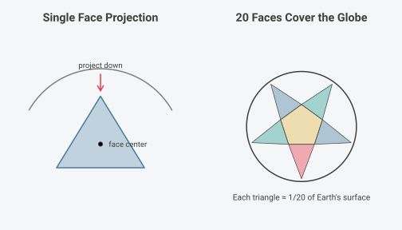
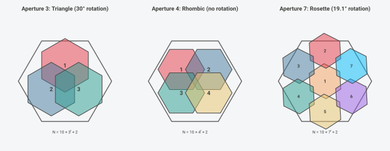

# Mathematical Foundations

## Overview

hexify implements the **ISEA (Icosahedral Snyder Equal Area)** discrete
global grid system. This vignette explains the mathematical foundations:
the projection geometry, coordinate systems, aperture subdivision, and
cell indexing.

## The Problem: Equal-Area Grids on a Sphere

Any projection from a sphere to a plane must distort *something*. For
spatial statistics, we need cells of equal area regardless of location.
Standard latitude-longitude grids fail badly: a 1° cell at the equator
covers ~12,300 km², while the same cell near the poles covers a tiny
fraction of that.

The ISEA projection solves this by:

1.  Inscribing a regular icosahedron in the sphere
2.  Projecting each spherical “cap” onto its corresponding flat
    triangular face using a modified Lambert equal-area projection
3.  Overlaying a hexagonal grid on the resulting planar triangles

## The Lambert Azimuthal Equal-Area Projection

The foundation of Snyder’s projection is Lambert’s azimuthal equal-area
projection, developed by Johann Heinrich Lambert in 1772. The projection
maps a sphere of radius $`R`$ to a tangent plane while **preserving area
exactly** (Snyder, 1987, p. 182).

### Definition

The Lambert azimuthal equal-area projection is defined by a mathematical
constraint, not a geometric construction. For a projection centered at
point $`S`$:

- **Azimuthal property:** The direction (azimuth) from $`S`$ to any
  point $`P`$ on the sphere equals the direction from the origin to
  $`P'`$ on the plane
- **Equal-area property:** Any region on the sphere maps to a region of
  identical area on the plane

These two constraints uniquely determine the radial distance formula.
For a point $`P`$ at angular distance $`c`$ from the center (measured
along the sphere surface), the projected distance from the origin is:

``` math
\rho = 2R \sin\left(\frac{c}{2}\right)
```

This is **not** a perspective projection and has no simple geometric
interpretation like “chord distance” or “ray intersection.” The formula
is derived analytically from the equal-area constraint (Snyder, 1987,
p. 182-185).


### Forward Formulas

For the oblique aspect centered at $`(\lambda_0, \phi_1)`$, the full
formulas are (Snyder, 1987, eq. 24-2 to 24-4, p. 185):

``` math
k' = \sqrt{\frac{2}{1 + \sin\phi_1\sin\phi + \cos\phi_1\cos\phi\cos(\lambda - \lambda_0)}}
```

``` math
x = R \cdot k' \cdot \cos\phi \cdot \sin(\lambda - \lambda_0)
```

``` math
y = R \cdot k' \cdot [\cos\phi_1\sin\phi - \sin\phi_1\cos\phi\cos(\lambda - \lambda_0)]
```

### Equal-Area Proof

The projection preserves area because the radial and tangential scale
factors satisfy $`h' \cdot k' = 1`$ at every point. At angular distance
$`c`$ from center (Snyder, 1987, eq. 24-22, 24-23, p. 188):

``` math
h' = \cos\left(\frac{c}{2}\right), \quad k' = \sec\left(\frac{c}{2}\right)
```

Therefore $`h' \cdot k' = \cos(c/2) \cdot \sec(c/2) = 1`$, confirming
the equal-area property.


Each colored band has equal area on the sphere. After Lambert
projection, shapes change (outer bands stretch radially, compress
tangentially) but areas remain equal.

### Inverse Formulas

The inverse mapping $`(x, y) \to (\lambda, \phi)`$ recovers geographic
coordinates from planar coordinates (Snyder, 1987, eq. 24-14 to 24-16,
p. 187):

``` math
\rho = \sqrt{x^2 + y^2}
```

``` math
c = 2\arcsin\left(\frac{\rho}{2R}\right)
```

where $`c`$ is the angular distance from the projection center. Then:

``` math
\phi = \arcsin\left[\cos c \cdot \sin\phi_1 + \frac{y \cdot \sin c \cdot \cos\phi_1}{\rho}\right]
```

``` math
\lambda = \lambda_0 + \arctan\left[\frac{x \cdot \sin c}{\rho\cos\phi_1\cos c - y\sin\phi_1\sin c}\right]
```

If $`\rho = 0`$, the point is at the projection center:
$`\phi = \phi_1`$, $`\lambda = \lambda_0`$.

### Limitations

**Antipode singularity:** The point diametrically opposite the
projection center (angular distance 180°) maps to infinity and must be
excluded from the domain.

**Shape distortion:** While area is preserved exactly, shapes distort
increasingly with distance from center. The maximum angular distortion
$`\omega`$ at distance $`c`$ is (Snyder, 1987, eq. 24-24, p. 188):

``` math
\sin\left(\frac{\omega}{2}\right) = \frac{k'^2 - 1}{k'^2 + 1}
```

At $`c = 90°`$, distortion reaches $`\omega \approx 70.5°`$. ISEA grids
limit this by using icosahedral faces subtending only ~72° from face
center.

**No conformality:** No projection can be both equal-area and conformal
(angle-preserving)—a fundamental constraint from differential geometry
(Snyder, 1987, p. 16-18).

## The Icosahedron

Lambert’s projection works for a single tangent plane covering at most a
hemisphere. To cover the entire globe with minimal distortion, Snyder
used **20 tangent planes**—one for each face of a regular icosahedron
(Snyder, 1992, p. 10).

### Geometry

A regular icosahedron has:

- **20 equilateral triangular faces** (each covering ~1/20 of Earth’s
  surface)
- **12 vertices** (where 5 faces meet—these become pentagon cells)
- **30 edges**



### Vertex Latitude Derivation

The 12 vertices are located at (Coxeter, 1973, p. 52-53):

| Location   | Latitude                           | Longitudes                  |
|------------|------------------------------------|-----------------------------|
| North pole | +90°                               | 0°                          |
| Upper ring | $`+\arctan(1/2) \approx +26.565°`$ | 0°, 72°, 144°, 216°, 288°   |
| Lower ring | $`-\arctan(1/2) \approx -26.565°`$ | 36°, 108°, 180°, 252°, 324° |
| South pole | −90°                               | 0°                          |

The latitude $`\arctan(1/2)`$ arises from the golden ratio geometry. An
icosahedron can be constructed from three mutually perpendicular golden
rectangles ($`1 \times \varphi`$, where $`\varphi = (1+\sqrt{5})/2`$).
The non-polar vertices have $`z`$-coordinate $`1/s`$ where
$`s = \sqrt{1 + \varphi^2}`$, yielding $`\tan\phi = 1/2`$.

### Standard ISEA Orientation

The default orientation places vertex 0 at longitude 11.25°, latitude
58.28252559°, with azimuth 0°. This places icosahedron vertices
(pentagon cells) predominantly over oceans (Sahr et al., 2003, p. 123).

    #> Linking to GEOS 3.13.1, GDAL 3.11.0, PROJ 9.6.0; sf_use_s2() is TRUE
    #> Warning in st_point_on_surface.sfc(sf::st_zm(x)): st_point_on_surface may not
    #> give correct results for longitude/latitude data


## Snyder’s ISEA Projection

Snyder extended the Lambert projection to the icosahedron by introducing
an azimuth-adjustment transformation that ensures seamless transitions
between adjacent faces while maintaining the equal-area property
(Snyder, 1992, p. 12).

### Key Constants

| Constant | Symbol | Value | Source |
|----|----|----|----|
| Edge-to-center angle | $`E_l`$ | 37.37736814° | Snyder (1992, Table 1, p. 14) |
| Geometric angle | $`G`$ | 36° | 360°/10 (icosahedral 5-fold symmetry) |
| Scale factor | $`R_1`$ | 0.9103832815 | Snyder (1992, Table 1, p. 14) |

### Forward Projection Steps

The complete algorithm comprises seven steps (Snyder, 1992, p. 13-15):

**Step 1: Compute angular distance and azimuth** from face center
$`(\lambda_0, \phi_0)`$ to point $`(\lambda, \phi)`$:

``` math
z = \arccos(\sin\phi_0 \sin\phi + \cos\phi_0 \cos\phi \cos(\lambda - \lambda_0))
```
``` math
\text{Az} = \arctan2(\cos\phi \sin(\lambda - \lambda_0), \cos\phi_0 \sin\phi - \sin\phi_0 \cos\phi \cos(\lambda - \lambda_0))
```

**Step 2: Reduce azimuth** to \[0°, 120°) by exploiting 3-fold symmetry.

**Step 3: Compute auxiliary angle** $`\delta_z`$ (Snyder, 1992, eq. 8,
p. 14):
``` math
\delta_z = \arctan\left(\frac{\tan E_l}{\cos \text{Az} + \cot 30° \cdot \sin \text{Az}}\right)
```

**Step 4: Compute auxiliary angle** $`h`$ (Snyder, 1992, eq. 9, p. 14):
``` math
h = \arccos(\sin \text{Az} \sin G \cos E_l - \cos \text{Az} \cos G)
```

**Step 5: Compute adjusted azimuth** $`\text{Az}'`$ (Snyder, 1992, eq.
10-11, p. 14):
``` math
A_G = \text{Az} + G + h - \pi
```
``` math
\text{Az}' = \arctan\left(\frac{2 A_G}{R_1^2 \tan^2 E_l - 2 A_G \cot 30°}\right)
```

**Step 6: Compute radial distance** (Snyder, 1992, eq. 12-13, p. 14-15):
``` math
f = \frac{\tan E_l}{2(\cos \text{Az}' + \cot 30° \cdot \sin \text{Az}') \sin(\delta_z / 2)}
```
``` math
\rho = 2 R_1 f \sin(z / 2)
```

**Step 7: Convert to Cartesian** with sector offset restored.

### The Inverse Projection

The inverse projection cannot be solved analytically because the azimuth
adjustment contains transcendental functions. A Newton-Raphson iteration
finds the spherical azimuth Az from the planar azimuth Az’:

``` math
f(\text{Az}) = \text{agh} - \text{Az} - G + (\pi - h) = 0
```

where
$`h = \arccos(\sin \text{Az} \sin G \cos E_l - \cos \text{Az} \cos G)`$.


The iteration exhibits **quadratic convergence**, typically reaching
machine precision in 3-5 iterations. hexify provides four precision
modes:

| Mode | Tolerance | Typical Iterations | Use Case |
|----|----|----|----|
| fast | $`10^{-10}`$ | 3-4 | Interactive visualization |
| default | $`10^{-12}`$ | 4-5 | General applications (~1 m accuracy) |
| high | $`10^{-14}`$ | 5-6 | High-precision geodesy |
| ultra | $`10^{-15}`$ | 6-7 | Research |

## Aperture and Resolution

**Aperture** defines how cells subdivide at each resolution level—it’s
the ratio of parent cell area to child cell area (Sahr et al., 2003,
p. 124).



### Aperture Properties

| Aperture | Area Ratio | Linear Scale | Rotation per Level | Orientation |
|----|----|----|----|----|
| 3 | 1:3 | $`\sqrt{3} \approx 1.73`$ | 30° | Alternates Class I/II |
| 4 | 1:4 | $`2.0`$ | 0° | Always Class I |
| 7 | 1:7 | $`\sqrt{7} \approx 2.65`$ | $`\arctan(\sqrt{3/7}) \approx 19.1°`$ | Class III |

The aperture 7 rotation angle $`\arctan(\sqrt{3/7})`$ arises from the
geometric constraint that 7 hexagons in a rosette pattern (1 center + 6
ring) must maintain lattice consistency (DGGRID Manual, 2023).

### Cell Count Growth

``` r

cat("Resolution  Aperture 3    Aperture 4    Aperture 7\n")
#> Resolution  Aperture 3    Aperture 4    Aperture 7
cat("---------  ----------    ----------    ----------\n")
#> ---------  ----------    ----------    ----------
for (res in 0:8) {
  cells_ap3 <- 10 * 3^res + 2
  cells_ap4 <- 10 * 4^res + 2
  cells_ap7 <- 10 * 7^res + 2
  cat(sprintf("    %d      %10s    %10s    %10s\n",
              res,
              format(cells_ap3, big.mark = ","),
              format(cells_ap4, big.mark = ","),
              format(cells_ap7, big.mark = ",")))
}
#>     0              12            12            12
#>     1              32            42            72
#>     2              92           162           492
#>     3             272           642         3,432
#>     4             812         2,562        24,012
#>     5           2,432        10,242       168,072
#>     6           7,292        40,962     1,176,492
#>     7          21,872       163,842     8,235,432
#>     8          65,612       655,362    57,648,012
```

## Orientation Classes


For **aperture 3**, orientation alternates between Class I (flat-top)
and Class II (pointy-top) at each resolution. For **aperture 7**, each
level adds a rotation of $`\arctan(\sqrt{3/7}) \approx 19.1°`$ (Sahr,
2008, p. 176).

## Pentagon Cells

Exactly **12 cells are pentagons** at every resolution. This is a
topological necessity derived from Euler’s formula (Coxeter, 1973,
p. 10):

``` math
V - E + F = 2
```

For a tiling with $`h`$ hexagons and $`p`$ pentagons on a sphere: -
$`V = (6h + 5p)/3`$, $`E = (6h + 5p)/2`$, $`F = h + p`$

Substituting into Euler’s formula and simplifying yields $`p = 12`$,
independent of $`h`$.


| Location   | Latitude                          | Longitudes                  |
|------------|-----------------------------------|-----------------------------|
| Poles      | ±90°                              | 0°                          |
| Upper ring | $`\arctan(1/2) \approx 26.57°`$   | 0°, 72°, 144°, 216°, 288°   |
| Lower ring | $`-\arctan(1/2) \approx -26.57°`$ | 36°, 108°, 180°, 252°, 324° |

Pentagon area is exactly 5/6 of hexagonal cell area at the same
resolution (Sahr et al., 2003, p. 125).

## Coordinate Systems

hexify uses a multi-stage coordinate pipeline (Sahr, 2008, p. 178):

| System             | Components          | Description                 |
|--------------------|---------------------|-----------------------------|
| **GEO**            | lon, lat            | WGS84 degrees               |
| **Icosa Triangle** | face (0-19), tx, ty | Snyder projection output    |
| **Quad XY**        | quad (0-11), qx, qy | Paired-triangle coordinates |
| **Quad IJ**        | quad (0-11), i, j   | Quantized grid indices      |
| **SEQNUM**         | integer             | Global cell ID (1-based)    |

### Triangle to Quad

The 20 triangular faces are paired into 12 “quads” (diamond-shaped
regions). Each quad contains two adjacent triangular faces sharing an
edge, simplifying grid indexing (DGGRID Manual, 2023).

### SEQNUM Assignment

The SEQNUM provides a unique integer for each cell. The formula is:

``` math
N(r) = 10 \times a^r + 2
```

where $`a`$ is the aperture and $`r`$ is the resolution. SEQNUMs are
assigned to maintain compatibility with dggridR.

## Round-Trip Accuracy

``` r

original_lon <- 16.37
original_lat <- 48.21

cat(sprintf("Original: (%.4f, %.4f)\n\n", original_lon, original_lat))
#> Original: (16.3700, 48.2100)

for (ap in c(3, 4, 7)) {
  res <- if (ap == 7) 6 else 10
  grid <- hex_grid(resolution = res, aperture = ap)
  cell_id <- lonlat_to_cell(original_lon, original_lat, grid)
  recovered <- cell_to_lonlat(cell_id, grid)
  error_km <- sqrt((recovered$lon - original_lon)^2 +
                   (recovered$lat - original_lat)^2) * 111
  cat(sprintf("Aperture %d (res %2d): cell %d -> (%.4f, %.4f), ~%.1f km from center\n",
              ap, res, cell_id,
              recovered$lon, recovered$lat, error_km))
}
#> Aperture 3 (res 10): cell 126594 -> (16.4204, 48.2877), ~10.3 km from center
#> Aperture 4 (res 10): cell 2245587 -> (16.4177, 48.2119), ~5.3 km from center
#> Aperture 7 (res  6): cell 237704 -> (14.7883, 46.5600), ~253.7 km from center
```

## Summary of ISEA Properties

| Property | Description |
|----|----|
| **Equal area** | All hexagonal cells identical; pentagons = 5/6 hex area |
| **Bounded distortion** | Max angular distortion ~17.3° at face edges |
| **Uniform topology** | Hexagons have 6 neighbors; pentagons have 5 |
| **12 pentagons** | Topological necessity from Euler’s formula |

## References

- Coxeter, H.S.M. (1973). *Regular Polytopes* (3rd ed.). Dover
  Publications.

- DGGRID Manual (2023). *DGGRID Version 7.8 Documentation*.
  <https://github.com/sahrk/DGGRID>

- Sahr, K. (2008). Location coding on icosahedral aperture 3 hexagon
  discrete global grids. *Computers, Environment and Urban Systems*,
  32(3), 174-187.

- Sahr, K., White, D., & Kimerling, A.J. (2003). Geodesic Discrete
  Global Grid Systems. *Cartography and Geographic Information Science*,
  30(2), 121-134.

- Snyder, J.P. (1987). *Map Projections: A Working Manual*. U.S.
  Geological Survey Professional Paper 1395.

- Snyder, J.P. (1992). An equal-area map projection for polyhedral
  globes. *Cartographica*, 29(1), 10-21.
