# Visualization

This vignette covers hexify’s visualization functions in detail:
customizing appearance, showing points, creating heatmaps, and working
with ggplot2.

## Sample Data

We’ll use European cities throughout:

``` r

cities <- data.frame(
  name = c("Vienna", "Paris", "Madrid", "Berlin", "Rome",
           "Warsaw", "Prague", "Brussels", "Amsterdam", "Lisbon"),
  lon = c(16.37, 2.35, -3.70, 13.40, 12.50,
          21.01, 14.42, 4.35, 4.90, -9.14),
  lat = c(48.21, 48.86, 40.42, 52.52, 41.90,
          52.23, 50.08, 50.85, 52.37, 38.72)
)

grid <- hex_grid(area_km2 = 10000)
result <- hexify(cities, lon = "lon", lat = "lat", grid = grid)
```

## Base R Plotting with plot()

The [`plot()`](https://rdrr.io/r/graphics/plot.default.html) method
provides quick visualization with sensible defaults.

### Basic Plot

``` r

plot(result, main = "European Cities")
```

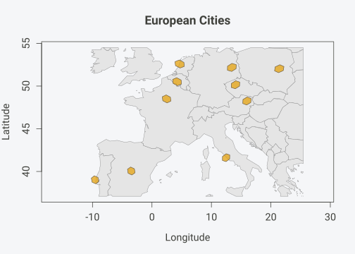

    #> Spherical geometry (s2) switched on

### Customizing Colors and Styling

``` r

plot(result,
     grid_fill = "steelblue",
     grid_border = "darkblue",
     grid_alpha = 0.6,
     basemap_fill = "ivory",
     basemap_border = "gray50",
     main = "Custom Styling")
```

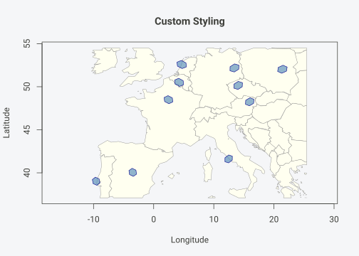

    #> Spherical geometry (s2) switched on

### Disabling the Basemap

``` r

plot(result,
     basemap = FALSE,
     grid_fill = "forestgreen",
     grid_border = "darkgreen",
     main = "No Basemap")
```

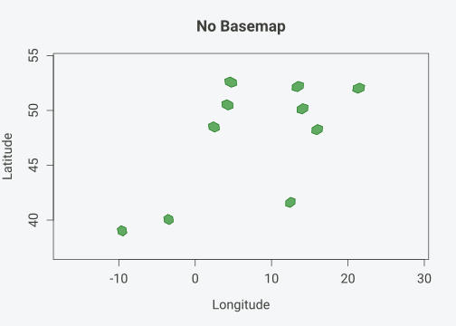

### Setting Map Extent

To control the map extent, use `crop = TRUE` with `crop_expand` to add
padding:

``` r

plot(result,
     crop = TRUE,
     crop_expand = 0.2,
     main = "Custom Extent (20% padding)")
```

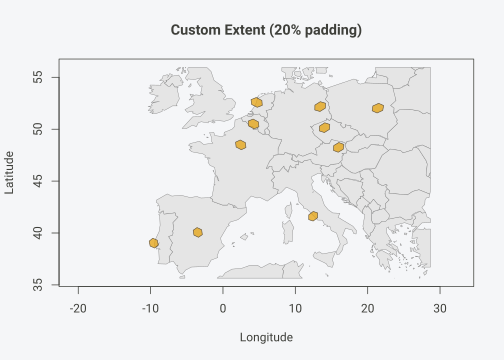

    #> Spherical geometry (s2) switched on

## Showing Points

Points can be displayed on top of hexagon cells. By default, points are
jittered within their assigned cell to avoid overplotting.

### Basic Points

``` r

plot(result,
     show_points = TRUE,
     point_color = "red",
     main = "Cities with Points")
```

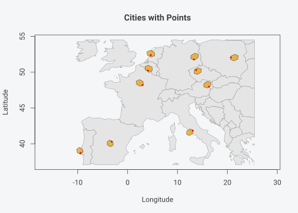

    #> Spherical geometry (s2) switched on

### Point Size Presets

The `point_size` parameter accepts presets that define what fraction of
a hex cell a single point covers:

| Preset                | Coverage     |
|-----------------------|--------------|
| `"tiny"`              | ~2% of cell  |
| `"small"`             | ~5% of cell  |
| `"normal"` / `"auto"` | ~10% of cell |
| `"large"`             | ~20% of cell |
| `"very large"`        | ~35% of cell |

``` r

oldpar <- par(mfrow = c(2, 2))

plot(result, show_points = TRUE, point_size = "small",
     point_color = "red", main = "small (~5%)")
#> Spherical geometry (s2) switched on
plot(result, show_points = TRUE, point_size = "normal",
     point_color = "red", main = "normal (~10%)")
#> Spherical geometry (s2) switched on
plot(result, show_points = TRUE, point_size = "large",
     point_color = "red", main = "large (~20%)")
#> Spherical geometry (s2) switched on
plot(result, show_points = TRUE, point_size = "very large",
     point_color = "red", main = "very large (~35%)")
```

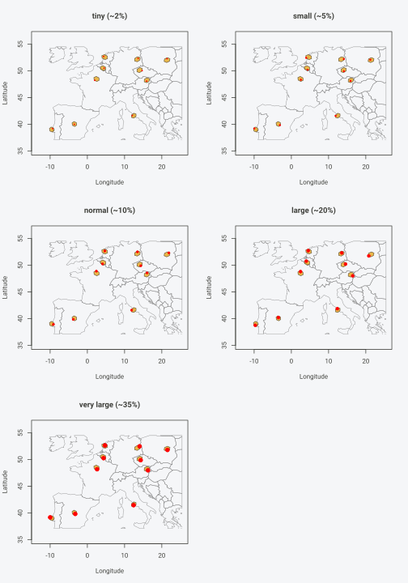

    #> Spherical geometry (s2) switched on

    par(oldpar)

### Custom Point Styling

``` r

plot(result,
     show_points = TRUE,
     point_size = "small",
     point_color = "darkblue",
     point_alpha = 0.8,
     grid_fill = "lightyellow",
     grid_border = "orange",
     main = "Custom Point Styling")
#> Warning in plot.window(...): "point_alpha" is not a graphical parameter
#> Warning in plot.xy(xy, type, ...): "point_alpha" is not a graphical parameter
#> Warning in axis(side = side, at = at, labels = labels, ...): "point_alpha" is
#> not a graphical parameter
#> Warning in axis(side = side, at = at, labels = labels, ...): "point_alpha" is
#> not a graphical parameter
#> Warning in box(...): "point_alpha" is not a graphical parameter
#> Warning in title(...): "point_alpha" is not a graphical parameter
```

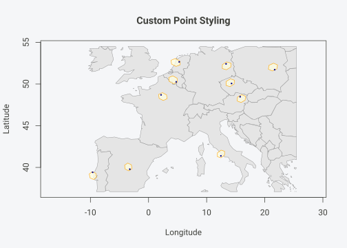

    #> Spherical geometry (s2) switched on

### Disabling Jitter

For exact point locations (no randomization):

``` r

plot(result,
     show_points = TRUE,
     jitter = FALSE,
     point_color = "red",
     main = "Points at Cell Centers (No Jitter)")
#> Warning in plot.window(...): "jitter" is not a graphical parameter
#> Warning in plot.xy(xy, type, ...): "jitter" is not a graphical parameter
#> Warning in axis(side = side, at = at, labels = labels, ...): "jitter" is not a
#> graphical parameter
#> Warning in axis(side = side, at = at, labels = labels, ...): "jitter" is not a
#> graphical parameter
#> Warning in box(...): "jitter" is not a graphical parameter
#> Warning in title(...): "jitter" is not a graphical parameter
```

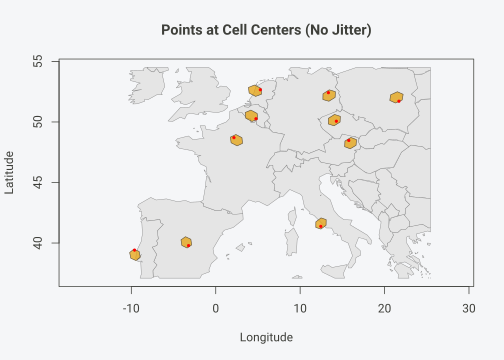

    #> Spherical geometry (s2) switched on

## ggplot2 with hexify_heatmap()

For ggplot2 users,
[`hexify_heatmap()`](https://gcol33.github.io/hexify/reference/hexify_heatmap.md)
returns a ggplot object that can be further customized.

### Basic ggplot

``` r

hexify_heatmap(result, basemap = "world", title = "European Cities")
#> Spherical geometry (s2) switched off
#> Spherical geometry (s2) switched on
```

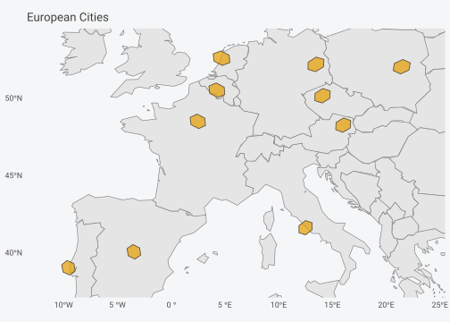

### Customizing with ggplot2

Since
[`hexify_heatmap()`](https://gcol33.github.io/hexify/reference/hexify_heatmap.md)
returns a ggplot object, you can add layers and modify themes:

``` r

hexify_heatmap(result, basemap = "world") +
  labs(
    title = "Major European Cities",
    subtitle = "Assigned to ISEA hexagonal grid cells",
    caption = "Data: Sample cities"
  ) +
  theme_minimal() +
  theme(
    plot.title = element_text(face = "bold", size = 14),
    panel.grid = element_blank()
  )
#> Spherical geometry (s2) switched off
#> Spherical geometry (s2) switched on
```

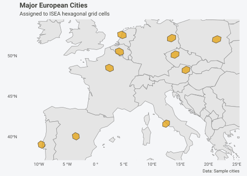

### Adding Custom Layers

``` r

# Get the city coordinates
city_points <- st_as_sf(cities, coords = c("lon", "lat"), crs = 4326)

hexify_heatmap(result, basemap = "world", title = "Cities with Labels") +
  geom_sf(data = city_points, color = "red", size = 2) +
  geom_sf_text(data = city_points, aes(label = name),
               nudge_y = 0.8, size = 3, color = "darkgray") +
  coord_sf(xlim = c(-5, 25), ylim = c(45, 55))
#> Spherical geometry (s2) switched off
#> Spherical geometry (s2) switched on
#> Coordinate system already present.
#> ℹ Adding new coordinate system, which will replace the existing one.
#> Warning in st_point_on_surface.sfc(sf::st_zm(x)): st_point_on_surface may not
#> give correct results for longitude/latitude data
```

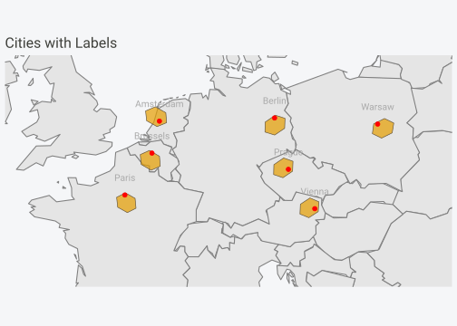

## Heatmaps with Value Mapping

For choropleth-style visualizations with aggregated data, pass a `value`
column to
[`hexify_heatmap()`](https://gcol33.github.io/hexify/reference/hexify_heatmap.md).

### Creating Aggregated Data

``` r

# Simulate observation data with counts
set.seed(42)
n_obs <- 100
obs_data <- data.frame(
  lon = c(rnorm(60, 10, 8), rnorm(40, 0, 10)),
  lat = c(rnorm(60, 48, 5), rnorm(40, 52, 6)),
  count = rpois(n_obs, lambda = 50)
)

# Hexify
grid <- hex_grid(area_km2 = 10000)
obs_hex <- hexify(obs_data, lon = "lon", lat = "lat", grid = grid)
```

### Basic Heatmap

``` r

hexify_heatmap(
  obs_hex,
  value = "count",
  title = "Observation Counts"
)
#> Spherical geometry (s2) switched off
#> Spherical geometry (s2) switched on
```

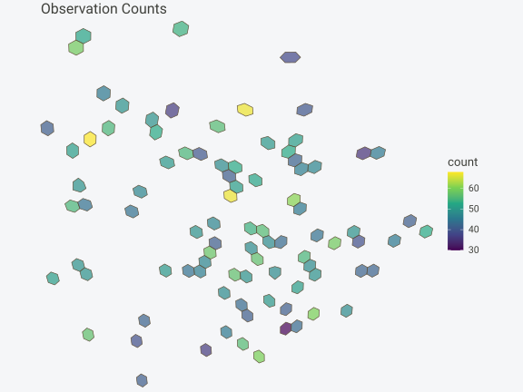

### Customizing Colors

``` r

hexify_heatmap(
  obs_hex,
  value = "count",
  colors = "YlOrRd",
  title = "Yellow-Orange-Red Palette"
)
#> Spherical geometry (s2) switched off
#> Spherical geometry (s2) switched on
```

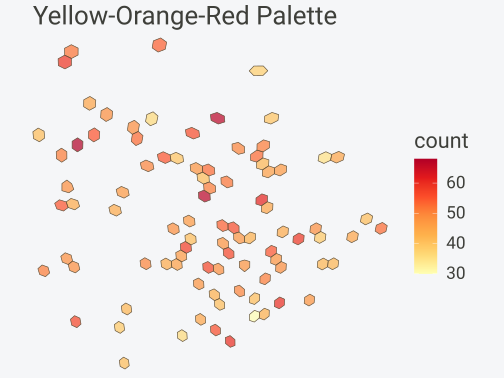

Available color palettes include any from
[`scale_fill_viridis_c()`](https://ggplot2.tidyverse.org/reference/scale_viridis.html)
or
[`scale_fill_distiller()`](https://ggplot2.tidyverse.org/reference/scale_brewer.html):

- Viridis options: `"viridis"`, `"magma"`, `"plasma"`, `"inferno"`,
  `"cividis"`, `"mako"`, `"rocket"`, `"turbo"`

- ColorBrewer sequential: `"YlOrRd"`, `"YlGnBu"`, `"Blues"`, `"Greens"`,
  `"Reds"`, `"Purples"`, etc.

``` r

p1 <- hexify_heatmap(obs_hex, value = "count", colors = "viridis",
                     title = "viridis", xlim = c(-20, 35), ylim = c(35, 65))
#> Spherical geometry (s2) switched off
#> Spherical geometry (s2) switched on
p2 <- hexify_heatmap(obs_hex, value = "count", colors = "YlGnBu",
                     title = "YlGnBu", xlim = c(-20, 35), ylim = c(35, 65))
#> Spherical geometry (s2) switched off
#> Spherical geometry (s2) switched on

gridExtra::grid.arrange(p1, p2, ncol = 2)
```

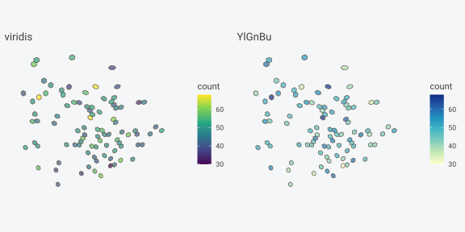

### Setting Map Extent

``` r

hexify_heatmap(
  obs_hex,
  value = "count",
  xlim = c(-20, 35),
  ylim = c(35, 65),
  title = "Zoomed to Region",
  legend_title = "Count"
)
#> Spherical geometry (s2) switched off
#> Spherical geometry (s2) switched on
```

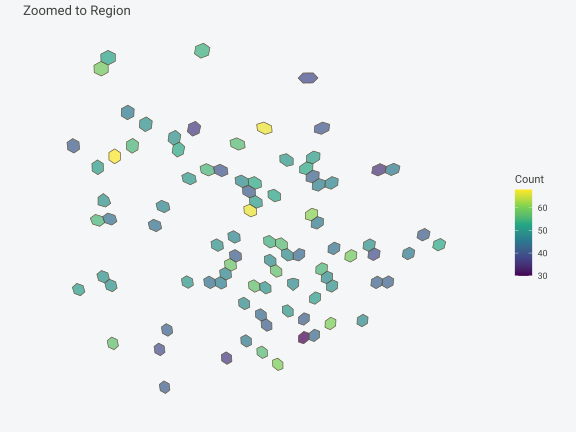

### Basemap Options

``` r

# With world basemap (default)
hexify_heatmap(
  obs_hex,
  value = "count",
  basemap = "world",
  xlim = c(-20, 35),
  ylim = c(35, 65),
  title = "With World Basemap"
)
#> Spherical geometry (s2) switched off
#> Spherical geometry (s2) switched on
```

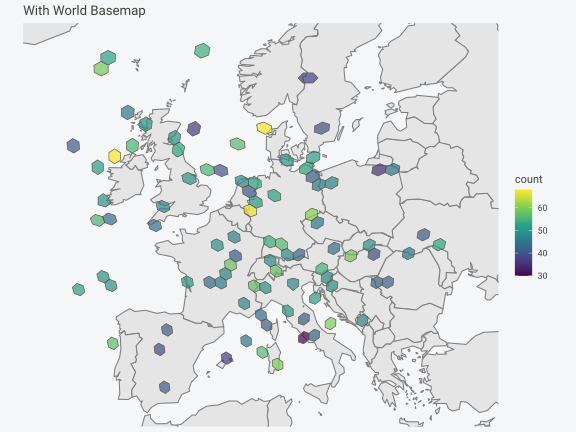

``` r

# Without basemap
hexify_heatmap(
  obs_hex,
  value = "count",
  basemap = NULL,
  xlim = c(-20, 35),
  ylim = c(35, 65),
  title = "No Basemap"
)
#> Spherical geometry (s2) switched off
#> Spherical geometry (s2) switched on
```

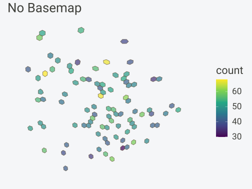

## World Map Helper

[`plot_world()`](https://gcol33.github.io/hexify/reference/plot_world.md)
provides a quick way to draw a world basemap:

``` r

plot_world(fill = "lightgray", border = "gray50")
```

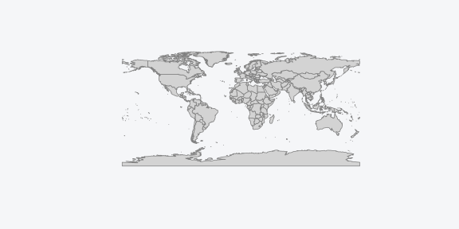

### Customizing the World Map

``` r

plot_world(
  fill = "antiquewhite",
  border = "sienna",
  xlim = c(-30, 50),
  ylim = c(30, 70)
)
```

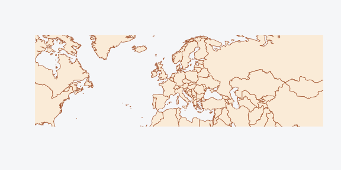

## Pentagon Cell Visualization

The ISEA grid contains 12 pentagonal cells at the icosahedron vertices.
Here’s how to visualize them:

``` r

# Pentagon locations (icosahedron vertices in standard ISEA orientation)
pentagon_coords <- data.frame(
  type = c("Pole", "Pole", rep("Vertex", 10)),
  lon = c(0, 0, seq(0, 324, by = 36)),
  lat = c(90, -90, rep(c(26.57, -26.57), 5))
)

# Assign to grid and get polygons
grid <- hex_grid(area_km2 = 500000)
pentagon_cells <- lonlat_to_cell(pentagon_coords$lon, pentagon_coords$lat, grid)

pentagon_polys <- cell_to_sf(pentagon_cells, grid)
pentagon_polys_wrapped <- st_wrap_dateline(
  pentagon_polys,
  options = c("WRAPDATELINE=YES", "DATELINEOFFSET=180"),
  quiet = TRUE
)

ggplot() +
  geom_sf(data = hexify_world, fill = "gray95", color = "gray70", linewidth = 0.2) +
  geom_sf(data = pentagon_polys_wrapped, fill = alpha("purple", 0.6),
          color = "purple", linewidth = 0.8) +
  labs(
    title = "Pentagon Cell Locations",
    subtitle = "12 pentagonal cells at icosahedron vertices (area = 5/6 of hexagons)"
  ) +
  theme_minimal() +
  theme(axis.text = element_blank(), axis.ticks = element_blank())
```

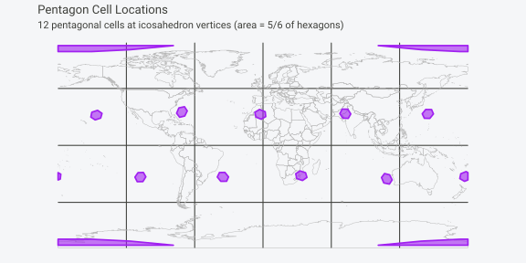

## Random Sampling Visualization

Visualizing uniformly sampled cells across Earth:

``` r

# Grid parameters (coarse for faster build)
grid <- hex_grid(area_km2 = 200000, aperture = 3)
max_cell <- 10 * (3^grid@resolution) + 2

# Sample random cell IDs
set.seed(123)
N <- 50
random_cells <- sample(1:max_cell, N, replace = FALSE)

# Generate polygons for sampled cells
sample_polys <- cell_to_sf(random_cells, grid)
sample_polys_wrapped <- st_wrap_dateline(
  sample_polys,
  options = c("WRAPDATELINE=YES", "DATELINEOFFSET=180"),
  quiet = TRUE
)

ggplot() +
  geom_sf(data = hexify_world, fill = "gray95", color = "gray70", linewidth = 0.2) +
  geom_sf(data = sample_polys_wrapped, fill = alpha("forestgreen", 0.5),
          color = "darkgreen", linewidth = 0.4) +
  labs(title = sprintf("Random Sample of %d Cells (~%.0f km2 each)", N, grid@area_km2)) +
  theme_minimal() +
  theme(axis.text = element_blank(), axis.ticks = element_blank())
```

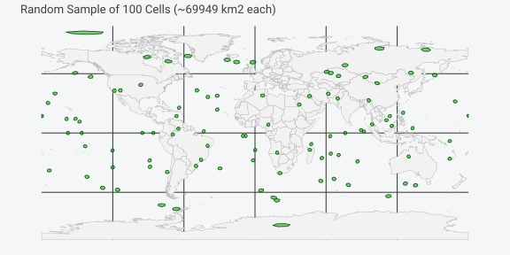

## Building Custom Visualizations

For full control, generate polygons directly and use ggplot2:

``` r

# Create data with a numeric variable
set.seed(456)
stations <- data.frame(
  lon = runif(50, -10, 30),
  lat = runif(50, 35, 60),
  temperature = rnorm(50, mean = 15, sd = 5)
)

# Hexify (coarser grid for faster build)
grid <- hex_grid(area_km2 = 20000)
stations_hex <- hexify(stations, lon = "lon", lat = "lat", grid = grid)

# Aggregate temperature by cell
stations_df <- as.data.frame(stations_hex)
stations_df$cell_id <- stations_hex@cell_id
cell_temps <- aggregate(temperature ~ cell_id, data = stations_df, FUN = mean)

# Generate polygons and merge data
cell_polys <- cell_to_sf(cell_temps$cell_id, grid)
cell_polys <- merge(cell_polys, cell_temps, by = "cell_id")

# Custom visualization
europe <- hexify_world[hexify_world$continent == "Europe", ]

ggplot() +
  geom_sf(data = europe, fill = "gray95", color = "gray60", linewidth = 0.2) +
  geom_sf(data = cell_polys, aes(fill = temperature),
          color = "white", linewidth = 0.2) +
  scale_fill_gradient2(
    low = "blue", mid = "white", high = "red",
    midpoint = 15, name = "Temp (°C)"
  ) +
  coord_sf(xlim = c(-10, 30), ylim = c(35, 60)) +
  labs(
    title = "Mean Temperature by Grid Cell",
    subtitle = "Diverging color scale centered at 15°C"
  ) +
  theme_minimal() +
  theme(
    axis.text = element_blank(),
    axis.ticks = element_blank(),
    panel.grid = element_line(color = "gray90")
  )
```

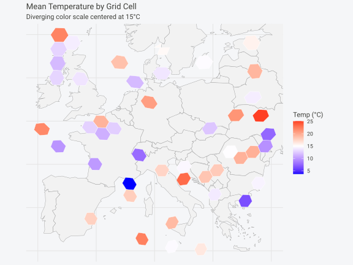

## Function Reference

| Function | Description |
|----|----|
| [`plot()`](https://rdrr.io/r/graphics/plot.default.html) | Base R plot method for HexData objects |
| [`hexify_heatmap()`](https://gcol33.github.io/hexify/reference/hexify_heatmap.md) | ggplot2 visualization, returns modifiable ggplot object |
| [`plot_world()`](https://gcol33.github.io/hexify/reference/plot_world.md) | Quick world basemap |
| [`cell_to_sf()`](https://gcol33.github.io/hexify/reference/cell_to_sf.md) | Generate sf polygons from cell IDs |

## See Also

- [`vignette("quickstart")`](https://gcol33.github.io/hexify/articles/quickstart.md) -
  Getting started with hexify

- [`vignette("workflows")`](https://gcol33.github.io/hexify/articles/workflows.md) -
  Complete analysis workflows
