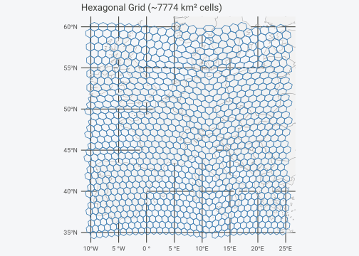
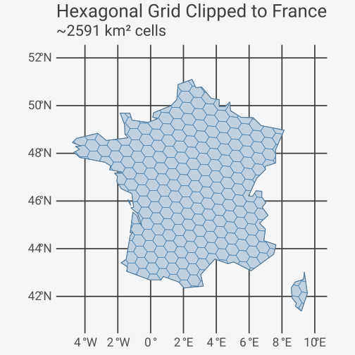
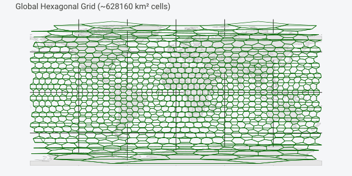
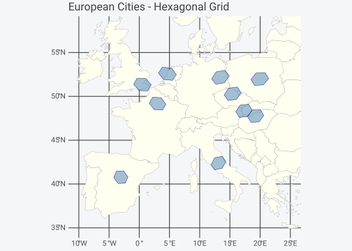

# Practical Workflows

Shared grids across datasets, polygon generation, resolution selection,
and GIS export.

## One Grid, Many Datasets

Define a grid once, reuse it everywhere. Same grid object = guaranteed
spatial alignment across datasets.

### The Problem

You often have:

- Several independent datasets (observations, sensors, surveys)

- All in longitude/latitude coordinates

- Collected at different times or from different sources

You want to:

- Put everything on one common global grid

- Be sure the grids actually match

- Combine results later without subtle errors

### The Solution: Shared Grid Objects

``` r

# Step 1: Define the grid once
# This is your shared spatial reference system
grid <- hex_grid(area_km2 = 5000)
print(grid)
#> HexGridInfo Specification
#> -------------------------
#> Aperture:    3
#> Resolution:  8
#> Area:        7773.97 km^2
#> Diagonal:    94.74 km
#> CRS:         EPSG:4326
#> Total Cells: 65612

# Step 2: Create multiple datasets with different structures
set.seed(123)

# Dataset 1: Bird observations (note different column names)
bird_obs <- data.frame(
  species = sample(c("Passer domesticus", "Turdus merula", "Parus major"), 50, replace = TRUE),
  longitude = runif(50, -10, 30),
  latitude = runif(50, 35, 60)
)

# Dataset 2: Mammal records
mammal_obs <- data.frame(
  species = sample(c("Vulpes vulpes", "Meles meles", "Sciurus vulgaris"), 40, replace = TRUE),
  lon = runif(40, -10, 30),
  lat = runif(40, 35, 60)
)

# Dataset 3: Climate stations
climate_data <- data.frame(
  station_id = paste0("WS", 1:20),
  x = runif(20, -10, 30),
  y = runif(20, 35, 60),
  temp_c = rnorm(20, 12, 5)
)

# Step 3: Attach all datasets to the SAME grid
birds <- hexify(bird_obs, lon = "longitude", lat = "latitude", grid = grid)
mammals <- hexify(mammal_obs, lon = "lon", lat = "lat", grid = grid)
climate <- hexify(climate_data, lon = "x", lat = "y", grid = grid)

cat("Birds:  ", nrow(as.data.frame(birds)), "observations in", n_cells(birds), "cells\n")
#> Birds:   50 observations in 48 cells
cat("Mammals:", nrow(as.data.frame(mammals)), "observations in", n_cells(mammals), "cells\n")
#> Mammals: 40 observations in 38 cells
cat("Climate:", nrow(as.data.frame(climate)), "stations in", n_cells(climate), "cells\n")
#> Climate: 20 stations in 20 cells
```

### Combining at the Cell Level

Once data are hexified, longitude/latitude no longer matter for
analysis. The `cell_id` becomes the shared spatial key:

``` r

# Extract data frames with cell IDs
birds_df <- as.data.frame(birds)
birds_df$cell_id <- birds@cell_id

mammals_df <- as.data.frame(mammals)
mammals_df$cell_id <- mammals@cell_id

climate_df <- as.data.frame(climate)
climate_df$cell_id <- climate@cell_id

# Aggregate each dataset by cell
bird_richness <- aggregate(
  species ~ cell_id,
  data = birds_df,
  FUN = function(x) length(unique(x))
)
names(bird_richness)[2] <- "bird_species"

mammal_richness <- aggregate(
  species ~ cell_id,
  data = mammals_df,
  FUN = function(x) length(unique(x))
)
names(mammal_richness)[2] <- "mammal_species"

mean_temp <- aggregate(
  temp_c ~ cell_id,
  data = climate_df,
  FUN = mean
)
names(mean_temp)[2] <- "mean_temp"

# Join datasets by cell_id - guaranteed to align because same grid
combined <- merge(bird_richness, mammal_richness, by = "cell_id", all = TRUE)
combined <- merge(combined, mean_temp, by = "cell_id", all = TRUE)

head(combined)
#>   cell_id bird_species mammal_species mean_temp
#> 1    6634           NA              1  12.18894
#> 2    6635            1             NA        NA
#> 3    6716           NA              1        NA
#> 4    6718            1             NA        NA
#> 5    6800           NA              1        NA
#> 6    6882           NA              1        NA
```

## Grid Generation

hexify provides functions to generate grid polygons over regions for
visualization and analysis.

### Grid Over a Rectangular Region

``` r

# Create grid specification
grid <- hex_grid(area_km2 = 5000)

# Generate hexagons over Western Europe
europe_hexes <- grid_rect(c(-10, 35, 25, 60), grid)

# Get European countries for context
europe <- hexify_world[hexify_world$continent == "Europe", ]

ggplot() +
  geom_sf(data = europe, fill = "gray95", color = "gray60") +
  geom_sf(data = europe_hexes, fill = NA, color = "steelblue", linewidth = 0.4) +
  coord_sf(xlim = c(-10, 25), ylim = c(35, 60)) +
  labs(title = sprintf("Hexagonal Grid (~%.0f km² cells)", grid@area_km2)) +
  theme_minimal()
```



### Grid Over a Polygon (Shapefile)

Clip a grid to any sf polygon boundary:

``` r

# Get France boundary
france <- hexify_world[hexify_world$name == "France", ]

# Generate grid covering mainland France
grid <- hex_grid(area_km2 = 2000)
france_grid <- grid_rect(c(-5, 41, 10, 52), grid)

# Clip grid to France boundary
france_grid_clipped <- st_intersection(france_grid, st_geometry(france))
#> Warning: attribute variables are assumed to be spatially constant throughout
#> all geometries

ggplot() +
  geom_sf(data = france, fill = "gray95", color = "gray40", linewidth = 0.5) +
  geom_sf(data = france_grid_clipped, fill = alpha("steelblue", 0.3),
          color = "steelblue", linewidth = 0.3) +
  coord_sf(xlim = c(-5, 10), ylim = c(41, 52)) +
  labs(title = sprintf("Hexagonal Grid Clipped to France (~%.0f km² cells)", grid@area_km2)) +
  theme_minimal()
```



### Global Grid

``` r

# Coarse global grid (be careful with fine grids - many cells!)
grid <- hex_grid(area_km2 = 500000)
global_hexes <- grid_global(grid)

ggplot() +
  geom_sf(data = hexify_world, fill = "gray90", color = "gray70", linewidth = 0.2) +
  geom_sf(data = global_hexes, fill = NA, color = "darkgreen", linewidth = 0.3) +
  labs(title = sprintf("Global Hexagonal Grid (~%.0f km² cells)", grid@area_km2)) +
  theme_minimal() +
  theme(axis.text = element_blank(), axis.ticks = element_blank())
```



## Multi-Resolution Analysis

Analyze data at multiple spatial scales using different target areas.

``` r

# Sample data
set.seed(42)
observations <- data.frame(
  species = sample(c("Species A", "Species B", "Species C"), 100, replace = TRUE),
  lon = runif(100, -10, 30),
  lat = runif(100, 35, 60)
)

# Fine resolution (~1000 km² cells)
grid_fine <- hex_grid(area_km2 = 1000)
obs_fine <- hexify(observations, lon = "lon", lat = "lat", grid = grid_fine)

# Coarse resolution (~10000 km² cells)
grid_coarse <- hex_grid(area_km2 = 10000)
obs_coarse <- hexify(observations, lon = "lon", lat = "lat", grid = grid_coarse)

cat(sprintf("Fine resolution: %d unique cells (area: %.1f km²)\n",
            n_cells(obs_fine), grid_fine@area_km2))
#> Fine resolution: 98 unique cells (area: 863.8 km²)
cat(sprintf("Coarse resolution: %d unique cells (area: %.1f km²)\n",
            n_cells(obs_coarse), grid_coarse@area_km2))
#> Coarse resolution: 93 unique cells (area: 7774.0 km²)
```

### Scale-Dependent Patterns

``` r

# Extract data with cell IDs
fine_df <- as.data.frame(obs_fine)
fine_df$cell_id <- obs_fine@cell_id

coarse_df <- as.data.frame(obs_coarse)
coarse_df$cell_id <- obs_coarse@cell_id

# Species richness at each scale
richness_fine <- aggregate(species ~ cell_id, data = fine_df,
                           FUN = function(x) length(unique(x)))
richness_coarse <- aggregate(species ~ cell_id, data = coarse_df,
                             FUN = function(x) length(unique(x)))

cat(sprintf("Fine scale: mean %.2f species per cell\n", mean(richness_fine$species)))
#> Fine scale: mean 1.01 species per cell
cat(sprintf("Coarse scale: mean %.2f species per cell\n", mean(richness_coarse$species)))
#> Coarse scale: mean 1.06 species per cell
```

## Spatial Joins

Join datasets based on shared grid cells rather than proximity.

``` r

# Dataset 1: Weather stations
stations <- data.frame(
  station_id = paste0("ST", 1:50),
  lon = runif(50, -10, 30),
  lat = runif(50, 35, 60),
  temperature = rnorm(50, 15, 5)
)

# Dataset 2: Cities
cities <- data.frame(
  city = c("Vienna", "Paris", "London", "Berlin", "Rome",
           "Madrid", "Prague", "Warsaw", "Budapest", "Amsterdam"),
  lon = c(16.37, 2.35, -0.12, 13.40, 12.50,
          -3.70, 14.42, 21.01, 19.04, 4.90),
  lat = c(48.21, 48.86, 51.51, 52.52, 41.90,
          40.42, 50.08, 52.23, 47.50, 52.37)
)

# Use a coarse grid for joining disparate points
grid <- hex_grid(area_km2 = 50000)

# Hexify both datasets with the same grid
stations_hex <- hexify(stations, lon = "lon", lat = "lat", grid = grid)
cities_hex <- hexify(cities, lon = "lon", lat = "lat", grid = grid)

# Extract with cell IDs
stations_df <- as.data.frame(stations_hex)
stations_df$cell_id <- stations_hex@cell_id

cities_df <- as.data.frame(cities_hex)
cities_df$cell_id <- cities_hex@cell_id

# Join by cell_id
city_weather <- merge(
  cities_df[, c("city", "cell_id")],
  aggregate(temperature ~ cell_id, data = stations_df, FUN = mean),
  by = "cell_id",
  all.x = TRUE
)

city_weather
#>    cell_id      city temperature
#> 1      865    London          NA
#> 2     1478    Madrid          NA
#> 3     1482     Paris          NA
#> 4     1484 Amsterdam          NA
#> 5     1540    Berlin          NA
#> 6     1567    Prague    11.60463
#> 7     1591      Rome          NA
#> 8     1594    Vienna    12.45533
#> 9     1621  Budapest          NA
#> 10    2240    Warsaw     7.30659
```

## Choosing Resolution

### By Target Area

Use
[`hex_grid()`](https://gcol33.github.io/hexify/reference/hex_grid.md)
with `area_km2` to get the closest available resolution:

``` r

# Target: 100 km² cells
grid_100 <- hex_grid(area_km2 = 100, aperture = 3)
cat(sprintf("Target ~100 km²: resolution %d (actual: %.1f km²)\n",
            grid_100@resolution, grid_100@area_km2))
#> Target ~100 km²: resolution 12 (actual: 96.0 km²)

# Target: 1000 km² cells
grid_1000 <- hex_grid(area_km2 = 1000, aperture = 3)
cat(sprintf("Target ~1000 km²: resolution %d (actual: %.1f km²)\n",
            grid_1000@resolution, grid_1000@area_km2))
#> Target ~1000 km²: resolution 10 (actual: 863.8 km²)

# Target: 10000 km² cells
grid_10000 <- hex_grid(area_km2 = 10000, aperture = 3)
cat(sprintf("Target ~10000 km²: resolution %d (actual: %.1f km²)\n",
            grid_10000@resolution, grid_10000@area_km2))
#> Target ~10000 km²: resolution 8 (actual: 7774.0 km²)
```

### Resolution Table (Aperture 3)

| Resolution | \# Cells | Cell Area (km²) | Spacing (km) |
|-----------:|---------:|----------------:|-------------:|
|          0 |       12 |    42,505,468.5 |       7005.8 |
|          1 |       32 |    15,939,550.7 |       4290.2 |
|          2 |       92 |     5,544,191.5 |       2530.2 |
|          3 |      272 |     1,875,241.3 |       1471.5 |
|          4 |      812 |       628,159.6 |        851.7 |
|          5 |     2.4K |       209,730.9 |        492.1 |
|          6 |     7.3K |        69,948.7 |        284.2 |
|          7 |    21.9K |        23,320.5 |        164.1 |
|          8 |    65.6K |         7,774.0 |         94.7 |
|          9 |   196.8K |         2,591.4 |         54.7 |
|         10 |   590.5K |           863.8 |         31.6 |
|         11 |     1.8M |           287.9 |         18.2 |
|         12 |     5.3M |            96.0 |         10.5 |
|         13 |    15.9M |            32.0 |          6.1 |
|         14 |    47.8M |            10.7 |          3.5 |
|         15 |   143.5M |             3.6 |          2.0 |

### Comparing Apertures

Different apertures offer different resolution steps:

``` r

target_area <- 1000  # km²

cat(sprintf("Target: ~%d km² cells\n\n", target_area))
#> Target: ~1000 km² cells
for (ap in c(3, 4, 7)) {
  grid <- hex_grid(area_km2 = target_area, aperture = ap)
  n_cells <- 10 * (ap^grid@resolution) + 2
  cat(sprintf("Aperture %d: resolution %d -> %.1f km² (%s cells globally)\n",
              ap, grid@resolution, grid@area_km2,
              format(n_cells, big.mark = ",")))
}
#> Aperture 3: resolution 10 -> 863.8 km² (590,492 cells globally)
#> Aperture 4: resolution 8 -> 778.3 km² (655,362 cells globally)
#> Aperture 7: resolution 6 -> 433.5 km² (1,176,492 cells globally)
```

| Aperture | Best For | Trade-offs |
|----|----|----|
| 3 | Fine resolution control, dggridR compatibility | Slowest cell growth |
| 4 | Power-of-2 scaling, GIS workflows | Moderate resolution steps |
| 7 | Rapid cell count growth, coarse analysis | Largest resolution jumps |
| 4/3 | Balance of 4’s fast start + 3’s fine control | More complex indexing |

## Working with sf

### Convert HexData to sf

``` r

# Hexify some data
grid <- hex_grid(area_km2 = 20000)
result <- hexify(cities, lon = "lon", lat = "lat", grid = grid)

# Convert to sf points (uses cell centers)
sf_points <- as_sf(result, geometry = "point")
class(sf_points)
#> [1] "sf"         "data.frame"

# Convert to sf polygons (for choropleth maps)
sf_polys <- as_sf(result, geometry = "polygon")
class(sf_polys)
#> [1] "sf"         "data.frame"

# Or generate polygons directly from cell IDs
unique_cells <- cells(result)
cell_polys <- cell_to_sf(unique_cells, grid)
```

### Visualize with ggplot2

``` r

europe <- hexify_world[hexify_world$continent == "Europe", ]

ggplot() +
  geom_sf(data = europe, fill = "ivory", color = "gray70") +
  geom_sf(data = cell_polys, fill = "steelblue", alpha = 0.5, color = "darkblue") +
  coord_sf(xlim = c(-10, 25), ylim = c(35, 58)) +
  labs(title = "European Cities - Hexagonal Grid") +
  theme_minimal()
```



## Export to GIS Formats

Use sf’s
[`st_write()`](https://r-spatial.github.io/sf/reference/st_write.html)
to export grids for use in external GIS software:

``` r

# Generate a grid
grid <- hex_grid(area_km2 = 10000)
europe <- grid_rect(c(-10, 35, 25, 60), grid)

# Export to various formats
st_write(europe, "europe_grid.gpkg", layer = "hexgrid")     # GeoPackage
st_write(europe, "europe_grid.shp")                         # Shapefile
st_write(europe, "europe_grid.geojson")                     # GeoJSON
st_write(europe, "europe_grid.kml", layer = "hexgrid")      # KML (Google Earth)
```

## Edge Cases

### Handling NA Coordinates

``` r

data_with_na <- data.frame(
  lon = c(16.37, NA, 2.35, 13.40),
  lat = c(48.21, 48.86, NA, 52.52)
)

grid <- hex_grid(area_km2 = 1000)
result <- hexify(data_with_na, lon = "lon", lat = "lat", grid = grid)
#> Warning in hexify(data_with_na, lon = "lon", lat = "lat", grid = grid): 2
#> coordinate pairs contain NA values and will be skipped

# Check which rows have valid cell assignments
cat("Cell IDs:", result@cell_id, "\n")
#> Cell IDs: 126594 2 2 122466
cat("NA indicates invalid coordinates\n")
#> NA indicates invalid coordinates
```

### Polar Regions

Coordinates with latitude \> 89° may have projection artifacts. The grid
remains valid, but polygon visualization can be distorted near poles.

### Date Line

Polygons crossing the date line (lon = ±180°) are handled automatically.
[`cell_to_sf()`](https://gcol33.github.io/hexify/reference/cell_to_sf.md)
applies
[`sf::st_wrap_dateline()`](https://r-spatial.github.io/sf/reference/st_transform.html)
internally, so flat map projections render correctly without manual
intervention.

## Function Summary

| Task | Function |
|----|----|
| Create grid specification | `hex_grid(area_km2 = ...)` |
| Assign points to cells | `hexify(df, lon, lat, grid)` |
| Get grid from HexData | `grid_info(result)` |
| Get unique cell IDs | `cells(result)` |
| Count cells | `n_cells(result)` |
| Extract data frame | `as.data.frame(result)` |
| Convert to sf | `as_sf(result, geometry = "polygon")` |
| Generate polygons | `cell_to_sf(cell_ids, grid)` |
| Grid over region | `grid_rect(bbox, grid)` |
| Global grid | `grid_global(grid)` |
| Coordinate conversion | [`lonlat_to_cell()`](https://gcol33.github.io/hexify/reference/lonlat_to_cell.md), [`cell_to_lonlat()`](https://gcol33.github.io/hexify/reference/cell_to_lonlat.md) |
| Compare resolutions | [`hexify_compare_resolutions()`](https://gcol33.github.io/hexify/reference/hexify_compare_resolutions.md) |

## See Also

- [`vignette("quickstart")`](https://gcol33.github.io/hexify/articles/quickstart.md) -
  Getting started with hexify

- [`vignette("visualization")`](https://gcol33.github.io/hexify/articles/visualization.md) -
  Plotting with
  [`plot()`](https://rdrr.io/r/graphics/plot.default.html),
  [`hexify_heatmap()`](https://gcol33.github.io/hexify/reference/hexify_heatmap.md)

- `vignette("theory")` - Mathematical foundations (ISEA projection,
  apertures)
