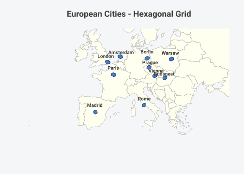

# Practical Workflows

## Overview

This vignette demonstrates practical workflows for common spatial
analysis tasks using hexify’s discrete global grid system.

## Workflow 1: Point Aggregation

### Problem

You have a large dataset of point observations and want to aggregate
them into equal-area cells for analysis or visualization.

### Solution

``` r

library(hexify)

# Simulate species occurrence data
set.seed(42)
observations <- data.frame(
  species = sample(c("Species A", "Species B", "Species C"), 1000, replace = TRUE),
  lon = runif(1000, -10, 30),  # Europe
  lat = runif(1000, 35, 60)
)

# Assign each observation to a grid cell (vectorized)
observations$cell_id <- hexify_lonlat_to_cell(
  observations$lon, observations$lat,
  resolution = 5, aperture = 3
)

# Count observations per cell
cell_counts <- aggregate(
  species ~ cell_id,
  data = observations,
  FUN = length
)
names(cell_counts)[2] <- "count"

head(cell_counts)
#>   cell_id count
#> 1       1    26
#> 2      19     1
#> 3     253    21
#> 4     261    27
#> 5     262    31
#> 6     271    40
```

### Get cell centers for mapping

``` r

# Add cell center coordinates
cell_centers <- hexify_cell_to_lonlat(cell_counts$cell_id, resolution = 5, aperture = 3)
cell_counts$center_lon <- cell_centers$lon_deg
cell_counts$center_lat <- cell_centers$lat_deg

head(cell_counts)
#>   cell_id count center_lon center_lat
#> 1       1    26  11.250000   58.28253
#> 2      19     1   5.949259   61.64551
#> 3     253    21  -1.684287   59.75856
#> 4     261    27  -8.659371   57.55546
#> 5     262    31   3.813414   56.73586
#> 6     271    40  -2.892435   54.80755
```

## Workflow 2: Multi-Resolution Analysis

### Problem

You want to analyze data at multiple spatial scales.

### Solution

Use different target areas to get different resolutions.

``` r

# Fine resolution (~100 km² cells)
obs_fine <- hexify(observations, lon = "lon", lat = "lat", area = 100)

# Coarse resolution (~10000 km² cells)
obs_coarse <- hexify(observations, lon = "lon", lat = "lat", area = 10000)

cat(sprintf("Fine resolution: %d unique cells (area: %.1f km²)\n",
            length(unique(obs_fine$cell_id)), obs_fine$cell_area[1]))
#> Fine resolution: 996 unique cells (area: 96.0 km²)
cat(sprintf("Coarse resolution: %d unique cells (area: %.1f km²)\n",
            length(unique(obs_coarse$cell_id)), obs_coarse$cell_area[1]))
#> Coarse resolution: 649 unique cells (area: 7774.0 km²)
```

### Aggregate at multiple scales

``` r

# Species richness at fine scale
richness_fine <- aggregate(
  species ~ cell_id,
  data = obs_fine,
  FUN = function(x) length(unique(x))
)
names(richness_fine)[2] <- "n_species"

# Species richness at coarse scale
richness_coarse <- aggregate(
  species ~ cell_id,
  data = obs_coarse,
  FUN = function(x) length(unique(x))
)
names(richness_coarse)[2] <- "n_species"

cat(sprintf("Fine scale: mean %.2f species per cell\n", mean(richness_fine$n_species)))
#> Fine scale: mean 1.00 species per cell
cat(sprintf("Coarse scale: mean %.2f species per cell\n", mean(richness_coarse$n_species)))
#> Coarse scale: mean 1.33 species per cell
```

## Workflow 3: Spatial Joins

### Problem

You have two datasets with different point locations and want to join
them based on shared grid cells.

### Solution

``` r

# Dataset 1: Weather stations
stations <- data.frame(
  station_id = paste0("ST", 1:50),
  lon = runif(50, -10, 30),
  lat = runif(50, 35, 60),
  temperature = rnorm(50, 15, 5)
)

# Dataset 2: Cities
cities <- data.frame(
  city = c("Vienna", "Paris", "London", "Berlin", "Rome",
           "Madrid", "Prague", "Warsaw", "Budapest", "Amsterdam"),
  lon = c(16.37, 2.35, -0.12, 13.40, 12.50,
          -3.70, 14.42, 21.01, 19.04, 4.90),
  lat = c(48.21, 48.86, 51.51, 52.52, 41.90,
          40.42, 50.08, 52.23, 47.50, 52.37)
)

# Assign both to the same grid (coarse for joining disparate points)
stations$cell_id <- hexify_lonlat_to_cell(
  stations$lon, stations$lat,
  resolution = 4, aperture = 3
)

cities$cell_id <- hexify_lonlat_to_cell(
  cities$lon, cities$lat,
  resolution = 4, aperture = 3
)

# Join by cell_id
city_weather <- merge(
  cities[, c("city", "cell_id")],
  aggregate(temperature ~ cell_id, data = stations, FUN = mean),
  by = "cell_id",
  all.x = TRUE
)

city_weather
#>    cell_id      city temperature
#> 1      170    Madrid          NA
#> 2      171     Paris    9.799357
#> 3      172    London   17.354733
#> 4      172 Amsterdam   17.354733
#> 5      181    Vienna   13.307532
#> 6      190      Rome   14.391848
#> 7      252  Budapest   19.812649
#> 8      253    Berlin   18.202805
#> 9      253    Prague   18.202805
#> 10     253    Warsaw   18.202805
```

## Workflow 4: Using hexify() for Complete Workflows

### Problem

You want a simple one-function approach that handles everything.

### Solution

Use [`hexify()`](https://gcol33.github.io/hexify/reference/hexify.md)
which returns all cell metadata in one call.

``` r

# Simple workflow with hexify()
result <- hexify(observations, lon = "lon", lat = "lat", area = 1000)

# Result includes all cell information
head(result[, c("species", "lon", "lat", "cell_id", "cell_cen_lon", "cell_cen_lat", "cell_area")])
#>     species       lon      lat cell_id cell_cen_lon cell_cen_lat cell_area
#> 1 Species A 29.481211 56.14951  184668    29.607546     56.15000  863.7977
#> 2 Species A  9.330428 56.40260  118578     9.394244     56.37970  863.7977
#> 3 Species A -6.851941 46.28968   72401    -6.913549     46.35758  863.7977
#> 4 Species A -4.621798 53.31213   65350    -4.541754     53.19360  863.7977
#> 5 Species B 25.773424 51.89916  181006    25.992129     51.83198  863.7977
#> 6 Species B 18.541863 53.73869  178342    18.792136     53.78309  863.7977
```

## Workflow 5: Choosing Resolution

### Problem

You want cells of approximately a specific area.

### Solution

Use
[`hexify_grid()`](https://gcol33.github.io/hexify/reference/hexify_grid.md)
to find the appropriate resolution.

``` r

# Target: 100 km² cells
grid_100 <- hexify_grid(area = 100, aperture = 3)
cat(sprintf("For ~100 km² cells: resolution %d (actual area: %.1f km²)\n",
            grid_100$resolution, grid_100$area))
#> For ~100 km² cells: resolution 12 (actual area: 100.0 km²)

# Target: 1000 km² cells
grid_1000 <- hexify_grid(area = 1000, aperture = 3)
cat(sprintf("For ~1000 km² cells: resolution %d (actual area: %.1f km²)\n",
            grid_1000$resolution, grid_1000$area))
#> For ~1000 km² cells: resolution 10 (actual area: 1000.0 km²)

# Target: 10000 km² cells
grid_10000 <- hexify_grid(area = 10000, aperture = 3)
cat(sprintf("For ~10000 km² cells: resolution %d (actual area: %.1f km²)\n",
            grid_10000$resolution, grid_10000$area))
#> For ~10000 km² cells: resolution 8 (actual area: 10000.0 km²)
```

### Compare apertures for target area

``` r

target_area <- 500  # km²

# Compare aperture options
for (ap in c(3, 4, 7)) {
  grid <- hexify_grid(area = target_area, aperture = ap)
  cat(sprintf("Aperture %d: resolution %d, area %.1f km², %.0f cells\n",
              ap, grid$resolution, grid$area, grid$total_cells))
}
# Note: Mixed aperture "4/3" is available via hexify() but not hexify_grid()
```

## Workflow 6: Working with sf

### Problem

You want to create sf polygons for visualization.

### Solution

``` r

library(sf)
#> Linking to GEOS 3.13.1, GDAL 3.11.0, PROJ 9.6.0; sf_use_s2() is TRUE

# Hexify some data
result <- hexify(cities, lon = "lon", lat = "lat", area = 5000)

# Convert to sf points (fast)
sf_points <- hexify_to_sf(result, geometry = "point")

# Convert to sf polygons (for choropleth maps)
sf_polys <- hexify_to_sf(result, geometry = "polygon")

# Plot polygons with basemap
europe <- hexify_world[hexify_world$continent == "Europe", ]
plot(st_geometry(europe), col = "ivory", border = "gray70",
     xlim = c(-10, 25), ylim = c(35, 58), main = "European Cities - Hexagonal Grid")
plot(st_geometry(sf_polys), col = "steelblue", border = "darkblue", add = TRUE)
```



## Best Practices

### 1. Choose aperture based on use case

| Aperture | Best For | Trade-offs |
|----|----|----|
| 3 | Fine resolution control, ecological studies, dggridR compatibility | Slowest cell growth |
| 4 | Power-of-2 scaling, GIS workflows | Moderate resolution steps |
| 7 | Rapid cell count growth, coarse analysis | Largest resolution jumps |
| 4/3 | Balance of 4’s fast start + 3’s fine control | More complex indexing |

### 2. Store indices efficiently

- Use `cell_id` (integer) for database storage
- Store resolution alongside cell IDs for later retrieval

### 3. Use hexify() for simple workflows

- Returns all metadata in one call
- Handles sf objects automatically
- Auto-calculates resolution from target area

### 4. Handle edge cases

- Check for NA coordinates before processing
- Polar regions (lat \> 89°) may have projection artifacts
- Date line (lon = ±180°) works correctly

``` r

# Example: handling NA values with hexify()
data_with_na <- data.frame(
  lon = c(16.37, NA, 2.35, 13.40),
  lat = c(48.21, 48.86, NA, 52.52)
)

# hexify handles NAs gracefully with a warning
result <- hexify(data_with_na, lon = "lon", lat = "lat", area = 1000)
#> Warning in hexify(data_with_na, lon = "lon", lat = "lat", area = 1000): 2
#> coordinate pairs contain NA values and will be skipped
print(result[, c("lon", "lat", "cell_id")])
#>     lon   lat cell_id
#> 1 16.37 48.21  126594
#> 2    NA 48.86     246
#> 3  2.35    NA     246
#> 4 13.40 52.52  122466
```
