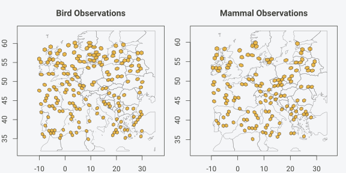
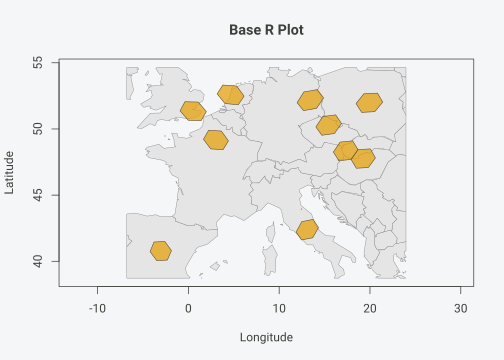
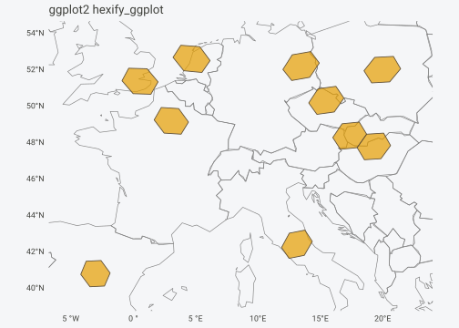
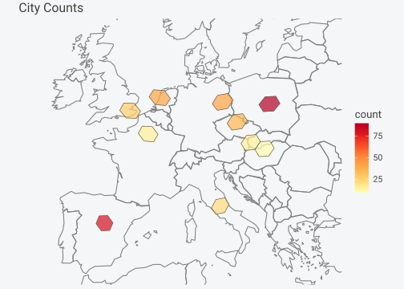

# Practical Workflows

## Overview

This vignette demonstrates practical workflows for common spatial
analysis tasks using hexify’s discrete global grid system and S4
classes.

## One Grid, Many Datasets

The most powerful pattern in hexify is defining a grid once and reusing
it across multiple datasets. This ensures spatial consistency and
eliminates parameter repetition.

### The Problem

You often have:

- Several independent datasets (observations, sensors, surveys)
- All in longitude/latitude coordinates
- Collected at different times or from different sources

You want to:

- Put everything on one common global grid
- Be sure the grids actually match
- Combine results later without subtle errors

### The Solution: Shared Grid Objects

``` r

library(hexify)

# Step 1: Define the grid once
# This is your shared spatial reference system - like a CRS, but discrete and equal-area
grid <- hex_grid(area_km2 = 5000)
print(grid)
#> HexGridInfo Specification
#> -------------------------
#> Aperture:    3
#> Resolution:  8
#> Area:        7773.97 km^2
#> Diagonal:    94.74 km
#> CRS:         EPSG:4326
#> Total Cells: 65612

# Step 2: Create multiple datasets with different structures
set.seed(123)

# Dataset 1: Bird observations (note different column names)
bird_obs <- data.frame(
  species = sample(c("Passer domesticus", "Turdus merula", "Parus major"), 200, replace = TRUE),
  longitude = runif(200, -10, 30),
  latitude = runif(200, 35, 60)
)

# Dataset 2: Mammal records
mammal_obs <- data.frame(
  species = sample(c("Vulpes vulpes", "Meles meles", "Sciurus vulgaris"), 150, replace = TRUE),
  lon = runif(150, -10, 30),
  lat = runif(150, 35, 60)
)

# Dataset 3: Climate stations
climate_data <- data.frame(
  station_id = paste0("WS", 1:50),
  x = runif(50, -10, 30),
  y = runif(50, 35, 60),
  temp_c = rnorm(50, 12, 5)
)

# Step 3: Attach all datasets to the SAME grid
# No aperture, resolution, or area parameters needed - the grid carries them
birds <- hexify(bird_obs, lon = "longitude", lat = "latitude", grid = grid)
mammals <- hexify(mammal_obs, lon = "lon", lat = "lat", grid = grid)
climate <- hexify(climate_data, lon = "x", lat = "y", grid = grid)

cat("Birds:  ", nrow(as.data.frame(birds)), "observations in", n_cells(birds), "cells\n")
#> Birds:   200 observations in 182 cells
cat("Mammals:", nrow(as.data.frame(mammals)), "observations in", n_cells(mammals), "cells\n")
#> Mammals: 150 observations in 140 cells
cat("Climate:", nrow(as.data.frame(climate)), "stations in", n_cells(climate), "cells\n")
#> Climate: 50 stations in 49 cells
```

### Working at the Cell Level

Once data are hexified, longitude/latitude no longer matter for
analysis. The `cell_id` becomes the shared spatial key:

``` r

# Extract data frames with cell IDs
birds_df <- as.data.frame(birds)
birds_df$cell_id <- birds@cell_id

mammals_df <- as.data.frame(mammals)
mammals_df$cell_id <- mammals@cell_id

climate_df <- as.data.frame(climate)
climate_df$cell_id <- climate@cell_id

# Aggregate each dataset by cell
bird_richness <- aggregate(
  species ~ cell_id,
  data = birds_df,
  FUN = function(x) length(unique(x))
)
names(bird_richness)[2] <- "bird_species"

mammal_richness <- aggregate(
  species ~ cell_id,
  data = mammals_df,
  FUN = function(x) length(unique(x))
)
names(mammal_richness)[2] <- "mammal_species"

mean_temp <- aggregate(
  temp_c ~ cell_id,
  data = climate_df,
  FUN = mean
)
names(mean_temp)[2] <- "mean_temp"

# Join datasets by cell_id - guaranteed to align because same grid
combined <- merge(bird_richness, mammal_richness, by = "cell_id", all = TRUE)
combined <- merge(combined, mean_temp, by = "cell_id", all = TRUE)

head(combined)
#>   cell_id bird_species mammal_species mean_temp
#> 1      82            1             NA        NA
#> 2     162            1             NA        NA
#> 3     163            1             NA        NA
#> 4     325           NA              1        NA
#> 5     487            1             NA        NA
#> 6    6637            1             NA        NA
```

### Visual Confirmation

All datasets produce identical grid overlays when plotted:

``` r

par(mfrow = c(1, 2), mar = c(2, 2, 3, 1))

# Both plots use the same grid automatically
plot(birds, main = "Bird Observations", basemap = TRUE)
#> Spherical geometry (s2) switched off
#> although coordinates are longitude/latitude, st_intersection assumes that they
#> are planar
#> Spherical geometry (s2) switched on
plot(mammals, main = "Mammal Observations", basemap = TRUE)
#> Spherical geometry (s2) switched off
#> although coordinates are longitude/latitude, st_intersection assumes that they
#> are planar
```



    #> Spherical geometry (s2) switched on

### Key Benefits

1.  **No parameter repetition**: Define aperture, resolution, area once
2.  **Guaranteed consistency**: All datasets share the exact same grid
3.  **Error prevention**: Can’t accidentally mix incompatible grids
4.  **Clean code**: The grid travels with the data

------------------------------------------------------------------------

## Workflow 1: Point Aggregation

### Problem

You have a large dataset of point observations and want to aggregate
them into equal-area cells for analysis or visualization.

### Solution

``` r

library(hexify)

# Simulate species occurrence data
set.seed(42)
observations <- data.frame(
  species = sample(c("Species A", "Species B", "Species C"), 1000, replace = TRUE),
  lon = runif(1000, -10, 30),  # Europe
  lat = runif(1000, 35, 60)
)

# Create grid and hexify data
grid <- hex_grid(area_km2 = 10000)
obs_hex <- hexify(observations, lon = "lon", lat = "lat", grid = grid)

# Extract with cell IDs
obs_df <- as.data.frame(obs_hex)
obs_df$cell_id <- obs_hex@cell_id

# Count observations per cell
cell_counts <- aggregate(
  species ~ cell_id,
  data = obs_df,
  FUN = length
)
names(cell_counts)[2] <- "count"

head(cell_counts)
#>   cell_id count
#> 1      81     1
#> 2     162     1
#> 3     163     1
#> 4     244     1
#> 5    6632     1
#> 6    6634     1
```

### Get cell centers for mapping

``` r

# Add cell center coordinates
cell_centers <- cell_to_lonlat(cell_counts$cell_id, grid)
cell_counts$center_lon <- cell_centers$lon_deg
cell_counts$center_lat <- cell_centers$lat_deg

head(cell_counts)
#>   cell_id count center_lon center_lat
#> 1      81     1  11.250000   59.77800
#> 2     162     1   9.562771   60.17658
#> 3     163     1   9.594171   59.43116
#> 4     244     1   8.178948   59.63363
#> 5    6632     1  -6.269429   59.95664
#> 6    6634     1  -3.202154   59.84206
```

## Workflow 2: Multi-Resolution Analysis

### Problem

You want to analyze data at multiple spatial scales.

### Solution

Use different target areas to get different resolutions.

``` r

# Fine resolution (~100 km2 cells)
grid_fine <- hex_grid(area_km2 = 100)
obs_fine <- hexify(observations, lon = "lon", lat = "lat", grid = grid_fine)

# Coarse resolution (~10000 km2 cells)
grid_coarse <- hex_grid(area_km2 = 10000)
obs_coarse <- hexify(observations, lon = "lon", lat = "lat", grid = grid_coarse)

cat(sprintf("Fine resolution: %d unique cells (area: %.1f km2)\n",
            n_cells(obs_fine), grid_fine@area_km2))
#> Fine resolution: 996 unique cells (area: 96.0 km2)
cat(sprintf("Coarse resolution: %d unique cells (area: %.1f km2)\n",
            n_cells(obs_coarse), grid_coarse@area_km2))
#> Coarse resolution: 649 unique cells (area: 7774.0 km2)
```

### Aggregate at multiple scales

``` r

# Extract data with cell IDs
fine_df <- as.data.frame(obs_fine)
fine_df$cell_id <- obs_fine@cell_id

coarse_df <- as.data.frame(obs_coarse)
coarse_df$cell_id <- obs_coarse@cell_id

# Species richness at fine scale
richness_fine <- aggregate(
  species ~ cell_id,
  data = fine_df,
  FUN = function(x) length(unique(x))
)
names(richness_fine)[2] <- "n_species"

# Species richness at coarse scale
richness_coarse <- aggregate(
  species ~ cell_id,
  data = coarse_df,
  FUN = function(x) length(unique(x))
)
names(richness_coarse)[2] <- "n_species"

cat(sprintf("Fine scale: mean %.2f species per cell\n", mean(richness_fine$n_species)))
#> Fine scale: mean 1.00 species per cell
cat(sprintf("Coarse scale: mean %.2f species per cell\n", mean(richness_coarse$n_species)))
#> Coarse scale: mean 1.33 species per cell
```

## Workflow 3: Spatial Joins

### Problem

You have two datasets with different point locations and want to join
them based on shared grid cells.

### Solution

``` r

# Dataset 1: Weather stations
stations <- data.frame(
  station_id = paste0("ST", 1:50),
  lon = runif(50, -10, 30),
  lat = runif(50, 35, 60),
  temperature = rnorm(50, 15, 5)
)

# Dataset 2: Cities
cities <- data.frame(
  city = c("Vienna", "Paris", "London", "Berlin", "Rome",
           "Madrid", "Prague", "Warsaw", "Budapest", "Amsterdam"),
  lon = c(16.37, 2.35, -0.12, 13.40, 12.50,
          -3.70, 14.42, 21.01, 19.04, 4.90),
  lat = c(48.21, 48.86, 51.51, 52.52, 41.90,
          40.42, 50.08, 52.23, 47.50, 52.37)
)

# Use a coarse grid for joining disparate points
grid <- hex_grid(area_km2 = 50000)

# Hexify both datasets with the same grid
stations_hex <- hexify(stations, lon = "lon", lat = "lat", grid = grid)
cities_hex <- hexify(cities, lon = "lon", lat = "lat", grid = grid)

# Extract with cell IDs
stations_df <- as.data.frame(stations_hex)
stations_df$cell_id <- stations_hex@cell_id

cities_df <- as.data.frame(cities_hex)
cities_df$cell_id <- cities_hex@cell_id

# Join by cell_id
city_weather <- merge(
  cities_df[, c("city", "cell_id")],
  aggregate(temperature ~ cell_id, data = stations_df, FUN = mean),
  by = "cell_id",
  all.x = TRUE
)

city_weather
#>    cell_id      city temperature
#> 1      865    London          NA
#> 2     1478    Madrid          NA
#> 3     1482     Paris          NA
#> 4     1484 Amsterdam          NA
#> 5     1540    Berlin          NA
#> 6     1567    Prague    21.64748
#> 7     1591      Rome          NA
#> 8     1594    Vienna          NA
#> 9     1621  Budapest    19.43432
#> 10    2240    Warsaw          NA
```

## Workflow 4: Using hexify() for Complete Workflows

### Problem

You want a simple one-function approach that handles everything.

### Solution

Use [`hexify()`](https://gcol33.github.io/hexify/reference/hexify.md)
which returns a HexData object containing grid info and cell
assignments.

``` r

# Simple workflow with hexify()
grid <- hex_grid(area_km2 = 1000)
result <- hexify(observations, lon = "lon", lat = "lat", grid = grid)

# Access grid info
cat("Resolution:", grid_info(result)@resolution, "\n")
#> Resolution: 10
cat("Cell area:", grid_info(result)@area_km2, "km2\n")
#> Cell area: 863.7977 km2

# Access cell information
cat("Unique cells:", n_cells(result), "\n")
#> Unique cells: 957

# Cell centers are stored in cell_center slot
cat("First 3 cell centers:\n")
#> First 3 cell centers:
print(head(result@cell_center, 3))
#>            lon      lat
#> [1,] 29.607546 56.15000
#> [2,]  9.394244 56.37970
#> [3,] -6.913549 46.35758
```

## Workflow 5: Choosing Resolution

### Problem

You want cells of approximately a specific area.

### Solution

Use
[`hex_grid()`](https://gcol33.github.io/hexify/reference/hex_grid.md) to
create a grid with the appropriate resolution.

``` r

# Target: 100 km2 cells
grid_100 <- hex_grid(area_km2 = 100, aperture = 3)
cat(sprintf("For ~100 km2 cells: resolution %d (actual area: %.1f km2)\n",
            grid_100@resolution, grid_100@area_km2))
#> For ~100 km2 cells: resolution 12 (actual area: 96.0 km2)

# Target: 1000 km2 cells
grid_1000 <- hex_grid(area_km2 = 1000, aperture = 3)
cat(sprintf("For ~1000 km2 cells: resolution %d (actual area: %.1f km2)\n",
            grid_1000@resolution, grid_1000@area_km2))
#> For ~1000 km2 cells: resolution 10 (actual area: 863.8 km2)

# Target: 10000 km2 cells
grid_10000 <- hex_grid(area_km2 = 10000, aperture = 3)
cat(sprintf("For ~10000 km2 cells: resolution %d (actual area: %.1f km2)\n",
            grid_10000@resolution, grid_10000@area_km2))
#> For ~10000 km2 cells: resolution 8 (actual area: 7774.0 km2)
```

### Compare apertures for target area

``` r

target_area <- 500  # km2

# Compare aperture options
for (ap in c(3, 4, 7)) {
  grid <- hex_grid(area_km2 = target_area, aperture = ap)
  n_cells <- 10 * (ap^grid@resolution) + 2
  cat(sprintf("Aperture %d: resolution %d, area %.1f km2, %.0f cells\n",
              ap, grid@resolution, grid@area_km2, n_cells))
}
#> Aperture 3: resolution 10, area 863.8 km2, 590492 cells
#> Aperture 4: resolution 8, area 778.3 km2, 655362 cells
#> Aperture 7: resolution 6, area 433.5 km2, 1176492 cells
```

## Workflow 6: Working with sf

### Problem

You want to create sf polygons for visualization.

### Solution

``` r

library(sf)
#> Linking to GEOS 3.13.1, GDAL 3.11.0, PROJ 9.6.0; sf_use_s2() is TRUE

# Hexify some data
grid <- hex_grid(area_km2 = 20000)
result <- hexify(cities, lon = "lon", lat = "lat", grid = grid)

# Convert to sf points (fast) - uses cell centers
sf_points <- as_sf(result, geometry = "point")
print(class(sf_points))
#> [1] "sf"         "data.frame"

# Convert to sf polygons (for choropleth maps)
sf_polys <- as_sf(result, geometry = "polygon")
print(class(sf_polys))
#> [1] "sf"         "data.frame"

# Or generate polygons directly from cell IDs
unique_cells <- cells(result)
cell_polys <- cell_to_sf(unique_cells, grid)
```

### Visualize with ggplot2

``` r

library(ggplot2)

# Plot polygons with basemap and city labels
europe <- hexify_world[hexify_world$continent == "Europe", ]

ggplot() +
  geom_sf(data = europe, fill = "ivory", color = "gray70") +
  geom_sf(data = cell_polys, fill = "steelblue", alpha = 0.5, color = "darkblue") +
  coord_sf(xlim = c(-10, 25), ylim = c(35, 58)) +
  labs(title = "European Cities - Hexagonal Grid") +
  theme_minimal()
```


## Workflow 7: Visualization Options

hexify provides multiple visualization approaches for different needs.

### Base R plot() Method

``` r

# Simplest approach - just plot the HexData
plot(result, basemap = TRUE, main = "Base R Plot")
#> Spherical geometry (s2) switched off
#> although coordinates are longitude/latitude, st_intersection assumes that they
#> are planar
```



    #> Spherical geometry (s2) switched on

### With hexify_ggplot() (ggplot2)

``` r

library(ggplot2)

# Returns a ggplot object you can customize
hexify_ggplot(result, basemap = TRUE, title = "ggplot2 hexify_ggplot") +
  theme(legend.position = "none")
```



### Heatmaps for Aggregated Data

``` r

# Add count data for heatmap
obs_df <- as.data.frame(result)
obs_df$cell_id <- result@cell_id
obs_df$count <- sample(10:100, nrow(obs_df), replace = TRUE)

# Hexify with count column
result_with_count <- hexify(obs_df, lon = "lon", lat = "lat", grid = grid)

# Create heatmap
hexify_heatmap(
  result_with_count,
  value = "count",
  basemap = "world",
  colors = "YlOrRd",
  title = "City Counts",
  xlim = c(-15, 30),
  ylim = c(35, 60)
)
```



## Best Practices

### 1. Choose aperture based on use case

| Aperture | Best For | Trade-offs |
|----|----|----|
| 3 | Fine resolution control, ecological studies, dggridR compatibility | Slowest cell growth |
| 4 | Power-of-2 scaling, GIS workflows | Moderate resolution steps |
| 7 | Rapid cell count growth, coarse analysis | Largest resolution jumps |
| 4/3 | Balance of 4’s fast start + 3’s fine control | More complex indexing |

### 2. Store indices efficiently

- Cell IDs are numeric (1-based DGGRID-compatible SEQNUM)
- Store resolution alongside cell IDs for later retrieval
- Use
  [`cell_to_lonlat()`](https://gcol33.github.io/hexify/reference/cell_to_lonlat.md)
  to recover coordinates

### 3. Use hex_grid() + hexify() for workflows

``` r

# Good: Define grid once, reuse
grid <- hex_grid(area_km2 = 1000)
result1 <- hexify(df1, lon = "lon", lat = "lat", grid = grid)
result2 <- hexify(df2, lon = "x", lat = "y", grid = grid)

# Also good: Let hexify create grid internally
result <- hexify(df1, lon = "lon", lat = "lat", area_km2 = 1000)
```

### 4. Handle edge cases

- Check for NA coordinates before processing
- Polar regions (lat \> 89 deg) may have projection artifacts
- Date line (lon = +/-180 deg) works correctly

``` r

# Example: handling NA values with hexify()
data_with_na <- data.frame(
  lon = c(16.37, NA, 2.35, 13.40),
  lat = c(48.21, 48.86, NA, 52.52)
)

# hexify handles NAs gracefully with a warning
grid <- hex_grid(area_km2 = 1000)
result <- hexify(data_with_na, lon = "lon", lat = "lat", grid = grid)
#> Warning in hexify(data_with_na, lon = "lon", lat = "lat", grid = grid): 2
#> coordinate pairs contain NA values and will be skipped

# Check which rows have valid cell assignments
cat("Cell IDs:", result@cell_id, "\n")
#> Cell IDs: 126594 246 246 122466
```

## Summary: Key Functions

| Task | Function |
|----|----|
| Create grid specification | `hex_grid(area_km2 = ...)` |
| Assign points to cells | `hexify(df, lon, lat, grid)` |
| Get grid from HexData | `grid_info(result)` |
| Get unique cell IDs | `cells(result)` |
| Count cells | `n_cells(result)` |
| Extract data frame | `as.data.frame(result)` |
| Convert to sf | `as_sf(result, geometry = "polygon")` |
| Generate polygons | `cell_to_sf(cell_ids, grid)` |
| Grid over region | `grid_rect(bbox, grid)` |
| Coordinate conversion | [`lonlat_to_cell()`](https://gcol33.github.io/hexify/reference/lonlat_to_cell.md), [`cell_to_lonlat()`](https://gcol33.github.io/hexify/reference/cell_to_lonlat.md) |
| Visualize | [`plot()`](https://rdrr.io/r/graphics/plot.default.html), [`hexify_ggplot()`](https://gcol33.github.io/hexify/reference/hexify_ggplot.md), [`hexify_heatmap()`](https://gcol33.github.io/hexify/reference/hexify_heatmap.md) |
