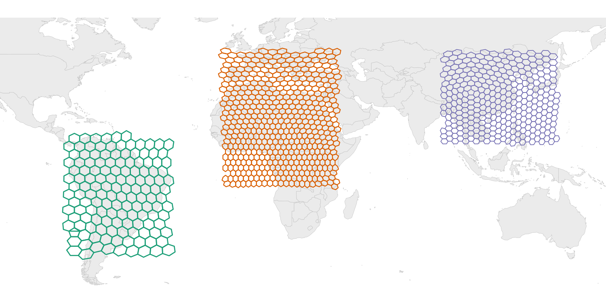

# hexify

[](https://CRAN.R-project.org/package=hexify)
[](https://cran.r-project.org/package=hexify)
[](https://cran.r-project.org/package=hexify)
[](https://github.com/gcol33/hexify/actions/workflows/R-CMD-check.yaml)
[](https://app.codecov.io/gh/gcol33/hexify)
[](https://opensource.org/licenses/MIT)

**Equal-Area Hexagonal Grids for Global Spatial Analysis**



`hexify` assigns geographic coordinates to equal-area hexagonal grid
cells using the ISEA (Icosahedral Snyder Equal Area) projection. Every
cell has the same area regardless of latitude, eliminating the sampling
bias inherent in rectangular lat-lon grids. H3 is supported for
compatibility with existing H3 workflows.

## Quick Start

``` r

library(hexify)

cities <- data.frame(
  name = c("Vienna", "Paris", "Madrid"),
  lon = c(16.37, 2.35, -3.70),
  lat = c(48.21, 48.86, 40.42)
)

# ISEA equal-area grid (default)
grid <- hex_grid(area_km2 = 10000)
result <- hexify(cities, lon = "lon", lat = "lat", grid = grid)
plot(result)

# H3 grid (Uber's system)
h3_grid <- hex_grid(resolution = 4, type = "h3")
result_h3 <- hexify(cities, lon = "lon", lat = "lat", grid = h3_grid)
plot(result_h3)
```

## Statement of Need

Spatial binning is fundamental to ecological modeling, epidemiology, and
geographic analysis. Standard approaches using rectangular lat-lon grids
introduce severe area distortions: a 1° cell at the equator covers
~12,300 km², while the same cell near the poles covers a fraction of
that area. This violates the equal-sampling assumption underlying most
spatial statistics.

Discrete Global Grid Systems (DGGS) solve this by partitioning Earth’s
surface into cells of uniform area. hexify’s primary backend is **ISEA**
(Icosahedral Snyder Equal Area): true equal-area hexagonal grids with
apertures 3, 4 and 7 in any sequence, implemented in C++ with no
external dependencies. For interoperability with industry ecosystems
(FCC, Foursquare, DuckDB), hexify also supports **H3** grids via a
vendored C library.

Equal-area grids are directly applicable to:

- Species distribution modeling and biodiversity assessments
- Epidemiological surveillance and disease mapping
- Environmental monitoring and remote sensing aggregation
- Any analysis requiring unbiased spatial binning

## Why Hexagonal Grids?

Equal-area hexagonal grids bring three properties to spatial binning:

1.  **Equal area** — hexify places ISEA cells with the Snyder equal-area
    projection, so every cell covers the same surface area from equator
    to pole
2.  **Uniform adjacency** — all six neighbors share an edge and sit at
    the same distance from the cell center, so neighborhood statistics
    carry no directional bias
3.  **Compactness** — the hexagonal tiling minimizes perimeter per unit
    area among all equal-area partitions of a plane (Hales’ honeycomb
    theorem), which keeps edge effects small

Rectangular lat-lon grids, by contrast, shrink toward the poles: a 1°
cell at 60°N has half the area of the same cell at the equator.

## Features

### Core Workflow

- **[`hex_grid()`](https://gillescolling.com/hexify/reference/hex_grid.md)**:
  Define a grid by target cell area (km²) or resolution level
- **[`hexify()`](https://gillescolling.com/hexify/reference/hexify.md)**:
  Assign points to grid cells (data.frame or sf input)
- **[`plot()`](https://rdrr.io/r/graphics/plot.default.html) /
  [`hexify_heatmap()`](https://gillescolling.com/hexify/reference/hexify_heatmap.md)**:
  Visualize results with base R or ggplot2
- **Any body**: `hex_grid(area_km2 = 1000, radius_km = "mars")` sizes a
  grid on Mars, the Moon, Titan, or any radius you give — both backends

### Grid Generation

- **[`grid_rect()`](https://gillescolling.com/hexify/reference/grid_rect.md)**:
  Generate cell polygons for a bounding box
- **[`grid_global()`](https://gillescolling.com/hexify/reference/grid_global.md)**:
  Generate a complete global grid (all cells)
- **[`grid_clip()`](https://gillescolling.com/hexify/reference/grid_clip.md)**:
  Clip grid to a polygon boundary (country, region, etc.)

### Cell Operations

- **[`cell_to_sf()`](https://gillescolling.com/hexify/reference/cell_to_sf.md)**:
  Convert cell IDs to sf polygon geometries
- **[`cell_to_lonlat()`](https://gillescolling.com/hexify/reference/cell_to_lonlat.md)**:
  Get cell center coordinates
- **[`get_parent()`](https://gillescolling.com/hexify/reference/get_parent.md)
  /
  [`get_children()`](https://gillescolling.com/hexify/reference/get_children.md)**:
  Navigate grid hierarchy

### Interoperability

- **[`as_dggrid()`](https://gillescolling.com/hexify/reference/as_dggrid.md)
  /
  [`from_dggrid()`](https://gillescolling.com/hexify/reference/from_dggrid.md)**:
  Convert to/from dggridR format
- **[`as_sf()`](https://gillescolling.com/hexify/reference/as_sf.md)**:
  Export HexData to sf object
- **[`as.data.frame()`](https://rdrr.io/r/base/as.data.frame.html)**:
  Extract data with cell assignments
- **H3 support**: `hex_grid(resolution = 8, type = "h3")` — vendored H3
  C library, no extra install needed

## Installation

``` r

# Install from CRAN
install.packages("hexify")

# Or install development version from GitHub
# install.packages("pak")
pak::pak("gcol33/hexify")
```

## Usage Examples

### Basic Point Assignment

``` r

library(hexify)

# Define grid: ~10,000 km² cells
grid <- hex_grid(area_km2 = 10000)
grid
#> HexGridInfo Specification
#> -------------------------
#> Aperture:    3
#> Resolution:  8
#> Area:        7773.97 km^2
#> Diagonal:    94.74 km
#> CRS:         EPSG:4326
#> Total Cells: 65612

# Assign coordinates to cells
coords <- data.frame(
  lon = c(-122.4, 2.35, 139.7),
  lat = c(37.8, 48.9, 35.7)
)
result <- hexify(coords, lon = "lon", lat = "lat", grid = grid)

# Access cell IDs
result@cell_id
```

### Working with sf Objects

``` r

library(sf)

# Any CRS works - hexify transforms automatically
points_sf <- st_as_sf(coords, coords = c("lon", "lat"), crs = 4326)
result <- hexify(points_sf, area_km2 = 10000)

# Export back to sf
result_sf <- as_sf(result)
```

### Generating Grid Polygons

``` r

# Grid for Europe
grid <- hex_grid(area_km2 = 50000)
europe_hexes <- grid_rect(c(-10, 35, 40, 70), grid)
plot(europe_hexes["cell_id"])

# Clip to a country boundary
library(rnaturalearth)
france <- ne_countries(country = "France", returnclass = "sf")
france_grid <- grid_clip(france, grid)
```

### Aggregating Point Data

``` r

# Species occurrence data
occurrences <- data.frame(
  species = sample(c("Sp A", "Sp B", "Sp C"), 1000, replace = TRUE),
  lon = runif(1000, -10, 30),
  lat = runif(1000, 35, 60)
)

# Assign to grid
grid <- hex_grid(area_km2 = 20000)
occ_hex <- hexify(occurrences, lon = "lon", lat = "lat", grid = grid)

# Count per cell
occ_df <- as.data.frame(occ_hex)
occ_df$cell_id <- occ_hex@cell_id

cell_counts <- aggregate(species ~ cell_id, data = occ_df, FUN = length)
names(cell_counts)[2] <- "n_records"

# Richness per cell
richness <- aggregate(species ~ cell_id, data = occ_df,
                      FUN = function(x) length(unique(x)))
names(richness)[2] <- "n_species"
```

### Visualization

``` r

# Quick plot
plot(result)

# Heatmap of records per cell, with a world basemap
hexify_heatmap(occ_hex, basemap = "world")

# Custom ggplot
library(ggplot2)
cell_polys <- cell_to_sf(cell_counts$cell_id, grid)
cell_polys <- merge(cell_polys, cell_counts, by = "cell_id")

ggplot(cell_polys) +
  geom_sf(aes(fill = n_records), color = "white", linewidth = 0.2) +
  scale_fill_viridis_c() +
  theme_minimal()
```

## Known Limitations

- **H3 grids**: Fixed aperture 7, maximum resolution 15 (~0.9 m² cells).
  ISEA grids support apertures 3, 4 and 7 in any sequence up to
  resolution 30.
- **H3 cell area**: H3 cells are gnomonic rather than equal-area, and
  hexagon area varies by about a factor of 2 within a resolution (about
  2.4 including the pentagons). Use ISEA where equal area matters, and
  [`cell_area()`](https://gillescolling.com/hexify/reference/cell_area.md)
  to read the area of a given H3 cell.
- **Pentagons**: Any hexagonal tiling of a sphere requires exactly 12
  pentagonal cells (at icosahedron vertices). These cells have 5
  neighbors instead of 6. Use
  [`is_pentagon()`](https://gillescolling.com/hexify/reference/is_pentagon.md)
  to detect them.
- **Projection precision**: The inverse Snyder projection uses iterative
  Newton-Raphson convergence. Default precision is sufficient for
  sub-meter accuracy; use
  [`hexify_set_precision()`](https://gillescolling.com/hexify/reference/hexify_set_precision.md)
  to adjust the speed/accuracy trade-off.

## Documentation

- [Quick
  Start](https://gillescolling.com/hexify/articles/quickstart.html) -
  Basic concepts and workflow
- [Visualization](https://gillescolling.com/hexify/articles/visualization.html) -
  Plotting with base R and ggplot2
- [Workflows](https://gillescolling.com/hexify/articles/workflows.html) -
  Grid generation, clipping, multi-resolution analysis
- [H3 Grids](https://gillescolling.com/hexify/articles/h3.html) -
  Working with the H3 backend and crosswalking to ISEA
- [Mathematical
  Foundations](https://gillescolling.com/hexify/articles/theory.html) -
  Snyder projection, aperture quantization, indexing

## Support

> “Software is like sex: it’s better when it’s free.” — Linus Torvalds

I’m a PhD student who builds R packages in my free time because I
believe good tools should be free and open. I started these projects for
my own work and figured others might find them useful too.

If this package saved you some time, buying me a coffee is a nice way to
say thanks. It helps with my coffee addiction.

[](https://buymeacoffee.com/gcol33)

## Citation

``` bibtex
@software{hexify,
  author = {Colling, Gilles},
  title = {hexify: Equal-Area Hexagonal Grids for Spatial Analysis},
  year = {2025},
  url = {https://CRAN.R-project.org/package=hexify},
  doi = {10.32614/CRAN.package.hexify}
}
```

## License

MIT (see LICENSE.md)
