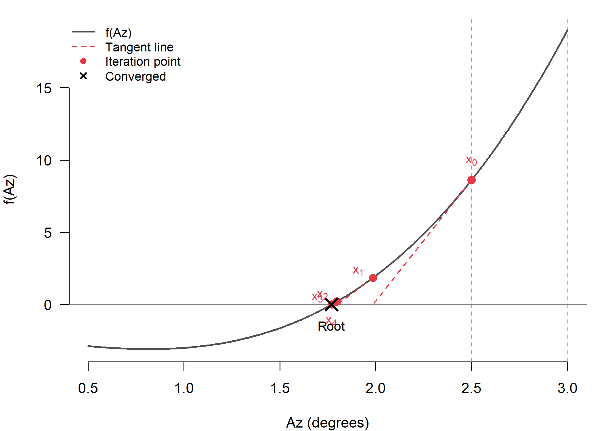
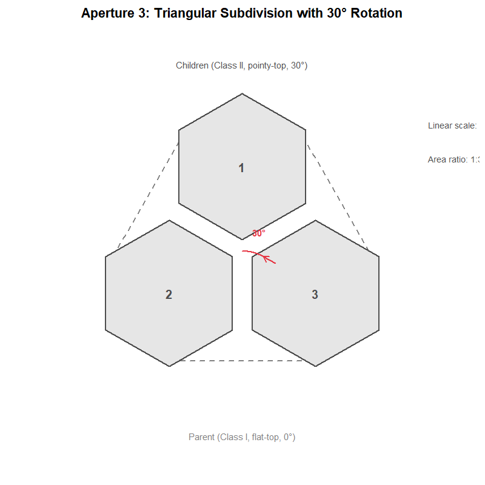
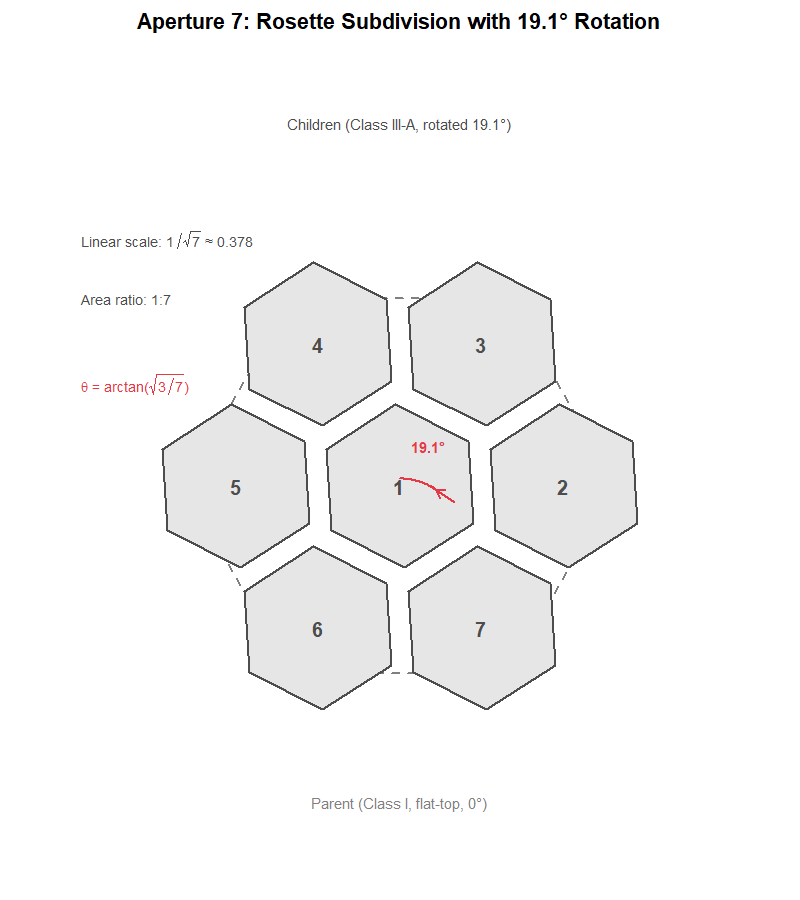

```{r setup, include = FALSE}
knitr::opts_chunk$set(
  collapse = TRUE,
  comment = "#>",
  fig.width = 7,
  fig.height = 5
)
library(hexify)
```

## Overview

hexify implements the **ISEA (Icosahedral Snyder Equal Area)** discrete global grid system. This vignette explains the mathematical foundations: the projection geometry, coordinate systems, aperture subdivision, and cell indexing.

## The Problem: Equal-Area Grids on a Sphere

Any projection from a sphere to a plane must distort *something*. For spatial statistics, we need cells of equal area regardless of location. Standard latitude-longitude grids fail badly: a 1° cell at the equator covers ~12,300 km², while the same cell near the poles covers a tiny fraction of that.

The ISEA projection solves this by:

1. Inscribing a regular icosahedron in the sphere

2. Projecting each spherical "cap" onto its corresponding flat triangular face using a modified Lambert equal-area projection

3. Overlaying a hexagonal grid on the resulting planar triangles

## The Lambert Azimuthal Equal-Area Projection

The foundation of Snyder's projection is Lambert's azimuthal equal-area projection, developed by Johann Heinrich Lambert in 1772. The projection maps a sphere of radius $R$ to a tangent plane while **preserving area exactly** (Snyder, 1987, p. 182).

### Definition

The Lambert azimuthal equal-area projection is defined by a mathematical constraint, not a geometric construction. For a projection centered at point $S$:

- **Azimuthal property:** The direction (azimuth) from $S$ to any point $P$ on the sphere equals the direction from the origin to $P'$ on the plane

- **Equal-area property:** Any region on the sphere maps to a region of identical area on the plane

These two constraints uniquely determine the radial distance formula. For a point $P$ at angular distance $c$ from the center (measured along the sphere surface), the projected distance from the origin is:

$$\rho = 2R \sin\left(\frac{c}{2}\right)$$

This is **not** a perspective projection and has no simple geometric interpretation like "chord distance" or "ray intersection." The formula is derived analytically from the equal-area constraint (Snyder, 1987, p. 182-185).

```{r lambert-geometry, echo=FALSE, fig.width=7, fig.height=6}
# Lambert Azimuthal Equal-Area Projection Geometry
# Reference: Snyder (1987), "Map Projections: A Working Manual", p. 182-185
#
# The projection formula ρ = 2R·sin(c/2) is derived analytically from
# the equal-area constraint, not from geometric chord distance.
# This diagram shows the geometric relationship that yields the same formula.

par(mar = c(1, 1, 2, 1), bg = "white")
plot(NULL, xlim = c(-1.5, 2.2), ylim = c(-1.5, 1.7), asp = 1,
     axes = FALSE, xlab = "", ylab = "",
     main = "Lambert Azimuthal Equal-Area Projection Geometry")

R <- 1
theta_circle <- seq(0, 2*pi, length.out = 100)

# Draw sphere (great circle cross-section)
lines(R * cos(theta_circle), R * sin(theta_circle), lwd = 2, col = "gray30")

# Draw tangent plane at S (top of sphere)
lines(c(-1.4, 2.1), c(R, R), lwd = 2, col = "gray50")
text(-1.3, R + 0.1, "Tangent plane", adj = 0, cex = 0.9, col = "gray40")

# Mark center O
points(0, 0, pch = 19, cex = 1.2)
text(-0.12, -0.15, "O", cex = 1.1, font = 2)

# Mark tangent point S
points(0, R, pch = 19, cex = 1.2)
text(0.12, R + 0.12, "S", cex = 1.1, font = 2)

# Choose a point P on sphere at angle φ from S
phi <- 50 * pi/180  # Angular distance from S
P_x <- R * sin(phi)
P_y <- R * cos(phi)
points(P_x, P_y, pch = 19, cex = 1.2, col = "#E63946")
text(P_x + 0.1, P_y + 0.08, "P", cex = 1.1, font = 2, col = "#E63946")

# Draw radius to P
lines(c(0, P_x), c(0, P_y), lwd = 1.5, lty = 2, col = "gray50")

# Project P to tangent plane (perpendicular projection gives P')
# In Lambert: P' is at distance ρ = 2R·sin(φ/2) from S
rho <- 2 * R * sin(phi/2)
Pprime_x <- rho
Pprime_y <- R
points(Pprime_x, Pprime_y, pch = 19, cex = 1.2, col = "#457B9D")
text(Pprime_x + 0.1, Pprime_y + 0.12, "P'", cex = 1.1, font = 2, col = "#457B9D")

# Draw chord from S to P (this has length 2R·sin(φ/2))
lines(c(0, P_x), c(R, P_y), lwd = 2.5, col = "#E63946")

# Draw projected distance on tangent plane
lines(c(0, Pprime_x), c(R, R), lwd = 2.5, col = "#457B9D")

# Draw arc showing angle φ at center
arc_r <- 0.35
arc_theta <- seq(pi/2, pi/2 - phi, length.out = 30)
lines(arc_r * cos(arc_theta), arc_r * sin(arc_theta), lwd = 2, col = "#2A9D8F")
text(arc_r * 1.6, arc_r * 1.2, expression(italic(c)), cex = 1.2, col = "#2A9D8F")

# Label the chord d
mid_chord_x <- (0 + P_x)/2 - 0.12
mid_chord_y <- (R + P_y)/2 + 0.08
text(mid_chord_x, mid_chord_y, expression(italic(d)), cex = 1.2, col = "#E63946")

# Label the projected distance ρ
text(Pprime_x/2, R + 0.15, expression(rho), cex = 1.2, col = "#457B9D")

# Add formula box
rect(0.8, -1.3, 2.15, -0.7, col = "white", border = "gray70")
text(1.47, -0.85, expression(italic(d) == 2*italic(R)*sin(italic(c)/2)), cex = 1.1)
text(1.47, -1.15, expression(rho == italic(d)), cex = 1.1)

# Add reference note
text(1.47, -1.45, "Snyder (1987, p. 182)", cex = 0.8, col = "gray50")
```

### Forward Formulas

For the oblique aspect centered at $(\lambda_0, \phi_1)$, the full formulas are (Snyder, 1987, eq. 24-2 to 24-4, p. 185):

$$k' = \sqrt{\frac{2}{1 + \sin\phi_1\sin\phi + \cos\phi_1\cos\phi\cos(\lambda - \lambda_0)}}$$

$$x = R \cdot k' \cdot \cos\phi \cdot \sin(\lambda - \lambda_0)$$

$$y = R \cdot k' \cdot [\cos\phi_1\sin\phi - \sin\phi_1\cos\phi\cos(\lambda - \lambda_0)]$$

### Equal-Area Proof

The projection preserves area because the radial and tangential scale factors satisfy $h' \cdot k' = 1$ at every point. At angular distance $c$ from center (Snyder, 1987, eq. 24-22, 24-23, p. 188):

$$h' = \cos\left(\frac{c}{2}\right), \quad k' = \sec\left(\frac{c}{2}\right)$$

Therefore $h' \cdot k' = \cos(c/2) \cdot \sec(c/2) = 1$, confirming the equal-area property.

```{r lambert-area-preservation, echo=FALSE, fig.width=8, fig.height=4}
# Show equal-area property with concentric rings
par(mfrow = c(1, 2), mar = c(2, 1, 3, 1), bg = "white")

R <- 1

# Left: Sphere view (orthographic, looking from above at tangent point)
plot(NULL, xlim = c(-1.3, 1.3), ylim = c(-1.3, 1.3), asp = 1,
     axes = FALSE, xlab = "", ylab = "",
     main = "Sphere (view from above S)")

# Draw outer circle (equator as seen from S)
theta <- seq(0, 2*pi, length.out = 100)
lines(cos(theta), sin(theta), lwd = 2)

# Draw concentric latitude circles and shade bands
n_bands <- 5
cols <- c("#264653", "#2A9D8F", "#E9C46A", "#F4A261", "#E76F51")

for (i in n_bands:1) {
  phi_outer <- (i / n_bands) * (pi/2)
  phi_inner <- ((i-1) / n_bands) * (pi/2)

  r_outer <- sin(phi_outer)
  r_inner <- sin(phi_inner)

  theta_seq <- seq(0, 2*pi, length.out = 100)
  if (i == 1) {
    polygon(r_outer * cos(theta_seq), r_outer * sin(theta_seq),
            col = adjustcolor(cols[i], 0.5), border = "gray40")
  } else {
    polygon(c(r_outer * cos(theta_seq), rev(r_inner * cos(theta_seq))),
            c(r_outer * sin(theta_seq), rev(r_inner * sin(theta_seq))),
            col = adjustcolor(cols[i], 0.5), border = "gray40")
  }
}
points(0, 0, pch = 19, cex = 1.2)
text(0, -1.2, "Equal-area bands on sphere", cex = 0.85)

# Right: Lambert projection
plot(NULL, xlim = c(-1.6, 1.6), ylim = c(-1.6, 1.6), asp = 1,
     axes = FALSE, xlab = "", ylab = "",
     main = "Lambert Projection")

for (i in n_bands:1) {
  phi_outer <- (i / n_bands) * (pi/2)
  phi_inner <- ((i-1) / n_bands) * (pi/2)

  # Lambert projection: r = 2*sin(phi/2)
  r_outer <- 2 * sin(phi_outer / 2)
  r_inner <- 2 * sin(phi_inner / 2)

  theta_seq <- seq(0, 2*pi, length.out = 100)
  if (i == 1) {
    polygon(r_outer * cos(theta_seq), r_outer * sin(theta_seq),
            col = adjustcolor(cols[i], 0.5), border = "gray40")
  } else {
    polygon(c(r_outer * cos(theta_seq), rev(r_inner * cos(theta_seq))),
            c(r_outer * sin(theta_seq), rev(r_inner * sin(theta_seq))),
            col = adjustcolor(cols[i], 0.5), border = "gray40")
  }
}

r_eq <- 2 * sin(pi/4)
lines(r_eq * cos(theta), r_eq * sin(theta), lwd = 2, lty = 2, col = "gray50")

points(0, 0, pch = 19, cex = 1.2)
text(0, -1.5, "Same bands after projection (areas preserved)", cex = 0.85)
```

Each colored band has equal area on the sphere. After Lambert projection, shapes change (outer bands stretch radially, compress tangentially) but areas remain equal.

### Inverse Formulas

The inverse mapping $(x, y) \to (\lambda, \phi)$ recovers geographic coordinates from planar coordinates (Snyder, 1987, eq. 24-14 to 24-16, p. 187):

$$\rho = \sqrt{x^2 + y^2}$$

$$c = 2\arcsin\left(\frac{\rho}{2R}\right)$$

where $c$ is the angular distance from the projection center. Then:

$$\phi = \arcsin\left[\cos c \cdot \sin\phi_1 + \frac{y \cdot \sin c \cdot \cos\phi_1}{\rho}\right]$$

$$\lambda = \lambda_0 + \arctan\left[\frac{x \cdot \sin c}{\rho\cos\phi_1\cos c - y\sin\phi_1\sin c}\right]$$

If $\rho = 0$, the point is at the projection center: $\phi = \phi_1$, $\lambda = \lambda_0$.

### Limitations

**Antipode singularity:** The point diametrically opposite the projection center (angular distance 180°) maps to infinity and must be excluded from the domain.

**Shape distortion:** While area is preserved exactly, shapes distort increasingly with distance from center. The maximum angular distortion $\omega$ at distance $c$ is (Snyder, 1987, eq. 24-24, p. 188):

$$\sin\left(\frac{\omega}{2}\right) = \frac{k'^2 - 1}{k'^2 + 1}$$

At $c = 90°$, distortion reaches $\omega \approx 70.5°$. ISEA grids limit this by using icosahedral faces subtending only ~72° from face center.

**No conformality:** No projection can be both equal-area and conformal (angle-preserving)---a fundamental constraint from differential geometry (Snyder, 1987, p. 16-18).

## The Icosahedron

Lambert's projection works for a single tangent plane covering at most a hemisphere. To cover the entire globe with minimal distortion, Snyder used **20 tangent planes**---one for each face of a regular icosahedron (Snyder, 1992, p. 10).

### Geometry

A regular icosahedron has:

- **20 equilateral triangular faces** (each covering ~1/20 of Earth's surface)

- **12 vertices** (where 5 faces meet---these become pentagon cells)

- **30 edges**

```{r icosahedron-projection, echo=FALSE, fig.width=7, fig.height=6}
# Icosahedron Face Projection Geometry
# Reference: Snyder (1992), "An equal-area map projection for polyhedral globes", p. 10-12
# Reference: Coxeter (1973), "Regular Polytopes", p. 52-53
#
# Shows how points on the sphere project onto an icosahedral face tangent plane

par(mar = c(1, 1, 2, 1), bg = "white")
plot(NULL, xlim = c(-1.6, 1.6), ylim = c(-0.6, 1.8), asp = 1,
     axes = FALSE, xlab = "", ylab = "",
     main = "Icosahedron Face Projection")

# Sphere cross-section (arc visible above the face)
R <- 1.2
theta_arc <- seq(20*pi/180, 160*pi/180, length.out = 50)
sphere_y_offset <- 0.3
lines(R * cos(theta_arc), R * sin(theta_arc) + sphere_y_offset - R,
      lwd = 2, col = "gray40")
text(-1.3, 1.1, "Sphere surface", cex = 0.85, col = "gray50", adj = 0)

# Draw triangular face (equilateral, base at bottom)
face_scale <- 1.3
v1 <- c(-face_scale * 0.866, -0.4)   # bottom-left vertex
v2 <- c(face_scale * 0.866, -0.4)    # bottom-right vertex
v3 <- c(0, face_scale * 1.0)          # top vertex

polygon(c(v1[1], v2[1], v3[1]), c(v1[2], v2[2], v3[2]),
        col = adjustcolor("gray90", 0.6), border = "gray30", lwd = 2)

# Label vertices
text(v1[1] - 0.12, v1[2] - 0.12, "V1", cex = 0.9, font = 2)
text(v2[1] + 0.12, v2[2] - 0.12, "V2", cex = 0.9, font = 2)
text(v3[1], v3[2] + 0.12, "V3", cex = 0.9, font = 2)

# Mark face center
face_center <- c((v1[1] + v2[1] + v3[1])/3, (v1[2] + v2[2] + v3[2])/3)
points(face_center[1], face_center[2], pch = 19, cex = 1)
text(face_center[1] - 0.2, face_center[2] - 0.08, "Face center", cex = 0.8, col = "gray50")

# A point P on sphere surface
P_sphere <- c(0.5, 0.95)
points(P_sphere[1], P_sphere[2], pch = 19, cex = 1.2, col = "#E63946")
text(P_sphere[1] + 0.12, P_sphere[2] + 0.08, "P", cex = 1.1, font = 2, col = "#E63946")

# Projected point P' on face
P_proj <- c(0.5, 0.45)
points(P_proj[1], P_proj[2], pch = 19, cex = 1.2, col = "#457B9D")
text(P_proj[1] + 0.12, P_proj[2] - 0.05, "P'", cex = 1.1, font = 2, col = "#457B9D")

# Draw projection line (dashed)
lines(c(P_sphere[1], P_proj[1]), c(P_sphere[2], P_proj[2]),
      lwd = 2, lty = 2, col = "#2A9D8F")

# Add text explanation
text(0, -0.55, "Each of 20 faces covers ~1/20 of sphere surface", cex = 0.85)
text(1.2, 0.7, "Tangent plane\n(icosa face)", cex = 0.8, col = "gray50", adj = 0)

# Reference note
text(0, -0.75, "Snyder (1992, p. 10-12)", cex = 0.75, col = "gray50")
```

### Vertex Latitude Derivation

The 12 vertices are located at (Coxeter, 1973, p. 52-53):

| Location | Latitude | Longitudes |
|----------|----------|------------|
| North pole | +90° | 0° |
| Upper ring | $+\arctan(1/2) \approx +26.565°$ | 0°, 72°, 144°, 216°, 288° |
| Lower ring | $-\arctan(1/2) \approx -26.565°$ | 36°, 108°, 180°, 252°, 324° |
| South pole | −90° | 0° |

The latitude $\arctan(1/2)$ arises from the golden ratio geometry. An icosahedron can be constructed from three mutually perpendicular golden rectangles ($1 \times \varphi$, where $\varphi = (1+\sqrt{5})/2$). The non-polar vertices have $z$-coordinate $1/s$ where $s = \sqrt{1 + \varphi^2}$, yielding $\tan\phi = 1/2$.

### Standard ISEA Orientation

The default orientation places vertex 0 at longitude 11.25°, latitude 58.28252559°, with azimuth 0°. This places icosahedron vertices (pentagon cells) predominantly over oceans (Sahr et al., 2003, p. 123).

```{r face-centers, echo=FALSE, fig.width=8, fig.height=4}
library(sf)
library(ggplot2)

centers <- hexify_face_centers()

center_pts <- st_as_sf(
  data.frame(face = 0:19, lon = centers$lon * 180 / pi, lat = centers$lat * 180 / pi),
  coords = c("lon", "lat"), crs = 4326
)

ggplot() +
  geom_sf(data = hexify_world, fill = "gray95", color = "gray70", linewidth = 0.2) +
  geom_sf(data = center_pts, color = "#E63946", size = 3) +
  geom_sf_text(data = center_pts, aes(label = face), nudge_y = 6, size = 2.5) +
  labs(title = "ISEA Icosahedron Face Centers",
       subtitle = "20 triangular faces, numbered 0-19") +
  theme_minimal() +
  theme(axis.text = element_blank(), axis.ticks = element_blank())
```

## Snyder's ISEA Projection

Snyder extended the Lambert projection to the icosahedron by introducing an azimuth-adjustment transformation that ensures seamless transitions between adjacent faces while maintaining the equal-area property (Snyder, 1992, p. 12).

### Key Constants

| Constant | Symbol | Value | Source |
|----------|--------|-------|--------|
| Edge-to-center angle | $E_l$ | 37.37736814° | Snyder (1992, Table 1, p. 14) |
| Geometric angle | $G$ | 36° | 360°/10 (icosahedral 5-fold symmetry) |
| Scale factor | $R_1$ | 0.9103832815 | Snyder (1992, Table 1, p. 14) |

### Forward Projection Steps

The complete algorithm comprises seven steps (Snyder, 1992, p. 13-15):

**Step 1: Compute angular distance and azimuth** from face center $(\lambda_0, \phi_0)$ to point $(\lambda, \phi)$:

$$z = \arccos(\sin\phi_0 \sin\phi + \cos\phi_0 \cos\phi \cos(\lambda - \lambda_0))$$
$$\text{Az} = \arctan2(\cos\phi \sin(\lambda - \lambda_0), \cos\phi_0 \sin\phi - \sin\phi_0 \cos\phi \cos(\lambda - \lambda_0))$$

**Step 2: Reduce azimuth** to [0°, 120°) by exploiting 3-fold symmetry.

**Step 3: Compute auxiliary angle** $\delta_z$ (Snyder, 1992, eq. 8, p. 14):
$$\delta_z = \arctan\left(\frac{\tan E_l}{\cos \text{Az} + \cot 30° \cdot \sin \text{Az}}\right)$$

**Step 4: Compute auxiliary angle** $h$ (Snyder, 1992, eq. 9, p. 14):
$$h = \arccos(\sin \text{Az} \sin G \cos E_l - \cos \text{Az} \cos G)$$

**Step 5: Compute adjusted azimuth** $\text{Az}'$ (Snyder, 1992, eq. 10-11, p. 14):
$$A_G = \text{Az} + G + h - \pi$$
$$\text{Az}' = \arctan\left(\frac{2 A_G}{R_1^2 \tan^2 E_l - 2 A_G \cot 30°}\right)$$

**Step 6: Compute radial distance** (Snyder, 1992, eq. 12-13, p. 14-15):
$$f = \frac{\tan E_l}{2(\cos \text{Az}' + \cot 30° \cdot \sin \text{Az}') \sin(\delta_z / 2)}$$
$$\rho = 2 R_1 f \sin(z / 2)$$

**Step 7: Convert to Cartesian** with sector offset restored.

### The Inverse Projection

The inverse projection cannot be solved analytically because the azimuth adjustment contains transcendental functions. A Newton-Raphson iteration finds the spherical azimuth Az from the planar azimuth Az':

$$f(\text{Az}) = \text{agh} - \text{Az} - G + (\pi - h) = 0$$

where $h = \arccos(\sin \text{Az} \sin G \cos E_l - \cos \text{Az} \cos G)$.

{width=80%}

The iteration exhibits **quadratic convergence**, typically reaching machine precision in 3-5 iterations. hexify provides four precision modes:

| Mode | Tolerance | Typical Iterations | Use Case |
|------|-----------|-------------------|----------|
| fast | $10^{-10}$ | 3-4 | Interactive visualization |
| default | $10^{-12}$ | 4-5 | General applications (~1 m accuracy) |
| high | $10^{-14}$ | 5-6 | High-precision geodesy |
| ultra | $10^{-15}$ | 6-7 | Research |

## Aperture and Resolution

**Aperture** defines how cells subdivide at each resolution level---it's the ratio of parent cell area to child cell area (Sahr et al., 2003, p. 124).

<div style="display: flex; justify-content: space-around; flex-wrap: wrap;">
<div style="text-align: center; flex: 1; min-width: 250px;">
{width=100%}
</div>
<div style="text-align: center; flex: 1; min-width: 250px;">
{width=100%}
</div>
<div style="text-align: center; flex: 1; min-width: 250px;">
{width=100%}
</div>
</div>

### Aperture Properties

| Aperture | Area Ratio | Linear Scale | Rotation per Level | Orientation |
|----------|------------|--------------|-------------------|-------------|
| 3 | 1:3 | $\sqrt{3} \approx 1.73$ | 30° | Alternates Class I/II |
| 4 | 1:4 | $2.0$ | 0° | Always Class I |
| 7 | 1:7 | $\sqrt{7} \approx 2.65$ | $\arctan(\sqrt{3/7}) \approx 19.1°$ | Class III |

The aperture 7 rotation angle $\arctan(\sqrt{3/7})$ arises from the geometric constraint that 7 hexagons in a rosette pattern (1 center + 6 ring) must maintain lattice consistency (DGGRID Manual, 2023).

### Cell Count Growth

```{r cell-counts}
cat("Resolution  Aperture 3    Aperture 4    Aperture 7\n")
cat("---------  ----------    ----------    ----------\n")
for (res in 0:8) {
  cells_ap3 <- 10 * 3^res + 2
  cells_ap4 <- 10 * 4^res + 2
  cells_ap7 <- 10 * 7^res + 2
  cat(sprintf("    %d      %10s    %10s    %10s\n",
              res,
              format(cells_ap3, big.mark = ","),
              format(cells_ap4, big.mark = ","),
              format(cells_ap7, big.mark = ",")))
}
```

## Orientation Classes

```{r orientation-classes, echo=FALSE, fig.width=8, fig.height=3}
par(mfrow = c(1, 3), mar = c(1, 1, 3, 1), bg = "white")

hex_v <- function(cx, cy, r, rotation = 0) {
  angles <- seq(rotation, 2*pi + rotation, length.out = 7)
  list(x = cx + r * cos(angles), y = cy + r * sin(angles))
}

# Class I: Flat-top
plot(NULL, xlim = c(-1.5, 1.5), ylim = c(-1.5, 1.5), asp = 1,
     axes = FALSE, xlab = "", ylab = "", main = "Class I (Flat-top, 0°)")
h <- hex_v(0, 0, 1.2, rotation = 0)
polygon(h$x, h$y, col = adjustcolor("#457B9D", 0.4), border = "gray30", lwd = 2)
lines(h$x[1:2], h$y[1:2], col = "#E63946", lwd = 3)
text(0, -1.35, "Aperture 4 (all res)\nAperture 3 (even res)", cex = 0.8)

# Class II: Pointy-top (30° rotation)
plot(NULL, xlim = c(-1.5, 1.5), ylim = c(-1.5, 1.5), asp = 1,
     axes = FALSE, xlab = "", ylab = "", main = "Class II (Pointy-top, 30°)")
h <- hex_v(0, 0, 1.2, rotation = pi/6)
polygon(h$x, h$y, col = adjustcolor("#2A9D8F", 0.4), border = "gray30", lwd = 2)
points(h$x[1], h$y[1], pch = 19, cex = 1.5, col = "#E63946")
text(0, -1.35, "Aperture 3 (odd res)", cex = 0.8)

# Class III: Skewed
plot(NULL, xlim = c(-1.5, 1.5), ylim = c(-1.5, 1.5), asp = 1,
     axes = FALSE, xlab = "", ylab = "", main = "Class III (Skewed, ~19.1°)")
h_parent <- hex_v(0, 0, 1.2, rotation = 0)
polygon(h_parent$x, h_parent$y, col = NA, border = "gray50", lwd = 2, lty = 2)
# Correct rotation: arctan(sqrt(3/7))
rot_angle <- atan(sqrt(3/7))
h_child <- hex_v(0, 0, 0.8, rotation = rot_angle)
polygon(h_child$x, h_child$y, col = adjustcolor("#E9C46A", 0.4),
        border = "gray30", lwd = 2)
arc_r <- 0.5
arc_theta <- seq(0, rot_angle, length.out = 20)
lines(arc_r * cos(arc_theta), arc_r * sin(arc_theta), col = "#E63946", lwd = 2)
text(0.6, 0.15, "19.1°", cex = 0.8, col = "#E63946")
text(0, -1.35, "Aperture 7 (all res)\nRotation accumulates", cex = 0.8)
```

For **aperture 3**, orientation alternates between Class I (flat-top) and Class II (pointy-top) at each resolution.
For **aperture 7**, each level adds a rotation of $\arctan(\sqrt{3/7}) \approx 19.1°$ (Sahr, 2008, p. 176).

## Pentagon Cells

Exactly **12 cells are pentagons** at every resolution. This is a topological necessity derived from Euler's formula (Coxeter, 1973, p. 10):

$$V - E + F = 2$$

For a tiling with $h$ hexagons and $p$ pentagons on a sphere:
- $V = (6h + 5p)/3$, $E = (6h + 5p)/2$, $F = h + p$

Substituting into Euler's formula and simplifying yields $p = 12$, independent of $h$.

```{r pentagon-locations, echo=FALSE, fig.width=8, fig.height=4}
pentagon_coords <- data.frame(
  type = c("Pole", "Pole", rep("Upper ring", 5), rep("Lower ring", 5)),
  lon = c(0, 0, 0, 72, 144, 216, 288, 36, 108, 180, 252, 324),
  lat = c(90, -90, rep(26.57, 5), rep(-26.57, 5))
)

pentagon_pts <- st_as_sf(pentagon_coords, coords = c("lon", "lat"), crs = 4326)

ggplot() +
  geom_sf(data = hexify_world, fill = "gray95", color = "gray70", linewidth = 0.2) +
  geom_sf(data = pentagon_pts, aes(color = type), size = 4) +
  scale_color_manual(values = c("Pole" = "#E63946",
                                 "Upper ring" = "#457B9D",
                                 "Lower ring" = "#2A9D8F")) +
  labs(title = "Pentagon Cell Locations",
       subtitle = "12 pentagonal cells at icosahedron vertices (area = 5/6 of hexagons)",
       color = "Location") +
  theme_minimal() +
  theme(axis.text = element_blank(), axis.ticks = element_blank())
```

| Location | Latitude | Longitudes |
|----------|----------|------------|
| Poles | ±90° | 0° |
| Upper ring | $\arctan(1/2) \approx 26.57°$ | 0°, 72°, 144°, 216°, 288° |
| Lower ring | $-\arctan(1/2) \approx -26.57°$ | 36°, 108°, 180°, 252°, 324° |

Pentagon area is exactly 5/6 of hexagonal cell area at the same resolution (Sahr et al., 2003, p. 125).

## Coordinate Systems and Indexing

hexify uses a multi-stage coordinate pipeline (Sahr, 2008, p. 178):

| System | Components | Description |
|--------|------------|-------------|
| **GEO** | lon, lat | WGS84 degrees |
| **Icosa Triangle** | face (0-19), tx, ty | Snyder projection output |
| **Quad XY** | quad (0-11), qx, qy | Paired-triangle coordinates |
| **Quad IJ** | quad (0-11), i, j | Quantized grid indices |
| **Index** | string | Hierarchical cell address (Z3, Z7, or Z-order) |
| **SEQNUM** | integer | Global cell ID (1-based) |

### Triangle to Quad

The 20 triangular faces are paired into 12 "quads" (diamond-shaped regions). Each quad contains two adjacent triangular faces sharing an edge. This pairing transforms 20 triangles into 10 diamond-shaped quads plus 2 polar quads, simplifying grid indexing because a diamond admits a rectangular $(i, j)$ lattice (DGGRID Manual, 2023).

### Quad IJ: The Integer Lattice

After Snyder projection maps a point onto a triangular face, the continuous $(x, y)$ coordinates are quantized to integer $(i, j)$ indices on the hexagonal lattice. At resolution $r$ with aperture $a$, the lattice dimension along each axis is:

$$d = \left\lfloor a^{r/2} \right\rfloor$$

The $(i, j)$ pair uniquely identifies a cell within a quad. Combined with the quad number (0--11), this gives a globally unique cell address.

### Hierarchical Index Types

hexify supports three hierarchical index encodings. Each converts the $(quad, i, j)$ triple into a compact string or integer that encodes the cell's position in the subdivision hierarchy.

#### Z7 Index (Aperture 7)

The Z7 index represents each cell as a hierarchical path through the aperture-7 subdivision tree (Sahr, 2025). The format is:

$$\texttt{BB}\underbrace{\texttt{D}_1\texttt{D}_2\cdots\texttt{D}_r}_{r \text{ digits}}$$

where **BB** is the leading field and each digit $D_k \in \{0, 1, \ldots, 6\}$ selects one of 7 children at level $k$. The digit meanings correspond to positions in the IVec3D cube coordinate system:

| Digit | Direction | Meaning |
|-------|-----------|---------|
| 0 | CENTER | Center child (same position as parent) |
| 1 | K_AXES | K-axis direction |
| 2 | J_AXES | J-axis direction |
| 3 | JK_AXES | JK-axis direction |
| 4 | I_AXES | I-axis direction |
| 5 | IK_AXES | IK-axis direction |
| 6 | IJ_AXES | IJ-axis direction |

The leading field is always two characters, so the resolution is
`nchar(index) - 2`. Dropping the final digit gives the parent; appending digits
0--6 enumerates the seven positions in the next refinement level.

hexify uses a **bijective Z7 variant**. DGGRID's base-cell reassignment and
pentagon digit-skip rules can make its encoder non-injective near pentagons:
distinct cells may receive the same string. hexify keeps the geographic quad
fixed in those regions, so every cell has a distinct index and both
`cell -> index -> cell` and `index -> cell -> index` round-trip.

Holding the quad fixed is what the leading field pays for. A quad is a rhombus
while the aperture-7 parents are hexagons, so the quad boundary cuts through
the parents of the cells along it: walking such a cell up the hierarchy arrives
at one of the six neighbours of the quad's own level-0 point rather than at the
point itself. The leading field records which, as $\texttt{quad} + 12s$ with
$s \in \{0, 1, \ldots, 6\}$, and a cell whose whole ancestry stays inside its
quad has $s = 0$ and keeps the plain two-digit quad DGGRID writes. Recover the
quad with `BB %% 12`, or with `hexify_index_to_cell()`. This matters when
exchanging raw Z7 strings with DGGRID; geographic coordinates and cell geometry
remain the safest interoperability layer.

```{r z7-example}
# Z7 index encoding for aperture 7
g7 <- hex_grid(resolution = 4, aperture = 7)
cell <- lonlat_to_cell(16.37, 48.21, g7)
idx <- cell_to_index(cell, g7)
cat(sprintf("Cell %d -> Z7 index: %s\n", cell, idx))
cat(sprintf("  Leading field: %s (quad %d), Digits: %s\n",
            substr(idx, 1, 2), as.integer(substr(idx, 1, 2)) %% 12L,
            substr(idx, 3, nchar(idx))))

# Hierarchical property: parent is obtained by dropping the last digit
parent_idx <- substr(idx, 1, nchar(idx) - 1)
parent_info <- hexify_index_to_cell(parent_idx, 7, "z7")
cat(sprintf("  Parent index: %s (face %d, i=%d, j=%d)\n",
            parent_idx, parent_info$face,
            as.integer(parent_info$i), as.integer(parent_info$j)))

# A valid Z7 index decodes and re-encodes without changing
decoded <- hexify_index_to_cell(idx, 7, "z7")
stopifnot(identical(
  hexify_cell_to_index(decoded$face, decoded$i, decoded$j,
                       decoded$resolution, 7, "z7"),
  idx
))
```

#### Z3 Index (Aperture 3)

The Z3 index encodes the aperture-3 subdivision hierarchy using **digit pairs** (Sahr, 2008). Because aperture 3 alternates between Class I and Class II orientation at each level, the encoding uses two digits per resolution-level pair:

$$\texttt{BB}\underbrace{\texttt{D}_1\texttt{D}_2\texttt{D}_3\texttt{D}_4\cdots}_{2\lceil r/2 \rceil \text{ digits}}$$

Each $(i_d, j_d)$ digit pair is mapped through a lookup table to a Z3 code pair. For example, the offset $(1, 0)$ maps to digits "01", while $(0, 1)$ maps to "22". This mapping preserves the space-filling curve property, ensuring hierarchical locality.

```{r z3-example}
# Z3 index encoding for aperture 3
g3 <- hex_grid(resolution = 8, aperture = 3)
cell <- lonlat_to_cell(16.37, 48.21, g3)
idx <- cell_to_index(cell, g3)
cat(sprintf("Cell %d -> Z3 index: %s\n", cell, idx))
cat(sprintf("  Base cell: %s, Digits: %s (%d digit pairs)\n",
            substr(idx, 1, 2), substr(idx, 3, nchar(idx)),
            (nchar(idx) - 2) / 2))
```

#### Z-Order Index (Morton Curve)

The Z-order (Morton) index uses bit-interleaving of the $(i, j)$ coordinates, producing a Morton space-filling curve (Morton, 1966). The encoding depends on the aperture:

- **Aperture 4**: Binary interleaving. Each $(i, j)$ digit pair in base 2 produces one output digit: $d = 2i_b + j_b$, yielding digits in $\{0, 1, 2, 3\}$.

- **Aperture 3**: Base-3 interleaving. The $(i, j)$ coordinates are expressed in base 3, and digits alternate: $i_0, j_0, i_1, j_1, \ldots$

- **Aperture 7**: Base-7 interleaving with 2 digits per level.

```{r zorder-example}
# Z-order index for aperture 4
g4 <- hex_grid(resolution = 8, aperture = 4)
cell <- lonlat_to_cell(16.37, 48.21, g4)
idx <- cell_to_index(cell, g4)
cat(sprintf("Aperture 4: Cell %d -> Z-order index: %s\n", cell, idx))
```

### Index Type Comparison

| Property | Z7 | Z3 | Z-order |
|----------|----|----|---------|
| **Apertures** | 7 only | 3 only | 3, 4, 7 |
| **Digits per level** | 1 (range 0--6) | 2 (pairs) | 1 (ap3/4) or 2 (ap7) |
| **Encoding** | Hierarchical path | Mapping table | Bit interleaving |
| **Locality** | Excellent | Excellent | Good |
| **Parent operation** | Drop last digit | Drop last pair | Drop last digit(s) |
| **Index length** (res $r$) | $2 + r$ | $2 + 2\lceil r/2\rceil$ | $2 + r$ or $2 + 2r$ |

All three hexify encodings are bijective: each valid $(quad, i, j)$ cell maps
to exactly one index string, and vice versa. hexify stores indices as character
strings to support arbitrary precision and avoid integer overflow at high
resolutions. As noted above, hexify's bijective Z7 strings intentionally differ
from DGGRID in the pentagon regions where DGGRID's raw Z7 encoding collides.

### SEQNUM: The Flat Cell ID

The SEQNUM provides a unique integer for each cell, independent of the hierarchical index. The total cell count at resolution $r$ with aperture $a$ is:

$$N(r) = 10 \times a^r + 2$$

The "+2" accounts for the two polar pentagon cells. SEQNUMs are assigned by traversing quads in order (0--11) and cells within each quad in row-major $(i, j)$ order. This numbering maintains compatibility with dggridR.

### Compact uint64 Storage

For database-friendly storage, hexify can pack any hierarchical index into a single 64-bit unsigned integer:

$$\texttt{uint64} = (\texttt{face} \ll 60) \;|\; \texttt{packed\_digits}$$

The top 4 bits encode the face (0--11), and the remaining 60 bits pack the index digits. This supports resolutions up to $\lfloor 60 / \lceil\log_2 a\rceil \rfloor$ before overflow.

## H3 Comparison

hexify supports Uber's H3 system as a first-class alternative to the ISEA backend. H3 uses a fundamentally different design with important trade-offs.

### Architecture

| Property | ISEA (hexify native) | H3 (Uber) |
|----------|---------------------|-----------|
| **Projection** | Snyder ISEA (equal-area) | Face-centered gnomonic |
| **Polyhedron** | Icosahedron (20 faces) | Icosahedron (20 faces) |
| **Aperture** | 3, 4, 7, or mixed 4/3 | 7 (fixed) |
| **Cell area** | Exactly equal | Varies by location |
| **Resolutions** | 0--30 | 0--15 |
| **Cell IDs** | Integer SEQNUM | 64-bit hex string |
| **Pentagon handling** | 12 per resolution | 12 per resolution |

Both systems tile the sphere with hexagons on an icosahedral framework, but the projection and subdivision choices lead to different properties.

### The Area Variation Trade-Off

The most significant difference is area uniformity. ISEA uses the Snyder equal-area projection, guaranteeing that all hexagonal cells at a given resolution have identical area (pentagons are 5/6 of hex area). H3 uses a gnomonic (central) projection per face, which is not equal-area. This causes cell areas to vary by latitude:

```{r h3-area-variation, fig.width=8, fig.height=5}
# Compare ISEA (constant area) vs H3 (variable area) at similar resolutions
lats <- seq(-85, 85, by = 5)
lons <- rep(10, length(lats))

# ISEA: aperture 7, resolution 6 (~130 km² cells)
g_isea <- hex_grid(resolution = 6, aperture = 7)
isea_cells <- lonlat_to_cell(lons, lats, g_isea)
isea_areas <- cell_area(isea_cells, g_isea)

# H3: resolution 4 (~1,770 km² cells — different scale, but shows the pattern)
g_h3 <- hex_grid(resolution = 4, type = "h3")
h3_cells <- lonlat_to_cell(lons, lats, g_h3)
h3_areas <- cell_area(h3_cells, g_h3)

# Normalize to show relative variation
isea_rel <- isea_areas / mean(isea_areas)
h3_rel <- h3_areas / mean(h3_areas)

par(mar = c(4, 4, 2, 1), bg = "white")
plot(lats, h3_rel, type = "l", col = "#E63946", lwd = 2.5,
     xlab = "Latitude (degrees)", ylab = "Relative cell area",
     main = "Cell Area Variation by Latitude",
     ylim = range(c(isea_rel, h3_rel)))
lines(lats, isea_rel, col = "#457B9D", lwd = 2.5)
abline(h = 1, lty = 2, col = "gray50")
legend("topright", legend = c("H3 (gnomonic)", "ISEA (equal-area)"),
       col = c("#E63946", "#457B9D"), lwd = 2.5, bty = "n")
```

For ecological and statistical applications where equal-area cells are important (species density estimation, spatial sampling), ISEA is the correct choice. For applications where hierarchical indexing speed matters more than area equality (ride-sharing, logistics), H3 may be preferable.

### Resolution Mapping

Because ISEA supports multiple apertures, there is no one-to-one resolution mapping to H3. The `h3_crosswalk()` function finds the closest H3 resolution for a given ISEA grid:

```{r resolution-mapping}
# H3 resolution table: compare H3 and ISEA aperture-7 cell areas
cat("H3 Res  Avg Area (km²)  ISEA Ap7 Equivalent\n")
cat("------  --------------  -------------------\n")
for (h3_res in 0:8) {
  g_h3 <- hex_grid(resolution = h3_res, type = "h3")
  h3_area <- g_h3@area_km2

  # Find closest ISEA ap7 resolution by brute force
  best_res <- 0
  best_diff <- Inf
  for (r in 0:15) {
    g_test <- hex_grid(resolution = r, aperture = 7)
    d <- abs(log(g_test@area_km2) - log(h3_area))
    if (d < best_diff) { best_diff <- d; best_res <- r }
  }
  g_isea <- hex_grid(resolution = best_res, aperture = 7)
  cat(sprintf("   %2d   %14.1f  res %d (%.1f km²)\n",
              h3_res, h3_area, best_res, g_isea@area_km2))
}
```

### When to Use Which

| Use case | Recommended | Reason |
|----------|------------|--------|
| Species distribution modeling | ISEA | Equal area eliminates sampling bias |
| Spatial statistics (Moran's I, variograms) | ISEA | Equal area ensures unbiased estimates |
| Ride-sharing / logistics | H3 | Fast hierarchical lookups |
| Visualization only | Either | Area variation invisible at map scale |
| Cross-system interoperability | Both via `h3_crosswalk()` | Bidirectional mapping |

## Round-Trip Accuracy

```{r round-trip}
original_lon <- 16.37
original_lat <- 48.21

cat(sprintf("Original: (%.4f, %.4f)\n\n", original_lon, original_lat))

for (ap in c(3, 4, 7)) {
  res <- if (ap == 7) 6 else 10
  grid <- hex_grid(resolution = res, aperture = ap)
  cell_id <- lonlat_to_cell(original_lon, original_lat, grid)
  recovered <- cell_to_lonlat(cell_id, grid)
  error_km <- sqrt((recovered$lon - original_lon)^2 +
                   (recovered$lat - original_lat)^2) * 111
  cat(sprintf("Aperture %d (res %2d): cell %d -> (%.4f, %.4f), ~%.1f km from center\n",
              ap, res, cell_id,
              recovered$lon, recovered$lat, error_km))
}
```

## Summary of ISEA Properties

| Property | Description |
|----------|-------------|
| **Equal area** | All hexagonal cells identical; pentagons = 5/6 hex area |
| **Bounded distortion** | Max angular distortion ~17.3° at face edges |
| **Uniform topology** | Hexagons have 6 neighbors; pentagons have 5 |
| **12 pentagons** | Topological necessity from Euler's formula |

## References

- Brodsky, I. (2018). H3: Uber's Hexagonal Hierarchical Spatial Index. *Uber Engineering Blog*. https://eng.uber.com/h3/

- Coxeter, H.S.M. (1973). *Regular Polytopes* (3rd ed.). Dover Publications.

- DGGRID Manual (2023). *DGGRID Version 7.8 Documentation*. https://github.com/sahrk/DGGRID

- Morton, G.M. (1966). *A Computer Oriented Geodetic Data Base and a New Technique in File Sequencing*. IBM Technical Report.

- Sahr, K. (2008). Location coding on icosahedral aperture 3 hexagon discrete global grids. *Computers, Environment and Urban Systems*, 32(3), 174-187.

- Sahr, K. (2025). IGEO7: An equal-area hierarchical hexagonal discrete global grid system with Z7 indexing. *Cartography and Geographic Information Science*.

- Sahr, K., White, D., & Kimerling, A.J. (2003). Geodesic Discrete Global Grid Systems. *Cartography and Geographic Information Science*, 30(2), 121-134.

- Snyder, J.P. (1987). *Map Projections: A Working Manual*. U.S. Geological Survey Professional Paper 1395.

- Snyder, J.P. (1992). An equal-area map projection for polyhedral globes. *Cartographica*, 29(1), 10-21.
